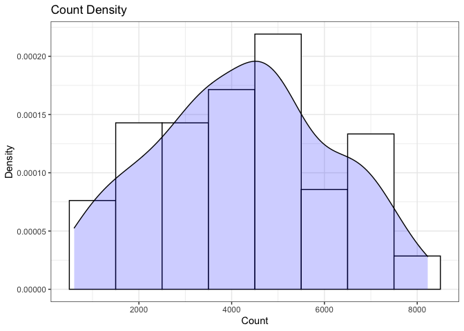
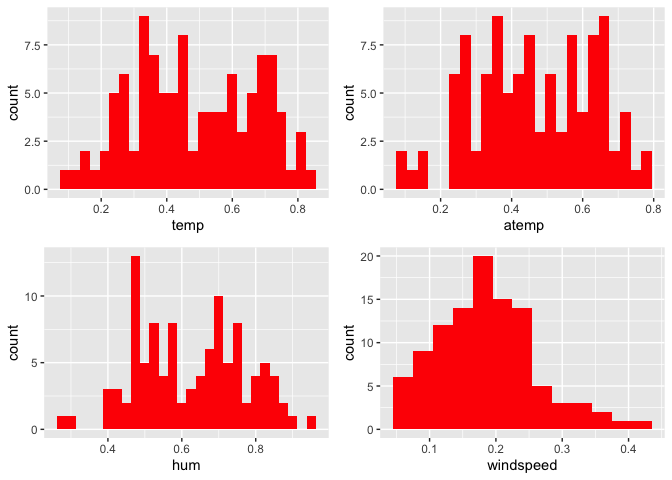
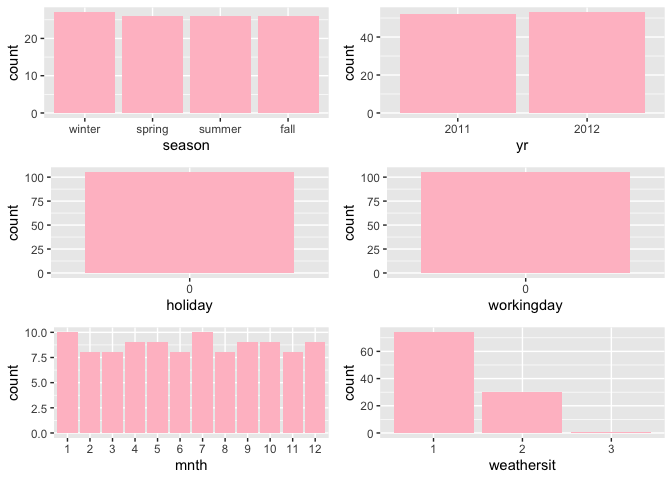
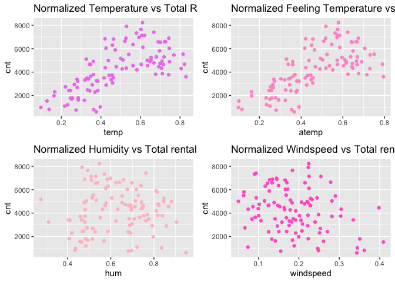
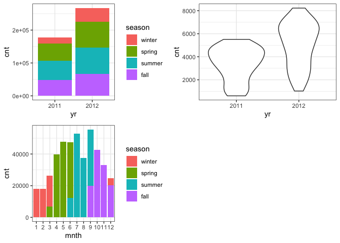
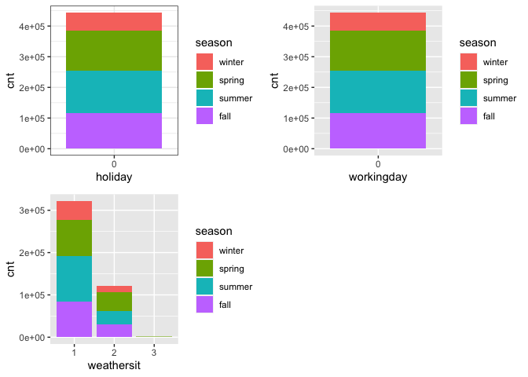

Project 2
================
Ifeoma Ojialor
10/16/2020

## Introduction

In this project, we will use a bike-sharing dataset to create machine
learning models. Before moving forward, I will briefly explain the
bike-sharing system and how it works. A bike-sharing system is a service
in which users can rent/use bicycles on a short term basis for a fee.
The goal of these programs is to provide affordable access to bicycles
for short distance trips as opposed to walking or taking public
transportation. Imagine how many people use these systems on a given
day, the numbers can vary greatly based on some elements. The goal of
this project is to build a predictive model to find out the number of
people that use these bikes in a given time period using available
information about that time/day. This in turn, can help businesses that
oversee this systems to manage them in a cost efficient manner.  
We will be using the bike-sharing dataset from the UCL Machine Learning
Repository. We will use the regression and boosted tree method to model
the response variable `cnt`.

## Exploratory Data Analysis

First we will read in the data using a relative path.

``` r
#read in data and filter to desired weekday
day1 <- read.csv("Bike-Sharing-Dataset/day.csv")
head(day1,5)
```

    ##   instant     dteday season yr mnth holiday
    ## 1       1 2011-01-01      1  0    1       0
    ## 2       2 2011-01-02      1  0    1       0
    ## 3       3 2011-01-03      1  0    1       0
    ## 4       4 2011-01-04      1  0    1       0
    ## 5       5 2011-01-05      1  0    1       0
    ##   weekday workingday weathersit     temp
    ## 1       6          0          2 0.344167
    ## 2       0          0          2 0.363478
    ## 3       1          1          1 0.196364
    ## 4       2          1          1 0.200000
    ## 5       3          1          1 0.226957
    ##      atemp      hum windspeed casual registered
    ## 1 0.363625 0.805833  0.160446    331        654
    ## 2 0.353739 0.696087  0.248539    131        670
    ## 3 0.189405 0.437273  0.248309    120       1229
    ## 4 0.212122 0.590435  0.160296    108       1454
    ## 5 0.229270 0.436957  0.186900     82       1518
    ##    cnt
    ## 1  985
    ## 2  801
    ## 3 1349
    ## 4 1562
    ## 5 1600

Next, we will remove the *casual* and *registered* variables since the
`cnt` variable is a combination of both.

``` r
day1 <- select(day1, -casual, -registered) 
day <- filter(day1, weekday == params$days)

#Check for missing values
miss <- data.frame(apply(day,2,function(x){sum(is.na(x))}))
names(miss)[1] <- "missing"
miss
```

    ##            missing
    ## instant          0
    ## dteday           0
    ## season           0
    ## yr               0
    ## mnth             0
    ## holiday          0
    ## weekday          0
    ## workingday       0
    ## weathersit       0
    ## temp             0
    ## atemp            0
    ## hum              0
    ## windspeed        0
    ## cnt              0

There are no missing values in the dataset, so we can continue with our
analysis.

``` r
#Change the variables into their appropriate format.
day$season <- as.factor(day$season)
day$weathersit <- as.factor(day$weathersit)
day$holiday <- as.factor(day$holiday)
day$workingday <- as.factor(day$workingday)
day$weekday <- as.factor(day$weekday)
day$yr <- as.factor(day$yr)
day$mnth <- as.factor(day$mnth)
levels(day$season) <- c("winter", "spring", "summer", "fall")
levels(day$yr) <- c("2011", "2012")
str(day)
```

    ## 'data.frame':    105 obs. of  14 variables:
    ##  $ instant   : int  2 9 16 23 30 37 44 51 58 65 ...
    ##  $ dteday    : chr  "2011-01-02" "2011-01-09" "2011-01-16" "2011-01-23" ...
    ##  $ season    : Factor w/ 4 levels "winter","spring",..: 1 1 1 1 1 1 1 1 1 1 ...
    ##  $ yr        : Factor w/ 2 levels "2011","2012": 1 1 1 1 1 1 1 1 1 1 ...
    ##  $ mnth      : Factor w/ 12 levels "1","2","3","4",..: 1 1 1 1 1 2 2 2 2 3 ...
    ##  $ holiday   : Factor w/ 1 level "0": 1 1 1 1 1 1 1 1 1 1 ...
    ##  $ weekday   : Factor w/ 1 level "0": 1 1 1 1 1 1 1 1 1 1 ...
    ##  $ workingday: Factor w/ 1 level "0": 1 1 1 1 1 1 1 1 1 1 ...
    ##  $ weathersit: Factor w/ 3 levels "1","2","3": 2 1 1 1 1 1 1 1 1 2 ...
    ##  $ temp      : num  0.3635 0.1383 0.2317 0.0965 0.2165 ...
    ##  $ atemp     : num  0.3537 0.1162 0.2342 0.0988 0.2503 ...
    ##  $ hum       : num  0.696 0.434 0.484 0.437 0.722 ...
    ##  $ windspeed : num  0.249 0.362 0.188 0.247 0.074 ...
    ##  $ cnt       : int  801 822 1204 986 1096 1623 1589 1812 2402 605 ...

### Univariate Analysis

The `cnt` is the response variable, so we’ll use a histogram to get a
visual understanding of the variable.

``` r
ggplot(day, aes(x = cnt)) + theme_bw() + geom_histogram(aes(y =..density..), color = "black", fill = "white", binwidth = 1000) + geom_density(alpha = 0.2, fill = "blue") + labs(title = "Count Density", x = "Count", y = "Density")
```

<!-- -->

``` r
summary(day$cnt)
```

    ##    Min. 1st Qu.  Median    Mean 3rd Qu.    Max. 
    ##     605    2918    4334    4229    5464    8227

From the histogram and summary statistics output, it is pretty evident
that the count of total rental bikes are in the sub 5000 range. We will
investigate if there is a relationship between the response variable and
other relevant predictor variables in the next section. Lets look at the
other variables individually.

``` r
#visualize numeric predictor variables using a histogram
p1 <- ggplot(day) + geom_histogram(aes(x = temp), fill = "red", binwidth = 0.03)
p2 <- ggplot(day) + geom_histogram(aes(x = atemp), fill = "red", binwidth = 0.03)
p3 <- ggplot(day) + geom_histogram(aes(x = hum), fill = "red", binwidth = 0.025)
p4 <- ggplot(day) + geom_histogram(aes(x = windspeed), fill = "red", binwidth = 0.03)
gridExtra::grid.arrange(p1,p2,p3,p4, nrow = 2)
```

<!-- --> Observations: \* No clear
cut pattern in `temp`and `atemp`.

  - `hum` appears to be skewed to the left when the dataset is not
    filtered to a specific weekday.

  - `windspeed` appears to be skewed(right). This variable should be
    transformed to curb its skewness.

  - The distribution of `temp` and `atemp` looks very similar. We should
    think about taking out one of the variables.

<!-- end list -->

``` r
#visualize categorical predictor variables
h1 <- ggplot(day) + geom_bar(aes(x = season),fill = "pink")
h2 <- ggplot(day) + geom_bar(aes(x = yr),fill = "pink")
h3 <- ggplot(day) + geom_bar(aes(x = holiday),fill = "pink")
h4 <- ggplot(day) + geom_bar(aes(x = workingday),fill = "pink")
h5 <- ggplot(day) + geom_bar(aes(x = mnth),fill = "pink")
h6 <- ggplot(day) + geom_bar(aes(x = weathersit),fill = "pink")
gridExtra::grid.arrange(h1,h2,h3,h4,h5,h6, nrow = 3)
```

<!-- -->

Observations: \* The variation between the four seasons is little to
none.

  - About the same number of people rode bikes in 2011 and 2012.

  - Many people rode bikes on days that are not holidays.

  - Most people used the bike-sharing system on days that were neither
    weekends nor holidays.

  - Most people used the bike sharing system on days with clear weather.

### Bi-variate Analysis

In this section, we will explore the predictor variables with respect to
the response variable. The objective is to discover hidden relationships
between the independent and response variables and use those findings in
the model building process.

``` r
# First, we will explore the relationship between the target and numerical variables.
p1 <- ggplot(day) +geom_point(aes(x = temp, y = cnt), colour = "violet") + labs(title = "Normalized Temperature vs Total Rental Bikes")
p2 <- ggplot(day) +geom_point(aes(x = atemp, y = cnt), colour = "#FF99CC") +labs(title = "Normalized Feeling Temperature vs Total Rental Bikes")
p3 <- ggplot(day) +geom_point(aes(x = hum, y = cnt), colour = "pink") + labs(title = "Normalized Humidity vs Total rental Bikes")
p4 <- ggplot(day) +geom_point(aes(x = windspeed, y = cnt), colour = "#FF66CC") +labs(title= "Normalized Windspeed vs Total rental Bikes")
gridExtra::grid.arrange(p1, p2, p3, p4, nrow = 2)
```

<!-- -->

Observations: \* There appears to be a positive linear relationship
between `cnt` , `temp`, and `atemp`.

  - There is also a weak relationship between `cnt`, `hum`, and
    `windspeed`.

<!-- end list -->

``` r
# Now we'll visualize the relationship between the target and categorical variables.
# Instead of using a boxplot, I will use a violin plot which is the blend of both a boxplot and density plot
g1 <- ggplot(day) + geom_col(aes(x = yr, y = cnt, fill = season))+theme_bw()
g2 <- ggplot(day) + geom_violin(aes(x = yr, y = cnt))+theme_bw()
g3 <- ggplot(day) + geom_col(aes(x = mnth, y = cnt, fill = season))+theme_bw() 
g4 <- ggplot(day) + geom_col(aes(x = holiday, y = cnt, fill = season)) + theme_bw() 
g6 <- ggplot(day) + geom_col(aes(x = workingday, y = cnt, fill = season))
g7 <- ggplot(day) + geom_col(aes(x = weathersit, y = cnt, fill = season))
gridExtra::grid.arrange(g1, g2, g3, nrow = 2)
```

<!-- -->

``` r
gridExtra::grid.arrange(g4, g6, g7, nrow = 2)
```

<!-- --> Observations: \* The
total bike rental count is higher in 2012 than 2011.

  - During workingday, the bike rental counts quite the highest compared
    to during no working day for different seasons.

  - During clear,partly cloudy weather, the bike rental count is highest
    and the second highest is during mist cloudy weather and followed by
    third highest during light snow and light rain weather.

  - The highest bike rental count was during the summer and lowest in
    the winter.

## Correlation Matrix

Correlation matrix helps us to understand the linear relationship
between variables.

``` r
day_c <- day[ , c(10:14)]
round(cor(day_c), 2)
```

    ##            temp atemp   hum windspeed   cnt
    ## temp       1.00  1.00  0.22     -0.20  0.68
    ## atemp      1.00  1.00  0.23     -0.23  0.68
    ## hum        0.22  0.23  1.00     -0.27  0.03
    ## windspeed -0.20 -0.23 -0.27      1.00 -0.27
    ## cnt        0.68  0.68  0.03     -0.27  1.00

From the above matrix, we can see that `temp` and `atemp` are highly
correlated. So we only need to include one of these variables in the
model to prevent multicollinearity. We will also transform the humidity
and windspeed variable.

``` r
day <- mutate(day, log_hum = log(day$hum+1))
day <- mutate(day, log_ws = log(day$windspeed + 1))

#Remove irrelevant variables
day <- select(day, -weekday,-holiday,-workingday,-dteday,-temp, -instant)
```

## Model Building

First we split the data into train and test sets.

``` r
set.seed(23)
dayIndex<- createDataPartition(day$cnt, p = 0.7, list=FALSE)
dayTrain <- day[dayIndex, ]
dayTest <- day[-dayIndex, ]

# Build a tree-based model using loocv;
fitTree <- train(cnt~ ., data = dayTrain, method = "rpart", 
              preProcess = c("center", "scale"), 
              trControl = trainControl(method = "loocv", number = 10), tuneGrid = NULL)
```

    ## Warning in preProcess.default(thresh = 0.95,
    ## k = 5, freqCut = 19, uniqueCut = 10, : These
    ## variables have zero variances: weathersit3

    ## Warning in nominalTrainWorkflow(x = x, y =
    ## y, wts = weights, info = trainInfo, : There
    ## were missing values in resampled performance
    ## measures.

``` r
# Display information from the tree fit
fitTree$results
```

    ##           cp      RMSE Rsquared       MAE
    ## 1 0.04378171  969.7955      NaN  969.7955
    ## 2 0.15450106 1225.9383      NaN 1225.9383
    ## 3 0.54391485 1806.1845      NaN 1806.1845
    ##     RMSESD RsquaredSD    MAESD
    ## 1 734.5151         NA 734.5151
    ## 2 739.9229         NA 739.9229
    ## 3 885.4835         NA 885.4835

``` r
# Build a boosted tree model using cv
fitBoost <- train(cnt~., data = dayTrain, method = "gbm", 
              preProcess = c("center", "scale"), 
              trControl = trainControl(method = "cv", number = 10), 
              tuneGrid = NULL)
```

    ## Iter   TrainDeviance   ValidDeviance   StepSize   Improve
    ##      1  3052925.2997             nan     0.1000 330280.0617
    ##      2  2877027.1464             nan     0.1000 205816.4913
    ##      3  2609770.0969             nan     0.1000 242438.2643
    ##      4  2388609.0817             nan     0.1000 181686.5612
    ##      5  2186561.9153             nan     0.1000 157371.9155
    ##      6  2014105.0035             nan     0.1000 109552.8264
    ##      7  1917549.4168             nan     0.1000 79327.4617
    ##      8  1826210.2156             nan     0.1000 52375.5167
    ##      9  1704626.4449             nan     0.1000 96030.4954
    ##     10  1628238.6209             nan     0.1000 79382.2297
    ##     20  1158533.5300             nan     0.1000 40689.2845
    ##     40   754743.7130             nan     0.1000 13525.9073
    ##     60   622376.2329             nan     0.1000 -1493.3980
    ##     80   535568.9112             nan     0.1000 4764.1676
    ##    100   473213.3892             nan     0.1000 -8383.2873
    ##    120   425183.6099             nan     0.1000 -10756.7537
    ##    140   398260.4512             nan     0.1000 -2161.8465
    ##    150   385362.0899             nan     0.1000 -2565.1898
    ## 
    ## Iter   TrainDeviance   ValidDeviance   StepSize   Improve
    ##      1  3056912.7255             nan     0.1000 137771.5274
    ##      2  2679720.3969             nan     0.1000 374827.6271
    ##      3  2443565.5643             nan     0.1000 213819.4966
    ##      4  2221922.8739             nan     0.1000 159985.1098
    ##      5  2054449.2053             nan     0.1000 151414.2624
    ##      6  1928244.1116             nan     0.1000 120295.7638
    ##      7  1810084.3328             nan     0.1000 130324.2261
    ##      8  1676701.5156             nan     0.1000 115396.0774
    ##      9  1587616.3940             nan     0.1000 70201.9904
    ##     10  1520541.7304             nan     0.1000 -503.3910
    ##     20   943084.5359             nan     0.1000 14353.0145
    ##     40   616978.3897             nan     0.1000 3168.7825
    ##     60   494719.0720             nan     0.1000 -3569.1214
    ##     80   395806.0576             nan     0.1000 -6030.8055
    ##    100   345903.0005             nan     0.1000 -4935.1423
    ##    120   313105.5569             nan     0.1000 -19644.9254
    ##    140   277413.7199             nan     0.1000 -5545.0114
    ##    150   261866.3888             nan     0.1000 -1669.7577
    ## 
    ## Iter   TrainDeviance   ValidDeviance   StepSize   Improve
    ##      1  3008835.3498             nan     0.1000 255390.4266
    ##      2  2670849.0783             nan     0.1000 322616.0181
    ##      3  2420097.3723             nan     0.1000 243453.5053
    ##      4  2231027.6970             nan     0.1000 191626.4682
    ##      5  2017389.5730             nan     0.1000 192454.9431
    ##      6  1899300.0421             nan     0.1000 119961.5816
    ##      7  1799689.2929             nan     0.1000 42965.6426
    ##      8  1692681.0334             nan     0.1000 50373.9268
    ##      9  1587711.3687             nan     0.1000 100043.8306
    ##     10  1515241.1857             nan     0.1000 75187.4504
    ##     20   898732.2380             nan     0.1000 11182.2422
    ##     40   608800.2153             nan     0.1000 8231.3190
    ##     60   503778.1019             nan     0.1000 -3462.0446
    ##     80   455451.2305             nan     0.1000 2874.5662
    ##    100   379255.8026             nan     0.1000 1244.7061
    ##    120   327716.8564             nan     0.1000 -6034.1046
    ##    140   285356.8235             nan     0.1000 -3242.4300
    ##    150   270792.7253             nan     0.1000 -2697.5120
    ## 
    ## Iter   TrainDeviance   ValidDeviance   StepSize   Improve
    ##      1  3229180.4140             nan     0.1000 270596.9686
    ##      2  2996300.0239             nan     0.1000 254115.7320
    ##      3  2752661.1584             nan     0.1000 183875.2779
    ##      4  2530652.3237             nan     0.1000 227589.9152
    ##      5  2379467.3760             nan     0.1000 109811.2410
    ##      6  2149274.1628             nan     0.1000 115233.4659
    ##      7  2025627.5237             nan     0.1000 95172.3799
    ##      8  1941356.8586             nan     0.1000 57278.3116
    ##      9  1783368.8090             nan     0.1000 121671.3449
    ##     10  1684398.5519             nan     0.1000 80583.8062
    ##     20  1134493.9375             nan     0.1000  406.4615
    ##     40   732674.4269             nan     0.1000 2043.1714
    ##     60   614339.5475             nan     0.1000 -13644.8523
    ##     80   529024.1434             nan     0.1000 -9955.8939
    ##    100   492511.9079             nan     0.1000 -2359.4372
    ##    120   448380.0428             nan     0.1000 -3727.4816
    ##    140   408063.1746             nan     0.1000 -3563.8664
    ##    150   401403.8835             nan     0.1000 -6496.6162
    ## 
    ## Iter   TrainDeviance   ValidDeviance   StepSize   Improve
    ##      1  3117603.0530             nan     0.1000 410099.2451
    ##      2  2833521.2760             nan     0.1000 250612.0806
    ##      3  2654862.0632             nan     0.1000 197500.1168
    ##      4  2344461.1033             nan     0.1000 329939.8403
    ##      5  2137983.1912             nan     0.1000 152975.8780
    ##      6  2041232.0303             nan     0.1000 21065.4825
    ##      7  1874401.8133             nan     0.1000 120206.1701
    ##      8  1747408.9711             nan     0.1000 79376.4229
    ##      9  1633569.3713             nan     0.1000 66766.0850
    ##     10  1501382.5329             nan     0.1000 58012.9359
    ##     20   932343.2161             nan     0.1000 15106.5335
    ##     40   640078.3102             nan     0.1000 -827.2162
    ##     60   485379.3807             nan     0.1000 -3757.0663
    ##     80   419604.6368             nan     0.1000 -2124.1004
    ##    100   380966.7863             nan     0.1000 -2656.7030
    ##    120   339051.2150             nan     0.1000 -13408.8370
    ##    140   303738.4332             nan     0.1000 -7748.8326
    ##    150   290365.8124             nan     0.1000 -6148.6403
    ## 
    ## Iter   TrainDeviance   ValidDeviance   StepSize   Improve
    ##      1  3126585.1336             nan     0.1000 469529.5133
    ##      2  2843035.3641             nan     0.1000 336385.5395
    ##      3  2575243.8039             nan     0.1000 218829.4155
    ##      4  2418164.0450             nan     0.1000 176801.3934
    ##      5  2139135.2850             nan     0.1000 245274.9349
    ##      6  1994596.3832             nan     0.1000 135827.7372
    ##      7  1898481.0849             nan     0.1000 86136.1811
    ##      8  1784204.5385             nan     0.1000 29713.3222
    ##      9  1695315.2609             nan     0.1000 86845.9466
    ##     10  1587666.1303             nan     0.1000 112080.0911
    ##     20   952838.9052             nan     0.1000 -15546.7507
    ##     40   612833.4626             nan     0.1000 1272.2150
    ##     60   479395.0858             nan     0.1000 -6930.1270
    ##     80   412417.8366             nan     0.1000 -4034.1538
    ##    100   360344.6658             nan     0.1000  634.5169
    ##    120   314508.1792             nan     0.1000 -9751.4367
    ##    140   285833.5888             nan     0.1000 -2590.4516
    ##    150   269755.0384             nan     0.1000 -3878.9642

    ## Warning in preProcess.default(thresh = 0.95,
    ## k = 5, freqCut = 19, uniqueCut = 10, : These
    ## variables have zero variances: weathersit3

    ## Warning in (function (x, y, offset = NULL, misc
    ## = NULL, distribution = "bernoulli", : variable
    ## 17: weathersit3 has no variation.

    ## Iter   TrainDeviance   ValidDeviance   StepSize   Improve
    ##      1  3163407.7568             nan     0.1000 334479.9543
    ##      2  2855243.6947             nan     0.1000 278163.4486
    ##      3  2614224.1523             nan     0.1000 241390.9044
    ##      4  2470622.3924             nan     0.1000 126970.2639
    ##      5  2282869.8871             nan     0.1000 175736.0720
    ##      6  2130068.2051             nan     0.1000 169066.7392
    ##      7  2005774.1301             nan     0.1000 109370.1066
    ##      8  1888419.0903             nan     0.1000 95710.0424
    ##      9  1829970.5394             nan     0.1000 41742.5891
    ##     10  1751530.3030             nan     0.1000 60709.3942
    ##     20  1156712.4457             nan     0.1000 38092.3438
    ##     40   716908.2403             nan     0.1000 -1959.9032
    ##     60   591539.4484             nan     0.1000 -4717.6619
    ##     80   512536.4520             nan     0.1000 -1582.4163
    ##    100   465424.2543             nan     0.1000 -6769.8381
    ##    120   416596.8744             nan     0.1000 -1343.7426
    ##    140   389229.7849             nan     0.1000 -6379.5930
    ##    150   381228.0309             nan     0.1000 -10306.2647

    ## Warning in preProcess.default(thresh = 0.95,
    ## k = 5, freqCut = 19, uniqueCut = 10, : These
    ## variables have zero variances: weathersit3

    ## Warning in (function (x, y, offset = NULL, misc
    ## = NULL, distribution = "bernoulli", : variable
    ## 17: weathersit3 has no variation.

    ## Iter   TrainDeviance   ValidDeviance   StepSize   Improve
    ##      1  3205648.0120             nan     0.1000 312488.5518
    ##      2  2861597.5574             nan     0.1000 406557.3247
    ##      3  2558860.5498             nan     0.1000 335815.4203
    ##      4  2284662.0827             nan     0.1000 194409.2779
    ##      5  2020592.4579             nan     0.1000 231753.3955
    ##      6  1914756.1242             nan     0.1000 111031.6422
    ##      7  1775386.1892             nan     0.1000 96787.5514
    ##      8  1668492.3432             nan     0.1000 81247.9790
    ##      9  1545612.5186             nan     0.1000 109778.5779
    ##     10  1426074.4589             nan     0.1000 29375.3470
    ##     20   917819.4418             nan     0.1000 29615.2058
    ##     40   601487.7380             nan     0.1000 -10146.1540
    ##     60   461528.3119             nan     0.1000 -8473.2464
    ##     80   384318.8226             nan     0.1000 -5447.7524
    ##    100   335126.6248             nan     0.1000 -10852.5622
    ##    120   302328.5687             nan     0.1000 -1875.7389
    ##    140   274554.0716             nan     0.1000 -2060.9759
    ##    150   263440.4008             nan     0.1000 -3719.3105

    ## Warning in preProcess.default(thresh = 0.95,
    ## k = 5, freqCut = 19, uniqueCut = 10, : These
    ## variables have zero variances: weathersit3

    ## Warning in (function (x, y, offset = NULL, misc
    ## = NULL, distribution = "bernoulli", : variable
    ## 17: weathersit3 has no variation.

    ## Iter   TrainDeviance   ValidDeviance   StepSize   Improve
    ##      1  3189420.6291             nan     0.1000 307566.9493
    ##      2  2927854.3401             nan     0.1000 213540.5585
    ##      3  2769450.7844             nan     0.1000 163346.5860
    ##      4  2458067.9605             nan     0.1000 352071.5558
    ##      5  2265691.7101             nan     0.1000 116300.3980
    ##      6  2001053.2787             nan     0.1000 195051.0718
    ##      7  1797771.5839             nan     0.1000 201905.9900
    ##      8  1682853.8818             nan     0.1000 50111.3956
    ##      9  1546966.6921             nan     0.1000 155595.2792
    ##     10  1448818.0145             nan     0.1000 83723.2763
    ##     20   861935.8314             nan     0.1000 19484.1611
    ##     40   543612.6364             nan     0.1000 6978.1624
    ##     60   435637.6665             nan     0.1000 -5875.5351
    ##     80   369406.5632             nan     0.1000 -5518.9684
    ##    100   330477.6985             nan     0.1000 -4889.8962
    ##    120   299511.6570             nan     0.1000 -1028.7770
    ##    140   270836.2335             nan     0.1000 -7571.5427
    ##    150   259071.9285             nan     0.1000 -1499.3700
    ## 
    ## Iter   TrainDeviance   ValidDeviance   StepSize   Improve
    ##      1  3116337.1573             nan     0.1000 265340.7010
    ##      2  2794728.4672             nan     0.1000 304690.3923
    ##      3  2503447.5301             nan     0.1000 227291.8290
    ##      4  2324049.3519             nan     0.1000 159857.5253
    ##      5  2193233.4060             nan     0.1000 140597.3654
    ##      6  2075893.9211             nan     0.1000 104864.7484
    ##      7  1955701.0409             nan     0.1000 125768.4106
    ##      8  1829462.8087             nan     0.1000 56820.4889
    ##      9  1713404.1660             nan     0.1000 82681.8909
    ##     10  1620864.4708             nan     0.1000 73952.0088
    ##     20  1068694.0483             nan     0.1000 6854.2328
    ##     40   773957.8263             nan     0.1000 -7207.0266
    ##     60   648492.4992             nan     0.1000 2891.8142
    ##     80   561495.2760             nan     0.1000 3570.3220
    ##    100   507723.6981             nan     0.1000 -11477.0022
    ##    120   467914.7896             nan     0.1000 -17888.6639
    ##    140   441121.3893             nan     0.1000 -3659.5473
    ##    150   432027.5657             nan     0.1000 -6193.5385
    ## 
    ## Iter   TrainDeviance   ValidDeviance   StepSize   Improve
    ##      1  3067386.1960             nan     0.1000 308222.4093
    ##      2  2658089.2332             nan     0.1000 357293.2027
    ##      3  2420448.3480             nan     0.1000 210653.8998
    ##      4  2240987.2635             nan     0.1000 159897.6057
    ##      5  1937573.2068             nan     0.1000 229781.5871
    ##      6  1787229.8778             nan     0.1000 139698.5145
    ##      7  1703548.2009             nan     0.1000 89507.5256
    ##      8  1610469.9829             nan     0.1000 81618.6764
    ##      9  1539817.7486             nan     0.1000 69878.8971
    ##     10  1396804.0248             nan     0.1000 143808.3578
    ##     20   862720.3559             nan     0.1000 -4854.6534
    ##     40   577776.0316             nan     0.1000 2702.1068
    ##     60   476970.6451             nan     0.1000 -1093.0744
    ##     80   414299.0768             nan     0.1000 -7837.1367
    ##    100   378542.4190             nan     0.1000 -5909.0603
    ##    120   348118.8787             nan     0.1000 -1765.1644
    ##    140   309005.4513             nan     0.1000 -13615.4703
    ##    150   297281.3242             nan     0.1000 -6688.8409
    ## 
    ## Iter   TrainDeviance   ValidDeviance   StepSize   Improve
    ##      1  3016633.4682             nan     0.1000 345645.1143
    ##      2  2749378.5028             nan     0.1000 252522.9010
    ##      3  2520002.5324             nan     0.1000 186402.0471
    ##      4  2161435.0670             nan     0.1000 287300.4471
    ##      5  1964906.1278             nan     0.1000 185453.5096
    ##      6  1818439.9761             nan     0.1000 169513.8319
    ##      7  1700514.5448             nan     0.1000 76287.6616
    ##      8  1596544.5556             nan     0.1000 69704.2063
    ##      9  1535895.2706             nan     0.1000 69593.7502
    ##     10  1470876.5360             nan     0.1000 69135.1843
    ##     20   892502.0052             nan     0.1000 15257.9923
    ##     40   586199.1928             nan     0.1000 -2219.7864
    ##     60   506817.7380             nan     0.1000 6774.5791
    ##     80   442116.3566             nan     0.1000 -3032.5176
    ##    100   399471.9744             nan     0.1000 -10521.3919
    ##    120   367205.0427             nan     0.1000 -3655.4566
    ##    140   338889.2007             nan     0.1000 -7313.8620
    ##    150   325606.9788             nan     0.1000 -1847.3712
    ## 
    ## Iter   TrainDeviance   ValidDeviance   StepSize   Improve
    ##      1  3101224.3660             nan     0.1000 262298.4769
    ##      2  2917761.2235             nan     0.1000 206521.8603
    ##      3  2659105.3365             nan     0.1000 264354.8982
    ##      4  2446490.9424             nan     0.1000 193652.4078
    ##      5  2302018.5148             nan     0.1000 147435.0658
    ##      6  2184803.2066             nan     0.1000 122648.1745
    ##      7  2047070.7384             nan     0.1000 109688.8478
    ##      8  1966636.7019             nan     0.1000 90075.8693
    ##      9  1886794.6285             nan     0.1000 77360.2271
    ##     10  1806634.0738             nan     0.1000 53045.1942
    ##     20  1201154.0117             nan     0.1000 29597.5241
    ##     40   781125.0652             nan     0.1000 -16222.7505
    ##     60   619512.0660             nan     0.1000 -9196.1103
    ##     80   520590.3950             nan     0.1000  588.2267
    ##    100   470094.6094             nan     0.1000  831.2541
    ##    120   437248.0458             nan     0.1000 -1837.8341
    ##    140   404419.7995             nan     0.1000 -8220.5118
    ##    150   389293.1792             nan     0.1000 -5681.7727
    ## 
    ## Iter   TrainDeviance   ValidDeviance   StepSize   Improve
    ##      1  3081949.4770             nan     0.1000 280795.2258
    ##      2  2685024.6094             nan     0.1000 401950.0858
    ##      3  2405689.7821             nan     0.1000 272709.7388
    ##      4  2125074.2547             nan     0.1000 206681.6535
    ##      5  1963576.4253             nan     0.1000 107973.2832
    ##      6  1826550.3371             nan     0.1000 135082.1755
    ##      7  1735603.7413             nan     0.1000 77118.3489
    ##      8  1634691.8396             nan     0.1000 86798.9030
    ##      9  1499758.5778             nan     0.1000 76084.6410
    ##     10  1419911.8769             nan     0.1000 55475.6308
    ##     20  1021414.4198             nan     0.1000 11275.4285
    ##     40   618353.4399             nan     0.1000 3396.6467
    ##     60   490673.3806             nan     0.1000 -4345.8317
    ##     80   426249.3135             nan     0.1000 -5761.7178
    ##    100   358046.2683             nan     0.1000 -4209.7382
    ##    120   319940.4862             nan     0.1000  263.8415
    ##    140   296858.9523             nan     0.1000 -8391.8771
    ##    150   285068.9422             nan     0.1000 -772.6902
    ## 
    ## Iter   TrainDeviance   ValidDeviance   StepSize   Improve
    ##      1  3075075.9478             nan     0.1000 275586.3037
    ##      2  2812380.6395             nan     0.1000 277968.5920
    ##      3  2412076.5742             nan     0.1000 334820.9986
    ##      4  2292003.1932             nan     0.1000 152161.0276
    ##      5  2043573.7529             nan     0.1000 209151.6754
    ##      6  1898225.9219             nan     0.1000 78154.7622
    ##      7  1722678.2917             nan     0.1000 150903.8404
    ##      8  1638511.3632             nan     0.1000 82861.7556
    ##      9  1558791.1580             nan     0.1000 66385.7779
    ##     10  1473219.3338             nan     0.1000 26487.1600
    ##     20   964797.5330             nan     0.1000 25072.5082
    ##     40   611123.0281             nan     0.1000 -8500.9519
    ##     60   488454.1432             nan     0.1000 -8053.4264
    ##     80   405989.8766             nan     0.1000 -4498.5582
    ##    100   348715.4231             nan     0.1000 -13418.5361
    ##    120   312650.4733             nan     0.1000 -2912.5647
    ##    140   278939.5907             nan     0.1000 -2711.0220
    ##    150   269290.4830             nan     0.1000 -9145.4614
    ## 
    ## Iter   TrainDeviance   ValidDeviance   StepSize   Improve
    ##      1  3134752.0738             nan     0.1000 278283.4297
    ##      2  2810321.3614             nan     0.1000 281530.7681
    ##      3  2581049.3892             nan     0.1000 210663.3262
    ##      4  2363679.1940             nan     0.1000 201950.4235
    ##      5  2168595.9210             nan     0.1000 151602.2163
    ##      6  2075075.3571             nan     0.1000 94887.0315
    ##      7  1959379.9108             nan     0.1000 75201.7574
    ##      8  1831556.8665             nan     0.1000 92245.7889
    ##      9  1729047.3383             nan     0.1000 101404.0739
    ##     10  1677741.9681             nan     0.1000 29672.5491
    ##     20  1147912.6455             nan     0.1000 9838.3854
    ##     40   722619.0448             nan     0.1000 3390.9125
    ##     60   580335.6727             nan     0.1000 -3646.2797
    ##     80   509753.4835             nan     0.1000 -6911.1085
    ##    100   470043.9855             nan     0.1000 -9504.2909
    ##    120   438224.7489             nan     0.1000 -18516.0205
    ##    140   414746.0605             nan     0.1000 -3452.8406
    ##    150   400191.2408             nan     0.1000 -5107.7331
    ## 
    ## Iter   TrainDeviance   ValidDeviance   StepSize   Improve
    ##      1  2918637.1851             nan     0.1000 466162.4412
    ##      2  2668045.7800             nan     0.1000 254234.5314
    ##      3  2459019.1632             nan     0.1000 174050.1471
    ##      4  2297152.9917             nan     0.1000 146608.3666
    ##      5  2116662.4055             nan     0.1000 181230.0680
    ##      6  2019332.0785             nan     0.1000 99575.2696
    ##      7  1848894.6376             nan     0.1000 114312.7106
    ##      8  1759183.0917             nan     0.1000 77383.2128
    ##      9  1679939.2715             nan     0.1000 57479.7059
    ##     10  1506541.4773             nan     0.1000 173664.9797
    ##     20   878985.6861             nan     0.1000 6929.5591
    ##     40   575036.6363             nan     0.1000 -4372.7043
    ##     60   460345.8610             nan     0.1000 -3692.1440
    ##     80   394034.4442             nan     0.1000 -18275.7445
    ##    100   360383.4511             nan     0.1000 -3312.5898
    ##    120   322044.6181             nan     0.1000 -4497.8215
    ##    140   295970.6393             nan     0.1000 -7854.5658
    ##    150   281689.7472             nan     0.1000 -3044.7920
    ## 
    ## Iter   TrainDeviance   ValidDeviance   StepSize   Improve
    ##      1  3033750.7218             nan     0.1000 345607.5250
    ##      2  2584293.0165             nan     0.1000 343145.1685
    ##      3  2421181.6716             nan     0.1000 202259.5919
    ##      4  2194558.0495             nan     0.1000 130887.9111
    ##      5  2004257.6436             nan     0.1000 129534.4874
    ##      6  1870160.4869             nan     0.1000 141890.7290
    ##      7  1761390.3637             nan     0.1000 103158.5554
    ##      8  1668670.8453             nan     0.1000 83430.9557
    ##      9  1579312.5732             nan     0.1000 51374.2216
    ##     10  1521086.0228             nan     0.1000 66520.2290
    ##     20   941459.3143             nan     0.1000 15646.3860
    ##     40   540570.8610             nan     0.1000 -6757.6587
    ##     60   431683.5906             nan     0.1000 -15234.3827
    ##     80   365192.4555             nan     0.1000 1845.4389
    ##    100   315493.5242             nan     0.1000 -1731.7147
    ##    120   280992.8007             nan     0.1000 -8876.6624
    ##    140   247451.4788             nan     0.1000 -4376.2494
    ##    150   231002.8716             nan     0.1000 -944.3720
    ## 
    ## Iter   TrainDeviance   ValidDeviance   StepSize   Improve
    ##      1  3150463.3221             nan     0.1000 334255.8362
    ##      2  2849756.0962             nan     0.1000 284036.3452
    ##      3  2620093.4356             nan     0.1000 209466.2799
    ##      4  2412530.9269             nan     0.1000 182360.8346
    ##      5  2216368.0114             nan     0.1000 133104.1350
    ##      6  2107313.5236             nan     0.1000 108399.7570
    ##      7  1982756.3459             nan     0.1000 127693.3166
    ##      8  1884649.8545             nan     0.1000 91654.8528
    ##      9  1763023.5488             nan     0.1000 101419.9881
    ##     10  1681530.0120             nan     0.1000 72023.9969
    ##     20  1156336.6661             nan     0.1000 14203.3838
    ##     40   781364.4227             nan     0.1000 5333.9862
    ##     60   632252.4900             nan     0.1000 4406.4923
    ##     80   549017.8677             nan     0.1000 -10029.0082
    ##    100   495553.2495             nan     0.1000 -2674.6803
    ##    120   469113.6135             nan     0.1000 -12296.4477
    ##    140   435039.0811             nan     0.1000 -13715.3919
    ##    150   420349.3988             nan     0.1000  459.1100
    ## 
    ## Iter   TrainDeviance   ValidDeviance   StepSize   Improve
    ##      1  3033767.8997             nan     0.1000 383397.7514
    ##      2  2770821.5811             nan     0.1000 250050.0788
    ##      3  2587019.6313             nan     0.1000 198492.3297
    ##      4  2270433.3866             nan     0.1000 293337.9100
    ##      5  2137274.5091             nan     0.1000 69034.4963
    ##      6  1910541.6938             nan     0.1000 178058.5486
    ##      7  1721642.1215             nan     0.1000 162234.0322
    ##      8  1643516.0191             nan     0.1000 55727.7281
    ##      9  1590309.3875             nan     0.1000 39166.3871
    ##     10  1482240.8301             nan     0.1000 81926.4214
    ##     20  1009188.3046             nan     0.1000 -3440.8945
    ##     40   693407.5079             nan     0.1000 -3080.0203
    ##     60   537564.5048             nan     0.1000 -6610.8773
    ##     80   452044.8777             nan     0.1000 -2349.9498
    ##    100   402124.9978             nan     0.1000 -13085.3622
    ##    120   359348.9415             nan     0.1000 -1643.8393
    ##    140   326164.5000             nan     0.1000 -2234.5216
    ##    150   310893.3626             nan     0.1000 -4393.5807
    ## 
    ## Iter   TrainDeviance   ValidDeviance   StepSize   Improve
    ##      1  3093129.1380             nan     0.1000 396126.8471
    ##      2  2763914.2010             nan     0.1000 372509.3435
    ##      3  2508948.4288             nan     0.1000 215288.5507
    ##      4  2331771.4886             nan     0.1000 158916.9737
    ##      5  2191532.6672             nan     0.1000 121697.5219
    ##      6  2103945.4875             nan     0.1000 97770.0641
    ##      7  1886753.6275             nan     0.1000 177367.4758
    ##      8  1740487.0151             nan     0.1000 65657.9472
    ##      9  1662339.0430             nan     0.1000 68864.3524
    ##     10  1506530.8331             nan     0.1000 112094.8983
    ##     20   962304.6476             nan     0.1000 24474.7346
    ##     40   648585.4879             nan     0.1000 -18168.0536
    ##     60   510714.1375             nan     0.1000 5296.3475
    ##     80   449732.5802             nan     0.1000 -8887.9374
    ##    100   392759.1846             nan     0.1000 -1651.1061
    ##    120   348561.0986             nan     0.1000 -6283.4721
    ##    140   318888.5839             nan     0.1000 -6555.5334
    ##    150   303573.0010             nan     0.1000 -2799.4459
    ## 
    ## Iter   TrainDeviance   ValidDeviance   StepSize   Improve
    ##      1  3182877.2460             nan     0.1000 337572.2024
    ##      2  2827525.3777             nan     0.1000 276231.0902
    ##      3  2665545.2807             nan     0.1000 98694.0612
    ##      4  2376945.3857             nan     0.1000 247545.4862
    ##      5  2205084.7602             nan     0.1000 144018.7927
    ##      6  2052326.4275             nan     0.1000 126664.0991
    ##      7  1896035.8336             nan     0.1000 102893.8269
    ##      8  1784566.0024             nan     0.1000 88909.4451
    ##      9  1723148.9203             nan     0.1000 58677.3123
    ##     10  1645064.2444             nan     0.1000 61100.5350
    ##     20  1144654.0314             nan     0.1000 16398.2274
    ##     40   769637.8603             nan     0.1000 -10082.0795
    ##     60   657676.8725             nan     0.1000  834.2593
    ##     80   567718.0502             nan     0.1000 -4625.4816
    ##    100   519601.0476             nan     0.1000 -6409.4750
    ##    120   467925.2726             nan     0.1000 -1608.1477
    ##    140   435642.3205             nan     0.1000 -1450.6725
    ##    150   424781.7991             nan     0.1000 -432.3665
    ## 
    ## Iter   TrainDeviance   ValidDeviance   StepSize   Improve
    ##      1  3128523.1026             nan     0.1000 325745.9656
    ##      2  2825767.1935             nan     0.1000 259225.7470
    ##      3  2509653.3082             nan     0.1000 381174.7307
    ##      4  2304777.6948             nan     0.1000 183702.3310
    ##      5  2121288.1263             nan     0.1000 133483.3782
    ##      6  1942164.1192             nan     0.1000 185405.7729
    ##      7  1832393.0293             nan     0.1000 26059.3335
    ##      8  1650221.1873             nan     0.1000 195712.1935
    ##      9  1541070.6893             nan     0.1000 91975.6359
    ##     10  1446984.0726             nan     0.1000 81290.2739
    ##     20  1004159.7529             nan     0.1000 -19585.6254
    ##     40   647797.6572             nan     0.1000 -402.0106
    ##     60   522607.5205             nan     0.1000 -8260.7379
    ##     80   446144.8780             nan     0.1000 -8774.0037
    ##    100   393287.9483             nan     0.1000 -5672.6225
    ##    120   364092.2879             nan     0.1000 -7005.2736
    ##    140   342084.8244             nan     0.1000 -10300.2525
    ##    150   324121.7908             nan     0.1000 -1929.8926
    ## 
    ## Iter   TrainDeviance   ValidDeviance   StepSize   Improve
    ##      1  3078916.5283             nan     0.1000 455468.6021
    ##      2  2694511.4368             nan     0.1000 403876.9175
    ##      3  2397036.2969             nan     0.1000 249000.4235
    ##      4  2212892.5062             nan     0.1000 162982.1043
    ##      5  2047880.1394             nan     0.1000 140590.3877
    ##      6  1910558.0450             nan     0.1000 144733.9450
    ##      7  1815079.0962             nan     0.1000 83538.2913
    ##      8  1664675.3827             nan     0.1000 122045.4213
    ##      9  1563198.5638             nan     0.1000 51321.0999
    ##     10  1438380.5902             nan     0.1000 90694.8284
    ##     20   887176.3594             nan     0.1000 19370.3414
    ##     40   606141.2047             nan     0.1000 -2531.5466
    ##     60   479211.7439             nan     0.1000 -5292.2117
    ##     80   407918.0369             nan     0.1000 -4150.4918
    ##    100   358426.6637             nan     0.1000 -6379.5835
    ##    120   321543.5892             nan     0.1000 -1092.2073
    ##    140   282120.1558             nan     0.1000 -1664.9235
    ##    150   269168.8170             nan     0.1000 -1178.4070
    ## 
    ## Iter   TrainDeviance   ValidDeviance   StepSize   Improve
    ##      1  3184260.5407             nan     0.1000 357837.8199
    ##      2  2919950.1728             nan     0.1000 297685.3022
    ##      3  2735868.5071             nan     0.1000 156958.9129
    ##      4  2522141.2760             nan     0.1000 236677.2078
    ##      5  2326957.5205             nan     0.1000 194215.3964
    ##      6  2189343.6231             nan     0.1000 143480.8485
    ##      7  2073207.9527             nan     0.1000 112849.2430
    ##      8  1943729.5584             nan     0.1000 135125.1110
    ##      9  1853110.6433             nan     0.1000 96310.8415
    ##     10  1787166.5778             nan     0.1000 65197.9810
    ##     20  1157059.8233             nan     0.1000 -8090.7894
    ##     40   766298.9682             nan     0.1000 6555.5368
    ##     60   605998.6449             nan     0.1000 5260.4382
    ##     80   532218.1776             nan     0.1000 -8432.7106
    ##    100   472754.6764             nan     0.1000 -7515.6168
    ##    120   412793.8638             nan     0.1000 -739.0702
    ##    140   376783.1458             nan     0.1000 -2884.5920
    ##    150   365217.8085             nan     0.1000 -3550.5357
    ## 
    ## Iter   TrainDeviance   ValidDeviance   StepSize   Improve
    ##      1  3162927.6546             nan     0.1000 468561.4730
    ##      2  2753459.1662             nan     0.1000 374695.5362
    ##      3  2508946.5370             nan     0.1000 241581.8898
    ##      4  2327945.8330             nan     0.1000 206772.3542
    ##      5  2140039.2963             nan     0.1000 185414.7532
    ##      6  1993590.9286             nan     0.1000 149670.0433
    ##      7  1876578.0574             nan     0.1000 61335.8609
    ##      8  1731367.3775             nan     0.1000 39972.1761
    ##      9  1551043.8638             nan     0.1000 151762.7634
    ##     10  1464668.0720             nan     0.1000 73701.5993
    ##     20   911656.9906             nan     0.1000 24930.4434
    ##     40   564408.8916             nan     0.1000 -11757.8550
    ##     60   472057.3084             nan     0.1000 -1886.3095
    ##     80   412139.7153             nan     0.1000 -16505.5714
    ##    100   346935.7581             nan     0.1000 -8808.9185
    ##    120   323155.9883             nan     0.1000 -13541.2572
    ##    140   291105.5581             nan     0.1000 -5324.0355
    ##    150   278606.5200             nan     0.1000 -4200.3371
    ## 
    ## Iter   TrainDeviance   ValidDeviance   StepSize   Improve
    ##      1  3233743.0569             nan     0.1000 326856.3972
    ##      2  2871843.6457             nan     0.1000 310745.0704
    ##      3  2582805.1851             nan     0.1000 284079.5597
    ##      4  2323203.3456             nan     0.1000 189126.3619
    ##      5  2122753.7477             nan     0.1000 134853.8287
    ##      6  1952426.1619             nan     0.1000 119196.9109
    ##      7  1850340.9750             nan     0.1000 86279.0516
    ##      8  1638503.0641             nan     0.1000 181537.8305
    ##      9  1549530.5002             nan     0.1000 47191.1163
    ##     10  1489523.3350             nan     0.1000 40862.5537
    ##     20   875111.7146             nan     0.1000 24777.5698
    ##     40   584452.8167             nan     0.1000 -8067.3244
    ##     60   455237.2553             nan     0.1000 -11460.8337
    ##     80   394541.0402             nan     0.1000 -2888.8498
    ##    100   353430.8505             nan     0.1000 -8476.5885
    ##    120   314507.7336             nan     0.1000 -4273.8306
    ##    140   292996.5257             nan     0.1000 -10239.4156
    ##    150   275886.9982             nan     0.1000 -8240.0732
    ## 
    ## Iter   TrainDeviance   ValidDeviance   StepSize   Improve
    ##      1  3181792.3300             nan     0.1000 386222.0747
    ##      2  2873917.5589             nan     0.1000 352654.1119
    ##      3  2594027.7373             nan     0.1000 240176.4823
    ##      4  2369263.6388             nan     0.1000 152361.2077
    ##      5  2165986.8925             nan     0.1000 196372.8548
    ##      6  2025641.2473             nan     0.1000 131853.0271
    ##      7  1934204.4825             nan     0.1000 57120.9794
    ##      8  1832094.6621             nan     0.1000 76531.0751
    ##      9  1705008.6335             nan     0.1000 89474.3616
    ##     10  1619009.2094             nan     0.1000 48276.2521
    ##     20  1051925.0659             nan     0.1000 21292.1945
    ##     40   664406.5591             nan     0.1000 -12742.4320
    ##     60   551157.5764             nan     0.1000 -11288.9263
    ##     80   477013.3684             nan     0.1000 -4803.2951
    ##    100   420023.5964             nan     0.1000 -8206.5354
    ##    120   399195.8557             nan     0.1000 -2451.6312
    ##    140   366235.5334             nan     0.1000 -5954.2559
    ##    150   358506.4619             nan     0.1000 -3910.5572
    ## 
    ## Iter   TrainDeviance   ValidDeviance   StepSize   Improve
    ##      1  3171821.6040             nan     0.1000 416798.6846
    ##      2  2822848.5755             nan     0.1000 318548.3246
    ##      3  2500744.1044             nan     0.1000 233666.2727
    ##      4  2177683.0639             nan     0.1000 285259.2859
    ##      5  2042629.3682             nan     0.1000 138872.7685
    ##      6  1883561.6355             nan     0.1000 60264.8006
    ##      7  1759753.5790             nan     0.1000 118646.1942
    ##      8  1676905.8570             nan     0.1000 63625.3887
    ##      9  1550077.8186             nan     0.1000 119092.6541
    ##     10  1410093.5566             nan     0.1000 74419.3938
    ##     20   788508.8103             nan     0.1000 33606.3176
    ##     40   502386.9442             nan     0.1000 -8561.7951
    ##     60   410013.3912             nan     0.1000 -2406.1470
    ##     80   364377.2837             nan     0.1000 -5273.3717
    ##    100   313352.6219             nan     0.1000 -2461.9361
    ##    120   280962.3933             nan     0.1000 -3394.3787
    ##    140   254460.0569             nan     0.1000 -2295.1067
    ##    150   235873.6871             nan     0.1000 -2312.6980
    ## 
    ## Iter   TrainDeviance   ValidDeviance   StepSize   Improve
    ##      1  3131541.9508             nan     0.1000 447229.6651
    ##      2  2750131.8304             nan     0.1000 336724.7524
    ##      3  2391632.2313             nan     0.1000 356692.0624
    ##      4  2218988.9417             nan     0.1000 122127.7557
    ##      5  2058658.7816             nan     0.1000 129016.9758
    ##      6  1823654.2034             nan     0.1000 213447.7222
    ##      7  1692251.5998             nan     0.1000 163870.4150
    ##      8  1573063.5605             nan     0.1000 73471.3046
    ##      9  1465276.4012             nan     0.1000 98846.5682
    ##     10  1403136.3471             nan     0.1000 51531.4109
    ##     20   872900.1916             nan     0.1000 -3487.0270
    ##     40   588081.4528             nan     0.1000 -18826.8253
    ##     60   447941.6822             nan     0.1000 -1708.3004
    ##     80   392860.5720             nan     0.1000 -3698.8448
    ##    100   329863.5519             nan     0.1000 -4155.1785
    ##    120   292186.6815             nan     0.1000 -1828.8334
    ##    140   262733.1057             nan     0.1000 -4010.0733
    ##    150   244146.2731             nan     0.1000 -3609.0901
    ## 
    ## Iter   TrainDeviance   ValidDeviance   StepSize   Improve
    ##      1  3016983.3025             nan     0.1000 427545.8639
    ##      2  2634945.8848             nan     0.1000 380931.8154
    ##      3  2348965.3717             nan     0.1000 253000.3188
    ##      4  2141125.6144             nan     0.1000 148353.4004
    ##      5  2001165.8498             nan     0.1000 117737.8570
    ##      6  1793796.3900             nan     0.1000 202900.3578
    ##      7  1674887.7005             nan     0.1000 104386.6268
    ##      8  1550507.8996             nan     0.1000 73627.6086
    ##      9  1457071.7877             nan     0.1000 61334.7814
    ##     10  1362064.0427             nan     0.1000 88250.7796
    ##     20   858145.3030             nan     0.1000 7786.7313
    ##     40   540937.3305             nan     0.1000 -19130.9484
    ##     60   406583.9823             nan     0.1000 -14576.7308
    ##     80   357901.9063             nan     0.1000 -10757.9162
    ##    100   314215.9074             nan     0.1000 -692.0280
    ##    120   277607.7728             nan     0.1000 -1978.7158
    ##    140   251340.0721             nan     0.1000 -5446.1988
    ##    150   245116.3252             nan     0.1000 -5811.2991

``` r
# Display information from the boost fit
fitBoost$results
```

    ##   shrinkage interaction.depth n.minobsinnode
    ## 1       0.1                 1             10
    ## 4       0.1                 2             10
    ## 7       0.1                 3             10
    ## 2       0.1                 1             10
    ## 5       0.1                 2             10
    ## 8       0.1                 3             10
    ## 3       0.1                 1             10
    ## 6       0.1                 2             10
    ## 9       0.1                 3             10
    ##   n.trees     RMSE  Rsquared      MAE   RMSESD
    ## 1      50 954.0840 0.7491717 775.1304 215.6193
    ## 4      50 891.7940 0.7876056 725.3262 239.0690
    ## 7      50 927.5190 0.7693865 748.8718 234.6071
    ## 2     100 879.5088 0.7773573 706.6865 266.4854
    ## 5     100 851.5961 0.8027306 697.4218 262.4068
    ## 8     100 852.1782 0.7972071 696.1710 255.8767
    ## 3     150 832.3623 0.7998738 675.9288 275.2277
    ## 6     150 831.0273 0.8078733 680.9518 267.3395
    ## 9     150 845.5668 0.7984030 695.6671 274.0331
    ##   RsquaredSD    MAESD
    ## 1  0.1371570 193.0391
    ## 4  0.1308763 218.7763
    ## 7  0.1274784 194.5791
    ## 2  0.1440022 224.6922
    ## 5  0.1258121 220.1176
    ## 8  0.1360725 198.6193
    ## 3  0.1419387 227.6954
    ## 6  0.1354578 219.8751
    ## 9  0.1443881 208.1600

Now, we make predictions on the test data sets using the best model
fits. Then we compare RMSE to determine the best model.

``` r
predTree <- predict(fitTree, newdata = select(dayTest, -cnt))
postResample(predTree, dayTest$cnt)
```

    ##        RMSE    Rsquared         MAE 
    ## 970.4172363   0.7267362 781.7370690

``` r
boostPred <- predict(fitBoost, newdata = select(dayTest, -cnt))
postResample(boostPred, dayTest$cnt)
```

    ##        RMSE    Rsquared         MAE 
    ## 848.5789010   0.7989236 700.3012993

When we compare the two models, the boosted tree model have lower RMSE
values when applied on the test dataset.
