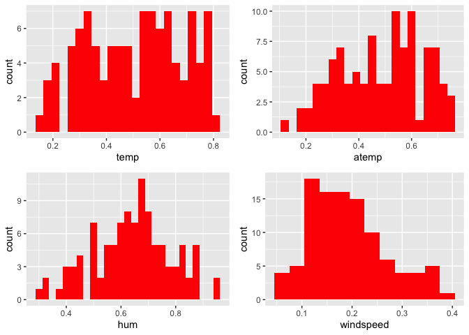
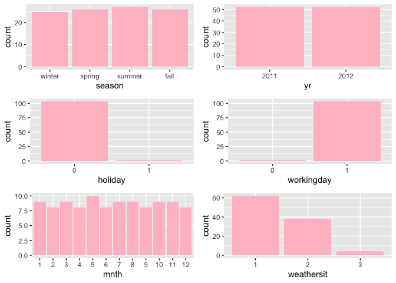
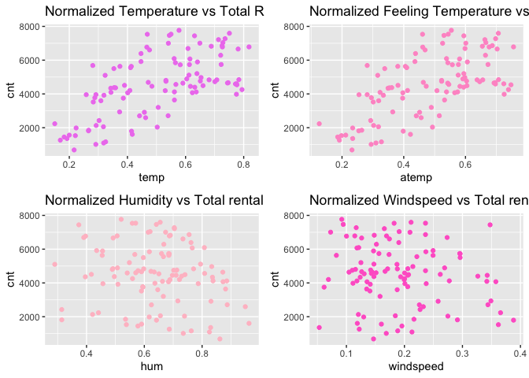
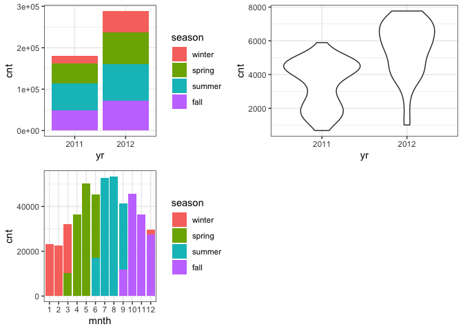
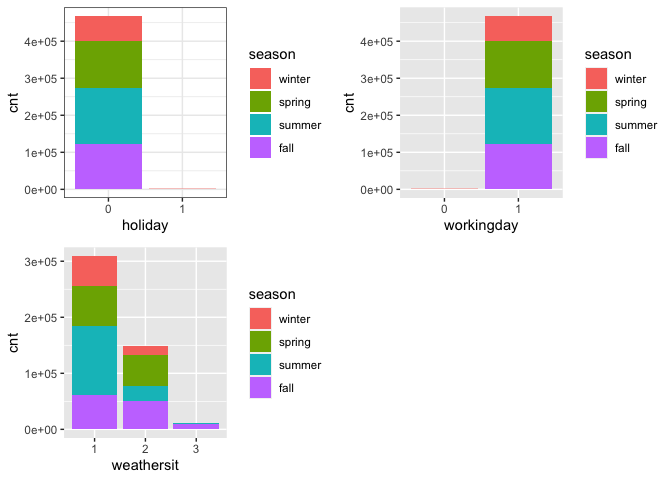

Project 2
================
Ifeoma Ojialor
10/16/2020

## Introduction

In this project, we will use a bike-sharing dataset to create machine
learning models. Before moving forward, I will briefly explain the
bike-sharing system and how it works. A bike-sharing system is a service
in which users can rent/use bicycles on a short term basis for a fee.
The goal of these programs is to provide affordable access to bicycles
for short distance trips as opposed to walking or taking public
transportation. Imagine how many people use these systems on a given
day, the numbers can vary greatly based on some elements. The goal of
this project is to build a predictive model to find out the number of
people that use these bikes in a given time period using available
information about that time/day. This in turn, can help businesses that
oversee this systems to manage them in a cost efficient manner.  
We will be using the bike-sharing dataset from the UCL Machine Learning
Repository. We will use the regression and boosted tree method to model
the response variable `cnt`.

## Exploratory Data Analysis

First we will read in the data using a relative path.

``` r
#read in data and filter to desired weekday
day1 <- read.csv("Bike-Sharing-Dataset/day.csv")
head(day1,5)
```

    ##   instant     dteday season yr mnth holiday
    ## 1       1 2011-01-01      1  0    1       0
    ## 2       2 2011-01-02      1  0    1       0
    ## 3       3 2011-01-03      1  0    1       0
    ## 4       4 2011-01-04      1  0    1       0
    ## 5       5 2011-01-05      1  0    1       0
    ##   weekday workingday weathersit     temp
    ## 1       6          0          2 0.344167
    ## 2       0          0          2 0.363478
    ## 3       1          1          1 0.196364
    ## 4       2          1          1 0.200000
    ## 5       3          1          1 0.226957
    ##      atemp      hum windspeed casual registered
    ## 1 0.363625 0.805833  0.160446    331        654
    ## 2 0.353739 0.696087  0.248539    131        670
    ## 3 0.189405 0.437273  0.248309    120       1229
    ## 4 0.212122 0.590435  0.160296    108       1454
    ## 5 0.229270 0.436957  0.186900     82       1518
    ##    cnt
    ## 1  985
    ## 2  801
    ## 3 1349
    ## 4 1562
    ## 5 1600

Next, we will remove the *casual* and *registered* variables since the
`cnt` variable is a combination of both.

``` r
day1 <- select(day1, -casual, -registered) 
day <- filter(day1, weekday == params$days)

#Check for missing values
miss <- data.frame(apply(day,2,function(x){sum(is.na(x))}))
names(miss)[1] <- "missing"
miss
```

    ##            missing
    ## instant          0
    ## dteday           0
    ## season           0
    ## yr               0
    ## mnth             0
    ## holiday          0
    ## weekday          0
    ## workingday       0
    ## weathersit       0
    ## temp             0
    ## atemp            0
    ## hum              0
    ## windspeed        0
    ## cnt              0

There are no missing values in the dataset, so we can continue with our
analysis.

``` r
#Change the variables into their appropriate format.
day$season <- as.factor(day$season)
day$weathersit <- as.factor(day$weathersit)
day$holiday <- as.factor(day$holiday)
day$workingday <- as.factor(day$workingday)
day$weekday <- as.factor(day$weekday)
day$yr <- as.factor(day$yr)
day$mnth <- as.factor(day$mnth)
levels(day$season) <- c("winter", "spring", "summer", "fall")
levels(day$yr) <- c("2011", "2012")
str(day)
```

    ## 'data.frame':    104 obs. of  14 variables:
    ##  $ instant   : int  4 11 18 25 32 39 46 53 60 67 ...
    ##  $ dteday    : chr  "2011-01-04" "2011-01-11" "2011-01-18" "2011-01-25" ...
    ##  $ season    : Factor w/ 4 levels "winter","spring",..: 1 1 1 1 1 1 1 1 1 1 ...
    ##  $ yr        : Factor w/ 2 levels "2011","2012": 1 1 1 1 1 1 1 1 1 1 ...
    ##  $ mnth      : Factor w/ 12 levels "1","2","3","4",..: 1 1 1 1 2 2 2 2 3 3 ...
    ##  $ holiday   : Factor w/ 2 levels "0","1": 1 1 1 1 1 1 1 1 1 1 ...
    ##  $ weekday   : Factor w/ 1 level "2": 1 1 1 1 1 1 1 1 1 1 ...
    ##  $ workingday: Factor w/ 2 levels "0","1": 2 2 2 2 2 2 2 2 2 2 ...
    ##  $ weathersit: Factor w/ 3 levels "1","2","3": 1 2 2 2 2 1 1 1 1 1 ...
    ##  $ temp      : num  0.2 0.169 0.217 0.223 0.192 ...
    ##  $ atemp     : num  0.212 0.191 0.232 0.235 0.235 ...
    ##  $ hum       : num  0.59 0.686 0.862 0.617 0.83 ...
    ##  $ windspeed : num  0.1603 0.1221 0.1468 0.1298 0.0532 ...
    ##  $ cnt       : int  1562 1263 683 1985 1360 1530 1815 1450 1851 2133 ...

### Univariate Analysis

The `cnt` is the response variable, so we’ll use a histogram to get a
visual understanding of the variable.

``` r
ggplot(day, aes(x = cnt)) + theme_bw() + geom_histogram(aes(y =..density..), color = "black", fill = "white", binwidth = 1000) + geom_density(alpha = 0.2, fill = "blue") + labs(title = "Count Density", x = "Count", y = "Density")
```

<!-- -->

``` r
summary(day$cnt)
```

    ##    Min. 1st Qu.  Median    Mean 3rd Qu.    Max. 
    ##     683    3579    4576    4511    5769    7767

From the histogram and summary statistics output, it is pretty evident
that the count of total rental bikes are in the sub 5000 range. We will
investigate if there is a relationship between the response variable and
other relevant predictor variables in the next section. Lets look at the
other variables individually.

``` r
#visualize numeric predictor variables using a histogram
p1 <- ggplot(day) + geom_histogram(aes(x = temp), fill = "red", binwidth = 0.03)
p2 <- ggplot(day) + geom_histogram(aes(x = atemp), fill = "red", binwidth = 0.03)
p3 <- ggplot(day) + geom_histogram(aes(x = hum), fill = "red", binwidth = 0.025)
p4 <- ggplot(day) + geom_histogram(aes(x = windspeed), fill = "red", binwidth = 0.03)
gridExtra::grid.arrange(p1,p2,p3,p4, nrow = 2)
```

<!-- --> Observations: \* No clear
cut pattern in `temp`and `atemp`.

  - `hum` appears to be skewed to the left when the dataset is not
    filtered to a specific weekday.

  - `windspeed` appears to be skewed(right). This variable should be
    transformed to curb its skewness.

  - The distribution of `temp` and `atemp` looks very similar. We should
    think about taking out one of the variables.

<!-- end list -->

``` r
#visualize categorical predictor variables
h1 <- ggplot(day) + geom_bar(aes(x = season),fill = "pink")
h2 <- ggplot(day) + geom_bar(aes(x = yr),fill = "pink")
h3 <- ggplot(day) + geom_bar(aes(x = holiday),fill = "pink")
h4 <- ggplot(day) + geom_bar(aes(x = workingday),fill = "pink")
h5 <- ggplot(day) + geom_bar(aes(x = mnth),fill = "pink")
h6 <- ggplot(day) + geom_bar(aes(x = weathersit),fill = "pink")
gridExtra::grid.arrange(h1,h2,h3,h4,h5,h6, nrow = 3)
```

<!-- -->

Observations: \* The variation between the four seasons is little to
none.

  - About the same number of people rode bikes in 2011 and 2012.

  - Many people rode bikes on days that are not holidays.

  - Most people used the bike-sharing system on days that were neither
    weekends nor holidays.

  - Most people used the bike sharing system on days with clear weather.

### Bi-variate Analysis

In this section, we will explore the predictor variables with respect to
the response variable. The objective is to discover hidden relationships
between the independent and response variables and use those findings in
the model building process.

``` r
# First, we will explore the relationship between the target and numerical variables.
p1 <- ggplot(day) +geom_point(aes(x = temp, y = cnt), colour = "violet") + labs(title = "Normalized Temperature vs Total Rental Bikes")
p2 <- ggplot(day) +geom_point(aes(x = atemp, y = cnt), colour = "#FF99CC") +labs(title = "Normalized Feeling Temperature vs Total Rental Bikes")
p3 <- ggplot(day) +geom_point(aes(x = hum, y = cnt), colour = "pink") + labs(title = "Normalized Humidity vs Total rental Bikes")
p4 <- ggplot(day) +geom_point(aes(x = windspeed, y = cnt), colour = "#FF66CC") +labs(title= "Normalized Windspeed vs Total rental Bikes")
gridExtra::grid.arrange(p1, p2, p3, p4, nrow = 2)
```

<!-- -->

Observations: \* There appears to be a positive linear relationship
between `cnt` , `temp`, and `atemp`.

  - There is also a weak relationship between `cnt`, `hum`, and
    `windspeed`.

<!-- end list -->

``` r
# Now we'll visualize the relationship between the target and categorical variables.
# Instead of using a boxplot, I will use a violin plot which is the blend of both a boxplot and density plot
g1 <- ggplot(day) + geom_col(aes(x = yr, y = cnt, fill = season))+theme_bw()
g2 <- ggplot(day) + geom_violin(aes(x = yr, y = cnt))+theme_bw()
g3 <- ggplot(day) + geom_col(aes(x = mnth, y = cnt, fill = season))+theme_bw() 
g4 <- ggplot(day) + geom_col(aes(x = holiday, y = cnt, fill = season)) + theme_bw() 
g6 <- ggplot(day) + geom_col(aes(x = workingday, y = cnt, fill = season))
g7 <- ggplot(day) + geom_col(aes(x = weathersit, y = cnt, fill = season))
gridExtra::grid.arrange(g1, g2, g3, nrow = 2)
```

<!-- -->

``` r
gridExtra::grid.arrange(g4, g6, g7, nrow = 2)
```

<!-- --> Observations: \* The
total bike rental count is higher in 2012 than 2011.

  - During workingday, the bike rental counts quite the highest compared
    to during no working day for different seasons.

  - During clear,partly cloudy weather, the bike rental count is highest
    and the second highest is during mist cloudy weather and followed by
    third highest during light snow and light rain weather.

  - The highest bike rental count was during the summer and lowest in
    the winter.

## Correlation Matrix

Correlation matrix helps us to understand the linear relationship
between variables.

``` r
day_c <- day[ , c(10:14)]
round(cor(day_c), 2)
```

    ##            temp atemp   hum windspeed   cnt
    ## temp       1.00  1.00  0.11     -0.09  0.63
    ## atemp      1.00  1.00  0.12     -0.12  0.64
    ## hum        0.11  0.12  1.00     -0.10 -0.18
    ## windspeed -0.09 -0.12 -0.10      1.00 -0.15
    ## cnt        0.63  0.64 -0.18     -0.15  1.00

From the above matrix, we can see that `temp` and `atemp` are highly
correlated. So we only need to include one of these variables in the
model to prevent multicollinearity. We will also transform the humidity
and windspeed variable.

``` r
day <- mutate(day, log_hum = log(day$hum+1))
day <- mutate(day, log_ws = log(day$windspeed + 1))

#Remove irrelevant variables
day <- select(day, -weekday,-holiday,-workingday,-dteday,-temp, -instant)
```

## Model Building

First we split the data into train and test sets.

``` r
set.seed(23)
dayIndex<- createDataPartition(day$cnt, p = 0.7, list=FALSE)
dayTrain <- day[dayIndex, ]
dayTest <- day[-dayIndex, ]

# Build a tree-based model using loocv;
fitTree <- train(cnt~ ., data = dayTrain, method = "rpart", 
              preProcess = c("center", "scale"), 
              trControl = trainControl(method = "loocv", number = 10), tuneGrid = NULL)
```

    ## Warning in nominalTrainWorkflow(x = x, y =
    ## y, wts = weights, info = trainInfo, : There
    ## were missing values in resampled performance
    ## measures.

``` r
# Display information from the tree fit
fitTree$results
```

    ##           cp      RMSE Rsquared       MAE
    ## 1 0.07396753  949.7414      NaN  949.7414
    ## 2 0.19825466 1291.9341      NaN 1291.9341
    ## 3 0.41127374 1647.3868      NaN 1647.3868
    ##     RMSESD RsquaredSD    MAESD
    ## 1 747.4380         NA 747.4380
    ## 2 793.5772         NA 793.5772
    ## 3 947.5176         NA 947.5176

``` r
# Build a boosted tree model using cv
fitBoost <- train(cnt~., data = dayTrain, method = "gbm", 
              preProcess = c("center", "scale"), 
              trControl = trainControl(method = "cv", number = 10), 
              tuneGrid = NULL)
```

    ## Iter   TrainDeviance   ValidDeviance   StepSize   Improve
    ##      1  2854660.7406             nan     0.1000 191026.2901
    ##      2  2711308.2668             nan     0.1000 134334.0441
    ##      3  2528814.6155             nan     0.1000 139338.1577
    ##      4  2327046.9161             nan     0.1000 163105.6197
    ##      5  2205290.5051             nan     0.1000 134950.1214
    ##      6  2068187.2170             nan     0.1000 122300.4158
    ##      7  1968818.7188             nan     0.1000 85008.5697
    ##      8  1869471.0688             nan     0.1000 110447.3941
    ##      9  1752707.5548             nan     0.1000 73394.8878
    ##     10  1666818.8456             nan     0.1000 68210.6782
    ##     20  1041002.8013             nan     0.1000 8057.7091
    ##     40   674579.3662             nan     0.1000 -947.1813
    ##     60   528064.9901             nan     0.1000 -7188.4683
    ##     80   454704.8924             nan     0.1000 4767.6330
    ##    100   417669.7013             nan     0.1000 -1749.4144
    ##    120   390570.0445             nan     0.1000 -5334.9422
    ##    140   375374.6156             nan     0.1000 -5039.8492
    ##    150   367338.7390             nan     0.1000 -5386.0139
    ## 
    ## Iter   TrainDeviance   ValidDeviance   StepSize   Improve
    ##      1  2850305.7858             nan     0.1000 179121.2611
    ##      2  2506135.0792             nan     0.1000 293688.3404
    ##      3  2264792.5712             nan     0.1000 205726.5892
    ##      4  2008152.6664             nan     0.1000 220291.2469
    ##      5  1909254.3775             nan     0.1000 105752.1890
    ##      6  1766001.4626             nan     0.1000 125679.0745
    ##      7  1608582.0891             nan     0.1000 149755.1335
    ##      8  1526166.7379             nan     0.1000 69092.8646
    ##      9  1446521.4523             nan     0.1000 74743.7945
    ##     10  1385392.4723             nan     0.1000 55654.0172
    ##     20   865093.0232             nan     0.1000 22682.7131
    ##     40   483406.9036             nan     0.1000 6011.2325
    ##     60   380852.0792             nan     0.1000 -7100.6733
    ##     80   342905.5344             nan     0.1000 -8199.7734
    ##    100   306657.6097             nan     0.1000 -8205.7100
    ##    120   279306.0275             nan     0.1000 -3533.2401
    ##    140   254466.2530             nan     0.1000 -8427.5816
    ##    150   242745.7395             nan     0.1000 -2492.5120
    ## 
    ## Iter   TrainDeviance   ValidDeviance   StepSize   Improve
    ##      1  2735638.0660             nan     0.1000 332695.8944
    ##      2  2575826.5740             nan     0.1000 148027.7475
    ##      3  2346913.5336             nan     0.1000 156933.5247
    ##      4  2216387.3613             nan     0.1000 99928.8164
    ##      5  1989948.2120             nan     0.1000 194649.9158
    ##      6  1840953.8881             nan     0.1000 147688.7139
    ##      7  1752950.1306             nan     0.1000 84510.7413
    ##      8  1650883.4581             nan     0.1000 42726.1659
    ##      9  1501746.9463             nan     0.1000 132998.7117
    ##     10  1413072.0666             nan     0.1000 82218.1306
    ##     20   886750.7427             nan     0.1000 14266.8868
    ##     40   579404.0383             nan     0.1000 -5538.3464
    ##     60   422293.2138             nan     0.1000 -12525.3169
    ##     80   359342.8039             nan     0.1000 -6582.5978
    ##    100   326303.1744             nan     0.1000 -8219.2198
    ##    120   297579.5580             nan     0.1000 -7767.0881
    ##    140   273910.0815             nan     0.1000 -5807.6364
    ##    150   262529.1363             nan     0.1000 -3178.1954
    ## 
    ## Iter   TrainDeviance   ValidDeviance   StepSize   Improve
    ##      1  2761532.5463             nan     0.1000 166671.2905
    ##      2  2594769.2619             nan     0.1000 129748.4905
    ##      3  2340209.5540             nan     0.1000 166947.5744
    ##      4  2194267.4594             nan     0.1000 112594.5563
    ##      5  2007805.0926             nan     0.1000 157067.0537
    ##      6  1854782.0634             nan     0.1000 94152.9168
    ##      7  1725672.6066             nan     0.1000 73895.1078
    ##      8  1628842.4659             nan     0.1000 76326.2642
    ##      9  1524563.4898             nan     0.1000 63250.7480
    ##     10  1430114.0034             nan     0.1000 76243.4854
    ##     20   959264.1611             nan     0.1000 3984.5005
    ##     40   588356.8160             nan     0.1000 -4041.5422
    ##     60   422678.3611             nan     0.1000 -5121.2653
    ##     80   363983.8905             nan     0.1000 -8982.6642
    ##    100   315574.2133             nan     0.1000   73.3790
    ##    120   293955.8848             nan     0.1000 -6011.6509
    ##    140   276070.3520             nan     0.1000 -4514.0594
    ##    150   267850.2018             nan     0.1000 -1158.8999
    ## 
    ## Iter   TrainDeviance   ValidDeviance   StepSize   Improve
    ##      1  2614094.9100             nan     0.1000 303963.5910
    ##      2  2309221.9560             nan     0.1000 243532.1176
    ##      3  2065601.0803             nan     0.1000 246793.8092
    ##      4  1937490.1644             nan     0.1000 140995.4737
    ##      5  1849772.4607             nan     0.1000 46079.6469
    ##      6  1677137.6510             nan     0.1000 182732.4923
    ##      7  1569288.3580             nan     0.1000 94986.0068
    ##      8  1460548.3145             nan     0.1000 72821.8937
    ##      9  1341043.1492             nan     0.1000 49477.9460
    ##     10  1219764.3128             nan     0.1000 68743.7804
    ##     20   711676.1224             nan     0.1000 26537.8624
    ##     40   382727.4422             nan     0.1000 -1451.4130
    ##     60   309033.7142             nan     0.1000 -3280.3488
    ##     80   255784.4270             nan     0.1000 -1722.7317
    ##    100   220492.3808             nan     0.1000 -5357.0314
    ##    120   204783.3852             nan     0.1000 -4149.0858
    ##    140   186925.2079             nan     0.1000 -2074.9470
    ##    150   177426.6120             nan     0.1000 -2573.9986
    ## 
    ## Iter   TrainDeviance   ValidDeviance   StepSize   Improve
    ##      1  2842970.5720             nan     0.1000 148046.4397
    ##      2  2661012.4305             nan     0.1000 168683.9247
    ##      3  2440336.9464             nan     0.1000 191358.3525
    ##      4  2303770.9003             nan     0.1000 111798.4683
    ##      5  2144463.8080             nan     0.1000 158937.2255
    ##      6  2002257.6594             nan     0.1000 127779.1479
    ##      7  1871390.1080             nan     0.1000 130051.6994
    ##      8  1716653.6239             nan     0.1000 74663.9633
    ##      9  1626648.4294             nan     0.1000 65452.1048
    ##     10  1535466.0303             nan     0.1000 31774.0859
    ##     20   865281.3687             nan     0.1000 22908.5626
    ##     40   461461.6301             nan     0.1000 14782.5603
    ##     60   331228.3090             nan     0.1000 -5066.8531
    ##     80   275852.1337             nan     0.1000 2798.6303
    ##    100   243965.1848             nan     0.1000 -4482.9128
    ##    120   218976.5534             nan     0.1000 -3677.5809
    ##    140   192607.9220             nan     0.1000 -5330.3388
    ##    150   186726.7150             nan     0.1000 -3742.7005
    ## 
    ## Iter   TrainDeviance   ValidDeviance   StepSize   Improve
    ##      1  2979613.5482             nan     0.1000 215160.0791
    ##      2  2766598.4475             nan     0.1000 179096.7055
    ##      3  2532422.8946             nan     0.1000 159406.6509
    ##      4  2379649.2296             nan     0.1000 116180.3598
    ##      5  2208258.5985             nan     0.1000 69479.1611
    ##      6  2071616.7239             nan     0.1000 153833.7324
    ##      7  1934595.4235             nan     0.1000 133686.8020
    ##      8  1819452.8841             nan     0.1000 81428.7411
    ##      9  1766951.2614             nan     0.1000 43380.5898
    ##     10  1646978.2153             nan     0.1000 109898.3925
    ##     20  1027487.0410             nan     0.1000 22516.6715
    ##     40   628925.0924             nan     0.1000 -1715.2879
    ##     60   479345.8746             nan     0.1000   -2.9710
    ##     80   409679.8615             nan     0.1000 -5501.1123
    ##    100   370556.1892             nan     0.1000 -3688.7354
    ##    120   354487.4191             nan     0.1000 -11062.6417
    ##    140   339562.6366             nan     0.1000 -3199.4146
    ##    150   336991.4401             nan     0.1000 -4536.9498
    ## 
    ## Iter   TrainDeviance   ValidDeviance   StepSize   Improve
    ##      1  2853757.4697             nan     0.1000 327787.6446
    ##      2  2664005.9463             nan     0.1000 162649.7706
    ##      3  2395402.1483             nan     0.1000 215159.0431
    ##      4  2242042.8876             nan     0.1000 95904.7365
    ##      5  2042820.2162             nan     0.1000 184189.2755
    ##      6  1922297.9750             nan     0.1000 117527.5638
    ##      7  1767575.9314             nan     0.1000 142955.2216
    ##      8  1653604.7486             nan     0.1000 101256.6623
    ##      9  1542458.2164             nan     0.1000 91394.2961
    ##     10  1385561.1436             nan     0.1000 27998.2291
    ##     20   890943.4762             nan     0.1000 12385.4186
    ##     40   525948.9533             nan     0.1000 -5071.1502
    ##     60   410691.0086             nan     0.1000 -1842.9425
    ##     80   347364.5602             nan     0.1000 -427.2614
    ##    100   325062.2599             nan     0.1000 -8666.2838
    ##    120   297430.6267             nan     0.1000 -3097.3024
    ##    140   275612.3904             nan     0.1000 -3930.5559
    ##    150   268008.1004             nan     0.1000 -1486.9434
    ## 
    ## Iter   TrainDeviance   ValidDeviance   StepSize   Improve
    ##      1  2898883.5934             nan     0.1000 351565.7725
    ##      2  2683636.3516             nan     0.1000 148904.3122
    ##      3  2521193.2497             nan     0.1000 173901.1677
    ##      4  2342488.9890             nan     0.1000 166567.3646
    ##      5  2214883.3573             nan     0.1000 87334.1736
    ##      6  2088228.6707             nan     0.1000 102815.1335
    ##      7  1957098.8302             nan     0.1000 105186.8480
    ##      8  1860069.1267             nan     0.1000 82862.5549
    ##      9  1744054.8069             nan     0.1000 68231.4017
    ##     10  1594759.3277             nan     0.1000 144452.0949
    ##     20   923818.0498             nan     0.1000 28516.3673
    ##     40   525437.5280             nan     0.1000 -891.9742
    ##     60   394487.2639             nan     0.1000 -12029.1192
    ##     80   330185.1426             nan     0.1000 -6736.9724
    ##    100   297494.7994             nan     0.1000 -7814.9664
    ##    120   273472.9977             nan     0.1000 -4533.9843
    ##    140   253006.2629             nan     0.1000 -3633.0997
    ##    150   245101.1012             nan     0.1000 -3324.2475
    ## 
    ## Iter   TrainDeviance   ValidDeviance   StepSize   Improve
    ##      1  2828918.6139             nan     0.1000 164672.4909
    ##      2  2620990.8409             nan     0.1000 164181.1330
    ##      3  2452976.2956             nan     0.1000 113873.2384
    ##      4  2285714.1395             nan     0.1000 158716.8066
    ##      5  2142630.0636             nan     0.1000 144782.3627
    ##      6  2016916.6286             nan     0.1000 108334.4519
    ##      7  1911165.8635             nan     0.1000 82687.8144
    ##      8  1786321.6861             nan     0.1000 120376.3953
    ##      9  1677867.6609             nan     0.1000 85999.0427
    ##     10  1589678.5393             nan     0.1000 80010.8074
    ##     20  1046730.3251             nan     0.1000 32443.0030
    ##     40   614571.9083             nan     0.1000 6602.7486
    ##     60   457283.3776             nan     0.1000 -5869.3539
    ##     80   385532.6593             nan     0.1000 -5711.2933
    ##    100   346657.3707             nan     0.1000 -5595.0938
    ##    120   313600.2535             nan     0.1000 -4297.6647
    ##    140   297015.1268             nan     0.1000 -6787.8184
    ##    150   294590.5270             nan     0.1000 -5068.7852
    ## 
    ## Iter   TrainDeviance   ValidDeviance   StepSize   Improve
    ##      1  2846914.0322             nan     0.1000 165044.5633
    ##      2  2609146.6765             nan     0.1000 154168.6559
    ##      3  2423276.8913             nan     0.1000 107743.4171
    ##      4  2157260.0919             nan     0.1000 212530.5750
    ##      5  1941770.8422             nan     0.1000 204655.0218
    ##      6  1855349.9617             nan     0.1000 103799.6628
    ##      7  1751942.0307             nan     0.1000 115734.4893
    ##      8  1556063.6035             nan     0.1000 101289.6842
    ##      9  1435326.9023             nan     0.1000 122975.0316
    ##     10  1359131.9710             nan     0.1000 65776.4537
    ##     20   839695.2893             nan     0.1000 -764.9089
    ##     40   430648.5213             nan     0.1000 -7750.0406
    ##     60   328297.5516             nan     0.1000 2047.3975
    ##     80   289604.6206             nan     0.1000 -1593.4106
    ##    100   246067.9835             nan     0.1000 -1247.5692
    ##    120   220007.5670             nan     0.1000 -3249.7103
    ##    140   205744.7265             nan     0.1000 -3111.7413
    ##    150   198023.3399             nan     0.1000 -2729.6216
    ## 
    ## Iter   TrainDeviance   ValidDeviance   StepSize   Improve
    ##      1  2855622.4370             nan     0.1000 119046.2982
    ##      2  2524073.4482             nan     0.1000 300893.8448
    ##      3  2352810.6439             nan     0.1000 163652.7162
    ##      4  2171435.5174             nan     0.1000 180965.2489
    ##      5  1943595.9119             nan     0.1000 199806.7076
    ##      6  1842836.3193             nan     0.1000 96676.0831
    ##      7  1633574.1004             nan     0.1000 113880.6062
    ##      8  1533515.5554             nan     0.1000 82749.6590
    ##      9  1455029.3645             nan     0.1000 59035.6430
    ##     10  1384510.5172             nan     0.1000 52190.5941
    ##     20   831647.5625             nan     0.1000 1566.9426
    ##     40   464640.5024             nan     0.1000 19198.6653
    ##     60   372056.9929             nan     0.1000 -3731.6851
    ##     80   304218.1405             nan     0.1000 5710.2880
    ##    100   266046.3374             nan     0.1000  692.3509
    ##    120   232334.9891             nan     0.1000 -2369.7914
    ##    140   210909.4377             nan     0.1000 -5309.9114
    ##    150   204161.2613             nan     0.1000 -4793.1892
    ## 
    ## Iter   TrainDeviance   ValidDeviance   StepSize   Improve
    ##      1  3104130.7702             nan     0.1000 97197.2321
    ##      2  2926917.4215             nan     0.1000 158235.8772
    ##      3  2736817.0184             nan     0.1000 193857.8381
    ##      4  2520742.8370             nan     0.1000 164054.1876
    ##      5  2328682.3613             nan     0.1000 145483.3282
    ##      6  2186497.9006             nan     0.1000 108672.2977
    ##      7  2069678.4798             nan     0.1000 129313.8246
    ##      8  1993389.5036             nan     0.1000 57399.9829
    ##      9  1901603.4119             nan     0.1000 107484.1814
    ##     10  1814473.8023             nan     0.1000 89867.1961
    ##     20  1157960.7502             nan     0.1000 33367.3008
    ##     40   674367.8051             nan     0.1000 4145.4193
    ##     60   485578.8228             nan     0.1000 -6720.8465
    ##     80   406862.6293             nan     0.1000  468.7083
    ##    100   382026.4696             nan     0.1000 -2343.2129
    ##    120   365557.7507             nan     0.1000 -3407.5055
    ##    140   344865.2237             nan     0.1000 -2286.1512
    ##    150   337867.2095             nan     0.1000 -751.8251
    ## 
    ## Iter   TrainDeviance   ValidDeviance   StepSize   Improve
    ##      1  2907257.9021             nan     0.1000 260699.3829
    ##      2  2629304.1354             nan     0.1000 269028.0877
    ##      3  2275021.1234             nan     0.1000 246317.2577
    ##      4  2050595.1405             nan     0.1000 198680.6586
    ##      5  1855790.8907             nan     0.1000 157276.5425
    ##      6  1693372.6532             nan     0.1000 122054.7360
    ##      7  1611731.2136             nan     0.1000 65623.2350
    ##      8  1528316.0409             nan     0.1000 80444.9124
    ##      9  1446936.1568             nan     0.1000 37094.1789
    ##     10  1389995.3131             nan     0.1000 29093.0313
    ##     20   835938.1542             nan     0.1000 13561.6761
    ##     40   523415.6695             nan     0.1000  396.8203
    ##     60   377130.4114             nan     0.1000 -9512.6123
    ##     80   342126.9254             nan     0.1000 -5190.8770
    ##    100   302635.8987             nan     0.1000 -6922.5551
    ##    120   279778.0339             nan     0.1000 -1999.2635
    ##    140   261392.9482             nan     0.1000 -6165.2118
    ##    150   247778.8077             nan     0.1000 -2949.4066
    ## 
    ## Iter   TrainDeviance   ValidDeviance   StepSize   Improve
    ##      1  2952179.7320             nan     0.1000 179321.6275
    ##      2  2763577.4959             nan     0.1000 184233.0654
    ##      3  2485567.8733             nan     0.1000 265614.1533
    ##      4  2272140.6616             nan     0.1000 211264.1351
    ##      5  2121034.2575             nan     0.1000 126027.4374
    ##      6  1871049.5991             nan     0.1000 189280.7866
    ##      7  1751877.1613             nan     0.1000 14545.4041
    ##      8  1677817.3958             nan     0.1000 85133.8919
    ##      9  1605251.9910             nan     0.1000 49353.3129
    ##     10  1461449.6032             nan     0.1000 86346.1850
    ##     20   913029.6366             nan     0.1000 20986.7425
    ##     40   480488.4464             nan     0.1000 -1173.5224
    ##     60   369620.1845             nan     0.1000 -8770.3843
    ##     80   319951.5370             nan     0.1000 -11521.5987
    ##    100   286093.8953             nan     0.1000 -2705.9036
    ##    120   267345.4116             nan     0.1000 -9199.6004
    ##    140   248263.4579             nan     0.1000 -5347.4462
    ##    150   239991.2919             nan     0.1000 -4402.1038
    ## 
    ## Iter   TrainDeviance   ValidDeviance   StepSize   Improve
    ##      1  2890887.7589             nan     0.1000 231900.1046
    ##      2  2707548.9391             nan     0.1000 202987.2298
    ##      3  2535580.9788             nan     0.1000 181671.6464
    ##      4  2372231.3663             nan     0.1000 154970.7102
    ##      5  2174752.2559             nan     0.1000 170526.0894
    ##      6  2065765.3362             nan     0.1000 107731.8166
    ##      7  1926162.8132             nan     0.1000 123897.7611
    ##      8  1833874.4122             nan     0.1000 110050.5430
    ##      9  1727555.1465             nan     0.1000 105954.8344
    ##     10  1629877.6363             nan     0.1000 99783.9681
    ##     20  1031279.2924             nan     0.1000 3717.8325
    ##     40   599249.3003             nan     0.1000 -9718.5270
    ##     60   445186.9127             nan     0.1000 -14674.1461
    ##     80   361495.4588             nan     0.1000 -9463.2035
    ##    100   327060.6810             nan     0.1000 -1875.4284
    ##    120   304660.9562             nan     0.1000 -7095.4143
    ##    140   278251.8630             nan     0.1000 -7399.7626
    ##    150   274525.8120             nan     0.1000 -2611.4786
    ## 
    ## Iter   TrainDeviance   ValidDeviance   StepSize   Improve
    ##      1  2779020.9259             nan     0.1000 335470.8595
    ##      2  2563282.4192             nan     0.1000 194519.3991
    ##      3  2360426.3460             nan     0.1000 142573.1810
    ##      4  2211840.5657             nan     0.1000 158281.2495
    ##      5  2000799.8335             nan     0.1000 226676.4351
    ##      6  1895039.4862             nan     0.1000 91818.6752
    ##      7  1678209.2989             nan     0.1000 158533.3541
    ##      8  1564719.0432             nan     0.1000 88077.8373
    ##      9  1372639.9364             nan     0.1000 120595.7874
    ##     10  1314284.5987             nan     0.1000 67521.1183
    ##     20   740885.4019             nan     0.1000 18076.8457
    ##     40   433628.5602             nan     0.1000 2802.9086
    ##     60   339229.9962             nan     0.1000 -4844.0426
    ##     80   288284.5222             nan     0.1000 -4148.8567
    ##    100   269562.7007             nan     0.1000 -3618.0749
    ##    120   247179.2949             nan     0.1000 -4875.8758
    ##    140   230312.4400             nan     0.1000 -1672.8691
    ##    150   219681.1214             nan     0.1000 -4650.8962
    ## 
    ## Iter   TrainDeviance   ValidDeviance   StepSize   Improve
    ##      1  2978177.8399             nan     0.1000 167875.2467
    ##      2  2749146.7996             nan     0.1000 215752.9013
    ##      3  2420304.3301             nan     0.1000 288635.7265
    ##      4  2242963.8338             nan     0.1000 131822.3452
    ##      5  2032076.8018             nan     0.1000 177838.5611
    ##      6  1900498.5915             nan     0.1000 124311.0841
    ##      7  1802222.5398             nan     0.1000 79464.2667
    ##      8  1654019.3559             nan     0.1000 136275.5241
    ##      9  1483764.1449             nan     0.1000 119573.6336
    ##     10  1413535.2879             nan     0.1000 75519.3920
    ##     20   801425.4103             nan     0.1000 19084.0103
    ##     40   450226.2917             nan     0.1000 2049.7341
    ##     60   331645.4364             nan     0.1000 7317.0750
    ##     80   283173.5517             nan     0.1000 -4652.8839
    ##    100   252354.7904             nan     0.1000 -3139.7979
    ##    120   229667.1739             nan     0.1000 -1163.2197
    ##    140   215642.6919             nan     0.1000 -2217.5625
    ##    150   205075.5848             nan     0.1000 -1354.0735
    ## 
    ## Iter   TrainDeviance   ValidDeviance   StepSize   Improve
    ##      1  2935802.5082             nan     0.1000 216121.6056
    ##      2  2707976.5520             nan     0.1000 155495.5190
    ##      3  2535568.3788             nan     0.1000 100988.8061
    ##      4  2351742.3871             nan     0.1000 172425.6679
    ##      5  2205331.2259             nan     0.1000 122762.8019
    ##      6  2088257.8077             nan     0.1000 60838.5879
    ##      7  1917334.8678             nan     0.1000 142572.8685
    ##      8  1790480.3600             nan     0.1000 115757.0018
    ##      9  1670316.3050             nan     0.1000 34882.3654
    ##     10  1578996.1857             nan     0.1000 57342.2055
    ##     20  1080227.2241             nan     0.1000 2510.4456
    ##     40   690715.8012             nan     0.1000 12700.9618
    ##     60   510685.3229             nan     0.1000 -3967.7348
    ##     80   438041.2013             nan     0.1000 -2222.6652
    ##    100   400580.4943             nan     0.1000 -7435.2623
    ##    120   386067.7024             nan     0.1000 -5003.9008
    ##    140   366090.0005             nan     0.1000 -4792.7180
    ##    150   363636.1988             nan     0.1000 -1710.6732
    ## 
    ## Iter   TrainDeviance   ValidDeviance   StepSize   Improve
    ##      1  2965128.1739             nan     0.1000 201150.6282
    ##      2  2758014.0925             nan     0.1000 174101.7799
    ##      3  2485323.4856             nan     0.1000 277311.5005
    ##      4  2301285.8755             nan     0.1000 162634.9325
    ##      5  2172233.0042             nan     0.1000 103923.3760
    ##      6  2004378.3179             nan     0.1000 119929.2324
    ##      7  1776703.0722             nan     0.1000 116879.8401
    ##      8  1696843.0958             nan     0.1000 91472.5170
    ##      9  1599842.1702             nan     0.1000 86188.5198
    ##     10  1450276.4373             nan     0.1000 106598.3122
    ##     20   930768.1764             nan     0.1000 26440.7002
    ##     40   537978.5509             nan     0.1000 -4075.8188
    ##     60   418306.8640             nan     0.1000 -297.7464
    ##     80   348547.7973             nan     0.1000 -1368.7289
    ##    100   300176.9772             nan     0.1000 -2772.7989
    ##    120   273990.0200             nan     0.1000 -162.9163
    ##    140   263214.9237             nan     0.1000 -3683.2213
    ##    150   256830.9556             nan     0.1000 -7407.7109
    ## 
    ## Iter   TrainDeviance   ValidDeviance   StepSize   Improve
    ##      1  2934196.4588             nan     0.1000 177092.2130
    ##      2  2663411.4161             nan     0.1000 287650.0248
    ##      3  2502163.3285             nan     0.1000 159626.3753
    ##      4  2267328.5213             nan     0.1000 207193.2513
    ##      5  2132379.9858             nan     0.1000 122000.4504
    ##      6  2026649.3270             nan     0.1000 64671.9496
    ##      7  1910613.7514             nan     0.1000 106341.7885
    ##      8  1760948.6622             nan     0.1000 86406.9174
    ##      9  1648140.2161             nan     0.1000 121015.8114
    ##     10  1516089.0362             nan     0.1000 94133.4022
    ##     20   963566.9214             nan     0.1000 11441.5438
    ##     40   551188.8512             nan     0.1000 -6742.3813
    ##     60   378734.4554             nan     0.1000 -1985.7485
    ##     80   342825.3743             nan     0.1000 -6728.4897
    ##    100   316147.0790             nan     0.1000 -7837.3445
    ##    120   288112.7316             nan     0.1000 -7937.6918
    ##    140   255253.5905             nan     0.1000 -2430.0952
    ##    150   246136.0711             nan     0.1000 -5028.0785
    ## 
    ## Iter   TrainDeviance   ValidDeviance   StepSize   Improve
    ##      1  2874893.5586             nan     0.1000 187176.1595
    ##      2  2643756.7977             nan     0.1000 139078.5875
    ##      3  2465837.7450             nan     0.1000 184304.1625
    ##      4  2279751.4457             nan     0.1000 153449.2432
    ##      5  2124036.6346             nan     0.1000 96222.8414
    ##      6  1988405.9402             nan     0.1000 130009.6052
    ##      7  1859250.6983             nan     0.1000 90307.4614
    ##      8  1742085.0581             nan     0.1000 100025.6535
    ##      9  1612824.0354             nan     0.1000 68611.5262
    ##     10  1543982.3760             nan     0.1000 70879.0545
    ##     20  1041289.8653             nan     0.1000 36666.0074
    ##     40   677966.6182             nan     0.1000 -11768.9714
    ##     60   505171.8101             nan     0.1000 2176.3448
    ##     80   424836.0408             nan     0.1000 -10637.7850
    ##    100   382907.4698             nan     0.1000 -9205.7843
    ##    120   364382.2482             nan     0.1000 -6970.3412
    ##    140   345288.8099             nan     0.1000 -2916.9695
    ##    150   345570.7011             nan     0.1000 -5730.7642
    ## 
    ## Iter   TrainDeviance   ValidDeviance   StepSize   Improve
    ##      1  2781911.1008             nan     0.1000 287056.4807
    ##      2  2503611.4633             nan     0.1000 251982.2800
    ##      3  2294563.1129             nan     0.1000 212788.5175
    ##      4  2137246.1514             nan     0.1000 128416.5116
    ##      5  1911785.9534             nan     0.1000 226922.7415
    ##      6  1749426.2075             nan     0.1000 151312.7327
    ##      7  1638801.2158             nan     0.1000 57980.5962
    ##      8  1558384.1665             nan     0.1000 102386.5839
    ##      9  1490218.4611             nan     0.1000 53595.7183
    ##     10  1402596.3823             nan     0.1000 66209.1038
    ##     20   900444.5625             nan     0.1000 45315.5695
    ##     40   544895.8751             nan     0.1000 -10801.2637
    ##     60   399238.6826             nan     0.1000 -8677.8583
    ##     80   339805.0098             nan     0.1000   19.1324
    ##    100   299203.9523             nan     0.1000 -723.8301
    ##    120   284680.3053             nan     0.1000 -5977.2240
    ##    140   270000.7761             nan     0.1000 -5139.0124
    ##    150   255792.9873             nan     0.1000 -1673.9459
    ## 
    ## Iter   TrainDeviance   ValidDeviance   StepSize   Improve
    ##      1  2798072.7271             nan     0.1000 314371.5409
    ##      2  2638272.4561             nan     0.1000 173610.5498
    ##      3  2406090.6800             nan     0.1000 102962.7487
    ##      4  2165131.8927             nan     0.1000 183108.9157
    ##      5  1955424.0257             nan     0.1000 162604.8653
    ##      6  1870821.1464             nan     0.1000 81657.9421
    ##      7  1715217.4998             nan     0.1000 133252.1203
    ##      8  1581683.3277             nan     0.1000 103643.0422
    ##      9  1498526.2645             nan     0.1000 50743.8527
    ##     10  1438614.2616             nan     0.1000 15516.2042
    ##     20   846666.1208             nan     0.1000 32732.6713
    ##     40   511145.8961             nan     0.1000 -3803.1076
    ##     60   399712.0626             nan     0.1000 4881.8254
    ##     80   330740.5705             nan     0.1000 -5980.2061
    ##    100   298150.1236             nan     0.1000 -5019.4304
    ##    120   269987.0607             nan     0.1000 -2413.7458
    ##    140   254617.1673             nan     0.1000 -3176.8545
    ##    150   251173.4275             nan     0.1000 -8068.0379
    ## 
    ## Iter   TrainDeviance   ValidDeviance   StepSize   Improve
    ##      1  2985253.2429             nan     0.1000 216086.6212
    ##      2  2729976.3551             nan     0.1000 250483.4833
    ##      3  2545367.5175             nan     0.1000 173612.6450
    ##      4  2377442.7768             nan     0.1000 184866.8853
    ##      5  2185999.2506             nan     0.1000 174519.3034
    ##      6  2048254.2499             nan     0.1000 124472.4541
    ##      7  1893991.6792             nan     0.1000 116756.4641
    ##      8  1782196.9082             nan     0.1000 115334.4470
    ##      9  1673160.8046             nan     0.1000 91590.4626
    ##     10  1576530.5726             nan     0.1000 93477.8120
    ##     20   979826.1369             nan     0.1000 13741.8048
    ##     40   580465.7716             nan     0.1000 -6938.2318
    ##     60   438383.9706             nan     0.1000 7066.6863
    ##     80   365517.7913             nan     0.1000 -7267.7404
    ##    100   330974.8482             nan     0.1000 -3222.2714
    ##    120   311600.5487             nan     0.1000 -3931.7073
    ##    140   298233.5792             nan     0.1000 -1895.8132
    ##    150   295641.5298             nan     0.1000 -2524.2016
    ## 
    ## Iter   TrainDeviance   ValidDeviance   StepSize   Improve
    ##      1  2949192.4781             nan     0.1000 241048.0682
    ##      2  2631334.6327             nan     0.1000 334246.7261
    ##      3  2425708.1584             nan     0.1000 144754.7491
    ##      4  2253624.7994             nan     0.1000 185575.9564
    ##      5  2112392.7004             nan     0.1000 82728.9863
    ##      6  1911771.0751             nan     0.1000 194277.3150
    ##      7  1720428.4290             nan     0.1000 148631.2961
    ##      8  1531149.2278             nan     0.1000 103227.0259
    ##      9  1445680.4413             nan     0.1000 68873.8361
    ##     10  1354543.0865             nan     0.1000 88101.7960
    ##     20   816025.3989             nan     0.1000 17524.1743
    ##     40   456826.3893             nan     0.1000 5578.4020
    ##     60   343340.9992             nan     0.1000 -7143.2220
    ##     80   303792.8472             nan     0.1000 -8119.8609
    ##    100   262710.7443             nan     0.1000 -11561.8663
    ##    120   230071.5198             nan     0.1000 -3092.4578
    ##    140   223019.2834             nan     0.1000 -5971.2663
    ##    150   213995.1893             nan     0.1000 -7617.1254
    ## 
    ## Iter   TrainDeviance   ValidDeviance   StepSize   Improve
    ##      1  2938567.2054             nan     0.1000 267075.1088
    ##      2  2703854.9736             nan     0.1000 152032.5353
    ##      3  2404175.9672             nan     0.1000 255718.5818
    ##      4  2079015.1924             nan     0.1000 245882.8564
    ##      5  1943395.1590             nan     0.1000 69274.5335
    ##      6  1706912.8219             nan     0.1000 190272.9143
    ##      7  1569186.6331             nan     0.1000 128222.4616
    ##      8  1437341.5865             nan     0.1000 67398.0555
    ##      9  1282091.8577             nan     0.1000 90700.6917
    ##     10  1226469.3369             nan     0.1000 47849.0292
    ##     20   701108.7280             nan     0.1000 23844.2965
    ##     40   418419.1848             nan     0.1000 4598.0619
    ##     60   326458.6009             nan     0.1000 -4138.8605
    ##     80   288586.0345             nan     0.1000 2778.4211
    ##    100   249613.0958             nan     0.1000 -2908.6808
    ##    120   223628.3546             nan     0.1000 -5010.3667
    ##    140   207483.2781             nan     0.1000 -2270.8315
    ##    150   204495.0798             nan     0.1000 -3121.8754
    ## 
    ## Iter   TrainDeviance   ValidDeviance   StepSize   Improve
    ##      1  2854455.9175             nan     0.1000 166110.5370
    ##      2  2651825.2232             nan     0.1000 156108.4974
    ##      3  2458218.7891             nan     0.1000 155974.4364
    ##      4  2317879.7008             nan     0.1000 80126.9318
    ##      5  2184290.3842             nan     0.1000 126022.8685
    ##      6  2041331.4201             nan     0.1000 127077.7204
    ##      7  1906936.4045             nan     0.1000 53975.1018
    ##      8  1815806.9893             nan     0.1000 73075.0757
    ##      9  1669659.1175             nan     0.1000 100904.9369
    ##     10  1579354.3096             nan     0.1000 41361.3795
    ##     20   978744.7083             nan     0.1000 25603.4665
    ##     40   622709.8678             nan     0.1000 -8943.5154
    ##     60   524236.3537             nan     0.1000 11282.3291
    ##     80   441308.7478             nan     0.1000 -1214.8972
    ##    100   393917.3455             nan     0.1000 -1242.0662
    ##    120   375713.9188             nan     0.1000 -6066.9080
    ##    140   357903.3643             nan     0.1000 -3152.2096
    ##    150   347761.9683             nan     0.1000 -2665.7817
    ## 
    ## Iter   TrainDeviance   ValidDeviance   StepSize   Improve
    ##      1  2879934.3502             nan     0.1000 204794.4854
    ##      2  2708819.8988             nan     0.1000 135046.4514
    ##      3  2477852.9799             nan     0.1000 136924.2205
    ##      4  2317530.7079             nan     0.1000 153756.3755
    ##      5  2176393.4446             nan     0.1000 135357.9776
    ##      6  1948820.0565             nan     0.1000 103518.8075
    ##      7  1796050.0869             nan     0.1000 152333.9451
    ##      8  1625277.3737             nan     0.1000 131872.8560
    ##      9  1576252.3845             nan     0.1000 4731.7075
    ##     10  1427824.3153             nan     0.1000 131462.7970
    ##     20   866623.7087             nan     0.1000 -2052.1011
    ##     40   553269.2457             nan     0.1000 1885.1047
    ##     60   383622.5350             nan     0.1000 3312.5353
    ##     80   331755.8812             nan     0.1000 -14213.3460
    ##    100   309004.6210             nan     0.1000 -2548.9021
    ##    120   285772.5412             nan     0.1000 -2300.9845
    ##    140   267719.0338             nan     0.1000  576.0156
    ##    150   254826.9987             nan     0.1000 -6516.4986
    ## 
    ## Iter   TrainDeviance   ValidDeviance   StepSize   Improve
    ##      1  2905067.2019             nan     0.1000 263617.9745
    ##      2  2692495.5936             nan     0.1000 154621.2521
    ##      3  2520334.2613             nan     0.1000 174201.2642
    ##      4  2300810.7106             nan     0.1000 77414.5560
    ##      5  2165808.4017             nan     0.1000 103746.1916
    ##      6  2015063.4870             nan     0.1000 145813.3125
    ##      7  1896840.9415             nan     0.1000 122195.5340
    ##      8  1675412.5330             nan     0.1000 182902.2050
    ##      9  1600882.2984             nan     0.1000 49476.9462
    ##     10  1517140.6880             nan     0.1000 78751.4652
    ##     20   869133.4937             nan     0.1000 21722.5945
    ##     40   513332.6354             nan     0.1000 -1697.9046
    ##     60   389014.3291             nan     0.1000 -1801.5133
    ##     80   344299.9220             nan     0.1000 -3255.4360
    ##    100   306240.5519             nan     0.1000 -3420.0079
    ##    120   276364.9824             nan     0.1000 -3722.6572
    ##    140   255096.9699             nan     0.1000 -2968.2513
    ##    150   246991.7679             nan     0.1000 -3767.6235
    ## 
    ## Iter   TrainDeviance   ValidDeviance   StepSize   Improve
    ##      1  2781498.0443             nan     0.1000 345382.0164
    ##      2  2533273.7627             nan     0.1000 238992.6681
    ##      3  2337926.5815             nan     0.1000 168192.4779
    ##      4  2158197.3752             nan     0.1000 139580.0443
    ##      5  1896801.4368             nan     0.1000 181024.2462
    ##      6  1689518.7165             nan     0.1000 210880.2637
    ##      7  1543553.0200             nan     0.1000 152467.1437
    ##      8  1432853.8794             nan     0.1000 108571.0207
    ##      9  1372271.7538             nan     0.1000 46176.0162
    ##     10  1321288.2982             nan     0.1000 49472.2061
    ##     20   747712.1804             nan     0.1000 15028.0096
    ##     40   419146.7920             nan     0.1000 5552.7065
    ##     60   312354.6845             nan     0.1000 -4132.2903
    ##     80   273728.2885             nan     0.1000 -7345.2291
    ##    100   250727.1533             nan     0.1000 -4993.5815

``` r
# Display information from the boost fit
fitBoost$results
```

    ##   shrinkage interaction.depth n.minobsinnode
    ## 1       0.1                 1             10
    ## 4       0.1                 2             10
    ## 7       0.1                 3             10
    ## 2       0.1                 1             10
    ## 5       0.1                 2             10
    ## 8       0.1                 3             10
    ## 3       0.1                 1             10
    ## 6       0.1                 2             10
    ## 9       0.1                 3             10
    ##   n.trees     RMSE  Rsquared      MAE   RMSESD
    ## 1      50 874.5159 0.7896490 693.2284 236.6696
    ## 4      50 755.8811 0.8308961 608.5122 299.1772
    ## 7      50 788.4358 0.8205641 633.4907 264.0918
    ## 2     100 778.9016 0.8195523 619.3280 254.9796
    ## 5     100 715.8617 0.8504182 556.1066 295.6309
    ## 8     100 724.1531 0.8408348 563.8940 291.6220
    ## 3     150 776.1585 0.8251322 612.9189 257.2799
    ## 6     150 718.8851 0.8431253 556.3210 304.5305
    ## 9     150 728.7151 0.8399266 571.6617 304.1220
    ##   RsquaredSD    MAESD
    ## 1  0.1387529 189.8823
    ## 4  0.1363616 244.4542
    ## 7  0.1357353 213.9383
    ## 2  0.1390951 196.5131
    ## 5  0.1166346 243.0001
    ## 8  0.1346597 227.7302
    ## 3  0.1246287 188.8397
    ## 6  0.1271571 254.5807
    ## 9  0.1338025 245.1512

Now, we make predictions on the test data sets using the best model
fits. Then we compare RMSE to determine the best model.

``` r
predTree <- predict(fitTree, newdata = select(dayTest, -cnt))
postResample(predTree, dayTest$cnt)
```

    ##         RMSE     Rsquared          MAE 
    ## 1390.3893381    0.5164845 1143.9621293

``` r
boostPred <- predict(fitBoost, newdata = select(dayTest, -cnt))
postResample(boostPred, dayTest$cnt)
```

    ##        RMSE    Rsquared         MAE 
    ## 801.7284699   0.8438934 616.9131717

When we compare the two models, the boosted tree model have lower RMSE
values when applied on the test dataset.
