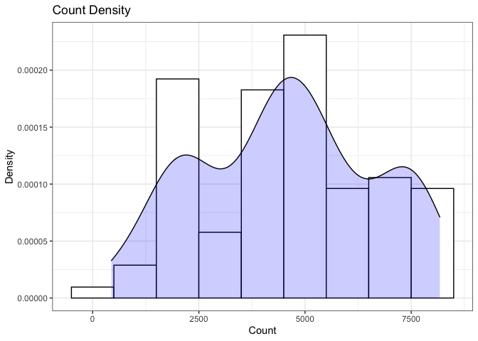
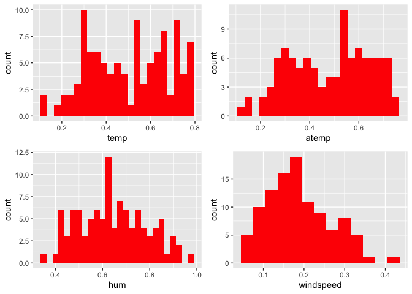
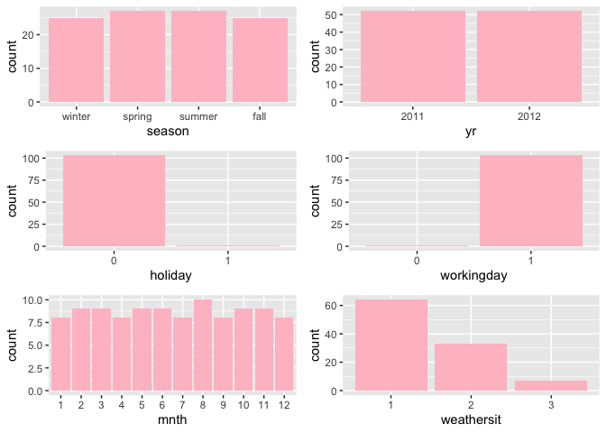
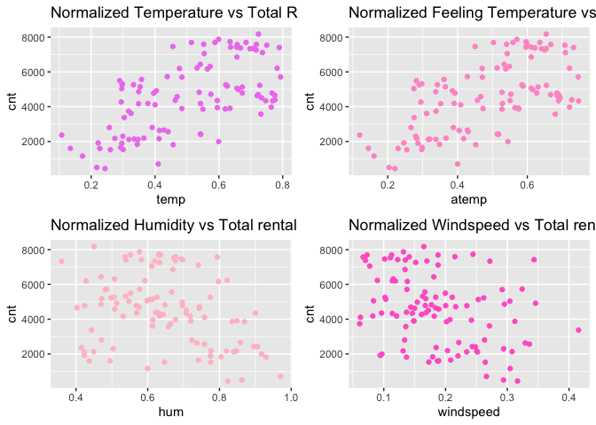
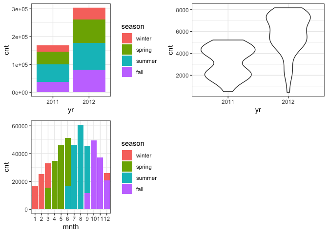
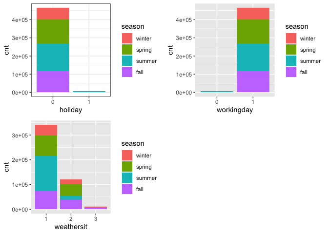

Project 2
================
Ifeoma Ojialor
10/16/2020

## Introduction

In this project, we will use a bike-sharing dataset to create machine
learning models. Before moving forward, I will briefly explain the
bike-sharing system and how it works. A bike-sharing system is a service
in which users can rent/use bicycles on a short term basis for a fee.
The goal of these programs is to provide affordable access to bicycles
for short distance trips as opposed to walking or taking public
transportation. Imagine how many people use these systems on a given
day, the numbers can vary greatly based on some elements. The goal of
this project is to build a predictive model to find out the number of
people that use these bikes in a given time period using available
information about that time/day. This in turn, can help businesses that
oversee this systems to manage them in a cost efficient manner.  
We will be using the bike-sharing dataset from the UCL Machine Learning
Repository. We will use the regression and boosted tree method to model
the response variable `cnt`.

## Exploratory Data Analysis

First we will read in the data using a relative path.

``` r
#read in data and filter to desired weekday
day1 <- read.csv("Bike-Sharing-Dataset/day.csv")
head(day1,5)
```

    ##   instant     dteday season yr mnth holiday
    ## 1       1 2011-01-01      1  0    1       0
    ## 2       2 2011-01-02      1  0    1       0
    ## 3       3 2011-01-03      1  0    1       0
    ## 4       4 2011-01-04      1  0    1       0
    ## 5       5 2011-01-05      1  0    1       0
    ##   weekday workingday weathersit     temp
    ## 1       6          0          2 0.344167
    ## 2       0          0          2 0.363478
    ## 3       1          1          1 0.196364
    ## 4       2          1          1 0.200000
    ## 5       3          1          1 0.226957
    ##      atemp      hum windspeed casual registered
    ## 1 0.363625 0.805833  0.160446    331        654
    ## 2 0.353739 0.696087  0.248539    131        670
    ## 3 0.189405 0.437273  0.248309    120       1229
    ## 4 0.212122 0.590435  0.160296    108       1454
    ## 5 0.229270 0.436957  0.186900     82       1518
    ##    cnt
    ## 1  985
    ## 2  801
    ## 3 1349
    ## 4 1562
    ## 5 1600

Next, we will remove the *casual* and *registered* variables since the
`cnt` variable is a combination of both.

``` r
day1 <- select(day1, -casual, -registered) 
day <- filter(day1, weekday == params$days)

#Check for missing values
miss <- data.frame(apply(day,2,function(x){sum(is.na(x))}))
names(miss)[1] <- "missing"
miss
```

    ##            missing
    ## instant          0
    ## dteday           0
    ## season           0
    ## yr               0
    ## mnth             0
    ## holiday          0
    ## weekday          0
    ## workingday       0
    ## weathersit       0
    ## temp             0
    ## atemp            0
    ## hum              0
    ## windspeed        0
    ## cnt              0

There are no missing values in the dataset, so we can continue with our
analysis.

``` r
#Change the variables into their appropriate format.
day$season <- as.factor(day$season)
day$weathersit <- as.factor(day$weathersit)
day$holiday <- as.factor(day$holiday)
day$workingday <- as.factor(day$workingday)
day$weekday <- as.factor(day$weekday)
day$yr <- as.factor(day$yr)
day$mnth <- as.factor(day$mnth)
levels(day$season) <- c("winter", "spring", "summer", "fall")
levels(day$yr) <- c("2011", "2012")
str(day)
```

    ## 'data.frame':    104 obs. of  14 variables:
    ##  $ instant   : int  5 12 19 26 33 40 47 54 61 68 ...
    ##  $ dteday    : chr  "2011-01-05" "2011-01-12" "2011-01-19" "2011-01-26" ...
    ##  $ season    : Factor w/ 4 levels "winter","spring",..: 1 1 1 1 1 1 1 1 1 1 ...
    ##  $ yr        : Factor w/ 2 levels "2011","2012": 1 1 1 1 1 1 1 1 1 1 ...
    ##  $ mnth      : Factor w/ 12 levels "1","2","3","4",..: 1 1 1 1 2 2 2 2 3 3 ...
    ##  $ holiday   : Factor w/ 2 levels "0","1": 1 1 1 1 1 1 1 1 1 1 ...
    ##  $ weekday   : Factor w/ 1 level "3": 1 1 1 1 1 1 1 1 1 1 ...
    ##  $ workingday: Factor w/ 2 levels "0","1": 2 2 2 2 2 2 2 2 2 2 ...
    ##  $ weathersit: Factor w/ 3 levels "1","2","3": 1 1 2 3 2 2 1 1 1 2 ...
    ##  $ temp      : num  0.227 0.173 0.292 0.217 0.26 ...
    ##  $ atemp     : num  0.229 0.16 0.298 0.204 0.254 ...
    ##  $ hum       : num  0.437 0.6 0.742 0.863 0.775 ...
    ##  $ windspeed : num  0.187 0.305 0.208 0.294 0.264 ...
    ##  $ cnt       : int  1600 1162 1650 506 1526 1605 2115 1917 2134 1891 ...

### Univariate Analysis

The `cnt` is the response variable, so we’ll use a histogram to get a
visual understanding of the variable.

``` r
ggplot(day, aes(x = cnt)) + theme_bw() + geom_histogram(aes(y =..density..), color = "black", fill = "white", binwidth = 1000) + geom_density(alpha = 0.2, fill = "blue") + labs(title = "Count Density", x = "Count", y = "Density")
```

<!-- -->

``` r
summary(day$cnt)
```

    ##    Min. 1st Qu.  Median    Mean 3rd Qu.    Max. 
    ##     441    2653    4642    4549    6176    8173

From the histogram and summary statistics output, it is pretty evident
that the count of total rental bikes are in the sub 5000 range. We will
investigate if there is a relationship between the response variable and
other relevant predictor variables in the next section. Lets look at the
other variables individually.

``` r
#visualize numeric predictor variables using a histogram
p1 <- ggplot(day) + geom_histogram(aes(x = temp), fill = "red", binwidth = 0.03)
p2 <- ggplot(day) + geom_histogram(aes(x = atemp), fill = "red", binwidth = 0.03)
p3 <- ggplot(day) + geom_histogram(aes(x = hum), fill = "red", binwidth = 0.025)
p4 <- ggplot(day) + geom_histogram(aes(x = windspeed), fill = "red", binwidth = 0.03)
gridExtra::grid.arrange(p1,p2,p3,p4, nrow = 2)
```

<!-- --> Observations: \* No clear
cut pattern in `temp`and `atemp`.

  - `hum` appears to be skewed to the left when the dataset is not
    filtered to a specific weekday.

  - `windspeed` appears to be skewed(right). This variable should be
    transformed to curb its skewness.

  - The distribution of `temp` and `atemp` looks very similar. We should
    think about taking out one of the variables.

<!-- end list -->

``` r
#visualize categorical predictor variables
h1 <- ggplot(day) + geom_bar(aes(x = season),fill = "pink")
h2 <- ggplot(day) + geom_bar(aes(x = yr),fill = "pink")
h3 <- ggplot(day) + geom_bar(aes(x = holiday),fill = "pink")
h4 <- ggplot(day) + geom_bar(aes(x = workingday),fill = "pink")
h5 <- ggplot(day) + geom_bar(aes(x = mnth),fill = "pink")
h6 <- ggplot(day) + geom_bar(aes(x = weathersit),fill = "pink")
gridExtra::grid.arrange(h1,h2,h3,h4,h5,h6, nrow = 3)
```

<!-- -->

Observations: \* The variation between the four seasons is little to
none.

  - About the same number of people rode bikes in 2011 and 2012.

  - Many people rode bikes on days that are not holidays.

  - Most people used the bike-sharing system on days that were neither
    weekends nor holidays.

  - Most people used the bike sharing system on days with clear weather.

### Bi-variate Analysis

In this section, we will explore the predictor variables with respect to
the response variable. The objective is to discover hidden relationships
between the independent and response variables and use those findings in
the model building process.

``` r
# First, we will explore the relationship between the target and numerical variables.
p1 <- ggplot(day) +geom_point(aes(x = temp, y = cnt), colour = "violet") + labs(title = "Normalized Temperature vs Total Rental Bikes")
p2 <- ggplot(day) +geom_point(aes(x = atemp, y = cnt), colour = "#FF99CC") +labs(title = "Normalized Feeling Temperature vs Total Rental Bikes")
p3 <- ggplot(day) +geom_point(aes(x = hum, y = cnt), colour = "pink") + labs(title = "Normalized Humidity vs Total rental Bikes")
p4 <- ggplot(day) +geom_point(aes(x = windspeed, y = cnt), colour = "#FF66CC") +labs(title= "Normalized Windspeed vs Total rental Bikes")
gridExtra::grid.arrange(p1, p2, p3, p4, nrow = 2)
```

<!-- -->

Observations: \* There appears to be a positive linear relationship
between `cnt` , `temp`, and `atemp`.

  - There is also a weak relationship between `cnt`, `hum`, and
    `windspeed`.

<!-- end list -->

``` r
# Now we'll visualize the relationship between the target and categorical variables.
# Instead of using a boxplot, I will use a violin plot which is the blend of both a boxplot and density plot
g1 <- ggplot(day) + geom_col(aes(x = yr, y = cnt, fill = season))+theme_bw()
g2 <- ggplot(day) + geom_violin(aes(x = yr, y = cnt))+theme_bw()
g3 <- ggplot(day) + geom_col(aes(x = mnth, y = cnt, fill = season))+theme_bw() 
g4 <- ggplot(day) + geom_col(aes(x = holiday, y = cnt, fill = season)) + theme_bw() 
g6 <- ggplot(day) + geom_col(aes(x = workingday, y = cnt, fill = season))
g7 <- ggplot(day) + geom_col(aes(x = weathersit, y = cnt, fill = season))
gridExtra::grid.arrange(g1, g2, g3, nrow = 2)
```

<!-- -->

``` r
gridExtra::grid.arrange(g4, g6, g7, nrow = 2)
```

<!-- --> Observations: \* The
total bike rental count is higher in 2012 than 2011.

  - During workingday, the bike rental counts quite the highest compared
    to during no working day for different seasons.

  - During clear,partly cloudy weather, the bike rental count is highest
    and the second highest is during mist cloudy weather and followed by
    third highest during light snow and light rain weather.

  - The highest bike rental count was during the summer and lowest in
    the winter.

## Correlation Matrix

Correlation matrix helps us to understand the linear relationship
between variables.

``` r
day_c <- day[ , c(10:14)]
round(cor(day_c), 2)
```

    ##            temp atemp   hum windspeed   cnt
    ## temp       1.00  1.00  0.02     -0.32  0.62
    ## atemp      1.00  1.00  0.04     -0.35  0.63
    ## hum        0.02  0.04  1.00     -0.14 -0.31
    ## windspeed -0.32 -0.35 -0.14      1.00 -0.35
    ## cnt        0.62  0.63 -0.31     -0.35  1.00

From the above matrix, we can see that `temp` and `atemp` are highly
correlated. So we only need to include one of these variables in the
model to prevent multicollinearity. We will also transform the humidity
and windspeed variable.

``` r
day <- mutate(day, log_hum = log(day$hum+1))
day <- mutate(day, log_ws = log(day$windspeed + 1))

#Remove irrelevant variables
day <- select(day, -weekday,-holiday,-workingday,-dteday,-temp, -instant)
```

## Model Building

First we split the data into train and test sets.

``` r
set.seed(23)
dayIndex<- createDataPartition(day$cnt, p = 0.7, list=FALSE)
dayTrain <- day[dayIndex, ]
dayTest <- day[-dayIndex, ]

# Build a tree-based model using loocv;
fitTree <- train(cnt~ ., data = dayTrain, method = "rpart", 
              preProcess = c("center", "scale"), 
              trControl = trainControl(method = "loocv", number = 10), tuneGrid = NULL)
```

    ## Warning in nominalTrainWorkflow(x = x, y =
    ## y, wts = weights, info = trainInfo, : There
    ## were missing values in resampled performance
    ## measures.

``` r
# Display information from the tree fit
fitTree$results
```

    ##          cp     RMSE Rsquared      MAE
    ## 1 0.1488219 1520.290      NaN 1520.290
    ## 2 0.2148262 1773.854      NaN 1773.854
    ## 3 0.3824648 2249.920      NaN 2249.920
    ##      RMSESD RsquaredSD     MAESD
    ## 1  791.8204         NA  791.8204
    ## 2  896.8945         NA  896.8945
    ## 3 1082.9858         NA 1082.9858

``` r
# Build a boosted tree model using cv
fitBoost <- train(cnt~., data = dayTrain, method = "gbm", 
              preProcess = c("center", "scale"), 
              trControl = trainControl(method = "cv", number = 10), 
              tuneGrid = NULL)
```

    ## Iter   TrainDeviance   ValidDeviance   StepSize   Improve
    ##      1  3980120.2181             nan     0.1000 252032.8907
    ##      2  3745136.7494             nan     0.1000 280246.1457
    ##      3  3488018.5630             nan     0.1000 168828.6956
    ##      4  3193271.3281             nan     0.1000 212008.8200
    ##      5  2953745.0805             nan     0.1000 164893.9302
    ##      6  2785690.6496             nan     0.1000 108192.1058
    ##      7  2564090.0062             nan     0.1000 164246.0856
    ##      8  2410346.4598             nan     0.1000 91002.6479
    ##      9  2247989.5789             nan     0.1000 98292.2936
    ##     10  2090455.8613             nan     0.1000 115125.0586
    ##     20  1226374.8509             nan     0.1000 32012.1349
    ##     40   719927.7330             nan     0.1000  849.8124
    ##     60   616809.1855             nan     0.1000 -17259.0512
    ##     80   571420.1051             nan     0.1000 -2663.4495
    ##    100   531616.4942             nan     0.1000 -4031.5642
    ##    120   491885.4772             nan     0.1000 -6298.0707
    ##    140   454365.5656             nan     0.1000 -11967.8870
    ##    150   444725.7165             nan     0.1000  147.2662
    ## 
    ## Iter   TrainDeviance   ValidDeviance   StepSize   Improve
    ##      1  3927712.3189             nan     0.1000 261455.7221
    ##      2  3420391.9222             nan     0.1000 437379.9060
    ##      3  3134959.1580             nan     0.1000 216585.9616
    ##      4  2954404.1680             nan     0.1000 131215.9278
    ##      5  2670773.5776             nan     0.1000 277611.5227
    ##      6  2493143.3931             nan     0.1000 132287.1394
    ##      7  2290474.2990             nan     0.1000 121317.0055
    ##      8  2132998.3437             nan     0.1000 142111.3189
    ##      9  1937023.2647             nan     0.1000 206208.8771
    ##     10  1780663.1074             nan     0.1000 135841.0185
    ##     20   918420.6439             nan     0.1000 29299.5434
    ##     40   571853.7945             nan     0.1000 -17932.2390
    ##     60   501658.5028             nan     0.1000 -5751.6079
    ##     80   428991.2149             nan     0.1000 -7920.9378
    ##    100   386333.0223             nan     0.1000 -3324.9672
    ##    120   345387.1799             nan     0.1000 -4696.3823
    ##    140   304184.6920             nan     0.1000 -1761.8331
    ##    150   286880.7136             nan     0.1000 -2960.3114
    ## 
    ## Iter   TrainDeviance   ValidDeviance   StepSize   Improve
    ##      1  3954170.4849             nan     0.1000 272801.9146
    ##      2  3617282.0372             nan     0.1000 260425.3944
    ##      3  3338158.6552             nan     0.1000 198733.3476
    ##      4  3098015.9148             nan     0.1000 117772.3184
    ##      5  2850102.7625             nan     0.1000 176675.8101
    ##      6  2640542.5692             nan     0.1000 167157.2406
    ##      7  2467993.4545             nan     0.1000 138881.3646
    ##      8  2258641.6772             nan     0.1000 162713.1448
    ##      9  2126455.9796             nan     0.1000 113038.6209
    ##     10  1973458.8130             nan     0.1000 136328.6448
    ##     20   995066.0169             nan     0.1000 -5354.6601
    ##     40   582031.6475             nan     0.1000 -9320.1052
    ##     60   483424.4513             nan     0.1000 -14136.3856
    ##     80   434655.4565             nan     0.1000 -2898.6870
    ##    100   386717.9812             nan     0.1000 -15942.8588
    ##    120   348651.2312             nan     0.1000 -2075.7523
    ##    140   306750.3445             nan     0.1000 -4297.4185
    ##    150   299522.3065             nan     0.1000 -6397.4242
    ## 
    ## Iter   TrainDeviance   ValidDeviance   StepSize   Improve
    ##      1  3941850.2330             nan     0.1000 335235.8433
    ##      2  3617472.6141             nan     0.1000 267557.3371
    ##      3  3314719.3812             nan     0.1000 120197.7498
    ##      4  3091726.0449             nan     0.1000 210447.0314
    ##      5  2848393.8648             nan     0.1000 223932.8990
    ##      6  2610459.4421             nan     0.1000 130471.9651
    ##      7  2452354.6201             nan     0.1000 79236.6956
    ##      8  2262779.9088             nan     0.1000 132578.3382
    ##      9  2126218.1134             nan     0.1000 104069.0307
    ##     10  2016057.3735             nan     0.1000 103129.4480
    ##     20  1191318.5939             nan     0.1000 38341.5533
    ##     40   672693.2333             nan     0.1000  309.3932
    ##     60   536288.8390             nan     0.1000 -10909.3249
    ##     80   479888.4185             nan     0.1000 -7767.6121
    ##    100   426915.3996             nan     0.1000 -3262.1723
    ##    120   396910.3629             nan     0.1000 -5840.4913
    ##    140   366494.3553             nan     0.1000 -2016.9819
    ##    150   361115.4825             nan     0.1000 -13482.8012
    ## 
    ## Iter   TrainDeviance   ValidDeviance   StepSize   Improve
    ##      1  3944706.4548             nan     0.1000 326781.7916
    ##      2  3621990.0960             nan     0.1000 268962.5490
    ##      3  3281966.6682             nan     0.1000 305387.7123
    ##      4  3057561.1874             nan     0.1000 209497.0112
    ##      5  2811256.6739             nan     0.1000 191547.9616
    ##      6  2508784.1092             nan     0.1000 289388.0200
    ##      7  2292188.3292             nan     0.1000 216659.6849
    ##      8  2164160.0446             nan     0.1000 128157.4544
    ##      9  2006669.8841             nan     0.1000 63664.6757
    ##     10  1774657.8458             nan     0.1000 119943.1370
    ##     20   967352.5532             nan     0.1000 17823.6253
    ##     40   533873.9688             nan     0.1000 -8060.9879
    ##     60   431801.1816             nan     0.1000 -10430.6758
    ##     80   364803.6154             nan     0.1000 -1181.1660
    ##    100   340642.2486             nan     0.1000 -6090.2504
    ##    120   297354.7901             nan     0.1000 -4777.4547
    ##    140   275984.4380             nan     0.1000 -4295.6372
    ##    150   260276.3626             nan     0.1000 -6868.5271
    ## 
    ## Iter   TrainDeviance   ValidDeviance   StepSize   Improve
    ##      1  3998306.5984             nan     0.1000 348955.7698
    ##      2  3633501.4970             nan     0.1000 401773.9439
    ##      3  3383752.3373             nan     0.1000 240996.5405
    ##      4  3206832.4116             nan     0.1000 189277.5100
    ##      5  2771502.9938             nan     0.1000 326363.7239
    ##      6  2540313.6302             nan     0.1000 246607.6857
    ##      7  2324561.3965             nan     0.1000 218599.3658
    ##      8  2118023.6977             nan     0.1000 106484.8599
    ##      9  2003490.0838             nan     0.1000 82916.2271
    ##     10  1873369.0000             nan     0.1000 88490.6943
    ##     20  1057242.9701             nan     0.1000 57960.5472
    ##     40   602905.8774             nan     0.1000 -4423.3942
    ##     60   481182.8163             nan     0.1000 -5657.5920
    ##     80   403011.9891             nan     0.1000 -10102.6789
    ##    100   340415.6905             nan     0.1000 -2113.2879
    ##    120   300618.4371             nan     0.1000 -9212.0204
    ##    140   269130.8008             nan     0.1000 -7370.9063
    ##    150   258180.9585             nan     0.1000 -2232.2734
    ## 
    ## Iter   TrainDeviance   ValidDeviance   StepSize   Improve
    ##      1  3946660.4968             nan     0.1000 295056.5299
    ##      2  3682376.2800             nan     0.1000 164337.5913
    ##      3  3456033.2077             nan     0.1000 229824.7735
    ##      4  3175611.6572             nan     0.1000 199952.7821
    ##      5  2948437.2542             nan     0.1000 115390.0950
    ##      6  2723520.8623             nan     0.1000 186733.4632
    ##      7  2558683.1772             nan     0.1000 144646.9687
    ##      8  2416516.1002             nan     0.1000 134897.2527
    ##      9  2277548.8668             nan     0.1000 82515.8357
    ##     10  2094606.0129             nan     0.1000 74938.6311
    ##     20  1277385.8069             nan     0.1000 18409.0625
    ##     40   730256.3758             nan     0.1000 1491.0865
    ##     60   620187.7224             nan     0.1000 -4709.7823
    ##     80   564123.1473             nan     0.1000 -13591.0344
    ##    100   518759.6562             nan     0.1000 -3395.7477
    ##    120   489409.1729             nan     0.1000 -7394.9447
    ##    140   455736.5309             nan     0.1000 -5979.7475
    ##    150   447586.2059             nan     0.1000 -7536.4584
    ## 
    ## Iter   TrainDeviance   ValidDeviance   StepSize   Improve
    ##      1  3940099.3959             nan     0.1000 297212.6238
    ##      2  3647161.2723             nan     0.1000 273772.4559
    ##      3  3218686.2137             nan     0.1000 453458.5948
    ##      4  2960928.9704             nan     0.1000 143257.3307
    ##      5  2799030.2679             nan     0.1000 198005.2518
    ##      6  2652159.7732             nan     0.1000 77693.5779
    ##      7  2405115.4149             nan     0.1000 216362.0612
    ##      8  2233614.9002             nan     0.1000 122376.0330
    ##      9  1980706.4948             nan     0.1000 199191.4515
    ##     10  1812633.9383             nan     0.1000 65566.2090
    ##     20   901523.5446             nan     0.1000 18343.1140
    ##     40   577945.5944             nan     0.1000 -3072.5042
    ##     60   461416.7153             nan     0.1000 -18516.9892
    ##     80   390646.7935             nan     0.1000 -6402.4014
    ##    100   340977.7542             nan     0.1000 -10776.2794
    ##    120   309928.9372             nan     0.1000 -7961.4014
    ##    140   280080.5845             nan     0.1000 -3197.9267
    ##    150   270861.4501             nan     0.1000 -6587.4159
    ## 
    ## Iter   TrainDeviance   ValidDeviance   StepSize   Improve
    ##      1  3901291.6542             nan     0.1000 260229.9107
    ##      2  3477248.9634             nan     0.1000 334961.6434
    ##      3  3270244.3856             nan     0.1000 154424.6984
    ##      4  3143404.6916             nan     0.1000 27006.4540
    ##      5  2782244.3775             nan     0.1000 358309.4906
    ##      6  2566739.6065             nan     0.1000 189215.9938
    ##      7  2393166.0698             nan     0.1000 146961.8669
    ##      8  2231948.7921             nan     0.1000 83750.2826
    ##      9  2018117.1856             nan     0.1000 224400.9499
    ##     10  1943263.4086             nan     0.1000 -43553.9014
    ##     20  1049232.7778             nan     0.1000 25028.7250
    ##     40   608257.5782             nan     0.1000 -9056.0648
    ##     60   492060.4556             nan     0.1000 -3961.7430
    ##     80   425461.1397             nan     0.1000 -9395.6543
    ##    100   357114.1686             nan     0.1000 -2488.1251
    ##    120   319824.9470             nan     0.1000 -7062.8266
    ##    140   290927.9456             nan     0.1000 -13510.6728
    ##    150   283892.6907             nan     0.1000 -7737.6661
    ## 
    ## Iter   TrainDeviance   ValidDeviance   StepSize   Improve
    ##      1  4114342.9400             nan     0.1000 104053.0926
    ##      2  3801023.7003             nan     0.1000 303261.8801
    ##      3  3540226.4610             nan     0.1000 257467.7462
    ##      4  3265600.3266             nan     0.1000 277305.7053
    ##      5  3075973.7067             nan     0.1000 215334.8633
    ##      6  2802980.6094             nan     0.1000 206821.1731
    ##      7  2598119.8361             nan     0.1000 165834.4767
    ##      8  2406329.7673             nan     0.1000 160552.6255
    ##      9  2219855.8142             nan     0.1000 130447.0907
    ##     10  2101378.6020             nan     0.1000 97262.3282
    ##     20  1206006.9485             nan     0.1000 44398.3791
    ##     40   629398.2768             nan     0.1000 -1981.3584
    ##     60   535496.9357             nan     0.1000 -10335.4874
    ##     80   463038.1998             nan     0.1000  720.7091
    ##    100   419087.9494             nan     0.1000 -10221.1971
    ##    120   387376.2471             nan     0.1000 -1990.0075
    ##    140   363987.0204             nan     0.1000 -3635.1748
    ##    150   350924.2525             nan     0.1000 -852.8335
    ## 
    ## Iter   TrainDeviance   ValidDeviance   StepSize   Improve
    ##      1  3902679.3496             nan     0.1000 310066.0334
    ##      2  3562095.2565             nan     0.1000 197754.2120
    ##      3  3294447.7722             nan     0.1000 155343.1789
    ##      4  3072305.4197             nan     0.1000 104823.7889
    ##      5  2705364.8351             nan     0.1000 244316.1550
    ##      6  2530067.9706             nan     0.1000 204383.2534
    ##      7  2252310.9359             nan     0.1000 261542.3926
    ##      8  2127689.4604             nan     0.1000 48425.6298
    ##      9  1946334.0556             nan     0.1000 151036.5742
    ##     10  1816933.5569             nan     0.1000 123343.2921
    ##     20   979485.8250             nan     0.1000 43480.3868
    ##     40   572132.3245             nan     0.1000 -7831.5859
    ##     60   471109.5001             nan     0.1000 -3368.8106
    ##     80   403638.6688             nan     0.1000 -14847.3089
    ##    100   341007.8499             nan     0.1000 -10489.0821
    ##    120   304674.0439             nan     0.1000 -2099.0296
    ##    140   274112.0354             nan     0.1000 -5846.2605
    ##    150   261961.0897             nan     0.1000 -5004.3725
    ## 
    ## Iter   TrainDeviance   ValidDeviance   StepSize   Improve
    ##      1  4025803.9384             nan     0.1000 278283.8312
    ##      2  3728658.5855             nan     0.1000 259264.1580
    ##      3  3513091.4472             nan     0.1000 227081.4421
    ##      4  3264539.7869             nan     0.1000 286894.4653
    ##      5  3058676.8490             nan     0.1000 237099.4929
    ##      6  2873620.0085             nan     0.1000 189438.3459
    ##      7  2658217.9220             nan     0.1000 190289.3994
    ##      8  2434507.9947             nan     0.1000 176862.7258
    ##      9  2266306.3584             nan     0.1000 114554.1442
    ##     10  2125251.4437             nan     0.1000 117344.1191
    ##     20  1115592.8495             nan     0.1000 67857.3970
    ##     40   552520.9109             nan     0.1000 -21091.8933
    ##     60   450487.7103             nan     0.1000 -11613.3646
    ##     80   403280.4871             nan     0.1000 -6995.3504
    ##    100   354596.2606             nan     0.1000 -3018.7531
    ##    120   323167.5693             nan     0.1000 -12206.0804
    ##    140   296669.9976             nan     0.1000 -14654.3869
    ##    150   286102.4766             nan     0.1000 -4970.6244
    ## 
    ## Iter   TrainDeviance   ValidDeviance   StepSize   Improve
    ##      1  3973151.1853             nan     0.1000 282866.5566
    ##      2  3728024.3621             nan     0.1000 257232.2574
    ##      3  3445859.6987             nan     0.1000 284634.2404
    ##      4  3222669.0915             nan     0.1000 177395.9611
    ##      5  3050640.8357             nan     0.1000 206347.7979
    ##      6  2864036.0949             nan     0.1000 163907.4141
    ##      7  2702931.7900             nan     0.1000 122251.9410
    ##      8  2564555.8585             nan     0.1000 73184.5212
    ##      9  2401881.8907             nan     0.1000 183615.4368
    ##     10  2236552.5337             nan     0.1000 151891.1857
    ##     20  1287150.7041             nan     0.1000 50743.5540
    ##     40   691500.8221             nan     0.1000 7825.5323
    ##     60   559197.5175             nan     0.1000 1267.1819
    ##     80   497678.1134             nan     0.1000 -7923.0426
    ##    100   463955.5165             nan     0.1000 -9150.5561
    ##    120   422532.1472             nan     0.1000 -6009.5967
    ##    140   392281.1792             nan     0.1000 -5620.4919
    ##    150   385331.6840             nan     0.1000 -5058.1878
    ## 
    ## Iter   TrainDeviance   ValidDeviance   StepSize   Improve
    ##      1  3738727.7357             nan     0.1000 509453.0763
    ##      2  3432759.9736             nan     0.1000 247431.9972
    ##      3  3148450.1884             nan     0.1000 208952.9248
    ##      4  2931875.9436             nan     0.1000 153378.1398
    ##      5  2718566.2678             nan     0.1000 124022.2882
    ##      6  2416684.0829             nan     0.1000 304574.6945
    ##      7  2260033.2586             nan     0.1000 138939.4794
    ##      8  2025410.2911             nan     0.1000 153507.0949
    ##      9  1889650.7384             nan     0.1000 107239.7819
    ##     10  1774534.8984             nan     0.1000 96772.6214
    ##     20   982752.0797             nan     0.1000 10871.4041
    ##     40   550076.5712             nan     0.1000 -2224.6271
    ##     60   473773.3603             nan     0.1000 -5547.0602
    ##     80   397705.7881             nan     0.1000 -4830.4720
    ##    100   339421.2726             nan     0.1000 -7521.5875
    ##    120   309478.1644             nan     0.1000 -3653.0198
    ##    140   291370.5584             nan     0.1000 -8049.8364
    ##    150   274488.3845             nan     0.1000 -12232.4580
    ## 
    ## Iter   TrainDeviance   ValidDeviance   StepSize   Improve
    ##      1  3906355.6796             nan     0.1000 330817.2800
    ##      2  3580222.8442             nan     0.1000 311196.1073
    ##      3  3304491.9318             nan     0.1000 268609.4563
    ##      4  3091849.2796             nan     0.1000 216681.5543
    ##      5  2760070.8239             nan     0.1000 328592.0904
    ##      6  2482125.6733             nan     0.1000 194019.5221
    ##      7  2334980.9272             nan     0.1000 135702.7859
    ##      8  2192505.1212             nan     0.1000 154695.1022
    ##      9  2088971.8492             nan     0.1000 109374.2571
    ##     10  1955043.3591             nan     0.1000 59793.0764
    ##     20  1065421.1282             nan     0.1000 12282.3845
    ##     40   608719.4623             nan     0.1000 4512.5420
    ##     60   483119.6150             nan     0.1000 -10778.1621
    ##     80   400114.5522             nan     0.1000 -4886.9280
    ##    100   363934.3024             nan     0.1000 -6145.1879
    ##    120   328270.6088             nan     0.1000 -4325.1194
    ##    140   300598.0838             nan     0.1000 -4007.1473
    ##    150   287272.3712             nan     0.1000 -3902.9790
    ## 
    ## Iter   TrainDeviance   ValidDeviance   StepSize   Improve
    ##      1  3788720.2340             nan     0.1000 293508.1724
    ##      2  3622425.0768             nan     0.1000 111324.0500
    ##      3  3340423.0889             nan     0.1000 322355.8958
    ##      4  3116518.3045             nan     0.1000 207199.6582
    ##      5  2874486.3171             nan     0.1000 253132.4021
    ##      6  2756887.7169             nan     0.1000 15890.3967
    ##      7  2541488.8383             nan     0.1000 140001.2766
    ##      8  2312286.1634             nan     0.1000 199741.6696
    ##      9  2135417.0404             nan     0.1000 142044.6046
    ##     10  1988665.7125             nan     0.1000 158453.9315
    ##     20  1081931.4344             nan     0.1000 50239.2415
    ##     40   562871.4695             nan     0.1000 5455.0414
    ##     60   457495.5961             nan     0.1000 -3864.5117
    ##     80   409476.9011             nan     0.1000 -6489.0099
    ##    100   377459.5605             nan     0.1000 -1409.7555
    ##    120   343337.7828             nan     0.1000 -4678.7969
    ##    140   318932.3945             nan     0.1000 -4268.0454
    ##    150   307872.7859             nan     0.1000 -8569.3741
    ## 
    ## Iter   TrainDeviance   ValidDeviance   StepSize   Improve
    ##      1  3713541.2348             nan     0.1000 329747.9707
    ##      2  3446356.4218             nan     0.1000 250216.7529
    ##      3  3174499.0683             nan     0.1000 209370.6746
    ##      4  2891518.1495             nan     0.1000 266651.2253
    ##      5  2711472.8523             nan     0.1000 206895.5298
    ##      6  2470065.2741             nan     0.1000 204855.8356
    ##      7  2184484.6674             nan     0.1000 260685.0734
    ##      8  2025150.6511             nan     0.1000 131459.6719
    ##      9  1847106.7942             nan     0.1000 82523.9030
    ##     10  1736998.3625             nan     0.1000 127158.6021
    ##     20   894755.9606             nan     0.1000 2760.6561
    ##     40   493815.9628             nan     0.1000 -6302.2608
    ##     60   404937.9759             nan     0.1000 -614.4920
    ##     80   345237.9680             nan     0.1000 -1550.8027
    ##    100   290343.0671             nan     0.1000 -9251.3671
    ##    120   252867.7687             nan     0.1000 -6042.7182
    ##    140   233020.4841             nan     0.1000 -5875.8208
    ##    150   216796.2419             nan     0.1000 -4173.8997
    ## 
    ## Iter   TrainDeviance   ValidDeviance   StepSize   Improve
    ##      1  3864544.8806             nan     0.1000 287852.9799
    ##      2  3465956.2367             nan     0.1000 325361.4036
    ##      3  3190893.8658             nan     0.1000 260707.4568
    ##      4  2864907.6339             nan     0.1000 151323.3114
    ##      5  2631319.5393             nan     0.1000 209328.2713
    ##      6  2405615.9487             nan     0.1000 238430.8014
    ##      7  2240796.9204             nan     0.1000 156139.7512
    ##      8  1984849.7833             nan     0.1000 238104.1732
    ##      9  1749606.2324             nan     0.1000 159889.2342
    ##     10  1664242.5150             nan     0.1000 91699.3214
    ##     20   932387.5270             nan     0.1000 5368.7921
    ##     40   486675.6920             nan     0.1000 -2256.1355
    ##     60   388470.2631             nan     0.1000 -13050.4871
    ##     80   323653.9851             nan     0.1000 -1106.8801
    ##    100   276928.5830             nan     0.1000 -4216.1794
    ##    120   248991.7860             nan     0.1000 -5208.9581
    ##    140   220946.7408             nan     0.1000 -3928.5466
    ##    150   212376.0173             nan     0.1000 -1805.2033
    ## 
    ## Iter   TrainDeviance   ValidDeviance   StepSize   Improve
    ##      1  4044089.3097             nan     0.1000 302727.7365
    ##      2  3691230.6038             nan     0.1000 313172.1181
    ##      3  3429099.1814             nan     0.1000 133633.7949
    ##      4  3228953.8576             nan     0.1000 123057.0662
    ##      5  2979894.6699             nan     0.1000 251037.8829
    ##      6  2777407.0011             nan     0.1000 137129.0247
    ##      7  2587236.8136             nan     0.1000 198995.1897
    ##      8  2430008.8163             nan     0.1000 125162.7095
    ##      9  2194094.9366             nan     0.1000 94713.1188
    ##     10  2062294.5643             nan     0.1000 125992.3563
    ##     20  1262167.2813             nan     0.1000 19136.7554
    ##     40   720147.7969             nan     0.1000 -1218.5420
    ##     60   579842.5652             nan     0.1000 -4153.9562
    ##     80   519721.0169             nan     0.1000 -1977.4481
    ##    100   475314.9163             nan     0.1000 -18921.1814
    ##    120   447267.3652             nan     0.1000 -4985.6809
    ##    140   418490.6536             nan     0.1000 -2714.1101
    ##    150   416286.3807             nan     0.1000 -4979.1736
    ## 
    ## Iter   TrainDeviance   ValidDeviance   StepSize   Improve
    ##      1  4033035.4965             nan     0.1000 307277.3819
    ##      2  3690395.3148             nan     0.1000 223359.7006
    ##      3  3350546.3135             nan     0.1000 301158.4836
    ##      4  3104629.8421             nan     0.1000 153009.7164
    ##      5  2864121.4435             nan     0.1000 162844.2311
    ##      6  2600904.7488             nan     0.1000 165413.0709
    ##      7  2391117.2633             nan     0.1000 157047.0792
    ##      8  2211906.5212             nan     0.1000 185403.6720
    ##      9  2076075.8280             nan     0.1000 108982.6200
    ##     10  1892696.7213             nan     0.1000 145925.8215
    ##     20  1030376.9522             nan     0.1000 7747.0958
    ##     40   588641.6156             nan     0.1000 -1583.9716
    ##     60   491469.8448             nan     0.1000 -21956.3790
    ##     80   414897.9165             nan     0.1000 -2559.4348
    ##    100   377661.6860             nan     0.1000 -14294.7360
    ##    120   336716.3981             nan     0.1000 -3663.1476
    ##    140   303691.9719             nan     0.1000 -2245.2435
    ##    150   287882.9705             nan     0.1000 -6041.3134
    ## 
    ## Iter   TrainDeviance   ValidDeviance   StepSize   Improve
    ##      1  4013909.8409             nan     0.1000 283312.9682
    ##      2  3712143.6264             nan     0.1000 202236.8006
    ##      3  3349657.1843             nan     0.1000 301031.7293
    ##      4  3098896.8410             nan     0.1000 245781.1793
    ##      5  2853215.9244             nan     0.1000 186875.3980
    ##      6  2700458.7738             nan     0.1000 98876.5023
    ##      7  2555242.8294             nan     0.1000 157085.6310
    ##      8  2303160.9016             nan     0.1000 115639.1602
    ##      9  2163028.2979             nan     0.1000 137961.2115
    ##     10  2011124.0150             nan     0.1000 148047.3273
    ##     20  1047660.3798             nan     0.1000 30039.2138
    ##     40   650760.2389             nan     0.1000 -823.0279
    ##     60   514801.1474             nan     0.1000 -3531.4741
    ##     80   450215.8751             nan     0.1000 -14652.1707
    ##    100   395080.5794             nan     0.1000 -3003.0743
    ##    120   356095.1904             nan     0.1000 -2620.4855
    ##    140   319932.4203             nan     0.1000 -8010.0159
    ##    150   295947.3901             nan     0.1000  196.7173
    ## 
    ## Iter   TrainDeviance   ValidDeviance   StepSize   Improve
    ##      1  4055268.5383             nan     0.1000 331726.3344
    ##      2  3676393.9776             nan     0.1000 258603.7739
    ##      3  3399783.5981             nan     0.1000 251162.9934
    ##      4  3150454.7711             nan     0.1000 243370.7345
    ##      5  2934628.2939             nan     0.1000 134559.7810
    ##      6  2654954.1803             nan     0.1000 189641.8074
    ##      7  2485756.0028             nan     0.1000 118220.2732
    ##      8  2329765.1030             nan     0.1000 169056.0409
    ##      9  2224299.6262             nan     0.1000 69652.4684
    ##     10  2134034.2502             nan     0.1000 17739.1233
    ##     20  1228335.6489             nan     0.1000 44715.4167
    ##     40   721406.8283             nan     0.1000 9591.1542
    ##     60   603005.7782             nan     0.1000 -5528.6200
    ##     80   546794.2426             nan     0.1000 -6626.0379
    ##    100   489060.2734             nan     0.1000 -2809.5779
    ##    120   456506.8073             nan     0.1000 -4027.7684
    ##    140   438032.6148             nan     0.1000 -6107.5926
    ##    150   426290.5756             nan     0.1000 -4645.5517
    ## 
    ## Iter   TrainDeviance   ValidDeviance   StepSize   Improve
    ##      1  4047964.8195             nan     0.1000 288530.9171
    ##      2  3593883.6850             nan     0.1000 405542.3975
    ##      3  3143458.9437             nan     0.1000 311228.9041
    ##      4  2878378.7819             nan     0.1000 208667.9957
    ##      5  2631137.0563             nan     0.1000 192787.5714
    ##      6  2419968.9947             nan     0.1000 241832.2525
    ##      7  2280397.6552             nan     0.1000 101720.7620
    ##      8  2056221.0724             nan     0.1000 64631.5489
    ##      9  1882178.8583             nan     0.1000 104928.1193
    ##     10  1800215.0862             nan     0.1000 61386.7715
    ##     20  1056542.0549             nan     0.1000 3417.2724
    ##     40   682295.1214             nan     0.1000 -3083.7513
    ##     60   531980.2231             nan     0.1000 -9553.6863
    ##     80   472741.7731             nan     0.1000 -10482.5313
    ##    100   436025.4001             nan     0.1000 -1778.5827
    ##    120   385273.6067             nan     0.1000 -4624.6218
    ##    140   350786.8331             nan     0.1000 -5901.4333
    ##    150   330582.7886             nan     0.1000 -7654.2008
    ## 
    ## Iter   TrainDeviance   ValidDeviance   StepSize   Improve
    ##      1  3973878.9237             nan     0.1000 275437.5262
    ##      2  3752729.3350             nan     0.1000 117634.2017
    ##      3  3407020.8803             nan     0.1000 184661.1522
    ##      4  3125434.4658             nan     0.1000 232899.0386
    ##      5  2883946.7630             nan     0.1000 163110.6007
    ##      6  2632510.7890             nan     0.1000 169563.4165
    ##      7  2460958.3380             nan     0.1000 176557.6180
    ##      8  2244256.7410             nan     0.1000 209374.7537
    ##      9  2057538.8868             nan     0.1000 78571.2063
    ##     10  1938278.8778             nan     0.1000 67493.5550
    ##     20  1024971.4810             nan     0.1000 44577.2155
    ##     40   647296.8043             nan     0.1000 -34313.9213
    ##     60   549460.8149             nan     0.1000 -9262.7104
    ##     80   472336.2387             nan     0.1000 -1958.0332
    ##    100   419933.2750             nan     0.1000 1436.5820
    ##    120   385483.4357             nan     0.1000 -3137.5810
    ##    140   357878.8141             nan     0.1000 -4365.9854
    ##    150   346558.1831             nan     0.1000 -10520.0743
    ## 
    ## Iter   TrainDeviance   ValidDeviance   StepSize   Improve
    ##      1  4018739.1599             nan     0.1000 254368.1808
    ##      2  3691105.0429             nan     0.1000 227387.8210
    ##      3  3426638.4277             nan     0.1000 292517.8544
    ##      4  3164612.0484             nan     0.1000 238633.9531
    ##      5  2916862.6458             nan     0.1000 162391.4370
    ##      6  2724915.3792             nan     0.1000 134185.9546
    ##      7  2530629.4994             nan     0.1000 173600.4448
    ##      8  2360372.2624             nan     0.1000 153489.2303
    ##      9  2255696.3773             nan     0.1000 66507.4653
    ##     10  2124909.9763             nan     0.1000 139337.4492
    ##     20  1252007.6249             nan     0.1000 17577.6288
    ##     40   708859.5321             nan     0.1000   51.2212
    ##     60   571596.8640             nan     0.1000 -4581.8185
    ##     80   527961.1205             nan     0.1000 -5078.3978
    ##    100   495846.4132             nan     0.1000 -7538.1152
    ##    120   446939.4247             nan     0.1000 -2000.6067
    ##    140   430989.7920             nan     0.1000 -570.9263
    ##    150   421552.5232             nan     0.1000 -8793.7782
    ## 
    ## Iter   TrainDeviance   ValidDeviance   StepSize   Improve
    ##      1  3986567.8927             nan     0.1000 324717.3440
    ##      2  3566644.3123             nan     0.1000 391842.1309
    ##      3  3217834.2405             nan     0.1000 383634.5137
    ##      4  3026103.6222             nan     0.1000 178410.1551
    ##      5  2786990.2400             nan     0.1000 167345.8100
    ##      6  2520546.6636             nan     0.1000 300987.8053
    ##      7  2321144.4214             nan     0.1000 155903.0728
    ##      8  2140207.2034             nan     0.1000 46844.6733
    ##      9  2021062.0301             nan     0.1000 124671.0983
    ##     10  1847448.8446             nan     0.1000 183966.1336
    ##     20  1042516.3312             nan     0.1000 27435.2168
    ##     40   610876.5466             nan     0.1000 3328.1904
    ##     60   513518.6512             nan     0.1000 -9521.1596
    ##     80   467948.3190             nan     0.1000 -8189.3261
    ##    100   407924.6220             nan     0.1000 -3846.2474
    ##    120   377440.6300             nan     0.1000 -10202.8949
    ##    140   348280.7483             nan     0.1000 -9550.8762
    ##    150   338680.2554             nan     0.1000 -7087.1373
    ## 
    ## Iter   TrainDeviance   ValidDeviance   StepSize   Improve
    ##      1  3991806.4942             nan     0.1000 391862.4251
    ##      2  3691178.2548             nan     0.1000 271165.9513
    ##      3  3469455.6656             nan     0.1000 172629.4224
    ##      4  3167988.1851             nan     0.1000 300719.8818
    ##      5  2874523.8129             nan     0.1000 163270.2599
    ##      6  2713364.0396             nan     0.1000 157508.9758
    ##      7  2486847.4026             nan     0.1000 187678.7232
    ##      8  2207746.7001             nan     0.1000 259597.9634
    ##      9  2037667.7094             nan     0.1000 51860.0170
    ##     10  1806287.5120             nan     0.1000 188917.4373
    ##     20   972398.6410             nan     0.1000 9860.2243
    ##     40   594882.5693             nan     0.1000 -3789.9011
    ##     60   499006.9538             nan     0.1000 -18052.6349
    ##     80   449458.6656             nan     0.1000 -7307.3424
    ##    100   399456.6866             nan     0.1000 -607.3177
    ##    120   372427.7278             nan     0.1000 -6065.3137
    ##    140   346619.5619             nan     0.1000 -6321.7144
    ##    150   331546.7348             nan     0.1000  119.3512
    ## 
    ## Iter   TrainDeviance   ValidDeviance   StepSize   Improve
    ##      1  3971209.7131             nan     0.1000 294921.6830
    ##      2  3733720.7674             nan     0.1000 87616.5223
    ##      3  3390490.4977             nan     0.1000 215207.9603
    ##      4  3122902.0851             nan     0.1000 162464.4271
    ##      5  2886181.1481             nan     0.1000 257512.2523
    ##      6  2707342.3308             nan     0.1000 120232.3995
    ##      7  2561974.8462             nan     0.1000 120353.6453
    ##      8  2377100.2729             nan     0.1000 209995.7241
    ##      9  2177977.3496             nan     0.1000 157367.4276
    ##     10  2073978.8307             nan     0.1000 28353.6179
    ##     20  1203806.7812             nan     0.1000 55048.7037
    ##     40   655535.2029             nan     0.1000 -4443.5401
    ##     60   566372.8390             nan     0.1000 -8233.2765
    ##     80   510194.8458             nan     0.1000 -3258.8982
    ##    100   479482.7762             nan     0.1000 -9569.7460
    ##    120   451711.5886             nan     0.1000 -4554.1483
    ##    140   422163.7853             nan     0.1000 -2156.9781
    ##    150   410216.4453             nan     0.1000 -5897.5515
    ## 
    ## Iter   TrainDeviance   ValidDeviance   StepSize   Improve
    ##      1  3976089.4973             nan     0.1000 346738.1591
    ##      2  3650817.1616             nan     0.1000 211567.0381
    ##      3  3286314.7651             nan     0.1000 251617.3903
    ##      4  2889347.9623             nan     0.1000 349085.9371
    ##      5  2676985.2095             nan     0.1000 170800.5133
    ##      6  2419406.4547             nan     0.1000 138833.4077
    ##      7  2193862.1011             nan     0.1000 177640.5233
    ##      8  2046076.3676             nan     0.1000 141129.7114
    ##      9  1943409.8276             nan     0.1000 120517.7973
    ##     10  1817367.1528             nan     0.1000 86313.8970
    ##     20  1067276.2726             nan     0.1000 31624.3087
    ##     40   624798.7980             nan     0.1000 -14856.9962
    ##     60   511889.5778             nan     0.1000 -2081.0862
    ##     80   461728.0243             nan     0.1000 -14284.1755
    ##    100   410964.5235             nan     0.1000 -4632.1775
    ##    120   373559.4212             nan     0.1000 -7837.1904
    ##    140   335397.4937             nan     0.1000 -3923.3877
    ##    150   327458.1065             nan     0.1000 -6361.9210
    ## 
    ## Iter   TrainDeviance   ValidDeviance   StepSize   Improve
    ##      1  4024662.8616             nan     0.1000 245786.5585
    ##      2  3445033.0873             nan     0.1000 458709.4607
    ##      3  3214461.5767             nan     0.1000 237484.8495
    ##      4  2948642.2791             nan     0.1000 134095.3486
    ##      5  2713648.5435             nan     0.1000 136197.5935
    ##      6  2531282.9983             nan     0.1000 187633.9034
    ##      7  2356318.9674             nan     0.1000 156751.0780
    ##      8  2215671.5919             nan     0.1000 126838.0992
    ##      9  1932336.2543             nan     0.1000 244960.1204
    ##     10  1784447.2627             nan     0.1000 132498.9895
    ##     20   964149.5038             nan     0.1000 28619.9091
    ##     40   530775.7127             nan     0.1000 1459.0116
    ##     60   454805.1295             nan     0.1000 -4451.8487
    ##     80   419418.2244             nan     0.1000 -5766.3318
    ##    100   383413.7335             nan     0.1000 -10890.5079
    ##    120   360650.3781             nan     0.1000 -13649.5734
    ##    140   347159.6257             nan     0.1000 -6037.4471
    ##    150   334677.7938             nan     0.1000 -5015.8810
    ## 
    ## Iter   TrainDeviance   ValidDeviance   StepSize   Improve
    ##      1  3987789.6056             nan     0.1000 298350.9287
    ##      2  3717777.3553             nan     0.1000 304047.2896
    ##      3  3401815.8368             nan     0.1000 231572.2926
    ##      4  3118135.3636             nan     0.1000 144468.1277
    ##      5  2877176.3873             nan     0.1000 175835.2441
    ##      6  2727743.7303             nan     0.1000 77279.0061
    ##      7  2533955.1501             nan     0.1000 147028.1505
    ##      8  2355887.8509             nan     0.1000 146070.9961
    ##      9  2221434.8571             nan     0.1000 127422.8972
    ##     10  2081600.3644             nan     0.1000 119716.1284
    ##     20  1164010.6175             nan     0.1000 48720.7210
    ##     40   680124.6625             nan     0.1000 4041.2115
    ##     60   570389.7786             nan     0.1000 -5929.4525
    ##     80   520633.6299             nan     0.1000 -2609.2526
    ##    100   482728.9967             nan     0.1000 -3374.3187

``` r
# Display information from the boost fit
fitBoost$results
```

    ##   shrinkage interaction.depth n.minobsinnode
    ## 1       0.1                 1             10
    ## 4       0.1                 2             10
    ## 7       0.1                 3             10
    ## 2       0.1                 1             10
    ## 5       0.1                 2             10
    ## 8       0.1                 3             10
    ## 3       0.1                 1             10
    ## 6       0.1                 2             10
    ## 9       0.1                 3             10
    ##   n.trees     RMSE  Rsquared      MAE   RMSESD
    ## 1      50 900.6385 0.8491945 732.9659 237.7504
    ## 4      50 910.9684 0.8458150 729.5816 189.4161
    ## 7      50 926.7077 0.8298963 734.1845 211.7037
    ## 2     100 880.2106 0.8469635 701.1086 214.2169
    ## 5     100 903.2455 0.8407543 724.4218 200.3063
    ## 8     100 906.1202 0.8342080 716.6264 208.5862
    ## 3     150 888.8378 0.8465595 712.1203 229.8574
    ## 6     150 899.1027 0.8422660 727.1290 196.2578
    ## 9     150 924.3328 0.8257571 747.4731 207.3154
    ##   RsquaredSD    MAESD
    ## 1 0.06049561 179.7707
    ## 4 0.06787333 146.6889
    ## 7 0.07059149 177.7839
    ## 2 0.06786961 181.6910
    ## 5 0.08315166 170.6871
    ## 8 0.06253100 196.7745
    ## 3 0.06995235 196.9242
    ## 6 0.07274696 172.5794
    ## 9 0.07348288 197.4627

Now, we make predictions on the test data sets using the best model
fits. Then we compare RMSE to determine the best model.

``` r
predTree <- predict(fitTree, newdata = select(dayTest, -cnt))
postResample(predTree, dayTest$cnt)
```

    ##         RMSE     Rsquared          MAE 
    ## 1111.1627419    0.6725198  990.6040686

``` r
boostPred <- predict(fitBoost, newdata = select(dayTest, -cnt))
postResample(boostPred, dayTest$cnt)
```

    ##         RMSE     Rsquared          MAE 
    ## 1034.9597569    0.7528721  856.8527738

When we compare the two models, the boosted tree model have lower RMSE
values when applied on the test dataset.
