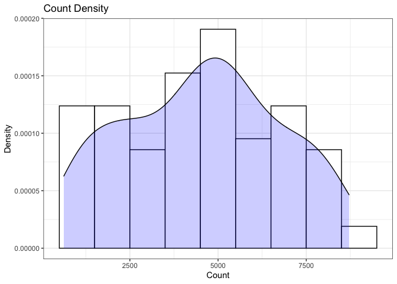
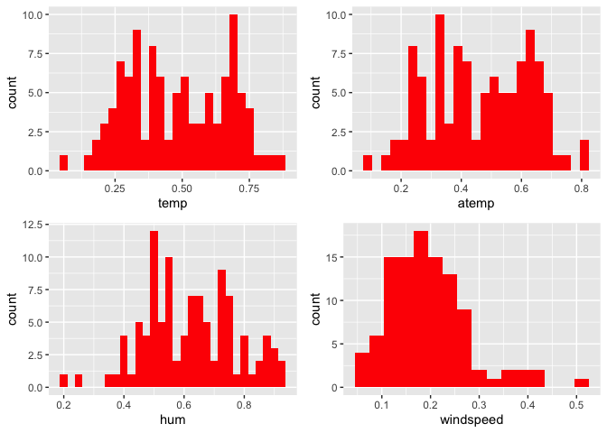
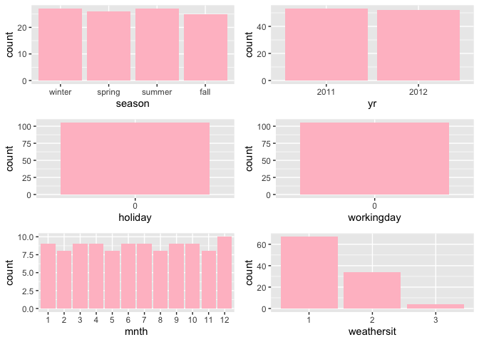
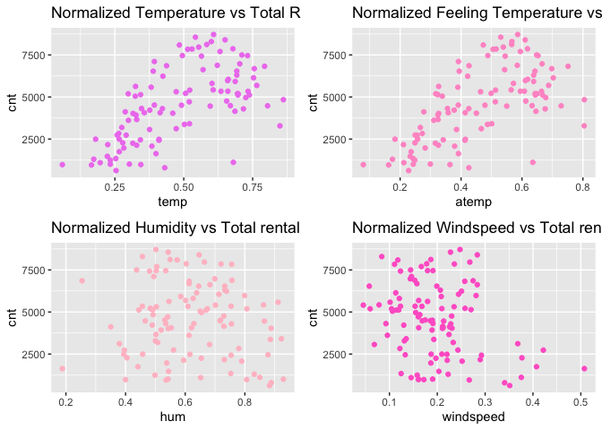
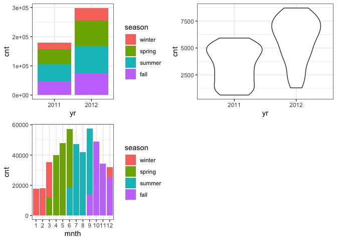
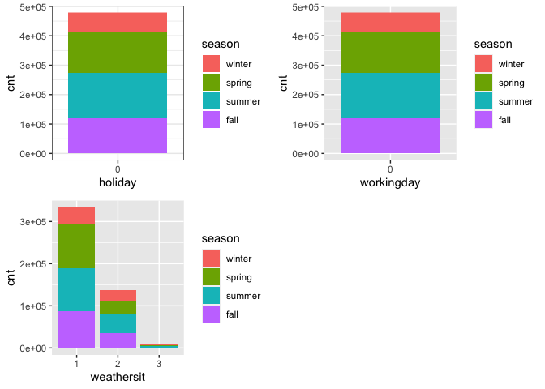

Project 2
================
Ifeoma Ojialor
10/16/2020

## Introduction

In this project, we will use a bike-sharing dataset to create machine
learning models. Before moving forward, I will briefly explain the
bike-sharing system and how it works. A bike-sharing system is a service
in which users can rent/use bicycles on a short term basis for a fee.
The goal of these programs is to provide affordable access to bicycles
for short distance trips as opposed to walking or taking public
transportation. Imagine how many people use these systems on a given
day, the numbers can vary greatly based on some elements. The goal of
this project is to build a predictive model to find out the number of
people that use these bikes in a given time period using available
information about that time/day. This in turn, can help businesses that
oversee this systems to manage them in a cost efficient manner.  
We will be using the bike-sharing dataset from the UCL Machine Learning
Repository. We will use the regression and boosted tree method to model
the response variable `cnt`.

## Exploratory Data Analysis

First we will read in the data using a relative path.

``` r
#read in data and filter to desired weekday
day1 <- read.csv("Bike-Sharing-Dataset/day.csv")
head(day1,5)
```

    ##   instant     dteday season yr mnth holiday
    ## 1       1 2011-01-01      1  0    1       0
    ## 2       2 2011-01-02      1  0    1       0
    ## 3       3 2011-01-03      1  0    1       0
    ## 4       4 2011-01-04      1  0    1       0
    ## 5       5 2011-01-05      1  0    1       0
    ##   weekday workingday weathersit     temp
    ## 1       6          0          2 0.344167
    ## 2       0          0          2 0.363478
    ## 3       1          1          1 0.196364
    ## 4       2          1          1 0.200000
    ## 5       3          1          1 0.226957
    ##      atemp      hum windspeed casual registered
    ## 1 0.363625 0.805833  0.160446    331        654
    ## 2 0.353739 0.696087  0.248539    131        670
    ## 3 0.189405 0.437273  0.248309    120       1229
    ## 4 0.212122 0.590435  0.160296    108       1454
    ## 5 0.229270 0.436957  0.186900     82       1518
    ##    cnt
    ## 1  985
    ## 2  801
    ## 3 1349
    ## 4 1562
    ## 5 1600

Next, we will remove the *casual* and *registered* variables since the
`cnt` variable is a combination of both.

``` r
day1 <- select(day1, -casual, -registered) 
day <- filter(day1, weekday == params$days)

#Check for missing values
miss <- data.frame(apply(day,2,function(x){sum(is.na(x))}))
names(miss)[1] <- "missing"
miss
```

    ##            missing
    ## instant          0
    ## dteday           0
    ## season           0
    ## yr               0
    ## mnth             0
    ## holiday          0
    ## weekday          0
    ## workingday       0
    ## weathersit       0
    ## temp             0
    ## atemp            0
    ## hum              0
    ## windspeed        0
    ## cnt              0

There are no missing values in the dataset, so we can continue with our
analysis.

``` r
#Change the variables into their appropriate format.
day$season <- as.factor(day$season)
day$weathersit <- as.factor(day$weathersit)
day$holiday <- as.factor(day$holiday)
day$workingday <- as.factor(day$workingday)
day$weekday <- as.factor(day$weekday)
day$yr <- as.factor(day$yr)
day$mnth <- as.factor(day$mnth)
levels(day$season) <- c("winter", "spring", "summer", "fall")
levels(day$yr) <- c("2011", "2012")
str(day)
```

    ## 'data.frame':    105 obs. of  14 variables:
    ##  $ instant   : int  1 8 15 22 29 36 43 50 57 64 ...
    ##  $ dteday    : chr  "2011-01-01" "2011-01-08" "2011-01-15" "2011-01-22" ...
    ##  $ season    : Factor w/ 4 levels "winter","spring",..: 1 1 1 1 1 1 1 1 1 1 ...
    ##  $ yr        : Factor w/ 2 levels "2011","2012": 1 1 1 1 1 1 1 1 1 1 ...
    ##  $ mnth      : Factor w/ 12 levels "1","2","3","4",..: 1 1 1 1 1 2 2 2 2 3 ...
    ##  $ holiday   : Factor w/ 1 level "0": 1 1 1 1 1 1 1 1 1 1 ...
    ##  $ weekday   : Factor w/ 1 level "6": 1 1 1 1 1 1 1 1 1 1 ...
    ##  $ workingday: Factor w/ 1 level "0": 1 1 1 1 1 1 1 1 1 1 ...
    ##  $ weathersit: Factor w/ 3 levels "1","2","3": 2 2 2 1 1 2 1 1 1 2 ...
    ##  $ temp      : num  0.3442 0.165 0.2333 0.0591 0.1965 ...
    ##  $ atemp     : num  0.3636 0.1623 0.2481 0.0791 0.2121 ...
    ##  $ hum       : num  0.806 0.536 0.499 0.4 0.652 ...
    ##  $ windspeed : num  0.16 0.267 0.158 0.172 0.145 ...
    ##  $ cnt       : int  985 959 1248 981 1098 1005 1472 1635 1969 2077 ...

### Univariate Analysis

The `cnt` is the response variable, so we’ll use a histogram to get a
visual understanding of the variable.

``` r
ggplot(day, aes(x = cnt)) + theme_bw() + geom_histogram(aes(y =..density..), color = "black", fill = "white", binwidth = 1000) + geom_density(alpha = 0.2, fill = "blue") + labs(title = "Count Density", x = "Count", y = "Density")
```

<!-- -->

``` r
summary(day$cnt)
```

    ##    Min. 1st Qu.  Median    Mean 3rd Qu.    Max. 
    ##     627    2732    4521    4551    6140    8714

From the histogram and summary statistics output, it is pretty evident
that the count of total rental bikes are in the sub 5000 range. We will
investigate if there is a relationship between the response variable and
other relevant predictor variables in the next section. Lets look at the
other variables individually.

``` r
#visualize numeric predictor variables using a histogram
p1 <- ggplot(day) + geom_histogram(aes(x = temp), fill = "red", binwidth = 0.03)
p2 <- ggplot(day) + geom_histogram(aes(x = atemp), fill = "red", binwidth = 0.03)
p3 <- ggplot(day) + geom_histogram(aes(x = hum), fill = "red", binwidth = 0.025)
p4 <- ggplot(day) + geom_histogram(aes(x = windspeed), fill = "red", binwidth = 0.03)
gridExtra::grid.arrange(p1,p2,p3,p4, nrow = 2)
```

<!-- --> Observations: \* No clear
cut pattern in `temp`and `atemp`.

  - `hum` appears to be skewed to the left when the dataset is not
    filtered to a specific weekday.

  - `windspeed` appears to be skewed(right). This variable should be
    transformed to curb its skewness.

  - The distribution of `temp` and `atemp` looks very similar. We should
    think about taking out one of the variables.

<!-- end list -->

``` r
#visualize categorical predictor variables
h1 <- ggplot(day) + geom_bar(aes(x = season),fill = "pink")
h2 <- ggplot(day) + geom_bar(aes(x = yr),fill = "pink")
h3 <- ggplot(day) + geom_bar(aes(x = holiday),fill = "pink")
h4 <- ggplot(day) + geom_bar(aes(x = workingday),fill = "pink")
h5 <- ggplot(day) + geom_bar(aes(x = mnth),fill = "pink")
h6 <- ggplot(day) + geom_bar(aes(x = weathersit),fill = "pink")
gridExtra::grid.arrange(h1,h2,h3,h4,h5,h6, nrow = 3)
```

<!-- -->

Observations: \* The variation between the four seasons is little to
none.

  - About the same number of people rode bikes in 2011 and 2012.

  - Many people rode bikes on days that are not holidays.

  - Most people used the bike-sharing system on days that were neither
    weekends nor holidays.

  - Most people used the bike sharing system on days with clear weather.

### Bi-variate Analysis

In this section, we will explore the predictor variables with respect to
the response variable. The objective is to discover hidden relationships
between the independent and response variables and use those findings in
the model building process.

``` r
# First, we will explore the relationship between the target and numerical variables.
p1 <- ggplot(day) +geom_point(aes(x = temp, y = cnt), colour = "violet") + labs(title = "Normalized Temperature vs Total Rental Bikes")
p2 <- ggplot(day) +geom_point(aes(x = atemp, y = cnt), colour = "#FF99CC") +labs(title = "Normalized Feeling Temperature vs Total Rental Bikes")
p3 <- ggplot(day) +geom_point(aes(x = hum, y = cnt), colour = "pink") + labs(title = "Normalized Humidity vs Total rental Bikes")
p4 <- ggplot(day) +geom_point(aes(x = windspeed, y = cnt), colour = "#FF66CC") +labs(title= "Normalized Windspeed vs Total rental Bikes")
gridExtra::grid.arrange(p1, p2, p3, p4, nrow = 2)
```

<!-- -->

Observations: \* There appears to be a positive linear relationship
between `cnt` , `temp`, and `atemp`.

  - There is also a weak relationship between `cnt`, `hum`, and
    `windspeed`.

<!-- end list -->

``` r
# Now we'll visualize the relationship between the target and categorical variables.
# Instead of using a boxplot, I will use a violin plot which is the blend of both a boxplot and density plot
g1 <- ggplot(day) + geom_col(aes(x = yr, y = cnt, fill = season))+theme_bw()
g2 <- ggplot(day) + geom_violin(aes(x = yr, y = cnt))+theme_bw()
g3 <- ggplot(day) + geom_col(aes(x = mnth, y = cnt, fill = season))+theme_bw() 
g4 <- ggplot(day) + geom_col(aes(x = holiday, y = cnt, fill = season)) + theme_bw() 
g6 <- ggplot(day) + geom_col(aes(x = workingday, y = cnt, fill = season))
g7 <- ggplot(day) + geom_col(aes(x = weathersit, y = cnt, fill = season))
gridExtra::grid.arrange(g1, g2, g3, nrow = 2)
```

<!-- -->

``` r
gridExtra::grid.arrange(g4, g6, g7, nrow = 2)
```

<!-- --> Observations: \* The
total bike rental count is higher in 2012 than 2011.

  - During workingday, the bike rental counts quite the highest compared
    to during no working day for different seasons.

  - During clear,partly cloudy weather, the bike rental count is highest
    and the second highest is during mist cloudy weather and followed by
    third highest during light snow and light rain weather.

  - The highest bike rental count was during the summer and lowest in
    the winter.

## Correlation Matrix

Correlation matrix helps us to understand the linear relationship
between variables.

``` r
day_c <- day[ , c(10:14)]
round(cor(day_c), 2)
```

    ##            temp atemp   hum windspeed   cnt
    ## temp       1.00  1.00  0.07     -0.16  0.63
    ## atemp      1.00  1.00  0.09     -0.18  0.64
    ## hum        0.07  0.09  1.00     -0.21 -0.11
    ## windspeed -0.16 -0.18 -0.21      1.00 -0.28
    ## cnt        0.63  0.64 -0.11     -0.28  1.00

From the above matrix, we can see that `temp` and `atemp` are highly
correlated. So we only need to include one of these variables in the
model to prevent multicollinearity. We will also transform the humidity
and windspeed variable.

``` r
day <- mutate(day, log_hum = log(day$hum+1))
day <- mutate(day, log_ws = log(day$windspeed + 1))

#Remove irrelevant variables
day <- select(day, -weekday,-holiday,-workingday,-dteday,-temp, -instant)
```

## Model Building

First we split the data into train and test sets.

``` r
set.seed(23)
dayIndex<- createDataPartition(day$cnt, p = 0.7, list=FALSE)
dayTrain <- day[dayIndex, ]
dayTest <- day[-dayIndex, ]

# Build a tree-based model using loocv;
fitTree <- train(cnt~ ., data = dayTrain, method = "rpart", 
              preProcess = c("center", "scale"), 
              trControl = trainControl(method = "loocv", number = 10), tuneGrid = NULL)
```

    ## Warning in preProcess.default(thresh = 0.95,
    ## k = 5, freqCut = 19, uniqueCut = 10, : These
    ## variables have zero variances: weathersit3

    ## Warning in preProcess.default(thresh = 0.95,
    ## k = 5, freqCut = 19, uniqueCut = 10, : These
    ## variables have zero variances: weathersit3

    ## Warning in preProcess.default(thresh = 0.95,
    ## k = 5, freqCut = 19, uniqueCut = 10, : These
    ## variables have zero variances: weathersit3

    ## Warning in preProcess.default(thresh = 0.95,
    ## k = 5, freqCut = 19, uniqueCut = 10, : These
    ## variables have zero variances: weathersit3

    ## Warning in preProcess.default(thresh = 0.95,
    ## k = 5, freqCut = 19, uniqueCut = 10, : These
    ## variables have zero variances: weathersit3

    ## Warning in preProcess.default(thresh = 0.95,
    ## k = 5, freqCut = 19, uniqueCut = 10, : These
    ## variables have zero variances: weathersit3

    ## Warning in preProcess.default(thresh = 0.95,
    ## k = 5, freqCut = 19, uniqueCut = 10, : These
    ## variables have zero variances: weathersit3

    ## Warning in preProcess.default(thresh = 0.95,
    ## k = 5, freqCut = 19, uniqueCut = 10, : These
    ## variables have zero variances: weathersit3

    ## Warning in preProcess.default(thresh = 0.95,
    ## k = 5, freqCut = 19, uniqueCut = 10, : These
    ## variables have zero variances: weathersit3

    ## Warning in preProcess.default(thresh = 0.95,
    ## k = 5, freqCut = 19, uniqueCut = 10, : These
    ## variables have zero variances: weathersit3

    ## Warning in preProcess.default(thresh = 0.95,
    ## k = 5, freqCut = 19, uniqueCut = 10, : These
    ## variables have zero variances: weathersit3

    ## Warning in preProcess.default(thresh = 0.95,
    ## k = 5, freqCut = 19, uniqueCut = 10, : These
    ## variables have zero variances: weathersit3

    ## Warning in preProcess.default(thresh = 0.95,
    ## k = 5, freqCut = 19, uniqueCut = 10, : These
    ## variables have zero variances: weathersit3

    ## Warning in preProcess.default(thresh = 0.95,
    ## k = 5, freqCut = 19, uniqueCut = 10, : These
    ## variables have zero variances: weathersit3

    ## Warning in preProcess.default(thresh = 0.95,
    ## k = 5, freqCut = 19, uniqueCut = 10, : These
    ## variables have zero variances: weathersit3

    ## Warning in preProcess.default(thresh = 0.95,
    ## k = 5, freqCut = 19, uniqueCut = 10, : These
    ## variables have zero variances: weathersit3

    ## Warning in preProcess.default(thresh = 0.95,
    ## k = 5, freqCut = 19, uniqueCut = 10, : These
    ## variables have zero variances: weathersit3

    ## Warning in preProcess.default(thresh = 0.95,
    ## k = 5, freqCut = 19, uniqueCut = 10, : These
    ## variables have zero variances: weathersit3

    ## Warning in preProcess.default(thresh = 0.95,
    ## k = 5, freqCut = 19, uniqueCut = 10, : These
    ## variables have zero variances: weathersit3

    ## Warning in preProcess.default(thresh = 0.95,
    ## k = 5, freqCut = 19, uniqueCut = 10, : These
    ## variables have zero variances: weathersit3

    ## Warning in preProcess.default(thresh = 0.95,
    ## k = 5, freqCut = 19, uniqueCut = 10, : These
    ## variables have zero variances: weathersit3

    ## Warning in preProcess.default(thresh = 0.95,
    ## k = 5, freqCut = 19, uniqueCut = 10, : These
    ## variables have zero variances: weathersit3

    ## Warning in preProcess.default(thresh = 0.95,
    ## k = 5, freqCut = 19, uniqueCut = 10, : These
    ## variables have zero variances: weathersit3

    ## Warning in preProcess.default(thresh = 0.95,
    ## k = 5, freqCut = 19, uniqueCut = 10, : These
    ## variables have zero variances: weathersit3

    ## Warning in preProcess.default(thresh = 0.95,
    ## k = 5, freqCut = 19, uniqueCut = 10, : These
    ## variables have zero variances: weathersit3

    ## Warning in preProcess.default(thresh = 0.95,
    ## k = 5, freqCut = 19, uniqueCut = 10, : These
    ## variables have zero variances: weathersit3

    ## Warning in preProcess.default(thresh = 0.95,
    ## k = 5, freqCut = 19, uniqueCut = 10, : These
    ## variables have zero variances: weathersit3

    ## Warning in preProcess.default(thresh = 0.95,
    ## k = 5, freqCut = 19, uniqueCut = 10, : These
    ## variables have zero variances: weathersit3

    ## Warning in preProcess.default(thresh = 0.95,
    ## k = 5, freqCut = 19, uniqueCut = 10, : These
    ## variables have zero variances: weathersit3

    ## Warning in preProcess.default(thresh = 0.95,
    ## k = 5, freqCut = 19, uniqueCut = 10, : These
    ## variables have zero variances: weathersit3

    ## Warning in preProcess.default(thresh = 0.95,
    ## k = 5, freqCut = 19, uniqueCut = 10, : These
    ## variables have zero variances: weathersit3

    ## Warning in preProcess.default(thresh = 0.95,
    ## k = 5, freqCut = 19, uniqueCut = 10, : These
    ## variables have zero variances: weathersit3

    ## Warning in preProcess.default(thresh = 0.95,
    ## k = 5, freqCut = 19, uniqueCut = 10, : These
    ## variables have zero variances: weathersit3

    ## Warning in preProcess.default(thresh = 0.95,
    ## k = 5, freqCut = 19, uniqueCut = 10, : These
    ## variables have zero variances: weathersit3

    ## Warning in preProcess.default(thresh = 0.95,
    ## k = 5, freqCut = 19, uniqueCut = 10, : These
    ## variables have zero variances: weathersit3

    ## Warning in preProcess.default(thresh = 0.95,
    ## k = 5, freqCut = 19, uniqueCut = 10, : These
    ## variables have zero variances: weathersit3

    ## Warning in preProcess.default(thresh = 0.95,
    ## k = 5, freqCut = 19, uniqueCut = 10, : These
    ## variables have zero variances: weathersit3

    ## Warning in preProcess.default(thresh = 0.95,
    ## k = 5, freqCut = 19, uniqueCut = 10, : These
    ## variables have zero variances: weathersit3

    ## Warning in preProcess.default(thresh = 0.95,
    ## k = 5, freqCut = 19, uniqueCut = 10, : These
    ## variables have zero variances: weathersit3

    ## Warning in preProcess.default(thresh = 0.95,
    ## k = 5, freqCut = 19, uniqueCut = 10, : These
    ## variables have zero variances: weathersit3

    ## Warning in preProcess.default(thresh = 0.95,
    ## k = 5, freqCut = 19, uniqueCut = 10, : These
    ## variables have zero variances: weathersit3

    ## Warning in preProcess.default(thresh = 0.95,
    ## k = 5, freqCut = 19, uniqueCut = 10, : These
    ## variables have zero variances: weathersit3

    ## Warning in preProcess.default(thresh = 0.95,
    ## k = 5, freqCut = 19, uniqueCut = 10, : These
    ## variables have zero variances: weathersit3

    ## Warning in preProcess.default(thresh = 0.95,
    ## k = 5, freqCut = 19, uniqueCut = 10, : These
    ## variables have zero variances: weathersit3

    ## Warning in preProcess.default(thresh = 0.95,
    ## k = 5, freqCut = 19, uniqueCut = 10, : These
    ## variables have zero variances: weathersit3

    ## Warning in preProcess.default(thresh = 0.95,
    ## k = 5, freqCut = 19, uniqueCut = 10, : These
    ## variables have zero variances: weathersit3

    ## Warning in preProcess.default(thresh = 0.95,
    ## k = 5, freqCut = 19, uniqueCut = 10, : These
    ## variables have zero variances: weathersit3

    ## Warning in preProcess.default(thresh = 0.95,
    ## k = 5, freqCut = 19, uniqueCut = 10, : These
    ## variables have zero variances: weathersit3

    ## Warning in preProcess.default(thresh = 0.95,
    ## k = 5, freqCut = 19, uniqueCut = 10, : These
    ## variables have zero variances: weathersit3

    ## Warning in preProcess.default(thresh = 0.95,
    ## k = 5, freqCut = 19, uniqueCut = 10, : These
    ## variables have zero variances: weathersit3

    ## Warning in preProcess.default(thresh = 0.95,
    ## k = 5, freqCut = 19, uniqueCut = 10, : These
    ## variables have zero variances: weathersit3

    ## Warning in preProcess.default(thresh = 0.95,
    ## k = 5, freqCut = 19, uniqueCut = 10, : These
    ## variables have zero variances: weathersit3

    ## Warning in preProcess.default(thresh = 0.95,
    ## k = 5, freqCut = 19, uniqueCut = 10, : These
    ## variables have zero variances: weathersit3

    ## Warning in preProcess.default(thresh = 0.95,
    ## k = 5, freqCut = 19, uniqueCut = 10, : These
    ## variables have zero variances: weathersit3

    ## Warning in preProcess.default(thresh = 0.95,
    ## k = 5, freqCut = 19, uniqueCut = 10, : These
    ## variables have zero variances: weathersit3

    ## Warning in preProcess.default(thresh = 0.95,
    ## k = 5, freqCut = 19, uniqueCut = 10, : These
    ## variables have zero variances: weathersit3

    ## Warning in preProcess.default(thresh = 0.95,
    ## k = 5, freqCut = 19, uniqueCut = 10, : These
    ## variables have zero variances: weathersit3

    ## Warning in preProcess.default(thresh = 0.95,
    ## k = 5, freqCut = 19, uniqueCut = 10, : These
    ## variables have zero variances: weathersit3

    ## Warning in preProcess.default(thresh = 0.95,
    ## k = 5, freqCut = 19, uniqueCut = 10, : These
    ## variables have zero variances: weathersit3

    ## Warning in preProcess.default(thresh = 0.95,
    ## k = 5, freqCut = 19, uniqueCut = 10, : These
    ## variables have zero variances: weathersit3

    ## Warning in preProcess.default(thresh = 0.95,
    ## k = 5, freqCut = 19, uniqueCut = 10, : These
    ## variables have zero variances: weathersit3

    ## Warning in preProcess.default(thresh = 0.95,
    ## k = 5, freqCut = 19, uniqueCut = 10, : These
    ## variables have zero variances: weathersit3

    ## Warning in preProcess.default(thresh = 0.95,
    ## k = 5, freqCut = 19, uniqueCut = 10, : These
    ## variables have zero variances: weathersit3

    ## Warning in preProcess.default(thresh = 0.95,
    ## k = 5, freqCut = 19, uniqueCut = 10, : These
    ## variables have zero variances: weathersit3

    ## Warning in preProcess.default(thresh = 0.95,
    ## k = 5, freqCut = 19, uniqueCut = 10, : These
    ## variables have zero variances: weathersit3

    ## Warning in preProcess.default(thresh = 0.95,
    ## k = 5, freqCut = 19, uniqueCut = 10, : These
    ## variables have zero variances: weathersit3

    ## Warning in preProcess.default(thresh = 0.95,
    ## k = 5, freqCut = 19, uniqueCut = 10, : These
    ## variables have zero variances: weathersit3

    ## Warning in preProcess.default(thresh = 0.95,
    ## k = 5, freqCut = 19, uniqueCut = 10, : These
    ## variables have zero variances: weathersit3

    ## Warning in preProcess.default(thresh = 0.95,
    ## k = 5, freqCut = 19, uniqueCut = 10, : These
    ## variables have zero variances: weathersit3

    ## Warning in preProcess.default(thresh = 0.95,
    ## k = 5, freqCut = 19, uniqueCut = 10, : These
    ## variables have zero variances: weathersit3

    ## Warning in preProcess.default(thresh = 0.95,
    ## k = 5, freqCut = 19, uniqueCut = 10, : These
    ## variables have zero variances: weathersit3

    ## Warning in preProcess.default(thresh = 0.95,
    ## k = 5, freqCut = 19, uniqueCut = 10, : These
    ## variables have zero variances: weathersit3

    ## Warning in preProcess.default(thresh = 0.95,
    ## k = 5, freqCut = 19, uniqueCut = 10, : These
    ## variables have zero variances: weathersit3

    ## Warning in preProcess.default(thresh = 0.95,
    ## k = 5, freqCut = 19, uniqueCut = 10, : These
    ## variables have zero variances: weathersit3

    ## Warning in preProcess.default(thresh = 0.95,
    ## k = 5, freqCut = 19, uniqueCut = 10, : These
    ## variables have zero variances: weathersit3

    ## Warning in preProcess.default(thresh = 0.95,
    ## k = 5, freqCut = 19, uniqueCut = 10, : These
    ## variables have zero variances: weathersit3

    ## Warning in nominalTrainWorkflow(x = x, y =
    ## y, wts = weights, info = trainInfo, : There
    ## were missing values in resampled performance
    ## measures.

    ## Warning in preProcess.default(thresh = 0.95,
    ## k = 5, freqCut = 19, uniqueCut = 10, : These
    ## variables have zero variances: weathersit3

``` r
# Display information from the tree fit
fitTree$results
```

    ##           cp     RMSE Rsquared      MAE
    ## 1 0.06599226 1381.529      NaN 1381.529
    ## 2 0.21623698 1769.327      NaN 1769.327
    ## 3 0.41461526 2270.214      NaN 2270.214
    ##      RMSESD RsquaredSD     MAESD
    ## 1  827.8480         NA  827.8480
    ## 2  962.8775         NA  962.8775
    ## 3 1106.3523         NA 1106.3523

``` r
# Build a boosted tree model using cv
fitBoost <- train(cnt~., data = dayTrain, method = "gbm", 
              preProcess = c("center", "scale"), 
              trControl = trainControl(method = "cv", number = 10), 
              tuneGrid = NULL)
```

    ## Warning in preProcess.default(method =
    ## c("center", "scale"), x = structure(c(0, : These
    ## variables have zero variances: weathersit3

    ## Warning in preProcess.default(thresh = 0.95,
    ## k = 5, freqCut = 19, uniqueCut = 10, : These
    ## variables have zero variances: weathersit3

    ## Warning in (function (x, y, offset = NULL, misc
    ## = NULL, distribution = "bernoulli", : variable
    ## 17: weathersit3 has no variation.

    ## Iter   TrainDeviance   ValidDeviance   StepSize   Improve
    ##      1  4395656.2177             nan     0.1000 343801.3130
    ##      2  4115451.2045             nan     0.1000 332206.1567
    ##      3  3807980.7022             nan     0.1000 193380.9019
    ##      4  3483565.4922             nan     0.1000 163947.3463
    ##      5  3298431.6978             nan     0.1000 114911.1343
    ##      6  3035332.4927             nan     0.1000 195754.0968
    ##      7  2877657.5646             nan     0.1000 154639.8462
    ##      8  2721503.3313             nan     0.1000 124063.5989
    ##      9  2561006.3666             nan     0.1000 95636.6662
    ##     10  2429338.0877             nan     0.1000 90441.1716
    ##     20  1745921.8714             nan     0.1000 -39282.8579
    ##     40  1140437.3156             nan     0.1000 -6204.3845
    ##     60   926965.4569             nan     0.1000 -16164.7279
    ##     80   815913.1983             nan     0.1000 -2464.1614
    ##    100   765777.8889             nan     0.1000 -4413.7555
    ##    120   701292.6790             nan     0.1000 -10984.1441
    ##    140   657262.9989             nan     0.1000 -5738.8329
    ##    150   640159.7097             nan     0.1000 -3839.3324

    ## Warning in preProcess.default(thresh = 0.95,
    ## k = 5, freqCut = 19, uniqueCut = 10, : These
    ## variables have zero variances: weathersit3

    ## Warning in (function (x, y, offset = NULL, misc
    ## = NULL, distribution = "bernoulli", : variable
    ## 17: weathersit3 has no variation.

    ## Iter   TrainDeviance   ValidDeviance   StepSize   Improve
    ##      1  4203051.5251             nan     0.1000 471086.6828
    ##      2  3836934.5559             nan     0.1000 308466.8558
    ##      3  3528492.2835             nan     0.1000 239397.7683
    ##      4  3271678.8017             nan     0.1000 194030.3727
    ##      5  3083805.1618             nan     0.1000 167618.6002
    ##      6  2870550.7820             nan     0.1000 188469.5960
    ##      7  2651723.7555             nan     0.1000 252330.0359
    ##      8  2469515.0477             nan     0.1000 115604.7342
    ##      9  2359684.7849             nan     0.1000 99103.9401
    ##     10  2210183.1996             nan     0.1000 105629.6898
    ##     20  1279426.2943             nan     0.1000  812.2627
    ##     40   820105.7933             nan     0.1000 6933.8970
    ##     60   691318.6852             nan     0.1000 -22075.1021
    ##     80   619672.1134             nan     0.1000 -8257.2691
    ##    100   574120.5956             nan     0.1000 -8066.5199
    ##    120   523701.2707             nan     0.1000 -7779.9100
    ##    140   478435.6513             nan     0.1000 -17905.7004
    ##    150   462866.5521             nan     0.1000 -3873.2191

    ## Warning in preProcess.default(thresh = 0.95,
    ## k = 5, freqCut = 19, uniqueCut = 10, : These
    ## variables have zero variances: weathersit3

    ## Warning in (function (x, y, offset = NULL, misc
    ## = NULL, distribution = "bernoulli", : variable
    ## 17: weathersit3 has no variation.

    ## Iter   TrainDeviance   ValidDeviance   StepSize   Improve
    ##      1  4221652.1016             nan     0.1000 529772.9116
    ##      2  3843972.5903             nan     0.1000 363438.0531
    ##      3  3550739.7212             nan     0.1000 240955.0738
    ##      4  3310677.3132             nan     0.1000 230588.8534
    ##      5  3117413.7879             nan     0.1000 99041.5809
    ##      6  2831996.5888             nan     0.1000 257255.8730
    ##      7  2688313.3444             nan     0.1000 149579.2436
    ##      8  2523537.7476             nan     0.1000 98464.3081
    ##      9  2429594.8597             nan     0.1000 87014.0187
    ##     10  2270824.9359             nan     0.1000 181618.7094
    ##     20  1421672.1980             nan     0.1000 19723.2970
    ##     40   936766.4360             nan     0.1000 19324.9382
    ##     60   777663.7292             nan     0.1000 -13186.4656
    ##     80   680123.1707             nan     0.1000 -11196.3809
    ##    100   619440.4826             nan     0.1000 -16971.6251
    ##    120   588780.2918             nan     0.1000 -11323.9258
    ##    140   543393.4609             nan     0.1000 -7280.4019
    ##    150   532542.1158             nan     0.1000 -11162.2869

    ## Warning in preProcess.default(thresh = 0.95,
    ## k = 5, freqCut = 19, uniqueCut = 10, : These
    ## variables have zero variances: weathersit3

    ## Warning in (function (x, y, offset = NULL, misc
    ## = NULL, distribution = "bernoulli", : variable
    ## 17: weathersit3 has no variation.

    ## Iter   TrainDeviance   ValidDeviance   StepSize   Improve
    ##      1  4528546.2609             nan     0.1000 234465.0084
    ##      2  4198269.4989             nan     0.1000 298593.8538
    ##      3  3744857.8451             nan     0.1000 262786.7265
    ##      4  3520779.3794             nan     0.1000 217859.5918
    ##      5  3295464.5368             nan     0.1000 178306.3902
    ##      6  3079051.1158             nan     0.1000 178680.9324
    ##      7  2945521.1337             nan     0.1000 84028.6239
    ##      8  2791868.6758             nan     0.1000 127662.2194
    ##      9  2665403.4056             nan     0.1000 109101.2713
    ##     10  2524220.2565             nan     0.1000 114960.0075
    ##     20  1736958.3207             nan     0.1000 38610.5573
    ##     40  1161780.9063             nan     0.1000 9642.9100
    ##     60   981451.3725             nan     0.1000 -1030.4476
    ##     80   879045.8022             nan     0.1000 -5150.7402
    ##    100   811160.6749             nan     0.1000 -24818.2276
    ##    120   747169.0447             nan     0.1000 -5669.6248
    ##    140   703899.9524             nan     0.1000 -4720.3555
    ##    150   689382.7165             nan     0.1000 -9470.2584

    ## Warning in preProcess.default(thresh = 0.95,
    ## k = 5, freqCut = 19, uniqueCut = 10, : These
    ## variables have zero variances: weathersit3

    ## Warning in (function (x, y, offset = NULL, misc
    ## = NULL, distribution = "bernoulli", : variable
    ## 17: weathersit3 has no variation.

    ## Iter   TrainDeviance   ValidDeviance   StepSize   Improve
    ##      1  4406565.2169             nan     0.1000 274147.5010
    ##      2  4085479.6836             nan     0.1000 207475.2714
    ##      3  3877823.4706             nan     0.1000 181895.5056
    ##      4  3693643.0046             nan     0.1000 140346.0575
    ##      5  3411984.3515             nan     0.1000 241907.9761
    ##      6  3231614.5420             nan     0.1000 186753.0337
    ##      7  2959639.8064             nan     0.1000 186895.2295
    ##      8  2739935.9758             nan     0.1000 128055.5166
    ##      9  2583455.0872             nan     0.1000 91074.8478
    ##     10  2404766.3074             nan     0.1000 65388.7123
    ##     20  1532342.0789             nan     0.1000 14442.7707
    ##     40  1031710.8101             nan     0.1000 -8126.0221
    ##     60   819102.3084             nan     0.1000 -1595.4884
    ##     80   686987.6832             nan     0.1000 -17476.4699
    ##    100   619221.0443             nan     0.1000 -11302.5190
    ##    120   562726.5509             nan     0.1000 -10283.3671
    ##    140   522340.1961             nan     0.1000 -5426.0018
    ##    150   499270.8866             nan     0.1000 -7064.3891

    ## Warning in preProcess.default(thresh = 0.95,
    ## k = 5, freqCut = 19, uniqueCut = 10, : These
    ## variables have zero variances: weathersit3

    ## Warning in (function (x, y, offset = NULL, misc
    ## = NULL, distribution = "bernoulli", : variable
    ## 17: weathersit3 has no variation.

    ## Iter   TrainDeviance   ValidDeviance   StepSize   Improve
    ##      1  4321608.8602             nan     0.1000 542567.3535
    ##      2  4001505.9362             nan     0.1000 302531.3207
    ##      3  3712825.5231             nan     0.1000 186311.5378
    ##      4  3476473.8387             nan     0.1000 203011.3859
    ##      5  3247696.6345             nan     0.1000 152563.3457
    ##      6  3094376.7467             nan     0.1000 -4301.5380
    ##      7  2911911.2125             nan     0.1000 207257.8232
    ##      8  2658087.9448             nan     0.1000 125587.6134
    ##      9  2528806.8413             nan     0.1000 54416.6071
    ##     10  2378307.8032             nan     0.1000 57626.4475
    ##     20  1508985.5487             nan     0.1000 -15664.2039
    ##     40   885023.0832             nan     0.1000 -563.3883
    ##     60   756368.9715             nan     0.1000 -11807.5279
    ##     80   676820.6698             nan     0.1000 -17997.1972
    ##    100   613033.2443             nan     0.1000 -15960.5773
    ##    120   553240.6268             nan     0.1000 -7190.1725
    ##    140   520620.8032             nan     0.1000 -3019.8620
    ##    150   508287.7124             nan     0.1000 -5133.6130

    ## Warning in preProcess.default(thresh = 0.95,
    ## k = 5, freqCut = 19, uniqueCut = 10, : These
    ## variables have zero variances: weathersit3

    ## Warning in (function (x, y, offset = NULL, misc
    ## = NULL, distribution = "bernoulli", : variable
    ## 17: weathersit3 has no variation.

    ## Iter   TrainDeviance   ValidDeviance   StepSize   Improve
    ##      1  4525724.4223             nan     0.1000 338113.4428
    ##      2  4136823.5825             nan     0.1000 285090.7662
    ##      3  3879168.9618             nan     0.1000 233407.3780
    ##      4  3580749.1673             nan     0.1000 241039.3921
    ##      5  3360053.3699             nan     0.1000 188633.1563
    ##      6  3147989.3688             nan     0.1000 228588.1540
    ##      7  2914802.0475             nan     0.1000 151391.0999
    ##      8  2745521.3174             nan     0.1000 96460.5428
    ##      9  2646228.5654             nan     0.1000 85626.8970
    ##     10  2485855.6030             nan     0.1000 69252.2558
    ##     20  1665299.2930             nan     0.1000 32504.1567
    ##     40  1058627.6182             nan     0.1000 3984.2459
    ##     60   837268.1943             nan     0.1000 -22217.4797
    ##     80   747031.4036             nan     0.1000 -8165.4574
    ##    100   700246.9108             nan     0.1000 -4365.0206
    ##    120   650368.6033             nan     0.1000 -5794.1691
    ##    140   626876.5002             nan     0.1000 -11551.3468
    ##    150   620957.0888             nan     0.1000 -15742.2122

    ## Warning in preProcess.default(thresh = 0.95,
    ## k = 5, freqCut = 19, uniqueCut = 10, : These
    ## variables have zero variances: weathersit3

    ## Warning in (function (x, y, offset = NULL, misc
    ## = NULL, distribution = "bernoulli", : variable
    ## 17: weathersit3 has no variation.

    ## Iter   TrainDeviance   ValidDeviance   StepSize   Improve
    ##      1  4440056.3512             nan     0.1000 477898.1109
    ##      2  4317268.1692             nan     0.1000 -15232.7756
    ##      3  4049409.6289             nan     0.1000 281293.2796
    ##      4  3752697.3271             nan     0.1000 263383.7973
    ##      5  3531105.8718             nan     0.1000 180085.4252
    ##      6  3296089.7031             nan     0.1000 221281.1176
    ##      7  3073311.5347             nan     0.1000 189072.9193
    ##      8  2863738.2486             nan     0.1000 150464.5074
    ##      9  2677963.9653             nan     0.1000 135373.2698
    ##     10  2473868.5683             nan     0.1000 88204.6226
    ##     20  1358934.9079             nan     0.1000 98775.3832
    ##     40   914002.0401             nan     0.1000 -23247.8796
    ##     60   747059.5056             nan     0.1000 -7758.0908
    ##     80   629970.3392             nan     0.1000 -35947.4281
    ##    100   550072.2383             nan     0.1000 -2819.1964
    ##    120   517960.1974             nan     0.1000 -7824.1915
    ##    140   482325.8488             nan     0.1000 -7792.2002
    ##    150   467793.5548             nan     0.1000 -5456.6472

    ## Warning in preProcess.default(thresh = 0.95,
    ## k = 5, freqCut = 19, uniqueCut = 10, : These
    ## variables have zero variances: weathersit3

    ## Warning in (function (x, y, offset = NULL, misc
    ## = NULL, distribution = "bernoulli", : variable
    ## 17: weathersit3 has no variation.

    ## Iter   TrainDeviance   ValidDeviance   StepSize   Improve
    ##      1  4385513.8644             nan     0.1000 361609.1547
    ##      2  3966278.3574             nan     0.1000 326443.5587
    ##      3  3735781.6189             nan     0.1000 211528.3887
    ##      4  3529814.2717             nan     0.1000 165491.2975
    ##      5  3264274.6038             nan     0.1000 214622.7152
    ##      6  3068567.6885             nan     0.1000 160752.7219
    ##      7  2723373.2974             nan     0.1000 286325.3347
    ##      8  2572496.5147             nan     0.1000 66908.8712
    ##      9  2412097.0837             nan     0.1000 108219.3228
    ##     10  2253472.8092             nan     0.1000 116184.4378
    ##     20  1418419.8177             nan     0.1000  691.6990
    ##     40   891164.3276             nan     0.1000 -3235.7574
    ##     60   697785.9085             nan     0.1000 -6595.9834
    ##     80   628726.0939             nan     0.1000 -7925.0923
    ##    100   556392.0296             nan     0.1000 -5240.9575
    ##    120   523399.9960             nan     0.1000 -4561.8314
    ##    140   493047.4858             nan     0.1000 -9504.6993
    ##    150   479670.1651             nan     0.1000 -6538.7459

    ## Warning in preProcess.default(thresh = 0.95,
    ## k = 5, freqCut = 19, uniqueCut = 10, : These
    ## variables have zero variances: weathersit3

    ## Warning in (function (x, y, offset = NULL, misc
    ## = NULL, distribution = "bernoulli", : variable
    ## 17: weathersit3 has no variation.

    ## Iter   TrainDeviance   ValidDeviance   StepSize   Improve
    ##      1  4289157.9395             nan     0.1000 273862.3559
    ##      2  3924581.0353             nan     0.1000 252828.9830
    ##      3  3668289.6932             nan     0.1000 197694.2569
    ##      4  3448122.9190             nan     0.1000 174975.9715
    ##      5  3210126.9761             nan     0.1000 200120.1553
    ##      6  3031171.2391             nan     0.1000 129041.0477
    ##      7  2895247.6704             nan     0.1000 121583.8055
    ##      8  2765731.8166             nan     0.1000 83286.7796
    ##      9  2550295.2776             nan     0.1000 76247.5844
    ##     10  2401949.4212             nan     0.1000 96287.8863
    ##     20  1627857.0286             nan     0.1000 36970.6218
    ##     40  1126533.9410             nan     0.1000 -13157.4198
    ##     60   923011.2809             nan     0.1000 -12235.7399
    ##     80   808915.7273             nan     0.1000 -2412.4720
    ##    100   746888.7038             nan     0.1000 -14349.4130
    ##    120   714481.4429             nan     0.1000 -14752.9223
    ##    140   667317.5360             nan     0.1000 -15555.0253
    ##    150   654530.2908             nan     0.1000 -11942.8020

    ## Warning in preProcess.default(thresh = 0.95,
    ## k = 5, freqCut = 19, uniqueCut = 10, : These
    ## variables have zero variances: weathersit3

    ## Warning in (function (x, y, offset = NULL, misc
    ## = NULL, distribution = "bernoulli", : variable
    ## 17: weathersit3 has no variation.

    ## Iter   TrainDeviance   ValidDeviance   StepSize   Improve
    ##      1  4056955.6586             nan     0.1000 466005.1493
    ##      2  3720593.6356             nan     0.1000 271744.6373
    ##      3  3368959.9310             nan     0.1000 185805.6811
    ##      4  3017898.3762             nan     0.1000 243706.3805
    ##      5  2852704.2037             nan     0.1000 139258.5461
    ##      6  2669854.6707             nan     0.1000 173783.7066
    ##      7  2473505.1328             nan     0.1000 151949.6962
    ##      8  2213078.1396             nan     0.1000 189372.3545
    ##      9  2098391.8707             nan     0.1000 73125.1340
    ##     10  2054030.1792             nan     0.1000 -5004.1412
    ##     20  1300298.0336             nan     0.1000 29048.3416
    ##     40   872521.3905             nan     0.1000 -4146.2641
    ##     60   757719.3367             nan     0.1000 -12671.2830
    ##     80   654374.6156             nan     0.1000 -3323.0685
    ##    100   590036.5139             nan     0.1000 -6889.9756
    ##    120   543266.6974             nan     0.1000 -5104.5352
    ##    140   496630.7060             nan     0.1000 -7827.8051
    ##    150   477971.7542             nan     0.1000 -10168.3603

    ## Warning in preProcess.default(thresh = 0.95,
    ## k = 5, freqCut = 19, uniqueCut = 10, : These
    ## variables have zero variances: weathersit3

    ## Warning in (function (x, y, offset = NULL, misc
    ## = NULL, distribution = "bernoulli", : variable
    ## 17: weathersit3 has no variation.

    ## Iter   TrainDeviance   ValidDeviance   StepSize   Improve
    ##      1  4349043.8412             nan     0.1000 155599.8836
    ##      2  4025971.8285             nan     0.1000 246109.1154
    ##      3  3503371.1043             nan     0.1000 425535.7728
    ##      4  3327451.1507             nan     0.1000 173721.9693
    ##      5  3157971.3796             nan     0.1000 163664.0757
    ##      6  2918856.5463             nan     0.1000 270360.3586
    ##      7  2742155.8138             nan     0.1000 85985.8716
    ##      8  2576066.1498             nan     0.1000 94191.7788
    ##      9  2464913.8916             nan     0.1000 87819.6304
    ##     10  2299513.5695             nan     0.1000 177026.8965
    ##     20  1536926.0343             nan     0.1000 30090.9821
    ##     40  1005204.2132             nan     0.1000 -6994.4119
    ##     60   826267.9967             nan     0.1000 -10566.0121
    ##     80   725344.8721             nan     0.1000 -14112.8160
    ##    100   626955.9541             nan     0.1000 -26364.4190
    ##    120   580737.5659             nan     0.1000 -23513.1060
    ##    140   528324.5642             nan     0.1000 -8481.2887
    ##    150   505444.6254             nan     0.1000 -13860.2544

    ## Warning in preProcess.default(thresh = 0.95,
    ## k = 5, freqCut = 19, uniqueCut = 10, : These
    ## variables have zero variances: weathersit3

    ## Warning in (function (x, y, offset = NULL, misc
    ## = NULL, distribution = "bernoulli", : variable
    ## 17: weathersit3 has no variation.

    ## Iter   TrainDeviance   ValidDeviance   StepSize   Improve
    ##      1  4346722.8857             nan     0.1000 322814.1143
    ##      2  4034171.0440             nan     0.1000 301915.7090
    ##      3  3830729.0970             nan     0.1000 249120.2715
    ##      4  3564298.4733             nan     0.1000 223113.1230
    ##      5  3354374.7357             nan     0.1000 186599.6844
    ##      6  3191201.3037             nan     0.1000 153584.9258
    ##      7  2933696.2055             nan     0.1000 130928.8833
    ##      8  2819211.3864             nan     0.1000 136698.4002
    ##      9  2700793.3529             nan     0.1000 120830.7815
    ##     10  2559210.7231             nan     0.1000 115120.2702
    ##     20  1714766.6895             nan     0.1000 38895.5898
    ##     40  1148430.5648             nan     0.1000 -40561.9550
    ##     60   943204.1392             nan     0.1000 -8003.2918
    ##     80   789336.4742             nan     0.1000 -20990.6314
    ##    100   748897.3487             nan     0.1000 -9018.7641
    ##    120   693276.0348             nan     0.1000 -6934.5355
    ##    140   659860.2087             nan     0.1000 -8060.6417
    ##    150   647751.8447             nan     0.1000 -6436.6716

    ## Warning in preProcess.default(thresh = 0.95,
    ## k = 5, freqCut = 19, uniqueCut = 10, : These
    ## variables have zero variances: weathersit3

    ## Warning in (function (x, y, offset = NULL, misc
    ## = NULL, distribution = "bernoulli", : variable
    ## 17: weathersit3 has no variation.

    ## Iter   TrainDeviance   ValidDeviance   StepSize   Improve
    ##      1  4352527.7406             nan     0.1000 333723.7841
    ##      2  4009991.8052             nan     0.1000 345182.5581
    ##      3  3700780.1984             nan     0.1000 235761.2610
    ##      4  3351875.9620             nan     0.1000 193731.3024
    ##      5  3061067.4660             nan     0.1000 141262.0692
    ##      6  2826811.1731             nan     0.1000 188741.6396
    ##      7  2673356.2442             nan     0.1000 166302.7408
    ##      8  2543611.4717             nan     0.1000 80966.2803
    ##      9  2390763.8921             nan     0.1000 121003.8310
    ##     10  2148187.2731             nan     0.1000 181967.6353
    ##     20  1465796.6522             nan     0.1000 -24583.6829
    ##     40   934075.7089             nan     0.1000 -15475.7113
    ##     60   720158.2072             nan     0.1000 -9055.9456
    ##     80   645367.9876             nan     0.1000 -6696.7208
    ##    100   574430.4846             nan     0.1000 -7224.2647
    ##    120   539029.1883             nan     0.1000 -11002.6038
    ##    140   497463.2367             nan     0.1000 -993.3703
    ##    150   478634.4371             nan     0.1000 -2372.5141

    ## Warning in preProcess.default(thresh = 0.95,
    ## k = 5, freqCut = 19, uniqueCut = 10, : These
    ## variables have zero variances: weathersit3

    ## Warning in (function (x, y, offset = NULL, misc
    ## = NULL, distribution = "bernoulli", : variable
    ## 17: weathersit3 has no variation.

    ## Iter   TrainDeviance   ValidDeviance   StepSize   Improve
    ##      1  4310702.0585             nan     0.1000 323191.8976
    ##      2  4023174.2235             nan     0.1000 260386.1635
    ##      3  3736255.8199             nan     0.1000 215484.9532
    ##      4  3448446.7353             nan     0.1000 287713.9993
    ##      5  3227160.6251             nan     0.1000 187519.1594
    ##      6  2874448.5418             nan     0.1000 291456.6050
    ##      7  2690916.5014             nan     0.1000 148478.2132
    ##      8  2529389.3436             nan     0.1000 156255.6303
    ##      9  2421995.8315             nan     0.1000 114451.1801
    ##     10  2255972.0924             nan     0.1000 83883.7386
    ##     20  1387448.7199             nan     0.1000 17166.2113
    ##     40   902628.2164             nan     0.1000  938.6050
    ##     60   686584.3288             nan     0.1000 -10922.5561
    ##     80   620090.6083             nan     0.1000 -11523.7777
    ##    100   554671.7728             nan     0.1000 1517.5433
    ##    120   503350.9765             nan     0.1000 -10053.7072
    ##    140   470802.6908             nan     0.1000 -1095.4561
    ##    150   458038.4575             nan     0.1000 -15661.9379

    ## Warning in preProcess.default(thresh = 0.95,
    ## k = 5, freqCut = 19, uniqueCut = 10, : These
    ## variables have zero variances: weathersit3

    ## Warning in (function (x, y, offset = NULL, misc
    ## = NULL, distribution = "bernoulli", : variable
    ## 17: weathersit3 has no variation.

    ## Iter   TrainDeviance   ValidDeviance   StepSize   Improve
    ##      1  4275146.4961             nan     0.1000 399637.3203
    ##      2  3966893.8091             nan     0.1000 192705.1018
    ##      3  3665650.9122             nan     0.1000 293683.9979
    ##      4  3407073.7081             nan     0.1000 261255.6092
    ##      5  3133738.7960             nan     0.1000 245482.6627
    ##      6  2933720.0578             nan     0.1000 113817.9529
    ##      7  2709709.7919             nan     0.1000 125956.8069
    ##      8  2536016.8792             nan     0.1000 117838.6058
    ##      9  2337089.5902             nan     0.1000 188043.6550
    ##     10  2224351.1443             nan     0.1000 77538.7880
    ##     20  1346399.6389             nan     0.1000 25111.8290
    ##     40   851137.4974             nan     0.1000 -19208.8739
    ##     60   640263.2090             nan     0.1000 -13584.8121
    ##     80   550236.8679             nan     0.1000 -8396.2000
    ##    100   496211.8449             nan     0.1000  771.9115
    ##    120   465846.5079             nan     0.1000 -8019.7167
    ##    140   439190.4665             nan     0.1000  -95.4108
    ##    150   431434.2664             nan     0.1000 -18380.1460

    ## Warning in preProcess.default(thresh = 0.95,
    ## k = 5, freqCut = 19, uniqueCut = 10, : These
    ## variables have zero variances: weathersit3

    ## Warning in (function (x, y, offset = NULL, misc
    ## = NULL, distribution = "bernoulli", : variable
    ## 17: weathersit3 has no variation.

    ## Iter   TrainDeviance   ValidDeviance   StepSize   Improve
    ##      1  4179103.7895             nan     0.1000 415058.0603
    ##      2  3671191.5328             nan     0.1000 497261.9100
    ##      3  3396661.3249             nan     0.1000 192511.2096
    ##      4  3140713.7382             nan     0.1000 220407.4992
    ##      5  2878798.3729             nan     0.1000 293922.6559
    ##      6  2561755.4716             nan     0.1000 321242.1401
    ##      7  2282444.2886             nan     0.1000 197965.2525
    ##      8  2155279.6059             nan     0.1000 119349.0092
    ##      9  2026645.9357             nan     0.1000 76595.8741
    ##     10  1928753.8994             nan     0.1000 93752.9189
    ##     20  1127102.0881             nan     0.1000 25603.6009
    ##     40   643262.0751             nan     0.1000 -2112.2770
    ##     60   540307.4208             nan     0.1000 -10233.4831
    ##     80   459666.5920             nan     0.1000 -10109.7283
    ##    100   418311.8743             nan     0.1000 -5321.5663
    ##    120   376338.8294             nan     0.1000 -4011.2678
    ##    140   345986.9523             nan     0.1000 -2148.0805
    ##    150   337881.4268             nan     0.1000 -8374.7334

    ## Warning in preProcess.default(thresh = 0.95,
    ## k = 5, freqCut = 19, uniqueCut = 10, : These
    ## variables have zero variances: weathersit3

    ## Warning in (function (x, y, offset = NULL, misc
    ## = NULL, distribution = "bernoulli", : variable
    ## 17: weathersit3 has no variation.

    ## Iter   TrainDeviance   ValidDeviance   StepSize   Improve
    ##      1  4211866.2897             nan     0.1000 363600.5430
    ##      2  3826523.1533             nan     0.1000 253642.5792
    ##      3  3591512.6581             nan     0.1000 248446.7610
    ##      4  3200932.7749             nan     0.1000 170317.4828
    ##      5  2813235.3550             nan     0.1000 310052.9532
    ##      6  2589755.6808             nan     0.1000 256346.7306
    ##      7  2431111.7535             nan     0.1000 143858.9927
    ##      8  2384621.0323             nan     0.1000 -31735.7731
    ##      9  2195251.9396             nan     0.1000 155183.1155
    ##     10  2087229.9689             nan     0.1000 119273.3040
    ##     20  1186698.2187             nan     0.1000 75588.5536
    ##     40   667854.6394             nan     0.1000 8693.8264
    ##     60   521225.9706             nan     0.1000 -18097.8695
    ##     80   433906.6811             nan     0.1000 -17500.6781
    ##    100   385404.7442             nan     0.1000 -12508.5746
    ##    120   360562.5347             nan     0.1000 -10083.0878
    ##    140   334197.8120             nan     0.1000 -9879.8156
    ##    150   326699.7072             nan     0.1000 -11425.8649

    ## Warning in preProcess.default(thresh = 0.95,
    ## k = 5, freqCut = 19, uniqueCut = 10, : These
    ## variables have zero variances: weathersit3

    ## Warning in (function (x, y, offset = NULL, misc
    ## = NULL, distribution = "bernoulli", : variable
    ## 17: weathersit3 has no variation.

    ## Iter   TrainDeviance   ValidDeviance   StepSize   Improve
    ##      1  4331036.0868             nan     0.1000 300810.0152
    ##      2  4077035.0741             nan     0.1000 206478.7120
    ##      3  3835965.1565             nan     0.1000 188122.0438
    ##      4  3575047.8384             nan     0.1000 213985.2525
    ##      5  3335679.0196             nan     0.1000 131137.1364
    ##      6  3251707.8767             nan     0.1000 16134.8081
    ##      7  3050414.9852             nan     0.1000 168241.9620
    ##      8  2873580.8074             nan     0.1000 119135.9113
    ##      9  2738755.6754             nan     0.1000 49233.6406
    ##     10  2585780.4336             nan     0.1000 139684.7028
    ##     20  1780387.9557             nan     0.1000 43537.6366
    ##     40  1161318.8296             nan     0.1000 5395.8779
    ##     60   935934.0508             nan     0.1000 -3789.4474
    ##     80   799423.8609             nan     0.1000 -3389.4311
    ##    100   753746.7284             nan     0.1000 -13807.1300
    ##    120   718899.1159             nan     0.1000 -8620.3232
    ##    140   685250.2869             nan     0.1000 -6131.4078
    ##    150   660767.3818             nan     0.1000 -13971.7887

    ## Warning in preProcess.default(thresh = 0.95,
    ## k = 5, freqCut = 19, uniqueCut = 10, : These
    ## variables have zero variances: weathersit3

    ## Warning in (function (x, y, offset = NULL, misc
    ## = NULL, distribution = "bernoulli", : variable
    ## 17: weathersit3 has no variation.

    ## Iter   TrainDeviance   ValidDeviance   StepSize   Improve
    ##      1  4365199.5167             nan     0.1000 473915.9656
    ##      2  4030334.5745             nan     0.1000 166034.5573
    ##      3  3740417.4169             nan     0.1000 256414.0260
    ##      4  3466139.4198             nan     0.1000 228950.9353
    ##      5  3200833.0884             nan     0.1000 204845.2027
    ##      6  2997597.4690             nan     0.1000 125297.2681
    ##      7  2702151.7561             nan     0.1000 220633.1531
    ##      8  2690987.6427             nan     0.1000 -97746.2662
    ##      9  2548662.9135             nan     0.1000 90571.8074
    ##     10  2409018.3686             nan     0.1000 131355.2059
    ##     20  1555935.7096             nan     0.1000 14785.9775
    ##     40   967039.6623             nan     0.1000 7214.3696
    ##     60   747042.5505             nan     0.1000 -4662.7105
    ##     80   665995.5281             nan     0.1000 -17881.7271
    ##    100   593012.4842             nan     0.1000 -16520.3017
    ##    120   556807.9061             nan     0.1000 -19682.7907
    ##    140   520682.5824             nan     0.1000 -5344.8283
    ##    150   506551.6160             nan     0.1000 -5699.2719

    ## Warning in preProcess.default(thresh = 0.95,
    ## k = 5, freqCut = 19, uniqueCut = 10, : These
    ## variables have zero variances: weathersit3

    ## Warning in (function (x, y, offset = NULL, misc
    ## = NULL, distribution = "bernoulli", : variable
    ## 17: weathersit3 has no variation.

    ## Iter   TrainDeviance   ValidDeviance   StepSize   Improve
    ##      1  4361400.8941             nan     0.1000 300719.7144
    ##      2  4024845.0595             nan     0.1000 178898.1747
    ##      3  3713199.8134             nan     0.1000 220689.7201
    ##      4  3502960.2880             nan     0.1000 147970.5204
    ##      5  3084912.3363             nan     0.1000 382390.5347
    ##      6  2912986.4744             nan     0.1000 186256.7752
    ##      7  2788679.5222             nan     0.1000 87947.3436
    ##      8  2590113.9040             nan     0.1000 89521.3678
    ##      9  2445167.5217             nan     0.1000 150325.8391
    ##     10  2379605.9655             nan     0.1000 51791.7862
    ##     20  1433196.7089             nan     0.1000 2949.8840
    ##     40   959845.5078             nan     0.1000 -1232.6710
    ##     60   739029.8810             nan     0.1000 -8117.6978
    ##     80   634102.4503             nan     0.1000 -16480.5345
    ##    100   569123.3111             nan     0.1000 -5363.2897
    ##    120   521146.7232             nan     0.1000 -23507.0754
    ##    140   490691.0659             nan     0.1000 -17780.5713
    ##    150   471040.8272             nan     0.1000 -10241.8494

    ## Warning in preProcess.default(thresh = 0.95,
    ## k = 5, freqCut = 19, uniqueCut = 10, : These
    ## variables have zero variances: weathersit3

    ## Warning in (function (x, y, offset = NULL, misc
    ## = NULL, distribution = "bernoulli", : variable
    ## 17: weathersit3 has no variation.

    ## Iter   TrainDeviance   ValidDeviance   StepSize   Improve
    ##      1  4332882.3151             nan     0.1000 239383.9224
    ##      2  4008025.2251             nan     0.1000 283647.3173
    ##      3  3780073.4296             nan     0.1000 157661.0501
    ##      4  3483239.6048             nan     0.1000 240758.2677
    ##      5  3247487.0266             nan     0.1000 140541.1407
    ##      6  3068795.7993             nan     0.1000 142696.6702
    ##      7  2844622.2377             nan     0.1000 190571.4606
    ##      8  2672349.2536             nan     0.1000 98370.3599
    ##      9  2483229.9212             nan     0.1000 94076.4902
    ##     10  2357864.5627             nan     0.1000 76975.8031
    ##     20  1675962.8013             nan     0.1000 -24367.6019
    ##     40  1171843.4912             nan     0.1000 3980.9274
    ##     60   951962.9783             nan     0.1000 -30920.0213
    ##     80   817567.9214             nan     0.1000 -2355.6702
    ##    100   734410.4515             nan     0.1000 -8291.4998
    ##    120   695565.0833             nan     0.1000 -5223.9215
    ##    140   659310.1226             nan     0.1000  223.2949
    ##    150   645659.4080             nan     0.1000 -11934.9115

    ## Warning in preProcess.default(thresh = 0.95,
    ## k = 5, freqCut = 19, uniqueCut = 10, : These
    ## variables have zero variances: weathersit3

    ## Warning in (function (x, y, offset = NULL, misc
    ## = NULL, distribution = "bernoulli", : variable
    ## 17: weathersit3 has no variation.

    ## Iter   TrainDeviance   ValidDeviance   StepSize   Improve
    ##      1  4257757.6164             nan     0.1000 250287.7807
    ##      2  3845549.5578             nan     0.1000 379311.6234
    ##      3  3530309.6161             nan     0.1000 323077.3604
    ##      4  3227398.8476             nan     0.1000 219558.1306
    ##      5  2841306.5718             nan     0.1000 316129.9342
    ##      6  2693926.7918             nan     0.1000 101153.7707
    ##      7  2465767.0528             nan     0.1000 184707.2668
    ##      8  2360651.3021             nan     0.1000 113261.2243
    ##      9  2146527.1825             nan     0.1000 161473.8726
    ##     10  2008648.2274             nan     0.1000 164292.0951
    ##     20  1351929.5590             nan     0.1000 -30670.1910
    ##     40   947389.4672             nan     0.1000 -14920.3004
    ##     60   748481.8429             nan     0.1000 -10895.4323
    ##     80   652221.4196             nan     0.1000 -16330.0604
    ##    100   586974.8287             nan     0.1000 -10958.2328
    ##    120   540858.5426             nan     0.1000 -2992.4088
    ##    140   509805.1573             nan     0.1000 -5084.5514
    ##    150   491599.1272             nan     0.1000 -4866.9416

    ## Warning in preProcess.default(thresh = 0.95,
    ## k = 5, freqCut = 19, uniqueCut = 10, : These
    ## variables have zero variances: weathersit3

    ## Warning in (function (x, y, offset = NULL, misc
    ## = NULL, distribution = "bernoulli", : variable
    ## 17: weathersit3 has no variation.

    ## Iter   TrainDeviance   ValidDeviance   StepSize   Improve
    ##      1  4279164.4622             nan     0.1000 269918.8908
    ##      2  3849341.8424             nan     0.1000 449346.5183
    ##      3  3603854.7789             nan     0.1000 162061.6217
    ##      4  3337531.9619             nan     0.1000 204280.6757
    ##      5  3112494.7449             nan     0.1000 135801.1623
    ##      6  2870372.9530             nan     0.1000 235654.5451
    ##      7  2649266.2146             nan     0.1000 263689.2454
    ##      8  2496520.8187             nan     0.1000 81121.0909
    ##      9  2349517.3123             nan     0.1000 56737.8827
    ##     10  2264246.9897             nan     0.1000 33646.8780
    ##     20  1473758.1856             nan     0.1000 16795.9323
    ##     40   999560.3052             nan     0.1000 -600.6810
    ##     60   805734.9233             nan     0.1000 -848.6004
    ##     80   671328.9661             nan     0.1000 -10180.5054
    ##    100   599041.1890             nan     0.1000 -3068.0899
    ##    120   549150.8208             nan     0.1000 -1607.8626
    ##    140   507455.2217             nan     0.1000 -15858.5291
    ##    150   494434.4190             nan     0.1000 -11577.4302

    ## Warning in preProcess.default(thresh = 0.95,
    ## k = 5, freqCut = 19, uniqueCut = 10, : These
    ## variables have zero variances: weathersit3

    ## Warning in (function (x, y, offset = NULL, misc
    ## = NULL, distribution = "bernoulli", : variable
    ## 17: weathersit3 has no variation.

    ## Iter   TrainDeviance   ValidDeviance   StepSize   Improve
    ##      1  4411894.0926             nan     0.1000 378337.3788
    ##      2  4063573.1904             nan     0.1000 319346.8416
    ##      3  3824377.5991             nan     0.1000 203551.5186
    ##      4  3551933.7830             nan     0.1000 248919.8156
    ##      5  3352029.1130             nan     0.1000 154024.0900
    ##      6  3119575.6411             nan     0.1000 178661.7717
    ##      7  2976292.8474             nan     0.1000 119605.4688
    ##      8  2821669.8856             nan     0.1000 119745.7063
    ##      9  2714814.2308             nan     0.1000 108495.7867
    ##     10  2619802.2170             nan     0.1000 75285.1961
    ##     20  1829487.9198             nan     0.1000 23867.3528
    ##     40  1199610.7065             nan     0.1000  -55.0819
    ##     60   936854.7891             nan     0.1000 -3041.2028
    ##     80   826127.1769             nan     0.1000 -14047.4593
    ##    100   774471.4100             nan     0.1000 -8219.2880
    ##    120   713581.9258             nan     0.1000 -3859.9508
    ##    140   667456.9544             nan     0.1000 -24025.2531
    ##    150   644849.4675             nan     0.1000 -4214.8738

    ## Warning in preProcess.default(thresh = 0.95,
    ## k = 5, freqCut = 19, uniqueCut = 10, : These
    ## variables have zero variances: weathersit3

    ## Warning in (function (x, y, offset = NULL, misc
    ## = NULL, distribution = "bernoulli", : variable
    ## 17: weathersit3 has no variation.

    ## Iter   TrainDeviance   ValidDeviance   StepSize   Improve
    ##      1  4592377.1922             nan     0.1000 356472.4673
    ##      2  4190284.6192             nan     0.1000 270485.4721
    ##      3  3953814.2456             nan     0.1000 118614.3074
    ##      4  3729596.7035             nan     0.1000 180882.7241
    ##      5  3420051.4868             nan     0.1000 313131.7028
    ##      6  3181663.8642             nan     0.1000 161643.3294
    ##      7  2995346.3984             nan     0.1000 145231.4172
    ##      8  2773081.9195             nan     0.1000 129732.6758
    ##      9  2636362.4921             nan     0.1000 113613.0452
    ##     10  2537648.5286             nan     0.1000 103303.4071
    ##     20  1552942.6550             nan     0.1000 -7957.6647
    ##     40   906169.2452             nan     0.1000 -7935.8393
    ##     60   719279.7478             nan     0.1000 -2560.1460
    ##     80   639363.3841             nan     0.1000 -6862.9660
    ##    100   573674.2944             nan     0.1000 -2446.5322
    ##    120   527321.5907             nan     0.1000 -8072.5677
    ##    140   496161.4263             nan     0.1000 -2866.4472
    ##    150   485184.9456             nan     0.1000 -16067.3325

    ## Warning in preProcess.default(thresh = 0.95,
    ## k = 5, freqCut = 19, uniqueCut = 10, : These
    ## variables have zero variances: weathersit3

    ## Warning in (function (x, y, offset = NULL, misc
    ## = NULL, distribution = "bernoulli", : variable
    ## 17: weathersit3 has no variation.

    ## Iter   TrainDeviance   ValidDeviance   StepSize   Improve
    ##      1  4624928.1097             nan     0.1000 325097.4104
    ##      2  4328314.7294             nan     0.1000 186090.4499
    ##      3  3895662.7066             nan     0.1000 398664.6617
    ##      4  3534109.2973             nan     0.1000 244236.2584
    ##      5  3303747.1468             nan     0.1000 98618.9370
    ##      6  3002437.7200             nan     0.1000 173889.3335
    ##      7  2859062.1636             nan     0.1000 132966.1263
    ##      8  2617412.4813             nan     0.1000 167505.2720
    ##      9  2430664.7814             nan     0.1000 96003.3870
    ##     10  2208256.4479             nan     0.1000 165362.9494
    ##     20  1366804.7383             nan     0.1000 36209.9418
    ##     40   895969.4837             nan     0.1000 6532.8919
    ##     60   713265.9896             nan     0.1000 2663.5627
    ##     80   599990.2059             nan     0.1000 -2813.7197
    ##    100   538885.1791             nan     0.1000 -11287.5205
    ##    120   499640.2057             nan     0.1000 -11451.7237
    ##    140   471169.1052             nan     0.1000 -8160.5583
    ##    150   458282.6086             nan     0.1000 -6669.6588

    ## Warning in preProcess.default(thresh = 0.95,
    ## k = 5, freqCut = 19, uniqueCut = 10, : These
    ## variables have zero variances: weathersit3

    ## Warning in (function (x, y, offset = NULL, misc
    ## = NULL, distribution = "bernoulli", : variable
    ## 17: weathersit3 has no variation.

    ## Iter   TrainDeviance   ValidDeviance   StepSize   Improve
    ##      1  4366187.7106             nan     0.1000 324657.4323
    ##      2  4069750.0655             nan     0.1000 275560.1742
    ##      3  3778288.5219             nan     0.1000 154628.4603
    ##      4  3508685.3853             nan     0.1000 182811.6996
    ##      5  3293731.2942             nan     0.1000 192507.9379
    ##      6  3086343.0102             nan     0.1000 102387.8584
    ##      7  2931045.0575             nan     0.1000 115346.0582
    ##      8  2787389.3226             nan     0.1000 92029.9460
    ##      9  2571868.9801             nan     0.1000 126280.7364
    ##     10  2471757.8333             nan     0.1000 -17168.9394
    ##     20  1702298.4567             nan     0.1000 39445.7560
    ##     40  1182818.7939             nan     0.1000 7435.3663
    ##     60  1011469.4586             nan     0.1000 -2432.4777
    ##     80   896289.9989             nan     0.1000 -671.9154
    ##    100   802030.2783             nan     0.1000 -3671.6382
    ##    120   756133.6691             nan     0.1000 -12866.7771
    ##    140   691623.7782             nan     0.1000 -12977.2024
    ##    150   668960.3472             nan     0.1000 -7448.4695

    ## Warning in preProcess.default(thresh = 0.95,
    ## k = 5, freqCut = 19, uniqueCut = 10, : These
    ## variables have zero variances: weathersit3

    ## Warning in (function (x, y, offset = NULL, misc
    ## = NULL, distribution = "bernoulli", : variable
    ## 17: weathersit3 has no variation.

    ## Iter   TrainDeviance   ValidDeviance   StepSize   Improve
    ##      1  4350291.4617             nan     0.1000 500809.6435
    ##      2  3998296.0514             nan     0.1000 224950.5602
    ##      3  3693861.1145             nan     0.1000 232855.3702
    ##      4  3235165.1986             nan     0.1000 322452.0278
    ##      5  2913138.0281             nan     0.1000 325906.1571
    ##      6  2738729.2112             nan     0.1000 97507.7083
    ##      7  2564713.0377             nan     0.1000 189206.8768
    ##      8  2467848.4353             nan     0.1000 87283.6938
    ##      9  2380260.5397             nan     0.1000 109058.8006
    ##     10  2259686.3486             nan     0.1000 63437.5993
    ##     20  1418820.8263             nan     0.1000 35866.3167
    ##     40   907433.7176             nan     0.1000 -8407.9758
    ##     60   723958.1656             nan     0.1000 -5077.7389
    ##     80   649618.3406             nan     0.1000 4915.6877
    ##    100   580014.9423             nan     0.1000 -5205.0707
    ##    120   524649.6447             nan     0.1000 -1955.2554
    ##    140   479731.1512             nan     0.1000 -5057.8873
    ##    150   466163.8571             nan     0.1000 -5494.7084

    ## Warning in preProcess.default(thresh = 0.95,
    ## k = 5, freqCut = 19, uniqueCut = 10, : These
    ## variables have zero variances: weathersit3

    ## Warning in (function (x, y, offset = NULL, misc
    ## = NULL, distribution = "bernoulli", : variable
    ## 17: weathersit3 has no variation.

    ## Iter   TrainDeviance   ValidDeviance   StepSize   Improve
    ##      1  4461012.6807             nan     0.1000 357286.9871
    ##      2  3970990.5075             nan     0.1000 436596.1819
    ##      3  3755227.5223             nan     0.1000 179889.1769
    ##      4  3459930.7477             nan     0.1000 202414.6999
    ##      5  3240258.3018             nan     0.1000 134250.3716
    ##      6  3071408.3790             nan     0.1000 116600.7547
    ##      7  2943017.7257             nan     0.1000 106010.5703
    ##      8  2706404.7142             nan     0.1000 239417.2906
    ##      9  2570374.9289             nan     0.1000 122120.5560
    ##     10  2351262.5270             nan     0.1000 174732.1564
    ##     20  1474414.9939             nan     0.1000 -21204.8940
    ##     40  1035933.9354             nan     0.1000 2607.8167
    ##     60   857043.0197             nan     0.1000 -33634.6451
    ##     80   747050.8336             nan     0.1000 -6063.9572
    ##    100   641732.6933             nan     0.1000 -7737.5798
    ##    120   590098.9496             nan     0.1000 -3965.5002
    ##    140   549591.6835             nan     0.1000 -8648.1297
    ##    150   530193.1624             nan     0.1000 -11298.6887

    ## Warning in preProcess.default(thresh = 0.95,
    ## k = 5, freqCut = 19, uniqueCut = 10, : These
    ## variables have zero variances: weathersit3

    ## Warning in (function (x, y, offset = NULL, misc
    ## = NULL, distribution = "bernoulli", : variable
    ## 17: weathersit3 has no variation.

    ## Iter   TrainDeviance   ValidDeviance   StepSize   Improve
    ##      1  4213145.4538             nan     0.1000 472613.6667
    ##      2  3849867.4706             nan     0.1000 326554.2864
    ##      3  3474905.1264             nan     0.1000 397326.4079
    ##      4  3081619.6159             nan     0.1000 293797.4336
    ##      5  2868370.9774             nan     0.1000 204988.4347
    ##      6  2682241.5351             nan     0.1000 154878.2357
    ##      7  2370315.0353             nan     0.1000 203114.6366
    ##      8  2163995.4749             nan     0.1000 130573.7383
    ##      9  2062260.4028             nan     0.1000 39646.5749
    ##     10  1948237.2068             nan     0.1000 105693.8819
    ##     20  1191483.9830             nan     0.1000 35863.4792
    ##     40   722520.6575             nan     0.1000 -1656.2863
    ##     60   592700.0620             nan     0.1000 -8020.4639
    ##     80   533585.9610             nan     0.1000 -14509.7072
    ##    100   467918.4478             nan     0.1000 -1047.7853

``` r
# Display information from the boost fit
fitBoost$results
```

    ##   shrinkage interaction.depth n.minobsinnode
    ## 1       0.1                 1             10
    ## 4       0.1                 2             10
    ## 7       0.1                 3             10
    ## 2       0.1                 1             10
    ## 5       0.1                 2             10
    ## 8       0.1                 3             10
    ## 3       0.1                 1             10
    ## 6       0.1                 2             10
    ## 9       0.1                 3             10
    ##   n.trees     RMSE  Rsquared      MAE   RMSESD
    ## 1      50 1153.171 0.7941011 948.8909 374.2237
    ## 4      50 1062.549 0.8085842 879.3890 397.9902
    ## 7      50 1106.128 0.7987394 904.2623 429.7363
    ## 2     100 1042.980 0.8285039 866.7642 359.5956
    ## 5     100 1016.498 0.8159080 841.5580 382.3165
    ## 8     100 1022.303 0.8333523 851.0670 438.6684
    ## 3     150 1024.340 0.8312812 843.7134 360.1577
    ## 6     150 1026.464 0.8184869 833.1731 361.4504
    ## 9     150 1028.007 0.8296651 858.5886 408.8485
    ##   RsquaredSD    MAESD
    ## 1 0.10739440 300.1788
    ## 4 0.12028438 320.2153
    ## 7 0.11781174 353.8484
    ## 2 0.09160319 301.0054
    ## 5 0.12460578 304.0935
    ## 8 0.11977905 370.7857
    ## 3 0.09606778 307.2654
    ## 6 0.10964408 277.8164
    ## 9 0.11645143 360.3100

Now, we make predictions on the test data sets using the best model
fits. Then we compare RMSE to determine the best model.

``` r
predTree <- predict(fitTree, newdata = select(dayTest, -cnt))
postResample(predTree, dayTest$cnt)
```

    ##         RMSE     Rsquared          MAE 
    ## 1393.8827613    0.6083643 1101.7228544

``` r
boostPred <- predict(fitBoost, newdata = select(dayTest, -cnt))
postResample(boostPred, dayTest$cnt)
```

    ##        RMSE    Rsquared         MAE 
    ## 855.7013018   0.8546483 641.5264339

When we compare the two models, the boosted tree model have lower RMSE
values when applied on the test dataset.
