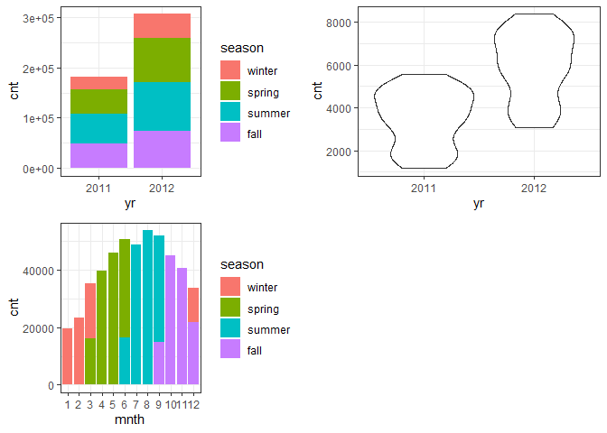

Project 2
================
Ifeoma Ojialor
10/16/2020

## Introduction

In this project, we will use a bike-sharing dataset to create machine
learning models. Before moving forward, I will briefly explain the
bike-sharing system and how it works. A bike-sharing system is a service
in which users can rent/use bicycles on a short term basis for a fee.
The goal of these programs is to provide affordable access to bicycles
for short distance trips as opposed to walking or taking public
transportation. Imagine how many people use these systems on a given
day, the numbers can vary greatly based on some elements. The goal of
this project is to build a predictive model to find out the number of
people that use these bikes in a given time period using available
information about that time/day. This in turn, can help businesses that
oversee this systems to manage them in a cost efficient manner.  
We will be using the bike-sharing dataset from the UCL Machine Learning
Repository. We will use the regression and boosted tree method to model
the response variable `cnt`.

## Exploratory Data Analysis

First we will read in the data using a relative path.

``` r
#read in data and filter to desired weekday
day1 <- read.csv("Bike-Sharing-Dataset/day.csv")
head(day1,5)
```

    ##   instant     dteday season yr mnth holiday
    ## 1       1 2011-01-01      1  0    1       0
    ## 2       2 2011-01-02      1  0    1       0
    ## 3       3 2011-01-03      1  0    1       0
    ## 4       4 2011-01-04      1  0    1       0
    ## 5       5 2011-01-05      1  0    1       0
    ##   weekday workingday weathersit     temp
    ## 1       6          0          2 0.344167
    ## 2       0          0          2 0.363478
    ## 3       1          1          1 0.196364
    ## 4       2          1          1 0.200000
    ## 5       3          1          1 0.226957
    ##      atemp      hum windspeed casual registered
    ## 1 0.363625 0.805833  0.160446    331        654
    ## 2 0.353739 0.696087  0.248539    131        670
    ## 3 0.189405 0.437273  0.248309    120       1229
    ## 4 0.212122 0.590435  0.160296    108       1454
    ## 5 0.229270 0.436957  0.186900     82       1518
    ##    cnt
    ## 1  985
    ## 2  801
    ## 3 1349
    ## 4 1562
    ## 5 1600

Next, we will remove the *casual* and *registered* variables since the
`cnt` variable is a combination of both.

``` r
day1 <- select(day1, -casual, -registered) 
day1$weekday <- as.factor(day1$weekday)
levels(day1$weekday) <- c("Sunday", "Monday", "Tuesday", "Wednesday", "Thursday", "Friday", "Saturday")
day <- filter(day1, weekday == params$days)

#Check for missing values
miss <- data.frame(apply(day,2,function(x){sum(is.na(x))}))
names(miss)[1] <- "missing"
miss
```

    ##            missing
    ## instant          0
    ## dteday           0
    ## season           0
    ## yr               0
    ## mnth             0
    ## holiday          0
    ## weekday          0
    ## workingday       0
    ## weathersit       0
    ## temp             0
    ## atemp            0
    ## hum              0
    ## windspeed        0
    ## cnt              0

There are no missing values in the dataset, so we can continue with our
analysis.

``` r
#Change the variables into their appropriate format.
day$season <- as.factor(day$season)
day$weathersit <- as.factor(day$weathersit)
day$holiday <- as.factor(day$holiday)
day$workingday <- as.factor(day$workingday)
day$yr <- as.factor(day$yr)
day$mnth <- as.factor(day$mnth)

levels(day$season) <- c("winter", "spring", "summer", "fall")
levels(day$yr) <- c("2011", "2012")
str(day)
```

    ## 'data.frame':    104 obs. of  14 variables:
    ##  $ instant   : int  7 14 21 28 35 42 49 56 63 70 ...
    ##  $ dteday    : chr  "2011-01-07" "2011-01-14" "2011-01-21" "2011-01-28" ...
    ##  $ season    : Factor w/ 4 levels "winter","spring",..: 1 1 1 1 1 1 1 1 1 1 ...
    ##  $ yr        : Factor w/ 2 levels "2011","2012": 1 1 1 1 1 1 1 1 1 1 ...
    ##  $ mnth      : Factor w/ 12 levels "1","2","3","4",..: 1 1 1 1 2 2 2 2 3 3 ...
    ##  $ holiday   : Factor w/ 2 levels "0","1": 1 1 1 1 1 1 1 1 1 1 ...
    ##  $ weekday   : Factor w/ 7 levels "Sunday","Monday",..: 6 6 6 6 6 6 6 6 6 6 ...
    ##  $ workingday: Factor w/ 2 levels "0","1": 2 2 2 2 2 2 2 2 2 2 ...
    ##  $ weathersit: Factor w/ 2 levels "1","2": 2 1 1 2 2 1 1 2 2 2 ...
    ##  $ temp      : num  0.197 0.161 0.177 0.203 0.211 ...
    ##  $ atemp     : num  0.209 0.188 0.158 0.223 0.229 ...
    ##  $ hum       : num  0.499 0.538 0.457 0.793 0.585 ...
    ##  $ windspeed : num  0.169 0.127 0.353 0.123 0.128 ...
    ##  $ cnt       : int  1510 1421 1543 1167 1708 1746 2927 1461 1944 1977 ...

### Univariate Analysis

The `cnt` is the response variable, so we’ll use a histogram to get a
visual understanding of the variable.

``` r
ggplot(day, aes(x = cnt)) + theme_bw() + geom_histogram(aes(y =..density..), color = "black", fill = "white", binwidth = 1000) + geom_density(alpha = 0.2, fill = "blue") + labs(title = "Count Density", x = "Count", y = "Density")
```

<!-- -->

``` r
summary(day$cnt)
```

    ##    Min. 1st Qu.  Median    Mean 3rd Qu.    Max. 
    ##    1167    3391    4602    4690    5900    8362

From the histogram and summary statistics output, it is pretty evident
that the count of total rental bikes are in the sub 5000 range. We will
investigate if there is a relationship between the response variable and
other relevant predictor variables in the next section. Lets look at the
other variables individually.

``` r
#visualize numeric predictor variables using a histogram
p1 <- ggplot(day) + geom_histogram(aes(x = temp), fill = "red", binwidth = 0.03)
p2 <- ggplot(day) + geom_histogram(aes(x = atemp), fill = "red", binwidth = 0.03)
p3 <- ggplot(day) + geom_histogram(aes(x = hum), fill = "red", binwidth = 0.025)
p4 <- ggplot(day) + geom_histogram(aes(x = windspeed), fill = "red", binwidth = 0.03)
gridExtra::grid.arrange(p1,p2,p3,p4, nrow = 2)
```

<!-- -->

Observations:  
\* No clear cut pattern in `temp`and `atemp`.

  - `hum` appears to be skewed to the left when the dataset is not
    filtered to a specific weekday.

  - `windspeed` appears to be skewed(right). This variable should be
    transformed to curb its skewness.

  - The distribution of `temp` and `atemp` looks very similar. We should
    think about taking out one of the variables.

<!-- end list -->

``` r
#visualize categorical predictor variables
h1 <- ggplot(day) + geom_bar(aes(x = season),fill = "pink")
h2 <- ggplot(day) + geom_bar(aes(x = yr),fill = "pink")
h3 <- ggplot(day) + geom_bar(aes(x = holiday),fill = "pink")
h4 <- ggplot(day) + geom_bar(aes(x = workingday),fill = "pink")
h5 <- ggplot(day) + geom_bar(aes(x = mnth),fill = "pink")
h6 <- ggplot(day) + geom_bar(aes(x = weathersit),fill = "pink")
gridExtra::grid.arrange(h1,h2,h3,h4,h5,h6, nrow = 3)
```

<!-- -->

Observations:  
\* The variation between the four seasons is little to none.

  - About the same number of people rode bikes in 2011 and 2012.

  - Many people rode bikes on days that are not holidays.

  - Most people used the bike-sharing system on days that were neither
    weekends nor holidays.

  - Most people used the bike sharing system on days with clear weather.

### Bi-variate Analysis

In this section, we will explore the predictor variables with respect to
the response variable. The objective is to discover hidden relationships
between the independent and response variables and use those findings in
the model building process.

``` r
# First, we will explore the relationship between the target and numerical variables.
p1 <- ggplot(day) +geom_point(aes(x = temp, y = cnt), colour = "violet") + labs(title = "Normalized Temperature vs Total Rental Bikes")
p2 <- ggplot(day) +geom_point(aes(x = atemp, y = cnt), colour = "#FF99CC") +labs(title = "Normalized Feeling Temperature vs Total Rental Bikes")
p3 <- ggplot(day) +geom_point(aes(x = hum, y = cnt), colour = "pink") + labs(title = "Normalized Humidity vs Total rental Bikes")
p4 <- ggplot(day) +geom_point(aes(x = windspeed, y = cnt), colour = "#FF66CC") +labs(title= "Normalized Windspeed vs Total rental Bikes")
gridExtra::grid.arrange(p1, p2, p3, p4, nrow = 2)
```

<!-- -->

Observations:  
\* There appears to be a positive linear relationship between `cnt` ,
`temp`, and `atemp`.

  - There is also a weak relationship between `cnt`, `hum`, and
    `windspeed`.

<!-- end list -->

``` r
# Now we'll visualize the relationship between the target and categorical variables.
# Instead of using a boxplot, I will use a violin plot which is the blend of both a boxplot and density plot
g1 <- ggplot(day) + geom_col(aes(x = yr, y = cnt, fill = season))+theme_bw()
g2 <- ggplot(day) + geom_violin(aes(x = yr, y = cnt))+theme_bw()
g3 <- ggplot(day) + geom_col(aes(x = mnth, y = cnt, fill = season))+theme_bw() 
g4 <- ggplot(day) + geom_col(aes(x = holiday, y = cnt, fill = season)) + theme_bw() 
g6 <- ggplot(day) + geom_col(aes(x = workingday, y = cnt, fill = season))
g7 <- ggplot(day) + geom_col(aes(x = weathersit, y = cnt, fill = season))
gridExtra::grid.arrange(g1, g2, g3, nrow = 2)
```

<!-- -->

``` r
gridExtra::grid.arrange(g4, g6, g7, nrow = 2)
```

<!-- --> Observations:  
\* The total bike rental count is higher in 2012 than 2011.

  - During workingday, the bike rental counts quite the highest compared
    to during no working day for different seasons.

  - During clear,partly cloudy weather, the bike rental count is highest
    and the second highest is during mist cloudy weather and followed by
    third highest during light snow and light rain weather.

  - The highest bike rental count was during the summer and lowest in
    the winter.

## Correlation Matrix

Correlation matrix helps us to understand the linear relationship
between variables.

``` r
day_c <- day[ , c(10:14)]
round(cor(day_c), 2)
```

    ##            temp atemp   hum windspeed   cnt
    ## temp       1.00  0.96  0.13     -0.20  0.60
    ## atemp      0.96  1.00  0.13     -0.24  0.57
    ## hum        0.13  0.13  1.00     -0.29 -0.09
    ## windspeed -0.20 -0.24 -0.29      1.00 -0.23
    ## cnt        0.60  0.57 -0.09     -0.23  1.00

From the above matrix, we can see that `temp` and `atemp` are highly
correlated. So we only need to include one of these variables in the
model to prevent multicollinearity. We will also transform the humidity
and windspeed variable.

``` r
day <- mutate(day, log_hum = log(day$hum+1))
day <- mutate(day, log_ws = log(day$windspeed + 1))

#Remove irrelevant variables
day <- select(day, -weekday,-holiday,-workingday,-dteday,-temp, -instant)
```

## Model Building

First we split the data into train and test sets.

``` r
set.seed(23)
dayIndex<- createDataPartition(day$cnt, p = 0.7, list=FALSE)
dayTrain <- day[dayIndex, ]
dayTest <- day[-dayIndex, ]

# Build a tree-based model using loocv;
fitTree <- train(cnt~ ., data = dayTrain, method = "rpart", 
              preProcess = c("center", "scale"), 
              trControl = trainControl(method = "loocv", number = 10), tuneGrid = data.frame(cp = 0.01:0.10))
```

    ## Warning in nominalTrainWorkflow(x = x, y =
    ## y, wts = weights, info = trainInfo, : There
    ## were missing values in resampled performance
    ## measures.

``` r
# Display information from the tree fit
fitTree$results
```

    ##     cp     RMSE Rsquared      MAE  RMSESD
    ## 1 0.01 992.3839      NaN 992.3839 587.257
    ##   RsquaredSD   MAESD
    ## 1         NA 587.257

``` r
# Build a boosted tree model using cv
fitBoost <- train(cnt~., data = dayTrain, method = "gbm", 
              preProcess = c("center", "scale"), 
              trControl = trainControl(method = "cv", number = 10), 
              tuneGrid = expand.grid(n.trees=c(10,20,50,100,500,1000),shrinkage=c(0.01,0.05,0.1,0.5),n.minobsinnode =c(3,5,10),interaction.depth=c(1,5,10)))
```

    ## Iter   TrainDeviance   ValidDeviance   StepSize   Improve
    ##      1  3604504.5572             nan     0.0100 27329.6087
    ##      2  3579473.2014             nan     0.0100 26813.2389
    ##      3  3547627.4437             nan     0.0100 24791.1310
    ##      4  3519616.1170             nan     0.0100 26684.2166
    ##      5  3491754.1593             nan     0.0100 26911.6548
    ##      6  3460625.5569             nan     0.0100 25578.1521
    ##      7  3436615.0883             nan     0.0100 25754.7407
    ##      8  3415351.5367             nan     0.0100 21721.4441
    ##      9  3390629.3137             nan     0.0100 25839.1023
    ##     10  3366639.1781             nan     0.0100 17922.2465
    ##     20  3118573.3858             nan     0.0100 23251.2644
    ##     40  2687180.2004             nan     0.0100 14688.3458
    ##     60  2338017.0783             nan     0.0100 8203.0564
    ##     80  2059571.7101             nan     0.0100 11080.7483
    ##    100  1834888.1769             nan     0.0100 9721.4633
    ##    120  1645411.4362             nan     0.0100 5697.4256
    ##    140  1507641.1210             nan     0.0100 -4197.4672
    ##    160  1389794.3652             nan     0.0100 4405.7234
    ##    180  1287955.1857             nan     0.0100 4779.2287
    ##    200  1207917.5315             nan     0.0100  226.5224
    ##    220  1119206.4080             nan     0.0100 -250.9105
    ##    240  1051718.8381             nan     0.0100 2812.5672
    ##    260   992958.0807             nan     0.0100 1861.4421
    ##    280   943658.6162             nan     0.0100 1794.3845
    ##    300   894066.0398             nan     0.0100   83.3574
    ##    320   853412.8798             nan     0.0100  255.8897
    ##    340   814653.2291             nan     0.0100 -1084.0739
    ##    360   782328.8108             nan     0.0100 1280.7287
    ##    380   753613.4641             nan     0.0100  193.2183
    ##    400   723846.7642             nan     0.0100  376.8456
    ##    420   697422.9232             nan     0.0100  -33.6554
    ##    440   673137.0476             nan     0.0100 -713.2100
    ##    460   651196.1004             nan     0.0100 -2062.6234
    ##    480   630499.2874             nan     0.0100  598.4694
    ##    500   609115.1546             nan     0.0100 -1009.8984
    ##    520   589253.7657             nan     0.0100 -763.1450
    ##    540   569609.4791             nan     0.0100 -1503.8949
    ##    560   553325.5169             nan     0.0100 -254.1287
    ##    580   535478.5661             nan     0.0100  571.2885
    ##    600   518685.6453             nan     0.0100 -389.9425
    ##    620   504527.0102             nan     0.0100    4.1649
    ##    640   490436.3106             nan     0.0100 -129.8550
    ##    660   478354.1318             nan     0.0100 -918.9124
    ##    680   465589.4745             nan     0.0100   75.4989
    ##    700   453591.5500             nan     0.0100 -442.8595
    ##    720   442323.6348             nan     0.0100 -372.2602
    ##    740   431196.3292             nan     0.0100 -1011.8365
    ##    760   420943.8215             nan     0.0100 -380.0287
    ##    780   412539.1316             nan     0.0100 -706.7732
    ##    800   403025.1293             nan     0.0100 -361.4409
    ##    820   394314.1504             nan     0.0100  235.0549
    ##    840   386097.1555             nan     0.0100 -651.6076
    ##    860   378557.0272             nan     0.0100  -78.8022
    ##    880   372106.9036             nan     0.0100 -116.2382
    ##    900   365445.5365             nan     0.0100 -300.2139
    ##    920   358159.2155             nan     0.0100 -146.1137
    ##    940   350606.8252             nan     0.0100   41.2895
    ##    960   344650.3278             nan     0.0100 -311.5274
    ##    980   338827.8315             nan     0.0100 -676.5228
    ##   1000   333033.3549             nan     0.0100 -122.2234
    ## 
    ## Iter   TrainDeviance   ValidDeviance   StepSize   Improve
    ##      1  3608273.1385             nan     0.0100 27863.4553
    ##      2  3581597.8951             nan     0.0100 23388.3392
    ##      3  3553213.4324             nan     0.0100 20834.0115
    ##      4  3524257.7582             nan     0.0100 28663.5184
    ##      5  3494171.5575             nan     0.0100 22914.7037
    ##      6  3464793.3312             nan     0.0100 20206.9025
    ##      7  3435033.0165             nan     0.0100 26485.8756
    ##      8  3409888.5486             nan     0.0100 24211.6318
    ##      9  3386306.1715             nan     0.0100 16594.0316
    ##     10  3359953.3558             nan     0.0100 20806.0895
    ##     20  3110302.3069             nan     0.0100 15740.3417
    ##     40  2670327.9975             nan     0.0100 21086.6992
    ##     60  2329484.0687             nan     0.0100 9749.8623
    ##     80  2038715.3466             nan     0.0100 12069.9980
    ##    100  1814955.9717             nan     0.0100 8069.9003
    ##    120  1635105.6765             nan     0.0100 6880.1748
    ##    140  1480049.2220             nan     0.0100 6001.0519
    ##    160  1350055.4454             nan     0.0100 5030.7814
    ##    180  1246718.5126             nan     0.0100 2830.0510
    ##    200  1158772.3144             nan     0.0100  841.7597
    ##    220  1091008.6137             nan     0.0100   56.9025
    ##    240  1029854.2670             nan     0.0100 -161.9489
    ##    260   970987.8504             nan     0.0100 1319.9336
    ##    280   921170.3919             nan     0.0100  103.0493
    ##    300   875652.8224             nan     0.0100 1415.4180
    ##    320   838010.1223             nan     0.0100   30.2489
    ##    340   803633.6748             nan     0.0100 1342.5668
    ##    360   773564.7732             nan     0.0100 -2161.1191
    ##    380   745869.2709             nan     0.0100  -31.4052
    ##    400   720374.6837             nan     0.0100 -1843.3134
    ##    420   696310.6518             nan     0.0100 -346.9337
    ##    440   672679.8219             nan     0.0100 -1530.9052
    ##    460   652926.5727             nan     0.0100 -785.4534
    ##    480   632247.9493             nan     0.0100   26.2867
    ##    500   613439.2547             nan     0.0100  332.1342
    ##    520   594047.0058             nan     0.0100   36.9470
    ##    540   576086.6625             nan     0.0100 -863.5293
    ##    560   560347.0038             nan     0.0100 -145.9307
    ##    580   545060.4832             nan     0.0100 -1790.2218
    ##    600   529873.0086             nan     0.0100 -191.1198
    ##    620   514421.0503             nan     0.0100 -577.5870
    ##    640   501644.9688             nan     0.0100 -511.9507
    ##    660   490021.5084             nan     0.0100 -828.8369
    ##    680   479841.5635             nan     0.0100 -783.9478
    ##    700   471326.4235             nan     0.0100 -106.5551
    ##    720   461623.7571             nan     0.0100 -1337.1417
    ##    740   451648.0841             nan     0.0100   33.0695
    ##    760   442875.0223             nan     0.0100 -1591.9204
    ##    780   434355.7726             nan     0.0100  312.9384
    ##    800   427131.6188             nan     0.0100 -340.7577
    ##    820   419652.1486             nan     0.0100 -299.2886
    ##    840   412089.7523             nan     0.0100 -385.7132
    ##    860   404644.5238             nan     0.0100 -450.9807
    ##    880   398390.8593             nan     0.0100 -599.9119
    ##    900   392124.8598             nan     0.0100 -964.0223
    ##    920   386569.3048             nan     0.0100 -562.2857
    ##    940   380026.8923             nan     0.0100 -1291.8845
    ##    960   375178.0019             nan     0.0100 -422.3894
    ##    980   369602.3965             nan     0.0100 -441.2410
    ##   1000   363592.3654             nan     0.0100 -943.1131
    ## 
    ## Iter   TrainDeviance   ValidDeviance   StepSize   Improve
    ##      1  3612476.2388             nan     0.0100 10263.9199
    ##      2  3583886.4912             nan     0.0100 27332.6484
    ##      3  3554636.4869             nan     0.0100 17895.3349
    ##      4  3525327.9660             nan     0.0100 16503.3386
    ##      5  3498342.5074             nan     0.0100 27352.6507
    ##      6  3474246.0644             nan     0.0100 20701.1770
    ##      7  3450001.9545             nan     0.0100 27609.8650
    ##      8  3425248.9570             nan     0.0100 20908.7396
    ##      9  3399489.0602             nan     0.0100 22120.3864
    ##     10  3379714.5212             nan     0.0100 23549.8155
    ##     20  3154611.6908             nan     0.0100 22942.7268
    ##     40  2724590.8136             nan     0.0100 14823.5217
    ##     60  2385978.2728             nan     0.0100 12944.5723
    ##     80  2097315.2425             nan     0.0100 8783.2512
    ##    100  1881026.8485             nan     0.0100 8942.4623
    ##    120  1694774.7512             nan     0.0100 6329.5096
    ##    140  1546894.5210             nan     0.0100 6767.2544
    ##    160  1421018.1021             nan     0.0100 4407.8641
    ##    180  1312367.1844             nan     0.0100 1659.5468
    ##    200  1229413.0793             nan     0.0100 3591.2292
    ##    220  1160061.8480             nan     0.0100 1672.9429
    ##    240  1102715.3895             nan     0.0100 1117.5000
    ##    260  1058302.2232             nan     0.0100  -98.2472
    ##    280  1013858.5765             nan     0.0100 -295.2143
    ##    300   977791.5373             nan     0.0100  637.8996
    ##    320   942908.0216             nan     0.0100 -464.1615
    ##    340   910227.7395             nan     0.0100  627.2684
    ##    360   880343.1812             nan     0.0100 -2637.7554
    ##    380   855001.5211             nan     0.0100 -113.3915
    ##    400   833983.8142             nan     0.0100  668.8051
    ##    420   814985.6332             nan     0.0100 -196.1988
    ##    440   790828.9828             nan     0.0100  155.2514
    ##    460   769915.8929             nan     0.0100  131.6713
    ##    480   753756.1390             nan     0.0100  838.5143
    ##    500   734691.6776             nan     0.0100  391.6664
    ##    520   720249.9261             nan     0.0100  240.1698
    ##    540   704354.0549             nan     0.0100 -506.2810
    ##    560   689535.9334             nan     0.0100  665.3449
    ##    580   678000.8593             nan     0.0100  412.2871
    ##    600   665109.9719             nan     0.0100 -1225.5300
    ##    620   654355.8406             nan     0.0100 -642.9262
    ##    640   643980.8797             nan     0.0100 -683.4146
    ##    660   631719.2681             nan     0.0100 -803.8363
    ##    680   624643.7674             nan     0.0100 -451.8853
    ##    700   614972.3118             nan     0.0100 -1119.4569
    ##    720   606678.7718             nan     0.0100 -405.4600
    ##    740   598102.0225             nan     0.0100 -1190.8606
    ##    760   589892.0875             nan     0.0100 -145.3753
    ##    780   581003.7456             nan     0.0100 -849.1513
    ##    800   572754.8753             nan     0.0100 -365.5267
    ##    820   564448.9652             nan     0.0100 -1118.0973
    ##    840   557203.3486             nan     0.0100 -706.3675
    ##    860   547835.4538             nan     0.0100 -460.0000
    ##    880   542170.6489             nan     0.0100 -826.3257
    ##    900   536363.4861             nan     0.0100 -1313.5947
    ##    920   529946.2468             nan     0.0100 -821.7403
    ##    940   523060.7976             nan     0.0100  -50.0896
    ##    960   518379.3034             nan     0.0100   17.1635
    ##    980   513837.6904             nan     0.0100 -139.9774
    ##   1000   508064.1993             nan     0.0100 -598.6312
    ## 
    ## Iter   TrainDeviance   ValidDeviance   StepSize   Improve
    ##      1  3572104.6639             nan     0.0100 36754.5994
    ##      2  3510972.3723             nan     0.0100 59864.9373
    ##      3  3457732.8066             nan     0.0100 47805.1193
    ##      4  3396417.6127             nan     0.0100 46821.4883
    ##      5  3339700.1820             nan     0.0100 51136.4963
    ##      6  3300578.3828             nan     0.0100 20860.6120
    ##      7  3244829.1793             nan     0.0100 51813.3066
    ##      8  3200647.9070             nan     0.0100 40845.2087
    ##      9  3153697.2379             nan     0.0100 36906.4426
    ##     10  3106008.8990             nan     0.0100 46360.7808
    ##     20  2664076.4000             nan     0.0100 40083.0143
    ##     40  1997293.4441             nan     0.0100 27267.8416
    ##     60  1545743.1971             nan     0.0100 11208.2339
    ##     80  1227531.8971             nan     0.0100 10590.5541
    ##    100   976718.4536             nan     0.0100 5045.8775
    ##    120   800320.6371             nan     0.0100 4753.8090
    ##    140   659857.5553             nan     0.0100 4892.7968
    ##    160   543609.7465             nan     0.0100 1634.0909
    ##    180   459867.5001             nan     0.0100  684.4715
    ##    200   393584.7511             nan     0.0100 1385.8997
    ##    220   341108.0977             nan     0.0100  980.2342
    ##    240   296119.2331             nan     0.0100  885.4647
    ##    260   258856.6848             nan     0.0100   46.5444
    ##    280   229838.8054             nan     0.0100 -373.5322
    ##    300   202121.5341             nan     0.0100  203.8971
    ##    320   180950.6319             nan     0.0100  213.0386
    ##    340   162609.6400             nan     0.0100 -102.8727
    ##    360   148529.2127             nan     0.0100 -346.0033
    ##    380   135110.4080             nan     0.0100 -449.0120
    ##    400   124150.5843             nan     0.0100  -56.0350
    ##    420   113738.6059             nan     0.0100   78.9248
    ##    440   104953.1449             nan     0.0100 -119.3007
    ##    460    97603.4369             nan     0.0100 -217.9149
    ##    480    89844.1744             nan     0.0100 -119.8081
    ##    500    83003.9928             nan     0.0100 -406.6639
    ##    520    76827.5052             nan     0.0100  -53.1859
    ##    540    72463.6423             nan     0.0100 -279.9077
    ##    560    67814.5700             nan     0.0100 -194.6734
    ##    580    64330.7532             nan     0.0100 -398.0243
    ##    600    61128.3036             nan     0.0100 -336.9164
    ##    620    56879.1690             nan     0.0100  -99.5261
    ##    640    54129.8031             nan     0.0100  -91.7497
    ##    660    50954.5047             nan     0.0100  -63.2812
    ##    680    48458.5402             nan     0.0100 -137.6406
    ##    700    45962.3896             nan     0.0100 -168.1943
    ##    720    43235.8472             nan     0.0100 -106.2936
    ##    740    41074.3937             nan     0.0100 -291.5939
    ##    760    38814.9500             nan     0.0100 -117.4578
    ##    780    36864.3651             nan     0.0100 -210.5587
    ##    800    35007.2358             nan     0.0100  -89.8259
    ##    820    33076.6456             nan     0.0100  -24.2376
    ##    840    31698.3514             nan     0.0100 -139.4227
    ##    860    30368.5022             nan     0.0100  -18.6800
    ##    880    28814.0412             nan     0.0100 -181.7592
    ##    900    27571.1514             nan     0.0100 -172.9967
    ##    920    26366.6569             nan     0.0100  -18.2381
    ##    940    25186.1641             nan     0.0100 -118.5854
    ##    960    23903.2571             nan     0.0100 -127.7097
    ##    980    22761.5505             nan     0.0100  -58.7396
    ##   1000    21891.0371             nan     0.0100 -105.4115
    ## 
    ## Iter   TrainDeviance   ValidDeviance   StepSize   Improve
    ##      1  3573677.5663             nan     0.0100 43195.6512
    ##      2  3515305.4072             nan     0.0100 56813.4892
    ##      3  3473716.3676             nan     0.0100 31958.6843
    ##      4  3428948.0250             nan     0.0100 19392.5359
    ##      5  3385490.4319             nan     0.0100 40868.0482
    ##      6  3334737.5055             nan     0.0100 49140.4305
    ##      7  3286133.4260             nan     0.0100 48673.4029
    ##      8  3235520.4392             nan     0.0100 35217.2898
    ##      9  3194254.5294             nan     0.0100 32049.4589
    ##     10  3143523.3501             nan     0.0100 41094.6039
    ##     20  2711746.4961             nan     0.0100 31847.3788
    ##     40  2069358.1455             nan     0.0100 26971.7216
    ##     60  1623022.2887             nan     0.0100 12419.7865
    ##     80  1294454.3417             nan     0.0100 13902.0021
    ##    100  1058310.9834             nan     0.0100 8254.2265
    ##    120   886341.3607             nan     0.0100 3457.3275
    ##    140   750019.6024             nan     0.0100  143.8664
    ##    160   649665.5094             nan     0.0100  -69.9859
    ##    180   563981.8913             nan     0.0100 2862.3796
    ##    200   497979.6229             nan     0.0100 -155.9493
    ##    220   446748.5482             nan     0.0100  652.5375
    ##    240   399783.7317             nan     0.0100  607.2456
    ##    260   361019.1654             nan     0.0100  781.9967
    ##    280   326252.7420             nan     0.0100  690.7278
    ##    300   299759.7282             nan     0.0100 -686.2288
    ##    320   277486.8462             nan     0.0100 -296.6703
    ##    340   254209.3795             nan     0.0100 -254.4242
    ##    360   236046.7940             nan     0.0100 -109.6431
    ##    380   219925.8375             nan     0.0100 -221.9946
    ##    400   206283.1501             nan     0.0100 -102.8422
    ##    420   194166.5943             nan     0.0100 -359.3174
    ##    440   181579.7160             nan     0.0100 -593.5077
    ##    460   171977.5612             nan     0.0100 -123.2580
    ##    480   164147.1450             nan     0.0100 -356.6724
    ##    500   155404.3328             nan     0.0100 -485.0198
    ##    520   148463.4814             nan     0.0100 -195.3276
    ##    540   140731.6823             nan     0.0100 -462.8334
    ##    560   134021.5059             nan     0.0100 -126.6029
    ##    580   128332.1255             nan     0.0100 -257.1359
    ##    600   122796.1044             nan     0.0100 -456.6332
    ##    620   116983.3861             nan     0.0100 -885.2093
    ##    640   113204.3836             nan     0.0100 -340.4764
    ##    660   108914.2002             nan     0.0100 -100.8606
    ##    680   104489.7361             nan     0.0100 -451.0333
    ##    700   100408.7837             nan     0.0100 -215.2748
    ##    720    95978.8996             nan     0.0100 -160.8117
    ##    740    92844.2807             nan     0.0100 -303.1026
    ##    760    90249.7862             nan     0.0100 -418.9420
    ##    780    87857.9446             nan     0.0100 -330.8327
    ##    800    85100.5504             nan     0.0100 -237.9229
    ##    820    82366.4988             nan     0.0100  -24.1978
    ##    840    79793.3801             nan     0.0100 -333.6863
    ##    860    77331.0369             nan     0.0100 -197.9707
    ##    880    75045.9623             nan     0.0100 -421.0507
    ##    900    72175.5120             nan     0.0100 -224.3157
    ##    920    70137.4339             nan     0.0100 -102.1045
    ##    940    67908.0224             nan     0.0100 -155.5438
    ##    960    65802.2393             nan     0.0100 -127.6706
    ##    980    63911.0921             nan     0.0100 -169.8143
    ##   1000    62208.2786             nan     0.0100 -126.6903
    ## 
    ## Iter   TrainDeviance   ValidDeviance   StepSize   Improve
    ##      1  3598610.5838             nan     0.0100 27307.9024
    ##      2  3570133.4103             nan     0.0100 26949.6894
    ##      3  3531961.3529             nan     0.0100 40615.9331
    ##      4  3502310.5870             nan     0.0100 21357.2565
    ##      5  3477405.4909             nan     0.0100 24750.6087
    ##      6  3448415.2726             nan     0.0100 26405.0863
    ##      7  3420595.5801             nan     0.0100 22633.2840
    ##      8  3390127.0136             nan     0.0100 13143.0773
    ##      9  3367325.7803             nan     0.0100 17226.8786
    ##     10  3337318.0003             nan     0.0100 29932.2114
    ##     20  3067782.0492             nan     0.0100 23562.9417
    ##     40  2597165.5380             nan     0.0100 25644.3660
    ##     60  2239992.1446             nan     0.0100 9428.3258
    ##     80  1944531.4320             nan     0.0100 9443.0868
    ##    100  1717688.1556             nan     0.0100 5121.0653
    ##    120  1527417.2978             nan     0.0100 9976.0884
    ##    140  1380712.9966             nan     0.0100 2115.8694
    ##    160  1261480.6518             nan     0.0100 4151.5388
    ##    180  1154704.0240             nan     0.0100 2647.9216
    ##    200  1071577.8225             nan     0.0100 2308.7106
    ##    220   994440.5934             nan     0.0100 2239.7947
    ##    240   939221.4967             nan     0.0100 -334.7334
    ##    260   890940.5784             nan     0.0100  731.4295
    ##    280   851112.9755             nan     0.0100 -729.2356
    ##    300   813559.8398             nan     0.0100  717.6585
    ##    320   770716.2382             nan     0.0100  747.3216
    ##    340   741006.2190             nan     0.0100  384.8318
    ##    360   712023.0709             nan     0.0100 -869.7894
    ##    380   688544.3733             nan     0.0100  540.6857
    ##    400   667373.3983             nan     0.0100 -401.3588
    ##    420   648935.3508             nan     0.0100 1397.5519
    ##    440   628376.9946             nan     0.0100 -1358.9666
    ##    460   613593.2978             nan     0.0100 -1517.7905
    ##    480   599903.6554             nan     0.0100 -840.1585
    ##    500   584701.0791             nan     0.0100 -679.4596
    ##    520   566277.9712             nan     0.0100 -912.5665
    ##    540   552766.7660             nan     0.0100   76.7377
    ##    560   538857.9327             nan     0.0100 -1154.5330
    ##    580   525719.3738             nan     0.0100 -1760.1959
    ##    600   514274.8316             nan     0.0100 -780.7665
    ##    620   504794.4549             nan     0.0100 -538.4132
    ##    640   495262.2068             nan     0.0100 -945.9494
    ##    660   486736.2901             nan     0.0100 -1817.1515
    ##    680   478985.9360             nan     0.0100 -1561.6900
    ##    700   471255.0235             nan     0.0100 -515.6767
    ##    720   462866.7318             nan     0.0100 -882.5404
    ##    740   455335.7287             nan     0.0100 -1760.5193
    ##    760   449695.9817             nan     0.0100 -743.2846
    ##    780   440032.6949             nan     0.0100 -133.9547
    ##    800   432135.1658             nan     0.0100 -757.3992
    ##    820   426883.7049             nan     0.0100 -734.1757
    ##    840   419036.9275             nan     0.0100 -463.4116
    ##    860   414408.0922             nan     0.0100 -431.5641
    ##    880   407628.6689             nan     0.0100 -478.1739
    ##    900   400801.1549             nan     0.0100 -417.5820
    ##    920   395001.3530             nan     0.0100 -513.1251
    ##    940   390198.0514             nan     0.0100 -928.1170
    ##    960   384953.3263             nan     0.0100 -968.2897
    ##    980   379581.2881             nan     0.0100 -1019.6326
    ##   1000   373660.3799             nan     0.0100 -534.3315
    ## 
    ## Iter   TrainDeviance   ValidDeviance   StepSize   Improve
    ##      1  3582274.2951             nan     0.0100 39468.2595
    ##      2  3513360.1281             nan     0.0100 55131.9461
    ##      3  3463213.6230             nan     0.0100 39492.2663
    ##      4  3411730.0597             nan     0.0100 45647.3426
    ##      5  3360005.4633             nan     0.0100 51094.0154
    ##      6  3318404.9854             nan     0.0100 33798.1706
    ##      7  3265661.9097             nan     0.0100 26083.0369
    ##      8  3210461.3185             nan     0.0100 41408.4012
    ##      9  3172692.6874             nan     0.0100 24049.2143
    ##     10  3123872.0698             nan     0.0100 39511.7705
    ##     20  2670056.7473             nan     0.0100 26529.8618
    ##     40  1966898.6156             nan     0.0100 17477.6573
    ##     60  1485183.7634             nan     0.0100 11334.1686
    ##     80  1149701.9343             nan     0.0100 13334.1227
    ##    100   887809.7965             nan     0.0100 8370.0270
    ##    120   698180.5646             nan     0.0100 5593.3459
    ##    140   561615.9297             nan     0.0100 4871.4824
    ##    160   460530.7746             nan     0.0100 2278.6980
    ##    180   377560.4111             nan     0.0100 2771.5445
    ##    200   313900.1214             nan     0.0100 1538.0500
    ##    220   267813.5094             nan     0.0100  479.9704
    ##    240   229734.8170             nan     0.0100  -42.3690
    ##    260   197682.7949             nan     0.0100  201.1404
    ##    280   171982.5465             nan     0.0100  928.4847
    ##    300   150305.9793             nan     0.0100 -311.1988
    ##    320   133040.3373             nan     0.0100   89.5019
    ##    340   118645.9618             nan     0.0100  -28.8414
    ##    360   106611.2085             nan     0.0100 -482.7798
    ##    380    96896.5793             nan     0.0100   22.5223
    ##    400    86914.3417             nan     0.0100   -2.8979
    ##    420    78637.7852             nan     0.0100 -189.2985
    ##    440    71427.1235             nan     0.0100   14.0128
    ##    460    65997.2674             nan     0.0100 -257.3861
    ##    480    61074.7583             nan     0.0100 -419.7620
    ##    500    56316.4642             nan     0.0100 -208.3076
    ##    520    52701.6193             nan     0.0100 -186.1591
    ##    540    49145.7802             nan     0.0100  -53.6396
    ##    560    45130.2210             nan     0.0100 -129.1000
    ##    580    42324.8544             nan     0.0100  -32.4592
    ##    600    39352.9567             nan     0.0100 -226.2332
    ##    620    36490.4175             nan     0.0100  -93.0668
    ##    640    34168.7908             nan     0.0100 -109.0385
    ##    660    31942.6393             nan     0.0100 -171.1822
    ##    680    29761.5715             nan     0.0100 -201.5140
    ##    700    27991.1958             nan     0.0100 -154.3565
    ##    720    26259.5599             nan     0.0100  -68.1270
    ##    740    24657.8198             nan     0.0100   -5.2947
    ##    760    23223.7470             nan     0.0100  -82.6808
    ##    780    21995.6684             nan     0.0100   25.8338
    ##    800    20457.5299             nan     0.0100  -86.1574
    ##    820    19220.9992             nan     0.0100 -119.4787
    ##    840    18595.0290             nan     0.0100  -81.8083
    ##    860    17632.8771             nan     0.0100  -45.5576
    ##    880    16699.0522             nan     0.0100  -53.9020
    ##    900    15856.0856             nan     0.0100  -85.8619
    ##    920    15158.9664             nan     0.0100  -40.5545
    ##    940    14301.1234             nan     0.0100  -84.2358
    ##    960    13590.0095             nan     0.0100  -63.1881
    ##    980    12915.2714             nan     0.0100  -64.9606
    ##   1000    12222.3404             nan     0.0100  -53.2229
    ## 
    ## Iter   TrainDeviance   ValidDeviance   StepSize   Improve
    ##      1  3586041.1349             nan     0.0100 37402.6630
    ##      2  3541930.9575             nan     0.0100 45356.6067
    ##      3  3486292.6287             nan     0.0100 50805.4942
    ##      4  3430668.6873             nan     0.0100 47679.1014
    ##      5  3372963.0900             nan     0.0100 50226.7852
    ##      6  3328998.9210             nan     0.0100 38624.9882
    ##      7  3276931.9429             nan     0.0100 47975.1819
    ##      8  3236202.3211             nan     0.0100 33606.0110
    ##      9  3193970.5515             nan     0.0100 30676.4136
    ##     10  3148488.2666             nan     0.0100 33787.1644
    ##     20  2735209.6832             nan     0.0100 37823.2925
    ##     40  2088528.2296             nan     0.0100 18190.1965
    ##     60  1623666.8691             nan     0.0100 8762.5658
    ##     80  1305711.9729             nan     0.0100 10073.2212
    ##    100  1073289.3597             nan     0.0100 7028.8507
    ##    120   887912.2649             nan     0.0100 7387.7135
    ##    140   747972.8709             nan     0.0100 2659.3414
    ##    160   632730.8901             nan     0.0100 1689.6619
    ##    180   554258.1558             nan     0.0100  565.0481
    ##    200   490530.1100             nan     0.0100  537.5899
    ##    220   436240.5522             nan     0.0100  595.6674
    ##    240   394048.0470             nan     0.0100 -749.0256
    ##    260   358566.5243             nan     0.0100  -81.4422
    ##    280   323168.6640             nan     0.0100   -4.4514
    ##    300   299619.5885             nan     0.0100 -1108.0781
    ##    320   274620.8999             nan     0.0100 -980.5421
    ##    340   253656.5846             nan     0.0100  276.4248
    ##    360   236306.0879             nan     0.0100  254.5896
    ##    380   221561.3618             nan     0.0100 -451.1689
    ##    400   206801.3494             nan     0.0100 -112.7684
    ##    420   195104.3968             nan     0.0100  -86.7621
    ##    440   184916.1009             nan     0.0100 -394.7172
    ##    460   174650.0214             nan     0.0100 -596.6595
    ##    480   165328.4004             nan     0.0100 -744.4047
    ##    500   158356.9511             nan     0.0100 -199.3519
    ##    520   151249.3519             nan     0.0100 -276.0042
    ##    540   145085.5008             nan     0.0100 -1042.8824
    ##    560   138277.5513             nan     0.0100 -476.8788
    ##    580   132783.2148             nan     0.0100 -160.3123
    ##    600   126922.9157             nan     0.0100 -232.9160
    ##    620   121926.8793             nan     0.0100 -384.9602
    ##    640   116663.9036             nan     0.0100 -133.1112
    ##    660   111268.3392             nan     0.0100 -195.7503
    ##    680   107274.6229             nan     0.0100 -116.2351
    ##    700   103341.1522             nan     0.0100 -419.5025
    ##    720    99644.1257             nan     0.0100 -224.1862
    ##    740    96160.6247             nan     0.0100 -223.8005
    ##    760    92235.6794             nan     0.0100 -201.8207
    ##    780    89146.8880             nan     0.0100  -45.4375
    ##    800    85824.9010             nan     0.0100 -327.6862
    ##    820    83253.5107             nan     0.0100 -315.6121
    ##    840    80049.8204             nan     0.0100  -13.0087
    ##    860    77962.0008             nan     0.0100 -281.4983
    ##    880    75520.3600             nan     0.0100 -266.6299
    ##    900    72632.7975             nan     0.0100 -357.8506
    ##    920    70346.0081             nan     0.0100 -176.8254
    ##    940    68139.5477             nan     0.0100 -301.1390
    ##    960    65537.3265             nan     0.0100   57.3653
    ##    980    63982.0362             nan     0.0100 -185.9992
    ##   1000    62309.8183             nan     0.0100 -157.5219
    ## 
    ## Iter   TrainDeviance   ValidDeviance   StepSize   Improve
    ##      1  3601753.7785             nan     0.0100 28436.7411
    ##      2  3570749.3179             nan     0.0100 32796.4197
    ##      3  3544198.6271             nan     0.0100 26618.0489
    ##      4  3517522.4855             nan     0.0100 27126.6935
    ##      5  3484606.9362             nan     0.0100 23647.6671
    ##      6  3454917.9360             nan     0.0100 32139.3174
    ##      7  3418364.2751             nan     0.0100 30158.0906
    ##      8  3390909.7894             nan     0.0100 19717.2221
    ##      9  3352175.3597             nan     0.0100 37870.7341
    ##     10  3309290.6638             nan     0.0100 35818.7029
    ##     20  3059074.2041             nan     0.0100 15822.2660
    ##     40  2594135.1287             nan     0.0100 16909.8405
    ##     60  2261520.8067             nan     0.0100 13723.6709
    ##     80  1960174.7263             nan     0.0100 8252.5321
    ##    100  1727701.3876             nan     0.0100 3812.4535
    ##    120  1553800.7061             nan     0.0100 11226.6934
    ##    140  1383675.5636             nan     0.0100 4111.5058
    ##    160  1256116.4150             nan     0.0100  403.0995
    ##    180  1163428.8021             nan     0.0100 2426.5672
    ##    200  1072446.9245             nan     0.0100 1184.3049
    ##    220  1006515.9391             nan     0.0100 1003.0059
    ##    240   946734.2845             nan     0.0100 2915.7015
    ##    260   893169.4145             nan     0.0100 -1825.4561
    ##    280   849757.1669             nan     0.0100  866.0317
    ##    300   804392.5943             nan     0.0100 1013.6596
    ##    320   773916.3287             nan     0.0100 -171.7138
    ##    340   740782.4277             nan     0.0100  137.8040
    ##    360   710457.8879             nan     0.0100 -1288.6309
    ##    380   686483.3697             nan     0.0100 -326.3138
    ##    400   657964.6831             nan     0.0100 -696.1192
    ##    420   634019.7228             nan     0.0100 -855.9931
    ##    440   616076.2747             nan     0.0100  897.9647
    ##    460   595599.3742             nan     0.0100 -565.8466
    ##    480   575811.4200             nan     0.0100 1039.8751
    ##    500   557343.2474             nan     0.0100 -998.2784
    ##    520   543182.4508             nan     0.0100 -289.3226
    ##    540   529008.8646             nan     0.0100 -643.7864
    ##    560   518860.8732             nan     0.0100 -579.2752
    ##    580   508352.9454             nan     0.0100  -42.7697
    ##    600   494394.2756             nan     0.0100 -187.1695
    ##    620   484948.8084             nan     0.0100 -672.4620
    ##    640   474313.2764             nan     0.0100 -753.5327
    ##    660   464769.9969             nan     0.0100 -1889.0891
    ##    680   457399.9925             nan     0.0100 -1385.7029
    ##    700   447622.7282             nan     0.0100 -1146.8186
    ##    720   438131.2628             nan     0.0100 -229.1917
    ##    740   430672.9068             nan     0.0100 -294.0999
    ##    760   424525.0388             nan     0.0100 -596.2746
    ##    780   419107.9918             nan     0.0100 -773.3293
    ##    800   412834.0220             nan     0.0100 -1985.2913
    ##    820   406863.6736             nan     0.0100  -70.7866
    ##    840   401844.6331             nan     0.0100 -146.7189
    ##    860   394166.9295             nan     0.0100 -649.7400
    ##    880   390500.0347             nan     0.0100 -148.1259
    ##    900   384985.4113             nan     0.0100 -505.2908
    ##    920   380466.0436             nan     0.0100 -848.9088
    ##    940   373287.7505             nan     0.0100 -1060.0281
    ##    960   367705.0719             nan     0.0100 -614.6703
    ##    980   363890.9106             nan     0.0100 -527.5512
    ##   1000   359282.8865             nan     0.0100 -635.2462
    ## 
    ## Iter   TrainDeviance   ValidDeviance   StepSize   Improve
    ##      1  3485691.1150             nan     0.0500 141312.9278
    ##      2  3374181.2002             nan     0.0500 87219.2898
    ##      3  3245030.1716             nan     0.0500 136647.2246
    ##      4  3108703.6209             nan     0.0500 122135.5717
    ##      5  2992307.2772             nan     0.0500 91311.7275
    ##      6  2894024.1110             nan     0.0500 76941.2204
    ##      7  2773150.4879             nan     0.0500 93725.2083
    ##      8  2662731.1689             nan     0.0500 85018.5175
    ##      9  2568858.1183             nan     0.0500 64874.9814
    ##     10  2461591.1801             nan     0.0500 72731.8562
    ##     20  1794621.1475             nan     0.0500 56048.5882
    ##     40  1146064.6351             nan     0.0500 20477.8026
    ##     60   873885.9572             nan     0.0500   54.4983
    ##     80   702354.4357             nan     0.0500 -5053.8478
    ##    100   593457.6250             nan     0.0500 -1696.9679
    ##    120   510369.6085             nan     0.0500 -3641.8866
    ##    140   441217.7749             nan     0.0500 -1924.1467
    ##    160   402376.3892             nan     0.0500 -7586.4247
    ##    180   364018.4193             nan     0.0500 -776.0979
    ##    200   337977.4422             nan     0.0500 -4890.0511
    ##    220   316440.0521             nan     0.0500 -287.6478
    ##    240   296327.2927             nan     0.0500 -3895.7243
    ##    260   280328.6822             nan     0.0500 -813.4815
    ##    280   266618.9682             nan     0.0500 -2277.3162
    ##    300   253885.7601             nan     0.0500 -964.6658
    ##    320   240751.1497             nan     0.0500 -1612.3687
    ##    340   228671.0898             nan     0.0500 -1596.9622
    ##    360   216900.1326             nan     0.0500 -1116.0204
    ##    380   208458.6855             nan     0.0500 -3273.8869
    ##    400   199919.9337             nan     0.0500 -1523.1305
    ##    420   193276.3175             nan     0.0500 -1166.9542
    ##    440   186793.3880             nan     0.0500 -1836.4080
    ##    460   181029.5792             nan     0.0500 -1532.5461
    ##    480   175260.3027             nan     0.0500 -2117.7690
    ##    500   168833.7547             nan     0.0500 -1075.8327
    ##    520   161893.1608             nan     0.0500 -801.5517
    ##    540   157193.9384             nan     0.0500 -1075.4837
    ##    560   152392.5549             nan     0.0500 -1155.4090
    ##    580   148800.5363             nan     0.0500 -2732.4598
    ##    600   143776.3164             nan     0.0500 -1412.8933
    ##    620   140425.7517             nan     0.0500 -2722.2941
    ##    640   133833.2881             nan     0.0500 -1052.5938
    ##    660   131234.3577             nan     0.0500 -2048.3042
    ##    680   127856.4572             nan     0.0500 -863.0833
    ##    700   124354.9673             nan     0.0500 -1022.5209
    ##    720   120899.3250             nan     0.0500 -976.5557
    ##    740   117834.9400             nan     0.0500 -1323.4252
    ##    760   114820.7854             nan     0.0500 -1155.7379
    ##    780   112154.2160             nan     0.0500 -874.1583
    ##    800   109313.5072             nan     0.0500 -843.2842
    ##    820   106761.1953             nan     0.0500 -1207.0670
    ##    840   104609.8240             nan     0.0500 -1219.8416
    ##    860   101204.3533             nan     0.0500 -478.8571
    ##    880   100277.1607             nan     0.0500 -484.5506
    ##    900    97235.9562             nan     0.0500 -1490.9694
    ##    920    95406.9530             nan     0.0500 -986.2840
    ##    940    93000.4628             nan     0.0500 -488.7982
    ##    960    91295.6474             nan     0.0500 -1439.6132
    ##    980    90165.6829             nan     0.0500 -727.8629
    ##   1000    88714.8059             nan     0.0500 -553.0507
    ## 
    ## Iter   TrainDeviance   ValidDeviance   StepSize   Improve
    ##      1  3492535.2213             nan     0.0500 109468.3423
    ##      2  3358271.3297             nan     0.0500 100865.1912
    ##      3  3233196.7802             nan     0.0500 132360.7544
    ##      4  3135449.3889             nan     0.0500 112273.4995
    ##      5  3026885.2023             nan     0.0500 85010.1345
    ##      6  2901210.0956             nan     0.0500 103665.5502
    ##      7  2781475.5526             nan     0.0500 97082.0940
    ##      8  2681230.4120             nan     0.0500 78066.9731
    ##      9  2580185.9119             nan     0.0500 83236.6429
    ##     10  2479504.0016             nan     0.0500 62358.8970
    ##     20  1807186.9730             nan     0.0500 34305.8337
    ##     40  1172610.0781             nan     0.0500 4104.3397
    ##     60   867692.9731             nan     0.0500 -5134.2302
    ##     80   722874.0681             nan     0.0500 -1017.2932
    ##    100   603415.3779             nan     0.0500  886.3632
    ##    120   525486.2754             nan     0.0500 -1222.2000
    ##    140   469622.8605             nan     0.0500 -622.9660
    ##    160   434428.0582             nan     0.0500 -3713.3337
    ##    180   411661.8385             nan     0.0500 -761.2478
    ##    200   386691.7318             nan     0.0500 -1444.9414
    ##    220   364582.0385             nan     0.0500 -3891.2854
    ##    240   341657.3769             nan     0.0500 -2123.3273
    ##    260   325414.7783             nan     0.0500 -3041.5472
    ##    280   312552.1538             nan     0.0500 -2164.4930
    ##    300   303010.8019             nan     0.0500 -1574.1314
    ##    320   292663.1962             nan     0.0500 -3933.3783
    ##    340   284204.1867             nan     0.0500 -1010.9173
    ##    360   275467.4041             nan     0.0500 -1613.6624
    ##    380   267461.2268             nan     0.0500 -2698.0203
    ##    400   259327.1685             nan     0.0500 -2637.1186
    ##    420   249594.6163             nan     0.0500   78.7253
    ##    440   242177.1035             nan     0.0500 -1395.9945
    ##    460   237606.8315             nan     0.0500 -971.6001
    ##    480   234820.1270             nan     0.0500 -1499.5904
    ##    500   226814.2197             nan     0.0500 -2874.3046
    ##    520   220639.2712             nan     0.0500 -873.3613
    ##    540   216575.4781             nan     0.0500 -1532.5401
    ##    560   210144.7470             nan     0.0500 -347.5217
    ##    580   204165.9569             nan     0.0500 -543.4217
    ##    600   200517.6312             nan     0.0500 -2616.2584
    ##    620   194796.3529             nan     0.0500 -4438.3917
    ##    640   191141.0096             nan     0.0500 -771.1336
    ##    660   187218.8538             nan     0.0500 -647.0487
    ##    680   183010.6985             nan     0.0500 -490.6179
    ##    700   177224.5642             nan     0.0500  222.8253
    ##    720   173031.1309             nan     0.0500 -2424.9038
    ##    740   170524.0549             nan     0.0500 -1481.3543
    ##    760   164839.9273             nan     0.0500 -1079.7432
    ##    780   162407.0026             nan     0.0500 -811.1469
    ##    800   158680.4406             nan     0.0500 -1069.6366
    ##    820   155353.3482             nan     0.0500 -1240.9295
    ##    840   151434.7952             nan     0.0500 -1373.8534
    ##    860   147379.3853             nan     0.0500 -701.2308
    ##    880   144492.9672             nan     0.0500 -3339.3824
    ##    900   141095.5334             nan     0.0500 -2058.8706
    ##    920   137997.3610             nan     0.0500 -2855.0963
    ##    940   135933.7161             nan     0.0500 -3739.5932
    ##    960   133572.4797             nan     0.0500 -1036.1230
    ##    980   131322.3819             nan     0.0500 -1313.3221
    ##   1000   128697.0008             nan     0.0500 -796.4028
    ## 
    ## Iter   TrainDeviance   ValidDeviance   StepSize   Improve
    ##      1  3519615.4838             nan     0.0500 135587.0796
    ##      2  3371562.4208             nan     0.0500 75489.6387
    ##      3  3203882.2427             nan     0.0500 109948.2094
    ##      4  3092205.3129             nan     0.0500 109990.6248
    ##      5  2959593.0879             nan     0.0500 83571.5862
    ##      6  2817065.7072             nan     0.0500 109608.8202
    ##      7  2703342.3956             nan     0.0500 86413.3984
    ##      8  2602910.4330             nan     0.0500 69576.9840
    ##      9  2525674.9193             nan     0.0500 60643.5356
    ##     10  2439257.8394             nan     0.0500 87463.1441
    ##     20  1790925.6760             nan     0.0500 43151.2211
    ##     40  1166025.5667             nan     0.0500 9444.9644
    ##     60   938473.4638             nan     0.0500 -7348.7752
    ##     80   810985.9498             nan     0.0500 -1289.6953
    ##    100   719829.8437             nan     0.0500 3632.0459
    ##    120   658802.4879             nan     0.0500 -2178.8550
    ##    140   605096.5287             nan     0.0500    6.3662
    ##    160   559303.0631             nan     0.0500 -113.3355
    ##    180   527850.5869             nan     0.0500 -7981.8366
    ##    200   509784.2892             nan     0.0500 -4542.3260
    ##    220   486519.3067             nan     0.0500 -2332.5523
    ##    240   465494.1524             nan     0.0500 -1553.8463
    ##    260   447028.8340             nan     0.0500 -1039.6288
    ##    280   433085.0075             nan     0.0500  701.7617
    ##    300   421994.7134             nan     0.0500 -1186.0863
    ##    320   412317.6899             nan     0.0500 -3223.1738
    ##    340   397540.0134             nan     0.0500 -1013.7164
    ##    360   389354.2652             nan     0.0500 -1420.9304
    ##    380   376983.2780             nan     0.0500 -2131.7552
    ##    400   366709.0920             nan     0.0500 -2032.0077
    ##    420   359687.9314             nan     0.0500 -4177.9407
    ##    440   351355.3759             nan     0.0500 -994.0304
    ##    460   340515.8126             nan     0.0500 -2012.5851
    ##    480   334230.2924             nan     0.0500 -523.8943
    ##    500   329764.2583             nan     0.0500 -2670.7052
    ##    520   324000.8778             nan     0.0500 -2865.1117
    ##    540   317250.1988             nan     0.0500 -2740.3718
    ##    560   313143.0041             nan     0.0500 -747.8042
    ##    580   305266.2579             nan     0.0500 -2774.9859
    ##    600   299405.6716             nan     0.0500 -1268.4714
    ##    620   292851.4720             nan     0.0500 -4106.3418
    ##    640   289234.3553             nan     0.0500 -2442.1049
    ##    660   283350.5382             nan     0.0500 -1337.7247
    ##    680   278902.9806             nan     0.0500 -2744.7359
    ##    700   276048.5800             nan     0.0500 -2457.9157
    ##    720   273196.5084             nan     0.0500 -1370.3283
    ##    740   268749.6697             nan     0.0500 -1326.2867
    ##    760   263757.4007             nan     0.0500 -1697.1816
    ##    780   260059.6384             nan     0.0500 -934.0392
    ##    800   255753.8864             nan     0.0500 -5394.6382
    ##    820   253060.8100             nan     0.0500 -1870.5874
    ##    840   249500.4580             nan     0.0500 -738.4774
    ##    860   244743.9982             nan     0.0500 -1614.1052
    ##    880   241106.8088             nan     0.0500 -2120.0000
    ##    900   237589.8680             nan     0.0500 -1553.7569
    ##    920   235547.8753             nan     0.0500 -3114.1769
    ##    940   231159.0409             nan     0.0500 -1250.2580
    ##    960   226713.2228             nan     0.0500 -957.6905
    ##    980   223496.7098             nan     0.0500 -434.7211
    ##   1000   220417.2415             nan     0.0500 -2565.3979
    ## 
    ## Iter   TrainDeviance   ValidDeviance   StepSize   Improve
    ##      1  3383767.4581             nan     0.0500 242196.3543
    ##      2  3112977.7233             nan     0.0500 274719.0297
    ##      3  2875182.5688             nan     0.0500 240918.1567
    ##      4  2648365.8769             nan     0.0500 186331.4466
    ##      5  2464775.4168             nan     0.0500 118144.6443
    ##      6  2300029.8295             nan     0.0500 144100.7855
    ##      7  2139849.1243             nan     0.0500 123264.1242
    ##      8  1991923.5032             nan     0.0500 77286.2633
    ##      9  1863637.5258             nan     0.0500 116033.3183
    ##     10  1766019.3160             nan     0.0500 75158.1914
    ##     20   931415.0981             nan     0.0500 43395.2316
    ##     40   382306.1187             nan     0.0500 3226.6052
    ##     60   210009.9502             nan     0.0500  982.2773
    ##     80   122418.2844             nan     0.0500  834.3034
    ##    100    82699.6330             nan     0.0500 -1626.4863
    ##    120    59199.2142             nan     0.0500 -920.1447
    ##    140    43146.2729             nan     0.0500 -1033.2564
    ##    160    32062.6000             nan     0.0500 -351.9408
    ##    180    24963.5188             nan     0.0500 -646.6987
    ##    200    19278.6807             nan     0.0500 -498.1360
    ##    220    15272.0950             nan     0.0500 -405.1498
    ##    240    11783.4243             nan     0.0500 -360.0799
    ##    260     9323.1420             nan     0.0500 -189.5917
    ##    280     7003.5984             nan     0.0500  -69.8890
    ##    300     5559.0972             nan     0.0500 -171.3330
    ##    320     4323.3325             nan     0.0500  -22.1206
    ##    340     3420.6813             nan     0.0500  -96.6452
    ##    360     2716.5002             nan     0.0500  -53.1762
    ##    380     2265.8294             nan     0.0500  -43.6014
    ##    400     1844.0647             nan     0.0500  -29.0241
    ##    420     1450.7563             nan     0.0500  -30.5179
    ##    440     1161.4842             nan     0.0500  -31.1942
    ##    460      944.0047             nan     0.0500  -23.5215
    ##    480      752.9973             nan     0.0500  -12.1766
    ##    500      595.5585             nan     0.0500  -10.5295
    ##    520      491.1506             nan     0.0500  -10.4885
    ##    540      397.4622             nan     0.0500   -8.9452
    ##    560      324.2188             nan     0.0500   -5.0693
    ##    580      259.4892             nan     0.0500   -5.1718
    ##    600      210.6093             nan     0.0500   -4.2372
    ##    620      176.1641             nan     0.0500   -3.1754
    ##    640      136.6713             nan     0.0500   -3.1086
    ##    660      111.7629             nan     0.0500   -1.9630
    ##    680       90.4447             nan     0.0500   -2.3574
    ##    700       71.8937             nan     0.0500   -1.2080
    ##    720       60.5933             nan     0.0500   -0.6590
    ##    740       47.7093             nan     0.0500   -1.1485
    ##    760       38.1672             nan     0.0500   -0.9881
    ##    780       32.3855             nan     0.0500   -0.7910
    ##    800       27.3146             nan     0.0500   -0.5039
    ##    820       22.9567             nan     0.0500   -0.1440
    ##    840       19.3166             nan     0.0500   -0.3903
    ##    860       15.5363             nan     0.0500   -0.1382
    ##    880       13.0576             nan     0.0500   -0.2945
    ##    900       10.6514             nan     0.0500   -0.2351
    ##    920        8.9581             nan     0.0500   -0.0473
    ##    940        7.4157             nan     0.0500   -0.0710
    ##    960        6.0307             nan     0.0500   -0.1074
    ##    980        4.8732             nan     0.0500   -0.0007
    ##   1000        4.0073             nan     0.0500   -0.1010
    ## 
    ## Iter   TrainDeviance   ValidDeviance   StepSize   Improve
    ##      1  3369617.8632             nan     0.0500 299078.3605
    ##      2  3115113.6243             nan     0.0500 235226.0616
    ##      3  2890835.8470             nan     0.0500 231909.0709
    ##      4  2685238.4590             nan     0.0500 167109.4332
    ##      5  2551930.9895             nan     0.0500 146188.1676
    ##      6  2358142.7154             nan     0.0500 115686.1254
    ##      7  2180916.4926             nan     0.0500 154836.8898
    ##      8  2041708.3870             nan     0.0500 126442.8920
    ##      9  1914812.2822             nan     0.0500 138511.9024
    ##     10  1790298.3872             nan     0.0500 124831.0919
    ##     20  1054327.0959             nan     0.0500 31935.1334
    ##     40   470168.9320             nan     0.0500 8593.4830
    ##     60   287912.8641             nan     0.0500  422.4847
    ##     80   208217.9520             nan     0.0500 -2750.2104
    ##    100   159418.5123             nan     0.0500 -3993.1861
    ##    120   130177.8480             nan     0.0500  108.1932
    ##    140   112105.4196             nan     0.0500 -1883.0063
    ##    160    93897.3000             nan     0.0500 -1919.9166
    ##    180    77735.2752             nan     0.0500 -1157.2561
    ##    200    66727.8138             nan     0.0500 -733.0053
    ##    220    58984.2000             nan     0.0500 -804.4292
    ##    240    48893.6462             nan     0.0500 -418.6216
    ##    260    44181.5006             nan     0.0500 -567.9311
    ##    280    39347.6239             nan     0.0500 -391.1729
    ##    300    34766.7459             nan     0.0500 -519.3513
    ##    320    31406.4990             nan     0.0500 -598.0550
    ##    340    27204.1436             nan     0.0500 -464.0971
    ##    360    24158.1391             nan     0.0500 -339.2316
    ##    380    20764.2690             nan     0.0500 -372.0019
    ##    400    18768.2114             nan     0.0500 -288.4775
    ##    420    16762.4111             nan     0.0500 -383.7212
    ##    440    14848.3671             nan     0.0500 -485.4357
    ##    460    13271.7541             nan     0.0500  -34.0290
    ##    480    11722.8710             nan     0.0500 -143.6803
    ##    500    10793.0976             nan     0.0500  -92.5920
    ##    520     9868.1981             nan     0.0500 -227.1488
    ##    540     8815.9239             nan     0.0500  -79.0910
    ##    560     7579.2460             nan     0.0500 -174.2145
    ##    580     6602.7524             nan     0.0500  -10.2941
    ##    600     5911.8023             nan     0.0500  -91.7163
    ##    620     5120.4166             nan     0.0500  -65.8605
    ##    640     4564.1114             nan     0.0500  -36.1174
    ##    660     4132.5812             nan     0.0500  -57.8460
    ##    680     3654.2911             nan     0.0500  -82.3204
    ##    700     3309.8872             nan     0.0500 -116.1585
    ##    720     2984.9499             nan     0.0500  -54.9391
    ##    740     2711.1724             nan     0.0500  -50.7433
    ##    760     2409.2354             nan     0.0500  -31.1172
    ##    780     2167.0212             nan     0.0500  -22.1538
    ##    800     1990.1703             nan     0.0500  -40.5907
    ##    820     1789.0970             nan     0.0500   -3.8921
    ##    840     1581.4617             nan     0.0500   -9.2712
    ##    860     1384.9016             nan     0.0500  -11.6301
    ##    880     1234.4537             nan     0.0500  -20.9025
    ##    900     1154.0567             nan     0.0500  -33.5018
    ##    920     1039.8667             nan     0.0500  -18.0181
    ##    940      963.3841             nan     0.0500   -9.7748
    ##    960      885.4969             nan     0.0500   -4.9503
    ##    980      788.7194             nan     0.0500   -5.4176
    ##   1000      719.0541             nan     0.0500   -4.7344
    ## 
    ## Iter   TrainDeviance   ValidDeviance   StepSize   Improve
    ##      1  3502500.5436             nan     0.0500 138328.9741
    ##      2  3394796.4358             nan     0.0500 123121.7675
    ##      3  3255596.6384             nan     0.0500 102578.1354
    ##      4  3105123.7020             nan     0.0500 83948.0742
    ##      5  2993535.6057             nan     0.0500 74639.9959
    ##      6  2901633.8611             nan     0.0500 73004.9150
    ##      7  2768269.7411             nan     0.0500 105312.7116
    ##      8  2609026.2488             nan     0.0500 111247.8800
    ##      9  2486407.0275             nan     0.0500 67401.4129
    ##     10  2394350.8326             nan     0.0500 100843.2514
    ##     20  1714235.8219             nan     0.0500 50887.9636
    ##     40  1060509.6987             nan     0.0500 6825.7603
    ##     60   823638.1038             nan     0.0500 -1778.8292
    ##     80   692942.1197             nan     0.0500 -18635.7812
    ##    100   579892.3248             nan     0.0500 -1118.6152
    ##    120   519537.8123             nan     0.0500 -6477.2809
    ##    140   470070.4041             nan     0.0500 -4516.6555
    ##    160   437411.5794             nan     0.0500 -1672.0633
    ##    180   407970.2160             nan     0.0500 -3115.9267
    ##    200   383973.7507             nan     0.0500 -2195.1565
    ##    220   363986.0032             nan     0.0500  748.4638
    ##    240   342610.8932             nan     0.0500 -1660.2204
    ##    260   327434.9148             nan     0.0500 -2322.4214
    ##    280   311512.2486             nan     0.0500 -3383.7455
    ##    300   302458.8322             nan     0.0500 -2780.2000
    ##    320   292720.8977             nan     0.0500 -1979.1236
    ##    340   280077.2386             nan     0.0500 -1037.8998
    ##    360   273620.1177             nan     0.0500 -735.4519
    ##    380   262173.5461             nan     0.0500 -1844.5923
    ##    400   256877.8453             nan     0.0500 -1687.6075
    ##    420   246307.9604             nan     0.0500 -2177.6361
    ##    440   229961.1301             nan     0.0500 -2736.6353
    ##    460   221154.6128             nan     0.0500 -311.8135
    ##    480   213922.9166             nan     0.0500 -4356.6950
    ##    500   206502.6420             nan     0.0500 -1299.9708
    ##    520   200733.6388             nan     0.0500 -1840.3806
    ##    540   193716.7408             nan     0.0500 -1534.8644
    ##    560   186641.8867             nan     0.0500 -2347.9983
    ##    580   178173.3623             nan     0.0500 -2228.9296
    ##    600   172860.9318             nan     0.0500 -2102.2044
    ##    620   167296.6433             nan     0.0500 -3976.4144
    ##    640   162285.3594             nan     0.0500 -2984.7194
    ##    660   159364.2688             nan     0.0500 -2937.4671
    ##    680   154548.4307             nan     0.0500 -972.2690
    ##    700   151718.7466             nan     0.0500 -1038.9720
    ##    720   148168.0920             nan     0.0500 -2652.5192
    ##    740   145704.2252             nan     0.0500 -835.2594
    ##    760   141167.2198             nan     0.0500 -1448.8103
    ##    780   136628.7503             nan     0.0500 -407.0712
    ##    800   132291.5356             nan     0.0500 -1388.9101
    ##    820   128076.3263             nan     0.0500 -1467.5847
    ##    840   124832.4629             nan     0.0500 -515.7617
    ##    860   120637.6492             nan     0.0500 -1086.1968
    ##    880   119447.7996             nan     0.0500 -541.1737
    ##    900   115729.4141             nan     0.0500 -726.9649
    ##    920   112725.9044             nan     0.0500 -530.9635
    ##    940   108131.3595             nan     0.0500 -982.9384
    ##    960   106117.9991             nan     0.0500 -841.2076
    ##    980   103608.5571             nan     0.0500 -1247.7653
    ##   1000   100391.9484             nan     0.0500 -361.5130
    ## 
    ## Iter   TrainDeviance   ValidDeviance   StepSize   Improve
    ##      1  3361848.5787             nan     0.0500 221100.6110
    ##      2  3090155.5007             nan     0.0500 252487.6584
    ##      3  2821396.8198             nan     0.0500 259058.4870
    ##      4  2600308.8855             nan     0.0500 186412.0886
    ##      5  2395747.1153             nan     0.0500 187507.0443
    ##      6  2213153.8620             nan     0.0500 171208.4535
    ##      7  2026522.0802             nan     0.0500 136915.4009
    ##      8  1861203.4195             nan     0.0500 145345.6775
    ##      9  1716490.8662             nan     0.0500 133732.0318
    ##     10  1582075.0572             nan     0.0500 114115.0613
    ##     20   832689.7504             nan     0.0500 16653.8652
    ##     40   312636.3662             nan     0.0500 -6829.0292
    ##     60   141493.6233             nan     0.0500   53.2111
    ##     80    84189.7499             nan     0.0500 -337.6786
    ##    100    56057.2773             nan     0.0500 -719.8198
    ##    120    41468.5467             nan     0.0500   -4.5099
    ##    140    29850.8685             nan     0.0500 -353.7945
    ##    160    22698.1254             nan     0.0500 -462.6593
    ##    180    17419.5970             nan     0.0500 -174.8799
    ##    200    13871.3005             nan     0.0500   -5.6866
    ##    220    11012.9586             nan     0.0500 -136.9895
    ##    240     8857.4913             nan     0.0500  -79.5107
    ##    260     6953.5410             nan     0.0500   -6.6922
    ##    280     5628.0126             nan     0.0500  -81.0107
    ##    300     4731.0793             nan     0.0500  -89.2287
    ##    320     4027.8469             nan     0.0500 -112.0947
    ##    340     3188.2687             nan     0.0500  -91.0715
    ##    360     2588.2772             nan     0.0500  -68.0409
    ##    380     2206.2537             nan     0.0500  -36.5506
    ##    400     2058.3681             nan     0.0500  -26.2890
    ##    420     1747.7942             nan     0.0500  -38.0090
    ##    440     1543.3613             nan     0.0500  -26.6803
    ##    460     1333.3182             nan     0.0500  -21.8207
    ##    480     1050.4555             nan     0.0500   -8.1819
    ##    500      900.6190             nan     0.0500  -13.9865
    ##    520      765.3585             nan     0.0500  -11.7529
    ##    540      655.2981             nan     0.0500  -12.3000
    ##    560      533.9519             nan     0.0500  -14.7864
    ##    580      466.3974             nan     0.0500   -6.6034
    ##    600      365.8367             nan     0.0500   -3.6610
    ##    620      320.2706             nan     0.0500  -13.9332
    ##    640      255.7221             nan     0.0500  -11.6837
    ##    660      213.5277             nan     0.0500   -2.5748
    ##    680      163.9155             nan     0.0500   -2.2861
    ##    700      138.2556             nan     0.0500   -1.6752
    ##    720      117.0004             nan     0.0500   -1.3688
    ##    740       97.3534             nan     0.0500   -2.2173
    ##    760       85.1905             nan     0.0500   -1.4615
    ##    780       69.1163             nan     0.0500   -1.0852
    ##    800       57.9320             nan     0.0500   -0.8244
    ##    820       49.5890             nan     0.0500   -1.0402
    ##    840       40.5420             nan     0.0500   -0.7134
    ##    860       33.7876             nan     0.0500   -0.2353
    ##    880       28.4677             nan     0.0500   -0.4318
    ##    900       22.8924             nan     0.0500   -0.2220
    ##    920       20.9387             nan     0.0500   -0.3513
    ##    940       18.6008             nan     0.0500   -0.6743
    ##    960       16.8601             nan     0.0500   -0.2210
    ##    980       14.4372             nan     0.0500   -0.0768
    ##   1000       11.8590             nan     0.0500   -0.4519
    ## 
    ## Iter   TrainDeviance   ValidDeviance   StepSize   Improve
    ##      1  3426179.5472             nan     0.0500 108674.6116
    ##      2  3183047.6896             nan     0.0500 309856.4272
    ##      3  2966114.9542             nan     0.0500 209467.0073
    ##      4  2776628.3682             nan     0.0500 182182.7717
    ##      5  2598169.5712             nan     0.0500 163332.4298
    ##      6  2434022.9455             nan     0.0500 157378.6026
    ##      7  2307510.0813             nan     0.0500 93190.0972
    ##      8  2156986.2059             nan     0.0500 152647.5054
    ##      9  2050899.2498             nan     0.0500 118936.8840
    ##     10  1905918.2745             nan     0.0500 93664.5152
    ##     20  1033337.0310             nan     0.0500 46538.9480
    ##     40   490759.5926             nan     0.0500 2080.3347
    ##     60   290797.0507             nan     0.0500 2300.6496
    ##     80   207289.9720             nan     0.0500 -2590.0046
    ##    100   156804.2804             nan     0.0500 -1665.5453
    ##    120   130021.4129             nan     0.0500 -4808.5175
    ##    140   106107.6457             nan     0.0500 -1667.1535
    ##    160    90441.8985             nan     0.0500 -751.5825
    ##    180    76225.9636             nan     0.0500 -910.3479
    ##    200    65684.1706             nan     0.0500 -552.6020
    ##    220    56219.6208             nan     0.0500 -1382.3293
    ##    240    49483.5488             nan     0.0500 -1176.2175
    ##    260    44135.0246             nan     0.0500 -939.1582
    ##    280    38652.2805             nan     0.0500 -764.0048
    ##    300    33140.7766             nan     0.0500 -411.6765
    ##    320    28497.4502             nan     0.0500 -682.1181
    ##    340    25157.9381             nan     0.0500 -590.0012
    ##    360    22163.5775             nan     0.0500 -456.1980
    ##    380    19355.7313             nan     0.0500 -300.7608
    ##    400    16985.2607             nan     0.0500 -288.3845
    ##    420    14948.1742             nan     0.0500 -237.3586
    ##    440    13036.6603             nan     0.0500 -185.2212
    ##    460    11486.2017             nan     0.0500 -172.0583
    ##    480    10148.9815             nan     0.0500 -175.4180
    ##    500     9038.9894             nan     0.0500 -218.2195
    ##    520     7997.6647             nan     0.0500 -252.8539
    ##    540     7026.2510             nan     0.0500  -91.8437
    ##    560     6158.4653             nan     0.0500  -64.3347
    ##    580     5422.1015             nan     0.0500  -65.1034
    ##    600     4777.2085             nan     0.0500 -113.2749
    ##    620     4312.1265             nan     0.0500  -77.9567
    ##    640     3790.5294             nan     0.0500  -91.2236
    ##    660     3417.8854             nan     0.0500  -46.2607
    ##    680     3030.8017             nan     0.0500  -49.4696
    ##    700     2788.7803             nan     0.0500  -45.7490
    ##    720     2568.5531             nan     0.0500  -62.1133
    ##    740     2296.1783             nan     0.0500  -42.0149
    ##    760     2089.4888             nan     0.0500  -33.2524
    ##    780     1824.2346             nan     0.0500  -25.4050
    ##    800     1628.3179             nan     0.0500  -12.6395
    ##    820     1452.0358             nan     0.0500  -38.5896
    ##    840     1305.3151             nan     0.0500  -26.8802
    ##    860     1189.6119             nan     0.0500  -24.1973
    ##    880     1074.5278             nan     0.0500  -17.5100
    ##    900      956.0247             nan     0.0500  -18.3084
    ##    920      867.2221             nan     0.0500  -20.9893
    ##    940      767.2552             nan     0.0500   -3.7420
    ##    960      684.4993             nan     0.0500   -4.4223
    ##    980      621.8856             nan     0.0500  -13.1768
    ##   1000      570.7883             nan     0.0500  -16.3239
    ## 
    ## Iter   TrainDeviance   ValidDeviance   StepSize   Improve
    ##      1  3496394.0383             nan     0.0500 105059.6515
    ##      2  3396721.6375             nan     0.0500 98927.4003
    ##      3  3290667.4123             nan     0.0500 92892.5154
    ##      4  3086644.5111             nan     0.0500 198377.9699
    ##      5  2961960.1074             nan     0.0500 117207.4592
    ##      6  2815451.1131             nan     0.0500 153168.4860
    ##      7  2691479.0148             nan     0.0500 99053.7456
    ##      8  2581446.9895             nan     0.0500 83879.5234
    ##      9  2443641.9068             nan     0.0500 63798.7617
    ##     10  2359323.2557             nan     0.0500 74316.9081
    ##     20  1634527.4476             nan     0.0500 28554.4237
    ##     40  1028354.9491             nan     0.0500 12470.5729
    ##     60   805699.1631             nan     0.0500 -10288.8087
    ##     80   674402.7421             nan     0.0500 -2786.3193
    ##    100   569938.8294             nan     0.0500 -7996.1101
    ##    120   505856.2441             nan     0.0500 -5322.1592
    ##    140   451320.5807             nan     0.0500 -7889.9978
    ##    160   417079.8403             nan     0.0500 -2129.6876
    ##    180   391211.2216             nan     0.0500 -6131.7963
    ##    200   371750.8143             nan     0.0500 -3299.8277
    ##    220   356670.5069             nan     0.0500 -2303.9112
    ##    240   338551.9618             nan     0.0500 -3848.3052
    ##    260   318351.2735             nan     0.0500 -3023.9918
    ##    280   303690.7593             nan     0.0500 -1383.2460
    ##    300   288881.4726             nan     0.0500 -835.0109
    ##    320   275790.2216             nan     0.0500 -579.6233
    ##    340   266937.7134             nan     0.0500 -2641.2658
    ##    360   255642.0980             nan     0.0500 -2298.6179
    ##    380   247191.6299             nan     0.0500 -3920.3470
    ##    400   236486.3795             nan     0.0500  223.6835
    ##    420   227590.0920             nan     0.0500 -1806.1923
    ##    440   218541.4962             nan     0.0500 -684.7587
    ##    460   214597.9033             nan     0.0500 -2194.6381
    ##    480   208426.0962             nan     0.0500 -1981.0221
    ##    500   203825.5296             nan     0.0500 -947.8767
    ##    520   196868.4558             nan     0.0500 -1833.4606
    ##    540   191292.4355             nan     0.0500 -3488.2932
    ##    560   183165.5275             nan     0.0500 -1852.4777
    ##    580   177002.0180             nan     0.0500 -1996.8840
    ##    600   172261.1087             nan     0.0500 -1732.4409
    ##    620   167872.2614             nan     0.0500 -2305.0674
    ##    640   164147.0973             nan     0.0500 -1904.3146
    ##    660   160682.0724             nan     0.0500 -538.4396
    ##    680   156149.4097             nan     0.0500 -1739.0958
    ##    700   150981.2614             nan     0.0500 -490.0828
    ##    720   147585.0402             nan     0.0500 -825.4533
    ##    740   144113.2786             nan     0.0500 -1149.3591
    ##    760   140694.4506             nan     0.0500 -548.4072
    ##    780   137899.5019             nan     0.0500 -1049.5825
    ##    800   133569.6606             nan     0.0500 -1882.0908
    ##    820   130620.5326             nan     0.0500 -1617.0043
    ##    840   127640.9799             nan     0.0500 -1983.1909
    ##    860   124469.0742             nan     0.0500 -1246.2446
    ##    880   121392.6991             nan     0.0500 -1511.1127
    ##    900   118598.8989             nan     0.0500 -601.8603
    ##    920   115638.4536             nan     0.0500 -638.3864
    ##    940   112492.3030             nan     0.0500 -2277.1634
    ##    960   110282.1349             nan     0.0500 -1899.7702
    ##    980   108274.5897             nan     0.0500 -1363.6878
    ##   1000   105769.3901             nan     0.0500 -699.4316
    ## 
    ## Iter   TrainDeviance   ValidDeviance   StepSize   Improve
    ##      1  3323078.0328             nan     0.1000 222794.6745
    ##      2  3117743.3420             nan     0.1000 174911.2771
    ##      3  2856977.3803             nan     0.1000 231708.6382
    ##      4  2672785.3393             nan     0.1000 145484.1288
    ##      5  2473998.6943             nan     0.1000 94910.1828
    ##      6  2266471.5442             nan     0.1000 186114.9804
    ##      7  2135546.2744             nan     0.1000 152820.9243
    ##      8  2039377.4827             nan     0.1000 34296.3200
    ##      9  1959983.9758             nan     0.1000 52489.1656
    ##     10  1862858.3028             nan     0.1000 105572.5411
    ##     20  1218132.2484             nan     0.1000 31941.8957
    ##     40   737659.0184             nan     0.1000 5284.0068
    ##     60   540493.4766             nan     0.1000 -10338.8769
    ##     80   425272.5116             nan     0.1000 -5901.9472
    ##    100   350706.4180             nan     0.1000 -7300.1800
    ##    120   305103.6591             nan     0.1000 -7861.9252
    ##    140   281262.4263             nan     0.1000 -4138.4192
    ##    160   258443.9911             nan     0.1000 -11244.0493
    ##    180   232848.8079             nan     0.1000 -3637.9304
    ##    200   218729.6993             nan     0.1000 -1776.8427
    ##    220   204955.7865             nan     0.1000 -4942.3998
    ##    240   189548.6253             nan     0.1000 -3200.0992
    ##    260   172253.1609             nan     0.1000 -2274.0733
    ##    280   160120.0790             nan     0.1000 -1996.6717
    ##    300   151193.8326             nan     0.1000 -4810.3563
    ##    320   141301.9362             nan     0.1000 -2546.9330
    ##    340   131348.7443             nan     0.1000 -1117.5799
    ##    360   126373.8070             nan     0.1000 -1531.4109
    ##    380   115688.6328             nan     0.1000 -805.3777
    ##    400   109071.6973             nan     0.1000 -1025.4569
    ##    420   104361.2542             nan     0.1000 -1804.3403
    ##    440    98699.5098             nan     0.1000 -2798.5938
    ##    460    94029.1341             nan     0.1000 -2054.4725
    ##    480    90858.3870             nan     0.1000 -4925.7017
    ##    500    87830.7145             nan     0.1000 -2242.1559
    ##    520    83555.7078             nan     0.1000 -866.5312
    ##    540    78289.1348             nan     0.1000 -655.5699
    ##    560    75287.6107             nan     0.1000 -363.9371
    ##    580    72305.6874             nan     0.1000 -1468.6424
    ##    600    69443.9678             nan     0.1000 -271.3664
    ##    620    66092.0367             nan     0.1000 -1181.1320
    ##    640    63793.7764             nan     0.1000 -1326.2550
    ##    660    61726.3473             nan     0.1000 -1984.4340
    ##    680    59798.4917             nan     0.1000 -769.4629
    ##    700    56970.7374             nan     0.1000 -825.3206
    ##    720    54772.6667             nan     0.1000 -1583.2284
    ##    740    52505.7447             nan     0.1000 -1143.1470
    ##    760    50958.1527             nan     0.1000 -1178.3559
    ##    780    48459.4167             nan     0.1000 -625.0503
    ##    800    46441.6052             nan     0.1000 -906.2327
    ##    820    45280.8575             nan     0.1000 -1134.4777
    ##    840    42869.2029             nan     0.1000 -1377.7249
    ##    860    41759.4024             nan     0.1000 -962.8521
    ##    880    39422.3842             nan     0.1000 -593.7045
    ##    900    37960.3424             nan     0.1000 -1757.2742
    ##    920    36043.9970             nan     0.1000 -792.2680
    ##    940    34920.0716             nan     0.1000 -182.4256
    ##    960    33986.0766             nan     0.1000 -426.8539
    ##    980    32102.9985             nan     0.1000 -1271.8507
    ##   1000    30940.8377             nan     0.1000 -975.4035
    ## 
    ## Iter   TrainDeviance   ValidDeviance   StepSize   Improve
    ##      1  3359359.8435             nan     0.1000 192061.9948
    ##      2  3060260.0815             nan     0.1000 201672.4926
    ##      3  2829799.8823             nan     0.1000 151210.1483
    ##      4  2597090.1371             nan     0.1000 192013.0727
    ##      5  2404830.7349             nan     0.1000 107167.1883
    ##      6  2241412.0941             nan     0.1000 117415.6306
    ##      7  2131588.5438             nan     0.1000 110826.5265
    ##      8  1963150.8500             nan     0.1000 139774.3954
    ##      9  1816061.2704             nan     0.1000 102985.5937
    ##     10  1725045.5968             nan     0.1000 65715.0729
    ##     20  1119282.7137             nan     0.1000 38709.5539
    ##     40   678610.2593             nan     0.1000  723.9526
    ##     60   503329.7558             nan     0.1000 1421.4801
    ##     80   403232.4190             nan     0.1000 -2779.0855
    ##    100   353470.5438             nan     0.1000 -7764.5394
    ##    120   323671.4618             nan     0.1000 -5235.9387
    ##    140   292512.4488             nan     0.1000 -6248.4399
    ##    160   270625.8889             nan     0.1000 -6500.2359
    ##    180   255473.1884             nan     0.1000 -6171.9380
    ##    200   242692.5220             nan     0.1000 -9399.8121
    ##    220   228443.6580             nan     0.1000 -9863.9732
    ##    240   214565.9597             nan     0.1000 -6589.0416
    ##    260   204368.7949             nan     0.1000 -2234.7616
    ##    280   196408.1674             nan     0.1000 -3707.5925
    ##    300   182702.3073             nan     0.1000 -1624.5461
    ##    320   174253.8735             nan     0.1000 -2199.2447
    ##    340   170160.9122             nan     0.1000 -8069.2782
    ##    360   162097.0164             nan     0.1000 -1766.3739
    ##    380   151575.1165             nan     0.1000 -706.7296
    ##    400   145069.9530             nan     0.1000 -2814.8332
    ##    420   139262.8431             nan     0.1000 -5541.6703
    ##    440   134625.7567             nan     0.1000 -3974.2324
    ##    460   126764.6411             nan     0.1000 -109.9014
    ##    480   121591.4061             nan     0.1000 -3724.5999
    ##    500   116306.8916             nan     0.1000 -5714.3758
    ##    520   111912.6837             nan     0.1000 -1011.2657
    ##    540   109484.1767             nan     0.1000 -2719.6705
    ##    560   105325.9179             nan     0.1000 -2401.3674
    ##    580   101281.8477             nan     0.1000 -2596.3146
    ##    600    97745.6471             nan     0.1000 -1765.1069
    ##    620    94325.4377             nan     0.1000 -1661.0763
    ##    640    91581.3004             nan     0.1000 -1744.8359
    ##    660    88547.1171             nan     0.1000 -1351.4929
    ##    680    85707.9078             nan     0.1000 -1399.2901
    ##    700    82272.3633             nan     0.1000 -1975.3650
    ##    720    79253.0484             nan     0.1000 -1810.3660
    ##    740    76269.5668             nan     0.1000 -2174.1128
    ##    760    73445.3549             nan     0.1000 -1039.2803
    ##    780    70795.1225             nan     0.1000 -781.2133
    ##    800    68490.3792             nan     0.1000 -1178.5197
    ##    820    65574.5069             nan     0.1000 -927.1520
    ##    840    64400.3793             nan     0.1000 -2070.4943
    ##    860    62386.5195             nan     0.1000 -1316.3762
    ##    880    59826.0327             nan     0.1000 -691.7184
    ##    900    58395.7378             nan     0.1000 -546.5772
    ##    920    56861.0098             nan     0.1000 -1556.4651
    ##    940    55713.4171             nan     0.1000 -2821.3310
    ##    960    53585.6357             nan     0.1000 -504.4970
    ##    980    52358.5902             nan     0.1000 -564.0198
    ##   1000    50443.8154             nan     0.1000 -412.9328
    ## 
    ## Iter   TrainDeviance   ValidDeviance   StepSize   Improve
    ##      1  3363136.7491             nan     0.1000 216151.2466
    ##      2  3073959.9705             nan     0.1000 256109.4056
    ##      3  2821433.1388             nan     0.1000 212513.9930
    ##      4  2579587.4926             nan     0.1000 110319.1535
    ##      5  2404765.8565             nan     0.1000 145626.2683
    ##      6  2279695.7413             nan     0.1000 123155.8945
    ##      7  2139549.9914             nan     0.1000 63376.4563
    ##      8  1970444.8606             nan     0.1000 136541.5141
    ##      9  1912774.9310             nan     0.1000 51036.6255
    ##     10  1760165.5559             nan     0.1000 86299.1130
    ##     20  1235992.2961             nan     0.1000 21468.4108
    ##     40   832491.4395             nan     0.1000 -5182.6301
    ##     60   663163.2891             nan     0.1000 -1022.5251
    ##     80   571758.6778             nan     0.1000 -1836.9557
    ##    100   507169.7409             nan     0.1000 -5700.7482
    ##    120   460487.2467             nan     0.1000 -2097.0857
    ##    140   423489.3777             nan     0.1000 -8060.9348
    ##    160   394010.0934             nan     0.1000 -4134.0501
    ##    180   373365.4985             nan     0.1000 -2925.6842
    ##    200   352099.2735             nan     0.1000 -4084.7777
    ##    220   339306.3547             nan     0.1000 -7521.0495
    ##    240   326207.5477             nan     0.1000  -77.5841
    ##    260   308734.7263             nan     0.1000 -5328.1707
    ##    280   294408.2972             nan     0.1000 -3329.6325
    ##    300   284988.1365             nan     0.1000 -2195.0524
    ##    320   270891.1758             nan     0.1000 -727.6929
    ##    340   265930.0314             nan     0.1000 -1555.6487
    ##    360   252914.0722             nan     0.1000 -2756.7935
    ##    380   241885.2114             nan     0.1000 -1974.5788
    ##    400   237583.0056             nan     0.1000 -5738.7093
    ##    420   227861.2847             nan     0.1000 -1479.0851
    ##    440   220373.5502             nan     0.1000 -2557.7005
    ##    460   217434.5666             nan     0.1000 -3248.0579
    ##    480   213944.4619             nan     0.1000 -2647.8888
    ##    500   207722.0839             nan     0.1000 -926.9539
    ##    520   203256.1797             nan     0.1000 -4735.0646
    ##    540   199078.4752             nan     0.1000 -3373.5361
    ##    560   196093.5878             nan     0.1000 -1885.4974
    ##    580   189729.0369             nan     0.1000 -3764.5913
    ##    600   186538.5286             nan     0.1000 -2504.6658
    ##    620   183389.0488             nan     0.1000 -1537.7445
    ##    640   179269.0140             nan     0.1000 -3524.7196
    ##    660   174411.2304             nan     0.1000 -1766.5004
    ##    680   172121.3920             nan     0.1000 -2050.2769
    ##    700   167282.5809             nan     0.1000 -1807.1515
    ##    720   164969.0387             nan     0.1000 -1409.7404
    ##    740   161698.4070             nan     0.1000 -2947.4679
    ##    760   158253.9096             nan     0.1000 -1942.9077
    ##    780   155313.9224             nan     0.1000 -2196.3286
    ##    800   150601.3564             nan     0.1000 -1661.4690
    ##    820   148942.9789             nan     0.1000 -2519.8165
    ##    840   144506.0161             nan     0.1000 -1890.1729
    ##    860   142023.7801             nan     0.1000 -1356.5329
    ##    880   139031.7716             nan     0.1000 -5876.4202
    ##    900   136871.8452             nan     0.1000 -2362.1965
    ##    920   134018.9407             nan     0.1000 -1828.5148
    ##    940   132138.5227             nan     0.1000  117.4028
    ##    960   129341.5516             nan     0.1000 -620.2048
    ##    980   127472.7834             nan     0.1000 -3828.5308
    ##   1000   127374.9775             nan     0.1000 -768.4832
    ## 
    ## Iter   TrainDeviance   ValidDeviance   StepSize   Improve
    ##      1  3348353.9283             nan     0.1000 84817.1945
    ##      2  2800336.7302             nan     0.1000 372277.9743
    ##      3  2413768.3687             nan     0.1000 337596.3047
    ##      4  2146013.7659             nan     0.1000 284223.3141
    ##      5  1877290.8304             nan     0.1000 269248.8382
    ##      6  1623161.7326             nan     0.1000 263151.2246
    ##      7  1406829.1647             nan     0.1000 181989.5913
    ##      8  1295941.4704             nan     0.1000 64974.3515
    ##      9  1166165.0231             nan     0.1000 127540.8559
    ##     10  1020600.6051             nan     0.1000 156724.4082
    ##     20   423719.7749             nan     0.1000 24279.3747
    ##     40   144277.7974             nan     0.1000 -329.7020
    ##     60    70928.4560             nan     0.1000 -2677.3782
    ##     80    44278.5595             nan     0.1000 -1342.3673
    ##    100    28305.6203             nan     0.1000 -987.5456
    ##    120    18649.6744             nan     0.1000 -625.3727
    ##    140    11112.0295             nan     0.1000 -381.8059
    ##    160     6817.4029             nan     0.1000 -298.9539
    ##    180     4446.3847             nan     0.1000 -173.4996
    ##    200     3032.8917             nan     0.1000  -75.1737
    ##    220     2007.3331             nan     0.1000 -100.6896
    ##    240     1263.8317             nan     0.1000  -41.2907
    ##    260      795.1209             nan     0.1000  -17.6052
    ##    280      564.5192             nan     0.1000  -28.2741
    ##    300      386.3367             nan     0.1000  -20.8327
    ##    320      259.3063             nan     0.1000   -6.9682
    ##    340      174.3481             nan     0.1000  -13.0988
    ##    360      112.9769             nan     0.1000   -5.8112
    ##    380       77.1645             nan     0.1000   -5.0414
    ##    400       53.4015             nan     0.1000   -4.1789
    ##    420       36.7667             nan     0.1000   -3.9320
    ##    440       26.2491             nan     0.1000   -0.8664
    ##    460       17.0432             nan     0.1000   -0.5129
    ##    480       11.8011             nan     0.1000   -0.8404
    ##    500        7.6587             nan     0.1000   -0.3744
    ##    520        5.2216             nan     0.1000   -0.1745
    ##    540        3.8325             nan     0.1000   -0.1535
    ##    560        2.5058             nan     0.1000   -0.1642
    ##    580        1.6620             nan     0.1000   -0.1347
    ##    600        1.1252             nan     0.1000   -0.0490
    ##    620        0.7436             nan     0.1000   -0.0298
    ##    640        0.4875             nan     0.1000   -0.0201
    ##    660        0.3438             nan     0.1000   -0.0090
    ##    680        0.2487             nan     0.1000   -0.0066
    ##    700        0.1806             nan     0.1000   -0.0209
    ##    720        0.1306             nan     0.1000   -0.0082
    ##    740        0.0923             nan     0.1000   -0.0052
    ##    760        0.0644             nan     0.1000   -0.0041
    ##    780        0.0429             nan     0.1000   -0.0024
    ##    800        0.0305             nan     0.1000   -0.0027
    ##    820        0.0220             nan     0.1000   -0.0012
    ##    840        0.0176             nan     0.1000   -0.0009
    ##    860        0.0117             nan     0.1000   -0.0003
    ##    880        0.0080             nan     0.1000   -0.0002
    ##    900        0.0055             nan     0.1000   -0.0003
    ##    920        0.0037             nan     0.1000   -0.0002
    ##    940        0.0026             nan     0.1000   -0.0001
    ##    960        0.0018             nan     0.1000   -0.0001
    ##    980        0.0014             nan     0.1000   -0.0001
    ##   1000        0.0010             nan     0.1000   -0.0000
    ## 
    ## Iter   TrainDeviance   ValidDeviance   StepSize   Improve
    ##      1  3231051.9368             nan     0.1000 212339.7370
    ##      2  2789603.7617             nan     0.1000 404107.1373
    ##      3  2471988.1518             nan     0.1000 294996.9841
    ##      4  2240990.5633             nan     0.1000 127959.1378
    ##      5  1944948.5134             nan     0.1000 309536.0322
    ##      6  1721741.7921             nan     0.1000 194238.9732
    ##      7  1552158.9540             nan     0.1000 105533.8729
    ##      8  1360967.8818             nan     0.1000 138874.6988
    ##      9  1238710.9448             nan     0.1000 78648.0484
    ##     10  1157373.8388             nan     0.1000 36034.2455
    ##     20   545869.5991             nan     0.1000 18403.1328
    ##     40   247107.0278             nan     0.1000 -6069.8421
    ##     60   156718.1065             nan     0.1000 -3217.2064
    ##     80   100198.4118             nan     0.1000 -1645.2969
    ##    100    73250.4799             nan     0.1000 1327.9793
    ##    120    53870.8530             nan     0.1000 -1154.1293
    ##    140    37964.4775             nan     0.1000 -1255.4631
    ##    160    27992.6442             nan     0.1000 -764.0581
    ##    180    21735.2739             nan     0.1000 -637.3681
    ##    200    18087.6360             nan     0.1000 -271.1269
    ##    220    14265.4111             nan     0.1000 -291.7727
    ##    240    11626.3644             nan     0.1000 -577.7248
    ##    260     8670.3619             nan     0.1000 -299.6519
    ##    280     7147.0850             nan     0.1000 -136.6624
    ##    300     6030.9001             nan     0.1000 -475.1053
    ##    320     5283.9547             nan     0.1000 -238.5245
    ##    340     4393.9113             nan     0.1000 -107.4386
    ##    360     3534.6488             nan     0.1000  -51.3747
    ##    380     3035.7416             nan     0.1000  -70.5950
    ##    400     2676.0577             nan     0.1000  -60.5599
    ##    420     2126.1616             nan     0.1000   -9.9890
    ##    440     1627.0671             nan     0.1000  -48.1366
    ##    460     1393.3696             nan     0.1000  -38.4739
    ##    480     1158.4143             nan     0.1000  -69.0173
    ##    500      950.2578             nan     0.1000  -34.5312
    ##    520      839.3898             nan     0.1000  -39.9077
    ##    540      691.2941             nan     0.1000  -13.4095
    ##    560      597.8092             nan     0.1000  -25.8872
    ##    580      517.5381             nan     0.1000  -19.0649
    ##    600      446.9004             nan     0.1000   -3.8766
    ##    620      368.1525             nan     0.1000  -14.3735
    ##    640      321.3960             nan     0.1000   -0.7170
    ##    660      282.0103             nan     0.1000   -0.8712
    ##    680      238.3111             nan     0.1000  -13.0045
    ##    700      207.9555             nan     0.1000   -2.3012
    ##    720      184.7333             nan     0.1000   -0.8841
    ##    740      161.3957             nan     0.1000   -9.9747
    ##    760      138.2933             nan     0.1000   -2.9826
    ##    780      123.5511             nan     0.1000   -4.5265
    ##    800      100.9539             nan     0.1000   -6.4395
    ##    820       82.5683             nan     0.1000   -1.7711
    ##    840       71.9606             nan     0.1000   -1.6156
    ##    860       64.5768             nan     0.1000   -3.2136
    ##    880       57.0969             nan     0.1000   -0.2269
    ##    900       51.6823             nan     0.1000   -2.8852
    ##    920       42.7604             nan     0.1000   -1.1969
    ##    940       38.4832             nan     0.1000   -1.2867
    ##    960       32.6696             nan     0.1000   -1.6505
    ##    980       26.5607             nan     0.1000   -1.7887
    ##   1000       21.8519             nan     0.1000   -1.2534
    ## 
    ## Iter   TrainDeviance   ValidDeviance   StepSize   Improve
    ##      1  3203009.8585             nan     0.1000 371418.0544
    ##      2  2946179.4150             nan     0.1000 211225.7288
    ##      3  2668279.5012             nan     0.1000 234724.1072
    ##      4  2459368.3358             nan     0.1000 162861.8941
    ##      5  2255918.3492             nan     0.1000 193637.5223
    ##      6  2051535.6762             nan     0.1000 223282.0531
    ##      7  1968440.9744             nan     0.1000 97655.5163
    ##      8  1820694.2160             nan     0.1000 72958.0070
    ##      9  1735009.4460             nan     0.1000 78795.8483
    ##     10  1565904.7381             nan     0.1000 146301.3030
    ##     20  1036024.0765             nan     0.1000 14551.6090
    ##     40   675301.6807             nan     0.1000 -4508.1623
    ##     60   498220.8824             nan     0.1000 2723.8862
    ##     80   408647.9355             nan     0.1000 -2237.3132
    ##    100   359914.5062             nan     0.1000 -7695.3557
    ##    120   328510.9323             nan     0.1000 -6656.4372
    ##    140   296165.8732             nan     0.1000 -3703.8961
    ##    160   270583.7376             nan     0.1000 -4144.4967
    ##    180   249871.3806             nan     0.1000 -7088.2613
    ##    200   231905.9017             nan     0.1000 -2926.7919
    ##    220   221498.1892             nan     0.1000 -3001.7025
    ##    240   203789.4858             nan     0.1000 -3790.3187
    ##    260   188603.6839             nan     0.1000 -959.3541
    ##    280   178212.4092             nan     0.1000 -4560.2935
    ##    300   167236.8594             nan     0.1000 -1951.8947
    ##    320   155787.9824             nan     0.1000 -914.7382
    ##    340   148746.6915             nan     0.1000 -2822.0612
    ##    360   136805.4537             nan     0.1000 -618.6307
    ##    380   129503.1488             nan     0.1000 -3361.9474
    ##    400   122876.8697             nan     0.1000 -3599.6237
    ##    420   115620.5166             nan     0.1000 -1626.7708
    ##    440   112065.4308             nan     0.1000 -4097.3008
    ##    460   106953.1858             nan     0.1000 -3622.0093
    ##    480   100957.4795             nan     0.1000 -2710.4609
    ##    500    96552.5705             nan     0.1000 -1578.1456
    ##    520    92661.4797             nan     0.1000 -923.6636
    ##    540    88376.7807             nan     0.1000 -1538.0836
    ##    560    85352.2121             nan     0.1000 -727.1845
    ##    580    81398.3014             nan     0.1000 -1635.9019
    ##    600    79022.9612             nan     0.1000 -2238.7886
    ##    620    76437.1179             nan     0.1000 -998.4975
    ##    640    73650.7211             nan     0.1000 -1254.4277
    ##    660    70680.2366             nan     0.1000 -1326.9585
    ##    680    68065.5497             nan     0.1000 -682.1426
    ##    700    66144.8673             nan     0.1000 -1288.7068
    ##    720    64156.8960             nan     0.1000 -489.4088
    ##    740    62262.0527             nan     0.1000 -1443.2670
    ##    760    59758.2032             nan     0.1000 -1197.3806
    ##    780    58113.4068             nan     0.1000   50.1530
    ##    800    55205.5783             nan     0.1000 -949.0316
    ##    820    52991.6992             nan     0.1000 -697.5241
    ##    840    50645.2205             nan     0.1000 -137.3636
    ##    860    48666.7631             nan     0.1000 -584.0325
    ##    880    47621.7618             nan     0.1000 -375.8750
    ##    900    44999.0099             nan     0.1000 -626.9065
    ##    920    43558.6833             nan     0.1000 -804.2111
    ##    940    42475.0766             nan     0.1000 -636.4925
    ##    960    40890.3201             nan     0.1000 -713.3284
    ##    980    39062.3880             nan     0.1000 -179.8060
    ##   1000    38063.9783             nan     0.1000 -506.1053
    ## 
    ## Iter   TrainDeviance   ValidDeviance   StepSize   Improve
    ##      1  2976391.1250             nan     0.1000 654036.1525
    ##      2  2519019.6611             nan     0.1000 321603.4764
    ##      3  2124424.5576             nan     0.1000 372603.0230
    ##      4  1820161.6439             nan     0.1000 176878.9346
    ##      5  1561413.9261             nan     0.1000 160147.4448
    ##      6  1325658.9005             nan     0.1000 230396.2802
    ##      7  1158244.5406             nan     0.1000 106511.4221
    ##      8  1027465.4183             nan     0.1000 104122.3174
    ##      9   914889.5733             nan     0.1000 90788.5523
    ##     10   833509.1819             nan     0.1000 40304.3319
    ##     20   318699.7509             nan     0.1000 8601.2200
    ##     40    94737.3703             nan     0.1000 -349.3004
    ##     60    45493.1154             nan     0.1000 -697.9706
    ##     80    27937.1336             nan     0.1000 -946.5150
    ##    100    16886.7878             nan     0.1000 -678.2815
    ##    120    10033.7300             nan     0.1000 -395.9573
    ##    140     6914.7098             nan     0.1000 -171.6622
    ##    160     5014.6028             nan     0.1000 -262.3002
    ##    180     3625.9743             nan     0.1000 -184.2693
    ##    200     2816.1901             nan     0.1000 -192.6258
    ##    220     1851.1273             nan     0.1000  -44.7442
    ##    240     1391.3018             nan     0.1000  -35.7657
    ##    260      941.0628             nan     0.1000  -31.6651
    ##    280      651.9110             nan     0.1000  -14.2418
    ##    300      480.6135             nan     0.1000  -48.5549
    ##    320      321.5428             nan     0.1000  -17.2160
    ##    340      301.5532             nan     0.1000   -9.3195
    ##    360      255.3154             nan     0.1000   -2.7136
    ##    380      190.6345             nan     0.1000   -6.0849
    ##    400      153.8281             nan     0.1000   -3.5691
    ##    420      117.0179             nan     0.1000   -1.9892
    ##    440       86.7753             nan     0.1000   -2.2443
    ##    460       64.2583             nan     0.1000   -1.4870
    ##    480       46.4930             nan     0.1000   -2.9615
    ##    500       32.1330             nan     0.1000   -1.9093
    ##    520       21.5232             nan     0.1000   -1.3830
    ##    540       12.5277             nan     0.1000   -0.4344
    ##    560       10.9760             nan     0.1000   -0.3641
    ##    580        8.4878             nan     0.1000   -0.5344
    ##    600        5.7075             nan     0.1000   -0.0862
    ##    620        4.0362             nan     0.1000   -0.0356
    ##    640        2.6688             nan     0.1000   -0.1421
    ##    660        1.7489             nan     0.1000   -0.0770
    ##    680        1.4147             nan     0.1000   -0.0931
    ##    700        0.9508             nan     0.1000   -0.0350
    ##    720        0.6882             nan     0.1000   -0.0037
    ##    740        0.5004             nan     0.1000   -0.0071
    ##    760        0.3516             nan     0.1000   -0.0159
    ##    780        0.2540             nan     0.1000   -0.0057
    ##    800        0.1829             nan     0.1000   -0.0147
    ##    820        0.1093             nan     0.1000   -0.0087
    ##    840        0.0727             nan     0.1000   -0.0029
    ##    860        0.0515             nan     0.1000   -0.0026
    ##    880        0.0386             nan     0.1000   -0.0011
    ##    900        0.0276             nan     0.1000   -0.0009
    ##    920        0.0157             nan     0.1000   -0.0017
    ##    940        0.0120             nan     0.1000   -0.0006
    ##    960        0.0084             nan     0.1000   -0.0003
    ##    980        0.0061             nan     0.1000   -0.0001
    ##   1000        0.0049             nan     0.1000   -0.0001
    ## 
    ## Iter   TrainDeviance   ValidDeviance   StepSize   Improve
    ##      1  3084231.5342             nan     0.1000 500440.0721
    ##      2  2683018.5451             nan     0.1000 338296.5053
    ##      3  2304206.9182             nan     0.1000 362861.0079
    ##      4  1990573.9679             nan     0.1000 218776.8945
    ##      5  1738446.1508             nan     0.1000 215844.3342
    ##      6  1542729.8706             nan     0.1000 192602.6045
    ##      7  1381617.5972             nan     0.1000 165986.4462
    ##      8  1206589.1876             nan     0.1000 132577.3041
    ##      9  1098889.0001             nan     0.1000 61793.3443
    ##     10   997697.0158             nan     0.1000 68761.5430
    ##     20   511389.4017             nan     0.1000 12513.5822
    ##     40   205778.5075             nan     0.1000 -1885.0723
    ##     60   131007.5968             nan     0.1000 -3181.8568
    ##     80    95726.4271             nan     0.1000 -3766.7477
    ##    100    72188.2241             nan     0.1000 -1321.6264
    ##    120    53306.1460             nan     0.1000 -693.3065
    ##    140    40975.1198             nan     0.1000 -1370.2801
    ##    160    33816.7386             nan     0.1000 -2556.0683
    ##    180    28094.7184             nan     0.1000 -233.9152
    ##    200    21030.0894             nan     0.1000 -1497.5017
    ##    220    16711.1346             nan     0.1000 -1694.8764
    ##    240    13084.7131             nan     0.1000 -473.8804
    ##    260    11105.5174             nan     0.1000 -290.2264
    ##    280    10062.7125             nan     0.1000   16.8657
    ##    300     8236.4596             nan     0.1000  -61.4974
    ##    320     6788.9100             nan     0.1000  -76.0610
    ##    340     5287.3490             nan     0.1000 -161.7594
    ##    360     4094.7039             nan     0.1000 -246.4769
    ##    380     3424.1983             nan     0.1000  -69.5268
    ##    400     2863.9693             nan     0.1000  -85.6883
    ##    420     2344.9358             nan     0.1000  -78.8012
    ##    440     1903.2500             nan     0.1000  -68.8218
    ##    460     1562.2998             nan     0.1000  -85.0626
    ##    480     1212.4664             nan     0.1000  -44.2055
    ##    500      959.2319             nan     0.1000  -14.1147
    ##    520      768.7679             nan     0.1000   -9.9942
    ##    540      688.9106             nan     0.1000  -31.5975
    ##    560      568.6715             nan     0.1000  -29.4325
    ##    580      449.3292             nan     0.1000  -15.0829
    ##    600      350.5333             nan     0.1000   -4.9290
    ##    620      317.8007             nan     0.1000   -7.9641
    ##    640      270.8494             nan     0.1000   -6.7014
    ##    660      245.3554             nan     0.1000   -6.9830
    ##    680      209.1642             nan     0.1000   -3.7521
    ##    700      177.9602             nan     0.1000   -8.4246
    ##    720      152.2023             nan     0.1000   -2.6380
    ##    740      127.5002             nan     0.1000   -5.3842
    ##    760      106.2044             nan     0.1000   -2.4112
    ##    780       91.9461             nan     0.1000   -2.7056
    ##    800       76.1660             nan     0.1000   -0.7008
    ##    820       65.6720             nan     0.1000   -1.2082
    ##    840       55.5246             nan     0.1000   -0.4080
    ##    860       48.0109             nan     0.1000   -0.7438
    ##    880       38.5917             nan     0.1000   -1.0752
    ##    900       35.8309             nan     0.1000   -1.2719
    ##    920       31.7708             nan     0.1000   -0.8454
    ##    940       25.5207             nan     0.1000   -0.9684
    ##    960       21.3540             nan     0.1000   -0.4058
    ##    980       18.3296             nan     0.1000   -0.8188
    ##   1000       16.8622             nan     0.1000   -0.3338
    ## 
    ## Iter   TrainDeviance   ValidDeviance   StepSize   Improve
    ##      1  3300061.6185             nan     0.1000 177286.4104
    ##      2  2963697.4007             nan     0.1000 226791.2876
    ##      3  2704249.6929             nan     0.1000 193229.1834
    ##      4  2498166.1386             nan     0.1000 183250.7009
    ##      5  2319094.3126             nan     0.1000 179881.1683
    ##      6  2145144.6354             nan     0.1000 204327.4295
    ##      7  1988823.4000             nan     0.1000 91580.5698
    ##      8  1802450.2373             nan     0.1000 135572.6306
    ##      9  1729226.1588             nan     0.1000 50536.5283
    ##     10  1640895.6754             nan     0.1000 67559.6024
    ##     20  1067753.5447             nan     0.1000 35163.5528
    ##     40   665690.7217             nan     0.1000 -19118.6606
    ##     60   486219.4277             nan     0.1000 5032.3513
    ##     80   398604.3251             nan     0.1000 -24416.9530
    ##    100   351025.2854             nan     0.1000 -2278.0921
    ##    120   305814.4499             nan     0.1000 -2705.8121
    ##    140   270822.7573             nan     0.1000 -868.9510
    ##    160   258392.3609             nan     0.1000 -8130.8214
    ##    180   242803.8949             nan     0.1000 -3898.7697
    ##    200   221053.4210             nan     0.1000 -1024.5938
    ##    220   207665.9609             nan     0.1000 -1429.2659
    ##    240   194825.4118             nan     0.1000 -6066.5690
    ##    260   183745.7229             nan     0.1000 -3206.6975
    ##    280   173039.1208             nan     0.1000 -3288.3462
    ##    300   163259.0172             nan     0.1000 -4316.1428
    ##    320   152513.8429             nan     0.1000 -5866.5777
    ##    340   142919.6778             nan     0.1000 -1962.0118
    ##    360   137765.0601             nan     0.1000 -829.0805
    ##    380   125616.9411             nan     0.1000 -1081.4221
    ##    400   121498.3828             nan     0.1000 -1609.7609
    ##    420   115181.6729             nan     0.1000 -1221.8897
    ##    440   110583.3139             nan     0.1000 -735.5433
    ##    460   105405.5323             nan     0.1000 -2472.8420
    ##    480   102305.2432             nan     0.1000 -2175.9326
    ##    500    96347.7390             nan     0.1000 -1187.8518
    ##    520    92669.9469             nan     0.1000 -1129.1561
    ##    540    89384.2661             nan     0.1000 -3098.0543
    ##    560    86021.1888             nan     0.1000 -1535.7445
    ##    580    81109.1016             nan     0.1000 -1565.2981
    ##    600    77869.9969             nan     0.1000 -864.6528
    ##    620    74917.7060             nan     0.1000 -1359.5819
    ##    640    71026.0099             nan     0.1000 -1194.7955
    ##    660    68393.6455             nan     0.1000 -1542.3688
    ##    680    66444.2886             nan     0.1000  -61.7669
    ##    700    63488.0795             nan     0.1000 -1568.6179
    ##    720    62219.6843             nan     0.1000 -921.6956
    ##    740    59175.9798             nan     0.1000 -528.9218
    ##    760    57081.3821             nan     0.1000 -1196.0467
    ##    780    54661.0374             nan     0.1000 -557.8223
    ##    800    52807.9650             nan     0.1000 -1112.1237
    ##    820    50523.9866             nan     0.1000 -808.3675
    ##    840    48167.1444             nan     0.1000 -596.9745
    ##    860    46582.0510             nan     0.1000 -624.1960
    ##    880    45115.6028             nan     0.1000 -218.1994
    ##    900    43759.9323             nan     0.1000 -361.6151
    ##    920    42735.1431             nan     0.1000 -1967.9485
    ##    940    40798.5290             nan     0.1000 -750.7410
    ##    960    39142.7065             nan     0.1000 -683.4265
    ##    980    37805.6281             nan     0.1000 -306.7052
    ##   1000    36339.4259             nan     0.1000 -200.3094
    ## 
    ## Iter   TrainDeviance   ValidDeviance   StepSize   Improve
    ##      1  2636566.6336             nan     0.5000 790983.4148
    ##      2  1619551.9984             nan     0.5000 565835.1677
    ##      3  1250088.6034             nan     0.5000 292345.0402
    ##      4  1169179.2421             nan     0.5000 -96285.2162
    ##      5  1134966.0734             nan     0.5000 -108566.7058
    ##      6  1036695.2737             nan     0.5000 -12267.1462
    ##      7   949132.7030             nan     0.5000 76599.6177
    ##      8   959852.0257             nan     0.5000 -222493.6976
    ##      9   888800.8835             nan     0.5000 -272.6619
    ##     10   834809.0379             nan     0.5000 -30667.3997
    ##     20   443337.9530             nan     0.5000 -32596.3713
    ##     40   337572.2741             nan     0.5000 -10931.1273
    ##     60   211671.6340             nan     0.5000 -6547.5959
    ##     80   177528.2324             nan     0.5000 -8241.8885
    ##    100   131957.5149             nan     0.5000 -17200.1150
    ##    120   108266.5543             nan     0.5000 -11610.5884
    ##    140    81142.9940             nan     0.5000 -2109.0696
    ##    160    68889.5708             nan     0.5000 1068.0378
    ##    180    56428.8224             nan     0.5000 -7622.2192
    ##    200    50523.6075             nan     0.5000 -5915.4620
    ##    220    37736.5218             nan     0.5000 -2682.0510
    ##    240    33912.3613             nan     0.5000  585.2192
    ##    260    31968.8633             nan     0.5000 -2794.0111
    ##    280    23922.0084             nan     0.5000 -4579.4673
    ##    300    18402.5643             nan     0.5000 -2828.6011
    ##    320    15691.2299             nan     0.5000 -357.0586
    ##    340    14458.5675             nan     0.5000 -1699.2522
    ##    360    11891.3354             nan     0.5000 -1733.9843
    ##    380     9891.0856             nan     0.5000 -1264.4725
    ##    400     7824.0352             nan     0.5000 -564.9966
    ##    420     7864.2154             nan     0.5000 -1458.8277
    ##    440     6654.9558             nan     0.5000 -1236.6232
    ##    460     5770.8387             nan     0.5000   28.8417
    ##    480     4985.8354             nan     0.5000 -639.6804
    ##    500     4506.3751             nan     0.5000 -1103.1671
    ##    520     3482.8058             nan     0.5000 -362.2610
    ##    540     2857.2023             nan     0.5000  -85.8722
    ##    560     2384.7508             nan     0.5000 -140.1585
    ##    580     1857.3986             nan     0.5000  -70.6330
    ##    600     1711.6673             nan     0.5000 -275.8528
    ##    620     1426.5117             nan     0.5000  -41.7620
    ##    640     1250.9893             nan     0.5000 -130.0901
    ##    660     1157.2512             nan     0.5000 -153.3488
    ##    680      974.5381             nan     0.5000  -58.9082
    ##    700      817.4727             nan     0.5000  -54.1322
    ##    720      714.5399             nan     0.5000 -124.1390
    ##    740      625.7019             nan     0.5000  -54.2755
    ##    760      541.0343             nan     0.5000  -61.3941
    ##    780      433.6137             nan     0.5000  -29.9726
    ##    800      435.4739             nan     0.5000  -44.0213
    ##    820      347.9507             nan     0.5000  -28.4594
    ##    840      320.7116             nan     0.5000  -10.9056
    ##    860      270.9290             nan     0.5000  -10.1359
    ##    880      259.2065             nan     0.5000  -21.8312
    ##    900      210.9889             nan     0.5000  -26.9870
    ##    920      169.0657             nan     0.5000  -21.5816
    ##    940      151.2061             nan     0.5000  -32.5614
    ##    960      121.6135             nan     0.5000   -7.4273
    ##    980      108.1950             nan     0.5000   -6.2945
    ##   1000       89.1081             nan     0.5000  -16.5963
    ## 
    ## Iter   TrainDeviance   ValidDeviance   StepSize   Improve
    ##      1  2412435.7771             nan     0.5000 812894.5177
    ##      2  1524698.1267             nan     0.5000 927369.7270
    ##      3  1301472.9476             nan     0.5000 -10110.6910
    ##      4  1245095.5096             nan     0.5000 -196951.8598
    ##      5  1026825.2512             nan     0.5000 144365.6841
    ##      6   958838.1981             nan     0.5000 45071.0895
    ##      7   818801.6995             nan     0.5000 54653.8951
    ##      8   707077.9330             nan     0.5000 44064.0646
    ##      9   649548.0484             nan     0.5000 14116.3334
    ##     10   638753.4257             nan     0.5000 -70574.5157
    ##     20   487177.7141             nan     0.5000 -18174.1709
    ##     40   297424.2505             nan     0.5000 -27719.3875
    ##     60   242579.0184             nan     0.5000 -23972.8588
    ##     80   206550.8201             nan     0.5000 -6008.6303
    ##    100   156107.2541             nan     0.5000 -12285.4904
    ##    120   140565.0637             nan     0.5000 -7748.3815
    ##    140   122630.4315             nan     0.5000 -15281.7730
    ##    160   102017.0009             nan     0.5000 -7553.4834
    ##    180    85493.4381             nan     0.5000 -24946.7474
    ##    200    66198.7516             nan     0.5000 -13111.5858
    ##    220    59097.2648             nan     0.5000 -1933.9679
    ##    240    49810.6983             nan     0.5000 -2983.3566
    ##    260    42229.8566             nan     0.5000 -5153.0749
    ##    280    38494.3097             nan     0.5000 -5619.3490
    ##    300    36260.5936             nan     0.5000 -3281.7776
    ##    320    35023.1504             nan     0.5000 -1285.9239
    ##    340    29312.0554             nan     0.5000 -1076.1089
    ##    360    25529.9141             nan     0.5000 -847.3163
    ##    380    23624.7273             nan     0.5000 -2812.5640
    ##    400    21695.4355             nan     0.5000 -894.6128
    ##    420    17160.0251             nan     0.5000 -1513.0028
    ##    440    15741.5071             nan     0.5000 -1822.5996
    ##    460    14072.2955             nan     0.5000 -1390.2873
    ##    480    11624.4490             nan     0.5000 -1943.7250
    ##    500    10434.9444             nan     0.5000 -1376.8433
    ##    520     8865.3174             nan     0.5000 -206.9597
    ##    540     7898.8307             nan     0.5000 -928.7918
    ##    560     7469.2791             nan     0.5000 -595.6171
    ##    580     5994.5651             nan     0.5000 -432.4676
    ##    600     5620.0811             nan     0.5000 -789.6803
    ##    620     5342.2284             nan     0.5000 -360.1924
    ##    640     4404.4048             nan     0.5000  -62.0346
    ##    660     3667.9076             nan     0.5000 -248.4230
    ##    680     3186.0758             nan     0.5000 -577.5689
    ##    700     3047.4460             nan     0.5000 -377.0512
    ##    720     2637.4034             nan     0.5000  -65.2750
    ##    740     2603.9118             nan     0.5000 -228.8356
    ##    760     2296.5681             nan     0.5000 -102.0197
    ##    780     2137.7103             nan     0.5000 -135.7962
    ##    800     2066.7183             nan     0.5000 -133.1135
    ##    820     1932.2395             nan     0.5000  -88.5371
    ##    840     1694.4509             nan     0.5000   -1.9505
    ##    860     1653.3937             nan     0.5000 -309.8644
    ##    880     1335.8230             nan     0.5000  -56.1078
    ##    900     1376.3518             nan     0.5000 -221.4214
    ##    920     1115.2570             nan     0.5000 -177.7039
    ##    940      922.1492             nan     0.5000 -175.2707
    ##    960      866.6830             nan     0.5000 -252.6567
    ##    980      803.7330             nan     0.5000  -57.1245
    ##   1000      717.9232             nan     0.5000  -18.8654
    ## 
    ## Iter   TrainDeviance   ValidDeviance   StepSize   Improve
    ##      1  2553909.4164             nan     0.5000 648387.1620
    ##      2  1606322.9063             nan     0.5000 1007128.0635
    ##      3  1274954.5621             nan     0.5000 236812.0409
    ##      4  1105965.6056             nan     0.5000 -18547.9638
    ##      5   952435.8722             nan     0.5000 142272.7970
    ##      6   908011.3073             nan     0.5000 -37643.1672
    ##      7   866056.2181             nan     0.5000 13379.4182
    ##      8   846546.4956             nan     0.5000 -24268.0879
    ##      9   805877.1717             nan     0.5000 12468.8834
    ##     10   808010.2145             nan     0.5000 -80609.1374
    ##     20   554721.8261             nan     0.5000 18911.7222
    ##     40   415032.2388             nan     0.5000  -59.3581
    ##     60   360136.3942             nan     0.5000 -47239.4618
    ##     80   322172.9343             nan     0.5000 -28815.3094
    ##    100   284938.3135             nan     0.5000 -1442.4596
    ##    120   251019.7659             nan     0.5000 -27083.8815
    ##    140   216422.3252             nan     0.5000 -47801.6819
    ##    160   192111.6668             nan     0.5000 -22624.4511
    ##    180   172414.1935             nan     0.5000 -9243.3017
    ##    200   149883.8236             nan     0.5000 -13617.6509
    ##    220   136394.5782             nan     0.5000 -12030.1790
    ##    240   119001.2249             nan     0.5000 -11487.2287
    ##    260   107901.3207             nan     0.5000 -18158.9829
    ##    280    99284.4768             nan     0.5000 -8025.0160
    ##    300    94473.5158             nan     0.5000 -762.6838
    ##    320    94243.5113             nan     0.5000 1445.5799
    ##    340    91672.4915             nan     0.5000 -16121.8185
    ##    360    83846.6816             nan     0.5000 -12863.8929
    ##    380    74425.0645             nan     0.5000 -5927.2854
    ##    400    73799.7748             nan     0.5000 -3161.8145
    ##    420    69216.5194             nan     0.5000 -6799.5030
    ##    440    71955.3501             nan     0.5000 -2036.2872
    ##    460    62222.7852             nan     0.5000 -14157.1386
    ##    480    57628.9366             nan     0.5000 -1797.4925
    ##    500    52785.3338             nan     0.5000 -2703.0064
    ##    520    50379.3759             nan     0.5000 -1714.2721
    ##    540    51161.0318             nan     0.5000 -4391.8605
    ##    560    44868.4249             nan     0.5000 -3274.8109
    ##    580    43171.4457             nan     0.5000 -4881.0750
    ##    600    41249.8185             nan     0.5000 -6616.8099
    ##    620    38027.9016             nan     0.5000 -2819.2703
    ##    640    35071.0674             nan     0.5000 -1412.0375
    ##    660    34551.9704             nan     0.5000 -5379.0974
    ##    680    32054.6846             nan     0.5000 -3801.4696
    ##    700    32659.1327             nan     0.5000 -205.0167
    ##    720    31893.3199             nan     0.5000 -629.3134
    ##    740    27435.7451             nan     0.5000  -44.1756
    ##    760    27833.9248             nan     0.5000  218.3188
    ##    780    26658.4857             nan     0.5000 -1541.2636
    ##    800    27040.9918             nan     0.5000 -3518.9033
    ##    820    25536.7364             nan     0.5000 -2968.3149
    ##    840    25991.2425             nan     0.5000 -5339.4728
    ##    860    23608.3400             nan     0.5000 -3800.6924
    ##    880    22839.2560             nan     0.5000 -3199.5092
    ##    900    21120.1696             nan     0.5000 -1606.2792
    ##    920    20202.8103             nan     0.5000 -1054.7649
    ##    940    20415.3610             nan     0.5000 -3094.0683
    ##    960    18196.3254             nan     0.5000 -2381.4896
    ##    980    17107.2104             nan     0.5000 -809.0260
    ##   1000    17021.1695             nan     0.5000 -767.5014
    ## 
    ## Iter   TrainDeviance   ValidDeviance   StepSize   Improve
    ##      1  1547452.0200             nan     0.5000 992969.0495
    ##      2   864082.7737             nan     0.5000 422116.2152
    ##      3   678991.2869             nan     0.5000 -33568.9584
    ##      4   514168.7632             nan     0.5000 -27952.5981
    ##      5   411226.5960             nan     0.5000 -44981.2065
    ##      6   313174.8439             nan     0.5000 1473.8831
    ##      7   255520.0193             nan     0.5000 8338.8672
    ##      8   224600.3504             nan     0.5000 -40224.0776
    ##      9   212772.7192             nan     0.5000 -67630.2821
    ##     10   192479.1392             nan     0.5000 -51659.3099
    ##     20    71723.3408             nan     0.5000 -18713.5020
    ##     40    10781.4751             nan     0.5000 -2811.6430
    ##     60     1368.9573             nan     0.5000 -468.6272
    ##     80      363.3165             nan     0.5000  -40.7720
    ##    100      101.0547             nan     0.5000  -39.1233
    ##    120       20.2422             nan     0.5000   -8.6682
    ##    140        3.5697             nan     0.5000   -1.0388
    ##    160        0.6430             nan     0.5000   -0.1594
    ##    180        0.1578             nan     0.5000   -0.0349
    ##    200        0.0404             nan     0.5000   -0.0137
    ##    220        0.0117             nan     0.5000   -0.0044
    ##    240        0.0017             nan     0.5000   -0.0002
    ##    260        0.0002             nan     0.5000   -0.0000
    ##    280        0.0001             nan     0.5000   -0.0000
    ##    300        0.0000             nan     0.5000   -0.0000
    ##    320        0.0000             nan     0.5000   -0.0000
    ##    340        0.0000             nan     0.5000   -0.0000
    ##    360        0.0000             nan     0.5000   -0.0000
    ##    380        0.0000             nan     0.5000   -0.0000
    ##    400        0.0000             nan     0.5000   -0.0000
    ##    420        0.0000             nan     0.5000   -0.0000
    ##    440        0.0000             nan     0.5000   -0.0000
    ##    460        0.0000             nan     0.5000   -0.0000
    ##    480        0.0000             nan     0.5000   -0.0000
    ##    500        0.0000             nan     0.5000   -0.0000
    ##    520        0.0000             nan     0.5000   -0.0000
    ##    540        0.0000             nan     0.5000   -0.0000
    ##    560        0.0000             nan     0.5000   -0.0000
    ##    580        0.0000             nan     0.5000   -0.0000
    ##    600        0.0000             nan     0.5000   -0.0000
    ##    620        0.0000             nan     0.5000   -0.0000
    ##    640        0.0000             nan     0.5000   -0.0000
    ##    660        0.0000             nan     0.5000    0.0000
    ##    680        0.0000             nan     0.5000   -0.0000
    ##    700        0.0000             nan     0.5000    0.0000
    ##    720        0.0000             nan     0.5000   -0.0000
    ##    740        0.0000             nan     0.5000   -0.0000
    ##    760        0.0000             nan     0.5000   -0.0000
    ##    780        0.0000             nan     0.5000   -0.0000
    ##    800        0.0000             nan     0.5000   -0.0000
    ##    820        0.0000             nan     0.5000   -0.0000
    ##    840        0.0000             nan     0.5000   -0.0000
    ##    860        0.0000             nan     0.5000   -0.0000
    ##    880        0.0000             nan     0.5000   -0.0000
    ##    900        0.0000             nan     0.5000   -0.0000
    ##    920        0.0000             nan     0.5000   -0.0000
    ##    940        0.0000             nan     0.5000   -0.0000
    ##    960        0.0000             nan     0.5000   -0.0000
    ##    980        0.0000             nan     0.5000   -0.0000
    ##   1000        0.0000             nan     0.5000   -0.0000
    ## 
    ## Iter   TrainDeviance   ValidDeviance   StepSize   Improve
    ##      1  1452387.1729             nan     0.5000 2200876.4498
    ##      2   968371.6040             nan     0.5000 238482.1919
    ##      3   579251.0383             nan     0.5000 216935.4556
    ##      4   459476.3574             nan     0.5000 7042.6536
    ##      5   403288.1354             nan     0.5000 -36867.7287
    ##      6   312566.6947             nan     0.5000 63611.4908
    ##      7   255007.2068             nan     0.5000 19494.2659
    ##      8   231779.3291             nan     0.5000 -47835.9143
    ##      9   204690.7204             nan     0.5000 -41167.5171
    ##     10   191040.4439             nan     0.5000 -37482.9835
    ##     20    94868.4080             nan     0.5000 -7488.2287
    ##     40    26847.2001             nan     0.5000 -5778.1470
    ##     60    10964.7471             nan     0.5000 -1349.5588
    ##     80     3907.2014             nan     0.5000 -1206.0855
    ##    100     1214.8980             nan     0.5000 -295.9038
    ##    120      423.5301             nan     0.5000  -96.1690
    ##    140      112.8210             nan     0.5000   -5.6399
    ##    160       69.1346             nan     0.5000  -26.5647
    ##    180       29.6154             nan     0.5000   -9.3182
    ##    200       15.8843             nan     0.5000   -0.6336
    ##    220        6.8340             nan     0.5000   -0.8616
    ##    240        2.8847             nan     0.5000   -0.1115
    ##    260        1.0857             nan     0.5000   -0.0961
    ##    280        0.5002             nan     0.5000   -0.1526
    ##    300        0.2839             nan     0.5000   -0.0682
    ##    320        0.2059             nan     0.5000   -0.1027
    ##    340        0.1230             nan     0.5000   -0.0013
    ##    360        0.0571             nan     0.5000   -0.0046
    ##    380        0.0287             nan     0.5000   -0.0069
    ##    400        0.0159             nan     0.5000   -0.0055
    ##    420        0.0075             nan     0.5000   -0.0003
    ##    440        0.0032             nan     0.5000   -0.0007
    ##    460        0.0021             nan     0.5000   -0.0001
    ##    480        0.0010             nan     0.5000   -0.0001
    ##    500        0.0005             nan     0.5000   -0.0001
    ##    520        0.0002             nan     0.5000   -0.0000
    ##    540        0.0001             nan     0.5000   -0.0000
    ##    560        0.0001             nan     0.5000   -0.0000
    ##    580        0.0000             nan     0.5000   -0.0000
    ##    600        0.0000             nan     0.5000   -0.0000
    ##    620        0.0000             nan     0.5000   -0.0000
    ##    640        0.0000             nan     0.5000    0.0000
    ##    660        0.0000             nan     0.5000   -0.0000
    ##    680        0.0000             nan     0.5000   -0.0000
    ##    700        0.0000             nan     0.5000   -0.0000
    ##    720        0.0000             nan     0.5000   -0.0000
    ##    740        0.0000             nan     0.5000   -0.0000
    ##    760        0.0000             nan     0.5000   -0.0000
    ##    780        0.0000             nan     0.5000   -0.0000
    ##    800        0.0000             nan     0.5000   -0.0000
    ##    820        0.0000             nan     0.5000   -0.0000
    ##    840        0.0000             nan     0.5000   -0.0000
    ##    860        0.0000             nan     0.5000   -0.0000
    ##    880        0.0000             nan     0.5000   -0.0000
    ##    900        0.0000             nan     0.5000   -0.0000
    ##    920        0.0000             nan     0.5000    0.0000
    ##    940        0.0000             nan     0.5000   -0.0000
    ##    960        0.0000             nan     0.5000   -0.0000
    ##    980        0.0000             nan     0.5000   -0.0000
    ##   1000        0.0000             nan     0.5000   -0.0000
    ## 
    ## Iter   TrainDeviance   ValidDeviance   StepSize   Improve
    ##      1  2484425.0437             nan     0.5000 455599.9359
    ##      2  1532499.9431             nan     0.5000 828899.1033
    ##      3  1210277.7417             nan     0.5000 154033.7542
    ##      4  1055971.8571             nan     0.5000 96603.8257
    ##      5  1007636.3788             nan     0.5000 -26238.2618
    ##      6   987325.7412             nan     0.5000 -77623.6053
    ##      7  1054211.5782             nan     0.5000 -231441.8759
    ##      8   881225.7113             nan     0.5000 131676.2587
    ##      9   855044.2603             nan     0.5000 -13861.6796
    ##     10   791286.8062             nan     0.5000 -2374.6466
    ##     20   542189.3722             nan     0.5000 -105917.5317
    ##     40   373250.5035             nan     0.5000 -17890.4081
    ##     60   291700.8958             nan     0.5000 -30735.2650
    ##     80   238021.2596             nan     0.5000 -4097.5405
    ##    100   203825.1095             nan     0.5000 -32193.9828
    ##    120   183412.7887             nan     0.5000 -38023.8215
    ##    140   142876.1600             nan     0.5000 -5065.5929
    ##    160   118671.0883             nan     0.5000 -17249.5993
    ##    180   111902.1730             nan     0.5000 -13753.0667
    ##    200    96074.3226             nan     0.5000 -10551.7773
    ##    220    86669.8296             nan     0.5000 -8143.6586
    ##    240    74279.4131             nan     0.5000 -6917.9219
    ##    260    57408.1293             nan     0.5000 -5507.3373
    ##    280    48053.8756             nan     0.5000  904.1022
    ##    300    42480.7942             nan     0.5000 -2058.4286
    ##    320    38289.2988             nan     0.5000 -2600.2300
    ##    340    32771.1819             nan     0.5000 -3417.6417
    ##    360    32117.3784             nan     0.5000 -4646.7503
    ##    380    26355.2143             nan     0.5000  288.9592
    ##    400    23863.1550             nan     0.5000 -673.4853
    ##    420    21397.3920             nan     0.5000 -1400.9279
    ##    440    18745.1241             nan     0.5000 -2517.2494
    ##    460    16606.6208             nan     0.5000 -1982.2223
    ##    480    14766.4473             nan     0.5000 -649.1008
    ##    500    12431.9824             nan     0.5000 -944.5147
    ##    520    11433.4633             nan     0.5000 -2125.6112
    ##    540    10710.7104             nan     0.5000 -1048.5026
    ##    560     9708.0302             nan     0.5000 -681.6795
    ##    580     8907.4110             nan     0.5000 -858.1685
    ##    600     8112.6260             nan     0.5000 -300.7647
    ##    620     7310.3330             nan     0.5000 -630.0624
    ##    640     6664.2062             nan     0.5000 -869.9390
    ##    660     6196.3693             nan     0.5000 -535.0569
    ##    680     5303.4572             nan     0.5000 -257.9032
    ##    700     5036.9493             nan     0.5000 -1304.8410
    ##    720     4413.6072             nan     0.5000 -356.2049
    ##    740     4246.4511             nan     0.5000 -351.3308
    ##    760     3739.2555             nan     0.5000 -374.4399
    ##    780     3937.1273             nan     0.5000 -974.7341
    ##    800     3492.2912             nan     0.5000 -293.4783
    ##    820     3464.8844             nan     0.5000 -611.8760
    ##    840     3201.2215             nan     0.5000   65.8821
    ##    860     3082.5240             nan     0.5000  -26.0178
    ##    880     2866.4430             nan     0.5000  -32.0706
    ##    900     2699.5006             nan     0.5000 -317.1481
    ##    920     2472.1838             nan     0.5000 -188.2685
    ##    940     2413.7602             nan     0.5000 -368.9273
    ##    960     2366.4475             nan     0.5000 -142.1922
    ##    980     2318.4040             nan     0.5000 -164.3331
    ##   1000     2137.6091             nan     0.5000  -70.2835
    ## 
    ## Iter   TrainDeviance   ValidDeviance   StepSize   Improve
    ##      1  1529554.3267             nan     0.5000 2154572.3298
    ##      2  1028887.7277             nan     0.5000 192158.5287
    ##      3   698313.0867             nan     0.5000 61511.1296
    ##      4   429303.7842             nan     0.5000 180266.9382
    ##      5   314173.9794             nan     0.5000 3633.3940
    ##      6   224578.6182             nan     0.5000 7248.3864
    ##      7   194390.2736             nan     0.5000 -28583.4294
    ##      8   171770.2347             nan     0.5000 -45629.0616
    ##      9   130793.5907             nan     0.5000 -29018.3046
    ##     10   119083.6251             nan     0.5000 -69345.9892
    ##     20    46242.7100             nan     0.5000 -11407.5668
    ##     40     6822.1164             nan     0.5000 -874.4934
    ##     60      303.3491             nan     0.5000  -85.7883
    ##     80       82.4899             nan     0.5000  -28.6126
    ##    100       10.5606             nan     0.5000   -4.5633
    ##    120        2.6524             nan     0.5000   -0.3541
    ##    140        0.1616             nan     0.5000   -0.0812
    ##    160        0.0240             nan     0.5000   -0.0041
    ##    180        0.0044             nan     0.5000   -0.0011
    ##    200        0.0003             nan     0.5000   -0.0001
    ##    220        0.0000             nan     0.5000   -0.0000
    ##    240        0.0000             nan     0.5000   -0.0000
    ##    260        0.0000             nan     0.5000   -0.0000
    ##    280        0.0000             nan     0.5000   -0.0000
    ##    300        0.0000             nan     0.5000   -0.0000
    ##    320        0.0000             nan     0.5000   -0.0000
    ##    340        0.0000             nan     0.5000    0.0000
    ##    360        0.0000             nan     0.5000   -0.0000
    ##    380        0.0000             nan     0.5000   -0.0000
    ##    400        0.0000             nan     0.5000   -0.0000
    ##    420        0.0000             nan     0.5000    0.0000
    ##    440        0.0000             nan     0.5000   -0.0000
    ##    460        0.0000             nan     0.5000   -0.0000
    ##    480        0.0000             nan     0.5000   -0.0000
    ##    500        0.0000             nan     0.5000    0.0000
    ##    520        0.0000             nan     0.5000   -0.0000
    ##    540        0.0000             nan     0.5000   -0.0000
    ##    560        0.0000             nan     0.5000   -0.0000
    ##    580        0.0000             nan     0.5000   -0.0000
    ##    600        0.0000             nan     0.5000   -0.0000
    ##    620        0.0000             nan     0.5000   -0.0000
    ##    640        0.0000             nan     0.5000    0.0000
    ##    660        0.0000             nan     0.5000   -0.0000
    ##    680        0.0000             nan     0.5000   -0.0000
    ##    700        0.0000             nan     0.5000   -0.0000
    ##    720        0.0000             nan     0.5000    0.0000
    ##    740        0.0000             nan     0.5000   -0.0000
    ##    760        0.0000             nan     0.5000   -0.0000
    ##    780        0.0000             nan     0.5000    0.0000
    ##    800        0.0000             nan     0.5000   -0.0000
    ##    820        0.0000             nan     0.5000   -0.0000
    ##    840        0.0000             nan     0.5000   -0.0000
    ##    860        0.0000             nan     0.5000   -0.0000
    ##    880        0.0000             nan     0.5000   -0.0000
    ##    900        0.0000             nan     0.5000   -0.0000
    ##    920        0.0000             nan     0.5000   -0.0000
    ##    940        0.0000             nan     0.5000   -0.0000
    ##    960        0.0000             nan     0.5000   -0.0000
    ##    980        0.0000             nan     0.5000   -0.0000
    ##   1000        0.0000             nan     0.5000   -0.0000
    ## 
    ## Iter   TrainDeviance   ValidDeviance   StepSize   Improve
    ##      1  1406908.9274             nan     0.5000 2081380.5948
    ##      2   936282.0655             nan     0.5000 151146.5268
    ##      3   736372.1342             nan     0.5000 143243.5534
    ##      4   545625.1658             nan     0.5000 52405.6090
    ##      5   458193.1389             nan     0.5000   28.3946
    ##      6   379784.7157             nan     0.5000 -17010.3528
    ##      7   384187.9212             nan     0.5000 -190377.1733
    ##      8   313938.1344             nan     0.5000 -16415.9415
    ##      9   294956.2698             nan     0.5000 -28353.5376
    ##     10   251018.1090             nan     0.5000 -3356.8152
    ##     20   119648.6642             nan     0.5000 -4168.0242
    ##     40    28855.2977             nan     0.5000 -5742.0031
    ##     60    10132.8030             nan     0.5000 -2063.9366
    ##     80     3344.2643             nan     0.5000 -886.2520
    ##    100     1101.5650             nan     0.5000 -278.9624
    ##    120      445.4262             nan     0.5000  -52.3053
    ##    140      175.4929             nan     0.5000  -31.4540
    ##    160       66.1873             nan     0.5000  -11.1697
    ##    180       24.1973             nan     0.5000   -4.1957
    ##    200        8.1782             nan     0.5000   -1.6685
    ##    220        3.7509             nan     0.5000   -0.6146
    ##    240        1.4821             nan     0.5000   -0.4586
    ##    260        0.7196             nan     0.5000   -0.0257
    ##    280        0.5038             nan     0.5000   -0.1259
    ##    300        0.1833             nan     0.5000   -0.0130
    ##    320        0.0971             nan     0.5000   -0.0083
    ##    340        0.0529             nan     0.5000    0.0000
    ##    360        0.0352             nan     0.5000   -0.0051
    ##    380        0.0176             nan     0.5000   -0.0022
    ##    400        0.0097             nan     0.5000   -0.0020
    ##    420        0.0065             nan     0.5000    0.0002
    ##    440        0.0040             nan     0.5000   -0.0005
    ##    460        0.0029             nan     0.5000   -0.0007
    ##    480        0.0012             nan     0.5000   -0.0002
    ##    500        0.0008             nan     0.5000   -0.0001
    ##    520        0.0005             nan     0.5000   -0.0001
    ##    540        0.0002             nan     0.5000   -0.0001
    ##    560        0.0001             nan     0.5000   -0.0000
    ##    580        0.0001             nan     0.5000   -0.0000
    ##    600        0.0000             nan     0.5000   -0.0000
    ##    620        0.0000             nan     0.5000    0.0000
    ##    640        0.0000             nan     0.5000   -0.0000
    ##    660        0.0000             nan     0.5000   -0.0000
    ##    680        0.0000             nan     0.5000    0.0000
    ##    700        0.0000             nan     0.5000   -0.0000
    ##    720        0.0000             nan     0.5000   -0.0000
    ##    740        0.0000             nan     0.5000   -0.0000
    ##    760        0.0000             nan     0.5000   -0.0000
    ##    780        0.0000             nan     0.5000   -0.0000
    ##    800        0.0000             nan     0.5000   -0.0000
    ##    820        0.0000             nan     0.5000   -0.0000
    ##    840        0.0000             nan     0.5000   -0.0000
    ##    860        0.0000             nan     0.5000   -0.0000
    ##    880        0.0000             nan     0.5000    0.0000
    ##    900        0.0000             nan     0.5000   -0.0000
    ##    920        0.0000             nan     0.5000   -0.0000
    ##    940        0.0000             nan     0.5000   -0.0000
    ##    960        0.0000             nan     0.5000   -0.0000
    ##    980        0.0000             nan     0.5000   -0.0000
    ##   1000        0.0000             nan     0.5000   -0.0000
    ## 
    ## Iter   TrainDeviance   ValidDeviance   StepSize   Improve
    ##      1  2655608.0649             nan     0.5000 1102854.1293
    ##      2  1721246.1598             nan     0.5000 752811.4118
    ##      3  1396932.3135             nan     0.5000 122764.1005
    ##      4  1090837.7057             nan     0.5000 172084.1175
    ##      5   998887.9748             nan     0.5000 -37913.8638
    ##      6   911935.4502             nan     0.5000 -166877.8649
    ##      7   839999.7363             nan     0.5000 27232.1571
    ##      8   829346.8903             nan     0.5000 -60808.2190
    ##      9   838906.5420             nan     0.5000 -62014.7686
    ##     10   813080.7824             nan     0.5000 -264955.0355
    ##     20   458398.9115             nan     0.5000 -53596.7205
    ##     40   321175.5451             nan     0.5000 -589.2486
    ##     60   202185.8160             nan     0.5000 -5482.7177
    ##     80   158867.8079             nan     0.5000 -15377.8886
    ##    100   133505.4850             nan     0.5000 -6008.6872
    ##    120   117511.1818             nan     0.5000 -5925.9570
    ##    140    89484.6635             nan     0.5000 -4348.5256
    ##    160    65825.6812             nan     0.5000 -3597.7812
    ##    180    57458.6097             nan     0.5000 -7647.7824
    ##    200    49117.3308             nan     0.5000 -5266.3350
    ##    220    40408.4788             nan     0.5000 -4455.6248
    ##    240    30994.6057             nan     0.5000 -2898.3739
    ##    260    25650.7124             nan     0.5000 -429.5122
    ##    280    24220.1043             nan     0.5000 -2253.3230
    ##    300    19040.5713             nan     0.5000 -606.2041
    ##    320    16978.2662             nan     0.5000 -2681.2946
    ##    340    13372.2475             nan     0.5000 -1328.3342
    ##    360    12793.9129             nan     0.5000 -303.5272
    ##    380    10234.5544             nan     0.5000 -1370.1001
    ##    400     8447.4752             nan     0.5000 -697.5256
    ##    420     7977.9384             nan     0.5000 -1274.8362
    ##    440     6462.3756             nan     0.5000 -460.7394
    ##    460     5660.8872             nan     0.5000 -1056.6815
    ##    480     4735.0245             nan     0.5000 -324.1973
    ##    500     4647.6332             nan     0.5000 -1063.8719
    ##    520     3991.2174             nan     0.5000 -182.3419
    ##    540     3791.9307             nan     0.5000 -275.7425
    ##    560     3431.3594             nan     0.5000 -216.5432
    ##    580     2814.8897             nan     0.5000 -229.8723
    ##    600     2450.6196             nan     0.5000  -23.4265
    ##    620     2073.5974             nan     0.5000 -177.0765
    ##    640     1836.2642             nan     0.5000  -81.3639
    ##    660     1582.3891             nan     0.5000 -169.3274
    ##    680     1579.2008             nan     0.5000  -65.2462
    ##    700     1550.5156             nan     0.5000 -324.3997
    ##    720     1313.6372             nan     0.5000 -130.5664
    ##    740     1171.4558             nan     0.5000 -105.9465
    ##    760     1093.0910             nan     0.5000  -23.7026
    ##    780      938.4305             nan     0.5000 -194.3988
    ##    800      744.9679             nan     0.5000 -114.1305
    ##    820      725.6131             nan     0.5000  -23.0480
    ##    840      655.0822             nan     0.5000 -132.8779
    ##    860      583.9194             nan     0.5000  -75.2880
    ##    880      530.3289             nan     0.5000 -111.2912
    ##    900      450.5001             nan     0.5000  -63.9773
    ##    920      435.3643             nan     0.5000  -58.2452
    ##    940      366.6876             nan     0.5000  -18.8701
    ##    960      368.1599             nan     0.5000  -22.6861
    ##    980      302.7832             nan     0.5000  -10.4568
    ##   1000      292.9780             nan     0.5000  -23.1450
    ## 
    ## Iter   TrainDeviance   ValidDeviance   StepSize   Improve
    ##      1  3467478.8060             nan     0.0100 14834.7795
    ##      2  3438142.9285             nan     0.0100 22680.0032
    ##      3  3418083.0777             nan     0.0100 8340.6368
    ##      4  3385943.0453             nan     0.0100 25486.9558
    ##      5  3358406.4259             nan     0.0100 21269.4775
    ##      6  3332405.1394             nan     0.0100 24882.8949
    ##      7  3308455.8889             nan     0.0100 23030.8219
    ##      8  3280031.1878             nan     0.0100 18560.8763
    ##      9  3256391.0050             nan     0.0100 11039.7097
    ##     10  3234976.9405             nan     0.0100 10776.2240
    ##     20  2989568.4092             nan     0.0100 20711.6338
    ##     40  2615496.4428             nan     0.0100 18830.7786
    ##     60  2277099.5154             nan     0.0100 7942.4019
    ##     80  2016369.8774             nan     0.0100 -846.1973
    ##    100  1824712.0724             nan     0.0100 8973.3915
    ##    120  1643223.7752             nan     0.0100 6585.7230
    ##    140  1488527.9159             nan     0.0100 -1728.5697
    ##    160  1369889.7065             nan     0.0100 2301.4510
    ##    180  1268706.8790             nan     0.0100 4471.2242
    ##    200  1185306.4401             nan     0.0100 4028.6797
    ##    220  1107327.3238             nan     0.0100 1586.4383
    ##    240  1045904.9419             nan     0.0100 -750.3721
    ##    260   987753.4496             nan     0.0100  169.5679
    ##    280   936638.5869             nan     0.0100 2270.4868
    ##    300   894266.9518             nan     0.0100 -2385.0923
    ##    320   860852.0292             nan     0.0100  557.4895
    ##    340   828936.0872             nan     0.0100 -380.8715
    ##    360   795843.4327             nan     0.0100 -1838.8600
    ##    380   766481.4380             nan     0.0100 -668.6258
    ##    400   740031.1372             nan     0.0100 1047.5805
    ##    420   714380.7498             nan     0.0100  -18.6112
    ##    440   693222.1527             nan     0.0100 -1493.0918
    ##    460   669487.3242             nan     0.0100 -912.7478
    ##    480   650333.4985             nan     0.0100  511.6754
    ##    500   631654.3971             nan     0.0100 -543.2813
    ##    520   612222.5123             nan     0.0100 -628.3217
    ##    540   594498.0531             nan     0.0100  183.3087
    ##    560   577671.6608             nan     0.0100 -548.9284
    ##    580   563723.6691             nan     0.0100  -46.5462
    ##    600   550891.7692             nan     0.0100 -801.3829
    ##    620   536930.9524             nan     0.0100 -238.7247
    ##    640   523050.6559             nan     0.0100 -1000.5020
    ##    660   511591.3203             nan     0.0100 -889.9527
    ##    680   499152.1305             nan     0.0100  -55.9612
    ##    700   487668.8794             nan     0.0100 -2331.2760
    ##    720   476106.5551             nan     0.0100 -1056.9985
    ##    740   464286.9827             nan     0.0100 -682.8727
    ##    760   455369.6626             nan     0.0100 -971.3279
    ##    780   446256.8264             nan     0.0100 -242.8049
    ##    800   437616.0735             nan     0.0100 -304.7893
    ##    820   429880.6289             nan     0.0100 -685.5741
    ##    840   422431.3914             nan     0.0100 -515.4920
    ##    860   414467.5468             nan     0.0100 -1195.1565
    ##    880   407343.3628             nan     0.0100 -698.4561
    ##    900   401909.5130             nan     0.0100 -633.0205
    ##    920   395235.6347             nan     0.0100  203.4195
    ##    940   388587.6728             nan     0.0100 -593.1841
    ##    960   383466.2202             nan     0.0100 -418.4593
    ##    980   378057.4320             nan     0.0100 -1390.8141
    ##   1000   372783.0904             nan     0.0100 -776.9040
    ## 
    ## Iter   TrainDeviance   ValidDeviance   StepSize   Improve
    ##      1  3465760.6582             nan     0.0100 23749.5340
    ##      2  3430542.2924             nan     0.0100 23139.2899
    ##      3  3409402.2980             nan     0.0100 13941.7636
    ##      4  3376673.6125             nan     0.0100 25167.1079
    ##      5  3350964.5975             nan     0.0100 25033.9733
    ##      6  3328995.0375             nan     0.0100 14639.9699
    ##      7  3303974.7812             nan     0.0100 14872.0028
    ##      8  3278726.1984             nan     0.0100 20593.7892
    ##      9  3254757.4391             nan     0.0100 25005.4251
    ##     10  3233080.2839             nan     0.0100 21684.0139
    ##     20  3014168.8316             nan     0.0100 18488.9034
    ##     40  2631306.2317             nan     0.0100 8310.3256
    ##     60  2287147.3723             nan     0.0100 12487.4111
    ##     80  2002754.5982             nan     0.0100 10405.2274
    ##    100  1801112.3454             nan     0.0100 8993.8412
    ##    120  1625441.9357             nan     0.0100 4524.8359
    ##    140  1483810.6389             nan     0.0100 5439.3917
    ##    160  1363948.6413             nan     0.0100 -2273.7154
    ##    180  1271657.6563             nan     0.0100  -28.4820
    ##    200  1185419.4837             nan     0.0100 -368.4684
    ##    220  1117450.4111             nan     0.0100 1042.9250
    ##    240  1050636.0413             nan     0.0100 1267.6713
    ##    260   996441.8467             nan     0.0100 1965.7066
    ##    280   950052.4226             nan     0.0100 -1577.5533
    ##    300   915641.6647             nan     0.0100 -600.5370
    ##    320   874933.5021             nan     0.0100 -1786.4231
    ##    340   836271.2386             nan     0.0100  615.1942
    ##    360   803721.1178             nan     0.0100  361.4333
    ##    380   770793.7896             nan     0.0100  191.0670
    ##    400   744483.3121             nan     0.0100 -981.2508
    ##    420   721356.3554             nan     0.0100 -683.7238
    ##    440   701905.2616             nan     0.0100 -1037.0092
    ##    460   679537.0981             nan     0.0100  660.5141
    ##    480   660739.8946             nan     0.0100 -750.8589
    ##    500   642434.3739             nan     0.0100  -24.2325
    ##    520   622107.3567             nan     0.0100  359.1903
    ##    540   604321.1164             nan     0.0100 -406.6576
    ##    560   588681.9638             nan     0.0100  295.6073
    ##    580   572085.8259             nan     0.0100 -1144.1187
    ##    600   556836.7337             nan     0.0100  311.7711
    ##    620   544164.2679             nan     0.0100  268.4287
    ##    640   532752.2918             nan     0.0100 -736.2683
    ##    660   521503.6636             nan     0.0100  550.2437
    ##    680   511421.3525             nan     0.0100 -457.1207
    ##    700   500401.6116             nan     0.0100 -205.3207
    ##    720   491295.2789             nan     0.0100 -447.9301
    ##    740   483029.5790             nan     0.0100 -387.5863
    ##    760   473251.4781             nan     0.0100 -474.8040
    ##    780   465487.3081             nan     0.0100 -102.7615
    ##    800   457174.2026             nan     0.0100 -891.4331
    ##    820   449705.6589             nan     0.0100 -705.4882
    ##    840   443696.4802             nan     0.0100 -514.0746
    ##    860   437566.3475             nan     0.0100 -703.9650
    ##    880   430913.4953             nan     0.0100 -396.3655
    ##    900   425842.9250             nan     0.0100 -613.1532
    ##    920   419623.6171             nan     0.0100 -174.6502
    ##    940   413763.1244             nan     0.0100  -49.7038
    ##    960   409805.0730             nan     0.0100 -279.6217
    ##    980   405196.0378             nan     0.0100  -50.3429
    ##   1000   400796.3367             nan     0.0100 -692.1618
    ## 
    ## Iter   TrainDeviance   ValidDeviance   StepSize   Improve
    ##      1  3466416.4214             nan     0.0100 11689.4724
    ##      2  3441032.4856             nan     0.0100 26108.3595
    ##      3  3405357.3936             nan     0.0100 23030.8380
    ##      4  3378456.8343             nan     0.0100 19439.1499
    ##      5  3353459.5465             nan     0.0100 23281.0319
    ##      6  3331385.2629             nan     0.0100 15998.0598
    ##      7  3300693.9247             nan     0.0100 23954.9717
    ##      8  3273775.9009             nan     0.0100 23345.4049
    ##      9  3248161.1765             nan     0.0100 21934.6145
    ##     10  3227105.9424             nan     0.0100 23554.5695
    ##     20  2991095.3246             nan     0.0100 17422.5877
    ##     40  2591405.7646             nan     0.0100 12695.6154
    ##     60  2252795.7158             nan     0.0100 13090.4463
    ##     80  2000974.6782             nan     0.0100 4298.7686
    ##    100  1793755.4091             nan     0.0100 6044.9189
    ##    120  1622589.2547             nan     0.0100 4245.1979
    ##    140  1483481.4821             nan     0.0100 3738.7586
    ##    160  1368053.2655             nan     0.0100 4042.4908
    ##    180  1273183.5064             nan     0.0100  264.0154
    ##    200  1198484.5570             nan     0.0100 -321.2255
    ##    220  1129868.5401             nan     0.0100 1839.0759
    ##    240  1073688.0107             nan     0.0100  710.3040
    ##    260  1026707.9248             nan     0.0100  614.1952
    ##    280   985539.5374             nan     0.0100  -43.8771
    ##    300   946476.1876             nan     0.0100   14.3651
    ##    320   913049.7856             nan     0.0100  517.2103
    ##    340   885197.9611             nan     0.0100  196.4225
    ##    360   861230.3142             nan     0.0100  522.4609
    ##    380   836711.7481             nan     0.0100 -216.9176
    ##    400   814234.2005             nan     0.0100 -225.0328
    ##    420   795546.2546             nan     0.0100 -664.7810
    ##    440   779029.7894             nan     0.0100 -296.8998
    ##    460   764558.9901             nan     0.0100  260.0467
    ##    480   750409.3863             nan     0.0100  139.5676
    ##    500   737621.7322             nan     0.0100 -132.9159
    ##    520   724489.8320             nan     0.0100 -553.1165
    ##    540   713058.6382             nan     0.0100 -1029.9166
    ##    560   700864.4321             nan     0.0100 -1540.1794
    ##    580   691293.8156             nan     0.0100  231.1964
    ##    600   680508.3407             nan     0.0100 -684.7312
    ##    620   671105.7357             nan     0.0100  136.3872
    ##    640   664554.4528             nan     0.0100 -614.7027
    ##    660   656463.9461             nan     0.0100 -212.5980
    ##    680   650475.8171             nan     0.0100 -956.1985
    ##    700   643259.7841             nan     0.0100 -347.6564
    ##    720   636392.2694             nan     0.0100 -1299.9728
    ##    740   627498.4097             nan     0.0100 -1280.4425
    ##    760   620649.3794             nan     0.0100 -758.2413
    ##    780   615825.6843             nan     0.0100 -1113.0760
    ##    800   608833.1724             nan     0.0100 -1036.8349
    ##    820   603913.0549             nan     0.0100 -341.3392
    ##    840   596197.1701             nan     0.0100 -934.9447
    ##    860   590470.5983             nan     0.0100 -603.4199
    ##    880   585158.2707             nan     0.0100 -817.1432
    ##    900   580788.8070             nan     0.0100 -2423.8808
    ##    920   574753.8663             nan     0.0100 -334.6714
    ##    940   568677.9134             nan     0.0100 -1973.7724
    ##    960   563256.8226             nan     0.0100 -610.3945
    ##    980   558686.3580             nan     0.0100 -638.0321
    ##   1000   551930.9634             nan     0.0100 -1147.1607
    ## 
    ## Iter   TrainDeviance   ValidDeviance   StepSize   Improve
    ##      1  3432658.5162             nan     0.0100 52650.1595
    ##      2  3392391.6852             nan     0.0100 23900.0569
    ##      3  3352902.1636             nan     0.0100 35706.6354
    ##      4  3311373.7068             nan     0.0100 34416.4099
    ##      5  3264161.5936             nan     0.0100 43841.4134
    ##      6  3211385.8018             nan     0.0100 37369.0101
    ##      7  3163921.4887             nan     0.0100 46702.4682
    ##      8  3125178.1249             nan     0.0100 31579.1376
    ##      9  3074375.9873             nan     0.0100 47133.0225
    ##     10  3030793.2214             nan     0.0100 40708.4568
    ##     20  2624050.1512             nan     0.0100 38559.6356
    ##     40  2007180.5159             nan     0.0100 17566.9897
    ##     60  1527403.2671             nan     0.0100 16485.5276
    ##     80  1212927.9554             nan     0.0100 10466.4695
    ##    100   975951.9606             nan     0.0100 6217.4155
    ##    120   794400.4450             nan     0.0100 7724.0730
    ##    140   655526.7699             nan     0.0100 3259.4618
    ##    160   552090.3222             nan     0.0100 1139.6637
    ##    180   461796.1739             nan     0.0100 1754.1754
    ##    200   399524.2356             nan     0.0100 1981.2764
    ##    220   350478.3989             nan     0.0100 -1206.8176
    ##    240   307127.4616             nan     0.0100 1341.8792
    ##    260   269243.7403             nan     0.0100  136.3625
    ##    280   240577.5470             nan     0.0100   87.8890
    ##    300   214396.3021             nan     0.0100 -296.2224
    ##    320   191303.6327             nan     0.0100 -181.1609
    ##    340   172017.9211             nan     0.0100 -319.8387
    ##    360   154967.7374             nan     0.0100   -7.1806
    ##    380   141997.6842             nan     0.0100 -509.4934
    ##    400   128888.7038             nan     0.0100 -292.0983
    ##    420   119151.6705             nan     0.0100 -164.0751
    ##    440   110275.6179             nan     0.0100   52.3941
    ##    460   101696.4787             nan     0.0100  -90.1349
    ##    480    95530.6748             nan     0.0100 -293.4703
    ##    500    90555.1685             nan     0.0100 -834.7258
    ##    520    84548.2408             nan     0.0100 -546.3802
    ##    540    80039.1706             nan     0.0100 -260.1623
    ##    560    75179.4050             nan     0.0100 -101.6995
    ##    580    70177.2002             nan     0.0100   56.5464
    ##    600    65194.8688             nan     0.0100 -308.0205
    ##    620    61283.4791             nan     0.0100 -339.7305
    ##    640    57670.5134             nan     0.0100 -281.3292
    ##    660    54718.2837             nan     0.0100 -221.6252
    ##    680    51686.6262             nan     0.0100 -251.1436
    ##    700    48958.9941             nan     0.0100  -54.9212
    ##    720    46443.7232             nan     0.0100  -40.6481
    ##    740    44197.3952             nan     0.0100  -52.5073
    ##    760    42268.4142             nan     0.0100 -179.9137
    ##    780    40068.2547             nan     0.0100 -111.1219
    ##    800    38439.3047             nan     0.0100 -139.4203
    ##    820    36704.9476             nan     0.0100 -242.1247
    ##    840    34808.1605             nan     0.0100 -224.2219
    ##    860    33121.9862             nan     0.0100 -128.2482
    ##    880    31740.6651             nan     0.0100 -134.7156
    ##    900    30407.4058             nan     0.0100  -95.2643
    ##    920    29165.9167             nan     0.0100 -109.6879
    ##    940    28183.1642             nan     0.0100 -121.0273
    ##    960    26892.8810             nan     0.0100 -178.0876
    ##    980    25626.7876             nan     0.0100  -42.3468
    ##   1000    24283.7502             nan     0.0100  -88.8725
    ## 
    ## Iter   TrainDeviance   ValidDeviance   StepSize   Improve
    ##      1  3441463.1889             nan     0.0100 40267.3644
    ##      2  3389989.3506             nan     0.0100 49452.6998
    ##      3  3335823.9161             nan     0.0100 42908.0548
    ##      4  3290078.0609             nan     0.0100 24366.9571
    ##      5  3246815.0889             nan     0.0100 39942.3529
    ##      6  3207566.0264             nan     0.0100 32519.9347
    ##      7  3163340.6312             nan     0.0100 34569.5316
    ##      8  3118602.1561             nan     0.0100 34393.6878
    ##      9  3071656.7817             nan     0.0100 43487.7482
    ##     10  3022289.9509             nan     0.0100 28398.2893
    ##     20  2627846.8097             nan     0.0100 35255.0310
    ##     40  2013173.3023             nan     0.0100 19368.3649
    ##     60  1606747.9613             nan     0.0100 13892.8759
    ##     80  1309412.0313             nan     0.0100 6315.9403
    ##    100  1076359.9869             nan     0.0100 2998.4579
    ##    120   916417.7915             nan     0.0100 2610.5310
    ##    140   793196.6165             nan     0.0100 2289.9514
    ##    160   696247.3338             nan     0.0100  172.9526
    ##    180   609268.0299             nan     0.0100  821.3342
    ##    200   539402.9059             nan     0.0100 -1284.5471
    ##    220   480200.5239             nan     0.0100   82.2831
    ##    240   433398.4529             nan     0.0100 -281.4276
    ##    260   391116.3232             nan     0.0100  580.9139
    ##    280   355193.2994             nan     0.0100  854.5141
    ##    300   327851.4757             nan     0.0100 -1076.7578
    ##    320   303748.1384             nan     0.0100 -250.8806
    ##    340   281470.7531             nan     0.0100 -535.2561
    ##    360   260273.1014             nan     0.0100   44.4852
    ##    380   244057.5227             nan     0.0100 -657.8555
    ##    400   230762.4252             nan     0.0100 -714.1192
    ##    420   218633.5603             nan     0.0100 -436.5409
    ##    440   207427.0955             nan     0.0100 -345.6048
    ##    460   195599.3637             nan     0.0100 -1258.4991
    ##    480   186326.7502             nan     0.0100 -622.3461
    ##    500   176693.0194             nan     0.0100 -428.3156
    ##    520   168407.1327             nan     0.0100 -135.3044
    ##    540   159761.0840             nan     0.0100 -183.2417
    ##    560   152507.2416             nan     0.0100 -455.5521
    ##    580   146001.3163             nan     0.0100 -345.7571
    ##    600   140832.1291             nan     0.0100 -495.3392
    ##    620   135357.2332             nan     0.0100 -349.1937
    ##    640   130050.2587             nan     0.0100 -588.7729
    ##    660   125401.4617             nan     0.0100 -550.8802
    ##    680   120575.3990             nan     0.0100 -442.7135
    ##    700   115777.6617             nan     0.0100 -179.5673
    ##    720   111256.9552             nan     0.0100 -319.2157
    ##    740   108155.9461             nan     0.0100 -273.2807
    ##    760   104160.5018             nan     0.0100 -772.9055
    ##    780   100153.1534             nan     0.0100 -332.5594
    ##    800    97301.3671             nan     0.0100 -305.9769
    ##    820    94123.3941             nan     0.0100 -280.6051
    ##    840    90717.7979             nan     0.0100 -139.7077
    ##    860    87705.9969             nan     0.0100 -303.6809
    ##    880    84280.8673             nan     0.0100 -154.7433
    ##    900    81884.4605             nan     0.0100 -383.6014
    ##    920    79297.7329             nan     0.0100 -361.4498
    ##    940    77345.1617             nan     0.0100 -379.8634
    ##    960    75338.2331             nan     0.0100 -265.7246
    ##    980    73268.3078             nan     0.0100 -200.9344
    ##   1000    71054.1527             nan     0.0100 -423.3468
    ## 
    ## Iter   TrainDeviance   ValidDeviance   StepSize   Improve
    ##      1  3459757.0863             nan     0.0100 25192.6563
    ##      2  3425881.3845             nan     0.0100 24035.2379
    ##      3  3379003.4268             nan     0.0100 37410.1863
    ##      4  3351660.2963             nan     0.0100 25476.5414
    ##      5  3313903.5869             nan     0.0100 26949.2598
    ##      6  3287508.5907             nan     0.0100 24658.3018
    ##      7  3250510.3841             nan     0.0100 30190.8039
    ##      8  3229236.5025             nan     0.0100 22727.3358
    ##      9  3195182.2241             nan     0.0100 15224.6457
    ##     10  3163186.1596             nan     0.0100 29570.8149
    ##     20  2893505.2010             nan     0.0100 26660.6308
    ##     40  2493310.7491             nan     0.0100 15404.6798
    ##     60  2166935.0609             nan     0.0100 12578.2886
    ##     80  1910297.0478             nan     0.0100 2504.5550
    ##    100  1675592.1353             nan     0.0100 1733.9245
    ##    120  1479446.1017             nan     0.0100 2537.4634
    ##    140  1340409.0130             nan     0.0100 3949.8305
    ##    160  1226431.3243             nan     0.0100 4794.8658
    ##    180  1141798.2931             nan     0.0100 -1450.9709
    ##    200  1062227.0265             nan     0.0100 -3185.4899
    ##    220   995299.4321             nan     0.0100 1272.9217
    ##    240   933619.5957             nan     0.0100 1022.3121
    ##    260   887057.7609             nan     0.0100  610.0951
    ##    280   839532.3880             nan     0.0100 1226.9730
    ##    300   806794.7373             nan     0.0100  673.3546
    ##    320   775535.2891             nan     0.0100 -311.4807
    ##    340   748880.9330             nan     0.0100 -697.7201
    ##    360   724872.5575             nan     0.0100  677.6742
    ##    380   702429.9644             nan     0.0100 -510.4034
    ##    400   685437.5957             nan     0.0100  152.0603
    ##    420   661370.6375             nan     0.0100  596.4835
    ##    440   641126.6251             nan     0.0100 -1605.6956
    ##    460   624444.0202             nan     0.0100 -1147.3559
    ##    480   609875.5607             nan     0.0100 -410.5500
    ##    500   599649.4731             nan     0.0100 -2891.8197
    ##    520   586961.3690             nan     0.0100 -124.8362
    ##    540   573843.7842             nan     0.0100  -62.5854
    ##    560   560303.6203             nan     0.0100 -916.7719
    ##    580   548958.0735             nan     0.0100 -577.9508
    ##    600   541551.3208             nan     0.0100 -2816.5579
    ##    620   532070.9487             nan     0.0100 -217.4614
    ##    640   524240.8627             nan     0.0100 -499.8092
    ##    660   515706.4868             nan     0.0100 -675.7366
    ##    680   508765.5643             nan     0.0100 -1766.9915
    ##    700   500388.3831             nan     0.0100  111.4915
    ##    720   493150.1364             nan     0.0100 -537.9871
    ##    740   485520.0909             nan     0.0100 -333.9335
    ##    760   479220.2628             nan     0.0100 -612.2254
    ##    780   472350.2212             nan     0.0100 -427.7857
    ##    800   465078.7341             nan     0.0100 -970.0070
    ##    820   458920.7351             nan     0.0100  -75.6963
    ##    840   453534.5232             nan     0.0100 -721.7215
    ##    860   448577.2058             nan     0.0100 -709.2028
    ##    880   443103.3712             nan     0.0100 -616.7324
    ##    900   438320.1410             nan     0.0100 -302.1887
    ##    920   432878.5915             nan     0.0100 -356.6837
    ##    940   426970.1677             nan     0.0100 -731.5682
    ##    960   423257.1589             nan     0.0100 -694.7395
    ##    980   416912.9955             nan     0.0100 -949.4319
    ##   1000   412445.7108             nan     0.0100 -141.7699
    ## 
    ## Iter   TrainDeviance   ValidDeviance   StepSize   Improve
    ##      1  3433000.8301             nan     0.0100 39711.9080
    ##      2  3375818.1525             nan     0.0100 35116.2515
    ##      3  3317238.6781             nan     0.0100 55124.2471
    ##      4  3269375.2685             nan     0.0100 38771.6636
    ##      5  3219524.5783             nan     0.0100 43220.9756
    ##      6  3167060.0971             nan     0.0100 37278.8313
    ##      7  3126213.6268             nan     0.0100 22675.3242
    ##      8  3074755.5646             nan     0.0100 58455.9258
    ##      9  3032106.9794             nan     0.0100 30129.9642
    ##     10  2990953.3097             nan     0.0100 33709.6608
    ##     20  2581493.9067             nan     0.0100 20042.6806
    ##     40  1921430.4082             nan     0.0100 21335.5201
    ##     60  1439693.0015             nan     0.0100 11450.2107
    ##     80  1115343.4941             nan     0.0100 8298.0456
    ##    100   883468.5895             nan     0.0100 4907.0093
    ##    120   706208.9173             nan     0.0100 5403.5221
    ##    140   567862.4782             nan     0.0100 5239.4721
    ##    160   470752.7565             nan     0.0100 2727.3130
    ##    180   389433.9692             nan     0.0100 2248.7903
    ##    200   328615.1634             nan     0.0100  -78.6307
    ##    220   280036.8477             nan     0.0100  553.7004
    ##    240   241789.3466             nan     0.0100  272.0928
    ##    260   212371.1798             nan     0.0100  151.7686
    ##    280   185632.6671             nan     0.0100 -549.0458
    ##    300   164953.3485             nan     0.0100 -100.4530
    ##    320   147002.0503             nan     0.0100  493.6197
    ##    340   131560.7109             nan     0.0100 -289.0197
    ##    360   118993.8236             nan     0.0100 -575.1245
    ##    380   110056.3277             nan     0.0100 -629.5858
    ##    400   101042.0151             nan     0.0100  -69.7796
    ##    420    92369.8851             nan     0.0100 -219.1709
    ##    440    84871.9242             nan     0.0100 -409.1765
    ##    460    77669.0638             nan     0.0100 -288.4704
    ##    480    71658.2487             nan     0.0100 -178.7087
    ##    500    66732.6543             nan     0.0100 -135.3567
    ##    520    61451.5222             nan     0.0100 -237.6183
    ##    540    57092.7523             nan     0.0100 -228.1624
    ##    560    53253.5821             nan     0.0100  -78.0206
    ##    580    49699.0029             nan     0.0100  -26.9813
    ##    600    46297.9304             nan     0.0100  -65.1434
    ##    620    43958.2221             nan     0.0100 -160.6425
    ##    640    41108.7565             nan     0.0100 -267.6414
    ##    660    38258.6308             nan     0.0100  -86.1502
    ##    680    35826.7594             nan     0.0100 -222.9937
    ##    700    33811.5493             nan     0.0100 -188.6528
    ##    720    31942.5177             nan     0.0100  -78.8975
    ##    740    30458.1807             nan     0.0100 -256.5349
    ##    760    28615.3832             nan     0.0100 -200.6174
    ##    780    26986.5857             nan     0.0100  -65.5294
    ##    800    25592.5329             nan     0.0100 -243.7805
    ##    820    24334.0448             nan     0.0100 -144.1199
    ##    840    23152.3110             nan     0.0100 -164.7253
    ##    860    22016.0354             nan     0.0100 -116.3196
    ##    880    20858.2637             nan     0.0100 -186.6894
    ##    900    19761.5004             nan     0.0100  -83.4402
    ##    920    18914.8493             nan     0.0100  -75.7664
    ##    940    17855.6549             nan     0.0100  -67.3592
    ##    960    17010.2003             nan     0.0100 -112.8129
    ##    980    16234.3167             nan     0.0100 -120.8452
    ##   1000    15485.8236             nan     0.0100 -126.1441
    ## 
    ## Iter   TrainDeviance   ValidDeviance   StepSize   Improve
    ##      1  3438145.2706             nan     0.0100 45068.2192
    ##      2  3394277.3467             nan     0.0100 41025.7103
    ##      3  3348414.6288             nan     0.0100 30954.4523
    ##      4  3300782.3526             nan     0.0100 47285.5966
    ##      5  3261090.7680             nan     0.0100 35757.4860
    ##      6  3215533.2688             nan     0.0100 48498.3897
    ##      7  3175430.0440             nan     0.0100 36156.5078
    ##      8  3139918.5263             nan     0.0100 32931.4090
    ##      9  3095204.1527             nan     0.0100 41093.9405
    ##     10  3047297.2087             nan     0.0100 37008.4711
    ##     20  2649198.8803             nan     0.0100 28727.1164
    ##     40  2088432.9903             nan     0.0100 14029.6925
    ##     60  1649147.4143             nan     0.0100 14186.8183
    ##     80  1357098.4585             nan     0.0100 8790.2195
    ##    100  1135804.5254             nan     0.0100 8026.0368
    ##    120   957959.7732             nan     0.0100 7428.1662
    ##    140   823856.9054             nan     0.0100 2444.3281
    ##    160   719468.5200             nan     0.0100 3057.3574
    ##    180   636315.5463             nan     0.0100 -3600.7633
    ##    200   562157.9169             nan     0.0100  776.0212
    ##    220   501622.7792             nan     0.0100 2366.1746
    ##    240   455681.5410             nan     0.0100 -595.1906
    ##    260   412718.6619             nan     0.0100 -1015.0578
    ##    280   373370.6187             nan     0.0100 -805.8048
    ##    300   344439.1672             nan     0.0100 -365.1543
    ##    320   318572.5698             nan     0.0100 -1207.9724
    ##    340   296398.2378             nan     0.0100 -810.2361
    ##    360   276118.6730             nan     0.0100 -579.4293
    ##    380   259096.7876             nan     0.0100  -87.3733
    ##    400   243638.7841             nan     0.0100 -988.2238
    ##    420   228550.0424             nan     0.0100 -763.9077
    ##    440   215482.0623             nan     0.0100 -653.4587
    ##    460   203448.6517             nan     0.0100 -712.6937
    ##    480   191640.3153             nan     0.0100 -960.9017
    ##    500   182380.1324             nan     0.0100 -654.6488
    ##    520   174275.0582             nan     0.0100 -312.7021
    ##    540   167064.6192             nan     0.0100 -471.4198
    ##    560   160288.4092             nan     0.0100 -410.5395
    ##    580   153191.7549             nan     0.0100 -187.6047
    ##    600   146967.4481             nan     0.0100 -291.3875
    ##    620   140182.3014             nan     0.0100 -239.5744
    ##    640   134508.3144             nan     0.0100 -347.7528
    ##    660   129521.6396             nan     0.0100 -700.2475
    ##    680   124287.2292             nan     0.0100 -271.4890
    ##    700   120090.9073             nan     0.0100 -281.7817
    ##    720   115920.0616             nan     0.0100 -603.4292
    ##    740   110755.0928             nan     0.0100  -74.0108
    ##    760   106980.9949             nan     0.0100 -246.9788
    ##    780   103602.4211             nan     0.0100 -378.8345
    ##    800    99671.3620             nan     0.0100 -347.7594
    ##    820    96370.5999             nan     0.0100 -300.4791
    ##    840    92745.1118             nan     0.0100 -195.2089
    ##    860    89554.4875             nan     0.0100 -602.3715
    ##    880    86027.3431             nan     0.0100 -369.9049
    ##    900    83528.2609             nan     0.0100 -148.9139
    ##    920    80788.4730             nan     0.0100 -192.4859
    ##    940    78068.2632             nan     0.0100  -63.7087
    ##    960    75666.7648             nan     0.0100 -228.1437
    ##    980    73718.1077             nan     0.0100 -386.0091
    ##   1000    71426.3564             nan     0.0100 -156.9935
    ## 
    ## Iter   TrainDeviance   ValidDeviance   StepSize   Improve
    ##      1  3453592.7259             nan     0.0100 42621.8026
    ##      2  3415784.7640             nan     0.0100 23005.3446
    ##      3  3384795.2290             nan     0.0100 16512.5760
    ##      4  3349045.3697             nan     0.0100 28197.7953
    ##      5  3326321.9503             nan     0.0100 22123.0416
    ##      6  3290868.7321             nan     0.0100 40766.2303
    ##      7  3261674.2670             nan     0.0100 23725.6905
    ##      8  3230045.4823             nan     0.0100 23386.4295
    ##      9  3213282.7875             nan     0.0100 19823.7992
    ##     10  3176001.8057             nan     0.0100 36146.8709
    ##     20  2924324.9106             nan     0.0100 32277.2181
    ##     40  2525199.7484             nan     0.0100 9181.0557
    ##     60  2164719.7020             nan     0.0100 11562.6611
    ##     80  1889878.1436             nan     0.0100 5276.5759
    ##    100  1645433.5713             nan     0.0100 6579.5648
    ##    120  1480484.1989             nan     0.0100 5119.9481
    ##    140  1332717.1670             nan     0.0100 8309.0114
    ##    160  1221321.0593             nan     0.0100  763.6850
    ##    180  1109818.6549             nan     0.0100 1727.1603
    ##    200  1037826.1833             nan     0.0100 1667.4985
    ##    220   971299.4671             nan     0.0100  605.0986
    ##    240   919081.4999             nan     0.0100  -66.3668
    ##    260   873399.6345             nan     0.0100 1141.0056
    ##    280   829282.3920             nan     0.0100 1788.4840
    ##    300   791791.2218             nan     0.0100 -869.0390
    ##    320   761296.1805             nan     0.0100 -792.0228
    ##    340   733094.5668             nan     0.0100  217.4378
    ##    360   704101.8639             nan     0.0100  273.8236
    ##    380   684487.8003             nan     0.0100  971.2982
    ##    400   667121.6911             nan     0.0100 -1225.6369
    ##    420   649871.7412             nan     0.0100 -537.4344
    ##    440   636692.2033             nan     0.0100 -379.3285
    ##    460   626310.6583             nan     0.0100   90.0997
    ##    480   608119.4864             nan     0.0100  236.7696
    ##    500   595369.7473             nan     0.0100  142.6942
    ##    520   581587.5000             nan     0.0100 -755.5467
    ##    540   571484.8110             nan     0.0100 -1949.2068
    ##    560   559031.7392             nan     0.0100 -388.4959
    ##    580   548300.5870             nan     0.0100 -621.9882
    ##    600   538026.3727             nan     0.0100 -264.1285
    ##    620   526455.2059             nan     0.0100 -1095.7118
    ##    640   516393.1998             nan     0.0100 -389.1298
    ##    660   509802.4460             nan     0.0100 -992.5440
    ##    680   502993.2416             nan     0.0100 -1650.6931
    ##    700   497373.4333             nan     0.0100 -392.3115
    ##    720   490191.3972             nan     0.0100  -49.1597
    ##    740   480959.9970             nan     0.0100 -1260.4747
    ##    760   474609.5680             nan     0.0100 -670.5572
    ##    780   465923.0921             nan     0.0100 -1734.0434
    ##    800   459902.2322             nan     0.0100 -581.4886
    ##    820   454156.8859             nan     0.0100 -626.0563
    ##    840   446651.5789             nan     0.0100 -464.7936
    ##    860   440730.8886             nan     0.0100  757.7558
    ##    880   435155.4461             nan     0.0100 -531.8290
    ##    900   428852.4178             nan     0.0100 -378.1880
    ##    920   421700.4888             nan     0.0100 -643.0620
    ##    940   417216.8619             nan     0.0100 -574.2143
    ##    960   411627.9228             nan     0.0100  -61.8712
    ##    980   406139.1769             nan     0.0100 -513.6508
    ##   1000   402596.1470             nan     0.0100 -1291.3323
    ## 
    ## Iter   TrainDeviance   ValidDeviance   StepSize   Improve
    ##      1  3331899.9567             nan     0.0500 123663.1051
    ##      2  3239377.4232             nan     0.0500 72306.7727
    ##      3  3153389.6957             nan     0.0500 93979.9591
    ##      4  3018964.0080             nan     0.0500 98647.3506
    ##      5  2926696.4818             nan     0.0500 73461.8627
    ##      6  2816803.2779             nan     0.0500 101323.7042
    ##      7  2713392.1634             nan     0.0500 89465.8080
    ##      8  2604427.0732             nan     0.0500 60285.2397
    ##      9  2518843.9780             nan     0.0500 64113.2674
    ##     10  2435563.3703             nan     0.0500 78309.2994
    ##     20  1814854.4318             nan     0.0500 25889.3608
    ##     40  1178776.2682             nan     0.0500 11688.3595
    ##     60   882510.4693             nan     0.0500 7908.7566
    ##     80   726208.9213             nan     0.0500 -7082.8147
    ##    100   615694.8686             nan     0.0500 1450.2000
    ##    120   541420.2144             nan     0.0500 -3622.9307
    ##    140   472946.7044             nan     0.0500 -3102.0226
    ##    160   425061.5624             nan     0.0500 -2673.2892
    ##    180   392329.5720             nan     0.0500    2.4939
    ##    200   366766.7084             nan     0.0500 -7083.3964
    ##    220   342894.7542             nan     0.0500 -4931.8244
    ##    240   326412.1106             nan     0.0500 -2284.4584
    ##    260   312726.6631             nan     0.0500 -3071.1544
    ##    280   302879.8810             nan     0.0500 -3993.0474
    ##    300   290303.5567             nan     0.0500 -2770.1051
    ##    320   280182.4127             nan     0.0500 -3387.6255
    ##    340   268723.5128             nan     0.0500 -444.8428
    ##    360   256635.0229             nan     0.0500 -2767.8109
    ##    380   247303.7230             nan     0.0500 -2175.1155
    ##    400   237978.8909             nan     0.0500 -1017.0738
    ##    420   228893.5488             nan     0.0500 -2092.5358
    ##    440   222184.3678             nan     0.0500 -1849.9104
    ##    460   213329.6994             nan     0.0500 -1741.6123
    ##    480   207445.4189             nan     0.0500 -805.8260
    ##    500   200235.9375             nan     0.0500 -808.2095
    ##    520   195032.7320             nan     0.0500 -1400.5291
    ##    540   191219.9834             nan     0.0500 -2384.4483
    ##    560   184461.7627             nan     0.0500 -3271.0186
    ##    580   180138.4808             nan     0.0500 -490.6226
    ##    600   175795.4510             nan     0.0500 -1140.7507
    ##    620   168099.0229             nan     0.0500 -2398.6530
    ##    640   164196.3570             nan     0.0500 -940.1831
    ##    660   161507.0004             nan     0.0500 -1721.0074
    ##    680   158188.2687             nan     0.0500 -330.7121
    ##    700   154476.7169             nan     0.0500 -1522.0298
    ##    720   150941.4189             nan     0.0500 -1467.2508
    ##    740   147578.1881             nan     0.0500 -1327.5564
    ##    760   144198.4329             nan     0.0500 -1643.7361
    ##    780   140612.4626             nan     0.0500 -647.4773
    ##    800   136005.4076             nan     0.0500 -693.1244
    ##    820   132705.8759             nan     0.0500 -854.2202
    ##    840   128233.1164             nan     0.0500 -683.9224
    ##    860   125281.1775             nan     0.0500 -1366.6220
    ##    880   123162.8861             nan     0.0500 -1990.8155
    ##    900   121345.7611             nan     0.0500 -1160.6039
    ##    920   118264.8210             nan     0.0500 -1233.8467
    ##    940   116070.0179             nan     0.0500 -485.3800
    ##    960   113384.5059             nan     0.0500 -946.5612
    ##    980   111380.4026             nan     0.0500  -50.7857
    ##   1000   108423.2686             nan     0.0500 -168.0399
    ## 
    ## Iter   TrainDeviance   ValidDeviance   StepSize   Improve
    ##      1  3363889.0979             nan     0.0500 133962.8826
    ##      2  3253490.0912             nan     0.0500 82168.5791
    ##      3  3156787.8786             nan     0.0500 73262.7902
    ##      4  3080187.2112             nan     0.0500 47541.4426
    ##      5  2976570.3602             nan     0.0500 94856.0301
    ##      6  2856480.3485             nan     0.0500 110970.4117
    ##      7  2738352.8480             nan     0.0500 98672.4472
    ##      8  2641632.8471             nan     0.0500 64032.3995
    ##      9  2559755.4264             nan     0.0500 77871.8881
    ##     10  2439686.1981             nan     0.0500 90085.5346
    ##     20  1786371.7971             nan     0.0500 39419.2642
    ##     40  1139361.7398             nan     0.0500 -15288.0955
    ##     60   885285.7473             nan     0.0500 -5292.0709
    ##     80   732319.4671             nan     0.0500 -3537.1263
    ##    100   627336.2654             nan     0.0500 -766.5470
    ##    120   556424.9105             nan     0.0500 -4496.7646
    ##    140   511631.7280             nan     0.0500 -755.9233
    ##    160   461042.5338             nan     0.0500 1661.3256
    ##    180   426857.4741             nan     0.0500 -939.5106
    ##    200   402927.1357             nan     0.0500 -1105.6588
    ##    220   378433.7351             nan     0.0500 -3247.0122
    ##    240   363709.7648             nan     0.0500 -2327.5111
    ##    260   348428.4220             nan     0.0500 -3071.8795
    ##    280   336801.6792             nan     0.0500 -5390.4805
    ##    300   325088.0782             nan     0.0500 -1253.9519
    ##    320   315006.3555             nan     0.0500 -698.8535
    ##    340   303547.0322             nan     0.0500 -586.0754
    ##    360   292838.6733             nan     0.0500 -1127.2909
    ##    380   284737.8854             nan     0.0500 -2973.9065
    ##    400   279879.0945             nan     0.0500 -4777.9254
    ##    420   272605.9134             nan     0.0500 -1221.0904
    ##    440   264463.4221             nan     0.0500 -1242.0672
    ##    460   259976.0678             nan     0.0500 -4423.6633
    ##    480   254145.4922             nan     0.0500 -7505.2450
    ##    500   246069.8960             nan     0.0500 -2646.2205
    ##    520   241327.8856             nan     0.0500 -3919.4918
    ##    540   235126.0294             nan     0.0500 -860.3377
    ##    560   227998.2857             nan     0.0500 -2089.2127
    ##    580   221068.9277             nan     0.0500 -2583.7383
    ##    600   216303.3316             nan     0.0500 -1624.2877
    ##    620   211519.7196             nan     0.0500 -2320.5360
    ##    640   206350.0563             nan     0.0500 -1036.0099
    ##    660   201580.0246             nan     0.0500 -1641.2349
    ##    680   196222.7536             nan     0.0500 -1088.7839
    ##    700   190524.7885             nan     0.0500 -1677.8354
    ##    720   185695.6095             nan     0.0500 -492.1273
    ##    740   182556.7700             nan     0.0500 -982.5500
    ##    760   179744.0671             nan     0.0500 -111.8111
    ##    780   175158.6373             nan     0.0500 -1626.5436
    ##    800   172012.0704             nan     0.0500 -1322.0660
    ##    820   168412.2034             nan     0.0500 -1537.5900
    ##    840   165240.1047             nan     0.0500 -1505.1416
    ##    860   162565.6356             nan     0.0500 -254.5819
    ##    880   160552.2284             nan     0.0500 -204.5706
    ##    900   158346.9290             nan     0.0500 -1672.3448
    ##    920   153369.9042             nan     0.0500 -1185.7214
    ##    940   149276.2513             nan     0.0500 -1344.7195
    ##    960   145520.5784             nan     0.0500 -772.8737
    ##    980   141884.8089             nan     0.0500 -1072.4656
    ##   1000   137639.5719             nan     0.0500 -1074.1992
    ## 
    ## Iter   TrainDeviance   ValidDeviance   StepSize   Improve
    ##      1  3389004.2785             nan     0.0500 83642.1185
    ##      2  3248958.9944             nan     0.0500 130570.7745
    ##      3  3148557.0584             nan     0.0500 97118.8366
    ##      4  3039081.0495             nan     0.0500 54447.3512
    ##      5  2936103.8698             nan     0.0500 116799.7842
    ##      6  2795584.0375             nan     0.0500 95732.8027
    ##      7  2719113.8759             nan     0.0500 64685.8769
    ##      8  2626974.1998             nan     0.0500 51949.4272
    ##      9  2520029.5877             nan     0.0500 87476.5021
    ##     10  2439394.8894             nan     0.0500 60298.2991
    ##     20  1806529.9623             nan     0.0500 31467.6650
    ##     40  1170436.9911             nan     0.0500 9246.5313
    ##     60   952139.6900             nan     0.0500 5271.8148
    ##     80   813097.3302             nan     0.0500 -3927.6640
    ##    100   736245.2761             nan     0.0500 -3152.1537
    ##    120   670046.5497             nan     0.0500 -2423.3028
    ##    140   626529.4108             nan     0.0500 4042.7675
    ##    160   586473.4453             nan     0.0500 -5412.0721
    ##    180   551585.2917             nan     0.0500 -8227.1974
    ##    200   529967.8286             nan     0.0500 -2731.6022
    ##    220   510413.7582             nan     0.0500 -1683.1416
    ##    240   495711.7011             nan     0.0500 -1423.9731
    ##    260   478108.1115             nan     0.0500 -3745.8950
    ##    280   457979.7413             nan     0.0500 -3403.0321
    ##    300   448018.0700             nan     0.0500 -8256.6558
    ##    320   428397.8290             nan     0.0500 -4858.8739
    ##    340   415518.5809             nan     0.0500 -1146.7928
    ##    360   407601.5911             nan     0.0500 -2592.4179
    ##    380   394549.5907             nan     0.0500 -1076.3509
    ##    400   386321.6556             nan     0.0500 -1252.7194
    ##    420   378295.4286             nan     0.0500 -847.0141
    ##    440   367223.0378             nan     0.0500 -433.3230
    ##    460   361255.3921             nan     0.0500 -1934.3447
    ##    480   354728.6489             nan     0.0500 -2090.8814
    ##    500   347333.5106             nan     0.0500 -3162.7320
    ##    520   341993.0830             nan     0.0500 -4214.6671
    ##    540   334827.7594             nan     0.0500 -1204.9802
    ##    560   329763.1866             nan     0.0500 -2794.1808
    ##    580   324495.6753             nan     0.0500 -2649.9646
    ##    600   318345.0945             nan     0.0500 -3108.9739
    ##    620   312535.2939             nan     0.0500 -977.1095
    ##    640   308454.9672             nan     0.0500 -590.3305
    ##    660   305911.8297             nan     0.0500 -3438.6822
    ##    680   298924.3267             nan     0.0500 -870.1999
    ##    700   292481.5880             nan     0.0500 -1435.2710
    ##    720   288123.7960             nan     0.0500 -5206.6044
    ##    740   283361.3231             nan     0.0500 -2042.2645
    ##    760   276578.4288             nan     0.0500 -2514.6819
    ##    780   273098.7206             nan     0.0500 -2008.6721
    ##    800   270359.2807             nan     0.0500 -2722.9124
    ##    820   267569.4108             nan     0.0500 -4008.0291
    ##    840   263635.0796             nan     0.0500 -4112.7760
    ##    860   259335.9874             nan     0.0500 -2149.7413
    ##    880   254034.6335             nan     0.0500 -2195.5466
    ##    900   248236.2294             nan     0.0500 -1444.1130
    ##    920   246091.1533             nan     0.0500 -1212.3733
    ##    940   242840.3139             nan     0.0500 -2062.8098
    ##    960   239082.9766             nan     0.0500 -2042.9704
    ##    980   235427.4942             nan     0.0500 -1143.4327
    ##   1000   230539.2219             nan     0.0500 -1576.6427
    ## 
    ## Iter   TrainDeviance   ValidDeviance   StepSize   Improve
    ##      1  3212385.7717             nan     0.0500 183973.3708
    ##      2  2970953.5193             nan     0.0500 233158.5200
    ##      3  2800971.0931             nan     0.0500 152810.1726
    ##      4  2582729.7532             nan     0.0500 155375.7971
    ##      5  2400600.9084             nan     0.0500 142446.0766
    ##      6  2217853.7634             nan     0.0500 194151.3487
    ##      7  2061907.8830             nan     0.0500 154132.7227
    ##      8  1918819.0782             nan     0.0500 106021.2688
    ##      9  1805950.0636             nan     0.0500 113136.7763
    ##     10  1714741.4761             nan     0.0500 69030.8387
    ##     20   976876.5298             nan     0.0500 28195.7432
    ##     40   412077.4070             nan     0.0500 -2601.4555
    ##     60   218042.1568             nan     0.0500  598.5325
    ##     80   140725.5597             nan     0.0500 -838.8324
    ##    100    97764.7518             nan     0.0500 -1382.6935
    ##    120    71051.4431             nan     0.0500 -2570.7920
    ##    140    53099.5929             nan     0.0500 -764.2902
    ##    160    38615.6004             nan     0.0500 -574.4477
    ##    180    29847.1420             nan     0.0500 -471.9693
    ##    200    23751.8260             nan     0.0500 -445.1817
    ##    220    18429.2864             nan     0.0500  -71.7730
    ##    240    14271.0804             nan     0.0500 -422.4733
    ##    260    11383.1702             nan     0.0500 -347.3842
    ##    280     9076.3195             nan     0.0500 -276.5105
    ##    300     7163.8961             nan     0.0500 -133.8027
    ##    320     5824.6460             nan     0.0500 -148.6850
    ##    340     4862.5285             nan     0.0500  -77.6092
    ##    360     3942.1635             nan     0.0500 -115.4382
    ##    380     3084.0688             nan     0.0500  -95.1314
    ##    400     2452.6543             nan     0.0500  -29.6802
    ##    420     1848.6332             nan     0.0500  -43.5106
    ##    440     1514.7437             nan     0.0500  -33.4545
    ##    460     1216.1274             nan     0.0500   -3.9604
    ##    480      978.5834             nan     0.0500  -16.7092
    ##    500      796.7070             nan     0.0500  -25.0932
    ##    520      629.5257             nan     0.0500  -25.9679
    ##    540      491.2708             nan     0.0500  -10.9999
    ##    560      402.6349             nan     0.0500   -6.0479
    ##    580      325.5205             nan     0.0500  -10.7750
    ##    600      262.3626             nan     0.0500   -8.1454
    ##    620      205.7698             nan     0.0500   -3.3101
    ##    640      169.9918             nan     0.0500   -4.4028
    ##    660      134.7279             nan     0.0500   -3.5049
    ##    680      108.6630             nan     0.0500   -3.8412
    ##    700       89.3870             nan     0.0500   -1.7753
    ##    720       75.6879             nan     0.0500   -1.5759
    ##    740       59.9878             nan     0.0500   -1.1107
    ##    760       50.4754             nan     0.0500   -1.3532
    ##    780       42.0285             nan     0.0500   -1.0310
    ##    800       35.3902             nan     0.0500   -0.4949
    ##    820       28.0120             nan     0.0500   -0.3385
    ##    840       23.2902             nan     0.0500   -0.7117
    ##    860       18.8845             nan     0.0500   -0.3511
    ##    880       15.7064             nan     0.0500   -0.3429
    ##    900       12.9361             nan     0.0500   -0.2737
    ##    920       10.5674             nan     0.0500   -0.2063
    ##    940        8.5979             nan     0.0500   -0.1460
    ##    960        6.9293             nan     0.0500   -0.2063
    ##    980        5.7742             nan     0.0500   -0.1107
    ##   1000        4.7786             nan     0.0500   -0.0693
    ## 
    ## Iter   TrainDeviance   ValidDeviance   StepSize   Improve
    ##      1  3253455.8153             nan     0.0500 190381.5485
    ##      2  3019424.0182             nan     0.0500 191006.6180
    ##      3  2839877.4165             nan     0.0500 182839.0918
    ##      4  2700689.7226             nan     0.0500 125123.2713
    ##      5  2592434.3301             nan     0.0500 90698.4553
    ##      6  2406033.9474             nan     0.0500 164679.8501
    ##      7  2227186.1336             nan     0.0500 96946.7468
    ##      8  2091241.4956             nan     0.0500 106995.2421
    ##      9  1971883.8679             nan     0.0500 88770.4350
    ##     10  1846963.4706             nan     0.0500 81626.8537
    ##     20  1121483.6137             nan     0.0500 7102.7063
    ##     40   507492.1906             nan     0.0500 1172.5403
    ##     60   308591.0795             nan     0.0500 -2395.0529
    ##     80   226273.7278             nan     0.0500 -1793.5869
    ##    100   174863.3923             nan     0.0500 -310.1401
    ##    120   141651.1809             nan     0.0500 -1357.3646
    ##    140   116612.6832             nan     0.0500 -2498.5392
    ##    160    97901.7788             nan     0.0500 -791.6717
    ##    180    82888.8622             nan     0.0500 -1358.1489
    ##    200    71517.7756             nan     0.0500 -335.0805
    ##    220    62763.9311             nan     0.0500 -1321.6772
    ##    240    54218.4631             nan     0.0500 -892.4051
    ##    260    47734.6362             nan     0.0500 -997.2549
    ##    280    40693.0790             nan     0.0500  -63.1767
    ##    300    36734.7929             nan     0.0500 -552.5864
    ##    320    33190.2546             nan     0.0500 -795.4513
    ##    340    28534.5101             nan     0.0500 -402.3166
    ##    360    25749.0694             nan     0.0500 -406.2162
    ##    380    21909.2637             nan     0.0500 -253.1260
    ##    400    19569.6907             nan     0.0500 -344.3778
    ##    420    17546.0825             nan     0.0500 -322.9508
    ##    440    15186.3380             nan     0.0500 -309.2919
    ##    460    13390.3840             nan     0.0500 -314.1821
    ##    480    11343.1903             nan     0.0500 -178.0526
    ##    500    10076.4665             nan     0.0500 -116.6802
    ##    520     8803.9005             nan     0.0500 -172.5688
    ##    540     7871.1818             nan     0.0500 -106.0306
    ##    560     7176.3319             nan     0.0500 -135.7880
    ##    580     6283.8590             nan     0.0500  -74.9551
    ##    600     5691.8771             nan     0.0500 -143.9224
    ##    620     5046.0014             nan     0.0500  -81.5157
    ##    640     4542.9992             nan     0.0500  -78.2761
    ##    660     4007.7486             nan     0.0500  -90.6437
    ##    680     3635.0758             nan     0.0500  -87.6961
    ##    700     3326.6993             nan     0.0500  -33.8447
    ##    720     3018.2878             nan     0.0500  -30.2890
    ##    740     2722.8399             nan     0.0500  -64.2537
    ##    760     2426.4725             nan     0.0500  -48.2638
    ##    780     2163.2670             nan     0.0500  -31.2078
    ##    800     1982.8472             nan     0.0500  -41.7814
    ##    820     1746.1771             nan     0.0500  -28.7668
    ##    840     1541.2078             nan     0.0500  -18.8909
    ##    860     1394.5948             nan     0.0500  -12.4414
    ##    880     1264.6341             nan     0.0500  -15.9594
    ##    900     1144.2794             nan     0.0500  -18.6188
    ##    920     1036.5201             nan     0.0500  -21.2398
    ##    940      954.8178             nan     0.0500  -18.1472
    ##    960      906.0517             nan     0.0500  -23.4720
    ##    980      835.6562             nan     0.0500  -13.0228
    ##   1000      789.1108             nan     0.0500  -10.6192
    ## 
    ## Iter   TrainDeviance   ValidDeviance   StepSize   Improve
    ##      1  3339891.9191             nan     0.0500 127613.0618
    ##      2  3229120.4528             nan     0.0500 98724.3020
    ##      3  3130576.7206             nan     0.0500 72105.5629
    ##      4  2934051.8501             nan     0.0500 157906.5830
    ##      5  2759041.8504             nan     0.0500 142062.7648
    ##      6  2645272.2983             nan     0.0500 103864.6077
    ##      7  2524823.5863             nan     0.0500 84924.7076
    ##      8  2404944.2300             nan     0.0500 123021.3300
    ##      9  2326273.0066             nan     0.0500 68882.5810
    ##     10  2268406.5360             nan     0.0500 49739.4937
    ##     20  1592871.7293             nan     0.0500 34714.3415
    ##     40  1032945.8763             nan     0.0500 1413.0831
    ##     60   808954.0371             nan     0.0500 3957.1404
    ##     80   705082.0770             nan     0.0500 -1460.3006
    ##    100   632488.3705             nan     0.0500 -1457.2063
    ##    120   577759.4838             nan     0.0500 2273.3257
    ##    140   530992.7325             nan     0.0500  700.0846
    ##    160   497446.6024             nan     0.0500 -2391.2623
    ##    180   469559.2139             nan     0.0500 -2679.9061
    ##    200   444923.0259             nan     0.0500 -2973.0215
    ##    220   410163.4753             nan     0.0500 -3151.1719
    ##    240   383200.6067             nan     0.0500 1114.2180
    ##    260   362628.1192             nan     0.0500 -673.5108
    ##    280   343630.1107             nan     0.0500 -4673.6695
    ##    300   328592.7226             nan     0.0500 -2726.8377
    ##    320   314446.1559             nan     0.0500 -1675.1209
    ##    340   301671.4226             nan     0.0500 -3282.5681
    ##    360   290833.3208             nan     0.0500 -2361.1466
    ##    380   279508.0190             nan     0.0500 -1935.1656
    ##    400   271166.6173             nan     0.0500 -2373.4849
    ##    420   259193.1997             nan     0.0500 -3022.6353
    ##    440   247819.1089             nan     0.0500 -3401.6871
    ##    460   238636.0808             nan     0.0500 -1611.0772
    ##    480   227980.8522             nan     0.0500 -1345.2955
    ##    500   219255.3781             nan     0.0500 -1194.0441
    ##    520   214036.4328             nan     0.0500 -1473.9451
    ##    540   207182.9215             nan     0.0500 -1388.9576
    ##    560   202779.3068             nan     0.0500 -994.1775
    ##    580   195446.1910             nan     0.0500 -2584.1499
    ##    600   187349.8686             nan     0.0500 -1482.2264
    ##    620   179391.7667             nan     0.0500 -456.7979
    ##    640   174811.8185             nan     0.0500 -937.1457
    ##    660   170113.1815             nan     0.0500 -597.3394
    ##    680   165523.1179             nan     0.0500 -1032.9631
    ##    700   159250.5896             nan     0.0500 -988.2260
    ##    720   154239.8842             nan     0.0500 -1447.3824
    ##    740   151511.6234             nan     0.0500 -2411.9093
    ##    760   146193.4656             nan     0.0500 -1084.9825
    ##    780   139640.6622             nan     0.0500 -394.6767
    ##    800   137417.7055             nan     0.0500 -407.9434
    ##    820   132948.6984             nan     0.0500 -853.3179
    ##    840   130553.6206             nan     0.0500 -1781.5789
    ##    860   127242.2539             nan     0.0500 -956.2826
    ##    880   124557.5509             nan     0.0500 -1934.5013
    ##    900   120096.7862             nan     0.0500 -1136.6338
    ##    920   117457.6368             nan     0.0500 -1794.8097
    ##    940   113456.5933             nan     0.0500 -353.0347
    ##    960   110617.9017             nan     0.0500 -793.0590
    ##    980   107970.3890             nan     0.0500 -807.4427
    ##   1000   106241.3893             nan     0.0500 -1039.1105
    ## 
    ## Iter   TrainDeviance   ValidDeviance   StepSize   Improve
    ##      1  3215284.8822             nan     0.0500 225470.5221
    ##      2  2967280.5877             nan     0.0500 227900.5311
    ##      3  2728664.7406             nan     0.0500 227598.1393
    ##      4  2503575.2861             nan     0.0500 200623.5557
    ##      5  2330970.8283             nan     0.0500 135578.9774
    ##      6  2161752.3065             nan     0.0500 154340.6149
    ##      7  2044204.7874             nan     0.0500 48374.4030
    ##      8  1878924.4726             nan     0.0500 113259.9796
    ##      9  1759821.0581             nan     0.0500 113889.5456
    ##     10  1643622.1103             nan     0.0500 80783.3108
    ##     20   825842.8851             nan     0.0500 47931.5842
    ##     40   311721.3204             nan     0.0500 5998.6962
    ##     60   155857.7447             nan     0.0500 -2020.1773
    ##     80    90288.0362             nan     0.0500 -2150.1610
    ##    100    60123.8054             nan     0.0500 -1359.9096
    ##    120    41482.6100             nan     0.0500 -1012.3747
    ##    140    31799.0378             nan     0.0500 -749.2520
    ##    160    24975.0794             nan     0.0500 -657.9613
    ##    180    20639.8855             nan     0.0500 -425.6137
    ##    200    16136.7945             nan     0.0500 -452.9106
    ##    220    12428.9538             nan     0.0500 -152.1867
    ##    240    10064.5150             nan     0.0500  -78.7561
    ##    260     8495.9995             nan     0.0500 -315.1240
    ##    280     7066.0921             nan     0.0500 -155.1909
    ##    300     6036.6455             nan     0.0500 -160.5931
    ##    320     5113.0967             nan     0.0500 -185.1540
    ##    340     3995.9671             nan     0.0500 -125.8925
    ##    360     3238.1059             nan     0.0500 -103.5524
    ##    380     2626.3978             nan     0.0500  -68.3266
    ##    400     2174.9982             nan     0.0500  -30.3836
    ##    420     1756.8811             nan     0.0500  -32.9375
    ##    440     1514.7480             nan     0.0500  -38.3424
    ##    460     1298.3832             nan     0.0500  -23.6766
    ##    480     1136.8228             nan     0.0500    3.0391
    ##    500      919.4634             nan     0.0500  -32.0899
    ##    520      724.6036             nan     0.0500   -5.6635
    ##    540      646.5095             nan     0.0500  -11.4201
    ##    560      542.5814             nan     0.0500   -4.9531
    ##    580      448.5577             nan     0.0500  -17.5205
    ##    600      371.9955             nan     0.0500  -11.3561
    ##    620      306.9901             nan     0.0500   -4.4091
    ##    640      269.6639             nan     0.0500   -2.1069
    ##    660      226.7295             nan     0.0500   -6.2789
    ##    680      199.6595             nan     0.0500   -4.6741
    ##    700      184.6515             nan     0.0500   -3.2666
    ##    720      172.2528             nan     0.0500   -0.7516
    ##    740      147.4045             nan     0.0500   -1.1804
    ##    760      123.7683             nan     0.0500   -0.2919
    ##    780      109.3562             nan     0.0500   -0.4889
    ##    800       91.5814             nan     0.0500   -2.6785
    ##    820       79.1656             nan     0.0500   -1.5488
    ##    840       72.5945             nan     0.0500   -0.7128
    ##    860       60.5632             nan     0.0500   -1.7583
    ##    880       52.3551             nan     0.0500   -1.3640
    ##    900       49.5290             nan     0.0500   -0.3740
    ##    920       43.0162             nan     0.0500   -1.6221
    ##    940       38.7074             nan     0.0500   -0.4465
    ##    960       34.2279             nan     0.0500   -0.3955
    ##    980       29.7539             nan     0.0500   -0.7638
    ##   1000       25.5671             nan     0.0500   -1.6678
    ## 
    ## Iter   TrainDeviance   ValidDeviance   StepSize   Improve
    ##      1  3209057.0172             nan     0.0500 206761.5969
    ##      2  2973981.2885             nan     0.0500 214056.1893
    ##      3  2770250.1985             nan     0.0500 177121.5778
    ##      4  2568496.5493             nan     0.0500 152198.2735
    ##      5  2403759.6430             nan     0.0500 140015.7876
    ##      6  2259851.8878             nan     0.0500 130960.6710
    ##      7  2127514.1325             nan     0.0500 122998.6116
    ##      8  2005692.1267             nan     0.0500 123234.9663
    ##      9  1875542.5331             nan     0.0500 104922.3454
    ##     10  1782951.1034             nan     0.0500 94580.4274
    ##     20  1092610.8203             nan     0.0500 54236.1198
    ##     40   534889.8080             nan     0.0500 4393.4439
    ##     60   320271.6392             nan     0.0500 3068.9087
    ##     80   232037.7977             nan     0.0500 -3635.8049
    ##    100   173481.0404             nan     0.0500 -2941.6528
    ##    120   136674.2949             nan     0.0500 -507.1396
    ##    140   114968.3289             nan     0.0500 -1175.1000
    ##    160    96706.3677             nan     0.0500 -1681.3455
    ##    180    81051.3675             nan     0.0500 -1113.9524
    ##    200    68002.1952             nan     0.0500 -1565.3976
    ##    220    58281.8065             nan     0.0500 -958.9213
    ##    240    50063.1016             nan     0.0500 -463.5500
    ##    260    44506.0728             nan     0.0500 -1247.8071
    ##    280    39222.3147             nan     0.0500 -544.1952
    ##    300    34286.0878             nan     0.0500 -674.3318
    ##    320    30301.5580             nan     0.0500 -636.1187
    ##    340    26268.1405             nan     0.0500 -798.6853
    ##    360    23141.0386             nan     0.0500 -598.7308
    ##    380    20026.4371             nan     0.0500 -248.7331
    ##    400    17187.1462             nan     0.0500 -189.9212
    ##    420    15558.0785             nan     0.0500 -480.5432
    ##    440    13970.1508             nan     0.0500 -436.1748
    ##    460    12479.1535             nan     0.0500 -255.0578
    ##    480    11137.2284             nan     0.0500 -201.9636
    ##    500     9888.9105             nan     0.0500 -225.0416
    ##    520     8992.6874             nan     0.0500 -134.1657
    ##    540     7835.2138             nan     0.0500 -119.3973
    ##    560     6880.2597             nan     0.0500 -197.8449
    ##    580     6176.9437             nan     0.0500  -38.2768
    ##    600     5464.4229             nan     0.0500  -64.9710
    ##    620     4979.7662             nan     0.0500  -55.2573
    ##    640     4603.2413             nan     0.0500  -60.3102
    ##    660     4168.9593             nan     0.0500  -79.5145
    ##    680     3742.6804             nan     0.0500  -33.4648
    ##    700     3335.3529             nan     0.0500  -86.8027
    ##    720     2995.8575             nan     0.0500  -59.7357
    ##    740     2621.3838             nan     0.0500  -52.0821
    ##    760     2331.3237             nan     0.0500  -17.7345
    ##    780     2098.3073             nan     0.0500   -9.1879
    ##    800     1904.1070             nan     0.0500  -32.1412
    ##    820     1714.8555             nan     0.0500  -14.1593
    ##    840     1553.5734             nan     0.0500  -13.4718
    ##    860     1421.8053             nan     0.0500   -8.9208
    ##    880     1312.1286             nan     0.0500  -19.7452
    ##    900     1190.0680             nan     0.0500  -30.2719
    ##    920     1101.8007             nan     0.0500  -10.5925
    ##    940     1027.1375             nan     0.0500   -4.8995
    ##    960      956.2231             nan     0.0500  -13.4701
    ##    980      865.9793             nan     0.0500  -15.7729
    ##   1000      799.5326             nan     0.0500  -18.8490
    ## 
    ## Iter   TrainDeviance   ValidDeviance   StepSize   Improve
    ##      1  3329594.7135             nan     0.0500 165565.7945
    ##      2  3220841.1778             nan     0.0500 70970.6112
    ##      3  3066373.8514             nan     0.0500 123514.3053
    ##      4  2892968.9754             nan     0.0500 177041.4745
    ##      5  2797689.1125             nan     0.0500 104415.2656
    ##      6  2715875.4118             nan     0.0500 55590.6069
    ##      7  2599378.2915             nan     0.0500 86737.9529
    ##      8  2500188.8432             nan     0.0500 75405.5793
    ##      9  2387851.2623             nan     0.0500 71148.4049
    ##     10  2323029.6909             nan     0.0500 55433.2181
    ##     20  1599476.2786             nan     0.0500 53874.3103
    ##     40  1011007.8341             nan     0.0500 18965.5308
    ##     60   765818.2322             nan     0.0500 -10725.3719
    ##     80   636973.7751             nan     0.0500 -9265.3585
    ##    100   573942.7957             nan     0.0500 -2491.3446
    ##    120   535768.5096             nan     0.0500 -5291.8504
    ##    140   489695.4433             nan     0.0500 -10261.4981
    ##    160   440703.3789             nan     0.0500 -6545.4478
    ##    180   422461.1526             nan     0.0500 -3193.7172
    ##    200   391180.4615             nan     0.0500 -2704.6269
    ##    220   373557.6270             nan     0.0500 -2653.0857
    ##    240   361111.9755             nan     0.0500 -6071.2388
    ##    260   348107.5914             nan     0.0500 -2930.4813
    ##    280   336248.4605             nan     0.0500 -1008.5478
    ##    300   319840.3135             nan     0.0500 -4961.0857
    ##    320   301922.8377             nan     0.0500 -1646.2796
    ##    340   283040.8759             nan     0.0500 -3519.0472
    ##    360   271090.8405             nan     0.0500 -5889.8285
    ##    380   262088.1998             nan     0.0500 -1868.2112
    ##    400   255060.6820             nan     0.0500 -727.7931
    ##    420   247006.7670             nan     0.0500 -361.9947
    ##    440   234785.3909             nan     0.0500 -1735.7633
    ##    460   226365.1018             nan     0.0500   48.1505
    ##    480   219454.0919             nan     0.0500 -1125.1451
    ##    500   211106.1211             nan     0.0500 -934.5270
    ##    520   203415.8072             nan     0.0500 -976.8146
    ##    540   198222.6158             nan     0.0500 -1099.8995
    ##    560   191304.5844             nan     0.0500 -385.9089
    ##    580   186904.9568             nan     0.0500 -838.6666
    ##    600   182799.5676             nan     0.0500 -603.1668
    ##    620   176674.7445             nan     0.0500 -2033.3171
    ##    640   171614.0019             nan     0.0500 -573.8836
    ##    660   167431.8152             nan     0.0500 -1436.1920
    ##    680   163282.6575             nan     0.0500 -1246.6614
    ##    700   159537.8209             nan     0.0500 -1643.6655
    ##    720   154161.4464             nan     0.0500 -1639.4776
    ##    740   149157.1403             nan     0.0500 -3024.3708
    ##    760   144623.9216             nan     0.0500 -1536.7414
    ##    780   141535.6410             nan     0.0500 -2576.7526
    ##    800   138785.4446             nan     0.0500 -2029.6178
    ##    820   134963.7468             nan     0.0500 -965.4632
    ##    840   133302.4881             nan     0.0500 -239.0584
    ##    860   131213.7408             nan     0.0500 -366.9710
    ##    880   127316.8736             nan     0.0500 -2777.2401
    ##    900   123389.9108             nan     0.0500 -1555.7412
    ##    920   119447.2570             nan     0.0500 -1037.5201
    ##    940   117434.3575             nan     0.0500  -27.3116
    ##    960   114294.4016             nan     0.0500 -1438.2837
    ##    980   111159.2267             nan     0.0500 -483.5025
    ##   1000   109366.4721             nan     0.0500 -834.8504
    ## 
    ## Iter   TrainDeviance   ValidDeviance   StepSize   Improve
    ##      1  3237787.9913             nan     0.1000 241345.7742
    ##      2  3030128.9167             nan     0.1000 111670.3949
    ##      3  2869932.5020             nan     0.1000 171393.3943
    ##      4  2713876.0045             nan     0.1000 98975.0432
    ##      5  2559410.5421             nan     0.1000 138214.3283
    ##      6  2389659.4726             nan     0.1000 106982.3140
    ##      7  2183239.9614             nan     0.1000 150589.1688
    ##      8  2066952.8498             nan     0.1000 78234.3425
    ##      9  1947843.0423             nan     0.1000 125880.9131
    ##     10  1823231.4202             nan     0.1000 49322.8058
    ##     20  1253727.4503             nan     0.1000 17375.8613
    ##     40   765723.5033             nan     0.1000 -7340.6570
    ##     60   555813.3267             nan     0.1000 -319.7109
    ##     80   425405.0527             nan     0.1000 -6781.7536
    ##    100   357742.1549             nan     0.1000 -8282.0706
    ##    120   314750.9286             nan     0.1000 -7393.7177
    ##    140   288862.9669             nan     0.1000 -1086.8881
    ##    160   261788.2548             nan     0.1000 -2380.3514
    ##    180   248755.5138             nan     0.1000 -4700.7160
    ##    200   233744.9990             nan     0.1000 -3247.8931
    ##    220   219826.1058             nan     0.1000 -3277.2074
    ##    240   207648.5593             nan     0.1000 -3949.6844
    ##    260   201056.4817             nan     0.1000 -4178.6283
    ##    280   190451.7659             nan     0.1000 -9525.2636
    ##    300   187947.3282             nan     0.1000 -3860.0737
    ##    320   176280.3123             nan     0.1000 -636.0493
    ##    340   168069.4984             nan     0.1000 -3037.9078
    ##    360   158001.6086             nan     0.1000 -5175.7490
    ##    380   148658.2257             nan     0.1000 -139.8093
    ##    400   142459.5962             nan     0.1000 -2742.1195
    ##    420   135382.3865             nan     0.1000 -4190.3231
    ##    440   128969.0822             nan     0.1000 -2292.7667
    ##    460   122140.0646             nan     0.1000 -3519.7879
    ##    480   116066.5609             nan     0.1000 -1877.4690
    ##    500   112249.4779             nan     0.1000 -950.9227
    ##    520   107799.2310             nan     0.1000 -2477.6391
    ##    540   102407.6234             nan     0.1000 -2027.5205
    ##    560    97130.4780             nan     0.1000 -3135.0702
    ##    580    94078.4110             nan     0.1000 -1963.1036
    ##    600    90315.7410             nan     0.1000 -1074.8834
    ##    620    87141.1221             nan     0.1000 -2098.6308
    ##    640    84846.7741             nan     0.1000 -758.5518
    ##    660    81140.1752             nan     0.1000 -1661.0257
    ##    680    77639.2986             nan     0.1000 -1905.1588
    ##    700    74408.4390             nan     0.1000 -1833.4191
    ##    720    72972.8404             nan     0.1000 -684.4978
    ##    740    69274.7864             nan     0.1000 -120.9340
    ##    760    67297.7812             nan     0.1000 -1974.3693
    ##    780    64250.2394             nan     0.1000 -1143.4677
    ##    800    63291.8409             nan     0.1000 -1127.3905
    ##    820    60353.5840             nan     0.1000 -349.3440
    ##    840    58461.3448             nan     0.1000 -487.2357
    ##    860    57244.2857             nan     0.1000 -1135.8016
    ##    880    56027.0917             nan     0.1000 -950.5245
    ##    900    53091.7547             nan     0.1000 -1080.8325
    ##    920    50622.2235             nan     0.1000 -733.1933
    ##    940    49676.4501             nan     0.1000 -1286.9789
    ##    960    48022.8259             nan     0.1000 -590.7837
    ##    980    46836.4212             nan     0.1000 -349.3061
    ##   1000    45315.9017             nan     0.1000 -1236.0967
    ## 
    ## Iter   TrainDeviance   ValidDeviance   StepSize   Improve
    ##      1  3289691.0148             nan     0.1000 238414.0532
    ##      2  3087579.9083             nan     0.1000 177975.5910
    ##      3  2853240.5166             nan     0.1000 252135.5618
    ##      4  2704773.6855             nan     0.1000 125722.6591
    ##      5  2487551.2462             nan     0.1000 204068.5518
    ##      6  2318112.1660             nan     0.1000 162612.8658
    ##      7  2189657.6174             nan     0.1000 132262.9331
    ##      8  2062745.1179             nan     0.1000 91995.4524
    ##      9  1967133.8211             nan     0.1000 86057.8163
    ##     10  1885762.5114             nan     0.1000 86637.6030
    ##     20  1237700.7492             nan     0.1000 36960.9835
    ##     40   745264.0997             nan     0.1000 -13063.1529
    ##     60   563104.3512             nan     0.1000 -5879.5930
    ##     80   448810.9055             nan     0.1000 -4746.9678
    ##    100   402237.3877             nan     0.1000 -6005.7345
    ##    120   359082.7061             nan     0.1000 -6872.6515
    ##    140   326928.2736             nan     0.1000 -5442.2066
    ##    160   306111.6902             nan     0.1000 -5746.7816
    ##    180   291913.7147             nan     0.1000 -2700.3340
    ##    200   277452.5466             nan     0.1000 -3285.3436
    ##    220   264225.0896             nan     0.1000 -6354.5451
    ##    240   253530.1035             nan     0.1000 -3826.9794
    ##    260   236513.4334             nan     0.1000 -1987.5535
    ##    280   225156.8569             nan     0.1000 -3889.0569
    ##    300   212067.4761             nan     0.1000 -4369.4945
    ##    320   202423.8717             nan     0.1000 -3865.3872
    ##    340   194441.4605             nan     0.1000 -1896.3168
    ##    360   186618.3612             nan     0.1000 -2448.8066
    ##    380   178222.2122             nan     0.1000 -1026.2716
    ##    400   170375.0490             nan     0.1000 -1318.9878
    ##    420   163204.2961             nan     0.1000 -2642.5966
    ##    440   157415.5171             nan     0.1000 -602.8973
    ##    460   157561.6681             nan     0.1000 -2562.8154
    ##    480   145810.4143             nan     0.1000 -2297.8782
    ##    500   141362.0295             nan     0.1000 -1878.1004
    ##    520   136414.3523             nan     0.1000 -3999.9870
    ##    540   134800.8069             nan     0.1000 -2190.4982
    ##    560   127959.2826             nan     0.1000 -4244.6610
    ##    580   121546.2121             nan     0.1000 -379.5415
    ##    600   116335.9063             nan     0.1000 -1323.1219
    ##    620   112596.0571             nan     0.1000 -1473.5072
    ##    640   107751.0854             nan     0.1000 -2180.2027
    ##    660   104142.8409             nan     0.1000 -1323.3619
    ##    680    99356.1788             nan     0.1000 -1370.1911
    ##    700    96230.9534             nan     0.1000 -2633.9067
    ##    720    94021.2234             nan     0.1000 -1416.8916
    ##    740    91952.1600             nan     0.1000 -901.8031
    ##    760    88470.6472             nan     0.1000 -744.8101
    ##    780    85058.8983             nan     0.1000 -656.8113
    ##    800    81649.6507             nan     0.1000 -2047.9323
    ##    820    80069.3898             nan     0.1000 -372.4364
    ##    840    76853.2078             nan     0.1000 -486.1329
    ##    860    74638.6149             nan     0.1000 -387.7737
    ##    880    70685.4659             nan     0.1000 -865.8205
    ##    900    68644.9281             nan     0.1000 -538.6748
    ##    920    67347.4370             nan     0.1000 -1396.8230
    ##    940    64936.7689             nan     0.1000 -1455.5022
    ##    960    62357.8127             nan     0.1000 -528.2400
    ##    980    60827.0098             nan     0.1000 -643.0712
    ##   1000    58674.0926             nan     0.1000 -1817.1098
    ## 
    ## Iter   TrainDeviance   ValidDeviance   StepSize   Improve
    ##      1  3242622.6799             nan     0.1000 265711.1796
    ##      2  2975361.4920             nan     0.1000 162554.8945
    ##      3  2724885.2571             nan     0.1000 188498.5854
    ##      4  2569855.7038             nan     0.1000 158961.2578
    ##      5  2424104.5147             nan     0.1000 120855.3897
    ##      6  2278564.6638             nan     0.1000 123221.9903
    ##      7  2131853.3113             nan     0.1000 138953.9832
    ##      8  2072537.1921             nan     0.1000 33747.4083
    ##      9  1931056.7754             nan     0.1000 116947.4528
    ##     10  1802697.3537             nan     0.1000 58662.1804
    ##     20  1179034.3024             nan     0.1000 19962.6461
    ##     40   806756.8213             nan     0.1000 6339.1993
    ##     60   631620.1903             nan     0.1000 1942.2191
    ##     80   569715.4372             nan     0.1000 -12948.3050
    ##    100   527476.0118             nan     0.1000 -5713.0615
    ##    120   487393.8893             nan     0.1000 -5588.2791
    ##    140   460583.9712             nan     0.1000 -7245.0493
    ##    160   435681.4613             nan     0.1000 -767.7755
    ##    180   408489.5539             nan     0.1000 -10350.0478
    ##    200   395599.6485             nan     0.1000 -1493.5870
    ##    220   378426.6091             nan     0.1000 -6719.4402
    ##    240   360455.6636             nan     0.1000 -7378.4316
    ##    260   346419.5555             nan     0.1000 -11963.7714
    ##    280   330457.9549             nan     0.1000 -748.7180
    ##    300   314562.2397             nan     0.1000 -6237.4771
    ##    320   301189.6301             nan     0.1000 -5491.4957
    ##    340   290715.8612             nan     0.1000 -2562.1442
    ##    360   283900.2769             nan     0.1000 -4155.8241
    ##    380   276712.1856             nan     0.1000 -3063.8186
    ##    400   265780.5349             nan     0.1000 -776.7258
    ##    420   254157.6118             nan     0.1000 -5874.8718
    ##    440   247407.8973             nan     0.1000 -3867.2592
    ##    460   243512.5289             nan     0.1000 -3187.0033
    ##    480   236410.7398             nan     0.1000 -5327.4784
    ##    500   227475.2563             nan     0.1000 -1998.9594
    ##    520   221631.7122             nan     0.1000 -1690.6990
    ##    540   218442.3836             nan     0.1000 -2470.0265
    ##    560   215933.1691             nan     0.1000 -1480.7364
    ##    580   209033.4416             nan     0.1000  592.0743
    ##    600   206848.6271             nan     0.1000 -2834.3204
    ##    620   203279.4854             nan     0.1000 -4283.8232
    ##    640   194548.3679             nan     0.1000 -2109.8950
    ##    660   191494.0440             nan     0.1000 -1153.8590
    ##    680   188087.6237             nan     0.1000 -2635.6524
    ##    700   184333.4399             nan     0.1000 -1203.4106
    ##    720   180214.6941             nan     0.1000 -3174.9225
    ##    740   175204.0409             nan     0.1000 -2283.8401
    ##    760   173375.9126             nan     0.1000 -1983.1935
    ##    780   170104.7558             nan     0.1000 -3431.8100
    ##    800   167452.5971             nan     0.1000 -2683.8687
    ##    820   163919.5296             nan     0.1000 -2124.4846
    ##    840   161957.3400             nan     0.1000 -2142.0961
    ##    860   161305.7574             nan     0.1000 -2714.4639
    ##    880   157787.8390             nan     0.1000 -1569.2887
    ##    900   154519.7269             nan     0.1000 -2120.5703
    ##    920   151660.8310             nan     0.1000 -566.5967
    ##    940   151794.2633             nan     0.1000 -1125.9129
    ##    960   150089.4817             nan     0.1000 -2189.8297
    ##    980   146788.0095             nan     0.1000 -5299.0863
    ##   1000   143664.1867             nan     0.1000 -1144.6801
    ## 
    ## Iter   TrainDeviance   ValidDeviance   StepSize   Improve
    ##      1  2975899.6111             nan     0.1000 468016.5928
    ##      2  2708260.7238             nan     0.1000 152091.9520
    ##      3  2362265.4088             nan     0.1000 200500.0583
    ##      4  2042491.4800             nan     0.1000 266611.9987
    ##      5  1843374.5343             nan     0.1000 153696.7045
    ##      6  1651762.0184             nan     0.1000 134186.1973
    ##      7  1423821.8834             nan     0.1000 174250.0644
    ##      8  1241389.7015             nan     0.1000 124896.9424
    ##      9  1083126.6926             nan     0.1000 124886.9280
    ##     10   950954.0064             nan     0.1000 92212.8034
    ##     20   409208.0997             nan     0.1000 16527.6825
    ##     40   138484.0211             nan     0.1000 1463.4165
    ##     60    80911.6461             nan     0.1000 -2186.0786
    ##     80    48964.8556             nan     0.1000 -2151.4435
    ##    100    28762.2943             nan     0.1000 -1753.9978
    ##    120    20257.3613             nan     0.1000 -514.6269
    ##    140    14790.9988             nan     0.1000 -344.9436
    ##    160     9597.3390             nan     0.1000   51.2692
    ##    180     6929.5243             nan     0.1000 -320.7564
    ##    200     5070.2907             nan     0.1000 -133.4469
    ##    220     3585.9764             nan     0.1000  -60.8111
    ##    240     2389.4663             nan     0.1000 -140.6066
    ##    260     1740.0220             nan     0.1000  -81.1330
    ##    280     1484.7847             nan     0.1000 -111.5677
    ##    300      892.0296             nan     0.1000   -0.8709
    ##    320      653.3064             nan     0.1000  -42.0107
    ##    340      446.6898             nan     0.1000  -15.5448
    ##    360      300.2802             nan     0.1000  -13.6809
    ##    380      228.5450             nan     0.1000   -7.4928
    ##    400      168.0692             nan     0.1000   -3.8839
    ##    420      134.0121             nan     0.1000   -6.2806
    ##    440      112.5447             nan     0.1000   -7.3497
    ##    460       78.7349             nan     0.1000   -3.8273
    ##    480       62.4124             nan     0.1000   -2.4926
    ##    500       41.6555             nan     0.1000   -2.0103
    ##    520       26.6709             nan     0.1000   -1.3188
    ##    540       18.5086             nan     0.1000   -0.6042
    ##    560       14.8155             nan     0.1000   -0.5230
    ##    580       12.1760             nan     0.1000   -0.3195
    ##    600       10.7876             nan     0.1000   -0.2030
    ##    620        9.2017             nan     0.1000   -0.1311
    ##    640        7.3741             nan     0.1000   -0.2943
    ##    660        5.9852             nan     0.1000   -0.1828
    ##    680        4.1245             nan     0.1000   -0.1023
    ##    700        2.9483             nan     0.1000   -0.2034
    ##    720        2.1975             nan     0.1000   -0.0639
    ##    740        1.5287             nan     0.1000   -0.0891
    ##    760        1.2140             nan     0.1000   -0.0525
    ##    780        0.9316             nan     0.1000   -0.0750
    ##    800        0.6628             nan     0.1000   -0.0352
    ##    820        0.4477             nan     0.1000   -0.0437
    ##    840        0.3459             nan     0.1000   -0.0118
    ##    860        0.2631             nan     0.1000   -0.0034
    ##    880        0.2159             nan     0.1000   -0.0133
    ##    900        0.1737             nan     0.1000   -0.0047
    ##    920        0.1358             nan     0.1000   -0.0024
    ##    940        0.1040             nan     0.1000   -0.0034
    ##    960        0.0749             nan     0.1000   -0.0067
    ##    980        0.0522             nan     0.1000   -0.0013
    ##   1000        0.0355             nan     0.1000   -0.0026
    ## 
    ## Iter   TrainDeviance   ValidDeviance   StepSize   Improve
    ##      1  3084117.4424             nan     0.1000 399213.5305
    ##      2  2660482.8454             nan     0.1000 482523.9553
    ##      3  2329622.1317             nan     0.1000 127947.2609
    ##      4  2035344.9700             nan     0.1000 330809.6172
    ##      5  1853469.9902             nan     0.1000 92701.7633
    ##      6  1627736.9357             nan     0.1000 170254.1603
    ##      7  1456050.9148             nan     0.1000 119170.1509
    ##      8  1317763.4046             nan     0.1000 74106.7704
    ##      9  1198391.2531             nan     0.1000 117629.1405
    ##     10  1084333.6014             nan     0.1000 83128.9476
    ##     20   574952.7679             nan     0.1000 7649.2338
    ##     40   224269.0866             nan     0.1000 -5714.2532
    ##     60   157696.1288             nan     0.1000 -4488.0517
    ##     80   115711.4620             nan     0.1000 -3374.6291
    ##    100    86691.4776             nan     0.1000 -6023.6046
    ##    120    62606.6437             nan     0.1000 -157.9565
    ##    140    49215.5973             nan     0.1000  -67.9979
    ##    160    36112.0559             nan     0.1000 -272.1752
    ##    180    30442.6765             nan     0.1000 -949.9419
    ##    200    24874.2897             nan     0.1000 -830.7359
    ##    220    19874.6204             nan     0.1000 -253.6552
    ##    240    15967.6600             nan     0.1000 -527.8846
    ##    260    12949.1382             nan     0.1000 -407.3123
    ##    280     9981.9379             nan     0.1000 -362.6428
    ##    300     8186.7751             nan     0.1000 -471.6135
    ##    320     6093.4711             nan     0.1000 -394.1816
    ##    340     4862.7106             nan     0.1000 -256.7065
    ##    360     3950.9182             nan     0.1000  -96.9324
    ##    380     3062.3289             nan     0.1000  -95.2189
    ##    400     2462.2913             nan     0.1000  -26.4803
    ##    420     2045.3155             nan     0.1000 -119.0513
    ##    440     1694.4846             nan     0.1000 -104.1237
    ##    460     1397.0177             nan     0.1000  -49.6219
    ##    480     1088.0367             nan     0.1000  -20.7712
    ##    500      840.2930             nan     0.1000  -30.1735
    ##    520      698.5637             nan     0.1000  -30.5923
    ##    540      568.0590             nan     0.1000  -14.7049
    ##    560      467.7427             nan     0.1000  -21.4120
    ##    580      391.1840             nan     0.1000  -21.5584
    ##    600      307.4714             nan     0.1000   -6.6093
    ##    620      264.1524             nan     0.1000   -9.9735
    ##    640      220.5777             nan     0.1000  -16.9744
    ##    660      183.8233             nan     0.1000   -7.1797
    ##    680      154.0230             nan     0.1000   -1.5356
    ##    700      132.1847             nan     0.1000   -4.0407
    ##    720      106.2610             nan     0.1000   -2.5834
    ##    740       84.0364             nan     0.1000   -4.4684
    ##    760       70.3370             nan     0.1000   -1.5159
    ##    780       55.7946             nan     0.1000   -2.0226
    ##    800       46.5485             nan     0.1000   -2.4612
    ##    820       38.6512             nan     0.1000   -1.1164
    ##    840       31.5475             nan     0.1000   -1.0066
    ##    860       26.7788             nan     0.1000   -1.1466
    ##    880       22.0274             nan     0.1000   -0.6627
    ##    900       19.0243             nan     0.1000   -0.7682
    ##    920       16.7118             nan     0.1000   -0.4709
    ##    940       13.9591             nan     0.1000   -0.1742
    ##    960       12.2396             nan     0.1000   -0.3660
    ##    980       10.3401             nan     0.1000   -0.1589
    ##   1000        9.3949             nan     0.1000   -0.5425
    ## 
    ## Iter   TrainDeviance   ValidDeviance   StepSize   Improve
    ##      1  3245022.3785             nan     0.1000 259937.3960
    ##      2  2967579.0112             nan     0.1000 151540.6074
    ##      3  2763948.3931             nan     0.1000 193451.0098
    ##      4  2602257.7481             nan     0.1000 173993.7609
    ##      5  2334724.1579             nan     0.1000 275157.3288
    ##      6  2229158.9921             nan     0.1000 109455.0405
    ##      7  2077614.2341             nan     0.1000 129455.0895
    ##      8  1900247.8045             nan     0.1000 148422.4215
    ##      9  1823662.8997             nan     0.1000 40574.6649
    ##     10  1731813.8941             nan     0.1000 80599.3210
    ##     20  1138436.1350             nan     0.1000 -3716.8541
    ##     40   698378.6167             nan     0.1000 -13160.2690
    ##     60   557767.4167             nan     0.1000 -7549.4810
    ##     80   489259.9545             nan     0.1000 -560.1142
    ##    100   436810.0956             nan     0.1000 -10711.0115
    ##    120   401005.8721             nan     0.1000 -519.0303
    ##    140   359682.9011             nan     0.1000 -4037.6829
    ##    160   331399.8278             nan     0.1000 -6300.5344
    ##    180   301813.7895             nan     0.1000 -7966.1229
    ##    200   282298.4449             nan     0.1000 -3130.7753
    ##    220   256641.5062             nan     0.1000 -4841.1723
    ##    240   243655.6093             nan     0.1000 -2926.2635
    ##    260   223181.6914             nan     0.1000 -6125.8063
    ##    280   207626.9983             nan     0.1000 -3261.7714
    ##    300   190012.3641             nan     0.1000 -3754.0267
    ##    320   177040.6399             nan     0.1000 -3345.6273
    ##    340   167608.8037             nan     0.1000 -3838.0873
    ##    360   155800.4380             nan     0.1000 -2902.0870
    ##    380   149046.3951             nan     0.1000 -2057.1224
    ##    400   140581.3935             nan     0.1000 -4208.7430
    ##    420   137591.2793             nan     0.1000 -904.8140
    ##    440   131013.7604             nan     0.1000 -1323.0583
    ##    460   126762.2514             nan     0.1000 -2816.8974
    ##    480   122009.6080             nan     0.1000 -1752.3952
    ##    500   119412.2295             nan     0.1000 -3370.2280
    ##    520   112339.4957             nan     0.1000 -3195.5053
    ##    540   105865.6614             nan     0.1000 -3654.8376
    ##    560   101041.4913             nan     0.1000 -3240.0419
    ##    580    97544.8162             nan     0.1000 -1894.6510
    ##    600    92368.3593             nan     0.1000 -1333.1673
    ##    620    90283.4202             nan     0.1000 -1530.9007
    ##    640    85345.8453             nan     0.1000 -1759.2673
    ##    660    81760.7866             nan     0.1000 -414.8978
    ##    680    78254.4042             nan     0.1000 -1485.9857
    ##    700    74041.1891             nan     0.1000 -1878.1420
    ##    720    69383.3014             nan     0.1000 -1056.3683
    ##    740    66977.0536             nan     0.1000 -1968.7526
    ##    760    63493.4058             nan     0.1000 -1930.3113
    ##    780    61221.1432             nan     0.1000 -672.5463
    ##    800    58361.2788             nan     0.1000 -1426.5076
    ##    820    56034.9335             nan     0.1000 -369.9421
    ##    840    55032.2797             nan     0.1000 -1723.8519
    ##    860    53178.3445             nan     0.1000 -1291.1455
    ##    880    51224.6762             nan     0.1000 -1468.3783
    ##    900    49379.3671             nan     0.1000 -1451.5370
    ##    920    47212.9636             nan     0.1000 -1150.3657
    ##    940    45341.8139             nan     0.1000 -373.5481
    ##    960    43848.9665             nan     0.1000 -450.2099
    ##    980    41655.6448             nan     0.1000 -554.7409
    ##   1000    40433.7572             nan     0.1000 -411.6335
    ## 
    ## Iter   TrainDeviance   ValidDeviance   StepSize   Improve
    ##      1  2972489.9741             nan     0.1000 422074.7989
    ##      2  2547371.2235             nan     0.1000 358280.4032
    ##      3  2122731.7406             nan     0.1000 268897.2005
    ##      4  1855263.4861             nan     0.1000 313447.2239
    ##      5  1632242.9290             nan     0.1000 158408.3084
    ##      6  1428076.1688             nan     0.1000 87063.9380
    ##      7  1286085.6703             nan     0.1000 35138.0568
    ##      8  1121156.7171             nan     0.1000 130485.6233
    ##      9   994907.6025             nan     0.1000 119574.3612
    ##     10   884158.6878             nan     0.1000 81922.7919
    ##     20   352024.6891             nan     0.1000 9682.3486
    ##     40   101844.2312             nan     0.1000 -5097.2264
    ##     60    49155.2497             nan     0.1000 -2383.0875
    ##     80    24289.7348             nan     0.1000 -806.3645
    ##    100    12778.4896             nan     0.1000 -861.5835
    ##    120     7883.1562             nan     0.1000 -601.7844
    ##    140     4353.0534             nan     0.1000 -343.8496
    ##    160     2834.1939             nan     0.1000 -155.3475
    ##    180     1772.1819             nan     0.1000 -150.0002
    ##    200     1280.3896             nan     0.1000  -92.9722
    ##    220      843.8444             nan     0.1000  -55.0935
    ##    240      532.7484             nan     0.1000  -34.5891
    ##    260      329.7264             nan     0.1000  -16.6983
    ##    280      208.9973             nan     0.1000  -12.6180
    ##    300      143.3046             nan     0.1000   -4.9839
    ##    320      106.2483             nan     0.1000   -2.6546
    ##    340       66.9504             nan     0.1000   -2.0114
    ##    360       45.0894             nan     0.1000   -2.5476
    ##    380       30.6839             nan     0.1000   -1.9303
    ##    400       22.7727             nan     0.1000   -0.3948
    ##    420       15.5471             nan     0.1000   -0.3894
    ##    440       11.5927             nan     0.1000   -0.7116
    ##    460        7.2601             nan     0.1000   -0.2394
    ##    480        4.7491             nan     0.1000   -0.2388
    ##    500        3.5050             nan     0.1000   -0.2113
    ##    520        2.3195             nan     0.1000   -0.1655
    ##    540        1.4706             nan     0.1000   -0.0495
    ##    560        1.0228             nan     0.1000   -0.0155
    ##    580        0.8189             nan     0.1000   -0.0529
    ##    600        0.5523             nan     0.1000   -0.0088
    ##    620        0.3756             nan     0.1000   -0.0303
    ##    640        0.2812             nan     0.1000   -0.0155
    ##    660        0.2128             nan     0.1000   -0.0120
    ##    680        0.1451             nan     0.1000   -0.0036
    ##    700        0.1000             nan     0.1000   -0.0041
    ##    720        0.0810             nan     0.1000   -0.0035
    ##    740        0.0578             nan     0.1000   -0.0035
    ##    760        0.0403             nan     0.1000   -0.0014
    ##    780        0.0317             nan     0.1000   -0.0003
    ##    800        0.0245             nan     0.1000   -0.0004
    ##    820        0.0211             nan     0.1000   -0.0013
    ##    840        0.0184             nan     0.1000   -0.0014
    ##    860        0.0133             nan     0.1000   -0.0008
    ##    880        0.0088             nan     0.1000   -0.0003
    ##    900        0.0070             nan     0.1000   -0.0002
    ##    920        0.0054             nan     0.1000   -0.0004
    ##    940        0.0041             nan     0.1000   -0.0002
    ##    960        0.0031             nan     0.1000   -0.0002
    ##    980        0.0023             nan     0.1000   -0.0000
    ##   1000        0.0018             nan     0.1000   -0.0000
    ## 
    ## Iter   TrainDeviance   ValidDeviance   StepSize   Improve
    ##      1  3039556.9684             nan     0.1000 432361.1554
    ##      2  2665835.7022             nan     0.1000 417201.0527
    ##      3  2375078.3643             nan     0.1000 273683.7871
    ##      4  2093219.2171             nan     0.1000 125647.4356
    ##      5  1833407.3532             nan     0.1000 261085.3869
    ##      6  1635444.2845             nan     0.1000 136026.5239
    ##      7  1491209.8788             nan     0.1000 65921.2361
    ##      8  1379939.8264             nan     0.1000 18936.6574
    ##      9  1303146.0220             nan     0.1000 23250.5149
    ##     10  1166472.9943             nan     0.1000 92627.5987
    ##     20   613807.6255             nan     0.1000 7265.6221
    ##     40   286205.5883             nan     0.1000 -10711.5504
    ##     60   190326.3282             nan     0.1000 -11240.4520
    ##     80   136266.7083             nan     0.1000 -4475.8197
    ##    100    87627.8336             nan     0.1000 -3257.5807
    ##    120    69272.7569             nan     0.1000 -2084.2847
    ##    140    53750.6494             nan     0.1000 -1070.8406
    ##    160    43216.4884             nan     0.1000 -1638.2447
    ##    180    32557.7867             nan     0.1000 -1181.2828
    ##    200    25624.1515             nan     0.1000 -730.5437
    ##    220    20803.4306             nan     0.1000 -401.4121
    ##    240    16280.4674             nan     0.1000 -1011.0929
    ##    260    13575.0630             nan     0.1000 -479.4236
    ##    280    11576.2758             nan     0.1000 -451.5042
    ##    300     8901.7937             nan     0.1000 -126.5458
    ##    320     6981.4300             nan     0.1000 -123.0873
    ##    340     5843.1461             nan     0.1000 -343.5578
    ##    360     4785.2261             nan     0.1000 -100.3151
    ##    380     3857.9489             nan     0.1000 -162.7240
    ##    400     3127.4063             nan     0.1000 -141.7100
    ##    420     2564.6925             nan     0.1000 -111.3068
    ##    440     2120.1930             nan     0.1000 -117.5066
    ##    460     1656.1001             nan     0.1000  -83.0177
    ##    480     1414.4908             nan     0.1000  -55.0703
    ##    500     1170.4477             nan     0.1000  -47.1473
    ##    520      960.5090             nan     0.1000  -32.5430
    ##    540      781.4582             nan     0.1000  -16.8518
    ##    560      630.1146             nan     0.1000  -33.9995
    ##    580      507.4929             nan     0.1000  -10.2533
    ##    600      426.1959             nan     0.1000  -12.5166
    ##    620      366.9856             nan     0.1000   -8.4777
    ##    640      306.4143             nan     0.1000  -12.8633
    ##    660      240.1755             nan     0.1000   -6.9363
    ##    680      203.9471             nan     0.1000   -9.8879
    ##    700      179.3187             nan     0.1000   -6.1264
    ##    720      153.0545             nan     0.1000   -4.6622
    ##    740      131.5958             nan     0.1000   -2.0104
    ##    760      113.8917             nan     0.1000   -6.9175
    ##    780       98.0237             nan     0.1000   -2.4760
    ##    800       84.1286             nan     0.1000   -3.5915
    ##    820       71.7023             nan     0.1000   -3.2065
    ##    840       62.3571             nan     0.1000   -2.2132
    ##    860       54.1354             nan     0.1000   -1.9076
    ##    880       45.9053             nan     0.1000   -2.9369
    ##    900       37.4825             nan     0.1000   -0.8173
    ##    920       30.9753             nan     0.1000   -0.3690
    ##    940       25.9605             nan     0.1000    0.0382
    ##    960       22.0508             nan     0.1000   -0.2085
    ##    980       18.9764             nan     0.1000   -0.6211
    ##   1000       15.7036             nan     0.1000   -0.3063
    ## 
    ## Iter   TrainDeviance   ValidDeviance   StepSize   Improve
    ##      1  3262602.3146             nan     0.1000 256587.3055
    ##      2  2938235.4021             nan     0.1000 263758.5245
    ##      3  2627648.2013             nan     0.1000 322634.5184
    ##      4  2489458.2294             nan     0.1000 137387.1124
    ##      5  2207222.8542             nan     0.1000 217202.4111
    ##      6  2112453.8559             nan     0.1000 42409.1022
    ##      7  1989432.9746             nan     0.1000 104210.0975
    ##      8  1782193.8831             nan     0.1000 131409.0975
    ##      9  1667489.5372             nan     0.1000 73456.5299
    ##     10  1590669.8548             nan     0.1000 42826.1592
    ##     20   993360.0266             nan     0.1000 15552.7248
    ##     40   632542.6381             nan     0.1000 -4068.4809
    ##     60   515036.0537             nan     0.1000 -2379.3140
    ##     80   447175.6652             nan     0.1000 -5883.3855
    ##    100   411836.5269             nan     0.1000 -9010.0389
    ##    120   378203.0183             nan     0.1000 -8239.8508
    ##    140   347643.9674             nan     0.1000 -5370.5725
    ##    160   322738.5725             nan     0.1000 -1278.3223
    ##    180   294856.8912             nan     0.1000 -1076.4486
    ##    200   272064.2334             nan     0.1000 -5983.0225
    ##    220   251082.5395             nan     0.1000 -2394.0906
    ##    240   231466.9000             nan     0.1000 -4740.8672
    ##    260   219753.9896             nan     0.1000 -7681.6023
    ##    280   207154.4669             nan     0.1000 -2348.2538
    ##    300   196171.0298             nan     0.1000 -3611.7153
    ##    320   186258.6319             nan     0.1000 -1891.2456
    ##    340   175873.3934             nan     0.1000 -1950.3221
    ##    360   170237.9553             nan     0.1000 -2394.6718
    ##    380   161906.2550             nan     0.1000 -4371.6951
    ##    400   153266.0198             nan     0.1000 -1020.3367
    ##    420   141680.0635             nan     0.1000 -1792.8207
    ##    440   136086.5190             nan     0.1000 -3726.9016
    ##    460   129485.9221             nan     0.1000 -2867.4003
    ##    480   124500.7999             nan     0.1000 -598.9596
    ##    500   118878.1194             nan     0.1000 -3848.9137
    ##    520   114856.9555             nan     0.1000 -2579.0534
    ##    540   109859.5320             nan     0.1000 -2190.7040
    ##    560   105912.5854             nan     0.1000 -2241.3134
    ##    580   101819.5606             nan     0.1000 -2646.5952
    ##    600    96304.4625             nan     0.1000 -119.0218
    ##    620    92850.1205             nan     0.1000 -1566.2811
    ##    640    89218.1898             nan     0.1000 -1267.0786
    ##    660    86873.8420             nan     0.1000 -934.2618
    ##    680    84090.6557             nan     0.1000 -2349.4036
    ##    700    79255.0101             nan     0.1000 -587.2201
    ##    720    76185.7973             nan     0.1000 -2284.3442
    ##    740    74471.4280             nan     0.1000 -1093.1291
    ##    760    72053.5907             nan     0.1000 -1837.6759
    ##    780    67800.8492             nan     0.1000 -382.1303
    ##    800    65483.7480             nan     0.1000 -1478.3505
    ##    820    63112.7446             nan     0.1000 -637.2969
    ##    840    61067.7766             nan     0.1000 -1288.6692
    ##    860    58688.6473             nan     0.1000 -337.9448
    ##    880    56704.6341             nan     0.1000 -1171.2916
    ##    900    54219.9944             nan     0.1000 -1162.9927
    ##    920    52640.3974             nan     0.1000 -1394.9395
    ##    940    50572.8363             nan     0.1000 -923.0237
    ##    960    48503.2994             nan     0.1000 -330.6607
    ##    980    47035.8062             nan     0.1000 -401.6214
    ##   1000    45200.6189             nan     0.1000 -864.6928
    ## 
    ## Iter   TrainDeviance   ValidDeviance   StepSize   Improve
    ##      1  3008053.6329             nan     0.5000 -314701.4460
    ##      2  2248965.8561             nan     0.5000 769238.8237
    ##      3  1635822.4194             nan     0.5000 657141.4708
    ##      4  1476409.5101             nan     0.5000 -39401.0885
    ##      5  1226485.1715             nan     0.5000 -90121.5951
    ##      6  1043925.3333             nan     0.5000 170395.2297
    ##      7   963488.9666             nan     0.5000 -815.6673
    ##      8   939134.9534             nan     0.5000 -157585.0094
    ##      9   907332.6415             nan     0.5000 -182872.8126
    ##     10   871388.6108             nan     0.5000 -114167.0681
    ##     20   540135.7182             nan     0.5000 -56266.1929
    ##     40   269660.6128             nan     0.5000 -17746.1779
    ##     60   195039.4493             nan     0.5000 -10503.1069
    ##     80   176873.4652             nan     0.5000 -12056.6722
    ##    100   135486.6696             nan     0.5000 -27130.3689
    ##    120   118750.5830             nan     0.5000 -14308.8303
    ##    140    91970.4215             nan     0.5000 -881.3250
    ##    160    69515.7667             nan     0.5000 -4245.8338
    ##    180    59411.7088             nan     0.5000 -5030.9329
    ##    200    48241.7009             nan     0.5000 -4697.2540
    ##    220    39908.9758             nan     0.5000 -4401.0888
    ##    240    30525.6130             nan     0.5000 -3004.4545
    ##    260    26649.2035             nan     0.5000 -523.7707
    ##    280    22860.5472             nan     0.5000 -968.0046
    ##    300    19626.3972             nan     0.5000 -746.6153
    ##    320    16392.2186             nan     0.5000 -3874.2704
    ##    340    14860.0833             nan     0.5000 -1903.0023
    ##    360    13133.7585             nan     0.5000 -2210.4175
    ##    380    11769.6956             nan     0.5000 -1018.8061
    ##    400     9842.3943             nan     0.5000 -401.4278
    ##    420     8574.5729             nan     0.5000 -429.8385
    ##    440     7606.4887             nan     0.5000 -451.0402
    ##    460     6411.6249             nan     0.5000 -1329.7158
    ##    480     5149.7419             nan     0.5000 -751.5105
    ##    500     4334.5908             nan     0.5000 -240.8548
    ##    520     3923.7898             nan     0.5000 -207.5095
    ##    540     3568.8249             nan     0.5000 -552.6593
    ##    560     3135.1143             nan     0.5000 -190.1026
    ##    580     2641.3835             nan     0.5000 -227.7523
    ##    600     2164.2518             nan     0.5000 -165.7673
    ##    620     2087.1131             nan     0.5000 -348.5832
    ##    640     1640.9583             nan     0.5000 -102.3996
    ##    660     1471.3539             nan     0.5000 -202.0633
    ##    680     1294.5892             nan     0.5000 -234.0132
    ##    700      999.1363             nan     0.5000  -41.9814
    ##    720      855.6915             nan     0.5000  -49.4544
    ##    740      713.5916             nan     0.5000  -10.8517
    ##    760      663.8816             nan     0.5000  -99.9924
    ##    780      603.6442             nan     0.5000  -31.8747
    ##    800      503.9361             nan     0.5000  -36.6049
    ##    820      416.9947             nan     0.5000  -28.3450
    ##    840      381.8752             nan     0.5000  -25.1006
    ##    860      303.3864             nan     0.5000  -17.4798
    ##    880      252.4168             nan     0.5000  -33.0232
    ##    900      220.6596             nan     0.5000  -22.2686
    ##    920      191.7696             nan     0.5000   -3.9265
    ##    940      172.6920             nan     0.5000   -7.4151
    ##    960      163.1766             nan     0.5000  -18.6359
    ##    980      121.7544             nan     0.5000   -4.5727
    ##   1000      117.6155             nan     0.5000   -6.2295
    ## 
    ## Iter   TrainDeviance   ValidDeviance   StepSize   Improve
    ##      1  2530204.0985             nan     0.5000 464084.1152
    ##      2  1552516.0528             nan     0.5000 916547.4239
    ##      3  1366968.3305             nan     0.5000 -31325.0355
    ##      4  1265672.7909             nan     0.5000 -26268.0161
    ##      5  1132596.8886             nan     0.5000 -176448.8049
    ##      6   981493.4523             nan     0.5000 24087.2593
    ##      7   886222.3556             nan     0.5000 118901.9801
    ##      8   837741.5148             nan     0.5000 10941.1855
    ##      9   846578.7370             nan     0.5000 -113410.9210
    ##     10   818263.7730             nan     0.5000 -31107.5611
    ##     20   599814.7359             nan     0.5000 22236.3233
    ##     40   310094.5558             nan     0.5000 -8720.5652
    ##     60   208105.7776             nan     0.5000 -24500.7267
    ##     80   145685.9010             nan     0.5000 -2018.1163
    ##    100   121520.1803             nan     0.5000 -3112.9780
    ##    120    92646.8910             nan     0.5000 -421.4125
    ##    140    87696.9675             nan     0.5000 -11653.7419
    ##    160    70445.8650             nan     0.5000 -2359.0644
    ##    180    64958.9017             nan     0.5000 -6549.4267
    ##    200    58844.4504             nan     0.5000 -5886.6326
    ##    220    49401.1573             nan     0.5000 -7519.1600
    ##    240    40937.4954             nan     0.5000 -3141.5307
    ##    260    34890.6775             nan     0.5000 -1846.2220
    ##    280    30396.2196             nan     0.5000 -5355.4784
    ##    300    26218.5363             nan     0.5000 -3954.9014
    ##    320    22204.3670             nan     0.5000 -1496.2657
    ##    340    20929.8554             nan     0.5000 -4755.6485
    ##    360    17381.7678             nan     0.5000 -1082.5799
    ##    380    17058.9363             nan     0.5000 -1077.8167
    ##    400    14881.4425             nan     0.5000 -1674.0184
    ##    420    12847.2277             nan     0.5000 -404.0657
    ##    440    12061.3982             nan     0.5000 -480.0915
    ##    460     9964.4400             nan     0.5000 -618.4743
    ##    480     8421.7841             nan     0.5000 -885.9887
    ##    500     7524.2524             nan     0.5000 -498.9520
    ##    520     6631.2414             nan     0.5000 -875.4170
    ##    540     5828.2175             nan     0.5000 -550.4124
    ##    560     5318.5677             nan     0.5000 -289.3165
    ##    580     4411.0440             nan     0.5000 -718.7861
    ##    600     3672.9499             nan     0.5000 -476.1751
    ##    620     3219.5778             nan     0.5000 -316.7311
    ##    640     3103.0044             nan     0.5000 -255.4151
    ##    660     2663.5623             nan     0.5000 -173.5367
    ##    680     2587.1191             nan     0.5000 -120.1721
    ##    700     2309.6661             nan     0.5000 -295.6087
    ##    720     2066.9106             nan     0.5000 -296.1003
    ##    740     1923.1672             nan     0.5000 -394.1869
    ##    760     1775.7456             nan     0.5000  -70.8967
    ##    780     1646.5310             nan     0.5000 -138.0366
    ##    800     1539.7318             nan     0.5000 -269.8880
    ##    820     1337.2138             nan     0.5000 -133.3699
    ##    840     1248.2812             nan     0.5000 -169.4338
    ##    860     1036.3015             nan     0.5000 -115.7632
    ##    880      877.4051             nan     0.5000  -28.8218
    ##    900      800.9288             nan     0.5000 -118.8484
    ##    920      654.9518             nan     0.5000 -109.9208
    ##    940      631.4825             nan     0.5000  -66.1375
    ##    960      601.7842             nan     0.5000  -34.7688
    ##    980      565.4906             nan     0.5000  -45.1566
    ##   1000      496.3016             nan     0.5000  -58.4880
    ## 
    ## Iter   TrainDeviance   ValidDeviance   StepSize   Improve
    ##      1  2706629.9853             nan     0.5000 929939.0147
    ##      2  1928297.7354             nan     0.5000 722405.0486
    ##      3  1538097.9200             nan     0.5000 436919.6434
    ##      4  1375132.4234             nan     0.5000 66485.7772
    ##      5  1157949.3569             nan     0.5000 145299.6073
    ##      6  1093642.7850             nan     0.5000 -60145.4859
    ##      7  1083904.6561             nan     0.5000 -61190.6876
    ##      8   916941.1045             nan     0.5000 16316.3388
    ##      9   894316.5248             nan     0.5000 -45203.1451
    ##     10   865142.4463             nan     0.5000 -39684.8276
    ##     20   638750.3626             nan     0.5000 -70329.5262
    ##     40   489783.6960             nan     0.5000 -37946.5394
    ##     60   403602.8528             nan     0.5000 -29738.8685
    ##     80   365671.6124             nan     0.5000 -32896.6049
    ##    100   297704.4939             nan     0.5000 -27302.2476
    ##    120   251661.9570             nan     0.5000 -19460.9024
    ##    140   227236.0321             nan     0.5000 -14017.4226
    ##    160   204786.5034             nan     0.5000  332.1561
    ##    180   185272.3659             nan     0.5000 -10610.0034
    ##    200   164651.7285             nan     0.5000 -26272.5665
    ##    220   149561.7175             nan     0.5000 -18613.7151
    ##    240   133990.1285             nan     0.5000 -11582.9776
    ##    260   118330.8613             nan     0.5000 -11358.9197
    ##    280   113797.1141             nan     0.5000 -10297.8899
    ##    300   102294.5398             nan     0.5000 -9435.9657
    ##    320    91708.9341             nan     0.5000 -2529.1057
    ##    340    90472.7938             nan     0.5000 -11297.5799
    ##    360    85871.3108             nan     0.5000 -6936.6597
    ##    380    85772.5165             nan     0.5000 -10104.1694
    ##    400    71777.4139             nan     0.5000 1079.5191
    ##    420    67093.8446             nan     0.5000 -10586.2556
    ##    440    61644.2075             nan     0.5000 -4428.1442
    ##    460    56170.5251             nan     0.5000 1668.2992
    ##    480    52755.9759             nan     0.5000 -3372.6852
    ##    500    50597.9909             nan     0.5000 -7681.2409
    ##    520    46886.8107             nan     0.5000 -3722.9722
    ##    540    41667.4539             nan     0.5000 -718.8915
    ##    560    38497.9605             nan     0.5000 -101.9228
    ##    580    34034.3300             nan     0.5000 -667.6044
    ##    600    32720.9046             nan     0.5000 -4368.2383
    ##    620    29418.2808             nan     0.5000 -887.3614
    ##    640    28950.0294             nan     0.5000 -4037.5780
    ##    660    26724.0644             nan     0.5000 -1781.2849
    ##    680    28608.3567             nan     0.5000 -3654.4304
    ##    700    24987.1467             nan     0.5000 -1252.0594
    ##    720    21930.2103             nan     0.5000 -1045.7926
    ##    740    21080.2121             nan     0.5000 -2200.8428
    ##    760    19302.4006             nan     0.5000 -2792.0529
    ##    780    18437.3492             nan     0.5000 -2359.6081
    ##    800    16731.3005             nan     0.5000 -1618.8595
    ##    820    16273.9156             nan     0.5000 -1634.8188
    ##    840    15151.7020             nan     0.5000 -1366.4947
    ##    860    13195.6129             nan     0.5000 -1269.1960
    ##    880    13594.5725             nan     0.5000 -1705.5304
    ##    900    12673.0429             nan     0.5000 -1033.9486
    ##    920    12459.7418             nan     0.5000 -1223.6757
    ##    940    11380.1524             nan     0.5000 -1143.8927
    ##    960    11042.1680             nan     0.5000 -708.0176
    ##    980    10578.8408             nan     0.5000   41.5202
    ##   1000    10486.8814             nan     0.5000 -960.3234
    ## 
    ## Iter   TrainDeviance   ValidDeviance   StepSize   Improve
    ##      1  1554347.1606             nan     0.5000 811706.7381
    ##      2   865500.1187             nan     0.5000 648608.4544
    ##      3   651756.9626             nan     0.5000 45773.3005
    ##      4   481406.3033             nan     0.5000 -54140.8403
    ##      5   394317.4464             nan     0.5000 65623.5383
    ##      6   347812.5361             nan     0.5000 -44624.3050
    ##      7   276895.2077             nan     0.5000 8778.6082
    ##      8   215671.7872             nan     0.5000 -12165.5407
    ##      9   170873.6969             nan     0.5000 -54299.3837
    ##     10   150943.0950             nan     0.5000 -12860.9143
    ##     20    52364.9670             nan     0.5000 -27567.3501
    ##     40     5081.2691             nan     0.5000 -2377.3675
    ##     60     1154.5742             nan     0.5000 -270.1626
    ##     80      303.6134             nan     0.5000 -129.8826
    ##    100       54.5435             nan     0.5000   -0.8254
    ##    120        8.2387             nan     0.5000   -2.0434
    ##    140        1.6675             nan     0.5000   -0.3397
    ##    160        0.3143             nan     0.5000   -0.0028
    ##    180        0.0851             nan     0.5000   -0.0421
    ##    200        0.0240             nan     0.5000    0.0004
    ##    220        0.0100             nan     0.5000   -0.0035
    ##    240        0.0025             nan     0.5000   -0.0007
    ##    260        0.0007             nan     0.5000   -0.0002
    ##    280        0.0001             nan     0.5000   -0.0000
    ##    300        0.0000             nan     0.5000   -0.0000
    ##    320        0.0000             nan     0.5000   -0.0000
    ##    340        0.0000             nan     0.5000   -0.0000
    ##    360        0.0000             nan     0.5000   -0.0000
    ##    380        0.0000             nan     0.5000   -0.0000
    ##    400        0.0000             nan     0.5000   -0.0000
    ##    420        0.0000             nan     0.5000   -0.0000
    ##    440        0.0000             nan     0.5000   -0.0000
    ##    460        0.0000             nan     0.5000   -0.0000
    ##    480        0.0000             nan     0.5000   -0.0000
    ##    500        0.0000             nan     0.5000   -0.0000
    ##    520        0.0000             nan     0.5000   -0.0000
    ##    540        0.0000             nan     0.5000   -0.0000
    ##    560        0.0000             nan     0.5000   -0.0000
    ##    580        0.0000             nan     0.5000   -0.0000
    ##    600        0.0000             nan     0.5000   -0.0000
    ##    620        0.0000             nan     0.5000   -0.0000
    ##    640        0.0000             nan     0.5000   -0.0000
    ##    660        0.0000             nan     0.5000    0.0000
    ##    680        0.0000             nan     0.5000   -0.0000
    ##    700        0.0000             nan     0.5000   -0.0000
    ##    720        0.0000             nan     0.5000   -0.0000
    ##    740        0.0000             nan     0.5000   -0.0000
    ##    760        0.0000             nan     0.5000   -0.0000
    ##    780        0.0000             nan     0.5000   -0.0000
    ##    800        0.0000             nan     0.5000   -0.0000
    ##    820        0.0000             nan     0.5000   -0.0000
    ##    840        0.0000             nan     0.5000   -0.0000
    ##    860        0.0000             nan     0.5000   -0.0000
    ##    880        0.0000             nan     0.5000   -0.0000
    ##    900        0.0000             nan     0.5000   -0.0000
    ##    920        0.0000             nan     0.5000   -0.0000
    ##    940        0.0000             nan     0.5000   -0.0000
    ##    960        0.0000             nan     0.5000   -0.0000
    ##    980        0.0000             nan     0.5000   -0.0000
    ##   1000        0.0000             nan     0.5000   -0.0000
    ## 
    ## Iter   TrainDeviance   ValidDeviance   StepSize   Improve
    ##      1  1718985.1705             nan     0.5000 1671521.0170
    ##      2  1064800.5787             nan     0.5000 550033.0454
    ##      3   764640.3357             nan     0.5000 155899.3915
    ##      4   627583.8392             nan     0.5000 -812.7543
    ##      5   563662.5830             nan     0.5000 -34158.9366
    ##      6   513591.5091             nan     0.5000 -115107.1194
    ##      7   488495.1906             nan     0.5000 -47722.6393
    ##      8   391410.2634             nan     0.5000 -48311.0693
    ##      9   369744.7690             nan     0.5000 -88690.2179
    ##     10   325545.8908             nan     0.5000 -18633.6520
    ##     20   129846.9260             nan     0.5000 -61838.4214
    ##     40    30925.6271             nan     0.5000 3126.3466
    ##     60    15535.4929             nan     0.5000 -5779.8832
    ##     80     4091.7601             nan     0.5000 -177.0213
    ##    100     1787.4372             nan     0.5000 -240.7703
    ##    120      869.4973             nan     0.5000 -288.6480
    ##    140      347.0311             nan     0.5000  -27.5500
    ##    160      141.6177             nan     0.5000  -13.6490
    ##    180       55.7799             nan     0.5000  -27.0985
    ##    200       22.8551             nan     0.5000   -6.0849
    ##    220        9.4776             nan     0.5000   -1.9984
    ##    240        5.7952             nan     0.5000   -0.2424
    ##    260        3.1730             nan     0.5000   -0.2660
    ##    280        1.1553             nan     0.5000   -0.1390
    ##    300        0.8312             nan     0.5000   -0.2032
    ##    320        0.4334             nan     0.5000   -0.1564
    ##    340        0.2924             nan     0.5000   -0.1074
    ##    360        0.1774             nan     0.5000    0.0039
    ##    380        0.1269             nan     0.5000    0.0033
    ##    400        0.0656             nan     0.5000   -0.0115
    ##    420        0.0423             nan     0.5000   -0.0058
    ##    440        0.0253             nan     0.5000   -0.0040
    ##    460        0.0206             nan     0.5000   -0.0053
    ##    480        0.0087             nan     0.5000   -0.0013
    ##    500        0.0043             nan     0.5000   -0.0008
    ##    520        0.0030             nan     0.5000   -0.0002
    ##    540        0.0021             nan     0.5000   -0.0005
    ##    560        0.0011             nan     0.5000   -0.0000
    ##    580        0.0006             nan     0.5000   -0.0000
    ##    600        0.0006             nan     0.5000   -0.0000
    ##    620        0.0002             nan     0.5000   -0.0001
    ##    640        0.0001             nan     0.5000   -0.0000
    ##    660        0.0001             nan     0.5000   -0.0000
    ##    680        0.0001             nan     0.5000   -0.0000
    ##    700        0.0000             nan     0.5000   -0.0000
    ##    720        0.0000             nan     0.5000   -0.0000
    ##    740        0.0000             nan     0.5000   -0.0000
    ##    760        0.0000             nan     0.5000   -0.0000
    ##    780        0.0000             nan     0.5000   -0.0000
    ##    800        0.0000             nan     0.5000   -0.0000
    ##    820        0.0000             nan     0.5000    0.0000
    ##    840        0.0000             nan     0.5000   -0.0000
    ##    860        0.0000             nan     0.5000   -0.0000
    ##    880        0.0000             nan     0.5000   -0.0000
    ##    900        0.0000             nan     0.5000   -0.0000
    ##    920        0.0000             nan     0.5000   -0.0000
    ##    940        0.0000             nan     0.5000   -0.0000
    ##    960        0.0000             nan     0.5000   -0.0000
    ##    980        0.0000             nan     0.5000   -0.0000
    ##   1000        0.0000             nan     0.5000   -0.0000
    ## 
    ## Iter   TrainDeviance   ValidDeviance   StepSize   Improve
    ##      1  2514582.5939             nan     0.5000 1035317.8620
    ##      2  1662256.2797             nan     0.5000 601316.4038
    ##      3  1306161.7798             nan     0.5000 -145535.9975
    ##      4  1065015.0205             nan     0.5000 33443.6800
    ##      5  1001585.1332             nan     0.5000 -61700.0269
    ##      6   890007.6431             nan     0.5000 -1045.6814
    ##      7   788945.9089             nan     0.5000 -34174.2318
    ##      8   717595.2721             nan     0.5000 40475.8300
    ##      9   663849.5455             nan     0.5000 41077.3850
    ##     10   679187.3772             nan     0.5000 -118727.6707
    ##     20   442160.1084             nan     0.5000 -21429.5246
    ##     40   294048.2263             nan     0.5000 -40752.5653
    ##     60   239296.7109             nan     0.5000 -45235.3314
    ##     80   177962.3374             nan     0.5000  677.0265
    ##    100   127615.5960             nan     0.5000 -8635.4483
    ##    120   101003.6620             nan     0.5000 -5869.8121
    ##    140    76692.0655             nan     0.5000 -4214.6381
    ##    160    60703.3491             nan     0.5000  534.2759
    ##    180    37163.9228             nan     0.5000 -5468.2031
    ##    200    32562.9204             nan     0.5000 -5954.7287
    ##    220    29180.3035             nan     0.5000 -1419.4296
    ##    240    24819.3503             nan     0.5000 -2986.9080
    ##    260    20264.1273             nan     0.5000 -1557.5825
    ##    280    17913.8065             nan     0.5000 -2383.9569
    ##    300    13989.0153             nan     0.5000 -2317.6725
    ##    320    11475.4778             nan     0.5000  -27.7955
    ##    340    10266.7976             nan     0.5000 -808.8388
    ##    360     8744.3410             nan     0.5000 -835.2440
    ##    380     7281.0684             nan     0.5000 -126.8003
    ##    400     6362.1921             nan     0.5000 -1340.0600
    ##    420     5314.8807             nan     0.5000 -424.6116
    ##    440     4846.3912             nan     0.5000 -681.6416
    ##    460     4187.2552             nan     0.5000  128.3465
    ##    480     3978.9888             nan     0.5000 -265.2793
    ##    500     3502.0037             nan     0.5000 -528.8101
    ##    520     3029.9446             nan     0.5000 -197.0514
    ##    540     2829.4079             nan     0.5000  -26.8258
    ##    560     2646.4954             nan     0.5000 -232.2882
    ##    580     2332.0577             nan     0.5000 -137.3411
    ##    600     2077.8929             nan     0.5000 -120.0768
    ##    620     1939.1603             nan     0.5000 -126.5595
    ##    640     1842.0567             nan     0.5000  -98.3847
    ##    660     1740.8789             nan     0.5000  -94.5022
    ##    680     1638.8198             nan     0.5000  -72.0112
    ##    700     1476.8925             nan     0.5000 -154.7737
    ##    720     1389.6961             nan     0.5000 -185.4260
    ##    740     1271.5357             nan     0.5000  -53.2086
    ##    760     1250.2253             nan     0.5000  -44.2945
    ##    780     1113.4200             nan     0.5000   13.0172
    ##    800     1046.9938             nan     0.5000  -92.8705
    ##    820     1013.5385             nan     0.5000 -244.3342
    ##    840      967.5558             nan     0.5000  -56.5461
    ##    860      912.2594             nan     0.5000  -74.4055
    ##    880      877.2734             nan     0.5000   -6.9350
    ##    900      859.8424             nan     0.5000  -86.7274
    ##    920      852.7792             nan     0.5000  -92.9178
    ##    940      845.5433             nan     0.5000 -128.2179
    ##    960      842.9530             nan     0.5000  -52.5561
    ##    980      773.9192             nan     0.5000  -81.5631
    ##   1000      765.0432             nan     0.5000  -15.0769
    ## 
    ## Iter   TrainDeviance   ValidDeviance   StepSize   Improve
    ##      1  1308547.2878             nan     0.5000 1693613.1048
    ##      2   832022.0901             nan     0.5000 108151.9176
    ##      3   522317.6560             nan     0.5000 66699.6793
    ##      4   387964.7191             nan     0.5000 -78578.6531
    ##      5   322134.8639             nan     0.5000 -36930.8656
    ##      6   269431.2553             nan     0.5000 -102480.9755
    ##      7   251795.6923             nan     0.5000 -109165.5293
    ##      8   226569.1596             nan     0.5000 -86564.6463
    ##      9   181879.1575             nan     0.5000 -30793.5706
    ##     10   179884.6149             nan     0.5000 -49096.1201
    ##     20    60456.5460             nan     0.5000 -4925.5312
    ##     40    12937.5461             nan     0.5000 -4185.8168
    ##     60     2550.5924             nan     0.5000 -1043.5272
    ##     80      176.6872             nan     0.5000  -11.9213
    ##    100       25.5970             nan     0.5000   -7.2413
    ##    120        2.2334             nan     0.5000   -0.3336
    ##    140        0.2735             nan     0.5000   -0.0671
    ##    160        0.0434             nan     0.5000   -0.0041
    ##    180        0.0070             nan     0.5000   -0.0044
    ##    200        0.0008             nan     0.5000   -0.0002
    ##    220        0.0001             nan     0.5000   -0.0000
    ##    240        0.0000             nan     0.5000   -0.0000
    ##    260        0.0000             nan     0.5000   -0.0000
    ##    280        0.0000             nan     0.5000   -0.0000
    ##    300        0.0000             nan     0.5000   -0.0000
    ##    320        0.0000             nan     0.5000   -0.0000
    ##    340        0.0000             nan     0.5000   -0.0000
    ##    360        0.0000             nan     0.5000   -0.0000
    ##    380        0.0000             nan     0.5000   -0.0000
    ##    400        0.0000             nan     0.5000   -0.0000
    ##    420        0.0000             nan     0.5000   -0.0000
    ##    440        0.0000             nan     0.5000   -0.0000
    ##    460        0.0000             nan     0.5000   -0.0000
    ##    480        0.0000             nan     0.5000   -0.0000
    ##    500        0.0000             nan     0.5000   -0.0000
    ##    520        0.0000             nan     0.5000   -0.0000
    ##    540        0.0000             nan     0.5000   -0.0000
    ##    560        0.0000             nan     0.5000   -0.0000
    ##    580        0.0000             nan     0.5000   -0.0000
    ##    600        0.0000             nan     0.5000   -0.0000
    ##    620        0.0000             nan     0.5000   -0.0000
    ##    640        0.0000             nan     0.5000   -0.0000
    ##    660        0.0000             nan     0.5000   -0.0000
    ##    680        0.0000             nan     0.5000   -0.0000
    ##    700        0.0000             nan     0.5000   -0.0000
    ##    720        0.0000             nan     0.5000   -0.0000
    ##    740        0.0000             nan     0.5000   -0.0000
    ##    760        0.0000             nan     0.5000   -0.0000
    ##    780        0.0000             nan     0.5000   -0.0000
    ##    800        0.0000             nan     0.5000   -0.0000
    ##    820        0.0000             nan     0.5000   -0.0000
    ##    840        0.0000             nan     0.5000   -0.0000
    ##    860        0.0000             nan     0.5000   -0.0000
    ##    880        0.0000             nan     0.5000   -0.0000
    ##    900        0.0000             nan     0.5000   -0.0000
    ##    920        0.0000             nan     0.5000   -0.0000
    ##    940        0.0000             nan     0.5000   -0.0000
    ##    960        0.0000             nan     0.5000   -0.0000
    ##    980        0.0000             nan     0.5000   -0.0000
    ##   1000        0.0000             nan     0.5000   -0.0000
    ## 
    ## Iter   TrainDeviance   ValidDeviance   StepSize   Improve
    ##      1  1613614.5605             nan     0.5000 1710806.4225
    ##      2   989609.2168             nan     0.5000 387828.8690
    ##      3   909316.4994             nan     0.5000 -184881.9081
    ##      4   791281.0344             nan     0.5000 -4779.1256
    ##      5   833723.8151             nan     0.5000 -315506.4844
    ##      6   657606.0986             nan     0.5000 161041.9837
    ##      7   509119.8618             nan     0.5000 46205.3066
    ##      8   434555.3814             nan     0.5000 -56158.0691
    ##      9   389555.4266             nan     0.5000 -58239.5718
    ##     10   376267.9249             nan     0.5000 -63722.1691
    ##     20   202805.2217             nan     0.5000 -36419.1526
    ##     40    73695.9974             nan     0.5000 -23716.8191
    ##     60    20113.1633             nan     0.5000 -7804.0407
    ##     80     6127.0104             nan     0.5000 -1031.9754
    ##    100     2341.5561             nan     0.5000  -76.1425
    ##    120      874.2764             nan     0.5000 -179.0304
    ##    140      382.8556             nan     0.5000  -74.2169
    ##    160      133.7330             nan     0.5000  -42.2328
    ##    180       61.4518             nan     0.5000   -2.2360
    ##    200       30.8857             nan     0.5000   -6.1679
    ##    220       13.5009             nan     0.5000   -0.5860
    ##    240        7.0998             nan     0.5000   -1.2071
    ##    260        2.8914             nan     0.5000   -0.2121
    ##    280        1.9296             nan     0.5000   -0.2730
    ##    300        1.2139             nan     0.5000   -0.0864
    ##    320        0.6937             nan     0.5000   -0.1870
    ##    340        0.3481             nan     0.5000   -0.0125
    ##    360        0.1920             nan     0.5000   -0.0273
    ##    380        0.1183             nan     0.5000   -0.0206
    ##    400        0.0682             nan     0.5000   -0.0113
    ##    420        0.0325             nan     0.5000   -0.0016
    ##    440        0.0174             nan     0.5000   -0.0030
    ##    460        0.0122             nan     0.5000   -0.0031
    ##    480        0.0063             nan     0.5000   -0.0013
    ##    500        0.0041             nan     0.5000   -0.0006
    ##    520        0.0017             nan     0.5000   -0.0000
    ##    540        0.0008             nan     0.5000   -0.0001
    ##    560        0.0004             nan     0.5000   -0.0000
    ##    580        0.0003             nan     0.5000   -0.0000
    ##    600        0.0001             nan     0.5000   -0.0000
    ##    620        0.0001             nan     0.5000   -0.0000
    ##    640        0.0000             nan     0.5000   -0.0000
    ##    660        0.0000             nan     0.5000   -0.0000
    ##    680        0.0000             nan     0.5000   -0.0000
    ##    700        0.0000             nan     0.5000   -0.0000
    ##    720        0.0000             nan     0.5000   -0.0000
    ##    740        0.0000             nan     0.5000   -0.0000
    ##    760        0.0000             nan     0.5000   -0.0000
    ##    780        0.0000             nan     0.5000   -0.0000
    ##    800        0.0000             nan     0.5000   -0.0000
    ##    820        0.0000             nan     0.5000    0.0000
    ##    840        0.0000             nan     0.5000   -0.0000
    ##    860        0.0000             nan     0.5000   -0.0000
    ##    880        0.0000             nan     0.5000   -0.0000
    ##    900        0.0000             nan     0.5000   -0.0000
    ##    920        0.0000             nan     0.5000   -0.0000
    ##    940        0.0000             nan     0.5000   -0.0000
    ##    960        0.0000             nan     0.5000   -0.0000
    ##    980        0.0000             nan     0.5000   -0.0000
    ##   1000        0.0000             nan     0.5000   -0.0000
    ## 
    ## Iter   TrainDeviance   ValidDeviance   StepSize   Improve
    ##      1  2129577.3371             nan     0.5000 1394602.1205
    ##      2  1657242.2428             nan     0.5000 464824.7133
    ##      3  1316589.4728             nan     0.5000 174859.7835
    ##      4  1249778.7839             nan     0.5000 13222.3092
    ##      5  1158842.1027             nan     0.5000 -53705.5704
    ##      6   981593.5095             nan     0.5000 60949.7440
    ##      7   867080.6436             nan     0.5000 29674.2607
    ##      8   806118.1027             nan     0.5000 12976.4810
    ##      9   781248.0343             nan     0.5000 -98367.0082
    ##     10   761940.0055             nan     0.5000 -220.7979
    ##     20   572625.4285             nan     0.5000 -108959.2358
    ##     40   332916.9257             nan     0.5000 -33374.8848
    ##     60   253407.5789             nan     0.5000 -27013.9488
    ##     80   186557.9428             nan     0.5000 -7765.2013
    ##    100   146639.2814             nan     0.5000 -15144.6496
    ##    120   114827.1103             nan     0.5000 -14737.7083
    ##    140    82383.1594             nan     0.5000 -9504.6166
    ##    160    70486.7535             nan     0.5000  250.5253
    ##    180    58224.7597             nan     0.5000 -1707.6860
    ##    200    48397.6212             nan     0.5000 -2260.3148
    ##    220    44809.7023             nan     0.5000 -4375.7748
    ##    240    38065.6660             nan     0.5000 -2915.2069
    ##    260    31386.0816             nan     0.5000 -1852.4224
    ##    280    28124.3671             nan     0.5000 -3544.3597
    ##    300    24096.9243             nan     0.5000 -2357.5163
    ##    320    19618.5689             nan     0.5000  244.6552
    ##    340    18357.2576             nan     0.5000 -868.8911
    ##    360    15772.6075             nan     0.5000 -194.6235
    ##    380    14004.7920             nan     0.5000 -1073.4648
    ##    400    11732.8912             nan     0.5000 -1403.3038
    ##    420    10096.1996             nan     0.5000 -848.1634
    ##    440     9118.3243             nan     0.5000 -588.0426
    ##    460     7683.4254             nan     0.5000 -235.9470
    ##    480     7245.1850             nan     0.5000 -1322.4937
    ##    500     6385.5408             nan     0.5000 -269.1652
    ##    520     6061.6189             nan     0.5000  104.4538
    ##    540     5968.4962             nan     0.5000 -951.1895
    ##    560     4907.6575             nan     0.5000  128.7245
    ##    580     5073.1604             nan     0.5000 -471.4613
    ##    600     4720.8067             nan     0.5000 -720.2914
    ##    620     4585.5586             nan     0.5000 -775.3846
    ##    640     4169.2837             nan     0.5000 -654.0567
    ##    660     3558.3477             nan     0.5000 -237.0137
    ##    680     3557.8510             nan     0.5000 -477.1830
    ##    700     3368.8693             nan     0.5000 -176.6452
    ##    720     3371.3450             nan     0.5000 -571.4731
    ##    740     3009.7248             nan     0.5000 -523.8777
    ##    760     2961.5307             nan     0.5000 -418.4588
    ##    780     2733.4568             nan     0.5000 -280.9279
    ##    800     2846.0483             nan     0.5000 -448.5927
    ##    820     2636.9802             nan     0.5000  -31.9061
    ##    840     2558.6532             nan     0.5000  -30.1837
    ##    860     2475.8676             nan     0.5000 -362.3080
    ##    880     2514.0919             nan     0.5000 -267.2875
    ##    900     2328.7047             nan     0.5000   23.8878
    ##    920     2305.0064             nan     0.5000 -379.8828
    ##    940     2258.4422             nan     0.5000 -207.6430
    ##    960     2134.3187             nan     0.5000 -290.3317
    ##    980     1991.9924             nan     0.5000   80.7284
    ##   1000     1875.1322             nan     0.5000  -39.0738
    ## 
    ## Iter   TrainDeviance   ValidDeviance   StepSize   Improve
    ##      1  3478605.9337             nan     0.0100 24500.1044
    ##      2  3456599.1010             nan     0.0100 14060.5108
    ##      3  3421389.5644             nan     0.0100 27523.6447
    ##      4  3381879.7274             nan     0.0100 24890.3791
    ##      5  3360238.8510             nan     0.0100 14593.0067
    ##      6  3331260.9816             nan     0.0100 26995.6986
    ##      7  3303147.5905             nan     0.0100 27909.6310
    ##      8  3272303.0829             nan     0.0100 24152.9343
    ##      9  3248397.4847             nan     0.0100 15972.7950
    ##     10  3216042.0711             nan     0.0100 22710.2850
    ##     20  2983807.3128             nan     0.0100 14195.3908
    ##     40  2583738.5466             nan     0.0100 15324.1128
    ##     60  2260250.0408             nan     0.0100 10719.0234
    ##     80  2005029.5494             nan     0.0100 4454.6399
    ##    100  1773830.7084             nan     0.0100 10714.6662
    ##    120  1603584.9558             nan     0.0100 1386.2263
    ##    140  1464225.1812             nan     0.0100 5480.3030
    ##    160  1334767.8805             nan     0.0100 3249.3026
    ##    180  1234441.7273             nan     0.0100 3082.9979
    ##    200  1151861.6544             nan     0.0100 1175.3629
    ##    220  1089111.4287             nan     0.0100 -1630.7634
    ##    240  1023317.0450             nan     0.0100 -618.8191
    ##    260   969725.1919             nan     0.0100 -1041.2902
    ##    280   923098.3457             nan     0.0100 -2441.6947
    ##    300   879420.3728             nan     0.0100  817.7039
    ##    320   839902.1563             nan     0.0100  968.7430
    ##    340   808401.3458             nan     0.0100 -948.6134
    ##    360   775680.0449             nan     0.0100 -234.0022
    ##    380   747393.6169             nan     0.0100 -217.4583
    ##    400   721332.9959             nan     0.0100 -1320.2161
    ##    420   698208.0125             nan     0.0100 -289.7545
    ##    440   676354.7586             nan     0.0100  525.5804
    ##    460   657707.3114             nan     0.0100 -536.0080
    ##    480   637595.7023             nan     0.0100 -229.6058
    ##    500   617432.5519             nan     0.0100 -126.2882
    ##    520   600523.1981             nan     0.0100   -2.0444
    ##    540   581929.9284             nan     0.0100 -778.5818
    ##    560   565451.0084             nan     0.0100  -95.2249
    ##    580   550197.3833             nan     0.0100 -1598.5723
    ##    600   534888.6762             nan     0.0100 -149.6811
    ##    620   521092.3894             nan     0.0100  240.3298
    ##    640   508937.4279             nan     0.0100 -157.1052
    ##    660   496068.0332             nan     0.0100 -386.3068
    ##    680   484501.5733             nan     0.0100 -313.5627
    ##    700   471214.8905             nan     0.0100   78.0894
    ##    720   459867.5745             nan     0.0100  163.2602
    ##    740   448701.3761             nan     0.0100  267.6605
    ##    760   438677.4508             nan     0.0100 -1187.0138
    ##    780   429515.9608             nan     0.0100 -359.0243
    ##    800   421080.4673             nan     0.0100 -514.1751
    ##    820   413073.8838             nan     0.0100  -87.5315
    ##    840   403447.7866             nan     0.0100 -273.5766
    ##    860   395120.4090             nan     0.0100 -451.4639
    ##    880   388055.4817             nan     0.0100 -468.0512
    ##    900   380554.3712             nan     0.0100 -363.2090
    ##    920   373534.2450             nan     0.0100 -320.3060
    ##    940   367626.1372             nan     0.0100 -287.3241
    ##    960   360446.9753             nan     0.0100 -280.4079
    ##    980   354451.0870             nan     0.0100 -445.9527
    ##   1000   349527.1929             nan     0.0100 -896.1854
    ## 
    ## Iter   TrainDeviance   ValidDeviance   StepSize   Improve
    ##      1  3476008.1396             nan     0.0100 29746.4485
    ##      2  3451437.5959             nan     0.0100 27971.0845
    ##      3  3434752.4000             nan     0.0100 11791.4570
    ##      4  3401444.9620             nan     0.0100 27909.5915
    ##      5  3368364.1249             nan     0.0100 28096.6102
    ##      6  3342039.8480             nan     0.0100 24333.4938
    ##      7  3320059.8358             nan     0.0100 19582.0099
    ##      8  3294313.1821             nan     0.0100 15995.8532
    ##      9  3273501.1022             nan     0.0100 17249.3546
    ##     10  3246009.4554             nan     0.0100 26806.8047
    ##     20  2999009.0865             nan     0.0100 18893.1211
    ##     40  2586288.9786             nan     0.0100 18899.1614
    ##     60  2266246.4554             nan     0.0100 15042.7757
    ##     80  2006339.7892             nan     0.0100 6293.9038
    ##    100  1782059.1882             nan     0.0100 6148.2187
    ##    120  1602976.6912             nan     0.0100 7874.6084
    ##    140  1459966.5333             nan     0.0100 2913.9312
    ##    160  1348343.8734             nan     0.0100 2074.3329
    ##    180  1246226.2732             nan     0.0100 2107.2619
    ##    200  1163991.8480             nan     0.0100 -144.3339
    ##    220  1098200.7917             nan     0.0100  326.5547
    ##    240  1038683.5048             nan     0.0100 1046.1624
    ##    260   985345.6256             nan     0.0100 -447.2529
    ##    280   937046.2516             nan     0.0100  947.2015
    ##    300   896301.4770             nan     0.0100 1792.3226
    ##    320   860574.7919             nan     0.0100 -657.3232
    ##    340   829426.5273             nan     0.0100 -2870.9705
    ##    360   800197.9226             nan     0.0100  896.8164
    ##    380   773150.5980             nan     0.0100   83.4195
    ##    400   746508.9122             nan     0.0100 -1122.3666
    ##    420   724560.9014             nan     0.0100 -168.3467
    ##    440   702411.0022             nan     0.0100 -2190.3392
    ##    460   683330.9371             nan     0.0100 -959.2603
    ##    480   663558.9556             nan     0.0100  141.3266
    ##    500   648678.3619             nan     0.0100 -1239.0611
    ##    520   631647.7451             nan     0.0100  606.8797
    ##    540   615649.0338             nan     0.0100 -1228.3690
    ##    560   600106.5091             nan     0.0100 -487.4518
    ##    580   586378.4406             nan     0.0100 -2168.6077
    ##    600   572603.6471             nan     0.0100 -319.7127
    ##    620   560751.7743             nan     0.0100 -398.7626
    ##    640   550475.9586             nan     0.0100 -541.4918
    ##    660   538543.1853             nan     0.0100 -1026.4959
    ##    680   526966.3013             nan     0.0100 -241.7058
    ##    700   515104.0698             nan     0.0100 -185.8259
    ##    720   504406.0390             nan     0.0100 -227.6739
    ##    740   495268.8902             nan     0.0100 -586.7583
    ##    760   484848.9188             nan     0.0100 -355.2458
    ##    780   476253.3039             nan     0.0100   32.9154
    ##    800   467129.3133             nan     0.0100  300.4263
    ##    820   458737.5688             nan     0.0100 -507.4092
    ##    840   450134.1889             nan     0.0100 -1162.0743
    ##    860   442438.2122             nan     0.0100 -620.8935
    ##    880   435886.9251             nan     0.0100 -310.4113
    ##    900   429753.4075             nan     0.0100 -990.4761
    ##    920   423147.4942             nan     0.0100  208.7520
    ##    940   417619.2996             nan     0.0100 -625.8834
    ##    960   412438.7690             nan     0.0100 -384.7461
    ##    980   404851.1881             nan     0.0100 -320.0897
    ##   1000   400018.1696             nan     0.0100 -427.3767
    ## 
    ## Iter   TrainDeviance   ValidDeviance   StepSize   Improve
    ##      1  3474813.0371             nan     0.0100 29024.5590
    ##      2  3452811.1894             nan     0.0100 17147.1700
    ##      3  3420146.3770             nan     0.0100 29608.4520
    ##      4  3397146.5572             nan     0.0100 27307.7975
    ##      5  3372330.7785             nan     0.0100 20652.3318
    ##      6  3346816.9434             nan     0.0100 27209.3534
    ##      7  3320939.7100             nan     0.0100 27857.0348
    ##      8  3285849.5055             nan     0.0100 22944.6602
    ##      9  3258889.7287             nan     0.0100 26983.8036
    ##     10  3238862.9635             nan     0.0100 24357.3792
    ##     20  3014712.5511             nan     0.0100 22635.6927
    ##     40  2605335.0643             nan     0.0100 17532.4638
    ##     60  2279304.6062             nan     0.0100 12338.8138
    ##     80  2009656.2232             nan     0.0100 10696.7740
    ##    100  1811315.8092             nan     0.0100 8743.1112
    ##    120  1640782.7006             nan     0.0100 7254.3080
    ##    140  1505115.1542             nan     0.0100 3850.1420
    ##    160  1388696.4825             nan     0.0100 3385.5074
    ##    180  1297599.8373             nan     0.0100  944.2915
    ##    200  1212230.6330             nan     0.0100 2145.1615
    ##    220  1144963.0759             nan     0.0100 2146.1147
    ##    240  1089654.6476             nan     0.0100 -1956.9059
    ##    260  1046430.3786             nan     0.0100  842.9428
    ##    280  1007325.0308             nan     0.0100  872.0392
    ##    300   975707.5666             nan     0.0100  -34.9531
    ##    320   946075.4267             nan     0.0100 -797.7069
    ##    340   915181.6508             nan     0.0100  289.9854
    ##    360   890649.4712             nan     0.0100 -1525.5529
    ##    380   872292.8776             nan     0.0100  227.1831
    ##    400   847054.7315             nan     0.0100  354.0873
    ##    420   828696.0120             nan     0.0100  368.0755
    ##    440   807595.8283             nan     0.0100  762.3459
    ##    460   791121.5686             nan     0.0100  -35.5922
    ##    480   776132.5560             nan     0.0100 -553.0792
    ##    500   760715.8108             nan     0.0100 -588.3269
    ##    520   745781.7789             nan     0.0100  663.5912
    ##    540   735485.3301             nan     0.0100 -1734.0197
    ##    560   721900.8517             nan     0.0100 -194.6750
    ##    580   703552.6528             nan     0.0100  587.3765
    ##    600   692965.3448             nan     0.0100 -646.7967
    ##    620   680417.6349             nan     0.0100  262.4945
    ##    640   669843.7027             nan     0.0100   28.3858
    ##    660   659999.3460             nan     0.0100  357.2944
    ##    680   647683.5557             nan     0.0100  248.0515
    ##    700   637072.1768             nan     0.0100 -216.4820
    ##    720   629141.9353             nan     0.0100 -669.7759
    ##    740   620174.6150             nan     0.0100 -271.9098
    ##    760   613364.4903             nan     0.0100 -274.5591
    ##    780   603443.0835             nan     0.0100 -444.4064
    ##    800   596237.0193             nan     0.0100 -893.9356
    ##    820   588801.3900             nan     0.0100 -750.7624
    ##    840   582192.1664             nan     0.0100 -1925.8447
    ##    860   576989.9108             nan     0.0100 -1107.6229
    ##    880   571030.3137             nan     0.0100 -1078.2411
    ##    900   564828.4754             nan     0.0100 -1555.0879
    ##    920   560791.0687             nan     0.0100  -24.1418
    ##    940   553942.6142             nan     0.0100 -1409.7936
    ##    960   545546.7062             nan     0.0100 -739.0779
    ##    980   540493.9836             nan     0.0100 -1059.7058
    ##   1000   534977.6262             nan     0.0100 -295.2435
    ## 
    ## Iter   TrainDeviance   ValidDeviance   StepSize   Improve
    ##      1  3446558.5840             nan     0.0100 52213.8798
    ##      2  3400692.1956             nan     0.0100 40382.2100
    ##      3  3347184.0442             nan     0.0100 55707.6537
    ##      4  3299270.3626             nan     0.0100 51514.9574
    ##      5  3247658.5358             nan     0.0100 29241.7910
    ##      6  3201139.5523             nan     0.0100 36548.5978
    ##      7  3155968.9460             nan     0.0100 42307.9863
    ##      8  3114629.6337             nan     0.0100 37372.7847
    ##      9  3073219.6922             nan     0.0100 44390.3156
    ##     10  3022495.0931             nan     0.0100 34775.6912
    ##     20  2617407.2196             nan     0.0100 20890.6709
    ##     40  1981358.4279             nan     0.0100 22039.1972
    ##     60  1544260.3458             nan     0.0100 12985.8975
    ##     80  1211980.3438             nan     0.0100 14057.4145
    ##    100   987547.6879             nan     0.0100 5191.4857
    ##    120   807954.5561             nan     0.0100 6295.5242
    ##    140   661261.3762             nan     0.0100 3151.3948
    ##    160   560741.0597             nan     0.0100 2379.7749
    ##    180   475014.6899             nan     0.0100 2382.5065
    ##    200   410185.5000             nan     0.0100 2416.4890
    ##    220   354622.0584             nan     0.0100   10.4597
    ##    240   311561.5345             nan     0.0100  389.5370
    ##    260   274708.5565             nan     0.0100  927.7452
    ##    280   243059.7965             nan     0.0100 -118.7473
    ##    300   215714.0738             nan     0.0100  -76.2776
    ##    320   193865.6819             nan     0.0100 -439.9155
    ##    340   175755.3455             nan     0.0100 -505.6722
    ##    360   158323.8047             nan     0.0100 -100.1297
    ##    380   144193.6293             nan     0.0100 -397.4038
    ##    400   132270.6755             nan     0.0100 -506.3794
    ##    420   121655.6518             nan     0.0100   51.1841
    ##    440   111239.4131             nan     0.0100 -240.2962
    ##    460   102978.8222             nan     0.0100  -36.4425
    ##    480    95656.9164             nan     0.0100 -398.8107
    ##    500    88632.4867             nan     0.0100 -368.9858
    ##    520    83600.1320             nan     0.0100 -256.8831
    ##    540    77649.3666             nan     0.0100 -156.4987
    ##    560    72689.6731             nan     0.0100 -157.9479
    ##    580    68044.4639             nan     0.0100 -230.2129
    ##    600    63773.0542             nan     0.0100 -169.6732
    ##    620    59389.0314             nan     0.0100 -324.3375
    ##    640    56051.6270             nan     0.0100  -81.6996
    ##    660    53086.4036             nan     0.0100  -62.4383
    ##    680    50187.2086             nan     0.0100 -205.1595
    ##    700    47397.1843             nan     0.0100 -168.7580
    ##    720    44575.2093             nan     0.0100 -174.0922
    ##    740    41861.0295             nan     0.0100 -117.6861
    ##    760    39425.3550             nan     0.0100 -144.9577
    ##    780    37461.4038             nan     0.0100 -108.5515
    ##    800    35439.7868             nan     0.0100 -166.4136
    ##    820    33492.6199             nan     0.0100  -21.0695
    ##    840    31899.0971             nan     0.0100 -221.7332
    ##    860    29984.6340             nan     0.0100  -87.9343
    ##    880    28182.5885             nan     0.0100  -59.4554
    ##    900    26538.4736             nan     0.0100  -84.3191
    ##    920    25298.1437             nan     0.0100 -133.4503
    ##    940    24140.1255             nan     0.0100 -127.0840
    ##    960    22768.5341             nan     0.0100  -53.7575
    ##    980    21728.7754             nan     0.0100  -72.3987
    ##   1000    20539.1894             nan     0.0100   10.4787
    ## 
    ## Iter   TrainDeviance   ValidDeviance   StepSize   Improve
    ##      1  3455245.6796             nan     0.0100 51439.6557
    ##      2  3407565.1285             nan     0.0100 43348.1392
    ##      3  3356888.8788             nan     0.0100 38202.4268
    ##      4  3305023.8641             nan     0.0100 40357.3784
    ##      5  3253213.5478             nan     0.0100 51920.1493
    ##      6  3199889.7593             nan     0.0100 45751.3865
    ##      7  3157170.6316             nan     0.0100 38917.9391
    ##      8  3106173.2431             nan     0.0100 50704.5271
    ##      9  3061377.8930             nan     0.0100 42007.5059
    ##     10  3015696.8870             nan     0.0100 40026.9062
    ##     20  2631956.9138             nan     0.0100 35261.6207
    ##     40  2031663.2932             nan     0.0100 22771.0270
    ##     60  1606339.7938             nan     0.0100 11707.2734
    ##     80  1301239.7605             nan     0.0100 10179.5144
    ##    100  1077660.6646             nan     0.0100 7187.6767
    ##    120   908179.5489             nan     0.0100 5738.9994
    ##    140   782937.5710             nan     0.0100 1337.5281
    ##    160   676695.6279             nan     0.0100 2283.2451
    ##    180   598151.8419             nan     0.0100 1328.5228
    ##    200   524095.0697             nan     0.0100 2241.1931
    ##    220   464602.2554             nan     0.0100 1284.8235
    ##    240   417519.3880             nan     0.0100 -1274.6074
    ##    260   378998.5556             nan     0.0100 -163.9798
    ##    280   344390.4516             nan     0.0100 -135.1591
    ##    300   312107.1725             nan     0.0100   67.4787
    ##    320   285037.2021             nan     0.0100  337.1740
    ##    340   260469.2756             nan     0.0100  -22.3327
    ##    360   242726.3189             nan     0.0100 -546.7781
    ##    380   225698.3927             nan     0.0100 -1072.5903
    ##    400   209989.3333             nan     0.0100 -465.0861
    ##    420   195927.1200             nan     0.0100 -1043.1696
    ##    440   182225.8249             nan     0.0100  -91.4710
    ##    460   172953.7050             nan     0.0100 -375.8902
    ##    480   164013.7722             nan     0.0100  -61.5610
    ##    500   155790.7594             nan     0.0100  152.1373
    ##    520   149233.5093             nan     0.0100 -217.4216
    ##    540   142067.6960             nan     0.0100 -546.0829
    ##    560   137173.8465             nan     0.0100 -565.7235
    ##    580   130629.3802             nan     0.0100 -420.8121
    ##    600   124782.8866             nan     0.0100 -475.4960
    ##    620   119156.8127             nan     0.0100 -536.1097
    ##    640   114885.0927             nan     0.0100 -571.3203
    ##    660   110122.8119             nan     0.0100 -321.5148
    ##    680   106032.1072             nan     0.0100 -585.1269
    ##    700   101828.2117             nan     0.0100 -175.2871
    ##    720    98378.6026             nan     0.0100  -40.4675
    ##    740    94694.9695             nan     0.0100   62.3707
    ##    760    91610.3588             nan     0.0100 -305.3238
    ##    780    88445.9391             nan     0.0100 -194.8305
    ##    800    85306.8077             nan     0.0100 -434.8673
    ##    820    82547.7802             nan     0.0100 -173.2460
    ##    840    80309.4906             nan     0.0100 -378.3737
    ##    860    77435.4203             nan     0.0100 -342.6370
    ##    880    74846.9903             nan     0.0100 -272.9709
    ##    900    72662.4001             nan     0.0100 -215.6331
    ##    920    70274.7112             nan     0.0100 -284.9561
    ##    940    68501.5579             nan     0.0100 -284.8542
    ##    960    66479.9779             nan     0.0100 -131.2571
    ##    980    64409.8042             nan     0.0100 -219.4056
    ##   1000    62281.8269             nan     0.0100 -159.8342
    ## 
    ## Iter   TrainDeviance   ValidDeviance   StepSize   Improve
    ##      1  3476266.3618             nan     0.0100 29499.6624
    ##      2  3436289.9438             nan     0.0100 35945.8544
    ##      3  3395736.2101             nan     0.0100 39579.7460
    ##      4  3373035.3196             nan     0.0100 30007.8108
    ##      5  3346819.1620             nan     0.0100 26461.3933
    ##      6  3324755.5359             nan     0.0100 20107.4551
    ##      7  3301235.6597             nan     0.0100 15140.0790
    ##      8  3273818.6742             nan     0.0100 26125.7674
    ##      9  3240861.8147             nan     0.0100 32131.8315
    ##     10  3205704.6463             nan     0.0100 22770.9934
    ##     20  2936186.8604             nan     0.0100 20574.9685
    ##     40  2528516.4384             nan     0.0100 14215.5200
    ##     60  2141948.7681             nan     0.0100 14122.4320
    ##     80  1875843.6890             nan     0.0100 6335.2168
    ##    100  1655166.8059             nan     0.0100 8422.2744
    ##    120  1468791.5470             nan     0.0100 5967.2308
    ##    140  1331518.3486             nan     0.0100 5091.0608
    ##    160  1219644.0096             nan     0.0100 3053.5104
    ##    180  1127037.0390             nan     0.0100 5086.9952
    ##    200  1055603.9510             nan     0.0100 2496.5274
    ##    220   998298.3048             nan     0.0100 -317.4311
    ##    240   944937.6389             nan     0.0100 1662.3805
    ##    260   891048.5670             nan     0.0100  104.9192
    ##    280   847425.6038             nan     0.0100   19.1035
    ##    300   812724.7108             nan     0.0100  187.1495
    ##    320   777144.9386             nan     0.0100  125.4336
    ##    340   744540.0363             nan     0.0100  441.1821
    ##    360   719950.7346             nan     0.0100 -2410.0898
    ##    380   690993.7925             nan     0.0100 -944.7184
    ##    400   665465.6185             nan     0.0100 -548.3714
    ##    420   643193.9364             nan     0.0100 1519.3274
    ##    440   626917.5850             nan     0.0100 -3039.2153
    ##    460   604543.8932             nan     0.0100 -1884.2959
    ##    480   583208.9882             nan     0.0100 -2097.3391
    ##    500   568138.2113             nan     0.0100 -1238.8150
    ##    520   553590.3696             nan     0.0100 -761.5485
    ##    540   539753.5982             nan     0.0100 -1302.0003
    ##    560   527249.3489             nan     0.0100 -472.7945
    ##    580   512232.4792             nan     0.0100 -508.2590
    ##    600   500707.9814             nan     0.0100 -650.8244
    ##    620   489037.2973             nan     0.0100 -760.2935
    ##    640   480213.0352             nan     0.0100 -145.2080
    ##    660   469588.4608             nan     0.0100  102.7292
    ##    680   459144.3399             nan     0.0100 -373.2969
    ##    700   448926.2804             nan     0.0100 -160.9792
    ##    720   443076.8122             nan     0.0100 -812.3975
    ##    740   435475.6270             nan     0.0100 -421.1421
    ##    760   428830.0317             nan     0.0100 -489.8063
    ##    780   420947.2040             nan     0.0100 -633.1699
    ##    800   415564.5410             nan     0.0100 -463.7051
    ##    820   408219.5480             nan     0.0100 -414.3355
    ##    840   402981.9469             nan     0.0100 -741.9385
    ##    860   395898.5401             nan     0.0100 -477.3893
    ##    880   391024.2982             nan     0.0100 -354.7901
    ##    900   385740.8113             nan     0.0100  -68.0542
    ##    920   380690.0123             nan     0.0100 -870.8907
    ##    940   375521.9132             nan     0.0100 -1258.2368
    ##    960   370776.2842             nan     0.0100 -648.1885
    ##    980   366192.6324             nan     0.0100 -681.7319
    ##   1000   360607.7676             nan     0.0100 -450.3851
    ## 
    ## Iter   TrainDeviance   ValidDeviance   StepSize   Improve
    ##      1  3443912.0211             nan     0.0100 38946.2938
    ##      2  3397662.7328             nan     0.0100 50767.2419
    ##      3  3347193.4348             nan     0.0100 41608.4927
    ##      4  3300727.0480             nan     0.0100 45744.2470
    ##      5  3248681.0727             nan     0.0100 40013.3139
    ##      6  3197206.4310             nan     0.0100 39608.1436
    ##      7  3141265.3422             nan     0.0100 43871.6978
    ##      8  3083724.5649             nan     0.0100 58730.8479
    ##      9  3032992.4203             nan     0.0100 45902.6895
    ##     10  2980499.3694             nan     0.0100 58769.1553
    ##     20  2536892.0092             nan     0.0100 30198.4437
    ##     40  1893731.5512             nan     0.0100 21077.2050
    ##     60  1445896.0981             nan     0.0100 16977.8547
    ##     80  1104223.2106             nan     0.0100 7920.5216
    ##    100   870533.2924             nan     0.0100 14026.2451
    ##    120   688619.5870             nan     0.0100 4034.6933
    ##    140   551047.7924             nan     0.0100 2986.6199
    ##    160   442467.2644             nan     0.0100 2985.2722
    ##    180   365443.8510             nan     0.0100 1001.6637
    ##    200   305440.5245             nan     0.0100  931.3907
    ##    220   261169.6575             nan     0.0100  706.9556
    ##    240   220265.2722             nan     0.0100 -587.8461
    ##    260   192088.6049             nan     0.0100 -553.5248
    ##    280   168183.0832             nan     0.0100 -486.1713
    ##    300   146900.5123             nan     0.0100    9.3584
    ##    320   130622.9862             nan     0.0100 -407.2922
    ##    340   117057.5681             nan     0.0100 -379.4962
    ##    360   103855.0251             nan     0.0100   10.9759
    ##    380    92595.6568             nan     0.0100 -172.0772
    ##    400    83763.8149             nan     0.0100 -253.4212
    ##    420    76855.7919             nan     0.0100 -233.3038
    ##    440    69630.0319             nan     0.0100 -194.7385
    ##    460    64069.3865             nan     0.0100 -122.9950
    ##    480    58746.5511             nan     0.0100 -143.4893
    ##    500    53386.0736             nan     0.0100 -547.0175
    ##    520    48652.6092             nan     0.0100 -175.5025
    ##    540    45060.3263             nan     0.0100  -87.0886
    ##    560    42330.2138             nan     0.0100 -106.9023
    ##    580    39400.9395             nan     0.0100 -139.6564
    ##    600    36607.4793             nan     0.0100 -139.3940
    ##    620    34084.2555             nan     0.0100 -141.1469
    ##    640    32347.1643             nan     0.0100 -181.8564
    ##    660    30109.5676             nan     0.0100 -184.3842
    ##    680    28447.7903             nan     0.0100  -64.6851
    ##    700    26723.1259             nan     0.0100 -104.3775
    ##    720    25112.1249             nan     0.0100  -93.4455
    ##    740    23493.6789             nan     0.0100 -114.6962
    ##    760    22094.5990             nan     0.0100  -20.0836
    ##    780    20739.9759             nan     0.0100  -46.9229
    ##    800    19541.2715             nan     0.0100  -88.3956
    ##    820    18449.7781             nan     0.0100   34.8560
    ##    840    17698.8084             nan     0.0100  -97.7220
    ##    860    16777.4081             nan     0.0100  -71.6399
    ##    880    15718.6361             nan     0.0100  -60.3916
    ##    900    15192.9077             nan     0.0100  -27.6306
    ##    920    14495.3195             nan     0.0100  -66.2641
    ##    940    13653.4152             nan     0.0100  -77.3486
    ##    960    12988.3960             nan     0.0100  -70.9447
    ##    980    12231.5682             nan     0.0100  -49.7779
    ##   1000    11629.2179             nan     0.0100  -50.6659
    ## 
    ## Iter   TrainDeviance   ValidDeviance   StepSize   Improve
    ##      1  3459833.3083             nan     0.0100 29231.2543
    ##      2  3406639.9783             nan     0.0100 56380.5725
    ##      3  3362470.1950             nan     0.0100 31333.8328
    ##      4  3322737.0583             nan     0.0100 27732.3419
    ##      5  3268297.9600             nan     0.0100 37627.2409
    ##      6  3216481.3398             nan     0.0100 43760.4344
    ##      7  3166427.8223             nan     0.0100 37963.1950
    ##      8  3121727.4517             nan     0.0100 38904.0998
    ##      9  3077550.9368             nan     0.0100 44726.3366
    ##     10  3031935.2772             nan     0.0100 38546.1806
    ##     20  2639562.1059             nan     0.0100 38757.6225
    ##     40  2032783.7224             nan     0.0100 26629.9389
    ##     60  1612647.5335             nan     0.0100 10023.1097
    ##     80  1308352.6461             nan     0.0100 13110.7575
    ##    100  1073753.3328             nan     0.0100 5732.7515
    ##    120   902979.6255             nan     0.0100 5182.0365
    ##    140   775819.1588             nan     0.0100 4599.0069
    ##    160   668707.4870             nan     0.0100 1182.2153
    ##    180   583047.8309             nan     0.0100  357.5330
    ##    200   516188.1806             nan     0.0100 1594.0593
    ##    220   462808.8333             nan     0.0100 -1327.7360
    ##    240   415194.7890             nan     0.0100 -583.0662
    ##    260   377294.1885             nan     0.0100  480.2867
    ##    280   344506.6941             nan     0.0100   88.1865
    ##    300   315847.8582             nan     0.0100 -371.3934
    ##    320   289138.3192             nan     0.0100  170.1907
    ##    340   270004.1701             nan     0.0100 -684.4983
    ##    360   250375.2183             nan     0.0100  -61.6084
    ##    380   231913.8117             nan     0.0100 -280.8283
    ##    400   215687.9742             nan     0.0100 -337.0003
    ##    420   202393.6625             nan     0.0100 -499.0382
    ##    440   189036.0189             nan     0.0100 -357.6177
    ##    460   177330.9328             nan     0.0100 -455.8363
    ##    480   168267.8604             nan     0.0100 -350.0504
    ##    500   159523.6519             nan     0.0100 -217.0411
    ##    520   151509.2518             nan     0.0100 -265.1255
    ##    540   144882.6125             nan     0.0100 -592.3740
    ##    560   138173.1042             nan     0.0100   86.1445
    ##    580   132440.9044             nan     0.0100  -51.5941
    ##    600   126637.1359             nan     0.0100 -194.6249
    ##    620   121074.7486             nan     0.0100 -254.5915
    ##    640   115763.6620             nan     0.0100 -163.0740
    ##    660   111002.7683             nan     0.0100  -39.5808
    ##    680   107071.4368             nan     0.0100 -283.0521
    ##    700   103203.0924             nan     0.0100 -248.2908
    ##    720    99416.4392             nan     0.0100 -251.7827
    ##    740    95911.8566             nan     0.0100 -128.0469
    ##    760    93020.4454             nan     0.0100 -198.9722
    ##    780    89780.1910             nan     0.0100 -387.4151
    ##    800    86812.7807             nan     0.0100 -304.1898
    ##    820    84093.9400             nan     0.0100 -349.0890
    ##    840    81506.4911             nan     0.0100   28.7340
    ##    860    78467.8073             nan     0.0100  -40.5287
    ##    880    75965.2540             nan     0.0100 -289.0702
    ##    900    73623.5425             nan     0.0100 -357.9938
    ##    920    71433.6382             nan     0.0100 -187.7478
    ##    940    69431.1022             nan     0.0100 -272.7885
    ##    960    67411.8093             nan     0.0100 -180.9073
    ##    980    65447.4856             nan     0.0100 -368.8442
    ##   1000    63668.8767             nan     0.0100 -162.1201
    ## 
    ## Iter   TrainDeviance   ValidDeviance   StepSize   Improve
    ##      1  3470331.9742             nan     0.0100 32405.3321
    ##      2  3432429.1015             nan     0.0100 35250.2548
    ##      3  3408754.3963             nan     0.0100 16152.7285
    ##      4  3378115.7162             nan     0.0100 27170.0385
    ##      5  3339088.7019             nan     0.0100 33481.2975
    ##      6  3311756.5569             nan     0.0100 22820.7441
    ##      7  3271729.5012             nan     0.0100 41607.1679
    ##      8  3237144.2207             nan     0.0100 24062.6148
    ##      9  3211442.2693             nan     0.0100 25799.4472
    ##     10  3180662.0248             nan     0.0100 29561.2688
    ##     20  2902548.6013             nan     0.0100 18987.7516
    ##     40  2479511.4633             nan     0.0100 15212.6577
    ##     60  2128325.8050             nan     0.0100 10214.1058
    ##     80  1849282.4980             nan     0.0100 6416.2075
    ##    100  1630942.7531             nan     0.0100 8036.7938
    ##    120  1439918.2056             nan     0.0100 7691.5028
    ##    140  1304639.0565             nan     0.0100 2844.1654
    ##    160  1187014.3273             nan     0.0100 1972.2372
    ##    180  1098491.8875             nan     0.0100 3510.7675
    ##    200  1029341.3430             nan     0.0100  697.9083
    ##    220   957632.5295             nan     0.0100 1501.5179
    ##    240   908884.7901             nan     0.0100 -2088.5770
    ##    260   859797.0489             nan     0.0100  771.2467
    ##    280   819249.8344             nan     0.0100 -772.2151
    ##    300   786442.4718             nan     0.0100 -1655.9105
    ##    320   749100.3017             nan     0.0100  803.9288
    ##    340   724014.2763             nan     0.0100 -1258.0591
    ##    360   696274.0596             nan     0.0100 -1612.3063
    ##    380   674252.2067             nan     0.0100 -432.2934
    ##    400   651750.7650             nan     0.0100 -712.9217
    ##    420   632866.1592             nan     0.0100 -589.0830
    ##    440   608262.5892             nan     0.0100 -387.8483
    ##    460   587975.8080             nan     0.0100  -24.9272
    ##    480   570512.3451             nan     0.0100 -1087.3961
    ##    500   554392.9030             nan     0.0100 -212.6676
    ##    520   537368.9916             nan     0.0100 -227.5363
    ##    540   523258.8690             nan     0.0100 -256.0072
    ##    560   510389.5097             nan     0.0100  493.9587
    ##    580   501159.7728             nan     0.0100  244.8603
    ##    600   491580.1122             nan     0.0100 -761.3660
    ##    620   480721.6693             nan     0.0100 -646.6063
    ##    640   473141.3185             nan     0.0100 -393.9749
    ##    660   461493.0836             nan     0.0100 -271.0850
    ##    680   452541.6338             nan     0.0100 -327.1977
    ##    700   443419.3991             nan     0.0100 -1350.2056
    ##    720   433921.5018             nan     0.0100 -491.1781
    ##    740   425555.2151             nan     0.0100 -585.3243
    ##    760   420435.1327             nan     0.0100 -537.2117
    ##    780   413240.7652             nan     0.0100 -596.5598
    ##    800   406599.9397             nan     0.0100 -199.4163
    ##    820   400993.8552             nan     0.0100 -756.1268
    ##    840   394750.5869             nan     0.0100 -877.8763
    ##    860   390387.0969             nan     0.0100  -17.3191
    ##    880   385731.4581             nan     0.0100 -279.3512
    ##    900   382147.6937             nan     0.0100 -1688.5829
    ##    920   377787.2578             nan     0.0100  491.4982
    ##    940   372404.9506             nan     0.0100 -520.1252
    ##    960   368193.4796             nan     0.0100 -271.3863
    ##    980   363807.3691             nan     0.0100 -933.9657
    ##   1000   359167.6451             nan     0.0100 -132.2295
    ## 
    ## Iter   TrainDeviance   ValidDeviance   StepSize   Improve
    ##      1  3369556.0768             nan     0.0500 143905.4172
    ##      2  3267908.0356             nan     0.0500 104643.9209
    ##      3  3127309.5030             nan     0.0500 131930.2136
    ##      4  3033301.2002             nan     0.0500 76754.7506
    ##      5  2869947.0079             nan     0.0500 96154.9470
    ##      6  2766166.3150             nan     0.0500 85754.4741
    ##      7  2648980.2674             nan     0.0500 94599.0730
    ##      8  2525599.2529             nan     0.0500 63165.4342
    ##      9  2453445.7600             nan     0.0500 59190.1769
    ##     10  2381474.0446             nan     0.0500 77584.9892
    ##     20  1811224.5194             nan     0.0500 53678.8506
    ##     40  1177089.2948             nan     0.0500 -935.2817
    ##     60   925562.8817             nan     0.0500 6280.5662
    ##     80   754182.9462             nan     0.0500 4311.8809
    ##    100   633525.8357             nan     0.0500 -2546.6124
    ##    120   541918.4872             nan     0.0500 -1061.4818
    ##    140   473783.8497             nan     0.0500 -753.7415
    ##    160   415470.4196             nan     0.0500 -819.6348
    ##    180   375455.6515             nan     0.0500  -87.5911
    ##    200   349926.7234             nan     0.0500 -2369.4923
    ##    220   323651.0086             nan     0.0500 -3013.4666
    ##    240   303287.5980             nan     0.0500 -6630.9286
    ##    260   290883.5419             nan     0.0500 -3172.3400
    ##    280   275643.3992             nan     0.0500 -284.1948
    ##    300   261562.2094             nan     0.0500 -2889.8900
    ##    320   250790.7715             nan     0.0500 -1263.5703
    ##    340   242934.0954             nan     0.0500 -1368.0401
    ##    360   231722.9027             nan     0.0500 -3995.3212
    ##    380   224504.9844             nan     0.0500 -1434.5083
    ##    400   216499.2970             nan     0.0500 -997.8065
    ##    420   208993.4606             nan     0.0500 -2486.9468
    ##    440   202149.0713             nan     0.0500 -1913.7789
    ##    460   195180.2370             nan     0.0500 -1555.4693
    ##    480   188419.6759             nan     0.0500 -2857.1522
    ##    500   183197.7642             nan     0.0500 -859.7327
    ##    520   177367.6779             nan     0.0500 -713.8425
    ##    540   171276.8232             nan     0.0500 -1481.5965
    ##    560   166178.6056             nan     0.0500 -994.0675
    ##    580   162307.0355             nan     0.0500 -327.9293
    ##    600   158669.9312             nan     0.0500 -1368.5839
    ##    620   155746.3862             nan     0.0500 -2816.5102
    ##    640   151915.9983             nan     0.0500 -772.2433
    ##    660   147450.1957             nan     0.0500 -1138.4830
    ##    680   144363.6455             nan     0.0500 -1136.6991
    ##    700   140999.7811             nan     0.0500 -913.7285
    ##    720   136600.1842             nan     0.0500 -2014.4746
    ##    740   133380.6655             nan     0.0500 -1280.9291
    ##    760   129180.8225             nan     0.0500 -821.3863
    ##    780   127425.5051             nan     0.0500 -917.0942
    ##    800   124385.1275             nan     0.0500 -1536.0583
    ##    820   121390.9723             nan     0.0500 -693.5960
    ##    840   118649.5492             nan     0.0500 -1056.2485
    ##    860   116317.5423             nan     0.0500 -674.4474
    ##    880   112759.1769             nan     0.0500 -439.4897
    ##    900   110481.3276             nan     0.0500 -398.6809
    ##    920   108060.5930             nan     0.0500 -590.7101
    ##    940   104538.5778             nan     0.0500 -394.6772
    ##    960   102166.3461             nan     0.0500 -420.4336
    ##    980    99570.8806             nan     0.0500 -354.7202
    ##   1000    96731.2846             nan     0.0500 -726.0069
    ## 
    ## Iter   TrainDeviance   ValidDeviance   StepSize   Improve
    ##      1  3367988.4479             nan     0.0500 119327.3521
    ##      2  3236239.0434             nan     0.0500 143835.2331
    ##      3  3107387.9124             nan     0.0500 132551.4388
    ##      4  2990947.3067             nan     0.0500 80241.8881
    ##      5  2891574.4793             nan     0.0500 107989.0299
    ##      6  2791054.2490             nan     0.0500 113453.7945
    ##      7  2665437.6967             nan     0.0500 100407.3071
    ##      8  2591051.0800             nan     0.0500 64092.7608
    ##      9  2504635.2966             nan     0.0500 55566.0584
    ##     10  2405892.9935             nan     0.0500 92986.7412
    ##     20  1773180.4526             nan     0.0500 53603.0509
    ##     40  1147653.2180             nan     0.0500 7713.1290
    ##     60   891871.6537             nan     0.0500 -4763.9015
    ##     80   748932.2403             nan     0.0500 -17945.0065
    ##    100   657576.7858             nan     0.0500  588.5277
    ##    120   589792.3588             nan     0.0500 -2701.5817
    ##    140   535639.6115             nan     0.0500 -6264.0961
    ##    160   487787.4941             nan     0.0500 -342.8459
    ##    180   451044.5987             nan     0.0500 -1441.0647
    ##    200   417442.1851             nan     0.0500 -1840.1800
    ##    220   385720.1007             nan     0.0500 -3503.1038
    ##    240   365289.8199             nan     0.0500 -5043.7735
    ##    260   350382.6670             nan     0.0500 -429.9802
    ##    280   336115.0147             nan     0.0500 -1183.7276
    ##    300   318803.7785             nan     0.0500 -2202.9557
    ##    320   303901.9289             nan     0.0500 -2408.0540
    ##    340   295209.5491             nan     0.0500 -3424.5852
    ##    360   286209.9897             nan     0.0500 -4139.5597
    ##    380   280048.3628             nan     0.0500 -1216.8267
    ##    400   271372.0217             nan     0.0500 -2042.0041
    ##    420   263472.6086             nan     0.0500 -3050.1750
    ##    440   253209.6726             nan     0.0500 -2393.8569
    ##    460   247326.8689             nan     0.0500 -652.6669
    ##    480   239140.5966             nan     0.0500 -1288.2265
    ##    500   231708.2346             nan     0.0500 -865.5084
    ##    520   225063.4119             nan     0.0500 -484.1770
    ##    540   218635.3932             nan     0.0500 -2249.9387
    ##    560   212584.6529             nan     0.0500 -866.1570
    ##    580   204318.9274             nan     0.0500 -2283.8765
    ##    600   199637.0175             nan     0.0500 -2608.4997
    ##    620   194554.5205             nan     0.0500 -1132.4647
    ##    640   190728.7682             nan     0.0500 -1393.7107
    ##    660   186520.8189             nan     0.0500 -673.3147
    ##    680   182421.4773             nan     0.0500 -598.0556
    ##    700   178652.9110             nan     0.0500 -1154.0344
    ##    720   176990.3588             nan     0.0500 -610.7251
    ##    740   172361.6073             nan     0.0500 -1216.8336
    ##    760   169526.9490             nan     0.0500 -707.0399
    ##    780   165580.7587             nan     0.0500 -1242.0437
    ##    800   161927.9004             nan     0.0500 -1386.9734
    ##    820   158863.0591             nan     0.0500 -2223.5974
    ##    840   156620.8653             nan     0.0500 -1338.3920
    ##    860   155109.4007             nan     0.0500 -4106.7316
    ##    880   152244.5821             nan     0.0500 -1314.1080
    ##    900   148629.7998             nan     0.0500 -2582.7233
    ##    920   145901.8230             nan     0.0500 -474.3699
    ##    940   143564.6788             nan     0.0500 -675.2418
    ##    960   140783.7243             nan     0.0500 -284.5834
    ##    980   138364.9311             nan     0.0500 -1205.1207
    ##   1000   135140.8987             nan     0.0500 -1468.3640
    ## 
    ## Iter   TrainDeviance   ValidDeviance   StepSize   Improve
    ##      1  3321948.7586             nan     0.0500 139641.0707
    ##      2  3184007.2894             nan     0.0500 127301.5711
    ##      3  3074889.0810             nan     0.0500 90133.9290
    ##      4  2965213.4797             nan     0.0500 110692.0628
    ##      5  2852895.0514             nan     0.0500 93573.1170
    ##      6  2751504.4320             nan     0.0500 69440.8212
    ##      7  2668636.3423             nan     0.0500 90135.0501
    ##      8  2573249.5090             nan     0.0500 83704.0789
    ##      9  2478067.8976             nan     0.0500 71023.2009
    ##     10  2398163.3103             nan     0.0500 44998.8331
    ##     20  1831941.6326             nan     0.0500 20810.4342
    ##     40  1198584.1268             nan     0.0500 10079.9673
    ##     60   957400.3296             nan     0.0500 -6576.8915
    ##     80   819285.8672             nan     0.0500 -2150.5642
    ##    100   733023.1208             nan     0.0500  863.0371
    ##    120   683593.5151             nan     0.0500 -4172.8317
    ##    140   637585.6441             nan     0.0500 2625.5968
    ##    160   600390.4495             nan     0.0500 -1021.1054
    ##    180   561360.6787             nan     0.0500 -4505.9080
    ##    200   538247.7153             nan     0.0500 -7316.2175
    ##    220   514999.4127             nan     0.0500 -856.9174
    ##    240   488319.0183             nan     0.0500 -3554.3298
    ##    260   473574.9773             nan     0.0500 -3076.2846
    ##    280   455970.6558             nan     0.0500 -2465.3465
    ##    300   444145.7535             nan     0.0500 -976.7156
    ##    320   431734.3318             nan     0.0500 -2721.6389
    ##    340   416599.1432             nan     0.0500 -12912.7340
    ##    360   402397.1553             nan     0.0500 -4135.3330
    ##    380   386971.1201             nan     0.0500 -5637.2440
    ##    400   375692.0521             nan     0.0500 -3948.2022
    ##    420   366439.6235             nan     0.0500 -1452.7991
    ##    440   357022.6991             nan     0.0500 -2787.0519
    ##    460   347388.4230             nan     0.0500 -3468.8262
    ##    480   340572.9737             nan     0.0500 -1915.1716
    ##    500   332395.6820             nan     0.0500 -1365.4024
    ##    520   327730.4944             nan     0.0500 -4513.6163
    ##    540   319337.5477             nan     0.0500 -1276.0013
    ##    560   312349.5096             nan     0.0500 -3080.7497
    ##    580   305447.0804             nan     0.0500 -2661.9164
    ##    600   299621.3426             nan     0.0500 -1704.7252
    ##    620   294473.7457             nan     0.0500 -1703.3273
    ##    640   289083.2710             nan     0.0500 -3158.1456
    ##    660   284812.5887             nan     0.0500 -1116.2523
    ##    680   278588.4395             nan     0.0500 -4290.9917
    ##    700   274987.3877             nan     0.0500 -1040.5588
    ##    720   270141.3924             nan     0.0500 -2750.9571
    ##    740   266215.3124             nan     0.0500 -2973.1014
    ##    760   261514.8124             nan     0.0500 -1018.7846
    ##    780   257123.5999             nan     0.0500 -499.7050
    ##    800   253588.4942             nan     0.0500 -1262.3439
    ##    820   251069.9676             nan     0.0500  321.5907
    ##    840   246478.9533             nan     0.0500 -476.7349
    ##    860   243307.3070             nan     0.0500 -1345.6793
    ##    880   240637.7369             nan     0.0500 -1616.9855
    ##    900   236810.8942             nan     0.0500 -1818.1841
    ##    920   233310.0708             nan     0.0500 -337.3941
    ##    940   230372.7151             nan     0.0500 -2076.4325
    ##    960   226472.3436             nan     0.0500 -1209.0148
    ##    980   224050.2004             nan     0.0500 -2249.8323
    ##   1000   220953.8793             nan     0.0500 -2054.0063
    ## 
    ## Iter   TrainDeviance   ValidDeviance   StepSize   Improve
    ##      1  3234714.5328             nan     0.0500 253594.3077
    ##      2  3029882.7946             nan     0.0500 162283.3893
    ##      3  2772290.9002             nan     0.0500 244959.1030
    ##      4  2580882.6745             nan     0.0500 154626.9776
    ##      5  2403224.8953             nan     0.0500 104420.4049
    ##      6  2235641.3802             nan     0.0500 160471.1900
    ##      7  2078368.9715             nan     0.0500 107325.2360
    ##      8  1940044.8354             nan     0.0500 119440.4699
    ##      9  1861752.0849             nan     0.0500 72383.1889
    ##     10  1722090.6667             nan     0.0500 133369.9950
    ##     20   992909.9577             nan     0.0500 34432.9650
    ##     40   438658.4036             nan     0.0500 5190.3818
    ##     60   227001.1113             nan     0.0500 -246.5084
    ##     80   145663.9863             nan     0.0500 -411.3830
    ##    100    97640.5972             nan     0.0500 -2442.0289
    ##    120    72053.2298             nan     0.0500 -2209.7914
    ##    140    53783.9748             nan     0.0500 -725.2113
    ##    160    41699.2481             nan     0.0500 -774.5798
    ##    180    33711.2314             nan     0.0500 -756.6062
    ##    200    26954.2386             nan     0.0500 -879.4614
    ##    220    20616.2358             nan     0.0500 -485.9918
    ##    240    16592.1304             nan     0.0500 -421.6965
    ##    260    13408.8218             nan     0.0500 -256.9871
    ##    280    11256.9849             nan     0.0500 -301.6589
    ##    300     8609.8168             nan     0.0500  -91.1102
    ##    320     6932.8572             nan     0.0500 -118.6898
    ##    340     5625.1429             nan     0.0500 -218.4305
    ##    360     4413.2452             nan     0.0500 -149.4706
    ##    380     3539.1284             nan     0.0500  -88.4049
    ##    400     2867.7197             nan     0.0500  -46.3127
    ##    420     2312.9357             nan     0.0500  -78.8431
    ##    440     1883.0072             nan     0.0500  -46.3226
    ##    460     1535.7671             nan     0.0500  -37.9890
    ##    480     1265.4145             nan     0.0500  -32.4923
    ##    500     1044.5064             nan     0.0500  -26.6766
    ##    520      854.2513             nan     0.0500  -23.2907
    ##    540      693.5448             nan     0.0500  -15.1732
    ##    560      580.3733             nan     0.0500  -15.3422
    ##    580      474.5111             nan     0.0500   -6.0574
    ##    600      380.7248             nan     0.0500   -8.1936
    ##    620      314.3725             nan     0.0500   -9.2286
    ##    640      260.6391             nan     0.0500   -9.9868
    ##    660      214.7865             nan     0.0500   -3.6200
    ##    680      175.0622             nan     0.0500   -5.9132
    ##    700      145.4199             nan     0.0500   -4.3018
    ##    720      120.2346             nan     0.0500   -2.7416
    ##    740       98.3234             nan     0.0500   -2.8214
    ##    760       81.8345             nan     0.0500   -1.1586
    ##    780       70.5506             nan     0.0500   -1.4175
    ##    800       58.9594             nan     0.0500   -1.6780
    ##    820       48.6457             nan     0.0500   -1.0665
    ##    840       40.3948             nan     0.0500   -0.8222
    ##    860       31.8307             nan     0.0500   -0.3590
    ##    880       26.1297             nan     0.0500   -0.2211
    ##    900       21.9490             nan     0.0500   -0.8202
    ##    920       18.9972             nan     0.0500   -0.2017
    ##    940       16.1772             nan     0.0500   -0.3484
    ##    960       13.4615             nan     0.0500   -0.2921
    ##    980       11.2811             nan     0.0500   -0.3192
    ##   1000        9.4735             nan     0.0500   -0.2186
    ## 
    ## Iter   TrainDeviance   ValidDeviance   StepSize   Improve
    ##      1  3262348.0875             nan     0.0500 216027.1108
    ##      2  3027511.1372             nan     0.0500 197486.8710
    ##      3  2790248.3400             nan     0.0500 186346.4752
    ##      4  2618601.9051             nan     0.0500 191630.2632
    ##      5  2463484.8362             nan     0.0500 177366.0704
    ##      6  2292239.6129             nan     0.0500 147320.2161
    ##      7  2161278.2881             nan     0.0500 102126.4434
    ##      8  2001755.0366             nan     0.0500 149075.3692
    ##      9  1887877.0876             nan     0.0500 100824.9945
    ##     10  1786236.4743             nan     0.0500 92380.8515
    ##     20  1065522.5365             nan     0.0500 45261.8176
    ##     40   497471.4380             nan     0.0500 2179.9311
    ##     60   276570.9944             nan     0.0500 -873.6993
    ##     80   194863.7987             nan     0.0500 -3650.9460
    ##    100   149318.4074             nan     0.0500 -1256.0168
    ##    120   117157.5708             nan     0.0500 -1398.2204
    ##    140   101055.4659             nan     0.0500 -1061.2134
    ##    160    83845.8274             nan     0.0500 -629.1441
    ##    180    71416.8118             nan     0.0500 -2153.7476
    ##    200    60549.2269             nan     0.0500 -1213.3840
    ##    220    53427.0789             nan     0.0500 -1071.9154
    ##    240    47378.5570             nan     0.0500  -94.6947
    ##    260    40995.3246             nan     0.0500 -1252.1899
    ##    280    36404.5893             nan     0.0500 -433.2241
    ##    300    31510.8845             nan     0.0500 -515.5522
    ##    320    28361.8996             nan     0.0500 -707.8530
    ##    340    25034.1512             nan     0.0500 -217.0255
    ##    360    22561.3059             nan     0.0500 -210.4835
    ##    380    19635.2796             nan     0.0500 -568.3813
    ##    400    17940.7452             nan     0.0500 -319.2175
    ##    420    15395.2589             nan     0.0500 -211.3973
    ##    440    14108.6942             nan     0.0500 -107.6885
    ##    460    12463.3015             nan     0.0500 -169.8382
    ##    480    11462.4854             nan     0.0500 -157.8916
    ##    500    10114.5185             nan     0.0500 -213.2478
    ##    520     8920.2146             nan     0.0500 -118.1230
    ##    540     7767.8325             nan     0.0500 -136.2345
    ##    560     7032.9004             nan     0.0500 -162.0814
    ##    580     6132.5260             nan     0.0500  -73.2267
    ##    600     5546.3237             nan     0.0500  -97.3026
    ##    620     5072.5601             nan     0.0500  -69.1468
    ##    640     4553.6812             nan     0.0500  -43.1644
    ##    660     4154.4981             nan     0.0500  -42.9087
    ##    680     3678.4444             nan     0.0500  -56.5390
    ##    700     3289.2279             nan     0.0500  -88.3249
    ##    720     2930.4421             nan     0.0500  -65.0110
    ##    740     2637.5422             nan     0.0500  -40.3859
    ##    760     2371.2967             nan     0.0500  -76.1045
    ##    780     2148.2356             nan     0.0500  -30.6788
    ##    800     1930.5972             nan     0.0500  -43.1404
    ##    820     1737.6828             nan     0.0500  -37.7245
    ##    840     1546.0613             nan     0.0500  -19.0763
    ##    860     1412.9358             nan     0.0500  -29.8542
    ##    880     1303.6101             nan     0.0500  -15.5277
    ##    900     1133.0746             nan     0.0500  -27.9005
    ##    920     1023.9281             nan     0.0500  -19.0017
    ##    940      908.8443             nan     0.0500  -30.7037
    ##    960      805.4262             nan     0.0500  -14.1520
    ##    980      729.1345             nan     0.0500  -16.1404
    ##   1000      661.0289             nan     0.0500   -8.9630
    ## 
    ## Iter   TrainDeviance   ValidDeviance   StepSize   Improve
    ##      1  3292162.4357             nan     0.0500 172320.6318
    ##      2  3142410.9473             nan     0.0500 113015.4467
    ##      3  3036345.5683             nan     0.0500 122805.8886
    ##      4  2909356.0826             nan     0.0500 112286.9278
    ##      5  2792130.3161             nan     0.0500 72990.4984
    ##      6  2630508.7182             nan     0.0500 131889.8218
    ##      7  2498901.9081             nan     0.0500 98969.4860
    ##      8  2413923.7687             nan     0.0500 64753.9234
    ##      9  2335064.1997             nan     0.0500 52377.4264
    ##     10  2242790.2357             nan     0.0500 79580.6368
    ##     20  1635639.5310             nan     0.0500 -13400.8661
    ##     40  1045062.8043             nan     0.0500 3565.0684
    ##     60   784748.3461             nan     0.0500 10207.4984
    ##     80   664383.4705             nan     0.0500 -7263.9477
    ##    100   558142.0932             nan     0.0500 -895.6376
    ##    120   498693.1170             nan     0.0500 -3974.3282
    ##    140   446744.8237             nan     0.0500 -6144.5054
    ##    160   397600.9266             nan     0.0500 2806.1521
    ##    180   373414.2763             nan     0.0500 -3006.2738
    ##    200   343776.4800             nan     0.0500 -835.2062
    ##    220   321111.3669             nan     0.0500 -2844.2716
    ##    240   301964.0956             nan     0.0500 -122.1981
    ##    260   286098.7311             nan     0.0500 -2524.6887
    ##    280   271630.7496             nan     0.0500 -1307.3838
    ##    300   263158.4370             nan     0.0500 -3318.4420
    ##    320   249523.4450             nan     0.0500 -1491.8911
    ##    340   236544.0112             nan     0.0500 -3078.8807
    ##    360   228330.7859             nan     0.0500 -1864.1323
    ##    380   217368.3758             nan     0.0500 -4405.5321
    ##    400   207366.7512             nan     0.0500 -689.5585
    ##    420   197887.8940             nan     0.0500 -115.8763
    ##    440   190942.2085             nan     0.0500 -2173.7564
    ##    460   183740.6772             nan     0.0500 -1203.0717
    ##    480   180561.7095             nan     0.0500 -2631.2058
    ##    500   175169.7631             nan     0.0500 -1591.4149
    ##    520   170470.1607             nan     0.0500 -802.1364
    ##    540   165659.8838             nan     0.0500 -808.4577
    ##    560   161085.7918             nan     0.0500 -861.5020
    ##    580   155978.3511             nan     0.0500 -1496.1530
    ##    600   151648.2640             nan     0.0500 -466.5095
    ##    620   146537.8673             nan     0.0500 -1014.2450
    ##    640   142505.5939             nan     0.0500 -600.2339
    ##    660   138029.4632             nan     0.0500 -1193.8748
    ##    680   133515.6916             nan     0.0500 -1828.2680
    ##    700   128601.7975             nan     0.0500 -1998.9749
    ##    720   123641.1331             nan     0.0500 -1458.3743
    ##    740   120052.6449             nan     0.0500 -984.2434
    ##    760   118157.0905             nan     0.0500 -969.9317
    ##    780   115639.6191             nan     0.0500 -2102.1014
    ##    800   112679.5291             nan     0.0500 -789.6791
    ##    820   109113.1995             nan     0.0500 -1416.8050
    ##    840   106771.0315             nan     0.0500 -1501.4317
    ##    860   103498.1414             nan     0.0500 -891.3929
    ##    880   100634.9514             nan     0.0500 -1052.2423
    ##    900    98094.7519             nan     0.0500 -376.6810
    ##    920    95548.3832             nan     0.0500 -686.4618
    ##    940    93616.2551             nan     0.0500 -682.6275
    ##    960    91142.3030             nan     0.0500 -667.5910
    ##    980    88980.8610             nan     0.0500 -1439.6388
    ##   1000    86319.6675             nan     0.0500 -525.2927
    ## 
    ## Iter   TrainDeviance   ValidDeviance   StepSize   Improve
    ##      1  3236486.0520             nan     0.0500 272390.5243
    ##      2  3025235.0118             nan     0.0500 182569.8952
    ##      3  2844628.3804             nan     0.0500 116226.1335
    ##      4  2640531.3950             nan     0.0500 195981.7150
    ##      5  2427004.6250             nan     0.0500 193364.8502
    ##      6  2245027.3469             nan     0.0500 141795.0982
    ##      7  2069396.5266             nan     0.0500 160856.4489
    ##      8  1947766.2516             nan     0.0500 106046.7047
    ##      9  1815921.3942             nan     0.0500 75622.0890
    ##     10  1693512.6550             nan     0.0500 107996.1589
    ##     20   884790.5720             nan     0.0500 45803.2579
    ##     40   319479.0777             nan     0.0500 3539.6854
    ##     60   161914.4681             nan     0.0500  -56.8379
    ##     80    95341.2916             nan     0.0500 -1011.8985
    ##    100    59278.5669             nan     0.0500 -933.4712
    ##    120    41845.3402             nan     0.0500 -743.0480
    ##    140    30035.4135             nan     0.0500 -1312.8039
    ##    160    22414.3679             nan     0.0500 -526.9999
    ##    180    16401.2266             nan     0.0500 -306.4307
    ##    200    12076.0433             nan     0.0500   -3.7785
    ##    220     8598.4442             nan     0.0500 -218.4516
    ##    240     6480.5622             nan     0.0500  -97.9029
    ##    260     5231.1364             nan     0.0500 -101.9806
    ##    280     4353.6857             nan     0.0500  -50.9382
    ##    300     3291.3280             nan     0.0500  -72.5186
    ##    320     2681.9900             nan     0.0500  -58.6779
    ##    340     2133.1679             nan     0.0500  -36.1013
    ##    360     1781.7213             nan     0.0500  -51.2726
    ##    380     1482.0156             nan     0.0500  -38.2168
    ##    400     1277.7916             nan     0.0500  -35.1130
    ##    420     1040.5561             nan     0.0500  -22.4141
    ##    440      891.8355             nan     0.0500   -8.9395
    ##    460      782.4274             nan     0.0500   -4.2666
    ##    480      699.2418             nan     0.0500  -10.9575
    ##    500      534.8666             nan     0.0500   -1.9479
    ##    520      459.4640             nan     0.0500   -9.6441
    ##    540      369.8799             nan     0.0500   -9.0525
    ##    560      343.0334             nan     0.0500   -2.4751
    ##    580      318.7646             nan     0.0500   -1.4988
    ##    600      260.9592             nan     0.0500   -9.0016
    ##    620      217.1242             nan     0.0500   -2.3472
    ##    640      179.8791             nan     0.0500   -4.8385
    ##    660      153.9390             nan     0.0500   -5.2240
    ##    680      132.2594             nan     0.0500   -2.5696
    ##    700      108.8315             nan     0.0500   -0.8209
    ##    720       86.5979             nan     0.0500   -0.4636
    ##    740       69.8345             nan     0.0500   -1.5030
    ##    760       55.8759             nan     0.0500   -0.5928
    ##    780       49.5193             nan     0.0500   -2.1592
    ##    800       42.1182             nan     0.0500   -0.2480
    ##    820       34.4775             nan     0.0500   -0.2142
    ##    840       28.8631             nan     0.0500   -0.1266
    ##    860       22.9162             nan     0.0500   -0.5802
    ##    880       18.7189             nan     0.0500   -0.3019
    ##    900       15.9633             nan     0.0500    0.0528
    ##    920       13.1452             nan     0.0500   -0.0781
    ##    940       10.4674             nan     0.0500   -0.0989
    ##    960        9.0122             nan     0.0500   -0.0553
    ##    980        7.9287             nan     0.0500   -0.2097
    ##   1000        6.2887             nan     0.0500   -0.2156
    ## 
    ## Iter   TrainDeviance   ValidDeviance   StepSize   Improve
    ##      1  3227689.6398             nan     0.0500 285759.4728
    ##      2  2989784.4089             nan     0.0500 235962.1875
    ##      3  2814504.8625             nan     0.0500 194506.9022
    ##      4  2598674.1821             nan     0.0500 196080.3698
    ##      5  2422560.1248             nan     0.0500 191448.2229
    ##      6  2290647.8793             nan     0.0500 72028.2434
    ##      7  2141884.6783             nan     0.0500 136411.8921
    ##      8  2020010.4555             nan     0.0500 123677.6273
    ##      9  1877622.0612             nan     0.0500 99463.4435
    ##     10  1767962.4333             nan     0.0500 96693.1344
    ##     20  1071157.5565             nan     0.0500 38154.2311
    ##     40   520386.0411             nan     0.0500 -134.9552
    ##     60   305653.0601             nan     0.0500 4136.7412
    ##     80   209982.9506             nan     0.0500  -54.5597
    ##    100   164837.7033             nan     0.0500 -2326.9938
    ##    120   133839.7872             nan     0.0500 -294.0937
    ##    140   108434.6353             nan     0.0500 -2022.0152
    ##    160    91285.2290             nan     0.0500 -918.4860
    ##    180    78562.9737             nan     0.0500 -1807.7831
    ##    200    68025.0155             nan     0.0500 -962.4451
    ##    220    62585.0056             nan     0.0500 -1866.0442
    ##    240    53964.7673             nan     0.0500 -1724.3552
    ##    260    47215.2430             nan     0.0500 -322.4711
    ##    280    40370.0097             nan     0.0500 -529.1519
    ##    300    35927.7030             nan     0.0500 -572.9253
    ##    320    31410.0811             nan     0.0500 -210.8830
    ##    340    26684.8694             nan     0.0500 -429.3167
    ##    360    22960.2752             nan     0.0500 -442.9451
    ##    380    20502.3079             nan     0.0500 -457.0110
    ##    400    17671.8229             nan     0.0500 -239.3870
    ##    420    15594.5127             nan     0.0500 -382.5515
    ##    440    13404.7897             nan     0.0500 -338.7185
    ##    460    11800.5413             nan     0.0500    6.3452
    ##    480    10524.3887             nan     0.0500 -304.1908
    ##    500     9361.6382             nan     0.0500  -82.8208
    ##    520     8293.7019             nan     0.0500 -103.7354
    ##    540     7126.3815             nan     0.0500  -91.1359
    ##    560     6430.1643             nan     0.0500 -138.7983
    ##    580     5731.6647             nan     0.0500 -105.3295
    ##    600     5184.4671             nan     0.0500  -64.1911
    ##    620     4589.7692             nan     0.0500  -39.6074
    ##    640     4067.1436             nan     0.0500  -50.9198
    ##    660     3538.5795             nan     0.0500  -75.3104
    ##    680     3128.3021             nan     0.0500  -34.8815
    ##    700     2784.0229             nan     0.0500  -28.5025
    ##    720     2467.1744             nan     0.0500  -58.0150
    ##    740     2194.6160             nan     0.0500  -18.6046
    ##    760     1928.6584             nan     0.0500  -45.0160
    ##    780     1696.4884             nan     0.0500  -16.5796
    ##    800     1498.8408             nan     0.0500  -34.8710
    ##    820     1347.8294             nan     0.0500  -18.2057
    ##    840     1235.9598             nan     0.0500  -16.9065
    ##    860     1145.4973             nan     0.0500   -7.9962
    ##    880     1032.2214             nan     0.0500  -14.0366
    ##    900      933.6778             nan     0.0500  -17.6281
    ##    920      852.8396             nan     0.0500  -20.5088
    ##    940      765.3984             nan     0.0500  -25.5336
    ##    960      690.1250             nan     0.0500  -13.5535
    ##    980      614.2240             nan     0.0500  -15.0981
    ##   1000      554.4790             nan     0.0500   -7.4291
    ## 
    ## Iter   TrainDeviance   ValidDeviance   StepSize   Improve
    ##      1  3394214.9602             nan     0.0500 99823.2548
    ##      2  3212425.9655             nan     0.0500 134780.5082
    ##      3  3095925.0345             nan     0.0500 145710.0161
    ##      4  2952535.5795             nan     0.0500 145662.7100
    ##      5  2847687.7530             nan     0.0500 103444.2545
    ##      6  2733541.3620             nan     0.0500 104577.4600
    ##      7  2659793.1551             nan     0.0500 59605.9942
    ##      8  2559420.1529             nan     0.0500 79731.5375
    ##      9  2467601.8651             nan     0.0500 84825.2411
    ##     10  2385620.3199             nan     0.0500 56588.1537
    ##     20  1689027.0606             nan     0.0500 6974.3792
    ##     40  1039627.2927             nan     0.0500 -3747.2779
    ##     60   819835.5540             nan     0.0500 13080.9368
    ##     80   696370.1622             nan     0.0500 -4053.8262
    ##    100   599150.6873             nan     0.0500 -3399.6797
    ##    120   536541.6131             nan     0.0500 -9733.2375
    ##    140   490031.2155             nan     0.0500 -2878.3797
    ##    160   439884.0083             nan     0.0500 -689.7736
    ##    180   414720.8460             nan     0.0500 -6493.9712
    ##    200   386663.2109             nan     0.0500 -2760.5891
    ##    220   364000.3483             nan     0.0500 -2127.3553
    ##    240   345399.9535             nan     0.0500 -715.3702
    ##    260   322070.4689             nan     0.0500 -1747.9155
    ##    280   305279.6812             nan     0.0500 -6948.6143
    ##    300   291549.7938             nan     0.0500 -3070.6276
    ##    320   279064.4294             nan     0.0500 -3065.9372
    ##    340   265133.9407             nan     0.0500 1849.6348
    ##    360   252408.9517             nan     0.0500 -4484.3757
    ##    380   244606.9736             nan     0.0500 -1702.7702
    ##    400   237985.9168             nan     0.0500 -1452.4588
    ##    420   225391.9367             nan     0.0500 -559.6525
    ##    440   214498.7014             nan     0.0500 -1104.8254
    ##    460   204606.5786             nan     0.0500 -1875.6966
    ##    480   196550.1861             nan     0.0500 -1035.4061
    ##    500   190830.2656             nan     0.0500 -1727.6920
    ##    520   185496.8301             nan     0.0500 -1931.3297
    ##    540   181633.1420             nan     0.0500 -1504.6325
    ##    560   176756.3462             nan     0.0500 -439.9477
    ##    580   170255.7675             nan     0.0500 -1362.2820
    ##    600   163895.2787             nan     0.0500 -451.8951
    ##    620   158595.4394             nan     0.0500 -3003.7463
    ##    640   153162.6331             nan     0.0500 -2221.2224
    ##    660   149105.1963             nan     0.0500 -1907.0965
    ##    680   145699.1856             nan     0.0500 -910.4330
    ##    700   141319.9345             nan     0.0500 -690.9923
    ##    720   136717.5808             nan     0.0500 -934.9594
    ##    740   133894.3386             nan     0.0500 -682.4296
    ##    760   129915.2494             nan     0.0500 -1330.0280
    ##    780   128353.4162             nan     0.0500 -1727.1281
    ##    800   124619.7264             nan     0.0500 -1636.1755
    ##    820   120924.0296             nan     0.0500 -2783.4712
    ##    840   117909.6569             nan     0.0500 -109.2016
    ##    860   113797.1419             nan     0.0500 -482.9847
    ##    880   111084.3236             nan     0.0500 -223.2319
    ##    900   107551.3430             nan     0.0500 -1138.0512
    ##    920   104878.4300             nan     0.0500 -1058.2637
    ##    940   101806.7370             nan     0.0500 -1584.1421
    ##    960    99471.9316             nan     0.0500 -608.4815
    ##    980    96303.4513             nan     0.0500 -1062.2003
    ##   1000    94596.2366             nan     0.0500 -564.6693
    ## 
    ## Iter   TrainDeviance   ValidDeviance   StepSize   Improve
    ##      1  3266880.2049             nan     0.1000 149822.1038
    ##      2  3063767.6609             nan     0.1000 258174.0384
    ##      3  2959376.0858             nan     0.1000 38472.8006
    ##      4  2695708.0207             nan     0.1000 187652.5583
    ##      5  2513723.1769             nan     0.1000 155200.7893
    ##      6  2330265.9176             nan     0.1000 167518.0037
    ##      7  2183161.1391             nan     0.1000 140872.0118
    ##      8  2050815.8481             nan     0.1000 123545.0343
    ##      9  1903811.7603             nan     0.1000 107314.3456
    ##     10  1805054.9158             nan     0.1000 99542.6272
    ##     20  1155181.9679             nan     0.1000 30657.6567
    ##     40   735441.5885             nan     0.1000 7888.7500
    ##     60   538548.6122             nan     0.1000 3630.4131
    ##     80   426970.7276             nan     0.1000  -28.8185
    ##    100   360593.1396             nan     0.1000 -2465.9310
    ##    120   321450.6742             nan     0.1000 -11102.8489
    ##    140   286409.7639             nan     0.1000 -1451.5362
    ##    160   263003.3890             nan     0.1000 -4186.1742
    ##    180   240540.1531             nan     0.1000 -8456.1037
    ##    200   216328.0791             nan     0.1000 -3746.7299
    ##    220   199540.9969             nan     0.1000 -3500.5204
    ##    240   188313.3009             nan     0.1000 -5821.0337
    ##    260   178657.1318             nan     0.1000 -3999.9403
    ##    280   167259.0393             nan     0.1000 -2031.2836
    ##    300   156296.4754             nan     0.1000 -3084.6875
    ##    320   145985.2659             nan     0.1000 -1984.5680
    ##    340   138817.8650             nan     0.1000 -1118.3225
    ##    360   131478.5595             nan     0.1000 -886.1723
    ##    380   122981.8054             nan     0.1000 -1810.3014
    ##    400   117678.1826             nan     0.1000 -1562.4730
    ##    420   110806.7604             nan     0.1000 -1057.6380
    ##    440   105017.7621             nan     0.1000 -673.6634
    ##    460    99881.5679             nan     0.1000 -1500.7411
    ##    480    94411.2495             nan     0.1000   39.2497
    ##    500    88556.7439             nan     0.1000 -1805.8073
    ##    520    82482.9825             nan     0.1000 -1470.6810
    ##    540    79233.4410             nan     0.1000 -1458.6976
    ##    560    76594.4313             nan     0.1000 -1895.4344
    ##    580    74331.7566             nan     0.1000 -1201.2052
    ##    600    70844.2481             nan     0.1000 -1074.7032
    ##    620    67960.2264             nan     0.1000 -2264.1489
    ##    640    65761.3706             nan     0.1000 -660.1456
    ##    660    63448.5151             nan     0.1000 -2067.5187
    ##    680    60067.6431             nan     0.1000 -1099.3770
    ##    700    58708.3652             nan     0.1000 -810.4821
    ##    720    56430.4233             nan     0.1000 -1226.4413
    ##    740    54129.5003             nan     0.1000 -638.1135
    ##    760    52956.7558             nan     0.1000 -1472.8883
    ##    780    50502.8681             nan     0.1000 -826.1859
    ##    800    48311.8208             nan     0.1000 -739.2622
    ##    820    46910.7301             nan     0.1000 -938.5141
    ##    840    44407.3228             nan     0.1000 -1103.8636
    ##    860    42989.2081             nan     0.1000 -324.8809
    ##    880    41821.7846             nan     0.1000 -1123.9023
    ##    900    40064.9878             nan     0.1000 -942.5573
    ##    920    38366.7593             nan     0.1000 -806.0288
    ##    940    36971.2690             nan     0.1000 -550.3996
    ##    960    35468.1994             nan     0.1000 -352.7860
    ##    980    34762.9302             nan     0.1000 -1018.7168
    ##   1000    33673.5628             nan     0.1000 -459.7879
    ## 
    ## Iter   TrainDeviance   ValidDeviance   StepSize   Improve
    ##      1  3235930.2141             nan     0.1000 175076.6669
    ##      2  2957618.5383             nan     0.1000 279715.0197
    ##      3  2668176.4760             nan     0.1000 159850.4420
    ##      4  2440530.8086             nan     0.1000 111367.9810
    ##      5  2247237.4495             nan     0.1000 147662.2752
    ##      6  2077227.2826             nan     0.1000 119172.4470
    ##      7  1965109.0107             nan     0.1000 118816.3755
    ##      8  1832335.6510             nan     0.1000 44121.6887
    ##      9  1744166.8742             nan     0.1000 43586.5632
    ##     10  1636890.0899             nan     0.1000 98589.9839
    ##     20  1107619.0132             nan     0.1000 37981.0739
    ##     40   711542.8129             nan     0.1000 -6333.0331
    ##     60   556511.7037             nan     0.1000 3222.1982
    ##     80   458617.8231             nan     0.1000 -10540.5144
    ##    100   393270.4889             nan     0.1000 2955.0724
    ##    120   346664.9568             nan     0.1000 -1798.0792
    ##    140   323958.7125             nan     0.1000 -9978.6444
    ##    160   302209.7029             nan     0.1000 -3329.6353
    ##    180   286351.4518             nan     0.1000 -3787.8885
    ##    200   261839.2113             nan     0.1000 -1146.0144
    ##    220   246874.7233             nan     0.1000 -5930.7385
    ##    240   235560.0805             nan     0.1000 -4266.0036
    ##    260   223868.9451             nan     0.1000 -8426.6120
    ##    280   210164.4774             nan     0.1000 -3691.8258
    ##    300   198087.7066             nan     0.1000 -1116.0797
    ##    320   190550.6885             nan     0.1000 -6309.3737
    ##    340   180708.6846             nan     0.1000 -905.1951
    ##    360   174876.3197             nan     0.1000   23.0168
    ##    380   167202.9185             nan     0.1000 -4341.1379
    ##    400   164182.5647             nan     0.1000 -2647.7036
    ##    420   157492.2031             nan     0.1000 -2169.9654
    ##    440   154433.0271             nan     0.1000 -3784.6177
    ##    460   145970.3632             nan     0.1000 -1864.1369
    ##    480   138901.3364             nan     0.1000 -1541.5605
    ##    500   135999.8096             nan     0.1000 -1688.4715
    ##    520   130832.5797             nan     0.1000 -3376.0773
    ##    540   126514.5042             nan     0.1000 -3239.2593
    ##    560   121074.3724             nan     0.1000 -6403.2987
    ##    580   117918.2810             nan     0.1000 -1543.4887
    ##    600   112886.2812             nan     0.1000 -1203.4217
    ##    620   109008.0105             nan     0.1000 -2043.6846
    ##    640   106124.9942             nan     0.1000 -1794.0522
    ##    660   102303.4155             nan     0.1000 -1724.7470
    ##    680    99442.8321             nan     0.1000 -1283.7363
    ##    700    96566.2601             nan     0.1000 -1217.8513
    ##    720    92001.9572             nan     0.1000 -1611.2500
    ##    740    89060.9773             nan     0.1000 -356.7782
    ##    760    86615.2551             nan     0.1000 -1577.4197
    ##    780    85483.7118             nan     0.1000 -1621.4287
    ##    800    82974.9035             nan     0.1000 -1984.2705
    ##    820    80547.2411             nan     0.1000 -1527.2141
    ##    840    78551.4308             nan     0.1000 -2332.7173
    ##    860    76533.8991             nan     0.1000 -821.0705
    ##    880    74266.3885             nan     0.1000 -831.1840
    ##    900    71734.0415             nan     0.1000 -2196.8271
    ##    920    69449.0096             nan     0.1000 -802.7762
    ##    940    66695.5355             nan     0.1000 -888.3041
    ##    960    64618.2496             nan     0.1000 -842.7309
    ##    980    62287.4848             nan     0.1000 -436.8429
    ##   1000    60032.0067             nan     0.1000 -445.7897
    ## 
    ## Iter   TrainDeviance   ValidDeviance   StepSize   Improve
    ##      1  3279569.9514             nan     0.1000 203784.4062
    ##      2  2978198.3957             nan     0.1000 270304.9593
    ##      3  2731450.0052             nan     0.1000 216247.9657
    ##      4  2568287.1271             nan     0.1000 101842.8736
    ##      5  2425582.0199             nan     0.1000 144007.6033
    ##      6  2253779.6371             nan     0.1000 173123.2219
    ##      7  2122736.6294             nan     0.1000 95455.3712
    ##      8  1998379.6531             nan     0.1000 66870.4760
    ##      9  1893109.2830             nan     0.1000 129483.6075
    ##     10  1749953.3886             nan     0.1000 106689.9456
    ##     20  1129834.0455             nan     0.1000 17332.4419
    ##     40   807770.7708             nan     0.1000 2161.0394
    ##     60   682753.2721             nan     0.1000 -11377.6508
    ##     80   575249.9093             nan     0.1000 -3549.7997
    ##    100   515903.2678             nan     0.1000 -9300.7640
    ##    120   483692.3220             nan     0.1000 -1345.5464
    ##    140   459862.6148             nan     0.1000 -10612.0512
    ##    160   427167.5138             nan     0.1000 -9038.3264
    ##    180   407974.6226             nan     0.1000 -2522.4147
    ##    200   388192.0127             nan     0.1000 -7297.0050
    ##    220   366361.3520             nan     0.1000 -8598.8926
    ##    240   350469.6384             nan     0.1000 -6329.4291
    ##    260   339162.9697             nan     0.1000 -8100.6108
    ##    280   322868.5818             nan     0.1000 -3372.1435
    ##    300   314164.2486             nan     0.1000 -5957.1670
    ##    320   302624.5310             nan     0.1000 -4877.7640
    ##    340   289594.0008             nan     0.1000 -3466.6770
    ##    360   277836.0662             nan     0.1000 -5348.6360
    ##    380   268952.7744             nan     0.1000 -5680.8080
    ##    400   261332.6213             nan     0.1000 -2302.2361
    ##    420   250283.8871             nan     0.1000 -7147.9115
    ##    440   243760.3925             nan     0.1000 -1223.3485
    ##    460   238901.4796             nan     0.1000 -5486.0631
    ##    480   231048.0285             nan     0.1000 -4220.8029
    ##    500   223780.8036             nan     0.1000 -4148.2746
    ##    520   217398.2132             nan     0.1000 -1096.4175
    ##    540   214543.3684             nan     0.1000 -8721.3224
    ##    560   209102.8354             nan     0.1000 -1108.7349
    ##    580   203403.1286             nan     0.1000 -2540.1054
    ##    600   201161.4595             nan     0.1000 -2634.9631
    ##    620   195404.9625             nan     0.1000 -4432.3873
    ##    640   190636.8657             nan     0.1000 -4329.1110
    ##    660   186100.0649             nan     0.1000 -218.7481
    ##    680   184255.6554             nan     0.1000 -4035.7717
    ##    700   180894.7768             nan     0.1000 -3881.0683
    ##    720   176097.6922             nan     0.1000 -809.6727
    ##    740   172081.5752             nan     0.1000 -4361.0648
    ##    760   168466.5168             nan     0.1000 -1671.5178
    ##    780   164212.2037             nan     0.1000 -7477.8344
    ##    800   162145.5338             nan     0.1000 -1270.8127
    ##    820   158630.4281             nan     0.1000 -1608.4097
    ##    840   156614.0551             nan     0.1000 -2747.3450
    ##    860   153027.7032             nan     0.1000 -2237.9456
    ##    880   149393.1045             nan     0.1000 -265.5419
    ##    900   146500.3373             nan     0.1000 -1518.2264
    ##    920   143904.1581             nan     0.1000 -2484.4259
    ##    940   140822.8245             nan     0.1000 -700.0497
    ##    960   137966.5971             nan     0.1000 -1649.3533
    ##    980   135422.8243             nan     0.1000 -1614.6779
    ##   1000   132726.9380             nan     0.1000 -3864.2132
    ## 
    ## Iter   TrainDeviance   ValidDeviance   StepSize   Improve
    ##      1  2964215.6326             nan     0.1000 429905.7344
    ##      2  2553630.5970             nan     0.1000 405284.7910
    ##      3  2187196.2663             nan     0.1000 292047.7451
    ##      4  1871329.1206             nan     0.1000 293762.9391
    ##      5  1601836.2381             nan     0.1000 204484.2365
    ##      6  1385649.1744             nan     0.1000 122388.6766
    ##      7  1215902.9118             nan     0.1000 90370.4874
    ##      8  1091384.4035             nan     0.1000 101015.8158
    ##      9   967516.4603             nan     0.1000 78634.0194
    ##     10   862294.6257             nan     0.1000 50520.0235
    ##     20   386275.8373             nan     0.1000 2259.2061
    ##     40   124443.4426             nan     0.1000 -4353.3356
    ##     60    64628.4050             nan     0.1000 -3859.6404
    ##     80    36164.5237             nan     0.1000 -1218.4584
    ##    100    19562.0149             nan     0.1000 -581.4244
    ##    120    11758.9559             nan     0.1000 -449.0989
    ##    140     7729.8062             nan     0.1000 -687.2640
    ##    160     5327.8795             nan     0.1000 -236.7959
    ##    180     3565.7757             nan     0.1000 -129.7081
    ##    200     2456.5822             nan     0.1000 -114.8182
    ##    220     1531.0526             nan     0.1000  -54.3238
    ##    240     1080.2431             nan     0.1000  -70.0434
    ##    260      686.6912             nan     0.1000  -42.4237
    ##    280      464.3605             nan     0.1000  -22.6303
    ##    300      319.6166             nan     0.1000   -6.9271
    ##    320      220.3426             nan     0.1000  -11.6904
    ##    340      150.6264             nan     0.1000   -6.4563
    ##    360       98.3977             nan     0.1000   -5.1526
    ##    380       72.6560             nan     0.1000   -1.9912
    ##    400       45.2106             nan     0.1000   -2.2578
    ##    420       31.1308             nan     0.1000   -1.0371
    ##    440       20.0521             nan     0.1000   -0.6326
    ##    460       12.7125             nan     0.1000   -0.1029
    ##    480        9.1765             nan     0.1000   -0.3607
    ##    500        6.1666             nan     0.1000   -0.3683
    ##    520        4.1534             nan     0.1000   -0.3006
    ##    540        2.7673             nan     0.1000   -0.1461
    ##    560        1.9460             nan     0.1000   -0.1072
    ##    580        1.3650             nan     0.1000   -0.0496
    ##    600        0.9655             nan     0.1000   -0.0658
    ##    620        0.6382             nan     0.1000   -0.0173
    ##    640        0.4575             nan     0.1000   -0.0183
    ##    660        0.3213             nan     0.1000   -0.0252
    ##    680        0.2348             nan     0.1000   -0.0139
    ##    700        0.1589             nan     0.1000   -0.0109
    ##    720        0.1050             nan     0.1000   -0.0055
    ##    740        0.0803             nan     0.1000   -0.0027
    ##    760        0.0561             nan     0.1000   -0.0033
    ##    780        0.0388             nan     0.1000   -0.0010
    ##    800        0.0263             nan     0.1000   -0.0007
    ##    820        0.0190             nan     0.1000   -0.0010
    ##    840        0.0131             nan     0.1000   -0.0005
    ##    860        0.0094             nan     0.1000   -0.0003
    ##    880        0.0068             nan     0.1000   -0.0003
    ##    900        0.0051             nan     0.1000   -0.0001
    ##    920        0.0034             nan     0.1000   -0.0001
    ##    940        0.0026             nan     0.1000   -0.0001
    ##    960        0.0019             nan     0.1000   -0.0001
    ##    980        0.0013             nan     0.1000   -0.0000
    ##   1000        0.0009             nan     0.1000   -0.0000
    ## 
    ## Iter   TrainDeviance   ValidDeviance   StepSize   Improve
    ##      1  3013032.1437             nan     0.1000 509697.0554
    ##      2  2596440.0737             nan     0.1000 344787.5233
    ##      3  2252654.7321             nan     0.1000 348602.0749
    ##      4  2040241.7745             nan     0.1000 135096.6594
    ##      5  1851283.4944             nan     0.1000 196455.2817
    ##      6  1690431.3909             nan     0.1000 149619.6127
    ##      7  1512434.5380             nan     0.1000 130741.5376
    ##      8  1346086.1200             nan     0.1000 127239.0634
    ##      9  1268467.9868             nan     0.1000 11462.4614
    ##     10  1186069.7413             nan     0.1000 10356.4260
    ##     20   529198.3516             nan     0.1000 15155.0445
    ##     40   222472.8211             nan     0.1000  242.9266
    ##     60   132621.6435             nan     0.1000 -3942.8517
    ##     80    81941.8322             nan     0.1000 -3244.8866
    ##    100    60188.8732             nan     0.1000 -2409.9803
    ##    120    41981.2059             nan     0.1000 -2182.8405
    ##    140    30470.2451             nan     0.1000 -1511.7125
    ##    160    23766.3936             nan     0.1000 -486.2354
    ##    180    17372.7722             nan     0.1000 -269.1550
    ##    200    13078.7274             nan     0.1000 -588.6105
    ##    220     9677.4784             nan     0.1000 -352.7588
    ##    240     6669.5292             nan     0.1000 -310.1663
    ##    260     5314.6014             nan     0.1000 -105.8255
    ##    280     4526.3918             nan     0.1000 -179.5110
    ##    300     3402.4944             nan     0.1000   -4.5325
    ##    320     2739.4635             nan     0.1000 -171.4239
    ##    340     2192.5457             nan     0.1000  -60.3184
    ##    360     1826.0120             nan     0.1000  -73.4443
    ##    380     1540.8910             nan     0.1000  -51.7734
    ##    400     1140.6168             nan     0.1000  -24.4888
    ##    420      931.7621             nan     0.1000  -10.5714
    ##    440      716.8453             nan     0.1000  -32.0077
    ##    460      571.8403             nan     0.1000  -25.0486
    ##    480      462.4160             nan     0.1000  -16.0286
    ##    500      397.4711             nan     0.1000  -20.8853
    ##    520      302.8323             nan     0.1000   -7.6623
    ##    540      256.0413             nan     0.1000   -8.2517
    ##    560      218.7982             nan     0.1000  -10.0604
    ##    580      182.1390             nan     0.1000   -5.6458
    ##    600      152.9560             nan     0.1000   -2.3839
    ##    620      119.9389             nan     0.1000   -2.4688
    ##    640      101.7131             nan     0.1000   -2.5318
    ##    660       82.6788             nan     0.1000   -1.7883
    ##    680       67.0173             nan     0.1000   -3.5169
    ##    700       59.5922             nan     0.1000   -2.6603
    ##    720       48.8262             nan     0.1000   -1.2022
    ##    740       44.1319             nan     0.1000   -1.3273
    ##    760       36.8611             nan     0.1000   -1.4324
    ##    780       30.7025             nan     0.1000   -0.8466
    ##    800       24.7928             nan     0.1000   -0.9934
    ##    820       21.4971             nan     0.1000   -0.5806
    ##    840       17.8772             nan     0.1000   -0.3960
    ##    860       15.3568             nan     0.1000   -0.4923
    ##    880       13.6135             nan     0.1000   -0.3105
    ##    900       11.5624             nan     0.1000   -0.1744
    ##    920        9.4417             nan     0.1000   -0.2214
    ##    940        8.2144             nan     0.1000   -0.1258
    ##    960        7.5655             nan     0.1000   -0.2867
    ##    980        6.4010             nan     0.1000   -0.1841
    ##   1000        5.4024             nan     0.1000   -0.1317
    ## 
    ## Iter   TrainDeviance   ValidDeviance   StepSize   Improve
    ##      1  3142957.7724             nan     0.1000 375306.2095
    ##      2  2886248.6547             nan     0.1000 220288.7445
    ##      3  2784742.5237             nan     0.1000 10942.6966
    ##      4  2560140.1708             nan     0.1000 149921.4834
    ##      5  2346135.9120             nan     0.1000 157129.7662
    ##      6  2110106.3983             nan     0.1000 198266.3253
    ##      7  1918094.5438             nan     0.1000 142180.2720
    ##      8  1760964.7100             nan     0.1000 85672.2171
    ##      9  1670646.7808             nan     0.1000 90949.3456
    ##     10  1587933.4545             nan     0.1000 59370.8590
    ##     20   929928.1448             nan     0.1000 -1934.2094
    ##     40   661926.0973             nan     0.1000 1469.1445
    ##     60   499524.6933             nan     0.1000 -8697.8839
    ##     80   406295.6908             nan     0.1000 -13741.7520
    ##    100   354610.0107             nan     0.1000 -10204.6240
    ##    120   319261.0119             nan     0.1000 -8014.4848
    ##    140   277244.1151             nan     0.1000 -4296.6975
    ##    160   241846.4341             nan     0.1000 -8731.1883
    ##    180   217088.5476             nan     0.1000 -2744.6558
    ##    200   197705.5923             nan     0.1000 -3887.1272
    ##    220   186493.3813             nan     0.1000 -2242.3951
    ##    240   171400.9887             nan     0.1000 -1085.7660
    ##    260   159234.0326             nan     0.1000 -3661.1932
    ##    280   144544.0962             nan     0.1000 -1899.3191
    ##    300   139076.4165             nan     0.1000 -1861.1456
    ##    320   131205.0872             nan     0.1000 -3915.7993
    ##    340   119776.0101             nan     0.1000 -1148.6411
    ##    360   111531.9386             nan     0.1000 -2929.6864
    ##    380   106057.3960             nan     0.1000 -897.2285
    ##    400   101442.9713             nan     0.1000 -1617.4671
    ##    420    97788.9916             nan     0.1000 -935.9055
    ##    440    90595.0429             nan     0.1000 -3496.5592
    ##    460    87603.1302             nan     0.1000 -1237.3301
    ##    480    85017.5333             nan     0.1000 -281.6128
    ##    500    80537.8122             nan     0.1000 -1701.7519
    ##    520    77020.4985             nan     0.1000 -1122.0316
    ##    540    73491.0657             nan     0.1000 -2390.7177
    ##    560    67516.9240             nan     0.1000 -2521.7087
    ##    580    64136.5234             nan     0.1000 -1327.1689
    ##    600    61487.4241             nan     0.1000 -564.6399
    ##    620    59624.9932             nan     0.1000 -1066.9647
    ##    640    56924.7105             nan     0.1000 -361.1051
    ##    660    54397.1571             nan     0.1000 -818.0509
    ##    680    52509.2981             nan     0.1000 -1222.3982
    ##    700    50624.3726             nan     0.1000 -413.6171
    ##    720    48897.4769             nan     0.1000 -1031.3935
    ##    740    46651.9420             nan     0.1000 -389.5898
    ##    760    45065.6697             nan     0.1000 -198.2359
    ##    780    42847.8003             nan     0.1000 -745.1340
    ##    800    40937.5487             nan     0.1000 -827.3426
    ##    820    39374.6317             nan     0.1000 -590.5857
    ##    840    36928.1825             nan     0.1000 -1911.1476
    ##    860    35453.3821             nan     0.1000 -171.3597
    ##    880    33715.9346             nan     0.1000 -477.6687
    ##    900    32482.2513             nan     0.1000 -283.6358
    ##    920    31119.6326             nan     0.1000  -36.0636
    ##    940    30227.0941             nan     0.1000 -1505.6983
    ##    960    28588.7420             nan     0.1000 -354.1538
    ##    980    27467.2913             nan     0.1000 -671.7481
    ##   1000    26481.1113             nan     0.1000 -254.6693
    ## 
    ## Iter   TrainDeviance   ValidDeviance   StepSize   Improve
    ##      1  2936269.0068             nan     0.1000 514996.7284
    ##      2  2502375.6034             nan     0.1000 279139.0539
    ##      3  2235320.5368             nan     0.1000 259082.9344
    ##      4  1928293.9779             nan     0.1000 286011.9043
    ##      5  1637847.0877             nan     0.1000 266450.4891
    ##      6  1381931.3861             nan     0.1000 189633.4253
    ##      7  1160581.5361             nan     0.1000 181570.5620
    ##      8  1031752.0578             nan     0.1000 58254.0158
    ##      9   913419.9449             nan     0.1000 89024.7249
    ##     10   835688.1638             nan     0.1000 46247.6626
    ##     20   311359.9278             nan     0.1000 -7828.0973
    ##     40   101948.1105             nan     0.1000 -4210.6445
    ##     60    45896.3110             nan     0.1000 -3412.3096
    ##     80    23365.9709             nan     0.1000 -323.1836
    ##    100    13102.4781             nan     0.1000 -678.7580
    ##    120     6704.4433             nan     0.1000 -291.0865
    ##    140     3643.8765             nan     0.1000  -93.1270
    ##    160     2194.6160             nan     0.1000  -63.9249
    ##    180     1227.4184             nan     0.1000  -38.4070
    ##    200      761.2186             nan     0.1000  -27.4464
    ##    220      472.8298             nan     0.1000   -5.6043
    ##    240      275.8295             nan     0.1000  -21.0299
    ##    260      197.0885             nan     0.1000   -7.5536
    ##    280      130.6863             nan     0.1000  -10.0795
    ##    300       84.8470             nan     0.1000   -3.6790
    ##    320       59.3541             nan     0.1000   -2.9814
    ##    340       42.8030             nan     0.1000   -1.3340
    ##    360       31.1574             nan     0.1000   -0.8044
    ##    380       23.4839             nan     0.1000   -0.7270
    ##    400       15.6714             nan     0.1000   -1.1288
    ##    420       11.2436             nan     0.1000   -0.6887
    ##    440        7.6368             nan     0.1000   -0.3809
    ##    460        5.0285             nan     0.1000   -0.0203
    ##    480        4.1601             nan     0.1000   -0.1565
    ##    500        2.6039             nan     0.1000   -0.0055
    ##    520        1.6943             nan     0.1000   -0.0942
    ##    540        1.0928             nan     0.1000   -0.0595
    ##    560        0.8550             nan     0.1000    0.0004
    ##    580        0.6005             nan     0.1000   -0.0134
    ##    600        0.4139             nan     0.1000   -0.0275
    ##    620        0.3364             nan     0.1000   -0.0023
    ##    640        0.2747             nan     0.1000   -0.0051
    ##    660        0.1903             nan     0.1000   -0.0198
    ##    680        0.1520             nan     0.1000   -0.0073
    ##    700        0.1003             nan     0.1000   -0.0038
    ##    720        0.0670             nan     0.1000   -0.0050
    ##    740        0.0540             nan     0.1000   -0.0048
    ##    760        0.0453             nan     0.1000   -0.0003
    ##    780        0.0359             nan     0.1000   -0.0016
    ##    800        0.0264             nan     0.1000   -0.0008
    ##    820        0.0223             nan     0.1000   -0.0006
    ##    840        0.0152             nan     0.1000    0.0000
    ##    860        0.0109             nan     0.1000   -0.0004
    ##    880        0.0074             nan     0.1000   -0.0001
    ##    900        0.0058             nan     0.1000   -0.0001
    ##    920        0.0043             nan     0.1000   -0.0003
    ##    940        0.0034             nan     0.1000   -0.0002
    ##    960        0.0027             nan     0.1000   -0.0002
    ##    980        0.0019             nan     0.1000   -0.0001
    ##   1000        0.0014             nan     0.1000   -0.0001
    ## 
    ## Iter   TrainDeviance   ValidDeviance   StepSize   Improve
    ##      1  3056676.7628             nan     0.1000 392338.3634
    ##      2  2673602.2062             nan     0.1000 350597.2120
    ##      3  2315312.2081             nan     0.1000 360215.5196
    ##      4  2032445.0825             nan     0.1000 282479.9803
    ##      5  1752209.8409             nan     0.1000 192794.3715
    ##      6  1565670.4670             nan     0.1000 155427.3755
    ##      7  1364484.9624             nan     0.1000 114029.8723
    ##      8  1243070.3086             nan     0.1000 112946.1767
    ##      9  1131917.2337             nan     0.1000 55933.5488
    ##     10  1015434.6490             nan     0.1000 22099.7037
    ##     20   539623.4969             nan     0.1000 10331.8782
    ##     40   241765.0500             nan     0.1000 -3906.6816
    ##     60   151894.6691             nan     0.1000 -2723.2946
    ##     80   109120.9934             nan     0.1000 -4063.1648
    ##    100    79861.7930             nan     0.1000 -1263.6052
    ##    120    59396.5636             nan     0.1000 -686.1636
    ##    140    43890.3296             nan     0.1000 -601.9848
    ##    160    32052.8654             nan     0.1000 -555.9306
    ##    180    24547.2124             nan     0.1000 -686.8888
    ##    200    18452.0035             nan     0.1000 -322.2016
    ##    220    14564.0442             nan     0.1000 -503.6555
    ##    240    11890.0196             nan     0.1000 -315.1966
    ##    260     9328.4018             nan     0.1000 -202.8393
    ##    280     7568.6653             nan     0.1000 -280.7750
    ##    300     5965.0139             nan     0.1000 -157.1397
    ##    320     4923.4015             nan     0.1000 -249.9344
    ##    340     3981.9812             nan     0.1000 -181.8445
    ##    360     3373.6615             nan     0.1000 -110.4844
    ##    380     2599.9787             nan     0.1000  -26.8362
    ##    400     2022.9038             nan     0.1000  -67.9026
    ##    420     1737.1728             nan     0.1000  -59.3692
    ##    440     1397.2600             nan     0.1000  -77.1840
    ##    460     1179.2845             nan     0.1000  -34.8127
    ##    480      976.1131             nan     0.1000  -22.1589
    ##    500      794.8638             nan     0.1000  -20.3567
    ##    520      608.2767             nan     0.1000  -28.0942
    ##    540      503.3014             nan     0.1000  -28.5619
    ##    560      417.2559             nan     0.1000  -10.9815
    ##    580      337.9587             nan     0.1000  -11.7105
    ##    600      291.9307             nan     0.1000   -9.0920
    ##    620      242.1933             nan     0.1000  -11.5956
    ##    640      191.9494             nan     0.1000   -8.6927
    ##    660      158.3944             nan     0.1000   -7.2626
    ##    680      127.0166             nan     0.1000   -4.4458
    ##    700      103.8619             nan     0.1000   -2.8559
    ##    720       83.2918             nan     0.1000   -1.8887
    ##    740       68.6880             nan     0.1000   -1.6075
    ##    760       56.4253             nan     0.1000   -1.2707
    ##    780       44.9802             nan     0.1000   -1.0170
    ##    800       36.7353             nan     0.1000   -1.3564
    ##    820       27.9042             nan     0.1000   -1.6735
    ##    840       23.5113             nan     0.1000   -0.9325
    ##    860       19.1057             nan     0.1000   -0.5318
    ##    880       15.9782             nan     0.1000   -0.6384
    ##    900       12.9210             nan     0.1000   -0.6304
    ##    920       10.2938             nan     0.1000   -0.2415
    ##    940        8.3533             nan     0.1000   -0.2894
    ##    960        6.9157             nan     0.1000   -0.0617
    ##    980        5.6817             nan     0.1000   -0.1056
    ##   1000        4.8528             nan     0.1000   -0.2776
    ## 
    ## Iter   TrainDeviance   ValidDeviance   StepSize   Improve
    ##      1  3229955.7709             nan     0.1000 287499.0951
    ##      2  3006334.7127             nan     0.1000 120655.8380
    ##      3  2799359.5113             nan     0.1000 225298.6708
    ##      4  2504376.0260             nan     0.1000 307201.5565
    ##      5  2311426.7013             nan     0.1000 137552.6539
    ##      6  2186667.3268             nan     0.1000 70105.3576
    ##      7  2134024.2154             nan     0.1000 -780.3591
    ##      8  1941788.4292             nan     0.1000 145654.6577
    ##      9  1811201.1258             nan     0.1000 51112.8718
    ##     10  1668986.2445             nan     0.1000 133462.1609
    ##     20  1071844.2302             nan     0.1000 22353.9632
    ##     40   662292.4880             nan     0.1000 -9575.4306
    ##     60   536878.7597             nan     0.1000 -9105.2471
    ##     80   464047.4329             nan     0.1000 -15443.8817
    ##    100   386657.8358             nan     0.1000 -4308.2505
    ##    120   339340.9927             nan     0.1000 -2937.8385
    ##    140   315415.2158             nan     0.1000 -5374.8505
    ##    160   286400.0966             nan     0.1000 -3700.0989
    ##    180   263689.8753             nan     0.1000 -2595.8067
    ##    200   244958.1312             nan     0.1000 -2692.0967
    ##    220   228482.5814             nan     0.1000 -5754.2228
    ##    240   208930.6075             nan     0.1000 -3833.2267
    ##    260   196010.6279             nan     0.1000 -4954.5963
    ##    280   184136.9139             nan     0.1000 -3830.3997
    ##    300   176216.2343             nan     0.1000 -3538.7163
    ##    320   170437.6682             nan     0.1000 -3000.7306
    ##    340   158119.8147             nan     0.1000 -2331.0726
    ##    360   148180.6238             nan     0.1000 -2727.3946
    ##    380   139789.8478             nan     0.1000 -2169.4461
    ##    400   130718.5583             nan     0.1000 -2371.2411
    ##    420   124845.0322             nan     0.1000 -2618.5390
    ##    440   119261.7197             nan     0.1000 -2889.1254
    ##    460   113601.8847             nan     0.1000 -2668.7402
    ##    480   110046.7446             nan     0.1000 -3418.6175
    ##    500   105508.2241             nan     0.1000 -1046.3223
    ##    520    99283.2504             nan     0.1000 -1809.7284
    ##    540    92669.4744             nan     0.1000 -3397.7942
    ##    560    89061.4477             nan     0.1000 -730.6173
    ##    580    82426.2728             nan     0.1000 -1828.4808
    ##    600    77884.2992             nan     0.1000 -1562.4709
    ##    620    75800.0690             nan     0.1000 -1258.3904
    ##    640    70432.8463             nan     0.1000 -450.1186
    ##    660    67247.2585             nan     0.1000 -798.3120
    ##    680    64882.4216             nan     0.1000 -2184.3513
    ##    700    60636.0946             nan     0.1000 -1358.0914
    ##    720    58901.1413             nan     0.1000 -1601.9172
    ##    740    57472.4648             nan     0.1000 -546.3711
    ##    760    54531.2288             nan     0.1000 -615.4216
    ##    780    52282.2654             nan     0.1000 -1052.3759
    ##    800    48654.1981             nan     0.1000 -982.8684
    ##    820    46142.1431             nan     0.1000 -1197.6116
    ##    840    44782.0654             nan     0.1000 -1036.6886
    ##    860    42841.6336             nan     0.1000 -875.0304
    ##    880    40836.6691             nan     0.1000 -533.7474
    ##    900    38447.9567             nan     0.1000 -395.8354
    ##    920    37483.1940             nan     0.1000 -433.8170
    ##    940    36117.8323             nan     0.1000 -535.2733
    ##    960    34246.2502             nan     0.1000 -1164.6082
    ##    980    33270.2677             nan     0.1000 -479.7215
    ##   1000    31854.5125             nan     0.1000 -219.4089
    ## 
    ## Iter   TrainDeviance   ValidDeviance   StepSize   Improve
    ##      1  2577011.4837             nan     0.5000 845610.2180
    ##      2  1690415.8448             nan     0.5000 929894.0587
    ##      3  1325263.3571             nan     0.5000 288826.0585
    ##      4  1081978.1888             nan     0.5000 208177.1013
    ##      5   961279.0806             nan     0.5000 -34063.6064
    ##      6   895393.5499             nan     0.5000 -1865.8594
    ##      7   893862.9135             nan     0.5000 -190005.8794
    ##      8   792095.7383             nan     0.5000 97859.9007
    ##      9   740006.6871             nan     0.5000 13337.8701
    ##     10   727127.1722             nan     0.5000 -104400.4699
    ##     20   430322.1940             nan     0.5000 -23627.8286
    ##     40   304329.7841             nan     0.5000 -23968.2661
    ##     60   253177.3319             nan     0.5000 -50863.0829
    ##     80   183353.9914             nan     0.5000 -10799.2534
    ##    100   128143.5701             nan     0.5000 -14808.2023
    ##    120    94549.1374             nan     0.5000 -8390.0777
    ##    140    79410.6358             nan     0.5000 -2605.5033
    ##    160    62867.4331             nan     0.5000 1439.3366
    ##    180    50760.8841             nan     0.5000 -639.4068
    ##    200    47403.0023             nan     0.5000 -5881.0041
    ##    220    38565.8773             nan     0.5000 1418.9767
    ##    240    36851.2685             nan     0.5000 -7756.8916
    ##    260    29441.3046             nan     0.5000 -1568.3535
    ##    280    24497.7413             nan     0.5000 -191.9495
    ##    300    17625.7032             nan     0.5000 -1052.5276
    ##    320    16734.2949             nan     0.5000 -2911.8740
    ##    340    14281.8946             nan     0.5000 -1172.8182
    ##    360    11746.9489             nan     0.5000 -1627.7461
    ##    380     9589.3937             nan     0.5000 -1618.7743
    ##    400     7425.3136             nan     0.5000 -575.9737
    ##    420     6063.9431             nan     0.5000 -695.3480
    ##    440     4767.6460             nan     0.5000 -304.5487
    ##    460     4194.0890             nan     0.5000 -435.0072
    ##    480     3193.8549             nan     0.5000 -224.4217
    ##    500     2786.3827             nan     0.5000  -58.4195
    ##    520     2540.5899             nan     0.5000 -304.2039
    ##    540     2037.2932             nan     0.5000   -5.8898
    ##    560     1848.2683             nan     0.5000 -257.7201
    ##    580     1686.5061             nan     0.5000 -231.1015
    ##    600     1546.6719             nan     0.5000  -96.0953
    ##    620     1257.9627             nan     0.5000 -108.0654
    ##    640     1114.4934             nan     0.5000 -240.3500
    ##    660      939.9081             nan     0.5000  -56.8093
    ##    680      836.0399             nan     0.5000  -40.4538
    ##    700      679.8671             nan     0.5000  -39.3054
    ##    720      579.7453             nan     0.5000  -48.0882
    ##    740      511.2630             nan     0.5000  -89.5681
    ##    760      443.1243             nan     0.5000  -23.4767
    ##    780      378.5632             nan     0.5000  -31.8931
    ##    800      321.3734             nan     0.5000  -38.4874
    ##    820      257.9679             nan     0.5000   -6.3061
    ##    840      221.6031             nan     0.5000  -24.5363
    ##    860      196.6543             nan     0.5000  -30.4608
    ##    880      174.6805             nan     0.5000  -26.6403
    ##    900      153.4414             nan     0.5000  -12.7867
    ##    920      142.3188             nan     0.5000   -6.8167
    ##    940      117.7610             nan     0.5000  -22.5009
    ##    960      108.6993             nan     0.5000  -23.3601
    ##    980       89.9999             nan     0.5000   -4.5767
    ##   1000       73.1675             nan     0.5000   -0.5004
    ## 
    ## Iter   TrainDeviance   ValidDeviance   StepSize   Improve
    ##      1  2465813.5271             nan     0.5000 1194081.8165
    ##      2  1795615.3417             nan     0.5000 508642.8350
    ##      3  1439884.5933             nan     0.5000 209174.3549
    ##      4  1128724.4828             nan     0.5000 349144.0386
    ##      5  1009761.3239             nan     0.5000 -75320.1920
    ##      6  1029812.6746             nan     0.5000 -159809.1161
    ##      7   814296.4311             nan     0.5000 122141.7288
    ##      8   769854.8956             nan     0.5000 -6443.5495
    ##      9   719391.9597             nan     0.5000 -18880.8712
    ##     10   721739.7435             nan     0.5000 -112865.6929
    ##     20   474693.4012             nan     0.5000 -18340.5903
    ##     40   376429.8819             nan     0.5000 -41674.4148
    ##     60   309008.1980             nan     0.5000 -53672.9683
    ##     80   228231.4297             nan     0.5000 -13254.7540
    ##    100   187681.0134             nan     0.5000 -10958.2488
    ##    120   156933.4358             nan     0.5000 -12753.8163
    ##    140   138171.9711             nan     0.5000 -9150.1254
    ##    160   110039.0384             nan     0.5000   38.2861
    ##    180    95788.5169             nan     0.5000 -15261.7216
    ##    200    82619.3593             nan     0.5000 -3031.5098
    ##    220    72144.3598             nan     0.5000 -1285.9475
    ##    240    61473.4508             nan     0.5000 -7850.1316
    ##    260    53725.6995             nan     0.5000 -1112.2814
    ##    280    44359.4878             nan     0.5000 -412.6627
    ##    300    42913.7072             nan     0.5000 -3616.1730
    ##    320    38840.4871             nan     0.5000 -3028.9201
    ##    340    33507.8609             nan     0.5000 -4395.4265
    ##    360    27719.8795             nan     0.5000 -1355.2916
    ##    380    25634.3812             nan     0.5000 -902.8479
    ##    400    22748.4251             nan     0.5000 -3018.1014
    ##    420    19329.8090             nan     0.5000 -1081.6567
    ##    440    16058.8454             nan     0.5000 -1751.2253
    ##    460    15002.3409             nan     0.5000 -3019.7101
    ##    480    12335.3175             nan     0.5000 -199.5340
    ##    500    11764.8424             nan     0.5000 -1019.1518
    ##    520    11520.1113             nan     0.5000 -2010.6755
    ##    540     9583.8438             nan     0.5000 -474.9227
    ##    560     8312.1050             nan     0.5000 -1103.3991
    ##    580     7424.9092             nan     0.5000 -331.2420
    ##    600     6960.0765             nan     0.5000 -854.6489
    ##    620     5882.7713             nan     0.5000 -731.1339
    ##    640     5279.9190             nan     0.5000 -1206.5354
    ##    660     4579.7767             nan     0.5000 -399.7542
    ##    680     4522.0851             nan     0.5000 -494.6191
    ##    700     3947.1058             nan     0.5000 -487.4785
    ##    720     3459.6888             nan     0.5000  -74.2237
    ##    740     3082.3391             nan     0.5000 -418.8165
    ##    760     2806.6757             nan     0.5000 -611.5000
    ##    780     2351.3005             nan     0.5000 -278.1240
    ##    800     2168.9231             nan     0.5000 -249.1742
    ##    820     2018.1931             nan     0.5000 -218.2686
    ##    840     2039.5714             nan     0.5000 -294.1202
    ##    860     1753.2591             nan     0.5000 -152.3923
    ##    880     1466.7323             nan     0.5000  -57.0326
    ##    900     1285.3436             nan     0.5000 -126.9066
    ##    920     1196.3996             nan     0.5000 -125.5356
    ##    940     1033.9660             nan     0.5000    1.1081
    ##    960     1003.3441             nan     0.5000  -81.9050
    ##    980      891.4850             nan     0.5000  -75.0915
    ##   1000      841.1846             nan     0.5000  -95.8237
    ## 
    ## Iter   TrainDeviance   ValidDeviance   StepSize   Improve
    ##      1  2361593.2352             nan     0.5000 1095061.4236
    ##      2  1712088.7887             nan     0.5000 382018.8030
    ##      3  1375963.1752             nan     0.5000 235411.2990
    ##      4  1187786.7783             nan     0.5000 -75457.1046
    ##      5  1067364.4956             nan     0.5000 104480.4073
    ##      6   977833.7885             nan     0.5000 70532.4227
    ##      7   963582.2563             nan     0.5000 -76891.4269
    ##      8   909722.4071             nan     0.5000 11956.3300
    ##      9   830322.1093             nan     0.5000 77517.2826
    ##     10   850207.4534             nan     0.5000 -231750.3782
    ##     20   714067.5250             nan     0.5000 -78969.1969
    ##     40   520379.0724             nan     0.5000 8756.4696
    ##     60   404043.1800             nan     0.5000 8236.3202
    ##     80   339651.4779             nan     0.5000 -38209.0243
    ##    100   270180.2555             nan     0.5000 -924.2140
    ##    120   244396.7303             nan     0.5000 -11109.8808
    ##    140   221401.9579             nan     0.5000  161.5103
    ##    160   193195.6967             nan     0.5000 -20705.0751
    ##    180   168720.3481             nan     0.5000 -4183.9134
    ##    200   165512.8265             nan     0.5000 -28056.4072
    ##    220   131303.4550             nan     0.5000 -109.7974
    ##    240   133079.1922             nan     0.5000 -13062.2779
    ##    260   124872.5170             nan     0.5000 -12611.8648
    ##    280   111295.8296             nan     0.5000 -6453.9105
    ##    300   104403.9541             nan     0.5000 -27249.0474
    ##    320    91706.3716             nan     0.5000 -4319.1458
    ##    340    86080.0179             nan     0.5000 -12155.7318
    ##    360    75138.6829             nan     0.5000 -8466.1160
    ##    380    70695.8924             nan     0.5000 -4629.1918
    ##    400    70550.3608             nan     0.5000 -5649.8790
    ##    420    67068.1307             nan     0.5000 -6676.3535
    ##    440    60512.9047             nan     0.5000 -909.9499
    ##    460    55455.1188             nan     0.5000 -4397.7157
    ##    480    52124.0616             nan     0.5000 -4110.1398
    ##    500    50638.8475             nan     0.5000 -3836.4004
    ##    520    47762.2327             nan     0.5000 -2974.3531
    ##    540    44046.0419             nan     0.5000 -4836.1188
    ##    560    40469.8407             nan     0.5000 -730.2932
    ##    580    36090.9276             nan     0.5000 -1345.4453
    ##    600    35197.3313             nan     0.5000 -1548.4614
    ##    620    31259.1429             nan     0.5000 -816.5452
    ##    640    28889.9599             nan     0.5000 -868.7592
    ##    660    29008.4146             nan     0.5000 -1547.8237
    ##    680    27080.8242             nan     0.5000 -1856.3044
    ##    700    24917.4616             nan     0.5000 -1269.7548
    ##    720    23914.4761             nan     0.5000 -2881.3361
    ##    740    22125.7135             nan     0.5000 -696.4425
    ##    760    20577.4982             nan     0.5000 -634.5779
    ##    780    20136.2014             nan     0.5000 -649.7524
    ##    800    18807.9550             nan     0.5000 -357.4881
    ##    820    17936.8482             nan     0.5000 -995.1174
    ##    840    17715.1774             nan     0.5000 -1348.8194
    ##    860    16161.1416             nan     0.5000 -958.7804
    ##    880    16123.5879             nan     0.5000 -2407.2074
    ##    900    16304.9588             nan     0.5000 -1648.3054
    ##    920    14899.2849             nan     0.5000 -416.4506
    ##    940    14407.5172             nan     0.5000 -711.0833
    ##    960    13728.9784             nan     0.5000 -3203.5111
    ##    980    12555.6701             nan     0.5000 -1077.0359
    ##   1000    11441.5135             nan     0.5000  121.6780
    ## 
    ## Iter   TrainDeviance   ValidDeviance   StepSize   Improve
    ##      1  1994395.4201             nan     0.5000 1465050.3623
    ##      2   998253.5713             nan     0.5000 996290.6708
    ##      3   747599.7321             nan     0.5000 -28046.9812
    ##      4   470038.9804             nan     0.5000 215094.9832
    ##      5   362251.3482             nan     0.5000 -33726.0006
    ##      6   333509.2063             nan     0.5000 -106507.0574
    ##      7   268226.7539             nan     0.5000 4345.8596
    ##      8   218591.0596             nan     0.5000 -38474.1160
    ##      9   187484.2720             nan     0.5000 -40775.8808
    ##     10   173630.4298             nan     0.5000 -18695.6629
    ##     20    49070.7645             nan     0.5000 -22770.3602
    ##     40     8477.5951             nan     0.5000 -2805.5640
    ##     60     1637.2588             nan     0.5000 -507.6008
    ##     80      280.9775             nan     0.5000  -83.7538
    ##    100       66.9192             nan     0.5000  -14.1213
    ##    120       17.6639             nan     0.5000   -4.4741
    ##    140        6.7152             nan     0.5000   -0.8856
    ##    160        0.9804             nan     0.5000   -0.1853
    ##    180        0.3080             nan     0.5000    0.0198
    ##    200        0.1186             nan     0.5000   -0.0501
    ##    220        0.0356             nan     0.5000   -0.0075
    ##    240        0.0180             nan     0.5000    0.0027
    ##    260        0.0112             nan     0.5000   -0.0044
    ##    280        0.0056             nan     0.5000    0.0001
    ##    300        0.0016             nan     0.5000   -0.0006
    ##    320        0.0002             nan     0.5000    0.0000
    ##    340        0.0001             nan     0.5000   -0.0000
    ##    360        0.0000             nan     0.5000   -0.0000
    ##    380        0.0000             nan     0.5000   -0.0000
    ##    400        0.0000             nan     0.5000   -0.0000
    ##    420        0.0000             nan     0.5000    0.0000
    ##    440        0.0000             nan     0.5000   -0.0000
    ##    460        0.0000             nan     0.5000   -0.0000
    ##    480        0.0000             nan     0.5000   -0.0000
    ##    500        0.0000             nan     0.5000   -0.0000
    ##    520        0.0000             nan     0.5000   -0.0000
    ##    540        0.0000             nan     0.5000   -0.0000
    ##    560        0.0000             nan     0.5000   -0.0000
    ##    580        0.0000             nan     0.5000   -0.0000
    ##    600        0.0000             nan     0.5000   -0.0000
    ##    620        0.0000             nan     0.5000   -0.0000
    ##    640        0.0000             nan     0.5000   -0.0000
    ##    660        0.0000             nan     0.5000   -0.0000
    ##    680        0.0000             nan     0.5000   -0.0000
    ##    700        0.0000             nan     0.5000   -0.0000
    ##    720        0.0000             nan     0.5000   -0.0000
    ##    740        0.0000             nan     0.5000   -0.0000
    ##    760        0.0000             nan     0.5000   -0.0000
    ##    780        0.0000             nan     0.5000   -0.0000
    ##    800        0.0000             nan     0.5000   -0.0000
    ##    820        0.0000             nan     0.5000   -0.0000
    ##    840        0.0000             nan     0.5000   -0.0000
    ##    860        0.0000             nan     0.5000   -0.0000
    ##    880        0.0000             nan     0.5000   -0.0000
    ##    900        0.0000             nan     0.5000   -0.0000
    ##    920        0.0000             nan     0.5000   -0.0000
    ##    940        0.0000             nan     0.5000   -0.0000
    ##    960        0.0000             nan     0.5000   -0.0000
    ##    980        0.0000             nan     0.5000   -0.0000
    ##   1000        0.0000             nan     0.5000   -0.0000
    ## 
    ## Iter   TrainDeviance   ValidDeviance   StepSize   Improve
    ##      1  1478531.0178             nan     0.5000 1858558.4996
    ##      2  1037219.9687             nan     0.5000 237755.8492
    ##      3   847967.6475             nan     0.5000 -18131.7440
    ##      4   728678.5369             nan     0.5000 -7380.8232
    ##      5   586245.5537             nan     0.5000 63720.1115
    ##      6   529123.4654             nan     0.5000 -134076.7657
    ##      7   442841.9900             nan     0.5000 -89255.4929
    ##      8   412313.2127             nan     0.5000 -49865.1866
    ##      9   368953.8758             nan     0.5000 -74154.6006
    ##     10   369157.5496             nan     0.5000 -106942.3192
    ##     20   187937.8415             nan     0.5000 -50477.0065
    ##     40    49459.8826             nan     0.5000 -4292.2271
    ##     60    15878.3985             nan     0.5000 -1065.9639
    ##     80     5547.7219             nan     0.5000 -292.5848
    ##    100     1955.3369             nan     0.5000 -315.0019
    ##    120      813.4524             nan     0.5000 -109.6078
    ##    140      314.4646             nan     0.5000 -101.2050
    ##    160      125.6499             nan     0.5000  -25.3669
    ##    180       52.0931             nan     0.5000   -8.4487
    ##    200       24.4605             nan     0.5000   -7.4736
    ##    220       11.5191             nan     0.5000   -2.9240
    ##    240        5.0722             nan     0.5000   -1.5822
    ##    260        1.6550             nan     0.5000   -0.1746
    ##    280        0.7331             nan     0.5000   -0.1979
    ##    300        0.4368             nan     0.5000   -0.0660
    ##    320        0.1963             nan     0.5000   -0.0812
    ##    340        0.1048             nan     0.5000   -0.0009
    ##    360        0.0530             nan     0.5000    0.0030
    ##    380        0.0229             nan     0.5000   -0.0015
    ##    400        0.0133             nan     0.5000   -0.0033
    ##    420        0.0073             nan     0.5000   -0.0006
    ##    440        0.0028             nan     0.5000   -0.0009
    ##    460        0.0012             nan     0.5000   -0.0001
    ##    480        0.0006             nan     0.5000   -0.0001
    ##    500        0.0004             nan     0.5000   -0.0000
    ##    520        0.0002             nan     0.5000   -0.0000
    ##    540        0.0001             nan     0.5000   -0.0000
    ##    560        0.0000             nan     0.5000   -0.0000
    ##    580        0.0000             nan     0.5000   -0.0000
    ##    600        0.0000             nan     0.5000   -0.0000
    ##    620        0.0000             nan     0.5000   -0.0000
    ##    640        0.0000             nan     0.5000   -0.0000
    ##    660        0.0000             nan     0.5000   -0.0000
    ##    680        0.0000             nan     0.5000   -0.0000
    ##    700        0.0000             nan     0.5000   -0.0000
    ##    720        0.0000             nan     0.5000   -0.0000
    ##    740        0.0000             nan     0.5000   -0.0000
    ##    760        0.0000             nan     0.5000   -0.0000
    ##    780        0.0000             nan     0.5000   -0.0000
    ##    800        0.0000             nan     0.5000   -0.0000
    ##    820        0.0000             nan     0.5000   -0.0000
    ##    840        0.0000             nan     0.5000   -0.0000
    ##    860        0.0000             nan     0.5000    0.0000
    ##    880        0.0000             nan     0.5000   -0.0000
    ##    900        0.0000             nan     0.5000   -0.0000
    ##    920        0.0000             nan     0.5000   -0.0000
    ##    940        0.0000             nan     0.5000   -0.0000
    ##    960        0.0000             nan     0.5000   -0.0000
    ##    980        0.0000             nan     0.5000   -0.0000
    ##   1000        0.0000             nan     0.5000   -0.0000
    ## 
    ## Iter   TrainDeviance   ValidDeviance   StepSize   Improve
    ##      1  2179390.7989             nan     0.5000 395585.8249
    ##      2  1529746.5388             nan     0.5000 485112.3790
    ##      3  1169112.2637             nan     0.5000 262689.5859
    ##      4   928373.4991             nan     0.5000 124347.6874
    ##      5   884208.1455             nan     0.5000 -199644.2776
    ##      6   838886.8721             nan     0.5000 13863.6852
    ##      7   737435.7747             nan     0.5000 10747.5215
    ##      8   730351.0232             nan     0.5000 -18046.0938
    ##      9   718437.0233             nan     0.5000 -123447.9719
    ##     10   565082.8925             nan     0.5000 97281.8034
    ##     20   406886.4359             nan     0.5000 -46434.7197
    ##     40   297575.3676             nan     0.5000 -28071.0893
    ##     60   208043.9000             nan     0.5000 -14609.1749
    ##     80   151022.5002             nan     0.5000 -7733.8780
    ##    100   112859.1805             nan     0.5000 -10393.8256
    ##    120    92591.9193             nan     0.5000 -16287.5274
    ##    140    77602.4479             nan     0.5000 -3993.8640
    ##    160    67260.3771             nan     0.5000 -1645.2995
    ##    180    59697.7993             nan     0.5000 -7617.6144
    ##    200    47662.5924             nan     0.5000 -2462.4959
    ##    220    41940.5146             nan     0.5000 -5241.2017
    ##    240    39787.3763             nan     0.5000 -2672.3047
    ##    260    30361.6282             nan     0.5000 -965.8040
    ##    280    26401.8543             nan     0.5000 -4367.9484
    ##    300    22823.9638             nan     0.5000 -3072.9746
    ##    320    17744.4597             nan     0.5000 -374.1215
    ##    340    15881.8161             nan     0.5000 -1675.9000
    ##    360    13480.7280             nan     0.5000 -256.0642
    ##    380    12119.5371             nan     0.5000 -1772.6527
    ##    400    10575.2346             nan     0.5000 -631.8876
    ##    420     8947.7018             nan     0.5000 -1236.3994
    ##    440     7755.0453             nan     0.5000 -780.2860
    ##    460     7286.5801             nan     0.5000 -760.8471
    ##    480     5980.3814             nan     0.5000 -306.3204
    ##    500     5379.8000             nan     0.5000 -577.5797
    ##    520     4499.9490             nan     0.5000 -1174.7214
    ##    540     3641.3799             nan     0.5000  -68.0754
    ##    560     3215.1329             nan     0.5000 -220.1918
    ##    580     2674.6878             nan     0.5000 -240.7530
    ##    600     2293.8935             nan     0.5000 -381.6025
    ##    620     1961.2881             nan     0.5000 -424.0947
    ##    640     1803.2284             nan     0.5000 -213.1640
    ##    660     1613.0407             nan     0.5000 -191.3956
    ##    680     1402.5551             nan     0.5000 -164.3975
    ##    700     1242.9170             nan     0.5000 -147.8571
    ##    720     1028.9009             nan     0.5000  -29.5034
    ##    740      836.3120             nan     0.5000  -86.5808
    ##    760      743.9080             nan     0.5000 -138.8608
    ##    780      694.3932             nan     0.5000    5.7677
    ##    800      548.1100             nan     0.5000  -31.9264
    ##    820      482.8266             nan     0.5000    6.4557
    ##    840      424.7526             nan     0.5000    9.8774
    ##    860      378.3551             nan     0.5000  -35.5719
    ##    880      324.6566             nan     0.5000   -5.7433
    ##    900      295.9080             nan     0.5000  -44.5682
    ##    920      276.4304             nan     0.5000  -13.4752
    ##    940      239.1656             nan     0.5000  -29.9499
    ##    960      210.5096             nan     0.5000   -9.6425
    ##    980      181.0434             nan     0.5000  -11.7500
    ##   1000      161.7196             nan     0.5000   -9.5618
    ## 
    ## Iter   TrainDeviance   ValidDeviance   StepSize   Improve
    ##      1  1231615.1494             nan     0.5000 2226792.3199
    ##      2   742179.5769             nan     0.5000 207318.6602
    ##      3   493964.1382             nan     0.5000 56097.4573
    ##      4   328124.2690             nan     0.5000 -25796.5678
    ##      5   252587.9468             nan     0.5000 29505.0549
    ##      6   180953.3416             nan     0.5000  217.8246
    ##      7   167763.0913             nan     0.5000 -42775.1808
    ##      8   139134.2379             nan     0.5000 -35987.2920
    ##      9   117278.6380             nan     0.5000 -36727.0791
    ##     10   116889.8109             nan     0.5000 -51039.3568
    ##     20    36607.6603             nan     0.5000 -32092.5862
    ##     40     3748.2280             nan     0.5000 -1470.6021
    ##     60      455.2865             nan     0.5000 -314.0359
    ##     80       64.3169             nan     0.5000   -9.3920
    ##    100        6.4439             nan     0.5000    0.4379
    ##    120        0.8324             nan     0.5000   -0.3786
    ##    140        0.1216             nan     0.5000   -0.0323
    ##    160        0.0228             nan     0.5000   -0.0057
    ##    180        0.0053             nan     0.5000   -0.0014
    ##    200        0.0014             nan     0.5000   -0.0000
    ##    220        0.0002             nan     0.5000   -0.0000
    ##    240        0.0001             nan     0.5000   -0.0000
    ##    260        0.0000             nan     0.5000   -0.0000
    ##    280        0.0000             nan     0.5000    0.0000
    ##    300        0.0000             nan     0.5000   -0.0000
    ##    320        0.0000             nan     0.5000   -0.0000
    ##    340        0.0000             nan     0.5000   -0.0000
    ##    360        0.0000             nan     0.5000   -0.0000
    ##    380        0.0000             nan     0.5000   -0.0000
    ##    400        0.0000             nan     0.5000   -0.0000
    ##    420        0.0000             nan     0.5000   -0.0000
    ##    440        0.0000             nan     0.5000   -0.0000
    ##    460        0.0000             nan     0.5000   -0.0000
    ##    480        0.0000             nan     0.5000   -0.0000
    ##    500        0.0000             nan     0.5000   -0.0000
    ##    520        0.0000             nan     0.5000   -0.0000
    ##    540        0.0000             nan     0.5000   -0.0000
    ##    560        0.0000             nan     0.5000   -0.0000
    ##    580        0.0000             nan     0.5000   -0.0000
    ##    600        0.0000             nan     0.5000   -0.0000
    ##    620        0.0000             nan     0.5000   -0.0000
    ##    640        0.0000             nan     0.5000   -0.0000
    ##    660        0.0000             nan     0.5000    0.0000
    ##    680        0.0000             nan     0.5000   -0.0000
    ##    700        0.0000             nan     0.5000   -0.0000
    ##    720        0.0000             nan     0.5000   -0.0000
    ##    740        0.0000             nan     0.5000   -0.0000
    ##    760        0.0000             nan     0.5000   -0.0000
    ##    780        0.0000             nan     0.5000   -0.0000
    ##    800        0.0000             nan     0.5000   -0.0000
    ##    820        0.0000             nan     0.5000   -0.0000
    ##    840        0.0000             nan     0.5000   -0.0000
    ##    860        0.0000             nan     0.5000    0.0000
    ##    880        0.0000             nan     0.5000   -0.0000
    ##    900        0.0000             nan     0.5000   -0.0000
    ##    920        0.0000             nan     0.5000   -0.0000
    ##    940        0.0000             nan     0.5000   -0.0000
    ##    960        0.0000             nan     0.5000   -0.0000
    ##    980        0.0000             nan     0.5000    0.0000
    ##   1000        0.0000             nan     0.5000   -0.0000
    ## 
    ## Iter   TrainDeviance   ValidDeviance   StepSize   Improve
    ##      1  1443791.3349             nan     0.5000 1510728.9951
    ##      2   982536.5850             nan     0.5000 468281.7538
    ##      3   836344.1482             nan     0.5000 -144765.4966
    ##      4   657346.2326             nan     0.5000 34885.5648
    ##      5   560833.4232             nan     0.5000 5859.0542
    ##      6   470972.4627             nan     0.5000 -106642.0507
    ##      7   385871.8589             nan     0.5000 13478.0434
    ##      8   376927.1437             nan     0.5000 -36938.2200
    ##      9   350237.9555             nan     0.5000 -54099.3769
    ##     10   325914.9563             nan     0.5000 -95336.9190
    ##     20   141554.8301             nan     0.5000 -13787.9072
    ##     40    79286.0902             nan     0.5000 -7219.3581
    ##     60    27157.6357             nan     0.5000 -1191.9184
    ##     80     9247.3635             nan     0.5000 -3462.6063
    ##    100     3982.3264             nan     0.5000 -893.9361
    ##    120     1428.0218             nan     0.5000 -174.3970
    ##    140      543.2436             nan     0.5000  -62.5054
    ##    160      191.4215             nan     0.5000  -38.7993
    ##    180       97.2458             nan     0.5000  -12.9300
    ##    200       34.7067             nan     0.5000   -1.8543
    ##    220       12.6256             nan     0.5000   -1.3939
    ##    240        5.6355             nan     0.5000   -1.8588
    ##    260        3.0541             nan     0.5000   -0.9116
    ##    280        1.0087             nan     0.5000   -0.1713
    ##    300        0.3254             nan     0.5000   -0.0383
    ##    320        0.1087             nan     0.5000    0.0001
    ##    340        0.0568             nan     0.5000   -0.0212
    ##    360        0.0273             nan     0.5000    0.0021
    ##    380        0.0083             nan     0.5000   -0.0019
    ##    400        0.0040             nan     0.5000   -0.0009
    ##    420        0.0014             nan     0.5000   -0.0001
    ##    440        0.0005             nan     0.5000    0.0000
    ##    460        0.0003             nan     0.5000   -0.0000
    ##    480        0.0002             nan     0.5000   -0.0000
    ##    500        0.0001             nan     0.5000   -0.0000
    ##    520        0.0001             nan     0.5000   -0.0000
    ##    540        0.0000             nan     0.5000    0.0000
    ##    560        0.0000             nan     0.5000   -0.0000
    ##    580        0.0000             nan     0.5000   -0.0000
    ##    600        0.0000             nan     0.5000   -0.0000
    ##    620        0.0000             nan     0.5000   -0.0000
    ##    640        0.0000             nan     0.5000   -0.0000
    ##    660        0.0000             nan     0.5000   -0.0000
    ##    680        0.0000             nan     0.5000   -0.0000
    ##    700        0.0000             nan     0.5000   -0.0000
    ##    720        0.0000             nan     0.5000   -0.0000
    ##    740        0.0000             nan     0.5000    0.0000
    ##    760        0.0000             nan     0.5000   -0.0000
    ##    780        0.0000             nan     0.5000   -0.0000
    ##    800        0.0000             nan     0.5000   -0.0000
    ##    820        0.0000             nan     0.5000   -0.0000
    ##    840        0.0000             nan     0.5000   -0.0000
    ##    860        0.0000             nan     0.5000   -0.0000
    ##    880        0.0000             nan     0.5000   -0.0000
    ##    900        0.0000             nan     0.5000   -0.0000
    ##    920        0.0000             nan     0.5000   -0.0000
    ##    940        0.0000             nan     0.5000   -0.0000
    ##    960        0.0000             nan     0.5000   -0.0000
    ##    980        0.0000             nan     0.5000   -0.0000
    ##   1000        0.0000             nan     0.5000   -0.0000
    ## 
    ## Iter   TrainDeviance   ValidDeviance   StepSize   Improve
    ##      1  2439029.2726             nan     0.5000 1183424.5396
    ##      2  1467451.0702             nan     0.5000 1055182.7297
    ##      3  1155001.6319             nan     0.5000 262826.2195
    ##      4  1078168.5318             nan     0.5000 -159638.1861
    ##      5   927395.9302             nan     0.5000 47087.2241
    ##      6   912062.9497             nan     0.5000 -133349.0966
    ##      7   927359.5034             nan     0.5000 -88539.5441
    ##      8   856176.2670             nan     0.5000 5753.3257
    ##      9   853572.2861             nan     0.5000 -113896.6172
    ##     10   808299.0461             nan     0.5000 -156996.8549
    ##     20   595167.3361             nan     0.5000 -15654.9301
    ##     40   455709.5917             nan     0.5000 -79185.7482
    ##     60   285120.6151             nan     0.5000 -54336.2484
    ##     80   180437.0126             nan     0.5000 -13307.2641
    ##    100   156110.6188             nan     0.5000 -8279.6954
    ##    120   104256.0984             nan     0.5000 -15711.2420
    ##    140    81143.5954             nan     0.5000 1556.1796
    ##    160    72694.5204             nan     0.5000 -10457.4017
    ##    180    60444.7181             nan     0.5000 -1439.3467
    ##    200    49894.3273             nan     0.5000 -192.2257
    ##    220    43386.9260             nan     0.5000 -635.9482
    ##    240    36080.2942             nan     0.5000  242.4671
    ##    260    30798.5522             nan     0.5000 -4436.2681
    ##    280    25164.6612             nan     0.5000 -2878.4998
    ##    300    22452.7150             nan     0.5000 -3907.7400
    ##    320    19329.6902             nan     0.5000 -404.9600
    ##    340    16694.1355             nan     0.5000 -567.5831
    ##    360    14466.5460             nan     0.5000 -1333.1183
    ##    380    13293.3091             nan     0.5000 -707.6403
    ##    400    11831.0882             nan     0.5000 -555.9045
    ##    420    10246.6210             nan     0.5000 -1068.4105
    ##    440     9308.5307             nan     0.5000 -1554.0246
    ##    460     7911.3375             nan     0.5000 -1057.7258
    ##    480     6914.2178             nan     0.5000 -673.0260
    ##    500     6071.0469             nan     0.5000 -535.4581
    ##    520     5400.0171             nan     0.5000 -352.3839
    ##    540     4550.7319             nan     0.5000 -1084.8556
    ##    560     3887.3570             nan     0.5000 -718.8517
    ##    580     3263.2566             nan     0.5000  -73.5067
    ##    600     2746.9217             nan     0.5000 -566.6706
    ##    620     2590.2745             nan     0.5000 -232.0220
    ##    640     2255.1272             nan     0.5000  -57.8466
    ##    660     2003.3896             nan     0.5000 -150.1903
    ##    680     1692.7185             nan     0.5000  -37.9106
    ##    700     1446.7810             nan     0.5000 -340.2334
    ##    720     1200.0276             nan     0.5000 -218.1449
    ##    740     1065.1999             nan     0.5000 -121.4467
    ##    760      852.3716             nan     0.5000  -80.8501
    ##    780      732.6270             nan     0.5000 -136.1646
    ##    800      593.6203             nan     0.5000  -78.0407
    ##    820      479.0915             nan     0.5000  -69.0534
    ##    840      464.0871             nan     0.5000  -51.9608
    ##    860      377.5948             nan     0.5000  -40.5705
    ##    880      329.6715             nan     0.5000  -20.3471
    ##    900      295.1816             nan     0.5000  -41.4384
    ##    920      265.0358             nan     0.5000  -41.1834
    ##    940      231.0745             nan     0.5000  -12.5417
    ##    960      184.1900             nan     0.5000  -12.5817
    ##    980      153.8357             nan     0.5000   -6.5283
    ##   1000      138.2436             nan     0.5000  -15.3474
    ## 
    ## Iter   TrainDeviance   ValidDeviance   StepSize   Improve
    ##      1  3632939.4826             nan     0.0100 24587.1101
    ##      2  3606652.9169             nan     0.0100 28738.9059
    ##      3  3573186.8525             nan     0.0100 23665.9841
    ##      4  3551127.9468             nan     0.0100 26331.5120
    ##      5  3528038.3141             nan     0.0100 23722.5914
    ##      6  3515224.2434             nan     0.0100 5132.6524
    ##      7  3486713.2822             nan     0.0100 25362.2297
    ##      8  3457606.8936             nan     0.0100 25341.1870
    ##      9  3435652.0602             nan     0.0100 21452.7982
    ##     10  3410659.6757             nan     0.0100 24149.1714
    ##     20  3161051.3005             nan     0.0100 20757.3837
    ##     40  2746313.0097             nan     0.0100 14944.8998
    ##     60  2377585.3453             nan     0.0100 9328.7550
    ##     80  2078649.1475             nan     0.0100 13596.2233
    ##    100  1834865.9612             nan     0.0100 9401.7355
    ##    120  1626432.2134             nan     0.0100 6713.4848
    ##    140  1479614.8715             nan     0.0100 4004.9554
    ##    160  1349136.0467             nan     0.0100 -205.7406
    ##    180  1241151.0438             nan     0.0100 3978.7618
    ##    200  1163403.3342             nan     0.0100 -574.0097
    ##    220  1083395.7619             nan     0.0100 2674.1300
    ##    240  1025871.7910             nan     0.0100 1494.5537
    ##    260   975111.4309             nan     0.0100 -1859.4500
    ##    280   931374.6357             nan     0.0100   47.9901
    ##    300   883315.9125             nan     0.0100  623.8288
    ##    320   841758.8357             nan     0.0100 1328.8066
    ##    340   803549.8200             nan     0.0100  544.0728
    ##    360   769639.8704             nan     0.0100   52.7527
    ##    380   742754.8623             nan     0.0100  379.4226
    ##    400   716460.9931             nan     0.0100 -2804.0704
    ##    420   690377.4657             nan     0.0100 -560.7842
    ##    440   664865.9488             nan     0.0100  314.9761
    ##    460   640595.0160             nan     0.0100 -1867.7264
    ##    480   620610.2172             nan     0.0100  269.5754
    ##    500   599549.1487             nan     0.0100   23.0249
    ##    520   582660.3005             nan     0.0100 -733.5564
    ##    540   566803.9092             nan     0.0100 -1514.8852
    ##    560   550488.8289             nan     0.0100 -118.9255
    ##    580   536319.5463             nan     0.0100 -1862.6666
    ##    600   521991.7301             nan     0.0100 -207.2141
    ##    620   507554.4861             nan     0.0100 -822.5964
    ##    640   493023.6421             nan     0.0100 -995.9561
    ##    660   482380.0834             nan     0.0100 -891.7483
    ##    680   470413.1962             nan     0.0100 -142.4885
    ##    700   459805.0096             nan     0.0100 -1040.3020
    ##    720   448420.8346             nan     0.0100 -508.7832
    ##    740   438419.3608             nan     0.0100 -970.8623
    ##    760   429647.8531             nan     0.0100  -97.2243
    ##    780   421235.6535             nan     0.0100 -1377.4447
    ##    800   413866.0350             nan     0.0100 -436.6005
    ##    820   407740.4187             nan     0.0100 -2575.0125
    ##    840   400358.4550             nan     0.0100 -694.5369
    ##    860   392855.2882             nan     0.0100 -140.9836
    ##    880   385856.5890             nan     0.0100 -498.1417
    ##    900   379215.4387             nan     0.0100 -663.6700
    ##    920   372897.6933             nan     0.0100 -421.2365
    ##    940   367751.1549             nan     0.0100 -479.7505
    ##    960   362808.4479             nan     0.0100   42.2987
    ##    980   356822.9260             nan     0.0100 -572.3519
    ##   1000   352498.9352             nan     0.0100 -220.1462
    ## 
    ## Iter   TrainDeviance   ValidDeviance   StepSize   Improve
    ##      1  3624472.9646             nan     0.0100 24675.6570
    ##      2  3594692.0075             nan     0.0100 18920.6875
    ##      3  3574262.3806             nan     0.0100 23837.5005
    ##      4  3548268.5022             nan     0.0100 28598.0670
    ##      5  3519841.8813             nan     0.0100 27744.3687
    ##      6  3493480.4446             nan     0.0100 24153.3692
    ##      7  3467689.5970             nan     0.0100 20391.5843
    ##      8  3437067.2175             nan     0.0100 27236.6106
    ##      9  3408843.8320             nan     0.0100 23995.1474
    ##     10  3389718.3576             nan     0.0100 21705.2743
    ##     20  3130065.5907             nan     0.0100 22298.4120
    ##     40  2704899.0252             nan     0.0100 18628.6079
    ##     60  2342227.5023             nan     0.0100 15480.6960
    ##     80  2047583.0024             nan     0.0100 12154.3398
    ##    100  1834139.9915             nan     0.0100 6844.9344
    ##    120  1656733.8160             nan     0.0100 7762.0089
    ##    140  1508045.4349             nan     0.0100 3366.3951
    ##    160  1375833.1717             nan     0.0100 -1486.2648
    ##    180  1270082.2842             nan     0.0100 3966.5273
    ##    200  1177973.0120             nan     0.0100 3377.2318
    ##    220  1100333.4220             nan     0.0100 1680.1413
    ##    240  1031231.4769             nan     0.0100 1013.4122
    ##    260   970916.2209             nan     0.0100 -1275.5649
    ##    280   922138.5237             nan     0.0100 -2343.3586
    ##    300   879533.0435             nan     0.0100 -252.6298
    ##    320   840996.8738             nan     0.0100 -1414.4823
    ##    340   805660.6832             nan     0.0100 -239.4229
    ##    360   774345.0197             nan     0.0100  797.1165
    ##    380   742749.8585             nan     0.0100 -663.1152
    ##    400   714827.5818             nan     0.0100  164.7907
    ##    420   693587.9500             nan     0.0100  490.8958
    ##    440   673607.4738             nan     0.0100 -811.5559
    ##    460   654321.7252             nan     0.0100 -355.8327
    ##    480   633169.0732             nan     0.0100  -80.7169
    ##    500   616087.1741             nan     0.0100 -912.2176
    ##    520   596700.4256             nan     0.0100 -464.1198
    ##    540   583446.4125             nan     0.0100  223.4994
    ##    560   569325.5685             nan     0.0100  277.8549
    ##    580   554057.2476             nan     0.0100 -564.2746
    ##    600   540727.2290             nan     0.0100 -309.6042
    ##    620   529931.8487             nan     0.0100 -1321.8561
    ##    640   519440.9970             nan     0.0100 -1233.8388
    ##    660   509674.5996             nan     0.0100 -772.6241
    ##    680   501171.8652             nan     0.0100 -399.4010
    ##    700   492166.6067             nan     0.0100 -675.5673
    ##    720   483329.6563             nan     0.0100 -533.1850
    ##    740   472631.0805             nan     0.0100 -717.5480
    ##    760   464191.0840             nan     0.0100 -882.1674
    ##    780   457392.9416             nan     0.0100 -1106.7471
    ##    800   450177.0258             nan     0.0100  -46.2069
    ##    820   443599.9166             nan     0.0100 -970.5597
    ##    840   435293.5034             nan     0.0100 -436.6732
    ##    860   428256.7445             nan     0.0100 -211.3028
    ##    880   421999.8345             nan     0.0100 -629.8205
    ##    900   416456.6036             nan     0.0100 -779.5849
    ##    920   411338.5556             nan     0.0100 -1023.5761
    ##    940   405595.4376             nan     0.0100 -735.5839
    ##    960   400428.4385             nan     0.0100 -975.2753
    ##    980   395001.9639             nan     0.0100 -489.0573
    ##   1000   390341.5322             nan     0.0100 -655.6892
    ## 
    ## Iter   TrainDeviance   ValidDeviance   StepSize   Improve
    ##      1  3622956.7910             nan     0.0100 26813.6702
    ##      2  3599118.2061             nan     0.0100 21371.3904
    ##      3  3566998.3341             nan     0.0100 25587.7079
    ##      4  3539218.2797             nan     0.0100 22385.9763
    ##      5  3507235.6280             nan     0.0100 26858.4015
    ##      6  3479437.9914             nan     0.0100 24582.5894
    ##      7  3451518.8941             nan     0.0100 23606.5446
    ##      8  3428422.6606             nan     0.0100 24918.9207
    ##      9  3406802.7012             nan     0.0100 22652.8553
    ##     10  3381969.1667             nan     0.0100 12929.6670
    ##     20  3119444.4820             nan     0.0100 20987.9289
    ##     40  2693117.6946             nan     0.0100 11730.1335
    ##     60  2355301.3289             nan     0.0100 10433.2363
    ##     80  2094596.8651             nan     0.0100 10110.9265
    ##    100  1851962.3712             nan     0.0100 5338.0577
    ##    120  1652651.7216             nan     0.0100 7105.5955
    ##    140  1496936.3734             nan     0.0100 4551.7790
    ##    160  1380113.4347             nan     0.0100 3193.3826
    ##    180  1271885.2902             nan     0.0100 4405.9976
    ##    200  1190317.0645             nan     0.0100 2165.6292
    ##    220  1123900.5369             nan     0.0100 1364.2180
    ##    240  1068051.2405             nan     0.0100 -855.7960
    ##    260  1015285.5632             nan     0.0100 -489.7886
    ##    280   968804.1429             nan     0.0100  -82.8854
    ##    300   936086.8765             nan     0.0100  734.5173
    ##    320   900751.3266             nan     0.0100  568.4093
    ##    340   873050.8467             nan     0.0100  130.2846
    ##    360   845234.3622             nan     0.0100  211.6842
    ##    380   818727.0053             nan     0.0100 -2799.5683
    ##    400   796538.6839             nan     0.0100 -998.7233
    ##    420   776333.4626             nan     0.0100 -320.7145
    ##    440   757452.1344             nan     0.0100 -364.6435
    ##    460   739792.9795             nan     0.0100  270.4686
    ##    480   721881.5249             nan     0.0100 -444.2171
    ##    500   709575.8237             nan     0.0100 -719.5095
    ##    520   695369.9622             nan     0.0100 -1063.2550
    ##    540   680343.2818             nan     0.0100 -758.8066
    ##    560   670108.0766             nan     0.0100  460.3864
    ##    580   658506.7266             nan     0.0100 -737.3006
    ##    600   648696.8735             nan     0.0100  -27.2533
    ##    620   638694.8650             nan     0.0100 -842.5521
    ##    640   627127.1713             nan     0.0100 -206.0443
    ##    660   616284.8964             nan     0.0100 -828.4815
    ##    680   606834.5226             nan     0.0100 -252.6364
    ##    700   597826.3967             nan     0.0100 -642.7575
    ##    720   589396.3433             nan     0.0100 -463.1824
    ##    740   583151.2079             nan     0.0100 -940.0247
    ##    760   575759.0718             nan     0.0100 -953.4392
    ##    780   568185.4665             nan     0.0100  213.9225
    ##    800   563766.2332             nan     0.0100 -749.3207
    ##    820   558068.9819             nan     0.0100 -566.6202
    ##    840   552577.5228             nan     0.0100 -190.6338
    ##    860   547608.4713             nan     0.0100 -1511.0423
    ##    880   542094.4740             nan     0.0100 -587.4498
    ##    900   536666.1531             nan     0.0100  -25.6252
    ##    920   530774.3001             nan     0.0100 -705.0521
    ##    940   525447.9513             nan     0.0100 -818.6781
    ##    960   521165.6395             nan     0.0100 -763.4385
    ##    980   517343.6883             nan     0.0100 -748.5656
    ##   1000   513422.1055             nan     0.0100 -840.4142
    ## 
    ## Iter   TrainDeviance   ValidDeviance   StepSize   Improve
    ##      1  3598421.2026             nan     0.0100 47699.0686
    ##      2  3530899.9443             nan     0.0100 67428.7354
    ##      3  3472696.4660             nan     0.0100 57423.3597
    ##      4  3431837.9548             nan     0.0100 27142.4479
    ##      5  3378550.2607             nan     0.0100 47753.2937
    ##      6  3327443.5556             nan     0.0100 45184.6131
    ##      7  3276663.9020             nan     0.0100 41582.4131
    ##      8  3231754.4757             nan     0.0100 42199.0730
    ##      9  3193203.6302             nan     0.0100 23785.4038
    ##     10  3148472.1614             nan     0.0100 46311.8374
    ##     20  2696687.2421             nan     0.0100 44599.5953
    ##     40  2044264.0851             nan     0.0100 29310.3369
    ##     60  1577002.2113             nan     0.0100 11183.8018
    ##     80  1231400.9958             nan     0.0100 12653.2037
    ##    100   973774.9026             nan     0.0100 7941.5155
    ##    120   784869.5617             nan     0.0100 6651.1643
    ##    140   645215.6059             nan     0.0100 2608.3047
    ##    160   536470.3196             nan     0.0100 -1495.9784
    ##    180   450719.3085             nan     0.0100 3090.7276
    ##    200   388451.6531             nan     0.0100 -130.6180
    ##    220   338314.7922             nan     0.0100  754.7547
    ##    240   297575.9276             nan     0.0100 -743.2137
    ##    260   262364.2548             nan     0.0100 -745.9433
    ##    280   233316.7520             nan     0.0100  661.8152
    ##    300   210543.7192             nan     0.0100 -507.1146
    ##    320   190536.2496             nan     0.0100   73.8926
    ##    340   173383.6102             nan     0.0100 -197.8607
    ##    360   158421.8830             nan     0.0100  -99.4017
    ##    380   145208.1807             nan     0.0100 -1054.6024
    ##    400   135143.3187             nan     0.0100 -608.1310
    ##    420   126206.7873             nan     0.0100 -543.7657
    ##    440   118503.4225             nan     0.0100 -597.8047
    ##    460   110372.6161             nan     0.0100 -289.7760
    ##    480   103650.0934             nan     0.0100 -640.4283
    ##    500    97056.3658             nan     0.0100 -489.4402
    ##    520    91347.2014             nan     0.0100 -277.6160
    ##    540    86452.7959             nan     0.0100 -297.4703
    ##    560    81867.3618             nan     0.0100 -343.9449
    ##    580    77194.4528             nan     0.0100 -157.0365
    ##    600    72670.3189             nan     0.0100 -517.7332
    ##    620    68760.6836             nan     0.0100 -104.5228
    ##    640    64764.6433             nan     0.0100 -446.7267
    ##    660    61552.5677             nan     0.0100 -256.8308
    ##    680    58855.2104             nan     0.0100 -264.1868
    ##    700    55836.5093             nan     0.0100 -220.2962
    ##    720    53030.7743             nan     0.0100 -202.3822
    ##    740    50370.0295             nan     0.0100  -81.6060
    ##    760    47905.7076             nan     0.0100 -280.8065
    ##    780    45464.7380             nan     0.0100 -142.3636
    ##    800    42945.2874             nan     0.0100  -44.0197
    ##    820    41043.5404             nan     0.0100  -96.0422
    ##    840    39281.1599             nan     0.0100 -141.0058
    ##    860    37566.4670             nan     0.0100 -175.5666
    ##    880    35775.6753             nan     0.0100 -147.1202
    ##    900    34028.6004             nan     0.0100 -211.5431
    ##    920    32422.6486             nan     0.0100 -219.7446
    ##    940    30629.6575             nan     0.0100  -48.2505
    ##    960    29224.2023             nan     0.0100 -130.9370
    ##    980    27957.2498             nan     0.0100 -163.2090
    ##   1000    26844.5563             nan     0.0100  -90.1434
    ## 
    ## Iter   TrainDeviance   ValidDeviance   StepSize   Improve
    ##      1  3603791.9927             nan     0.0100 52252.9179
    ##      2  3549296.3427             nan     0.0100 47892.2313
    ##      3  3504769.1876             nan     0.0100 27180.4473
    ##      4  3454144.1345             nan     0.0100 56994.1439
    ##      5  3393623.6602             nan     0.0100 56183.4755
    ##      6  3336354.7056             nan     0.0100 53097.0816
    ##      7  3287174.5141             nan     0.0100 40371.0932
    ##      8  3240274.2443             nan     0.0100 29026.7610
    ##      9  3189620.7237             nan     0.0100 43072.4207
    ##     10  3147750.2922             nan     0.0100 45561.1950
    ##     20  2736544.6657             nan     0.0100 43968.9719
    ##     40  2108594.2197             nan     0.0100 19135.6595
    ##     60  1673202.6640             nan     0.0100 17931.5173
    ##     80  1353623.1560             nan     0.0100 7269.9531
    ##    100  1085172.3507             nan     0.0100 8116.4318
    ##    120   898179.4395             nan     0.0100 3320.7961
    ##    140   763302.1187             nan     0.0100 4087.9916
    ##    160   649004.2831             nan     0.0100 1599.5171
    ##    180   561655.5444             nan     0.0100 4080.3233
    ##    200   497707.3980             nan     0.0100  479.3902
    ##    220   442702.6787             nan     0.0100 1094.2574
    ##    240   401749.1231             nan     0.0100 1137.8279
    ##    260   365124.3620             nan     0.0100 -525.7893
    ##    280   332048.4957             nan     0.0100 -249.2426
    ##    300   303676.4510             nan     0.0100 -420.0383
    ##    320   282393.1538             nan     0.0100 -1366.3581
    ##    340   261564.5772             nan     0.0100 -188.7813
    ##    360   244165.2525             nan     0.0100 -458.3230
    ##    380   229316.6805             nan     0.0100 -231.8776
    ##    400   216450.2117             nan     0.0100 -155.8358
    ##    420   205645.4977             nan     0.0100 -528.3273
    ##    440   195973.9159             nan     0.0100 -402.6563
    ##    460   185318.4990             nan     0.0100   82.7380
    ##    480   176904.7237             nan     0.0100 -639.6928
    ##    500   169574.5008             nan     0.0100 -156.5197
    ##    520   161658.5898             nan     0.0100 -402.6076
    ##    540   154488.5074             nan     0.0100 -151.4832
    ##    560   148399.0585             nan     0.0100 -454.5579
    ##    580   142016.6064             nan     0.0100 -312.5529
    ##    600   137142.5993             nan     0.0100 -262.2827
    ##    620   131779.7831             nan     0.0100 -480.3456
    ##    640   126137.0199             nan     0.0100   23.6034
    ##    660   121955.1936             nan     0.0100 -250.8448
    ##    680   117482.7913             nan     0.0100 -323.8336
    ##    700   113559.0618             nan     0.0100 -559.6008
    ##    720   110446.7778             nan     0.0100 -383.8430
    ##    740   106340.9337             nan     0.0100 -635.0101
    ##    760   102938.4378             nan     0.0100 -513.8126
    ##    780    99516.2952             nan     0.0100 -207.2348
    ##    800    96855.4032             nan     0.0100 -176.6786
    ##    820    94107.0502             nan     0.0100 -115.9378
    ##    840    91670.4333             nan     0.0100 -407.7957
    ##    860    88775.6625             nan     0.0100 -245.5496
    ##    880    86168.0360             nan     0.0100 -337.5803
    ##    900    83662.1109             nan     0.0100 -172.3442
    ##    920    80982.5341             nan     0.0100 -318.4789
    ##    940    78589.2673             nan     0.0100 -250.7671
    ##    960    76202.0455             nan     0.0100 -250.6350
    ##    980    73961.6295             nan     0.0100    4.5697
    ##   1000    72523.2407             nan     0.0100 -139.5741
    ## 
    ## Iter   TrainDeviance   ValidDeviance   StepSize   Improve
    ##      1  3620780.8455             nan     0.0100 40587.1828
    ##      2  3596242.9677             nan     0.0100 27114.8107
    ##      3  3567486.3649             nan     0.0100 28065.4438
    ##      4  3535454.6542             nan     0.0100 26259.2377
    ##      5  3505155.8452             nan     0.0100 31998.2167
    ##      6  3475873.0715             nan     0.0100 23791.4975
    ##      7  3452343.9824             nan     0.0100 26130.4481
    ##      8  3434460.5013             nan     0.0100 21173.2774
    ##      9  3402375.5926             nan     0.0100 22341.6224
    ##     10  3373749.6427             nan     0.0100 16931.5767
    ##     20  3100195.4272             nan     0.0100 22080.7191
    ##     40  2604442.4629             nan     0.0100 26953.5947
    ##     60  2205236.1721             nan     0.0100 12548.6437
    ##     80  1941464.8488             nan     0.0100 10310.7408
    ##    100  1694939.0776             nan     0.0100 6754.8431
    ##    120  1503858.2766             nan     0.0100 8408.4621
    ##    140  1355500.7267             nan     0.0100 -1169.9085
    ##    160  1232656.8893             nan     0.0100 2207.1285
    ##    180  1130712.7898             nan     0.0100 3582.5320
    ##    200  1050796.7501             nan     0.0100 1911.8359
    ##    220   976293.1313             nan     0.0100 2377.8354
    ##    240   915859.3028             nan     0.0100 2670.3673
    ##    260   854013.6365             nan     0.0100  709.0873
    ##    280   804989.2853             nan     0.0100 1092.2510
    ##    300   767143.9095             nan     0.0100 -909.8278
    ##    320   730202.4859             nan     0.0100  275.0942
    ##    340   696399.8168             nan     0.0100  500.4718
    ##    360   669681.5188             nan     0.0100 -391.3668
    ##    380   642880.6277             nan     0.0100 -259.1349
    ##    400   619384.0145             nan     0.0100 -856.9494
    ##    420   597463.0370             nan     0.0100 -255.3959
    ##    440   581285.3878             nan     0.0100 -1304.4505
    ##    460   560609.3274             nan     0.0100  200.1889
    ##    480   540699.4751             nan     0.0100 -1177.9575
    ##    500   526030.4942             nan     0.0100  221.4598
    ##    520   514099.6279             nan     0.0100 -998.1800
    ##    540   500737.5957             nan     0.0100 -343.7298
    ##    560   485280.0258             nan     0.0100 -349.4666
    ##    580   477136.6638             nan     0.0100 -1397.7910
    ##    600   468689.9343             nan     0.0100  -70.5475
    ##    620   461409.2618             nan     0.0100 -609.7876
    ##    640   450936.4762             nan     0.0100 -380.4786
    ##    660   443282.6083             nan     0.0100 -190.9136
    ##    680   434989.3897             nan     0.0100 -193.9506
    ##    700   428966.3933             nan     0.0100 -195.4969
    ##    720   421098.4841             nan     0.0100 -242.6233
    ##    740   412325.3319             nan     0.0100 -1481.3622
    ##    760   405733.8048             nan     0.0100 -130.1871
    ##    780   400836.5086             nan     0.0100 -932.7920
    ##    800   396059.4853             nan     0.0100 -969.8207
    ##    820   391417.0571             nan     0.0100 -319.9519
    ##    840   386651.5820             nan     0.0100 -467.4954
    ##    860   380815.6807             nan     0.0100 -1358.1959
    ##    880   376267.8242             nan     0.0100 -517.9251
    ##    900   371875.5909             nan     0.0100 -310.8150
    ##    920   366805.2857             nan     0.0100 -452.6697
    ##    940   363446.4930             nan     0.0100 -830.7162
    ##    960   358329.7917             nan     0.0100 -829.0608
    ##    980   353140.2364             nan     0.0100 -1203.1596
    ##   1000   349198.9264             nan     0.0100 -266.8810
    ## 
    ## Iter   TrainDeviance   ValidDeviance   StepSize   Improve
    ##      1  3597617.8222             nan     0.0100 78444.7111
    ##      2  3552782.2249             nan     0.0100 27923.4901
    ##      3  3498418.0108             nan     0.0100 40821.1972
    ##      4  3442240.2851             nan     0.0100 48604.8133
    ##      5  3386523.8168             nan     0.0100 44098.2930
    ##      6  3333213.3502             nan     0.0100 55291.9612
    ##      7  3280263.7379             nan     0.0100 44727.5900
    ##      8  3222582.8260             nan     0.0100 58053.5112
    ##      9  3173820.8027             nan     0.0100 35580.0896
    ##     10  3119207.4011             nan     0.0100 48631.7841
    ##     20  2652569.2042             nan     0.0100 38199.2223
    ##     40  1968445.2039             nan     0.0100 20273.8650
    ##     60  1464325.8979             nan     0.0100 18162.4047
    ##     80  1116091.3662             nan     0.0100 13473.4627
    ##    100   869162.4982             nan     0.0100 10009.2387
    ##    120   682538.8881             nan     0.0100 4735.6525
    ##    140   548664.5740             nan     0.0100 3918.3536
    ##    160   453639.6091             nan     0.0100 2283.2052
    ##    180   378507.4171             nan     0.0100 -689.3670
    ##    200   318827.7505             nan     0.0100  146.4772
    ##    220   273639.6321             nan     0.0100 -693.0963
    ##    240   233972.5489             nan     0.0100  782.9796
    ##    260   205087.4699             nan     0.0100 1399.5961
    ##    280   181188.2359             nan     0.0100 -167.2186
    ##    300   162972.9648             nan     0.0100  -27.2038
    ##    320   145384.4796             nan     0.0100 -213.2656
    ##    340   131721.0578             nan     0.0100 -498.6052
    ##    360   119883.2269             nan     0.0100 -333.8384
    ##    380   109954.2244             nan     0.0100 -304.6259
    ##    400   102172.7866             nan     0.0100  -64.5577
    ##    420    93748.1370             nan     0.0100 -114.4307
    ##    440    86722.1640             nan     0.0100 -368.6776
    ##    460    82348.8261             nan     0.0100  -95.7213
    ##    480    76788.9118             nan     0.0100 -111.8237
    ##    500    71861.4654             nan     0.0100 -317.3754
    ##    520    67696.6203             nan     0.0100 -183.9591
    ##    540    63636.5715             nan     0.0100 -361.2816
    ##    560    59128.4759             nan     0.0100 -154.7600
    ##    580    55228.0534             nan     0.0100 -153.0924
    ##    600    52386.9362             nan     0.0100  -35.2524
    ##    620    49058.2540             nan     0.0100 -181.9765
    ##    640    46828.0271             nan     0.0100 -141.4803
    ##    660    44497.7418             nan     0.0100 -154.0069
    ##    680    42759.6184             nan     0.0100 -143.3590
    ##    700    40813.1461             nan     0.0100 -122.6014
    ##    720    39052.7289             nan     0.0100 -139.6391
    ##    740    37384.4987             nan     0.0100  -68.4633
    ##    760    35542.4583             nan     0.0100 -110.5464
    ##    780    33683.1406             nan     0.0100 -243.0670
    ##    800    32054.3038             nan     0.0100  -70.0939
    ##    820    30762.6157             nan     0.0100 -150.4808
    ##    840    29395.4697             nan     0.0100 -150.6334
    ##    860    28214.8484             nan     0.0100   -1.2607
    ##    880    26814.2880             nan     0.0100  -94.3850
    ##    900    25441.5384             nan     0.0100 -155.6666
    ##    920    24717.0454             nan     0.0100 -131.3168
    ##    940    23765.0236             nan     0.0100  -39.2284
    ##    960    22857.0342             nan     0.0100  -97.8363
    ##    980    21815.6575             nan     0.0100 -180.6576
    ##   1000    20651.1576             nan     0.0100 -107.0248
    ## 
    ## Iter   TrainDeviance   ValidDeviance   StepSize   Improve
    ##      1  3606222.9260             nan     0.0100 49641.5826
    ##      2  3555702.9516             nan     0.0100 56381.2631
    ##      3  3496665.8149             nan     0.0100 42896.2882
    ##      4  3443410.2368             nan     0.0100 45533.0131
    ##      5  3397494.4795             nan     0.0100 35702.4958
    ##      6  3346295.0045             nan     0.0100 33522.7391
    ##      7  3294058.8078             nan     0.0100 43537.2377
    ##      8  3247918.2054             nan     0.0100 49089.1739
    ##      9  3200886.7327             nan     0.0100 34257.4104
    ##     10  3156310.2999             nan     0.0100 38105.0323
    ##     20  2746638.3296             nan     0.0100 23413.6536
    ##     40  2108737.8592             nan     0.0100 21660.7465
    ##     60  1649878.7961             nan     0.0100 26420.2511
    ##     80  1324438.2201             nan     0.0100 12110.1503
    ##    100  1068310.8144             nan     0.0100 8378.4967
    ##    120   891268.6287             nan     0.0100 7066.3706
    ##    140   744937.1214             nan     0.0100 3525.4242
    ##    160   643168.4575             nan     0.0100 -1578.9540
    ##    180   560034.4543             nan     0.0100 -516.8907
    ##    200   496959.6719             nan     0.0100 1593.4158
    ##    220   445021.7454             nan     0.0100  174.2761
    ##    240   395173.6089             nan     0.0100   48.4120
    ##    260   358484.1095             nan     0.0100  967.2048
    ##    280   325685.1121             nan     0.0100  -93.0323
    ##    300   297612.7622             nan     0.0100  537.3862
    ##    320   276150.9204             nan     0.0100 -108.8704
    ##    340   255370.2821             nan     0.0100  291.3291
    ##    360   239400.7194             nan     0.0100 -596.7874
    ##    380   223417.8639             nan     0.0100 -617.1162
    ##    400   210520.4303             nan     0.0100 -395.3702
    ##    420   197901.2752             nan     0.0100 -160.7756
    ##    440   187427.6927             nan     0.0100  167.2712
    ##    460   178868.5494             nan     0.0100 -148.8435
    ##    480   170370.6744             nan     0.0100 -127.7988
    ##    500   164159.5257             nan     0.0100 -688.4906
    ##    520   157742.1198             nan     0.0100  -49.8506
    ##    540   151336.0561             nan     0.0100 -562.1117
    ##    560   145717.5535             nan     0.0100 -695.1546
    ##    580   140557.4092             nan     0.0100 -311.2914
    ##    600   135820.3109             nan     0.0100 -129.6545
    ##    620   130601.1655             nan     0.0100 -488.7071
    ##    640   125981.3518             nan     0.0100 -220.0970
    ##    660   121064.1924             nan     0.0100 -147.9890
    ##    680   117556.0551             nan     0.0100 -201.6528
    ##    700   113781.8001             nan     0.0100 -629.0027
    ##    720   109779.6848             nan     0.0100   61.1083
    ##    740   105569.0687             nan     0.0100 -718.8169
    ##    760   102595.9778             nan     0.0100 -519.0182
    ##    780    99875.6357             nan     0.0100 -407.1992
    ##    800    97470.6055             nan     0.0100 -390.7101
    ##    820    94776.3668             nan     0.0100 -584.3932
    ##    840    91643.3667             nan     0.0100 -251.0355
    ##    860    89071.2562             nan     0.0100 -374.3549
    ##    880    86446.2546             nan     0.0100 -238.7434
    ##    900    84089.4191             nan     0.0100  -99.5880
    ##    920    82134.9955             nan     0.0100 -233.9814
    ##    940    79973.3012             nan     0.0100 -157.4343
    ##    960    77797.5765             nan     0.0100 -220.8016
    ##    980    76170.4123             nan     0.0100 -217.3988
    ##   1000    73318.8399             nan     0.0100 -204.3115
    ## 
    ## Iter   TrainDeviance   ValidDeviance   StepSize   Improve
    ##      1  3616523.1494             nan     0.0100 24095.8710
    ##      2  3572463.3222             nan     0.0100 35619.8404
    ##      3  3535201.0593             nan     0.0100 15937.6780
    ##      4  3501067.9638             nan     0.0100 25573.3689
    ##      5  3472066.7934             nan     0.0100 28092.4586
    ##      6  3439405.2871             nan     0.0100 24678.1072
    ##      7  3413519.4728             nan     0.0100 26583.1034
    ##      8  3374723.4424             nan     0.0100 39398.9483
    ##      9  3346637.4265             nan     0.0100 22198.2905
    ##     10  3326050.1144             nan     0.0100 18620.2907
    ##     20  3014193.7656             nan     0.0100 21303.8393
    ##     40  2534823.8276             nan     0.0100 18044.9380
    ##     60  2162327.1418             nan     0.0100 10343.3837
    ##     80  1889569.6275             nan     0.0100 15528.8225
    ##    100  1689782.3045             nan     0.0100 4755.5901
    ##    120  1504941.5677             nan     0.0100 2673.2144
    ##    140  1336348.9514             nan     0.0100 5016.9121
    ##    160  1230715.2883             nan     0.0100 2293.4656
    ##    180  1130638.8239             nan     0.0100 3991.1259
    ##    200  1045861.9214             nan     0.0100 3378.9262
    ##    220   970239.8266             nan     0.0100   36.3514
    ##    240   907513.0407             nan     0.0100 2890.5769
    ##    260   857764.3171             nan     0.0100  630.7598
    ##    280   813481.0373             nan     0.0100  720.5573
    ##    300   776118.4393             nan     0.0100  447.0744
    ##    320   742632.3104             nan     0.0100  643.0882
    ##    340   705282.3099             nan     0.0100 -599.1458
    ##    360   673378.5937             nan     0.0100 1971.8966
    ##    380   648524.1056             nan     0.0100 -757.7027
    ##    400   625171.2493             nan     0.0100  235.6483
    ##    420   608869.2473             nan     0.0100  106.2600
    ##    440   589200.4089             nan     0.0100  404.1005
    ##    460   569563.0985             nan     0.0100 -963.2042
    ##    480   548638.5479             nan     0.0100 -826.9867
    ##    500   535582.9396             nan     0.0100 -387.6239
    ##    520   519860.5388             nan     0.0100 -703.3842
    ##    540   509826.6383             nan     0.0100 -299.9798
    ##    560   495290.4148             nan     0.0100 -399.3937
    ##    580   483888.4499             nan     0.0100 -879.3073
    ##    600   474110.9889             nan     0.0100 -202.7698
    ##    620   465224.2426             nan     0.0100 -1033.4433
    ##    640   453588.9608             nan     0.0100 -455.5415
    ##    660   445985.9429             nan     0.0100   -9.6755
    ##    680   439731.9665             nan     0.0100 -816.7624
    ##    700   433203.8569             nan     0.0100 -159.4676
    ##    720   426789.2360             nan     0.0100 -723.0887
    ##    740   418376.8658             nan     0.0100 -229.4867
    ##    760   411718.0240             nan     0.0100 -877.1115
    ##    780   403862.5170             nan     0.0100 -559.5151
    ##    800   397944.8604             nan     0.0100 -1112.9625
    ##    820   392217.5184             nan     0.0100 -192.0913
    ##    840   385385.9511             nan     0.0100 -357.7809
    ##    860   381287.8602             nan     0.0100 -848.2008
    ##    880   375023.1925             nan     0.0100 -191.9535
    ##    900   369955.0912             nan     0.0100 -337.7440
    ##    920   364455.9859             nan     0.0100 -472.8917
    ##    940   360072.8926             nan     0.0100 -615.4035
    ##    960   355130.6484             nan     0.0100 -594.4779
    ##    980   350889.4141             nan     0.0100 -394.8892
    ##   1000   348304.8508             nan     0.0100 -922.9403
    ## 
    ## Iter   TrainDeviance   ValidDeviance   StepSize   Improve
    ##      1  3562321.4351             nan     0.0500 91088.5965
    ##      2  3375691.0163             nan     0.0500 136994.3626
    ##      3  3279837.0303             nan     0.0500 68893.4973
    ##      4  3135996.4497             nan     0.0500 110013.7957
    ##      5  3008023.5375             nan     0.0500 95698.0349
    ##      6  2919201.1902             nan     0.0500 90365.5474
    ##      7  2816918.7065             nan     0.0500 92917.6624
    ##      8  2724784.2766             nan     0.0500 104434.8734
    ##      9  2621522.1937             nan     0.0500 94432.3723
    ##     10  2530944.4801             nan     0.0500 75873.7799
    ##     20  1794830.2912             nan     0.0500 45633.8038
    ##     40  1111080.8958             nan     0.0500 13225.9739
    ##     60   838101.2572             nan     0.0500 3613.7780
    ##     80   698964.6152             nan     0.0500 1005.6189
    ##    100   592399.4917             nan     0.0500  120.8922
    ##    120   513328.4308             nan     0.0500 -1871.8950
    ##    140   451292.6385             nan     0.0500 -4736.4257
    ##    160   405212.6089             nan     0.0500 -3613.8409
    ##    180   370240.1273             nan     0.0500 -2866.4431
    ##    200   344719.0579             nan     0.0500 -4906.4719
    ##    220   324476.6153             nan     0.0500 -1578.8687
    ##    240   307119.6105             nan     0.0500 -5377.6221
    ##    260   292965.0583             nan     0.0500 -4116.5552
    ##    280   277103.2227             nan     0.0500 -224.7908
    ##    300   263838.2993             nan     0.0500 -836.9296
    ##    320   255988.1243             nan     0.0500 -1960.4503
    ##    340   245800.7428             nan     0.0500 -1836.1943
    ##    360   233455.8257             nan     0.0500 -2227.3669
    ##    380   225751.0537             nan     0.0500 -3541.2317
    ##    400   216295.1381             nan     0.0500 -1214.9068
    ##    420   208768.6249             nan     0.0500 -6069.1144
    ##    440   203195.4810             nan     0.0500 -3330.4173
    ##    460   197757.6762             nan     0.0500 -970.5910
    ##    480   191355.2081             nan     0.0500 -932.0143
    ##    500   186312.9644             nan     0.0500 -741.5990
    ##    520   179081.6787             nan     0.0500 -1217.6612
    ##    540   171168.8485             nan     0.0500 -214.4426
    ##    560   165478.6950             nan     0.0500 -1591.3686
    ##    580   159549.9606             nan     0.0500 -1821.3376
    ##    600   155224.7836             nan     0.0500 -994.7175
    ##    620   150227.6142             nan     0.0500 -955.7775
    ##    640   145925.1568             nan     0.0500 -792.0751
    ##    660   142014.9911             nan     0.0500 -320.4387
    ##    680   138110.5028             nan     0.0500 -1710.3197
    ##    700   134115.7413             nan     0.0500 -1767.7903
    ##    720   130681.3306             nan     0.0500 -1125.2242
    ##    740   128426.2193             nan     0.0500 -1061.7782
    ##    760   125935.3428             nan     0.0500 -515.5127
    ##    780   123362.9963             nan     0.0500 -1040.7101
    ##    800   119846.0300             nan     0.0500 -116.8430
    ##    820   114865.3176             nan     0.0500 -293.9505
    ##    840   111959.3971             nan     0.0500 -546.8957
    ##    860   110187.3091             nan     0.0500 -438.8416
    ##    880   106090.8519             nan     0.0500 -593.1662
    ##    900   103487.7506             nan     0.0500 -1558.9370
    ##    920   101708.3071             nan     0.0500 -163.6854
    ##    940    99951.4118             nan     0.0500 -316.9099
    ##    960    97158.0526             nan     0.0500 -1058.0212
    ##    980    94023.4534             nan     0.0500 -789.7895
    ##   1000    91713.8227             nan     0.0500 -493.7969
    ## 
    ## Iter   TrainDeviance   ValidDeviance   StepSize   Improve
    ##      1  3523015.6942             nan     0.0500 135974.7025
    ##      2  3393204.2131             nan     0.0500 99462.4834
    ##      3  3266640.4723             nan     0.0500 124161.8896
    ##      4  3156143.6182             nan     0.0500 77688.9440
    ##      5  2983911.5450             nan     0.0500 110771.6651
    ##      6  2898605.4610             nan     0.0500 83226.2223
    ##      7  2788841.2712             nan     0.0500 103174.2238
    ##      8  2692936.8798             nan     0.0500 92108.5537
    ##      9  2597348.2029             nan     0.0500 84379.0456
    ##     10  2520668.0002             nan     0.0500 56787.1185
    ##     20  1896284.7320             nan     0.0500 40624.1324
    ##     40  1187592.3398             nan     0.0500 16853.6429
    ##     60   886481.7268             nan     0.0500 6456.2172
    ##     80   717918.8599             nan     0.0500 -2325.4979
    ##    100   613215.7500             nan     0.0500 -7471.7874
    ##    120   553448.0209             nan     0.0500 -842.7667
    ##    140   488377.5480             nan     0.0500 -991.1964
    ##    160   443488.2924             nan     0.0500 -1988.2649
    ##    180   409138.2019             nan     0.0500 -5060.5964
    ##    200   391208.3677             nan     0.0500 -2217.8652
    ##    220   374294.8914             nan     0.0500 -1774.9189
    ##    240   357014.3851             nan     0.0500 -2351.0946
    ##    260   341256.1229             nan     0.0500 -1048.1283
    ##    280   324051.6099             nan     0.0500 -785.7284
    ##    300   309991.8470             nan     0.0500 -3631.8008
    ##    320   303393.0578             nan     0.0500 -3554.2309
    ##    340   297233.7817             nan     0.0500 -2350.0778
    ##    360   287864.6327             nan     0.0500 -1962.6804
    ##    380   282229.6638             nan     0.0500 -2934.0494
    ##    400   273750.2674             nan     0.0500 -4676.0488
    ##    420   263662.4400             nan     0.0500 -4260.8416
    ##    440   256382.1208             nan     0.0500 -1379.1536
    ##    460   247345.1113             nan     0.0500 -2026.1835
    ##    480   242072.0839             nan     0.0500 -2554.2716
    ##    500   234178.3421             nan     0.0500 -2316.0097
    ##    520   227984.4615             nan     0.0500 -1509.7752
    ##    540   221767.6172             nan     0.0500 -743.4575
    ##    560   215241.6879             nan     0.0500 -1410.4278
    ##    580   209342.4436             nan     0.0500 -1046.0046
    ##    600   205985.9538             nan     0.0500 -1687.1299
    ##    620   201361.5341             nan     0.0500 -1308.7365
    ##    640   195806.5910             nan     0.0500 -2791.1381
    ##    660   191281.4203             nan     0.0500 -1321.8668
    ##    680   187055.3790             nan     0.0500 -1111.1046
    ##    700   182946.1315             nan     0.0500 -937.2620
    ##    720   178852.5380             nan     0.0500 -594.3728
    ##    740   174197.1411             nan     0.0500 -1869.5853
    ##    760   170905.0669             nan     0.0500 -2174.9221
    ##    780   167316.2644             nan     0.0500 -1804.9937
    ##    800   163246.9008             nan     0.0500 -793.0959
    ##    820   159258.2807             nan     0.0500 -1432.5700
    ##    840   157113.6401             nan     0.0500 -2395.5692
    ##    860   154114.7468             nan     0.0500 -1824.1225
    ##    880   149062.1933             nan     0.0500 -1101.4467
    ##    900   146016.3668             nan     0.0500 -1681.0957
    ##    920   143020.5809             nan     0.0500 -1093.3173
    ##    940   140259.6187             nan     0.0500 -434.0319
    ##    960   137447.9093             nan     0.0500 -1508.6597
    ##    980   134740.8717             nan     0.0500 -1612.0691
    ##   1000   131451.1827             nan     0.0500 -1001.6501
    ## 
    ## Iter   TrainDeviance   ValidDeviance   StepSize   Improve
    ##      1  3523557.9083             nan     0.0500 125301.7956
    ##      2  3402813.2035             nan     0.0500 106526.8081
    ##      3  3266290.5177             nan     0.0500 139345.8494
    ##      4  3181499.7805             nan     0.0500 93925.0504
    ##      5  3081256.1583             nan     0.0500 118987.9949
    ##      6  2971948.1703             nan     0.0500 113693.9574
    ##      7  2870736.8049             nan     0.0500 65932.4076
    ##      8  2775535.8108             nan     0.0500 71459.9203
    ##      9  2636769.5822             nan     0.0500 71453.1255
    ##     10  2548263.3855             nan     0.0500 84807.0764
    ##     20  1834650.3473             nan     0.0500 50736.2602
    ##     40  1206632.7709             nan     0.0500 -2865.9530
    ##     60   948695.1999             nan     0.0500 4855.3493
    ##     80   810936.8680             nan     0.0500 -1094.8821
    ##    100   716618.9277             nan     0.0500   32.6520
    ##    120   660828.7540             nan     0.0500 -5507.6281
    ##    140   607369.7016             nan     0.0500 -941.0160
    ##    160   574675.8296             nan     0.0500 -7633.0419
    ##    180   544500.7659             nan     0.0500 -5040.9717
    ##    200   520120.4948             nan     0.0500 -5082.1510
    ##    220   500632.8960             nan     0.0500 -4879.7963
    ##    240   483158.1639             nan     0.0500 -4859.2394
    ##    260   468829.0052             nan     0.0500 -336.7447
    ##    280   454845.1959             nan     0.0500 -4302.3298
    ##    300   443737.7392             nan     0.0500 -6078.9616
    ##    320   433635.2266             nan     0.0500 -1185.5674
    ##    340   426382.8929             nan     0.0500 -7063.0583
    ##    360   417368.4614             nan     0.0500 -1764.5287
    ##    380   405206.0111             nan     0.0500 -3284.8952
    ##    400   399279.6902             nan     0.0500 -1711.3040
    ##    420   387819.7676             nan     0.0500 -5134.5787
    ##    440   376769.6486             nan     0.0500 -3010.2842
    ##    460   367747.7880             nan     0.0500 -470.3153
    ##    480   355400.3606             nan     0.0500 -5097.1244
    ##    500   348735.9066             nan     0.0500 -949.3068
    ##    520   343261.5895             nan     0.0500 -691.1345
    ##    540   337692.8701             nan     0.0500 -1716.5410
    ##    560   329886.9366             nan     0.0500 -1047.9559
    ##    580   320765.0810             nan     0.0500 -1064.1316
    ##    600   315393.6054             nan     0.0500 -2083.3036
    ##    620   309880.3082             nan     0.0500 -2055.2330
    ##    640   304336.6437             nan     0.0500 -4698.5538
    ##    660   300780.2152             nan     0.0500 -1543.3712
    ##    680   295347.5576             nan     0.0500 -475.8246
    ##    700   290000.7394             nan     0.0500 -2815.0474
    ##    720   284601.2299             nan     0.0500 -1631.2411
    ##    740   279052.5108             nan     0.0500 -1948.5427
    ##    760   273892.5675             nan     0.0500 -903.6882
    ##    780   268715.7874             nan     0.0500 -3228.8376
    ##    800   264369.0569             nan     0.0500 -1611.2790
    ##    820   261961.6329             nan     0.0500 -2201.2072
    ##    840   257310.8310             nan     0.0500 -1292.4618
    ##    860   252799.1906             nan     0.0500 -1062.5852
    ##    880   250107.2240             nan     0.0500 -1303.2085
    ##    900   245655.1085             nan     0.0500 -1547.8166
    ##    920   243439.9608             nan     0.0500 -1968.8082
    ##    940   240926.1783             nan     0.0500 -2281.0895
    ##    960   236778.6858             nan     0.0500 -1691.0803
    ##    980   232297.4726             nan     0.0500 -2442.7367
    ##   1000   229667.6483             nan     0.0500 -1030.2631
    ## 
    ## Iter   TrainDeviance   ValidDeviance   StepSize   Improve
    ##      1  3366305.6565             nan     0.0500 351497.3470
    ##      2  3116666.2583             nan     0.0500 251079.8871
    ##      3  2886836.8965             nan     0.0500 243464.1610
    ##      4  2658326.9920             nan     0.0500 199402.8285
    ##      5  2466057.6467             nan     0.0500 191676.3125
    ##      6  2294650.3449             nan     0.0500 171197.6242
    ##      7  2146980.2556             nan     0.0500 148794.9766
    ##      8  1976575.7002             nan     0.0500 129214.4548
    ##      9  1849797.1505             nan     0.0500 104901.7996
    ##     10  1708929.6353             nan     0.0500 125954.1903
    ##     20   926294.7076             nan     0.0500 38006.0465
    ##     40   384320.6181             nan     0.0500  428.5165
    ##     60   201610.3043             nan     0.0500 -2425.1085
    ##     80   128773.7338             nan     0.0500  113.2521
    ##    100    90391.7441             nan     0.0500 -2158.2521
    ##    120    68205.0203             nan     0.0500 -1406.0722
    ##    140    54799.7339             nan     0.0500 -293.9532
    ##    160    44117.8914             nan     0.0500 -1188.4199
    ##    180    35117.2354             nan     0.0500 -1048.1110
    ##    200    29049.0619             nan     0.0500 -1259.2137
    ##    220    22785.4555             nan     0.0500 -530.4162
    ##    240    18648.7667             nan     0.0500  -53.3075
    ##    260    15206.6014             nan     0.0500 -109.8138
    ##    280    12342.8257             nan     0.0500 -208.1538
    ##    300     9762.6587             nan     0.0500 -291.9122
    ##    320     8085.1216             nan     0.0500 -271.3283
    ##    340     6373.4943             nan     0.0500  -74.0862
    ##    360     5167.4750             nan     0.0500 -109.2029
    ##    380     4148.6899             nan     0.0500  -51.4562
    ##    400     3348.4350             nan     0.0500  -61.4250
    ##    420     2803.6660             nan     0.0500  -70.2750
    ##    440     2146.9443             nan     0.0500  -85.8676
    ##    460     1766.4639             nan     0.0500  -42.9775
    ##    480     1445.4466             nan     0.0500  -64.1821
    ##    500     1186.0628             nan     0.0500  -35.1302
    ##    520      982.2169             nan     0.0500  -36.2652
    ##    540      813.3111             nan     0.0500  -21.2598
    ##    560      642.8384             nan     0.0500  -11.2984
    ##    580      498.6247             nan     0.0500   -8.6839
    ##    600      403.3442             nan     0.0500   -7.7311
    ##    620      331.3195             nan     0.0500   -4.3685
    ##    640      270.3902             nan     0.0500   -8.7695
    ##    660      230.0881             nan     0.0500  -10.1599
    ##    680      181.8472             nan     0.0500   -1.1079
    ##    700      148.1464             nan     0.0500   -3.1821
    ##    720      123.5474             nan     0.0500   -3.6624
    ##    740       99.2512             nan     0.0500   -2.6745
    ##    760       78.1757             nan     0.0500   -1.6858
    ##    780       64.2422             nan     0.0500   -1.7992
    ##    800       53.4472             nan     0.0500   -1.2946
    ##    820       44.1084             nan     0.0500   -0.7820
    ##    840       36.5249             nan     0.0500   -0.8241
    ##    860       29.8077             nan     0.0500   -0.5890
    ##    880       24.1633             nan     0.0500   -0.4776
    ##    900       20.0330             nan     0.0500   -0.3561
    ##    920       16.4844             nan     0.0500   -0.5557
    ##    940       13.1912             nan     0.0500   -0.4255
    ##    960       10.9036             nan     0.0500   -0.3129
    ##    980        8.8489             nan     0.0500   -0.2252
    ##   1000        7.2904             nan     0.0500   -0.1719
    ## 
    ## Iter   TrainDeviance   ValidDeviance   StepSize   Improve
    ##      1  3396790.7910             nan     0.0500 274163.3309
    ##      2  3146095.2402             nan     0.0500 200566.7616
    ##      3  2925937.0777             nan     0.0500 196693.6527
    ##      4  2690008.1495             nan     0.0500 231784.9777
    ##      5  2509357.7502             nan     0.0500 144632.2026
    ##      6  2350933.5495             nan     0.0500 126985.3003
    ##      7  2191130.1597             nan     0.0500 143819.8355
    ##      8  2054621.0079             nan     0.0500 133967.0587
    ##      9  1920831.7400             nan     0.0500 115700.5150
    ##     10  1846665.0885             nan     0.0500 59078.6828
    ##     20  1061634.2640             nan     0.0500 56574.3763
    ##     40   503163.1741             nan     0.0500 8884.0409
    ##     60   309622.2719             nan     0.0500 -5019.2473
    ##     80   219303.2551             nan     0.0500 -1275.6670
    ##    100   171377.1356             nan     0.0500 -2785.8615
    ##    120   132060.6031             nan     0.0500 -3326.7319
    ##    140   110693.4132             nan     0.0500 -830.4203
    ##    160    95546.2191             nan     0.0500 -1420.3691
    ##    180    83486.9327             nan     0.0500 -1737.8967
    ##    200    72000.1046             nan     0.0500 -1377.6828
    ##    220    62271.4275             nan     0.0500 -1576.6353
    ##    240    56319.1244             nan     0.0500 -1252.2467
    ##    260    52050.1648             nan     0.0500 -1351.6306
    ##    280    44723.5425             nan     0.0500 -1003.8843
    ##    300    40124.2534             nan     0.0500 -1086.5810
    ##    320    36587.7073             nan     0.0500 -505.8176
    ##    340    31943.2364             nan     0.0500 -1027.1085
    ##    360    28457.4631             nan     0.0500 -322.2846
    ##    380    25964.3087             nan     0.0500 -355.6671
    ##    400    23017.4455             nan     0.0500 -681.0906
    ##    420    20482.0800             nan     0.0500 -272.6920
    ##    440    18847.1594             nan     0.0500 -475.0844
    ##    460    16593.5771             nan     0.0500 -380.2014
    ##    480    14918.1762             nan     0.0500 -109.5531
    ##    500    13778.0943             nan     0.0500 -118.5463
    ##    520    12615.2940             nan     0.0500 -256.2816
    ##    540    11577.8463             nan     0.0500 -142.7126
    ##    560     9950.9146             nan     0.0500 -151.6731
    ##    580     8688.9116             nan     0.0500 -150.9397
    ##    600     7895.2001             nan     0.0500 -231.3676
    ##    620     7280.3386             nan     0.0500  -49.0646
    ##    640     6574.2546             nan     0.0500  -58.0636
    ##    660     6038.4444             nan     0.0500  -75.0409
    ##    680     5444.3290             nan     0.0500  -99.5527
    ##    700     4903.1421             nan     0.0500  -38.9443
    ##    720     4377.2452             nan     0.0500  -34.8258
    ##    740     4053.6933             nan     0.0500  -49.1609
    ##    760     3637.3322             nan     0.0500  -88.8157
    ##    780     3207.4259             nan     0.0500  -68.3843
    ##    800     2890.1917             nan     0.0500  -19.4194
    ##    820     2602.9931             nan     0.0500  -68.8770
    ##    840     2372.7618             nan     0.0500  -36.3005
    ##    860     2109.6284             nan     0.0500  -59.8620
    ##    880     2011.8763             nan     0.0500  -29.9374
    ##    900     1794.8992             nan     0.0500  -22.6276
    ##    920     1579.7867             nan     0.0500  -21.9675
    ##    940     1353.1218             nan     0.0500  -19.9520
    ##    960     1200.7679             nan     0.0500  -26.3628
    ##    980     1116.3551             nan     0.0500  -24.5353
    ##   1000      994.7121             nan     0.0500   -9.6961
    ## 
    ## Iter   TrainDeviance   ValidDeviance   StepSize   Improve
    ##      1  3478551.1375             nan     0.0500 127605.2310
    ##      2  3328049.5420             nan     0.0500 140572.4532
    ##      3  3206563.8399             nan     0.0500 121142.9860
    ##      4  3029223.8274             nan     0.0500 145819.4296
    ##      5  2904277.9691             nan     0.0500 111859.0925
    ##      6  2792874.0617             nan     0.0500 96794.0009
    ##      7  2697547.0707             nan     0.0500 84391.7601
    ##      8  2606094.2783             nan     0.0500 89225.6869
    ##      9  2487819.9633             nan     0.0500 124621.5251
    ##     10  2380893.1391             nan     0.0500 113853.3663
    ##     20  1721669.8393             nan     0.0500 11642.0674
    ##     40  1035032.0454             nan     0.0500 3826.5390
    ##     60   774796.1149             nan     0.0500 7998.2829
    ##     80   645252.8623             nan     0.0500 -2963.4708
    ##    100   561651.1404             nan     0.0500 -5538.7442
    ##    120   508919.6085             nan     0.0500 -2547.7294
    ##    140   463066.5107             nan     0.0500  -97.3097
    ##    160   430616.9728             nan     0.0500 -2034.1538
    ##    180   404730.5374             nan     0.0500 -1719.7704
    ##    200   385028.3576             nan     0.0500 -4182.5397
    ##    220   366891.8742             nan     0.0500 -256.1624
    ##    240   344406.2075             nan     0.0500 -2613.6636
    ##    260   326953.1579             nan     0.0500 -3319.2795
    ##    280   306676.8300             nan     0.0500 -2837.1380
    ##    300   292998.4298             nan     0.0500 -1616.5656
    ##    320   275993.0942             nan     0.0500 -1579.9328
    ##    340   266259.3310             nan     0.0500 -3103.6795
    ##    360   252647.5093             nan     0.0500 -1817.9081
    ##    380   243882.0130             nan     0.0500 -2659.6175
    ##    400   234036.7346             nan     0.0500 -2041.0019
    ##    420   226480.8653             nan     0.0500 -1431.2026
    ##    440   215483.6782             nan     0.0500 -863.1545
    ##    460   206818.2616             nan     0.0500 -2038.2377
    ##    480   200925.4266             nan     0.0500 -2373.9939
    ##    500   192944.5743             nan     0.0500 -1115.0619
    ##    520   188046.7319             nan     0.0500 -2637.9951
    ##    540   184399.3836             nan     0.0500 -469.4601
    ##    560   179618.2576             nan     0.0500 -2445.9000
    ##    580   172924.0193             nan     0.0500 -820.3508
    ##    600   168219.2303             nan     0.0500 -1560.9849
    ##    620   163550.3835             nan     0.0500 -1583.5921
    ##    640   161105.3625             nan     0.0500 -990.0855
    ##    660   153768.5012             nan     0.0500 -145.7880
    ##    680   147782.6029             nan     0.0500 -287.7019
    ##    700   143235.5378             nan     0.0500 -992.6265
    ##    720   140661.1418             nan     0.0500 -775.9733
    ##    740   136430.9330             nan     0.0500 -1286.5279
    ##    760   132375.6858             nan     0.0500 -806.6531
    ##    780   129447.9267             nan     0.0500 -955.4881
    ##    800   124833.3263             nan     0.0500 -302.2843
    ##    820   121484.3669             nan     0.0500 -775.1477
    ##    840   118905.1577             nan     0.0500 -1457.1421
    ##    860   116591.2432             nan     0.0500 -714.9700
    ##    880   114388.9369             nan     0.0500 -1361.5233
    ##    900   110837.5810             nan     0.0500 -493.0620
    ##    920   107584.4522             nan     0.0500 -672.1367
    ##    940   104197.4447             nan     0.0500 -1125.1855
    ##    960   101896.4952             nan     0.0500 -1492.5251
    ##    980    99815.3715             nan     0.0500 -118.7852
    ##   1000    95994.1769             nan     0.0500 -1068.4122
    ## 
    ## Iter   TrainDeviance   ValidDeviance   StepSize   Improve
    ##      1  3419128.2918             nan     0.0500 235077.2024
    ##      2  3171832.0651             nan     0.0500 208466.4210
    ##      3  2909525.9743             nan     0.0500 197487.9126
    ##      4  2726466.9803             nan     0.0500 130732.3185
    ##      5  2504721.6497             nan     0.0500 178454.4710
    ##      6  2318576.9801             nan     0.0500 192020.2217
    ##      7  2145331.4173             nan     0.0500 158501.3441
    ##      8  2002541.9657             nan     0.0500 120441.6274
    ##      9  1855905.4297             nan     0.0500 131201.0635
    ##     10  1712753.5196             nan     0.0500 129453.1222
    ##     20   875324.9589             nan     0.0500 21840.2585
    ##     40   319638.7002             nan     0.0500 4469.0096
    ##     60   156552.0793             nan     0.0500 -2791.0940
    ##     80   101404.3717             nan     0.0500 -499.2621
    ##    100    73008.5196             nan     0.0500 -1950.9409
    ##    120    58831.6272             nan     0.0500 -993.7676
    ##    140    41948.4611             nan     0.0500 -456.1129
    ##    160    32667.0328             nan     0.0500 -591.4955
    ##    180    27515.6905             nan     0.0500 -557.6015
    ##    200    23307.9258             nan     0.0500 -765.9820
    ##    220    19061.6623             nan     0.0500 -378.4313
    ##    240    15247.0518             nan     0.0500 -171.3986
    ##    260    11997.1335             nan     0.0500  -36.0182
    ##    280     9427.7716             nan     0.0500 -164.6488
    ##    300     7587.0875             nan     0.0500 -206.5548
    ##    320     6313.6685             nan     0.0500 -162.9684
    ##    340     5058.8983             nan     0.0500  -77.7087
    ##    360     4259.4088             nan     0.0500  -66.2553
    ##    380     3621.5109             nan     0.0500 -124.4655
    ##    400     2944.8043             nan     0.0500  -54.4224
    ##    420     2424.1066             nan     0.0500  -10.9507
    ##    440     1984.6978             nan     0.0500   14.7284
    ##    460     1717.8811             nan     0.0500  -22.9014
    ##    480     1473.3597             nan     0.0500   -5.0890
    ##    500     1212.7276             nan     0.0500  -35.6498
    ##    520     1014.5342             nan     0.0500  -32.1412
    ##    540      930.1587             nan     0.0500   -7.3183
    ##    560      828.3358             nan     0.0500  -18.9755
    ##    580      689.0136             nan     0.0500   -6.1085
    ##    600      623.7871             nan     0.0500  -10.4654
    ##    620      529.7737             nan     0.0500  -10.5416
    ##    640      474.9200             nan     0.0500   -3.1453
    ##    660      415.2469             nan     0.0500   -4.9984
    ##    680      351.9890             nan     0.0500   -6.8855
    ##    700      307.2616             nan     0.0500   -4.8302
    ##    720      271.1844             nan     0.0500   -4.4872
    ##    740      220.6116             nan     0.0500    0.1545
    ##    760      186.4031             nan     0.0500   -6.3944
    ##    780      151.0504             nan     0.0500   -2.8813
    ##    800      131.2255             nan     0.0500   -6.2030
    ##    820      116.3338             nan     0.0500   -2.5517
    ##    840       93.4341             nan     0.0500   -1.0775
    ##    860       83.5372             nan     0.0500   -1.7348
    ##    880       72.3979             nan     0.0500    0.2442
    ##    900       58.4609             nan     0.0500   -0.6176
    ##    920       50.4251             nan     0.0500   -2.0490
    ##    940       44.6185             nan     0.0500   -1.3127
    ##    960       36.8797             nan     0.0500   -0.5665
    ##    980       31.5513             nan     0.0500   -0.3646
    ##   1000       25.2600             nan     0.0500   -0.1873
    ## 
    ## Iter   TrainDeviance   ValidDeviance   StepSize   Improve
    ##      1  3400391.4318             nan     0.0500 266617.8443
    ##      2  3179705.9109             nan     0.0500 148382.8067
    ##      3  2967431.1225             nan     0.0500 144569.1106
    ##      4  2760853.0453             nan     0.0500 220549.4299
    ##      5  2592469.3891             nan     0.0500 134691.9552
    ##      6  2434730.7990             nan     0.0500 93152.0492
    ##      7  2287223.3064             nan     0.0500 140034.9854
    ##      8  2175986.8722             nan     0.0500 85469.5651
    ##      9  2014163.7759             nan     0.0500 140567.3638
    ##     10  1896969.9282             nan     0.0500 93557.8604
    ##     20  1177772.7089             nan     0.0500 48167.1143
    ##     40   553014.4683             nan     0.0500 11668.4963
    ##     60   318291.9324             nan     0.0500 2698.9685
    ##     80   221623.8666             nan     0.0500 -1415.4135
    ##    100   166426.7295             nan     0.0500 -2532.4889
    ##    120   136091.3292             nan     0.0500 -1039.1974
    ##    140   111520.7868             nan     0.0500 -1377.1513
    ##    160    94835.8923             nan     0.0500 -271.1026
    ##    180    80102.1252             nan     0.0500 -355.2913
    ##    200    69331.5586             nan     0.0500 -810.6785
    ##    220    61912.3328             nan     0.0500 -783.9325
    ##    240    53045.1157             nan     0.0500 -934.4593
    ##    260    46411.7607             nan     0.0500 -600.1945
    ##    280    40402.2651             nan     0.0500 -910.9426
    ##    300    35232.7788             nan     0.0500 -1040.6289
    ##    320    31165.0931             nan     0.0500 -655.5236
    ##    340    27050.2098             nan     0.0500 -331.5049
    ##    360    24085.7550             nan     0.0500 -632.7967
    ##    380    21625.1522             nan     0.0500 -189.6910
    ##    400    19421.8241             nan     0.0500 -303.5129
    ##    420    17667.8648             nan     0.0500 -339.8655
    ##    440    15261.1713             nan     0.0500 -115.9032
    ##    460    13748.9972             nan     0.0500 -193.6195
    ##    480    12559.6657             nan     0.0500 -204.3233
    ##    500    11616.1656             nan     0.0500 -225.6935
    ##    520    10345.3164             nan     0.0500 -105.1812
    ##    540     9277.2527             nan     0.0500  -98.9565
    ##    560     8275.1734             nan     0.0500  -26.0440
    ##    580     7387.5227             nan     0.0500 -135.9727
    ##    600     6555.8487             nan     0.0500  -65.3070
    ##    620     5692.2131             nan     0.0500  -75.5945
    ##    640     5201.6656             nan     0.0500 -115.2173
    ##    660     4548.2941             nan     0.0500  -91.4134
    ##    680     4045.9652             nan     0.0500  -90.7865
    ##    700     3658.2010             nan     0.0500  -86.4606
    ##    720     3225.7639             nan     0.0500  -29.4599
    ##    740     2896.4130             nan     0.0500  -88.7784
    ##    760     2655.6461             nan     0.0500  -35.9022
    ##    780     2347.0565             nan     0.0500  -50.9915
    ##    800     2137.1802             nan     0.0500  -89.3741
    ##    820     1949.1077             nan     0.0500  -24.5598
    ##    840     1820.9296             nan     0.0500  -28.6530
    ##    860     1576.3940             nan     0.0500  -33.0211
    ##    880     1388.0405             nan     0.0500  -25.5088
    ##    900     1219.5018             nan     0.0500   -4.5747
    ##    920     1145.8024             nan     0.0500   -0.5369
    ##    940     1055.5405             nan     0.0500  -22.7254
    ##    960      996.0016             nan     0.0500  -21.4227
    ##    980      898.0588             nan     0.0500  -11.5581
    ##   1000      811.5756             nan     0.0500   -4.2173
    ## 
    ## Iter   TrainDeviance   ValidDeviance   StepSize   Improve
    ##      1  3534806.5702             nan     0.0500 113205.7344
    ##      2  3444971.8005             nan     0.0500 102195.4425
    ##      3  3329053.1382             nan     0.0500 134301.6972
    ##      4  3227298.8788             nan     0.0500 106773.6297
    ##      5  3080045.6658             nan     0.0500 120185.5639
    ##      6  2921955.8174             nan     0.0500 164926.4440
    ##      7  2794060.3365             nan     0.0500 91547.2412
    ##      8  2702775.7196             nan     0.0500 54859.1887
    ##      9  2621126.9429             nan     0.0500 79134.6462
    ##     10  2518022.5216             nan     0.0500 73687.1524
    ##     20  1818863.9008             nan     0.0500 53725.6945
    ##     40  1108566.9535             nan     0.0500 -21631.3333
    ##     60   795929.0499             nan     0.0500  257.7291
    ##     80   674812.8944             nan     0.0500  486.3932
    ##    100   568784.3855             nan     0.0500 -2726.6631
    ##    120   492291.1190             nan     0.0500 -2009.2120
    ##    140   453731.8070             nan     0.0500 -2798.9538
    ##    160   413708.1702             nan     0.0500 -2823.0227
    ##    180   399950.3836             nan     0.0500 -3335.3690
    ##    200   374401.8436             nan     0.0500 -2620.7127
    ##    220   355934.3803             nan     0.0500 -4759.0383
    ##    240   343685.7725             nan     0.0500 -3610.4148
    ##    260   327612.1103             nan     0.0500 -2255.3401
    ##    280   308559.1768             nan     0.0500 -2082.6588
    ##    300   292861.1498             nan     0.0500 -3478.9235
    ##    320   279494.2743             nan     0.0500 -584.0027
    ##    340   265603.1301             nan     0.0500 -2177.7101
    ##    360   250722.7901             nan     0.0500 -2538.2336
    ##    380   238937.0509             nan     0.0500 -1256.8714
    ##    400   230783.1391             nan     0.0500 -1838.8833
    ##    420   221720.0899             nan     0.0500 -988.8482
    ##    440   213535.9385             nan     0.0500 -3947.5014
    ##    460   208012.9230             nan     0.0500 -1842.0977
    ##    480   200161.3209             nan     0.0500 -774.7870
    ##    500   195522.8517             nan     0.0500 -3948.8200
    ##    520   188838.3676             nan     0.0500 -840.8457
    ##    540   184450.3978             nan     0.0500 -413.4848
    ##    560   179095.2891             nan     0.0500 -1434.0991
    ##    580   173859.7808             nan     0.0500 -898.3401
    ##    600   169001.6627             nan     0.0500 -904.6173
    ##    620   165545.0676             nan     0.0500 -1704.3108
    ##    640   157948.1237             nan     0.0500 -1590.7438
    ##    660   153750.3003             nan     0.0500 -615.5644
    ##    680   150053.4729             nan     0.0500 -1843.9801
    ##    700   145511.8584             nan     0.0500 -393.9655
    ##    720   140688.2279             nan     0.0500 -1130.2992
    ##    740   136633.2277             nan     0.0500 -877.1852
    ##    760   132945.3276             nan     0.0500 -1497.6767
    ##    780   128303.8476             nan     0.0500 -593.8983
    ##    800   124508.7117             nan     0.0500 -1110.0017
    ##    820   120883.1858             nan     0.0500 -1476.3457
    ##    840   118123.3279             nan     0.0500 -1844.7511
    ##    860   115179.0866             nan     0.0500 -498.0630
    ##    880   112087.1074             nan     0.0500 -1186.0728
    ##    900   110135.3091             nan     0.0500 -1115.6798
    ##    920   106926.5218             nan     0.0500 -234.3076
    ##    940   104252.8635             nan     0.0500 -1829.2856
    ##    960   102452.1090             nan     0.0500 -780.4582
    ##    980   100467.5486             nan     0.0500 -601.1227
    ##   1000    97959.4001             nan     0.0500 -1558.0435
    ## 
    ## Iter   TrainDeviance   ValidDeviance   StepSize   Improve
    ##      1  3438851.6361             nan     0.1000 147830.7558
    ##      2  3104245.8088             nan     0.1000 236257.3013
    ##      3  2851357.1843             nan     0.1000 190249.8805
    ##      4  2670160.3096             nan     0.1000 141567.2178
    ##      5  2508080.4676             nan     0.1000 157867.8079
    ##      6  2341740.2058             nan     0.1000 171406.2295
    ##      7  2143637.6102             nan     0.1000 169371.1438
    ##      8  1990783.8924             nan     0.1000 135158.0658
    ##      9  1984256.0430             nan     0.1000 -91336.8135
    ##     10  1858310.8711             nan     0.1000 87957.7330
    ##     20  1144869.3378             nan     0.1000 32608.7602
    ##     40   719297.0076             nan     0.1000 -21385.9168
    ##     60   505219.1252             nan     0.1000  530.7483
    ##     80   410320.6778             nan     0.1000 -6084.5423
    ##    100   356319.7222             nan     0.1000 -4923.6818
    ##    120   320280.7179             nan     0.1000 -8166.9600
    ##    140   291329.5248             nan     0.1000 -3169.6363
    ##    160   265316.0875             nan     0.1000 -4251.6761
    ##    180   241445.0769             nan     0.1000 -1342.5015
    ##    200   231026.7188             nan     0.1000 -3309.1191
    ##    220   215698.3706             nan     0.1000 -1797.2268
    ##    240   200282.8486             nan     0.1000 -1161.8761
    ##    260   188808.6440             nan     0.1000 -6203.4197
    ##    280   177491.6887             nan     0.1000 -2233.0705
    ##    300   164730.8730             nan     0.1000 -4136.0180
    ##    320   154604.2837             nan     0.1000 -2789.4127
    ##    340   146038.4444             nan     0.1000 -2393.3714
    ##    360   140301.1666             nan     0.1000 -2212.1515
    ##    380   133249.0064             nan     0.1000 -1533.3004
    ##    400   126265.8831             nan     0.1000 -2133.0348
    ##    420   118605.2821             nan     0.1000 -2662.6492
    ##    440   110792.0677             nan     0.1000 -1475.1030
    ##    460   106486.6901             nan     0.1000 -1314.8452
    ##    480   103603.6930             nan     0.1000 -2207.1384
    ##    500    97530.8885             nan     0.1000 -870.4000
    ##    520    93449.6538             nan     0.1000 -1377.5308
    ##    540    88562.7873             nan     0.1000 -1638.1056
    ##    560    84074.2498             nan     0.1000 -1289.7134
    ##    580    80488.4185             nan     0.1000 -1797.0967
    ##    600    79133.2232             nan     0.1000 -1672.3993
    ##    620    75531.8571             nan     0.1000 -1057.5731
    ##    640    72524.0737             nan     0.1000 -1237.9600
    ##    660    69860.8304             nan     0.1000 -1648.4161
    ##    680    66708.9717             nan     0.1000 -966.2641
    ##    700    63359.2324             nan     0.1000 -1104.8033
    ##    720    61645.8673             nan     0.1000 -492.2706
    ##    740    58566.2992             nan     0.1000 -517.4135
    ##    760    57325.8156             nan     0.1000 -847.1759
    ##    780    54373.9911             nan     0.1000 -1023.5819
    ##    800    52187.3772             nan     0.1000 -933.9005
    ##    820    50573.0720             nan     0.1000 -1008.6915
    ##    840    49014.3678             nan     0.1000 -921.4719
    ##    860    46835.9126             nan     0.1000 -445.9774
    ##    880    45512.3545             nan     0.1000 -657.2263
    ##    900    43904.8669             nan     0.1000 -826.6595
    ##    920    43063.9087             nan     0.1000 -1364.4185
    ##    940    41383.9852             nan     0.1000 -1048.6473
    ##    960    40783.8431             nan     0.1000 -1537.0626
    ##    980    38843.7298             nan     0.1000 -1050.9991
    ##   1000    36874.0895             nan     0.1000 -476.1613
    ## 
    ## Iter   TrainDeviance   ValidDeviance   StepSize   Improve
    ##      1  3388639.7838             nan     0.1000 210673.5821
    ##      2  3083279.3553             nan     0.1000 250300.0783
    ##      3  2872453.8876             nan     0.1000 216944.0143
    ##      4  2635008.0686             nan     0.1000 112816.9161
    ##      5  2447022.6430             nan     0.1000 193104.3384
    ##      6  2310134.7226             nan     0.1000 160393.7370
    ##      7  2196939.1227             nan     0.1000 93473.3368
    ##      8  2011531.8368             nan     0.1000 105150.4789
    ##      9  1910697.7682             nan     0.1000 119073.4114
    ##     10  1773398.7592             nan     0.1000 94373.0644
    ##     20  1165341.7103             nan     0.1000 38843.4579
    ##     40   686665.1093             nan     0.1000 3853.8462
    ##     60   538150.6529             nan     0.1000 -3473.5336
    ##     80   443858.2526             nan     0.1000 -16016.8363
    ##    100   385274.7724             nan     0.1000 -1385.3327
    ##    120   345430.2976             nan     0.1000 -10461.5190
    ##    140   319755.5330             nan     0.1000 -11904.9125
    ##    160   299127.5818             nan     0.1000 -4881.9583
    ##    180   283069.3917             nan     0.1000 -5115.8046
    ##    200   264391.2770             nan     0.1000 -1061.9231
    ##    220   252591.7417             nan     0.1000 -7623.5675
    ##    240   238267.5148             nan     0.1000 -6951.7670
    ##    260   222929.8612             nan     0.1000 -2998.0007
    ##    280   212107.4142             nan     0.1000 -4766.2546
    ##    300   204857.3918             nan     0.1000 -1054.0764
    ##    320   194141.6760             nan     0.1000 -5405.1534
    ##    340   185795.5910             nan     0.1000 -1618.7433
    ##    360   179089.3077             nan     0.1000 -3633.3075
    ##    380   170313.2364             nan     0.1000 -3909.6608
    ##    400   164512.8949             nan     0.1000 -2688.4679
    ##    420   155699.4321             nan     0.1000 -2402.6111
    ##    440   147780.8459             nan     0.1000 -842.4500
    ##    460   141448.9011             nan     0.1000 -4423.7038
    ##    480   134776.4977             nan     0.1000 -759.5796
    ##    500   127907.7822             nan     0.1000 -2812.3219
    ##    520   123456.7370             nan     0.1000 -2487.1024
    ##    540   116470.9516             nan     0.1000 -1359.1071
    ##    560   111825.1247             nan     0.1000 -3255.5593
    ##    580   107803.7345             nan     0.1000 -4162.5176
    ##    600   104572.5694             nan     0.1000 -1170.7809
    ##    620   100393.5871             nan     0.1000 -1335.8244
    ##    640    95567.4456             nan     0.1000 -4383.6402
    ##    660    92692.4109             nan     0.1000 -2400.6603
    ##    680    88158.9844             nan     0.1000 -862.2335
    ##    700    86936.4138             nan     0.1000 -3146.5046
    ##    720    84144.3686             nan     0.1000 -1767.6469
    ##    740    80394.4395             nan     0.1000 -680.2602
    ##    760    78726.6318             nan     0.1000 -782.6652
    ##    780    76265.6854             nan     0.1000 -1243.7761
    ##    800    72796.4783             nan     0.1000 -2693.1616
    ##    820    70587.7748             nan     0.1000 -1013.0245
    ##    840    70762.2291             nan     0.1000 -1744.0783
    ##    860    66762.7827             nan     0.1000 -1410.0556
    ##    880    64708.4707             nan     0.1000 -461.7521
    ##    900    62537.3602             nan     0.1000 -916.8806
    ##    920    61745.5505             nan     0.1000 -809.1973
    ##    940    60398.4208             nan     0.1000 -1327.3248
    ##    960    57513.1788             nan     0.1000 -709.6548
    ##    980    55631.7027             nan     0.1000 -1540.6262
    ##   1000    53815.9996             nan     0.1000 -677.4595
    ## 
    ## Iter   TrainDeviance   ValidDeviance   StepSize   Improve
    ##      1  3378788.6086             nan     0.1000 129182.4071
    ##      2  3140558.2279             nan     0.1000 211595.4459
    ##      3  2871444.9227             nan     0.1000 265111.4825
    ##      4  2620574.9821             nan     0.1000 195640.7192
    ##      5  2441011.7397             nan     0.1000 166523.1999
    ##      6  2302331.0306             nan     0.1000 159766.5183
    ##      7  2180899.3117             nan     0.1000 112825.8961
    ##      8  2059545.9363             nan     0.1000 103816.1276
    ##      9  1946293.2097             nan     0.1000 79982.4516
    ##     10  1849723.6135             nan     0.1000 62462.8456
    ##     20  1197147.4857             nan     0.1000 24903.5028
    ##     40   821933.1588             nan     0.1000 -20802.7214
    ##     60   662514.1512             nan     0.1000 -1410.1707
    ##     80   575937.6733             nan     0.1000 -20566.5650
    ##    100   530537.4424             nan     0.1000 -3943.0924
    ##    120   492810.8776             nan     0.1000 -9708.1468
    ##    140   444271.0459             nan     0.1000 -5622.4071
    ##    160   415001.9791             nan     0.1000 -4291.2631
    ##    180   395493.8280             nan     0.1000 -5582.9292
    ##    200   381381.7188             nan     0.1000 -6195.0312
    ##    220   363087.9634             nan     0.1000 -4301.9857
    ##    240   344558.8932             nan     0.1000 -2937.5737
    ##    260   330694.7633             nan     0.1000 -8113.3780
    ##    280   317427.5280             nan     0.1000 -5130.4118
    ##    300   306209.2156             nan     0.1000 -8062.9990
    ##    320   293705.4638             nan     0.1000 -5839.3243
    ##    340   278497.5887             nan     0.1000 -5837.4739
    ##    360   271060.8783             nan     0.1000 -5048.5101
    ##    380   259059.9504             nan     0.1000 -1843.5552
    ##    400   249622.4607             nan     0.1000 -7010.5943
    ##    420   243967.6418             nan     0.1000 -1510.1111
    ##    440   238322.2554             nan     0.1000 -3541.3562
    ##    460   229712.1068             nan     0.1000 -3263.7136
    ##    480   225535.9845             nan     0.1000 -1470.6814
    ##    500   218209.0381             nan     0.1000 -5329.8151
    ##    520   213456.7583             nan     0.1000 -7792.7884
    ##    540   204379.3404             nan     0.1000 -1456.7683
    ##    560   199861.2326             nan     0.1000 -5815.9669
    ##    580   193943.6020             nan     0.1000 -344.8805
    ##    600   187323.6085             nan     0.1000 -3565.2889
    ##    620   182725.2986             nan     0.1000 -1560.7073
    ##    640   179312.5026             nan     0.1000 -3054.0749
    ##    660   173339.5872             nan     0.1000 -2601.8671
    ##    680   170767.9796             nan     0.1000 -2118.0739
    ##    700   168457.5879             nan     0.1000 -4233.7737
    ##    720   164072.8366             nan     0.1000 -2330.9921
    ##    740   157530.8765             nan     0.1000 -2346.9302
    ##    760   155640.4726             nan     0.1000 -2618.7997
    ##    780   150354.2092             nan     0.1000 -1916.2708
    ##    800   148479.2103             nan     0.1000 -1404.1420
    ##    820   145552.7329             nan     0.1000 -3562.1341
    ##    840   141214.9944             nan     0.1000 -1812.9195
    ##    860   138248.4622             nan     0.1000 -569.0477
    ##    880   134381.0469             nan     0.1000 -785.1131
    ##    900   131832.9275             nan     0.1000 -2491.5640
    ##    920   130395.9366             nan     0.1000 -656.2630
    ##    940   125451.1211             nan     0.1000 -159.1284
    ##    960   123096.4406             nan     0.1000 -2011.5305
    ##    980   120557.5122             nan     0.1000 -3939.0666
    ##   1000   117573.6816             nan     0.1000 -1897.2641
    ## 
    ## Iter   TrainDeviance   ValidDeviance   StepSize   Improve
    ##      1  3123725.2528             nan     0.1000 459589.8790
    ##      2  2669866.3223             nan     0.1000 400288.0856
    ##      3  2288849.7066             nan     0.1000 297888.5666
    ##      4  1992659.4397             nan     0.1000 203945.8454
    ##      5  1784149.6900             nan     0.1000 77751.4062
    ##      6  1537352.2014             nan     0.1000 252699.1143
    ##      7  1345187.8718             nan     0.1000 149689.3643
    ##      8  1176082.9601             nan     0.1000 143311.3057
    ##      9  1051501.0867             nan     0.1000 127471.0686
    ##     10   938192.7159             nan     0.1000 64488.2237
    ##     20   390443.6096             nan     0.1000  612.4102
    ##     40   164078.2444             nan     0.1000  680.2455
    ##     60    95229.8881             nan     0.1000 -2069.3548
    ##     80    58562.7097             nan     0.1000 -2559.1294
    ##    100    36066.5770             nan     0.1000 -1560.1696
    ##    120    23763.1453             nan     0.1000 -1554.6375
    ##    140    15132.6710             nan     0.1000 -965.9616
    ##    160    10224.8763             nan     0.1000 -510.4901
    ##    180     6714.4154             nan     0.1000  -99.4446
    ##    200     4969.4451             nan     0.1000 -167.8773
    ##    220     3571.6920             nan     0.1000  -73.1173
    ##    240     2623.2142             nan     0.1000 -172.0705
    ##    260     1771.4029             nan     0.1000  -77.9136
    ##    280     1186.9087             nan     0.1000  -22.8679
    ##    300      887.3142             nan     0.1000  -10.6277
    ##    320      637.7597             nan     0.1000  -47.5779
    ##    340      407.7302             nan     0.1000  -11.1540
    ##    360      249.1503             nan     0.1000   -5.9803
    ##    380      171.5915             nan     0.1000   -8.3253
    ##    400      117.1577             nan     0.1000   -7.2882
    ##    420       78.8827             nan     0.1000   -2.5327
    ##    440       54.5137             nan     0.1000   -5.4297
    ##    460       38.3394             nan     0.1000   -1.4632
    ##    480       28.0438             nan     0.1000   -1.0187
    ##    500       18.8909             nan     0.1000   -0.7502
    ##    520       13.6351             nan     0.1000    0.0342
    ##    540       10.5701             nan     0.1000   -0.6910
    ##    560        7.4326             nan     0.1000   -0.2938
    ##    580        5.3555             nan     0.1000   -0.2220
    ##    600        3.6785             nan     0.1000   -0.2253
    ##    620        2.6608             nan     0.1000   -0.1470
    ##    640        1.8997             nan     0.1000   -0.0600
    ##    660        1.4258             nan     0.1000   -0.0327
    ##    680        1.0480             nan     0.1000   -0.0353
    ##    700        0.6964             nan     0.1000   -0.0211
    ##    720        0.5240             nan     0.1000   -0.0209
    ##    740        0.3819             nan     0.1000   -0.0097
    ##    760        0.2863             nan     0.1000   -0.0197
    ##    780        0.1956             nan     0.1000   -0.0082
    ##    800        0.1460             nan     0.1000   -0.0048
    ##    820        0.1156             nan     0.1000   -0.0052
    ##    840        0.0921             nan     0.1000   -0.0056
    ##    860        0.0646             nan     0.1000   -0.0033
    ##    880        0.0432             nan     0.1000   -0.0016
    ##    900        0.0340             nan     0.1000   -0.0015
    ##    920        0.0230             nan     0.1000   -0.0012
    ##    940        0.0158             nan     0.1000   -0.0010
    ##    960        0.0107             nan     0.1000   -0.0005
    ##    980        0.0073             nan     0.1000   -0.0002
    ##   1000        0.0055             nan     0.1000   -0.0004
    ## 
    ## Iter   TrainDeviance   ValidDeviance   StepSize   Improve
    ##      1  3108760.3855             nan     0.1000 549259.5909
    ##      2  2625272.2839             nan     0.1000 413837.0912
    ##      3  2250883.7229             nan     0.1000 360061.1945
    ##      4  2006509.1027             nan     0.1000 153057.0028
    ##      5  1754395.3636             nan     0.1000 262551.3268
    ##      6  1543515.7774             nan     0.1000 139758.2972
    ##      7  1379183.0886             nan     0.1000 174895.0771
    ##      8  1255550.7792             nan     0.1000 69541.0653
    ##      9  1131253.4955             nan     0.1000 135878.7132
    ##     10  1008127.7680             nan     0.1000 50752.2495
    ##     20   495000.0479             nan     0.1000 17801.7381
    ##     40   259639.9060             nan     0.1000 4770.2094
    ##     60   178920.5968             nan     0.1000 -7483.2124
    ##     80   122691.0149             nan     0.1000 -2116.4502
    ##    100    89029.6390             nan     0.1000 -5049.0428
    ##    120    65394.7704             nan     0.1000 -824.5510
    ##    140    51822.1205             nan     0.1000 -2486.9891
    ##    160    40787.5710             nan     0.1000 -1179.9397
    ##    180    31938.0734             nan     0.1000 -1856.6781
    ##    200    24857.1030             nan     0.1000 -356.9956
    ##    220    19356.3473             nan     0.1000 -276.7643
    ##    240    15458.3189             nan     0.1000  -28.5721
    ##    260    12180.7948             nan     0.1000  -37.9513
    ##    280     9480.9640             nan     0.1000 -575.5681
    ##    300     7920.7981             nan     0.1000 -107.7510
    ##    320     6173.0469             nan     0.1000 -218.5398
    ##    340     5020.7579             nan     0.1000 -238.9379
    ##    360     4329.3531             nan     0.1000 -149.1128
    ##    380     3738.0443             nan     0.1000 -142.8917
    ##    400     2977.8185             nan     0.1000  -74.3522
    ##    420     2348.9190             nan     0.1000  -78.5940
    ##    440     1913.4054             nan     0.1000 -102.7811
    ##    460     1525.8014             nan     0.1000  -62.9191
    ##    480     1238.5805             nan     0.1000  -67.0157
    ##    500      979.6823             nan     0.1000  -45.5670
    ##    520      833.1872             nan     0.1000  -15.0143
    ##    540      645.2182             nan     0.1000   -2.2973
    ##    560      544.7594             nan     0.1000   -5.6745
    ##    580      451.3722             nan     0.1000  -21.4200
    ##    600      353.7143             nan     0.1000   -9.4242
    ##    620      291.6795             nan     0.1000   -7.4020
    ##    640      232.7727             nan     0.1000   -2.0836
    ##    660      199.2489             nan     0.1000   -2.5372
    ##    680      161.4970             nan     0.1000  -11.5097
    ##    700      134.3472             nan     0.1000   -4.9604
    ##    720      109.1930             nan     0.1000   -3.5629
    ##    740       89.5019             nan     0.1000   -2.5748
    ##    760       77.3236             nan     0.1000   -3.9842
    ##    780       61.2503             nan     0.1000   -2.2611
    ##    800       53.6983             nan     0.1000   -1.2656
    ##    820       43.6910             nan     0.1000   -0.8507
    ##    840       36.5527             nan     0.1000   -0.5208
    ##    860       29.8796             nan     0.1000   -0.9523
    ##    880       25.1225             nan     0.1000   -0.7834
    ##    900       21.4281             nan     0.1000   -0.7751
    ##    920       19.1365             nan     0.1000   -0.6938
    ##    940       15.5940             nan     0.1000   -0.2751
    ##    960       13.2611             nan     0.1000   -0.6149
    ##    980       11.1330             nan     0.1000   -0.1673
    ##   1000        9.6671             nan     0.1000   -0.4751
    ## 
    ## Iter   TrainDeviance   ValidDeviance   StepSize   Improve
    ##      1  3397453.4970             nan     0.1000 275360.3811
    ##      2  3088966.2136             nan     0.1000 278896.9804
    ##      3  2761329.3933             nan     0.1000 131949.2045
    ##      4  2494051.9468             nan     0.1000 201781.1512
    ##      5  2311393.6801             nan     0.1000 111846.1849
    ##      6  2078660.4718             nan     0.1000 208856.5595
    ##      7  1889990.7989             nan     0.1000 174216.8326
    ##      8  1752387.7883             nan     0.1000 138602.8195
    ##      9  1604019.7369             nan     0.1000 91386.3953
    ##     10  1544743.8712             nan     0.1000 59748.3371
    ##     20  1031161.8124             nan     0.1000 46231.3693
    ##     40   646408.5394             nan     0.1000 2970.2570
    ##     60   524034.1077             nan     0.1000 -19719.1159
    ##     80   431706.3041             nan     0.1000 -402.6891
    ##    100   371395.8638             nan     0.1000 -720.7166
    ##    120   333498.5057             nan     0.1000 -5007.7478
    ##    140   302434.1664             nan     0.1000 -3383.3459
    ##    160   274639.1331             nan     0.1000 -3588.1512
    ##    180   247676.3307             nan     0.1000 -6780.0392
    ##    200   234858.1954             nan     0.1000 -1206.6586
    ##    220   204212.8232             nan     0.1000 -374.8490
    ##    240   188674.1015             nan     0.1000 -2250.5522
    ##    260   173643.6872             nan     0.1000 -2142.6254
    ##    280   163818.8897             nan     0.1000 -1922.7681
    ##    300   153956.7479             nan     0.1000 -4264.4317
    ##    320   143283.5398             nan     0.1000 -1369.5895
    ##    340   134355.7996             nan     0.1000 -2583.7991
    ##    360   129198.9989             nan     0.1000 -808.4526
    ##    380   122220.9019             nan     0.1000 -2909.9694
    ##    400   114423.7202             nan     0.1000 -2184.3872
    ##    420   108212.8755             nan     0.1000 -2241.4787
    ##    440   102005.1447             nan     0.1000 -1424.8116
    ##    460    97256.4936             nan     0.1000 -1137.3643
    ##    480    92388.4398             nan     0.1000 -1021.8239
    ##    500    89163.4244             nan     0.1000 -1725.2619
    ##    520    84519.6788             nan     0.1000 -459.9623
    ##    540    79984.8216             nan     0.1000 -1100.4225
    ##    560    76582.4322             nan     0.1000 -1881.2059
    ##    580    74473.1505             nan     0.1000 -1345.1561
    ##    600    72145.9948             nan     0.1000 -1855.9331
    ##    620    69300.1015             nan     0.1000 -1244.5941
    ##    640    66877.1364             nan     0.1000 -1067.6720
    ##    660    63266.9779             nan     0.1000 -601.6780
    ##    680    60574.7621             nan     0.1000 -1133.8259
    ##    700    59342.1374             nan     0.1000 -1795.8226
    ##    720    57257.2755             nan     0.1000 -921.5639
    ##    740    55190.3724             nan     0.1000 -1451.1764
    ##    760    52573.9532             nan     0.1000 -1444.7807
    ##    780    50756.0053             nan     0.1000 -1489.6430
    ##    800    48486.8263             nan     0.1000 -1025.7881
    ##    820    46900.3504             nan     0.1000 -630.2258
    ##    840    44389.8339             nan     0.1000 -565.9749
    ##    860    42976.6639             nan     0.1000 -1025.8955
    ##    880    41257.0157             nan     0.1000 -905.1268
    ##    900    40176.9165             nan     0.1000 -809.9088
    ##    920    38840.3010             nan     0.1000 -238.3385
    ##    940    37468.5990             nan     0.1000 -297.9267
    ##    960    36169.4169             nan     0.1000 -332.0074
    ##    980    34021.1321             nan     0.1000 -1148.3951
    ##   1000    33379.7054             nan     0.1000 -428.6241
    ## 
    ## Iter   TrainDeviance   ValidDeviance   StepSize   Improve
    ##      1  3076253.3099             nan     0.1000 491406.7653
    ##      2  2669810.9390             nan     0.1000 398988.4856
    ##      3  2268464.6556             nan     0.1000 281920.7660
    ##      4  1935178.2911             nan     0.1000 141081.5150
    ##      5  1634309.5659             nan     0.1000 141382.1683
    ##      6  1400530.3282             nan     0.1000 189086.0514
    ##      7  1249487.3801             nan     0.1000 150600.8157
    ##      8  1089009.6422             nan     0.1000 151782.8454
    ##      9   958689.3198             nan     0.1000 89457.2826
    ##     10   849287.8799             nan     0.1000 71934.0783
    ##     20   326255.4759             nan     0.1000 5441.7478
    ##     40   120403.3882             nan     0.1000 -4924.1946
    ##     60    62035.7474             nan     0.1000 -1868.8009
    ##     80    38023.7083             nan     0.1000 -609.3669
    ##    100    23531.5369             nan     0.1000 -101.9922
    ##    120    16918.0412             nan     0.1000 -513.4004
    ##    140    10923.3102             nan     0.1000 -385.6133
    ##    160     7905.0097             nan     0.1000   -6.4743
    ##    180     6601.6699             nan     0.1000 -195.3136
    ##    200     4934.2683             nan     0.1000 -145.5463
    ##    220     3661.6077             nan     0.1000 -134.9690
    ##    240     2637.7097             nan     0.1000 -160.2422
    ##    260     1820.0011             nan     0.1000  -55.9213
    ##    280     1468.8650             nan     0.1000  -72.3836
    ##    300     1066.5211             nan     0.1000  -76.5175
    ##    320      878.1842             nan     0.1000    2.2424
    ##    340      718.2532             nan     0.1000   -1.7552
    ##    360      500.4951             nan     0.1000    1.9038
    ##    380      298.9852             nan     0.1000   -3.6288
    ##    400      226.5247             nan     0.1000  -12.4347
    ##    420      179.0615             nan     0.1000  -12.9504
    ##    440      124.3876             nan     0.1000   -5.0910
    ##    460      103.7420             nan     0.1000   -4.1229
    ##    480       73.1632             nan     0.1000   -1.2218
    ##    500       48.9076             nan     0.1000   -0.3388
    ##    520       32.2763             nan     0.1000   -0.9527
    ##    540       22.4680             nan     0.1000   -1.0730
    ##    560       15.3568             nan     0.1000   -0.8605
    ##    580        9.1422             nan     0.1000   -0.3626
    ##    600        6.8528             nan     0.1000   -0.1978
    ##    620        5.2764             nan     0.1000   -0.2334
    ##    640        3.8374             nan     0.1000   -0.1067
    ##    660        3.0006             nan     0.1000   -0.1226
    ##    680        2.1391             nan     0.1000   -0.0625
    ##    700        1.5249             nan     0.1000   -0.0325
    ##    720        1.1250             nan     0.1000   -0.0126
    ##    740        0.8733             nan     0.1000   -0.0747
    ##    760        0.5524             nan     0.1000   -0.0184
    ##    780        0.4383             nan     0.1000   -0.0182
    ##    800        0.3125             nan     0.1000   -0.0241
    ##    820        0.2276             nan     0.1000   -0.0103
    ##    840        0.1634             nan     0.1000   -0.0030
    ##    860        0.1232             nan     0.1000   -0.0061
    ##    880        0.0950             nan     0.1000   -0.0037
    ##    900        0.0652             nan     0.1000   -0.0022
    ##    920        0.0498             nan     0.1000   -0.0021
    ##    940        0.0392             nan     0.1000   -0.0033
    ##    960        0.0316             nan     0.1000   -0.0018
    ##    980        0.0237             nan     0.1000   -0.0009
    ##   1000        0.0175             nan     0.1000   -0.0013
    ## 
    ## Iter   TrainDeviance   ValidDeviance   StepSize   Improve
    ##      1  3157758.6429             nan     0.1000 478268.5516
    ##      2  2740679.3751             nan     0.1000 422896.6235
    ##      3  2381951.8402             nan     0.1000 303440.4188
    ##      4  2033223.9030             nan     0.1000 293393.2141
    ##      5  1797390.0448             nan     0.1000 195327.2951
    ##      6  1603139.9837             nan     0.1000 91783.1128
    ##      7  1463434.5915             nan     0.1000 92065.2785
    ##      8  1314999.5652             nan     0.1000 60924.8034
    ##      9  1209104.9117             nan     0.1000 53590.7852
    ##     10  1087718.0189             nan     0.1000 109332.9238
    ##     20   548469.3250             nan     0.1000 -3800.1143
    ##     40   234498.0070             nan     0.1000 -9762.8856
    ##     60   157728.2233             nan     0.1000 -2123.4288
    ##     80   127190.0820             nan     0.1000 -5440.0569
    ##    100    94853.2564             nan     0.1000 -1219.6848
    ##    120    71052.9708             nan     0.1000 -3951.3864
    ##    140    52493.1552             nan     0.1000 -1960.3431
    ##    160    40899.7407             nan     0.1000 -868.7523
    ##    180    31479.0386             nan     0.1000 -847.0146
    ##    200    26281.3064             nan     0.1000 -630.7736
    ##    220    21775.7419             nan     0.1000 -1686.6359
    ##    240    17479.6626             nan     0.1000 -355.5106
    ##    260    14220.3962             nan     0.1000 -335.1095
    ##    280    11860.8043             nan     0.1000 -482.0833
    ##    300     9387.6545             nan     0.1000 -453.4106
    ##    320     7282.9969             nan     0.1000 -307.7998
    ##    340     6081.4552             nan     0.1000 -304.5755
    ##    360     5035.5492             nan     0.1000 -164.9208
    ##    380     4188.0525             nan     0.1000 -160.3405
    ##    400     3556.4747             nan     0.1000 -128.2388
    ##    420     2953.4791             nan     0.1000  -47.8319
    ##    440     2337.7288             nan     0.1000  -70.7560
    ##    460     1918.2249             nan     0.1000  -50.3240
    ##    480     1528.4039             nan     0.1000  -45.4004
    ##    500     1279.8284             nan     0.1000  -47.4150
    ##    520     1122.4583             nan     0.1000  -43.8847
    ##    540      934.3166             nan     0.1000  -31.2734
    ##    560      813.2125             nan     0.1000  -31.1428
    ##    580      756.7653             nan     0.1000  -10.8590
    ##    600      692.5942             nan     0.1000  -30.8456
    ##    620      617.4689             nan     0.1000  -22.6958
    ##    640      524.6847             nan     0.1000  -18.1143
    ##    660      424.9084             nan     0.1000  -20.3573
    ##    680      360.6576             nan     0.1000   -5.7324
    ##    700      284.7933             nan     0.1000   -3.2421
    ##    720      250.0407             nan     0.1000  -11.9697
    ##    740      213.1120             nan     0.1000   -3.8507
    ##    760      181.9520             nan     0.1000   -6.1418
    ##    780      147.5215             nan     0.1000   -5.9009
    ##    800      126.8912             nan     0.1000   -3.4935
    ##    820      109.7132             nan     0.1000   -0.9586
    ##    840       85.6721             nan     0.1000   -2.6963
    ##    860       74.2069             nan     0.1000   -1.5526
    ##    880       61.3632             nan     0.1000   -0.8009
    ##    900       47.6306             nan     0.1000   -0.8584
    ##    920       41.7745             nan     0.1000   -0.7395
    ##    940       35.7956             nan     0.1000   -0.7660
    ##    960       31.1286             nan     0.1000   -1.0742
    ##    980       27.2374             nan     0.1000   -1.2855
    ##   1000       23.4522             nan     0.1000   -1.2191
    ## 
    ## Iter   TrainDeviance   ValidDeviance   StepSize   Improve
    ##      1  3247621.3043             nan     0.1000 407842.1831
    ##      2  2990182.0678             nan     0.1000 231725.6435
    ##      3  2645146.4790             nan     0.1000 277460.7824
    ##      4  2413302.4126             nan     0.1000 199700.4887
    ##      5  2233557.1137             nan     0.1000 152223.9546
    ##      6  2086973.5677             nan     0.1000 127970.8643
    ##      7  1960805.0359             nan     0.1000 113595.8556
    ##      8  1850354.7885             nan     0.1000 88777.6329
    ##      9  1759480.1379             nan     0.1000 107989.7501
    ##     10  1667717.4592             nan     0.1000 101467.8099
    ##     20   995140.9830             nan     0.1000 -6269.0406
    ##     40   613678.8980             nan     0.1000 -15830.1426
    ##     60   465164.5912             nan     0.1000 -9928.4263
    ##     80   398719.1884             nan     0.1000 -11143.9517
    ##    100   344231.4144             nan     0.1000 -7775.2516
    ##    120   301956.6026             nan     0.1000 -5389.4270
    ##    140   273443.0941             nan     0.1000 -6379.6295
    ##    160   245690.0395             nan     0.1000 -860.5370
    ##    180   232903.1861             nan     0.1000 -7073.5226
    ##    200   213113.0995             nan     0.1000 -1214.8213
    ##    220   199949.2552             nan     0.1000 -3179.8004
    ##    240   182711.2630             nan     0.1000 -3451.7175
    ##    260   172869.3407             nan     0.1000 -4282.3168
    ##    280   164531.7709             nan     0.1000 -1119.3924
    ##    300   153838.8348             nan     0.1000 -2828.6572
    ##    320   144160.4426             nan     0.1000 -655.1871
    ##    340   135537.3213             nan     0.1000 -4215.2376
    ##    360   130938.0566             nan     0.1000 -614.4244
    ##    380   123607.0024             nan     0.1000 -1616.9757
    ##    400   117263.2843             nan     0.1000 -2739.1830
    ##    420   112055.8095             nan     0.1000 -3342.8112
    ##    440   105563.3148             nan     0.1000 -2046.3973
    ##    460   101774.2633             nan     0.1000 -1165.2214
    ##    480    97864.8984             nan     0.1000 -3199.3268
    ##    500    92023.4470             nan     0.1000 -1468.0103
    ##    520    86464.3691             nan     0.1000 -734.1353
    ##    540    81249.5224             nan     0.1000   77.4983
    ##    560    78589.6602             nan     0.1000 -728.5499
    ##    580    74966.5108             nan     0.1000 -1271.1755
    ##    600    71524.9800             nan     0.1000 -1138.6426
    ##    620    70407.7591             nan     0.1000 -403.5240
    ##    640    67911.2500             nan     0.1000 -1188.7186
    ##    660    64722.2537             nan     0.1000 -2964.3811
    ##    680    62166.7969             nan     0.1000 -1444.8900
    ##    700    58990.6940             nan     0.1000 -646.5520
    ##    720    55971.3451             nan     0.1000 -1526.8154
    ##    740    54764.6338             nan     0.1000 -401.6863
    ##    760    53115.7176             nan     0.1000 -977.0533
    ##    780    51800.2153             nan     0.1000 -849.7272
    ##    800    49574.4734             nan     0.1000 -584.7697
    ##    820    46982.6890             nan     0.1000 -483.3511
    ##    840    45952.6042             nan     0.1000 -749.2242
    ##    860    44084.7262             nan     0.1000 -322.6529
    ##    880    41772.8800             nan     0.1000 -595.8992
    ##    900    40746.1558             nan     0.1000 -1435.7039
    ##    920    39300.1355             nan     0.1000 -326.2789
    ##    940    37614.4776             nan     0.1000 -772.2820
    ##    960    36451.9003             nan     0.1000 -233.9355
    ##    980    35731.1870             nan     0.1000 -966.4181
    ##   1000    34336.8601             nan     0.1000 -727.1137
    ## 
    ## Iter   TrainDeviance   ValidDeviance   StepSize   Improve
    ##      1  2636071.0393             nan     0.5000 1088750.8410
    ##      2  1686829.1963             nan     0.5000 857756.1695
    ##      3  1457651.0430             nan     0.5000 112338.4673
    ##      4  1287835.9034             nan     0.5000 -50545.0591
    ##      5  1100734.3629             nan     0.5000 132957.7532
    ##      6  1129747.4039             nan     0.5000 -174894.8971
    ##      7  1081683.8134             nan     0.5000 -93775.0832
    ##      8  1013153.4280             nan     0.5000 -66112.6219
    ##      9   885144.4783             nan     0.5000 75086.6551
    ##     10   778507.3841             nan     0.5000 -35247.5560
    ##     20   481403.9909             nan     0.5000 -31202.9153
    ##     40   268889.1691             nan     0.5000 -29022.8028
    ##     60   154256.3160             nan     0.5000 1993.8236
    ##     80   123227.4767             nan     0.5000 -275.7927
    ##    100    88737.5622             nan     0.5000 -1132.1398
    ##    120    72597.7082             nan     0.5000 -5996.8363
    ##    140    57671.3682             nan     0.5000 -3424.1707
    ##    160    43898.1572             nan     0.5000 -7707.5170
    ##    180    35048.9679             nan     0.5000 -4726.6100
    ##    200    25880.8049             nan     0.5000 -2267.2032
    ##    220    22615.8993             nan     0.5000 -1164.2609
    ##    240    17724.6993             nan     0.5000 -1419.8206
    ##    260    14372.6623             nan     0.5000 -893.7766
    ##    280    11815.0668             nan     0.5000 -1643.0514
    ##    300     9138.7281             nan     0.5000 -792.3060
    ##    320     7208.2570             nan     0.5000 -347.7821
    ##    340     6147.6625             nan     0.5000 -777.8995
    ##    360     5259.2703             nan     0.5000 -286.8828
    ##    380     3758.8064             nan     0.5000 -947.3166
    ##    400     3279.6701             nan     0.5000 -655.3894
    ##    420     2773.7251             nan     0.5000 -437.7516
    ##    440     2245.6383             nan     0.5000 -445.7208
    ##    460     1819.3724             nan     0.5000  -80.3417
    ##    480     1342.9050             nan     0.5000   11.2671
    ##    500     1067.9914             nan     0.5000  -59.7881
    ##    520     1059.9123             nan     0.5000 -234.4262
    ##    540      779.2904             nan     0.5000  -33.6628
    ##    560      609.3100             nan     0.5000  -58.1628
    ##    580      568.8274             nan     0.5000 -111.7003
    ##    600      470.0295             nan     0.5000   -6.0720
    ##    620      394.3802             nan     0.5000  -43.7460
    ##    640      368.7986             nan     0.5000  -52.9899
    ##    660      293.9885             nan     0.5000  -13.1885
    ##    680      290.9597             nan     0.5000  -33.6315
    ##    700      252.3098             nan     0.5000  -30.1552
    ##    720      225.9139             nan     0.5000  -21.7798
    ##    740      200.8110             nan     0.5000  -20.9362
    ##    760      172.8831             nan     0.5000    2.7066
    ##    780      147.0007             nan     0.5000  -26.7233
    ##    800      135.7554             nan     0.5000  -11.5123
    ##    820      115.1628             nan     0.5000   -6.9527
    ##    840      104.2150             nan     0.5000  -14.3596
    ##    860       79.4833             nan     0.5000   -2.0406
    ##    880       78.4002             nan     0.5000   -6.4567
    ##    900       76.3853             nan     0.5000   -6.4458
    ##    920       61.7010             nan     0.5000   -3.2685
    ##    940       55.3505             nan     0.5000   -7.0963
    ##    960       47.1755             nan     0.5000   -1.9075
    ##    980       40.1516             nan     0.5000   -1.5388
    ##   1000       38.2483             nan     0.5000   -1.7462
    ## 
    ## Iter   TrainDeviance   ValidDeviance   StepSize   Improve
    ##      1  2489490.2846             nan     0.5000 996542.0982
    ##      2  1758465.5275             nan     0.5000 620961.3033
    ##      3  1307988.6564             nan     0.5000 485003.2598
    ##      4  1148921.2627             nan     0.5000 71389.6331
    ##      5  1025668.7027             nan     0.5000 67464.3404
    ##      6   957230.9908             nan     0.5000 -89310.1724
    ##      7   815139.4203             nan     0.5000 15163.5296
    ##      8   800657.5910             nan     0.5000 -83027.6645
    ##      9   782561.3596             nan     0.5000 -37720.2638
    ##     10   695710.5987             nan     0.5000 85619.1687
    ##     20   493935.2173             nan     0.5000 -10133.1321
    ##     40   331687.8979             nan     0.5000 -15316.5541
    ##     60   256409.1842             nan     0.5000 -18663.3256
    ##     80   188313.8847             nan     0.5000 -17549.9178
    ##    100   163284.6531             nan     0.5000 -16030.6453
    ##    120   129781.1440             nan     0.5000 -12050.2259
    ##    140   114578.3493             nan     0.5000 -14680.8281
    ##    160    85898.1688             nan     0.5000 -8482.9407
    ##    180    70292.2580             nan     0.5000 1965.2143
    ##    200    67819.0525             nan     0.5000 -8341.7881
    ##    220    54483.7948             nan     0.5000 -763.7508
    ##    240    53836.5364             nan     0.5000 -11759.5334
    ##    260    42854.2545             nan     0.5000  -45.6111
    ##    280    38708.2925             nan     0.5000 -4383.1865
    ##    300    31501.7608             nan     0.5000 -1514.9519
    ##    320    29595.4551             nan     0.5000 -2704.6304
    ##    340    23191.9828             nan     0.5000  -23.8040
    ##    360    21380.8088             nan     0.5000 -2157.9975
    ##    380    18863.1403             nan     0.5000 -1861.5619
    ##    400    15880.0525             nan     0.5000 -1583.4222
    ##    420    14978.9752             nan     0.5000 -2478.0186
    ##    440    13072.4678             nan     0.5000 -985.8115
    ##    460    11847.2955             nan     0.5000 -1408.2556
    ##    480     9686.0517             nan     0.5000 -597.6928
    ##    500     8530.4890             nan     0.5000 -822.7742
    ##    520     7691.5833             nan     0.5000 -1035.4839
    ##    540     6405.3221             nan     0.5000 -517.9065
    ##    560     5207.0889             nan     0.5000 -214.4686
    ##    580     4766.8205             nan     0.5000 -717.1450
    ##    600     4696.9130             nan     0.5000  102.2998
    ##    620     3807.8061             nan     0.5000  -50.0431
    ##    640     3525.8204             nan     0.5000  -94.0696
    ##    660     3110.1208             nan     0.5000 -210.0792
    ##    680     2857.0209             nan     0.5000 -171.5517
    ##    700     2682.4704             nan     0.5000 -262.7473
    ##    720     2525.0628             nan     0.5000 -322.9237
    ##    740     2327.4040             nan     0.5000 -372.4471
    ##    760     2043.3896             nan     0.5000 -185.1536
    ##    780     1788.1177             nan     0.5000 -161.2690
    ##    800     1647.4249             nan     0.5000 -107.2784
    ##    820     1460.9501             nan     0.5000 -276.6247
    ##    840     1314.3400             nan     0.5000 -158.8557
    ##    860     1127.4141             nan     0.5000  -68.7275
    ##    880     1037.4595             nan     0.5000  -66.7989
    ##    900      958.6629             nan     0.5000  -62.7895
    ##    920      832.5522             nan     0.5000  -33.4963
    ##    940      697.5755             nan     0.5000  -23.0877
    ##    960      665.0932             nan     0.5000  -97.3010
    ##    980      580.2785             nan     0.5000  -63.1556
    ##   1000      529.4088             nan     0.5000 -107.0659
    ## 
    ## Iter   TrainDeviance   ValidDeviance   StepSize   Improve
    ##      1  2558751.9684             nan     0.5000 1042028.2140
    ##      2  1639827.0062             nan     0.5000 908741.5560
    ##      3  1278626.2864             nan     0.5000 206744.1294
    ##      4  1052686.1548             nan     0.5000 167709.9654
    ##      5   911995.7776             nan     0.5000 110436.7204
    ##      6   821429.4772             nan     0.5000 24882.5129
    ##      7   760852.2441             nan     0.5000 2450.8599
    ##      8   717632.3694             nan     0.5000 24454.4165
    ##      9   699734.2691             nan     0.5000 -28005.6609
    ##     10   728025.5439             nan     0.5000 -123609.9676
    ##     20   533746.7598             nan     0.5000 -59124.0960
    ##     40   411446.4778             nan     0.5000 -25508.3382
    ##     60   355127.6477             nan     0.5000 -41188.5517
    ##     80   290017.6207             nan     0.5000 -13279.9775
    ##    100   257184.9060             nan     0.5000 -3045.1486
    ##    120   237683.0435             nan     0.5000 -1629.0012
    ##    140   224087.5725             nan     0.5000 -47458.4742
    ##    160   180719.2100             nan     0.5000 -13444.0464
    ##    180   166599.4324             nan     0.5000 -32975.1820
    ##    200   147908.9164             nan     0.5000 -16859.1484
    ##    220   123559.9687             nan     0.5000 -9177.7075
    ##    240   116876.9879             nan     0.5000 -12240.9858
    ##    260   105975.5139             nan     0.5000 -10993.1817
    ##    280   105046.8204             nan     0.5000 -925.5157
    ##    300    98879.0786             nan     0.5000 -2382.4577
    ##    320    96451.4775             nan     0.5000 -3977.6295
    ##    340    88852.1058             nan     0.5000 -11031.9872
    ##    360    80733.7260             nan     0.5000 -3654.0322
    ##    380    74439.4287             nan     0.5000 -824.3841
    ##    400    69263.1930             nan     0.5000 -6122.7606
    ##    420    64612.3732             nan     0.5000 -8236.4595
    ##    440    57148.2916             nan     0.5000 -8625.7973
    ##    460    51776.0900             nan     0.5000 -2437.0180
    ##    480    48945.6890             nan     0.5000 -6740.5987
    ##    500    45531.0544             nan     0.5000 -7622.9816
    ##    520    42056.4590             nan     0.5000 -4313.8735
    ##    540    38368.8276             nan     0.5000 -2259.3608
    ##    560    38839.5143             nan     0.5000 -6831.9973
    ##    580    34152.6501             nan     0.5000 -3129.2970
    ##    600    32047.2648             nan     0.5000 -2154.2378
    ##    620    31650.0688             nan     0.5000 -3525.1893
    ##    640    28050.2075             nan     0.5000 -285.6688
    ##    660    26912.5848             nan     0.5000 -1272.7715
    ##    680    25429.5520             nan     0.5000 -5799.0042
    ##    700    22992.5538             nan     0.5000 -942.5029
    ##    720    22890.6803             nan     0.5000 -3238.9871
    ##    740    20167.8471             nan     0.5000 -1192.6660
    ##    760    19827.6926             nan     0.5000  328.5086
    ##    780    18541.0307             nan     0.5000 -586.3215
    ##    800    18203.9496             nan     0.5000 -1043.3419
    ##    820    16669.9222             nan     0.5000 -289.4367
    ##    840    16008.4329             nan     0.5000 -1471.6644
    ##    860    15021.2000             nan     0.5000 -1766.3393
    ##    880    14995.7202             nan     0.5000 -3103.2620
    ##    900    14890.5331             nan     0.5000 -510.3593
    ##    920    15321.6221             nan     0.5000 -1838.8746
    ##    940    12923.5819             nan     0.5000 -622.9814
    ##    960    11954.0780             nan     0.5000 -1078.6197
    ##    980    11781.2620             nan     0.5000 -224.6559
    ##   1000    10701.9424             nan     0.5000 -734.3467
    ## 
    ## Iter   TrainDeviance   ValidDeviance   StepSize   Improve
    ##      1  1502851.4497             nan     0.5000 1466178.2252
    ##      2  1093224.5905             nan     0.5000 64170.7404
    ##      3   677064.6090             nan     0.5000 184088.7741
    ##      4   542036.6761             nan     0.5000 -48762.7221
    ##      5   447699.7381             nan     0.5000 -88382.6465
    ##      6   371216.8387             nan     0.5000 -77330.6276
    ##      7   357144.8174             nan     0.5000 -72437.2591
    ##      8   316699.0794             nan     0.5000 -49062.3296
    ##      9   318842.7514             nan     0.5000 -140558.9734
    ##     10   333020.9414             nan     0.5000 -247515.7486
    ##     20    85576.0413             nan     0.5000 -22011.0175
    ##     40     4827.6787             nan     0.5000 -945.4094
    ##     60      647.5187             nan     0.5000 -259.3766
    ##     80      107.7935             nan     0.5000  -35.7796
    ##    100       17.5953             nan     0.5000   -9.7037
    ##    120        1.9292             nan     0.5000   -0.5096
    ##    140        0.4480             nan     0.5000   -0.0241
    ##    160        0.0648             nan     0.5000   -0.0287
    ##    180        0.0157             nan     0.5000   -0.0068
    ##    200        0.0024             nan     0.5000   -0.0010
    ##    220        0.0004             nan     0.5000   -0.0001
    ##    240        0.0001             nan     0.5000   -0.0000
    ##    260        0.0000             nan     0.5000   -0.0000
    ##    280        0.0000             nan     0.5000   -0.0000
    ##    300        0.0000             nan     0.5000   -0.0000
    ##    320        0.0000             nan     0.5000   -0.0000
    ##    340        0.0000             nan     0.5000   -0.0000
    ##    360        0.0000             nan     0.5000   -0.0000
    ##    380        0.0000             nan     0.5000   -0.0000
    ##    400        0.0000             nan     0.5000   -0.0000
    ##    420        0.0000             nan     0.5000   -0.0000
    ##    440        0.0000             nan     0.5000   -0.0000
    ##    460        0.0000             nan     0.5000   -0.0000
    ##    480        0.0000             nan     0.5000   -0.0000
    ##    500        0.0000             nan     0.5000    0.0000
    ##    520        0.0000             nan     0.5000   -0.0000
    ##    540        0.0000             nan     0.5000   -0.0000
    ##    560        0.0000             nan     0.5000   -0.0000
    ##    580        0.0000             nan     0.5000   -0.0000
    ##    600        0.0000             nan     0.5000   -0.0000
    ##    620        0.0000             nan     0.5000   -0.0000
    ##    640        0.0000             nan     0.5000   -0.0000
    ##    660        0.0000             nan     0.5000   -0.0000
    ##    680        0.0000             nan     0.5000   -0.0000
    ##    700        0.0000             nan     0.5000   -0.0000
    ##    720        0.0000             nan     0.5000   -0.0000
    ##    740        0.0000             nan     0.5000   -0.0000
    ##    760        0.0000             nan     0.5000   -0.0000
    ##    780        0.0000             nan     0.5000   -0.0000
    ##    800        0.0000             nan     0.5000   -0.0000
    ##    820        0.0000             nan     0.5000   -0.0000
    ##    840        0.0000             nan     0.5000   -0.0000
    ##    860        0.0000             nan     0.5000   -0.0000
    ##    880        0.0000             nan     0.5000   -0.0000
    ##    900        0.0000             nan     0.5000   -0.0000
    ##    920        0.0000             nan     0.5000   -0.0000
    ##    940        0.0000             nan     0.5000   -0.0000
    ##    960        0.0000             nan     0.5000   -0.0000
    ##    980        0.0000             nan     0.5000   -0.0000
    ##   1000        0.0000             nan     0.5000    0.0000
    ## 
    ## Iter   TrainDeviance   ValidDeviance   StepSize   Improve
    ##      1  1583199.8423             nan     0.5000 1591474.6167
    ##      2   885104.8599             nan     0.5000 437368.3164
    ##      3   609231.0789             nan     0.5000 118089.2987
    ##      4   460745.6188             nan     0.5000 35629.2137
    ##      5   418299.2568             nan     0.5000 5578.5003
    ##      6   368538.4075             nan     0.5000 -25235.9555
    ##      7   314949.4230             nan     0.5000 11455.9376
    ##      8   321958.8093             nan     0.5000 -99933.8557
    ##      9   294143.9420             nan     0.5000 -30963.1797
    ##     10   278499.1026             nan     0.5000 -79118.0691
    ##     20   163759.0485             nan     0.5000 -20466.2855
    ##     40    51337.4186             nan     0.5000 -16511.2929
    ##     60    18873.8939             nan     0.5000 -3843.1107
    ##     80     5900.4365             nan     0.5000 -674.7406
    ##    100     2574.7732             nan     0.5000 -208.0754
    ##    120      957.8431             nan     0.5000 -264.4075
    ##    140      460.3969             nan     0.5000 -201.5198
    ##    160      179.2841             nan     0.5000  -37.6883
    ##    180       76.1108             nan     0.5000  -14.3450
    ##    200       34.6133             nan     0.5000   -5.2130
    ##    220       17.2213             nan     0.5000   -1.9738
    ##    240        9.0277             nan     0.5000   -1.3861
    ##    260        4.1661             nan     0.5000   -1.4892
    ##    280        2.5428             nan     0.5000   -1.1496
    ##    300        1.2427             nan     0.5000   -0.1843
    ##    320        0.4765             nan     0.5000   -0.0051
    ##    340        0.3440             nan     0.5000   -0.0734
    ##    360        0.2145             nan     0.5000   -0.0150
    ##    380        0.1428             nan     0.5000   -0.0168
    ##    400        0.0715             nan     0.5000    0.0032
    ##    420        0.0528             nan     0.5000   -0.0129
    ##    440        0.0229             nan     0.5000   -0.0021
    ##    460        0.0115             nan     0.5000   -0.0020
    ##    480        0.0064             nan     0.5000   -0.0022
    ##    500        0.0037             nan     0.5000   -0.0004
    ##    520        0.0021             nan     0.5000   -0.0006
    ##    540        0.0014             nan     0.5000   -0.0002
    ##    560        0.0010             nan     0.5000    0.0001
    ##    580        0.0005             nan     0.5000   -0.0001
    ##    600        0.0003             nan     0.5000   -0.0000
    ##    620        0.0002             nan     0.5000   -0.0001
    ##    640        0.0001             nan     0.5000   -0.0000
    ##    660        0.0001             nan     0.5000   -0.0000
    ##    680        0.0000             nan     0.5000   -0.0000
    ##    700        0.0000             nan     0.5000   -0.0000
    ##    720        0.0000             nan     0.5000   -0.0000
    ##    740        0.0000             nan     0.5000   -0.0000
    ##    760        0.0000             nan     0.5000   -0.0000
    ##    780        0.0000             nan     0.5000   -0.0000
    ##    800        0.0000             nan     0.5000   -0.0000
    ##    820        0.0000             nan     0.5000   -0.0000
    ##    840        0.0000             nan     0.5000   -0.0000
    ##    860        0.0000             nan     0.5000   -0.0000
    ##    880        0.0000             nan     0.5000   -0.0000
    ##    900        0.0000             nan     0.5000   -0.0000
    ##    920        0.0000             nan     0.5000   -0.0000
    ##    940        0.0000             nan     0.5000   -0.0000
    ##    960        0.0000             nan     0.5000   -0.0000
    ##    980        0.0000             nan     0.5000   -0.0000
    ##   1000        0.0000             nan     0.5000   -0.0000
    ## 
    ## Iter   TrainDeviance   ValidDeviance   StepSize   Improve
    ##      1  2545281.2432             nan     0.5000 644045.6552
    ##      2  1603191.7430             nan     0.5000 881950.9622
    ##      3  1323965.2789             nan     0.5000 154061.7876
    ##      4  1066673.3434             nan     0.5000 214883.5340
    ##      5   959566.6393             nan     0.5000 -15082.9909
    ##      6   918809.3274             nan     0.5000 -79771.5239
    ##      7   853305.0673             nan     0.5000 -62675.8889
    ##      8   812273.8761             nan     0.5000  168.6212
    ##      9   733914.4199             nan     0.5000 -11010.9497
    ##     10   722639.8963             nan     0.5000 -117731.6495
    ##     20   499721.2614             nan     0.5000 12586.0914
    ##     40   297377.9740             nan     0.5000 -53172.0189
    ##     60   205315.8864             nan     0.5000 -3324.7002
    ##     80   150319.9919             nan     0.5000 -20464.6504
    ##    100   126708.9250             nan     0.5000 -4421.4755
    ##    120   108175.6120             nan     0.5000 -12241.0306
    ##    140    96217.5645             nan     0.5000 -11704.9891
    ##    160    81724.4465             nan     0.5000 -9992.6476
    ##    180    73302.1386             nan     0.5000 -9004.8459
    ##    200    53643.6942             nan     0.5000 -5272.8766
    ##    220    43168.0775             nan     0.5000 -5706.9703
    ##    240    37635.4466             nan     0.5000 -2069.3421
    ##    260    31099.1717             nan     0.5000 -2689.1377
    ##    280    29631.2978             nan     0.5000 -262.7814
    ##    300    27588.9547             nan     0.5000 -4294.6835
    ##    320    25324.9069             nan     0.5000 -841.0837
    ##    340    21348.3063             nan     0.5000 -1607.2316
    ##    360    18792.9251             nan     0.5000 -2337.1569
    ##    380    18107.7819             nan     0.5000 -2383.7739
    ##    400    16855.7891             nan     0.5000 -2481.3618
    ##    420    15326.5764             nan     0.5000 -1302.7789
    ##    440    11392.5909             nan     0.5000 -749.6421
    ##    460    10568.8814             nan     0.5000 -2116.0416
    ##    480     9028.5537             nan     0.5000 -1454.3356
    ##    500     7829.5268             nan     0.5000 -641.4588
    ##    520     7240.6131             nan     0.5000 -606.4887
    ##    540     6670.7889             nan     0.5000 -434.8292
    ##    560     6457.4553             nan     0.5000 -940.0993
    ##    580     5611.8730             nan     0.5000 -153.0079
    ##    600     5037.6164             nan     0.5000 -288.4358
    ##    620     4688.2315             nan     0.5000 -453.1511
    ##    640     4027.5853             nan     0.5000 -410.0116
    ##    660     3803.1048             nan     0.5000 -518.5410
    ##    680     3521.6826             nan     0.5000 -488.8938
    ##    700     3083.1035             nan     0.5000 -157.4268
    ##    720     3064.4329             nan     0.5000 -121.4307
    ##    740     2880.5878             nan     0.5000 -277.5124
    ##    760     2667.4926             nan     0.5000  -78.3391
    ##    780     2463.9517             nan     0.5000  -36.1339
    ##    800     2287.4187             nan     0.5000  -39.8559
    ##    820     2216.6085             nan     0.5000 -194.7771
    ##    840     2118.8780             nan     0.5000 -229.1818
    ##    860     2006.6263             nan     0.5000  -33.8322
    ##    880     1905.3052             nan     0.5000 -109.7455
    ##    900     1743.7419             nan     0.5000 -101.2254
    ##    920     1692.4102             nan     0.5000  -43.9443
    ##    940     1667.2697             nan     0.5000 -187.7282
    ##    960     1495.9743             nan     0.5000  -41.3688
    ##    980     1510.1244             nan     0.5000 -283.3165
    ##   1000     1362.2660             nan     0.5000  -10.0883
    ## 
    ## Iter   TrainDeviance   ValidDeviance   StepSize   Improve
    ##      1  1341363.4255             nan     0.5000 2274824.2412
    ##      2   681007.2276             nan     0.5000 612552.7476
    ##      3   475190.0098             nan     0.5000 51568.6400
    ##      4   380891.4572             nan     0.5000 6713.8258
    ##      5   338455.2434             nan     0.5000 -108840.2269
    ##      6   228122.5486             nan     0.5000 61456.3583
    ##      7   179427.1229             nan     0.5000 -939.8779
    ##      8   157036.9319             nan     0.5000 -42932.9752
    ##      9   158502.3356             nan     0.5000 -83458.6090
    ##     10   112299.5504             nan     0.5000 23353.4699
    ##     20    41120.5936             nan     0.5000 -9698.0074
    ##     40     3890.6275             nan     0.5000 -1623.9522
    ##     60      342.4140             nan     0.5000  -98.9614
    ##     80       31.1651             nan     0.5000   -1.5427
    ##    100        2.1193             nan     0.5000    0.5181
    ##    120        0.2320             nan     0.5000   -0.0719
    ##    140        0.0165             nan     0.5000   -0.0011
    ##    160        0.0013             nan     0.5000   -0.0001
    ##    180        0.0002             nan     0.5000   -0.0000
    ##    200        0.0000             nan     0.5000   -0.0000
    ##    220        0.0000             nan     0.5000   -0.0000
    ##    240        0.0000             nan     0.5000   -0.0000
    ##    260        0.0000             nan     0.5000   -0.0000
    ##    280        0.0000             nan     0.5000   -0.0000
    ##    300        0.0000             nan     0.5000   -0.0000
    ##    320        0.0000             nan     0.5000   -0.0000
    ##    340        0.0000             nan     0.5000   -0.0000
    ##    360        0.0000             nan     0.5000   -0.0000
    ##    380        0.0000             nan     0.5000    0.0000
    ##    400        0.0000             nan     0.5000   -0.0000
    ##    420        0.0000             nan     0.5000    0.0000
    ##    440        0.0000             nan     0.5000   -0.0000
    ##    460        0.0000             nan     0.5000   -0.0000
    ##    480        0.0000             nan     0.5000   -0.0000
    ##    500        0.0000             nan     0.5000   -0.0000
    ##    520        0.0000             nan     0.5000   -0.0000
    ##    540        0.0000             nan     0.5000   -0.0000
    ##    560        0.0000             nan     0.5000   -0.0000
    ##    580        0.0000             nan     0.5000   -0.0000
    ##    600        0.0000             nan     0.5000   -0.0000
    ##    620        0.0000             nan     0.5000   -0.0000
    ##    640        0.0000             nan     0.5000   -0.0000
    ##    660        0.0000             nan     0.5000   -0.0000
    ##    680        0.0000             nan     0.5000   -0.0000
    ##    700        0.0000             nan     0.5000   -0.0000
    ##    720        0.0000             nan     0.5000   -0.0000
    ##    740        0.0000             nan     0.5000   -0.0000
    ##    760        0.0000             nan     0.5000    0.0000
    ##    780        0.0000             nan     0.5000    0.0000
    ##    800        0.0000             nan     0.5000   -0.0000
    ##    820        0.0000             nan     0.5000   -0.0000
    ##    840        0.0000             nan     0.5000   -0.0000
    ##    860        0.0000             nan     0.5000   -0.0000
    ##    880        0.0000             nan     0.5000   -0.0000
    ##    900        0.0000             nan     0.5000   -0.0000
    ##    920        0.0000             nan     0.5000   -0.0000
    ##    940        0.0000             nan     0.5000    0.0000
    ##    960        0.0000             nan     0.5000   -0.0000
    ##    980        0.0000             nan     0.5000   -0.0000
    ##   1000        0.0000             nan     0.5000    0.0000
    ## 
    ## Iter   TrainDeviance   ValidDeviance   StepSize   Improve
    ##      1  1456439.5697             nan     0.5000 2004157.5606
    ##      2   841204.5014             nan     0.5000 464551.6120
    ##      3   563634.6230             nan     0.5000 37284.2622
    ##      4   465093.7584             nan     0.5000 47888.8859
    ##      5   388821.1881             nan     0.5000 -100452.2260
    ##      6   367325.2540             nan     0.5000 -83600.8431
    ##      7   319644.1567             nan     0.5000 -69787.3253
    ##      8   279728.0028             nan     0.5000 -63081.9636
    ##      9   261033.0105             nan     0.5000 -4554.2397
    ##     10   231351.0651             nan     0.5000 -26811.1704
    ##     20   121758.8891             nan     0.5000 -20839.7522
    ##     40    44787.3964             nan     0.5000 -10127.3079
    ##     60    20450.6662             nan     0.5000 -2626.1971
    ##     80     9154.8938             nan     0.5000 -1697.4449
    ##    100     2906.5875             nan     0.5000   33.8263
    ##    120     1592.4014             nan     0.5000   14.9034
    ##    140      426.4437             nan     0.5000  -57.6414
    ##    160      108.2818             nan     0.5000  -18.6834
    ##    180       33.5032             nan     0.5000   -3.6140
    ##    200       14.2353             nan     0.5000   -1.5236
    ##    220        6.5297             nan     0.5000   -1.2171
    ##    240        2.0609             nan     0.5000   -0.3291
    ##    260        0.8776             nan     0.5000    0.0498
    ##    280        0.3100             nan     0.5000   -0.0042
    ##    300        0.1034             nan     0.5000   -0.0009
    ##    320        0.0535             nan     0.5000   -0.0011
    ##    340        0.0204             nan     0.5000   -0.0010
    ##    360        0.0106             nan     0.5000   -0.0002
    ##    380        0.0078             nan     0.5000   -0.0011
    ##    400        0.0034             nan     0.5000   -0.0007
    ##    420        0.0013             nan     0.5000   -0.0002
    ##    440        0.0008             nan     0.5000   -0.0002
    ##    460        0.0004             nan     0.5000   -0.0001
    ##    480        0.0002             nan     0.5000   -0.0000
    ##    500        0.0001             nan     0.5000   -0.0000
    ##    520        0.0001             nan     0.5000   -0.0000
    ##    540        0.0000             nan     0.5000   -0.0000
    ##    560        0.0000             nan     0.5000   -0.0000
    ##    580        0.0000             nan     0.5000   -0.0000
    ##    600        0.0000             nan     0.5000   -0.0000
    ##    620        0.0000             nan     0.5000   -0.0000
    ##    640        0.0000             nan     0.5000   -0.0000
    ##    660        0.0000             nan     0.5000   -0.0000
    ##    680        0.0000             nan     0.5000   -0.0000
    ##    700        0.0000             nan     0.5000   -0.0000
    ##    720        0.0000             nan     0.5000    0.0000
    ##    740        0.0000             nan     0.5000   -0.0000
    ##    760        0.0000             nan     0.5000   -0.0000
    ##    780        0.0000             nan     0.5000   -0.0000
    ##    800        0.0000             nan     0.5000   -0.0000
    ##    820        0.0000             nan     0.5000   -0.0000
    ##    840        0.0000             nan     0.5000    0.0000
    ##    860        0.0000             nan     0.5000   -0.0000
    ##    880        0.0000             nan     0.5000   -0.0000
    ##    900        0.0000             nan     0.5000   -0.0000
    ##    920        0.0000             nan     0.5000    0.0000
    ##    940        0.0000             nan     0.5000   -0.0000
    ##    960        0.0000             nan     0.5000   -0.0000
    ##    980        0.0000             nan     0.5000   -0.0000
    ##   1000        0.0000             nan     0.5000   -0.0000
    ## 
    ## Iter   TrainDeviance   ValidDeviance   StepSize   Improve
    ##      1  2712216.4891             nan     0.5000 225410.4563
    ##      2  1758499.3691             nan     0.5000 923603.0553
    ##      3  1353769.8534             nan     0.5000 367880.0395
    ##      4  1127680.7731             nan     0.5000 8350.2172
    ##      5   874222.5341             nan     0.5000 113162.8055
    ##      6   865223.4943             nan     0.5000 -138430.5151
    ##      7   826611.2644             nan     0.5000 -65877.2627
    ##      8   725278.8502             nan     0.5000 107286.4406
    ##      9   687334.9801             nan     0.5000 -45553.2610
    ##     10   659188.9603             nan     0.5000 -57322.7161
    ##     20   429065.2455             nan     0.5000 -25542.9134
    ##     40   273962.6725             nan     0.5000 -3767.5324
    ##     60   187581.8593             nan     0.5000 -13616.7281
    ##     80   143026.5319             nan     0.5000 -24762.8631
    ##    100   116337.3931             nan     0.5000 -7964.9595
    ##    120    89800.1677             nan     0.5000 -2346.6350
    ##    140    75045.5294             nan     0.5000 -10853.2086
    ##    160    53559.5173             nan     0.5000  531.7889
    ##    180    49112.7397             nan     0.5000  -28.0110
    ##    200    37634.5122             nan     0.5000 -1004.1178
    ##    220    32226.6254             nan     0.5000 -4148.1242
    ##    240    30751.5638             nan     0.5000 -5630.6602
    ##    260    24734.6903             nan     0.5000 -2182.3140
    ##    280    20916.3516             nan     0.5000 -2343.7736
    ##    300    15665.9106             nan     0.5000 -1295.3356
    ##    320    13536.2982             nan     0.5000  160.7502
    ##    340    12538.6053             nan     0.5000 -2108.1511
    ##    360     9889.9496             nan     0.5000 -275.0963
    ##    380     8558.9602             nan     0.5000 -613.8702
    ##    400     7318.0015             nan     0.5000 -382.6879
    ##    420     6456.8301             nan     0.5000 -154.8858
    ##    440     5685.3308             nan     0.5000 -342.4694
    ##    460     5031.2310             nan     0.5000 -351.0793
    ##    480     4348.2776             nan     0.5000 -645.1724
    ##    500     3775.3413             nan     0.5000 -319.2893
    ##    520     3350.4970             nan     0.5000 -596.3686
    ##    540     3265.8243             nan     0.5000 -597.8911
    ##    560     2667.0070             nan     0.5000 -312.6804
    ##    580     2359.6314             nan     0.5000 -566.5252
    ##    600     2075.8237             nan     0.5000 -462.0646
    ##    620     1852.5342             nan     0.5000  -58.2897
    ##    640     1620.2913             nan     0.5000  -28.1627
    ##    660     1393.5140             nan     0.5000 -232.2664
    ##    680     1247.9545             nan     0.5000 -260.5480
    ##    700     1138.4610             nan     0.5000   -3.6575
    ##    720     1086.1541             nan     0.5000   83.7943
    ##    740     1014.7109             nan     0.5000 -161.6448
    ##    760      888.0182             nan     0.5000  -12.8889
    ##    780      839.9598             nan     0.5000 -173.0280
    ##    800      749.5995             nan     0.5000  -58.7304
    ##    820      714.3550             nan     0.5000  -39.5428
    ##    840      662.9993             nan     0.5000  -16.0817
    ##    860      597.8393             nan     0.5000  -92.0202
    ##    880      523.3805             nan     0.5000  -40.4802
    ##    900      472.1332             nan     0.5000  -36.9076
    ##    920      429.4701             nan     0.5000   40.9863
    ##    940      383.8757             nan     0.5000  -54.6999
    ##    960      344.4236             nan     0.5000  -43.3423
    ##    980      290.0542             nan     0.5000   -7.3275
    ##   1000      288.4453             nan     0.5000  -31.6913
    ## 
    ## Iter   TrainDeviance   ValidDeviance   StepSize   Improve
    ##      1  3682620.9600             nan     0.0100 29036.0495
    ##      2  3646752.1012             nan     0.0100 31843.5024
    ##      3  3623523.5629             nan     0.0100 18022.0606
    ##      4  3590334.7903             nan     0.0100 27875.1069
    ##      5  3562740.2496             nan     0.0100 29176.1191
    ##      6  3537703.3410             nan     0.0100 24245.3559
    ##      7  3505696.7293             nan     0.0100 27918.3574
    ##      8  3470881.6461             nan     0.0100 24973.3073
    ##      9  3433288.2432             nan     0.0100 18769.2661
    ##     10  3408082.8352             nan     0.0100 20506.2252
    ##     20  3140432.4568             nan     0.0100 18959.6029
    ##     40  2705678.4695             nan     0.0100 18320.0479
    ##     60  2335572.4314             nan     0.0100 15845.3030
    ##     80  2024757.6254             nan     0.0100 9116.3372
    ##    100  1770959.8891             nan     0.0100 9792.4206
    ##    120  1569169.7604             nan     0.0100 6333.1458
    ##    140  1409530.7349             nan     0.0100 7176.1038
    ##    160  1270536.0490             nan     0.0100 6085.6394
    ##    180  1165390.5392             nan     0.0100 -1372.4223
    ##    200  1080443.1130             nan     0.0100  699.2546
    ##    220   999399.1543             nan     0.0100 3465.2975
    ##    240   940170.3848             nan     0.0100 1881.8219
    ##    260   888805.0038             nan     0.0100 -479.2460
    ##    280   843003.5586             nan     0.0100  606.7974
    ##    300   800892.2115             nan     0.0100 -421.4358
    ##    320   766354.4866             nan     0.0100  838.0289
    ##    340   732012.7522             nan     0.0100  248.4409
    ##    360   703006.4128             nan     0.0100 -314.6529
    ##    380   675422.5564             nan     0.0100   77.2783
    ##    400   649284.0050             nan     0.0100   36.4559
    ##    420   626171.1890             nan     0.0100 -370.2660
    ##    440   604339.8797             nan     0.0100  447.3012
    ##    460   583435.1768             nan     0.0100 -686.7028
    ##    480   561722.5133             nan     0.0100 -611.9890
    ##    500   543206.7883             nan     0.0100 -197.3940
    ##    520   524101.3572             nan     0.0100 -383.1351
    ##    540   504459.9612             nan     0.0100 -1418.2540
    ##    560   486336.6400             nan     0.0100 -336.1654
    ##    580   471050.1673             nan     0.0100 -581.5246
    ##    600   456287.8173             nan     0.0100 -166.4878
    ##    620   441776.4777             nan     0.0100  177.4851
    ##    640   428404.6720             nan     0.0100 -332.9397
    ##    660   416837.5882             nan     0.0100  -24.0630
    ##    680   405558.5792             nan     0.0100 -998.0786
    ##    700   394640.7853             nan     0.0100 -156.4758
    ##    720   385575.9867             nan     0.0100 -528.8376
    ##    740   374855.4675             nan     0.0100  -61.7189
    ##    760   365615.5836             nan     0.0100 -703.9941
    ##    780   355099.8588             nan     0.0100 -159.7990
    ##    800   347685.6387             nan     0.0100 -143.4729
    ##    820   338987.7041             nan     0.0100 -341.0020
    ##    840   329966.2969             nan     0.0100   -7.0936
    ##    860   321885.3708             nan     0.0100 -521.8050
    ##    880   315701.5667             nan     0.0100  -86.1737
    ##    900   310101.5388             nan     0.0100 -382.7033
    ##    920   303825.1834             nan     0.0100 -186.8126
    ##    940   298045.0261             nan     0.0100 -502.4871
    ##    960   292834.9055             nan     0.0100  -37.6167
    ##    980   288372.3613             nan     0.0100  -41.0340
    ##   1000   284401.7616             nan     0.0100   17.0627
    ## 
    ## Iter   TrainDeviance   ValidDeviance   StepSize   Improve
    ##      1  3687241.9185             nan     0.0100 21250.9803
    ##      2  3658741.1737             nan     0.0100 21480.8620
    ##      3  3633629.9828             nan     0.0100 25430.3734
    ##      4  3606361.7669             nan     0.0100 14410.4144
    ##      5  3578652.0570             nan     0.0100 22292.7587
    ##      6  3550275.6460             nan     0.0100 15654.5724
    ##      7  3533689.3389             nan     0.0100 17656.8168
    ##      8  3501047.0717             nan     0.0100 20002.7446
    ##      9  3472652.2733             nan     0.0100 17328.5026
    ##     10  3441816.1456             nan     0.0100 30479.8054
    ##     20  3176746.3429             nan     0.0100 16931.9728
    ##     40  2714548.1352             nan     0.0100 16671.3079
    ##     60  2343874.3875             nan     0.0100 11202.1009
    ##     80  2010269.8040             nan     0.0100 6858.0898
    ##    100  1765370.5942             nan     0.0100 5863.2457
    ##    120  1569793.3250             nan     0.0100 8290.1371
    ##    140  1411601.8683             nan     0.0100 2567.4780
    ##    160  1282854.6423             nan     0.0100 3968.5764
    ##    180  1179262.3350             nan     0.0100 3142.6221
    ##    200  1087653.2042             nan     0.0100  456.9521
    ##    220  1015554.1176             nan     0.0100 3295.9087
    ##    240   952695.8713             nan     0.0100 2320.1575
    ##    260   898645.2445             nan     0.0100 2318.1492
    ##    280   855947.8252             nan     0.0100  734.2162
    ##    300   810642.5140             nan     0.0100 -399.0826
    ##    320   773406.7460             nan     0.0100  898.6635
    ##    340   739933.8721             nan     0.0100  855.2793
    ##    360   709901.9485             nan     0.0100   24.6228
    ##    380   681016.6136             nan     0.0100  494.3836
    ##    400   657866.5873             nan     0.0100  389.7932
    ##    420   633624.6543             nan     0.0100  237.9222
    ##    440   612881.6096             nan     0.0100 -357.0814
    ##    460   591222.0345             nan     0.0100 -3204.0119
    ##    480   570901.3333             nan     0.0100  473.1959
    ##    500   554111.3553             nan     0.0100  -22.3089
    ##    520   535678.1718             nan     0.0100   47.9308
    ##    540   519222.0808             nan     0.0100 -998.5888
    ##    560   504611.9131             nan     0.0100  309.5091
    ##    580   488519.8778             nan     0.0100 -418.0525
    ##    600   475286.8858             nan     0.0100  287.9928
    ##    620   461852.3510             nan     0.0100 -688.1425
    ##    640   449088.8776             nan     0.0100  -31.6290
    ##    660   438637.1413             nan     0.0100  104.5407
    ##    680   427563.3191             nan     0.0100 -496.0313
    ##    700   417382.0189             nan     0.0100 -536.5027
    ##    720   408116.5916             nan     0.0100 -448.0901
    ##    740   400473.3088             nan     0.0100 -465.4610
    ##    760   394157.5573             nan     0.0100 -298.3881
    ##    780   386275.1403             nan     0.0100 -357.6939
    ##    800   377804.9690             nan     0.0100 -568.5464
    ##    820   371452.9335             nan     0.0100 -583.9532
    ##    840   365342.4173             nan     0.0100 -629.3343
    ##    860   359571.9383             nan     0.0100 -273.8421
    ##    880   353184.2886             nan     0.0100 -100.6568
    ##    900   347035.2762             nan     0.0100 -425.9393
    ##    920   343179.1012             nan     0.0100 -766.4791
    ##    940   337856.2575             nan     0.0100 -199.3800
    ##    960   333442.0040             nan     0.0100 -382.9665
    ##    980   328916.1742             nan     0.0100 -480.5455
    ##   1000   325261.9655             nan     0.0100 -639.1562
    ## 
    ## Iter   TrainDeviance   ValidDeviance   StepSize   Improve
    ##      1  3680421.3466             nan     0.0100 18026.6455
    ##      2  3650238.0826             nan     0.0100 30518.0980
    ##      3  3619172.2663             nan     0.0100 30284.6655
    ##      4  3592917.9998             nan     0.0100 25268.7858
    ##      5  3565172.8126             nan     0.0100 14911.2785
    ##      6  3535495.2551             nan     0.0100 29842.6397
    ##      7  3505240.1375             nan     0.0100 29818.7990
    ##      8  3470356.3688             nan     0.0100 27630.6077
    ##      9  3443998.7445             nan     0.0100 22302.6239
    ##     10  3417385.5998             nan     0.0100 23358.0799
    ##     20  3165646.0650             nan     0.0100 16232.0003
    ##     40  2710939.0749             nan     0.0100 16018.0165
    ##     60  2349538.9487             nan     0.0100 12777.5117
    ##     80  2056342.0460             nan     0.0100 12135.0371
    ##    100  1822799.4454             nan     0.0100 6506.0587
    ##    120  1618008.0413             nan     0.0100 6045.8556
    ##    140  1462587.2444             nan     0.0100 3600.8625
    ##    160  1331557.3487             nan     0.0100 4035.9204
    ##    180  1220658.5299             nan     0.0100 4224.9192
    ##    200  1135528.1104             nan     0.0100 3455.7969
    ##    220  1065324.8876             nan     0.0100 -303.0372
    ##    240  1000043.1968             nan     0.0100  888.8657
    ##    260   951684.9420             nan     0.0100  284.9606
    ##    280   916825.8823             nan     0.0100  466.8987
    ##    300   875535.5420             nan     0.0100 -913.7285
    ##    320   839990.3325             nan     0.0100 -432.2150
    ##    340   814781.4743             nan     0.0100  613.6416
    ##    360   789438.3070             nan     0.0100 -978.8739
    ##    380   767414.3227             nan     0.0100 -363.7892
    ##    400   751218.1087             nan     0.0100  173.1972
    ##    420   729056.2830             nan     0.0100  205.9218
    ##    440   711968.6884             nan     0.0100 -761.3181
    ##    460   694026.5404             nan     0.0100 -598.8428
    ##    480   677127.1737             nan     0.0100 -943.6128
    ##    500   662034.1722             nan     0.0100  881.7088
    ##    520   645236.6677             nan     0.0100 -232.7124
    ##    540   627930.1812             nan     0.0100 -597.4778
    ##    560   613487.7399             nan     0.0100  383.7549
    ##    580   603916.9433             nan     0.0100 -1209.2778
    ##    600   593596.1223             nan     0.0100  324.8008
    ##    620   584513.8574             nan     0.0100  967.6158
    ##    640   575607.6211             nan     0.0100 -493.1522
    ##    660   563326.7970             nan     0.0100 -1371.1949
    ##    680   551608.8453             nan     0.0100 -1798.9054
    ##    700   538380.9636             nan     0.0100 -1087.8500
    ##    720   531048.1932             nan     0.0100 -293.7715
    ##    740   522560.4038             nan     0.0100 -1160.8341
    ##    760   515351.0664             nan     0.0100  151.1098
    ##    780   505903.2839             nan     0.0100 -225.6298
    ##    800   499045.8617             nan     0.0100 -302.2959
    ##    820   490895.1690             nan     0.0100 -1256.9260
    ##    840   484682.9050             nan     0.0100 -608.1212
    ##    860   476399.9262             nan     0.0100 -890.5971
    ##    880   470074.9194             nan     0.0100  302.3876
    ##    900   464904.2786             nan     0.0100 -1017.2534
    ##    920   459377.9936             nan     0.0100 -1030.8983
    ##    940   455096.0610             nan     0.0100 -484.5896
    ##    960   449695.2562             nan     0.0100 -436.5326
    ##    980   445650.1183             nan     0.0100 -823.6939
    ##   1000   441225.0758             nan     0.0100 -566.6248
    ## 
    ## Iter   TrainDeviance   ValidDeviance   StepSize   Improve
    ##      1  3662949.0813             nan     0.0100 24275.6914
    ##      2  3608374.3627             nan     0.0100 46242.7686
    ##      3  3558113.0849             nan     0.0100 44687.2072
    ##      4  3501842.7355             nan     0.0100 38711.9514
    ##      5  3450779.6997             nan     0.0100 56135.3593
    ##      6  3392671.3105             nan     0.0100 62738.1363
    ##      7  3339543.7473             nan     0.0100 49499.9953
    ##      8  3290073.6877             nan     0.0100 58468.4013
    ##      9  3237660.2804             nan     0.0100 52016.4742
    ##     10  3191628.1953             nan     0.0100 37349.3165
    ##     20  2761409.4678             nan     0.0100 39899.6553
    ##     40  2064683.2232             nan     0.0100 33453.9576
    ##     60  1575925.3335             nan     0.0100 17224.4786
    ##     80  1219240.7610             nan     0.0100 9093.0930
    ##    100   960474.1304             nan     0.0100 8471.1863
    ##    120   780507.0656             nan     0.0100 6424.1009
    ##    140   644585.2896             nan     0.0100 1807.1522
    ##    160   533609.9496             nan     0.0100 3492.4971
    ##    180   450496.9272             nan     0.0100  648.8272
    ##    200   383383.4001             nan     0.0100 -693.5551
    ##    220   327881.8354             nan     0.0100   14.7744
    ##    240   283834.9173             nan     0.0100  836.0904
    ##    260   247982.9134             nan     0.0100 -1155.8890
    ##    280   217051.1883             nan     0.0100  114.0595
    ##    300   192513.1342             nan     0.0100 -432.5851
    ##    320   172085.3805             nan     0.0100 -334.9395
    ##    340   153717.5650             nan     0.0100 -268.0434
    ##    360   137988.4939             nan     0.0100  231.3615
    ##    380   125432.8804             nan     0.0100 -373.6640
    ##    400   114887.0692             nan     0.0100 -468.5540
    ##    420   105329.3143             nan     0.0100 -248.8058
    ##    440    97369.5625             nan     0.0100 -294.6393
    ##    460    89539.0724             nan     0.0100   43.2462
    ##    480    83310.7902             nan     0.0100 -293.2110
    ##    500    77880.4499             nan     0.0100  -98.6038
    ##    520    72178.7294             nan     0.0100 -176.8819
    ##    540    67897.2570             nan     0.0100 -331.8254
    ##    560    63826.6351             nan     0.0100 -208.2659
    ##    580    59816.2903             nan     0.0100 -368.6508
    ##    600    56384.8252             nan     0.0100  179.6186
    ##    620    52566.5828             nan     0.0100 -184.8913
    ##    640    49533.3760             nan     0.0100 -137.7788
    ##    660    47075.5930             nan     0.0100 -142.1899
    ##    680    44648.0575             nan     0.0100  -87.5128
    ##    700    42340.2112             nan     0.0100 -262.0301
    ##    720    40033.4122             nan     0.0100  -57.2575
    ##    740    37726.3411             nan     0.0100 -161.9335
    ##    760    35697.7952             nan     0.0100  -46.8664
    ##    780    33846.7845             nan     0.0100 -163.7671
    ##    800    32052.3630             nan     0.0100 -196.0975
    ##    820    30341.1847             nan     0.0100 -121.2019
    ##    840    28947.3534             nan     0.0100  -97.5396
    ##    860    27565.8958             nan     0.0100 -134.0481
    ##    880    26265.8095             nan     0.0100  -55.2266
    ##    900    25055.4333             nan     0.0100  -48.6099
    ##    920    23976.2555             nan     0.0100  -83.2218
    ##    940    22870.2163             nan     0.0100 -139.0212
    ##    960    21764.4923             nan     0.0100  -40.0264
    ##    980    20866.0248             nan     0.0100  -61.9991
    ##   1000    19975.7122             nan     0.0100 -102.2806
    ## 
    ## Iter   TrainDeviance   ValidDeviance   StepSize   Improve
    ##      1  3677539.2058             nan     0.0100 24045.6154
    ##      2  3627249.4263             nan     0.0100 58118.1032
    ##      3  3580269.4625             nan     0.0100 44018.7901
    ##      4  3535227.4622             nan     0.0100 41531.8153
    ##      5  3481153.9233             nan     0.0100 54295.2379
    ##      6  3431660.3244             nan     0.0100 49503.1966
    ##      7  3378082.3326             nan     0.0100 45493.8625
    ##      8  3327585.8974             nan     0.0100 53191.2694
    ##      9  3278864.1382             nan     0.0100 41375.2146
    ##     10  3230944.1198             nan     0.0100 44654.7189
    ##     20  2783623.6684             nan     0.0100 32918.0315
    ##     40  2119798.2314             nan     0.0100 26466.6082
    ##     60  1627448.2345             nan     0.0100 22081.9198
    ##     80  1310327.3826             nan     0.0100 6990.8728
    ##    100  1067674.0120             nan     0.0100 10333.2528
    ##    120   886725.6275             nan     0.0100 4732.0508
    ##    140   753946.4725             nan     0.0100 6152.5066
    ##    160   644852.6472             nan     0.0100 2937.7536
    ##    180   551853.5139             nan     0.0100 2304.6424
    ##    200   482547.6514             nan     0.0100 1285.9198
    ##    220   425304.2901             nan     0.0100 1611.0336
    ##    240   381731.6763             nan     0.0100 2735.5464
    ##    260   340610.3854             nan     0.0100  802.2338
    ##    280   309800.2362             nan     0.0100  554.5647
    ##    300   279695.1670             nan     0.0100  465.7294
    ##    320   256450.9317             nan     0.0100  720.7423
    ##    340   235786.0595             nan     0.0100 -1559.8105
    ##    360   217860.3486             nan     0.0100  136.5721
    ##    380   202445.4156             nan     0.0100  216.2511
    ##    400   188966.7821             nan     0.0100 -826.9364
    ##    420   177100.3793             nan     0.0100 -133.0931
    ##    440   164765.3908             nan     0.0100 -574.9063
    ##    460   155597.9608             nan     0.0100 -211.9928
    ##    480   145846.9075             nan     0.0100 -641.7088
    ##    500   136862.7897             nan     0.0100 -439.5145
    ##    520   130417.3896             nan     0.0100   43.4065
    ##    540   124385.6742             nan     0.0100 -429.3853
    ##    560   117009.8368             nan     0.0100   -3.5011
    ##    580   110419.9720             nan     0.0100 -504.2537
    ##    600   106196.9849             nan     0.0100 -373.5532
    ##    620   101169.3569             nan     0.0100 -280.1689
    ##    640    97818.5002             nan     0.0100 -336.4583
    ##    660    93749.2143             nan     0.0100 -285.4880
    ##    680    89575.2872             nan     0.0100 -226.8151
    ##    700    85606.7787             nan     0.0100 -185.6836
    ##    720    82984.7536             nan     0.0100 -584.7306
    ##    740    80429.0280             nan     0.0100 -331.6299
    ##    760    77942.6623             nan     0.0100 -233.2059
    ##    780    75325.9197             nan     0.0100 -253.5676
    ##    800    72686.0667             nan     0.0100 -184.6170
    ##    820    69651.0964             nan     0.0100  -25.8307
    ##    840    67625.1338             nan     0.0100 -167.7250
    ##    860    65367.3144             nan     0.0100 -126.9033
    ##    880    63222.7191             nan     0.0100 -226.4349
    ##    900    61319.2969             nan     0.0100 -443.5945
    ##    920    59328.5199             nan     0.0100  -68.9366
    ##    940    57081.4732             nan     0.0100 -130.6642
    ##    960    54734.0092             nan     0.0100 -249.4885
    ##    980    53198.9093             nan     0.0100 -313.0731
    ##   1000    51445.5888             nan     0.0100 -227.8367
    ## 
    ## Iter   TrainDeviance   ValidDeviance   StepSize   Improve
    ##      1  3672337.7067             nan     0.0100 26586.4672
    ##      2  3637713.3171             nan     0.0100 20676.1706
    ##      3  3603772.2463             nan     0.0100 29046.2967
    ##      4  3575317.2688             nan     0.0100 29386.5254
    ##      5  3546179.8729             nan     0.0100 28892.1838
    ##      6  3502489.4668             nan     0.0100 32248.1478
    ##      7  3459028.0700             nan     0.0100 39761.8883
    ##      8  3430822.2022             nan     0.0100 21714.1293
    ##      9  3387251.1671             nan     0.0100 40318.9833
    ##     10  3354153.7696             nan     0.0100 25003.9825
    ##     20  3055992.0825             nan     0.0100 23435.3603
    ##     40  2537956.4620             nan     0.0100 20327.1891
    ##     60  2165906.2068             nan     0.0100 12817.3450
    ##     80  1850713.0300             nan     0.0100 9521.8460
    ##    100  1606902.0073             nan     0.0100 8637.0581
    ##    120  1418884.3752             nan     0.0100 3670.1496
    ##    140  1262897.4064             nan     0.0100 3372.3472
    ##    160  1147412.2650             nan     0.0100 3780.2710
    ##    180  1049384.3309             nan     0.0100 2464.7870
    ##    200   967219.7388             nan     0.0100 1517.6805
    ##    220   902882.4315             nan     0.0100  668.4798
    ##    240   847023.6707             nan     0.0100 1668.9236
    ##    260   809143.7369             nan     0.0100 1429.7108
    ##    280   774092.8030             nan     0.0100 -2085.6498
    ##    300   741180.2079             nan     0.0100 1238.4007
    ##    320   695814.8709             nan     0.0100 2195.2479
    ##    340   659083.0125             nan     0.0100 1670.7403
    ##    360   636803.2382             nan     0.0100  603.7591
    ##    380   610523.2906             nan     0.0100 -258.6095
    ##    400   590739.7273             nan     0.0100 -933.5634
    ##    420   567016.1764             nan     0.0100  685.6146
    ##    440   548190.6002             nan     0.0100 -758.2773
    ##    460   532623.0247             nan     0.0100  -46.5451
    ##    480   520641.9642             nan     0.0100 -871.0484
    ##    500   502408.9005             nan     0.0100 -273.7450
    ##    520   488432.6052             nan     0.0100 -4733.3718
    ##    540   474140.5828             nan     0.0100 -1099.0810
    ##    560   464158.5834             nan     0.0100 -690.7599
    ##    580   451190.4826             nan     0.0100  -96.1289
    ##    600   437766.8554             nan     0.0100 -700.4156
    ##    620   429992.2092             nan     0.0100 -604.3591
    ##    640   420050.9245             nan     0.0100 -611.0550
    ##    660   413547.0560             nan     0.0100 -774.6472
    ##    680   406297.7725             nan     0.0100 -263.4675
    ##    700   399380.0881             nan     0.0100 -619.6028
    ##    720   391178.6992             nan     0.0100  383.4284
    ##    740   385104.3333             nan     0.0100 -612.8070
    ##    760   376798.6907             nan     0.0100 -1123.4868
    ##    780   368339.0789             nan     0.0100  416.4059
    ##    800   362479.6030             nan     0.0100 -743.4115
    ##    820   353670.1615             nan     0.0100  254.7169
    ##    840   347939.9923             nan     0.0100 -590.0288
    ##    860   342835.8372             nan     0.0100  126.8124
    ##    880   339106.2351             nan     0.0100 -489.1093
    ##    900   333816.9984             nan     0.0100 -190.3377
    ##    920   331399.9375             nan     0.0100 -665.0832
    ##    940   326133.5937             nan     0.0100 -707.6833
    ##    960   320023.8341             nan     0.0100 -356.7515
    ##    980   316270.8363             nan     0.0100 -689.7534
    ##   1000   311590.3290             nan     0.0100 -247.9433
    ## 
    ## Iter   TrainDeviance   ValidDeviance   StepSize   Improve
    ##      1  3657151.2497             nan     0.0100 52313.3932
    ##      2  3594546.6287             nan     0.0100 51303.4879
    ##      3  3532929.9060             nan     0.0100 53455.2134
    ##      4  3477063.9057             nan     0.0100 43308.1163
    ##      5  3412569.5504             nan     0.0100 57870.3602
    ##      6  3362559.1712             nan     0.0100 55188.6388
    ##      7  3310593.7570             nan     0.0100 43974.5291
    ##      8  3253784.1885             nan     0.0100 60464.4654
    ##      9  3198956.2042             nan     0.0100 51725.3930
    ##     10  3141711.6467             nan     0.0100 49336.2506
    ##     20  2667446.5267             nan     0.0100 42020.1159
    ##     40  1940365.1951             nan     0.0100 16389.8894
    ##     60  1468890.3846             nan     0.0100 15970.6193
    ##     80  1137733.6998             nan     0.0100 5703.0965
    ##    100   874493.3047             nan     0.0100 10227.5364
    ##    120   684681.6285             nan     0.0100 2797.0178
    ##    140   549592.8678             nan     0.0100 3466.2090
    ##    160   441416.6235             nan     0.0100 1182.5272
    ##    180   356753.9508             nan     0.0100 4036.2141
    ##    200   293880.7775             nan     0.0100 2438.6869
    ##    220   247445.1413             nan     0.0100 1974.2177
    ##    240   209185.0995             nan     0.0100  353.3745
    ##    260   180368.0351             nan     0.0100  603.6844
    ##    280   155523.4315             nan     0.0100   90.5290
    ##    300   135438.3943             nan     0.0100 -174.5788
    ##    320   119309.7225             nan     0.0100   -2.4259
    ##    340   106136.5204             nan     0.0100  -74.0400
    ##    360    94282.4492             nan     0.0100 -167.6758
    ##    380    84746.3414             nan     0.0100 -398.2603
    ##    400    76607.9008             nan     0.0100  -65.5971
    ##    420    68878.4388             nan     0.0100 -384.4842
    ##    440    62063.4367             nan     0.0100  -86.3385
    ##    460    57082.5871             nan     0.0100 -165.4007
    ##    480    52252.9425             nan     0.0100  172.3692
    ##    500    47778.9084             nan     0.0100  -52.9588
    ##    520    43917.7550             nan     0.0100   -5.4684
    ##    540    40476.7754             nan     0.0100 -188.6760
    ##    560    38062.1479             nan     0.0100 -181.1217
    ##    580    35843.6903             nan     0.0100   16.5913
    ##    600    33708.1527             nan     0.0100 -165.8783
    ##    620    31171.8212             nan     0.0100 -249.5709
    ##    640    29162.4958             nan     0.0100  -52.9672
    ##    660    27151.5556             nan     0.0100  -99.8034
    ##    680    25225.6704             nan     0.0100  -80.3363
    ##    700    23654.5801             nan     0.0100  -51.5573
    ##    720    22214.5322             nan     0.0100  -60.4206
    ##    740    20823.1424             nan     0.0100  -94.5231
    ##    760    19395.0497             nan     0.0100 -114.8760
    ##    780    18397.2256             nan     0.0100  -84.8531
    ##    800    17200.8146             nan     0.0100  -73.6453
    ##    820    15848.2296             nan     0.0100  -62.6353
    ##    840    14928.2862             nan     0.0100  -77.1376
    ##    860    13881.1081             nan     0.0100  -49.5668
    ##    880    12988.5371             nan     0.0100  -94.7508
    ##    900    12314.0642             nan     0.0100  -95.3878
    ##    920    11641.8615             nan     0.0100  -42.8359
    ##    940    11036.1238             nan     0.0100  -56.2361
    ##    960    10446.4994             nan     0.0100  -62.6436
    ##    980     9813.7623             nan     0.0100  -33.2604
    ##   1000     9287.8528             nan     0.0100  -41.9238
    ## 
    ## Iter   TrainDeviance   ValidDeviance   StepSize   Improve
    ##      1  3652811.7265             nan     0.0100 64111.5644
    ##      2  3600237.1778             nan     0.0100 55321.7288
    ##      3  3547437.8119             nan     0.0100 49744.4716
    ##      4  3492562.7723             nan     0.0100 50605.1743
    ##      5  3441790.7136             nan     0.0100 45065.4757
    ##      6  3387457.2707             nan     0.0100 44525.5441
    ##      7  3331140.8438             nan     0.0100 54101.6904
    ##      8  3285858.2339             nan     0.0100 31167.4042
    ##      9  3234990.4175             nan     0.0100 46999.4102
    ##     10  3197256.4448             nan     0.0100 13186.8597
    ##     20  2770075.0278             nan     0.0100 42108.1728
    ##     40  2098743.7326             nan     0.0100 21890.3855
    ##     60  1621086.2131             nan     0.0100 20619.7871
    ##     80  1297788.1756             nan     0.0100 17855.6341
    ##    100  1066097.8682             nan     0.0100 9702.3906
    ##    120   890181.3529             nan     0.0100 6333.1489
    ##    140   760791.7390             nan     0.0100 2699.7396
    ##    160   657629.2166             nan     0.0100  534.1007
    ##    180   575677.7484             nan     0.0100 3079.2174
    ##    200   501384.1129             nan     0.0100  309.4837
    ##    220   447268.1723             nan     0.0100  570.7908
    ##    240   397542.7399             nan     0.0100  -66.8133
    ##    260   355671.6014             nan     0.0100  884.9692
    ##    280   322446.0891             nan     0.0100 -253.4133
    ##    300   289778.5781             nan     0.0100 -928.5821
    ##    320   262449.6329             nan     0.0100  249.3573
    ##    340   241867.0040             nan     0.0100  762.0865
    ##    360   222431.6790             nan     0.0100 -327.3452
    ##    380   205968.1004             nan     0.0100 -371.5218
    ##    400   193056.6581             nan     0.0100 -397.8336
    ##    420   180903.7314             nan     0.0100 -447.9796
    ##    440   168632.4292             nan     0.0100 -298.0484
    ##    460   157606.4534             nan     0.0100 -385.0039
    ##    480   148929.3387             nan     0.0100  -48.9638
    ##    500   140581.5343             nan     0.0100  -81.6704
    ##    520   133822.6052             nan     0.0100 -309.4321
    ##    540   127431.9148             nan     0.0100 -525.0445
    ##    560   121723.4095             nan     0.0100 -376.9375
    ##    580   116912.2840             nan     0.0100 -659.8326
    ##    600   111199.9841             nan     0.0100 -136.3060
    ##    620   106223.6843             nan     0.0100 -342.3877
    ##    640   102370.5407             nan     0.0100 -101.5057
    ##    660    98183.3636             nan     0.0100 -348.7110
    ##    680    94695.2533             nan     0.0100 -276.5707
    ##    700    91131.6502             nan     0.0100 -746.6509
    ##    720    88212.9686             nan     0.0100 -241.1618
    ##    740    85402.2761             nan     0.0100 -235.9690
    ##    760    81872.7976             nan     0.0100 -214.3106
    ##    780    78988.0049             nan     0.0100 -155.6931
    ##    800    76908.5290             nan     0.0100 -451.7894
    ##    820    74545.7025             nan     0.0100 -202.4282
    ##    840    71803.9737             nan     0.0100  -66.2688
    ##    860    68813.7133             nan     0.0100 -215.9212
    ##    880    66892.6661             nan     0.0100   67.1455
    ##    900    64097.5993             nan     0.0100 -212.2100
    ##    920    61717.2604             nan     0.0100 -177.9289
    ##    940    59564.2320             nan     0.0100 -135.2711
    ##    960    57922.7108             nan     0.0100 -189.7773
    ##    980    56124.0599             nan     0.0100  -15.6158
    ##   1000    54266.0944             nan     0.0100  -49.7267
    ## 
    ## Iter   TrainDeviance   ValidDeviance   StepSize   Improve
    ##      1  3664723.5287             nan     0.0100 43126.3098
    ##      2  3631013.8570             nan     0.0100 28528.0382
    ##      3  3593184.3353             nan     0.0100 35008.8824
    ##      4  3557191.1665             nan     0.0100 27696.8993
    ##      5  3518828.9052             nan     0.0100 38643.5864
    ##      6  3487252.2406             nan     0.0100 28154.8153
    ##      7  3460280.1695             nan     0.0100 26927.4839
    ##      8  3430426.3841             nan     0.0100 32898.6464
    ##      9  3396619.7439             nan     0.0100 20310.1568
    ##     10  3374747.9856             nan     0.0100 25488.0192
    ##     20  3077188.0464             nan     0.0100 27992.1058
    ##     40  2581522.5364             nan     0.0100 13187.1076
    ##     60  2188228.7425             nan     0.0100 12723.0043
    ##     80  1873651.9161             nan     0.0100 12523.4210
    ##    100  1634623.5482             nan     0.0100 13867.6147
    ##    120  1447343.5518             nan     0.0100 11020.3884
    ##    140  1281364.4688             nan     0.0100 7632.0954
    ##    160  1169772.4297             nan     0.0100 7173.9009
    ##    180  1071022.7780             nan     0.0100 2622.7743
    ##    200   983955.6336             nan     0.0100 1709.8232
    ##    220   918896.2850             nan     0.0100  968.9133
    ##    240   866134.7853             nan     0.0100   81.7665
    ##    260   815681.7877             nan     0.0100 -797.3180
    ##    280   777148.8473             nan     0.0100 -839.5233
    ##    300   742328.2546             nan     0.0100 -708.4690
    ##    320   704550.4693             nan     0.0100 -1108.3512
    ##    340   667493.3076             nan     0.0100 -457.8155
    ##    360   642918.1645             nan     0.0100 -1123.7956
    ##    380   620657.9692             nan     0.0100 -407.7705
    ##    400   601397.8448             nan     0.0100 -1172.7154
    ##    420   584225.9584             nan     0.0100  650.6553
    ##    440   565061.6584             nan     0.0100 1251.6460
    ##    460   550158.7237             nan     0.0100 -302.7985
    ##    480   533831.8071             nan     0.0100  635.4114
    ##    500   519502.4482             nan     0.0100 -1063.7474
    ##    520   507721.9985             nan     0.0100 -423.9440
    ##    540   492929.3056             nan     0.0100 -204.3351
    ##    560   478019.2020             nan     0.0100 1012.2061
    ##    580   467895.6582             nan     0.0100 -468.3052
    ##    600   457907.3652             nan     0.0100  184.0631
    ##    620   448929.4353             nan     0.0100 -1003.1910
    ##    640   440013.6940             nan     0.0100 -404.2582
    ##    660   429887.1899             nan     0.0100 -344.3809
    ##    680   420265.8731             nan     0.0100  207.3636
    ##    700   414122.6598             nan     0.0100 -604.1967
    ##    720   406067.0751             nan     0.0100 -177.6252
    ##    740   396994.9161             nan     0.0100  811.0440
    ##    760   388323.0539             nan     0.0100 -414.4970
    ##    780   382102.2381             nan     0.0100 -114.9138
    ##    800   374877.5100             nan     0.0100  -51.8829
    ##    820   367878.2854             nan     0.0100 -116.7155
    ##    840   360979.8800             nan     0.0100 -1298.0053
    ##    860   355483.1870             nan     0.0100 -103.0693
    ##    880   350134.5110             nan     0.0100 -399.4696
    ##    900   346542.6243             nan     0.0100 -1005.4168
    ##    920   341156.6976             nan     0.0100 -330.8956
    ##    940   336961.7054             nan     0.0100 -780.1526
    ##    960   331114.2546             nan     0.0100 -254.5640
    ##    980   326255.4736             nan     0.0100 -516.1308
    ##   1000   319920.2198             nan     0.0100 -519.9640
    ## 
    ## Iter   TrainDeviance   ValidDeviance   StepSize   Improve
    ##      1  3564582.7932             nan     0.0500 142560.1304
    ##      2  3408766.7566             nan     0.0500 136893.0738
    ##      3  3262146.9319             nan     0.0500 89859.0984
    ##      4  3131718.5017             nan     0.0500 118790.3180
    ##      5  3024993.7228             nan     0.0500 94260.6941
    ##      6  2891349.4990             nan     0.0500 114595.8712
    ##      7  2767828.5549             nan     0.0500 75776.2263
    ##      8  2672416.6925             nan     0.0500 57847.8031
    ##      9  2557218.9820             nan     0.0500 55862.2055
    ##     10  2452347.0725             nan     0.0500 99276.9816
    ##     20  1721504.3116             nan     0.0500 44988.4315
    ##     40  1135879.5427             nan     0.0500 21723.5818
    ##     60   849201.0761             nan     0.0500 11676.1185
    ##     80   695798.6701             nan     0.0500  585.2631
    ##    100   566099.0604             nan     0.0500 -9371.7416
    ##    120   467983.1378             nan     0.0500  851.1343
    ##    140   405561.5246             nan     0.0500 -224.7122
    ##    160   358217.3506             nan     0.0500 -1354.2509
    ##    180   324819.7621             nan     0.0500 -2356.5886
    ##    200   293384.5378             nan     0.0500 -1401.7475
    ##    220   271024.1394             nan     0.0500 -999.3498
    ##    240   256889.1548             nan     0.0500 -965.1398
    ##    260   245293.4475             nan     0.0500 -1556.6922
    ##    280   234575.2681             nan     0.0500 -2614.3873
    ##    300   224394.2137             nan     0.0500 -1503.3159
    ##    320   215768.1409             nan     0.0500 -1435.3942
    ##    340   207418.8591             nan     0.0500 -2686.5553
    ##    360   200900.5030             nan     0.0500 -843.7614
    ##    380   194285.3661             nan     0.0500 -2395.0557
    ##    400   185705.7960             nan     0.0500 -2163.8468
    ##    420   179530.1950             nan     0.0500 -1911.3864
    ##    440   173004.6885             nan     0.0500 -808.7984
    ##    460   167325.9486             nan     0.0500 -1807.6353
    ##    480   162597.5285             nan     0.0500 -731.9610
    ##    500   159559.8958             nan     0.0500 -1736.2781
    ##    520   153538.9522             nan     0.0500 -1357.3738
    ##    540   148479.9964             nan     0.0500 -912.0957
    ##    560   145702.7016             nan     0.0500 -1588.1018
    ##    580   142533.8990             nan     0.0500 -604.6502
    ##    600   139708.3642             nan     0.0500 -1325.3737
    ##    620   135474.4466             nan     0.0500 -1338.5593
    ##    640   131701.1301             nan     0.0500 -1085.0864
    ##    660   128271.8856             nan     0.0500 -1050.9182
    ##    680   124961.2498             nan     0.0500 -1016.2174
    ##    700   122306.2729             nan     0.0500 -696.8725
    ##    720   118679.6921             nan     0.0500 -770.1556
    ##    740   115556.2345             nan     0.0500 -798.9281
    ##    760   112792.1562             nan     0.0500 -1024.5386
    ##    780   109558.4584             nan     0.0500 -902.6521
    ##    800   106242.4852             nan     0.0500 -1366.0011
    ##    820   104249.1194             nan     0.0500 -1026.1889
    ##    840   101160.4503             nan     0.0500 -523.5238
    ##    860    98481.1800             nan     0.0500 -516.0549
    ##    880    96469.3360             nan     0.0500 -480.1835
    ##    900    94982.6287             nan     0.0500 -909.9986
    ##    920    93030.0920             nan     0.0500 -262.7590
    ##    940    90807.9592             nan     0.0500 -603.2977
    ##    960    89075.2861             nan     0.0500 -602.9665
    ##    980    87448.9697             nan     0.0500 -1685.9339
    ##   1000    84938.0876             nan     0.0500 -540.9206
    ## 
    ## Iter   TrainDeviance   ValidDeviance   StepSize   Improve
    ##      1  3588337.3017             nan     0.0500 103233.5725
    ##      2  3448174.6837             nan     0.0500 108163.8901
    ##      3  3285459.1296             nan     0.0500 144983.2941
    ##      4  3138711.0382             nan     0.0500 119738.7551
    ##      5  3024044.6691             nan     0.0500 82956.4571
    ##      6  2887324.1732             nan     0.0500 112729.5946
    ##      7  2769410.6672             nan     0.0500 86276.3640
    ##      8  2691969.5073             nan     0.0500 89563.2452
    ##      9  2580402.2695             nan     0.0500 66062.2118
    ##     10  2461996.1828             nan     0.0500 94029.4291
    ##     20  1748935.3266             nan     0.0500 19376.4234
    ##     40  1036754.5002             nan     0.0500 12658.0514
    ##     60   793892.0564             nan     0.0500 -1815.6602
    ##     80   643413.4640             nan     0.0500 -5925.7546
    ##    100   544808.6170             nan     0.0500 -2019.1708
    ##    120   470565.8502             nan     0.0500 -4396.2887
    ##    140   417802.2538             nan     0.0500 -2179.4051
    ##    160   378429.3554             nan     0.0500 -4209.8176
    ##    180   348029.5313             nan     0.0500 -1191.6958
    ##    200   326695.0797             nan     0.0500 -7949.3142
    ##    220   308945.3101             nan     0.0500 -5081.6836
    ##    240   297967.7836             nan     0.0500 -3212.6624
    ##    260   284379.0618             nan     0.0500 -3164.6799
    ##    280   278599.7749             nan     0.0500 -1382.7969
    ##    300   266079.9203             nan     0.0500 -2765.1524
    ##    320   259652.8805             nan     0.0500  -45.4089
    ##    340   253231.6125             nan     0.0500 -1536.5751
    ##    360   246385.9060             nan     0.0500 -1779.9190
    ##    380   238490.4869             nan     0.0500 -1783.3710
    ##    400   234704.4116             nan     0.0500 -1628.7847
    ##    420   227735.1989             nan     0.0500 -2488.6978
    ##    440   221076.8956             nan     0.0500 -1955.3099
    ##    460   217229.4967             nan     0.0500 -3092.9071
    ##    480   211254.6081             nan     0.0500 -333.4505
    ##    500   206105.7184             nan     0.0500 -571.5629
    ##    520   201712.6203             nan     0.0500 -1166.5510
    ##    540   198041.7701             nan     0.0500 -421.3217
    ##    560   194016.2944             nan     0.0500 -1150.0282
    ##    580   189141.9043             nan     0.0500 -1417.1731
    ##    600   183089.2778             nan     0.0500 -777.2192
    ##    620   178643.8001             nan     0.0500 -1139.0251
    ##    640   175913.6769             nan     0.0500 -632.4991
    ##    660   172698.9097             nan     0.0500 -3003.0589
    ##    680   167789.9765             nan     0.0500 -1767.8834
    ##    700   163339.9777             nan     0.0500 -1992.6944
    ##    720   160326.5341             nan     0.0500 -1944.6216
    ##    740   160147.0342             nan     0.0500 -2459.9633
    ##    760   154040.6935             nan     0.0500 -2107.4899
    ##    780   150381.8190             nan     0.0500 -1739.4783
    ##    800   147998.4798             nan     0.0500 -1580.9790
    ##    820   145306.8997             nan     0.0500 -1670.3931
    ##    840   141956.7138             nan     0.0500 -810.9037
    ##    860   138652.5422             nan     0.0500 -1798.6568
    ##    880   136275.5098             nan     0.0500 -661.5852
    ##    900   133257.8497             nan     0.0500 -1080.2949
    ##    920   131216.3241             nan     0.0500 -380.5867
    ##    940   129829.8814             nan     0.0500 -960.5437
    ##    960   128967.5557             nan     0.0500 -1457.3236
    ##    980   126320.6182             nan     0.0500 -1454.3186
    ##   1000   124618.0889             nan     0.0500 -1075.4909
    ## 
    ## Iter   TrainDeviance   ValidDeviance   StepSize   Improve
    ##      1  3579919.1091             nan     0.0500 119187.5238
    ##      2  3484185.9589             nan     0.0500 57233.4288
    ##      3  3370329.5836             nan     0.0500 140886.1597
    ##      4  3274958.7678             nan     0.0500 94244.9191
    ##      5  3146372.0390             nan     0.0500 96654.4600
    ##      6  3003077.0871             nan     0.0500 131628.8493
    ##      7  2870325.4246             nan     0.0500 82549.6751
    ##      8  2763809.9607             nan     0.0500 120825.5046
    ##      9  2664824.5451             nan     0.0500 83722.3915
    ##     10  2542646.5495             nan     0.0500 98289.0488
    ##     20  1836192.2538             nan     0.0500 51088.5395
    ##     40  1120188.5264             nan     0.0500 8291.6792
    ##     60   872888.0073             nan     0.0500  441.9520
    ##     80   725440.3516             nan     0.0500 5886.0916
    ##    100   635277.5690             nan     0.0500 -2308.5866
    ##    120   567605.7105             nan     0.0500  783.0352
    ##    140   514528.5096             nan     0.0500  489.0532
    ##    160   478825.5272             nan     0.0500 -984.6497
    ##    180   448461.1336             nan     0.0500 -1763.2082
    ##    200   422272.3375             nan     0.0500 -2342.0959
    ##    220   404274.2589             nan     0.0500 -1010.1506
    ##    240   387534.0759             nan     0.0500 -807.5417
    ##    260   374095.0154             nan     0.0500 -952.7616
    ##    280   367208.5116             nan     0.0500 -2923.6621
    ##    300   353972.3746             nan     0.0500 -3919.6711
    ##    320   337515.6387             nan     0.0500 -3768.9786
    ##    340   326851.6928             nan     0.0500  195.9361
    ##    360   317381.7016             nan     0.0500 -3180.3645
    ##    380   308716.9888             nan     0.0500 -2953.5429
    ##    400   300706.5027             nan     0.0500 -2136.6616
    ##    420   292724.7625             nan     0.0500 -731.1968
    ##    440   288531.8473             nan     0.0500 -2978.8669
    ##    460   283408.0386             nan     0.0500 -1747.7726
    ##    480   277280.5355             nan     0.0500 -3019.6185
    ##    500   271529.1884             nan     0.0500 -1272.7709
    ##    520   266354.7321             nan     0.0500 -1803.1960
    ##    540   260968.6163             nan     0.0500 -5235.6541
    ##    560   256290.1221             nan     0.0500 -1606.7527
    ##    580   250449.4501             nan     0.0500 -1531.3592
    ##    600   246617.1393             nan     0.0500 -2777.2588
    ##    620   240330.0729             nan     0.0500 -3420.1140
    ##    640   235205.8354             nan     0.0500 -849.0038
    ##    660   231831.9606             nan     0.0500 -994.4560
    ##    680   229603.9443             nan     0.0500 -1004.6568
    ##    700   225723.4518             nan     0.0500 -2660.9316
    ##    720   223266.4693             nan     0.0500 -1199.1633
    ##    740   219698.2230             nan     0.0500 -675.6808
    ##    760   215434.8895             nan     0.0500 -1226.1213
    ##    780   211675.9924             nan     0.0500 -989.1396
    ##    800   207296.1589             nan     0.0500 -1826.0882
    ##    820   202888.5695             nan     0.0500 -2627.3425
    ##    840   199715.3854             nan     0.0500 -466.7240
    ##    860   197010.7334             nan     0.0500 -1276.8885
    ##    880   193965.6534             nan     0.0500 -3155.7423
    ##    900   191843.6811             nan     0.0500 -1913.5894
    ##    920   190485.0015             nan     0.0500 -1827.6026
    ##    940   185515.1264             nan     0.0500 -1199.6491
    ##    960   183647.2287             nan     0.0500 -555.5347
    ##    980   180975.2600             nan     0.0500 -2294.7595
    ##   1000   178303.9535             nan     0.0500 -932.9969
    ## 
    ## Iter   TrainDeviance   ValidDeviance   StepSize   Improve
    ##      1  3447177.6058             nan     0.0500 260157.7946
    ##      2  3172668.0438             nan     0.0500 229205.4322
    ##      3  2984313.3147             nan     0.0500 130447.2629
    ##      4  2731502.3635             nan     0.0500 215218.1099
    ##      5  2559665.9153             nan     0.0500 203717.0961
    ##      6  2379047.0785             nan     0.0500 178619.0337
    ##      7  2207675.3056             nan     0.0500 124017.8413
    ##      8  2061991.2653             nan     0.0500 113570.4413
    ##      9  1899076.1081             nan     0.0500 123856.3816
    ##     10  1754017.9533             nan     0.0500 174709.4210
    ##     20   964219.0135             nan     0.0500 27414.9811
    ##     40   404131.5375             nan     0.0500 4467.0571
    ##     60   193374.4300             nan     0.0500 3243.8941
    ##     80   109510.7041             nan     0.0500 -2818.9380
    ##    100    71244.2360             nan     0.0500 -443.4009
    ##    120    50549.6004             nan     0.0500 -1155.4438
    ##    140    37499.2254             nan     0.0500 -353.8654
    ##    160    28393.1050             nan     0.0500 -669.8680
    ##    180    21584.0300             nan     0.0500 -484.0444
    ##    200    17422.4578             nan     0.0500 -386.3949
    ##    220    14425.1174             nan     0.0500 -333.6662
    ##    240    11675.3320             nan     0.0500 -302.9478
    ##    260     9041.4061             nan     0.0500 -193.2347
    ##    280     7604.3425             nan     0.0500 -149.0497
    ##    300     6124.1416             nan     0.0500  -61.9085
    ##    320     5004.5232             nan     0.0500 -100.5793
    ##    340     3991.2045             nan     0.0500  -99.6239
    ##    360     3297.7062             nan     0.0500  -56.7397
    ##    380     2735.5415             nan     0.0500  -96.7073
    ##    400     2261.2613             nan     0.0500  -54.6548
    ##    420     1877.7890             nan     0.0500  -41.0178
    ##    440     1576.4305             nan     0.0500  -53.7839
    ##    460     1324.2693             nan     0.0500  -28.0512
    ##    480     1093.8255             nan     0.0500  -24.2618
    ##    500      882.7621             nan     0.0500  -10.4818
    ##    520      688.6881             nan     0.0500  -12.5162
    ##    540      584.3041             nan     0.0500  -13.4260
    ##    560      505.6564             nan     0.0500  -12.9373
    ##    580      410.1912             nan     0.0500   -5.3196
    ##    600      335.8409             nan     0.0500   -6.0357
    ##    620      273.8865             nan     0.0500   -2.9542
    ##    640      223.2655             nan     0.0500   -7.4880
    ##    660      183.2792             nan     0.0500   -2.7771
    ##    680      148.8714             nan     0.0500   -1.8729
    ##    700      121.2937             nan     0.0500   -0.0800
    ##    720       97.0032             nan     0.0500   -1.9064
    ##    740       81.0671             nan     0.0500   -2.3649
    ##    760       69.3889             nan     0.0500   -1.9012
    ##    780       57.8233             nan     0.0500   -0.9238
    ##    800       48.2532             nan     0.0500   -1.2515
    ##    820       40.5748             nan     0.0500   -0.9227
    ##    840       33.1551             nan     0.0500   -0.5424
    ##    860       27.4401             nan     0.0500   -0.5977
    ##    880       22.0409             nan     0.0500   -0.3609
    ##    900       18.5089             nan     0.0500   -0.5607
    ##    920       15.2608             nan     0.0500   -0.2570
    ##    940       12.8753             nan     0.0500   -0.2303
    ##    960       10.4602             nan     0.0500   -0.3016
    ##    980        8.7851             nan     0.0500   -0.0745
    ##   1000        7.3648             nan     0.0500   -0.1454
    ## 
    ## Iter   TrainDeviance   ValidDeviance   StepSize   Improve
    ##      1  3420277.1062             nan     0.0500 250804.1907
    ##      2  3179124.2332             nan     0.0500 140655.3921
    ##      3  2953399.8912             nan     0.0500 165530.6872
    ##      4  2717816.9654             nan     0.0500 235288.9014
    ##      5  2506955.0873             nan     0.0500 170461.2046
    ##      6  2337854.9083             nan     0.0500 146752.9201
    ##      7  2157909.0127             nan     0.0500 146836.6596
    ##      8  2004869.1179             nan     0.0500 125309.2587
    ##      9  1889941.7092             nan     0.0500 137143.1495
    ##     10  1776618.4897             nan     0.0500 99223.7061
    ##     20  1000706.0632             nan     0.0500 45820.6148
    ##     40   486644.8777             nan     0.0500  763.0617
    ##     60   289526.5049             nan     0.0500 3714.5741
    ##     80   189118.1945             nan     0.0500 -1137.4993
    ##    100   135729.5659             nan     0.0500  107.9840
    ##    120   110094.9692             nan     0.0500 -1513.8305
    ##    140    86387.5809             nan     0.0500 -970.8267
    ##    160    73255.4331             nan     0.0500 -1374.9341
    ##    180    60895.5758             nan     0.0500 -1050.7208
    ##    200    53728.9472             nan     0.0500 -475.3929
    ##    220    46472.0642             nan     0.0500 -947.3250
    ##    240    40826.4217             nan     0.0500 -207.1869
    ##    260    35093.7055             nan     0.0500 -661.2425
    ##    280    30958.3599             nan     0.0500 -512.0943
    ##    300    26780.0591             nan     0.0500 -283.2345
    ##    320    23166.5480             nan     0.0500 -306.4704
    ##    340    19905.8387             nan     0.0500 -680.2028
    ##    360    17880.4144             nan     0.0500 -406.4190
    ##    380    15807.1941             nan     0.0500 -421.6922
    ##    400    14439.2846             nan     0.0500  -49.5016
    ##    420    12589.2812             nan     0.0500 -289.4367
    ##    440    11064.1140             nan     0.0500 -163.1193
    ##    460     9815.1597             nan     0.0500 -124.3844
    ##    480     8862.8985             nan     0.0500 -219.9793
    ##    500     7824.6131             nan     0.0500  -99.5307
    ##    520     7108.2169             nan     0.0500 -139.5050
    ##    540     6385.9965             nan     0.0500 -127.3294
    ##    560     5887.6489             nan     0.0500  -68.5240
    ##    580     5300.1467             nan     0.0500 -151.2512
    ##    600     4719.2164             nan     0.0500 -146.9202
    ##    620     4099.3564             nan     0.0500  -74.4309
    ##    640     3770.8803             nan     0.0500  -73.1854
    ##    660     3385.7253             nan     0.0500  -63.4487
    ##    680     3065.3175             nan     0.0500  -21.8368
    ##    700     2740.9679             nan     0.0500  -21.5530
    ##    720     2490.8738             nan     0.0500  -50.7707
    ##    740     2167.5457             nan     0.0500  -33.0136
    ##    760     1904.1867             nan     0.0500  -21.3988
    ##    780     1717.8443             nan     0.0500  -27.2521
    ##    800     1534.2453             nan     0.0500  -16.2549
    ##    820     1379.1468             nan     0.0500  -18.6322
    ##    840     1269.2536             nan     0.0500  -35.4770
    ##    860     1162.6232             nan     0.0500  -12.1020
    ##    880     1042.6642             nan     0.0500  -17.1019
    ##    900      953.7076             nan     0.0500  -16.5283
    ##    920      839.4777             nan     0.0500  -19.8466
    ##    940      743.5898             nan     0.0500   -9.8952
    ##    960      665.2383             nan     0.0500  -12.8461
    ##    980      595.8521             nan     0.0500  -12.3166
    ##   1000      529.7578             nan     0.0500   -9.2740
    ## 
    ## Iter   TrainDeviance   ValidDeviance   StepSize   Improve
    ##      1  3562802.3901             nan     0.0500 150091.4301
    ##      2  3444553.3302             nan     0.0500 135440.1209
    ##      3  3301552.7956             nan     0.0500 131872.3949
    ##      4  3180889.4563             nan     0.0500 114499.4198
    ##      5  3057610.0978             nan     0.0500 100335.0994
    ##      6  2905447.8367             nan     0.0500 126257.7161
    ##      7  2726730.6322             nan     0.0500 151336.0677
    ##      8  2622960.0380             nan     0.0500 88994.3700
    ##      9  2514823.2526             nan     0.0500 107708.5727
    ##     10  2407735.5660             nan     0.0500 104549.4318
    ##     20  1637416.7591             nan     0.0500 30217.9939
    ##     40   987722.5342             nan     0.0500 9283.0027
    ##     60   758029.3837             nan     0.0500 8783.4432
    ##     80   620112.6972             nan     0.0500  988.6133
    ##    100   532082.9392             nan     0.0500 -1987.3817
    ##    120   472659.7937             nan     0.0500 -188.1369
    ##    140   418387.6396             nan     0.0500 -1275.2954
    ##    160   377501.6030             nan     0.0500 -2080.4875
    ##    180   350069.6416             nan     0.0500 -1419.1449
    ##    200   329792.9646             nan     0.0500 -8058.6104
    ##    220   303838.4175             nan     0.0500 -2583.3181
    ##    240   286591.7154             nan     0.0500 -886.9722
    ##    260   275076.1052             nan     0.0500 -2845.5259
    ##    280   263862.7093             nan     0.0500 -3683.2217
    ##    300   251305.5810             nan     0.0500 -774.5227
    ##    320   237275.8044             nan     0.0500 -427.7222
    ##    340   223068.5517             nan     0.0500 -469.7173
    ##    360   214804.3716             nan     0.0500 -1514.1095
    ##    380   206384.7926             nan     0.0500 -1908.8545
    ##    400   199841.9509             nan     0.0500 -1605.1375
    ##    420   192613.5040             nan     0.0500 -1511.0196
    ##    440   187028.0661             nan     0.0500 -1930.8456
    ##    460   179853.3255             nan     0.0500 -1255.2591
    ##    480   172438.1719             nan     0.0500 -1277.8425
    ##    500   169042.7150             nan     0.0500 -1961.1364
    ##    520   162052.9698             nan     0.0500 -151.1801
    ##    540   154392.7805             nan     0.0500 -801.0504
    ##    560   149428.8187             nan     0.0500 -1044.0497
    ##    580   143692.5518             nan     0.0500 -1050.1153
    ##    600   138580.4812             nan     0.0500 -1467.3870
    ##    620   134792.9185             nan     0.0500 -1062.3166
    ##    640   129430.8585             nan     0.0500 -1608.3504
    ##    660   126796.6270             nan     0.0500 -1682.1153
    ##    680   123878.7949             nan     0.0500 -708.2102
    ##    700   119569.0362             nan     0.0500 -720.8518
    ##    720   116577.9511             nan     0.0500 -2009.7366
    ##    740   113588.6266             nan     0.0500 -1043.2489
    ##    760   110157.9340             nan     0.0500 -444.0253
    ##    780   107621.0651             nan     0.0500 -1050.9611
    ##    800   103352.8575             nan     0.0500 -2668.6107
    ##    820    99876.7990             nan     0.0500 -663.4531
    ##    840    96444.4967             nan     0.0500 -1011.7489
    ##    860    93623.8691             nan     0.0500 -2130.1054
    ##    880    90474.1456             nan     0.0500 -287.1742
    ##    900    89273.5432             nan     0.0500 -398.8358
    ##    920    88053.9249             nan     0.0500 -576.0762
    ##    940    85035.4488             nan     0.0500 -1014.4934
    ##    960    83289.4724             nan     0.0500 -857.8426
    ##    980    81140.7418             nan     0.0500 -642.6355
    ##   1000    79948.0822             nan     0.0500 -347.7009
    ## 
    ## Iter   TrainDeviance   ValidDeviance   StepSize   Improve
    ##      1  3499903.0135             nan     0.0500 123282.8554
    ##      2  3220447.2379             nan     0.0500 185890.3228
    ##      3  2966326.4265             nan     0.0500 246990.2761
    ##      4  2744098.1236             nan     0.0500 156731.7647
    ##      5  2543335.4689             nan     0.0500 200740.0184
    ##      6  2307848.2904             nan     0.0500 246798.0212
    ##      7  2142713.0825             nan     0.0500 127471.6858
    ##      8  2000379.2443             nan     0.0500 131789.6460
    ##      9  1839421.4085             nan     0.0500 169246.6956
    ##     10  1709184.9887             nan     0.0500 114466.9410
    ##     20   857177.0855             nan     0.0500 55790.0973
    ##     40   299451.9718             nan     0.0500 -1873.6975
    ##     60   144979.0849             nan     0.0500 2623.5983
    ##     80    77813.8861             nan     0.0500 -361.9118
    ##    100    47863.5955             nan     0.0500 -438.5077
    ##    120    34643.4338             nan     0.0500 -685.7915
    ##    140    26238.2141             nan     0.0500 -308.6742
    ##    160    20347.6335             nan     0.0500 -516.0356
    ##    180    15433.0244             nan     0.0500 -436.5991
    ##    200    12276.3966             nan     0.0500 -220.0325
    ##    220     9429.0497             nan     0.0500 -251.9960
    ##    240     7090.0038             nan     0.0500 -119.3362
    ##    260     5235.4571             nan     0.0500 -135.0858
    ##    280     4072.9659             nan     0.0500  -89.3941
    ##    300     3139.7318             nan     0.0500  -60.8100
    ##    320     2583.8174             nan     0.0500  -59.9861
    ##    340     2046.7297             nan     0.0500  -92.1002
    ##    360     1566.3074             nan     0.0500  -43.1823
    ##    380     1248.3644             nan     0.0500  -21.9639
    ##    400     1054.3505             nan     0.0500  -27.2851
    ##    420      846.8273             nan     0.0500  -11.6394
    ##    440      687.6555             nan     0.0500   -8.1390
    ##    460      551.6055             nan     0.0500  -20.8404
    ##    480      472.8218             nan     0.0500  -12.9214
    ##    500      368.9318             nan     0.0500   -5.4541
    ##    520      310.5153             nan     0.0500   -9.8649
    ##    540      246.9444             nan     0.0500   -4.5884
    ##    560      205.0086             nan     0.0500   -5.4774
    ##    580      154.8369             nan     0.0500   -4.7986
    ##    600      132.7945             nan     0.0500   -1.7896
    ##    620      104.7420             nan     0.0500   -4.0146
    ##    640       87.2689             nan     0.0500   -0.7263
    ##    660       68.4307             nan     0.0500   -2.3860
    ##    680       56.0598             nan     0.0500   -1.6035
    ##    700       48.4726             nan     0.0500   -1.3642
    ##    720       38.8912             nan     0.0500   -0.7683
    ##    740       31.8704             nan     0.0500   -1.0021
    ##    760       24.7747             nan     0.0500   -0.4516
    ##    780       19.9065             nan     0.0500   -0.6716
    ##    800       16.1006             nan     0.0500   -0.4859
    ##    820       13.6795             nan     0.0500   -0.0698
    ##    840       11.2323             nan     0.0500   -0.1920
    ##    860        9.3532             nan     0.0500   -0.2418
    ##    880        8.1405             nan     0.0500   -0.1585
    ##    900        6.7363             nan     0.0500   -0.1244
    ##    920        5.6927             nan     0.0500   -0.0922
    ##    940        4.4965             nan     0.0500   -0.0586
    ##    960        3.8042             nan     0.0500   -0.0909
    ##    980        3.1093             nan     0.0500   -0.0324
    ##   1000        2.4182             nan     0.0500   -0.0872
    ## 
    ## Iter   TrainDeviance   ValidDeviance   StepSize   Improve
    ##      1  3420134.3220             nan     0.0500 235215.1277
    ##      2  3164150.2074             nan     0.0500 254801.3656
    ##      3  2953906.5066             nan     0.0500 212560.6384
    ##      4  2759199.2010             nan     0.0500 210826.9522
    ##      5  2562845.5201             nan     0.0500 175618.7655
    ##      6  2392388.0915             nan     0.0500 178213.0033
    ##      7  2242339.0388             nan     0.0500 117211.8798
    ##      8  2124477.2145             nan     0.0500 125090.9213
    ##      9  1976341.1958             nan     0.0500 124028.5151
    ##     10  1879385.3471             nan     0.0500 88923.9382
    ##     20  1078257.5803             nan     0.0500 49435.3223
    ##     40   526529.7237             nan     0.0500 7369.8338
    ##     60   316595.8079             nan     0.0500 -4702.2195
    ##     80   208835.7018             nan     0.0500 1883.8008
    ##    100   154305.9742             nan     0.0500 -866.9768
    ##    120   118130.5641             nan     0.0500  -21.4438
    ##    140    97627.6867             nan     0.0500 -1549.4220
    ##    160    80155.8061             nan     0.0500 -1854.5926
    ##    180    68167.0849             nan     0.0500 -1747.7086
    ##    200    57020.2972             nan     0.0500 -1011.3609
    ##    220    48930.2098             nan     0.0500 -447.4696
    ##    240    43158.8585             nan     0.0500 -818.6660
    ##    260    38314.4035             nan     0.0500 -548.5661
    ##    280    32756.4032             nan     0.0500 -666.4225
    ##    300    28530.8648             nan     0.0500 -841.6638
    ##    320    24129.3630             nan     0.0500 -667.5229
    ##    340    21084.4134             nan     0.0500 -278.5278
    ##    360    18467.6462             nan     0.0500 -187.4275
    ##    380    16181.3926             nan     0.0500 -256.9705
    ##    400    14058.9539             nan     0.0500 -121.8435
    ##    420    12313.2514             nan     0.0500 -171.7917
    ##    440    10512.2534             nan     0.0500 -225.1634
    ##    460     9150.5740             nan     0.0500 -161.7400
    ##    480     8220.5372             nan     0.0500 -242.3420
    ##    500     7043.0289             nan     0.0500 -120.6803
    ##    520     6058.4895             nan     0.0500 -138.6351
    ##    540     5456.8927             nan     0.0500  -79.4615
    ##    560     4935.2610             nan     0.0500 -141.8559
    ##    580     4385.3728             nan     0.0500  -54.7312
    ##    600     3913.1486             nan     0.0500  -56.4236
    ##    620     3546.7125             nan     0.0500  -78.1429
    ##    640     3165.0236             nan     0.0500  -58.7395
    ##    660     2874.8005             nan     0.0500  -75.7655
    ##    680     2594.4605             nan     0.0500  -26.5153
    ##    700     2316.8970             nan     0.0500  -47.9720
    ##    720     2074.9510             nan     0.0500  -44.6675
    ##    740     1916.0250             nan     0.0500  -36.8599
    ##    760     1704.3960             nan     0.0500  -19.0935
    ##    780     1532.8850             nan     0.0500  -13.8717
    ##    800     1431.0709             nan     0.0500  -46.9809
    ##    820     1258.0314             nan     0.0500  -18.2337
    ##    840     1118.9666             nan     0.0500  -24.8114
    ##    860      980.9961             nan     0.0500   -8.2337
    ##    880      884.4722             nan     0.0500  -14.4949
    ##    900      806.6007             nan     0.0500  -14.5759
    ##    920      731.5453             nan     0.0500  -13.4560
    ##    940      652.9652             nan     0.0500  -11.9223
    ##    960      602.2412             nan     0.0500   -8.5627
    ##    980      534.7560             nan     0.0500  -13.2198
    ##   1000      483.5874             nan     0.0500   -7.7248
    ## 
    ## Iter   TrainDeviance   ValidDeviance   StepSize   Improve
    ##      1  3583684.9252             nan     0.0500 117384.9997
    ##      2  3471552.9768             nan     0.0500 106661.9264
    ##      3  3284618.4240             nan     0.0500 174796.6422
    ##      4  3153533.1263             nan     0.0500 84011.4142
    ##      5  3008012.0811             nan     0.0500 129696.1598
    ##      6  2854490.3354             nan     0.0500 109777.7896
    ##      7  2735049.3602             nan     0.0500 101292.7708
    ##      8  2579064.9091             nan     0.0500 78223.1776
    ##      9  2429565.3958             nan     0.0500 151792.4432
    ##     10  2342958.1928             nan     0.0500 86562.7945
    ##     20  1598051.8815             nan     0.0500 41763.2097
    ##     40   959196.3421             nan     0.0500 10261.2868
    ##     60   706465.5961             nan     0.0500 19307.3042
    ##     80   573347.1152             nan     0.0500  777.2381
    ##    100   506722.1222             nan     0.0500 -9101.2171
    ##    120   455420.7759             nan     0.0500 -4208.6798
    ##    140   400076.7586             nan     0.0500 -5714.7931
    ##    160   359857.9140             nan     0.0500 -3859.6868
    ##    180   331755.5660             nan     0.0500 -4343.1819
    ##    200   313392.4557             nan     0.0500 -3612.9584
    ##    220   293675.0518             nan     0.0500 -1471.9552
    ##    240   276008.1621             nan     0.0500 -3512.3026
    ##    260   259520.5844             nan     0.0500 -1229.6950
    ##    280   241581.1524             nan     0.0500  -45.0157
    ##    300   230661.3600             nan     0.0500 -5818.4564
    ##    320   218935.0641             nan     0.0500 -829.3536
    ##    340   206509.8422             nan     0.0500 -1468.8725
    ##    360   197431.9247             nan     0.0500 -2942.4330
    ##    380   187918.1974             nan     0.0500 -3763.5100
    ##    400   181394.5732             nan     0.0500 -813.6407
    ##    420   173625.0484             nan     0.0500 -1252.5131
    ##    440   167193.4679             nan     0.0500 -1390.2707
    ##    460   159625.1606             nan     0.0500 -1090.1663
    ##    480   155702.0546             nan     0.0500 -1636.4126
    ##    500   150803.3509             nan     0.0500 -1074.7920
    ##    520   146372.4212             nan     0.0500 -1522.0076
    ##    540   141194.1037             nan     0.0500 -397.0384
    ##    560   139152.9877             nan     0.0500 -1154.1578
    ##    580   135464.9027             nan     0.0500 -1323.1057
    ##    600   131736.9409             nan     0.0500 -1403.1768
    ##    620   127464.1831             nan     0.0500 -1214.2683
    ##    640   124746.6538             nan     0.0500   20.7375
    ##    660   120472.5745             nan     0.0500 -1359.0565
    ##    680   116791.8360             nan     0.0500 -874.0874
    ##    700   113918.3673             nan     0.0500 -621.7440
    ##    720   110649.7441             nan     0.0500 -1431.1364
    ##    740   106225.3240             nan     0.0500 -235.3066
    ##    760   103189.2021             nan     0.0500 -1143.3802
    ##    780    99855.7002             nan     0.0500 -566.7554
    ##    800    97531.6954             nan     0.0500 -436.4948
    ##    820    94893.9796             nan     0.0500 -325.3819
    ##    840    91801.0649             nan     0.0500 -1761.6295
    ##    860    89767.3709             nan     0.0500 -119.2472
    ##    880    87407.2178             nan     0.0500 -929.1391
    ##    900    85810.1729             nan     0.0500 -697.2353
    ##    920    84000.2225             nan     0.0500 -917.4619
    ##    940    82190.0788             nan     0.0500 -1304.6393
    ##    960    79932.0300             nan     0.0500 -453.0942
    ##    980    78023.5870             nan     0.0500 -441.5427
    ##   1000    75944.5950             nan     0.0500 -664.3124
    ## 
    ## Iter   TrainDeviance   ValidDeviance   StepSize   Improve
    ##      1  3436978.4717             nan     0.1000 237656.8360
    ##      2  3081329.5054             nan     0.1000 262575.1405
    ##      3  2832440.3880             nan     0.1000 212823.7149
    ##      4  2612871.0361             nan     0.1000 165922.8896
    ##      5  2437244.2679             nan     0.1000 133002.5042
    ##      6  2301438.0397             nan     0.1000 141407.9831
    ##      7  2156077.8860             nan     0.1000 102368.8474
    ##      8  2006668.5425             nan     0.1000 107360.9459
    ##      9  1943690.7595             nan     0.1000 -15613.0638
    ##     10  1768248.9331             nan     0.1000 150371.5593
    ##     20  1088425.1870             nan     0.1000 9037.8269
    ##     40   653310.5668             nan     0.1000 -7981.4668
    ##     60   471730.8659             nan     0.1000 -10257.0156
    ##     80   348640.3647             nan     0.1000 -2858.9797
    ##    100   283434.8674             nan     0.1000 -8552.5243
    ##    120   259917.9578             nan     0.1000 -485.2624
    ##    140   234466.6731             nan     0.1000 -3034.7720
    ##    160   215134.4111             nan     0.1000 -4126.5338
    ##    180   200469.5664             nan     0.1000 -5766.0679
    ##    200   190350.9643             nan     0.1000 -3133.6407
    ##    220   181526.2797             nan     0.1000 -3004.6401
    ##    240   171582.1334             nan     0.1000 -2019.1225
    ##    260   160051.0431             nan     0.1000 -2933.2809
    ##    280   149429.4040             nan     0.1000 -2598.6713
    ##    300   136521.3000             nan     0.1000 -2031.7040
    ##    320   129712.8556             nan     0.1000 -439.0785
    ##    340   123958.6464             nan     0.1000 -1025.6270
    ##    360   117991.4849             nan     0.1000 -1972.0380
    ##    380   112556.5353             nan     0.1000 -5122.2953
    ##    400   106645.3162             nan     0.1000 -2705.1817
    ##    420   100423.7550             nan     0.1000 -2295.1939
    ##    440    94867.4640             nan     0.1000 -823.5020
    ##    460    90366.3059             nan     0.1000 -935.2581
    ##    480    87218.6507             nan     0.1000 -377.8500
    ##    500    83259.0023             nan     0.1000 -1031.4584
    ##    520    80209.6968             nan     0.1000 -179.9991
    ##    540    77049.9307             nan     0.1000 -723.9276
    ##    560    73624.1806             nan     0.1000 -813.3961
    ##    580    69887.6385             nan     0.1000 -758.8303
    ##    600    66736.4928             nan     0.1000 -1119.5691
    ##    620    65671.6437             nan     0.1000 -737.9584
    ##    640    63476.6062             nan     0.1000 -1297.8583
    ##    660    60219.0287             nan     0.1000 -1505.9114
    ##    680    58372.9828             nan     0.1000 -423.4547
    ##    700    55839.1790             nan     0.1000 -835.6748
    ##    720    54255.0902             nan     0.1000 -947.0197
    ##    740    51428.2195             nan     0.1000 -1305.6595
    ##    760    50408.1735             nan     0.1000 -1145.7171
    ##    780    48407.2483             nan     0.1000 -1561.3489
    ##    800    46577.8364             nan     0.1000 -475.2041
    ##    820    44637.6627             nan     0.1000 -753.6369
    ##    840    43126.5209             nan     0.1000 -242.3739
    ##    860    41277.0114             nan     0.1000 -1109.2778
    ##    880    39325.0075             nan     0.1000 -936.2122
    ##    900    38505.2335             nan     0.1000 -331.8987
    ##    920    37310.1229             nan     0.1000 -580.6308
    ##    940    35346.4033             nan     0.1000 -924.9181
    ##    960    33991.5423             nan     0.1000 -1070.6407
    ##    980    32591.9366             nan     0.1000 -482.7501
    ##   1000    31400.5428             nan     0.1000 -745.4667
    ## 
    ## Iter   TrainDeviance   ValidDeviance   StepSize   Improve
    ##      1  3384900.3033             nan     0.1000 290138.7798
    ##      2  3065135.0821             nan     0.1000 174542.6927
    ##      3  2874123.8655             nan     0.1000 175008.0998
    ##      4  2722699.6872             nan     0.1000 114038.0135
    ##      5  2442403.3920             nan     0.1000 199629.5123
    ##      6  2270852.1375             nan     0.1000 70904.2897
    ##      7  2100701.8647             nan     0.1000 158732.8857
    ##      8  1983034.9680             nan     0.1000 129069.5406
    ##      9  1879658.6539             nan     0.1000 86776.4366
    ##     10  1755262.2744             nan     0.1000 109193.3345
    ##     20  1114635.1119             nan     0.1000  248.2464
    ##     40   655407.6290             nan     0.1000  169.5029
    ##     60   475799.5242             nan     0.1000 5444.2439
    ##     80   386450.9904             nan     0.1000 -2700.5284
    ##    100   328197.1702             nan     0.1000 -2179.6323
    ##    120   304309.7137             nan     0.1000 -2872.8984
    ##    140   278308.7489             nan     0.1000 -1125.6070
    ##    160   252466.7045             nan     0.1000 -4886.8048
    ##    180   246303.9322             nan     0.1000 -9336.2881
    ##    200   233922.3974             nan     0.1000 -4403.5732
    ##    220   219806.1196             nan     0.1000 -432.0036
    ##    240   214076.5156             nan     0.1000 -2771.8745
    ##    260   206455.4789             nan     0.1000 -1876.8599
    ##    280   199546.5965             nan     0.1000 -7198.7956
    ##    300   187481.1844             nan     0.1000 -1405.4556
    ##    320   177170.3940             nan     0.1000 -2012.4980
    ##    340   169716.7785             nan     0.1000 -5195.6566
    ##    360   163701.3938             nan     0.1000 -1038.1359
    ##    380   155660.7476             nan     0.1000 -3095.8595
    ##    400   146721.7570             nan     0.1000 -6050.1903
    ##    420   142980.8276             nan     0.1000 -1867.7619
    ##    440   138138.7513             nan     0.1000 -1377.2096
    ##    460   133316.8413             nan     0.1000 -494.9216
    ##    480   131034.6620             nan     0.1000 -1449.2541
    ##    500   127708.6474             nan     0.1000 -1457.4255
    ##    520   123221.2619             nan     0.1000 -6531.6969
    ##    540   118866.8446             nan     0.1000 -3176.0225
    ##    560   116693.5980             nan     0.1000 -2410.8622
    ##    580   112656.5161             nan     0.1000 -1523.4633
    ##    600   110530.9290             nan     0.1000 -1156.3757
    ##    620   107232.2661             nan     0.1000 -1770.9660
    ##    640   104335.0009             nan     0.1000 -1326.1860
    ##    660   101357.1393             nan     0.1000 -1868.1789
    ##    680    97718.1272             nan     0.1000 -2152.5438
    ##    700    95696.2163             nan     0.1000 -2549.3492
    ##    720    93501.0872             nan     0.1000 -1307.1190
    ##    740    91711.6291             nan     0.1000 -945.2749
    ##    760    88983.2666             nan     0.1000 -443.0966
    ##    780    87287.5222             nan     0.1000 -1007.4315
    ##    800    84599.3910             nan     0.1000 -1330.8809
    ##    820    83864.5332             nan     0.1000 -2350.8947
    ##    840    80853.9136             nan     0.1000 -2033.9440
    ##    860    79035.0736             nan     0.1000 -1374.7350
    ##    880    75771.3627             nan     0.1000 -868.9894
    ##    900    73341.4519             nan     0.1000 -967.2146
    ##    920    72224.7309             nan     0.1000 -1175.1183
    ##    940    70322.9890             nan     0.1000 -1405.5372
    ##    960    67256.8949             nan     0.1000 -989.8426
    ##    980    66307.0407             nan     0.1000 -700.7550
    ##   1000    64805.8026             nan     0.1000 -3076.6323
    ## 
    ## Iter   TrainDeviance   ValidDeviance   StepSize   Improve
    ##      1  3472620.5842             nan     0.1000 149900.1897
    ##      2  3187592.0091             nan     0.1000 209677.6812
    ##      3  2932326.1508             nan     0.1000 265914.3295
    ##      4  2687963.0033             nan     0.1000 235696.4900
    ##      5  2548448.8270             nan     0.1000 139328.6525
    ##      6  2391327.7499             nan     0.1000 178583.9767
    ##      7  2222006.1082             nan     0.1000 143393.3063
    ##      8  2088740.2915             nan     0.1000 136553.0379
    ##      9  1937665.0998             nan     0.1000 102204.0085
    ##     10  1810985.7539             nan     0.1000 92172.3881
    ##     20  1167049.1860             nan     0.1000 -40212.6220
    ##     40   785313.1647             nan     0.1000 -5861.9804
    ##     60   607359.9860             nan     0.1000 -8508.1687
    ##     80   535526.4812             nan     0.1000 5184.3237
    ##    100   478306.5139             nan     0.1000 -8887.7517
    ##    120   424672.2420             nan     0.1000 -4740.4062
    ##    140   398007.6226             nan     0.1000 -3735.8709
    ##    160   369931.0908             nan     0.1000 -2385.0728
    ##    180   341434.5579             nan     0.1000 -7779.4732
    ##    200   327434.0323             nan     0.1000 -3310.9668
    ##    220   308062.4968             nan     0.1000 -6436.1477
    ##    240   294070.3433             nan     0.1000  -69.5372
    ##    260   282995.1453             nan     0.1000 -3962.1671
    ##    280   272379.7148             nan     0.1000 -5126.8642
    ##    300   262442.2985             nan     0.1000 -4752.0366
    ##    320   250936.4332             nan     0.1000 -2875.5962
    ##    340   244323.5603             nan     0.1000 -5000.0689
    ##    360   237418.7824             nan     0.1000 -1587.1016
    ##    380   234399.1209             nan     0.1000 -2750.5284
    ##    400   227667.8414             nan     0.1000 -2940.9932
    ##    420   219757.2484             nan     0.1000 -3099.6420
    ##    440   213363.9603             nan     0.1000 -1737.8979
    ##    460   209459.4275             nan     0.1000 -10626.8941
    ##    480   203278.5705             nan     0.1000 -2534.4679
    ##    500   198918.6086             nan     0.1000 -714.5393
    ##    520   195667.2547             nan     0.1000 -2356.5649
    ##    540   190537.1608             nan     0.1000 -4738.2902
    ##    560   187995.3209             nan     0.1000 -2899.0064
    ##    580   179561.2889             nan     0.1000 -7951.3471
    ##    600   175722.1043             nan     0.1000 -1778.9555
    ##    620   168646.4149             nan     0.1000 -3241.9176
    ##    640   163642.6077             nan     0.1000 -3285.8763
    ##    660   160589.3117             nan     0.1000 -2848.5159
    ##    680   156914.1305             nan     0.1000 -1893.2980
    ##    700   153551.4877             nan     0.1000 -2033.8426
    ##    720   150567.3534             nan     0.1000 -2688.8467
    ##    740   148437.7611             nan     0.1000 -4046.7369
    ##    760   143911.8102             nan     0.1000 -910.5645
    ##    780   140696.9653             nan     0.1000 -415.5222
    ##    800   138153.3854             nan     0.1000 -2755.6396
    ##    820   135239.2796             nan     0.1000 -878.5753
    ##    840   133201.4512             nan     0.1000 -272.3392
    ##    860   131177.4427             nan     0.1000 -1795.0674
    ##    880   127638.6437             nan     0.1000 -1398.5179
    ##    900   125232.9683             nan     0.1000 -1461.1036
    ##    920   123112.0450             nan     0.1000 -1664.8999
    ##    940   119881.3389             nan     0.1000 -2433.1291
    ##    960   117477.7674             nan     0.1000 -383.3194
    ##    980   114081.4295             nan     0.1000 -1140.4645
    ##   1000   112688.0561             nan     0.1000 -1233.9445
    ## 
    ## Iter   TrainDeviance   ValidDeviance   StepSize   Improve
    ##      1  3159466.0557             nan     0.1000 433468.5030
    ##      2  2747987.3828             nan     0.1000 305246.2493
    ##      3  2321734.1313             nan     0.1000 415551.0615
    ##      4  1973447.1028             nan     0.1000 262597.6606
    ##      5  1703984.1593             nan     0.1000 218461.2433
    ##      6  1488232.9203             nan     0.1000 165999.4213
    ##      7  1297304.9762             nan     0.1000 124742.8958
    ##      8  1176598.3593             nan     0.1000 80131.1655
    ##      9  1030905.1174             nan     0.1000 113336.5046
    ##     10   934554.9728             nan     0.1000 67387.4406
    ##     20   401005.2451             nan     0.1000 11003.3797
    ##     40   135905.1974             nan     0.1000 -8041.1897
    ##     60    75449.5642             nan     0.1000 -2239.7788
    ##     80    45850.6723             nan     0.1000 -2207.7503
    ##    100    27357.0705             nan     0.1000 -966.4652
    ##    120    16128.9901             nan     0.1000 -267.6237
    ##    140    11106.0923             nan     0.1000 -361.1969
    ##    160     7144.3661             nan     0.1000 -349.7591
    ##    180     4512.1691             nan     0.1000 -130.1867
    ##    200     3087.0418             nan     0.1000 -113.5894
    ##    220     2055.7126             nan     0.1000 -104.0663
    ##    240     1404.0425             nan     0.1000  -88.4262
    ##    260      984.7829             nan     0.1000  -20.6251
    ##    280      673.7032             nan     0.1000  -44.1375
    ##    300      460.4296             nan     0.1000  -17.5233
    ##    320      327.5526             nan     0.1000  -23.9654
    ##    340      234.5992             nan     0.1000   -7.5572
    ##    360      165.3335             nan     0.1000   -7.3128
    ##    380      116.0782             nan     0.1000   -7.2076
    ##    400       80.7140             nan     0.1000   -3.4442
    ##    420       53.8632             nan     0.1000   -3.1475
    ##    440       38.6660             nan     0.1000   -2.3127
    ##    460       27.1811             nan     0.1000   -1.9324
    ##    480       19.8204             nan     0.1000   -0.9613
    ##    500       13.6385             nan     0.1000   -0.7928
    ##    520        9.0081             nan     0.1000   -0.3192
    ##    540        6.7323             nan     0.1000   -0.1194
    ##    560        4.8225             nan     0.1000   -0.1852
    ##    580        3.5273             nan     0.1000   -0.0795
    ##    600        2.4497             nan     0.1000   -0.1231
    ##    620        1.8460             nan     0.1000   -0.0756
    ##    640        1.3304             nan     0.1000   -0.0716
    ##    660        0.9064             nan     0.1000   -0.0204
    ##    680        0.6670             nan     0.1000   -0.0247
    ##    700        0.4832             nan     0.1000   -0.0270
    ##    720        0.3617             nan     0.1000   -0.0192
    ##    740        0.2568             nan     0.1000   -0.0140
    ##    760        0.1665             nan     0.1000   -0.0070
    ##    780        0.1156             nan     0.1000   -0.0090
    ##    800        0.0833             nan     0.1000   -0.0022
    ##    820        0.0591             nan     0.1000   -0.0035
    ##    840        0.0388             nan     0.1000   -0.0007
    ##    860        0.0277             nan     0.1000   -0.0016
    ##    880        0.0200             nan     0.1000   -0.0007
    ##    900        0.0141             nan     0.1000   -0.0009
    ##    920        0.0105             nan     0.1000   -0.0006
    ##    940        0.0073             nan     0.1000   -0.0005
    ##    960        0.0053             nan     0.1000   -0.0004
    ##    980        0.0039             nan     0.1000   -0.0003
    ##   1000        0.0028             nan     0.1000   -0.0002
    ## 
    ## Iter   TrainDeviance   ValidDeviance   StepSize   Improve
    ##      1  3135546.8030             nan     0.1000 441795.9279
    ##      2  2727212.7052             nan     0.1000 399296.5294
    ##      3  2337025.8630             nan     0.1000 355609.8496
    ##      4  2059456.3084             nan     0.1000 281539.6685
    ##      5  1779193.1166             nan     0.1000 215518.8264
    ##      6  1588992.8376             nan     0.1000 134417.2870
    ##      7  1435396.9828             nan     0.1000 140104.0113
    ##      8  1256579.4411             nan     0.1000 144721.6641
    ##      9  1124048.7906             nan     0.1000 67532.9730
    ##     10  1028598.4751             nan     0.1000 57388.2850
    ##     20   492182.2056             nan     0.1000 14169.4593
    ##     40   192947.9242             nan     0.1000 -7688.1790
    ##     60   110287.0153             nan     0.1000 -2408.8821
    ##     80    75940.6277             nan     0.1000 -5432.0182
    ##    100    60042.1087             nan     0.1000 -5176.0293
    ##    120    42015.3688             nan     0.1000 -1808.2969
    ##    140    30982.1452             nan     0.1000 -628.2511
    ##    160    23839.6125             nan     0.1000 -1066.9864
    ##    180    17579.2711             nan     0.1000 -307.5788
    ##    200    13922.4676             nan     0.1000 -734.9945
    ##    220    10995.9832             nan     0.1000 -140.8314
    ##    240     9142.0213             nan     0.1000 -460.2553
    ##    260     7428.7264             nan     0.1000 -300.8068
    ##    280     5930.4939             nan     0.1000 -101.6829
    ##    300     4639.6366             nan     0.1000    2.6130
    ##    320     3897.5046             nan     0.1000 -176.4041
    ##    340     3122.3149             nan     0.1000  -38.3304
    ##    360     2516.2019             nan     0.1000  -68.4968
    ##    380     2096.4084             nan     0.1000  -53.1891
    ##    400     1719.8274             nan     0.1000  -62.5485
    ##    420     1458.4371             nan     0.1000  -66.6124
    ##    440     1178.6297             nan     0.1000  -29.6150
    ##    460      972.4857             nan     0.1000  -30.3491
    ##    480      781.5021             nan     0.1000  -26.6488
    ##    500      645.1274             nan     0.1000   -9.0160
    ##    520      577.5991             nan     0.1000  -17.3221
    ##    540      483.4751             nan     0.1000   -7.1282
    ##    560      401.5391             nan     0.1000   -5.1561
    ##    580      348.0189             nan     0.1000  -12.4506
    ##    600      290.8800             nan     0.1000  -13.3627
    ##    620      254.9524             nan     0.1000   -5.2615
    ##    640      222.9339             nan     0.1000   -6.4647
    ##    660      190.0432             nan     0.1000   -7.1385
    ##    680      157.9781             nan     0.1000   -5.9587
    ##    700      130.1214             nan     0.1000   -0.7510
    ##    720      108.1153             nan     0.1000   -3.5809
    ##    740       96.0390             nan     0.1000   -4.1032
    ##    760       79.6264             nan     0.1000   -0.5829
    ##    780       70.6500             nan     0.1000   -2.1790
    ##    800       60.4962             nan     0.1000   -2.2915
    ##    820       51.1689             nan     0.1000   -1.6817
    ##    840       44.1583             nan     0.1000   -0.9867
    ##    860       38.5975             nan     0.1000   -0.7575
    ##    880       33.6431             nan     0.1000   -1.1306
    ##    900       27.9521             nan     0.1000   -0.4956
    ##    920       24.6534             nan     0.1000   -0.4719
    ##    940       21.9563             nan     0.1000   -0.9306
    ##    960       19.7100             nan     0.1000   -0.8116
    ##    980       15.6522             nan     0.1000   -0.3557
    ##   1000       13.9329             nan     0.1000   -0.2666
    ## 
    ## Iter   TrainDeviance   ValidDeviance   StepSize   Improve
    ##      1  3449593.6124             nan     0.1000 198561.8188
    ##      2  3162301.9481             nan     0.1000 289515.5419
    ##      3  2895421.2317             nan     0.1000 227610.2315
    ##      4  2693598.9498             nan     0.1000 168617.8463
    ##      5  2415161.4175             nan     0.1000 197948.5070
    ##      6  2229490.2296             nan     0.1000 202192.3085
    ##      7  2043177.3017             nan     0.1000 163786.5743
    ##      8  1885104.6172             nan     0.1000 69831.6073
    ##      9  1697390.6184             nan     0.1000 161667.3247
    ##     10  1577937.5907             nan     0.1000 132518.6613
    ##     20  1062539.9184             nan     0.1000 36267.5322
    ##     40   605479.8371             nan     0.1000 -191.2360
    ##     60   453074.5186             nan     0.1000 -1334.3530
    ##     80   374331.1307             nan     0.1000 -1788.4022
    ##    100   328278.7602             nan     0.1000 -8097.1653
    ##    120   299695.0591             nan     0.1000 -4159.2246
    ##    140   262342.4919             nan     0.1000 -1773.0929
    ##    160   239131.5998             nan     0.1000 -4902.7503
    ##    180   230067.5364             nan     0.1000 -3398.4365
    ##    200   215570.7009             nan     0.1000 -4944.3645
    ##    220   200149.4772             nan     0.1000 -5083.6441
    ##    240   189622.8212             nan     0.1000 -6716.9421
    ##    260   181322.4199             nan     0.1000 -10024.6865
    ##    280   172227.3332             nan     0.1000 -5504.0128
    ##    300   161965.4433             nan     0.1000 -7557.8388
    ##    320   156420.1416             nan     0.1000  653.6193
    ##    340   152013.3542             nan     0.1000 -3336.2702
    ##    360   144000.0921             nan     0.1000 -3667.4687
    ##    380   136439.8771             nan     0.1000 -2586.0655
    ##    400   127999.6662             nan     0.1000 -586.1825
    ##    420   123320.4336             nan     0.1000 -3750.5360
    ##    440   115841.8612             nan     0.1000 -2941.3093
    ##    460   108423.6071             nan     0.1000 -106.6146
    ##    480   102974.4126             nan     0.1000 -2292.9524
    ##    500    98172.0263             nan     0.1000 -684.7601
    ##    520    93056.7921             nan     0.1000 -2086.0847
    ##    540    89204.6191             nan     0.1000 -1742.4244
    ##    560    84841.4288             nan     0.1000 -1706.8811
    ##    580    82007.2245             nan     0.1000 -3087.7683
    ##    600    78583.4072             nan     0.1000 -591.7012
    ##    620    74481.4834             nan     0.1000 -587.0682
    ##    640    71807.6082             nan     0.1000 -971.5284
    ##    660    68883.6121             nan     0.1000 -1825.6801
    ##    680    64694.4311             nan     0.1000 -370.3612
    ##    700    62041.1970             nan     0.1000 -1367.3017
    ##    720    60043.6495             nan     0.1000 -1701.0279
    ##    740    57359.0304             nan     0.1000 -262.5416
    ##    760    55536.7383             nan     0.1000 -1243.2905
    ##    780    54145.4243             nan     0.1000 -1754.3627
    ##    800    51683.3770             nan     0.1000 -830.3130
    ##    820    49508.6812             nan     0.1000 -2199.6873
    ##    840    47651.9089             nan     0.1000 -674.9035
    ##    860    45710.5888             nan     0.1000 -503.8553
    ##    880    43428.6214             nan     0.1000 -1741.4845
    ##    900    41625.6061             nan     0.1000 -856.0243
    ##    920    40556.1997             nan     0.1000 -1018.6584
    ##    940    39138.4934             nan     0.1000 -716.1397
    ##    960    37770.3637             nan     0.1000 -473.8021
    ##    980    36295.7101             nan     0.1000 -429.5883
    ##   1000    34354.4690             nan     0.1000 -366.7588
    ## 
    ## Iter   TrainDeviance   ValidDeviance   StepSize   Improve
    ##      1  3124043.3322             nan     0.1000 490455.2473
    ##      2  2696214.1029             nan     0.1000 344613.6004
    ##      3  2354373.1053             nan     0.1000 346854.8031
    ##      4  2011043.3407             nan     0.1000 379019.3354
    ##      5  1702625.4837             nan     0.1000 276182.9026
    ##      6  1477622.2212             nan     0.1000 110258.0374
    ##      7  1306723.8156             nan     0.1000 168427.3703
    ##      8  1144777.2054             nan     0.1000 116911.4395
    ##      9   993480.6482             nan     0.1000 112972.6717
    ##     10   893552.1710             nan     0.1000 67871.8032
    ##     20   325135.5290             nan     0.1000 2286.0215
    ##     40    96995.5167             nan     0.1000 -2861.8323
    ##     60    40875.2766             nan     0.1000 -2619.9062
    ##     80    21257.4091             nan     0.1000 -604.8884
    ##    100    11494.0532             nan     0.1000 -592.9273
    ##    120     6417.1493             nan     0.1000 -213.9422
    ##    140     3916.0445             nan     0.1000 -244.9948
    ##    160     2653.5037             nan     0.1000  -48.8587
    ##    180     1890.1203             nan     0.1000 -114.7903
    ##    200     1246.1314             nan     0.1000  -28.2148
    ##    220      972.9514             nan     0.1000  -30.0872
    ##    240      670.1834             nan     0.1000  -40.7670
    ##    260      379.8250             nan     0.1000  -21.9580
    ##    280      274.7118             nan     0.1000  -10.0762
    ##    300      188.1093             nan     0.1000  -11.4697
    ##    320      145.1234             nan     0.1000    0.9322
    ##    340      100.2248             nan     0.1000   -1.9550
    ##    360       75.8141             nan     0.1000   -8.4052
    ##    380       64.8631             nan     0.1000    0.3856
    ##    400       44.8763             nan     0.1000   -1.5129
    ##    420       32.1409             nan     0.1000   -3.4396
    ##    440       24.4977             nan     0.1000   -0.2421
    ##    460       15.4647             nan     0.1000   -0.8381
    ##    480       10.3106             nan     0.1000   -0.3868
    ##    500        7.6907             nan     0.1000   -0.1644
    ##    520        5.8505             nan     0.1000   -0.5624
    ##    540        3.9585             nan     0.1000   -0.1524
    ##    560        2.8986             nan     0.1000   -0.1233
    ##    580        2.4338             nan     0.1000    0.0157
    ##    600        1.7602             nan     0.1000   -0.0366
    ##    620        1.3602             nan     0.1000   -0.0820
    ##    640        1.0119             nan     0.1000   -0.0080
    ##    660        0.7556             nan     0.1000   -0.0579
    ##    680        0.5405             nan     0.1000    0.0036
    ##    700        0.4199             nan     0.1000   -0.0254
    ##    720        0.2967             nan     0.1000   -0.0163
    ##    740        0.2176             nan     0.1000    0.0024
    ##    760        0.1534             nan     0.1000   -0.0072
    ##    780        0.1082             nan     0.1000   -0.0114
    ##    800        0.0788             nan     0.1000   -0.0027
    ##    820        0.0648             nan     0.1000   -0.0065
    ##    840        0.0433             nan     0.1000   -0.0048
    ##    860        0.0310             nan     0.1000   -0.0021
    ##    880        0.0220             nan     0.1000   -0.0010
    ##    900        0.0169             nan     0.1000   -0.0002
    ##    920        0.0134             nan     0.1000   -0.0011
    ##    940        0.0103             nan     0.1000   -0.0004
    ##    960        0.0073             nan     0.1000   -0.0002
    ##    980        0.0052             nan     0.1000   -0.0003
    ##   1000        0.0038             nan     0.1000   -0.0005
    ## 
    ## Iter   TrainDeviance   ValidDeviance   StepSize   Improve
    ##      1  3164911.5029             nan     0.1000 515244.6661
    ##      2  2726414.3467             nan     0.1000 281316.5647
    ##      3  2301913.7806             nan     0.1000 331561.2973
    ##      4  1971586.8462             nan     0.1000 305031.1910
    ##      5  1697777.9612             nan     0.1000 249717.2157
    ##      6  1493424.7125             nan     0.1000 172877.4717
    ##      7  1340034.5981             nan     0.1000 123961.3171
    ##      8  1238264.1316             nan     0.1000 60169.9768
    ##      9  1100638.5616             nan     0.1000 95767.6447
    ##     10  1013321.3577             nan     0.1000 73408.1133
    ##     20   474058.4276             nan     0.1000 6528.0535
    ##     40   206817.9567             nan     0.1000 -219.9850
    ##     60   131947.2532             nan     0.1000 -7612.8207
    ##     80    94413.0209             nan     0.1000 -5924.4027
    ##    100    73364.7089             nan     0.1000 -3577.3170
    ##    120    53129.9268             nan     0.1000 -1976.2902
    ##    140    40088.1437             nan     0.1000  -44.0610
    ##    160    30154.5740             nan     0.1000 -356.3514
    ##    180    23349.5435             nan     0.1000 -888.8585
    ##    200    17559.3307             nan     0.1000 -478.2601
    ##    220    14134.3160             nan     0.1000 -591.9318
    ##    240    10622.4531             nan     0.1000 -145.5725
    ##    260     8055.1967             nan     0.1000 -665.2745
    ##    280     6501.9232             nan     0.1000 -262.2977
    ##    300     5286.8075             nan     0.1000 -110.8264
    ##    320     3958.6405             nan     0.1000 -184.7289
    ##    340     3078.1502             nan     0.1000  -68.9817
    ##    360     2660.5277             nan     0.1000 -149.1478
    ##    380     2276.8078             nan     0.1000  -57.2204
    ##    400     1799.5261             nan     0.1000  -88.3251
    ##    420     1578.0352             nan     0.1000  -35.2204
    ##    440     1270.1529             nan     0.1000  -29.4741
    ##    460     1042.9553             nan     0.1000  -47.5435
    ##    480      820.3495             nan     0.1000  -62.2370
    ##    500      699.8316             nan     0.1000  -23.5359
    ##    520      570.8645             nan     0.1000  -19.0476
    ##    540      467.8224             nan     0.1000   -2.1882
    ##    560      391.7465             nan     0.1000   -6.0836
    ##    580      319.3483             nan     0.1000  -14.0710
    ##    600      264.9672             nan     0.1000   -8.9680
    ##    620      226.4382             nan     0.1000   -1.0965
    ##    640      194.7222             nan     0.1000   -4.6070
    ##    660      171.8701             nan     0.1000   -2.6819
    ##    680      148.0236             nan     0.1000   -4.9311
    ##    700      123.9321             nan     0.1000   -2.7540
    ##    720      111.5188             nan     0.1000   -1.7796
    ##    740       96.8511             nan     0.1000   -4.7191
    ##    760       86.1071             nan     0.1000   -1.1448
    ##    780       65.6536             nan     0.1000   -3.2905
    ##    800       58.3156             nan     0.1000   -1.0551
    ##    820       45.9554             nan     0.1000   -0.9509
    ##    840       41.3665             nan     0.1000   -1.8040
    ##    860       35.9056             nan     0.1000   -0.7770
    ##    880       31.2769             nan     0.1000   -1.6613
    ##    900       26.3931             nan     0.1000   -0.9267
    ##    920       23.0699             nan     0.1000   -0.3649
    ##    940       19.5355             nan     0.1000   -0.3277
    ##    960       17.3805             nan     0.1000   -0.3665
    ##    980       14.5884             nan     0.1000   -0.3857
    ##   1000       13.0352             nan     0.1000   -0.2886
    ## 
    ## Iter   TrainDeviance   ValidDeviance   StepSize   Improve
    ##      1  3454343.4680             nan     0.1000 151269.7968
    ##      2  3160410.9631             nan     0.1000 195204.9751
    ##      3  2888373.9776             nan     0.1000 277349.7281
    ##      4  2691031.9065             nan     0.1000 219864.1420
    ##      5  2528281.0279             nan     0.1000 141829.4783
    ##      6  2259332.5545             nan     0.1000 212192.7540
    ##      7  2079783.4259             nan     0.1000 36042.3227
    ##      8  1937909.2464             nan     0.1000 140342.3170
    ##      9  1831690.9968             nan     0.1000 113484.7704
    ##     10  1739721.9536             nan     0.1000 109535.7586
    ##     20  1047945.6618             nan     0.1000 30175.5803
    ##     40   582792.1892             nan     0.1000 7161.3577
    ##     60   475694.9049             nan     0.1000 -4093.9485
    ##     80   384902.0228             nan     0.1000 -5751.1250
    ##    100   317016.6354             nan     0.1000 -1311.5099
    ##    120   293713.8727             nan     0.1000 -5149.3051
    ##    140   258748.8466             nan     0.1000 -6920.0541
    ##    160   224383.9578             nan     0.1000 1957.3484
    ##    180   207542.8855             nan     0.1000 -2476.2841
    ##    200   190179.2375             nan     0.1000 -5613.9081
    ##    220   172143.1882             nan     0.1000 -2884.8590
    ##    240   157699.3525             nan     0.1000 -891.1303
    ##    260   146483.5323             nan     0.1000 -3144.6154
    ##    280   136011.4302             nan     0.1000 -2287.8521
    ##    300   124353.2995             nan     0.1000 -4464.3596
    ##    320   119527.5826             nan     0.1000 -1554.4536
    ##    340   115830.1899             nan     0.1000 -719.8268
    ##    360   111696.7187             nan     0.1000 -3539.2800
    ##    380   104897.2111             nan     0.1000 -899.6727
    ##    400    99179.8005             nan     0.1000 -1660.6115
    ##    420    94309.0702             nan     0.1000  705.0568
    ##    440    90199.3576             nan     0.1000 -2224.7598
    ##    460    84146.9971             nan     0.1000 -949.5766
    ##    480    77460.1792             nan     0.1000 -1680.0574
    ##    500    75067.3207             nan     0.1000 -1252.3612
    ##    520    72223.4068             nan     0.1000 -2630.5388
    ##    540    69242.8922             nan     0.1000 -484.1816
    ##    560    66342.2025             nan     0.1000 -1010.3909
    ##    580    63811.8777             nan     0.1000 -1937.0799
    ##    600    61567.5768             nan     0.1000 -1550.2172
    ##    620    59065.9415             nan     0.1000 -1071.9960
    ##    640    55856.6985             nan     0.1000 -767.4270
    ##    660    53692.1079             nan     0.1000 -868.5543
    ##    680    51007.3278             nan     0.1000 -753.9404
    ##    700    49130.1295             nan     0.1000 -1399.8741
    ##    720    47313.3041             nan     0.1000 -1448.4688
    ##    740    44809.9279             nan     0.1000 -429.4544
    ##    760    44022.8862             nan     0.1000 -904.4455
    ##    780    42043.3714             nan     0.1000 -176.9634
    ##    800    40104.3305             nan     0.1000    8.4959
    ##    820    38101.3346             nan     0.1000 -445.4414
    ##    840    37106.6166             nan     0.1000 -619.4034
    ##    860    35473.0017             nan     0.1000 -835.6367
    ##    880    33838.3297             nan     0.1000 -202.2302
    ##    900    32135.4227             nan     0.1000 -1017.6492
    ##    920    31268.9610             nan     0.1000 -395.6290
    ##    940    29984.6350             nan     0.1000 -404.4907
    ##    960    28636.3969             nan     0.1000 -371.1436
    ##    980    28112.8764             nan     0.1000 -544.3015
    ##   1000    27263.2115             nan     0.1000 -551.0447
    ## 
    ## Iter   TrainDeviance   ValidDeviance   StepSize   Improve
    ##      1  2695226.7631             nan     0.5000 816321.4093
    ##      2  1702338.2105             nan     0.5000 1110440.6924
    ##      3  1636750.6316             nan     0.5000 -317687.7012
    ##      4  1160289.8412             nan     0.5000 213281.2572
    ##      5  1028584.9207             nan     0.5000 80580.0009
    ##      6   838829.1240             nan     0.5000 117062.2094
    ##      7   785636.8504             nan     0.5000 -36530.8914
    ##      8   736020.7984             nan     0.5000 -30098.5651
    ##      9   674981.6350             nan     0.5000 25180.4443
    ##     10   585947.0225             nan     0.5000 48904.5068
    ##     20   309623.8520             nan     0.5000 -3050.1199
    ##     40   237514.4145             nan     0.5000 -28222.8607
    ##     60   164233.6018             nan     0.5000 -5751.3652
    ##     80   132692.5557             nan     0.5000 -13891.9162
    ##    100    98503.4011             nan     0.5000 -14276.9963
    ##    120    74241.2714             nan     0.5000 -15407.6340
    ##    140    52504.2999             nan     0.5000 -3321.6244
    ##    160    41893.3378             nan     0.5000 -5293.5671
    ##    180    37954.2112             nan     0.5000 -7536.8793
    ##    200    32161.7219             nan     0.5000 -2658.2400
    ##    220    28492.7607             nan     0.5000 -1149.0855
    ##    240    22093.7877             nan     0.5000 -641.9259
    ##    260    17929.1089             nan     0.5000 -2117.2421
    ##    280    15865.2500             nan     0.5000 -3195.4908
    ##    300    12145.8527             nan     0.5000 -331.7646
    ##    320    10234.3118             nan     0.5000 -1182.2857
    ##    340     8735.0895             nan     0.5000 -750.2468
    ##    360     6992.6053             nan     0.5000 -267.8174
    ##    380     5932.2035             nan     0.5000 -585.2220
    ##    400     5386.9804             nan     0.5000 -632.4260
    ##    420     4603.5941             nan     0.5000 -127.3742
    ##    440     3863.8377             nan     0.5000 -611.4334
    ##    460     3149.7610             nan     0.5000 -475.2862
    ##    480     2527.9173             nan     0.5000 -291.0629
    ##    500     2160.7731             nan     0.5000 -427.5994
    ##    520     1755.2966             nan     0.5000 -125.2359
    ##    540     1596.3499             nan     0.5000  -95.1732
    ##    560     1403.7855             nan     0.5000 -129.7571
    ##    580     1262.7819             nan     0.5000 -128.5786
    ##    600      977.8008             nan     0.5000 -112.6829
    ##    620      720.4983             nan     0.5000  -21.4044
    ##    640      632.5446             nan     0.5000  -15.0276
    ##    660      526.9662             nan     0.5000  -15.0742
    ##    680      460.7673             nan     0.5000  -25.6356
    ##    700      410.6270             nan     0.5000  -43.7930
    ##    720      324.3144             nan     0.5000  -22.3160
    ##    740      300.7824             nan     0.5000  -23.2414
    ##    760      251.6149             nan     0.5000  -21.0957
    ##    780      193.1053             nan     0.5000   -8.0683
    ##    800      172.9904             nan     0.5000   -9.3603
    ##    820      165.7510             nan     0.5000  -11.1390
    ##    840      138.0178             nan     0.5000  -11.2884
    ##    860      123.3412             nan     0.5000  -15.7541
    ##    880       97.0550             nan     0.5000  -11.5429
    ##    900       86.2602             nan     0.5000   -4.4268
    ##    920       76.7457             nan     0.5000   -2.4862
    ##    940       64.2586             nan     0.5000   -4.6849
    ##    960       49.9737             nan     0.5000   -2.9407
    ##    980       42.0608             nan     0.5000   -3.8255
    ##   1000       36.9815             nan     0.5000   -1.8274
    ## 
    ## Iter   TrainDeviance   ValidDeviance   StepSize   Improve
    ##      1  2729124.1132             nan     0.5000 826995.1624
    ##      2  1713189.4335             nan     0.5000 932155.0903
    ##      3  1409749.8049             nan     0.5000 165017.7199
    ##      4   972137.6752             nan     0.5000 405432.3625
    ##      5   827606.5035             nan     0.5000 164821.0711
    ##      6   732952.6831             nan     0.5000 -10027.5523
    ##      7   660955.5049             nan     0.5000 14798.3607
    ##      8   665169.4276             nan     0.5000 -143596.8866
    ##      9   612070.2942             nan     0.5000 43475.1988
    ##     10   541684.6674             nan     0.5000 70349.0371
    ##     20   339515.3992             nan     0.5000 -3063.8039
    ##     40   286833.0927             nan     0.5000 -34276.5970
    ##     60   223076.0358             nan     0.5000 -11367.8445
    ##     80   212813.0731             nan     0.5000 -19221.3190
    ##    100   161596.4309             nan     0.5000 -8204.8027
    ##    120   147364.8780             nan     0.5000 -39459.1287
    ##    140   123577.9265             nan     0.5000 -3788.3367
    ##    160   117783.3456             nan     0.5000 -9549.9267
    ##    180    92722.7475             nan     0.5000 -20233.8891
    ##    200    79088.9973             nan     0.5000 -4572.0440
    ##    220    69298.3573             nan     0.5000 -1278.3286
    ##    240    55148.4246             nan     0.5000 -625.4403
    ##    260    47026.2810             nan     0.5000 -1637.7190
    ##    280    38681.2395             nan     0.5000 -1986.8483
    ##    300    33101.7563             nan     0.5000 -3388.4711
    ##    320    29319.6834             nan     0.5000 -401.8443
    ##    340    25663.1345             nan     0.5000  159.2362
    ##    360    21619.6536             nan     0.5000 -1779.2667
    ##    380    18980.4653             nan     0.5000 -1229.8977
    ##    400    17561.0529             nan     0.5000 -1356.5661
    ##    420    15845.0290             nan     0.5000 -1617.9547
    ##    440    13677.4913             nan     0.5000 -852.9216
    ##    460    10021.3089             nan     0.5000 -317.8668
    ##    480     9272.8984             nan     0.5000 -901.2876
    ##    500     8614.7904             nan     0.5000 -1019.3236
    ##    520     7514.4647             nan     0.5000 -785.6303
    ##    540     7313.8912             nan     0.5000 -304.1189
    ##    560     6091.8084             nan     0.5000 -238.9900
    ##    580     5480.2631             nan     0.5000 -540.1831
    ##    600     5136.8913             nan     0.5000 -303.1272
    ##    620     4917.5188             nan     0.5000 -135.7393
    ##    640     4190.6711             nan     0.5000 -173.5009
    ##    660     3796.4202             nan     0.5000  -72.7196
    ##    680     3608.9475             nan     0.5000  -37.4032
    ##    700     3180.5270             nan     0.5000 -566.4197
    ##    720     2843.8907             nan     0.5000 -199.0114
    ##    740     2632.5403             nan     0.5000 -355.8232
    ##    760     2447.9484             nan     0.5000 -371.2708
    ##    780     2273.7956             nan     0.5000 -322.6230
    ##    800     1910.2024             nan     0.5000 -144.5911
    ##    820     1745.1602             nan     0.5000 -330.0323
    ##    840     1506.7378             nan     0.5000 -317.1028
    ##    860     1347.0536             nan     0.5000  -28.2274
    ##    880     1291.1018             nan     0.5000  -70.0498
    ##    900     1243.4707             nan     0.5000   -2.1897
    ##    920     1082.6260             nan     0.5000  -73.8958
    ##    940     1030.0850             nan     0.5000  -55.0938
    ##    960      917.4802             nan     0.5000 -163.1431
    ##    980      956.5754             nan     0.5000 -181.1143
    ##   1000      778.3208             nan     0.5000  -69.0779
    ## 
    ## Iter   TrainDeviance   ValidDeviance   StepSize   Improve
    ##      1  2674004.8462             nan     0.5000 869787.1806
    ##      2  1637785.0934             nan     0.5000 1023418.6156
    ##      3  1323461.2096             nan     0.5000 328633.3702
    ##      4  1111059.7839             nan     0.5000 226613.9455
    ##      5  1067805.2015             nan     0.5000 -20732.3202
    ##      6   965734.1110             nan     0.5000 -23347.8599
    ##      7   897728.1068             nan     0.5000 48313.4332
    ##      8   887798.5954             nan     0.5000 -65568.1503
    ##      9   831492.8988             nan     0.5000 -82668.6505
    ##     10   830890.4279             nan     0.5000 -55800.3489
    ##     20   613742.9490             nan     0.5000 -43692.6679
    ##     40   367739.8520             nan     0.5000 -24586.2949
    ##     60   298120.3498             nan     0.5000 -8991.2065
    ##     80   242476.2947             nan     0.5000 -19411.0596
    ##    100   222925.0751             nan     0.5000 -5778.1703
    ##    120   208264.8566             nan     0.5000 -35045.0933
    ##    140   175699.0333             nan     0.5000 -11881.6814
    ##    160   155592.9827             nan     0.5000 -15644.2736
    ##    180   144261.4673             nan     0.5000 3462.1591
    ##    200   128248.0819             nan     0.5000 -13300.1939
    ##    220   116473.1838             nan     0.5000 -6007.1199
    ##    240   112150.2673             nan     0.5000 -7062.5071
    ##    260    99339.0790             nan     0.5000 -4732.1252
    ##    280   101236.0289             nan     0.5000 -8500.8059
    ##    300    86890.2698             nan     0.5000  113.5203
    ##    320    81142.8362             nan     0.5000 -1572.2619
    ##    340    77738.1650             nan     0.5000 -9660.9795
    ##    360    66504.6139             nan     0.5000 -1190.3487
    ##    380    66028.2033             nan     0.5000 -6165.4391
    ##    400    65626.0392             nan     0.5000 -10846.2247
    ##    420    60957.8567             nan     0.5000 -6487.6041
    ##    440    57910.4449             nan     0.5000 -4368.6740
    ##    460    54793.3184             nan     0.5000 -5526.0327
    ##    480    50811.9930             nan     0.5000 -3643.5508
    ##    500    43615.3263             nan     0.5000 -2589.0019
    ##    520    41848.9100             nan     0.5000 -4436.9247
    ##    540    36356.3900             nan     0.5000 -3410.7939
    ##    560    33060.8262             nan     0.5000 -3918.3324
    ##    580    31756.1407             nan     0.5000 -3729.9662
    ##    600    28782.0649             nan     0.5000 -2144.4280
    ##    620    27194.9943             nan     0.5000 -263.1684
    ##    640    25360.0551             nan     0.5000 -1015.7275
    ##    660    23959.5968             nan     0.5000 -2463.7597
    ##    680    22372.0993             nan     0.5000 -2553.3278
    ##    700    21497.2661             nan     0.5000 -728.3994
    ##    720    21569.7703             nan     0.5000 -2191.1602
    ##    740    19831.2632             nan     0.5000 -1836.1542
    ##    760    18060.3483             nan     0.5000   53.6015
    ##    780    17753.4991             nan     0.5000 -1561.2465
    ##    800    16840.2404             nan     0.5000 -872.5623
    ##    820    15290.0039             nan     0.5000 -1010.7051
    ##    840    14885.4805             nan     0.5000 -1046.6151
    ##    860    13788.2892             nan     0.5000 -305.0272
    ##    880    12817.7680             nan     0.5000 -579.6663
    ##    900    12543.9450             nan     0.5000 -453.2880
    ##    920    11903.7054             nan     0.5000 -186.9917
    ##    940    12066.5489             nan     0.5000 -451.1269
    ##    960    12333.6082             nan     0.5000 -1772.6774
    ##    980    11694.7967             nan     0.5000 -1096.0578
    ##   1000    10749.2554             nan     0.5000 -457.5151
    ## 
    ## Iter   TrainDeviance   ValidDeviance   StepSize   Improve
    ##      1  1533688.3802             nan     0.5000 2129371.4301
    ##      2   789061.4414             nan     0.5000 667182.7939
    ##      3   514774.3822             nan     0.5000 57179.6587
    ##      4   374879.4305             nan     0.5000 18950.2520
    ##      5   253500.6321             nan     0.5000 52892.6597
    ##      6   200413.4106             nan     0.5000 -39321.3708
    ##      7   186081.5294             nan     0.5000 -49888.6083
    ##      8   176420.1314             nan     0.5000 -48433.6402
    ##      9   153144.0691             nan     0.5000 -32966.6340
    ##     10   137581.5178             nan     0.5000 -24864.1787
    ##     20    42780.2905             nan     0.5000 4068.7774
    ##     40     5109.6535             nan     0.5000 -1160.3542
    ##     60      970.9665             nan     0.5000 -168.5752
    ##     80      260.9114             nan     0.5000  -99.5859
    ##    100       46.0493             nan     0.5000  -15.3059
    ##    120        7.9111             nan     0.5000   -1.6161
    ##    140        2.3514             nan     0.5000    0.1559
    ##    160        0.4772             nan     0.5000   -0.0304
    ##    180        0.1546             nan     0.5000   -0.0359
    ##    200        0.0204             nan     0.5000   -0.0031
    ##    220        0.0085             nan     0.5000   -0.0024
    ##    240        0.0018             nan     0.5000   -0.0005
    ##    260        0.0003             nan     0.5000   -0.0001
    ##    280        0.0001             nan     0.5000   -0.0000
    ##    300        0.0000             nan     0.5000   -0.0000
    ##    320        0.0000             nan     0.5000   -0.0000
    ##    340        0.0000             nan     0.5000   -0.0000
    ##    360        0.0000             nan     0.5000   -0.0000
    ##    380        0.0000             nan     0.5000   -0.0000
    ##    400        0.0000             nan     0.5000   -0.0000
    ##    420        0.0000             nan     0.5000   -0.0000
    ##    440        0.0000             nan     0.5000   -0.0000
    ##    460        0.0000             nan     0.5000   -0.0000
    ##    480        0.0000             nan     0.5000   -0.0000
    ##    500        0.0000             nan     0.5000   -0.0000
    ##    520        0.0000             nan     0.5000   -0.0000
    ##    540        0.0000             nan     0.5000   -0.0000
    ##    560        0.0000             nan     0.5000   -0.0000
    ##    580        0.0000             nan     0.5000   -0.0000
    ##    600        0.0000             nan     0.5000   -0.0000
    ##    620        0.0000             nan     0.5000   -0.0000
    ##    640        0.0000             nan     0.5000   -0.0000
    ##    660        0.0000             nan     0.5000   -0.0000
    ##    680        0.0000             nan     0.5000   -0.0000
    ##    700        0.0000             nan     0.5000   -0.0000
    ##    720        0.0000             nan     0.5000   -0.0000
    ##    740        0.0000             nan     0.5000   -0.0000
    ##    760        0.0000             nan     0.5000   -0.0000
    ##    780        0.0000             nan     0.5000   -0.0000
    ##    800        0.0000             nan     0.5000   -0.0000
    ##    820        0.0000             nan     0.5000   -0.0000
    ##    840        0.0000             nan     0.5000   -0.0000
    ##    860        0.0000             nan     0.5000   -0.0000
    ##    880        0.0000             nan     0.5000   -0.0000
    ##    900        0.0000             nan     0.5000   -0.0000
    ##    920        0.0000             nan     0.5000   -0.0000
    ##    940        0.0000             nan     0.5000   -0.0000
    ##    960        0.0000             nan     0.5000   -0.0000
    ##    980        0.0000             nan     0.5000   -0.0000
    ##   1000        0.0000             nan     0.5000   -0.0000
    ## 
    ## Iter   TrainDeviance   ValidDeviance   StepSize   Improve
    ##      1  1630165.4614             nan     0.5000 1818476.2261
    ##      2  1108915.2255             nan     0.5000 133077.3899
    ##      3   794795.7331             nan     0.5000 248391.6826
    ##      4   675610.2995             nan     0.5000 63470.2822
    ##      5   522168.8664             nan     0.5000 41641.9466
    ##      6   396084.4510             nan     0.5000 59151.9383
    ##      7   339284.1659             nan     0.5000 -5563.4184
    ##      8   307383.8449             nan     0.5000 -25302.3769
    ##      9   289987.1809             nan     0.5000 -36161.2254
    ##     10   278941.5216             nan     0.5000 -51688.8058
    ##     20   124917.7969             nan     0.5000 -44040.9968
    ##     40    33186.5625             nan     0.5000 -6397.4664
    ##     60    12370.2470             nan     0.5000 -2719.3276
    ##     80     4830.1261             nan     0.5000 -378.0312
    ##    100     2040.1442             nan     0.5000 -145.9314
    ##    120     1040.1524             nan     0.5000 -149.5832
    ##    140      489.5928             nan     0.5000 -104.6465
    ##    160      230.7912             nan     0.5000   -6.1141
    ##    180      111.6190             nan     0.5000  -31.9854
    ##    200       51.8938             nan     0.5000   -9.2962
    ##    220       23.0191             nan     0.5000   -6.6601
    ##    240        7.7066             nan     0.5000   -3.8317
    ##    260        3.1235             nan     0.5000   -0.1909
    ##    280        1.3734             nan     0.5000   -0.1189
    ##    300        0.8553             nan     0.5000   -0.1005
    ##    320        0.4702             nan     0.5000   -0.0912
    ##    340        0.2597             nan     0.5000   -0.0391
    ##    360        0.1598             nan     0.5000   -0.0181
    ##    380        0.1066             nan     0.5000   -0.0122
    ##    400        0.0540             nan     0.5000   -0.0145
    ##    420        0.0230             nan     0.5000   -0.0029
    ##    440        0.0131             nan     0.5000   -0.0003
    ##    460        0.0068             nan     0.5000   -0.0019
    ##    480        0.0041             nan     0.5000   -0.0005
    ##    500        0.0036             nan     0.5000   -0.0009
    ##    520        0.0025             nan     0.5000   -0.0008
    ##    540        0.0012             nan     0.5000   -0.0003
    ##    560        0.0008             nan     0.5000    0.0000
    ##    580        0.0005             nan     0.5000   -0.0000
    ##    600        0.0003             nan     0.5000   -0.0001
    ##    620        0.0001             nan     0.5000   -0.0000
    ##    640        0.0000             nan     0.5000   -0.0000
    ##    660        0.0000             nan     0.5000   -0.0000
    ##    680        0.0000             nan     0.5000   -0.0000
    ##    700        0.0000             nan     0.5000   -0.0000
    ##    720        0.0000             nan     0.5000   -0.0000
    ##    740        0.0000             nan     0.5000   -0.0000
    ##    760        0.0000             nan     0.5000    0.0000
    ##    780        0.0000             nan     0.5000   -0.0000
    ##    800        0.0000             nan     0.5000    0.0000
    ##    820        0.0000             nan     0.5000   -0.0000
    ##    840        0.0000             nan     0.5000   -0.0000
    ##    860        0.0000             nan     0.5000   -0.0000
    ##    880        0.0000             nan     0.5000   -0.0000
    ##    900        0.0000             nan     0.5000   -0.0000
    ##    920        0.0000             nan     0.5000   -0.0000
    ##    940        0.0000             nan     0.5000   -0.0000
    ##    960        0.0000             nan     0.5000   -0.0000
    ##    980        0.0000             nan     0.5000   -0.0000
    ##   1000        0.0000             nan     0.5000   -0.0000
    ## 
    ## Iter   TrainDeviance   ValidDeviance   StepSize   Improve
    ##      1  2460903.5119             nan     0.5000 1048884.6163
    ##      2  1633112.8565             nan     0.5000 973130.0323
    ##      3  1304471.0276             nan     0.5000 357635.6180
    ##      4   914905.1658             nan     0.5000 249602.0373
    ##      5   844446.1595             nan     0.5000 -81886.7776
    ##      6   842845.8217             nan     0.5000 -109785.8220
    ##      7   780881.2911             nan     0.5000 28302.8748
    ##      8   755926.7830             nan     0.5000 -114015.4120
    ##      9   705738.1274             nan     0.5000 -16311.3218
    ##     10   696604.0357             nan     0.5000 -46315.7940
    ##     20   449016.4416             nan     0.5000 69878.3710
    ##     40   265088.1569             nan     0.5000 -3818.2344
    ##     60   227959.0841             nan     0.5000 -19497.6168
    ##     80   185039.7050             nan     0.5000 -19651.3016
    ##    100   142570.6596             nan     0.5000 -10325.8862
    ##    120   120224.9734             nan     0.5000 -5478.2908
    ##    140   101871.7506             nan     0.5000 -17193.0521
    ##    160    92842.8544             nan     0.5000 -5467.4395
    ##    180    72773.1739             nan     0.5000 -5627.1448
    ##    200    65137.7589             nan     0.5000 -5720.7203
    ##    220    52811.7215             nan     0.5000 -4393.0989
    ##    240    46851.2764             nan     0.5000 -5561.1404
    ##    260    38619.7290             nan     0.5000 -169.0133
    ##    280    35940.2120             nan     0.5000 -9096.2054
    ##    300    29015.6508             nan     0.5000 -1217.2354
    ##    320    23832.9277             nan     0.5000 -1118.9360
    ##    340    19594.6026             nan     0.5000 -3100.8635
    ##    360    15847.6636             nan     0.5000 -770.7061
    ##    380    14584.0510             nan     0.5000 -1510.4934
    ##    400    12176.4003             nan     0.5000    2.0658
    ##    420    10592.6365             nan     0.5000 -1117.1043
    ##    440     8620.9796             nan     0.5000 -506.5489
    ##    460     6787.9625             nan     0.5000 -533.0087
    ##    480     6436.0731             nan     0.5000 -384.2540
    ##    500     5247.7889             nan     0.5000 -652.9759
    ##    520     4850.4648             nan     0.5000 -556.1135
    ##    540     4020.2093             nan     0.5000 -508.7670
    ##    560     3657.2645             nan     0.5000 -479.9239
    ##    580     3176.1959             nan     0.5000 -426.1612
    ##    600     2673.8828             nan     0.5000  -66.5840
    ##    620     2201.2157             nan     0.5000 -306.4889
    ##    640     2062.3461             nan     0.5000  -87.7712
    ##    660     1621.1378             nan     0.5000 -139.5466
    ##    680     1356.4384             nan     0.5000 -138.5959
    ##    700     1222.0150             nan     0.5000 -157.7994
    ##    720     1124.6286             nan     0.5000 -206.3200
    ##    740      952.9391             nan     0.5000  -95.6257
    ##    760      836.1580             nan     0.5000  -80.4605
    ##    780      741.7919             nan     0.5000  -22.2172
    ##    800      640.1832             nan     0.5000  -71.9945
    ##    820      588.6716             nan     0.5000  -15.0122
    ##    840      506.5887             nan     0.5000   -1.2454
    ##    860      465.7186             nan     0.5000  -37.7733
    ##    880      426.8455             nan     0.5000  -53.5824
    ##    900      372.5645             nan     0.5000  -22.7778
    ##    920      342.5489             nan     0.5000  -36.7740
    ##    940      297.2679             nan     0.5000    0.4695
    ##    960      266.5494             nan     0.5000  -20.2917
    ##    980      248.2111             nan     0.5000  -18.9011
    ##   1000      219.6972             nan     0.5000   -8.6144
    ## 
    ## Iter   TrainDeviance   ValidDeviance   StepSize   Improve
    ##      1  1465669.8295             nan     0.5000 1563892.1783
    ##      2   853174.3549             nan     0.5000 346326.1562
    ##      3   540504.2660             nan     0.5000 124486.9301
    ##      4   459532.0792             nan     0.5000 -33080.1281
    ##      5   341221.2896             nan     0.5000 34675.7333
    ##      6   263110.5973             nan     0.5000 -49879.6717
    ##      7   217925.1544             nan     0.5000 -32603.4488
    ##      8   155258.1312             nan     0.5000 4058.9908
    ##      9   121882.1304             nan     0.5000 -14290.3976
    ##     10    94840.8331             nan     0.5000 -12001.9073
    ##     20    45860.9180             nan     0.5000 -11855.0971
    ##     40     6864.8211             nan     0.5000 -3015.1679
    ##     60     1619.7317             nan     0.5000 -186.4740
    ##     80      402.1125             nan     0.5000 -113.4627
    ##    100       98.7599             nan     0.5000  -23.7146
    ##    120       16.7375             nan     0.5000   -4.9085
    ##    140        3.1435             nan     0.5000   -1.0467
    ##    160        0.5722             nan     0.5000   -0.0633
    ##    180        0.0483             nan     0.5000    0.0000
    ##    200        0.0041             nan     0.5000   -0.0003
    ##    220        0.0003             nan     0.5000   -0.0000
    ##    240        0.0000             nan     0.5000   -0.0000
    ##    260        0.0000             nan     0.5000   -0.0000
    ##    280        0.0000             nan     0.5000   -0.0000
    ##    300        0.0000             nan     0.5000   -0.0000
    ##    320        0.0000             nan     0.5000   -0.0000
    ##    340        0.0000             nan     0.5000   -0.0000
    ##    360        0.0000             nan     0.5000   -0.0000
    ##    380        0.0000             nan     0.5000   -0.0000
    ##    400        0.0000             nan     0.5000   -0.0000
    ##    420        0.0000             nan     0.5000   -0.0000
    ##    440        0.0000             nan     0.5000   -0.0000
    ##    460        0.0000             nan     0.5000   -0.0000
    ##    480        0.0000             nan     0.5000   -0.0000
    ##    500        0.0000             nan     0.5000   -0.0000
    ##    520        0.0000             nan     0.5000   -0.0000
    ##    540        0.0000             nan     0.5000   -0.0000
    ##    560        0.0000             nan     0.5000   -0.0000
    ##    580        0.0000             nan     0.5000   -0.0000
    ##    600        0.0000             nan     0.5000   -0.0000
    ##    620        0.0000             nan     0.5000   -0.0000
    ##    640        0.0000             nan     0.5000   -0.0000
    ##    660        0.0000             nan     0.5000   -0.0000
    ##    680        0.0000             nan     0.5000   -0.0000
    ##    700        0.0000             nan     0.5000   -0.0000
    ##    720        0.0000             nan     0.5000   -0.0000
    ##    740        0.0000             nan     0.5000   -0.0000
    ##    760        0.0000             nan     0.5000   -0.0000
    ##    780        0.0000             nan     0.5000    0.0000
    ##    800        0.0000             nan     0.5000   -0.0000
    ##    820        0.0000             nan     0.5000    0.0000
    ##    840        0.0000             nan     0.5000   -0.0000
    ##    860        0.0000             nan     0.5000   -0.0000
    ##    880        0.0000             nan     0.5000   -0.0000
    ##    900        0.0000             nan     0.5000   -0.0000
    ##    920        0.0000             nan     0.5000   -0.0000
    ##    940        0.0000             nan     0.5000   -0.0000
    ##    960        0.0000             nan     0.5000   -0.0000
    ##    980        0.0000             nan     0.5000   -0.0000
    ##   1000        0.0000             nan     0.5000   -0.0000
    ## 
    ## Iter   TrainDeviance   ValidDeviance   StepSize   Improve
    ##      1  1586312.8863             nan     0.5000 1875798.6482
    ##      2   837806.6259             nan     0.5000 418188.8193
    ##      3   660282.5643             nan     0.5000 -9582.4932
    ##      4   509962.3925             nan     0.5000 92451.5105
    ##      5   381090.6440             nan     0.5000 42356.1513
    ##      6   376063.8171             nan     0.5000 -51582.2929
    ##      7   347029.0854             nan     0.5000 -101085.2567
    ##      8   320550.5678             nan     0.5000 -99399.5642
    ##      9   294555.0439             nan     0.5000 -39192.3396
    ##     10   278299.4723             nan     0.5000 -68308.3254
    ##     20   186179.0320             nan     0.5000 -17581.7526
    ##     40    60693.6335             nan     0.5000 -8930.1078
    ##     60    19952.5451             nan     0.5000 -5352.4704
    ##     80     8621.4745             nan     0.5000 -1479.5858
    ##    100     2814.3398             nan     0.5000 -151.2363
    ##    120     1303.0195             nan     0.5000 -120.4148
    ##    140      524.5123             nan     0.5000 -117.5689
    ##    160      247.0562             nan     0.5000  -18.2657
    ##    180      134.2377             nan     0.5000  -29.1557
    ##    200       64.1320             nan     0.5000  -15.5430
    ##    220       34.6160             nan     0.5000    1.2124
    ##    240       17.6249             nan     0.5000   -2.1718
    ##    260        7.4884             nan     0.5000   -1.1707
    ##    280        3.8885             nan     0.5000   -0.9214
    ##    300        1.8313             nan     0.5000   -0.3856
    ##    320        0.8776             nan     0.5000   -0.1751
    ##    340        0.4172             nan     0.5000    0.0079
    ##    360        0.2301             nan     0.5000   -0.1098
    ##    380        0.1031             nan     0.5000   -0.0490
    ##    400        0.0367             nan     0.5000   -0.0018
    ##    420        0.0164             nan     0.5000   -0.0046
    ##    440        0.0102             nan     0.5000   -0.0012
    ##    460        0.0056             nan     0.5000   -0.0007
    ##    480        0.0029             nan     0.5000   -0.0008
    ##    500        0.0016             nan     0.5000   -0.0002
    ##    520        0.0007             nan     0.5000   -0.0002
    ##    540        0.0004             nan     0.5000   -0.0001
    ##    560        0.0003             nan     0.5000   -0.0000
    ##    580        0.0001             nan     0.5000   -0.0000
    ##    600        0.0001             nan     0.5000   -0.0000
    ##    620        0.0000             nan     0.5000   -0.0000
    ##    640        0.0000             nan     0.5000   -0.0000
    ##    660        0.0000             nan     0.5000   -0.0000
    ##    680        0.0000             nan     0.5000   -0.0000
    ##    700        0.0000             nan     0.5000    0.0000
    ##    720        0.0000             nan     0.5000    0.0000
    ##    740        0.0000             nan     0.5000   -0.0000
    ##    760        0.0000             nan     0.5000   -0.0000
    ##    780        0.0000             nan     0.5000   -0.0000
    ##    800        0.0000             nan     0.5000   -0.0000
    ##    820        0.0000             nan     0.5000   -0.0000
    ##    840        0.0000             nan     0.5000    0.0000
    ##    860        0.0000             nan     0.5000   -0.0000
    ##    880        0.0000             nan     0.5000   -0.0000
    ##    900        0.0000             nan     0.5000   -0.0000
    ##    920        0.0000             nan     0.5000   -0.0000
    ##    940        0.0000             nan     0.5000   -0.0000
    ##    960        0.0000             nan     0.5000   -0.0000
    ##    980        0.0000             nan     0.5000   -0.0000
    ##   1000        0.0000             nan     0.5000    0.0000
    ## 
    ## Iter   TrainDeviance   ValidDeviance   StepSize   Improve
    ##      1  2542100.6520             nan     0.5000 1148471.7929
    ##      2  1523309.2926             nan     0.5000 995025.1678
    ##      3  1179695.0542             nan     0.5000 304956.7620
    ##      4  1006547.0758             nan     0.5000 200107.3932
    ##      5   900227.0756             nan     0.5000 33537.8687
    ##      6   838284.4291             nan     0.5000 48163.1401
    ##      7   728644.1741             nan     0.5000 -65167.9625
    ##      8   689620.4976             nan     0.5000  535.0254
    ##      9   679804.2483             nan     0.5000 -23263.9183
    ##     10   575533.1420             nan     0.5000 71625.5373
    ##     20   439797.9842             nan     0.5000 -100106.7095
    ##     40   274304.9709             nan     0.5000 -43388.7713
    ##     60   222595.8507             nan     0.5000 -4385.1819
    ##     80   189062.7206             nan     0.5000 -26211.0636
    ##    100   157232.2524             nan     0.5000 -10981.0576
    ##    120   128161.8310             nan     0.5000 -10674.5509
    ##    140   105692.0111             nan     0.5000 -5793.6231
    ##    160    89184.8669             nan     0.5000 -5011.4482
    ##    180    78517.2794             nan     0.5000 -2080.3525
    ##    200    66226.9606             nan     0.5000 -4285.5432
    ##    220    52175.2366             nan     0.5000 -181.7602
    ##    240    44140.0490             nan     0.5000 -1127.8741
    ##    260    37704.4806             nan     0.5000 -4760.3488
    ##    280    34116.1825             nan     0.5000 -876.1701
    ##    300    30130.6696             nan     0.5000 -4838.2429
    ##    320    24963.8331             nan     0.5000 -1542.5709
    ##    340    21262.4775             nan     0.5000 -903.4463
    ##    360    16709.5301             nan     0.5000 -1170.0050
    ##    380    14629.0885             nan     0.5000 -1451.6702
    ##    400    11670.3528             nan     0.5000  330.8391
    ##    420    10152.3478             nan     0.5000 -374.6665
    ##    440     7771.6785             nan     0.5000   10.4655
    ##    460     6848.9862             nan     0.5000 -164.3447
    ##    480     6447.8643             nan     0.5000 -615.6854
    ##    500     5776.3782             nan     0.5000 -2041.6579
    ##    520     5017.1317             nan     0.5000 -506.5453
    ##    540     3854.5097             nan     0.5000   31.6825
    ##    560     3434.2895             nan     0.5000 -144.9669
    ##    580     3022.3327             nan     0.5000 -262.9368
    ##    600     2887.1888             nan     0.5000 -660.8296
    ##    620     2545.2056             nan     0.5000 -250.5234
    ##    640     2415.4754             nan     0.5000  -45.7877
    ##    660     2172.4999             nan     0.5000 -244.7842
    ##    680     1946.6132             nan     0.5000 -129.5047
    ##    700     1664.8564             nan     0.5000 -407.8005
    ##    720     1479.8874             nan     0.5000  -53.6816
    ##    740     1377.7069             nan     0.5000 -170.3447
    ##    760     1232.3513             nan     0.5000 -138.2342
    ##    780     1096.5048             nan     0.5000  -18.3249
    ##    800     1047.5838             nan     0.5000 -178.9300
    ##    820      971.7132             nan     0.5000  -53.3983
    ##    840      845.5110             nan     0.5000    5.8406
    ##    860      785.9106             nan     0.5000 -106.0865
    ##    880      697.3910             nan     0.5000  -43.7112
    ##    900      616.4495             nan     0.5000  -10.7258
    ##    920      619.3316             nan     0.5000 -132.2096
    ##    940      556.8858             nan     0.5000  -30.9221
    ##    960      530.7028             nan     0.5000  -51.2525
    ##    980      522.3418             nan     0.5000  -60.4670
    ##   1000      477.3100             nan     0.5000  -34.7720
    ## 
    ## Iter   TrainDeviance   ValidDeviance   StepSize   Improve
    ##      1  3657318.9937             nan     0.0100 28573.0336
    ##      2  3634668.3902             nan     0.0100 25976.6861
    ##      3  3608818.3717             nan     0.0100 20667.3483
    ##      4  3582090.5754             nan     0.0100 29710.3838
    ##      5  3545488.1509             nan     0.0100 20916.7901
    ##      6  3515964.6628             nan     0.0100 25130.4749
    ##      7  3501129.4282             nan     0.0100 1354.4261
    ##      8  3467538.4466             nan     0.0100 28536.4009
    ##      9  3437130.1179             nan     0.0100 22186.9756
    ##     10  3404307.6067             nan     0.0100 27471.8389
    ##     20  3140466.6574             nan     0.0100 21755.5259
    ##     40  2704528.5645             nan     0.0100 20929.7319
    ##     60  2356146.0574             nan     0.0100 15872.0336
    ##     80  2072572.4353             nan     0.0100 8304.8346
    ##    100  1827708.7610             nan     0.0100 5639.0486
    ##    120  1642172.4580             nan     0.0100 7298.0532
    ##    140  1474038.2960             nan     0.0100 -2060.9086
    ##    160  1344944.8411             nan     0.0100 3354.6864
    ##    180  1241545.3600             nan     0.0100 -1490.4613
    ##    200  1148584.9078             nan     0.0100 -193.9617
    ##    220  1074447.2555             nan     0.0100 1671.3161
    ##    240  1005170.3713             nan     0.0100 1930.7115
    ##    260   953291.9238             nan     0.0100 -814.6839
    ##    280   906681.3448             nan     0.0100 -844.9537
    ##    300   867437.2312             nan     0.0100  810.1436
    ##    320   831775.5729             nan     0.0100  608.8804
    ##    340   795255.5755             nan     0.0100  491.0350
    ##    360   761098.9007             nan     0.0100 -443.4568
    ##    380   731904.6598             nan     0.0100 -356.4643
    ##    400   703555.4964             nan     0.0100  180.8235
    ##    420   678266.5193             nan     0.0100 -578.2142
    ##    440   655396.2909             nan     0.0100 -443.6267
    ##    460   635268.9377             nan     0.0100 -409.1537
    ##    480   616254.6102             nan     0.0100  -10.2444
    ##    500   599772.5371             nan     0.0100 -1031.2981
    ##    520   579208.2221             nan     0.0100  362.4316
    ##    540   561379.0866             nan     0.0100 -1440.7327
    ##    560   545863.6740             nan     0.0100 -1209.9212
    ##    580   530271.7900             nan     0.0100  -48.7648
    ##    600   516308.6432             nan     0.0100 -301.0835
    ##    620   502843.7510             nan     0.0100  540.9910
    ##    640   490680.4816             nan     0.0100 -1013.7217
    ##    660   477531.5289             nan     0.0100  -69.9796
    ##    680   465897.4636             nan     0.0100 -1466.7729
    ##    700   453803.0032             nan     0.0100 -596.2909
    ##    720   443777.6280             nan     0.0100 -637.4102
    ##    740   434121.3127             nan     0.0100 -572.9456
    ##    760   423562.8052             nan     0.0100  266.3104
    ##    780   414641.8375             nan     0.0100 -709.3199
    ##    800   407332.2872             nan     0.0100 -852.2279
    ##    820   399831.4218             nan     0.0100 -603.9297
    ##    840   392561.7729             nan     0.0100 -461.6122
    ##    860   385478.9892             nan     0.0100 -225.4510
    ##    880   378514.5275             nan     0.0100 -474.9117
    ##    900   372100.6017             nan     0.0100 -948.6598
    ##    920   366140.0604             nan     0.0100   68.0368
    ##    940   360054.5756             nan     0.0100 -181.4829
    ##    960   354788.5131             nan     0.0100 -800.4433
    ##    980   349710.8751             nan     0.0100 -133.8374
    ##   1000   344356.5072             nan     0.0100 -828.9242
    ## 
    ## Iter   TrainDeviance   ValidDeviance   StepSize   Improve
    ##      1  3663201.8530             nan     0.0100 22408.1490
    ##      2  3628849.2216             nan     0.0100 28824.6385
    ##      3  3594122.6371             nan     0.0100 29327.7911
    ##      4  3563859.8640             nan     0.0100 17479.5859
    ##      5  3534763.6632             nan     0.0100 25479.4284
    ##      6  3498203.4911             nan     0.0100 25214.7619
    ##      7  3466325.2870             nan     0.0100 28980.5433
    ##      8  3442096.9085             nan     0.0100 22377.4071
    ##      9  3412086.6757             nan     0.0100 27374.4811
    ##     10  3384294.2829             nan     0.0100 27439.5594
    ##     20  3141262.0520             nan     0.0100 24393.3442
    ##     40  2712086.5681             nan     0.0100 13891.0853
    ##     60  2350115.7529             nan     0.0100 15097.3246
    ##     80  2062642.8198             nan     0.0100 8351.1098
    ##    100  1817442.5706             nan     0.0100 7068.2666
    ##    120  1622175.4921             nan     0.0100 4606.5573
    ##    140  1458409.8530             nan     0.0100 5079.4985
    ##    160  1318008.3235             nan     0.0100 3582.4257
    ##    180  1224663.3199             nan     0.0100  259.7493
    ##    200  1146326.7818             nan     0.0100 3075.4879
    ##    220  1075523.2192             nan     0.0100  739.9826
    ##    240  1018364.2195             nan     0.0100 2909.4707
    ##    260   970309.7825             nan     0.0100 -755.3850
    ##    280   927175.3535             nan     0.0100  673.5946
    ##    300   884313.2964             nan     0.0100  852.6914
    ##    320   845036.5733             nan     0.0100  282.4023
    ##    340   812376.0274             nan     0.0100 -128.0148
    ##    360   781836.0722             nan     0.0100 -358.0753
    ##    380   750993.8733             nan     0.0100  308.7053
    ##    400   727965.3555             nan     0.0100 -345.8107
    ##    420   704046.9480             nan     0.0100 -137.7017
    ##    440   679191.6291             nan     0.0100 -308.3847
    ##    460   659268.2471             nan     0.0100  630.9286
    ##    480   637401.3249             nan     0.0100  -41.8233
    ##    500   617584.7518             nan     0.0100  520.8346
    ##    520   598818.9802             nan     0.0100  398.5196
    ##    540   582101.1949             nan     0.0100  197.0575
    ##    560   566624.8064             nan     0.0100  252.4129
    ##    580   553594.0440             nan     0.0100 -392.6563
    ##    600   540928.0851             nan     0.0100 -983.8371
    ##    620   527435.0153             nan     0.0100 -235.0776
    ##    640   515311.5319             nan     0.0100 -353.1562
    ##    660   506049.2265             nan     0.0100  158.9047
    ##    680   496097.0504             nan     0.0100 -336.9241
    ##    700   487255.6046             nan     0.0100 -149.1553
    ##    720   476809.1427             nan     0.0100 -541.4050
    ##    740   465851.3264             nan     0.0100 -238.4121
    ##    760   457614.2479             nan     0.0100 -125.0783
    ##    780   450915.1435             nan     0.0100  124.5028
    ##    800   444205.5971             nan     0.0100 -432.1377
    ##    820   437599.8464             nan     0.0100 -745.7479
    ##    840   431647.3711             nan     0.0100 -556.1624
    ##    860   425748.4002             nan     0.0100 -196.3497
    ##    880   420167.8019             nan     0.0100 -360.2582
    ##    900   413118.4051             nan     0.0100 -1134.3166
    ##    920   407953.9510             nan     0.0100 -506.8896
    ##    940   402991.8721             nan     0.0100 -627.4835
    ##    960   397854.5810             nan     0.0100 -659.0658
    ##    980   393713.5757             nan     0.0100 -587.7833
    ##   1000   389558.3968             nan     0.0100 -683.1001
    ## 
    ## Iter   TrainDeviance   ValidDeviance   StepSize   Improve
    ##      1  3663779.5428             nan     0.0100 24195.8373
    ##      2  3626676.6632             nan     0.0100 29703.0473
    ##      3  3597007.3843             nan     0.0100 29860.8846
    ##      4  3572459.1262             nan     0.0100 21549.5257
    ##      5  3546299.3158             nan     0.0100 20367.2373
    ##      6  3523697.1650             nan     0.0100 20350.0849
    ##      7  3497320.9358             nan     0.0100 28530.8499
    ##      8  3474152.2141             nan     0.0100 19389.1046
    ##      9  3444156.4250             nan     0.0100 28908.8507
    ##     10  3410982.1769             nan     0.0100 28133.2803
    ##     20  3158211.5517             nan     0.0100 23235.2074
    ##     40  2707469.8216             nan     0.0100 17073.4048
    ##     60  2367609.2008             nan     0.0100 11132.6349
    ##     80  2071545.1163             nan     0.0100 10909.1549
    ##    100  1827320.1492             nan     0.0100 5102.4977
    ##    120  1639214.5365             nan     0.0100 7497.8951
    ##    140  1481388.4189             nan     0.0100 6549.9209
    ##    160  1346285.3358             nan     0.0100 3235.8598
    ##    180  1246749.5399             nan     0.0100 2203.5309
    ##    200  1168250.4418             nan     0.0100 2428.3672
    ##    220  1104192.3182             nan     0.0100 1401.7596
    ##    240  1043631.2301             nan     0.0100 -451.7553
    ##    260   997033.9565             nan     0.0100 -1191.5652
    ##    280   953963.9948             nan     0.0100 1059.8832
    ##    300   921473.8955             nan     0.0100 -1971.2449
    ##    320   888636.5763             nan     0.0100 1129.3553
    ##    340   855217.8668             nan     0.0100 -1441.6660
    ##    360   830004.3019             nan     0.0100 -895.4331
    ##    380   806365.8415             nan     0.0100  812.8528
    ##    400   785113.0965             nan     0.0100  855.6357
    ##    420   769544.1544             nan     0.0100 -256.2860
    ##    440   750451.0528             nan     0.0100 -204.1178
    ##    460   732208.6545             nan     0.0100 -765.2154
    ##    480   715600.1684             nan     0.0100 -1768.7758
    ##    500   699825.7168             nan     0.0100 -615.8333
    ##    520   687000.1943             nan     0.0100   -3.6293
    ##    540   675273.7031             nan     0.0100 -464.2764
    ##    560   659803.9201             nan     0.0100  136.9005
    ##    580   645269.8683             nan     0.0100 -1627.1752
    ##    600   632435.2638             nan     0.0100 -239.9888
    ##    620   618079.7333             nan     0.0100 -620.1612
    ##    640   608920.1036             nan     0.0100 -777.3188
    ##    660   599756.0522             nan     0.0100  670.8326
    ##    680   591156.3508             nan     0.0100 -1180.6631
    ##    700   584447.6756             nan     0.0100 -551.9770
    ##    720   575205.8131             nan     0.0100  140.0199
    ##    740   567806.6130             nan     0.0100 -660.7079
    ##    760   560576.1800             nan     0.0100 -641.0596
    ##    780   554018.6144             nan     0.0100 -534.6146
    ##    800   547940.4159             nan     0.0100 -566.1060
    ##    820   540958.1678             nan     0.0100 -705.2631
    ##    840   535561.6397             nan     0.0100 -603.4103
    ##    860   529818.6464             nan     0.0100 -185.6389
    ##    880   525849.6984             nan     0.0100 -799.0737
    ##    900   520595.7746             nan     0.0100 -1092.5036
    ##    920   515778.7846             nan     0.0100  105.1219
    ##    940   509993.8139             nan     0.0100 -804.8655
    ##    960   506210.5783             nan     0.0100 -192.4010
    ##    980   500336.2107             nan     0.0100 -1493.7262
    ##   1000   495725.3405             nan     0.0100 -313.1564
    ## 
    ## Iter   TrainDeviance   ValidDeviance   StepSize   Improve
    ##      1  3630069.6072             nan     0.0100 70536.0116
    ##      2  3574300.9906             nan     0.0100 50656.6058
    ##      3  3521979.6674             nan     0.0100 42436.0575
    ##      4  3460932.1481             nan     0.0100 46918.0070
    ##      5  3402343.4598             nan     0.0100 55867.1020
    ##      6  3344541.4312             nan     0.0100 65684.6092
    ##      7  3289522.8606             nan     0.0100 45288.0618
    ##      8  3235072.0245             nan     0.0100 58573.6780
    ##      9  3194679.7147             nan     0.0100 30532.0819
    ##     10  3150139.1492             nan     0.0100 24879.7844
    ##     20  2689984.0431             nan     0.0100 37793.2948
    ##     40  2031675.5524             nan     0.0100 27858.7090
    ##     60  1564865.9631             nan     0.0100 10839.2652
    ##     80  1207141.9163             nan     0.0100 14723.4560
    ##    100   952800.2291             nan     0.0100 9432.5218
    ##    120   775374.9808             nan     0.0100 6477.5569
    ##    140   641027.7379             nan     0.0100 4403.6036
    ##    160   539077.5662             nan     0.0100 2922.6527
    ##    180   457971.5821             nan     0.0100  443.0610
    ##    200   398639.2361             nan     0.0100  460.4502
    ##    220   345127.1294             nan     0.0100  200.0999
    ##    240   301860.0534             nan     0.0100 -1348.1994
    ##    260   264177.6593             nan     0.0100  358.7829
    ##    280   233218.4390             nan     0.0100  379.8639
    ##    300   209416.5337             nan     0.0100 -561.4153
    ##    320   186061.8020             nan     0.0100  -52.7673
    ##    340   169356.9901             nan     0.0100    6.6968
    ##    360   153786.8926             nan     0.0100 -247.1545
    ##    380   140715.1623             nan     0.0100 -531.3098
    ##    400   129215.0358             nan     0.0100  -34.5271
    ##    420   118605.6962             nan     0.0100   12.3952
    ##    440   109651.6654             nan     0.0100  -39.0011
    ##    460   102366.0862             nan     0.0100 -321.3366
    ##    480    95268.5588             nan     0.0100 -216.9248
    ##    500    89326.3957             nan     0.0100 -482.7522
    ##    520    83034.7962             nan     0.0100 -449.9480
    ##    540    77419.8582             nan     0.0100 -302.6683
    ##    560    72846.7915             nan     0.0100 -299.2389
    ##    580    68828.2960             nan     0.0100 -339.2237
    ##    600    64132.7476             nan     0.0100 -309.1245
    ##    620    59784.8964             nan     0.0100 -144.8973
    ##    640    56065.7139             nan     0.0100 -202.1154
    ##    660    52678.7441             nan     0.0100 -314.6527
    ##    680    49584.2609             nan     0.0100 -224.8440
    ##    700    46606.0797             nan     0.0100  -60.4982
    ##    720    43892.3440             nan     0.0100   17.2952
    ##    740    41405.7464             nan     0.0100   -0.3524
    ##    760    39037.2969             nan     0.0100 -142.4730
    ##    780    36811.9822             nan     0.0100 -154.3323
    ##    800    35092.6326             nan     0.0100 -119.0438
    ##    820    33254.8832             nan     0.0100 -109.4751
    ##    840    31242.2116             nan     0.0100  -28.8632
    ##    860    29534.6620             nan     0.0100  -16.2010
    ##    880    27870.3642             nan     0.0100 -251.8263
    ##    900    26303.8027             nan     0.0100 -146.8664
    ##    920    24854.6740             nan     0.0100   -7.1672
    ##    940    23479.5910             nan     0.0100  -49.6049
    ##    960    22163.2742             nan     0.0100  -67.5860
    ##    980    21041.4825             nan     0.0100  -54.1846
    ##   1000    19910.7737             nan     0.0100 -111.7297
    ## 
    ## Iter   TrainDeviance   ValidDeviance   StepSize   Improve
    ##      1  3637548.8448             nan     0.0100 54212.3889
    ##      2  3582448.2498             nan     0.0100 56218.0023
    ##      3  3523807.9805             nan     0.0100 47897.1618
    ##      4  3481338.4325             nan     0.0100 46505.3532
    ##      5  3427240.3741             nan     0.0100 51110.5858
    ##      6  3372896.1763             nan     0.0100 60656.5825
    ##      7  3315808.4199             nan     0.0100 48388.0817
    ##      8  3262357.5309             nan     0.0100 39026.8256
    ##      9  3221396.5848             nan     0.0100 30666.1165
    ##     10  3172549.5670             nan     0.0100 39626.8464
    ##     20  2759810.6296             nan     0.0100 28899.5375
    ##     40  2095886.1043             nan     0.0100 24935.9371
    ##     60  1652748.1951             nan     0.0100 14969.4141
    ##     80  1331275.8739             nan     0.0100 12341.2852
    ##    100  1077263.5067             nan     0.0100 4446.2498
    ##    120   901355.2745             nan     0.0100 4322.3586
    ##    140   759002.0143             nan     0.0100 3711.5921
    ##    160   654026.8074             nan     0.0100  895.5648
    ##    180   571626.3720             nan     0.0100 1332.0474
    ##    200   505163.5348             nan     0.0100  715.3950
    ##    220   449379.9337             nan     0.0100 -917.9439
    ##    240   406536.3567             nan     0.0100  554.4307
    ##    260   370561.6756             nan     0.0100  595.9617
    ##    280   340594.6180             nan     0.0100 -715.1920
    ##    300   312947.8062             nan     0.0100 -704.4037
    ##    320   290869.1057             nan     0.0100 -452.9733
    ##    340   272216.0658             nan     0.0100 -515.6982
    ##    360   253934.7111             nan     0.0100 -1038.6074
    ##    380   236571.7290             nan     0.0100 -374.8035
    ##    400   222540.7412             nan     0.0100  205.7844
    ##    420   209355.5601             nan     0.0100  -28.5891
    ##    440   198573.0129             nan     0.0100 -956.0347
    ##    460   187549.8160             nan     0.0100  320.6495
    ##    480   178466.3728             nan     0.0100 -289.6198
    ##    500   169417.7669             nan     0.0100 -135.9504
    ##    520   161191.6373             nan     0.0100 -231.2449
    ##    540   154403.0247             nan     0.0100 -117.8366
    ##    560   147211.5834             nan     0.0100 -446.1578
    ##    580   140844.2005             nan     0.0100 -119.7857
    ##    600   135329.9751             nan     0.0100 -610.7609
    ##    620   128787.0383             nan     0.0100 -303.4768
    ##    640   122965.9749             nan     0.0100 -997.9509
    ##    660   118021.5228             nan     0.0100  161.6696
    ##    680   113551.5326             nan     0.0100 -299.8684
    ##    700   109275.9206             nan     0.0100 -405.8920
    ##    720   105321.9535             nan     0.0100 -377.9129
    ##    740   101271.6665             nan     0.0100 -357.7825
    ##    760    97918.7562             nan     0.0100 -340.5834
    ##    780    94170.9049             nan     0.0100 -168.4108
    ##    800    90130.9505             nan     0.0100 -191.5450
    ##    820    86551.3367             nan     0.0100 -394.9230
    ##    840    84166.9453             nan     0.0100 -293.0793
    ##    860    80985.9158             nan     0.0100 -362.2021
    ##    880    77910.4880             nan     0.0100  -24.3293
    ##    900    75481.7237             nan     0.0100 -274.4959
    ##    920    73100.8933             nan     0.0100 -307.7681
    ##    940    70826.5192             nan     0.0100 -196.5549
    ##    960    68339.1727             nan     0.0100 -135.0381
    ##    980    65780.4513             nan     0.0100  -26.2683
    ##   1000    63953.2280             nan     0.0100 -181.4280
    ## 
    ## Iter   TrainDeviance   ValidDeviance   StepSize   Improve
    ##      1  3663464.4235             nan     0.0100 31209.1651
    ##      2  3631321.4030             nan     0.0100 30343.5442
    ##      3  3602276.4502             nan     0.0100 25014.2935
    ##      4  3574428.5093             nan     0.0100 29740.1116
    ##      5  3556510.1620             nan     0.0100 12006.2161
    ##      6  3513047.9154             nan     0.0100 36062.2306
    ##      7  3489489.5911             nan     0.0100 21464.8200
    ##      8  3468283.6894             nan     0.0100 13713.8177
    ##      9  3433828.9710             nan     0.0100 27365.4956
    ##     10  3407121.6027             nan     0.0100 28040.7501
    ##     20  3127384.6138             nan     0.0100 27721.3656
    ##     40  2645665.6338             nan     0.0100 12093.4141
    ##     60  2268226.3951             nan     0.0100 14696.0602
    ##     80  1933139.8928             nan     0.0100 15449.3384
    ##    100  1701803.3435             nan     0.0100 4599.5029
    ##    120  1504368.3627             nan     0.0100 5429.3970
    ##    140  1353703.8961             nan     0.0100 7880.2072
    ##    160  1232438.1799             nan     0.0100 3363.0097
    ##    180  1130254.0702             nan     0.0100  483.4786
    ##    200  1047917.7253             nan     0.0100 -337.4940
    ##    220   971825.1133             nan     0.0100 2617.3258
    ##    240   911976.3731             nan     0.0100 1669.9419
    ##    260   864635.5208             nan     0.0100 -958.7888
    ##    280   813764.5035             nan     0.0100 2862.4974
    ##    300   773774.2141             nan     0.0100  197.7654
    ##    320   738998.6017             nan     0.0100  -12.5765
    ##    340   703734.9122             nan     0.0100  452.3987
    ##    360   674528.5450             nan     0.0100 -223.7042
    ##    380   644457.1308             nan     0.0100 -1371.9837
    ##    400   624091.1690             nan     0.0100 -199.6571
    ##    420   607724.9521             nan     0.0100 -253.7956
    ##    440   587673.6118             nan     0.0100 -361.4262
    ##    460   570922.0348             nan     0.0100 -929.9725
    ##    480   556888.4409             nan     0.0100  123.9259
    ##    500   544150.5404             nan     0.0100 -260.4980
    ##    520   534053.4643             nan     0.0100 -1440.3805
    ##    540   519889.2475             nan     0.0100 -1239.9003
    ##    560   510187.9986             nan     0.0100   84.8504
    ##    580   499333.9398             nan     0.0100 -852.0050
    ##    600   490996.5534             nan     0.0100 -673.6854
    ##    620   480168.8032             nan     0.0100 -1331.6035
    ##    640   470551.0969             nan     0.0100 -436.0703
    ##    660   461839.8068             nan     0.0100 -1369.7378
    ##    680   451870.0331             nan     0.0100 -639.9328
    ##    700   443173.4155             nan     0.0100 -1855.6679
    ##    720   433650.0459             nan     0.0100  -85.6791
    ##    740   427440.9088             nan     0.0100 -606.9594
    ##    760   421201.3357             nan     0.0100 -697.3806
    ##    780   416451.6085             nan     0.0100 -820.8441
    ##    800   412095.5860             nan     0.0100 -319.9830
    ##    820   404087.4742             nan     0.0100 -171.4674
    ##    840   399174.0335             nan     0.0100 -816.7388
    ##    860   393873.3749             nan     0.0100 -613.2189
    ##    880   388718.3984             nan     0.0100 -496.4937
    ##    900   383861.5987             nan     0.0100   -1.8222
    ##    920   378118.9056             nan     0.0100 -975.4142
    ##    940   370585.2441             nan     0.0100 -352.4269
    ##    960   366385.9352             nan     0.0100 -1103.4390
    ##    980   360766.2974             nan     0.0100 -537.4070
    ##   1000   356712.0911             nan     0.0100 -639.8146
    ## 
    ## Iter   TrainDeviance   ValidDeviance   StepSize   Improve
    ##      1  3629850.8011             nan     0.0100 62383.0430
    ##      2  3571577.0308             nan     0.0100 48857.7173
    ##      3  3523061.3638             nan     0.0100 38087.9658
    ##      4  3463911.9822             nan     0.0100 65411.3389
    ##      5  3416094.5771             nan     0.0100 45947.0014
    ##      6  3361226.7018             nan     0.0100 42182.9165
    ##      7  3305228.0800             nan     0.0100 62805.1859
    ##      8  3249663.3312             nan     0.0100 42331.0388
    ##      9  3192768.3455             nan     0.0100 60493.1143
    ##     10  3151265.9148             nan     0.0100 32392.6863
    ##     20  2706343.5601             nan     0.0100 36540.5681
    ##     40  2015800.2126             nan     0.0100 24076.7200
    ##     60  1497506.5845             nan     0.0100 16753.1222
    ##     80  1139534.0954             nan     0.0100 13373.9377
    ##    100   897947.6749             nan     0.0100 5784.5909
    ##    120   708568.5981             nan     0.0100 6152.5724
    ##    140   571209.0626             nan     0.0100 4407.9834
    ##    160   465076.0529             nan     0.0100 3223.9291
    ##    180   382316.1323             nan     0.0100 -488.0781
    ##    200   318605.4938             nan     0.0100  640.8785
    ##    220   273027.6937             nan     0.0100  335.8257
    ##    240   233436.0197             nan     0.0100 -159.6913
    ##    260   202324.6824             nan     0.0100  577.4683
    ##    280   178204.1985             nan     0.0100 -245.2446
    ##    300   157093.7065             nan     0.0100  239.4695
    ##    320   140850.9538             nan     0.0100  -16.4573
    ##    340   126306.9723             nan     0.0100 -587.5686
    ##    360   114141.5609             nan     0.0100 -402.8390
    ##    380   103425.0689             nan     0.0100    3.7233
    ##    400    93532.3464             nan     0.0100 -569.3133
    ##    420    85486.5150             nan     0.0100  -86.9986
    ##    440    78541.9290             nan     0.0100 -370.3403
    ##    460    71343.4820             nan     0.0100 -272.6008
    ##    480    64958.3327             nan     0.0100  -26.0685
    ##    500    60199.5362             nan     0.0100 -285.2246
    ##    520    55821.6045             nan     0.0100  -64.3440
    ##    540    51514.4733             nan     0.0100  -78.7422
    ##    560    47805.6810             nan     0.0100 -415.8801
    ##    580    44585.7653             nan     0.0100 -119.0252
    ##    600    42010.3674             nan     0.0100 -100.5633
    ##    620    39242.4415             nan     0.0100 -210.3272
    ##    640    36523.3845             nan     0.0100 -171.9855
    ##    660    34485.6263             nan     0.0100  -95.8384
    ##    680    32333.3071             nan     0.0100 -164.9377
    ##    700    30618.8853             nan     0.0100 -184.7980
    ##    720    29109.2280             nan     0.0100  -62.2867
    ##    740    27430.3412             nan     0.0100  -35.5930
    ##    760    25761.5171             nan     0.0100 -100.6065
    ##    780    24082.5185             nan     0.0100  -35.8621
    ##    800    22696.7032             nan     0.0100    6.6499
    ##    820    21620.1799             nan     0.0100 -138.7910
    ##    840    20753.1952             nan     0.0100  -23.8559
    ##    860    19539.3328             nan     0.0100 -131.1394
    ##    880    18525.5269             nan     0.0100  -74.2201
    ##    900    17746.9450             nan     0.0100  -65.4311
    ##    920    16934.0157             nan     0.0100  -62.5670
    ##    940    16127.0981             nan     0.0100 -108.5746
    ##    960    15389.5532             nan     0.0100  -37.6424
    ##    980    14554.6827             nan     0.0100  -42.3657
    ##   1000    13889.7864             nan     0.0100  -49.7795
    ## 
    ## Iter   TrainDeviance   ValidDeviance   StepSize   Improve
    ##      1  3643282.2171             nan     0.0100 37128.9168
    ##      2  3598779.1709             nan     0.0100 54263.6715
    ##      3  3548036.6653             nan     0.0100 59557.2284
    ##      4  3496357.4381             nan     0.0100 40210.8770
    ##      5  3447888.4335             nan     0.0100 41675.2242
    ##      6  3399232.8215             nan     0.0100 54043.2445
    ##      7  3340989.6450             nan     0.0100 54538.0607
    ##      8  3287175.2128             nan     0.0100 51709.7577
    ##      9  3232478.7995             nan     0.0100 58406.7646
    ##     10  3180562.4193             nan     0.0100 48347.9590
    ##     20  2785454.1974             nan     0.0100 40172.2736
    ##     40  2132648.1677             nan     0.0100 24638.8713
    ##     60  1679793.9664             nan     0.0100 22419.3779
    ##     80  1364416.6605             nan     0.0100 13197.7131
    ##    100  1101315.8317             nan     0.0100 12876.9246
    ##    120   908734.1988             nan     0.0100 7105.5168
    ##    140   770903.6925             nan     0.0100 -273.7761
    ##    160   663281.9403             nan     0.0100 2073.7670
    ##    180   581276.0198             nan     0.0100 2194.3247
    ##    200   509259.4175             nan     0.0100 1246.6308
    ##    220   455381.4220             nan     0.0100  130.1267
    ##    240   410633.2554             nan     0.0100 -214.7649
    ##    260   373364.4080             nan     0.0100    2.3153
    ##    280   340907.6527             nan     0.0100  -43.8015
    ##    300   313072.5673             nan     0.0100 -346.1892
    ##    320   285728.9232             nan     0.0100  636.9456
    ##    340   264677.6478             nan     0.0100 -489.8215
    ##    360   247815.6600             nan     0.0100 -601.1779
    ##    380   234259.9121             nan     0.0100 -504.9638
    ##    400   219953.7536             nan     0.0100 -232.1788
    ##    420   207345.8234             nan     0.0100 -258.8572
    ##    440   195934.3672             nan     0.0100 -276.2321
    ##    460   185100.8668             nan     0.0100  -37.5352
    ##    480   174936.2420             nan     0.0100 -948.9452
    ##    500   165804.7264             nan     0.0100 -1005.2055
    ##    520   157824.9276             nan     0.0100 -663.1834
    ##    540   150036.8811             nan     0.0100 -448.4794
    ##    560   144376.8228             nan     0.0100 -449.5737
    ##    580   137958.7171             nan     0.0100 -428.7642
    ##    600   131666.5544             nan     0.0100 -348.5509
    ##    620   125600.4206             nan     0.0100 -707.9642
    ##    640   120947.4647             nan     0.0100  -95.6651
    ##    660   116415.7080             nan     0.0100 -447.0553
    ##    680   112378.8582             nan     0.0100 -182.5783
    ##    700   108617.2182             nan     0.0100 -265.4892
    ##    720   104633.6869             nan     0.0100  -40.5663
    ##    740   100905.6722             nan     0.0100 -256.5488
    ##    760    97219.8474             nan     0.0100 -104.2626
    ##    780    93705.8986             nan     0.0100  -66.8553
    ##    800    90817.5552             nan     0.0100 -448.7113
    ##    820    87853.5798             nan     0.0100 -352.4735
    ##    840    84821.9879             nan     0.0100 -426.0459
    ##    860    82225.3665             nan     0.0100 -444.4000
    ##    880    79642.2704             nan     0.0100 -226.3901
    ##    900    76689.8155             nan     0.0100 -180.6691
    ##    920    74566.8845             nan     0.0100 -300.6778
    ##    940    72174.3497             nan     0.0100 -318.4912
    ##    960    69732.6063             nan     0.0100 -266.1390
    ##    980    67579.2235             nan     0.0100 -339.4560
    ##   1000    65482.5293             nan     0.0100 -321.0629
    ## 
    ## Iter   TrainDeviance   ValidDeviance   StepSize   Improve
    ##      1  3663768.0371             nan     0.0100 23760.5777
    ##      2  3635128.3780             nan     0.0100 24937.5582
    ##      3  3597298.5376             nan     0.0100 38740.2996
    ##      4  3574159.2081             nan     0.0100 19643.6366
    ##      5  3545771.7553             nan     0.0100 30358.2025
    ##      6  3510938.5794             nan     0.0100 29067.8478
    ##      7  3481238.5505             nan     0.0100 28337.8351
    ##      8  3457931.9885             nan     0.0100 18966.5083
    ##      9  3424332.4670             nan     0.0100 25148.3641
    ##     10  3396809.7891             nan     0.0100 18180.8024
    ##     20  3109624.4529             nan     0.0100 22059.6896
    ##     40  2655159.6527             nan     0.0100 5537.6888
    ##     60  2253968.2952             nan     0.0100 24821.8005
    ##     80  1923048.0288             nan     0.0100 3720.3530
    ##    100  1662225.7942             nan     0.0100 9674.4191
    ##    120  1471706.7383             nan     0.0100 6557.6842
    ##    140  1319381.2005             nan     0.0100  969.2522
    ##    160  1221920.8737             nan     0.0100 7515.8624
    ##    180  1122371.5450             nan     0.0100 3004.0003
    ##    200  1045284.6137             nan     0.0100 2064.6107
    ##    220   983279.3794             nan     0.0100  146.8665
    ##    240   911251.2069             nan     0.0100 -932.4475
    ##    260   867952.7084             nan     0.0100  295.0276
    ##    280   822166.2072             nan     0.0100 -1473.4853
    ##    300   780471.2324             nan     0.0100 -1125.3192
    ##    320   739640.0845             nan     0.0100  830.9813
    ##    340   712435.3411             nan     0.0100 -240.5788
    ##    360   686049.1770             nan     0.0100 -914.3063
    ##    380   655707.9287             nan     0.0100  911.6127
    ##    400   631143.7888             nan     0.0100  860.7555
    ##    420   609985.3583             nan     0.0100 -556.8660
    ##    440   593392.1085             nan     0.0100  620.6473
    ##    460   576350.0039             nan     0.0100 -528.4220
    ##    480   560086.7607             nan     0.0100  103.3439
    ##    500   539005.9343             nan     0.0100  235.1285
    ##    520   524607.6468             nan     0.0100  237.7319
    ##    540   510333.4373             nan     0.0100 -968.8076
    ##    560   498883.2121             nan     0.0100 -1869.7798
    ##    580   489115.1031             nan     0.0100  637.0559
    ##    600   478721.7389             nan     0.0100    7.7144
    ##    620   469651.6783             nan     0.0100 -552.9913
    ##    640   462044.3615             nan     0.0100   81.9383
    ##    660   456808.1433             nan     0.0100 -588.7055
    ##    680   448417.2757             nan     0.0100 -572.4340
    ##    700   441083.1268             nan     0.0100 -268.6777
    ##    720   434231.9259             nan     0.0100 -1365.0121
    ##    740   426700.6053             nan     0.0100 -1087.7278
    ##    760   418793.3879             nan     0.0100 -1240.1806
    ##    780   412776.2534             nan     0.0100 -828.6800
    ##    800   406194.7209             nan     0.0100 -1644.5365
    ##    820   397835.1636             nan     0.0100 -456.6988
    ##    840   393459.6156             nan     0.0100 -308.4604
    ##    860   388575.3439             nan     0.0100 -1383.5406
    ##    880   384592.8093             nan     0.0100 -840.5306
    ##    900   379149.7230             nan     0.0100 -779.2641
    ##    920   374758.1107             nan     0.0100 -304.0091
    ##    940   371192.9373             nan     0.0100 -232.9208
    ##    960   367403.9938             nan     0.0100 -656.7141
    ##    980   362935.7968             nan     0.0100 -461.2869
    ##   1000   359534.8083             nan     0.0100 -901.4495
    ## 
    ## Iter   TrainDeviance   ValidDeviance   StepSize   Improve
    ##      1  3529470.6888             nan     0.0500 119038.8743
    ##      2  3345524.0340             nan     0.0500 135813.3974
    ##      3  3202176.7102             nan     0.0500 127113.8620
    ##      4  3104996.5824             nan     0.0500 96499.5198
    ##      5  3002437.8986             nan     0.0500 91050.8625
    ##      6  2871231.4490             nan     0.0500 112653.6450
    ##      7  2772607.6681             nan     0.0500 74551.8898
    ##      8  2668592.1925             nan     0.0500 99868.1498
    ##      9  2579490.0340             nan     0.0500 87059.6140
    ##     10  2513605.5304             nan     0.0500 69035.4858
    ##     20  1799146.0091             nan     0.0500 45209.0096
    ##     40  1148845.6923             nan     0.0500 -4375.4144
    ##     60   862922.8462             nan     0.0500 9131.6216
    ##     80   696453.3773             nan     0.0500 -7033.6057
    ##    100   601206.1412             nan     0.0500   58.8561
    ##    120   519841.1227             nan     0.0500 -2151.3843
    ##    140   450432.8472             nan     0.0500 -2021.8923
    ##    160   401780.3906             nan     0.0500 -3413.0160
    ##    180   364088.7759             nan     0.0500    4.0821
    ##    200   338594.7825             nan     0.0500 -3854.8370
    ##    220   319140.8768             nan     0.0500 -3361.2697
    ##    240   302446.7191             nan     0.0500 -5876.8530
    ##    260   291389.2031             nan     0.0500 -2486.3208
    ##    280   280289.1269             nan     0.0500 -2039.0623
    ##    300   267390.6151             nan     0.0500 -2265.8215
    ##    320   258275.3959             nan     0.0500 -4488.5032
    ##    340   248378.4949             nan     0.0500 -1269.0694
    ##    360   242157.9372             nan     0.0500 -1457.8009
    ##    380   231516.0404             nan     0.0500 -942.1132
    ##    400   222886.8102             nan     0.0500 -2140.6677
    ##    420   216003.2807             nan     0.0500 -356.5726
    ##    440   210197.7033             nan     0.0500 -3417.0978
    ##    460   203787.0401             nan     0.0500 -658.0651
    ##    480   197413.4438             nan     0.0500 -238.6670
    ##    500   190669.6239             nan     0.0500 -2345.5207
    ##    520   183150.9242             nan     0.0500 -1357.7286
    ##    540   177941.7082             nan     0.0500 -3420.7464
    ##    560   172043.8904             nan     0.0500 -1364.4025
    ##    580   166032.0096             nan     0.0500 -1119.5118
    ##    600   162429.8427             nan     0.0500 -3456.4300
    ##    620   158569.0273             nan     0.0500 -1551.9418
    ##    640   153494.8996             nan     0.0500 -2157.7078
    ##    660   148815.1439             nan     0.0500 -1939.0843
    ##    680   143407.6509             nan     0.0500 -1161.9869
    ##    700   138982.3404             nan     0.0500 -1281.4466
    ##    720   135516.1083             nan     0.0500 -992.9178
    ##    740   131561.3801             nan     0.0500 -634.3189
    ##    760   128519.1432             nan     0.0500 -872.8097
    ##    780   125689.4050             nan     0.0500 -1237.9355
    ##    800   122394.9222             nan     0.0500 -1521.0986
    ##    820   120081.1678             nan     0.0500 -725.8403
    ##    840   116923.4119             nan     0.0500 -629.5183
    ##    860   113247.5862             nan     0.0500 -198.6609
    ##    880   110073.8314             nan     0.0500 -960.9739
    ##    900   107881.6954             nan     0.0500 -621.6686
    ##    920   105299.8790             nan     0.0500 -2001.7763
    ##    940   102876.7868             nan     0.0500 -504.1547
    ##    960   100311.2875             nan     0.0500 -1307.3611
    ##    980    98120.4056             nan     0.0500 -1005.5412
    ##   1000    95699.3038             nan     0.0500 -1263.1068
    ## 
    ## Iter   TrainDeviance   ValidDeviance   StepSize   Improve
    ##      1  3542874.7155             nan     0.0500 149733.2205
    ##      2  3417228.9843             nan     0.0500 113418.0675
    ##      3  3299102.7484             nan     0.0500 89175.4336
    ##      4  3193220.9258             nan     0.0500 79912.3811
    ##      5  3022967.5294             nan     0.0500 109843.6366
    ##      6  2904826.0274             nan     0.0500 89622.0204
    ##      7  2812761.1828             nan     0.0500 81911.7797
    ##      8  2714279.8769             nan     0.0500 37890.8026
    ##      9  2601001.4717             nan     0.0500 110186.1425
    ##     10  2503316.0768             nan     0.0500 98032.7921
    ##     20  1826248.1430             nan     0.0500 35751.0927
    ##     40  1150266.6104             nan     0.0500 -1176.1547
    ##     60   872699.0037             nan     0.0500 2507.1129
    ##     80   729944.9358             nan     0.0500 5291.0757
    ##    100   631245.7301             nan     0.0500 -5911.1582
    ##    120   561222.8682             nan     0.0500 1294.1232
    ##    140   507661.0818             nan     0.0500 -3256.8202
    ##    160   467264.7217             nan     0.0500 -3589.1529
    ##    180   438217.5730             nan     0.0500 -2094.4269
    ##    200   411928.7664             nan     0.0500 -2696.7461
    ##    220   392419.9576             nan     0.0500 -2868.2512
    ##    240   379055.4684             nan     0.0500 -593.5456
    ##    260   361687.9232             nan     0.0500 -1673.4580
    ##    280   352410.1066             nan     0.0500 -2438.3925
    ##    300   344113.4045             nan     0.0500 -2410.8778
    ##    320   331970.3778             nan     0.0500 -3074.4618
    ##    340   316646.1321             nan     0.0500 -2422.2878
    ##    360   307971.4050             nan     0.0500 -6085.7968
    ##    380   299680.1275             nan     0.0500 -4851.7116
    ##    400   293871.9480             nan     0.0500 -4975.6050
    ##    420   284929.7303             nan     0.0500 -1721.0095
    ##    440   276530.9090             nan     0.0500 -2544.9357
    ##    460   268143.6827             nan     0.0500 -3342.4236
    ##    480   262328.8567             nan     0.0500 -1764.2851
    ##    500   256504.7533             nan     0.0500 -1326.9418
    ##    520   249866.9138             nan     0.0500 -2320.8662
    ##    540   244711.0942             nan     0.0500 -1619.4175
    ##    560   238192.3596             nan     0.0500 -982.0307
    ##    580   231823.7418             nan     0.0500 -1669.3865
    ##    600   226943.0981             nan     0.0500 -2860.8010
    ##    620   221223.6643             nan     0.0500 -1323.0182
    ##    640   214428.6485             nan     0.0500 -1767.0461
    ##    660   209191.0194             nan     0.0500 -1073.4467
    ##    680   203202.6135             nan     0.0500 -2719.0521
    ##    700   198671.2150             nan     0.0500 -5513.4989
    ##    720   192806.6599             nan     0.0500 -1964.7912
    ##    740   187888.8790             nan     0.0500 -995.2876
    ##    760   184031.8128             nan     0.0500 -2437.5037
    ##    780   180138.5855             nan     0.0500 -725.3379
    ##    800   176439.9739             nan     0.0500 -814.9556
    ##    820   171564.5589             nan     0.0500 -1178.2247
    ##    840   168299.2293             nan     0.0500 -1183.5963
    ##    860   163351.5926             nan     0.0500 -2243.8546
    ##    880   159668.8910             nan     0.0500 -295.6588
    ##    900   155549.0385             nan     0.0500 -2093.2275
    ##    920   152775.3335             nan     0.0500 -622.2062
    ##    940   151661.8388             nan     0.0500 -1000.6201
    ##    960   149616.5849             nan     0.0500 -1386.7894
    ##    980   146162.6395             nan     0.0500 -512.5713
    ##   1000   142189.9450             nan     0.0500 -2163.1050
    ## 
    ## Iter   TrainDeviance   ValidDeviance   StepSize   Improve
    ##      1  3522120.5006             nan     0.0500 148052.4406
    ##      2  3402489.7646             nan     0.0500 106985.4362
    ##      3  3270994.7377             nan     0.0500 135478.5381
    ##      4  3160416.9796             nan     0.0500 115682.3916
    ##      5  3005363.2034             nan     0.0500 87728.6241
    ##      6  2909175.2638             nan     0.0500 72156.2315
    ##      7  2801614.9098             nan     0.0500 82312.7372
    ##      8  2709776.6948             nan     0.0500 55995.7945
    ##      9  2586041.1548             nan     0.0500 93664.4961
    ##     10  2503510.4659             nan     0.0500 77147.4235
    ##     20  1802912.7478             nan     0.0500 53701.0454
    ##     40  1173784.9445             nan     0.0500 17185.1082
    ##     60   922233.3668             nan     0.0500 -5163.1527
    ##     80   773757.0440             nan     0.0500 -8018.4442
    ##    100   688941.9349             nan     0.0500 -9898.9341
    ##    120   636055.9129             nan     0.0500 -9662.7269
    ##    140   585418.2521             nan     0.0500 -1276.6173
    ##    160   554922.0449             nan     0.0500 -6079.2027
    ##    180   520053.8270             nan     0.0500 -7519.7620
    ##    200   491666.9471             nan     0.0500 -1755.4548
    ##    220   474466.0961             nan     0.0500 -6014.2715
    ##    240   463877.2102             nan     0.0500 -7461.8330
    ##    260   449217.9169             nan     0.0500 -3747.2701
    ##    280   435276.3398             nan     0.0500 -3300.9880
    ##    300   425606.1801             nan     0.0500 -3807.9745
    ##    320   409226.6870             nan     0.0500 -1033.4529
    ##    340   399766.6341             nan     0.0500 -3741.4693
    ##    360   393040.1090             nan     0.0500 -4183.4394
    ##    380   380499.7706             nan     0.0500 -2078.5703
    ##    400   371567.1922             nan     0.0500 -5709.8094
    ##    420   363558.9189             nan     0.0500 -1469.2880
    ##    440   357276.1050             nan     0.0500 -2169.7613
    ##    460   350046.3678             nan     0.0500 -1064.2878
    ##    480   343800.1085             nan     0.0500 -882.0356
    ##    500   336285.5748             nan     0.0500 -3955.8748
    ##    520   329082.0494             nan     0.0500 -4905.2578
    ##    540   324332.5991             nan     0.0500 -1177.7495
    ##    560   319119.3948             nan     0.0500 -2528.0566
    ##    580   312704.8215             nan     0.0500 -8749.4907
    ##    600   306192.5188             nan     0.0500 -823.9441
    ##    620   300747.5847             nan     0.0500 -1880.6969
    ##    640   297672.2211             nan     0.0500 -1896.1860
    ##    660   293173.3042             nan     0.0500 -1432.9162
    ##    680   286681.1409             nan     0.0500 -1914.5914
    ##    700   283525.9696             nan     0.0500 -436.0758
    ##    720   279312.3465             nan     0.0500 -2052.6365
    ##    740   274288.8157             nan     0.0500 -1799.7916
    ##    760   269730.1611             nan     0.0500 -1081.9753
    ##    780   264451.8997             nan     0.0500 -1428.8335
    ##    800   260457.6063             nan     0.0500 -1078.8462
    ##    820   257170.7472             nan     0.0500 -2932.5770
    ##    840   254312.1960             nan     0.0500 -467.2013
    ##    860   252677.4883             nan     0.0500 -863.7740
    ##    880   249124.6856             nan     0.0500 -699.8249
    ##    900   244689.7288             nan     0.0500 -1809.4119
    ##    920   240983.8247             nan     0.0500 -2470.3186
    ##    940   237531.7175             nan     0.0500 -1919.0886
    ##    960   233362.1505             nan     0.0500 -3034.4363
    ##    980   228962.9040             nan     0.0500 -1013.8927
    ##   1000   225885.9105             nan     0.0500 -536.6737
    ## 
    ## Iter   TrainDeviance   ValidDeviance   StepSize   Improve
    ##      1  3416065.6844             nan     0.0500 243576.3412
    ##      2  3155709.5723             nan     0.0500 253711.1432
    ##      3  2978513.1730             nan     0.0500 121715.1819
    ##      4  2719518.8070             nan     0.0500 200062.5175
    ##      5  2530667.2360             nan     0.0500 206387.4143
    ##      6  2361621.9579             nan     0.0500 161148.8627
    ##      7  2187111.1304             nan     0.0500 176156.1369
    ##      8  2039180.0979             nan     0.0500 83596.1285
    ##      9  1913597.7901             nan     0.0500 108176.0114
    ##     10  1807066.5831             nan     0.0500 104642.5669
    ##     20  1001018.2946             nan     0.0500 15461.1540
    ##     40   377253.3860             nan     0.0500 -1713.4926
    ##     60   203837.5630             nan     0.0500 -5163.8152
    ##     80   131774.7425             nan     0.0500 -3000.1289
    ##    100    92637.9763             nan     0.0500 -1461.9566
    ##    120    64562.1761             nan     0.0500 -2134.6951
    ##    140    47815.8426             nan     0.0500 -678.0639
    ##    160    37775.8180             nan     0.0500 -1284.9791
    ##    180    29480.9374             nan     0.0500 -736.8980
    ##    200    22474.9695             nan     0.0500 -567.6214
    ##    220    17493.9944             nan     0.0500 -367.0292
    ##    240    13599.8042             nan     0.0500 -193.9730
    ##    260    10606.9430             nan     0.0500 -289.8726
    ##    280     7862.2838             nan     0.0500 -204.3279
    ##    300     6387.8070             nan     0.0500  -98.4454
    ##    320     4879.4348             nan     0.0500   -5.9483
    ##    340     3763.5235             nan     0.0500 -100.8118
    ##    360     3181.5855             nan     0.0500  -61.9619
    ##    380     2475.7762             nan     0.0500  -18.9769
    ##    400     1963.2098             nan     0.0500  -44.1750
    ##    420     1611.2589             nan     0.0500  -47.4721
    ##    440     1319.1045             nan     0.0500  -23.1520
    ##    460     1025.4508             nan     0.0500  -18.2583
    ##    480      819.1331             nan     0.0500  -20.6558
    ##    500      668.3932             nan     0.0500  -22.7288
    ##    520      540.0544             nan     0.0500  -14.0911
    ##    540      433.6007             nan     0.0500  -11.2962
    ##    560      349.5642             nan     0.0500   -4.7095
    ##    580      282.6389             nan     0.0500   -8.4911
    ##    600      234.5528             nan     0.0500   -7.9104
    ##    620      187.8551             nan     0.0500   -4.3210
    ##    640      158.0041             nan     0.0500   -0.5280
    ##    660      126.8697             nan     0.0500   -2.1549
    ##    680      105.6851             nan     0.0500   -1.9955
    ##    700       85.8377             nan     0.0500   -2.3618
    ##    720       71.9293             nan     0.0500   -1.0722
    ##    740       59.4802             nan     0.0500   -1.9608
    ##    760       48.7010             nan     0.0500   -1.0809
    ##    780       39.0377             nan     0.0500   -1.0638
    ##    800       31.8006             nan     0.0500   -0.6729
    ##    820       25.8754             nan     0.0500   -0.0708
    ##    840       20.8298             nan     0.0500   -0.4014
    ##    860       17.0363             nan     0.0500   -0.4610
    ##    880       13.9599             nan     0.0500   -0.2644
    ##    900       11.7607             nan     0.0500   -0.0548
    ##    920        9.8728             nan     0.0500   -0.2837
    ##    940        8.0183             nan     0.0500   -0.2017
    ##    960        6.8294             nan     0.0500   -0.0935
    ##    980        5.7340             nan     0.0500   -0.2165
    ##   1000        4.6018             nan     0.0500   -0.0807
    ## 
    ## Iter   TrainDeviance   ValidDeviance   StepSize   Improve
    ##      1  3441025.6729             nan     0.0500 300976.5481
    ##      2  3185227.4202             nan     0.0500 174352.0541
    ##      3  2953782.6644             nan     0.0500 231189.7874
    ##      4  2727817.1163             nan     0.0500 174472.3042
    ##      5  2576854.3666             nan     0.0500 169965.4082
    ##      6  2387309.4385             nan     0.0500 166333.5517
    ##      7  2235921.2168             nan     0.0500 142323.2909
    ##      8  2063280.4520             nan     0.0500 142021.7059
    ##      9  1996867.7523             nan     0.0500 5032.0069
    ##     10  1878915.3433             nan     0.0500 108386.4677
    ##     20  1079480.3621             nan     0.0500 58452.9729
    ##     40   531119.1545             nan     0.0500  887.9333
    ##     60   335601.5094             nan     0.0500 -5847.4072
    ##     80   244166.1685             nan     0.0500 -9606.8610
    ##    100   188888.5821             nan     0.0500 -2692.5211
    ##    120   149146.7939             nan     0.0500 -374.1398
    ##    140   120990.8024             nan     0.0500 -1043.0411
    ##    160   100332.9713             nan     0.0500 -2819.2246
    ##    180    82210.0974             nan     0.0500 -1035.0151
    ##    200    70488.4553             nan     0.0500 -751.6726
    ##    220    58071.5979             nan     0.0500 -1551.0105
    ##    240    50246.9094             nan     0.0500 -532.8847
    ##    260    43160.3648             nan     0.0500 -228.0925
    ##    280    36094.6577             nan     0.0500 -279.8761
    ##    300    32217.3456             nan     0.0500 -331.5727
    ##    320    27710.0960             nan     0.0500 -139.8782
    ##    340    24087.4480             nan     0.0500 -742.5805
    ##    360    19999.7939             nan     0.0500 -249.7168
    ##    380    17286.9384             nan     0.0500 -189.2897
    ##    400    14981.0291             nan     0.0500 -203.5402
    ##    420    12791.7107             nan     0.0500 -112.4587
    ##    440    11357.3434             nan     0.0500 -287.8097
    ##    460     9748.8946             nan     0.0500  -48.0743
    ##    480     8505.5909             nan     0.0500 -118.8844
    ##    500     7617.8464             nan     0.0500  -43.1858
    ##    520     6621.3481             nan     0.0500  -86.4300
    ##    540     5838.1232             nan     0.0500 -150.6910
    ##    560     5219.0058             nan     0.0500  -50.8786
    ##    580     4619.2433             nan     0.0500 -148.0545
    ##    600     3994.6664             nan     0.0500  -87.2503
    ##    620     3603.3915             nan     0.0500  -48.7255
    ##    640     3201.5864             nan     0.0500  -39.3445
    ##    660     2775.2208             nan     0.0500  -57.0700
    ##    680     2443.0666             nan     0.0500  -19.7372
    ##    700     2184.5431             nan     0.0500  -49.2853
    ##    720     1958.1434             nan     0.0500  -37.7099
    ##    740     1760.5687             nan     0.0500  -25.3471
    ##    760     1556.4366             nan     0.0500  -22.9305
    ##    780     1401.2706             nan     0.0500  -25.0552
    ##    800     1249.4002             nan     0.0500  -37.6390
    ##    820     1123.6829             nan     0.0500  -44.7119
    ##    840     1012.9018             nan     0.0500   -8.5259
    ##    860      910.1350             nan     0.0500  -21.4004
    ##    880      806.2370             nan     0.0500  -12.6255
    ##    900      705.4025             nan     0.0500   -7.4114
    ##    920      638.4174             nan     0.0500  -11.7832
    ##    940      568.9841             nan     0.0500   -9.7610
    ##    960      505.4464             nan     0.0500   -9.0803
    ##    980      443.7461             nan     0.0500   -4.8001
    ##   1000      405.4691             nan     0.0500   -6.8741
    ## 
    ## Iter   TrainDeviance   ValidDeviance   StepSize   Improve
    ##      1  3529850.3285             nan     0.0500 152578.3866
    ##      2  3415637.0576             nan     0.0500 134551.3583
    ##      3  3328398.0683             nan     0.0500 56341.5987
    ##      4  3192350.6646             nan     0.0500 133937.4970
    ##      5  3035792.6065             nan     0.0500 138003.1403
    ##      6  2922041.0260             nan     0.0500 94960.6126
    ##      7  2802185.1545             nan     0.0500 103775.0188
    ##      8  2715664.5741             nan     0.0500 90659.1479
    ##      9  2616947.2616             nan     0.0500 83853.3913
    ##     10  2544054.3414             nan     0.0500 40067.8968
    ##     20  1791855.8105             nan     0.0500 45370.5668
    ##     40  1097538.8581             nan     0.0500 16181.8582
    ##     60   774910.9704             nan     0.0500 2837.0641
    ##     80   630765.2077             nan     0.0500 -7059.1013
    ##    100   556713.9580             nan     0.0500 -2831.1159
    ##    120   484834.3125             nan     0.0500 -830.1850
    ##    140   445924.6989             nan     0.0500 -2213.8966
    ##    160   421734.9635             nan     0.0500 -5071.2895
    ##    180   394478.4013             nan     0.0500 -5026.3012
    ##    200   373914.1298             nan     0.0500 -4723.4692
    ##    220   344893.8580             nan     0.0500 -2476.8620
    ##    240   327991.0106             nan     0.0500 -4298.5703
    ##    260   313620.4166             nan     0.0500 -256.7365
    ##    280   295768.3089             nan     0.0500 -7148.9344
    ##    300   283255.8207             nan     0.0500 -1377.8445
    ##    320   271590.7773             nan     0.0500 -1241.9868
    ##    340   257996.5998             nan     0.0500 -2076.3976
    ##    360   249216.0745             nan     0.0500 -2589.3542
    ##    380   238589.6803             nan     0.0500 -2733.4981
    ##    400   228263.5971             nan     0.0500 -2016.7031
    ##    420   220142.0151             nan     0.0500 -996.1379
    ##    440   213469.6468             nan     0.0500 -2624.8080
    ##    460   203405.4653             nan     0.0500 -2034.0296
    ##    480   194368.3903             nan     0.0500 -825.2938
    ##    500   187895.6065             nan     0.0500 -2413.1753
    ##    520   183906.0887             nan     0.0500 -786.8337
    ##    540   179645.2138             nan     0.0500 -629.4096
    ##    560   173260.2217             nan     0.0500 -1874.2780
    ##    580   167565.2237             nan     0.0500 -1030.2230
    ##    600   161668.0224             nan     0.0500 -2019.4659
    ##    620   156964.1769             nan     0.0500 -1842.0069
    ##    640   152883.7274             nan     0.0500 -992.8801
    ##    660   148884.7729             nan     0.0500 -484.4505
    ##    680   145526.0424             nan     0.0500 -1448.0948
    ##    700   140787.5401             nan     0.0500 -1236.7987
    ##    720   138168.3968             nan     0.0500 -1140.5546
    ##    740   133901.3685             nan     0.0500 -1422.1875
    ##    760   130702.4693             nan     0.0500 -2099.0160
    ##    780   126343.0728             nan     0.0500 -1456.1230
    ##    800   122783.6522             nan     0.0500 -688.8503
    ##    820   119075.6878             nan     0.0500 -527.5838
    ##    840   115610.8713             nan     0.0500 -1804.0326
    ##    860   111100.8908             nan     0.0500 -785.7518
    ##    880   108573.9375             nan     0.0500 -1916.7047
    ##    900   106003.1138             nan     0.0500 -1140.6171
    ##    920   102693.1464             nan     0.0500 -1205.8701
    ##    940   101068.1886             nan     0.0500 -1451.2474
    ##    960    98928.7740             nan     0.0500 -597.8094
    ##    980    96480.1299             nan     0.0500 -463.0548
    ##   1000    93311.1663             nan     0.0500 -1291.2143
    ## 
    ## Iter   TrainDeviance   ValidDeviance   StepSize   Improve
    ##      1  3443580.0942             nan     0.0500 237727.6574
    ##      2  3152971.8123             nan     0.0500 206959.7784
    ##      3  2913135.6245             nan     0.0500 227285.0018
    ##      4  2687804.5361             nan     0.0500 195754.7145
    ##      5  2445873.8398             nan     0.0500 225693.3477
    ##      6  2244011.2506             nan     0.0500 195839.7054
    ##      7  2069323.6427             nan     0.0500 143137.4385
    ##      8  1926958.7095             nan     0.0500 123563.1358
    ##      9  1793953.0001             nan     0.0500 120861.2936
    ##     10  1649778.3832             nan     0.0500 148228.2211
    ##     20   847423.7770             nan     0.0500 37589.9599
    ##     40   302794.7444             nan     0.0500 9081.4513
    ##     60   153866.2931             nan     0.0500 1322.6791
    ##     80    94657.3017             nan     0.0500 -1645.5775
    ##    100    60183.9145             nan     0.0500 -2088.3176
    ##    120    42738.2873             nan     0.0500 -451.3621
    ##    140    32982.2033             nan     0.0500 -896.9774
    ##    160    24654.4457             nan     0.0500 -778.5023
    ##    180    18625.4753             nan     0.0500 -396.8215
    ##    200    14576.1370             nan     0.0500 -108.4591
    ##    220    11576.3913             nan     0.0500  -80.8929
    ##    240     8928.2661             nan     0.0500   32.4602
    ##    260     7065.2439             nan     0.0500  -14.7146
    ##    280     5933.8168             nan     0.0500 -226.9381
    ##    300     4695.1674             nan     0.0500  -10.5760
    ##    320     3912.2480             nan     0.0500 -119.2596
    ##    340     2991.9463             nan     0.0500  -92.6646
    ##    360     2437.9154             nan     0.0500  -42.4756
    ##    380     1905.9183             nan     0.0500  -44.1902
    ##    400     1582.5137             nan     0.0500  -64.3686
    ##    420     1343.8343             nan     0.0500   -6.5185
    ##    440     1118.1856             nan     0.0500  -28.1547
    ##    460      867.9910             nan     0.0500  -15.9288
    ##    480      747.9934             nan     0.0500  -19.5721
    ##    500      586.7985             nan     0.0500  -20.5411
    ##    520      494.1928             nan     0.0500   -9.4524
    ##    540      394.3945             nan     0.0500  -13.4057
    ##    560      307.2439             nan     0.0500   -3.8870
    ##    580      231.3364             nan     0.0500   -2.3802
    ##    600      188.3683             nan     0.0500   -3.5429
    ##    620      163.1783             nan     0.0500   -2.7001
    ##    640      133.3226             nan     0.0500   -3.2969
    ##    660      108.5588             nan     0.0500   -4.8439
    ##    680       89.8707             nan     0.0500   -2.9934
    ##    700       76.3073             nan     0.0500   -1.6364
    ##    720       66.0707             nan     0.0500   -0.3846
    ##    740       57.9922             nan     0.0500   -0.6804
    ##    760       46.4542             nan     0.0500   -0.5955
    ##    780       38.1628             nan     0.0500   -0.5262
    ##    800       32.9354             nan     0.0500   -0.6635
    ##    820       26.7263             nan     0.0500   -0.4899
    ##    840       21.9892             nan     0.0500   -0.6399
    ##    860       19.8494             nan     0.0500   -0.1517
    ##    880       17.7587             nan     0.0500   -0.7423
    ##    900       14.6872             nan     0.0500   -0.4667
    ##    920       11.3901             nan     0.0500   -0.4599
    ##    940       10.7266             nan     0.0500   -0.2409
    ##    960        9.5825             nan     0.0500   -0.4487
    ##    980        8.7582             nan     0.0500   -0.1206
    ##   1000        7.2330             nan     0.0500   -0.3018
    ## 
    ## Iter   TrainDeviance   ValidDeviance   StepSize   Improve
    ##      1  3423975.5754             nan     0.0500 183784.4915
    ##      2  3175959.2987             nan     0.0500 181756.0230
    ##      3  2994159.2829             nan     0.0500 164943.7415
    ##      4  2794898.2303             nan     0.0500 130601.6664
    ##      5  2589230.9058             nan     0.0500 197674.4857
    ##      6  2400382.9180             nan     0.0500 156838.8680
    ##      7  2255367.3415             nan     0.0500 168849.1715
    ##      8  2113375.8254             nan     0.0500 146043.5768
    ##      9  2000565.7558             nan     0.0500 128580.5675
    ##     10  1883965.2460             nan     0.0500 130194.6817
    ##     20  1123879.2351             nan     0.0500 3499.2658
    ##     40   549113.8859             nan     0.0500 3194.9856
    ##     60   332394.4042             nan     0.0500 -1580.2715
    ##     80   242663.0569             nan     0.0500 -2509.6168
    ##    100   187097.6716             nan     0.0500 -1401.4813
    ##    120   152816.9616             nan     0.0500 -3930.7085
    ##    140   126135.9771             nan     0.0500 -2621.0091
    ##    160   107086.6757             nan     0.0500 -1375.2397
    ##    180    89409.2024             nan     0.0500 -894.4220
    ##    200    75159.3985             nan     0.0500 -929.6589
    ##    220    65227.6791             nan     0.0500 -781.1219
    ##    240    55448.0983             nan     0.0500 -132.8656
    ##    260    46068.5823             nan     0.0500 -1076.7113
    ##    280    39770.6756             nan     0.0500 -653.9796
    ##    300    33389.9499             nan     0.0500 -773.5754
    ##    320    28593.6268             nan     0.0500 -513.9137
    ##    340    24611.0714             nan     0.0500 -288.9662
    ##    360    20882.5869             nan     0.0500 -459.7171
    ##    380    17780.8052             nan     0.0500 -333.7926
    ##    400    15788.9551             nan     0.0500   -8.2017
    ##    420    13736.7251             nan     0.0500 -159.2732
    ##    440    11913.0598             nan     0.0500 -383.8961
    ##    460    10339.0642             nan     0.0500 -174.5780
    ##    480     8975.1465             nan     0.0500 -111.0925
    ##    500     7815.1699             nan     0.0500 -113.1636
    ##    520     6944.5614             nan     0.0500 -139.7757
    ##    540     6028.9672             nan     0.0500  -73.4023
    ##    560     5338.3554             nan     0.0500  -64.7476
    ##    580     4805.8695             nan     0.0500 -126.4083
    ##    600     4254.5960             nan     0.0500  -70.4902
    ##    620     3645.9395             nan     0.0500  -17.6301
    ##    640     3192.9083             nan     0.0500  -95.7551
    ##    660     2821.6382             nan     0.0500  -56.4738
    ##    680     2416.6631             nan     0.0500  -35.0378
    ##    700     2179.5198             nan     0.0500  -41.8354
    ##    720     1896.7038             nan     0.0500  -34.8405
    ##    740     1701.0092             nan     0.0500  -41.7035
    ##    760     1527.0742             nan     0.0500  -42.0121
    ##    780     1347.0715             nan     0.0500  -26.1073
    ##    800     1188.5842             nan     0.0500  -31.6057
    ##    820     1077.3612             nan     0.0500   -9.3393
    ##    840      949.9466             nan     0.0500  -23.5614
    ##    860      846.2782             nan     0.0500  -10.5592
    ##    880      762.7176             nan     0.0500  -10.7022
    ##    900      686.0855             nan     0.0500   -6.0764
    ##    920      625.2171             nan     0.0500  -21.2735
    ##    940      563.7855             nan     0.0500  -13.1923
    ##    960      506.2538             nan     0.0500  -11.3984
    ##    980      451.7162             nan     0.0500  -12.3467
    ##   1000      399.6782             nan     0.0500   -6.5866
    ## 
    ## Iter   TrainDeviance   ValidDeviance   StepSize   Improve
    ##      1  3558890.6634             nan     0.0500 100042.5245
    ##      2  3407394.2231             nan     0.0500 60010.0172
    ##      3  3186738.9133             nan     0.0500 211959.2515
    ##      4  3043620.7254             nan     0.0500 131488.4116
    ##      5  2955498.5382             nan     0.0500 90635.0279
    ##      6  2850889.8256             nan     0.0500 113327.0669
    ##      7  2790230.7238             nan     0.0500 31474.1180
    ##      8  2685893.6320             nan     0.0500 105991.3454
    ##      9  2567512.8693             nan     0.0500 77628.5068
    ##     10  2477489.5372             nan     0.0500 91432.3793
    ##     20  1717782.9228             nan     0.0500 19530.3594
    ##     40  1039490.6916             nan     0.0500  608.1972
    ##     60   778574.3023             nan     0.0500 -298.6457
    ##     80   622880.2419             nan     0.0500  -29.8498
    ##    100   537980.2913             nan     0.0500 -1590.7864
    ##    120   500080.3767             nan     0.0500  662.5489
    ##    140   459938.9788             nan     0.0500 -889.8193
    ##    160   425835.8330             nan     0.0500 -1515.8015
    ##    180   388220.7251             nan     0.0500 -319.0241
    ##    200   366449.8124             nan     0.0500 -3544.9678
    ##    220   346403.8508             nan     0.0500 -3054.0100
    ##    240   332704.9842             nan     0.0500 -3085.5600
    ##    260   312779.3074             nan     0.0500 -1533.5683
    ##    280   301468.3934             nan     0.0500 -1775.8836
    ##    300   289774.5618             nan     0.0500 -2375.5238
    ##    320   277886.6561             nan     0.0500 -1027.2334
    ##    340   261817.4253             nan     0.0500 -2056.4004
    ##    360   246389.6441             nan     0.0500 -2035.8402
    ##    380   234637.3605             nan     0.0500 -4550.6302
    ##    400   224826.1453             nan     0.0500 -2298.0913
    ##    420   215438.0026             nan     0.0500 -2007.3120
    ##    440   209312.4766             nan     0.0500 -183.2615
    ##    460   202046.6338             nan     0.0500 -3418.3020
    ##    480   196858.7085             nan     0.0500 -815.4950
    ##    500   189109.0350             nan     0.0500 -2611.0279
    ##    520   185102.6677             nan     0.0500 -3920.7497
    ##    540   177324.0102             nan     0.0500 -2400.3400
    ##    560   172927.6294             nan     0.0500 -975.6581
    ##    580   166676.3573             nan     0.0500 -331.5861
    ##    600   163687.8585             nan     0.0500 -3298.3698
    ##    620   156671.1665             nan     0.0500 -807.4990
    ##    640   153044.2199             nan     0.0500 -1354.7126
    ##    660   146576.4617             nan     0.0500 -765.5091
    ##    680   141476.9464             nan     0.0500 -693.2038
    ##    700   138585.7361             nan     0.0500 -1711.2490
    ##    720   136741.0849             nan     0.0500 -1246.6222
    ##    740   133665.0573             nan     0.0500 -1217.2748
    ##    760   129233.0719             nan     0.0500 -1299.7111
    ##    780   126836.6541             nan     0.0500 -989.4319
    ##    800   123420.7718             nan     0.0500 -600.6524
    ##    820   120862.7537             nan     0.0500 -1288.7546
    ##    840   117865.4402             nan     0.0500 -769.5529
    ##    860   115569.0647             nan     0.0500 -1097.6500
    ##    880   111999.1253             nan     0.0500 -544.6314
    ##    900   108753.1237             nan     0.0500 -500.6661
    ##    920   105788.8178             nan     0.0500 -1185.1446
    ##    940   103478.4406             nan     0.0500 -461.2803
    ##    960   101028.6486             nan     0.0500 -1287.3207
    ##    980    97792.5587             nan     0.0500 -784.1908
    ##   1000    95359.7986             nan     0.0500 -1224.5157
    ## 
    ## Iter   TrainDeviance   ValidDeviance   StepSize   Improve
    ##      1  3401260.0649             nan     0.1000 176799.0060
    ##      2  3088135.5199             nan     0.1000 283497.0550
    ##      3  2862925.0427             nan     0.1000 176166.6891
    ##      4  2600989.3215             nan     0.1000 206079.4301
    ##      5  2420035.0197             nan     0.1000 181784.3829
    ##      6  2264764.6577             nan     0.1000 132790.3488
    ##      7  2129842.5977             nan     0.1000 135399.4585
    ##      8  2033101.2161             nan     0.1000 85669.0900
    ##      9  1901075.1862             nan     0.1000 69709.0466
    ##     10  1836325.2653             nan     0.1000 50201.7406
    ##     20  1176025.2227             nan     0.1000 -9492.4636
    ##     40   734216.7744             nan     0.1000 -13202.5860
    ##     60   529287.7672             nan     0.1000 6514.3571
    ##     80   430081.0782             nan     0.1000 -7419.6459
    ##    100   361962.8453             nan     0.1000 -5038.0802
    ##    120   324518.0257             nan     0.1000 -12785.3936
    ##    140   295941.3200             nan     0.1000 -7958.1000
    ##    160   270551.4580             nan     0.1000 -682.2324
    ##    180   253719.9081             nan     0.1000 -5215.8645
    ##    200   230911.0116             nan     0.1000 -4549.1280
    ##    220   211116.4169             nan     0.1000  506.6210
    ##    240   198064.2832             nan     0.1000 -3683.5929
    ##    260   187536.0376             nan     0.1000 -4706.6432
    ##    280   175944.8398             nan     0.1000 -4591.6109
    ##    300   165554.0924             nan     0.1000 -2944.9698
    ##    320   156879.2143             nan     0.1000 -632.4209
    ##    340   145583.9336             nan     0.1000 -1257.2164
    ##    360   136581.6977             nan     0.1000 -2924.1629
    ##    380   130499.9718             nan     0.1000 -2165.3906
    ##    400   123299.6083             nan     0.1000 -1773.9347
    ##    420   119073.2049             nan     0.1000 -3989.7189
    ##    440   110832.9581             nan     0.1000 -3044.8237
    ##    460   102179.3213             nan     0.1000 -785.1121
    ##    480    94920.1393             nan     0.1000 -702.5653
    ##    500    92057.5611             nan     0.1000 -1744.2345
    ##    520    87729.6376             nan     0.1000 -4336.0777
    ##    540    83623.2284             nan     0.1000 -2200.4478
    ##    560    79646.7575             nan     0.1000 -2156.6080
    ##    580    75279.7186             nan     0.1000 -675.2374
    ##    600    71778.5591             nan     0.1000 -1887.7418
    ##    620    68200.9466             nan     0.1000 -1088.3371
    ##    640    64947.5340             nan     0.1000 -1981.7969
    ##    660    62954.6872             nan     0.1000 -1430.8751
    ##    680    60630.3181             nan     0.1000 -1163.2069
    ##    700    57352.7814             nan     0.1000 -1314.4366
    ##    720    55329.2265             nan     0.1000 -1591.6623
    ##    740    53448.7246             nan     0.1000 -1020.7001
    ##    760    51936.6663             nan     0.1000 -1105.9124
    ##    780    50038.4702             nan     0.1000 -511.9079
    ##    800    47949.3562             nan     0.1000 -1096.2663
    ##    820    44922.2221             nan     0.1000 -1528.9297
    ##    840    43469.8716             nan     0.1000 -306.8828
    ##    860    40980.5207             nan     0.1000 -1413.3754
    ##    880    39362.2798             nan     0.1000 -891.9688
    ##    900    37846.1356             nan     0.1000 -224.3219
    ##    920    36664.6098             nan     0.1000 -119.8042
    ##    940    35580.0908             nan     0.1000 -390.5864
    ##    960    33943.8197             nan     0.1000 -976.7668
    ##    980    32308.1066             nan     0.1000 -460.4128
    ##   1000    31279.9987             nan     0.1000 -693.2342
    ## 
    ## Iter   TrainDeviance   ValidDeviance   StepSize   Improve
    ##      1  3423297.8304             nan     0.1000 291310.2804
    ##      2  3188794.1171             nan     0.1000 148231.1433
    ##      3  2931080.5473             nan     0.1000 237042.7740
    ##      4  2742540.9318             nan     0.1000 187732.3136
    ##      5  2565103.0373             nan     0.1000 131990.2696
    ##      6  2379949.9638             nan     0.1000 103857.6919
    ##      7  2246251.7006             nan     0.1000 114516.1514
    ##      8  2061166.9938             nan     0.1000 169378.5884
    ##      9  1925235.3036             nan     0.1000 135499.4751
    ##     10  1816006.1866             nan     0.1000 102174.0996
    ##     20  1190926.2057             nan     0.1000 20097.5511
    ##     40   742872.1185             nan     0.1000 -13499.8401
    ##     60   601929.4090             nan     0.1000 -2344.2111
    ##     80   479461.9497             nan     0.1000 -3118.8534
    ##    100   424890.4483             nan     0.1000 -19389.4705
    ##    120   378166.7552             nan     0.1000 -2081.3075
    ##    140   346656.8424             nan     0.1000 -2035.0416
    ##    160   310560.5799             nan     0.1000 -3613.7327
    ##    180   293683.8240             nan     0.1000 -3755.5371
    ##    200   281538.1423             nan     0.1000 -8734.1672
    ##    220   262033.6924             nan     0.1000 -1944.6959
    ##    240   249772.4300             nan     0.1000 -7138.0522
    ##    260   235877.3715             nan     0.1000 -4019.4002
    ##    280   222184.9355             nan     0.1000 -2393.6339
    ##    300   213316.5141             nan     0.1000 -3290.9579
    ##    320   203312.0069             nan     0.1000 -5291.1601
    ##    340   195823.7001             nan     0.1000 -2777.3491
    ##    360   187138.0349             nan     0.1000 -2084.0703
    ##    380   180777.4193             nan     0.1000 -3400.4143
    ##    400   171000.7524             nan     0.1000 -8473.7239
    ##    420   163835.5398             nan     0.1000 -4160.9524
    ##    440   156798.9477             nan     0.1000 -734.2765
    ##    460   152132.0977             nan     0.1000 -3304.1753
    ##    480   149475.3060             nan     0.1000 -1990.0043
    ##    500   141628.3032             nan     0.1000 -3145.7988
    ##    520   135885.0840             nan     0.1000 -2511.2738
    ##    540   128946.2753             nan     0.1000 -1572.7566
    ##    560   123755.9992             nan     0.1000 -1117.3660
    ##    580   119165.0304             nan     0.1000 -1684.4316
    ##    600   113563.0541             nan     0.1000 -1041.5281
    ##    620   107089.8844             nan     0.1000 -2211.5388
    ##    640   102548.7291             nan     0.1000 -3293.7013
    ##    660    97909.1235             nan     0.1000 -1428.8459
    ##    680    96174.3083             nan     0.1000 -2677.3870
    ##    700    92534.1180             nan     0.1000 -1346.3107
    ##    720    87420.8787             nan     0.1000 -792.7784
    ##    740    83814.7565             nan     0.1000 -3329.5319
    ##    760    80167.4761             nan     0.1000 -1185.9084
    ##    780    77368.9795             nan     0.1000 -1014.8708
    ##    800    74006.0560             nan     0.1000 -1021.0259
    ##    820    72468.8745             nan     0.1000 -1094.4897
    ##    840    69303.3965             nan     0.1000 -1145.9790
    ##    860    65615.9991             nan     0.1000 -1161.6224
    ##    880    62846.5944             nan     0.1000 -1369.7570
    ##    900    60307.4166             nan     0.1000 -553.7656
    ##    920    58911.6339             nan     0.1000 -1195.9539
    ##    940    57685.0353             nan     0.1000 -1228.6533
    ##    960    55050.4526             nan     0.1000 -1112.1430
    ##    980    53998.2242             nan     0.1000 -1241.0866
    ##   1000    52161.2152             nan     0.1000 -1031.5088
    ## 
    ## Iter   TrainDeviance   ValidDeviance   StepSize   Improve
    ##      1  3368375.4134             nan     0.1000 294597.4871
    ##      2  3085382.1803             nan     0.1000 178739.3951
    ##      3  2880679.4429             nan     0.1000 187078.6163
    ##      4  2630891.8514             nan     0.1000 219336.0649
    ##      5  2392036.6801             nan     0.1000 144655.3325
    ##      6  2259951.4177             nan     0.1000 124144.1526
    ##      7  2084951.3694             nan     0.1000 121244.5334
    ##      8  1951667.9785             nan     0.1000 111986.6988
    ##      9  1854363.5787             nan     0.1000 92631.9830
    ##     10  1717345.4004             nan     0.1000 70305.7098
    ##     20  1129586.8395             nan     0.1000 4881.4077
    ##     40   786481.2285             nan     0.1000 -3371.3854
    ##     60   637835.8427             nan     0.1000 2110.0051
    ##     80   566027.8024             nan     0.1000 -11578.0975
    ##    100   511642.3735             nan     0.1000 -12404.4594
    ##    120   482904.0479             nan     0.1000 -18796.5715
    ##    140   450860.1284             nan     0.1000 -9058.8368
    ##    160   425339.3639             nan     0.1000 -7283.9099
    ##    180   406138.3007             nan     0.1000 -11459.2725
    ##    200   394602.6483             nan     0.1000 -1593.6853
    ##    220   373604.6504             nan     0.1000 -2908.8021
    ##    240   355482.1344             nan     0.1000 -2400.7094
    ##    260   341283.1431             nan     0.1000 -5884.3344
    ##    280   334160.8692             nan     0.1000 -8459.7009
    ##    300   317680.2736             nan     0.1000 -2435.4347
    ##    320   309851.8367             nan     0.1000 -7300.6297
    ##    340   296249.8147             nan     0.1000 -1464.8270
    ##    360   286505.5205             nan     0.1000 -7030.4458
    ##    380   278450.2499             nan     0.1000 -2347.6857
    ##    400   269754.2379             nan     0.1000 -6509.5822
    ##    420   263111.9239             nan     0.1000 -4452.0594
    ##    440   257016.9894             nan     0.1000 -5898.5555
    ##    460   250296.5449             nan     0.1000 -3050.4996
    ##    480   243408.8519             nan     0.1000 -5948.8079
    ##    500   236938.2023             nan     0.1000 -8120.8269
    ##    520   228235.4854             nan     0.1000 -3433.5601
    ##    540   222532.3709             nan     0.1000 -684.1008
    ##    560   218396.8356             nan     0.1000 -2420.2652
    ##    580   215981.4134             nan     0.1000 -3281.5765
    ##    600   206968.7660             nan     0.1000 -1740.6413
    ##    620   202424.1196             nan     0.1000 -3685.0809
    ##    640   199472.0832             nan     0.1000 -4445.2489
    ##    660   197101.3652             nan     0.1000 -3005.2650
    ##    680   193228.1229             nan     0.1000 -1537.5509
    ##    700   189268.7158             nan     0.1000 -2414.0539
    ##    720   187152.5228             nan     0.1000 -2559.9346
    ##    740   182980.4578             nan     0.1000 -4637.4778
    ##    760   177521.2729             nan     0.1000 -2558.9523
    ##    780   173986.2508             nan     0.1000 -1736.8900
    ##    800   172025.5368             nan     0.1000 -1202.8495
    ##    820   169139.4618             nan     0.1000 -6031.8168
    ##    840   166424.0811             nan     0.1000 -2961.9402
    ##    860   160993.8306             nan     0.1000 -649.5637
    ##    880   158563.9405             nan     0.1000 -2605.8790
    ##    900   153882.0881             nan     0.1000 -3160.2708
    ##    920   150736.3563             nan     0.1000 -519.6428
    ##    940   148677.9172             nan     0.1000 -1377.8464
    ##    960   144800.6898             nan     0.1000 -2010.7921
    ##    980   142274.8858             nan     0.1000 -2401.8051
    ##   1000   139615.1843             nan     0.1000 -1122.7304
    ## 
    ## Iter   TrainDeviance   ValidDeviance   StepSize   Improve
    ##      1  3142344.1196             nan     0.1000 524620.1726
    ##      2  2669852.1623             nan     0.1000 275955.6435
    ##      3  2263881.7255             nan     0.1000 310256.6726
    ##      4  1957229.3500             nan     0.1000 256011.8139
    ##      5  1662823.8347             nan     0.1000 280113.6396
    ##      6  1451754.5864             nan     0.1000 195781.0689
    ##      7  1291127.4012             nan     0.1000 71507.5992
    ##      8  1130273.5240             nan     0.1000 153112.7588
    ##      9   982845.3367             nan     0.1000 130524.0576
    ##     10   875986.4039             nan     0.1000 72766.6974
    ##     20   383703.1657             nan     0.1000 18066.9708
    ##     40   152870.9029             nan     0.1000 -5428.2708
    ##     60    80169.7296             nan     0.1000 -2062.0650
    ##     80    38551.1095             nan     0.1000 -824.9980
    ##    100    23970.8790             nan     0.1000 -470.8987
    ##    120    15007.2958             nan     0.1000 -364.6164
    ##    140    10092.4237             nan     0.1000 -487.0404
    ##    160     6189.3494             nan     0.1000 -118.4846
    ##    180     4028.8982             nan     0.1000 -232.5290
    ##    200     2482.4045             nan     0.1000  -63.1920
    ##    220     1599.6933             nan     0.1000  -26.0513
    ##    240     1039.7134             nan     0.1000  -41.0408
    ##    260      675.0371             nan     0.1000  -12.8411
    ##    280      445.7420             nan     0.1000  -19.9358
    ##    300      303.2643             nan     0.1000  -24.8884
    ##    320      213.8454             nan     0.1000   -9.0078
    ##    340      141.2978             nan     0.1000   -8.1982
    ##    360       98.0612             nan     0.1000   -1.4049
    ##    380       65.3415             nan     0.1000   -4.3581
    ##    400       48.3673             nan     0.1000   -2.8774
    ##    420       29.7464             nan     0.1000   -0.8157
    ##    440       20.4766             nan     0.1000   -1.0879
    ##    460       13.7563             nan     0.1000   -1.0813
    ##    480        9.6997             nan     0.1000   -0.3186
    ##    500        7.0869             nan     0.1000   -0.3391
    ##    520        5.0335             nan     0.1000   -0.1441
    ##    540        3.7177             nan     0.1000   -0.2339
    ##    560        2.6667             nan     0.1000   -0.1740
    ##    580        1.8696             nan     0.1000   -0.1536
    ##    600        1.2697             nan     0.1000   -0.0750
    ##    620        0.8539             nan     0.1000   -0.0676
    ##    640        0.6343             nan     0.1000   -0.0228
    ##    660        0.4435             nan     0.1000   -0.0173
    ##    680        0.2988             nan     0.1000   -0.0070
    ##    700        0.2051             nan     0.1000   -0.0097
    ##    720        0.1397             nan     0.1000   -0.0050
    ##    740        0.1049             nan     0.1000   -0.0069
    ##    760        0.0759             nan     0.1000   -0.0032
    ##    780        0.0514             nan     0.1000   -0.0019
    ##    800        0.0351             nan     0.1000   -0.0016
    ##    820        0.0281             nan     0.1000   -0.0007
    ##    840        0.0189             nan     0.1000   -0.0009
    ##    860        0.0144             nan     0.1000   -0.0012
    ##    880        0.0090             nan     0.1000   -0.0007
    ##    900        0.0063             nan     0.1000   -0.0005
    ##    920        0.0046             nan     0.1000   -0.0002
    ##    940        0.0034             nan     0.1000   -0.0002
    ##    960        0.0024             nan     0.1000   -0.0001
    ##    980        0.0016             nan     0.1000   -0.0000
    ##   1000        0.0011             nan     0.1000   -0.0001
    ## 
    ## Iter   TrainDeviance   ValidDeviance   StepSize   Improve
    ##      1  3103139.3141             nan     0.1000 540911.5811
    ##      2  2634650.2381             nan     0.1000 369939.0463
    ##      3  2380060.0184             nan     0.1000 96589.9263
    ##      4  2106834.7220             nan     0.1000 220927.3698
    ##      5  1890758.9667             nan     0.1000 257968.0782
    ##      6  1672922.6082             nan     0.1000 137397.3339
    ##      7  1529044.1118             nan     0.1000 88827.3126
    ##      8  1349972.4673             nan     0.1000 159855.5009
    ##      9  1243835.0191             nan     0.1000 42119.4111
    ##     10  1103132.0358             nan     0.1000 91825.7365
    ##     20   554148.1699             nan     0.1000 8518.9954
    ##     40   253629.6782             nan     0.1000 -4739.0420
    ##     60   174917.7711             nan     0.1000 -5241.7304
    ##     80   124008.9330             nan     0.1000 -4337.1269
    ##    100    95069.6755             nan     0.1000 -2676.0907
    ##    120    68164.5570             nan     0.1000 -1907.9429
    ##    140    54920.1290             nan     0.1000 -2257.6063
    ##    160    42176.6612             nan     0.1000 -992.6944
    ##    180    32274.9450             nan     0.1000 -492.2824
    ##    200    25639.1830             nan     0.1000 -1732.8208
    ##    220    20533.9729             nan     0.1000 -674.0748
    ##    240    16304.3691             nan     0.1000 -616.5438
    ##    260    13326.9551             nan     0.1000 -226.1818
    ##    280    10979.2850             nan     0.1000 -413.5489
    ##    300     8649.5073             nan     0.1000 -667.0513
    ##    320     6696.4813             nan     0.1000 -258.7733
    ##    340     5390.4899             nan     0.1000 -237.0191
    ##    360     4768.7589             nan     0.1000  -74.9757
    ##    380     3985.9542             nan     0.1000  -68.0942
    ##    400     3007.3824             nan     0.1000 -109.8626
    ##    420     2402.9594             nan     0.1000  -43.1558
    ##    440     1970.8496             nan     0.1000  -65.0046
    ##    460     1666.0511             nan     0.1000  -61.4785
    ##    480     1491.9711             nan     0.1000  -23.0294
    ##    500     1221.7051             nan     0.1000  -35.8805
    ##    520     1047.1763             nan     0.1000  -27.2334
    ##    540      907.6620             nan     0.1000  -44.3423
    ##    560      697.8127             nan     0.1000  -21.7886
    ##    580      589.8482             nan     0.1000  -11.8373
    ##    600      478.5757             nan     0.1000  -18.2595
    ##    620      422.6210             nan     0.1000  -10.8549
    ##    640      363.7900             nan     0.1000   -3.8850
    ##    660      315.8116             nan     0.1000  -11.4724
    ##    680      277.3873             nan     0.1000  -12.0923
    ##    700      252.6426             nan     0.1000   -8.7407
    ##    720      209.3137             nan     0.1000   -9.1667
    ##    740      175.7361             nan     0.1000   -6.0315
    ##    760      149.8878             nan     0.1000   -3.7367
    ##    780      122.0402             nan     0.1000   -2.1038
    ##    800      102.7300             nan     0.1000   -2.3369
    ##    820       77.1495             nan     0.1000   -3.8676
    ##    840       68.2481             nan     0.1000   -3.5627
    ##    860       57.4351             nan     0.1000   -2.4615
    ##    880       49.1281             nan     0.1000   -1.8455
    ##    900       42.9716             nan     0.1000   -0.5847
    ##    920       34.3664             nan     0.1000   -0.7123
    ##    940       29.9368             nan     0.1000   -0.8411
    ##    960       26.8181             nan     0.1000   -0.0109
    ##    980       22.7861             nan     0.1000   -1.0286
    ##   1000       18.3372             nan     0.1000   -0.7634
    ## 
    ## Iter   TrainDeviance   ValidDeviance   StepSize   Improve
    ##      1  3391922.5824             nan     0.1000 220632.8754
    ##      2  3103646.6125             nan     0.1000 265673.6840
    ##      3  2860769.7944             nan     0.1000 119798.1997
    ##      4  2685359.6512             nan     0.1000 109589.1072
    ##      5  2459206.7077             nan     0.1000 216262.8244
    ##      6  2285279.6007             nan     0.1000 165940.6404
    ##      7  2130695.6293             nan     0.1000 134498.6440
    ##      8  2012373.1977             nan     0.1000 27750.1306
    ##      9  1844818.4886             nan     0.1000 187264.3126
    ##     10  1735919.6523             nan     0.1000 87030.1989
    ##     20  1019927.9018             nan     0.1000 6834.3351
    ##     40   660935.0891             nan     0.1000 -5054.9392
    ##     60   534846.5947             nan     0.1000 -13418.4562
    ##     80   435954.1673             nan     0.1000 -2326.2508
    ##    100   386908.2782             nan     0.1000 -5266.7634
    ##    120   337939.9211             nan     0.1000 -4925.7766
    ##    140   310058.1790             nan     0.1000 -7081.4617
    ##    160   292232.0101             nan     0.1000 -4159.4059
    ##    180   269819.9420             nan     0.1000 -9600.2239
    ##    200   254374.5476             nan     0.1000 -8915.3129
    ##    220   238573.2691             nan     0.1000 -2271.5068
    ##    240   228833.9161             nan     0.1000 -8389.3862
    ##    260   217849.8798             nan     0.1000 -4109.2920
    ##    280   203837.3861             nan     0.1000 -4278.6022
    ##    300   193785.4219             nan     0.1000 -2286.5738
    ##    320   184305.9624             nan     0.1000 -3525.6796
    ##    340   174188.8702             nan     0.1000 -7279.3686
    ##    360   163479.6418             nan     0.1000 -945.0834
    ##    380   156921.5525             nan     0.1000 -2487.6001
    ##    400   147969.9683             nan     0.1000 -3595.7578
    ##    420   140707.0109             nan     0.1000 -3170.7638
    ##    440   132813.4385             nan     0.1000 -1986.9709
    ##    460   127242.5081             nan     0.1000 -2933.9408
    ##    480   120305.6679             nan     0.1000 -216.3110
    ##    500   114858.2825             nan     0.1000 -3289.7399
    ##    520   109707.6021             nan     0.1000 -6307.3023
    ##    540   104646.2301             nan     0.1000 -904.9651
    ##    560   100029.3022             nan     0.1000 -1541.9373
    ##    580    95806.7306             nan     0.1000  466.2286
    ##    600    91498.2167             nan     0.1000 -2394.7522
    ##    620    87264.2819             nan     0.1000 -1583.4933
    ##    640    85964.8364             nan     0.1000 -4402.6058
    ##    660    81609.8063             nan     0.1000 -1936.0155
    ##    680    79278.4387             nan     0.1000 -2804.8450
    ##    700    76946.2450             nan     0.1000 -1340.4681
    ##    720    72629.9796             nan     0.1000 -2853.6238
    ##    740    69935.2522             nan     0.1000 -1071.3732
    ##    760    67290.8609             nan     0.1000  -55.3367
    ##    780    64965.9062             nan     0.1000 -2083.6540
    ##    800    63284.0784             nan     0.1000 -482.1442
    ##    820    60370.8688             nan     0.1000 -976.4761
    ##    840    60143.4961             nan     0.1000 -2337.5892
    ##    860    57194.8696             nan     0.1000 -485.0791
    ##    880    54732.8595             nan     0.1000 -739.5474
    ##    900    52472.0462             nan     0.1000 -1322.4042
    ##    920    50258.7108             nan     0.1000 -871.9230
    ##    940    48839.0708             nan     0.1000 -1167.9148
    ##    960    47330.0964             nan     0.1000 -856.9579
    ##    980    46322.8833             nan     0.1000 -492.0767
    ##   1000    43904.3185             nan     0.1000  -61.3456
    ## 
    ## Iter   TrainDeviance   ValidDeviance   StepSize   Improve
    ##      1  3148746.0308             nan     0.1000 384375.4714
    ##      2  2693542.7147             nan     0.1000 442904.8341
    ##      3  2296214.4766             nan     0.1000 323535.4194
    ##      4  1977365.6301             nan     0.1000 309179.1546
    ##      5  1682017.5580             nan     0.1000 262096.0556
    ##      6  1456189.7035             nan     0.1000 199538.3261
    ##      7  1286586.6687             nan     0.1000 116994.3355
    ##      8  1125480.6023             nan     0.1000 62894.5464
    ##      9  1004270.4719             nan     0.1000 98804.8107
    ##     10   887127.8347             nan     0.1000 114738.0972
    ##     20   346599.1141             nan     0.1000 -5075.9324
    ##     40    95011.8278             nan     0.1000 -6231.1048
    ##     60    43202.4078             nan     0.1000 -2547.2261
    ##     80    24345.6713             nan     0.1000 -1320.9922
    ##    100    14482.1221             nan     0.1000 -415.9183
    ##    120    10441.9559             nan     0.1000 -237.6801
    ##    140     6432.7715             nan     0.1000 -124.9465
    ##    160     4199.4558             nan     0.1000 -240.7492
    ##    180     2500.3698             nan     0.1000 -133.7772
    ##    200     1846.0976             nan     0.1000  -61.6789
    ##    220     1393.8871             nan     0.1000 -110.2252
    ##    240      962.5204             nan     0.1000   -9.1135
    ##    260      673.6230             nan     0.1000  -19.1251
    ##    280      473.5950             nan     0.1000   -8.9942
    ##    300      326.4687             nan     0.1000  -15.5077
    ##    320      225.5591             nan     0.1000  -11.2859
    ##    340      164.7172             nan     0.1000    0.0899
    ##    360      114.6939             nan     0.1000   -4.0770
    ##    380       87.1180             nan     0.1000   -3.2740
    ##    400       53.4048             nan     0.1000   -0.6482
    ##    420       33.4844             nan     0.1000    0.1489
    ##    440       27.9224             nan     0.1000   -0.0023
    ##    460       20.1495             nan     0.1000   -0.4254
    ##    480       14.1093             nan     0.1000   -0.0192
    ##    500       10.7428             nan     0.1000   -0.1489
    ##    520        7.5194             nan     0.1000   -0.2194
    ##    540        5.6700             nan     0.1000   -0.1945
    ##    560        4.3159             nan     0.1000   -0.2223
    ##    580        3.1186             nan     0.1000   -0.1821
    ##    600        2.5318             nan     0.1000   -0.1022
    ##    620        1.8066             nan     0.1000   -0.0690
    ##    640        1.1754             nan     0.1000   -0.0247
    ##    660        0.8590             nan     0.1000   -0.0030
    ##    680        0.5939             nan     0.1000   -0.0357
    ##    700        0.4670             nan     0.1000   -0.0355
    ##    720        0.3527             nan     0.1000   -0.0105
    ##    740        0.2578             nan     0.1000   -0.0019
    ##    760        0.2146             nan     0.1000   -0.0113
    ##    780        0.1617             nan     0.1000   -0.0098
    ##    800        0.1222             nan     0.1000   -0.0024
    ##    820        0.0989             nan     0.1000   -0.0043
    ##    840        0.0694             nan     0.1000   -0.0008
    ##    860        0.0522             nan     0.1000   -0.0009
    ##    880        0.0398             nan     0.1000   -0.0014
    ##    900        0.0303             nan     0.1000   -0.0019
    ##    920        0.0228             nan     0.1000   -0.0002
    ##    940        0.0169             nan     0.1000   -0.0012
    ##    960        0.0132             nan     0.1000   -0.0004
    ##    980        0.0087             nan     0.1000   -0.0001
    ##   1000        0.0070             nan     0.1000   -0.0004
    ## 
    ## Iter   TrainDeviance   ValidDeviance   StepSize   Improve
    ##      1  3128311.8617             nan     0.1000 592917.2338
    ##      2  2712128.5119             nan     0.1000 429407.5828
    ##      3  2324199.0335             nan     0.1000 325393.7444
    ##      4  2054716.7892             nan     0.1000 255096.3396
    ##      5  1786371.8693             nan     0.1000 233968.3060
    ##      6  1584309.4077             nan     0.1000 149108.7231
    ##      7  1380445.2852             nan     0.1000 121204.3660
    ##      8  1205759.4272             nan     0.1000 130055.7067
    ##      9  1091027.8935             nan     0.1000 76825.5200
    ##     10   991661.7592             nan     0.1000 64334.9911
    ##     20   469132.0504             nan     0.1000 7706.5527
    ##     40   205733.3814             nan     0.1000 1171.5227
    ##     60   130331.3170             nan     0.1000 -3501.7000
    ##     80    92532.8172             nan     0.1000 1167.1365
    ##    100    66415.2298             nan     0.1000 -1919.7289
    ##    120    50193.5316             nan     0.1000 -2793.0531
    ##    140    35891.8653             nan     0.1000 -2424.4022
    ##    160    28208.5750             nan     0.1000  -98.8704
    ##    180    20879.9705             nan     0.1000 -509.8154
    ##    200    16983.3030             nan     0.1000 -1363.5829
    ##    220    14555.8199             nan     0.1000 -168.6337
    ##    240    11873.2929             nan     0.1000 -222.1959
    ##    260     9179.2578             nan     0.1000 -213.4673
    ##    280     7154.6522             nan     0.1000 -301.1778
    ##    300     5823.0112             nan     0.1000 -290.8717
    ##    320     4452.4620             nan     0.1000  -93.4124
    ##    340     3397.1257             nan     0.1000 -190.8466
    ##    360     2678.1665             nan     0.1000  -71.6031
    ##    380     2113.1268             nan     0.1000 -140.7587
    ##    400     1717.1419             nan     0.1000 -126.2449
    ##    420     1513.5675             nan     0.1000  -39.3790
    ##    440     1156.2071             nan     0.1000  -33.4954
    ##    460      943.2688             nan     0.1000  -11.5722
    ##    480      781.3509             nan     0.1000   -4.1527
    ##    500      625.8652             nan     0.1000  -34.9717
    ##    520      543.1761             nan     0.1000  -24.4687
    ##    540      416.1955             nan     0.1000  -18.0020
    ##    560      310.8497             nan     0.1000   -4.7169
    ##    580      250.9704             nan     0.1000   -8.0856
    ##    600      200.7366             nan     0.1000  -11.3271
    ##    620      159.1469             nan     0.1000  -14.4669
    ##    640      130.1697             nan     0.1000   -2.8317
    ##    660      106.8093             nan     0.1000   -5.0702
    ##    680       83.2861             nan     0.1000   -4.7672
    ##    700       69.7058             nan     0.1000   -3.6944
    ##    720       58.2086             nan     0.1000   -1.8581
    ##    740       46.9897             nan     0.1000   -1.5966
    ##    760       38.6015             nan     0.1000   -2.3669
    ##    780       33.6115             nan     0.1000   -0.7480
    ##    800       27.0754             nan     0.1000   -1.4043
    ##    820       22.9139             nan     0.1000   -0.4660
    ##    840       18.9044             nan     0.1000   -0.6172
    ##    860       15.4057             nan     0.1000   -0.6619
    ##    880       12.6386             nan     0.1000   -0.7462
    ##    900       10.1618             nan     0.1000   -0.1831
    ##    920        8.2226             nan     0.1000   -0.2130
    ##    940        6.7721             nan     0.1000   -0.2665
    ##    960        5.4031             nan     0.1000   -0.0716
    ##    980        4.4243             nan     0.1000   -0.0321
    ##   1000        3.6907             nan     0.1000   -0.1263
    ## 
    ## Iter   TrainDeviance   ValidDeviance   StepSize   Improve
    ##      1  3347572.6887             nan     0.1000 286395.5353
    ##      2  3135911.3170             nan     0.1000 245093.7600
    ##      3  2839657.0552             nan     0.1000 249190.4267
    ##      4  2624437.0018             nan     0.1000 141103.7862
    ##      5  2390827.6453             nan     0.1000 185983.5402
    ##      6  2201238.2152             nan     0.1000 139086.9173
    ##      7  2077528.2880             nan     0.1000 114546.7340
    ##      8  1850841.8414             nan     0.1000 195039.0566
    ##      9  1741618.8634             nan     0.1000 100488.1812
    ##     10  1649284.9264             nan     0.1000 66954.1283
    ##     20  1055874.1896             nan     0.1000 27811.5842
    ##     40   673065.9831             nan     0.1000 -3127.9115
    ##     60   516974.4683             nan     0.1000 -18157.9430
    ##     80   431982.6357             nan     0.1000 -150.7316
    ##    100   383303.1349             nan     0.1000 -12437.5291
    ##    120   344756.6627             nan     0.1000 -11309.1280
    ##    140   313556.9592             nan     0.1000 -4096.1849
    ##    160   285720.8119             nan     0.1000 -2511.4486
    ##    180   269134.1748             nan     0.1000 -5581.2070
    ##    200   253288.9652             nan     0.1000 -3275.4179
    ##    220   234682.2978             nan     0.1000 -6601.0887
    ##    240   221245.8678             nan     0.1000 -2371.9324
    ##    260   212048.7228             nan     0.1000 -4531.2639
    ##    280   199179.5241             nan     0.1000 -4202.0969
    ##    300   182872.5024             nan     0.1000 -3649.5858
    ##    320   172848.6582             nan     0.1000 -1746.2030
    ##    340   169471.5035             nan     0.1000   69.5052
    ##    360   162298.0934             nan     0.1000 -4246.7066
    ##    380   152819.3343             nan     0.1000 -1463.4884
    ##    400   140791.9682             nan     0.1000 -1402.8567
    ##    420   133412.8089             nan     0.1000 -1956.1825
    ##    440   125968.7633             nan     0.1000   58.7121
    ##    460   119689.8530             nan     0.1000 -5303.4937
    ##    480   114005.2750             nan     0.1000 -4984.6378
    ##    500   108452.6222             nan     0.1000 -2897.9316
    ##    520   104727.0329             nan     0.1000 -1539.0365
    ##    540   100040.9929             nan     0.1000 -1213.1965
    ##    560    95351.2125             nan     0.1000 -1137.2375
    ##    580    91218.5055             nan     0.1000 -1497.6835
    ##    600    87211.8527             nan     0.1000 -2015.9072
    ##    620    82843.4909             nan     0.1000 -2688.2147
    ##    640    79555.5639             nan     0.1000 -2389.7827
    ##    660    76801.2445             nan     0.1000   75.7644
    ##    680    74377.7587             nan     0.1000 -236.8686
    ##    700    72917.6882             nan     0.1000 -827.8376
    ##    720    70280.2338             nan     0.1000 -1710.0966
    ##    740    68180.6584             nan     0.1000 -779.5403
    ##    760    64769.0913             nan     0.1000 -584.5566
    ##    780    63002.3382             nan     0.1000 -574.3924
    ##    800    60223.0013             nan     0.1000 -636.0902
    ##    820    57932.6916             nan     0.1000 -421.2457
    ##    840    55673.6928             nan     0.1000 -343.1887
    ##    860    53678.9775             nan     0.1000 -880.1275
    ##    880    51741.7493             nan     0.1000 -1013.2480
    ##    900    49911.6080             nan     0.1000 -357.5153
    ##    920    48293.0390             nan     0.1000 -1100.0336
    ##    940    46592.5960             nan     0.1000 -1217.4662
    ##    960    45871.8497             nan     0.1000 -1417.8878
    ##    980    44570.1641             nan     0.1000 -361.6954
    ##   1000    42563.2626             nan     0.1000 -521.9468
    ## 
    ## Iter   TrainDeviance   ValidDeviance   StepSize   Improve
    ##      1  2786215.4320             nan     0.5000 776145.0904
    ##      2  1754419.4237             nan     0.5000 1054882.1786
    ##      3  1464750.5526             nan     0.5000 -61020.7029
    ##      4  1377504.5142             nan     0.5000 -43797.4592
    ##      5  1114204.8742             nan     0.5000 218769.7293
    ##      6   917159.7097             nan     0.5000 93604.4393
    ##      7   849895.1088             nan     0.5000 11390.7171
    ##      8   767854.4521             nan     0.5000 5656.2278
    ##      9   807207.2562             nan     0.5000 -282354.4801
    ##     10   773676.8431             nan     0.5000 -98522.7741
    ##     20   559144.4879             nan     0.5000 -135943.4690
    ##     40   312130.6704             nan     0.5000 -25646.8180
    ##     60   219604.4661             nan     0.5000 -13147.9445
    ##     80   157889.5083             nan     0.5000 -2538.8861
    ##    100   115917.6847             nan     0.5000 -13344.6600
    ##    120    97495.6905             nan     0.5000 -16598.7447
    ##    140    71131.0856             nan     0.5000 -2787.5428
    ##    160    54736.9946             nan     0.5000 -6209.6172
    ##    180    43992.3323             nan     0.5000 -2258.5181
    ##    200    36024.5713             nan     0.5000 -3524.9020
    ##    220    31504.1695             nan     0.5000 -2304.2585
    ##    240    28313.6033             nan     0.5000 -1392.3885
    ##    260    25715.2902             nan     0.5000 -1171.1508
    ##    280    24584.3780             nan     0.5000 -3019.8352
    ##    300    21404.4223             nan     0.5000 -2430.5049
    ##    320    18647.4252             nan     0.5000 -1466.5427
    ##    340    15883.4503             nan     0.5000 -2716.9659
    ##    360    12961.9610             nan     0.5000 -1170.5021
    ##    380    10479.3974             nan     0.5000 -1826.8049
    ##    400    11649.6881             nan     0.5000 -3310.3596
    ##    420     9437.9764             nan     0.5000 -1317.0182
    ##    440     7714.6039             nan     0.5000 -950.1561
    ##    460     6850.9716             nan     0.5000   -6.9882
    ##    480     6368.2663             nan     0.5000 -299.3452
    ##    500     5253.1239             nan     0.5000 -271.5472
    ##    520     4726.4580             nan     0.5000 -751.1689
    ##    540     4244.7050             nan     0.5000 -302.2566
    ##    560     3846.2845             nan     0.5000 -142.0132
    ##    580     3191.1434             nan     0.5000 -409.7067
    ##    600     2921.0661             nan     0.5000 -114.3779
    ##    620     2550.8671             nan     0.5000 -290.2672
    ##    640     2479.6385             nan     0.5000 -339.5563
    ##    660     1950.8814             nan     0.5000 -276.6472
    ##    680     1777.3535             nan     0.5000  -22.8186
    ##    700     1823.4921             nan     0.5000 -286.9084
    ##    720     1480.0626             nan     0.5000 -186.2001
    ##    740     1440.8394             nan     0.5000  -77.1837
    ##    760     1335.4100             nan     0.5000 -228.3772
    ##    780     1281.9349             nan     0.5000  -58.6350
    ##    800     1091.8060             nan     0.5000  -85.4840
    ##    820      959.8420             nan     0.5000  -45.0114
    ##    840      899.6807             nan     0.5000  -55.8049
    ##    860      748.0246             nan     0.5000  -81.2461
    ##    880      691.0279             nan     0.5000 -124.0061
    ##    900      653.0371             nan     0.5000  -32.4583
    ##    920      539.9612             nan     0.5000  -30.6806
    ##    940      541.4279             nan     0.5000 -118.2525
    ##    960      464.7531             nan     0.5000  -28.5821
    ##    980      435.0318             nan     0.5000  -38.6183
    ##   1000      417.2601             nan     0.5000  -82.4965
    ## 
    ## Iter   TrainDeviance   ValidDeviance   StepSize   Improve
    ##      1  2704515.9874             nan     0.5000 924412.9644
    ##      2  1656231.7631             nan     0.5000 1030848.4312
    ##      3  1387053.6863             nan     0.5000 66262.1170
    ##      4  1292673.3070             nan     0.5000 -81615.0996
    ##      5  1047936.6306             nan     0.5000 181696.7333
    ##      6   826859.9637             nan     0.5000 107664.5769
    ##      7   719256.7938             nan     0.5000 109167.3744
    ##      8   682677.9077             nan     0.5000 -163606.3220
    ##      9   653243.6569             nan     0.5000 -13299.1635
    ##     10   585220.7392             nan     0.5000 34649.1062
    ##     20   384870.8490             nan     0.5000 -33666.0266
    ##     40   306188.6209             nan     0.5000 -30712.1948
    ##     60   230143.2547             nan     0.5000 -35778.3181
    ##     80   202296.9291             nan     0.5000 -14455.1065
    ##    100   175964.4348             nan     0.5000 -23390.8578
    ##    120   136935.3282             nan     0.5000 -10771.9110
    ##    140   121251.8533             nan     0.5000 -9574.4133
    ##    160   105296.9891             nan     0.5000 -10253.9696
    ##    180    93079.9453             nan     0.5000 -3475.7489
    ##    200    90703.4942             nan     0.5000 -6674.0159
    ##    220    78826.0845             nan     0.5000 -12559.2482
    ##    240    62062.2450             nan     0.5000 -2979.2644
    ##    260    53163.5788             nan     0.5000 -2496.0858
    ##    280    49015.1762             nan     0.5000 -9226.5729
    ##    300    38724.9102             nan     0.5000 -1361.7218
    ##    320    34553.2603             nan     0.5000 -2388.3335
    ##    340    32392.9457             nan     0.5000 -6122.6049
    ##    360    28101.8791             nan     0.5000 -4690.1601
    ##    380    26163.3434             nan     0.5000 -2376.6438
    ##    400    22205.7675             nan     0.5000 -3733.3550
    ##    420    18894.1159             nan     0.5000 -911.3608
    ##    440    19122.2425             nan     0.5000 -1963.5245
    ##    460    15546.3538             nan     0.5000 -1873.9491
    ##    480    14530.1612             nan     0.5000 -750.2372
    ##    500    12419.2092             nan     0.5000 -457.1487
    ##    520    11521.3885             nan     0.5000 -625.7517
    ##    540    11168.0535             nan     0.5000 -2815.3584
    ##    560     9161.6895             nan     0.5000 -1587.0254
    ##    580     8616.0155             nan     0.5000 -1897.6694
    ##    600     7293.2330             nan     0.5000 -547.0996
    ##    620     7042.0399             nan     0.5000 -1738.0495
    ##    640     6206.6982             nan     0.5000 -387.0840
    ##    660     5762.8235             nan     0.5000 -247.8846
    ##    680     5131.0370             nan     0.5000 -731.0653
    ##    700     4457.1324             nan     0.5000 -513.4378
    ##    720     4375.7809             nan     0.5000 -281.0485
    ##    740     4111.1849             nan     0.5000 -922.7100
    ##    760     3515.8461             nan     0.5000 -356.6516
    ##    780     3128.9487             nan     0.5000 -300.9585
    ##    800     3007.2645             nan     0.5000 -196.0688
    ##    820     2595.0334             nan     0.5000  -85.0761
    ##    840     2486.5250             nan     0.5000 -244.4292
    ##    860     2400.8006             nan     0.5000  -36.7872
    ##    880     2211.7028             nan     0.5000  -67.5889
    ##    900     2075.4352             nan     0.5000 -385.8684
    ##    920     1979.7839             nan     0.5000 -215.1453
    ##    940     1786.5132             nan     0.5000  -69.8757
    ##    960     1697.6227             nan     0.5000 -250.3876
    ##    980     1706.2162             nan     0.5000 -275.7131
    ##   1000     1278.0779             nan     0.5000 -183.9428
    ## 
    ## Iter   TrainDeviance   ValidDeviance   StepSize   Improve
    ##      1  2335976.6503             nan     0.5000 878772.9419
    ##      2  1510419.6149             nan     0.5000 640640.6410
    ##      3  1383278.1784             nan     0.5000 -22829.0077
    ##      4  1174203.2277             nan     0.5000 174889.3359
    ##      5  1100511.1904             nan     0.5000 -17006.4014
    ##      6  1025562.9337             nan     0.5000 4645.1857
    ##      7  1009284.2886             nan     0.5000 -76139.6300
    ##      8   894715.2936             nan     0.5000 49503.5660
    ##      9   871489.8981             nan     0.5000 -7643.9514
    ##     10   793074.8763             nan     0.5000 81137.7563
    ##     20   547292.1461             nan     0.5000 -25564.8193
    ##     40   430331.7087             nan     0.5000 -10890.4627
    ##     60   379910.3888             nan     0.5000 -38859.1358
    ##     80   299418.1795             nan     0.5000 -39666.1097
    ##    100   285280.2903             nan     0.5000 -23495.9537
    ##    120   243288.0114             nan     0.5000 -7599.2607
    ##    140   229846.8143             nan     0.5000 -1264.0036
    ##    160   197341.9784             nan     0.5000 -15876.7060
    ##    180   182982.9748             nan     0.5000 -11974.6535
    ##    200   189796.9679             nan     0.5000 -35591.3043
    ##    220   167200.6988             nan     0.5000 -20847.4728
    ##    240   147276.6771             nan     0.5000 -16525.5621
    ##    260   146146.5699             nan     0.5000 -11175.6203
    ##    280   128778.7597             nan     0.5000 -23037.5606
    ##    300   118977.8841             nan     0.5000 -8002.3755
    ##    320   118866.2951             nan     0.5000 -19068.2445
    ##    340   107909.9952             nan     0.5000 -11037.4748
    ##    360    96643.7451             nan     0.5000 -9808.8674
    ##    380    86215.0839             nan     0.5000 -11331.6782
    ##    400    77519.0058             nan     0.5000 -5285.7212
    ##    420    70859.1959             nan     0.5000 1900.1418
    ##    440    67659.5337             nan     0.5000 -11750.7300
    ##    460    65590.5510             nan     0.5000 -4658.3504
    ##    480    59718.1827             nan     0.5000 -3999.5572
    ##    500    57930.6762             nan     0.5000  605.7173
    ##    520    53692.5664             nan     0.5000 -3609.5814
    ##    540    49923.2839             nan     0.5000 -2046.5589
    ##    560    46430.2325             nan     0.5000 -5872.6452
    ##    580    43991.3011             nan     0.5000 -2030.0040
    ##    600    40183.6037             nan     0.5000 -5053.7191
    ##    620    38494.6933             nan     0.5000 -895.1345
    ##    640    35437.5443             nan     0.5000 -4595.9498
    ##    660    32137.7766             nan     0.5000 -1991.4970
    ##    680    31502.1689             nan     0.5000 -505.0644
    ##    700    30275.7311             nan     0.5000 -1612.3295
    ##    720    27554.2142             nan     0.5000 -2179.7841
    ##    740    25895.8882             nan     0.5000 -1653.8421
    ##    760    24889.0823             nan     0.5000 -5030.0187
    ##    780    24339.5641             nan     0.5000 -3071.0547
    ##    800    22283.6121             nan     0.5000 -847.1545
    ##    820    21044.0123             nan     0.5000 -3818.0599
    ##    840    19759.6076             nan     0.5000 -4784.4961
    ##    860    17544.8938             nan     0.5000 -2197.8129
    ##    880    16762.3842             nan     0.5000 -820.4951
    ##    900    16746.0687             nan     0.5000 -2920.5568
    ##    920    16183.1373             nan     0.5000 -1913.6591
    ##    940    14628.6714             nan     0.5000 -1679.2877
    ##    960    13511.5126             nan     0.5000 -1502.0387
    ##    980    12669.4754             nan     0.5000 -556.9786
    ##   1000    13028.9129             nan     0.5000 -545.1219
    ## 
    ## Iter   TrainDeviance   ValidDeviance   StepSize   Improve
    ##      1  1495140.2550             nan     0.5000 1824183.8499
    ##      2   863568.0407             nan     0.5000 320568.8639
    ##      3   579862.0995             nan     0.5000 241468.9664
    ##      4   497085.1206             nan     0.5000 -34827.8976
    ##      5   376548.3205             nan     0.5000 -42627.8486
    ##      6   292699.0885             nan     0.5000 -63178.2968
    ##      7   210964.3117             nan     0.5000 -14216.8515
    ##      8   164698.8813             nan     0.5000 -416.8257
    ##      9   144874.5999             nan     0.5000 -11773.6217
    ##     10   124493.0284             nan     0.5000 -11687.4284
    ##     20    50619.0405             nan     0.5000 -12825.7644
    ##     40     6870.1019             nan     0.5000 -2178.8336
    ##     60     1330.0493             nan     0.5000 -375.5279
    ##     80      229.3953             nan     0.5000  -72.8801
    ##    100       49.7616             nan     0.5000  -17.2669
    ##    120       10.5804             nan     0.5000   -3.0407
    ##    140        1.5432             nan     0.5000   -0.7586
    ##    160        0.3777             nan     0.5000   -0.1735
    ##    180        0.0609             nan     0.5000   -0.0235
    ##    200        0.0138             nan     0.5000   -0.0024
    ##    220        0.0034             nan     0.5000   -0.0006
    ##    240        0.0006             nan     0.5000   -0.0003
    ##    260        0.0002             nan     0.5000   -0.0000
    ##    280        0.0001             nan     0.5000   -0.0000
    ##    300        0.0000             nan     0.5000   -0.0000
    ##    320        0.0000             nan     0.5000   -0.0000
    ##    340        0.0000             nan     0.5000   -0.0000
    ##    360        0.0000             nan     0.5000   -0.0000
    ##    380        0.0000             nan     0.5000   -0.0000
    ##    400        0.0000             nan     0.5000   -0.0000
    ##    420        0.0000             nan     0.5000   -0.0000
    ##    440        0.0000             nan     0.5000   -0.0000
    ##    460        0.0000             nan     0.5000   -0.0000
    ##    480        0.0000             nan     0.5000   -0.0000
    ##    500        0.0000             nan     0.5000   -0.0000
    ##    520        0.0000             nan     0.5000   -0.0000
    ##    540        0.0000             nan     0.5000   -0.0000
    ##    560        0.0000             nan     0.5000   -0.0000
    ##    580        0.0000             nan     0.5000   -0.0000
    ##    600        0.0000             nan     0.5000   -0.0000
    ##    620        0.0000             nan     0.5000   -0.0000
    ##    640        0.0000             nan     0.5000   -0.0000
    ##    660        0.0000             nan     0.5000    0.0000
    ##    680        0.0000             nan     0.5000   -0.0000
    ##    700        0.0000             nan     0.5000   -0.0000
    ##    720        0.0000             nan     0.5000   -0.0000
    ##    740        0.0000             nan     0.5000   -0.0000
    ##    760        0.0000             nan     0.5000   -0.0000
    ##    780        0.0000             nan     0.5000   -0.0000
    ##    800        0.0000             nan     0.5000   -0.0000
    ##    820        0.0000             nan     0.5000   -0.0000
    ##    840        0.0000             nan     0.5000   -0.0000
    ##    860        0.0000             nan     0.5000   -0.0000
    ##    880        0.0000             nan     0.5000   -0.0000
    ##    900        0.0000             nan     0.5000   -0.0000
    ##    920        0.0000             nan     0.5000   -0.0000
    ##    940        0.0000             nan     0.5000   -0.0000
    ##    960        0.0000             nan     0.5000   -0.0000
    ##    980        0.0000             nan     0.5000   -0.0000
    ##   1000        0.0000             nan     0.5000   -0.0000
    ## 
    ## Iter   TrainDeviance   ValidDeviance   StepSize   Improve
    ##      1  2063058.7437             nan     0.5000 1437441.9240
    ##      2  1233430.4304             nan     0.5000 713970.0229
    ##      3   868175.9398             nan     0.5000 69094.0767
    ##      4   621006.3432             nan     0.5000 208226.8720
    ##      5   518423.0708             nan     0.5000 9249.7572
    ##      6   490686.2648             nan     0.5000 -113865.7081
    ##      7   454582.6148             nan     0.5000 -103340.9092
    ##      8   390254.3512             nan     0.5000 2237.2042
    ##      9   320543.6433             nan     0.5000 12262.6318
    ##     10   309392.9203             nan     0.5000 -32094.9107
    ##     20   171429.0297             nan     0.5000 -42526.4658
    ##     40    38554.9822             nan     0.5000 -3372.4557
    ##     60    11395.0236             nan     0.5000 -686.0279
    ##     80     5021.3153             nan     0.5000 -824.4942
    ##    100     1566.3908             nan     0.5000 -389.8041
    ##    120      710.4264             nan     0.5000  -86.1492
    ##    140      243.4074             nan     0.5000 -131.7587
    ##    160      103.9642             nan     0.5000  -14.1685
    ##    180       38.7364             nan     0.5000   -2.8605
    ##    200       14.1170             nan     0.5000   -3.0212
    ##    220        6.8287             nan     0.5000   -1.6673
    ##    240        2.4788             nan     0.5000   -0.2380
    ##    260        1.2520             nan     0.5000   -0.2349
    ##    280        0.8318             nan     0.5000   -0.0833
    ##    300        0.3553             nan     0.5000   -0.0311
    ##    320        0.1832             nan     0.5000    0.0007
    ##    340        0.0525             nan     0.5000   -0.0040
    ##    360        0.0213             nan     0.5000   -0.0025
    ##    380        0.0102             nan     0.5000   -0.0014
    ##    400        0.0062             nan     0.5000   -0.0015
    ##    420        0.0023             nan     0.5000   -0.0004
    ##    440        0.0014             nan     0.5000   -0.0002
    ##    460        0.0007             nan     0.5000   -0.0002
    ##    480        0.0004             nan     0.5000   -0.0001
    ##    500        0.0003             nan     0.5000   -0.0000
    ##    520        0.0001             nan     0.5000    0.0000
    ##    540        0.0001             nan     0.5000   -0.0000
    ##    560        0.0000             nan     0.5000    0.0000
    ##    580        0.0000             nan     0.5000   -0.0000
    ##    600        0.0000             nan     0.5000   -0.0000
    ##    620        0.0000             nan     0.5000   -0.0000
    ##    640        0.0000             nan     0.5000   -0.0000
    ##    660        0.0000             nan     0.5000   -0.0000
    ##    680        0.0000             nan     0.5000   -0.0000
    ##    700        0.0000             nan     0.5000   -0.0000
    ##    720        0.0000             nan     0.5000   -0.0000
    ##    740        0.0000             nan     0.5000    0.0000
    ##    760        0.0000             nan     0.5000   -0.0000
    ##    780        0.0000             nan     0.5000   -0.0000
    ##    800        0.0000             nan     0.5000   -0.0000
    ##    820        0.0000             nan     0.5000   -0.0000
    ##    840        0.0000             nan     0.5000   -0.0000
    ##    860        0.0000             nan     0.5000   -0.0000
    ##    880        0.0000             nan     0.5000   -0.0000
    ##    900        0.0000             nan     0.5000   -0.0000
    ##    920        0.0000             nan     0.5000    0.0000
    ##    940        0.0000             nan     0.5000   -0.0000
    ##    960        0.0000             nan     0.5000   -0.0000
    ##    980        0.0000             nan     0.5000   -0.0000
    ##   1000        0.0000             nan     0.5000   -0.0000
    ## 
    ## Iter   TrainDeviance   ValidDeviance   StepSize   Improve
    ##      1  2470616.0194             nan     0.5000 1047088.6265
    ##      2  1547706.5573             nan     0.5000 774304.9458
    ##      3  1044661.9257             nan     0.5000 332827.3129
    ##      4   914470.4980             nan     0.5000 -4391.2963
    ##      5   772017.5745             nan     0.5000 33579.4160
    ##      6   764788.7983             nan     0.5000 -83794.1331
    ##      7   691389.5162             nan     0.5000 10267.4259
    ##      8   658651.4020             nan     0.5000 -28067.7646
    ##      9   603098.7434             nan     0.5000 -3195.2987
    ##     10   531740.5500             nan     0.5000 27804.6614
    ##     20   450158.5172             nan     0.5000 -8299.3621
    ##     40   337024.4423             nan     0.5000 -64022.4571
    ##     60   223277.9908             nan     0.5000 -6340.7591
    ##     80   162887.8476             nan     0.5000 -7669.4625
    ##    100   136100.1755             nan     0.5000 -11479.3330
    ##    120   105074.0356             nan     0.5000 -17594.0364
    ##    140    86304.4823             nan     0.5000 -13636.1680
    ##    160    70478.3777             nan     0.5000 -2691.5567
    ##    180    59849.4224             nan     0.5000 -5438.3275
    ##    200    57485.7744             nan     0.5000 -2244.3470
    ##    220    49218.8262             nan     0.5000 -1300.7219
    ##    240    43989.4165             nan     0.5000 -1787.3199
    ##    260    40328.8906             nan     0.5000 -3480.2370
    ##    280    33213.0902             nan     0.5000 -3855.6023
    ##    300    32035.5458             nan     0.5000 -490.5877
    ##    320    25247.9501             nan     0.5000 -997.2512
    ##    340    22679.0001             nan     0.5000 -3756.1993
    ##    360    18085.7397             nan     0.5000 -1190.2438
    ##    380    15986.8934             nan     0.5000 -968.3694
    ##    400    14444.1277             nan     0.5000 -863.0024
    ##    420    12712.1456             nan     0.5000 -829.6119
    ##    440    10807.3396             nan     0.5000 -1391.8173
    ##    460     9355.0538             nan     0.5000 -577.4980
    ##    480     8625.9359             nan     0.5000 -741.2145
    ##    500     7585.4385             nan     0.5000  -56.1433
    ##    520     7266.3670             nan     0.5000 -1154.2753
    ##    540     6274.4305             nan     0.5000 -403.7919
    ##    560     5712.6257             nan     0.5000 -176.9536
    ##    580     5324.8356             nan     0.5000 -812.0482
    ##    600     4876.7599             nan     0.5000 -133.7193
    ##    620     4823.4649             nan     0.5000 -887.3082
    ##    640     3834.0195             nan     0.5000 -120.0562
    ##    660     3564.4761             nan     0.5000  -89.0221
    ##    680     3373.2226             nan     0.5000 -365.2589
    ##    700     3113.2091             nan     0.5000 -324.9994
    ##    720     2935.9251             nan     0.5000 -391.0040
    ##    740     2975.0039             nan     0.5000  -79.1368
    ##    760     2953.8357             nan     0.5000  -79.3394
    ##    780     2527.7075             nan     0.5000  -46.3958
    ##    800     2308.9026             nan     0.5000 -316.5706
    ##    820     2185.9028             nan     0.5000  -77.2644
    ##    840     2031.5080             nan     0.5000 -174.7540
    ##    860     1964.5403             nan     0.5000 -260.1969
    ##    880     1788.2270             nan     0.5000  -58.3747
    ##    900     1721.1714             nan     0.5000  -39.9085
    ##    920     1601.6329             nan     0.5000  -60.1344
    ##    940     1452.7499             nan     0.5000  -58.0486
    ##    960     1357.7390             nan     0.5000 -189.5973
    ##    980     1261.0528             nan     0.5000 -178.0134
    ##   1000     1250.2277             nan     0.5000 -107.3114
    ## 
    ## Iter   TrainDeviance   ValidDeviance   StepSize   Improve
    ##      1  1605544.7296             nan     0.5000 1671548.9903
    ##      2   832059.0357             nan     0.5000 387058.7722
    ##      3   712772.2150             nan     0.5000 -168496.2342
    ##      4   495912.9798             nan     0.5000 82899.3388
    ##      5   351689.9358             nan     0.5000 -11514.5316
    ##      6   301860.5223             nan     0.5000 -6172.8486
    ##      7   243838.9501             nan     0.5000 -32757.0846
    ##      8   236520.5931             nan     0.5000 -41990.6441
    ##      9   193152.8071             nan     0.5000 -56449.6915
    ##     10   190708.2246             nan     0.5000 -107936.5039
    ##     20    60251.8034             nan     0.5000 -19309.9594
    ##     40     7338.0877             nan     0.5000 -1736.1202
    ##     60     1160.6896             nan     0.5000 -490.1780
    ##     80      156.6595             nan     0.5000  -27.1147
    ##    100       19.6414             nan     0.5000    0.9274
    ##    120        1.6662             nan     0.5000   -0.3195
    ##    140        0.1271             nan     0.5000   -0.0386
    ##    160        0.0153             nan     0.5000   -0.0039
    ##    180        0.0032             nan     0.5000   -0.0007
    ##    200        0.0005             nan     0.5000   -0.0002
    ##    220        0.0000             nan     0.5000   -0.0000
    ##    240        0.0000             nan     0.5000   -0.0000
    ##    260        0.0000             nan     0.5000   -0.0000
    ##    280        0.0000             nan     0.5000   -0.0000
    ##    300        0.0000             nan     0.5000   -0.0000
    ##    320        0.0000             nan     0.5000   -0.0000
    ##    340        0.0000             nan     0.5000   -0.0000
    ##    360        0.0000             nan     0.5000   -0.0000
    ##    380        0.0000             nan     0.5000   -0.0000
    ##    400        0.0000             nan     0.5000    0.0000
    ##    420        0.0000             nan     0.5000   -0.0000
    ##    440        0.0000             nan     0.5000   -0.0000
    ##    460        0.0000             nan     0.5000   -0.0000
    ##    480        0.0000             nan     0.5000   -0.0000
    ##    500        0.0000             nan     0.5000   -0.0000
    ##    520        0.0000             nan     0.5000   -0.0000
    ##    540        0.0000             nan     0.5000   -0.0000
    ##    560        0.0000             nan     0.5000   -0.0000
    ##    580        0.0000             nan     0.5000   -0.0000
    ##    600        0.0000             nan     0.5000   -0.0000
    ##    620        0.0000             nan     0.5000   -0.0000
    ##    640        0.0000             nan     0.5000   -0.0000
    ##    660        0.0000             nan     0.5000   -0.0000
    ##    680        0.0000             nan     0.5000   -0.0000
    ##    700        0.0000             nan     0.5000    0.0000
    ##    720        0.0000             nan     0.5000   -0.0000
    ##    740        0.0000             nan     0.5000   -0.0000
    ##    760        0.0000             nan     0.5000   -0.0000
    ##    780        0.0000             nan     0.5000   -0.0000
    ##    800        0.0000             nan     0.5000   -0.0000
    ##    820        0.0000             nan     0.5000   -0.0000
    ##    840        0.0000             nan     0.5000   -0.0000
    ##    860        0.0000             nan     0.5000   -0.0000
    ##    880        0.0000             nan     0.5000    0.0000
    ##    900        0.0000             nan     0.5000   -0.0000
    ##    920        0.0000             nan     0.5000   -0.0000
    ##    940        0.0000             nan     0.5000   -0.0000
    ##    960        0.0000             nan     0.5000   -0.0000
    ##    980        0.0000             nan     0.5000   -0.0000
    ##   1000        0.0000             nan     0.5000   -0.0000
    ## 
    ## Iter   TrainDeviance   ValidDeviance   StepSize   Improve
    ##      1  1475676.9658             nan     0.5000 2007585.3980
    ##      2   900343.7234             nan     0.5000 594188.1032
    ##      3   680709.6528             nan     0.5000 119952.0166
    ##      4   644377.6221             nan     0.5000 -146259.3170
    ##      5   489813.1125             nan     0.5000 115631.2908
    ##      6   410378.7273             nan     0.5000 13795.5901
    ##      7   399774.0208             nan     0.5000 -111724.0241
    ##      8   314290.9021             nan     0.5000 11175.8281
    ##      9   261370.4144             nan     0.5000 -2315.6602
    ##     10   264965.5098             nan     0.5000 -61605.4557
    ##     20   109171.0482             nan     0.5000 -23101.1650
    ##     40    31268.0838             nan     0.5000 -5562.1303
    ##     60    10657.1189             nan     0.5000 -2986.3168
    ##     80     3602.1395             nan     0.5000 -284.6387
    ##    100     1278.6907             nan     0.5000 -370.3892
    ##    120      449.7290             nan     0.5000   29.0230
    ##    140      151.7332             nan     0.5000  -55.3339
    ##    160       55.3791             nan     0.5000  -10.9155
    ##    180       20.4789             nan     0.5000   -3.3947
    ##    200       10.7239             nan     0.5000   -3.7131
    ##    220        5.5570             nan     0.5000    0.0740
    ##    240        1.9739             nan     0.5000   -0.8454
    ##    260        0.8938             nan     0.5000   -0.1966
    ##    280        0.2803             nan     0.5000   -0.0071
    ##    300        0.1351             nan     0.5000   -0.0243
    ##    320        0.0598             nan     0.5000   -0.0186
    ##    340        0.0219             nan     0.5000   -0.0042
    ##    360        0.0086             nan     0.5000    0.0001
    ##    380        0.0040             nan     0.5000   -0.0010
    ##    400        0.0016             nan     0.5000   -0.0004
    ##    420        0.0008             nan     0.5000   -0.0001
    ##    440        0.0003             nan     0.5000   -0.0001
    ##    460        0.0001             nan     0.5000   -0.0000
    ##    480        0.0001             nan     0.5000   -0.0000
    ##    500        0.0000             nan     0.5000   -0.0000
    ##    520        0.0000             nan     0.5000   -0.0000
    ##    540        0.0000             nan     0.5000   -0.0000
    ##    560        0.0000             nan     0.5000   -0.0000
    ##    580        0.0000             nan     0.5000   -0.0000
    ##    600        0.0000             nan     0.5000   -0.0000
    ##    620        0.0000             nan     0.5000   -0.0000
    ##    640        0.0000             nan     0.5000   -0.0000
    ##    660        0.0000             nan     0.5000    0.0000
    ##    680        0.0000             nan     0.5000   -0.0000
    ##    700        0.0000             nan     0.5000   -0.0000
    ##    720        0.0000             nan     0.5000   -0.0000
    ##    740        0.0000             nan     0.5000    0.0000
    ##    760        0.0000             nan     0.5000   -0.0000
    ##    780        0.0000             nan     0.5000   -0.0000
    ##    800        0.0000             nan     0.5000   -0.0000
    ##    820        0.0000             nan     0.5000   -0.0000
    ##    840        0.0000             nan     0.5000   -0.0000
    ##    860        0.0000             nan     0.5000   -0.0000
    ##    880        0.0000             nan     0.5000   -0.0000
    ##    900        0.0000             nan     0.5000   -0.0000
    ##    920        0.0000             nan     0.5000   -0.0000
    ##    940        0.0000             nan     0.5000   -0.0000
    ##    960        0.0000             nan     0.5000   -0.0000
    ##    980        0.0000             nan     0.5000   -0.0000
    ##   1000        0.0000             nan     0.5000   -0.0000
    ## 
    ## Iter   TrainDeviance   ValidDeviance   StepSize   Improve
    ##      1  1852721.4989             nan     0.5000 1582637.7245
    ##      2  1307244.7062             nan     0.5000 266974.7252
    ##      3  1098424.8125             nan     0.5000 219630.1496
    ##      4   946225.5588             nan     0.5000 149142.7116
    ##      5   881465.2106             nan     0.5000 5664.4324
    ##      6   752719.0226             nan     0.5000 -25596.2374
    ##      7   660873.2657             nan     0.5000 15255.6400
    ##      8   643117.0320             nan     0.5000 -11793.0380
    ##      9   581637.0958             nan     0.5000 12714.6218
    ##     10   552861.8927             nan     0.5000 -7835.9043
    ##     20   472529.7310             nan     0.5000 -5585.2911
    ##     40   315452.9603             nan     0.5000 -68294.4288
    ##     60   224431.4851             nan     0.5000 -24793.4171
    ##     80   159478.9774             nan     0.5000 -5370.8901
    ##    100   119018.8689             nan     0.5000 -19029.7551
    ##    120   108548.5800             nan     0.5000 -2903.8395
    ##    140    94802.2448             nan     0.5000 -7417.5562
    ##    160    71584.0625             nan     0.5000 -7684.4797
    ##    180    55870.4312             nan     0.5000 -2552.8330
    ##    200    47128.7224             nan     0.5000 -16840.0577
    ##    220    37685.0732             nan     0.5000 -2631.9858
    ##    240    34537.4731             nan     0.5000 -9601.7179
    ##    260    29301.0607             nan     0.5000 -2416.7099
    ##    280    24028.4769             nan     0.5000 -3844.7547
    ##    300    21655.6257             nan     0.5000  120.6906
    ##    320    17839.5246             nan     0.5000 -2051.6663
    ##    340    15363.4399             nan     0.5000 -2004.5876
    ##    360    14400.9406             nan     0.5000 -1656.2507
    ##    380    12299.8840             nan     0.5000  502.7152
    ##    400    11087.2149             nan     0.5000  -49.5761
    ##    420     9808.6079             nan     0.5000  -26.4490
    ##    440     9901.2501             nan     0.5000 -1844.5667
    ##    460     8588.0133             nan     0.5000 -440.5680
    ##    480     8535.5080             nan     0.5000 -1329.0615
    ##    500     7566.5746             nan     0.5000 -725.3846
    ##    520     7076.0111             nan     0.5000   -3.3993
    ##    540     6457.4996             nan     0.5000 -1706.8873
    ##    560     5815.6249             nan     0.5000 -839.1737
    ##    580     5370.4601             nan     0.5000 -525.5322
    ##    600     5434.7222             nan     0.5000 -1033.4327
    ##    620     4698.1492             nan     0.5000  -87.5893
    ##    640     4388.0184             nan     0.5000 -354.4599
    ##    660     3972.9523             nan     0.5000  -41.2133
    ##    680     3631.4658             nan     0.5000 -374.1783
    ##    700     3616.8994             nan     0.5000 -494.7622
    ##    720     3316.1852             nan     0.5000 -597.2680
    ##    740     3304.1582             nan     0.5000    3.9458
    ##    760     2904.0925             nan     0.5000 -173.5506
    ##    780     2655.7272             nan     0.5000 -302.2029
    ##    800     2408.5310             nan     0.5000  -77.1549
    ##    820     2294.0113             nan     0.5000  -96.1868
    ##    840     2436.5135             nan     0.5000 -132.4576
    ##    860     2432.2914             nan     0.5000 -129.7883
    ##    880     2077.7545             nan     0.5000 -224.7590
    ##    900     1878.8618             nan     0.5000 -219.1370
    ##    920     1823.0119             nan     0.5000 -113.6387
    ##    940     1764.6439             nan     0.5000 -192.0161
    ##    960     1623.5025             nan     0.5000    1.6343
    ##    980     1589.4097             nan     0.5000  -37.8507
    ##   1000     1518.7261             nan     0.5000 -295.7847
    ## 
    ## Iter   TrainDeviance   ValidDeviance   StepSize   Improve
    ##      1  3542720.0624             nan     0.0100 29936.2524
    ##      2  3511219.1284             nan     0.0100 27931.2197
    ##      3  3473958.4260             nan     0.0100 27685.8676
    ##      4  3443171.2352             nan     0.0100 23719.1896
    ##      5  3418928.4978             nan     0.0100 27805.2185
    ##      6  3384307.2618             nan     0.0100 29127.0170
    ##      7  3361356.9143             nan     0.0100 25052.0508
    ##      8  3335589.8978             nan     0.0100 27233.1798
    ##      9  3310001.9398             nan     0.0100 11105.5107
    ##     10  3293143.6180             nan     0.0100 9300.1856
    ##     20  3055847.5786             nan     0.0100 21661.9103
    ##     40  2586035.8396             nan     0.0100 11531.5042
    ##     60  2227647.2645             nan     0.0100 6164.9218
    ##     80  1935452.9071             nan     0.0100 12004.7007
    ##    100  1698045.0459             nan     0.0100 9974.4939
    ##    120  1500212.8906             nan     0.0100 7975.0275
    ##    140  1350118.3035             nan     0.0100 -406.1226
    ##    160  1208509.9389             nan     0.0100 5410.9130
    ##    180  1112024.8400             nan     0.0100 1467.6654
    ##    200  1031233.1263             nan     0.0100 2903.6176
    ##    220   958374.0998             nan     0.0100 2632.9624
    ##    240   906814.2468             nan     0.0100 1884.7414
    ##    260   851695.5292             nan     0.0100 1178.1368
    ##    280   808282.9065             nan     0.0100   11.8526
    ##    300   768367.4343             nan     0.0100  -82.2810
    ##    320   734782.0633             nan     0.0100 1360.5826
    ##    340   702842.9396             nan     0.0100  843.6388
    ##    360   672234.0059             nan     0.0100 -1014.5722
    ##    380   647815.9141             nan     0.0100  126.1457
    ##    400   619085.5456             nan     0.0100  756.7138
    ##    420   596251.3296             nan     0.0100    1.0545
    ##    440   576320.1126             nan     0.0100  233.3944
    ##    460   558824.0352             nan     0.0100   19.4585
    ##    480   541705.5639             nan     0.0100  702.4365
    ##    500   524049.8200             nan     0.0100 -352.1107
    ##    520   506104.3734             nan     0.0100    4.5099
    ##    540   491561.6607             nan     0.0100 -595.4182
    ##    560   478528.3965             nan     0.0100 -439.7987
    ##    580   465510.7539             nan     0.0100 -228.2225
    ##    600   454270.7591             nan     0.0100  -59.8489
    ##    620   440434.2057             nan     0.0100 -498.0608
    ##    640   429095.7131             nan     0.0100 -172.7698
    ##    660   418691.3640             nan     0.0100 -898.5195
    ##    680   408871.0648             nan     0.0100 -652.5823
    ##    700   399627.9256             nan     0.0100 -425.8581
    ##    720   390191.7140             nan     0.0100 -307.8366
    ##    740   382173.5555             nan     0.0100 -147.8857
    ##    760   374650.2596             nan     0.0100   91.6185
    ##    780   367242.7937             nan     0.0100  206.9804
    ##    800   360883.3561             nan     0.0100 -580.7063
    ##    820   354510.4811             nan     0.0100 -1516.7820
    ##    840   348797.4146             nan     0.0100 -476.2584
    ##    860   342272.5019             nan     0.0100 -676.7597
    ##    880   337043.9220             nan     0.0100 -643.5058
    ##    900   331976.9535             nan     0.0100 -209.6534
    ##    920   326764.4004             nan     0.0100 -409.7795
    ##    940   320481.6677             nan     0.0100 -464.9441
    ##    960   315440.1195             nan     0.0100 -735.2465
    ##    980   310141.8827             nan     0.0100 -563.6397
    ##   1000   305924.2040             nan     0.0100 -337.6254
    ## 
    ## Iter   TrainDeviance   ValidDeviance   StepSize   Improve
    ##      1  3549739.4864             nan     0.0100 26115.8046
    ##      2  3514421.5899             nan     0.0100 19909.9703
    ##      3  3485632.4623             nan     0.0100 25594.9276
    ##      4  3456986.6280             nan     0.0100 27392.3829
    ##      5  3429940.5317             nan     0.0100 28332.4515
    ##      6  3404922.1708             nan     0.0100 20339.4667
    ##      7  3381457.4169             nan     0.0100 23176.9846
    ##      8  3351547.0200             nan     0.0100 27511.4935
    ##      9  3323191.0561             nan     0.0100 23725.4233
    ##     10  3295420.5779             nan     0.0100 19850.8134
    ##     20  3033436.4846             nan     0.0100 24951.4817
    ##     40  2605701.2712             nan     0.0100 16855.6647
    ##     60  2241745.4888             nan     0.0100 9655.2790
    ##     80  1947625.2531             nan     0.0100 12575.0039
    ##    100  1715503.7719             nan     0.0100 8567.6699
    ##    120  1537422.7981             nan     0.0100 5394.0987
    ##    140  1372856.4423             nan     0.0100 5678.1153
    ##    160  1244261.1560             nan     0.0100 5651.3035
    ##    180  1145028.9890             nan     0.0100  873.1043
    ##    200  1061419.2826             nan     0.0100 2305.2989
    ##    220   980134.6208             nan     0.0100 2534.6981
    ##    240   921281.2447             nan     0.0100 1643.8432
    ##    260   869263.0837             nan     0.0100  -26.4491
    ##    280   822899.6038             nan     0.0100 1240.4154
    ##    300   779536.1448             nan     0.0100 1284.6540
    ##    320   743669.0374             nan     0.0100 -159.8662
    ##    340   709220.4664             nan     0.0100  -19.2620
    ##    360   680551.0226             nan     0.0100  594.5309
    ##    380   653176.0682             nan     0.0100  214.5847
    ##    400   627346.5846             nan     0.0100 -434.3894
    ##    420   604514.2939             nan     0.0100  920.9155
    ##    440   582278.8973             nan     0.0100  -18.6097
    ##    460   563200.5230             nan     0.0100 -648.0373
    ##    480   544195.4849             nan     0.0100  232.6710
    ##    500   529207.5341             nan     0.0100  345.2405
    ##    520   513093.4744             nan     0.0100 -469.5359
    ##    540   496464.2226             nan     0.0100 -707.8590
    ##    560   484058.7631             nan     0.0100 -259.2264
    ##    580   472446.9188             nan     0.0100 -612.3377
    ##    600   461060.6117             nan     0.0100   20.2849
    ##    620   450635.5306             nan     0.0100 -478.3045
    ##    640   439713.0544             nan     0.0100 -200.8886
    ##    660   430316.6994             nan     0.0100 -214.9014
    ##    680   421498.0016             nan     0.0100 -667.8796
    ##    700   413646.5039             nan     0.0100 -211.6285
    ##    720   405864.1260             nan     0.0100 -168.4467
    ##    740   398546.2078             nan     0.0100 -306.8983
    ##    760   391265.8696             nan     0.0100 -278.7022
    ##    780   384294.5001             nan     0.0100 -186.6860
    ##    800   377907.5272             nan     0.0100 -188.7762
    ##    820   372849.7080             nan     0.0100 -736.3302
    ##    840   367110.4820             nan     0.0100 -336.4972
    ##    860   361465.7933             nan     0.0100 -1533.3815
    ##    880   355503.8252             nan     0.0100 -335.0382
    ##    900   349494.9214             nan     0.0100 -487.7242
    ##    920   345354.1499             nan     0.0100 -232.1358
    ##    940   341445.2702             nan     0.0100 -584.3665
    ##    960   337134.4199             nan     0.0100 -151.5216
    ##    980   332736.0795             nan     0.0100 -193.8040
    ##   1000   328150.2116             nan     0.0100 -961.7804
    ## 
    ## Iter   TrainDeviance   ValidDeviance   StepSize   Improve
    ##      1  3546582.4100             nan     0.0100 18337.5402
    ##      2  3517638.7581             nan     0.0100 28996.7521
    ##      3  3488386.3643             nan     0.0100 26642.2229
    ##      4  3457957.4607             nan     0.0100 28384.5112
    ##      5  3431688.2489             nan     0.0100 23417.5214
    ##      6  3402720.2942             nan     0.0100 25432.3128
    ##      7  3371192.8988             nan     0.0100 26138.5120
    ##      8  3336565.8202             nan     0.0100 24350.8057
    ##      9  3305248.5229             nan     0.0100 18034.2900
    ##     10  3285190.8162             nan     0.0100 21891.0529
    ##     20  3035229.8238             nan     0.0100 20965.2909
    ##     40  2605247.0406             nan     0.0100 19871.0136
    ##     60  2244086.6190             nan     0.0100 10717.7095
    ##     80  1948949.4064             nan     0.0100 7874.0419
    ##    100  1720957.5138             nan     0.0100 7219.5154
    ##    120  1539839.3174             nan     0.0100 3946.8299
    ##    140  1389417.3601             nan     0.0100 6104.5553
    ##    160  1272680.8254             nan     0.0100 4813.7995
    ##    180  1174711.8882             nan     0.0100 4143.3570
    ##    200  1091293.0443             nan     0.0100 1582.8122
    ##    220  1022765.3153             nan     0.0100 2611.1108
    ##    240   965749.6773             nan     0.0100  879.4253
    ##    260   917706.0278             nan     0.0100 1324.1643
    ##    280   878014.3198             nan     0.0100 1299.6900
    ##    300   834351.9457             nan     0.0100 -212.8214
    ##    320   805150.9361             nan     0.0100  345.1653
    ##    340   773579.4445             nan     0.0100 1318.7678
    ##    360   750198.4511             nan     0.0100  111.8943
    ##    380   730524.6260             nan     0.0100  -79.6287
    ##    400   708916.9104             nan     0.0100 -623.8995
    ##    420   688822.1887             nan     0.0100  645.9078
    ##    440   672220.4264             nan     0.0100 -377.7734
    ##    460   653661.6617             nan     0.0100 -997.1014
    ##    480   642682.0603             nan     0.0100 -728.0911
    ##    500   629190.4600             nan     0.0100 -376.9357
    ##    520   612350.1698             nan     0.0100  206.7761
    ##    540   601009.1870             nan     0.0100 -612.0489
    ##    560   587765.6089             nan     0.0100 -1106.5571
    ##    580   576253.2788             nan     0.0100  773.6436
    ##    600   567216.0198             nan     0.0100  157.4113
    ##    620   556070.8221             nan     0.0100 -687.1535
    ##    640   545244.2539             nan     0.0100 -209.3845
    ##    660   536756.1244             nan     0.0100 -510.5969
    ##    680   527013.9945             nan     0.0100  226.4970
    ##    700   518545.0122             nan     0.0100 -488.9253
    ##    720   509829.7375             nan     0.0100 -988.2868
    ##    740   501669.5973             nan     0.0100 -439.4242
    ##    760   494620.4887             nan     0.0100 -314.3190
    ##    780   486716.4766             nan     0.0100 -203.2585
    ##    800   481263.1966             nan     0.0100 -1285.2415
    ##    820   476292.0789             nan     0.0100 -298.5006
    ##    840   471727.6826             nan     0.0100 -867.3373
    ##    860   467004.3160             nan     0.0100 -1553.1391
    ##    880   461632.2651             nan     0.0100 -862.5149
    ##    900   454736.1067             nan     0.0100 -164.7454
    ##    920   449789.8423             nan     0.0100 -1081.1678
    ##    940   444724.4190             nan     0.0100 -1372.9118
    ##    960   441223.0629             nan     0.0100 -1318.4694
    ##    980   436901.1888             nan     0.0100 -186.6050
    ##   1000   431623.4184             nan     0.0100  437.3798
    ## 
    ## Iter   TrainDeviance   ValidDeviance   StepSize   Improve
    ##      1  3515772.5751             nan     0.0100 53332.4374
    ##      2  3457134.2265             nan     0.0100 53238.8866
    ##      3  3405264.5377             nan     0.0100 47555.2227
    ##      4  3348739.7437             nan     0.0100 43227.2637
    ##      5  3295487.7816             nan     0.0100 44064.0093
    ##      6  3236015.3185             nan     0.0100 38700.9128
    ##      7  3189030.7978             nan     0.0100 39461.7022
    ##      8  3140111.4639             nan     0.0100 43793.3207
    ##      9  3089512.9996             nan     0.0100 47485.8392
    ##     10  3040803.2834             nan     0.0100 41721.2869
    ##     20  2598769.4468             nan     0.0100 28917.7976
    ##     40  1938903.3215             nan     0.0100 26800.9137
    ##     60  1472688.5513             nan     0.0100 15479.7942
    ##     80  1136828.7085             nan     0.0100 7577.6804
    ##    100   904790.4597             nan     0.0100 7539.6445
    ##    120   737563.0304             nan     0.0100 4443.4998
    ##    140   612838.8512             nan     0.0100 3632.7295
    ##    160   506098.1489             nan     0.0100 2656.9812
    ##    180   430630.5491             nan     0.0100  446.0190
    ##    200   371978.4629             nan     0.0100  439.9973
    ##    220   320721.8907             nan     0.0100 2208.8988
    ##    240   278228.7575             nan     0.0100  539.7105
    ##    260   245280.7217             nan     0.0100 -253.5030
    ##    280   216828.2933             nan     0.0100  110.6197
    ##    300   195934.6594             nan     0.0100 -1072.4353
    ##    320   177197.7427             nan     0.0100 -126.2579
    ##    340   159787.3824             nan     0.0100 -466.9992
    ##    360   145538.0142             nan     0.0100  135.4468
    ##    380   132931.6958             nan     0.0100 -495.9872
    ##    400   122392.0222             nan     0.0100 -234.4312
    ##    420   112647.1137             nan     0.0100 -181.3349
    ##    440   103659.7699             nan     0.0100  -88.6733
    ##    460    97070.8704             nan     0.0100  -56.8850
    ##    480    91037.7110             nan     0.0100 -123.3741
    ##    500    85192.5468             nan     0.0100 -233.9362
    ##    520    79722.8532             nan     0.0100 -334.7601
    ##    540    75071.2408             nan     0.0100 -282.3431
    ##    560    70699.1289             nan     0.0100 -158.5177
    ##    580    66536.7712             nan     0.0100 -101.0466
    ##    600    62955.7644             nan     0.0100 -328.1092
    ##    620    59336.7154             nan     0.0100 -189.9238
    ##    640    56222.8140             nan     0.0100  -75.2718
    ##    660    53101.6619             nan     0.0100 -178.7866
    ##    680    50049.4638             nan     0.0100 -189.9501
    ##    700    47145.1569             nan     0.0100  -73.6119
    ##    720    44637.0679             nan     0.0100 -266.9415
    ##    740    42200.8418             nan     0.0100 -153.1551
    ##    760    40156.3012             nan     0.0100 -207.0152
    ##    780    38377.2677             nan     0.0100  -95.1806
    ##    800    36649.0431             nan     0.0100  -70.9787
    ##    820    34655.6587             nan     0.0100  -82.9022
    ##    840    32857.9997             nan     0.0100 -159.4164
    ##    860    31090.5273             nan     0.0100 -133.3295
    ##    880    29463.6535             nan     0.0100 -141.3551
    ##    900    28177.0265             nan     0.0100 -164.1272
    ##    920    26816.6571             nan     0.0100 -119.4278
    ##    940    25734.9653             nan     0.0100  -71.6846
    ##    960    24612.2192             nan     0.0100  -83.9558
    ##    980    23310.1738             nan     0.0100 -142.1875
    ##   1000    22471.3243             nan     0.0100  -36.1677
    ## 
    ## Iter   TrainDeviance   ValidDeviance   StepSize   Improve
    ##      1  3520454.8497             nan     0.0100 36916.5760
    ##      2  3465604.5107             nan     0.0100 48639.4587
    ##      3  3407740.8321             nan     0.0100 36505.0402
    ##      4  3355329.2469             nan     0.0100 52072.9171
    ##      5  3306570.0745             nan     0.0100 42479.1892
    ##      6  3264824.0146             nan     0.0100 39251.6952
    ##      7  3215804.0543             nan     0.0100 37258.7413
    ##      8  3159352.9979             nan     0.0100 44630.0830
    ##      9  3112945.3939             nan     0.0100 46227.2069
    ##     10  3060796.8722             nan     0.0100 33826.0548
    ##     20  2654528.3892             nan     0.0100 27269.2277
    ##     40  2025495.7141             nan     0.0100 25843.6710
    ##     60  1571666.1440             nan     0.0100 17839.8955
    ##     80  1242583.3793             nan     0.0100 9536.1389
    ##    100  1007422.9523             nan     0.0100 4475.3768
    ##    120   834898.2803             nan     0.0100 2443.6610
    ##    140   702805.2365             nan     0.0100 4719.5818
    ##    160   602074.9984             nan     0.0100 2994.7370
    ##    180   524289.0348             nan     0.0100 2158.8092
    ##    200   461027.5423             nan     0.0100 2014.9724
    ##    220   411234.8803             nan     0.0100 -618.6029
    ##    240   370325.1568             nan     0.0100 -503.2581
    ##    260   336971.0378             nan     0.0100 1412.0071
    ##    280   308796.0797             nan     0.0100  145.8898
    ##    300   284007.2721             nan     0.0100  507.7199
    ##    320   261432.9627             nan     0.0100 -1187.6206
    ##    340   242391.3574             nan     0.0100 -327.7676
    ##    360   226469.2063             nan     0.0100 -126.8667
    ##    380   212056.5162             nan     0.0100 -387.1535
    ##    400   201250.6368             nan     0.0100 -676.6222
    ##    420   188845.1808             nan     0.0100  -11.2194
    ##    440   177342.1833             nan     0.0100 -634.3767
    ##    460   167460.1700             nan     0.0100 -124.9899
    ##    480   158461.2094             nan     0.0100 -695.1315
    ##    500   151408.4127             nan     0.0100 -486.7882
    ##    520   144512.2607             nan     0.0100 -530.4400
    ##    540   137204.7247             nan     0.0100 -100.8195
    ##    560   130676.0887             nan     0.0100 -125.4003
    ##    580   124095.0688             nan     0.0100 -191.1035
    ##    600   118861.4680             nan     0.0100 -408.9829
    ##    620   115017.6858             nan     0.0100 -258.9317
    ##    640   110719.8619             nan     0.0100 -363.2061
    ##    660   106292.5968             nan     0.0100 -354.1421
    ##    680   102150.5674             nan     0.0100 -178.7745
    ##    700    98314.7614             nan     0.0100 -119.5678
    ##    720    94332.9243             nan     0.0100 -219.5812
    ##    740    91264.1735             nan     0.0100 -503.0475
    ##    760    88089.5410             nan     0.0100 -260.3630
    ##    780    84411.1155             nan     0.0100 -179.3588
    ##    800    81534.3034             nan     0.0100 -252.3339
    ##    820    79203.2350             nan     0.0100 -151.2139
    ##    840    76205.2277             nan     0.0100 -310.0370
    ##    860    74070.4694             nan     0.0100 -281.5508
    ##    880    71514.1677             nan     0.0100  -98.2938
    ##    900    69403.5756             nan     0.0100 -275.4876
    ##    920    67205.6871             nan     0.0100 -123.4394
    ##    940    65187.6296             nan     0.0100  -28.4596
    ##    960    63210.4333             nan     0.0100 -522.6173
    ##    980    61116.7272             nan     0.0100 -178.1989
    ##   1000    59329.8301             nan     0.0100 -159.0931
    ## 
    ## Iter   TrainDeviance   ValidDeviance   StepSize   Improve
    ##      1  3522384.3584             nan     0.0100 39471.9159
    ##      2  3479270.8308             nan     0.0100 40805.4381
    ##      3  3443886.2008             nan     0.0100 22233.7851
    ##      4  3402864.1778             nan     0.0100 39172.8363
    ##      5  3371520.2512             nan     0.0100 27010.1930
    ##      6  3347383.3403             nan     0.0100 21867.8167
    ##      7  3319866.7316             nan     0.0100 24347.1886
    ##      8  3300048.4234             nan     0.0100 22280.0675
    ##      9  3274132.7006             nan     0.0100 21357.6500
    ##     10  3234149.1150             nan     0.0100 41548.5384
    ##     20  2959233.6462             nan     0.0100 21608.9944
    ##     40  2502494.4063             nan     0.0100 13016.1838
    ##     60  2119031.0614             nan     0.0100 2946.2109
    ##     80  1803269.1219             nan     0.0100 9454.6236
    ##    100  1575426.0281             nan     0.0100 6746.4804
    ##    120  1395911.9408             nan     0.0100 11089.4197
    ##    140  1244245.9363             nan     0.0100 4439.4620
    ##    160  1127023.6917             nan     0.0100 4879.6352
    ##    180  1031818.8456             nan     0.0100 -1879.0596
    ##    200   957284.7612             nan     0.0100 2841.6578
    ##    220   884054.1875             nan     0.0100 1318.6962
    ##    240   828334.7336             nan     0.0100 -949.0131
    ##    260   777773.2178             nan     0.0100 2976.8692
    ##    280   734538.5753             nan     0.0100 -1844.7143
    ##    300   704934.7666             nan     0.0100  535.0716
    ##    320   669261.2939             nan     0.0100 -1298.6343
    ##    340   634234.5242             nan     0.0100 -1123.6384
    ##    360   610223.4500             nan     0.0100 -1052.4813
    ##    380   590163.4909             nan     0.0100 -460.4669
    ##    400   569750.6942             nan     0.0100 1167.9347
    ##    420   555857.6703             nan     0.0100 -1277.5186
    ##    440   536180.2897             nan     0.0100 -1421.8543
    ##    460   512218.7614             nan     0.0100   38.2702
    ##    480   492486.9376             nan     0.0100 -439.2225
    ##    500   476236.2341             nan     0.0100 -538.4152
    ##    520   460962.1623             nan     0.0100 -876.9274
    ##    540   452467.4060             nan     0.0100 -1407.2951
    ##    560   439496.7743             nan     0.0100  178.9821
    ##    580   429014.8805             nan     0.0100 -988.9840
    ##    600   420477.7998             nan     0.0100 -538.8788
    ##    620   409742.5582             nan     0.0100  277.8238
    ##    640   400432.7797             nan     0.0100  160.1127
    ##    660   391341.9548             nan     0.0100 -438.1173
    ##    680   383460.9951             nan     0.0100 -888.3803
    ##    700   375874.2698             nan     0.0100  104.3774
    ##    720   369005.3888             nan     0.0100   53.3399
    ##    740   361977.8718             nan     0.0100 -395.8220
    ##    760   357366.1675             nan     0.0100 -744.5060
    ##    780   349135.7430             nan     0.0100  104.7127
    ##    800   343460.8526             nan     0.0100 -109.5126
    ##    820   338952.2638             nan     0.0100 -541.9743
    ##    840   332482.8090             nan     0.0100 -390.6933
    ##    860   327254.1577             nan     0.0100 -412.1919
    ##    880   322068.5696             nan     0.0100 -951.2286
    ##    900   317041.3025             nan     0.0100 -189.0512
    ##    920   313864.2958             nan     0.0100 -468.9617
    ##    940   309006.0996             nan     0.0100 -436.9068
    ##    960   305460.6346             nan     0.0100  -25.5305
    ##    980   303418.6937             nan     0.0100 -1960.6475
    ##   1000   299554.8328             nan     0.0100 -403.8956
    ## 
    ## Iter   TrainDeviance   ValidDeviance   StepSize   Improve
    ##      1  3510129.9128             nan     0.0100 57689.9346
    ##      2  3448037.8144             nan     0.0100 60432.3801
    ##      3  3391517.2890             nan     0.0100 45856.0268
    ##      4  3333841.2628             nan     0.0100 46591.5945
    ##      5  3281903.2520             nan     0.0100 48301.9564
    ##      6  3227821.6513             nan     0.0100 56749.5438
    ##      7  3175116.2367             nan     0.0100 45598.0647
    ##      8  3122361.2610             nan     0.0100 58553.7224
    ##      9  3074899.6058             nan     0.0100 45550.3822
    ##     10  3026067.4484             nan     0.0100 36967.3762
    ##     20  2581408.4194             nan     0.0100 32808.0862
    ##     40  1877873.0188             nan     0.0100 26318.4363
    ##     60  1408398.6456             nan     0.0100 8859.6025
    ##     80  1071918.0877             nan     0.0100 6136.1755
    ##    100   828270.2938             nan     0.0100 5735.7208
    ##    120   654645.8957             nan     0.0100 3421.1098
    ##    140   530321.6229             nan     0.0100 3950.8197
    ##    160   436705.0583             nan     0.0100 -203.6383
    ##    180   361772.8437             nan     0.0100   21.3961
    ##    200   304560.3334             nan     0.0100  573.5219
    ##    220   258775.4565             nan     0.0100  336.5111
    ##    240   223000.2393             nan     0.0100 1051.5487
    ##    260   195915.1570             nan     0.0100 -602.3478
    ##    280   171331.7387             nan     0.0100 -119.1704
    ##    300   150593.2064             nan     0.0100   42.2005
    ##    320   134488.9442             nan     0.0100 -256.1284
    ##    340   119512.2250             nan     0.0100 -352.9962
    ##    360   106830.9309             nan     0.0100 -396.3332
    ##    380    96334.5259             nan     0.0100 -438.2553
    ##    400    87649.1848             nan     0.0100  -70.3765
    ##    420    79522.4361             nan     0.0100 -104.3498
    ##    440    72510.8606             nan     0.0100 -225.2473
    ##    460    66381.1691             nan     0.0100 -246.7166
    ##    480    60963.5469             nan     0.0100  -81.5456
    ##    500    56535.8902             nan     0.0100 -245.8118
    ##    520    52465.1933             nan     0.0100 -203.9071
    ##    540    48685.2221             nan     0.0100 -166.6979
    ##    560    45367.5437             nan     0.0100 -176.8473
    ##    580    42321.2312             nan     0.0100   -8.5239
    ##    600    39792.5615             nan     0.0100 -185.6481
    ##    620    36599.5619             nan     0.0100 -144.3604
    ##    640    33999.3337             nan     0.0100 -126.8241
    ##    660    31831.0440             nan     0.0100  -64.1911
    ##    680    29755.8020             nan     0.0100 -283.9143
    ##    700    27854.2930             nan     0.0100 -141.3131
    ##    720    26346.5275             nan     0.0100 -121.3555
    ##    740    24644.1463             nan     0.0100 -137.5781
    ##    760    23505.2313             nan     0.0100 -128.2057
    ##    780    22163.8339             nan     0.0100 -149.2210
    ##    800    20800.2027             nan     0.0100  -19.3110
    ##    820    19645.5394             nan     0.0100  -39.0386
    ##    840    18781.9763             nan     0.0100 -113.4017
    ##    860    17607.2295             nan     0.0100    0.2926
    ##    880    16754.1839             nan     0.0100  -55.9034
    ##    900    15846.8691             nan     0.0100  -11.6058
    ##    920    15000.5500             nan     0.0100  -51.2146
    ##    940    14361.7502             nan     0.0100  -71.5457
    ##    960    13616.8283             nan     0.0100  -46.4921
    ##    980    13026.9640             nan     0.0100  -38.3545
    ##   1000    12435.7092             nan     0.0100  -93.4796
    ## 
    ## Iter   TrainDeviance   ValidDeviance   StepSize   Improve
    ##      1  3513586.9296             nan     0.0100 40323.6816
    ##      2  3470986.6201             nan     0.0100 47229.5176
    ##      3  3422658.9252             nan     0.0100 46891.7699
    ##      4  3379315.8393             nan     0.0100 31626.0158
    ##      5  3327761.0081             nan     0.0100 60011.7862
    ##      6  3274160.3158             nan     0.0100 57057.4711
    ##      7  3225126.2155             nan     0.0100 37904.2524
    ##      8  3172767.3615             nan     0.0100 44563.7356
    ##      9  3123290.9676             nan     0.0100 42877.1231
    ##     10  3088603.4290             nan     0.0100 41583.1257
    ##     20  2656524.9958             nan     0.0100 39120.1498
    ##     40  2021133.9732             nan     0.0100 23203.9465
    ##     60  1554383.3815             nan     0.0100 15832.1054
    ##     80  1242323.5301             nan     0.0100 10085.6148
    ##    100   998271.6003             nan     0.0100 6352.5978
    ##    120   812452.6873             nan     0.0100 5588.1054
    ##    140   687344.5866             nan     0.0100 1616.4203
    ##    160   591437.9047             nan     0.0100  779.9228
    ##    180   518286.9623             nan     0.0100  442.3333
    ##    200   457843.3990             nan     0.0100 1932.1092
    ##    220   408275.9826             nan     0.0100  434.0122
    ##    240   368596.6736             nan     0.0100 1380.9244
    ##    260   333448.9600             nan     0.0100  -66.1983
    ##    280   306203.7996             nan     0.0100 -1119.1937
    ##    300   280252.2423             nan     0.0100  403.2370
    ##    320   258938.7806             nan     0.0100  703.6143
    ##    340   240508.6607             nan     0.0100  495.1199
    ##    360   222155.0985             nan     0.0100 -345.5848
    ##    380   206872.8453             nan     0.0100  -53.8736
    ##    400   193158.7838             nan     0.0100 -678.9464
    ##    420   180206.4455             nan     0.0100 -652.0539
    ##    440   170942.9473             nan     0.0100 -494.6265
    ##    460   163849.5988             nan     0.0100 -399.8645
    ##    480   154345.1006             nan     0.0100 -398.1791
    ##    500   146612.9903             nan     0.0100 -440.3016
    ##    520   140491.1457             nan     0.0100 -296.2958
    ##    540   133362.0450             nan     0.0100   23.1612
    ##    560   127799.7479             nan     0.0100 -431.6616
    ##    580   122880.9073             nan     0.0100 -464.8412
    ##    600   117059.8272             nan     0.0100 -213.9635
    ##    620   113573.6167             nan     0.0100 -504.9999
    ##    640   108378.7755             nan     0.0100 -288.1222
    ##    660   104093.8185             nan     0.0100 -144.5912
    ##    680   100043.0761             nan     0.0100 -164.4268
    ##    700    96117.0782             nan     0.0100 -213.2498
    ##    720    92975.2499             nan     0.0100 -289.4829
    ##    740    89857.5203             nan     0.0100 -436.1695
    ##    760    86222.3820             nan     0.0100 -331.1992
    ##    780    83349.1016             nan     0.0100 -260.5447
    ##    800    80861.5342             nan     0.0100  -28.8960
    ##    820    78497.4792             nan     0.0100 -214.8856
    ##    840    75774.3924             nan     0.0100  -77.5635
    ##    860    73216.5127             nan     0.0100 -409.1041
    ##    880    71098.3911             nan     0.0100 -269.0730
    ##    900    69125.8627             nan     0.0100  -58.8415
    ##    920    66727.9010             nan     0.0100 -319.6966
    ##    940    65227.9774             nan     0.0100  -99.6494
    ##    960    63312.2710             nan     0.0100 -256.0619
    ##    980    61687.0329             nan     0.0100 -268.3209
    ##   1000    59702.2310             nan     0.0100 -128.8636
    ## 
    ## Iter   TrainDeviance   ValidDeviance   StepSize   Improve
    ##      1  3535802.9939             nan     0.0100 26448.4045
    ##      2  3509007.4110             nan     0.0100 27341.1007
    ##      3  3472882.3038             nan     0.0100 25299.1142
    ##      4  3434639.0837             nan     0.0100 29169.2478
    ##      5  3394586.5395             nan     0.0100 31489.7153
    ##      6  3363595.2776             nan     0.0100 19735.7177
    ##      7  3329302.5429             nan     0.0100 19515.8594
    ##      8  3299109.8441             nan     0.0100 24758.3837
    ##      9  3277681.3491             nan     0.0100 23191.0912
    ##     10  3248461.5073             nan     0.0100 25470.6249
    ##     20  2943399.9341             nan     0.0100 18365.4159
    ##     40  2452391.3306             nan     0.0100 19690.3025
    ##     60  2051337.0468             nan     0.0100 11431.9291
    ##     80  1769643.7781             nan     0.0100 9092.8143
    ##    100  1522973.3264             nan     0.0100 13560.3874
    ##    120  1334627.8570             nan     0.0100 10534.1712
    ##    140  1191486.3386             nan     0.0100 3125.2651
    ##    160  1082513.9991             nan     0.0100 1214.8330
    ##    180   992774.1537             nan     0.0100 1273.3651
    ##    200   904538.1690             nan     0.0100 -565.5407
    ##    220   837021.1423             nan     0.0100 1411.3489
    ##    240   782320.7727             nan     0.0100  690.2919
    ##    260   729520.9338             nan     0.0100 -178.9828
    ##    280   690601.2505             nan     0.0100  -84.1462
    ##    300   655356.4280             nan     0.0100  232.6601
    ##    320   624012.8926             nan     0.0100  -36.1124
    ##    340   600367.7040             nan     0.0100 -818.8709
    ##    360   578057.4276             nan     0.0100 -427.5782
    ##    380   553249.3108             nan     0.0100 -303.1604
    ##    400   530732.2175             nan     0.0100   32.3324
    ##    420   505557.5805             nan     0.0100  113.3114
    ##    440   484569.3382             nan     0.0100 -133.8441
    ##    460   469789.1685             nan     0.0100 -239.6709
    ##    480   458871.1526             nan     0.0100 -895.9800
    ##    500   449082.8704             nan     0.0100 -1420.0234
    ##    520   437052.2821             nan     0.0100 -654.5759
    ##    540   426854.1469             nan     0.0100 -906.2139
    ##    560   417565.7391             nan     0.0100   45.1673
    ##    580   408370.2973             nan     0.0100  -68.0921
    ##    600   396338.2297             nan     0.0100 -825.5216
    ##    620   387478.1907             nan     0.0100 -612.4513
    ##    640   380114.2101             nan     0.0100 -1318.0205
    ##    660   371825.9274             nan     0.0100 -159.4297
    ##    680   366483.3819             nan     0.0100 -334.1289
    ##    700   359601.9424             nan     0.0100 -464.1098
    ##    720   351263.1376             nan     0.0100 -315.4163
    ##    740   345535.3977             nan     0.0100 -973.2044
    ##    760   339483.9830             nan     0.0100 -244.2469
    ##    780   334413.1862             nan     0.0100 -498.8180
    ##    800   328600.2221             nan     0.0100 -163.0161
    ##    820   323478.8558             nan     0.0100 -301.7436
    ##    840   319204.5868             nan     0.0100 -523.3815
    ##    860   315307.7189             nan     0.0100 -462.3437
    ##    880   308689.6507             nan     0.0100 -231.0018
    ##    900   303715.6566             nan     0.0100 -439.7580
    ##    920   299868.9501             nan     0.0100 -840.3805
    ##    940   296677.8636             nan     0.0100 -451.6413
    ##    960   293118.9751             nan     0.0100   19.9832
    ##    980   289529.0361             nan     0.0100 -845.7819
    ##   1000   286892.2844             nan     0.0100 -452.6643
    ## 
    ## Iter   TrainDeviance   ValidDeviance   StepSize   Improve
    ##      1  3453380.0445             nan     0.0500 120919.2530
    ##      2  3309329.7117             nan     0.0500 137098.4484
    ##      3  3146873.3521             nan     0.0500 114749.1394
    ##      4  2997837.2734             nan     0.0500 125140.8260
    ##      5  2869880.1384             nan     0.0500 104268.2948
    ##      6  2772550.8732             nan     0.0500 104017.5219
    ##      7  2669715.3861             nan     0.0500 99866.7103
    ##      8  2571998.2643             nan     0.0500 79614.5111
    ##      9  2466881.7994             nan     0.0500 77867.6625
    ##     10  2350744.7001             nan     0.0500 76019.3601
    ##     20  1654884.9599             nan     0.0500 46910.1796
    ##     40  1062044.8609             nan     0.0500 3599.3753
    ##     60   771231.6467             nan     0.0500 1982.3182
    ##     80   617547.1118             nan     0.0500  552.6225
    ##    100   513879.6681             nan     0.0500 2732.0894
    ##    120   446800.9202             nan     0.0500 -5316.0433
    ##    140   402177.4781             nan     0.0500 -5852.9562
    ##    160   362727.2142             nan     0.0500 -182.1493
    ##    180   335224.9436             nan     0.0500 -3367.7005
    ##    200   310261.3698             nan     0.0500 -2712.1973
    ##    220   291477.3268             nan     0.0500 -247.5556
    ##    240   276634.4357             nan     0.0500 -3118.5603
    ##    260   263310.0118             nan     0.0500 -1501.1407
    ##    280   250639.0523             nan     0.0500 -2925.0285
    ##    300   240304.0267             nan     0.0500 -1185.9431
    ##    320   229677.6904             nan     0.0500 -2513.7529
    ##    340   221308.7530             nan     0.0500 -3852.1500
    ##    360   212956.1289             nan     0.0500 -1114.9526
    ##    380   205382.4797             nan     0.0500 -3143.1660
    ##    400   197447.7184             nan     0.0500 -515.9618
    ##    420   189788.4230             nan     0.0500 -2407.1964
    ##    440   182569.7200             nan     0.0500 -3410.2160
    ##    460   176306.1233             nan     0.0500 -1892.0346
    ##    480   171669.0464             nan     0.0500 -720.7679
    ##    500   166374.9397             nan     0.0500 -854.6727
    ##    520   161639.2608             nan     0.0500 -2564.0913
    ##    540   157746.1613             nan     0.0500 -1042.7850
    ##    560   153302.9419             nan     0.0500 -1399.6492
    ##    580   146530.8568             nan     0.0500 -126.4660
    ##    600   143062.6986             nan     0.0500 -1898.8706
    ##    620   138968.9558             nan     0.0500 -357.1165
    ##    640   135323.7913             nan     0.0500 -1127.8573
    ##    660   131544.6124             nan     0.0500 -487.6919
    ##    680   127359.9126             nan     0.0500 -910.9266
    ##    700   123773.8962             nan     0.0500 -1502.2001
    ##    720   122028.8437             nan     0.0500 -1527.2121
    ##    740   117418.5498             nan     0.0500 -1034.9928
    ##    760   114431.1155             nan     0.0500 -303.7870
    ##    780   111849.6566             nan     0.0500 -880.5966
    ##    800   108904.2476             nan     0.0500 -771.7739
    ##    820   106386.9712             nan     0.0500 -303.9268
    ##    840   103903.0153             nan     0.0500 -2363.1496
    ##    860   101159.8850             nan     0.0500 -359.3766
    ##    880    98641.1602             nan     0.0500 -769.1923
    ##    900    96316.4175             nan     0.0500 -1288.1766
    ##    920    95050.7262             nan     0.0500 -971.7505
    ##    940    92779.4511             nan     0.0500 -1067.1145
    ##    960    90293.1668             nan     0.0500 -535.1793
    ##    980    88033.7110             nan     0.0500 -495.5349
    ##   1000    86583.5422             nan     0.0500 -559.3286
    ## 
    ## Iter   TrainDeviance   ValidDeviance   StepSize   Improve
    ##      1  3426305.9781             nan     0.0500 137725.0405
    ##      2  3243756.1036             nan     0.0500 116330.5130
    ##      3  3119906.8206             nan     0.0500 95296.2362
    ##      4  2966815.0519             nan     0.0500 108771.7599
    ##      5  2846689.9748             nan     0.0500 81219.6581
    ##      6  2718878.7567             nan     0.0500 89263.2390
    ##      7  2618043.4293             nan     0.0500 91673.8183
    ##      8  2527816.4005             nan     0.0500 79777.2671
    ##      9  2491835.0221             nan     0.0500 27585.7412
    ##     10  2385269.2186             nan     0.0500 82650.6154
    ##     20  1705825.1067             nan     0.0500 37188.9453
    ##     40  1070525.5693             nan     0.0500 19177.8334
    ##     60   806244.1441             nan     0.0500 1893.6679
    ##     80   639120.8378             nan     0.0500 -514.9105
    ##    100   539852.5972             nan     0.0500  187.0151
    ##    120   464436.2597             nan     0.0500 -4272.8604
    ##    140   414483.5213             nan     0.0500 -1479.0745
    ##    160   378867.7223             nan     0.0500 -2816.6607
    ##    180   346423.1288             nan     0.0500 -1773.8685
    ##    200   322863.8937             nan     0.0500 -4476.2832
    ##    220   305830.0498             nan     0.0500 -3680.8718
    ##    240   290891.8727             nan     0.0500 -2407.2675
    ##    260   280032.2911             nan     0.0500 -3688.2176
    ##    280   268933.5934             nan     0.0500 -1818.0546
    ##    300   256566.4475             nan     0.0500 -2398.9707
    ##    320   242666.9758             nan     0.0500 -415.8919
    ##    340   233022.2999             nan     0.0500 -2423.2100
    ##    360   226810.8133             nan     0.0500 -1726.8467
    ##    380   218797.9559             nan     0.0500 -3664.0522
    ##    400   210801.3677             nan     0.0500 -1172.7183
    ##    420   203598.3941             nan     0.0500 -1617.3467
    ##    440   197350.2588             nan     0.0500 -3527.1031
    ##    460   191759.9671             nan     0.0500 -2062.6304
    ##    480   185585.9795             nan     0.0500 -918.6931
    ##    500   180011.2786             nan     0.0500 -2182.6682
    ##    520   177001.5260             nan     0.0500 -2004.2896
    ##    540   173296.4330             nan     0.0500 -347.9079
    ##    560   168123.2915             nan     0.0500 -2373.7900
    ##    580   164815.3603             nan     0.0500 -955.5218
    ##    600   160983.7030             nan     0.0500 -1399.5035
    ##    620   158809.7542             nan     0.0500 -1371.0735
    ##    640   155760.1189             nan     0.0500 -2136.9704
    ##    660   150916.2166             nan     0.0500 -1028.5587
    ##    680   148063.7195             nan     0.0500 -1947.0394
    ##    700   144741.6763             nan     0.0500 -616.2130
    ##    720   140300.9194             nan     0.0500 -1274.4207
    ##    740   137940.1716             nan     0.0500 -1147.1528
    ##    760   135583.8559             nan     0.0500 -1713.9254
    ##    780   132633.1596             nan     0.0500 -2275.3646
    ##    800   130149.1062             nan     0.0500 -1058.6292
    ##    820   127975.2335             nan     0.0500 -681.4562
    ##    840   125496.7828             nan     0.0500 -794.2155
    ##    860   122822.0026             nan     0.0500 -1015.2754
    ##    880   120516.1166             nan     0.0500 -623.2649
    ##    900   118821.8252             nan     0.0500 -1308.7877
    ##    920   117261.3239             nan     0.0500 -1048.2603
    ##    940   114918.1821             nan     0.0500 -1696.5753
    ##    960   111704.1267             nan     0.0500 -292.4682
    ##    980   109248.9559             nan     0.0500 -505.8804
    ##   1000   107492.7174             nan     0.0500 -1724.4540
    ## 
    ## Iter   TrainDeviance   ValidDeviance   StepSize   Improve
    ##      1  3444717.2905             nan     0.0500 138032.3884
    ##      2  3321407.3977             nan     0.0500 109670.3284
    ##      3  3169110.2056             nan     0.0500 135876.0030
    ##      4  3024319.5354             nan     0.0500 98811.7954
    ##      5  2906819.4121             nan     0.0500 86145.4660
    ##      6  2801396.4707             nan     0.0500 78612.2694
    ##      7  2699912.2540             nan     0.0500 113900.5154
    ##      8  2601507.6902             nan     0.0500 106660.9424
    ##      9  2508204.6025             nan     0.0500 92936.2181
    ##     10  2418711.4900             nan     0.0500 88453.6167
    ##     20  1779872.6029             nan     0.0500 40210.1661
    ##     40  1105331.0581             nan     0.0500 14862.1829
    ##     60   869515.3516             nan     0.0500 9025.5498
    ##     80   725794.0190             nan     0.0500 -1092.3571
    ##    100   635530.2909             nan     0.0500 -3349.1168
    ##    120   564885.6578             nan     0.0500 -4343.2151
    ##    140   522440.9368             nan     0.0500 -4012.4054
    ##    160   485042.7021             nan     0.0500 -8661.7441
    ##    180   447497.6297             nan     0.0500 -4133.7677
    ##    200   428804.2260             nan     0.0500 -1955.2443
    ##    220   406621.5860             nan     0.0500 -4611.1434
    ##    240   389481.4501             nan     0.0500 -1252.8484
    ##    260   374505.4685             nan     0.0500 -924.3781
    ##    280   360163.2735             nan     0.0500 -1894.1934
    ##    300   346097.2060             nan     0.0500 -2441.3683
    ##    320   335311.9656             nan     0.0500 -1798.5855
    ##    340   327238.4963             nan     0.0500 -2812.0557
    ##    360   314203.5214             nan     0.0500 -343.1215
    ##    380   301380.4312             nan     0.0500 -1424.3203
    ##    400   294313.7254             nan     0.0500 -3528.4961
    ##    420   285354.1115             nan     0.0500 -1935.1798
    ##    440   276691.6109             nan     0.0500 -2206.7302
    ##    460   269842.1063             nan     0.0500 -912.5283
    ##    480   263764.7862             nan     0.0500 -1271.1928
    ##    500   257497.8248             nan     0.0500 -1718.2730
    ##    520   254639.8031             nan     0.0500 -2667.2953
    ##    540   249352.4706             nan     0.0500 -1197.1094
    ##    560   243386.7343             nan     0.0500 -3222.7770
    ##    580   239006.1076             nan     0.0500 -1105.2417
    ##    600   231666.2623             nan     0.0500 -691.8553
    ##    620   226242.1556             nan     0.0500 -2579.8533
    ##    640   223433.1002             nan     0.0500 -1215.6887
    ##    660   218866.8971             nan     0.0500   -9.1658
    ##    680   215714.1065             nan     0.0500 -848.8839
    ##    700   208965.7064             nan     0.0500 -574.6160
    ##    720   205960.1181             nan     0.0500 -1494.9748
    ##    740   201295.1649             nan     0.0500 -2332.5472
    ##    760   198396.1953             nan     0.0500 -1827.4515
    ##    780   195000.2801             nan     0.0500 -2012.9452
    ##    800   191175.1619             nan     0.0500 -1352.4783
    ##    820   189152.4152             nan     0.0500 -504.8099
    ##    840   186322.2389             nan     0.0500 -744.7806
    ##    860   181145.4276             nan     0.0500 -1863.0593
    ##    880   177519.4089             nan     0.0500 -1549.8968
    ##    900   174881.7556             nan     0.0500 -1511.7631
    ##    920   173590.4016             nan     0.0500 -2068.1354
    ##    940   170897.2163             nan     0.0500 -654.0868
    ##    960   168802.4232             nan     0.0500 -2724.5009
    ##    980   167656.9641             nan     0.0500 -1767.2720
    ##   1000   165287.8923             nan     0.0500 -2441.9188
    ## 
    ## Iter   TrainDeviance   ValidDeviance   StepSize   Improve
    ##      1  3310794.4314             nan     0.0500 214847.7483
    ##      2  3045780.9438             nan     0.0500 268794.2873
    ##      3  2875430.4872             nan     0.0500 211354.4617
    ##      4  2646662.1947             nan     0.0500 190029.0707
    ##      5  2461497.9118             nan     0.0500 150594.0936
    ##      6  2281809.5617             nan     0.0500 121489.2984
    ##      7  2115530.0069             nan     0.0500 149462.3702
    ##      8  1957536.5176             nan     0.0500 92820.8055
    ##      9  1807189.4240             nan     0.0500 126610.2017
    ##     10  1675185.3777             nan     0.0500 146326.4617
    ##     20   879438.1536             nan     0.0500 41802.3400
    ##     40   348321.8767             nan     0.0500 1564.7922
    ##     60   200716.7216             nan     0.0500 -2988.5997
    ##     80   131941.4110             nan     0.0500 -3925.5142
    ##    100    95079.6683             nan     0.0500 -411.8622
    ##    120    71225.6515             nan     0.0500 -288.3217
    ##    140    53668.5284             nan     0.0500 -1514.4271
    ##    160    40889.9590             nan     0.0500  -61.9277
    ##    180    31596.6926             nan     0.0500 -790.5702
    ##    200    24908.1371             nan     0.0500 -180.9077
    ##    220    19818.3988             nan     0.0500   54.9818
    ##    240    15762.8830             nan     0.0500  -76.8065
    ##    260    12368.6276             nan     0.0500 -383.3337
    ##    280     9852.3563             nan     0.0500 -344.5311
    ##    300     8065.7138             nan     0.0500 -131.0736
    ##    320     6647.2575             nan     0.0500 -157.7213
    ##    340     5447.9491             nan     0.0500 -146.7495
    ##    360     4334.9678             nan     0.0500  -70.3739
    ##    380     3458.1810             nan     0.0500  -70.3331
    ##    400     2842.0497             nan     0.0500  -54.3770
    ##    420     2375.4052             nan     0.0500  -43.5989
    ##    440     1937.4634             nan     0.0500  -53.0164
    ##    460     1600.0609             nan     0.0500  -41.7317
    ##    480     1358.3041             nan     0.0500  -55.6587
    ##    500     1093.8872             nan     0.0500  -28.8989
    ##    520      889.5665             nan     0.0500   -8.2409
    ##    540      751.1866             nan     0.0500  -18.2114
    ##    560      618.1449             nan     0.0500   -5.0817
    ##    580      520.6870             nan     0.0500  -12.0495
    ##    600      429.9379             nan     0.0500  -12.3961
    ##    620      345.6649             nan     0.0500   -8.4986
    ##    640      287.5480             nan     0.0500   -2.3715
    ##    660      237.1245             nan     0.0500   -6.1488
    ##    680      188.2427             nan     0.0500   -4.0684
    ##    700      152.9877             nan     0.0500   -3.5585
    ##    720      125.8146             nan     0.0500   -1.2626
    ##    740      106.2337             nan     0.0500   -1.5764
    ##    760       86.0178             nan     0.0500   -1.2395
    ##    780       73.0117             nan     0.0500   -2.9467
    ##    800       60.4991             nan     0.0500   -2.2159
    ##    820       49.9140             nan     0.0500   -1.7717
    ##    840       41.5719             nan     0.0500   -1.2732
    ##    860       34.6813             nan     0.0500   -0.6777
    ##    880       29.3715             nan     0.0500   -0.5104
    ##    900       23.3692             nan     0.0500   -0.5565
    ##    920       19.4568             nan     0.0500   -0.6814
    ##    940       15.9678             nan     0.0500   -0.2443
    ##    960       12.7638             nan     0.0500   -0.0884
    ##    980       10.7089             nan     0.0500   -0.1705
    ##   1000        8.9874             nan     0.0500   -0.1013
    ## 
    ## Iter   TrainDeviance   ValidDeviance   StepSize   Improve
    ##      1  3273050.8785             nan     0.0500 277644.8343
    ##      2  3052804.7304             nan     0.0500 154850.8690
    ##      3  2890322.9714             nan     0.0500 149890.9972
    ##      4  2666361.0736             nan     0.0500 165472.4793
    ##      5  2480030.0645             nan     0.0500 167722.0413
    ##      6  2292768.1133             nan     0.0500 169742.7468
    ##      7  2125231.2992             nan     0.0500 162846.0887
    ##      8  1999668.8582             nan     0.0500 143679.5746
    ##      9  1879200.8860             nan     0.0500 96741.5555
    ##     10  1759826.9890             nan     0.0500 95867.9773
    ##     20   985825.6795             nan     0.0500 44966.0601
    ##     40   446231.9278             nan     0.0500 9017.4500
    ##     60   291426.2705             nan     0.0500  183.3175
    ##     80   203218.3912             nan     0.0500 -2731.7128
    ##    100   155400.7078             nan     0.0500 -1830.1021
    ##    120   119255.3701             nan     0.0500 -2473.7643
    ##    140    98311.3604             nan     0.0500 -1009.8988
    ##    160    82016.5015             nan     0.0500 -1590.2224
    ##    180    69126.7535             nan     0.0500 -331.4744
    ##    200    59674.5628             nan     0.0500 -727.9003
    ##    220    51838.1222             nan     0.0500 -1014.1201
    ##    240    46453.2416             nan     0.0500 -552.0679
    ##    260    41305.9423             nan     0.0500 -520.8232
    ##    280    35881.7119             nan     0.0500 -448.0823
    ##    300    30922.7056             nan     0.0500 -593.5225
    ##    320    27653.8086             nan     0.0500 -472.9465
    ##    340    24984.0770             nan     0.0500 -112.5135
    ##    360    22249.9900             nan     0.0500 -287.5971
    ##    380    19627.8227             nan     0.0500 -443.3189
    ##    400    17163.9488             nan     0.0500 -341.3830
    ##    420    14614.1640             nan     0.0500 -132.9372
    ##    440    12707.0040             nan     0.0500 -296.9287
    ##    460    11205.4856             nan     0.0500 -135.7144
    ##    480     9953.0191             nan     0.0500 -183.6614
    ##    500     8981.7606             nan     0.0500 -178.6985
    ##    520     8148.3695             nan     0.0500 -142.6646
    ##    540     7278.5847             nan     0.0500  -35.5055
    ##    560     6625.0047             nan     0.0500 -156.3433
    ##    580     5674.5525             nan     0.0500  -89.5868
    ##    600     5062.2317             nan     0.0500 -137.9872
    ##    620     4640.0369             nan     0.0500 -116.3266
    ##    640     4154.0154             nan     0.0500  -84.8360
    ##    660     3816.4943             nan     0.0500  -38.6280
    ##    680     3488.4255             nan     0.0500  -48.2632
    ##    700     3114.8763             nan     0.0500  -37.6747
    ##    720     2881.5551             nan     0.0500  -60.5972
    ##    740     2638.3356             nan     0.0500  -22.0702
    ##    760     2403.6433             nan     0.0500  -93.5994
    ##    780     2244.6582             nan     0.0500  -44.8228
    ##    800     2035.5714             nan     0.0500  -48.8133
    ##    820     1832.3563             nan     0.0500  -17.3427
    ##    840     1666.8022             nan     0.0500  -38.3694
    ##    860     1489.3555             nan     0.0500  -28.9696
    ##    880     1333.9284             nan     0.0500  -30.8665
    ##    900     1244.7380             nan     0.0500  -17.4437
    ##    920     1119.0042             nan     0.0500  -16.2872
    ##    940      993.1275             nan     0.0500  -26.8042
    ##    960      906.5856             nan     0.0500  -11.2432
    ##    980      821.5523             nan     0.0500  -13.1639
    ##   1000      749.8335             nan     0.0500  -15.3402
    ## 
    ## Iter   TrainDeviance   ValidDeviance   StepSize   Improve
    ##      1  3468865.1435             nan     0.0500 103840.5017
    ##      2  3304057.8263             nan     0.0500 132967.3813
    ##      3  3140117.2956             nan     0.0500 95486.1291
    ##      4  2985767.7646             nan     0.0500 106255.7335
    ##      5  2859575.9976             nan     0.0500 94044.0030
    ##      6  2755878.8760             nan     0.0500 94157.3181
    ##      7  2663224.9352             nan     0.0500 64652.9214
    ##      8  2547186.6007             nan     0.0500 85097.2618
    ##      9  2470926.0615             nan     0.0500 39406.5863
    ##     10  2304483.2113             nan     0.0500 148976.0008
    ##     20  1555758.8303             nan     0.0500 58142.1354
    ##     40   952408.1172             nan     0.0500 12050.4305
    ##     60   706141.6989             nan     0.0500 -970.0932
    ##     80   552793.6795             nan     0.0500 -4613.7282
    ##    100   473611.4777             nan     0.0500 4202.9427
    ##    120   420125.0003             nan     0.0500 -329.8339
    ##    140   386660.6727             nan     0.0500 -3954.8764
    ##    160   355409.2468             nan     0.0500 -1157.3489
    ##    180   326998.2581             nan     0.0500 -3882.1484
    ##    200   309140.6807             nan     0.0500 -4479.0769
    ##    220   295270.2193             nan     0.0500 -1757.8119
    ##    240   281466.5152             nan     0.0500 -3896.7994
    ##    260   269734.1352             nan     0.0500 -2214.1242
    ##    280   256914.6816             nan     0.0500 -2444.0670
    ##    300   246802.7115             nan     0.0500 -1848.5422
    ##    320   237624.7430             nan     0.0500 -2580.0369
    ##    340   225491.7697             nan     0.0500 -1834.5997
    ##    360   220863.6870             nan     0.0500 -1173.6425
    ##    380   210229.2161             nan     0.0500 -1631.1023
    ##    400   201413.1069             nan     0.0500  -35.7411
    ##    420   187472.8939             nan     0.0500 -1256.1432
    ##    440   181528.5657             nan     0.0500 -1286.9906
    ##    460   175256.1948             nan     0.0500 -1412.7817
    ##    480   167005.8576             nan     0.0500 -1387.4632
    ##    500   160940.4521             nan     0.0500 -1775.4685
    ##    520   154107.7426             nan     0.0500 -1101.8258
    ##    540   148763.2969             nan     0.0500 -2735.1068
    ##    560   143812.3870             nan     0.0500 -1040.7673
    ##    580   138696.4785             nan     0.0500 -1217.3461
    ##    600   133026.5985             nan     0.0500 -1078.2521
    ##    620   128787.7751             nan     0.0500 -670.9009
    ##    640   121733.1893             nan     0.0500 -1657.7690
    ##    660   116325.4027             nan     0.0500 -1751.8006
    ##    680   111905.6403             nan     0.0500 -536.5822
    ##    700   108402.2129             nan     0.0500 -404.6550
    ##    720   105546.3744             nan     0.0500 -360.1767
    ##    740   102538.2629             nan     0.0500 -613.4876
    ##    760   100330.6077             nan     0.0500 -572.3452
    ##    780    97693.2234             nan     0.0500 -1592.9265
    ##    800    94741.6590             nan     0.0500 -1129.9257
    ##    820    93081.6285             nan     0.0500 -1114.6756
    ##    840    90568.4035             nan     0.0500 -473.9569
    ##    860    89332.9120             nan     0.0500 -802.4184
    ##    880    87145.0233             nan     0.0500 -1214.1340
    ##    900    85150.7992             nan     0.0500 -899.5246
    ##    920    83381.5618             nan     0.0500 -1393.7799
    ##    940    81396.2278             nan     0.0500 -853.4640
    ##    960    79264.3899             nan     0.0500 -757.2735
    ##    980    77258.0346             nan     0.0500 -421.0800
    ##   1000    75545.6541             nan     0.0500 -473.3395
    ## 
    ## Iter   TrainDeviance   ValidDeviance   StepSize   Improve
    ##      1  3306338.3904             nan     0.0500 224576.3618
    ##      2  3025784.5265             nan     0.0500 306899.9487
    ##      3  2794049.3248             nan     0.0500 204354.1010
    ##      4  2528112.5654             nan     0.0500 224538.7754
    ##      5  2344296.2249             nan     0.0500 181735.4417
    ##      6  2165640.3994             nan     0.0500 121810.1624
    ##      7  1980901.0562             nan     0.0500 130403.6798
    ##      8  1823810.9912             nan     0.0500 142828.9105
    ##      9  1686901.2857             nan     0.0500 132971.5790
    ##     10  1570402.4967             nan     0.0500 99975.3464
    ##     20   807487.6410             nan     0.0500 34236.7039
    ##     40   307725.9719             nan     0.0500 2520.0707
    ##     60   158897.3975             nan     0.0500  586.7589
    ##     80    95768.6180             nan     0.0500 -1709.7306
    ##    100    63128.1728             nan     0.0500 -1859.0188
    ##    120    43448.2124             nan     0.0500 -458.6300
    ##    140    31054.9772             nan     0.0500 -618.1158
    ##    160    22562.8982             nan     0.0500 -706.9806
    ##    180    16370.8351             nan     0.0500 -410.9765
    ##    200    11699.8683             nan     0.0500 -221.2727
    ##    220     8845.4363             nan     0.0500 -193.5346
    ##    240     6656.9648             nan     0.0500 -300.5630
    ##    260     5114.4279             nan     0.0500 -104.8591
    ##    280     4059.7737             nan     0.0500 -139.5357
    ##    300     3115.2108             nan     0.0500  -42.5662
    ##    320     2376.8164             nan     0.0500  -74.5054
    ##    340     1782.3442             nan     0.0500  -43.9126
    ##    360     1365.3528             nan     0.0500  -38.3254
    ##    380     1072.1889             nan     0.0500  -27.5810
    ##    400      840.5072             nan     0.0500  -17.5873
    ##    420      657.3073             nan     0.0500  -13.3807
    ##    440      548.0301             nan     0.0500   -7.7267
    ##    460      423.4827             nan     0.0500  -15.6138
    ##    480      327.4529             nan     0.0500   -6.8863
    ##    500      265.7581             nan     0.0500   -7.0094
    ##    520      206.9996             nan     0.0500   -8.3077
    ##    540      155.0069             nan     0.0500   -3.2530
    ##    560      117.3958             nan     0.0500   -3.1562
    ##    580       93.1385             nan     0.0500   -1.6608
    ##    600       74.0928             nan     0.0500   -2.6403
    ##    620       57.2629             nan     0.0500   -1.4437
    ##    640       44.7089             nan     0.0500   -0.9555
    ##    660       34.7008             nan     0.0500   -0.9820
    ##    680       28.7147             nan     0.0500   -0.4647
    ##    700       23.3558             nan     0.0500   -0.4135
    ##    720       18.6114             nan     0.0500   -0.4447
    ##    740       15.1644             nan     0.0500   -0.4342
    ##    760       12.4202             nan     0.0500   -0.3227
    ##    780       10.6069             nan     0.0500   -0.3954
    ##    800        8.5556             nan     0.0500   -0.2550
    ##    820        7.1394             nan     0.0500   -0.1455
    ##    840        5.9407             nan     0.0500   -0.0290
    ##    860        4.9736             nan     0.0500   -0.0056
    ##    880        4.2686             nan     0.0500   -0.0331
    ##    900        3.3412             nan     0.0500   -0.0863
    ##    920        2.7652             nan     0.0500   -0.0626
    ##    940        2.4309             nan     0.0500   -0.0296
    ##    960        1.9490             nan     0.0500   -0.0698
    ##    980        1.5071             nan     0.0500   -0.0196
    ##   1000        1.2525             nan     0.0500   -0.0231
    ## 
    ## Iter   TrainDeviance   ValidDeviance   StepSize   Improve
    ##      1  3326772.7481             nan     0.0500 272258.2118
    ##      2  3076264.7420             nan     0.0500 227789.6695
    ##      3  2904005.0544             nan     0.0500 156783.5626
    ##      4  2696934.5249             nan     0.0500 160938.5256
    ##      5  2553165.7301             nan     0.0500 143766.3252
    ##      6  2364246.9942             nan     0.0500 182224.4634
    ##      7  2207730.5446             nan     0.0500 155072.6575
    ##      8  2064256.0397             nan     0.0500 124523.5503
    ##      9  1944785.3974             nan     0.0500 130668.0378
    ##     10  1823230.4463             nan     0.0500 116744.9446
    ##     20  1012997.0687             nan     0.0500 23557.9011
    ##     40   442053.0916             nan     0.0500 -807.0170
    ##     60   275462.7098             nan     0.0500 -4372.0411
    ##     80   197896.0692             nan     0.0500 -961.3613
    ##    100   149105.5180             nan     0.0500 -1387.5352
    ##    120   123330.2032             nan     0.0500 -2483.5487
    ##    140    99896.5539             nan     0.0500 -1993.8187
    ##    160    84305.1320             nan     0.0500 -1885.9377
    ##    180    70192.6512             nan     0.0500 -1852.3566
    ##    200    62099.9414             nan     0.0500 -807.3240
    ##    220    54046.8915             nan     0.0500 -1825.9732
    ##    240    47500.1947             nan     0.0500 -1165.3741
    ##    260    41189.2862             nan     0.0500 -1055.7845
    ##    280    36043.4528             nan     0.0500 -312.1254
    ##    300    30711.0048             nan     0.0500 -278.7115
    ##    320    26384.4213             nan     0.0500 -381.1835
    ##    340    23806.5183             nan     0.0500 -674.9021
    ##    360    20552.0009             nan     0.0500 -538.0625
    ##    380    17999.8445             nan     0.0500 -169.3552
    ##    400    15714.5304             nan     0.0500 -432.2120
    ##    420    13947.3130             nan     0.0500 -125.0854
    ##    440    12229.3618             nan     0.0500 -262.3523
    ##    460    10991.8389             nan     0.0500 -152.0823
    ##    480     9659.5080             nan     0.0500 -119.6185
    ##    500     8437.9309             nan     0.0500  -37.1782
    ##    520     7186.6750             nan     0.0500 -169.7320
    ##    540     6327.8028             nan     0.0500  -71.6266
    ##    560     5559.2949             nan     0.0500 -111.6946
    ##    580     4867.9415             nan     0.0500  -76.2241
    ##    600     4230.6729             nan     0.0500  -55.9672
    ##    620     3816.5445             nan     0.0500  -83.7826
    ##    640     3409.8061             nan     0.0500  -63.6004
    ##    660     3079.0360             nan     0.0500  -68.3329
    ##    680     2770.1115             nan     0.0500  -25.5251
    ##    700     2502.1960             nan     0.0500  -45.0186
    ##    720     2220.8271             nan     0.0500   -9.1419
    ##    740     1993.2599             nan     0.0500  -43.3916
    ##    760     1801.4413             nan     0.0500  -34.2819
    ##    780     1579.6338             nan     0.0500  -18.0609
    ##    800     1412.4190             nan     0.0500  -22.7693
    ##    820     1266.9043             nan     0.0500  -18.4383
    ##    840     1151.6443             nan     0.0500  -20.1367
    ##    860      994.4506             nan     0.0500  -20.3538
    ##    880      894.7620             nan     0.0500  -17.8033
    ##    900      800.1851             nan     0.0500   -8.7977
    ##    920      721.5592             nan     0.0500  -16.3199
    ##    940      655.9358             nan     0.0500  -14.2881
    ##    960      604.9203             nan     0.0500   -8.6742
    ##    980      552.2986             nan     0.0500   -6.6636
    ##   1000      500.6399             nan     0.0500   -7.9599
    ## 
    ## Iter   TrainDeviance   ValidDeviance   StepSize   Improve
    ##      1  3435475.2988             nan     0.0500 129195.2541
    ##      2  3305220.7872             nan     0.0500 140229.1312
    ##      3  3182844.7866             nan     0.0500 95991.1019
    ##      4  3028635.3137             nan     0.0500 113797.1152
    ##      5  2966342.4494             nan     0.0500 38079.8848
    ##      6  2863342.8416             nan     0.0500 87998.1980
    ##      7  2753067.7340             nan     0.0500 68265.9371
    ##      8  2620259.6621             nan     0.0500 91852.7252
    ##      9  2504945.3035             nan     0.0500 103086.8822
    ##     10  2412408.3558             nan     0.0500 94352.2616
    ##     20  1603874.1717             nan     0.0500 40164.2314
    ##     40   972180.5528             nan     0.0500 3197.8981
    ##     60   702779.5329             nan     0.0500 1026.4125
    ##     80   575161.3323             nan     0.0500 -9334.5852
    ##    100   493840.0990             nan     0.0500 -6815.0760
    ##    120   424915.2906             nan     0.0500 -1562.2720
    ##    140   377913.0368             nan     0.0500 -1362.1987
    ##    160   346352.8939             nan     0.0500 -6105.3437
    ##    180   323445.0880             nan     0.0500 -4330.1566
    ##    200   302902.7263             nan     0.0500 -444.1582
    ##    220   279799.2403             nan     0.0500 -2450.1844
    ##    240   262837.0189             nan     0.0500  129.8172
    ##    260   248709.4253             nan     0.0500 -5148.6119
    ##    280   233469.1725             nan     0.0500 -2238.9629
    ##    300   224103.1052             nan     0.0500 -1753.1321
    ##    320   209708.4531             nan     0.0500 -4116.4226
    ##    340   195869.0199             nan     0.0500 -1359.1202
    ##    360   186706.7681             nan     0.0500 -2015.8134
    ##    380   179546.8500             nan     0.0500 -1778.3426
    ##    400   172048.0841             nan     0.0500  -70.4395
    ##    420   159185.9398             nan     0.0500 -1530.8730
    ##    440   153683.2149             nan     0.0500 -1526.5175
    ##    460   147656.7215             nan     0.0500 -781.2827
    ##    480   143666.6346             nan     0.0500 -1606.8978
    ##    500   136935.9664             nan     0.0500 -2436.6964
    ##    520   131655.4598             nan     0.0500 -875.1198
    ##    540   126502.3311             nan     0.0500  -94.1796
    ##    560   121439.1411             nan     0.0500 -886.5298
    ##    580   117805.5567             nan     0.0500 -1106.3934
    ##    600   114690.5490             nan     0.0500 -1056.8891
    ##    620   110913.4950             nan     0.0500 -358.5191
    ##    640   107462.7284             nan     0.0500 -1473.8869
    ##    660   104842.5334             nan     0.0500 -717.3470
    ##    680   101242.2721             nan     0.0500 -1139.7089
    ##    700    98773.2245             nan     0.0500 -425.1008
    ##    720    95104.9094             nan     0.0500 -1089.5970
    ##    740    93011.7252             nan     0.0500 -536.1406
    ##    760    90426.5390             nan     0.0500 -940.0829
    ##    780    88098.4474             nan     0.0500 -883.7475
    ##    800    85870.5864             nan     0.0500 -867.6832
    ##    820    84149.9223             nan     0.0500 -573.7044
    ##    840    81930.4206             nan     0.0500 -284.9797
    ##    860    79840.9853             nan     0.0500 -716.6271
    ##    880    77943.2485             nan     0.0500 -526.6571
    ##    900    75356.9330             nan     0.0500 -470.5346
    ##    920    74339.9002             nan     0.0500 -461.1235
    ##    940    73039.1686             nan     0.0500 -615.7887
    ##    960    71168.6791             nan     0.0500 -175.7867
    ##    980    68944.1552             nan     0.0500 -262.0458
    ##   1000    67211.5871             nan     0.0500 -533.0983
    ## 
    ## Iter   TrainDeviance   ValidDeviance   StepSize   Improve
    ##      1  3252199.0521             nan     0.1000 254944.7789
    ##      2  2999161.5308             nan     0.1000 257884.5340
    ##      3  2715781.2013             nan     0.1000 229002.5276
    ##      4  2528005.0940             nan     0.1000 172182.4699
    ##      5  2365723.3880             nan     0.1000 174549.8946
    ##      6  2204178.1582             nan     0.1000 159514.8165
    ##      7  2041577.7814             nan     0.1000 177235.8800
    ##      8  1909595.3239             nan     0.1000 97619.1653
    ##      9  1774356.7380             nan     0.1000 140482.5752
    ##     10  1659217.0079             nan     0.1000 103699.6951
    ##     20  1050118.5966             nan     0.1000 41107.1971
    ##     40   638317.6770             nan     0.1000 -2817.7715
    ##     60   463823.5047             nan     0.1000 -2085.5264
    ##     80   372508.0898             nan     0.1000 -6660.0738
    ##    100   308932.6131             nan     0.1000 -3919.5733
    ##    120   273202.0800             nan     0.1000 -3754.7294
    ##    140   247533.8511             nan     0.1000 -4419.1774
    ##    160   221061.9011             nan     0.1000 -236.7133
    ##    180   207858.2036             nan     0.1000 -2906.3320
    ##    200   191280.9140             nan     0.1000 -6059.5065
    ##    220   179648.1247             nan     0.1000 -4237.3564
    ##    240   168150.6979             nan     0.1000 -2019.0459
    ##    260   158422.4322             nan     0.1000 -2301.9917
    ##    280   149950.3777             nan     0.1000 -4321.7531
    ##    300   141274.0263             nan     0.1000 -1882.8246
    ##    320   133603.6715             nan     0.1000 -1448.4160
    ##    340   129875.0758             nan     0.1000 -663.1890
    ##    360   124749.7357             nan     0.1000 -1609.9339
    ##    380   117238.2265             nan     0.1000 -1775.5984
    ##    400   109825.5017             nan     0.1000 -1645.3965
    ##    420   106163.4381             nan     0.1000 -167.2137
    ##    440   101227.2965             nan     0.1000 -2022.0063
    ##    460    97407.5613             nan     0.1000 -996.2691
    ##    480    92248.7482             nan     0.1000 -2105.5923
    ##    500    87761.9406             nan     0.1000 -953.1853
    ##    520    82526.6654             nan     0.1000 -1454.5982
    ##    540    80296.7483             nan     0.1000 -1473.0331
    ##    560    76180.8387             nan     0.1000 -250.4045
    ##    580    73331.8610             nan     0.1000 -841.7487
    ##    600    69914.5444             nan     0.1000 -2757.6201
    ##    620    67085.2538             nan     0.1000 -995.4922
    ##    640    64729.2554             nan     0.1000 -1714.9609
    ##    660    62488.5724             nan     0.1000 -1244.3976
    ##    680    59203.4988             nan     0.1000 -1371.6541
    ##    700    57466.1627             nan     0.1000 -1390.0049
    ##    720    55049.3935             nan     0.1000 -1521.1471
    ##    740    53413.0485             nan     0.1000 -1091.3816
    ##    760    51553.2506             nan     0.1000 -2386.8961
    ##    780    48728.4830             nan     0.1000 -661.3882
    ##    800    47091.4751             nan     0.1000 -495.3734
    ##    820    46027.8490             nan     0.1000 -1322.9871
    ##    840    45230.9090             nan     0.1000 -581.2859
    ##    860    43655.3434             nan     0.1000 -1130.5778
    ##    880    42791.4600             nan     0.1000 -719.7885
    ##    900    41522.5552             nan     0.1000 -400.6957
    ##    920    39452.6496             nan     0.1000 -823.2738
    ##    940    38185.8395             nan     0.1000 -1033.1648
    ##    960    37048.6783             nan     0.1000 -392.4075
    ##    980    35131.7546             nan     0.1000 -548.2141
    ##   1000    33658.2958             nan     0.1000 -503.6929
    ## 
    ## Iter   TrainDeviance   ValidDeviance   StepSize   Improve
    ##      1  3352179.8556             nan     0.1000 214777.3690
    ##      2  3123790.2413             nan     0.1000 182841.8012
    ##      3  2832120.9292             nan     0.1000 253676.8540
    ##      4  2565168.2890             nan     0.1000 190605.3691
    ##      5  2347809.0437             nan     0.1000 249905.0018
    ##      6  2168732.9770             nan     0.1000 141974.8232
    ##      7  1997157.4645             nan     0.1000 139299.0137
    ##      8  1864304.3713             nan     0.1000 121210.4013
    ##      9  1764576.0574             nan     0.1000 80489.4305
    ##     10  1622353.4887             nan     0.1000 77352.5698
    ##     20   981880.4179             nan     0.1000 14231.3095
    ##     40   645649.4414             nan     0.1000 -15087.7507
    ##     60   482566.8149             nan     0.1000 -2123.5319
    ##     80   397387.3195             nan     0.1000  165.3107
    ##    100   340704.8861             nan     0.1000 -1833.2406
    ##    120   302313.1170             nan     0.1000 -1905.8841
    ##    140   273962.1329             nan     0.1000 -3091.3580
    ##    160   255922.9453             nan     0.1000 -2453.5642
    ##    180   239279.0689             nan     0.1000 -3262.5157
    ##    200   224023.4666             nan     0.1000 -1864.0163
    ##    220   213221.6138             nan     0.1000 -2480.2724
    ##    240   197553.2962             nan     0.1000 -320.0080
    ##    260   188162.8093             nan     0.1000 -1738.4569
    ##    280   177862.0876             nan     0.1000 -4733.6035
    ##    300   170222.8492             nan     0.1000 -2334.5879
    ##    320   163798.1123             nan     0.1000 -1135.3219
    ##    340   154363.0590             nan     0.1000   49.8671
    ##    360   149564.0553             nan     0.1000 -3121.8478
    ##    380   143497.7152             nan     0.1000 -2053.5197
    ##    400   137226.7082             nan     0.1000 -2649.8299
    ##    420   130421.2222             nan     0.1000 -1272.3824
    ##    440   124350.0842             nan     0.1000 -2807.3711
    ##    460   119351.7147             nan     0.1000 -2477.1245
    ##    480   115572.6436             nan     0.1000 -880.9817
    ##    500   108360.9639             nan     0.1000 -1573.7850
    ##    520   103955.0885             nan     0.1000 -2659.1141
    ##    540   100161.2592             nan     0.1000 -2184.0736
    ##    560    95938.2427             nan     0.1000 -689.5533
    ##    580    91435.0184             nan     0.1000 -2700.0003
    ##    600    88132.8060             nan     0.1000 -1064.8414
    ##    620    84877.4767             nan     0.1000 -765.6217
    ##    640    82324.2564             nan     0.1000 -626.7461
    ##    660    79625.2050             nan     0.1000 -1126.1048
    ##    680    76520.8423             nan     0.1000 -2623.4344
    ##    700    72875.1393             nan     0.1000 -1215.4953
    ##    720    70201.8748             nan     0.1000 -841.6070
    ##    740    68821.3704             nan     0.1000 -197.6299
    ##    760    66609.3889             nan     0.1000 -1285.5922
    ##    780    63397.2296             nan     0.1000 -628.0542
    ##    800    61509.1209             nan     0.1000 -669.5581
    ##    820    59512.9662             nan     0.1000 -585.7482
    ##    840    57257.1768             nan     0.1000 -886.2968
    ##    860    55011.5469             nan     0.1000 -577.0783
    ##    880    52819.5001             nan     0.1000 -293.3454
    ##    900    50961.8970             nan     0.1000 -449.8480
    ##    920    50082.5132             nan     0.1000 -503.6135
    ##    940    49055.4940             nan     0.1000 -1532.9525
    ##    960    47144.6796             nan     0.1000 -483.6050
    ##    980    45447.2271             nan     0.1000 -752.5227
    ##   1000    43281.4642             nan     0.1000 -598.9245
    ## 
    ## Iter   TrainDeviance   ValidDeviance   StepSize   Improve
    ##      1  3326966.7479             nan     0.1000 266121.4533
    ##      2  3064863.4666             nan     0.1000 245741.0884
    ##      3  2895171.9871             nan     0.1000 211096.5739
    ##      4  2633419.2652             nan     0.1000 149953.0605
    ##      5  2427476.7893             nan     0.1000 192457.4054
    ##      6  2284040.1884             nan     0.1000 113981.6475
    ##      7  2122216.7241             nan     0.1000 103631.1099
    ##      8  1965088.6486             nan     0.1000 114463.8595
    ##      9  1844104.2532             nan     0.1000 85230.2301
    ##     10  1719819.7855             nan     0.1000 108735.9105
    ##     20  1058463.1589             nan     0.1000 24197.7356
    ##     40   713390.6176             nan     0.1000 7518.8527
    ##     60   545783.5968             nan     0.1000 -7091.2011
    ##     80   466878.3333             nan     0.1000 -4118.7058
    ##    100   422711.8663             nan     0.1000 -14105.8028
    ##    120   397053.3447             nan     0.1000 -4790.2445
    ##    140   373120.6751             nan     0.1000 -5486.8876
    ##    160   339749.1344             nan     0.1000 -2121.1051
    ##    180   322840.4821             nan     0.1000 -2126.1467
    ##    200   309118.6677             nan     0.1000 -1539.4041
    ##    220   289200.6626             nan     0.1000 -2716.3817
    ##    240   276017.4648             nan     0.1000 -10985.6512
    ##    260   260050.5338             nan     0.1000 -5630.8713
    ##    280   250966.2939             nan     0.1000 -5968.6879
    ##    300   239477.6723             nan     0.1000 -4139.1322
    ##    320   232530.0520             nan     0.1000 -3581.2381
    ##    340   221189.9252             nan     0.1000 -1694.0677
    ##    360   212288.4888             nan     0.1000 -4528.6678
    ##    380   205946.4354             nan     0.1000 -2951.9410
    ##    400   198693.0124             nan     0.1000 -3198.1202
    ##    420   193612.7004             nan     0.1000 -1972.0164
    ##    440   186815.1137             nan     0.1000 -2289.0449
    ##    460   180079.1494             nan     0.1000 -4722.0913
    ##    480   177278.7861             nan     0.1000 -3184.9209
    ##    500   171473.8751             nan     0.1000 -1640.7697
    ##    520   165440.7302             nan     0.1000 -1252.0872
    ##    540   161688.6827             nan     0.1000 -2494.1049
    ##    560   158908.0554             nan     0.1000 -2695.5969
    ##    580   153965.0001             nan     0.1000 -2328.8122
    ##    600   149786.9978             nan     0.1000 -1895.2976
    ##    620   148036.4654             nan     0.1000 -2131.2595
    ##    640   143839.9576             nan     0.1000 -1880.7913
    ##    660   140119.6466             nan     0.1000 -3975.6074
    ##    680   137492.0160             nan     0.1000 -946.5196
    ##    700   133785.4798             nan     0.1000 -3461.0188
    ##    720   131435.3706             nan     0.1000 -607.7236
    ##    740   128925.6721             nan     0.1000 -896.9773
    ##    760   124647.6068             nan     0.1000 -612.2287
    ##    780   122956.6405             nan     0.1000 -2386.4990
    ##    800   119859.9241             nan     0.1000 -2712.5616
    ##    820   118030.3480             nan     0.1000 -1565.8172
    ##    840   116660.6555             nan     0.1000 -2585.9832
    ##    860   114481.6893             nan     0.1000 -625.6142
    ##    880   111343.3192             nan     0.1000 -1726.4887
    ##    900   109480.6104             nan     0.1000 -1854.2976
    ##    920   107747.5693             nan     0.1000 -1547.5321
    ##    940   104650.5239             nan     0.1000 -937.8686
    ##    960   103597.3690             nan     0.1000 -922.4728
    ##    980   102203.9326             nan     0.1000 -1482.3614
    ##   1000   100420.7225             nan     0.1000 -1242.0309
    ## 
    ## Iter   TrainDeviance   ValidDeviance   StepSize   Improve
    ##      1  3044096.0913             nan     0.1000 532440.8754
    ##      2  2549512.2107             nan     0.1000 490746.8724
    ##      3  2140013.9610             nan     0.1000 325680.2927
    ##      4  1865681.4485             nan     0.1000 241596.0967
    ##      5  1600894.6305             nan     0.1000 231973.6989
    ##      6  1388987.7837             nan     0.1000 188544.8733
    ##      7  1258940.2969             nan     0.1000 78153.2395
    ##      8  1092601.4249             nan     0.1000 121065.6864
    ##      9   992336.6528             nan     0.1000 65349.4542
    ##     10   893058.8766             nan     0.1000 68908.6453
    ##     20   356613.4396             nan     0.1000 -3623.6930
    ##     40   134969.6826             nan     0.1000 -6174.2614
    ##     60    69350.4986             nan     0.1000 -1169.8608
    ##     80    43355.1992             nan     0.1000 -1731.5697
    ##    100    24767.3698             nan     0.1000 -808.2824
    ##    120    15750.1429             nan     0.1000 -595.5596
    ##    140     9821.4335             nan     0.1000 -238.4503
    ##    160     6732.0295             nan     0.1000 -173.1371
    ##    180     4346.0377             nan     0.1000 -235.3797
    ##    200     2808.5112             nan     0.1000  -56.9966
    ##    220     1899.1939             nan     0.1000  -93.2545
    ##    240     1248.8657             nan     0.1000  -55.9350
    ##    260      764.5891             nan     0.1000  -35.5803
    ##    280      509.9809             nan     0.1000  -28.0711
    ##    300      342.1111             nan     0.1000  -22.8703
    ##    320      221.5529             nan     0.1000   -9.6695
    ##    340      150.8399             nan     0.1000   -4.6596
    ##    360       95.2333             nan     0.1000   -1.8021
    ##    380       68.9865             nan     0.1000   -4.4783
    ##    400       43.6404             nan     0.1000   -2.4363
    ##    420       30.0444             nan     0.1000   -1.6354
    ##    440       20.8116             nan     0.1000   -0.9082
    ##    460       14.9122             nan     0.1000   -0.5649
    ##    480       10.2777             nan     0.1000   -0.2913
    ##    500        7.3696             nan     0.1000   -0.2417
    ##    520        5.6225             nan     0.1000   -0.2997
    ##    540        4.2250             nan     0.1000   -0.2042
    ##    560        3.0604             nan     0.1000   -0.1554
    ##    580        2.0022             nan     0.1000   -0.1164
    ##    600        1.4289             nan     0.1000   -0.0683
    ##    620        1.0250             nan     0.1000   -0.0274
    ##    640        0.7067             nan     0.1000   -0.0164
    ##    660        0.5353             nan     0.1000   -0.0080
    ##    680        0.3806             nan     0.1000   -0.0260
    ##    700        0.2902             nan     0.1000   -0.0069
    ##    720        0.1983             nan     0.1000   -0.0050
    ##    740        0.1282             nan     0.1000   -0.0074
    ##    760        0.0970             nan     0.1000   -0.0021
    ##    780        0.0809             nan     0.1000   -0.0044
    ##    800        0.0588             nan     0.1000   -0.0023
    ##    820        0.0404             nan     0.1000   -0.0013
    ##    840        0.0292             nan     0.1000   -0.0006
    ##    860        0.0206             nan     0.1000   -0.0014
    ##    880        0.0146             nan     0.1000   -0.0006
    ##    900        0.0113             nan     0.1000   -0.0002
    ##    920        0.0081             nan     0.1000   -0.0004
    ##    940        0.0055             nan     0.1000   -0.0002
    ##    960        0.0038             nan     0.1000   -0.0001
    ##    980        0.0026             nan     0.1000   -0.0001
    ##   1000        0.0018             nan     0.1000   -0.0001
    ## 
    ## Iter   TrainDeviance   ValidDeviance   StepSize   Improve
    ##      1  3033426.1066             nan     0.1000 524351.0611
    ##      2  2615364.4228             nan     0.1000 358451.7318
    ##      3  2295834.1937             nan     0.1000 253485.3126
    ##      4  1996802.2696             nan     0.1000 344606.3950
    ##      5  1714212.2005             nan     0.1000 238150.7950
    ##      6  1521378.7383             nan     0.1000 194637.6200
    ##      7  1333782.9133             nan     0.1000 124697.3735
    ##      8  1166911.7612             nan     0.1000 97117.5666
    ##      9  1068078.3258             nan     0.1000 75887.4080
    ##     10   993683.4659             nan     0.1000 64873.3954
    ##     20   489938.1994             nan     0.1000 4044.8714
    ##     40   215641.2510             nan     0.1000 -6962.2226
    ##     60   119954.7534             nan     0.1000 -3165.7938
    ##     80    86832.6076             nan     0.1000 -2891.6810
    ##    100    63993.0189             nan     0.1000 -2904.1753
    ##    120    46403.4828             nan     0.1000 -799.4020
    ##    140    36225.8901             nan     0.1000 -1213.6306
    ##    160    27230.3452             nan     0.1000 -691.7744
    ##    180    21988.0063             nan     0.1000 -574.3520
    ##    200    17124.3666             nan     0.1000 -349.0019
    ##    220    13484.0352             nan     0.1000 -282.8813
    ##    240    10524.3973             nan     0.1000 -364.5359
    ##    260     8473.9826             nan     0.1000 -190.4300
    ##    280     7112.0200             nan     0.1000 -330.5703
    ##    300     5678.5111             nan     0.1000 -392.4828
    ##    320     4397.1972             nan     0.1000 -121.1149
    ##    340     3583.5080             nan     0.1000 -182.1681
    ##    360     2734.0874             nan     0.1000 -166.6455
    ##    380     2149.6099             nan     0.1000 -117.2087
    ##    400     1781.2743             nan     0.1000  -85.6972
    ##    420     1508.8280             nan     0.1000  -25.9983
    ##    440     1263.5723             nan     0.1000  -39.8087
    ##    460     1045.9001             nan     0.1000    3.4707
    ##    480      817.1796             nan     0.1000  -15.9579
    ##    500      653.2939             nan     0.1000  -14.5766
    ##    520      545.0872             nan     0.1000  -28.3925
    ##    540      453.3713             nan     0.1000   -7.7648
    ##    560      372.0310             nan     0.1000  -13.6871
    ##    580      309.2621             nan     0.1000  -12.1923
    ##    600      267.6709             nan     0.1000   -8.8289
    ##    620      221.7692             nan     0.1000   -7.9829
    ##    640      188.9459             nan     0.1000   -3.5084
    ##    660      159.7657             nan     0.1000   -6.7936
    ##    680      134.0154             nan     0.1000   -5.1534
    ##    700      118.0582             nan     0.1000   -2.6164
    ##    720      104.5817             nan     0.1000   -0.9672
    ##    740       91.1701             nan     0.1000   -3.8656
    ##    760       81.5488             nan     0.1000   -1.7672
    ##    780       69.7139             nan     0.1000   -2.0998
    ##    800       59.9100             nan     0.1000   -1.8814
    ##    820       50.0775             nan     0.1000   -0.8761
    ##    840       43.3913             nan     0.1000   -1.9300
    ##    860       37.2877             nan     0.1000   -1.5001
    ##    880       34.1047             nan     0.1000   -1.7300
    ##    900       30.4135             nan     0.1000   -0.5566
    ##    920       28.0721             nan     0.1000   -1.2025
    ##    940       23.6393             nan     0.1000   -0.9283
    ##    960       22.7101             nan     0.1000   -0.3350
    ##    980       20.6869             nan     0.1000   -0.7836
    ##   1000       18.3820             nan     0.1000   -0.4281
    ## 
    ## Iter   TrainDeviance   ValidDeviance   StepSize   Improve
    ##      1  3261026.3172             nan     0.1000 253447.8896
    ##      2  3038640.1797             nan     0.1000 227706.7473
    ##      3  2800628.6583             nan     0.1000 181424.4889
    ##      4  2491772.1550             nan     0.1000 299443.1298
    ##      5  2291447.5798             nan     0.1000 157130.5365
    ##      6  2132638.9835             nan     0.1000 104382.3419
    ##      7  1948626.9562             nan     0.1000 143423.1615
    ##      8  1871326.4399             nan     0.1000 61650.4011
    ##      9  1733727.0844             nan     0.1000 158681.8064
    ##     10  1627121.1555             nan     0.1000 97634.5916
    ##     20   977850.3928             nan     0.1000 30272.4242
    ##     40   559935.7115             nan     0.1000 -9160.1733
    ##     60   444537.4612             nan     0.1000 -5800.7604
    ##     80   359618.8375             nan     0.1000 -13208.4918
    ##    100   318089.8290             nan     0.1000 -5379.1776
    ##    120   282416.8656             nan     0.1000 -6468.6412
    ##    140   239355.9546             nan     0.1000 -104.7825
    ##    160   218935.9894             nan     0.1000 -1412.9794
    ##    180   202749.4036             nan     0.1000 -4796.2804
    ##    200   185687.6696             nan     0.1000  -57.2397
    ##    220   171995.0808             nan     0.1000 -1703.6156
    ##    240   159279.4608             nan     0.1000 -5491.5463
    ##    260   147125.1668             nan     0.1000 -3365.6852
    ##    280   139263.9483             nan     0.1000 -2019.8480
    ##    300   131083.0993             nan     0.1000 -1490.2928
    ##    320   121866.5370             nan     0.1000 -1725.9959
    ##    340   112452.5730             nan     0.1000 -1417.5985
    ##    360   103025.4171             nan     0.1000 -1957.6848
    ##    380    97880.8369             nan     0.1000 -2388.9762
    ##    400    91622.6294             nan     0.1000 -3153.9506
    ##    420    88541.4461             nan     0.1000 -1977.6868
    ##    440    84393.7656             nan     0.1000 -343.5352
    ##    460    81487.1243             nan     0.1000 -305.4972
    ##    480    78290.1127             nan     0.1000 -2624.0949
    ##    500    77010.3070             nan     0.1000 -1390.3903
    ##    520    74672.6823             nan     0.1000 -161.8414
    ##    540    70569.1029             nan     0.1000 -1892.3597
    ##    560    66844.5748             nan     0.1000 -652.7071
    ##    580    64362.5784             nan     0.1000 -2111.3979
    ##    600    60686.4128             nan     0.1000 -1672.9644
    ##    620    58639.9377             nan     0.1000 -999.6133
    ##    640    55793.1879             nan     0.1000 -977.1720
    ##    660    53748.9600             nan     0.1000 -1762.1458
    ##    680    53025.6778             nan     0.1000 -978.9394
    ##    700    51490.6527             nan     0.1000 -1400.6169
    ##    720    49705.6789             nan     0.1000 -1456.8443
    ##    740    47528.5399             nan     0.1000 -1672.8946
    ##    760    45622.6897             nan     0.1000 -530.6217
    ##    780    44190.8353             nan     0.1000 -958.6599
    ##    800    42489.4188             nan     0.1000 -1610.7176
    ##    820    40776.4214             nan     0.1000 -995.6451
    ##    840    39075.0972             nan     0.1000 -234.7946
    ##    860    37717.0157             nan     0.1000 -312.3068
    ##    880    37014.3465             nan     0.1000 -888.1846
    ##    900    35343.9300             nan     0.1000 -546.4271
    ##    920    33844.9246             nan     0.1000 -595.9408
    ##    940    32798.1026             nan     0.1000 -307.8575
    ##    960    31570.3584             nan     0.1000 -250.3540
    ##    980    30711.3884             nan     0.1000 -1018.7360
    ##   1000    29230.8956             nan     0.1000 -277.6759
    ## 
    ## Iter   TrainDeviance   ValidDeviance   StepSize   Improve
    ##      1  3014395.5860             nan     0.1000 504282.8614
    ##      2  2604830.4000             nan     0.1000 434457.2607
    ##      3  2201745.2919             nan     0.1000 408318.5411
    ##      4  1872752.3592             nan     0.1000 188563.6453
    ##      5  1613496.4177             nan     0.1000 211810.1932
    ##      6  1399549.8837             nan     0.1000 221605.6421
    ##      7  1239872.9888             nan     0.1000 70558.7147
    ##      8  1107349.6066             nan     0.1000 132410.7413
    ##      9   984431.5701             nan     0.1000 51970.4910
    ##     10   881137.5127             nan     0.1000 60071.8012
    ##     20   340749.5062             nan     0.1000 6891.7954
    ##     40   125920.6586             nan     0.1000 -3180.6958
    ##     60    66591.8313             nan     0.1000 -1537.9260
    ##     80    39420.6894             nan     0.1000 -2063.7253
    ##    100    22906.5984             nan     0.1000 -1163.4907
    ##    120    13412.8710             nan     0.1000 -684.6611
    ##    140     7667.9127             nan     0.1000 -252.2565
    ##    160     4590.5287             nan     0.1000 -206.5589
    ##    180     3086.4076             nan     0.1000  -39.5769
    ##    200     2338.1909             nan     0.1000 -101.1286
    ##    220     1512.6858             nan     0.1000  -74.1102
    ##    240      947.6577             nan     0.1000  -30.2545
    ##    260      621.9001             nan     0.1000  -22.4037
    ##    280      473.8819             nan     0.1000  -27.2509
    ##    300      317.3211             nan     0.1000  -12.0900
    ##    320      180.8117             nan     0.1000   -4.0937
    ##    340      134.8877             nan     0.1000   -0.7968
    ##    360       81.0737             nan     0.1000   -5.7701
    ##    380       54.4596             nan     0.1000   -2.9961
    ##    400       34.1893             nan     0.1000   -0.4776
    ##    420       24.8274             nan     0.1000   -0.7694
    ##    440       18.3834             nan     0.1000   -0.6330
    ##    460       13.3161             nan     0.1000   -0.2451
    ##    480        9.5916             nan     0.1000   -0.4492
    ##    500        7.2868             nan     0.1000   -0.3863
    ##    520        5.1126             nan     0.1000   -0.3093
    ##    540        3.9559             nan     0.1000   -0.0924
    ##    560        2.9882             nan     0.1000   -0.1738
    ##    580        1.9886             nan     0.1000   -0.0759
    ##    600        1.4175             nan     0.1000   -0.0224
    ##    620        1.0079             nan     0.1000   -0.0323
    ##    640        0.6795             nan     0.1000   -0.0036
    ##    660        0.4627             nan     0.1000   -0.0156
    ##    680        0.3483             nan     0.1000   -0.0069
    ##    700        0.2249             nan     0.1000   -0.0049
    ##    720        0.1574             nan     0.1000   -0.0035
    ##    740        0.1049             nan     0.1000   -0.0012
    ##    760        0.0673             nan     0.1000   -0.0029
    ##    780        0.0511             nan     0.1000   -0.0006
    ##    800        0.0402             nan     0.1000   -0.0010
    ##    820        0.0273             nan     0.1000   -0.0010
    ##    840        0.0198             nan     0.1000   -0.0009
    ##    860        0.0142             nan     0.1000   -0.0005
    ##    880        0.0106             nan     0.1000   -0.0006
    ##    900        0.0076             nan     0.1000   -0.0002
    ##    920        0.0059             nan     0.1000   -0.0002
    ##    940        0.0044             nan     0.1000   -0.0000
    ##    960        0.0035             nan     0.1000   -0.0001
    ##    980        0.0026             nan     0.1000   -0.0001
    ##   1000        0.0019             nan     0.1000    0.0000
    ## 
    ## Iter   TrainDeviance   ValidDeviance   StepSize   Improve
    ##      1  3166346.5528             nan     0.1000 397812.4544
    ##      2  2720131.1787             nan     0.1000 415466.0189
    ##      3  2382132.2144             nan     0.1000 216213.4130
    ##      4  2023064.0280             nan     0.1000 244267.9008
    ##      5  1787023.7097             nan     0.1000 109482.2196
    ##      6  1542062.8174             nan     0.1000 199849.2194
    ##      7  1400628.6609             nan     0.1000 131674.0376
    ##      8  1239954.2105             nan     0.1000 94576.5493
    ##      9  1119476.7439             nan     0.1000 108891.9113
    ##     10  1001838.5382             nan     0.1000 71470.7984
    ##     20   445878.5539             nan     0.1000 -579.4969
    ##     40   201695.2618             nan     0.1000 -4694.7477
    ##     60   127604.6652             nan     0.1000 -1590.6260
    ##     80    91749.6386             nan     0.1000 -6022.7083
    ##    100    64688.8038             nan     0.1000 -2087.3371
    ##    120    49408.5107             nan     0.1000 -1058.2791
    ##    140    38774.0057             nan     0.1000 -2248.8971
    ##    160    28892.5613             nan     0.1000 -728.5393
    ##    180    21369.7847             nan     0.1000 -452.3666
    ##    200    16799.7921             nan     0.1000 -572.2205
    ##    220    13162.4649             nan     0.1000 -616.5147
    ##    240     9741.3261             nan     0.1000 -147.8961
    ##    260     7983.8476             nan     0.1000 -344.4263
    ##    280     5982.5994             nan     0.1000 -230.1903
    ##    300     4563.8267             nan     0.1000 -229.0112
    ##    320     3919.4706             nan     0.1000 -257.5822
    ##    340     2868.6262             nan     0.1000  -86.2840
    ##    360     2357.3032             nan     0.1000 -114.9831
    ##    380     2031.1449             nan     0.1000  -72.7613
    ##    400     1595.2194             nan     0.1000  -38.8776
    ##    420     1287.4135             nan     0.1000  -19.9966
    ##    440     1091.6673             nan     0.1000  -23.8953
    ##    460      860.0318             nan     0.1000  -16.7879
    ##    480      666.4490             nan     0.1000  -34.2327
    ##    500      549.0069             nan     0.1000  -18.8142
    ##    520      438.6015             nan     0.1000  -10.5031
    ##    540      362.8883             nan     0.1000   -7.3958
    ##    560      302.6796             nan     0.1000   -8.5786
    ##    580      257.5589             nan     0.1000  -18.3943
    ##    600      212.1652             nan     0.1000   -9.5434
    ##    620      182.0696             nan     0.1000   -5.6720
    ##    640      157.4084             nan     0.1000   -6.2371
    ##    660      131.4204             nan     0.1000   -3.5993
    ##    680      112.7080             nan     0.1000   -6.8361
    ##    700       91.5984             nan     0.1000   -2.4635
    ##    720       77.7370             nan     0.1000   -1.8496
    ##    740       67.3828             nan     0.1000   -4.8097
    ##    760       57.6565             nan     0.1000   -3.3052
    ##    780       47.4111             nan     0.1000   -1.8915
    ##    800       37.8638             nan     0.1000   -0.7947
    ##    820       32.9322             nan     0.1000   -1.0018
    ##    840       30.0483             nan     0.1000   -1.1128
    ##    860       25.8729             nan     0.1000   -0.6638
    ##    880       22.1159             nan     0.1000   -0.6598
    ##    900       17.7584             nan     0.1000   -0.1809
    ##    920       16.5138             nan     0.1000   -0.7299
    ##    940       14.0647             nan     0.1000   -0.3659
    ##    960       12.1473             nan     0.1000   -0.3355
    ##    980       10.0936             nan     0.1000   -0.2170
    ##   1000        8.6134             nan     0.1000   -0.3606
    ## 
    ## Iter   TrainDeviance   ValidDeviance   StepSize   Improve
    ##      1  3324087.8791             nan     0.1000 245987.3584
    ##      2  2982123.6240             nan     0.1000 323038.8066
    ##      3  2735151.2177             nan     0.1000 82378.3679
    ##      4  2554871.8015             nan     0.1000 153856.6619
    ##      5  2357628.2444             nan     0.1000 82802.4139
    ##      6  2135100.7966             nan     0.1000 185353.9481
    ##      7  2016709.5219             nan     0.1000 146724.7442
    ##      8  1760243.6853             nan     0.1000 203282.3815
    ##      9  1644040.0654             nan     0.1000 106445.4608
    ##     10  1557894.5832             nan     0.1000 85041.8543
    ##     20   948266.5539             nan     0.1000 -23301.1689
    ##     40   615742.9856             nan     0.1000 -1999.4182
    ##     60   470987.4055             nan     0.1000 -12633.0206
    ##     80   392980.7952             nan     0.1000 -7857.2350
    ##    100   335667.4920             nan     0.1000 -9638.6415
    ##    120   287285.9906             nan     0.1000 -6209.3974
    ##    140   262031.4862             nan     0.1000 -11409.9886
    ##    160   234318.1829             nan     0.1000 -2014.5537
    ##    180   216343.8996             nan     0.1000 -1767.9113
    ##    200   191940.4037             nan     0.1000 -2628.7560
    ##    220   176299.9308             nan     0.1000 -4163.1379
    ##    240   157297.7955             nan     0.1000 -2882.4139
    ##    260   144845.2321             nan     0.1000 -4051.2245
    ##    280   134264.9433             nan     0.1000 -2126.2612
    ##    300   126199.0507             nan     0.1000 -6443.1159
    ##    320   118924.7591             nan     0.1000 -1808.9605
    ##    340   110966.8090             nan     0.1000 -2915.4287
    ##    360   100995.4608             nan     0.1000 -1649.6378
    ##    380    95727.6044             nan     0.1000 -1416.7140
    ##    400    90933.7168             nan     0.1000 -1950.8383
    ##    420    87021.8289             nan     0.1000 -1764.3008
    ##    440    82225.3051             nan     0.1000 -1358.2396
    ##    460    79152.8609             nan     0.1000 -1235.9862
    ##    480    75049.2970             nan     0.1000 -1790.0299
    ##    500    71850.4524             nan     0.1000 -719.1563
    ##    520    69180.1462             nan     0.1000 -1075.5910
    ##    540    66088.7282             nan     0.1000 -745.6878
    ##    560    62475.9134             nan     0.1000 -934.4537
    ##    580    60061.1277             nan     0.1000 -374.3482
    ##    600    58264.3880             nan     0.1000 -1040.7488
    ##    620    55311.3951             nan     0.1000 -2294.8115
    ##    640    53813.7576             nan     0.1000 -449.3327
    ##    660    51938.6635             nan     0.1000 -898.4164
    ##    680    49652.8310             nan     0.1000 -1150.9087
    ##    700    48013.0084             nan     0.1000 -796.3450
    ##    720    46259.4454             nan     0.1000 -593.5343
    ##    740    44876.0582             nan     0.1000 -768.6166
    ##    760    43048.0614             nan     0.1000 -1036.3011
    ##    780    41296.5207             nan     0.1000 -247.6254
    ##    800    39695.7958             nan     0.1000 -194.6029
    ##    820    38377.7499             nan     0.1000 -766.1555
    ##    840    37006.4972             nan     0.1000 -1115.8248
    ##    860    35667.1200             nan     0.1000 -771.6454
    ##    880    34174.3817             nan     0.1000 -320.9927
    ##    900    32795.1099             nan     0.1000 -739.0818
    ##    920    32000.4698             nan     0.1000 -293.1119
    ##    940    30885.0545             nan     0.1000 -618.6665
    ##    960    30221.2376             nan     0.1000 -709.2265
    ##    980    29207.3667             nan     0.1000 -483.3829
    ##   1000    27809.7248             nan     0.1000 -486.3261
    ## 
    ## Iter   TrainDeviance   ValidDeviance   StepSize   Improve
    ##      1  2404785.7360             nan     0.5000 948783.4949
    ##      2  1451941.1305             nan     0.5000 946439.5907
    ##      3  1055037.9566             nan     0.5000 358769.5492
    ##      4   903049.6866             nan     0.5000 88642.6859
    ##      5   901269.4536             nan     0.5000 -149327.7099
    ##      6   853766.2445             nan     0.5000 -104164.3489
    ##      7   721776.0746             nan     0.5000 59010.1852
    ##      8   727911.6656             nan     0.5000 -203571.7059
    ##      9   587178.6088             nan     0.5000 -5571.6350
    ##     10   514225.6218             nan     0.5000 -13054.1545
    ##     20   351897.0519             nan     0.5000 -27396.7837
    ##     40   253103.6335             nan     0.5000 -16991.4921
    ##     60   173965.3034             nan     0.5000 -28229.6234
    ##     80   128957.5077             nan     0.5000 -5342.1131
    ##    100   100077.6660             nan     0.5000 -20199.8573
    ##    120    76373.5221             nan     0.5000 -6694.2437
    ##    140    65166.2576             nan     0.5000 1549.6471
    ##    160    53804.9801             nan     0.5000 -3718.1631
    ##    180    40723.1536             nan     0.5000 -2687.9462
    ##    200    36838.8822             nan     0.5000 -6585.0296
    ##    220    28641.5513             nan     0.5000 -1987.5049
    ##    240    24754.6895             nan     0.5000 -107.4437
    ##    260    20275.2966             nan     0.5000 -949.0995
    ##    280    15848.3040             nan     0.5000    9.9588
    ##    300    13425.8138             nan     0.5000 -1156.4005
    ##    320    12131.0095             nan     0.5000 -935.6733
    ##    340    10413.1982             nan     0.5000 -366.8569
    ##    360    10048.5668             nan     0.5000 -160.8155
    ##    380     8332.4180             nan     0.5000  136.7287
    ##    400     7394.1969             nan     0.5000 -801.7227
    ##    420     6748.7785             nan     0.5000 -1303.1220
    ##    440     5377.7051             nan     0.5000 -322.4201
    ##    460     4535.8085             nan     0.5000 -403.2167
    ##    480     4343.2820             nan     0.5000 -294.0231
    ##    500     3956.7550             nan     0.5000 -846.5467
    ##    520     3278.1781             nan     0.5000 -602.4011
    ##    540     2830.6918             nan     0.5000 -228.2114
    ##    560     2443.6803             nan     0.5000 -313.5791
    ##    580     2130.9080             nan     0.5000 -291.2192
    ##    600     1934.7789             nan     0.5000 -192.7687
    ##    620     1728.3359             nan     0.5000 -389.2198
    ##    640     1390.7057             nan     0.5000  -64.6487
    ##    660     1182.7289             nan     0.5000   41.5494
    ##    680      951.2511             nan     0.5000  -47.3539
    ##    700      871.5615             nan     0.5000 -177.8464
    ##    720      779.1845             nan     0.5000  -42.9887
    ##    740      690.9953             nan     0.5000  -89.5729
    ##    760      628.7240             nan     0.5000  -66.3769
    ##    780      546.7461             nan     0.5000  -48.5361
    ##    800      461.3087             nan     0.5000  -50.0297
    ##    820      439.2410             nan     0.5000  -54.0565
    ##    840      346.9107             nan     0.5000    9.9730
    ##    860      328.3515             nan     0.5000  -40.6474
    ##    880      291.2688             nan     0.5000  -20.8649
    ##    900      248.5428             nan     0.5000  -49.9029
    ##    920      228.5874             nan     0.5000  -33.4263
    ##    940      196.5617             nan     0.5000  -43.6978
    ##    960      185.5666             nan     0.5000  -55.9595
    ##    980      140.7079             nan     0.5000  -12.3332
    ##   1000      120.5274             nan     0.5000   -3.9301
    ## 
    ## Iter   TrainDeviance   ValidDeviance   StepSize   Improve
    ##      1  2733811.0582             nan     0.5000 529286.1163
    ##      2  1717158.3300             nan     0.5000 834767.5771
    ##      3  1135960.2387             nan     0.5000 447864.4727
    ##      4  1083822.6781             nan     0.5000 -8133.3582
    ##      5   972738.1132             nan     0.5000 32903.1366
    ##      6   903834.8063             nan     0.5000 5060.3155
    ##      7   854528.7227             nan     0.5000 -29581.1958
    ##      8   730345.0173             nan     0.5000 48342.9307
    ##      9   728198.3738             nan     0.5000 -160569.2488
    ##     10   675660.2484             nan     0.5000 -47296.1698
    ##     20   386858.6212             nan     0.5000 -9288.1126
    ##     40   257886.2822             nan     0.5000 -6048.4984
    ##     60   213461.2701             nan     0.5000 -11196.9962
    ##     80   198685.7398             nan     0.5000 -18661.5865
    ##    100   162722.7199             nan     0.5000 -20876.2788
    ##    120   113247.2296             nan     0.5000 -8426.7519
    ##    140   103109.8785             nan     0.5000 -7837.8377
    ##    160    75678.5544             nan     0.5000 -7204.3875
    ##    180    61394.5901             nan     0.5000 -6056.2104
    ##    200    55641.6606             nan     0.5000 -4972.7481
    ##    220    52008.5129             nan     0.5000 -6982.6710
    ##    240    43263.9380             nan     0.5000 -3646.1676
    ##    260    41409.9213             nan     0.5000 -5072.7906
    ##    280    31738.6921             nan     0.5000 -3195.6883
    ##    300    28760.5716             nan     0.5000 -2792.5674
    ##    320    26070.5907             nan     0.5000 -2012.3404
    ##    340    19781.1213             nan     0.5000 -176.3630
    ##    360    17130.9391             nan     0.5000 -233.8160
    ##    380    14737.3958             nan     0.5000 -1822.9048
    ##    400    13944.9175             nan     0.5000 -990.6717
    ##    420    12652.8519             nan     0.5000 -1715.9803
    ##    440    10015.1260             nan     0.5000   95.9660
    ##    460     9750.9221             nan     0.5000 -850.3599
    ##    480     8330.0738             nan     0.5000 -1173.6242
    ##    500     7731.0358             nan     0.5000 -612.7621
    ##    520     7107.9925             nan     0.5000 -398.7492
    ##    540     6108.0580             nan     0.5000 -527.0722
    ##    560     5804.2198             nan     0.5000 -216.0003
    ##    580     5104.2444             nan     0.5000   58.2290
    ##    600     4172.8374             nan     0.5000 -299.3093
    ##    620     3642.4340             nan     0.5000 -382.6857
    ##    640     2999.8538             nan     0.5000 -177.9457
    ##    660     2986.7308             nan     0.5000 -317.7407
    ##    680     2562.4433             nan     0.5000 -157.5116
    ##    700     2357.7227             nan     0.5000 -262.4102
    ##    720     2192.1218             nan     0.5000 -167.5532
    ##    740     2113.9721             nan     0.5000 -334.3101
    ##    760     1711.8894             nan     0.5000 -265.7463
    ##    780     1473.4184             nan     0.5000  -57.0534
    ##    800     1349.0493             nan     0.5000  -82.0672
    ##    820     1237.2338             nan     0.5000 -138.4817
    ##    840     1146.3025             nan     0.5000 -120.2203
    ##    860     1034.3279             nan     0.5000  -36.1816
    ##    880      948.8626             nan     0.5000 -128.8928
    ##    900      895.0939             nan     0.5000  -90.0009
    ##    920      889.6718             nan     0.5000  -52.0088
    ##    940      812.3663             nan     0.5000  -76.1820
    ##    960      714.4009             nan     0.5000 -198.3815
    ##    980      727.0902             nan     0.5000  -50.5705
    ##   1000      619.5886             nan     0.5000 -121.1391
    ## 
    ## Iter   TrainDeviance   ValidDeviance   StepSize   Improve
    ##      1  2554839.2736             nan     0.5000 974799.4263
    ##      2  1861112.3549             nan     0.5000 815977.5896
    ##      3  1366154.5108             nan     0.5000 523957.6621
    ##      4  1337487.9436             nan     0.5000 -329833.9982
    ##      5  1056932.7295             nan     0.5000 259627.0105
    ##      6   926536.4497             nan     0.5000 109645.9358
    ##      7   899517.6841             nan     0.5000 -34590.5754
    ##      8   865294.8634             nan     0.5000 2233.2645
    ##      9   749154.9012             nan     0.5000 110227.4870
    ##     10   699073.1276             nan     0.5000 -93820.3816
    ##     20   545819.5896             nan     0.5000 18492.6862
    ##     40   344386.1265             nan     0.5000 -1070.3077
    ##     60   262507.1470             nan     0.5000 8546.5584
    ##     80   200732.6420             nan     0.5000 -21619.9545
    ##    100   166600.9040             nan     0.5000 -2852.0313
    ##    120   159042.9043             nan     0.5000 -12393.1186
    ##    140   130056.5713             nan     0.5000 4708.6944
    ##    160   127353.6064             nan     0.5000 -12179.7611
    ##    180   117213.5559             nan     0.5000 2572.6553
    ##    200   105289.8419             nan     0.5000  809.7914
    ##    220   101035.7110             nan     0.5000 -6435.5608
    ##    240    90763.4970             nan     0.5000 -4440.5073
    ##    260    88149.4128             nan     0.5000 -10420.7138
    ##    280    84876.9461             nan     0.5000 -10539.1298
    ##    300    74525.5565             nan     0.5000 -1544.4424
    ##    320    73712.3543             nan     0.5000 -5187.5476
    ##    340    65214.1978             nan     0.5000 -1494.5526
    ##    360    60400.8692             nan     0.5000 -8913.0463
    ##    380    52010.9605             nan     0.5000 -2971.3781
    ##    400    52033.7322             nan     0.5000 -6737.2246
    ##    420    45841.9402             nan     0.5000  336.1573
    ##    440    42593.2393             nan     0.5000 -3982.7510
    ##    460    38136.3838             nan     0.5000 -4045.7961
    ##    480    34210.5048             nan     0.5000 -1158.0307
    ##    500    32105.3037             nan     0.5000 -2520.2194
    ##    520    28667.6727             nan     0.5000 -132.4385
    ##    540    26695.7687             nan     0.5000 -2104.5319
    ##    560    25835.9006             nan     0.5000 -773.2325
    ##    580    25347.1996             nan     0.5000 -2739.1810
    ##    600    24708.4960             nan     0.5000 -3503.0477
    ##    620    23247.4109             nan     0.5000 -1404.4403
    ##    640    22229.3901             nan     0.5000 -3034.8721
    ##    660    21357.2455             nan     0.5000 -1240.1140
    ##    680    21050.3902             nan     0.5000  -51.9836
    ##    700    19255.2604             nan     0.5000 -1253.4150
    ##    720    19002.0500             nan     0.5000 -1466.3820
    ##    740    17696.5754             nan     0.5000 -1070.2183
    ##    760    16707.2046             nan     0.5000  338.3481
    ##    780    15311.0583             nan     0.5000 -1814.4614
    ##    800    15081.8669             nan     0.5000 -2749.7179
    ##    820    14877.7224             nan     0.5000 -1398.9577
    ##    840    14720.0500             nan     0.5000 -2303.8711
    ##    860    13707.9162             nan     0.5000 -1191.0781
    ##    880    13634.1985             nan     0.5000 -1259.3810
    ##    900    13176.6283             nan     0.5000 -1141.5197
    ##    920    12891.6042             nan     0.5000 -1563.3847
    ##    940    11812.1881             nan     0.5000 -980.3302
    ##    960    11684.9154             nan     0.5000 -715.2741
    ##    980    11120.9304             nan     0.5000 -1245.7311
    ##   1000    10892.8089             nan     0.5000 -854.1301
    ## 
    ## Iter   TrainDeviance   ValidDeviance   StepSize   Improve
    ##      1  1592463.2009             nan     0.5000 1549197.3830
    ##      2   749446.4254             nan     0.5000 683265.5653
    ##      3   490706.5684             nan     0.5000 47441.2245
    ##      4   406943.0802             nan     0.5000 -173718.5892
    ##      5   347749.7273             nan     0.5000 -7694.8955
    ##      6   287056.7514             nan     0.5000 2184.4416
    ##      7   268638.2053             nan     0.5000 -57304.2345
    ##      8   210173.5870             nan     0.5000 -8563.6385
    ##      9   203843.7639             nan     0.5000 -21599.0786
    ##     10   180113.5430             nan     0.5000 -16203.8978
    ##     20    64501.8247             nan     0.5000 -13537.0709
    ##     40    11253.0255             nan     0.5000 -2925.3782
    ##     60     1303.2154             nan     0.5000 -377.3511
    ##     80      302.3904             nan     0.5000  -38.0957
    ##    100       69.0605             nan     0.5000  -31.3641
    ##    120       12.8760             nan     0.5000   -4.6966
    ##    140        3.4709             nan     0.5000   -0.6846
    ##    160        0.7288             nan     0.5000   -0.3238
    ##    180        0.3237             nan     0.5000   -0.0576
    ##    200        0.0747             nan     0.5000    0.0094
    ##    220        0.0141             nan     0.5000   -0.0047
    ##    240        0.0019             nan     0.5000   -0.0000
    ##    260        0.0003             nan     0.5000   -0.0002
    ##    280        0.0001             nan     0.5000   -0.0000
    ##    300        0.0000             nan     0.5000   -0.0000
    ##    320        0.0000             nan     0.5000   -0.0000
    ##    340        0.0000             nan     0.5000    0.0000
    ##    360        0.0000             nan     0.5000   -0.0000
    ##    380        0.0000             nan     0.5000   -0.0000
    ##    400        0.0000             nan     0.5000   -0.0000
    ##    420        0.0000             nan     0.5000   -0.0000
    ##    440        0.0000             nan     0.5000   -0.0000
    ##    460        0.0000             nan     0.5000   -0.0000
    ##    480        0.0000             nan     0.5000   -0.0000
    ##    500        0.0000             nan     0.5000   -0.0000
    ##    520        0.0000             nan     0.5000   -0.0000
    ##    540        0.0000             nan     0.5000   -0.0000
    ##    560        0.0000             nan     0.5000   -0.0000
    ##    580        0.0000             nan     0.5000   -0.0000
    ##    600        0.0000             nan     0.5000   -0.0000
    ##    620        0.0000             nan     0.5000   -0.0000
    ##    640        0.0000             nan     0.5000   -0.0000
    ##    660        0.0000             nan     0.5000   -0.0000
    ##    680        0.0000             nan     0.5000   -0.0000
    ##    700        0.0000             nan     0.5000   -0.0000
    ##    720        0.0000             nan     0.5000   -0.0000
    ##    740        0.0000             nan     0.5000   -0.0000
    ##    760        0.0000             nan     0.5000   -0.0000
    ##    780        0.0000             nan     0.5000    0.0000
    ##    800        0.0000             nan     0.5000   -0.0000
    ##    820        0.0000             nan     0.5000   -0.0000
    ##    840        0.0000             nan     0.5000   -0.0000
    ##    860        0.0000             nan     0.5000   -0.0000
    ##    880        0.0000             nan     0.5000   -0.0000
    ##    900        0.0000             nan     0.5000   -0.0000
    ##    920        0.0000             nan     0.5000   -0.0000
    ##    940        0.0000             nan     0.5000   -0.0000
    ##    960        0.0000             nan     0.5000   -0.0000
    ##    980        0.0000             nan     0.5000   -0.0000
    ##   1000        0.0000             nan     0.5000   -0.0000
    ## 
    ## Iter   TrainDeviance   ValidDeviance   StepSize   Improve
    ##      1  2042537.8134             nan     0.5000 1547937.9709
    ##      2  1159249.5969             nan     0.5000 686934.7147
    ##      3   766194.0771             nan     0.5000 209485.8771
    ##      4   590735.0344             nan     0.5000 34616.9267
    ##      5   520523.1867             nan     0.5000 -77795.2500
    ##      6   448711.4838             nan     0.5000 -21240.7799
    ##      7   393347.7489             nan     0.5000 -84378.8197
    ##      8   305335.8621             nan     0.5000 62696.3615
    ##      9   261298.6979             nan     0.5000 -20205.1224
    ##     10   230954.1156             nan     0.5000 -35898.8170
    ##     20   117709.5620             nan     0.5000 1598.1603
    ##     40    39919.9763             nan     0.5000 -2362.4479
    ##     60    18262.4136             nan     0.5000 -3578.3614
    ##     80     5588.9872             nan     0.5000 -1001.3349
    ##    100     2372.1713             nan     0.5000 -552.9795
    ##    120     1224.7142             nan     0.5000 -111.1182
    ##    140      593.0775             nan     0.5000 -168.8549
    ##    160      232.7174             nan     0.5000  -43.9714
    ##    180       98.4784             nan     0.5000  -20.6894
    ##    200       57.9174             nan     0.5000  -17.2952
    ##    220       28.6750             nan     0.5000   -5.3142
    ##    240       11.2907             nan     0.5000   -3.0305
    ##    260        7.6249             nan     0.5000   -1.3858
    ##    280        3.5057             nan     0.5000   -0.7102
    ##    300        1.5408             nan     0.5000    0.0363
    ##    320        0.6405             nan     0.5000   -0.1292
    ##    340        0.3544             nan     0.5000   -0.0109
    ##    360        0.1497             nan     0.5000   -0.0345
    ##    380        0.0874             nan     0.5000    0.0006
    ##    400        0.0666             nan     0.5000   -0.0214
    ##    420        0.0341             nan     0.5000   -0.0131
    ##    440        0.0174             nan     0.5000   -0.0022
    ##    460        0.0052             nan     0.5000    0.0002
    ##    480        0.0032             nan     0.5000   -0.0002
    ##    500        0.0014             nan     0.5000   -0.0002
    ##    520        0.0008             nan     0.5000    0.0001
    ##    540        0.0004             nan     0.5000   -0.0001
    ##    560        0.0002             nan     0.5000   -0.0001
    ##    580        0.0002             nan     0.5000   -0.0000
    ##    600        0.0001             nan     0.5000   -0.0000
    ##    620        0.0001             nan     0.5000   -0.0000
    ##    640        0.0000             nan     0.5000   -0.0000
    ##    660        0.0000             nan     0.5000   -0.0000
    ##    680        0.0000             nan     0.5000    0.0000
    ##    700        0.0000             nan     0.5000   -0.0000
    ##    720        0.0000             nan     0.5000   -0.0000
    ##    740        0.0000             nan     0.5000    0.0000
    ##    760        0.0000             nan     0.5000    0.0000
    ##    780        0.0000             nan     0.5000   -0.0000
    ##    800        0.0000             nan     0.5000   -0.0000
    ##    820        0.0000             nan     0.5000   -0.0000
    ##    840        0.0000             nan     0.5000   -0.0000
    ##    860        0.0000             nan     0.5000   -0.0000
    ##    880        0.0000             nan     0.5000   -0.0000
    ##    900        0.0000             nan     0.5000    0.0000
    ##    920        0.0000             nan     0.5000   -0.0000
    ##    940        0.0000             nan     0.5000   -0.0000
    ##    960        0.0000             nan     0.5000   -0.0000
    ##    980        0.0000             nan     0.5000   -0.0000
    ##   1000        0.0000             nan     0.5000   -0.0000
    ## 
    ## Iter   TrainDeviance   ValidDeviance   StepSize   Improve
    ##      1  2431923.8736             nan     0.5000 1031795.1078
    ##      2  1315016.4967             nan     0.5000 816285.1522
    ##      3  1142624.1319             nan     0.5000 89129.1006
    ##      4   900433.0661             nan     0.5000 70914.9769
    ##      5   878824.6536             nan     0.5000 -161053.5706
    ##      6   738607.6638             nan     0.5000 95553.3568
    ##      7   689618.0298             nan     0.5000 -6582.1259
    ##      8   691026.2332             nan     0.5000 -118428.3304
    ##      9   691342.3023             nan     0.5000 -49244.3931
    ##     10   601668.3344             nan     0.5000 22515.9267
    ##     20   414695.9181             nan     0.5000 -86403.4110
    ##     40   231654.1078             nan     0.5000 -19136.8016
    ##     60   121674.4083             nan     0.5000 -13771.4101
    ##     80    96492.9836             nan     0.5000 -4099.5389
    ##    100    82729.7598             nan     0.5000 -9956.1932
    ##    120    69147.3496             nan     0.5000 -7189.1245
    ##    140    59700.0522             nan     0.5000 -4072.8027
    ##    160    49649.2433             nan     0.5000 -4197.6426
    ##    180    44024.4499             nan     0.5000 -1719.6960
    ##    200    38065.5723             nan     0.5000 -3217.4503
    ##    220    36359.5185             nan     0.5000 -4036.8054
    ##    240    27983.8864             nan     0.5000 -2961.9487
    ##    260    23094.0319             nan     0.5000 -1527.4116
    ##    280    20100.4171             nan     0.5000 -3031.4062
    ##    300    17806.2821             nan     0.5000 -3162.0968
    ##    320    18344.2933             nan     0.5000 -1771.9050
    ##    340    14259.3548             nan     0.5000 -439.8522
    ##    360    12330.1078             nan     0.5000 -1371.3095
    ##    380    11782.1466             nan     0.5000 -1591.7552
    ##    400    10171.3252             nan     0.5000 -969.5419
    ##    420     9191.6483             nan     0.5000 -1861.5273
    ##    440     8242.1581             nan     0.5000 -498.3093
    ##    460     7578.2930             nan     0.5000  190.0474
    ##    480     7071.9649             nan     0.5000  198.0314
    ##    500     6523.2453             nan     0.5000 -501.3347
    ##    520     6492.6687             nan     0.5000 -1391.6933
    ##    540     5360.3942             nan     0.5000 -334.3219
    ##    560     4805.1633             nan     0.5000 -375.7916
    ##    580     4328.3949             nan     0.5000 -262.9912
    ##    600     3644.3017             nan     0.5000 -262.4525
    ##    620     3281.2014             nan     0.5000  -59.4073
    ##    640     3053.4007             nan     0.5000 -247.8917
    ##    660     2946.3935             nan     0.5000 -300.4741
    ##    680     2620.1977             nan     0.5000 -334.9742
    ##    700     2466.2413             nan     0.5000 -136.1269
    ##    720     2321.0893             nan     0.5000 -277.0208
    ##    740     1977.8496             nan     0.5000  -95.1377
    ##    760     1894.9341             nan     0.5000   -9.6513
    ##    780     1731.0057             nan     0.5000  -27.8077
    ##    800     1530.9134             nan     0.5000 -142.3856
    ##    820     1578.8474             nan     0.5000 -201.9584
    ##    840     1375.4443             nan     0.5000  -32.5127
    ##    860     1409.7914             nan     0.5000 -113.8758
    ##    880     1337.9962             nan     0.5000 -108.1567
    ##    900     1221.3583             nan     0.5000  -12.7929
    ##    920     1213.1094             nan     0.5000 -127.2301
    ##    940     1165.1058             nan     0.5000 -184.2789
    ##    960     1068.9299             nan     0.5000  -93.1294
    ##    980     1039.2034             nan     0.5000  -65.8962
    ##   1000      975.6117             nan     0.5000 -128.1089
    ## 
    ## Iter   TrainDeviance   ValidDeviance   StepSize   Improve
    ##      1  1496373.1712             nan     0.5000 1745646.6509
    ##      2   756254.7177             nan     0.5000 328492.0375
    ##      3   512433.6492             nan     0.5000 -11085.1846
    ##      4   328148.9381             nan     0.5000 111164.4736
    ##      5   301439.5540             nan     0.5000 -49273.0167
    ##      6   279026.2817             nan     0.5000 -81001.3515
    ##      7   236695.3448             nan     0.5000 -26438.1158
    ##      8   208792.8253             nan     0.5000 -90839.9489
    ##      9   166341.8622             nan     0.5000  617.0168
    ##     10   133016.6688             nan     0.5000 -34374.5335
    ##     20    33678.5765             nan     0.5000 -9194.8728
    ##     40     2645.8870             nan     0.5000 -949.2687
    ##     60      326.1386             nan     0.5000  -61.4613
    ##     80       29.0013             nan     0.5000    0.3774
    ##    100        3.1238             nan     0.5000   -0.5471
    ##    120        0.8662             nan     0.5000   -0.2014
    ##    140        0.2383             nan     0.5000    0.0008
    ##    160        0.0653             nan     0.5000    0.0031
    ##    180        0.0176             nan     0.5000    0.0004
    ##    200        0.0018             nan     0.5000    0.0001
    ##    220        0.0003             nan     0.5000   -0.0000
    ##    240        0.0000             nan     0.5000   -0.0000
    ##    260        0.0000             nan     0.5000   -0.0000
    ##    280        0.0000             nan     0.5000   -0.0000
    ##    300        0.0000             nan     0.5000   -0.0000
    ##    320        0.0000             nan     0.5000    0.0000
    ##    340        0.0000             nan     0.5000   -0.0000
    ##    360        0.0000             nan     0.5000   -0.0000
    ##    380        0.0000             nan     0.5000   -0.0000
    ##    400        0.0000             nan     0.5000   -0.0000
    ##    420        0.0000             nan     0.5000   -0.0000
    ##    440        0.0000             nan     0.5000   -0.0000
    ##    460        0.0000             nan     0.5000   -0.0000
    ##    480        0.0000             nan     0.5000   -0.0000
    ##    500        0.0000             nan     0.5000   -0.0000
    ##    520        0.0000             nan     0.5000   -0.0000
    ##    540        0.0000             nan     0.5000   -0.0000
    ##    560        0.0000             nan     0.5000   -0.0000
    ##    580        0.0000             nan     0.5000   -0.0000
    ##    600        0.0000             nan     0.5000   -0.0000
    ##    620        0.0000             nan     0.5000   -0.0000
    ##    640        0.0000             nan     0.5000   -0.0000
    ##    660        0.0000             nan     0.5000   -0.0000
    ##    680        0.0000             nan     0.5000   -0.0000
    ##    700        0.0000             nan     0.5000   -0.0000
    ##    720        0.0000             nan     0.5000   -0.0000
    ##    740        0.0000             nan     0.5000   -0.0000
    ##    760        0.0000             nan     0.5000   -0.0000
    ##    780        0.0000             nan     0.5000   -0.0000
    ##    800        0.0000             nan     0.5000   -0.0000
    ##    820        0.0000             nan     0.5000   -0.0000
    ##    840        0.0000             nan     0.5000   -0.0000
    ##    860        0.0000             nan     0.5000    0.0000
    ##    880        0.0000             nan     0.5000   -0.0000
    ##    900        0.0000             nan     0.5000   -0.0000
    ##    920        0.0000             nan     0.5000   -0.0000
    ##    940        0.0000             nan     0.5000   -0.0000
    ##    960        0.0000             nan     0.5000    0.0000
    ##    980        0.0000             nan     0.5000   -0.0000
    ##   1000        0.0000             nan     0.5000   -0.0000
    ## 
    ## Iter   TrainDeviance   ValidDeviance   StepSize   Improve
    ##      1  1853195.3376             nan     0.5000 1443100.6379
    ##      2  1111533.5326             nan     0.5000 568647.8400
    ##      3   748188.4207             nan     0.5000 -2946.1263
    ##      4   670572.8830             nan     0.5000 -117998.0727
    ##      5   528678.0493             nan     0.5000 29880.7906
    ##      6   501524.6725             nan     0.5000 -66931.1265
    ##      7   438222.9168             nan     0.5000 -28696.8325
    ##      8   362051.6533             nan     0.5000 -53776.4714
    ##      9   347282.9276             nan     0.5000 -51733.1340
    ##     10   312738.1788             nan     0.5000 -10726.9783
    ##     20   228088.7636             nan     0.5000 -50315.1161
    ##     40    55720.9668             nan     0.5000  489.4702
    ##     60    16383.9210             nan     0.5000 -2322.3836
    ##     80     4348.6630             nan     0.5000 -552.2543
    ##    100     2245.7122             nan     0.5000 -883.4037
    ##    120     1165.0984             nan     0.5000 -332.7745
    ##    140      580.8197             nan     0.5000  -75.2573
    ##    160      268.3585             nan     0.5000  -93.3030
    ##    180      103.9175             nan     0.5000  -10.5596
    ##    200       45.5905             nan     0.5000   -1.6152
    ##    220       25.2968             nan     0.5000   -0.5883
    ##    240       12.2486             nan     0.5000   -4.1000
    ##    260        4.6834             nan     0.5000   -0.3353
    ##    280        3.2666             nan     0.5000    0.0513
    ##    300        1.9619             nan     0.5000   -0.3995
    ##    320        0.8891             nan     0.5000   -0.2070
    ##    340        0.5580             nan     0.5000    0.0591
    ##    360        0.2776             nan     0.5000   -0.0640
    ##    380        0.1616             nan     0.5000   -0.0337
    ##    400        0.1160             nan     0.5000   -0.0311
    ##    420        0.0557             nan     0.5000   -0.0010
    ##    440        0.0303             nan     0.5000   -0.0036
    ##    460        0.0186             nan     0.5000   -0.0023
    ##    480        0.0143             nan     0.5000   -0.0008
    ##    500        0.0099             nan     0.5000   -0.0003
    ##    520        0.0045             nan     0.5000   -0.0003
    ##    540        0.0032             nan     0.5000   -0.0009
    ##    560        0.0020             nan     0.5000   -0.0001
    ##    580        0.0010             nan     0.5000   -0.0001
    ##    600        0.0005             nan     0.5000   -0.0001
    ##    620        0.0003             nan     0.5000   -0.0001
    ##    640        0.0001             nan     0.5000   -0.0000
    ##    660        0.0001             nan     0.5000   -0.0000
    ##    680        0.0000             nan     0.5000   -0.0000
    ##    700        0.0000             nan     0.5000   -0.0000
    ##    720        0.0000             nan     0.5000   -0.0000
    ##    740        0.0000             nan     0.5000    0.0000
    ##    760        0.0000             nan     0.5000   -0.0000
    ##    780        0.0000             nan     0.5000   -0.0000
    ##    800        0.0000             nan     0.5000   -0.0000
    ##    820        0.0000             nan     0.5000   -0.0000
    ##    840        0.0000             nan     0.5000   -0.0000
    ##    860        0.0000             nan     0.5000   -0.0000
    ##    880        0.0000             nan     0.5000   -0.0000
    ##    900        0.0000             nan     0.5000   -0.0000
    ##    920        0.0000             nan     0.5000   -0.0000
    ##    940        0.0000             nan     0.5000   -0.0000
    ##    960        0.0000             nan     0.5000   -0.0000
    ##    980        0.0000             nan     0.5000   -0.0000
    ##   1000        0.0000             nan     0.5000   -0.0000
    ## 
    ## Iter   TrainDeviance   ValidDeviance   StepSize   Improve
    ##      1  2303388.6707             nan     0.5000 1148126.3064
    ##      2  1485763.7928             nan     0.5000 907115.0118
    ##      3  1199729.9744             nan     0.5000 147533.5458
    ##      4   978821.3977             nan     0.5000 233099.8634
    ##      5   892987.5635             nan     0.5000  421.3595
    ##      6   755502.8381             nan     0.5000 89557.2863
    ##      7   614865.8971             nan     0.5000 31638.2395
    ##      8   585433.2484             nan     0.5000 -59137.1009
    ##      9   579556.8605             nan     0.5000 -23745.8799
    ##     10   527639.5758             nan     0.5000 17420.4964
    ##     20   336697.8079             nan     0.5000 -13035.3080
    ##     40   222170.2162             nan     0.5000 -37633.0167
    ##     60   170626.0849             nan     0.5000 -16454.2473
    ##     80   146228.0644             nan     0.5000 -6238.2731
    ##    100   102677.4199             nan     0.5000 -10842.0556
    ##    120    87472.1534             nan     0.5000 -1052.6559
    ##    140    74466.2148             nan     0.5000 -6026.6205
    ##    160    65782.9651             nan     0.5000 -11436.0586
    ##    180    51699.4977             nan     0.5000 -9983.2261
    ##    200    44757.0446             nan     0.5000 -2281.7247
    ##    220    38951.2488             nan     0.5000 -5558.3550
    ##    240    31953.7031             nan     0.5000  361.9193
    ##    260    29804.7908             nan     0.5000 -5491.1039
    ##    280    26862.0839             nan     0.5000 -1060.8041
    ##    300    21738.0637             nan     0.5000  458.7061
    ##    320    19248.6913             nan     0.5000 -2744.7807
    ##    340    18537.3787             nan     0.5000 -1728.8890
    ##    360    16693.0574             nan     0.5000 -2572.6347
    ##    380    14535.4801             nan     0.5000 -1182.1848
    ##    400    13165.9608             nan     0.5000 -1327.6730
    ##    420    11886.2113             nan     0.5000 -1214.1885
    ##    440    10651.8517             nan     0.5000 -2726.0030
    ##    460     8947.7450             nan     0.5000 -1316.0580
    ##    480     8267.7612             nan     0.5000 -1652.6585
    ##    500     7125.1123             nan     0.5000 -676.0604
    ##    520     6312.7830             nan     0.5000 -896.7458
    ##    540     5878.3527             nan     0.5000 -382.0270
    ##    560     5277.0908             nan     0.5000 -758.3349
    ##    580     5000.0136             nan     0.5000 -933.7318
    ##    600     4627.4206             nan     0.5000 -810.3802
    ##    620     4275.6271             nan     0.5000 -751.1537
    ##    640     4045.3150             nan     0.5000 -267.0505
    ##    660     3657.2200             nan     0.5000 -415.9084
    ##    680     3549.6019             nan     0.5000 -561.0266
    ##    700     3317.5596             nan     0.5000 -508.8518
    ##    720     2913.6519             nan     0.5000  -44.0618
    ##    740     2722.6724             nan     0.5000  -70.9598
    ##    760     2652.0596             nan     0.5000 -374.9448
    ##    780     2476.1449             nan     0.5000 -118.1319
    ##    800     2527.6504             nan     0.5000 -251.3903
    ##    820     2314.1760             nan     0.5000 -467.4115
    ##    840     2109.4396             nan     0.5000 -402.4896
    ##    860     2040.8206             nan     0.5000 -388.3788
    ##    880     2019.2678             nan     0.5000 -277.0822
    ##    900     1874.4537             nan     0.5000  -16.0447
    ##    920     1919.2933             nan     0.5000 -425.2303
    ##    940     1806.2147             nan     0.5000  -52.2784
    ##    960     1677.3337             nan     0.5000 -318.6437
    ##    980     1662.0778             nan     0.5000 -121.5597
    ##   1000     1607.0031             nan     0.5000  -60.2355
    ## 
    ## Iter   TrainDeviance   ValidDeviance   StepSize   Improve
    ##      1  3636031.1051             nan     0.0100 20033.9465
    ##      2  3608390.5893             nan     0.0100 15030.9384
    ##      3  3575338.9452             nan     0.0100 28631.4285
    ##      4  3561682.5644             nan     0.0100 10267.2733
    ##      5  3531008.0399             nan     0.0100 27587.3712
    ##      6  3508234.0266             nan     0.0100 19051.4657
    ##      7  3475522.7188             nan     0.0100 26038.2003
    ##      8  3448850.7565             nan     0.0100 26995.3925
    ##      9  3420490.3662             nan     0.0100 25415.6477
    ##     10  3399028.3720             nan     0.0100 24006.2085
    ##     20  3159823.9832             nan     0.0100 23658.9388
    ##     40  2730417.8749             nan     0.0100 13508.5761
    ##     60  2381685.3875             nan     0.0100 14012.3952
    ##     80  2089779.8397             nan     0.0100 13054.9667
    ##    100  1871488.9894             nan     0.0100 6976.7008
    ##    120  1687711.7191             nan     0.0100 6515.9310
    ##    140  1522242.1700             nan     0.0100 2406.4574
    ##    160  1388366.3892             nan     0.0100 6052.5942
    ##    180  1286591.6706             nan     0.0100 4169.1775
    ##    200  1189611.0767             nan     0.0100 3036.3116
    ##    220  1108896.1960             nan     0.0100  758.7417
    ##    240  1042394.7423             nan     0.0100 3547.0782
    ##    260   978405.1489             nan     0.0100  367.4425
    ##    280   913646.2196             nan     0.0100 1147.6128
    ##    300   869614.2174             nan     0.0100 1032.2787
    ##    320   829372.1233             nan     0.0100 -1552.8246
    ##    340   794299.6152             nan     0.0100  -12.8439
    ##    360   761481.7184             nan     0.0100  881.3482
    ##    380   726679.0693             nan     0.0100   74.2238
    ##    400   696910.3823             nan     0.0100 -656.6322
    ##    420   673245.0814             nan     0.0100 -970.0246
    ##    440   648316.9146             nan     0.0100 -1206.2141
    ##    460   625152.0251             nan     0.0100 -2798.2768
    ##    480   604330.6062             nan     0.0100 -785.7739
    ##    500   584939.5346             nan     0.0100   -4.8508
    ##    520   567091.2152             nan     0.0100 -357.9114
    ##    540   549347.8114             nan     0.0100   -1.0739
    ##    560   532724.1395             nan     0.0100 -539.9812
    ##    580   514723.9572             nan     0.0100  240.4008
    ##    600   499965.5470             nan     0.0100 -1358.8947
    ##    620   485834.1255             nan     0.0100  429.5426
    ##    640   471680.9530             nan     0.0100 -522.5694
    ##    660   459982.9063             nan     0.0100 -304.3959
    ##    680   448788.5858             nan     0.0100   12.3814
    ##    700   438042.9902             nan     0.0100 -510.3917
    ##    720   427580.7693             nan     0.0100 -932.2558
    ##    740   418239.8773             nan     0.0100 -320.5570
    ##    760   409635.9574             nan     0.0100 -360.1768
    ##    780   400927.5527             nan     0.0100 -298.8525
    ##    800   393144.4980             nan     0.0100 -1072.8455
    ##    820   385548.9811             nan     0.0100 -209.8327
    ##    840   379091.9053             nan     0.0100 -781.3764
    ##    860   371631.5974             nan     0.0100 -237.0730
    ##    880   364807.1611             nan     0.0100 -334.0561
    ##    900   359440.6868             nan     0.0100 -500.5396
    ##    920   352729.9249             nan     0.0100 -859.9730
    ##    940   347553.4915             nan     0.0100 -312.4182
    ##    960   342210.2637             nan     0.0100 -541.6434
    ##    980   337595.1625             nan     0.0100 -1135.1173
    ##   1000   333097.9134             nan     0.0100 -351.0717
    ## 
    ## Iter   TrainDeviance   ValidDeviance   StepSize   Improve
    ##      1  3629916.7002             nan     0.0100 26615.3671
    ##      2  3608773.5216             nan     0.0100 20984.4730
    ##      3  3602510.3946             nan     0.0100 -14089.5974
    ##      4  3572408.7615             nan     0.0100 20310.6083
    ##      5  3546023.2699             nan     0.0100 19174.3365
    ##      6  3518463.3170             nan     0.0100 19128.7883
    ##      7  3491649.7493             nan     0.0100 15240.3529
    ##      8  3458046.1966             nan     0.0100 27252.5229
    ##      9  3426704.7191             nan     0.0100 27063.9357
    ##     10  3406284.2386             nan     0.0100 19204.1262
    ##     20  3131169.2807             nan     0.0100 24524.8684
    ##     40  2708975.5766             nan     0.0100 13356.2679
    ##     60  2359460.9964             nan     0.0100 13653.8229
    ##     80  2068125.7157             nan     0.0100 11523.3076
    ##    100  1830593.9535             nan     0.0100 7407.3553
    ##    120  1645960.9628             nan     0.0100 5553.8203
    ##    140  1499240.2200             nan     0.0100 5041.2686
    ##    160  1359442.0574             nan     0.0100 3604.7950
    ##    180  1259318.7092             nan     0.0100 -2186.0890
    ##    200  1162529.4084             nan     0.0100 4111.0448
    ##    220  1087517.2043             nan     0.0100 -1008.5839
    ##    240  1024107.8863             nan     0.0100 1468.7480
    ##    260   962162.3445             nan     0.0100  864.5783
    ##    280   905033.6903             nan     0.0100 1635.1560
    ##    300   861656.4181             nan     0.0100  511.5936
    ##    320   823285.6209             nan     0.0100  928.1649
    ##    340   788089.8850             nan     0.0100   37.8328
    ##    360   755740.1778             nan     0.0100   39.2603
    ##    380   725925.4071             nan     0.0100 -211.4705
    ##    400   701925.1112             nan     0.0100 1133.0547
    ##    420   678186.3507             nan     0.0100 -2022.8524
    ##    440   653259.8603             nan     0.0100 -382.0319
    ##    460   630128.8714             nan     0.0100   90.5177
    ##    480   614293.7153             nan     0.0100  118.3244
    ##    500   593674.7254             nan     0.0100 -137.1060
    ##    520   575714.4650             nan     0.0100    8.8073
    ##    540   560840.9689             nan     0.0100   78.0044
    ##    560   546440.2954             nan     0.0100  103.1063
    ##    580   534600.3588             nan     0.0100  316.9224
    ##    600   520322.7562             nan     0.0100 -309.2745
    ##    620   509610.5392             nan     0.0100 -507.2315
    ##    640   499748.0287             nan     0.0100 -839.4117
    ##    660   488539.1956             nan     0.0100   35.5066
    ##    680   477296.9721             nan     0.0100  -87.2257
    ##    700   468004.9091             nan     0.0100    0.7104
    ##    720   459357.4521             nan     0.0100 -1452.3738
    ##    740   451797.2188             nan     0.0100 -341.4702
    ##    760   443914.6048             nan     0.0100 -1143.7641
    ##    780   436220.7389             nan     0.0100 -759.2658
    ##    800   430257.0970             nan     0.0100 -1258.6272
    ##    820   424312.8033             nan     0.0100 -504.3504
    ##    840   418003.6406             nan     0.0100 -294.0181
    ##    860   413628.0218             nan     0.0100 -318.5299
    ##    880   408180.5101             nan     0.0100 -700.1157
    ##    900   404383.4069             nan     0.0100 -283.6036
    ##    920   399857.5969             nan     0.0100 -592.9218
    ##    940   395427.5305             nan     0.0100  -62.5730
    ##    960   390884.7223             nan     0.0100 -1367.4381
    ##    980   386297.6469             nan     0.0100 -334.4544
    ##   1000   382878.4389             nan     0.0100 -1995.5677
    ## 
    ## Iter   TrainDeviance   ValidDeviance   StepSize   Improve
    ##      1  3638540.9097             nan     0.0100 24316.6514
    ##      2  3610071.9121             nan     0.0100 28793.1240
    ##      3  3584589.6242             nan     0.0100 21530.4872
    ##      4  3550401.1754             nan     0.0100 26702.8295
    ##      5  3516225.3923             nan     0.0100 25618.6633
    ##      6  3488681.3614             nan     0.0100 24235.7453
    ##      7  3454233.1903             nan     0.0100 23282.7527
    ##      8  3427649.8579             nan     0.0100 18823.2329
    ##      9  3396005.3222             nan     0.0100 20668.4518
    ##     10  3371695.5565             nan     0.0100 21738.3772
    ##     20  3143683.7636             nan     0.0100 22125.7586
    ##     40  2732462.7900             nan     0.0100 12989.0298
    ##     60  2383927.8891             nan     0.0100 6702.1818
    ##     80  2090276.2048             nan     0.0100 10262.0560
    ##    100  1867495.1539             nan     0.0100 8346.5212
    ##    120  1694267.1939             nan     0.0100 6905.0619
    ##    140  1547540.4843             nan     0.0100 7268.6945
    ##    160  1422140.0151             nan     0.0100 2768.3857
    ##    180  1319395.9424             nan     0.0100 4988.4000
    ##    200  1231419.5810             nan     0.0100 3735.9152
    ##    220  1161904.6588             nan     0.0100 -5019.7615
    ##    240  1098758.5847             nan     0.0100 -1930.1407
    ##    260  1041579.4084             nan     0.0100 1252.9611
    ##    280   999942.4207             nan     0.0100 1523.1447
    ##    300   959112.6827             nan     0.0100 -2187.0348
    ##    320   921934.1046             nan     0.0100  457.4321
    ##    340   893273.0442             nan     0.0100  872.3593
    ##    360   864466.7584             nan     0.0100  965.2552
    ##    380   837322.9805             nan     0.0100  678.4169
    ##    400   814665.5973             nan     0.0100  323.3224
    ##    420   790663.0890             nan     0.0100 -294.5868
    ##    440   764785.4299             nan     0.0100  325.6108
    ##    460   742815.0722             nan     0.0100  145.8581
    ##    480   726143.7745             nan     0.0100 -667.7234
    ##    500   711941.5015             nan     0.0100 -1673.3390
    ##    520   699778.5238             nan     0.0100 -1173.0252
    ##    540   685414.8196             nan     0.0100  -22.9472
    ##    560   671628.6151             nan     0.0100 -319.7870
    ##    580   660608.5552             nan     0.0100 -1656.2827
    ##    600   649935.4619             nan     0.0100 -1283.9404
    ##    620   637990.4214             nan     0.0100 -438.1196
    ##    640   623979.0207             nan     0.0100 -357.5085
    ##    660   615684.4565             nan     0.0100  -80.2539
    ##    680   605639.5612             nan     0.0100   11.9995
    ##    700   597668.6432             nan     0.0100 -1125.3454
    ##    720   590011.3911             nan     0.0100 -390.4622
    ##    740   585679.4676             nan     0.0100 -1395.1715
    ##    760   579773.7874             nan     0.0100 -320.4762
    ##    780   570127.4010             nan     0.0100 -1048.3414
    ##    800   562874.6833             nan     0.0100 -551.1420
    ##    820   555198.7678             nan     0.0100 -1896.4154
    ##    840   546992.4673             nan     0.0100 -438.6339
    ##    860   541623.1229             nan     0.0100  110.3419
    ##    880   535961.4723             nan     0.0100 -881.4212
    ##    900   528510.1773             nan     0.0100   86.2802
    ##    920   523806.2105             nan     0.0100 -1221.3771
    ##    940   516964.2701             nan     0.0100 -814.8467
    ##    960   513042.8000             nan     0.0100 -248.1671
    ##    980   507677.4640             nan     0.0100 -1238.7409
    ##   1000   504278.8911             nan     0.0100 -366.4759
    ## 
    ## Iter   TrainDeviance   ValidDeviance   StepSize   Improve
    ##      1  3598799.5528             nan     0.0100 47101.4604
    ##      2  3539534.6982             nan     0.0100 58384.1321
    ##      3  3484907.3497             nan     0.0100 49122.7048
    ##      4  3444434.0015             nan     0.0100 37280.8107
    ##      5  3393839.2512             nan     0.0100 45072.4974
    ##      6  3338446.7812             nan     0.0100 57198.3645
    ##      7  3281021.6236             nan     0.0100 45368.7452
    ##      8  3223601.3292             nan     0.0100 44598.2700
    ##      9  3176081.6452             nan     0.0100 48703.5476
    ##     10  3128419.6900             nan     0.0100 42162.8967
    ##     20  2699335.7716             nan     0.0100 29143.5267
    ##     40  2057591.2142             nan     0.0100 25590.2187
    ##     60  1584124.7078             nan     0.0100 14036.3993
    ##     80  1244264.0622             nan     0.0100 7052.6818
    ##    100   987292.7690             nan     0.0100 8937.1514
    ##    120   803967.5327             nan     0.0100 4400.6540
    ##    140   666796.9563             nan     0.0100 3009.1286
    ##    160   560216.2684             nan     0.0100 2054.4152
    ##    180   475812.0522             nan     0.0100 1185.1136
    ##    200   412577.0515             nan     0.0100 1041.3760
    ##    220   359276.5259             nan     0.0100 1407.1053
    ##    240   314990.4198             nan     0.0100  146.6321
    ##    260   277737.5790             nan     0.0100  -71.4313
    ##    280   246965.0580             nan     0.0100  180.7714
    ##    300   221909.2396             nan     0.0100 -233.8129
    ##    320   200651.9925             nan     0.0100   30.1326
    ##    340   181866.9688             nan     0.0100 -132.4363
    ##    360   164978.1047             nan     0.0100 -681.0443
    ##    380   152139.2842             nan     0.0100  172.2813
    ##    400   139311.8706             nan     0.0100 -546.5432
    ##    420   128705.2396             nan     0.0100  -63.0363
    ##    440   120258.3054             nan     0.0100  112.1692
    ##    460   112370.7418             nan     0.0100  -43.4816
    ##    480   104915.5006             nan     0.0100   31.9364
    ##    500    97371.2555             nan     0.0100 -414.6415
    ##    520    91493.6804             nan     0.0100 -370.7487
    ##    540    85177.2445             nan     0.0100 -490.9201
    ##    560    80011.1491             nan     0.0100 -270.2612
    ##    580    75282.0765             nan     0.0100 -251.4671
    ##    600    70623.6343             nan     0.0100  -31.6866
    ##    620    66294.3974             nan     0.0100 -150.3043
    ##    640    62524.7359             nan     0.0100 -198.0289
    ##    660    59371.0887             nan     0.0100 -109.2980
    ##    680    55938.3448             nan     0.0100  -96.6293
    ##    700    52766.4707             nan     0.0100  -87.3332
    ##    720    49955.2420             nan     0.0100 -159.8086
    ##    740    47131.7095             nan     0.0100 -302.9143
    ##    760    44645.1710             nan     0.0100  -76.4361
    ##    780    42696.0371             nan     0.0100 -180.3716
    ##    800    40774.5642             nan     0.0100 -152.6811
    ##    820    38448.2108             nan     0.0100 -205.8828
    ##    840    36361.1970             nan     0.0100 -273.9205
    ##    860    34629.0755             nan     0.0100 -199.6489
    ##    880    33025.9516             nan     0.0100  -48.3552
    ##    900    31428.9364             nan     0.0100  -80.2064
    ##    920    29917.9130             nan     0.0100 -179.8638
    ##    940    28670.8648             nan     0.0100  -46.3263
    ##    960    27304.4197             nan     0.0100 -150.5621
    ##    980    26164.6009             nan     0.0100  -99.8838
    ##   1000    24833.9434             nan     0.0100 -100.3540
    ## 
    ## Iter   TrainDeviance   ValidDeviance   StepSize   Improve
    ##      1  3607248.9578             nan     0.0100 55672.8398
    ##      2  3551649.5423             nan     0.0100 46037.3336
    ##      3  3504129.1175             nan     0.0100 43581.2848
    ##      4  3449374.0493             nan     0.0100 53914.9455
    ##      5  3397164.2063             nan     0.0100 52024.6203
    ##      6  3348759.7889             nan     0.0100 44600.0283
    ##      7  3299265.1752             nan     0.0100 44955.8040
    ##      8  3254960.1034             nan     0.0100 31445.0219
    ##      9  3210812.4343             nan     0.0100 30497.7241
    ##     10  3162496.8187             nan     0.0100 34797.9385
    ##     20  2744585.4639             nan     0.0100 40682.3205
    ##     40  2098121.9049             nan     0.0100 17918.7083
    ##     60  1658699.4798             nan     0.0100 13258.9693
    ##     80  1329211.2456             nan     0.0100 8494.2323
    ##    100  1091710.8824             nan     0.0100 7640.5003
    ##    120   906842.4676             nan     0.0100 4052.9812
    ##    140   771869.5214             nan     0.0100  557.4800
    ##    160   662889.2427             nan     0.0100  175.1266
    ##    180   583022.5339             nan     0.0100 1499.2278
    ##    200   513544.1588             nan     0.0100 2185.6020
    ##    220   460810.0372             nan     0.0100 1672.9077
    ##    240   418908.6834             nan     0.0100  499.5410
    ##    260   380465.9455             nan     0.0100  196.5027
    ##    280   347640.1625             nan     0.0100  831.7319
    ##    300   321681.5777             nan     0.0100 -401.9325
    ##    320   300656.4640             nan     0.0100 -871.1282
    ##    340   280705.0409             nan     0.0100  109.5604
    ##    360   264055.9237             nan     0.0100 -280.7410
    ##    380   248936.7817             nan     0.0100 -286.9174
    ##    400   236176.4406             nan     0.0100 -425.8084
    ##    420   224573.3628             nan     0.0100 -621.5702
    ##    440   211389.4052             nan     0.0100 -1306.3613
    ##    460   200606.5609             nan     0.0100 -159.2104
    ##    480   189844.1021             nan     0.0100 -459.7174
    ##    500   183076.7732             nan     0.0100 -653.8101
    ##    520   176363.9222             nan     0.0100 -632.7450
    ##    540   167885.7032             nan     0.0100  163.8857
    ##    560   161256.7309             nan     0.0100 -550.6667
    ##    580   155537.6144             nan     0.0100 -412.5669
    ##    600   148692.7832             nan     0.0100 -444.6430
    ##    620   143040.4466             nan     0.0100 -421.0151
    ##    640   137694.9104             nan     0.0100 -400.0696
    ##    660   131783.4534             nan     0.0100 -399.5856
    ##    680   126923.0383             nan     0.0100 -471.1279
    ##    700   122187.0389             nan     0.0100  -55.9226
    ##    720   117408.8144             nan     0.0100  -65.2323
    ##    740   113225.1051             nan     0.0100 -323.5390
    ##    760   108943.8747             nan     0.0100 -287.4843
    ##    780   105430.9048             nan     0.0100 -293.0831
    ##    800   101358.3070             nan     0.0100 -212.6618
    ##    820    97333.1461             nan     0.0100  -45.7908
    ##    840    93296.7730             nan     0.0100 -143.3180
    ##    860    90822.3719             nan     0.0100 -166.6845
    ##    880    87850.6992             nan     0.0100 -260.2652
    ##    900    85506.7904             nan     0.0100 -115.2653
    ##    920    82305.2638             nan     0.0100 -116.7300
    ##    940    79992.0391             nan     0.0100 -170.2048
    ##    960    77013.9483             nan     0.0100 -196.2965
    ##    980    74823.2370             nan     0.0100 -456.0081
    ##   1000    72607.6779             nan     0.0100 -153.0374
    ## 
    ## Iter   TrainDeviance   ValidDeviance   StepSize   Improve
    ##      1  3636329.7525             nan     0.0100 27163.7989
    ##      2  3614289.3150             nan     0.0100 20633.8233
    ##      3  3579283.5375             nan     0.0100 33635.3806
    ##      4  3546035.6794             nan     0.0100 26074.6371
    ##      5  3519663.0715             nan     0.0100 26131.7698
    ##      6  3486077.0269             nan     0.0100 22019.0632
    ##      7  3454328.2114             nan     0.0100 18880.8590
    ##      8  3425573.0642             nan     0.0100 21899.5838
    ##      9  3399583.9457             nan     0.0100 16889.6972
    ##     10  3363171.8273             nan     0.0100 17819.1636
    ##     20  3103449.6939             nan     0.0100 23382.9614
    ##     40  2609784.2941             nan     0.0100 28281.3157
    ##     60  2232197.1326             nan     0.0100 17087.1272
    ##     80  1952074.7312             nan     0.0100 9144.7493
    ##    100  1717306.6990             nan     0.0100 7832.1554
    ##    120  1525089.6382             nan     0.0100 6233.6073
    ##    140  1383556.3134             nan     0.0100  478.2974
    ##    160  1247515.5744             nan     0.0100 7470.3203
    ##    180  1163589.3540             nan     0.0100 2933.1500
    ##    200  1065316.1566             nan     0.0100 -1149.4570
    ##    220   986774.4334             nan     0.0100  -77.3659
    ##    240   922485.2778             nan     0.0100 1678.5381
    ##    260   870487.8078             nan     0.0100 2003.2493
    ##    280   823860.3238             nan     0.0100  178.2119
    ##    300   778818.6745             nan     0.0100 -614.0799
    ##    320   745178.3967             nan     0.0100  209.4966
    ##    340   716520.9332             nan     0.0100  232.6810
    ##    360   685381.0334             nan     0.0100 -1124.9727
    ##    380   666119.4993             nan     0.0100 2397.2493
    ##    400   641974.3397             nan     0.0100 -1384.0166
    ##    420   620890.2570             nan     0.0100 -971.0245
    ##    440   605040.7820             nan     0.0100 -1849.8778
    ##    460   589898.0375             nan     0.0100 -1552.7319
    ##    480   571556.7562             nan     0.0100 -307.6764
    ##    500   554490.4383             nan     0.0100   -1.7711
    ##    520   543635.8196             nan     0.0100 -642.3274
    ##    540   530649.6904             nan     0.0100 -1065.9670
    ##    560   521390.3298             nan     0.0100 -218.4793
    ##    580   508972.0979             nan     0.0100 -179.0766
    ##    600   497789.3750             nan     0.0100  258.2471
    ##    620   488627.4495             nan     0.0100 -707.2619
    ##    640   482107.2456             nan     0.0100 -1286.0991
    ##    660   475671.8108             nan     0.0100 -500.9622
    ##    680   467138.5857             nan     0.0100 -531.6489
    ##    700   460025.7979             nan     0.0100 -647.3179
    ##    720   454006.3264             nan     0.0100 -1582.3467
    ##    740   447131.3721             nan     0.0100 -969.2695
    ##    760   442482.5827             nan     0.0100 -346.0156
    ##    780   436736.3722             nan     0.0100 -1288.0643
    ##    800   430012.0196             nan     0.0100 -1392.0281
    ##    820   424677.2118             nan     0.0100 -621.9358
    ##    840   419512.6152             nan     0.0100   16.8868
    ##    860   413977.4744             nan     0.0100 -732.1381
    ##    880   410125.4092             nan     0.0100 -533.1941
    ##    900   404574.4239             nan     0.0100 -815.6711
    ##    920   400564.8437             nan     0.0100  286.4640
    ##    940   396392.8503             nan     0.0100 -957.0859
    ##    960   392456.5123             nan     0.0100 -872.1752
    ##    980   388124.0804             nan     0.0100 -995.6427
    ##   1000   383397.3396             nan     0.0100  144.5333
    ## 
    ## Iter   TrainDeviance   ValidDeviance   StepSize   Improve
    ##      1  3598843.2833             nan     0.0100 39270.6455
    ##      2  3538246.9272             nan     0.0100 53731.6476
    ##      3  3479885.9326             nan     0.0100 64287.2042
    ##      4  3420860.1172             nan     0.0100 43045.5247
    ##      5  3369818.6176             nan     0.0100 44680.0544
    ##      6  3321060.6829             nan     0.0100 38983.1149
    ##      7  3272138.3791             nan     0.0100 46784.3929
    ##      8  3212029.8231             nan     0.0100 51078.2123
    ##      9  3158873.7937             nan     0.0100 51262.5081
    ##     10  3109275.6487             nan     0.0100 35583.7760
    ##     20  2658173.1461             nan     0.0100 38901.5219
    ##     40  1993802.5652             nan     0.0100 26837.3076
    ##     60  1501560.9258             nan     0.0100 11738.7747
    ##     80  1141803.5666             nan     0.0100 14880.4294
    ##    100   887077.9918             nan     0.0100 5906.9835
    ##    120   702376.2359             nan     0.0100 1675.9906
    ##    140   566314.1093             nan     0.0100 2749.2395
    ##    160   467004.7733             nan     0.0100 2391.1356
    ##    180   390156.3774             nan     0.0100  626.7497
    ##    200   325446.7469             nan     0.0100 2554.8666
    ##    220   279652.1050             nan     0.0100  210.1632
    ##    240   240105.2694             nan     0.0100  628.0216
    ##    260   209404.3323             nan     0.0100 -133.8780
    ##    280   183380.2382             nan     0.0100   41.4920
    ##    300   163055.7901             nan     0.0100 -278.2932
    ##    320   143854.8506             nan     0.0100 -322.7256
    ##    340   128700.7771             nan     0.0100 -317.2522
    ##    360   116471.2753             nan     0.0100  120.6229
    ##    380   105773.9834             nan     0.0100 -186.3218
    ##    400    95613.1916             nan     0.0100  -16.7899
    ##    420    87363.3247             nan     0.0100 -396.7187
    ##    440    80010.9197             nan     0.0100 -494.8765
    ##    460    73150.3345             nan     0.0100  109.1709
    ##    480    67963.2162             nan     0.0100 -188.2124
    ##    500    62833.6918             nan     0.0100 -218.9260
    ##    520    58831.9891             nan     0.0100 -363.7892
    ##    540    55104.3830             nan     0.0100 -194.2561
    ##    560    50675.3406             nan     0.0100 -304.8010
    ##    580    47109.8865             nan     0.0100 -108.5646
    ##    600    43901.1527             nan     0.0100  -98.0670
    ##    620    41580.5517             nan     0.0100 -338.3007
    ##    640    38752.0163             nan     0.0100 -234.3566
    ##    660    36177.6143             nan     0.0100  -56.8947
    ##    680    33939.7114             nan     0.0100 -137.6413
    ##    700    31858.8055             nan     0.0100 -117.2277
    ##    720    30025.3803             nan     0.0100 -120.5971
    ##    740    28302.8597             nan     0.0100 -133.1993
    ##    760    26616.7474             nan     0.0100  -75.0419
    ##    780    25039.1885             nan     0.0100  -86.5329
    ##    800    23478.7838             nan     0.0100  -46.1261
    ##    820    21815.7631             nan     0.0100 -119.2224
    ##    840    20551.7470             nan     0.0100  -25.9630
    ##    860    19555.1625             nan     0.0100 -135.2157
    ##    880    18380.7491             nan     0.0100  -42.9523
    ##    900    17486.0797             nan     0.0100  -98.2792
    ##    920    16700.7200             nan     0.0100  -44.0934
    ##    940    15876.6207             nan     0.0100  -67.9545
    ##    960    14972.8106             nan     0.0100  -61.1221
    ##    980    14174.1110             nan     0.0100  -28.2980
    ##   1000    13458.5083             nan     0.0100  -97.4754
    ## 
    ## Iter   TrainDeviance   ValidDeviance   StepSize   Improve
    ##      1  3605905.3094             nan     0.0100 45197.8735
    ##      2  3555120.4874             nan     0.0100 52930.9649
    ##      3  3500259.2989             nan     0.0100 15082.4412
    ##      4  3452926.6949             nan     0.0100 44553.5535
    ##      5  3400954.8967             nan     0.0100 56259.7137
    ##      6  3355842.2243             nan     0.0100 40084.3615
    ##      7  3307192.1578             nan     0.0100 46408.7802
    ##      8  3258796.6070             nan     0.0100 56873.5294
    ##      9  3213776.7246             nan     0.0100 38816.9987
    ##     10  3176807.4459             nan     0.0100 29625.2874
    ##     20  2774087.5127             nan     0.0100 42720.5815
    ##     40  2153663.9515             nan     0.0100 12748.7374
    ##     60  1667192.1595             nan     0.0100 20638.7954
    ##     80  1345620.0575             nan     0.0100 6819.4318
    ##    100  1111229.5328             nan     0.0100 9666.9526
    ##    120   938080.7362             nan     0.0100 -948.1176
    ##    140   793774.0660             nan     0.0100 4548.0814
    ##    160   683566.3180             nan     0.0100 1538.1465
    ##    180   603192.2770             nan     0.0100 1716.5761
    ##    200   530690.0908             nan     0.0100  217.2493
    ##    220   473555.6576             nan     0.0100  943.4014
    ##    240   423358.1708             nan     0.0100 -996.2276
    ##    260   384867.6892             nan     0.0100 -1086.6002
    ##    280   353428.8968             nan     0.0100  597.1255
    ##    300   331279.5688             nan     0.0100  230.4216
    ##    320   306477.5066             nan     0.0100 -101.4723
    ##    340   285697.7633             nan     0.0100 -1078.5162
    ##    360   268472.2216             nan     0.0100 -923.6833
    ##    380   253582.5464             nan     0.0100 -497.9614
    ##    400   238375.5319             nan     0.0100 -545.3654
    ##    420   226256.7654             nan     0.0100   63.5785
    ##    440   215313.2312             nan     0.0100   63.7677
    ##    460   205304.5935             nan     0.0100    0.4930
    ##    480   196483.1220             nan     0.0100   35.3216
    ##    500   187980.6787             nan     0.0100 -454.9484
    ##    520   180392.2750             nan     0.0100 -464.8255
    ##    540   171863.0364             nan     0.0100 -698.6238
    ##    560   163514.2415             nan     0.0100 -101.5923
    ##    580   157873.6825             nan     0.0100 -144.9178
    ##    600   151646.4365             nan     0.0100 -414.1988
    ##    620   144660.7007             nan     0.0100 -405.1532
    ##    640   139223.5846             nan     0.0100 -481.3302
    ##    660   133346.5838             nan     0.0100 -633.9433
    ##    680   128782.4565             nan     0.0100 -368.4383
    ##    700   123062.3249             nan     0.0100 -503.8441
    ##    720   117492.9146             nan     0.0100 -381.9831
    ##    740   112867.5324             nan     0.0100 -138.4562
    ##    760   108791.0831             nan     0.0100 -246.1716
    ##    780   105266.1535             nan     0.0100 -478.0676
    ##    800   102272.8604             nan     0.0100 -457.1628
    ##    820    98827.1043             nan     0.0100 -346.2813
    ##    840    95034.2581             nan     0.0100  -41.1100
    ##    860    91214.0778             nan     0.0100  -50.7049
    ##    880    88267.2344             nan     0.0100  -93.1361
    ##    900    85419.2965             nan     0.0100 -172.7298
    ##    920    82474.6548             nan     0.0100 -371.5992
    ##    940    79789.1858             nan     0.0100 -160.0723
    ##    960    76990.1811             nan     0.0100 -218.8393
    ##    980    74273.8847             nan     0.0100 -140.7448
    ##   1000    72413.5571             nan     0.0100 -279.1616
    ## 
    ## Iter   TrainDeviance   ValidDeviance   StepSize   Improve
    ##      1  3629643.1023             nan     0.0100 27848.7654
    ##      2  3598251.1253             nan     0.0100 27820.0291
    ##      3  3554443.8660             nan     0.0100 42203.1438
    ##      4  3528071.5110             nan     0.0100 17187.0815
    ##      5  3503139.6213             nan     0.0100 14451.5474
    ##      6  3480181.1395             nan     0.0100 26072.5305
    ##      7  3448563.8796             nan     0.0100 31207.0532
    ##      8  3423030.1614             nan     0.0100 15840.6835
    ##      9  3398546.6518             nan     0.0100 22637.8239
    ##     10  3369773.4281             nan     0.0100 24799.4049
    ##     20  3093209.1046             nan     0.0100 9284.7847
    ##     40  2623200.7915             nan     0.0100 11742.2717
    ##     60  2226450.0456             nan     0.0100 21079.2150
    ##     80  1948980.6160             nan     0.0100 8840.6573
    ##    100  1727881.2089             nan     0.0100 6231.0125
    ##    120  1533920.7177             nan     0.0100 6945.9107
    ##    140  1386607.5060             nan     0.0100  243.3464
    ##    160  1253924.2050             nan     0.0100   89.4727
    ##    180  1147225.3634             nan     0.0100 5417.8546
    ##    200  1064198.0052             nan     0.0100  817.6912
    ##    220   991552.2993             nan     0.0100  408.8796
    ##    240   934200.1042             nan     0.0100 -558.2393
    ##    260   884573.0278             nan     0.0100 -2273.9551
    ##    280   841008.2794             nan     0.0100 -947.6022
    ##    300   798792.1553             nan     0.0100  538.6492
    ##    320   768037.0085             nan     0.0100 -413.9007
    ##    340   730346.2489             nan     0.0100 -983.2799
    ##    360   696594.6882             nan     0.0100 1703.2438
    ##    380   666979.3106             nan     0.0100 -1247.2002
    ##    400   643855.9310             nan     0.0100  348.9015
    ##    420   625096.2708             nan     0.0100   93.9315
    ##    440   603663.1860             nan     0.0100 -212.6177
    ##    460   584951.9987             nan     0.0100   23.3304
    ##    480   571411.3493             nan     0.0100 -357.3254
    ##    500   555880.1839             nan     0.0100 -720.3948
    ##    520   542852.4231             nan     0.0100 -1076.3933
    ##    540   529467.3040             nan     0.0100 -900.1567
    ##    560   516109.2960             nan     0.0100 -304.2629
    ##    580   505664.8388             nan     0.0100 -943.1489
    ##    600   495432.5904             nan     0.0100  148.2541
    ##    620   484699.7844             nan     0.0100 -606.3999
    ##    640   475391.6276             nan     0.0100 -863.7472
    ##    660   468802.1131             nan     0.0100 -202.8000
    ##    680   460803.1813             nan     0.0100 -282.4398
    ##    700   454365.1284             nan     0.0100 -772.8231
    ##    720   448337.2430             nan     0.0100 -831.1042
    ##    740   441270.8950             nan     0.0100 -491.7588
    ##    760   433681.2371             nan     0.0100 -808.6499
    ##    780   426656.4772             nan     0.0100 -464.8651
    ##    800   420020.7015             nan     0.0100 -986.7482
    ##    820   414564.8360             nan     0.0100 -635.7636
    ##    840   408616.7754             nan     0.0100 -904.5469
    ##    860   401766.1479             nan     0.0100 -316.6550
    ##    880   396557.5030             nan     0.0100 -363.6883
    ##    900   393263.4208             nan     0.0100 -265.3607
    ##    920   388616.2823             nan     0.0100 -1354.0526
    ##    940   383655.4027             nan     0.0100 -817.5363
    ##    960   380324.6768             nan     0.0100 -862.1974
    ##    980   376388.1539             nan     0.0100 -469.6845
    ##   1000   372073.5330             nan     0.0100 -115.2131
    ## 
    ## Iter   TrainDeviance   ValidDeviance   StepSize   Improve
    ##      1  3498598.4659             nan     0.0500 130985.2093
    ##      2  3377791.8660             nan     0.0500 132797.0628
    ##      3  3248111.8140             nan     0.0500 107270.9330
    ##      4  3092133.7977             nan     0.0500 107006.5576
    ##      5  2999997.5726             nan     0.0500 98681.4283
    ##      6  2917754.2733             nan     0.0500 71022.9183
    ##      7  2806765.8214             nan     0.0500 116140.2270
    ##      8  2697664.4051             nan     0.0500 92448.3267
    ##      9  2609880.3353             nan     0.0500 86614.5833
    ##     10  2536914.6494             nan     0.0500 71720.3167
    ##     20  1844594.5115             nan     0.0500 31739.3734
    ##     40  1158005.3085             nan     0.0500 -2784.9790
    ##     60   840493.7260             nan     0.0500 5231.3957
    ##     80   675559.6036             nan     0.0500 2221.1998
    ##    100   573284.3672             nan     0.0500 1585.0458
    ##    120   488159.0213             nan     0.0500  697.4558
    ##    140   430153.3315             nan     0.0500 -1266.4258
    ##    160   388860.1297             nan     0.0500 -5382.5684
    ##    180   356137.2893             nan     0.0500 -2849.3058
    ##    200   327843.0078             nan     0.0500 -2139.9696
    ##    220   313841.8957             nan     0.0500 -3773.6495
    ##    240   296558.2121             nan     0.0500 -4509.9977
    ##    260   281459.9136             nan     0.0500 -3845.2478
    ##    280   271416.3437             nan     0.0500 -3477.7138
    ##    300   258036.7742             nan     0.0500 -851.9209
    ##    320   250624.6665             nan     0.0500 -3281.8169
    ##    340   241393.5215             nan     0.0500 -647.6118
    ##    360   230730.7467             nan     0.0500 -3352.9018
    ##    380   224333.8900             nan     0.0500  -21.3686
    ##    400   212634.5947             nan     0.0500 -972.4693
    ##    420   207422.7059             nan     0.0500 -6163.4993
    ##    440   201227.2828             nan     0.0500 -1351.2009
    ##    460   195118.4971             nan     0.0500 -1035.2211
    ##    480   189067.6362             nan     0.0500 -844.1893
    ##    500   184400.0450             nan     0.0500 -2427.9666
    ##    520   178479.2689             nan     0.0500 -1875.8287
    ##    540   175485.4406             nan     0.0500 -374.1941
    ##    560   172156.6890             nan     0.0500 -1823.3513
    ##    580   167908.7890             nan     0.0500 -2015.1349
    ##    600   162347.9093             nan     0.0500 -1076.6070
    ##    620   156505.1801             nan     0.0500 -1238.2331
    ##    640   151353.7433             nan     0.0500 -1029.6313
    ##    660   147615.7336             nan     0.0500 -807.0408
    ##    680   143297.4890             nan     0.0500 -828.3386
    ##    700   139295.0042             nan     0.0500 -720.1251
    ##    720   137178.5931             nan     0.0500 -1382.7486
    ##    740   133940.2578             nan     0.0500 -1096.0081
    ##    760   128840.9964             nan     0.0500 -1299.2102
    ##    780   124144.0459             nan     0.0500 -475.9292
    ##    800   120665.8115             nan     0.0500 -1121.0374
    ##    820   117014.8769             nan     0.0500 -229.6997
    ##    840   114085.9282             nan     0.0500 -1700.6173
    ##    860   112266.7573             nan     0.0500 -1998.3834
    ##    880   110218.7930             nan     0.0500 -1144.8562
    ##    900   107832.9056             nan     0.0500 -758.9386
    ##    920   105217.0329             nan     0.0500 -2086.2066
    ##    940   103030.3291             nan     0.0500 -1223.0375
    ##    960   100522.1211             nan     0.0500 -710.7476
    ##    980    98301.3351             nan     0.0500 -1143.5264
    ##   1000    95487.1085             nan     0.0500 -1099.4195
    ## 
    ## Iter   TrainDeviance   ValidDeviance   StepSize   Improve
    ##      1  3501433.6503             nan     0.0500 133371.5387
    ##      2  3385096.9220             nan     0.0500 107827.3440
    ##      3  3251422.7464             nan     0.0500 114242.3005
    ##      4  3142958.9132             nan     0.0500 46162.8048
    ##      5  3034918.9611             nan     0.0500 116869.8849
    ##      6  2925307.8208             nan     0.0500 98785.0717
    ##      7  2840948.2721             nan     0.0500 85251.9208
    ##      8  2733526.2286             nan     0.0500 93638.1339
    ##      9  2620430.5371             nan     0.0500 70264.1326
    ##     10  2516671.6452             nan     0.0500 83760.8819
    ##     20  1797551.0358             nan     0.0500 45040.6242
    ##     40  1181001.4452             nan     0.0500 9833.9419
    ##     60   887731.1832             nan     0.0500 -734.5938
    ##     80   687501.5732             nan     0.0500 -4524.7907
    ##    100   581416.8100             nan     0.0500 -1613.5046
    ##    120   521436.0420             nan     0.0500 -3027.7597
    ##    140   470158.7187             nan     0.0500 -4505.5697
    ##    160   432077.6406             nan     0.0500 -3798.6344
    ##    180   408217.5524             nan     0.0500 -11639.3924
    ##    200   383381.5685             nan     0.0500 -4607.5309
    ##    220   363550.8791             nan     0.0500 -2850.9298
    ##    240   352687.4362             nan     0.0500 -838.3352
    ##    260   346478.3615             nan     0.0500 -4134.4256
    ##    280   333165.6223             nan     0.0500 -1974.3825
    ##    300   324194.1389             nan     0.0500 -8014.8248
    ##    320   316090.5270             nan     0.0500 -2644.5993
    ##    340   307131.3903             nan     0.0500 -3454.5994
    ##    360   296998.7695             nan     0.0500 -1363.6162
    ##    380   289409.9869             nan     0.0500 -2549.7803
    ##    400   283463.8556             nan     0.0500 -2811.0235
    ##    420   275861.5241             nan     0.0500 -2623.0012
    ##    440   268873.8491             nan     0.0500 -5999.6697
    ##    460   260812.0342             nan     0.0500 -767.8155
    ##    480   255054.5600             nan     0.0500 -5909.0923
    ##    500   250311.2589             nan     0.0500 -590.6546
    ##    520   245290.6819             nan     0.0500 -1096.7900
    ##    540   238772.6653             nan     0.0500 -135.2281
    ##    560   232758.2388             nan     0.0500 -1451.8937
    ##    580   223660.5800             nan     0.0500 -1044.0214
    ##    600   216976.5541             nan     0.0500 -2794.9840
    ##    620   210274.1324             nan     0.0500 -3762.3893
    ##    640   207402.9391             nan     0.0500 -1802.9972
    ##    660   200876.7955             nan     0.0500 -3400.0209
    ##    680   197538.6304             nan     0.0500 -810.9255
    ##    700   192614.7581             nan     0.0500 -543.0004
    ##    720   188360.7408             nan     0.0500 -934.9398
    ##    740   183699.2249             nan     0.0500 -1034.7494
    ##    760   179207.4376             nan     0.0500 -242.6728
    ##    780   175311.3990             nan     0.0500 -1351.8540
    ##    800   171673.9887             nan     0.0500 -992.3096
    ##    820   168327.7640             nan     0.0500 -1669.1961
    ##    840   163561.2708             nan     0.0500 -1019.4698
    ##    860   160281.4813             nan     0.0500 -2048.2207
    ##    880   157931.4438             nan     0.0500 -1602.1255
    ##    900   153818.7082             nan     0.0500 -558.7945
    ##    920   151044.8183             nan     0.0500 -229.3184
    ##    940   148351.1738             nan     0.0500 -1307.0547
    ##    960   145795.9431             nan     0.0500 -767.3257
    ##    980   143166.5574             nan     0.0500 -661.9546
    ##   1000   140909.5851             nan     0.0500 -1346.1679
    ## 
    ## Iter   TrainDeviance   ValidDeviance   StepSize   Improve
    ##      1  3483203.3661             nan     0.0500 116884.9423
    ##      2  3354472.9485             nan     0.0500 76844.5957
    ##      3  3205795.0693             nan     0.0500 116163.6904
    ##      4  3121435.6107             nan     0.0500 107482.9273
    ##      5  3037130.9049             nan     0.0500 98105.6107
    ##      6  2955906.3866             nan     0.0500 84086.2590
    ##      7  2835662.9365             nan     0.0500 81366.5992
    ##      8  2721231.9097             nan     0.0500 95345.7923
    ##      9  2616434.5490             nan     0.0500 84878.7391
    ##     10  2509950.0100             nan     0.0500 66966.8338
    ##     20  1875750.9267             nan     0.0500 43370.3488
    ##     40  1234355.3949             nan     0.0500 20949.2594
    ##     60   960162.1927             nan     0.0500 -4643.6279
    ##     80   802159.7798             nan     0.0500 7059.3628
    ##    100   703862.3463             nan     0.0500 -3964.1155
    ##    120   639728.9265             nan     0.0500 -2565.4115
    ##    140   586298.0990             nan     0.0500  704.9959
    ##    160   557070.4982             nan     0.0500 -3598.9564
    ##    180   529484.1014             nan     0.0500 1002.1756
    ##    200   509228.4093             nan     0.0500 -1083.1299
    ##    220   496899.7710             nan     0.0500 -5319.7526
    ##    240   480125.6626             nan     0.0500 -1439.8625
    ##    260   465451.7389             nan     0.0500 -3042.0418
    ##    280   447370.6682             nan     0.0500 -7197.2185
    ##    300   432935.9107             nan     0.0500 -2340.0594
    ##    320   423130.4816             nan     0.0500 -1869.7661
    ##    340   412112.5799             nan     0.0500 -3383.5829
    ##    360   402251.6206             nan     0.0500 -2048.6163
    ##    380   395220.5318             nan     0.0500 -8396.6708
    ##    400   385710.2827             nan     0.0500 -2150.7831
    ##    420   379757.1664             nan     0.0500 -3834.2505
    ##    440   373571.0057             nan     0.0500 -2503.0479
    ##    460   368925.5127             nan     0.0500 -2165.1517
    ##    480   361011.3576             nan     0.0500 -1570.2392
    ##    500   354198.4137             nan     0.0500 -4493.3884
    ##    520   345876.8999             nan     0.0500 -248.0799
    ##    540   340912.9571             nan     0.0500 -1884.8964
    ##    560   334730.4843             nan     0.0500 -3298.4708
    ##    580   329773.3722             nan     0.0500 -551.5174
    ##    600   325948.5441             nan     0.0500 -3083.7346
    ##    620   319254.7117             nan     0.0500 -3603.5561
    ##    640   312334.8529             nan     0.0500 -3758.5236
    ##    660   307367.0695             nan     0.0500 -439.5556
    ##    680   303313.7639             nan     0.0500 -1430.5895
    ##    700   296226.1158             nan     0.0500 -2878.8564
    ##    720   291511.8470             nan     0.0500 -1920.5893
    ##    740   287895.0865             nan     0.0500 -1683.9987
    ##    760   281973.8584             nan     0.0500 -787.1216
    ##    780   276191.7635             nan     0.0500 -4854.0232
    ##    800   273658.5544             nan     0.0500 -2727.2667
    ##    820   269116.0641             nan     0.0500 -961.3784
    ##    840   265913.5274             nan     0.0500 -2619.6422
    ##    860   260781.1417             nan     0.0500 -1775.5204
    ##    880   258017.4524             nan     0.0500 -1754.3298
    ##    900   255138.3007             nan     0.0500 -2616.9809
    ##    920   250446.0193             nan     0.0500 -1641.9177
    ##    940   247313.6581             nan     0.0500 -2785.2752
    ##    960   246112.8178             nan     0.0500 -2823.1593
    ##    980   243096.1524             nan     0.0500 -2189.7183
    ##   1000   241372.5297             nan     0.0500 -681.8002
    ## 
    ## Iter   TrainDeviance   ValidDeviance   StepSize   Improve
    ##      1  3414130.3566             nan     0.0500 179184.8897
    ##      2  3173566.3501             nan     0.0500 237543.7471
    ##      3  2946281.4254             nan     0.0500 202722.2133
    ##      4  2746596.6713             nan     0.0500 154811.8329
    ##      5  2562102.1434             nan     0.0500 134482.8078
    ##      6  2396752.0230             nan     0.0500 176277.0547
    ##      7  2225947.2290             nan     0.0500 126190.9025
    ##      8  2051146.5004             nan     0.0500 155166.7141
    ##      9  1919779.3714             nan     0.0500 143958.6218
    ##     10  1794162.1657             nan     0.0500 152892.0661
    ##     20   942869.0405             nan     0.0500 47548.9676
    ##     40   388484.5366             nan     0.0500 6923.6244
    ##     60   208252.8178             nan     0.0500 -1693.1596
    ##     80   135908.0999             nan     0.0500 -1085.4267
    ##    100    94356.2861             nan     0.0500  469.9110
    ##    120    67540.8587             nan     0.0500 -593.4551
    ##    140    52680.2024             nan     0.0500 -371.6560
    ##    160    40860.7380             nan     0.0500 -1660.8361
    ##    180    33285.5940             nan     0.0500 -531.5481
    ##    200    25905.5200             nan     0.0500 -1101.6429
    ##    220    19598.8539             nan     0.0500  -51.1322
    ##    240    15306.8401             nan     0.0500 -168.9701
    ##    260    11896.3233             nan     0.0500 -352.8031
    ##    280     9931.7847             nan     0.0500 -151.2905
    ##    300     8052.8948             nan     0.0500 -243.2429
    ##    320     6462.4235             nan     0.0500  -72.5321
    ##    340     5245.2289             nan     0.0500 -135.7980
    ##    360     4140.1031             nan     0.0500  -61.1353
    ##    380     3297.0151             nan     0.0500  -65.6873
    ##    400     2602.6254             nan     0.0500  -43.1852
    ##    420     2068.0774             nan     0.0500  -54.6261
    ##    440     1608.8507             nan     0.0500  -32.1374
    ##    460     1309.6615             nan     0.0500  -26.6328
    ##    480     1028.6960             nan     0.0500  -36.9825
    ##    500      819.1532             nan     0.0500  -18.3408
    ##    520      659.1046             nan     0.0500   -9.0370
    ##    540      524.8754             nan     0.0500  -10.8327
    ##    560      424.2479             nan     0.0500  -13.7011
    ##    580      335.8472             nan     0.0500   -2.8965
    ##    600      277.2250             nan     0.0500   -7.3287
    ##    620      229.5925             nan     0.0500   -2.8855
    ##    640      183.9378             nan     0.0500   -4.3554
    ##    660      152.7042             nan     0.0500   -4.2464
    ##    680      125.8377             nan     0.0500   -2.5074
    ##    700      106.3557             nan     0.0500   -4.5999
    ##    720       88.3328             nan     0.0500   -2.8997
    ##    740       70.6672             nan     0.0500   -1.9342
    ##    760       58.1209             nan     0.0500   -1.9671
    ##    780       47.1978             nan     0.0500   -1.0429
    ##    800       38.2660             nan     0.0500   -0.8072
    ##    820       32.1561             nan     0.0500   -0.6796
    ##    840       26.4786             nan     0.0500   -1.2667
    ##    860       21.6020             nan     0.0500   -0.6591
    ##    880       17.1112             nan     0.0500   -0.1761
    ##    900       14.6062             nan     0.0500   -0.3759
    ##    920       11.8775             nan     0.0500   -0.1949
    ##    940        9.8328             nan     0.0500   -0.2312
    ##    960        8.2031             nan     0.0500   -0.1891
    ##    980        6.6646             nan     0.0500   -0.2183
    ##   1000        5.3836             nan     0.0500   -0.1527
    ## 
    ## Iter   TrainDeviance   ValidDeviance   StepSize   Improve
    ##      1  3411438.9679             nan     0.0500 273776.7447
    ##      2  3210734.8540             nan     0.0500 188368.8136
    ##      3  2970813.4785             nan     0.0500 190796.5957
    ##      4  2715966.3900             nan     0.0500 222051.3835
    ##      5  2526463.7812             nan     0.0500 211474.7183
    ##      6  2333783.8771             nan     0.0500 157151.6447
    ##      7  2199719.5098             nan     0.0500 96302.0295
    ##      8  2068148.5215             nan     0.0500 151659.6257
    ##      9  1971220.7791             nan     0.0500 74946.2094
    ##     10  1824328.0418             nan     0.0500 80047.7765
    ##     20  1084626.7110             nan     0.0500 17379.4064
    ##     40   515598.2033             nan     0.0500 11392.1992
    ##     60   326431.9391             nan     0.0500 -5201.7387
    ##     80   238243.8046             nan     0.0500 -1268.5484
    ##    100   185341.8459             nan     0.0500 -1690.5803
    ##    120   154305.6689             nan     0.0500 -1530.8461
    ##    140   131926.4484             nan     0.0500 -3477.8940
    ##    160   113195.1495             nan     0.0500 -3238.6032
    ##    180    97061.8700             nan     0.0500 -1751.5934
    ##    200    82587.3762             nan     0.0500 -1070.6497
    ##    220    71871.6780             nan     0.0500 -627.5488
    ##    240    61374.7859             nan     0.0500 -1163.3267
    ##    260    54037.3405             nan     0.0500 -462.7431
    ##    280    47678.8842             nan     0.0500 -634.7608
    ##    300    41210.4789             nan     0.0500 -296.3673
    ##    320    35610.9048             nan     0.0500 -451.5625
    ##    340    31121.6290             nan     0.0500 -410.6910
    ##    360    27131.7021             nan     0.0500 -328.0236
    ##    380    24026.1516             nan     0.0500 -523.3649
    ##    400    21129.7968             nan     0.0500 -428.4149
    ##    420    18652.5584             nan     0.0500 -210.5955
    ##    440    16198.3312             nan     0.0500 -340.8383
    ##    460    14207.1757             nan     0.0500 -371.2172
    ##    480    12758.9680             nan     0.0500 -288.9710
    ##    500    11408.4799             nan     0.0500 -204.0825
    ##    520    10166.9714             nan     0.0500 -163.0744
    ##    540     8720.5768             nan     0.0500 -177.0161
    ##    560     7755.7333             nan     0.0500 -162.3674
    ##    580     7007.7737             nan     0.0500 -132.0334
    ##    600     6034.6379             nan     0.0500  -20.3275
    ##    620     5360.9377             nan     0.0500 -152.4799
    ##    640     4917.8114             nan     0.0500  -79.2315
    ##    660     4325.3582             nan     0.0500  -63.0517
    ##    680     3906.2350             nan     0.0500  -92.0849
    ##    700     3428.3721             nan     0.0500  -67.1757
    ##    720     3078.3341             nan     0.0500  -36.0982
    ##    740     2795.4930             nan     0.0500  -41.4413
    ##    760     2589.6538             nan     0.0500  -53.7643
    ##    780     2333.0450             nan     0.0500  -40.1300
    ##    800     2083.3529             nan     0.0500  -46.5209
    ##    820     1938.6339             nan     0.0500  -18.3441
    ##    840     1754.1720             nan     0.0500  -31.7332
    ##    860     1584.1546             nan     0.0500  -22.9417
    ##    880     1433.7200             nan     0.0500  -11.9112
    ##    900     1282.6424             nan     0.0500  -28.3735
    ##    920     1136.6676             nan     0.0500  -31.9031
    ##    940     1041.7114             nan     0.0500  -28.6274
    ##    960      931.7537             nan     0.0500  -27.8826
    ##    980      835.1631             nan     0.0500  -15.1742
    ##   1000      778.1612             nan     0.0500  -14.3095
    ## 
    ## Iter   TrainDeviance   ValidDeviance   StepSize   Improve
    ##      1  3451724.5503             nan     0.0500 203100.3492
    ##      2  3321081.6552             nan     0.0500 126449.9689
    ##      3  3181739.7295             nan     0.0500 99026.1683
    ##      4  3025299.3118             nan     0.0500 94037.4704
    ##      5  2904147.3816             nan     0.0500 97242.6154
    ##      6  2835453.6586             nan     0.0500 84849.1093
    ##      7  2644395.1121             nan     0.0500 129743.1861
    ##      8  2564404.2988             nan     0.0500 59654.8591
    ##      9  2409186.2074             nan     0.0500 109201.2574
    ##     10  2335632.7945             nan     0.0500 70808.3662
    ##     20  1632654.7806             nan     0.0500 64662.7276
    ##     40  1037627.2268             nan     0.0500 12613.9569
    ##     60   769702.6296             nan     0.0500 11198.3524
    ##     80   646436.3334             nan     0.0500 -3819.5818
    ##    100   557610.3542             nan     0.0500 -2477.3343
    ##    120   492403.5348             nan     0.0500 -2212.6605
    ##    140   449966.8712             nan     0.0500 -4811.9705
    ##    160   418132.9983             nan     0.0500 -7456.7963
    ##    180   399504.9875             nan     0.0500 -2620.6352
    ##    200   379572.9550             nan     0.0500 -4409.8516
    ##    220   356909.2482             nan     0.0500 -1774.3069
    ##    240   343242.5323             nan     0.0500 -1058.5299
    ##    260   321467.8226             nan     0.0500 -4142.3589
    ##    280   307115.9600             nan     0.0500 -886.3936
    ##    300   296486.0154             nan     0.0500 -2430.5671
    ##    320   286754.4420             nan     0.0500 -1008.6846
    ##    340   274554.2684             nan     0.0500 -3017.3006
    ##    360   265566.6245             nan     0.0500 -989.0002
    ##    380   258646.1162             nan     0.0500 -859.9385
    ##    400   251155.0332             nan     0.0500 -115.9202
    ##    420   242635.6651             nan     0.0500 -255.0394
    ##    440   235682.7914             nan     0.0500 -2191.4611
    ##    460   225793.4272             nan     0.0500 -4738.0919
    ##    480   215438.2684             nan     0.0500 -1558.4626
    ##    500   206419.6970             nan     0.0500 -1395.4288
    ##    520   193842.3561             nan     0.0500 -1176.4519
    ##    540   186748.1866             nan     0.0500 -1953.1000
    ##    560   183347.1999             nan     0.0500 -970.7005
    ##    580   177353.1349             nan     0.0500 -1884.5790
    ##    600   170279.8496             nan     0.0500 -1816.3410
    ##    620   165244.0972             nan     0.0500 -1619.3135
    ##    640   160195.1071             nan     0.0500 -2089.8006
    ##    660   153773.9665             nan     0.0500 -744.8564
    ##    680   148732.8092             nan     0.0500 -857.4246
    ##    700   146454.1962             nan     0.0500 -1076.6855
    ##    720   143006.2054             nan     0.0500 -1318.2442
    ##    740   139729.3887             nan     0.0500 -639.2237
    ##    760   136657.3900             nan     0.0500 -1606.4367
    ##    780   132609.3373             nan     0.0500 -797.4096
    ##    800   128078.6313             nan     0.0500 -2152.5744
    ##    820   123299.9966             nan     0.0500 -2074.2561
    ##    840   120735.4362             nan     0.0500 -1471.3319
    ##    860   118554.1542             nan     0.0500 -834.1137
    ##    880   115190.2666             nan     0.0500 -565.2319
    ##    900   109587.1693             nan     0.0500 -906.0913
    ##    920   107273.7568             nan     0.0500 -1877.4809
    ##    940   105275.3333             nan     0.0500 -2596.8161
    ##    960   102751.2765             nan     0.0500 -753.6010
    ##    980   100436.7701             nan     0.0500 -1120.2016
    ##   1000    97752.2429             nan     0.0500 -804.1394
    ## 
    ## Iter   TrainDeviance   ValidDeviance   StepSize   Improve
    ##      1  3401457.0036             nan     0.0500 264862.0730
    ##      2  3105318.2876             nan     0.0500 307173.6986
    ##      3  2850626.4752             nan     0.0500 214514.8191
    ##      4  2609258.9972             nan     0.0500 180465.4575
    ##      5  2403479.2439             nan     0.0500 178893.3778
    ##      6  2229129.4602             nan     0.0500 151111.1155
    ##      7  2094103.2450             nan     0.0500 135969.2635
    ##      8  1936244.7555             nan     0.0500 120128.8744
    ##      9  1820902.4192             nan     0.0500 120137.9586
    ##     10  1688214.1910             nan     0.0500 109899.7169
    ##     20   859050.6083             nan     0.0500 50342.7773
    ##     40   333586.1429             nan     0.0500 2702.5126
    ##     60   175362.8479             nan     0.0500 -5550.1028
    ##     80   113699.9599             nan     0.0500 -1822.5458
    ##    100    77214.1634             nan     0.0500 -923.5846
    ##    120    58731.0578             nan     0.0500 -389.3981
    ##    140    44511.2876             nan     0.0500 -1056.4303
    ##    160    34453.9575             nan     0.0500 -682.2904
    ##    180    28436.6091             nan     0.0500 -586.7950
    ##    200    24640.6355             nan     0.0500 -425.2155
    ##    220    18728.8392             nan     0.0500 -450.9579
    ##    240    13804.3940             nan     0.0500 -112.6774
    ##    260    10615.6203             nan     0.0500 -297.8513
    ##    280     8277.7044             nan     0.0500  -38.5412
    ##    300     6394.6137             nan     0.0500 -158.0742
    ##    320     5281.7356             nan     0.0500  -48.4021
    ##    340     4370.8940             nan     0.0500 -112.8723
    ##    360     3568.9527             nan     0.0500  -84.4082
    ##    380     2914.8677             nan     0.0500  -30.7695
    ##    400     2442.2431             nan     0.0500  -24.4385
    ##    420     1964.7607             nan     0.0500  -32.1380
    ##    440     1642.0633             nan     0.0500  -31.7728
    ##    460     1465.0391             nan     0.0500  -17.5782
    ##    480     1276.6429             nan     0.0500  -25.6937
    ##    500     1073.4624             nan     0.0500  -18.0426
    ##    520      928.5819             nan     0.0500   -5.4533
    ##    540      756.4769             nan     0.0500  -17.3054
    ##    560      634.8705             nan     0.0500   -8.8195
    ##    580      537.5594             nan     0.0500   -4.8683
    ##    600      486.2667             nan     0.0500   -9.1610
    ##    620      430.4499             nan     0.0500    1.5473
    ##    640      336.8657             nan     0.0500   -2.1400
    ##    660      268.4910             nan     0.0500   -4.5422
    ##    680      224.4205             nan     0.0500   -2.9808
    ##    700      180.7088             nan     0.0500   -2.5801
    ##    720      134.2187             nan     0.0500   -2.4806
    ##    740      113.9556             nan     0.0500   -1.7068
    ##    760       89.7294             nan     0.0500   -0.5852
    ##    780       70.5286             nan     0.0500   -3.2124
    ##    800       59.2277             nan     0.0500   -0.3159
    ##    820       49.5969             nan     0.0500   -0.7948
    ##    840       41.1970             nan     0.0500   -0.2647
    ##    860       35.4239             nan     0.0500   -0.3745
    ##    880       30.8054             nan     0.0500   -0.1352
    ##    900       26.1674             nan     0.0500   -0.6063
    ##    920       22.4561             nan     0.0500   -0.0697
    ##    940       17.9853             nan     0.0500   -0.4239
    ##    960       15.4843             nan     0.0500   -0.4662
    ##    980       13.2738             nan     0.0500   -0.0048
    ##   1000       11.6800             nan     0.0500   -0.3350
    ## 
    ## Iter   TrainDeviance   ValidDeviance   StepSize   Improve
    ##      1  3452015.3220             nan     0.0500 87829.1397
    ##      2  3220453.4560             nan     0.0500 155666.7206
    ##      3  3026688.9006             nan     0.0500 115396.6008
    ##      4  2820047.3988             nan     0.0500 197335.2250
    ##      5  2609290.1515             nan     0.0500 227846.6208
    ##      6  2416522.7115             nan     0.0500 155057.1863
    ##      7  2295093.0862             nan     0.0500 142339.9212
    ##      8  2145637.9209             nan     0.0500 144880.9637
    ##      9  2035026.4310             nan     0.0500 114709.8419
    ##     10  1912143.4947             nan     0.0500 102287.2096
    ##     20  1069876.4870             nan     0.0500 37975.4015
    ##     40   505975.5105             nan     0.0500  932.6302
    ##     60   321168.6759             nan     0.0500 -3977.9104
    ##     80   231797.6851             nan     0.0500 -2013.4864
    ##    100   179445.5276             nan     0.0500 -2758.7783
    ##    120   144675.6775             nan     0.0500 -1681.3950
    ##    140   118761.9406             nan     0.0500  243.2423
    ##    160    97709.5920             nan     0.0500 -628.2224
    ##    180    84660.4530             nan     0.0500 -912.7858
    ##    200    70228.1789             nan     0.0500 -774.8684
    ##    220    61545.1171             nan     0.0500 -1058.9627
    ##    240    52315.7455             nan     0.0500 -450.4434
    ##    260    45370.0258             nan     0.0500 -599.5760
    ##    280    39546.4054             nan     0.0500 -836.7754
    ##    300    34632.7277             nan     0.0500 -1074.1908
    ##    320    30677.2987             nan     0.0500 -385.8227
    ##    340    26338.7689             nan     0.0500 -454.3924
    ##    360    23097.8501             nan     0.0500 -235.9820
    ##    380    20197.8884             nan     0.0500 -228.8562
    ##    400    18090.6432             nan     0.0500 -324.8224
    ##    420    15908.5696             nan     0.0500 -172.9537
    ##    440    14453.2765             nan     0.0500 -269.6659
    ##    460    12533.5542             nan     0.0500 -190.5239
    ##    480    10959.8686             nan     0.0500 -186.8874
    ##    500     9730.3172             nan     0.0500 -165.1658
    ##    520     8866.5942             nan     0.0500 -226.7201
    ##    540     7836.7285             nan     0.0500  -60.0504
    ##    560     7008.6387             nan     0.0500 -285.7217
    ##    580     6180.1274             nan     0.0500  -99.6949
    ##    600     5476.8074             nan     0.0500 -215.4766
    ##    620     4821.7047             nan     0.0500  -70.3638
    ##    640     4373.8536             nan     0.0500 -105.3164
    ##    660     3961.5497             nan     0.0500  -75.6202
    ##    680     3560.1530             nan     0.0500  -30.4155
    ##    700     3155.0625             nan     0.0500  -38.6516
    ##    720     2793.6537             nan     0.0500   -7.5506
    ##    740     2539.8493             nan     0.0500  -31.7538
    ##    760     2253.4167             nan     0.0500  -24.6431
    ##    780     2010.4815             nan     0.0500  -59.1324
    ##    800     1788.3340             nan     0.0500  -21.1002
    ##    820     1583.5287             nan     0.0500  -16.7669
    ##    840     1448.1935             nan     0.0500  -29.4722
    ##    860     1292.8213             nan     0.0500  -19.9160
    ##    880     1185.6474             nan     0.0500  -13.9941
    ##    900     1051.8594             nan     0.0500  -14.0257
    ##    920      946.2701             nan     0.0500  -31.0975
    ##    940      836.2294             nan     0.0500  -24.4763
    ##    960      748.2851             nan     0.0500  -16.4311
    ##    980      662.1928             nan     0.0500   -7.0818
    ##   1000      596.0661             nan     0.0500   -7.4405
    ## 
    ## Iter   TrainDeviance   ValidDeviance   StepSize   Improve
    ##      1  3499628.9182             nan     0.0500 139143.5989
    ##      2  3369017.2467             nan     0.0500 117223.6592
    ##      3  3162306.5124             nan     0.0500 182264.9782
    ##      4  2984120.0627             nan     0.0500 171194.7077
    ##      5  2894638.0083             nan     0.0500 61687.0658
    ##      6  2814121.7082             nan     0.0500 76191.1638
    ##      7  2697749.7009             nan     0.0500 86705.7080
    ##      8  2581739.9514             nan     0.0500 108323.2640
    ##      9  2431044.2227             nan     0.0500 109725.3539
    ##     10  2332456.7869             nan     0.0500 74752.9076
    ##     20  1629353.5801             nan     0.0500 41334.4579
    ##     40  1074590.7529             nan     0.0500 15410.6711
    ##     60   785475.0009             nan     0.0500 -5018.2465
    ##     80   625087.5304             nan     0.0500  868.1246
    ##    100   554879.5882             nan     0.0500  336.8673
    ##    120   490597.8165             nan     0.0500 -3619.0378
    ##    140   443080.9065             nan     0.0500 -538.1029
    ##    160   414097.0132             nan     0.0500 -3406.4504
    ##    180   386081.8300             nan     0.0500 -1275.5413
    ##    200   371678.6561             nan     0.0500 -5143.1279
    ##    220   354072.2048             nan     0.0500 -3677.6766
    ##    240   339315.1631             nan     0.0500 -1667.1576
    ##    260   326778.5199             nan     0.0500 -3702.1351
    ##    280   313316.7633             nan     0.0500 -3240.6429
    ##    300   299955.4811             nan     0.0500 -2624.4725
    ##    320   286567.5842             nan     0.0500 -2042.2004
    ##    340   275683.2724             nan     0.0500 -1345.8239
    ##    360   268752.0435             nan     0.0500 -2458.9505
    ##    380   257831.4188             nan     0.0500 -1781.0607
    ##    400   251165.1230             nan     0.0500 -1299.5886
    ##    420   238649.1225             nan     0.0500 -1445.1372
    ##    440   234825.6244             nan     0.0500 -2019.7718
    ##    460   227950.3359             nan     0.0500 -1192.6580
    ##    480   218380.5804             nan     0.0500 -1979.6650
    ##    500   210988.4769             nan     0.0500 -2844.1562
    ##    520   202371.2629             nan     0.0500 -1782.9467
    ##    540   195231.8113             nan     0.0500 -773.0342
    ##    560   188741.7592             nan     0.0500 -2071.2950
    ##    580   184580.1776             nan     0.0500 -1183.4316
    ##    600   180083.5864             nan     0.0500 -4868.9849
    ##    620   176358.7975             nan     0.0500 -1286.0046
    ##    640   171403.2594             nan     0.0500 -895.2700
    ##    660   166258.5669             nan     0.0500 -1849.9421
    ##    680   159535.8329             nan     0.0500 -1698.4813
    ##    700   155369.9706             nan     0.0500 -1141.9846
    ##    720   151969.3711             nan     0.0500 -485.4455
    ##    740   147000.3817             nan     0.0500 -2219.6094
    ##    760   142581.2454             nan     0.0500 -1262.0205
    ##    780   139193.5352             nan     0.0500 -1293.1368
    ##    800   135540.0542             nan     0.0500 -955.7328
    ##    820   131832.1679             nan     0.0500 -995.9017
    ##    840   129533.8872             nan     0.0500 -2191.2180
    ##    860   127108.8334             nan     0.0500 -936.3994
    ##    880   123259.6911             nan     0.0500 -2141.2690
    ##    900   119538.6775             nan     0.0500 -527.4972
    ##    920   115213.9437             nan     0.0500 -851.5444
    ##    940   111815.9159             nan     0.0500 -1101.9733
    ##    960   108970.8736             nan     0.0500 -664.7592
    ##    980   107191.0268             nan     0.0500 -1057.4428
    ##   1000   103170.6535             nan     0.0500 -1033.2160
    ## 
    ## Iter   TrainDeviance   ValidDeviance   StepSize   Improve
    ##      1  3350415.1907             nan     0.1000 245887.6920
    ##      2  3103098.6796             nan     0.1000 209880.4364
    ##      3  2878142.2340             nan     0.1000 171721.6818
    ##      4  2643606.6867             nan     0.1000 187520.3034
    ##      5  2483136.9573             nan     0.1000 121392.0351
    ##      6  2275126.9644             nan     0.1000 131134.9709
    ##      7  2100658.4138             nan     0.1000 135080.8069
    ##      8  1976042.4533             nan     0.1000 102606.5801
    ##      9  1885665.2795             nan     0.1000 101756.4176
    ##     10  1785819.5179             nan     0.1000 97345.4419
    ##     20  1172288.2402             nan     0.1000 -35235.8550
    ##     40   680850.7052             nan     0.1000 -6011.2379
    ##     60   497023.0163             nan     0.1000 -13527.0946
    ##     80   401971.0462             nan     0.1000 -8328.1676
    ##    100   348387.1521             nan     0.1000 -5075.5698
    ##    120   301106.7267             nan     0.1000 -1229.2997
    ##    140   270998.6286             nan     0.1000 -428.4924
    ##    160   246910.3091             nan     0.1000 -3313.4254
    ##    180   227706.4747             nan     0.1000 -2552.4699
    ##    200   217443.0798             nan     0.1000 -4974.9860
    ##    220   197688.0799             nan     0.1000 -2780.2678
    ##    240   185382.3779             nan     0.1000 -1408.1544
    ##    260   175290.4839             nan     0.1000 -5049.6929
    ##    280   166876.0212             nan     0.1000 -2346.8190
    ##    300   160668.4507             nan     0.1000  359.7566
    ##    320   152127.0110             nan     0.1000 -1074.6143
    ##    340   145663.3934             nan     0.1000 -1214.2491
    ##    360   140109.7726             nan     0.1000 -2682.3618
    ##    380   134657.9729             nan     0.1000 -3935.2460
    ##    400   130789.8504             nan     0.1000 -2863.2441
    ##    420   124299.0082             nan     0.1000 -2092.6129
    ##    440   117551.1865             nan     0.1000 -4125.8451
    ##    460   110950.5205             nan     0.1000 -1430.2835
    ##    480   107700.9325             nan     0.1000 -2972.0627
    ##    500   101931.1296             nan     0.1000 -1000.6762
    ##    520    98062.9556             nan     0.1000 -927.4664
    ##    540    95047.4071             nan     0.1000 -1916.6154
    ##    560    90908.5506             nan     0.1000 -1848.1999
    ##    580    86990.8780             nan     0.1000 -1081.2070
    ##    600    83980.4943             nan     0.1000 -1340.9022
    ##    620    80219.5813             nan     0.1000 -181.3442
    ##    640    77526.8800             nan     0.1000 -3305.4598
    ##    660    74922.9923             nan     0.1000 -624.8506
    ##    680    71030.9855             nan     0.1000 -842.7468
    ##    700    69289.3157             nan     0.1000 -1796.5616
    ##    720    66718.7968             nan     0.1000 -831.9341
    ##    740    64694.7765             nan     0.1000 -1217.1439
    ##    760    62609.3737             nan     0.1000 -1621.4772
    ##    780    59713.3784             nan     0.1000 -2169.9311
    ##    800    57677.4593             nan     0.1000 -658.5054
    ##    820    55975.1653             nan     0.1000 -1103.6321
    ##    840    54042.0706             nan     0.1000 -1109.6851
    ##    860    52228.5618             nan     0.1000 -1219.9631
    ##    880    49268.7166             nan     0.1000 -980.6614
    ##    900    47711.5876             nan     0.1000 -2576.1902
    ##    920    45495.4250             nan     0.1000 -129.6549
    ##    940    43859.2157             nan     0.1000 -439.9800
    ##    960    42701.5682             nan     0.1000 -590.0124
    ##    980    41530.7103             nan     0.1000 -613.7047
    ##   1000    39776.2090             nan     0.1000 -823.7076
    ## 
    ## Iter   TrainDeviance   ValidDeviance   StepSize   Improve
    ##      1  3356672.7670             nan     0.1000 210776.9692
    ##      2  3024043.5506             nan     0.1000 249556.7092
    ##      3  2777965.8409             nan     0.1000 201563.3273
    ##      4  2590161.7363             nan     0.1000 170728.8655
    ##      5  2374810.2150             nan     0.1000 112471.0153
    ##      6  2205146.0687             nan     0.1000 147810.3072
    ##      7  2045704.0910             nan     0.1000 104593.5191
    ##      8  1917431.9073             nan     0.1000 66138.4349
    ##      9  1786682.5619             nan     0.1000 94689.2222
    ##     10  1692804.9302             nan     0.1000 64960.9324
    ##     20  1140228.4624             nan     0.1000 -21495.6376
    ##     40   715083.2787             nan     0.1000 -19520.4364
    ##     60   522049.7755             nan     0.1000  600.5990
    ##     80   428902.7110             nan     0.1000  475.6564
    ##    100   382541.7446             nan     0.1000 -2991.7494
    ##    120   350673.1837             nan     0.1000 -5648.0467
    ##    140   325955.2829             nan     0.1000 -5647.1362
    ##    160   306521.7412             nan     0.1000 -4225.1690
    ##    180   289402.7684             nan     0.1000 -4333.2234
    ##    200   272035.6611             nan     0.1000 -1348.1422
    ##    220   261100.1650             nan     0.1000 -8230.7277
    ##    240   248841.3180             nan     0.1000 -512.3404
    ##    260   233890.6350             nan     0.1000 -3286.6275
    ##    280   222014.9464             nan     0.1000 -785.2684
    ##    300   211991.7482             nan     0.1000 -4955.0344
    ##    320   197555.7140             nan     0.1000 -2133.3819
    ##    340   187905.1782             nan     0.1000 -8005.8763
    ##    360   179477.1832             nan     0.1000 -5196.0789
    ##    380   169842.1159             nan     0.1000 -2138.7454
    ##    400   160551.3394             nan     0.1000 -3955.5759
    ##    420   155206.8045             nan     0.1000 -2244.8016
    ##    440   149197.1865             nan     0.1000 -1368.3357
    ##    460   144715.6319             nan     0.1000 -5035.7534
    ##    480   139907.7569             nan     0.1000 -2046.5123
    ##    500   134458.8071             nan     0.1000 -1457.8651
    ##    520   128152.2969             nan     0.1000 -1728.0694
    ##    540   121824.2362             nan     0.1000 -2388.0945
    ##    560   118011.4833             nan     0.1000 -1409.9408
    ##    580   112554.8918             nan     0.1000 -2143.6866
    ##    600   109018.2123             nan     0.1000 -3384.4513
    ##    620   106450.8395             nan     0.1000 -2324.5420
    ##    640   100327.9622             nan     0.1000 -1648.2677
    ##    660    96427.3654             nan     0.1000 -1143.6147
    ##    680    94797.4389             nan     0.1000 -2145.1159
    ##    700    90161.1312             nan     0.1000 -2495.0121
    ##    720    87202.5895             nan     0.1000 -758.0318
    ##    740    84054.4508             nan     0.1000 -1823.4904
    ##    760    81209.2460             nan     0.1000 -1087.8792
    ##    780    78164.3686             nan     0.1000 -714.6824
    ##    800    77513.2116             nan     0.1000 -605.8528
    ##    820    74067.9582             nan     0.1000 -636.8215
    ##    840    71053.0292             nan     0.1000 -2161.3784
    ##    860    68965.5195             nan     0.1000 -3077.6682
    ##    880    67350.5174             nan     0.1000 -1507.6787
    ##    900    66500.1690             nan     0.1000 -977.6259
    ##    920    63152.8728             nan     0.1000 -1130.4993
    ##    940    62272.5766             nan     0.1000 -2438.6399
    ##    960    60239.5367             nan     0.1000 -463.3449
    ##    980    58099.5937             nan     0.1000 -2560.9673
    ##   1000    56152.4622             nan     0.1000 -1525.4526
    ## 
    ## Iter   TrainDeviance   ValidDeviance   StepSize   Improve
    ##      1  3316700.6905             nan     0.1000 244572.4835
    ##      2  3063393.4456             nan     0.1000 228716.4048
    ##      3  2876849.2623             nan     0.1000 206203.6020
    ##      4  2680851.7503             nan     0.1000 166445.9680
    ##      5  2461130.4995             nan     0.1000 167164.2612
    ##      6  2307336.4107             nan     0.1000 130787.3813
    ##      7  2131822.2392             nan     0.1000 43664.4729
    ##      8  2043308.4302             nan     0.1000 81051.9549
    ##      9  1951001.2699             nan     0.1000 73287.1575
    ##     10  1812343.5246             nan     0.1000 115565.4599
    ##     20  1197708.4284             nan     0.1000 25758.9685
    ##     40   812658.7825             nan     0.1000 -4180.9899
    ##     60   691441.6073             nan     0.1000 -6321.1949
    ##     80   595228.0726             nan     0.1000 -6405.4059
    ##    100   538270.1157             nan     0.1000 -5900.5401
    ##    120   492190.1026             nan     0.1000 -23002.6974
    ##    140   459674.0555             nan     0.1000 -10012.2462
    ##    160   433500.5849             nan     0.1000 -20545.6324
    ##    180   407891.5364             nan     0.1000 -8220.8199
    ##    200   390428.2487             nan     0.1000 -5826.5056
    ##    220   373895.4816             nan     0.1000 -2475.8861
    ##    240   362877.4188             nan     0.1000 -7009.1212
    ##    260   352974.9826             nan     0.1000 -6021.8256
    ##    280   344671.3115             nan     0.1000 -20521.8813
    ##    300   331546.7596             nan     0.1000 -352.3262
    ##    320   316776.1283             nan     0.1000 -5007.0143
    ##    340   304632.5856             nan     0.1000 -3865.1987
    ##    360   291919.9567             nan     0.1000 -5869.8595
    ##    380   280887.7719             nan     0.1000 -2229.1011
    ##    400   271909.5657             nan     0.1000 -5296.4381
    ##    420   262842.0400             nan     0.1000 -2298.6153
    ##    440   263466.3709             nan     0.1000 -9142.9429
    ##    460   255014.6612             nan     0.1000 -461.8982
    ##    480   245502.0541             nan     0.1000 -1568.7293
    ##    500   240414.6987             nan     0.1000 -4192.5284
    ##    520   237787.2579             nan     0.1000 -5267.9512
    ##    540   233966.8312             nan     0.1000 -3274.7844
    ##    560   225914.8682             nan     0.1000 -2452.3417
    ##    580   216854.3509             nan     0.1000 -3895.4785
    ##    600   212553.9175             nan     0.1000 -1912.1001
    ##    620   208009.8268             nan     0.1000 -2569.6514
    ##    640   201555.6426             nan     0.1000 -1515.7269
    ##    660   198235.1758             nan     0.1000 -5387.3179
    ##    680   193788.3482             nan     0.1000 -2362.9458
    ##    700   188887.8868             nan     0.1000 -1360.9279
    ##    720   183382.9470             nan     0.1000 -1957.7990
    ##    740   178282.2395             nan     0.1000 -1275.0861
    ##    760   177782.5799             nan     0.1000 -1525.3638
    ##    780   173568.3517             nan     0.1000 -7493.5868
    ##    800   170450.4924             nan     0.1000 -3269.3280
    ##    820   166644.2594             nan     0.1000 -1921.1963
    ##    840   164068.9367             nan     0.1000 -3490.2133
    ##    860   160173.3326             nan     0.1000 -1512.7974
    ##    880   156711.0821             nan     0.1000 -5061.8387
    ##    900   154678.8520             nan     0.1000 -1928.3114
    ##    920   152203.8042             nan     0.1000 -1864.7202
    ##    940   147946.8432             nan     0.1000 -673.3009
    ##    960   146864.6737             nan     0.1000 -1483.3355
    ##    980   144981.3590             nan     0.1000 -3347.6711
    ##   1000   143058.4124             nan     0.1000 -1549.1584
    ## 
    ## Iter   TrainDeviance   ValidDeviance   StepSize   Improve
    ##      1  3073119.7855             nan     0.1000 459605.0734
    ##      2  2592853.8771             nan     0.1000 495091.3852
    ##      3  2211942.4590             nan     0.1000 295614.4813
    ##      4  1868813.4697             nan     0.1000 303098.0599
    ##      5  1641500.7873             nan     0.1000 141392.1598
    ##      6  1496583.7007             nan     0.1000 70327.7184
    ##      7  1319954.4705             nan     0.1000 96015.8462
    ##      8  1165341.1159             nan     0.1000 62554.6292
    ##      9  1023494.4024             nan     0.1000 52983.0600
    ##     10   973306.9903             nan     0.1000 -5756.7000
    ##     20   410056.4850             nan     0.1000 -14961.0910
    ##     40   141841.0066             nan     0.1000 -9906.7457
    ##     60    69361.8171             nan     0.1000 -4851.5016
    ##     80    38918.7990             nan     0.1000 -1506.4413
    ##    100    24037.2992             nan     0.1000 -1109.6436
    ##    120    16028.0084             nan     0.1000 -547.4759
    ##    140     9425.8284             nan     0.1000 -697.2029
    ##    160     6091.1299             nan     0.1000 -171.8546
    ##    180     4112.8748             nan     0.1000  -99.2130
    ##    200     2786.8887             nan     0.1000  -93.2977
    ##    220     1866.7475             nan     0.1000 -136.1407
    ##    240     1199.9536             nan     0.1000  -28.3264
    ##    260      764.0256             nan     0.1000  -39.2468
    ##    280      496.5849             nan     0.1000  -37.4217
    ##    300      327.8734             nan     0.1000  -10.0598
    ##    320      233.9899             nan     0.1000  -11.0524
    ##    340      154.0959             nan     0.1000   -9.4857
    ##    360      108.3868             nan     0.1000   -6.7927
    ##    380       74.6217             nan     0.1000   -5.0284
    ##    400       51.0768             nan     0.1000   -1.2899
    ##    420       33.8535             nan     0.1000   -1.2575
    ##    440       24.5391             nan     0.1000   -0.9895
    ##    460       16.5918             nan     0.1000   -0.8595
    ##    480       10.7759             nan     0.1000   -0.1278
    ##    500        7.3689             nan     0.1000   -0.3200
    ##    520        5.1405             nan     0.1000   -0.2074
    ##    540        3.5453             nan     0.1000   -0.0657
    ##    560        2.4471             nan     0.1000   -0.1361
    ##    580        1.6689             nan     0.1000   -0.0743
    ##    600        1.2144             nan     0.1000   -0.0399
    ##    620        0.8203             nan     0.1000   -0.0376
    ##    640        0.5731             nan     0.1000   -0.0282
    ##    660        0.3832             nan     0.1000   -0.0188
    ##    680        0.2732             nan     0.1000   -0.0199
    ##    700        0.1835             nan     0.1000   -0.0092
    ##    720        0.1395             nan     0.1000   -0.0038
    ##    740        0.0988             nan     0.1000   -0.0020
    ##    760        0.0711             nan     0.1000   -0.0042
    ##    780        0.0460             nan     0.1000   -0.0033
    ##    800        0.0345             nan     0.1000   -0.0014
    ##    820        0.0247             nan     0.1000   -0.0010
    ##    840        0.0186             nan     0.1000   -0.0001
    ##    860        0.0136             nan     0.1000   -0.0004
    ##    880        0.0106             nan     0.1000   -0.0006
    ##    900        0.0075             nan     0.1000   -0.0005
    ##    920        0.0058             nan     0.1000   -0.0004
    ##    940        0.0041             nan     0.1000   -0.0002
    ##    960        0.0031             nan     0.1000   -0.0001
    ##    980        0.0022             nan     0.1000   -0.0001
    ##   1000        0.0016             nan     0.1000   -0.0001
    ## 
    ## Iter   TrainDeviance   ValidDeviance   StepSize   Improve
    ##      1  3160419.1091             nan     0.1000 348477.1491
    ##      2  2768707.0631             nan     0.1000 348752.9341
    ##      3  2388473.9847             nan     0.1000 325039.3500
    ##      4  2104743.5233             nan     0.1000 167158.0406
    ##      5  1843042.6625             nan     0.1000 255837.1536
    ##      6  1632371.2352             nan     0.1000 216970.6340
    ##      7  1439552.2545             nan     0.1000 106380.0288
    ##      8  1306314.5300             nan     0.1000 131498.8545
    ##      9  1214741.3717             nan     0.1000 91068.8888
    ##     10  1115184.5076             nan     0.1000 58682.5528
    ##     20   536720.3268             nan     0.1000 -17669.7980
    ##     40   294656.8433             nan     0.1000 2449.0697
    ##     60   173132.7513             nan     0.1000 -3940.8224
    ##     80   115498.0389             nan     0.1000 -3191.7137
    ##    100    83204.2677             nan     0.1000 -2524.9554
    ##    120    60188.3013             nan     0.1000 -1815.6658
    ##    140    42055.5003             nan     0.1000 -2073.7450
    ##    160    30532.0901             nan     0.1000 -1128.4188
    ##    180    21880.4455             nan     0.1000 -591.4720
    ##    200    16389.8665             nan     0.1000 -692.6113
    ##    220    12598.2404             nan     0.1000 -758.1763
    ##    240    10079.4718             nan     0.1000 -348.9178
    ##    260     7773.3957             nan     0.1000 -246.7240
    ##    280     6294.9804             nan     0.1000 -111.2986
    ##    300     5119.8164             nan     0.1000 -379.2131
    ##    320     3745.1317             nan     0.1000 -166.9573
    ##    340     3076.6922             nan     0.1000  -96.2958
    ##    360     2476.8877             nan     0.1000  -80.5173
    ##    380     1952.6661             nan     0.1000  -53.3941
    ##    400     1604.1627             nan     0.1000  -84.5952
    ##    420     1291.1397             nan     0.1000  -65.4736
    ##    440     1049.8497             nan     0.1000  -15.0555
    ##    460      846.5322             nan     0.1000  -26.1278
    ##    480      664.5980             nan     0.1000  -26.4501
    ##    500      559.4125             nan     0.1000  -38.7765
    ##    520      450.4196             nan     0.1000  -31.0230
    ##    540      374.5700             nan     0.1000  -11.9932
    ##    560      297.3076             nan     0.1000   -6.3256
    ##    580      244.6783             nan     0.1000   -4.8031
    ##    600      202.4440             nan     0.1000   -6.5003
    ##    620      171.1072             nan     0.1000   -3.4162
    ##    640      145.3055             nan     0.1000   -7.0026
    ##    660      117.5053             nan     0.1000   -4.0048
    ##    680       94.8427             nan     0.1000   -1.9597
    ##    700       82.9219             nan     0.1000   -3.2777
    ##    720       66.2794             nan     0.1000   -3.5987
    ##    740       55.2590             nan     0.1000   -1.0640
    ##    760       45.9800             nan     0.1000   -0.4944
    ##    780       38.2446             nan     0.1000   -2.1619
    ##    800       32.1137             nan     0.1000   -0.3607
    ##    820       27.3307             nan     0.1000   -1.2202
    ##    840       23.0620             nan     0.1000   -0.6617
    ##    860       19.7647             nan     0.1000   -0.6459
    ##    880       17.1357             nan     0.1000   -0.4096
    ##    900       13.8893             nan     0.1000   -0.5324
    ##    920       11.6695             nan     0.1000   -0.1098
    ##    940       10.2890             nan     0.1000   -0.2589
    ##    960        7.9576             nan     0.1000   -0.1400
    ##    980        6.8760             nan     0.1000   -0.0985
    ##   1000        5.8839             nan     0.1000   -0.2817
    ## 
    ## Iter   TrainDeviance   ValidDeviance   StepSize   Improve
    ##      1  3393517.7211             nan     0.1000 270699.2977
    ##      2  2936430.2032             nan     0.1000 339685.6159
    ##      3  2635687.7739             nan     0.1000 132376.0624
    ##      4  2459442.8412             nan     0.1000 175936.7514
    ##      5  2295514.3452             nan     0.1000 80489.2980
    ##      6  2103511.7178             nan     0.1000 168820.1838
    ##      7  1994873.7256             nan     0.1000 106433.7057
    ##      8  1843749.9386             nan     0.1000 110345.0015
    ##      9  1730131.1550             nan     0.1000 83350.7514
    ##     10  1616161.1513             nan     0.1000 92100.9829
    ##     20   990887.6536             nan     0.1000 19708.9959
    ##     40   583684.7549             nan     0.1000 -1194.1754
    ##     60   502351.1968             nan     0.1000  851.3435
    ##     80   433596.9906             nan     0.1000 -15026.6018
    ##    100   393783.2633             nan     0.1000 -13636.9280
    ##    120   361871.8949             nan     0.1000 -9650.7310
    ##    140   329344.8804             nan     0.1000 -7616.1919
    ##    160   294375.3636             nan     0.1000 -4019.9543
    ##    180   278026.7121             nan     0.1000 -7504.4293
    ##    200   250418.3110             nan     0.1000 -3154.7251
    ##    220   231438.0627             nan     0.1000 -7275.0635
    ##    240   215638.4026             nan     0.1000 -4230.7566
    ##    260   201704.4310             nan     0.1000 -6186.0948
    ##    280   190286.5749             nan     0.1000 -8399.3848
    ##    300   181275.2982             nan     0.1000 -4060.4481
    ##    320   166815.0873             nan     0.1000 -2359.5320
    ##    340   159800.8511             nan     0.1000 -3253.8339
    ##    360   149909.6662             nan     0.1000 -4887.9468
    ##    380   140579.7496             nan     0.1000 -3614.3088
    ##    400   134398.7718             nan     0.1000 -1440.4614
    ##    420   123974.9607             nan     0.1000 -3312.3961
    ##    440   114520.2423             nan     0.1000 -2562.3099
    ##    460   109986.1796             nan     0.1000 -2014.2222
    ##    480   105612.4202             nan     0.1000 -416.0282
    ##    500   101179.3178             nan     0.1000 -2220.5786
    ##    520    96816.7831             nan     0.1000 -510.6192
    ##    540    93222.7623             nan     0.1000 -1240.6448
    ##    560    87432.2709             nan     0.1000 -1377.1518
    ##    580    84383.3496             nan     0.1000 -770.9654
    ##    600    81213.9908             nan     0.1000 -1273.2409
    ##    620    78529.2855             nan     0.1000 -345.1653
    ##    640    74935.4387             nan     0.1000 -1784.5970
    ##    660    72266.1695             nan     0.1000 -196.7321
    ##    680    69074.2053             nan     0.1000 -1771.9605
    ##    700    65668.8056             nan     0.1000 -2713.8396
    ##    720    62194.9513             nan     0.1000 -678.8671
    ##    740    60015.2694             nan     0.1000 -255.5481
    ##    760    58097.7562             nan     0.1000 -1921.5012
    ##    780    56186.5758             nan     0.1000 -381.6917
    ##    800    54433.4267             nan     0.1000 -1186.9797
    ##    820    52668.6645             nan     0.1000 -1202.8931
    ##    840    50362.2746             nan     0.1000 -935.0219
    ##    860    48628.1282             nan     0.1000 -721.8270
    ##    880    47743.9469             nan     0.1000 -352.2787
    ##    900    46507.8277             nan     0.1000 -455.0191
    ##    920    44982.5223             nan     0.1000 -766.1043
    ##    940    43752.2399             nan     0.1000 -586.3253
    ##    960    42096.6394             nan     0.1000 -1003.9927
    ##    980    39940.4344             nan     0.1000 -1369.6321
    ##   1000    38380.8806             nan     0.1000 -563.0390
    ## 
    ## Iter   TrainDeviance   ValidDeviance   StepSize   Improve
    ##      1  3050029.9662             nan     0.1000 546716.7028
    ##      2  2580072.0834             nan     0.1000 432407.2936
    ##      3  2224408.9333             nan     0.1000 316900.9010
    ##      4  1918973.6924             nan     0.1000 283581.7463
    ##      5  1656683.8117             nan     0.1000 238331.0906
    ##      6  1408827.0446             nan     0.1000 203465.9163
    ##      7  1234538.2984             nan     0.1000 147494.7750
    ##      8  1067981.9366             nan     0.1000 142668.6562
    ##      9   917342.5701             nan     0.1000 115719.0976
    ##     10   838201.8432             nan     0.1000 17279.5563
    ##     20   324730.5088             nan     0.1000 -5691.4071
    ##     40   100037.2507             nan     0.1000 -4513.1224
    ##     60    45448.3414             nan     0.1000 -1383.9597
    ##     80    27004.6902             nan     0.1000   13.0942
    ##    100    15147.5820             nan     0.1000 -748.3790
    ##    120     9893.7685             nan     0.1000 -736.8855
    ##    140     5779.3030             nan     0.1000 -313.6765
    ##    160     4360.6818             nan     0.1000  -58.8996
    ##    180     2992.2748             nan     0.1000  -13.2361
    ##    200     2131.5843             nan     0.1000  -37.2910
    ##    220     1419.0441             nan     0.1000  -61.3419
    ##    240     1036.7867             nan     0.1000  -32.4927
    ##    260      658.2198             nan     0.1000  -16.4992
    ##    280      468.9215             nan     0.1000   -1.3738
    ##    300      299.9589             nan     0.1000   -2.4833
    ##    320      216.3545             nan     0.1000   -6.0897
    ##    340      156.3354             nan     0.1000   -7.4073
    ##    360       99.0286             nan     0.1000   -5.4123
    ##    380       62.2345             nan     0.1000   -1.3964
    ##    400       39.7108             nan     0.1000   -1.2690
    ##    420       25.7210             nan     0.1000   -0.6798
    ##    440       17.4189             nan     0.1000   -0.2997
    ##    460       11.1678             nan     0.1000    0.0206
    ##    480        8.0659             nan     0.1000   -0.3988
    ##    500        5.2635             nan     0.1000   -0.3528
    ##    520        3.8034             nan     0.1000   -0.2795
    ##    540        2.7991             nan     0.1000   -0.3422
    ##    560        2.0605             nan     0.1000   -0.1640
    ##    580        1.5275             nan     0.1000   -0.1870
    ##    600        1.1670             nan     0.1000   -0.0806
    ##    620        0.7259             nan     0.1000   -0.0059
    ##    640        0.4858             nan     0.1000   -0.0015
    ##    660        0.3440             nan     0.1000   -0.0360
    ##    680        0.2030             nan     0.1000   -0.0015
    ##    700        0.1388             nan     0.1000   -0.0126
    ##    720        0.0802             nan     0.1000   -0.0064
    ##    740        0.0633             nan     0.1000    0.0001
    ##    760        0.0484             nan     0.1000   -0.0024
    ##    780        0.0380             nan     0.1000   -0.0006
    ##    800        0.0260             nan     0.1000   -0.0004
    ##    820        0.0188             nan     0.1000   -0.0007
    ##    840        0.0166             nan     0.1000   -0.0003
    ##    860        0.0135             nan     0.1000   -0.0007
    ##    880        0.0109             nan     0.1000   -0.0003
    ##    900        0.0100             nan     0.1000   -0.0005
    ##    920        0.0081             nan     0.1000   -0.0002
    ##    940        0.0063             nan     0.1000   -0.0002
    ##    960        0.0041             nan     0.1000   -0.0002
    ##    980        0.0031             nan     0.1000   -0.0001
    ##   1000        0.0024             nan     0.1000   -0.0001
    ## 
    ## Iter   TrainDeviance   ValidDeviance   StepSize   Improve
    ##      1  3142687.7561             nan     0.1000 454422.7068
    ##      2  2693392.5875             nan     0.1000 380261.7665
    ##      3  2376235.4658             nan     0.1000 295923.5145
    ##      4  2088090.6609             nan     0.1000 290397.1107
    ##      5  1886610.1481             nan     0.1000 130464.3850
    ##      6  1647749.3023             nan     0.1000 181457.4484
    ##      7  1499130.5323             nan     0.1000 93524.1451
    ##      8  1304935.5222             nan     0.1000 97816.1867
    ##      9  1216815.4222             nan     0.1000 79521.9748
    ##     10  1083139.3552             nan     0.1000 108440.1481
    ##     20   525490.6547             nan     0.1000 27498.0744
    ##     40   232683.6202             nan     0.1000 -104.6535
    ##     60   153624.6762             nan     0.1000 -10468.6147
    ##     80   108096.0600             nan     0.1000 -3889.2441
    ##    100    86288.4191             nan     0.1000 -2377.5424
    ##    120    62655.7543             nan     0.1000 -3443.9997
    ##    140    46157.3329             nan     0.1000 -803.0929
    ##    160    33488.3461             nan     0.1000 -943.3380
    ##    180    24385.0415             nan     0.1000 -651.2006
    ##    200    18326.2748             nan     0.1000 -731.0546
    ##    220    13842.6708             nan     0.1000 -575.0094
    ##    240     9982.6695             nan     0.1000 -206.9366
    ##    260     7600.5821             nan     0.1000 -294.5380
    ##    280     5704.2856             nan     0.1000 -123.3670
    ##    300     4171.9638             nan     0.1000 -100.6281
    ##    320     3322.9696             nan     0.1000 -148.0757
    ##    340     2476.2762             nan     0.1000 -161.5046
    ##    360     2044.9616             nan     0.1000 -115.6463
    ##    380     1585.6942             nan     0.1000  -46.3292
    ##    400     1266.1450             nan     0.1000  -20.8732
    ##    420     1003.9992             nan     0.1000  -59.0296
    ##    440      780.7796             nan     0.1000    0.7963
    ##    460      610.4031             nan     0.1000  -28.2303
    ##    480      501.0272             nan     0.1000  -18.8975
    ##    500      382.3324             nan     0.1000   -8.0328
    ##    520      311.6502             nan     0.1000  -12.8236
    ##    540      261.1837             nan     0.1000   -9.1783
    ##    560      211.9543             nan     0.1000   -3.4063
    ##    580      169.8332             nan     0.1000   -8.3748
    ##    600      140.8039             nan     0.1000   -5.6520
    ##    620      112.6750             nan     0.1000   -4.8825
    ##    640       95.8727             nan     0.1000   -2.4775
    ##    660       79.3359             nan     0.1000   -1.1938
    ##    680       63.7475             nan     0.1000   -1.4273
    ##    700       50.8051             nan     0.1000   -1.9146
    ##    720       42.1230             nan     0.1000   -0.7532
    ##    740       32.7651             nan     0.1000   -0.3036
    ##    760       27.0733             nan     0.1000   -0.9497
    ##    780       22.2322             nan     0.1000   -0.6222
    ##    800       18.3091             nan     0.1000   -0.6414
    ##    820       15.4565             nan     0.1000   -0.6499
    ##    840       12.4684             nan     0.1000   -0.5124
    ##    860       10.1726             nan     0.1000   -0.3539
    ##    880        8.3319             nan     0.1000   -0.1169
    ##    900        7.1745             nan     0.1000   -0.2848
    ##    920        6.0360             nan     0.1000   -0.2137
    ##    940        5.1964             nan     0.1000   -0.3287
    ##    960        4.4786             nan     0.1000   -0.0706
    ##    980        3.7682             nan     0.1000   -0.0373
    ##   1000        3.1825             nan     0.1000   -0.0492
    ## 
    ## Iter   TrainDeviance   ValidDeviance   StepSize   Improve
    ##      1  3172327.7219             nan     0.1000 358050.1033
    ##      2  2974894.6793             nan     0.1000 229664.4864
    ##      3  2651592.7366             nan     0.1000 335263.7629
    ##      4  2372084.5071             nan     0.1000 223644.2606
    ##      5  2179650.3685             nan     0.1000 181375.3508
    ##      6  2041476.9449             nan     0.1000 100556.5090
    ##      7  1889890.3074             nan     0.1000 103740.2551
    ##      8  1802280.6250             nan     0.1000 91442.6264
    ##      9  1668529.5677             nan     0.1000 40442.1444
    ##     10  1636964.3954             nan     0.1000 -13957.0024
    ##     20  1033817.3718             nan     0.1000 20759.6079
    ##     40   639335.5637             nan     0.1000 19948.9933
    ##     60   495625.0483             nan     0.1000 12995.6092
    ##     80   423442.3196             nan     0.1000 -8322.8749
    ##    100   366955.3911             nan     0.1000  962.6857
    ##    120   335485.4389             nan     0.1000 -2513.6403
    ##    140   313095.1727             nan     0.1000 -7469.8962
    ##    160   286110.1498             nan     0.1000  960.1754
    ##    180   254036.9481             nan     0.1000 -9408.4810
    ##    200   237541.9346             nan     0.1000 -7150.0349
    ##    220   219901.1930             nan     0.1000 -2571.9568
    ##    240   209558.8348             nan     0.1000 -4412.5479
    ##    260   196582.6045             nan     0.1000 -5797.7596
    ##    280   184039.8741             nan     0.1000 -7665.2559
    ##    300   170893.1709             nan     0.1000 -6069.2277
    ##    320   159590.4624             nan     0.1000 -2373.3023
    ##    340   150847.5138             nan     0.1000 -1618.3384
    ##    360   144432.1170             nan     0.1000 -3000.8704
    ##    380   135040.1012             nan     0.1000 -2458.9151
    ##    400   126022.0636             nan     0.1000 -1400.5881
    ##    420   121575.1428             nan     0.1000 -2185.2073
    ##    440   117208.1462             nan     0.1000 -1936.4828
    ##    460   110384.8522             nan     0.1000 -1408.0977
    ##    480   104059.6316             nan     0.1000 -4237.6734
    ##    500    99698.0072             nan     0.1000 -2134.7651
    ##    520    95620.8810             nan     0.1000 -1312.2437
    ##    540    92662.6265             nan     0.1000 -2989.6474
    ##    560    88703.2024             nan     0.1000 -836.6483
    ##    580    83797.2543             nan     0.1000 -535.6746
    ##    600    80652.9493             nan     0.1000 -1890.2726
    ##    620    74803.2587             nan     0.1000 -2387.9365
    ##    640    70710.4676             nan     0.1000 -744.5128
    ##    660    67145.8388             nan     0.1000 -558.4281
    ##    680    64944.8083             nan     0.1000 -722.8023
    ##    700    61388.8998             nan     0.1000 -570.4254
    ##    720    58456.5401             nan     0.1000 -1344.4580
    ##    740    56077.3908             nan     0.1000 -708.1395
    ##    760    53941.7189             nan     0.1000 -1250.0401
    ##    780    51936.5022             nan     0.1000 -278.9874
    ##    800    49934.4754             nan     0.1000 -288.4480
    ##    820    47731.6311             nan     0.1000 -974.6877
    ##    840    45960.5284             nan     0.1000 -326.9025
    ##    860    43515.6704             nan     0.1000 -1043.5381
    ##    880    42267.0750             nan     0.1000 -394.6659
    ##    900    39381.3822             nan     0.1000 -691.2935
    ##    920    38069.2773             nan     0.1000 -603.6041
    ##    940    37307.6389             nan     0.1000 -493.5382
    ##    960    35644.2211             nan     0.1000 -939.7018
    ##    980    33556.5284             nan     0.1000 -274.3500
    ##   1000    32302.9853             nan     0.1000 -442.4636
    ## 
    ## Iter   TrainDeviance   ValidDeviance   StepSize   Improve
    ##      1  2646263.3237             nan     0.5000 824313.6309
    ##      2  1660045.7640             nan     0.5000 762896.0814
    ##      3  1348997.6079             nan     0.5000 261512.0866
    ##      4  1236155.7014             nan     0.5000 -183472.9839
    ##      5  1045563.8382             nan     0.5000 -34220.0173
    ##      6   988023.2064             nan     0.5000 -41164.3519
    ##      7   871942.5235             nan     0.5000 118474.3642
    ##      8   814304.5589             nan     0.5000 -23758.2070
    ##      9   706337.8965             nan     0.5000 8220.8319
    ##     10   698384.7680             nan     0.5000 -72576.5357
    ##     20   485335.0612             nan     0.5000 -48349.0532
    ##     40   343493.6662             nan     0.5000 -21475.0825
    ##     60   236800.4327             nan     0.5000 -27810.8631
    ##     80   163071.7771             nan     0.5000 -560.0683
    ##    100   139459.2682             nan     0.5000 -28892.9053
    ##    120   113235.8011             nan     0.5000 -12887.0111
    ##    140   100174.7016             nan     0.5000 -11417.2327
    ##    160    79676.6163             nan     0.5000 -7294.7675
    ##    180    65458.2320             nan     0.5000 -6834.4573
    ##    200    52219.0933             nan     0.5000 -6398.4730
    ##    220    44132.2407             nan     0.5000 -4449.3090
    ##    240    35030.9671             nan     0.5000 -5012.3314
    ##    260    29239.0386             nan     0.5000 -4652.8234
    ##    280    24793.5830             nan     0.5000 -1347.0122
    ##    300    24446.1397             nan     0.5000 -3919.6956
    ##    320    21149.9390             nan     0.5000 -2864.2715
    ##    340    15887.9373             nan     0.5000   93.7234
    ##    360    13023.7805             nan     0.5000 -855.9581
    ##    380    10374.7557             nan     0.5000  140.1396
    ##    400     9158.0787             nan     0.5000 -429.2832
    ##    420     7458.9033             nan     0.5000 -1505.7020
    ##    440     6650.6340             nan     0.5000 -200.2833
    ##    460     6197.6081             nan     0.5000 -532.1660
    ##    480     4868.4734             nan     0.5000 -475.9560
    ##    500     4333.6578             nan     0.5000 -587.6596
    ##    520     3898.1624             nan     0.5000  -65.4584
    ##    540     3490.3098             nan     0.5000 -386.3213
    ##    560     2856.6947             nan     0.5000 -218.7063
    ##    580     2457.6546             nan     0.5000   25.1372
    ##    600     2288.8040             nan     0.5000 -366.3725
    ##    620     1969.3072             nan     0.5000  -41.1216
    ##    640     1564.4226             nan     0.5000 -239.2895
    ##    660     1301.2342             nan     0.5000 -149.7082
    ##    680     1184.3845             nan     0.5000 -106.9124
    ##    700     1162.2936             nan     0.5000 -167.9502
    ##    720     1006.7397             nan     0.5000 -115.8322
    ##    740      872.1823             nan     0.5000  -61.7830
    ##    760      725.5774             nan     0.5000  -81.8673
    ##    780      694.9012             nan     0.5000  -51.8184
    ##    800      653.1907             nan     0.5000  -53.1873
    ##    820      576.5679             nan     0.5000    4.3475
    ##    840      469.8784             nan     0.5000  -52.1531
    ##    860      428.4237             nan     0.5000  -35.7231
    ##    880      412.5994             nan     0.5000  -17.4309
    ##    900      350.3681             nan     0.5000  -56.0075
    ##    920      327.6242             nan     0.5000  -36.5407
    ##    940      298.8363             nan     0.5000  -28.5386
    ##    960      244.7345             nan     0.5000  -21.2736
    ##    980      252.3532             nan     0.5000  -40.0110
    ##   1000      227.9636             nan     0.5000  -36.3537
    ## 
    ## Iter   TrainDeviance   ValidDeviance   StepSize   Improve
    ##      1  2664052.2280             nan     0.5000 -146492.6196
    ##      2  1645895.5216             nan     0.5000 875628.5542
    ##      3  1278065.2129             nan     0.5000 92749.4307
    ##      4  1096342.6400             nan     0.5000 121285.0447
    ##      5   963764.2960             nan     0.5000 68127.5381
    ##      6   917676.7539             nan     0.5000 -56356.0884
    ##      7   792577.3815             nan     0.5000 -66251.1310
    ##      8   729633.3881             nan     0.5000 -185615.8420
    ##      9   720741.8240             nan     0.5000 -78927.0174
    ##     10   680015.6050             nan     0.5000 -10332.2656
    ##     20   519913.8419             nan     0.5000 10649.3729
    ##     40   364626.5626             nan     0.5000 -2297.5515
    ##     60   280161.5987             nan     0.5000 -47840.0196
    ##     80   223776.0579             nan     0.5000 -5376.9414
    ##    100   184431.1383             nan     0.5000 -16468.3533
    ##    120   146372.0388             nan     0.5000 -8505.0259
    ##    140   123349.9168             nan     0.5000 -6646.4071
    ##    160    99905.5017             nan     0.5000 -17678.3799
    ##    180    95416.8797             nan     0.5000 -25059.4424
    ##    200    73730.6126             nan     0.5000 -10436.9229
    ##    220    72131.3309             nan     0.5000 -11783.5233
    ##    240    51793.3967             nan     0.5000 -1677.8631
    ##    260    49990.1431             nan     0.5000 -4213.6607
    ##    280    43370.8520             nan     0.5000 -3107.7684
    ##    300    39646.0369             nan     0.5000 -2489.4538
    ##    320    34973.2760             nan     0.5000 -3985.2906
    ##    340    31455.8707             nan     0.5000 -7898.4519
    ##    360    28567.6857             nan     0.5000 -2544.2449
    ##    380    25640.3113             nan     0.5000  467.7797
    ##    400    23485.2521             nan     0.5000 -4411.4450
    ##    420    19417.0058             nan     0.5000  -45.9996
    ##    440    18224.9001             nan     0.5000 -960.4522
    ##    460    17385.3975             nan     0.5000 -4087.1176
    ##    480    15394.8908             nan     0.5000 -3352.1008
    ##    500    13201.9549             nan     0.5000 -1742.5500
    ##    520    10312.6593             nan     0.5000 -1430.3555
    ##    540     9306.6826             nan     0.5000 -227.9055
    ##    560     8733.9587             nan     0.5000 -2168.5046
    ##    580     7546.3073             nan     0.5000 -187.8299
    ##    600     6963.8234             nan     0.5000 -768.0064
    ##    620     5666.2228             nan     0.5000 -948.4747
    ##    640     5291.0467             nan     0.5000 -114.8049
    ##    660     5231.5759             nan     0.5000 -779.8719
    ##    680     4211.9817             nan     0.5000 -409.9686
    ##    700     3575.8780             nan     0.5000 -145.0721
    ##    720     3336.5100             nan     0.5000  -52.7155
    ##    740     3134.2109             nan     0.5000 -593.7522
    ##    760     2831.5275             nan     0.5000 -537.0421
    ##    780     2303.7830             nan     0.5000 -136.2811
    ##    800     2251.9565             nan     0.5000 -196.8939
    ##    820     2021.7600             nan     0.5000 -215.5488
    ##    840     1725.7910             nan     0.5000 -114.5476
    ##    860     1738.2719             nan     0.5000 -309.0655
    ##    880     1516.9783             nan     0.5000 -382.6149
    ##    900     1214.9542             nan     0.5000   -0.5763
    ##    920     1055.2536             nan     0.5000   32.2896
    ##    940      941.0082             nan     0.5000 -103.4802
    ##    960      902.1595             nan     0.5000  -34.1732
    ##    980      859.6008             nan     0.5000  -67.0664
    ##   1000      777.3618             nan     0.5000   10.3265
    ## 
    ## Iter   TrainDeviance   ValidDeviance   StepSize   Improve
    ##      1  2765334.3007             nan     0.5000 550829.5683
    ##      2  1683796.6855             nan     0.5000 967890.9482
    ##      3  1293656.8037             nan     0.5000 315802.5270
    ##      4  1194679.4305             nan     0.5000 64434.8374
    ##      5   981495.6434             nan     0.5000 244847.6419
    ##      6   981651.4098             nan     0.5000 -80407.4066
    ##      7   931540.2891             nan     0.5000 -34057.2795
    ##      8   862795.5525             nan     0.5000 18900.0699
    ##      9   875789.7744             nan     0.5000 -144512.5938
    ##     10   864936.1221             nan     0.5000 -76080.1999
    ##     20   614390.3685             nan     0.5000 -30032.9074
    ##     40   463408.1497             nan     0.5000 -22661.5111
    ##     60   378588.2992             nan     0.5000 -65019.5959
    ##     80   312290.2233             nan     0.5000 -13497.1331
    ##    100   256173.0830             nan     0.5000 -2552.2581
    ##    120   232905.3219             nan     0.5000 -21116.4100
    ##    140   200500.9093             nan     0.5000 -15075.4824
    ##    160   187476.2129             nan     0.5000 -28684.0046
    ##    180   173076.0095             nan     0.5000 -32154.2572
    ##    200   147653.5887             nan     0.5000 -3022.7389
    ##    220   142431.8217             nan     0.5000 -6857.2338
    ##    240   139936.7351             nan     0.5000 -26676.4986
    ##    260   128385.6454             nan     0.5000 -12727.7661
    ##    280   123346.9389             nan     0.5000 -23504.1886
    ##    300   104870.1333             nan     0.5000 2780.8987
    ##    320   100908.2381             nan     0.5000 -7908.6601
    ##    340    92470.4004             nan     0.5000 -12140.1697
    ##    360    82952.3982             nan     0.5000 -1700.8632
    ##    380    81414.7117             nan     0.5000 -8689.7289
    ##    400    75725.9415             nan     0.5000 -274.6988
    ##    420    69126.1171             nan     0.5000 -3237.8105
    ##    440    67056.7027             nan     0.5000 -8022.1549
    ##    460    60615.5309             nan     0.5000 -2764.5335
    ##    480    59413.9773             nan     0.5000 -8817.7426
    ##    500    55987.6068             nan     0.5000  841.3071
    ##    520    47918.4495             nan     0.5000 -4523.8441
    ##    540    48678.0858             nan     0.5000 -4102.3550
    ##    560    44852.3106             nan     0.5000 -4530.8834
    ##    580    45527.2232             nan     0.5000 -9756.5469
    ##    600    40163.3114             nan     0.5000 -3383.1646
    ##    620    38824.5721             nan     0.5000 -6139.1174
    ##    640    37448.6679             nan     0.5000 -874.8258
    ##    660    37766.2961             nan     0.5000 -1401.5889
    ##    680    35572.4997             nan     0.5000 -1483.9156
    ##    700    32935.9242             nan     0.5000 -2553.7587
    ##    720    31176.7941             nan     0.5000 -486.3830
    ##    740    28427.3941             nan     0.5000 -899.3195
    ##    760    25993.8815             nan     0.5000  -46.5814
    ##    780    24423.5095             nan     0.5000 -755.1343
    ##    800    24093.1975             nan     0.5000 -2203.1882
    ##    820    22682.8809             nan     0.5000 -671.0293
    ##    840    20996.4916             nan     0.5000 -1421.0622
    ##    860    20111.3480             nan     0.5000 -1584.2381
    ##    880    19298.4299             nan     0.5000 -452.7332
    ##    900    18261.6458             nan     0.5000 -740.3328
    ##    920    17239.1683             nan     0.5000 -655.1501
    ##    940    17426.6586             nan     0.5000 -817.2883
    ##    960    15780.1479             nan     0.5000 -895.4333
    ##    980    15777.8335             nan     0.5000 -4227.7017
    ##   1000    13820.7566             nan     0.5000 -124.4070
    ## 
    ## Iter   TrainDeviance   ValidDeviance   StepSize   Improve
    ##      1  1344829.0742             nan     0.5000 1806428.2101
    ##      2   958865.9534             nan     0.5000 173108.1537
    ##      3   588325.1896             nan     0.5000 172443.8570
    ##      4   573443.3728             nan     0.5000 -223968.7149
    ##      5   497879.1485             nan     0.5000 -36537.8674
    ##      6   462910.4220             nan     0.5000 -129855.8128
    ##      7   368616.7482             nan     0.5000 -35009.0114
    ##      8   255001.4620             nan     0.5000 4675.3686
    ##      9   254552.0262             nan     0.5000 -104944.0719
    ##     10   209737.6257             nan     0.5000 -11067.8436
    ##     20    76600.4069             nan     0.5000 -14026.1388
    ##     40    16600.7603             nan     0.5000 -5432.1571
    ##     60     2329.8316             nan     0.5000 -889.3284
    ##     80      313.1998             nan     0.5000  -23.5099
    ##    100       42.7045             nan     0.5000   -0.4372
    ##    120        8.8898             nan     0.5000   -0.8170
    ##    140        1.2321             nan     0.5000   -0.1062
    ##    160        0.3383             nan     0.5000   -0.0889
    ##    180        0.0780             nan     0.5000   -0.0085
    ##    200        0.0169             nan     0.5000   -0.0078
    ##    220        0.0024             nan     0.5000   -0.0003
    ##    240        0.0007             nan     0.5000   -0.0002
    ##    260        0.0001             nan     0.5000   -0.0000
    ##    280        0.0000             nan     0.5000   -0.0000
    ##    300        0.0000             nan     0.5000   -0.0000
    ##    320        0.0000             nan     0.5000   -0.0000
    ##    340        0.0000             nan     0.5000   -0.0000
    ##    360        0.0000             nan     0.5000   -0.0000
    ##    380        0.0000             nan     0.5000   -0.0000
    ##    400        0.0000             nan     0.5000   -0.0000
    ##    420        0.0000             nan     0.5000   -0.0000
    ##    440        0.0000             nan     0.5000   -0.0000
    ##    460        0.0000             nan     0.5000   -0.0000
    ##    480        0.0000             nan     0.5000   -0.0000
    ##    500        0.0000             nan     0.5000   -0.0000
    ##    520        0.0000             nan     0.5000   -0.0000
    ##    540        0.0000             nan     0.5000   -0.0000
    ##    560        0.0000             nan     0.5000   -0.0000
    ##    580        0.0000             nan     0.5000   -0.0000
    ##    600        0.0000             nan     0.5000   -0.0000
    ##    620        0.0000             nan     0.5000   -0.0000
    ##    640        0.0000             nan     0.5000   -0.0000
    ##    660        0.0000             nan     0.5000   -0.0000
    ##    680        0.0000             nan     0.5000   -0.0000
    ##    700        0.0000             nan     0.5000   -0.0000
    ##    720        0.0000             nan     0.5000   -0.0000
    ##    740        0.0000             nan     0.5000   -0.0000
    ##    760        0.0000             nan     0.5000   -0.0000
    ##    780        0.0000             nan     0.5000   -0.0000
    ##    800        0.0000             nan     0.5000   -0.0000
    ##    820        0.0000             nan     0.5000   -0.0000
    ##    840        0.0000             nan     0.5000   -0.0000
    ##    860        0.0000             nan     0.5000   -0.0000
    ##    880        0.0000             nan     0.5000   -0.0000
    ##    900        0.0000             nan     0.5000   -0.0000
    ##    920        0.0000             nan     0.5000   -0.0000
    ##    940        0.0000             nan     0.5000   -0.0000
    ##    960        0.0000             nan     0.5000   -0.0000
    ##    980        0.0000             nan     0.5000   -0.0000
    ##   1000        0.0000             nan     0.5000   -0.0000
    ## 
    ## Iter   TrainDeviance   ValidDeviance   StepSize   Improve
    ##      1  1719722.4838             nan     0.5000 1713347.9833
    ##      2  1033152.0847             nan     0.5000 700964.0046
    ##      3   593150.7944             nan     0.5000 194377.5776
    ##      4   446210.7342             nan     0.5000 59824.0128
    ##      5   326154.7586             nan     0.5000 -813.8845
    ##      6   290936.6774             nan     0.5000 -17321.5745
    ##      7   319951.8882             nan     0.5000 -132523.0051
    ##      8   277277.8335             nan     0.5000 -26922.3739
    ##      9   282291.8495             nan     0.5000 -153934.9726
    ##     10   302978.9246             nan     0.5000 -108184.0478
    ##     20   158058.7825             nan     0.5000 -52220.4481
    ##     40    40181.2301             nan     0.5000 -726.5944
    ##     60    15596.3974             nan     0.5000 -4123.5176
    ##     80     4508.0116             nan     0.5000 -226.1757
    ##    100     1505.4839             nan     0.5000  -47.2489
    ##    120      555.7847             nan     0.5000  -69.9019
    ##    140      227.2384             nan     0.5000  -37.1404
    ##    160      125.3865             nan     0.5000  -20.5524
    ##    180       61.3109             nan     0.5000  -17.5914
    ##    200       24.3900             nan     0.5000   -4.7888
    ##    220       10.6637             nan     0.5000   -0.8198
    ##    240        4.8266             nan     0.5000   -0.8789
    ##    260        2.0939             nan     0.5000   -0.4788
    ##    280        0.8760             nan     0.5000   -0.1711
    ##    300        0.4712             nan     0.5000   -0.0495
    ##    320        0.2993             nan     0.5000   -0.0342
    ##    340        0.1371             nan     0.5000   -0.0440
    ##    360        0.0585             nan     0.5000   -0.0018
    ##    380        0.0323             nan     0.5000   -0.0067
    ##    400        0.0116             nan     0.5000   -0.0038
    ##    420        0.0064             nan     0.5000   -0.0003
    ##    440        0.0039             nan     0.5000   -0.0008
    ##    460        0.0017             nan     0.5000   -0.0004
    ##    480        0.0012             nan     0.5000   -0.0002
    ##    500        0.0004             nan     0.5000    0.0000
    ##    520        0.0003             nan     0.5000   -0.0000
    ##    540        0.0002             nan     0.5000   -0.0000
    ##    560        0.0001             nan     0.5000   -0.0000
    ##    580        0.0001             nan     0.5000   -0.0000
    ##    600        0.0001             nan     0.5000   -0.0000
    ##    620        0.0000             nan     0.5000   -0.0000
    ##    640        0.0000             nan     0.5000   -0.0000
    ##    660        0.0000             nan     0.5000   -0.0000
    ##    680        0.0000             nan     0.5000   -0.0000
    ##    700        0.0000             nan     0.5000   -0.0000
    ##    720        0.0000             nan     0.5000   -0.0000
    ##    740        0.0000             nan     0.5000   -0.0000
    ##    760        0.0000             nan     0.5000   -0.0000
    ##    780        0.0000             nan     0.5000   -0.0000
    ##    800        0.0000             nan     0.5000   -0.0000
    ##    820        0.0000             nan     0.5000   -0.0000
    ##    840        0.0000             nan     0.5000   -0.0000
    ##    860        0.0000             nan     0.5000   -0.0000
    ##    880        0.0000             nan     0.5000   -0.0000
    ##    900        0.0000             nan     0.5000   -0.0000
    ##    920        0.0000             nan     0.5000   -0.0000
    ##    940        0.0000             nan     0.5000   -0.0000
    ##    960        0.0000             nan     0.5000   -0.0000
    ##    980        0.0000             nan     0.5000   -0.0000
    ##   1000        0.0000             nan     0.5000   -0.0000
    ## 
    ## Iter   TrainDeviance   ValidDeviance   StepSize   Improve
    ##      1  2716895.3093             nan     0.5000 727174.7752
    ##      2  1767798.1412             nan     0.5000 1201187.3238
    ##      3  1512655.2687             nan     0.5000 105610.0619
    ##      4  1144420.2368             nan     0.5000 388535.8508
    ##      5  1056886.3949             nan     0.5000 -100848.6890
    ##      6   929461.6426             nan     0.5000  592.0458
    ##      7   875178.4418             nan     0.5000 -69731.9038
    ##      8   773029.0959             nan     0.5000 26111.1916
    ##      9   679066.6172             nan     0.5000 59010.0638
    ##     10   683408.8568             nan     0.5000 -54086.1472
    ##     20   431265.5639             nan     0.5000 -62351.5971
    ##     40   294913.6368             nan     0.5000 -11333.8650
    ##     60   193308.0529             nan     0.5000 -13251.1013
    ##     80   152829.7908             nan     0.5000 -18477.2705
    ##    100   121737.7782             nan     0.5000 -20002.7449
    ##    120   100967.4515             nan     0.5000 -1869.8874
    ##    140    74004.8933             nan     0.5000 -6983.1204
    ##    160    60487.5127             nan     0.5000 -593.5216
    ##    180    50773.3296             nan     0.5000 -4403.0904
    ##    200    44032.4709             nan     0.5000 -5570.0060
    ##    220    40153.1061             nan     0.5000 -3545.4090
    ##    240    33696.9469             nan     0.5000 -2718.4821
    ##    260    28382.8300             nan     0.5000 -1492.4963
    ##    280    23383.0070             nan     0.5000 -3063.4068
    ##    300    19705.9124             nan     0.5000 -896.7557
    ##    320    17312.1948             nan     0.5000 -605.3636
    ##    340    17112.1550             nan     0.5000 -1579.6522
    ##    360    14764.4068             nan     0.5000 -2043.1757
    ##    380    12699.1918             nan     0.5000 -1510.1335
    ##    400    10547.7645             nan     0.5000 -1054.7841
    ##    420     9337.1008             nan     0.5000 -652.5952
    ##    440     8838.4522             nan     0.5000 -450.4870
    ##    460     6851.2966             nan     0.5000 -309.6455
    ##    480     6353.7213             nan     0.5000 -397.7747
    ##    500     5921.6001             nan     0.5000 -1172.2060
    ##    520     4894.8902             nan     0.5000 -405.0229
    ##    540     3887.1924             nan     0.5000 -236.6472
    ##    560     3661.8134             nan     0.5000  -36.7452
    ##    580     2984.9953             nan     0.5000 -264.2351
    ##    600     2666.3011             nan     0.5000  -30.5494
    ##    620     2391.8530             nan     0.5000   34.5868
    ##    640     2144.9859             nan     0.5000 -118.6727
    ##    660     1888.3392             nan     0.5000 -244.4060
    ##    680     1859.7198             nan     0.5000  -57.6747
    ##    700     1627.2966             nan     0.5000 -100.4617
    ##    720     1427.1684             nan     0.5000 -239.1057
    ##    740     1305.0391             nan     0.5000 -103.7306
    ##    760     1104.4818             nan     0.5000  -76.8090
    ##    780     1024.1034             nan     0.5000 -200.3041
    ##    800      958.4008             nan     0.5000 -116.4175
    ##    820      875.9278             nan     0.5000  -85.0732
    ##    840      747.4620             nan     0.5000 -147.8600
    ##    860      639.9288             nan     0.5000  -34.6308
    ##    880      588.0320             nan     0.5000  -74.9245
    ##    900      528.0965             nan     0.5000  -31.5775
    ##    920      474.5140             nan     0.5000  -25.7443
    ##    940      448.4402             nan     0.5000  -40.8561
    ##    960      387.1413             nan     0.5000   -4.6417
    ##    980      390.4431             nan     0.5000  -48.4064
    ##   1000      347.2326             nan     0.5000  -74.8817
    ## 
    ## Iter   TrainDeviance   ValidDeviance   StepSize   Improve
    ##      1  1519068.6467             nan     0.5000 1476754.0128
    ##      2   926187.5026             nan     0.5000 208779.9724
    ##      3   518494.5666             nan     0.5000 252920.6692
    ##      4   358306.2344             nan     0.5000 -46413.2701
    ##      5   331585.3861             nan     0.5000 -73136.1679
    ##      6   262543.3074             nan     0.5000 -6386.5798
    ##      7   218612.0716             nan     0.5000 -17160.5075
    ##      8   179992.6810             nan     0.5000 -16759.7847
    ##      9   150216.6447             nan     0.5000 -6479.6373
    ##     10   149845.7225             nan     0.5000 -50711.6743
    ##     20    41067.8996             nan     0.5000 -21638.8755
    ##     40     3576.1599             nan     0.5000 -837.0347
    ##     60      182.8021             nan     0.5000  -72.2072
    ##     80       31.1749             nan     0.5000   -7.5290
    ##    100        2.8383             nan     0.5000   -0.9062
    ##    120        0.3848             nan     0.5000   -0.0730
    ##    140        0.0810             nan     0.5000   -0.0158
    ##    160        0.0131             nan     0.5000   -0.0056
    ##    180        0.0023             nan     0.5000   -0.0004
    ##    200        0.0004             nan     0.5000   -0.0002
    ##    220        0.0001             nan     0.5000    0.0000
    ##    240        0.0000             nan     0.5000   -0.0000
    ##    260        0.0000             nan     0.5000   -0.0000
    ##    280        0.0000             nan     0.5000   -0.0000
    ##    300        0.0000             nan     0.5000    0.0000
    ##    320        0.0000             nan     0.5000    0.0000
    ##    340        0.0000             nan     0.5000   -0.0000
    ##    360        0.0000             nan     0.5000   -0.0000
    ##    380        0.0000             nan     0.5000   -0.0000
    ##    400        0.0000             nan     0.5000    0.0000
    ##    420        0.0000             nan     0.5000   -0.0000
    ##    440        0.0000             nan     0.5000   -0.0000
    ##    460        0.0000             nan     0.5000   -0.0000
    ##    480        0.0000             nan     0.5000   -0.0000
    ##    500        0.0000             nan     0.5000   -0.0000
    ##    520        0.0000             nan     0.5000   -0.0000
    ##    540        0.0000             nan     0.5000   -0.0000
    ##    560        0.0000             nan     0.5000    0.0000
    ##    580        0.0000             nan     0.5000   -0.0000
    ##    600        0.0000             nan     0.5000   -0.0000
    ##    620        0.0000             nan     0.5000    0.0000
    ##    640        0.0000             nan     0.5000   -0.0000
    ##    660        0.0000             nan     0.5000   -0.0000
    ##    680        0.0000             nan     0.5000   -0.0000
    ##    700        0.0000             nan     0.5000   -0.0000
    ##    720        0.0000             nan     0.5000   -0.0000
    ##    740        0.0000             nan     0.5000   -0.0000
    ##    760        0.0000             nan     0.5000   -0.0000
    ##    780        0.0000             nan     0.5000   -0.0000
    ##    800        0.0000             nan     0.5000   -0.0000
    ##    820        0.0000             nan     0.5000   -0.0000
    ##    840        0.0000             nan     0.5000    0.0000
    ##    860        0.0000             nan     0.5000   -0.0000
    ##    880        0.0000             nan     0.5000    0.0000
    ##    900        0.0000             nan     0.5000   -0.0000
    ##    920        0.0000             nan     0.5000   -0.0000
    ##    940        0.0000             nan     0.5000   -0.0000
    ##    960        0.0000             nan     0.5000    0.0000
    ##    980        0.0000             nan     0.5000   -0.0000
    ##   1000        0.0000             nan     0.5000   -0.0000
    ## 
    ## Iter   TrainDeviance   ValidDeviance   StepSize   Improve
    ##      1  1567797.6961             nan     0.5000 1820763.3079
    ##      2   905016.8639             nan     0.5000 578390.8739
    ##      3   680821.8493             nan     0.5000 113572.7459
    ##      4   593211.3243             nan     0.5000 -11767.0679
    ##      5   446131.7259             nan     0.5000 65730.9937
    ##      6   388241.2600             nan     0.5000 -30476.6088
    ##      7   315530.7903             nan     0.5000 -11848.9121
    ##      8   306907.2866             nan     0.5000 -52486.3160
    ##      9   282788.3516             nan     0.5000 -49932.8340
    ##     10   276113.0076             nan     0.5000 -49853.5682
    ##     20   159129.7248             nan     0.5000 -21912.2346
    ##     40    40845.4149             nan     0.5000 -4399.2242
    ##     60    16878.6177             nan     0.5000 -2906.8850
    ##     80     6077.0329             nan     0.5000 -1439.6574
    ##    100     2266.7580             nan     0.5000 -326.2083
    ##    120      846.7639             nan     0.5000 -112.0648
    ##    140      266.8903             nan     0.5000  -20.7173
    ##    160      105.8430             nan     0.5000  -40.2621
    ##    180       44.7462             nan     0.5000   -3.1000
    ##    200       22.0301             nan     0.5000   -2.9747
    ##    220        8.3320             nan     0.5000    0.5023
    ##    240        4.4563             nan     0.5000   -1.7457
    ##    260        2.2215             nan     0.5000   -0.4732
    ##    280        1.1593             nan     0.5000   -0.0473
    ##    300        0.6493             nan     0.5000   -0.2961
    ##    320        0.3402             nan     0.5000   -0.0903
    ##    340        0.1688             nan     0.5000   -0.0071
    ##    360        0.0920             nan     0.5000   -0.0207
    ##    380        0.0507             nan     0.5000   -0.0060
    ##    400        0.0246             nan     0.5000   -0.0049
    ##    420        0.0127             nan     0.5000   -0.0016
    ##    440        0.0066             nan     0.5000   -0.0017
    ##    460        0.0038             nan     0.5000   -0.0011
    ##    480        0.0018             nan     0.5000   -0.0005
    ##    500        0.0009             nan     0.5000   -0.0001
    ##    520        0.0004             nan     0.5000    0.0000
    ##    540        0.0002             nan     0.5000   -0.0000
    ##    560        0.0001             nan     0.5000   -0.0000
    ##    580        0.0001             nan     0.5000   -0.0000
    ##    600        0.0000             nan     0.5000   -0.0000
    ##    620        0.0000             nan     0.5000    0.0000
    ##    640        0.0000             nan     0.5000    0.0000
    ##    660        0.0000             nan     0.5000   -0.0000
    ##    680        0.0000             nan     0.5000   -0.0000
    ##    700        0.0000             nan     0.5000   -0.0000
    ##    720        0.0000             nan     0.5000   -0.0000
    ##    740        0.0000             nan     0.5000   -0.0000
    ##    760        0.0000             nan     0.5000   -0.0000
    ##    780        0.0000             nan     0.5000   -0.0000
    ##    800        0.0000             nan     0.5000    0.0000
    ##    820        0.0000             nan     0.5000   -0.0000
    ##    840        0.0000             nan     0.5000    0.0000
    ##    860        0.0000             nan     0.5000   -0.0000
    ##    880        0.0000             nan     0.5000    0.0000
    ##    900        0.0000             nan     0.5000   -0.0000
    ##    920        0.0000             nan     0.5000   -0.0000
    ##    940        0.0000             nan     0.5000   -0.0000
    ##    960        0.0000             nan     0.5000   -0.0000
    ##    980        0.0000             nan     0.5000   -0.0000
    ##   1000        0.0000             nan     0.5000   -0.0000
    ## 
    ## Iter   TrainDeviance   ValidDeviance   StepSize   Improve
    ##      1  2559744.9573             nan     0.5000 1055139.1003
    ##      2  1640165.3488             nan     0.5000 788176.4211
    ##      3  1379110.4162             nan     0.5000 91350.4584
    ##      4  1028477.6189             nan     0.5000 383916.4607
    ##      5   977992.1882             nan     0.5000 -85994.3273
    ##      6   893817.8438             nan     0.5000 -12922.7211
    ##      7   832864.7619             nan     0.5000 -203435.9080
    ##      8   667591.7143             nan     0.5000 62510.1353
    ##      9   623084.7039             nan     0.5000 -9145.9386
    ##     10   625609.5361             nan     0.5000 -52846.9472
    ##     20   483367.7078             nan     0.5000 -20950.8760
    ##     40   313141.0499             nan     0.5000 -26734.9114
    ##     60   230560.4919             nan     0.5000 -7521.0091
    ##     80   195261.7689             nan     0.5000 -23825.5830
    ##    100   162377.1090             nan     0.5000 -4466.1117
    ##    120   121753.1491             nan     0.5000 -19835.1647
    ##    140   108443.9231             nan     0.5000 -12258.8555
    ##    160    87480.0307             nan     0.5000 -15364.7707
    ##    180    73399.8767             nan     0.5000 -12124.4682
    ##    200    57012.9573             nan     0.5000 -1594.8041
    ##    220    50011.6200             nan     0.5000 -5975.6582
    ##    240    45943.6324             nan     0.5000 -6466.3781
    ##    260    39867.4321             nan     0.5000 -11607.6556
    ##    280    30532.5378             nan     0.5000 -4218.6173
    ##    300    28177.0502             nan     0.5000 -4482.8382
    ##    320    25666.4042             nan     0.5000 -3819.6166
    ##    340    22440.7185             nan     0.5000 -2742.7621
    ##    360    20967.3554             nan     0.5000 -3280.4400
    ##    380    18069.0905             nan     0.5000 -3769.6873
    ##    400    16073.8297             nan     0.5000 -2015.9677
    ##    420    15049.6828             nan     0.5000 -1974.0119
    ##    440    13549.3635             nan     0.5000 -1358.7008
    ##    460    12143.5115             nan     0.5000 -527.8828
    ##    480     9535.9833             nan     0.5000  209.1143
    ##    500     8246.5635             nan     0.5000 -956.8223
    ##    520     7755.7462             nan     0.5000 -1623.7203
    ##    540     7121.2218             nan     0.5000 -558.9164
    ##    560     6468.0984             nan     0.5000 -783.6256
    ##    580     6328.5963             nan     0.5000 -158.5115
    ##    600     6063.2298             nan     0.5000 -710.2795
    ##    620     5818.9399             nan     0.5000 -1284.8026
    ##    640     5002.4571             nan     0.5000 -327.3652
    ##    660     4423.1530             nan     0.5000 -596.3337
    ##    680     4117.4615             nan     0.5000 -186.3233
    ##    700     4031.4439             nan     0.5000  -94.0060
    ##    720     3733.7569             nan     0.5000 -180.5420
    ##    740     3508.2227             nan     0.5000 -507.3694
    ##    760     3543.6544             nan     0.5000 -647.9330
    ##    780     3079.1946             nan     0.5000 -348.2203
    ##    800     2908.4822             nan     0.5000 -413.2221
    ##    820     2805.4546             nan     0.5000 -247.8032
    ##    840     2563.9048             nan     0.5000    2.4004
    ##    860     2435.1675             nan     0.5000 -402.6163
    ##    880     2379.5496             nan     0.5000 -372.2088
    ##    900     2175.2965             nan     0.5000  -11.3331
    ##    920     2188.3456             nan     0.5000  -10.0786
    ##    940     1919.0914             nan     0.5000  -58.6265
    ##    960     2165.0668             nan     0.5000 -115.1559
    ##    980     1901.4132             nan     0.5000 -100.1880
    ##   1000     1767.3697             nan     0.5000 -238.6975
    ## 
    ## Iter   TrainDeviance   ValidDeviance   StepSize   Improve
    ##      1  3504524.3295             nan     0.0100 33006.1018
    ##      2  3457682.9729             nan     0.0100 30976.5518
    ##      3  3430793.0048             nan     0.0100 19938.4123
    ##      4  3404141.3088             nan     0.0100 30744.9475
    ##      5  3379143.8058             nan     0.0100 29752.6914
    ##      6  3342006.6338             nan     0.0100 28207.4457
    ##      7  3308274.1406             nan     0.0100 30120.8697
    ##      8  3286627.6609             nan     0.0100 22303.7606
    ##      9  3265128.1623             nan     0.0100 17923.1215
    ##     10  3240592.0260             nan     0.0100 15938.8691
    ##     20  2993217.7974             nan     0.0100 12485.2740
    ##     40  2530110.6675             nan     0.0100 14456.1983
    ##     60  2204322.2174             nan     0.0100 9405.6811
    ##     80  1914674.5559             nan     0.0100 7794.8568
    ##    100  1693557.6743             nan     0.0100 9635.2688
    ##    120  1515717.0098             nan     0.0100 3403.4188
    ##    140  1360922.7666             nan     0.0100 2310.0528
    ##    160  1237677.1622             nan     0.0100 3916.3489
    ##    180  1140725.4744             nan     0.0100 3587.0931
    ##    200  1065894.4020             nan     0.0100 1553.8214
    ##    220   991687.0480             nan     0.0100  939.9647
    ##    240   933524.2919             nan     0.0100 -900.6495
    ##    260   882124.2519             nan     0.0100 -2144.4782
    ##    280   838006.7934             nan     0.0100  770.6274
    ##    300   789787.1049             nan     0.0100  760.4574
    ##    320   751650.2124             nan     0.0100 -1786.6744
    ##    340   716515.6312             nan     0.0100  375.0379
    ##    360   684049.6174             nan     0.0100 -254.3637
    ##    380   656871.7424             nan     0.0100 -385.7354
    ##    400   628614.2215             nan     0.0100  264.8602
    ##    420   605338.7602             nan     0.0100  437.4008
    ##    440   584207.5368             nan     0.0100  361.9526
    ##    460   561282.7226             nan     0.0100  311.4771
    ##    480   541687.6706             nan     0.0100  139.3574
    ##    500   521546.8353             nan     0.0100 -276.3532
    ##    520   503466.1970             nan     0.0100 -931.2826
    ##    540   487060.5646             nan     0.0100 -836.1019
    ##    560   469972.4619             nan     0.0100 -296.2621
    ##    580   454127.7342             nan     0.0100  328.5694
    ##    600   441038.3913             nan     0.0100  203.6353
    ##    620   427558.4321             nan     0.0100   67.9735
    ##    640   414655.8468             nan     0.0100  -14.3097
    ##    660   402744.6365             nan     0.0100 -298.9998
    ##    680   390748.3248             nan     0.0100  -19.6337
    ##    700   380397.1280             nan     0.0100 -316.2010
    ##    720   371278.9888             nan     0.0100  -67.3016
    ##    740   361661.3279             nan     0.0100 -200.8340
    ##    760   351748.5511             nan     0.0100 -714.3463
    ##    780   342356.1601             nan     0.0100 -102.7396
    ##    800   334608.3100             nan     0.0100 -221.3916
    ##    820   326027.3528             nan     0.0100  -97.8809
    ##    840   319108.0669             nan     0.0100  -84.3435
    ##    860   310677.8371             nan     0.0100   65.8658
    ##    880   303737.3517             nan     0.0100   85.1999
    ##    900   297798.1443             nan     0.0100 -288.3910
    ##    920   292356.1235             nan     0.0100 -282.2777
    ##    940   286975.0768             nan     0.0100 -283.5599
    ##    960   281943.3405             nan     0.0100 -1080.7878
    ##    980   276526.2328             nan     0.0100 -717.6469
    ##   1000   272636.0445             nan     0.0100 -497.7941
    ## 
    ## Iter   TrainDeviance   ValidDeviance   StepSize   Improve
    ##      1  3498535.2571             nan     0.0100 30239.7000
    ##      2  3466645.2395             nan     0.0100 20134.4887
    ##      3  3436138.2985             nan     0.0100 29199.8380
    ##      4  3401112.5070             nan     0.0100 31484.3780
    ##      5  3366117.8530             nan     0.0100 29566.0813
    ##      6  3330094.1779             nan     0.0100 31021.0277
    ##      7  3308270.3322             nan     0.0100 19182.7546
    ##      8  3278828.4242             nan     0.0100 15568.7781
    ##      9  3253352.0088             nan     0.0100 20980.5268
    ##     10  3225528.4759             nan     0.0100 31025.8915
    ##     20  2950347.5683             nan     0.0100 25372.7797
    ##     40  2502057.8536             nan     0.0100 13068.5744
    ##     60  2183010.5878             nan     0.0100 14087.1887
    ##     80  1908290.6955             nan     0.0100 6504.0057
    ##    100  1679687.8248             nan     0.0100 5183.6948
    ##    120  1507300.3330             nan     0.0100 1557.6806
    ##    140  1349663.8491             nan     0.0100 5493.8647
    ##    160  1238325.6533             nan     0.0100 1730.8002
    ##    180  1133850.5973             nan     0.0100 4261.3143
    ##    200  1058341.0969             nan     0.0100 3087.8096
    ##    220   992521.6317             nan     0.0100  410.3640
    ##    240   939193.7906             nan     0.0100 -1526.3016
    ##    260   887432.1721             nan     0.0100 1156.3528
    ##    280   837990.2629             nan     0.0100  304.1569
    ##    300   797991.4619             nan     0.0100 1524.8027
    ##    320   760298.4530             nan     0.0100 1408.0385
    ##    340   727563.8868             nan     0.0100  680.5286
    ##    360   696120.6341             nan     0.0100 -166.3106
    ##    380   669234.1606             nan     0.0100  207.8676
    ##    400   645253.6198             nan     0.0100   39.9552
    ##    420   623406.8200             nan     0.0100   84.3055
    ##    440   600137.6058             nan     0.0100  265.6582
    ##    460   580996.3418             nan     0.0100  133.3749
    ##    480   562348.1776             nan     0.0100 -2213.4634
    ##    500   545178.2215             nan     0.0100  259.8494
    ##    520   527376.0267             nan     0.0100 -148.4635
    ##    540   510215.8766             nan     0.0100  415.6257
    ##    560   497123.2623             nan     0.0100   40.0085
    ##    580   484157.3260             nan     0.0100 -697.4800
    ##    600   472251.2691             nan     0.0100 -1867.7283
    ##    620   458472.0672             nan     0.0100 -1113.3227
    ##    640   448680.0305             nan     0.0100   -3.9191
    ##    660   434997.6713             nan     0.0100 -220.1994
    ##    680   423752.6536             nan     0.0100    4.9421
    ##    700   411364.7535             nan     0.0100 -371.1455
    ##    720   402124.9488             nan     0.0100 -247.2927
    ##    740   394794.3115             nan     0.0100 -231.5148
    ##    760   386734.4985             nan     0.0100 -234.2691
    ##    780   376803.8100             nan     0.0100 -339.2968
    ##    800   367198.8062             nan     0.0100   47.0668
    ##    820   359779.6364             nan     0.0100  129.2420
    ##    840   353497.4076             nan     0.0100 -1140.3396
    ##    860   346532.1148             nan     0.0100 -304.6088
    ##    880   339770.8549             nan     0.0100 -562.1700
    ##    900   333453.1690             nan     0.0100 -240.0513
    ##    920   327735.9762             nan     0.0100 -367.3830
    ##    940   322649.5796             nan     0.0100 -893.9896
    ##    960   317010.5890             nan     0.0100 -174.3603
    ##    980   311321.8923             nan     0.0100 -581.4781
    ##   1000   305978.3417             nan     0.0100 -223.6542
    ## 
    ## Iter   TrainDeviance   ValidDeviance   StepSize   Improve
    ##      1  3505771.7150             nan     0.0100 31012.2550
    ##      2  3474193.2830             nan     0.0100 32264.6731
    ##      3  3444145.9475             nan     0.0100 31999.2017
    ##      4  3414545.5001             nan     0.0100 26962.0021
    ##      5  3378506.2928             nan     0.0100 32611.9853
    ##      6  3340363.0932             nan     0.0100 29227.2184
    ##      7  3324794.9636             nan     0.0100 7624.5024
    ##      8  3300203.5103             nan     0.0100 16476.9788
    ##      9  3265764.1993             nan     0.0100 28919.0492
    ##     10  3241132.8271             nan     0.0100 25815.7809
    ##     20  2996816.2629             nan     0.0100 23091.9345
    ##     40  2558352.5096             nan     0.0100 18177.4214
    ##     60  2220784.1780             nan     0.0100 9499.0548
    ##     80  1974191.7931             nan     0.0100 6826.4880
    ##    100  1744906.3001             nan     0.0100 9448.1602
    ##    120  1570331.2333             nan     0.0100 3194.6617
    ##    140  1426890.7905             nan     0.0100 3296.3932
    ##    160  1306423.7553             nan     0.0100 4264.9952
    ##    180  1218376.8959             nan     0.0100 3840.1344
    ##    200  1127101.0340             nan     0.0100 2624.0396
    ##    220  1058998.2945             nan     0.0100  898.6496
    ##    240  1011837.2695             nan     0.0100 1663.8167
    ##    260   964495.9259             nan     0.0100  275.9953
    ##    280   923981.8112             nan     0.0100 1272.2961
    ##    300   885950.2344             nan     0.0100 1086.3951
    ##    320   853896.7371             nan     0.0100 -316.9749
    ##    340   826463.8271             nan     0.0100  732.9057
    ##    360   800229.2726             nan     0.0100 -340.1869
    ##    380   777724.3531             nan     0.0100 -348.8916
    ##    400   757577.2664             nan     0.0100 -810.9742
    ##    420   740470.8241             nan     0.0100 -353.7879
    ##    440   720612.1978             nan     0.0100 -132.8145
    ##    460   705013.6110             nan     0.0100  -52.2102
    ##    480   691573.7855             nan     0.0100 -622.6968
    ##    500   678964.5047             nan     0.0100 -792.1741
    ##    520   667378.7396             nan     0.0100 -359.2138
    ##    540   653134.0249             nan     0.0100  839.0965
    ##    560   640355.8707             nan     0.0100 -499.4344
    ##    580   629939.8483             nan     0.0100 -1345.6376
    ##    600   621102.5412             nan     0.0100 -2588.3976
    ##    620   610760.3024             nan     0.0100 -159.2307
    ##    640   605263.0616             nan     0.0100 -2071.4097
    ##    660   593220.4532             nan     0.0100 -756.4192
    ##    680   583053.4449             nan     0.0100 -656.1802
    ##    700   573517.9886             nan     0.0100  400.1561
    ##    720   562925.2626             nan     0.0100 -290.4232
    ##    740   555233.8404             nan     0.0100 -279.8944
    ##    760   546746.5311             nan     0.0100  275.2194
    ##    780   538200.2860             nan     0.0100 -719.1121
    ##    800   531599.0121             nan     0.0100 -819.0568
    ##    820   524835.5863             nan     0.0100 -591.3285
    ##    840   519631.5405             nan     0.0100 -1343.9244
    ##    860   516065.9642             nan     0.0100 -899.6184
    ##    880   510166.4882             nan     0.0100 -1223.9799
    ##    900   506687.8120             nan     0.0100 -239.0807
    ##    920   501464.6507             nan     0.0100 -350.5547
    ##    940   495335.8375             nan     0.0100 -1109.0142
    ##    960   490736.4714             nan     0.0100 -950.1725
    ##    980   485954.9167             nan     0.0100 -451.4642
    ##   1000   481260.9366             nan     0.0100 -568.7833
    ## 
    ## Iter   TrainDeviance   ValidDeviance   StepSize   Improve
    ##      1  3475239.7540             nan     0.0100 60124.2371
    ##      2  3418375.3436             nan     0.0100 31545.0337
    ##      3  3369013.4638             nan     0.0100 43105.3210
    ##      4  3313260.3491             nan     0.0100 60052.4553
    ##      5  3260806.6333             nan     0.0100 46465.5217
    ##      6  3202785.0827             nan     0.0100 42839.7766
    ##      7  3154316.4241             nan     0.0100 57001.5714
    ##      8  3110605.3509             nan     0.0100 39923.7025
    ##      9  3068952.9299             nan     0.0100 28529.7415
    ##     10  3013460.9036             nan     0.0100 65376.7210
    ##     20  2578189.2088             nan     0.0100 38035.0183
    ##     40  1957688.5009             nan     0.0100 26156.4852
    ##     60  1496944.4232             nan     0.0100 18695.4106
    ##     80  1175128.8591             nan     0.0100 7739.7312
    ##    100   931016.9864             nan     0.0100 6406.5603
    ##    120   745550.9638             nan     0.0100 4105.3578
    ##    140   613174.1550             nan     0.0100 3090.4644
    ##    160   503004.8088             nan     0.0100 3792.9266
    ##    180   414605.8378             nan     0.0100 2681.2795
    ##    200   343632.5859             nan     0.0100  338.0000
    ##    220   294249.6622             nan     0.0100 -281.6089
    ##    240   252250.1490             nan     0.0100  769.8974
    ##    260   219474.2917             nan     0.0100 -368.0512
    ##    280   190144.1439             nan     0.0100 1187.4372
    ##    300   164625.9397             nan     0.0100  653.1829
    ##    320   145020.8973             nan     0.0100  367.8146
    ##    340   128093.6181             nan     0.0100  415.6551
    ##    360   116716.3687             nan     0.0100 -227.3238
    ##    380   105590.8887             nan     0.0100  119.3771
    ##    400    97436.1612             nan     0.0100 -459.0027
    ##    420    88632.3066             nan     0.0100   18.0172
    ##    440    81631.1437             nan     0.0100 -365.7992
    ##    460    75066.0932             nan     0.0100 -177.0309
    ##    480    69694.6870             nan     0.0100 -122.8268
    ##    500    64437.1305             nan     0.0100  -73.1245
    ##    520    59904.4075             nan     0.0100 -150.1988
    ##    540    55475.4955             nan     0.0100 -165.7495
    ##    560    51870.4635             nan     0.0100 -285.9508
    ##    580    48501.1441             nan     0.0100 -140.3600
    ##    600    45586.5900             nan     0.0100 -270.6084
    ##    620    42601.3314             nan     0.0100 -150.5865
    ##    640    40040.7539             nan     0.0100 -187.3006
    ##    660    37585.1168             nan     0.0100  -46.6133
    ##    680    35248.4212             nan     0.0100 -118.3308
    ##    700    33173.7187             nan     0.0100    2.4405
    ##    720    31482.0530             nan     0.0100 -209.9855
    ##    740    29710.4858             nan     0.0100  -97.5260
    ##    760    28041.1721             nan     0.0100 -129.6343
    ##    780    26384.2609             nan     0.0100    0.1405
    ##    800    24863.8933             nan     0.0100 -113.0744
    ##    820    23618.8799             nan     0.0100  -22.8619
    ##    840    22527.2632             nan     0.0100  -77.2176
    ##    860    21483.9785             nan     0.0100  -82.7725
    ##    880    20431.1107             nan     0.0100 -153.0393
    ##    900    19426.8824             nan     0.0100  -92.7217
    ##    920    18372.5554             nan     0.0100 -106.8386
    ##    940    17426.7096             nan     0.0100  -51.2815
    ##    960    16688.0500             nan     0.0100  -31.0081
    ##    980    15851.5682             nan     0.0100  -35.9285
    ##   1000    15136.0257             nan     0.0100  -79.6398
    ## 
    ## Iter   TrainDeviance   ValidDeviance   StepSize   Improve
    ##      1  3486130.8743             nan     0.0100 46097.2570
    ##      2  3438764.3237             nan     0.0100 44203.2405
    ##      3  3394669.8710             nan     0.0100 33994.3321
    ##      4  3334125.2132             nan     0.0100 39943.6623
    ##      5  3284675.8442             nan     0.0100 30560.6898
    ##      6  3235066.9067             nan     0.0100 36260.2096
    ##      7  3187122.3396             nan     0.0100 47500.2127
    ##      8  3136625.8493             nan     0.0100 52789.5181
    ##      9  3090504.1806             nan     0.0100 35038.9905
    ##     10  3040377.0520             nan     0.0100 47502.0491
    ##     20  2647254.7741             nan     0.0100 27566.8519
    ##     40  2032131.3677             nan     0.0100 22467.7775
    ##     60  1591014.2775             nan     0.0100 14963.2664
    ##     80  1289271.7723             nan     0.0100 2995.4338
    ##    100  1064495.7416             nan     0.0100 8319.7486
    ##    120   891774.3131             nan     0.0100 4728.6957
    ##    140   752316.7617             nan     0.0100 3476.2518
    ##    160   633955.3695             nan     0.0100 1420.2838
    ##    180   553018.1481             nan     0.0100 1224.3494
    ##    200   483746.9499             nan     0.0100 1694.8407
    ##    220   426103.7857             nan     0.0100 -395.4097
    ##    240   379570.9615             nan     0.0100  959.9292
    ##    260   337170.9188             nan     0.0100  149.4219
    ##    280   303459.2477             nan     0.0100  432.7929
    ##    300   269953.7913             nan     0.0100  131.8845
    ##    320   243184.1512             nan     0.0100  260.0540
    ##    340   221464.2088             nan     0.0100 -1183.2482
    ##    360   205638.3656             nan     0.0100 -586.8432
    ##    380   189401.9764             nan     0.0100  204.7589
    ##    400   176505.2961             nan     0.0100 -463.9963
    ##    420   167085.9947             nan     0.0100 -621.8798
    ##    440   155914.0364             nan     0.0100   56.0555
    ##    460   146856.7739             nan     0.0100  -59.6442
    ##    480   137403.1237             nan     0.0100  258.7211
    ##    500   131296.5865             nan     0.0100 -175.3259
    ##    520   123791.2625             nan     0.0100  -70.0560
    ##    540   118433.1830             nan     0.0100 -573.8158
    ##    560   112529.7017             nan     0.0100 -170.7135
    ##    580   106774.4676             nan     0.0100 -141.0449
    ##    600   101326.2695             nan     0.0100 -108.9292
    ##    620    97331.1341             nan     0.0100 -591.1406
    ##    640    93129.4712             nan     0.0100 -399.2120
    ##    660    89315.2002             nan     0.0100 -494.6753
    ##    680    85552.7384             nan     0.0100 -487.2083
    ##    700    82508.1650             nan     0.0100   15.7996
    ##    720    79457.2882             nan     0.0100 -194.7726
    ##    740    76466.5592             nan     0.0100 -190.0665
    ##    760    72634.9877             nan     0.0100 -188.3191
    ##    780    69781.6850             nan     0.0100 -130.4827
    ##    800    67268.2344             nan     0.0100 -212.8801
    ##    820    64991.4212             nan     0.0100 -166.4567
    ##    840    62507.1467             nan     0.0100   41.5122
    ##    860    60140.9287             nan     0.0100 -206.0306
    ##    880    57876.9212             nan     0.0100 -306.2010
    ##    900    55460.1680             nan     0.0100 -412.1675
    ##    920    53170.8366             nan     0.0100 -159.3258
    ##    940    51399.1841             nan     0.0100  -41.2094
    ##    960    49494.5208             nan     0.0100 -316.3883
    ##    980    47523.3412             nan     0.0100 -179.0116
    ##   1000    46053.8947             nan     0.0100 -181.6779
    ## 
    ## Iter   TrainDeviance   ValidDeviance   StepSize   Improve
    ##      1  3488023.8775             nan     0.0100 46017.0966
    ##      2  3452889.3048             nan     0.0100 31391.2189
    ##      3  3418179.5037             nan     0.0100 28202.4586
    ##      4  3387266.4039             nan     0.0100 30694.7423
    ##      5  3353533.1462             nan     0.0100 29344.6698
    ##      6  3314597.2776             nan     0.0100 37595.9732
    ##      7  3279126.7969             nan     0.0100 34581.3944
    ##      8  3254511.3082             nan     0.0100 26037.4124
    ##      9  3232487.9757             nan     0.0100 24983.0540
    ##     10  3214299.6366             nan     0.0100 8973.4022
    ##     20  2932054.7809             nan     0.0100 11705.4988
    ##     40  2449032.3224             nan     0.0100 16953.0870
    ##     60  2084115.8493             nan     0.0100 17762.7925
    ##     80  1797706.5019             nan     0.0100 3929.6601
    ##    100  1579500.5963             nan     0.0100 4622.0616
    ##    120  1408712.7681             nan     0.0100 9707.4670
    ##    140  1248830.7583             nan     0.0100 4745.8589
    ##    160  1136009.4596             nan     0.0100  367.8826
    ##    180  1057309.5002             nan     0.0100 3454.7395
    ##    200   986779.2406             nan     0.0100 2435.4583
    ##    220   927096.1127             nan     0.0100 2564.0239
    ##    240   874779.2058             nan     0.0100 1192.1180
    ##    260   830147.2474             nan     0.0100  708.4123
    ##    280   787332.9438             nan     0.0100 1153.2992
    ##    300   756349.3985             nan     0.0100  191.6500
    ##    320   726877.6686             nan     0.0100  210.4826
    ##    340   699364.1351             nan     0.0100 -784.6924
    ##    360   672659.2274             nan     0.0100 -1495.6411
    ##    380   647981.0684             nan     0.0100  181.1627
    ##    400   627833.5331             nan     0.0100 -315.4888
    ##    420   606349.1143             nan     0.0100 1022.9667
    ##    440   592889.2732             nan     0.0100 -635.7876
    ##    460   572079.8056             nan     0.0100 -253.7871
    ##    480   560101.1473             nan     0.0100 -961.4676
    ##    500   543060.2603             nan     0.0100    1.0685
    ##    520   534400.9284             nan     0.0100 -686.5621
    ##    540   521064.7808             nan     0.0100 -1970.2665
    ##    560   509077.3103             nan     0.0100 -901.0133
    ##    580   497347.5823             nan     0.0100 -302.8485
    ##    600   484273.4822             nan     0.0100 -965.4414
    ##    620   476117.6658             nan     0.0100 -835.4225
    ##    640   465695.5998             nan     0.0100 -685.2544
    ##    660   459351.5652             nan     0.0100  342.0062
    ##    680   454692.1491             nan     0.0100 -1641.9356
    ##    700   448760.6245             nan     0.0100 -335.5825
    ##    720   440454.5106             nan     0.0100  196.9674
    ##    740   433975.7125             nan     0.0100 -578.2262
    ##    760   426693.1907             nan     0.0100  797.2924
    ##    780   419157.4656             nan     0.0100 -1148.0053
    ##    800   412097.3483             nan     0.0100 -268.1393
    ##    820   407980.8615             nan     0.0100 -938.5768
    ##    840   400044.3918             nan     0.0100 -273.9886
    ##    860   395068.1757             nan     0.0100 -802.4760
    ##    880   392183.7746             nan     0.0100  111.2251
    ##    900   388197.9184             nan     0.0100 -976.8633
    ##    920   382800.9129             nan     0.0100 -496.9268
    ##    940   378207.2775             nan     0.0100 -563.0629
    ##    960   374194.3160             nan     0.0100 -536.2084
    ##    980   370482.5839             nan     0.0100 -747.8369
    ##   1000   366299.7420             nan     0.0100 -792.7002
    ## 
    ## Iter   TrainDeviance   ValidDeviance   StepSize   Improve
    ##      1  3474784.3868             nan     0.0100 56926.3710
    ##      2  3418647.2390             nan     0.0100 56131.0054
    ##      3  3376208.1015             nan     0.0100 21637.8113
    ##      4  3325927.0586             nan     0.0100 37640.0662
    ##      5  3271414.3502             nan     0.0100 54386.5121
    ##      6  3220526.0961             nan     0.0100 47306.7465
    ##      7  3168924.1519             nan     0.0100 30863.4765
    ##      8  3115963.5344             nan     0.0100 48683.5295
    ##      9  3070959.7273             nan     0.0100 44650.9385
    ##     10  3016117.8911             nan     0.0100 53123.0888
    ##     20  2585868.1501             nan     0.0100 32608.3438
    ##     40  1895650.8810             nan     0.0100 32692.5018
    ##     60  1438063.8535             nan     0.0100 16698.4377
    ##     80  1110434.7698             nan     0.0100 6049.1748
    ##    100   860593.2059             nan     0.0100 3671.1191
    ##    120   672796.2707             nan     0.0100 2603.6431
    ##    140   535957.3490             nan     0.0100 3721.4563
    ##    160   420690.2670             nan     0.0100 3730.2162
    ##    180   340064.4833             nan     0.0100 2120.6610
    ##    200   282049.1656             nan     0.0100  974.1682
    ##    220   234539.4710             nan     0.0100  280.6187
    ##    240   191941.1786             nan     0.0100  551.7018
    ##    260   160163.0909             nan     0.0100  616.5277
    ##    280   136310.1669             nan     0.0100   68.9226
    ##    300   116973.2404             nan     0.0100 -316.8322
    ##    320   101754.5233             nan     0.0100    1.9697
    ##    340    89634.2039             nan     0.0100  210.6345
    ##    360    78787.7363             nan     0.0100  165.1553
    ##    380    70569.9409             nan     0.0100   98.6943
    ##    400    63018.8605             nan     0.0100  -51.0227
    ##    420    56409.7074             nan     0.0100   96.4083
    ##    440    51279.8564             nan     0.0100   33.9570
    ##    460    46250.7512             nan     0.0100 -134.0437
    ##    480    42021.9646             nan     0.0100  101.0981
    ##    500    38584.6130             nan     0.0100 -143.3210
    ##    520    35284.8278             nan     0.0100  -35.0506
    ##    540    32421.5988             nan     0.0100 -149.9397
    ##    560    30077.8302             nan     0.0100    1.9112
    ##    580    27876.9821             nan     0.0100 -206.5511
    ##    600    25794.3224             nan     0.0100 -134.5477
    ##    620    24080.3484             nan     0.0100  -89.3460
    ##    640    22455.5172             nan     0.0100 -157.5467
    ##    660    20858.3331             nan     0.0100  -83.1557
    ##    680    19591.1751             nan     0.0100  -74.6115
    ##    700    18391.4752             nan     0.0100  -78.1158
    ##    720    17159.4611             nan     0.0100  -74.3085
    ##    740    16056.6313             nan     0.0100  -45.5948
    ##    760    15016.1562             nan     0.0100  -82.1237
    ##    780    14192.8898             nan     0.0100  -28.6261
    ##    800    13428.3096             nan     0.0100  -34.7222
    ##    820    12578.4487             nan     0.0100  -47.6483
    ##    840    11905.1468             nan     0.0100  -55.1600
    ##    860    11334.2918             nan     0.0100  -38.4905
    ##    880    10674.0568             nan     0.0100  -25.9608
    ##    900    10163.4341             nan     0.0100  -29.4389
    ##    920     9675.1285             nan     0.0100  -31.5881
    ##    940     9164.3917             nan     0.0100  -21.5134
    ##    960     8666.6530             nan     0.0100  -41.7528
    ##    980     8213.8243             nan     0.0100  -10.6958
    ##   1000     7818.7102             nan     0.0100  -28.2288
    ## 
    ## Iter   TrainDeviance   ValidDeviance   StepSize   Improve
    ##      1  3489603.1145             nan     0.0100 47956.2428
    ##      2  3438963.3137             nan     0.0100 38802.3406
    ##      3  3385446.2590             nan     0.0100 36031.1020
    ##      4  3334630.7823             nan     0.0100 47394.8126
    ##      5  3280382.0979             nan     0.0100 46930.4828
    ##      6  3235990.6557             nan     0.0100 34140.2466
    ##      7  3195568.1801             nan     0.0100 35282.0693
    ##      8  3150959.9404             nan     0.0100 27194.5446
    ##      9  3111226.1800             nan     0.0100 45345.2636
    ##     10  3070159.7516             nan     0.0100 34356.9906
    ##     20  2662368.4948             nan     0.0100 33076.4721
    ##     40  2054684.5442             nan     0.0100 25255.4820
    ##     60  1613172.1504             nan     0.0100 7682.0729
    ##     80  1286211.4479             nan     0.0100 8526.3257
    ##    100  1042759.2477             nan     0.0100 7823.9147
    ##    120   874322.4111             nan     0.0100 3399.8360
    ##    140   733721.8585             nan     0.0100 1229.7361
    ##    160   622402.8573             nan     0.0100  922.5216
    ##    180   539382.7753             nan     0.0100 1588.9703
    ##    200   464604.5188             nan     0.0100  483.1490
    ##    220   410618.6623             nan     0.0100 1322.4886
    ##    240   364547.6232             nan     0.0100 -839.7391
    ##    260   328256.2831             nan     0.0100 -320.0754
    ##    280   297695.0457             nan     0.0100  549.7921
    ##    300   269826.7598             nan     0.0100  494.1802
    ##    320   246839.1883             nan     0.0100 -442.1421
    ##    340   227619.1674             nan     0.0100 -990.8487
    ##    360   212688.8293             nan     0.0100 -582.2607
    ##    380   196798.0749             nan     0.0100 -367.3722
    ##    400   183464.0634             nan     0.0100 -234.7056
    ##    420   171732.7637             nan     0.0100 -296.7284
    ##    440   161081.9421             nan     0.0100 -647.7221
    ##    460   150195.4236             nan     0.0100  -81.5840
    ##    480   141128.1699             nan     0.0100   97.2150
    ##    500   134221.0752             nan     0.0100 -754.8359
    ##    520   127246.2421             nan     0.0100 -236.2326
    ##    540   120474.6594             nan     0.0100 -165.6197
    ##    560   114784.8668             nan     0.0100 -365.4479
    ##    580   108880.6441             nan     0.0100 -339.8350
    ##    600   102824.8712             nan     0.0100 -492.0551
    ##    620    97267.9138             nan     0.0100  -22.3761
    ##    640    92303.1492             nan     0.0100 -325.5502
    ##    660    88407.5223             nan     0.0100 -199.5103
    ##    680    84860.3773             nan     0.0100  -49.5807
    ##    700    81815.1632             nan     0.0100 -557.3296
    ##    720    78810.1777             nan     0.0100  -72.7826
    ##    740    75438.0500             nan     0.0100 -435.0100
    ##    760    73636.0651             nan     0.0100 -235.7236
    ##    780    70731.5511             nan     0.0100 -138.0910
    ##    800    68136.2221             nan     0.0100 -292.1345
    ##    820    65537.7209             nan     0.0100 -167.9003
    ##    840    63093.6952             nan     0.0100 -160.7515
    ##    860    60689.1257             nan     0.0100 -202.5281
    ##    880    58461.8120             nan     0.0100 -180.9064
    ##    900    56538.9094             nan     0.0100 -111.1015
    ##    920    54324.2691             nan     0.0100 -210.2569
    ##    940    52596.9559             nan     0.0100 -226.2246
    ##    960    50655.8635             nan     0.0100  -98.2704
    ##    980    49076.9058             nan     0.0100 -301.6855
    ##   1000    47403.0760             nan     0.0100 -111.7350
    ## 
    ## Iter   TrainDeviance   ValidDeviance   StepSize   Improve
    ##      1  3507336.2782             nan     0.0100 32125.7511
    ##      2  3477435.2868             nan     0.0100 13862.5055
    ##      3  3438576.8465             nan     0.0100 33179.9455
    ##      4  3404383.2927             nan     0.0100 37834.5609
    ##      5  3373737.8836             nan     0.0100 31059.2619
    ##      6  3345390.5146             nan     0.0100 28536.0953
    ##      7  3312295.1758             nan     0.0100 29951.4764
    ##      8  3278137.6957             nan     0.0100 28239.8456
    ##      9  3244044.4476             nan     0.0100 27330.2194
    ##     10  3207119.2694             nan     0.0100 38097.2080
    ##     20  2955235.7877             nan     0.0100 16720.9740
    ##     40  2494855.6352             nan     0.0100 17192.3787
    ##     60  2160656.8817             nan     0.0100 15891.0078
    ##     80  1842729.2572             nan     0.0100 5663.1879
    ##    100  1606023.5082             nan     0.0100 7423.3980
    ##    120  1426527.7980             nan     0.0100 5692.0280
    ##    140  1286391.6039             nan     0.0100 4699.1265
    ##    160  1179549.4564             nan     0.0100 2603.8410
    ##    180  1090819.3802             nan     0.0100 1191.8410
    ##    200  1020628.8982             nan     0.0100 1463.1162
    ##    220   953049.4096             nan     0.0100  927.5219
    ##    240   895330.4660             nan     0.0100  285.5772
    ##    260   854888.3457             nan     0.0100 1437.0238
    ##    280   811197.1344             nan     0.0100 -865.4391
    ##    300   772086.3224             nan     0.0100 1716.9607
    ##    320   745324.4804             nan     0.0100 -214.4580
    ##    340   718108.2047             nan     0.0100  361.6368
    ##    360   686279.0904             nan     0.0100  233.5277
    ##    380   653403.9283             nan     0.0100  184.9434
    ##    400   630448.5494             nan     0.0100 -1071.7810
    ##    420   610555.6950             nan     0.0100  -17.7907
    ##    440   589902.4366             nan     0.0100 1440.7039
    ##    460   571362.1679             nan     0.0100 -684.2621
    ##    480   557490.8685             nan     0.0100 -308.1954
    ##    500   541450.3746             nan     0.0100 -1025.3099
    ##    520   529753.8815             nan     0.0100 -630.7751
    ##    540   515013.0106             nan     0.0100 -1604.0996
    ##    560   505353.9818             nan     0.0100 -1635.9166
    ##    580   490058.1681             nan     0.0100  340.8149
    ##    600   477067.4673             nan     0.0100 -958.5621
    ##    620   463983.4821             nan     0.0100 -490.8419
    ##    640   455028.3235             nan     0.0100 -172.7588
    ##    660   450125.2710             nan     0.0100 -420.1053
    ##    680   442840.4623             nan     0.0100 -1339.9033
    ##    700   436005.2691             nan     0.0100 -976.3841
    ##    720   430966.5816             nan     0.0100 -276.7858
    ##    740   423455.1032             nan     0.0100  122.7302
    ##    760   416411.4855             nan     0.0100 -259.4199
    ##    780   412180.2207             nan     0.0100 -981.8453
    ##    800   407534.7289             nan     0.0100 -644.8031
    ##    820   404000.7311             nan     0.0100 -944.6342
    ##    840   399272.4681             nan     0.0100 -285.8663
    ##    860   394012.7748             nan     0.0100 -728.0622
    ##    880   387222.0006             nan     0.0100 -1258.6155
    ##    900   380018.1783             nan     0.0100 -690.0314
    ##    920   374766.7757             nan     0.0100 -746.1090
    ##    940   371176.3820             nan     0.0100 -368.0207
    ##    960   368780.0327             nan     0.0100 -1745.4055
    ##    980   362069.1241             nan     0.0100 -523.8531
    ##   1000   359718.3287             nan     0.0100 -757.5170
    ## 
    ## Iter   TrainDeviance   ValidDeviance   StepSize   Improve
    ##      1  3356339.3527             nan     0.0500 158038.0270
    ##      2  3209306.0294             nan     0.0500 145811.8213
    ##      3  3052951.0392             nan     0.0500 127474.1263
    ##      4  2952516.0223             nan     0.0500 104300.2097
    ##      5  2866570.8651             nan     0.0500 90287.7864
    ##      6  2724547.9455             nan     0.0500 97741.0945
    ##      7  2622445.6398             nan     0.0500 80076.6891
    ##      8  2536121.8330             nan     0.0500 85071.8980
    ##      9  2445196.3340             nan     0.0500 93809.6685
    ##     10  2363423.0064             nan     0.0500 59841.9247
    ##     20  1687960.1932             nan     0.0500 42577.6475
    ##     40  1066693.7227             nan     0.0500 16591.2162
    ##     60   802451.3381             nan     0.0500 -2972.4570
    ##     80   632256.5105             nan     0.0500 1519.1101
    ##    100   518744.7892             nan     0.0500 -1389.9843
    ##    120   437344.2102             nan     0.0500 -2501.5873
    ##    140   377860.4458             nan     0.0500 -2468.1168
    ##    160   332523.1686             nan     0.0500 -5107.0421
    ##    180   293723.0647             nan     0.0500 -1921.0708
    ##    200   266419.4853             nan     0.0500 -2443.3917
    ##    220   252059.0499             nan     0.0500 -3982.1692
    ##    240   235696.5491             nan     0.0500 -1117.3670
    ##    260   221903.8382             nan     0.0500 -2460.8186
    ##    280   208187.3288             nan     0.0500 -1254.7012
    ##    300   199400.2740             nan     0.0500 -1244.9738
    ##    320   189446.6207             nan     0.0500 -2240.5922
    ##    340   182922.7662             nan     0.0500 -1440.4183
    ##    360   175341.0462             nan     0.0500 -2488.7969
    ##    380   169831.9241             nan     0.0500 -1166.1687
    ##    400   162676.8425             nan     0.0500 -1380.2694
    ##    420   158471.3309             nan     0.0500 -3905.8270
    ##    440   152641.4135             nan     0.0500 -2367.4237
    ##    460   145370.3098             nan     0.0500 -638.9213
    ##    480   139869.2795             nan     0.0500 -1253.1958
    ##    500   134530.6724             nan     0.0500 -817.8647
    ##    520   128462.7822             nan     0.0500 -721.4025
    ##    540   124397.8569             nan     0.0500 -957.0795
    ##    560   119859.9011             nan     0.0500 -532.5837
    ##    580   116585.8353             nan     0.0500 -2413.5591
    ##    600   113143.3273             nan     0.0500 -965.3007
    ##    620   109826.0522             nan     0.0500 -321.8841
    ##    640   106709.5742             nan     0.0500 -311.4605
    ##    660   102422.2055             nan     0.0500 -1772.0553
    ##    680   100217.8238             nan     0.0500 -810.9758
    ##    700    96016.6387             nan     0.0500 -1314.7731
    ##    720    93849.2972             nan     0.0500 -1324.5419
    ##    740    90290.3909             nan     0.0500 -392.1972
    ##    760    88134.5121             nan     0.0500 -2140.7135
    ##    780    85079.0227             nan     0.0500 -183.8787
    ##    800    82226.2297             nan     0.0500 -961.8708
    ##    820    78997.5939             nan     0.0500 -1264.4872
    ##    840    76654.0926             nan     0.0500 -706.7257
    ##    860    74888.5644             nan     0.0500 -289.1742
    ##    880    72150.9253             nan     0.0500 -274.5378
    ##    900    70106.7276             nan     0.0500 -963.3729
    ##    920    67581.7130             nan     0.0500 -494.2966
    ##    940    65939.7079             nan     0.0500 -842.7867
    ##    960    64622.2889             nan     0.0500 -182.1584
    ##    980    63113.1568             nan     0.0500 -1820.1551
    ##   1000    61536.5483             nan     0.0500 -310.9535
    ## 
    ## Iter   TrainDeviance   ValidDeviance   StepSize   Improve
    ##      1  3372939.9004             nan     0.0500 161153.1212
    ##      2  3232293.0505             nan     0.0500 144997.5777
    ##      3  3114110.1941             nan     0.0500 119396.6542
    ##      4  2978535.6395             nan     0.0500 106231.6340
    ##      5  2850093.3521             nan     0.0500 86113.8979
    ##      6  2733071.4575             nan     0.0500 102650.3478
    ##      7  2614656.8651             nan     0.0500 77572.2459
    ##      8  2512614.9808             nan     0.0500 90453.6475
    ##      9  2404273.4469             nan     0.0500 80579.7740
    ##     10  2326255.7879             nan     0.0500 83874.6305
    ##     20  1640453.4384             nan     0.0500 45208.9669
    ##     40  1048653.5885             nan     0.0500 14922.3761
    ##     60   771501.5203             nan     0.0500  734.7055
    ##     80   638535.1992             nan     0.0500  749.9223
    ##    100   527712.5825             nan     0.0500 -3202.3022
    ##    120   468864.6449             nan     0.0500 -194.5011
    ##    140   407551.2212             nan     0.0500 -368.7228
    ##    160   365078.7145             nan     0.0500 -1270.8622
    ##    180   323688.7609             nan     0.0500 -2241.4421
    ##    200   292656.4166             nan     0.0500 -2134.6476
    ##    220   270104.5734             nan     0.0500 -1688.8308
    ##    240   254422.6146             nan     0.0500 -762.1558
    ##    260   242568.2825             nan     0.0500 -2784.0942
    ##    280   234418.6909             nan     0.0500 -3724.5705
    ##    300   224859.4007             nan     0.0500 -1893.4877
    ##    320   215021.6490             nan     0.0500 -1959.8874
    ##    340   205700.1804             nan     0.0500 -907.1535
    ##    360   199272.6958             nan     0.0500 -1133.3756
    ##    380   191655.7155             nan     0.0500 -244.8793
    ##    400   183491.8749             nan     0.0500 -923.0299
    ##    420   177944.1971             nan     0.0500 -1013.0446
    ##    440   173310.0145             nan     0.0500 -631.7118
    ##    460   168934.4357             nan     0.0500 -2204.5336
    ##    480   162926.5858             nan     0.0500 -1572.8902
    ##    500   158022.2792             nan     0.0500 -377.2250
    ##    520   152409.6915             nan     0.0500 -857.8560
    ##    540   148654.8175             nan     0.0500 -347.0330
    ##    560   145283.6724             nan     0.0500 -2450.2687
    ##    580   141106.1963             nan     0.0500 -1511.2219
    ##    600   137548.9197             nan     0.0500 -1573.5770
    ##    620   133390.5033             nan     0.0500  -44.0853
    ##    640   128676.8453             nan     0.0500 -975.2560
    ##    660   126847.0451             nan     0.0500 -3511.2065
    ##    680   124392.7992             nan     0.0500 -2762.2508
    ##    700   121596.3543             nan     0.0500 -1057.0865
    ##    720   117257.3392             nan     0.0500 -1074.0240
    ##    740   114554.8137             nan     0.0500 -596.4740
    ##    760   110906.7677             nan     0.0500 -2331.0679
    ##    780   108732.8039             nan     0.0500 -944.3412
    ##    800   105870.4903             nan     0.0500 -740.8126
    ##    820   103037.4000             nan     0.0500 -448.8679
    ##    840   100068.9484             nan     0.0500 -848.8622
    ##    860    97581.9372             nan     0.0500 -846.1957
    ##    880    95007.6372             nan     0.0500 -534.3743
    ##    900    92862.3685             nan     0.0500 -965.3103
    ##    920    90691.5510             nan     0.0500 -1538.8462
    ##    940    88246.8018             nan     0.0500 -360.8654
    ##    960    86177.9522             nan     0.0500 -392.8448
    ##    980    84561.9052             nan     0.0500 -1107.8543
    ##   1000    82329.0539             nan     0.0500 -383.4845
    ## 
    ## Iter   TrainDeviance   ValidDeviance   StepSize   Improve
    ##      1  3347347.4184             nan     0.0500 153441.0464
    ##      2  3203448.9598             nan     0.0500 147595.2567
    ##      3  3034039.9767             nan     0.0500 116824.5911
    ##      4  2909182.8504             nan     0.0500 121856.8586
    ##      5  2794733.2237             nan     0.0500 109573.3247
    ##      6  2649316.6889             nan     0.0500 98898.2861
    ##      7  2540942.4881             nan     0.0500 18201.4692
    ##      8  2459959.0997             nan     0.0500 85740.0155
    ##      9  2367145.3965             nan     0.0500 70938.4643
    ##     10  2269968.9438             nan     0.0500 84947.9776
    ##     20  1664099.4518             nan     0.0500 -1565.2884
    ##     40  1117872.9702             nan     0.0500 4719.0754
    ##     60   838512.8855             nan     0.0500 4844.4779
    ##     80   739088.4808             nan     0.0500 -5473.6949
    ##    100   673396.7134             nan     0.0500 -654.4768
    ##    120   624233.0931             nan     0.0500 5056.2543
    ##    140   557871.1441             nan     0.0500 -6304.1924
    ##    160   515199.9777             nan     0.0500 -4452.8593
    ##    180   489352.3513             nan     0.0500 -1856.3702
    ##    200   457293.3266             nan     0.0500  934.1377
    ##    220   432525.9694             nan     0.0500 -443.6011
    ##    240   422003.8661             nan     0.0500 -3478.9165
    ##    260   410503.4630             nan     0.0500 -1019.4190
    ##    280   392137.7432             nan     0.0500 -3719.0469
    ##    300   382039.6833             nan     0.0500 -4604.9814
    ##    320   373981.1276             nan     0.0500 -3120.3836
    ##    340   366106.3899             nan     0.0500 -3946.8665
    ##    360   355331.1563             nan     0.0500 -441.7136
    ##    380   346472.7450             nan     0.0500 -462.9781
    ##    400   339752.2494             nan     0.0500 -387.9302
    ##    420   332930.2835             nan     0.0500  -81.8591
    ##    440   325244.3490             nan     0.0500 -4323.7684
    ##    460   320903.7098             nan     0.0500 -2284.9517
    ##    480   315559.1053             nan     0.0500 -384.8750
    ##    500   308514.7317             nan     0.0500 -4037.4079
    ##    520   299953.0268             nan     0.0500 -2717.8135
    ##    540   294361.2010             nan     0.0500 -3060.0795
    ##    560   289618.2679             nan     0.0500 -2516.5586
    ##    580   285918.6861             nan     0.0500 -263.5626
    ##    600   282158.0078             nan     0.0500 -2795.4145
    ##    620   276474.9346             nan     0.0500 -2073.2971
    ##    640   273165.4774             nan     0.0500 -2312.2503
    ##    660   269709.1803             nan     0.0500 -1957.3622
    ##    680   267899.9911             nan     0.0500 -886.0007
    ##    700   263380.3414             nan     0.0500 -4385.1287
    ##    720   260243.6429             nan     0.0500 -3940.6924
    ##    740   256139.1881             nan     0.0500 -1226.1130
    ##    760   254462.6110             nan     0.0500 -2761.5749
    ##    780   248315.6673             nan     0.0500 -776.7988
    ##    800   245760.0969             nan     0.0500 -1218.9367
    ##    820   242980.7301             nan     0.0500 -4006.3420
    ##    840   239232.0704             nan     0.0500 -2042.9590
    ##    860   236541.9534             nan     0.0500 -1190.8163
    ##    880   234235.9702             nan     0.0500 -2230.5666
    ##    900   230995.6271             nan     0.0500 -2106.8185
    ##    920   228370.5125             nan     0.0500 -1080.5538
    ##    940   225896.8523             nan     0.0500 -2440.5600
    ##    960   222067.7705             nan     0.0500 -820.7428
    ##    980   219084.1545             nan     0.0500 -1141.5903
    ##   1000   216404.2597             nan     0.0500 -2934.0546
    ## 
    ## Iter   TrainDeviance   ValidDeviance   StepSize   Improve
    ##      1  3320898.5622             nan     0.0500 255202.8557
    ##      2  3078553.7808             nan     0.0500 212513.7108
    ##      3  2859577.4907             nan     0.0500 205751.6059
    ##      4  2667545.7340             nan     0.0500 104131.7646
    ##      5  2488183.5946             nan     0.0500 133908.3144
    ##      6  2357891.8373             nan     0.0500 90724.8200
    ##      7  2212338.7116             nan     0.0500 140693.2485
    ##      8  2082294.2594             nan     0.0500 85163.9625
    ##      9  1935407.8268             nan     0.0500 142905.0780
    ##     10  1808438.0315             nan     0.0500 49123.9654
    ##     20  1005398.0493             nan     0.0500 56531.1848
    ##     40   389886.6427             nan     0.0500 14622.5675
    ##     60   190124.1252             nan     0.0500 -1888.5300
    ##     80   107567.7112             nan     0.0500 -589.1538
    ##    100    70739.4825             nan     0.0500 -1080.7070
    ##    120    50737.8253             nan     0.0500 -799.1500
    ##    140    38218.1634             nan     0.0500 -1386.8852
    ##    160    27511.7241             nan     0.0500 -787.8654
    ##    180    20796.0031             nan     0.0500  -74.1828
    ##    200    16146.1457             nan     0.0500 -503.8401
    ##    220    12907.4665             nan     0.0500 -416.3170
    ##    240    10190.2956             nan     0.0500 -195.4934
    ##    260     7541.2093             nan     0.0500 -146.6624
    ##    280     5897.0191             nan     0.0500 -173.8460
    ##    300     4694.3042             nan     0.0500  -67.7627
    ##    320     3870.8754             nan     0.0500 -137.5654
    ##    340     3100.3508             nan     0.0500  -90.8116
    ##    360     2429.8748             nan     0.0500  -78.4445
    ##    380     1937.0538             nan     0.0500  -29.7729
    ##    400     1562.2201             nan     0.0500  -74.8561
    ##    420     1239.3154             nan     0.0500   -8.8014
    ##    440      990.4205             nan     0.0500  -22.9411
    ##    460      777.6612             nan     0.0500  -21.3616
    ##    480      616.5825             nan     0.0500  -16.6493
    ##    500      481.2489             nan     0.0500   -3.1203
    ##    520      404.5261             nan     0.0500  -14.4457
    ##    540      324.7988             nan     0.0500   -5.3529
    ##    560      253.1194             nan     0.0500   -6.8814
    ##    580      197.8975             nan     0.0500   -5.3163
    ##    600      160.4203             nan     0.0500   -4.0866
    ##    620      130.8535             nan     0.0500   -1.3300
    ##    640      106.5978             nan     0.0500   -2.2293
    ##    660       88.5952             nan     0.0500   -1.6871
    ##    680       70.3762             nan     0.0500   -1.2566
    ##    700       57.3180             nan     0.0500   -1.1841
    ##    720       48.1325             nan     0.0500   -0.9038
    ##    740       37.5677             nan     0.0500   -0.6736
    ##    760       30.6867             nan     0.0500   -0.3638
    ##    780       25.6100             nan     0.0500   -0.5543
    ##    800       21.0173             nan     0.0500   -0.5809
    ##    820       17.1311             nan     0.0500   -0.5945
    ##    840       13.9351             nan     0.0500   -0.2570
    ##    860       11.5867             nan     0.0500   -0.2603
    ##    880        9.4304             nan     0.0500   -0.1256
    ##    900        7.6787             nan     0.0500   -0.0957
    ##    920        6.1780             nan     0.0500   -0.1285
    ##    940        5.0099             nan     0.0500   -0.0942
    ##    960        4.1373             nan     0.0500   -0.1141
    ##    980        3.4142             nan     0.0500   -0.0323
    ##   1000        2.7993             nan     0.0500   -0.0898
    ## 
    ## Iter   TrainDeviance   ValidDeviance   StepSize   Improve
    ##      1  3301078.2984             nan     0.0500 138771.7627
    ##      2  3074137.1232             nan     0.0500 207132.2264
    ##      3  2836156.1937             nan     0.0500 261199.6840
    ##      4  2637727.0797             nan     0.0500 175601.7148
    ##      5  2471055.8882             nan     0.0500 75799.8963
    ##      6  2303381.7148             nan     0.0500 83084.5860
    ##      7  2178748.9087             nan     0.0500 87153.2437
    ##      8  2066673.1834             nan     0.0500 124439.5194
    ##      9  1947874.6443             nan     0.0500 109581.4541
    ##     10  1812530.7514             nan     0.0500 97623.2044
    ##     20  1066320.9046             nan     0.0500 36962.8796
    ##     40   479444.3978             nan     0.0500 -3730.2722
    ##     60   284290.3034             nan     0.0500 4592.8604
    ##     80   182453.1206             nan     0.0500 -3961.1815
    ##    100   128791.7517             nan     0.0500 1322.8328
    ##    120   101653.0435             nan     0.0500 -1127.7479
    ##    140    79880.0517             nan     0.0500 -1953.3661
    ##    160    64905.7081             nan     0.0500 -913.4715
    ##    180    53848.8954             nan     0.0500 -1565.6141
    ##    200    46040.7806             nan     0.0500 -545.2557
    ##    220    39824.8994             nan     0.0500 -608.1999
    ##    240    33407.1162             nan     0.0500 -535.3605
    ##    260    28597.6601             nan     0.0500 -479.9153
    ##    280    24601.4701             nan     0.0500 -736.0097
    ##    300    21622.6661             nan     0.0500 -256.9005
    ##    320    18074.6923             nan     0.0500 -427.4730
    ##    340    15376.9933             nan     0.0500 -523.4309
    ##    360    13737.6960             nan     0.0500 -228.2156
    ##    380    12485.6436             nan     0.0500 -284.1440
    ##    400    10910.4138             nan     0.0500 -258.0957
    ##    420    10029.1215             nan     0.0500 -189.0757
    ##    440     9013.6646             nan     0.0500 -220.5583
    ##    460     8102.9999             nan     0.0500 -196.4417
    ##    480     7275.1489             nan     0.0500  -84.8024
    ##    500     6653.2240             nan     0.0500 -110.6851
    ##    520     5823.5999             nan     0.0500  -43.0891
    ##    540     5149.0499             nan     0.0500  -47.1313
    ##    560     4641.8433             nan     0.0500  -37.6310
    ##    580     4131.2911             nan     0.0500  -76.1504
    ##    600     3627.9270             nan     0.0500  -64.6555
    ##    620     3171.4856             nan     0.0500  -38.4602
    ##    640     2852.2682             nan     0.0500  -60.0015
    ##    660     2535.4930             nan     0.0500  -39.6365
    ##    680     2364.0736             nan     0.0500  -22.0924
    ##    700     2045.0457             nan     0.0500  -40.2047
    ##    720     1874.3771             nan     0.0500  -27.0968
    ##    740     1660.6988             nan     0.0500  -21.8981
    ##    760     1468.1168             nan     0.0500  -18.1722
    ##    780     1325.8997             nan     0.0500  -21.2082
    ##    800     1176.2724             nan     0.0500  -22.8515
    ##    820     1050.4124             nan     0.0500  -16.0359
    ##    840      964.0730             nan     0.0500  -33.3250
    ##    860      847.8660             nan     0.0500   -7.7168
    ##    880      757.4771             nan     0.0500  -10.1251
    ##    900      668.9519             nan     0.0500   -3.3314
    ##    920      604.2140             nan     0.0500   -7.7270
    ##    940      548.5514             nan     0.0500   -6.5462
    ##    960      501.3781             nan     0.0500   -1.5229
    ##    980      468.2405             nan     0.0500  -12.2989
    ##   1000      431.8555             nan     0.0500   -8.7574
    ## 
    ## Iter   TrainDeviance   ValidDeviance   StepSize   Improve
    ##      1  3317626.4370             nan     0.0500 186522.5089
    ##      2  3141927.3778             nan     0.0500 139385.9336
    ##      3  3022928.5845             nan     0.0500 123009.1171
    ##      4  2860109.7251             nan     0.0500 150861.1659
    ##      5  2750258.9996             nan     0.0500 112965.2426
    ##      6  2616779.5968             nan     0.0500 90389.1789
    ##      7  2455327.6701             nan     0.0500 136809.2373
    ##      8  2370715.9252             nan     0.0500 74309.2479
    ##      9  2265428.9530             nan     0.0500 49600.2898
    ##     10  2174305.4956             nan     0.0500 94638.0072
    ##     20  1486139.7914             nan     0.0500 31044.0607
    ##     40   931124.0470             nan     0.0500 6918.5653
    ##     60   727022.1457             nan     0.0500 -1039.0970
    ##     80   621881.6230             nan     0.0500  187.1329
    ##    100   549616.6384             nan     0.0500 -4071.8725
    ##    120   493931.4948             nan     0.0500  159.6270
    ##    140   446826.6467             nan     0.0500 -2388.3068
    ##    160   405959.5033             nan     0.0500 -474.0617
    ##    180   385198.0112             nan     0.0500 -4469.1239
    ##    200   360347.7869             nan     0.0500 -7705.3716
    ##    220   346658.3128             nan     0.0500 -3649.6985
    ##    240   334017.7592             nan     0.0500 -1303.8285
    ##    260   319184.8015             nan     0.0500 -2116.8261
    ##    280   308049.6323             nan     0.0500 -1327.5062
    ##    300   293923.9658             nan     0.0500 -4453.0609
    ##    320   284707.6079             nan     0.0500 -2598.8281
    ##    340   277508.2477             nan     0.0500 -2126.7766
    ##    360   265104.1567             nan     0.0500 -2815.6732
    ##    380   253784.1592             nan     0.0500 -4061.0578
    ##    400   242992.2696             nan     0.0500 -1964.6438
    ##    420   236404.7970             nan     0.0500 -2110.4334
    ##    440   230728.9050             nan     0.0500 -4406.4633
    ##    460   219816.1460             nan     0.0500 -2016.9919
    ##    480   213067.2830             nan     0.0500 -2777.3930
    ##    500   205427.6577             nan     0.0500 -918.4200
    ##    520   196814.7872             nan     0.0500 -956.0596
    ##    540   192633.3256             nan     0.0500 -3565.0596
    ##    560   188243.9781             nan     0.0500 -1281.8332
    ##    580   182329.8467             nan     0.0500 -1529.1949
    ##    600   177807.0362             nan     0.0500 -302.7711
    ##    620   171126.6960             nan     0.0500 -2052.8497
    ##    640   165755.9364             nan     0.0500 -806.1217
    ##    660   161123.2739             nan     0.0500 -1442.9173
    ##    680   156665.3820             nan     0.0500 -1801.2602
    ##    700   152017.6438             nan     0.0500 -1308.9692
    ##    720   149289.0905             nan     0.0500 -1264.3519
    ##    740   143387.2517             nan     0.0500 -331.9285
    ##    760   140570.8436             nan     0.0500 -1726.1143
    ##    780   136481.2182             nan     0.0500 -432.6565
    ##    800   132896.4431             nan     0.0500 -851.6389
    ##    820   129338.1128             nan     0.0500 -820.8033
    ##    840   126398.4894             nan     0.0500 -1563.7673
    ##    860   122024.6642             nan     0.0500 -1120.6157
    ##    880   118463.8984             nan     0.0500 -1279.5780
    ##    900   115247.6870             nan     0.0500 -1891.0334
    ##    920   112482.3781             nan     0.0500 -400.4375
    ##    940   108320.8512             nan     0.0500 -1079.9992
    ##    960   106244.9038             nan     0.0500 -727.7677
    ##    980   104032.5639             nan     0.0500 -1318.5572
    ##   1000    99809.6015             nan     0.0500 -517.5446
    ## 
    ## Iter   TrainDeviance   ValidDeviance   StepSize   Improve
    ##      1  3251641.8212             nan     0.0500 283078.6389
    ##      2  2993906.6176             nan     0.0500 237705.9100
    ##      3  2789396.7925             nan     0.0500 139476.2712
    ##      4  2558494.7285             nan     0.0500 152923.4982
    ##      5  2394904.4604             nan     0.0500 182170.7604
    ##      6  2203785.7453             nan     0.0500 156774.3699
    ##      7  2049697.6612             nan     0.0500 135031.1748
    ##      8  1922030.5026             nan     0.0500 111216.3766
    ##      9  1796245.1670             nan     0.0500 142771.9217
    ##     10  1676491.1332             nan     0.0500 114453.9580
    ##     20   860218.9448             nan     0.0500 54260.4547
    ##     40   273653.2158             nan     0.0500  819.7119
    ##     60   114967.6400             nan     0.0500 -501.2905
    ##     80    62637.0570             nan     0.0500  231.5078
    ##    100    37660.8869             nan     0.0500 -783.1912
    ##    120    26301.1088             nan     0.0500  126.0651
    ##    140    18630.9470             nan     0.0500 -655.8745
    ##    160    14646.1133             nan     0.0500 -123.1536
    ##    180    11140.0582             nan     0.0500 -144.1102
    ##    200     8375.8281             nan     0.0500  -45.1569
    ##    220     6859.2693             nan     0.0500 -162.5563
    ##    240     5907.2598             nan     0.0500 -137.7521
    ##    260     4824.2638             nan     0.0500 -110.4049
    ##    280     3890.8508             nan     0.0500   -4.2567
    ##    300     3213.1892             nan     0.0500    2.7189
    ##    320     2575.3904             nan     0.0500  -56.9195
    ##    340     2296.5567             nan     0.0500  -56.8929
    ##    360     1901.3602             nan     0.0500   12.2619
    ##    380     1479.3472             nan     0.0500   -3.8633
    ##    400     1293.4766             nan     0.0500  -29.9236
    ##    420     1183.7100             nan     0.0500   -8.2016
    ##    440     1049.1671             nan     0.0500   -2.5734
    ##    460      883.6021             nan     0.0500  -14.5826
    ##    480      707.8303             nan     0.0500   -4.9257
    ##    500      618.6254             nan     0.0500   -6.2665
    ##    520      537.8774             nan     0.0500  -22.7843
    ##    540      450.1504             nan     0.0500  -10.8093
    ##    560      361.5285             nan     0.0500   -9.2249
    ##    580      313.9261             nan     0.0500   -3.5202
    ##    600      265.7983             nan     0.0500   -9.6408
    ##    620      228.6858             nan     0.0500   -2.3154
    ##    640      210.7286             nan     0.0500   -5.5160
    ##    660      160.9165             nan     0.0500   -4.4841
    ##    680      128.9923             nan     0.0500   -1.2548
    ##    700      103.7495             nan     0.0500   -1.9930
    ##    720       94.2701             nan     0.0500   -1.1147
    ##    740       79.8930             nan     0.0500   -0.5033
    ##    760       74.4439             nan     0.0500   -2.0025
    ##    780       56.6264             nan     0.0500   -0.9204
    ##    800       51.3620             nan     0.0500   -0.5032
    ##    820       45.2050             nan     0.0500   -0.3141
    ##    840       38.5743             nan     0.0500   -0.4812
    ##    860       31.6511             nan     0.0500   -1.5602
    ##    880       25.5817             nan     0.0500   -0.6082
    ##    900       22.2759             nan     0.0500   -0.1699
    ##    920       18.3593             nan     0.0500   -0.1157
    ##    940       17.3577             nan     0.0500   -0.2072
    ##    960       14.6377             nan     0.0500   -0.4593
    ##    980       12.9810             nan     0.0500   -0.2815
    ##   1000       11.1409             nan     0.0500   -0.1969
    ## 
    ## Iter   TrainDeviance   ValidDeviance   StepSize   Improve
    ##      1  3320085.2400             nan     0.0500 207948.9627
    ##      2  3078382.9449             nan     0.0500 225125.4026
    ##      3  2854261.6528             nan     0.0500 189234.5822
    ##      4  2690884.6847             nan     0.0500 199811.7121
    ##      5  2500517.1423             nan     0.0500 162011.4590
    ##      6  2354663.7905             nan     0.0500 94196.7173
    ##      7  2204582.6286             nan     0.0500 88634.2958
    ##      8  2087133.9888             nan     0.0500 138042.5370
    ##      9  1970836.0326             nan     0.0500 129282.4056
    ##     10  1873037.0656             nan     0.0500 97365.6334
    ##     20  1086319.2424             nan     0.0500 44071.7399
    ##     40   474940.3306             nan     0.0500  246.3369
    ##     60   266359.0894             nan     0.0500 -2993.4106
    ##     80   180066.4430             nan     0.0500 -2350.3790
    ##    100   138693.8366             nan     0.0500 -2719.3840
    ##    120   107884.3600             nan     0.0500 -1457.0877
    ##    140    86082.4884             nan     0.0500 -1447.2883
    ##    160    68940.9541             nan     0.0500 -397.0753
    ##    180    57500.1840             nan     0.0500 -548.8619
    ##    200    47406.3389             nan     0.0500 -474.9733
    ##    220    39851.0892             nan     0.0500 -514.0032
    ##    240    34739.0535             nan     0.0500 -165.4687
    ##    260    29167.0525             nan     0.0500 -355.1505
    ##    280    25157.3309             nan     0.0500 -751.2458
    ##    300    21505.4926             nan     0.0500 -337.3679
    ##    320    18274.8372             nan     0.0500 -486.0049
    ##    340    15660.5134             nan     0.0500 -259.3094
    ##    360    13464.2687             nan     0.0500 -345.2702
    ##    380    11419.0561             nan     0.0500 -211.5954
    ##    400     9972.5650             nan     0.0500 -223.2636
    ##    420     8783.8611             nan     0.0500 -107.7434
    ##    440     7559.4609             nan     0.0500 -186.4554
    ##    460     6490.7212             nan     0.0500 -141.7777
    ##    480     5685.6439             nan     0.0500 -150.5426
    ##    500     4972.9908             nan     0.0500  -35.4769
    ##    520     4349.3404             nan     0.0500  -86.3124
    ##    540     3870.4609             nan     0.0500 -110.1170
    ##    560     3424.7684             nan     0.0500  -12.6265
    ##    580     3067.3131             nan     0.0500 -107.1015
    ##    600     2754.8147             nan     0.0500  -64.3979
    ##    620     2434.2286             nan     0.0500  -40.0805
    ##    640     2192.0170             nan     0.0500  -27.9685
    ##    660     1930.0983             nan     0.0500  -51.2015
    ##    680     1715.0070             nan     0.0500  -20.5973
    ##    700     1549.8172             nan     0.0500  -20.0995
    ##    720     1422.0107             nan     0.0500  -27.6616
    ##    740     1278.4976             nan     0.0500  -15.7323
    ##    760     1128.6318             nan     0.0500  -18.9815
    ##    780     1023.2248             nan     0.0500  -21.0920
    ##    800      924.2153             nan     0.0500   -5.4535
    ##    820      853.9709             nan     0.0500  -29.0014
    ##    840      759.0694             nan     0.0500  -14.6467
    ##    860      686.2155             nan     0.0500  -14.2047
    ##    880      615.7550             nan     0.0500   -5.0947
    ##    900      572.0616             nan     0.0500  -12.9688
    ##    920      529.0743             nan     0.0500  -13.7970
    ##    940      486.5901             nan     0.0500   -4.6372
    ##    960      438.4222             nan     0.0500   -9.5423
    ##    980      386.3102             nan     0.0500   -7.9727
    ##   1000      361.1098             nan     0.0500   -7.1135
    ## 
    ## Iter   TrainDeviance   ValidDeviance   StepSize   Improve
    ##      1  3364237.4111             nan     0.0500 152617.0502
    ##      2  3167270.6445             nan     0.0500 162760.3999
    ##      3  3045777.5568             nan     0.0500 129725.5745
    ##      4  2941838.1661             nan     0.0500 92133.4462
    ##      5  2790199.2786             nan     0.0500 142614.8540
    ##      6  2616172.8364             nan     0.0500 144148.6764
    ##      7  2475856.6611             nan     0.0500 117249.9696
    ##      8  2393605.5944             nan     0.0500 45820.8730
    ##      9  2300451.0231             nan     0.0500 76649.7211
    ##     10  2211562.8097             nan     0.0500 68743.9711
    ##     20  1544795.2609             nan     0.0500 42895.6621
    ##     40   966814.6398             nan     0.0500  990.0142
    ##     60   739727.2794             nan     0.0500 7999.5383
    ##     80   613455.4325             nan     0.0500 -15522.0533
    ##    100   531522.3339             nan     0.0500 -2699.5006
    ##    120   478469.7473             nan     0.0500 -3621.4934
    ##    140   442112.5079             nan     0.0500 -5306.9785
    ##    160   421718.8279             nan     0.0500 -8568.2926
    ##    180   385748.6641             nan     0.0500 -4526.3775
    ##    200   369158.4381             nan     0.0500 -3210.5123
    ##    220   346796.8269             nan     0.0500 -2018.5903
    ##    240   332240.4826             nan     0.0500  391.2958
    ##    260   317324.0087             nan     0.0500  253.4667
    ##    280   306007.9125             nan     0.0500 -4047.4780
    ##    300   291991.2861             nan     0.0500 -4020.7731
    ##    320   284626.1538             nan     0.0500 -3389.6754
    ##    340   272061.9518             nan     0.0500 -3930.3332
    ##    360   261447.6707             nan     0.0500 -2546.2442
    ##    380   253860.3649             nan     0.0500 -1880.9256
    ##    400   244078.7723             nan     0.0500 -302.8868
    ##    420   232764.6179             nan     0.0500 -2061.4704
    ##    440   225690.1418             nan     0.0500 -4611.2949
    ##    460   217195.4667             nan     0.0500 -610.6905
    ##    480   210918.6550             nan     0.0500 -1550.1869
    ##    500   204198.7656             nan     0.0500 -3098.3248
    ##    520   195795.7483             nan     0.0500 -2503.8452
    ##    540   192043.7105             nan     0.0500 -1936.3964
    ##    560   187135.9095             nan     0.0500 -1129.2601
    ##    580   181073.5089             nan     0.0500 -1161.7692
    ##    600   174584.2080             nan     0.0500 -1371.3391
    ##    620   169994.0803             nan     0.0500 -1503.0774
    ##    640   164799.0923             nan     0.0500 -731.7835
    ##    660   160179.5554             nan     0.0500 -1120.4595
    ##    680   156577.8237             nan     0.0500 -648.5806
    ##    700   152343.0572             nan     0.0500 -715.3770
    ##    720   147714.1859             nan     0.0500 -1437.3167
    ##    740   144542.5584             nan     0.0500 -1675.3203
    ##    760   140484.7712             nan     0.0500 -835.8058
    ##    780   137832.5538             nan     0.0500 -914.4671
    ##    800   134316.7528             nan     0.0500 -816.3149
    ##    820   130366.2735             nan     0.0500 -1880.4202
    ##    840   126128.0969             nan     0.0500 -1759.4073
    ##    860   121874.7888             nan     0.0500 -1645.0996
    ##    880   118926.2195             nan     0.0500 -1388.2245
    ##    900   115280.9588             nan     0.0500 -507.6789
    ##    920   111989.1175             nan     0.0500 -601.7642
    ##    940   108972.3318             nan     0.0500 -2153.4923
    ##    960   106835.8883             nan     0.0500 -1298.8480
    ##    980   104434.3952             nan     0.0500 -1132.7811
    ##   1000   100510.6635             nan     0.0500 -709.1335
    ## 
    ## Iter   TrainDeviance   ValidDeviance   StepSize   Improve
    ##      1  3143545.1159             nan     0.1000 267893.8255
    ##      2  2918676.6474             nan     0.1000 218681.3193
    ##      3  2651602.3716             nan     0.1000 223178.0450
    ##      4  2434072.1036             nan     0.1000 118954.6032
    ##      5  2246536.8401             nan     0.1000 171822.9972
    ##      6  2077543.9343             nan     0.1000 106806.0855
    ##      7  1931403.3132             nan     0.1000 120988.2794
    ##      8  1828294.4462             nan     0.1000 78828.9393
    ##      9  1711352.3406             nan     0.1000 56406.8732
    ##     10  1650465.2878             nan     0.1000 39110.6557
    ##     20  1010968.8095             nan     0.1000 4724.1784
    ##     40   613818.0074             nan     0.1000 -7395.9594
    ##     60   434826.5084             nan     0.1000 -690.5719
    ##     80   325375.3066             nan     0.1000 -2459.9363
    ##    100   273729.7975             nan     0.1000 -417.8033
    ##    120   245699.7607             nan     0.1000 -1711.0934
    ##    140   218854.9429             nan     0.1000 -6298.0499
    ##    160   204777.9723             nan     0.1000 -3972.1786
    ##    180   182007.1358             nan     0.1000 -967.1673
    ##    200   167154.3863             nan     0.1000 -2999.4789
    ##    220   159029.0303             nan     0.1000 -4815.0030
    ##    240   148247.9353             nan     0.1000 -4310.6239
    ##    260   139063.0685             nan     0.1000 -1258.4242
    ##    280   126955.7494             nan     0.1000 -2673.1396
    ##    300   118136.0326             nan     0.1000 -2580.9541
    ##    320   110628.3449             nan     0.1000 -2589.6523
    ##    340   104943.9275             nan     0.1000 -3629.9157
    ##    360    99172.3138             nan     0.1000 -1630.6649
    ##    380    92735.9860             nan     0.1000 -3407.6296
    ##    400    88017.1308             nan     0.1000 -1841.3064
    ##    420    85350.1983             nan     0.1000 -3099.9207
    ##    440    81139.1720             nan     0.1000 -2804.7568
    ##    460    76518.2428             nan     0.1000 -1812.4394
    ##    480    71359.2442             nan     0.1000 -1594.7406
    ##    500    67227.5063             nan     0.1000 -549.2202
    ##    520    64021.9231             nan     0.1000 -1464.8179
    ##    540    60574.6849             nan     0.1000 -1594.3285
    ##    560    57437.8905             nan     0.1000 -1591.8106
    ##    580    54718.2781             nan     0.1000 -1709.1052
    ##    600    51885.8709             nan     0.1000 -2068.3560
    ##    620    48845.2778             nan     0.1000 -926.2985
    ##    640    46596.2155             nan     0.1000 -752.5951
    ##    660    44354.2198             nan     0.1000 -1316.9390
    ##    680    42009.8142             nan     0.1000 -616.6518
    ##    700    40057.7960             nan     0.1000 -472.6511
    ##    720    38246.3865             nan     0.1000 -1345.9756
    ##    740    36223.0391             nan     0.1000 -304.7317
    ##    760    35430.9441             nan     0.1000 -663.0594
    ##    780    34427.6096             nan     0.1000 -249.8128
    ##    800    32986.9310             nan     0.1000 -964.6413
    ##    820    31659.3754             nan     0.1000 -886.3097
    ##    840    30562.2230             nan     0.1000 -545.8938
    ##    860    28624.7849             nan     0.1000 -312.8471
    ##    880    27723.8492             nan     0.1000 -777.2357
    ##    900    26502.4042             nan     0.1000 -501.6263
    ##    920    25477.9923             nan     0.1000 -912.4396
    ##    940    24662.4005             nan     0.1000 -378.9202
    ##    960    23560.4803             nan     0.1000  -68.9649
    ##    980    22647.3191             nan     0.1000 -549.7905
    ##   1000    21727.8203             nan     0.1000 -806.9384
    ## 
    ## Iter   TrainDeviance   ValidDeviance   StepSize   Improve
    ##      1  3121310.3028             nan     0.1000 260333.5494
    ##      2  2916649.7960             nan     0.1000 202686.2254
    ##      3  2711274.2059             nan     0.1000 236536.7322
    ##      4  2484334.9387             nan     0.1000 216184.7489
    ##      5  2293796.5932             nan     0.1000 150310.5284
    ##      6  2118169.2595             nan     0.1000 171571.0839
    ##      7  1989156.9905             nan     0.1000 75305.0331
    ##      8  1885932.3448             nan     0.1000 99320.1000
    ##      9  1768360.9741             nan     0.1000 52137.2513
    ##     10  1643906.3560             nan     0.1000 114884.5416
    ##     20  1013373.7859             nan     0.1000 24069.9262
    ##     40   617204.4956             nan     0.1000 8299.0517
    ##     60   442941.5216             nan     0.1000 -6668.8383
    ##     80   355289.3611             nan     0.1000 -4567.7562
    ##    100   295236.2725             nan     0.1000 -6073.2398
    ##    120   259139.9251             nan     0.1000 -1581.8617
    ##    140   237863.5159             nan     0.1000 -4192.0788
    ##    160   216947.2913             nan     0.1000 -1005.4932
    ##    180   197798.0558             nan     0.1000 -4330.9022
    ##    200   186806.3369             nan     0.1000 -3376.4160
    ##    220   177020.8391             nan     0.1000 -5697.6708
    ##    240   167381.2220             nan     0.1000 -2308.8670
    ##    260   158400.2257             nan     0.1000 -907.9768
    ##    280   149390.4330             nan     0.1000 -1463.7613
    ##    300   140830.5475             nan     0.1000 -1584.2515
    ##    320   133724.8359             nan     0.1000 -2632.5048
    ##    340   127698.9014             nan     0.1000 -1731.8737
    ##    360   120610.5199             nan     0.1000 -535.8710
    ##    380   114590.4484             nan     0.1000 -601.8467
    ##    400   110332.7760             nan     0.1000 -842.9518
    ##    420   104407.7512             nan     0.1000 -3170.4581
    ##    440    99052.7119             nan     0.1000 -1621.4334
    ##    460    95980.4300             nan     0.1000 -3433.9830
    ##    480    92037.4551             nan     0.1000 -1990.3741
    ##    500    90315.4195             nan     0.1000 -3423.2561
    ##    520    85009.4860             nan     0.1000 -919.0298
    ##    540    82704.8977             nan     0.1000 -184.7026
    ##    560    80755.5845             nan     0.1000 -1231.9411
    ##    580    76795.5985             nan     0.1000 -981.6453
    ##    600    74140.1535             nan     0.1000 -950.8577
    ##    620    71924.6425             nan     0.1000 -550.0711
    ##    640    69488.1240             nan     0.1000 -1331.8041
    ##    660    67807.5312             nan     0.1000 -721.2795
    ##    680    65916.5535             nan     0.1000 -1242.1359
    ##    700    62784.4181             nan     0.1000 -810.7846
    ##    720    60866.9137             nan     0.1000 -1413.3431
    ##    740    58680.7140             nan     0.1000 -194.8874
    ##    760    56445.8019             nan     0.1000 -1405.2119
    ##    780    54202.8715             nan     0.1000 -1410.7916
    ##    800    52128.9527             nan     0.1000 -1255.0377
    ##    820    50484.0012             nan     0.1000 -969.1918
    ##    840    48650.5660             nan     0.1000 -1284.7440
    ##    860    46897.9164             nan     0.1000 -568.5135
    ##    880    44820.2129             nan     0.1000 -749.5963
    ##    900    43313.7021             nan     0.1000 -890.7106
    ##    920    41980.0295             nan     0.1000 -165.3697
    ##    940    41019.8629             nan     0.1000 -1086.5963
    ##    960    39543.2144             nan     0.1000 -1100.9356
    ##    980    37836.0330             nan     0.1000 -398.5547
    ##   1000    36934.9468             nan     0.1000 -717.8617
    ## 
    ## Iter   TrainDeviance   ValidDeviance   StepSize   Improve
    ##      1  3289467.8796             nan     0.1000 270870.9500
    ##      2  3014441.4463             nan     0.1000 272356.2616
    ##      3  2718511.6671             nan     0.1000 183266.2388
    ##      4  2563824.5168             nan     0.1000 149607.1025
    ##      5  2305714.7001             nan     0.1000 153592.1623
    ##      6  2161426.0320             nan     0.1000 148636.2134
    ##      7  2001572.9314             nan     0.1000 97074.8823
    ##      8  1856171.5020             nan     0.1000 105151.6651
    ##      9  1779036.2930             nan     0.1000 82054.5428
    ##     10  1691795.2972             nan     0.1000 64376.7826
    ##     20  1119328.7449             nan     0.1000 11656.7933
    ##     40   784999.8268             nan     0.1000 -10051.6603
    ##     60   629299.9142             nan     0.1000 -1018.0744
    ##     80   545135.8105             nan     0.1000 -9526.0039
    ##    100   493135.2292             nan     0.1000 -5288.5789
    ##    120   462628.5718             nan     0.1000 -6782.5877
    ##    140   425999.4538             nan     0.1000 -4935.0241
    ##    160   414975.6851             nan     0.1000    5.0096
    ##    180   386699.3803             nan     0.1000 -5323.0544
    ##    200   366851.8972             nan     0.1000 -6943.1442
    ##    220   348698.8735             nan     0.1000 -1040.6112
    ##    240   335457.0988             nan     0.1000 -8297.0588
    ##    260   323487.9355             nan     0.1000 -2323.4398
    ##    280   311844.5694             nan     0.1000 -1709.9924
    ##    300   295754.3645             nan     0.1000 -1945.6674
    ##    320   288937.1184             nan     0.1000 -4755.7366
    ##    340   283976.9149             nan     0.1000 -3028.3382
    ##    360   276371.9545             nan     0.1000 -8188.7479
    ##    380   262488.8718             nan     0.1000 -1166.0884
    ##    400   252668.7152             nan     0.1000 -2396.0525
    ##    420   243935.6030             nan     0.1000 -3453.3134
    ##    440   239335.6416             nan     0.1000 -3082.1400
    ##    460   235779.5367             nan     0.1000 -943.1007
    ##    480   229095.3241             nan     0.1000 -3258.9618
    ##    500   228229.8092             nan     0.1000 -3835.5592
    ##    520   224071.4699             nan     0.1000 -5252.2576
    ##    540   218225.5264             nan     0.1000 -4013.5494
    ##    560   213709.9541             nan     0.1000 -3795.8263
    ##    580   208359.1290             nan     0.1000 -2575.1123
    ##    600   203888.5155             nan     0.1000 -1496.7763
    ##    620   200210.9075             nan     0.1000 -2160.7716
    ##    640   195329.3750             nan     0.1000 -1322.4656
    ##    660   193314.5833             nan     0.1000 -2122.4085
    ##    680   188316.8935             nan     0.1000 -6078.3555
    ##    700   185600.3585             nan     0.1000 -3404.4085
    ##    720   184278.4427             nan     0.1000 -2272.3658
    ##    740   182104.8777             nan     0.1000 -2171.6595
    ##    760   177365.6417             nan     0.1000 -2175.2371
    ##    780   176271.4823             nan     0.1000 -3477.8076
    ##    800   170815.5771             nan     0.1000 -2285.3712
    ##    820   168236.1024             nan     0.1000 -3805.8361
    ##    840   165688.5816             nan     0.1000 -2152.1229
    ##    860   163312.0710             nan     0.1000 -5594.6079
    ##    880   159616.7295             nan     0.1000 -1780.9480
    ##    900   157008.5392             nan     0.1000 -2732.1969
    ##    920   154620.4745             nan     0.1000 -1843.7724
    ##    940   151923.6272             nan     0.1000 -1886.7560
    ##    960   149223.7577             nan     0.1000 -2762.1359
    ##    980   147635.5346             nan     0.1000 -4598.1234
    ##   1000   144890.6998             nan     0.1000 -2826.9647
    ## 
    ## Iter   TrainDeviance   ValidDeviance   StepSize   Improve
    ##      1  2996702.4085             nan     0.1000 502835.8693
    ##      2  2552187.9975             nan     0.1000 335623.6732
    ##      3  2300413.6072             nan     0.1000 191213.4251
    ##      4  2004332.2747             nan     0.1000 283808.0219
    ##      5  1706535.9143             nan     0.1000 242008.7616
    ##      6  1490217.2322             nan     0.1000 174252.9246
    ##      7  1341425.2759             nan     0.1000 108401.9350
    ##      8  1197754.0297             nan     0.1000 102329.8980
    ##      9  1085056.0396             nan     0.1000 79976.1776
    ##     10   962976.9075             nan     0.1000 79698.6095
    ##     20   357577.9569             nan     0.1000 9163.7850
    ##     40   100061.2905             nan     0.1000 -1608.1487
    ##     60    43700.1289             nan     0.1000 -2688.5261
    ##     80    24772.4621             nan     0.1000 -948.2799
    ##    100    14477.3572             nan     0.1000 -548.6748
    ##    120     8532.3998             nan     0.1000 -460.8332
    ##    140     5525.4908             nan     0.1000 -141.7596
    ##    160     3665.5387             nan     0.1000 -251.0074
    ##    180     2356.5076             nan     0.1000  -64.3298
    ##    200     1580.9829             nan     0.1000 -159.5999
    ##    220      974.6778             nan     0.1000  -25.8979
    ##    240      656.1634             nan     0.1000  -28.3006
    ##    260      445.1286             nan     0.1000  -26.0280
    ##    280      317.3810             nan     0.1000  -12.4049
    ##    300      203.8936             nan     0.1000  -10.3964
    ##    320      142.5293             nan     0.1000   -8.4537
    ##    340       95.4468             nan     0.1000   -2.5563
    ##    360       62.6357             nan     0.1000   -3.0591
    ##    380       42.9494             nan     0.1000   -1.5226
    ##    400       30.0028             nan     0.1000   -0.8585
    ##    420       19.2634             nan     0.1000   -0.5548
    ##    440       13.4551             nan     0.1000   -0.5699
    ##    460        9.1614             nan     0.1000   -0.3207
    ##    480        6.3010             nan     0.1000   -0.4406
    ##    500        4.4510             nan     0.1000   -0.3404
    ##    520        3.3615             nan     0.1000   -0.1693
    ##    540        2.3344             nan     0.1000   -0.1581
    ##    560        1.6338             nan     0.1000   -0.0820
    ##    580        1.1668             nan     0.1000   -0.0468
    ##    600        0.7520             nan     0.1000   -0.0559
    ##    620        0.5274             nan     0.1000   -0.0435
    ##    640        0.3653             nan     0.1000   -0.0194
    ##    660        0.2588             nan     0.1000   -0.0110
    ##    680        0.1941             nan     0.1000   -0.0102
    ##    700        0.1300             nan     0.1000   -0.0023
    ##    720        0.0885             nan     0.1000   -0.0049
    ##    740        0.0634             nan     0.1000   -0.0059
    ##    760        0.0471             nan     0.1000   -0.0022
    ##    780        0.0320             nan     0.1000   -0.0017
    ##    800        0.0245             nan     0.1000   -0.0007
    ##    820        0.0192             nan     0.1000   -0.0010
    ##    840        0.0140             nan     0.1000   -0.0006
    ##    860        0.0097             nan     0.1000   -0.0002
    ##    880        0.0072             nan     0.1000   -0.0003
    ##    900        0.0051             nan     0.1000   -0.0003
    ##    920        0.0036             nan     0.1000   -0.0002
    ##    940        0.0025             nan     0.1000   -0.0001
    ##    960        0.0017             nan     0.1000   -0.0001
    ##    980        0.0011             nan     0.1000   -0.0001
    ##   1000        0.0008             nan     0.1000   -0.0000
    ## 
    ## Iter   TrainDeviance   ValidDeviance   StepSize   Improve
    ##      1  3035363.2308             nan     0.1000 393297.8305
    ##      2  2585592.8277             nan     0.1000 401329.8050
    ##      3  2259026.3098             nan     0.1000 272608.9519
    ##      4  1961659.2105             nan     0.1000 287721.5811
    ##      5  1781117.8973             nan     0.1000 142857.1398
    ##      6  1586804.0259             nan     0.1000 167548.5395
    ##      7  1425507.0115             nan     0.1000 141972.6757
    ##      8  1282568.4767             nan     0.1000 129537.1978
    ##      9  1158702.0905             nan     0.1000 101177.1019
    ##     10  1029758.0865             nan     0.1000 107516.4350
    ##     20   481554.9038             nan     0.1000 17432.4298
    ##     40   186268.7375             nan     0.1000 -2090.1731
    ##     60   112262.6700             nan     0.1000 -4354.9143
    ##     80    76841.6311             nan     0.1000 -4848.3315
    ##    100    50487.2267             nan     0.1000  -45.9853
    ##    120    37412.7902             nan     0.1000 -3361.1052
    ##    140    27614.6357             nan     0.1000 -1472.7137
    ##    160    20135.2893             nan     0.1000 -378.5244
    ##    180    15135.7541             nan     0.1000 -639.0219
    ##    200    11667.9337             nan     0.1000 -301.7695
    ##    220     8135.0349             nan     0.1000 -373.8320
    ##    240     6323.3131             nan     0.1000 -248.7089
    ##    260     4732.5057             nan     0.1000 -109.5851
    ##    280     3632.1102             nan     0.1000 -215.9214
    ##    300     2702.5364             nan     0.1000 -161.6337
    ##    320     2074.6188             nan     0.1000  -75.4709
    ##    340     1715.8592             nan     0.1000  -37.8842
    ##    360     1387.9319             nan     0.1000  -69.9339
    ##    380     1051.0100             nan     0.1000  -34.6202
    ##    400      855.9185             nan     0.1000  -16.7716
    ##    420      721.0074             nan     0.1000  -37.3237
    ##    440      574.7216             nan     0.1000  -34.1515
    ##    460      487.6872             nan     0.1000  -22.7216
    ##    480      370.4431             nan     0.1000  -15.1248
    ##    500      303.4585             nan     0.1000  -16.8351
    ##    520      254.6337             nan     0.1000  -13.7834
    ##    540      207.5781             nan     0.1000   -5.5740
    ##    560      167.1955             nan     0.1000   -7.0681
    ##    580      140.9740             nan     0.1000   -4.9474
    ##    600      113.2368             nan     0.1000   -2.7828
    ##    620       92.5741             nan     0.1000   -2.3653
    ##    640       76.8098             nan     0.1000   -0.7200
    ##    660       64.6614             nan     0.1000   -3.5999
    ##    680       53.8956             nan     0.1000   -1.9961
    ##    700       45.7082             nan     0.1000   -1.9464
    ##    720       37.7665             nan     0.1000   -1.0512
    ##    740       31.8029             nan     0.1000   -0.7833
    ##    760       27.5672             nan     0.1000   -1.0320
    ##    780       24.1998             nan     0.1000   -0.4932
    ##    800       19.8574             nan     0.1000   -1.2460
    ##    820       17.0027             nan     0.1000   -0.5357
    ##    840       14.1866             nan     0.1000   -0.5575
    ##    860       11.7756             nan     0.1000   -0.4900
    ##    880       10.0169             nan     0.1000   -0.3101
    ##    900        8.2207             nan     0.1000   -0.3134
    ##    920        7.2050             nan     0.1000   -0.3606
    ##    940        6.2274             nan     0.1000   -0.4163
    ##    960        5.0174             nan     0.1000   -0.2009
    ##    980        4.7179             nan     0.1000   -0.0775
    ##   1000        4.3593             nan     0.1000   -0.1885
    ## 
    ## Iter   TrainDeviance   ValidDeviance   StepSize   Improve
    ##      1  3108085.4470             nan     0.1000 361993.4873
    ##      2  2726813.9717             nan     0.1000 364130.1417
    ##      3  2522534.2226             nan     0.1000 168574.3187
    ##      4  2354900.6675             nan     0.1000 130716.4213
    ##      5  2144625.6162             nan     0.1000 130396.9217
    ##      6  2017664.5911             nan     0.1000 117658.2550
    ##      7  1905684.9369             nan     0.1000 50425.5233
    ##      8  1767748.7260             nan     0.1000 133004.2961
    ##      9  1621816.6585             nan     0.1000 118398.4566
    ##     10  1506781.5921             nan     0.1000 124655.3902
    ##     20  1054257.0081             nan     0.1000 5022.4084
    ##     40   723151.9992             nan     0.1000 -8035.9254
    ##     60   536276.5476             nan     0.1000 -2526.5572
    ##     80   446902.1931             nan     0.1000 -5949.9845
    ##    100   386245.4404             nan     0.1000 -8949.3426
    ##    120   344591.1009             nan     0.1000 -5317.0557
    ##    140   302424.9537             nan     0.1000 -2537.0899
    ##    160   271394.2731             nan     0.1000 -2622.6723
    ##    180   247208.5703             nan     0.1000 -5631.8658
    ##    200   229566.9284             nan     0.1000 -4427.8330
    ##    220   212818.4979             nan     0.1000 -4213.7924
    ##    240   195525.1964             nan     0.1000 -9040.8542
    ##    260   179447.8166             nan     0.1000 -2157.7051
    ##    280   170635.5336             nan     0.1000 -4298.8999
    ##    300   159111.3073             nan     0.1000 -2310.6605
    ##    320   150617.7830             nan     0.1000 -2924.0133
    ##    340   140463.9952             nan     0.1000 -1335.3571
    ##    360   127979.0579             nan     0.1000 -2169.6499
    ##    380   122210.5025             nan     0.1000 -4179.5380
    ##    400   115866.7365             nan     0.1000 -3035.9013
    ##    420   109609.8916             nan     0.1000 -972.1559
    ##    440   104221.9940             nan     0.1000 -485.1903
    ##    460   100402.7208             nan     0.1000 -1316.0149
    ##    480    96225.8300             nan     0.1000 -1568.5143
    ##    500    93333.7253             nan     0.1000 -1429.0073
    ##    520    86672.5511             nan     0.1000 -2004.1249
    ##    540    83504.0619             nan     0.1000 -428.0205
    ##    560    79312.2453             nan     0.1000 -526.6438
    ##    580    76053.4371             nan     0.1000 -1395.4274
    ##    600    73080.6632             nan     0.1000 -768.1316
    ##    620    70120.6150             nan     0.1000 -722.5910
    ##    640    66269.6308             nan     0.1000 -2326.8641
    ##    660    63912.0341             nan     0.1000 -890.0964
    ##    680    61744.4192             nan     0.1000 -918.9475
    ##    700    60102.4048             nan     0.1000    3.2814
    ##    720    58942.5991             nan     0.1000 -1821.3256
    ##    740    55488.7541             nan     0.1000 -742.8418
    ##    760    52573.8709             nan     0.1000 -503.3063
    ##    780    50947.5204             nan     0.1000 -999.2928
    ##    800    49136.4997             nan     0.1000 -1579.7706
    ##    820    47739.5982             nan     0.1000 -789.7353
    ##    840    45808.5678             nan     0.1000 -636.1835
    ##    860    44473.7633             nan     0.1000 -219.4549
    ##    880    42029.9495             nan     0.1000 -771.1664
    ##    900    40580.4027             nan     0.1000 -1074.1632
    ##    920    38687.1692             nan     0.1000 -241.6146
    ##    940    37467.5859             nan     0.1000 -298.9624
    ##    960    36558.4886             nan     0.1000 -650.0700
    ##    980    35260.1654             nan     0.1000 -843.0972
    ##   1000    33968.4241             nan     0.1000 -287.1685
    ## 
    ## Iter   TrainDeviance   ValidDeviance   StepSize   Improve
    ##      1  2975000.4446             nan     0.1000 519853.0046
    ##      2  2650295.6052             nan     0.1000 296479.5485
    ##      3  2358018.4573             nan     0.1000 108331.3079
    ##      4  2009122.5602             nan     0.1000 370125.9011
    ##      5  1730234.1996             nan     0.1000 140304.1221
    ##      6  1492638.3955             nan     0.1000 207178.0297
    ##      7  1270129.7892             nan     0.1000 187005.4005
    ##      8  1109581.6334             nan     0.1000 112954.3781
    ##      9   980552.8045             nan     0.1000 60760.3833
    ##     10   886454.0910             nan     0.1000 15204.5701
    ##     20   300661.8040             nan     0.1000 8416.5053
    ##     40    72310.8987             nan     0.1000 -939.3747
    ##     60    34602.6059             nan     0.1000   75.5434
    ##     80    18454.7506             nan     0.1000 -1177.7228
    ##    100    10734.5090             nan     0.1000 -629.3617
    ##    120     6764.1782             nan     0.1000 -522.4460
    ##    140     4278.4869             nan     0.1000  -91.6535
    ##    160     2891.6680             nan     0.1000 -139.8681
    ##    180     1989.9598             nan     0.1000  -82.3221
    ##    200     1551.0575             nan     0.1000  -55.7585
    ##    220     1061.2030             nan     0.1000  -40.4853
    ##    240      705.3310             nan     0.1000  -17.3775
    ##    260      480.9841             nan     0.1000  -14.2761
    ##    280      363.6546             nan     0.1000   -3.9339
    ##    300      290.0877             nan     0.1000  -19.4858
    ##    320      220.0715             nan     0.1000  -12.4037
    ##    340      163.9478             nan     0.1000    1.2279
    ##    360      125.9346             nan     0.1000   -1.1307
    ##    380       83.3216             nan     0.1000   -3.1003
    ##    400       58.6942             nan     0.1000   -0.1805
    ##    420       41.1456             nan     0.1000   -0.8276
    ##    440       25.7046             nan     0.1000   -0.8494
    ##    460       17.3706             nan     0.1000   -0.3116
    ##    480       12.3053             nan     0.1000   -1.0986
    ##    500        8.9455             nan     0.1000   -0.5686
    ##    520        6.3440             nan     0.1000   -0.0299
    ##    540        3.5754             nan     0.1000   -0.1479
    ##    560        2.5507             nan     0.1000    0.0568
    ##    580        1.9596             nan     0.1000   -0.1477
    ##    600        1.1990             nan     0.1000   -0.0804
    ##    620        0.8552             nan     0.1000   -0.0301
    ##    640        0.7552             nan     0.1000   -0.0428
    ##    660        0.5621             nan     0.1000   -0.0060
    ##    680        0.4503             nan     0.1000   -0.0022
    ##    700        0.3152             nan     0.1000   -0.0083
    ##    720        0.2088             nan     0.1000   -0.0000
    ##    740        0.1347             nan     0.1000   -0.0012
    ##    760        0.1101             nan     0.1000   -0.0102
    ##    780        0.0820             nan     0.1000    0.0015
    ##    800        0.0607             nan     0.1000   -0.0045
    ##    820        0.0453             nan     0.1000   -0.0004
    ##    840        0.0317             nan     0.1000   -0.0019
    ##    860        0.0246             nan     0.1000   -0.0003
    ##    880        0.0192             nan     0.1000   -0.0003
    ##    900        0.0133             nan     0.1000   -0.0002
    ##    920        0.0097             nan     0.1000   -0.0001
    ##    940        0.0074             nan     0.1000   -0.0008
    ##    960        0.0049             nan     0.1000   -0.0001
    ##    980        0.0038             nan     0.1000   -0.0000
    ##   1000        0.0026             nan     0.1000   -0.0001
    ## 
    ## Iter   TrainDeviance   ValidDeviance   StepSize   Improve
    ##      1  3017675.6569             nan     0.1000 518387.7711
    ##      2  2585292.4069             nan     0.1000 488931.0402
    ##      3  2289466.4466             nan     0.1000 261093.7313
    ##      4  2080604.2943             nan     0.1000 134388.5938
    ##      5  1793397.1312             nan     0.1000 156019.0937
    ##      6  1598263.8804             nan     0.1000 161818.8316
    ##      7  1446835.8399             nan     0.1000 6676.9495
    ##      8  1336506.8904             nan     0.1000 64618.3057
    ##      9  1241438.9413             nan     0.1000 52813.4752
    ##     10  1096115.9927             nan     0.1000 115646.8143
    ##     20   521251.9311             nan     0.1000 8987.9207
    ##     40   199923.4916             nan     0.1000 -8928.1442
    ##     60   109317.0443             nan     0.1000 -4166.9196
    ##     80    78751.8592             nan     0.1000 -4964.9609
    ##    100    56058.4888             nan     0.1000 -1925.1147
    ##    120    40364.4404             nan     0.1000 -2354.7156
    ##    140    29549.5535             nan     0.1000 -2494.1534
    ##    160    22938.7969             nan     0.1000 -318.5974
    ##    180    16672.9386             nan     0.1000 -331.7079
    ##    200    13928.0896             nan     0.1000 -145.8977
    ##    220    10823.4595             nan     0.1000 -503.1884
    ##    240     8013.8120             nan     0.1000 -411.9637
    ##    260     6360.2510             nan     0.1000 -183.9309
    ##    280     5130.2154             nan     0.1000  -73.1961
    ##    300     4025.0461             nan     0.1000 -166.2956
    ##    320     3230.5622             nan     0.1000  -45.9532
    ##    340     2516.6489             nan     0.1000  -86.1956
    ##    360     2041.2601             nan     0.1000 -168.3166
    ##    380     1611.0502             nan     0.1000  -48.5391
    ##    400     1328.6154             nan     0.1000  -42.9887
    ##    420     1137.1273             nan     0.1000  -77.5478
    ##    440      938.8595             nan     0.1000  -38.5093
    ##    460      767.5729             nan     0.1000  -15.5193
    ##    480      621.9926             nan     0.1000  -23.7743
    ##    500      499.3530             nan     0.1000   -5.2731
    ##    520      407.0427             nan     0.1000   -9.3687
    ##    540      349.1994             nan     0.1000   -3.9287
    ##    560      288.2062             nan     0.1000  -11.6071
    ##    580      238.7757             nan     0.1000  -13.3361
    ##    600      202.8556             nan     0.1000   -3.6197
    ##    620      170.6204             nan     0.1000   -0.5632
    ##    640      145.0362             nan     0.1000   -7.9750
    ##    660      114.4948             nan     0.1000   -3.3804
    ##    680       99.9349             nan     0.1000   -1.6060
    ##    700       86.8165             nan     0.1000   -4.6735
    ##    720       73.7404             nan     0.1000   -2.8560
    ##    740       65.0508             nan     0.1000   -2.6251
    ##    760       57.0882             nan     0.1000   -3.6680
    ##    780       50.9487             nan     0.1000   -0.7538
    ##    800       45.8930             nan     0.1000   -0.0860
    ##    820       39.7699             nan     0.1000   -0.6364
    ##    840       34.3385             nan     0.1000   -1.8050
    ##    860       31.4915             nan     0.1000   -0.1659
    ##    880       28.7265             nan     0.1000   -0.0992
    ##    900       25.8630             nan     0.1000   -1.3725
    ##    920       22.2674             nan     0.1000   -0.4708
    ##    940       19.4537             nan     0.1000   -0.5244
    ##    960       16.4685             nan     0.1000   -0.5557
    ##    980       14.5471             nan     0.1000   -0.4899
    ##   1000       12.4174             nan     0.1000   -0.4362
    ## 
    ## Iter   TrainDeviance   ValidDeviance   StepSize   Improve
    ##      1  3206751.0073             nan     0.1000 311667.8129
    ##      2  2893410.7536             nan     0.1000 220347.6109
    ##      3  2573752.7071             nan     0.1000 305664.5283
    ##      4  2329331.0788             nan     0.1000 220572.1316
    ##      5  2188086.1267             nan     0.1000 81534.9634
    ##      6  2042891.6018             nan     0.1000 143942.7154
    ##      7  1874546.2976             nan     0.1000 142619.5352
    ##      8  1833672.4172             nan     0.1000 -10489.6742
    ##      9  1720425.4144             nan     0.1000 55463.8421
    ##     10  1585600.5952             nan     0.1000 143988.3595
    ##     20   937507.8877             nan     0.1000 37730.4716
    ##     40   623352.4791             nan     0.1000 1437.5474
    ##     60   503624.0357             nan     0.1000 -12244.6271
    ##     80   429611.0550             nan     0.1000 -8369.2867
    ##    100   367186.5092             nan     0.1000 -152.9761
    ##    120   337408.4069             nan     0.1000 -2536.3446
    ##    140   310845.1213             nan     0.1000 -4844.3294
    ##    160   278674.4989             nan     0.1000 -11813.7127
    ##    180   256759.6240             nan     0.1000 -3550.8189
    ##    200   240784.4192             nan     0.1000 -3032.6618
    ##    220   226783.4833             nan     0.1000 -6720.2204
    ##    240   210848.7695             nan     0.1000 -9659.5868
    ##    260   191850.5382             nan     0.1000 -3965.9048
    ##    280   177990.1501             nan     0.1000 -2981.0153
    ##    300   164362.5360             nan     0.1000 -2915.9383
    ##    320   154274.6260             nan     0.1000 -831.3615
    ##    340   143635.4625             nan     0.1000 -1376.5216
    ##    360   136672.3460             nan     0.1000 -3247.8989
    ##    380   126654.4304             nan     0.1000 -4425.1969
    ##    400   118795.2525             nan     0.1000 -5259.9068
    ##    420   112477.8139             nan     0.1000 -240.7913
    ##    440   105989.2227             nan     0.1000 -1588.5070
    ##    460   100458.1675             nan     0.1000 -1477.4038
    ##    480    94248.1556             nan     0.1000 -3895.4550
    ##    500    89705.5357             nan     0.1000 -1687.0002
    ##    520    87775.0055             nan     0.1000 -1910.3331
    ##    540    83782.4924             nan     0.1000 -1404.6457
    ##    560    80555.9379             nan     0.1000 -1170.6962
    ##    580    76379.6839             nan     0.1000 -871.5475
    ##    600    74425.6183             nan     0.1000 -1344.7653
    ##    620    70686.1757             nan     0.1000 -534.2035
    ##    640    67337.1108             nan     0.1000 -1931.4054
    ##    660    63948.5590             nan     0.1000 -983.5110
    ##    680    60411.2221             nan     0.1000 -953.5306
    ##    700    56811.9587             nan     0.1000 -593.4882
    ##    720    54839.0277             nan     0.1000 -693.8274
    ##    740    52529.9428             nan     0.1000 -2158.3483
    ##    760    50585.2333             nan     0.1000 -392.9951
    ##    780    49210.4838             nan     0.1000 -609.7834
    ##    800    47525.6549             nan     0.1000 -1222.4491
    ##    820    45194.1030             nan     0.1000 -1015.0047
    ##    840    43731.3345             nan     0.1000 -105.2405
    ##    860    42569.1650             nan     0.1000 -763.3106
    ##    880    41331.1062             nan     0.1000 -1177.2915
    ##    900    39504.2187             nan     0.1000 -623.4441
    ##    920    38220.9381             nan     0.1000 -1654.1066
    ##    940    36308.6473             nan     0.1000 -557.4057
    ##    960    35192.5165             nan     0.1000 -1483.1963
    ##    980    32819.7923             nan     0.1000 -662.3511
    ##   1000    31441.3221             nan     0.1000 -862.2280
    ## 
    ## Iter   TrainDeviance   ValidDeviance   StepSize   Improve
    ##      1  2410549.2004             nan     0.5000 1236194.7310
    ##      2  1645730.1891             nan     0.5000 478027.1102
    ##      3  1217143.9923             nan     0.5000 -30530.3106
    ##      4   994879.4799             nan     0.5000 -95264.5714
    ##      5   892101.4607             nan     0.5000 15173.3002
    ##      6   817207.6150             nan     0.5000 -37336.4985
    ##      7   756575.0972             nan     0.5000 13675.1575
    ##      8   658240.1146             nan     0.5000 20049.6336
    ##      9   569104.2637             nan     0.5000 62985.4502
    ##     10   548631.8568             nan     0.5000 -27465.2141
    ##     20   370154.5547             nan     0.5000 -7491.1334
    ##     40   229760.9725             nan     0.5000 -19356.9581
    ##     60   172030.8694             nan     0.5000 -15932.4874
    ##     80   111187.0190             nan     0.5000 -9785.9584
    ##    100    82407.1824             nan     0.5000 -4660.1881
    ##    120    75106.8793             nan     0.5000 -8287.8371
    ##    140    63913.5669             nan     0.5000  882.1038
    ##    160    52201.7483             nan     0.5000 -10846.6245
    ##    180    38944.9053             nan     0.5000 -4603.4078
    ##    200    34560.3310             nan     0.5000 -7343.6788
    ##    220    31249.8403             nan     0.5000 -3179.6259
    ##    240    29007.4197             nan     0.5000 -1666.7916
    ##    260    24324.1214             nan     0.5000 -1073.0490
    ##    280    20225.0666             nan     0.5000 -3270.0580
    ##    300    15658.1540             nan     0.5000 -2040.8050
    ##    320    12929.5580             nan     0.5000 -871.3429
    ##    340     9872.0027             nan     0.5000  384.4729
    ##    360     8603.6230             nan     0.5000 -572.5991
    ##    380     8291.3645             nan     0.5000 -590.7253
    ##    400     6190.0133             nan     0.5000 -456.8649
    ##    420     5666.9600             nan     0.5000 -754.8526
    ##    440     4591.5845             nan     0.5000 -398.5465
    ##    460     4047.6051             nan     0.5000 -548.4634
    ##    480     3931.6631             nan     0.5000 -670.7824
    ##    500     3831.4962             nan     0.5000 -533.1585
    ##    520     3218.1434             nan     0.5000 -743.4832
    ##    540     2713.3711             nan     0.5000  -10.2414
    ##    560     2562.3472             nan     0.5000  -47.9956
    ##    580     2024.2948             nan     0.5000 -289.9477
    ##    600     1617.8509             nan     0.5000 -132.1068
    ##    620     1611.5573             nan     0.5000 -249.6858
    ##    640     1389.0075             nan     0.5000  -25.7164
    ##    660     1305.9813             nan     0.5000  -60.7910
    ##    680     1227.1797             nan     0.5000 -144.0110
    ##    700      970.1742             nan     0.5000  -13.9418
    ##    720      793.0640             nan     0.5000 -139.1097
    ##    740      720.8639             nan     0.5000 -133.4425
    ##    760      640.9383             nan     0.5000  -30.2033
    ##    780      521.1848             nan     0.5000  -47.7335
    ##    800      458.2370             nan     0.5000  -60.3916
    ##    820      422.7468             nan     0.5000   -8.0025
    ##    840      390.7363             nan     0.5000  -59.8298
    ##    860      307.7725             nan     0.5000  -28.2978
    ##    880      302.5239             nan     0.5000  -23.2385
    ##    900      279.0700             nan     0.5000  -14.0982
    ##    920      239.9751             nan     0.5000  -12.0549
    ##    940      200.7066             nan     0.5000  -26.8793
    ##    960      173.7270             nan     0.5000  -14.4081
    ##    980      158.5049             nan     0.5000   -7.0594
    ##   1000      136.5657             nan     0.5000   -3.8520
    ## 
    ## Iter   TrainDeviance   ValidDeviance   StepSize   Improve
    ##      1  2142987.4584             nan     0.5000 902888.2866
    ##      2  1404500.3101             nan     0.5000 699601.7216
    ##      3  1109080.3956             nan     0.5000 151391.7119
    ##      4  1020045.6011             nan     0.5000 49738.8715
    ##      5   862735.4436             nan     0.5000 168369.5084
    ##      6   825964.5624             nan     0.5000 -70596.1525
    ##      7   726137.3247             nan     0.5000 -14982.1104
    ##      8   632962.6753             nan     0.5000 25670.7705
    ##      9   569107.6795             nan     0.5000 -24247.6423
    ##     10   506972.5124             nan     0.5000 43726.5998
    ##     20   279214.6102             nan     0.5000 -45010.3472
    ##     40   185195.7564             nan     0.5000 -38963.9477
    ##     60   122617.5912             nan     0.5000 -18635.6334
    ##     80   100691.8961             nan     0.5000 -4945.1594
    ##    100    90235.8486             nan     0.5000 -12562.3962
    ##    120    76562.0647             nan     0.5000 -12755.2963
    ##    140    53827.8804             nan     0.5000 -8257.8948
    ##    160    48923.7825             nan     0.5000 -1709.7872
    ##    180    37632.0341             nan     0.5000 -1758.5707
    ##    200    33061.7258             nan     0.5000 -1362.3984
    ##    220    28933.2431             nan     0.5000 -352.7083
    ##    240    25100.4753             nan     0.5000 -1799.7494
    ##    260    23964.3774             nan     0.5000 -3664.2447
    ##    280    19619.4435             nan     0.5000  736.9744
    ##    300    16861.1655             nan     0.5000 -1775.1679
    ##    320    14954.9528             nan     0.5000 -352.5708
    ##    340    14564.9972             nan     0.5000 -2399.8107
    ##    360    12754.1611             nan     0.5000  108.5124
    ##    380    11910.7592             nan     0.5000 -772.5836
    ##    400    10253.8414             nan     0.5000 -932.6585
    ##    420    10317.4989             nan     0.5000 -1388.0819
    ##    440     9212.0943             nan     0.5000 -916.2349
    ##    460     7546.0059             nan     0.5000   23.5423
    ##    480     7020.0516             nan     0.5000 -730.4194
    ##    500     6045.2656             nan     0.5000 -224.5530
    ##    520     5294.1813             nan     0.5000 -202.9178
    ##    540     4811.5130             nan     0.5000 -290.5836
    ##    560     4369.4915             nan     0.5000 -159.2700
    ##    580     4343.5552             nan     0.5000 -252.0533
    ##    600     3518.6958             nan     0.5000 -481.8920
    ##    620     3177.3730             nan     0.5000 -425.9962
    ##    640     2832.3697             nan     0.5000 -345.5338
    ##    660     2577.7403             nan     0.5000 -171.3966
    ##    680     2016.2339             nan     0.5000  -46.5935
    ##    700     1918.1581             nan     0.5000 -144.7303
    ##    720     1673.4533             nan     0.5000  -59.8758
    ##    740     1624.0241             nan     0.5000 -192.8304
    ##    760     1511.1927             nan     0.5000   86.3302
    ##    780     1385.4853             nan     0.5000  -56.6839
    ##    800     1258.5737             nan     0.5000  -63.9296
    ##    820     1048.9864             nan     0.5000  -79.9483
    ##    840      934.0366             nan     0.5000 -152.9014
    ##    860      820.6121             nan     0.5000  -99.9243
    ##    880      694.3831             nan     0.5000  -48.4551
    ##    900      611.6064             nan     0.5000  -62.2751
    ##    920      594.3417             nan     0.5000  -19.9027
    ##    940      516.3279             nan     0.5000 -134.2563
    ##    960      487.3476             nan     0.5000  -20.0375
    ##    980      434.1076             nan     0.5000  -50.8817
    ##   1000      380.8941             nan     0.5000  -50.6536
    ## 
    ## Iter   TrainDeviance   ValidDeviance   StepSize   Improve
    ##      1  2758742.7352             nan     0.5000 465067.1204
    ##      2  1577618.4092             nan     0.5000 1045350.0032
    ##      3  1268891.8884             nan     0.5000 229271.1609
    ##      4  1134086.2519             nan     0.5000 87933.6042
    ##      5   986799.8928             nan     0.5000 -39477.9213
    ##      6   864615.8248             nan     0.5000 57856.6532
    ##      7   761472.6523             nan     0.5000 86545.6368
    ##      8   731227.4039             nan     0.5000 -38716.3722
    ##      9   659648.9360             nan     0.5000 -6535.9006
    ##     10   618636.2135             nan     0.5000 4645.5395
    ##     20   441202.3007             nan     0.5000 -26097.1636
    ##     40   390457.4283             nan     0.5000 -17808.6826
    ##     60   321766.9728             nan     0.5000 -18947.3347
    ##     80   294497.3272             nan     0.5000 -60798.0427
    ##    100   230823.2310             nan     0.5000 -7277.9982
    ##    120   208673.8149             nan     0.5000 -19585.0807
    ##    140   187174.4484             nan     0.5000 -15751.6633
    ##    160   175803.0647             nan     0.5000 -20953.2884
    ##    180   152711.8967             nan     0.5000 -5632.9231
    ##    200   149293.2001             nan     0.5000 -6657.7045
    ##    220   140047.6797             nan     0.5000 -6133.6143
    ##    240   129792.6847             nan     0.5000 -15081.6654
    ##    260   129187.0685             nan     0.5000 -14576.6878
    ##    280   118503.6005             nan     0.5000 -9527.2577
    ##    300   105104.9712             nan     0.5000 -233.2670
    ##    320    95656.8193             nan     0.5000 -1475.5443
    ##    340    88023.7468             nan     0.5000 -4361.9185
    ##    360    84399.1340             nan     0.5000 -17721.8987
    ##    380    78119.5430             nan     0.5000  422.2273
    ##    400    73901.8024             nan     0.5000 -1281.0441
    ##    420    66098.7608             nan     0.5000 -15612.8757
    ##    440    63368.3001             nan     0.5000 -7828.2397
    ##    460    59790.4011             nan     0.5000   92.1997
    ##    480    59197.0245             nan     0.5000 -7215.1910
    ##    500    48716.6203             nan     0.5000 -2430.4432
    ##    520    49452.3279             nan     0.5000 -7220.8470
    ##    540    46236.5625             nan     0.5000 -4616.6954
    ##    560    41237.5075             nan     0.5000 -5878.0861
    ##    580    36762.7602             nan     0.5000 -2957.1636
    ##    600    35513.9930             nan     0.5000 -6035.9046
    ##    620    35059.9889             nan     0.5000 -1332.8937
    ##    640    32266.2056             nan     0.5000 -2141.6231
    ##    660    29140.9494             nan     0.5000 -1516.9407
    ##    680    26192.0508             nan     0.5000 -1299.9608
    ##    700    26356.2897             nan     0.5000 -2140.7619
    ##    720    23541.5512             nan     0.5000 -1898.9227
    ##    740    22360.7210             nan     0.5000   53.0689
    ##    760    21209.8632             nan     0.5000 -1596.2482
    ##    780    20508.8670             nan     0.5000 -1206.3079
    ##    800    19201.0805             nan     0.5000 -1465.2361
    ##    820    19192.1116             nan     0.5000 -1043.8894
    ##    840    17524.8428             nan     0.5000 -753.2593
    ##    860    16516.1894             nan     0.5000 -305.4385
    ##    880    14898.5289             nan     0.5000   18.2098
    ##    900    14724.0746             nan     0.5000 -1004.5872
    ##    920    13842.3746             nan     0.5000 -255.5096
    ##    940    13132.8895             nan     0.5000 -1237.7845
    ##    960    12631.9223             nan     0.5000 -914.4551
    ##    980    12918.7122             nan     0.5000 -2239.7530
    ##   1000    12608.2550             nan     0.5000  -85.4294
    ## 
    ## Iter   TrainDeviance   ValidDeviance   StepSize   Improve
    ##      1  1662628.9783             nan     0.5000 2015230.4515
    ##      2  1110537.7874             nan     0.5000 479411.0641
    ##      3   945773.3769             nan     0.5000 10418.2623
    ##      4   640807.7060             nan     0.5000 61654.0599
    ##      5   472669.6502             nan     0.5000 55265.8109
    ##      6   438422.9017             nan     0.5000 -93455.1874
    ##      7   324674.8976             nan     0.5000 -71360.7971
    ##      8   262637.8160             nan     0.5000 -10703.5248
    ##      9   280408.2583             nan     0.5000 -126072.0350
    ##     10   245958.4963             nan     0.5000 -32935.3843
    ##     20    64488.0109             nan     0.5000 -23268.8414
    ##     40     7284.7273             nan     0.5000 -2868.9958
    ##     60     1618.5456             nan     0.5000 -497.7752
    ##     80      355.6174             nan     0.5000   30.2539
    ##    100       78.2442             nan     0.5000  -18.8924
    ##    120       12.1052             nan     0.5000   -0.0955
    ##    140        3.2255             nan     0.5000   -0.9578
    ##    160        0.6128             nan     0.5000   -0.1087
    ##    180        0.1550             nan     0.5000   -0.0514
    ##    200        0.0330             nan     0.5000   -0.0015
    ##    220        0.0107             nan     0.5000   -0.0050
    ##    240        0.0026             nan     0.5000   -0.0004
    ##    260        0.0004             nan     0.5000   -0.0001
    ##    280        0.0001             nan     0.5000   -0.0000
    ##    300        0.0000             nan     0.5000   -0.0000
    ##    320        0.0000             nan     0.5000   -0.0000
    ##    340        0.0000             nan     0.5000    0.0000
    ##    360        0.0000             nan     0.5000   -0.0000
    ##    380        0.0000             nan     0.5000    0.0000
    ##    400        0.0000             nan     0.5000    0.0000
    ##    420        0.0000             nan     0.5000   -0.0000
    ##    440        0.0000             nan     0.5000   -0.0000
    ##    460        0.0000             nan     0.5000   -0.0000
    ##    480        0.0000             nan     0.5000   -0.0000
    ##    500        0.0000             nan     0.5000   -0.0000
    ##    520        0.0000             nan     0.5000   -0.0000
    ##    540        0.0000             nan     0.5000   -0.0000
    ##    560        0.0000             nan     0.5000    0.0000
    ##    580        0.0000             nan     0.5000   -0.0000
    ##    600        0.0000             nan     0.5000   -0.0000
    ##    620        0.0000             nan     0.5000   -0.0000
    ##    640        0.0000             nan     0.5000    0.0000
    ##    660        0.0000             nan     0.5000   -0.0000
    ##    680        0.0000             nan     0.5000   -0.0000
    ##    700        0.0000             nan     0.5000   -0.0000
    ##    720        0.0000             nan     0.5000   -0.0000
    ##    740        0.0000             nan     0.5000   -0.0000
    ##    760        0.0000             nan     0.5000   -0.0000
    ##    780        0.0000             nan     0.5000   -0.0000
    ##    800        0.0000             nan     0.5000    0.0000
    ##    820        0.0000             nan     0.5000   -0.0000
    ##    840        0.0000             nan     0.5000   -0.0000
    ##    860        0.0000             nan     0.5000   -0.0000
    ##    880        0.0000             nan     0.5000   -0.0000
    ##    900        0.0000             nan     0.5000   -0.0000
    ##    920        0.0000             nan     0.5000   -0.0000
    ##    940        0.0000             nan     0.5000   -0.0000
    ##    960        0.0000             nan     0.5000   -0.0000
    ##    980        0.0000             nan     0.5000   -0.0000
    ##   1000        0.0000             nan     0.5000   -0.0000
    ## 
    ## Iter   TrainDeviance   ValidDeviance   StepSize   Improve
    ##      1  1710125.0351             nan     0.5000 1861748.4638
    ##      2  1154225.9187             nan     0.5000 109391.2737
    ##      3   901851.9106             nan     0.5000 20288.8152
    ##      4   682461.0193             nan     0.5000 122613.9646
    ##      5   622105.6619             nan     0.5000 -168279.0017
    ##      6   557812.1934             nan     0.5000 -124265.9038
    ##      7   494087.2443             nan     0.5000 -29050.1095
    ##      8   463379.8426             nan     0.5000 -68870.0868
    ##      9   412130.8224             nan     0.5000 -127314.8779
    ##     10   376680.3839             nan     0.5000 -48649.1718
    ##     20   144834.6981             nan     0.5000 -1649.9475
    ##     40    51438.6207             nan     0.5000 -1530.5013
    ##     60    16833.6353             nan     0.5000 -5707.1212
    ##     80     4868.1934             nan     0.5000 -246.6381
    ##    100     1492.4859             nan     0.5000   20.9473
    ##    120      588.5352             nan     0.5000  -66.9687
    ##    140      220.0382             nan     0.5000   -9.2258
    ##    160      110.0044             nan     0.5000  -45.3955
    ##    180       76.2296             nan     0.5000   -8.5344
    ##    200       51.9360             nan     0.5000  -13.1161
    ##    220       22.5248             nan     0.5000   -4.2726
    ##    240       11.6407             nan     0.5000   -1.7054
    ##    260        7.5747             nan     0.5000   -1.1877
    ##    280        3.6865             nan     0.5000   -0.8753
    ##    300        1.8706             nan     0.5000   -0.7356
    ##    320        0.9567             nan     0.5000   -0.1974
    ##    340        0.4535             nan     0.5000   -0.1118
    ##    360        0.2532             nan     0.5000    0.0038
    ##    380        0.1610             nan     0.5000   -0.0101
    ##    400        0.1112             nan     0.5000   -0.0061
    ##    420        0.0610             nan     0.5000   -0.0087
    ##    440        0.0294             nan     0.5000   -0.0024
    ##    460        0.0192             nan     0.5000   -0.0054
    ##    480        0.0101             nan     0.5000    0.0010
    ##    500        0.0050             nan     0.5000   -0.0021
    ##    520        0.0029             nan     0.5000   -0.0012
    ##    540        0.0015             nan     0.5000   -0.0004
    ##    560        0.0009             nan     0.5000   -0.0003
    ##    580        0.0005             nan     0.5000   -0.0002
    ##    600        0.0002             nan     0.5000   -0.0000
    ##    620        0.0002             nan     0.5000   -0.0000
    ##    640        0.0001             nan     0.5000   -0.0000
    ##    660        0.0001             nan     0.5000   -0.0000
    ##    680        0.0000             nan     0.5000    0.0000
    ##    700        0.0000             nan     0.5000   -0.0000
    ##    720        0.0000             nan     0.5000    0.0000
    ##    740        0.0000             nan     0.5000    0.0000
    ##    760        0.0000             nan     0.5000   -0.0000
    ##    780        0.0000             nan     0.5000   -0.0000
    ##    800        0.0000             nan     0.5000   -0.0000
    ##    820        0.0000             nan     0.5000   -0.0000
    ##    840        0.0000             nan     0.5000   -0.0000
    ##    860        0.0000             nan     0.5000   -0.0000
    ##    880        0.0000             nan     0.5000   -0.0000
    ##    900        0.0000             nan     0.5000   -0.0000
    ##    920        0.0000             nan     0.5000   -0.0000
    ##    940        0.0000             nan     0.5000   -0.0000
    ##    960        0.0000             nan     0.5000   -0.0000
    ##    980        0.0000             nan     0.5000   -0.0000
    ##   1000        0.0000             nan     0.5000   -0.0000
    ## 
    ## Iter   TrainDeviance   ValidDeviance   StepSize   Improve
    ##      1  2381299.3588             nan     0.5000 1238414.2135
    ##      2  1747460.6870             nan     0.5000 531365.3138
    ##      3  1404069.0112             nan     0.5000 143511.3023
    ##      4  1177474.5008             nan     0.5000 187399.6822
    ##      5  1014337.6045             nan     0.5000 -171305.3967
    ##      6   945627.9766             nan     0.5000 -2168.6648
    ##      7   875721.5425             nan     0.5000 -12503.3027
    ##      8   798031.5890             nan     0.5000 -53318.2431
    ##      9   778984.4108             nan     0.5000 -84966.0438
    ##     10   777231.8279             nan     0.5000 -23766.4377
    ##     20   589965.9717             nan     0.5000 -64768.3658
    ##     40   366991.5612             nan     0.5000 -49100.8745
    ##     60   235020.8433             nan     0.5000 11966.4908
    ##     80   175813.4352             nan     0.5000 -10648.4320
    ##    100   131946.8715             nan     0.5000 -18618.9886
    ##    120   106355.4056             nan     0.5000 -8793.5750
    ##    140    81261.9105             nan     0.5000 -8572.5621
    ##    160    60312.3811             nan     0.5000 -6426.7634
    ##    180    46397.7888             nan     0.5000 -584.7152
    ##    200    35307.1579             nan     0.5000 -2581.6229
    ##    220    30123.7879             nan     0.5000 -1787.5295
    ##    240    26867.4071             nan     0.5000 -757.0928
    ##    260    22866.5807             nan     0.5000 -728.3635
    ##    280    18636.0200             nan     0.5000 -829.7435
    ##    300    15093.5041             nan     0.5000 -1830.5911
    ##    320    13126.6968             nan     0.5000 -2090.0538
    ##    340    11164.2099             nan     0.5000 -472.1648
    ##    360    10164.4673             nan     0.5000 -221.8729
    ##    380     8275.6535             nan     0.5000 -926.9005
    ##    400     7314.9298             nan     0.5000 -628.2847
    ##    420     5946.9490             nan     0.5000 -686.0972
    ##    440     4994.7468             nan     0.5000  -28.6768
    ##    460     4420.4475             nan     0.5000 -278.4507
    ##    480     4003.5857             nan     0.5000 -687.1811
    ##    500     3274.9897             nan     0.5000 -384.8281
    ##    520     2660.1863             nan     0.5000 -241.2080
    ##    540     2493.5243             nan     0.5000  -25.6340
    ##    560     2299.2902             nan     0.5000 -350.8077
    ##    580     1950.3619             nan     0.5000 -270.1307
    ##    600     1803.7567             nan     0.5000  -38.0599
    ##    620     1625.9552             nan     0.5000  -98.3641
    ##    640     1589.1157             nan     0.5000 -268.4369
    ##    660     1447.2188             nan     0.5000 -137.1057
    ##    680     1327.8633             nan     0.5000  -33.2321
    ##    700     1148.1936             nan     0.5000  -70.2064
    ##    720     1049.7596             nan     0.5000 -110.4109
    ##    740      992.8451             nan     0.5000  -96.1398
    ##    760      925.1353             nan     0.5000  -34.2634
    ##    780      886.7275             nan     0.5000  -25.2113
    ##    800      855.4398             nan     0.5000    3.1956
    ##    820      842.8779             nan     0.5000  -83.1469
    ##    840      810.0300             nan     0.5000  -19.2701
    ##    860      776.2817             nan     0.5000  -64.0242
    ##    880      769.4129             nan     0.5000   -3.5324
    ##    900      729.7140             nan     0.5000    2.7103
    ##    920      716.3489             nan     0.5000    2.7642
    ##    940      704.8200             nan     0.5000    3.4244
    ##    960      690.9449             nan     0.5000  -18.5721
    ##    980      650.8731             nan     0.5000    8.2893
    ##   1000      594.1650             nan     0.5000  -12.7383
    ## 
    ## Iter   TrainDeviance   ValidDeviance   StepSize   Improve
    ##      1  1264852.4844             nan     0.5000 1973121.2966
    ##      2   603860.7124             nan     0.5000 362469.1555
    ##      3   420946.9312             nan     0.5000 65057.6553
    ##      4   322714.6126             nan     0.5000 -9951.3922
    ##      5   273715.4246             nan     0.5000 20569.3796
    ##      6   252386.9174             nan     0.5000 -67049.0519
    ##      7   196977.8105             nan     0.5000 -934.5105
    ##      8   173296.4038             nan     0.5000 -54751.3556
    ##      9   159190.7711             nan     0.5000 -64339.8294
    ##     10   151115.1113             nan     0.5000 -48427.6639
    ##     20    74693.8931             nan     0.5000 -7916.6566
    ##     40    10068.9375             nan     0.5000 -1976.8120
    ##     60     1825.8614             nan     0.5000 -591.9587
    ##     80      209.6136             nan     0.5000  -21.3891
    ##    100       28.0076             nan     0.5000  -15.4113
    ##    120        6.8661             nan     0.5000   -1.3835
    ##    140        0.5489             nan     0.5000   -0.1219
    ##    160        0.0501             nan     0.5000    0.0009
    ##    180        0.0045             nan     0.5000   -0.0011
    ##    200        0.0007             nan     0.5000   -0.0001
    ##    220        0.0000             nan     0.5000   -0.0000
    ##    240        0.0000             nan     0.5000   -0.0000
    ##    260        0.0000             nan     0.5000   -0.0000
    ##    280        0.0000             nan     0.5000   -0.0000
    ##    300        0.0000             nan     0.5000   -0.0000
    ##    320        0.0000             nan     0.5000   -0.0000
    ##    340        0.0000             nan     0.5000   -0.0000
    ##    360        0.0000             nan     0.5000   -0.0000
    ##    380        0.0000             nan     0.5000   -0.0000
    ##    400        0.0000             nan     0.5000    0.0000
    ##    420        0.0000             nan     0.5000   -0.0000
    ##    440        0.0000             nan     0.5000   -0.0000
    ##    460        0.0000             nan     0.5000   -0.0000
    ##    480        0.0000             nan     0.5000   -0.0000
    ##    500        0.0000             nan     0.5000   -0.0000
    ##    520        0.0000             nan     0.5000   -0.0000
    ##    540        0.0000             nan     0.5000   -0.0000
    ##    560        0.0000             nan     0.5000   -0.0000
    ##    580        0.0000             nan     0.5000   -0.0000
    ##    600        0.0000             nan     0.5000   -0.0000
    ##    620        0.0000             nan     0.5000   -0.0000
    ##    640        0.0000             nan     0.5000   -0.0000
    ##    660        0.0000             nan     0.5000    0.0000
    ##    680        0.0000             nan     0.5000   -0.0000
    ##    700        0.0000             nan     0.5000   -0.0000
    ##    720        0.0000             nan     0.5000   -0.0000
    ##    740        0.0000             nan     0.5000   -0.0000
    ##    760        0.0000             nan     0.5000   -0.0000
    ##    780        0.0000             nan     0.5000   -0.0000
    ##    800        0.0000             nan     0.5000   -0.0000
    ##    820        0.0000             nan     0.5000    0.0000
    ##    840        0.0000             nan     0.5000   -0.0000
    ##    860        0.0000             nan     0.5000   -0.0000
    ##    880        0.0000             nan     0.5000    0.0000
    ##    900        0.0000             nan     0.5000    0.0000
    ##    920        0.0000             nan     0.5000   -0.0000
    ##    940        0.0000             nan     0.5000   -0.0000
    ##    960        0.0000             nan     0.5000    0.0000
    ##    980        0.0000             nan     0.5000   -0.0000
    ##   1000        0.0000             nan     0.5000   -0.0000
    ## 
    ## Iter   TrainDeviance   ValidDeviance   StepSize   Improve
    ##      1  1603191.7289             nan     0.5000 1592313.2783
    ##      2   984750.3161             nan     0.5000 430301.0416
    ##      3   796228.2219             nan     0.5000 39123.6848
    ##      4   600297.9901             nan     0.5000 24964.1359
    ##      5   471184.4935             nan     0.5000 36863.1670
    ##      6   382725.6071             nan     0.5000 49604.2676
    ##      7   321878.3437             nan     0.5000 -37785.1431
    ##      8   297867.6021             nan     0.5000 -51026.3503
    ##      9   227121.1102             nan     0.5000 17759.9876
    ##     10   213107.9595             nan     0.5000 -47554.2376
    ##     20    89048.9581             nan     0.5000 -10592.7513
    ##     40    36323.7736             nan     0.5000 -4744.5981
    ##     60    13238.7944             nan     0.5000 -3203.1543
    ##     80     4980.9914             nan     0.5000 -1594.8115
    ##    100     2299.6276             nan     0.5000 -575.1081
    ##    120      850.6681             nan     0.5000  -71.8913
    ##    140      477.5091             nan     0.5000  -75.4398
    ##    160      249.3607             nan     0.5000  -51.6262
    ##    180      147.6608             nan     0.5000   -9.6112
    ##    200       84.4478             nan     0.5000   -1.9033
    ##    220       41.3952             nan     0.5000   -1.6852
    ##    240       27.3017             nan     0.5000   -5.1121
    ##    260       18.6070             nan     0.5000   -2.9698
    ##    280        8.8051             nan     0.5000   -2.3132
    ##    300        4.8358             nan     0.5000   -0.3036
    ##    320        3.5685             nan     0.5000   -0.5425
    ##    340        1.8428             nan     0.5000   -0.8569
    ##    360        0.8424             nan     0.5000   -0.3004
    ##    380        0.4755             nan     0.5000   -0.0256
    ##    400        0.1517             nan     0.5000   -0.0274
    ##    420        0.0931             nan     0.5000   -0.0030
    ##    440        0.0873             nan     0.5000   -0.0228
    ##    460        0.0354             nan     0.5000   -0.0046
    ##    480        0.0176             nan     0.5000   -0.0006
    ##    500        0.0086             nan     0.5000   -0.0013
    ##    520        0.0037             nan     0.5000   -0.0011
    ##    540        0.0029             nan     0.5000   -0.0006
    ##    560        0.0015             nan     0.5000   -0.0003
    ##    580        0.0010             nan     0.5000   -0.0003
    ##    600        0.0004             nan     0.5000   -0.0001
    ##    620        0.0002             nan     0.5000   -0.0000
    ##    640        0.0001             nan     0.5000   -0.0000
    ##    660        0.0001             nan     0.5000   -0.0000
    ##    680        0.0000             nan     0.5000   -0.0000
    ##    700        0.0000             nan     0.5000   -0.0000
    ##    720        0.0000             nan     0.5000   -0.0000
    ##    740        0.0000             nan     0.5000   -0.0000
    ##    760        0.0000             nan     0.5000   -0.0000
    ##    780        0.0000             nan     0.5000   -0.0000
    ##    800        0.0000             nan     0.5000   -0.0000
    ##    820        0.0000             nan     0.5000   -0.0000
    ##    840        0.0000             nan     0.5000   -0.0000
    ##    860        0.0000             nan     0.5000   -0.0000
    ##    880        0.0000             nan     0.5000   -0.0000
    ##    900        0.0000             nan     0.5000   -0.0000
    ##    920        0.0000             nan     0.5000   -0.0000
    ##    940        0.0000             nan     0.5000   -0.0000
    ##    960        0.0000             nan     0.5000   -0.0000
    ##    980        0.0000             nan     0.5000   -0.0000
    ##   1000        0.0000             nan     0.5000   -0.0000
    ## 
    ## Iter   TrainDeviance   ValidDeviance   StepSize   Improve
    ##      1  2474975.9181             nan     0.5000 389163.5115
    ##      2  1443332.9657             nan     0.5000 833366.4743
    ##      3  1044794.4399             nan     0.5000 429582.8692
    ##      4   918355.3386             nan     0.5000 68244.8782
    ##      5   827937.2991             nan     0.5000 -78825.0781
    ##      6   737322.4199             nan     0.5000 80324.4751
    ##      7   717533.5136             nan     0.5000 -41696.1019
    ##      8   719559.2992             nan     0.5000 -140324.5530
    ##      9   677305.4310             nan     0.5000 -538.2474
    ##     10   657648.9472             nan     0.5000 -62723.7629
    ##     20   527297.2472             nan     0.5000 -46747.3832
    ##     40   410111.5043             nan     0.5000 -35636.3352
    ##     60   336546.5073             nan     0.5000 -36538.5378
    ##     80   312907.3097             nan     0.5000 -23019.4996
    ##    100   248829.7202             nan     0.5000 -49453.7686
    ##    120   204253.2055             nan     0.5000 -27535.8793
    ##    140   166336.3275             nan     0.5000 -16745.5663
    ##    160   126906.0719             nan     0.5000 -15404.3953
    ##    180   109629.7774             nan     0.5000 -3413.0860
    ##    200    95109.8226             nan     0.5000 -3903.4187
    ##    220    81028.2557             nan     0.5000 -4683.1343
    ##    240    76173.1649             nan     0.5000 -17375.5608
    ##    260    61642.7797             nan     0.5000 -282.9910
    ##    280    54414.3034             nan     0.5000 -2733.2787
    ##    300    45744.8052             nan     0.5000 -1583.3232
    ##    320    38152.8598             nan     0.5000 -5929.8977
    ##    340    29187.8988             nan     0.5000 -1234.0038
    ##    360    29190.9037             nan     0.5000 -1016.1520
    ##    380    25950.2962             nan     0.5000 -2823.5212
    ##    400    22392.9815             nan     0.5000 -715.1467
    ##    420    18592.0586             nan     0.5000 -1990.4744
    ##    440    16221.2399             nan     0.5000 -1272.7550
    ##    460    14627.6093             nan     0.5000 -1057.0986
    ##    480    12928.4406             nan     0.5000 -525.8956
    ##    500    12607.0847             nan     0.5000 -1018.7870
    ##    520    11041.2933             nan     0.5000 -312.4017
    ##    540    10110.7692             nan     0.5000 -322.7445
    ##    560     8848.9130             nan     0.5000 -1504.2121
    ##    580     8568.2443             nan     0.5000  -10.0867
    ##    600     7433.8548             nan     0.5000  -33.6306
    ##    620     6463.1285             nan     0.5000 -288.5951
    ##    640     6041.6703             nan     0.5000 -267.9587
    ##    660     5564.6286             nan     0.5000 -311.0436
    ##    680     5276.8896             nan     0.5000 -281.5969
    ##    700     5043.6271             nan     0.5000 -403.4111
    ##    720     4677.7732             nan     0.5000  -89.1803
    ##    740     4246.5506             nan     0.5000 -110.9600
    ##    760     4329.0851             nan     0.5000 -262.1772
    ##    780     4054.4985             nan     0.5000 -561.9420
    ##    800     3854.2335             nan     0.5000 -429.9788
    ##    820     3441.9007             nan     0.5000 -236.8451
    ##    840     3473.7677             nan     0.5000 -149.6906
    ##    860     3264.0490             nan     0.5000 -686.7540
    ##    880     3015.1371             nan     0.5000 -173.2211
    ##    900     2892.2428             nan     0.5000   39.0356
    ##    920     2859.3936             nan     0.5000 -311.5295
    ##    940     2567.5494             nan     0.5000  -35.5693
    ##    960     2502.4587             nan     0.5000 -269.1930
    ##    980     2289.6737             nan     0.5000 -164.8957
    ##   1000     2128.3574             nan     0.5000  -83.1701
    ## 
    ## Iter   TrainDeviance   ValidDeviance   StepSize   Improve
    ##      1  3578885.4668             nan     0.0100 33119.3488
    ##      2  3539911.9249             nan     0.0100 31506.0603
    ##      3  3504281.0714             nan     0.0100 32028.4837
    ##      4  3476099.9868             nan     0.0100 30913.9417
    ##      5  3442674.5677             nan     0.0100 29226.3783
    ##      6  3410415.9701             nan     0.0100 30137.9804
    ##      7  3388128.6533             nan     0.0100 19471.6202
    ##      8  3355747.5269             nan     0.0100 29574.7204
    ##      9  3322744.8970             nan     0.0100 27541.9689
    ##     10  3292042.0231             nan     0.0100 24420.2903
    ##     20  3012384.2793             nan     0.0100 22222.0388
    ##     40  2597111.9865             nan     0.0100 12290.5527
    ##     60  2241812.5356             nan     0.0100 8030.9165
    ##     80  1977959.0372             nan     0.0100 6798.1828
    ##    100  1739574.9324             nan     0.0100 6769.4490
    ##    120  1550925.3860             nan     0.0100 7110.7531
    ##    140  1387364.4831             nan     0.0100 4545.9556
    ##    160  1269485.6790             nan     0.0100 2784.0212
    ##    180  1187857.3997             nan     0.0100   97.7075
    ##    200  1111715.5697             nan     0.0100  535.0062
    ##    220  1039746.6000             nan     0.0100  639.8120
    ##    240   980248.5469             nan     0.0100 2730.7227
    ##    260   929644.3226             nan     0.0100 -683.7642
    ##    280   882034.4955             nan     0.0100 -1263.3092
    ##    300   844442.1829             nan     0.0100  590.9597
    ##    320   805376.6006             nan     0.0100 -850.6271
    ##    340   769952.4105             nan     0.0100  384.5325
    ##    360   740810.0213             nan     0.0100 -865.0821
    ##    380   713487.1540             nan     0.0100 -765.3597
    ##    400   687736.0649             nan     0.0100  122.1620
    ##    420   664321.5193             nan     0.0100 -172.0928
    ##    440   641310.5363             nan     0.0100 -1165.7983
    ##    460   617846.0058             nan     0.0100 -1787.2941
    ##    480   596083.3086             nan     0.0100 -545.2263
    ##    500   578472.1802             nan     0.0100 -196.3382
    ##    520   559495.7802             nan     0.0100 -797.4674
    ##    540   544883.1408             nan     0.0100 -681.7193
    ##    560   528336.1168             nan     0.0100 -1015.1763
    ##    580   512245.8121             nan     0.0100 -222.7867
    ##    600   497694.2047             nan     0.0100 -1369.0500
    ##    620   485185.6821             nan     0.0100   14.2787
    ##    640   472594.9841             nan     0.0100   57.1343
    ##    660   460900.6995             nan     0.0100 -808.4205
    ##    680   450241.6733             nan     0.0100 -515.4405
    ##    700   438417.6250             nan     0.0100 -600.4974
    ##    720   428410.4119             nan     0.0100 -185.4819
    ##    740   419484.2062             nan     0.0100 -768.4941
    ##    760   412687.6506             nan     0.0100   27.4212
    ##    780   404055.4662             nan     0.0100 -642.6843
    ##    800   395527.0446             nan     0.0100  -51.1964
    ##    820   387550.6782             nan     0.0100 -347.4578
    ##    840   379816.5454             nan     0.0100 -659.3177
    ##    860   373502.3772             nan     0.0100 -718.7921
    ##    880   367228.9678             nan     0.0100 -498.7296
    ##    900   361141.6075             nan     0.0100 -102.7686
    ##    920   355536.3873             nan     0.0100 -536.7322
    ##    940   349037.8350             nan     0.0100 -291.8390
    ##    960   343288.5846             nan     0.0100 -549.9968
    ##    980   338257.1236             nan     0.0100 -454.0179
    ##   1000   332293.4638             nan     0.0100 -1322.7659
    ## 
    ## Iter   TrainDeviance   ValidDeviance   StepSize   Improve
    ##      1  3572408.6006             nan     0.0100 31509.6326
    ##      2  3536123.9966             nan     0.0100 32244.8137
    ##      3  3501047.5051             nan     0.0100 31708.1626
    ##      4  3466411.2414             nan     0.0100 31308.5336
    ##      5  3436864.4836             nan     0.0100 27921.5210
    ##      6  3414816.0402             nan     0.0100 22009.6003
    ##      7  3386974.6300             nan     0.0100 20707.7323
    ##      8  3359951.6425             nan     0.0100 29662.3366
    ##      9  3331829.0952             nan     0.0100 18487.9128
    ##     10  3303871.2082             nan     0.0100 29595.8523
    ##     20  3040276.2185             nan     0.0100 14633.1486
    ##     40  2587749.5587             nan     0.0100 15831.0775
    ##     60  2225433.4879             nan     0.0100 11054.4663
    ##     80  1942980.0466             nan     0.0100 10909.0949
    ##    100  1727324.7747             nan     0.0100 9815.9104
    ##    120  1539306.9936             nan     0.0100 5990.5731
    ##    140  1386293.3577             nan     0.0100 2183.0855
    ##    160  1285334.3661             nan     0.0100 -443.0597
    ##    180  1182002.7893             nan     0.0100 3232.4987
    ##    200  1099449.7798             nan     0.0100  221.6619
    ##    220  1029853.5364             nan     0.0100 1235.9400
    ##    240   971695.2256             nan     0.0100 -183.6320
    ##    260   917339.9507             nan     0.0100 -681.3171
    ##    280   872229.2714             nan     0.0100 1265.4966
    ##    300   830305.1973             nan     0.0100  279.0319
    ##    320   796038.7806             nan     0.0100  -83.9668
    ##    340   765861.4763             nan     0.0100  -63.9444
    ##    360   740686.3590             nan     0.0100 -566.0658
    ##    380   713108.0428             nan     0.0100 -729.7643
    ##    400   688417.9278             nan     0.0100 -808.4895
    ##    420   665796.4958             nan     0.0100   21.0832
    ##    440   643874.4125             nan     0.0100  434.7204
    ##    460   626385.8282             nan     0.0100   76.8142
    ##    480   608309.9627             nan     0.0100  364.1861
    ##    500   592856.0499             nan     0.0100   11.5692
    ##    520   576021.5227             nan     0.0100 -557.3092
    ##    540   560608.4593             nan     0.0100   -1.7779
    ##    560   547605.7857             nan     0.0100 -998.2065
    ##    580   534700.6011             nan     0.0100 -538.6254
    ##    600   521138.9144             nan     0.0100 -165.2960
    ##    620   508728.9552             nan     0.0100 -240.4344
    ##    640   496850.8338             nan     0.0100 -1071.8863
    ##    660   485555.5805             nan     0.0100  -89.9305
    ##    680   475697.2482             nan     0.0100 -1113.2934
    ##    700   466686.6551             nan     0.0100 -578.1558
    ##    720   458086.9491             nan     0.0100 -188.2476
    ##    740   449311.7509             nan     0.0100 -493.5900
    ##    760   441537.4129             nan     0.0100 -260.7154
    ##    780   433012.0826             nan     0.0100 -389.9725
    ##    800   425333.0701             nan     0.0100 -275.9074
    ##    820   417152.0401             nan     0.0100 -800.3735
    ##    840   410844.8150             nan     0.0100 -182.4708
    ##    860   404219.4542             nan     0.0100 -286.3194
    ##    880   398699.9640             nan     0.0100 -279.6506
    ##    900   391518.5292             nan     0.0100 -387.4128
    ##    920   385449.6888             nan     0.0100 -259.2624
    ##    940   378871.9988             nan     0.0100 -774.2724
    ##    960   374221.1238             nan     0.0100 -613.0728
    ##    980   369636.8209             nan     0.0100 -850.4319
    ##   1000   364887.6796             nan     0.0100  -71.7626
    ## 
    ## Iter   TrainDeviance   ValidDeviance   StepSize   Improve
    ##      1  3584988.1857             nan     0.0100 30691.4139
    ##      2  3547381.6766             nan     0.0100 32458.0230
    ##      3  3512030.0119             nan     0.0100 31717.3676
    ##      4  3475223.2976             nan     0.0100 32333.1407
    ##      5  3452809.3410             nan     0.0100 28174.7969
    ##      6  3417961.6324             nan     0.0100 30115.9275
    ##      7  3388350.6637             nan     0.0100 29490.4387
    ##      8  3363481.3901             nan     0.0100 16521.4105
    ##      9  3335770.1889             nan     0.0100 29625.2963
    ##     10  3312053.4949             nan     0.0100 19646.1291
    ##     20  3044618.0778             nan     0.0100 24378.8945
    ##     40  2625831.1069             nan     0.0100 15920.8606
    ##     60  2262042.6020             nan     0.0100 5769.5130
    ##     80  1986300.0262             nan     0.0100 8640.4158
    ##    100  1763488.4634             nan     0.0100 9405.5964
    ##    120  1584633.6591             nan     0.0100 3820.6442
    ##    140  1438130.4090             nan     0.0100 4543.7738
    ##    160  1316864.8797             nan     0.0100 3205.4205
    ##    180  1220410.9063             nan     0.0100 4247.7345
    ##    200  1140783.5606             nan     0.0100  279.3541
    ##    220  1075999.7798             nan     0.0100 -316.0016
    ##    240  1020557.7565             nan     0.0100 -178.3969
    ##    260   973523.5000             nan     0.0100 -349.4599
    ##    280   936340.2597             nan     0.0100  175.9049
    ##    300   900094.2339             nan     0.0100  823.2694
    ##    320   870745.8866             nan     0.0100  785.3916
    ##    340   839048.2088             nan     0.0100 -483.7037
    ##    360   808837.2046             nan     0.0100 -1313.9994
    ##    380   784053.5507             nan     0.0100  158.0786
    ##    400   763666.2377             nan     0.0100  229.5122
    ##    420   740294.8391             nan     0.0100  472.5039
    ##    440   718817.6558             nan     0.0100 -276.8539
    ##    460   698920.8011             nan     0.0100  870.5507
    ##    480   685596.9387             nan     0.0100  215.2565
    ##    500   669653.8638             nan     0.0100  -92.7030
    ##    520   653941.5677             nan     0.0100 -958.6139
    ##    540   639411.3123             nan     0.0100  -67.1332
    ##    560   623044.5086             nan     0.0100  141.2604
    ##    580   610075.1148             nan     0.0100 -332.5960
    ##    600   601002.3666             nan     0.0100   81.2910
    ##    620   589160.1331             nan     0.0100 -646.5003
    ##    640   580169.8611             nan     0.0100 -972.5130
    ##    660   571955.1230             nan     0.0100 -925.5378
    ##    680   562487.8339             nan     0.0100 -286.8057
    ##    700   553113.7501             nan     0.0100 -585.3703
    ##    720   544417.2504             nan     0.0100 -456.7142
    ##    740   537643.5621             nan     0.0100 -587.1395
    ##    760   532227.4825             nan     0.0100  -23.2972
    ##    780   524365.7692             nan     0.0100 -566.2294
    ##    800   517668.4222             nan     0.0100 -1003.1553
    ##    820   511816.6057             nan     0.0100 -1090.6691
    ##    840   505632.7418             nan     0.0100 -663.7918
    ##    860   500077.5182             nan     0.0100 -1035.7182
    ##    880   494606.5720             nan     0.0100 -633.3376
    ##    900   490103.7793             nan     0.0100 -342.2701
    ##    920   484449.0631             nan     0.0100 -210.7537
    ##    940   480285.2078             nan     0.0100 -577.6015
    ##    960   474365.6359             nan     0.0100 -795.1818
    ##    980   469667.8644             nan     0.0100 -466.0069
    ##   1000   465453.2495             nan     0.0100 -284.5442
    ## 
    ## Iter   TrainDeviance   ValidDeviance   StepSize   Improve
    ##      1  3554654.0910             nan     0.0100 58738.0438
    ##      2  3490691.0757             nan     0.0100 41167.9081
    ##      3  3435544.4881             nan     0.0100 45988.5691
    ##      4  3383833.5309             nan     0.0100 56055.6202
    ##      5  3333220.4393             nan     0.0100 41035.9071
    ##      6  3283535.4816             nan     0.0100 43130.8131
    ##      7  3234345.7841             nan     0.0100 53314.8566
    ##      8  3196410.5110             nan     0.0100 35483.8207
    ##      9  3149083.5963             nan     0.0100 47474.0752
    ##     10  3094995.0044             nan     0.0100 31367.6729
    ##     20  2656527.4721             nan     0.0100 34551.5634
    ##     40  2035773.6336             nan     0.0100 28159.2267
    ##     60  1551855.7943             nan     0.0100 15654.7843
    ##     80  1216504.9632             nan     0.0100 10827.3875
    ##    100   958619.7557             nan     0.0100 5375.0733
    ##    120   772806.8958             nan     0.0100 4699.4594
    ##    140   640054.6264             nan     0.0100 4072.3225
    ##    160   531027.5790             nan     0.0100 2228.4942
    ##    180   449297.3597             nan     0.0100 1007.5777
    ##    200   386331.8024             nan     0.0100  181.4918
    ##    220   330575.3470             nan     0.0100  292.3562
    ##    240   289042.3816             nan     0.0100  332.9069
    ##    260   255015.6460             nan     0.0100  174.5260
    ##    280   224706.6157             nan     0.0100 -233.4414
    ##    300   202487.7451             nan     0.0100  -24.4343
    ##    320   181177.9730             nan     0.0100  816.5103
    ##    340   163888.2242             nan     0.0100 -753.7833
    ##    360   150124.1685             nan     0.0100   45.3534
    ##    380   137133.6401             nan     0.0100   97.3031
    ##    400   125412.4970             nan     0.0100 -176.5300
    ##    420   115841.0058             nan     0.0100 -633.1184
    ##    440   106611.4623             nan     0.0100   65.4264
    ##    460    99138.1148             nan     0.0100 -206.9226
    ##    480    91017.7605             nan     0.0100 -259.2770
    ##    500    85038.4359             nan     0.0100 -144.9979
    ##    520    79620.2077             nan     0.0100 -363.1532
    ##    540    74478.4198             nan     0.0100 -365.8075
    ##    560    69237.9679             nan     0.0100 -178.3625
    ##    580    64814.2709             nan     0.0100   91.2605
    ##    600    61004.8316             nan     0.0100 -234.1634
    ##    620    57473.5101             nan     0.0100  -71.3084
    ##    640    54281.0672             nan     0.0100 -170.9388
    ##    660    50989.0958             nan     0.0100 -155.8219
    ##    680    47698.4918             nan     0.0100 -161.5150
    ##    700    44970.8930             nan     0.0100 -100.3839
    ##    720    42679.6723             nan     0.0100 -168.1484
    ##    740    40198.8247             nan     0.0100 -176.1029
    ##    760    38022.5124             nan     0.0100 -203.1198
    ##    780    35687.6510             nan     0.0100 -184.8054
    ##    800    34063.9073             nan     0.0100 -197.2148
    ##    820    32220.4577             nan     0.0100  -84.4064
    ##    840    30350.5199             nan     0.0100 -119.7175
    ##    860    28753.8667             nan     0.0100 -167.9306
    ##    880    27211.1399             nan     0.0100  -78.1931
    ##    900    25358.7513             nan     0.0100 -104.2622
    ##    920    24230.4975             nan     0.0100 -116.0160
    ##    940    22957.8509             nan     0.0100  -83.9926
    ##    960    21742.2966             nan     0.0100 -106.9182
    ##    980    20700.4967             nan     0.0100  -65.6786
    ##   1000    19458.8410             nan     0.0100  -77.0805
    ## 
    ## Iter   TrainDeviance   ValidDeviance   StepSize   Improve
    ##      1  3561207.4713             nan     0.0100 51333.8915
    ##      2  3512487.9792             nan     0.0100 40643.3348
    ##      3  3456615.3310             nan     0.0100 61786.2398
    ##      4  3406622.6988             nan     0.0100 47766.3563
    ##      5  3361195.7552             nan     0.0100 45285.5920
    ##      6  3306490.2647             nan     0.0100 58872.1233
    ##      7  3253776.9443             nan     0.0100 48734.0828
    ##      8  3207804.3328             nan     0.0100 28768.9236
    ##      9  3161389.7763             nan     0.0100 46768.7315
    ##     10  3117961.5605             nan     0.0100 47570.2637
    ##     20  2690681.4999             nan     0.0100 32885.2680
    ##     40  2070780.4899             nan     0.0100 24425.3179
    ##     60  1639056.8271             nan     0.0100 17995.6271
    ##     80  1318782.3922             nan     0.0100 13284.9894
    ##    100  1076693.6859             nan     0.0100 4870.4408
    ##    120   896858.0288             nan     0.0100 6005.7272
    ##    140   768235.4056             nan     0.0100 1813.3179
    ##    160   654508.0164             nan     0.0100 1788.4538
    ##    180   569337.9406             nan     0.0100 1987.2038
    ##    200   498873.9843             nan     0.0100 2669.5549
    ##    220   442769.4786             nan     0.0100  978.0687
    ##    240   397496.2336             nan     0.0100 -368.5998
    ##    260   358817.2660             nan     0.0100  -25.4676
    ##    280   326298.5189             nan     0.0100 1124.7672
    ##    300   298158.8494             nan     0.0100  220.2634
    ##    320   273340.6203             nan     0.0100  330.2032
    ##    340   254333.8360             nan     0.0100  449.8121
    ##    360   235820.5579             nan     0.0100 -481.8931
    ##    380   221175.1117             nan     0.0100 -222.1355
    ##    400   206484.4318             nan     0.0100 -837.1384
    ##    420   193208.5477             nan     0.0100 -487.9145
    ##    440   182263.5998             nan     0.0100 -377.4281
    ##    460   172231.5518             nan     0.0100 -608.3615
    ##    480   163140.5759             nan     0.0100 -482.2260
    ##    500   153532.2906             nan     0.0100 -414.4666
    ##    520   145923.8924             nan     0.0100 -271.1154
    ##    540   137975.8624             nan     0.0100 -132.0464
    ##    560   130489.9875             nan     0.0100  115.8064
    ##    580   124252.3453             nan     0.0100 -434.4058
    ##    600   118912.7108             nan     0.0100 -501.9510
    ##    620   113527.3601             nan     0.0100 -288.9680
    ##    640   109067.4803             nan     0.0100  133.8987
    ##    660   104582.0218             nan     0.0100 -176.6835
    ##    680   100616.7103             nan     0.0100 -181.6964
    ##    700    96669.7944             nan     0.0100 -402.5946
    ##    720    92947.1921             nan     0.0100  -30.7642
    ##    740    90148.4742             nan     0.0100  -75.2689
    ##    760    87080.2207             nan     0.0100 -589.0779
    ##    780    84097.6632             nan     0.0100 -306.7903
    ##    800    81334.4940             nan     0.0100 -334.7195
    ##    820    78590.0378             nan     0.0100 -155.6213
    ##    840    76216.2089             nan     0.0100 -303.4208
    ##    860    73474.2863             nan     0.0100 -121.3209
    ##    880    71366.2668             nan     0.0100 -134.3164
    ##    900    68676.4367             nan     0.0100 -221.5736
    ##    920    66950.1375             nan     0.0100 -264.1938
    ##    940    64779.8956             nan     0.0100 -197.5286
    ##    960    62458.4884             nan     0.0100   -4.3814
    ##    980    60638.7876             nan     0.0100 -156.4836
    ##   1000    58588.7741             nan     0.0100 -216.8605
    ## 
    ## Iter   TrainDeviance   ValidDeviance   StepSize   Improve
    ##      1  3580145.7640             nan     0.0100 32596.6544
    ##      2  3543013.7909             nan     0.0100 39999.1501
    ##      3  3499627.0122             nan     0.0100 34990.8701
    ##      4  3465634.7875             nan     0.0100 31387.1403
    ##      5  3425792.5187             nan     0.0100 36255.8010
    ##      6  3396990.0286             nan     0.0100 29496.0523
    ##      7  3358040.4251             nan     0.0100 38481.0775
    ##      8  3333570.7234             nan     0.0100 28233.7010
    ##      9  3310037.5291             nan     0.0100 18004.4329
    ##     10  3279107.2566             nan     0.0100 28746.5242
    ##     20  3018223.2831             nan     0.0100 22091.5892
    ##     40  2578930.1433             nan     0.0100 22501.1111
    ##     60  2173803.8857             nan     0.0100 20827.7676
    ##     80  1869495.2561             nan     0.0100 10270.5580
    ##    100  1651139.8515             nan     0.0100 7833.2939
    ##    120  1456765.4083             nan     0.0100 10787.3164
    ##    140  1315226.4748             nan     0.0100 4218.0189
    ##    160  1208015.3032             nan     0.0100 1625.7693
    ##    180  1108860.9490             nan     0.0100 2652.2704
    ##    200  1026987.9257             nan     0.0100 2862.2430
    ##    220   951436.3843             nan     0.0100 1087.4454
    ##    240   884075.9801             nan     0.0100 -957.0543
    ##    260   840212.2639             nan     0.0100 1592.7523
    ##    280   790546.7760             nan     0.0100 1782.1558
    ##    300   744313.4904             nan     0.0100   -8.8931
    ##    320   706871.4517             nan     0.0100 -406.2750
    ##    340   673018.8304             nan     0.0100 -1420.8901
    ##    360   642826.7111             nan     0.0100 -606.7338
    ##    380   614691.7742             nan     0.0100 -469.2758
    ##    400   588468.9170             nan     0.0100 -1974.4839
    ##    420   562406.9015             nan     0.0100 -224.0983
    ##    440   545566.9122             nan     0.0100  849.0294
    ##    460   531715.9808             nan     0.0100 -1019.3921
    ##    480   516224.4367             nan     0.0100 -1019.1677
    ##    500   501897.0420             nan     0.0100 -261.7052
    ##    520   492080.5661             nan     0.0100 -817.0744
    ##    540   481928.6617             nan     0.0100 -297.8204
    ##    560   470496.8276             nan     0.0100 -1191.7727
    ##    580   458531.2448             nan     0.0100 -1066.4731
    ##    600   447306.0057             nan     0.0100 -335.0215
    ##    620   437482.3890             nan     0.0100 -697.5737
    ##    640   429838.1257             nan     0.0100 -622.0048
    ##    660   422230.8179             nan     0.0100 -258.4101
    ##    680   414761.0755             nan     0.0100  471.5398
    ##    700   406895.6030             nan     0.0100 -874.9180
    ##    720   399435.4301             nan     0.0100 -790.8763
    ##    740   392284.6936             nan     0.0100  -20.0540
    ##    760   384803.9414             nan     0.0100 -489.6389
    ##    780   379251.4470             nan     0.0100 -319.0841
    ##    800   372865.0927             nan     0.0100 -556.5115
    ##    820   367613.2795             nan     0.0100 -107.3943
    ##    840   362021.2225             nan     0.0100 -896.8450
    ##    860   357443.1162             nan     0.0100 -294.9135
    ##    880   352982.1904             nan     0.0100 -461.1352
    ##    900   348436.1945             nan     0.0100 -460.8275
    ##    920   343457.9079             nan     0.0100 -140.6929
    ##    940   337396.0892             nan     0.0100 -944.2865
    ##    960   332903.4313             nan     0.0100 -440.6446
    ##    980   328301.3268             nan     0.0100 -789.0239
    ##   1000   325083.5901             nan     0.0100 -368.3821
    ## 
    ## Iter   TrainDeviance   ValidDeviance   StepSize   Improve
    ##      1  3549577.0594             nan     0.0100 56787.8660
    ##      2  3510048.5892             nan     0.0100 30629.0042
    ##      3  3447803.8917             nan     0.0100 44132.3847
    ##      4  3391127.9412             nan     0.0100 47311.7646
    ##      5  3330186.6031             nan     0.0100 60906.3791
    ##      6  3283187.7848             nan     0.0100 38177.3120
    ##      7  3235098.4145             nan     0.0100 33273.3913
    ##      8  3181634.0119             nan     0.0100 40846.5821
    ##      9  3127163.1291             nan     0.0100 46704.4815
    ##     10  3084581.0031             nan     0.0100 15804.4614
    ##     20  2657087.0921             nan     0.0100 34931.1671
    ##     40  1950555.6447             nan     0.0100 21253.7496
    ##     60  1472785.0358             nan     0.0100 15059.0566
    ##     80  1113849.1928             nan     0.0100 12481.9709
    ##    100   868801.2087             nan     0.0100 5824.2635
    ##    120   683921.4231             nan     0.0100 4948.8892
    ##    140   547406.7096             nan     0.0100 2411.7404
    ##    160   450143.9630             nan     0.0100 1440.0595
    ##    180   374891.7769             nan     0.0100 2064.2478
    ##    200   317093.5377             nan     0.0100 1113.6793
    ##    220   270036.1370             nan     0.0100 1160.3914
    ##    240   232767.2146             nan     0.0100 -718.8031
    ##    260   202290.3788             nan     0.0100  315.4884
    ##    280   177492.3393             nan     0.0100   91.6018
    ##    300   154795.0950             nan     0.0100 -465.2954
    ##    320   137299.2175             nan     0.0100 -477.5266
    ##    340   122064.5008             nan     0.0100  156.2059
    ##    360   109635.0517             nan     0.0100  319.0002
    ##    380    98011.4024             nan     0.0100  -73.4949
    ##    400    89436.1386             nan     0.0100 -434.1892
    ##    420    80459.3966             nan     0.0100 -278.8824
    ##    440    73791.8007             nan     0.0100 -134.7677
    ##    460    67192.2511             nan     0.0100   -6.1009
    ##    480    62080.2028             nan     0.0100 -137.1186
    ##    500    57466.9475             nan     0.0100   13.0084
    ##    520    53038.8820             nan     0.0100 -107.4115
    ##    540    48728.1517             nan     0.0100  -83.1219
    ##    560    45202.0681             nan     0.0100 -162.6294
    ##    580    41456.1800             nan     0.0100 -118.7778
    ##    600    38725.4035             nan     0.0100  -23.8552
    ##    620    35566.8030             nan     0.0100  -91.7968
    ##    640    32965.6485             nan     0.0100 -118.8543
    ##    660    31086.1053             nan     0.0100  -25.9497
    ##    680    29363.2874             nan     0.0100 -139.0592
    ##    700    27559.2529             nan     0.0100  -86.9617
    ##    720    25812.0192             nan     0.0100  -93.0765
    ##    740    24080.3448             nan     0.0100  -69.7157
    ##    760    22574.3138             nan     0.0100 -161.6614
    ##    780    21570.2242             nan     0.0100  -38.2222
    ##    800    20102.3872             nan     0.0100  -68.4378
    ##    820    18938.4444             nan     0.0100  -67.5713
    ##    840    17738.8628             nan     0.0100 -100.8442
    ##    860    16548.4316             nan     0.0100  -35.9240
    ##    880    15713.4345             nan     0.0100  -84.5791
    ##    900    14622.0974             nan     0.0100  -55.6168
    ##    920    13796.0599             nan     0.0100  -68.2562
    ##    940    13112.3802             nan     0.0100  -33.1541
    ##    960    12495.6355             nan     0.0100  -12.8986
    ##    980    11941.8641             nan     0.0100  -67.7999
    ##   1000    11321.6124             nan     0.0100  -26.9250
    ## 
    ## Iter   TrainDeviance   ValidDeviance   StepSize   Improve
    ##      1  3564622.8911             nan     0.0100 30708.1730
    ##      2  3512660.5053             nan     0.0100 50648.7199
    ##      3  3458993.0145             nan     0.0100 33136.3132
    ##      4  3409542.1588             nan     0.0100 49037.9390
    ##      5  3360017.5681             nan     0.0100 39588.1977
    ##      6  3333340.1435             nan     0.0100 22854.5324
    ##      7  3295173.9725             nan     0.0100 28278.5709
    ##      8  3243274.8578             nan     0.0100 46681.5850
    ##      9  3197438.8462             nan     0.0100 41971.3122
    ##     10  3153906.0833             nan     0.0100 41174.7882
    ##     20  2726540.6113             nan     0.0100 23128.1493
    ##     40  2096110.3433             nan     0.0100 21536.2847
    ##     60  1642346.8098             nan     0.0100 12597.5753
    ##     80  1311161.7529             nan     0.0100 11634.7425
    ##    100  1062481.6637             nan     0.0100 4823.2030
    ##    120   878014.2532             nan     0.0100 3881.2005
    ##    140   739717.8657             nan     0.0100 3436.1454
    ##    160   637463.1622             nan     0.0100 1971.3164
    ##    180   549050.2094             nan     0.0100 1484.8198
    ##    200   485016.9838             nan     0.0100 2824.0192
    ##    220   431485.8385             nan     0.0100 -1514.0112
    ##    240   389037.9293             nan     0.0100  -16.2270
    ##    260   353457.8316             nan     0.0100 -371.3438
    ##    280   325480.2993             nan     0.0100 -487.0839
    ##    300   298063.8893             nan     0.0100  908.9912
    ##    320   276321.7941             nan     0.0100  393.4690
    ##    340   256214.5984             nan     0.0100 -160.2010
    ##    360   239908.5930             nan     0.0100 -316.8545
    ##    380   224510.5114             nan     0.0100 -947.1099
    ##    400   209197.5274             nan     0.0100  -46.0198
    ##    420   196167.8294             nan     0.0100 -281.0020
    ##    440   184149.4303             nan     0.0100  160.8045
    ##    460   175166.7785             nan     0.0100 -779.0629
    ##    480   165650.1896             nan     0.0100 -474.9797
    ##    500   157965.6784             nan     0.0100  -12.0228
    ##    520   150950.7227             nan     0.0100 -543.8920
    ##    540   144534.3004             nan     0.0100 -224.3688
    ##    560   137789.2906             nan     0.0100 -175.2668
    ##    580   132143.4457             nan     0.0100 -483.5807
    ##    600   127203.2068             nan     0.0100  -83.3246
    ##    620   121973.8434             nan     0.0100    4.0131
    ##    640   116980.7648             nan     0.0100 -488.1839
    ##    660   112248.1792             nan     0.0100 -220.3509
    ##    680   108321.5427             nan     0.0100  -94.5096
    ##    700   104685.5361             nan     0.0100 -206.6361
    ##    720   100664.9464             nan     0.0100 -251.5050
    ##    740    97583.2115             nan     0.0100 -488.4479
    ##    760    94513.4384             nan     0.0100 -379.5483
    ##    780    90790.8093             nan     0.0100 -339.4364
    ##    800    88216.4319             nan     0.0100 -441.1459
    ##    820    85469.1884             nan     0.0100 -160.5709
    ##    840    82824.7093             nan     0.0100 -224.9914
    ##    860    79865.6841             nan     0.0100 -116.4263
    ##    880    77751.3380             nan     0.0100 -224.1500
    ##    900    75192.5714             nan     0.0100 -119.8250
    ##    920    72818.9980             nan     0.0100 -203.4329
    ##    940    69745.3836             nan     0.0100 -291.9177
    ##    960    68479.0053             nan     0.0100 -207.1050
    ##    980    66739.8378             nan     0.0100 -150.1848
    ##   1000    64311.4689             nan     0.0100 -263.6172
    ## 
    ## Iter   TrainDeviance   ValidDeviance   StepSize   Improve
    ##      1  3576997.6092             nan     0.0100 31041.6071
    ##      2  3546200.5747             nan     0.0100 10718.5826
    ##      3  3514830.4151             nan     0.0100 10026.8257
    ##      4  3481597.6235             nan     0.0100 32591.8337
    ##      5  3446115.9100             nan     0.0100 31375.8218
    ##      6  3406385.1981             nan     0.0100 38864.4665
    ##      7  3377180.5459             nan     0.0100 28810.0359
    ##      8  3347193.3279             nan     0.0100 30558.2752
    ##      9  3312674.4962             nan     0.0100 29261.7204
    ##     10  3286769.6602             nan     0.0100 28588.5465
    ##     20  2987986.3054             nan     0.0100 23639.1546
    ##     40  2489006.5975             nan     0.0100 10525.6477
    ##     60  2124193.1675             nan     0.0100 11240.4764
    ##     80  1836239.8823             nan     0.0100 9642.5998
    ##    100  1617966.1564             nan     0.0100 4531.8542
    ##    120  1449146.4381             nan     0.0100 5433.8235
    ##    140  1303447.8067             nan     0.0100  989.8612
    ##    160  1196137.9182             nan     0.0100 4137.9509
    ##    180  1097749.8789             nan     0.0100 3217.7674
    ##    200  1024075.9244             nan     0.0100  291.5490
    ##    220   952631.8780             nan     0.0100 2180.0251
    ##    240   882189.5492             nan     0.0100 -1209.8883
    ##    260   829899.4151             nan     0.0100  255.2653
    ##    280   779315.9845             nan     0.0100 -1192.1258
    ##    300   739346.9446             nan     0.0100  163.7046
    ##    320   705454.7167             nan     0.0100 -485.5807
    ##    340   665975.5505             nan     0.0100 -1494.8905
    ##    360   638673.7044             nan     0.0100 -367.5049
    ##    380   610293.3132             nan     0.0100 1250.2437
    ##    400   589106.2094             nan     0.0100  345.6047
    ##    420   568100.8634             nan     0.0100  -56.0227
    ##    440   551969.4159             nan     0.0100  440.3556
    ##    460   535992.1628             nan     0.0100  356.2911
    ##    480   519710.9505             nan     0.0100    4.9512
    ##    500   503557.7765             nan     0.0100  403.1904
    ##    520   488845.5222             nan     0.0100 -927.5003
    ##    540   476851.9238             nan     0.0100 -110.5582
    ##    560   467168.5525             nan     0.0100 -1066.4160
    ##    580   457002.8693             nan     0.0100 -985.0711
    ##    600   447457.4948             nan     0.0100 -1242.5530
    ##    620   438445.3696             nan     0.0100 -1152.2827
    ##    640   431157.6578             nan     0.0100 -938.5913
    ##    660   422617.1243             nan     0.0100 -678.5403
    ##    680   415380.8692             nan     0.0100 -516.4198
    ##    700   409916.7562             nan     0.0100 -427.0598
    ##    720   403078.8144             nan     0.0100 -709.0058
    ##    740   395700.9145             nan     0.0100 -555.9498
    ##    760   390890.2673             nan     0.0100 -539.4698
    ##    780   384914.3724             nan     0.0100 -498.3402
    ##    800   378604.8724             nan     0.0100 -438.1272
    ##    820   372175.4176             nan     0.0100 -875.2016
    ##    840   367796.7163             nan     0.0100 -143.6062
    ##    860   362255.6784             nan     0.0100 -366.2033
    ##    880   357115.9016             nan     0.0100 -255.3517
    ##    900   353445.6584             nan     0.0100 -576.2090
    ##    920   348934.9567             nan     0.0100 -1223.2935
    ##    940   344600.4720             nan     0.0100 -298.1789
    ##    960   340204.2832             nan     0.0100 -540.1524
    ##    980   336889.0875             nan     0.0100 -654.7783
    ##   1000   333711.9916             nan     0.0100 -595.7839
    ## 
    ## Iter   TrainDeviance   ValidDeviance   StepSize   Improve
    ##      1  3402522.6786             nan     0.0500 157098.0498
    ##      2  3247899.7776             nan     0.0500 143160.1707
    ##      3  3094441.1084             nan     0.0500 120679.2892
    ##      4  3006634.6495             nan     0.0500 107765.8069
    ##      5  2883151.3087             nan     0.0500 109533.4765
    ##      6  2752822.0482             nan     0.0500 48869.9298
    ##      7  2640842.1050             nan     0.0500 95737.7990
    ##      8  2555495.3424             nan     0.0500 71728.4974
    ##      9  2454982.7817             nan     0.0500 83574.7438
    ##     10  2371937.0686             nan     0.0500 83099.6136
    ##     20  1767826.4274             nan     0.0500 -6370.4417
    ##     40  1104213.6161             nan     0.0500 12109.0359
    ##     60   834765.5933             nan     0.0500 3346.8841
    ##     80   676127.5331             nan     0.0500 1573.0996
    ##    100   570760.9379             nan     0.0500 -1364.2354
    ##    120   496284.4627             nan     0.0500 -2170.1208
    ##    140   438904.6344             nan     0.0500 -4685.4824
    ##    160   390805.9345             nan     0.0500   89.5960
    ##    180   361879.7031             nan     0.0500 -1923.3400
    ##    200   333906.9071             nan     0.0500 -3933.2858
    ##    220   310006.7081             nan     0.0500 -311.4310
    ##    240   292134.7443             nan     0.0500 -3340.5868
    ##    260   275205.8820             nan     0.0500 -1236.4141
    ##    280   263977.6139             nan     0.0500 -565.3768
    ##    300   251820.6233             nan     0.0500 -3221.8953
    ##    320   241226.4991             nan     0.0500 -600.9827
    ##    340   232021.3718             nan     0.0500 -1625.3742
    ##    360   222451.2436             nan     0.0500 -898.3258
    ##    380   213518.6298             nan     0.0500 -3288.6546
    ##    400   205457.1993             nan     0.0500 -1655.3509
    ##    420   198557.6154             nan     0.0500 -3833.4532
    ##    440   191938.4360             nan     0.0500 -1512.7976
    ##    460   184894.3111             nan     0.0500 -604.7693
    ##    480   178749.1885             nan     0.0500 -1521.5311
    ##    500   172473.9390             nan     0.0500 -484.5641
    ##    520   167270.3933             nan     0.0500 -2298.5658
    ##    540   162141.9803             nan     0.0500 -2542.2164
    ##    560   158432.7310             nan     0.0500 -1192.6280
    ##    580   154208.0362             nan     0.0500 -1222.4825
    ##    600   150848.2558             nan     0.0500 -2650.2957
    ##    620   147096.4956             nan     0.0500 -605.6779
    ##    640   142506.1260             nan     0.0500 -1592.1500
    ##    660   139037.9263             nan     0.0500 -2155.0994
    ##    680   134734.0333             nan     0.0500 -879.5899
    ##    700   132041.1028             nan     0.0500 -913.2784
    ##    720   128107.2159             nan     0.0500 -764.3792
    ##    740   124469.5920             nan     0.0500 -1660.1636
    ##    760   121888.7782             nan     0.0500 -1777.2453
    ##    780   118778.1857             nan     0.0500 -829.7310
    ##    800   116515.4501             nan     0.0500 -980.2935
    ##    820   113956.6197             nan     0.0500 -660.8664
    ##    840   110094.2343             nan     0.0500 -567.0983
    ##    860   107102.8278             nan     0.0500 -1204.9923
    ##    880   104337.8658             nan     0.0500 -1414.3062
    ##    900   101691.7641             nan     0.0500 -707.2259
    ##    920   100230.2638             nan     0.0500 -739.7132
    ##    940    98958.1728             nan     0.0500 -961.3428
    ##    960    97078.2554             nan     0.0500 -880.2076
    ##    980    93948.7387             nan     0.0500 -1057.8907
    ##   1000    91499.3519             nan     0.0500 -246.7993
    ## 
    ## Iter   TrainDeviance   ValidDeviance   StepSize   Improve
    ##      1  3490597.8731             nan     0.0500 104842.0470
    ##      2  3327846.0866             nan     0.0500 166518.1128
    ##      3  3170844.9377             nan     0.0500 147982.4519
    ##      4  3063881.5603             nan     0.0500 126484.9928
    ##      5  2948056.6601             nan     0.0500 54706.5969
    ##      6  2866156.6649             nan     0.0500 53711.6199
    ##      7  2738460.4444             nan     0.0500 116504.6086
    ##      8  2645605.3263             nan     0.0500 69080.9582
    ##      9  2554520.4710             nan     0.0500 98562.2298
    ##     10  2446079.9841             nan     0.0500 94010.8698
    ##     20  1776195.1024             nan     0.0500 42526.3142
    ##     40  1132302.9710             nan     0.0500 20962.5867
    ##     60   857903.3250             nan     0.0500 6658.8208
    ##     80   705742.1719             nan     0.0500 -1865.6071
    ##    100   612596.0262             nan     0.0500 -6312.9129
    ##    120   538676.9151             nan     0.0500 -1147.8080
    ##    140   492502.1464             nan     0.0500 -266.6875
    ##    160   447441.5244             nan     0.0500 -2556.3067
    ##    180   414139.7208             nan     0.0500 -754.6844
    ##    200   381577.3503             nan     0.0500 -3570.4342
    ##    220   359880.2181             nan     0.0500 -1320.0108
    ##    240   343040.8753             nan     0.0500 -382.5710
    ##    260   325436.5751             nan     0.0500 -2720.6871
    ##    280   312358.2097             nan     0.0500 -4877.2612
    ##    300   303448.8293             nan     0.0500 -1529.4193
    ##    320   294429.3778             nan     0.0500 -2607.5587
    ##    340   283992.5702             nan     0.0500 -1746.3011
    ##    360   275790.8844             nan     0.0500 -592.7082
    ##    380   265524.7056             nan     0.0500 -2353.3810
    ##    400   256816.8813             nan     0.0500  199.1972
    ##    420   249841.9782             nan     0.0500 -1764.1674
    ##    440   242842.9672             nan     0.0500 -1876.7910
    ##    460   235745.0578             nan     0.0500 -1459.9959
    ##    480   227579.4212             nan     0.0500 -6220.0945
    ##    500   222580.7207             nan     0.0500 -3958.2208
    ##    520   216369.0917             nan     0.0500 -1896.7691
    ##    540   210199.7848             nan     0.0500 -2580.3589
    ##    560   204029.1718             nan     0.0500 -2345.8313
    ##    580   199137.0106             nan     0.0500 -1718.9774
    ##    600   195820.9510             nan     0.0500 -1372.7812
    ##    620   192589.5769             nan     0.0500 -1270.6681
    ##    640   189461.3476             nan     0.0500 -1671.1184
    ##    660   184636.0846             nan     0.0500 -594.0980
    ##    680   182031.1919             nan     0.0500 -3109.6715
    ##    700   176181.6781             nan     0.0500 -2196.6202
    ##    720   170411.2025             nan     0.0500 -3388.9951
    ##    740   167558.7455             nan     0.0500 -1031.8737
    ##    760   164611.6739             nan     0.0500 -2548.5212
    ##    780   160479.0648             nan     0.0500 -622.1668
    ##    800   156598.8031             nan     0.0500 -782.7366
    ##    820   152941.1464             nan     0.0500 -979.1213
    ##    840   149733.9265             nan     0.0500 -748.9708
    ##    860   146684.0758             nan     0.0500 -1196.0044
    ##    880   144470.7364             nan     0.0500 -1051.7205
    ##    900   141726.6476             nan     0.0500 -1637.8197
    ##    920   138743.9012             nan     0.0500 -1358.6883
    ##    940   137167.3302             nan     0.0500 -962.3216
    ##    960   134099.4726             nan     0.0500 -2140.7501
    ##    980   131761.1169             nan     0.0500 -578.1269
    ##   1000   128328.0600             nan     0.0500 -1423.3807
    ## 
    ## Iter   TrainDeviance   ValidDeviance   StepSize   Improve
    ##      1  3468167.8913             nan     0.0500 74329.4678
    ##      2  3306511.5471             nan     0.0500 147272.6911
    ##      3  3168054.8363             nan     0.0500 146361.3192
    ##      4  3012207.0344             nan     0.0500 125517.2558
    ##      5  2914184.5863             nan     0.0500 86777.0144
    ##      6  2803562.4028             nan     0.0500 114256.6073
    ##      7  2725739.0171             nan     0.0500 67697.1154
    ##      8  2617044.8656             nan     0.0500 101857.3596
    ##      9  2530643.3669             nan     0.0500 66768.0751
    ##     10  2450271.9181             nan     0.0500 55014.2850
    ##     20  1775486.6377             nan     0.0500 31575.3732
    ##     40  1156029.1955             nan     0.0500 8919.0216
    ##     60   930298.5451             nan     0.0500 -16858.2280
    ##     80   779550.5195             nan     0.0500 2493.0442
    ##    100   676062.7896             nan     0.0500 -2261.3468
    ##    120   608272.8814             nan     0.0500 -13471.0462
    ##    140   555892.1475             nan     0.0500 -7596.3080
    ##    160   520350.3925             nan     0.0500 1261.7550
    ##    180   484258.9959             nan     0.0500 -4831.6931
    ##    200   461389.3692             nan     0.0500 -455.6237
    ##    220   446786.0333             nan     0.0500 -701.0242
    ##    240   427605.7884             nan     0.0500 -3678.5969
    ##    260   413484.7398             nan     0.0500 -771.4847
    ##    280   401628.5662             nan     0.0500 -3830.3531
    ##    300   390325.9674             nan     0.0500 -1641.8206
    ##    320   377276.6150             nan     0.0500 -1949.6514
    ##    340   369731.5607             nan     0.0500 -2260.1529
    ##    360   360420.0661             nan     0.0500 -2720.7026
    ##    380   354012.5812             nan     0.0500 -1167.8036
    ##    400   345159.8707             nan     0.0500 -3673.5358
    ##    420   335146.1970             nan     0.0500 -2388.6994
    ##    440   327944.8629             nan     0.0500 -1898.8371
    ##    460   320046.0697             nan     0.0500 -1583.3598
    ##    480   313201.9499             nan     0.0500 -4196.4738
    ##    500   307999.4701             nan     0.0500 -1165.9187
    ##    520   303673.2527             nan     0.0500 -3626.4709
    ##    540   299123.5303             nan     0.0500 -2110.7945
    ##    560   292492.5326             nan     0.0500 -5645.3717
    ##    580   288938.2827             nan     0.0500 -2466.4814
    ##    600   282984.2837             nan     0.0500 -1193.0067
    ##    620   277712.4223             nan     0.0500 -1683.0432
    ##    640   272196.5179             nan     0.0500 -1294.6358
    ##    660   265282.4380             nan     0.0500 -1697.7401
    ##    680   260413.5834             nan     0.0500 -964.9819
    ##    700   257357.7938             nan     0.0500 -2065.4561
    ##    720   251680.3875             nan     0.0500 -1825.9035
    ##    740   247799.8679             nan     0.0500 -2590.1437
    ##    760   243751.2648             nan     0.0500 -700.9260
    ##    780   239641.6835             nan     0.0500 -2700.8478
    ##    800   235790.2284             nan     0.0500 -261.1848
    ##    820   233060.3271             nan     0.0500 -923.1193
    ##    840   229747.3319             nan     0.0500 -1467.6156
    ##    860   225591.4496             nan     0.0500 -1674.0180
    ##    880   222190.7760             nan     0.0500 -1099.0575
    ##    900   220534.6897             nan     0.0500 -2146.0813
    ##    920   215122.9121             nan     0.0500 -727.7779
    ##    940   210327.9232             nan     0.0500 -2128.0123
    ##    960   207496.8600             nan     0.0500 -1843.2911
    ##    980   205110.4777             nan     0.0500 -1747.3224
    ##   1000   200854.6529             nan     0.0500 -2874.5878
    ## 
    ## Iter   TrainDeviance   ValidDeviance   StepSize   Improve
    ##      1  3318389.5278             nan     0.0500 203417.6146
    ##      2  3041822.3166             nan     0.0500 280670.2350
    ##      3  2800254.5929             nan     0.0500 233662.7817
    ##      4  2596559.2327             nan     0.0500 173465.7356
    ##      5  2417689.5727             nan     0.0500 176243.9192
    ##      6  2240303.3635             nan     0.0500 165840.7833
    ##      7  2073430.2068             nan     0.0500 142902.0921
    ##      8  1917129.9380             nan     0.0500 148594.2911
    ##      9  1764605.8770             nan     0.0500 94111.9203
    ##     10  1658008.4082             nan     0.0500 114287.8725
    ##     20   935668.0412             nan     0.0500 -5358.6227
    ##     40   376237.0468             nan     0.0500  979.5361
    ##     60   205633.1482             nan     0.0500 2033.2064
    ##     80   128561.8684             nan     0.0500 -3966.3077
    ##    100    91399.3070             nan     0.0500 -1279.7484
    ##    120    68436.6722             nan     0.0500 -2037.9536
    ##    140    50230.6775             nan     0.0500 -524.1428
    ##    160    39326.1027             nan     0.0500 -569.6100
    ##    180    31076.1872             nan     0.0500 -649.4811
    ##    200    23427.6233             nan     0.0500 -692.2768
    ##    220    18402.7153             nan     0.0500 -621.4070
    ##    240    14606.3416             nan     0.0500 -442.4804
    ##    260    11275.7326             nan     0.0500 -305.2635
    ##    280     9103.3071             nan     0.0500 -276.2079
    ##    300     6911.4811             nan     0.0500  -83.4168
    ##    320     5441.1571             nan     0.0500 -123.4175
    ##    340     4247.1433             nan     0.0500  -84.5310
    ##    360     3234.2438             nan     0.0500  -24.6185
    ##    380     2414.3876             nan     0.0500  -71.2861
    ##    400     1878.7857             nan     0.0500  -43.5548
    ##    420     1551.8375             nan     0.0500  -20.9589
    ##    440     1211.7560             nan     0.0500    0.6666
    ##    460      987.1916             nan     0.0500  -30.6643
    ##    480      773.8064             nan     0.0500  -20.5319
    ##    500      618.1814             nan     0.0500  -12.6882
    ##    520      492.9423             nan     0.0500   -8.9656
    ##    540      398.0855             nan     0.0500  -10.8583
    ##    560      319.5850             nan     0.0500   -2.8015
    ##    580      244.9936             nan     0.0500   -0.7875
    ##    600      196.5692             nan     0.0500   -3.6719
    ##    620      161.2120             nan     0.0500   -4.4436
    ##    640      135.6223             nan     0.0500   -4.9262
    ##    660      112.3980             nan     0.0500   -0.9364
    ##    680       92.3462             nan     0.0500   -1.5095
    ##    700       73.5925             nan     0.0500   -0.5431
    ##    720       59.5235             nan     0.0500   -0.8769
    ##    740       50.1388             nan     0.0500   -0.8615
    ##    760       41.7728             nan     0.0500   -1.1803
    ##    780       36.3229             nan     0.0500   -0.5346
    ##    800       30.3533             nan     0.0500   -0.2049
    ##    820       25.7004             nan     0.0500   -0.2277
    ##    840       21.6626             nan     0.0500   -0.3059
    ##    860       18.4377             nan     0.0500   -0.5918
    ##    880       16.1385             nan     0.0500   -0.3614
    ##    900       13.2285             nan     0.0500   -0.2202
    ##    920       11.3060             nan     0.0500   -0.2380
    ##    940        9.0716             nan     0.0500   -0.1830
    ##    960        8.1439             nan     0.0500   -0.2741
    ##    980        6.8259             nan     0.0500   -0.0739
    ##   1000        5.7427             nan     0.0500   -0.1524
    ## 
    ## Iter   TrainDeviance   ValidDeviance   StepSize   Improve
    ##      1  3335957.4519             nan     0.0500 211477.9488
    ##      2  3060744.0650             nan     0.0500 196684.9059
    ##      3  2832406.0848             nan     0.0500 175132.8717
    ##      4  2643718.7936             nan     0.0500 204841.3696
    ##      5  2470279.0736             nan     0.0500 192409.8164
    ##      6  2349465.1013             nan     0.0500 102350.7913
    ##      7  2197846.9826             nan     0.0500 140369.2699
    ##      8  2051991.0337             nan     0.0500 138891.5095
    ##      9  1941345.2825             nan     0.0500 87060.5956
    ##     10  1815119.9869             nan     0.0500 83890.0229
    ##     20  1075247.3605             nan     0.0500 34406.1364
    ##     40   511367.3257             nan     0.0500 -4275.5918
    ##     60   306246.6821             nan     0.0500  158.8999
    ##     80   206600.2855             nan     0.0500  765.2878
    ##    100   150839.5306             nan     0.0500 -688.4112
    ##    120   119693.5729             nan     0.0500 -511.4478
    ##    140    94668.8430             nan     0.0500 -1125.0745
    ##    160    81296.1961             nan     0.0500 -2369.3513
    ##    180    65753.8162             nan     0.0500   84.2966
    ##    200    54342.2836             nan     0.0500 -964.0629
    ##    220    45395.6180             nan     0.0500 -652.5228
    ##    240    38325.3302             nan     0.0500 -853.9685
    ##    260    33505.5223             nan     0.0500 -366.7373
    ##    280    28766.0899             nan     0.0500 -697.5581
    ##    300    25035.9117             nan     0.0500 -130.9496
    ##    320    22265.0828             nan     0.0500 -139.8097
    ##    340    19554.1592             nan     0.0500 -210.9264
    ##    360    17188.0804             nan     0.0500 -323.2871
    ##    380    15252.9181             nan     0.0500 -198.1464
    ##    400    13518.9158             nan     0.0500 -227.7293
    ##    420    12094.6037             nan     0.0500 -253.1134
    ##    440    10675.1402             nan     0.0500 -234.1162
    ##    460     9478.4693             nan     0.0500 -279.9068
    ##    480     8390.0507             nan     0.0500 -116.4528
    ##    500     7391.6504             nan     0.0500  -62.5218
    ##    520     6573.9143             nan     0.0500  -90.7943
    ##    540     5816.0643             nan     0.0500 -159.4101
    ##    560     4948.9252             nan     0.0500 -123.5497
    ##    580     4371.4448             nan     0.0500  -97.0655
    ##    600     3940.6509             nan     0.0500  -78.5579
    ##    620     3462.2885             nan     0.0500  -65.3799
    ##    640     3174.6634             nan     0.0500 -101.9934
    ##    660     2852.6707             nan     0.0500  -33.2098
    ##    680     2496.4063             nan     0.0500  -40.6902
    ##    700     2259.4572             nan     0.0500  -54.2019
    ##    720     1943.2837             nan     0.0500  -31.2884
    ##    740     1729.0218             nan     0.0500  -15.9333
    ##    760     1507.1884             nan     0.0500  -31.6496
    ##    780     1315.3454             nan     0.0500  -16.6206
    ##    800     1197.8600             nan     0.0500  -26.7992
    ##    820     1028.4748             nan     0.0500  -20.8884
    ##    840      945.7973             nan     0.0500  -12.6827
    ##    860      853.4552             nan     0.0500  -19.3729
    ##    880      768.8035             nan     0.0500   -8.2056
    ##    900      697.0572             nan     0.0500   -5.8232
    ##    920      625.8600             nan     0.0500  -11.5016
    ##    940      571.8578             nan     0.0500  -11.8061
    ##    960      507.6000             nan     0.0500   -3.9110
    ##    980      467.3397             nan     0.0500   -8.8826
    ##   1000      425.0013             nan     0.0500   -2.6156
    ## 
    ## Iter   TrainDeviance   ValidDeviance   StepSize   Improve
    ##      1  3413729.5346             nan     0.0500 199555.7216
    ##      2  3279181.3886             nan     0.0500 90424.8636
    ##      3  3149452.9399             nan     0.0500 144786.7948
    ##      4  3023351.0874             nan     0.0500 104381.2850
    ##      5  2880457.6638             nan     0.0500 128681.0427
    ##      6  2769330.6459             nan     0.0500 100750.8117
    ##      7  2682854.5360             nan     0.0500 100106.6357
    ##      8  2558111.8840             nan     0.0500 87412.3038
    ##      9  2429482.1827             nan     0.0500 103894.2504
    ##     10  2317469.2610             nan     0.0500 80405.5867
    ##     20  1646427.4282             nan     0.0500 64217.1807
    ##     40  1058233.3430             nan     0.0500 13056.7675
    ##     60   762155.8103             nan     0.0500 8351.4696
    ##     80   611617.8830             nan     0.0500 1345.2956
    ##    100   539808.1228             nan     0.0500 -1286.7338
    ##    120   468223.2125             nan     0.0500 -2919.1502
    ##    140   415114.1187             nan     0.0500 -2221.9405
    ##    160   389890.7439             nan     0.0500 -914.3188
    ##    180   367642.2762             nan     0.0500 -1329.3900
    ##    200   348561.4825             nan     0.0500 -3936.3001
    ##    220   331865.3686             nan     0.0500 -7198.8737
    ##    240   308903.1528             nan     0.0500 -764.4102
    ##    260   295091.1644             nan     0.0500 -646.0743
    ##    280   275974.3720             nan     0.0500 -1169.1485
    ##    300   258622.3535             nan     0.0500 -1161.7482
    ##    320   245404.4910             nan     0.0500 -1296.2016
    ##    340   239177.1319             nan     0.0500 -1126.3229
    ##    360   224266.9721             nan     0.0500 -3369.0577
    ##    380   213204.8171             nan     0.0500 -1216.2216
    ##    400   203049.6397             nan     0.0500 -4635.5904
    ##    420   194167.2411             nan     0.0500 -1114.8681
    ##    440   187002.7998             nan     0.0500 -2298.8584
    ##    460   182008.5309             nan     0.0500 -1221.3804
    ##    480   176393.6274             nan     0.0500 -556.1737
    ##    500   169754.5877             nan     0.0500 -3025.1668
    ##    520   163680.2663             nan     0.0500 -1871.5300
    ##    540   159964.2170             nan     0.0500 -2574.8888
    ##    560   154939.3148             nan     0.0500 -2614.9073
    ##    580   149635.9725             nan     0.0500 -1064.5460
    ##    600   144992.1833             nan     0.0500 -702.0676
    ##    620   138760.3814             nan     0.0500 -3129.8552
    ##    640   134900.9723             nan     0.0500 -1047.5426
    ##    660   130534.6647             nan     0.0500 -1136.3477
    ##    680   126274.9020             nan     0.0500 -669.9360
    ##    700   122571.4231             nan     0.0500 -923.0443
    ##    720   119160.0375             nan     0.0500 -316.6059
    ##    740   115494.2260             nan     0.0500 -583.1862
    ##    760   112558.5303             nan     0.0500 -1053.6315
    ##    780   108753.8788             nan     0.0500 -605.6070
    ##    800   105813.8062             nan     0.0500 -941.9196
    ##    820   102301.9310             nan     0.0500 -1748.7487
    ##    840    99877.4073             nan     0.0500 -860.9780
    ##    860    97140.2468             nan     0.0500 -732.6596
    ##    880    94958.1726             nan     0.0500 -1072.6535
    ##    900    91822.6437             nan     0.0500 -280.5320
    ##    920    89268.5400             nan     0.0500 -569.3664
    ##    940    87411.8174             nan     0.0500 -308.2898
    ##    960    85582.8551             nan     0.0500 -853.7449
    ##    980    83829.2827             nan     0.0500 -1138.2219
    ##   1000    81265.7405             nan     0.0500 -1160.6184
    ## 
    ## Iter   TrainDeviance   ValidDeviance   StepSize   Improve
    ##      1  3294725.8329             nan     0.0500 302619.8916
    ##      2  3013194.4436             nan     0.0500 313602.3211
    ##      3  2781895.9735             nan     0.0500 183619.6997
    ##      4  2563202.8698             nan     0.0500 194088.7430
    ##      5  2369402.4881             nan     0.0500 171209.7470
    ##      6  2209420.3491             nan     0.0500 124675.3096
    ##      7  2058516.4952             nan     0.0500 106031.5215
    ##      8  1931294.8808             nan     0.0500 112337.4724
    ##      9  1787192.5286             nan     0.0500 134985.6092
    ##     10  1654529.2248             nan     0.0500 104501.0280
    ##     20   810980.1441             nan     0.0500 38508.6523
    ##     40   286283.5005             nan     0.0500 7661.9053
    ##     60   132980.1666             nan     0.0500 -157.3087
    ##     80    75826.7898             nan     0.0500 -575.7450
    ##    100    49720.8873             nan     0.0500  117.3085
    ##    120    32423.9090             nan     0.0500 -403.0275
    ##    140    23222.6393             nan     0.0500 -361.0412
    ##    160    16159.8692             nan     0.0500 -395.0686
    ##    180    11830.6709             nan     0.0500 -381.4137
    ##    200     8337.8007             nan     0.0500 -125.5827
    ##    220     6330.5723             nan     0.0500 -199.8806
    ##    240     5011.2844             nan     0.0500 -129.8985
    ##    260     3701.2802             nan     0.0500 -110.1136
    ##    280     2975.8469             nan     0.0500  -90.8002
    ##    300     2197.8329             nan     0.0500  -76.3035
    ##    320     1780.8444             nan     0.0500  -55.8222
    ##    340     1392.5070             nan     0.0500  -39.2420
    ##    360     1071.8327             nan     0.0500   -2.6060
    ##    380      858.0983             nan     0.0500    0.0903
    ##    400      685.5755             nan     0.0500  -10.5217
    ##    420      534.9466             nan     0.0500   -6.6707
    ##    440      440.0865             nan     0.0500  -10.6388
    ##    460      364.3133             nan     0.0500   -0.9226
    ##    480      283.1806             nan     0.0500   -8.5806
    ##    500      236.8925             nan     0.0500   -3.6128
    ##    520      197.2762             nan     0.0500   -4.9107
    ##    540      155.5947             nan     0.0500   -6.6572
    ##    560      130.2108             nan     0.0500   -2.4760
    ##    580      114.7138             nan     0.0500   -2.1198
    ##    600       96.7012             nan     0.0500   -0.5532
    ##    620       79.5100             nan     0.0500   -1.2502
    ##    640       60.7221             nan     0.0500   -0.7466
    ##    660       46.9030             nan     0.0500   -1.2623
    ##    680       39.3206             nan     0.0500   -0.8251
    ##    700       32.4687             nan     0.0500   -0.8805
    ##    720       27.2961             nan     0.0500   -0.6367
    ##    740       22.3077             nan     0.0500   -0.1727
    ##    760       18.2124             nan     0.0500   -0.4647
    ##    780       15.7932             nan     0.0500   -0.2730
    ##    800       13.4310             nan     0.0500   -0.0648
    ##    820       11.6036             nan     0.0500   -0.2342
    ##    840       10.5165             nan     0.0500   -0.1500
    ##    860        8.2354             nan     0.0500    0.0169
    ##    880        6.6198             nan     0.0500   -0.1406
    ##    900        5.5558             nan     0.0500   -0.0471
    ##    920        4.7122             nan     0.0500   -0.0487
    ##    940        3.7581             nan     0.0500   -0.0426
    ##    960        2.8751             nan     0.0500   -0.0440
    ##    980        2.2550             nan     0.0500   -0.0079
    ##   1000        1.7933             nan     0.0500   -0.0126
    ## 
    ## Iter   TrainDeviance   ValidDeviance   StepSize   Improve
    ##      1  3361137.7323             nan     0.0500 219809.1110
    ##      2  3116829.8688             nan     0.0500 231687.8634
    ##      3  2926669.1272             nan     0.0500 117721.3391
    ##      4  2709694.1190             nan     0.0500 93895.4389
    ##      5  2526668.5940             nan     0.0500 161029.7691
    ##      6  2349998.6243             nan     0.0500 136984.0151
    ##      7  2182777.5965             nan     0.0500 167544.6454
    ##      8  2078208.9327             nan     0.0500 95556.1875
    ##      9  1953300.2061             nan     0.0500 110868.8666
    ##     10  1885613.1378             nan     0.0500 20064.1825
    ##     20  1103464.0858             nan     0.0500 33863.5685
    ##     40   530515.8382             nan     0.0500 8950.9944
    ##     60   334838.8967             nan     0.0500 -4058.5240
    ##     80   222212.1295             nan     0.0500  569.5408
    ##    100   166469.7869             nan     0.0500 -913.6053
    ##    120   133664.4684             nan     0.0500 -629.6585
    ##    140   106170.9202             nan     0.0500 -2998.4555
    ##    160    89181.4515             nan     0.0500 -1505.6606
    ##    180    76008.3011             nan     0.0500 -704.0452
    ##    200    66861.2729             nan     0.0500 -1670.6161
    ##    220    56776.8641             nan     0.0500 -1533.6437
    ##    240    50804.3075             nan     0.0500 -455.2050
    ##    260    42795.7904             nan     0.0500 -874.5784
    ##    280    37890.7862             nan     0.0500 -1365.6642
    ##    300    33034.4968             nan     0.0500 -608.0441
    ##    320    28385.9197             nan     0.0500 -790.5450
    ##    340    24517.2488             nan     0.0500 -307.8920
    ##    360    20922.4376             nan     0.0500 -331.9084
    ##    380    18459.8372             nan     0.0500 -279.6581
    ##    400    16091.0899             nan     0.0500 -414.7559
    ##    420    14332.4374             nan     0.0500 -162.9298
    ##    440    12389.7812             nan     0.0500 -232.7019
    ##    460    10980.0892             nan     0.0500  -92.8805
    ##    480     9718.7996             nan     0.0500 -234.7495
    ##    500     8447.6998             nan     0.0500 -163.8937
    ##    520     7390.9685             nan     0.0500  -73.7333
    ##    540     6645.7741             nan     0.0500 -247.1673
    ##    560     5749.5792             nan     0.0500 -159.7495
    ##    580     5059.7881             nan     0.0500 -102.8692
    ##    600     4509.2664             nan     0.0500 -104.3412
    ##    620     3961.5187             nan     0.0500  -39.3365
    ##    640     3452.9837             nan     0.0500  -69.6091
    ##    660     3117.4662             nan     0.0500  -48.8290
    ##    680     2792.7096             nan     0.0500  -19.5491
    ##    700     2501.4841             nan     0.0500  -49.4073
    ##    720     2313.8142             nan     0.0500  -21.8650
    ##    740     2060.8591             nan     0.0500   -5.0063
    ##    760     1841.9391             nan     0.0500  -25.1512
    ##    780     1663.5270             nan     0.0500  -32.0329
    ##    800     1487.7384             nan     0.0500  -25.9413
    ##    820     1310.9130             nan     0.0500  -14.1283
    ##    840     1183.6443             nan     0.0500   -3.3395
    ##    860     1050.2644             nan     0.0500  -23.7081
    ##    880      919.4064             nan     0.0500   -8.5812
    ##    900      837.1822             nan     0.0500  -14.9102
    ##    920      765.4699             nan     0.0500  -10.1987
    ##    940      683.5488             nan     0.0500   -6.4991
    ##    960      626.4873             nan     0.0500  -10.3865
    ##    980      570.3880             nan     0.0500  -10.4211
    ##   1000      512.9969             nan     0.0500   -3.4738
    ## 
    ## Iter   TrainDeviance   ValidDeviance   StepSize   Improve
    ##      1  3471993.5315             nan     0.0500 96897.4803
    ##      2  3268860.5295             nan     0.0500 163526.1359
    ##      3  3052486.6307             nan     0.0500 163771.3975
    ##      4  2909615.1567             nan     0.0500 129221.8795
    ##      5  2790489.4404             nan     0.0500 102961.0281
    ##      6  2664148.5875             nan     0.0500 123381.0463
    ##      7  2552423.3795             nan     0.0500 107398.6118
    ##      8  2459559.5138             nan     0.0500 88315.3378
    ##      9  2319083.4195             nan     0.0500 129888.5543
    ##     10  2231285.7298             nan     0.0500 74804.0459
    ##     20  1627799.8665             nan     0.0500 11900.7745
    ##     40  1049586.2912             nan     0.0500 10392.0628
    ##     60   791899.2698             nan     0.0500 -4626.8844
    ##     80   660350.6257             nan     0.0500 -2479.1841
    ##    100   538830.3250             nan     0.0500 -1274.8155
    ##    120   476289.3647             nan     0.0500 -1388.8716
    ##    140   433982.3653             nan     0.0500 -6382.1875
    ##    160   397999.9629             nan     0.0500 -3235.5003
    ##    180   363848.2544             nan     0.0500 -4420.0847
    ##    200   342696.3343             nan     0.0500 -7055.6854
    ##    220   321181.7335             nan     0.0500 -3128.7297
    ##    240   299980.1136             nan     0.0500 -3522.6291
    ##    260   274918.1867             nan     0.0500 -3680.0218
    ##    280   262174.6968             nan     0.0500 -5051.4367
    ##    300   249727.9928             nan     0.0500  111.8030
    ##    320   239253.4190             nan     0.0500  169.3788
    ##    340   231213.1826             nan     0.0500 -2141.6608
    ##    360   222632.3357             nan     0.0500 -984.3661
    ##    380   214567.8080             nan     0.0500 -3173.4202
    ##    400   206069.7989             nan     0.0500 -1799.3772
    ##    420   198601.6303             nan     0.0500 -4123.2537
    ##    440   190563.9546             nan     0.0500 -3631.2674
    ##    460   184232.3306             nan     0.0500 -1865.8882
    ##    480   179472.8418             nan     0.0500 -398.5551
    ##    500   172722.6480             nan     0.0500 -1028.1631
    ##    520   169126.2916             nan     0.0500 -1234.3876
    ##    540   162141.1026             nan     0.0500 -902.5110
    ##    560   157208.2752             nan     0.0500 -1804.0665
    ##    580   152286.1939             nan     0.0500 -2512.9924
    ##    600   148046.0130             nan     0.0500 -2635.7921
    ##    620   144166.5041             nan     0.0500 -985.2114
    ##    640   139013.9577             nan     0.0500 -533.9662
    ##    660   135580.0153             nan     0.0500 -1110.4540
    ##    680   129998.7656             nan     0.0500 -962.8777
    ##    700   127109.0590             nan     0.0500 -375.2188
    ##    720   124068.0966             nan     0.0500 -2004.3084
    ##    740   119910.9204             nan     0.0500 -196.6560
    ##    760   116775.7449             nan     0.0500 -846.4129
    ##    780   113824.0697             nan     0.0500 -1111.4352
    ##    800   110535.3558             nan     0.0500 -887.3483
    ##    820   108010.6865             nan     0.0500 -1492.9988
    ##    840   105754.7976             nan     0.0500 -907.4281
    ##    860   103510.9674             nan     0.0500 -1004.2836
    ##    880   101566.2218             nan     0.0500 -699.2475
    ##    900    98122.0364             nan     0.0500 -637.0597
    ##    920    95495.0828             nan     0.0500 -994.6448
    ##    940    93251.8326             nan     0.0500 -1438.7225
    ##    960    90902.9996             nan     0.0500 -803.2204
    ##    980    87332.6573             nan     0.0500 -233.5509
    ##   1000    84809.2697             nan     0.0500 -171.0997
    ## 
    ## Iter   TrainDeviance   ValidDeviance   StepSize   Improve
    ##      1  3354820.2419             nan     0.1000 159637.3474
    ##      2  3033662.4011             nan     0.1000 310230.1159
    ##      3  2772943.6530             nan     0.1000 256910.6927
    ##      4  2550709.0570             nan     0.1000 194826.6603
    ##      5  2407238.5773             nan     0.1000 121817.3756
    ##      6  2255397.7539             nan     0.1000 119814.6124
    ##      7  2060188.4046             nan     0.1000 118565.9594
    ##      8  1913007.3874             nan     0.1000 119709.4431
    ##      9  1795591.3017             nan     0.1000 82053.0958
    ##     10  1706839.9590             nan     0.1000 29568.5682
    ##     20  1091562.0424             nan     0.1000 -9712.9203
    ##     40   660884.0683             nan     0.1000 2874.1583
    ##     60   507432.6352             nan     0.1000 -8933.9867
    ##     80   402550.7239             nan     0.1000 -944.3067
    ##    100   344434.1724             nan     0.1000 -9008.9896
    ##    120   305025.8439             nan     0.1000 -2565.3789
    ##    140   284455.9810             nan     0.1000 -10887.2069
    ##    160   261398.8315             nan     0.1000 -478.7750
    ##    180   240975.6922             nan     0.1000 -7949.0801
    ##    200   225032.9750             nan     0.1000 -4601.6733
    ##    220   210704.5557             nan     0.1000 -2976.7376
    ##    240   200573.7331             nan     0.1000 -7876.5468
    ##    260   191428.8230             nan     0.1000 -2348.9702
    ##    280   181090.4516             nan     0.1000 -4501.3672
    ##    300   170856.3716             nan     0.1000 -7306.4707
    ##    320   162290.0622             nan     0.1000 -5727.2766
    ##    340   153407.7894             nan     0.1000 -5982.1125
    ##    360   143743.0619             nan     0.1000 -2859.7142
    ##    380   135053.1033             nan     0.1000 -2909.1568
    ##    400   128945.3390             nan     0.1000 -2699.8805
    ##    420   123509.9644             nan     0.1000 -1448.3764
    ##    440   116199.6298             nan     0.1000 -1286.4726
    ##    460   109594.9830             nan     0.1000 -1982.6104
    ##    480   104808.2003             nan     0.1000 -4620.4471
    ##    500    99119.8802             nan     0.1000 -732.5186
    ##    520    94281.8237             nan     0.1000 -791.8224
    ##    540    88726.9635             nan     0.1000 -777.7759
    ##    560    83757.0993             nan     0.1000 -3344.2957
    ##    580    79728.2850             nan     0.1000 -1271.8317
    ##    600    77190.0471             nan     0.1000 -479.0178
    ##    620    74117.9351             nan     0.1000 -1880.4057
    ##    640    69874.3316             nan     0.1000 -728.6377
    ##    660    67822.8442             nan     0.1000 -383.8066
    ##    680    65006.7450             nan     0.1000 -1332.1125
    ##    700    61170.1368             nan     0.1000 -1558.3097
    ##    720    60326.7739             nan     0.1000 -1200.2289
    ##    740    58099.9479             nan     0.1000 -793.0051
    ##    760    56005.7770             nan     0.1000 -1233.9565
    ##    780    53868.7403             nan     0.1000 -801.0212
    ##    800    51425.1589             nan     0.1000 -483.2334
    ##    820    49216.7908             nan     0.1000 -1504.2505
    ##    840    47468.7375             nan     0.1000 -1389.5375
    ##    860    46102.4191             nan     0.1000 -1112.3879
    ##    880    45672.6692             nan     0.1000 -991.4672
    ##    900    43370.5706             nan     0.1000 -267.7317
    ##    920    41995.8115             nan     0.1000 -496.2886
    ##    940    40346.5486             nan     0.1000 -864.6937
    ##    960    39001.9584             nan     0.1000 -1048.8262
    ##    980    37556.1150             nan     0.1000 -884.5044
    ##   1000    36089.9114             nan     0.1000 -772.8754
    ## 
    ## Iter   TrainDeviance   ValidDeviance   StepSize   Improve
    ##      1  3301012.9292             nan     0.1000 320233.4255
    ##      2  3106891.1173             nan     0.1000 171996.4009
    ##      3  2858749.3039             nan     0.1000 254145.4869
    ##      4  2637226.7740             nan     0.1000 204921.9671
    ##      5  2438934.4389             nan     0.1000 172980.2370
    ##      6  2317687.8696             nan     0.1000 66357.9874
    ##      7  2151006.3851             nan     0.1000 131756.4018
    ##      8  1995138.4151             nan     0.1000 106692.4461
    ##      9  1862934.0308             nan     0.1000 139533.7829
    ##     10  1742492.4656             nan     0.1000 84318.3474
    ##     20  1082601.9945             nan     0.1000 7521.3354
    ##     40   684384.0904             nan     0.1000 -6697.4456
    ##     60   514367.6540             nan     0.1000 1213.9785
    ##     80   427144.1610             nan     0.1000 5337.6677
    ##    100   373219.0380             nan     0.1000 -9209.0289
    ##    120   338458.9646             nan     0.1000 -4422.8097
    ##    140   312476.1398             nan     0.1000 -6536.1103
    ##    160   296129.0855             nan     0.1000  246.2493
    ##    180   280717.3868             nan     0.1000 -7036.5661
    ##    200   262008.3980             nan     0.1000 -1082.9452
    ##    220   247230.1268             nan     0.1000 -6772.2446
    ##    240   231899.4847             nan     0.1000 -3977.9806
    ##    260   219891.3742             nan     0.1000 -3164.2475
    ##    280   209305.4645             nan     0.1000 -4511.0262
    ##    300   199889.8999             nan     0.1000 -2320.1033
    ##    320   189336.9862             nan     0.1000 -3300.0706
    ##    340   180613.1236             nan     0.1000 -3449.8231
    ##    360   173802.2422             nan     0.1000 -6072.8196
    ##    380   163866.2134             nan     0.1000 -4827.4280
    ##    400   162812.5226             nan     0.1000 -6473.0809
    ##    420   151675.4569             nan     0.1000 -2164.4481
    ##    440   145002.8956             nan     0.1000 -3422.2166
    ##    460   138008.9539             nan     0.1000 -1530.2982
    ##    480   130432.8354             nan     0.1000 -673.0395
    ##    500   126710.4695             nan     0.1000 -4226.0688
    ##    520   121514.8157             nan     0.1000 -1625.0688
    ##    540   114623.5329             nan     0.1000 -1813.9455
    ##    560   111123.5272             nan     0.1000 -1601.5064
    ##    580   106667.2206             nan     0.1000 -1546.9041
    ##    600   102664.1735             nan     0.1000 -2937.4457
    ##    620    99649.3695             nan     0.1000 -1391.0270
    ##    640    95427.6593             nan     0.1000 -2369.9984
    ##    660    92318.9490             nan     0.1000 -1544.1729
    ##    680    86899.3124             nan     0.1000  -19.2897
    ##    700    82750.8219             nan     0.1000 -1996.2724
    ##    720    79801.0831             nan     0.1000   16.4607
    ##    740    77885.4843             nan     0.1000 -879.6751
    ##    760    76218.9036             nan     0.1000 -490.0584
    ##    780    72468.2466             nan     0.1000 -785.6294
    ##    800    70355.2485             nan     0.1000 -602.5734
    ##    820    66885.1704             nan     0.1000 -1197.0166
    ##    840    64700.6272             nan     0.1000 -786.1243
    ##    860    62965.7394             nan     0.1000 -2793.9919
    ##    880    60937.0038             nan     0.1000 -927.5920
    ##    900    59502.3798             nan     0.1000 -1881.8658
    ##    920    56372.2087             nan     0.1000 -1155.8045
    ##    940    53961.7600             nan     0.1000 -870.9259
    ##    960    52213.6960             nan     0.1000 -132.7003
    ##    980    50773.1993             nan     0.1000 -1100.2719
    ##   1000    49673.9191             nan     0.1000 -374.7502
    ## 
    ## Iter   TrainDeviance   ValidDeviance   StepSize   Improve
    ##      1  3238934.5241             nan     0.1000 309936.9995
    ##      2  3022714.4281             nan     0.1000 205298.5958
    ##      3  2845196.1291             nan     0.1000 152126.2129
    ##      4  2587229.7694             nan     0.1000 241540.1908
    ##      5  2412327.5045             nan     0.1000 114618.2602
    ##      6  2212430.8155             nan     0.1000 178393.1116
    ##      7  2030032.5516             nan     0.1000 135449.7557
    ##      8  1940540.0752             nan     0.1000 9791.8624
    ##      9  1840091.9408             nan     0.1000 101517.4074
    ##     10  1742452.4965             nan     0.1000 26030.8481
    ##     20  1115088.3868             nan     0.1000 2590.6878
    ##     40   731238.8458             nan     0.1000 3152.8619
    ##     60   586085.6014             nan     0.1000 -4036.5930
    ##     80   518222.2566             nan     0.1000 -5587.1378
    ##    100   466095.6472             nan     0.1000 -5975.6643
    ##    120   431167.7550             nan     0.1000 -8655.8829
    ##    140   402104.1914             nan     0.1000 -5491.4610
    ##    160   390843.3859             nan     0.1000 -3955.8866
    ##    180   373040.8322             nan     0.1000 -7035.0488
    ##    200   356225.3587             nan     0.1000 -12305.4681
    ##    220   346277.4774             nan     0.1000 -5281.8597
    ##    240   327201.6283             nan     0.1000 -4024.1883
    ##    260   318300.1546             nan     0.1000 -4805.3875
    ##    280   303780.4891             nan     0.1000 -5896.7568
    ##    300   293276.8153             nan     0.1000 -6058.8210
    ##    320   284547.0570             nan     0.1000 -2879.4943
    ##    340   275652.3739             nan     0.1000 -15162.1480
    ##    360   265483.1894             nan     0.1000 -7725.7018
    ##    380   258518.5957             nan     0.1000 -5151.8197
    ##    400   251306.0095             nan     0.1000 -2289.5206
    ##    420   244203.5368             nan     0.1000 -2559.3782
    ##    440   236655.2070             nan     0.1000 -5538.1139
    ##    460   234849.5366             nan     0.1000 -4255.0113
    ##    480   227138.3375             nan     0.1000 -4216.2554
    ##    500   219300.8876             nan     0.1000 -2852.2035
    ##    520   212700.0765             nan     0.1000 -3706.3407
    ##    540   207973.1847             nan     0.1000 -1978.7606
    ##    560   205288.9101             nan     0.1000 -220.7412
    ##    580   198180.8298             nan     0.1000 -3396.2482
    ##    600   193503.5982             nan     0.1000 -900.3737
    ##    620   190522.7033             nan     0.1000 -1844.1800
    ##    640   189448.0643             nan     0.1000 -403.1965
    ##    660   185199.7389             nan     0.1000 -1523.7089
    ##    680   182011.7984             nan     0.1000 -2000.7133
    ##    700   177851.0507             nan     0.1000 -1131.3991
    ##    720   173376.1543             nan     0.1000 -1820.7534
    ##    740   168549.9563             nan     0.1000 -1643.7768
    ##    760   166127.9693             nan     0.1000 -894.2925
    ##    780   160725.8658             nan     0.1000 -5100.1022
    ##    800   159394.6449             nan     0.1000 -5782.4886
    ##    820   155131.2558             nan     0.1000 -881.5631
    ##    840   152441.4153             nan     0.1000 -1998.2919
    ##    860   149896.7813             nan     0.1000 -1509.8496
    ##    880   145501.3097             nan     0.1000 -3998.6797
    ##    900   144012.3168             nan     0.1000 -6099.3152
    ##    920   139601.5159             nan     0.1000 -1582.5175
    ##    940   138552.2265             nan     0.1000 -1802.4227
    ##    960   135934.0508             nan     0.1000 -5435.8836
    ##    980   134421.1271             nan     0.1000 -2149.4039
    ##   1000   132806.7411             nan     0.1000 -3165.7036
    ## 
    ## Iter   TrainDeviance   ValidDeviance   StepSize   Improve
    ##      1  3108253.1301             nan     0.1000 448556.2023
    ##      2  2704509.3346             nan     0.1000 420837.8827
    ##      3  2358338.5387             nan     0.1000 330016.3373
    ##      4  2019237.5000             nan     0.1000 276060.5784
    ##      5  1774843.7564             nan     0.1000 208867.4478
    ##      6  1580237.7645             nan     0.1000 207855.5036
    ##      7  1355604.8320             nan     0.1000 218434.3536
    ##      8  1194556.7533             nan     0.1000 130030.6855
    ##      9  1058872.9070             nan     0.1000 90510.5876
    ##     10   964635.7115             nan     0.1000 75939.4260
    ##     20   408678.4563             nan     0.1000 9782.9627
    ##     40   127185.1027             nan     0.1000 -2242.3011
    ##     60    65050.0052             nan     0.1000 -4767.8149
    ##     80    36451.7904             nan     0.1000 -1037.0081
    ##    100    21163.0360             nan     0.1000 -1064.4393
    ##    120    12557.5528             nan     0.1000 -510.6740
    ##    140     7583.8399             nan     0.1000 -354.4869
    ##    160     4521.9226             nan     0.1000 -130.9165
    ##    180     2862.7028             nan     0.1000 -165.4015
    ##    200     1793.0584             nan     0.1000  -98.7079
    ##    220     1146.3126             nan     0.1000  -29.8955
    ##    240      732.5543             nan     0.1000  -52.6074
    ##    260      490.7397             nan     0.1000  -17.1164
    ##    280      310.9243             nan     0.1000  -20.2106
    ##    300      193.6243             nan     0.1000  -10.2187
    ##    320      128.0391             nan     0.1000   -8.3765
    ##    340       83.3844             nan     0.1000   -4.2093
    ##    360       54.9632             nan     0.1000   -3.2643
    ##    380       35.8365             nan     0.1000   -1.5114
    ##    400       22.4833             nan     0.1000   -0.4688
    ##    420       14.3181             nan     0.1000   -0.9925
    ##    440        9.2794             nan     0.1000   -0.5436
    ##    460        6.9738             nan     0.1000   -0.3780
    ##    480        4.3914             nan     0.1000   -0.1353
    ##    500        3.1730             nan     0.1000   -0.2266
    ##    520        2.1805             nan     0.1000   -0.0842
    ##    540        1.5403             nan     0.1000   -0.0566
    ##    560        0.9706             nan     0.1000   -0.0291
    ##    580        0.6306             nan     0.1000   -0.0278
    ##    600        0.4464             nan     0.1000   -0.0147
    ##    620        0.3245             nan     0.1000   -0.0351
    ##    640        0.2136             nan     0.1000   -0.0119
    ##    660        0.1439             nan     0.1000   -0.0081
    ##    680        0.0979             nan     0.1000   -0.0030
    ##    700        0.0651             nan     0.1000   -0.0021
    ##    720        0.0462             nan     0.1000   -0.0022
    ##    740        0.0324             nan     0.1000   -0.0017
    ##    760        0.0234             nan     0.1000   -0.0021
    ##    780        0.0159             nan     0.1000   -0.0001
    ##    800        0.0119             nan     0.1000   -0.0006
    ##    820        0.0084             nan     0.1000   -0.0001
    ##    840        0.0063             nan     0.1000   -0.0003
    ##    860        0.0047             nan     0.1000   -0.0002
    ##    880        0.0031             nan     0.1000   -0.0002
    ##    900        0.0023             nan     0.1000   -0.0001
    ##    920        0.0018             nan     0.1000   -0.0001
    ##    940        0.0013             nan     0.1000   -0.0001
    ##    960        0.0009             nan     0.1000   -0.0000
    ##    980        0.0006             nan     0.1000   -0.0000
    ##   1000        0.0004             nan     0.1000   -0.0000
    ## 
    ## Iter   TrainDeviance   ValidDeviance   StepSize   Improve
    ##      1  3074245.3056             nan     0.1000 415193.3618
    ##      2  2709226.6255             nan     0.1000 290133.1686
    ##      3  2380813.9433             nan     0.1000 237772.0130
    ##      4  2051164.0418             nan     0.1000 278310.6812
    ##      5  1836120.5968             nan     0.1000 211665.5518
    ##      6  1610157.2264             nan     0.1000 187677.4171
    ##      7  1442289.0279             nan     0.1000 104721.9690
    ##      8  1309331.6494             nan     0.1000 128896.7812
    ##      9  1187242.5417             nan     0.1000 38122.6959
    ##     10  1081392.6800             nan     0.1000 128239.2371
    ##     20   542675.0727             nan     0.1000 14931.8349
    ##     40   228819.6520             nan     0.1000 -4065.8926
    ##     60   155661.0233             nan     0.1000 -4432.9725
    ##     80   104987.2400             nan     0.1000 -3299.9435
    ##    100    78863.3617             nan     0.1000 -3118.4560
    ##    120    57459.5593             nan     0.1000 -971.1079
    ##    140    41495.7221             nan     0.1000 -887.0878
    ##    160    32033.6933             nan     0.1000 -632.8852
    ##    180    23115.1924             nan     0.1000 -1021.1143
    ##    200    18282.8523             nan     0.1000 -313.9604
    ##    220    14524.3892             nan     0.1000 -393.1822
    ##    240    10639.2617             nan     0.1000 -336.5101
    ##    260     8828.6334             nan     0.1000 -275.9444
    ##    280     6841.5316             nan     0.1000 -335.3684
    ##    300     4919.1926             nan     0.1000 -187.2081
    ##    320     3663.6723             nan     0.1000 -103.0734
    ##    340     3052.0054             nan     0.1000  -95.1757
    ##    360     2500.1341             nan     0.1000  -72.8840
    ##    380     2127.5712             nan     0.1000 -128.3562
    ##    400     1644.1558             nan     0.1000  -20.6884
    ##    420     1440.6901             nan     0.1000  -68.6494
    ##    440     1216.7914             nan     0.1000  -33.7336
    ##    460      984.8652             nan     0.1000  -28.4705
    ##    480      821.5677             nan     0.1000  -29.5498
    ##    500      645.5656             nan     0.1000  -16.5182
    ##    520      529.7601             nan     0.1000  -19.7984
    ##    540      429.7421             nan     0.1000  -18.1993
    ##    560      357.0472             nan     0.1000  -12.7441
    ##    580      299.0819             nan     0.1000  -14.5806
    ##    600      242.6417             nan     0.1000   -5.8808
    ##    620      212.1451             nan     0.1000   -5.8905
    ##    640      170.2018             nan     0.1000   -5.2370
    ##    660      146.4730             nan     0.1000   -2.1151
    ##    680      120.4445             nan     0.1000   -6.7529
    ##    700       98.4408             nan     0.1000   -3.6339
    ##    720       83.0936             nan     0.1000   -2.8797
    ##    740       67.4103             nan     0.1000   -2.6106
    ##    760       59.8478             nan     0.1000   -2.7651
    ##    780       54.1031             nan     0.1000   -1.3522
    ##    800       47.6342             nan     0.1000   -1.2579
    ##    820       39.3915             nan     0.1000   -1.3898
    ##    840       34.1958             nan     0.1000   -1.0525
    ##    860       28.7533             nan     0.1000   -0.4575
    ##    880       25.6519             nan     0.1000   -1.0810
    ##    900       22.3854             nan     0.1000   -1.1380
    ##    920       19.1905             nan     0.1000   -0.2887
    ##    940       16.8480             nan     0.1000   -0.6804
    ##    960       14.9035             nan     0.1000   -0.0051
    ##    980       12.6387             nan     0.1000   -0.7640
    ##   1000       11.3143             nan     0.1000   -0.1753
    ## 
    ## Iter   TrainDeviance   ValidDeviance   StepSize   Improve
    ##      1  3319960.8921             nan     0.1000 221757.5540
    ##      2  2999099.9331             nan     0.1000 312394.6714
    ##      3  2663483.0347             nan     0.1000 306384.4793
    ##      4  2370240.7835             nan     0.1000 229594.4618
    ##      5  2232144.7348             nan     0.1000 115064.4081
    ##      6  2121712.8936             nan     0.1000 67106.1551
    ##      7  1987084.2202             nan     0.1000 142851.8143
    ##      8  1802031.4434             nan     0.1000 117080.7165
    ##      9  1702634.2189             nan     0.1000 81100.0421
    ##     10  1541759.4657             nan     0.1000 97670.9678
    ##     20  1025548.0150             nan     0.1000 11273.2736
    ##     40   632494.6591             nan     0.1000 11018.7032
    ##     60   473594.9950             nan     0.1000 -15384.3600
    ##     80   387928.8434             nan     0.1000 -9449.9037
    ##    100   338938.7032             nan     0.1000 -2955.7158
    ##    120   305617.3097             nan     0.1000 -9466.2650
    ##    140   274768.7450             nan     0.1000 -4218.1993
    ##    160   253003.8094             nan     0.1000 -3080.4994
    ##    180   235744.1617             nan     0.1000 -1128.7258
    ##    200   217365.7982             nan     0.1000 -3179.5964
    ##    220   206529.9342             nan     0.1000 -6386.5110
    ##    240   183017.8233             nan     0.1000 -650.1995
    ##    260   171326.9361             nan     0.1000 -2072.6013
    ##    280   157082.9633             nan     0.1000 -1482.1320
    ##    300   145141.5861             nan     0.1000 -4341.0848
    ##    320   134158.0448             nan     0.1000 -3925.0064
    ##    340   127036.1721             nan     0.1000 -2799.4527
    ##    360   119350.4539             nan     0.1000 -1990.8622
    ##    380   111443.9402             nan     0.1000 -2959.1162
    ##    400   107808.1647             nan     0.1000 -2662.6579
    ##    420   103466.5203             nan     0.1000 -2406.1750
    ##    440    99288.9495             nan     0.1000 -1642.7748
    ##    460    93991.4797             nan     0.1000 -1266.9750
    ##    480    90009.3853             nan     0.1000 -2124.8318
    ##    500    85902.8373             nan     0.1000 -450.4286
    ##    520    82128.4911             nan     0.1000 -3697.6025
    ##    540    79682.3588             nan     0.1000 -2117.4833
    ##    560    76194.5468             nan     0.1000 -2533.2839
    ##    580    71698.6561             nan     0.1000 -1469.6599
    ##    600    67064.6278             nan     0.1000 -947.3625
    ##    620    64941.9528             nan     0.1000 -1203.6914
    ##    640    62764.9926             nan     0.1000 -325.6244
    ##    660    60021.9949             nan     0.1000 -1065.1212
    ##    680    57903.9115             nan     0.1000 -2462.5245
    ##    700    55602.2112             nan     0.1000 -1341.7543
    ##    720    53679.7208             nan     0.1000 -623.5608
    ##    740    51958.0424             nan     0.1000 -988.1806
    ##    760    49624.1775             nan     0.1000 -1189.7548
    ##    780    47272.8217             nan     0.1000 -1366.5854
    ##    800    45675.8841             nan     0.1000 -1718.3992
    ##    820    43444.3847             nan     0.1000 -410.9990
    ##    840    41762.4501             nan     0.1000 -256.0318
    ##    860    40049.3262             nan     0.1000 -455.6703
    ##    880    38625.9989             nan     0.1000 -231.4599
    ##    900    37450.2149             nan     0.1000 -574.9638
    ##    920    35708.1821             nan     0.1000 -741.1152
    ##    940    34078.6703             nan     0.1000 -525.1990
    ##    960    33067.9993             nan     0.1000  -30.1872
    ##    980    31682.4392             nan     0.1000 -430.1581
    ##   1000    30612.9958             nan     0.1000 -619.0008
    ## 
    ## Iter   TrainDeviance   ValidDeviance   StepSize   Improve
    ##      1  3035003.0717             nan     0.1000 601412.3134
    ##      2  2587822.7008             nan     0.1000 502948.8417
    ##      3  2252758.2195             nan     0.1000 274851.8687
    ##      4  1887110.2601             nan     0.1000 359091.9147
    ##      5  1590068.3448             nan     0.1000 279584.9950
    ##      6  1349005.2966             nan     0.1000 217593.9989
    ##      7  1210245.7071             nan     0.1000 65252.4679
    ##      8  1082066.3712             nan     0.1000 82984.4618
    ##      9   950918.2412             nan     0.1000 80322.1245
    ##     10   850067.2775             nan     0.1000 37921.5359
    ##     20   300958.0022             nan     0.1000 22971.3963
    ##     40    83995.8154             nan     0.1000 -4208.3492
    ##     60    40359.4567             nan     0.1000 -2315.4730
    ##     80    21003.0954             nan     0.1000 -1890.5406
    ##    100    10153.7115             nan     0.1000 -365.9441
    ##    120     5479.8194             nan     0.1000 -208.4124
    ##    140     3082.2632             nan     0.1000 -257.9482
    ##    160     1528.4445             nan     0.1000  -92.6212
    ##    180      882.0950             nan     0.1000  -38.2386
    ##    200      490.7138             nan     0.1000  -15.1039
    ##    220      255.6112             nan     0.1000  -16.6057
    ##    240      145.0439             nan     0.1000  -10.9195
    ##    260       87.6880             nan     0.1000   -5.6638
    ##    280       57.3992             nan     0.1000   -3.5798
    ##    300       36.1682             nan     0.1000   -0.6150
    ##    320       21.1731             nan     0.1000   -1.0583
    ##    340       11.0531             nan     0.1000   -1.2037
    ##    360        6.7414             nan     0.1000   -0.1696
    ##    380        4.0414             nan     0.1000   -0.0712
    ##    400        2.2853             nan     0.1000   -0.0551
    ##    420        1.4560             nan     0.1000   -0.0603
    ##    440        1.0485             nan     0.1000   -0.0726
    ##    460        0.6615             nan     0.1000   -0.0221
    ##    480        0.4585             nan     0.1000   -0.0334
    ##    500        0.3099             nan     0.1000   -0.0070
    ##    520        0.2130             nan     0.1000   -0.0104
    ##    540        0.1603             nan     0.1000   -0.0101
    ##    560        0.1001             nan     0.1000   -0.0037
    ##    580        0.0695             nan     0.1000   -0.0046
    ##    600        0.0535             nan     0.1000   -0.0018
    ##    620        0.0363             nan     0.1000   -0.0005
    ##    640        0.0284             nan     0.1000   -0.0017
    ##    660        0.0195             nan     0.1000   -0.0010
    ##    680        0.0126             nan     0.1000   -0.0004
    ##    700        0.0075             nan     0.1000   -0.0001
    ##    720        0.0049             nan     0.1000   -0.0002
    ##    740        0.0036             nan     0.1000   -0.0001
    ##    760        0.0025             nan     0.1000   -0.0002
    ##    780        0.0017             nan     0.1000   -0.0001
    ##    800        0.0012             nan     0.1000   -0.0000
    ##    820        0.0007             nan     0.1000   -0.0000
    ##    840        0.0005             nan     0.1000   -0.0000
    ##    860        0.0004             nan     0.1000   -0.0000
    ##    880        0.0003             nan     0.1000   -0.0000
    ##    900        0.0002             nan     0.1000   -0.0000
    ##    920        0.0001             nan     0.1000   -0.0000
    ##    940        0.0001             nan     0.1000   -0.0000
    ##    960        0.0001             nan     0.1000   -0.0000
    ##    980        0.0001             nan     0.1000   -0.0000
    ##   1000        0.0000             nan     0.1000   -0.0000
    ## 
    ## Iter   TrainDeviance   ValidDeviance   StepSize   Improve
    ##      1  3094975.1344             nan     0.1000 501585.5642
    ##      2  2686090.5186             nan     0.1000 316376.0196
    ##      3  2342190.2024             nan     0.1000 337206.5649
    ##      4  2064635.8497             nan     0.1000 268140.9377
    ##      5  1788228.4633             nan     0.1000 173568.8689
    ##      6  1636565.6204             nan     0.1000 38577.0886
    ##      7  1440836.1350             nan     0.1000 171249.9669
    ##      8  1279133.2074             nan     0.1000 82321.2090
    ##      9  1186303.1401             nan     0.1000 33781.1991
    ##     10  1087357.9879             nan     0.1000 95999.6038
    ##     20   505855.7101             nan     0.1000 -8012.3055
    ##     40   233282.6264             nan     0.1000 -10862.9658
    ##     60   147512.7551             nan     0.1000 -6102.8787
    ##     80   101765.9802             nan     0.1000 -3599.1367
    ##    100    77811.8944             nan     0.1000 -2319.1428
    ##    120    58679.6613             nan     0.1000 -2598.2530
    ##    140    42556.0022             nan     0.1000 -1426.9390
    ##    160    31198.4367             nan     0.1000 -1384.8499
    ##    180    25559.3422             nan     0.1000 -1129.4725
    ##    200    18987.2993             nan     0.1000 -826.8846
    ##    220    14444.4761             nan     0.1000 -357.5387
    ##    240    11216.4574             nan     0.1000 -296.5973
    ##    260     8108.5277             nan     0.1000 -369.9249
    ##    280     6056.6794             nan     0.1000 -363.1944
    ##    300     4620.6247             nan     0.1000 -320.3771
    ##    320     3650.2144             nan     0.1000 -131.3925
    ##    340     2954.2174             nan     0.1000  -82.8149
    ##    360     2263.9518             nan     0.1000  -52.1870
    ##    380     1792.4112             nan     0.1000  -87.5942
    ##    400     1325.7427             nan     0.1000  -26.5622
    ##    420     1042.1774             nan     0.1000  -53.1378
    ##    440      866.1049             nan     0.1000  -12.4360
    ##    460      701.7097             nan     0.1000  -11.4581
    ##    480      541.0292             nan     0.1000  -22.1847
    ##    500      417.3493             nan     0.1000  -21.0296
    ##    520      325.0022             nan     0.1000   -8.4028
    ##    540      269.1291             nan     0.1000  -10.0164
    ##    560      212.0362             nan     0.1000   -8.4030
    ##    580      169.9045             nan     0.1000   -7.4895
    ##    600      133.5049             nan     0.1000   -8.4744
    ##    620      109.3509             nan     0.1000   -3.5114
    ##    640       93.2488             nan     0.1000   -6.4175
    ##    660       74.1364             nan     0.1000   -3.5187
    ##    680       65.0665             nan     0.1000   -2.4652
    ##    700       57.4101             nan     0.1000   -1.0843
    ##    720       47.7904             nan     0.1000   -2.0578
    ##    740       41.9947             nan     0.1000   -1.2971
    ##    760       36.1954             nan     0.1000   -0.8426
    ##    780       29.5653             nan     0.1000   -0.4810
    ##    800       25.3827             nan     0.1000   -0.7799
    ##    820       21.7272             nan     0.1000   -0.6635
    ##    840       18.3059             nan     0.1000   -0.4664
    ##    860       15.7623             nan     0.1000   -0.2670
    ##    880       12.9697             nan     0.1000   -0.3024
    ##    900       11.5309             nan     0.1000   -0.4376
    ##    920        9.6346             nan     0.1000   -0.4753
    ##    940        8.1533             nan     0.1000   -0.4190
    ##    960        7.3371             nan     0.1000   -0.2998
    ##    980        6.1739             nan     0.1000   -0.2986
    ##   1000        5.7032             nan     0.1000   -0.0957
    ## 
    ## Iter   TrainDeviance   ValidDeviance   StepSize   Improve
    ##      1  3300510.7781             nan     0.1000 322713.6213
    ##      2  2998138.8570             nan     0.1000 244231.6794
    ##      3  2665771.9584             nan     0.1000 310050.1634
    ##      4  2474551.1686             nan     0.1000 152186.3277
    ##      5  2179106.7367             nan     0.1000 183323.5360
    ##      6  2000936.9761             nan     0.1000 133478.6258
    ##      7  1870680.7177             nan     0.1000 118418.4658
    ##      8  1750258.2938             nan     0.1000 76889.4607
    ##      9  1670457.8840             nan     0.1000 88332.5274
    ##     10  1554018.2946             nan     0.1000 86979.9481
    ##     20  1011699.7095             nan     0.1000 35328.6970
    ##     40   634846.8825             nan     0.1000 18743.4139
    ##     60   508518.8891             nan     0.1000 -9436.7658
    ##     80   412323.9517             nan     0.1000 -17855.7881
    ##    100   383957.9877             nan     0.1000 -14166.2005
    ##    120   335478.8050             nan     0.1000 -1568.2291
    ##    140   309617.6523             nan     0.1000 -9254.8923
    ##    160   275798.3652             nan     0.1000 -8429.8410
    ##    180   254594.2619             nan     0.1000 -8180.4230
    ##    200   235773.0290             nan     0.1000 -3269.3006
    ##    220   214397.8199             nan     0.1000 -2596.4613
    ##    240   197532.3494             nan     0.1000 -2457.6205
    ##    260   181525.7796             nan     0.1000 -3079.5573
    ##    280   170202.9174             nan     0.1000 -3450.5555
    ##    300   162295.5297             nan     0.1000 -2027.5274
    ##    320   153429.1704             nan     0.1000 -705.7688
    ##    340   141746.2364             nan     0.1000 -2535.6815
    ##    360   134026.8528             nan     0.1000 -2020.8424
    ##    380   126288.8499             nan     0.1000 -1410.3334
    ##    400   118211.0082             nan     0.1000 -2915.6509
    ##    420   113865.7315             nan     0.1000 -4994.2990
    ##    440   107768.2900             nan     0.1000 -1213.5224
    ##    460   102399.7701             nan     0.1000 -4787.5356
    ##    480    96895.5992             nan     0.1000 -2096.3273
    ##    500    90982.6225             nan     0.1000 -796.0286
    ##    520    87061.0430             nan     0.1000 -1485.3547
    ##    540    84829.2309             nan     0.1000 -1629.8893
    ##    560    81002.3804             nan     0.1000 -1425.7036
    ##    580    75691.3650             nan     0.1000 -601.6472
    ##    600    72078.0478             nan     0.1000 -1657.4851
    ##    620    70606.4402             nan     0.1000 -1015.7315
    ##    640    67230.8987             nan     0.1000 -488.8131
    ##    660    64724.9735             nan     0.1000 -827.0767
    ##    680    61925.5700             nan     0.1000 -851.1198
    ##    700    58709.2407             nan     0.1000 -1060.4496
    ##    720    56175.3324             nan     0.1000 -900.7191
    ##    740    54412.2999             nan     0.1000 -897.6567
    ##    760    51557.7299             nan     0.1000 -617.6051
    ##    780    49840.1559             nan     0.1000 -689.9300
    ##    800    47787.0307             nan     0.1000 -812.8195
    ##    820    45515.8521             nan     0.1000 -1446.3046
    ##    840    43642.8318             nan     0.1000 -723.0403
    ##    860    41644.7709             nan     0.1000 -729.3552
    ##    880    40816.8267             nan     0.1000 -510.7442
    ##    900    38607.6542             nan     0.1000 -1860.6712
    ##    920    37186.0540             nan     0.1000 -411.6773
    ##    940    35706.9946             nan     0.1000 -409.8637
    ##    960    34768.6878             nan     0.1000 -725.3326
    ##    980    33136.4519             nan     0.1000 -450.3075
    ##   1000    31734.5384             nan     0.1000 -536.0699
    ## 
    ## Iter   TrainDeviance   ValidDeviance   StepSize   Improve
    ##      1  2288147.1006             nan     0.5000 1144878.6904
    ##      2  1586992.9432             nan     0.5000 557361.1801
    ##      3  1187664.9203             nan     0.5000 266251.7545
    ##      4  1082499.1057             nan     0.5000 -5807.5198
    ##      5   976871.4779             nan     0.5000 2865.2186
    ##      6   832654.4278             nan     0.5000 25703.9736
    ##      7   729524.2179             nan     0.5000 7589.7383
    ##      8   603958.5216             nan     0.5000 65835.9240
    ##      9   560412.6344             nan     0.5000 11528.3104
    ##     10   522236.3137             nan     0.5000 -45905.5787
    ##     20   375683.5629             nan     0.5000 -49851.1235
    ##     40   281152.3340             nan     0.5000 -35199.0969
    ##     60   177212.2948             nan     0.5000 -21538.1976
    ##     80   145871.6202             nan     0.5000 -19364.0460
    ##    100   117518.8581             nan     0.5000 -20511.5691
    ##    120    85640.4095             nan     0.5000 -16602.3750
    ##    140    70823.6289             nan     0.5000 -5540.4520
    ##    160    62862.8505             nan     0.5000 -5205.7701
    ##    180    59651.5382             nan     0.5000 -8766.2070
    ##    200    45030.7528             nan     0.5000 -4544.5993
    ##    220    36298.7802             nan     0.5000 -5018.1929
    ##    240    31466.7822             nan     0.5000 -1985.8357
    ##    260    25925.8259             nan     0.5000 -1164.6196
    ##    280    20941.8355             nan     0.5000 -1996.2981
    ##    300    17948.0397             nan     0.5000 -535.4031
    ##    320    13673.5259             nan     0.5000 -479.8315
    ##    340    10841.2664             nan     0.5000 -1464.0301
    ##    360     9695.7118             nan     0.5000 -1045.9882
    ##    380     7614.1303             nan     0.5000 -674.6491
    ##    400     6192.4544             nan     0.5000 -715.2209
    ##    420     4883.4284             nan     0.5000 -243.9962
    ##    440     4584.7357             nan     0.5000 -416.1487
    ##    460     3891.6682             nan     0.5000 -558.9239
    ##    480     3579.4517             nan     0.5000 -322.9824
    ##    500     2989.7143             nan     0.5000 -333.6670
    ##    520     2947.6553             nan     0.5000 -428.6212
    ##    540     2530.6404             nan     0.5000  -36.9922
    ##    560     2446.3549             nan     0.5000 -114.0079
    ##    580     2139.5583             nan     0.5000 -241.9484
    ##    600     1810.6764             nan     0.5000 -217.0159
    ##    620     1544.3895             nan     0.5000   -6.6256
    ##    640     1316.6939             nan     0.5000 -203.6248
    ##    660     1078.3690             nan     0.5000  -52.7913
    ##    680      981.0914             nan     0.5000  -72.2113
    ##    700      909.0918             nan     0.5000 -124.5476
    ##    720      830.2631             nan     0.5000  -62.6223
    ##    740      722.5961             nan     0.5000   -6.4558
    ##    760      571.4534             nan     0.5000  -20.5040
    ##    780      528.1082             nan     0.5000  -51.6384
    ##    800      394.8263             nan     0.5000  -85.8498
    ##    820      325.9592             nan     0.5000  -46.6143
    ##    840      292.3339             nan     0.5000  -19.7134
    ##    860      230.1675             nan     0.5000  -11.2543
    ##    880      189.5463             nan     0.5000  -17.6229
    ##    900      182.5420             nan     0.5000  -54.3413
    ##    920      137.2264             nan     0.5000   -8.3879
    ##    940      110.8982             nan     0.5000  -24.2221
    ##    960       99.1978             nan     0.5000  -16.7407
    ##    980       82.7397             nan     0.5000   -2.5322
    ##   1000       78.2446             nan     0.5000   -6.2476
    ## 
    ## Iter   TrainDeviance   ValidDeviance   StepSize   Improve
    ##      1  2330831.5650             nan     0.5000 1170978.9392
    ##      2  1540525.8284             nan     0.5000 744371.2172
    ##      3  1264060.8737             nan     0.5000 164826.3128
    ##      4   988124.0325             nan     0.5000 273860.2042
    ##      5   935530.0792             nan     0.5000 -120640.2186
    ##      6   821995.0067             nan     0.5000 -964.7653
    ##      7   786083.4760             nan     0.5000  -38.2736
    ##      8   751501.9272             nan     0.5000 -7666.2945
    ##      9   777934.9368             nan     0.5000 -203642.0449
    ##     10   697467.6721             nan     0.5000 61133.4568
    ##     20   473547.8937             nan     0.5000 -73552.9835
    ##     40   287097.4440             nan     0.5000 -18998.0701
    ##     60   198153.4509             nan     0.5000 -30006.9501
    ##     80   157257.9829             nan     0.5000 -9521.3678
    ##    100   136676.0892             nan     0.5000 -12521.4534
    ##    120   113417.3475             nan     0.5000 -2046.4303
    ##    140    88123.7821             nan     0.5000 -10537.5960
    ##    160    74321.1374             nan     0.5000 -9519.2555
    ##    180    64532.0593             nan     0.5000 -5224.8609
    ##    200    59832.8322             nan     0.5000  926.5227
    ##    220    45897.5450             nan     0.5000 -6184.6246
    ##    240    38818.3695             nan     0.5000 -1262.5042
    ##    260    38690.3891             nan     0.5000 -5227.4432
    ##    280    29970.1045             nan     0.5000 -958.7064
    ##    300    25757.7691             nan     0.5000 -278.8963
    ##    320    23669.4611             nan     0.5000 -5254.9307
    ##    340    19434.9859             nan     0.5000 -1725.9096
    ##    360    16071.9191             nan     0.5000 -1242.0396
    ##    380    13720.0507             nan     0.5000 -613.4309
    ##    400    11566.4110             nan     0.5000 -418.4114
    ##    420    10196.5127             nan     0.5000 -1126.9612
    ##    440     8845.2190             nan     0.5000 -722.5120
    ##    460     7773.2401             nan     0.5000 -533.1362
    ##    480     6604.6445             nan     0.5000 -473.4018
    ##    500     5958.5437             nan     0.5000 -195.0968
    ##    520     5823.7140             nan     0.5000 -508.0888
    ##    540     5312.2081             nan     0.5000 -502.8975
    ##    560     4673.5779             nan     0.5000 -469.1403
    ##    580     4015.8001             nan     0.5000  -68.9578
    ##    600     3915.2737             nan     0.5000 -201.9098
    ##    620     3154.1714             nan     0.5000  -46.8793
    ##    640     3124.0443             nan     0.5000 -238.9065
    ##    660     2691.9150             nan     0.5000 -237.7616
    ##    680     2370.0759             nan     0.5000 -318.6992
    ##    700     2105.0923             nan     0.5000 -114.4572
    ##    720     1881.7818             nan     0.5000 -304.2184
    ##    740     1684.1404             nan     0.5000 -201.4102
    ##    760     1723.1471             nan     0.5000 -585.4428
    ##    780     1451.4840             nan     0.5000 -240.6201
    ##    800     1324.4419             nan     0.5000 -182.5029
    ##    820     1254.1378             nan     0.5000 -209.7220
    ##    840     1040.3453             nan     0.5000 -148.2698
    ##    860      944.5428             nan     0.5000 -170.2740
    ##    880      825.1366             nan     0.5000  -54.8596
    ##    900      788.8000             nan     0.5000  -76.9119
    ##    920      705.9170             nan     0.5000 -120.4091
    ##    940      563.6388             nan     0.5000   -9.9102
    ##    960      548.2629             nan     0.5000  -48.3325
    ##    980      487.7651             nan     0.5000  -73.0694
    ##   1000      454.9650             nan     0.5000  -46.6003
    ## 
    ## Iter   TrainDeviance   ValidDeviance   StepSize   Improve
    ##      1  2277915.0990             nan     0.5000 1183253.4715
    ##      2  1405613.1631             nan     0.5000 682207.4892
    ##      3  1318543.6790             nan     0.5000 -90375.5523
    ##      4  1140954.8627             nan     0.5000 122331.6473
    ##      5   958647.1627             nan     0.5000 -22922.5286
    ##      6   939174.2802             nan     0.5000 -48493.8450
    ##      7   877700.2699             nan     0.5000 -27447.9429
    ##      8   748528.3011             nan     0.5000 -85365.3545
    ##      9   649909.0784             nan     0.5000 31197.5926
    ##     10   606309.9418             nan     0.5000 27624.3606
    ##     20   486083.3455             nan     0.5000 -33202.9441
    ##     40   343967.9395             nan     0.5000 7109.2082
    ##     60   291554.9613             nan     0.5000 -31168.4130
    ##     80   237440.3535             nan     0.5000 -4119.9353
    ##    100   213733.4710             nan     0.5000 -24757.0390
    ##    120   191747.8009             nan     0.5000 -7361.6826
    ##    140   170201.7170             nan     0.5000 -4508.7708
    ##    160   149879.2395             nan     0.5000 -15919.1305
    ##    180   139573.3185             nan     0.5000 -12980.8942
    ##    200   123697.9268             nan     0.5000 -8956.3560
    ##    220   124056.3672             nan     0.5000 -13670.2472
    ##    240   114622.9324             nan     0.5000 -12342.8448
    ##    260   106776.9255             nan     0.5000 -11487.4412
    ##    280    89214.6307             nan     0.5000 -2278.7619
    ##    300    85025.0107             nan     0.5000 -4782.9349
    ##    320    82613.2563             nan     0.5000 -11290.1825
    ##    340    73924.4046             nan     0.5000 1872.6353
    ##    360    68344.3978             nan     0.5000 -1388.8254
    ##    380    63838.6333             nan     0.5000 -6228.7182
    ##    400    57806.4659             nan     0.5000 -5619.7281
    ##    420    56527.3224             nan     0.5000 -9627.0499
    ##    440    50551.8856             nan     0.5000 -6966.4037
    ##    460    50702.4560             nan     0.5000 -6850.3976
    ##    480    46166.1170             nan     0.5000 -3025.1429
    ##    500    45181.4221             nan     0.5000 -3738.2434
    ##    520    40178.7946             nan     0.5000 -4998.1408
    ##    540    37953.0744             nan     0.5000 -2803.1935
    ##    560    34097.2141             nan     0.5000 -4042.0099
    ##    580    32733.7274             nan     0.5000  306.8241
    ##    600    30995.8015             nan     0.5000 -2113.1089
    ##    620    29207.2914             nan     0.5000 -2207.9136
    ##    640    27330.2614             nan     0.5000 -1059.9624
    ##    660    23829.9613             nan     0.5000 -905.2059
    ##    680    22181.4258             nan     0.5000 -3063.9405
    ##    700    20786.8999             nan     0.5000 -1855.0976
    ##    720    19579.5288             nan     0.5000 -1141.7204
    ##    740    18275.2148             nan     0.5000 -1299.4922
    ##    760    18417.6689             nan     0.5000 -2425.9746
    ##    780    17457.9484             nan     0.5000 -2668.1146
    ##    800    17408.1592             nan     0.5000 -127.3829
    ##    820    15884.3481             nan     0.5000   56.0472
    ##    840    14167.6505             nan     0.5000 -457.0942
    ##    860    13902.7573             nan     0.5000 -814.4276
    ##    880    13377.6109             nan     0.5000 -1379.7630
    ##    900    13287.4560             nan     0.5000 -906.5614
    ##    920    12669.3084             nan     0.5000 -1419.4456
    ##    940    11886.1383             nan     0.5000 -1210.9756
    ##    960    12180.2814             nan     0.5000 -824.5689
    ##    980    11540.2368             nan     0.5000 -1135.3357
    ##   1000    10897.2868             nan     0.5000 -1070.0895
    ## 
    ## Iter   TrainDeviance   ValidDeviance   StepSize   Improve
    ##      1  1675144.4296             nan     0.5000 1704697.6161
    ##      2   884816.4455             nan     0.5000 718896.9417
    ##      3   584251.4631             nan     0.5000 169247.8443
    ##      4   415169.7371             nan     0.5000 67121.7822
    ##      5   329464.0847             nan     0.5000 -70751.1079
    ##      6   300165.9186             nan     0.5000 -124102.1165
    ##      7   231686.0669             nan     0.5000 5152.4794
    ##      8   187091.8591             nan     0.5000 -14010.8439
    ##      9   205927.9044             nan     0.5000 -101844.3278
    ##     10   194317.9105             nan     0.5000 -25610.2989
    ##     20    61059.0808             nan     0.5000 -2407.9575
    ##     40     7028.8025             nan     0.5000 -929.2857
    ##     60     1515.5754             nan     0.5000 -235.9405
    ##     80      195.2693             nan     0.5000  -51.6074
    ##    100       36.0669             nan     0.5000   -5.2241
    ##    120        4.8621             nan     0.5000   -0.3281
    ##    140        0.7643             nan     0.5000    0.0442
    ##    160        0.1524             nan     0.5000   -0.0251
    ##    180        0.0358             nan     0.5000   -0.0078
    ##    200        0.0071             nan     0.5000   -0.0028
    ##    220        0.0015             nan     0.5000   -0.0004
    ##    240        0.0003             nan     0.5000    0.0000
    ##    260        0.0000             nan     0.5000   -0.0000
    ##    280        0.0000             nan     0.5000   -0.0000
    ##    300        0.0000             nan     0.5000   -0.0000
    ##    320        0.0000             nan     0.5000   -0.0000
    ##    340        0.0000             nan     0.5000   -0.0000
    ##    360        0.0000             nan     0.5000   -0.0000
    ##    380        0.0000             nan     0.5000   -0.0000
    ##    400        0.0000             nan     0.5000   -0.0000
    ##    420        0.0000             nan     0.5000   -0.0000
    ##    440        0.0000             nan     0.5000   -0.0000
    ##    460        0.0000             nan     0.5000   -0.0000
    ##    480        0.0000             nan     0.5000   -0.0000
    ##    500        0.0000             nan     0.5000   -0.0000
    ##    520        0.0000             nan     0.5000   -0.0000
    ##    540        0.0000             nan     0.5000   -0.0000
    ##    560        0.0000             nan     0.5000   -0.0000
    ##    580        0.0000             nan     0.5000   -0.0000
    ##    600        0.0000             nan     0.5000   -0.0000
    ##    620        0.0000             nan     0.5000   -0.0000
    ##    640        0.0000             nan     0.5000   -0.0000
    ##    660        0.0000             nan     0.5000   -0.0000
    ##    680        0.0000             nan     0.5000   -0.0000
    ##    700        0.0000             nan     0.5000   -0.0000
    ##    720        0.0000             nan     0.5000   -0.0000
    ##    740        0.0000             nan     0.5000    0.0000
    ##    760        0.0000             nan     0.5000   -0.0000
    ##    780        0.0000             nan     0.5000    0.0000
    ##    800        0.0000             nan     0.5000   -0.0000
    ##    820        0.0000             nan     0.5000   -0.0000
    ##    840        0.0000             nan     0.5000   -0.0000
    ##    860        0.0000             nan     0.5000   -0.0000
    ##    880        0.0000             nan     0.5000   -0.0000
    ##    900        0.0000             nan     0.5000   -0.0000
    ##    920        0.0000             nan     0.5000   -0.0000
    ##    940        0.0000             nan     0.5000   -0.0000
    ##    960        0.0000             nan     0.5000   -0.0000
    ##    980        0.0000             nan     0.5000   -0.0000
    ##   1000        0.0000             nan     0.5000   -0.0000
    ## 
    ## Iter   TrainDeviance   ValidDeviance   StepSize   Improve
    ##      1  1677703.4289             nan     0.5000 1822570.9750
    ##      2   977876.9654             nan     0.5000 707538.9301
    ##      3   757076.4638             nan     0.5000 -160259.6219
    ##      4   545891.3676             nan     0.5000 98677.1959
    ##      5   449527.1932             nan     0.5000 -50720.5003
    ##      6   418185.0518             nan     0.5000 -2311.7502
    ##      7   381375.8745             nan     0.5000 -68026.3480
    ##      8   335562.8859             nan     0.5000 -37945.1417
    ##      9   312094.2478             nan     0.5000 -20312.2388
    ##     10   257178.7100             nan     0.5000 -35630.2534
    ##     20   140007.2407             nan     0.5000 -13005.4634
    ##     40    60271.3184             nan     0.5000 -17370.9548
    ##     60    21502.8553             nan     0.5000 -530.1514
    ##     80     6254.0075             nan     0.5000 -1116.3648
    ##    100     1956.7514             nan     0.5000 -327.6728
    ##    120      485.4583             nan     0.5000  -64.2808
    ##    140      281.5575             nan     0.5000  -84.1776
    ##    160       90.1286             nan     0.5000  -31.2829
    ##    180       33.6472             nan     0.5000   -6.7163
    ##    200       14.5370             nan     0.5000   -0.2467
    ##    220        6.2845             nan     0.5000   -1.6508
    ##    240        2.9532             nan     0.5000   -0.4458
    ##    260        1.6326             nan     0.5000   -0.7209
    ##    280        0.8552             nan     0.5000   -0.1105
    ##    300        0.3835             nan     0.5000   -0.0793
    ##    320        0.1304             nan     0.5000   -0.0330
    ##    340        0.0621             nan     0.5000   -0.0048
    ##    360        0.0241             nan     0.5000   -0.0036
    ##    380        0.0066             nan     0.5000   -0.0006
    ##    400        0.0021             nan     0.5000   -0.0001
    ##    420        0.0010             nan     0.5000   -0.0003
    ##    440        0.0003             nan     0.5000   -0.0001
    ##    460        0.0002             nan     0.5000   -0.0000
    ##    480        0.0001             nan     0.5000   -0.0000
    ##    500        0.0000             nan     0.5000   -0.0000
    ##    520        0.0000             nan     0.5000   -0.0000
    ##    540        0.0000             nan     0.5000   -0.0000
    ##    560        0.0000             nan     0.5000   -0.0000
    ##    580        0.0000             nan     0.5000   -0.0000
    ##    600        0.0000             nan     0.5000   -0.0000
    ##    620        0.0000             nan     0.5000   -0.0000
    ##    640        0.0000             nan     0.5000   -0.0000
    ##    660        0.0000             nan     0.5000   -0.0000
    ##    680        0.0000             nan     0.5000   -0.0000
    ##    700        0.0000             nan     0.5000   -0.0000
    ##    720        0.0000             nan     0.5000   -0.0000
    ##    740        0.0000             nan     0.5000   -0.0000
    ##    760        0.0000             nan     0.5000   -0.0000
    ##    780        0.0000             nan     0.5000    0.0000
    ##    800        0.0000             nan     0.5000   -0.0000
    ##    820        0.0000             nan     0.5000   -0.0000
    ##    840        0.0000             nan     0.5000   -0.0000
    ##    860        0.0000             nan     0.5000   -0.0000
    ##    880        0.0000             nan     0.5000   -0.0000
    ##    900        0.0000             nan     0.5000   -0.0000
    ##    920        0.0000             nan     0.5000   -0.0000
    ##    940        0.0000             nan     0.5000   -0.0000
    ##    960        0.0000             nan     0.5000   -0.0000
    ##    980        0.0000             nan     0.5000   -0.0000
    ##   1000        0.0000             nan     0.5000   -0.0000
    ## 
    ## Iter   TrainDeviance   ValidDeviance   StepSize   Improve
    ##      1  2341121.6972             nan     0.5000 1036912.5865
    ##      2  1438820.7098             nan     0.5000 1102127.3834
    ##      3  1140002.8124             nan     0.5000 44330.9311
    ##      4   912792.6059             nan     0.5000 146523.4436
    ##      5   935960.5460             nan     0.5000 -261437.6224
    ##      6   866797.5802             nan     0.5000 9245.3292
    ##      7   792350.3263             nan     0.5000 -10014.3742
    ##      8   660886.0755             nan     0.5000 -4137.1782
    ##      9   577178.5148             nan     0.5000 -24248.3888
    ##     10   530765.2321             nan     0.5000 21786.3326
    ##     20   385395.4922             nan     0.5000 -7193.6978
    ##     40   226520.9136             nan     0.5000 -11348.2880
    ##     60   158393.8194             nan     0.5000 -2818.7129
    ##     80   119507.3416             nan     0.5000 -7737.3127
    ##    100    85375.9204             nan     0.5000 -9183.5939
    ##    120    74856.9057             nan     0.5000 -8853.6793
    ##    140    58125.4292             nan     0.5000 -8253.9349
    ##    160    49104.8267             nan     0.5000 -4099.0019
    ##    180    46170.7757             nan     0.5000 -3868.5170
    ##    200    38091.9018             nan     0.5000 -9372.1467
    ##    220    31569.3696             nan     0.5000 -3551.0577
    ##    240    26527.1517             nan     0.5000 -279.5413
    ##    260    22878.9226             nan     0.5000 -1662.7030
    ##    280    20288.9688             nan     0.5000   51.8132
    ##    300    18295.2860             nan     0.5000 -2200.3002
    ##    320    18160.5720             nan     0.5000 -2690.9513
    ##    340    15307.9200             nan     0.5000 -1297.0733
    ##    360    13165.7033             nan     0.5000  -81.7624
    ##    380    11375.0410             nan     0.5000 -809.0511
    ##    400     9324.1453             nan     0.5000 -753.9331
    ##    420     8857.9959             nan     0.5000  202.0738
    ##    440     7181.1217             nan     0.5000 -1066.8213
    ##    460     6526.2048             nan     0.5000 -351.7803
    ##    480     6320.6284             nan     0.5000 -470.8997
    ##    500     5383.6061             nan     0.5000  -34.3849
    ##    520     4813.0423             nan     0.5000  -90.8956
    ##    540     4274.1715             nan     0.5000 -318.6574
    ##    560     4091.6870             nan     0.5000 -1222.1131
    ##    580     3627.4310             nan     0.5000 -266.9424
    ##    600     3562.0928             nan     0.5000 -518.3274
    ##    620     3458.5042             nan     0.5000 -215.5954
    ##    640     3089.5158             nan     0.5000 -585.3023
    ##    660     2797.7925             nan     0.5000 -171.4935
    ##    680     2566.4619             nan     0.5000 -227.4946
    ##    700     2303.7298             nan     0.5000  -50.8274
    ##    720     2380.3085             nan     0.5000 -361.1449
    ##    740     2180.9264             nan     0.5000 -219.2004
    ##    760     1968.1479             nan     0.5000  -49.8579
    ##    780     1811.7689             nan     0.5000 -260.9932
    ##    800     1840.9917             nan     0.5000 -185.8300
    ##    820     1654.3633             nan     0.5000  -30.0820
    ##    840     1520.8838             nan     0.5000 -129.7227
    ##    860     1540.4625             nan     0.5000 -191.8586
    ##    880     1474.4651             nan     0.5000 -156.8287
    ##    900     1302.9084             nan     0.5000  -38.7171
    ##    920     1276.0120             nan     0.5000   -0.1365
    ##    940     1170.9494             nan     0.5000  -90.1500
    ##    960     1144.1666             nan     0.5000   13.6479
    ##    980     1127.9269             nan     0.5000  -23.9239
    ##   1000     1106.8120             nan     0.5000 -114.9072
    ## 
    ## Iter   TrainDeviance   ValidDeviance   StepSize   Improve
    ##      1  1375948.5685             nan     0.5000 1430078.6487
    ##      2   596930.6648             nan     0.5000 407442.0877
    ##      3   348433.9315             nan     0.5000 139382.7901
    ##      4   300262.4819             nan     0.5000 -103230.2341
    ##      5   220557.3614             nan     0.5000 -35059.4020
    ##      6   180684.1309             nan     0.5000 -61301.6012
    ##      7   159400.6983             nan     0.5000 -47228.9564
    ##      8   147932.4498             nan     0.5000 -44445.5157
    ##      9   142986.2524             nan     0.5000 -52223.3302
    ##     10   108710.8877             nan     0.5000 18672.7252
    ##     20    34102.5424             nan     0.5000 -5573.4299
    ##     40     6602.6611             nan     0.5000 -1292.2519
    ##     60     1040.6448             nan     0.5000 -316.1547
    ##     80      222.8131             nan     0.5000  -28.6059
    ##    100       32.9942             nan     0.5000  -12.0569
    ##    120        3.2552             nan     0.5000   -0.6834
    ##    140        0.5200             nan     0.5000   -0.1663
    ##    160        0.0563             nan     0.5000   -0.0139
    ##    180        0.0112             nan     0.5000    0.0012
    ##    200        0.0016             nan     0.5000   -0.0004
    ##    220        0.0004             nan     0.5000   -0.0000
    ##    240        0.0003             nan     0.5000   -0.0001
    ##    260        0.0000             nan     0.5000   -0.0000
    ##    280        0.0000             nan     0.5000   -0.0000
    ##    300        0.0000             nan     0.5000   -0.0000
    ##    320        0.0000             nan     0.5000   -0.0000
    ##    340        0.0000             nan     0.5000   -0.0000
    ##    360        0.0000             nan     0.5000   -0.0000
    ##    380        0.0000             nan     0.5000   -0.0000
    ##    400        0.0000             nan     0.5000   -0.0000
    ##    420        0.0000             nan     0.5000   -0.0000
    ##    440        0.0000             nan     0.5000   -0.0000
    ##    460        0.0000             nan     0.5000    0.0000
    ##    480        0.0000             nan     0.5000   -0.0000
    ##    500        0.0000             nan     0.5000    0.0000
    ##    520        0.0000             nan     0.5000   -0.0000
    ##    540        0.0000             nan     0.5000   -0.0000
    ##    560        0.0000             nan     0.5000   -0.0000
    ##    580        0.0000             nan     0.5000   -0.0000
    ##    600        0.0000             nan     0.5000   -0.0000
    ##    620        0.0000             nan     0.5000   -0.0000
    ##    640        0.0000             nan     0.5000   -0.0000
    ##    660        0.0000             nan     0.5000   -0.0000
    ##    680        0.0000             nan     0.5000   -0.0000
    ##    700        0.0000             nan     0.5000    0.0000
    ##    720        0.0000             nan     0.5000   -0.0000
    ##    740        0.0000             nan     0.5000   -0.0000
    ##    760        0.0000             nan     0.5000   -0.0000
    ##    780        0.0000             nan     0.5000    0.0000
    ##    800        0.0000             nan     0.5000   -0.0000
    ##    820        0.0000             nan     0.5000   -0.0000
    ##    840        0.0000             nan     0.5000   -0.0000
    ##    860        0.0000             nan     0.5000    0.0000
    ##    880        0.0000             nan     0.5000   -0.0000
    ##    900        0.0000             nan     0.5000   -0.0000
    ##    920        0.0000             nan     0.5000   -0.0000
    ##    940        0.0000             nan     0.5000    0.0000
    ##    960        0.0000             nan     0.5000   -0.0000
    ##    980        0.0000             nan     0.5000   -0.0000
    ##   1000        0.0000             nan     0.5000   -0.0000
    ## 
    ## Iter   TrainDeviance   ValidDeviance   StepSize   Improve
    ##      1  1695049.4514             nan     0.5000 1137521.2671
    ##      2  1311793.6856             nan     0.5000 -232898.7526
    ##      3  1010470.8665             nan     0.5000 -23306.9256
    ##      4   760853.3682             nan     0.5000 -101051.4868
    ##      5   588774.4676             nan     0.5000 21792.4244
    ##      6   502897.9903             nan     0.5000 6491.6657
    ##      7   409650.9402             nan     0.5000 13776.4461
    ##      8   369411.2963             nan     0.5000 -44196.4035
    ##      9   368997.0340             nan     0.5000 -90434.8143
    ##     10   314876.6583             nan     0.5000 8094.8547
    ##     20   122519.7648             nan     0.5000 -37620.1433
    ##     40    38461.0512             nan     0.5000 -7905.9762
    ##     60    10994.2800             nan     0.5000 -2934.9520
    ##     80     3126.5758             nan     0.5000 -301.3123
    ##    100     1234.8684             nan     0.5000 -164.8826
    ##    120      563.3544             nan     0.5000  -56.1198
    ##    140      180.4859             nan     0.5000    7.9420
    ##    160       79.5160             nan     0.5000   -1.0362
    ##    180       44.9968             nan     0.5000   -6.8141
    ##    200       22.9951             nan     0.5000   -5.4764
    ##    220       13.5845             nan     0.5000   -0.3963
    ##    240        6.5405             nan     0.5000   -1.1902
    ##    260        3.4435             nan     0.5000   -1.0724
    ##    280        2.4794             nan     0.5000   -0.1039
    ##    300        1.3445             nan     0.5000   -0.1793
    ##    320        0.6786             nan     0.5000   -0.0173
    ##    340        0.4617             nan     0.5000   -0.1809
    ##    360        0.3039             nan     0.5000   -0.0212
    ##    380        0.1484             nan     0.5000   -0.0173
    ##    400        0.0844             nan     0.5000   -0.0119
    ##    420        0.0596             nan     0.5000   -0.0022
    ##    440        0.0347             nan     0.5000   -0.0087
    ##    460        0.0156             nan     0.5000   -0.0026
    ##    480        0.0081             nan     0.5000   -0.0019
    ##    500        0.0050             nan     0.5000    0.0004
    ##    520        0.0033             nan     0.5000   -0.0003
    ##    540        0.0027             nan     0.5000   -0.0006
    ##    560        0.0012             nan     0.5000    0.0000
    ##    580        0.0009             nan     0.5000    0.0001
    ##    600        0.0005             nan     0.5000   -0.0001
    ##    620        0.0002             nan     0.5000   -0.0000
    ##    640        0.0001             nan     0.5000   -0.0001
    ##    660        0.0001             nan     0.5000   -0.0000
    ##    680        0.0000             nan     0.5000   -0.0000
    ##    700        0.0000             nan     0.5000   -0.0000
    ##    720        0.0000             nan     0.5000   -0.0000
    ##    740        0.0000             nan     0.5000   -0.0000
    ##    760        0.0000             nan     0.5000   -0.0000
    ##    780        0.0000             nan     0.5000   -0.0000
    ##    800        0.0000             nan     0.5000   -0.0000
    ##    820        0.0000             nan     0.5000   -0.0000
    ##    840        0.0000             nan     0.5000   -0.0000
    ##    860        0.0000             nan     0.5000   -0.0000
    ##    880        0.0000             nan     0.5000   -0.0000
    ##    900        0.0000             nan     0.5000   -0.0000
    ##    920        0.0000             nan     0.5000   -0.0000
    ##    940        0.0000             nan     0.5000   -0.0000
    ##    960        0.0000             nan     0.5000   -0.0000
    ##    980        0.0000             nan     0.5000   -0.0000
    ##   1000        0.0000             nan     0.5000   -0.0000
    ## 
    ## Iter   TrainDeviance   ValidDeviance   StepSize   Improve
    ##      1  2089811.8058             nan     0.5000 1726661.6386
    ##      2  1184485.2056             nan     0.5000 772195.3972
    ##      3  1019935.2019             nan     0.5000 170707.8728
    ##      4   832180.5091             nan     0.5000 43368.6470
    ##      5   760982.8904             nan     0.5000 -4608.7456
    ##      6   656684.2791             nan     0.5000 7426.8981
    ##      7   620514.2973             nan     0.5000 -530.5535
    ##      8   588687.8437             nan     0.5000 -22791.6274
    ##      9   580407.1171             nan     0.5000 -91424.3070
    ##     10   540905.2603             nan     0.5000 11479.0370
    ##     20   411227.8924             nan     0.5000 -35529.6861
    ##     40   255926.1052             nan     0.5000 -6874.9745
    ##     60   155793.9971             nan     0.5000 -20065.1696
    ##     80   128134.9002             nan     0.5000 -9408.0756
    ##    100   104116.5470             nan     0.5000 -14601.0550
    ##    120    90889.2309             nan     0.5000 -16006.9102
    ##    140    75616.6025             nan     0.5000 -19097.3774
    ##    160    57094.9066             nan     0.5000 -499.1601
    ##    180    47434.5851             nan     0.5000  759.4877
    ##    200    42573.6291             nan     0.5000 -2177.4917
    ##    220    40912.6072             nan     0.5000 -5713.4767
    ##    240    34461.9520             nan     0.5000  119.5757
    ##    260    29171.8735             nan     0.5000 -1733.7982
    ##    280    26681.5154             nan     0.5000 -2947.1490
    ##    300    23391.9210             nan     0.5000 -3249.3916
    ##    320    20324.9553             nan     0.5000 -1028.9821
    ##    340    17161.6391             nan     0.5000 -1049.2683
    ##    360    15233.5425             nan     0.5000 -1444.7773
    ##    380    12979.2473             nan     0.5000 -3194.6808
    ##    400    10263.9895             nan     0.5000 -1382.8839
    ##    420     9047.7643             nan     0.5000 -347.9077
    ##    440     8828.1512             nan     0.5000 -763.7135
    ##    460     7394.8234             nan     0.5000 -825.0869
    ##    480     6781.2920             nan     0.5000  342.2292
    ##    500     6086.1871             nan     0.5000 -382.6501
    ##    520     5685.1839             nan     0.5000  -50.1516
    ##    540     5364.9349             nan     0.5000 -275.1719
    ##    560     4816.6814             nan     0.5000 -943.6437
    ##    580     4622.5911             nan     0.5000 -657.0639
    ##    600     4077.3398             nan     0.5000 -769.0361
    ##    620     3836.4244             nan     0.5000 -338.2111
    ##    640     3473.7729             nan     0.5000 -451.0656
    ##    660     3052.4738             nan     0.5000 -206.8278
    ##    680     2795.6861             nan     0.5000 -225.6405
    ##    700     2527.0836             nan     0.5000  -60.5652
    ##    720     2262.5852             nan     0.5000 -336.0642
    ##    740     2088.2483             nan     0.5000 -430.3599
    ##    760     1971.7503             nan     0.5000  -56.9974
    ##    780     1854.8711             nan     0.5000  -68.4396
    ##    800     1753.1989             nan     0.5000  -28.7294
    ##    820     1626.9928             nan     0.5000 -100.0013
    ##    840     1560.7005             nan     0.5000 -170.9095
    ##    860     1462.9955             nan     0.5000 -228.4303
    ##    880     1370.8268             nan     0.5000  -60.1099
    ##    900     1317.5206             nan     0.5000  -58.4960
    ##    920     1224.2148             nan     0.5000 -109.5328
    ##    940     1200.1631             nan     0.5000  -76.8587
    ##    960     1079.0606             nan     0.5000  -62.0409
    ##    980     1050.4496             nan     0.5000  -21.7255
    ##   1000      962.1989             nan     0.5000  -27.0536
    ## 
    ## Iter   TrainDeviance   ValidDeviance   StepSize   Improve
    ##      1  3557230.8178             nan     0.0100 47588.6430
    ##      2  3504499.1488             nan     0.0100 63071.0972
    ##      3  3456618.2495             nan     0.0100 47668.2791
    ##      4  3408193.1863             nan     0.0100 33102.9231
    ##      5  3350532.9717             nan     0.0100 53945.9969
    ##      6  3303327.0452             nan     0.0100 53476.5034
    ##      7  3247690.1298             nan     0.0100 42988.3176
    ##      8  3197271.7618             nan     0.0100 31988.0378
    ##      9  3151432.2988             nan     0.0100 41086.7616
    ##     10  3117776.7528             nan     0.0100 15153.0364
    ##     20  2700892.5137             nan     0.0100 46359.4862
    ##     40  2030949.0012             nan     0.0100 18705.5529
    ##     60  1550480.1879             nan     0.0100 19918.6231
    ##     80  1214685.0271             nan     0.0100 10674.7781
    ##    100   958170.2309             nan     0.0100 6456.1972
    ##    120   781352.0320             nan     0.0100 4200.3722
    ##    140   652416.4258             nan     0.0100 1598.0287
    ##    160   545730.8264             nan     0.0100 2373.5011
    ##    180   459870.3851             nan     0.0100 2945.8925
    ##    200   388888.5316             nan     0.0100  833.1307
    ##    220   335754.9473             nan     0.0100 1021.1546
    ##    240   294048.4961             nan     0.0100 -346.9668
    ##    260   257387.9365             nan     0.0100  814.2418
    ##    280   230116.2198             nan     0.0100 -202.7877
    ##    300   205300.3820             nan     0.0100  -68.3506
    ##    320   184934.8007             nan     0.0100  402.2565
    ##    340   168063.9630             nan     0.0100  205.0698
    ##    360   154814.3120             nan     0.0100 -231.2155
    ##    380   142559.5883             nan     0.0100 -589.1738
    ##    400   131168.8146             nan     0.0100 -282.9962
    ##    420   121373.1966             nan     0.0100   64.7902
    ##    440   112869.2840             nan     0.0100 -232.6615
    ##    460   105114.3872             nan     0.0100 -242.4466
    ##    480    97843.4118             nan     0.0100 -469.4925
    ##    500    91437.2996             nan     0.0100 -165.2191
    ##    520    86004.0422             nan     0.0100 -307.0290
    ##    540    81508.3955             nan     0.0100 -249.9914
    ##    560    76148.3954             nan     0.0100 -151.2510
    ##    580    71476.7240             nan     0.0100   -8.0033
    ##    600    66685.9644             nan     0.0100 -212.0159
    ##    620    62588.3266             nan     0.0100 -247.0933
    ##    640    58824.9048             nan     0.0100 -234.8149
    ##    660    55715.9480             nan     0.0100 -239.1002
    ##    680    52808.5214             nan     0.0100 -212.7585
    ##    700    49960.1432             nan     0.0100 -137.0104
    ##    720    47109.3990             nan     0.0100 -151.0564
    ##    740    44490.8683             nan     0.0100 -285.6211
    ##    760    42188.2137             nan     0.0100  -88.9975
    ##    780    39920.7639             nan     0.0100 -146.4578
    ##    800    38164.5948             nan     0.0100 -128.6353
    ##    820    36039.4349             nan     0.0100 -139.5679
    ##    840    34049.4727             nan     0.0100 -140.5183
    ##    860    32527.8481             nan     0.0100  -54.8155
    ##    880    31003.7763             nan     0.0100 -102.2288
    ##    900    29377.8827             nan     0.0100    1.4256
    ##    920    28219.6482             nan     0.0100  -99.1312
    ##    940    26781.9224             nan     0.0100 -215.4720
    ##    960    25444.4372             nan     0.0100  -92.9218
    ##    980    24254.1235             nan     0.0100 -125.4892
    ##   1000    23152.9771             nan     0.0100 -161.0554

``` r
# Display information from the boost fit
fitBoost$results
```

    ##     shrinkage interaction.depth n.minobsinnode
    ## 1        0.01                 1              3
    ## 7        0.01                 1              5
    ## 13       0.01                 1             10
    ## 55       0.05                 1              3
    ## 61       0.05                 1              5
    ## 67       0.05                 1             10
    ## 109      0.10                 1              3
    ## 115      0.10                 1              5
    ## 121      0.10                 1             10
    ## 163      0.50                 1              3
    ## 169      0.50                 1              5
    ## 175      0.50                 1             10
    ## 19       0.01                 5              3
    ## 25       0.01                 5              5
    ## 31       0.01                 5             10
    ## 73       0.05                 5              3
    ## 79       0.05                 5              5
    ## 85       0.05                 5             10
    ## 127      0.10                 5              3
    ## 133      0.10                 5              5
    ## 139      0.10                 5             10
    ## 181      0.50                 5              3
    ## 187      0.50                 5              5
    ## 193      0.50                 5             10
    ## 37       0.01                10              3
    ## 43       0.01                10              5
    ## 49       0.01                10             10
    ## 91       0.05                10              3
    ## 97       0.05                10              5
    ## 103      0.05                10             10
    ## 145      0.10                10              3
    ## 151      0.10                10              5
    ## 157      0.10                10             10
    ## 199      0.50                10              3
    ## 205      0.50                10              5
    ## 211      0.50                10             10
    ## 2        0.01                 1              3
    ## 8        0.01                 1              5
    ## 14       0.01                 1             10
    ## 56       0.05                 1              3
    ## 62       0.05                 1              5
    ## 68       0.05                 1             10
    ## 110      0.10                 1              3
    ## 116      0.10                 1              5
    ## 122      0.10                 1             10
    ## 164      0.50                 1              3
    ## 170      0.50                 1              5
    ## 176      0.50                 1             10
    ## 20       0.01                 5              3
    ## 26       0.01                 5              5
    ## 32       0.01                 5             10
    ## 74       0.05                 5              3
    ## 80       0.05                 5              5
    ## 86       0.05                 5             10
    ## 128      0.10                 5              3
    ## 134      0.10                 5              5
    ## 140      0.10                 5             10
    ## 182      0.50                 5              3
    ## 188      0.50                 5              5
    ## 194      0.50                 5             10
    ## 38       0.01                10              3
    ## 44       0.01                10              5
    ## 50       0.01                10             10
    ## 92       0.05                10              3
    ## 98       0.05                10              5
    ## 104      0.05                10             10
    ## 146      0.10                10              3
    ## 152      0.10                10              5
    ## 158      0.10                10             10
    ## 200      0.50                10              3
    ## 206      0.50                10              5
    ## 212      0.50                10             10
    ## 3        0.01                 1              3
    ## 9        0.01                 1              5
    ## 15       0.01                 1             10
    ## 57       0.05                 1              3
    ## 63       0.05                 1              5
    ## 69       0.05                 1             10
    ## 111      0.10                 1              3
    ## 117      0.10                 1              5
    ## 123      0.10                 1             10
    ## 165      0.50                 1              3
    ## 171      0.50                 1              5
    ## 177      0.50                 1             10
    ## 21       0.01                 5              3
    ## 27       0.01                 5              5
    ## 33       0.01                 5             10
    ## 75       0.05                 5              3
    ## 81       0.05                 5              5
    ## 87       0.05                 5             10
    ## 129      0.10                 5              3
    ## 135      0.10                 5              5
    ## 141      0.10                 5             10
    ## 183      0.50                 5              3
    ## 189      0.50                 5              5
    ## 195      0.50                 5             10
    ## 39       0.01                10              3
    ## 45       0.01                10              5
    ## 51       0.01                10             10
    ## 93       0.05                10              3
    ##     n.trees      RMSE  Rsquared       MAE
    ## 1        10 1836.3356 0.6087974 1512.1892
    ## 7        10 1837.6232 0.6080189 1515.6120
    ## 13       10 1832.9687 0.6138054 1510.4863
    ## 55       10 1584.9613 0.7181949 1311.8358
    ## 61       10 1593.5064 0.7358287 1318.5167
    ## 67       10 1597.6202 0.6560545 1320.6680
    ## 109      10 1400.8835 0.7091520 1150.1569
    ## 115      10 1361.2633 0.7415625 1126.3995
    ## 121      10 1384.0756 0.7154709 1135.0674
    ## 163      10 1009.6140 0.7475498  857.8479
    ## 169      10  902.1467 0.7915612  770.1874
    ## 175      10 1106.9523 0.6996485  941.6772
    ## 19       10 1773.8915 0.7528079 1461.0915
    ## 25       10 1781.5806 0.7307300 1470.3681
    ## 31       10 1824.8012 0.6034857 1499.7166
    ## 73       10 1410.4121 0.7742331 1173.2207
    ## 79       10 1416.2209 0.7468056 1185.3641
    ## 85       10 1559.6555 0.6814140 1302.5248
    ## 127      10 1116.5147 0.7879140  952.0725
    ## 133      10 1187.8571 0.7530893  997.1658
    ## 139      10 1343.4134 0.6851757 1131.9358
    ## 181      10  952.9201 0.7639558  782.1383
    ## 187      10  882.9106 0.8140124  727.7466
    ## 193      10  945.0783 0.7703283  759.1065
    ## 37       10 1769.5015 0.7635976 1458.1661
    ## 43       10 1781.9106 0.7407987 1463.5030
    ## 49       10 1821.5846 0.6556054 1498.6920
    ## 91       10 1394.2375 0.7580407 1173.8759
    ## 97       10 1432.8331 0.7495401 1194.3097
    ## 103      10 1581.8119 0.6839635 1318.3319
    ## 145      10 1089.3432 0.8015008  914.9764
    ## 151      10 1174.4976 0.7588779  979.8749
    ## 157      10 1340.2634 0.7391377 1122.0462
    ## 199      10  899.5306 0.7812466  735.1251
    ## 205      10  845.9158 0.7970255  703.9597
    ## 211      10 1047.9013 0.7031801  888.5490
    ## 2        20 1777.0119 0.6270996 1468.9936
    ## 8        20 1776.7096 0.6383654 1471.3739
    ## 14       20 1771.6139 0.6422747 1463.8914
    ## 56       20 1386.4412 0.7372061 1144.8434
    ## 62       20 1390.7720 0.7290280 1147.2433
    ## 68       20 1380.0745 0.7204127 1147.2179
    ## 110      20 1168.8315 0.7436299  999.2881
    ## 116      20 1149.9091 0.7544253  969.2710
    ## 122      20 1146.4105 0.7514357  986.8911
    ## 164      20  914.6125 0.7853151  731.7926
    ## 170      20  839.1239 0.8151544  688.7626
    ## 176      20  964.3758 0.7557424  823.6524
    ## 20       20 1658.5706 0.7639873 1370.9669
    ## 26       20 1675.2419 0.7432804 1385.3523
    ## 32       20 1751.1232 0.6876977 1442.1157
    ## 74       20 1144.9245 0.7908635  965.5197
    ## 80       20 1167.9899 0.7749532  992.1783
    ## 86       20 1336.0648 0.7180776 1129.2794
    ## 128      20  906.1827 0.8009733  791.6819
    ## 134      20  925.8241 0.8020368  792.3637
    ## 140      20 1102.2651 0.7296594  973.8703
    ## 182      20 1024.9762 0.7401692  825.5650
    ## 188      20  933.7983 0.7796155  763.8488
    ## 194      20  984.3598 0.7495737  792.4166
    ## 38       20 1661.1338 0.7774801 1372.6090
    ## 44       20 1672.0303 0.7831074 1377.0422
    ## 50       20 1750.6795 0.6863917 1444.5806
    ## 92       20 1108.4241 0.7980700  930.4894
    ## 98       20 1166.6409 0.7691855  978.2375
    ## 104      20 1339.6171 0.7387034 1118.0501
    ## 146      20  876.5939 0.8203214  744.1093
    ## 152      20  962.4768 0.7879228  824.2471
    ## 158      20 1105.1581 0.7486989  978.0923
    ## 200      20  931.4003 0.7646082  758.5337
    ## 206      20  840.0720 0.8194823  723.8848
    ## 212      20 1023.5954 0.7194507  861.6289
    ## 3        50 1607.5856 0.7079203 1330.3399
    ## 9        50 1606.2644 0.7065198 1329.7362
    ## 15       50 1606.0114 0.6882842 1333.3966
    ## 57       50 1079.2681 0.7723610  923.2522
    ## 63       50 1073.5991 0.7674799  931.0982
    ## 69       50 1130.7632 0.7169191  995.0249
    ## 111      50  944.7485 0.7934828  800.7096
    ## 117      50  922.9522 0.7963591  796.5328
    ## 123      50  962.5685 0.7684146  848.7784
    ## 165      50  915.8619 0.7965826  735.3046
    ## 171      50  853.6663 0.8056713  693.2902
    ## 177      50  925.6763 0.7637095  765.1737
    ## 21       50 1404.5371 0.7790224 1170.2558
    ## 27       50 1422.8902 0.7600093 1183.7976
    ## 33       50 1569.8138 0.7093251 1298.0809
    ## 75       50  875.6778 0.8172655  742.1908
    ## 81       50  882.4982 0.8076912  760.1537
    ## 87       50 1062.6730 0.7416104  942.1328
    ## 129      50  780.7774 0.8354204  644.7805
    ## 135      50  805.2725 0.8267100  673.4790
    ## 141      50  928.0897 0.7737822  811.8741
    ## 183      50 1015.6769 0.7447637  840.3558
    ## 189      50  916.3530 0.7801213  761.2207
    ## 195      50  932.4290 0.7635566  755.2140
    ## 39       50 1394.0236 0.7899369 1166.1104
    ## 45       50 1426.2763 0.7707516 1186.8266
    ## 51       50 1569.9244 0.6977832 1299.1601
    ## 93       50  842.4789 0.8236717  714.9868
    ##       RMSESD RsquaredSD    MAESD
    ## 1   187.7934  0.2290785 198.2450
    ## 7   186.0200  0.2331195 197.9163
    ## 13  190.3715  0.2168574 200.2716
    ## 55  176.0739  0.1870134 184.3798
    ## 61  180.9814  0.1708065 187.1937
    ## 67  178.8415  0.1889993 197.0915
    ## 109 147.6370  0.1738678 179.3422
    ## 115 169.3279  0.1648559 191.5234
    ## 121 166.2747  0.1651167 196.0373
    ## 163 279.8473  0.1828965 259.0340
    ## 169 258.0004  0.1460511 236.5353
    ## 175 314.9833  0.2044293 244.7280
    ## 19  181.2850  0.1574667 189.5808
    ## 25  176.3829  0.1858863 184.6933
    ## 31  187.9904  0.2205980 197.8606
    ## 73  142.9792  0.1571939 142.5942
    ## 79  160.4969  0.1542639 175.7797
    ## 85  173.8763  0.2208641 186.8790
    ## 127 133.0506  0.1413387 132.0469
    ## 133 168.6068  0.1655733 176.9052
    ## 139 178.4248  0.1674030 200.5332
    ## 181 321.7371  0.1619225 248.5019
    ## 187 200.2336  0.0927589 156.6424
    ## 193 193.1422  0.1432561 160.2380
    ## 37  178.0948  0.1262080 187.6886
    ## 43  184.6442  0.1763252 190.3307
    ## 49  189.0027  0.1861643 199.9607
    ## 91  131.1466  0.1611976 136.4853
    ## 97  158.3852  0.1309655 162.0060
    ## 103 171.8847  0.2053783 187.4353
    ## 145 173.3996  0.1275347 183.0272
    ## 151 179.7136  0.1430890 193.5920
    ## 157 181.7407  0.1635621 203.1259
    ## 199 303.8354  0.1539557 216.7674
    ## 205 295.6545  0.1861333 226.1972
    ## 211 244.8979  0.1738567 201.4794
    ## 2   182.1041  0.2362285 190.0238
    ## 8   182.2205  0.2338646 188.3023
    ## 14  187.9827  0.2042563 197.5553
    ## 56  177.5049  0.1717411 187.7444
    ## 62  158.7730  0.1809952 170.5596
    ## 68  168.7043  0.1587271 189.8160
    ## 110 169.9058  0.1751260 189.2480
    ## 116 187.2565  0.1701369 193.2927
    ## 122 191.9062  0.1807015 195.1423
    ## 164 216.9089  0.1318945 198.0447
    ## 170 289.3370  0.1660283 222.9503
    ## 176 274.1686  0.1664357 229.2051
    ## 20  167.0685  0.1588590 171.9050
    ## 26  166.2781  0.1766339 171.6862
    ## 32  181.3777  0.1806353 187.1353
    ## 74  140.9580  0.1433702 152.4958
    ## 80  145.8718  0.1517034 183.3191
    ## 86  175.1463  0.1799555 206.6252
    ## 128 197.9517  0.1384365 185.0792
    ## 134 187.7212  0.1321687 156.7176
    ## 140 205.7767  0.1416052 189.5624
    ## 182 308.9536  0.1523572 224.7369
    ## 188 253.1871  0.1170723 208.1129
    ## 194 221.6888  0.1418188 179.9189
    ## 38  160.6476  0.1511904 166.0353
    ## 44  176.4546  0.1438892 179.2032
    ## 50  183.8881  0.1834599 189.0605
    ## 92  148.2904  0.1601672 165.4853
    ## 98  167.2653  0.1383647 167.7809
    ## 104 157.7567  0.1744582 181.2332
    ## 146 222.4728  0.1106965 186.2892
    ## 152 189.6248  0.1365617 165.4878
    ## 158 202.8069  0.1682499 196.0673
    ## 200 309.0609  0.1512862 229.7256
    ## 206 278.4732  0.1466171 229.8137
    ## 212 247.2595  0.1870449 212.2485
    ## 3   169.1017  0.1685300 174.7901
    ## 9   171.5230  0.1812985 176.9566
    ## 15  174.9430  0.1727206 184.6150
    ## 57  208.7081  0.1583586 223.4222
    ## 63  200.6594  0.1611581 204.3842
    ## 69  189.3940  0.1577650 197.8794
    ## 111 231.1513  0.1528192 222.9414
    ## 117 249.3491  0.1624429 236.3055
    ## 123 261.9339  0.1745838 236.9628
    ## 165 270.9326  0.1593465 263.0521
    ## 171 301.5266  0.1597299 218.9540
    ## 177 250.2241  0.1658553 198.9043
    ## 21  141.3031  0.1541726 153.6129
    ## 27  146.7062  0.1686291 163.9674
    ## 33  178.2260  0.1727116 184.4827
    ## 75  203.4804  0.1375519 175.1933
    ## 81  236.9006  0.1526785 211.6746
    ## 87  213.3260  0.1585077 190.8857
    ## 129 239.0794  0.1215048 174.6346
    ## 135 223.3460  0.1218087 197.7691
    ## 141 244.6512  0.1390676 229.9847
    ## 183 327.6790  0.1477981 262.1112
    ## 189 297.8166  0.1294020 246.1949
    ## 195 192.6836  0.1292737 155.1552
    ## 39  134.8837  0.1471150 145.7362
    ## 45  154.4815  0.1616002 163.9083
    ## 51  180.6022  0.1624456 186.7607
    ## 93  203.4771  0.1307451 164.5665
    ##  [ reached 'max' / getOption("max.print") -- omitted 116 rows ]

Now, we make predictions on the test data sets using the best model
fits. Then we compare RMSE to determine the best model.

``` r
predTree <- predict(fitTree, newdata = select(dayTest, -cnt))
postResample(predTree, dayTest$cnt)
```

    ##         RMSE     Rsquared          MAE 
    ## 1162.5705442    0.5827969  961.7493718

``` r
boostPred <- predict(fitBoost, newdata = select(dayTest, -cnt))
postResample(boostPred, dayTest$cnt)
```

    ##         RMSE     Rsquared          MAE 
    ## 1132.3827792    0.6092506  791.1667375

When we compare the two models, the boosted tree model has lower RMSE
values when applied on the test dataset. Hence, the boosted tree model
is our final model and best model for interpreting the bike rental count
on a daily basis.
