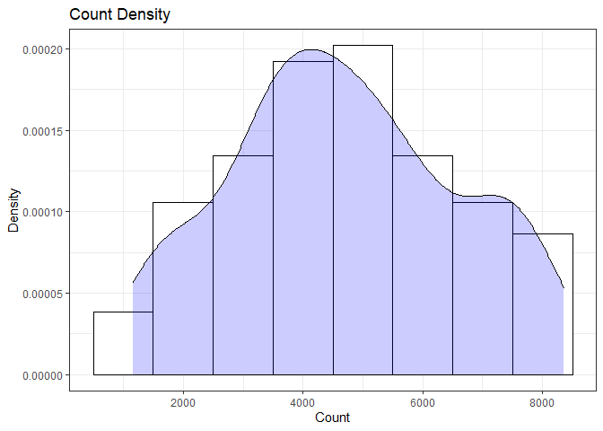
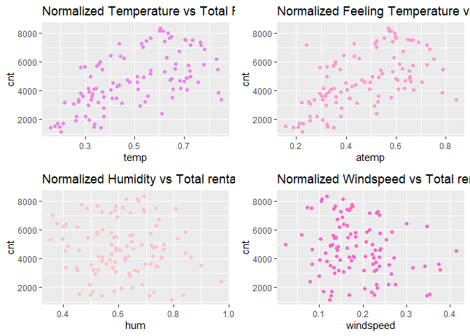

Project 2
================
Ifeoma Ojialor
10/16/2020

## Introduction

In this project, we will use a bike-sharing dataset to create machine
learning models. Before moving forward, I will briefly explain the
bike-sharing system and how it works. A bike-sharing system is a service
in which users can rent/use bicycles on a short term basis for a fee.
The goal of these programs is to provide affordable access to bicycles
for short distance trips as opposed to walking or taking public
transportation. Imagine how many people use these systems on a given
day, the numbers can vary greatly based on some elements. The goal of
this project is to build a predictive model to find out the number of
people that use these bikes in a given time period using available
information about that time/day. This in turn, can help businesses that
oversee this systems to manage them in a cost efficient manner.  
We will be using the bike-sharing dataset from the UCL Machine Learning
Repository. We will use the regression and boosted tree method to model
the response variable `cnt`.

## Exploratory Data Analysis

First we will read in the data using a relative path.

``` r
#read in data and filter to desired weekday
day1 <- read.csv("Bike-Sharing-Dataset/day.csv")
head(day1,5)
```

    ##   instant     dteday season yr mnth holiday
    ## 1       1 2011-01-01      1  0    1       0
    ## 2       2 2011-01-02      1  0    1       0
    ## 3       3 2011-01-03      1  0    1       0
    ## 4       4 2011-01-04      1  0    1       0
    ## 5       5 2011-01-05      1  0    1       0
    ##   weekday workingday weathersit     temp
    ## 1       6          0          2 0.344167
    ## 2       0          0          2 0.363478
    ## 3       1          1          1 0.196364
    ## 4       2          1          1 0.200000
    ## 5       3          1          1 0.226957
    ##      atemp      hum windspeed casual registered
    ## 1 0.363625 0.805833  0.160446    331        654
    ## 2 0.353739 0.696087  0.248539    131        670
    ## 3 0.189405 0.437273  0.248309    120       1229
    ## 4 0.212122 0.590435  0.160296    108       1454
    ## 5 0.229270 0.436957  0.186900     82       1518
    ##    cnt
    ## 1  985
    ## 2  801
    ## 3 1349
    ## 4 1562
    ## 5 1600

Next, we will remove the *casual* and *registered* variables since the
`cnt` variable is a combination of both.

``` r
day1 <- select(day1, -casual, -registered) 
day1$weekday <- as.factor(day1$weekday)
levels(day1$weekday) <- c("Sunday", "Monday", "Tuesday", "Wednesday", "Thursday", "Friday", "Saturday")
day <- filter(day1, weekday == params$days)

#Check for missing values
miss <- data.frame(apply(day,2,function(x){sum(is.na(x))}))
names(miss)[1] <- "missing"
miss
```

    ##            missing
    ## instant          0
    ## dteday           0
    ## season           0
    ## yr               0
    ## mnth             0
    ## holiday          0
    ## weekday          0
    ## workingday       0
    ## weathersit       0
    ## temp             0
    ## atemp            0
    ## hum              0
    ## windspeed        0
    ## cnt              0

There are no missing values in the dataset, so we can continue with our
analysis.

``` r
#Change the variables into their appropriate format.
day$season <- as.factor(day$season)
day$weathersit <- as.factor(day$weathersit)
day$holiday <- as.factor(day$holiday)
day$workingday <- as.factor(day$workingday)
day$weekday <- as.factor(day$weekday)
day$yr <- as.factor(day$yr)
day$mnth <- as.factor(day$mnth)

levels(day$season) <- c("winter", "spring", "summer", "fall")
levels(day$yr) <- c("2011", "2012")
str(day)
```

    ## 'data.frame':    104 obs. of  14 variables:
    ##  $ instant   : int  7 14 21 28 35 42 49 56 63 70 ...
    ##  $ dteday    : chr  "2011-01-07" "2011-01-14" "2011-01-21" "2011-01-28" ...
    ##  $ season    : Factor w/ 4 levels "winter","spring",..: 1 1 1 1 1 1 1 1 1 1 ...
    ##  $ yr        : Factor w/ 2 levels "2011","2012": 1 1 1 1 1 1 1 1 1 1 ...
    ##  $ mnth      : Factor w/ 12 levels "1","2","3","4",..: 1 1 1 1 2 2 2 2 3 3 ...
    ##  $ holiday   : Factor w/ 2 levels "0","1": 1 1 1 1 1 1 1 1 1 1 ...
    ##  $ weekday   : Factor w/ 7 levels "Sunday","Monday",..: 6 6 6 6 6 6 6 6 6 6 ...
    ##  $ workingday: Factor w/ 2 levels "0","1": 2 2 2 2 2 2 2 2 2 2 ...
    ##  $ weathersit: Factor w/ 2 levels "1","2": 2 1 1 2 2 1 1 2 2 2 ...
    ##  $ temp      : num  0.197 0.161 0.177 0.203 0.211 ...
    ##  $ atemp     : num  0.209 0.188 0.158 0.223 0.229 ...
    ##  $ hum       : num  0.499 0.538 0.457 0.793 0.585 ...
    ##  $ windspeed : num  0.169 0.127 0.353 0.123 0.128 ...
    ##  $ cnt       : int  1510 1421 1543 1167 1708 1746 2927 1461 1944 1977 ...

### Univariate Analysis

The `cnt` is the response variable, so we’ll use a histogram to get a
visual understanding of the variable.

``` r
ggplot(day, aes(x = cnt)) + theme_bw() + geom_histogram(aes(y =..density..), color = "black", fill = "white", binwidth = 1000) + geom_density(alpha = 0.2, fill = "blue") + labs(title = "Count Density", x = "Count", y = "Density")
```

<!-- -->

``` r
summary(day$cnt)
```

    ##    Min. 1st Qu.  Median    Mean 3rd Qu.    Max. 
    ##    1167    3391    4602    4690    5900    8362

From the histogram and summary statistics output, it is pretty evident
that the count of total rental bikes are in the sub 5000 range. We will
investigate if there is a relationship between the response variable and
other relevant predictor variables in the next section. Lets look at the
other variables individually.

``` r
#visualize numeric predictor variables using a histogram
p1 <- ggplot(day) + geom_histogram(aes(x = temp), fill = "red", binwidth = 0.03)
p2 <- ggplot(day) + geom_histogram(aes(x = atemp), fill = "red", binwidth = 0.03)
p3 <- ggplot(day) + geom_histogram(aes(x = hum), fill = "red", binwidth = 0.025)
p4 <- ggplot(day) + geom_histogram(aes(x = windspeed), fill = "red", binwidth = 0.03)
gridExtra::grid.arrange(p1,p2,p3,p4, nrow = 2)
```

<!-- -->

Observations:  
\* No clear cut pattern in `temp`and `atemp`.

  - `hum` appears to be skewed to the left when the dataset is not
    filtered to a specific weekday.

  - `windspeed` appears to be skewed(right). This variable should be
    transformed to curb its skewness.

  - The distribution of `temp` and `atemp` looks very similar. We should
    think about taking out one of the variables.

<!-- end list -->

``` r
#visualize categorical predictor variables
h1 <- ggplot(day) + geom_bar(aes(x = season),fill = "pink")
h2 <- ggplot(day) + geom_bar(aes(x = yr),fill = "pink")
h3 <- ggplot(day) + geom_bar(aes(x = holiday),fill = "pink")
h4 <- ggplot(day) + geom_bar(aes(x = workingday),fill = "pink")
h5 <- ggplot(day) + geom_bar(aes(x = mnth),fill = "pink")
h6 <- ggplot(day) + geom_bar(aes(x = weathersit),fill = "pink")
gridExtra::grid.arrange(h1,h2,h3,h4,h5,h6, nrow = 3)
```

<!-- -->

Observations:  
\* The variation between the four seasons is little to none.

  - About the same number of people rode bikes in 2011 and 2012.

  - Many people rode bikes on days that are not holidays.

  - Most people used the bike-sharing system on days that were neither
    weekends nor holidays.

  - Most people used the bike sharing system on days with clear weather.

### Bi-variate Analysis

In this section, we will explore the predictor variables with respect to
the response variable. The objective is to discover hidden relationships
between the independent and response variables and use those findings in
the model building process.

``` r
# First, we will explore the relationship between the target and numerical variables.
p1 <- ggplot(day) +geom_point(aes(x = temp, y = cnt), colour = "violet") + labs(title = "Normalized Temperature vs Total Rental Bikes")
p2 <- ggplot(day) +geom_point(aes(x = atemp, y = cnt), colour = "#FF99CC") +labs(title = "Normalized Feeling Temperature vs Total Rental Bikes")
p3 <- ggplot(day) +geom_point(aes(x = hum, y = cnt), colour = "pink") + labs(title = "Normalized Humidity vs Total rental Bikes")
p4 <- ggplot(day) +geom_point(aes(x = windspeed, y = cnt), colour = "#FF66CC") +labs(title= "Normalized Windspeed vs Total rental Bikes")
gridExtra::grid.arrange(p1, p2, p3, p4, nrow = 2)
```

<!-- -->

Observations:  
\* There appears to be a positive linear relationship between `cnt` ,
`temp`, and `atemp`.

  - There is also a weak relationship between `cnt`, `hum`, and
    `windspeed`.

<!-- end list -->

``` r
# Now we'll visualize the relationship between the target and categorical variables.
# Instead of using a boxplot, I will use a violin plot which is the blend of both a boxplot and density plot
g1 <- ggplot(day) + geom_col(aes(x = yr, y = cnt, fill = season))+theme_bw()
g2 <- ggplot(day) + geom_violin(aes(x = yr, y = cnt))+theme_bw()
g3 <- ggplot(day) + geom_col(aes(x = mnth, y = cnt, fill = season))+theme_bw() 
g4 <- ggplot(day) + geom_col(aes(x = holiday, y = cnt, fill = season)) + theme_bw() 
g6 <- ggplot(day) + geom_col(aes(x = workingday, y = cnt, fill = season))
g7 <- ggplot(day) + geom_col(aes(x = weathersit, y = cnt, fill = season))
gridExtra::grid.arrange(g1, g2, g3, nrow = 2)
```

<!-- -->

``` r
gridExtra::grid.arrange(g4, g6, g7, nrow = 2)
```

<!-- --> Observations:  
\* The total bike rental count is higher in 2012 than 2011.

  - During workingday, the bike rental counts quite the highest compared
    to during no working day for different seasons.

  - During clear,partly cloudy weather, the bike rental count is highest
    and the second highest is during mist cloudy weather and followed by
    third highest during light snow and light rain weather.

  - The highest bike rental count was during the summer and lowest in
    the winter.

## Correlation Matrix

Correlation matrix helps us to understand the linear relationship
between variables.

``` r
day_c <- day[ , c(10:14)]
round(cor(day_c), 2)
```

    ##            temp atemp   hum windspeed   cnt
    ## temp       1.00  0.96  0.13     -0.20  0.60
    ## atemp      0.96  1.00  0.13     -0.24  0.57
    ## hum        0.13  0.13  1.00     -0.29 -0.09
    ## windspeed -0.20 -0.24 -0.29      1.00 -0.23
    ## cnt        0.60  0.57 -0.09     -0.23  1.00

From the above matrix, we can see that `temp` and `atemp` are highly
correlated. So we only need to include one of these variables in the
model to prevent multicollinearity. We will also transform the humidity
and windspeed variable.

``` r
day <- mutate(day, log_hum = log(day$hum+1))
day <- mutate(day, log_ws = log(day$windspeed + 1))

#Remove irrelevant variables
day <- select(day, -weekday,-holiday,-workingday,-dteday,-temp, -instant)
```

## Model Building

First we split the data into train and test sets.

``` r
set.seed(23)
dayIndex<- createDataPartition(day$cnt, p = 0.7, list=FALSE)
dayTrain <- day[dayIndex, ]
dayTest <- day[-dayIndex, ]

# Build a tree-based model using loocv;
fitTree <- train(cnt~ ., data = dayTrain, method = "rpart", 
              preProcess = c("center", "scale"), 
              trControl = trainControl(method = "loocv", number = 10), tuneGrid = NULL)
```

    ## Warning in nominalTrainWorkflow(x = x, y =
    ## y, wts = weights, info = trainInfo, : There
    ## were missing values in resampled performance
    ## measures.

``` r
# Display information from the tree fit
fitTree$results
```

    ##          cp     RMSE Rsquared      MAE   RMSESD
    ## 1 0.1301637 1221.886      NaN 1221.886 606.9046
    ## 2 0.1984127 1430.123      NaN 1430.123 741.0058
    ## 3 0.4193554 1954.013      NaN 1954.013 897.7289
    ##   RsquaredSD    MAESD
    ## 1         NA 606.9046
    ## 2         NA 741.0058
    ## 3         NA 897.7289

``` r
# Build a boosted tree model using cv
fitBoost <- train(cnt~., data = dayTrain, method = "gbm", 
              preProcess = c("center", "scale"), 
              trControl = trainControl(method = "cv", number = 10), 
              tuneGrid = NULL)
```

    ## Iter   TrainDeviance   ValidDeviance   StepSize   Improve
    ##      1  3428894.4665             nan     0.1000 195444.2287
    ##      2  3183255.3764             nan     0.1000 289755.6375
    ##      3  2961874.0258             nan     0.1000 181165.5453
    ##      4  2696994.6206             nan     0.1000 194459.6859
    ##      5  2471142.1704             nan     0.1000 112881.7598
    ##      6  2288827.1982             nan     0.1000 163822.9669
    ##      7  2136050.1509             nan     0.1000 98578.1290
    ##      8  2046801.5313             nan     0.1000 5846.2999
    ##      9  1916405.8352             nan     0.1000 117816.5347
    ##     10  1812682.0117             nan     0.1000 74124.0109
    ##     20  1143690.7403             nan     0.1000 8924.1102
    ##     40   767064.7055             nan     0.1000 6358.1390
    ##     60   615238.2015             nan     0.1000 6223.2313
    ##     80   544710.9213             nan     0.1000 6303.6237
    ##    100   489845.9094             nan     0.1000 2408.9020
    ##    120   459644.4882             nan     0.1000 -11159.4376
    ##    140   428982.4242             nan     0.1000 -5412.7261
    ##    150   410277.2624             nan     0.1000 -4974.2548
    ## 
    ## Iter   TrainDeviance   ValidDeviance   StepSize   Improve
    ##      1  3353476.6645             nan     0.1000 193933.3721
    ##      2  2892359.6294             nan     0.1000 310101.7654
    ##      3  2652094.2749             nan     0.1000 126530.0970
    ##      4  2464818.9471             nan     0.1000 212672.2025
    ##      5  2327818.9853             nan     0.1000 50609.1206
    ##      6  2165980.8901             nan     0.1000 170033.8718
    ##      7  1994417.7857             nan     0.1000 162002.6383
    ##      8  1861573.7011             nan     0.1000 78957.2620
    ##      9  1800200.6418             nan     0.1000 2157.2844
    ##     10  1666726.1170             nan     0.1000 120669.3888
    ##     20   977882.9371             nan     0.1000 35558.8695
    ##     40   577971.1530             nan     0.1000 10985.4678
    ##     60   452797.6513             nan     0.1000 -6945.3500
    ##     80   370097.8816             nan     0.1000 -9484.1863
    ##    100   327896.8772             nan     0.1000 -15854.6639
    ##    120   285675.9419             nan     0.1000  142.8108
    ##    140   263500.6235             nan     0.1000 -2904.4603
    ##    150   257368.8451             nan     0.1000 -5264.3784
    ## 
    ## Iter   TrainDeviance   ValidDeviance   StepSize   Improve
    ##      1  3394804.4531             nan     0.1000 269756.6922
    ##      2  3060440.2438             nan     0.1000 221741.6370
    ##      3  2826648.6023             nan     0.1000 186169.9490
    ##      4  2578658.2764             nan     0.1000 196279.0679
    ##      5  2411419.2111             nan     0.1000 161815.6098
    ##      6  2249787.3706             nan     0.1000 159988.2161
    ##      7  2037309.2270             nan     0.1000 208797.5092
    ##      8  1882275.8354             nan     0.1000 103607.1451
    ##      9  1774988.2974             nan     0.1000 106797.1577
    ##     10  1638642.6057             nan     0.1000 123365.6730
    ##     20  1014868.9752             nan     0.1000 8615.2209
    ##     40   651941.9350             nan     0.1000 10568.6299
    ##     60   489728.0685             nan     0.1000 1949.5701
    ##     80   413766.4332             nan     0.1000 -13922.6606
    ##    100   369868.4972             nan     0.1000 -2467.1650
    ##    120   336728.2104             nan     0.1000 -3825.1972
    ##    140   292591.1654             nan     0.1000 -4636.8071
    ##    150   269450.1829             nan     0.1000 -5152.0247
    ## 
    ## Iter   TrainDeviance   ValidDeviance   StepSize   Improve
    ##      1  3295149.7558             nan     0.1000 283803.8038
    ##      2  3043755.6350             nan     0.1000 243143.2404
    ##      3  2759402.2987             nan     0.1000 198973.8127
    ##      4  2558734.7840             nan     0.1000 194190.4880
    ##      5  2412104.5940             nan     0.1000 147454.9078
    ##      6  2207880.4031             nan     0.1000 103151.5936
    ##      7  2070841.9556             nan     0.1000 96765.6711
    ##      8  1955709.6738             nan     0.1000 60781.2073
    ##      9  1860023.5409             nan     0.1000 85586.6171
    ##     10  1712294.1437             nan     0.1000 113151.8086
    ##     20  1053079.0539             nan     0.1000 21114.5429
    ##     40   763462.9260             nan     0.1000 -16608.6200
    ##     60   646277.1339             nan     0.1000  246.6572
    ##     80   547651.5237             nan     0.1000 -7277.7513
    ##    100   476266.2734             nan     0.1000  655.1356
    ##    120   430494.8671             nan     0.1000 -7332.6302
    ##    140   407360.7266             nan     0.1000 -8814.5816
    ##    150   394381.2762             nan     0.1000 -8381.1423
    ## 
    ## Iter   TrainDeviance   ValidDeviance   StepSize   Improve
    ##      1  3278153.0008             nan     0.1000 296233.7886
    ##      2  2971781.2611             nan     0.1000 191956.4369
    ##      3  2765296.7207             nan     0.1000 158289.4626
    ##      4  2561749.7798             nan     0.1000 232073.0662
    ##      5  2333271.9294             nan     0.1000 180316.5442
    ##      6  2214080.5094             nan     0.1000 102218.2618
    ##      7  2039792.8848             nan     0.1000 131771.3556
    ##      8  1871554.7287             nan     0.1000 123772.9563
    ##      9  1728100.5730             nan     0.1000 89407.9254
    ##     10  1612383.9530             nan     0.1000 60314.8367
    ##     20   971358.6693             nan     0.1000 24521.4978
    ##     40   631254.0748             nan     0.1000 -13172.6214
    ##     60   499878.5491             nan     0.1000 -18831.5758
    ##     80   394392.5747             nan     0.1000 -7129.3698
    ##    100   349991.9879             nan     0.1000 -14680.0275
    ##    120   313538.6633             nan     0.1000 -8089.9840
    ##    140   282519.1036             nan     0.1000 -8195.5072
    ##    150   269845.2493             nan     0.1000 -2054.6135
    ## 
    ## Iter   TrainDeviance   ValidDeviance   StepSize   Improve
    ##      1  3364677.5589             nan     0.1000 309049.6033
    ##      2  3083537.8975             nan     0.1000 292026.3787
    ##      3  2794910.1818             nan     0.1000 231015.0836
    ##      4  2603699.3040             nan     0.1000 215357.1219
    ##      5  2321089.2425             nan     0.1000 219664.9872
    ##      6  2173919.4166             nan     0.1000 162611.0624
    ##      7  2017425.7846             nan     0.1000 132676.4810
    ##      8  1857954.0208             nan     0.1000 107079.7068
    ##      9  1785391.0329             nan     0.1000 50817.7365
    ##     10  1693383.2853             nan     0.1000 86679.8352
    ##     20  1128827.5347             nan     0.1000 -34441.8367
    ##     40   671301.5145             nan     0.1000 -5969.2838
    ##     60   502523.2501             nan     0.1000 -6607.3407
    ##     80   433815.2539             nan     0.1000 -7104.1512
    ##    100   375821.8941             nan     0.1000  965.9077
    ##    120   339978.2250             nan     0.1000 -2543.2676
    ##    140   310012.0877             nan     0.1000 -7281.5180
    ##    150   294235.8378             nan     0.1000 -1033.3292
    ## 
    ## Iter   TrainDeviance   ValidDeviance   StepSize   Improve
    ##      1  3317819.5762             nan     0.1000 274384.1717
    ##      2  3080909.0516             nan     0.1000 198176.4274
    ##      3  2906152.1015             nan     0.1000 185958.6868
    ##      4  2660735.6763             nan     0.1000 206495.4738
    ##      5  2413305.9930             nan     0.1000 140849.3641
    ##      6  2259250.8151             nan     0.1000 141079.5489
    ##      7  2115530.8980             nan     0.1000 98743.4837
    ##      8  1981775.3663             nan     0.1000 113164.7501
    ##      9  1899772.2175             nan     0.1000 83793.5170
    ##     10  1761019.6519             nan     0.1000 64074.0131
    ##     20  1173813.9665             nan     0.1000 40032.9116
    ##     40   777535.5901             nan     0.1000 -2008.7988
    ##     60   640223.9089             nan     0.1000 -475.0556
    ##     80   544056.2004             nan     0.1000 -10760.3353
    ##    100   489296.9981             nan     0.1000 -5862.5356
    ##    120   454023.4963             nan     0.1000 -5921.9597
    ##    140   421897.6603             nan     0.1000 -13781.8690
    ##    150   412550.6952             nan     0.1000 -5666.5253
    ## 
    ## Iter   TrainDeviance   ValidDeviance   StepSize   Improve
    ##      1  3179560.7346             nan     0.1000 396332.9849
    ##      2  2915176.9099             nan     0.1000 214147.4110
    ##      3  2616613.5078             nan     0.1000 319608.7956
    ##      4  2369424.1872             nan     0.1000 144279.7075
    ##      5  2212733.5007             nan     0.1000 202931.8848
    ##      6  2107004.9877             nan     0.1000 67730.6946
    ##      7  1886014.6914             nan     0.1000 196585.5346
    ##      8  1787909.4033             nan     0.1000 49865.6130
    ##      9  1686886.2356             nan     0.1000 71878.3849
    ##     10  1540385.1899             nan     0.1000 90104.6913
    ##     20  1009768.0222             nan     0.1000 -12750.4998
    ##     40   606992.0225             nan     0.1000 -12795.2979
    ##     60   464679.7045             nan     0.1000 -21049.6704
    ##     80   390781.0513             nan     0.1000  919.2164
    ##    100   352280.6103             nan     0.1000 -605.3150
    ##    120   318935.5921             nan     0.1000 -16446.2375
    ##    140   293624.1381             nan     0.1000 -8937.6525
    ##    150   284752.5054             nan     0.1000 -8057.9759
    ## 
    ## Iter   TrainDeviance   ValidDeviance   StepSize   Improve
    ##      1  3271093.6782             nan     0.1000 119206.3702
    ##      2  2940706.0318             nan     0.1000 215782.5613
    ##      3  2775179.2873             nan     0.1000 158211.5786
    ##      4  2425416.1400             nan     0.1000 313424.8536
    ##      5  2245612.5236             nan     0.1000 165069.4908
    ##      6  2107409.4542             nan     0.1000 98003.9187
    ##      7  1914338.4540             nan     0.1000 118546.8566
    ##      8  1747095.4706             nan     0.1000 90924.1656
    ##      9  1667750.7667             nan     0.1000 69028.2241
    ##     10  1514284.3701             nan     0.1000 136117.3412
    ##     20   967912.0052             nan     0.1000 17578.8194
    ##     40   586632.9573             nan     0.1000 -9150.5236
    ##     60   463380.2874             nan     0.1000 -8984.3981
    ##     80   393089.5220             nan     0.1000 -6924.6722
    ##    100   363565.2530             nan     0.1000 -8041.7919
    ##    120   330036.7527             nan     0.1000 -2857.9719
    ##    140   303155.2678             nan     0.1000 -9179.4211
    ##    150   291290.4225             nan     0.1000 -5790.3418
    ## 
    ## Iter   TrainDeviance   ValidDeviance   StepSize   Improve
    ##      1  3151042.3110             nan     0.1000 228939.1116
    ##      2  2904106.0286             nan     0.1000 221980.4782
    ##      3  2764796.0307             nan     0.1000 141647.6361
    ##      4  2582388.8523             nan     0.1000 188296.2192
    ##      5  2420606.5514             nan     0.1000 166763.4376
    ##      6  2279729.4185             nan     0.1000 123516.3597
    ##      7  2134069.4469             nan     0.1000 121530.8421
    ##      8  2064400.9871             nan     0.1000 34476.8367
    ##      9  1954697.2650             nan     0.1000 81762.0731
    ##     10  1846337.3544             nan     0.1000 101529.2773
    ##     20  1219396.1678             nan     0.1000 -14917.9417
    ##     40   797385.1871             nan     0.1000 -5628.5478
    ##     60   663309.4583             nan     0.1000 -11468.5912
    ##     80   583352.3992             nan     0.1000 -13059.1060
    ##    100   520175.6130             nan     0.1000 -4248.1534
    ##    120   474540.3509             nan     0.1000  149.9465
    ##    140   449192.9037             nan     0.1000 -4752.1495
    ##    150   438339.7684             nan     0.1000 -8497.1763
    ## 
    ## Iter   TrainDeviance   ValidDeviance   StepSize   Improve
    ##      1  3077222.5566             nan     0.1000 212508.5484
    ##      2  2843168.2419             nan     0.1000 149120.1357
    ##      3  2639478.1562             nan     0.1000 179046.9980
    ##      4  2408611.4795             nan     0.1000 159858.6112
    ##      5  2130761.2218             nan     0.1000 168738.9735
    ##      6  2024548.7806             nan     0.1000 108777.6819
    ##      7  1934903.2727             nan     0.1000 113144.9201
    ##      8  1810100.2759             nan     0.1000 65189.8807
    ##      9  1716004.6674             nan     0.1000 46855.7170
    ##     10  1638298.9987             nan     0.1000 89743.7566
    ##     20  1117663.1920             nan     0.1000 -48543.4688
    ##     40   704914.6942             nan     0.1000 -5343.5872
    ##     60   524411.2069             nan     0.1000 3070.8113
    ##     80   438417.9248             nan     0.1000 -3749.1407
    ##    100   392734.6259             nan     0.1000 -10091.7352
    ##    120   361328.1861             nan     0.1000 -6496.7142
    ##    140   330847.6902             nan     0.1000 -5293.8873
    ##    150   309800.1604             nan     0.1000 -8079.7469
    ## 
    ## Iter   TrainDeviance   ValidDeviance   StepSize   Improve
    ##      1  3151212.5792             nan     0.1000 183713.0172
    ##      2  2962677.9074             nan     0.1000 123645.8579
    ##      3  2728680.2499             nan     0.1000 240335.0763
    ##      4  2573139.2532             nan     0.1000 181670.2457
    ##      5  2419448.2630             nan     0.1000 106654.7178
    ##      6  2203879.7445             nan     0.1000 205514.4473
    ##      7  2089396.6763             nan     0.1000 40036.3473
    ##      8  1905355.0931             nan     0.1000 106857.0526
    ##      9  1819458.3289             nan     0.1000 96674.2064
    ##     10  1730898.5107             nan     0.1000 26289.0974
    ##     20  1054028.9409             nan     0.1000 36989.3879
    ##     40   677309.8640             nan     0.1000 9546.8033
    ##     60   543242.4141             nan     0.1000 -13032.3161
    ##     80   479933.1831             nan     0.1000 -8016.3095
    ##    100   384070.9339             nan     0.1000 -2880.0121
    ##    120   336577.9539             nan     0.1000 -10934.6152
    ##    140   309045.0909             nan     0.1000 -8062.3010
    ##    150   299108.3969             nan     0.1000 -8509.3452
    ## 
    ## Iter   TrainDeviance   ValidDeviance   StepSize   Improve
    ##      1  3391051.6459             nan     0.1000 253975.9068
    ##      2  3170547.3546             nan     0.1000 253186.2826
    ##      3  2987594.2610             nan     0.1000 222989.1804
    ##      4  2803533.5820             nan     0.1000 177426.1815
    ##      5  2643921.6901             nan     0.1000 149774.7224
    ##      6  2488750.8504             nan     0.1000 121629.6754
    ##      7  2317390.5600             nan     0.1000 152214.7177
    ##      8  2206854.7019             nan     0.1000 121749.6024
    ##      9  2119225.4203             nan     0.1000 102045.1129
    ##     10  1958948.3472             nan     0.1000 157016.4985
    ##     20  1187303.4198             nan     0.1000 -8337.0637
    ##     40   800167.6920             nan     0.1000 -8497.1819
    ##     60   678927.6181             nan     0.1000 3331.3619
    ##     80   567770.8933             nan     0.1000 -6284.6313
    ##    100   518922.9574             nan     0.1000 -6231.9867
    ##    120   472697.9263             nan     0.1000 -6766.6147
    ##    140   452196.0306             nan     0.1000 -1278.3386
    ##    150   439992.3955             nan     0.1000 -5378.2830
    ## 
    ## Iter   TrainDeviance   ValidDeviance   StepSize   Improve
    ##      1  3456114.7311             nan     0.1000 237816.1579
    ##      2  3081326.5524             nan     0.1000 340282.0994
    ##      3  2776216.9630             nan     0.1000 213774.6334
    ##      4  2522254.7463             nan     0.1000 188467.6856
    ##      5  2208586.8190             nan     0.1000 211093.3294
    ##      6  2085429.9468             nan     0.1000 121864.9490
    ##      7  1951370.9317             nan     0.1000 131941.1114
    ##      8  1833748.8515             nan     0.1000 91811.7713
    ##      9  1637695.6282             nan     0.1000 159233.0970
    ##     10  1527599.9928             nan     0.1000 52951.2475
    ##     20  1000625.3810             nan     0.1000 32648.3635
    ##     40   672471.2473             nan     0.1000 -24367.1236
    ##     60   514164.2259             nan     0.1000 -10363.4652
    ##     80   417230.2190             nan     0.1000 -8677.8154
    ##    100   355608.6451             nan     0.1000 -10292.8915
    ##    120   319133.4120             nan     0.1000 -2300.0380
    ##    140   290913.4908             nan     0.1000 -4823.5207
    ##    150   277384.1553             nan     0.1000 -2103.5498
    ## 
    ## Iter   TrainDeviance   ValidDeviance   StepSize   Improve
    ##      1  3279155.5957             nan     0.1000 304932.7045
    ##      2  3052352.1303             nan     0.1000 138887.1799
    ##      3  2737550.6327             nan     0.1000 349672.1135
    ##      4  2558114.4007             nan     0.1000 189055.5887
    ##      5  2319679.7037             nan     0.1000 258345.5281
    ##      6  2047315.2715             nan     0.1000 215378.6278
    ##      7  1949666.3877             nan     0.1000 108583.7647
    ##      8  1837233.9957             nan     0.1000 93181.3047
    ##      9  1758983.0420             nan     0.1000 13900.2598
    ##     10  1622813.1055             nan     0.1000 88687.7052
    ##     20   950068.2337             nan     0.1000 25647.0906
    ##     40   607250.3248             nan     0.1000  -20.0972
    ##     60   483946.1365             nan     0.1000 -1024.8881
    ##     80   414277.7636             nan     0.1000 -9745.2973
    ##    100   368972.0181             nan     0.1000 -3013.0373
    ##    120   334458.6004             nan     0.1000 -2520.6502
    ##    140   302846.1171             nan     0.1000 -9179.4814
    ##    150   286754.6274             nan     0.1000 -4829.4864
    ## 
    ## Iter   TrainDeviance   ValidDeviance   StepSize   Improve
    ##      1  3270585.8414             nan     0.1000 311810.6803
    ##      2  3084472.7992             nan     0.1000 195542.3314
    ##      3  2863525.5991             nan     0.1000 242618.2580
    ##      4  2742399.5014             nan     0.1000 104825.6063
    ##      5  2524331.3639             nan     0.1000 200377.8906
    ##      6  2347153.1977             nan     0.1000 117669.4113
    ##      7  2175380.3765             nan     0.1000 152417.8427
    ##      8  2042339.5335             nan     0.1000 139290.3813
    ##      9  1969500.9807             nan     0.1000 44388.6429
    ##     10  1857956.2854             nan     0.1000 93820.2650
    ##     20  1218649.3831             nan     0.1000 3272.0709
    ##     40   745078.8441             nan     0.1000 -598.0031
    ##     60   565433.6061             nan     0.1000 -19530.2729
    ##     80   452711.4158             nan     0.1000 -1405.7137
    ##    100   411963.4454             nan     0.1000 -2359.4642
    ##    120   371138.4265             nan     0.1000 -3866.4600
    ##    140   352269.4731             nan     0.1000 -11218.7163
    ##    150   347004.6138             nan     0.1000 -9634.4136
    ## 
    ## Iter   TrainDeviance   ValidDeviance   StepSize   Improve
    ##      1  3115508.4079             nan     0.1000 344999.4638
    ##      2  2875769.4165             nan     0.1000 250877.3673
    ##      3  2619543.9185             nan     0.1000 227362.9602
    ##      4  2473468.9473             nan     0.1000 95921.5571
    ##      5  2280998.2234             nan     0.1000 222746.7806
    ##      6  2118569.8125             nan     0.1000 165867.4964
    ##      7  1907960.0207             nan     0.1000 146454.0017
    ##      8  1786985.4705             nan     0.1000 89029.9434
    ##      9  1650193.8108             nan     0.1000 118896.3456
    ##     10  1616099.3786             nan     0.1000 -11768.0930
    ##     20  1001963.6674             nan     0.1000 11638.5229
    ##     40   610191.5297             nan     0.1000 2543.4575
    ##     60   416568.0839             nan     0.1000 -9056.0471
    ##     80   341478.5646             nan     0.1000 -5061.6659
    ##    100   310807.3305             nan     0.1000 -2422.0152
    ##    120   290447.1327             nan     0.1000 -4599.8851
    ##    140   267668.8330             nan     0.1000 -6362.1476
    ##    150   254997.8154             nan     0.1000 -1961.9887
    ## 
    ## Iter   TrainDeviance   ValidDeviance   StepSize   Improve
    ##      1  3312663.8076             nan     0.1000 293992.1596
    ##      2  3037656.0115             nan     0.1000 148108.5377
    ##      3  2821192.8175             nan     0.1000 239257.2998
    ##      4  2582185.0288             nan     0.1000 64938.3581
    ##      5  2363466.7447             nan     0.1000 199181.1425
    ##      6  2192172.5135             nan     0.1000 192895.6914
    ##      7  2087040.3341             nan     0.1000 68385.3825
    ##      8  1965418.8690             nan     0.1000 132534.4795
    ##      9  1800708.4637             nan     0.1000 131716.0611
    ##     10  1707509.1384             nan     0.1000 90546.8496
    ##     20  1023524.9983             nan     0.1000 3133.4531
    ##     40   573189.3986             nan     0.1000 23582.3690
    ##     60   413871.7562             nan     0.1000 -2234.3766
    ##     80   364310.7723             nan     0.1000 -7319.8397
    ##    100   320015.2360             nan     0.1000 -3842.8154
    ##    120   286991.6902             nan     0.1000 -5415.3368
    ##    140   262196.0696             nan     0.1000 -3455.7710
    ##    150   251708.8470             nan     0.1000 -4303.0018
    ## 
    ## Iter   TrainDeviance   ValidDeviance   StepSize   Improve
    ##      1  3273477.6124             nan     0.1000 286838.2217
    ##      2  3021496.5042             nan     0.1000 237025.9208
    ##      3  2819121.8319             nan     0.1000 124137.2084
    ##      4  2643540.7911             nan     0.1000 163548.0381
    ##      5  2440619.8031             nan     0.1000 64854.4988
    ##      6  2327877.1225             nan     0.1000 70315.1356
    ##      7  2126638.7566             nan     0.1000 150452.2977
    ##      8  1938764.2864             nan     0.1000 85399.7277
    ##      9  1830734.3894             nan     0.1000 85713.0073
    ##     10  1758291.2118             nan     0.1000 20507.2070
    ##     20  1222221.2911             nan     0.1000 18016.5254
    ##     40   914807.0092             nan     0.1000 -10678.5081
    ##     60   733235.9260             nan     0.1000 -1377.2602
    ##     80   617128.8726             nan     0.1000 -552.9988
    ##    100   555224.8084             nan     0.1000 -2091.3170
    ##    120   502552.2252             nan     0.1000 1728.9152
    ##    140   476650.2371             nan     0.1000 -7587.9495
    ##    150   468431.3237             nan     0.1000 -4457.5762
    ## 
    ## Iter   TrainDeviance   ValidDeviance   StepSize   Improve
    ##      1  3258338.5748             nan     0.1000 288025.6667
    ##      2  2956675.0769             nan     0.1000 171075.0519
    ##      3  2641818.0941             nan     0.1000 196223.2733
    ##      4  2443738.6233             nan     0.1000 193043.7855
    ##      5  2300677.1849             nan     0.1000 59706.0632
    ##      6  2194429.4453             nan     0.1000 88929.5709
    ##      7  2034565.0830             nan     0.1000 153405.3243
    ##      8  1934116.1834             nan     0.1000 104956.9885
    ##      9  1836936.2788             nan     0.1000 107049.6515
    ##     10  1724813.7568             nan     0.1000 81377.6591
    ##     20  1059428.3710             nan     0.1000 42588.7715
    ##     40   707670.3473             nan     0.1000 6622.3697
    ##     60   561547.5058             nan     0.1000 1233.9760
    ##     80   455321.3548             nan     0.1000 -7224.0029
    ##    100   394831.5080             nan     0.1000 -3675.8834
    ##    120   354409.0297             nan     0.1000 -1341.9900
    ##    140   323068.8571             nan     0.1000 -2659.8741
    ##    150   316976.6415             nan     0.1000 -2882.6863
    ## 
    ## Iter   TrainDeviance   ValidDeviance   StepSize   Improve
    ##      1  3125389.7163             nan     0.1000 354323.3865
    ##      2  2885067.8992             nan     0.1000 216046.9094
    ##      3  2639512.5241             nan     0.1000 141785.6100
    ##      4  2445189.0323             nan     0.1000 177202.2772
    ##      5  2323152.0849             nan     0.1000 127431.5250
    ##      6  2138074.7962             nan     0.1000 144534.5277
    ##      7  2012764.9132             nan     0.1000 108363.2758
    ##      8  1835044.5061             nan     0.1000 87637.4737
    ##      9  1724663.9660             nan     0.1000 105605.6837
    ##     10  1591919.6223             nan     0.1000 116681.9473
    ##     20  1042480.5216             nan     0.1000 16077.4577
    ##     40   679828.2534             nan     0.1000 -9322.3623
    ##     60   557581.3474             nan     0.1000 -5966.5061
    ##     80   472981.6903             nan     0.1000 -16250.5706
    ##    100   406401.1417             nan     0.1000 -6782.6401
    ##    120   368155.3307             nan     0.1000 -4889.4732
    ##    140   334341.7534             nan     0.1000 -14217.4008
    ##    150   316690.5181             nan     0.1000 -4276.4318
    ## 
    ## Iter   TrainDeviance   ValidDeviance   StepSize   Improve
    ##      1  3376464.4781             nan     0.1000 316476.3384
    ##      2  3097851.7294             nan     0.1000 201687.7062
    ##      3  2852763.9018             nan     0.1000 246199.5901
    ##      4  2646253.1386             nan     0.1000 189824.3228
    ##      5  2446476.1195             nan     0.1000 113235.6713
    ##      6  2212527.6179             nan     0.1000 186096.6321
    ##      7  2053010.2232             nan     0.1000 103448.4509
    ##      8  1944911.4010             nan     0.1000 90983.1738
    ##      9  1848171.2417             nan     0.1000 51324.6008
    ##     10  1710984.6834             nan     0.1000 133849.9751
    ##     20  1050061.8323             nan     0.1000 18966.2352
    ##     40   802838.8175             nan     0.1000 -17967.2567
    ##     60   664491.7121             nan     0.1000 -3017.6322
    ##     80   566241.9333             nan     0.1000 1156.2033
    ##    100   510501.6738             nan     0.1000 -3498.9674
    ##    120   478548.3907             nan     0.1000 -7043.0102
    ##    140   454025.2620             nan     0.1000 -1377.2206
    ##    150   442491.5360             nan     0.1000 -5764.7117
    ## 
    ## Iter   TrainDeviance   ValidDeviance   StepSize   Improve
    ##      1  3396791.3015             nan     0.1000 237837.2311
    ##      2  3009048.8130             nan     0.1000 349386.5223
    ##      3  2644510.9543             nan     0.1000 286535.0604
    ##      4  2321232.9829             nan     0.1000 285701.4460
    ##      5  2126525.5869             nan     0.1000 155706.2200
    ##      6  2019330.6047             nan     0.1000 141707.6054
    ##      7  1871272.1962             nan     0.1000 67680.4555
    ##      8  1738262.9145             nan     0.1000 109503.5782
    ##      9  1629735.6516             nan     0.1000 65079.3508
    ##     10  1546117.5585             nan     0.1000 84557.3156
    ##     20   952411.1716             nan     0.1000 -4158.8778
    ##     40   579533.2711             nan     0.1000 1576.3041
    ##     60   472410.8339             nan     0.1000 -14020.5890
    ##     80   411547.7615             nan     0.1000 -4800.9178
    ##    100   368495.6091             nan     0.1000 -7341.4097
    ##    120   344667.3625             nan     0.1000 -8723.0639
    ##    140   304245.7590             nan     0.1000 -9383.5584
    ##    150   290695.1284             nan     0.1000 -18634.3848
    ## 
    ## Iter   TrainDeviance   ValidDeviance   StepSize   Improve
    ##      1  3303835.7375             nan     0.1000 308183.9595
    ##      2  3045648.6658             nan     0.1000 255364.3580
    ##      3  2847245.5281             nan     0.1000 133496.4676
    ##      4  2601370.3851             nan     0.1000 176200.0910
    ##      5  2313092.4257             nan     0.1000 212471.7254
    ##      6  2123847.3812             nan     0.1000 159833.2081
    ##      7  1991824.2014             nan     0.1000 130802.4072
    ##      8  1872190.0467             nan     0.1000 45443.0120
    ##      9  1722975.4756             nan     0.1000 70675.8314
    ##     10  1628588.9597             nan     0.1000 43560.8023
    ##     20   978534.7782             nan     0.1000 24189.1778
    ##     40   646114.0965             nan     0.1000 -364.2635
    ##     60   489361.8752             nan     0.1000 9102.1776
    ##     80   413928.4996             nan     0.1000 2297.7955
    ##    100   366559.4883             nan     0.1000 3084.3225
    ##    120   336964.0023             nan     0.1000 -422.6452
    ##    140   306461.8896             nan     0.1000 -3017.3226
    ##    150   296254.6113             nan     0.1000 -5713.8606
    ## 
    ## Iter   TrainDeviance   ValidDeviance   StepSize   Improve
    ##      1  3473917.9132             nan     0.1000 267022.5297
    ##      2  3321744.2585             nan     0.1000 58020.2341
    ##      3  3076749.2394             nan     0.1000 258990.9223
    ##      4  2889616.1859             nan     0.1000 221073.7499
    ##      5  2682426.9295             nan     0.1000 181877.8561
    ##      6  2485810.0839             nan     0.1000 177296.3678
    ##      7  2320819.9703             nan     0.1000 148327.8770
    ##      8  2198129.6626             nan     0.1000 150408.6260
    ##      9  2080353.4931             nan     0.1000 130934.8697
    ##     10  1994809.9537             nan     0.1000 86781.4566
    ##     20  1232643.6719             nan     0.1000 38291.1879
    ##     40   793276.7623             nan     0.1000 -5913.5601
    ##     60   636755.2689             nan     0.1000 -2250.2247
    ##     80   552964.4247             nan     0.1000 -14289.9225
    ##    100   482463.7486             nan     0.1000 -1334.0270
    ##    120   441469.1006             nan     0.1000 -6664.3873
    ##    140   412466.9025             nan     0.1000 -4384.1217
    ##    150   392666.8823             nan     0.1000 -2608.7294
    ## 
    ## Iter   TrainDeviance   ValidDeviance   StepSize   Improve
    ##      1  3494362.1108             nan     0.1000 254159.0110
    ##      2  3228728.2943             nan     0.1000 209428.3963
    ##      3  2804340.2954             nan     0.1000 400096.7119
    ##      4  2573682.3615             nan     0.1000 209050.0494
    ##      5  2374246.7853             nan     0.1000 167328.4414
    ##      6  2138077.7046             nan     0.1000 236642.9871
    ##      7  1941934.2721             nan     0.1000 143537.1337
    ##      8  1780790.8531             nan     0.1000 93957.9628
    ##      9  1682456.5914             nan     0.1000 42515.5197
    ##     10  1561978.6262             nan     0.1000 125469.1427
    ##     20  1038386.8138             nan     0.1000 16590.0195
    ##     40   606805.0373             nan     0.1000 2080.0712
    ##     60   474522.5379             nan     0.1000 -8401.9548
    ##     80   430652.1158             nan     0.1000 -4693.7615
    ##    100   372517.9743             nan     0.1000 -1676.6313
    ##    120   346181.3500             nan     0.1000 -8877.4566
    ##    140   310335.2325             nan     0.1000 -10482.6868
    ##    150   291713.7939             nan     0.1000 -12923.2822
    ## 
    ## Iter   TrainDeviance   ValidDeviance   StepSize   Improve
    ##      1  3509037.9820             nan     0.1000 267809.4577
    ##      2  3153907.9513             nan     0.1000 262820.3968
    ##      3  2856017.3632             nan     0.1000 250981.3171
    ##      4  2651620.8341             nan     0.1000 190909.3084
    ##      5  2394124.1624             nan     0.1000 162047.2485
    ##      6  2139080.5279             nan     0.1000 226750.4343
    ##      7  1953257.8200             nan     0.1000 138522.6463
    ##      8  1805532.6577             nan     0.1000 113516.7450
    ##      9  1666873.6109             nan     0.1000 78920.6364
    ##     10  1577507.2494             nan     0.1000 66128.4708
    ##     20  1000025.8268             nan     0.1000 22366.3644
    ##     40   654661.0764             nan     0.1000 -1418.7498
    ##     60   493588.2694             nan     0.1000  730.2401
    ##     80   362056.7086             nan     0.1000 8719.9082
    ##    100   320092.5263             nan     0.1000 -4055.4312
    ##    120   298134.0062             nan     0.1000 -3007.4014
    ##    140   268018.3100             nan     0.1000 -1864.8304
    ##    150   259376.9430             nan     0.1000 -1848.9589
    ## 
    ## Iter   TrainDeviance   ValidDeviance   StepSize   Improve
    ##      1  3272404.9168             nan     0.1000 261439.0170
    ##      2  3056308.4194             nan     0.1000 222483.9280
    ##      3  2835856.3621             nan     0.1000 73123.4363
    ##      4  2573098.9201             nan     0.1000 181167.5007
    ##      5  2410845.8961             nan     0.1000 141958.8635
    ##      6  2254051.6700             nan     0.1000 134989.2468
    ##      7  2106094.4116             nan     0.1000 115969.1914
    ##      8  1983549.4469             nan     0.1000 63688.1893
    ##      9  1813971.2962             nan     0.1000 91712.7745
    ##     10  1710500.4924             nan     0.1000 90383.2728
    ##     20  1196314.2984             nan     0.1000 28620.9478
    ##     40   825159.1965             nan     0.1000 9973.0944
    ##     60   677022.5995             nan     0.1000 -7911.5133
    ##     80   590784.3366             nan     0.1000 3118.0545
    ##    100   541699.0256             nan     0.1000 -7966.1621
    ##    120   497931.0554             nan     0.1000 -8438.3502
    ##    140   461516.1526             nan     0.1000 -318.0954
    ##    150   451829.3905             nan     0.1000 -10911.5595
    ## 
    ## Iter   TrainDeviance   ValidDeviance   StepSize   Improve
    ##      1  3369572.4461             nan     0.1000 236453.8743
    ##      2  3124967.0892             nan     0.1000 212117.4660
    ##      3  2875573.6799             nan     0.1000 227559.6065
    ##      4  2509205.4877             nan     0.1000 248939.6848
    ##      5  2373393.9741             nan     0.1000 147262.3135
    ##      6  2208981.5487             nan     0.1000 98910.9422
    ##      7  2128314.9582             nan     0.1000 90952.1891
    ##      8  2010193.6994             nan     0.1000 73181.5053
    ##      9  1953187.4299             nan     0.1000 33040.5935
    ##     10  1868862.3699             nan     0.1000 21166.1186
    ##     20  1165970.2280             nan     0.1000 17000.0476
    ##     40   667828.7779             nan     0.1000 -10777.7699
    ##     60   537340.3219             nan     0.1000  621.3321
    ##     80   443766.5400             nan     0.1000 -12285.5148
    ##    100   396404.4283             nan     0.1000 -7524.7000
    ##    120   358338.6059             nan     0.1000 -12363.5711
    ##    140   324137.6444             nan     0.1000 -3176.1296
    ##    150   308549.0068             nan     0.1000 -5221.1355
    ## 
    ## Iter   TrainDeviance   ValidDeviance   StepSize   Improve
    ##      1  3328591.8074             nan     0.1000 175026.2206
    ##      2  3076903.1866             nan     0.1000 251778.3444
    ##      3  2847025.6703             nan     0.1000 200168.1397
    ##      4  2664421.4215             nan     0.1000 75238.3069
    ##      5  2352565.5507             nan     0.1000 270786.6288
    ##      6  2207127.2789             nan     0.1000 122311.0734
    ##      7  2017223.3428             nan     0.1000 185070.6297
    ##      8  1894620.4319             nan     0.1000 97391.9765
    ##      9  1789844.7224             nan     0.1000 105992.6909
    ##     10  1690570.5652             nan     0.1000 72054.4329
    ##     20  1033783.6970             nan     0.1000 19042.1621
    ##     40   632747.8761             nan     0.1000 -3196.1884
    ##     60   515337.3473             nan     0.1000 -8767.5210
    ##     80   457300.2629             nan     0.1000 3800.6410
    ##    100   404637.4167             nan     0.1000 -13277.6174
    ##    120   368674.9137             nan     0.1000 -4502.7145
    ##    140   334707.0711             nan     0.1000 -3427.5031
    ##    150   323995.5414             nan     0.1000 -8200.6536
    ## 
    ## Iter   TrainDeviance   ValidDeviance   StepSize   Improve
    ##      1  3274451.6766             nan     0.1000 337811.3991
    ##      2  3019404.5839             nan     0.1000 283511.5543
    ##      3  2655446.1577             nan     0.1000 301099.4178
    ##      4  2300346.6514             nan     0.1000 300369.5771
    ##      5  2088902.0296             nan     0.1000 138049.1955
    ##      6  1898682.2775             nan     0.1000 186338.9200
    ##      7  1732812.9949             nan     0.1000 150319.3944
    ##      8  1606609.5307             nan     0.1000 13857.8819
    ##      9  1494375.1087             nan     0.1000 87397.3831
    ##     10  1389901.7364             nan     0.1000 98490.3051
    ##     20   875503.1066             nan     0.1000 21215.6013
    ##     40   522248.8845             nan     0.1000 -9295.7190
    ##     60   431954.5972             nan     0.1000 -4420.1977
    ##     80   361862.7555             nan     0.1000 -9743.1191
    ##    100   308195.5460             nan     0.1000 -4308.4148
    ##    120   281634.6396             nan     0.1000 -5792.0499
    ##    140   256833.2153             nan     0.1000 -1942.8924
    ##    150   241623.1650             nan     0.1000 -6261.1988

``` r
# Display information from the boost fit
fitBoost$results
```

    ##   shrinkage interaction.depth n.minobsinnode
    ## 1       0.1                 1             10
    ## 4       0.1                 2             10
    ## 7       0.1                 3             10
    ## 2       0.1                 1             10
    ## 5       0.1                 2             10
    ## 8       0.1                 3             10
    ## 3       0.1                 1             10
    ## 6       0.1                 2             10
    ## 9       0.1                 3             10
    ##   n.trees     RMSE  Rsquared      MAE   RMSESD
    ## 1      50 997.4866 0.7693623 865.9058 170.0446
    ## 4      50 973.0652 0.7654884 826.4086 220.3679
    ## 7      50 986.0919 0.7703518 840.7006 169.7223
    ## 2     100 931.0270 0.7952434 779.8456 185.4933
    ## 5     100 887.7043 0.8027958 752.1174 246.1112
    ## 8     100 918.0819 0.7959891 766.7525 187.6380
    ## 3     150 908.1692 0.8054346 752.9489 186.7775
    ## 6     150 874.9735 0.8126939 728.3764 247.4885
    ## 9     150 882.4855 0.8146818 742.7862 202.2442
    ##   RsquaredSD    MAESD
    ## 1  0.1651768 173.0911
    ## 4  0.2034901 203.6663
    ## 7  0.1865868 151.9558
    ## 2  0.1617474 160.8786
    ## 5  0.1727617 204.8935
    ## 8  0.1608583 153.8306
    ## 3  0.1615703 153.8707
    ## 6  0.1645933 203.4680
    ## 9  0.1466569 164.9601

Now, we make predictions on the test data sets using the best model
fits. Then we compare RMSE to determine the best model.

``` r
predTree <- predict(fitTree, newdata = select(dayTest, -cnt))
postResample(predTree, dayTest$cnt)
```

    ##        RMSE    Rsquared         MAE 
    ## 1336.296376    0.439464 1121.346514

``` r
boostPred <- predict(fitBoost, newdata = select(dayTest, -cnt))
postResample(boostPred, dayTest$cnt)
```

    ##         RMSE     Rsquared          MAE 
    ## 1128.4780904    0.6047221  864.1846562

When we compare the two models, the boosted tree model have lower RMSE
values when applied on the test dataset.
