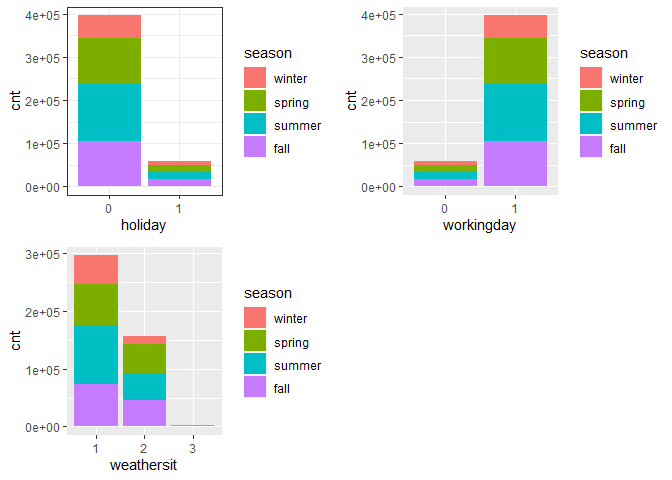

Project 2
================
Ifeoma Ojialor
10/16/2020

## Introduction

In this project, we will use a bike-sharing dataset to create machine
learning models. Before moving forward, I will briefly explain the
bike-sharing system and how it works. A bike-sharing system is a service
in which users can rent/use bicycles on a short term basis for a fee.
The goal of these programs is to provide affordable access to bicycles
for short distance trips as opposed to walking or taking public
transportation. Imagine how many people use these systems on a given
day, the numbers can vary greatly based on some elements. The goal of
this project is to build a predictive model to find out the number of
people that use these bikes in a given time period using available
information about that time/day. This in turn, can help businesses that
oversee this systems to manage them in a cost efficient manner.  
We will be using the bike-sharing dataset from the UCL Machine Learning
Repository. We will use the regression and boosted tree method to model
the response variable `cnt`.

## Exploratory Data Analysis

First we will read in the data using a relative path.

``` r
#read in data and filter to desired weekday
day1 <- read.csv("Bike-Sharing-Dataset/day.csv")
head(day1,5)
```

    ##   instant     dteday season yr mnth holiday
    ## 1       1 2011-01-01      1  0    1       0
    ## 2       2 2011-01-02      1  0    1       0
    ## 3       3 2011-01-03      1  0    1       0
    ## 4       4 2011-01-04      1  0    1       0
    ## 5       5 2011-01-05      1  0    1       0
    ##   weekday workingday weathersit     temp
    ## 1       6          0          2 0.344167
    ## 2       0          0          2 0.363478
    ## 3       1          1          1 0.196364
    ## 4       2          1          1 0.200000
    ## 5       3          1          1 0.226957
    ##      atemp      hum windspeed casual registered
    ## 1 0.363625 0.805833  0.160446    331        654
    ## 2 0.353739 0.696087  0.248539    131        670
    ## 3 0.189405 0.437273  0.248309    120       1229
    ## 4 0.212122 0.590435  0.160296    108       1454
    ## 5 0.229270 0.436957  0.186900     82       1518
    ##    cnt
    ## 1  985
    ## 2  801
    ## 3 1349
    ## 4 1562
    ## 5 1600

Next, we will remove the *casual* and *registered* variables since the
`cnt` variable is a combination of both.

``` r
day1 <- select(day1, -casual, -registered) 
day1$weekday <- as.factor(day1$weekday)
levels(day1$weekday) <- c("Sunday", "Monday", "Tuesday", "Wednesday", "Thursday", "Friday", "Saturday")
day <- filter(day1, weekday == params$days)

#Check for missing values
miss <- data.frame(apply(day,2,function(x){sum(is.na(x))}))
names(miss)[1] <- "missing"
miss
```

    ##            missing
    ## instant          0
    ## dteday           0
    ## season           0
    ## yr               0
    ## mnth             0
    ## holiday          0
    ## weekday          0
    ## workingday       0
    ## weathersit       0
    ## temp             0
    ## atemp            0
    ## hum              0
    ## windspeed        0
    ## cnt              0

There are no missing values in the dataset, so we can continue with our
analysis.

``` r
#Change the variables into their appropriate format.
day$season <- as.factor(day$season)
day$weathersit <- as.factor(day$weathersit)
day$holiday <- as.factor(day$holiday)
day$workingday <- as.factor(day$workingday)
day$yr <- as.factor(day$yr)
day$mnth <- as.factor(day$mnth)

levels(day$season) <- c("winter", "spring", "summer", "fall")
levels(day$yr) <- c("2011", "2012")
str(day)
```

    ## 'data.frame':    105 obs. of  14 variables:
    ##  $ instant   : int  3 10 17 24 31 38 45 52 59 66 ...
    ##  $ dteday    : chr  "2011-01-03" "2011-01-10" "2011-01-17" "2011-01-24" ...
    ##  $ season    : Factor w/ 4 levels "winter","spring",..: 1 1 1 1 1 1 1 1 1 1 ...
    ##  $ yr        : Factor w/ 2 levels "2011","2012": 1 1 1 1 1 1 1 1 1 1 ...
    ##  $ mnth      : Factor w/ 12 levels "1","2","3","4",..: 1 1 1 1 1 2 2 2 2 3 ...
    ##  $ holiday   : Factor w/ 2 levels "0","1": 1 1 2 1 1 1 1 2 1 1 ...
    ##  $ weekday   : Factor w/ 7 levels "Sunday","Monday",..: 2 2 2 2 2 2 2 2 2 2 ...
    ##  $ workingday: Factor w/ 2 levels "0","1": 2 2 1 2 2 2 2 1 2 2 ...
    ##  $ weathersit: Factor w/ 3 levels "1","2","3": 1 1 2 1 2 1 1 2 2 1 ...
    ##  $ temp      : num  0.1964 0.1508 0.1758 0.0974 0.1808 ...
    ##  $ atemp     : num  0.189 0.151 0.177 0.118 0.186 ...
    ##  $ hum       : num  0.437 0.483 0.537 0.492 0.604 ...
    ##  $ windspeed : num  0.248 0.223 0.194 0.158 0.187 ...
    ##  $ cnt       : int  1349 1321 1000 1416 1501 1712 1913 1107 1446 1872 ...

### Univariate Analysis

The `cnt` is the response variable, so we’ll use a histogram to get a
visual understanding of the variable.

``` r
ggplot(day, aes(x = cnt)) + theme_bw() + geom_histogram(aes(y =..density..), color = "black", fill = "white", binwidth = 1000) + geom_density(alpha = 0.2, fill = "blue") + labs(title = "Count Density", x = "Count", y = "Density")
```

<!-- -->

``` r
summary(day$cnt)
```

    ##    Min. 1st Qu.  Median    Mean 3rd Qu.    Max. 
    ##      22    3310    4359    4338    5875    7525

From the histogram and summary statistics output, it is pretty evident
that the count of total rental bikes are in the sub 5000 range. We will
investigate if there is a relationship between the response variable and
other relevant predictor variables in the next section. Lets look at the
other variables individually.

``` r
#visualize numeric predictor variables using a histogram
p1 <- ggplot(day) + geom_histogram(aes(x = temp), fill = "red", binwidth = 0.03)
p2 <- ggplot(day) + geom_histogram(aes(x = atemp), fill = "red", binwidth = 0.03)
p3 <- ggplot(day) + geom_histogram(aes(x = hum), fill = "red", binwidth = 0.025)
p4 <- ggplot(day) + geom_histogram(aes(x = windspeed), fill = "red", binwidth = 0.03)
gridExtra::grid.arrange(p1,p2,p3,p4, nrow = 2)
```

<!-- -->

Observations:  
\* No clear cut pattern in `temp`and `atemp`.

  - `hum` appears to be skewed to the left when the dataset is not
    filtered to a specific weekday.

  - `windspeed` appears to be skewed(right). This variable should be
    transformed to curb its skewness.

  - The distribution of `temp` and `atemp` looks very similar. We should
    think about taking out one of the variables.

<!-- end list -->

``` r
#visualize categorical predictor variables
h1 <- ggplot(day) + geom_bar(aes(x = season),fill = "pink")
h2 <- ggplot(day) + geom_bar(aes(x = yr),fill = "pink")
h3 <- ggplot(day) + geom_bar(aes(x = holiday),fill = "pink")
h4 <- ggplot(day) + geom_bar(aes(x = workingday),fill = "pink")
h5 <- ggplot(day) + geom_bar(aes(x = mnth),fill = "pink")
h6 <- ggplot(day) + geom_bar(aes(x = weathersit),fill = "pink")
gridExtra::grid.arrange(h1,h2,h3,h4,h5,h6, nrow = 3)
```

<!-- -->

Observations:  
\* The variation between the four seasons is little to none.

  - About the same number of people rode bikes in 2011 and 2012.

  - Many people rode bikes on days that are not holidays.

  - Most people used the bike-sharing system on days that were neither
    weekends nor holidays.

  - Most people used the bike sharing system on days with clear weather.

### Bi-variate Analysis

In this section, we will explore the predictor variables with respect to
the response variable. The objective is to discover hidden relationships
between the independent and response variables and use those findings in
the model building process.

``` r
# First, we will explore the relationship between the target and numerical variables.
p1 <- ggplot(day) +geom_point(aes(x = temp, y = cnt), colour = "violet") + labs(title = "Normalized Temperature vs Total Rental Bikes")
p2 <- ggplot(day) +geom_point(aes(x = atemp, y = cnt), colour = "#FF99CC") +labs(title = "Normalized Feeling Temperature vs Total Rental Bikes")
p3 <- ggplot(day) +geom_point(aes(x = hum, y = cnt), colour = "pink") + labs(title = "Normalized Humidity vs Total rental Bikes")
p4 <- ggplot(day) +geom_point(aes(x = windspeed, y = cnt), colour = "#FF66CC") +labs(title= "Normalized Windspeed vs Total rental Bikes")
gridExtra::grid.arrange(p1, p2, p3, p4, nrow = 2)
```

<!-- -->

Observations:  
\* There appears to be a positive linear relationship between `cnt` ,
`temp`, and `atemp`.

  - There is also a weak relationship between `cnt`, `hum`, and
    `windspeed`.

<!-- end list -->

``` r
# Now we'll visualize the relationship between the target and categorical variables.
# Instead of using a boxplot, I will use a violin plot which is the blend of both a boxplot and density plot
g1 <- ggplot(day) + geom_col(aes(x = yr, y = cnt, fill = season))+theme_bw()
g2 <- ggplot(day) + geom_violin(aes(x = yr, y = cnt))+theme_bw()
g3 <- ggplot(day) + geom_col(aes(x = mnth, y = cnt, fill = season))+theme_bw() 
g4 <- ggplot(day) + geom_col(aes(x = holiday, y = cnt, fill = season)) + theme_bw() 
g6 <- ggplot(day) + geom_col(aes(x = workingday, y = cnt, fill = season))
g7 <- ggplot(day) + geom_col(aes(x = weathersit, y = cnt, fill = season))
gridExtra::grid.arrange(g1, g2, g3, nrow = 2)
```

<!-- -->

``` r
gridExtra::grid.arrange(g4, g6, g7, nrow = 2)
```

<!-- --> Observations:  
\* The total bike rental count is higher in 2012 than 2011.

  - During workingday, the bike rental counts quite the highest compared
    to during no working day for different seasons.

  - During clear,partly cloudy weather, the bike rental count is highest
    and the second highest is during mist cloudy weather and followed by
    third highest during light snow and light rain weather.

  - The highest bike rental count was during the summer and lowest in
    the winter.

## Correlation Matrix

Correlation matrix helps us to understand the linear relationship
between variables.

``` r
day_c <- day[ , c(10:14)]
round(cor(day_c), 2)
```

    ##            temp atemp   hum windspeed   cnt
    ## temp       1.00  1.00  0.19     -0.03  0.65
    ## atemp      1.00  1.00  0.22     -0.06  0.67
    ## hum        0.19  0.22  1.00     -0.42  0.00
    ## windspeed -0.03 -0.06 -0.42      1.00 -0.17
    ## cnt        0.65  0.67  0.00     -0.17  1.00

From the above matrix, we can see that `temp` and `atemp` are highly
correlated. So we only need to include one of these variables in the
model to prevent multicollinearity. We will also transform the humidity
and windspeed variable.

``` r
day <- mutate(day, log_hum = log(day$hum+1))
day <- mutate(day, log_ws = log(day$windspeed + 1))

#Remove irrelevant variables
day <- select(day, -weekday,-holiday,-workingday,-dteday,-temp, -instant)
```

## Model Building

First we split the data into train and test sets.

``` r
set.seed(23)
dayIndex<- createDataPartition(day$cnt, p = 0.7, list=FALSE)
dayTrain <- day[dayIndex, ]
dayTest <- day[-dayIndex, ]

# Build a tree-based model using loocv;
fitTree <- train(cnt~ ., data = dayTrain, method = "rpart", 
              preProcess = c("center", "scale"), 
              trControl = trainControl(method = "loocv", number = 10), tuneGrid = data.frame(cp = 0.01:0.10))
```

    ## Warning in preProcess.default(thresh = 0.95,
    ## k = 5, freqCut = 19, uniqueCut = 10, : These
    ## variables have zero variances: weathersit3

    ## Warning in nominalTrainWorkflow(x = x, y =
    ## y, wts = weights, info = trainInfo, : There
    ## were missing values in resampled performance
    ## measures.

``` r
# Display information from the tree fit
fitTree$results
```

    ##     cp     RMSE Rsquared      MAE   RMSESD
    ## 1 0.01 869.1544      NaN 869.1544 937.8054
    ##   RsquaredSD    MAESD
    ## 1         NA 937.8054

``` r
# Build a boosted tree model using cv
fitBoost <- train(cnt~., data = dayTrain, method = "gbm", 
              preProcess = c("center", "scale"), 
              trControl = trainControl(method = "cv", number = 10), 
              tuneGrid = expand.grid(n.trees=c(10,20,50,100,500,1000),shrinkage=c(0.01,0.05,0.1,0.5),n.minobsinnode =c(3,5,10),interaction.depth=c(1,5,10)))
```

    ## Iter   TrainDeviance   ValidDeviance   StepSize   Improve
    ##      1  3481869.3341             nan     0.0100 27192.9345
    ##      2  3452412.5499             nan     0.0100 30037.0243
    ##      3  3417458.6348             nan     0.0100 24336.5760
    ##      4  3383492.4472             nan     0.0100 22147.9565
    ##      5  3353030.9822             nan     0.0100 18525.2399
    ##      6  3321079.6915             nan     0.0100 20220.3608
    ##      7  3299787.6087             nan     0.0100 25222.9235
    ##      8  3279598.1247             nan     0.0100 15311.6465
    ##      9  3259022.0947             nan     0.0100 15943.9119
    ##     10  3233890.9583             nan     0.0100 21505.7565
    ##     20  3007735.2960             nan     0.0100 21251.6956
    ##     40  2623016.3405             nan     0.0100 14826.7465
    ##     60  2307693.9796             nan     0.0100 6444.7609
    ##     80  2063683.7670             nan     0.0100  236.1477
    ##    100  1853986.5774             nan     0.0100 8958.3372
    ##    120  1670028.1228             nan     0.0100 -137.7402
    ##    140  1513200.5930             nan     0.0100 5792.9992
    ##    160  1397713.4508             nan     0.0100 3761.6698
    ##    180  1287208.7638             nan     0.0100 1173.2918
    ##    200  1187609.9193             nan     0.0100 2916.0387
    ##    220  1103943.3352             nan     0.0100 3447.1748
    ##    240  1024201.2695             nan     0.0100 -119.4581
    ##    260   954125.1804             nan     0.0100 -467.5434
    ##    280   890995.9725             nan     0.0100 -2668.1579
    ##    300   836612.4929             nan     0.0100  780.1141
    ##    320   787413.3499             nan     0.0100 -229.1964
    ##    340   747985.1907             nan     0.0100  229.3454
    ##    360   712267.7534             nan     0.0100 -700.5316
    ##    380   680573.5233             nan     0.0100 -607.6122
    ##    400   649807.7146             nan     0.0100  -73.9818
    ##    420   618694.8541             nan     0.0100  197.4517
    ##    440   591275.0886             nan     0.0100  697.2467
    ##    460   568299.5846             nan     0.0100   93.5967
    ##    480   545998.9770             nan     0.0100 -1209.0678
    ##    500   524891.5538             nan     0.0100  112.5207
    ##    520   508093.3461             nan     0.0100 -606.3626
    ##    540   491214.2044             nan     0.0100 -616.9376
    ##    560   476579.5804             nan     0.0100 -1540.3493
    ##    580   462939.1527             nan     0.0100 -1011.4498
    ##    600   451632.4778             nan     0.0100 -588.1680
    ##    620   440729.0244             nan     0.0100 -554.9051
    ##    640   430360.8068             nan     0.0100 -261.5524
    ##    660   420433.6169             nan     0.0100 -907.2522
    ##    680   412079.1525             nan     0.0100 -1185.3083
    ##    700   405605.3854             nan     0.0100 -1121.9453
    ##    720   396289.4168             nan     0.0100 -1794.5890
    ##    740   389071.6183             nan     0.0100 -1046.3623
    ##    760   382348.9649             nan     0.0100 -638.5879
    ##    780   376285.1874             nan     0.0100 -148.5241
    ##    800   370577.4511             nan     0.0100 -346.7791
    ##    820   364177.4698             nan     0.0100 -492.8509
    ##    840   359893.6519             nan     0.0100 -565.1408
    ##    860   354402.6034             nan     0.0100 -998.0509
    ##    880   348288.8403             nan     0.0100 -1008.2322
    ##    900   344450.0575             nan     0.0100 -469.5254
    ##    920   339628.7371             nan     0.0100 -1029.1364
    ##    940   335709.0745             nan     0.0100 -972.4309
    ##    960   332098.6762             nan     0.0100 -797.9637
    ##    980   328318.0775             nan     0.0100 -1100.6233
    ##   1000   324938.6327             nan     0.0100 -362.3632
    ## 
    ## Iter   TrainDeviance   ValidDeviance   StepSize   Improve
    ##      1  3483986.3785             nan     0.0100 27992.0635
    ##      2  3454282.3933             nan     0.0100 28763.0370
    ##      3  3428653.4896             nan     0.0100 27118.2943
    ##      4  3410788.8376             nan     0.0100 17997.3743
    ##      5  3375421.3943             nan     0.0100 22045.8058
    ##      6  3348645.3358             nan     0.0100 27560.3164
    ##      7  3319355.7606             nan     0.0100 23124.1546
    ##      8  3289515.4944             nan     0.0100 29168.3530
    ##      9  3259047.8179             nan     0.0100 18416.3593
    ##     10  3232340.9801             nan     0.0100 21175.9703
    ##     20  3011563.3589             nan     0.0100 13715.3694
    ##     40  2620997.4426             nan     0.0100 12031.5821
    ##     60  2327531.8777             nan     0.0100 11732.1907
    ##     80  2068411.5773             nan     0.0100 9802.7754
    ##    100  1862995.1352             nan     0.0100 7825.9570
    ##    120  1701021.8433             nan     0.0100 4112.4210
    ##    140  1556339.1497             nan     0.0100 -373.9582
    ##    160  1416841.7337             nan     0.0100 3147.1597
    ##    180  1305069.1253             nan     0.0100 2106.3349
    ##    200  1208182.8003             nan     0.0100 4517.0661
    ##    220  1126076.2407             nan     0.0100 1113.1443
    ##    240  1045864.0959             nan     0.0100 1781.5426
    ##    260   977940.3425             nan     0.0100  444.4492
    ##    280   924185.3336             nan     0.0100 1746.0124
    ##    300   873984.5793             nan     0.0100  517.4583
    ##    320   827514.8592             nan     0.0100 1059.7944
    ##    340   789002.5468             nan     0.0100 -286.0991
    ##    360   754839.3151             nan     0.0100  -61.9190
    ##    380   720820.9417             nan     0.0100  156.4047
    ##    400   691870.5608             nan     0.0100 -776.8586
    ##    420   662949.2502             nan     0.0100 -429.6159
    ##    440   638759.7093             nan     0.0100   -4.4513
    ##    460   617068.5276             nan     0.0100 -164.9372
    ##    480   597022.9441             nan     0.0100  215.7467
    ##    500   579710.3051             nan     0.0100 -807.2713
    ##    520   562906.9538             nan     0.0100 -475.7149
    ##    540   546943.6437             nan     0.0100   14.9875
    ##    560   533764.2562             nan     0.0100 -376.1218
    ##    580   522612.1143             nan     0.0100 -551.9692
    ##    600   511311.0474             nan     0.0100   42.5668
    ##    620   501338.1183             nan     0.0100  -29.5349
    ##    640   491960.8490             nan     0.0100 -501.5424
    ##    660   482907.3216             nan     0.0100 -1219.7296
    ##    680   478684.3781             nan     0.0100 -128.7902
    ##    700   473377.2377             nan     0.0100  -92.3723
    ##    720   465957.2290             nan     0.0100 -284.2452
    ##    740   459297.4482             nan     0.0100 -1582.4196
    ##    760   453620.9691             nan     0.0100 -372.7992
    ##    780   447347.7667             nan     0.0100 -545.0675
    ##    800   441021.5362             nan     0.0100 -1519.9455
    ##    820   435531.2001             nan     0.0100  -34.6573
    ##    840   431217.0467             nan     0.0100 -1058.0686
    ##    860   425906.1170             nan     0.0100 -802.9429
    ##    880   420686.8228             nan     0.0100 -619.8712
    ##    900   416455.3478             nan     0.0100 -175.3629
    ##    920   413730.2995             nan     0.0100 -1267.8673
    ##    940   409842.0175             nan     0.0100 -212.5648
    ##    960   407029.6570             nan     0.0100  -62.7973
    ##    980   404953.0009             nan     0.0100   -9.8304
    ##   1000   401270.2402             nan     0.0100 -1314.2542
    ## 
    ## Iter   TrainDeviance   ValidDeviance   StepSize   Improve
    ##      1  3478157.4427             nan     0.0100 23676.1660
    ##      2  3450888.6712             nan     0.0100 27813.0134
    ##      3  3421940.0364             nan     0.0100 26370.8413
    ##      4  3389125.6760             nan     0.0100 28476.9292
    ##      5  3361544.9433             nan     0.0100 25278.1347
    ##      6  3333934.2774             nan     0.0100 29538.9020
    ##      7  3313455.4990             nan     0.0100 19490.6707
    ##      8  3307217.5864             nan     0.0100 -8541.3671
    ##      9  3273938.0799             nan     0.0100 28453.3505
    ##     10  3251453.7796             nan     0.0100 23228.7786
    ##     20  3012836.9868             nan     0.0100 23611.7181
    ##     40  2636838.7331             nan     0.0100 13009.4651
    ##     60  2335601.8974             nan     0.0100 10106.1498
    ##     80  2069374.4219             nan     0.0100 9159.9452
    ##    100  1858388.1846             nan     0.0100 7507.3685
    ##    120  1684202.9582             nan     0.0100 5485.9842
    ##    140  1539123.9813             nan     0.0100 6372.1349
    ##    160  1419252.2962             nan     0.0100 4789.4064
    ##    180  1313459.7224             nan     0.0100 1345.8773
    ##    200  1225894.5070             nan     0.0100  -57.4187
    ##    220  1159418.0153             nan     0.0100 1112.5768
    ##    240  1097535.6784             nan     0.0100 1374.3294
    ##    260  1045820.6657             nan     0.0100 1904.8779
    ##    280  1000745.7693             nan     0.0100 1059.2309
    ##    300   963303.5577             nan     0.0100 1220.5917
    ##    320   927518.5741             nan     0.0100  175.7994
    ##    340   898925.4500             nan     0.0100 -524.5636
    ##    360   873755.3468             nan     0.0100 -705.9942
    ##    380   849911.2302             nan     0.0100  433.5591
    ##    400   829616.2335             nan     0.0100  374.6319
    ##    420   810805.4458             nan     0.0100  -95.8996
    ##    440   793288.2260             nan     0.0100 -179.4257
    ##    460   777770.5307             nan     0.0100 -794.0659
    ##    480   763259.4927             nan     0.0100 -330.9127
    ##    500   749996.4043             nan     0.0100 -756.6245
    ##    520   736101.2810             nan     0.0100 -191.5282
    ##    540   725841.4759             nan     0.0100 -164.7161
    ##    560   714818.9842             nan     0.0100 -617.6091
    ##    580   706181.1571             nan     0.0100   63.1853
    ##    600   697088.4733             nan     0.0100 -1813.1364
    ##    620   688028.8253             nan     0.0100  109.2104
    ##    640   680699.9999             nan     0.0100 -713.9920
    ##    660   672208.5099             nan     0.0100 -1025.2159
    ##    680   665179.5591             nan     0.0100 -704.3258
    ##    700   659056.9122             nan     0.0100  -11.7756
    ##    720   653117.7057             nan     0.0100 -186.2142
    ##    740   648321.3833             nan     0.0100 -1989.7246
    ##    760   645148.3217             nan     0.0100  -58.4587
    ##    780   642550.9110             nan     0.0100 -504.6081
    ##    800   636622.6226             nan     0.0100 -789.4826
    ##    820   633265.5579             nan     0.0100 -390.4940
    ##    840   628750.8259             nan     0.0100 -601.1334
    ##    860   623670.0786             nan     0.0100 -591.5656
    ##    880   619578.6174             nan     0.0100 -965.2978
    ##    900   615377.1665             nan     0.0100 -921.8849
    ##    920   611954.4276             nan     0.0100 -407.4093
    ##    940   607744.5242             nan     0.0100 -296.1718
    ##    960   604729.0076             nan     0.0100 -788.6471
    ##    980   601436.9852             nan     0.0100 -913.9948
    ##   1000   596918.7118             nan     0.0100 -1285.1732
    ## 
    ## Iter   TrainDeviance   ValidDeviance   StepSize   Improve
    ##      1  3449230.1456             nan     0.0100 48061.2172
    ##      2  3395566.0044             nan     0.0100 45096.6813
    ##      3  3341322.3475             nan     0.0100 47313.7006
    ##      4  3290106.6663             nan     0.0100 42603.6347
    ##      5  3247795.8755             nan     0.0100 21841.9843
    ##      6  3195656.1975             nan     0.0100 30041.4557
    ##      7  3153105.2554             nan     0.0100 42103.5827
    ##      8  3107526.7532             nan     0.0100 39517.6213
    ##      9  3054811.9482             nan     0.0100 45787.1441
    ##     10  3008820.1238             nan     0.0100 38318.6195
    ##     20  2599435.6688             nan     0.0100 28289.4350
    ##     40  1991186.7243             nan     0.0100 23092.5271
    ##     60  1512173.5307             nan     0.0100 7368.2679
    ##     80  1210922.8573             nan     0.0100 10556.9215
    ##    100   977367.3666             nan     0.0100 5054.3663
    ##    120   805891.4006             nan     0.0100 3674.8230
    ##    140   673055.2851             nan     0.0100 3177.4552
    ##    160   577888.6231             nan     0.0100 1155.5456
    ##    180   500978.4993             nan     0.0100 2249.2277
    ##    200   433854.5774             nan     0.0100  453.4506
    ##    220   387399.1115             nan     0.0100  358.2957
    ##    240   357232.1401             nan     0.0100 1636.8461
    ##    260   322161.5782             nan     0.0100   39.2489
    ##    280   291147.6045             nan     0.0100 -1567.6055
    ##    300   266639.1940             nan     0.0100 -1430.3302
    ##    320   242664.6520             nan     0.0100  673.1421
    ##    340   227014.5135             nan     0.0100  258.1934
    ##    360   210031.7548             nan     0.0100  191.5188
    ##    380   197412.8246             nan     0.0100 -508.2231
    ##    400   186163.7715             nan     0.0100 -431.0718
    ##    420   175094.5311             nan     0.0100 -1202.4655
    ##    440   165818.8898             nan     0.0100 -526.6989
    ##    460   157990.3727             nan     0.0100 -477.0044
    ##    480   152513.0971             nan     0.0100 -423.4813
    ##    500   143940.4116             nan     0.0100 -361.2391
    ##    520   137158.2769             nan     0.0100  -49.2922
    ##    540   128509.3304             nan     0.0100 -544.1825
    ##    560   122875.6406             nan     0.0100 -228.9710
    ##    580   116524.1880             nan     0.0100  -41.1682
    ##    600   109870.6358             nan     0.0100  -76.2221
    ##    620   105686.9455             nan     0.0100 -217.1909
    ##    640   101903.7137             nan     0.0100 -724.7298
    ##    660    98038.2670             nan     0.0100 -311.8350
    ##    680    93010.3399             nan     0.0100 -562.5259
    ##    700    88842.1321             nan     0.0100 -525.1783
    ##    720    85096.1318             nan     0.0100  -79.3930
    ##    740    80124.6484             nan     0.0100 -443.3495
    ##    760    77495.2651             nan     0.0100 -482.5893
    ##    780    73636.6206             nan     0.0100 -414.8131
    ##    800    70442.7694             nan     0.0100 -402.2467
    ##    820    66906.8211             nan     0.0100  -24.5833
    ##    840    64714.2218             nan     0.0100 -362.3494
    ##    860    62067.2137             nan     0.0100 -218.4059
    ##    880    59837.5085             nan     0.0100 -265.5106
    ##    900    57933.8788             nan     0.0100 -376.3356
    ##    920    55060.7353             nan     0.0100 -186.5262
    ##    940    52970.2605             nan     0.0100 -283.4295
    ##    960    50311.7029             nan     0.0100  -96.6485
    ##    980    48223.4615             nan     0.0100 -111.2233
    ##   1000    46655.2593             nan     0.0100 -222.2629
    ## 
    ## Iter   TrainDeviance   ValidDeviance   StepSize   Improve
    ##      1  3453188.3753             nan     0.0100 41976.3784
    ##      2  3408635.8014             nan     0.0100 29581.5556
    ##      3  3370906.5782             nan     0.0100 31294.9523
    ##      4  3333245.3862             nan     0.0100 25281.5396
    ##      5  3287041.7217             nan     0.0100 41357.9055
    ##      6  3243036.8769             nan     0.0100 53520.5005
    ##      7  3194994.2287             nan     0.0100 38415.7657
    ##      8  3157108.8421             nan     0.0100 32805.2625
    ##      9  3109902.4536             nan     0.0100 38882.8127
    ##     10  3063988.2531             nan     0.0100 30437.5069
    ##     20  2690425.5949             nan     0.0100 33150.6482
    ##     40  2111996.7489             nan     0.0100 21605.2145
    ##     60  1681016.9379             nan     0.0100 8611.4485
    ##     80  1380261.6823             nan     0.0100 7763.0539
    ##    100  1147878.3910             nan     0.0100 5046.1897
    ##    120   965987.9482             nan     0.0100 7772.9266
    ##    140   837403.3502             nan     0.0100 2841.1167
    ##    160   742534.9673             nan     0.0100 2192.8496
    ##    180   669604.5600             nan     0.0100 1608.8911
    ##    200   607877.9828             nan     0.0100 -658.9905
    ##    220   550604.6876             nan     0.0100 -280.9202
    ##    240   509309.5795             nan     0.0100  891.0718
    ##    260   466974.1973             nan     0.0100 -289.7612
    ##    280   431689.7944             nan     0.0100  568.4326
    ##    300   405483.9050             nan     0.0100 -1475.7123
    ##    320   383749.3720             nan     0.0100 -555.1175
    ##    340   364705.1221             nan     0.0100 -1309.2914
    ##    360   348989.5268             nan     0.0100 -857.3980
    ##    380   333371.2172             nan     0.0100 -435.2453
    ##    400   319627.1409             nan     0.0100 -419.9577
    ##    420   307712.0744             nan     0.0100  -26.6078
    ##    440   294535.1723             nan     0.0100 -553.7627
    ##    460   286728.5829             nan     0.0100 -1400.1257
    ##    480   277665.9332             nan     0.0100 -379.3945
    ##    500   269861.9949             nan     0.0100 -788.3925
    ##    520   262186.4024             nan     0.0100 -220.4356
    ##    540   255090.6701             nan     0.0100 -523.4603
    ##    560   248893.3711             nan     0.0100 -697.2019
    ##    580   241236.8741             nan     0.0100 -1075.6017
    ##    600   235750.3611             nan     0.0100 -267.9620
    ##    620   230279.4465             nan     0.0100 -406.0313
    ##    640   225056.1917             nan     0.0100  114.9997
    ##    660   218185.7168             nan     0.0100 -272.9351
    ##    680   211586.5609             nan     0.0100 -691.0143
    ##    700   206667.7538             nan     0.0100 -659.7640
    ##    720   200242.5288             nan     0.0100 -653.9582
    ##    740   194758.6026             nan     0.0100 -359.2592
    ##    760   191013.9836             nan     0.0100 -120.4753
    ##    780   185181.5675             nan     0.0100 -560.4744
    ##    800   182431.3655             nan     0.0100 -770.0767
    ##    820   177440.9566             nan     0.0100 -254.2170
    ##    840   175099.0938             nan     0.0100 -207.4795
    ##    860   171647.8785             nan     0.0100 -449.2847
    ##    880   168931.0984             nan     0.0100 -477.3903
    ##    900   163128.3497             nan     0.0100 -699.9403
    ##    920   161283.5494             nan     0.0100 -368.9956
    ##    940   157389.0364             nan     0.0100 -237.9267
    ##    960   154237.8738             nan     0.0100 -256.5785
    ##    980   150983.7354             nan     0.0100 -429.0505
    ##   1000   148379.9903             nan     0.0100 -437.9446
    ## 
    ## Iter   TrainDeviance   ValidDeviance   StepSize   Improve
    ##      1  3463979.2476             nan     0.0100 36318.2794
    ##      2  3422855.3655             nan     0.0100 37420.5067
    ##      3  3396063.2199             nan     0.0100 26534.5785
    ##      4  3359013.7246             nan     0.0100 23841.7828
    ##      5  3328471.4966             nan     0.0100 29630.9696
    ##      6  3302869.6442             nan     0.0100 26148.3454
    ##      7  3286017.6979             nan     0.0100 12909.5484
    ##      8  3259748.2223             nan     0.0100 26100.7222
    ##      9  3224208.4799             nan     0.0100 34293.2325
    ##     10  3186242.8146             nan     0.0100 33639.7302
    ##     20  2885163.4548             nan     0.0100 15448.0987
    ##     40  2428111.8595             nan     0.0100 23406.5968
    ##     60  2089974.4240             nan     0.0100 15127.9346
    ##     80  1822405.8107             nan     0.0100 8020.5822
    ##    100  1620111.1185             nan     0.0100 5736.0942
    ##    120  1445023.0336             nan     0.0100 9416.2170
    ##    140  1316574.5480             nan     0.0100 5174.7618
    ##    160  1210382.5515             nan     0.0100 2119.1838
    ##    180  1116974.3231             nan     0.0100 4827.7822
    ##    200  1031940.2023             nan     0.0100 1921.4483
    ##    220   970875.5466             nan     0.0100 1188.7852
    ##    240   921482.1570             nan     0.0100 -1043.4468
    ##    260   873520.0073             nan     0.0100  183.7194
    ##    280   831889.6956             nan     0.0100 -132.2992
    ##    300   798783.0909             nan     0.0100  561.8769
    ##    320   762883.9569             nan     0.0100 1046.5300
    ##    340   732703.3698             nan     0.0100 1255.8800
    ##    360   707087.0119             nan     0.0100 -179.1423
    ##    380   690015.2823             nan     0.0100 -604.6770
    ##    400   667898.9802             nan     0.0100 -424.6229
    ##    420   651466.8496             nan     0.0100 -2857.8584
    ##    440   635882.6407             nan     0.0100  706.8733
    ##    460   624283.8710             nan     0.0100   90.6499
    ##    480   615874.7385             nan     0.0100 -442.3509
    ##    500   605901.2628             nan     0.0100 -494.3568
    ##    520   596586.5642             nan     0.0100 -935.7565
    ##    540   590718.7837             nan     0.0100 -1853.5574
    ##    560   584514.0622             nan     0.0100 -1292.2580
    ##    580   576074.8907             nan     0.0100   53.1386
    ##    600   568575.9070             nan     0.0100 -642.1229
    ##    620   562812.0262             nan     0.0100 -953.6352
    ##    640   556805.0726             nan     0.0100  -73.8248
    ##    660   553104.8800             nan     0.0100 -626.1851
    ##    680   546986.5613             nan     0.0100 -374.1670
    ##    700   539675.5435             nan     0.0100 -1690.0986
    ##    720   531400.2779             nan     0.0100 -272.5337
    ##    740   526153.7060             nan     0.0100 -835.5572
    ##    760   517652.8974             nan     0.0100 -781.4317
    ##    780   510737.9799             nan     0.0100 -827.8845
    ##    800   505395.5833             nan     0.0100 -514.6115
    ##    820   501802.8207             nan     0.0100 -1987.7774
    ##    840   495625.8527             nan     0.0100 -1194.8361
    ##    860   492407.9562             nan     0.0100 -1820.5612
    ##    880   487784.4533             nan     0.0100 -1242.4800
    ##    900   483443.4055             nan     0.0100 -515.5493
    ##    920   478122.3004             nan     0.0100 -889.5231
    ##    940   471078.1403             nan     0.0100 -668.7790
    ##    960   465493.6562             nan     0.0100 -422.7806
    ##    980   460719.5002             nan     0.0100 -358.7832
    ##   1000   455107.1814             nan     0.0100 -934.1624
    ## 
    ## Iter   TrainDeviance   ValidDeviance   StepSize   Improve
    ##      1  3452353.5365             nan     0.0100 44613.9923
    ##      2  3394276.8682             nan     0.0100 46426.8951
    ##      3  3344137.0413             nan     0.0100 46135.7572
    ##      4  3291312.6498             nan     0.0100 48088.0081
    ##      5  3247096.5631             nan     0.0100 36827.5037
    ##      6  3199537.5633             nan     0.0100 47134.8488
    ##      7  3148583.3346             nan     0.0100 33015.3212
    ##      8  3089304.6373             nan     0.0100 57403.6319
    ##      9  3054782.0764             nan     0.0100 18021.7131
    ##     10  3004638.1292             nan     0.0100 38082.1427
    ##     20  2596008.7492             nan     0.0100 28932.0071
    ##     40  1944191.0015             nan     0.0100 16958.2951
    ##     60  1462777.7037             nan     0.0100 17878.2737
    ##     80  1143591.7415             nan     0.0100 13455.8358
    ##    100   909935.8766             nan     0.0100 7110.3165
    ##    120   750193.4662             nan     0.0100 2745.7624
    ##    140   629570.9426             nan     0.0100 4518.8486
    ##    160   530971.6996             nan     0.0100 2004.2068
    ##    180   454583.0307             nan     0.0100 1778.8596
    ##    200   400234.2823             nan     0.0100 -609.4929
    ##    220   359443.8081             nan     0.0100  715.7135
    ##    240   320274.1847             nan     0.0100 -1017.9162
    ##    260   289483.6810             nan     0.0100  502.0807
    ##    280   258581.4592             nan     0.0100  727.0985
    ##    300   238308.9476             nan     0.0100 -536.1137
    ##    320   222567.9930             nan     0.0100 -385.2987
    ##    340   207535.0295             nan     0.0100  243.8120
    ##    360   191536.5616             nan     0.0100 -488.7216
    ##    380   179579.8205             nan     0.0100 -262.5181
    ##    400   168290.9327             nan     0.0100 -568.7662
    ##    420   158161.5382             nan     0.0100 -798.6330
    ##    440   148214.9059             nan     0.0100 -527.9656
    ##    460   140527.9921             nan     0.0100 -197.8545
    ##    480   132486.6123             nan     0.0100 -373.7318
    ##    500   126936.4541             nan     0.0100 -475.0920
    ##    520   121655.6194             nan     0.0100 -310.5288
    ##    540   116777.4098             nan     0.0100 -372.9644
    ##    560   110167.0209             nan     0.0100 -383.9347
    ##    580   105182.1866             nan     0.0100 -322.0762
    ##    600   100771.7356             nan     0.0100 -395.5874
    ##    620    94969.4165             nan     0.0100 -418.5272
    ##    640    90830.6261             nan     0.0100 -307.6709
    ##    660    88208.6742             nan     0.0100 -574.8712
    ##    680    84099.4322             nan     0.0100 -207.2349
    ##    700    79731.0576             nan     0.0100 -275.3293
    ##    720    76763.7394             nan     0.0100 -338.3738
    ##    740    73320.9118             nan     0.0100  -85.1746
    ##    760    71289.9649             nan     0.0100   -0.2085
    ##    780    67913.1481             nan     0.0100 -133.2161
    ##    800    65066.0615             nan     0.0100 -400.5259
    ##    820    62892.8412             nan     0.0100  -78.0141
    ##    840    60612.9820             nan     0.0100 -236.2645
    ##    860    58291.4917             nan     0.0100 -164.3750
    ##    880    56029.2419             nan     0.0100   27.6947
    ##    900    54090.0395             nan     0.0100 -258.2408
    ##    920    51687.2187             nan     0.0100  -68.7664
    ##    940    48845.9427             nan     0.0100  -97.2788
    ##    960    46770.4065             nan     0.0100  -37.8397
    ##    980    44886.6159             nan     0.0100 -155.1150
    ##   1000    43258.8882             nan     0.0100 -187.9218
    ## 
    ## Iter   TrainDeviance   ValidDeviance   StepSize   Improve
    ##      1  3457950.0387             nan     0.0100 39825.8199
    ##      2  3407121.7144             nan     0.0100 40019.4423
    ##      3  3359323.4792             nan     0.0100 44993.8391
    ##      4  3311243.1625             nan     0.0100 41543.8249
    ##      5  3261367.3265             nan     0.0100 36268.9986
    ##      6  3216033.7855             nan     0.0100 37334.9969
    ##      7  3168152.9225             nan     0.0100 48013.4984
    ##      8  3127502.7456             nan     0.0100 31821.6093
    ##      9  3088665.2108             nan     0.0100 27674.5624
    ##     10  3048475.8861             nan     0.0100 25682.7856
    ##     20  2671021.3581             nan     0.0100 26652.6209
    ##     40  2085208.4521             nan     0.0100 12703.0717
    ##     60  1668827.6772             nan     0.0100 10841.7024
    ##     80  1355129.2081             nan     0.0100 2889.8543
    ##    100  1135583.8509             nan     0.0100 6988.5876
    ##    120   973971.5144             nan     0.0100 6854.2501
    ##    140   847700.2829             nan     0.0100 1660.8103
    ##    160   741635.3845             nan     0.0100  -13.2528
    ##    180   654561.0180             nan     0.0100 2131.7253
    ##    200   583688.6217             nan     0.0100 -607.3249
    ##    220   525136.1467             nan     0.0100  631.5341
    ##    240   480169.7196             nan     0.0100  440.7434
    ##    260   442216.0706             nan     0.0100  201.1920
    ##    280   416152.5375             nan     0.0100 -599.3394
    ##    300   390288.6840             nan     0.0100 -1099.6416
    ##    320   373746.3001             nan     0.0100 -419.6507
    ##    340   350951.7224             nan     0.0100  153.5875
    ##    360   332239.2365             nan     0.0100 -365.1431
    ##    380   315603.9750             nan     0.0100 -1468.0663
    ##    400   304225.5648             nan     0.0100 -949.2490
    ##    420   292663.8330             nan     0.0100 -557.8919
    ##    440   276912.5869             nan     0.0100 -488.1508
    ##    460   264812.1107             nan     0.0100 -335.4245
    ##    480   257745.8424             nan     0.0100 -641.7285
    ##    500   252745.0769             nan     0.0100 -628.3178
    ##    520   244971.0645             nan     0.0100 -911.3966
    ##    540   238013.9566             nan     0.0100 -695.3945
    ##    560   231135.1007             nan     0.0100 -316.2225
    ##    580   224168.6410             nan     0.0100 -102.6607
    ##    600   217860.8720             nan     0.0100 -607.5158
    ##    620   211312.8853             nan     0.0100 -590.8963
    ##    640   206786.0146             nan     0.0100 -194.8492
    ##    660   200106.3042             nan     0.0100 -782.8781
    ##    680   195808.5560             nan     0.0100 -1176.2848
    ##    700   190516.2007             nan     0.0100 -912.5867
    ##    720   186146.9634             nan     0.0100 -389.5576
    ##    740   181950.0783             nan     0.0100 -850.8795
    ##    760   176344.6785             nan     0.0100 -743.6870
    ##    780   171982.5366             nan     0.0100 -453.4127
    ##    800   167560.6859             nan     0.0100  -87.2404
    ##    820   164680.4559             nan     0.0100 -339.6055
    ##    840   162296.5828             nan     0.0100 -134.2734
    ##    860   159418.7328             nan     0.0100 -400.4405
    ##    880   156759.3677             nan     0.0100  107.1171
    ##    900   153516.3610             nan     0.0100 -340.9367
    ##    920   151049.7855             nan     0.0100 -293.0246
    ##    940   147938.7269             nan     0.0100 -477.4368
    ##    960   144429.3042             nan     0.0100 -534.3639
    ##    980   142005.9352             nan     0.0100 -578.6768
    ##   1000   138924.1826             nan     0.0100 -398.2057
    ## 
    ## Iter   TrainDeviance   ValidDeviance   StepSize   Improve
    ##      1  3478175.9414             nan     0.0100 28112.2837
    ##      2  3447562.6304             nan     0.0100 26392.0355
    ##      3  3418370.3373             nan     0.0100 29511.7360
    ##      4  3380213.2611             nan     0.0100 33645.8995
    ##      5  3348127.0889             nan     0.0100 23115.4815
    ##      6  3322760.8013             nan     0.0100 23815.2420
    ##      7  3298679.5362             nan     0.0100 19345.6248
    ##      8  3268886.1200             nan     0.0100 31498.9812
    ##      9  3226835.7275             nan     0.0100 38159.6051
    ##     10  3187082.9152             nan     0.0100 35204.7201
    ##     20  2891076.6057             nan     0.0100 20559.7065
    ##     40  2474364.2218             nan     0.0100 13165.0973
    ##     60  2138068.8215             nan     0.0100 13899.6322
    ##     80  1863201.9172             nan     0.0100  274.6759
    ##    100  1656821.5579             nan     0.0100 6272.1044
    ##    120  1490366.3060             nan     0.0100 4432.6174
    ##    140  1338952.8205             nan     0.0100 4784.3846
    ##    160  1215575.7329             nan     0.0100 1784.8986
    ##    180  1125039.8034             nan     0.0100 4093.6681
    ##    200  1051704.2334             nan     0.0100 1257.3067
    ##    220   983205.8135             nan     0.0100 -1140.7845
    ##    240   929159.2994             nan     0.0100 -775.9138
    ##    260   886605.0336             nan     0.0100  423.2413
    ##    280   847133.4137             nan     0.0100  102.1410
    ##    300   813409.0326             nan     0.0100 -327.9782
    ##    320   784221.2725             nan     0.0100 -864.8812
    ##    340   759371.2353             nan     0.0100 -2117.6728
    ##    360   732626.1308             nan     0.0100 -285.9820
    ##    380   714356.5947             nan     0.0100 -1060.6700
    ##    400   690029.2175             nan     0.0100 -442.8202
    ##    420   674685.6394             nan     0.0100 -395.8383
    ##    440   661754.1099             nan     0.0100 -1984.5166
    ##    460   652930.0356             nan     0.0100 -365.7482
    ##    480   642890.8792             nan     0.0100 -831.0705
    ##    500   635693.8473             nan     0.0100 -924.2351
    ##    520   625832.6838             nan     0.0100 -450.2700
    ##    540   615376.9570             nan     0.0100 -627.1056
    ##    560   608493.9135             nan     0.0100 -1721.0894
    ##    580   600619.9601             nan     0.0100 -417.6571
    ##    600   593613.4691             nan     0.0100 -701.9504
    ##    620   588892.1171             nan     0.0100 -1560.3015
    ##    640   582576.2754             nan     0.0100 -372.5358
    ##    660   574770.2676             nan     0.0100 -300.3083
    ##    680   568244.8305             nan     0.0100 -1486.1158
    ##    700   560390.1215             nan     0.0100 -629.0373
    ##    720   552661.2228             nan     0.0100 -966.2389
    ##    740   546238.4028             nan     0.0100 -1452.6408
    ##    760   538413.9471             nan     0.0100 -936.2181
    ##    780   530391.4252             nan     0.0100 -944.3719
    ##    800   524879.0666             nan     0.0100 -1166.2328
    ##    820   519840.1926             nan     0.0100 -825.8986
    ##    840   513784.7699             nan     0.0100 -1288.5913
    ##    860   508980.5147             nan     0.0100 -563.1904
    ##    880   503132.3566             nan     0.0100 -570.0656
    ##    900   496233.4588             nan     0.0100 -1003.2141
    ##    920   490880.9514             nan     0.0100 -585.3980
    ##    940   485904.7898             nan     0.0100 -448.2301
    ##    960   482271.3218             nan     0.0100  -25.8453
    ##    980   477559.2312             nan     0.0100 -829.1818
    ##   1000   472951.5348             nan     0.0100 -864.9704
    ## 
    ## Iter   TrainDeviance   ValidDeviance   StepSize   Improve
    ##      1  3335605.2639             nan     0.0500 143716.3175
    ##      2  3211750.6779             nan     0.0500 115362.6266
    ##      3  3097900.6218             nan     0.0500 113080.6033
    ##      4  2999043.6898             nan     0.0500 44481.4679
    ##      5  2891357.4176             nan     0.0500 90607.1306
    ##      6  2803962.2164             nan     0.0500 91256.8630
    ##      7  2722864.2488             nan     0.0500 83242.5629
    ##      8  2626610.6504             nan     0.0500 87128.3340
    ##      9  2547000.2601             nan     0.0500 58184.7844
    ##     10  2486726.1118             nan     0.0500 31279.3239
    ##     20  1843724.1535             nan     0.0500 42551.8090
    ##     40  1156322.2555             nan     0.0500  587.4264
    ##     60   820979.8599             nan     0.0500 6341.7468
    ##     80   639815.6661             nan     0.0500 -1791.9934
    ##    100   528579.3756             nan     0.0500 -189.9822
    ##    120   460147.8148             nan     0.0500 -4163.2096
    ##    140   411816.4215             nan     0.0500 -4271.0660
    ##    160   376561.8633             nan     0.0500 -3395.4383
    ##    180   357855.8503             nan     0.0500 -8251.0953
    ##    200   338943.8097             nan     0.0500 -7291.7742
    ##    220   319153.7376             nan     0.0500 -5619.1032
    ##    240   304132.1522             nan     0.0500 -3458.7351
    ##    260   289903.5687             nan     0.0500 -2911.6150
    ##    280   283351.9899             nan     0.0500 -2852.8431
    ##    300   273115.8416             nan     0.0500 -3131.0115
    ##    320   262391.2573             nan     0.0500 -1152.3961
    ##    340   255209.8056             nan     0.0500 -2011.2606
    ##    360   246329.1029             nan     0.0500 -2024.3264
    ##    380   238578.2304             nan     0.0500 -4979.9872
    ##    400   228345.8160             nan     0.0500 -3273.5489
    ##    420   220020.4730             nan     0.0500 -2635.9446
    ##    440   214998.3548             nan     0.0500 -2701.5782
    ##    460   208268.6186             nan     0.0500 -2813.7595
    ##    480   202121.0003             nan     0.0500 -1576.7678
    ##    500   194523.1228             nan     0.0500 -4381.0427
    ##    520   189097.7012             nan     0.0500 -2417.2155
    ##    540   184903.7492             nan     0.0500 -588.3649
    ##    560   177240.5317             nan     0.0500 -1861.1034
    ##    580   171874.8073             nan     0.0500 -2111.3048
    ##    600   165594.3885             nan     0.0500 -1461.3908
    ##    620   160929.8559             nan     0.0500 -782.6310
    ##    640   155688.9806             nan     0.0500 -2769.2951
    ##    660   150245.7113             nan     0.0500 -3969.0464
    ##    680   147025.1558             nan     0.0500  223.8550
    ##    700   142824.2205             nan     0.0500 -921.4052
    ##    720   140581.1383             nan     0.0500 -3658.1571
    ##    740   136487.0331             nan     0.0500 -623.4869
    ##    760   134206.1208             nan     0.0500 -198.2455
    ##    780   131370.7256             nan     0.0500 -1330.2203
    ##    800   127599.7919             nan     0.0500 -638.1609
    ##    820   124488.4466             nan     0.0500 -1143.5424
    ##    840   122119.1929             nan     0.0500 -844.1077
    ##    860   121160.1505             nan     0.0500 -2293.1013
    ##    880   118720.3574             nan     0.0500 -1756.3807
    ##    900   117014.0990             nan     0.0500 -1011.2994
    ##    920   114988.9126             nan     0.0500 -1069.4912
    ##    940   111935.2397             nan     0.0500 -1039.0128
    ##    960   108680.7147             nan     0.0500 -804.9057
    ##    980   106576.7553             nan     0.0500 -1017.7225
    ##   1000   104654.4564             nan     0.0500 -1350.3494
    ## 
    ## Iter   TrainDeviance   ValidDeviance   StepSize   Improve
    ##      1  3382605.1954             nan     0.0500 112387.5135
    ##      2  3258280.7729             nan     0.0500 102853.8129
    ##      3  3113999.4133             nan     0.0500 141965.8214
    ##      4  3010921.8450             nan     0.0500 121153.9671
    ##      5  2890769.4652             nan     0.0500 91342.8322
    ##      6  2788952.9890             nan     0.0500 69220.3008
    ##      7  2705854.7130             nan     0.0500 65982.4137
    ##      8  2632556.8042             nan     0.0500 41112.4957
    ##      9  2569777.3158             nan     0.0500 61420.5566
    ##     10  2464735.5851             nan     0.0500 86109.5352
    ##     20  1878300.6497             nan     0.0500 14761.3975
    ##     40  1150393.7627             nan     0.0500 16816.8270
    ##     60   858537.1581             nan     0.0500 4151.8502
    ##     80   676642.9966             nan     0.0500 -2337.8356
    ##    100   572222.1259             nan     0.0500 1300.3320
    ##    120   501850.9720             nan     0.0500 -3478.4634
    ##    140   461099.7843             nan     0.0500 -2202.1635
    ##    160   432378.8634             nan     0.0500 -9649.0027
    ##    180   410067.1363             nan     0.0500 -1188.8012
    ##    200   397513.2339             nan     0.0500 -2370.0719
    ##    220   381769.9074             nan     0.0500 -1524.1279
    ##    240   371688.8463             nan     0.0500 -2959.7801
    ##    260   358893.2535             nan     0.0500 -6584.6313
    ##    280   347110.1964             nan     0.0500 -260.3370
    ##    300   340021.6725             nan     0.0500 -3077.6511
    ##    320   333448.9827             nan     0.0500 -2545.7239
    ##    340   328216.3816             nan     0.0500 -2547.2681
    ##    360   323469.7486             nan     0.0500 -2140.6858
    ##    380   317896.9595             nan     0.0500 -3556.6517
    ##    400   308830.2946             nan     0.0500 -450.5309
    ##    420   305164.3669             nan     0.0500 -2912.9455
    ##    440   298952.8052             nan     0.0500 -1429.0687
    ##    460   294222.8304             nan     0.0500 -3134.2037
    ##    480   290792.1163             nan     0.0500 -1169.3443
    ##    500   284365.5457             nan     0.0500 -189.1630
    ##    520   277065.3224             nan     0.0500 -2096.8157
    ##    540   273968.5294             nan     0.0500 -2872.5668
    ##    560   270049.3359             nan     0.0500 -4908.2272
    ##    580   265486.9883             nan     0.0500 -6470.9777
    ##    600   264268.7958             nan     0.0500 -2624.9720
    ##    620   261711.6437             nan     0.0500 -2158.8111
    ##    640   258685.7495             nan     0.0500 -1648.1146
    ##    660   256162.7583             nan     0.0500 -962.4242
    ##    680   252054.7597             nan     0.0500 -5104.2478
    ##    700   247332.9529             nan     0.0500 -1085.1331
    ##    720   242603.9059             nan     0.0500 -1592.4823
    ##    740   238297.0635             nan     0.0500 -5898.3959
    ##    760   230734.5249             nan     0.0500 -2688.5361
    ##    780   228185.4833             nan     0.0500 -2321.0476
    ##    800   225470.2591             nan     0.0500 -2878.8900
    ##    820   223306.3849             nan     0.0500 -1763.7339
    ##    840   220733.0232             nan     0.0500 -3887.7297
    ##    860   217656.2441             nan     0.0500 -1344.1193
    ##    880   215717.8927             nan     0.0500 -4869.2856
    ##    900   212493.1901             nan     0.0500 -1537.0110
    ##    920   206914.7668             nan     0.0500   62.7908
    ##    940   206078.7608             nan     0.0500 -3729.1945
    ##    960   202082.0194             nan     0.0500 -4559.0005
    ##    980   200269.3065             nan     0.0500 -1038.8048
    ##   1000   197454.9076             nan     0.0500 -1323.3402
    ## 
    ## Iter   TrainDeviance   ValidDeviance   StepSize   Improve
    ##      1  3348369.8031             nan     0.0500 146467.1682
    ##      2  3224177.0922             nan     0.0500 116067.4318
    ##      3  3076669.8358             nan     0.0500 116312.4382
    ##      4  2984884.2253             nan     0.0500 106085.1713
    ##      5  2869724.7046             nan     0.0500 92176.7200
    ##      6  2772627.2554             nan     0.0500 64967.1454
    ##      7  2667037.5892             nan     0.0500 69752.2173
    ##      8  2582069.7167             nan     0.0500 86381.6849
    ##      9  2514591.1317             nan     0.0500 48184.7609
    ##     10  2440647.6809             nan     0.0500 54237.9966
    ##     20  1802249.9256             nan     0.0500 44821.4037
    ##     40  1209774.3581             nan     0.0500 17327.6796
    ##     60   934606.9643             nan     0.0500 5565.3488
    ##     80   791440.1258             nan     0.0500 1011.7641
    ##    100   709845.7624             nan     0.0500 -1715.1951
    ##    120   655563.8900             nan     0.0500 -5928.6322
    ##    140   630013.3675             nan     0.0500 -4634.9763
    ##    160   604509.0604             nan     0.0500 -1906.7278
    ##    180   585392.2927             nan     0.0500 -6068.6932
    ##    200   562483.9736             nan     0.0500  581.3732
    ##    220   544870.4677             nan     0.0500 -1380.7500
    ##    240   534053.3154             nan     0.0500 -1530.8954
    ##    260   518225.3516             nan     0.0500 -785.5937
    ##    280   512666.8756             nan     0.0500 -3085.0425
    ##    300   496479.8194             nan     0.0500 -1622.9299
    ##    320   486471.9424             nan     0.0500 -2766.5582
    ##    340   472623.3307             nan     0.0500 -3576.0261
    ##    360   463264.8750             nan     0.0500 -3989.4772
    ##    380   453003.6011             nan     0.0500 -4885.2800
    ##    400   443464.6546             nan     0.0500 -1325.3557
    ##    420   432344.7412             nan     0.0500 -3800.4479
    ##    440   419143.8755             nan     0.0500 -3439.3816
    ##    460   409385.8095             nan     0.0500 -3682.2152
    ##    480   404597.1522             nan     0.0500 -3101.5928
    ##    500   394412.2032             nan     0.0500 -1732.8869
    ##    520   392185.2524             nan     0.0500 -2592.8537
    ##    540   383688.0981             nan     0.0500 -3932.6670
    ##    560   376478.5868             nan     0.0500 -5056.6227
    ##    580   369334.9488             nan     0.0500 -1133.4709
    ##    600   362495.5918             nan     0.0500 -1213.3885
    ##    620   358091.9342             nan     0.0500 -2891.4019
    ##    640   351985.0434             nan     0.0500 -1729.5791
    ##    660   348290.6467             nan     0.0500 -1740.4049
    ##    680   342198.6027             nan     0.0500 -3566.9221
    ##    700   336309.5809             nan     0.0500 -1668.6247
    ##    720   331279.6577             nan     0.0500 -3062.1728
    ##    740   326721.7030             nan     0.0500 -2200.8874
    ##    760   321100.0427             nan     0.0500 -3728.1157
    ##    780   320674.6337             nan     0.0500 -4627.5665
    ##    800   313897.6875             nan     0.0500 -1161.8974
    ##    820   309651.6652             nan     0.0500 -1228.4423
    ##    840   306810.2880             nan     0.0500 -960.4183
    ##    860   304086.4596             nan     0.0500 -6182.7154
    ##    880   299724.0771             nan     0.0500 -2946.2234
    ##    900   295408.2073             nan     0.0500 -489.2117
    ##    920   291728.0472             nan     0.0500 -1512.9138
    ##    940   288324.8065             nan     0.0500 -2116.3562
    ##    960   285201.3957             nan     0.0500 -1778.0502
    ##    980   280293.0103             nan     0.0500 -2376.1255
    ##   1000   276567.9311             nan     0.0500 -1651.6812
    ## 
    ## Iter   TrainDeviance   ValidDeviance   StepSize   Improve
    ##      1  3217223.7012             nan     0.0500 319886.2755
    ##      2  2990881.5969             nan     0.0500 201468.4429
    ##      3  2815507.3347             nan     0.0500 126656.5804
    ##      4  2608524.6110             nan     0.0500 134120.0032
    ##      5  2420029.2203             nan     0.0500 160605.2581
    ##      6  2258394.6715             nan     0.0500 138695.5841
    ##      7  2109592.2762             nan     0.0500 137660.7744
    ##      8  1953302.7028             nan     0.0500 89078.7109
    ##      9  1812631.2071             nan     0.0500 115235.6802
    ##     10  1715182.3274             nan     0.0500 98999.5062
    ##     20  1005794.4057             nan     0.0500 26893.5270
    ##     40   414271.7946             nan     0.0500 3462.1774
    ##     60   242911.2094             nan     0.0500 -1322.6757
    ##     80   181489.8951             nan     0.0500  -92.8302
    ##    100   149603.6725             nan     0.0500 -222.1703
    ##    120   117918.1304             nan     0.0500 -302.8338
    ##    140    92408.1937             nan     0.0500 -2869.2322
    ##    160    77126.7161             nan     0.0500 -658.2243
    ##    180    63199.0057             nan     0.0500 -982.6982
    ##    200    53103.5514             nan     0.0500 -455.0892
    ##    220    45071.8821             nan     0.0500 -1431.9312
    ##    240    35019.2262             nan     0.0500 -984.2796
    ##    260    29712.5898             nan     0.0500 -839.1093
    ##    280    24525.1133             nan     0.0500 -112.4412
    ##    300    20291.3804             nan     0.0500 -296.2143
    ##    320    17381.9143             nan     0.0500  -52.8067
    ##    340    14446.5384             nan     0.0500 -202.1026
    ##    360    12133.1851             nan     0.0500   43.2143
    ##    380    10170.4877             nan     0.0500 -269.0735
    ##    400     9007.1911             nan     0.0500 -213.6648
    ##    420     7996.8068             nan     0.0500 -137.5223
    ##    440     6409.0742             nan     0.0500  -12.1066
    ##    460     5406.0563             nan     0.0500  -72.6327
    ##    480     4608.0150             nan     0.0500 -111.8385
    ##    500     4031.7068             nan     0.0500 -110.4059
    ##    520     3660.5922             nan     0.0500 -106.7397
    ##    540     3200.8019             nan     0.0500  -77.2898
    ##    560     2880.5287             nan     0.0500  -46.8243
    ##    580     2541.8556             nan     0.0500  -29.2480
    ##    600     2241.2347             nan     0.0500  -18.9483
    ##    620     1998.3766             nan     0.0500   -5.3780
    ##    640     1707.2697             nan     0.0500  -49.8431
    ##    660     1523.9746             nan     0.0500  -40.4886
    ##    680     1275.7151             nan     0.0500  -40.6049
    ##    700     1081.4972             nan     0.0500  -21.2795
    ##    720     1027.9549             nan     0.0500  -11.9066
    ##    740      846.5746             nan     0.0500  -21.7564
    ##    760      754.7793             nan     0.0500  -22.6547
    ##    780      682.4471             nan     0.0500  -12.2476
    ##    800      574.5914             nan     0.0500  -13.1162
    ##    820      533.1326             nan     0.0500  -13.5879
    ##    840      507.7674             nan     0.0500  -12.0105
    ##    860      421.3552             nan     0.0500  -15.0557
    ##    880      373.0328             nan     0.0500  -10.2735
    ##    900      319.6968             nan     0.0500   -7.8358
    ##    920      281.8967             nan     0.0500   -7.4883
    ##    940      242.5135             nan     0.0500   -3.0799
    ##    960      208.6094             nan     0.0500   -5.8928
    ##    980      167.6815             nan     0.0500   -3.5115
    ##   1000      153.9144             nan     0.0500   -5.4836
    ## 
    ## Iter   TrainDeviance   ValidDeviance   StepSize   Improve
    ##      1  3276102.1038             nan     0.0500 224278.4945
    ##      2  3061747.8676             nan     0.0500 184179.4860
    ##      3  2849451.1327             nan     0.0500 176788.7904
    ##      4  2650129.4116             nan     0.0500 144806.0570
    ##      5  2491674.0172             nan     0.0500 139141.2438
    ##      6  2325740.8144             nan     0.0500 111155.5046
    ##      7  2165567.3827             nan     0.0500 140376.4680
    ##      8  2028033.6003             nan     0.0500 120068.4190
    ##      9  1936815.8568             nan     0.0500 77336.3270
    ##     10  1820629.7792             nan     0.0500 109753.5263
    ##     20  1131458.1277             nan     0.0500 25028.6412
    ##     40   572541.1576             nan     0.0500 1101.4910
    ##     60   396530.0617             nan     0.0500 1645.9343
    ##     80   313536.4422             nan     0.0500 -4166.4053
    ##    100   281003.7983             nan     0.0500 -5113.9335
    ##    120   245941.4719             nan     0.0500 -4659.6775
    ##    140   210809.3163             nan     0.0500 -3687.4178
    ##    160   188960.2361             nan     0.0500 -2732.1434
    ##    180   164359.9056             nan     0.0500 -2148.2942
    ##    200   149248.1775             nan     0.0500 -1534.2320
    ##    220   133974.3316             nan     0.0500 -815.3408
    ##    240   114279.7736             nan     0.0500 -848.8315
    ##    260    99118.1206             nan     0.0500 -2691.3248
    ##    280    85070.0208             nan     0.0500 -1381.1457
    ##    300    72344.3268             nan     0.0500 -541.2733
    ##    320    65750.1115             nan     0.0500 -1391.1588
    ##    340    58720.6805             nan     0.0500 -951.2271
    ##    360    51825.8032             nan     0.0500 -1187.8634
    ##    380    48105.2538             nan     0.0500 -807.9547
    ##    400    44498.3948             nan     0.0500 -681.5415
    ##    420    40249.5271             nan     0.0500 -450.2115
    ##    440    35143.3338             nan     0.0500 -291.5647
    ##    460    30893.5319             nan     0.0500 -256.7993
    ##    480    27608.6928             nan     0.0500 -485.3623
    ##    500    24826.5103             nan     0.0500 -336.5830
    ##    520    20720.7373             nan     0.0500 -187.5195
    ##    540    18507.5986             nan     0.0500 -424.8762
    ##    560    16616.5398             nan     0.0500 -259.8485
    ##    580    14948.0118             nan     0.0500  -84.6350
    ##    600    13211.0344             nan     0.0500 -259.3678
    ##    620    11674.0925             nan     0.0500 -206.9673
    ##    640    10507.7314             nan     0.0500  -62.7432
    ##    660     9551.4784             nan     0.0500 -251.8730
    ##    680     8927.3730             nan     0.0500  -48.1003
    ##    700     8118.9780             nan     0.0500 -221.1739
    ##    720     7284.8006             nan     0.0500 -209.7421
    ##    740     6689.6035             nan     0.0500  -42.3203
    ##    760     5936.8461             nan     0.0500  -51.8061
    ##    780     5447.1576             nan     0.0500 -105.5587
    ##    800     4962.3188             nan     0.0500  -82.3495
    ##    820     4565.4913             nan     0.0500  -84.3687
    ##    840     4328.5559             nan     0.0500  -75.4860
    ##    860     4052.9633             nan     0.0500  -88.5764
    ##    880     3617.0411             nan     0.0500  -34.4151
    ##    900     3291.1907             nan     0.0500  -95.5727
    ##    920     2927.9226             nan     0.0500  -43.3725
    ##    940     2711.3382             nan     0.0500  -37.5773
    ##    960     2319.5480             nan     0.0500  -10.8428
    ##    980     2163.4276             nan     0.0500  -45.8626
    ##   1000     2109.9765             nan     0.0500  -43.0373
    ## 
    ## Iter   TrainDeviance   ValidDeviance   StepSize   Improve
    ##      1  3343903.5568             nan     0.0500 128339.5526
    ##      2  3147023.7473             nan     0.0500 133040.1477
    ##      3  3035968.9700             nan     0.0500 64002.3118
    ##      4  2858698.2522             nan     0.0500 139218.2973
    ##      5  2750506.3953             nan     0.0500 97143.6175
    ##      6  2591774.2045             nan     0.0500 114965.3629
    ##      7  2436355.0521             nan     0.0500 130292.2515
    ##      8  2350180.0164             nan     0.0500 57273.1485
    ##      9  2229156.4186             nan     0.0500 81000.6385
    ##     10  2165340.9608             nan     0.0500 72224.4515
    ##     20  1560755.0137             nan     0.0500 18996.5561
    ##     40  1059131.8053             nan     0.0500 9599.5168
    ##     60   834278.7492             nan     0.0500  237.2801
    ##     80   719516.6829             nan     0.0500 -2479.2662
    ##    100   666050.5095             nan     0.0500 -3149.0773
    ##    120   622442.7262             nan     0.0500 -2567.6342
    ##    140   591015.1353             nan     0.0500 -3891.4086
    ##    160   553717.2505             nan     0.0500 -4518.1995
    ##    180   514190.2607             nan     0.0500 -963.3751
    ##    200   488611.8686             nan     0.0500 -2370.8899
    ##    220   457280.1317             nan     0.0500 -2980.3718
    ##    240   443083.5876             nan     0.0500 -5225.8630
    ##    260   421994.7355             nan     0.0500 -1529.6405
    ##    280   398810.7317             nan     0.0500 -2907.4360
    ##    300   377816.5647             nan     0.0500 -9357.1194
    ##    320   362270.8014             nan     0.0500 -3333.9487
    ##    340   342828.1107             nan     0.0500 -465.6065
    ##    360   331633.7888             nan     0.0500 -434.5072
    ##    380   325224.2234             nan     0.0500 -2642.7785
    ##    400   317498.7984             nan     0.0500 -4521.0689
    ##    420   305434.2250             nan     0.0500 -1537.1636
    ##    440   296367.9139             nan     0.0500 -1671.7750
    ##    460   287231.0638             nan     0.0500 -1835.4785
    ##    480   275784.5191             nan     0.0500 -2424.6663
    ##    500   266312.9134             nan     0.0500 -1650.2776
    ##    520   254579.9996             nan     0.0500 -1031.9277
    ##    540   244011.8317             nan     0.0500 -1978.8144
    ##    560   233508.7576             nan     0.0500 -1447.9715
    ##    580   228163.3299             nan     0.0500 -1330.2088
    ##    600   218575.2514             nan     0.0500 -1422.6589
    ##    620   212391.4938             nan     0.0500 -1684.4551
    ##    640   203715.5330             nan     0.0500 -1750.8588
    ##    660   195941.4799             nan     0.0500 -1482.9658
    ##    680   189652.5906             nan     0.0500 -2264.9670
    ##    700   181850.5041             nan     0.0500 -793.7018
    ##    720   180007.0914             nan     0.0500 -2555.3034
    ##    740   173234.9475             nan     0.0500 -2540.5903
    ##    760   167737.3942             nan     0.0500 -987.3591
    ##    780   164166.1281             nan     0.0500 -1669.0448
    ##    800   159140.0222             nan     0.0500 -2026.1070
    ##    820   152269.2546             nan     0.0500 -1385.1344
    ##    840   148577.8531             nan     0.0500 -1230.5116
    ##    860   144137.8296             nan     0.0500 -1888.3110
    ##    880   140376.6089             nan     0.0500 -1098.2707
    ##    900   138043.0450             nan     0.0500 -2316.1756
    ##    920   132767.9173             nan     0.0500 -897.7311
    ##    940   129093.9523             nan     0.0500 -683.5086
    ##    960   127946.3125             nan     0.0500 -734.6672
    ##    980   123445.9101             nan     0.0500 -1124.0737
    ##   1000   120679.1401             nan     0.0500 -712.8960
    ## 
    ## Iter   TrainDeviance   ValidDeviance   StepSize   Improve
    ##      1  3217553.9836             nan     0.0500 241671.1628
    ##      2  2978500.5187             nan     0.0500 227893.3140
    ##      3  2753364.4735             nan     0.0500 197855.1413
    ##      4  2573909.5058             nan     0.0500 118400.0678
    ##      5  2352423.6580             nan     0.0500 205854.0966
    ##      6  2194176.4021             nan     0.0500 131787.9668
    ##      7  2018322.6932             nan     0.0500 148776.9398
    ##      8  1878438.7085             nan     0.0500 98591.5777
    ##      9  1774082.8893             nan     0.0500 76371.5851
    ##     10  1654128.4767             nan     0.0500 110955.7951
    ##     20   885470.9821             nan     0.0500 37105.5068
    ##     40   362900.2813             nan     0.0500 -3348.2383
    ##     60   226765.0990             nan     0.0500 1308.4607
    ##     80   163121.0713             nan     0.0500 1373.9084
    ##    100   117230.9415             nan     0.0500 -488.2444
    ##    120    94266.7453             nan     0.0500 -731.0328
    ##    140    73554.6823             nan     0.0500 -454.0746
    ##    160    59793.0747             nan     0.0500 -1828.4519
    ##    180    50654.2504             nan     0.0500 -1088.1106
    ##    200    40454.3354             nan     0.0500 -705.5971
    ##    220    32197.5465             nan     0.0500 -867.9713
    ##    240    26581.6080             nan     0.0500 -844.1782
    ##    260    21962.7654             nan     0.0500 -677.6588
    ##    280    19410.3450             nan     0.0500 -177.5263
    ##    300    15534.5048             nan     0.0500  -88.2037
    ##    320    13643.6369             nan     0.0500 -150.0209
    ##    340    11315.6640             nan     0.0500 -117.9218
    ##    360     9414.8059             nan     0.0500 -247.6874
    ##    380     8179.6257             nan     0.0500 -270.3267
    ##    400     7350.7742             nan     0.0500 -124.3841
    ##    420     6438.5850             nan     0.0500 -228.3747
    ##    440     5841.1902             nan     0.0500 -208.6169
    ##    460     4995.1454             nan     0.0500  -31.7234
    ##    480     4094.2810             nan     0.0500   -4.0963
    ##    500     3408.9500             nan     0.0500  -97.6868
    ##    520     3045.9770             nan     0.0500 -100.8165
    ##    540     2704.2450             nan     0.0500  -77.4253
    ##    560     2325.6080             nan     0.0500  -10.2542
    ##    580     1994.6467             nan     0.0500  -14.4574
    ##    600     1810.3510             nan     0.0500  -33.7461
    ##    620     1620.4807             nan     0.0500   -7.3039
    ##    640     1319.4312             nan     0.0500  -15.6944
    ##    660     1116.0104             nan     0.0500  -63.7638
    ##    680      984.3680             nan     0.0500   -0.5945
    ##    700      910.2967             nan     0.0500  -11.4885
    ##    720      789.5019             nan     0.0500  -29.5245
    ##    740      721.1184             nan     0.0500  -33.8695
    ##    760      661.0367             nan     0.0500   -5.7495
    ##    780      560.4656             nan     0.0500  -20.5934
    ##    800      497.0470             nan     0.0500  -26.7491
    ##    820      443.3433             nan     0.0500   -2.5485
    ##    840      372.5717             nan     0.0500   -1.2487
    ##    860      326.8432             nan     0.0500   -8.5532
    ##    880      296.2480             nan     0.0500   -9.3541
    ##    900      272.6502             nan     0.0500   -8.5535
    ##    920      241.5875             nan     0.0500   -0.2672
    ##    940      224.1855             nan     0.0500   -7.8747
    ##    960      205.0099             nan     0.0500    0.5267
    ##    980      186.1932             nan     0.0500   -7.6977
    ##   1000      174.4859             nan     0.0500   -2.6915
    ## 
    ## Iter   TrainDeviance   ValidDeviance   StepSize   Improve
    ##      1  3279286.1853             nan     0.0500 88926.0817
    ##      2  3065767.1745             nan     0.0500 236530.5251
    ##      3  2889649.8506             nan     0.0500 125974.3093
    ##      4  2717850.7090             nan     0.0500 132950.7812
    ##      5  2547847.5852             nan     0.0500 150931.7109
    ##      6  2384289.0203             nan     0.0500 127789.8658
    ##      7  2253601.2877             nan     0.0500 118878.4835
    ##      8  2139280.2601             nan     0.0500 84788.3363
    ##      9  2043029.7989             nan     0.0500 81618.5087
    ##     10  1900667.1944             nan     0.0500 99464.1705
    ##     20  1175556.6335             nan     0.0500 16940.1921
    ##     40   616662.7641             nan     0.0500 -410.2382
    ##     60   418261.3762             nan     0.0500 -2841.7789
    ##     80   332152.6010             nan     0.0500 -3040.7782
    ##    100   274713.3085             nan     0.0500 -5242.6274
    ##    120   246760.8264             nan     0.0500 -1052.3863
    ##    140   223052.3985             nan     0.0500 -4120.9043
    ##    160   192677.6175             nan     0.0500 -2211.8508
    ##    180   171731.5257             nan     0.0500 -2465.8022
    ##    200   157275.7495             nan     0.0500 -1689.4223
    ##    220   139599.5979             nan     0.0500 -2420.4542
    ##    240   123291.8317             nan     0.0500 -2676.3960
    ##    260   117332.9181             nan     0.0500 -1000.9394
    ##    280   103439.5400             nan     0.0500 -844.2386
    ##    300    94290.9225             nan     0.0500  540.6350
    ##    320    85474.2534             nan     0.0500 -159.2944
    ##    340    78528.5893             nan     0.0500 -828.3425
    ##    360    71807.6593             nan     0.0500 -744.7522
    ##    380    62118.6033             nan     0.0500 -315.1898
    ##    400    57481.9733             nan     0.0500 -973.6280
    ##    420    53767.9874             nan     0.0500 -839.3759
    ##    440    48967.8698             nan     0.0500 -461.3464
    ##    460    44504.4005             nan     0.0500 -1028.5884
    ##    480    39350.2697             nan     0.0500 -721.4843
    ##    500    37319.7623             nan     0.0500 -613.3120
    ##    520    32979.8805             nan     0.0500 -216.9707
    ##    540    30148.5075             nan     0.0500 -413.0413
    ##    560    27544.2654             nan     0.0500 -554.3811
    ##    580    25392.8231             nan     0.0500 -411.9573
    ##    600    22006.7628             nan     0.0500 -485.7276
    ##    620    21055.8242             nan     0.0500 -657.4765
    ##    640    19650.3623             nan     0.0500 -456.7538
    ##    660    18305.9127             nan     0.0500 -413.3260
    ##    680    16302.9617             nan     0.0500 -308.6881
    ##    700    15632.2675             nan     0.0500 -228.0982
    ##    720    14417.2037             nan     0.0500 -162.9092
    ##    740    13248.5052             nan     0.0500 -171.9164
    ##    760    12211.3059             nan     0.0500 -114.8870
    ##    780    11240.2285             nan     0.0500 -236.6225
    ##    800    10251.2766             nan     0.0500 -155.7778
    ##    820     9347.1801             nan     0.0500 -159.2887
    ##    840     8431.9584             nan     0.0500 -158.4406
    ##    860     7491.8997             nan     0.0500 -216.7565
    ##    880     6774.4345             nan     0.0500 -182.6825
    ##    900     6348.3845             nan     0.0500  -24.2994
    ##    920     5811.0285             nan     0.0500  -19.2646
    ##    940     5308.8029             nan     0.0500  -27.3608
    ##    960     4809.7203             nan     0.0500 -124.6886
    ##    980     4243.2787             nan     0.0500  -26.7840
    ##   1000     4012.3919             nan     0.0500  -54.5302
    ## 
    ## Iter   TrainDeviance   ValidDeviance   StepSize   Improve
    ##      1  3361573.2182             nan     0.0500 140673.9325
    ##      2  3212491.9163             nan     0.0500 126747.6704
    ##      3  3054014.7589             nan     0.0500 151340.5077
    ##      4  2953795.3385             nan     0.0500 104203.1645
    ##      5  2801042.5934             nan     0.0500 141053.9269
    ##      6  2692174.3715             nan     0.0500 89422.1736
    ##      7  2587400.0131             nan     0.0500 54638.2559
    ##      8  2496449.3155             nan     0.0500 50673.7144
    ##      9  2398380.6181             nan     0.0500 78348.8027
    ##     10  2272742.4455             nan     0.0500 120732.1123
    ##     20  1683479.3032             nan     0.0500 17640.2915
    ##     40  1016083.7508             nan     0.0500 5498.3860
    ##     60   775380.7773             nan     0.0500 2825.3088
    ##     80   669955.6934             nan     0.0500 -331.6570
    ##    100   609369.3931             nan     0.0500 -3231.0805
    ##    120   559419.7553             nan     0.0500 -3445.6682
    ##    140   517118.5666             nan     0.0500 -3029.8274
    ##    160   492786.1326             nan     0.0500 -7071.0222
    ##    180   469051.6082             nan     0.0500 -5347.8052
    ##    200   446595.3036             nan     0.0500 -2616.5348
    ##    220   432932.8647             nan     0.0500 -5206.6743
    ##    240   406914.5189             nan     0.0500 -2535.1858
    ##    260   390888.9160             nan     0.0500 -5414.1388
    ##    280   372514.3297             nan     0.0500 -750.7203
    ##    300   352003.1009             nan     0.0500 -1764.4471
    ##    320   336606.6843             nan     0.0500 -3598.9602
    ##    340   322540.8651             nan     0.0500 -4273.4663
    ##    360   308393.1287             nan     0.0500 -4015.8228
    ##    380   297809.6261             nan     0.0500 -1388.3728
    ##    400   284715.1840             nan     0.0500 -2390.9887
    ##    420   275622.6320             nan     0.0500 -509.3491
    ##    440   264419.5767             nan     0.0500 -2066.5071
    ##    460   252933.5188             nan     0.0500 -2758.9975
    ##    480   243632.1617             nan     0.0500 -3578.8531
    ##    500   238489.2488             nan     0.0500 -689.5972
    ##    520   228037.3333             nan     0.0500 -1661.1875
    ##    540   224107.0193             nan     0.0500 -2447.0674
    ##    560   216347.9333             nan     0.0500 -2708.0551
    ##    580   208476.5015             nan     0.0500 -1345.3819
    ##    600   204881.7609             nan     0.0500 -2331.7727
    ##    620   196963.6871             nan     0.0500 -1647.7597
    ##    640   192669.6548             nan     0.0500 -1745.0026
    ##    660   187703.1941             nan     0.0500 -1603.7386
    ##    680   184809.5993             nan     0.0500 -1890.7216
    ##    700   177051.0125             nan     0.0500 -1143.7563
    ##    720   173033.6965             nan     0.0500 -2643.8020
    ##    740   168134.7775             nan     0.0500 -492.1526
    ##    760   161534.5884             nan     0.0500 -848.7250
    ##    780   158495.7328             nan     0.0500 -251.3474
    ##    800   152962.8976             nan     0.0500 -716.8822
    ##    820   149042.8495             nan     0.0500 -1655.2096
    ##    840   148334.0461             nan     0.0500 -883.8578
    ##    860   145433.8480             nan     0.0500 -823.7745
    ##    880   142836.9340             nan     0.0500 -3035.3483
    ##    900   140731.8636             nan     0.0500 -1428.1317
    ##    920   138701.8263             nan     0.0500 -1398.2568
    ##    940   135405.8928             nan     0.0500 -1038.2171
    ##    960   131890.5323             nan     0.0500 -436.6762
    ##    980   127899.6818             nan     0.0500 -954.2791
    ##   1000   124986.8327             nan     0.0500 -1517.4937
    ## 
    ## Iter   TrainDeviance   ValidDeviance   StepSize   Improve
    ##      1  3150768.3899             nan     0.1000 278888.2849
    ##      2  2967456.8385             nan     0.1000 165373.6169
    ##      3  2753189.3287             nan     0.1000 172273.0098
    ##      4  2582046.8252             nan     0.1000 158136.8821
    ##      5  2409465.8329             nan     0.1000 92371.7962
    ##      6  2234380.5312             nan     0.1000 116719.0187
    ##      7  2101479.7419             nan     0.1000 141493.0517
    ##      8  1979175.1025             nan     0.1000 104808.8760
    ##      9  1889846.5949             nan     0.1000 53762.6200
    ##     10  1831703.2030             nan     0.1000 1184.1922
    ##     20  1234839.4064             nan     0.1000 8644.4471
    ##     40   636153.4385             nan     0.1000 -100.9388
    ##     60   469746.4246             nan     0.1000 -16135.7731
    ##     80   383660.2109             nan     0.1000 -16483.2186
    ##    100   345226.0122             nan     0.1000 -5843.3146
    ##    120   312487.4799             nan     0.1000 -2067.4587
    ##    140   288955.7220             nan     0.1000 -3102.9942
    ##    160   284893.4086             nan     0.1000 -2351.3739
    ##    180   267739.2841             nan     0.1000 -9086.0136
    ##    200   254632.1822             nan     0.1000 -2114.9572
    ##    220   234590.8146             nan     0.1000 -11827.7199
    ##    240   225793.8217             nan     0.1000 -1240.0519
    ##    260   212543.9176             nan     0.1000 -3303.7455
    ##    280   201117.8825             nan     0.1000 -2205.1173
    ##    300   195320.1506             nan     0.1000 -1420.1755
    ##    320   185906.3448             nan     0.1000 -5405.7670
    ##    340   174773.3853             nan     0.1000 -1996.4712
    ##    360   162754.7660             nan     0.1000 -2486.5459
    ##    380   157801.7865             nan     0.1000 -5046.4168
    ##    400   147283.0587             nan     0.1000 -3752.2678
    ##    420   137648.5107             nan     0.1000 -2553.3229
    ##    440   131992.0956             nan     0.1000 -7091.3728
    ##    460   125641.7478             nan     0.1000 -1590.0743
    ##    480   123225.8523             nan     0.1000 -1805.6404
    ##    500   121402.5133             nan     0.1000 -4489.9343
    ##    520   118893.7285             nan     0.1000 -1726.3143
    ##    540   116231.6124             nan     0.1000 -1882.9461
    ##    560   111457.8928             nan     0.1000 -3183.7330
    ##    580   107595.9068             nan     0.1000 -4579.8555
    ##    600   104623.0898             nan     0.1000 -1680.2392
    ##    620   101021.4529             nan     0.1000 -5811.3131
    ##    640    95195.5495             nan     0.1000 -2097.4592
    ##    660    92848.3550             nan     0.1000 -1930.0780
    ##    680    91478.5656             nan     0.1000 -1826.7716
    ##    700    86761.7740             nan     0.1000 -2930.7875
    ##    720    85132.5863             nan     0.1000 -2307.7753
    ##    740    82536.3516             nan     0.1000 -1570.1811
    ##    760    80367.0327             nan     0.1000 -1050.0159
    ##    780    78522.5311             nan     0.1000 -523.3832
    ##    800    75313.7794             nan     0.1000 -1150.4803
    ##    820    73307.0919             nan     0.1000 -578.6055
    ##    840    71020.7921             nan     0.1000 -1561.0794
    ##    860    69033.9881             nan     0.1000 -2729.0940
    ##    880    67067.9599             nan     0.1000 -3885.2344
    ##    900    63973.1211             nan     0.1000 -2602.3523
    ##    920    61370.6381             nan     0.1000 -2063.1111
    ##    940    58634.2717             nan     0.1000 -2630.0595
    ##    960    57295.5426             nan     0.1000 -1643.7160
    ##    980    56269.6253             nan     0.1000   55.0851
    ##   1000    54830.3148             nan     0.1000 -1331.8123
    ## 
    ## Iter   TrainDeviance   ValidDeviance   StepSize   Improve
    ##      1  3240556.9662             nan     0.1000 280654.4826
    ##      2  3071942.5511             nan     0.1000 160439.2546
    ##      3  2838246.6764             nan     0.1000 192786.0394
    ##      4  2620954.7832             nan     0.1000 163237.2053
    ##      5  2443610.3266             nan     0.1000 152379.2107
    ##      6  2329700.6920             nan     0.1000 102448.9106
    ##      7  2167535.1375             nan     0.1000 134388.2875
    ##      8  2033815.5700             nan     0.1000 98509.7309
    ##      9  1928454.8477             nan     0.1000 57904.2864
    ##     10  1828722.1706             nan     0.1000 52143.5461
    ##     20  1209921.6524             nan     0.1000 7882.7583
    ##     40   691841.3345             nan     0.1000 1668.5240
    ##     60   522942.3600             nan     0.1000 -14798.6712
    ##     80   444177.0721             nan     0.1000 -3399.1693
    ##    100   403059.4616             nan     0.1000 -5132.8258
    ##    120   372785.9013             nan     0.1000 -5409.8544
    ##    140   359315.0776             nan     0.1000 -1965.1869
    ##    160   336709.5352             nan     0.1000 -8767.4020
    ##    180   321278.1226             nan     0.1000 -6252.7680
    ##    200   314575.6077             nan     0.1000 -14891.4914
    ##    220   303934.6452             nan     0.1000 -2629.2071
    ##    240   291337.8475             nan     0.1000 -5052.7877
    ##    260   282618.1355             nan     0.1000 -2446.2259
    ##    280   271384.1434             nan     0.1000 -5653.4415
    ##    300   261210.6511             nan     0.1000 -4659.1788
    ##    320   254319.4699             nan     0.1000 -2194.0846
    ##    340   252777.0339             nan     0.1000 -1707.1629
    ##    360   243563.8952             nan     0.1000 -1212.6006
    ##    380   238677.4595             nan     0.1000 -4947.8652
    ##    400   231197.9422             nan     0.1000 -4691.0137
    ##    420   224696.3611             nan     0.1000 -4014.0704
    ##    440   221308.1493             nan     0.1000 -7294.4875
    ##    460   215663.3880             nan     0.1000 -6026.4329
    ##    480   207222.3963             nan     0.1000 -4172.6926
    ##    500   202162.7312             nan     0.1000 -3436.8856
    ##    520   200585.2335             nan     0.1000 -116.3727
    ##    540   191106.6074             nan     0.1000 -1814.2108
    ##    560   186581.8318             nan     0.1000 -2932.3510
    ##    580   182534.7926             nan     0.1000 -1939.6546
    ##    600   176875.7711             nan     0.1000 -3300.1247
    ##    620   173048.9590             nan     0.1000 -4914.3565
    ##    640   170504.4860             nan     0.1000 -6938.7069
    ##    660   165994.8959             nan     0.1000   41.9724
    ##    680   161744.9072             nan     0.1000 -1986.9497
    ##    700   159995.1002             nan     0.1000 -4535.4945
    ##    720   153261.0531             nan     0.1000 -1969.8752
    ##    740   151209.1177             nan     0.1000 -3837.1310
    ##    760   148592.1915             nan     0.1000 -3507.3986
    ##    780   145867.6102             nan     0.1000 -3422.3323
    ##    800   143506.3545             nan     0.1000 -930.7086
    ##    820   141041.0575             nan     0.1000 -4319.4474
    ##    840   136419.9806             nan     0.1000 -1587.1256
    ##    860   133241.4274             nan     0.1000 -1518.9949
    ##    880   132372.1715             nan     0.1000 -1765.9056
    ##    900   127130.7399             nan     0.1000 -3956.0623
    ##    920   126951.1101             nan     0.1000 -2302.4691
    ##    940   123103.1388             nan     0.1000 -2414.1284
    ##    960   122176.4889             nan     0.1000 -2969.8357
    ##    980   118618.0181             nan     0.1000 -2161.1611
    ##   1000   116599.9350             nan     0.1000 -1653.2269
    ## 
    ## Iter   TrainDeviance   ValidDeviance   StepSize   Improve
    ##      1  3234391.6707             nan     0.1000 272736.8337
    ##      2  3005213.1472             nan     0.1000 220341.8975
    ##      3  2803960.7392             nan     0.1000 110991.8214
    ##      4  2642651.6840             nan     0.1000 129150.0923
    ##      5  2476644.1855             nan     0.1000 176063.7377
    ##      6  2351559.1220             nan     0.1000 98666.0728
    ##      7  2205691.1890             nan     0.1000 79093.2176
    ##      8  2057671.6847             nan     0.1000 141793.0368
    ##      9  1977758.1473             nan     0.1000 52212.5918
    ##     10  1831229.7374             nan     0.1000 100188.5365
    ##     20  1225863.4144             nan     0.1000 -16356.3198
    ##     40   821662.5127             nan     0.1000 -8159.1151
    ##     60   692513.2113             nan     0.1000 -2112.1025
    ##     80   633029.6070             nan     0.1000 -5978.1411
    ##    100   595850.8211             nan     0.1000 -7190.6202
    ##    120   560879.2966             nan     0.1000 -4007.1293
    ##    140   528797.0490             nan     0.1000 2351.4493
    ##    160   510843.1216             nan     0.1000 -18274.0741
    ##    180   485719.7015             nan     0.1000 -7237.1326
    ##    200   457975.8405             nan     0.1000 -594.9790
    ##    220   437604.3281             nan     0.1000 -8568.0215
    ##    240   426847.8994             nan     0.1000 -6353.1874
    ##    260   412664.2131             nan     0.1000 -1775.7291
    ##    280   401894.3806             nan     0.1000 -10458.6821
    ##    300   388375.6793             nan     0.1000 -4261.5513
    ##    320   372458.2044             nan     0.1000 -4416.7307
    ##    340   362773.3809             nan     0.1000 -10802.6072
    ##    360   348678.7276             nan     0.1000 -5270.7334
    ##    380   336686.1846             nan     0.1000 -2060.8723
    ##    400   327460.0516             nan     0.1000 -4249.6156
    ##    420   319920.7908             nan     0.1000 -2914.5757
    ##    440   309750.3978             nan     0.1000 -2619.6063
    ##    460   300463.6351             nan     0.1000 -3966.1071
    ##    480   292186.2763             nan     0.1000 -4931.4809
    ##    500   281766.4915             nan     0.1000 -4403.2529
    ##    520   271012.0357             nan     0.1000 -2685.6129
    ##    540   257893.7576             nan     0.1000 -3761.9663
    ##    560   250277.5164             nan     0.1000 -7104.6269
    ##    580   245526.2450             nan     0.1000 -3775.4733
    ##    600   236197.7555             nan     0.1000 -3382.3780
    ##    620   229267.5119             nan     0.1000 -1399.0344
    ##    640   224539.2464             nan     0.1000 -2363.7944
    ##    660   221964.0806             nan     0.1000 -3573.1325
    ##    680   221519.5861             nan     0.1000 -5231.4582
    ##    700   213793.0575             nan     0.1000 -4617.5769
    ##    720   206544.3074             nan     0.1000 -1718.0708
    ##    740   196573.6460             nan     0.1000 -4372.0782
    ##    760   195641.9851             nan     0.1000 -4599.8325
    ##    780   190314.0001             nan     0.1000 -2591.0499
    ##    800   182673.6411             nan     0.1000 -2581.3732
    ##    820   179449.4857             nan     0.1000 -2659.2056
    ##    840   173067.6213             nan     0.1000 -2095.0754
    ##    860   167683.2543             nan     0.1000 -4953.1605
    ##    880   165389.2374             nan     0.1000 -985.1867
    ##    900   160565.2725             nan     0.1000 -1684.5026
    ##    920   158054.6174             nan     0.1000 -1867.8390
    ##    940   155350.5091             nan     0.1000 -1626.8931
    ##    960   150790.4974             nan     0.1000 -3108.0131
    ##    980   147664.6989             nan     0.1000 -2508.0952
    ##   1000   144992.0619             nan     0.1000 -1750.6043
    ## 
    ## Iter   TrainDeviance   ValidDeviance   StepSize   Improve
    ##      1  2976404.1601             nan     0.1000 556417.7358
    ##      2  2660741.1741             nan     0.1000 208112.4155
    ##      3  2292417.0977             nan     0.1000 337290.9812
    ##      4  2068314.1020             nan     0.1000 212374.4355
    ##      5  1798102.3948             nan     0.1000 190345.3456
    ##      6  1616230.5239             nan     0.1000 125721.1442
    ##      7  1442385.7630             nan     0.1000 114632.7980
    ##      8  1281788.7141             nan     0.1000 137909.4129
    ##      9  1198872.0529             nan     0.1000 29555.3089
    ##     10  1098728.4899             nan     0.1000 49915.8520
    ##     20   534289.3272             nan     0.1000 13977.5551
    ##     40   236492.2234             nan     0.1000 -8485.8570
    ##     60   149714.7249             nan     0.1000 -8866.5240
    ##     80    92634.7771             nan     0.1000 -4732.9503
    ##    100    57760.9269             nan     0.1000 -2352.5891
    ##    120    37174.3456             nan     0.1000 -891.0355
    ##    140    24820.3853             nan     0.1000 -426.8719
    ##    160    17126.9462             nan     0.1000  -94.8997
    ##    180    13048.3245             nan     0.1000 -678.7843
    ##    200    10332.1418             nan     0.1000 -337.0436
    ##    220     7975.3570             nan     0.1000 -450.5429
    ##    240     5867.1796             nan     0.1000 -341.5696
    ##    260     4345.9801             nan     0.1000 -232.3956
    ##    280     3542.0150             nan     0.1000 -204.9805
    ##    300     2581.1060             nan     0.1000  -22.8562
    ##    320     1729.5937             nan     0.1000  -67.7725
    ##    340     1320.0553             nan     0.1000  -48.9194
    ##    360      779.5093             nan     0.1000  -24.2163
    ##    380      477.4424             nan     0.1000  -17.7370
    ##    400      325.2670             nan     0.1000   -5.8331
    ##    420      276.8964             nan     0.1000  -21.2346
    ##    440      208.6607             nan     0.1000   -6.5690
    ##    460      147.2352             nan     0.1000   -4.0115
    ##    480      119.2317             nan     0.1000   -3.8105
    ##    500       91.5200             nan     0.1000   -5.5000
    ##    520       64.5991             nan     0.1000   -4.7322
    ##    540       46.9590             nan     0.1000   -1.8879
    ##    560       26.6056             nan     0.1000   -1.4168
    ##    580       19.4307             nan     0.1000   -0.8848
    ##    600       12.3407             nan     0.1000   -0.8494
    ##    620        8.0427             nan     0.1000   -0.5854
    ##    640        5.7067             nan     0.1000   -0.1963
    ##    660        3.7118             nan     0.1000   -0.2297
    ##    680        2.4145             nan     0.1000   -0.0808
    ##    700        1.6993             nan     0.1000   -0.0584
    ##    720        1.2356             nan     0.1000   -0.0922
    ##    740        0.8138             nan     0.1000   -0.0436
    ##    760        0.6030             nan     0.1000   -0.0207
    ##    780        0.4036             nan     0.1000   -0.0226
    ##    800        0.2907             nan     0.1000   -0.0226
    ##    820        0.2046             nan     0.1000   -0.0037
    ##    840        0.1600             nan     0.1000   -0.0085
    ##    860        0.1193             nan     0.1000   -0.0023
    ##    880        0.0855             nan     0.1000   -0.0032
    ##    900        0.0605             nan     0.1000   -0.0032
    ##    920        0.0416             nan     0.1000   -0.0012
    ##    940        0.0321             nan     0.1000   -0.0027
    ##    960        0.0224             nan     0.1000   -0.0011
    ##    980        0.0156             nan     0.1000   -0.0008
    ##   1000        0.0103             nan     0.1000   -0.0002
    ## 
    ## Iter   TrainDeviance   ValidDeviance   StepSize   Improve
    ##      1  3061159.6821             nan     0.1000 261324.5220
    ##      2  2650437.9945             nan     0.1000 211181.6971
    ##      3  2342162.4998             nan     0.1000 266001.0815
    ##      4  2070937.7231             nan     0.1000 192264.8063
    ##      5  1833281.8532             nan     0.1000 203884.7996
    ##      6  1628496.6808             nan     0.1000 133674.9373
    ##      7  1490652.9824             nan     0.1000 119268.8413
    ##      8  1346425.5046             nan     0.1000 99726.8141
    ##      9  1231170.1224             nan     0.1000 94590.2949
    ##     10  1141882.1691             nan     0.1000 57035.5149
    ##     20   665725.9096             nan     0.1000 -21054.8585
    ##     40   367269.0313             nan     0.1000 -17481.8782
    ##     60   285922.5141             nan     0.1000 -3902.1872
    ##     80   225564.8980             nan     0.1000 -4577.3806
    ##    100   184107.1116             nan     0.1000 -7217.0521
    ##    120   171281.8831             nan     0.1000 -2561.7557
    ##    140   150583.0645             nan     0.1000 -3311.3912
    ##    160   131087.5238             nan     0.1000 -2843.6423
    ##    180   105958.3363             nan     0.1000 -2144.8248
    ##    200    88368.5105             nan     0.1000 -151.4820
    ##    220    75760.2693             nan     0.1000 -2168.4307
    ##    240    62035.2790             nan     0.1000 -818.5798
    ##    260    50174.2199             nan     0.1000 -245.0723
    ##    280    45599.7991             nan     0.1000 -313.3952
    ##    300    39380.9372             nan     0.1000 -1715.4692
    ##    320    33366.5241             nan     0.1000 -325.3541
    ##    340    30293.5438             nan     0.1000 -1408.0883
    ##    360    25957.1130             nan     0.1000  -44.2687
    ##    380    21559.5047             nan     0.1000 -753.3598
    ##    400    19499.9606             nan     0.1000 -385.8064
    ##    420    16664.2041             nan     0.1000 -202.1190
    ##    440    13113.1910             nan     0.1000 -243.7476
    ##    460    10368.6728             nan     0.1000 -378.5763
    ##    480     8201.5051             nan     0.1000 -220.9842
    ##    500     6399.0528             nan     0.1000  -90.4865
    ##    520     5576.9777             nan     0.1000 -315.0438
    ##    540     4627.8488             nan     0.1000 -128.7401
    ##    560     4069.6386             nan     0.1000 -208.5214
    ##    580     3456.4317             nan     0.1000 -115.6442
    ##    600     3035.9530             nan     0.1000  -63.2191
    ##    620     2557.9536             nan     0.1000  -51.9414
    ##    640     1918.6852             nan     0.1000  -91.9564
    ##    660     1529.7437             nan     0.1000  -56.5707
    ##    680     1283.7272             nan     0.1000  -36.1879
    ##    700     1082.0208             nan     0.1000  -22.2346
    ##    720      960.4815             nan     0.1000   -9.7284
    ##    740      896.6056             nan     0.1000  -42.0734
    ##    760      784.3146             nan     0.1000  -23.2778
    ##    780      716.0819             nan     0.1000  -12.9450
    ##    800      668.5046             nan     0.1000  -38.1656
    ##    820      551.4517             nan     0.1000   -1.2362
    ##    840      472.4147             nan     0.1000  -25.4517
    ##    860      427.1299             nan     0.1000  -27.7759
    ##    880      348.6652             nan     0.1000  -16.1752
    ##    900      304.3470             nan     0.1000  -15.2927
    ##    920      240.0519             nan     0.1000  -17.5772
    ##    940      208.5168             nan     0.1000  -15.7386
    ##    960      171.0350             nan     0.1000   -5.6011
    ##    980      141.6231             nan     0.1000   -1.7859
    ##   1000      116.1447             nan     0.1000   -3.5333
    ## 
    ## Iter   TrainDeviance   ValidDeviance   StepSize   Improve
    ##      1  3241861.5288             nan     0.1000 280611.6724
    ##      2  2895711.2284             nan     0.1000 278468.8653
    ##      3  2583966.4951             nan     0.1000 254912.7917
    ##      4  2434046.8855             nan     0.1000 97054.3511
    ##      5  2255859.0543             nan     0.1000 171768.3115
    ##      6  2105814.2543             nan     0.1000 115679.9322
    ##      7  2000467.2392             nan     0.1000 120397.6462
    ##      8  1887645.4926             nan     0.1000 83111.0654
    ##      9  1777818.4005             nan     0.1000 78478.4965
    ##     10  1710660.3331             nan     0.1000 -3085.7242
    ##     20  1002504.4518             nan     0.1000 -1703.2127
    ##     40   687431.3385             nan     0.1000 -17213.1463
    ##     60   601954.9192             nan     0.1000 -514.4326
    ##     80   534985.1968             nan     0.1000 -11136.0401
    ##    100   475080.4082             nan     0.1000 -8553.3091
    ##    120   435627.9245             nan     0.1000 -2553.6308
    ##    140   398772.8248             nan     0.1000 -6746.9662
    ##    160   354530.1824             nan     0.1000 -12582.7336
    ##    180   331024.9548             nan     0.1000 -4821.3541
    ##    200   311417.6862             nan     0.1000 -6862.8490
    ##    220   291738.5544             nan     0.1000 -3675.8214
    ##    240   274938.8191             nan     0.1000 -10388.6995
    ##    260   260156.5315             nan     0.1000 -2237.8384
    ##    280   246983.1030             nan     0.1000 -3523.0391
    ##    300   226829.4721             nan     0.1000 -8236.0993
    ##    320   217404.0102             nan     0.1000 -4050.4057
    ##    340   204605.4576             nan     0.1000 -2614.3835
    ##    360   191089.0584             nan     0.1000 -1677.6466
    ##    380   180747.7304             nan     0.1000 -7244.1295
    ##    400   171308.3114             nan     0.1000 -950.2531
    ##    420   166054.4602             nan     0.1000 -4198.3347
    ##    440   156376.5552             nan     0.1000 -2188.1444
    ##    460   145159.4377             nan     0.1000 -1133.1601
    ##    480   135462.2979             nan     0.1000 -2956.6747
    ##    500   133092.7420             nan     0.1000 -1611.5950
    ##    520   126329.1390             nan     0.1000 -799.1012
    ##    540   120257.0177             nan     0.1000 -3224.1576
    ##    560   112732.4371             nan     0.1000 -1966.5520
    ##    580   106726.2617             nan     0.1000 -1452.3176
    ##    600    98194.2091             nan     0.1000 -802.0364
    ##    620    94158.2497             nan     0.1000 -1479.4771
    ##    640    88694.8897             nan     0.1000 -1491.3784
    ##    660    86235.8645             nan     0.1000 -3173.9508
    ##    680    83009.4630             nan     0.1000 -465.0038
    ##    700    79292.5955             nan     0.1000 -416.8091
    ##    720    76656.3669             nan     0.1000 -1549.0593
    ##    740    72605.0127             nan     0.1000 -1728.2650
    ##    760    68914.5983             nan     0.1000 -418.8412
    ##    780    66013.7157             nan     0.1000 -996.0604
    ##    800    62586.2174             nan     0.1000 -1684.1985
    ##    820    60805.2216             nan     0.1000 -882.7437
    ##    840    58227.5828             nan     0.1000 -928.4866
    ##    860    55984.4740             nan     0.1000 -2605.3358
    ##    880    53324.0377             nan     0.1000 -817.6211
    ##    900    51284.4184             nan     0.1000 -663.2874
    ##    920    48814.3029             nan     0.1000 -1446.4338
    ##    940    46365.5503             nan     0.1000 -326.4505
    ##    960    43827.3385             nan     0.1000 -869.2169
    ##    980    41895.9134             nan     0.1000 -906.6264
    ##   1000    40658.8473             nan     0.1000  -17.4794
    ## 
    ## Iter   TrainDeviance   ValidDeviance   StepSize   Improve
    ##      1  2967681.9931             nan     0.1000 367872.3421
    ##      2  2545608.9900             nan     0.1000 340815.9824
    ##      3  2176443.9118             nan     0.1000 325931.9238
    ##      4  1845462.5101             nan     0.1000 227919.8218
    ##      5  1626951.6655             nan     0.1000 183509.7292
    ##      6  1412105.4687             nan     0.1000 190447.4094
    ##      7  1208625.8276             nan     0.1000 109271.0760
    ##      8  1110923.3984             nan     0.1000 71871.5619
    ##      9  1002133.2623             nan     0.1000 68936.0538
    ##     10   908033.5767             nan     0.1000 66801.0032
    ##     20   495360.3990             nan     0.1000 13738.7109
    ##     40   190318.4408             nan     0.1000 -4118.5896
    ##     60   131403.7437             nan     0.1000 -8855.1047
    ##     80    83506.3517             nan     0.1000 -5184.2880
    ##    100    54405.1888             nan     0.1000  164.1900
    ##    120    40376.0992             nan     0.1000 -811.0991
    ##    140    34349.0564             nan     0.1000 -1859.3249
    ##    160    23279.9762             nan     0.1000  153.4991
    ##    180    16713.5016             nan     0.1000 -913.1195
    ##    200    12818.0208             nan     0.1000 -788.8705
    ##    220     8904.1290             nan     0.1000 -211.1081
    ##    240     6934.7133             nan     0.1000 -371.5093
    ##    260     4877.4035             nan     0.1000 -253.5272
    ##    280     4060.2079             nan     0.1000 -318.5121
    ##    300     2808.8101             nan     0.1000  -56.5388
    ##    320     1994.0528             nan     0.1000  -30.3469
    ##    340     1510.3868             nan     0.1000 -114.0755
    ##    360     1350.6862             nan     0.1000 -146.8155
    ##    380      892.7982             nan     0.1000  -26.1854
    ##    400      705.2156             nan     0.1000  -44.8566
    ##    420      578.5322             nan     0.1000   -6.5246
    ##    440      480.7782             nan     0.1000   -1.2420
    ##    460      354.4603             nan     0.1000  -23.9658
    ##    480      287.5077             nan     0.1000   -2.2808
    ##    500      214.5891             nan     0.1000   -6.5919
    ##    520      159.0315             nan     0.1000   -3.1859
    ##    540      128.6089             nan     0.1000   -2.6788
    ##    560       96.8029             nan     0.1000   -1.6806
    ##    580       74.3027             nan     0.1000   -0.5240
    ##    600       65.9704             nan     0.1000   -2.6591
    ##    620       52.9908             nan     0.1000   -1.0969
    ##    640       46.0775             nan     0.1000   -0.1497
    ##    660       35.8613             nan     0.1000   -0.5327
    ##    680       27.4441             nan     0.1000   -0.1322
    ##    700       22.3722             nan     0.1000   -0.5403
    ##    720       16.4964             nan     0.1000   -0.7529
    ##    740       12.6370             nan     0.1000   -0.2158
    ##    760       10.3007             nan     0.1000   -0.6141
    ##    780       10.0220             nan     0.1000   -0.6919
    ##    800        7.9554             nan     0.1000   -0.3616
    ##    820        5.4541             nan     0.1000   -0.0337
    ##    840        4.5890             nan     0.1000   -0.3533
    ##    860        3.7090             nan     0.1000   -0.1965
    ##    880        2.8321             nan     0.1000   -0.0976
    ##    900        2.5170             nan     0.1000   -0.0464
    ##    920        2.0482             nan     0.1000   -0.0097
    ##    940        1.6704             nan     0.1000   -0.1319
    ##    960        1.2637             nan     0.1000   -0.0164
    ##    980        0.9407             nan     0.1000    0.0069
    ##   1000        0.7826             nan     0.1000   -0.0058
    ## 
    ## Iter   TrainDeviance   ValidDeviance   StepSize   Improve
    ##      1  3030584.9462             nan     0.1000 336539.6700
    ##      2  2609714.9020             nan     0.1000 278491.4772
    ##      3  2239815.0082             nan     0.1000 283196.8850
    ##      4  1970545.1888             nan     0.1000 251711.8965
    ##      5  1736041.1087             nan     0.1000 180588.3107
    ##      6  1570320.9354             nan     0.1000 93352.0905
    ##      7  1392919.1032             nan     0.1000 148532.1501
    ##      8  1245690.4379             nan     0.1000 54079.4853
    ##      9  1163425.0154             nan     0.1000 44228.5881
    ##     10  1038786.7151             nan     0.1000 44501.5325
    ##     20   512377.8126             nan     0.1000 21949.0227
    ##     40   270515.7013             nan     0.1000 -7600.6614
    ##     60   183916.4427             nan     0.1000 -6482.8903
    ##     80   140796.1995             nan     0.1000 -4571.3734
    ##    100   110255.2695             nan     0.1000 -4482.6768
    ##    120    96537.9005             nan     0.1000 -3156.9881
    ##    140    73971.7643             nan     0.1000 -1106.8648
    ##    160    63158.8601             nan     0.1000 -956.5892
    ##    180    56688.3156             nan     0.1000 -1685.6340
    ##    200    44697.9395             nan     0.1000 -283.1688
    ##    220    35831.2775             nan     0.1000 -1275.6894
    ##    240    31101.8659             nan     0.1000   64.0687
    ##    260    24876.3833             nan     0.1000 -584.1083
    ##    280    19652.1993             nan     0.1000 -603.6817
    ##    300    16285.5550             nan     0.1000 -324.8347
    ##    320    14045.1915             nan     0.1000  -34.4370
    ##    340    10858.3182             nan     0.1000 -144.9086
    ##    360     8615.5028             nan     0.1000 -336.3645
    ##    380     7059.5997             nan     0.1000 -151.5914
    ##    400     6492.7495             nan     0.1000 -245.1165
    ##    420     5277.6094             nan     0.1000  -76.3775
    ##    440     4561.9772             nan     0.1000  -74.0998
    ##    460     3846.3671             nan     0.1000 -136.9402
    ##    480     3112.8862             nan     0.1000 -105.5252
    ##    500     2619.6912             nan     0.1000  -23.8932
    ##    520     2182.3848             nan     0.1000  -19.4328
    ##    540     1992.0972             nan     0.1000  -65.7709
    ##    560     1716.3989             nan     0.1000  -31.8020
    ##    580     1451.1695             nan     0.1000  -16.8574
    ##    600     1150.6090             nan     0.1000  -62.0593
    ##    620     1130.3427             nan     0.1000  -70.4108
    ##    640      985.1064             nan     0.1000  -18.8089
    ##    660      926.6083             nan     0.1000  -21.7840
    ##    680      701.6360             nan     0.1000  -13.4705
    ##    700      591.5482             nan     0.1000  -21.3028
    ##    720      472.3679             nan     0.1000  -23.8422
    ##    740      421.7834             nan     0.1000   -4.5104
    ##    760      356.5762             nan     0.1000  -15.3710
    ##    780      298.8783             nan     0.1000  -12.0787
    ##    800      247.7749             nan     0.1000  -11.2865
    ##    820      205.1314             nan     0.1000  -13.0876
    ##    840      171.7240             nan     0.1000   -2.2375
    ##    860      157.3427             nan     0.1000   -3.0417
    ##    880      140.8803             nan     0.1000   -0.9028
    ##    900      131.7355             nan     0.1000   -6.6985
    ##    920      123.5454             nan     0.1000   -2.7247
    ##    940      101.4560             nan     0.1000   -2.4113
    ##    960       80.9252             nan     0.1000   -1.6167
    ##    980       68.1782             nan     0.1000   -1.2384
    ##   1000       61.9610             nan     0.1000   -1.2461
    ## 
    ## Iter   TrainDeviance   ValidDeviance   StepSize   Improve
    ##      1  3153481.2971             nan     0.1000 238717.7205
    ##      2  2918729.5497             nan     0.1000 124346.6571
    ##      3  2700794.5998             nan     0.1000 160508.8546
    ##      4  2384818.2299             nan     0.1000 218869.2603
    ##      5  2161990.1805             nan     0.1000 180595.4276
    ##      6  2000727.1962             nan     0.1000 135110.4830
    ##      7  1835521.0558             nan     0.1000 154545.4635
    ##      8  1779266.5656             nan     0.1000 27742.3062
    ##      9  1702380.5114             nan     0.1000 44619.3950
    ##     10  1608542.6830             nan     0.1000 76479.8321
    ##     20   983352.8573             nan     0.1000 7670.5121
    ##     40   646072.9563             nan     0.1000   18.4723
    ##     60   565606.8318             nan     0.1000 -7187.4839
    ##     80   521300.8364             nan     0.1000 -5661.5615
    ##    100   472720.9558             nan     0.1000 -8490.4528
    ##    120   429268.9360             nan     0.1000 -11852.0651
    ##    140   383612.9338             nan     0.1000 -5304.3616
    ##    160   360719.4570             nan     0.1000 -2320.2706
    ##    180   336113.4294             nan     0.1000 -4921.2481
    ##    200   320626.7368             nan     0.1000 -5099.4588
    ##    220   296242.0398             nan     0.1000 -3432.7546
    ##    240   273987.8920             nan     0.1000 -3004.1505
    ##    260   257939.0456             nan     0.1000 -2460.8958
    ##    280   235229.4417             nan     0.1000 -4444.9832
    ##    300   219994.1598             nan     0.1000 -9244.2016
    ##    320   207745.4855             nan     0.1000 -4904.6136
    ##    340   194675.5868             nan     0.1000 -2117.3429
    ##    360   186213.8930             nan     0.1000 -7922.8305
    ##    380   175158.9214             nan     0.1000 -1709.0577
    ##    400   162465.4014             nan     0.1000 -1813.5052
    ##    420   152531.7067             nan     0.1000 -1940.1011
    ##    440   143526.4259             nan     0.1000 -4039.1071
    ##    460   134828.1131             nan     0.1000 -4034.5593
    ##    480   127075.9296             nan     0.1000 -2245.0294
    ##    500   118661.2009             nan     0.1000 -1480.1213
    ##    520   112428.4427             nan     0.1000 -969.4938
    ##    540   107222.6325             nan     0.1000 -1327.6533
    ##    560   102910.0470             nan     0.1000 -606.1362
    ##    580    96598.6932             nan     0.1000 -2780.4663
    ##    600    90308.3229             nan     0.1000 -1121.6721
    ##    620    85010.3156             nan     0.1000 -636.0293
    ##    640    79546.0074             nan     0.1000 -682.6889
    ##    660    75722.7567             nan     0.1000 -527.6058
    ##    680    74584.4809             nan     0.1000 -1326.9742
    ##    700    70041.9568             nan     0.1000 -2306.2892
    ##    720    67434.4826             nan     0.1000 -1665.0332
    ##    740    62753.8410             nan     0.1000 -1389.0536
    ##    760    60420.5567             nan     0.1000 -1135.8761
    ##    780    58288.0349             nan     0.1000 -2096.9749
    ##    800    56272.3163             nan     0.1000 -1403.6481
    ##    820    53456.3669             nan     0.1000 -807.5070
    ##    840    51473.9913             nan     0.1000 -2257.2950
    ##    860    48760.2287             nan     0.1000 -1036.2472
    ##    880    46879.8006             nan     0.1000 -556.7119
    ##    900    45146.9397             nan     0.1000 -1169.8161
    ##    920    43303.6990             nan     0.1000 -520.2436
    ##    940    41792.3136             nan     0.1000 -853.8977
    ##    960    40253.4445             nan     0.1000 -1044.2146
    ##    980    38466.4880             nan     0.1000 -691.7631
    ##   1000    37072.9544             nan     0.1000 -569.5980
    ## 
    ## Iter   TrainDeviance   ValidDeviance   StepSize   Improve
    ##      1  2401594.2623             nan     0.5000 1005121.1748
    ##      2  1550707.6169             nan     0.5000 441947.0690
    ##      3  1156199.5873             nan     0.5000 305482.5394
    ##      4  1047788.8609             nan     0.5000 -75496.5826
    ##      5   896458.7628             nan     0.5000 -36190.1614
    ##      6   775169.0586             nan     0.5000 25233.1954
    ##      7   640021.4446             nan     0.5000 125376.2021
    ##      8   608977.2094             nan     0.5000 -36723.4829
    ##      9   554307.7301             nan     0.5000 -32424.9282
    ##     10   577985.5105             nan     0.5000 -207855.9922
    ##     20   497166.6909             nan     0.5000 -53133.5873
    ##     40   326173.3919             nan     0.5000 -16106.0962
    ##     60   245874.0193             nan     0.5000 -27690.5078
    ##     80   189625.0656             nan     0.5000 14115.9690
    ##    100   140890.4260             nan     0.5000 -18897.8396
    ##    120   127353.5558             nan     0.5000 -22052.2883
    ##    140   109305.8363             nan     0.5000 -17420.1167
    ##    160    86540.7662             nan     0.5000 -12579.5831
    ##    180    77940.1310             nan     0.5000 -5950.6149
    ##    200    72696.2962             nan     0.5000 -7804.8430
    ##    220    75419.5753             nan     0.5000 -6375.9839
    ##    240    53515.1782             nan     0.5000   95.1439
    ##    260    47736.2000             nan     0.5000 -2588.6624
    ##    280    39634.4023             nan     0.5000 -3276.7008
    ##    300    33590.0977             nan     0.5000 -4022.7583
    ##    320    26850.8248             nan     0.5000 -3400.6047
    ##    340    24166.0023             nan     0.5000 -1041.3940
    ##    360    20812.4862             nan     0.5000 -1618.6064
    ##    380    16877.6953             nan     0.5000 -1200.3644
    ##    400    17808.8957             nan     0.5000 -1687.4564
    ##    420    13885.1627             nan     0.5000 -416.5378
    ##    440    13110.9399             nan     0.5000 -1632.1815
    ##    460    11646.9257             nan     0.5000 -1388.7222
    ##    480    10807.9206             nan     0.5000 -793.3251
    ##    500     8465.6031             nan     0.5000 -422.0561
    ##    520     7348.2724             nan     0.5000  158.5434
    ##    540     7279.2543             nan     0.5000 -117.0479
    ##    560     6711.3704             nan     0.5000 -221.8513
    ##    580     6885.5494             nan     0.5000 -383.6562
    ##    600     5897.3338             nan     0.5000 -388.0192
    ##    620     5624.8655             nan     0.5000 -817.3922
    ##    640     4680.9048             nan     0.5000 -164.3100
    ##    660     3966.2428             nan     0.5000 -798.6964
    ##    680     3498.1562             nan     0.5000 -214.4482
    ##    700     3159.9728             nan     0.5000 -126.6047
    ##    720     2900.2829             nan     0.5000  -16.8439
    ##    740     2337.0476             nan     0.5000 -169.8375
    ##    760     2130.7746             nan     0.5000  -22.8333
    ##    780     2274.5706             nan     0.5000 -166.7457
    ##    800     1903.3789             nan     0.5000  -70.9082
    ##    820     1671.3366             nan     0.5000 -313.9538
    ##    840     1549.6776             nan     0.5000  -42.8964
    ##    860     1586.9663             nan     0.5000 -362.7699
    ##    880     1283.5153             nan     0.5000 -139.2335
    ##    900     1095.8884             nan     0.5000 -126.4367
    ##    920     1001.0502             nan     0.5000  -54.1385
    ##    940      769.4866             nan     0.5000 -113.9739
    ##    960      728.4064             nan     0.5000  -71.4617
    ##    980      746.0926             nan     0.5000 -100.6359
    ##   1000      671.5285             nan     0.5000  -41.0352
    ## 
    ## Iter   TrainDeviance   ValidDeviance   StepSize   Improve
    ##      1  2302139.0230             nan     0.5000 836519.7773
    ##      2  2037998.6557             nan     0.5000 -123895.7409
    ##      3  1312357.5296             nan     0.5000 550533.1625
    ##      4  1094831.0342             nan     0.5000 55947.7409
    ##      5   940494.3884             nan     0.5000 26231.7420
    ##      6   922565.7888             nan     0.5000 -95586.6872
    ##      7   778471.2138             nan     0.5000 97958.5817
    ##      8   678575.4028             nan     0.5000 88446.2399
    ##      9   637488.6238             nan     0.5000 9432.9259
    ##     10   597205.7259             nan     0.5000 -68666.8285
    ##     20   434181.2396             nan     0.5000 -58448.7635
    ##     40   336330.1298             nan     0.5000 -44108.8453
    ##     60   284133.8699             nan     0.5000 -43018.0194
    ##     80   248767.2594             nan     0.5000 -18440.2661
    ##    100   237669.4705             nan     0.5000 -28600.8391
    ##    120   211940.3800             nan     0.5000 -14672.1395
    ##    140   159560.2763             nan     0.5000 -1357.8137
    ##    160   134723.3304             nan     0.5000 -15984.7569
    ##    180   118234.0985             nan     0.5000 -11567.6916
    ##    200   100939.0627             nan     0.5000 -10945.9724
    ##    220    91515.8203             nan     0.5000 -5988.7773
    ##    240    79523.0268             nan     0.5000 -8805.3750
    ##    260    72944.2350             nan     0.5000 -4436.4222
    ##    280    79596.2166             nan     0.5000 -5846.5463
    ##    300    65868.3921             nan     0.5000 -8330.3093
    ##    320    59340.9877             nan     0.5000 -14523.1484
    ##    340    54439.4749             nan     0.5000  334.8787
    ##    360    47935.7861             nan     0.5000 -402.9202
    ##    380    47289.8830             nan     0.5000 -8697.6850
    ##    400    42778.3375             nan     0.5000 -8835.9256
    ##    420    39490.3017             nan     0.5000 2046.4667
    ##    440    38175.8087             nan     0.5000 -1798.0942
    ##    460    36071.4408             nan     0.5000 -663.9511
    ##    480    29050.7014             nan     0.5000   31.4804
    ##    500    26260.1407             nan     0.5000 -3151.6108
    ##    520    27175.9671             nan     0.5000 -3840.0039
    ##    540    25568.9610             nan     0.5000 -5076.5444
    ##    560    25415.7598             nan     0.5000 -3703.7958
    ##    580    22690.3521             nan     0.5000 -2941.3709
    ##    600    20547.6329             nan     0.5000 -2063.4621
    ##    620    18800.1378             nan     0.5000 -2836.2586
    ##    640    16378.4226             nan     0.5000 -639.9614
    ##    660    15905.4075             nan     0.5000 -355.2986
    ##    680    14828.9026             nan     0.5000 -1234.7206
    ##    700    13130.7123             nan     0.5000 -1333.2112
    ##    720    12380.1510             nan     0.5000 -2083.5600
    ##    740    10178.8816             nan     0.5000 -1554.6694
    ##    760     9041.1009             nan     0.5000 -681.9502
    ##    780     7545.0202             nan     0.5000 -716.7663
    ##    800     6870.7198             nan     0.5000 -1035.0115
    ##    820     6402.2063             nan     0.5000  216.6341
    ##    840     5585.9265             nan     0.5000 -539.2517
    ##    860     5122.4712             nan     0.5000 -620.9334
    ##    880     4753.9015             nan     0.5000 -898.4718
    ##    900     4136.2516             nan     0.5000 -644.9930
    ##    920     3785.1884             nan     0.5000  -74.3673
    ##    940     3620.0498             nan     0.5000 -457.8809
    ##    960     3314.4031             nan     0.5000 -162.3272
    ##    980     3036.6843             nan     0.5000 -225.0765
    ##   1000     2825.5279             nan     0.5000 -338.9126
    ## 
    ## Iter   TrainDeviance   ValidDeviance   StepSize   Improve
    ##      1  2482870.3052             nan     0.5000 587159.6231
    ##      2  1737704.8209             nan     0.5000 561246.4599
    ##      3  1355305.8944             nan     0.5000 284558.1468
    ##      4  1181392.0137             nan     0.5000 -35228.4512
    ##      5   999610.5339             nan     0.5000 100821.4495
    ##      6   977462.1989             nan     0.5000 -100002.6139
    ##      7   938542.5715             nan     0.5000 18283.2191
    ##      8   817882.3530             nan     0.5000 86869.6354
    ##      9   796795.3387             nan     0.5000 -93857.0996
    ##     10   764349.7943             nan     0.5000 -9545.6931
    ##     20   689263.5077             nan     0.5000 -8312.2599
    ##     40   559060.2958             nan     0.5000 -53966.1097
    ##     60   449665.2301             nan     0.5000 -8366.0887
    ##     80   409146.9554             nan     0.5000 -36524.0697
    ##    100   339158.1333             nan     0.5000 -34169.3766
    ##    120   274529.2171             nan     0.5000 -21914.5085
    ##    140   220153.7771             nan     0.5000 -678.7535
    ##    160   199785.6353             nan     0.5000 -36814.6615
    ##    180   163119.5898             nan     0.5000 -6190.4190
    ##    200   145141.5753             nan     0.5000 -6561.9849
    ##    220   130236.2377             nan     0.5000 -11111.1141
    ##    240   112266.2987             nan     0.5000 -2821.9110
    ##    260   108497.6056             nan     0.5000 -18363.7008
    ##    280    85345.3975             nan     0.5000  949.9645
    ##    300    83633.1606             nan     0.5000 -8946.4617
    ##    320    75320.5622             nan     0.5000 -2766.3220
    ##    340    71073.8503             nan     0.5000 -2812.1172
    ##    360    65092.0491             nan     0.5000  -48.6378
    ##    380    63785.8768             nan     0.5000 -1524.9081
    ##    400    59267.8070             nan     0.5000 -10352.1701
    ##    420    52538.6230             nan     0.5000 -7249.1523
    ##    440    47522.2068             nan     0.5000 -4796.3028
    ##    460    43402.3848             nan     0.5000 -3214.9228
    ##    480    41327.9244             nan     0.5000 -2415.0633
    ##    500    39553.7399             nan     0.5000 -2988.2696
    ##    520    35837.6824             nan     0.5000 -4183.2548
    ##    540    34773.3827             nan     0.5000 -3982.7789
    ##    560    34783.3026             nan     0.5000 -284.5966
    ##    580    31340.0536             nan     0.5000 -5961.2065
    ##    600    28487.2720             nan     0.5000 -1248.8042
    ##    620    27592.7390             nan     0.5000 -2333.1479
    ##    640    26107.3814             nan     0.5000 -606.2849
    ##    660    24792.6218             nan     0.5000 -1263.5922
    ##    680    23561.1665             nan     0.5000 -1415.0546
    ##    700    21793.6120             nan     0.5000 -278.9249
    ##    720    19778.4588             nan     0.5000 -2243.8675
    ##    740    19228.9472             nan     0.5000 -1266.8272
    ##    760    18098.2303             nan     0.5000 -293.5808
    ##    780    17495.1096             nan     0.5000 -164.9022
    ##    800    16818.4778             nan     0.5000 -761.4170
    ##    820    15727.5119             nan     0.5000 -1746.1554
    ##    840    14966.9905             nan     0.5000 -210.2116
    ##    860    14715.2886             nan     0.5000 -2289.9539
    ##    880    14191.6070             nan     0.5000 -334.9383
    ##    900    13189.3864             nan     0.5000 -943.1626
    ##    920    13669.7981             nan     0.5000 -2248.4803
    ##    940    12494.4549             nan     0.5000 -970.4866
    ##    960    11812.4630             nan     0.5000 -1705.7058
    ##    980    11055.2960             nan     0.5000 -686.8647
    ##   1000    10960.4417             nan     0.5000 -701.3775
    ## 
    ## Iter   TrainDeviance   ValidDeviance   StepSize   Improve
    ##      1  1538270.6228             nan     0.5000 801289.3666
    ##      2  1066134.4696             nan     0.5000 251960.4099
    ##      3   766217.4872             nan     0.5000 196788.5868
    ##      4   679072.7224             nan     0.5000 -94356.8364
    ##      5   517612.5329             nan     0.5000 -25786.1920
    ##      6   473810.3110             nan     0.5000 -94151.2974
    ##      7   448706.2820             nan     0.5000 -87478.8598
    ##      8   365055.6934             nan     0.5000 14664.2221
    ##      9   343324.9251             nan     0.5000 -57405.3917
    ##     10   315929.3561             nan     0.5000 -153942.3438
    ##     20    87159.1432             nan     0.5000 -25690.4789
    ##     40    13384.5183             nan     0.5000 -5049.8303
    ##     60     1438.8177             nan     0.5000 -172.2824
    ##     80      263.4490             nan     0.5000   21.9955
    ##    100       46.9763             nan     0.5000  -14.1718
    ##    120        9.9699             nan     0.5000   -2.3198
    ##    140        1.8137             nan     0.5000   -0.1883
    ##    160        0.1890             nan     0.5000   -0.0305
    ##    180        0.0508             nan     0.5000   -0.0065
    ##    200        0.0064             nan     0.5000   -0.0024
    ##    220        0.0011             nan     0.5000   -0.0002
    ##    240        0.0003             nan     0.5000   -0.0000
    ##    260        0.0001             nan     0.5000   -0.0000
    ##    280        0.0000             nan     0.5000   -0.0000
    ##    300        0.0000             nan     0.5000   -0.0000
    ##    320        0.0000             nan     0.5000   -0.0000
    ##    340        0.0000             nan     0.5000   -0.0000
    ##    360        0.0000             nan     0.5000   -0.0000
    ##    380        0.0000             nan     0.5000   -0.0000
    ##    400        0.0000             nan     0.5000   -0.0000
    ##    420        0.0000             nan     0.5000   -0.0000
    ##    440        0.0000             nan     0.5000   -0.0000
    ##    460        0.0000             nan     0.5000   -0.0000
    ##    480        0.0000             nan     0.5000    0.0000
    ##    500        0.0000             nan     0.5000   -0.0000
    ##    520        0.0000             nan     0.5000   -0.0000
    ##    540        0.0000             nan     0.5000   -0.0000
    ##    560        0.0000             nan     0.5000   -0.0000
    ##    580        0.0000             nan     0.5000   -0.0000
    ##    600        0.0000             nan     0.5000   -0.0000
    ##    620        0.0000             nan     0.5000   -0.0000
    ##    640        0.0000             nan     0.5000   -0.0000
    ##    660        0.0000             nan     0.5000   -0.0000
    ##    680        0.0000             nan     0.5000   -0.0000
    ##    700        0.0000             nan     0.5000   -0.0000
    ##    720        0.0000             nan     0.5000   -0.0000
    ##    740        0.0000             nan     0.5000   -0.0000
    ##    760        0.0000             nan     0.5000   -0.0000
    ##    780        0.0000             nan     0.5000   -0.0000
    ##    800        0.0000             nan     0.5000   -0.0000
    ##    820        0.0000             nan     0.5000   -0.0000
    ##    840        0.0000             nan     0.5000   -0.0000
    ##    860        0.0000             nan     0.5000   -0.0000
    ##    880        0.0000             nan     0.5000   -0.0000
    ##    900        0.0000             nan     0.5000   -0.0000
    ##    920        0.0000             nan     0.5000   -0.0000
    ##    940        0.0000             nan     0.5000   -0.0000
    ##    960        0.0000             nan     0.5000   -0.0000
    ##    980        0.0000             nan     0.5000   -0.0000
    ##   1000        0.0000             nan     0.5000   -0.0000
    ## 
    ## Iter   TrainDeviance   ValidDeviance   StepSize   Improve
    ##      1  1543855.8846             nan     0.5000 2007039.8713
    ##      2   875124.5828             nan     0.5000 476402.6438
    ##      3   587472.1424             nan     0.5000 105975.4838
    ##      4   443600.7329             nan     0.5000 63339.4131
    ##      5   385031.9387             nan     0.5000 25175.4716
    ##      6   352400.5664             nan     0.5000 -54522.4642
    ##      7   296848.0087             nan     0.5000 -2957.5986
    ##      8   268129.7740             nan     0.5000 -17699.6351
    ##      9   255101.9895             nan     0.5000 -48160.6193
    ##     10   227930.5630             nan     0.5000 -64940.9736
    ##     20   122243.4966             nan     0.5000 -21700.6011
    ##     40    45656.0758             nan     0.5000 -9405.4922
    ##     60    12550.8989             nan     0.5000 -3326.1449
    ##     80     4509.2633             nan     0.5000 -889.7811
    ##    100     1639.9258             nan     0.5000 -240.8216
    ##    120      868.4242             nan     0.5000 -211.7959
    ##    140      368.7043             nan     0.5000  -92.6051
    ##    160      147.2917             nan     0.5000  -11.3744
    ##    180       55.2064             nan     0.5000   -9.5934
    ##    200       22.5563             nan     0.5000   -7.0600
    ##    220        8.6042             nan     0.5000   -2.0786
    ##    240        2.3507             nan     0.5000   -0.1922
    ##    260        1.6536             nan     0.5000   -0.5433
    ##    280        0.6073             nan     0.5000   -0.0861
    ##    300        0.2402             nan     0.5000   -0.0250
    ##    320        0.1007             nan     0.5000   -0.0284
    ##    340        0.0420             nan     0.5000   -0.0078
    ##    360        0.0107             nan     0.5000   -0.0048
    ##    380        0.0073             nan     0.5000   -0.0028
    ##    400        0.0026             nan     0.5000   -0.0008
    ##    420        0.0014             nan     0.5000   -0.0005
    ##    440        0.0006             nan     0.5000   -0.0001
    ##    460        0.0003             nan     0.5000   -0.0000
    ##    480        0.0002             nan     0.5000   -0.0001
    ##    500        0.0001             nan     0.5000   -0.0000
    ##    520        0.0000             nan     0.5000   -0.0000
    ##    540        0.0000             nan     0.5000   -0.0000
    ##    560        0.0000             nan     0.5000    0.0000
    ##    580        0.0000             nan     0.5000   -0.0000
    ##    600        0.0000             nan     0.5000   -0.0000
    ##    620        0.0000             nan     0.5000   -0.0000
    ##    640        0.0000             nan     0.5000   -0.0000
    ##    660        0.0000             nan     0.5000   -0.0000
    ##    680        0.0000             nan     0.5000   -0.0000
    ##    700        0.0000             nan     0.5000    0.0000
    ##    720        0.0000             nan     0.5000   -0.0000
    ##    740        0.0000             nan     0.5000   -0.0000
    ##    760        0.0000             nan     0.5000   -0.0000
    ##    780        0.0000             nan     0.5000   -0.0000
    ##    800        0.0000             nan     0.5000   -0.0000
    ##    820        0.0000             nan     0.5000   -0.0000
    ##    840        0.0000             nan     0.5000   -0.0000
    ##    860        0.0000             nan     0.5000   -0.0000
    ##    880        0.0000             nan     0.5000   -0.0000
    ##    900        0.0000             nan     0.5000   -0.0000
    ##    920        0.0000             nan     0.5000   -0.0000
    ##    940        0.0000             nan     0.5000   -0.0000
    ##    960        0.0000             nan     0.5000   -0.0000
    ##    980        0.0000             nan     0.5000   -0.0000
    ##   1000        0.0000             nan     0.5000   -0.0000
    ## 
    ## Iter   TrainDeviance   ValidDeviance   StepSize   Improve
    ##      1  2358249.6531             nan     0.5000 708080.5394
    ##      2  1653307.9832             nan     0.5000 696297.1342
    ##      3  1389068.2521             nan     0.5000 194805.2831
    ##      4  1201838.6320             nan     0.5000 191653.3679
    ##      5  1165233.8962             nan     0.5000 -108051.3368
    ##      6  1083809.9366             nan     0.5000 -24036.4388
    ##      7  1087075.2592             nan     0.5000 -139871.2618
    ##      8  1050701.3986             nan     0.5000 -220457.0831
    ##      9  1010662.7822             nan     0.5000 -97775.5026
    ##     10   881273.8802             nan     0.5000 52170.4717
    ##     20   688967.0655             nan     0.5000 -28493.0159
    ##     40   437093.4080             nan     0.5000 -30384.1762
    ##     60   386247.1570             nan     0.5000 1446.6525
    ##     80   294897.7794             nan     0.5000 -1732.1658
    ##    100   246175.0458             nan     0.5000 -15727.5349
    ##    120   183076.9922             nan     0.5000 -5798.9663
    ##    140   158445.3849             nan     0.5000 -22390.7232
    ##    160   146483.9136             nan     0.5000 -26815.8600
    ##    180   108095.4403             nan     0.5000 -4220.4325
    ##    200    85610.6415             nan     0.5000 -3311.5543
    ##    220    67565.4172             nan     0.5000 -1909.6598
    ##    240    59368.2241             nan     0.5000 -3360.1568
    ##    260    48906.0768             nan     0.5000 -10770.5236
    ##    280    40984.0825             nan     0.5000 -4021.7326
    ##    300    36212.4869             nan     0.5000 -7274.4335
    ##    320    31470.8350             nan     0.5000 -2663.0449
    ##    340    26687.8113             nan     0.5000 -5047.0621
    ##    360    21076.6671             nan     0.5000 -1354.7651
    ##    380    17989.4037             nan     0.5000 -2077.0560
    ##    400    13364.6440             nan     0.5000 -538.4067
    ##    420    10892.5452             nan     0.5000 -866.9980
    ##    440     9256.8592             nan     0.5000 -152.5271
    ##    460     7056.2786             nan     0.5000 -706.1021
    ##    480     6243.4307             nan     0.5000 -541.6105
    ##    500     5288.8731             nan     0.5000 -984.2522
    ##    520     4629.7614             nan     0.5000 -175.8400
    ##    540     4107.2619             nan     0.5000 -223.8689
    ##    560     3485.4811             nan     0.5000   -6.7041
    ##    580     3185.8427             nan     0.5000 -415.7735
    ##    600     2443.2142             nan     0.5000 -323.1367
    ##    620     1981.8781             nan     0.5000  -71.0818
    ##    640     1661.2351             nan     0.5000  -82.9812
    ##    660     1551.2016             nan     0.5000 -176.3992
    ##    680     1264.9805             nan     0.5000 -158.5113
    ##    700     1025.8932             nan     0.5000  -29.0111
    ##    720      975.6432             nan     0.5000 -160.9135
    ##    740      833.7995             nan     0.5000  -71.1512
    ##    760      726.8725             nan     0.5000  -70.1310
    ##    780      642.5913             nan     0.5000  -75.2206
    ##    800      507.8369             nan     0.5000   -9.9480
    ##    820      495.1955             nan     0.5000  -19.1506
    ##    840      440.4182             nan     0.5000  -35.5678
    ##    860      368.1167             nan     0.5000    0.5794
    ##    880      348.8419             nan     0.5000  -59.5183
    ##    900      301.6563             nan     0.5000  -43.3525
    ##    920      271.2924             nan     0.5000  -20.4277
    ##    940      240.4129             nan     0.5000  -36.5340
    ##    960      205.0481             nan     0.5000   -9.4671
    ##    980      185.4917             nan     0.5000  -27.2957
    ##   1000      166.5213             nan     0.5000   -6.2018
    ## 
    ## Iter   TrainDeviance   ValidDeviance   StepSize   Improve
    ##      1  1901613.4116             nan     0.5000 794074.6001
    ##      2  1168419.5571             nan     0.5000 486862.9667
    ##      3   709576.1015             nan     0.5000 249566.1726
    ##      4   482093.0445             nan     0.5000 -84069.1771
    ##      5   452065.8849             nan     0.5000 -72712.8456
    ##      6   409526.1933             nan     0.5000 -59460.1122
    ##      7   412773.6535             nan     0.5000 -81848.1484
    ##      8   375930.8827             nan     0.5000 36181.3628
    ##      9   348298.9110             nan     0.5000 -96957.6759
    ##     10   331764.5172             nan     0.5000 -17443.1640
    ##     20   204582.1445             nan     0.5000 -54853.0665
    ##     40    61767.6987             nan     0.5000 8760.6938
    ##     60     4697.1628             nan     0.5000 -393.2833
    ##     80     1021.9230             nan     0.5000 -396.0016
    ##    100      306.9915             nan     0.5000  -59.1136
    ##    120       92.6425             nan     0.5000    7.2838
    ##    140       17.0142             nan     0.5000   -4.3194
    ##    160        1.8234             nan     0.5000   -0.4898
    ##    180        0.2916             nan     0.5000   -0.0902
    ##    200        0.1009             nan     0.5000   -0.0246
    ##    220        0.0361             nan     0.5000   -0.0178
    ##    240        0.0169             nan     0.5000   -0.0077
    ##    260        0.0066             nan     0.5000   -0.0034
    ##    280        0.0006             nan     0.5000   -0.0000
    ##    300        0.0001             nan     0.5000   -0.0000
    ##    320        0.0000             nan     0.5000   -0.0000
    ##    340        0.0000             nan     0.5000   -0.0000
    ##    360        0.0000             nan     0.5000   -0.0000
    ##    380        0.0000             nan     0.5000   -0.0000
    ##    400        0.0000             nan     0.5000   -0.0000
    ##    420        0.0000             nan     0.5000   -0.0000
    ##    440        0.0000             nan     0.5000   -0.0000
    ##    460        0.0000             nan     0.5000   -0.0000
    ##    480        0.0000             nan     0.5000   -0.0000
    ##    500        0.0000             nan     0.5000   -0.0000
    ##    520        0.0000             nan     0.5000    0.0000
    ##    540        0.0000             nan     0.5000   -0.0000
    ##    560        0.0000             nan     0.5000   -0.0000
    ##    580        0.0000             nan     0.5000   -0.0000
    ##    600        0.0000             nan     0.5000   -0.0000
    ##    620        0.0000             nan     0.5000   -0.0000
    ##    640        0.0000             nan     0.5000   -0.0000
    ##    660        0.0000             nan     0.5000   -0.0000
    ##    680        0.0000             nan     0.5000   -0.0000
    ##    700        0.0000             nan     0.5000    0.0000
    ##    720        0.0000             nan     0.5000   -0.0000
    ##    740        0.0000             nan     0.5000   -0.0000
    ##    760        0.0000             nan     0.5000    0.0000
    ##    780        0.0000             nan     0.5000   -0.0000
    ##    800        0.0000             nan     0.5000   -0.0000
    ##    820        0.0000             nan     0.5000   -0.0000
    ##    840        0.0000             nan     0.5000   -0.0000
    ##    860        0.0000             nan     0.5000   -0.0000
    ##    880        0.0000             nan     0.5000   -0.0000
    ##    900        0.0000             nan     0.5000   -0.0000
    ##    920        0.0000             nan     0.5000   -0.0000
    ##    940        0.0000             nan     0.5000   -0.0000
    ##    960        0.0000             nan     0.5000   -0.0000
    ##    980        0.0000             nan     0.5000   -0.0000
    ##   1000        0.0000             nan     0.5000   -0.0000
    ## 
    ## Iter   TrainDeviance   ValidDeviance   StepSize   Improve
    ##      1  1533087.1604             nan     0.5000 2095067.7226
    ##      2  1024934.2177             nan     0.5000 268725.3426
    ##      3   756361.6046             nan     0.5000 104519.6631
    ##      4   615906.6876             nan     0.5000 72391.1394
    ##      5   511629.1254             nan     0.5000 -61428.0485
    ##      6   463614.5499             nan     0.5000 -62079.8054
    ##      7   376198.4491             nan     0.5000 -7138.1327
    ##      8   324660.4249             nan     0.5000 -18448.5249
    ##      9   279879.0457             nan     0.5000 -64392.7990
    ##     10   240929.6998             nan     0.5000 -46816.1731
    ##     20   143062.9004             nan     0.5000 -37678.6684
    ##     40    38537.5108             nan     0.5000 -165.8176
    ##     60     8719.1414             nan     0.5000 -710.6806
    ##     80     3531.5926             nan     0.5000 -1281.5431
    ##    100     1377.9761             nan     0.5000 -447.0525
    ##    120      470.5135             nan     0.5000  -62.5196
    ##    140      232.9311             nan     0.5000  -73.3842
    ##    160       63.9138             nan     0.5000  -11.1189
    ##    180       32.3434             nan     0.5000   -1.7221
    ##    200        8.2886             nan     0.5000   -1.8196
    ##    220        3.9023             nan     0.5000   -1.5211
    ##    240        1.7315             nan     0.5000   -0.5206
    ##    260        0.6985             nan     0.5000   -0.2044
    ##    280        0.2685             nan     0.5000   -0.0516
    ##    300        0.1228             nan     0.5000   -0.0125
    ##    320        0.0442             nan     0.5000   -0.0049
    ##    340        0.0180             nan     0.5000   -0.0031
    ##    360        0.0099             nan     0.5000   -0.0015
    ##    380        0.0035             nan     0.5000   -0.0010
    ##    400        0.0017             nan     0.5000   -0.0002
    ##    420        0.0008             nan     0.5000   -0.0002
    ##    440        0.0003             nan     0.5000   -0.0000
    ##    460        0.0002             nan     0.5000   -0.0000
    ##    480        0.0001             nan     0.5000   -0.0000
    ##    500        0.0000             nan     0.5000   -0.0000
    ##    520        0.0000             nan     0.5000   -0.0000
    ##    540        0.0000             nan     0.5000   -0.0000
    ##    560        0.0000             nan     0.5000   -0.0000
    ##    580        0.0000             nan     0.5000    0.0000
    ##    600        0.0000             nan     0.5000    0.0000
    ##    620        0.0000             nan     0.5000   -0.0000
    ##    640        0.0000             nan     0.5000   -0.0000
    ##    660        0.0000             nan     0.5000   -0.0000
    ##    680        0.0000             nan     0.5000   -0.0000
    ##    700        0.0000             nan     0.5000   -0.0000
    ##    720        0.0000             nan     0.5000   -0.0000
    ##    740        0.0000             nan     0.5000   -0.0000
    ##    760        0.0000             nan     0.5000   -0.0000
    ##    780        0.0000             nan     0.5000   -0.0000
    ##    800        0.0000             nan     0.5000   -0.0000
    ##    820        0.0000             nan     0.5000   -0.0000
    ##    840        0.0000             nan     0.5000   -0.0000
    ##    860        0.0000             nan     0.5000   -0.0000
    ##    880        0.0000             nan     0.5000   -0.0000
    ##    900        0.0000             nan     0.5000   -0.0000
    ##    920        0.0000             nan     0.5000   -0.0000
    ##    940        0.0000             nan     0.5000   -0.0000
    ##    960        0.0000             nan     0.5000   -0.0000
    ##    980        0.0000             nan     0.5000    0.0000
    ##   1000        0.0000             nan     0.5000   -0.0000
    ## 
    ## Iter   TrainDeviance   ValidDeviance   StepSize   Improve
    ##      1  2833574.6008             nan     0.5000 483206.8165
    ##      2  1726968.2013             nan     0.5000 931715.3362
    ##      3  1434883.8579             nan     0.5000 16383.6300
    ##      4  1286404.7318             nan     0.5000 -40697.1669
    ##      5  1103294.5768             nan     0.5000 34073.0939
    ##      6   962100.1797             nan     0.5000 117950.7662
    ##      7   884126.4455             nan     0.5000 -63564.9491
    ##      8   844550.4295             nan     0.5000 -104078.0942
    ##      9   830189.6005             nan     0.5000 -64583.6230
    ##     10   764528.6838             nan     0.5000 10511.9061
    ##     20   570631.9706             nan     0.5000 -99759.5681
    ##     40   387093.8832             nan     0.5000 15481.8210
    ##     60   353501.5061             nan     0.5000 -25096.5889
    ##     80   304841.4404             nan     0.5000 -9948.6851
    ##    100   233154.4153             nan     0.5000 -18859.4154
    ##    120   180314.2852             nan     0.5000 -28989.8793
    ##    140   123026.1478             nan     0.5000 -15941.6507
    ##    160    99907.3513             nan     0.5000 2382.2700
    ##    180    88004.1576             nan     0.5000 -11733.2667
    ##    200    79082.0300             nan     0.5000 -7635.1764
    ##    220    63317.6156             nan     0.5000 -4009.5050
    ##    240    53661.3884             nan     0.5000 -9710.0965
    ##    260    40713.5669             nan     0.5000 -940.3554
    ##    280    36872.5777             nan     0.5000 -4193.5243
    ##    300    25245.4392             nan     0.5000 -675.6522
    ##    320    21447.3406             nan     0.5000 -3105.7358
    ##    340    17013.7299             nan     0.5000 -1588.0231
    ##    360    15674.5236             nan     0.5000 -1814.6937
    ##    380    12402.9966             nan     0.5000 -1326.7444
    ##    400    11496.4427             nan     0.5000 -1636.3080
    ##    420     9633.2948             nan     0.5000 -875.5180
    ##    440     8915.8393             nan     0.5000 -618.3381
    ##    460     7345.4063             nan     0.5000 -378.2106
    ##    480     6333.9926             nan     0.5000 -750.1557
    ##    500     5481.0388             nan     0.5000 -771.0046
    ##    520     4903.0129             nan     0.5000 -278.1313
    ##    540     3794.6293             nan     0.5000 -527.6922
    ##    560     3369.5224             nan     0.5000 -160.0594
    ##    580     2823.9903             nan     0.5000 -184.6170
    ##    600     2593.6924             nan     0.5000 -333.1867
    ##    620     2566.5007             nan     0.5000 -706.4254
    ##    640     2152.6367             nan     0.5000 -255.6466
    ##    660     1978.7594             nan     0.5000 -333.7904
    ##    680     1658.5382             nan     0.5000  -83.4187
    ##    700     1411.8391             nan     0.5000 -170.3107
    ##    720     1214.9428             nan     0.5000 -230.8999
    ##    740     1102.2277             nan     0.5000 -121.8175
    ##    760      937.1816             nan     0.5000 -130.6769
    ##    780      827.9844             nan     0.5000  -96.3060
    ##    800      754.1389             nan     0.5000  -83.9424
    ##    820      611.9716             nan     0.5000  -47.3075
    ##    840      495.5006             nan     0.5000  -10.8586
    ##    860      456.5273             nan     0.5000  -50.5590
    ##    880      384.8261             nan     0.5000  -34.9585
    ##    900      360.2939             nan     0.5000 -106.6948
    ##    920      315.2053             nan     0.5000  -33.1165
    ##    940      289.9116             nan     0.5000  -18.5147
    ##    960      246.0642             nan     0.5000  -25.9480
    ##    980      220.8520             nan     0.5000  -16.9737
    ##   1000      194.4665             nan     0.5000  -17.2871
    ## 
    ## Iter   TrainDeviance   ValidDeviance   StepSize   Improve
    ##      1  3215681.9166             nan     0.0100 17580.4871
    ##      2  3185069.6543             nan     0.0100 21574.0579
    ##      3  3162173.3693             nan     0.0100 12261.6797
    ##      4  3130784.3259             nan     0.0100 17112.9899
    ##      5  3108032.2910             nan     0.0100 24533.4142
    ##      6  3084872.9559             nan     0.0100 22123.4614
    ##      7  3059523.8066             nan     0.0100 27314.3102
    ##      8  3038972.0425             nan     0.0100 17904.0698
    ##      9  3019618.2412             nan     0.0100 7304.6763
    ##     10  2999958.9072             nan     0.0100 6597.3504
    ##     20  2809340.0766             nan     0.0100 14089.6453
    ##     40  2484683.0160             nan     0.0100 10425.0854
    ##     60  2223135.6617             nan     0.0100 11381.2251
    ##     80  2010431.8041             nan     0.0100 8047.3351
    ##    100  1825106.9572             nan     0.0100 4157.1992
    ##    120  1682860.6326             nan     0.0100 7458.9631
    ##    140  1548029.6328             nan     0.0100 3066.5079
    ##    160  1440289.2137             nan     0.0100 1222.0285
    ##    180  1342234.8726             nan     0.0100 1909.3681
    ##    200  1252171.0523             nan     0.0100 -1488.5000
    ##    220  1180639.2748             nan     0.0100  531.5064
    ##    240  1108889.6861             nan     0.0100 2974.4084
    ##    260  1049009.4117             nan     0.0100 -1922.9891
    ##    280   989841.3264             nan     0.0100 -683.0443
    ##    300   940519.2021             nan     0.0100  745.9981
    ##    320   892927.8731             nan     0.0100 -674.2634
    ##    340   854617.8309             nan     0.0100  825.8540
    ##    360   814035.8368             nan     0.0100  896.3619
    ##    380   783938.9924             nan     0.0100 -2623.1316
    ##    400   754636.8592             nan     0.0100 -3026.2687
    ##    420   727775.4936             nan     0.0100 -1711.7973
    ##    440   698951.8395             nan     0.0100 -1596.0870
    ##    460   676066.0104             nan     0.0100 -317.2047
    ##    480   655635.2811             nan     0.0100  423.7523
    ##    500   633825.0791             nan     0.0100  -83.9389
    ##    520   620060.6111             nan     0.0100 -335.0296
    ##    540   601540.7295             nan     0.0100 -232.9948
    ##    560   587243.3325             nan     0.0100 -752.9568
    ##    580   572617.1633             nan     0.0100 -443.6083
    ##    600   558863.9535             nan     0.0100 -1424.8010
    ##    620   545422.2901             nan     0.0100 -1538.3388
    ##    640   534676.9515             nan     0.0100 -812.2025
    ##    660   525168.3021             nan     0.0100 -677.1364
    ##    680   516396.0786             nan     0.0100 -1296.9307
    ##    700   506238.1614             nan     0.0100 -806.0288
    ##    720   499223.6152             nan     0.0100 -1036.2835
    ##    740   491177.0573             nan     0.0100 -525.4585
    ##    760   483687.4408             nan     0.0100 -270.7554
    ##    780   476446.6602             nan     0.0100 -651.9540
    ##    800   468332.2781             nan     0.0100 -469.7214
    ##    820   460775.8062             nan     0.0100 -4419.9766
    ##    840   454750.1016             nan     0.0100 -159.9596
    ##    860   448727.0213             nan     0.0100 -668.0929
    ##    880   442327.9198             nan     0.0100 -932.2909
    ##    900   438440.1666             nan     0.0100 -1073.3722
    ##    920   431810.7896             nan     0.0100 -753.0458
    ##    940   425745.3266             nan     0.0100 -715.3926
    ##    960   419852.6751             nan     0.0100 -623.4747
    ##    980   416502.2656             nan     0.0100 -328.4241
    ##   1000   412187.0808             nan     0.0100 -2403.4731
    ## 
    ## Iter   TrainDeviance   ValidDeviance   StepSize   Improve
    ##      1  3217471.6658             nan     0.0100 19649.2066
    ##      2  3186508.5686             nan     0.0100 23363.0530
    ##      3  3163913.7842             nan     0.0100 22376.7774
    ##      4  3136959.1712             nan     0.0100 24520.0987
    ##      5  3111186.9096             nan     0.0100 19952.6784
    ##      6  3087544.9060             nan     0.0100 16555.3910
    ##      7  3063291.2511             nan     0.0100 -2831.6703
    ##      8  3045112.5557             nan     0.0100 12381.4800
    ##      9  3028161.5751             nan     0.0100 11979.1051
    ##     10  3017027.1562             nan     0.0100 8915.5393
    ##     20  2808620.9971             nan     0.0100 18120.0935
    ##     40  2485584.5008             nan     0.0100 1990.0402
    ##     60  2219057.6962             nan     0.0100 8958.9780
    ##     80  1998431.3674             nan     0.0100 7035.7289
    ##    100  1819802.2540             nan     0.0100 6414.6658
    ##    120  1673485.9269             nan     0.0100 5939.0245
    ##    140  1547159.9910             nan     0.0100 -1010.1588
    ##    160  1445009.9872             nan     0.0100 4881.1488
    ##    180  1348313.4844             nan     0.0100 4556.4816
    ##    200  1261004.2143             nan     0.0100 1700.8776
    ##    220  1187258.3370             nan     0.0100 1978.7483
    ##    240  1116444.3071             nan     0.0100 1802.2568
    ##    260  1060221.7371             nan     0.0100 -993.2433
    ##    280  1002830.8264             nan     0.0100  177.6298
    ##    300   953667.9471             nan     0.0100  888.9551
    ##    320   912103.5710             nan     0.0100 -659.2745
    ##    340   875092.3828             nan     0.0100 -135.0650
    ##    360   835904.3286             nan     0.0100   56.6191
    ##    380   802811.7316             nan     0.0100  582.7798
    ##    400   774576.1855             nan     0.0100 -704.1970
    ##    420   744308.0945             nan     0.0100  361.7894
    ##    440   717301.5162             nan     0.0100 -324.1657
    ##    460   695238.3362             nan     0.0100 -140.6249
    ##    480   674131.8192             nan     0.0100 -103.4235
    ##    500   655622.8819             nan     0.0100 -308.8051
    ##    520   637885.3875             nan     0.0100 -959.4677
    ##    540   621697.3427             nan     0.0100 -337.9621
    ##    560   607077.3666             nan     0.0100 -1076.4689
    ##    580   594480.8418             nan     0.0100 -856.4841
    ##    600   581981.0307             nan     0.0100 -1078.4697
    ##    620   569754.8106             nan     0.0100 -906.7249
    ##    640   557316.9164             nan     0.0100 -716.0292
    ##    660   546690.0407             nan     0.0100 -1960.9073
    ##    680   538472.6535             nan     0.0100 -643.9713
    ##    700   529832.4326             nan     0.0100 -216.2450
    ##    720   520922.9985             nan     0.0100 -1185.1455
    ##    740   513490.5771             nan     0.0100 -2268.0111
    ##    760   505643.4070             nan     0.0100 -587.1144
    ##    780   498818.1826             nan     0.0100 -1072.0533
    ##    800   492356.8225             nan     0.0100 -679.6342
    ##    820   488230.7553             nan     0.0100 -1091.3016
    ##    840   484302.6735             nan     0.0100 -429.4794
    ##    860   478454.4244             nan     0.0100 -659.5778
    ##    880   472596.1984             nan     0.0100  -83.6429
    ##    900   467870.8467             nan     0.0100 -119.6455
    ##    920   464520.8636             nan     0.0100 -3193.0717
    ##    940   459948.5264             nan     0.0100 -474.3014
    ##    960   457290.7453             nan     0.0100 -1118.3446
    ##    980   454209.3862             nan     0.0100 -772.4239
    ##   1000   450494.8225             nan     0.0100 -502.7788
    ## 
    ## Iter   TrainDeviance   ValidDeviance   StepSize   Improve
    ##      1  3221142.9284             nan     0.0100 24260.2433
    ##      2  3198045.6866             nan     0.0100 22962.4507
    ##      3  3169601.8896             nan     0.0100 22768.5862
    ##      4  3142973.6061             nan     0.0100 20870.1603
    ##      5  3129666.2681             nan     0.0100 7644.6255
    ##      6  3099782.0899             nan     0.0100 22967.1970
    ##      7  3067077.8885             nan     0.0100 18241.9373
    ##      8  3037606.6326             nan     0.0100 19717.3561
    ##      9  3014072.6594             nan     0.0100 21299.5149
    ##     10  2998935.6626             nan     0.0100 18628.0071
    ##     20  2801697.6975             nan     0.0100 12534.5501
    ##     40  2463319.1797             nan     0.0100 11610.4711
    ##     60  2214978.0402             nan     0.0100 9250.7469
    ##     80  2009423.6846             nan     0.0100 -2787.4813
    ##    100  1842778.7906             nan     0.0100 3982.6214
    ##    120  1711640.2504             nan     0.0100  897.2487
    ##    140  1593955.5844             nan     0.0100 5639.0294
    ##    160  1490909.1281             nan     0.0100  953.2994
    ##    180  1401033.1528             nan     0.0100 1637.9572
    ##    200  1331561.4635             nan     0.0100 -220.6425
    ##    220  1268417.9560             nan     0.0100   70.9719
    ##    240  1216573.0887             nan     0.0100 -221.2045
    ##    260  1172924.9241             nan     0.0100 -534.8889
    ##    280  1129007.2559             nan     0.0100  294.6133
    ##    300  1087307.8122             nan     0.0100 -913.8375
    ##    320  1047809.7180             nan     0.0100  867.0408
    ##    340  1013981.6085             nan     0.0100  560.4288
    ##    360   984653.7604             nan     0.0100  441.3338
    ##    380   959899.4343             nan     0.0100  814.2892
    ##    400   935175.1894             nan     0.0100 -396.4994
    ##    420   909061.1168             nan     0.0100   -3.0256
    ##    440   889946.0826             nan     0.0100  293.9541
    ##    460   875753.6493             nan     0.0100 -534.1515
    ##    480   859186.9303             nan     0.0100 -896.0924
    ##    500   842573.2922             nan     0.0100 -1853.9788
    ##    520   827710.5654             nan     0.0100 -413.7417
    ##    540   815848.6819             nan     0.0100  142.4259
    ##    560   799849.4557             nan     0.0100 -1296.0811
    ##    580   787854.9821             nan     0.0100 -853.3122
    ##    600   777436.3334             nan     0.0100 -410.1470
    ##    620   768520.8282             nan     0.0100 -676.1368
    ##    640   758859.0378             nan     0.0100 -447.6231
    ##    660   750813.0585             nan     0.0100 -665.3149
    ##    680   744142.3008             nan     0.0100 -1747.6020
    ##    700   736600.5455             nan     0.0100 -1091.5213
    ##    720   729347.1843             nan     0.0100 -289.5927
    ##    740   721059.6934             nan     0.0100 -1980.9494
    ##    760   712932.4833             nan     0.0100 -885.9215
    ##    780   705720.8491             nan     0.0100 -452.2633
    ##    800   702362.7079             nan     0.0100 -1571.1338
    ##    820   697519.8920             nan     0.0100 -885.0103
    ##    840   693281.2225             nan     0.0100 -799.2821
    ##    860   688318.0086             nan     0.0100 -740.7501
    ##    880   683645.1661             nan     0.0100 -1350.3460
    ##    900   679927.2075             nan     0.0100 -387.3646
    ##    920   674264.1108             nan     0.0100  -11.4137
    ##    940   670240.5737             nan     0.0100 -1049.1599
    ##    960   666054.0286             nan     0.0100 -1107.0556
    ##    980   663645.3771             nan     0.0100 -657.0372
    ##   1000   656790.4861             nan     0.0100 -583.5798
    ## 
    ## Iter   TrainDeviance   ValidDeviance   StepSize   Improve
    ##      1  3205969.4788             nan     0.0100 28237.7031
    ##      2  3164719.7057             nan     0.0100 34094.1162
    ##      3  3118823.4155             nan     0.0100 38198.6222
    ##      4  3076966.4540             nan     0.0100 34285.3311
    ##      5  3033574.2185             nan     0.0100 37495.4302
    ##      6  3000980.0284             nan     0.0100 16243.2942
    ##      7  2956826.1740             nan     0.0100 43908.6242
    ##      8  2914310.7415             nan     0.0100 34492.9368
    ##      9  2872126.7928             nan     0.0100 19514.2153
    ##     10  2832441.5019             nan     0.0100 34820.1975
    ##     20  2482671.6711             nan     0.0100 19846.7019
    ##     40  1904343.8200             nan     0.0100 13132.9915
    ##     60  1515662.6035             nan     0.0100 9975.2623
    ##     80  1230451.5683             nan     0.0100 10687.0196
    ##    100  1017784.2719             nan     0.0100 3408.1606
    ##    120   847901.3901             nan     0.0100 4432.6060
    ##    140   723082.6569             nan     0.0100 4916.7854
    ##    160   623604.5369             nan     0.0100  179.9403
    ##    180   539309.2931             nan     0.0100 1932.6160
    ##    200   476294.3736             nan     0.0100 2174.1645
    ##    220   423068.2498             nan     0.0100 3062.5926
    ##    240   377124.2345             nan     0.0100 1135.6394
    ##    260   342709.6241             nan     0.0100 -215.0613
    ##    280   310249.9480             nan     0.0100 -994.7715
    ##    300   282538.8146             nan     0.0100 -784.5777
    ##    320   260495.1963             nan     0.0100 -1051.6017
    ##    340   243911.9203             nan     0.0100  617.7872
    ##    360   227149.7734             nan     0.0100  -96.7086
    ##    380   213445.4451             nan     0.0100 -1558.6951
    ##    400   200766.0158             nan     0.0100 -321.7240
    ##    420   187689.4624             nan     0.0100 -970.5130
    ##    440   176496.2848             nan     0.0100 -482.2280
    ##    460   167257.1972             nan     0.0100 -278.3556
    ##    480   158895.5349             nan     0.0100 -924.4596
    ##    500   152826.9410             nan     0.0100 -774.7456
    ##    520   146923.7461             nan     0.0100 -716.1402
    ##    540   138058.8925             nan     0.0100 -690.1455
    ##    560   132751.3679             nan     0.0100 -699.1128
    ##    580   126417.7985             nan     0.0100 -363.2261
    ##    600   120415.3712             nan     0.0100 -416.1904
    ##    620   116743.5016             nan     0.0100 -670.5045
    ##    640   112224.5422             nan     0.0100 -515.1353
    ##    660   106575.3691             nan     0.0100 -619.4315
    ##    680   102486.6313             nan     0.0100 -403.2220
    ##    700    97874.6571             nan     0.0100 -265.0031
    ##    720    93901.9944             nan     0.0100 -667.5939
    ##    740    91492.6751             nan     0.0100 -384.4822
    ##    760    87583.5438             nan     0.0100 -566.5661
    ##    780    83651.0729             nan     0.0100  -60.2348
    ##    800    81099.5427             nan     0.0100 -260.3123
    ##    820    78016.8959             nan     0.0100 -668.8711
    ##    840    74904.5696             nan     0.0100  -64.6842
    ##    860    71029.7967             nan     0.0100  -27.5820
    ##    880    68377.7864             nan     0.0100 -211.7582
    ##    900    65932.1021             nan     0.0100 -351.8582
    ##    920    63733.9023             nan     0.0100 -247.9462
    ##    940    60839.0797             nan     0.0100 -147.1824
    ##    960    58370.4403             nan     0.0100 -284.2498
    ##    980    55758.3069             nan     0.0100  -92.5035
    ##   1000    54062.4778             nan     0.0100 -309.9083
    ## 
    ## Iter   TrainDeviance   ValidDeviance   StepSize   Improve
    ##      1  3204396.8538             nan     0.0100 26471.4190
    ##      2  3157771.0043             nan     0.0100 30588.2041
    ##      3  3113532.7993             nan     0.0100 34784.9958
    ##      4  3083805.7667             nan     0.0100 17984.9535
    ##      5  3044382.9216             nan     0.0100 33113.5834
    ##      6  3002653.5843             nan     0.0100 32419.0464
    ##      7  2964631.1315             nan     0.0100 30724.8863
    ##      8  2938122.1602             nan     0.0100 16833.4112
    ##      9  2904622.0641             nan     0.0100 32194.6252
    ##     10  2861872.5109             nan     0.0100 25938.5189
    ##     20  2529067.9120             nan     0.0100 20828.0962
    ##     40  2006037.6569             nan     0.0100 18943.6241
    ##     60  1627999.6213             nan     0.0100 16298.6842
    ##     80  1364433.5255             nan     0.0100 9376.9554
    ##    100  1148808.8707             nan     0.0100 4053.3909
    ##    120   989898.1407             nan     0.0100 3901.4669
    ##    140   872381.0300             nan     0.0100 3045.6525
    ##    160   783881.2694             nan     0.0100 1230.6803
    ##    180   692550.7473             nan     0.0100 1801.6895
    ##    200   629211.3540             nan     0.0100 -252.4057
    ##    220   577679.3789             nan     0.0100 -1907.0609
    ##    240   532242.9756             nan     0.0100 -156.0543
    ##    260   495521.4805             nan     0.0100  847.0911
    ##    280   464959.2301             nan     0.0100 -782.1481
    ##    300   443197.8110             nan     0.0100 -999.1388
    ##    320   421062.6748             nan     0.0100 -253.3430
    ##    340   405063.9350             nan     0.0100 -1363.5234
    ##    360   386748.0192             nan     0.0100 -1147.7066
    ##    380   370273.0446             nan     0.0100  322.0540
    ##    400   354743.2104             nan     0.0100 -965.8297
    ##    420   342282.6757             nan     0.0100 -1669.7100
    ##    440   329030.5994             nan     0.0100 -581.9471
    ##    460   317488.5641             nan     0.0100 -444.5496
    ##    480   308484.1611             nan     0.0100 -290.9227
    ##    500   298426.1624             nan     0.0100 -434.9029
    ##    520   287375.6915             nan     0.0100  -66.2317
    ##    540   276446.4802             nan     0.0100 -238.3161
    ##    560   269543.2600             nan     0.0100 -550.1388
    ##    580   260931.9761             nan     0.0100 -621.2725
    ##    600   252659.0285             nan     0.0100 -770.3340
    ##    620   243535.6316             nan     0.0100 -401.3335
    ##    640   237618.9655             nan     0.0100 -328.6288
    ##    660   232829.5840             nan     0.0100 -932.1016
    ##    680   225352.2400             nan     0.0100 -390.1850
    ##    700   218439.8080             nan     0.0100 -1537.2316
    ##    720   213094.6528             nan     0.0100 -867.0534
    ##    740   206314.5097             nan     0.0100  -28.8921
    ##    760   202103.7576             nan     0.0100   83.1496
    ##    780   196768.4617             nan     0.0100 -413.7122
    ##    800   191445.2366             nan     0.0100 -638.9366
    ##    820   186246.0560             nan     0.0100 -773.5074
    ##    840   182531.8684             nan     0.0100 -389.3995
    ##    860   177240.6856             nan     0.0100 -525.8025
    ##    880   172934.5668             nan     0.0100 -427.7266
    ##    900   168283.0904             nan     0.0100 -332.4455
    ##    920   165000.2021             nan     0.0100 -461.8600
    ##    940   161707.8649             nan     0.0100 -345.1160
    ##    960   158217.3603             nan     0.0100   62.1243
    ##    980   154313.8268             nan     0.0100 -611.2226
    ##   1000   149694.7247             nan     0.0100 -323.8754
    ## 
    ## Iter   TrainDeviance   ValidDeviance   StepSize   Improve
    ##      1  3212152.1347             nan     0.0100 25839.6169
    ##      2  3185926.8113             nan     0.0100 23254.7852
    ##      3  3163168.7830             nan     0.0100 16822.2741
    ##      4  3128597.4890             nan     0.0100 28296.8862
    ##      5  3104765.4242             nan     0.0100 20194.5225
    ##      6  3085654.4976             nan     0.0100 7336.4197
    ##      7  3066351.2943             nan     0.0100 15285.8995
    ##      8  3038090.1986             nan     0.0100 32681.1079
    ##      9  2995370.3030             nan     0.0100 28230.3784
    ##     10  2972788.7478             nan     0.0100 16114.5356
    ##     20  2731738.9404             nan     0.0100 16777.5583
    ##     40  2326684.1671             nan     0.0100 11533.0555
    ##     60  2043045.4988             nan     0.0100 7856.4050
    ##     80  1840338.4054             nan     0.0100 8332.9861
    ##    100  1639326.3083             nan     0.0100 7839.1370
    ##    120  1499089.4643             nan     0.0100 3130.5113
    ##    140  1369625.9746             nan     0.0100 2851.7313
    ##    160  1274411.5044             nan     0.0100 3800.9956
    ##    180  1196956.5336             nan     0.0100 1923.8820
    ##    200  1124472.3012             nan     0.0100  981.9307
    ##    220  1069484.5317             nan     0.0100  343.7336
    ##    240  1014400.7934             nan     0.0100  523.6427
    ##    260   972416.3853             nan     0.0100 1704.7341
    ##    280   927083.2096             nan     0.0100  897.5861
    ##    300   888489.3825             nan     0.0100  357.3324
    ##    320   854283.9260             nan     0.0100 -206.4460
    ##    340   827133.8552             nan     0.0100 -1276.6070
    ##    360   798111.9463             nan     0.0100   -6.4146
    ##    380   772753.8997             nan     0.0100 -296.5191
    ##    400   750781.0151             nan     0.0100 -1158.7591
    ##    420   735679.3657             nan     0.0100  -30.7805
    ##    440   718884.4712             nan     0.0100  260.7170
    ##    460   704418.3902             nan     0.0100 -943.8164
    ##    480   694158.3982             nan     0.0100 -608.9345
    ##    500   682142.2195             nan     0.0100 -1323.6804
    ##    520   670432.5432             nan     0.0100 -1253.4628
    ##    540   657472.6932             nan     0.0100 -1116.8210
    ##    560   643766.2850             nan     0.0100 -407.2151
    ##    580   631029.4214             nan     0.0100 -308.0570
    ##    600   622700.3839             nan     0.0100 -1204.8924
    ##    620   611847.2676             nan     0.0100 -469.3386
    ##    640   605779.7490             nan     0.0100 -789.7052
    ##    660   593518.2786             nan     0.0100  281.8544
    ##    680   584951.6988             nan     0.0100 -549.5759
    ##    700   576599.9657             nan     0.0100 -386.7018
    ##    720   570425.3174             nan     0.0100 -779.0633
    ##    740   563084.3139             nan     0.0100 -1389.7970
    ##    760   556940.9366             nan     0.0100 -360.2298
    ##    780   554416.4171             nan     0.0100 -1649.7321
    ##    800   548033.5711             nan     0.0100 -589.8420
    ##    820   543443.6847             nan     0.0100   25.0019
    ##    840   538649.1804             nan     0.0100 -522.1980
    ##    860   532258.9203             nan     0.0100   79.3656
    ##    880   525002.2204             nan     0.0100  -61.3301
    ##    900   519762.4919             nan     0.0100 -599.5839
    ##    920   513885.1233             nan     0.0100 -681.0707
    ##    940   506280.3113             nan     0.0100 -585.6229
    ##    960   499935.3098             nan     0.0100 -826.5283
    ##    980   493983.0072             nan     0.0100 -703.3437
    ##   1000   488535.7927             nan     0.0100 -1020.0308
    ## 
    ## Iter   TrainDeviance   ValidDeviance   StepSize   Improve
    ##      1  3203600.0839             nan     0.0100 22446.6446
    ##      2  3156052.4004             nan     0.0100 31200.6528
    ##      3  3111928.1470             nan     0.0100 31406.9713
    ##      4  3072659.6208             nan     0.0100 26449.9390
    ##      5  3028135.9714             nan     0.0100 35536.4302
    ##      6  2972099.1904             nan     0.0100 57703.2347
    ##      7  2927051.6862             nan     0.0100 38893.1542
    ##      8  2892453.7697             nan     0.0100 41246.8417
    ##      9  2856312.0953             nan     0.0100 29342.1378
    ##     10  2820159.5670             nan     0.0100 31990.7701
    ##     20  2456797.1158             nan     0.0100 30266.9937
    ##     40  1892400.4281             nan     0.0100 18724.0804
    ##     60  1474078.0310             nan     0.0100 7246.8851
    ##     80  1187655.1574             nan     0.0100 8730.8388
    ##    100   966874.3899             nan     0.0100 3389.2312
    ##    120   796863.6090             nan     0.0100 3024.9768
    ##    140   674061.5950             nan     0.0100 1268.5781
    ##    160   574659.8523             nan     0.0100 2688.7547
    ##    180   494748.8514             nan     0.0100 1896.6843
    ##    200   430572.1116             nan     0.0100  503.1026
    ##    220   379822.2356             nan     0.0100  572.4096
    ##    240   345947.6869             nan     0.0100 -197.0758
    ##    260   313291.3104             nan     0.0100 -1030.0695
    ##    280   288731.8726             nan     0.0100 -605.8306
    ##    300   268761.2346             nan     0.0100 -1698.7384
    ##    320   246451.8751             nan     0.0100 -1105.1666
    ##    340   232316.5069             nan     0.0100 -752.2881
    ##    360   214339.3533             nan     0.0100 -509.1635
    ##    380   204087.4738             nan     0.0100 -591.1535
    ##    400   195139.9801             nan     0.0100 -1084.3645
    ##    420   184552.4368             nan     0.0100 -1309.8574
    ##    440   175037.5905             nan     0.0100 -926.6490
    ##    460   165897.0944             nan     0.0100 -1020.0011
    ##    480   157585.4664             nan     0.0100 -604.3304
    ##    500   149116.2899             nan     0.0100 -927.1910
    ##    520   142533.3932             nan     0.0100 -199.0564
    ##    540   136069.1945             nan     0.0100  172.0807
    ##    560   132270.2386             nan     0.0100 -594.6875
    ##    580   127642.8406             nan     0.0100 -815.8828
    ##    600   124433.3090             nan     0.0100 -663.4673
    ##    620   120451.4129             nan     0.0100 -570.3055
    ##    640   114415.2291             nan     0.0100 -311.4968
    ##    660   109511.3845             nan     0.0100 -470.6793
    ##    680   105262.6691             nan     0.0100 -379.2587
    ##    700   100587.3573             nan     0.0100 -100.4732
    ##    720    96564.5228             nan     0.0100 -275.1863
    ##    740    92305.4026             nan     0.0100    7.7216
    ##    760    88629.6799             nan     0.0100 -438.6533
    ##    780    86249.1533             nan     0.0100 -401.4860
    ##    800    82409.9150             nan     0.0100 -156.4543
    ##    820    79574.8788             nan     0.0100 -391.2919
    ##    840    76221.0306             nan     0.0100  -81.8388
    ##    860    74416.4429             nan     0.0100 -395.0241
    ##    880    70441.3680             nan     0.0100 -122.5994
    ##    900    66825.2960             nan     0.0100 -385.9987
    ##    920    64914.6006             nan     0.0100 -189.2150
    ##    940    62641.1640             nan     0.0100 -178.7688
    ##    960    60661.2357             nan     0.0100   21.9364
    ##    980    58349.8806             nan     0.0100 -121.6688
    ##   1000    56045.3395             nan     0.0100 -132.4276
    ## 
    ## Iter   TrainDeviance   ValidDeviance   StepSize   Improve
    ##      1  3202543.8126             nan     0.0100 37946.8832
    ##      2  3163213.2811             nan     0.0100 36134.1663
    ##      3  3114392.3716             nan     0.0100 35262.2029
    ##      4  3073805.1374             nan     0.0100 31593.5007
    ##      5  3032647.9906             nan     0.0100 33385.3479
    ##      6  2998341.3717             nan     0.0100 31850.0963
    ##      7  2964832.4769             nan     0.0100 36786.3523
    ##      8  2925179.3610             nan     0.0100 35858.6260
    ##      9  2889546.5560             nan     0.0100 29652.7008
    ##     10  2844276.9123             nan     0.0100 28942.3819
    ##     20  2520939.8099             nan     0.0100 19660.6118
    ##     40  2025261.1162             nan     0.0100 14200.4154
    ##     60  1649906.8717             nan     0.0100 11484.7861
    ##     80  1375456.8379             nan     0.0100 1119.3151
    ##    100  1172062.8068             nan     0.0100 2470.4433
    ##    120  1005417.5332             nan     0.0100 1100.8940
    ##    140   881952.7141             nan     0.0100 5422.5113
    ##    160   776503.4928             nan     0.0100 3118.1526
    ##    180   701610.0249             nan     0.0100 1646.1481
    ##    200   631615.2178             nan     0.0100   79.3614
    ##    220   579158.7579             nan     0.0100 -201.1609
    ##    240   532792.2878             nan     0.0100  891.6791
    ##    260   490307.6066             nan     0.0100  966.9286
    ##    280   458065.3142             nan     0.0100  285.7843
    ##    300   433280.3884             nan     0.0100  -10.6100
    ##    320   408588.6864             nan     0.0100 -961.1143
    ##    340   389065.5326             nan     0.0100  -48.9667
    ##    360   371839.7879             nan     0.0100 -631.4964
    ##    380   359192.9969             nan     0.0100   73.9785
    ##    400   346207.3147             nan     0.0100 -582.4276
    ##    420   333021.5310             nan     0.0100 -1138.0928
    ##    440   322605.3046             nan     0.0100 -684.9964
    ##    460   309669.6797             nan     0.0100 -932.5302
    ##    480   296604.7903             nan     0.0100  -90.8970
    ##    500   286091.8632             nan     0.0100 -624.9708
    ##    520   275470.3889             nan     0.0100  319.8930
    ##    540   266476.2255             nan     0.0100 -848.7077
    ##    560   258773.4747             nan     0.0100 -873.5321
    ##    580   248471.7294             nan     0.0100 -187.3927
    ##    600   239376.2735             nan     0.0100 -277.6094
    ##    620   231504.2135             nan     0.0100   43.3087
    ##    640   224504.3674             nan     0.0100 -549.2307
    ##    660   218885.0331             nan     0.0100 -1220.0879
    ##    680   214710.9046             nan     0.0100 -603.9746
    ##    700   208747.4631             nan     0.0100 -502.0465
    ##    720   203367.4360             nan     0.0100 -493.7430
    ##    740   198584.0435             nan     0.0100  138.1188
    ##    760   192736.1371             nan     0.0100 -385.2691
    ##    780   188232.1529             nan     0.0100 -231.8036
    ##    800   183384.0026             nan     0.0100 -200.8373
    ##    820   178365.0078             nan     0.0100 -563.7198
    ##    840   174869.2984             nan     0.0100  -61.9428
    ##    860   169164.1603             nan     0.0100 -353.7061
    ##    880   164942.7446             nan     0.0100 -844.4659
    ##    900   160148.5433             nan     0.0100 -789.4780
    ##    920   155843.7700             nan     0.0100 -635.2202
    ##    940   153030.7214             nan     0.0100 -703.5362
    ##    960   151005.2308             nan     0.0100 -516.7670
    ##    980   147163.6626             nan     0.0100 -817.7035
    ##   1000   144273.2230             nan     0.0100 -1227.3785
    ## 
    ## Iter   TrainDeviance   ValidDeviance   StepSize   Improve
    ##      1  3223074.6395             nan     0.0100 23524.4384
    ##      2  3183876.4801             nan     0.0100 34972.2137
    ##      3  3154239.5562             nan     0.0100 18344.9353
    ##      4  3122831.0665             nan     0.0100 26736.6731
    ##      5  3086901.4776             nan     0.0100 31696.2194
    ##      6  3057169.6318             nan     0.0100 32646.6611
    ##      7  3029483.8659             nan     0.0100 32551.0388
    ##      8  3002883.2854             nan     0.0100 16336.4669
    ##      9  2979538.8576             nan     0.0100 23205.3702
    ##     10  2960523.0906             nan     0.0100 20561.1701
    ##     20  2723601.0144             nan     0.0100 7706.0784
    ##     40  2327066.4737             nan     0.0100 19357.3322
    ##     60  2016722.2406             nan     0.0100 4945.7298
    ##     80  1773556.8662             nan     0.0100 9163.1660
    ##    100  1594566.3914             nan     0.0100 4610.5505
    ##    120  1448410.4050             nan     0.0100 6035.9374
    ##    140  1328452.7316             nan     0.0100 5551.7922
    ##    160  1240553.8513             nan     0.0100 -2768.8948
    ##    180  1153446.9672             nan     0.0100 1959.1464
    ##    200  1091208.1116             nan     0.0100 -1662.7404
    ##    220  1027878.9380             nan     0.0100 -1402.9618
    ##    240   982268.6919             nan     0.0100 -2442.3509
    ##    260   934524.5617             nan     0.0100 2429.4791
    ##    280   900744.6916             nan     0.0100  994.3786
    ##    300   861776.8822             nan     0.0100 -1310.0838
    ##    320   832396.4153             nan     0.0100 1244.5305
    ##    340   805317.0568             nan     0.0100  123.3202
    ##    360   783314.1847             nan     0.0100 -3732.2323
    ##    380   765343.8578             nan     0.0100   14.9702
    ##    400   745428.7315             nan     0.0100  702.8401
    ##    420   727254.2618             nan     0.0100 -106.7615
    ##    440   712493.7477             nan     0.0100  314.2996
    ##    460   698347.8475             nan     0.0100 -1533.4633
    ##    480   684661.4646             nan     0.0100 -1538.0496
    ##    500   669881.3960             nan     0.0100   29.0019
    ##    520   657979.6651             nan     0.0100 -906.3737
    ##    540   649196.6492             nan     0.0100 -1538.6591
    ##    560   637696.9727             nan     0.0100 -2794.6255
    ##    580   629611.8893             nan     0.0100 -852.4137
    ##    600   618542.9309             nan     0.0100 -645.3522
    ##    620   608867.6969             nan     0.0100 -1459.2256
    ##    640   602891.2630             nan     0.0100 -2141.6257
    ##    660   591807.5410             nan     0.0100 -662.9187
    ##    680   583380.9172             nan     0.0100 -1057.1581
    ##    700   575108.7999             nan     0.0100 -734.0214
    ##    720   567088.6840             nan     0.0100 -854.5345
    ##    740   559617.2934             nan     0.0100 -1377.8826
    ##    760   553967.0310             nan     0.0100 -101.9953
    ##    780   544277.6691             nan     0.0100 -1432.6034
    ##    800   537457.1311             nan     0.0100 -886.4218
    ##    820   529720.7113             nan     0.0100 -1064.5238
    ##    840   523698.7679             nan     0.0100 -328.7721
    ##    860   518349.0587             nan     0.0100 -281.1814
    ##    880   511318.3275             nan     0.0100 -1240.4203
    ##    900   505171.8594             nan     0.0100 -628.0761
    ##    920   497927.4578             nan     0.0100 -545.3773
    ##    940   493382.9209             nan     0.0100 -804.5638
    ##    960   488513.6821             nan     0.0100 -1247.5874
    ##    980   483829.0393             nan     0.0100 -1325.5900
    ##   1000   478100.3445             nan     0.0100   88.8623
    ## 
    ## Iter   TrainDeviance   ValidDeviance   StepSize   Improve
    ##      1  3159104.3347             nan     0.0500 32361.4268
    ##      2  3047818.3628             nan     0.0500 107935.1760
    ##      3  2939536.1355             nan     0.0500 106381.0667
    ##      4  2818074.5615             nan     0.0500 75349.4978
    ##      5  2738264.8605             nan     0.0500 90694.5761
    ##      6  2665784.2836             nan     0.0500 51616.1968
    ##      7  2560475.9188             nan     0.0500 53822.6779
    ##      8  2462388.1264             nan     0.0500 64140.0654
    ##      9  2390739.0698             nan     0.0500 60091.0965
    ##     10  2361321.3672             nan     0.0500 -5732.3407
    ##     20  1813548.1841             nan     0.0500 39313.0394
    ##     40  1237076.2950             nan     0.0500 -5187.3820
    ##     60   959057.6914             nan     0.0500 -11923.5901
    ##     80   740218.1246             nan     0.0500 -5013.0406
    ##    100   634338.6751             nan     0.0500  110.5893
    ##    120   569802.8894             nan     0.0500 -8997.9261
    ##    140   520895.7675             nan     0.0500 -2061.1750
    ##    160   473602.4238             nan     0.0500 -274.3140
    ##    180   447240.6848             nan     0.0500 -11177.7246
    ##    200   418880.5172             nan     0.0500 -2614.4254
    ##    220   394611.9814             nan     0.0500 -5675.8901
    ##    240   374317.9167             nan     0.0500 -1021.6821
    ##    260   350668.7585             nan     0.0500 -4463.3063
    ##    280   332401.7867             nan     0.0500 -858.6524
    ##    300   314973.2068             nan     0.0500 -5562.2482
    ##    320   303247.1486             nan     0.0500 -5475.7376
    ##    340   290750.9634             nan     0.0500 -4200.2493
    ##    360   285323.1464             nan     0.0500 -1702.9910
    ##    380   277361.1284             nan     0.0500 -4897.2575
    ##    400   266703.2526             nan     0.0500 -2932.2363
    ##    420   256535.0442             nan     0.0500 -5974.3158
    ##    440   248775.5220             nan     0.0500 -993.5680
    ##    460   240409.9411             nan     0.0500 -5558.7850
    ##    480   231753.9924             nan     0.0500 -1364.5356
    ##    500   225590.1396             nan     0.0500 -1209.9108
    ##    520   218724.3883             nan     0.0500 -4370.0184
    ##    540   210454.5792             nan     0.0500 -2063.4057
    ##    560   203451.6581             nan     0.0500 -397.3818
    ##    580   195549.9746             nan     0.0500 -1416.4408
    ##    600   191831.5828             nan     0.0500 -1379.7065
    ##    620   186053.3425             nan     0.0500 -2560.2266
    ##    640   184013.6174             nan     0.0500 -4013.1987
    ##    660   179363.8102             nan     0.0500 -2845.8752
    ##    680   176451.4390             nan     0.0500 -2097.0938
    ##    700   172780.6092             nan     0.0500 -1349.3864
    ##    720   169244.8753             nan     0.0500 -2474.5027
    ##    740   166523.8061             nan     0.0500 -2441.6177
    ##    760   162958.3403             nan     0.0500 -1445.6129
    ##    780   159306.7290             nan     0.0500 -2220.4725
    ##    800   155983.8926             nan     0.0500 -2210.8261
    ##    820   152121.8417             nan     0.0500 -3207.6569
    ##    840   148822.0247             nan     0.0500 -2045.6046
    ##    860   146654.3697             nan     0.0500 -2474.7422
    ##    880   143541.5493             nan     0.0500 -1671.8636
    ##    900   140622.3044             nan     0.0500 -1593.9700
    ##    920   139750.3222             nan     0.0500 -2083.4791
    ##    940   135425.4279             nan     0.0500   21.4560
    ##    960   132520.6297             nan     0.0500 -1414.5566
    ##    980   129992.3087             nan     0.0500 -1795.6353
    ##   1000   127038.0590             nan     0.0500 -641.0018
    ## 
    ## Iter   TrainDeviance   ValidDeviance   StepSize   Improve
    ##      1  3144585.6171             nan     0.0500 110963.4782
    ##      2  3070169.0425             nan     0.0500 63662.0091
    ##      3  2976844.9854             nan     0.0500 83361.7644
    ##      4  2912599.0549             nan     0.0500 66604.3400
    ##      5  2807409.4795             nan     0.0500 68355.9906
    ##      6  2731563.6083             nan     0.0500 63965.4199
    ##      7  2632316.8032             nan     0.0500 74396.0701
    ##      8  2539794.8117             nan     0.0500 65887.9350
    ##      9  2495570.2189             nan     0.0500 5209.0701
    ##     10  2411887.8897             nan     0.0500 57780.7123
    ##     20  1848270.8880             nan     0.0500 23425.2664
    ##     40  1298268.4325             nan     0.0500 13185.8204
    ##     60   969585.1186             nan     0.0500 -1608.9667
    ##     80   775739.4000             nan     0.0500 -855.7964
    ##    100   662612.8417             nan     0.0500 1095.5980
    ##    120   588233.5332             nan     0.0500 1184.6759
    ##    140   535079.3847             nan     0.0500 -6095.0047
    ##    160   494531.6872             nan     0.0500 -10236.4641
    ##    180   467437.4743             nan     0.0500 -2567.4874
    ##    200   455397.0558             nan     0.0500 -3392.5732
    ##    220   443701.5847             nan     0.0500 -2404.6710
    ##    240   432811.2352             nan     0.0500 -2156.7078
    ##    260   420372.6941             nan     0.0500 -2686.9320
    ##    280   408532.0839             nan     0.0500 -5753.5605
    ##    300   399872.1127             nan     0.0500 -3093.1996
    ##    320   389426.5012             nan     0.0500 -3577.3903
    ##    340   380969.1475             nan     0.0500 -2475.6964
    ##    360   376014.8842             nan     0.0500 -3965.2564
    ##    380   369208.7792             nan     0.0500 -5211.5527
    ##    400   360831.7205             nan     0.0500  275.6839
    ##    420   353356.6215             nan     0.0500 -2917.4677
    ##    440   341720.8794             nan     0.0500 -4512.6825
    ##    460   334594.6500             nan     0.0500 -4629.3164
    ##    480   328237.2434             nan     0.0500 -4553.2095
    ##    500   319194.1462             nan     0.0500 -4831.7361
    ##    520   311753.8482             nan     0.0500 -2785.8923
    ##    540   304053.6095             nan     0.0500 -1968.9743
    ##    560   298605.5410             nan     0.0500 -2081.4254
    ##    580   296653.8951             nan     0.0500 -2822.9382
    ##    600   294418.9211             nan     0.0500 -4446.0261
    ##    620   289851.9074             nan     0.0500 -1241.5566
    ##    640   285886.3812             nan     0.0500 -629.4005
    ##    660   281665.9639             nan     0.0500 -2221.8750
    ##    680   278976.4147             nan     0.0500 -5090.7694
    ##    700   274586.5659             nan     0.0500 -2447.8348
    ##    720   269028.3177             nan     0.0500 -2848.3600
    ##    740   264856.2315             nan     0.0500 -7301.6917
    ##    760   262179.5610             nan     0.0500 -3936.1374
    ##    780   257431.2959             nan     0.0500 -1063.6808
    ##    800   249567.4558             nan     0.0500 -974.7470
    ##    820   244110.6205             nan     0.0500 -2451.7443
    ##    840   242163.5082             nan     0.0500 -1616.5968
    ##    860   239824.6049             nan     0.0500 -2736.1294
    ##    880   236069.2471             nan     0.0500 -1022.9452
    ##    900   231629.1830             nan     0.0500 -2761.6797
    ##    920   228936.7709             nan     0.0500 -2698.1467
    ##    940   226461.9419             nan     0.0500 -902.1751
    ##    960   221952.3485             nan     0.0500 -2162.4530
    ##    980   218200.9019             nan     0.0500 -1445.7057
    ##   1000   214014.9421             nan     0.0500 -923.6251
    ## 
    ## Iter   TrainDeviance   ValidDeviance   StepSize   Improve
    ##      1  3145845.9925             nan     0.0500 64012.0112
    ##      2  3027928.7810             nan     0.0500 115728.8876
    ##      3  2917626.3612             nan     0.0500 108886.1122
    ##      4  2805752.0790             nan     0.0500 81517.5556
    ##      5  2700881.5678             nan     0.0500 73426.6313
    ##      6  2622952.2830             nan     0.0500 57423.4772
    ##      7  2551979.3533             nan     0.0500 72351.3149
    ##      8  2484022.1223             nan     0.0500 40445.2329
    ##      9  2389640.5333             nan     0.0500 67704.4687
    ##     10  2320052.0687             nan     0.0500 52320.3437
    ##     20  1827262.9038             nan     0.0500 41567.2965
    ##     40  1323210.0785             nan     0.0500 1824.6096
    ##     60  1103165.6287             nan     0.0500 -1907.0758
    ##     80   951445.4937             nan     0.0500 -10082.2854
    ##    100   858270.0673             nan     0.0500 -3388.2251
    ##    120   784630.1868             nan     0.0500 -11576.2390
    ##    140   737988.7986             nan     0.0500 -3889.0201
    ##    160   701910.5258             nan     0.0500 -7247.6607
    ##    180   668294.5228             nan     0.0500 2284.3247
    ##    200   647993.4198             nan     0.0500 -2899.0202
    ##    220   628209.9748             nan     0.0500 -4466.5674
    ##    240   610355.5602             nan     0.0500 -8935.6770
    ##    260   589664.8755             nan     0.0500 -1171.5528
    ##    280   569001.5064             nan     0.0500  180.5437
    ##    300   554812.1689             nan     0.0500 -3005.2994
    ##    320   546299.8968             nan     0.0500 -1950.2909
    ##    340   531134.1989             nan     0.0500 -6029.5108
    ##    360   524008.8104             nan     0.0500 -3098.9618
    ##    380   502495.3926             nan     0.0500 -4000.8081
    ##    400   493049.5586             nan     0.0500 -2697.8615
    ##    420   474569.7897             nan     0.0500 -3189.4070
    ##    440   465530.0583             nan     0.0500 -1651.9746
    ##    460   461244.7938             nan     0.0500 -459.8351
    ##    480   453313.8954             nan     0.0500 -1295.5093
    ##    500   443007.2456             nan     0.0500 -2210.6835
    ##    520   432449.3209             nan     0.0500 -8810.1180
    ##    540   420214.4513             nan     0.0500 -1854.1983
    ##    560   413803.3677             nan     0.0500 -5515.8243
    ##    580   405492.3050             nan     0.0500 -3201.8890
    ##    600   399525.1698             nan     0.0500 -2467.7168
    ##    620   391413.1098             nan     0.0500 -5475.0300
    ##    640   383930.6598             nan     0.0500 -2584.7474
    ##    660   380194.1343             nan     0.0500 -6351.7173
    ##    680   373565.1087             nan     0.0500 -3208.2001
    ##    700   364572.9397             nan     0.0500 -3944.8269
    ##    720   358697.9270             nan     0.0500 -3433.2580
    ##    740   352179.5288             nan     0.0500 -4731.1728
    ##    760   344612.2927             nan     0.0500 -1593.5175
    ##    780   339800.5626             nan     0.0500 -5238.4891
    ##    800   333888.6866             nan     0.0500 -2448.4796
    ##    820   330806.5258             nan     0.0500 -2795.3458
    ##    840   323931.8011             nan     0.0500 -3302.7627
    ##    860   320116.0977             nan     0.0500 -901.9993
    ##    880   317672.8544             nan     0.0500 -2985.2484
    ##    900   314278.0554             nan     0.0500 -3326.8667
    ##    920   310118.8599             nan     0.0500 -1024.2325
    ##    940   306044.2146             nan     0.0500 -3466.9999
    ##    960   300270.7113             nan     0.0500 -1307.4738
    ##    980   297814.2681             nan     0.0500 -590.7375
    ##   1000   291609.8418             nan     0.0500 -919.3072
    ## 
    ## Iter   TrainDeviance   ValidDeviance   StepSize   Improve
    ##      1  3023153.2531             nan     0.0500 155375.6107
    ##      2  2790088.9796             nan     0.0500 210219.3100
    ##      3  2594623.7353             nan     0.0500 218476.6384
    ##      4  2419868.8580             nan     0.0500 145061.3138
    ##      5  2252601.3220             nan     0.0500 159088.1949
    ##      6  2130675.9353             nan     0.0500 138316.9529
    ##      7  2022090.8365             nan     0.0500 47649.9872
    ##      8  1883755.6369             nan     0.0500 61559.1918
    ##      9  1800252.4742             nan     0.0500 47617.2929
    ##     10  1727176.1009             nan     0.0500 52951.0094
    ##     20  1061835.1541             nan     0.0500 24058.0393
    ##     40   485951.6837             nan     0.0500 -2798.3746
    ##     60   315900.8182             nan     0.0500 -4063.6861
    ##     80   221621.3882             nan     0.0500 -7749.9167
    ##    100   171728.3832             nan     0.0500 -6952.4489
    ##    120   137103.4531             nan     0.0500 -2433.7986
    ##    140   112936.2204             nan     0.0500 -1352.5379
    ##    160    92433.0481             nan     0.0500 -1430.1546
    ##    180    72825.1927             nan     0.0500 -791.5322
    ##    200    64749.6326             nan     0.0500 -279.2940
    ##    220    54950.1831             nan     0.0500 -471.7379
    ##    240    46408.2751             nan     0.0500 -210.8921
    ##    260    39031.6344             nan     0.0500 -748.9397
    ##    280    32663.2293             nan     0.0500 -250.7870
    ##    300    27917.7255             nan     0.0500 -288.5044
    ##    320    23838.5125             nan     0.0500 -657.4649
    ##    340    20725.8273             nan     0.0500 -164.9899
    ##    360    18323.9275             nan     0.0500 -414.6965
    ##    380    14410.9634             nan     0.0500 -328.0158
    ##    400    12834.4892             nan     0.0500 -388.1319
    ##    420    11470.2646             nan     0.0500  -45.3130
    ##    440     9879.6982             nan     0.0500 -231.3088
    ##    460     8282.4406             nan     0.0500  -93.5715
    ##    480     6968.6953             nan     0.0500 -222.2630
    ##    500     5929.2280             nan     0.0500 -111.1355
    ##    520     5033.4234             nan     0.0500 -109.0213
    ##    540     4000.4274             nan     0.0500  -55.6112
    ##    560     3311.8222             nan     0.0500  -48.3917
    ##    580     2882.1511             nan     0.0500  -38.0308
    ##    600     2481.6444             nan     0.0500  -27.8392
    ##    620     2114.5668             nan     0.0500  -28.4938
    ##    640     1918.8390             nan     0.0500   -3.5973
    ##    660     1720.1328             nan     0.0500  -26.5228
    ##    680     1389.7971             nan     0.0500  -17.0088
    ##    700     1267.9482             nan     0.0500  -54.9214
    ##    720     1005.4643             nan     0.0500   -6.2945
    ##    740      910.5492             nan     0.0500  -25.7060
    ##    760      820.1169             nan     0.0500   -1.6322
    ##    780      722.9309             nan     0.0500  -16.7564
    ##    800      652.9894             nan     0.0500   -6.6384
    ##    820      541.0400             nan     0.0500  -11.7070
    ##    840      482.7453             nan     0.0500  -16.1086
    ##    860      425.8563             nan     0.0500   -2.9514
    ##    880      350.7802             nan     0.0500   -5.3207
    ##    900      311.1092             nan     0.0500   -1.8113
    ##    920      256.4688             nan     0.0500   -6.5937
    ##    940      205.7657             nan     0.0500   -3.4436
    ##    960      180.2310             nan     0.0500   -2.9612
    ##    980      147.2017             nan     0.0500   -3.1877
    ##   1000      133.0771             nan     0.0500   -3.6042
    ## 
    ## Iter   TrainDeviance   ValidDeviance   StepSize   Improve
    ##      1  3003676.2286             nan     0.0500 220655.1204
    ##      2  2800838.1476             nan     0.0500 176644.6148
    ##      3  2665317.2257             nan     0.0500 131058.0530
    ##      4  2521935.5852             nan     0.0500 136271.9876
    ##      5  2401700.1946             nan     0.0500 106770.9284
    ##      6  2256927.0040             nan     0.0500 100603.9780
    ##      7  2159165.2920             nan     0.0500 71787.7166
    ##      8  2033369.6050             nan     0.0500 68002.6903
    ##      9  1916383.2167             nan     0.0500 94390.6858
    ##     10  1828117.2386             nan     0.0500 55677.6033
    ##     20  1173773.1929             nan     0.0500 15574.7302
    ##     40   644716.5585             nan     0.0500 -3002.2749
    ##     60   449893.9299             nan     0.0500 -1275.9917
    ##     80   365215.1208             nan     0.0500 -3138.6120
    ##    100   296832.0936             nan     0.0500 -4171.0551
    ##    120   252081.0947             nan     0.0500 -3104.7191
    ##    140   219679.4465             nan     0.0500 -4894.4225
    ##    160   188189.6534             nan     0.0500 -2429.0618
    ##    180   163672.0300             nan     0.0500 -5501.6329
    ##    200   144608.4184             nan     0.0500 -3707.7229
    ##    220   124906.2056             nan     0.0500 -1556.2442
    ##    240   108237.7605             nan     0.0500 -728.1885
    ##    260    97479.3611             nan     0.0500 -740.8559
    ##    280    86209.4351             nan     0.0500  168.2773
    ##    300    73435.9375             nan     0.0500 -663.3479
    ##    320    67091.7007             nan     0.0500 -613.2908
    ##    340    59901.4179             nan     0.0500 -343.7737
    ##    360    53894.7048             nan     0.0500 -1113.3955
    ##    380    48003.6825             nan     0.0500 -447.2377
    ##    400    44085.8298             nan     0.0500 -729.2993
    ##    420    39954.6332             nan     0.0500 -406.4448
    ##    440    37588.1112             nan     0.0500 -391.9359
    ##    460    33494.8130             nan     0.0500 -371.2031
    ##    480    30318.1688             nan     0.0500 -397.7298
    ##    500    27304.4402             nan     0.0500 -988.9469
    ##    520    25260.0651             nan     0.0500 -505.6286
    ##    540    22748.0701             nan     0.0500 -358.8947
    ##    560    20340.5402             nan     0.0500  -78.1566
    ##    580    17902.6013             nan     0.0500 -173.9830
    ##    600    15636.1610             nan     0.0500 -171.5714
    ##    620    13438.8536             nan     0.0500  -30.4425
    ##    640    12039.7914             nan     0.0500 -267.5193
    ##    660    11443.5621             nan     0.0500 -215.4329
    ##    680    10321.7928             nan     0.0500 -226.7668
    ##    700     9181.6731             nan     0.0500 -193.9715
    ##    720     8545.3184             nan     0.0500  -48.7501
    ##    740     7543.0599             nan     0.0500  -75.2109
    ##    760     6998.7824             nan     0.0500 -147.1052
    ##    780     6414.5195             nan     0.0500 -139.2626
    ##    800     6033.4157             nan     0.0500 -112.6396
    ##    820     5461.7046             nan     0.0500 -129.6777
    ##    840     4974.1965             nan     0.0500  -89.1942
    ##    860     4235.2568             nan     0.0500  -18.0377
    ##    880     3720.9032             nan     0.0500  -44.2112
    ##    900     3473.9107             nan     0.0500  -58.5470
    ##    920     3229.1392             nan     0.0500  -70.8588
    ##    940     2913.1352             nan     0.0500  -79.8329
    ##    960     2629.1483             nan     0.0500  -36.9301
    ##    980     2419.5664             nan     0.0500  -36.6434
    ##   1000     2167.2798             nan     0.0500  -41.2385
    ## 
    ## Iter   TrainDeviance   ValidDeviance   StepSize   Improve
    ##      1  3086884.0827             nan     0.0500 176521.6309
    ##      2  2978344.4391             nan     0.0500 87886.1125
    ##      3  2870581.4380             nan     0.0500 98985.6391
    ##      4  2765721.0976             nan     0.0500 85948.1596
    ##      5  2620888.6174             nan     0.0500 137507.4779
    ##      6  2495065.7648             nan     0.0500 115631.8775
    ##      7  2371500.6573             nan     0.0500 103851.8690
    ##      8  2305393.1426             nan     0.0500 67636.1034
    ##      9  2232505.6303             nan     0.0500 62726.1324
    ##     10  2154436.0420             nan     0.0500 55741.4084
    ##     20  1662366.3034             nan     0.0500 -27646.8454
    ##     40  1109799.1005             nan     0.0500 -2532.1984
    ##     60   886656.1450             nan     0.0500 -3230.8160
    ##     80   744616.9904             nan     0.0500 5102.0349
    ##    100   656418.5954             nan     0.0500 -9027.8619
    ##    120   615104.9846             nan     0.0500 -6104.8959
    ##    140   567323.6365             nan     0.0500 -967.1044
    ##    160   540903.1716             nan     0.0500 -4686.5158
    ##    180   513099.9893             nan     0.0500 -4627.3575
    ##    200   490691.8893             nan     0.0500 -4985.4358
    ##    220   464265.9387             nan     0.0500 -5367.7391
    ##    240   433941.8982             nan     0.0500 -1450.6108
    ##    260   408499.3698             nan     0.0500 -2282.9429
    ##    280   386412.9164             nan     0.0500 -2158.3175
    ##    300   369174.6285             nan     0.0500 -653.8370
    ##    320   350771.4537             nan     0.0500 -1748.0933
    ##    340   329526.7039             nan     0.0500 -3859.9233
    ##    360   315011.8702             nan     0.0500 -1032.5878
    ##    380   301338.3566             nan     0.0500 -1656.9835
    ##    400   290176.4185             nan     0.0500 -3479.3128
    ##    420   278413.8404             nan     0.0500 -2907.4500
    ##    440   269241.3321             nan     0.0500 -931.8942
    ##    460   258730.2544             nan     0.0500 -2053.6174
    ##    480   248013.4678             nan     0.0500 -1932.6537
    ##    500   239262.2723             nan     0.0500 -3049.7951
    ##    520   232336.4032             nan     0.0500 -1499.6121
    ##    540   226388.7964             nan     0.0500 -3217.8876
    ##    560   215359.7716             nan     0.0500 -1563.1727
    ##    580   206637.4996             nan     0.0500 -1261.7242
    ##    600   199615.1562             nan     0.0500 -1172.6986
    ##    620   189747.6444             nan     0.0500 -2443.4234
    ##    640   186335.7876             nan     0.0500  248.2281
    ##    660   179510.0006             nan     0.0500 -1568.8360
    ##    680   171924.9652             nan     0.0500 -2320.0042
    ##    700   166143.5226             nan     0.0500 -1062.4905
    ##    720   160803.4299             nan     0.0500 -729.3642
    ##    740   156437.9391             nan     0.0500 -1435.7462
    ##    760   152963.1978             nan     0.0500 -319.8483
    ##    780   149103.0806             nan     0.0500 -1399.9421
    ##    800   143907.8252             nan     0.0500 -1004.0592
    ##    820   140309.7836             nan     0.0500 -882.8028
    ##    840   135076.7858             nan     0.0500 -1106.2116
    ##    860   131379.3655             nan     0.0500 -1513.0542
    ##    880   128493.8427             nan     0.0500 -1759.5303
    ##    900   123111.6407             nan     0.0500 -595.5686
    ##    920   118276.4336             nan     0.0500 -1062.4304
    ##    940   115389.3705             nan     0.0500 -773.8880
    ##    960   110980.6901             nan     0.0500 -806.8230
    ##    980   108427.0271             nan     0.0500 -1263.1702
    ##   1000   105948.6886             nan     0.0500 -1025.6425
    ## 
    ## Iter   TrainDeviance   ValidDeviance   StepSize   Improve
    ##      1  3032520.3040             nan     0.0500 170918.2840
    ##      2  2801883.3572             nan     0.0500 187087.0640
    ##      3  2618331.5087             nan     0.0500 160808.4285
    ##      4  2427687.1931             nan     0.0500 167137.6089
    ##      5  2274385.2794             nan     0.0500 117720.9640
    ##      6  2104916.8064             nan     0.0500 133725.6951
    ##      7  1988377.3909             nan     0.0500 75997.1232
    ##      8  1879433.4385             nan     0.0500 53244.4927
    ##      9  1754174.1140             nan     0.0500 109837.6814
    ##     10  1632692.3742             nan     0.0500 71206.1224
    ##     20   951387.5258             nan     0.0500 14104.5836
    ##     40   441489.1729             nan     0.0500 13487.7759
    ##     60   254979.4077             nan     0.0500 -612.0756
    ##     80   176788.3773             nan     0.0500 -3969.7032
    ##    100   138235.7210             nan     0.0500 -3081.5384
    ##    120   108320.7078             nan     0.0500 -2105.7365
    ##    140    83211.2113             nan     0.0500 -1708.3066
    ##    160    68041.1274             nan     0.0500 -1311.5109
    ##    180    54605.3116             nan     0.0500 -1738.0031
    ##    200    47140.0558             nan     0.0500 -707.6847
    ##    220    38359.2505             nan     0.0500 -778.6462
    ##    240    33161.9874             nan     0.0500 -176.9189
    ##    260    27954.9503             nan     0.0500 -712.9332
    ##    280    23209.1597             nan     0.0500 -713.7062
    ##    300    19984.3437             nan     0.0500 -675.4103
    ##    320    17289.1433             nan     0.0500 -219.0052
    ##    340    14680.3164             nan     0.0500 -458.8282
    ##    360    12099.0590             nan     0.0500 -242.9180
    ##    380    10505.8036             nan     0.0500 -195.3743
    ##    400     9369.3466             nan     0.0500 -158.2047
    ##    420     7605.4933             nan     0.0500 -176.3454
    ##    440     6813.3688             nan     0.0500 -184.5844
    ##    460     5862.4132             nan     0.0500 -147.1987
    ##    480     5203.6879             nan     0.0500 -174.5328
    ##    500     4386.4106             nan     0.0500 -109.7354
    ##    520     3690.0433             nan     0.0500  -24.3126
    ##    540     3094.2701             nan     0.0500  -87.3548
    ##    560     2661.4881             nan     0.0500  -74.6475
    ##    580     2189.7779             nan     0.0500 -125.9265
    ##    600     1832.0047             nan     0.0500  -40.2319
    ##    620     1567.2096             nan     0.0500  -81.6555
    ##    640     1253.2806             nan     0.0500  -52.5133
    ##    660     1060.7926             nan     0.0500  -16.0405
    ##    680      923.0288             nan     0.0500  -45.6642
    ##    700      829.4036             nan     0.0500   -4.9906
    ##    720      731.8248             nan     0.0500  -15.4539
    ##    740      631.6527             nan     0.0500  -19.4786
    ##    760      542.9460             nan     0.0500  -12.2240
    ##    780      483.7795             nan     0.0500  -25.9674
    ##    800      462.7271             nan     0.0500  -23.9139
    ##    820      362.0114             nan     0.0500   -9.8306
    ##    840      314.1901             nan     0.0500  -15.6665
    ##    860      269.6223             nan     0.0500    0.5354
    ##    880      223.0961             nan     0.0500   -7.2897
    ##    900      198.6746             nan     0.0500   -6.9977
    ##    920      174.5431             nan     0.0500   -4.5732
    ##    940      157.1848             nan     0.0500   -2.4678
    ##    960      134.0042             nan     0.0500   -5.1713
    ##    980      107.1375             nan     0.0500   -5.1083
    ##   1000       88.2077             nan     0.0500   -1.3689
    ## 
    ## Iter   TrainDeviance   ValidDeviance   StepSize   Improve
    ##      1  3038792.9994             nan     0.0500 168514.6831
    ##      2  2869864.4060             nan     0.0500 128157.7965
    ##      3  2666637.4013             nan     0.0500 161700.4894
    ##      4  2523192.4901             nan     0.0500 119468.3109
    ##      5  2367582.6902             nan     0.0500 109297.4041
    ##      6  2251658.1295             nan     0.0500 102089.4252
    ##      7  2125342.5324             nan     0.0500 99126.0561
    ##      8  2019207.5073             nan     0.0500 99859.0917
    ##      9  1919467.3537             nan     0.0500 71346.8315
    ##     10  1817213.7230             nan     0.0500 63871.5008
    ##     20  1226072.7794             nan     0.0500 38256.4806
    ##     40   684225.7532             nan     0.0500 -3435.4684
    ##     60   474077.7491             nan     0.0500 -2576.9634
    ##     80   389267.4610             nan     0.0500 -569.2454
    ##    100   321660.7695             nan     0.0500 -8632.8811
    ##    120   273206.9907             nan     0.0500 -3446.1732
    ##    140   230684.9393             nan     0.0500 -3828.2964
    ##    160   192027.8840             nan     0.0500 -3965.5713
    ##    180   168301.4901             nan     0.0500 -1031.6756
    ##    200   139383.4558             nan     0.0500 -2341.0043
    ##    220   120238.4665             nan     0.0500 -2104.2722
    ##    240   110865.8876             nan     0.0500 -443.5495
    ##    260   101017.5172             nan     0.0500 -930.8183
    ##    280    90195.6675             nan     0.0500 -2789.7492
    ##    300    81178.6462             nan     0.0500 -870.4315
    ##    320    73752.8425             nan     0.0500 -1678.6400
    ##    340    64781.1387             nan     0.0500 -1214.9448
    ##    360    60056.9494             nan     0.0500 -1243.8977
    ##    380    54771.5569             nan     0.0500 -752.4028
    ##    400    48333.9907             nan     0.0500 -1208.7087
    ##    420    44418.1740             nan     0.0500 -367.3099
    ##    440    40890.2295             nan     0.0500 -839.5818
    ##    460    36827.5329             nan     0.0500 -556.0955
    ##    480    33686.2975             nan     0.0500  113.7449
    ##    500    30353.4230             nan     0.0500 -462.8644
    ##    520    27842.1638             nan     0.0500 -180.8648
    ##    540    24804.8127             nan     0.0500 -127.3882
    ##    560    21848.9119             nan     0.0500 -460.5738
    ##    580    19040.8800             nan     0.0500 -156.2881
    ##    600    17375.0384             nan     0.0500 -306.2612
    ##    620    15987.5063             nan     0.0500 -322.4780
    ##    640    14983.3337             nan     0.0500 -170.1170
    ##    660    13985.5269             nan     0.0500 -371.5831
    ##    680    12575.3127             nan     0.0500 -205.6913
    ##    700    11063.2730             nan     0.0500 -321.2644
    ##    720    10161.6856             nan     0.0500 -351.4322
    ##    740     9268.0273             nan     0.0500 -219.6128
    ##    760     8596.3166             nan     0.0500  -68.2969
    ##    780     8005.4713             nan     0.0500 -114.3415
    ##    800     7047.4148             nan     0.0500  -76.1712
    ##    820     6264.8258             nan     0.0500  -16.0447
    ##    840     5970.3453             nan     0.0500 -127.7251
    ##    860     5450.7824             nan     0.0500  -36.0935
    ##    880     4692.9127             nan     0.0500  -97.8947
    ##    900     4198.3452             nan     0.0500    8.0838
    ##    920     3928.3824             nan     0.0500  -83.4113
    ##    940     3448.0092             nan     0.0500  -91.6633
    ##    960     3196.9817             nan     0.0500  -61.5002
    ##    980     2972.4900             nan     0.0500  -22.1271
    ##   1000     2553.7697             nan     0.0500  -34.7096
    ## 
    ## Iter   TrainDeviance   ValidDeviance   StepSize   Improve
    ##      1  3120530.5408             nan     0.0500 121888.0759
    ##      2  2946957.5856             nan     0.0500 142203.3205
    ##      3  2857656.4999             nan     0.0500 37051.4354
    ##      4  2732170.2745             nan     0.0500 94668.6215
    ##      5  2608730.6855             nan     0.0500 73218.7177
    ##      6  2559010.9530             nan     0.0500 -11281.1756
    ##      7  2429574.2618             nan     0.0500 106247.7011
    ##      8  2311867.5137             nan     0.0500 103206.6313
    ##      9  2242638.2188             nan     0.0500 -7917.0974
    ##     10  2155627.8458             nan     0.0500 76491.0643
    ##     20  1589703.7701             nan     0.0500 37963.5051
    ##     40  1070930.0199             nan     0.0500 7062.3308
    ##     60   820319.1453             nan     0.0500 -6811.2140
    ##     80   698717.3990             nan     0.0500 -4656.5329
    ##    100   638577.0131             nan     0.0500 -9052.5952
    ##    120   606125.5384             nan     0.0500 -7321.8234
    ##    140   568912.9087             nan     0.0500 -3782.8684
    ##    160   531651.5913             nan     0.0500 -1410.5559
    ##    180   489994.6706             nan     0.0500 -2570.9179
    ##    200   466302.7846             nan     0.0500 -3636.9721
    ##    220   442714.0423             nan     0.0500  524.5403
    ##    240   419628.5879             nan     0.0500 -4572.2927
    ##    260   403478.6950             nan     0.0500 -2788.4956
    ##    280   383002.6028             nan     0.0500 -1175.1565
    ##    300   364441.9417             nan     0.0500 -1668.8427
    ##    320   349023.1633             nan     0.0500  428.4694
    ##    340   335605.1231             nan     0.0500 -1306.3968
    ##    360   314663.0342             nan     0.0500 -3880.2176
    ##    380   294960.7305             nan     0.0500 -1795.6963
    ##    400   279797.7676             nan     0.0500 -2282.1586
    ##    420   269749.1169             nan     0.0500 -707.9781
    ##    440   253554.9898             nan     0.0500 -2806.9747
    ##    460   243709.2106             nan     0.0500 -3310.1968
    ##    480   236390.5238             nan     0.0500 -2985.9853
    ##    500   229323.6418             nan     0.0500 -542.5028
    ##    520   223568.4636             nan     0.0500 -1243.6163
    ##    540   214627.3232             nan     0.0500 -2607.3660
    ##    560   206967.0360             nan     0.0500 -2036.5322
    ##    580   199324.3893             nan     0.0500 -1988.3250
    ##    600   194578.5538             nan     0.0500   54.7249
    ##    620   185690.9565             nan     0.0500 -354.8454
    ##    640   177629.4860             nan     0.0500 -1793.2861
    ##    660   172541.8435             nan     0.0500 -1172.2114
    ##    680   164387.8144             nan     0.0500 -3592.9174
    ##    700   158928.7193             nan     0.0500 -2566.2292
    ##    720   152400.7844             nan     0.0500 -1449.9048
    ##    740   146150.0688             nan     0.0500 -2093.8187
    ##    760   139646.5439             nan     0.0500 -2082.8366
    ##    780   135463.4151             nan     0.0500 -1660.7334
    ##    800   132987.3309             nan     0.0500 -831.8230
    ##    820   131076.3045             nan     0.0500 -3118.4242
    ##    840   127216.5861             nan     0.0500 -1820.1898
    ##    860   124115.9614             nan     0.0500 -328.8527
    ##    880   120980.5184             nan     0.0500 -1741.3993
    ##    900   118123.4934             nan     0.0500 -348.2321
    ##    920   115779.6405             nan     0.0500 -1159.8012
    ##    940   111878.6826             nan     0.0500 -1258.2144
    ##    960   109253.8040             nan     0.0500 -671.9053
    ##    980   103814.2917             nan     0.0500 -1858.5366
    ##   1000   101317.6068             nan     0.0500 -290.6664
    ## 
    ## Iter   TrainDeviance   ValidDeviance   StepSize   Improve
    ##      1  3018976.8018             nan     0.1000 243107.1796
    ##      2  2796740.1892             nan     0.1000 142509.4617
    ##      3  2656736.3182             nan     0.1000 109970.5362
    ##      4  2542615.2815             nan     0.1000 111854.0314
    ##      5  2420017.7493             nan     0.1000 75503.8050
    ##      6  2273728.2398             nan     0.1000 106631.4631
    ##      7  2144902.8667             nan     0.1000 56674.8300
    ##      8  2082921.5167             nan     0.1000 -45937.7116
    ##      9  1948884.0572             nan     0.1000 62598.1716
    ##     10  1858562.8161             nan     0.1000 75958.4868
    ##     20  1257674.0123             nan     0.1000 24919.7907
    ##     40   730633.2222             nan     0.1000 -15276.1381
    ##     60   583747.4481             nan     0.1000 -5501.7602
    ##     80   489047.0701             nan     0.1000 1805.5141
    ##    100   421494.0397             nan     0.1000 -1145.9092
    ##    120   385700.8089             nan     0.1000 -13064.4755
    ##    140   352732.2692             nan     0.1000 -5868.4632
    ##    160   317338.2337             nan     0.1000 -5750.8532
    ##    180   294889.9218             nan     0.1000 -5386.0785
    ##    200   280538.2734             nan     0.1000 -1822.3324
    ##    220   266294.2703             nan     0.1000 -4030.1473
    ##    240   250378.6462             nan     0.1000 -3254.9151
    ##    260   235277.4904             nan     0.1000 -10536.7159
    ##    280   229508.6834             nan     0.1000 -7503.4791
    ##    300   217958.5360             nan     0.1000 -8335.9946
    ##    320   209885.3979             nan     0.1000 -4738.1360
    ##    340   197206.5102             nan     0.1000 -6685.4432
    ##    360   186745.3698             nan     0.1000 -6668.5870
    ##    380   177282.8956             nan     0.1000 -3664.0817
    ##    400   169906.9529             nan     0.1000 -2853.0658
    ##    420   163513.4951             nan     0.1000 -2407.9219
    ##    440   157341.6319             nan     0.1000 -3039.3305
    ##    460   149636.3192             nan     0.1000 -4069.4792
    ##    480   143859.5304             nan     0.1000 -1411.5070
    ##    500   138162.8608             nan     0.1000 -3549.2805
    ##    520   132300.7772             nan     0.1000 -2744.9042
    ##    540   127192.5490             nan     0.1000 -3760.2464
    ##    560   122703.0756             nan     0.1000 -1252.4353
    ##    580   118690.8586             nan     0.1000 -3776.6813
    ##    600   117811.5656             nan     0.1000 -3780.2499
    ##    620   112317.5904             nan     0.1000 -998.4835
    ##    640   106595.7082             nan     0.1000 -2908.8693
    ##    660   104515.0807             nan     0.1000 -1536.5588
    ##    680    99961.7102             nan     0.1000 -1207.0448
    ##    700    96018.4319             nan     0.1000 -1925.8494
    ##    720    93228.2783             nan     0.1000 -892.5096
    ##    740    88291.9593             nan     0.1000 -1963.5821
    ##    760    86263.5382             nan     0.1000 -1183.9782
    ##    780    84418.5177             nan     0.1000 -432.6403
    ##    800    81032.9956             nan     0.1000 -1935.3738
    ##    820    77205.0734             nan     0.1000 -1341.1985
    ##    840    74442.9917             nan     0.1000 -1225.0017
    ##    860    72481.9513             nan     0.1000 -1352.4813
    ##    880    70928.0790             nan     0.1000 -185.0431
    ##    900    69943.0881             nan     0.1000 -1796.7298
    ##    920    67200.2896             nan     0.1000 -1955.3738
    ##    940    64936.5674             nan     0.1000 -1121.7935
    ##    960    63763.0992             nan     0.1000 -1821.4929
    ##    980    60755.5133             nan     0.1000 -1960.0478
    ##   1000    59711.8778             nan     0.1000 -1992.7804
    ## 
    ## Iter   TrainDeviance   ValidDeviance   StepSize   Improve
    ##      1  2982671.2224             nan     0.1000 239949.8834
    ##      2  2845232.2383             nan     0.1000 180315.1073
    ##      3  2675552.9058             nan     0.1000 158484.5736
    ##      4  2526817.6395             nan     0.1000 111760.9691
    ##      5  2366330.2271             nan     0.1000 126173.7076
    ##      6  2304838.1235             nan     0.1000 -41833.2869
    ##      7  2174805.9596             nan     0.1000 134425.2777
    ##      8  2059965.6259             nan     0.1000 79847.2140
    ##      9  1973239.4527             nan     0.1000 65761.4390
    ##     10  1911003.7166             nan     0.1000 55087.3472
    ##     20  1339687.5750             nan     0.1000 44324.5610
    ##     40   785053.9864             nan     0.1000  282.6189
    ##     60   596357.6654             nan     0.1000 -17690.1328
    ##     80   510705.3316             nan     0.1000 -21664.9277
    ##    100   453626.6321             nan     0.1000 -5914.8621
    ##    120   419448.9793             nan     0.1000 -8550.0629
    ##    140   409065.8196             nan     0.1000 -8303.5558
    ##    160   381962.3704             nan     0.1000 -6763.2560
    ##    180   365031.9417             nan     0.1000 -14703.8928
    ##    200   348761.1242             nan     0.1000 -5166.9754
    ##    220   338766.4537             nan     0.1000 -15087.5232
    ##    240   322914.5628             nan     0.1000 -3856.5881
    ##    260   307151.4946             nan     0.1000 -7086.2988
    ##    280   296125.8745             nan     0.1000 -3109.6294
    ##    300   285758.3643             nan     0.1000 -4058.6979
    ##    320   279463.0766             nan     0.1000 -13852.2396
    ##    340   266856.1634             nan     0.1000 -11493.9274
    ##    360   257197.7490             nan     0.1000 -6622.0121
    ##    380   250249.1974             nan     0.1000 -1779.0303
    ##    400   235241.0851             nan     0.1000 -5270.0324
    ##    420   229103.0667             nan     0.1000 -3273.9869
    ##    440   225942.1063             nan     0.1000 -4659.3609
    ##    460   224514.6371             nan     0.1000 -15614.2943
    ##    480   217008.9901             nan     0.1000 -1353.2214
    ##    500   212297.3225             nan     0.1000 -4064.0205
    ##    520   203954.2284             nan     0.1000 -1441.9652
    ##    540   199561.1424             nan     0.1000 -7563.4574
    ##    560   191969.0360             nan     0.1000 -2813.4914
    ##    580   189072.2504             nan     0.1000 -6909.8803
    ##    600   185334.2996             nan     0.1000 -3848.2379
    ##    620   181642.2993             nan     0.1000 -2887.3170
    ##    640   176286.2107             nan     0.1000 -11141.8276
    ##    660   173589.7407             nan     0.1000 -6147.7373
    ##    680   171628.8736             nan     0.1000 -7113.5803
    ##    700   162066.1400             nan     0.1000 -5514.9048
    ##    720   160080.3716             nan     0.1000 -3036.7430
    ##    740   153458.3443             nan     0.1000 -2834.5845
    ##    760   150549.7295             nan     0.1000 -4800.1019
    ##    780   145711.8649             nan     0.1000 -1698.9236
    ##    800   142569.7273             nan     0.1000 -3888.9395
    ##    820   140732.8384             nan     0.1000 -2966.0755
    ##    840   135840.5596             nan     0.1000 -2188.1533
    ##    860   135896.4746             nan     0.1000 -3472.2525
    ##    880   133535.5411             nan     0.1000 -869.6254
    ##    900   129671.0731             nan     0.1000 -3491.2119
    ##    920   125747.4834             nan     0.1000 -2259.1306
    ##    940   123130.9849             nan     0.1000 -3731.1851
    ##    960   121394.3175             nan     0.1000 -1586.1096
    ##    980   117173.5649             nan     0.1000 -2656.5226
    ##   1000   117816.1610             nan     0.1000 -2381.3587
    ## 
    ## Iter   TrainDeviance   ValidDeviance   StepSize   Improve
    ##      1  3032723.5655             nan     0.1000 241702.9213
    ##      2  2795358.2338             nan     0.1000 186277.8596
    ##      3  2628837.8600             nan     0.1000 104576.8804
    ##      4  2454284.8241             nan     0.1000 112945.7660
    ##      5  2326531.6784             nan     0.1000 121627.7227
    ##      6  2308590.7355             nan     0.1000 -80871.2783
    ##      7  2171586.5584             nan     0.1000 74179.2196
    ##      8  2065542.9467             nan     0.1000 61228.4686
    ##      9  1902866.1547             nan     0.1000 84888.9838
    ##     10  1802781.5041             nan     0.1000 19592.9305
    ##     20  1291065.0131             nan     0.1000 16318.0271
    ##     40   873739.4848             nan     0.1000 -3326.7184
    ##     60   737444.8588             nan     0.1000 -7207.9808
    ##     80   674419.9052             nan     0.1000 -14346.1061
    ##    100   632329.1360             nan     0.1000 -539.2743
    ##    120   595283.8826             nan     0.1000 -8375.5374
    ##    140   569029.9638             nan     0.1000 -16425.3259
    ##    160   548988.6069             nan     0.1000 -3056.5579
    ##    180   516949.3432             nan     0.1000 -4379.1742
    ##    200   502260.1475             nan     0.1000 -10123.7588
    ##    220   478737.8903             nan     0.1000 -5423.3480
    ##    240   460860.7356             nan     0.1000 -7957.4915
    ##    260   446717.3166             nan     0.1000 -4490.1236
    ##    280   430591.1468             nan     0.1000 -6494.3321
    ##    300   408019.1092             nan     0.1000 -2623.9876
    ##    320   394807.3165             nan     0.1000 -1948.9550
    ##    340   384290.0320             nan     0.1000 -4170.1351
    ##    360   366107.4943             nan     0.1000 -10141.0889
    ##    380   356937.3190             nan     0.1000 -5683.4013
    ##    400   344089.2476             nan     0.1000 -10422.3958
    ##    420   330528.5399             nan     0.1000 -4786.6650
    ##    440   321563.3205             nan     0.1000 -3682.0735
    ##    460   311572.8541             nan     0.1000 -3426.0590
    ##    480   302828.1332             nan     0.1000 -7603.9620
    ##    500   299168.6594             nan     0.1000 -4460.2638
    ##    520   292472.0177             nan     0.1000 -2244.9245
    ##    540   286192.8180             nan     0.1000 -1462.3244
    ##    560   278653.6620             nan     0.1000 -2171.5418
    ##    580   274391.5650             nan     0.1000 -7020.2289
    ##    600   261040.7915             nan     0.1000 -1963.6891
    ##    620   250206.0950             nan     0.1000 -4119.1661
    ##    640   246768.1858             nan     0.1000 -6479.2119
    ##    660   241718.5055             nan     0.1000 -3217.6766
    ##    680   235529.9776             nan     0.1000 -7396.7687
    ##    700   229802.2419             nan     0.1000 -6006.3331
    ##    720   221851.7835             nan     0.1000 -2860.5770
    ##    740   212612.1315             nan     0.1000 -2056.7742
    ##    760   205268.5413             nan     0.1000 -4839.9848
    ##    780   200465.3114             nan     0.1000 -1596.0346
    ##    800   194738.6995             nan     0.1000 -2615.9760
    ##    820   189219.5940             nan     0.1000 -1238.5666
    ##    840   184449.5497             nan     0.1000 -1440.6297
    ##    860   181121.5877             nan     0.1000 -1894.2562
    ##    880   175444.9755             nan     0.1000 -1467.9211
    ##    900   171718.4688             nan     0.1000 -148.4412
    ##    920   167508.0173             nan     0.1000 -3032.3721
    ##    940   162880.4385             nan     0.1000 -3263.4568
    ##    960   159496.0197             nan     0.1000 -1310.9722
    ##    980   156634.2277             nan     0.1000 -1505.7692
    ##   1000   155776.1569             nan     0.1000 -463.7240
    ## 
    ## Iter   TrainDeviance   ValidDeviance   StepSize   Improve
    ##      1  2832318.1133             nan     0.1000 480702.6150
    ##      2  2484916.5324             nan     0.1000 165166.3430
    ##      3  2152013.2884             nan     0.1000 223923.6771
    ##      4  1874203.6360             nan     0.1000 168994.7109
    ##      5  1633753.1466             nan     0.1000 198526.9360
    ##      6  1469297.5889             nan     0.1000 150314.5145
    ##      7  1345029.8695             nan     0.1000 104667.9577
    ##      8  1209697.3907             nan     0.1000 81245.8632
    ##      9  1103308.4175             nan     0.1000 60825.1562
    ##     10   992812.3303             nan     0.1000 47289.6153
    ##     20   495713.2763             nan     0.1000 -10734.8072
    ##     40   244501.0996             nan     0.1000 -9336.9577
    ##     60   177852.7429             nan     0.1000 -6797.0609
    ##     80   119061.4905             nan     0.1000 -5857.1069
    ##    100    87890.7489             nan     0.1000 -1486.0169
    ##    120    63393.2542             nan     0.1000 -2765.2338
    ##    140    50294.9667             nan     0.1000 -2236.3895
    ##    160    30708.8331             nan     0.1000 -1471.7848
    ##    180    21123.3606             nan     0.1000 -849.2368
    ##    200    15188.2656             nan     0.1000 -765.3125
    ##    220    11981.6368             nan     0.1000 -502.0172
    ##    240     8913.4565             nan     0.1000 -279.6369
    ##    260     8101.4277             nan     0.1000 -379.4163
    ##    280     5785.6059             nan     0.1000 -249.7011
    ##    300     3587.2848             nan     0.1000 -124.8217
    ##    320     2652.0051             nan     0.1000 -161.3465
    ##    340     2102.5707             nan     0.1000  -62.6718
    ##    360     1556.3779             nan     0.1000  -70.3776
    ##    380      910.8499             nan     0.1000  -14.9835
    ##    400      728.1506             nan     0.1000  -56.1786
    ##    420      533.5201             nan     0.1000   -4.2215
    ##    440      348.3716             nan     0.1000  -14.2793
    ##    460      253.8106             nan     0.1000  -12.2390
    ##    480      193.7044             nan     0.1000   -5.0631
    ##    500      144.3209             nan     0.1000   -6.5450
    ##    520      118.0789             nan     0.1000   -4.9783
    ##    540       79.4706             nan     0.1000   -4.7160
    ##    560       56.2039             nan     0.1000   -4.0126
    ##    580       43.0499             nan     0.1000   -0.5108
    ##    600       30.4231             nan     0.1000   -0.8622
    ##    620       23.2172             nan     0.1000   -1.6323
    ##    640       16.2808             nan     0.1000   -0.9058
    ##    660       12.5177             nan     0.1000   -0.4151
    ##    680        8.8873             nan     0.1000   -0.5867
    ##    700        5.6418             nan     0.1000   -0.3191
    ##    720        3.7632             nan     0.1000   -0.1742
    ##    740        2.6960             nan     0.1000   -0.2161
    ##    760        1.9367             nan     0.1000   -0.0563
    ##    780        1.4074             nan     0.1000   -0.1083
    ##    800        1.0196             nan     0.1000   -0.0313
    ##    820        0.7348             nan     0.1000   -0.0459
    ##    840        0.5275             nan     0.1000   -0.0119
    ##    860        0.3609             nan     0.1000   -0.0114
    ##    880        0.2498             nan     0.1000   -0.0128
    ##    900        0.1705             nan     0.1000   -0.0089
    ##    920        0.1253             nan     0.1000   -0.0147
    ##    940        0.0841             nan     0.1000   -0.0019
    ##    960        0.0591             nan     0.1000   -0.0028
    ##    980        0.0414             nan     0.1000   -0.0029
    ##   1000        0.0285             nan     0.1000   -0.0012
    ## 
    ## Iter   TrainDeviance   ValidDeviance   StepSize   Improve
    ##      1  2835404.9381             nan     0.1000 240453.4465
    ##      2  2481006.5575             nan     0.1000 340353.5249
    ##      3  2162041.1107             nan     0.1000 186153.7702
    ##      4  1993494.9909             nan     0.1000 184906.4995
    ##      5  1763563.9397             nan     0.1000 217445.6163
    ##      6  1586703.5726             nan     0.1000 153939.9618
    ##      7  1499239.1768             nan     0.1000 37108.4973
    ##      8  1352527.9757             nan     0.1000 95123.9932
    ##      9  1238205.8900             nan     0.1000 48891.6947
    ##     10  1151118.2061             nan     0.1000 56469.8722
    ##     20   600753.5392             nan     0.1000 18765.0049
    ##     40   322220.0578             nan     0.1000 -21100.2410
    ##     60   221507.9243             nan     0.1000 -6049.6358
    ##     80   171375.4948             nan     0.1000 -7166.2712
    ##    100   133028.1734             nan     0.1000 -1480.8052
    ##    120    99337.0055             nan     0.1000 -3792.1801
    ##    140    78831.3482             nan     0.1000 -5043.4488
    ##    160    61216.7280             nan     0.1000 -2339.7825
    ##    180    52923.5713             nan     0.1000 -2735.4787
    ##    200    41423.9657             nan     0.1000 -1551.0571
    ##    220    35977.6227             nan     0.1000 -391.8539
    ##    240    26113.7818             nan     0.1000 -1360.7438
    ##    260    20008.9164             nan     0.1000 -114.6451
    ##    280    17386.1476             nan     0.1000 -915.7741
    ##    300    15025.4556             nan     0.1000 -238.8273
    ##    320    12193.5868             nan     0.1000 -365.6601
    ##    340     9545.3701             nan     0.1000 -151.4918
    ##    360     8396.5438             nan     0.1000 -233.7395
    ##    380     7209.1913             nan     0.1000 -201.3278
    ##    400     5935.8613             nan     0.1000  -57.4231
    ##    420     4911.8413             nan     0.1000 -252.4558
    ##    440     4105.3868             nan     0.1000 -163.3426
    ##    460     3042.6492             nan     0.1000  -94.3059
    ##    480     2381.9464             nan     0.1000  -69.0009
    ##    500     2066.6628             nan     0.1000  -86.2648
    ##    520     1725.3674             nan     0.1000 -100.1983
    ##    540     1485.6533             nan     0.1000  -43.7420
    ##    560     1261.6860             nan     0.1000  -11.9625
    ##    580     1095.1485             nan     0.1000  -38.8497
    ##    600     1002.0209             nan     0.1000  -28.3580
    ##    620      851.0313             nan     0.1000  -21.3940
    ##    640      712.1507             nan     0.1000  -12.8217
    ##    660      663.9169             nan     0.1000   -4.7845
    ##    680      592.1051             nan     0.1000   -2.9244
    ##    700      500.7629             nan     0.1000  -21.8380
    ##    720      356.2397             nan     0.1000   -7.6275
    ##    740      315.7948             nan     0.1000  -11.3762
    ##    760      275.0569             nan     0.1000  -11.7480
    ##    780      247.6669             nan     0.1000    0.5519
    ##    800      218.6810             nan     0.1000    3.2148
    ##    820      173.8295             nan     0.1000   -3.3264
    ##    840      145.2622             nan     0.1000   -3.7034
    ##    860      117.8037             nan     0.1000   -3.9667
    ##    880       97.9224             nan     0.1000    0.7765
    ##    900       89.9664             nan     0.1000   -3.3367
    ##    920       79.7129             nan     0.1000   -2.6005
    ##    940       72.6337             nan     0.1000   -1.0071
    ##    960       65.6244             nan     0.1000   -2.2321
    ##    980       51.6166             nan     0.1000   -2.1773
    ##   1000       43.2505             nan     0.1000   -1.5576
    ## 
    ## Iter   TrainDeviance   ValidDeviance   StepSize   Improve
    ##      1  2936360.1997             nan     0.1000 265040.9395
    ##      2  2592154.8249             nan     0.1000 278837.7366
    ##      3  2345499.9770             nan     0.1000 189149.2045
    ##      4  2176217.1194             nan     0.1000 178519.4801
    ##      5  2079664.5035             nan     0.1000 82743.0792
    ##      6  1962763.1128             nan     0.1000 89623.2809
    ##      7  1835978.6567             nan     0.1000 62733.7364
    ##      8  1696479.8222             nan     0.1000 105518.7327
    ##      9  1621003.0020             nan     0.1000 56493.8821
    ##     10  1567788.0139             nan     0.1000 39291.6134
    ##     20  1041123.3761             nan     0.1000 -3968.4808
    ##     40   724460.1235             nan     0.1000 -11829.4574
    ##     60   606896.0454             nan     0.1000 -10223.1977
    ##     80   541175.1617             nan     0.1000 -12760.4874
    ##    100   471471.9306             nan     0.1000 -6157.5870
    ##    120   425274.8168             nan     0.1000 -19136.8058
    ##    140   374252.4821             nan     0.1000 -595.2409
    ##    160   343872.5655             nan     0.1000 -6676.1019
    ##    180   312101.9788             nan     0.1000 -6752.9906
    ##    200   293135.6597             nan     0.1000 -5069.5701
    ##    220   272466.5334             nan     0.1000 -328.4791
    ##    240   246878.8457             nan     0.1000 -3339.7147
    ##    260   230833.1604             nan     0.1000 -4346.0648
    ##    280   211974.9258             nan     0.1000 -7647.9440
    ##    300   193910.2920             nan     0.1000 -4085.1085
    ##    320   180861.5863             nan     0.1000 -1105.8071
    ##    340   169857.4438             nan     0.1000 -1398.4151
    ##    360   156308.4873             nan     0.1000 -2824.9925
    ##    380   146036.9009             nan     0.1000 -2450.3481
    ##    400   141580.1168             nan     0.1000 -300.1836
    ##    420   134935.5047             nan     0.1000 -2407.9191
    ##    440   128804.9646             nan     0.1000 -3713.7825
    ##    460   119717.7240             nan     0.1000 -1606.4461
    ##    480   112168.5052             nan     0.1000 -1752.6449
    ##    500   103131.3172             nan     0.1000 -995.0492
    ##    520    97622.6460             nan     0.1000 -387.8793
    ##    540    90310.9469             nan     0.1000 -1851.3008
    ##    560    84274.2048             nan     0.1000 -1350.2632
    ##    580    80503.7403             nan     0.1000 -141.8388
    ##    600    75483.3913             nan     0.1000 -1249.1373
    ##    620    71071.8076             nan     0.1000 -3184.6197
    ##    640    67114.2526             nan     0.1000 -1084.3742
    ##    660    64039.9400             nan     0.1000 -2270.3825
    ##    680    61485.3313             nan     0.1000 -900.5545
    ##    700    58448.6879             nan     0.1000 -898.0624
    ##    720    56069.2534             nan     0.1000 -1204.6363
    ##    740    52952.4434             nan     0.1000 -682.5562
    ##    760    49745.2437             nan     0.1000 -1506.8877
    ##    780    47382.7390             nan     0.1000 -2059.1455
    ##    800    44590.6617             nan     0.1000 -449.2765
    ##    820    41098.5110             nan     0.1000 -1052.2764
    ##    840    39685.6503             nan     0.1000 -662.1840
    ##    860    37657.8708             nan     0.1000 -1093.9237
    ##    880    36117.8053             nan     0.1000 -1020.2712
    ##    900    34125.0402             nan     0.1000 -1871.0492
    ##    920    33801.7876             nan     0.1000 -826.8915
    ##    940    31200.8954             nan     0.1000 -455.6528
    ##    960    29821.6971             nan     0.1000 -1420.6824
    ##    980    28147.5419             nan     0.1000 -552.7372
    ##   1000    27237.3315             nan     0.1000 -465.0084
    ## 
    ## Iter   TrainDeviance   ValidDeviance   StepSize   Improve
    ##      1  2771237.6040             nan     0.1000 415183.2359
    ##      2  2416574.4602             nan     0.1000 275347.2618
    ##      3  2110441.8996             nan     0.1000 142815.0796
    ##      4  1864673.7948             nan     0.1000 148545.9359
    ##      5  1671334.8369             nan     0.1000 100160.8592
    ##      6  1477278.6601             nan     0.1000 73433.8696
    ##      7  1320023.5516             nan     0.1000 131790.4367
    ##      8  1186320.2833             nan     0.1000 50821.2608
    ##      9  1050603.9699             nan     0.1000 143366.7333
    ##     10   987168.3777             nan     0.1000 25004.0914
    ##     20   470131.0663             nan     0.1000  986.6080
    ##     40   232811.4850             nan     0.1000 -343.6015
    ##     60   164270.3743             nan     0.1000 -4080.7326
    ##     80   118411.0506             nan     0.1000 -4356.5431
    ##    100    80396.9167             nan     0.1000 -5921.5956
    ##    120    56299.7967             nan     0.1000 -844.1536
    ##    140    37807.2370             nan     0.1000 -506.0547
    ##    160    27154.7928             nan     0.1000 -1550.1865
    ##    180    19291.3238             nan     0.1000 -394.3189
    ##    200    13471.7761             nan     0.1000 -561.9114
    ##    220    10249.8858             nan     0.1000   75.2020
    ##    240     6845.0586             nan     0.1000  -24.7814
    ##    260     4582.6601             nan     0.1000  -79.3832
    ##    280     3546.7262             nan     0.1000 -160.4865
    ##    300     2311.7143             nan     0.1000  -75.6811
    ##    320     1756.6385             nan     0.1000 -137.8948
    ##    340     1308.7791             nan     0.1000  -47.9092
    ##    360     1095.9184             nan     0.1000  -49.1933
    ##    380      647.7162             nan     0.1000  -24.3430
    ##    400      418.7735             nan     0.1000   -1.6630
    ##    420      300.3765             nan     0.1000  -18.4476
    ##    440      209.0162             nan     0.1000   -6.3669
    ##    460      158.8495             nan     0.1000   -7.8445
    ##    480       99.6162             nan     0.1000   -8.3004
    ##    500       63.7566             nan     0.1000   -1.7910
    ##    520       44.5352             nan     0.1000   -1.4368
    ##    540       33.8298             nan     0.1000   -0.6841
    ##    560       26.5483             nan     0.1000   -1.1480
    ##    580       17.4554             nan     0.1000   -0.1510
    ##    600       12.0543             nan     0.1000   -1.2332
    ##    620        8.3669             nan     0.1000   -0.1132
    ##    640        6.0616             nan     0.1000   -0.2601
    ##    660        4.5867             nan     0.1000   -0.1770
    ##    680        3.6579             nan     0.1000   -0.2267
    ##    700        2.4183             nan     0.1000   -0.1627
    ##    720        1.6445             nan     0.1000   -0.0676
    ##    740        1.1782             nan     0.1000   -0.0801
    ##    760        0.7690             nan     0.1000   -0.0170
    ##    780        0.4753             nan     0.1000   -0.0319
    ##    800        0.3443             nan     0.1000   -0.0460
    ##    820        0.2134             nan     0.1000   -0.0175
    ##    840        0.1406             nan     0.1000   -0.0136
    ##    860        0.1048             nan     0.1000   -0.0052
    ##    880        0.0785             nan     0.1000   -0.0018
    ##    900        0.0508             nan     0.1000   -0.0024
    ##    920        0.0341             nan     0.1000   -0.0027
    ##    940        0.0255             nan     0.1000   -0.0017
    ##    960        0.0175             nan     0.1000   -0.0005
    ##    980        0.0098             nan     0.1000   -0.0005
    ##   1000        0.0078             nan     0.1000   -0.0001
    ## 
    ## Iter   TrainDeviance   ValidDeviance   StepSize   Improve
    ##      1  2865739.0086             nan     0.1000 261872.0723
    ##      2  2502103.0443             nan     0.1000 379735.5238
    ##      3  2190900.8224             nan     0.1000 267131.1998
    ##      4  1902253.9812             nan     0.1000 117544.4409
    ##      5  1706620.6366             nan     0.1000 147329.1475
    ##      6  1545338.4660             nan     0.1000 112108.0070
    ##      7  1404961.5231             nan     0.1000 103216.8352
    ##      8  1271693.7173             nan     0.1000 113206.3768
    ##      9  1166179.3781             nan     0.1000 81284.3830
    ##     10  1073178.6163             nan     0.1000 64260.5329
    ##     20   613035.7078             nan     0.1000 -3323.6226
    ##     40   365582.8814             nan     0.1000 -3491.5602
    ##     60   275676.6907             nan     0.1000 -7789.2367
    ##     80   209666.9084             nan     0.1000 -9791.7423
    ##    100   166978.7313             nan     0.1000 -7330.7335
    ##    120   137267.7996             nan     0.1000 -5158.3821
    ##    140   119572.6660             nan     0.1000 -1445.7530
    ##    160    95172.2426             nan     0.1000 -1711.3759
    ##    180    78440.2233             nan     0.1000 -4266.0797
    ##    200    57888.4792             nan     0.1000 -1298.5886
    ##    220    47705.0136             nan     0.1000 -1864.9668
    ##    240    39954.4740             nan     0.1000 -471.3185
    ##    260    36869.9331             nan     0.1000 -2523.5701
    ##    280    31980.0665             nan     0.1000 -1080.2801
    ##    300    26803.4328             nan     0.1000 -856.2134
    ##    320    22442.4475             nan     0.1000 -873.2366
    ##    340    19795.0033             nan     0.1000 -899.4838
    ##    360    16828.6991             nan     0.1000 -662.9084
    ##    380    15036.9898             nan     0.1000 -247.3370
    ##    400    12037.6500             nan     0.1000 -767.6806
    ##    420    10029.4503             nan     0.1000 -220.5316
    ##    440     8750.8306             nan     0.1000 -376.1612
    ##    460     6879.8335             nan     0.1000 -279.3445
    ##    480     5549.5850             nan     0.1000 -211.6852
    ##    500     4544.6317             nan     0.1000 -280.1761
    ##    520     3800.4365             nan     0.1000 -138.9312
    ##    540     2974.3456             nan     0.1000 -131.2867
    ##    560     2430.8051             nan     0.1000  -84.6259
    ##    580     1832.5039             nan     0.1000  -44.6281
    ##    600     1513.9327             nan     0.1000  -60.1637
    ##    620     1161.6677             nan     0.1000  -16.0670
    ##    640      993.9784             nan     0.1000  -53.0147
    ##    660      788.8392             nan     0.1000  -45.3573
    ##    680      659.2468             nan     0.1000  -16.9709
    ##    700      516.1971             nan     0.1000  -21.4064
    ##    720      404.4137             nan     0.1000  -13.7659
    ##    740      337.3488             nan     0.1000   -8.8877
    ##    760      261.9914             nan     0.1000   -3.3670
    ##    780      212.5772             nan     0.1000  -16.6316
    ##    800      171.5174             nan     0.1000   -9.3957
    ##    820      136.8836             nan     0.1000   -3.5293
    ##    840      102.0408             nan     0.1000   -4.2430
    ##    860       83.6339             nan     0.1000   -3.7715
    ##    880       69.2501             nan     0.1000   -1.8303
    ##    900       57.8118             nan     0.1000   -1.5454
    ##    920       50.9513             nan     0.1000   -1.8609
    ##    940       44.3599             nan     0.1000   -1.1623
    ##    960       36.3774             nan     0.1000   -1.2630
    ##    980       28.9034             nan     0.1000   -0.6986
    ##   1000       23.0356             nan     0.1000   -1.2181
    ## 
    ## Iter   TrainDeviance   ValidDeviance   StepSize   Improve
    ##      1  2923547.8082             nan     0.1000 346018.7411
    ##      2  2632983.5580             nan     0.1000 208887.9643
    ##      3  2510525.1249             nan     0.1000 68428.1528
    ##      4  2319776.8598             nan     0.1000 170567.4445
    ##      5  2115989.3305             nan     0.1000 150330.6153
    ##      6  1900139.6245             nan     0.1000 139579.1820
    ##      7  1845299.9576             nan     0.1000 4627.5852
    ##      8  1732675.0944             nan     0.1000 50121.5948
    ##      9  1591443.7794             nan     0.1000 102385.0336
    ##     10  1500014.6437             nan     0.1000 67965.5875
    ##     20  1049384.8967             nan     0.1000 14936.8255
    ##     40   727269.9696             nan     0.1000  518.6715
    ##     60   612629.8889             nan     0.1000 -9643.5546
    ##     80   532803.9529             nan     0.1000 -8884.5625
    ##    100   485113.9844             nan     0.1000 -3506.1740
    ##    120   435303.9492             nan     0.1000 -15201.0474
    ##    140   390227.8292             nan     0.1000 -10155.6176
    ##    160   350406.7247             nan     0.1000 -8469.3744
    ##    180   318886.8412             nan     0.1000 -10326.9011
    ##    200   288842.1638             nan     0.1000 -5777.3571
    ##    220   267283.2006             nan     0.1000 -1096.0891
    ##    240   242028.1143             nan     0.1000 -5454.6003
    ##    260   217171.9389             nan     0.1000  104.7182
    ##    280   205717.2813             nan     0.1000 -1566.0330
    ##    300   193280.5635             nan     0.1000 -2220.7755
    ##    320   179902.2866             nan     0.1000 -702.4618
    ##    340   171219.5950             nan     0.1000 -2285.2563
    ##    360   162620.2593             nan     0.1000 -2680.4771
    ##    380   154224.2131             nan     0.1000 -2768.3865
    ##    400   142318.9916             nan     0.1000 -4911.5683
    ##    420   133138.6930             nan     0.1000 -3565.8372
    ##    440   126937.0428             nan     0.1000 -1897.3523
    ##    460   118475.1901             nan     0.1000 -2071.5337
    ##    480   109899.4352             nan     0.1000 -771.9337
    ##    500   106046.8876             nan     0.1000 -3576.2724
    ##    520   102692.0461             nan     0.1000 -1895.3496
    ##    540    96249.1220             nan     0.1000 -708.9688
    ##    560    89993.4705             nan     0.1000 -3627.3659
    ##    580    82552.7703             nan     0.1000 -1059.4136
    ##    600    79383.4576             nan     0.1000 -1917.1827
    ##    620    76435.2981             nan     0.1000 -1031.5284
    ##    640    71333.5124             nan     0.1000 -1271.0633
    ##    660    67801.7333             nan     0.1000 -1496.6229
    ##    680    64117.1286             nan     0.1000 -641.3399
    ##    700    60262.9267             nan     0.1000 -1033.8352
    ##    720    57946.5232             nan     0.1000 -842.6045
    ##    740    55547.2554             nan     0.1000 -1464.1845
    ##    760    52835.3837             nan     0.1000 -1351.7090
    ##    780    51004.1904             nan     0.1000 -1003.5006
    ##    800    48564.5594             nan     0.1000 -1461.1012
    ##    820    46153.8560             nan     0.1000 -843.8043
    ##    840    44531.8038             nan     0.1000 -1019.1710
    ##    860    42742.0162             nan     0.1000 -738.7347
    ##    880    41044.2645             nan     0.1000 -565.3007
    ##    900    39440.2859             nan     0.1000 -1603.8985
    ##    920    37327.7637             nan     0.1000 -882.6015
    ##    940    35607.3054             nan     0.1000 -498.4577
    ##    960    34406.3381             nan     0.1000 -155.5587
    ##    980    33756.6305             nan     0.1000 -893.5021
    ##   1000    32729.3656             nan     0.1000 -722.2772
    ## 
    ## Iter   TrainDeviance   ValidDeviance   StepSize   Improve
    ##      1  2222254.9160             nan     0.5000 881776.9092
    ##      2  1868919.6582             nan     0.5000 -40529.4113
    ##      3  1429871.8706             nan     0.5000 458238.3624
    ##      4  1305395.2190             nan     0.5000 -22429.6876
    ##      5  1006769.8995             nan     0.5000 259350.7088
    ##      6   844275.7533             nan     0.5000 3072.4370
    ##      7   788700.4406             nan     0.5000 -117092.3502
    ##      8   763421.2095             nan     0.5000 -50736.3336
    ##      9   723724.3654             nan     0.5000 -32267.6368
    ##     10   679638.5138             nan     0.5000 -8029.7201
    ##     20   519115.1182             nan     0.5000 -95537.7674
    ##     40   339811.1312             nan     0.5000 -21885.2440
    ##     60   239263.5296             nan     0.5000 -13806.5892
    ##     80   219591.5755             nan     0.5000 -4636.1896
    ##    100   158048.7509             nan     0.5000 -21594.4209
    ##    120   150907.0664             nan     0.5000 -18230.7255
    ##    140   119067.7149             nan     0.5000 -25753.7735
    ##    160    98766.1053             nan     0.5000 -3345.0508
    ##    180    96615.8025             nan     0.5000 -7935.1397
    ##    200    80227.3420             nan     0.5000 -1205.8809
    ##    220    67192.9896             nan     0.5000   32.2616
    ##    240    60614.8226             nan     0.5000 -12397.0046
    ##    260    48944.2864             nan     0.5000 -5591.8075
    ##    280    42541.6398             nan     0.5000 -5992.2904
    ##    300    41768.7653             nan     0.5000 -7306.4187
    ##    320    36322.7600             nan     0.5000 -8009.3288
    ##    340    28423.1826             nan     0.5000 -2584.0478
    ##    360    27214.5199             nan     0.5000 -2036.4254
    ##    380    20478.0661             nan     0.5000 -1183.0397
    ##    400    16096.2002             nan     0.5000 -372.9940
    ##    420    15071.2534             nan     0.5000 -2890.0825
    ##    440    11973.3253             nan     0.5000 -697.7074
    ##    460     9283.1457             nan     0.5000 -436.0144
    ##    480     8000.6669             nan     0.5000  338.5602
    ##    500     7314.7292             nan     0.5000 -1265.2786
    ##    520     6352.2034             nan     0.5000 -661.8706
    ##    540     5164.3562             nan     0.5000 -289.4701
    ##    560     4430.5682             nan     0.5000   96.8214
    ##    580     3839.0520             nan     0.5000 -192.7854
    ##    600     3454.9434             nan     0.5000 -438.1968
    ##    620     3249.8644             nan     0.5000 -698.3225
    ##    640     2762.8692             nan     0.5000 -235.5348
    ##    660     2339.2407             nan     0.5000 -248.5094
    ##    680     2088.7067             nan     0.5000 -310.3876
    ##    700     1954.5095             nan     0.5000 -476.2999
    ##    720     1641.0445             nan     0.5000 -237.9486
    ##    740     1514.9099             nan     0.5000  -94.3331
    ##    760     1235.9678             nan     0.5000  -67.9501
    ##    780     1062.5663             nan     0.5000 -155.3476
    ##    800      979.0428             nan     0.5000  -72.5936
    ##    820      888.1168             nan     0.5000  -81.2142
    ##    840      798.9722             nan     0.5000 -100.4849
    ##    860      675.6458             nan     0.5000  -18.3959
    ##    880      563.8941             nan     0.5000  -20.9484
    ##    900      494.0351             nan     0.5000   -2.2151
    ##    920      438.0372             nan     0.5000  -26.0804
    ##    940      397.1547             nan     0.5000  -30.6445
    ##    960      353.5351             nan     0.5000  -18.0443
    ##    980      342.9551             nan     0.5000  -19.2216
    ##   1000      281.1796             nan     0.5000   -9.3441
    ## 
    ## Iter   TrainDeviance   ValidDeviance   StepSize   Improve
    ##      1  2427358.2897             nan     0.5000 617757.5656
    ##      2  1941256.9702             nan     0.5000 351896.9005
    ##      3  1510527.6381             nan     0.5000 264804.3090
    ##      4  1406537.8673             nan     0.5000 -152347.2725
    ##      5  1268477.7933             nan     0.5000 127981.3167
    ##      6  1102473.4168             nan     0.5000 103700.8311
    ##      7  1038869.8792             nan     0.5000 13724.6658
    ##      8   807837.6255             nan     0.5000 52462.4438
    ##      9   745982.3398             nan     0.5000 -53215.7737
    ##     10   674211.4343             nan     0.5000 -57594.4396
    ##     20   574087.3595             nan     0.5000 -38238.0062
    ##     40   424319.8983             nan     0.5000 -3349.5106
    ##     60   356477.2469             nan     0.5000 -55085.5427
    ##     80   313615.0674             nan     0.5000 -16147.1570
    ##    100   276519.8391             nan     0.5000 -55629.2307
    ##    120   241451.1285             nan     0.5000 -40415.3446
    ##    140   192704.3108             nan     0.5000 7168.1842
    ##    160   162594.2655             nan     0.5000 -32814.2178
    ##    180   143230.5536             nan     0.5000 -40228.5940
    ##    200   123151.5679             nan     0.5000 -15201.5473
    ##    220   104516.9973             nan     0.5000 3074.6197
    ##    240    86968.5954             nan     0.5000 -6506.1018
    ##    260    81385.6570             nan     0.5000 -3395.7910
    ##    280    69719.7624             nan     0.5000 -6690.8292
    ##    300    59291.9860             nan     0.5000 -8492.8839
    ##    320    58295.1049             nan     0.5000 -8965.2854
    ##    340    53740.7917             nan     0.5000 -4831.0623
    ##    360    45360.1547             nan     0.5000 -1558.3763
    ##    380    40122.0337             nan     0.5000 -1754.3588
    ##    400    35498.9278             nan     0.5000 -8551.6718
    ##    420    31130.8650             nan     0.5000 -2594.8659
    ##    440    29456.4195             nan     0.5000 -2400.8151
    ##    460    24333.3078             nan     0.5000 -2220.9266
    ##    480    21484.9597             nan     0.5000 -1105.2532
    ##    500    19993.6719             nan     0.5000 -1628.7317
    ##    520    17343.4112             nan     0.5000 -178.4504
    ##    540    16156.0215             nan     0.5000 -1809.2651
    ##    560    15574.3714             nan     0.5000 -1016.2194
    ##    580    13590.0728             nan     0.5000 -793.5139
    ##    600    12367.2424             nan     0.5000 -2389.2891
    ##    620    10330.6194             nan     0.5000 -1406.4282
    ##    640    10116.5348             nan     0.5000 -1798.6222
    ##    660     9818.1300             nan     0.5000 -642.6136
    ##    680     8439.3446             nan     0.5000 -604.2430
    ##    700     7966.3195             nan     0.5000 -2290.9749
    ##    720     7261.2773             nan     0.5000 -1162.0128
    ##    740     6320.5870             nan     0.5000 -123.4766
    ##    760     5834.7394             nan     0.5000 -595.0512
    ##    780     5274.7554             nan     0.5000 -1171.4244
    ##    800     4936.3030             nan     0.5000 -689.4893
    ##    820     4214.3331             nan     0.5000  192.9605
    ##    840     3656.9060             nan     0.5000  -29.4047
    ##    860     3414.5539             nan     0.5000 -368.9818
    ##    880     3360.4941             nan     0.5000 -699.1103
    ##    900     3011.1905             nan     0.5000 -211.2539
    ##    920     2665.2413             nan     0.5000 -120.2176
    ##    940     2322.0992             nan     0.5000  -77.1102
    ##    960     2206.0374             nan     0.5000 -198.0726
    ##    980     2019.6929             nan     0.5000 -398.5346
    ##   1000     1801.0807             nan     0.5000 -143.8518
    ## 
    ## Iter   TrainDeviance   ValidDeviance   StepSize   Improve
    ##      1  2249515.9919             nan     0.5000 896288.7771
    ##      2  1700274.0599             nan     0.5000 554873.3281
    ##      3  1451411.5109             nan     0.5000 297578.9719
    ##      4  1320171.6311             nan     0.5000 -69439.6092
    ##      5  1164739.0694             nan     0.5000 174157.6255
    ##      6  1097854.9297             nan     0.5000 -162832.5383
    ##      7  1043130.3260             nan     0.5000 -28454.0110
    ##      8   965905.8933             nan     0.5000 65805.0730
    ##      9   904690.2519             nan     0.5000 -7534.5683
    ##     10   884510.0201             nan     0.5000 -35090.1724
    ##     20   754162.4321             nan     0.5000 -30837.9119
    ##     40   509107.8990             nan     0.5000 -20047.1469
    ##     60   459479.5936             nan     0.5000 -28444.7388
    ##     80   405020.2672             nan     0.5000 -54476.7824
    ##    100   315848.6278             nan     0.5000 -18149.3628
    ##    120   275154.1692             nan     0.5000 -32654.1913
    ##    140   253271.9387             nan     0.5000 -20663.7981
    ##    160   236013.0613             nan     0.5000 -21000.4226
    ##    180   204334.6950             nan     0.5000 9862.5330
    ##    200   174436.9840             nan     0.5000 -6966.1387
    ##    220   160917.1164             nan     0.5000 -11575.4256
    ##    240   156522.3933             nan     0.5000 -18550.5953
    ##    260   143922.5110             nan     0.5000 -11228.3886
    ##    280   133428.1986             nan     0.5000 -8047.3325
    ##    300   120551.5382             nan     0.5000 -4467.5027
    ##    320   120898.6028             nan     0.5000 -27660.5363
    ##    340   102486.3544             nan     0.5000 -2230.8588
    ##    360    91122.4929             nan     0.5000 -4465.8559
    ##    380    83987.5857             nan     0.5000 -1090.0089
    ##    400    83320.1668             nan     0.5000 -6798.4099
    ##    420    75040.6083             nan     0.5000 -10473.4816
    ##    440    74268.1076             nan     0.5000 -9976.8462
    ##    460    66201.9327             nan     0.5000 -1153.2251
    ##    480    63340.3823             nan     0.5000 -17501.2663
    ##    500    57012.9645             nan     0.5000 -458.2816
    ##    520    55896.3720             nan     0.5000 -3536.1982
    ##    540    54496.4070             nan     0.5000 -374.6131
    ##    560    52129.7966             nan     0.5000 -2352.2390
    ##    580    46505.4943             nan     0.5000 -5605.3122
    ##    600    43577.2759             nan     0.5000 -376.7230
    ##    620    43971.1084             nan     0.5000 -5466.4014
    ##    640    39840.8151             nan     0.5000 -2361.9976
    ##    660    36116.3079             nan     0.5000 -4106.5457
    ##    680    31908.5989             nan     0.5000 -6335.7830
    ##    700    30367.1316             nan     0.5000 -1387.3892
    ##    720    28748.5255             nan     0.5000 -2507.4392
    ##    740    27409.6704             nan     0.5000 -3500.0620
    ##    760    25154.0947             nan     0.5000 -488.8928
    ##    780    23802.6783             nan     0.5000 -5131.7041
    ##    800    21955.2252             nan     0.5000 -1911.8259
    ##    820    20499.6333             nan     0.5000 -1679.0551
    ##    840    19889.7064             nan     0.5000 -1828.0927
    ##    860    17750.6996             nan     0.5000 -755.4079
    ##    880    16443.0567             nan     0.5000 -573.8295
    ##    900    15623.7665             nan     0.5000 -1022.9407
    ##    920    15029.6865             nan     0.5000 -1123.1026
    ##    940    14109.2828             nan     0.5000 -3148.8505
    ##    960    13537.0882             nan     0.5000 -1622.6112
    ##    980    12186.3592             nan     0.5000 -477.0592
    ##   1000    12769.5069             nan     0.5000 -2573.2055
    ## 
    ## Iter   TrainDeviance   ValidDeviance   StepSize   Improve
    ##      1  1485887.1784             nan     0.5000 1330307.5209
    ##      2   872838.9482             nan     0.5000 565782.3006
    ##      3   737327.8616             nan     0.5000 -287341.6656
    ##      4   530098.3391             nan     0.5000 -46149.0627
    ##      5   501252.1214             nan     0.5000 -158174.7200
    ##      6   439251.9892             nan     0.5000 -100831.8142
    ##      7   352258.6922             nan     0.5000 -133298.3370
    ##      8   358930.7987             nan     0.5000 -148777.6297
    ##      9   294599.2787             nan     0.5000 -65160.4182
    ##     10   304543.6619             nan     0.5000 -129993.4765
    ##     20   131958.7224             nan     0.5000 -67838.7571
    ##     40    19413.0654             nan     0.5000 -3275.8985
    ##     60     2471.4121             nan     0.5000 -493.5230
    ##     80      851.9778             nan     0.5000  -30.5137
    ##    100      134.3435             nan     0.5000   -4.9934
    ##    120       17.9445             nan     0.5000   -5.6534
    ##    140        5.5278             nan     0.5000   -2.1077
    ##    160        1.0330             nan     0.5000   -0.4926
    ##    180        0.1840             nan     0.5000   -0.0265
    ##    200        0.0529             nan     0.5000   -0.0132
    ##    220        0.0160             nan     0.5000   -0.0064
    ##    240        0.0044             nan     0.5000   -0.0006
    ##    260        0.0012             nan     0.5000   -0.0004
    ##    280        0.0002             nan     0.5000   -0.0000
    ##    300        0.0000             nan     0.5000   -0.0000
    ##    320        0.0000             nan     0.5000   -0.0000
    ##    340        0.0000             nan     0.5000   -0.0000
    ##    360        0.0000             nan     0.5000   -0.0000
    ##    380        0.0000             nan     0.5000   -0.0000
    ##    400        0.0000             nan     0.5000   -0.0000
    ##    420        0.0000             nan     0.5000   -0.0000
    ##    440        0.0000             nan     0.5000   -0.0000
    ##    460        0.0000             nan     0.5000   -0.0000
    ##    480        0.0000             nan     0.5000   -0.0000
    ##    500        0.0000             nan     0.5000   -0.0000
    ##    520        0.0000             nan     0.5000   -0.0000
    ##    540        0.0000             nan     0.5000   -0.0000
    ##    560        0.0000             nan     0.5000   -0.0000
    ##    580        0.0000             nan     0.5000   -0.0000
    ##    600        0.0000             nan     0.5000   -0.0000
    ##    620        0.0000             nan     0.5000   -0.0000
    ##    640        0.0000             nan     0.5000   -0.0000
    ##    660        0.0000             nan     0.5000   -0.0000
    ##    680        0.0000             nan     0.5000   -0.0000
    ##    700        0.0000             nan     0.5000    0.0000
    ##    720        0.0000             nan     0.5000   -0.0000
    ##    740        0.0000             nan     0.5000   -0.0000
    ##    760        0.0000             nan     0.5000   -0.0000
    ##    780        0.0000             nan     0.5000   -0.0000
    ##    800        0.0000             nan     0.5000   -0.0000
    ##    820        0.0000             nan     0.5000   -0.0000
    ##    840        0.0000             nan     0.5000   -0.0000
    ##    860        0.0000             nan     0.5000   -0.0000
    ##    880        0.0000             nan     0.5000   -0.0000
    ##    900        0.0000             nan     0.5000   -0.0000
    ##    920        0.0000             nan     0.5000   -0.0000
    ##    940        0.0000             nan     0.5000   -0.0000
    ##    960        0.0000             nan     0.5000   -0.0000
    ##    980        0.0000             nan     0.5000   -0.0000
    ##   1000        0.0000             nan     0.5000   -0.0000
    ## 
    ## Iter   TrainDeviance   ValidDeviance   StepSize   Improve
    ##      1  1569476.0813             nan     0.5000 1248236.8411
    ##      2  1096735.7426             nan     0.5000 327247.5247
    ##      3   831870.1596             nan     0.5000 202195.3681
    ##      4   671702.7614             nan     0.5000 140770.0205
    ##      5   568310.8693             nan     0.5000 -83060.6796
    ##      6   549500.3457             nan     0.5000 -23589.5347
    ##      7   520258.8626             nan     0.5000 -2908.0205
    ##      8   481081.7973             nan     0.5000 2273.6350
    ##      9   478723.7195             nan     0.5000 -110172.3502
    ##     10   418457.6123             nan     0.5000  692.0018
    ##     20   239217.2450             nan     0.5000 -1636.0735
    ##     40    72170.6669             nan     0.5000 -10996.7461
    ##     60    29012.6131             nan     0.5000 -5544.2073
    ##     80    10012.3199             nan     0.5000 -1190.2613
    ##    100     4453.8631             nan     0.5000 -1075.1276
    ##    120     1204.3022             nan     0.5000   16.0633
    ##    140      445.8720             nan     0.5000  -68.8207
    ##    160      240.6472             nan     0.5000  -21.9654
    ##    180       75.0591             nan     0.5000  -10.7240
    ##    200       30.5349             nan     0.5000   -6.2914
    ##    220       10.5770             nan     0.5000   -1.6732
    ##    240        4.0882             nan     0.5000   -0.6518
    ##    260        1.7036             nan     0.5000   -0.2789
    ##    280        0.5756             nan     0.5000   -0.1608
    ##    300        0.3005             nan     0.5000   -0.0875
    ##    320        0.0849             nan     0.5000   -0.0058
    ##    340        0.0351             nan     0.5000   -0.0038
    ##    360        0.0193             nan     0.5000   -0.0025
    ##    380        0.0076             nan     0.5000   -0.0017
    ##    400        0.0029             nan     0.5000   -0.0003
    ##    420        0.0013             nan     0.5000   -0.0002
    ##    440        0.0006             nan     0.5000    0.0001
    ##    460        0.0005             nan     0.5000   -0.0001
    ##    480        0.0003             nan     0.5000   -0.0000
    ##    500        0.0001             nan     0.5000   -0.0000
    ##    520        0.0001             nan     0.5000   -0.0000
    ##    540        0.0000             nan     0.5000   -0.0000
    ##    560        0.0000             nan     0.5000   -0.0000
    ##    580        0.0000             nan     0.5000   -0.0000
    ##    600        0.0000             nan     0.5000   -0.0000
    ##    620        0.0000             nan     0.5000   -0.0000
    ##    640        0.0000             nan     0.5000   -0.0000
    ##    660        0.0000             nan     0.5000   -0.0000
    ##    680        0.0000             nan     0.5000    0.0000
    ##    700        0.0000             nan     0.5000   -0.0000
    ##    720        0.0000             nan     0.5000   -0.0000
    ##    740        0.0000             nan     0.5000   -0.0000
    ##    760        0.0000             nan     0.5000   -0.0000
    ##    780        0.0000             nan     0.5000   -0.0000
    ##    800        0.0000             nan     0.5000    0.0000
    ##    820        0.0000             nan     0.5000   -0.0000
    ##    840        0.0000             nan     0.5000   -0.0000
    ##    860        0.0000             nan     0.5000   -0.0000
    ##    880        0.0000             nan     0.5000   -0.0000
    ##    900        0.0000             nan     0.5000    0.0000
    ##    920        0.0000             nan     0.5000   -0.0000
    ##    940        0.0000             nan     0.5000   -0.0000
    ##    960        0.0000             nan     0.5000   -0.0000
    ##    980        0.0000             nan     0.5000   -0.0000
    ##   1000        0.0000             nan     0.5000   -0.0000
    ## 
    ## Iter   TrainDeviance   ValidDeviance   StepSize   Improve
    ##      1  2305387.2205             nan     0.5000 901274.6936
    ##      2  1800221.8072             nan     0.5000 533438.5751
    ##      3  1368381.1758             nan     0.5000 127087.6986
    ##      4  1208880.3832             nan     0.5000 -6446.8206
    ##      5  1120701.7132             nan     0.5000 -40666.1586
    ##      6  1127769.2645             nan     0.5000 -176990.2377
    ##      7  1101318.0864             nan     0.5000 -221810.2870
    ##      8  1048234.8416             nan     0.5000 -159664.3463
    ##      9   937105.3291             nan     0.5000 103490.4869
    ##     10   906173.1589             nan     0.5000 -116347.1387
    ##     20   659507.0147             nan     0.5000 -14005.7530
    ##     40   365635.8664             nan     0.5000 17442.3310
    ##     60   236133.4792             nan     0.5000 -4290.5503
    ##     80   155559.0991             nan     0.5000 -10751.9659
    ##    100   111016.2187             nan     0.5000 1837.8448
    ##    120    89354.1635             nan     0.5000 -11401.7391
    ##    140    79514.2211             nan     0.5000 -6243.9430
    ##    160    57207.4824             nan     0.5000 -10035.6398
    ##    180    44778.5678             nan     0.5000 -1917.3742
    ##    200    40372.7643             nan     0.5000 -4262.1882
    ##    220    35692.8964             nan     0.5000 -7527.7580
    ##    240    28451.4713             nan     0.5000 -1535.6209
    ##    260    24045.1262             nan     0.5000 -2157.0910
    ##    280    19914.6766             nan     0.5000 -1566.8681
    ##    300    16297.5244             nan     0.5000 -818.7000
    ##    320    13627.0479             nan     0.5000 -709.6288
    ##    340    12556.0387             nan     0.5000 -554.3765
    ##    360    10447.3384             nan     0.5000 -1343.5666
    ##    380     9576.7762             nan     0.5000 -695.9156
    ##    400     8808.9810             nan     0.5000 -534.8304
    ##    420     7466.6177             nan     0.5000 -142.2449
    ##    440     7172.2857             nan     0.5000 -733.4006
    ##    460     5562.9575             nan     0.5000   18.7509
    ##    480     4622.8094             nan     0.5000  -65.3541
    ##    500     3842.0281             nan     0.5000 -448.5637
    ##    520     3622.9459             nan     0.5000 -339.3224
    ##    540     3041.6216             nan     0.5000 -215.0515
    ##    560     2800.3536             nan     0.5000 -463.3827
    ##    580     2296.1244             nan     0.5000  -36.0482
    ##    600     1880.8421             nan     0.5000 -202.2771
    ##    620     1683.0526             nan     0.5000  -85.4619
    ##    640     1375.2722             nan     0.5000 -132.7033
    ##    660     1151.8926             nan     0.5000 -240.9448
    ##    680      849.9983             nan     0.5000   -8.5633
    ##    700      678.8337             nan     0.5000  -75.7955
    ##    720      542.6340             nan     0.5000  -28.2624
    ##    740      487.2215             nan     0.5000  -28.3650
    ##    760      434.6578             nan     0.5000  -24.9580
    ##    780      374.8193             nan     0.5000  -36.3238
    ##    800      291.9875             nan     0.5000  -11.3601
    ##    820      266.1665             nan     0.5000  -38.8853
    ##    840      223.5677             nan     0.5000  -10.2240
    ##    860      206.1337             nan     0.5000  -54.3287
    ##    880      168.4523             nan     0.5000  -17.4068
    ##    900      145.8097             nan     0.5000  -12.3014
    ##    920      126.0656             nan     0.5000   -5.3274
    ##    940       98.4611             nan     0.5000   -9.6830
    ##    960       90.2973             nan     0.5000  -13.0589
    ##    980       77.0969             nan     0.5000   -3.5406
    ##   1000       64.8109             nan     0.5000   -4.2570
    ## 
    ## Iter   TrainDeviance   ValidDeviance   StepSize   Improve
    ##      1  1614541.9425             nan     0.5000 1318161.9383
    ##      2  1242488.3151             nan     0.5000 49822.4785
    ##      3   754788.0778             nan     0.5000 216011.8089
    ##      4   474979.6451             nan     0.5000  150.7484
    ##      5   401038.4417             nan     0.5000 21595.8258
    ##      6   347590.6800             nan     0.5000 -45689.1231
    ##      7   331979.6512             nan     0.5000 -31965.5827
    ##      8   324832.3347             nan     0.5000 -55469.8553
    ##      9   265913.1091             nan     0.5000 -4151.1926
    ##     10   190751.6320             nan     0.5000 48473.6802
    ##     20    51751.9557             nan     0.5000 -14058.7737
    ##     40    13314.7302             nan     0.5000 -1870.0355
    ##     60     3029.4684             nan     0.5000 -448.6661
    ##     80     1166.4823             nan     0.5000  -29.8060
    ##    100      188.5648             nan     0.5000  -29.2363
    ##    120       43.6174             nan     0.5000   -2.4845
    ##    140        7.0258             nan     0.5000   -1.7449
    ##    160        0.9968             nan     0.5000   -0.0203
    ##    180        0.3231             nan     0.5000   -0.1788
    ##    200        0.1068             nan     0.5000    0.0087
    ##    220        0.0309             nan     0.5000   -0.0094
    ##    240        0.0041             nan     0.5000   -0.0020
    ##    260        0.0009             nan     0.5000   -0.0002
    ##    280        0.0002             nan     0.5000   -0.0001
    ##    300        0.0001             nan     0.5000   -0.0000
    ##    320        0.0000             nan     0.5000   -0.0000
    ##    340        0.0000             nan     0.5000   -0.0000
    ##    360        0.0000             nan     0.5000   -0.0000
    ##    380        0.0000             nan     0.5000   -0.0000
    ##    400        0.0000             nan     0.5000   -0.0000
    ##    420        0.0000             nan     0.5000   -0.0000
    ##    440        0.0000             nan     0.5000   -0.0000
    ##    460        0.0000             nan     0.5000   -0.0000
    ##    480        0.0000             nan     0.5000   -0.0000
    ##    500        0.0000             nan     0.5000   -0.0000
    ##    520        0.0000             nan     0.5000   -0.0000
    ##    540        0.0000             nan     0.5000    0.0000
    ##    560        0.0000             nan     0.5000   -0.0000
    ##    580        0.0000             nan     0.5000    0.0000
    ##    600        0.0000             nan     0.5000   -0.0000
    ##    620        0.0000             nan     0.5000   -0.0000
    ##    640        0.0000             nan     0.5000   -0.0000
    ##    660        0.0000             nan     0.5000   -0.0000
    ##    680        0.0000             nan     0.5000   -0.0000
    ##    700        0.0000             nan     0.5000   -0.0000
    ##    720        0.0000             nan     0.5000   -0.0000
    ##    740        0.0000             nan     0.5000   -0.0000
    ##    760        0.0000             nan     0.5000   -0.0000
    ##    780        0.0000             nan     0.5000   -0.0000
    ##    800        0.0000             nan     0.5000    0.0000
    ##    820        0.0000             nan     0.5000    0.0000
    ##    840        0.0000             nan     0.5000   -0.0000
    ##    860        0.0000             nan     0.5000    0.0000
    ##    880        0.0000             nan     0.5000   -0.0000
    ##    900        0.0000             nan     0.5000   -0.0000
    ##    920        0.0000             nan     0.5000   -0.0000
    ##    940        0.0000             nan     0.5000   -0.0000
    ##    960        0.0000             nan     0.5000   -0.0000
    ##    980        0.0000             nan     0.5000   -0.0000
    ##   1000        0.0000             nan     0.5000   -0.0000
    ## 
    ## Iter   TrainDeviance   ValidDeviance   StepSize   Improve
    ##      1  1682598.8234             nan     0.5000 1328737.9118
    ##      2  1274068.3604             nan     0.5000 273616.5645
    ##      3   916920.4758             nan     0.5000 204432.7234
    ##      4   671268.2908             nan     0.5000 99085.3953
    ##      5   630984.2304             nan     0.5000 -170877.8200
    ##      6   539700.2706             nan     0.5000 -45972.6554
    ##      7   496802.2195             nan     0.5000 -98513.4065
    ##      8   470534.6711             nan     0.5000 -117694.3373
    ##      9   397995.4693             nan     0.5000 -130860.1873
    ##     10   369272.8904             nan     0.5000 -23051.8570
    ##     20   188156.5758             nan     0.5000 -70196.4232
    ##     40    62010.6805             nan     0.5000 -9909.3794
    ##     60    18443.0903             nan     0.5000   69.3005
    ##     80     6589.6598             nan     0.5000 -1123.8761
    ##    100     3371.7821             nan     0.5000 -489.3905
    ##    120     1121.0053             nan     0.5000 -231.7027
    ##    140      433.5213             nan     0.5000  -79.4662
    ##    160      184.9497             nan     0.5000  -61.2997
    ##    180       63.7221             nan     0.5000  -13.7151
    ##    200       25.3080             nan     0.5000   -3.2148
    ##    220        7.3896             nan     0.5000   -0.4935
    ##    240        2.4985             nan     0.5000   -0.6485
    ##    260        1.0169             nan     0.5000   -0.2280
    ##    280        0.4723             nan     0.5000   -0.1038
    ##    300        0.1952             nan     0.5000   -0.0517
    ##    320        0.0712             nan     0.5000   -0.0168
    ##    340        0.0262             nan     0.5000    0.0002
    ##    360        0.0131             nan     0.5000   -0.0015
    ##    380        0.0056             nan     0.5000   -0.0002
    ##    400        0.0021             nan     0.5000   -0.0002
    ##    420        0.0011             nan     0.5000   -0.0003
    ##    440        0.0005             nan     0.5000   -0.0001
    ##    460        0.0002             nan     0.5000   -0.0000
    ##    480        0.0001             nan     0.5000   -0.0000
    ##    500        0.0000             nan     0.5000   -0.0000
    ##    520        0.0000             nan     0.5000   -0.0000
    ##    540        0.0000             nan     0.5000   -0.0000
    ##    560        0.0000             nan     0.5000   -0.0000
    ##    580        0.0000             nan     0.5000   -0.0000
    ##    600        0.0000             nan     0.5000   -0.0000
    ##    620        0.0000             nan     0.5000   -0.0000
    ##    640        0.0000             nan     0.5000   -0.0000
    ##    660        0.0000             nan     0.5000    0.0000
    ##    680        0.0000             nan     0.5000   -0.0000
    ##    700        0.0000             nan     0.5000   -0.0000
    ##    720        0.0000             nan     0.5000   -0.0000
    ##    740        0.0000             nan     0.5000   -0.0000
    ##    760        0.0000             nan     0.5000   -0.0000
    ##    780        0.0000             nan     0.5000   -0.0000
    ##    800        0.0000             nan     0.5000   -0.0000
    ##    820        0.0000             nan     0.5000   -0.0000
    ##    840        0.0000             nan     0.5000   -0.0000
    ##    860        0.0000             nan     0.5000   -0.0000
    ##    880        0.0000             nan     0.5000   -0.0000
    ##    900        0.0000             nan     0.5000   -0.0000
    ##    920        0.0000             nan     0.5000   -0.0000
    ##    940        0.0000             nan     0.5000   -0.0000
    ##    960        0.0000             nan     0.5000   -0.0000
    ##    980        0.0000             nan     0.5000   -0.0000
    ##   1000        0.0000             nan     0.5000   -0.0000
    ## 
    ## Iter   TrainDeviance   ValidDeviance   StepSize   Improve
    ##      1  1902500.3951             nan     0.5000 1196602.1507
    ##      2  1493871.7755             nan     0.5000 269494.6028
    ##      3  1337277.1487             nan     0.5000 -20095.1799
    ##      4  1002303.1251             nan     0.5000 330816.3552
    ##      5   911253.8722             nan     0.5000 -75062.7835
    ##      6   846924.1927             nan     0.5000 -957.8499
    ##      7   837333.9261             nan     0.5000 -59794.3728
    ##      8   817016.2876             nan     0.5000 -76038.6422
    ##      9   739193.7686             nan     0.5000 2138.1653
    ##     10   743973.2819             nan     0.5000 -107099.4037
    ##     20   530457.7436             nan     0.5000 -112462.5922
    ##     40   318964.8729             nan     0.5000 2681.7305
    ##     60   230866.0190             nan     0.5000 -37583.8167
    ##     80   162104.4580             nan     0.5000 -12136.5035
    ##    100   121977.0376             nan     0.5000 -10034.4839
    ##    120    91126.8434             nan     0.5000 1417.5061
    ##    140    69741.0806             nan     0.5000 -9892.4364
    ##    160    58687.2997             nan     0.5000 -2675.2790
    ##    180    42085.8204             nan     0.5000 -4667.1438
    ##    200    36273.3866             nan     0.5000 -1783.8689
    ##    220    31471.8708             nan     0.5000 -7675.5303
    ##    240    26301.5123             nan     0.5000 -474.4496
    ##    260    22024.7338             nan     0.5000 -2269.3589
    ##    280    17232.3122             nan     0.5000  -64.7930
    ##    300    13507.2670             nan     0.5000 -463.5352
    ##    320    11298.6374             nan     0.5000 -1228.4234
    ##    340     9297.4513             nan     0.5000 -493.1557
    ##    360     7877.6734             nan     0.5000 -1006.1526
    ##    380     6463.7855             nan     0.5000 -697.2490
    ##    400     6215.0757             nan     0.5000 -793.5942
    ##    420     4800.5377             nan     0.5000  -54.5687
    ##    440     3937.7787             nan     0.5000 -653.4220
    ##    460     2938.0444             nan     0.5000 -332.7008
    ##    480     2363.6011             nan     0.5000  -22.2997
    ##    500     2062.6849             nan     0.5000 -182.1086
    ##    520     1712.2931             nan     0.5000 -225.0976
    ##    540     1551.9509             nan     0.5000 -203.2232
    ##    560     1279.2537             nan     0.5000 -314.3374
    ##    580     1156.1526             nan     0.5000 -130.8845
    ##    600      890.9971             nan     0.5000  -20.2420
    ##    620      768.6941             nan     0.5000  -22.2344
    ##    640      714.8870             nan     0.5000 -147.2892
    ##    660      584.9213             nan     0.5000 -100.1121
    ##    680      467.3291             nan     0.5000  -16.2921
    ##    700      389.7913             nan     0.5000  -25.9563
    ##    720      326.4758             nan     0.5000  -17.7595
    ##    740      255.1874             nan     0.5000    1.2078
    ##    760      241.2143             nan     0.5000  -45.5978
    ##    780      207.1156             nan     0.5000  -42.6034
    ##    800      178.8231             nan     0.5000  -27.9383
    ##    820      143.8445             nan     0.5000  -12.2624
    ##    840      120.7331             nan     0.5000   -8.8767
    ##    860       98.7783             nan     0.5000   -0.3490
    ##    880       91.3258             nan     0.5000  -10.6133
    ##    900       81.6843             nan     0.5000   -5.6705
    ##    920       68.8986             nan     0.5000   -3.6747
    ##    940       62.4247             nan     0.5000   -6.4129
    ##    960       54.2433             nan     0.5000  -11.2907
    ##    980       40.8553             nan     0.5000   -6.6893
    ##   1000       35.1255             nan     0.5000   -2.3288

    ## Warning in preProcess.default(thresh = 0.95,
    ## k = 5, freqCut = 19, uniqueCut = 10, : These
    ## variables have zero variances: weathersit3

    ## Warning in (function (x, y, offset = NULL, misc
    ## = NULL, distribution = "bernoulli", : variable
    ## 17: weathersit3 has no variation.

    ## Iter   TrainDeviance   ValidDeviance   StepSize   Improve
    ##      1  2912836.8985             nan     0.0100 26182.6357
    ##      2  2890945.0802             nan     0.0100 16037.0660
    ##      3  2866362.0889             nan     0.0100 17012.2409
    ##      4  2838176.6511             nan     0.0100 25295.6510
    ##      5  2812531.6168             nan     0.0100 23656.8530
    ##      6  2786611.1131             nan     0.0100 24795.8050
    ##      7  2765204.5560             nan     0.0100 18574.6152
    ##      8  2745821.3030             nan     0.0100 13661.2270
    ##      9  2725030.2844             nan     0.0100 14997.3528
    ##     10  2705535.6749             nan     0.0100 13246.2244
    ##     20  2494412.8169             nan     0.0100 16418.8727
    ##     40  2166563.1380             nan     0.0100 13370.5057
    ##     60  1901017.4248             nan     0.0100 10503.8337
    ##     80  1683559.0534             nan     0.0100 4301.0957
    ##    100  1500929.5907             nan     0.0100 6896.6253
    ##    120  1345620.5459             nan     0.0100 1184.1527
    ##    140  1229099.5628             nan     0.0100 5241.5720
    ##    160  1116537.0069             nan     0.0100  -96.6795
    ##    180  1028176.1547             nan     0.0100 1433.9952
    ##    200   953342.7667             nan     0.0100  -94.1401
    ##    220   892777.3547             nan     0.0100  616.8648
    ##    240   835655.3157             nan     0.0100  295.2811
    ##    260   783974.0113             nan     0.0100  201.7222
    ##    280   737812.0427             nan     0.0100  235.0438
    ##    300   693130.8089             nan     0.0100 1606.2810
    ##    320   652850.1403             nan     0.0100 -164.5752
    ##    340   620139.4595             nan     0.0100 1197.9330
    ##    360   587460.1570             nan     0.0100  554.0151
    ##    380   557303.9655             nan     0.0100 -144.7443
    ##    400   529216.6794             nan     0.0100 -856.3314
    ##    420   505146.8891             nan     0.0100 -383.0347
    ##    440   484327.3618             nan     0.0100  749.3890
    ##    460   461791.3581             nan     0.0100  235.5853
    ##    480   445010.4649             nan     0.0100   61.0545
    ##    500   427604.6803             nan     0.0100  616.4967
    ##    520   410438.2615             nan     0.0100 -340.0631
    ##    540   396015.6454             nan     0.0100 -508.1056
    ##    560   381534.3335             nan     0.0100  270.6213
    ##    580   368753.2874             nan     0.0100   12.0399
    ##    600   357775.4894             nan     0.0100  238.9631
    ##    620   349019.3395             nan     0.0100 -160.8738
    ##    640   339881.7400             nan     0.0100 -144.1402
    ##    660   330131.3716             nan     0.0100  -92.1299
    ##    680   321965.3448             nan     0.0100 -1658.0174
    ##    700   313759.5380             nan     0.0100   17.6410
    ##    720   306638.1374             nan     0.0100  210.4263
    ##    740   299064.2307             nan     0.0100 -341.0190
    ##    760   292853.4428             nan     0.0100 -758.1788
    ##    780   287095.7560             nan     0.0100   -8.2735
    ##    800   282470.7589             nan     0.0100 -408.1968
    ##    820   276575.0056             nan     0.0100   -9.2399
    ##    840   272071.1590             nan     0.0100 -198.2531
    ##    860   267931.4725             nan     0.0100  -74.7010
    ##    880   264167.4060             nan     0.0100 -777.7395
    ##    900   259839.9352             nan     0.0100 -292.5008
    ##    920   255539.7037             nan     0.0100  -21.5953
    ##    940   250514.0433             nan     0.0100 -337.3538
    ##    960   247601.6008             nan     0.0100 -464.0852
    ##    980   243857.6065             nan     0.0100 -196.0990
    ##   1000   240334.6488             nan     0.0100 -130.0763

    ## Warning in preProcess.default(thresh = 0.95,
    ## k = 5, freqCut = 19, uniqueCut = 10, : These
    ## variables have zero variances: weathersit3

    ## Warning in (function (x, y, offset = NULL, misc
    ## = NULL, distribution = "bernoulli", : variable
    ## 17: weathersit3 has no variation.

    ## Iter   TrainDeviance   ValidDeviance   StepSize   Improve
    ##      1  2913544.8916             nan     0.0100 23921.2084
    ##      2  2882571.5027             nan     0.0100 26201.8685
    ##      3  2856734.0398             nan     0.0100 17733.7789
    ##      4  2831203.9410             nan     0.0100 22264.8830
    ##      5  2807423.7263             nan     0.0100 25318.0431
    ##      6  2786912.2143             nan     0.0100 7997.8791
    ##      7  2772021.0998             nan     0.0100 10858.4366
    ##      8  2752409.4375             nan     0.0100 14288.8444
    ##      9  2725851.6539             nan     0.0100 22773.5759
    ##     10  2704582.6505             nan     0.0100 21928.7473
    ##     20  2499869.2782             nan     0.0100 13137.3843
    ##     40  2156485.6683             nan     0.0100 15793.6359
    ##     60  1906582.6302             nan     0.0100 7090.8930
    ##     80  1673673.3713             nan     0.0100 8976.0650
    ##    100  1490398.9690             nan     0.0100 5120.1223
    ##    120  1343539.2402             nan     0.0100  293.6066
    ##    140  1212341.7449             nan     0.0100 2848.0095
    ##    160  1109171.4318             nan     0.0100  465.3580
    ##    180  1029151.7806             nan     0.0100 1342.3505
    ##    200   951649.6690             nan     0.0100 3474.1975
    ##    220   891467.6941             nan     0.0100 2999.6396
    ##    240   835179.9136             nan     0.0100 2170.1737
    ##    260   785375.9712             nan     0.0100  389.2343
    ##    280   738313.1432             nan     0.0100 1607.4864
    ##    300   696452.9621             nan     0.0100 1597.7851
    ##    320   661001.7754             nan     0.0100 1573.7160
    ##    340   624490.8828             nan     0.0100  -70.3293
    ##    360   592446.4206             nan     0.0100  739.7974
    ##    380   561677.5996             nan     0.0100  531.9690
    ##    400   533482.9721             nan     0.0100 -104.9761
    ##    420   510519.6601             nan     0.0100  540.3067
    ##    440   487726.1852             nan     0.0100  797.9317
    ##    460   468732.8237             nan     0.0100   -8.4146
    ##    480   448667.2104             nan     0.0100 -763.7248
    ##    500   431443.6652             nan     0.0100  -94.7491
    ##    520   415796.4489             nan     0.0100 -826.7180
    ##    540   401548.5062             nan     0.0100 -887.7421
    ##    560   388367.0365             nan     0.0100 -124.2850
    ##    580   375230.8251             nan     0.0100  318.0828
    ##    600   363629.6861             nan     0.0100  380.9553
    ##    620   353961.5668             nan     0.0100  -86.4346
    ##    640   346308.3260             nan     0.0100 -263.8484
    ##    660   337425.5902             nan     0.0100 -499.5957
    ##    680   328685.9540             nan     0.0100 -158.6405
    ##    700   320834.9535             nan     0.0100 -270.7010
    ##    720   313249.1408             nan     0.0100 -518.4380
    ##    740   306252.1251             nan     0.0100 -254.0464
    ##    760   300928.5129             nan     0.0100 -214.2697
    ##    780   294935.9234             nan     0.0100 -359.0007
    ##    800   289275.4936             nan     0.0100 -320.3779
    ##    820   283606.7177             nan     0.0100 -860.8541
    ##    840   279236.6251             nan     0.0100 -780.9040
    ##    860   275562.9347             nan     0.0100 -153.7486
    ##    880   271448.9738             nan     0.0100 -205.4999
    ##    900   267982.0979             nan     0.0100 -473.2114
    ##    920   264294.8135             nan     0.0100 -171.9383
    ##    940   261296.8138             nan     0.0100 -482.7152
    ##    960   258112.5917             nan     0.0100  -91.1835
    ##    980   255077.9954             nan     0.0100 -123.5794
    ##   1000   252629.6995             nan     0.0100 -203.4145

    ## Warning in preProcess.default(thresh = 0.95,
    ## k = 5, freqCut = 19, uniqueCut = 10, : These
    ## variables have zero variances: weathersit3

    ## Warning in (function (x, y, offset = NULL, misc
    ## = NULL, distribution = "bernoulli", : variable
    ## 17: weathersit3 has no variation.

    ## Iter   TrainDeviance   ValidDeviance   StepSize   Improve
    ##      1  2911745.0258             nan     0.0100 28008.3390
    ##      2  2884635.4557             nan     0.0100 20032.5189
    ##      3  2856865.1539             nan     0.0100 27364.8066
    ##      4  2834018.7866             nan     0.0100 20122.5760
    ##      5  2817480.7523             nan     0.0100 15504.9542
    ##      6  2801116.5668             nan     0.0100 14036.7679
    ##      7  2773305.9939             nan     0.0100 25112.1731
    ##      8  2749659.0276             nan     0.0100 23415.1255
    ##      9  2726799.7847             nan     0.0100 21552.5828
    ##     10  2706823.5202             nan     0.0100 22195.6201
    ##     20  2507486.5323             nan     0.0100 18327.9775
    ##     40  2167020.8515             nan     0.0100 11206.7992
    ##     60  1880384.9937             nan     0.0100 10039.8564
    ##     80  1662906.7749             nan     0.0100 6312.1928
    ##    100  1482326.2920             nan     0.0100 6939.8527
    ##    120  1349992.8128             nan     0.0100 4657.2898
    ##    140  1233970.2537             nan     0.0100 -1026.6882
    ##    160  1134639.1310             nan     0.0100 2030.0617
    ##    180  1048193.3493             nan     0.0100 2868.5251
    ##    200   975795.1821             nan     0.0100 2324.8072
    ##    220   916069.6338             nan     0.0100 -1206.5403
    ##    240   864128.8607             nan     0.0100  900.0295
    ##    260   822091.4043             nan     0.0100  445.8652
    ##    280   784699.2408             nan     0.0100 -354.1332
    ##    300   748706.6604             nan     0.0100  770.8903
    ##    320   717468.6937             nan     0.0100  607.8827
    ##    340   687361.1711             nan     0.0100 -150.4944
    ##    360   659444.1131             nan     0.0100  235.6592
    ##    380   637584.2224             nan     0.0100 -149.0443
    ##    400   616525.3000             nan     0.0100 -184.4801
    ##    420   598153.7108             nan     0.0100  434.6676
    ##    440   581732.5936             nan     0.0100 -134.0335
    ##    460   564955.2655             nan     0.0100  214.3695
    ##    480   547757.7136             nan     0.0100 -345.7135
    ##    500   536211.3117             nan     0.0100 -258.0823
    ##    520   522004.5579             nan     0.0100 1357.4160
    ##    540   510458.5150             nan     0.0100 -196.8135
    ##    560   499993.1777             nan     0.0100  -24.2958
    ##    580   483121.8970             nan     0.0100 -632.3625
    ##    600   472056.0032             nan     0.0100  147.0397
    ##    620   459201.9018             nan     0.0100  595.2413
    ##    640   451325.8725             nan     0.0100  -94.2320
    ##    660   444149.4147             nan     0.0100  845.8053
    ##    680   436747.1493             nan     0.0100 -237.6700
    ##    700   427072.7104             nan     0.0100  748.4038
    ##    720   419210.7749             nan     0.0100 -500.1517
    ##    740   414969.5541             nan     0.0100   92.8426
    ##    760   406880.3430             nan     0.0100 -634.4299
    ##    780   400209.4953             nan     0.0100 -404.6478
    ##    800   394444.2229             nan     0.0100 -335.6531
    ##    820   389150.0999             nan     0.0100 -168.3540
    ##    840   383703.5897             nan     0.0100 -112.2680
    ##    860   379901.1273             nan     0.0100 -227.3315
    ##    880   376562.9236             nan     0.0100 -403.3790
    ##    900   372320.9813             nan     0.0100 -483.0134
    ##    920   369088.6568             nan     0.0100   15.3143
    ##    940   364558.2690             nan     0.0100 -134.8882
    ##    960   359724.7329             nan     0.0100   80.5601
    ##    980   357204.5053             nan     0.0100 -293.8512
    ##   1000   351844.1086             nan     0.0100 -185.4849

    ## Warning in preProcess.default(thresh = 0.95,
    ## k = 5, freqCut = 19, uniqueCut = 10, : These
    ## variables have zero variances: weathersit3

    ## Warning in (function (x, y, offset = NULL, misc
    ## = NULL, distribution = "bernoulli", : variable
    ## 17: weathersit3 has no variation.

    ## Iter   TrainDeviance   ValidDeviance   StepSize   Improve
    ##      1  2892309.7239             nan     0.0100 38231.9114
    ##      2  2857266.2945             nan     0.0100 33968.1407
    ##      3  2808830.4468             nan     0.0100 38613.0302
    ##      4  2763468.8211             nan     0.0100 50317.4488
    ##      5  2723113.9514             nan     0.0100 31874.0037
    ##      6  2688448.5985             nan     0.0100 35617.3276
    ##      7  2653624.2213             nan     0.0100 34280.0506
    ##      8  2614533.4837             nan     0.0100 35210.7008
    ##      9  2581032.5103             nan     0.0100 33728.2618
    ##     10  2535664.1408             nan     0.0100 23702.8285
    ##     20  2209963.5461             nan     0.0100 21650.6741
    ##     40  1664348.5911             nan     0.0100 22588.3488
    ##     60  1303576.6220             nan     0.0100 6902.2301
    ##     80  1004310.8398             nan     0.0100 10104.6631
    ##    100   801739.1893             nan     0.0100 -178.1161
    ##    120   645718.5543             nan     0.0100 4399.7562
    ##    140   534508.3048             nan     0.0100 4067.9745
    ##    160   453837.4632             nan     0.0100 3473.0108
    ##    180   384456.6181             nan     0.0100 2293.4476
    ##    200   329901.8975             nan     0.0100 1333.1214
    ##    220   286286.9122             nan     0.0100 1171.7000
    ##    240   251968.2447             nan     0.0100  576.4483
    ##    260   220941.1422             nan     0.0100  632.8645
    ##    280   194314.5634             nan     0.0100 -490.6728
    ##    300   174459.3267             nan     0.0100  421.1915
    ##    320   156464.0353             nan     0.0100  681.1168
    ##    340   143027.5536             nan     0.0100  395.8556
    ##    360   132500.8998             nan     0.0100 -282.3464
    ##    380   120906.0105             nan     0.0100 -291.9728
    ##    400   112652.6205             nan     0.0100 -166.4496
    ##    420   104432.6799             nan     0.0100 -206.0941
    ##    440    97609.2922             nan     0.0100 -201.3445
    ##    460    90650.2801             nan     0.0100 -393.6017
    ##    480    85614.9517             nan     0.0100 -217.4021
    ##    500    80775.4614             nan     0.0100 -160.0858
    ##    520    77026.3499             nan     0.0100 -219.6104
    ##    540    72599.0017             nan     0.0100 -159.0751
    ##    560    67761.5908             nan     0.0100 -117.0919
    ##    580    63893.2827             nan     0.0100  -32.2445
    ##    600    60716.6603             nan     0.0100 -235.9583
    ##    620    57831.0991             nan     0.0100 -257.2322
    ##    640    55171.3130             nan     0.0100 -196.4741
    ##    660    52487.7952             nan     0.0100 -325.9435
    ##    680    50064.4188             nan     0.0100 -242.9173
    ##    700    47850.8715             nan     0.0100 -141.0618
    ##    720    45908.3216             nan     0.0100 -182.1645
    ##    740    43412.6894             nan     0.0100 -164.8846
    ##    760    41298.3311             nan     0.0100 -120.4079
    ##    780    39555.2358             nan     0.0100  -37.6950
    ##    800    37344.0047             nan     0.0100 -263.8581
    ##    820    35544.3359             nan     0.0100 -237.4216
    ##    840    33493.0424             nan     0.0100 -244.6334
    ##    860    32020.3730             nan     0.0100 -136.5002
    ##    880    30559.4914             nan     0.0100 -120.0847
    ##    900    29220.4992             nan     0.0100 -142.6629
    ##    920    27954.0862             nan     0.0100 -171.0953
    ##    940    26527.8545             nan     0.0100 -201.2061
    ##    960    25253.9540             nan     0.0100  -86.8900
    ##    980    23897.9484             nan     0.0100  -95.2119
    ##   1000    23044.7602             nan     0.0100 -114.5154

    ## Warning in preProcess.default(thresh = 0.95,
    ## k = 5, freqCut = 19, uniqueCut = 10, : These
    ## variables have zero variances: weathersit3

    ## Warning in (function (x, y, offset = NULL, misc
    ## = NULL, distribution = "bernoulli", : variable
    ## 17: weathersit3 has no variation.

    ## Iter   TrainDeviance   ValidDeviance   StepSize   Improve
    ##      1  2903431.5677             nan     0.0100 30495.4530
    ##      2  2854206.5023             nan     0.0100 36297.6520
    ##      3  2809063.8042             nan     0.0100 37395.7804
    ##      4  2768280.3203             nan     0.0100 28521.8042
    ##      5  2733995.9140             nan     0.0100 34184.1178
    ##      6  2687682.5720             nan     0.0100 37046.3669
    ##      7  2649779.5699             nan     0.0100 39243.8822
    ##      8  2611281.4427             nan     0.0100 38659.2664
    ##      9  2578777.9779             nan     0.0100 31531.9124
    ##     10  2542392.6578             nan     0.0100 27996.5956
    ##     20  2213458.1700             nan     0.0100 25719.9769
    ##     40  1717186.1597             nan     0.0100 21579.5871
    ##     60  1371442.2282             nan     0.0100 13273.7695
    ##     80  1103285.4861             nan     0.0100 7671.1734
    ##    100   908818.1679             nan     0.0100 1818.2401
    ##    120   762892.1406             nan     0.0100 4506.5889
    ##    140   655628.7212             nan     0.0100 2944.0983
    ##    160   573593.3517             nan     0.0100 1372.3458
    ##    180   500538.2038             nan     0.0100 -121.8598
    ##    200   436317.0414             nan     0.0100 2018.8426
    ##    220   389413.0286             nan     0.0100 -107.3792
    ##    240   341807.7346             nan     0.0100  256.4608
    ##    260   308240.1289             nan     0.0100  875.8090
    ##    280   281916.5588             nan     0.0100 -379.2036
    ##    300   257711.0591             nan     0.0100  299.1048
    ##    320   238014.6538             nan     0.0100  766.9905
    ##    340   220143.2742             nan     0.0100  778.7370
    ##    360   206261.3303             nan     0.0100  535.2722
    ##    380   191755.2095             nan     0.0100 -224.6429
    ##    400   179979.9502             nan     0.0100   87.0774
    ##    420   171266.5268             nan     0.0100   71.5703
    ##    440   162179.1305             nan     0.0100 -379.2769
    ##    460   155120.1825             nan     0.0100   70.2736
    ##    480   149007.3815             nan     0.0100 -471.9752
    ##    500   142730.6742             nan     0.0100  -37.9571
    ##    520   135839.1795             nan     0.0100 -360.4683
    ##    540   130263.4220             nan     0.0100 -103.2431
    ##    560   124484.6171             nan     0.0100 -324.0964
    ##    580   120454.3396             nan     0.0100 -317.4916
    ##    600   115963.7502             nan     0.0100 -340.7532
    ##    620   110777.4313             nan     0.0100 -177.7884
    ##    640   106664.9279             nan     0.0100 -433.1034
    ##    660   102925.6401             nan     0.0100 -221.7316
    ##    680    99276.7128             nan     0.0100 -358.2284
    ##    700    96830.1504             nan     0.0100 -312.0470
    ##    720    94418.8276             nan     0.0100 -337.3025
    ##    740    91823.9665             nan     0.0100 -335.8152
    ##    760    89393.8322             nan     0.0100 -111.4331
    ##    780    87027.1865             nan     0.0100 -291.8625
    ##    800    84172.7253             nan     0.0100 -233.0697
    ##    820    81652.3145             nan     0.0100 -172.7554
    ##    840    78497.7229             nan     0.0100 -186.1535
    ##    860    76667.2141             nan     0.0100 -317.5734
    ##    880    74262.1098             nan     0.0100 -260.2742
    ##    900    72074.0570             nan     0.0100 -307.8310
    ##    920    70123.9105             nan     0.0100 -276.7580
    ##    940    68295.0687             nan     0.0100  -96.3437
    ##    960    66953.3960             nan     0.0100 -242.3771
    ##    980    65220.7129             nan     0.0100 -154.1039
    ##   1000    63527.3204             nan     0.0100 -148.4922

    ## Warning in preProcess.default(thresh = 0.95,
    ## k = 5, freqCut = 19, uniqueCut = 10, : These
    ## variables have zero variances: weathersit3

    ## Warning in (function (x, y, offset = NULL, misc
    ## = NULL, distribution = "bernoulli", : variable
    ## 17: weathersit3 has no variation.

    ## Iter   TrainDeviance   ValidDeviance   StepSize   Improve
    ##      1  2899274.1676             nan     0.0100 35359.1537
    ##      2  2875741.1609             nan     0.0100 20849.8520
    ##      3  2847494.7342             nan     0.0100 29211.0133
    ##      4  2829057.9407             nan     0.0100 23308.5082
    ##      5  2793662.2323             nan     0.0100 37411.1394
    ##      6  2758447.2669             nan     0.0100 35193.9152
    ##      7  2721220.3181             nan     0.0100 34703.7612
    ##      8  2692230.0970             nan     0.0100 31214.7661
    ##      9  2662570.4529             nan     0.0100 29198.1958
    ##     10  2633919.2302             nan     0.0100 25336.0649
    ##     20  2375838.4702             nan     0.0100 7452.4033
    ##     40  1983722.7310             nan     0.0100 15430.3796
    ##     60  1667638.1025             nan     0.0100 14197.0522
    ##     80  1411717.0148             nan     0.0100 10758.8088
    ##    100  1228172.3936             nan     0.0100 3395.2320
    ##    120  1097292.4439             nan     0.0100 2110.3092
    ##    140   995197.1645             nan     0.0100 2919.4116
    ##    160   899570.4447             nan     0.0100 -1555.7063
    ##    180   828675.8747             nan     0.0100 2154.6655
    ##    200   769264.3121             nan     0.0100  250.8281
    ##    220   720378.1885             nan     0.0100  787.2904
    ##    240   671060.3803             nan     0.0100 2059.6278
    ##    260   631059.2766             nan     0.0100 -366.4145
    ##    280   592250.7726             nan     0.0100   45.0832
    ##    300   562323.1276             nan     0.0100 -156.5777
    ##    320   531648.3468             nan     0.0100 -540.3693
    ##    340   505811.6227             nan     0.0100 1459.4492
    ##    360   489094.7164             nan     0.0100 -532.0623
    ##    380   473663.7809             nan     0.0100 -263.5429
    ##    400   459412.8209             nan     0.0100 -1986.3310
    ##    420   448228.0191             nan     0.0100  178.1426
    ##    440   432808.9554             nan     0.0100 -156.6431
    ##    460   421695.9183             nan     0.0100 -663.8075
    ##    480   407957.5840             nan     0.0100  -48.3000
    ##    500   393822.2604             nan     0.0100 -515.0069
    ##    520   386115.6426             nan     0.0100 -627.8798
    ##    540   378018.4280             nan     0.0100 -208.8874
    ##    560   371742.7969             nan     0.0100 -175.2290
    ##    580   363291.9830             nan     0.0100 -1213.3941
    ##    600   354401.1151             nan     0.0100 -329.7951
    ##    620   346876.8121             nan     0.0100 -265.7223
    ##    640   338612.3204             nan     0.0100 -891.9480
    ##    660   331126.8948             nan     0.0100 -578.7993
    ##    680   323947.5289             nan     0.0100   25.0540
    ##    700   316460.8043             nan     0.0100 -738.4483
    ##    720   308990.8676             nan     0.0100 -393.4048
    ##    740   304667.9411             nan     0.0100 -587.4988
    ##    760   299443.1620             nan     0.0100 -300.2222
    ##    780   293009.6941             nan     0.0100 -173.8147
    ##    800   286850.8755             nan     0.0100 -450.9019
    ##    820   283249.4970             nan     0.0100 -371.8660
    ##    840   278752.6402             nan     0.0100 -404.2074
    ##    860   274361.9062             nan     0.0100 -329.9706
    ##    880   270984.5804             nan     0.0100 -335.5261
    ##    900   266699.0771             nan     0.0100 -586.8955
    ##    920   261795.2546             nan     0.0100 -298.3815
    ##    940   255967.6707             nan     0.0100 -530.1965
    ##    960   253341.1724             nan     0.0100 -760.5492
    ##    980   249152.2833             nan     0.0100 -360.6333
    ##   1000   244123.8925             nan     0.0100 -729.4194

    ## Warning in preProcess.default(thresh = 0.95,
    ## k = 5, freqCut = 19, uniqueCut = 10, : These
    ## variables have zero variances: weathersit3

    ## Warning in (function (x, y, offset = NULL, misc
    ## = NULL, distribution = "bernoulli", : variable
    ## 17: weathersit3 has no variation.

    ## Iter   TrainDeviance   ValidDeviance   StepSize   Improve
    ##      1  2889798.0285             nan     0.0100 36852.6673
    ##      2  2850180.6048             nan     0.0100 32327.9706
    ##      3  2805833.0218             nan     0.0100 40256.2272
    ##      4  2763820.2032             nan     0.0100 36735.6824
    ##      5  2714223.7201             nan     0.0100 45387.9076
    ##      6  2678640.7995             nan     0.0100 27717.3488
    ##      7  2631705.1162             nan     0.0100 44263.7338
    ##      8  2593981.9907             nan     0.0100 30674.8962
    ##      9  2544583.6671             nan     0.0100 45890.7346
    ##     10  2504104.6082             nan     0.0100 38637.7160
    ##     20  2142638.4055             nan     0.0100 26587.4278
    ##     40  1596405.9064             nan     0.0100 22130.0221
    ##     60  1214392.9720             nan     0.0100 10129.9981
    ##     80   924851.5989             nan     0.0100 10148.5376
    ##    100   716695.9973             nan     0.0100 6411.2873
    ##    120   566611.1958             nan     0.0100 5180.6328
    ##    140   447513.0017             nan     0.0100 5463.8964
    ##    160   363549.2412             nan     0.0100 1939.5605
    ##    180   304495.4666             nan     0.0100 2064.3539
    ##    200   256629.1423             nan     0.0100  376.6082
    ##    220   217818.7626             nan     0.0100 1280.5107
    ##    240   186289.9507             nan     0.0100   62.3588
    ##    260   164930.9124             nan     0.0100 -286.5923
    ##    280   145793.0839             nan     0.0100 -396.5345
    ##    300   128499.5793             nan     0.0100 -258.6429
    ##    320   112781.4422             nan     0.0100   -3.5310
    ##    340   102598.9891             nan     0.0100  -50.3796
    ##    360    93814.2147             nan     0.0100 -101.8150
    ##    380    87110.3640             nan     0.0100 -562.1981
    ##    400    78959.8760             nan     0.0100 -311.2085
    ##    420    73901.0248             nan     0.0100 -321.0450
    ##    440    69152.8744             nan     0.0100 -260.2121
    ##    460    64954.4779             nan     0.0100  -98.8399
    ##    480    61812.5204             nan     0.0100 -103.1840
    ##    500    58319.6917             nan     0.0100 -278.4478
    ##    520    54798.8042             nan     0.0100  -86.4469
    ##    540    51499.5730             nan     0.0100  -54.2261
    ##    560    47397.6120             nan     0.0100  -92.7108
    ##    580    43799.1218             nan     0.0100 -203.1564
    ##    600    41341.8000             nan     0.0100 -131.6796
    ##    620    39323.2303             nan     0.0100 -222.2866
    ##    640    37072.9452             nan     0.0100  -71.4412
    ##    660    35318.8697             nan     0.0100  -21.7720
    ##    680    33796.6832             nan     0.0100  -80.0713
    ##    700    32216.4543             nan     0.0100 -269.3166
    ##    720    30426.0346             nan     0.0100 -137.0963
    ##    740    29061.2138             nan     0.0100 -131.2881
    ##    760    27577.1821             nan     0.0100  -78.2130
    ##    780    25593.6593             nan     0.0100  -74.9172
    ##    800    24394.3926             nan     0.0100  -89.5509
    ##    820    23261.6036             nan     0.0100  -45.8315
    ##    840    22319.0426             nan     0.0100  -76.9545
    ##    860    21205.8052             nan     0.0100  -59.0744
    ##    880    20256.6284             nan     0.0100  -75.2164
    ##    900    19376.1205             nan     0.0100  -32.0147
    ##    920    18357.2909             nan     0.0100  -24.1064
    ##    940    17600.9443             nan     0.0100    3.3945
    ##    960    16836.0345             nan     0.0100 -128.4436
    ##    980    16091.5793             nan     0.0100  -87.9346
    ##   1000    15290.9114             nan     0.0100 -100.3897

    ## Warning in preProcess.default(thresh = 0.95,
    ## k = 5, freqCut = 19, uniqueCut = 10, : These
    ## variables have zero variances: weathersit3

    ## Warning in (function (x, y, offset = NULL, misc
    ## = NULL, distribution = "bernoulli", : variable
    ## 17: weathersit3 has no variation.

    ## Iter   TrainDeviance   ValidDeviance   StepSize   Improve
    ##      1  2894983.5657             nan     0.0100 37272.2664
    ##      2  2859787.2917             nan     0.0100 35365.8728
    ##      3  2819419.4083             nan     0.0100 40480.6810
    ##      4  2780189.5729             nan     0.0100 31324.1176
    ##      5  2731876.3500             nan     0.0100 31064.3231
    ##      6  2684431.3769             nan     0.0100 40531.8025
    ##      7  2643317.3371             nan     0.0100 34116.5362
    ##      8  2600632.2016             nan     0.0100 34743.3135
    ##      9  2562870.2014             nan     0.0100 34923.1998
    ##     10  2526870.9654             nan     0.0100 28350.0560
    ##     20  2190170.3772             nan     0.0100 36726.5026
    ##     40  1687353.0797             nan     0.0100 16862.2078
    ##     60  1338023.2828             nan     0.0100 12379.0869
    ##     80  1073347.8055             nan     0.0100 6820.9620
    ##    100   886341.1980             nan     0.0100 4269.5676
    ##    120   730988.1509             nan     0.0100 3545.8637
    ##    140   621959.8097             nan     0.0100 2069.8288
    ##    160   536642.8134             nan     0.0100 1272.1427
    ##    180   463986.1845             nan     0.0100 1771.4128
    ##    200   405078.2918             nan     0.0100 1388.3556
    ##    220   358919.6288             nan     0.0100  618.6503
    ##    240   323977.3305             nan     0.0100 -168.2440
    ##    260   296431.5905             nan     0.0100  325.2749
    ##    280   272083.4373             nan     0.0100 -753.9273
    ##    300   254549.9556             nan     0.0100  124.2314
    ##    320   237002.8949             nan     0.0100  325.6664
    ##    340   221203.5901             nan     0.0100 -717.3472
    ##    360   207660.6236             nan     0.0100  -74.8713
    ##    380   195482.9061             nan     0.0100 -442.1139
    ##    400   183726.1457             nan     0.0100 -257.7742
    ##    420   176773.8408             nan     0.0100 -390.8793
    ##    440   168442.3704             nan     0.0100 -198.4031
    ##    460   161285.6052             nan     0.0100 -444.4884
    ##    480   154039.3153             nan     0.0100 -662.2445
    ##    500   148246.4679             nan     0.0100 -708.0917
    ##    520   142618.3173             nan     0.0100 -400.8219
    ##    540   136772.2546             nan     0.0100 -229.3232
    ##    560   132491.7706             nan     0.0100 -614.9755
    ##    580   126657.8044             nan     0.0100 -264.0601
    ##    600   122152.7725             nan     0.0100 -276.9601
    ##    620   117777.9670             nan     0.0100 -255.2107
    ##    640   114195.7214             nan     0.0100  -94.7668
    ##    660   111023.1198             nan     0.0100 -142.8167
    ##    680   106593.1406             nan     0.0100 -239.2017
    ##    700   102610.1357             nan     0.0100 -292.1018
    ##    720    99130.5796             nan     0.0100 -343.8819
    ##    740    95851.8600             nan     0.0100 -252.8649
    ##    760    92012.3017             nan     0.0100 -203.7180
    ##    780    88647.5764             nan     0.0100 -406.3428
    ##    800    85808.6677             nan     0.0100  -38.7711
    ##    820    82101.5269             nan     0.0100  -84.5312
    ##    840    79705.1745             nan     0.0100 -217.9458
    ##    860    78028.2604             nan     0.0100 -232.0632
    ##    880    75960.7534             nan     0.0100 -256.5342
    ##    900    73229.4432             nan     0.0100 -232.6919
    ##    920    71789.9400             nan     0.0100 -345.5560
    ##    940    70130.2095             nan     0.0100 -214.5844
    ##    960    67895.5048             nan     0.0100  -73.9090
    ##    980    66002.2718             nan     0.0100 -250.1657
    ##   1000    63868.7697             nan     0.0100 -119.8621

    ## Warning in preProcess.default(thresh = 0.95,
    ## k = 5, freqCut = 19, uniqueCut = 10, : These
    ## variables have zero variances: weathersit3

    ## Warning in (function (x, y, offset = NULL, misc
    ## = NULL, distribution = "bernoulli", : variable
    ## 17: weathersit3 has no variation.

    ## Iter   TrainDeviance   ValidDeviance   StepSize   Improve
    ##      1  2913576.5144             nan     0.0100 23116.8763
    ##      2  2883219.9526             nan     0.0100 33909.7364
    ##      3  2862546.2051             nan     0.0100 7570.2469
    ##      4  2833383.1986             nan     0.0100 22790.8869
    ##      5  2805278.0717             nan     0.0100 22876.6761
    ##      6  2771923.1870             nan     0.0100 32841.6409
    ##      7  2753083.7211             nan     0.0100 21914.3614
    ##      8  2710419.8916             nan     0.0100 27689.6883
    ##      9  2675165.5839             nan     0.0100 36393.8067
    ##     10  2656548.0543             nan     0.0100 18782.4216
    ##     20  2393158.8512             nan     0.0100 27044.2807
    ##     40  1953110.3098             nan     0.0100 19554.9173
    ##     60  1656728.8056             nan     0.0100 16526.5071
    ##     80  1420628.0764             nan     0.0100 4348.5372
    ##    100  1235697.6175             nan     0.0100 8449.4254
    ##    120  1105653.5940             nan     0.0100 4993.2028
    ##    140  1011281.9381             nan     0.0100 -550.4316
    ##    160   913393.4542             nan     0.0100 2612.1087
    ##    180   840892.7422             nan     0.0100 1294.3541
    ##    200   779093.9131             nan     0.0100 1242.7404
    ##    220   728621.4389             nan     0.0100 1139.5852
    ##    240   685996.4026             nan     0.0100 1024.2695
    ##    260   642533.6493             nan     0.0100  303.3733
    ##    280   607522.8355             nan     0.0100  258.5580
    ##    300   578286.5451             nan     0.0100 -572.8942
    ##    320   550662.4112             nan     0.0100  412.9925
    ##    340   521725.3884             nan     0.0100  640.3433
    ##    360   499969.2055             nan     0.0100   -1.7685
    ##    380   483349.6014             nan     0.0100 -115.6870
    ##    400   466593.9493             nan     0.0100 -226.3452
    ##    420   454632.9627             nan     0.0100 -259.9817
    ##    440   432118.2023             nan     0.0100 -592.1983
    ##    460   421585.6575             nan     0.0100 -1259.6362
    ##    480   406580.0925             nan     0.0100 -907.7051
    ##    500   397703.1573             nan     0.0100  104.9623
    ##    520   385390.1874             nan     0.0100 -1230.1006
    ##    540   373595.4720             nan     0.0100 -870.7515
    ##    560   363963.8339             nan     0.0100 -457.4796
    ##    580   354988.9871             nan     0.0100  221.1880
    ##    600   349359.6422             nan     0.0100 -359.2118
    ##    620   342853.6615             nan     0.0100  523.9467
    ##    640   338838.9526             nan     0.0100 -586.7205
    ##    660   329473.0532             nan     0.0100 -1526.5627
    ##    680   323783.3371             nan     0.0100 -592.8331
    ##    700   317427.8556             nan     0.0100  572.6210
    ##    720   312001.5324             nan     0.0100 -177.2534
    ##    740   305778.7596             nan     0.0100 -878.5989
    ##    760   302264.7208             nan     0.0100 -732.1839
    ##    780   297353.6731             nan     0.0100 -297.8909
    ##    800   293008.1009             nan     0.0100 -320.7740
    ##    820   288220.0147             nan     0.0100  -34.3073
    ##    840   284513.7496             nan     0.0100 -433.6953
    ##    860   279786.8802             nan     0.0100  578.4152
    ##    880   274454.7247             nan     0.0100 -168.7035
    ##    900   271456.7921             nan     0.0100 -405.7149
    ##    920   268544.6751             nan     0.0100 -527.3024
    ##    940   263353.4479             nan     0.0100 -548.1154
    ##    960   258988.0108             nan     0.0100 -801.3547
    ##    980   253917.3848             nan     0.0100 -739.9443
    ##   1000   249395.5631             nan     0.0100 -223.1742

    ## Warning in preProcess.default(thresh = 0.95,
    ## k = 5, freqCut = 19, uniqueCut = 10, : These
    ## variables have zero variances: weathersit3

    ## Warning in (function (x, y, offset = NULL, misc
    ## = NULL, distribution = "bernoulli", : variable
    ## 17: weathersit3 has no variation.

    ## Iter   TrainDeviance   ValidDeviance   StepSize   Improve
    ##      1  2813692.4814             nan     0.0500 120497.2382
    ##      2  2736923.8744             nan     0.0500 91849.1493
    ##      3  2632433.1268             nan     0.0500 110521.1487
    ##      4  2516109.1368             nan     0.0500 95983.5232
    ##      5  2409126.3894             nan     0.0500 61316.6167
    ##      6  2342611.1404             nan     0.0500 49000.0874
    ##      7  2262533.8125             nan     0.0500 67764.8912
    ##      8  2176086.4701             nan     0.0500 52914.3993
    ##      9  2092790.8588             nan     0.0500 65257.7806
    ##     10  2029488.6149             nan     0.0500 57297.8740
    ##     20  1560735.8905             nan     0.0500 9991.0204
    ##     40   955907.5851             nan     0.0500 2975.7654
    ##     60   707339.1309             nan     0.0500 -309.8988
    ##     80   547960.6795             nan     0.0500 1769.3663
    ##    100   447276.9754             nan     0.0500 2501.6444
    ##    120   379475.9366             nan     0.0500 2001.6016
    ##    140   331014.7673             nan     0.0500 -1362.0310
    ##    160   293556.4738             nan     0.0500 -474.6201
    ##    180   268379.3445             nan     0.0500 -1545.8128
    ##    200   247589.7246             nan     0.0500 -810.4515
    ##    220   232422.7895             nan     0.0500 -4053.2654
    ##    240   220559.9407             nan     0.0500 -871.2256
    ##    260   206979.8271             nan     0.0500 -814.5987
    ##    280   197557.9025             nan     0.0500 -351.1604
    ##    300   185657.0699             nan     0.0500 -2556.8494
    ##    320   177505.7341             nan     0.0500 -2380.9414
    ##    340   168821.0810             nan     0.0500 -668.7608
    ##    360   161361.5446             nan     0.0500 -1256.0162
    ##    380   154182.2278             nan     0.0500 -2346.4882
    ##    400   147462.2506             nan     0.0500 -1566.5303
    ##    420   142810.9807             nan     0.0500 -2036.2344
    ##    440   137512.1305             nan     0.0500 -1229.2321
    ##    460   131132.7364             nan     0.0500 -1776.1445
    ##    480   125717.0964             nan     0.0500 -901.9756
    ##    500   122340.3496             nan     0.0500 -2119.3211
    ##    520   119156.9057             nan     0.0500 -1546.0724
    ##    540   114197.4570             nan     0.0500 -2227.0476
    ##    560   109939.3670             nan     0.0500 -809.0708
    ##    580   107178.3384             nan     0.0500 -1495.9403
    ##    600   103812.5639             nan     0.0500 -729.6153
    ##    620   101212.1023             nan     0.0500 -830.3184
    ##    640    98156.4151             nan     0.0500 -839.2139
    ##    660    95437.0000             nan     0.0500 -287.4573
    ##    680    91368.3926             nan     0.0500 -279.3063
    ##    700    89150.9993             nan     0.0500 -1012.7394
    ##    720    87525.9201             nan     0.0500 -812.5069
    ##    740    84616.7456             nan     0.0500 -1454.7857
    ##    760    82472.3827             nan     0.0500 -848.6906
    ##    780    79627.5350             nan     0.0500 -816.1858
    ##    800    77083.2984             nan     0.0500 -740.9707
    ##    820    75380.8225             nan     0.0500 -1548.3715
    ##    840    73293.2636             nan     0.0500 -523.9949
    ##    860    71466.5868             nan     0.0500 -711.5507
    ##    880    69899.0209             nan     0.0500 -174.2550
    ##    900    68085.2773             nan     0.0500  -99.5790
    ##    920    66449.8048             nan     0.0500 -965.4716
    ##    940    64996.5123             nan     0.0500 -709.5232
    ##    960    63264.4447             nan     0.0500 -375.8887
    ##    980    62427.3756             nan     0.0500 -734.7070
    ##   1000    60660.4380             nan     0.0500 -474.7922

    ## Warning in preProcess.default(thresh = 0.95,
    ## k = 5, freqCut = 19, uniqueCut = 10, : These
    ## variables have zero variances: weathersit3

    ## Warning in (function (x, y, offset = NULL, misc
    ## = NULL, distribution = "bernoulli", : variable
    ## 17: weathersit3 has no variation.

    ## Iter   TrainDeviance   ValidDeviance   StepSize   Improve
    ##      1  2804127.8609             nan     0.0500 122939.0688
    ##      2  2683603.9792             nan     0.0500 94042.0347
    ##      3  2576119.0121             nan     0.0500 109763.7140
    ##      4  2470425.6925             nan     0.0500 104589.4616
    ##      5  2400815.9977             nan     0.0500 58560.9418
    ##      6  2308554.9589             nan     0.0500 83232.4225
    ##      7  2216269.8435             nan     0.0500 72580.9322
    ##      8  2158984.7426             nan     0.0500 32266.4052
    ##      9  2086832.8163             nan     0.0500 31645.7359
    ##     10  2022271.5825             nan     0.0500 61599.0387
    ##     20  1521198.4898             nan     0.0500 42492.8224
    ##     40   942435.4013             nan     0.0500 8069.7603
    ##     60   665365.5566             nan     0.0500 9314.4054
    ##     80   513242.3178             nan     0.0500  124.1018
    ##    100   418226.3277             nan     0.0500 -3884.9994
    ##    120   350389.9292             nan     0.0500 1496.3923
    ##    140   306836.7433             nan     0.0500 -3552.4063
    ##    160   283837.8809             nan     0.0500 -3677.9168
    ##    180   263760.8236             nan     0.0500 -4068.3488
    ##    200   249770.9229             nan     0.0500  342.6814
    ##    220   237969.2520             nan     0.0500 -4548.1937
    ##    240   227363.5497             nan     0.0500 -1461.9830
    ##    260   215603.2136             nan     0.0500 -1775.8831
    ##    280   206849.2407             nan     0.0500 -2483.2833
    ##    300   197892.1368             nan     0.0500 -1226.2411
    ##    320   191091.4861             nan     0.0500 -2368.3002
    ##    340   183153.5254             nan     0.0500 -705.2380
    ##    360   177358.5733             nan     0.0500 -251.8188
    ##    380   170285.7027             nan     0.0500 -1242.7334
    ##    400   163017.2836             nan     0.0500 -1197.0238
    ##    420   158341.0963             nan     0.0500 -1805.4152
    ##    440   153488.7495             nan     0.0500 -966.3664
    ##    460   149528.1279             nan     0.0500 -514.4145
    ##    480   145946.4378             nan     0.0500 -1896.3193
    ##    500   141208.3395             nan     0.0500 -640.3741
    ##    520   137759.3307             nan     0.0500 -1130.8105
    ##    540   134193.4215             nan     0.0500 -1399.2225
    ##    560   130174.0645             nan     0.0500 -630.5101
    ##    580   128058.0500             nan     0.0500 -2084.5433
    ##    600   123742.6866             nan     0.0500 -1027.2577
    ##    620   121187.0043             nan     0.0500 -881.5307
    ##    640   119064.6466             nan     0.0500 -1124.0339
    ##    660   116556.8791             nan     0.0500 -1743.0977
    ##    680   114506.5551             nan     0.0500 -513.3907
    ##    700   111794.4107             nan     0.0500 -360.1942
    ##    720   108817.0165             nan     0.0500 -1009.7492
    ##    740   107146.9929             nan     0.0500 -1273.9473
    ##    760   104292.0901             nan     0.0500 -1639.9637
    ##    780   102030.4042             nan     0.0500 -883.2765
    ##    800   100150.4931             nan     0.0500 -858.4316
    ##    820    98811.4726             nan     0.0500 -872.8715
    ##    840    96095.0986             nan     0.0500 -728.7522
    ##    860    94074.1489             nan     0.0500 -968.9674
    ##    880    92524.1743             nan     0.0500 -1350.2856
    ##    900    91568.6046             nan     0.0500 -1028.7762
    ##    920    89912.9345             nan     0.0500 -773.8349
    ##    940    88565.1281             nan     0.0500 -866.3687
    ##    960    86419.1064             nan     0.0500 -1188.8272
    ##    980    85028.5421             nan     0.0500 -192.0830
    ##   1000    83022.1037             nan     0.0500 -850.1692

    ## Warning in preProcess.default(thresh = 0.95,
    ## k = 5, freqCut = 19, uniqueCut = 10, : These
    ## variables have zero variances: weathersit3

    ## Warning in (function (x, y, offset = NULL, misc
    ## = NULL, distribution = "bernoulli", : variable
    ## 17: weathersit3 has no variation.

    ## Iter   TrainDeviance   ValidDeviance   StepSize   Improve
    ##      1  2796504.9599             nan     0.0500 122907.3907
    ##      2  2680819.9018             nan     0.0500 105230.4109
    ##      3  2590352.6075             nan     0.0500 71037.0566
    ##      4  2495785.1928             nan     0.0500 91101.5123
    ##      5  2404011.8609             nan     0.0500 90805.7946
    ##      6  2312574.1728             nan     0.0500 68201.3271
    ##      7  2231421.5156             nan     0.0500 81777.4833
    ##      8  2144483.1740             nan     0.0500 61267.4234
    ##      9  2081343.5007             nan     0.0500 58045.1424
    ##     10  2001837.4914             nan     0.0500 63480.7464
    ##     20  1489334.1856             nan     0.0500 26256.8143
    ##     40   965292.3499             nan     0.0500 16860.2443
    ##     60   745969.1131             nan     0.0500 6098.0262
    ##     80   593859.3046             nan     0.0500 1120.9399
    ##    100   511458.9857             nan     0.0500 -2333.8826
    ##    120   457359.3877             nan     0.0500 -7691.5185
    ##    140   425813.4023             nan     0.0500 -847.9047
    ##    160   392996.5057             nan     0.0500 -4431.3566
    ##    180   370834.1559             nan     0.0500 -5019.3152
    ##    200   349246.1612             nan     0.0500 -542.8620
    ##    220   326687.5876             nan     0.0500 -708.5715
    ##    240   310596.5813             nan     0.0500 -1415.4217
    ##    260   302656.3484             nan     0.0500 -3285.1418
    ##    280   293763.7031             nan     0.0500 -5418.1927
    ##    300   278279.3787             nan     0.0500  234.5618
    ##    320   268653.7047             nan     0.0500 -1408.9897
    ##    340   257206.0503             nan     0.0500 -3445.1915
    ##    360   249390.3899             nan     0.0500 -267.0903
    ##    380   241059.1361             nan     0.0500 -1638.2121
    ##    400   234428.0376             nan     0.0500 -2883.8116
    ##    420   226367.3375             nan     0.0500 -2544.7772
    ##    440   220912.1770             nan     0.0500 -1619.2577
    ##    460   216988.0937             nan     0.0500 -1324.1942
    ##    480   210421.1373             nan     0.0500 -2072.0731
    ##    500   204687.6223             nan     0.0500 -1747.9060
    ##    520   200626.4259             nan     0.0500 -398.3559
    ##    540   197832.6773             nan     0.0500 -2021.5205
    ##    560   192175.3360             nan     0.0500 -2293.2963
    ##    580   188255.3368             nan     0.0500 -898.8443
    ##    600   185046.1292             nan     0.0500 -1911.8850
    ##    620   181903.4121             nan     0.0500 -1049.8440
    ##    640   179668.9248             nan     0.0500 -815.8242
    ##    660   177069.9952             nan     0.0500 -522.7183
    ##    680   173980.7277             nan     0.0500 -1649.3854
    ##    700   171386.8956             nan     0.0500 -1771.9568
    ##    720   169045.5700             nan     0.0500 -1145.7593
    ##    740   166856.7072             nan     0.0500 -1679.6967
    ##    760   165585.2755             nan     0.0500 -964.4926
    ##    780   163244.2625             nan     0.0500 -2342.9030
    ##    800   160544.1955             nan     0.0500 -624.8085
    ##    820   159288.0940             nan     0.0500 -2472.0412
    ##    840   156036.1457             nan     0.0500 -1659.7360
    ##    860   155130.3464             nan     0.0500 -1424.1948
    ##    880   153094.9342             nan     0.0500 -1987.6134
    ##    900   150936.7157             nan     0.0500 -439.9541
    ##    920   149175.5389             nan     0.0500 -1747.9261
    ##    940   146546.0728             nan     0.0500 -1671.9379
    ##    960   144935.0907             nan     0.0500 -1126.3487
    ##    980   143387.1729             nan     0.0500 -2654.1507
    ##   1000   141914.6477             nan     0.0500 -2382.6584

    ## Warning in preProcess.default(thresh = 0.95,
    ## k = 5, freqCut = 19, uniqueCut = 10, : These
    ## variables have zero variances: weathersit3

    ## Warning in (function (x, y, offset = NULL, misc
    ## = NULL, distribution = "bernoulli", : variable
    ## 17: weathersit3 has no variation.

    ## Iter   TrainDeviance   ValidDeviance   StepSize   Improve
    ##      1  2690021.6327             nan     0.0500 168931.1135
    ##      2  2507206.1603             nan     0.0500 219476.4050
    ##      3  2328515.9685             nan     0.0500 136127.4307
    ##      4  2176379.9333             nan     0.0500 136902.6493
    ##      5  1983535.3489             nan     0.0500 123538.0215
    ##      6  1854010.0046             nan     0.0500 83556.2219
    ##      7  1704806.4087             nan     0.0500 128776.7992
    ##      8  1578539.0680             nan     0.0500 94870.6713
    ##      9  1476268.1710             nan     0.0500 105196.5048
    ##     10  1378291.1823             nan     0.0500 76747.7475
    ##     20   761679.9727             nan     0.0500 18130.0797
    ##     40   303256.5393             nan     0.0500 8229.3966
    ##     60   175363.6113             nan     0.0500 -781.1976
    ##     80   117707.7248             nan     0.0500 -3008.5695
    ##    100    86509.7812             nan     0.0500 -1891.3138
    ##    120    67691.0211             nan     0.0500 -1417.3520
    ##    140    50992.8803             nan     0.0500 -187.4922
    ##    160    40748.3195             nan     0.0500 -299.6022
    ##    180    31595.1071             nan     0.0500 -245.4913
    ##    200    25912.6946             nan     0.0500 -511.6773
    ##    220    21284.2426             nan     0.0500 -502.2505
    ##    240    18176.8422             nan     0.0500 -168.1201
    ##    260    15187.1006             nan     0.0500 -370.9004
    ##    280    12227.3321             nan     0.0500    7.1241
    ##    300     9585.0518             nan     0.0500 -318.6177
    ##    320     7590.0476             nan     0.0500 -111.9145
    ##    340     6688.7994             nan     0.0500 -116.5267
    ##    360     5078.3790             nan     0.0500  -21.0682
    ##    380     4307.1822             nan     0.0500 -112.1053
    ##    400     3809.6350             nan     0.0500 -126.4375
    ##    420     3272.8601             nan     0.0500  -64.6336
    ##    440     2685.3453             nan     0.0500  -34.2565
    ##    460     2265.0413             nan     0.0500  -48.7911
    ##    480     1874.6518             nan     0.0500  -48.1666
    ##    500     1541.7020             nan     0.0500  -24.1130
    ##    520     1292.5664             nan     0.0500  -14.6381
    ##    540     1086.7298             nan     0.0500  -14.1805
    ##    560      988.1532             nan     0.0500  -30.5241
    ##    580      816.3317             nan     0.0500   -9.6423
    ##    600      701.8807             nan     0.0500  -29.3988
    ##    620      586.3459             nan     0.0500  -19.6291
    ##    640      493.7820             nan     0.0500  -12.1722
    ##    660      393.0189             nan     0.0500   -6.4219
    ##    680      338.2462             nan     0.0500   -3.0699
    ##    700      287.9275             nan     0.0500   -7.5204
    ##    720      248.6756             nan     0.0500  -10.2349
    ##    740      215.1159             nan     0.0500   -5.6489
    ##    760      189.6322             nan     0.0500   -5.8051
    ##    780      170.6962             nan     0.0500   -3.5213
    ##    800      146.5649             nan     0.0500   -2.5604
    ##    820      127.4929             nan     0.0500   -1.7412
    ##    840      115.3850             nan     0.0500   -3.4968
    ##    860      101.6027             nan     0.0500   -1.3940
    ##    880       89.3103             nan     0.0500   -0.2743
    ##    900       79.5055             nan     0.0500   -1.5175
    ##    920       67.0536             nan     0.0500   -0.7305
    ##    940       59.1979             nan     0.0500   -0.4700
    ##    960       51.4299             nan     0.0500   -1.4206
    ##    980       45.9489             nan     0.0500   -1.3245
    ##   1000       39.3268             nan     0.0500   -1.0976

    ## Warning in preProcess.default(thresh = 0.95,
    ## k = 5, freqCut = 19, uniqueCut = 10, : These
    ## variables have zero variances: weathersit3

    ## Warning in (function (x, y, offset = NULL, misc
    ## = NULL, distribution = "bernoulli", : variable
    ## 17: weathersit3 has no variation.

    ## Iter   TrainDeviance   ValidDeviance   StepSize   Improve
    ##      1  2730117.2475             nan     0.0500 243390.6006
    ##      2  2536260.8735             nan     0.0500 175475.6341
    ##      3  2367457.6907             nan     0.0500 128090.9337
    ##      4  2219432.6179             nan     0.0500 127866.2149
    ##      5  2073944.8987             nan     0.0500 133969.8677
    ##      6  1921222.4071             nan     0.0500 150167.2419
    ##      7  1814014.6197             nan     0.0500 105104.3196
    ##      8  1683716.3112             nan     0.0500 100791.8506
    ##      9  1591590.3917             nan     0.0500 73527.2586
    ##     10  1495284.7480             nan     0.0500 86118.5660
    ##     20   905858.9480             nan     0.0500 -1456.7129
    ##     40   417831.5754             nan     0.0500 3720.6441
    ##     60   269111.3193             nan     0.0500 2011.2296
    ##     80   197012.9108             nan     0.0500 -2580.2622
    ##    100   151238.2945             nan     0.0500 -1587.0159
    ##    120   124506.4494             nan     0.0500   52.0416
    ##    140   104254.4507             nan     0.0500 -1320.5854
    ##    160    83503.3888             nan     0.0500 -1586.8853
    ##    180    73336.2526             nan     0.0500 -2552.2877
    ##    200    67121.9032             nan     0.0500 -1261.4746
    ##    220    58621.1234             nan     0.0500 -672.8967
    ##    240    52187.9235             nan     0.0500 -798.2203
    ##    260    44698.6605             nan     0.0500 -337.9240
    ##    280    38828.2412             nan     0.0500 -111.6529
    ##    300    34366.4553             nan     0.0500 -465.5457
    ##    320    29139.8985             nan     0.0500 -590.9237
    ##    340    25177.4321             nan     0.0500 -722.9296
    ##    360    22430.1155             nan     0.0500 -581.8826
    ##    380    19011.5960             nan     0.0500 -118.3940
    ##    400    16807.9176             nan     0.0500  -96.3959
    ##    420    14845.4116             nan     0.0500 -125.9402
    ##    440    13631.3536             nan     0.0500 -186.9338
    ##    460    12203.6494             nan     0.0500    9.7738
    ##    480    10773.9197             nan     0.0500 -167.0748
    ##    500     9627.7272             nan     0.0500 -115.7852
    ##    520     8694.2757             nan     0.0500 -181.8508
    ##    540     7539.0988             nan     0.0500  -70.8381
    ##    560     6740.5269             nan     0.0500 -124.2358
    ##    580     5901.9175             nan     0.0500 -184.5304
    ##    600     5296.1942             nan     0.0500 -156.7028
    ##    620     4715.5763             nan     0.0500 -114.0996
    ##    640     4091.3296             nan     0.0500  -62.2564
    ##    660     3589.6673             nan     0.0500  -64.3395
    ##    680     3196.5970             nan     0.0500  -80.6703
    ##    700     2849.0202             nan     0.0500  -18.4750
    ##    720     2528.1397             nan     0.0500  -10.4456
    ##    740     2248.4791             nan     0.0500  -24.8147
    ##    760     2051.3377             nan     0.0500  -37.5477
    ##    780     1772.2165             nan     0.0500  -30.0708
    ##    800     1625.7234             nan     0.0500  -36.7674
    ##    820     1468.7252             nan     0.0500  -13.5701
    ##    840     1314.0950             nan     0.0500  -29.9270
    ##    860     1173.6083             nan     0.0500  -15.2529
    ##    880     1086.4483             nan     0.0500  -13.8904
    ##    900      970.6184             nan     0.0500  -25.5686
    ##    920      876.2200             nan     0.0500  -15.7005
    ##    940      804.4538             nan     0.0500   -9.9805
    ##    960      705.3867             nan     0.0500   -9.0258
    ##    980      621.8756             nan     0.0500   -5.4389
    ##   1000      562.7397             nan     0.0500   -5.8644

    ## Warning in preProcess.default(thresh = 0.95,
    ## k = 5, freqCut = 19, uniqueCut = 10, : These
    ## variables have zero variances: weathersit3

    ## Warning in (function (x, y, offset = NULL, misc
    ## = NULL, distribution = "bernoulli", : variable
    ## 17: weathersit3 has no variation.

    ## Iter   TrainDeviance   ValidDeviance   StepSize   Improve
    ##      1  2744246.2715             nan     0.0500 178935.8722
    ##      2  2580963.4520             nan     0.0500 133047.1958
    ##      3  2573651.3013             nan     0.0500 -31722.4373
    ##      4  2429996.7491             nan     0.0500 145631.4551
    ##      5  2311892.8583             nan     0.0500 81954.6631
    ##      6  2173732.1198             nan     0.0500 132953.5878
    ##      7  2093669.3509             nan     0.0500 65403.4031
    ##      8  1982127.9986             nan     0.0500 97561.5720
    ##      9  1861876.1241             nan     0.0500 96971.2528
    ##     10  1774834.0486             nan     0.0500 75189.3891
    ##     20  1225495.7842             nan     0.0500 32579.4343
    ##     40   750133.4752             nan     0.0500 -1800.4985
    ##     60   550952.9718             nan     0.0500 11980.4907
    ##     80   456754.0346             nan     0.0500  315.0699
    ##    100   378562.8960             nan     0.0500 -538.8745
    ##    120   335708.8388             nan     0.0500 -1709.0153
    ##    140   317521.5634             nan     0.0500 -1534.5059
    ##    160   291530.0943             nan     0.0500 -1509.9260
    ##    180   277475.5145             nan     0.0500 -1983.1147
    ##    200   265839.3916             nan     0.0500 -527.8101
    ##    220   238123.6484             nan     0.0500 -2963.6543
    ##    240   222134.0082             nan     0.0500  649.1116
    ##    260   210682.7749             nan     0.0500 -965.5177
    ##    280   200675.7330             nan     0.0500 -1023.7366
    ##    300   191760.6481             nan     0.0500 -525.7828
    ##    320   181856.0717             nan     0.0500 -2806.4596
    ##    340   177021.7534             nan     0.0500 -1512.7972
    ##    360   162042.3841             nan     0.0500  412.8974
    ##    380   154748.3954             nan     0.0500 -681.7594
    ##    400   145850.1198             nan     0.0500 -213.1623
    ##    420   138712.7680             nan     0.0500   74.3438
    ##    440   133076.8517             nan     0.0500 -1390.6562
    ##    460   129063.3004             nan     0.0500 -556.6853
    ##    480   123568.8013             nan     0.0500 -1840.5712
    ##    500   119126.8412             nan     0.0500 -971.8555
    ##    520   113806.2875             nan     0.0500 -1718.2228
    ##    540   111351.0524             nan     0.0500 -548.6884
    ##    560   107212.6552             nan     0.0500  -50.1163
    ##    580   102732.2865             nan     0.0500 -714.1223
    ##    600    99888.3679             nan     0.0500 -510.2080
    ##    620    96277.3959             nan     0.0500 -1060.3222
    ##    640    94055.8008             nan     0.0500 -969.2010
    ##    660    90105.3853             nan     0.0500 -1040.3706
    ##    680    87747.2690             nan     0.0500 -624.2885
    ##    700    85448.7825             nan     0.0500 -1841.2433
    ##    720    83200.9658             nan     0.0500 -1096.9110
    ##    740    81141.4274             nan     0.0500 -696.6118
    ##    760    79274.3482             nan     0.0500 -367.0226
    ##    780    77206.4120             nan     0.0500 -539.6871
    ##    800    75103.5940             nan     0.0500 -369.1114
    ##    820    72955.0905             nan     0.0500 -860.2175
    ##    840    71341.5651             nan     0.0500 -1219.2668
    ##    860    69238.7780             nan     0.0500 -1005.9611
    ##    880    67729.6697             nan     0.0500 -780.9137
    ##    900    65791.9728             nan     0.0500 -453.7088
    ##    920    64372.4642             nan     0.0500 -309.6325
    ##    940    63438.3376             nan     0.0500 -529.5939
    ##    960    62107.3370             nan     0.0500 -597.2713
    ##    980    60351.7263             nan     0.0500 -875.1268
    ##   1000    58664.4912             nan     0.0500 -468.3879

    ## Warning in preProcess.default(thresh = 0.95,
    ## k = 5, freqCut = 19, uniqueCut = 10, : These
    ## variables have zero variances: weathersit3

    ## Warning in (function (x, y, offset = NULL, misc
    ## = NULL, distribution = "bernoulli", : variable
    ## 17: weathersit3 has no variation.

    ## Iter   TrainDeviance   ValidDeviance   StepSize   Improve
    ##      1  2687028.8437             nan     0.0500 296418.1457
    ##      2  2460101.8662             nan     0.0500 249533.6443
    ##      3  2279520.7619             nan     0.0500 160379.7366
    ##      4  2137910.8873             nan     0.0500 132748.1118
    ##      5  1968761.2551             nan     0.0500 130300.5011
    ##      6  1841955.5659             nan     0.0500 67835.5112
    ##      7  1699282.7181             nan     0.0500 119258.9417
    ##      8  1571593.9704             nan     0.0500 117024.6747
    ##      9  1465841.7695             nan     0.0500 74033.6243
    ##     10  1366296.1450             nan     0.0500 73458.7397
    ##     20   677239.3870             nan     0.0500 32477.3153
    ##     40   242363.0599             nan     0.0500 7281.6311
    ##     60   118612.6208             nan     0.0500 1254.6523
    ##     80    72484.1918             nan     0.0500 -610.5640
    ##    100    45853.8346             nan     0.0500 -1969.2987
    ##    120    32515.2090             nan     0.0500 -404.6288
    ##    140    25043.3515             nan     0.0500 -788.5224
    ##    160    18954.9833             nan     0.0500 -331.2259
    ##    180    14398.3639             nan     0.0500 -220.5339
    ##    200    11178.4074             nan     0.0500 -116.6450
    ##    220     8814.1288             nan     0.0500  -54.4111
    ##    240     6666.1404             nan     0.0500 -138.2811
    ##    260     5454.9286             nan     0.0500 -184.0711
    ##    280     4496.4625             nan     0.0500  -83.9088
    ##    300     3509.9144             nan     0.0500  -60.2489
    ##    320     3129.8863             nan     0.0500  -47.1245
    ##    340     2550.6572             nan     0.0500  -36.9573
    ##    360     2082.1287             nan     0.0500  -32.0555
    ##    380     1782.2562             nan     0.0500  -32.4318
    ##    400     1520.6001             nan     0.0500  -39.6566
    ##    420     1265.8908             nan     0.0500  -27.0351
    ##    440     1079.2557             nan     0.0500  -35.9553
    ##    460      911.9511             nan     0.0500   -9.6311
    ##    480      770.4062             nan     0.0500  -12.0713
    ##    500      634.9868             nan     0.0500   -2.0903
    ##    520      532.8689             nan     0.0500  -14.9248
    ##    540      453.5368             nan     0.0500   -3.8883
    ##    560      361.3081             nan     0.0500  -14.8765
    ##    580      313.5777             nan     0.0500   -1.9896
    ##    600      271.3167             nan     0.0500   -7.3252
    ##    620      237.3088             nan     0.0500   -0.6279
    ##    640      215.9604             nan     0.0500   -3.2022
    ##    660      194.3024             nan     0.0500   -0.4765
    ##    680      145.6800             nan     0.0500   -6.1789
    ##    700      125.2532             nan     0.0500   -3.2920
    ##    720      102.5433             nan     0.0500   -0.9995
    ##    740       93.8135             nan     0.0500   -2.9890
    ##    760       80.4451             nan     0.0500   -1.5394
    ##    780       68.2554             nan     0.0500   -1.3638
    ##    800       60.0525             nan     0.0500   -1.7043
    ##    820       52.0839             nan     0.0500   -0.9481
    ##    840       49.6422             nan     0.0500   -1.1971
    ##    860       44.7429             nan     0.0500   -1.1513
    ##    880       41.5746             nan     0.0500   -1.3761
    ##    900       35.0849             nan     0.0500   -1.2595
    ##    920       29.7780             nan     0.0500   -0.7024
    ##    940       26.4818             nan     0.0500   -0.4368
    ##    960       24.2324             nan     0.0500   -0.3195
    ##    980       20.8791             nan     0.0500   -0.9007
    ##   1000       17.8315             nan     0.0500   -0.8356

    ## Warning in preProcess.default(thresh = 0.95,
    ## k = 5, freqCut = 19, uniqueCut = 10, : These
    ## variables have zero variances: weathersit3

    ## Warning in (function (x, y, offset = NULL, misc
    ## = NULL, distribution = "bernoulli", : variable
    ## 17: weathersit3 has no variation.

    ## Iter   TrainDeviance   ValidDeviance   StepSize   Improve
    ##      1  2702133.2071             nan     0.0500 243161.5134
    ##      2  2501186.0919             nan     0.0500 190933.8414
    ##      3  2325792.5836             nan     0.0500 166789.8199
    ##      4  2161641.9655             nan     0.0500 149126.0173
    ##      5  2006777.9488             nan     0.0500 134429.7237
    ##      6  1882816.4698             nan     0.0500 116734.3196
    ##      7  1750398.8273             nan     0.0500 117439.7081
    ##      8  1638395.7151             nan     0.0500 91915.8499
    ##      9  1542773.1065             nan     0.0500 72143.9630
    ##     10  1447349.6275             nan     0.0500 91679.7228
    ##     20   895054.9039             nan     0.0500 24248.3699
    ##     40   431278.8596             nan     0.0500 9862.5132
    ##     60   278628.8959             nan     0.0500 4805.3828
    ##     80   197212.9780             nan     0.0500  406.2847
    ##    100   152923.7237             nan     0.0500 -3514.1001
    ##    120   123503.7115             nan     0.0500 -4552.1224
    ##    140   105941.2057             nan     0.0500 -910.0242
    ##    160    89925.6010             nan     0.0500 -2486.9202
    ##    180    77166.1611             nan     0.0500 -350.8672
    ##    200    62906.0617             nan     0.0500 -1425.6696
    ##    220    55309.3228             nan     0.0500 -1265.1551
    ##    240    47857.8930             nan     0.0500 -988.5153
    ##    260    41594.4311             nan     0.0500  -95.8203
    ##    280    37461.3226             nan     0.0500 -382.1895
    ##    300    32792.9783             nan     0.0500 -386.2620
    ##    320    28940.2365             nan     0.0500 -944.7320
    ##    340    25837.9491             nan     0.0500 -537.5465
    ##    360    23080.6118             nan     0.0500 -194.5840
    ##    380    20196.2051             nan     0.0500 -369.0397
    ##    400    17257.0681             nan     0.0500 -300.3517
    ##    420    15088.2994             nan     0.0500 -199.8907
    ##    440    13389.5124             nan     0.0500 -274.9405
    ##    460    11862.1997             nan     0.0500 -234.7431
    ##    480    10519.9521             nan     0.0500 -198.3119
    ##    500     8993.0884             nan     0.0500 -113.1717
    ##    520     8135.4691             nan     0.0500  -88.9441
    ##    540     7639.4811             nan     0.0500 -204.2404
    ##    560     6791.1051             nan     0.0500 -177.3510
    ##    580     6221.3199             nan     0.0500  -96.7658
    ##    600     5646.3142             nan     0.0500  -62.4257
    ##    620     5008.4065             nan     0.0500  -90.8716
    ##    640     4506.3931             nan     0.0500  -92.9877
    ##    660     4060.2117             nan     0.0500  -80.5654
    ##    680     3794.9146             nan     0.0500  -77.3807
    ##    700     3380.7408             nan     0.0500  -24.0984
    ##    720     3141.4912             nan     0.0500  -30.8320
    ##    740     2825.5216             nan     0.0500  -54.0637
    ##    760     2673.2979             nan     0.0500  -29.3843
    ##    780     2465.8554             nan     0.0500  -62.3054
    ##    800     2265.4779             nan     0.0500  -26.9238
    ##    820     2031.6535             nan     0.0500  -23.5938
    ##    840     1882.4924             nan     0.0500  -30.8449
    ##    860     1756.7502             nan     0.0500  -19.9229
    ##    880     1596.5687             nan     0.0500  -16.3165
    ##    900     1448.1296             nan     0.0500  -30.0012
    ##    920     1343.1473             nan     0.0500  -19.4574
    ##    940     1242.2042             nan     0.0500  -22.6984
    ##    960     1126.9687             nan     0.0500  -19.7313
    ##    980     1010.4324             nan     0.0500  -16.0032
    ##   1000      940.2853             nan     0.0500  -22.3755

    ## Warning in preProcess.default(thresh = 0.95,
    ## k = 5, freqCut = 19, uniqueCut = 10, : These
    ## variables have zero variances: weathersit3

    ## Warning in (function (x, y, offset = NULL, misc
    ## = NULL, distribution = "bernoulli", : variable
    ## 17: weathersit3 has no variation.

    ## Iter   TrainDeviance   ValidDeviance   StepSize   Improve
    ##      1  2750448.4540             nan     0.0500 197445.5300
    ##      2  2571165.8380             nan     0.0500 170122.9105
    ##      3  2495820.7258             nan     0.0500 89783.8733
    ##      4  2398340.6088             nan     0.0500 105472.1622
    ##      5  2256189.8340             nan     0.0500 119001.8881
    ##      6  2177977.7236             nan     0.0500 65670.2408
    ##      7  2063592.8884             nan     0.0500 116462.4971
    ##      8  1949472.4435             nan     0.0500 109105.0819
    ##      9  1824805.0481             nan     0.0500 79135.5567
    ##     10  1750278.7474             nan     0.0500 58371.1335
    ##     20  1218256.9810             nan     0.0500 29026.7541
    ##     40   749362.4590             nan     0.0500 8635.7416
    ##     60   572182.0537             nan     0.0500 -1411.6779
    ##     80   461521.4354             nan     0.0500 12226.7537
    ##    100   402990.3718             nan     0.0500 -7416.5735
    ##    120   366468.0621             nan     0.0500 -2551.5679
    ##    140   327961.5107             nan     0.0500 -683.4338
    ##    160   301149.8277             nan     0.0500 -1712.8838
    ##    180   284163.7283             nan     0.0500 -1010.0154
    ##    200   267708.6794             nan     0.0500 -2638.1623
    ##    220   256813.9245             nan     0.0500 -113.8644
    ##    240   242172.1189             nan     0.0500 -3214.6249
    ##    260   226598.3821             nan     0.0500 -3060.3709
    ##    280   207593.1860             nan     0.0500 -1051.2335
    ##    300   198292.9185             nan     0.0500 -1123.0587
    ##    320   192080.8333             nan     0.0500 -1849.8806
    ##    340   184641.9756             nan     0.0500 -390.5613
    ##    360   171202.5425             nan     0.0500 -711.4848
    ##    380   163871.3693             nan     0.0500 1177.1108
    ##    400   154396.9812             nan     0.0500 -2876.5980
    ##    420   145861.8407             nan     0.0500 -504.3021
    ##    440   142250.0588             nan     0.0500 -442.9576
    ##    460   137100.9921             nan     0.0500 -445.7651
    ##    480   130884.9854             nan     0.0500 -761.6757
    ##    500   124765.1543             nan     0.0500 -1467.1375
    ##    520   120155.6354             nan     0.0500 -468.6401
    ##    540   117332.9109             nan     0.0500 -1000.8724
    ##    560   114579.8309             nan     0.0500 -529.1034
    ##    580   110582.3179             nan     0.0500 -2088.2167
    ##    600   106364.0512             nan     0.0500 -1327.6236
    ##    620   102532.4660             nan     0.0500 -954.7368
    ##    640    99527.5006             nan     0.0500 -651.1232
    ##    660    96713.6731             nan     0.0500 -363.3988
    ##    680    94278.2296             nan     0.0500 -1262.9158
    ##    700    91266.6564             nan     0.0500 -495.4124
    ##    720    89016.3986             nan     0.0500 -1053.8483
    ##    740    87076.4662             nan     0.0500 -697.3115
    ##    760    84233.6560             nan     0.0500 -945.8136
    ##    780    80486.1279             nan     0.0500 -916.4429
    ##    800    78867.3599             nan     0.0500 -848.8884
    ##    820    76212.9865             nan     0.0500 -720.9106
    ##    840    74318.3176             nan     0.0500 -388.6379
    ##    860    72143.7573             nan     0.0500 -398.3785
    ##    880    70831.9002             nan     0.0500 -724.4807
    ##    900    69600.0638             nan     0.0500 -470.7580
    ##    920    68107.2743             nan     0.0500 -209.6733
    ##    940    66669.4302             nan     0.0500 -436.0206
    ##    960    64874.8972             nan     0.0500 -288.3790
    ##    980    62974.0201             nan     0.0500 -222.0983
    ##   1000    61450.9058             nan     0.0500 -444.2822

    ## Warning in preProcess.default(thresh = 0.95,
    ## k = 5, freqCut = 19, uniqueCut = 10, : These
    ## variables have zero variances: weathersit3

    ## Warning in (function (x, y, offset = NULL, misc
    ## = NULL, distribution = "bernoulli", : variable
    ## 17: weathersit3 has no variation.

    ## Iter   TrainDeviance   ValidDeviance   StepSize   Improve
    ##      1  2635584.4018             nan     0.1000 196955.1448
    ##      2  2447276.8626             nan     0.1000 204061.9381
    ##      3  2331388.9835             nan     0.1000 151931.9434
    ##      4  2172497.1669             nan     0.1000 105643.3773
    ##      5  2079663.1281             nan     0.1000 78560.5630
    ##      6  1986947.3815             nan     0.1000 55761.6822
    ##      7  1932975.7611             nan     0.1000 -8178.5908
    ##      8  1767887.5047             nan     0.1000 144710.7688
    ##      9  1602858.5505             nan     0.1000 121235.3660
    ##     10  1527641.5099             nan     0.1000 71282.9913
    ##     20   974685.3911             nan     0.1000 18243.7693
    ##     40   549936.2548             nan     0.1000 -12677.0358
    ##     60   379773.2903             nan     0.1000  294.7892
    ##     80   292731.4594             nan     0.1000 1765.7703
    ##    100   251716.1856             nan     0.1000 -1108.2022
    ##    120   214761.4615             nan     0.1000 -2835.2476
    ##    140   187908.7458             nan     0.1000 -457.8942
    ##    160   170750.7310             nan     0.1000 -4341.7528
    ##    180   158831.4132             nan     0.1000 -2493.7721
    ##    200   140513.0269             nan     0.1000 -2107.1757
    ##    220   132969.4617             nan     0.1000 -578.5529
    ##    240   124865.3313             nan     0.1000 -3174.0194
    ##    260   115918.0916             nan     0.1000 -3080.3298
    ##    280   108902.3530             nan     0.1000 -951.0556
    ##    300   101739.3658             nan     0.1000 -3367.2421
    ##    320    98154.0993             nan     0.1000 -374.8331
    ##    340    92768.1958             nan     0.1000 -2761.3447
    ##    360    88058.3348             nan     0.1000 -927.1862
    ##    380    82604.2920             nan     0.1000 -3022.5130
    ##    400    78137.6324             nan     0.1000 -948.6117
    ##    420    74192.6760             nan     0.1000 -1389.9473
    ##    440    69849.1174             nan     0.1000 -1241.6131
    ##    460    65517.8695             nan     0.1000 -264.4374
    ##    480    62660.0548             nan     0.1000 -803.0294
    ##    500    61486.3045             nan     0.1000 -3535.3587
    ##    520    57967.0583             nan     0.1000 -1308.9407
    ##    540    55306.9658             nan     0.1000 -1030.3461
    ##    560    51837.9620             nan     0.1000 -477.9783
    ##    580    50214.4672             nan     0.1000 -666.6560
    ##    600    47466.0269             nan     0.1000 -1196.5168
    ##    620    45369.0021             nan     0.1000 -524.1919
    ##    640    44332.9026             nan     0.1000 -2213.0956
    ##    660    42109.7967             nan     0.1000 -801.2137
    ##    680    41618.9379             nan     0.1000 -1233.2261
    ##    700    39750.5821             nan     0.1000 -1379.4175
    ##    720    37671.1809             nan     0.1000 -977.0429
    ##    740    36208.2801             nan     0.1000 -979.1707
    ##    760    34412.4355             nan     0.1000    5.9272
    ##    780    33007.2956             nan     0.1000 -296.8911
    ##    800    31558.0196             nan     0.1000    4.8779
    ##    820    30438.1233             nan     0.1000 -345.9518
    ##    840    29740.6681             nan     0.1000  -85.9428
    ##    860    28076.6244             nan     0.1000 -558.8103
    ##    880    27187.5665             nan     0.1000 -314.8984
    ##    900    25791.2905             nan     0.1000 -680.0264
    ##    920    24834.4124             nan     0.1000 -418.8336
    ##    940    24206.8905             nan     0.1000 -271.3887
    ##    960    23275.2891             nan     0.1000  -33.0620
    ##    980    22873.3094             nan     0.1000 -801.8950
    ##   1000    22019.9314             nan     0.1000 -380.5651

    ## Warning in preProcess.default(thresh = 0.95,
    ## k = 5, freqCut = 19, uniqueCut = 10, : These
    ## variables have zero variances: weathersit3

    ## Warning in (function (x, y, offset = NULL, misc
    ## = NULL, distribution = "bernoulli", : variable
    ## 17: weathersit3 has no variation.

    ## Iter   TrainDeviance   ValidDeviance   StepSize   Improve
    ##      1  2656905.6545             nan     0.1000 222553.2112
    ##      2  2511867.7919             nan     0.1000 114595.4080
    ##      3  2287677.1935             nan     0.1000 157354.4745
    ##      4  2140254.4141             nan     0.1000 120856.9535
    ##      5  1971216.2862             nan     0.1000 138074.2399
    ##      6  1847308.2859             nan     0.1000 112866.6201
    ##      7  1752571.5747             nan     0.1000 86644.7153
    ##      8  1636883.1046             nan     0.1000 38573.1794
    ##      9  1543107.7206             nan     0.1000 88888.2284
    ##     10  1461637.2118             nan     0.1000 69083.5416
    ##     20   941966.6449             nan     0.1000 26349.8601
    ##     40   544204.6208             nan     0.1000 -25644.3161
    ##     60   355372.3238             nan     0.1000 -1721.2505
    ##     80   278893.2842             nan     0.1000 -3100.8473
    ##    100   243623.1893             nan     0.1000 -8079.7380
    ##    120   220307.9471             nan     0.1000 -5030.4883
    ##    140   203922.2741             nan     0.1000 -2952.5074
    ##    160   189979.2870             nan     0.1000 -7683.3476
    ##    180   175933.5071             nan     0.1000 -1667.5420
    ##    200   165948.0044             nan     0.1000 -1302.0047
    ##    220   153565.0253             nan     0.1000 -3470.6517
    ##    240   142824.0661             nan     0.1000 -3497.7924
    ##    260   133200.1378             nan     0.1000 -907.5601
    ##    280   127056.6888             nan     0.1000 -4816.2314
    ##    300   121006.7147             nan     0.1000 -1210.9899
    ##    320   116746.8595             nan     0.1000 -1386.2877
    ##    340   110465.5623             nan     0.1000 -1034.0172
    ##    360   105629.1971             nan     0.1000 -1209.5411
    ##    380   102723.7835             nan     0.1000 -1901.4709
    ##    400    96652.2384             nan     0.1000 -2676.3973
    ##    420    91561.7512             nan     0.1000 -2304.6227
    ##    440    87627.6647             nan     0.1000 -469.2188
    ##    460    85298.1084             nan     0.1000 -2915.0904
    ##    480    81387.6028             nan     0.1000 -643.2071
    ##    500    78863.9271             nan     0.1000 -1149.9763
    ##    520    76502.4655             nan     0.1000 -2165.3194
    ##    540    73621.9364             nan     0.1000 -1235.4119
    ##    560    70304.3587             nan     0.1000 -411.6414
    ##    580    67392.7918             nan     0.1000 -788.8440
    ##    600    65208.9906             nan     0.1000 -1344.3688
    ##    620    64283.0650             nan     0.1000 -1559.0337
    ##    640    62372.1920             nan     0.1000 -1624.1226
    ##    660    60913.2945             nan     0.1000 -693.6928
    ##    680    59144.7615             nan     0.1000 -1119.5251
    ##    700    57664.6927             nan     0.1000 -1619.9345
    ##    720    55385.0773             nan     0.1000 -839.0654
    ##    740    53340.1745             nan     0.1000 -309.3334
    ##    760    51497.9117             nan     0.1000 -623.7721
    ##    780    50143.6881             nan     0.1000 -567.6321
    ##    800    48216.9665             nan     0.1000 -468.1060
    ##    820    46866.2950             nan     0.1000 -635.5680
    ##    840    45104.3243             nan     0.1000 -2055.2794
    ##    860    43798.8701             nan     0.1000 -747.6179
    ##    880    42741.6038             nan     0.1000 -1590.5925
    ##    900    41362.9629             nan     0.1000 -567.2157
    ##    920    39988.1676             nan     0.1000 -366.2915
    ##    940    38488.1750             nan     0.1000 -1204.8713
    ##    960    37614.8679             nan     0.1000 -824.7276
    ##    980    36119.5557             nan     0.1000 -845.6051
    ##   1000    35249.6107             nan     0.1000 -751.5427

    ## Warning in preProcess.default(thresh = 0.95,
    ## k = 5, freqCut = 19, uniqueCut = 10, : These
    ## variables have zero variances: weathersit3

    ## Warning in (function (x, y, offset = NULL, misc
    ## = NULL, distribution = "bernoulli", : variable
    ## 17: weathersit3 has no variation.

    ## Iter   TrainDeviance   ValidDeviance   StepSize   Improve
    ##      1  2663608.4868             nan     0.1000 272246.7146
    ##      2  2493234.9040             nan     0.1000 140767.0238
    ##      3  2294882.3389             nan     0.1000 214724.4471
    ##      4  2124745.4968             nan     0.1000 163959.6651
    ##      5  1988009.8490             nan     0.1000 132172.8788
    ##      6  1849563.1200             nan     0.1000 80362.3413
    ##      7  1724434.6267             nan     0.1000 118683.0505
    ##      8  1665753.6528             nan     0.1000 35092.3577
    ##      9  1585905.4802             nan     0.1000 72438.3050
    ##     10  1495022.3365             nan     0.1000 90718.3189
    ##     20   943358.3937             nan     0.1000 23194.8413
    ##     40   587508.4728             nan     0.1000 9678.7353
    ##     60   453370.0545             nan     0.1000 -4029.5241
    ##     80   385707.3175             nan     0.1000 -2377.0276
    ##    100   346775.2300             nan     0.1000 -9613.3058
    ##    120   314032.9444             nan     0.1000 -5225.4284
    ##    140   291717.1825             nan     0.1000 -6393.7704
    ##    160   279966.3360             nan     0.1000 -2924.8180
    ##    180   259703.6595             nan     0.1000 -9968.5303
    ##    200   245451.1918             nan     0.1000 -4094.0069
    ##    220   231050.4272             nan     0.1000 -1033.8863
    ##    240   221214.6509             nan     0.1000  102.0257
    ##    260   210361.2050             nan     0.1000 -1510.9406
    ##    280   205473.7690             nan     0.1000 -5189.4538
    ##    300   197489.0476             nan     0.1000 -4340.8661
    ##    320   192234.9314             nan     0.1000 -4769.9530
    ##    340   184136.7938             nan     0.1000 -1212.2050
    ##    360   179427.3103             nan     0.1000 -4635.1249
    ##    380   172881.6548             nan     0.1000 -2087.6857
    ##    400   169623.1750             nan     0.1000 -2050.8731
    ##    420   163326.8601             nan     0.1000 -2042.5299
    ##    440   159571.2620             nan     0.1000 -2885.8152
    ##    460   155670.7814             nan     0.1000 -1277.8147
    ##    480   151061.4245             nan     0.1000 -1314.6678
    ##    500   146768.9244             nan     0.1000 -4015.3760
    ##    520   142942.3315             nan     0.1000  128.1113
    ##    540   140127.9796             nan     0.1000 -1468.0936
    ##    560   137790.1327             nan     0.1000 -1895.2464
    ##    580   132843.0458             nan     0.1000 -2750.3584
    ##    600   130744.6579             nan     0.1000 -3292.7487
    ##    620   127395.9391             nan     0.1000 -2241.5293
    ##    640   125290.7263             nan     0.1000 -4508.2298
    ##    660   123017.9099             nan     0.1000 -2591.2681
    ##    680   120171.7092             nan     0.1000 -537.9097
    ##    700   118619.9801             nan     0.1000 -1054.5157
    ##    720   116482.3959             nan     0.1000 -1453.0676
    ##    740   115222.0896             nan     0.1000 -405.0090
    ##    760   112402.5785             nan     0.1000 -2445.5542
    ##    780   110193.7030             nan     0.1000 -835.7551
    ##    800   108332.4977             nan     0.1000 -2447.9401
    ##    820   105759.8923             nan     0.1000 -2135.7941
    ##    840   104671.8081             nan     0.1000 -2011.2393
    ##    860   101527.1967             nan     0.1000 -687.5930
    ##    880    99293.8897             nan     0.1000 -1415.6649
    ##    900    97523.1036             nan     0.1000 -1034.9386
    ##    920    96342.9465             nan     0.1000 -168.4824
    ##    940    93372.3977             nan     0.1000 -173.5338
    ##    960    92488.3865             nan     0.1000 -656.7972
    ##    980    91642.7836             nan     0.1000 -1633.8307
    ##   1000    90131.5481             nan     0.1000 -443.7571

    ## Warning in preProcess.default(thresh = 0.95,
    ## k = 5, freqCut = 19, uniqueCut = 10, : These
    ## variables have zero variances: weathersit3

    ## Warning in (function (x, y, offset = NULL, misc
    ## = NULL, distribution = "bernoulli", : variable
    ## 17: weathersit3 has no variation.

    ## Iter   TrainDeviance   ValidDeviance   StepSize   Improve
    ##      1  2508362.9691             nan     0.1000 418669.2727
    ##      2  2197580.9185             nan     0.1000 208827.0411
    ##      3  1892785.6561             nan     0.1000 244717.5479
    ##      4  1659813.7948             nan     0.1000 194783.5832
    ##      5  1438270.3807             nan     0.1000 151111.6820
    ##      6  1294807.4789             nan     0.1000 104442.2166
    ##      7  1127431.4736             nan     0.1000 103426.9548
    ##      8  1009357.4214             nan     0.1000 124570.8848
    ##      9   879248.3911             nan     0.1000 58012.9224
    ##     10   787701.6834             nan     0.1000 43667.7794
    ##     20   338397.6090             nan     0.1000 10645.3463
    ##     40   123432.6672             nan     0.1000 -2602.4561
    ##     60    64590.0767             nan     0.1000 -2911.8042
    ##     80    36353.4029             nan     0.1000 -1064.0489
    ##    100    23474.0199             nan     0.1000 -1260.6340
    ##    120    13879.8767             nan     0.1000 -456.8685
    ##    140     8949.8118             nan     0.1000 -193.0620
    ##    160     5188.3991             nan     0.1000 -251.5317
    ##    180     3130.4724             nan     0.1000  -94.6019
    ##    200     2012.7538             nan     0.1000  -71.1428
    ##    220     1285.1641             nan     0.1000  -50.0161
    ##    240      846.4577             nan     0.1000  -51.9674
    ##    260      548.7840             nan     0.1000  -34.1510
    ##    280      360.1608             nan     0.1000  -19.3049
    ##    300      251.1183             nan     0.1000   -9.2708
    ##    320      167.9245             nan     0.1000   -7.1119
    ##    340      114.2065             nan     0.1000   -6.5445
    ##    360       81.7459             nan     0.1000   -2.0117
    ##    380       61.4735             nan     0.1000   -3.3612
    ##    400       44.7437             nan     0.1000   -2.7179
    ##    420       30.1045             nan     0.1000   -1.5998
    ##    440       21.4058             nan     0.1000   -0.3946
    ##    460       16.3004             nan     0.1000   -1.1049
    ##    480       11.6536             nan     0.1000   -0.8633
    ##    500        8.0223             nan     0.1000   -0.3377
    ##    520        5.8435             nan     0.1000   -0.4118
    ##    540        3.8646             nan     0.1000   -0.1846
    ##    560        2.7754             nan     0.1000   -0.1163
    ##    580        2.0215             nan     0.1000   -0.0849
    ##    600        1.4808             nan     0.1000   -0.0914
    ##    620        1.0473             nan     0.1000   -0.0810
    ##    640        0.7471             nan     0.1000   -0.0157
    ##    660        0.5624             nan     0.1000   -0.0363
    ##    680        0.4122             nan     0.1000   -0.0189
    ##    700        0.2921             nan     0.1000   -0.0181
    ##    720        0.1957             nan     0.1000   -0.0057
    ##    740        0.1334             nan     0.1000   -0.0054
    ##    760        0.0994             nan     0.1000   -0.0091
    ##    780        0.0692             nan     0.1000   -0.0011
    ##    800        0.0505             nan     0.1000   -0.0043
    ##    820        0.0353             nan     0.1000   -0.0009
    ##    840        0.0273             nan     0.1000   -0.0017
    ##    860        0.0199             nan     0.1000   -0.0012
    ##    880        0.0144             nan     0.1000   -0.0010
    ##    900        0.0106             nan     0.1000   -0.0003
    ##    920        0.0076             nan     0.1000   -0.0004
    ##    940        0.0056             nan     0.1000   -0.0005
    ##    960        0.0040             nan     0.1000   -0.0002
    ##    980        0.0028             nan     0.1000   -0.0001
    ##   1000        0.0021             nan     0.1000   -0.0001

    ## Warning in preProcess.default(thresh = 0.95,
    ## k = 5, freqCut = 19, uniqueCut = 10, : These
    ## variables have zero variances: weathersit3

    ## Warning in (function (x, y, offset = NULL, misc
    ## = NULL, distribution = "bernoulli", : variable
    ## 17: weathersit3 has no variation.

    ## Iter   TrainDeviance   ValidDeviance   StepSize   Improve
    ##      1  2535966.2826             nan     0.1000 354348.7007
    ##      2  2119509.2045             nan     0.1000 339501.0231
    ##      3  1855522.3753             nan     0.1000 235618.9187
    ##      4  1630747.6953             nan     0.1000 161168.1353
    ##      5  1485541.0099             nan     0.1000 136870.8883
    ##      6  1339685.4911             nan     0.1000 141769.6411
    ##      7  1160731.5401             nan     0.1000 135714.3817
    ##      8  1039157.2594             nan     0.1000 96492.9147
    ##      9   945199.3920             nan     0.1000 56657.2818
    ##     10   871798.6299             nan     0.1000 50308.3091
    ##     20   431897.7547             nan     0.1000 15569.5953
    ##     40   189692.2963             nan     0.1000 -3389.5791
    ##     60   140380.0914             nan     0.1000 -4051.8843
    ##     80   103537.8201             nan     0.1000 -2657.4277
    ##    100    71615.5927             nan     0.1000 -2187.8722
    ##    120    51580.3896             nan     0.1000 -1471.1245
    ##    140    40534.5931             nan     0.1000 -538.2663
    ##    160    32197.4167             nan     0.1000 -261.6632
    ##    180    24129.0536             nan     0.1000 -647.4956
    ##    200    19351.9644             nan     0.1000 -555.7034
    ##    220    14728.3895             nan     0.1000 -294.1704
    ##    240    11780.9958             nan     0.1000 -333.7015
    ##    260     9359.1388             nan     0.1000 -285.4443
    ##    280     7447.0998             nan     0.1000 -162.5852
    ##    300     5818.8758             nan     0.1000 -227.6103
    ##    320     5432.3256             nan     0.1000 -276.5067
    ##    340     4577.8149             nan     0.1000  -64.0026
    ##    360     3889.5521             nan     0.1000  -87.9330
    ##    380     3207.0621             nan     0.1000  -82.8432
    ##    400     2479.4324             nan     0.1000  -91.6058
    ##    420     2152.1746             nan     0.1000  -71.3015
    ##    440     1748.2141             nan     0.1000  -31.4743
    ##    460     1503.0289             nan     0.1000  -21.9028
    ##    480     1336.2946             nan     0.1000  -74.6696
    ##    500     1049.7740             nan     0.1000  -37.4409
    ##    520      800.1802             nan     0.1000  -15.0479
    ##    540      653.4628             nan     0.1000  -27.6475
    ##    560      545.8021             nan     0.1000  -25.5373
    ##    580      430.1124             nan     0.1000  -12.7733
    ##    600      355.8900             nan     0.1000  -17.4448
    ##    620      284.0475             nan     0.1000  -11.9597
    ##    640      226.1233             nan     0.1000   -6.3412
    ##    660      180.0016             nan     0.1000   -4.8627
    ##    680      158.2357             nan     0.1000   -4.6988
    ##    700      132.1288             nan     0.1000   -3.6733
    ##    720      115.5374             nan     0.1000   -5.5239
    ##    740      102.9639             nan     0.1000   -1.7627
    ##    760       86.2470             nan     0.1000   -3.3186
    ##    780       68.7044             nan     0.1000   -0.8350
    ##    800       58.6805             nan     0.1000   -2.6916
    ##    820       51.1046             nan     0.1000   -0.7408
    ##    840       45.4714             nan     0.1000   -1.6182
    ##    860       38.1659             nan     0.1000   -1.2301
    ##    880       33.6998             nan     0.1000   -0.4379
    ##    900       30.3280             nan     0.1000   -0.7504
    ##    920       23.6307             nan     0.1000   -0.9142
    ##    940       19.6945             nan     0.1000   -0.8857
    ##    960       17.2307             nan     0.1000   -0.5069
    ##    980       13.4570             nan     0.1000   -0.4578
    ##   1000       10.7391             nan     0.1000   -0.5283

    ## Warning in preProcess.default(thresh = 0.95,
    ## k = 5, freqCut = 19, uniqueCut = 10, : These
    ## variables have zero variances: weathersit3

    ## Warning in (function (x, y, offset = NULL, misc
    ## = NULL, distribution = "bernoulli", : variable
    ## 17: weathersit3 has no variation.

    ## Iter   TrainDeviance   ValidDeviance   StepSize   Improve
    ##      1  2623843.0229             nan     0.1000 335709.1984
    ##      2  2315604.1913             nan     0.1000 276272.0466
    ##      3  2127890.6965             nan     0.1000 192066.2385
    ##      4  1983100.7604             nan     0.1000 68660.3733
    ##      5  1792637.3473             nan     0.1000 103286.3761
    ##      6  1595029.2803             nan     0.1000 133857.2208
    ##      7  1465223.7751             nan     0.1000 88941.6526
    ##      8  1389212.4817             nan     0.1000 30884.3878
    ##      9  1292571.1460             nan     0.1000 89744.4362
    ##     10  1269936.6474             nan     0.1000 -24751.3211
    ##     20   710528.2649             nan     0.1000 3771.0044
    ##     40   496854.2076             nan     0.1000 -7885.0909
    ##     60   384334.5549             nan     0.1000 -5846.9062
    ##     80   311476.7190             nan     0.1000 -7918.8099
    ##    100   266434.5363             nan     0.1000  367.4230
    ##    120   227618.3482             nan     0.1000  816.4111
    ##    140   202204.7772             nan     0.1000 2097.5564
    ##    160   170396.5895             nan     0.1000 -864.7650
    ##    180   151473.6558             nan     0.1000 -2919.8224
    ##    200   140342.4875             nan     0.1000 -710.0855
    ##    220   128157.5393             nan     0.1000 -1675.2884
    ##    240   118294.5163             nan     0.1000 -4321.4118
    ##    260   110436.9240             nan     0.1000 -810.5450
    ##    280   100618.9388             nan     0.1000 -1473.4691
    ##    300    94335.4584             nan     0.1000 -831.8015
    ##    320    89671.2115             nan     0.1000 -2518.8916
    ##    340    86646.8616             nan     0.1000 -413.8803
    ##    360    81885.0177             nan     0.1000 -2149.7450
    ##    380    77563.3062             nan     0.1000 -1268.8978
    ##    400    75888.1756             nan     0.1000 -2637.3471
    ##    420    69022.2994             nan     0.1000 -762.0445
    ##    440    66196.5280             nan     0.1000 -461.5346
    ##    460    62501.7778             nan     0.1000 -2247.1317
    ##    480    58531.5922             nan     0.1000 -2501.9137
    ##    500    55302.3698             nan     0.1000 -1651.1282
    ##    520    53369.8542             nan     0.1000 -1794.4490
    ##    540    51199.4282             nan     0.1000 -1094.2631
    ##    560    48517.7168             nan     0.1000 -1083.9926
    ##    580    46413.1571             nan     0.1000 -623.1882
    ##    600    43327.6793             nan     0.1000 -975.0219
    ##    620    41518.0271             nan     0.1000 -618.1806
    ##    640    40221.8756             nan     0.1000 -2259.2360
    ##    660    39313.6227             nan     0.1000 -461.2683
    ##    680    37670.4109             nan     0.1000 -1076.7245
    ##    700    36721.0300             nan     0.1000 -1450.7145
    ##    720    35070.0682             nan     0.1000 -249.9851
    ##    740    33998.8273             nan     0.1000 -396.3648
    ##    760    32657.9323             nan     0.1000 -573.8896
    ##    780    30946.8650             nan     0.1000 -1155.9746
    ##    800    29461.6891             nan     0.1000 -299.0466
    ##    820    28234.6374             nan     0.1000 -563.7488
    ##    840    26652.5024             nan     0.1000 -395.1599
    ##    860    25667.4862             nan     0.1000 -494.8838
    ##    880    24472.8235             nan     0.1000 -487.7286
    ##    900    23532.6531             nan     0.1000 -286.8282
    ##    920    22446.4272             nan     0.1000 -452.2234
    ##    940    21662.4031             nan     0.1000 -157.3300
    ##    960    20703.9983             nan     0.1000 -676.0322
    ##    980    19838.1371             nan     0.1000 -745.9723
    ##   1000    19301.4116             nan     0.1000 -415.1266

    ## Warning in preProcess.default(thresh = 0.95,
    ## k = 5, freqCut = 19, uniqueCut = 10, : These
    ## variables have zero variances: weathersit3

    ## Warning in (function (x, y, offset = NULL, misc
    ## = NULL, distribution = "bernoulli", : variable
    ## 17: weathersit3 has no variation.

    ## Iter   TrainDeviance   ValidDeviance   StepSize   Improve
    ##      1  2476385.9240             nan     0.1000 418347.1720
    ##      2  2074552.0125             nan     0.1000 366531.6871
    ##      3  1759321.1942             nan     0.1000 300519.9379
    ##      4  1516258.9237             nan     0.1000 197734.4391
    ##      5  1398522.2974             nan     0.1000 1585.9162
    ##      6  1219566.4039             nan     0.1000 117676.7879
    ##      7  1049561.6843             nan     0.1000 133517.5900
    ##      8   926345.6508             nan     0.1000 83297.7739
    ##      9   837774.5356             nan     0.1000 59172.1280
    ##     10   746367.6404             nan     0.1000 92938.4977
    ##     20   239909.9441             nan     0.1000 19613.0538
    ##     40    60879.4215             nan     0.1000 -2328.6224
    ##     60    28589.2098             nan     0.1000 -717.2315
    ##     80    15494.4509             nan     0.1000 -505.7302
    ##    100     9840.4285             nan     0.1000 -460.6949
    ##    120     5363.7997             nan     0.1000  -21.3227
    ##    140     3620.8690             nan     0.1000 -138.8464
    ##    160     2064.6707             nan     0.1000  -85.0275
    ##    180     1307.8051             nan     0.1000  -55.1676
    ##    200      921.8318             nan     0.1000  -23.5973
    ##    220      685.3629             nan     0.1000  -38.5938
    ##    240      566.8615             nan     0.1000  -39.8268
    ##    260      445.5321             nan     0.1000   -7.0499
    ##    280      337.7367             nan     0.1000   -8.2404
    ##    300      243.1540             nan     0.1000   -8.5965
    ##    320      179.1640             nan     0.1000  -10.3684
    ##    340      134.3662             nan     0.1000   -2.8866
    ##    360      104.6016             nan     0.1000   -5.9920
    ##    380       75.1717             nan     0.1000   -3.0938
    ##    400       56.0168             nan     0.1000   -1.7585
    ##    420       40.5742             nan     0.1000   -1.3871
    ##    440       27.0928             nan     0.1000   -0.1334
    ##    460       20.7855             nan     0.1000   -1.0990
    ##    480       17.5778             nan     0.1000   -1.6533
    ##    500       13.5315             nan     0.1000   -0.7616
    ##    520       10.7111             nan     0.1000   -1.3695
    ##    540        7.5657             nan     0.1000   -0.4790
    ##    560        5.2312             nan     0.1000   -0.2447
    ##    580        3.8167             nan     0.1000   -0.0193
    ##    600        2.7487             nan     0.1000   -0.3246
    ##    620        2.1536             nan     0.1000   -0.0235
    ##    640        1.7069             nan     0.1000   -0.1912
    ##    660        1.2821             nan     0.1000   -0.0041
    ##    680        1.0593             nan     0.1000   -0.0571
    ##    700        0.8146             nan     0.1000   -0.0158
    ##    720        0.6958             nan     0.1000   -0.0445
    ##    740        0.6035             nan     0.1000   -0.0341
    ##    760        0.4370             nan     0.1000   -0.0143
    ##    780        0.3029             nan     0.1000   -0.0169
    ##    800        0.2321             nan     0.1000   -0.0039
    ##    820        0.1859             nan     0.1000   -0.0090
    ##    840        0.1380             nan     0.1000   -0.0121
    ##    860        0.1090             nan     0.1000   -0.0043
    ##    880        0.0884             nan     0.1000   -0.0057
    ##    900        0.0718             nan     0.1000   -0.0063
    ##    920        0.0561             nan     0.1000   -0.0038
    ##    940        0.0426             nan     0.1000   -0.0068
    ##    960        0.0320             nan     0.1000   -0.0032
    ##    980        0.0253             nan     0.1000   -0.0018
    ##   1000        0.0214             nan     0.1000   -0.0003

    ## Warning in preProcess.default(thresh = 0.95,
    ## k = 5, freqCut = 19, uniqueCut = 10, : These
    ## variables have zero variances: weathersit3

    ## Warning in (function (x, y, offset = NULL, misc
    ## = NULL, distribution = "bernoulli", : variable
    ## 17: weathersit3 has no variation.

    ## Iter   TrainDeviance   ValidDeviance   StepSize   Improve
    ##      1  2542469.9500             nan     0.1000 351790.6873
    ##      2  2250517.9289             nan     0.1000 292861.1826
    ##      3  1971829.1957             nan     0.1000 232168.0293
    ##      4  1757851.6245             nan     0.1000 203026.4303
    ##      5  1569431.7051             nan     0.1000 144737.9579
    ##      6  1391699.4467             nan     0.1000 179872.0828
    ##      7  1239810.4495             nan     0.1000 54654.4505
    ##      8  1106887.7088             nan     0.1000 134561.8791
    ##      9  1002212.3137             nan     0.1000 29878.2790
    ##     10   910057.1830             nan     0.1000 72594.0939
    ##     20   428296.6565             nan     0.1000 22441.4320
    ##     40   211420.2777             nan     0.1000 2010.6746
    ##     60   129773.1431             nan     0.1000 -2409.8117
    ##     80    95696.9473             nan     0.1000 -5797.0746
    ##    100    66101.0413             nan     0.1000 -2729.3201
    ##    120    49896.4894             nan     0.1000 -2099.9459
    ##    140    37123.3706             nan     0.1000 -2138.1777
    ##    160    28668.2965             nan     0.1000 -1111.7722
    ##    180    21927.9479             nan     0.1000 -648.0650
    ##    200    18021.4193             nan     0.1000 -262.1393
    ##    220    12775.8584             nan     0.1000 -636.1590
    ##    240     9944.4307             nan     0.1000 -235.9735
    ##    260     7704.3510             nan     0.1000 -195.1904
    ##    280     6475.5049             nan     0.1000 -193.7181
    ##    300     5091.8390             nan     0.1000 -175.3490
    ##    320     4106.4940             nan     0.1000  -69.9239
    ##    340     3249.1698             nan     0.1000 -150.3777
    ##    360     2652.0151             nan     0.1000 -106.7960
    ##    380     2077.3931             nan     0.1000  -66.4394
    ##    400     1742.0002             nan     0.1000  -39.8536
    ##    420     1414.4350             nan     0.1000  -62.6935
    ##    440     1136.8234             nan     0.1000  -53.1077
    ##    460      933.8348             nan     0.1000  -28.4467
    ##    480      833.4728             nan     0.1000  -26.4135
    ##    500      689.0046             nan     0.1000  -23.5853
    ##    520      552.7335             nan     0.1000  -24.3329
    ##    540      448.7011             nan     0.1000  -12.0670
    ##    560      362.0090             nan     0.1000  -16.3235
    ##    580      299.0692             nan     0.1000  -10.3501
    ##    600      254.9727             nan     0.1000   -9.5366
    ##    620      203.2347             nan     0.1000  -11.2776
    ##    640      159.3491             nan     0.1000   -5.5178
    ##    660      123.7792             nan     0.1000   -6.1455
    ##    680       99.8147             nan     0.1000   -2.9347
    ##    700       83.2715             nan     0.1000   -3.5918
    ##    720       67.0884             nan     0.1000   -2.0846
    ##    740       57.3835             nan     0.1000   -0.6066
    ##    760       46.4938             nan     0.1000   -2.3376
    ##    780       39.2391             nan     0.1000   -0.2900
    ##    800       33.1675             nan     0.1000   -1.5173
    ##    820       26.4082             nan     0.1000   -0.4172
    ##    840       22.0973             nan     0.1000   -1.0361
    ##    860       18.8874             nan     0.1000   -0.6510
    ##    880       15.1035             nan     0.1000   -0.7817
    ##    900       12.2075             nan     0.1000   -0.2819
    ##    920       10.3456             nan     0.1000   -0.5139
    ##    940        8.9339             nan     0.1000   -0.3765
    ##    960        7.0130             nan     0.1000   -0.2263
    ##    980        5.8754             nan     0.1000   -0.2273
    ##   1000        4.8844             nan     0.1000   -0.0889

    ## Warning in preProcess.default(thresh = 0.95,
    ## k = 5, freqCut = 19, uniqueCut = 10, : These
    ## variables have zero variances: weathersit3

    ## Warning in (function (x, y, offset = NULL, misc
    ## = NULL, distribution = "bernoulli", : variable
    ## 17: weathersit3 has no variation.

    ## Iter   TrainDeviance   ValidDeviance   StepSize   Improve
    ##      1  2596343.2503             nan     0.1000 376339.2819
    ##      2  2318112.2506             nan     0.1000 255558.3652
    ##      3  2100205.6382             nan     0.1000 243093.2525
    ##      4  1931413.9691             nan     0.1000 109366.5528
    ##      5  1737014.9923             nan     0.1000 180925.6705
    ##      6  1628709.8991             nan     0.1000 69531.5288
    ##      7  1580064.7874             nan     0.1000 68598.2692
    ##      8  1380672.6698             nan     0.1000 133927.8869
    ##      9  1306332.1146             nan     0.1000 37223.9965
    ##     10  1204215.4695             nan     0.1000 56484.2150
    ##     20   760705.7964             nan     0.1000 8562.4558
    ##     40   477665.8617             nan     0.1000 -1693.7579
    ##     60   349859.1456             nan     0.1000 3569.3740
    ##     80   286902.0744             nan     0.1000 -5400.0411
    ##    100   221369.9031             nan     0.1000 -2248.9387
    ##    120   188350.2749             nan     0.1000 -2948.0566
    ##    140   164728.3754             nan     0.1000 -1919.3447
    ##    160   147627.2298             nan     0.1000 -2195.9334
    ##    180   138094.7556             nan     0.1000 -1327.8076
    ##    200   129662.5606             nan     0.1000 -6779.7161
    ##    220   120213.1634             nan     0.1000 -1502.4721
    ##    240   108277.4102             nan     0.1000 -2032.1299
    ##    260   100760.3075             nan     0.1000 -1751.1140
    ##    280    94080.7424             nan     0.1000 -2183.9730
    ##    300    89161.6068             nan     0.1000 -1815.5826
    ##    320    84681.7218             nan     0.1000 -419.5411
    ##    340    79598.6222             nan     0.1000 -1381.5799
    ##    360    75184.6622             nan     0.1000 -2455.0361
    ##    380    70307.5053             nan     0.1000 -1260.9604
    ##    400    66656.2927             nan     0.1000 -1041.2912
    ##    420    62720.4911             nan     0.1000 -2220.3414
    ##    440    60292.7049             nan     0.1000 -1534.3291
    ##    460    58002.1308             nan     0.1000 -984.8153
    ##    480    55382.7409             nan     0.1000 -1612.7343
    ##    500    52328.5186             nan     0.1000 -881.1648
    ##    520    48993.1004             nan     0.1000 -936.7708
    ##    540    46430.2892             nan     0.1000 -657.2407
    ##    560    44821.8695             nan     0.1000 -397.5941
    ##    580    42313.2306             nan     0.1000 -1053.4187
    ##    600    40811.1165             nan     0.1000 -1580.8858
    ##    620    38762.9462             nan     0.1000 -371.7778
    ##    640    37758.0545             nan     0.1000 -890.6231
    ##    660    35960.4257             nan     0.1000 -574.4049
    ##    680    34345.3290             nan     0.1000 -557.4163
    ##    700    33083.4492             nan     0.1000 -404.6377
    ##    720    32001.4732             nan     0.1000 -462.7520
    ##    740    30717.5783             nan     0.1000 -858.2373
    ##    760    29690.7434             nan     0.1000 -492.4547
    ##    780    28729.0788             nan     0.1000 -509.7641
    ##    800    27699.7249             nan     0.1000 -532.1083
    ##    820    26520.7380             nan     0.1000 -436.1373
    ##    840    25992.6636             nan     0.1000 -325.1832
    ##    860    25018.0146             nan     0.1000 -206.4116
    ##    880    24019.5742             nan     0.1000 -358.3378
    ##    900    23264.2241             nan     0.1000 -1015.1303
    ##    920    22451.1151             nan     0.1000 -492.5772
    ##    940    21486.2991             nan     0.1000 -270.9262
    ##    960    20522.5965             nan     0.1000 -192.7929
    ##    980    19682.5811             nan     0.1000 -255.2193
    ##   1000    19369.1180             nan     0.1000 -362.6146

    ## Warning in preProcess.default(thresh = 0.95,
    ## k = 5, freqCut = 19, uniqueCut = 10, : These
    ## variables have zero variances: weathersit3

    ## Warning in (function (x, y, offset = NULL, misc
    ## = NULL, distribution = "bernoulli", : variable
    ## 17: weathersit3 has no variation.

    ## Iter   TrainDeviance   ValidDeviance   StepSize   Improve
    ##      1  2021118.9461             nan     0.5000 1080883.5683
    ##      2  1396085.7520             nan     0.5000 549711.9444
    ##      3  1018287.5486             nan     0.5000 246057.4199
    ##      4   932173.0128             nan     0.5000 -31062.1767
    ##      5   787872.8597             nan     0.5000 51305.1424
    ##      6   733204.2869             nan     0.5000 -46356.4696
    ##      7   585316.1698             nan     0.5000 34356.1985
    ##      8   579208.4766             nan     0.5000 -46354.7213
    ##      9   542380.7971             nan     0.5000 -17277.9531
    ##     10   449270.2557             nan     0.5000 90305.8960
    ##     20   257430.3342             nan     0.5000 -60165.3584
    ##     40   145362.9582             nan     0.5000 -16457.9616
    ##     60   112946.4801             nan     0.5000 -9886.4905
    ##     80    83203.9362             nan     0.5000 -12531.5928
    ##    100    70871.2043             nan     0.5000 -4496.6650
    ##    120    59797.8635             nan     0.5000 -8883.8276
    ##    140    47265.0437             nan     0.5000 -3097.7222
    ##    160    36504.5084             nan     0.5000 -4707.8656
    ##    180    32187.9244             nan     0.5000 -1427.9627
    ##    200    25661.0285             nan     0.5000 -352.7618
    ##    220    20632.7715             nan     0.5000 -1561.4349
    ##    240    18510.4279             nan     0.5000  468.5262
    ##    260    15147.2191             nan     0.5000 -617.0925
    ##    280    13506.3999             nan     0.5000 -2006.5707
    ##    300    11414.6726             nan     0.5000 -810.5280
    ##    320     9736.5722             nan     0.5000 -235.0280
    ##    340     8215.6013             nan     0.5000 -253.0079
    ##    360     6506.0360             nan     0.5000 -465.4581
    ##    380     5825.3028             nan     0.5000 -709.2539
    ##    400     5098.9140             nan     0.5000 -538.5722
    ##    420     4357.2177             nan     0.5000 -247.2441
    ##    440     3490.7152             nan     0.5000 -408.2598
    ##    460     3076.0291             nan     0.5000  -97.4442
    ##    480     2527.7619             nan     0.5000 -389.1935
    ##    500     2010.6850             nan     0.5000  -98.5617
    ##    520     1700.9269             nan     0.5000  -77.8946
    ##    540     1559.2235             nan     0.5000 -104.5632
    ##    560     1399.7576             nan     0.5000 -204.7582
    ##    580     1270.3257             nan     0.5000 -169.0246
    ##    600     1028.7574             nan     0.5000    7.7783
    ##    620      895.3283             nan     0.5000 -113.7176
    ##    640      883.1082             nan     0.5000 -122.1986
    ##    660      682.2754             nan     0.5000 -101.5608
    ##    680      614.3637             nan     0.5000  -19.3824
    ##    700      518.5764             nan     0.5000  -23.4093
    ##    720      427.4553             nan     0.5000  -41.2813
    ##    740      356.2753             nan     0.5000   -6.1904
    ##    760      338.4645             nan     0.5000  -44.1844
    ##    780      306.9984             nan     0.5000  -41.1785
    ##    800      255.6628             nan     0.5000  -31.4275
    ##    820      211.9108             nan     0.5000    1.6112
    ##    840      233.7657             nan     0.5000  -45.6594
    ##    860      189.4994             nan     0.5000    4.2463
    ##    880      162.7011             nan     0.5000  -17.7921
    ##    900      148.9603             nan     0.5000  -30.1624
    ##    920      120.2622             nan     0.5000  -12.9915
    ##    940      106.5787             nan     0.5000   -2.2459
    ##    960       83.6550             nan     0.5000   -8.2948
    ##    980       73.0217             nan     0.5000   -1.4060
    ##   1000       68.6359             nan     0.5000   -3.4619

    ## Warning in preProcess.default(thresh = 0.95,
    ## k = 5, freqCut = 19, uniqueCut = 10, : These
    ## variables have zero variances: weathersit3

    ## Warning in (function (x, y, offset = NULL, misc
    ## = NULL, distribution = "bernoulli", : variable
    ## 17: weathersit3 has no variation.

    ## Iter   TrainDeviance   ValidDeviance   StepSize   Improve
    ##      1  1854231.3032             nan     0.5000 922445.4152
    ##      2  1361675.2544             nan     0.5000 543472.4017
    ##      3  1095954.1071             nan     0.5000 104968.8286
    ##      4  1067777.5275             nan     0.5000 -169610.9109
    ##      5   837995.1146             nan     0.5000 200239.7704
    ##      6   702288.9624             nan     0.5000 89287.2208
    ##      7   608662.1383             nan     0.5000 61927.2659
    ##      8   602039.2395             nan     0.5000 -45545.0660
    ##      9   560234.2791             nan     0.5000 -3198.9398
    ##     10   536611.8999             nan     0.5000 -84660.6348
    ##     20   301366.9377             nan     0.5000 -61810.8807
    ##     40   179510.7594             nan     0.5000 -8830.2188
    ##     60   140123.1959             nan     0.5000   74.8541
    ##     80   102319.5089             nan     0.5000 -5043.8074
    ##    100    89380.6452             nan     0.5000 -10276.6461
    ##    120    72889.3849             nan     0.5000 -557.3997
    ##    140    58852.0584             nan     0.5000 -4567.9793
    ##    160    45391.7609             nan     0.5000 -2991.1683
    ##    180    38598.6440             nan     0.5000  167.7386
    ##    200    32706.4219             nan     0.5000 -2680.9971
    ##    220    30457.0581             nan     0.5000 1301.9588
    ##    240    25072.6983             nan     0.5000 -1999.3491
    ##    260    24310.1136             nan     0.5000 1155.9454
    ##    280    20967.1054             nan     0.5000 -1961.8765
    ##    300    18215.5636             nan     0.5000 -1032.0941
    ##    320    16705.6291             nan     0.5000 -805.9199
    ##    340    13916.3795             nan     0.5000 -1436.6423
    ##    360    11676.2477             nan     0.5000 -261.6234
    ##    380     9736.1919             nan     0.5000 -840.2745
    ##    400     9351.7464             nan     0.5000 -1533.5431
    ##    420     7232.7969             nan     0.5000 -695.6116
    ##    440     6866.7308             nan     0.5000 -546.9998
    ##    460     5969.3115             nan     0.5000 -476.7340
    ##    480     5327.3236             nan     0.5000 -578.5608
    ##    500     4767.1642             nan     0.5000   18.1357
    ##    520     4073.0829             nan     0.5000 -548.5737
    ##    540     3783.2052             nan     0.5000   14.9600
    ##    560     3406.1244             nan     0.5000 -295.4808
    ##    580     3003.3784             nan     0.5000  -64.3019
    ##    600     3033.5706             nan     0.5000 -421.2952
    ##    620     2621.4277             nan     0.5000   86.7331
    ##    640     2502.0321             nan     0.5000 -528.7382
    ##    660     2175.8885             nan     0.5000 -140.3155
    ##    680     1871.5504             nan     0.5000 -160.9091
    ##    700     1819.6909             nan     0.5000 -142.6870
    ##    720     1637.7128             nan     0.5000  -19.4521
    ##    740     1540.4228             nan     0.5000 -227.1266
    ##    760     1357.7954             nan     0.5000 -119.5928
    ##    780     1205.7434             nan     0.5000 -102.6695
    ##    800     1094.7977             nan     0.5000 -114.6449
    ##    820     1005.9182             nan     0.5000  -67.4793
    ##    840      908.2082             nan     0.5000  -45.3683
    ##    860      811.7990             nan     0.5000  -88.2975
    ##    880      734.7598             nan     0.5000  -55.7044
    ##    900      627.4456             nan     0.5000  -90.1943
    ##    920      581.3710             nan     0.5000  -69.9656
    ##    940      563.5941             nan     0.5000  -81.5149
    ##    960      471.1525             nan     0.5000  -28.7012
    ##    980      429.7687             nan     0.5000  -26.6955
    ##   1000      394.4834             nan     0.5000  -57.6303

    ## Warning in preProcess.default(thresh = 0.95,
    ## k = 5, freqCut = 19, uniqueCut = 10, : These
    ## variables have zero variances: weathersit3

    ## Warning in (function (x, y, offset = NULL, misc
    ## = NULL, distribution = "bernoulli", : variable
    ## 17: weathersit3 has no variation.

    ## Iter   TrainDeviance   ValidDeviance   StepSize   Improve
    ##      1  1930976.7575             nan     0.5000 1078750.9352
    ##      2  1348297.1305             nan     0.5000 578004.9052
    ##      3  1133967.3969             nan     0.5000 221872.8101
    ##      4   951130.6419             nan     0.5000 -64582.1324
    ##      5   887180.2789             nan     0.5000 47743.5339
    ##      6   777937.8967             nan     0.5000 5560.1085
    ##      7   742945.6059             nan     0.5000 -5351.5582
    ##      8   761612.7420             nan     0.5000 -117076.5418
    ##      9   651174.4299             nan     0.5000 81613.8684
    ##     10   606185.7313             nan     0.5000 -36193.5610
    ##     20   390162.9278             nan     0.5000 -13444.4343
    ##     40   334771.8870             nan     0.5000 -89612.6503
    ##     60   251183.4390             nan     0.5000 -26915.3787
    ##     80   216062.5304             nan     0.5000 -17578.0874
    ##    100   178068.0880             nan     0.5000 -821.6179
    ##    120   163905.6433             nan     0.5000 -28773.1313
    ##    140   141338.1754             nan     0.5000 -13800.4756
    ##    160   119296.7724             nan     0.5000 -2280.6942
    ##    180   107632.0519             nan     0.5000 -2857.4362
    ##    200    95287.7913             nan     0.5000 -4618.6811
    ##    220    89954.5257             nan     0.5000 -9458.4049
    ##    240    79764.8544             nan     0.5000 -8520.9378
    ##    260    77324.8179             nan     0.5000 -12595.2263
    ##    280    69914.2395             nan     0.5000 -4811.9177
    ##    300    66071.9242             nan     0.5000 1429.2670
    ##    320    61864.9120             nan     0.5000 -3708.9187
    ##    340    57699.2324             nan     0.5000 -771.6081
    ##    360    54688.8416             nan     0.5000 -1603.2140
    ##    380    52347.0782             nan     0.5000 -2638.6940
    ##    400    51996.7944             nan     0.5000 -5273.9526
    ##    420    48192.8608             nan     0.5000 -2991.8334
    ##    440    43435.5621             nan     0.5000 -5007.1585
    ##    460    39718.0034             nan     0.5000 -3160.1256
    ##    480    41826.6980             nan     0.5000 -4436.1900
    ##    500    35828.8990             nan     0.5000 -1512.8548
    ##    520    34311.4015             nan     0.5000 -2052.6630
    ##    540    32367.5838             nan     0.5000 -2287.8316
    ##    560    31658.4234             nan     0.5000 -1250.2476
    ##    580    31506.7367             nan     0.5000 -3609.7065
    ##    600    29247.7159             nan     0.5000 -6071.0444
    ##    620    26572.7331             nan     0.5000 -1712.6863
    ##    640    25808.4248             nan     0.5000 -2347.7259
    ##    660    23749.4130             nan     0.5000 -468.4767
    ##    680    23311.5497             nan     0.5000 -2887.0221
    ##    700    22359.7149             nan     0.5000 -1763.2154
    ##    720    21924.7603             nan     0.5000  -66.5874
    ##    740    19669.6615             nan     0.5000 -887.0172
    ##    760    18772.8492             nan     0.5000 -1540.8320
    ##    780    17884.4338             nan     0.5000 -593.2226
    ##    800    17871.6783             nan     0.5000 -582.6622
    ##    820    17340.0538             nan     0.5000 -167.1577
    ##    840    16567.1861             nan     0.5000 -2137.6683
    ##    860    15437.7871             nan     0.5000 -2158.7332
    ##    880    15450.1875             nan     0.5000 -637.7226
    ##    900    14955.9360             nan     0.5000 -970.1767
    ##    920    13610.0505             nan     0.5000 -341.1510
    ##    940    13340.7776             nan     0.5000  106.7247
    ##    960    12722.0638             nan     0.5000 -539.4131
    ##    980    12281.1913             nan     0.5000 -1056.3887
    ##   1000    11958.1278             nan     0.5000 -363.4451

    ## Warning in preProcess.default(thresh = 0.95,
    ## k = 5, freqCut = 19, uniqueCut = 10, : These
    ## variables have zero variances: weathersit3

    ## Warning in (function (x, y, offset = NULL, misc
    ## = NULL, distribution = "bernoulli", : variable
    ## 17: weathersit3 has no variation.

    ## Iter   TrainDeviance   ValidDeviance   StepSize   Improve
    ##      1  1417482.9376             nan     0.5000 1908715.6645
    ##      2   897238.8385             nan     0.5000 547988.1288
    ##      3   634953.1776             nan     0.5000 -157869.0603
    ##      4   458970.3688             nan     0.5000 75065.2390
    ##      5   434320.5546             nan     0.5000 -110538.4229
    ##      6   393931.6787             nan     0.5000 -38476.5809
    ##      7   287492.0028             nan     0.5000 33209.0363
    ##      8   223105.5534             nan     0.5000 13133.2480
    ##      9   180301.5740             nan     0.5000 -40381.9044
    ##     10   163678.8040             nan     0.5000 3681.1630
    ##     20    48944.0729             nan     0.5000 -6143.1252
    ##     40     7859.0717             nan     0.5000 -2008.5682
    ##     60     1359.6652             nan     0.5000 -594.6126
    ##     80      251.5262             nan     0.5000   -8.8868
    ##    100       31.2564             nan     0.5000   -6.2090
    ##    120        6.0235             nan     0.5000   -1.8681
    ##    140        1.7105             nan     0.5000   -0.4218
    ##    160        0.5211             nan     0.5000   -0.2031
    ##    180        0.1171             nan     0.5000   -0.0202
    ##    200        0.0183             nan     0.5000    0.0029
    ##    220        0.0047             nan     0.5000   -0.0002
    ##    240        0.0008             nan     0.5000   -0.0002
    ##    260        0.0001             nan     0.5000   -0.0000
    ##    280        0.0000             nan     0.5000   -0.0000
    ##    300        0.0000             nan     0.5000   -0.0000
    ##    320        0.0000             nan     0.5000   -0.0000
    ##    340        0.0000             nan     0.5000   -0.0000
    ##    360        0.0000             nan     0.5000   -0.0000
    ##    380        0.0000             nan     0.5000   -0.0000
    ##    400        0.0000             nan     0.5000   -0.0000
    ##    420        0.0000             nan     0.5000   -0.0000
    ##    440        0.0000             nan     0.5000   -0.0000
    ##    460        0.0000             nan     0.5000   -0.0000
    ##    480        0.0000             nan     0.5000   -0.0000
    ##    500        0.0000             nan     0.5000   -0.0000
    ##    520        0.0000             nan     0.5000   -0.0000
    ##    540        0.0000             nan     0.5000   -0.0000
    ##    560        0.0000             nan     0.5000   -0.0000
    ##    580        0.0000             nan     0.5000   -0.0000
    ##    600        0.0000             nan     0.5000   -0.0000
    ##    620        0.0000             nan     0.5000   -0.0000
    ##    640        0.0000             nan     0.5000   -0.0000
    ##    660        0.0000             nan     0.5000   -0.0000
    ##    680        0.0000             nan     0.5000   -0.0000
    ##    700        0.0000             nan     0.5000   -0.0000
    ##    720        0.0000             nan     0.5000   -0.0000
    ##    740        0.0000             nan     0.5000   -0.0000
    ##    760        0.0000             nan     0.5000   -0.0000
    ##    780        0.0000             nan     0.5000   -0.0000
    ##    800        0.0000             nan     0.5000   -0.0000
    ##    820        0.0000             nan     0.5000   -0.0000
    ##    840        0.0000             nan     0.5000   -0.0000
    ##    860        0.0000             nan     0.5000   -0.0000
    ##    880        0.0000             nan     0.5000   -0.0000
    ##    900        0.0000             nan     0.5000   -0.0000
    ##    920        0.0000             nan     0.5000   -0.0000
    ##    940        0.0000             nan     0.5000   -0.0000
    ##    960        0.0000             nan     0.5000   -0.0000
    ##    980        0.0000             nan     0.5000   -0.0000
    ##   1000        0.0000             nan     0.5000   -0.0000

    ## Warning in preProcess.default(thresh = 0.95,
    ## k = 5, freqCut = 19, uniqueCut = 10, : These
    ## variables have zero variances: weathersit3

    ## Warning in (function (x, y, offset = NULL, misc
    ## = NULL, distribution = "bernoulli", : variable
    ## 17: weathersit3 has no variation.

    ## Iter   TrainDeviance   ValidDeviance   StepSize   Improve
    ##      1  1557903.5144             nan     0.5000 935797.3770
    ##      2  1083907.1643             nan     0.5000 492613.3099
    ##      3   674406.4861             nan     0.5000 244314.3023
    ##      4   466901.7288             nan     0.5000 120427.6779
    ##      5   419218.4949             nan     0.5000 -134992.2476
    ##      6   354610.1090             nan     0.5000 -16582.1217
    ##      7   334972.1918             nan     0.5000 -51243.3301
    ##      8   289847.8508             nan     0.5000 16008.2224
    ##      9   249272.8654             nan     0.5000 18802.7915
    ##     10   217266.8591             nan     0.5000 -37308.2142
    ##     20   125872.9298             nan     0.5000 -19615.0516
    ##     40    38004.7456             nan     0.5000 -13511.5274
    ##     60    15693.1660             nan     0.5000 -1845.4469
    ##     80     5391.0705             nan     0.5000 -1623.5777
    ##    100     2012.6140             nan     0.5000 -258.3514
    ##    120     1025.8367             nan     0.5000 -274.8709
    ##    140      379.6432             nan     0.5000  -51.9329
    ##    160      136.8349             nan     0.5000  -12.6899
    ##    180       78.4097             nan     0.5000  -18.3961
    ##    200       26.5572             nan     0.5000   -4.7999
    ##    220       11.8004             nan     0.5000   -1.5919
    ##    240        5.3524             nan     0.5000   -0.2267
    ##    260        2.7079             nan     0.5000   -0.2471
    ##    280        1.3395             nan     0.5000   -0.1064
    ##    300        0.7973             nan     0.5000   -0.3790
    ##    320        0.4280             nan     0.5000   -0.1909
    ##    340        0.1995             nan     0.5000   -0.0083
    ##    360        0.0950             nan     0.5000   -0.0268
    ##    380        0.0877             nan     0.5000   -0.0367
    ##    400        0.0489             nan     0.5000   -0.0097
    ##    420        0.0394             nan     0.5000   -0.0093
    ##    440        0.0190             nan     0.5000   -0.0024
    ##    460        0.0086             nan     0.5000   -0.0017
    ##    480        0.0049             nan     0.5000   -0.0002
    ##    500        0.0033             nan     0.5000   -0.0002
    ##    520        0.0017             nan     0.5000   -0.0008
    ##    540        0.0006             nan     0.5000    0.0000
    ##    560        0.0003             nan     0.5000   -0.0000
    ##    580        0.0001             nan     0.5000   -0.0000
    ##    600        0.0001             nan     0.5000   -0.0000
    ##    620        0.0000             nan     0.5000   -0.0000
    ##    640        0.0000             nan     0.5000   -0.0000
    ##    660        0.0000             nan     0.5000   -0.0000
    ##    680        0.0000             nan     0.5000   -0.0000
    ##    700        0.0000             nan     0.5000   -0.0000
    ##    720        0.0000             nan     0.5000   -0.0000
    ##    740        0.0000             nan     0.5000   -0.0000
    ##    760        0.0000             nan     0.5000   -0.0000
    ##    780        0.0000             nan     0.5000   -0.0000
    ##    800        0.0000             nan     0.5000    0.0000
    ##    820        0.0000             nan     0.5000   -0.0000
    ##    840        0.0000             nan     0.5000   -0.0000
    ##    860        0.0000             nan     0.5000   -0.0000
    ##    880        0.0000             nan     0.5000   -0.0000
    ##    900        0.0000             nan     0.5000   -0.0000
    ##    920        0.0000             nan     0.5000   -0.0000
    ##    940        0.0000             nan     0.5000   -0.0000
    ##    960        0.0000             nan     0.5000   -0.0000
    ##    980        0.0000             nan     0.5000   -0.0000
    ##   1000        0.0000             nan     0.5000   -0.0000

    ## Warning in preProcess.default(thresh = 0.95,
    ## k = 5, freqCut = 19, uniqueCut = 10, : These
    ## variables have zero variances: weathersit3

    ## Warning in (function (x, y, offset = NULL, misc
    ## = NULL, distribution = "bernoulli", : variable
    ## 17: weathersit3 has no variation.

    ## Iter   TrainDeviance   ValidDeviance   StepSize   Improve
    ##      1  2246086.3758             nan     0.5000 341702.0131
    ##      2  1187021.5760             nan     0.5000 904034.2944
    ##      3   844772.3601             nan     0.5000 47295.2913
    ##      4   681124.7251             nan     0.5000 100442.7350
    ##      5   609613.8593             nan     0.5000 11689.4717
    ##      6   532993.7021             nan     0.5000 60682.8101
    ##      7   505566.1139             nan     0.5000 -8903.3859
    ##      8   454929.6358             nan     0.5000 -17640.9763
    ##      9   427310.0569             nan     0.5000 -60385.3078
    ##     10   359945.5872             nan     0.5000 -19287.9023
    ##     20   259056.3877             nan     0.5000 -6858.2381
    ##     40   192480.5151             nan     0.5000 -39238.3542
    ##     60   132693.6578             nan     0.5000 -7631.4117
    ##     80   104470.2286             nan     0.5000 -5324.1673
    ##    100    85732.6508             nan     0.5000 -15643.7435
    ##    120    67770.3002             nan     0.5000 -18634.0997
    ##    140    53435.7597             nan     0.5000 -1345.4620
    ##    160    46619.2959             nan     0.5000 -3668.7908
    ##    180    38045.7518             nan     0.5000 -3445.8039
    ##    200    27968.3208             nan     0.5000 -2632.8604
    ##    220    24303.1561             nan     0.5000 -4504.8582
    ##    240    18784.1253             nan     0.5000 -1001.4148
    ##    260    17117.4722             nan     0.5000 -1996.0723
    ##    280    15208.9479             nan     0.5000 -851.9886
    ##    300    12491.4478             nan     0.5000 -560.6007
    ##    320    10863.3563             nan     0.5000 -1008.7742
    ##    340    10098.9360             nan     0.5000 -603.7003
    ##    360     7913.2490             nan     0.5000 -269.6045
    ##    380     6724.7756             nan     0.5000 -519.4334
    ##    400     6971.1367             nan     0.5000 -1080.8133
    ##    420     5503.4828             nan     0.5000 -252.9418
    ##    440     4653.7356             nan     0.5000 -342.4719
    ##    460     4427.4864             nan     0.5000 -223.3989
    ##    480     3596.2713             nan     0.5000 -228.3006
    ##    500     3083.0953             nan     0.5000 -243.5516
    ##    520     2777.5060             nan     0.5000 -612.4181
    ##    540     2168.1718             nan     0.5000   34.0878
    ##    560     1982.4596             nan     0.5000 -298.3908
    ##    580     1785.8844             nan     0.5000 -152.8430
    ##    600     1564.4951             nan     0.5000 -178.8988
    ##    620     1349.2639             nan     0.5000  -48.6900
    ##    640     1170.3688             nan     0.5000 -152.4074
    ##    660     1038.7889             nan     0.5000 -135.9306
    ##    680      941.6870             nan     0.5000  -36.4682
    ##    700      863.3418             nan     0.5000  -60.5073
    ##    720      766.8289             nan     0.5000  -74.7355
    ##    740      673.6498             nan     0.5000  -66.3395
    ##    760      637.1662             nan     0.5000   -8.6875
    ##    780      597.1568             nan     0.5000  -49.9727
    ##    800      530.0019             nan     0.5000  -19.6420
    ##    820      422.1402             nan     0.5000  -15.8335
    ##    840      383.9429             nan     0.5000  -10.2162
    ##    860      348.8215             nan     0.5000  -71.6098
    ##    880      292.9018             nan     0.5000  -27.9205
    ##    900      249.0805             nan     0.5000  -17.1098
    ##    920      206.7506             nan     0.5000   -8.6093
    ##    940      172.4554             nan     0.5000   -5.5994
    ##    960      172.0748             nan     0.5000  -51.2131
    ##    980      146.2169             nan     0.5000  -15.4839
    ##   1000      136.4566             nan     0.5000   -8.6034

    ## Warning in preProcess.default(thresh = 0.95,
    ## k = 5, freqCut = 19, uniqueCut = 10, : These
    ## variables have zero variances: weathersit3

    ## Warning in (function (x, y, offset = NULL, misc
    ## = NULL, distribution = "bernoulli", : variable
    ## 17: weathersit3 has no variation.

    ## Iter   TrainDeviance   ValidDeviance   StepSize   Improve
    ##      1  1221761.2794             nan     0.5000 996484.3032
    ##      2   658420.4368             nan     0.5000 241480.9630
    ##      3   465431.9163             nan     0.5000 102811.3572
    ##      4   389811.2234             nan     0.5000 -47763.9579
    ##      5   370901.7638             nan     0.5000 -135980.4214
    ##      6   327868.5575             nan     0.5000 -42478.0773
    ##      7   284331.7959             nan     0.5000 -43156.7144
    ##      8   214137.3863             nan     0.5000 -6236.3595
    ##      9   177950.6025             nan     0.5000 -34466.9809
    ##     10   152206.0866             nan     0.5000 -47010.4017
    ##     20    54377.9448             nan     0.5000 -8193.7261
    ##     40     4063.5523             nan     0.5000 -1240.1478
    ##     60      701.2166             nan     0.5000 -334.4550
    ##     80      248.1523             nan     0.5000   14.6165
    ##    100       30.0653             nan     0.5000   -0.4049
    ##    120        3.5255             nan     0.5000   -0.7408
    ##    140        0.5919             nan     0.5000   -0.1449
    ##    160        0.0960             nan     0.5000   -0.0020
    ##    180        0.0228             nan     0.5000   -0.0061
    ##    200        0.0052             nan     0.5000   -0.0012
    ##    220        0.0006             nan     0.5000   -0.0001
    ##    240        0.0001             nan     0.5000   -0.0000
    ##    260        0.0000             nan     0.5000   -0.0000
    ##    280        0.0000             nan     0.5000   -0.0000
    ##    300        0.0000             nan     0.5000   -0.0000
    ##    320        0.0000             nan     0.5000   -0.0000
    ##    340        0.0000             nan     0.5000   -0.0000
    ##    360        0.0000             nan     0.5000   -0.0000
    ##    380        0.0000             nan     0.5000   -0.0000
    ##    400        0.0000             nan     0.5000   -0.0000
    ##    420        0.0000             nan     0.5000   -0.0000
    ##    440        0.0000             nan     0.5000   -0.0000
    ##    460        0.0000             nan     0.5000   -0.0000
    ##    480        0.0000             nan     0.5000   -0.0000
    ##    500        0.0000             nan     0.5000   -0.0000
    ##    520        0.0000             nan     0.5000   -0.0000
    ##    540        0.0000             nan     0.5000   -0.0000
    ##    560        0.0000             nan     0.5000   -0.0000
    ##    580        0.0000             nan     0.5000   -0.0000
    ##    600        0.0000             nan     0.5000   -0.0000
    ##    620        0.0000             nan     0.5000   -0.0000
    ##    640        0.0000             nan     0.5000    0.0000
    ##    660        0.0000             nan     0.5000   -0.0000
    ##    680        0.0000             nan     0.5000   -0.0000
    ##    700        0.0000             nan     0.5000   -0.0000
    ##    720        0.0000             nan     0.5000   -0.0000
    ##    740        0.0000             nan     0.5000   -0.0000
    ##    760        0.0000             nan     0.5000    0.0000
    ##    780        0.0000             nan     0.5000   -0.0000
    ##    800        0.0000             nan     0.5000   -0.0000
    ##    820        0.0000             nan     0.5000   -0.0000
    ##    840        0.0000             nan     0.5000   -0.0000
    ##    860        0.0000             nan     0.5000   -0.0000
    ##    880        0.0000             nan     0.5000   -0.0000
    ##    900        0.0000             nan     0.5000   -0.0000
    ##    920        0.0000             nan     0.5000   -0.0000
    ##    940        0.0000             nan     0.5000   -0.0000
    ##    960        0.0000             nan     0.5000   -0.0000
    ##    980        0.0000             nan     0.5000   -0.0000
    ##   1000        0.0000             nan     0.5000   -0.0000

    ## Warning in preProcess.default(thresh = 0.95,
    ## k = 5, freqCut = 19, uniqueCut = 10, : These
    ## variables have zero variances: weathersit3

    ## Warning in (function (x, y, offset = NULL, misc
    ## = NULL, distribution = "bernoulli", : variable
    ## 17: weathersit3 has no variation.

    ## Iter   TrainDeviance   ValidDeviance   StepSize   Improve
    ##      1  1352542.8433             nan     0.5000 1044021.1745
    ##      2   843075.6053             nan     0.5000 481568.1743
    ##      3   603039.0511             nan     0.5000 14675.9615
    ##      4   407964.1215             nan     0.5000 65181.1518
    ##      5   328237.7465             nan     0.5000 -30960.2251
    ##      6   297354.1320             nan     0.5000 -32612.7899
    ##      7   261671.5831             nan     0.5000 -29541.2883
    ##      8   261605.5716             nan     0.5000 -60717.0515
    ##      9   263168.6667             nan     0.5000 -50287.0962
    ##     10   249652.0432             nan     0.5000 -34789.5178
    ##     20   124268.6209             nan     0.5000 -21547.2032
    ##     40    43276.0319             nan     0.5000 -5199.1838
    ##     60    12014.2951             nan     0.5000 -1865.9630
    ##     80     4317.8773             nan     0.5000 -581.5332
    ##    100     1368.7308             nan     0.5000 -185.2936
    ##    120      573.2045             nan     0.5000  -24.6755
    ##    140      228.2415             nan     0.5000  -39.3065
    ##    160      145.4872             nan     0.5000  -20.8906
    ##    180       63.8594             nan     0.5000  -11.1000
    ##    200       33.3558             nan     0.5000  -10.5398
    ##    220       17.6294             nan     0.5000   -2.9002
    ##    240        9.1723             nan     0.5000   -2.7759
    ##    260        3.7369             nan     0.5000   -0.6881
    ##    280        1.5226             nan     0.5000   -0.1699
    ##    300        0.8084             nan     0.5000   -0.0827
    ##    320        0.4388             nan     0.5000   -0.0379
    ##    340        0.2118             nan     0.5000   -0.0517
    ##    360        0.1182             nan     0.5000    0.0010
    ##    380        0.0592             nan     0.5000   -0.0064
    ##    400        0.0373             nan     0.5000   -0.0080
    ##    420        0.0277             nan     0.5000   -0.0089
    ##    440        0.0149             nan     0.5000   -0.0017
    ##    460        0.0100             nan     0.5000   -0.0004
    ##    480        0.0068             nan     0.5000   -0.0013
    ##    500        0.0048             nan     0.5000   -0.0005
    ##    520        0.0031             nan     0.5000   -0.0005
    ##    540        0.0017             nan     0.5000   -0.0005
    ##    560        0.0009             nan     0.5000   -0.0002
    ##    580        0.0007             nan     0.5000   -0.0001
    ##    600        0.0003             nan     0.5000   -0.0000
    ##    620        0.0002             nan     0.5000   -0.0001
    ##    640        0.0001             nan     0.5000   -0.0000
    ##    660        0.0001             nan     0.5000   -0.0000
    ##    680        0.0000             nan     0.5000   -0.0000
    ##    700        0.0000             nan     0.5000   -0.0000
    ##    720        0.0000             nan     0.5000   -0.0000
    ##    740        0.0000             nan     0.5000   -0.0000
    ##    760        0.0000             nan     0.5000   -0.0000
    ##    780        0.0000             nan     0.5000   -0.0000
    ##    800        0.0000             nan     0.5000   -0.0000
    ##    820        0.0000             nan     0.5000   -0.0000
    ##    840        0.0000             nan     0.5000   -0.0000
    ##    860        0.0000             nan     0.5000   -0.0000
    ##    880        0.0000             nan     0.5000   -0.0000
    ##    900        0.0000             nan     0.5000   -0.0000
    ##    920        0.0000             nan     0.5000   -0.0000
    ##    940        0.0000             nan     0.5000   -0.0000
    ##    960        0.0000             nan     0.5000   -0.0000
    ##    980        0.0000             nan     0.5000    0.0000
    ##   1000        0.0000             nan     0.5000   -0.0000

    ## Warning in preProcess.default(thresh = 0.95,
    ## k = 5, freqCut = 19, uniqueCut = 10, : These
    ## variables have zero variances: weathersit3

    ## Warning in (function (x, y, offset = NULL, misc
    ## = NULL, distribution = "bernoulli", : variable
    ## 17: weathersit3 has no variation.

    ## Iter   TrainDeviance   ValidDeviance   StepSize   Improve
    ##      1  2070966.3252             nan     0.5000 674475.4934
    ##      2  1436584.5040             nan     0.5000 636356.3916
    ##      3  1167690.9535             nan     0.5000 173203.5253
    ##      4   844077.7452             nan     0.5000 244469.8341
    ##      5   794579.8848             nan     0.5000 -49810.9410
    ##      6   716973.3977             nan     0.5000 -30559.1606
    ##      7   719323.2372             nan     0.5000 -136719.8575
    ##      8   609836.3911             nan     0.5000 -5230.9271
    ##      9   558697.0726             nan     0.5000 -15837.3248
    ##     10   526730.0643             nan     0.5000 24978.6516
    ##     20   365305.5937             nan     0.5000 -37133.6903
    ##     40   177564.9997             nan     0.5000 -2202.7296
    ##     60   150035.7226             nan     0.5000 -20825.0581
    ##     80   129740.5349             nan     0.5000 -3305.8872
    ##    100   100950.6276             nan     0.5000 -19545.9211
    ##    120    79080.8094             nan     0.5000 -4850.0608
    ##    140    58931.3057             nan     0.5000 -7564.2164
    ##    160    47135.3845             nan     0.5000 -3918.6198
    ##    180    38189.3104             nan     0.5000 -3081.0731
    ##    200    33795.7574             nan     0.5000 -7293.5650
    ##    220    24057.4478             nan     0.5000 -2866.2488
    ##    240    21602.9620             nan     0.5000 -2679.5082
    ##    260    18500.5380             nan     0.5000 -1101.3292
    ##    280    15419.6497             nan     0.5000 -2315.8600
    ##    300    12151.1165             nan     0.5000 -1168.7634
    ##    320    11353.4729             nan     0.5000 -135.1607
    ##    340    10956.3426             nan     0.5000 -614.3986
    ##    360     8875.5869             nan     0.5000 -720.0615
    ##    380     8516.4902             nan     0.5000 -1659.7585
    ##    400     6651.6785             nan     0.5000   46.2745
    ##    420     6010.2155             nan     0.5000 -914.1938
    ##    440     5231.1387             nan     0.5000 -142.8606
    ##    460     4416.6759             nan     0.5000 -530.1420
    ##    480     3674.0206             nan     0.5000 -208.2747
    ##    500     3219.9347             nan     0.5000 -246.2432
    ##    520     2840.5984             nan     0.5000 -340.0346
    ##    540     2473.7407             nan     0.5000 -151.3542
    ##    560     2211.2184             nan     0.5000  -93.4326
    ##    580     2093.9185             nan     0.5000  -41.0289
    ##    600     1880.1230             nan     0.5000 -323.1198
    ##    620     1533.4088             nan     0.5000  -43.9201
    ##    640     1227.0751             nan     0.5000 -144.2299
    ##    660     1027.0285             nan     0.5000 -161.7732
    ##    680      885.7783             nan     0.5000  -42.9181
    ##    700      789.3379             nan     0.5000  -28.5557
    ##    720      638.3173             nan     0.5000    0.1557
    ##    740      640.5654             nan     0.5000 -147.2295
    ##    760      494.6511             nan     0.5000  -27.8529
    ##    780      469.9340             nan     0.5000  -27.8510
    ##    800      393.9629             nan     0.5000  -41.8444
    ##    820      348.2872             nan     0.5000  -31.0881
    ##    840      301.2586             nan     0.5000   -6.0845
    ##    860      259.8999             nan     0.5000  -28.4038
    ##    880      245.1950             nan     0.5000  -38.2274
    ##    900      194.9930             nan     0.5000  -21.8516
    ##    920      177.4431             nan     0.5000   -7.3746
    ##    940      159.2544             nan     0.5000  -14.4786
    ##    960      143.1660             nan     0.5000  -14.2807
    ##    980      117.2178             nan     0.5000  -11.1990
    ##   1000       94.9918             nan     0.5000   -5.3477
    ## 
    ## Iter   TrainDeviance   ValidDeviance   StepSize   Improve
    ##      1  3381541.7281             nan     0.0100 26135.4928
    ##      2  3354182.8911             nan     0.0100 25683.3290
    ##      3  3346796.9725             nan     0.0100 -2212.0147
    ##      4  3324262.6128             nan     0.0100 27446.5854
    ##      5  3302838.5471             nan     0.0100 26352.1936
    ##      6  3274018.6001             nan     0.0100 22046.0782
    ##      7  3243869.4211             nan     0.0100 17880.0262
    ##      8  3219399.1910             nan     0.0100 24159.2955
    ##      9  3196503.7415             nan     0.0100 17072.1884
    ##     10  3172650.4709             nan     0.0100 20383.3894
    ##     20  2960986.6436             nan     0.0100 22643.6178
    ##     40  2604863.2180             nan     0.0100 11381.4943
    ##     60  2337763.9798             nan     0.0100 8153.6944
    ##     80  2094716.8168             nan     0.0100 -4135.6011
    ##    100  1901552.7523             nan     0.0100 7214.9654
    ##    120  1720057.9652             nan     0.0100 -847.0103
    ##    140  1589080.8343             nan     0.0100 4969.8409
    ##    160  1463530.9495             nan     0.0100 -2665.2989
    ##    180  1350228.0849             nan     0.0100 3872.9527
    ##    200  1260840.1515             nan     0.0100 1767.0213
    ##    220  1173015.2262             nan     0.0100 -1035.9322
    ##    240  1100275.7648             nan     0.0100 1359.6115
    ##    260  1043267.5437             nan     0.0100  107.6229
    ##    280   986371.2644             nan     0.0100 1360.3086
    ##    300   936264.9992             nan     0.0100 -654.4729
    ##    320   885022.9873             nan     0.0100  850.9333
    ##    340   847336.0243             nan     0.0100 -1683.7777
    ##    360   803625.8191             nan     0.0100  -78.5210
    ##    380   770673.0219             nan     0.0100 -140.7864
    ##    400   737777.2698             nan     0.0100 -1252.6187
    ##    420   707716.9083             nan     0.0100 -2031.7992
    ##    440   679328.8909             nan     0.0100 -538.4384
    ##    460   654265.0802             nan     0.0100 -929.1608
    ##    480   630394.4953             nan     0.0100   41.6118
    ##    500   607543.8889             nan     0.0100 -646.7534
    ##    520   589442.0654             nan     0.0100  -50.4756
    ##    540   572161.5221             nan     0.0100  -46.9729
    ##    560   557936.7192             nan     0.0100 -489.0048
    ##    580   541916.6180             nan     0.0100  305.5955
    ##    600   529811.7895             nan     0.0100 -745.3717
    ##    620   516448.9538             nan     0.0100 -1618.0408
    ##    640   507034.9587             nan     0.0100 -1010.8629
    ##    660   496040.1926             nan     0.0100 -2454.6235
    ##    680   486455.3958             nan     0.0100 -841.0470
    ##    700   477070.9032             nan     0.0100 -162.8281
    ##    720   467218.6459             nan     0.0100 -176.3151
    ##    740   457927.7343             nan     0.0100 -209.3978
    ##    760   448964.7779             nan     0.0100 -1383.4594
    ##    780   441300.2005             nan     0.0100 -372.7875
    ##    800   434396.3180             nan     0.0100 -1405.3015
    ##    820   425426.9109             nan     0.0100 -1420.5901
    ##    840   417900.0167             nan     0.0100 -514.1131
    ##    860   411006.6587             nan     0.0100 -349.9233
    ##    880   404788.7814             nan     0.0100 -202.7887
    ##    900   397746.2165             nan     0.0100 -1772.6964
    ##    920   393974.0981             nan     0.0100 -880.2384
    ##    940   388660.7310             nan     0.0100   83.1462
    ##    960   383407.9191             nan     0.0100 -1011.7571
    ##    980   378685.9220             nan     0.0100 -977.4749
    ##   1000   372668.0238             nan     0.0100 -956.3782
    ## 
    ## Iter   TrainDeviance   ValidDeviance   StepSize   Improve
    ##      1  3385906.4955             nan     0.0100  656.9323
    ##      2  3358364.7749             nan     0.0100 14712.3205
    ##      3  3332868.7540             nan     0.0100 24355.4330
    ##      4  3306333.0913             nan     0.0100 25955.3347
    ##      5  3286728.7106             nan     0.0100 8445.0702
    ##      6  3261514.2705             nan     0.0100 21450.0064
    ##      7  3246129.8933             nan     0.0100 19710.6331
    ##      8  3222032.7618             nan     0.0100 27243.6662
    ##      9  3196182.7416             nan     0.0100 22652.3151
    ##     10  3168941.9137             nan     0.0100 24912.2302
    ##     20  2951204.1913             nan     0.0100 17551.7209
    ##     40  2603888.2922             nan     0.0100 15536.3836
    ##     60  2336192.0004             nan     0.0100 12499.3452
    ##     80  2091306.3199             nan     0.0100 8821.7707
    ##    100  1915878.3613             nan     0.0100 6122.0813
    ##    120  1773063.1227             nan     0.0100 2705.9039
    ##    140  1628046.4131             nan     0.0100  401.7687
    ##    160  1500715.1667             nan     0.0100 3614.7538
    ##    180  1389856.4646             nan     0.0100 2049.9299
    ##    200  1307220.7667             nan     0.0100 1407.6569
    ##    220  1224077.3288             nan     0.0100 -974.5789
    ##    240  1152337.0751             nan     0.0100   47.8556
    ##    260  1083544.2498             nan     0.0100 -228.3167
    ##    280  1021748.5609             nan     0.0100 -403.9459
    ##    300   969957.4105             nan     0.0100 1169.3280
    ##    320   918047.8126             nan     0.0100 -3789.3766
    ##    340   873840.2844             nan     0.0100  849.1721
    ##    360   833265.5381             nan     0.0100  654.0319
    ##    380   797080.7047             nan     0.0100  917.6510
    ##    400   764117.3641             nan     0.0100  325.6979
    ##    420   733062.3601             nan     0.0100  591.7845
    ##    440   707793.5688             nan     0.0100  -95.8498
    ##    460   682264.4172             nan     0.0100 -704.2961
    ##    480   659757.7877             nan     0.0100 -240.9701
    ##    500   636835.0987             nan     0.0100 -474.5250
    ##    520   615791.6468             nan     0.0100  493.3686
    ##    540   597251.1653             nan     0.0100 -241.6562
    ##    560   581392.8077             nan     0.0100  -62.7863
    ##    580   566640.9437             nan     0.0100 -610.1668
    ##    600   550685.3377             nan     0.0100 -750.9219
    ##    620   537639.2515             nan     0.0100 -184.4478
    ##    640   525553.6332             nan     0.0100   18.9945
    ##    660   513935.7407             nan     0.0100   55.9746
    ##    680   504455.3040             nan     0.0100  -88.9039
    ##    700   492907.6919             nan     0.0100 -718.3509
    ##    720   484212.8656             nan     0.0100 -968.0071
    ##    740   474355.2716             nan     0.0100 -1084.1095
    ##    760   466148.7199             nan     0.0100 -128.9763
    ##    780   460318.4823             nan     0.0100 -1366.8948
    ##    800   453869.8064             nan     0.0100 -1352.6166
    ##    820   446584.3741             nan     0.0100 -1902.5555
    ##    840   440468.2492             nan     0.0100 -732.3673
    ##    860   434230.9069             nan     0.0100 -990.3303
    ##    880   428191.7742             nan     0.0100 -1458.0440
    ##    900   421425.1057             nan     0.0100 -2101.1496
    ##    920   416608.7416             nan     0.0100 -263.2454
    ##    940   412173.2304             nan     0.0100 -954.4138
    ##    960   408083.2136             nan     0.0100 -1731.6096
    ##    980   402674.1783             nan     0.0100 -829.9872
    ##   1000   397399.0778             nan     0.0100 -269.4100
    ## 
    ## Iter   TrainDeviance   ValidDeviance   StepSize   Improve
    ##      1  3376760.6628             nan     0.0100 23224.1754
    ##      2  3354623.8194             nan     0.0100 21669.4566
    ##      3  3330768.7683             nan     0.0100 22764.4185
    ##      4  3304499.5286             nan     0.0100 18632.8138
    ##      5  3273352.3518             nan     0.0100 20877.4216
    ##      6  3250555.8230             nan     0.0100 23232.7509
    ##      7  3224902.4561             nan     0.0100 22242.7710
    ##      8  3205628.4906             nan     0.0100 19471.9766
    ##      9  3181420.7693             nan     0.0100 21149.8485
    ##     10  3151328.4446             nan     0.0100 17249.7888
    ##     20  2948541.7113             nan     0.0100 8353.2060
    ##     40  2605992.9435             nan     0.0100 8919.9274
    ##     60  2354033.6276             nan     0.0100 3801.3324
    ##     80  2147534.6373             nan     0.0100 10927.1713
    ##    100  1954579.3643             nan     0.0100 5696.2993
    ##    120  1778253.0209             nan     0.0100 6929.0615
    ##    140  1636858.6280             nan     0.0100 3384.0284
    ##    160  1520764.9724             nan     0.0100  715.9709
    ##    180  1424107.2985             nan     0.0100 1009.1035
    ##    200  1346502.4640             nan     0.0100 2151.9779
    ##    220  1275713.7049             nan     0.0100  -47.1296
    ##    240  1216122.4323             nan     0.0100  -12.4714
    ##    260  1161075.2406             nan     0.0100  652.4617
    ##    280  1112590.0310             nan     0.0100  307.4641
    ##    300  1067810.2780             nan     0.0100 -840.9475
    ##    320  1024188.9235             nan     0.0100 -980.0631
    ##    340   986027.3810             nan     0.0100  843.5790
    ##    360   947988.1232             nan     0.0100  122.2257
    ##    380   917819.6970             nan     0.0100  489.8232
    ##    400   888054.7825             nan     0.0100  125.1964
    ##    420   861881.3482             nan     0.0100 -275.9112
    ##    440   835773.8200             nan     0.0100  -75.6945
    ##    460   812851.8038             nan     0.0100  448.8052
    ##    480   793067.2231             nan     0.0100 -825.1618
    ##    500   774385.6318             nan     0.0100 -978.0804
    ##    520   757814.0624             nan     0.0100  -57.4846
    ##    540   742293.9272             nan     0.0100  -50.5427
    ##    560   728776.0657             nan     0.0100 -1140.2889
    ##    580   716833.2283             nan     0.0100 -641.0589
    ##    600   706170.8058             nan     0.0100 -1577.9960
    ##    620   697347.9120             nan     0.0100 -121.5719
    ##    640   688021.4234             nan     0.0100 -341.8176
    ##    660   679348.0903             nan     0.0100 -1554.3539
    ##    680   672584.3845             nan     0.0100 -878.9981
    ##    700   664310.2781             nan     0.0100 -1946.3558
    ##    720   655834.6422             nan     0.0100 -506.9478
    ##    740   648292.4051             nan     0.0100 -462.5378
    ##    760   641464.4877             nan     0.0100 -1627.3049
    ##    780   636008.4399             nan     0.0100 -1301.5946
    ##    800   630349.7961             nan     0.0100 -773.3057
    ##    820   625501.0738             nan     0.0100  -73.0094
    ##    840   620672.6122             nan     0.0100 -1701.7019
    ##    860   614447.4146             nan     0.0100 -214.5104
    ##    880   610498.7468             nan     0.0100  -88.9451
    ##    900   606180.0749             nan     0.0100 -969.5867
    ##    920   601712.2845             nan     0.0100 -856.7241
    ##    940   595671.6762             nan     0.0100 -665.8193
    ##    960   589722.8215             nan     0.0100 -825.0647
    ##    980   586075.1171             nan     0.0100 -808.1267
    ##   1000   582710.3973             nan     0.0100 -176.1171
    ## 
    ## Iter   TrainDeviance   ValidDeviance   StepSize   Improve
    ##      1  3358051.8098             nan     0.0100 45179.8046
    ##      2  3308784.9131             nan     0.0100 41606.3780
    ##      3  3258149.8403             nan     0.0100 45327.5959
    ##      4  3209384.4324             nan     0.0100 36907.1732
    ##      5  3164535.9719             nan     0.0100 43193.0797
    ##      6  3125766.5104             nan     0.0100 33364.5717
    ##      7  3079965.5959             nan     0.0100 30223.5696
    ##      8  3038926.7474             nan     0.0100 42667.8587
    ##      9  3001421.5637             nan     0.0100 24404.4850
    ##     10  2965956.4499             nan     0.0100 36428.7185
    ##     20  2573256.1653             nan     0.0100 38116.3472
    ##     40  1971970.3150             nan     0.0100 18558.1630
    ##     60  1552312.3338             nan     0.0100 14286.2845
    ##     80  1235172.1820             nan     0.0100 10255.5072
    ##    100  1009727.3122             nan     0.0100 3661.7804
    ##    120   836038.7501             nan     0.0100 1859.1054
    ##    140   701701.4282             nan     0.0100 1464.3574
    ##    160   600760.4955             nan     0.0100 2184.6240
    ##    180   518276.2951             nan     0.0100  781.0204
    ##    200   451140.4757             nan     0.0100 1653.7497
    ##    220   399279.4273             nan     0.0100 -438.4290
    ##    240   354192.9926             nan     0.0100   99.4375
    ##    260   317935.9687             nan     0.0100 -518.3222
    ##    280   288971.1863             nan     0.0100 -740.8868
    ##    300   266837.9928             nan     0.0100  651.5702
    ##    320   248359.5858             nan     0.0100 -1364.3965
    ##    340   229636.7941             nan     0.0100 -294.6326
    ##    360   210640.5883             nan     0.0100 -1157.4743
    ##    380   196419.7756             nan     0.0100 -864.3936
    ##    400   186098.5055             nan     0.0100 -553.6098
    ##    420   174865.4741             nan     0.0100 -619.6844
    ##    440   166314.8010             nan     0.0100 -989.5194
    ##    460   155680.3333             nan     0.0100 -338.3581
    ##    480   147766.9126             nan     0.0100 -525.7739
    ##    500   140854.6491             nan     0.0100 -312.6068
    ##    520   135346.7947             nan     0.0100 -727.9067
    ##    540   129996.9859             nan     0.0100 -197.9179
    ##    560   123891.2231             nan     0.0100 -381.7887
    ##    580   118357.1403             nan     0.0100 -912.0446
    ##    600   112456.0507             nan     0.0100 -501.0086
    ##    620   108412.9465             nan     0.0100 -417.4996
    ##    640   103304.1816             nan     0.0100 -419.7195
    ##    660    98754.5799             nan     0.0100 -642.9461
    ##    680    95516.7710             nan     0.0100   -6.4776
    ##    700    90834.3495             nan     0.0100 -170.1361
    ##    720    87405.6156             nan     0.0100 -331.9521
    ##    740    83973.7741             nan     0.0100 -807.5823
    ##    760    81027.9086             nan     0.0100 -543.1736
    ##    780    77638.4343             nan     0.0100 -103.9828
    ##    800    74763.0438             nan     0.0100 -324.5803
    ##    820    72341.5101             nan     0.0100 -235.8396
    ##    840    70017.9847             nan     0.0100 -509.7730
    ##    860    67848.4582             nan     0.0100 -225.2835
    ##    880    65291.7318             nan     0.0100 -323.8541
    ##    900    63318.7997             nan     0.0100 -322.1409
    ##    920    60916.0815             nan     0.0100 -312.2830
    ##    940    58117.6934             nan     0.0100 -263.1180
    ##    960    55796.2168             nan     0.0100 -239.7981
    ##    980    53444.2241             nan     0.0100 -161.0895
    ##   1000    51069.8320             nan     0.0100 -256.1294
    ## 
    ## Iter   TrainDeviance   ValidDeviance   StepSize   Improve
    ##      1  3355570.7567             nan     0.0100 45564.7336
    ##      2  3309401.1041             nan     0.0100 41506.3034
    ##      3  3263959.0143             nan     0.0100 33008.6614
    ##      4  3219221.9980             nan     0.0100 54039.3453
    ##      5  3175954.3024             nan     0.0100 40510.7797
    ##      6  3133367.2773             nan     0.0100 33018.8510
    ##      7  3090429.0227             nan     0.0100 34973.1188
    ##      8  3050726.2431             nan     0.0100 33499.6137
    ##      9  3009053.8133             nan     0.0100 34482.9133
    ##     10  2968625.3961             nan     0.0100 41420.1933
    ##     20  2602522.9287             nan     0.0100 31173.6385
    ##     40  2083716.0250             nan     0.0100 19755.5432
    ##     60  1703550.5224             nan     0.0100 10148.6024
    ##     80  1412645.1229             nan     0.0100 11197.9271
    ##    100  1188878.4899             nan     0.0100 7499.0085
    ##    120  1019586.5319             nan     0.0100 3038.8131
    ##    140   888759.9302             nan     0.0100 3814.3634
    ##    160   798165.0364             nan     0.0100 1742.7963
    ##    180   719392.5378             nan     0.0100 1017.0754
    ##    200   644441.3130             nan     0.0100 3100.5206
    ##    220   590094.9400             nan     0.0100 1154.9051
    ##    240   533878.1642             nan     0.0100 2126.0379
    ##    260   498742.3447             nan     0.0100 -854.3462
    ##    280   462758.1147             nan     0.0100  559.5309
    ##    300   435606.0668             nan     0.0100 -1917.5771
    ##    320   411971.5187             nan     0.0100 -511.6858
    ##    340   390385.5699             nan     0.0100 -300.9471
    ##    360   374195.9699             nan     0.0100 -713.0169
    ##    380   355826.2007             nan     0.0100 -594.4484
    ##    400   339156.7864             nan     0.0100 -1016.5058
    ##    420   326958.1171             nan     0.0100 -239.8420
    ##    440   313207.3155             nan     0.0100 -152.5413
    ##    460   299018.5624             nan     0.0100 -910.8183
    ##    480   287986.0286             nan     0.0100 -1315.3071
    ##    500   279064.1179             nan     0.0100 -126.9745
    ##    520   272037.1588             nan     0.0100 -923.9146
    ##    540   261278.3885             nan     0.0100 -1046.8557
    ##    560   251567.5692             nan     0.0100 -272.9178
    ##    580   242677.1441             nan     0.0100 -223.1709
    ##    600   235612.3935             nan     0.0100 -933.1920
    ##    620   230109.5060             nan     0.0100 -698.6562
    ##    640   223081.1087             nan     0.0100 -683.5886
    ##    660   216715.1949             nan     0.0100 -385.4503
    ##    680   213481.3995             nan     0.0100 -725.9226
    ##    700   211205.9360             nan     0.0100 -602.3908
    ##    720   204958.3689             nan     0.0100 -1104.6823
    ##    740   199897.2010             nan     0.0100 -341.2738
    ##    760   194130.9017             nan     0.0100 -249.1754
    ##    780   189149.1008             nan     0.0100 -632.4511
    ##    800   185144.1615             nan     0.0100 -751.2212
    ##    820   180118.8337             nan     0.0100   51.7580
    ##    840   176327.0687             nan     0.0100 -515.5801
    ##    860   171154.5290             nan     0.0100 -382.6180
    ##    880   166825.9547             nan     0.0100 -234.8860
    ##    900   163570.5107             nan     0.0100 -642.6754
    ##    920   159081.1745             nan     0.0100 -718.2993
    ##    940   156656.0093             nan     0.0100 -338.6881
    ##    960   152094.8932             nan     0.0100 -138.2285
    ##    980   149276.5751             nan     0.0100 -687.1999
    ##   1000   146291.6770             nan     0.0100 -425.4388
    ## 
    ## Iter   TrainDeviance   ValidDeviance   StepSize   Improve
    ##      1  3384717.9119             nan     0.0100 24641.4768
    ##      2  3350951.4589             nan     0.0100 36850.4383
    ##      3  3323083.1035             nan     0.0100 26165.9524
    ##      4  3285722.3939             nan     0.0100 32030.8982
    ##      5  3250968.0045             nan     0.0100 32047.1449
    ##      6  3230502.1280             nan     0.0100 18871.7100
    ##      7  3202190.9076             nan     0.0100 30591.3215
    ##      8  3172585.3791             nan     0.0100 25787.3142
    ##      9  3135939.1785             nan     0.0100 32515.0646
    ##     10  3109009.7284             nan     0.0100 12023.5807
    ##     20  2859905.9638             nan     0.0100 15595.8117
    ##     40  2437492.4739             nan     0.0100 11851.5944
    ##     60  2085215.5081             nan     0.0100 6251.8889
    ##     80  1849269.3627             nan     0.0100 6372.8991
    ##    100  1662212.5528             nan     0.0100 4459.6854
    ##    120  1508960.7560             nan     0.0100 4009.0633
    ##    140  1387980.5368             nan     0.0100 1695.2556
    ##    160  1267283.0258             nan     0.0100 2509.7168
    ##    180  1174579.6564             nan     0.0100 1263.9007
    ##    200  1095929.6411             nan     0.0100 -769.8549
    ##    220  1018300.9454             nan     0.0100 -140.3572
    ##    240   964041.2280             nan     0.0100 1646.6664
    ##    260   915598.3159             nan     0.0100 -3392.0714
    ##    280   870459.0642             nan     0.0100  406.5125
    ##    300   837300.3253             nan     0.0100 -953.5441
    ##    320   801333.1706             nan     0.0100 -2880.3269
    ##    340   767972.0334             nan     0.0100  750.2144
    ##    360   745864.7952             nan     0.0100 -757.7131
    ##    380   725215.1564             nan     0.0100 -536.3908
    ##    400   704508.0820             nan     0.0100 -617.1165
    ##    420   685376.2700             nan     0.0100 -1494.5861
    ##    440   667123.9909             nan     0.0100 -1022.3452
    ##    460   648710.0918             nan     0.0100 -437.7109
    ##    480   635206.4024             nan     0.0100  -73.6115
    ##    500   625904.6009             nan     0.0100 -230.6146
    ##    520   611789.9528             nan     0.0100 -1163.3391
    ##    540   597864.2457             nan     0.0100 -1104.0196
    ##    560   590177.0496             nan     0.0100 -1121.1476
    ##    580   577861.7785             nan     0.0100 -439.8860
    ##    600   566835.5816             nan     0.0100 -2127.8693
    ##    620   561714.3690             nan     0.0100 -437.1612
    ##    640   554972.1856             nan     0.0100 -377.8202
    ##    660   546626.7270             nan     0.0100  -29.1337
    ##    680   538023.1268             nan     0.0100 -983.7827
    ##    700   531886.5603             nan     0.0100 -554.8195
    ##    720   524321.4444             nan     0.0100 -443.5350
    ##    740   515051.0254             nan     0.0100 -645.3072
    ##    760   506960.9319             nan     0.0100 -664.6912
    ##    780   501480.5580             nan     0.0100 -722.5320
    ##    800   494419.4927             nan     0.0100 -620.9502
    ##    820   489847.8804             nan     0.0100 -674.7787
    ##    840   484115.2208             nan     0.0100  -10.0751
    ##    860   479033.8551             nan     0.0100   51.5651
    ##    880   472200.8505             nan     0.0100 -731.8753
    ##    900   468490.5398             nan     0.0100 -1051.2714
    ##    920   464184.3989             nan     0.0100 -653.7532
    ##    940   459492.0409             nan     0.0100 -311.3637
    ##    960   452788.5535             nan     0.0100 -469.1689
    ##    980   447129.1494             nan     0.0100 -896.6471
    ##   1000   441484.5409             nan     0.0100 -210.6132
    ## 
    ## Iter   TrainDeviance   ValidDeviance   StepSize   Improve
    ##      1  3350445.7207             nan     0.0100 68065.8443
    ##      2  3302908.9108             nan     0.0100 29274.8172
    ##      3  3255685.4374             nan     0.0100 39486.3678
    ##      4  3210045.6811             nan     0.0100 34019.0508
    ##      5  3157694.9280             nan     0.0100 56091.8336
    ##      6  3112458.3941             nan     0.0100 44622.3714
    ##      7  3058767.7529             nan     0.0100 46782.8262
    ##      8  3016174.3986             nan     0.0100 42658.7428
    ##      9  2972079.8850             nan     0.0100 30269.8180
    ##     10  2927624.0612             nan     0.0100 34985.6938
    ##     20  2526178.4213             nan     0.0100 22955.6171
    ##     40  1933138.3513             nan     0.0100 18580.1124
    ##     60  1478938.5623             nan     0.0100 12217.6304
    ##     80  1158236.4604             nan     0.0100 3443.6462
    ##    100   940628.0000             nan     0.0100 2296.7342
    ##    120   771286.8877             nan     0.0100 3697.0106
    ##    140   640884.1161             nan     0.0100 1134.3657
    ##    160   550530.1514             nan     0.0100 3658.2481
    ##    180   472848.8864             nan     0.0100  627.2421
    ##    200   411578.6548             nan     0.0100  578.5875
    ##    220   366562.6733             nan     0.0100 -1034.0793
    ##    240   329060.4951             nan     0.0100 -830.0341
    ##    260   296165.6029             nan     0.0100  300.7599
    ##    280   270203.2780             nan     0.0100  -28.7354
    ##    300   249016.9045             nan     0.0100 -352.7326
    ##    320   230489.8644             nan     0.0100 -462.9999
    ##    340   215797.8983             nan     0.0100 -745.1121
    ##    360   200151.8194             nan     0.0100 -955.6028
    ##    380   183467.5796             nan     0.0100 -1106.8684
    ##    400   172727.9811             nan     0.0100 -498.7226
    ##    420   161868.7753             nan     0.0100 -576.6501
    ##    440   152458.7146             nan     0.0100 -506.8817
    ##    460   146672.4737             nan     0.0100 -770.7508
    ##    480   138870.1394             nan     0.0100 -847.7086
    ##    500   131270.0759             nan     0.0100 -109.7215
    ##    520   125856.7220             nan     0.0100 -337.4023
    ##    540   120482.7950             nan     0.0100 -455.9708
    ##    560   115056.5061             nan     0.0100 -685.8076
    ##    580   109426.3749             nan     0.0100 -483.1690
    ##    600   106024.9370             nan     0.0100 -299.9850
    ##    620   101894.0407             nan     0.0100 -439.3419
    ##    640    98323.6268             nan     0.0100 -429.4209
    ##    660    93833.5389             nan     0.0100 -420.7678
    ##    680    91046.0558             nan     0.0100 -369.6624
    ##    700    88352.2468             nan     0.0100  -45.6325
    ##    720    85449.3758             nan     0.0100 -114.2905
    ##    740    81583.2212             nan     0.0100 -158.2755
    ##    760    78906.4038             nan     0.0100 -129.0501
    ##    780    75601.2681             nan     0.0100 -258.5676
    ##    800    73020.5994             nan     0.0100 -234.5592
    ##    820    71229.4879             nan     0.0100 -208.9450
    ##    840    67865.5362             nan     0.0100 -374.6012
    ##    860    65102.6791             nan     0.0100 -305.2502
    ##    880    63461.7718             nan     0.0100 -240.3998
    ##    900    61202.0967             nan     0.0100  -98.7794
    ##    920    59686.2138             nan     0.0100  -15.9665
    ##    940    57440.2947             nan     0.0100 -242.2060
    ##    960    55533.8810             nan     0.0100 -189.5974
    ##    980    53956.1046             nan     0.0100 -276.5856
    ##   1000    52089.0853             nan     0.0100  -72.3736
    ## 
    ## Iter   TrainDeviance   ValidDeviance   StepSize   Improve
    ##      1  3361272.5603             nan     0.0100 45325.2497
    ##      2  3319053.9038             nan     0.0100 39682.3809
    ##      3  3274415.1086             nan     0.0100 44448.0479
    ##      4  3228740.5625             nan     0.0100 41293.1337
    ##      5  3193753.8792             nan     0.0100 17383.4598
    ##      6  3143285.7345             nan     0.0100 40423.0791
    ##      7  3100976.8190             nan     0.0100 27131.9564
    ##      8  3063591.8210             nan     0.0100 41019.7210
    ##      9  3035805.3405             nan     0.0100 18339.1093
    ##     10  2999794.9825             nan     0.0100 35754.1602
    ##     20  2658924.7688             nan     0.0100 23082.6952
    ##     40  2090793.7028             nan     0.0100 16720.2045
    ##     60  1698772.3453             nan     0.0100 14689.4921
    ##     80  1407594.6420             nan     0.0100 7520.6493
    ##    100  1194736.9386             nan     0.0100 4631.0748
    ##    120  1016810.1417             nan     0.0100 2259.9035
    ##    140   887491.4870             nan     0.0100 3032.6828
    ##    160   781736.6814             nan     0.0100  165.1977
    ##    180   696387.3939             nan     0.0100 -171.7523
    ##    200   632690.8560             nan     0.0100   39.4499
    ##    220   571591.8698             nan     0.0100 1589.3283
    ##    240   527355.3274             nan     0.0100 1470.6127
    ##    260   486880.6280             nan     0.0100  620.4804
    ##    280   457345.7054             nan     0.0100 -926.6601
    ##    300   429726.0170             nan     0.0100 -708.7893
    ##    320   407021.8072             nan     0.0100 -1995.5339
    ##    340   384225.9958             nan     0.0100   -7.7453
    ##    360   367218.9219             nan     0.0100 -874.5794
    ##    380   349965.8080             nan     0.0100 -133.5920
    ##    400   334090.1769             nan     0.0100  -68.4526
    ##    420   317145.8897             nan     0.0100 -794.0599
    ##    440   302822.3359             nan     0.0100 -449.2245
    ##    460   291964.7146             nan     0.0100 -511.8301
    ##    480   284204.9823             nan     0.0100 -1048.9098
    ##    500   273846.5005             nan     0.0100   43.4617
    ##    520   264824.8308             nan     0.0100 -472.9345
    ##    540   257159.5341             nan     0.0100 -1487.9310
    ##    560   247672.0321             nan     0.0100 -643.0492
    ##    580   241309.2563             nan     0.0100 -1295.1384
    ##    600   235398.5823             nan     0.0100  -21.5315
    ##    620   229934.7842             nan     0.0100 -484.6951
    ##    640   224138.8011             nan     0.0100 -343.1396
    ##    660   218430.4504             nan     0.0100  206.0228
    ##    680   214043.3522             nan     0.0100 -396.6375
    ##    700   208157.2860             nan     0.0100 -852.4465
    ##    720   203441.6139             nan     0.0100 -568.2457
    ##    740   199025.4241             nan     0.0100 -760.9423
    ##    760   194680.6864             nan     0.0100 -342.1809
    ##    780   191559.3713             nan     0.0100 -679.3079
    ##    800   188013.3512             nan     0.0100 -329.3549
    ##    820   184517.5052             nan     0.0100 -716.7762
    ##    840   180279.2633             nan     0.0100 -1225.6626
    ##    860   177122.2573             nan     0.0100 -526.0410
    ##    880   173705.3478             nan     0.0100 -658.9817
    ##    900   169291.9054             nan     0.0100 -185.3912
    ##    920   165775.9771             nan     0.0100 -668.0514
    ##    940   162243.5448             nan     0.0100 -561.9023
    ##    960   157859.5243             nan     0.0100 -842.3604
    ##    980   153401.0091             nan     0.0100 -339.8254
    ##   1000   150403.1822             nan     0.0100 -598.6889
    ## 
    ## Iter   TrainDeviance   ValidDeviance   StepSize   Improve
    ##      1  3376642.7153             nan     0.0100 22596.5219
    ##      2  3349403.0333             nan     0.0100 19380.0283
    ##      3  3300841.6514             nan     0.0100 35207.5025
    ##      4  3261467.3875             nan     0.0100 35995.9164
    ##      5  3224766.1362             nan     0.0100 29427.9664
    ##      6  3183569.9382             nan     0.0100 32348.5536
    ##      7  3161147.5041             nan     0.0100 24920.6019
    ##      8  3144313.7828             nan     0.0100 12543.4078
    ##      9  3104897.9533             nan     0.0100 33118.3714
    ##     10  3069579.5869             nan     0.0100 30381.3153
    ##     20  2824578.8681             nan     0.0100 16289.4531
    ##     40  2350389.0384             nan     0.0100 13767.6151
    ##     60  2050064.5173             nan     0.0100 5922.3010
    ##     80  1806923.8100             nan     0.0100 10381.9401
    ##    100  1626791.9437             nan     0.0100 -3130.8906
    ##    120  1449871.5326             nan     0.0100 6202.7728
    ##    140  1313081.0471             nan     0.0100 4896.5500
    ##    160  1206092.2079             nan     0.0100  196.8236
    ##    180  1122584.8138             nan     0.0100 4473.0272
    ##    200  1040924.9674             nan     0.0100 1524.2978
    ##    220   977126.5867             nan     0.0100  883.7353
    ##    240   916512.4618             nan     0.0100  515.3899
    ##    260   870655.5060             nan     0.0100 -1323.7081
    ##    280   827007.2181             nan     0.0100 -1537.7919
    ##    300   798489.2953             nan     0.0100  621.8262
    ##    320   771896.3791             nan     0.0100 -1386.4690
    ##    340   739923.3289             nan     0.0100  -17.0586
    ##    360   716425.0735             nan     0.0100 -1114.3012
    ##    380   694874.8327             nan     0.0100  640.9733
    ##    400   667383.0187             nan     0.0100 -844.0493
    ##    420   645637.0493             nan     0.0100  415.5177
    ##    440   630808.3252             nan     0.0100  584.1377
    ##    460   617831.9737             nan     0.0100  179.4508
    ##    480   602856.6626             nan     0.0100 -1301.5474
    ##    500   590255.9760             nan     0.0100 -451.4452
    ##    520   575227.1333             nan     0.0100 -108.3247
    ##    540   566941.3448             nan     0.0100 -2030.1373
    ##    560   559289.3129             nan     0.0100 -719.1240
    ##    580   549996.3355             nan     0.0100 -1352.8817
    ##    600   540806.3591             nan     0.0100 -743.1508
    ##    620   532471.7720             nan     0.0100 -619.3271
    ##    640   523302.2874             nan     0.0100  -72.5283
    ##    660   515516.9275             nan     0.0100 -812.6613
    ##    680   508509.6269             nan     0.0100  -53.5103
    ##    700   499929.1143             nan     0.0100 -740.6777
    ##    720   492282.5899             nan     0.0100 -1485.2824
    ##    740   486703.7822             nan     0.0100 -403.2687
    ##    760   481069.7059             nan     0.0100 -646.5320
    ##    780   474516.3175             nan     0.0100 -910.1855
    ##    800   468082.6317             nan     0.0100 -612.6186
    ##    820   461908.0706             nan     0.0100 -649.2220
    ##    840   453923.9432             nan     0.0100 -335.5275
    ##    860   448842.5304             nan     0.0100 -532.0256
    ##    880   443982.5459             nan     0.0100 -295.8384
    ##    900   437904.5068             nan     0.0100 -351.5744
    ##    920   429709.2485             nan     0.0100 -822.8953
    ##    940   426358.9162             nan     0.0100 -421.8559
    ##    960   420830.8059             nan     0.0100 -698.3363
    ##    980   416825.1515             nan     0.0100 -984.8490
    ##   1000   412121.0271             nan     0.0100 -712.4950
    ## 
    ## Iter   TrainDeviance   ValidDeviance   StepSize   Improve
    ##      1  3278803.7588             nan     0.0500 132673.7931
    ##      2  3171616.8593             nan     0.0500 63560.4084
    ##      3  3088793.9719             nan     0.0500 75131.2549
    ##      4  2974552.0966             nan     0.0500 116867.0573
    ##      5  2893333.5323             nan     0.0500 43149.5704
    ##      6  2810123.8771             nan     0.0500 90326.2923
    ##      7  2707279.7827             nan     0.0500 60880.5356
    ##      8  2634366.1498             nan     0.0500 79295.3339
    ##      9  2541342.0750             nan     0.0500 73976.9944
    ##     10  2437465.1564             nan     0.0500 76691.3145
    ##     20  1923426.2444             nan     0.0500 44837.1914
    ##     40  1261975.9547             nan     0.0500 15616.4176
    ##     60   921694.2213             nan     0.0500 1991.3507
    ##     80   715093.1044             nan     0.0500  346.0817
    ##    100   592092.9374             nan     0.0500 -1845.1835
    ##    120   518968.9870             nan     0.0500 -9024.9712
    ##    140   458118.2110             nan     0.0500 -2989.7702
    ##    160   418682.7580             nan     0.0500 -4666.3926
    ##    180   388622.0766             nan     0.0500 -2080.3090
    ##    200   359168.3956             nan     0.0500 -614.9579
    ##    220   333978.6625             nan     0.0500 -2321.5393
    ##    240   314841.7071             nan     0.0500 -589.6197
    ##    260   297836.7600             nan     0.0500 -2842.2291
    ##    280   286402.3100             nan     0.0500 -2556.9797
    ##    300   273024.9194             nan     0.0500 -3617.8496
    ##    320   264242.5183             nan     0.0500 -2428.6313
    ##    340   256848.0607             nan     0.0500 -5862.4562
    ##    360   247584.2076             nan     0.0500 -1548.0710
    ##    380   236030.3088             nan     0.0500 -1914.3389
    ##    400   229883.7795             nan     0.0500 -3285.6796
    ##    420   224867.4035             nan     0.0500 -3844.4673
    ##    440   217505.6739             nan     0.0500 -3411.4698
    ##    460   207730.8301             nan     0.0500 -6128.6282
    ##    480   202159.8860             nan     0.0500 -3137.7609
    ##    500   196773.3194             nan     0.0500 -1359.2450
    ##    520   189933.5412             nan     0.0500 -1349.9761
    ##    540   186495.5247             nan     0.0500 -4752.5891
    ##    560   183294.2903             nan     0.0500 -2108.9627
    ##    580   179135.1731             nan     0.0500 -868.3161
    ##    600   173425.8964             nan     0.0500 -1769.5694
    ##    620   170921.8268             nan     0.0500 -1223.2302
    ##    640   166153.6874             nan     0.0500 -1052.8070
    ##    660   163664.6604             nan     0.0500 -973.1550
    ##    680   159245.0340             nan     0.0500 -1483.9215
    ##    700   157492.8300             nan     0.0500 -2962.2628
    ##    720   153006.1985             nan     0.0500 -2236.8764
    ##    740   150404.3867             nan     0.0500 -625.6121
    ##    760   146426.1259             nan     0.0500 -2331.8413
    ##    780   142765.2475             nan     0.0500 -1331.7543
    ##    800   140457.9113             nan     0.0500 -651.5228
    ##    820   136531.7358             nan     0.0500 -2961.0841
    ##    840   133700.7914             nan     0.0500 -603.9817
    ##    860   131972.6261             nan     0.0500 -781.1716
    ##    880   128737.8129             nan     0.0500 -2188.9905
    ##    900   124827.9610             nan     0.0500 -2970.5354
    ##    920   122354.9082             nan     0.0500 -2855.2708
    ##    940   119843.9631             nan     0.0500 -1143.6271
    ##    960   117526.7584             nan     0.0500 -1670.1190
    ##    980   115399.7166             nan     0.0500 -1586.6046
    ##   1000   113700.0088             nan     0.0500 -988.9261
    ## 
    ## Iter   TrainDeviance   ValidDeviance   StepSize   Improve
    ##      1  3258069.9033             nan     0.0500 107319.2556
    ##      2  3108937.1033             nan     0.0500 114741.9200
    ##      3  3021905.2190             nan     0.0500 101999.9492
    ##      4  2898450.9911             nan     0.0500 81116.7606
    ##      5  2794866.5316             nan     0.0500 55542.5062
    ##      6  2774550.6461             nan     0.0500 -12642.9702
    ##      7  2695647.1962             nan     0.0500 71602.6761
    ##      8  2596111.6145             nan     0.0500 73799.9817
    ##      9  2550695.1340             nan     0.0500 38687.8888
    ##     10  2444648.4530             nan     0.0500 36948.3196
    ##     20  1894039.6926             nan     0.0500 32723.1246
    ##     40  1273447.0420             nan     0.0500 1593.4675
    ##     60   967028.5514             nan     0.0500 -2313.4614
    ##     80   772843.5967             nan     0.0500 -1298.7477
    ##    100   644719.3105             nan     0.0500 -191.8847
    ##    120   559968.0000             nan     0.0500 -2773.4482
    ##    140   500161.7052             nan     0.0500 -3510.4415
    ##    160   454710.0887             nan     0.0500   28.6005
    ##    180   426573.3071             nan     0.0500 -3725.4798
    ##    200   399990.9536             nan     0.0500 -3926.9215
    ##    220   384605.0174             nan     0.0500 -2558.2751
    ##    240   370627.7741             nan     0.0500 -4856.1785
    ##    260   355534.9035             nan     0.0500 -2224.1746
    ##    280   345298.0882             nan     0.0500 -921.3725
    ##    300   332391.2103             nan     0.0500 -2131.8459
    ##    320   324581.4204             nan     0.0500 -2109.9764
    ##    340   311379.8709             nan     0.0500 -1608.0162
    ##    360   303027.3084             nan     0.0500 -2090.3692
    ##    380   297260.7424             nan     0.0500 -1996.6789
    ##    400   291644.4509             nan     0.0500 -877.5075
    ##    420   283710.5727             nan     0.0500 -2251.9261
    ##    440   278816.8146             nan     0.0500 -6908.5568
    ##    460   270872.0176             nan     0.0500 -3473.9167
    ##    480   266119.5726             nan     0.0500 -602.9132
    ##    500   261796.3770             nan     0.0500 -2016.5866
    ##    520   257150.9679             nan     0.0500 -2667.8002
    ##    540   248439.9837             nan     0.0500 -2071.5849
    ##    560   243465.9449             nan     0.0500 -3824.8290
    ##    580   239963.3405             nan     0.0500 -2116.8247
    ##    600   238803.7349             nan     0.0500 -2181.3472
    ##    620   231353.4029             nan     0.0500 -2998.8479
    ##    640   227803.0026             nan     0.0500 -1317.1288
    ##    660   223708.7562             nan     0.0500 -5801.2575
    ##    680   217360.1825             nan     0.0500 -3014.6781
    ##    700   213526.4206             nan     0.0500 -1295.6605
    ##    720   211637.6923             nan     0.0500 -1354.0351
    ##    740   208156.2526             nan     0.0500 -3058.5087
    ##    760   204424.3826             nan     0.0500 -1901.8423
    ##    780   201254.9776             nan     0.0500 -885.1875
    ##    800   197481.0306             nan     0.0500 -3447.1867
    ##    820   193833.1506             nan     0.0500 -143.0527
    ##    840   190843.5212             nan     0.0500 -1289.3034
    ##    860   188261.3633             nan     0.0500 -1826.4101
    ##    880   186157.4273             nan     0.0500 -3475.0686
    ##    900   183569.2576             nan     0.0500 -2279.4399
    ##    920   180347.9963             nan     0.0500 -1722.9880
    ##    940   175418.1632             nan     0.0500 -1648.2840
    ##    960   172384.2986             nan     0.0500 -4226.5161
    ##    980   169987.7664             nan     0.0500 -1817.6794
    ##   1000   167053.9421             nan     0.0500 -1047.4541
    ## 
    ## Iter   TrainDeviance   ValidDeviance   StepSize   Improve
    ##      1  3279329.1525             nan     0.0500 128724.0134
    ##      2  3156742.5352             nan     0.0500 119553.6665
    ##      3  3043328.6990             nan     0.0500 98715.0297
    ##      4  2971508.7592             nan     0.0500 73501.5585
    ##      5  2884382.3748             nan     0.0500 89704.9612
    ##      6  2805978.2064             nan     0.0500 64976.5375
    ##      7  2740469.4465             nan     0.0500 68179.8688
    ##      8  2664587.9182             nan     0.0500 79652.2993
    ##      9  2580422.7816             nan     0.0500 46228.6273
    ##     10  2494910.8747             nan     0.0500 73264.6037
    ##     20  1909977.2112             nan     0.0500 27706.9287
    ##     40  1334477.7477             nan     0.0500 6539.9318
    ##     60  1062293.1753             nan     0.0500 -3377.6693
    ##     80   887948.8962             nan     0.0500 -3926.2737
    ##    100   776944.0708             nan     0.0500 -4240.9136
    ##    120   716848.8517             nan     0.0500 -4080.3566
    ##    140   670808.1399             nan     0.0500 -1728.8685
    ##    160   643340.7308             nan     0.0500 -2912.4032
    ##    180   613833.9910             nan     0.0500 -4570.1350
    ##    200   585442.0019             nan     0.0500 -5789.9441
    ##    220   560086.4667             nan     0.0500 -5368.1970
    ##    240   538296.6574             nan     0.0500 -3458.8888
    ##    260   518474.9399             nan     0.0500 -3743.7038
    ##    280   503498.7196             nan     0.0500 -1394.9212
    ##    300   492414.0105             nan     0.0500 -3780.8580
    ##    320   477635.2147             nan     0.0500 -3879.3446
    ##    340   469133.5151             nan     0.0500 -8052.9980
    ##    360   456342.3019             nan     0.0500 -3809.9518
    ##    380   446199.9806             nan     0.0500 -1324.8610
    ##    400   436441.3448             nan     0.0500 -3704.9047
    ##    420   425814.6846             nan     0.0500 -8137.8253
    ##    440   420110.9081             nan     0.0500 -4884.6971
    ##    460   408133.2732             nan     0.0500 -4111.9142
    ##    480   399490.1422             nan     0.0500 -2412.9607
    ##    500   390590.0941             nan     0.0500 -5111.0597
    ##    520   382417.0923             nan     0.0500 -5823.4157
    ##    540   374292.4817             nan     0.0500 -1567.6624
    ##    560   363664.3887             nan     0.0500 -1482.5910
    ##    580   358423.9261             nan     0.0500 -3851.9042
    ##    600   350898.9121             nan     0.0500 -2922.9273
    ##    620   344854.0800             nan     0.0500 -1526.2233
    ##    640   338067.8547             nan     0.0500 -5676.7360
    ##    660   332537.1083             nan     0.0500 -1297.8210
    ##    680   323143.7124             nan     0.0500 -2410.7635
    ##    700   316771.6852             nan     0.0500 -1309.7521
    ##    720   312657.7530             nan     0.0500 -5509.9715
    ##    740   307063.9847             nan     0.0500 -1936.3686
    ##    760   303444.1863             nan     0.0500 -1052.1008
    ##    780   297760.9730             nan     0.0500 -2492.9633
    ##    800   292704.4072             nan     0.0500 -4669.0104
    ##    820   288075.9962             nan     0.0500 -2211.3553
    ##    840   284794.1748             nan     0.0500 -3879.8452
    ##    860   283651.9710             nan     0.0500 -801.0667
    ##    880   280192.6730             nan     0.0500 -3145.9755
    ##    900   276091.6625             nan     0.0500 -3056.6470
    ##    920   271181.9449             nan     0.0500 -5542.7668
    ##    940   266399.4421             nan     0.0500 -2515.5536
    ##    960   261057.4610             nan     0.0500 -1543.6030
    ##    980   258434.4032             nan     0.0500 -1996.2294
    ##   1000   256052.8447             nan     0.0500 -476.3770
    ## 
    ## Iter   TrainDeviance   ValidDeviance   StepSize   Improve
    ##      1  3152094.3979             nan     0.0500 275495.1108
    ##      2  2958330.7687             nan     0.0500 216631.6561
    ##      3  2757932.0619             nan     0.0500 173515.7802
    ##      4  2531000.6887             nan     0.0500 207971.3879
    ##      5  2364768.9024             nan     0.0500 134509.4928
    ##      6  2243043.0676             nan     0.0500 105557.1631
    ##      7  2155958.1050             nan     0.0500 23640.5802
    ##      8  1991095.2744             nan     0.0500 113068.8988
    ##      9  1872652.8578             nan     0.0500 112828.9772
    ##     10  1775966.9113             nan     0.0500 55717.0069
    ##     20  1018485.2657             nan     0.0500 7802.8534
    ##     40   472785.1290             nan     0.0500 -6086.7944
    ##     60   277911.7520             nan     0.0500 -5367.6155
    ##     80   196376.5603             nan     0.0500 -2381.6725
    ##    100   151277.7419             nan     0.0500 -940.3058
    ##    120   115476.0844             nan     0.0500 -1783.6605
    ##    140    98159.2036             nan     0.0500 -2120.7599
    ##    160    83092.6233             nan     0.0500 -1964.5057
    ##    180    69636.7621             nan     0.0500 -319.2913
    ##    200    56997.9664             nan     0.0500 -1458.0586
    ##    220    48380.2401             nan     0.0500 -981.2874
    ##    240    39656.1276             nan     0.0500 -936.6616
    ##    260    32311.4937             nan     0.0500 -337.0053
    ##    280    27426.7366             nan     0.0500 -327.6132
    ##    300    23932.9472             nan     0.0500 -266.2169
    ##    320    20111.9450             nan     0.0500 -525.7838
    ##    340    16957.7953             nan     0.0500 -354.7990
    ##    360    15020.9494             nan     0.0500 -194.8666
    ##    380    13342.6670             nan     0.0500 -383.4365
    ##    400    11230.7154             nan     0.0500 -381.8116
    ##    420     9782.1622             nan     0.0500  -94.3816
    ##    440     8272.9895             nan     0.0500 -129.9437
    ##    460     7137.3521             nan     0.0500  -78.1882
    ##    480     6313.7180             nan     0.0500  -61.8646
    ##    500     5625.6877             nan     0.0500  -57.2380
    ##    520     4447.3743             nan     0.0500  -15.0936
    ##    540     3779.8373             nan     0.0500 -160.4150
    ##    560     3177.4800             nan     0.0500  -90.6082
    ##    580     2755.0741             nan     0.0500  -86.4166
    ##    600     2329.4318             nan     0.0500    9.1557
    ##    620     2094.1975             nan     0.0500  -11.2503
    ##    640     1837.9980             nan     0.0500  -42.3002
    ##    660     1520.3370             nan     0.0500  -38.2860
    ##    680     1273.9798             nan     0.0500  -30.3146
    ##    700     1108.6445             nan     0.0500  -11.9147
    ##    720      913.8079             nan     0.0500  -30.7097
    ##    740      811.8460             nan     0.0500  -15.4370
    ##    760      680.6967             nan     0.0500   -7.0081
    ##    780      585.2423             nan     0.0500  -17.6728
    ##    800      513.1330             nan     0.0500  -11.9072
    ##    820      422.7874             nan     0.0500   -9.2728
    ##    840      367.7730             nan     0.0500   -5.5158
    ##    860      312.4489             nan     0.0500   -7.9586
    ##    880      270.0947             nan     0.0500   -7.3354
    ##    900      240.3580             nan     0.0500   -4.6292
    ##    920      209.5680             nan     0.0500   -2.0098
    ##    940      173.4487             nan     0.0500   -7.5723
    ##    960      144.3240             nan     0.0500   -4.2410
    ##    980      125.3764             nan     0.0500   -3.3154
    ##   1000      103.4609             nan     0.0500   -1.9047
    ## 
    ## Iter   TrainDeviance   ValidDeviance   StepSize   Improve
    ##      1  3166977.7780             nan     0.0500 214277.4833
    ##      2  2970597.1909             nan     0.0500 100435.1746
    ##      3  2758558.1335             nan     0.0500 202073.0841
    ##      4  2581695.5033             nan     0.0500 169124.9925
    ##      5  2425900.7814             nan     0.0500 125218.1952
    ##      6  2291955.9501             nan     0.0500 134281.0295
    ##      7  2153601.6912             nan     0.0500 128866.9471
    ##      8  2066081.8793             nan     0.0500 96274.3854
    ##      9  1966899.2901             nan     0.0500 76264.5427
    ##     10  1875265.3112             nan     0.0500 88203.4100
    ##     20  1210114.3522             nan     0.0500 20572.1676
    ##     40   712578.5816             nan     0.0500 1120.2079
    ##     60   470066.1187             nan     0.0500 -2368.6456
    ##     80   345187.0821             nan     0.0500 -3759.2422
    ##    100   282364.8957             nan     0.0500 -6205.7032
    ##    120   245996.9201             nan     0.0500 -2991.1376
    ##    140   207417.4638             nan     0.0500 -3683.2589
    ##    160   189205.3346             nan     0.0500 -3403.8071
    ##    180   165400.1385             nan     0.0500 -928.4417
    ##    200   143048.1617             nan     0.0500 -1124.3798
    ##    220   125665.6453             nan     0.0500 -1103.4539
    ##    240   112046.0280             nan     0.0500 -917.1276
    ##    260    99251.3199             nan     0.0500 -2448.1177
    ##    280    89062.6979             nan     0.0500 -418.0511
    ##    300    79784.6618             nan     0.0500 -399.9290
    ##    320    74743.2140             nan     0.0500 -1316.9492
    ##    340    68712.5034             nan     0.0500 -287.7153
    ##    360    59952.2380             nan     0.0500 -1661.6521
    ##    380    54107.1687             nan     0.0500 -994.9103
    ##    400    48968.6400             nan     0.0500 -431.3447
    ##    420    45754.4963             nan     0.0500 -1023.6019
    ##    440    41739.6505             nan     0.0500 -231.8720
    ##    460    38572.8244             nan     0.0500 -451.5982
    ##    480    35936.8205             nan     0.0500 -969.0297
    ##    500    32583.7453             nan     0.0500 -405.4771
    ##    520    31394.9970             nan     0.0500 -513.0771
    ##    540    29914.2366             nan     0.0500 -341.9574
    ##    560    28783.4540             nan     0.0500 -218.1748
    ##    580    25818.6588             nan     0.0500 -500.5359
    ##    600    23753.9292             nan     0.0500 -136.7923
    ##    620    22917.7731             nan     0.0500 -293.5659
    ##    640    20993.1626             nan     0.0500 -302.1651
    ##    660    19889.8647             nan     0.0500  -20.2738
    ##    680    18563.5444             nan     0.0500 -259.9426
    ##    700    16268.7603             nan     0.0500 -513.4564
    ##    720    14833.7997             nan     0.0500 -317.5061
    ##    740    13426.6194             nan     0.0500 -266.8675
    ##    760    12706.8553             nan     0.0500 -185.8330
    ##    780    11787.4151             nan     0.0500 -146.8167
    ##    800    10321.4031             nan     0.0500  -67.7946
    ##    820     9754.1101             nan     0.0500 -136.1662
    ##    840     8990.8002             nan     0.0500 -126.3484
    ##    860     8247.1866             nan     0.0500 -133.1155
    ##    880     7525.1343             nan     0.0500 -103.0906
    ##    900     6748.1098             nan     0.0500  -13.1810
    ##    920     6317.3116             nan     0.0500 -117.4569
    ##    940     6069.5039             nan     0.0500  -13.7855
    ##    960     5818.8601             nan     0.0500  -28.2646
    ##    980     5543.0078             nan     0.0500  -78.1670
    ##   1000     5075.1117             nan     0.0500  -91.1630
    ## 
    ## Iter   TrainDeviance   ValidDeviance   StepSize   Improve
    ##      1  3250888.4934             nan     0.0500 126412.6330
    ##      2  3123865.8125             nan     0.0500 123312.5505
    ##      3  2979716.5366             nan     0.0500 141321.5597
    ##      4  2798804.4602             nan     0.0500 134004.2252
    ##      5  2656129.5502             nan     0.0500 141920.6911
    ##      6  2539823.2882             nan     0.0500 119178.5857
    ##      7  2452975.1434             nan     0.0500 79269.8485
    ##      8  2398595.5446             nan     0.0500 53484.6507
    ##      9  2350129.6692             nan     0.0500 56031.2819
    ##     10  2262637.2111             nan     0.0500 74372.1667
    ##     20  1582055.8698             nan     0.0500 50810.3739
    ##     40  1087510.9366             nan     0.0500 1589.2819
    ##     60   811884.5678             nan     0.0500 -7378.9795
    ##     80   648608.3461             nan     0.0500 -4273.8981
    ##    100   588454.6287             nan     0.0500 -4880.5489
    ##    120   540376.4984             nan     0.0500 -3082.7478
    ##    140   504535.6616             nan     0.0500 -1215.2922
    ##    160   453829.0199             nan     0.0500 -2099.5295
    ##    180   420655.8140             nan     0.0500 -1248.6441
    ##    200   397505.2265             nan     0.0500 -6183.1725
    ##    220   372589.1138             nan     0.0500 -4297.9204
    ##    240   352196.9271             nan     0.0500 -1382.3194
    ##    260   331552.1261             nan     0.0500 -2803.1017
    ##    280   316698.1353             nan     0.0500 -2912.8499
    ##    300   302262.2469             nan     0.0500 -5887.4124
    ##    320   289254.0419             nan     0.0500 -2791.3899
    ##    340   277749.2426             nan     0.0500 -2722.7316
    ##    360   266898.2391             nan     0.0500 -2440.4246
    ##    380   253502.8509             nan     0.0500 -3277.7760
    ##    400   242253.9017             nan     0.0500 -2325.9018
    ##    420   229083.0005             nan     0.0500 -2312.5137
    ##    440   217532.3387             nan     0.0500 -2542.2306
    ##    460   207176.2905             nan     0.0500 -609.7695
    ##    480   199643.5046             nan     0.0500 -2439.3794
    ##    500   193734.7245             nan     0.0500 -741.4892
    ##    520   190116.1871             nan     0.0500 -2065.6729
    ##    540   181334.6633             nan     0.0500 -2083.0961
    ##    560   177103.3325             nan     0.0500 -1344.4062
    ##    580   172019.4202             nan     0.0500 -1854.5398
    ##    600   166073.5094             nan     0.0500 -822.1501
    ##    620   161762.0048             nan     0.0500 -2967.9614
    ##    640   157261.2467             nan     0.0500 -2068.1999
    ##    660   154898.8313             nan     0.0500 -1611.6240
    ##    680   151372.8556             nan     0.0500 -710.0213
    ##    700   144611.3944             nan     0.0500 -1690.6035
    ##    720   141325.1946             nan     0.0500 -638.7193
    ##    740   136855.5587             nan     0.0500 -936.7267
    ##    760   134698.8171             nan     0.0500 -281.1524
    ##    780   130139.2548             nan     0.0500 -434.6216
    ##    800   128846.5077             nan     0.0500 -1073.6954
    ##    820   127254.3307             nan     0.0500 -236.1404
    ##    840   123757.3390             nan     0.0500 -1632.0559
    ##    860   121109.3015             nan     0.0500 -729.6685
    ##    880   118160.8036             nan     0.0500 -1371.3913
    ##    900   114089.2000             nan     0.0500 -1649.9699
    ##    920   112257.2997             nan     0.0500 -659.8496
    ##    940   109271.5247             nan     0.0500 -530.9134
    ##    960   105649.5469             nan     0.0500 -661.8041
    ##    980   102735.3909             nan     0.0500 -919.7792
    ##   1000   100947.3440             nan     0.0500 -1338.4989
    ## 
    ## Iter   TrainDeviance   ValidDeviance   StepSize   Improve
    ##      1  3165566.3404             nan     0.0500 248187.7337
    ##      2  2939609.7989             nan     0.0500 221474.0956
    ##      3  2740364.6090             nan     0.0500 133878.7490
    ##      4  2540862.9335             nan     0.0500 185040.9409
    ##      5  2383022.4879             nan     0.0500 134929.1134
    ##      6  2216647.0509             nan     0.0500 147107.5952
    ##      7  2052296.4552             nan     0.0500 175375.3854
    ##      8  1933012.1603             nan     0.0500 63271.5108
    ##      9  1797739.2084             nan     0.0500 84953.7929
    ##     10  1686699.6063             nan     0.0500 85707.8321
    ##     20   979576.5899             nan     0.0500 21831.1990
    ##     40   407614.3377             nan     0.0500 -6025.7970
    ##     60   249701.4833             nan     0.0500 -2286.4354
    ##     80   175704.1650             nan     0.0500 -4277.1342
    ##    100   133123.1177             nan     0.0500 -2326.0164
    ##    120    97397.4140             nan     0.0500 -2454.3021
    ##    140    77585.2939             nan     0.0500 -1464.2546
    ##    160    68415.5325             nan     0.0500 -2539.4050
    ##    180    58233.9348             nan     0.0500 -1407.7227
    ##    200    46792.9173             nan     0.0500 -108.3421
    ##    220    42341.7242             nan     0.0500 -1152.3472
    ##    240    34800.0008             nan     0.0500 -472.4067
    ##    260    30502.8592             nan     0.0500 -249.2959
    ##    280    28065.9475             nan     0.0500 -558.2580
    ##    300    22753.6789             nan     0.0500 -363.6871
    ##    320    19028.8152             nan     0.0500 -423.9497
    ##    340    15282.1973             nan     0.0500 -481.1604
    ##    360    11793.4960             nan     0.0500 -387.5497
    ##    380    10392.9352             nan     0.0500  -78.4177
    ##    400     9112.2070             nan     0.0500  -71.4304
    ##    420     7325.5186             nan     0.0500  -44.4195
    ##    440     6870.5113             nan     0.0500 -149.5316
    ##    460     5922.3942             nan     0.0500 -154.9884
    ##    480     5165.3524             nan     0.0500 -188.8691
    ##    500     4564.0415             nan     0.0500 -122.3670
    ##    520     3702.5561             nan     0.0500  -42.9348
    ##    540     3069.0490             nan     0.0500  -16.2358
    ##    560     2585.8927             nan     0.0500  -43.4043
    ##    580     2382.6159             nan     0.0500  -77.6006
    ##    600     2152.9865             nan     0.0500  -48.1736
    ##    620     1949.5866             nan     0.0500  -76.3528
    ##    640     1715.0871             nan     0.0500  -38.5962
    ##    660     1562.1039             nan     0.0500   -8.4503
    ##    680     1327.3798             nan     0.0500  -33.8054
    ##    700     1178.9583             nan     0.0500   -8.3883
    ##    720     1034.2812             nan     0.0500  -21.7925
    ##    740      853.9433             nan     0.0500  -16.0202
    ##    760      783.7506             nan     0.0500  -30.9348
    ##    780      702.6409             nan     0.0500   -8.4965
    ##    800      619.3181             nan     0.0500   -4.7429
    ##    820      568.4962             nan     0.0500  -15.3823
    ##    840      447.7680             nan     0.0500  -11.5005
    ##    860      397.8613             nan     0.0500   -5.1345
    ##    880      329.5858             nan     0.0500   -3.4372
    ##    900      304.0775             nan     0.0500   -6.1728
    ##    920      284.2652             nan     0.0500   -9.1605
    ##    940      268.3635             nan     0.0500   -0.1656
    ##    960      221.3345             nan     0.0500   -8.0885
    ##    980      197.2567             nan     0.0500   -0.7786
    ##   1000      172.6715             nan     0.0500   -3.2072
    ## 
    ## Iter   TrainDeviance   ValidDeviance   StepSize   Improve
    ##      1  3186909.0600             nan     0.0500 190158.6353
    ##      2  2965789.6663             nan     0.0500 169238.6678
    ##      3  2782309.7467             nan     0.0500 131027.9474
    ##      4  2620236.0025             nan     0.0500 177964.8539
    ##      5  2454135.2409             nan     0.0500 98421.4821
    ##      6  2305966.3104             nan     0.0500 116049.9729
    ##      7  2194827.1188             nan     0.0500 67089.6796
    ##      8  2097907.8408             nan     0.0500 69811.8684
    ##      9  1990239.2837             nan     0.0500 86113.0359
    ##     10  1891549.5377             nan     0.0500 74941.6847
    ##     20  1229069.3154             nan     0.0500 27891.9056
    ##     40   650455.3309             nan     0.0500 -9122.8612
    ##     60   436133.8506             nan     0.0500  911.0832
    ##     80   339073.3314             nan     0.0500 -6171.2746
    ##    100   279427.7221             nan     0.0500 -2916.0684
    ##    120   229256.1846             nan     0.0500 -3021.7617
    ##    140   202818.6099             nan     0.0500 -2678.9603
    ##    160   183461.1628             nan     0.0500 -2302.6472
    ##    180   162257.0582             nan     0.0500 -2259.8652
    ##    200   143741.6854             nan     0.0500 -842.0608
    ##    220   126654.7584             nan     0.0500 -4445.4197
    ##    240   113198.7494             nan     0.0500 -1861.7228
    ##    260   103456.9838             nan     0.0500 -1286.6761
    ##    280    93345.2943             nan     0.0500 -2171.6799
    ##    300    79930.5100             nan     0.0500 -940.7720
    ##    320    73154.5596             nan     0.0500 -1703.9263
    ##    340    65635.4432             nan     0.0500 -529.1143
    ##    360    57827.1929             nan     0.0500 -437.8623
    ##    380    48458.1770             nan     0.0500 -542.6238
    ##    400    43314.3107             nan     0.0500 -372.5794
    ##    420    38645.0314             nan     0.0500 -299.5633
    ##    440    34372.5616             nan     0.0500 -201.8416
    ##    460    30065.9219             nan     0.0500 -371.5255
    ##    480    26619.4143             nan     0.0500 -108.6443
    ##    500    24454.2465             nan     0.0500 -396.3328
    ##    520    21844.5330             nan     0.0500 -539.2051
    ##    540    20461.1010             nan     0.0500 -305.3228
    ##    560    19122.7350             nan     0.0500 -394.7631
    ##    580    17358.6778             nan     0.0500 -528.3910
    ##    600    15804.1369             nan     0.0500 -490.5638
    ##    620    14121.7982             nan     0.0500 -415.3880
    ##    640    12858.6989             nan     0.0500 -140.9534
    ##    660    11587.1678             nan     0.0500  -93.9808
    ##    680    10784.6621             nan     0.0500 -395.9165
    ##    700    10011.6565             nan     0.0500 -155.0944
    ##    720     9264.7148             nan     0.0500  -39.4485
    ##    740     8342.2107             nan     0.0500  -69.8738
    ##    760     7479.8655             nan     0.0500 -215.8165
    ##    780     6747.4490             nan     0.0500 -162.9934
    ##    800     6390.6637             nan     0.0500 -155.6808
    ##    820     5898.3949             nan     0.0500    7.4937
    ##    840     5206.6069             nan     0.0500  -53.8063
    ##    860     4593.4867             nan     0.0500 -124.9194
    ##    880     4132.6777             nan     0.0500  -61.9892
    ##    900     3830.9753             nan     0.0500  -54.5846
    ##    920     3399.9711             nan     0.0500  -55.9512
    ##    940     3122.6868             nan     0.0500  -55.4089
    ##    960     2753.4891             nan     0.0500   -8.8738
    ##    980     2516.7379             nan     0.0500  -21.8177
    ##   1000     2307.7906             nan     0.0500  -36.3923
    ## 
    ## Iter   TrainDeviance   ValidDeviance   StepSize   Improve
    ##      1  3272117.2366             nan     0.0500 135081.2455
    ##      2  3168764.3443             nan     0.0500 107087.5910
    ##      3  3080874.2468             nan     0.0500 116738.0483
    ##      4  2974586.0231             nan     0.0500 105707.6195
    ##      5  2799785.2384             nan     0.0500 137023.7272
    ##      6  2700220.3605             nan     0.0500 81988.0072
    ##      7  2616829.9298             nan     0.0500 65039.2432
    ##      8  2472600.9773             nan     0.0500 104787.3072
    ##      9  2398034.1469             nan     0.0500 45702.7092
    ##     10  2286414.0014             nan     0.0500 65049.2616
    ##     20  1686508.4421             nan     0.0500 40555.7909
    ##     40  1078209.8289             nan     0.0500 13687.6053
    ##     60   813618.2422             nan     0.0500 -3750.3173
    ##     80   700999.1955             nan     0.0500 -3033.2089
    ##    100   603086.9904             nan     0.0500 -9120.0804
    ##    120   542135.4687             nan     0.0500 -2307.8930
    ##    140   502576.7353             nan     0.0500 -7795.1597
    ##    160   459850.8083             nan     0.0500 -1505.6181
    ##    180   432427.6657             nan     0.0500 -170.0248
    ##    200   401016.2359             nan     0.0500 -5657.4752
    ##    220   374523.9649             nan     0.0500 -1830.4554
    ##    240   359159.8859             nan     0.0500 -3593.5171
    ##    260   347532.5311             nan     0.0500 -3721.4460
    ##    280   327446.5777             nan     0.0500 -4691.9024
    ##    300   316867.5399             nan     0.0500 -4405.9928
    ##    320   301434.0235             nan     0.0500 -1710.1881
    ##    340   284915.8358             nan     0.0500 -2778.5765
    ##    360   272850.6876             nan     0.0500 -2492.9402
    ##    380   264539.1831             nan     0.0500 -506.3598
    ##    400   254797.3150             nan     0.0500 -1470.4785
    ##    420   244178.2778             nan     0.0500 -1695.6339
    ##    440   236224.3910             nan     0.0500 -1404.6097
    ##    460   226818.1026             nan     0.0500 -4623.6642
    ##    480   222326.8741             nan     0.0500 -1865.0939
    ##    500   214601.2560             nan     0.0500 -3064.5117
    ##    520   203971.7821             nan     0.0500 -781.1133
    ##    540   196688.9603             nan     0.0500 -1087.5951
    ##    560   194663.6208             nan     0.0500 -686.5468
    ##    580   191069.1152             nan     0.0500 -2304.9218
    ##    600   185602.3862             nan     0.0500 -2324.8550
    ##    620   177732.2050             nan     0.0500 -180.3653
    ##    640   173493.8083             nan     0.0500 -577.9673
    ##    660   168235.1345             nan     0.0500 -1432.5974
    ##    680   163439.2884             nan     0.0500 -1163.2791
    ##    700   160675.2759             nan     0.0500 -944.3862
    ##    720   156552.1159             nan     0.0500 -2418.0508
    ##    740   151174.7881             nan     0.0500 -1314.5102
    ##    760   146745.8532             nan     0.0500 -1389.1546
    ##    780   142488.7430             nan     0.0500 -2042.4473
    ##    800   137220.6508             nan     0.0500 -799.6718
    ##    820   133261.8395             nan     0.0500 -1508.3744
    ##    840   130465.0146             nan     0.0500 -670.9614
    ##    860   129137.6023             nan     0.0500 -1794.7412
    ##    880   126360.2143             nan     0.0500 -438.0088
    ##    900   122746.5761             nan     0.0500 -817.8513
    ##    920   120070.4725             nan     0.0500 -480.0480
    ##    940   118088.2830             nan     0.0500 -1821.5486
    ##    960   114775.5751             nan     0.0500 -1064.8910
    ##    980   112209.9193             nan     0.0500 -1582.4855
    ##   1000   108151.6194             nan     0.0500 -377.7462
    ## 
    ## Iter   TrainDeviance   ValidDeviance   StepSize   Improve
    ##      1  3200686.8111             nan     0.1000 90701.4891
    ##      2  2879299.0832             nan     0.1000 214899.7205
    ##      3  2689603.5176             nan     0.1000 141244.4157
    ##      4  2536266.1687             nan     0.1000 126495.8698
    ##      5  2398606.2443             nan     0.1000 126729.5196
    ##      6  2301700.9745             nan     0.1000 49823.6536
    ##      7  2162505.8924             nan     0.1000 110733.0115
    ##      8  2048889.5346             nan     0.1000 76338.5114
    ##      9  1966677.8397             nan     0.1000 19291.5444
    ##     10  1889661.5186             nan     0.1000 61124.6134
    ##     20  1255501.5933             nan     0.1000 46825.0681
    ##     40   753402.7956             nan     0.1000 5958.6187
    ##     60   548656.6355             nan     0.1000 -6612.7318
    ##     80   444517.1323             nan     0.1000 -21072.7594
    ##    100   385421.6204             nan     0.1000 -4584.9403
    ##    120   340430.5033             nan     0.1000 -1957.9179
    ##    140   307241.3015             nan     0.1000 -12888.2431
    ##    160   281446.9305             nan     0.1000 -2118.1762
    ##    180   261534.5673             nan     0.1000 -10278.6467
    ##    200   242567.3904             nan     0.1000 -6016.9564
    ##    220   228104.2256             nan     0.1000 -10605.2139
    ##    240   214427.5953             nan     0.1000 -1075.6355
    ##    260   201028.8554             nan     0.1000 -1533.9747
    ##    280   191845.9337             nan     0.1000 -4455.0859
    ##    300   185040.7175             nan     0.1000 -1403.1058
    ##    320   175988.2322             nan     0.1000 -3216.9354
    ##    340   167092.9121             nan     0.1000 -5009.6497
    ##    360   156152.9982             nan     0.1000 -6560.9683
    ##    380   149376.9198             nan     0.1000 -2509.6123
    ##    400   143491.5644             nan     0.1000 -5018.0729
    ##    420   141910.6764             nan     0.1000 -5062.3504
    ##    440   133612.8860             nan     0.1000 -1903.9326
    ##    460   128122.5978             nan     0.1000 -4421.9493
    ##    480   119577.4848             nan     0.1000 -1633.0097
    ##    500   115190.5769             nan     0.1000 -3144.8925
    ##    520   109411.7078             nan     0.1000 -1301.3223
    ##    540   106678.6086             nan     0.1000 -4418.1705
    ##    560   101591.5345             nan     0.1000 -1896.3822
    ##    580    96995.6428             nan     0.1000 -2301.6922
    ##    600    94219.7995             nan     0.1000 -511.8672
    ##    620    90947.7116             nan     0.1000 -2556.6042
    ##    640    86263.7213             nan     0.1000 -2526.4846
    ##    660    86748.5859             nan     0.1000 -6196.9832
    ##    680    81826.2961             nan     0.1000 -603.4303
    ##    700    80473.6131             nan     0.1000 -1449.2547
    ##    720    78059.3320             nan     0.1000 -1491.4636
    ##    740    76421.8259             nan     0.1000 -772.4545
    ##    760    75263.0068             nan     0.1000 -1193.2591
    ##    780    73702.9773             nan     0.1000 -1744.3010
    ##    800    71454.9745             nan     0.1000 -1968.2378
    ##    820    70257.2312             nan     0.1000 -2162.3904
    ##    840    67310.4719             nan     0.1000 -2280.0595
    ##    860    64321.7587             nan     0.1000 -2263.9246
    ##    880    62218.5246             nan     0.1000 -2588.2099
    ##    900    60629.1494             nan     0.1000 -560.0340
    ##    920    59113.2672             nan     0.1000 -825.0988
    ##    940    57274.4920             nan     0.1000 -944.6857
    ##    960    55240.5918             nan     0.1000 -1537.9345
    ##    980    53241.5670             nan     0.1000 -457.6121
    ##   1000    52088.0012             nan     0.1000 -1040.3615
    ## 
    ## Iter   TrainDeviance   ValidDeviance   StepSize   Improve
    ##      1  3209519.4740             nan     0.1000 241083.2920
    ##      2  2989737.6573             nan     0.1000 172822.9127
    ##      3  2811659.6460             nan     0.1000 171795.3453
    ##      4  2662885.2965             nan     0.1000 113206.5703
    ##      5  2549432.7582             nan     0.1000 112856.7999
    ##      6  2414491.7628             nan     0.1000 129145.5571
    ##      7  2320913.0856             nan     0.1000 -69569.1956
    ##      8  2167244.4118             nan     0.1000 98338.8785
    ##      9  2061259.0053             nan     0.1000 49297.1690
    ##     10  1941222.4129             nan     0.1000 31979.3470
    ##     20  1348121.6982             nan     0.1000 47518.8653
    ##     40   753375.6550             nan     0.1000 -14852.5197
    ##     60   533351.4754             nan     0.1000 -3835.3711
    ##     80   435221.7108             nan     0.1000 -3926.0791
    ##    100   398403.8287             nan     0.1000 1632.4830
    ##    120   353382.4488             nan     0.1000 -7673.8435
    ##    140   318625.9527             nan     0.1000 -1735.9385
    ##    160   295645.7139             nan     0.1000 -3223.6890
    ##    180   279813.4836             nan     0.1000 -1242.0040
    ##    200   268661.0549             nan     0.1000 -5318.9772
    ##    220   256459.4141             nan     0.1000 -1204.7574
    ##    240   248800.0593             nan     0.1000 -6500.1329
    ##    260   237465.8813             nan     0.1000 -3770.2551
    ##    280   230527.6059             nan     0.1000 -3490.2529
    ##    300   227538.8783             nan     0.1000 -6955.2378
    ##    320   218522.0396             nan     0.1000 -589.6743
    ##    340   211657.2553             nan     0.1000 -1330.0910
    ##    360   206865.5942             nan     0.1000 -1004.8064
    ##    380   202085.5087             nan     0.1000 -3144.5232
    ##    400   193720.7192             nan     0.1000 -6906.9590
    ##    420   186032.6457             nan     0.1000 -3692.3419
    ##    440   185643.0341             nan     0.1000 -2949.7851
    ##    460   175718.9156             nan     0.1000 -6937.7822
    ##    480   169039.4856             nan     0.1000 -3403.7655
    ##    500   164087.2968             nan     0.1000 -3843.9816
    ##    520   160296.4720             nan     0.1000 -5336.9757
    ##    540   151719.3903             nan     0.1000 -2117.7540
    ##    560   147324.1488             nan     0.1000 -3559.2776
    ##    580   143307.7817             nan     0.1000 -965.1995
    ##    600   140053.2464             nan     0.1000 -2275.7085
    ##    620   134461.9302             nan     0.1000 -3437.5610
    ##    640   130607.0568             nan     0.1000 -2839.3969
    ##    660   125743.8244             nan     0.1000 -1131.5395
    ##    680   122103.4292             nan     0.1000 -5386.5041
    ##    700   119070.8200             nan     0.1000 -5389.3466
    ##    720   116022.7955             nan     0.1000 -1794.7961
    ##    740   113511.4749             nan     0.1000 -2826.7751
    ##    760   111900.8198             nan     0.1000 -3764.1530
    ##    780   110547.8345             nan     0.1000 -1298.7004
    ##    800   105426.9189             nan     0.1000 -2188.6200
    ##    820   102073.2517             nan     0.1000 -2061.6700
    ##    840    99690.7516             nan     0.1000 -3480.9936
    ##    860    95910.9122             nan     0.1000 -2607.3965
    ##    880    91431.5504             nan     0.1000 -316.4261
    ##    900    90767.1067             nan     0.1000 -2816.4680
    ##    920    89703.8590             nan     0.1000 -3339.9325
    ##    940    86309.3594             nan     0.1000 -1253.3559
    ##    960    83680.7204             nan     0.1000 -903.4301
    ##    980    82979.0686             nan     0.1000 -1376.5103
    ##   1000    82459.3328             nan     0.1000 -1087.5811
    ## 
    ## Iter   TrainDeviance   ValidDeviance   StepSize   Improve
    ##      1  3086317.7224             nan     0.1000 103066.1787
    ##      2  2986883.7747             nan     0.1000 70219.2700
    ##      3  2765828.6090             nan     0.1000 177227.0094
    ##      4  2601899.8314             nan     0.1000 138371.6393
    ##      5  2450145.6784             nan     0.1000 82034.1835
    ##      6  2317491.1092             nan     0.1000 126701.6902
    ##      7  2232625.7239             nan     0.1000 92767.1382
    ##      8  2104808.7682             nan     0.1000 114691.3583
    ##      9  2003476.3621             nan     0.1000 57010.6967
    ##     10  1934026.8890             nan     0.1000 19950.9372
    ##     20  1327033.9199             nan     0.1000 13316.6261
    ##     40   887210.0678             nan     0.1000 -7765.7080
    ##     60   692653.0932             nan     0.1000 -3522.5263
    ##     80   613379.5001             nan     0.1000 -9608.0922
    ##    100   571518.1186             nan     0.1000 -5156.1336
    ##    120   538331.2784             nan     0.1000 -3541.8643
    ##    140   517784.0729             nan     0.1000 -5824.0096
    ##    160   493199.9423             nan     0.1000 -7212.7063
    ##    180   473340.2111             nan     0.1000 -5879.8403
    ##    200   455909.4321             nan     0.1000 -13666.6625
    ##    220   445070.2117             nan     0.1000 -6934.8580
    ##    240   427068.7745             nan     0.1000 -7338.3188
    ##    260   403488.8303             nan     0.1000 -7934.3543
    ##    280   389868.4853             nan     0.1000 -1002.4884
    ##    300   377756.0363             nan     0.1000 -3157.5697
    ##    320   369452.8500             nan     0.1000 -3535.2002
    ##    340   357041.8852             nan     0.1000 -4117.0099
    ##    360   350237.2379             nan     0.1000 -5620.5253
    ##    380   327787.6014             nan     0.1000 -332.5528
    ##    400   311288.5868             nan     0.1000 -6448.5337
    ##    420   304545.4048             nan     0.1000 -6221.0706
    ##    440   294736.3379             nan     0.1000 -4522.0991
    ##    460   285706.1689             nan     0.1000 -4677.6849
    ##    480   273685.3884             nan     0.1000 -3119.7403
    ##    500   265836.3521             nan     0.1000 -5123.7792
    ##    520   258775.1294             nan     0.1000 -4611.8186
    ##    540   249736.3941             nan     0.1000 -501.1258
    ##    560   242556.6942             nan     0.1000 -3099.1614
    ##    580   233172.3375             nan     0.1000 -3208.2340
    ##    600   227693.8424             nan     0.1000 -2122.0512
    ##    620   223989.0346             nan     0.1000 -3001.1447
    ##    640   215761.5687             nan     0.1000 -3084.9039
    ##    660   208670.9436             nan     0.1000 -1142.6023
    ##    680   204637.3964             nan     0.1000 -4185.6710
    ##    700   198007.2385             nan     0.1000 -2973.3293
    ##    720   192646.9467             nan     0.1000 -2992.9295
    ##    740   188879.5866             nan     0.1000 -3805.7520
    ##    760   184809.8396             nan     0.1000 -4853.8488
    ##    780   183243.2390             nan     0.1000 -2708.4753
    ##    800   176498.2867             nan     0.1000 -2203.4471
    ##    820   172770.5079             nan     0.1000 -1036.5530
    ##    840   172113.9006             nan     0.1000 -2149.2194
    ##    860   165899.2834             nan     0.1000 -1741.0361
    ##    880   164653.4573             nan     0.1000 -6539.8307
    ##    900   162133.0917             nan     0.1000 -3833.1914
    ##    920   160014.6845             nan     0.1000 -3588.7518
    ##    940   155845.1566             nan     0.1000 -3279.9354
    ##    960   151774.4170             nan     0.1000 -4181.6603
    ##    980   145945.1445             nan     0.1000 -2057.4779
    ##   1000   144378.5363             nan     0.1000 -4336.9953
    ## 
    ## Iter   TrainDeviance   ValidDeviance   StepSize   Improve
    ##      1  2956916.5645             nan     0.1000 320081.5780
    ##      2  2549034.4573             nan     0.1000 395286.6774
    ##      3  2207534.2823             nan     0.1000 347546.6041
    ##      4  1931861.1193             nan     0.1000 68462.9511
    ##      5  1703646.5489             nan     0.1000 127881.6029
    ##      6  1529935.7524             nan     0.1000 114400.1774
    ##      7  1345974.7109             nan     0.1000 143095.7587
    ##      8  1200290.2009             nan     0.1000 80365.5274
    ##      9  1086896.6849             nan     0.1000 93378.6886
    ##     10   984971.4049             nan     0.1000 36744.5886
    ##     20   431721.5187             nan     0.1000 -5568.8580
    ##     40   194590.4470             nan     0.1000 -3091.5901
    ##     60   119558.6822             nan     0.1000 -2802.1606
    ##     80    75813.1177             nan     0.1000 -1839.6560
    ##    100    47368.6983             nan     0.1000 -1645.3003
    ##    120    31536.2309             nan     0.1000 -1917.8981
    ##    140    23423.6334             nan     0.1000 -809.9359
    ##    160    17369.2221             nan     0.1000 -1572.0136
    ##    180    11845.4647             nan     0.1000 -477.6325
    ##    200     9139.4283             nan     0.1000 -447.4573
    ##    220     6721.1844             nan     0.1000 -400.8849
    ##    240     4855.8899             nan     0.1000 -137.5818
    ##    260     3393.8840             nan     0.1000 -165.3733
    ##    280     2541.8266             nan     0.1000 -190.2198
    ##    300     1927.4254             nan     0.1000  -33.1016
    ##    320     1349.2477             nan     0.1000  -70.7620
    ##    340     1083.6005             nan     0.1000  -16.7494
    ##    360      838.9115             nan     0.1000  -31.1897
    ##    380      563.9575             nan     0.1000  -17.1523
    ##    400      419.9978             nan     0.1000  -17.3879
    ##    420      332.6070             nan     0.1000  -16.4497
    ##    440      234.9096             nan     0.1000   -4.7746
    ##    460      181.5906             nan     0.1000   -2.6568
    ##    480      106.0515             nan     0.1000   -9.6749
    ##    500       78.5387             nan     0.1000   -5.5727
    ##    520       55.4551             nan     0.1000   -2.6053
    ##    540       41.3310             nan     0.1000   -1.3762
    ##    560       28.4761             nan     0.1000   -0.9168
    ##    580       20.7413             nan     0.1000   -1.2686
    ##    600       13.4853             nan     0.1000   -0.8520
    ##    620       10.3836             nan     0.1000   -0.5190
    ##    640        7.2893             nan     0.1000   -0.2912
    ##    660        5.2977             nan     0.1000   -0.2597
    ##    680        3.7315             nan     0.1000   -0.1981
    ##    700        2.5463             nan     0.1000   -0.0422
    ##    720        1.7242             nan     0.1000   -0.0854
    ##    740        1.2300             nan     0.1000   -0.0614
    ##    760        0.9217             nan     0.1000   -0.0756
    ##    780        0.6846             nan     0.1000   -0.0335
    ##    800        0.4978             nan     0.1000   -0.0256
    ##    820        0.3338             nan     0.1000   -0.0165
    ##    840        0.2566             nan     0.1000   -0.0133
    ##    860        0.1974             nan     0.1000   -0.0077
    ##    880        0.1434             nan     0.1000   -0.0050
    ##    900        0.0979             nan     0.1000   -0.0050
    ##    920        0.0713             nan     0.1000   -0.0032
    ##    940        0.0526             nan     0.1000   -0.0023
    ##    960        0.0380             nan     0.1000   -0.0029
    ##    980        0.0278             nan     0.1000   -0.0010
    ##   1000        0.0204             nan     0.1000   -0.0008
    ## 
    ## Iter   TrainDeviance   ValidDeviance   StepSize   Improve
    ##      1  2951515.1106             nan     0.1000 482962.0748
    ##      2  2642973.1220             nan     0.1000 202414.6273
    ##      3  2312740.1713             nan     0.1000 234009.2605
    ##      4  2046055.4258             nan     0.1000 192962.4599
    ##      5  1895880.2398             nan     0.1000 60247.7928
    ##      6  1706990.8670             nan     0.1000 121554.4952
    ##      7  1531646.9971             nan     0.1000 118304.1272
    ##      8  1424327.4982             nan     0.1000 92055.2908
    ##      9  1306708.1584             nan     0.1000 82010.6964
    ##     10  1217454.8550             nan     0.1000 24543.7437
    ##     20   621684.3843             nan     0.1000 8702.2434
    ##     40   359494.1675             nan     0.1000 -16681.2601
    ##     60   242295.0865             nan     0.1000 -7279.7747
    ##     80   190516.6243             nan     0.1000 -5201.2849
    ##    100   152679.8401             nan     0.1000 -5492.5683
    ##    120   118631.1575             nan     0.1000 -4030.3164
    ##    140    96502.4570             nan     0.1000 -5439.2495
    ##    160    79348.6415             nan     0.1000 -394.9022
    ##    180    58925.7501             nan     0.1000 -751.7664
    ##    200    50377.4900             nan     0.1000 -2668.9440
    ##    220    40480.8718             nan     0.1000 -397.6260
    ##    240    32013.7497             nan     0.1000 -920.1463
    ##    260    22724.2290             nan     0.1000 -1268.7315
    ##    280    17883.6296             nan     0.1000 -616.2843
    ##    300    15788.5128             nan     0.1000 -315.1349
    ##    320    14820.7048             nan     0.1000 -401.8743
    ##    340    11864.5234             nan     0.1000 -408.0749
    ##    360    10087.1742             nan     0.1000 -304.1740
    ##    380     8554.2156             nan     0.1000   79.7883
    ##    400     6745.4691             nan     0.1000 -186.6415
    ##    420     5424.4583             nan     0.1000  -48.0241
    ##    440     4480.0147             nan     0.1000  -87.6974
    ##    460     3396.1745             nan     0.1000  -27.0479
    ##    480     2792.0951             nan     0.1000 -105.6500
    ##    500     2281.7605             nan     0.1000   -3.9319
    ##    520     1996.5601             nan     0.1000  -71.0301
    ##    540     1625.0123             nan     0.1000  -42.8659
    ##    560     1467.7266             nan     0.1000  -54.9708
    ##    580     1186.3959             nan     0.1000  -25.5382
    ##    600     1009.5789             nan     0.1000  -14.8882
    ##    620      823.2003             nan     0.1000  -31.1248
    ##    640      630.8358             nan     0.1000  -14.8255
    ##    660      560.8137             nan     0.1000  -11.8703
    ##    680      465.4883             nan     0.1000  -15.9002
    ##    700      408.1419             nan     0.1000  -14.1908
    ##    720      360.1994             nan     0.1000  -19.3071
    ##    740      279.4999             nan     0.1000   -7.3670
    ##    760      223.1836             nan     0.1000  -13.6301
    ##    780      188.1390             nan     0.1000   -5.3348
    ##    800      149.5140             nan     0.1000   -9.8661
    ##    820      127.1862             nan     0.1000   -0.8219
    ##    840      110.2999             nan     0.1000   -2.2612
    ##    860      100.3056             nan     0.1000   -1.5727
    ##    880       83.8084             nan     0.1000   -6.6228
    ##    900       77.2361             nan     0.1000   -2.5464
    ##    920       70.3428             nan     0.1000   -2.4059
    ##    940       60.5687             nan     0.1000   -1.1290
    ##    960       54.0378             nan     0.1000   -1.8782
    ##    980       46.1967             nan     0.1000   -0.8393
    ##   1000       41.4481             nan     0.1000   -1.8640
    ## 
    ## Iter   TrainDeviance   ValidDeviance   StepSize   Improve
    ##      1  3178378.0906             nan     0.1000 218043.9366
    ##      2  2972069.3475             nan     0.1000 164844.3920
    ##      3  2626535.4940             nan     0.1000 271188.1410
    ##      4  2350683.2112             nan     0.1000 211532.2951
    ##      5  2155004.1330             nan     0.1000 166625.7903
    ##      6  1983379.1181             nan     0.1000 159133.1840
    ##      7  1838859.8651             nan     0.1000 106827.4268
    ##      8  1772505.7930             nan     0.1000 68541.5123
    ##      9  1683962.6633             nan     0.1000 32349.7017
    ##     10  1591295.4351             nan     0.1000 92251.6520
    ##     20  1059187.6764             nan     0.1000 19197.0747
    ##     40   690605.2347             nan     0.1000 -5435.9154
    ##     60   559891.8034             nan     0.1000 -8903.7543
    ##     80   482965.9710             nan     0.1000 -7791.1281
    ##    100   418429.2113             nan     0.1000 -10054.7880
    ##    120   373934.4130             nan     0.1000 -1710.6309
    ##    140   340962.1399             nan     0.1000 -4764.9725
    ##    160   304476.2009             nan     0.1000 -3838.4260
    ##    180   280079.0034             nan     0.1000 -9140.7206
    ##    200   261659.2387             nan     0.1000 -300.9933
    ##    220   246178.3290             nan     0.1000 -2935.3755
    ##    240   231003.9764             nan     0.1000 -1940.0879
    ##    260   215083.8138             nan     0.1000 -3554.4022
    ##    280   201345.4310             nan     0.1000 -2156.8282
    ##    300   196895.1716             nan     0.1000 -4281.8303
    ##    320   180774.6685             nan     0.1000 -1021.8826
    ##    340   172339.5168             nan     0.1000 -334.7108
    ##    360   161750.3722             nan     0.1000 -3108.9452
    ##    380   156471.3544             nan     0.1000 -3183.1705
    ##    400   146339.9523             nan     0.1000 -388.3986
    ##    420   139035.4918             nan     0.1000 -7227.0251
    ##    440   132668.9184             nan     0.1000 -5842.1091
    ##    460   126021.8582             nan     0.1000 -1754.3933
    ##    480   120490.8194             nan     0.1000 -2213.3561
    ##    500   114388.0058             nan     0.1000 -1543.6656
    ##    520   108960.0685             nan     0.1000 -1485.3132
    ##    540   105119.1244             nan     0.1000 -238.1875
    ##    560    99758.4461             nan     0.1000 -3017.4625
    ##    580    94169.1630             nan     0.1000 -965.4395
    ##    600    90371.9028             nan     0.1000 -2439.8521
    ##    620    84631.1256             nan     0.1000 -2129.7987
    ##    640    81013.2734             nan     0.1000 -365.9513
    ##    660    77976.4549             nan     0.1000 -1243.2366
    ##    680    72265.8701             nan     0.1000 -922.2864
    ##    700    70402.8843             nan     0.1000 -1276.1660
    ##    720    67939.9336             nan     0.1000 -1882.7711
    ##    740    66478.6722             nan     0.1000 -663.7626
    ##    760    63657.0486             nan     0.1000 -637.9047
    ##    780    60910.8803             nan     0.1000 -1414.8825
    ##    800    59427.0510             nan     0.1000 -1000.8506
    ##    820    55910.6607             nan     0.1000 -1488.9972
    ##    840    52698.7582             nan     0.1000 -948.5295
    ##    860    49652.9956             nan     0.1000 -1276.7289
    ##    880    46097.4594             nan     0.1000 -860.4087
    ##    900    43792.8565             nan     0.1000 -1049.7591
    ##    920    41351.3100             nan     0.1000 -437.1295
    ##    940    40006.2258             nan     0.1000 -950.8760
    ##    960    38926.0924             nan     0.1000 -682.5688
    ##    980    38342.2116             nan     0.1000 -1073.0958
    ##   1000    36791.6209             nan     0.1000 -831.5684
    ## 
    ## Iter   TrainDeviance   ValidDeviance   StepSize   Improve
    ##      1  3063229.1131             nan     0.1000 103511.1540
    ##      2  2662700.9963             nan     0.1000 388305.5170
    ##      3  2295589.5849             nan     0.1000 224666.7531
    ##      4  1970464.8048             nan     0.1000 253306.0381
    ##      5  1706427.5249             nan     0.1000 132527.1423
    ##      6  1501142.4404             nan     0.1000 160199.8557
    ##      7  1338083.3478             nan     0.1000 165090.0098
    ##      8  1189631.2043             nan     0.1000 114228.9713
    ##      9  1042996.1985             nan     0.1000 88431.7421
    ##     10   919289.4265             nan     0.1000 45215.8812
    ##     20   394759.8422             nan     0.1000 16637.9878
    ##     40   186839.3965             nan     0.1000 2957.9577
    ##     60   121437.1440             nan     0.1000  756.3267
    ##     80    73959.2142             nan     0.1000 -6071.5502
    ##    100    48194.5591             nan     0.1000 -1030.7507
    ##    120    34213.2090             nan     0.1000 -1983.8884
    ##    140    24262.6677             nan     0.1000 -130.2452
    ##    160    16680.7668             nan     0.1000  -68.7270
    ##    180    13518.2961             nan     0.1000 -891.5518
    ##    200     9013.1226             nan     0.1000 -504.0380
    ##    220     6286.9963             nan     0.1000 -297.1045
    ##    240     4036.2734             nan     0.1000  -73.3069
    ##    260     2283.3070             nan     0.1000  -96.2036
    ##    280     1353.3825             nan     0.1000  -70.8414
    ##    300     1018.8536             nan     0.1000  -48.6539
    ##    320      672.6590             nan     0.1000  -27.3547
    ##    340      437.9956             nan     0.1000   -6.5734
    ##    360      355.4385             nan     0.1000   -4.3997
    ##    380      248.3920             nan     0.1000   -4.0188
    ##    400      139.6031             nan     0.1000   -0.7899
    ##    420       98.4184             nan     0.1000   -1.6181
    ##    440       73.0844             nan     0.1000   -5.5569
    ##    460       40.6772             nan     0.1000   -2.3179
    ##    480       23.3107             nan     0.1000   -1.5364
    ##    500       16.5917             nan     0.1000   -0.9813
    ##    520       10.6796             nan     0.1000   -0.5906
    ##    540        6.5387             nan     0.1000   -0.0692
    ##    560        4.5617             nan     0.1000   -0.2324
    ##    580        3.4026             nan     0.1000   -0.2582
    ##    600        2.3851             nan     0.1000   -0.0917
    ##    620        1.5353             nan     0.1000   -0.1277
    ##    640        1.1192             nan     0.1000   -0.0370
    ##    660        0.7619             nan     0.1000   -0.0506
    ##    680        0.5471             nan     0.1000   -0.0236
    ##    700        0.3922             nan     0.1000   -0.0517
    ##    720        0.2681             nan     0.1000   -0.0076
    ##    740        0.1894             nan     0.1000   -0.0051
    ##    760        0.1276             nan     0.1000   -0.0024
    ##    780        0.0993             nan     0.1000   -0.0050
    ##    800        0.0674             nan     0.1000   -0.0013
    ##    820        0.0435             nan     0.1000   -0.0036
    ##    840        0.0298             nan     0.1000   -0.0019
    ##    860        0.0233             nan     0.1000   -0.0012
    ##    880        0.0179             nan     0.1000   -0.0000
    ##    900        0.0140             nan     0.1000   -0.0003
    ##    920        0.0086             nan     0.1000    0.0001
    ##    940        0.0069             nan     0.1000   -0.0006
    ##    960        0.0053             nan     0.1000    0.0001
    ##    980        0.0045             nan     0.1000   -0.0004
    ##   1000        0.0036             nan     0.1000   -0.0001
    ## 
    ## Iter   TrainDeviance   ValidDeviance   StepSize   Improve
    ##      1  3051845.3389             nan     0.1000 273880.1318
    ##      2  2760531.5205             nan     0.1000 298203.2972
    ##      3  2425851.5846             nan     0.1000 240434.8114
    ##      4  2193194.7841             nan     0.1000 217764.5944
    ##      5  2005304.8361             nan     0.1000 69849.0739
    ##      6  1812167.6565             nan     0.1000 105516.8791
    ##      7  1698132.9133             nan     0.1000 66376.5981
    ##      8  1550429.2421             nan     0.1000 100169.1891
    ##      9  1413662.3062             nan     0.1000 26177.3818
    ##     10  1325118.5271             nan     0.1000 63947.1617
    ##     20   702389.6697             nan     0.1000 -11916.6616
    ##     40   346577.0075             nan     0.1000 -700.6174
    ##     60   224544.6906             nan     0.1000 -530.0606
    ##     80   172055.0587             nan     0.1000 -5848.5882
    ##    100   123761.0583             nan     0.1000 -7943.4740
    ##    120    92182.9766             nan     0.1000 -3556.3159
    ##    140    76392.9504             nan     0.1000 -3175.2485
    ##    160    61955.2862             nan     0.1000 -1050.4134
    ##    180    48313.1704             nan     0.1000 -2117.5569
    ##    200    39833.2643             nan     0.1000 -552.5434
    ##    220    31105.6706             nan     0.1000 -1530.1021
    ##    240    25787.8849             nan     0.1000 -321.2557
    ##    260    21907.8712             nan     0.1000 -1010.4986
    ##    280    18661.6176             nan     0.1000 -563.1512
    ##    300    15020.1990             nan     0.1000  -37.5662
    ##    320    12594.1453             nan     0.1000 -283.3971
    ##    340    10529.9073             nan     0.1000 -444.8631
    ##    360     8885.7049             nan     0.1000 -362.7687
    ##    380     7618.1586             nan     0.1000 -215.3241
    ##    400     5913.7132             nan     0.1000  -83.1991
    ##    420     5105.3415             nan     0.1000 -141.1478
    ##    440     4311.7952             nan     0.1000 -108.4570
    ##    460     3793.7416             nan     0.1000 -105.5537
    ##    480     3130.7689             nan     0.1000  -37.0758
    ##    500     2738.7356             nan     0.1000  -86.1885
    ##    520     2180.9575             nan     0.1000  -52.5121
    ##    540     1798.4249             nan     0.1000 -118.3735
    ##    560     1446.0059             nan     0.1000  -69.2214
    ##    580     1124.3763             nan     0.1000  -39.4206
    ##    600      966.2167             nan     0.1000  -15.6607
    ##    620      824.3893             nan     0.1000  -42.0251
    ##    640      677.1645             nan     0.1000  -34.9622
    ##    660      580.8787             nan     0.1000  -15.9496
    ##    680      467.0375             nan     0.1000  -13.2705
    ##    700      399.9223             nan     0.1000  -14.3134
    ##    720      344.5682             nan     0.1000  -10.3010
    ##    740      302.7502             nan     0.1000   -8.2409
    ##    760      263.7853             nan     0.1000   -8.5683
    ##    780      237.5057             nan     0.1000   -7.3838
    ##    800      200.9072             nan     0.1000   -0.3439
    ##    820      165.6889             nan     0.1000   -5.2390
    ##    840      135.1052             nan     0.1000   -3.8434
    ##    860      118.6279             nan     0.1000   -2.4693
    ##    880      100.0412             nan     0.1000   -3.7403
    ##    900       81.9983             nan     0.1000   -1.5080
    ##    920       68.7353             nan     0.1000   -2.3564
    ##    940       54.9987             nan     0.1000   -0.9767
    ##    960       47.7289             nan     0.1000   -0.1304
    ##    980       43.5775             nan     0.1000   -2.1584
    ##   1000       37.3034             nan     0.1000   -1.4835
    ## 
    ## Iter   TrainDeviance   ValidDeviance   StepSize   Improve
    ##      1  3113886.2724             nan     0.1000 188537.8083
    ##      2  2773798.0888             nan     0.1000 232435.5677
    ##      3  2590904.5569             nan     0.1000 179167.6643
    ##      4  2370974.2963             nan     0.1000 197922.4873
    ##      5  2216592.0612             nan     0.1000 144009.0888
    ##      6  2090428.6487             nan     0.1000 96333.0636
    ##      7  1939033.6624             nan     0.1000 77547.6151
    ##      8  1861214.5141             nan     0.1000 70559.0361
    ##      9  1783660.8393             nan     0.1000 59809.4068
    ##     10  1666088.7986             nan     0.1000 85339.8337
    ##     20  1074438.3783             nan     0.1000 38310.4578
    ##     40   659206.2845             nan     0.1000 -118.3143
    ##     60   556558.2872             nan     0.1000 -1589.7872
    ##     80   500827.3363             nan     0.1000 -14569.3389
    ##    100   428546.8790             nan     0.1000 -3318.8659
    ##    120   381052.2252             nan     0.1000 -5526.8085
    ##    140   366123.6755             nan     0.1000 -8750.7701
    ##    160   331818.3508             nan     0.1000 -6458.5734
    ##    180   304854.6645             nan     0.1000 -8417.8967
    ##    200   282217.2437             nan     0.1000 -2849.5635
    ##    220   270044.9698             nan     0.1000 -8442.2237
    ##    240   253102.6787             nan     0.1000 -4972.1897
    ##    260   232915.1680             nan     0.1000 -3584.9054
    ##    280   222931.2709             nan     0.1000 -2658.7114
    ##    300   211425.5122             nan     0.1000 -1374.6467
    ##    320   196382.6681             nan     0.1000 -1073.6799
    ##    340   189432.5813             nan     0.1000 -3298.4405
    ##    360   170709.7328             nan     0.1000 -6242.0039
    ##    380   161283.5184             nan     0.1000 -2667.6925
    ##    400   154918.9626             nan     0.1000 -3700.1361
    ##    420   146318.4406             nan     0.1000 -1470.7624
    ##    440   140875.9214             nan     0.1000 -2968.3408
    ##    460   134611.7811             nan     0.1000 -432.6341
    ##    480   131269.2176             nan     0.1000 -1070.4172
    ##    500   124137.1806             nan     0.1000 -1833.0269
    ##    520   116724.2291             nan     0.1000 -2147.6813
    ##    540   110299.5861             nan     0.1000 -210.5060
    ##    560   106612.5959             nan     0.1000 -172.0203
    ##    580   103646.7368             nan     0.1000 -769.3309
    ##    600    97736.3477             nan     0.1000 -2387.7182
    ##    620    94166.6266             nan     0.1000 -2906.2583
    ##    640    91100.2548             nan     0.1000 -1950.6063
    ##    660    89593.7246             nan     0.1000 -1078.0566
    ##    680    86666.9852             nan     0.1000 -2084.5406
    ##    700    80921.7943             nan     0.1000 -560.0901
    ##    720    77025.1634             nan     0.1000 -1896.0575
    ##    740    75084.5820             nan     0.1000 -1321.9451
    ##    760    71923.6661             nan     0.1000 -133.2408
    ##    780    68650.7289             nan     0.1000 -2224.3042
    ##    800    64858.9805             nan     0.1000 -707.3458
    ##    820    63684.6290             nan     0.1000 -819.6855
    ##    840    59866.6003             nan     0.1000 -249.7556
    ##    860    57988.4079             nan     0.1000 -2411.1405
    ##    880    55109.2320             nan     0.1000 -617.9363
    ##    900    52073.3863             nan     0.1000 -378.3464
    ##    920    51151.2013             nan     0.1000 -1980.7547
    ##    940    49354.4211             nan     0.1000 -1551.0869
    ##    960    46117.1181             nan     0.1000 -652.8908
    ##    980    43246.6611             nan     0.1000 -672.3599
    ##   1000    40991.4504             nan     0.1000 -883.7998
    ## 
    ## Iter   TrainDeviance   ValidDeviance   StepSize   Improve
    ##      1  2596294.2581             nan     0.5000 606426.1419
    ##      2  2200641.9691             nan     0.5000 -211803.5825
    ##      3  1774542.9537             nan     0.5000 525242.2798
    ##      4  1554803.9236             nan     0.5000 193765.1649
    ##      5  1366570.9684             nan     0.5000 5702.7219
    ##      6  1327835.9301             nan     0.5000 -48102.0361
    ##      7  1265823.4867             nan     0.5000 -132897.5253
    ##      8  1150642.6223             nan     0.5000 44990.9691
    ##      9   979831.9960             nan     0.5000 204674.6203
    ##     10   897680.3352             nan     0.5000 -5572.8762
    ##     20   528946.0590             nan     0.5000 -102864.6453
    ##     40   344780.1698             nan     0.5000 -23454.1978
    ##     60   268305.4659             nan     0.5000 -27646.4583
    ##     80   190372.3163             nan     0.5000 -19021.6024
    ##    100   120997.4109             nan     0.5000 -2411.4960
    ##    120    91293.0512             nan     0.5000 -4357.0282
    ##    140    74157.0645             nan     0.5000 -6842.9553
    ##    160    69030.8874             nan     0.5000 -2571.7634
    ##    180    51415.8905             nan     0.5000 -6515.2305
    ##    200    42254.4581             nan     0.5000 -2819.7887
    ##    220    32176.1530             nan     0.5000 -6870.8599
    ##    240    25801.6120             nan     0.5000 -2015.3202
    ##    260    22927.7224             nan     0.5000 -4139.3992
    ##    280    19374.1105             nan     0.5000 -3140.2265
    ##    300    17022.3981             nan     0.5000 -1700.3181
    ##    320    14309.9869             nan     0.5000 -1358.3953
    ##    340    13998.7085             nan     0.5000 -1305.1582
    ##    360    12339.9048             nan     0.5000 -1123.2729
    ##    380    11594.2729             nan     0.5000 -1435.7182
    ##    400    10131.6396             nan     0.5000 -434.4279
    ##    420     8594.4213             nan     0.5000 -1151.4035
    ##    440     7631.6775             nan     0.5000 -1762.5476
    ##    460     7128.6648             nan     0.5000 -684.1425
    ##    480     6186.9148             nan     0.5000 -484.3697
    ##    500     5551.0949             nan     0.5000 -424.6801
    ##    520     5014.9262             nan     0.5000 -631.1689
    ##    540     4659.3878             nan     0.5000  -92.8350
    ##    560     3725.5997             nan     0.5000 -667.8577
    ##    580     3576.8581             nan     0.5000 -416.2828
    ##    600     2940.5561             nan     0.5000 -218.8945
    ##    620     2779.6137             nan     0.5000 -310.6236
    ##    640     2476.1910             nan     0.5000   14.4601
    ##    660     2182.4953             nan     0.5000 -247.0321
    ##    680     2161.5130             nan     0.5000 -229.4459
    ##    700     1853.3448             nan     0.5000 -136.8650
    ##    720     1820.7134             nan     0.5000 -216.4622
    ##    740     1548.5822             nan     0.5000  -94.4686
    ##    760     1353.2540             nan     0.5000 -116.5122
    ##    780     1278.8234             nan     0.5000 -149.7793
    ##    800     1014.2015             nan     0.5000 -102.0653
    ##    820     1069.0277             nan     0.5000 -135.3375
    ##    840      886.4227             nan     0.5000  -73.4940
    ##    860      856.0527             nan     0.5000    0.7523
    ##    880      808.0173             nan     0.5000  -35.2340
    ##    900      784.7738             nan     0.5000 -184.3619
    ##    920      704.1529             nan     0.5000  -28.6863
    ##    940      608.3256             nan     0.5000  -42.8358
    ##    960      575.3091             nan     0.5000  -50.9651
    ##    980      511.1042             nan     0.5000  -40.0569
    ##   1000      440.0289             nan     0.5000  -22.5413
    ## 
    ## Iter   TrainDeviance   ValidDeviance   StepSize   Improve
    ##      1  2264137.0894             nan     0.5000 760233.0768
    ##      2  1537627.8774             nan     0.5000 597720.2084
    ##      3  1457665.7065             nan     0.5000 -12034.3526
    ##      4  1183913.3849             nan     0.5000 162859.1863
    ##      5   985315.6076             nan     0.5000 119821.8434
    ##      6   914572.2567             nan     0.5000 -123069.8575
    ##      7   768982.9898             nan     0.5000 43493.2015
    ##      8   696525.8477             nan     0.5000 32176.5591
    ##      9   603526.6795             nan     0.5000 -1571.7349
    ##     10   589588.0598             nan     0.5000 -83238.4994
    ##     20   386807.7161             nan     0.5000 -34576.6635
    ##     40   343069.4706             nan     0.5000 -103247.0306
    ##     60   313421.9703             nan     0.5000 -51634.3437
    ##     80   255671.3854             nan     0.5000 -55140.3993
    ##    100   208449.3052             nan     0.5000 -21048.8645
    ##    120   157912.4348             nan     0.5000 -41484.3721
    ##    140   125830.1464             nan     0.5000 -16935.6746
    ##    160   109543.0243             nan     0.5000 -12620.9860
    ##    180   107077.6645             nan     0.5000 -7650.7656
    ##    200    91779.6679             nan     0.5000 -19709.6446
    ##    220    86805.1584             nan     0.5000 -7888.5508
    ##    240    79305.9615             nan     0.5000 -20015.9308
    ##    260    83487.6348             nan     0.5000 -24922.2811
    ##    280    67724.1618             nan     0.5000 -6057.2241
    ##    300    55372.2179             nan     0.5000 -1900.5990
    ##    320    49329.3254             nan     0.5000 -2402.0597
    ##    340    40616.3459             nan     0.5000 -1620.5972
    ##    360    36334.1521             nan     0.5000 -5553.3934
    ##    380    31978.2547             nan     0.5000 -2145.3260
    ##    400    27531.5048             nan     0.5000 -2763.0012
    ##    420    27942.8555             nan     0.5000 -1353.3369
    ##    440    23097.2501             nan     0.5000 -3154.5709
    ##    460    21663.3351             nan     0.5000 -2950.1855
    ##    480    20021.9888             nan     0.5000 -2328.6569
    ##    500    17782.1898             nan     0.5000 -1233.9398
    ##    520    14766.1291             nan     0.5000 -484.1658
    ##    540    13281.6463             nan     0.5000 -1625.6355
    ##    560    11449.2875             nan     0.5000 -1377.6182
    ##    580    10856.9665             nan     0.5000 -1819.9404
    ##    600     9930.9546             nan     0.5000 -702.3433
    ##    620     8772.1325             nan     0.5000 -806.5884
    ##    640     8620.4604             nan     0.5000 -1174.5171
    ##    660     6973.7033             nan     0.5000 -1381.9415
    ##    680     6453.3941             nan     0.5000 -401.9454
    ##    700     5829.8945             nan     0.5000 -435.3262
    ##    720     5881.8395             nan     0.5000 -447.3984
    ##    740     4601.4589             nan     0.5000 -785.9755
    ##    760     4240.8161             nan     0.5000 -737.4915
    ##    780     3720.7093             nan     0.5000 -542.8481
    ##    800     3188.2293             nan     0.5000  -16.9472
    ##    820     2976.6716             nan     0.5000 -124.6504
    ##    840     2876.9088             nan     0.5000 -359.7981
    ##    860     2516.0188             nan     0.5000  -65.4656
    ##    880     2141.4609             nan     0.5000 -276.1636
    ##    900     2027.6690             nan     0.5000 -159.6841
    ##    920     1899.2681             nan     0.5000 -362.6692
    ##    940     1831.0086             nan     0.5000 -145.5939
    ##    960     1556.4276             nan     0.5000 -297.4952
    ##    980     1426.0313             nan     0.5000 -278.0086
    ##   1000     1280.9673             nan     0.5000  -37.4466
    ## 
    ## Iter   TrainDeviance   ValidDeviance   StepSize   Improve
    ##      1  2365188.6122             nan     0.5000 1023698.3355
    ##      2  1715477.4711             nan     0.5000 593095.5316
    ##      3  1385893.8632             nan     0.5000 200782.6401
    ##      4  1299458.5710             nan     0.5000 -30201.4983
    ##      5  1123371.8443             nan     0.5000 50684.3027
    ##      6   983325.8486             nan     0.5000 54459.2918
    ##      7   937836.0095             nan     0.5000 -47435.8695
    ##      8   876134.5820             nan     0.5000 -47069.5853
    ##      9   877708.5460             nan     0.5000 -71658.8460
    ##     10   880869.4987             nan     0.5000 -81833.7835
    ##     20   631143.2267             nan     0.5000 -56376.5521
    ##     40   533750.8490             nan     0.5000 -77361.1524
    ##     60   376863.1736             nan     0.5000 -17475.7794
    ##     80   314987.0795             nan     0.5000 -43910.9704
    ##    100   261575.3165             nan     0.5000 -1688.5646
    ##    120   237522.6180             nan     0.5000 -26685.6888
    ##    140   182123.6095             nan     0.5000 -5558.8057
    ##    160   165121.3820             nan     0.5000 -1342.8284
    ##    180   157552.7025             nan     0.5000 -13356.8925
    ##    200   141969.9304             nan     0.5000 -5183.4475
    ##    220   117682.2545             nan     0.5000 -1071.2844
    ##    240   108023.6896             nan     0.5000 -12700.8638
    ##    260    90390.8365             nan     0.5000 -7139.4825
    ##    280    81627.5464             nan     0.5000 -1885.3452
    ##    300    69761.1905             nan     0.5000 -3007.3741
    ##    320    65250.8789             nan     0.5000 -7723.2772
    ##    340    64323.3828             nan     0.5000 -8207.7307
    ##    360    54686.9334             nan     0.5000 -3346.5262
    ##    380    53490.7583             nan     0.5000 -4508.8867
    ##    400    48714.4669             nan     0.5000 -8750.2640
    ##    420    45530.4667             nan     0.5000 -6178.0583
    ##    440    40426.4302             nan     0.5000 -6932.7223
    ##    460    36827.3330             nan     0.5000 -3776.4866
    ##    480    34253.2341             nan     0.5000 -2484.2833
    ##    500    32564.5332             nan     0.5000 -6859.4288
    ##    520    30018.0581             nan     0.5000 -3823.1719
    ##    540    27559.7392             nan     0.5000 -2966.7244
    ##    560    24056.7009             nan     0.5000  -56.5702
    ##    580    21353.0471             nan     0.5000 -1130.8440
    ##    600    19663.5190             nan     0.5000 -138.9171
    ##    620    18410.8569             nan     0.5000  -30.4202
    ##    640    17086.7206             nan     0.5000 -701.2789
    ##    660    15794.7113             nan     0.5000 -721.8969
    ##    680    14236.3219             nan     0.5000 -569.6033
    ##    700    13385.7830             nan     0.5000 -369.4297
    ##    720    12998.8352             nan     0.5000 -385.8348
    ##    740    11823.0271             nan     0.5000  -81.1850
    ##    760    10937.7438             nan     0.5000 -1414.0269
    ##    780    10789.3155             nan     0.5000 -1217.0454
    ##    800     9659.2848             nan     0.5000 -191.8778
    ##    820     8804.3323             nan     0.5000 -758.0775
    ##    840     8138.1105             nan     0.5000 -458.8021
    ##    860     7945.6991             nan     0.5000 -1019.1663
    ##    880     7583.5898             nan     0.5000  158.2220
    ##    900     7237.2092             nan     0.5000 -428.4933
    ##    920     6675.3843             nan     0.5000 -907.8867
    ##    940     5959.3525             nan     0.5000 -345.4969
    ##    960     5714.7552             nan     0.5000 -541.0571
    ##    980     5286.7035             nan     0.5000 -388.9573
    ##   1000     5235.6529             nan     0.5000 -254.0991
    ## 
    ## Iter   TrainDeviance   ValidDeviance   StepSize   Improve
    ##      1  1609484.9560             nan     0.5000 1004309.8190
    ##      2   979623.2526             nan     0.5000 262002.8127
    ##      3   607597.5304             nan     0.5000 123039.2660
    ##      4   540292.9518             nan     0.5000 -111503.0451
    ##      5   440719.0790             nan     0.5000 -75171.8673
    ##      6   342494.7111             nan     0.5000 -79161.8587
    ##      7   304180.4204             nan     0.5000 1576.7344
    ##      8   282854.9849             nan     0.5000 -59283.1972
    ##      9   306670.2462             nan     0.5000 -184364.5321
    ##     10   266579.0113             nan     0.5000 -47125.4661
    ##     20    72486.6449             nan     0.5000 -5760.1184
    ##     40    12079.8671             nan     0.5000 -1020.6436
    ##     60     2222.1787             nan     0.5000 -658.4207
    ##     80      559.1007             nan     0.5000  -65.5429
    ##    100      110.3157             nan     0.5000  -21.6447
    ##    120       21.7079             nan     0.5000   -6.9544
    ##    140        3.5945             nan     0.5000   -0.8172
    ##    160        0.8448             nan     0.5000   -0.1935
    ##    180        0.2017             nan     0.5000   -0.0403
    ##    200        0.0471             nan     0.5000   -0.0060
    ##    220        0.0125             nan     0.5000   -0.0016
    ##    240        0.0028             nan     0.5000   -0.0012
    ##    260        0.0006             nan     0.5000   -0.0001
    ##    280        0.0002             nan     0.5000   -0.0001
    ##    300        0.0001             nan     0.5000   -0.0000
    ##    320        0.0000             nan     0.5000   -0.0000
    ##    340        0.0000             nan     0.5000   -0.0000
    ##    360        0.0000             nan     0.5000   -0.0000
    ##    380        0.0000             nan     0.5000    0.0000
    ##    400        0.0000             nan     0.5000   -0.0000
    ##    420        0.0000             nan     0.5000   -0.0000
    ##    440        0.0000             nan     0.5000   -0.0000
    ##    460        0.0000             nan     0.5000   -0.0000
    ##    480        0.0000             nan     0.5000   -0.0000
    ##    500        0.0000             nan     0.5000   -0.0000
    ##    520        0.0000             nan     0.5000   -0.0000
    ##    540        0.0000             nan     0.5000   -0.0000
    ##    560        0.0000             nan     0.5000   -0.0000
    ##    580        0.0000             nan     0.5000   -0.0000
    ##    600        0.0000             nan     0.5000   -0.0000
    ##    620        0.0000             nan     0.5000   -0.0000
    ##    640        0.0000             nan     0.5000   -0.0000
    ##    660        0.0000             nan     0.5000   -0.0000
    ##    680        0.0000             nan     0.5000   -0.0000
    ##    700        0.0000             nan     0.5000   -0.0000
    ##    720        0.0000             nan     0.5000   -0.0000
    ##    740        0.0000             nan     0.5000    0.0000
    ##    760        0.0000             nan     0.5000   -0.0000
    ##    780        0.0000             nan     0.5000   -0.0000
    ##    800        0.0000             nan     0.5000   -0.0000
    ##    820        0.0000             nan     0.5000   -0.0000
    ##    840        0.0000             nan     0.5000   -0.0000
    ##    860        0.0000             nan     0.5000   -0.0000
    ##    880        0.0000             nan     0.5000   -0.0000
    ##    900        0.0000             nan     0.5000   -0.0000
    ##    920        0.0000             nan     0.5000   -0.0000
    ##    940        0.0000             nan     0.5000   -0.0000
    ##    960        0.0000             nan     0.5000   -0.0000
    ##    980        0.0000             nan     0.5000   -0.0000
    ##   1000        0.0000             nan     0.5000   -0.0000
    ## 
    ## Iter   TrainDeviance   ValidDeviance   StepSize   Improve
    ##      1  1781392.5744             nan     0.5000 661678.5495
    ##      2  1254286.7099             nan     0.5000 113151.5622
    ##      3   900170.3786             nan     0.5000 137404.3965
    ##      4   838589.4133             nan     0.5000 -61610.1154
    ##      5   680697.9896             nan     0.5000 27280.8894
    ##      6   612393.0377             nan     0.5000 -10785.7293
    ##      7   539248.7903             nan     0.5000 35747.5042
    ##      8   529246.5666             nan     0.5000 -217625.9425
    ##      9   498035.4606             nan     0.5000 -91815.0601
    ##     10   431281.3047             nan     0.5000 -57914.8577
    ##     20   158389.5277             nan     0.5000 -10781.2282
    ##     40    54949.7594             nan     0.5000 -11725.7649
    ##     60    16459.6697             nan     0.5000 -1504.6057
    ##     80     8368.4796             nan     0.5000 -1329.1139
    ##    100     4250.3786             nan     0.5000 -1085.4054
    ##    120     1998.6669             nan     0.5000 -571.2642
    ##    140      941.6824             nan     0.5000 -187.4736
    ##    160      626.1711             nan     0.5000  -75.8839
    ##    180      336.0383             nan     0.5000  -72.1555
    ##    200      246.0117             nan     0.5000  -81.8827
    ##    220      114.6318             nan     0.5000  -26.9573
    ##    240       57.8021             nan     0.5000   -1.2854
    ##    260       28.7494             nan     0.5000   -2.4981
    ##    280       14.3698             nan     0.5000   -2.3103
    ##    300       10.4576             nan     0.5000   -2.9514
    ##    320        6.6973             nan     0.5000   -0.4037
    ##    340        3.3986             nan     0.5000   -0.6090
    ##    360        1.4950             nan     0.5000   -0.0976
    ##    380        1.1946             nan     0.5000   -0.3087
    ##    400        0.5711             nan     0.5000   -0.0831
    ##    420        0.4123             nan     0.5000   -0.0822
    ##    440        0.2068             nan     0.5000   -0.0869
    ##    460        0.1005             nan     0.5000   -0.0186
    ##    480        0.0529             nan     0.5000   -0.0104
    ##    500        0.0218             nan     0.5000   -0.0021
    ##    520        0.0110             nan     0.5000   -0.0015
    ##    540        0.0058             nan     0.5000   -0.0013
    ##    560        0.0032             nan     0.5000   -0.0001
    ##    580        0.0018             nan     0.5000   -0.0001
    ##    600        0.0009             nan     0.5000   -0.0001
    ##    620        0.0004             nan     0.5000    0.0000
    ##    640        0.0003             nan     0.5000   -0.0001
    ##    660        0.0002             nan     0.5000   -0.0000
    ##    680        0.0001             nan     0.5000   -0.0000
    ##    700        0.0001             nan     0.5000    0.0000
    ##    720        0.0000             nan     0.5000   -0.0000
    ##    740        0.0000             nan     0.5000   -0.0000
    ##    760        0.0000             nan     0.5000   -0.0000
    ##    780        0.0000             nan     0.5000   -0.0000
    ##    800        0.0000             nan     0.5000   -0.0000
    ##    820        0.0000             nan     0.5000   -0.0000
    ##    840        0.0000             nan     0.5000   -0.0000
    ##    860        0.0000             nan     0.5000   -0.0000
    ##    880        0.0000             nan     0.5000   -0.0000
    ##    900        0.0000             nan     0.5000   -0.0000
    ##    920        0.0000             nan     0.5000   -0.0000
    ##    940        0.0000             nan     0.5000   -0.0000
    ##    960        0.0000             nan     0.5000   -0.0000
    ##    980        0.0000             nan     0.5000   -0.0000
    ##   1000        0.0000             nan     0.5000   -0.0000
    ## 
    ## Iter   TrainDeviance   ValidDeviance   StepSize   Improve
    ##      1  2125953.5574             nan     0.5000 1270435.4552
    ##      2  1543122.1437             nan     0.5000 531496.6022
    ##      3  1300892.2229             nan     0.5000 108236.5131
    ##      4  1063413.6040             nan     0.5000 174184.5330
    ##      5   897031.5957             nan     0.5000 155957.3335
    ##      6   862547.3361             nan     0.5000 -10321.8806
    ##      7   848919.3316             nan     0.5000 -24444.4368
    ##      8   794834.8884             nan     0.5000 27237.7396
    ##      9   757637.4945             nan     0.5000 -44518.7860
    ##     10   704685.0840             nan     0.5000 -135311.9958
    ##     20   501699.0883             nan     0.5000 -14725.7314
    ##     40   339342.3331             nan     0.5000 -9259.8716
    ##     60   243007.6611             nan     0.5000 -33211.7217
    ##     80   200451.7866             nan     0.5000 -14653.2993
    ##    100   159822.0384             nan     0.5000 -10219.5416
    ##    120   130552.3910             nan     0.5000 -8284.3098
    ##    140   107956.5557             nan     0.5000 -11661.9843
    ##    160    80620.1338             nan     0.5000 -4237.0806
    ##    180    64450.1435             nan     0.5000  710.5599
    ##    200    54831.8387             nan     0.5000 -5687.2804
    ##    220    36487.5429             nan     0.5000 -2151.5750
    ##    240    32507.4398             nan     0.5000 -1929.3337
    ##    260    25983.3918             nan     0.5000 -759.2067
    ##    280    23967.4582             nan     0.5000 -259.5893
    ##    300    20259.2663             nan     0.5000 -665.2582
    ##    320    17700.7940             nan     0.5000 -2638.7867
    ##    340    15902.7875             nan     0.5000 -2812.1744
    ##    360    12626.3562             nan     0.5000 -340.4591
    ##    380    11521.3639             nan     0.5000 -1337.9246
    ##    400     9508.1009             nan     0.5000 -156.1532
    ##    420     7857.3354             nan     0.5000 -794.5524
    ##    440     6670.4158             nan     0.5000 -559.4055
    ##    460     5892.3520             nan     0.5000 -1050.7181
    ##    480     5158.5423             nan     0.5000 -260.6305
    ##    500     4504.5763             nan     0.5000 -677.9424
    ##    520     3865.4190             nan     0.5000 -736.2637
    ##    540     3499.0963             nan     0.5000 -294.3140
    ##    560     2892.3115             nan     0.5000 -483.7800
    ##    580     2747.1030             nan     0.5000 -429.7634
    ##    600     2391.4631             nan     0.5000 -474.7513
    ##    620     2050.3599             nan     0.5000  -40.7416
    ##    640     1800.6806             nan     0.5000 -303.0375
    ##    660     1606.1464             nan     0.5000  -98.5432
    ##    680     1350.2424             nan     0.5000  -95.1111
    ##    700     1132.7855             nan     0.5000  -81.9427
    ##    720      983.2029             nan     0.5000  -12.1204
    ##    740      841.0281             nan     0.5000  -20.0810
    ##    760      798.4586             nan     0.5000   42.3890
    ##    780      659.5141             nan     0.5000  -74.3250
    ##    800      597.1189             nan     0.5000  -71.0079
    ##    820      520.1672             nan     0.5000  -10.5130
    ##    840      452.3990             nan     0.5000   -9.2859
    ##    860      437.7162             nan     0.5000  -65.9809
    ##    880      401.7534             nan     0.5000  -20.8672
    ##    900      399.2506             nan     0.5000  -62.0759
    ##    920      301.1801             nan     0.5000   -9.4604
    ##    940      258.6707             nan     0.5000    3.8203
    ##    960      206.3901             nan     0.5000  -10.0840
    ##    980      202.1201             nan     0.5000   -9.3549
    ##   1000      176.6497             nan     0.5000   -2.6884
    ## 
    ## Iter   TrainDeviance   ValidDeviance   StepSize   Improve
    ##      1  1737272.7308             nan     0.5000 1284648.6868
    ##      2   874954.0020             nan     0.5000 451499.5136
    ##      3   699146.8662             nan     0.5000 -230086.3813
    ##      4   463547.7203             nan     0.5000 154978.9375
    ##      5   460564.6597             nan     0.5000 -162410.3217
    ##      6   333220.1733             nan     0.5000 11067.5487
    ##      7   296819.3894             nan     0.5000 -29157.3432
    ##      8   259407.8671             nan     0.5000 -106208.6110
    ##      9   213909.4212             nan     0.5000 -41962.1059
    ##     10   187304.0579             nan     0.5000 -92446.8627
    ##     20    82416.5984             nan     0.5000 -13243.8695
    ##     40    12376.0382             nan     0.5000 -419.8314
    ##     60     1824.9815             nan     0.5000 -736.6002
    ##     80      911.7324             nan     0.5000  -69.6688
    ##    100      645.7384             nan     0.5000 -369.9355
    ##    120      175.7594             nan     0.5000  -29.5099
    ##    140      106.3562             nan     0.5000  -49.7438
    ##    160       13.4412             nan     0.5000   -4.4300
    ##    180        1.7699             nan     0.5000   -0.9306
    ##    200        0.1604             nan     0.5000   -0.0630
    ##    220        0.0183             nan     0.5000    0.0018
    ##    240        0.0064             nan     0.5000   -0.0013
    ##    260        0.0016             nan     0.5000   -0.0007
    ##    280        0.0004             nan     0.5000   -0.0001
    ##    300        0.0001             nan     0.5000   -0.0000
    ##    320        0.0000             nan     0.5000   -0.0000
    ##    340        0.0000             nan     0.5000   -0.0000
    ##    360        0.0000             nan     0.5000   -0.0000
    ##    380        0.0000             nan     0.5000   -0.0000
    ##    400        0.0000             nan     0.5000   -0.0000
    ##    420        0.0000             nan     0.5000   -0.0000
    ##    440        0.0000             nan     0.5000   -0.0000
    ##    460        0.0000             nan     0.5000   -0.0000
    ##    480        0.0000             nan     0.5000   -0.0000
    ##    500        0.0000             nan     0.5000   -0.0000
    ##    520        0.0000             nan     0.5000   -0.0000
    ##    540        0.0000             nan     0.5000   -0.0000
    ##    560        0.0000             nan     0.5000   -0.0000
    ##    580        0.0000             nan     0.5000   -0.0000
    ##    600        0.0000             nan     0.5000   -0.0000
    ##    620        0.0000             nan     0.5000   -0.0000
    ##    640        0.0000             nan     0.5000   -0.0000
    ##    660        0.0000             nan     0.5000   -0.0000
    ##    680        0.0000             nan     0.5000   -0.0000
    ##    700        0.0000             nan     0.5000   -0.0000
    ##    720        0.0000             nan     0.5000   -0.0000
    ##    740        0.0000             nan     0.5000   -0.0000
    ##    760        0.0000             nan     0.5000   -0.0000
    ##    780        0.0000             nan     0.5000   -0.0000
    ##    800        0.0000             nan     0.5000   -0.0000
    ##    820        0.0000             nan     0.5000   -0.0000
    ##    840        0.0000             nan     0.5000   -0.0000
    ##    860        0.0000             nan     0.5000   -0.0000
    ##    880        0.0000             nan     0.5000   -0.0000
    ##    900        0.0000             nan     0.5000   -0.0000
    ##    920        0.0000             nan     0.5000   -0.0000
    ##    940        0.0000             nan     0.5000   -0.0000
    ##    960        0.0000             nan     0.5000   -0.0000
    ##    980        0.0000             nan     0.5000   -0.0000
    ##   1000        0.0000             nan     0.5000   -0.0000
    ## 
    ## Iter   TrainDeviance   ValidDeviance   StepSize   Improve
    ##      1  1763183.6990             nan     0.5000 1521442.6059
    ##      2  1068319.1454             nan     0.5000 381151.0462
    ##      3   761152.3532             nan     0.5000 -24707.1910
    ##      4   707490.2415             nan     0.5000 -248315.8282
    ##      5   568633.4434             nan     0.5000 -85978.1509
    ##      6   536006.5155             nan     0.5000 -21205.9308
    ##      7   499193.2467             nan     0.5000 -73989.9429
    ##      8   426535.5476             nan     0.5000 -42394.5423
    ##      9   391284.0691             nan     0.5000 -73687.8691
    ##     10   333025.9600             nan     0.5000 -13950.1262
    ##     20   149769.2510             nan     0.5000 -15661.5641
    ##     40    50910.6415             nan     0.5000 -2097.4933
    ##     60    15018.8779             nan     0.5000 -2285.5900
    ##     80     6463.7580             nan     0.5000 -742.9517
    ##    100     2851.5259             nan     0.5000 -915.2382
    ##    120      892.4180             nan     0.5000  -73.8832
    ##    140      407.9684             nan     0.5000 -145.3693
    ##    160      148.8952             nan     0.5000    0.1269
    ##    180       68.6568             nan     0.5000  -14.0071
    ##    200       24.1183             nan     0.5000   -9.1734
    ##    220        9.7960             nan     0.5000   -0.6255
    ##    240        2.9708             nan     0.5000   -0.5455
    ##    260        1.2543             nan     0.5000   -0.4303
    ##    280        0.6439             nan     0.5000   -0.0818
    ##    300        0.2739             nan     0.5000   -0.0184
    ##    320        0.1382             nan     0.5000   -0.0317
    ##    340        0.0490             nan     0.5000   -0.0144
    ##    360        0.0188             nan     0.5000   -0.0030
    ##    380        0.0083             nan     0.5000   -0.0009
    ##    400        0.0041             nan     0.5000   -0.0012
    ##    420        0.0020             nan     0.5000   -0.0002
    ##    440        0.0011             nan     0.5000   -0.0001
    ##    460        0.0004             nan     0.5000   -0.0001
    ##    480        0.0002             nan     0.5000   -0.0000
    ##    500        0.0001             nan     0.5000   -0.0000
    ##    520        0.0000             nan     0.5000   -0.0000
    ##    540        0.0000             nan     0.5000   -0.0000
    ##    560        0.0000             nan     0.5000   -0.0000
    ##    580        0.0000             nan     0.5000   -0.0000
    ##    600        0.0000             nan     0.5000   -0.0000
    ##    620        0.0000             nan     0.5000   -0.0000
    ##    640        0.0000             nan     0.5000   -0.0000
    ##    660        0.0000             nan     0.5000   -0.0000
    ##    680        0.0000             nan     0.5000   -0.0000
    ##    700        0.0000             nan     0.5000   -0.0000
    ##    720        0.0000             nan     0.5000   -0.0000
    ##    740        0.0000             nan     0.5000   -0.0000
    ##    760        0.0000             nan     0.5000   -0.0000
    ##    780        0.0000             nan     0.5000   -0.0000
    ##    800        0.0000             nan     0.5000   -0.0000
    ##    820        0.0000             nan     0.5000   -0.0000
    ##    840        0.0000             nan     0.5000   -0.0000
    ##    860        0.0000             nan     0.5000   -0.0000
    ##    880        0.0000             nan     0.5000   -0.0000
    ##    900        0.0000             nan     0.5000   -0.0000
    ##    920        0.0000             nan     0.5000   -0.0000
    ##    940        0.0000             nan     0.5000   -0.0000
    ##    960        0.0000             nan     0.5000   -0.0000
    ##    980        0.0000             nan     0.5000   -0.0000
    ##   1000        0.0000             nan     0.5000   -0.0000
    ## 
    ## Iter   TrainDeviance   ValidDeviance   StepSize   Improve
    ##      1  2283525.2427             nan     0.5000 581766.4437
    ##      2  1685109.2132             nan     0.5000 333556.8333
    ##      3  1370133.0512             nan     0.5000 324948.2247
    ##      4  1090820.6739             nan     0.5000 124922.3320
    ##      5  1051150.7362             nan     0.5000 -117989.6269
    ##      6   913719.8625             nan     0.5000 55587.7333
    ##      7   756909.5214             nan     0.5000 60433.9761
    ##      8   677095.6202             nan     0.5000 -156175.6905
    ##      9   639391.6117             nan     0.5000 -16624.1624
    ##     10   628249.0795             nan     0.5000 -102538.5152
    ##     20   480493.6473             nan     0.5000 -24116.8092
    ##     40   291138.3940             nan     0.5000 -41508.1245
    ##     60   241328.2367             nan     0.5000 -22414.9512
    ##     80   152430.3100             nan     0.5000 -3060.3532
    ##    100   104215.0644             nan     0.5000 -9159.2421
    ##    120    97076.7045             nan     0.5000 -10015.5339
    ##    140    73167.9840             nan     0.5000 -8034.0359
    ##    160    54797.9019             nan     0.5000 -1961.1319
    ##    180    46170.6183             nan     0.5000 -4861.0956
    ##    200    39484.0968             nan     0.5000  541.4833
    ##    220    35632.5840             nan     0.5000 -5675.1158
    ##    240    31224.7955             nan     0.5000 -2699.8097
    ##    260    27212.3522             nan     0.5000 -6117.3100
    ##    280    21916.8853             nan     0.5000 -1837.2445
    ##    300    19097.2703             nan     0.5000 -1278.9759
    ##    320    17266.5969             nan     0.5000 -3172.3905
    ##    340    13620.0900             nan     0.5000 -4493.1855
    ##    360    10629.1645             nan     0.5000 -1242.1973
    ##    380    10176.0639             nan     0.5000 -2957.9203
    ##    400     9199.2816             nan     0.5000 -832.4623
    ##    420     7378.6888             nan     0.5000  130.8865
    ##    440     6600.7755             nan     0.5000 -298.4816
    ##    460     5257.9666             nan     0.5000   -4.4480
    ##    480     4555.3183             nan     0.5000 -466.3840
    ##    500     3882.5201             nan     0.5000 -759.0281
    ##    520     3322.9791             nan     0.5000  -95.6263
    ##    540     2957.0245             nan     0.5000 -238.3525
    ##    560     2703.4332             nan     0.5000 -445.2227
    ##    580     2656.0470             nan     0.5000  -93.7869
    ##    600     2114.0244             nan     0.5000 -283.1878
    ##    620     1994.1451             nan     0.5000 -212.6338
    ##    640     1784.8665             nan     0.5000 -109.0662
    ##    660     1460.2922             nan     0.5000 -157.5222
    ##    680     1277.9316             nan     0.5000   -3.2397
    ##    700     1249.7286             nan     0.5000 -163.2038
    ##    720     1172.3677             nan     0.5000 -120.5186
    ##    740      978.6413             nan     0.5000 -144.5979
    ##    760      828.6881             nan     0.5000 -147.7149
    ##    780      664.1087             nan     0.5000  -67.2955
    ##    800      569.8772             nan     0.5000  -58.3849
    ##    820      521.2366             nan     0.5000  -32.4771
    ##    840      491.4785             nan     0.5000  -29.3256
    ##    860      436.5290             nan     0.5000    9.8768
    ##    880      397.8711             nan     0.5000  -52.6482
    ##    900      352.5511             nan     0.5000   -8.5701
    ##    920      332.8275             nan     0.5000  -18.2046
    ##    940      284.9886             nan     0.5000   -4.9361
    ##    960      274.9848             nan     0.5000  -11.0987
    ##    980      243.9603             nan     0.5000  -14.7916
    ##   1000      242.0084             nan     0.5000  -35.4824
    ## 
    ## Iter   TrainDeviance   ValidDeviance   StepSize   Improve
    ##      1  3401931.0280             nan     0.0100 22765.2973
    ##      2  3376040.2669             nan     0.0100 30956.3302
    ##      3  3346553.5966             nan     0.0100 24640.3970
    ##      4  3325005.5312             nan     0.0100 24167.3087
    ##      5  3304939.4471             nan     0.0100 22212.9729
    ##      6  3279507.8548             nan     0.0100 20986.1333
    ##      7  3248935.8767             nan     0.0100 23900.0606
    ##      8  3223133.8516             nan     0.0100 19436.7548
    ##      9  3191061.2472             nan     0.0100 22139.7270
    ##     10  3167192.8046             nan     0.0100 26984.3079
    ##     20  2928619.8690             nan     0.0100 17589.9561
    ##     40  2573749.6297             nan     0.0100 13780.9685
    ##     60  2306073.6686             nan     0.0100 11108.3261
    ##     80  2066487.2954             nan     0.0100 5334.6930
    ##    100  1867169.0272             nan     0.0100 5961.3483
    ##    120  1708390.2238             nan     0.0100 6031.7697
    ##    140  1573755.8021             nan     0.0100 3888.7070
    ##    160  1445669.9024             nan     0.0100 3814.1528
    ##    180  1340596.5635             nan     0.0100 1201.1848
    ##    200  1258558.1008             nan     0.0100 -378.6270
    ##    220  1178785.7740             nan     0.0100 2270.2618
    ##    240  1107684.4407             nan     0.0100 2566.1129
    ##    260  1044261.0294             nan     0.0100 -330.4695
    ##    280   991586.6402             nan     0.0100 -328.5051
    ##    300   938098.3756             nan     0.0100  139.3256
    ##    320   894664.4603             nan     0.0100 -185.7757
    ##    340   854331.6054             nan     0.0100 -1452.6772
    ##    360   818316.2732             nan     0.0100 -2884.0311
    ##    380   783113.2667             nan     0.0100   28.1049
    ##    400   751484.1663             nan     0.0100  446.1113
    ##    420   724012.0511             nan     0.0100 -327.6490
    ##    440   700327.6129             nan     0.0100 -776.6100
    ##    460   680742.2234             nan     0.0100 -524.1916
    ##    480   658569.9152             nan     0.0100  233.4690
    ##    500   637629.8506             nan     0.0100  193.1915
    ##    520   616322.2706             nan     0.0100  537.8028
    ##    540   600952.2817             nan     0.0100  305.7789
    ##    560   584261.9633             nan     0.0100 -1779.3461
    ##    580   570509.8424             nan     0.0100 -152.6351
    ##    600   556518.3350             nan     0.0100 -1157.6629
    ##    620   544840.3084             nan     0.0100   41.2501
    ##    640   533202.1959             nan     0.0100 -344.0317
    ##    660   522960.3154             nan     0.0100 -675.6854
    ##    680   513417.1407             nan     0.0100 -718.7752
    ##    700   503066.2867             nan     0.0100 -1115.5079
    ##    720   494540.5551             nan     0.0100 -940.4482
    ##    740   488381.1588             nan     0.0100 -450.1477
    ##    760   482587.6852             nan     0.0100 -2123.1797
    ##    780   474315.8018             nan     0.0100 -360.0893
    ##    800   468490.6300             nan     0.0100 -1562.4045
    ##    820   462428.7314             nan     0.0100 -190.9924
    ##    840   456079.2566             nan     0.0100 -1365.5813
    ##    860   448628.6335             nan     0.0100 -3443.0021
    ##    880   441090.0497             nan     0.0100 -256.1265
    ##    900   437012.1852             nan     0.0100 -947.2059
    ##    920   431623.4874             nan     0.0100 -1059.4115
    ##    940   425123.0865             nan     0.0100 -1071.6055
    ##    960   419690.2352             nan     0.0100 -502.5652
    ##    980   415445.9723             nan     0.0100 -1280.3209
    ##   1000   410206.2399             nan     0.0100 -696.0152
    ## 
    ## Iter   TrainDeviance   ValidDeviance   StepSize   Improve
    ##      1  3402099.7006             nan     0.0100 20324.0445
    ##      2  3378552.0497             nan     0.0100 19992.8003
    ##      3  3345946.2076             nan     0.0100 33879.2557
    ##      4  3317034.0259             nan     0.0100 23001.4233
    ##      5  3290658.4869             nan     0.0100 21008.3103
    ##      6  3268159.8000             nan     0.0100 14321.8246
    ##      7  3248832.6557             nan     0.0100 21374.8319
    ##      8  3217440.7213             nan     0.0100 20844.3406
    ##      9  3189287.7729             nan     0.0100 24252.1762
    ##     10  3163374.9231             nan     0.0100 24232.8177
    ##     20  2934643.2349             nan     0.0100 20559.8364
    ##     40  2590438.8056             nan     0.0100 11552.7698
    ##     60  2302765.3897             nan     0.0100 7511.3051
    ##     80  2065074.9893             nan     0.0100 1619.5362
    ##    100  1892345.2849             nan     0.0100 8230.9859
    ##    120  1726758.8496             nan     0.0100 -940.7482
    ##    140  1593130.7016             nan     0.0100 1430.1275
    ##    160  1474245.5968             nan     0.0100 3330.0393
    ##    180  1370205.5509             nan     0.0100 3307.1416
    ##    200  1278106.4382             nan     0.0100 2803.0286
    ##    220  1202906.0263             nan     0.0100 -2802.0037
    ##    240  1135301.7312             nan     0.0100 -1063.2421
    ##    260  1071449.0887             nan     0.0100  168.8471
    ##    280  1015921.5724             nan     0.0100 1479.6218
    ##    300   962131.2016             nan     0.0100  455.8158
    ##    320   918111.4383             nan     0.0100 -1778.4833
    ##    340   879528.5412             nan     0.0100  187.3627
    ##    360   841194.7289             nan     0.0100 -396.5580
    ##    380   809289.7439             nan     0.0100   23.3242
    ##    400   780612.8200             nan     0.0100  837.6182
    ##    420   752497.1379             nan     0.0100 -651.9891
    ##    440   725432.8639             nan     0.0100  476.8668
    ##    460   701537.0032             nan     0.0100 -496.8031
    ##    480   679754.1324             nan     0.0100 -1287.5970
    ##    500   660576.7003             nan     0.0100 -1475.2637
    ##    520   643219.7600             nan     0.0100 -837.2648
    ##    540   627066.8641             nan     0.0100 -1334.4573
    ##    560   613007.7471             nan     0.0100 -188.0203
    ##    580   599697.6770             nan     0.0100 -1375.9211
    ##    600   586373.4627             nan     0.0100 -592.6729
    ##    620   574106.1378             nan     0.0100 -1186.1027
    ##    640   563549.1937             nan     0.0100 -2332.0803
    ##    660   550401.6688             nan     0.0100 -874.3015
    ##    680   541239.2772             nan     0.0100  -56.8823
    ##    700   533140.2236             nan     0.0100 -681.7310
    ##    720   526171.4657             nan     0.0100 -452.0617
    ##    740   516170.5421             nan     0.0100 -714.0269
    ##    760   510593.4169             nan     0.0100 -479.9926
    ##    780   504558.9492             nan     0.0100 -935.5364
    ##    800   495922.4240             nan     0.0100  126.3221
    ##    820   489455.6571             nan     0.0100 -1005.6100
    ##    840   483292.6272             nan     0.0100 -622.2751
    ##    860   478663.1573             nan     0.0100 -1768.7064
    ##    880   474052.0344             nan     0.0100 -985.2392
    ##    900   468406.7628             nan     0.0100 -818.0707
    ##    920   464886.6791             nan     0.0100 -1187.3981
    ##    940   460917.6730             nan     0.0100 -583.2314
    ##    960   456975.3222             nan     0.0100 -1661.6182
    ##    980   452505.4432             nan     0.0100 -1530.8863
    ##   1000   449407.4844             nan     0.0100 -1110.9731
    ## 
    ## Iter   TrainDeviance   ValidDeviance   StepSize   Improve
    ##      1  3397899.0888             nan     0.0100 28284.6229
    ##      2  3375046.0466             nan     0.0100 14814.8157
    ##      3  3344765.7964             nan     0.0100 26975.7242
    ##      4  3320792.2428             nan     0.0100 26099.6566
    ##      5  3295637.1034             nan     0.0100 15703.2534
    ##      6  3271793.3622             nan     0.0100 26586.1194
    ##      7  3239117.9981             nan     0.0100 23651.4025
    ##      8  3213744.7262             nan     0.0100 9842.1962
    ##      9  3185061.3748             nan     0.0100 26259.5031
    ##     10  3162486.0130             nan     0.0100 22761.4045
    ##     20  2947086.3361             nan     0.0100 15943.7644
    ##     40  2585970.5114             nan     0.0100 15779.9792
    ##     60  2310672.1381             nan     0.0100 11252.4230
    ##     80  2078629.4295             nan     0.0100 7538.7391
    ##    100  1891460.6910             nan     0.0100 6248.0783
    ##    120  1749521.4445             nan     0.0100 2930.8378
    ##    140  1611531.5092             nan     0.0100  393.0892
    ##    160  1499834.7488             nan     0.0100 4388.4125
    ##    180  1416037.8880             nan     0.0100 2836.6815
    ##    200  1345662.7032             nan     0.0100 -755.7362
    ##    220  1278212.5564             nan     0.0100   60.0356
    ##    240  1218943.8707             nan     0.0100 1150.9731
    ##    260  1168309.1870             nan     0.0100  290.1234
    ##    280  1123651.4607             nan     0.0100 1563.0259
    ##    300  1077021.5390             nan     0.0100 -677.2142
    ##    320  1037537.3725             nan     0.0100 -148.9666
    ##    340  1002398.2656             nan     0.0100  460.2886
    ##    360   971800.2966             nan     0.0100 -1051.1941
    ##    380   947253.3925             nan     0.0100 -770.1820
    ##    400   920857.3726             nan     0.0100  676.7623
    ##    420   899208.9548             nan     0.0100  -31.8826
    ##    440   881953.4688             nan     0.0100  395.0963
    ##    460   864394.2829             nan     0.0100 -572.6112
    ##    480   850096.0530             nan     0.0100 -548.0477
    ##    500   837195.8433             nan     0.0100 -706.5958
    ##    520   821235.6086             nan     0.0100 -1500.9731
    ##    540   803796.9533             nan     0.0100 -128.8703
    ##    560   788801.0564             nan     0.0100 -1461.6081
    ##    580   778110.4047             nan     0.0100 -858.1987
    ##    600   769588.5110             nan     0.0100 -862.4618
    ##    620   759706.6895             nan     0.0100  646.5360
    ##    640   750216.4639             nan     0.0100 -450.5564
    ##    660   737386.8142             nan     0.0100 -628.1549
    ##    680   729152.9482             nan     0.0100 -490.2515
    ##    700   720958.5413             nan     0.0100 -416.9479
    ##    720   714257.0886             nan     0.0100 -1673.5543
    ##    740   707354.0657             nan     0.0100 -1172.8191
    ##    760   700847.9598             nan     0.0100 -249.1276
    ##    780   690845.6309             nan     0.0100 -697.9344
    ##    800   685822.6956             nan     0.0100 -1942.0688
    ##    820   679527.0148             nan     0.0100 -2459.6564
    ##    840   674655.3877             nan     0.0100 -1464.5629
    ##    860   669162.4049             nan     0.0100 -309.8192
    ##    880   663621.9705             nan     0.0100 -598.4222
    ##    900   658547.4710             nan     0.0100 -1047.3682
    ##    920   653836.4205             nan     0.0100 -250.0156
    ##    940   650506.1150             nan     0.0100  162.8734
    ##    960   645443.4982             nan     0.0100 -358.9732
    ##    980   640770.3746             nan     0.0100 -771.8771
    ##   1000   636199.6134             nan     0.0100 -1097.4763
    ## 
    ## Iter   TrainDeviance   ValidDeviance   StepSize   Improve
    ##      1  3379960.8390             nan     0.0100 42760.5566
    ##      2  3331022.8057             nan     0.0100 44666.2572
    ##      3  3283870.3291             nan     0.0100 42514.4921
    ##      4  3235940.0384             nan     0.0100 38983.6928
    ##      5  3190253.6390             nan     0.0100 47809.3707
    ##      6  3148398.1318             nan     0.0100 44951.6748
    ##      7  3107333.5264             nan     0.0100 35283.7060
    ##      8  3063764.8686             nan     0.0100 44297.1786
    ##      9  3016823.1839             nan     0.0100 39780.0335
    ##     10  2977038.9883             nan     0.0100 27696.6942
    ##     20  2602142.2135             nan     0.0100 22066.1270
    ##     40  2040771.9417             nan     0.0100 17975.1824
    ##     60  1605006.3931             nan     0.0100 16066.0105
    ##     80  1302606.8435             nan     0.0100 7374.7638
    ##    100  1047027.7289             nan     0.0100 10327.9551
    ##    120   869094.8617             nan     0.0100 5403.4557
    ##    140   748929.8412             nan     0.0100 4496.8369
    ##    160   637210.6258             nan     0.0100 3659.8361
    ##    180   547589.4836             nan     0.0100  -21.3163
    ##    200   480102.0952             nan     0.0100 -942.3915
    ##    220   419462.4953             nan     0.0100 1146.2494
    ##    240   379880.2075             nan     0.0100 -573.8567
    ##    260   348227.8653             nan     0.0100 -729.5265
    ##    280   318687.0488             nan     0.0100 -365.7062
    ##    300   293995.6815             nan     0.0100 -1482.1645
    ##    320   275406.4472             nan     0.0100 -751.2454
    ##    340   252815.5525             nan     0.0100 -219.8119
    ##    360   237406.2068             nan     0.0100 -339.4243
    ##    380   220956.2878             nan     0.0100 -1048.0791
    ##    400   210159.5024             nan     0.0100 -876.4095
    ##    420   200391.1035             nan     0.0100 -333.4995
    ##    440   191689.4033             nan     0.0100 -302.3181
    ##    460   184814.5840             nan     0.0100 -325.6867
    ##    480   175139.7969             nan     0.0100 -1113.4551
    ##    500   166712.0894             nan     0.0100 -372.0493
    ##    520   158135.5547             nan     0.0100 -789.2787
    ##    540   150320.4153             nan     0.0100 -274.4946
    ##    560   143892.3567             nan     0.0100 -880.6053
    ##    580   137771.7513             nan     0.0100 -248.3875
    ##    600   133551.4607             nan     0.0100 -603.5797
    ##    620   126816.4749             nan     0.0100 -405.2232
    ##    640   122007.4558             nan     0.0100 -491.1009
    ##    660   118634.1358             nan     0.0100 -483.6559
    ##    680   114063.0526             nan     0.0100 -487.2452
    ##    700   107982.7659             nan     0.0100 -223.1458
    ##    720   104016.2333             nan     0.0100 -246.4175
    ##    740   100013.6337             nan     0.0100 -259.4868
    ##    760    96574.8519             nan     0.0100 -494.8066
    ##    780    93906.7651             nan     0.0100 -559.3396
    ##    800    90805.5624             nan     0.0100 -361.1656
    ##    820    88307.6512             nan     0.0100 -451.2195
    ##    840    84600.7160             nan     0.0100 -411.7445
    ##    860    81224.2834             nan     0.0100 -155.0000
    ##    880    78268.3958             nan     0.0100 -104.9259
    ##    900    76017.3358             nan     0.0100 -396.1881
    ##    920    73322.3892             nan     0.0100 -368.4289
    ##    940    71401.7789             nan     0.0100  -85.5760
    ##    960    68879.7894             nan     0.0100 -160.7936
    ##    980    66985.9039             nan     0.0100 -161.4633
    ##   1000    64860.0437             nan     0.0100 -361.3769
    ## 
    ## Iter   TrainDeviance   ValidDeviance   StepSize   Improve
    ##      1  3386540.4990             nan     0.0100 40627.3902
    ##      2  3339541.0782             nan     0.0100 51684.8560
    ##      3  3302193.1500             nan     0.0100 35176.4350
    ##      4  3264461.2770             nan     0.0100 30341.6313
    ##      5  3224884.4286             nan     0.0100 39030.9759
    ##      6  3177184.8137             nan     0.0100 42745.6207
    ##      7  3130497.3456             nan     0.0100 36621.5483
    ##      8  3087716.0189             nan     0.0100 38738.4828
    ##      9  3049172.7548             nan     0.0100 36313.9794
    ##     10  3007512.2483             nan     0.0100 27735.4546
    ##     20  2654893.5305             nan     0.0100 21680.5901
    ##     40  2116985.6639             nan     0.0100 8191.9843
    ##     60  1725394.1641             nan     0.0100 15406.1200
    ##     80  1420191.4094             nan     0.0100 9246.9702
    ##    100  1207185.7718             nan     0.0100 5292.4076
    ##    120  1032588.3922             nan     0.0100 4806.3155
    ##    140   908076.1141             nan     0.0100 -130.8202
    ##    160   800659.0725             nan     0.0100 -251.6003
    ##    180   721693.3472             nan     0.0100 1831.2369
    ##    200   650656.3908             nan     0.0100 -1982.6311
    ##    220   584396.8973             nan     0.0100 1588.0816
    ##    240   540720.0386             nan     0.0100 -225.4053
    ##    260   506113.2630             nan     0.0100  741.6263
    ##    280   473147.2888             nan     0.0100 -599.8474
    ##    300   448338.3407             nan     0.0100 -621.6453
    ##    320   418052.4951             nan     0.0100  -77.5447
    ##    340   398765.8181             nan     0.0100 -1115.2350
    ##    360   379209.0833             nan     0.0100 -914.9629
    ##    380   362328.6682             nan     0.0100 -789.6134
    ##    400   345213.9241             nan     0.0100 -409.9039
    ##    420   330778.4858             nan     0.0100  238.4942
    ##    440   319437.6312             nan     0.0100 -100.8291
    ##    460   309144.6943             nan     0.0100 -204.7786
    ##    480   299241.6166             nan     0.0100 -832.5282
    ##    500   289076.2008             nan     0.0100 -397.7382
    ##    520   280888.2699             nan     0.0100 -1052.7985
    ##    540   271472.6489             nan     0.0100 -266.9094
    ##    560   263574.6270             nan     0.0100 -616.1484
    ##    580   256104.1054             nan     0.0100 -622.7947
    ##    600   248143.2369             nan     0.0100 -662.8511
    ##    620   241415.1395             nan     0.0100 -464.7462
    ##    640   236247.5699             nan     0.0100 -631.9073
    ##    660   231098.0387             nan     0.0100 -516.7414
    ##    680   224267.2076             nan     0.0100 -531.4770
    ##    700   218978.1346             nan     0.0100 -675.1831
    ##    720   214242.1454             nan     0.0100 -590.1770
    ##    740   210200.4008             nan     0.0100 -922.8259
    ##    760   206457.5637             nan     0.0100 -595.8281
    ##    780   201103.7609             nan     0.0100 -571.8784
    ##    800   197118.5556             nan     0.0100 -684.0874
    ##    820   191807.0334             nan     0.0100  -26.3740
    ##    840   187868.1094             nan     0.0100 -318.0796
    ##    860   183659.5375             nan     0.0100 -672.2797
    ##    880   179062.7015             nan     0.0100 -664.2710
    ##    900   175199.2629             nan     0.0100 -342.7380
    ##    920   171227.2285             nan     0.0100 -290.7966
    ##    940   165547.0861             nan     0.0100 -338.6240
    ##    960   162635.8541             nan     0.0100  -50.2321
    ##    980   158935.9990             nan     0.0100 -810.6180
    ##   1000   153558.9975             nan     0.0100 -168.4719
    ## 
    ## Iter   TrainDeviance   ValidDeviance   StepSize   Improve
    ##      1  3402749.1784             nan     0.0100 23117.2033
    ##      2  3361630.6629             nan     0.0100 37294.9735
    ##      3  3325607.9364             nan     0.0100 34914.7375
    ##      4  3288127.5946             nan     0.0100 32243.7297
    ##      5  3259931.0785             nan     0.0100 23632.1181
    ##      6  3222196.5549             nan     0.0100 30471.3658
    ##      7  3182845.6908             nan     0.0100 34638.4434
    ##      8  3154793.3077             nan     0.0100 19270.6985
    ##      9  3119554.3192             nan     0.0100 31454.9455
    ##     10  3087077.0404             nan     0.0100 29984.5072
    ##     20  2810592.7114             nan     0.0100 17666.8810
    ##     40  2384627.1619             nan     0.0100 17574.8575
    ##     60  2078986.4207             nan     0.0100 11391.3800
    ##     80  1825544.8110             nan     0.0100 5920.6123
    ##    100  1627622.3108             nan     0.0100 6095.5781
    ##    120  1476115.4835             nan     0.0100 5342.6598
    ##    140  1345822.2114             nan     0.0100 4478.7823
    ##    160  1247047.1415             nan     0.0100 1747.4544
    ##    180  1159372.7358             nan     0.0100 1306.5086
    ##    200  1087661.8601             nan     0.0100  134.8479
    ##    220  1023494.5529             nan     0.0100 -1295.3496
    ##    240   966350.9070             nan     0.0100 -473.9382
    ##    260   927441.7363             nan     0.0100 -419.2664
    ##    280   888347.4720             nan     0.0100  -26.8036
    ##    300   856416.4215             nan     0.0100 -518.7737
    ##    320   823571.1946             nan     0.0100 -230.9621
    ##    340   794673.2258             nan     0.0100 -1464.8842
    ##    360   772981.7785             nan     0.0100  320.6902
    ##    380   756364.3710             nan     0.0100 -1551.6205
    ##    400   738425.7219             nan     0.0100  214.7169
    ##    420   717264.2994             nan     0.0100 -2381.4093
    ##    440   699430.4543             nan     0.0100 -1521.1984
    ##    460   687265.1973             nan     0.0100 -993.8060
    ##    480   673563.3587             nan     0.0100  608.5513
    ##    500   658610.6589             nan     0.0100  -62.4438
    ##    520   646077.0903             nan     0.0100 -653.1518
    ##    540   634632.9878             nan     0.0100 -1207.3248
    ##    560   623990.8431             nan     0.0100  129.9288
    ##    580   616881.2349             nan     0.0100 -545.9892
    ##    600   609074.6180             nan     0.0100 -1562.3595
    ##    620   600228.4967             nan     0.0100 -517.7517
    ##    640   592872.6901             nan     0.0100 -267.3293
    ##    660   583536.3709             nan     0.0100 -1251.5137
    ##    680   576304.2129             nan     0.0100 -897.4170
    ##    700   567009.4297             nan     0.0100 -1375.4177
    ##    720   553866.9161             nan     0.0100 -251.1405
    ##    740   547251.4413             nan     0.0100 -958.4240
    ##    760   542360.6484             nan     0.0100 -205.9611
    ##    780   536312.5909             nan     0.0100 -804.8193
    ##    800   528410.6978             nan     0.0100 -574.0271
    ##    820   522129.8632             nan     0.0100 -684.8380
    ##    840   515088.0754             nan     0.0100 -904.3243
    ##    860   509247.6315             nan     0.0100 -433.3207
    ##    880   503250.5442             nan     0.0100 -501.9007
    ##    900   498008.5542             nan     0.0100  -94.6882
    ##    920   491938.7865             nan     0.0100 -759.3900
    ##    940   485908.3641             nan     0.0100 -771.4033
    ##    960   478783.1816             nan     0.0100 -1377.6605
    ##    980   475137.5329             nan     0.0100 -1091.1586
    ##   1000   470998.9215             nan     0.0100  -99.8152
    ## 
    ## Iter   TrainDeviance   ValidDeviance   StepSize   Improve
    ##      1  3377001.6988             nan     0.0100 43337.6105
    ##      2  3323120.9794             nan     0.0100 43381.8789
    ##      3  3273458.9455             nan     0.0100 41997.0677
    ##      4  3222945.1936             nan     0.0100 35527.8358
    ##      5  3176122.1704             nan     0.0100 37859.8314
    ##      6  3130143.3484             nan     0.0100 47719.8954
    ##      7  3087692.6670             nan     0.0100 30318.4588
    ##      8  3041987.6903             nan     0.0100 44140.2063
    ##      9  3007765.3682             nan     0.0100 17900.4802
    ##     10  2960210.0475             nan     0.0100 45882.0443
    ##     20  2549058.2284             nan     0.0100 31883.0482
    ##     40  1957238.3293             nan     0.0100 17677.7464
    ##     60  1537762.7106             nan     0.0100 18777.0879
    ##     80  1243875.7582             nan     0.0100 6620.5831
    ##    100  1003587.5840             nan     0.0100 8038.7670
    ##    120   828596.0687             nan     0.0100 2514.2129
    ##    140   684498.1945             nan     0.0100 4405.9669
    ##    160   579091.7666             nan     0.0100 1749.7454
    ##    180   499452.9578             nan     0.0100 -489.1581
    ##    200   437493.3404             nan     0.0100 -266.6505
    ##    220   386750.9678             nan     0.0100  477.5421
    ##    240   342188.9504             nan     0.0100 1046.4556
    ##    260   304529.9758             nan     0.0100 -504.3073
    ##    280   276859.9261             nan     0.0100  -71.0141
    ##    300   252623.7076             nan     0.0100 -1196.4199
    ##    320   234709.9385             nan     0.0100 -559.1825
    ##    340   214632.0145             nan     0.0100 -948.4307
    ##    360   199949.9343             nan     0.0100 -286.8213
    ##    380   187445.9046             nan     0.0100  210.4627
    ##    400   177224.6939             nan     0.0100  -80.3665
    ##    420   168337.7129             nan     0.0100 -192.4798
    ##    440   158170.6152             nan     0.0100 -411.6392
    ##    460   150780.3776             nan     0.0100 -729.4095
    ##    480   142531.4573             nan     0.0100 -562.7816
    ##    500   133191.8478             nan     0.0100 -832.9669
    ##    520   126079.6315             nan     0.0100 -220.9844
    ##    540   118662.0397             nan     0.0100  -80.7407
    ##    560   113536.1670             nan     0.0100 -373.0568
    ##    580   109086.5322             nan     0.0100 -337.0936
    ##    600   104341.7883             nan     0.0100 -571.6998
    ##    620    98806.9111             nan     0.0100 -143.6121
    ##    640    94903.5212             nan     0.0100 -273.3265
    ##    660    91152.8026             nan     0.0100  179.0856
    ##    680    87976.0694             nan     0.0100 -352.3088
    ##    700    83463.2287             nan     0.0100 -107.6730
    ##    720    80004.2296             nan     0.0100  -81.5459
    ##    740    75725.0103             nan     0.0100 -184.3925
    ##    760    71866.4257             nan     0.0100 -551.7444
    ##    780    68844.9320             nan     0.0100  -19.7130
    ##    800    66045.8503             nan     0.0100 -347.0999
    ##    820    62825.7721             nan     0.0100 -368.4271
    ##    840    60310.9162             nan     0.0100 -129.4685
    ##    860    58394.5431             nan     0.0100 -154.0982
    ##    880    55521.4320             nan     0.0100 -277.3451
    ##    900    52657.2932             nan     0.0100  -94.5328
    ##    920    50848.1115             nan     0.0100 -256.0612
    ##    940    48549.1571             nan     0.0100  -49.3234
    ##    960    45913.8379             nan     0.0100 -203.7577
    ##    980    44663.8779             nan     0.0100 -255.9994
    ##   1000    42961.4723             nan     0.0100 -248.3259
    ## 
    ## Iter   TrainDeviance   ValidDeviance   StepSize   Improve
    ##      1  3389669.9379             nan     0.0100 44065.9001
    ##      2  3353795.8228             nan     0.0100 35690.2792
    ##      3  3314347.6050             nan     0.0100 33508.6075
    ##      4  3271426.1174             nan     0.0100 33156.3208
    ##      5  3233646.3382             nan     0.0100 34469.0028
    ##      6  3195023.0283             nan     0.0100 27794.8307
    ##      7  3148009.9829             nan     0.0100 43797.6806
    ##      8  3107316.6543             nan     0.0100 32486.4231
    ##      9  3071272.8831             nan     0.0100 26915.8425
    ##     10  3031053.7249             nan     0.0100 31159.9492
    ##     20  2666207.5674             nan     0.0100 41557.0447
    ##     40  2132820.2407             nan     0.0100 14292.4667
    ##     60  1728797.3945             nan     0.0100 10652.3001
    ##     80  1443392.8185             nan     0.0100 8311.9013
    ##    100  1230320.0106             nan     0.0100  388.3829
    ##    120  1061452.3399             nan     0.0100 2107.4278
    ##    140   929726.3735             nan     0.0100 4534.4050
    ##    160   818836.3376             nan     0.0100 1300.1550
    ##    180   731433.6921             nan     0.0100  898.5264
    ##    200   651926.6662             nan     0.0100  721.9726
    ##    220   599899.8265             nan     0.0100  -97.2779
    ##    240   547310.1064             nan     0.0100  175.3690
    ##    260   506922.2582             nan     0.0100  373.9818
    ##    280   471655.9299             nan     0.0100  657.5745
    ##    300   442637.5535             nan     0.0100 -438.8578
    ##    320   421974.6082             nan     0.0100  124.9695
    ##    340   398776.5314             nan     0.0100 -707.5154
    ##    360   379433.6389             nan     0.0100 -282.6230
    ##    380   366642.4811             nan     0.0100  662.1980
    ##    400   352007.1311             nan     0.0100 -800.4964
    ##    420   338664.1188             nan     0.0100 -837.8917
    ##    440   329731.7364             nan     0.0100 -486.8994
    ##    460   319085.7566             nan     0.0100 -583.1097
    ##    480   308628.8674             nan     0.0100   -4.6797
    ##    500   298427.9760             nan     0.0100 -268.1907
    ##    520   289085.6693             nan     0.0100 -679.4603
    ##    540   280684.9952             nan     0.0100 -1153.8565
    ##    560   272917.2716             nan     0.0100 -547.4089
    ##    580   266324.7780             nan     0.0100 -1196.3105
    ##    600   259264.2456             nan     0.0100 -196.8991
    ##    620   253238.8524             nan     0.0100 -1046.0195
    ##    640   247759.2046             nan     0.0100 -399.1071
    ##    660   240946.6105             nan     0.0100 -763.4777
    ##    680   235517.5392             nan     0.0100 -1203.6160
    ##    700   230093.3642             nan     0.0100 -431.1920
    ##    720   222769.5484             nan     0.0100 -1107.5446
    ##    740   217266.6830             nan     0.0100  110.2928
    ##    760   213647.3529             nan     0.0100 -219.8093
    ##    780   210242.3707             nan     0.0100 -987.8564
    ##    800   206787.9169             nan     0.0100  168.5024
    ##    820   201523.1213             nan     0.0100 -631.9897
    ##    840   197359.5346             nan     0.0100 -673.3513
    ##    860   191326.4746             nan     0.0100 -500.1821
    ##    880   186945.4812             nan     0.0100 -309.1995
    ##    900   182058.7678             nan     0.0100 -812.7607
    ##    920   177254.3190             nan     0.0100 -688.7259
    ##    940   173113.4413             nan     0.0100 -645.1364
    ##    960   168764.8864             nan     0.0100 -343.1535
    ##    980   165003.1221             nan     0.0100 -556.5991
    ##   1000   161684.6740             nan     0.0100 -1286.7457
    ## 
    ## Iter   TrainDeviance   ValidDeviance   StepSize   Improve
    ##      1  3397905.3919             nan     0.0100 27699.0723
    ##      2  3377786.2637             nan     0.0100 15372.7206
    ##      3  3351077.5182             nan     0.0100 24567.5935
    ##      4  3307625.7881             nan     0.0100 27059.0390
    ##      5  3283643.0759             nan     0.0100 22815.7167
    ##      6  3245165.8551             nan     0.0100 36821.4864
    ##      7  3209091.2278             nan     0.0100 31993.0071
    ##      8  3181008.0042             nan     0.0100 26931.9939
    ##      9  3141117.1709             nan     0.0100 32328.2190
    ##     10  3114907.9914             nan     0.0100 32576.2068
    ##     20  2853862.5164             nan     0.0100 21721.2927
    ##     40  2444061.6628             nan     0.0100 12561.8026
    ##     60  2098433.9694             nan     0.0100 7076.8846
    ##     80  1834178.0888             nan     0.0100 9759.0649
    ##    100  1641659.6516             nan     0.0100 6192.5844
    ##    120  1496557.7992             nan     0.0100 3019.3820
    ##    140  1369495.4433             nan     0.0100 6675.6082
    ##    160  1257504.3725             nan     0.0100 3911.3125
    ##    180  1172550.5443             nan     0.0100 -720.6662
    ##    200  1090134.7525             nan     0.0100  784.7608
    ##    220  1030159.1979             nan     0.0100 -188.6446
    ##    240   977699.8499             nan     0.0100 2283.8948
    ##    260   930938.6142             nan     0.0100 -964.4867
    ##    280   895462.4103             nan     0.0100 -271.2083
    ##    300   856497.4602             nan     0.0100 -114.5690
    ##    320   823993.7199             nan     0.0100 -1393.3744
    ##    340   801679.9528             nan     0.0100 -845.0766
    ##    360   771110.1304             nan     0.0100 -504.7730
    ##    380   747318.5569             nan     0.0100 -170.7929
    ##    400   731753.4791             nan     0.0100 -1226.8249
    ##    420   711959.6113             nan     0.0100 -111.0924
    ##    440   698163.8491             nan     0.0100 -811.8142
    ##    460   682637.3797             nan     0.0100   22.0936
    ##    480   669541.6350             nan     0.0100 1083.0355
    ##    500   656563.4830             nan     0.0100 -1511.8022
    ##    520   640458.9286             nan     0.0100 -1962.4019
    ##    540   629770.0166             nan     0.0100 -1053.3942
    ##    560   621356.8247             nan     0.0100 -1193.3573
    ##    580   612622.3835             nan     0.0100 -1184.0354
    ##    600   601168.5822             nan     0.0100   36.9445
    ##    620   593973.4889             nan     0.0100 -475.4673
    ##    640   587205.8990             nan     0.0100 -815.7423
    ##    660   582173.6419             nan     0.0100 -1545.0137
    ##    680   571397.9810             nan     0.0100 -285.3565
    ##    700   565027.9978             nan     0.0100   -7.4428
    ##    720   557730.6312             nan     0.0100 -823.2102
    ##    740   551876.9881             nan     0.0100 -499.1263
    ##    760   543695.3344             nan     0.0100 -923.0306
    ##    780   539067.8173             nan     0.0100 -726.5034
    ##    800   532727.1447             nan     0.0100 -431.4186
    ##    820   525486.3036             nan     0.0100 -1047.7228
    ##    840   517515.0181             nan     0.0100 -437.9218
    ##    860   512274.0842             nan     0.0100 -1097.1522
    ##    880   504165.5763             nan     0.0100 -495.6596
    ##    900   498871.2996             nan     0.0100 -822.0564
    ##    920   493857.9583             nan     0.0100 -308.0250
    ##    940   489021.4065             nan     0.0100 -875.8565
    ##    960   482767.7779             nan     0.0100 -1021.5794
    ##    980   476199.5384             nan     0.0100 -985.4722
    ##   1000   471317.9853             nan     0.0100 -1183.8005
    ## 
    ## Iter   TrainDeviance   ValidDeviance   StepSize   Improve
    ##      1  3293760.1560             nan     0.0500 143410.0184
    ##      2  3184223.0776             nan     0.0500 119278.6024
    ##      3  3033852.8492             nan     0.0500 79876.9167
    ##      4  2921993.6496             nan     0.0500 97349.3582
    ##      5  2835160.7532             nan     0.0500 86567.8682
    ##      6  2743283.3725             nan     0.0500 75014.0914
    ##      7  2641673.6989             nan     0.0500 61573.0761
    ##      8  2547883.6321             nan     0.0500 73626.9753
    ##      9  2443812.3754             nan     0.0500 53323.5086
    ##     10  2358906.2079             nan     0.0500 54435.0693
    ##     20  1863142.6303             nan     0.0500 36403.1292
    ##     40  1269381.4844             nan     0.0500 17564.9267
    ##     60   939291.2898             nan     0.0500 -11095.0906
    ##     80   758163.2388             nan     0.0500  307.9552
    ##    100   641872.4804             nan     0.0500 -11761.4034
    ##    120   562164.5163             nan     0.0500   -2.8603
    ##    140   510656.0395             nan     0.0500 -6662.2261
    ##    160   464703.3348             nan     0.0500  -93.7243
    ##    180   433603.9753             nan     0.0500 -3818.3490
    ##    200   409724.5575             nan     0.0500 -4059.0118
    ##    220   387076.3198             nan     0.0500 -11431.1317
    ##    240   364894.4302             nan     0.0500 -2941.0570
    ##    260   347079.7307             nan     0.0500 -5749.3766
    ##    280   333906.7856             nan     0.0500 -1174.9231
    ##    300   315102.1876             nan     0.0500 -1188.5638
    ##    320   300159.5159             nan     0.0500 -2068.6432
    ##    340   289244.1105             nan     0.0500 -5452.7401
    ##    360   280052.2437             nan     0.0500 -3431.7346
    ##    380   269993.6794             nan     0.0500 -2512.6888
    ##    400   263347.0517             nan     0.0500 -1395.6812
    ##    420   256863.7718             nan     0.0500 -5927.2046
    ##    440   250107.9575             nan     0.0500 -2529.9665
    ##    460   244801.1246             nan     0.0500 -2451.0898
    ##    480   236241.3650             nan     0.0500 -2834.2459
    ##    500   229268.2442             nan     0.0500 -2815.7059
    ##    520   223623.5464             nan     0.0500 -3669.7434
    ##    540   218532.0931             nan     0.0500 -1439.8456
    ##    560   213285.7136             nan     0.0500 -3863.3385
    ##    580   208249.4709             nan     0.0500 -339.6044
    ##    600   202808.5925             nan     0.0500 -3417.4779
    ##    620   197061.5253             nan     0.0500 -2812.9245
    ##    640   191910.6906             nan     0.0500 -3448.9587
    ##    660   187243.3972             nan     0.0500 -1447.9042
    ##    680   184118.7773             nan     0.0500 -3155.4373
    ##    700   177864.5858             nan     0.0500 -2778.7829
    ##    720   173540.1289             nan     0.0500 -532.4646
    ##    740   168513.9170             nan     0.0500 -1459.7912
    ##    760   165615.2511             nan     0.0500 -1630.8381
    ##    780   159832.8408             nan     0.0500 -1076.1096
    ##    800   155659.6766             nan     0.0500 -1399.0043
    ##    820   153611.7084             nan     0.0500 -1555.4515
    ##    840   150923.2476             nan     0.0500 -3248.8787
    ##    860   147944.1986             nan     0.0500 -2438.6603
    ##    880   143970.0779             nan     0.0500 -1767.2651
    ##    900   141614.3376             nan     0.0500 -1316.8758
    ##    920   138566.3485             nan     0.0500 -1115.2843
    ##    940   135117.2728             nan     0.0500 -1758.0436
    ##    960   132966.4638             nan     0.0500 -697.1517
    ##    980   130770.1502             nan     0.0500 -1624.9824
    ##   1000   129475.9706             nan     0.0500 -1510.8980
    ## 
    ## Iter   TrainDeviance   ValidDeviance   StepSize   Improve
    ##      1  3308057.6054             nan     0.0500 131291.4675
    ##      2  3182933.2488             nan     0.0500 123000.6101
    ##      3  3038403.6633             nan     0.0500 109401.5268
    ##      4  2916372.0475             nan     0.0500 91974.6013
    ##      5  2825067.9807             nan     0.0500 73816.8127
    ##      6  2752065.3476             nan     0.0500 78362.1421
    ##      7  2666529.6820             nan     0.0500 79919.0449
    ##      8  2616794.3721             nan     0.0500 49654.8966
    ##      9  2534786.6514             nan     0.0500 47453.5131
    ##     10  2452629.4372             nan     0.0500 69672.5719
    ##     20  1899535.5668             nan     0.0500 2286.6109
    ##     40  1307078.9169             nan     0.0500 -9306.2813
    ##     60  1001598.1392             nan     0.0500 7264.7343
    ##     80   809576.8512             nan     0.0500 -750.4032
    ##    100   684357.5942             nan     0.0500 -5702.3607
    ##    120   609187.9246             nan     0.0500 1088.3295
    ##    140   561754.6451             nan     0.0500 -3203.0279
    ##    160   522904.7863             nan     0.0500  -94.7021
    ##    180   502629.5075             nan     0.0500 -2205.4407
    ##    200   470161.6385             nan     0.0500 -2735.1276
    ##    220   454490.9709             nan     0.0500 -713.0638
    ##    240   435225.8793             nan     0.0500  -99.8352
    ##    260   418983.3870             nan     0.0500 -1894.1601
    ##    280   406397.5159             nan     0.0500 -4612.7394
    ##    300   388749.9814             nan     0.0500 -3631.8003
    ##    320   378254.5592             nan     0.0500 -220.2163
    ##    340   368362.5596             nan     0.0500 -3521.8415
    ##    360   362202.7886             nan     0.0500 -989.3553
    ##    380   351975.8064             nan     0.0500 -2735.7190
    ##    400   344265.6598             nan     0.0500 -2604.1758
    ##    420   336578.7439             nan     0.0500 -1765.3579
    ##    440   333504.1411             nan     0.0500 -3362.3250
    ##    460   321453.4699             nan     0.0500 -3436.9280
    ##    480   311801.5299             nan     0.0500 -5108.5903
    ##    500   306139.6747             nan     0.0500 -2107.9509
    ##    520   301877.7869             nan     0.0500 -5432.5080
    ##    540   297224.2765             nan     0.0500 -3671.3973
    ##    560   291284.1646             nan     0.0500 -5970.2883
    ##    580   287659.4965             nan     0.0500 -5060.7103
    ##    600   281813.4719             nan     0.0500 -5989.7182
    ##    620   274853.1544             nan     0.0500 -4714.3058
    ##    640   271643.0206             nan     0.0500 -3571.2153
    ##    660   267812.3572             nan     0.0500 -1354.2866
    ##    680   265057.7823             nan     0.0500 -2209.7048
    ##    700   258182.5345             nan     0.0500 -1071.3200
    ##    720   251437.5521             nan     0.0500 -179.4103
    ##    740   245238.7768             nan     0.0500  -29.4503
    ##    760   244261.1623             nan     0.0500 -3697.0888
    ##    780   238777.7720             nan     0.0500 -3825.9403
    ##    800   238864.9750             nan     0.0500 -2279.4459
    ##    820   233876.6258             nan     0.0500 -1420.9223
    ##    840   231246.4294             nan     0.0500 -1231.3649
    ##    860   227340.0486             nan     0.0500 -1530.7312
    ##    880   225499.6066             nan     0.0500 -1552.2028
    ##    900   222031.7194             nan     0.0500 -151.9067
    ##    920   220203.9374             nan     0.0500 -1218.0871
    ##    940   215376.4286             nan     0.0500 -1555.5411
    ##    960   211216.4051             nan     0.0500 -2722.4020
    ##    980   208565.8625             nan     0.0500 -2943.2076
    ##   1000   203598.9907             nan     0.0500 -1790.8122
    ## 
    ## Iter   TrainDeviance   ValidDeviance   StepSize   Improve
    ##      1  3284521.6743             nan     0.0500 132261.3478
    ##      2  3116926.2301             nan     0.0500 97221.7464
    ##      3  3036142.3709             nan     0.0500 96178.5608
    ##      4  2942209.7509             nan     0.0500 84018.1771
    ##      5  2831147.2132             nan     0.0500 80713.4778
    ##      6  2738538.0936             nan     0.0500 83408.9725
    ##      7  2650803.9422             nan     0.0500 79196.0135
    ##      8  2579455.7639             nan     0.0500 68650.4760
    ##      9  2523369.2964             nan     0.0500 34317.1376
    ##     10  2439090.1510             nan     0.0500 65800.8599
    ##     20  1933959.1734             nan     0.0500 18115.9159
    ##     40  1348092.8506             nan     0.0500 11375.8094
    ##     60  1078673.3162             nan     0.0500 -2699.6262
    ##     80   921064.2978             nan     0.0500 -3838.7474
    ##    100   843823.7756             nan     0.0500  200.7928
    ##    120   778630.9659             nan     0.0500 -644.3348
    ##    140   746315.7169             nan     0.0500 -1355.3186
    ##    160   698967.5172             nan     0.0500 -10758.0787
    ##    180   669082.2261             nan     0.0500 -4384.9926
    ##    200   647527.0221             nan     0.0500 -2924.0962
    ##    220   627795.5974             nan     0.0500 -2766.2989
    ##    240   609371.3022             nan     0.0500 -4153.5633
    ##    260   593429.9796             nan     0.0500 -892.7978
    ##    280   580771.0650             nan     0.0500 -2724.0504
    ##    300   562978.9883             nan     0.0500  -82.7906
    ##    320   548845.6954             nan     0.0500 -3126.8202
    ##    340   538405.4233             nan     0.0500 -771.6138
    ##    360   519148.0814             nan     0.0500 -3920.2779
    ##    380   508290.2714             nan     0.0500 -1143.7452
    ##    400   488765.8577             nan     0.0500 -5350.3527
    ##    420   475634.3050             nan     0.0500 -3748.6877
    ##    440   467488.9371             nan     0.0500 -1054.8983
    ##    460   459005.5903             nan     0.0500 -1125.8691
    ##    480   443816.3875             nan     0.0500 -2251.4164
    ##    500   435709.5874             nan     0.0500 -1603.3602
    ##    520   428263.0009             nan     0.0500 -2400.7061
    ##    540   421515.0576             nan     0.0500 -7011.0184
    ##    560   409931.5822             nan     0.0500 -807.5689
    ##    580   400975.4870             nan     0.0500 -166.1397
    ##    600   395951.5464             nan     0.0500 -7420.7556
    ##    620   388887.2286             nan     0.0500 -2483.7167
    ##    640   376974.4590             nan     0.0500 -4282.3824
    ##    660   371007.1833             nan     0.0500 -5094.8329
    ##    680   365756.2148             nan     0.0500 -2299.2349
    ##    700   361893.5007             nan     0.0500 -5056.6085
    ##    720   349160.6818             nan     0.0500 -3683.3038
    ##    740   345060.5460             nan     0.0500 -2907.2776
    ##    760   338648.5130             nan     0.0500 -1945.4781
    ##    780   335923.8847             nan     0.0500 -2520.1282
    ##    800   330741.2181             nan     0.0500 -2631.2787
    ##    820   325313.0027             nan     0.0500 -2752.8737
    ##    840   319703.6369             nan     0.0500 -2024.3019
    ##    860   315005.9289             nan     0.0500 -3375.9115
    ##    880   309298.8447             nan     0.0500 -2138.8806
    ##    900   304191.8793             nan     0.0500 -1997.7145
    ##    920   302844.3375             nan     0.0500 -1806.2410
    ##    940   298373.8299             nan     0.0500 -4186.9937
    ##    960   293274.2011             nan     0.0500 -949.7388
    ##    980   287046.0192             nan     0.0500 -2823.8973
    ##   1000   285096.9492             nan     0.0500 -1823.3114
    ## 
    ## Iter   TrainDeviance   ValidDeviance   StepSize   Improve
    ##      1  3167758.7277             nan     0.0500 197306.4234
    ##      2  2958574.9407             nan     0.0500 133600.3727
    ##      3  2763594.8022             nan     0.0500 134244.2770
    ##      4  2575353.1602             nan     0.0500 145302.0707
    ##      5  2404631.4013             nan     0.0500 191964.4438
    ##      6  2262429.6998             nan     0.0500 126642.6700
    ##      7  2131964.0830             nan     0.0500 80100.3246
    ##      8  2011913.8217             nan     0.0500 121637.1340
    ##      9  1899232.5356             nan     0.0500 77018.9599
    ##     10  1799352.6943             nan     0.0500 97033.6700
    ##     20  1108281.9850             nan     0.0500 28295.4489
    ##     40   497319.7369             nan     0.0500  199.9909
    ##     60   318949.6498             nan     0.0500 -9271.4193
    ##     80   230056.1909             nan     0.0500 3463.3234
    ##    100   170299.1421             nan     0.0500 -5631.6842
    ##    120   137777.0069             nan     0.0500 -5220.0359
    ##    140   113443.0322             nan     0.0500 -2274.8563
    ##    160    88516.3602             nan     0.0500 -2466.1697
    ##    180    73585.5106             nan     0.0500 -1075.7505
    ##    200    62192.1778             nan     0.0500 -993.2083
    ##    220    49818.7844             nan     0.0500 -505.1373
    ##    240    43769.6671             nan     0.0500 -973.8574
    ##    260    36212.3951             nan     0.0500 -287.7174
    ##    280    30031.6253             nan     0.0500 -556.0866
    ##    300    26563.4969             nan     0.0500 -463.1621
    ##    320    23352.0352             nan     0.0500   18.4167
    ##    340    20473.4283             nan     0.0500 -174.8244
    ##    360    16672.5781             nan     0.0500  -67.1301
    ##    380    15593.8516             nan     0.0500  -87.8142
    ##    400    13794.5285             nan     0.0500 -174.5281
    ##    420    11713.6888             nan     0.0500 -282.4354
    ##    440    10062.1032             nan     0.0500 -278.1747
    ##    460     8587.0309             nan     0.0500 -275.4192
    ##    480     7675.5617             nan     0.0500 -237.1651
    ##    500     6495.9338             nan     0.0500    4.8819
    ##    520     5515.9881             nan     0.0500  -90.6619
    ##    540     5043.6508             nan     0.0500 -131.3541
    ##    560     4316.1973             nan     0.0500 -107.1619
    ##    580     3866.7570             nan     0.0500  -68.4912
    ##    600     3643.0985             nan     0.0500 -180.7423
    ##    620     3281.2816             nan     0.0500  -30.5076
    ##    640     2947.2691             nan     0.0500 -100.5015
    ##    660     2671.2140             nan     0.0500  -86.7564
    ##    680     2275.2426             nan     0.0500  -71.9057
    ##    700     1878.7104             nan     0.0500  -33.1734
    ##    720     1641.3588             nan     0.0500  -10.9626
    ##    740     1408.0409             nan     0.0500  -37.5323
    ##    760     1199.8970             nan     0.0500  -11.1606
    ##    780     1000.8053             nan     0.0500  -16.9825
    ##    800      836.6738             nan     0.0500   -8.7978
    ##    820      735.2123             nan     0.0500   -2.2567
    ##    840      633.0779             nan     0.0500   -2.4263
    ##    860      550.3530             nan     0.0500   -6.7530
    ##    880      458.3761             nan     0.0500  -15.0925
    ##    900      413.3827             nan     0.0500   -9.6450
    ##    920      396.6509             nan     0.0500   -5.0667
    ##    940      352.4195             nan     0.0500   -7.4213
    ##    960      317.4664             nan     0.0500   -1.8998
    ##    980      281.8485             nan     0.0500   -5.7335
    ##   1000      253.7358             nan     0.0500   -0.3367
    ## 
    ## Iter   TrainDeviance   ValidDeviance   StepSize   Improve
    ##      1  3253604.0998             nan     0.0500 152131.8350
    ##      2  3063677.8548             nan     0.0500 87713.4728
    ##      3  2859252.6020             nan     0.0500 182687.0969
    ##      4  2715652.5698             nan     0.0500 124641.9741
    ##      5  2547055.1851             nan     0.0500 134330.4952
    ##      6  2416211.6717             nan     0.0500 83224.1270
    ##      7  2268367.5632             nan     0.0500 108094.9208
    ##      8  2131689.6116             nan     0.0500 101320.3726
    ##      9  2012294.3165             nan     0.0500 99873.1526
    ##     10  1895682.1154             nan     0.0500 113897.4456
    ##     20  1272230.3399             nan     0.0500 22330.7913
    ##     40   700174.7881             nan     0.0500 5316.1035
    ##     60   472577.3297             nan     0.0500  979.8178
    ##     80   376872.1217             nan     0.0500 -2805.9829
    ##    100   326216.1626             nan     0.0500 -1443.5789
    ##    120   283225.8902             nan     0.0500 -1952.0079
    ##    140   244240.1845             nan     0.0500 -3537.3924
    ##    160   214195.0233             nan     0.0500 -3427.9534
    ##    180   188345.9103             nan     0.0500 -2530.1722
    ##    200   173520.5297             nan     0.0500 -2392.7663
    ##    220   162481.1490             nan     0.0500 -5365.3521
    ##    240   143885.2282             nan     0.0500 -3979.5642
    ##    260   126344.7937             nan     0.0500  -58.9910
    ##    280   110778.0200             nan     0.0500 -1366.7467
    ##    300   101384.4388             nan     0.0500 -1425.4015
    ##    320    91005.2041             nan     0.0500 -1448.8596
    ##    340    84290.8396             nan     0.0500 -1180.2152
    ##    360    76475.3999             nan     0.0500 -988.5309
    ##    380    67536.2584             nan     0.0500 -1109.7059
    ##    400    62439.5243             nan     0.0500 -1195.0576
    ##    420    58555.7084             nan     0.0500  -53.5640
    ##    440    53374.4336             nan     0.0500 -803.7251
    ##    460    48034.3232             nan     0.0500 -907.9920
    ##    480    42444.1936             nan     0.0500 -261.2872
    ##    500    38104.8395             nan     0.0500 -477.6974
    ##    520    33892.8138             nan     0.0500 -436.5905
    ##    540    30684.1524             nan     0.0500 -527.4352
    ##    560    29365.7538             nan     0.0500 -364.8075
    ##    580    27287.8268             nan     0.0500 -256.5602
    ##    600    24920.4597             nan     0.0500 -195.4770
    ##    620    22763.3732             nan     0.0500 -135.4582
    ##    640    21710.4605             nan     0.0500 -287.6471
    ##    660    19222.7301             nan     0.0500 -352.6490
    ##    680    17277.3220             nan     0.0500 -321.7403
    ##    700    15357.6782             nan     0.0500 -150.2925
    ##    720    13807.7822             nan     0.0500 -265.4574
    ##    740    12360.3906             nan     0.0500 -383.4392
    ##    760    10605.1831             nan     0.0500 -107.4650
    ##    780     9962.2780             nan     0.0500 -169.9139
    ##    800     8928.4307             nan     0.0500 -132.2676
    ##    820     8459.7298             nan     0.0500 -101.5770
    ##    840     7856.8966             nan     0.0500  -67.3788
    ##    860     7156.5219             nan     0.0500  -74.0006
    ##    880     6604.6035             nan     0.0500 -120.3899
    ##    900     6116.5616             nan     0.0500   -6.1146
    ##    920     5507.6639             nan     0.0500   -3.0248
    ##    940     5002.6614             nan     0.0500  -47.1572
    ##    960     4525.2643             nan     0.0500  -38.2729
    ##    980     4152.5824             nan     0.0500  -88.6452
    ##   1000     3664.4588             nan     0.0500  -45.7408
    ## 
    ## Iter   TrainDeviance   ValidDeviance   StepSize   Improve
    ##      1  3243804.7061             nan     0.0500 186843.9839
    ##      2  3092292.3910             nan     0.0500 146853.4366
    ##      3  2934099.2806             nan     0.0500 132561.1947
    ##      4  2795617.8255             nan     0.0500 150119.0292
    ##      5  2651788.0577             nan     0.0500 133522.4492
    ##      6  2538423.0286             nan     0.0500 112461.6906
    ##      7  2440874.4199             nan     0.0500 93606.7625
    ##      8  2375154.4230             nan     0.0500 65496.5568
    ##      9  2276321.9328             nan     0.0500 57337.7904
    ##     10  2175719.6091             nan     0.0500 82263.6238
    ##     20  1676283.8097             nan     0.0500 19214.1089
    ##     40  1113954.8226             nan     0.0500 16943.9726
    ##     60   888469.3759             nan     0.0500   -4.6690
    ##     80   763360.3281             nan     0.0500 -163.6704
    ##    100   687551.2762             nan     0.0500 -324.7001
    ##    120   634744.3370             nan     0.0500 -5847.9923
    ##    140   600144.1990             nan     0.0500 -4302.3522
    ##    160   555443.9207             nan     0.0500 -1121.8714
    ##    180   517268.8269             nan     0.0500 -2910.5408
    ##    200   478833.4766             nan     0.0500 -2897.1639
    ##    220   449330.7142             nan     0.0500 -3758.0813
    ##    240   428462.6432             nan     0.0500 -5531.2094
    ##    260   397161.8891             nan     0.0500 -1719.8703
    ##    280   377311.2067             nan     0.0500 -4504.8138
    ##    300   365359.8470             nan     0.0500 -639.1932
    ##    320   353218.5920             nan     0.0500 -3305.8592
    ##    340   335979.8304             nan     0.0500 -4190.7391
    ##    360   321731.4938             nan     0.0500 -1443.5967
    ##    380   304955.7152             nan     0.0500 -1831.7717
    ##    400   288103.6454             nan     0.0500 -3275.5436
    ##    420   277580.3452             nan     0.0500 -1692.5908
    ##    440   270582.1488             nan     0.0500 -2031.2922
    ##    460   257576.1863             nan     0.0500 -1972.2220
    ##    480   248549.6691             nan     0.0500 -616.4587
    ##    500   238567.3198             nan     0.0500 -2961.3356
    ##    520   229134.4425             nan     0.0500 -2906.6511
    ##    540   221125.5836             nan     0.0500 -2397.1088
    ##    560   212633.4953             nan     0.0500 -2634.9620
    ##    580   206799.2250             nan     0.0500 -1647.5981
    ##    600   200528.8122             nan     0.0500 -859.0588
    ##    620   196611.9556             nan     0.0500 -1906.7260
    ##    640   189721.8508             nan     0.0500 -1913.9738
    ##    660   183326.9391             nan     0.0500 -654.3654
    ##    680   178774.7986             nan     0.0500 -1341.9020
    ##    700   172920.7719             nan     0.0500 -1473.6450
    ##    720   168482.1974             nan     0.0500 -1857.7094
    ##    740   163531.1054             nan     0.0500 -2012.4970
    ##    760   159249.4316             nan     0.0500 -503.7237
    ##    780   155651.2101             nan     0.0500 -1892.3728
    ##    800   153595.3777             nan     0.0500 -3060.8365
    ##    820   149169.4272             nan     0.0500 -1813.6806
    ##    840   145657.5954             nan     0.0500 -1154.2664
    ##    860   143040.9546             nan     0.0500 -2323.3010
    ##    880   140160.9534             nan     0.0500 -297.0980
    ##    900   137013.5140             nan     0.0500 -1874.5416
    ##    920   133986.1715             nan     0.0500 -1858.8182
    ##    940   130022.5570             nan     0.0500 -1575.1742
    ##    960   127450.7069             nan     0.0500 -889.6684
    ##    980   124142.9270             nan     0.0500 -1312.9462
    ##   1000   121641.0270             nan     0.0500 -2625.1116
    ## 
    ## Iter   TrainDeviance   ValidDeviance   StepSize   Improve
    ##      1  3199686.8280             nan     0.0500 152786.1290
    ##      2  2928848.9859             nan     0.0500 187120.7287
    ##      3  2729790.8539             nan     0.0500 165838.9653
    ##      4  2498795.9543             nan     0.0500 173728.2794
    ##      5  2323429.1392             nan     0.0500 162810.5233
    ##      6  2175061.0958             nan     0.0500 146972.8899
    ##      7  2033625.7608             nan     0.0500 146975.1368
    ##      8  1909440.9967             nan     0.0500 64595.0787
    ##      9  1810808.0790             nan     0.0500 90628.2034
    ##     10  1707099.3847             nan     0.0500 63437.2390
    ##     20  1003035.8983             nan     0.0500 11422.3914
    ##     40   443948.0628             nan     0.0500 5335.7264
    ##     60   264478.3927             nan     0.0500 -1121.9743
    ##     80   190810.7368             nan     0.0500 -4448.8984
    ##    100   141377.2464             nan     0.0500 -1706.0681
    ##    120   112831.3210             nan     0.0500 -746.7978
    ##    140    88271.9760             nan     0.0500 -807.4038
    ##    160    74322.1703             nan     0.0500 -762.1262
    ##    180    59239.8313             nan     0.0500 -1085.6390
    ##    200    47897.6189             nan     0.0500 -433.0629
    ##    220    40604.4968             nan     0.0500 -1171.5103
    ##    240    32469.6547             nan     0.0500 -867.4164
    ##    260    27400.6084             nan     0.0500 -650.4647
    ##    280    24172.1584             nan     0.0500 -498.5849
    ##    300    19141.6609             nan     0.0500  -80.9520
    ##    320    15571.1603             nan     0.0500 -188.0894
    ##    340    12794.3287             nan     0.0500 -489.1562
    ##    360    10149.1826             nan     0.0500 -116.4986
    ##    380     8347.2227             nan     0.0500  -22.1501
    ##    400     7775.2277             nan     0.0500 -352.3628
    ##    420     6524.6187             nan     0.0500 -179.2906
    ##    440     5265.8309             nan     0.0500  -97.3964
    ##    460     4649.7366             nan     0.0500 -141.9294
    ##    480     3708.9286             nan     0.0500  -34.8980
    ##    500     2900.1901             nan     0.0500  -73.7290
    ##    520     2365.2817             nan     0.0500  -70.2318
    ##    540     2072.8643             nan     0.0500   -8.5741
    ##    560     1764.5260             nan     0.0500  -39.9712
    ##    580     1531.5964             nan     0.0500  -39.7048
    ##    600     1340.4944             nan     0.0500  -30.2893
    ##    620     1133.9932             nan     0.0500  -17.3955
    ##    640      869.3418             nan     0.0500  -32.7591
    ##    660      816.6339             nan     0.0500  -34.9797
    ##    680      631.6516             nan     0.0500  -16.7999
    ##    700      567.2837             nan     0.0500   -7.5514
    ##    720      482.6402             nan     0.0500  -10.3691
    ##    740      433.1544             nan     0.0500  -11.8191
    ##    760      364.5268             nan     0.0500   -4.0692
    ##    780      312.8895             nan     0.0500   -2.7454
    ##    800      262.8231             nan     0.0500   -6.2178
    ##    820      207.8692             nan     0.0500   -1.7319
    ##    840      190.2885             nan     0.0500   -2.1541
    ##    860      161.6728             nan     0.0500   -5.2031
    ##    880      126.9402             nan     0.0500   -3.3147
    ##    900      109.7778             nan     0.0500   -2.2148
    ##    920       87.5657             nan     0.0500   -1.7013
    ##    940       73.9101             nan     0.0500   -0.8780
    ##    960       61.2368             nan     0.0500   -2.0676
    ##    980       47.0923             nan     0.0500   -0.9252
    ##   1000       38.9622             nan     0.0500   -0.1378
    ## 
    ## Iter   TrainDeviance   ValidDeviance   StepSize   Improve
    ##      1  3200492.9903             nan     0.0500 180636.1288
    ##      2  3036363.0430             nan     0.0500 156330.8263
    ##      3  2872172.5084             nan     0.0500 122321.5439
    ##      4  2717942.4521             nan     0.0500 144547.7323
    ##      5  2554953.7464             nan     0.0500 154836.8180
    ##      6  2405575.5203             nan     0.0500 141619.7642
    ##      7  2251189.3842             nan     0.0500 131460.0739
    ##      8  2116065.9943             nan     0.0500 121251.0796
    ##      9  2009120.6527             nan     0.0500 83493.7273
    ##     10  1926814.3873             nan     0.0500 53563.0421
    ##     20  1251097.5655             nan     0.0500 25559.0411
    ##     40   655695.1104             nan     0.0500 -5484.5332
    ##     60   433801.0238             nan     0.0500 -7809.9181
    ##     80   344935.4030             nan     0.0500 -2060.0844
    ##    100   295232.1639             nan     0.0500 -2515.2147
    ##    120   255061.2303             nan     0.0500 -1997.4902
    ##    140   232776.2982             nan     0.0500 -2552.8735
    ##    160   196222.4203             nan     0.0500 -3118.0685
    ##    180   176193.6694             nan     0.0500 -2536.9247
    ##    200   151835.8614             nan     0.0500 -653.8052
    ##    220   136785.4555             nan     0.0500 -2904.5199
    ##    240   121222.1677             nan     0.0500 -641.4516
    ##    260   112861.6533             nan     0.0500 -912.7338
    ##    280   103160.4812             nan     0.0500 -350.3640
    ##    300    95035.9984             nan     0.0500  -17.7883
    ##    320    86944.2129             nan     0.0500 -1453.4073
    ##    340    78526.8033             nan     0.0500 -299.1282
    ##    360    74452.5262             nan     0.0500 -872.6073
    ##    380    64724.8949             nan     0.0500  135.3325
    ##    400    58467.1640             nan     0.0500 -1926.5128
    ##    420    51201.8511             nan     0.0500 -401.4781
    ##    440    45643.7147             nan     0.0500 -500.0930
    ##    460    42219.7360             nan     0.0500 -620.7966
    ##    480    38157.9197             nan     0.0500 -727.4767
    ##    500    34966.1962             nan     0.0500 -516.0131
    ##    520    30908.2754             nan     0.0500 -787.2238
    ##    540    27410.9719             nan     0.0500 -194.5383
    ##    560    24231.3839             nan     0.0500 -430.3563
    ##    580    21946.9043             nan     0.0500 -486.6268
    ##    600    19613.3493             nan     0.0500 -448.4590
    ##    620    18668.2178             nan     0.0500  -71.8568
    ##    640    16481.5777             nan     0.0500 -184.3492
    ##    660    14928.1361             nan     0.0500 -105.4078
    ##    680    14087.9611             nan     0.0500 -299.0521
    ##    700    13450.4589             nan     0.0500 -249.7370
    ##    720    11942.9697             nan     0.0500 -122.3583
    ##    740    11020.8421             nan     0.0500 -125.0943
    ##    760     9861.8474             nan     0.0500  -61.0838
    ##    780     9146.0800             nan     0.0500  -23.2790
    ##    800     8151.4918             nan     0.0500 -175.1750
    ##    820     7373.4966             nan     0.0500 -169.8983
    ##    840     6938.8558             nan     0.0500  -69.9535
    ##    860     6248.9094             nan     0.0500 -106.8616
    ##    880     5742.6942             nan     0.0500  -51.2158
    ##    900     5272.3355             nan     0.0500  -71.0708
    ##    920     4872.2600             nan     0.0500 -113.3194
    ##    940     4428.7560             nan     0.0500  -77.4546
    ##    960     4087.4949             nan     0.0500  -63.1712
    ##    980     3715.6282             nan     0.0500  -37.5568
    ##   1000     3492.5896             nan     0.0500  -34.4960
    ## 
    ## Iter   TrainDeviance   ValidDeviance   StepSize   Improve
    ##      1  3255956.6237             nan     0.0500 169948.4946
    ##      2  3126551.4457             nan     0.0500 113669.5881
    ##      3  3030207.9943             nan     0.0500 91475.9817
    ##      4  2937414.4234             nan     0.0500 75510.6636
    ##      5  2797689.1096             nan     0.0500 129952.1303
    ##      6  2658465.4587             nan     0.0500 78475.2198
    ##      7  2595809.5502             nan     0.0500 67824.6933
    ##      8  2472021.2087             nan     0.0500 64509.5255
    ##      9  2387893.2139             nan     0.0500 50975.7489
    ##     10  2357541.5184             nan     0.0500 -11700.4745
    ##     20  1701390.3562             nan     0.0500 14406.7229
    ##     40  1131961.8355             nan     0.0500 13093.4334
    ##     60   879485.8081             nan     0.0500 -5614.6317
    ##     80   756635.8097             nan     0.0500 -10319.8695
    ##    100   671390.2783             nan     0.0500 -8700.5241
    ##    120   623127.5064             nan     0.0500   66.2313
    ##    140   584024.6514             nan     0.0500 -938.9966
    ##    160   545085.7872             nan     0.0500 -4379.6995
    ##    180   516966.1732             nan     0.0500 -2287.1969
    ##    200   495584.0680             nan     0.0500 -2029.1493
    ##    220   474045.4572             nan     0.0500 -169.3035
    ##    240   452209.6252             nan     0.0500 -1798.5014
    ##    260   425457.2252             nan     0.0500 -3629.7854
    ##    280   399774.8319             nan     0.0500 -984.3749
    ##    300   377852.4778             nan     0.0500 -5500.0902
    ##    320   362950.2787             nan     0.0500 -1720.7611
    ##    340   339811.2560             nan     0.0500 -5046.3299
    ##    360   322894.9782             nan     0.0500 -1236.9244
    ##    380   311462.4443             nan     0.0500 -2172.4205
    ##    400   300547.2045             nan     0.0500 -5201.3026
    ##    420   291064.2338             nan     0.0500 -1936.4860
    ##    440   280646.8908             nan     0.0500 -2890.4636
    ##    460   270174.7602             nan     0.0500 -1422.3015
    ##    480   263158.9789             nan     0.0500 -1622.5220
    ##    500   254939.9915             nan     0.0500 -3823.5739
    ##    520   247859.6873             nan     0.0500 -744.2296
    ##    540   238218.2636             nan     0.0500 -815.7736
    ##    560   232090.0994             nan     0.0500 -2111.1483
    ##    580   224543.8547             nan     0.0500 -2890.2881
    ##    600   217649.1901             nan     0.0500 -1643.8773
    ##    620   212858.1333             nan     0.0500 -2243.7255
    ##    640   209790.4826             nan     0.0500 -764.1858
    ##    660   199014.6886             nan     0.0500 -861.0893
    ##    680   195926.7449             nan     0.0500 -1959.1006
    ##    700   193648.1820             nan     0.0500 -2154.0904
    ##    720   189695.5410             nan     0.0500 -2488.4891
    ##    740   183839.4437             nan     0.0500 -988.2352
    ##    760   178916.6502             nan     0.0500 -2257.6574
    ##    780   175083.1002             nan     0.0500 -1027.4069
    ##    800   170899.1508             nan     0.0500 -2999.8019
    ##    820   165195.1460             nan     0.0500 -1460.7425
    ##    840   161101.2903             nan     0.0500 -1363.7621
    ##    860   158444.5470             nan     0.0500 -942.0708
    ##    880   155210.7560             nan     0.0500 -2495.1882
    ##    900   152605.7676             nan     0.0500 -1411.7389
    ##    920   151613.2995             nan     0.0500 -1773.5933
    ##    940   148712.8658             nan     0.0500 -4096.9131
    ##    960   145885.5562             nan     0.0500 -341.7673
    ##    980   142698.3284             nan     0.0500 -601.3175
    ##   1000   140619.4241             nan     0.0500 -1607.0571
    ## 
    ## Iter   TrainDeviance   ValidDeviance   StepSize   Improve
    ##      1  3158535.8557             nan     0.1000 279354.8499
    ##      2  2946399.9205             nan     0.1000 167773.8939
    ##      3  2806873.3285             nan     0.1000 135184.1760
    ##      4  2668952.6559             nan     0.1000 101334.8514
    ##      5  2512511.4909             nan     0.1000 122060.8281
    ##      6  2387836.2298             nan     0.1000 142207.7044
    ##      7  2237947.9695             nan     0.1000 107664.1359
    ##      8  2083549.5523             nan     0.1000 114142.7962
    ##      9  1949774.3005             nan     0.1000 114694.6153
    ##     10  1838494.3385             nan     0.1000 57416.7793
    ##     20  1234709.1298             nan     0.1000 -11697.4355
    ##     40   768242.9395             nan     0.1000 6747.2037
    ##     60   566490.4686             nan     0.1000 -7937.0857
    ##     80   491150.1139             nan     0.1000 -26447.5704
    ##    100   430607.7475             nan     0.1000 -14661.9972
    ##    120   390320.7069             nan     0.1000 -8440.4276
    ##    140   357413.9599             nan     0.1000 -9882.8873
    ##    160   323060.4213             nan     0.1000 -9566.5456
    ##    180   293364.6296             nan     0.1000 -4503.6532
    ##    200   281940.2387             nan     0.1000 -3141.5524
    ##    220   261243.3289             nan     0.1000 -3122.6324
    ##    240   254852.6024             nan     0.1000 -3636.8532
    ##    260   244138.7493             nan     0.1000 -3501.7221
    ##    280   231763.7549             nan     0.1000 -3327.9341
    ##    300   222091.4310             nan     0.1000 -2386.6504
    ##    320   203183.2240             nan     0.1000 -1152.1504
    ##    340   189503.0501             nan     0.1000 -5807.8696
    ##    360   182435.0702             nan     0.1000 -2856.1141
    ##    380   174754.1366             nan     0.1000 -5221.5826
    ##    400   160059.4054             nan     0.1000 -1996.6031
    ##    420   154838.8453             nan     0.1000 -3038.8951
    ##    440   148340.1430             nan     0.1000 -2990.2207
    ##    460   140353.3662             nan     0.1000 -2729.9771
    ##    480   129693.8533             nan     0.1000 -4884.0747
    ##    500   126289.5430             nan     0.1000 -2316.4397
    ##    520   121603.5275             nan     0.1000 -1272.6225
    ##    540   118439.4249             nan     0.1000 -4626.9123
    ##    560   114110.0496             nan     0.1000 -403.7425
    ##    580   108012.3108             nan     0.1000 -1923.9334
    ##    600   103456.2412             nan     0.1000 -3101.8832
    ##    620   100576.5638             nan     0.1000 -1767.2027
    ##    640    98700.7331             nan     0.1000 -2024.5335
    ##    660    95619.0529             nan     0.1000 -3819.3174
    ##    680    93556.2508             nan     0.1000 -1768.5864
    ##    700    89804.2084             nan     0.1000 -2914.9488
    ##    720    86003.3369             nan     0.1000 -2597.1917
    ##    740    84726.1080             nan     0.1000 -1957.5939
    ##    760    81542.6410             nan     0.1000 -2913.1883
    ##    780    78617.0366             nan     0.1000 -1387.4119
    ##    800    77235.6399             nan     0.1000 -1851.7297
    ##    820    73152.3626             nan     0.1000 -641.7877
    ##    840    69991.1724             nan     0.1000 -1363.0975
    ##    860    69626.2039             nan     0.1000 -1205.5483
    ##    880    64850.4819             nan     0.1000 -1363.2474
    ##    900    64353.6471             nan     0.1000 -1316.2335
    ##    920    61119.6960             nan     0.1000 -1578.3747
    ##    940    59371.6518             nan     0.1000 -1349.6602
    ##    960    58338.7045             nan     0.1000 -595.5111
    ##    980    55200.5673             nan     0.1000 -1321.5709
    ##   1000    52717.5964             nan     0.1000 -2164.7356
    ## 
    ## Iter   TrainDeviance   ValidDeviance   StepSize   Improve
    ##      1  3158429.8105             nan     0.1000 239069.3080
    ##      2  2828443.8355             nan     0.1000 116733.0312
    ##      3  2634847.8675             nan     0.1000 131326.1782
    ##      4  2503717.7278             nan     0.1000 148779.1941
    ##      5  2354919.6285             nan     0.1000 123396.0208
    ##      6  2221926.6415             nan     0.1000 55041.5298
    ##      7  2110158.7745             nan     0.1000 53908.9640
    ##      8  2088607.1603             nan     0.1000 -8075.3511
    ##      9  1995703.0571             nan     0.1000 23523.3344
    ##     10  1891243.7877             nan     0.1000 75234.8187
    ##     20  1326937.5546             nan     0.1000 19924.4761
    ##     40   774765.5600             nan     0.1000 4192.0246
    ##     60   604943.9421             nan     0.1000 -7340.1701
    ##     80   512077.7610             nan     0.1000 -5645.8211
    ##    100   474031.2033             nan     0.1000 2637.9368
    ##    120   435427.9998             nan     0.1000 -4015.4658
    ##    140   408963.3843             nan     0.1000 -11378.4815
    ##    160   388413.8471             nan     0.1000 -8254.5489
    ##    180   370179.9693             nan     0.1000 -12102.4391
    ##    200   355808.2157             nan     0.1000 -7806.2424
    ##    220   339597.8091             nan     0.1000 -7575.6598
    ##    240   323155.4022             nan     0.1000 -5184.5037
    ##    260   318463.1781             nan     0.1000 -5316.7671
    ##    280   303268.5986             nan     0.1000 -3350.5209
    ##    300   288353.1633             nan     0.1000 -6532.0252
    ##    320   278832.8895             nan     0.1000 -1633.5132
    ##    340   271900.1757             nan     0.1000 -8919.1795
    ##    360   260266.7091             nan     0.1000 -13164.1644
    ##    380   250514.0411             nan     0.1000 -3430.9881
    ##    400   241449.5358             nan     0.1000 -6661.4972
    ##    420   233213.0089             nan     0.1000 -2396.7502
    ##    440   224652.1743             nan     0.1000 -5844.9464
    ##    460   217390.1423             nan     0.1000 -2897.4847
    ##    480   212512.1961             nan     0.1000 -2629.6496
    ##    500   210924.8844             nan     0.1000 -5875.3479
    ##    520   201009.9904             nan     0.1000 -3922.1505
    ##    540   197516.3476             nan     0.1000 -3945.8438
    ##    560   191676.1739             nan     0.1000 -1840.9467
    ##    580   187106.6567             nan     0.1000 -3931.1168
    ##    600   180964.4794             nan     0.1000 -4647.7772
    ##    620   174668.6014             nan     0.1000 -497.3925
    ##    640   168405.8338             nan     0.1000 -2271.9840
    ##    660   162548.7115             nan     0.1000 -2378.9507
    ##    680   158461.3126             nan     0.1000 -2364.7221
    ##    700   155799.0678             nan     0.1000 -2785.9351
    ##    720   151781.9971             nan     0.1000 -2021.7191
    ##    740   150446.7024             nan     0.1000 -5344.5463
    ##    760   148176.8908             nan     0.1000 -3203.4779
    ##    780   143155.5158             nan     0.1000 -2776.3882
    ##    800   137213.3440             nan     0.1000 -4350.3549
    ##    820   133680.3161             nan     0.1000 -3185.7851
    ##    840   129725.2368             nan     0.1000 -4194.4694
    ##    860   126506.4069             nan     0.1000 -728.9549
    ##    880   123551.3736             nan     0.1000 -3981.0739
    ##    900   122834.4209             nan     0.1000 -2027.7990
    ##    920   121067.5161             nan     0.1000 -4110.2500
    ##    940   115924.6689             nan     0.1000 -2146.9547
    ##    960   113623.0588             nan     0.1000 -1523.1845
    ##    980   111052.0460             nan     0.1000 -3100.5442
    ##   1000   106694.2396             nan     0.1000 -2181.5689
    ## 
    ## Iter   TrainDeviance   ValidDeviance   StepSize   Improve
    ##      1  3103542.7041             nan     0.1000 209419.2309
    ##      2  2891738.7901             nan     0.1000 178236.4709
    ##      3  2703998.2632             nan     0.1000 138923.8647
    ##      4  2569163.7558             nan     0.1000 93662.6052
    ##      5  2436840.3930             nan     0.1000 152027.9508
    ##      6  2311222.2143             nan     0.1000 128984.2312
    ##      7  2188490.7114             nan     0.1000 97886.6308
    ##      8  2044295.5709             nan     0.1000 68971.9369
    ##      9  1936977.6452             nan     0.1000 61287.0475
    ##     10  1853419.9892             nan     0.1000 37710.1360
    ##     20  1378029.8170             nan     0.1000 6179.8085
    ##     40   973613.3757             nan     0.1000 6712.4447
    ##     60   823903.2981             nan     0.1000 -13903.8124
    ##     80   757673.1591             nan     0.1000 -10926.9761
    ##    100   694495.4505             nan     0.1000 1192.7826
    ##    120   656902.8337             nan     0.1000 -5104.8269
    ##    140   612995.7530             nan     0.1000  467.5368
    ##    160   582048.1223             nan     0.1000 -7126.1963
    ##    180   562607.6446             nan     0.1000 -4480.8439
    ##    200   520365.5899             nan     0.1000 -8720.0901
    ##    220   506761.7290             nan     0.1000 -8225.7652
    ##    240   491215.4326             nan     0.1000 -9321.4971
    ##    260   472755.7598             nan     0.1000 -6987.8761
    ##    280   445936.5962             nan     0.1000 1092.0210
    ##    300   429889.2572             nan     0.1000 -4462.8190
    ##    320   414493.7970             nan     0.1000 -6571.4518
    ##    340   399878.9094             nan     0.1000 -1776.9982
    ##    360   382770.2179             nan     0.1000 -2261.0739
    ##    380   370435.5761             nan     0.1000 -4331.3635
    ##    400   356154.9481             nan     0.1000 -1590.9723
    ##    420   345180.6324             nan     0.1000 -8167.6867
    ##    440   338398.2655             nan     0.1000 -8871.1149
    ##    460   327764.3693             nan     0.1000 -2148.2500
    ##    480   318360.0542             nan     0.1000 -566.2230
    ##    500   310823.4545             nan     0.1000 -1486.3989
    ##    520   300053.2610             nan     0.1000 -3458.2740
    ##    540   293983.4560             nan     0.1000 -2565.2659
    ##    560   284643.6551             nan     0.1000 -1865.9651
    ##    580   280617.2907             nan     0.1000 -2103.3839
    ##    600   276802.1554             nan     0.1000 -4335.6029
    ##    620   270795.1521             nan     0.1000 -4889.7506
    ##    640   259381.3660             nan     0.1000 -3310.9694
    ##    660   252780.1918             nan     0.1000 -6204.7436
    ##    680   250888.3622             nan     0.1000 -2022.9251
    ##    700   247372.8848             nan     0.1000 -1918.9963
    ##    720   244588.5001             nan     0.1000 -1344.5025
    ##    740   241003.7765             nan     0.1000 -4546.5584
    ##    760   236661.6663             nan     0.1000 -2315.0452
    ##    780   229586.3792             nan     0.1000 -1987.5180
    ##    800   221237.2082             nan     0.1000 -7540.5730
    ##    820   214920.9707             nan     0.1000 -6052.7652
    ##    840   205863.8953             nan     0.1000 -6704.3915
    ##    860   203249.6057             nan     0.1000 -3271.3283
    ##    880   198907.6846             nan     0.1000 -4756.2523
    ##    900   191508.3539             nan     0.1000 -1552.5254
    ##    920   187437.1667             nan     0.1000 -1875.1191
    ##    940   181695.6992             nan     0.1000 -3034.2198
    ##    960   181168.0506             nan     0.1000 -3736.1429
    ##    980   179981.7935             nan     0.1000 -1938.7753
    ##   1000   172705.2272             nan     0.1000 -1938.4512
    ## 
    ## Iter   TrainDeviance   ValidDeviance   StepSize   Improve
    ##      1  2945976.7719             nan     0.1000 518298.6245
    ##      2  2568518.0296             nan     0.1000 428526.5801
    ##      3  2250024.1484             nan     0.1000 213831.4347
    ##      4  1932297.3632             nan     0.1000 169444.8269
    ##      5  1690358.7004             nan     0.1000 154732.6377
    ##      6  1512234.6312             nan     0.1000 119310.1988
    ##      7  1336250.9676             nan     0.1000 116349.4766
    ##      8  1215556.9175             nan     0.1000 69092.7627
    ##      9  1113801.2184             nan     0.1000 35834.6982
    ##     10  1031403.7751             nan     0.1000 34970.9258
    ##     20   496322.8963             nan     0.1000 4381.3301
    ##     40   201743.2972             nan     0.1000 -8068.7213
    ##     60   131814.4846             nan     0.1000 -4405.9522
    ##     80    93210.3887             nan     0.1000 -2781.2039
    ##    100    60981.8142             nan     0.1000 -2090.0753
    ##    120    42851.6709             nan     0.1000 -2329.4857
    ##    140    28423.8764             nan     0.1000 -799.5034
    ##    160    20790.9432             nan     0.1000 -612.0817
    ##    180    15294.9439             nan     0.1000 -768.0759
    ##    200    11531.6306             nan     0.1000 -406.0239
    ##    220     7764.5432             nan     0.1000 -374.8563
    ##    240     5058.1694             nan     0.1000 -156.1627
    ##    260     3649.0689             nan     0.1000 -140.4754
    ##    280     2646.1867             nan     0.1000 -104.2300
    ##    300     1834.7016             nan     0.1000  -81.6782
    ##    320     1327.2028             nan     0.1000  -23.6253
    ##    340      947.5480             nan     0.1000  -15.0327
    ##    360      659.8214             nan     0.1000  -48.9580
    ##    380      480.3333             nan     0.1000  -27.5678
    ##    400      384.5817             nan     0.1000  -24.9929
    ##    420      265.9455             nan     0.1000  -19.1084
    ##    440      178.5800             nan     0.1000   -8.2649
    ##    460      125.4176             nan     0.1000   -3.5355
    ##    480       96.1070             nan     0.1000   -2.3531
    ##    500       69.8020             nan     0.1000   -0.6780
    ##    520       49.7889             nan     0.1000   -3.8723
    ##    540       35.5567             nan     0.1000   -1.2704
    ##    560       24.4508             nan     0.1000   -0.9420
    ##    580       17.8031             nan     0.1000   -1.4432
    ##    600       12.0912             nan     0.1000   -0.7035
    ##    620        8.5951             nan     0.1000   -0.6526
    ##    640        6.0035             nan     0.1000   -0.4100
    ##    660        4.7373             nan     0.1000   -0.2723
    ##    680        3.2177             nan     0.1000   -0.1245
    ##    700        2.2780             nan     0.1000   -0.0414
    ##    720        1.6775             nan     0.1000   -0.1035
    ##    740        1.1803             nan     0.1000   -0.0448
    ##    760        0.8373             nan     0.1000   -0.0219
    ##    780        0.5829             nan     0.1000   -0.0271
    ##    800        0.3960             nan     0.1000   -0.0168
    ##    820        0.2891             nan     0.1000   -0.0150
    ##    840        0.2036             nan     0.1000   -0.0065
    ##    860        0.1381             nan     0.1000   -0.0085
    ##    880        0.1000             nan     0.1000   -0.0054
    ##    900        0.0745             nan     0.1000   -0.0035
    ##    920        0.0523             nan     0.1000   -0.0027
    ##    940        0.0357             nan     0.1000   -0.0018
    ##    960        0.0260             nan     0.1000   -0.0015
    ##    980        0.0197             nan     0.1000   -0.0015
    ##   1000        0.0131             nan     0.1000   -0.0003
    ## 
    ## Iter   TrainDeviance   ValidDeviance   StepSize   Improve
    ##      1  3006959.8658             nan     0.1000 376069.5424
    ##      2  2668346.3741             nan     0.1000 268623.6439
    ##      3  2358038.5971             nan     0.1000 283811.1965
    ##      4  2078449.0293             nan     0.1000 195781.6312
    ##      5  1819260.7410             nan     0.1000 197384.4089
    ##      6  1668267.0332             nan     0.1000 75677.3854
    ##      7  1521524.0537             nan     0.1000 73624.8326
    ##      8  1393067.5850             nan     0.1000 44645.5312
    ##      9  1267004.5014             nan     0.1000 79208.9343
    ##     10  1195227.0208             nan     0.1000 32592.7274
    ##     20   627661.4145             nan     0.1000 3037.7121
    ##     40   361369.5640             nan     0.1000 -16771.8086
    ##     60   261824.7462             nan     0.1000 -4391.9884
    ##     80   211587.4388             nan     0.1000 -2820.0964
    ##    100   169368.4395             nan     0.1000 -1557.6064
    ##    120   131715.3885             nan     0.1000 -6014.0439
    ##    140    98722.2085             nan     0.1000 -4284.4929
    ##    160    80284.5610             nan     0.1000 -2953.9510
    ##    180    64142.7706             nan     0.1000 -3173.5402
    ##    200    52548.8408             nan     0.1000 -1674.3713
    ##    220    42486.8284             nan     0.1000 -1294.8187
    ##    240    33264.8484             nan     0.1000 -213.2314
    ##    260    25853.5869             nan     0.1000   35.0665
    ##    280    21143.8235             nan     0.1000 -735.2066
    ##    300    18197.1040             nan     0.1000 -356.5857
    ##    320    16409.9075             nan     0.1000 -191.4386
    ##    340    13861.6792             nan     0.1000 -218.4230
    ##    360    11549.3404             nan     0.1000 -118.7144
    ##    380     9739.0598             nan     0.1000  -76.9079
    ##    400     8129.6269             nan     0.1000 -230.2860
    ##    420     6600.3556             nan     0.1000 -193.2056
    ##    440     5172.8054             nan     0.1000 -229.6541
    ##    460     4509.0667             nan     0.1000 -223.6686
    ##    480     3877.5253             nan     0.1000  -30.4740
    ##    500     3480.1961             nan     0.1000 -137.0318
    ##    520     2810.4786             nan     0.1000  -89.3759
    ##    540     2418.5904             nan     0.1000  -80.1898
    ##    560     2200.9544             nan     0.1000  -44.8389
    ##    580     1915.2786             nan     0.1000  -19.9844
    ##    600     1613.2310             nan     0.1000   16.8382
    ##    620     1349.5393             nan     0.1000  -24.2127
    ##    640     1140.9070             nan     0.1000  -44.3260
    ##    660      950.4172             nan     0.1000  -24.5942
    ##    680      841.6226             nan     0.1000  -13.5542
    ##    700      680.4044             nan     0.1000  -21.1968
    ##    720      565.8906             nan     0.1000   -8.1822
    ##    740      474.3198             nan     0.1000  -16.2310
    ##    760      393.2041             nan     0.1000   -6.0782
    ##    780      341.3604             nan     0.1000  -25.3564
    ##    800      270.1334             nan     0.1000   -1.2367
    ##    820      219.4803             nan     0.1000   -7.9186
    ##    840      181.0693             nan     0.1000   -3.5019
    ##    860      152.2098             nan     0.1000  -10.0474
    ##    880      121.2895             nan     0.1000   -4.7129
    ##    900      104.5037             nan     0.1000   -2.4797
    ##    920       88.6251             nan     0.1000   -0.1239
    ##    940       80.0780             nan     0.1000   -5.4581
    ##    960       74.2086             nan     0.1000   -0.1499
    ##    980       64.7001             nan     0.1000   -2.4028
    ##   1000       56.0275             nan     0.1000   -1.3748
    ## 
    ## Iter   TrainDeviance   ValidDeviance   StepSize   Improve
    ##      1  3013410.5992             nan     0.1000 341877.2318
    ##      2  2682023.9335             nan     0.1000 247425.6701
    ##      3  2495458.4757             nan     0.1000 115523.6784
    ##      4  2337312.2940             nan     0.1000 87073.3781
    ##      5  2069154.6465             nan     0.1000 128466.4210
    ##      6  1907978.8704             nan     0.1000 115238.7947
    ##      7  1831836.2796             nan     0.1000 47500.0996
    ##      8  1728464.8670             nan     0.1000 40483.8017
    ##      9  1668482.0244             nan     0.1000 40240.1408
    ##     10  1608009.0839             nan     0.1000 64704.3799
    ##     20  1092916.7121             nan     0.1000 -18789.7952
    ##     40   724979.5221             nan     0.1000 -2337.9165
    ##     60   628183.7473             nan     0.1000 -21218.6988
    ##     80   537337.6982             nan     0.1000 -9328.6393
    ##    100   475040.5728             nan     0.1000 -7282.0940
    ##    120   429013.1028             nan     0.1000 -8624.6551
    ##    140   389772.8858             nan     0.1000 -7127.9434
    ##    160   355216.2301             nan     0.1000 -3112.1627
    ##    180   324571.1089             nan     0.1000 -5903.3176
    ##    200   293498.6349             nan     0.1000 -1111.8136
    ##    220   279276.1584             nan     0.1000 -5440.4986
    ##    240   261957.7163             nan     0.1000 -6833.3389
    ##    260   243279.3233             nan     0.1000 -6796.5625
    ##    280   229576.3622             nan     0.1000 -2834.3606
    ##    300   212070.1986             nan     0.1000 -3213.2958
    ##    320   195956.0759             nan     0.1000 -2033.0036
    ##    340   183601.7257             nan     0.1000 -5453.4582
    ##    360   175115.9184             nan     0.1000 -937.2125
    ##    380   164490.7194             nan     0.1000 -3615.0686
    ##    400   159092.7064             nan     0.1000 -877.8779
    ##    420   154274.2042             nan     0.1000 -6662.2347
    ##    440   148942.6437             nan     0.1000 -3047.6919
    ##    460   144711.6651             nan     0.1000 -2204.0835
    ##    480   135375.3180             nan     0.1000 -3546.7106
    ##    500   127291.0898             nan     0.1000 -2135.3074
    ##    520   120689.8459             nan     0.1000 -2141.9599
    ##    540   116513.2717             nan     0.1000 -1572.6760
    ##    560   112627.3318             nan     0.1000 -2146.5265
    ##    580   108744.9304             nan     0.1000 -2607.3695
    ##    600   106531.1734             nan     0.1000 -463.8372
    ##    620    99168.3669             nan     0.1000 -3379.2634
    ##    640    92441.1483             nan     0.1000 -1026.5888
    ##    660    88132.6564             nan     0.1000 -1823.6499
    ##    680    84303.1309             nan     0.1000 -2087.7580
    ##    700    82361.3738             nan     0.1000 -934.8810
    ##    720    77946.1843             nan     0.1000 -1522.2011
    ##    740    74916.7452             nan     0.1000 -1136.3670
    ##    760    71076.5244             nan     0.1000 -969.2682
    ##    780    67814.5624             nan     0.1000 -732.3295
    ##    800    64357.8876             nan     0.1000 -649.9013
    ##    820    60432.7266             nan     0.1000 -462.5994
    ##    840    57096.6704             nan     0.1000 -1391.9180
    ##    860    55580.9975             nan     0.1000 -1015.5168
    ##    880    52939.2917             nan     0.1000 -2092.5096
    ##    900    51421.5917             nan     0.1000 -1422.9182
    ##    920    49127.1611             nan     0.1000 -223.2950
    ##    940    46835.6508             nan     0.1000 -923.9372
    ##    960    43515.5754             nan     0.1000 -879.2402
    ##    980    42222.2422             nan     0.1000 -573.2528
    ##   1000    40327.6269             nan     0.1000 -657.5210
    ## 
    ## Iter   TrainDeviance   ValidDeviance   StepSize   Improve
    ##      1  2954575.8818             nan     0.1000 362860.8518
    ##      2  2593284.8239             nan     0.1000 232270.4843
    ##      3  2216548.0240             nan     0.1000 339042.5593
    ##      4  1939585.4783             nan     0.1000 223503.3886
    ##      5  1693861.2600             nan     0.1000 191801.6049
    ##      6  1553706.1354             nan     0.1000 73129.4894
    ##      7  1418566.5342             nan     0.1000 100979.6193
    ##      8  1306817.5837             nan     0.1000 53254.7984
    ##      9  1114334.1581             nan     0.1000 179683.8262
    ##     10   996151.0094             nan     0.1000 67934.5230
    ##     20   449904.2849             nan     0.1000  499.4022
    ##     40   182255.6709             nan     0.1000 -7245.1961
    ##     60   113285.6549             nan     0.1000 -4086.1648
    ##     80    80478.4886             nan     0.1000 -1787.9086
    ##    100    53328.2418             nan     0.1000 -432.5943
    ##    120    43238.6609             nan     0.1000 -1154.1283
    ##    140    37265.7534             nan     0.1000 -2168.6571
    ##    160    23039.8706             nan     0.1000 -1035.1388
    ##    180    18627.1538             nan     0.1000 -842.9155
    ##    200    13488.0223             nan     0.1000 -633.1781
    ##    220     9947.1740             nan     0.1000 -389.1135
    ##    240     7327.0662             nan     0.1000 -255.6298
    ##    260     5369.4668             nan     0.1000 -276.8663
    ##    280     3505.2525             nan     0.1000 -210.8731
    ##    300     2261.1058             nan     0.1000  -45.9835
    ##    320     1480.9334             nan     0.1000  -21.8820
    ##    340     1388.0656             nan     0.1000   -4.1400
    ##    360     1046.6403             nan     0.1000  -68.0715
    ##    380      783.7016             nan     0.1000  -32.6603
    ##    400      520.4820             nan     0.1000  -26.8098
    ##    420      352.6761             nan     0.1000  -24.8467
    ##    440      311.0691             nan     0.1000   -1.4124
    ##    460      241.8546             nan     0.1000  -14.8447
    ##    480      214.1180             nan     0.1000  -10.6969
    ##    500      158.7415             nan     0.1000   -7.8537
    ##    520      125.0706             nan     0.1000   -2.2476
    ##    540       74.2780             nan     0.1000   -2.6347
    ##    560       58.0102             nan     0.1000   -1.0507
    ##    580       50.7041             nan     0.1000   -4.1863
    ##    600       40.5680             nan     0.1000   -1.3098
    ##    620       26.9651             nan     0.1000   -0.8133
    ##    640       20.3276             nan     0.1000   -0.9398
    ##    660       16.3447             nan     0.1000   -0.1731
    ##    680       12.7508             nan     0.1000   -1.0509
    ##    700        9.9094             nan     0.1000   -0.7372
    ##    720        7.8660             nan     0.1000   -0.6364
    ##    740        5.1350             nan     0.1000    0.0129
    ##    760        3.2237             nan     0.1000   -0.2213
    ##    780        2.8705             nan     0.1000   -0.1089
    ##    800        2.1081             nan     0.1000   -0.0307
    ##    820        1.7607             nan     0.1000   -0.0211
    ##    840        1.5981             nan     0.1000   -0.0695
    ##    860        1.2200             nan     0.1000   -0.0645
    ##    880        0.9156             nan     0.1000   -0.0055
    ##    900        0.7096             nan     0.1000   -0.0204
    ##    920        0.5428             nan     0.1000   -0.0152
    ##    940        0.4577             nan     0.1000   -0.0075
    ##    960        0.3124             nan     0.1000   -0.0105
    ##    980        0.2643             nan     0.1000   -0.0017
    ##   1000        0.2143             nan     0.1000   -0.0009
    ## 
    ## Iter   TrainDeviance   ValidDeviance   StepSize   Improve
    ##      1  2959097.1653             nan     0.1000 414293.9264
    ##      2  2602459.9341             nan     0.1000 243521.3665
    ##      3  2321486.6804             nan     0.1000 200407.0522
    ##      4  2014174.5696             nan     0.1000 208566.6223
    ##      5  1812510.1028             nan     0.1000 165437.0913
    ##      6  1644844.5476             nan     0.1000 121178.7242
    ##      7  1537492.7740             nan     0.1000 50685.3953
    ##      8  1395499.6863             nan     0.1000 75676.8207
    ##      9  1293519.5517             nan     0.1000 81043.1600
    ##     10  1190996.7321             nan     0.1000 63033.9711
    ##     20   630834.8877             nan     0.1000 25520.8373
    ##     40   346825.2549             nan     0.1000 2148.7829
    ##     60   262413.2357             nan     0.1000 -877.9584
    ##     80   188834.7429             nan     0.1000 -4704.1934
    ##    100   148518.5817             nan     0.1000 -1013.2454
    ##    120   117797.5665             nan     0.1000 -4289.8646
    ##    140    96524.2519             nan     0.1000 -2446.1986
    ##    160    81770.0582             nan     0.1000 -3498.8258
    ##    180    74931.9328             nan     0.1000 -2558.9771
    ##    200    57050.1736             nan     0.1000 -428.8387
    ##    220    48506.6194             nan     0.1000 -1180.6237
    ##    240    37035.6493             nan     0.1000 -496.3104
    ##    260    31048.1005             nan     0.1000 -859.3628
    ##    280    25866.3814             nan     0.1000 -691.1636
    ##    300    22127.8549             nan     0.1000 -280.9349
    ##    320    19233.6994             nan     0.1000 -148.1763
    ##    340    16232.7859             nan     0.1000 -1120.0463
    ##    360    12213.2184             nan     0.1000   24.1099
    ##    380     9997.3815             nan     0.1000 -325.0807
    ##    400     8035.6412             nan     0.1000 -177.8390
    ##    420     6649.3830             nan     0.1000 -274.5224
    ##    440     5517.9989             nan     0.1000 -208.1583
    ##    460     4322.0608             nan     0.1000  -93.5583
    ##    480     3543.8543             nan     0.1000 -137.4854
    ##    500     3200.7175             nan     0.1000  -46.3142
    ##    520     2963.5765             nan     0.1000  -52.7490
    ##    540     2350.7784             nan     0.1000  -66.8360
    ##    560     1882.7990             nan     0.1000  -47.3338
    ##    580     1608.5379             nan     0.1000  -95.4863
    ##    600     1442.8202             nan     0.1000  -47.0604
    ##    620     1171.2853             nan     0.1000  -12.5503
    ##    640     1017.0796             nan     0.1000   -9.1336
    ##    660      892.0637             nan     0.1000   -4.8998
    ##    680      713.6191             nan     0.1000  -21.2115
    ##    700      565.0347             nan     0.1000  -23.5185
    ##    720      506.8296             nan     0.1000  -23.6925
    ##    740      439.0865             nan     0.1000  -31.0640
    ##    760      384.1854             nan     0.1000   -7.2538
    ##    780      288.3366             nan     0.1000  -10.1000
    ##    800      242.6108             nan     0.1000   -8.3073
    ##    820      198.4150             nan     0.1000  -10.6005
    ##    840      165.1921             nan     0.1000   -5.9330
    ##    860      141.1519             nan     0.1000   -0.4406
    ##    880      121.0424             nan     0.1000   -5.3319
    ##    900      100.2428             nan     0.1000   -2.7401
    ##    920       84.6807             nan     0.1000   -3.0279
    ##    940       72.4260             nan     0.1000   -4.9273
    ##    960       60.3622             nan     0.1000   -2.8318
    ##    980       48.7975             nan     0.1000   -0.9078
    ##   1000       41.0775             nan     0.1000   -1.5151
    ## 
    ## Iter   TrainDeviance   ValidDeviance   StepSize   Improve
    ##      1  3123608.4744             nan     0.1000 251096.0513
    ##      2  2893423.3923             nan     0.1000 173502.0088
    ##      3  2618909.3135             nan     0.1000 259304.8314
    ##      4  2488355.9626             nan     0.1000 159715.3652
    ##      5  2228375.4255             nan     0.1000 190704.9835
    ##      6  2038901.4124             nan     0.1000 128371.6127
    ##      7  1903939.8333             nan     0.1000 105035.0976
    ##      8  1807742.6848             nan     0.1000 58350.7762
    ##      9  1710446.1779             nan     0.1000 78770.9559
    ##     10  1626682.0451             nan     0.1000 46480.2980
    ##     20  1138625.8611             nan     0.1000 5936.8165
    ##     40   763448.4791             nan     0.1000 1428.8397
    ##     60   659539.8163             nan     0.1000 -4421.6118
    ##     80   608782.3084             nan     0.1000 -16110.9929
    ##    100   536123.0849             nan     0.1000 -10541.5214
    ##    120   466655.0379             nan     0.1000 -10110.2489
    ##    140   416133.3677             nan     0.1000 -1645.1624
    ##    160   379633.8397             nan     0.1000 -9575.4893
    ##    180   352407.1694             nan     0.1000 -3610.6672
    ##    200   321917.7197             nan     0.1000 -3815.3765
    ##    220   303244.3056             nan     0.1000 -3160.3192
    ##    240   285745.7924             nan     0.1000 -3670.8133
    ##    260   253455.6239             nan     0.1000 -4389.2690
    ##    280   236543.1908             nan     0.1000 -3385.3401
    ##    300   226413.3117             nan     0.1000  633.0961
    ##    320   207930.7819             nan     0.1000 -6912.2638
    ##    340   198985.9767             nan     0.1000 -1059.6632
    ##    360   191541.7894             nan     0.1000 -979.2826
    ##    380   183890.2839             nan     0.1000 -6577.5895
    ##    400   172539.7702             nan     0.1000 -3581.9552
    ##    420   160977.3756             nan     0.1000 -6614.2273
    ##    440   151604.4571             nan     0.1000 -2034.8289
    ##    460   140991.8423             nan     0.1000 -2864.9836
    ##    480   136229.0147             nan     0.1000 -1302.3896
    ##    500   130063.6223             nan     0.1000 -2901.8643
    ##    520   123840.1643             nan     0.1000 -3109.4658
    ##    540   118056.5746             nan     0.1000 -1073.8399
    ##    560   116478.5327             nan     0.1000 -3698.7292
    ##    580   107343.9778             nan     0.1000 -1953.5153
    ##    600   102425.0029             nan     0.1000 -3385.9380
    ##    620    95780.6606             nan     0.1000 -1131.3482
    ##    640    92336.1467             nan     0.1000 -1293.6278
    ##    660    90460.2059             nan     0.1000 -2178.5246
    ##    680    87164.5033             nan     0.1000 -1552.0678
    ##    700    82903.5697             nan     0.1000 -814.3984
    ##    720    80828.6144             nan     0.1000 -2282.4702
    ##    740    75101.6243             nan     0.1000 -1597.2432
    ##    760    72882.4081             nan     0.1000 -461.6199
    ##    780    70516.2465             nan     0.1000 -649.8817
    ##    800    68935.1426             nan     0.1000 -3000.5755
    ##    820    65937.3474             nan     0.1000 -672.9341
    ##    840    65073.6008             nan     0.1000 -1159.2606
    ##    860    63534.4113             nan     0.1000 -1138.7770
    ##    880    60617.3269             nan     0.1000 -604.3929
    ##    900    58589.1098             nan     0.1000 -1305.7510
    ##    920    57686.5354             nan     0.1000 -666.9619
    ##    940    55761.7154             nan     0.1000 -1678.4869
    ##    960    53974.2711             nan     0.1000 -1682.8588
    ##    980    52312.4519             nan     0.1000 -1400.9688
    ##   1000    50479.2011             nan     0.1000 -1028.9653
    ## 
    ## Iter   TrainDeviance   ValidDeviance   StepSize   Improve
    ##      1  2372821.7241             nan     0.5000 1019878.4388
    ##      2  1818911.6534             nan     0.5000 561257.4625
    ##      3  1460669.8871             nan     0.5000 172372.2408
    ##      4  1362792.8352             nan     0.5000 -52909.3795
    ##      5  1185630.7329             nan     0.5000 82296.1328
    ##      6  1057892.5548             nan     0.5000 -36502.3763
    ##      7   979563.3805             nan     0.5000 33642.3502
    ##      8   896527.6967             nan     0.5000 46628.3222
    ##      9   781246.1856             nan     0.5000 65654.5523
    ##     10   681702.6712             nan     0.5000 -15634.7318
    ##     20   508135.3695             nan     0.5000 -57134.2934
    ##     40   352966.0257             nan     0.5000 -407.4854
    ##     60   234794.1483             nan     0.5000 -42582.9345
    ##     80   180843.6938             nan     0.5000 -5917.2080
    ##    100   157419.8630             nan     0.5000 -26689.9023
    ##    120   120753.8892             nan     0.5000 -10982.0223
    ##    140    83155.2972             nan     0.5000 -5201.7832
    ##    160    67603.4214             nan     0.5000 -6071.9246
    ##    180    52427.9669             nan     0.5000 -9871.9186
    ##    200    41329.1924             nan     0.5000 -1315.0189
    ##    220    34194.9918             nan     0.5000 -4284.6494
    ##    240    26156.7838             nan     0.5000 -2887.3076
    ##    260    25590.8784             nan     0.5000 -10271.1789
    ##    280    20612.8897             nan     0.5000 -2910.1170
    ##    300    17479.5021             nan     0.5000 -2766.5968
    ##    320    15775.1461             nan     0.5000 -2752.7569
    ##    340    14070.2346             nan     0.5000 -2280.1596
    ##    360    12262.7888             nan     0.5000 -1911.5332
    ##    380    10246.8851             nan     0.5000  392.4637
    ##    400     8479.9434             nan     0.5000 -762.8217
    ##    420     7605.7045             nan     0.5000 -518.0376
    ##    440     6163.9694             nan     0.5000 -769.8779
    ##    460     5693.6927             nan     0.5000 -1012.7275
    ##    480     4776.6708             nan     0.5000 -491.2782
    ##    500     4776.5344             nan     0.5000 -414.4865
    ##    520     4578.1257             nan     0.5000 -369.9085
    ##    540     4415.2430             nan     0.5000 -758.0323
    ##    560     4084.5312             nan     0.5000 -138.0422
    ##    580     3592.0320             nan     0.5000 -609.8448
    ##    600     2776.6273             nan     0.5000 -166.1092
    ##    620     2426.1388             nan     0.5000 -100.1524
    ##    640     2266.1997             nan     0.5000  -92.7777
    ##    660     1943.3306             nan     0.5000 -383.5001
    ##    680     1714.2653             nan     0.5000  -97.9992
    ##    700     1472.4126             nan     0.5000  -20.0199
    ##    720     1414.7820             nan     0.5000 -401.9906
    ##    740     1258.8052             nan     0.5000 -258.6292
    ##    760     1100.0282             nan     0.5000  -90.3417
    ##    780      897.5419             nan     0.5000 -162.1825
    ##    800      836.4986             nan     0.5000   16.1571
    ##    820      800.9467             nan     0.5000  -52.0681
    ##    840      755.6933             nan     0.5000 -119.7544
    ##    860      632.3506             nan     0.5000  -67.7265
    ##    880      537.2234             nan     0.5000  -43.2502
    ##    900      512.0944             nan     0.5000  -49.1219
    ##    920      527.6390             nan     0.5000   -2.2360
    ##    940      428.1302             nan     0.5000  -26.4104
    ##    960      410.2679             nan     0.5000  -55.7544
    ##    980      343.1165             nan     0.5000  -28.7470
    ##   1000      263.9753             nan     0.5000  -15.6578
    ## 
    ## Iter   TrainDeviance   ValidDeviance   StepSize   Improve
    ##      1  2312992.5907             nan     0.5000 997314.3682
    ##      2  2099936.6054             nan     0.5000 -75098.8968
    ##      3  1506346.7230             nan     0.5000 523609.4764
    ##      4  1262019.7403             nan     0.5000 115425.5629
    ##      5  1146072.5259             nan     0.5000 -61231.3255
    ##      6   959943.9084             nan     0.5000 133189.0180
    ##      7   870779.4072             nan     0.5000 -33055.0725
    ##      8   852717.9613             nan     0.5000 -38203.1324
    ##      9   829788.1561             nan     0.5000 -40424.4370
    ##     10   698289.2758             nan     0.5000 -1597.5077
    ##     20   490309.1880             nan     0.5000 -36205.7866
    ##     40   463022.9705             nan     0.5000 -86511.6817
    ##     60   377697.5623             nan     0.5000 -38151.0673
    ##     80   291824.0533             nan     0.5000 -18613.8527
    ##    100   256185.2559             nan     0.5000 -17103.1381
    ##    120   191336.8503             nan     0.5000 -21429.0824
    ##    140   180186.1429             nan     0.5000 -45579.5394
    ##    160   152256.9143             nan     0.5000 -12632.6806
    ##    180   134980.0660             nan     0.5000 -12963.2545
    ##    200   128224.5008             nan     0.5000 -21655.3370
    ##    220   107665.7982             nan     0.5000 -6700.8055
    ##    240    95437.9517             nan     0.5000 -14943.1433
    ##    260    86244.5539             nan     0.5000 -811.5945
    ##    280    90424.9339             nan     0.5000 -5386.9009
    ##    300    72692.8738             nan     0.5000  665.9343
    ##    320    61101.7997             nan     0.5000 -7761.7414
    ##    340    52255.5131             nan     0.5000 -4632.2305
    ##    360    48188.2196             nan     0.5000 -3312.6799
    ##    380    43447.8158             nan     0.5000 -3706.9559
    ##    400    42073.1068             nan     0.5000 -184.8674
    ##    420    38016.3939             nan     0.5000 -2029.0044
    ##    440    35485.3209             nan     0.5000 -719.6477
    ##    460    34180.7719             nan     0.5000 -2712.6017
    ##    480    32150.9098             nan     0.5000 -788.0556
    ##    500    29830.2956             nan     0.5000 -5669.5499
    ##    520    25748.6294             nan     0.5000 -4279.0090
    ##    540    23302.3814             nan     0.5000 -2673.9485
    ##    560    19664.2526             nan     0.5000 -1481.4038
    ##    580    17172.6543             nan     0.5000 1315.7636
    ##    600    18698.3556             nan     0.5000 -2744.0689
    ##    620    14629.0093             nan     0.5000 -1343.4680
    ##    640    13414.6857             nan     0.5000 -953.0947
    ##    660    11494.9950             nan     0.5000 -574.0804
    ##    680    11183.7236             nan     0.5000  -71.5300
    ##    700    10693.5978             nan     0.5000 -1773.4346
    ##    720     9290.9696             nan     0.5000 -598.8963
    ##    740     7925.5243             nan     0.5000 -885.7677
    ##    760     7766.4359             nan     0.5000 -1300.0300
    ##    780     6972.1653             nan     0.5000 -295.8008
    ##    800     6040.4273             nan     0.5000 -392.0889
    ##    820     5149.2228             nan     0.5000 -442.8342
    ##    840     4785.8891             nan     0.5000 -618.1670
    ##    860     4362.9003             nan     0.5000 -590.0507
    ##    880     3845.5590             nan     0.5000 -162.7574
    ##    900     3513.8624             nan     0.5000 -324.0278
    ##    920     3206.1093             nan     0.5000 -300.5552
    ##    940     2604.8046             nan     0.5000 -260.9121
    ##    960     2531.6487             nan     0.5000 -165.9128
    ##    980     2333.0741             nan     0.5000  -28.9006
    ##   1000     2090.7029             nan     0.5000 -310.8508
    ## 
    ## Iter   TrainDeviance   ValidDeviance   StepSize   Improve
    ##      1  2408400.0633             nan     0.5000 950491.0493
    ##      2  2133918.2594             nan     0.5000 -238353.8210
    ##      3  1333524.9580             nan     0.5000 498560.3944
    ##      4  1296955.6958             nan     0.5000 -114792.0970
    ##      5  1175370.7367             nan     0.5000 64759.2285
    ##      6  1118336.6830             nan     0.5000 -59496.7958
    ##      7  1033965.7945             nan     0.5000 83158.2724
    ##      8   919180.3768             nan     0.5000 -6036.6429
    ##      9   923992.8940             nan     0.5000 -107340.9669
    ##     10   924391.7523             nan     0.5000 -132966.3011
    ##     20   855216.9964             nan     0.5000 -150497.1710
    ##     40   679536.0684             nan     0.5000 -31972.3701
    ##     60   557461.0636             nan     0.5000 -9897.6899
    ##     80   466292.0148             nan     0.5000 -19868.1224
    ##    100   415347.9478             nan     0.5000 -40685.2994
    ##    120   348522.9229             nan     0.5000 -9188.3299
    ##    140   315857.9871             nan     0.5000 -27978.7187
    ##    160   292782.6495             nan     0.5000 -40483.2912
    ##    180   262758.3447             nan     0.5000 -24368.7526
    ##    200   213738.1187             nan     0.5000 -8154.1352
    ##    220   216203.8379             nan     0.5000 -52716.5854
    ##    240   161876.2773             nan     0.5000 -602.7062
    ##    260   152290.0586             nan     0.5000 -11715.4049
    ##    280   153410.7467             nan     0.5000 -20815.2552
    ##    300   142887.3794             nan     0.5000 -8297.9975
    ##    320   130389.0371             nan     0.5000 -4276.4500
    ##    340   116250.4168             nan     0.5000 -6597.2166
    ##    360   112500.1541             nan     0.5000 -8067.4371
    ##    380   103809.0018             nan     0.5000 -5159.2559
    ##    400    94699.2755             nan     0.5000 -5947.3947
    ##    420    91687.2317             nan     0.5000 -8147.6663
    ##    440    80633.9240             nan     0.5000 -1049.2346
    ##    460    78611.3575             nan     0.5000 -7452.6390
    ##    480    70548.5187             nan     0.5000  205.6288
    ##    500    63361.6298             nan     0.5000 -273.1454
    ##    520    59914.2117             nan     0.5000 -5317.2167
    ##    540    58063.1586             nan     0.5000 -1865.6798
    ##    560    54415.7329             nan     0.5000 -5120.0496
    ##    580    51782.8797             nan     0.5000 -5740.5333
    ##    600    48498.1616             nan     0.5000 -6626.1403
    ##    620    44292.9381             nan     0.5000 -1746.5519
    ##    640    41874.0387             nan     0.5000 -3019.4880
    ##    660    41389.2299             nan     0.5000 -2913.2612
    ##    680    38660.7682             nan     0.5000 -3539.3198
    ##    700    35422.5276             nan     0.5000 -1594.7727
    ##    720    33858.6628             nan     0.5000 -258.3767
    ##    740    31702.5968             nan     0.5000 -1217.6181
    ##    760    30167.0686             nan     0.5000 -4289.5443
    ##    780    29129.9252             nan     0.5000 -1989.2594
    ##    800    29003.5130             nan     0.5000 -2942.3234
    ##    820    26271.5473             nan     0.5000 -2050.6314
    ##    840    23861.1036             nan     0.5000 -2080.3254
    ##    860    23648.3665             nan     0.5000  -95.8495
    ##    880    22000.9782             nan     0.5000 -1984.1386
    ##    900    20041.8748             nan     0.5000 -1146.0088
    ##    920    20541.6212             nan     0.5000 -3430.0652
    ##    940    18847.3688             nan     0.5000 -1357.6214
    ##    960    18725.4091             nan     0.5000 -2040.8919
    ##    980    17007.4990             nan     0.5000 -700.4427
    ##   1000    16373.6450             nan     0.5000 -561.2323
    ## 
    ## Iter   TrainDeviance   ValidDeviance   StepSize   Improve
    ##      1  1494181.8838             nan     0.5000 1410268.6605
    ##      2   956354.6874             nan     0.5000 264153.4301
    ##      3   548421.5075             nan     0.5000 123749.7864
    ##      4   491780.6960             nan     0.5000 -91106.3964
    ##      5   438415.5161             nan     0.5000 -135857.1416
    ##      6   385982.6722             nan     0.5000 -8729.6677
    ##      7   363282.6776             nan     0.5000 -40956.0260
    ##      8   321434.5686             nan     0.5000 -111575.2911
    ##      9   282936.5044             nan     0.5000 -54108.1718
    ##     10   229372.4177             nan     0.5000 -43498.0802
    ##     20   102037.6321             nan     0.5000 -28205.9024
    ##     40    18002.0936             nan     0.5000 -2587.8047
    ##     60     3762.0524             nan     0.5000 -684.2930
    ##     80      551.9078             nan     0.5000 -223.6410
    ##    100       90.3405             nan     0.5000    4.1172
    ##    120       15.5857             nan     0.5000   -3.8496
    ##    140        3.6080             nan     0.5000   -1.5962
    ##    160        0.6791             nan     0.5000   -0.2056
    ##    180        0.2542             nan     0.5000   -0.0258
    ##    200        0.0994             nan     0.5000   -0.0424
    ##    220        0.0219             nan     0.5000   -0.0037
    ##    240        0.0068             nan     0.5000   -0.0022
    ##    260        0.0032             nan     0.5000   -0.0008
    ##    280        0.0009             nan     0.5000   -0.0002
    ##    300        0.0002             nan     0.5000   -0.0000
    ##    320        0.0001             nan     0.5000   -0.0000
    ##    340        0.0000             nan     0.5000   -0.0000
    ##    360        0.0000             nan     0.5000   -0.0000
    ##    380        0.0000             nan     0.5000   -0.0000
    ##    400        0.0000             nan     0.5000   -0.0000
    ##    420        0.0000             nan     0.5000   -0.0000
    ##    440        0.0000             nan     0.5000   -0.0000
    ##    460        0.0000             nan     0.5000   -0.0000
    ##    480        0.0000             nan     0.5000   -0.0000
    ##    500        0.0000             nan     0.5000   -0.0000
    ##    520        0.0000             nan     0.5000   -0.0000
    ##    540        0.0000             nan     0.5000   -0.0000
    ##    560        0.0000             nan     0.5000   -0.0000
    ##    580        0.0000             nan     0.5000   -0.0000
    ##    600        0.0000             nan     0.5000   -0.0000
    ##    620        0.0000             nan     0.5000   -0.0000
    ##    640        0.0000             nan     0.5000   -0.0000
    ##    660        0.0000             nan     0.5000   -0.0000
    ##    680        0.0000             nan     0.5000   -0.0000
    ##    700        0.0000             nan     0.5000   -0.0000
    ##    720        0.0000             nan     0.5000   -0.0000
    ##    740        0.0000             nan     0.5000   -0.0000
    ##    760        0.0000             nan     0.5000    0.0000
    ##    780        0.0000             nan     0.5000   -0.0000
    ##    800        0.0000             nan     0.5000   -0.0000
    ##    820        0.0000             nan     0.5000    0.0000
    ##    840        0.0000             nan     0.5000   -0.0000
    ##    860        0.0000             nan     0.5000   -0.0000
    ##    880        0.0000             nan     0.5000   -0.0000
    ##    900        0.0000             nan     0.5000   -0.0000
    ##    920        0.0000             nan     0.5000   -0.0000
    ##    940        0.0000             nan     0.5000   -0.0000
    ##    960        0.0000             nan     0.5000   -0.0000
    ##    980        0.0000             nan     0.5000   -0.0000
    ##   1000        0.0000             nan     0.5000   -0.0000
    ## 
    ## Iter   TrainDeviance   ValidDeviance   StepSize   Improve
    ##      1  1653941.5819             nan     0.5000 1210342.2075
    ##      2  1002304.9491             nan     0.5000 361405.9480
    ##      3   767854.8509             nan     0.5000 13371.3341
    ##      4   527474.4465             nan     0.5000 146654.8413
    ##      5   529127.7112             nan     0.5000 -73876.9593
    ##      6   459883.1128             nan     0.5000 -9326.5729
    ##      7   417585.5690             nan     0.5000 3931.6621
    ##      8   385889.8466             nan     0.5000 -57386.1959
    ##      9   358381.3759             nan     0.5000 -26963.9953
    ##     10   295088.3105             nan     0.5000 -46779.7641
    ##     20   144503.1474             nan     0.5000 -38285.2714
    ##     40    54954.5965             nan     0.5000 -8267.9048
    ##     60    18920.6824             nan     0.5000 -1403.4106
    ##     80     7275.1758             nan     0.5000 -1632.6287
    ##    100     2699.7491             nan     0.5000 -755.1321
    ##    120     1241.3735             nan     0.5000 -269.7851
    ##    140      356.3204             nan     0.5000  -71.0033
    ##    160      115.3574             nan     0.5000   -8.5482
    ##    180       35.6310             nan     0.5000   -6.1954
    ##    200       11.4478             nan     0.5000   -0.9676
    ##    220        4.6509             nan     0.5000   -0.7789
    ##    240        1.9417             nan     0.5000   -0.2314
    ##    260        0.8432             nan     0.5000   -0.1700
    ##    280        0.3196             nan     0.5000   -0.0244
    ##    300        0.1734             nan     0.5000   -0.0321
    ##    320        0.0731             nan     0.5000   -0.0139
    ##    340        0.0441             nan     0.5000   -0.0083
    ##    360        0.0149             nan     0.5000   -0.0021
    ##    380        0.0099             nan     0.5000   -0.0023
    ##    400        0.0034             nan     0.5000   -0.0003
    ##    420        0.0014             nan     0.5000   -0.0003
    ##    440        0.0007             nan     0.5000   -0.0002
    ##    460        0.0004             nan     0.5000   -0.0000
    ##    480        0.0002             nan     0.5000   -0.0000
    ##    500        0.0000             nan     0.5000   -0.0000
    ##    520        0.0000             nan     0.5000   -0.0000
    ##    540        0.0000             nan     0.5000   -0.0000
    ##    560        0.0000             nan     0.5000   -0.0000
    ##    580        0.0000             nan     0.5000   -0.0000
    ##    600        0.0000             nan     0.5000   -0.0000
    ##    620        0.0000             nan     0.5000   -0.0000
    ##    640        0.0000             nan     0.5000   -0.0000
    ##    660        0.0000             nan     0.5000    0.0000
    ##    680        0.0000             nan     0.5000    0.0000
    ##    700        0.0000             nan     0.5000   -0.0000
    ##    720        0.0000             nan     0.5000   -0.0000
    ##    740        0.0000             nan     0.5000   -0.0000
    ##    760        0.0000             nan     0.5000   -0.0000
    ##    780        0.0000             nan     0.5000   -0.0000
    ##    800        0.0000             nan     0.5000    0.0000
    ##    820        0.0000             nan     0.5000   -0.0000
    ##    840        0.0000             nan     0.5000   -0.0000
    ##    860        0.0000             nan     0.5000   -0.0000
    ##    880        0.0000             nan     0.5000   -0.0000
    ##    900        0.0000             nan     0.5000   -0.0000
    ##    920        0.0000             nan     0.5000   -0.0000
    ##    940        0.0000             nan     0.5000   -0.0000
    ##    960        0.0000             nan     0.5000   -0.0000
    ##    980        0.0000             nan     0.5000   -0.0000
    ##   1000        0.0000             nan     0.5000   -0.0000
    ## 
    ## Iter   TrainDeviance   ValidDeviance   StepSize   Improve
    ##      1  2157935.2288             nan     0.5000 1255528.3341
    ##      2  1894112.0000             nan     0.5000 166701.1035
    ##      3  1486944.1023             nan     0.5000 508047.1768
    ##      4  1317751.5725             nan     0.5000 47874.2648
    ##      5  1194688.1747             nan     0.5000 -62769.1989
    ##      6   921550.8155             nan     0.5000 205505.3480
    ##      7   883756.1672             nan     0.5000 -291.0025
    ##      8   761927.9658             nan     0.5000 -7221.7711
    ##      9   656487.0115             nan     0.5000 4070.2905
    ##     10   654771.0427             nan     0.5000 -76990.4628
    ##     20   475963.1008             nan     0.5000 -32561.7315
    ##     40   360699.4572             nan     0.5000 -48255.3240
    ##     60   268481.5992             nan     0.5000 -34729.5131
    ##     80   207141.6733             nan     0.5000 -8142.8744
    ##    100   158440.6907             nan     0.5000 -9514.1658
    ##    120   137148.7665             nan     0.5000 -36551.5604
    ##    140   106601.3333             nan     0.5000 2893.2145
    ##    160    94242.3331             nan     0.5000 -6016.0041
    ##    180    73581.2162             nan     0.5000 -2784.1429
    ##    200    60192.7012             nan     0.5000 -8899.0120
    ##    220    51842.7657             nan     0.5000 -1802.7054
    ##    240    47346.4143             nan     0.5000 -10230.2613
    ##    260    37252.8017             nan     0.5000 -4449.6036
    ##    280    27646.2183             nan     0.5000 -938.5265
    ##    300    24850.9152             nan     0.5000 -6125.7627
    ##    320    21662.9715             nan     0.5000 -4767.8932
    ##    340    18282.3764             nan     0.5000 -1555.6335
    ##    360    14835.4915             nan     0.5000 -1860.2959
    ##    380    11024.0213             nan     0.5000 -1327.4753
    ##    400     8836.1983             nan     0.5000 -414.4871
    ##    420     7472.6686             nan     0.5000 -601.7665
    ##    440     6513.5494             nan     0.5000 -286.5808
    ##    460     5585.7290             nan     0.5000 -510.8329
    ##    480     4848.7452             nan     0.5000   51.8268
    ##    500     3956.9214             nan     0.5000 -442.9506
    ##    520     3027.3884             nan     0.5000 -232.8066
    ##    540     2700.9824             nan     0.5000 -204.2122
    ##    560     2361.7746             nan     0.5000 -265.3949
    ##    580     2117.5649             nan     0.5000 -277.6958
    ##    600     1733.7764             nan     0.5000  -68.9603
    ##    620     1596.2458             nan     0.5000 -229.8477
    ##    640     1231.4617             nan     0.5000 -116.4466
    ##    660     1110.7252             nan     0.5000 -174.1502
    ##    680      967.7561             nan     0.5000 -148.7792
    ##    700      881.6195             nan     0.5000  -60.7770
    ##    720      843.1963             nan     0.5000  -92.9440
    ##    740      686.0459             nan     0.5000  -97.4160
    ##    760      636.0877             nan     0.5000 -132.7974
    ##    780      532.2378             nan     0.5000  -25.4935
    ##    800      445.8899             nan     0.5000  -19.9898
    ##    820      398.4587             nan     0.5000  -28.4330
    ##    840      334.7294             nan     0.5000   -6.4482
    ##    860      287.1215             nan     0.5000  -45.3969
    ##    880      271.1975             nan     0.5000  -24.8403
    ##    900      241.7209             nan     0.5000   -6.8967
    ##    920      237.6153             nan     0.5000  -20.4617
    ##    940      201.9873             nan     0.5000  -28.7088
    ##    960      171.9199             nan     0.5000  -16.5401
    ##    980      147.2210             nan     0.5000  -16.3545
    ##   1000      127.3649             nan     0.5000  -10.0968
    ## 
    ## Iter   TrainDeviance   ValidDeviance   StepSize   Improve
    ##      1  1641621.7826             nan     0.5000 850010.3501
    ##      2   948165.3223             nan     0.5000 136506.0836
    ##      3   574669.2064             nan     0.5000 120912.8712
    ##      4   428452.8238             nan     0.5000 62638.5536
    ##      5   365921.7265             nan     0.5000 -28658.0885
    ##      6   350287.5870             nan     0.5000 -111103.7088
    ##      7   252040.8986             nan     0.5000 -12181.6474
    ##      8   209038.2359             nan     0.5000 -40936.4344
    ##      9   193789.2027             nan     0.5000 -34014.7868
    ##     10   168798.1054             nan     0.5000 -70527.4951
    ##     20    69059.3759             nan     0.5000 -23397.7947
    ##     40     9531.6263             nan     0.5000 -1363.9506
    ##     60     1581.6121             nan     0.5000 -445.8012
    ##     80      378.5964             nan     0.5000  -16.5546
    ##    100       93.4982             nan     0.5000  -10.0208
    ##    120       24.1331             nan     0.5000    7.1013
    ##    140        2.1470             nan     0.5000   -0.0574
    ##    160        0.3889             nan     0.5000   -0.1506
    ##    180        0.0582             nan     0.5000   -0.0192
    ##    200        0.0180             nan     0.5000   -0.0010
    ##    220        0.0043             nan     0.5000   -0.0016
    ##    240        0.0021             nan     0.5000   -0.0009
    ##    260        0.0019             nan     0.5000    0.0001
    ##    280        0.0003             nan     0.5000   -0.0000
    ##    300        0.0001             nan     0.5000   -0.0000
    ##    320        0.0000             nan     0.5000   -0.0000
    ##    340        0.0000             nan     0.5000   -0.0000
    ##    360        0.0000             nan     0.5000   -0.0000
    ##    380        0.0000             nan     0.5000    0.0000
    ##    400        0.0000             nan     0.5000   -0.0000
    ##    420        0.0000             nan     0.5000   -0.0000
    ##    440        0.0000             nan     0.5000   -0.0000
    ##    460        0.0000             nan     0.5000   -0.0000
    ##    480        0.0000             nan     0.5000   -0.0000
    ##    500        0.0000             nan     0.5000   -0.0000
    ##    520        0.0000             nan     0.5000   -0.0000
    ##    540        0.0000             nan     0.5000   -0.0000
    ##    560        0.0000             nan     0.5000   -0.0000
    ##    580        0.0000             nan     0.5000   -0.0000
    ##    600        0.0000             nan     0.5000   -0.0000
    ##    620        0.0000             nan     0.5000   -0.0000
    ##    640        0.0000             nan     0.5000   -0.0000
    ##    660        0.0000             nan     0.5000    0.0000
    ##    680        0.0000             nan     0.5000   -0.0000
    ##    700        0.0000             nan     0.5000   -0.0000
    ##    720        0.0000             nan     0.5000   -0.0000
    ##    740        0.0000             nan     0.5000   -0.0000
    ##    760        0.0000             nan     0.5000   -0.0000
    ##    780        0.0000             nan     0.5000   -0.0000
    ##    800        0.0000             nan     0.5000   -0.0000
    ##    820        0.0000             nan     0.5000   -0.0000
    ##    840        0.0000             nan     0.5000   -0.0000
    ##    860        0.0000             nan     0.5000   -0.0000
    ##    880        0.0000             nan     0.5000   -0.0000
    ##    900        0.0000             nan     0.5000   -0.0000
    ##    920        0.0000             nan     0.5000   -0.0000
    ##    940        0.0000             nan     0.5000   -0.0000
    ##    960        0.0000             nan     0.5000   -0.0000
    ##    980        0.0000             nan     0.5000   -0.0000
    ##   1000        0.0000             nan     0.5000   -0.0000
    ## 
    ## Iter   TrainDeviance   ValidDeviance   StepSize   Improve
    ##      1  2029326.0282             nan     0.5000 952049.4596
    ##      2  1373837.1966             nan     0.5000 295443.2748
    ##      3   841368.8589             nan     0.5000 284133.9055
    ##      4   737135.1898             nan     0.5000 -114322.1919
    ##      5   661311.4353             nan     0.5000 12573.7637
    ##      6   641933.2220             nan     0.5000 -205116.6510
    ##      7   525016.2984             nan     0.5000 -70926.0222
    ##      8   480873.6416             nan     0.5000 -140159.1359
    ##      9   441858.1077             nan     0.5000 -81375.0231
    ##     10   453491.6889             nan     0.5000 -140496.3623
    ##     20   228971.8438             nan     0.5000 -24603.1505
    ##     40   125261.5818             nan     0.5000 -13767.1416
    ##     60    47980.7613             nan     0.5000 -16195.5680
    ##     80    16894.5471             nan     0.5000 -3114.5725
    ##    100     9681.3951             nan     0.5000 -127.9571
    ##    120     3034.1124             nan     0.5000 -620.9352
    ##    140     1463.3285             nan     0.5000 -147.4353
    ##    160      893.3415             nan     0.5000 -230.2617
    ##    180      277.1458             nan     0.5000  -37.1924
    ##    200      152.3865             nan     0.5000  -41.4367
    ##    220       44.8907             nan     0.5000   -1.0961
    ##    240       19.0109             nan     0.5000   -1.4658
    ##    260        8.5612             nan     0.5000   -2.5047
    ##    280        3.1895             nan     0.5000   -1.2525
    ##    300        1.6647             nan     0.5000   -0.1181
    ##    320        0.8469             nan     0.5000    0.0048
    ##    340        0.4142             nan     0.5000   -0.0839
    ##    360        0.1879             nan     0.5000   -0.0678
    ##    380        0.0749             nan     0.5000   -0.0191
    ##    400        0.0401             nan     0.5000   -0.0039
    ##    420        0.0151             nan     0.5000   -0.0030
    ##    440        0.0040             nan     0.5000   -0.0006
    ##    460        0.0024             nan     0.5000   -0.0006
    ##    480        0.0008             nan     0.5000   -0.0003
    ##    500        0.0004             nan     0.5000   -0.0001
    ##    520        0.0002             nan     0.5000   -0.0000
    ##    540        0.0001             nan     0.5000    0.0000
    ##    560        0.0000             nan     0.5000   -0.0000
    ##    580        0.0000             nan     0.5000   -0.0000
    ##    600        0.0000             nan     0.5000   -0.0000
    ##    620        0.0000             nan     0.5000   -0.0000
    ##    640        0.0000             nan     0.5000   -0.0000
    ##    660        0.0000             nan     0.5000   -0.0000
    ##    680        0.0000             nan     0.5000   -0.0000
    ##    700        0.0000             nan     0.5000   -0.0000
    ##    720        0.0000             nan     0.5000   -0.0000
    ##    740        0.0000             nan     0.5000   -0.0000
    ##    760        0.0000             nan     0.5000   -0.0000
    ##    780        0.0000             nan     0.5000   -0.0000
    ##    800        0.0000             nan     0.5000   -0.0000
    ##    820        0.0000             nan     0.5000   -0.0000
    ##    840        0.0000             nan     0.5000   -0.0000
    ##    860        0.0000             nan     0.5000   -0.0000
    ##    880        0.0000             nan     0.5000    0.0000
    ##    900        0.0000             nan     0.5000   -0.0000
    ##    920        0.0000             nan     0.5000   -0.0000
    ##    940        0.0000             nan     0.5000   -0.0000
    ##    960        0.0000             nan     0.5000   -0.0000
    ##    980        0.0000             nan     0.5000   -0.0000
    ##   1000        0.0000             nan     0.5000   -0.0000
    ## 
    ## Iter   TrainDeviance   ValidDeviance   StepSize   Improve
    ##      1  2037700.0465             nan     0.5000 1062603.1807
    ##      2  1670934.1287             nan     0.5000 385328.9097
    ##      3  1285340.4123             nan     0.5000 187046.1411
    ##      4  1122596.2097             nan     0.5000 -38745.8961
    ##      5  1038208.3488             nan     0.5000 -56864.9376
    ##      6   999252.1431             nan     0.5000 -38168.1770
    ##      7   782751.2226             nan     0.5000 129456.3273
    ##      8   732552.3881             nan     0.5000 32429.3262
    ##      9   705479.5894             nan     0.5000 -33676.2074
    ##     10   727988.5128             nan     0.5000 -171797.8053
    ##     20   434706.4857             nan     0.5000 31838.5893
    ##     40   309696.2843             nan     0.5000 8197.1229
    ##     60   221022.5243             nan     0.5000 -8924.6303
    ##     80   190491.8639             nan     0.5000 -13857.7533
    ##    100   151529.7114             nan     0.5000 -2267.1142
    ##    120   143753.6321             nan     0.5000 4228.7574
    ##    140   118110.8814             nan     0.5000 -10569.7951
    ##    160    86823.5711             nan     0.5000 -4174.2718
    ##    180    77797.2996             nan     0.5000 -4089.7701
    ##    200    70510.8747             nan     0.5000 -7910.5752
    ##    220    61706.3493             nan     0.5000 -166.6099
    ##    240    50323.5260             nan     0.5000 -7356.5903
    ##    260    42024.1113             nan     0.5000 -4419.5365
    ##    280    32550.5489             nan     0.5000 1012.2423
    ##    300    29482.7380             nan     0.5000 -5560.3919
    ##    320    25926.5108             nan     0.5000 -1766.2857
    ##    340    23373.1071             nan     0.5000 -1744.8462
    ##    360    20547.9973             nan     0.5000  449.4989
    ##    380    17670.6305             nan     0.5000 -2019.1713
    ##    400    12432.0630             nan     0.5000 -1721.1487
    ##    420     9968.2878             nan     0.5000 -543.8134
    ##    440     7462.8880             nan     0.5000 -436.2284
    ##    460     6970.7682             nan     0.5000 -765.7184
    ##    480     5733.1269             nan     0.5000 -213.1908
    ##    500     4987.7573             nan     0.5000 -610.6343
    ##    520     4452.5208             nan     0.5000 -597.4419
    ##    540     3913.6545             nan     0.5000 -572.1109
    ##    560     3214.4439             nan     0.5000 -221.2059
    ##    580     2833.6428             nan     0.5000 -341.0876
    ##    600     2496.4048             nan     0.5000   -3.0213
    ##    620     2090.0845             nan     0.5000  -93.8233
    ##    640     1810.9503             nan     0.5000  -85.0243
    ##    660     1536.9160             nan     0.5000 -169.2287
    ##    680     1311.7730             nan     0.5000 -163.7239
    ##    700     1232.1330             nan     0.5000 -201.4262
    ##    720     1002.5290             nan     0.5000  -54.4830
    ##    740      921.8835             nan     0.5000  -69.7456
    ##    760      769.2440             nan     0.5000  -73.8971
    ##    780      679.3164             nan     0.5000  -26.6165
    ##    800      600.7473             nan     0.5000  -46.4501
    ##    820      535.6092             nan     0.5000  -36.6133
    ##    840      492.9946             nan     0.5000  -52.9709
    ##    860      408.6088             nan     0.5000  -52.4761
    ##    880      393.3610             nan     0.5000  -75.5700
    ##    900      346.9343             nan     0.5000   -5.6880
    ##    920      313.2546             nan     0.5000   -8.5969
    ##    940      291.0280             nan     0.5000  -17.2617
    ##    960      242.1234             nan     0.5000  -29.1111
    ##    980      219.9200             nan     0.5000  -12.7691
    ##   1000      188.8940             nan     0.5000   -8.8974
    ## 
    ## Iter   TrainDeviance   ValidDeviance   StepSize   Improve
    ##      1  3204755.3785             nan     0.0100 18713.5013
    ##      2  3186540.5564             nan     0.0100 21689.8832
    ##      3  3155973.7104             nan     0.0100 14209.5904
    ##      4  3128962.1349             nan     0.0100 21316.3955
    ##      5  3097816.9950             nan     0.0100 17430.2227
    ##      6  3079002.8998             nan     0.0100 21809.9300
    ##      7  3060762.4384             nan     0.0100 15834.5565
    ##      8  3044783.9563             nan     0.0100 15817.4711
    ##      9  3021327.3609             nan     0.0100 19262.4301
    ##     10  2998294.3107             nan     0.0100 18569.6528
    ##     20  2812395.2650             nan     0.0100 12194.5152
    ##     40  2511679.2871             nan     0.0100 13049.5634
    ##     60  2261384.8800             nan     0.0100 12012.4883
    ##     80  2043912.8098             nan     0.0100  591.4185
    ##    100  1860990.4050             nan     0.0100 6351.0733
    ##    120  1711399.4183             nan     0.0100 2589.3499
    ##    140  1565279.6606             nan     0.0100 5351.5722
    ##    160  1446227.3873             nan     0.0100 4744.8458
    ##    180  1343147.5509             nan     0.0100 -3670.4090
    ##    200  1253315.3570             nan     0.0100 1399.8906
    ##    220  1173418.2778             nan     0.0100 1386.0515
    ##    240  1101656.1339             nan     0.0100 1134.0392
    ##    260  1041633.6035             nan     0.0100 2462.1925
    ##    280   984319.7475             nan     0.0100 1163.4898
    ##    300   940026.6906             nan     0.0100  773.5412
    ##    320   892794.9423             nan     0.0100 -253.1928
    ##    340   846242.7388             nan     0.0100  443.3138
    ##    360   812677.5397             nan     0.0100  -39.9331
    ##    380   778137.1448             nan     0.0100  547.7543
    ##    400   746699.4944             nan     0.0100  316.1036
    ##    420   716842.2120             nan     0.0100  767.4005
    ##    440   688976.7502             nan     0.0100  -99.5428
    ##    460   667473.6515             nan     0.0100 -188.2489
    ##    480   644413.8598             nan     0.0100 -188.9200
    ##    500   621441.0043             nan     0.0100 -2596.1169
    ##    520   601873.1245             nan     0.0100 -657.9440
    ##    540   584851.4536             nan     0.0100 -1691.8103
    ##    560   570866.8780             nan     0.0100 -1032.5870
    ##    580   556104.2587             nan     0.0100 -3101.7763
    ##    600   544374.0955             nan     0.0100 -843.0066
    ##    620   530950.3992             nan     0.0100   14.4369
    ##    640   519053.4834             nan     0.0100 -190.3069
    ##    660   508353.4557             nan     0.0100 -426.9006
    ##    680   498056.6731             nan     0.0100 -2509.1345
    ##    700   490485.7632             nan     0.0100 -960.0458
    ##    720   480206.8583             nan     0.0100  -46.6434
    ##    740   472764.0390             nan     0.0100 -215.2394
    ##    760   466453.2526             nan     0.0100 -303.1982
    ##    780   459673.9281             nan     0.0100 -933.7978
    ##    800   452177.7153             nan     0.0100 -638.8915
    ##    820   447027.0821             nan     0.0100 -1032.0656
    ##    840   440437.4220             nan     0.0100 -567.3301
    ##    860   435362.6192             nan     0.0100 -326.3444
    ##    880   430492.2784             nan     0.0100 -255.4876
    ##    900   425603.8838             nan     0.0100 -948.4012
    ##    920   420407.5495             nan     0.0100 -1101.4844
    ##    940   415821.1577             nan     0.0100 -909.7898
    ##    960   411613.2938             nan     0.0100 -967.3395
    ##    980   406988.6509             nan     0.0100 -1425.8640
    ##   1000   402849.2612             nan     0.0100 -1069.8812
    ## 
    ## Iter   TrainDeviance   ValidDeviance   StepSize   Improve
    ##      1  3203657.1796             nan     0.0100 17197.1442
    ##      2  3178332.1839             nan     0.0100 22873.2054
    ##      3  3152506.9361             nan     0.0100 21183.7561
    ##      4  3126527.3625             nan     0.0100 14550.1485
    ##      5  3106341.5919             nan     0.0100 13048.9990
    ##      6  3087808.3217             nan     0.0100 10078.2959
    ##      7  3067470.1079             nan     0.0100 16422.3052
    ##      8  3048455.9022             nan     0.0100 19529.5189
    ##      9  3025769.0498             nan     0.0100 22811.5050
    ##     10  3000998.3973             nan     0.0100 19794.7487
    ##     20  2803898.9285             nan     0.0100 8166.2854
    ##     40  2492317.3289             nan     0.0100 11264.8943
    ##     60  2210340.1865             nan     0.0100 10169.3589
    ##     80  2005572.2078             nan     0.0100  116.5810
    ##    100  1826141.1285             nan     0.0100 6931.7139
    ##    120  1674207.9421             nan     0.0100 5597.2451
    ##    140  1541346.0281             nan     0.0100 4042.6034
    ##    160  1427923.1005             nan     0.0100 -1232.2264
    ##    180  1343347.8217             nan     0.0100 2387.1393
    ##    200  1257561.4451             nan     0.0100 2993.6866
    ##    220  1186850.1448             nan     0.0100 2756.4793
    ##    240  1114012.6853             nan     0.0100 1691.1858
    ##    260  1056962.0113             nan     0.0100 2050.5653
    ##    280  1000441.5811             nan     0.0100 1685.6697
    ##    300   953570.5316             nan     0.0100 -179.5506
    ##    320   909996.2846             nan     0.0100 -1493.6870
    ##    340   869907.3842             nan     0.0100 1276.6455
    ##    360   832146.8264             nan     0.0100 -1446.3808
    ##    380   797227.2750             nan     0.0100 -1500.2290
    ##    400   765304.9813             nan     0.0100  -68.4835
    ##    420   740304.8189             nan     0.0100  849.8206
    ##    440   714292.6810             nan     0.0100  -88.0595
    ##    460   690575.2134             nan     0.0100  -72.5470
    ##    480   670551.4263             nan     0.0100 -152.5868
    ##    500   653365.5107             nan     0.0100 -259.6347
    ##    520   634995.2369             nan     0.0100 -611.6371
    ##    540   618319.4763             nan     0.0100 -769.1035
    ##    560   603475.3459             nan     0.0100 -2115.6725
    ##    580   591588.2074             nan     0.0100 -426.6847
    ##    600   580630.4046             nan     0.0100 -1770.0199
    ##    620   569233.0237             nan     0.0100 -606.8236
    ##    640   559654.4605             nan     0.0100 -785.4144
    ##    660   550926.1213             nan     0.0100 -538.0579
    ##    680   540872.5946             nan     0.0100 -267.3994
    ##    700   534287.6862             nan     0.0100 -1539.9438
    ##    720   526819.4509             nan     0.0100 -1727.0124
    ##    740   519531.5854             nan     0.0100 -579.2643
    ##    760   514137.9020             nan     0.0100 -118.6015
    ##    780   508056.1023             nan     0.0100 -1679.8096
    ##    800   503769.8793             nan     0.0100 -1807.0853
    ##    820   498148.5227             nan     0.0100 -1979.8278
    ##    840   493972.9737             nan     0.0100 -417.4992
    ##    860   488475.4807             nan     0.0100 -417.7703
    ##    880   482896.6841             nan     0.0100 -1735.6314
    ##    900   479385.8262             nan     0.0100 -320.3685
    ##    920   475285.2662             nan     0.0100 -735.7489
    ##    940   471812.2017             nan     0.0100 -854.1058
    ##    960   468933.1815             nan     0.0100 -1192.6115
    ##    980   465426.2574             nan     0.0100 -1184.5439
    ##   1000   462400.2004             nan     0.0100 -315.0367
    ## 
    ## Iter   TrainDeviance   ValidDeviance   StepSize   Improve
    ##      1  3204280.4333             nan     0.0100 19405.5764
    ##      2  3178962.0289             nan     0.0100 23978.8255
    ##      3  3154352.8362             nan     0.0100 23433.9713
    ##      4  3131212.2430             nan     0.0100 17807.6881
    ##      5  3102011.5773             nan     0.0100 22495.3748
    ##      6  3079409.2271             nan     0.0100 19684.1070
    ##      7  3060188.0187             nan     0.0100 20515.4341
    ##      8  3033765.1673             nan     0.0100 19912.3303
    ##      9  3010095.0082             nan     0.0100 12677.1243
    ##     10  2985903.5247             nan     0.0100 19296.6911
    ##     20  2793455.8367             nan     0.0100 16982.2161
    ##     40  2487257.7967             nan     0.0100 9931.9223
    ##     60  2251290.5561             nan     0.0100 11103.3351
    ##     80  2024068.9338             nan     0.0100 7898.5026
    ##    100  1848872.2369             nan     0.0100 1878.5455
    ##    120  1702612.9043             nan     0.0100   94.9619
    ##    140  1585453.4012             nan     0.0100 4694.1827
    ##    160  1471312.9371             nan     0.0100 3464.4268
    ##    180  1388494.7239             nan     0.0100 2914.4370
    ##    200  1317123.3046             nan     0.0100 1787.2628
    ##    220  1248369.9216             nan     0.0100 -449.8315
    ##    240  1193335.9845             nan     0.0100 1470.5802
    ##    260  1144270.4450             nan     0.0100 -433.3133
    ##    280  1097510.1211             nan     0.0100  578.8977
    ##    300  1058430.3783             nan     0.0100 -1231.1947
    ##    320  1025125.3410             nan     0.0100 -355.5655
    ##    340   992293.6455             nan     0.0100  140.9407
    ##    360   961976.2840             nan     0.0100 -1100.9537
    ##    380   933879.3316             nan     0.0100 -352.6144
    ##    400   915306.6341             nan     0.0100 -657.1079
    ##    420   896277.3692             nan     0.0100 -944.2334
    ##    440   877279.4564             nan     0.0100 -244.0809
    ##    460   860921.5674             nan     0.0100 -1114.8382
    ##    480   841891.5898             nan     0.0100 -359.5129
    ##    500   825622.5531             nan     0.0100  165.7659
    ##    520   811305.6494             nan     0.0100  171.4547
    ##    540   803626.6921             nan     0.0100 -482.7753
    ##    560   789796.8238             nan     0.0100  230.1118
    ##    580   778661.2441             nan     0.0100 -1579.1649
    ##    600   769359.9771             nan     0.0100 -935.9121
    ##    620   756913.4723             nan     0.0100 -143.8381
    ##    640   750790.1670             nan     0.0100 -322.0870
    ##    660   739357.1052             nan     0.0100  160.5371
    ##    680   729391.4409             nan     0.0100 -602.3623
    ##    700   720560.7410             nan     0.0100 -1603.4870
    ##    720   711655.7622             nan     0.0100 -1139.5675
    ##    740   704086.3230             nan     0.0100 -1485.4561
    ##    760   696741.7673             nan     0.0100 -947.8903
    ##    780   687156.0881             nan     0.0100 -1697.0873
    ##    800   681762.5263             nan     0.0100 -1157.0429
    ##    820   677051.7017             nan     0.0100 -421.7767
    ##    840   671138.3611             nan     0.0100 -2601.1215
    ##    860   665604.3551             nan     0.0100 -1082.8919
    ##    880   659456.5428             nan     0.0100 -1546.8089
    ##    900   652126.9902             nan     0.0100 -1245.2679
    ##    920   647970.7609             nan     0.0100 -1075.8635
    ##    940   643218.2099             nan     0.0100 -317.5866
    ##    960   637622.3466             nan     0.0100 -706.6958
    ##    980   633722.6253             nan     0.0100 -217.6784
    ##   1000   630696.6504             nan     0.0100 -861.6165
    ## 
    ## Iter   TrainDeviance   ValidDeviance   StepSize   Improve
    ##      1  3192336.0281             nan     0.0100 34876.0598
    ##      2  3146874.6698             nan     0.0100 36480.8278
    ##      3  3102291.0675             nan     0.0100 26817.8506
    ##      4  3060076.2112             nan     0.0100 21203.2888
    ##      5  3007763.0529             nan     0.0100 44443.6989
    ##      6  2969406.0388             nan     0.0100 32668.3276
    ##      7  2934491.3312             nan     0.0100 11779.5899
    ##      8  2898458.4777             nan     0.0100 30451.2239
    ##      9  2855507.6521             nan     0.0100 34757.5429
    ##     10  2826577.5845             nan     0.0100 12372.0652
    ##     20  2455276.5697             nan     0.0100 15631.0099
    ##     40  1895863.5240             nan     0.0100 17551.9457
    ##     60  1510052.5170             nan     0.0100 11843.5139
    ##     80  1212477.6411             nan     0.0100 8839.1537
    ##    100   982467.2050             nan     0.0100 5342.1431
    ##    120   817104.2592             nan     0.0100 6633.7337
    ##    140   694121.6584             nan     0.0100 4014.9725
    ##    160   592593.8849             nan     0.0100 1731.8612
    ##    180   511158.8857             nan     0.0100  956.3416
    ##    200   446403.4584             nan     0.0100  681.5955
    ##    220   397154.9670             nan     0.0100  932.8894
    ##    240   353981.4136             nan     0.0100 -953.2379
    ##    260   323092.6331             nan     0.0100  306.7077
    ##    280   297518.3119             nan     0.0100 -334.4807
    ##    300   274694.0768             nan     0.0100  425.8297
    ##    320   256664.4391             nan     0.0100 -600.6095
    ##    340   242835.6469             nan     0.0100 -155.1411
    ##    360   225412.8850             nan     0.0100 -333.4867
    ##    380   213985.9872             nan     0.0100 -968.0530
    ##    400   201367.5897             nan     0.0100  218.4292
    ##    420   191855.7088             nan     0.0100 -562.2418
    ##    440   181394.2167             nan     0.0100 -1266.5268
    ##    460   172926.6246             nan     0.0100 -1139.1332
    ##    480   166787.6261             nan     0.0100 -682.4991
    ##    500   159005.1070             nan     0.0100  -45.9844
    ##    520   150530.2751             nan     0.0100 -896.7575
    ##    540   145306.1028             nan     0.0100 -336.5345
    ##    560   139335.8820             nan     0.0100 -381.5252
    ##    580   133459.6260             nan     0.0100 -237.0857
    ##    600   128170.2500             nan     0.0100 -191.0552
    ##    620   124237.3953             nan     0.0100 -594.3153
    ##    640   118544.5939             nan     0.0100 -901.7877
    ##    660   113382.9228             nan     0.0100 -504.1749
    ##    680   109309.9284             nan     0.0100  176.4132
    ##    700   104582.7513             nan     0.0100 -239.6720
    ##    720   100456.9617             nan     0.0100 -342.4758
    ##    740    97012.5461             nan     0.0100 -530.2220
    ##    760    93304.7641             nan     0.0100 -195.4669
    ##    780    89964.3425             nan     0.0100 -248.6047
    ##    800    86679.2070             nan     0.0100 -509.5032
    ##    820    83199.9259             nan     0.0100 -317.0456
    ##    840    79588.8119             nan     0.0100 -411.2052
    ##    860    76196.7270             nan     0.0100 -265.9711
    ##    880    73459.7023             nan     0.0100 -103.2416
    ##    900    70774.0052             nan     0.0100 -388.6438
    ##    920    68089.9634             nan     0.0100 -246.2514
    ##    940    65302.3594             nan     0.0100  -96.2605
    ##    960    62338.9473             nan     0.0100 -237.1570
    ##    980    59991.6794             nan     0.0100 -249.0144
    ##   1000    57674.9835             nan     0.0100 -382.1923
    ## 
    ## Iter   TrainDeviance   ValidDeviance   StepSize   Improve
    ##      1  3189027.3951             nan     0.0100 31786.8563
    ##      2  3153036.6066             nan     0.0100 39651.2073
    ##      3  3111182.3367             nan     0.0100 36196.2983
    ##      4  3083642.0186             nan     0.0100 17543.3042
    ##      5  3044996.9134             nan     0.0100 32565.9522
    ##      6  3004635.1484             nan     0.0100 52376.5847
    ##      7  2962286.9128             nan     0.0100 19993.7827
    ##      8  2939510.0758             nan     0.0100 8106.7607
    ##      9  2897789.8622             nan     0.0100 32389.9023
    ##     10  2857240.1805             nan     0.0100 26232.1645
    ##     20  2533442.4084             nan     0.0100 20854.6052
    ##     40  2020420.1123             nan     0.0100 12209.5942
    ##     60  1636676.3853             nan     0.0100 6251.4419
    ##     80  1364148.4945             nan     0.0100 5065.1048
    ##    100  1167109.3706             nan     0.0100 8907.6570
    ##    120   997449.7389             nan     0.0100 5155.2616
    ##    140   889532.9891             nan     0.0100 -1306.6483
    ##    160   783857.7130             nan     0.0100 1606.6969
    ##    180   699973.3472             nan     0.0100  -57.1782
    ##    200   630728.4653             nan     0.0100 -320.6236
    ##    220   571431.7195             nan     0.0100 -1593.4353
    ##    240   521405.5379             nan     0.0100 1343.3925
    ##    260   488737.1424             nan     0.0100 -1528.9037
    ##    280   460811.3644             nan     0.0100  520.7715
    ##    300   432729.6030             nan     0.0100 -765.6687
    ##    320   402339.9036             nan     0.0100 -1172.7911
    ##    340   379538.7518             nan     0.0100  560.7584
    ##    360   364399.6159             nan     0.0100 -1059.7741
    ##    380   351026.8209             nan     0.0100 -538.1334
    ##    400   335136.7274             nan     0.0100 -2015.3226
    ##    420   321707.2519             nan     0.0100 -1235.0348
    ##    440   309021.1476             nan     0.0100 -1052.8849
    ##    460   299927.0513             nan     0.0100 -343.7085
    ##    480   290956.8972             nan     0.0100 -309.1855
    ##    500   281013.4059             nan     0.0100 -490.1878
    ##    520   271927.7223             nan     0.0100 -887.1154
    ##    540   263348.1236             nan     0.0100 -669.6573
    ##    560   257113.7923             nan     0.0100 -1476.6604
    ##    580   250905.8789             nan     0.0100 -810.0880
    ##    600   243181.9180             nan     0.0100 -1018.2605
    ##    620   236095.1873             nan     0.0100 -1015.2176
    ##    640   230241.0888             nan     0.0100 -767.6178
    ##    660   223306.8993             nan     0.0100 -702.2021
    ##    680   218475.0676             nan     0.0100 -1129.4185
    ##    700   214180.5534             nan     0.0100 -1370.9897
    ##    720   208684.8893             nan     0.0100 -790.0962
    ##    740   203650.6690             nan     0.0100 -1262.3770
    ##    760   195960.6113             nan     0.0100  130.2666
    ##    780   191269.6193             nan     0.0100 -382.9079
    ##    800   187002.6211             nan     0.0100 -360.2578
    ##    820   182948.3275             nan     0.0100 -657.5674
    ##    840   180000.8009             nan     0.0100 -893.1871
    ##    860   176063.8447             nan     0.0100 -255.0895
    ##    880   171539.4938             nan     0.0100 -892.0622
    ##    900   168448.3278             nan     0.0100 -840.6784
    ##    920   165058.2722             nan     0.0100 -206.5186
    ##    940   162080.2515             nan     0.0100 -699.4478
    ##    960   158601.2558             nan     0.0100 -438.7038
    ##    980   155798.1486             nan     0.0100 -194.4001
    ##   1000   153709.5693             nan     0.0100 -595.2250
    ## 
    ## Iter   TrainDeviance   ValidDeviance   StepSize   Improve
    ##      1  3189959.7719             nan     0.0100 36429.7268
    ##      2  3165321.2494             nan     0.0100 21566.1308
    ##      3  3127453.5280             nan     0.0100 24106.7082
    ##      4  3090897.3560             nan     0.0100 27888.1845
    ##      5  3071538.9432             nan     0.0100 20645.4977
    ##      6  3045826.6027             nan     0.0100 24893.0251
    ##      7  3024745.1573             nan     0.0100 19560.8335
    ##      8  3007351.8298             nan     0.0100 18549.6314
    ##      9  2974614.5334             nan     0.0100 28050.3592
    ##     10  2958603.7171             nan     0.0100 9768.4966
    ##     20  2748127.4407             nan     0.0100 20620.7758
    ##     40  2351564.3984             nan     0.0100 9682.4144
    ##     60  2061148.9534             nan     0.0100 8284.4934
    ##     80  1813156.8176             nan     0.0100 10355.3853
    ##    100  1631004.5302             nan     0.0100 3847.4563
    ##    120  1500893.6963             nan     0.0100 2418.4705
    ##    140  1374852.7625             nan     0.0100 2323.3579
    ##    160  1281188.0369             nan     0.0100 4154.3301
    ##    180  1189670.0943             nan     0.0100 4145.2954
    ##    200  1118027.4988             nan     0.0100  753.8657
    ##    220  1053591.3935             nan     0.0100 2434.3444
    ##    240  1003871.1848             nan     0.0100 -2272.8852
    ##    260   957272.3637             nan     0.0100  120.5871
    ##    280   916307.5776             nan     0.0100 -658.0313
    ##    300   886170.5213             nan     0.0100 -1729.2429
    ##    320   855879.4685             nan     0.0100 1270.4461
    ##    340   823954.5536             nan     0.0100 -744.7514
    ##    360   797500.8969             nan     0.0100 -935.3931
    ##    380   775635.7805             nan     0.0100  -39.0964
    ##    400   754684.1836             nan     0.0100 -1379.6930
    ##    420   738354.9233             nan     0.0100  927.5815
    ##    440   728307.6664             nan     0.0100 -736.0081
    ##    460   712346.9555             nan     0.0100  -53.4367
    ##    480   701459.9443             nan     0.0100 -2608.2766
    ##    500   683576.9271             nan     0.0100 -712.6762
    ##    520   673114.3527             nan     0.0100 -945.8162
    ##    540   656588.4984             nan     0.0100 -440.8439
    ##    560   646990.5928             nan     0.0100 -959.6199
    ##    580   637182.3952             nan     0.0100 -1123.0962
    ##    600   628669.7773             nan     0.0100 -594.0534
    ##    620   615664.7717             nan     0.0100 -1492.1919
    ##    640   607540.5615             nan     0.0100 -1553.4240
    ##    660   599612.3046             nan     0.0100 -649.4858
    ##    680   591166.8981             nan     0.0100 -789.9333
    ##    700   582101.0076             nan     0.0100 -242.4164
    ##    720   572174.7297             nan     0.0100 -266.7302
    ##    740   564266.6428             nan     0.0100 -749.9399
    ##    760   556368.1196             nan     0.0100 -702.0017
    ##    780   550698.3716             nan     0.0100 -689.0399
    ##    800   544498.5321             nan     0.0100 -140.1897
    ##    820   540207.3574             nan     0.0100 -583.0772
    ##    840   534202.4418             nan     0.0100 -800.6172
    ##    860   527795.3910             nan     0.0100 -780.4599
    ##    880   523350.2588             nan     0.0100 -1968.9869
    ##    900   516159.7472             nan     0.0100 -271.2001
    ##    920   508981.1858             nan     0.0100 -955.3949
    ##    940   499624.4475             nan     0.0100 -216.1656
    ##    960   493653.7200             nan     0.0100 -1050.5450
    ##    980   487531.1371             nan     0.0100 -264.1464
    ##   1000   479766.3256             nan     0.0100 -194.3216
    ## 
    ## Iter   TrainDeviance   ValidDeviance   StepSize   Improve
    ##      1  3178640.1865             nan     0.0100 39929.9384
    ##      2  3132540.4485             nan     0.0100 29315.5901
    ##      3  3086091.3560             nan     0.0100 34559.9940
    ##      4  3045510.3366             nan     0.0100 27388.5532
    ##      5  2996843.0140             nan     0.0100 49670.3683
    ##      6  2953440.7995             nan     0.0100 30022.7718
    ##      7  2910842.2255             nan     0.0100 39450.3760
    ##      8  2868045.9186             nan     0.0100 24363.1027
    ##      9  2822029.2804             nan     0.0100 35583.9837
    ##     10  2783041.6021             nan     0.0100 34570.8102
    ##     20  2413175.6984             nan     0.0100 30204.7841
    ##     40  1850384.3949             nan     0.0100 17848.3556
    ##     60  1430601.7270             nan     0.0100 7589.5969
    ##     80  1129157.6356             nan     0.0100 4959.0977
    ##    100   923861.3061             nan     0.0100 8243.8653
    ##    120   755863.1591             nan     0.0100 1909.9052
    ##    140   624339.2016             nan     0.0100 3660.0535
    ##    160   527501.2261             nan     0.0100 2506.6999
    ##    180   446141.4190             nan     0.0100 1115.4617
    ##    200   390606.2438             nan     0.0100 -640.3276
    ##    220   343793.2300             nan     0.0100  285.9128
    ##    240   302663.5521             nan     0.0100 -161.9963
    ##    260   274633.6785             nan     0.0100 -723.2074
    ##    280   254829.5116             nan     0.0100  -66.6065
    ##    300   235907.5682             nan     0.0100 -249.3712
    ##    320   220269.0054             nan     0.0100 -1018.1954
    ##    340   205353.4498             nan     0.0100 -813.9571
    ##    360   192457.1019             nan     0.0100 -540.3321
    ##    380   179169.0640             nan     0.0100 -350.8981
    ##    400   169111.8267             nan     0.0100 -297.0068
    ##    420   160761.4459             nan     0.0100 -469.3305
    ##    440   150503.6361             nan     0.0100 -392.7974
    ##    460   142349.4567             nan     0.0100 -443.1404
    ##    480   133107.1600             nan     0.0100 -245.1258
    ##    500   125481.1446             nan     0.0100 -613.9808
    ##    520   119286.2586             nan     0.0100 -164.7909
    ##    540   113905.6225             nan     0.0100 -553.8813
    ##    560   107794.1797             nan     0.0100   -7.7844
    ##    580   102986.3346             nan     0.0100 -163.6826
    ##    600    98338.6985             nan     0.0100 -133.1744
    ##    620    94159.5630             nan     0.0100 -190.5372
    ##    640    91110.3378             nan     0.0100 -439.8846
    ##    660    87443.9244             nan     0.0100 -379.2487
    ##    680    83372.9498             nan     0.0100  -41.4659
    ##    700    79544.3762             nan     0.0100 -422.3747
    ##    720    75407.5071             nan     0.0100 -345.1394
    ##    740    73360.7251             nan     0.0100  -10.9787
    ##    760    70284.0511             nan     0.0100  -57.8673
    ##    780    67690.7661             nan     0.0100 -345.9079
    ##    800    65785.3089             nan     0.0100 -378.4847
    ##    820    63149.8587             nan     0.0100   55.6979
    ##    840    60865.0526             nan     0.0100 -341.4854
    ##    860    57572.3829             nan     0.0100 -252.4868
    ##    880    55423.4977             nan     0.0100 -150.0819
    ##    900    53212.2801             nan     0.0100 -101.4023
    ##    920    51890.6675             nan     0.0100 -202.4820
    ##    940    50399.1063             nan     0.0100  -15.6399
    ##    960    48235.3095             nan     0.0100   53.5282
    ##    980    45879.8177             nan     0.0100   17.7488
    ##   1000    43816.6154             nan     0.0100 -100.5903
    ## 
    ## Iter   TrainDeviance   ValidDeviance   StepSize   Improve
    ##      1  3182648.1302             nan     0.0100 32644.5013
    ##      2  3143254.2336             nan     0.0100 28487.5985
    ##      3  3106169.1787             nan     0.0100 43635.7721
    ##      4  3065984.6103             nan     0.0100 39184.3772
    ##      5  3026886.4495             nan     0.0100 35212.6689
    ##      6  2990128.0768             nan     0.0100 36549.2926
    ##      7  2952133.0487             nan     0.0100 33681.3194
    ##      8  2918153.1168             nan     0.0100 32965.5656
    ##      9  2884338.7002             nan     0.0100 25413.2041
    ##     10  2846280.9432             nan     0.0100 26936.1403
    ##     20  2534810.5601             nan     0.0100 18462.9218
    ##     40  2012434.5680             nan     0.0100 12766.2892
    ##     60  1642853.4863             nan     0.0100 9163.1180
    ##     80  1369389.4718             nan     0.0100 9081.9062
    ##    100  1144629.1208             nan     0.0100 5031.9271
    ##    120   982719.2419             nan     0.0100 1696.0980
    ##    140   858734.0920             nan     0.0100  325.5288
    ##    160   759341.5394             nan     0.0100 -894.0612
    ##    180   673499.4418             nan     0.0100 -1272.8345
    ##    200   616778.0245             nan     0.0100 -1134.3708
    ##    220   556858.0081             nan     0.0100 1624.7473
    ##    240   512015.6830             nan     0.0100 -121.2742
    ##    260   479725.2285             nan     0.0100 -2023.6512
    ##    280   448131.1716             nan     0.0100 -601.6246
    ##    300   426410.4804             nan     0.0100 -392.3653
    ##    320   403086.9476             nan     0.0100  -87.1930
    ##    340   382747.9702             nan     0.0100 -3034.9470
    ##    360   364822.6184             nan     0.0100 -568.3349
    ##    380   345875.2208             nan     0.0100 -768.1188
    ##    400   335101.7840             nan     0.0100 -102.2199
    ##    420   321623.8288             nan     0.0100 -778.0450
    ##    440   311129.0056             nan     0.0100 -854.7034
    ##    460   301429.7346             nan     0.0100 -736.9695
    ##    480   293965.1310             nan     0.0100 -319.4231
    ##    500   284645.2048             nan     0.0100 -162.8361
    ##    520   276796.2794             nan     0.0100 -350.3955
    ##    540   268234.2401             nan     0.0100 -867.1871
    ##    560   259997.3804             nan     0.0100 -801.1066
    ##    580   254234.8347             nan     0.0100  340.2626
    ##    600   245664.5406             nan     0.0100 -813.6368
    ##    620   240047.1528             nan     0.0100 -720.6608
    ##    640   233329.4425             nan     0.0100 -507.6662
    ##    660   225900.9835             nan     0.0100 -259.4532
    ##    680   220083.6654             nan     0.0100 -350.6405
    ##    700   212656.6552             nan     0.0100 -913.2381
    ##    720   208159.0224             nan     0.0100 -696.3303
    ##    740   203155.8612             nan     0.0100 -459.8301
    ##    760   199762.9101             nan     0.0100 -490.3470
    ##    780   196966.0956             nan     0.0100 -977.7041
    ##    800   193929.8465             nan     0.0100 -1282.3788
    ##    820   189135.7010             nan     0.0100 -164.5855
    ##    840   185462.1868             nan     0.0100 -645.6668
    ##    860   180894.1334             nan     0.0100 -226.1853
    ##    880   175313.1629             nan     0.0100 -755.3501
    ##    900   171093.5623             nan     0.0100 -427.4215
    ##    920   166803.0304             nan     0.0100 -153.3412
    ##    940   164617.5306             nan     0.0100 -816.7632
    ##    960   160454.4944             nan     0.0100 -1208.1280
    ##    980   156531.9321             nan     0.0100 -452.6310
    ##   1000   153909.2046             nan     0.0100 -654.0933
    ## 
    ## Iter   TrainDeviance   ValidDeviance   StepSize   Improve
    ##      1  3195138.2876             nan     0.0100 32494.2003
    ##      2  3162182.4973             nan     0.0100 28291.2340
    ##      3  3129270.9817             nan     0.0100 30241.7958
    ##      4  3106093.2260             nan     0.0100 18875.6817
    ##      5  3074963.0573             nan     0.0100 28597.7960
    ##      6  3038774.5789             nan     0.0100 30749.6286
    ##      7  3002218.3685             nan     0.0100 28646.0088
    ##      8  2977696.0609             nan     0.0100 13902.1558
    ##      9  2948653.1121             nan     0.0100 27445.8848
    ##     10  2923867.1108             nan     0.0100 19463.5134
    ##     20  2714640.7880             nan     0.0100 9378.9225
    ##     40  2358370.0547             nan     0.0100 7853.2814
    ##     60  2074998.8964             nan     0.0100 14762.9451
    ##     80  1841740.0448             nan     0.0100 6208.7699
    ##    100  1646182.2133             nan     0.0100 -543.1962
    ##    120  1510310.9167             nan     0.0100 4003.2457
    ##    140  1393484.6869             nan     0.0100  198.2116
    ##    160  1291626.1096             nan     0.0100 2856.1783
    ##    180  1210210.9846             nan     0.0100 1543.1670
    ##    200  1129572.6244             nan     0.0100 1323.2337
    ##    220  1054884.8099             nan     0.0100 -941.6478
    ##    240   994393.4560             nan     0.0100 -1669.3552
    ##    260   937543.3360             nan     0.0100 2493.4006
    ##    280   901567.7262             nan     0.0100 -239.9635
    ##    300   867083.5603             nan     0.0100 1422.1732
    ##    320   834787.9262             nan     0.0100  -90.3220
    ##    340   799098.9447             nan     0.0100 -1839.7761
    ##    360   775174.3903             nan     0.0100 -803.8735
    ##    380   753719.0708             nan     0.0100  -74.5860
    ##    400   733359.8985             nan     0.0100  354.5057
    ##    420   716668.3651             nan     0.0100 -1425.9757
    ##    440   701855.5347             nan     0.0100  -31.0199
    ##    460   690923.7219             nan     0.0100 -1329.5175
    ##    480   676337.6154             nan     0.0100 -719.2698
    ##    500   661862.3294             nan     0.0100  209.1314
    ##    520   652401.4602             nan     0.0100 -1265.7105
    ##    540   640635.1775             nan     0.0100 -296.2196
    ##    560   632383.6080             nan     0.0100 -1232.1926
    ##    580   623627.5802             nan     0.0100 -149.6336
    ##    600   617276.2609             nan     0.0100 -759.0621
    ##    620   604782.6783             nan     0.0100 -1411.0468
    ##    640   596784.2337             nan     0.0100 -922.6100
    ##    660   588781.7637             nan     0.0100 -570.3122
    ##    680   584354.1095             nan     0.0100 -2037.6262
    ##    700   577964.0193             nan     0.0100 -478.4379
    ##    720   571636.7724             nan     0.0100 -147.7688
    ##    740   562953.9039             nan     0.0100 -226.2424
    ##    760   554149.5640             nan     0.0100 -1083.5662
    ##    780   545921.1457             nan     0.0100   41.5571
    ##    800   539714.9532             nan     0.0100 -2019.8679
    ##    820   533284.0330             nan     0.0100 -522.8426
    ##    840   528451.7723             nan     0.0100 -1030.0187
    ##    860   523635.0772             nan     0.0100 -321.6061
    ##    880   515948.6715             nan     0.0100  122.1881
    ##    900   510938.1956             nan     0.0100 -447.5992
    ##    920   503117.9216             nan     0.0100 -948.8282
    ##    940   499024.5051             nan     0.0100  -96.6381
    ##    960   493024.4857             nan     0.0100 -737.4016
    ##    980   487383.4107             nan     0.0100 -472.8882
    ##   1000   478775.9418             nan     0.0100  100.4364
    ## 
    ## Iter   TrainDeviance   ValidDeviance   StepSize   Improve
    ##      1  3117294.4366             nan     0.0500 101283.9895
    ##      2  2971264.4152             nan     0.0500 106213.0376
    ##      3  2885231.8867             nan     0.0500 68979.2040
    ##      4  2817323.7960             nan     0.0500 68479.2066
    ##      5  2733000.4156             nan     0.0500 76682.3238
    ##      6  2653796.4597             nan     0.0500 70881.9075
    ##      7  2592535.3987             nan     0.0500 56489.9362
    ##      8  2529676.3136             nan     0.0500 58547.3387
    ##      9  2461285.6903             nan     0.0500 30738.4251
    ##     10  2426031.2430             nan     0.0500 -22429.7454
    ##     20  1860316.8736             nan     0.0500 33301.5345
    ##     40  1237303.4265             nan     0.0500 9477.5278
    ##     60   927830.3167             nan     0.0500 5175.2806
    ##     80   754107.7000             nan     0.0500 2022.8835
    ##    100   634112.0297             nan     0.0500 -13149.1758
    ##    120   574191.4074             nan     0.0500 -7361.3866
    ##    140   527018.5170             nan     0.0500 -4911.3029
    ##    160   484610.9682             nan     0.0500 -1516.8246
    ##    180   453032.4523             nan     0.0500 -6906.2581
    ##    200   420521.0963             nan     0.0500 -1772.0645
    ##    220   401017.0982             nan     0.0500 -4991.8676
    ##    240   381620.6670             nan     0.0500 -3548.0269
    ##    260   370753.8404             nan     0.0500 -6952.8679
    ##    280   353226.8124             nan     0.0500 -2481.6316
    ##    300   332435.2778             nan     0.0500 -3885.2482
    ##    320   319140.4762             nan     0.0500 -5067.6785
    ##    340   310049.1112             nan     0.0500 -2779.8413
    ##    360   301780.2371             nan     0.0500 -1101.1579
    ##    380   292986.4003             nan     0.0500 -4598.6018
    ##    400   281572.9339             nan     0.0500 -1548.6632
    ##    420   273369.7644             nan     0.0500 -3987.7926
    ##    440   264002.2543             nan     0.0500 -3237.6109
    ##    460   254750.9124             nan     0.0500 -3608.7041
    ##    480   246774.7904             nan     0.0500 -4168.9516
    ##    500   240691.8687             nan     0.0500 -1793.3526
    ##    520   231027.5816             nan     0.0500 -2079.6730
    ##    540   227563.4986             nan     0.0500 -1959.8404
    ##    560   221367.1668             nan     0.0500 -4230.4727
    ##    580   215069.2197             nan     0.0500 -1589.8270
    ##    600   209998.3006             nan     0.0500 -2505.1463
    ##    620   207580.1933             nan     0.0500 -1713.6320
    ##    640   201778.2595             nan     0.0500 -2615.0101
    ##    660   196483.0218             nan     0.0500 -1786.3975
    ##    680   191491.0514             nan     0.0500 -4425.6031
    ##    700   187929.7012             nan     0.0500 -1575.0867
    ##    720   182059.4919             nan     0.0500 -2381.1204
    ##    740   177764.7336             nan     0.0500 -478.9819
    ##    760   173382.6481             nan     0.0500 -1536.0742
    ##    780   168085.9517             nan     0.0500 -1980.5534
    ##    800   163372.9322             nan     0.0500 -1430.0825
    ##    820   160546.7454             nan     0.0500 -1842.0006
    ##    840   153810.2597             nan     0.0500 -922.5375
    ##    860   150889.0077             nan     0.0500 -2277.4673
    ##    880   147198.6086             nan     0.0500 -325.3439
    ##    900   143669.9936             nan     0.0500 -1197.3170
    ##    920   140710.7017             nan     0.0500 -1239.9442
    ##    940   139432.6400             nan     0.0500 -2653.8214
    ##    960   135982.9017             nan     0.0500 -1192.2865
    ##    980   135134.9264             nan     0.0500 -1046.9990
    ##   1000   130938.6629             nan     0.0500 -2368.6015
    ## 
    ## Iter   TrainDeviance   ValidDeviance   StepSize   Improve
    ##      1  3099202.0360             nan     0.0500 97557.6416
    ##      2  2977919.6944             nan     0.0500 113656.0978
    ##      3  2871452.0700             nan     0.0500 97829.6547
    ##      4  2795142.5992             nan     0.0500 62022.5215
    ##      5  2702418.7412             nan     0.0500 51722.5218
    ##      6  2619805.9947             nan     0.0500 59515.2723
    ##      7  2532021.7742             nan     0.0500 41660.1716
    ##      8  2426348.2171             nan     0.0500 34827.7035
    ##      9  2395247.9462             nan     0.0500 3590.3336
    ##     10  2327448.2015             nan     0.0500 52056.8910
    ##     20  1860618.4443             nan     0.0500 45078.3902
    ##     40  1255053.0406             nan     0.0500 8854.4172
    ##     60   954404.0230             nan     0.0500 -3550.6575
    ##     80   781133.0583             nan     0.0500 1312.9916
    ##    100   656980.2832             nan     0.0500 -5039.7788
    ##    120   585161.1248             nan     0.0500 -3596.7884
    ##    140   533717.3505             nan     0.0500 -4232.4802
    ##    160   498141.1030             nan     0.0500 -6792.3419
    ##    180   469980.5369             nan     0.0500 -1466.7076
    ##    200   446980.1155             nan     0.0500 -1650.1986
    ##    220   434194.1629             nan     0.0500 -6102.8260
    ##    240   425072.6657             nan     0.0500 -7716.1096
    ##    260   411989.4420             nan     0.0500 -2282.3157
    ##    280   409105.2064             nan     0.0500 -5294.8586
    ##    300   399428.4861             nan     0.0500 -3368.6321
    ##    320   393539.9215             nan     0.0500 -2939.8819
    ##    340   380591.7963             nan     0.0500 -3430.6302
    ##    360   376836.8088             nan     0.0500 -7772.2131
    ##    380   364821.4998             nan     0.0500 -359.1158
    ##    400   359418.5945             nan     0.0500 -3945.4524
    ##    420   353980.2648             nan     0.0500 -2517.7955
    ##    440   346581.5740             nan     0.0500 -6807.1641
    ##    460   338429.3366             nan     0.0500 -1466.0604
    ##    480   333862.4802             nan     0.0500 -3837.5582
    ##    500   326375.5614             nan     0.0500 -749.0950
    ##    520   325631.1492             nan     0.0500 -2973.5153
    ##    540   320049.7202             nan     0.0500 -4550.8082
    ##    560   316732.8481             nan     0.0500 -2664.2916
    ##    580   311893.8722             nan     0.0500 -1907.2532
    ##    600   306877.7951             nan     0.0500 -4414.2631
    ##    620   301773.6775             nan     0.0500 -3006.9183
    ##    640   297993.3439             nan     0.0500 -2228.7614
    ##    660   289582.2315             nan     0.0500 -2582.8623
    ##    680   282578.3784             nan     0.0500 -1765.1833
    ##    700   278762.0631             nan     0.0500 -1753.9992
    ##    720   277024.2465             nan     0.0500 -6836.6403
    ##    740   273569.2327             nan     0.0500 -2590.2736
    ##    760   271577.5924             nan     0.0500 -1092.5245
    ##    780   264620.6813             nan     0.0500 -4059.2137
    ##    800   261947.9826             nan     0.0500 -2096.0161
    ##    820   260581.4117             nan     0.0500 -1958.8233
    ##    840   251217.2545             nan     0.0500 -2293.8700
    ##    860   250042.4432             nan     0.0500 -4384.8404
    ##    880   249069.4954             nan     0.0500 -1567.7274
    ##    900   244417.4407             nan     0.0500 -2910.6825
    ##    920   241192.5156             nan     0.0500 -1431.9474
    ##    940   237904.8483             nan     0.0500 -5304.7299
    ##    960   235164.3211             nan     0.0500 -1539.2315
    ##    980   231874.3147             nan     0.0500 -5615.3734
    ##   1000   229534.8370             nan     0.0500 -2522.7767
    ## 
    ## Iter   TrainDeviance   ValidDeviance   StepSize   Improve
    ##      1  3100873.1102             nan     0.0500 124837.2874
    ##      2  3007211.2056             nan     0.0500 100426.1740
    ##      3  2932334.3366             nan     0.0500 64448.2055
    ##      4  2831094.1987             nan     0.0500 92334.3795
    ##      5  2748013.9081             nan     0.0500 44308.5823
    ##      6  2656073.9764             nan     0.0500 64414.1300
    ##      7  2572890.0982             nan     0.0500 66264.1128
    ##      8  2489848.2069             nan     0.0500 58568.9946
    ##      9  2424082.1578             nan     0.0500 57128.6616
    ##     10  2373238.8734             nan     0.0500 49781.8033
    ##     20  1884012.9425             nan     0.0500 27868.4085
    ##     40  1319437.9470             nan     0.0500 13998.3149
    ##     60  1059713.3655             nan     0.0500  896.9524
    ##     80   925539.5540             nan     0.0500 -2410.2360
    ##    100   834837.7038             nan     0.0500 -4342.8681
    ##    120   759281.4346             nan     0.0500 -12424.7987
    ##    140   707626.1919             nan     0.0500 -3188.2862
    ##    160   680003.8548             nan     0.0500 -5469.9829
    ##    180   650948.2158             nan     0.0500 -1302.5137
    ##    200   635759.5421             nan     0.0500 -2002.0169
    ##    220   614821.3730             nan     0.0500 -6478.7302
    ##    240   592638.7459             nan     0.0500 -2020.8200
    ##    260   578274.8024             nan     0.0500 -3792.2841
    ##    280   564147.2624             nan     0.0500 -8807.1430
    ##    300   547953.0362             nan     0.0500 -4574.4670
    ##    320   540823.5938             nan     0.0500 -1606.6777
    ##    340   527070.1770             nan     0.0500 -2557.0952
    ##    360   515193.1573             nan     0.0500 -8043.1523
    ##    380   501043.0337             nan     0.0500 -2683.1013
    ##    400   489006.0095             nan     0.0500 -1978.0091
    ##    420   478242.3344             nan     0.0500 -3314.2883
    ##    440   463929.0561             nan     0.0500 -1243.6082
    ##    460   455978.7171             nan     0.0500 -1171.3005
    ##    480   449483.4799             nan     0.0500 -5000.5565
    ##    500   439475.7402             nan     0.0500 -3575.7592
    ##    520   436039.2091             nan     0.0500 -1824.7858
    ##    540   431326.7011             nan     0.0500 -1351.7683
    ##    560   421282.8891             nan     0.0500 -1577.2624
    ##    580   415638.7741             nan     0.0500 -3025.9262
    ##    600   411002.3711             nan     0.0500 -1309.6445
    ##    620   401393.5642             nan     0.0500 -1297.7615
    ##    640   391625.6122             nan     0.0500 -1294.4198
    ##    660   385353.2114             nan     0.0500 -5624.2504
    ##    680   379448.1196             nan     0.0500 -3792.8728
    ##    700   374496.2642             nan     0.0500 -4958.1324
    ##    720   365665.4508             nan     0.0500 -2779.2765
    ##    740   360867.6612             nan     0.0500 -2789.9726
    ##    760   357367.8564             nan     0.0500 -678.2020
    ##    780   353242.4305             nan     0.0500 -3198.6472
    ##    800   347229.0041             nan     0.0500 -3246.7719
    ##    820   341711.3299             nan     0.0500 -2722.8493
    ##    840   335353.0444             nan     0.0500 -872.1907
    ##    860   332025.9328             nan     0.0500 -2772.4929
    ##    880   325759.7999             nan     0.0500 -1484.2563
    ##    900   317989.4913             nan     0.0500 -1349.3841
    ##    920   313755.9201             nan     0.0500 -786.6503
    ##    940   310878.5776             nan     0.0500 -1608.3297
    ##    960   306152.7901             nan     0.0500 -1350.1014
    ##    980   301329.2120             nan     0.0500 -1071.2877
    ##   1000   296861.0628             nan     0.0500 -785.0079
    ## 
    ## Iter   TrainDeviance   ValidDeviance   StepSize   Improve
    ##      1  3009177.7253             nan     0.0500 154453.1877
    ##      2  2817497.9650             nan     0.0500 153184.9905
    ##      3  2643934.1238             nan     0.0500 140465.1568
    ##      4  2482162.8163             nan     0.0500 81547.7450
    ##      5  2333485.8691             nan     0.0500 176551.9991
    ##      6  2200024.6327             nan     0.0500 112522.6538
    ##      7  2062560.3942             nan     0.0500 119445.2575
    ##      8  1930322.6645             nan     0.0500 111670.7830
    ##      9  1834016.4617             nan     0.0500 98278.0757
    ##     10  1747917.0814             nan     0.0500 77854.0691
    ##     20  1109448.2000             nan     0.0500 42137.9693
    ##     40   524658.6165             nan     0.0500 -3031.7660
    ##     60   330374.1081             nan     0.0500 -5018.7110
    ##     80   246821.4250             nan     0.0500 -434.2734
    ##    100   212879.1042             nan     0.0500 -3744.9640
    ##    120   165475.4656             nan     0.0500 -2478.9820
    ##    140   127877.0030             nan     0.0500 -175.3243
    ##    160   102456.0699             nan     0.0500 -1973.9660
    ##    180    83435.7970             nan     0.0500 -914.6697
    ##    200    68142.3207             nan     0.0500 -832.4310
    ##    220    58993.6815             nan     0.0500 -1003.1213
    ##    240    49963.9573             nan     0.0500 -272.3774
    ##    260    42531.9822             nan     0.0500 -746.6233
    ##    280    33083.7328             nan     0.0500 -569.7901
    ##    300    28362.9957             nan     0.0500 -881.4274
    ##    320    23354.0948             nan     0.0500 -755.1615
    ##    340    20814.0014             nan     0.0500 -390.6845
    ##    360    19500.6386             nan     0.0500  -77.5767
    ##    380    16966.1482             nan     0.0500 -433.9266
    ##    400    14754.7042             nan     0.0500 -406.2333
    ##    420    13413.3692             nan     0.0500   66.6988
    ##    440    12182.5743             nan     0.0500 -295.9723
    ##    460     9966.9464             nan     0.0500 -200.6472
    ##    480     8527.5517             nan     0.0500 -177.1880
    ##    500     7124.3987             nan     0.0500 -168.9795
    ##    520     5979.1013             nan     0.0500  -92.9599
    ##    540     4990.0264             nan     0.0500  -86.5851
    ##    560     4144.6198             nan     0.0500  -49.5964
    ##    580     3427.8295             nan     0.0500  -64.1321
    ##    600     2880.6339             nan     0.0500  -30.1643
    ##    620     2580.2331             nan     0.0500  -48.4104
    ##    640     2318.7408             nan     0.0500  -30.1863
    ##    660     1909.7961             nan     0.0500   -8.3933
    ##    680     1639.1561             nan     0.0500  -47.9296
    ##    700     1249.7070             nan     0.0500  -39.9353
    ##    720     1105.9213             nan     0.0500  -30.6192
    ##    740      930.4665             nan     0.0500  -24.8888
    ##    760      821.8731             nan     0.0500  -16.9901
    ##    780      661.9119             nan     0.0500  -19.0456
    ##    800      577.2653             nan     0.0500    0.9176
    ##    820      461.3583             nan     0.0500   -6.7296
    ##    840      385.4948             nan     0.0500   -7.9350
    ##    860      309.7412             nan     0.0500   -6.5190
    ##    880      268.9551             nan     0.0500   -5.5444
    ##    900      237.6614             nan     0.0500   -8.1070
    ##    920      211.6165             nan     0.0500   -7.0307
    ##    940      180.2282             nan     0.0500   -3.5548
    ##    960      160.0577             nan     0.0500   -5.0695
    ##    980      144.9779             nan     0.0500   -3.9852
    ##   1000      123.6439             nan     0.0500   -2.4235
    ## 
    ## Iter   TrainDeviance   ValidDeviance   StepSize   Improve
    ##      1  3010981.9036             nan     0.0500 205746.6433
    ##      2  2841070.3366             nan     0.0500 171176.7963
    ##      3  2673553.4422             nan     0.0500 134516.8163
    ##      4  2509488.6846             nan     0.0500 132465.7212
    ##      5  2393889.2063             nan     0.0500 96914.2063
    ##      6  2272346.6657             nan     0.0500 68927.0776
    ##      7  2162526.2330             nan     0.0500 92405.2530
    ##      8  2051145.5683             nan     0.0500 110971.7218
    ##      9  1931183.8810             nan     0.0500 85553.4728
    ##     10  1828930.4330             nan     0.0500 71555.0825
    ##     20  1208142.2006             nan     0.0500 3721.4549
    ##     40   637136.6637             nan     0.0500 6051.6390
    ##     60   444055.7430             nan     0.0500 3989.6648
    ##     80   351816.9726             nan     0.0500 -802.0163
    ##    100   298434.4579             nan     0.0500 -3100.4446
    ##    120   249847.6182             nan     0.0500 -2534.7133
    ##    140   218896.2767             nan     0.0500 -3002.2034
    ##    160   203879.6531             nan     0.0500 -1757.4129
    ##    180   178476.6427             nan     0.0500 -4725.2999
    ##    200   159088.2239             nan     0.0500 -563.9020
    ##    220   141826.3009             nan     0.0500 -4077.6673
    ##    240   121338.8968             nan     0.0500 -1557.2993
    ##    260   111456.0579             nan     0.0500 -1222.5488
    ##    280    98314.1632             nan     0.0500  437.1636
    ##    300    92274.9467             nan     0.0500  -74.8037
    ##    320    85427.0893             nan     0.0500 -998.2925
    ##    340    75851.3870             nan     0.0500 -910.6225
    ##    360    68430.6599             nan     0.0500 -938.3885
    ##    380    63566.5581             nan     0.0500 -1102.2833
    ##    400    58468.9682             nan     0.0500 -1048.7502
    ##    420    52539.6912             nan     0.0500 -1218.5933
    ##    440    47538.3195             nan     0.0500 -533.1990
    ##    460    42787.6111             nan     0.0500 -293.9235
    ##    480    38841.4407             nan     0.0500 -904.9339
    ##    500    35985.5347             nan     0.0500 -567.9739
    ##    520    32700.7099             nan     0.0500  136.2214
    ##    540    29564.7079             nan     0.0500 -163.6925
    ##    560    27215.1617             nan     0.0500 -825.8259
    ##    580    24960.3309             nan     0.0500 -265.0038
    ##    600    22489.5871             nan     0.0500 -223.8652
    ##    620    20800.5638             nan     0.0500 -468.9156
    ##    640    18717.8580             nan     0.0500 -113.4719
    ##    660    16418.3303             nan     0.0500  -13.6922
    ##    680    14970.1225             nan     0.0500  -99.6127
    ##    700    13816.7598             nan     0.0500 -312.2498
    ##    720    12915.8181             nan     0.0500  -65.1383
    ##    740    11873.4022             nan     0.0500 -280.4839
    ##    760    10941.2900             nan     0.0500 -108.9763
    ##    780     9635.7523             nan     0.0500  -92.1450
    ##    800     8453.5037             nan     0.0500 -186.1963
    ##    820     7652.7562             nan     0.0500 -148.4026
    ##    840     7069.0434             nan     0.0500 -146.5384
    ##    860     6446.6356             nan     0.0500  -89.0842
    ##    880     5828.3885             nan     0.0500 -123.7115
    ##    900     5432.5382             nan     0.0500  -75.0711
    ##    920     5022.6770             nan     0.0500  -66.1419
    ##    940     4538.0455             nan     0.0500  -67.1307
    ##    960     4211.7066             nan     0.0500  -75.3622
    ##    980     3933.1900             nan     0.0500  -97.3960
    ##   1000     3660.6205             nan     0.0500  -59.3943
    ## 
    ## Iter   TrainDeviance   ValidDeviance   StepSize   Improve
    ##      1  3108817.2607             nan     0.0500 139527.5912
    ##      2  2992570.6705             nan     0.0500 101621.1120
    ##      3  2870320.7280             nan     0.0500 146905.3139
    ##      4  2764100.7941             nan     0.0500 79015.7239
    ##      5  2670014.7263             nan     0.0500 82459.9534
    ##      6  2571560.0783             nan     0.0500 56573.5185
    ##      7  2483700.0810             nan     0.0500 54383.8792
    ##      8  2351592.1299             nan     0.0500 111383.6379
    ##      9  2288323.3330             nan     0.0500 44669.4429
    ##     10  2236163.5381             nan     0.0500 32341.9553
    ##     20  1622194.6033             nan     0.0500 26259.6121
    ##     40  1131055.3115             nan     0.0500 -7425.4250
    ##     60   865865.2581             nan     0.0500 -2136.1262
    ##     80   742337.8781             nan     0.0500 -8195.7552
    ##    100   652489.9798             nan     0.0500 -6860.7719
    ##    120   580254.7317             nan     0.0500 -3658.8701
    ##    140   535004.5047             nan     0.0500 -5770.7325
    ##    160   505730.8432             nan     0.0500 -5581.5911
    ##    180   476843.4969             nan     0.0500 -1093.7150
    ##    200   446801.4452             nan     0.0500 -4372.9350
    ##    220   412713.3127             nan     0.0500 -1055.8918
    ##    240   387230.3113             nan     0.0500 -3210.3818
    ##    260   368870.5524             nan     0.0500 -211.5690
    ##    280   351656.4124             nan     0.0500 -2525.0474
    ##    300   334122.5799             nan     0.0500 -1050.0369
    ##    320   321734.9285             nan     0.0500 -3790.4714
    ##    340   308740.0426             nan     0.0500 -1487.5070
    ##    360   296332.4323             nan     0.0500 -1735.2933
    ##    380   284508.2372             nan     0.0500 -1503.9830
    ##    400   276031.3825             nan     0.0500 -3409.9089
    ##    420   263269.3006             nan     0.0500 -833.9860
    ##    440   250002.6555             nan     0.0500 -2595.1731
    ##    460   241218.4130             nan     0.0500 -2541.5953
    ##    480   236329.9127             nan     0.0500 -2023.7093
    ##    500   229477.3143             nan     0.0500 -3083.8777
    ##    520   220027.3022             nan     0.0500 -1629.2118
    ##    540   214399.9138             nan     0.0500 -3719.2509
    ##    560   208231.8579             nan     0.0500 -1505.7140
    ##    580   198877.4113             nan     0.0500 -712.0204
    ##    600   193953.9970             nan     0.0500 -2465.0494
    ##    620   188796.7342             nan     0.0500 -678.4633
    ##    640   186343.7764             nan     0.0500 -1888.2271
    ##    660   185072.9549             nan     0.0500 -192.0812
    ##    680   179727.4484             nan     0.0500 -2701.2503
    ##    700   174941.1657             nan     0.0500 -237.7543
    ##    720   170969.9607             nan     0.0500 -2080.8321
    ##    740   166448.5763             nan     0.0500 -1283.5329
    ##    760   163708.4383             nan     0.0500 -1253.6094
    ##    780   160635.2692             nan     0.0500 -1502.3306
    ##    800   153942.9172             nan     0.0500 -971.4232
    ##    820   152714.1798             nan     0.0500 -1492.4359
    ##    840   147936.0598             nan     0.0500 -3667.0042
    ##    860   143473.4787             nan     0.0500 -1821.9533
    ##    880   139777.8166             nan     0.0500 -467.2085
    ##    900   136872.1284             nan     0.0500 -922.0404
    ##    920   133556.4635             nan     0.0500 -1091.1850
    ##    940   128202.8600             nan     0.0500 -518.3924
    ##    960   125674.3263             nan     0.0500 -433.0044
    ##    980   123358.5167             nan     0.0500 -1085.7949
    ##   1000   120952.2756             nan     0.0500 -1066.4280
    ## 
    ## Iter   TrainDeviance   ValidDeviance   StepSize   Improve
    ##      1  3013510.0271             nan     0.0500 189210.8486
    ##      2  2840673.1209             nan     0.0500 61785.6830
    ##      3  2661628.1352             nan     0.0500 140585.3431
    ##      4  2478936.4503             nan     0.0500 167768.9624
    ##      5  2313335.0175             nan     0.0500 107276.6704
    ##      6  2177096.3184             nan     0.0500 122237.1833
    ##      7  2094199.7756             nan     0.0500 30010.9474
    ##      8  1980356.1743             nan     0.0500 55971.8951
    ##      9  1824121.3120             nan     0.0500 143169.0709
    ##     10  1694918.5843             nan     0.0500 93497.7812
    ##     20   964470.4043             nan     0.0500 40511.3680
    ##     40   420692.1403             nan     0.0500 -2346.6787
    ##     60   278023.5663             nan     0.0500 3311.4401
    ##     80   205234.7536             nan     0.0500 -4682.6249
    ##    100   158691.4008             nan     0.0500 -1257.6225
    ##    120   133809.0273             nan     0.0500 -4795.6074
    ##    140   118198.6323             nan     0.0500 -6403.8623
    ##    160    89960.3623             nan     0.0500 -2300.8233
    ##    180    72448.9845             nan     0.0500 -722.2065
    ##    200    58157.0761             nan     0.0500 -744.0848
    ##    220    48316.7305             nan     0.0500 -832.0948
    ##    240    42576.1348             nan     0.0500 -740.9183
    ##    260    33519.5292             nan     0.0500 -576.9977
    ##    280    28901.1509             nan     0.0500 -664.5439
    ##    300    22405.2358             nan     0.0500 -312.7853
    ##    320    17563.4464             nan     0.0500 -441.7906
    ##    340    14268.8480             nan     0.0500 -380.6307
    ##    360    11689.7563             nan     0.0500 -306.4538
    ##    380    10455.7693             nan     0.0500 -326.3945
    ##    400     8873.9145             nan     0.0500  -63.5919
    ##    420     7468.2596             nan     0.0500  -21.1763
    ##    440     6403.4583             nan     0.0500 -211.0659
    ##    460     6015.2654             nan     0.0500   -7.6906
    ##    480     5044.1264             nan     0.0500  -37.9028
    ##    500     4274.5508             nan     0.0500 -182.0657
    ##    520     3578.6040             nan     0.0500  -98.9010
    ##    540     3081.6745             nan     0.0500    0.9514
    ##    560     2574.5317             nan     0.0500 -164.3909
    ##    580     2269.3893             nan     0.0500  -22.8924
    ##    600     1918.2436             nan     0.0500  -50.0312
    ##    620     1699.8473             nan     0.0500  -61.9583
    ##    640     1472.3849             nan     0.0500  -41.2548
    ##    660     1354.8679             nan     0.0500   -9.3690
    ##    680     1178.2924             nan     0.0500   -2.9885
    ##    700     1048.6473             nan     0.0500  -44.2114
    ##    720      871.0325             nan     0.0500  -10.7012
    ##    740      699.9452             nan     0.0500  -18.2303
    ##    760      583.7676             nan     0.0500   -2.3550
    ##    780      482.2743             nan     0.0500   -1.9736
    ##    800      411.1221             nan     0.0500  -15.0981
    ##    820      357.4628             nan     0.0500   -4.5632
    ##    840      315.8119             nan     0.0500   -4.7981
    ##    860      281.2414             nan     0.0500   -0.3291
    ##    880      251.8863             nan     0.0500  -10.3572
    ##    900      229.1792             nan     0.0500   -7.4389
    ##    920      204.8996             nan     0.0500   -3.2385
    ##    940      186.1302             nan     0.0500   -5.6385
    ##    960      154.4113             nan     0.0500   -7.3709
    ##    980      129.3452             nan     0.0500   -8.5991
    ##   1000      109.5714             nan     0.0500   -3.5073
    ## 
    ## Iter   TrainDeviance   ValidDeviance   StepSize   Improve
    ##      1  3044202.4429             nan     0.0500 192176.3098
    ##      2  2826120.4595             nan     0.0500 154022.5223
    ##      3  2683832.2333             nan     0.0500 127096.0696
    ##      4  2539576.5953             nan     0.0500 130316.7161
    ##      5  2415526.2150             nan     0.0500 96125.8976
    ##      6  2253039.2013             nan     0.0500 142723.5150
    ##      7  2160114.0963             nan     0.0500 104362.0751
    ##      8  2043121.3227             nan     0.0500 103300.7587
    ##      9  1936717.1464             nan     0.0500 87285.9541
    ##     10  1858065.2515             nan     0.0500 74187.9678
    ##     20  1176417.6136             nan     0.0500 43321.3902
    ##     40   676836.6863             nan     0.0500 3691.3865
    ##     60   450639.4047             nan     0.0500  340.3071
    ##     80   360174.6705             nan     0.0500 2243.6508
    ##    100   308117.3631             nan     0.0500 -8707.6480
    ##    120   267368.0822             nan     0.0500 -2740.2551
    ##    140   225240.2005             nan     0.0500 -3352.9570
    ##    160   194474.2989             nan     0.0500 -1888.9072
    ##    180   172431.3601             nan     0.0500 -2091.2552
    ##    200   160734.0142             nan     0.0500 -1426.3647
    ##    220   143272.0069             nan     0.0500 -2614.1650
    ##    240   129320.9501             nan     0.0500 -2250.8171
    ##    260   114544.5824             nan     0.0500 -1171.0793
    ##    280   103056.9424             nan     0.0500 -573.5416
    ##    300    93875.5857             nan     0.0500 -826.7625
    ##    320    85324.5364             nan     0.0500 -2152.0956
    ##    340    78026.6546             nan     0.0500 -1375.8934
    ##    360    69046.3412             nan     0.0500 -670.4679
    ##    380    64671.6858             nan     0.0500 -488.2657
    ##    400    58840.5658             nan     0.0500 -476.4262
    ##    420    52626.4520             nan     0.0500 -262.4700
    ##    440    48030.5251             nan     0.0500 -705.4151
    ##    460    42229.2418             nan     0.0500 -447.4705
    ##    480    39452.4921             nan     0.0500 -468.7159
    ##    500    35161.0360             nan     0.0500 -375.6459
    ##    520    32043.5330             nan     0.0500 -562.1147
    ##    540    29828.4321             nan     0.0500 -596.8063
    ##    560    27446.5016             nan     0.0500 -541.3502
    ##    580    24749.1007             nan     0.0500 -322.1765
    ##    600    22401.7571             nan     0.0500 -528.2406
    ##    620    21840.0532             nan     0.0500 -273.1406
    ##    640    20355.0337             nan     0.0500 -267.0097
    ##    660    17962.0609             nan     0.0500 -143.4910
    ##    680    16651.1707             nan     0.0500 -218.5602
    ##    700    16091.6472             nan     0.0500 -377.0562
    ##    720    14763.1103             nan     0.0500 -179.1982
    ##    740    13780.3207             nan     0.0500   29.3301
    ##    760    12713.4839             nan     0.0500 -158.0364
    ##    780    11520.6201             nan     0.0500 -154.6606
    ##    800    10935.6716             nan     0.0500  -79.8943
    ##    820     9954.0462             nan     0.0500 -114.7645
    ##    840     9117.9063             nan     0.0500  -51.0702
    ##    860     8462.8869             nan     0.0500 -103.4993
    ##    880     8115.8479             nan     0.0500 -185.8101
    ##    900     7349.6817             nan     0.0500 -112.2574
    ##    920     6461.8010             nan     0.0500  -57.5342
    ##    940     5783.5092             nan     0.0500 -110.8512
    ##    960     5226.6631             nan     0.0500  -53.0642
    ##    980     4858.2646             nan     0.0500 -105.5443
    ##   1000     4406.5239             nan     0.0500  -59.8145
    ## 
    ## Iter   TrainDeviance   ValidDeviance   StepSize   Improve
    ##      1  3110536.9164             nan     0.0500 99023.0659
    ##      2  2921025.0443             nan     0.0500 124438.5856
    ##      3  2785154.0524             nan     0.0500 76605.4637
    ##      4  2649431.3205             nan     0.0500 79361.5786
    ##      5  2576816.3057             nan     0.0500 53536.9768
    ##      6  2469425.5201             nan     0.0500 102519.4936
    ##      7  2361437.1073             nan     0.0500 101287.2101
    ##      8  2294017.5523             nan     0.0500 67443.5158
    ##      9  2223380.3101             nan     0.0500 22576.9699
    ##     10  2154159.3462             nan     0.0500 51431.3507
    ##     20  1580311.4026             nan     0.0500 9305.8680
    ##     40  1058185.1831             nan     0.0500 10667.9545
    ##     60   811663.3486             nan     0.0500 2094.5907
    ##     80   672544.6455             nan     0.0500 3085.0640
    ##    100   618645.1382             nan     0.0500 -6678.0529
    ##    120   568212.9125             nan     0.0500 -2385.5297
    ##    140   523364.9915             nan     0.0500 -4336.0637
    ##    160   489673.2118             nan     0.0500 -990.4216
    ##    180   441710.2402             nan     0.0500 -4599.5465
    ##    200   424762.2753             nan     0.0500 -1032.5011
    ##    220   401074.3404             nan     0.0500 -551.5934
    ##    240   373536.9624             nan     0.0500 -612.4511
    ##    260   361607.8887             nan     0.0500 -2927.1746
    ##    280   351715.6015             nan     0.0500 -5365.6814
    ##    300   333627.5131             nan     0.0500 -1534.5566
    ##    320   325307.1757             nan     0.0500 -770.7128
    ##    340   310695.6120             nan     0.0500  363.4545
    ##    360   297455.9962             nan     0.0500 -2273.3616
    ##    380   281350.0527             nan     0.0500 -3178.5168
    ##    400   272044.6635             nan     0.0500 -3225.0211
    ##    420   260777.7303             nan     0.0500 -1960.3903
    ##    440   251773.1617             nan     0.0500 -4523.6721
    ##    460   239039.0195             nan     0.0500 -2358.5494
    ##    480   230803.4469             nan     0.0500 -1091.7836
    ##    500   223106.4945             nan     0.0500 -2699.2027
    ##    520   220022.7863             nan     0.0500 -1475.1229
    ##    540   216158.6135             nan     0.0500 -1934.0555
    ##    560   211655.4565             nan     0.0500 -1025.5504
    ##    580   204902.5822             nan     0.0500 -2519.7682
    ##    600   199948.6759             nan     0.0500 -1898.1871
    ##    620   195039.2626             nan     0.0500 -906.8200
    ##    640   187630.8314             nan     0.0500 -741.8182
    ##    660   183019.8367             nan     0.0500 -1782.2511
    ##    680   179563.4858             nan     0.0500 -2083.6661
    ##    700   173936.3512             nan     0.0500 -1302.1581
    ##    720   169516.5054             nan     0.0500 -1416.3321
    ##    740   164747.4067             nan     0.0500 -1327.8354
    ##    760   160065.3646             nan     0.0500 -3011.4715
    ##    780   156009.6833             nan     0.0500 -2208.4886
    ##    800   152214.6523             nan     0.0500 -1293.7251
    ##    820   148738.4152             nan     0.0500 -1267.8478
    ##    840   143657.7607             nan     0.0500 -1240.3622
    ##    860   140176.7096             nan     0.0500 -1097.8046
    ##    880   137913.4913             nan     0.0500 -291.0319
    ##    900   132609.7183             nan     0.0500 -906.3191
    ##    920   130219.0807             nan     0.0500 -325.2070
    ##    940   126562.9720             nan     0.0500 -1027.9306
    ##    960   125100.2700             nan     0.0500 -1594.8615
    ##    980   123519.1928             nan     0.0500 -1823.9269
    ##   1000   120620.5240             nan     0.0500 -298.0787
    ## 
    ## Iter   TrainDeviance   ValidDeviance   StepSize   Improve
    ##      1  2986138.7787             nan     0.1000 219273.2526
    ##      2  2746554.9744             nan     0.1000 140978.7837
    ##      3  2577448.6530             nan     0.1000 119084.4832
    ##      4  2445504.9302             nan     0.1000 116464.0649
    ##      5  2329119.5332             nan     0.1000 105772.3238
    ##      6  2259202.3623             nan     0.1000 -14852.6615
    ##      7  2138583.9541             nan     0.1000 96894.0309
    ##      8  2054296.0897             nan     0.1000 56140.9571
    ##      9  1942379.9523             nan     0.1000 86434.7367
    ##     10  1866546.8283             nan     0.1000 26950.4796
    ##     20  1328169.5694             nan     0.1000 6905.1801
    ##     40   804105.2252             nan     0.1000 -21484.9930
    ##     60   571505.4173             nan     0.1000  306.1991
    ##     80   446608.4258             nan     0.1000 -957.6669
    ##    100   382858.3195             nan     0.1000 -8439.5566
    ##    120   358421.9246             nan     0.1000 -17601.0798
    ##    140   328299.3073             nan     0.1000 -11551.4662
    ##    160   302807.0451             nan     0.1000 -7978.7655
    ##    180   284280.1714             nan     0.1000 -8342.4211
    ##    200   267355.6234             nan     0.1000 -6615.2520
    ##    220   245411.6998             nan     0.1000 -3670.0856
    ##    240   231618.7198             nan     0.1000 -9780.4384
    ##    260   221159.3242             nan     0.1000 -1413.0207
    ##    280   213457.9475             nan     0.1000 -5207.8196
    ##    300   207929.3295             nan     0.1000 -1954.5718
    ##    320   197631.6556             nan     0.1000 -1957.3004
    ##    340   187045.9170             nan     0.1000 -6090.9217
    ##    360   177947.5190             nan     0.1000 -1350.2444
    ##    380   168753.0329             nan     0.1000 -3445.4618
    ##    400   159139.1020             nan     0.1000 -8737.1691
    ##    420   152440.8623             nan     0.1000 -4201.4164
    ##    440   146241.3850             nan     0.1000   40.9213
    ##    460   142235.6154             nan     0.1000 -4960.2106
    ##    480   136816.2852             nan     0.1000 -3114.4838
    ##    500   133159.3730             nan     0.1000 -3675.2029
    ##    520   129440.8056             nan     0.1000 -4583.3817
    ##    540   124295.9892             nan     0.1000 -4908.3064
    ##    560   118114.0423             nan     0.1000 -2174.5785
    ##    580   113153.4896             nan     0.1000 -1663.6846
    ##    600   108925.3859             nan     0.1000 -2040.1922
    ##    620   103905.9617             nan     0.1000 -2278.6324
    ##    640   101119.8464             nan     0.1000 -5830.6217
    ##    660    97801.8618             nan     0.1000 -1687.1158
    ##    680    96022.4074             nan     0.1000 -2355.3375
    ##    700    91166.1824             nan     0.1000 -1281.1975
    ##    720    88020.6927             nan     0.1000 -1319.7818
    ##    740    84620.8856             nan     0.1000 -612.4310
    ##    760    82677.1533             nan     0.1000 -4640.6918
    ##    780    79318.0554             nan     0.1000 -271.9595
    ##    800    76833.1900             nan     0.1000 -1827.1564
    ##    820    74165.0550             nan     0.1000 -937.7066
    ##    840    71536.6070             nan     0.1000 -1317.9251
    ##    860    67174.2404             nan     0.1000 -707.0144
    ##    880    64140.5833             nan     0.1000 -818.6636
    ##    900    62678.0389             nan     0.1000 -759.7234
    ##    920    61063.4105             nan     0.1000 -768.1998
    ##    940    57564.3196             nan     0.1000 -638.9351
    ##    960    55303.6361             nan     0.1000 -2101.2367
    ##    980    52375.1373             nan     0.1000 -254.0081
    ##   1000    50802.5962             nan     0.1000 -1001.8592
    ## 
    ## Iter   TrainDeviance   ValidDeviance   StepSize   Improve
    ##      1  3000932.8695             nan     0.1000 247647.0606
    ##      2  2723444.7318             nan     0.1000 165684.2406
    ##      3  2604095.8819             nan     0.1000 65683.2557
    ##      4  2495207.7954             nan     0.1000 67059.9673
    ##      5  2362291.9595             nan     0.1000 79977.2716
    ##      6  2213340.8247             nan     0.1000 120433.3991
    ##      7  2149194.7797             nan     0.1000 -29141.0131
    ##      8  2066564.3897             nan     0.1000 51714.8364
    ##      9  1998346.6644             nan     0.1000 38502.1751
    ##     10  1952125.2200             nan     0.1000 -58569.4037
    ##     20  1275067.8170             nan     0.1000 1973.1725
    ##     40   789145.2366             nan     0.1000 -1005.5980
    ##     60   622678.3789             nan     0.1000 2754.8741
    ##     80   538918.0799             nan     0.1000 -3245.1845
    ##    100   502595.7401             nan     0.1000 -5555.4256
    ##    120   475991.2289             nan     0.1000 -1130.2179
    ##    140   440578.8626             nan     0.1000 -4830.3959
    ##    160   415601.3926             nan     0.1000 -15853.0925
    ##    180   409085.1234             nan     0.1000 -4695.4323
    ##    200   387393.8915             nan     0.1000 -4418.0842
    ##    220   378409.1138             nan     0.1000 -14502.1445
    ##    240   369560.6146             nan     0.1000 -13905.6492
    ##    260   351324.8808             nan     0.1000 -623.6199
    ##    280   332357.1497             nan     0.1000 -5260.3817
    ##    300   315356.3372             nan     0.1000 -5784.9235
    ##    320   302168.3081             nan     0.1000 -8438.7224
    ##    340   288992.5596             nan     0.1000 -7811.4678
    ##    360   282738.6176             nan     0.1000 -6428.7282
    ##    380   269232.8111             nan     0.1000 -5729.2955
    ##    400   262027.9861             nan     0.1000 -4661.5549
    ##    420   254310.8037             nan     0.1000 -6179.5743
    ##    440   245067.8854             nan     0.1000 -2837.9297
    ##    460   242045.9406             nan     0.1000 -3996.1842
    ##    480   237072.6206             nan     0.1000 -4533.1183
    ##    500   237088.0254             nan     0.1000 -6572.8154
    ##    520   228650.8315             nan     0.1000 -5345.1483
    ##    540   222147.0741             nan     0.1000 -2194.7568
    ##    560   214041.8755             nan     0.1000 -431.5100
    ##    580   208896.2787             nan     0.1000 -7966.5519
    ##    600   201210.7225             nan     0.1000 -4554.9267
    ##    620   194632.8282             nan     0.1000 -3338.1796
    ##    640   188651.0857             nan     0.1000 -3300.5804
    ##    660   184921.6734             nan     0.1000 -3162.3600
    ##    680   182760.5444             nan     0.1000 -2838.5195
    ##    700   177662.5757             nan     0.1000 -3976.7726
    ##    720   172780.4244             nan     0.1000 -2362.1870
    ##    740   168532.7670             nan     0.1000 -3880.1691
    ##    760   164187.6427             nan     0.1000 -799.6437
    ##    780   158980.4322             nan     0.1000 -3392.6556
    ##    800   155477.9739             nan     0.1000 -2734.7295
    ##    820   153771.3001             nan     0.1000 -3047.7010
    ##    840   150468.5296             nan     0.1000 -2521.4031
    ##    860   144077.7614             nan     0.1000 -5253.6860
    ##    880   140646.2657             nan     0.1000 -4974.1460
    ##    900   137119.6582             nan     0.1000 -2315.5126
    ##    920   133361.4658             nan     0.1000 -4270.3173
    ##    940   128822.3907             nan     0.1000 -5999.0123
    ##    960   124671.9412             nan     0.1000 -1512.9738
    ##    980   121591.0198             nan     0.1000 -588.7657
    ##   1000   119725.7792             nan     0.1000 -2102.2311
    ## 
    ## Iter   TrainDeviance   ValidDeviance   StepSize   Improve
    ##      1  2959276.7893             nan     0.1000 218148.9386
    ##      2  2718843.7952             nan     0.1000 164982.0286
    ##      3  2561103.6498             nan     0.1000 124699.9010
    ##      4  2404367.5448             nan     0.1000 109204.1286
    ##      5  2220504.9202             nan     0.1000 51086.0317
    ##      6  2112889.7704             nan     0.1000 87114.6820
    ##      7  2002492.0340             nan     0.1000 60060.5782
    ##      8  1907212.6267             nan     0.1000 47685.0944
    ##      9  1825865.1963             nan     0.1000 38127.6156
    ##     10  1758813.4279             nan     0.1000 9391.9375
    ##     20  1250908.9474             nan     0.1000 13923.5995
    ##     40   897164.9559             nan     0.1000 -13647.1767
    ##     60   749822.9191             nan     0.1000 -8098.9307
    ##     80   679025.6948             nan     0.1000 -15682.7666
    ##    100   642593.6600             nan     0.1000 -8420.3737
    ##    120   611019.8244             nan     0.1000 -7213.7118
    ##    140   580964.0017             nan     0.1000 -1139.7769
    ##    160   551544.0426             nan     0.1000 -11407.6325
    ##    180   520110.9623             nan     0.1000 -3938.0773
    ##    200   495300.7138             nan     0.1000 -4987.7072
    ##    220   473707.2896             nan     0.1000 -15521.6043
    ##    240   451467.8725             nan     0.1000 -6351.1931
    ##    260   433893.2436             nan     0.1000 -5897.1027
    ##    280   426383.5784             nan     0.1000 -10197.9705
    ##    300   407236.3555             nan     0.1000 -1116.4350
    ##    320   387739.1730             nan     0.1000 -7163.0111
    ##    340   368056.5789             nan     0.1000 -4519.2942
    ##    360   356372.1626             nan     0.1000 -2232.1674
    ##    380   344421.3556             nan     0.1000 -2373.3432
    ##    400   332267.4226             nan     0.1000 -4620.2365
    ##    420   322925.5927             nan     0.1000 -5610.8706
    ##    440   314168.2828             nan     0.1000 -4211.8318
    ##    460   305662.9694             nan     0.1000 -6210.9958
    ##    480   303393.8420             nan     0.1000 -4089.0785
    ##    500   296104.3873             nan     0.1000 -9130.9931
    ##    520   286708.5844             nan     0.1000 -1162.0507
    ##    540   277732.6535             nan     0.1000 -3400.2061
    ##    560   275085.9238             nan     0.1000 -3759.3430
    ##    580   260749.3763             nan     0.1000 -831.1649
    ##    600   256160.3054             nan     0.1000 -11314.4946
    ##    620   250970.2022             nan     0.1000 -9294.6329
    ##    640   242958.4657             nan     0.1000 -1494.0639
    ##    660   239010.6602             nan     0.1000 -5680.7534
    ##    680   231109.3255             nan     0.1000 -4446.6320
    ##    700   227591.1801             nan     0.1000 -7363.0820
    ##    720   220263.7322             nan     0.1000 -7429.7225
    ##    740   213799.4619             nan     0.1000 -10405.0935
    ##    760   208049.9084             nan     0.1000 -2150.1290
    ##    780   200882.6992             nan     0.1000 -2802.6697
    ##    800   198544.3773             nan     0.1000 -4125.2035
    ##    820   196590.9015             nan     0.1000 -2886.5196
    ##    840   191576.1253             nan     0.1000 -2208.8241
    ##    860   188081.7402             nan     0.1000 -5585.2690
    ##    880   183206.7217             nan     0.1000 -2308.5661
    ##    900   178344.1725             nan     0.1000 -1368.9811
    ##    920   171750.1280             nan     0.1000 -3620.9738
    ##    940   167185.5290             nan     0.1000 -1588.6582
    ##    960   164088.9919             nan     0.1000 -3291.8333
    ##    980   160130.9716             nan     0.1000 -4516.2244
    ##   1000   159736.6643             nan     0.1000 -3158.2840
    ## 
    ## Iter   TrainDeviance   ValidDeviance   StepSize   Improve
    ##      1  2829583.8419             nan     0.1000 308814.5582
    ##      2  2422427.2711             nan     0.1000 259160.8676
    ##      3  2132405.1177             nan     0.1000 177375.0934
    ##      4  1842948.8164             nan     0.1000 258458.3078
    ##      5  1625980.5508             nan     0.1000 176791.6354
    ##      6  1452981.6544             nan     0.1000 77995.3112
    ##      7  1309894.6464             nan     0.1000 102440.6595
    ##      8  1193372.5238             nan     0.1000 52053.5599
    ##      9  1080551.6566             nan     0.1000 64132.6908
    ##     10   981511.5803             nan     0.1000 62987.8878
    ##     20   500454.8397             nan     0.1000 5867.4941
    ##     40   237488.3979             nan     0.1000 -8089.9911
    ##     60   136972.3001             nan     0.1000 -6972.2170
    ##     80    83339.1411             nan     0.1000 -5003.2379
    ##    100    55968.1821             nan     0.1000 -4344.8051
    ##    120    37963.2006             nan     0.1000 -3471.2434
    ##    140    27996.4677             nan     0.1000 -547.3715
    ##    160    20100.1330             nan     0.1000 -654.6198
    ##    180    13342.6322             nan     0.1000 -1008.0505
    ##    200     9441.2285             nan     0.1000 -348.2471
    ##    220     6272.1793             nan     0.1000 -114.0075
    ##    240     4862.6214             nan     0.1000 -294.6160
    ##    260     3819.9661             nan     0.1000 -249.3333
    ##    280     2441.4302             nan     0.1000 -137.9510
    ##    300     1891.9107             nan     0.1000  -86.2912
    ##    320     1329.0986             nan     0.1000  -14.9139
    ##    340      994.3111             nan     0.1000  -25.2596
    ##    360      699.9354             nan     0.1000  -21.1637
    ##    380      349.8994             nan     0.1000  -19.4515
    ##    400      250.9978             nan     0.1000  -15.7956
    ##    420      166.3605             nan     0.1000   -7.0902
    ##    440      121.6613             nan     0.1000   -2.1299
    ##    460       89.6125             nan     0.1000   -4.6517
    ##    480       64.0685             nan     0.1000   -2.6303
    ##    500       48.2279             nan     0.1000   -1.6417
    ##    520       34.7045             nan     0.1000   -0.6584
    ##    540       21.8689             nan     0.1000   -1.0000
    ##    560       14.5251             nan     0.1000   -0.1633
    ##    580       10.3614             nan     0.1000   -0.9102
    ##    600        7.1458             nan     0.1000   -0.3221
    ##    620        5.5970             nan     0.1000   -0.1286
    ##    640        4.0403             nan     0.1000   -0.1982
    ##    660        3.1797             nan     0.1000   -0.1292
    ##    680        2.3612             nan     0.1000   -0.0668
    ##    700        2.0709             nan     0.1000   -0.0956
    ##    720        1.6022             nan     0.1000   -0.0556
    ##    740        1.1889             nan     0.1000   -0.1045
    ##    760        0.8508             nan     0.1000   -0.0355
    ##    780        0.6026             nan     0.1000   -0.0402
    ##    800        0.4305             nan     0.1000   -0.0134
    ##    820        0.3573             nan     0.1000   -0.0216
    ##    840        0.2824             nan     0.1000   -0.0145
    ##    860        0.2181             nan     0.1000   -0.0108
    ##    880        0.1848             nan     0.1000   -0.0117
    ##    900        0.1189             nan     0.1000   -0.0038
    ##    920        0.0892             nan     0.1000   -0.0020
    ##    940        0.0723             nan     0.1000   -0.0029
    ##    960        0.0583             nan     0.1000   -0.0025
    ##    980        0.0482             nan     0.1000   -0.0027
    ##   1000        0.0385             nan     0.1000   -0.0013
    ## 
    ## Iter   TrainDeviance   ValidDeviance   StepSize   Improve
    ##      1  2894871.2073             nan     0.1000 261154.1205
    ##      2  2546868.6751             nan     0.1000 212925.3265
    ##      3  2237177.1857             nan     0.1000 199549.8000
    ##      4  2054376.1678             nan     0.1000 54546.5106
    ##      5  1894230.7757             nan     0.1000 185423.8395
    ##      6  1731374.6422             nan     0.1000 134968.4371
    ##      7  1577023.7668             nan     0.1000 113587.4014
    ##      8  1417093.3754             nan     0.1000 116862.0470
    ##      9  1285660.9538             nan     0.1000 36336.9251
    ##     10  1190456.0069             nan     0.1000 84115.4177
    ##     20   670565.2162             nan     0.1000 12686.1678
    ##     40   329604.7746             nan     0.1000 -3122.4595
    ##     60   231825.0470             nan     0.1000 2115.2707
    ##     80   181886.1769             nan     0.1000 -9999.6730
    ##    100   142615.1689             nan     0.1000 -3328.2187
    ##    120   109806.6356             nan     0.1000 -1693.0322
    ##    140    79669.2534             nan     0.1000 -2159.2007
    ##    160    65918.5333             nan     0.1000 -1699.9691
    ##    180    53726.3653             nan     0.1000 -1753.8035
    ##    200    45046.9979             nan     0.1000 -1857.8842
    ##    220    36260.0808             nan     0.1000 -932.6294
    ##    240    30939.4516             nan     0.1000 -1141.3578
    ##    260    23248.4880             nan     0.1000 -607.2550
    ##    280    18751.1906             nan     0.1000  170.7224
    ##    300    15040.0718             nan     0.1000 -174.2898
    ##    320    11901.3747             nan     0.1000 -446.7988
    ##    340     9846.3887             nan     0.1000 -414.0386
    ##    360     8565.9778             nan     0.1000 -191.4174
    ##    380     6779.8429             nan     0.1000 -325.1103
    ##    400     5488.9009             nan     0.1000 -349.3613
    ##    420     4682.7179             nan     0.1000   -6.8166
    ##    440     3686.7807             nan     0.1000  -30.0782
    ##    460     2729.7937             nan     0.1000 -149.2336
    ##    480     2424.6713             nan     0.1000  -43.7292
    ##    500     1914.4364             nan     0.1000  -45.7638
    ##    520     1510.4510             nan     0.1000  -22.5634
    ##    540     1285.0488             nan     0.1000  -71.5182
    ##    560      943.1486             nan     0.1000  -18.1201
    ##    580      792.4386             nan     0.1000  -27.8921
    ##    600      678.2532             nan     0.1000   -7.5117
    ##    620      567.1728             nan     0.1000  -16.2819
    ##    640      475.7598             nan     0.1000  -22.4254
    ##    660      387.3037             nan     0.1000  -12.7928
    ##    680      294.6365             nan     0.1000  -13.5057
    ##    700      226.5634             nan     0.1000   -8.1954
    ##    720      180.0696             nan     0.1000   -9.9899
    ##    740      145.7064             nan     0.1000   -6.3775
    ##    760      112.4550             nan     0.1000   -5.1365
    ##    780       92.0866             nan     0.1000   -3.0883
    ##    800       74.9873             nan     0.1000   -1.7435
    ##    820       59.7656             nan     0.1000   -1.8508
    ##    840       51.5628             nan     0.1000   -1.9454
    ##    860       37.7310             nan     0.1000   -3.5541
    ##    880       32.1993             nan     0.1000   -1.8211
    ##    900       27.5058             nan     0.1000   -1.3417
    ##    920       22.6383             nan     0.1000   -1.1094
    ##    940       19.0889             nan     0.1000   -0.1856
    ##    960       15.7630             nan     0.1000   -0.3094
    ##    980       13.8066             nan     0.1000   -0.5355
    ##   1000       11.0799             nan     0.1000   -0.5350
    ## 
    ## Iter   TrainDeviance   ValidDeviance   StepSize   Improve
    ##      1  2931932.5851             nan     0.1000 190298.5521
    ##      2  2770535.4415             nan     0.1000 75145.3139
    ##      3  2543836.7651             nan     0.1000 144857.4272
    ##      4  2388987.2861             nan     0.1000 94733.4560
    ##      5  2265328.7198             nan     0.1000 77796.7685
    ##      6  2166614.3485             nan     0.1000 82924.5499
    ##      7  1987039.5038             nan     0.1000 168300.9680
    ##      8  1786685.0169             nan     0.1000 92003.1554
    ##      9  1725113.0396             nan     0.1000 43200.5792
    ##     10  1640133.6939             nan     0.1000 76374.2091
    ##     20  1208963.4229             nan     0.1000 5185.1982
    ##     40   765877.7357             nan     0.1000 -9453.2431
    ##     60   638422.7237             nan     0.1000 -10612.6976
    ##     80   568235.0482             nan     0.1000 -6929.8881
    ##    100   504625.2595             nan     0.1000 -2379.7920
    ##    120   450618.8147             nan     0.1000 -10355.1642
    ##    140   409791.6199             nan     0.1000 -10241.7837
    ##    160   379425.0908             nan     0.1000 -5467.2280
    ##    180   355035.5474             nan     0.1000  117.0065
    ##    200   307855.9185             nan     0.1000 -3343.5358
    ##    220   298307.1564             nan     0.1000 -6127.3437
    ##    240   278106.3967             nan     0.1000 -4428.3815
    ##    260   255963.1538             nan     0.1000 -3068.0724
    ##    280   241335.0639             nan     0.1000 -1954.7357
    ##    300   229554.0946             nan     0.1000 -1502.3904
    ##    320   208997.1349             nan     0.1000 -1100.2785
    ##    340   193142.0211             nan     0.1000 -1397.9659
    ##    360   178681.4883             nan     0.1000 -1980.7521
    ##    380   172090.3890             nan     0.1000 -1373.6107
    ##    400   162993.0509             nan     0.1000 -7759.4257
    ##    420   154655.4650             nan     0.1000 -5188.5303
    ##    440   145861.0551             nan     0.1000 -2251.3803
    ##    460   137329.4219             nan     0.1000 -1186.8176
    ##    480   124266.1060             nan     0.1000 -2222.3427
    ##    500   120478.1663             nan     0.1000 -1796.8004
    ##    520   115117.0004             nan     0.1000 -3102.5428
    ##    540   108094.1895             nan     0.1000 -2231.4291
    ##    560   102042.4526             nan     0.1000 -1546.2068
    ##    580    96573.9768             nan     0.1000   69.8090
    ##    600    93601.1386             nan     0.1000 -1162.8739
    ##    620    91144.2557             nan     0.1000 -670.9611
    ##    640    83905.0410             nan     0.1000 -2156.3087
    ##    660    80257.7439             nan     0.1000 -1972.8267
    ##    680    75921.1630             nan     0.1000 -1042.5867
    ##    700    72576.9510             nan     0.1000 -712.3714
    ##    720    68636.7787             nan     0.1000 -412.8061
    ##    740    66890.6561             nan     0.1000 -429.5675
    ##    760    63302.1415             nan     0.1000 -1957.9803
    ##    780    60669.6064             nan     0.1000 -110.7874
    ##    800    58333.4490             nan     0.1000 -2483.8742
    ##    820    58270.9358             nan     0.1000 -937.5508
    ##    840    56217.3496             nan     0.1000 -1711.2008
    ##    860    54960.6005             nan     0.1000 -1452.0714
    ##    880    53728.6339             nan     0.1000 -274.1960
    ##    900    51690.4913             nan     0.1000 -858.1884
    ##    920    50570.1503             nan     0.1000 -1044.3023
    ##    940    48700.8452             nan     0.1000 -1439.6874
    ##    960    46990.2659             nan     0.1000 -1041.4188
    ##    980    45191.4438             nan     0.1000 -675.3548
    ##   1000    43863.0758             nan     0.1000 -1212.1947
    ## 
    ## Iter   TrainDeviance   ValidDeviance   StepSize   Improve
    ##      1  2816833.0722             nan     0.1000 333275.4149
    ##      2  2438679.0316             nan     0.1000 192742.4758
    ##      3  2151782.3629             nan     0.1000 165939.9181
    ##      4  1868714.3207             nan     0.1000 230274.5331
    ##      5  1623057.3998             nan     0.1000 201267.2347
    ##      6  1472568.7517             nan     0.1000 115879.5748
    ##      7  1324636.5602             nan     0.1000 81417.7362
    ##      8  1176074.9562             nan     0.1000 133844.4514
    ##      9  1059649.2570             nan     0.1000 63884.7791
    ##     10  1009473.3409             nan     0.1000 -3793.4358
    ##     20   484839.4038             nan     0.1000 -3830.7850
    ##     40   188329.9325             nan     0.1000 -11080.9404
    ##     60   115437.5316             nan     0.1000 -7999.6488
    ##     80    85285.9782             nan     0.1000  454.8390
    ##    100    65420.0909             nan     0.1000 -3045.3561
    ##    120    47643.7728             nan     0.1000 -1260.3590
    ##    140    28614.3568             nan     0.1000 -906.6063
    ##    160    21425.5708             nan     0.1000 -761.4017
    ##    180    14717.1666             nan     0.1000  -54.0314
    ##    200    10784.6324             nan     0.1000 -692.8835
    ##    220     8032.4542             nan     0.1000 -460.3290
    ##    240     5642.1067             nan     0.1000  -88.6231
    ##    260     4187.8342             nan     0.1000 -410.2395
    ##    280     3016.3747             nan     0.1000 -163.2585
    ##    300     2368.1294             nan     0.1000 -113.1124
    ##    320     1709.9915             nan     0.1000  -51.0569
    ##    340     1272.4199             nan     0.1000  -18.2119
    ##    360      924.5688             nan     0.1000  -33.5984
    ##    380      696.1879             nan     0.1000  -37.9056
    ##    400      458.9626             nan     0.1000   -9.6626
    ##    420      340.7917             nan     0.1000   -0.0146
    ##    440      235.7010             nan     0.1000  -12.4417
    ##    460      171.6729             nan     0.1000    0.9340
    ##    480      129.6986             nan     0.1000    0.3716
    ##    500      107.4315             nan     0.1000   -5.9546
    ##    520       91.2618             nan     0.1000   -1.8500
    ##    540       71.3112             nan     0.1000   -2.5039
    ##    560       52.9365             nan     0.1000   -5.2476
    ##    580       37.8884             nan     0.1000   -2.6082
    ##    600       32.3613             nan     0.1000   -3.3635
    ##    620       20.6941             nan     0.1000   -1.2128
    ##    640       16.7523             nan     0.1000   -0.4402
    ##    660       14.0846             nan     0.1000   -0.6823
    ##    680       10.5412             nan     0.1000   -0.5448
    ##    700        8.7297             nan     0.1000   -0.5122
    ##    720        6.3850             nan     0.1000   -0.0980
    ##    740        4.9380             nan     0.1000   -0.2219
    ##    760        3.1945             nan     0.1000    0.0504
    ##    780        2.2412             nan     0.1000   -0.0818
    ##    800        1.7428             nan     0.1000   -0.0433
    ##    820        1.2505             nan     0.1000   -0.0087
    ##    840        1.0585             nan     0.1000   -0.0106
    ##    860        0.8037             nan     0.1000   -0.0459
    ##    880        0.6109             nan     0.1000   -0.0202
    ##    900        0.5569             nan     0.1000   -0.0184
    ##    920        0.4288             nan     0.1000   -0.0059
    ##    940        0.3188             nan     0.1000   -0.0110
    ##    960        0.2773             nan     0.1000   -0.0040
    ##    980        0.2198             nan     0.1000   -0.0118
    ##   1000        0.1931             nan     0.1000   -0.0178
    ## 
    ## Iter   TrainDeviance   ValidDeviance   StepSize   Improve
    ##      1  2847552.8011             nan     0.1000 383750.1012
    ##      2  2540118.6698             nan     0.1000 357535.9047
    ##      3  2255039.3741             nan     0.1000 170754.7421
    ##      4  1948835.7196             nan     0.1000 289905.7707
    ##      5  1756863.4306             nan     0.1000 130013.3894
    ##      6  1639627.7609             nan     0.1000 -7468.9881
    ##      7  1494295.9345             nan     0.1000 77180.5193
    ##      8  1324404.0120             nan     0.1000 95724.3589
    ##      9  1226162.1206             nan     0.1000 85194.5431
    ##     10  1158980.1515             nan     0.1000 17307.1299
    ##     20   648470.7444             nan     0.1000 31831.0760
    ##     40   364573.3896             nan     0.1000 -8752.3426
    ##     60   256869.1542             nan     0.1000 -10407.6313
    ##     80   200258.9779             nan     0.1000 -9358.5780
    ##    100   166374.6408             nan     0.1000 -6040.2309
    ##    120   121312.9057             nan     0.1000 -5264.1475
    ##    140   101230.5718             nan     0.1000 -6501.7424
    ##    160    83595.7055             nan     0.1000  -74.7177
    ##    180    70301.0330             nan     0.1000 -279.2465
    ##    200    56397.8440             nan     0.1000 -799.1228
    ##    220    47107.5773             nan     0.1000 -2354.0320
    ##    240    40395.8568             nan     0.1000 -1310.6472
    ##    260    33784.0317             nan     0.1000 -1957.9723
    ##    280    29770.9653             nan     0.1000 -1269.5495
    ##    300    24845.7352             nan     0.1000  395.9211
    ##    320    19369.5158             nan     0.1000 -740.6748
    ##    340    15617.0236             nan     0.1000 -824.7072
    ##    360    11571.7728             nan     0.1000   20.3893
    ##    380     9576.5797             nan     0.1000 -177.5805
    ##    400     7971.7110             nan     0.1000  -88.7286
    ##    420     6935.7438             nan     0.1000 -303.8516
    ##    440     5626.7165             nan     0.1000 -248.0476
    ##    460     4603.8191             nan     0.1000  -60.0341
    ##    480     3913.5085             nan     0.1000  -92.6673
    ##    500     3035.7166             nan     0.1000 -138.3488
    ##    520     2626.5740             nan     0.1000  -78.5879
    ##    540     2224.9425             nan     0.1000  -81.0663
    ##    560     1877.2519             nan     0.1000  -43.5244
    ##    580     1642.8419             nan     0.1000  -64.1801
    ##    600     1336.3648             nan     0.1000  -21.8565
    ##    620     1054.1290             nan     0.1000  -49.0791
    ##    640      912.3667             nan     0.1000  -26.1031
    ##    660      745.3070             nan     0.1000  -31.0244
    ##    680      665.6579             nan     0.1000  -22.7088
    ##    700      537.6231             nan     0.1000  -22.2830
    ##    720      484.4795             nan     0.1000  -12.1832
    ##    740      411.4464             nan     0.1000  -20.4400
    ##    760      349.8118             nan     0.1000  -16.6506
    ##    780      281.6594             nan     0.1000  -13.9415
    ##    800      242.9706             nan     0.1000  -11.5364
    ##    820      201.9362             nan     0.1000   -5.5585
    ##    840      181.7281             nan     0.1000  -11.2797
    ##    860      140.2299             nan     0.1000   -3.9575
    ##    880      103.2558             nan     0.1000   -4.4912
    ##    900       80.2440             nan     0.1000    0.2423
    ##    920       69.8743             nan     0.1000   -3.5060
    ##    940       55.8917             nan     0.1000   -2.6620
    ##    960       47.0783             nan     0.1000   -1.0072
    ##    980       36.5892             nan     0.1000   -1.6333
    ##   1000       31.8444             nan     0.1000   -2.4726
    ## 
    ## Iter   TrainDeviance   ValidDeviance   StepSize   Improve
    ##      1  2993892.4758             nan     0.1000 218470.1073
    ##      2  2673223.7836             nan     0.1000 246042.4001
    ##      3  2415907.3699             nan     0.1000 183763.2738
    ##      4  2292754.9847             nan     0.1000 40146.8410
    ##      5  2110968.5153             nan     0.1000 129943.8593
    ##      6  1894594.8261             nan     0.1000 123582.7300
    ##      7  1782175.6075             nan     0.1000 100765.1982
    ##      8  1692303.0041             nan     0.1000 111388.5304
    ##      9  1632444.5475             nan     0.1000 40627.2792
    ##     10  1588343.0408             nan     0.1000 32269.1827
    ##     20  1061375.4464             nan     0.1000 -10181.7645
    ##     40   745828.5386             nan     0.1000 -8606.5386
    ##     60   619598.1927             nan     0.1000 3566.3515
    ##     80   555040.3341             nan     0.1000 -7669.9591
    ##    100   484490.5523             nan     0.1000 -6998.1621
    ##    120   446921.6925             nan     0.1000 -9717.9240
    ##    140   411614.8403             nan     0.1000 -9342.4542
    ##    160   372543.2554             nan     0.1000 -386.8168
    ##    180   339824.2504             nan     0.1000 -7833.3297
    ##    200   305728.3687             nan     0.1000 -3040.6092
    ##    220   275841.2109             nan     0.1000 -4548.3081
    ##    240   265917.5415             nan     0.1000 -5103.7965
    ##    260   246830.6643             nan     0.1000 -3246.3084
    ##    280   228251.3505             nan     0.1000 -2142.9039
    ##    300   209572.8451             nan     0.1000 -4719.5228
    ##    320   195863.3271             nan     0.1000 -662.9587
    ##    340   186867.4866             nan     0.1000 -4072.5760
    ##    360   179249.8815             nan     0.1000 -2194.2293
    ##    380   168832.9991             nan     0.1000 -4095.0567
    ##    400   161415.5845             nan     0.1000 -2201.2160
    ##    420   153085.0787             nan     0.1000 -5050.7189
    ##    440   138377.4087             nan     0.1000 -2571.8330
    ##    460   129970.3358             nan     0.1000 -1578.2959
    ##    480   122202.0330             nan     0.1000 -4461.2716
    ##    500   116401.9461             nan     0.1000 -2492.3309
    ##    520   111584.4259             nan     0.1000 -3067.6705
    ##    540   105126.2234             nan     0.1000 -1992.9222
    ##    560    99154.5100             nan     0.1000 -1443.1279
    ##    580    93812.1052             nan     0.1000 -1577.3833
    ##    600    91259.5052             nan     0.1000 -2707.5339
    ##    620    87345.4399             nan     0.1000 -3944.6665
    ##    640    83231.9855             nan     0.1000 -443.3214
    ##    660    80290.0252             nan     0.1000 -1172.2970
    ##    680    77418.7429             nan     0.1000 -2228.4221
    ##    700    76166.7845             nan     0.1000 -1419.5304
    ##    720    71658.9792             nan     0.1000 -1482.9023
    ##    740    66797.5290             nan     0.1000 -1213.7548
    ##    760    63234.3476             nan     0.1000 -1758.8111
    ##    780    60000.4975             nan     0.1000 -1849.5158
    ##    800    57003.8252             nan     0.1000  -39.9975
    ##    820    54881.2015             nan     0.1000 -1303.5418
    ##    840    52415.8117             nan     0.1000 -1606.8615
    ##    860    50812.4183             nan     0.1000 -468.6110
    ##    880    48435.0878             nan     0.1000 -1177.7523
    ##    900    46450.8349             nan     0.1000 -575.9344
    ##    920    44927.5347             nan     0.1000 -965.4277
    ##    940    42541.8982             nan     0.1000 -951.2097
    ##    960    40911.6467             nan     0.1000 -585.4010
    ##    980    39133.5182             nan     0.1000 -315.2605
    ##   1000    37794.1115             nan     0.1000 -873.5323
    ## 
    ## Iter   TrainDeviance   ValidDeviance   StepSize   Improve
    ##      1  2314045.8852             nan     0.5000 854559.0523
    ##      2  1955542.5811             nan     0.5000 107926.7151
    ##      3  1782299.6966             nan     0.5000 -88712.0760
    ##      4  1353605.4502             nan     0.5000 584569.4154
    ##      5  1174784.2575             nan     0.5000 224475.2865
    ##      6  1088676.3189             nan     0.5000 -62950.5763
    ##      7   986300.6516             nan     0.5000 -82992.4212
    ##      8   861143.8539             nan     0.5000 25353.9157
    ##      9   801069.3425             nan     0.5000 -99770.6634
    ##     10   739674.5057             nan     0.5000 23770.9545
    ##     20   561916.9637             nan     0.5000 -100958.0556
    ##     40   398042.1574             nan     0.5000 -15601.5015
    ##     60   270673.1753             nan     0.5000 -38670.9966
    ##     80   206451.1359             nan     0.5000 -38632.5718
    ##    100   156631.6745             nan     0.5000 -17998.9738
    ##    120   150319.0983             nan     0.5000 -11858.7316
    ##    140   118385.6412             nan     0.5000 -12348.9549
    ##    160   101748.6030             nan     0.5000 -23165.7539
    ##    180    76687.9482             nan     0.5000 -16411.1347
    ##    200    72288.6930             nan     0.5000 -8497.7014
    ##    220    54299.7885             nan     0.5000 -9616.6983
    ##    240    45664.3231             nan     0.5000 -4406.0712
    ##    260    33033.9859             nan     0.5000 -2646.0138
    ##    280    27880.4703             nan     0.5000 -5250.8467
    ##    300    24599.6068             nan     0.5000 -1214.5624
    ##    320    17518.4740             nan     0.5000 -1533.3927
    ##    340    14199.6988             nan     0.5000 -1704.1275
    ##    360    12170.6424             nan     0.5000 -1812.1543
    ##    380    10148.4485             nan     0.5000 -2239.7552
    ##    400     8628.7690             nan     0.5000 -697.2908
    ##    420     7234.7705             nan     0.5000 -126.2360
    ##    440     6838.0723             nan     0.5000 -1037.6890
    ##    460     5668.9256             nan     0.5000 -714.7275
    ##    480     4877.7005             nan     0.5000 -237.2805
    ##    500     4326.4037             nan     0.5000  100.4177
    ##    520     3728.7908             nan     0.5000 -545.6181
    ##    540     2926.8167             nan     0.5000  -26.8722
    ##    560     2302.6831             nan     0.5000 -294.3048
    ##    580     2088.1225             nan     0.5000 -580.3509
    ##    600     1670.8018             nan     0.5000 -220.5276
    ##    620     1417.9952             nan     0.5000 -127.3139
    ##    640     1236.8930             nan     0.5000 -205.5986
    ##    660      991.0013             nan     0.5000 -116.7370
    ##    680      903.2609             nan     0.5000  -43.4466
    ##    700      743.4935             nan     0.5000  -66.1058
    ##    720      692.1607             nan     0.5000  -61.1806
    ##    740      602.5949             nan     0.5000  -21.9734
    ##    760      546.2569             nan     0.5000   -5.1856
    ##    780      423.9572             nan     0.5000   -6.5604
    ##    800      366.8070             nan     0.5000  -31.6763
    ##    820      338.9056             nan     0.5000  -13.0281
    ##    840      320.5029             nan     0.5000  -63.6815
    ##    860      254.8034             nan     0.5000  -42.8879
    ##    880      239.9716             nan     0.5000  -36.9449
    ##    900      201.6315             nan     0.5000  -29.1876
    ##    920      172.2330             nan     0.5000  -13.6542
    ##    940      148.7017             nan     0.5000  -13.5038
    ##    960      125.9707             nan     0.5000   -9.3358
    ##    980      114.9072             nan     0.5000  -13.2886
    ##   1000      105.4006             nan     0.5000  -12.0717
    ## 
    ## Iter   TrainDeviance   ValidDeviance   StepSize   Improve
    ##      1  2422350.7912             nan     0.5000 969908.1700
    ##      2  1937541.7463             nan     0.5000 435622.2749
    ##      3  1566240.5782             nan     0.5000 137941.6426
    ##      4  1433010.8732             nan     0.5000 94804.3626
    ##      5  1302080.8839             nan     0.5000 127414.4606
    ##      6  1228107.3012             nan     0.5000 -77698.5122
    ##      7  1011040.0481             nan     0.5000 226039.5354
    ##      8   928217.7040             nan     0.5000 -16181.4112
    ##      9   846429.7971             nan     0.5000 -44148.7842
    ##     10   821889.7397             nan     0.5000 -126419.5453
    ##     20   541520.7946             nan     0.5000 -25811.0079
    ##     40   485867.6188             nan     0.5000 -43521.9874
    ##     60   384750.3070             nan     0.5000 -47515.9102
    ##     80   300281.6615             nan     0.5000 -22660.9379
    ##    100   276952.6326             nan     0.5000 -36381.6335
    ##    120   224454.6001             nan     0.5000 -13750.7136
    ##    140   203474.3301             nan     0.5000 -17348.3460
    ##    160   188725.5760             nan     0.5000 -23762.4182
    ##    180   166285.2851             nan     0.5000 -21219.2723
    ##    200   143333.5059             nan     0.5000 -9876.9719
    ##    220   141809.0042             nan     0.5000 -4770.2370
    ##    240   123676.3142             nan     0.5000 -1592.9252
    ##    260   121376.0682             nan     0.5000 -8991.0228
    ##    280   112059.6419             nan     0.5000 -8867.9208
    ##    300   106893.8824             nan     0.5000 -16232.5029
    ##    320    90592.2499             nan     0.5000 -7838.9739
    ##    340    83766.4390             nan     0.5000 -6901.4684
    ##    360    74961.3297             nan     0.5000 -2017.7548
    ##    380    63567.2325             nan     0.5000 -4182.0694
    ##    400    58057.0141             nan     0.5000 -668.0525
    ##    420    49211.2936             nan     0.5000 -1097.7511
    ##    440    46285.3573             nan     0.5000 -872.7397
    ##    460    37797.3216             nan     0.5000 -8217.7938
    ##    480    35348.6950             nan     0.5000 -2507.2830
    ##    500    32272.2240             nan     0.5000 -1139.6490
    ##    520    27147.2872             nan     0.5000 -2420.1818
    ##    540    24424.9168             nan     0.5000 -1228.1264
    ##    560    25388.8973             nan     0.5000 -6405.6459
    ##    580    19115.9172             nan     0.5000 -651.3978
    ##    600    17332.1221             nan     0.5000 -927.3986
    ##    620    16054.7827             nan     0.5000 -1282.8790
    ##    640    14817.2483             nan     0.5000 -1583.3214
    ##    660    13725.5107             nan     0.5000 -2506.9922
    ##    680    13257.0192             nan     0.5000 -748.4430
    ##    700    12004.2026             nan     0.5000 -1470.7110
    ##    720    11376.9480             nan     0.5000 -1453.5604
    ##    740     9503.7970             nan     0.5000 -1488.5756
    ##    760     9137.6574             nan     0.5000 -1220.6597
    ##    780     8396.5050             nan     0.5000 -210.9947
    ##    800     7095.6445             nan     0.5000 -473.6654
    ##    820     6432.4938             nan     0.5000 -388.2615
    ##    840     6033.2323             nan     0.5000 -498.2379
    ##    860     5597.6443             nan     0.5000  -39.5531
    ##    880     5067.7272             nan     0.5000 -409.6467
    ##    900     4916.3156             nan     0.5000 -1587.9791
    ##    920     4346.7676             nan     0.5000 -431.1740
    ##    940     3862.4980             nan     0.5000 -698.7741
    ##    960     3352.8462             nan     0.5000 -465.4561
    ##    980     3500.2033             nan     0.5000 -530.4001
    ##   1000     2914.1889             nan     0.5000 -398.8452
    ## 
    ## Iter   TrainDeviance   ValidDeviance   StepSize   Improve
    ##      1  2180825.5199             nan     0.5000 596423.2136
    ##      2  1510986.9215             nan     0.5000 226188.8465
    ##      3  1324125.3323             nan     0.5000 163258.5816
    ##      4  1322518.1359             nan     0.5000 -129461.7745
    ##      5  1217950.9914             nan     0.5000 54926.1834
    ##      6  1136784.4749             nan     0.5000 -233540.3205
    ##      7  1038872.3094             nan     0.5000 -2680.7028
    ##      8  1059044.0312             nan     0.5000 -154111.5670
    ##      9  1051822.6809             nan     0.5000 -154007.3579
    ##     10  1031733.7400             nan     0.5000 -125548.2112
    ##     20   782864.8952             nan     0.5000 -136603.4321
    ##     40   561738.7291             nan     0.5000 -16426.0832
    ##     60   430814.8682             nan     0.5000 -75681.1363
    ##     80   334971.8999             nan     0.5000 -24692.4075
    ##    100   285759.5399             nan     0.5000 -13012.8451
    ##    120   250042.7745             nan     0.5000 -40870.7245
    ##    140   212270.5849             nan     0.5000 -31651.7936
    ##    160   175453.0972             nan     0.5000 -1374.2742
    ##    180   167022.9076             nan     0.5000 -23941.8637
    ##    200   173294.2435             nan     0.5000 -73948.6271
    ##    220   138895.7796             nan     0.5000 -7805.1053
    ##    240   128372.5377             nan     0.5000 -14252.4952
    ##    260   126130.6528             nan     0.5000 -32573.6260
    ##    280   110369.2875             nan     0.5000 -7281.1701
    ##    300    99421.2921             nan     0.5000 -8589.8565
    ##    320    94562.7734             nan     0.5000 -15706.2838
    ##    340    84237.0548             nan     0.5000 -13612.0329
    ##    360    80561.5253             nan     0.5000 -8981.3439
    ##    380    72223.0177             nan     0.5000 -2440.7644
    ##    400    71611.6050             nan     0.5000 -4610.7213
    ##    420    64185.2734             nan     0.5000 -428.2345
    ##    440    61988.0590             nan     0.5000 -3865.0388
    ##    460    59743.6439             nan     0.5000 -2181.4916
    ##    480    61015.9735             nan     0.5000 -12514.3645
    ##    500    54342.3201             nan     0.5000 -4149.0653
    ##    520    51300.6114             nan     0.5000 -3062.5118
    ##    540    47114.5490             nan     0.5000 -1878.3112
    ##    560    44132.1091             nan     0.5000 -649.1446
    ##    580    43276.3235             nan     0.5000 -6094.5995
    ##    600    42265.9349             nan     0.5000 -4946.1727
    ##    620    40704.7158             nan     0.5000 -8200.1439
    ##    640    39296.3974             nan     0.5000 -4164.0483
    ##    660    37394.8150             nan     0.5000 -4474.1212
    ##    680    36047.2318             nan     0.5000 -4986.1449
    ##    700    31635.5954             nan     0.5000  220.9608
    ##    720    31570.9846             nan     0.5000  633.1168
    ##    740    27759.2850             nan     0.5000 1105.4115
    ##    760    27270.9943             nan     0.5000 -1478.1436
    ##    780    29266.1469             nan     0.5000 -5768.1982
    ##    800    25942.1475             nan     0.5000 -3237.6742
    ##    820    24128.4979             nan     0.5000 -994.0843
    ##    840    23437.4113             nan     0.5000 -1368.5285
    ##    860    21633.7765             nan     0.5000 -3461.9830
    ##    880    19917.0350             nan     0.5000 -1243.5393
    ##    900    19900.8461             nan     0.5000 -2573.8405
    ##    920    18987.6059             nan     0.5000 -1432.2412
    ##    940    17870.5830             nan     0.5000 -1227.8586
    ##    960    16564.9033             nan     0.5000 -1067.0804
    ##    980    16536.6091             nan     0.5000 -2244.6948
    ##   1000    14824.5182             nan     0.5000 -411.4137
    ## 
    ## Iter   TrainDeviance   ValidDeviance   StepSize   Improve
    ##      1  1621380.8025             nan     0.5000 1327319.5416
    ##      2   987825.4384             nan     0.5000 340910.9460
    ##      3   737248.7979             nan     0.5000 113317.1314
    ##      4   541344.9370             nan     0.5000 -59859.6676
    ##      5   513143.4581             nan     0.5000 -72837.7987
    ##      6   420694.1807             nan     0.5000 -50971.2486
    ##      7   379188.9791             nan     0.5000 -71701.4002
    ##      8   367363.1945             nan     0.5000 -24162.8017
    ##      9   354547.5084             nan     0.5000 -39957.7807
    ##     10   316006.6535             nan     0.5000 -49283.4942
    ##     20    66944.9821             nan     0.5000 -6550.6817
    ##     40     9467.4813             nan     0.5000 -1249.5199
    ##     60     1796.1919             nan     0.5000 -565.0691
    ##     80      320.2216             nan     0.5000  -52.9938
    ##    100       71.2273             nan     0.5000  -12.3182
    ##    120       13.7362             nan     0.5000   -5.7812
    ##    140        2.0425             nan     0.5000   -0.4539
    ##    160        0.5347             nan     0.5000   -0.1425
    ##    180        0.1063             nan     0.5000   -0.0184
    ##    200        0.0310             nan     0.5000   -0.0090
    ##    220        0.0061             nan     0.5000   -0.0012
    ##    240        0.0011             nan     0.5000   -0.0002
    ##    260        0.0002             nan     0.5000   -0.0000
    ##    280        0.0001             nan     0.5000   -0.0000
    ##    300        0.0000             nan     0.5000   -0.0000
    ##    320        0.0000             nan     0.5000   -0.0000
    ##    340        0.0000             nan     0.5000   -0.0000
    ##    360        0.0000             nan     0.5000   -0.0000
    ##    380        0.0000             nan     0.5000   -0.0000
    ##    400        0.0000             nan     0.5000   -0.0000
    ##    420        0.0000             nan     0.5000   -0.0000
    ##    440        0.0000             nan     0.5000    0.0000
    ##    460        0.0000             nan     0.5000   -0.0000
    ##    480        0.0000             nan     0.5000   -0.0000
    ##    500        0.0000             nan     0.5000   -0.0000
    ##    520        0.0000             nan     0.5000   -0.0000
    ##    540        0.0000             nan     0.5000   -0.0000
    ##    560        0.0000             nan     0.5000   -0.0000
    ##    580        0.0000             nan     0.5000   -0.0000
    ##    600        0.0000             nan     0.5000   -0.0000
    ##    620        0.0000             nan     0.5000   -0.0000
    ##    640        0.0000             nan     0.5000   -0.0000
    ##    660        0.0000             nan     0.5000   -0.0000
    ##    680        0.0000             nan     0.5000   -0.0000
    ##    700        0.0000             nan     0.5000   -0.0000
    ##    720        0.0000             nan     0.5000   -0.0000
    ##    740        0.0000             nan     0.5000   -0.0000
    ##    760        0.0000             nan     0.5000   -0.0000
    ##    780        0.0000             nan     0.5000   -0.0000
    ##    800        0.0000             nan     0.5000   -0.0000
    ##    820        0.0000             nan     0.5000   -0.0000
    ##    840        0.0000             nan     0.5000   -0.0000
    ##    860        0.0000             nan     0.5000   -0.0000
    ##    880        0.0000             nan     0.5000   -0.0000
    ##    900        0.0000             nan     0.5000   -0.0000
    ##    920        0.0000             nan     0.5000   -0.0000
    ##    940        0.0000             nan     0.5000   -0.0000
    ##    960        0.0000             nan     0.5000   -0.0000
    ##    980        0.0000             nan     0.5000   -0.0000
    ##   1000        0.0000             nan     0.5000   -0.0000
    ## 
    ## Iter   TrainDeviance   ValidDeviance   StepSize   Improve
    ##      1  1968517.5178             nan     0.5000 1182304.6480
    ##      2  1483042.9407             nan     0.5000 408192.6660
    ##      3  1152685.8364             nan     0.5000 -37857.4207
    ##      4   924289.4181             nan     0.5000 -85919.5928
    ##      5   728034.3486             nan     0.5000 108880.1684
    ##      6   643655.4926             nan     0.5000 -58286.1284
    ##      7   594143.1085             nan     0.5000 9411.4497
    ##      8   587634.6951             nan     0.5000 -248697.7950
    ##      9   533460.4263             nan     0.5000 -117599.9618
    ##     10   497560.4876             nan     0.5000 -52550.6507
    ##     20   253664.9072             nan     0.5000 -78960.3790
    ##     40    66004.3781             nan     0.5000 -17443.7398
    ##     60    28838.9396             nan     0.5000 -8268.6165
    ##     80     8064.2053             nan     0.5000 -1623.2064
    ##    100     2125.9085             nan     0.5000 -610.2663
    ##    120      764.3635             nan     0.5000  -55.0588
    ##    140      323.6032             nan     0.5000  -29.9521
    ##    160      103.1839             nan     0.5000  -34.4098
    ##    180       28.8034             nan     0.5000   -2.5475
    ##    200       10.1120             nan     0.5000   -0.5641
    ##    220        3.7028             nan     0.5000   -0.9766
    ##    240        1.3483             nan     0.5000   -0.4085
    ##    260        0.4629             nan     0.5000   -0.0852
    ##    280        0.2277             nan     0.5000   -0.0575
    ##    300        0.0852             nan     0.5000   -0.0148
    ##    320        0.0334             nan     0.5000   -0.0016
    ##    340        0.0096             nan     0.5000   -0.0014
    ##    360        0.0041             nan     0.5000   -0.0018
    ##    380        0.0013             nan     0.5000   -0.0003
    ##    400        0.0006             nan     0.5000   -0.0002
    ##    420        0.0003             nan     0.5000   -0.0001
    ##    440        0.0001             nan     0.5000   -0.0000
    ##    460        0.0000             nan     0.5000   -0.0000
    ##    480        0.0000             nan     0.5000   -0.0000
    ##    500        0.0000             nan     0.5000   -0.0000
    ##    520        0.0000             nan     0.5000   -0.0000
    ##    540        0.0000             nan     0.5000   -0.0000
    ##    560        0.0000             nan     0.5000   -0.0000
    ##    580        0.0000             nan     0.5000   -0.0000
    ##    600        0.0000             nan     0.5000   -0.0000
    ##    620        0.0000             nan     0.5000   -0.0000
    ##    640        0.0000             nan     0.5000   -0.0000
    ##    660        0.0000             nan     0.5000   -0.0000
    ##    680        0.0000             nan     0.5000   -0.0000
    ##    700        0.0000             nan     0.5000   -0.0000
    ##    720        0.0000             nan     0.5000   -0.0000
    ##    740        0.0000             nan     0.5000   -0.0000
    ##    760        0.0000             nan     0.5000   -0.0000
    ##    780        0.0000             nan     0.5000   -0.0000
    ##    800        0.0000             nan     0.5000   -0.0000
    ##    820        0.0000             nan     0.5000   -0.0000
    ##    840        0.0000             nan     0.5000   -0.0000
    ##    860        0.0000             nan     0.5000   -0.0000
    ##    880        0.0000             nan     0.5000   -0.0000
    ##    900        0.0000             nan     0.5000   -0.0000
    ##    920        0.0000             nan     0.5000   -0.0000
    ##    940        0.0000             nan     0.5000   -0.0000
    ##    960        0.0000             nan     0.5000   -0.0000
    ##    980        0.0000             nan     0.5000   -0.0000
    ##   1000        0.0000             nan     0.5000   -0.0000
    ## 
    ## Iter   TrainDeviance   ValidDeviance   StepSize   Improve
    ##      1  1830284.6314             nan     0.5000 1081385.0929
    ##      2  1579934.3261             nan     0.5000 213785.5152
    ##      3  1163196.1936             nan     0.5000 222504.0300
    ##      4  1051615.0492             nan     0.5000 -85446.8158
    ##      5   923852.3870             nan     0.5000 32757.8943
    ##      6   890537.4120             nan     0.5000 -110564.3435
    ##      7   847387.3134             nan     0.5000 -37968.9984
    ##      8   792731.5505             nan     0.5000 15202.2814
    ##      9   711578.6499             nan     0.5000 -7953.6343
    ##     10   661267.7337             nan     0.5000 -36811.8119
    ##     20   473843.6539             nan     0.5000 4528.5388
    ##     40   335885.2799             nan     0.5000 1492.1961
    ##     60   302152.2220             nan     0.5000 -25202.8113
    ##     80   226023.2329             nan     0.5000 -18953.8477
    ##    100   178333.8081             nan     0.5000 -5120.6089
    ##    120   133247.5535             nan     0.5000 -1581.3012
    ##    140   114250.0820             nan     0.5000 -6270.1627
    ##    160    94353.8453             nan     0.5000 -10811.4940
    ##    180    75801.2034             nan     0.5000 -9346.4529
    ##    200    64418.1603             nan     0.5000 -2141.1365
    ##    220    58479.6686             nan     0.5000 -9370.0252
    ##    240    44449.5684             nan     0.5000 -11621.6071
    ##    260    37418.3508             nan     0.5000 -2492.4279
    ##    280    36526.1530             nan     0.5000 -1157.7399
    ##    300    26405.0786             nan     0.5000 -1652.7522
    ##    320    23810.0659             nan     0.5000 -2148.6786
    ##    340    19291.7317             nan     0.5000 -725.8806
    ##    360    18134.8797             nan     0.5000 -1359.3944
    ##    380    14804.2903             nan     0.5000 -2048.7635
    ##    400    12533.3897             nan     0.5000 -1837.0913
    ##    420    11555.1349             nan     0.5000 -1066.8422
    ##    440    10084.8225             nan     0.5000 -401.3855
    ##    460     9223.1418             nan     0.5000 -596.1581
    ##    480     8460.1671             nan     0.5000 -975.3772
    ##    500     6835.1613             nan     0.5000 -198.6611
    ##    520     6244.6033             nan     0.5000 -1056.9058
    ##    540     5339.2670             nan     0.5000 -671.9210
    ##    560     4476.8852             nan     0.5000 -598.6212
    ##    580     3954.9274             nan     0.5000 -117.5259
    ##    600     3426.5921             nan     0.5000 -427.2427
    ##    620     2728.6942             nan     0.5000 -201.8246
    ##    640     2595.4976             nan     0.5000 -168.5812
    ##    660     2276.5649             nan     0.5000 -312.0447
    ##    680     1919.5836             nan     0.5000    0.5681
    ##    700     1669.7707             nan     0.5000 -103.6655
    ##    720     1506.3034             nan     0.5000 -127.9373
    ##    740     1318.7649             nan     0.5000  -28.9891
    ##    760     1175.3602             nan     0.5000  -33.1608
    ##    780     1037.7510             nan     0.5000 -100.0111
    ##    800      935.1914             nan     0.5000  -78.5480
    ##    820      868.5164             nan     0.5000  -51.7628
    ##    840      730.1212             nan     0.5000    7.9467
    ##    860      685.6373             nan     0.5000  -38.8273
    ##    880      569.0119             nan     0.5000   -9.2435
    ##    900      509.2298             nan     0.5000  -55.4759
    ##    920      425.6042             nan     0.5000  -48.5665
    ##    940      402.2107             nan     0.5000  -10.9121
    ##    960      328.7668             nan     0.5000  -22.7787
    ##    980      283.1252             nan     0.5000  -44.4462
    ##   1000      252.0621             nan     0.5000  -20.8798
    ## 
    ## Iter   TrainDeviance   ValidDeviance   StepSize   Improve
    ##      1  1927053.6976             nan     0.5000 482710.9387
    ##      2  1113868.5131             nan     0.5000 582004.5352
    ##      3   808469.4132             nan     0.5000 165749.8456
    ##      4   521560.6169             nan     0.5000 -122789.8321
    ##      5   455303.7377             nan     0.5000 5067.0886
    ##      6   431444.3103             nan     0.5000 -3625.6988
    ##      7   347283.4736             nan     0.5000 -155559.8542
    ##      8   277577.5281             nan     0.5000 -48903.1650
    ##      9   207208.7275             nan     0.5000 12888.4613
    ##     10   193628.7489             nan     0.5000 -37967.5318
    ##     20    53517.2220             nan     0.5000 -3058.7175
    ##     40     5623.1464             nan     0.5000  352.7338
    ##     60      656.6498             nan     0.5000 -171.2833
    ##     80       95.0633             nan     0.5000   -6.7251
    ##    100        9.9551             nan     0.5000   -3.7622
    ##    120        1.2981             nan     0.5000   -0.3492
    ##    140        0.1836             nan     0.5000   -0.0392
    ##    160        0.0294             nan     0.5000   -0.0093
    ##    180        0.0087             nan     0.5000   -0.0037
    ##    200        0.0017             nan     0.5000    0.0000
    ##    220        0.0005             nan     0.5000   -0.0000
    ##    240        0.0000             nan     0.5000   -0.0000
    ##    260        0.0000             nan     0.5000   -0.0000
    ##    280        0.0000             nan     0.5000   -0.0000
    ##    300        0.0000             nan     0.5000   -0.0000
    ##    320        0.0000             nan     0.5000   -0.0000
    ##    340        0.0000             nan     0.5000   -0.0000
    ##    360        0.0000             nan     0.5000   -0.0000
    ##    380        0.0000             nan     0.5000   -0.0000
    ##    400        0.0000             nan     0.5000   -0.0000
    ##    420        0.0000             nan     0.5000   -0.0000
    ##    440        0.0000             nan     0.5000   -0.0000
    ##    460        0.0000             nan     0.5000   -0.0000
    ##    480        0.0000             nan     0.5000   -0.0000
    ##    500        0.0000             nan     0.5000    0.0000
    ##    520        0.0000             nan     0.5000   -0.0000
    ##    540        0.0000             nan     0.5000   -0.0000
    ##    560        0.0000             nan     0.5000   -0.0000
    ##    580        0.0000             nan     0.5000   -0.0000
    ##    600        0.0000             nan     0.5000   -0.0000
    ##    620        0.0000             nan     0.5000   -0.0000
    ##    640        0.0000             nan     0.5000   -0.0000
    ##    660        0.0000             nan     0.5000   -0.0000
    ##    680        0.0000             nan     0.5000   -0.0000
    ##    700        0.0000             nan     0.5000   -0.0000
    ##    720        0.0000             nan     0.5000   -0.0000
    ##    740        0.0000             nan     0.5000   -0.0000
    ##    760        0.0000             nan     0.5000   -0.0000
    ##    780        0.0000             nan     0.5000   -0.0000
    ##    800        0.0000             nan     0.5000    0.0000
    ##    820        0.0000             nan     0.5000   -0.0000
    ##    840        0.0000             nan     0.5000   -0.0000
    ##    860        0.0000             nan     0.5000   -0.0000
    ##    880        0.0000             nan     0.5000   -0.0000
    ##    900        0.0000             nan     0.5000   -0.0000
    ##    920        0.0000             nan     0.5000   -0.0000
    ##    940        0.0000             nan     0.5000   -0.0000
    ##    960        0.0000             nan     0.5000   -0.0000
    ##    980        0.0000             nan     0.5000   -0.0000
    ##   1000        0.0000             nan     0.5000   -0.0000
    ## 
    ## Iter   TrainDeviance   ValidDeviance   StepSize   Improve
    ##      1  1652472.3858             nan     0.5000 1675965.9483
    ##      2  1001770.1513             nan     0.5000 617694.0754
    ##      3   746969.4518             nan     0.5000 146113.0412
    ##      4   653906.9505             nan     0.5000 21935.4032
    ##      5   500331.0982             nan     0.5000 80056.4248
    ##      6   421030.7345             nan     0.5000 12522.9540
    ##      7   430379.8682             nan     0.5000 -136912.9643
    ##      8   416832.1235             nan     0.5000 -101020.9262
    ##      9   364309.0661             nan     0.5000 -15899.2070
    ##     10   367745.6204             nan     0.5000 -117796.6136
    ##     20   208337.8439             nan     0.5000 -23651.3854
    ##     40    75453.1586             nan     0.5000 -7609.8861
    ##     60    14219.9891             nan     0.5000 -1176.0954
    ##     80     5655.8036             nan     0.5000 -541.3105
    ##    100     2306.8307             nan     0.5000 -209.9587
    ##    120      851.7803             nan     0.5000  -37.0931
    ##    140      317.0363             nan     0.5000  -70.8265
    ##    160      123.5289             nan     0.5000  -15.8233
    ##    180       43.2658             nan     0.5000   -5.0818
    ##    200       20.4557             nan     0.5000   -2.6101
    ##    220        7.8903             nan     0.5000   -2.0763
    ##    240        3.9559             nan     0.5000   -0.5056
    ##    260        1.4260             nan     0.5000   -0.3620
    ##    280        0.5229             nan     0.5000   -0.0202
    ##    300        0.1632             nan     0.5000   -0.0178
    ##    320        0.0548             nan     0.5000   -0.0146
    ##    340        0.0163             nan     0.5000   -0.0069
    ##    360        0.0069             nan     0.5000   -0.0006
    ##    380        0.0026             nan     0.5000   -0.0003
    ##    400        0.0013             nan     0.5000   -0.0002
    ##    420        0.0006             nan     0.5000   -0.0001
    ##    440        0.0003             nan     0.5000   -0.0000
    ##    460        0.0001             nan     0.5000   -0.0000
    ##    480        0.0001             nan     0.5000   -0.0000
    ##    500        0.0000             nan     0.5000   -0.0000
    ##    520        0.0000             nan     0.5000   -0.0000
    ##    540        0.0000             nan     0.5000   -0.0000
    ##    560        0.0000             nan     0.5000   -0.0000
    ##    580        0.0000             nan     0.5000   -0.0000
    ##    600        0.0000             nan     0.5000   -0.0000
    ##    620        0.0000             nan     0.5000   -0.0000
    ##    640        0.0000             nan     0.5000   -0.0000
    ##    660        0.0000             nan     0.5000   -0.0000
    ##    680        0.0000             nan     0.5000   -0.0000
    ##    700        0.0000             nan     0.5000   -0.0000
    ##    720        0.0000             nan     0.5000   -0.0000
    ##    740        0.0000             nan     0.5000   -0.0000
    ##    760        0.0000             nan     0.5000   -0.0000
    ##    780        0.0000             nan     0.5000    0.0000
    ##    800        0.0000             nan     0.5000    0.0000
    ##    820        0.0000             nan     0.5000   -0.0000
    ##    840        0.0000             nan     0.5000   -0.0000
    ##    860        0.0000             nan     0.5000   -0.0000
    ##    880        0.0000             nan     0.5000   -0.0000
    ##    900        0.0000             nan     0.5000   -0.0000
    ##    920        0.0000             nan     0.5000   -0.0000
    ##    940        0.0000             nan     0.5000   -0.0000
    ##    960        0.0000             nan     0.5000   -0.0000
    ##    980        0.0000             nan     0.5000   -0.0000
    ##   1000        0.0000             nan     0.5000   -0.0000
    ## 
    ## Iter   TrainDeviance   ValidDeviance   StepSize   Improve
    ##      1  2572729.8834             nan     0.5000 194254.1564
    ##      2  2020184.0415             nan     0.5000 653751.9409
    ##      3  1447376.0667             nan     0.5000 389555.5584
    ##      4  1344760.0619             nan     0.5000 -83600.3270
    ##      5  1270417.9624             nan     0.5000 -65465.1354
    ##      6  1184765.5805             nan     0.5000 -125648.2366
    ##      7   970564.0554             nan     0.5000 75240.1835
    ##      8   940528.9995             nan     0.5000 -102220.8771
    ##      9   908157.2472             nan     0.5000 -69928.4720
    ##     10   864235.7489             nan     0.5000 -44311.5811
    ##     20   726339.2852             nan     0.5000 -24779.9183
    ##     40   492028.3053             nan     0.5000 -93057.1921
    ##     60   332545.8660             nan     0.5000 -43634.1503
    ##     80   250809.8062             nan     0.5000 2143.5757
    ##    100   192603.2201             nan     0.5000 -28445.1621
    ##    120   157382.7174             nan     0.5000 -40753.1486
    ##    140   125204.3593             nan     0.5000 -4524.0374
    ##    160    91644.5777             nan     0.5000 -8004.2857
    ##    180    76802.1409             nan     0.5000 -13521.4676
    ##    200    58284.9028             nan     0.5000 -3579.3967
    ##    220    47964.7227             nan     0.5000 -739.6015
    ##    240    39744.2062             nan     0.5000 -1746.8033
    ##    260    37511.6501             nan     0.5000 -4267.1874
    ##    280    32112.7838             nan     0.5000 -5492.5891
    ##    300    26835.7745             nan     0.5000 -2868.8471
    ##    320    21139.7002             nan     0.5000 -1628.8241
    ##    340    17479.8631             nan     0.5000 -411.0911
    ##    360    16250.9209             nan     0.5000 -1109.8442
    ##    380    13182.2598             nan     0.5000  152.7706
    ##    400    11527.6907             nan     0.5000 -1820.9275
    ##    420     9803.6332             nan     0.5000 -1231.4345
    ##    440     8624.7639             nan     0.5000 -662.8785
    ##    460     7069.0138             nan     0.5000    9.2573
    ##    480     6422.2235             nan     0.5000 -984.7816
    ##    500     5419.1747             nan     0.5000 -690.4236
    ##    520     5017.9838             nan     0.5000 -812.5745
    ##    540     4403.8292             nan     0.5000 -355.9126
    ##    560     3848.3613             nan     0.5000 -362.9106
    ##    580     3639.7041             nan     0.5000 -1129.2381
    ##    600     2972.6332             nan     0.5000 -660.4707
    ##    620     2363.0600             nan     0.5000  -87.9147
    ##    640     2176.1031             nan     0.5000  -59.4829
    ##    660     1884.2551             nan     0.5000 -409.0256
    ##    680     1744.8287             nan     0.5000 -164.7866
    ##    700     1442.0055             nan     0.5000  -64.3403
    ##    720     1366.5844             nan     0.5000 -227.5580
    ##    740     1191.7660             nan     0.5000  -44.7347
    ##    760     1157.7240             nan     0.5000 -187.6582
    ##    780      981.7733             nan     0.5000  -12.1755
    ##    800      858.3657             nan     0.5000 -196.9103
    ##    820      791.0723             nan     0.5000  -71.2728
    ##    840      693.7472             nan     0.5000 -136.6749
    ##    860      579.3731             nan     0.5000  -85.6845
    ##    880      497.1322             nan     0.5000  -63.4925
    ##    900      451.8926             nan     0.5000  -40.2976
    ##    920      358.6828             nan     0.5000  -21.7530
    ##    940      330.5938             nan     0.5000   -2.9731
    ##    960      292.8666             nan     0.5000  -12.2017
    ##    980      258.4496             nan     0.5000   -9.7970
    ##   1000      229.0256             nan     0.5000   -5.2357
    ## 
    ## Iter   TrainDeviance   ValidDeviance   StepSize   Improve
    ##      1  3301164.8597             nan     0.0100 23441.4147
    ##      2  3277139.6297             nan     0.0100 25107.7764
    ##      3  3255282.8917             nan     0.0100 4645.8924
    ##      4  3228900.3839             nan     0.0100 28032.1446
    ##      5  3205733.9272             nan     0.0100 22634.0691
    ##      6  3182494.7974             nan     0.0100 23714.5854
    ##      7  3161206.1535             nan     0.0100 23765.9771
    ##      8  3140546.9092             nan     0.0100 18915.6791
    ##      9  3109402.1379             nan     0.0100 22681.8282
    ##     10  3089716.4996             nan     0.0100 21682.2450
    ##     20  2888696.1592             nan     0.0100 16151.9839
    ##     40  2537848.2742             nan     0.0100 9949.8442
    ##     60  2266327.9088             nan     0.0100 10383.7970
    ##     80  2036714.9127             nan     0.0100 7209.9002
    ##    100  1849879.1610             nan     0.0100 -2211.6474
    ##    120  1691303.3350             nan     0.0100 7276.6983
    ##    140  1552446.8375             nan     0.0100 6115.0982
    ##    160  1424654.8392             nan     0.0100 4491.8935
    ##    180  1316549.5793             nan     0.0100 2722.2512
    ##    200  1230442.4797             nan     0.0100 4115.0493
    ##    220  1153397.9612             nan     0.0100 3436.1975
    ##    240  1078660.7790             nan     0.0100 2045.4689
    ##    260  1014167.5104             nan     0.0100 -401.1102
    ##    280   961596.7877             nan     0.0100 -1569.3908
    ##    300   909954.5610             nan     0.0100 1217.1586
    ##    320   860668.2056             nan     0.0100  747.3860
    ##    340   816489.3491             nan     0.0100 -251.4161
    ##    360   776525.9554             nan     0.0100  -15.9034
    ##    380   741400.0403             nan     0.0100  435.1475
    ##    400   707838.9017             nan     0.0100 -256.4854
    ##    420   676416.6218             nan     0.0100  264.2064
    ##    440   649016.1760             nan     0.0100 -463.7089
    ##    460   621703.9930             nan     0.0100 -676.1242
    ##    480   598674.0265             nan     0.0100   45.3088
    ##    500   575715.1159             nan     0.0100  694.9022
    ##    520   556352.1158             nan     0.0100 -1296.9097
    ##    540   538428.7601             nan     0.0100 -947.4248
    ##    560   521292.5604             nan     0.0100  185.1234
    ##    580   505468.9740             nan     0.0100 -551.3051
    ##    600   490274.5369             nan     0.0100 -404.7545
    ##    620   476722.1540             nan     0.0100 -174.5048
    ##    640   464197.7696             nan     0.0100 -906.9264
    ##    660   453516.0589             nan     0.0100   28.7540
    ##    680   443704.0653             nan     0.0100 -269.6369
    ##    700   434442.8141             nan     0.0100 -1567.5316
    ##    720   427375.3459             nan     0.0100 -314.2886
    ##    740   419514.6209             nan     0.0100 -1036.4084
    ##    760   411217.6733             nan     0.0100 -1539.3277
    ##    780   403753.8818             nan     0.0100 -984.0734
    ##    800   396757.9781             nan     0.0100 -362.7678
    ##    820   390915.8079             nan     0.0100 -160.4023
    ##    840   384292.0285             nan     0.0100 -374.3244
    ##    860   380023.0312             nan     0.0100 -358.0342
    ##    880   374587.1612             nan     0.0100 -221.6999
    ##    900   369061.9908             nan     0.0100 -207.9908
    ##    920   363867.8497             nan     0.0100 -384.8480
    ##    940   358318.1005             nan     0.0100   24.8479
    ##    960   353587.9045             nan     0.0100 -163.1560
    ##    980   349303.3539             nan     0.0100 -935.4194
    ##   1000   346359.6203             nan     0.0100 -3237.9077
    ## 
    ## Iter   TrainDeviance   ValidDeviance   StepSize   Improve
    ##      1  3304960.5300             nan     0.0100 25287.3687
    ##      2  3276338.2004             nan     0.0100 19942.6288
    ##      3  3255807.9320             nan     0.0100 21204.4219
    ##      4  3230483.3148             nan     0.0100 21070.9234
    ##      5  3205389.0306             nan     0.0100 24867.5754
    ##      6  3182310.1476             nan     0.0100 26250.7929
    ##      7  3159076.7050             nan     0.0100 20707.7127
    ##      8  3129093.5862             nan     0.0100 21226.0386
    ##      9  3109056.1506             nan     0.0100 18083.4989
    ##     10  3090002.7668             nan     0.0100 20090.5329
    ##     20  2876070.0774             nan     0.0100 20804.7188
    ##     40  2555673.1020             nan     0.0100 6469.7065
    ##     60  2301501.9170             nan     0.0100 4617.3397
    ##     80  2066220.8896             nan     0.0100 11073.3086
    ##    100  1889880.5599             nan     0.0100  721.7321
    ##    120  1715234.7714             nan     0.0100 4024.0829
    ##    140  1565000.3326             nan     0.0100 1399.5867
    ##    160  1448450.4525             nan     0.0100 5041.0811
    ##    180  1352698.9713             nan     0.0100 4386.3939
    ##    200  1256314.4593             nan     0.0100 3851.1640
    ##    220  1170893.1340             nan     0.0100 -960.8845
    ##    240  1097998.9013             nan     0.0100 2671.5399
    ##    260  1033470.0396             nan     0.0100 2615.6479
    ##    280   979550.8350             nan     0.0100 2315.4604
    ##    300   926058.4758             nan     0.0100 -1229.4100
    ##    320   874577.3944             nan     0.0100  899.0709
    ##    340   832569.3400             nan     0.0100  791.0179
    ##    360   794326.0172             nan     0.0100 -411.4674
    ##    380   763507.4674             nan     0.0100  150.9771
    ##    400   731523.0312             nan     0.0100  752.3215
    ##    420   706914.5378             nan     0.0100  551.1838
    ##    440   679813.3012             nan     0.0100 -135.7957
    ##    460   655604.5369             nan     0.0100 -1424.3442
    ##    480   633510.5754             nan     0.0100 -140.2838
    ##    500   614415.2936             nan     0.0100  309.3460
    ##    520   594217.8972             nan     0.0100 -616.3938
    ##    540   578669.1413             nan     0.0100 -796.7467
    ##    560   561337.7157             nan     0.0100   -0.3567
    ##    580   547231.1572             nan     0.0100 -506.2508
    ##    600   534774.0069             nan     0.0100 -342.0546
    ##    620   523749.1560             nan     0.0100 -1065.1250
    ##    640   511898.8005             nan     0.0100 -950.5698
    ##    660   502772.8573             nan     0.0100 -1143.4265
    ##    680   493018.6728             nan     0.0100 -600.9787
    ##    700   484670.6356             nan     0.0100  -48.0974
    ##    720   479010.8506             nan     0.0100 -462.1214
    ##    740   471221.5917             nan     0.0100 -132.7323
    ##    760   466435.3625             nan     0.0100 -533.6130
    ##    780   460831.7939             nan     0.0100 -741.1800
    ##    800   454688.8539             nan     0.0100   18.0749
    ##    820   447722.3597             nan     0.0100 -462.8343
    ##    840   442445.0429             nan     0.0100 -167.3058
    ##    860   438090.7248             nan     0.0100 -714.6198
    ##    880   433448.4111             nan     0.0100 -561.6708
    ##    900   429421.5831             nan     0.0100 -334.9913
    ##    920   426296.3285             nan     0.0100 -151.8943
    ##    940   422281.3233             nan     0.0100 -721.3085
    ##    960   418642.7726             nan     0.0100 -790.6875
    ##    980   414432.6657             nan     0.0100 -669.7408
    ##   1000   412020.9507             nan     0.0100 -1310.9133
    ## 
    ## Iter   TrainDeviance   ValidDeviance   StepSize   Improve
    ##      1  3299551.3361             nan     0.0100 26678.2455
    ##      2  3283013.4457             nan     0.0100 14669.4222
    ##      3  3259439.1975             nan     0.0100 19315.5177
    ##      4  3229236.4028             nan     0.0100 22087.4652
    ##      5  3205616.9936             nan     0.0100 20945.2495
    ##      6  3184430.3152             nan     0.0100 20836.9176
    ##      7  3161460.8018             nan     0.0100 22542.5728
    ##      8  3142080.5291             nan     0.0100 14919.5741
    ##      9  3119584.0365             nan     0.0100 20769.8451
    ##     10  3097012.3032             nan     0.0100 21887.4792
    ##     20  2883654.6430             nan     0.0100 14640.2134
    ##     40  2546788.9246             nan     0.0100 13812.8283
    ##     60  2259117.1107             nan     0.0100 9228.3728
    ##     80  2047558.7557             nan     0.0100 4351.5152
    ##    100  1867975.2405             nan     0.0100 3205.9878
    ##    120  1700916.8247             nan     0.0100 5237.3586
    ##    140  1576460.7674             nan     0.0100 2454.2274
    ##    160  1455626.2218             nan     0.0100 1978.1145
    ##    180  1373761.8207             nan     0.0100  729.6682
    ##    200  1292379.6675             nan     0.0100 2456.6540
    ##    220  1228568.6203             nan     0.0100 1795.4042
    ##    240  1172213.4147             nan     0.0100 -806.5630
    ##    260  1119984.8076             nan     0.0100 1263.3765
    ##    280  1076903.9105             nan     0.0100 1811.0609
    ##    300  1035847.8043             nan     0.0100  884.0227
    ##    320   997231.7041             nan     0.0100  891.9145
    ##    340   967133.5304             nan     0.0100 -220.5442
    ##    360   935315.7403             nan     0.0100  739.9996
    ##    380   908667.8104             nan     0.0100 -1080.6180
    ##    400   883536.8104             nan     0.0100 -575.8329
    ##    420   862977.7358             nan     0.0100  760.4504
    ##    440   841329.3934             nan     0.0100 -941.5322
    ##    460   824139.3842             nan     0.0100 -1785.2283
    ##    480   808556.8307             nan     0.0100 -701.0484
    ##    500   795098.1796             nan     0.0100  431.1048
    ##    520   784742.5048             nan     0.0100 -665.5726
    ##    540   771701.4200             nan     0.0100  -85.7641
    ##    560   761195.8759             nan     0.0100 -349.4655
    ##    580   752578.7726             nan     0.0100  850.3443
    ##    600   743157.3229             nan     0.0100 -372.5182
    ##    620   732154.9703             nan     0.0100   93.9780
    ##    640   725541.6175             nan     0.0100 -815.6940
    ##    660   721746.4256             nan     0.0100 -566.0646
    ##    680   714693.7987             nan     0.0100  357.4775
    ##    700   707544.8308             nan     0.0100 -1898.0668
    ##    720   699294.7976             nan     0.0100 -770.1200
    ##    740   693018.8326             nan     0.0100 -2290.8420
    ##    760   688697.1055             nan     0.0100 -1568.4645
    ##    780   681978.3907             nan     0.0100 -478.4200
    ##    800   675178.8442             nan     0.0100 -568.8192
    ##    820   670731.8557             nan     0.0100 -1262.8223
    ##    840   667021.8382             nan     0.0100 -825.3731
    ##    860   662636.9684             nan     0.0100 -854.8198
    ##    880   658456.4326             nan     0.0100 -1448.2779
    ##    900   653588.1032             nan     0.0100 -499.0238
    ##    920   647532.2932             nan     0.0100 -1145.6282
    ##    940   640830.2492             nan     0.0100 -245.0488
    ##    960   636873.6253             nan     0.0100 -719.4252
    ##    980   631512.0496             nan     0.0100 -831.4984
    ##   1000   626292.4840             nan     0.0100  -42.1133
    ## 
    ## Iter   TrainDeviance   ValidDeviance   StepSize   Improve
    ##      1  3285041.5208             nan     0.0100 39364.3417
    ##      2  3240409.1106             nan     0.0100 41210.8547
    ##      3  3197304.7995             nan     0.0100 26193.0030
    ##      4  3147523.9225             nan     0.0100 37897.2261
    ##      5  3103536.6512             nan     0.0100 34916.3341
    ##      6  3055953.6196             nan     0.0100 31041.6629
    ##      7  3007340.4792             nan     0.0100 43113.5054
    ##      8  2962048.7058             nan     0.0100 35604.5140
    ##      9  2921085.2294             nan     0.0100 38427.3878
    ##     10  2890916.1318             nan     0.0100 17432.2600
    ##     20  2527732.2984             nan     0.0100 26511.1620
    ##     40  1953068.2926             nan     0.0100 21026.2153
    ##     60  1558196.0914             nan     0.0100 10514.1473
    ##     80  1227360.7091             nan     0.0100 9576.0951
    ##    100  1016547.5412             nan     0.0100  583.0796
    ##    120   842210.0693             nan     0.0100 3257.5689
    ##    140   705834.8481             nan     0.0100 2902.8849
    ##    160   605522.1014             nan     0.0100 1638.2793
    ##    180   524335.3540             nan     0.0100 1588.0038
    ##    200   464227.3734             nan     0.0100 -1476.1014
    ##    220   411996.2492             nan     0.0100  -45.6702
    ##    240   369105.5604             nan     0.0100 -530.2155
    ##    260   334934.9266             nan     0.0100  423.6083
    ##    280   306183.0418             nan     0.0100 -528.7578
    ##    300   281700.5247             nan     0.0100 -765.7091
    ##    320   258367.8845             nan     0.0100 -871.4981
    ##    340   241077.6554             nan     0.0100 -1233.6891
    ##    360   221575.2980             nan     0.0100 -272.2283
    ##    380   208479.6856             nan     0.0100 -434.6042
    ##    400   196401.7336             nan     0.0100 -326.9536
    ##    420   184446.1723             nan     0.0100 -799.5682
    ##    440   175243.7290             nan     0.0100 -380.2724
    ##    460   165153.2311             nan     0.0100 -1134.5865
    ##    480   158225.4790             nan     0.0100 -260.2490
    ##    500   149018.2115             nan     0.0100 -748.1145
    ##    520   141539.3706             nan     0.0100 -746.2294
    ##    540   134756.8741             nan     0.0100 -561.0213
    ##    560   129343.7656             nan     0.0100 -335.0382
    ##    580   124533.8075             nan     0.0100 -357.7095
    ##    600   120265.3690             nan     0.0100 -531.9531
    ##    620   115754.8263             nan     0.0100 -165.4163
    ##    640   111279.0059             nan     0.0100 -564.6328
    ##    660   107013.1148             nan     0.0100 -441.9783
    ##    680   103227.7656             nan     0.0100 -460.4470
    ##    700    97984.2979             nan     0.0100 -421.6958
    ##    720    93961.3916             nan     0.0100 -237.1414
    ##    740    89516.4360             nan     0.0100 -318.4868
    ##    760    86069.0702             nan     0.0100 -472.3163
    ##    780    82061.5600             nan     0.0100 -386.2074
    ##    800    79624.6774             nan     0.0100 -486.5424
    ##    820    76939.0882             nan     0.0100 -401.9485
    ##    840    74067.6441             nan     0.0100 -185.4849
    ##    860    70657.9813             nan     0.0100 -109.0253
    ##    880    67627.7951             nan     0.0100 -282.2741
    ##    900    64075.7943             nan     0.0100 -114.3144
    ##    920    61404.6361             nan     0.0100 -171.9140
    ##    940    58326.0652             nan     0.0100  -71.8803
    ##    960    56598.6240             nan     0.0100 -184.5043
    ##    980    54880.1111             nan     0.0100  -70.7250
    ##   1000    53090.3294             nan     0.0100  -48.3729
    ## 
    ## Iter   TrainDeviance   ValidDeviance   StepSize   Improve
    ##      1  3281013.3542             nan     0.0100 31140.6164
    ##      2  3236171.2361             nan     0.0100 37279.2782
    ##      3  3187608.2940             nan     0.0100 39246.9539
    ##      4  3151281.2874             nan     0.0100 30241.8396
    ##      5  3109748.1033             nan     0.0100 35788.2388
    ##      6  3080125.3865             nan     0.0100 31123.2566
    ##      7  3043204.0301             nan     0.0100 24675.0443
    ##      8  2999909.7991             nan     0.0100 32176.0006
    ##      9  2959363.1954             nan     0.0100 33242.5924
    ##     10  2917891.3725             nan     0.0100 24577.2346
    ##     20  2570902.4392             nan     0.0100 31696.2771
    ##     40  2052126.9817             nan     0.0100 7111.2230
    ##     60  1688154.1626             nan     0.0100 14673.1717
    ##     80  1406110.5821             nan     0.0100 10858.2932
    ##    100  1182556.0778             nan     0.0100 7534.3278
    ##    120  1011785.4106             nan     0.0100 5615.8954
    ##    140   889088.8174             nan     0.0100 -331.0881
    ##    160   782283.1151             nan     0.0100  455.0653
    ##    180   702397.6112             nan     0.0100 1206.2228
    ##    200   634971.5806             nan     0.0100 -218.5710
    ##    220   575027.0259             nan     0.0100   10.8071
    ##    240   530335.6964             nan     0.0100  220.8308
    ##    260   487719.0136             nan     0.0100 1030.0652
    ##    280   455269.3091             nan     0.0100 -1362.6829
    ##    300   427708.2919             nan     0.0100 -2360.0661
    ##    320   401614.4534             nan     0.0100 -607.2406
    ##    340   377777.0498             nan     0.0100  299.2741
    ##    360   363522.4097             nan     0.0100  -51.8451
    ##    380   347352.0884             nan     0.0100 -892.8031
    ##    400   332585.1299             nan     0.0100 -388.4213
    ##    420   318181.9865             nan     0.0100  392.2358
    ##    440   308995.6117             nan     0.0100 -930.5912
    ##    460   299644.3928             nan     0.0100 -555.1274
    ##    480   288497.5560             nan     0.0100 -666.8701
    ##    500   282299.2494             nan     0.0100 -406.0770
    ##    520   272012.5739             nan     0.0100 -1067.3860
    ##    540   261995.5593             nan     0.0100 -163.0391
    ##    560   257478.1141             nan     0.0100 -597.1441
    ##    580   247076.9467             nan     0.0100 -423.8167
    ##    600   239339.8947             nan     0.0100 -298.2832
    ##    620   230131.3164             nan     0.0100 -1219.5643
    ##    640   225064.7997             nan     0.0100 -336.5458
    ##    660   218476.7784             nan     0.0100 -324.6721
    ##    680   211414.1887             nan     0.0100 -516.7240
    ##    700   204198.7431             nan     0.0100 -548.1534
    ##    720   198594.0899             nan     0.0100 -268.0837
    ##    740   194518.6370             nan     0.0100 -518.4177
    ##    760   189877.0933             nan     0.0100 -512.9382
    ##    780   187674.4985             nan     0.0100 -833.9247
    ##    800   181738.5581             nan     0.0100  -94.6555
    ##    820   175949.3699             nan     0.0100 -542.9179
    ##    840   170331.2101             nan     0.0100 -231.1933
    ##    860   166492.4625             nan     0.0100 -403.5011
    ##    880   162596.8053             nan     0.0100  -81.3818
    ##    900   157648.9228             nan     0.0100 -424.2015
    ##    920   154080.8412             nan     0.0100 -211.6021
    ##    940   150212.8713             nan     0.0100 -571.0602
    ##    960   146554.4109             nan     0.0100 -408.3249
    ##    980   143040.0168             nan     0.0100 -368.1898
    ##   1000   139831.7907             nan     0.0100  -39.2836
    ## 
    ## Iter   TrainDeviance   ValidDeviance   StepSize   Improve
    ##      1  3281631.7243             nan     0.0100 37656.4717
    ##      2  3246728.6266             nan     0.0100 37019.7247
    ##      3  3221903.2604             nan     0.0100 17778.2631
    ##      4  3198079.8751             nan     0.0100 20352.2184
    ##      5  3167146.0926             nan     0.0100 23216.2958
    ##      6  3133532.1559             nan     0.0100 31302.3331
    ##      7  3104605.8694             nan     0.0100 19390.3859
    ##      8  3084540.0844             nan     0.0100 21856.0319
    ##      9  3049091.7723             nan     0.0100 33499.2437
    ##     10  3024840.5791             nan     0.0100 23839.3147
    ##     20  2819244.1427             nan     0.0100 25656.7854
    ##     40  2406319.9417             nan     0.0100 14373.1171
    ##     60  2115739.6809             nan     0.0100 7875.6342
    ##     80  1856001.6050             nan     0.0100 3052.3850
    ##    100  1643044.6972             nan     0.0100 3078.4223
    ##    120  1495017.2004             nan     0.0100 7016.4411
    ##    140  1349148.2533             nan     0.0100 4771.3264
    ##    160  1253839.7886             nan     0.0100 2977.1669
    ##    180  1169624.8696             nan     0.0100  302.3477
    ##    200  1070173.5185             nan     0.0100 1845.0989
    ##    220  1011682.1602             nan     0.0100 -138.4684
    ##    240   954323.8024             nan     0.0100 1817.3613
    ##    260   910806.0954             nan     0.0100 1459.6944
    ##    280   869663.6419             nan     0.0100   41.5746
    ##    300   838851.0402             nan     0.0100 -1851.8486
    ##    320   802778.0990             nan     0.0100   82.5103
    ##    340   767982.1308             nan     0.0100 -609.3511
    ##    360   747045.2029             nan     0.0100  736.0244
    ##    380   725524.0801             nan     0.0100  934.7204
    ##    400   700456.2214             nan     0.0100  364.5777
    ##    420   684742.4970             nan     0.0100 -1129.1998
    ##    440   671455.9903             nan     0.0100 -962.7220
    ##    460   653248.1265             nan     0.0100 -567.7192
    ##    480   640589.7284             nan     0.0100  -61.4706
    ##    500   629660.8678             nan     0.0100 -717.0324
    ##    520   620787.7284             nan     0.0100  -57.1506
    ##    540   607588.5898             nan     0.0100 -731.9069
    ##    560   596524.3814             nan     0.0100 -742.6228
    ##    580   586971.8293             nan     0.0100 -1485.6046
    ##    600   578791.5074             nan     0.0100 -507.3038
    ##    620   573215.9302             nan     0.0100 -524.2060
    ##    640   565503.5373             nan     0.0100  171.0940
    ##    660   556777.0818             nan     0.0100 -1269.7775
    ##    680   550129.9042             nan     0.0100  -90.6511
    ##    700   542528.4681             nan     0.0100 -463.6624
    ##    720   535259.7863             nan     0.0100 -1287.5371
    ##    740   527661.6942             nan     0.0100 -902.3298
    ##    760   521092.9448             nan     0.0100 -1042.5972
    ##    780   515028.6313             nan     0.0100 -800.2388
    ##    800   507903.2964             nan     0.0100 -536.3690
    ##    820   502057.4455             nan     0.0100 -637.5564
    ##    840   497688.5827             nan     0.0100 -870.9722
    ##    860   491570.4557             nan     0.0100 -352.6722
    ##    880   485771.2923             nan     0.0100 -641.3055
    ##    900   480526.8429             nan     0.0100 -809.8040
    ##    920   475261.1390             nan     0.0100 -214.8112
    ##    940   467727.1965             nan     0.0100 -624.1991
    ##    960   463062.8902             nan     0.0100 -1074.5707
    ##    980   459030.2098             nan     0.0100 -126.3124
    ##   1000   452595.3676             nan     0.0100 -283.9849
    ## 
    ## Iter   TrainDeviance   ValidDeviance   StepSize   Improve
    ##      1  3273892.5858             nan     0.0100 42156.7256
    ##      2  3219510.4429             nan     0.0100 41739.4890
    ##      3  3176509.4872             nan     0.0100 31778.0255
    ##      4  3129758.6000             nan     0.0100 36343.6461
    ##      5  3091970.6334             nan     0.0100 34016.4682
    ##      6  3052774.4880             nan     0.0100 44818.8717
    ##      7  3013929.2005             nan     0.0100 31286.0493
    ##      8  2972829.6019             nan     0.0100 34524.1173
    ##      9  2939287.3798             nan     0.0100 17490.6817
    ##     10  2900824.4496             nan     0.0100 27054.6655
    ##     20  2526514.0278             nan     0.0100 24057.5842
    ##     40  1918718.2370             nan     0.0100 23224.5487
    ##     60  1490058.5205             nan     0.0100 11149.9141
    ##     80  1160087.2228             nan     0.0100 3569.8330
    ##    100   936438.3705             nan     0.0100 6044.5853
    ##    120   762444.2462             nan     0.0100 2212.3708
    ##    140   635984.1880             nan     0.0100 2394.7279
    ##    160   540532.6221             nan     0.0100 1890.7489
    ##    180   457520.9499             nan     0.0100  602.6256
    ##    200   397124.5602             nan     0.0100 -227.3272
    ##    220   350753.4570             nan     0.0100 -940.0949
    ##    240   316258.6725             nan     0.0100 -334.4296
    ##    260   285073.7306             nan     0.0100 -1196.5390
    ##    280   261065.5875             nan     0.0100 -387.9954
    ##    300   240385.3646             nan     0.0100 -504.3199
    ##    320   218629.4362             nan     0.0100 -760.0350
    ##    340   205491.6727             nan     0.0100 -177.0005
    ##    360   191091.1993             nan     0.0100 -1130.9008
    ##    380   179514.9715             nan     0.0100  -57.0539
    ##    400   168703.2505             nan     0.0100 -1670.8258
    ##    420   160886.4772             nan     0.0100  321.7123
    ##    440   151108.4221             nan     0.0100 -1159.1142
    ##    460   140462.5060             nan     0.0100 -700.7743
    ##    480   132846.7903             nan     0.0100 -419.1320
    ##    500   126504.9382             nan     0.0100 -674.6033
    ##    520   119982.2869             nan     0.0100 -553.7538
    ##    540   115020.5414             nan     0.0100 -709.3138
    ##    560   108945.9114             nan     0.0100 -709.3575
    ##    580   104320.4720             nan     0.0100 -513.2125
    ##    600    99898.1022             nan     0.0100 -434.4127
    ##    620    94407.8745             nan     0.0100  115.9222
    ##    640    89199.9633             nan     0.0100   81.2739
    ##    660    86075.9067             nan     0.0100 -742.7717
    ##    680    82652.3554             nan     0.0100 -332.0530
    ##    700    78802.7565             nan     0.0100  -29.4043
    ##    720    75950.4538             nan     0.0100 -528.3405
    ##    740    72985.9038             nan     0.0100 -338.1499
    ##    760    69438.5109             nan     0.0100 -401.1633
    ##    780    67233.1375             nan     0.0100  -46.1861
    ##    800    64813.8116             nan     0.0100 -173.9305
    ##    820    62049.4883             nan     0.0100 -182.7733
    ##    840    59288.9056             nan     0.0100 -243.2137
    ##    860    57033.5768             nan     0.0100  -96.0102
    ##    880    55078.0004             nan     0.0100 -268.6607
    ##    900    53314.3799             nan     0.0100 -250.8904
    ##    920    52183.0252             nan     0.0100 -232.4535
    ##    940    50336.6730             nan     0.0100 -261.4776
    ##    960    49126.3144             nan     0.0100 -206.6858
    ##    980    47590.4125             nan     0.0100 -277.4099
    ##   1000    46403.9880             nan     0.0100 -156.1799
    ## 
    ## Iter   TrainDeviance   ValidDeviance   StepSize   Improve
    ##      1  3282359.7214             nan     0.0100 29179.6870
    ##      2  3238846.4593             nan     0.0100 43277.4620
    ##      3  3201862.5909             nan     0.0100 28934.5934
    ##      4  3159807.5352             nan     0.0100 30186.2651
    ##      5  3121400.6923             nan     0.0100 36628.0301
    ##      6  3077912.7632             nan     0.0100 38173.8167
    ##      7  3042524.4393             nan     0.0100 19907.6704
    ##      8  3003732.6052             nan     0.0100 30209.8400
    ##      9  2967800.2954             nan     0.0100 29203.7050
    ##     10  2928559.5728             nan     0.0100 40727.9041
    ##     20  2605761.1241             nan     0.0100 9850.3699
    ##     40  2093343.3945             nan     0.0100 20042.3109
    ##     60  1693389.2972             nan     0.0100 17823.1754
    ##     80  1402746.2802             nan     0.0100 8639.5597
    ##    100  1184805.2800             nan     0.0100 8771.7521
    ##    120  1011831.2257             nan     0.0100 1959.5180
    ##    140   876540.0377             nan     0.0100 1702.3612
    ##    160   771167.1213             nan     0.0100 3727.0612
    ##    180   690048.1653             nan     0.0100  -97.3973
    ##    200   620448.2311             nan     0.0100  671.9581
    ##    220   560877.0977             nan     0.0100 -198.4143
    ##    240   518875.0678             nan     0.0100 -816.7179
    ##    260   491266.2030             nan     0.0100  359.2742
    ##    280   458673.8358             nan     0.0100 -593.7362
    ##    300   429963.2508             nan     0.0100 -1451.3204
    ##    320   409420.7579             nan     0.0100 -924.7907
    ##    340   388432.4623             nan     0.0100   66.7281
    ##    360   369002.7583             nan     0.0100 -482.3800
    ##    380   351053.1647             nan     0.0100 -271.5585
    ##    400   338814.3940             nan     0.0100 -411.4109
    ##    420   328453.3694             nan     0.0100 -275.2357
    ##    440   316734.3610             nan     0.0100 -1562.6234
    ##    460   303686.5138             nan     0.0100 -242.1630
    ##    480   292652.6495             nan     0.0100 -177.5749
    ##    500   279286.4766             nan     0.0100 -568.9242
    ##    520   269359.5067             nan     0.0100 -226.8007
    ##    540   259935.4164             nan     0.0100 -338.4456
    ##    560   254390.5947             nan     0.0100 -619.9482
    ##    580   249212.7377             nan     0.0100 -199.0091
    ##    600   242670.1130             nan     0.0100  -59.6647
    ##    620   236157.7323             nan     0.0100 -1324.9872
    ##    640   227752.7088             nan     0.0100 -100.0595
    ##    660   223195.3367             nan     0.0100 -443.5683
    ##    680   216882.2220             nan     0.0100 -544.8830
    ##    700   211418.9778             nan     0.0100 -773.8979
    ##    720   205450.1343             nan     0.0100 -430.2842
    ##    740   202614.0748             nan     0.0100 -1037.6456
    ##    760   197128.7208             nan     0.0100  -75.1344
    ##    780   192916.2232             nan     0.0100 -928.1265
    ##    800   185918.7133             nan     0.0100 -717.5892
    ##    820   181793.8969             nan     0.0100 -769.9408
    ##    840   178006.5697             nan     0.0100 -171.6464
    ##    860   174133.1269             nan     0.0100 -437.4944
    ##    880   169724.8911             nan     0.0100 -381.7128
    ##    900   167789.8568             nan     0.0100 -412.7803
    ##    920   163523.1599             nan     0.0100 -211.1943
    ##    940   159658.6300             nan     0.0100 -547.9653
    ##    960   156852.4651             nan     0.0100 -309.1892
    ##    980   152991.8741             nan     0.0100 -614.5427
    ##   1000   149894.9377             nan     0.0100 -368.0903
    ## 
    ## Iter   TrainDeviance   ValidDeviance   StepSize   Improve
    ##      1  3290914.4079             nan     0.0100 21007.5877
    ##      2  3257680.6746             nan     0.0100 33552.5156
    ##      3  3222031.4885             nan     0.0100 16819.8711
    ##      4  3197094.1627             nan     0.0100 13655.6224
    ##      5  3178420.1042             nan     0.0100 21635.0312
    ##      6  3147823.6282             nan     0.0100 24508.8411
    ##      7  3131117.4594             nan     0.0100 14753.6992
    ##      8  3102385.4950             nan     0.0100 18495.8716
    ##      9  3071979.6602             nan     0.0100 26164.7656
    ##     10  3038639.1549             nan     0.0100 27440.8433
    ##     20  2779423.8216             nan     0.0100 27813.9725
    ##     40  2399812.8391             nan     0.0100 11474.4913
    ##     60  2108648.1065             nan     0.0100 7678.3985
    ##     80  1842414.2410             nan     0.0100 10837.6277
    ##    100  1649338.1101             nan     0.0100 6130.2012
    ##    120  1496604.9120             nan     0.0100 4180.9296
    ##    140  1358358.2644             nan     0.0100 4618.1594
    ##    160  1254615.9268             nan     0.0100  249.0323
    ##    180  1168475.5194             nan     0.0100 1886.1964
    ##    200  1083812.7689             nan     0.0100 1353.8140
    ##    220  1025289.5376             nan     0.0100 3717.5370
    ##    240   957675.6912             nan     0.0100 2442.6877
    ##    260   910778.0829             nan     0.0100 -1606.0522
    ##    280   869957.8737             nan     0.0100 -180.4647
    ##    300   834791.7587             nan     0.0100 -1923.8378
    ##    320   800256.2901             nan     0.0100 1634.3842
    ##    340   774937.5049             nan     0.0100 -1126.2623
    ##    360   749344.8133             nan     0.0100 -1433.5667
    ##    380   727179.8195             nan     0.0100 -699.5684
    ##    400   707503.3846             nan     0.0100 -465.0109
    ##    420   689510.7224             nan     0.0100 -187.7408
    ##    440   675843.8539             nan     0.0100 -240.1846
    ##    460   661023.0049             nan     0.0100  946.6598
    ##    480   648886.9664             nan     0.0100 -494.9604
    ##    500   639453.9486             nan     0.0100 -1220.4809
    ##    520   628387.9145             nan     0.0100 -1680.6987
    ##    540   616524.0018             nan     0.0100 -581.1653
    ##    560   607157.8367             nan     0.0100 -1657.0573
    ##    580   597155.1023             nan     0.0100 -1523.7342
    ##    600   582547.9636             nan     0.0100  133.1710
    ##    620   576523.4993             nan     0.0100 -1437.2578
    ##    640   570899.8075             nan     0.0100 -991.8137
    ##    660   563585.9902             nan     0.0100 -809.3657
    ##    680   555424.8637             nan     0.0100 -596.0300
    ##    700   545564.2935             nan     0.0100 -765.3965
    ##    720   536993.6970             nan     0.0100 -728.4622
    ##    740   528151.5347             nan     0.0100 -480.4964
    ##    760   520436.7025             nan     0.0100 -1340.2018
    ##    780   513501.3806             nan     0.0100 -580.6421
    ##    800   507627.6318             nan     0.0100 -1043.0525
    ##    820   500370.9096             nan     0.0100  126.7943
    ##    840   494841.1770             nan     0.0100 -103.9015
    ##    860   491284.0251             nan     0.0100 -1580.4874
    ##    880   485280.8177             nan     0.0100 -1237.9065
    ##    900   477502.4066             nan     0.0100 -410.0303
    ##    920   473347.6264             nan     0.0100 -355.7070
    ##    940   465614.6919             nan     0.0100 -144.7876
    ##    960   460829.7921             nan     0.0100 -592.9442
    ##    980   453595.5292             nan     0.0100 -639.0021
    ##   1000   446482.8025             nan     0.0100 -1027.3514
    ## 
    ## Iter   TrainDeviance   ValidDeviance   StepSize   Improve
    ##      1  3265822.0367             nan     0.0500 41950.4754
    ##      2  3136137.2952             nan     0.0500 119640.6201
    ##      3  3016463.4040             nan     0.0500 52690.6178
    ##      4  2898350.6481             nan     0.0500 106428.4314
    ##      5  2785935.9560             nan     0.0500 80365.9798
    ##      6  2696559.6671             nan     0.0500 86589.6386
    ##      7  2612496.2376             nan     0.0500 62775.9615
    ##      8  2548769.9396             nan     0.0500 49099.6648
    ##      9  2473684.4095             nan     0.0500 62819.6359
    ##     10  2388926.0283             nan     0.0500 40300.5744
    ##     20  1843929.3240             nan     0.0500 40611.5011
    ##     40  1275005.2480             nan     0.0500 4546.5798
    ##     60   930060.8765             nan     0.0500 -5024.3419
    ##     80   717514.2665             nan     0.0500 -4855.7516
    ##    100   584148.6987             nan     0.0500 -1130.7900
    ##    120   501615.2066             nan     0.0500 -1033.3057
    ##    140   451052.3799             nan     0.0500 -5570.9040
    ##    160   409356.1739             nan     0.0500 -1678.5545
    ##    180   377830.9589             nan     0.0500 -3535.0529
    ##    200   352829.0987             nan     0.0500 -1288.5148
    ##    220   339228.7394             nan     0.0500 -3021.5379
    ##    240   319208.7938             nan     0.0500 -139.3995
    ##    260   302610.4043             nan     0.0500 -3642.6470
    ##    280   288763.9225             nan     0.0500 -3723.2227
    ##    300   278560.7601             nan     0.0500 -4427.9757
    ##    320   262139.1806             nan     0.0500 -2231.6096
    ##    340   250862.4824             nan     0.0500 -1821.5250
    ##    360   246400.1684             nan     0.0500 -3818.5448
    ##    380   233393.5628             nan     0.0500 -5373.6097
    ##    400   225352.0367             nan     0.0500 -1077.1096
    ##    420   219803.8840             nan     0.0500 -2019.1362
    ##    440   212755.4726             nan     0.0500 -4429.9335
    ##    460   205925.1328             nan     0.0500 -3682.4943
    ##    480   200715.1172             nan     0.0500 -924.5038
    ##    500   194933.2149             nan     0.0500 -1953.8926
    ##    520   190214.1498             nan     0.0500 -1817.1055
    ##    540   184325.4519             nan     0.0500 -1608.4602
    ##    560   180017.6587             nan     0.0500 -742.8350
    ##    580   177324.4267             nan     0.0500 -1228.5085
    ##    600   169348.6939             nan     0.0500 -657.7510
    ##    620   165712.2675             nan     0.0500 -1238.8709
    ##    640   161210.0213             nan     0.0500 -630.5640
    ##    660   159674.8879             nan     0.0500 -3934.9315
    ##    680   154300.0726             nan     0.0500 -3151.6147
    ##    700   151996.7502             nan     0.0500 -2749.5939
    ##    720   148389.2285             nan     0.0500 -1968.3050
    ##    740   145616.0062             nan     0.0500 -1097.1278
    ##    760   141844.8724             nan     0.0500 -851.9190
    ##    780   139007.7077             nan     0.0500 -2100.3854
    ##    800   135208.7780             nan     0.0500 -1390.2740
    ##    820   132096.6734             nan     0.0500 -1303.4097
    ##    840   129933.5168             nan     0.0500 -1376.2074
    ##    860   127820.9705             nan     0.0500 -2759.6538
    ##    880   124689.2653             nan     0.0500 -1405.7869
    ##    900   120326.5176             nan     0.0500 -1282.6304
    ##    920   117233.2978             nan     0.0500 -1482.9941
    ##    940   114831.7336             nan     0.0500 -1325.4860
    ##    960   112405.8572             nan     0.0500 -1156.6206
    ##    980   109817.6699             nan     0.0500 -933.6737
    ##   1000   106290.6665             nan     0.0500 -1192.1209
    ## 
    ## Iter   TrainDeviance   ValidDeviance   StepSize   Improve
    ##      1  3181025.2572             nan     0.0500 125724.0776
    ##      2  3024055.0418             nan     0.0500 88056.8834
    ##      3  2955479.9282             nan     0.0500 32197.9939
    ##      4  2867148.3730             nan     0.0500 71957.7220
    ##      5  2780786.7831             nan     0.0500 80603.6129
    ##      6  2706859.5691             nan     0.0500 47844.6058
    ##      7  2634028.4205             nan     0.0500 69614.3814
    ##      8  2564074.4247             nan     0.0500 65079.8312
    ##      9  2520590.8938             nan     0.0500 47645.0426
    ##     10  2444341.4807             nan     0.0500 46777.7442
    ##     20  1819222.5170             nan     0.0500 37101.8495
    ##     40  1252891.4841             nan     0.0500 2647.7320
    ##     60   930283.9506             nan     0.0500 -250.8099
    ##     80   749024.3150             nan     0.0500 3385.3673
    ##    100   627901.7653             nan     0.0500 2711.3486
    ##    120   543523.8703             nan     0.0500 -478.7643
    ##    140   502465.2628             nan     0.0500 -875.8968
    ##    160   470139.2055             nan     0.0500 1103.4653
    ##    180   446494.7530             nan     0.0500 -2114.2482
    ##    200   425884.9368             nan     0.0500 -3265.3843
    ##    220   415501.6419             nan     0.0500 -4755.0316
    ##    240   396698.4329             nan     0.0500  126.0999
    ##    260   382340.6724             nan     0.0500 -2171.5774
    ##    280   375562.3321             nan     0.0500 -5169.7303
    ##    300   360539.0446             nan     0.0500 -4904.6458
    ##    320   349048.8964             nan     0.0500 -3533.0827
    ##    340   340978.1326             nan     0.0500 -3497.9971
    ##    360   333656.8729             nan     0.0500 -3265.3755
    ##    380   324177.4943             nan     0.0500 -147.8963
    ##    400   315590.6003             nan     0.0500 -2781.1701
    ##    420   310957.5709             nan     0.0500 -4509.6404
    ##    440   307214.7633             nan     0.0500 -7625.3217
    ##    460   291887.1499             nan     0.0500 -939.0649
    ##    480   284791.6707             nan     0.0500 -4253.4238
    ##    500   281840.5477             nan     0.0500 -1245.0619
    ##    520   274020.1035             nan     0.0500  287.1457
    ##    540   267298.5566             nan     0.0500 -1035.8416
    ##    560   262442.0238             nan     0.0500 -1572.6748
    ##    580   257952.9201             nan     0.0500 -6307.5498
    ##    600   253528.2341             nan     0.0500 -3957.9281
    ##    620   247538.5803             nan     0.0500 -5830.2879
    ##    640   242179.3535             nan     0.0500 -2373.5342
    ##    660   240098.2694             nan     0.0500 -1384.0889
    ##    680   234931.0290             nan     0.0500 -3758.0463
    ##    700   232296.5032             nan     0.0500 -3268.0571
    ##    720   229562.1400             nan     0.0500 -1879.8200
    ##    740   226063.5647             nan     0.0500 -2524.4656
    ##    760   222017.4959             nan     0.0500 -2786.9062
    ##    780   219468.2831             nan     0.0500 -898.7163
    ##    800   216590.7532             nan     0.0500 -3232.8366
    ##    820   212994.7045             nan     0.0500 -3392.5118
    ##    840   210604.2337             nan     0.0500 -561.5258
    ##    860   206019.1828             nan     0.0500 -979.1749
    ##    880   201446.1927             nan     0.0500 -813.7236
    ##    900   199245.8798             nan     0.0500 -1622.1573
    ##    920   196081.6500             nan     0.0500 -812.4290
    ##    940   191351.0799             nan     0.0500 -1502.0394
    ##    960   187716.8169             nan     0.0500 -2240.9981
    ##    980   183504.0570             nan     0.0500 -2491.3945
    ##   1000   181714.6297             nan     0.0500 -1887.9093
    ## 
    ## Iter   TrainDeviance   ValidDeviance   StepSize   Improve
    ##      1  3198568.6361             nan     0.0500 136608.5234
    ##      2  3106693.3010             nan     0.0500 95381.1654
    ##      3  3003329.0410             nan     0.0500 104242.4953
    ##      4  2905050.3294             nan     0.0500 85452.8608
    ##      5  2807009.3141             nan     0.0500 58294.6529
    ##      6  2752007.1210             nan     0.0500 58325.0415
    ##      7  2675219.6147             nan     0.0500 75741.9240
    ##      8  2597411.1268             nan     0.0500 71333.0612
    ##      9  2509814.2628             nan     0.0500 53718.5671
    ##     10  2432863.5541             nan     0.0500 39300.7754
    ##     20  1867595.6761             nan     0.0500 36627.7152
    ##     40  1306784.5053             nan     0.0500 1190.9959
    ##     60  1029145.9572             nan     0.0500 6760.4783
    ##     80   878641.6676             nan     0.0500 -555.2271
    ##    100   792946.8244             nan     0.0500 -9147.1587
    ##    120   740017.2927             nan     0.0500 -12134.8971
    ##    140   705489.7396             nan     0.0500 -3469.3101
    ##    160   672518.8830             nan     0.0500 -4285.6547
    ##    180   643298.3297             nan     0.0500 -4400.9576
    ##    200   632518.8888             nan     0.0500 -11300.1136
    ##    220   611523.8385             nan     0.0500 -3910.2975
    ##    240   592722.6641             nan     0.0500 -6561.4501
    ##    260   587385.0644             nan     0.0500 -4191.5671
    ##    280   569835.1147             nan     0.0500 -2719.0385
    ##    300   556362.9857             nan     0.0500 -2447.1107
    ##    320   541282.3090             nan     0.0500 -2133.5300
    ##    340   529546.3028             nan     0.0500 -6315.0533
    ##    360   515709.9387             nan     0.0500 -5284.9422
    ##    380   506004.2766             nan     0.0500 -337.6615
    ##    400   492562.9809             nan     0.0500 -442.4405
    ##    420   484023.2407             nan     0.0500 -6034.4954
    ##    440   474722.8281             nan     0.0500 -730.5816
    ##    460   468417.0884             nan     0.0500 -983.3954
    ##    480   457081.2782             nan     0.0500 -2028.9971
    ##    500   449446.1968             nan     0.0500 -5475.3808
    ##    520   438457.4800             nan     0.0500 -1724.0626
    ##    540   427735.1543             nan     0.0500 -3525.8957
    ##    560   418024.0283             nan     0.0500 -4483.0279
    ##    580   410731.5338             nan     0.0500 -4531.8544
    ##    600   406629.8352             nan     0.0500 -503.4032
    ##    620   399057.2201             nan     0.0500 -1274.2215
    ##    640   394615.9270             nan     0.0500 -7058.1352
    ##    660   390281.9717             nan     0.0500 -921.1906
    ##    680   383467.4841             nan     0.0500 -2363.9929
    ##    700   377794.1533             nan     0.0500 -7307.6650
    ##    720   368305.8131             nan     0.0500 -1719.3802
    ##    740   360956.1434             nan     0.0500 -2746.6218
    ##    760   355277.4709             nan     0.0500 -2280.0281
    ##    780   351836.2831             nan     0.0500 -3219.4121
    ##    800   344869.6561             nan     0.0500 -2431.9944
    ##    820   338128.0947             nan     0.0500 -1985.4980
    ##    840   334402.5718             nan     0.0500 -1499.1026
    ##    860   327150.3583             nan     0.0500 -2526.0785
    ##    880   323402.3028             nan     0.0500 -5351.2800
    ##    900   320613.9952             nan     0.0500 -1890.3691
    ##    920   314406.8406             nan     0.0500 -1648.1102
    ##    940   313651.4460             nan     0.0500 -1345.1088
    ##    960   309757.3556             nan     0.0500 -1184.1162
    ##    980   306029.2765             nan     0.0500 -1688.3258
    ##   1000   303807.9323             nan     0.0500 -1003.9772
    ## 
    ## Iter   TrainDeviance   ValidDeviance   StepSize   Improve
    ##      1  3080128.9440             nan     0.0500 205530.3749
    ##      2  2846404.7882             nan     0.0500 221804.9510
    ##      3  2681698.4279             nan     0.0500 142426.2969
    ##      4  2495654.4604             nan     0.0500 111367.5036
    ##      5  2343729.4321             nan     0.0500 107203.3387
    ##      6  2216023.3929             nan     0.0500 94514.1062
    ##      7  2047511.0066             nan     0.0500 112383.9008
    ##      8  1917132.7528             nan     0.0500 108033.9914
    ##      9  1797282.8831             nan     0.0500 92484.7093
    ##     10  1708431.5151             nan     0.0500 42470.8408
    ##     20   997428.7727             nan     0.0500 26504.1321
    ##     40   474161.5724             nan     0.0500 2086.1335
    ##     60   294079.4207             nan     0.0500 -2701.7908
    ##     80   216975.3225             nan     0.0500 -3911.3797
    ##    100   173733.7745             nan     0.0500 -3163.2678
    ##    120   144286.6101             nan     0.0500 -3449.0534
    ##    140   119312.8253             nan     0.0500 -666.4932
    ##    160    97866.4768             nan     0.0500  -55.0893
    ##    180    81370.9952             nan     0.0500   64.9702
    ##    200    66865.2459             nan     0.0500 -1728.0648
    ##    220    56493.9008             nan     0.0500 -1473.5380
    ##    240    46469.9696             nan     0.0500 -836.7472
    ##    260    40792.0122             nan     0.0500 -1028.6583
    ##    280    36847.7683             nan     0.0500 -208.9985
    ##    300    33372.9843             nan     0.0500 -1279.7745
    ##    320    27922.7775             nan     0.0500 -749.4195
    ##    340    21502.3307             nan     0.0500  -31.4910
    ##    360    17609.3226             nan     0.0500 -362.7892
    ##    380    15402.4370             nan     0.0500 -410.1037
    ##    400    14237.5908             nan     0.0500 -446.5142
    ##    420    13349.3924             nan     0.0500 -383.7859
    ##    440    11498.9821             nan     0.0500 -284.7920
    ##    460     9346.1261             nan     0.0500  -79.7272
    ##    480     8299.9557             nan     0.0500 -254.5381
    ##    500     7027.6531             nan     0.0500  -58.4719
    ##    520     5833.0215             nan     0.0500  -14.6137
    ##    540     4755.3915             nan     0.0500    6.3810
    ##    560     4345.4786             nan     0.0500 -124.6935
    ##    580     3754.5657             nan     0.0500 -114.8382
    ##    600     3274.4409             nan     0.0500  -50.8979
    ##    620     2664.7389             nan     0.0500  -34.3727
    ##    640     2267.3565             nan     0.0500  -62.8797
    ##    660     1951.8212             nan     0.0500  -22.6454
    ##    680     1744.0953             nan     0.0500  -43.9782
    ##    700     1565.7930             nan     0.0500  -13.4462
    ##    720     1329.7660             nan     0.0500  -37.7054
    ##    740     1149.9497             nan     0.0500  -16.8265
    ##    760     1006.0987             nan     0.0500  -26.0304
    ##    780      897.6160             nan     0.0500  -30.7271
    ##    800      786.1343             nan     0.0500   -9.7527
    ##    820      704.9640             nan     0.0500   -6.2585
    ##    840      661.1264             nan     0.0500  -11.8603
    ##    860      624.0838             nan     0.0500  -17.6385
    ##    880      555.5302             nan     0.0500  -24.9531
    ##    900      481.0884             nan     0.0500  -13.7841
    ##    920      418.4118             nan     0.0500  -13.2812
    ##    940      379.3829             nan     0.0500  -15.0124
    ##    960      320.4562             nan     0.0500   -3.0715
    ##    980      288.3555             nan     0.0500   -4.9386
    ##   1000      258.3849             nan     0.0500   -6.5326
    ## 
    ## Iter   TrainDeviance   ValidDeviance   StepSize   Improve
    ##      1  3106963.7385             nan     0.0500 156003.6448
    ##      2  2924859.3476             nan     0.0500 138251.3775
    ##      3  2725808.3072             nan     0.0500 192150.8803
    ##      4  2556468.2389             nan     0.0500 109691.2424
    ##      5  2410017.3945             nan     0.0500 135655.2579
    ##      6  2261081.8702             nan     0.0500 122214.7543
    ##      7  2141063.1445             nan     0.0500 71092.8433
    ##      8  2029870.3167             nan     0.0500 106643.5946
    ##      9  1920356.7193             nan     0.0500 74890.2330
    ##     10  1806239.1017             nan     0.0500 100702.4302
    ##     20  1161272.7056             nan     0.0500 34567.5269
    ##     40   627216.5319             nan     0.0500 12181.0885
    ##     60   461105.9424             nan     0.0500 -1232.5068
    ##     80   343965.5685             nan     0.0500 1068.4880
    ##    100   296093.7150             nan     0.0500 -2609.0006
    ##    120   246965.3983             nan     0.0500 -3305.4353
    ##    140   217775.8935             nan     0.0500 -8329.0965
    ##    160   181607.6470             nan     0.0500 -1591.4729
    ##    180   169167.5779             nan     0.0500 -3672.0866
    ##    200   157672.1294             nan     0.0500 -1183.1733
    ##    220   138269.4957             nan     0.0500 -3444.3249
    ##    240   118922.4600             nan     0.0500  -45.9154
    ##    260   107573.5252             nan     0.0500 -1119.1652
    ##    280    98312.7502             nan     0.0500 -1418.2724
    ##    300    87870.7915             nan     0.0500 -1075.9224
    ##    320    79063.4881             nan     0.0500 -840.6616
    ##    340    73469.3130             nan     0.0500 -1764.6803
    ##    360    66132.4865             nan     0.0500 -945.4942
    ##    380    60682.5780             nan     0.0500 -974.4363
    ##    400    54237.3017             nan     0.0500 -553.1821
    ##    420    50002.2408             nan     0.0500 -983.8408
    ##    440    46340.7266             nan     0.0500 -665.6013
    ##    460    42775.4313             nan     0.0500 -803.3219
    ##    480    37344.9878             nan     0.0500 -414.1121
    ##    500    34985.3257             nan     0.0500 -316.8669
    ##    520    31787.3228             nan     0.0500 -321.8222
    ##    540    29765.2229             nan     0.0500 -254.3168
    ##    560    27542.6560             nan     0.0500 -270.6773
    ##    580    25507.4881             nan     0.0500  -77.1586
    ##    600    24132.4330             nan     0.0500 -376.2532
    ##    620    21616.4884             nan     0.0500 -179.1556
    ##    640    20354.3841             nan     0.0500 -491.7343
    ##    660    18739.5687             nan     0.0500 -190.7323
    ##    680    17625.1008             nan     0.0500  -12.0884
    ##    700    16151.4970             nan     0.0500  -18.7188
    ##    720    14995.8004             nan     0.0500 -101.2383
    ##    740    13489.1602             nan     0.0500  -61.7572
    ##    760    11721.5471             nan     0.0500 -183.0111
    ##    780    10380.3201             nan     0.0500 -162.3019
    ##    800     9376.3727             nan     0.0500 -280.0181
    ##    820     8478.9102             nan     0.0500 -254.3536
    ##    840     8041.4425             nan     0.0500 -109.5578
    ##    860     7218.3049             nan     0.0500 -181.1394
    ##    880     6656.0492             nan     0.0500  -88.2155
    ##    900     5883.3189             nan     0.0500  -55.6450
    ##    920     5270.2139             nan     0.0500  -65.0841
    ##    940     4763.3285             nan     0.0500  -48.1613
    ##    960     4382.7360             nan     0.0500  -97.3926
    ##    980     4265.4962             nan     0.0500  -37.4919
    ##   1000     3933.8783             nan     0.0500    7.1369
    ## 
    ## Iter   TrainDeviance   ValidDeviance   StepSize   Improve
    ##      1  3261803.4561             nan     0.0500 55584.7745
    ##      2  3044858.6190             nan     0.0500 168774.9075
    ##      3  2893984.0014             nan     0.0500 115999.0622
    ##      4  2798316.0422             nan     0.0500 48980.4973
    ##      5  2740340.2737             nan     0.0500 46112.8544
    ##      6  2621889.9092             nan     0.0500 92745.5667
    ##      7  2485089.4298             nan     0.0500 129155.1343
    ##      8  2379045.4986             nan     0.0500 114592.1457
    ##      9  2316959.7156             nan     0.0500 19529.9658
    ##     10  2206225.4962             nan     0.0500 98558.2052
    ##     20  1565828.6382             nan     0.0500 23925.2096
    ##     40  1009090.2805             nan     0.0500  207.6277
    ##     60   772397.8749             nan     0.0500 11812.3595
    ##     80   660660.7871             nan     0.0500 1302.0840
    ##    100   587176.9290             nan     0.0500  471.1292
    ##    120   551715.9597             nan     0.0500 -484.0001
    ##    140   521966.1451             nan     0.0500 -6972.6169
    ##    160   493697.7952             nan     0.0500 -3438.8415
    ##    180   460893.8506             nan     0.0500 -3988.1003
    ##    200   442687.5893             nan     0.0500  626.8068
    ##    220   426437.1375             nan     0.0500 -3615.5235
    ##    240   401087.2847             nan     0.0500 -4426.3929
    ##    260   380875.7146             nan     0.0500 -5663.2396
    ##    280   362000.6462             nan     0.0500 -2586.7531
    ##    300   345734.9108             nan     0.0500 -3243.3892
    ##    320   329848.6854             nan     0.0500 -2026.3984
    ##    340   315652.4638             nan     0.0500 -3261.3297
    ##    360   301577.2457             nan     0.0500 -4014.2201
    ##    380   294153.2136             nan     0.0500 -2257.8624
    ##    400   283609.6613             nan     0.0500 -1829.3028
    ##    420   266552.4692             nan     0.0500 -947.7102
    ##    440   256316.0733             nan     0.0500 -3829.4641
    ##    460   244853.3809             nan     0.0500 -3114.9284
    ##    480   228176.1221             nan     0.0500 -631.9842
    ##    500   220417.2044             nan     0.0500 -1212.6994
    ##    520   209876.5829             nan     0.0500 -4086.2411
    ##    540   202854.2859             nan     0.0500 -1846.7278
    ##    560   196192.3352             nan     0.0500 -1947.0165
    ##    580   190770.3274             nan     0.0500 -1219.4028
    ##    600   180191.4686             nan     0.0500 -705.3915
    ##    620   175715.1016             nan     0.0500 -501.7828
    ##    640   170294.7962             nan     0.0500 -871.8886
    ##    660   162688.3943             nan     0.0500 -1298.2652
    ##    680   155713.9755             nan     0.0500 -1940.3339
    ##    700   150526.4771             nan     0.0500 -338.2363
    ##    720   145092.8479             nan     0.0500 -709.6578
    ##    740   141110.1036             nan     0.0500 -993.8153
    ##    760   136855.3281             nan     0.0500 -1053.7196
    ##    780   132700.2912             nan     0.0500 -476.8498
    ##    800   128666.8987             nan     0.0500 -310.8800
    ##    820   123775.8662             nan     0.0500 -1117.8221
    ##    840   119694.2755             nan     0.0500 -1015.3312
    ##    860   117366.1869             nan     0.0500 -553.8334
    ##    880   114775.4734             nan     0.0500 -1213.4056
    ##    900   111479.2305             nan     0.0500 -549.8354
    ##    920   109334.6696             nan     0.0500 -765.4426
    ##    940   107413.6412             nan     0.0500 -1209.2093
    ##    960   105298.1833             nan     0.0500 -923.2267
    ##    980   103957.9711             nan     0.0500 -1545.5069
    ##   1000   101108.1058             nan     0.0500 -984.1842
    ## 
    ## Iter   TrainDeviance   ValidDeviance   StepSize   Improve
    ##      1  3074197.7563             nan     0.0500 159995.1332
    ##      2  2885607.4047             nan     0.0500 199898.5318
    ##      3  2686212.4066             nan     0.0500 127231.9871
    ##      4  2484735.3097             nan     0.0500 136560.9271
    ##      5  2347072.6696             nan     0.0500 105983.5316
    ##      6  2179267.8648             nan     0.0500 81505.4370
    ##      7  2007262.1916             nan     0.0500 141672.1771
    ##      8  1874366.3169             nan     0.0500 78026.0808
    ##      9  1754033.6470             nan     0.0500 116041.0086
    ##     10  1633340.5641             nan     0.0500 82157.6716
    ##     20   916180.2849             nan     0.0500 21953.3492
    ##     40   431543.7352             nan     0.0500 -1331.4116
    ##     60   266076.9229             nan     0.0500 -4224.2571
    ##     80   190195.4496             nan     0.0500   42.1472
    ##    100   140078.2547             nan     0.0500 -1806.9457
    ##    120   112135.1670             nan     0.0500 -3784.7436
    ##    140    89629.4215             nan     0.0500 -745.6399
    ##    160    74780.8645             nan     0.0500 -1860.5252
    ##    180    61220.7232             nan     0.0500 -1573.5065
    ##    200    49946.4125             nan     0.0500 -961.9874
    ##    220    41286.1568             nan     0.0500 -226.6803
    ##    240    34336.8789             nan     0.0500 -837.6028
    ##    260    30610.0626             nan     0.0500 -601.6496
    ##    280    23594.6800             nan     0.0500   53.0214
    ##    300    19451.4239             nan     0.0500 -354.0235
    ##    320    17182.8714             nan     0.0500 -389.8468
    ##    340    15026.9226             nan     0.0500 -329.6416
    ##    360    12797.2276             nan     0.0500 -247.6816
    ##    380    10734.0550             nan     0.0500 -326.0757
    ##    400     9353.3624             nan     0.0500 -208.7890
    ##    420     8153.3578             nan     0.0500 -225.3977
    ##    440     7288.0084             nan     0.0500 -177.1552
    ##    460     5604.2790             nan     0.0500 -131.6415
    ##    480     4851.4049             nan     0.0500 -105.3220
    ##    500     4633.3431             nan     0.0500 -129.6130
    ##    520     4472.9486             nan     0.0500  -91.0633
    ##    540     3781.5057             nan     0.0500  -86.3129
    ##    560     3229.2193             nan     0.0500  -31.9613
    ##    580     2676.3627             nan     0.0500  -35.8350
    ##    600     2208.7237             nan     0.0500  -38.7559
    ##    620     1728.2777             nan     0.0500  -17.0134
    ##    640     1589.2214             nan     0.0500  -42.5731
    ##    660     1353.0473             nan     0.0500  -30.4635
    ##    680     1274.3967             nan     0.0500  -44.5430
    ##    700     1159.8476             nan     0.0500  -24.4579
    ##    720      964.3336             nan     0.0500  -32.6881
    ##    740      809.5917             nan     0.0500    4.8629
    ##    760      712.2385             nan     0.0500  -13.8333
    ##    780      609.7917             nan     0.0500   -4.2838
    ##    800      551.3851             nan     0.0500  -16.7830
    ##    820      460.6677             nan     0.0500   -7.8737
    ##    840      390.6380             nan     0.0500   -9.6416
    ##    860      346.6872             nan     0.0500   -6.8646
    ##    880      311.4134             nan     0.0500  -11.4699
    ##    900      255.2028             nan     0.0500   -7.1507
    ##    920      207.5941             nan     0.0500   -4.2443
    ##    940      169.2677             nan     0.0500   -2.1279
    ##    960      135.5258             nan     0.0500   -4.1384
    ##    980      120.0229             nan     0.0500   -1.6007
    ##   1000      105.1207             nan     0.0500   -0.6925
    ## 
    ## Iter   TrainDeviance   ValidDeviance   StepSize   Improve
    ##      1  3128277.1616             nan     0.0500 199264.7756
    ##      2  2953347.7663             nan     0.0500 180157.4448
    ##      3  2793314.2007             nan     0.0500 157042.9880
    ##      4  2616348.0343             nan     0.0500 174210.8690
    ##      5  2485483.7983             nan     0.0500 110270.9652
    ##      6  2357314.0222             nan     0.0500 104393.5532
    ##      7  2241459.7766             nan     0.0500 111444.6412
    ##      8  2118878.5534             nan     0.0500 120815.7235
    ##      9  2001594.9831             nan     0.0500 105047.7149
    ##     10  1900512.7130             nan     0.0500 62789.8506
    ##     20  1186570.9686             nan     0.0500 29685.7980
    ##     40   611460.1498             nan     0.0500 3739.5374
    ##     60   408937.6305             nan     0.0500 -5874.2502
    ##     80   315373.0547             nan     0.0500 -3976.2448
    ##    100   250101.5128             nan     0.0500 -2229.7042
    ##    120   214838.1411             nan     0.0500 -1704.5787
    ##    140   188189.3857             nan     0.0500 -2236.8455
    ##    160   163238.7378             nan     0.0500 -3842.7022
    ##    180   138845.6392             nan     0.0500 -1354.8862
    ##    200   126681.7477             nan     0.0500 -3617.8566
    ##    220   112575.6338             nan     0.0500 -750.9234
    ##    240   102850.2850             nan     0.0500 -1792.3006
    ##    260    92851.0766             nan     0.0500 -728.3205
    ##    280    83522.0766             nan     0.0500 -972.7360
    ##    300    73232.0218             nan     0.0500 -1386.8970
    ##    320    69626.2286             nan     0.0500 -225.4909
    ##    340    65505.1874             nan     0.0500 -448.5037
    ##    360    58363.2363             nan     0.0500 -871.3163
    ##    380    53420.7299             nan     0.0500 -308.2145
    ##    400    47734.8776             nan     0.0500 -356.4907
    ##    420    42675.2003             nan     0.0500 -425.5408
    ##    440    38888.9696             nan     0.0500 -776.3560
    ##    460    35077.2094             nan     0.0500 -385.4234
    ##    480    32473.4277             nan     0.0500 -528.4020
    ##    500    31158.2749             nan     0.0500 -336.9235
    ##    520    28711.7841             nan     0.0500 -251.6566
    ##    540    26036.5936             nan     0.0500 -657.3562
    ##    560    23265.1948             nan     0.0500 -369.1023
    ##    580    21578.6983             nan     0.0500  -88.5530
    ##    600    19887.2147             nan     0.0500 -296.1840
    ##    620    18538.8956             nan     0.0500  -93.5496
    ##    640    17547.1651             nan     0.0500 -353.9231
    ##    660    16119.8934             nan     0.0500 -454.0254
    ##    680    15195.4654             nan     0.0500 -278.3909
    ##    700    13969.4313             nan     0.0500 -121.0904
    ##    720    12219.5402             nan     0.0500 -209.0198
    ##    740    11226.4952             nan     0.0500 -188.1759
    ##    760    10503.5274             nan     0.0500 -145.2138
    ##    780     9937.6026             nan     0.0500 -184.0673
    ##    800     9422.1725             nan     0.0500 -113.6061
    ##    820     8657.4968             nan     0.0500 -209.4455
    ##    840     7900.1356             nan     0.0500  -30.5221
    ##    860     7244.5292             nan     0.0500  -89.6436
    ##    880     6687.0034             nan     0.0500 -215.9401
    ##    900     6009.4412             nan     0.0500 -147.3055
    ##    920     5588.1308             nan     0.0500  -84.1037
    ##    940     5337.6477             nan     0.0500  -36.9836
    ##    960     4923.8702             nan     0.0500  -29.1203
    ##    980     4599.4763             nan     0.0500 -100.6433
    ##   1000     4353.4663             nan     0.0500  -88.0045
    ## 
    ## Iter   TrainDeviance   ValidDeviance   StepSize   Improve
    ##      1  3134021.3340             nan     0.0500 154912.5756
    ##      2  3045317.0286             nan     0.0500 57799.7527
    ##      3  2927784.0326             nan     0.0500 57561.8128
    ##      4  2775457.2485             nan     0.0500 117464.9294
    ##      5  2693819.9471             nan     0.0500 62417.7554
    ##      6  2596163.8311             nan     0.0500 81676.7131
    ##      7  2468572.8285             nan     0.0500 90557.4887
    ##      8  2393405.4926             nan     0.0500 57909.2105
    ##      9  2265474.7360             nan     0.0500 86176.4966
    ##     10  2181134.8436             nan     0.0500 72482.0479
    ##     20  1624905.2655             nan     0.0500 46872.3173
    ##     40  1114833.1761             nan     0.0500  689.6801
    ##     60   891400.8945             nan     0.0500 4871.8391
    ##     80   737374.7839             nan     0.0500 -4264.9688
    ##    100   673381.2952             nan     0.0500 -7813.3796
    ##    120   621585.5785             nan     0.0500 -8657.4794
    ##    140   575695.1747             nan     0.0500 -6671.4568
    ##    160   538576.3173             nan     0.0500 -5339.0851
    ##    180   511621.8866             nan     0.0500 -5810.4598
    ##    200   488155.8606             nan     0.0500 -793.8267
    ##    220   470402.7113             nan     0.0500 -6589.7357
    ##    240   453013.2433             nan     0.0500 -4825.2254
    ##    260   430250.9403             nan     0.0500 -4808.3662
    ##    280   407573.0799             nan     0.0500   24.4846
    ##    300   383963.0166             nan     0.0500 -2609.1699
    ##    320   364379.5408             nan     0.0500 -3995.8989
    ##    340   351285.2824             nan     0.0500 -3583.9152
    ##    360   332336.7996             nan     0.0500 -1064.9627
    ##    380   320215.7565             nan     0.0500 -2372.0809
    ##    400   306210.8645             nan     0.0500 -3271.1120
    ##    420   296026.2663             nan     0.0500 -1025.1754
    ##    440   288302.0555             nan     0.0500 -1065.0792
    ##    460   281599.5533             nan     0.0500 -3389.6067
    ##    480   271305.3086             nan     0.0500 -2835.9279
    ##    500   262409.4159             nan     0.0500 -1964.6737
    ##    520   256183.7205             nan     0.0500 -1544.0276
    ##    540   248677.5595             nan     0.0500 -186.0645
    ##    560   237321.2324             nan     0.0500 -3259.5536
    ##    580   229307.2418             nan     0.0500 -1876.0463
    ##    600   223592.3754             nan     0.0500 -3259.3614
    ##    620   214064.3795             nan     0.0500 -1628.1402
    ##    640   205864.9074             nan     0.0500 -1619.4413
    ##    660   200547.7182             nan     0.0500 -511.8585
    ##    680   195244.8187             nan     0.0500 -142.2716
    ##    700   189805.7943             nan     0.0500 -691.7570
    ##    720   182689.6553             nan     0.0500 -2376.2693
    ##    740   179078.6708             nan     0.0500 -2011.4548
    ##    760   176553.2511             nan     0.0500 -2001.6451
    ##    780   174785.1405             nan     0.0500 -1419.4337
    ##    800   169381.2103             nan     0.0500 -610.7940
    ##    820   163495.5181             nan     0.0500 -496.4430
    ##    840   158853.1592             nan     0.0500 -1534.5996
    ##    860   154809.2345             nan     0.0500 -2550.9386
    ##    880   149499.2560             nan     0.0500 -1764.0775
    ##    900   143060.4053             nan     0.0500 -622.8151
    ##    920   141323.5965             nan     0.0500 -1971.7171
    ##    940   137705.0367             nan     0.0500 -2432.6351
    ##    960   132148.5687             nan     0.0500 -1009.8763
    ##    980   128243.8721             nan     0.0500 -1249.5601
    ##   1000   122297.7647             nan     0.0500 -1533.8128
    ## 
    ## Iter   TrainDeviance   ValidDeviance   StepSize   Improve
    ##      1  2991283.3077             nan     0.1000 271217.4292
    ##      2  2779139.1701             nan     0.1000 194669.7165
    ##      3  2584760.1737             nan     0.1000 127428.8009
    ##      4  2512394.2982             nan     0.1000 -13025.7254
    ##      5  2403317.5722             nan     0.1000 92243.0182
    ##      6  2247142.8185             nan     0.1000 136390.6304
    ##      7  2126035.9838             nan     0.1000 116678.0673
    ##      8  2002665.0818             nan     0.1000 75884.3431
    ##      9  1890085.4800             nan     0.1000 88648.4625
    ##     10  1798645.9939             nan     0.1000 61561.5291
    ##     20  1226125.2903             nan     0.1000 -484.7275
    ##     40   688773.1689             nan     0.1000 -3870.7258
    ##     60   479887.2309             nan     0.1000  982.0284
    ##     80   405339.5413             nan     0.1000  -91.0055
    ##    100   344408.4272             nan     0.1000 -6478.3023
    ##    120   318511.4683             nan     0.1000 -1832.4980
    ##    140   290058.8510             nan     0.1000 -12181.0544
    ##    160   274113.6241             nan     0.1000 -4431.7388
    ##    180   246930.9725             nan     0.1000 -5685.2896
    ##    200   231216.3242             nan     0.1000 -5826.1582
    ##    220   219838.7200             nan     0.1000 -4905.9141
    ##    240   210909.1292             nan     0.1000 -3899.0495
    ##    260   188514.5478             nan     0.1000 -10267.3261
    ##    280   175102.3177             nan     0.1000 -1954.8335
    ##    300   164585.0831             nan     0.1000 -3829.1552
    ##    320   154999.0393             nan     0.1000 -5840.5236
    ##    340   149659.3389             nan     0.1000 -5452.8982
    ##    360   140644.9035             nan     0.1000 -2609.8330
    ##    380   140624.5261             nan     0.1000 -339.8042
    ##    400   129808.9449             nan     0.1000 -4122.2940
    ##    420   122031.3537             nan     0.1000 -139.7139
    ##    440   118194.4992             nan     0.1000 -2746.5863
    ##    460   111713.4279             nan     0.1000 -3110.4170
    ##    480   106927.1352             nan     0.1000 -3371.3637
    ##    500   101319.7908             nan     0.1000 -1103.4925
    ##    520    96993.1390             nan     0.1000 -3862.3945
    ##    540    93258.5301             nan     0.1000 -307.4430
    ##    560    89137.4073             nan     0.1000 -1587.1228
    ##    580    83780.1280             nan     0.1000 -1401.5177
    ##    600    79875.2656             nan     0.1000 -1024.5155
    ##    620    76804.8575             nan     0.1000 -1754.2432
    ##    640    74836.0974             nan     0.1000 -1725.9694
    ##    660    70638.8597             nan     0.1000 -2961.3530
    ##    680    68419.9944             nan     0.1000 -1352.0351
    ##    700    65803.6201             nan     0.1000 -839.6480
    ##    720    64660.7093             nan     0.1000 -412.5187
    ##    740    61571.9673             nan     0.1000 -795.9427
    ##    760    59190.8596             nan     0.1000 -533.1352
    ##    780    57708.9168             nan     0.1000 -2092.4861
    ##    800    56922.9751             nan     0.1000 -1323.4295
    ##    820    54370.6128             nan     0.1000 -655.0126
    ##    840    52717.0788             nan     0.1000 -1613.8184
    ##    860    51397.8385             nan     0.1000 -744.6562
    ##    880    49502.6494             nan     0.1000 -562.9805
    ##    900    48457.0914             nan     0.1000 -1890.5942
    ##    920    45827.3731             nan     0.1000 -467.3636
    ##    940    43582.8635             nan     0.1000 -244.1747
    ##    960    42187.8650             nan     0.1000 -601.7758
    ##    980    41683.0513             nan     0.1000 -1280.3935
    ##   1000    40121.3943             nan     0.1000 -1068.6793
    ## 
    ## Iter   TrainDeviance   ValidDeviance   StepSize   Improve
    ##      1  3057646.7035             nan     0.1000 240422.2430
    ##      2  2851311.6447             nan     0.1000 121649.4077
    ##      3  2688782.2329             nan     0.1000 118448.7156
    ##      4  2495857.1725             nan     0.1000 145100.1114
    ##      5  2367397.7080             nan     0.1000 110923.1074
    ##      6  2214510.8009             nan     0.1000 142164.4538
    ##      7  2105326.4735             nan     0.1000 77690.0263
    ##      8  1993086.8238             nan     0.1000 73504.8158
    ##      9  1875304.1668             nan     0.1000 84831.4148
    ##     10  1784977.3306             nan     0.1000 70673.2959
    ##     20  1271478.6578             nan     0.1000 -15806.9163
    ##     40   754288.0023             nan     0.1000 -18806.6694
    ##     60   550874.9693             nan     0.1000 -12755.9719
    ##     80   479272.9328             nan     0.1000 -3832.9468
    ##    100   431891.6173             nan     0.1000 -3531.7134
    ##    120   400868.8484             nan     0.1000 -4025.1213
    ##    140   372043.9022             nan     0.1000 -3678.2998
    ##    160   355419.9677             nan     0.1000 -8472.6106
    ##    180   340323.0363             nan     0.1000 -922.7845
    ##    200   329381.0409             nan     0.1000 -15491.5634
    ##    220   316944.9874             nan     0.1000 -11053.6712
    ##    240   312205.1558             nan     0.1000 -6169.4253
    ##    260   289903.6381             nan     0.1000 -4834.4694
    ##    280   277286.8200             nan     0.1000 -4545.2775
    ##    300   269743.3262             nan     0.1000 -7657.9860
    ##    320   252164.6825             nan     0.1000 -644.1419
    ##    340   239118.3827             nan     0.1000 -6308.1740
    ##    360   235920.5494             nan     0.1000 -4432.8094
    ##    380   225932.9691             nan     0.1000 -3458.1027
    ##    400   224298.1257             nan     0.1000 -9413.7443
    ##    420   217795.9253             nan     0.1000 -4432.2404
    ##    440   209432.2833             nan     0.1000 -4330.7404
    ##    460   202295.0214             nan     0.1000 -4273.0437
    ##    480   195726.8563             nan     0.1000 -817.0505
    ##    500   190586.5437             nan     0.1000 -4399.3239
    ##    520   185775.7804             nan     0.1000 -987.7487
    ##    540   177795.8851             nan     0.1000 -7925.5389
    ##    560   175813.4182             nan     0.1000 -4019.3160
    ##    580   168804.4405             nan     0.1000 -3027.0617
    ##    600   162177.7304             nan     0.1000 -2468.4898
    ##    620   156763.7947             nan     0.1000 -6801.4968
    ##    640   153183.6492             nan     0.1000 -2103.4949
    ##    660   149069.4209             nan     0.1000 -2721.7747
    ##    680   144501.7285             nan     0.1000 -1521.0630
    ##    700   138307.7189             nan     0.1000 -3374.2125
    ##    720   133777.2217             nan     0.1000 -2144.7359
    ##    740   131783.2780             nan     0.1000 -4163.9783
    ##    760   127128.1718             nan     0.1000 -2097.0712
    ##    780   123165.5039             nan     0.1000 -3286.0127
    ##    800   119871.0982             nan     0.1000 -1578.8787
    ##    820   116824.7359             nan     0.1000 -4191.6077
    ##    840   112007.7897             nan     0.1000 -2862.7866
    ##    860   110496.4830             nan     0.1000 -1427.2001
    ##    880   109192.9274             nan     0.1000 -2603.8408
    ##    900   107225.9406             nan     0.1000 -2143.1087
    ##    920   103658.3913             nan     0.1000 -1444.1772
    ##    940   102045.9279             nan     0.1000 -3666.9713
    ##    960    99769.9130             nan     0.1000 -1553.3807
    ##    980    98031.0485             nan     0.1000 -1058.6265
    ##   1000    95687.1552             nan     0.1000 -990.8969
    ## 
    ## Iter   TrainDeviance   ValidDeviance   StepSize   Improve
    ##      1  3086323.0745             nan     0.1000 235346.3797
    ##      2  2877896.9043             nan     0.1000 185985.2931
    ##      3  2750657.0420             nan     0.1000 160700.3433
    ##      4  2571145.6234             nan     0.1000 134986.1667
    ##      5  2378542.4559             nan     0.1000 126131.3534
    ##      6  2253457.9300             nan     0.1000 122726.0753
    ##      7  2126707.3705             nan     0.1000 73283.5163
    ##      8  2009618.7385             nan     0.1000 71380.4242
    ##      9  1919737.0306             nan     0.1000 69290.1906
    ##     10  1879736.1414             nan     0.1000 -33814.7731
    ##     20  1282836.8487             nan     0.1000 21010.5872
    ##     40   855803.7656             nan     0.1000 -4981.6536
    ##     60   712936.3382             nan     0.1000 -11947.9756
    ##     80   649568.6617             nan     0.1000 -11782.1142
    ##    100   611768.9389             nan     0.1000 -23537.3237
    ##    120   595245.4286             nan     0.1000 -10968.3901
    ##    140   565328.6900             nan     0.1000 -8292.5682
    ##    160   538513.8157             nan     0.1000 -9837.7439
    ##    180   506809.3252             nan     0.1000 -3922.5703
    ##    200   482360.5733             nan     0.1000 -4205.3566
    ##    220   467326.1234             nan     0.1000 -11527.7601
    ##    240   463527.1053             nan     0.1000 -6584.3168
    ##    260   450192.0365             nan     0.1000 -7991.9098
    ##    280   431070.3297             nan     0.1000 -7940.2440
    ##    300   409832.0303             nan     0.1000 -3770.6484
    ##    320   395894.5358             nan     0.1000 -10195.3254
    ##    340   381674.7790             nan     0.1000 -4812.7345
    ##    360   373425.7314             nan     0.1000 -3884.3878
    ##    380   367173.9707             nan     0.1000 -5920.5952
    ##    400   352005.4674             nan     0.1000 -9247.4496
    ##    420   339813.7158             nan     0.1000 -1940.2239
    ##    440   330853.5369             nan     0.1000 -10320.6560
    ##    460   321996.0333             nan     0.1000 -5961.3220
    ##    480   311911.5427             nan     0.1000 -6625.0904
    ##    500   310729.7363             nan     0.1000 -2554.5430
    ##    520   308916.0065             nan     0.1000 -10160.5223
    ##    540   305971.7474             nan     0.1000 -4514.9687
    ##    560   295621.1329             nan     0.1000 -5920.1279
    ##    580   290675.7557             nan     0.1000 -6650.5156
    ##    600   285518.4497             nan     0.1000 -2332.2984
    ##    620   278389.3295             nan     0.1000 -1884.8908
    ##    640   276255.9994             nan     0.1000 -4798.9960
    ##    660   271791.4606             nan     0.1000 -2648.9065
    ##    680   261766.8226             nan     0.1000 -1634.2371
    ##    700   251687.3313             nan     0.1000 -1622.2938
    ##    720   246893.4550             nan     0.1000 -3743.3048
    ##    740   244343.9897             nan     0.1000 -2750.1223
    ##    760   237413.6421             nan     0.1000 -3435.2231
    ##    780   230746.3193             nan     0.1000 -734.9517
    ##    800   226343.0446             nan     0.1000 -7152.4947
    ##    820   222049.4004             nan     0.1000 -2690.5100
    ##    840   214373.5952             nan     0.1000 -3403.5794
    ##    860   211209.8270             nan     0.1000 -1525.0255
    ##    880   205619.8925             nan     0.1000 -1222.2828
    ##    900   200684.6433             nan     0.1000 -4746.3514
    ##    920   195706.1151             nan     0.1000 -3384.1563
    ##    940   189975.3130             nan     0.1000 -540.1283
    ##    960   187135.7892             nan     0.1000 -2854.0602
    ##    980   180465.6181             nan     0.1000 -641.9884
    ##   1000   180100.5162             nan     0.1000 -3612.5494
    ## 
    ## Iter   TrainDeviance   ValidDeviance   StepSize   Improve
    ##      1  2804089.3088             nan     0.1000 450464.1673
    ##      2  2475209.1834             nan     0.1000 303287.6107
    ##      3  2157890.0935             nan     0.1000 241651.3202
    ##      4  1873498.2421             nan     0.1000 293030.7390
    ##      5  1674050.0417             nan     0.1000 129036.3451
    ##      6  1487915.0702             nan     0.1000 130119.4155
    ##      7  1328161.2569             nan     0.1000 76423.4727
    ##      8  1193112.8144             nan     0.1000 99844.0002
    ##      9  1105081.4972             nan     0.1000 54022.8000
    ##     10  1022688.6751             nan     0.1000 73000.4740
    ##     20   420086.7491             nan     0.1000 -14574.6150
    ##     40   182734.6572             nan     0.1000 -1612.7249
    ##     60   122354.5023             nan     0.1000 -7798.8797
    ##     80    85202.2793             nan     0.1000 -1002.9295
    ##    100    62034.4783             nan     0.1000 -2152.1921
    ##    120    43372.8248             nan     0.1000 -2947.8466
    ##    140    33639.5878             nan     0.1000 -2337.5817
    ##    160    22754.7915             nan     0.1000 -538.9170
    ##    180    17899.6571             nan     0.1000 -814.2501
    ##    200    13984.4814             nan     0.1000 -1019.1773
    ##    220     9774.1625             nan     0.1000 -171.6311
    ##    240     6293.9873             nan     0.1000 -279.4325
    ##    260     4244.0360             nan     0.1000 -261.0713
    ##    280     3091.2934             nan     0.1000 -134.0666
    ##    300     2287.6781             nan     0.1000  -27.5598
    ##    320     1606.0876             nan     0.1000  -41.0370
    ##    340     1180.5791             nan     0.1000   -9.8241
    ##    360      955.4695             nan     0.1000  -29.6914
    ##    380      765.6378             nan     0.1000  -15.1546
    ##    400      676.6726             nan     0.1000  -32.4058
    ##    420      526.2417             nan     0.1000  -17.9499
    ##    440      360.8350             nan     0.1000  -15.3448
    ##    460      279.1550             nan     0.1000  -16.3144
    ##    480      202.9835             nan     0.1000   -6.4942
    ##    500      152.2008             nan     0.1000    0.5215
    ##    520      112.2548             nan     0.1000   -3.2601
    ##    540       88.7804             nan     0.1000   -1.9136
    ##    560       68.0767             nan     0.1000   -1.4587
    ##    580       56.2406             nan     0.1000   -0.2252
    ##    600       47.2333             nan     0.1000   -2.3090
    ##    620       38.5673             nan     0.1000   -1.9413
    ##    640       31.5000             nan     0.1000   -0.7223
    ##    660       25.9254             nan     0.1000   -1.6047
    ##    680       19.8167             nan     0.1000   -0.3019
    ##    700       14.2814             nan     0.1000   -0.9767
    ##    720       10.9954             nan     0.1000   -0.2814
    ##    740        8.1964             nan     0.1000   -0.2877
    ##    760        6.9619             nan     0.1000   -0.5385
    ##    780        4.6841             nan     0.1000   -0.0474
    ##    800        3.6092             nan     0.1000   -0.2604
    ##    820        2.7909             nan     0.1000   -0.0740
    ##    840        2.1731             nan     0.1000   -0.0677
    ##    860        1.6982             nan     0.1000   -0.0804
    ##    880        1.1760             nan     0.1000   -0.0176
    ##    900        0.9853             nan     0.1000   -0.0267
    ##    920        0.8983             nan     0.1000   -0.0476
    ##    940        0.6172             nan     0.1000   -0.0163
    ##    960        0.5056             nan     0.1000   -0.0059
    ##    980        0.4166             nan     0.1000   -0.0175
    ##   1000        0.3257             nan     0.1000   -0.0017
    ## 
    ## Iter   TrainDeviance   ValidDeviance   StepSize   Improve
    ##      1  2848486.7971             nan     0.1000 369189.3837
    ##      2  2533473.8972             nan     0.1000 281443.3886
    ##      3  2291758.1479             nan     0.1000 153229.2849
    ##      4  2092369.8401             nan     0.1000 175285.5228
    ##      5  1879290.6477             nan     0.1000 151423.2942
    ##      6  1716995.9004             nan     0.1000 135179.6823
    ##      7  1572522.5373             nan     0.1000 87151.4334
    ##      8  1455376.4830             nan     0.1000 33540.9427
    ##      9  1316827.7942             nan     0.1000 78316.9431
    ##     10  1246959.9823             nan     0.1000 62332.7954
    ##     20   639936.4885             nan     0.1000 5338.3789
    ##     40   375355.4493             nan     0.1000 -9067.4639
    ##     60   286747.7957             nan     0.1000 -3638.6037
    ##     80   213757.4571             nan     0.1000 -9035.8538
    ##    100   157594.5857             nan     0.1000 -3333.0165
    ##    120   120980.9508             nan     0.1000 -1125.2557
    ##    140    94500.2241             nan     0.1000 -2809.6613
    ##    160    77642.5546             nan     0.1000 -1307.5531
    ##    180    67366.9067             nan     0.1000  425.5038
    ##    200    56595.1858             nan     0.1000 -892.0159
    ##    220    50842.8707             nan     0.1000 -258.0728
    ##    240    40054.5949             nan     0.1000 -1616.1139
    ##    260    32784.9902             nan     0.1000 -262.1379
    ##    280    28761.1735             nan     0.1000 -719.3048
    ##    300    23839.6988             nan     0.1000 -577.1926
    ##    320    20533.1835             nan     0.1000 -149.1168
    ##    340    16665.0856             nan     0.1000 -603.1123
    ##    360    13699.7762             nan     0.1000 -608.9903
    ##    380    11008.8981             nan     0.1000 -186.4559
    ##    400     8612.0444             nan     0.1000 -111.5599
    ##    420     7335.3124             nan     0.1000 -417.9911
    ##    440     6214.1854             nan     0.1000 -110.3234
    ##    460     4975.6765             nan     0.1000 -300.4351
    ##    480     4127.4257             nan     0.1000 -207.7318
    ##    500     3621.0615             nan     0.1000  -93.5434
    ##    520     2849.1189             nan     0.1000  -61.9824
    ##    540     2326.3829             nan     0.1000  -84.0135
    ##    560     1854.0405             nan     0.1000  -51.4313
    ##    580     1433.5458             nan     0.1000    1.4578
    ##    600     1262.8943             nan     0.1000  -64.2137
    ##    620      998.2264             nan     0.1000  -46.9630
    ##    640      812.3513             nan     0.1000  -17.3287
    ##    660      664.1097             nan     0.1000  -33.3793
    ##    680      577.1486             nan     0.1000  -12.2263
    ##    700      469.2419             nan     0.1000  -21.3427
    ##    720      382.6959             nan     0.1000  -19.5891
    ##    740      324.0863             nan     0.1000  -15.2298
    ##    760      263.3031             nan     0.1000   -7.3687
    ##    780      208.8695             nan     0.1000   -7.5870
    ##    800      179.1264             nan     0.1000   -1.6091
    ##    820      158.3530             nan     0.1000   -3.3277
    ##    840      134.4865             nan     0.1000   -5.7337
    ##    860      116.0140             nan     0.1000    0.1730
    ##    880       97.3885             nan     0.1000   -3.7422
    ##    900       76.8528             nan     0.1000   -1.0507
    ##    920       57.8980             nan     0.1000   -1.3153
    ##    940       48.1015             nan     0.1000   -0.7536
    ##    960       40.5085             nan     0.1000   -1.7951
    ##    980       32.1474             nan     0.1000   -1.0918
    ##   1000       28.0904             nan     0.1000   -0.6996
    ## 
    ## Iter   TrainDeviance   ValidDeviance   StepSize   Improve
    ##      1  3121810.8031             nan     0.1000 53343.7378
    ##      2  2808416.4545             nan     0.1000 315378.8810
    ##      3  2642326.7566             nan     0.1000 178267.4825
    ##      4  2542572.8062             nan     0.1000 97137.0148
    ##      5  2269511.8229             nan     0.1000 165212.4561
    ##      6  2093974.3879             nan     0.1000 194010.2904
    ##      7  2016605.0700             nan     0.1000 -22277.6448
    ##      8  1942885.2205             nan     0.1000 70149.9571
    ##      9  1841858.6283             nan     0.1000 85029.1699
    ##     10  1732557.2656             nan     0.1000 60951.9659
    ##     20  1132228.3434             nan     0.1000 17777.8059
    ##     40   777829.2566             nan     0.1000 -21950.5235
    ##     60   627709.7364             nan     0.1000 -13672.2610
    ##     80   534738.5301             nan     0.1000 -10055.8527
    ##    100   485520.6191             nan     0.1000 -1060.0365
    ##    120   449497.3979             nan     0.1000 -6133.7722
    ##    140   412403.3621             nan     0.1000 -3227.5831
    ##    160   376613.2784             nan     0.1000 -5757.7577
    ##    180   353276.3393             nan     0.1000 -3568.9904
    ##    200   341526.8459             nan     0.1000 -8155.4272
    ##    220   323191.9561             nan     0.1000 -6096.5650
    ##    240   299204.9763             nan     0.1000 -3191.2418
    ##    260   271925.8648             nan     0.1000 -3992.5851
    ##    280   258575.4080             nan     0.1000 -5204.3488
    ##    300   243596.8868             nan     0.1000 -4899.8927
    ##    320   228308.6128             nan     0.1000 -1530.4131
    ##    340   217752.0708             nan     0.1000 -4066.0270
    ##    360   205044.3497             nan     0.1000 -3730.1429
    ##    380   192001.0825             nan     0.1000 -4844.0076
    ##    400   180940.1409             nan     0.1000 -3176.6514
    ##    420   174531.9120             nan     0.1000 -3490.5893
    ##    440   166021.8264             nan     0.1000 -2729.9944
    ##    460   154536.7935             nan     0.1000 -1165.4898
    ##    480   149331.8957             nan     0.1000 -3728.1677
    ##    500   140667.8447             nan     0.1000 -3191.4815
    ##    520   137141.2620             nan     0.1000 -3244.3786
    ##    540   125479.9936             nan     0.1000 -4300.8174
    ##    560   120352.7013             nan     0.1000 -1232.1494
    ##    580   115006.0646             nan     0.1000 -396.6093
    ##    600   108696.5795             nan     0.1000 -1394.2493
    ##    620   102053.6077             nan     0.1000 -1903.1279
    ##    640    97817.9703             nan     0.1000 -1027.6193
    ##    660    93821.1120             nan     0.1000 -1408.4440
    ##    680    90283.2482             nan     0.1000 -1145.3738
    ##    700    84970.1432             nan     0.1000 -1153.5923
    ##    720    80164.2553             nan     0.1000 -813.2573
    ##    740    77199.0840             nan     0.1000 -759.9277
    ##    760    75143.9595             nan     0.1000 -1128.2415
    ##    780    70679.3548             nan     0.1000 -1143.1617
    ##    800    67277.1035             nan     0.1000 -888.1300
    ##    820    64427.2511             nan     0.1000 -2161.0056
    ##    840    60992.5269             nan     0.1000 -123.8350
    ##    860    58978.4857             nan     0.1000 -699.3098
    ##    880    55180.9878             nan     0.1000 -1039.1589
    ##    900    53297.2774             nan     0.1000 -834.9653
    ##    920    51251.3401             nan     0.1000 -1084.7528
    ##    940    51313.4135             nan     0.1000 -2844.3220
    ##    960    48079.9956             nan     0.1000 -819.6297
    ##    980    47954.2344             nan     0.1000 -681.4515
    ##   1000    45415.4054             nan     0.1000 -431.4101
    ## 
    ## Iter   TrainDeviance   ValidDeviance   StepSize   Improve
    ##      1  2812943.7081             nan     0.1000 387579.5895
    ##      2  2450743.4629             nan     0.1000 353365.9634
    ##      3  2184340.9766             nan     0.1000 157781.8145
    ##      4  1892985.3949             nan     0.1000 246499.1800
    ##      5  1622817.1440             nan     0.1000 190332.1860
    ##      6  1430898.3041             nan     0.1000 171879.9269
    ##      7  1221819.6884             nan     0.1000 120361.5350
    ##      8  1123511.6957             nan     0.1000 81161.8828
    ##      9  1031248.3022             nan     0.1000 45292.6732
    ##     10   907428.3617             nan     0.1000 89155.8378
    ##     20   415006.5600             nan     0.1000 17214.4844
    ##     40   181071.0121             nan     0.1000 -6167.9578
    ##     60    99118.0781             nan     0.1000 -4282.7896
    ##     80    60177.6091             nan     0.1000 -7320.2166
    ##    100    33108.7692             nan     0.1000 -2987.9289
    ##    120    23973.1790             nan     0.1000 -1420.4111
    ##    140    16188.1870             nan     0.1000 -506.5472
    ##    160     8698.3293             nan     0.1000 -491.1891
    ##    180     6697.3403             nan     0.1000   50.4745
    ##    200     4091.9884             nan     0.1000 -227.3845
    ##    220     2714.3934             nan     0.1000  -18.0348
    ##    240     2082.9571             nan     0.1000 -106.2588
    ##    260     1548.8093             nan     0.1000  -21.3087
    ##    280      997.9323             nan     0.1000   -9.1708
    ##    300      651.8539             nan     0.1000  -27.7076
    ##    320      488.2683             nan     0.1000   -3.3909
    ##    340      365.0581             nan     0.1000  -26.7504
    ##    360      250.8522             nan     0.1000  -14.0367
    ##    380      177.9211             nan     0.1000  -17.3762
    ##    400      120.8180             nan     0.1000   -2.9955
    ##    420       77.0610             nan     0.1000   -4.3810
    ##    440       58.6952             nan     0.1000   -2.7755
    ##    460       44.7478             nan     0.1000   -2.7982
    ##    480       31.0039             nan     0.1000   -2.1641
    ##    500       23.4378             nan     0.1000   -0.7260
    ##    520       13.3796             nan     0.1000   -0.5372
    ##    540        8.2358             nan     0.1000   -0.4442
    ##    560        6.2071             nan     0.1000   -0.2134
    ##    580        4.4051             nan     0.1000   -0.1858
    ##    600        3.2262             nan     0.1000   -0.2699
    ##    620        2.0682             nan     0.1000   -0.1828
    ##    640        1.3668             nan     0.1000   -0.0073
    ##    660        0.9216             nan     0.1000   -0.0805
    ##    680        0.5905             nan     0.1000   -0.0387
    ##    700        0.3862             nan     0.1000   -0.0136
    ##    720        0.2751             nan     0.1000   -0.0198
    ##    740        0.1883             nan     0.1000   -0.0082
    ##    760        0.1458             nan     0.1000   -0.0114
    ##    780        0.0959             nan     0.1000   -0.0055
    ##    800        0.0745             nan     0.1000   -0.0017
    ##    820        0.0606             nan     0.1000   -0.0015
    ##    840        0.0518             nan     0.1000    0.0002
    ##    860        0.0410             nan     0.1000   -0.0032
    ##    880        0.0304             nan     0.1000   -0.0005
    ##    900        0.0253             nan     0.1000   -0.0007
    ##    920        0.0203             nan     0.1000   -0.0008
    ##    940        0.0170             nan     0.1000   -0.0007
    ##    960        0.0143             nan     0.1000   -0.0003
    ##    980        0.0128             nan     0.1000   -0.0006
    ##   1000        0.0106             nan     0.1000   -0.0001
    ## 
    ## Iter   TrainDeviance   ValidDeviance   StepSize   Improve
    ##      1  2896871.1910             nan     0.1000 348550.2075
    ##      2  2565719.2552             nan     0.1000 238606.7623
    ##      3  2230227.7255             nan     0.1000 277870.4413
    ##      4  1977965.1197             nan     0.1000 142041.8216
    ##      5  1761545.7991             nan     0.1000 144527.1966
    ##      6  1603068.6664             nan     0.1000 91448.0907
    ##      7  1482853.7323             nan     0.1000 83108.0575
    ##      8  1354483.3368             nan     0.1000 87719.0929
    ##      9  1252576.9102             nan     0.1000 86344.2827
    ##     10  1161482.6468             nan     0.1000 68250.1131
    ##     20   648101.5600             nan     0.1000 -5170.2015
    ##     40   365230.2833             nan     0.1000 -17616.2230
    ##     60   234212.9809             nan     0.1000 -3061.6018
    ##     80   167556.1226             nan     0.1000 -7703.9600
    ##    100   142440.8967             nan     0.1000 -6156.1615
    ##    120   107622.4956             nan     0.1000 -3893.4999
    ##    140    87768.5049             nan     0.1000 -3308.8349
    ##    160    66442.8416             nan     0.1000 -1851.8049
    ##    180    57224.0070             nan     0.1000 -1157.6183
    ##    200    45909.0755             nan     0.1000 -2259.2678
    ##    220    36181.9161             nan     0.1000 -428.0363
    ##    240    30961.4379             nan     0.1000 -783.6545
    ##    260    28413.2711             nan     0.1000 -1086.9370
    ##    280    23835.6159             nan     0.1000 -410.6966
    ##    300    20040.6159             nan     0.1000  -24.5835
    ##    320    16796.4639             nan     0.1000  -77.5575
    ##    340    14471.8222             nan     0.1000 -250.9567
    ##    360    11762.5570             nan     0.1000 -289.9310
    ##    380     9833.9865             nan     0.1000 -201.7938
    ##    400     8324.1061             nan     0.1000  -25.8404
    ##    420     6774.5801             nan     0.1000 -361.2275
    ##    440     6009.0571             nan     0.1000 -203.3773
    ##    460     5029.9206             nan     0.1000 -171.6477
    ##    480     3930.5503             nan     0.1000 -122.1451
    ##    500     3334.0952             nan     0.1000  -91.9341
    ##    520     2614.4941             nan     0.1000   -3.3068
    ##    540     2118.4873             nan     0.1000  -29.9810
    ##    560     1730.0417             nan     0.1000  -88.9758
    ##    580     1403.0565             nan     0.1000    1.8684
    ##    600     1110.5606             nan     0.1000  -30.7592
    ##    620      923.7503             nan     0.1000   -5.7306
    ##    640      771.9001             nan     0.1000  -21.6314
    ##    660      633.7616             nan     0.1000  -38.1674
    ##    680      534.3030             nan     0.1000  -18.5696
    ##    700      470.2643             nan     0.1000  -28.3353
    ##    720      385.4197             nan     0.1000  -12.4535
    ##    740      339.6366             nan     0.1000   -8.5539
    ##    760      275.7857             nan     0.1000  -11.4596
    ##    780      235.4877             nan     0.1000   -1.8113
    ##    800      205.5785             nan     0.1000   -4.7464
    ##    820      166.2287             nan     0.1000   -1.4454
    ##    840      145.8169             nan     0.1000   -3.2311
    ##    860      127.4011             nan     0.1000   -5.1369
    ##    880      102.5789             nan     0.1000   -3.4741
    ##    900       81.6665             nan     0.1000   -3.9561
    ##    920       65.0482             nan     0.1000   -0.6449
    ##    940       55.3963             nan     0.1000   -3.4083
    ##    960       47.6378             nan     0.1000   -0.4968
    ##    980       38.8324             nan     0.1000   -0.3532
    ##   1000       30.7534             nan     0.1000   -1.2305
    ## 
    ## Iter   TrainDeviance   ValidDeviance   StepSize   Improve
    ##      1  3022860.0133             nan     0.1000 320815.7541
    ##      2  2791177.2855             nan     0.1000 149240.6609
    ##      3  2569400.4254             nan     0.1000 170317.3014
    ##      4  2311063.6806             nan     0.1000 228834.6139
    ##      5  2168166.9132             nan     0.1000 103022.0995
    ##      6  2056789.7754             nan     0.1000 74637.5103
    ##      7  1893918.1614             nan     0.1000 143669.9253
    ##      8  1735224.4643             nan     0.1000 -1227.5995
    ##      9  1609260.9107             nan     0.1000 63774.9082
    ##     10  1531066.8203             nan     0.1000 51115.3894
    ##     20  1085900.4385             nan     0.1000 4881.3961
    ##     40   725088.8875             nan     0.1000 -22380.8122
    ##     60   603592.3861             nan     0.1000 -11556.0354
    ##     80   540531.8275             nan     0.1000 -3551.8205
    ##    100   504886.2049             nan     0.1000 -9936.0522
    ##    120   466928.7561             nan     0.1000 -9915.4248
    ##    140   443835.5651             nan     0.1000 -4432.7696
    ##    160   412947.5363             nan     0.1000 -5408.0043
    ##    180   385794.9772             nan     0.1000 -5041.0428
    ##    200   356952.0931             nan     0.1000 -7189.8426
    ##    220   332064.9758             nan     0.1000 -6693.4892
    ##    240   309772.4919             nan     0.1000 -5514.2418
    ##    260   279459.8790             nan     0.1000 -4449.5826
    ##    280   267120.9749             nan     0.1000 -2711.7770
    ##    300   249583.7122             nan     0.1000 -3243.7075
    ##    320   235464.1341             nan     0.1000 -3354.5064
    ##    340   222288.4419             nan     0.1000 -1780.8287
    ##    360   212224.4575             nan     0.1000  440.5665
    ##    380   197425.0595             nan     0.1000 -4800.4356
    ##    400   187670.3616             nan     0.1000 -1134.7650
    ##    420   177992.7305             nan     0.1000 -1833.1917
    ##    440   171637.2907             nan     0.1000 -5772.4781
    ##    460   161993.4008             nan     0.1000 -3671.5661
    ##    480   156731.3641             nan     0.1000  -78.2136
    ##    500   148897.1668             nan     0.1000 -2901.3628
    ##    520   139727.1728             nan     0.1000 -3540.4814
    ##    540   134879.1960             nan     0.1000 -1049.4396
    ##    560   130039.7469             nan     0.1000 -3134.5563
    ##    580   122949.3797             nan     0.1000  -24.8050
    ##    600   116862.2975             nan     0.1000 -672.2329
    ##    620   111801.8388             nan     0.1000 -1017.1794
    ##    640   104268.2317             nan     0.1000 -2955.9314
    ##    660    99871.9444             nan     0.1000 -1136.6084
    ##    680    96968.7638             nan     0.1000 -1337.9045
    ##    700    91446.1001             nan     0.1000 -1172.6017
    ##    720    88617.7600             nan     0.1000 -1626.0347
    ##    740    85548.7410             nan     0.1000 -3314.6596
    ##    760    79724.9758             nan     0.1000 -1929.9757
    ##    780    76989.9367             nan     0.1000 -1009.4208
    ##    800    74795.1680             nan     0.1000 -2495.0047
    ##    820    71345.8649             nan     0.1000 -1968.1075
    ##    840    68455.5059             nan     0.1000 -1521.6678
    ##    860    66550.8778             nan     0.1000    5.3352
    ##    880    62913.4490             nan     0.1000 -1945.1015
    ##    900    59481.8396             nan     0.1000 -1378.4770
    ##    920    57070.2525             nan     0.1000 -853.2247
    ##    940    55340.8690             nan     0.1000 -1706.5655
    ##    960    52672.8071             nan     0.1000 -517.9650
    ##    980    51175.8910             nan     0.1000 -460.9400
    ##   1000    49180.9605             nan     0.1000 -304.9066
    ## 
    ## Iter   TrainDeviance   ValidDeviance   StepSize   Improve
    ##      1  2453649.4278             nan     0.5000 740996.2143
    ##      2  2008386.8535             nan     0.5000 181327.4765
    ##      3  1440610.6837             nan     0.5000 649720.5460
    ##      4  1222642.8040             nan     0.5000 178382.4399
    ##      5  1175216.5156             nan     0.5000 -39957.3190
    ##      6   909563.6115             nan     0.5000 198162.3287
    ##      7   902002.0340             nan     0.5000 -107460.7145
    ##      8   874428.6389             nan     0.5000 -47676.7918
    ##      9   834508.5130             nan     0.5000 -196251.0275
    ##     10   750500.0095             nan     0.5000 -52516.5293
    ##     20   553677.8910             nan     0.5000 -21262.8537
    ##     40   393550.2414             nan     0.5000 -22259.2803
    ##     60   286589.0351             nan     0.5000 -58077.9742
    ##     80   240796.6830             nan     0.5000 -23760.8552
    ##    100   219443.3676             nan     0.5000 -47678.0649
    ##    120   155561.0917             nan     0.5000 -15377.5994
    ##    140   126672.6837             nan     0.5000 -6679.7146
    ##    160   105209.4450             nan     0.5000 -15553.6229
    ##    180    92350.1457             nan     0.5000 -9830.2829
    ##    200    79428.3418             nan     0.5000 -9643.3072
    ##    220    63738.1047             nan     0.5000 -8567.8968
    ##    240    61337.6393             nan     0.5000 -4556.5686
    ##    260    48413.4505             nan     0.5000 -2223.0376
    ##    280    44204.1337             nan     0.5000 -1897.3719
    ##    300    35075.3808             nan     0.5000 -2907.2405
    ##    320    26945.9318             nan     0.5000 -2518.9689
    ##    340    23413.4390             nan     0.5000 -2553.1576
    ##    360    19341.6117             nan     0.5000 -2267.0762
    ##    380    17489.3003             nan     0.5000 -3185.6871
    ##    400    15818.9865             nan     0.5000 -2724.8231
    ##    420    13445.8857             nan     0.5000  -94.3598
    ##    440    12357.4241             nan     0.5000 -311.8114
    ##    460    10086.0359             nan     0.5000 -463.8476
    ##    480     8684.9662             nan     0.5000 -597.6363
    ##    500     7808.9644             nan     0.5000   65.7538
    ##    520     6737.2113             nan     0.5000  110.6936
    ##    540     6454.0078             nan     0.5000   97.9877
    ##    560     5781.0281             nan     0.5000 -858.5556
    ##    580     4807.6069             nan     0.5000 -176.2038
    ##    600     4255.8037             nan     0.5000 -534.4146
    ##    620     3950.8201             nan     0.5000 -575.9191
    ##    640     3623.0283             nan     0.5000 -207.8403
    ##    660     3228.5913             nan     0.5000  -71.5052
    ##    680     3114.8060             nan     0.5000 -131.8392
    ##    700     2690.5981             nan     0.5000 -207.3579
    ##    720     2670.5002             nan     0.5000 -206.3440
    ##    740     2327.0246             nan     0.5000 -404.2091
    ##    760     1991.0555             nan     0.5000 -360.8947
    ##    780     1843.9726             nan     0.5000 -333.6642
    ##    800     1488.9758             nan     0.5000  -98.1414
    ##    820     1384.6629             nan     0.5000 -105.9545
    ##    840     1236.4046             nan     0.5000 -178.8514
    ##    860     1194.0397             nan     0.5000 -210.7012
    ##    880     1075.9327             nan     0.5000  -71.9714
    ##    900      915.7612             nan     0.5000  -56.1292
    ##    920      860.1396             nan     0.5000 -104.4321
    ##    940      742.7275             nan     0.5000 -118.2144
    ##    960      596.9072             nan     0.5000  -82.8573
    ##    980      559.5644             nan     0.5000 -176.6546
    ##   1000      482.4453             nan     0.5000  -34.0499
    ## 
    ## Iter   TrainDeviance   ValidDeviance   StepSize   Improve
    ##      1  2227549.8051             nan     0.5000 739444.3886
    ##      2  1643385.6195             nan     0.5000 475901.5458
    ##      3  1357646.1239             nan     0.5000 -28309.1415
    ##      4  1135230.4297             nan     0.5000 277924.4721
    ##      5  1020234.6391             nan     0.5000 83598.8561
    ##      6   933703.0511             nan     0.5000 15289.7178
    ##      7   801663.7383             nan     0.5000 -15016.2818
    ##      8   796087.4301             nan     0.5000 -180913.8317
    ##      9   753586.5141             nan     0.5000 3193.3700
    ##     10   646207.4176             nan     0.5000 -47292.8231
    ##     20   506752.1449             nan     0.5000 -26913.8315
    ##     40   421514.4186             nan     0.5000 -117063.5411
    ##     60   309954.2115             nan     0.5000 -73834.2138
    ##     80   314644.5276             nan     0.5000 -29027.9114
    ##    100   279484.7644             nan     0.5000 -30151.2609
    ##    120   231282.6601             nan     0.5000 -19591.4235
    ##    140   158545.4597             nan     0.5000 -25528.4799
    ##    160   148866.4308             nan     0.5000 -10885.1127
    ##    180   137581.1932             nan     0.5000 -6683.4018
    ##    200   115501.3994             nan     0.5000 1852.9454
    ##    220   106607.9713             nan     0.5000 -6912.2703
    ##    240    93646.1110             nan     0.5000 -7970.5153
    ##    260    81846.2125             nan     0.5000 -11674.4932
    ##    280    79889.4658             nan     0.5000 -4998.9244
    ##    300    80054.6897             nan     0.5000 -10647.9224
    ##    320    65078.9076             nan     0.5000  204.7963
    ##    340    65002.7401             nan     0.5000 -10145.9616
    ##    360    63513.7557             nan     0.5000 -3391.2793
    ##    380    53637.8021             nan     0.5000 -362.5768
    ##    400    50930.4900             nan     0.5000 -3844.1063
    ##    420    46245.6962             nan     0.5000 -615.6936
    ##    440    42143.2565             nan     0.5000 -8991.4433
    ##    460    42588.8151             nan     0.5000 -9155.8283
    ##    480    40576.6986             nan     0.5000 -7543.9126
    ##    500    34518.1953             nan     0.5000 -11150.4280
    ##    520    34874.0145             nan     0.5000 -4499.5894
    ##    540    29420.6671             nan     0.5000 -666.1987
    ##    560    27563.6141             nan     0.5000 -1850.3819
    ##    580    23480.3747             nan     0.5000 -947.9806
    ##    600    21422.7894             nan     0.5000 -481.2548
    ##    620    21819.9857             nan     0.5000 -2578.0046
    ##    640    18169.9776             nan     0.5000 -457.0120
    ##    660    16013.4605             nan     0.5000 -1826.2111
    ##    680    13151.3728             nan     0.5000 -387.2778
    ##    700    12903.3726             nan     0.5000 -871.2504
    ##    720    10818.5236             nan     0.5000 -1717.0179
    ##    740     9525.0132             nan     0.5000 -1698.6337
    ##    760     8915.4780             nan     0.5000 -1214.8542
    ##    780     7269.5534             nan     0.5000 -769.1620
    ##    800     6813.0874             nan     0.5000 -1203.6683
    ##    820     6669.9450             nan     0.5000 -1177.2537
    ##    840     6242.6520             nan     0.5000 -716.5075
    ##    860     5358.1512             nan     0.5000 -301.7992
    ##    880     5380.9003             nan     0.5000 -875.5100
    ##    900     4968.0007             nan     0.5000  -37.8328
    ##    920     5229.0195             nan     0.5000 -926.4546
    ##    940     4213.5680             nan     0.5000 -127.1250
    ##    960     3871.3393             nan     0.5000 -759.9053
    ##    980     3654.3413             nan     0.5000 -491.1919
    ##   1000     3170.2755             nan     0.5000 -158.9300
    ## 
    ## Iter   TrainDeviance   ValidDeviance   StepSize   Improve
    ##      1  2549810.8683             nan     0.5000 640000.6530
    ##      2  1843405.9975             nan     0.5000 662482.6765
    ##      3  1716030.5231             nan     0.5000 -128673.4586
    ##      4  1429350.5270             nan     0.5000 398090.9238
    ##      5  1280099.9852             nan     0.5000 -142320.9679
    ##      6  1086926.5985             nan     0.5000 97333.7137
    ##      7  1050904.0379             nan     0.5000 -15154.0138
    ##      8   972092.3369             nan     0.5000 45356.8686
    ##      9   930027.4386             nan     0.5000 -22298.0307
    ##     10   905768.3552             nan     0.5000 -26330.6931
    ##     20   803815.2305             nan     0.5000 -41967.4846
    ##     40   613255.3516             nan     0.5000 -75757.4009
    ##     60   491448.8766             nan     0.5000 -17462.4049
    ##     80   457726.8626             nan     0.5000 2523.2757
    ##    100   416359.0124             nan     0.5000 -15004.1406
    ##    120   378989.2517             nan     0.5000 -56774.4585
    ##    140   340645.9338             nan     0.5000 -20649.2274
    ##    160   321521.7334             nan     0.5000 -55228.8118
    ##    180   270190.8304             nan     0.5000 -13135.3931
    ##    200   252136.3888             nan     0.5000 3236.8774
    ##    220   234343.7008             nan     0.5000 -14119.2458
    ##    240   214310.9980             nan     0.5000 -10676.0582
    ##    260   205241.2089             nan     0.5000 -28036.1578
    ##    280   179826.3854             nan     0.5000 -2292.5146
    ##    300   171999.2801             nan     0.5000 -13673.5080
    ##    320   145936.0757             nan     0.5000 -14711.3670
    ##    340   129242.7661             nan     0.5000 -17882.2987
    ##    360   119707.7279             nan     0.5000 -13751.3721
    ##    380   113323.0980             nan     0.5000  -23.7915
    ##    400   103153.4916             nan     0.5000 -1658.0324
    ##    420   102711.5493             nan     0.5000 -16498.2197
    ##    440   102454.3614             nan     0.5000 -3428.5601
    ##    460    90219.4999             nan     0.5000 -518.3709
    ##    480    80753.5086             nan     0.5000 -8334.4481
    ##    500    68792.9984             nan     0.5000 -4938.8379
    ##    520    67182.9923             nan     0.5000 -12895.4007
    ##    540    59960.9986             nan     0.5000 -6130.9690
    ##    560    60334.5347             nan     0.5000 -8753.6305
    ##    580    51436.5933             nan     0.5000 -1964.4869
    ##    600    46176.8388             nan     0.5000 -2340.0228
    ##    620    45914.2494             nan     0.5000 -1838.1330
    ##    640    44224.5140             nan     0.5000 -3120.5604
    ##    660    41831.4489             nan     0.5000 -2489.8108
    ##    680    41133.7570             nan     0.5000 -922.3313
    ##    700    39881.9881             nan     0.5000 -3629.5168
    ##    720    35882.4702             nan     0.5000 -699.5730
    ##    740    35109.0123             nan     0.5000 -6054.1809
    ##    760    32376.8020             nan     0.5000 -644.9384
    ##    780    30716.4147             nan     0.5000 -3304.5566
    ##    800    28894.4164             nan     0.5000 -101.7569
    ##    820    26669.6998             nan     0.5000 -2894.8789
    ##    840    25273.5687             nan     0.5000 -1475.0281
    ##    860    25370.5256             nan     0.5000 -248.5876
    ##    880    24406.7035             nan     0.5000 -4223.7323
    ##    900    23154.6039             nan     0.5000 -4658.8161
    ##    920    20543.4065             nan     0.5000 -1016.9072
    ##    940    19045.2040             nan     0.5000 -2142.5279
    ##    960    17901.4667             nan     0.5000 -618.2993
    ##    980    17293.3786             nan     0.5000 -1785.9688
    ##   1000    16879.5242             nan     0.5000 -1205.8893
    ## 
    ## Iter   TrainDeviance   ValidDeviance   StepSize   Improve
    ##      1  1727296.3536             nan     0.5000 396514.9689
    ##      2  1103746.3252             nan     0.5000 308085.8160
    ##      3   773129.9955             nan     0.5000 71510.0542
    ##      4   637489.5605             nan     0.5000 -124481.1845
    ##      5   590903.6789             nan     0.5000 -140210.0277
    ##      6   474615.9029             nan     0.5000 45793.4525
    ##      7   430992.9530             nan     0.5000 -80987.4900
    ##      8   396169.1005             nan     0.5000 -92727.0850
    ##      9   335825.0801             nan     0.5000 -10069.1444
    ##     10   356914.1733             nan     0.5000 -124673.7906
    ##     20   146070.3344             nan     0.5000 6217.2571
    ##     40    28404.3785             nan     0.5000 -6314.2237
    ##     60     4583.9121             nan     0.5000 -932.2910
    ##     80      877.8768             nan     0.5000  -53.2651
    ##    100      250.4280             nan     0.5000    9.5395
    ##    120       48.9496             nan     0.5000  -12.6598
    ##    140        9.0635             nan     0.5000   -1.9503
    ##    160        1.6510             nan     0.5000   -0.2433
    ##    180        0.3043             nan     0.5000   -0.0964
    ##    200        0.1027             nan     0.5000   -0.0294
    ##    220        0.0187             nan     0.5000   -0.0025
    ##    240        0.0062             nan     0.5000   -0.0008
    ##    260        0.0021             nan     0.5000   -0.0005
    ##    280        0.0009             nan     0.5000   -0.0004
    ##    300        0.0002             nan     0.5000   -0.0001
    ##    320        0.0001             nan     0.5000   -0.0000
    ##    340        0.0000             nan     0.5000   -0.0000
    ##    360        0.0000             nan     0.5000   -0.0000
    ##    380        0.0000             nan     0.5000   -0.0000
    ##    400        0.0000             nan     0.5000   -0.0000
    ##    420        0.0000             nan     0.5000   -0.0000
    ##    440        0.0000             nan     0.5000   -0.0000
    ##    460        0.0000             nan     0.5000   -0.0000
    ##    480        0.0000             nan     0.5000   -0.0000
    ##    500        0.0000             nan     0.5000   -0.0000
    ##    520        0.0000             nan     0.5000   -0.0000
    ##    540        0.0000             nan     0.5000   -0.0000
    ##    560        0.0000             nan     0.5000   -0.0000
    ##    580        0.0000             nan     0.5000   -0.0000
    ##    600        0.0000             nan     0.5000   -0.0000
    ##    620        0.0000             nan     0.5000   -0.0000
    ##    640        0.0000             nan     0.5000   -0.0000
    ##    660        0.0000             nan     0.5000   -0.0000
    ##    680        0.0000             nan     0.5000    0.0000
    ##    700        0.0000             nan     0.5000    0.0000
    ##    720        0.0000             nan     0.5000   -0.0000
    ##    740        0.0000             nan     0.5000    0.0000
    ##    760        0.0000             nan     0.5000   -0.0000
    ##    780        0.0000             nan     0.5000    0.0000
    ##    800        0.0000             nan     0.5000    0.0000
    ##    820        0.0000             nan     0.5000   -0.0000
    ##    840        0.0000             nan     0.5000   -0.0000
    ##    860        0.0000             nan     0.5000   -0.0000
    ##    880        0.0000             nan     0.5000   -0.0000
    ##    900        0.0000             nan     0.5000   -0.0000
    ##    920        0.0000             nan     0.5000   -0.0000
    ##    940        0.0000             nan     0.5000   -0.0000
    ##    960        0.0000             nan     0.5000   -0.0000
    ##    980        0.0000             nan     0.5000   -0.0000
    ##   1000        0.0000             nan     0.5000   -0.0000
    ## 
    ## Iter   TrainDeviance   ValidDeviance   StepSize   Improve
    ##      1  1899766.3444             nan     0.5000 1360597.2213
    ##      2  1234320.9623             nan     0.5000 284860.7908
    ##      3  1002616.9749             nan     0.5000 -104835.5754
    ##      4   718151.1339             nan     0.5000 123782.7367
    ##      5   625938.0022             nan     0.5000 -44989.4239
    ##      6   512372.0946             nan     0.5000 -23961.8619
    ##      7   504745.2821             nan     0.5000 -40561.3572
    ##      8   392322.9939             nan     0.5000 62189.3396
    ##      9   367948.9516             nan     0.5000 -16337.3261
    ##     10   280900.3717             nan     0.5000 -62685.3701
    ##     20   142483.6786             nan     0.5000 -66379.5526
    ##     40    50064.2969             nan     0.5000 -4693.1274
    ##     60    20922.2297             nan     0.5000 -1245.7713
    ##     80     7633.7043             nan     0.5000 -2364.9733
    ##    100     2311.8095             nan     0.5000 -114.7507
    ##    120      763.7825             nan     0.5000 -120.3077
    ##    140      283.2812             nan     0.5000   -7.8015
    ##    160      127.5659             nan     0.5000  -33.8534
    ##    180       68.1509             nan     0.5000   -2.3578
    ##    200       25.2627             nan     0.5000   -2.1711
    ##    220        9.8688             nan     0.5000   -0.3300
    ##    240        5.7679             nan     0.5000   -1.5722
    ##    260        2.4668             nan     0.5000   -0.0354
    ##    280        1.0580             nan     0.5000    0.0104
    ##    300        0.5528             nan     0.5000   -0.1204
    ##    320        0.2371             nan     0.5000   -0.0622
    ##    340        0.1113             nan     0.5000   -0.0128
    ##    360        0.0583             nan     0.5000   -0.0133
    ##    380        0.0277             nan     0.5000   -0.0031
    ##    400        0.0163             nan     0.5000   -0.0033
    ##    420        0.0079             nan     0.5000   -0.0009
    ##    440        0.0044             nan     0.5000   -0.0008
    ##    460        0.0021             nan     0.5000   -0.0005
    ##    480        0.0012             nan     0.5000   -0.0002
    ##    500        0.0006             nan     0.5000   -0.0001
    ##    520        0.0003             nan     0.5000   -0.0000
    ##    540        0.0001             nan     0.5000   -0.0000
    ##    560        0.0001             nan     0.5000   -0.0000
    ##    580        0.0000             nan     0.5000   -0.0000
    ##    600        0.0000             nan     0.5000   -0.0000
    ##    620        0.0000             nan     0.5000   -0.0000
    ##    640        0.0000             nan     0.5000   -0.0000
    ##    660        0.0000             nan     0.5000   -0.0000
    ##    680        0.0000             nan     0.5000   -0.0000
    ##    700        0.0000             nan     0.5000   -0.0000
    ##    720        0.0000             nan     0.5000   -0.0000
    ##    740        0.0000             nan     0.5000   -0.0000
    ##    760        0.0000             nan     0.5000   -0.0000
    ##    780        0.0000             nan     0.5000   -0.0000
    ##    800        0.0000             nan     0.5000   -0.0000
    ##    820        0.0000             nan     0.5000   -0.0000
    ##    840        0.0000             nan     0.5000   -0.0000
    ##    860        0.0000             nan     0.5000   -0.0000
    ##    880        0.0000             nan     0.5000   -0.0000
    ##    900        0.0000             nan     0.5000   -0.0000
    ##    920        0.0000             nan     0.5000   -0.0000
    ##    940        0.0000             nan     0.5000   -0.0000
    ##    960        0.0000             nan     0.5000    0.0000
    ##    980        0.0000             nan     0.5000   -0.0000
    ##   1000        0.0000             nan     0.5000    0.0000
    ## 
    ## Iter   TrainDeviance   ValidDeviance   StepSize   Improve
    ##      1  1856032.4389             nan     0.5000 1078879.9721
    ##      2  1632207.2410             nan     0.5000 44337.4921
    ##      3  1441833.0113             nan     0.5000 36831.4992
    ##      4  1208954.7727             nan     0.5000 75872.9112
    ##      5  1057329.0556             nan     0.5000 145276.5324
    ##      6  1041061.2229             nan     0.5000 -220387.4728
    ##      7   993382.1011             nan     0.5000 20210.5721
    ##      8   954706.3847             nan     0.5000 -148229.8886
    ##      9   870802.9495             nan     0.5000 37831.8754
    ##     10   840632.1561             nan     0.5000 -23445.2481
    ##     20   604341.8998             nan     0.5000 -124946.1410
    ##     40   316893.9009             nan     0.5000 -13809.0819
    ##     60   210927.4404             nan     0.5000 -15547.3144
    ##     80   177239.6151             nan     0.5000 -19604.8609
    ##    100   161946.6635             nan     0.5000 -21436.6545
    ##    120   125230.9814             nan     0.5000 -9083.2657
    ##    140   104224.3605             nan     0.5000 -4834.9235
    ##    160    85832.2629             nan     0.5000 -11606.1535
    ##    180    66857.5944             nan     0.5000 -6768.8107
    ##    200    54826.8058             nan     0.5000 -9441.4872
    ##    220    43526.0303             nan     0.5000 -3226.5427
    ##    240    37389.9773             nan     0.5000 -5028.2119
    ##    260    33473.6965             nan     0.5000  367.8228
    ##    280    30967.0990             nan     0.5000 -3197.9745
    ##    300    25711.9731             nan     0.5000 -3984.2701
    ##    320    21048.8481             nan     0.5000 -634.0055
    ##    340    18305.0132             nan     0.5000 -2675.4839
    ##    360    16835.7956             nan     0.5000 -1558.6323
    ##    380    13885.0282             nan     0.5000 -823.3003
    ##    400    12218.9309             nan     0.5000 -896.7866
    ##    420    10999.2094             nan     0.5000 -483.1849
    ##    440     9681.4030             nan     0.5000 -1822.8262
    ##    460     8805.8134             nan     0.5000  277.5315
    ##    480     8249.5104             nan     0.5000 -959.0468
    ##    500     6032.3965             nan     0.5000 -839.9889
    ##    520     5242.6448             nan     0.5000 -518.6614
    ##    540     4129.4864             nan     0.5000 -464.5703
    ##    560     3635.7923             nan     0.5000 -297.6700
    ##    580     3050.9752             nan     0.5000 -240.9576
    ##    600     2733.9153             nan     0.5000 -245.2184
    ##    620     2321.9109             nan     0.5000 -175.2268
    ##    640     2138.9273             nan     0.5000 -194.0605
    ##    660     1768.0422             nan     0.5000 -188.9747
    ##    680     1443.0909             nan     0.5000  -12.3532
    ##    700     1395.9730             nan     0.5000 -135.3075
    ##    720     1270.7402             nan     0.5000 -243.5458
    ##    740      973.4221             nan     0.5000  -57.2234
    ##    760      845.3163             nan     0.5000  -52.0021
    ##    780      837.0162             nan     0.5000 -115.4500
    ##    800      710.3830             nan     0.5000  -86.3444
    ##    820      606.5673             nan     0.5000  -54.2233
    ##    840      511.4332             nan     0.5000   25.7268
    ##    860      435.6701             nan     0.5000   -9.1797
    ##    880      418.6004             nan     0.5000  -38.7122
    ##    900      385.5691             nan     0.5000   -4.8571
    ##    920      330.4395             nan     0.5000   -2.4696
    ##    940      299.0261             nan     0.5000  -23.4881
    ##    960      264.4118             nan     0.5000  -12.1627
    ##    980      258.5599             nan     0.5000  -48.8769
    ##   1000      220.1876             nan     0.5000    7.9396
    ## 
    ## Iter   TrainDeviance   ValidDeviance   StepSize   Improve
    ##      1  1431618.5399             nan     0.5000 1462437.3774
    ##      2   744849.0406             nan     0.5000 147717.3499
    ##      3   585470.8837             nan     0.5000 -153239.4208
    ##      4   467785.8314             nan     0.5000 -118789.0463
    ##      5   374759.7180             nan     0.5000 -15985.7429
    ##      6   320078.8499             nan     0.5000 -18280.1382
    ##      7   289479.5506             nan     0.5000 -74564.3008
    ##      8   272108.1148             nan     0.5000 -76889.4544
    ##      9   273626.0392             nan     0.5000 -31230.7283
    ##     10   239770.4918             nan     0.5000 -72155.6204
    ##     20    93550.6857             nan     0.5000 -20998.0035
    ##     40    10639.6409             nan     0.5000 -3532.0818
    ##     60     1963.7114             nan     0.5000 -617.7430
    ##     80      194.5262             nan     0.5000  -40.4551
    ##    100       29.6105             nan     0.5000   -3.8924
    ##    120       14.9500             nan     0.5000   -4.6507
    ##    140        2.3959             nan     0.5000   -0.7573
    ##    160        0.1481             nan     0.5000   -0.0218
    ##    180        0.0144             nan     0.5000   -0.0049
    ##    200        0.0029             nan     0.5000   -0.0009
    ##    220        0.0009             nan     0.5000    0.0003
    ##    240        0.0001             nan     0.5000   -0.0001
    ##    260        0.0000             nan     0.5000   -0.0000
    ##    280        0.0000             nan     0.5000    0.0000
    ##    300        0.0000             nan     0.5000   -0.0000
    ##    320        0.0000             nan     0.5000   -0.0000
    ##    340        0.0000             nan     0.5000   -0.0000
    ##    360        0.0000             nan     0.5000   -0.0000
    ##    380        0.0000             nan     0.5000   -0.0000
    ##    400        0.0000             nan     0.5000   -0.0000
    ##    420        0.0000             nan     0.5000    0.0000
    ##    440        0.0000             nan     0.5000   -0.0000
    ##    460        0.0000             nan     0.5000   -0.0000
    ##    480        0.0000             nan     0.5000   -0.0000
    ##    500        0.0000             nan     0.5000   -0.0000
    ##    520        0.0000             nan     0.5000    0.0000
    ##    540        0.0000             nan     0.5000   -0.0000
    ##    560        0.0000             nan     0.5000   -0.0000
    ##    580        0.0000             nan     0.5000   -0.0000
    ##    600        0.0000             nan     0.5000   -0.0000
    ##    620        0.0000             nan     0.5000   -0.0000
    ##    640        0.0000             nan     0.5000   -0.0000
    ##    660        0.0000             nan     0.5000   -0.0000
    ##    680        0.0000             nan     0.5000   -0.0000
    ##    700        0.0000             nan     0.5000   -0.0000
    ##    720        0.0000             nan     0.5000   -0.0000
    ##    740        0.0000             nan     0.5000   -0.0000
    ##    760        0.0000             nan     0.5000   -0.0000
    ##    780        0.0000             nan     0.5000    0.0000
    ##    800        0.0000             nan     0.5000   -0.0000
    ##    820        0.0000             nan     0.5000   -0.0000
    ##    840        0.0000             nan     0.5000   -0.0000
    ##    860        0.0000             nan     0.5000   -0.0000
    ##    880        0.0000             nan     0.5000   -0.0000
    ##    900        0.0000             nan     0.5000   -0.0000
    ##    920        0.0000             nan     0.5000   -0.0000
    ##    940        0.0000             nan     0.5000   -0.0000
    ##    960        0.0000             nan     0.5000   -0.0000
    ##    980        0.0000             nan     0.5000   -0.0000
    ##   1000        0.0000             nan     0.5000   -0.0000
    ## 
    ## Iter   TrainDeviance   ValidDeviance   StepSize   Improve
    ##      1  1811799.0603             nan     0.5000 1299504.2407
    ##      2  1218289.8268             nan     0.5000 270755.2951
    ##      3   836502.3844             nan     0.5000 126508.5467
    ##      4   652243.2742             nan     0.5000 -80337.4164
    ##      5   502713.1144             nan     0.5000 37419.4812
    ##      6   517570.8054             nan     0.5000 -150781.6490
    ##      7   476784.3233             nan     0.5000 38149.2793
    ##      8   426252.3536             nan     0.5000 -52189.4263
    ##      9   426455.4982             nan     0.5000 -53712.2340
    ##     10   444736.8139             nan     0.5000 -165382.5365
    ##     20   230465.5377             nan     0.5000 -20704.2371
    ##     40   141564.7290             nan     0.5000 -22084.8588
    ##     60    53736.8927             nan     0.5000 -11110.9034
    ##     80    25397.3201             nan     0.5000 -6333.9002
    ##    100    11751.8536             nan     0.5000 -2362.2488
    ##    120     4656.2752             nan     0.5000 -512.1573
    ##    140     1398.5519             nan     0.5000 -304.1461
    ##    160      645.0562             nan     0.5000 -117.7111
    ##    180      252.6259             nan     0.5000  -99.8841
    ##    200       94.6318             nan     0.5000  -16.1934
    ##    220       36.8657             nan     0.5000   -4.6353
    ##    240       13.0247             nan     0.5000   -6.0940
    ##    260        5.7503             nan     0.5000   -0.2520
    ##    280        2.3795             nan     0.5000   -0.6016
    ##    300        1.5706             nan     0.5000   -0.9162
    ##    320        0.5601             nan     0.5000   -0.0791
    ##    340        0.3263             nan     0.5000    0.0074
    ##    360        0.1330             nan     0.5000   -0.0114
    ##    380        0.0596             nan     0.5000   -0.0107
    ##    400        0.0299             nan     0.5000   -0.0030
    ##    420        0.0194             nan     0.5000   -0.0065
    ##    440        0.0137             nan     0.5000    0.0009
    ##    460        0.0054             nan     0.5000   -0.0005
    ##    480        0.0028             nan     0.5000   -0.0000
    ##    500        0.0015             nan     0.5000   -0.0003
    ##    520        0.0006             nan     0.5000   -0.0000
    ##    540        0.0004             nan     0.5000   -0.0001
    ##    560        0.0002             nan     0.5000   -0.0000
    ##    580        0.0001             nan     0.5000   -0.0000
    ##    600        0.0000             nan     0.5000   -0.0000
    ##    620        0.0000             nan     0.5000   -0.0000
    ##    640        0.0000             nan     0.5000   -0.0000
    ##    660        0.0000             nan     0.5000   -0.0000
    ##    680        0.0000             nan     0.5000   -0.0000
    ##    700        0.0000             nan     0.5000   -0.0000
    ##    720        0.0000             nan     0.5000   -0.0000
    ##    740        0.0000             nan     0.5000    0.0000
    ##    760        0.0000             nan     0.5000   -0.0000
    ##    780        0.0000             nan     0.5000   -0.0000
    ##    800        0.0000             nan     0.5000   -0.0000
    ##    820        0.0000             nan     0.5000   -0.0000
    ##    840        0.0000             nan     0.5000   -0.0000
    ##    860        0.0000             nan     0.5000    0.0000
    ##    880        0.0000             nan     0.5000   -0.0000
    ##    900        0.0000             nan     0.5000    0.0000
    ##    920        0.0000             nan     0.5000   -0.0000
    ##    940        0.0000             nan     0.5000   -0.0000
    ##    960        0.0000             nan     0.5000   -0.0000
    ##    980        0.0000             nan     0.5000   -0.0000
    ##   1000        0.0000             nan     0.5000   -0.0000
    ## 
    ## Iter   TrainDeviance   ValidDeviance   StepSize   Improve
    ##      1  2161500.5156             nan     0.5000 831925.1678
    ##      2  1682609.8301             nan     0.5000 518190.9141
    ##      3  1264609.8968             nan     0.5000 299922.4424
    ##      4  1203468.0237             nan     0.5000 24657.1858
    ##      5  1114701.1622             nan     0.5000 77690.2376
    ##      6   934119.3478             nan     0.5000 74794.5587
    ##      7   833579.9155             nan     0.5000 87275.6709
    ##      8   814898.4730             nan     0.5000 -31381.8325
    ##      9   753956.8092             nan     0.5000 3787.4942
    ##     10   764214.8377             nan     0.5000 -58042.3904
    ##     20   586048.2562             nan     0.5000 -44229.8076
    ##     40   308604.6033             nan     0.5000 6072.8482
    ##     60   278039.0980             nan     0.5000 -20874.3441
    ##     80   222793.0379             nan     0.5000 -46327.5497
    ##    100   160568.2622             nan     0.5000 -21869.8476
    ##    120   133109.1060             nan     0.5000 -12787.2780
    ##    140   126493.3446             nan     0.5000 -16778.5972
    ##    160   101544.3451             nan     0.5000 -13383.9425
    ##    180    87966.2317             nan     0.5000 -4613.1079
    ##    200    76600.9797             nan     0.5000 -8669.5656
    ##    220    67560.3057             nan     0.5000 -14012.2926
    ##    240    52346.5970             nan     0.5000 -2124.8602
    ##    260    41295.4786             nan     0.5000 -3687.7424
    ##    280    33505.2258             nan     0.5000 -2839.2383
    ##    300    29343.3228             nan     0.5000 -4075.6353
    ##    320    24114.2604             nan     0.5000 -1389.7067
    ##    340    19824.7641             nan     0.5000 -690.3363
    ##    360    17136.6058             nan     0.5000 -1756.9932
    ##    380    15031.3324             nan     0.5000 -1471.1926
    ##    400    13328.0255             nan     0.5000  -54.8475
    ##    420    11841.8320             nan     0.5000 -210.5946
    ##    440    10359.6634             nan     0.5000 -204.6118
    ##    460     9463.5494             nan     0.5000  -46.7670
    ##    480     9003.5421             nan     0.5000 -1211.2462
    ##    500     8738.3165             nan     0.5000 -1444.4263
    ##    520     7227.1166             nan     0.5000 -769.5082
    ##    540     6057.6817             nan     0.5000   69.8011
    ##    560     5548.2944             nan     0.5000 -715.3830
    ##    580     4409.1408             nan     0.5000 -253.9130
    ##    600     3962.4282             nan     0.5000  -43.2651
    ##    620     4025.5145             nan     0.5000 -527.7598
    ##    640     3465.1002             nan     0.5000 -630.6514
    ##    660     2808.0829             nan     0.5000 -178.8096
    ##    680     2404.5735             nan     0.5000  -91.4267
    ##    700     2335.4066             nan     0.5000   51.4818
    ##    720     2055.0526             nan     0.5000 -171.6907
    ##    740     1983.1885             nan     0.5000 -185.5039
    ##    760     1547.0207             nan     0.5000  -41.0675
    ##    780     1329.3306             nan     0.5000 -176.9054
    ##    800     1185.4387             nan     0.5000  -77.9350
    ##    820     1082.0169             nan     0.5000 -123.7805
    ##    840     1023.9629             nan     0.5000  -20.3682
    ##    860     1045.7440             nan     0.5000 -248.7802
    ##    880      738.8475             nan     0.5000 -103.8364
    ##    900      657.9653             nan     0.5000 -153.9273
    ##    920      572.5843             nan     0.5000  -17.3111
    ##    940      511.6563             nan     0.5000  -14.1607
    ##    960      458.8747             nan     0.5000   -2.7505
    ##    980      434.8545             nan     0.5000  -88.8618
    ##   1000      375.7512             nan     0.5000  -90.8286
    ## 
    ## Iter   TrainDeviance   ValidDeviance   StepSize   Improve
    ##      1  3288550.6691             nan     0.0100 16133.9562
    ##      2  3259078.6563             nan     0.0100 18886.9805
    ##      3  3233750.6166             nan     0.0100 16856.7930
    ##      4  3208942.5095             nan     0.0100 23525.5438
    ##      5  3179760.5518             nan     0.0100 19777.3420
    ##      6  3150688.8730             nan     0.0100 23247.4007
    ##      7  3127793.8109             nan     0.0100 10138.3420
    ##      8  3108654.7987             nan     0.0100 10756.3506
    ##      9  3087030.8835             nan     0.0100 15218.9126
    ##     10  3066780.8836             nan     0.0100 21378.0440
    ##     20  2874455.8144             nan     0.0100 15003.0208
    ##     40  2554810.4976             nan     0.0100 13701.2633
    ##     60  2306009.4460             nan     0.0100 7981.1340
    ##     80  2106528.0448             nan     0.0100  935.2758
    ##    100  1931488.8218             nan     0.0100 8427.2738
    ##    120  1767581.6701             nan     0.0100 6777.5414
    ##    140  1647638.3146             nan     0.0100 -183.8561
    ##    160  1530173.1613             nan     0.0100 3748.7670
    ##    180  1428190.6725             nan     0.0100 1953.1874
    ##    200  1340288.6779             nan     0.0100 1653.9738
    ##    220  1252872.0099             nan     0.0100 1767.2429
    ##    240  1177010.6222             nan     0.0100 -124.5794
    ##    260  1109720.0926             nan     0.0100 -350.5686
    ##    280  1046403.6928             nan     0.0100 -1212.5649
    ##    300   987953.1329             nan     0.0100 1600.0204
    ##    320   936936.1275             nan     0.0100 1877.5562
    ##    340   896715.2754             nan     0.0100  806.5700
    ##    360   853337.0729             nan     0.0100 -592.0234
    ##    380   814919.4687             nan     0.0100 -958.0758
    ##    400   777165.9061             nan     0.0100 -1412.1020
    ##    420   746798.2806             nan     0.0100  160.1377
    ##    440   714022.8342             nan     0.0100  721.9020
    ##    460   687834.4898             nan     0.0100 -1238.1472
    ##    480   665168.2405             nan     0.0100 -455.5664
    ##    500   642298.9281             nan     0.0100 -1546.6921
    ##    520   624021.1215             nan     0.0100 -632.6398
    ##    540   606522.8051             nan     0.0100 -294.4381
    ##    560   590061.3484             nan     0.0100  303.6751
    ##    580   574252.3846             nan     0.0100  -76.9438
    ##    600   561100.4022             nan     0.0100  -79.0261
    ##    620   548276.6777             nan     0.0100  226.3604
    ##    640   538177.6445             nan     0.0100  -25.1545
    ##    660   527181.1965             nan     0.0100 -166.8751
    ##    680   517216.4954             nan     0.0100 -617.2212
    ##    700   505810.7169             nan     0.0100 -613.3906
    ##    720   496448.3269             nan     0.0100 -297.5001
    ##    740   487237.9329             nan     0.0100 -847.4399
    ##    760   477984.4626             nan     0.0100 -1469.6176
    ##    780   470064.8958             nan     0.0100 -1099.4529
    ##    800   460593.1612             nan     0.0100 -461.0119
    ##    820   455912.3618             nan     0.0100 -877.6206
    ##    840   448000.5562             nan     0.0100 -1425.0431
    ##    860   441566.1756             nan     0.0100  164.1100
    ##    880   436109.6996             nan     0.0100 -123.5037
    ##    900   429432.5240             nan     0.0100 -301.2679
    ##    920   424654.5937             nan     0.0100 -844.0253
    ##    940   418994.8329             nan     0.0100 -470.9092
    ##    960   412792.7996             nan     0.0100 -566.3786
    ##    980   407397.5382             nan     0.0100 -1617.3219
    ##   1000   400431.5783             nan     0.0100   10.0686
    ## 
    ## Iter   TrainDeviance   ValidDeviance   StepSize   Improve
    ##      1  3290170.7873             nan     0.0100 21811.0503
    ##      2  3267171.0773             nan     0.0100 18337.4886
    ##      3  3250329.9242             nan     0.0100 16677.1785
    ##      4  3226416.1917             nan     0.0100 22899.2678
    ##      5  3204661.1369             nan     0.0100 21253.6909
    ##      6  3178576.6894             nan     0.0100 17888.2297
    ##      7  3160199.1637             nan     0.0100 12944.7242
    ##      8  3137714.6389             nan     0.0100 10471.7459
    ##      9  3114721.7039             nan     0.0100 15765.2612
    ##     10  3096748.0758             nan     0.0100 17273.2991
    ##     20  2897726.0576             nan     0.0100 15952.2545
    ##     40  2589883.7386             nan     0.0100 10838.7775
    ##     60  2334617.1303             nan     0.0100 10074.3088
    ##     80  2106055.5837             nan     0.0100 7808.6952
    ##    100  1923547.9158             nan     0.0100 1233.0731
    ##    120  1785890.5141             nan     0.0100 4598.1631
    ##    140  1652982.6674             nan     0.0100 3960.9855
    ##    160  1542964.4706             nan     0.0100 1456.1931
    ##    180  1442648.1963             nan     0.0100 3313.4128
    ##    200  1348736.6174             nan     0.0100 1793.8476
    ##    220  1260264.0591             nan     0.0100 2780.7864
    ##    240  1186852.9414             nan     0.0100  523.5561
    ##    260  1119634.5328             nan     0.0100 1935.2460
    ##    280  1062625.7852             nan     0.0100  -61.4972
    ##    300  1010538.7294             nan     0.0100 -308.4256
    ##    320   959167.7098             nan     0.0100  781.1624
    ##    340   908871.7856             nan     0.0100 1879.9779
    ##    360   868519.6717             nan     0.0100  426.3023
    ##    380   834081.5393             nan     0.0100 -872.4806
    ##    400   802258.1749             nan     0.0100   72.0094
    ##    420   772039.9323             nan     0.0100 -1403.7903
    ##    440   745481.0227             nan     0.0100  -22.5234
    ##    460   723334.4477             nan     0.0100 -235.1661
    ##    480   700924.4870             nan     0.0100  323.1356
    ##    500   680652.0544             nan     0.0100 -429.0869
    ##    520   659128.2527             nan     0.0100  -38.9174
    ##    540   642430.4242             nan     0.0100 -603.7402
    ##    560   624050.2678             nan     0.0100 -1792.6866
    ##    580   609470.5132             nan     0.0100 -804.3232
    ##    600   595200.2097             nan     0.0100 -1368.7825
    ##    620   581769.7823             nan     0.0100 -246.8391
    ##    640   571017.8954             nan     0.0100 -495.0253
    ##    660   560073.0022             nan     0.0100 -854.5833
    ##    680   551398.5036             nan     0.0100 -308.5121
    ##    700   542525.0087             nan     0.0100 -123.8483
    ##    720   534578.3572             nan     0.0100 -621.9968
    ##    740   529748.4902             nan     0.0100 -989.0196
    ##    760   523373.6835             nan     0.0100 -430.8627
    ##    780   516644.4368             nan     0.0100 -1439.2458
    ##    800   510706.2054             nan     0.0100 -1754.6659
    ##    820   505170.4834             nan     0.0100 -3404.1749
    ##    840   499625.5201             nan     0.0100 -461.3472
    ##    860   492666.8824             nan     0.0100 -318.7324
    ##    880   488446.1401             nan     0.0100 -549.3904
    ##    900   485133.6484             nan     0.0100 -467.9026
    ##    920   481825.4455             nan     0.0100 -783.1260
    ##    940   478339.3866             nan     0.0100 -356.7997
    ##    960   474907.2537             nan     0.0100 -775.5792
    ##    980   471075.4648             nan     0.0100 -802.7826
    ##   1000   467058.8391             nan     0.0100 -781.0442
    ## 
    ## Iter   TrainDeviance   ValidDeviance   StepSize   Improve
    ##      1  3293878.4473             nan     0.0100 22495.5564
    ##      2  3268677.3135             nan     0.0100 20976.1255
    ##      3  3248837.2885             nan     0.0100 20955.2477
    ##      4  3222978.4283             nan     0.0100 18958.1707
    ##      5  3199428.6481             nan     0.0100 21798.6650
    ##      6  3175552.0646             nan     0.0100 19043.7203
    ##      7  3151835.4361             nan     0.0100 15407.1729
    ##      8  3128630.7192             nan     0.0100 19897.9227
    ##      9  3102956.6607             nan     0.0100 17464.0931
    ##     10  3084550.5894             nan     0.0100 18929.3577
    ##     20  2916059.8431             nan     0.0100 12730.3441
    ##     40  2599196.5999             nan     0.0100 10770.9970
    ##     60  2338038.8200             nan     0.0100 5444.6030
    ##     80  2120930.1765             nan     0.0100 5642.7580
    ##    100  1942659.7889             nan     0.0100 4566.6937
    ##    120  1801614.0723             nan     0.0100 4883.2363
    ##    140  1678621.0161             nan     0.0100 1327.4540
    ##    160  1565385.8293             nan     0.0100 2304.8985
    ##    180  1468635.8288             nan     0.0100 1480.7523
    ##    200  1388652.2956             nan     0.0100 2825.1857
    ##    220  1315878.7039             nan     0.0100  969.2798
    ##    240  1248922.8406             nan     0.0100  265.7590
    ##    260  1188855.9584             nan     0.0100 1666.2468
    ##    280  1138136.2497             nan     0.0100 1456.4982
    ##    300  1092924.6165             nan     0.0100 -186.3694
    ##    320  1049389.8301             nan     0.0100  806.5616
    ##    340  1009235.9887             nan     0.0100 -1091.5960
    ##    360   976411.3512             nan     0.0100 -459.8589
    ##    380   946936.6317             nan     0.0100  253.1264
    ##    400   922338.9290             nan     0.0100 -158.0468
    ##    420   895975.4520             nan     0.0100 -215.9400
    ##    440   871377.5667             nan     0.0100   72.4084
    ##    460   852211.8134             nan     0.0100 -1260.8754
    ##    480   829613.9377             nan     0.0100  433.1340
    ##    500   811825.6687             nan     0.0100 -344.5886
    ##    520   796502.0659             nan     0.0100  360.7894
    ##    540   783819.6187             nan     0.0100 -186.3221
    ##    560   768424.8445             nan     0.0100 -1526.0728
    ##    580   754912.6553             nan     0.0100 -2371.4545
    ##    600   743849.3653             nan     0.0100 -112.2065
    ##    620   733070.8867             nan     0.0100 -3250.8825
    ##    640   721647.0607             nan     0.0100 -1401.1231
    ##    660   713944.1481             nan     0.0100 -642.8160
    ##    680   702498.0390             nan     0.0100  -96.6155
    ##    700   692102.9318             nan     0.0100 -2341.8814
    ##    720   686105.8513             nan     0.0100 -771.1429
    ##    740   677442.3846             nan     0.0100 -175.9173
    ##    760   670378.4297             nan     0.0100 -690.1855
    ##    780   663828.7098             nan     0.0100 -651.0494
    ##    800   657271.9694             nan     0.0100 -241.8560
    ##    820   651813.8107             nan     0.0100 -691.7847
    ##    840   646748.7884             nan     0.0100 -1256.6347
    ##    860   642276.7769             nan     0.0100 -487.2597
    ##    880   636870.3539             nan     0.0100 -350.9647
    ##    900   628858.0935             nan     0.0100 -584.2349
    ##    920   623575.0033             nan     0.0100 -213.2163
    ##    940   616634.9633             nan     0.0100 -1415.0289
    ##    960   612040.1452             nan     0.0100 -586.7994
    ##    980   608359.9590             nan     0.0100 -895.8675
    ##   1000   603901.2423             nan     0.0100 -323.7434
    ## 
    ## Iter   TrainDeviance   ValidDeviance   StepSize   Improve
    ##      1  3266346.5359             nan     0.0100 39001.6655
    ##      2  3221113.0792             nan     0.0100 38193.0428
    ##      3  3172604.2465             nan     0.0100 45131.2788
    ##      4  3128198.2690             nan     0.0100 44704.2269
    ##      5  3078483.5969             nan     0.0100 50129.3341
    ##      6  3041013.8875             nan     0.0100 29794.7826
    ##      7  3000942.3844             nan     0.0100 25944.6632
    ##      8  2951303.4957             nan     0.0100 36475.0643
    ##      9  2908062.4305             nan     0.0100 46809.4610
    ##     10  2868323.8931             nan     0.0100 31915.4985
    ##     20  2499772.1198             nan     0.0100 29271.2757
    ##     40  1961903.1403             nan     0.0100 9805.6080
    ##     60  1566538.3088             nan     0.0100 11602.6188
    ##     80  1257211.5738             nan     0.0100 5866.5234
    ##    100  1017650.3859             nan     0.0100 6547.9483
    ##    120   849878.5781             nan     0.0100 6567.0028
    ##    140   727509.1948             nan     0.0100 3422.8245
    ##    160   635280.7509             nan     0.0100  -11.5161
    ##    180   552144.8527             nan     0.0100 1785.9372
    ##    200   476539.5424             nan     0.0100 1438.5909
    ##    220   419297.2041             nan     0.0100 -754.5141
    ##    240   373293.7282             nan     0.0100 -722.1089
    ##    260   338387.5299             nan     0.0100  399.5157
    ##    280   311356.6195             nan     0.0100 -300.7022
    ##    300   286858.9510             nan     0.0100  -75.6780
    ##    320   263003.0212             nan     0.0100 -307.4601
    ##    340   242510.4723             nan     0.0100 -684.3890
    ##    360   228716.9315             nan     0.0100 -645.9735
    ##    380   214722.5915             nan     0.0100 -593.4839
    ##    400   201788.0732             nan     0.0100  -75.3296
    ##    420   189640.5241             nan     0.0100 -1083.9617
    ##    440   179134.0610             nan     0.0100 -849.6534
    ##    460   170827.9279             nan     0.0100 -356.1130
    ##    480   161639.2557             nan     0.0100 -433.4068
    ##    500   152345.5489             nan     0.0100 -974.1862
    ##    520   144391.1500             nan     0.0100 -652.3718
    ##    540   137437.5017             nan     0.0100  114.4862
    ##    560   131057.6916             nan     0.0100 -312.6017
    ##    580   125774.6555             nan     0.0100 -115.6496
    ##    600   121415.1793             nan     0.0100 -528.8525
    ##    620   115506.4792             nan     0.0100 -468.5074
    ##    640   110186.9186             nan     0.0100 -391.3300
    ##    660   106049.7077             nan     0.0100 -248.0145
    ##    680   101795.2976             nan     0.0100 -579.2234
    ##    700    98066.0523             nan     0.0100 -524.3972
    ##    720    94602.0178             nan     0.0100 -143.3360
    ##    740    91333.2427             nan     0.0100 -260.1876
    ##    760    88179.7692             nan     0.0100 -532.9904
    ##    780    84703.3830             nan     0.0100 -341.8869
    ##    800    81258.4409             nan     0.0100 -519.9734
    ##    820    79026.6785             nan     0.0100 -100.9275
    ##    840    75326.3783             nan     0.0100 -177.9257
    ##    860    72904.1272             nan     0.0100 -249.8699
    ##    880    69524.6540             nan     0.0100 -244.5154
    ##    900    66513.2705             nan     0.0100 -447.8666
    ##    920    64413.6494             nan     0.0100 -361.6827
    ##    940    61966.3159             nan     0.0100 -304.1145
    ##    960    59635.5726             nan     0.0100 -257.2053
    ##    980    58014.1927             nan     0.0100 -232.1342
    ##   1000    55802.1797             nan     0.0100 -256.6564
    ## 
    ## Iter   TrainDeviance   ValidDeviance   StepSize   Improve
    ##      1  3276811.9398             nan     0.0100 38041.6991
    ##      2  3233077.9959             nan     0.0100 36718.2808
    ##      3  3194244.1189             nan     0.0100 34852.3313
    ##      4  3151305.0674             nan     0.0100 38773.2021
    ##      5  3108481.2064             nan     0.0100 35764.2758
    ##      6  3068209.7581             nan     0.0100 34421.8343
    ##      7  3028222.2294             nan     0.0100 20883.9274
    ##      8  2990402.7611             nan     0.0100 30611.7005
    ##      9  2952569.9918             nan     0.0100 28861.0947
    ##     10  2912474.5864             nan     0.0100 31464.5842
    ##     20  2603479.9604             nan     0.0100 26257.9497
    ##     40  2084121.3129             nan     0.0100 16685.6571
    ##     60  1724251.2059             nan     0.0100 14436.6152
    ##     80  1428766.8781             nan     0.0100 6731.1576
    ##    100  1215649.7799             nan     0.0100 3140.3360
    ##    120  1022217.9516             nan     0.0100 2711.9803
    ##    140   896015.1795             nan     0.0100  290.5690
    ##    160   784467.3098             nan     0.0100 1071.2746
    ##    180   705147.5786             nan     0.0100 -1365.3162
    ##    200   627970.1345             nan     0.0100  619.8720
    ##    220   564588.8237             nan     0.0100 1385.4228
    ##    240   520994.6980             nan     0.0100 -108.7221
    ##    260   479071.1468             nan     0.0100 -656.3534
    ##    280   449530.7692             nan     0.0100 -324.6859
    ##    300   420999.2793             nan     0.0100  -22.4589
    ##    320   398031.3675             nan     0.0100 -490.1873
    ##    340   374153.1422             nan     0.0100 -287.4472
    ##    360   356069.4974             nan     0.0100 -1484.4220
    ##    380   340580.8175             nan     0.0100 -1210.0982
    ##    400   327452.9015             nan     0.0100 -470.3674
    ##    420   313985.0967             nan     0.0100   22.4720
    ##    440   302486.7144             nan     0.0100 -852.1143
    ##    460   292310.6679             nan     0.0100 -643.9853
    ##    480   281859.3034             nan     0.0100 -1370.1295
    ##    500   272643.6694             nan     0.0100 -1084.7411
    ##    520   264706.6171             nan     0.0100 -125.0458
    ##    540   256928.2565             nan     0.0100 -758.6972
    ##    560   249598.6130             nan     0.0100 -311.2600
    ##    580   241153.0710             nan     0.0100 -492.9077
    ##    600   232727.1982             nan     0.0100 -429.9881
    ##    620   228575.9520             nan     0.0100 -728.8967
    ##    640   222651.3179             nan     0.0100 -102.7074
    ##    660   216334.3319             nan     0.0100 -380.1049
    ##    680   211713.1902             nan     0.0100 -715.8556
    ##    700   206720.9556             nan     0.0100 -618.5593
    ##    720   200198.5416             nan     0.0100 -410.1714
    ##    740   194372.9660             nan     0.0100 -436.6819
    ##    760   189213.8795             nan     0.0100 -952.8424
    ##    780   185219.2767             nan     0.0100 -526.5616
    ##    800   180155.4713             nan     0.0100 -664.8307
    ##    820   174807.4592             nan     0.0100 -356.1727
    ##    840   171174.0678             nan     0.0100 -553.6077
    ##    860   166013.2949             nan     0.0100 -669.0139
    ##    880   162997.2076             nan     0.0100 -557.7817
    ##    900   159163.5856             nan     0.0100 -465.6115
    ##    920   155013.3771             nan     0.0100 -322.0788
    ##    940   151835.1169             nan     0.0100 -600.7178
    ##    960   148553.2238             nan     0.0100 -139.9234
    ##    980   145235.3091             nan     0.0100 -277.6744
    ##   1000   142221.0209             nan     0.0100 -319.8203
    ## 
    ## Iter   TrainDeviance   ValidDeviance   StepSize   Improve
    ##      1  3294039.6843             nan     0.0100 22933.1614
    ##      2  3268918.0895             nan     0.0100 20168.3435
    ##      3  3243893.4624             nan     0.0100 23992.2839
    ##      4  3217764.4471             nan     0.0100 21632.1149
    ##      5  3183074.2559             nan     0.0100 31458.1037
    ##      6  3146724.3706             nan     0.0100 26113.1266
    ##      7  3122782.9598             nan     0.0100 20291.3624
    ##      8  3112304.1010             nan     0.0100 11003.0477
    ##      9  3084329.9558             nan     0.0100 19182.7160
    ##     10  3058065.8709             nan     0.0100 18980.4472
    ##     20  2809847.5332             nan     0.0100 27020.7658
    ##     40  2422737.5107             nan     0.0100 10823.1726
    ##     60  2131752.2017             nan     0.0100 3297.0902
    ##     80  1909554.3645             nan     0.0100 11710.0352
    ##    100  1724835.0660             nan     0.0100 -796.0152
    ##    120  1567540.5476             nan     0.0100 6850.4365
    ##    140  1427511.0428             nan     0.0100 7381.7628
    ##    160  1317429.6453             nan     0.0100 2679.6633
    ##    180  1217133.8528             nan     0.0100 5014.1095
    ##    200  1134140.6979             nan     0.0100 -338.5397
    ##    220  1065973.0296             nan     0.0100  384.9270
    ##    240  1012527.3300             nan     0.0100 2867.1796
    ##    260   958862.0631             nan     0.0100  879.4653
    ##    280   912540.2660             nan     0.0100  203.5561
    ##    300   874849.9238             nan     0.0100 1082.9305
    ##    320   834847.5892             nan     0.0100 -963.7088
    ##    340   801298.7068             nan     0.0100 -102.4904
    ##    360   770755.5443             nan     0.0100 1594.7583
    ##    380   743192.0574             nan     0.0100  650.7615
    ##    400   723025.7927             nan     0.0100 1057.3109
    ##    420   698246.4939             nan     0.0100 -576.1328
    ##    440   684137.9872             nan     0.0100 -1526.1001
    ##    460   667191.1794             nan     0.0100  437.8485
    ##    480   648812.3736             nan     0.0100 -388.2925
    ##    500   633661.3300             nan     0.0100 -374.2370
    ##    520   621906.1511             nan     0.0100 -901.6572
    ##    540   610906.6959             nan     0.0100 -702.6080
    ##    560   598689.0905             nan     0.0100 -258.6254
    ##    580   590087.7763             nan     0.0100 -2100.1554
    ##    600   581030.3183             nan     0.0100 -672.9982
    ##    620   574106.1166             nan     0.0100 -773.5017
    ##    640   564281.0083             nan     0.0100 -311.2195
    ##    660   556562.3965             nan     0.0100 -546.4087
    ##    680   550222.3032             nan     0.0100 -302.6614
    ##    700   539691.8416             nan     0.0100 -711.5030
    ##    720   531308.9030             nan     0.0100 -861.9599
    ##    740   525217.9687             nan     0.0100 -749.4108
    ##    760   518937.9667             nan     0.0100 -267.9439
    ##    780   509725.7676             nan     0.0100 -160.2408
    ##    800   503890.7142             nan     0.0100 -835.4865
    ##    820   495557.8587             nan     0.0100 -193.9296
    ##    840   487514.3218             nan     0.0100 -587.7710
    ##    860   479817.4742             nan     0.0100 -598.2388
    ##    880   473375.5999             nan     0.0100 -364.6617
    ##    900   468277.1330             nan     0.0100 -953.2385
    ##    920   463266.1250             nan     0.0100 -528.5065
    ##    940   459233.7696             nan     0.0100 -998.8219
    ##    960   455120.3174             nan     0.0100 -444.4097
    ##    980   448894.0597             nan     0.0100 -806.4015
    ##   1000   443228.4021             nan     0.0100 -765.6187
    ## 
    ## Iter   TrainDeviance   ValidDeviance   StepSize   Improve
    ##      1  3266899.4704             nan     0.0100 27129.2911
    ##      2  3219010.6227             nan     0.0100 42355.0969
    ##      3  3174675.5635             nan     0.0100 40975.5161
    ##      4  3122879.1609             nan     0.0100 26153.3094
    ##      5  3083573.0834             nan     0.0100 34216.4677
    ##      6  3033813.6757             nan     0.0100 43645.7262
    ##      7  2996919.4954             nan     0.0100 34215.9743
    ##      8  2953494.9667             nan     0.0100 30550.4669
    ##      9  2913292.8162             nan     0.0100 36244.4743
    ##     10  2877649.4575             nan     0.0100 22608.8793
    ##     20  2499910.0941             nan     0.0100 41154.2837
    ##     40  1912698.7372             nan     0.0100 16313.3735
    ##     60  1504597.0454             nan     0.0100 4864.9579
    ##     80  1188459.5554             nan     0.0100 7037.5548
    ##    100   947904.1042             nan     0.0100 2550.3192
    ##    120   784689.8288             nan     0.0100 5258.8848
    ##    140   654670.3830             nan     0.0100 1885.6074
    ##    160   556042.7119             nan     0.0100 2602.4111
    ##    180   475474.6105             nan     0.0100  341.5313
    ##    200   411584.6672             nan     0.0100 1004.2897
    ##    220   361267.5141             nan     0.0100 -539.0149
    ##    240   320913.8370             nan     0.0100  281.0360
    ##    260   286901.6314             nan     0.0100 -914.9872
    ##    280   257668.3642             nan     0.0100 -884.7079
    ##    300   234594.5568             nan     0.0100 -1296.6780
    ##    320   216162.0611             nan     0.0100 -909.6848
    ##    340   200277.9381             nan     0.0100 -779.3675
    ##    360   185292.1127             nan     0.0100 -1229.7745
    ##    380   175166.5551             nan     0.0100  271.4315
    ##    400   161393.0703             nan     0.0100 -633.7868
    ##    420   153565.0075             nan     0.0100 -558.4582
    ##    440   145227.7498             nan     0.0100  242.0898
    ##    460   136456.1803             nan     0.0100 -348.2108
    ##    480   128111.3845             nan     0.0100 -341.1692
    ##    500   122801.6550             nan     0.0100 -498.1592
    ##    520   118168.7384             nan     0.0100 -183.1993
    ##    540   112000.2249             nan     0.0100 -273.1315
    ##    560   105847.4354             nan     0.0100  -55.1235
    ##    580   100398.4643             nan     0.0100 -618.5080
    ##    600    96087.4764             nan     0.0100 -329.2922
    ##    620    90509.3667             nan     0.0100 -430.2105
    ##    640    86288.6445             nan     0.0100 -265.1054
    ##    660    82182.8182             nan     0.0100 -251.8371
    ##    680    78405.6894             nan     0.0100 -252.3279
    ##    700    75336.3947             nan     0.0100 -131.3956
    ##    720    71897.3786             nan     0.0100 -266.9257
    ##    740    69045.7847             nan     0.0100 -634.5958
    ##    760    66734.9487             nan     0.0100 -186.2552
    ##    780    64470.3153             nan     0.0100 -222.6662
    ##    800    62223.2084             nan     0.0100 -379.1745
    ##    820    59286.3259             nan     0.0100 -139.0624
    ##    840    56822.8344             nan     0.0100 -244.2279
    ##    860    55204.8686             nan     0.0100 -102.9414
    ##    880    52442.0884             nan     0.0100 -210.4903
    ##    900    50668.0281             nan     0.0100   21.1001
    ##    920    48460.8224             nan     0.0100   -4.9989
    ##    940    47361.5952             nan     0.0100 -202.5009
    ##    960    45001.8674             nan     0.0100 -259.4225
    ##    980    43773.2658             nan     0.0100 -173.8227
    ##   1000    42659.1156             nan     0.0100 -149.6098
    ## 
    ## Iter   TrainDeviance   ValidDeviance   StepSize   Improve
    ##      1  3272727.1595             nan     0.0100 37102.4663
    ##      2  3235848.7181             nan     0.0100 36289.7940
    ##      3  3191127.6120             nan     0.0100 23791.2118
    ##      4  3144928.4802             nan     0.0100 47034.1324
    ##      5  3099469.2660             nan     0.0100 48455.3566
    ##      6  3062698.8857             nan     0.0100 32177.6960
    ##      7  3016935.9710             nan     0.0100 39374.0822
    ##      8  2976710.4600             nan     0.0100 38115.3305
    ##      9  2941239.8172             nan     0.0100 32105.6701
    ##     10  2903777.5556             nan     0.0100 36955.5514
    ##     20  2587912.7180             nan     0.0100 21650.4636
    ##     40  2074175.4394             nan     0.0100 18671.7657
    ##     60  1691116.3542             nan     0.0100 14566.8634
    ##     80  1417460.8472             nan     0.0100 4345.9675
    ##    100  1203950.7180             nan     0.0100 8822.1389
    ##    120  1040572.0989             nan     0.0100 7020.6015
    ##    140   905998.0145             nan     0.0100 3228.8137
    ##    160   803668.6788             nan     0.0100  110.0052
    ##    180   726731.7281             nan     0.0100 2019.5979
    ##    200   651721.3312             nan     0.0100 -633.9100
    ##    220   597964.2824             nan     0.0100 -277.0963
    ##    240   544565.8324             nan     0.0100  259.7021
    ##    260   500168.6369             nan     0.0100   36.8225
    ##    280   462834.0112             nan     0.0100  -90.0265
    ##    300   432160.3823             nan     0.0100 -1456.9726
    ##    320   409783.5547             nan     0.0100 -1694.4319
    ##    340   391480.9766             nan     0.0100 -477.4707
    ##    360   371303.7396             nan     0.0100 -429.9301
    ##    380   355144.7167             nan     0.0100 -401.0170
    ##    400   339317.7595             nan     0.0100 -629.7285
    ##    420   326808.3668             nan     0.0100 -899.5475
    ##    440   316134.7014             nan     0.0100 -445.0223
    ##    460   306421.6920             nan     0.0100 -1797.3271
    ##    480   295294.8438             nan     0.0100 -786.8880
    ##    500   286697.8214             nan     0.0100 -591.8090
    ##    520   278431.5728             nan     0.0100 -365.5390
    ##    540   269024.5160             nan     0.0100 -505.4157
    ##    560   262036.1901             nan     0.0100 -938.0955
    ##    580   256473.3236             nan     0.0100 -1363.5826
    ##    600   250341.5703             nan     0.0100 -764.5467
    ##    620   244088.0255             nan     0.0100 -770.6679
    ##    640   237325.1504             nan     0.0100 -791.1313
    ##    660   231929.4810             nan     0.0100  194.7358
    ##    680   226821.7920             nan     0.0100 -1293.9881
    ##    700   219209.8494             nan     0.0100 -342.9516
    ##    720   214334.7089             nan     0.0100 -654.3140
    ##    740   209481.4120             nan     0.0100 -665.6162
    ##    760   203247.3759             nan     0.0100 -521.9748
    ##    780   198477.8788             nan     0.0100 -356.4869
    ##    800   194557.2622             nan     0.0100 -1007.0103
    ##    820   189073.9276             nan     0.0100 -662.7929
    ##    840   184070.2505             nan     0.0100 -318.7220
    ##    860   179629.8827             nan     0.0100 -263.1290
    ##    880   174653.8649             nan     0.0100  -34.6065
    ##    900   171053.3782             nan     0.0100 -335.6027
    ##    920   167462.2619             nan     0.0100  -48.5685
    ##    940   164512.4853             nan     0.0100 -448.8500
    ##    960   161130.2851             nan     0.0100 -450.0564
    ##    980   157596.3721             nan     0.0100 -280.6893
    ##   1000   154009.0917             nan     0.0100 -349.6344
    ## 
    ## Iter   TrainDeviance   ValidDeviance   StepSize   Improve
    ##      1  3288372.0977             nan     0.0100 21483.7464
    ##      2  3255442.4467             nan     0.0100 29937.3571
    ##      3  3221292.4869             nan     0.0100 30791.3642
    ##      4  3198521.2115             nan     0.0100 18009.9577
    ##      5  3163095.8991             nan     0.0100 27241.6345
    ##      6  3140037.3434             nan     0.0100 24477.2248
    ##      7  3127619.1285             nan     0.0100 9123.5567
    ##      8  3106778.6659             nan     0.0100 15721.0912
    ##      9  3085955.4069             nan     0.0100 11378.7456
    ##     10  3056360.4266             nan     0.0100 28872.7299
    ##     20  2810093.8571             nan     0.0100 17307.8250
    ##     40  2461207.5452             nan     0.0100 14557.6833
    ##     60  2164635.5937             nan     0.0100 9458.3807
    ##     80  1929615.4139             nan     0.0100 5651.8546
    ##    100  1743059.5883             nan     0.0100 4884.3310
    ##    120  1578604.6342             nan     0.0100 3856.9939
    ##    140  1427542.7963             nan     0.0100 4074.9006
    ##    160  1316438.7011             nan     0.0100 1152.9287
    ##    180  1213891.3954             nan     0.0100 1889.4329
    ##    200  1134946.1425             nan     0.0100 1832.1811
    ##    220  1076195.4480             nan     0.0100 -1430.1194
    ##    240  1016139.6655             nan     0.0100 1071.6029
    ##    260   962480.9399             nan     0.0100 -170.9534
    ##    280   915884.9048             nan     0.0100 1555.1997
    ##    300   878545.8412             nan     0.0100  907.5610
    ##    320   841316.0747             nan     0.0100  404.4323
    ##    340   808511.3042             nan     0.0100 -157.1761
    ##    360   778862.1767             nan     0.0100  223.3391
    ##    380   751773.5077             nan     0.0100   53.5721
    ##    400   724299.3953             nan     0.0100 -2519.9112
    ##    420   703132.2604             nan     0.0100  100.8276
    ##    440   683134.7776             nan     0.0100 -1381.9258
    ##    460   667052.5284             nan     0.0100  -43.9530
    ##    480   650397.8268             nan     0.0100 -905.3834
    ##    500   636944.0906             nan     0.0100 -937.2502
    ##    520   625062.5832             nan     0.0100 -1283.3438
    ##    540   613005.1545             nan     0.0100 -813.3053
    ##    560   597966.6303             nan     0.0100 -1299.6124
    ##    580   588924.0982             nan     0.0100 -866.3870
    ##    600   578036.7768             nan     0.0100 -204.2591
    ##    620   568886.9628             nan     0.0100 -1069.6240
    ##    640   559706.3065             nan     0.0100 -437.0034
    ##    660   551959.7708             nan     0.0100  -80.8196
    ##    680   547700.0911             nan     0.0100 -574.5207
    ##    700   540499.7822             nan     0.0100 -489.0330
    ##    720   533126.2114             nan     0.0100  -56.6368
    ##    740   526507.3518             nan     0.0100 -658.1908
    ##    760   519437.6749             nan     0.0100 -380.0716
    ##    780   511238.4688             nan     0.0100 -704.7383
    ##    800   505973.3525             nan     0.0100 -1053.9493
    ##    820   498060.1090             nan     0.0100 -450.2023
    ##    840   493625.9569             nan     0.0100 -823.0400
    ##    860   488422.5211             nan     0.0100 -775.3398
    ##    880   482054.8111             nan     0.0100 -630.9068
    ##    900   477903.4762             nan     0.0100 -275.2622
    ##    920   474656.0140             nan     0.0100 -572.2164
    ##    940   469402.0450             nan     0.0100 -859.3835
    ##    960   464789.9268             nan     0.0100 -996.7084
    ##    980   458960.3640             nan     0.0100 -212.9200
    ##   1000   454658.3585             nan     0.0100 -970.5056
    ## 
    ## Iter   TrainDeviance   ValidDeviance   StepSize   Improve
    ##      1  3181191.0631             nan     0.0500 113599.5094
    ##      2  3083097.1810             nan     0.0500 92923.9190
    ##      3  2989259.3966             nan     0.0500 85589.9168
    ##      4  2871694.9948             nan     0.0500 73356.5788
    ##      5  2804953.4730             nan     0.0500 78836.2505
    ##      6  2722121.4631             nan     0.0500 70874.3786
    ##      7  2656101.8901             nan     0.0500 64790.3111
    ##      8  2575712.2459             nan     0.0500 63144.9464
    ##      9  2494888.5490             nan     0.0500 43518.9252
    ##     10  2451809.9827             nan     0.0500    6.1686
    ##     20  1895705.2901             nan     0.0500 20069.8818
    ##     40  1307485.2912             nan     0.0500 -2623.5586
    ##     60   989551.9573             nan     0.0500 5818.2124
    ##     80   791531.9791             nan     0.0500 -2008.9387
    ##    100   672329.9629             nan     0.0500 -3930.4123
    ##    120   578839.5887             nan     0.0500   82.8151
    ##    140   523352.8677             nan     0.0500 -3645.3448
    ##    160   487913.0765             nan     0.0500 -4553.0837
    ##    180   457470.7120             nan     0.0500 -2660.5781
    ##    200   428664.8786             nan     0.0500 -1364.1573
    ##    220   398623.1093             nan     0.0500 -7114.1307
    ##    240   383807.8785             nan     0.0500 -1700.5392
    ##    260   364105.6780             nan     0.0500 -2769.2681
    ##    280   352283.3595             nan     0.0500  418.6223
    ##    300   329006.6425             nan     0.0500 -4131.1094
    ##    320   320435.3713             nan     0.0500 -998.6622
    ##    340   307819.4840             nan     0.0500 -5304.0985
    ##    360   296224.2853             nan     0.0500 -2343.6079
    ##    380   282209.2751             nan     0.0500 -876.8342
    ##    400   273521.0941             nan     0.0500 -2741.1446
    ##    420   262830.4689             nan     0.0500 -2618.1891
    ##    440   253773.5670             nan     0.0500 -3714.2199
    ##    460   245826.3130             nan     0.0500 -3050.8009
    ##    480   240107.1223             nan     0.0500 -4646.2578
    ##    500   231338.8668             nan     0.0500 -2974.3616
    ##    520   225965.2311             nan     0.0500 -5774.3223
    ##    540   221161.0289             nan     0.0500 -3672.4463
    ##    560   216403.2310             nan     0.0500 -2529.8318
    ##    580   209668.0322             nan     0.0500 -2330.0256
    ##    600   203805.7192             nan     0.0500 -1846.7515
    ##    620   198000.7327             nan     0.0500 -3404.4291
    ##    640   192568.4769             nan     0.0500 -1864.2996
    ##    660   187646.7280             nan     0.0500 -6503.4553
    ##    680   180309.0282             nan     0.0500 -1592.6258
    ##    700   176295.9351             nan     0.0500 -1486.9176
    ##    720   171775.0587             nan     0.0500 -621.4094
    ##    740   168933.3310             nan     0.0500 -2839.0039
    ##    760   165749.4238             nan     0.0500 -2537.8802
    ##    780   161820.4384             nan     0.0500 -3312.7188
    ##    800   157390.8422             nan     0.0500 -957.1472
    ##    820   154235.9375             nan     0.0500 -2082.9416
    ##    840   150439.1940             nan     0.0500 -932.2195
    ##    860   147587.5060             nan     0.0500 -1176.1721
    ##    880   143876.3144             nan     0.0500 -1476.9300
    ##    900   140260.6976             nan     0.0500 -1432.3122
    ##    920   136842.5928             nan     0.0500 -2162.3063
    ##    940   134781.5447             nan     0.0500 -2278.1173
    ##    960   131927.4124             nan     0.0500 -2226.2258
    ##    980   128814.4968             nan     0.0500 -1459.2646
    ##   1000   127122.7041             nan     0.0500 -2696.8439
    ## 
    ## Iter   TrainDeviance   ValidDeviance   StepSize   Improve
    ##      1  3178087.7145             nan     0.0500 114987.3654
    ##      2  3084584.6843             nan     0.0500 105543.6401
    ##      3  2954291.4646             nan     0.0500 76287.2085
    ##      4  2861369.7511             nan     0.0500 60112.3715
    ##      5  2821030.5449             nan     0.0500 22620.5978
    ##      6  2732984.4998             nan     0.0500 78965.6207
    ##      7  2663790.6909             nan     0.0500 57026.4850
    ##      8  2566072.0520             nan     0.0500 46156.3000
    ##      9  2495592.0000             nan     0.0500 49954.5266
    ##     10  2417032.3101             nan     0.0500 36981.1288
    ##     20  1891004.4897             nan     0.0500 35639.9881
    ##     40  1359238.3078             nan     0.0500 15211.7783
    ##     60   993328.7542             nan     0.0500 3092.9560
    ##     80   800670.7477             nan     0.0500 -2301.5761
    ##    100   684441.1822             nan     0.0500 1715.9933
    ##    120   603165.1261             nan     0.0500 -2565.6703
    ##    140   541625.7371             nan     0.0500 -1359.2721
    ##    160   510882.1129             nan     0.0500 -3892.7785
    ##    180   487590.4376             nan     0.0500 -7205.4150
    ##    200   462734.4616             nan     0.0500 -2262.5672
    ##    220   445210.0888             nan     0.0500 -3779.5242
    ##    240   428601.7948             nan     0.0500 -3515.1039
    ##    260   421701.3795             nan     0.0500 -3614.6200
    ##    280   409435.4536             nan     0.0500 -2439.9370
    ##    300   398157.6975             nan     0.0500 -6417.2555
    ##    320   391710.6627             nan     0.0500 -3605.2437
    ##    340   387617.2338             nan     0.0500 -2252.9636
    ##    360   378717.2883             nan     0.0500 -4415.4166
    ##    380   370936.8250             nan     0.0500 -8826.4311
    ##    400   364209.1131             nan     0.0500 -1590.2152
    ##    420   357645.7266             nan     0.0500 -1128.0450
    ##    440   350449.0453             nan     0.0500 -4234.4448
    ##    460   344024.8160             nan     0.0500 -4818.3615
    ##    480   340342.4300             nan     0.0500 -7124.5868
    ##    500   329217.5758             nan     0.0500 -698.1819
    ##    520   325890.8488             nan     0.0500 -2812.4807
    ##    540   315893.3726             nan     0.0500 -3436.8760
    ##    560   305657.0031             nan     0.0500 -2617.1190
    ##    580   299982.2082             nan     0.0500 -4305.0255
    ##    600   293956.2241             nan     0.0500 -2453.6120
    ##    620   291056.5160             nan     0.0500 -1344.9671
    ##    640   286131.3859             nan     0.0500 -2972.4022
    ##    660   279788.1330             nan     0.0500 -4461.4280
    ##    680   272973.8212             nan     0.0500 -1808.3093
    ##    700   270273.2944             nan     0.0500 -3536.3189
    ##    720   267579.2933             nan     0.0500 -4440.1122
    ##    740   264725.9587             nan     0.0500 -3596.3332
    ##    760   262274.0679             nan     0.0500 -3140.6089
    ##    780   257945.5808             nan     0.0500 -2094.4602
    ##    800   253942.0861             nan     0.0500 -3741.5237
    ##    820   250434.2098             nan     0.0500 -2000.5169
    ##    840   248512.8044             nan     0.0500 -2026.0339
    ##    860   245770.3566             nan     0.0500 -2379.8870
    ##    880   240453.8247             nan     0.0500 -1802.9495
    ##    900   236154.8619             nan     0.0500 -1988.4159
    ##    920   231294.9776             nan     0.0500 -3306.3895
    ##    940   227970.0725             nan     0.0500 -1193.5120
    ##    960   224206.6575             nan     0.0500 -2910.4400
    ##    980   221422.7489             nan     0.0500 -927.3454
    ##   1000   220847.7185             nan     0.0500 -2148.9114
    ## 
    ## Iter   TrainDeviance   ValidDeviance   StepSize   Improve
    ##      1  3217696.0430             nan     0.0500 35464.7261
    ##      2  3101400.1814             nan     0.0500 110063.1955
    ##      3  2960284.6231             nan     0.0500 91650.7036
    ##      4  2888147.4264             nan     0.0500 80475.1206
    ##      5  2794350.9991             nan     0.0500 101526.6264
    ##      6  2724557.0872             nan     0.0500 67295.8280
    ##      7  2645504.2510             nan     0.0500 68306.2983
    ##      8  2565043.1444             nan     0.0500 49747.1385
    ##      9  2487832.4448             nan     0.0500 51388.2215
    ##     10  2404260.2049             nan     0.0500 39118.9194
    ##     20  1900466.4441             nan     0.0500 30136.5720
    ##     40  1388716.2655             nan     0.0500 4298.1314
    ##     60  1113314.4756             nan     0.0500 4528.6549
    ##     80   932758.4293             nan     0.0500   51.4789
    ##    100   822660.5514             nan     0.0500 -853.1663
    ##    120   734013.4127             nan     0.0500 -1237.1772
    ##    140   686933.4030             nan     0.0500 -4179.2544
    ##    160   655454.2657             nan     0.0500 -3459.1593
    ##    180   637687.4871             nan     0.0500 -10447.1276
    ##    200   617421.0765             nan     0.0500 -3556.0443
    ##    220   592110.3060             nan     0.0500 -416.9827
    ##    240   562050.8110             nan     0.0500 -7838.1389
    ##    260   542168.8292             nan     0.0500 -390.8410
    ##    280   523500.2367             nan     0.0500 -6934.1604
    ##    300   505658.8519             nan     0.0500 -2585.6977
    ##    320   492341.1049             nan     0.0500 -1068.7091
    ##    340   473337.1410             nan     0.0500 -7941.0303
    ##    360   462613.5482             nan     0.0500 -2706.5505
    ##    380   446864.6145             nan     0.0500 -2864.6007
    ##    400   438138.5291             nan     0.0500 -2452.0338
    ##    420   427937.2643             nan     0.0500 -3480.5615
    ##    440   419017.7374             nan     0.0500 -1230.7397
    ##    460   411946.8558             nan     0.0500 -4099.9673
    ##    480   403767.7607             nan     0.0500 -1350.1759
    ##    500   392674.0174             nan     0.0500 -1669.6736
    ##    520   383796.9398             nan     0.0500 -3865.3157
    ##    540   375899.1206             nan     0.0500 -3291.4341
    ##    560   371227.5622             nan     0.0500  -38.6207
    ##    580   365082.9613             nan     0.0500 -1750.6173
    ##    600   359387.8746             nan     0.0500 -1143.7874
    ##    620   355359.3177             nan     0.0500 -2775.0579
    ##    640   352259.7563             nan     0.0500 -1598.3435
    ##    660   346216.1253             nan     0.0500 -388.5756
    ##    680   340972.6053             nan     0.0500 -1933.3411
    ##    700   331097.9856             nan     0.0500 -1309.3549
    ##    720   328137.0142             nan     0.0500 -1887.5459
    ##    740   324717.0719             nan     0.0500 -3350.5845
    ##    760   319551.1621             nan     0.0500 -2189.7479
    ##    780   311354.2406             nan     0.0500 -2100.7924
    ##    800   305557.8075             nan     0.0500 -2457.0712
    ##    820   302032.4846             nan     0.0500 -4030.5680
    ##    840   296196.5769             nan     0.0500 -1135.5941
    ##    860   293099.4523             nan     0.0500 -2420.4953
    ##    880   289136.4921             nan     0.0500 -1939.9981
    ##    900   283458.1094             nan     0.0500 -1237.3210
    ##    920   277005.0591             nan     0.0500 -1820.0091
    ##    940   271854.6576             nan     0.0500 -2507.9040
    ##    960   268739.6202             nan     0.0500 -3152.9017
    ##    980   262540.7862             nan     0.0500 -1047.2243
    ##   1000   259518.2236             nan     0.0500 -3163.9914
    ## 
    ## Iter   TrainDeviance   ValidDeviance   StepSize   Improve
    ##      1  3096391.7446             nan     0.0500 188965.6883
    ##      2  2868643.4915             nan     0.0500 223190.6422
    ##      3  2623946.0002             nan     0.0500 224831.6566
    ##      4  2472843.6384             nan     0.0500 88507.5332
    ##      5  2296895.8880             nan     0.0500 130462.3430
    ##      6  2179554.9134             nan     0.0500 104449.8392
    ##      7  2048359.5098             nan     0.0500 78294.0546
    ##      8  1937351.6284             nan     0.0500 103994.4025
    ##      9  1860904.4358             nan     0.0500 38835.5486
    ##     10  1746423.5297             nan     0.0500 82179.8138
    ##     20  1024944.0210             nan     0.0500 25738.6188
    ##     40   481468.2641             nan     0.0500 -604.4828
    ##     60   300797.3546             nan     0.0500 -6943.0080
    ##     80   224051.8559             nan     0.0500 -2293.0935
    ##    100   174622.4654             nan     0.0500 -1154.8513
    ##    120   137521.1199             nan     0.0500 -1641.1789
    ##    140   113337.2041             nan     0.0500 -1516.6027
    ##    160    86092.1847             nan     0.0500 -2428.4407
    ##    180    73792.4668             nan     0.0500 -1962.0502
    ##    200    61250.3148             nan     0.0500 -762.3172
    ##    220    52794.6017             nan     0.0500 -1120.0832
    ##    240    44196.6365             nan     0.0500 -1005.0682
    ##    260    36175.3826             nan     0.0500 -546.9753
    ##    280    31840.8644             nan     0.0500  -35.2463
    ##    300    28554.0680             nan     0.0500   -9.8856
    ##    320    25192.7727             nan     0.0500 -283.5902
    ##    340    22206.4892             nan     0.0500 -664.5589
    ##    360    18482.2207             nan     0.0500 -178.8860
    ##    380    16280.9013             nan     0.0500   34.0256
    ##    400    14017.3970             nan     0.0500  -56.9321
    ##    420    11596.0250             nan     0.0500 -152.8049
    ##    440    10089.7033             nan     0.0500 -241.7338
    ##    460     8348.3207             nan     0.0500 -256.8576
    ##    480     7248.4333             nan     0.0500 -129.5797
    ##    500     6376.1156             nan     0.0500 -240.7855
    ##    520     5656.4615             nan     0.0500    0.5476
    ##    540     4787.3943             nan     0.0500 -127.4476
    ##    560     3956.8504             nan     0.0500  -79.3446
    ##    580     3345.6846             nan     0.0500 -120.0284
    ##    600     2890.6255             nan     0.0500  -91.3820
    ##    620     2565.3140             nan     0.0500  -76.7552
    ##    640     2342.1565             nan     0.0500  -65.4814
    ##    660     2128.0528             nan     0.0500  -42.2950
    ##    680     1972.0388             nan     0.0500  -23.6861
    ##    700     1748.7384             nan     0.0500  -37.2171
    ##    720     1576.1116             nan     0.0500  -62.2758
    ##    740     1332.6000             nan     0.0500  -17.3980
    ##    760     1136.0585             nan     0.0500  -14.8842
    ##    780     1069.3128             nan     0.0500  -22.7141
    ##    800      974.5677             nan     0.0500   -5.9667
    ##    820      875.9270             nan     0.0500   -7.8876
    ##    840      797.7675             nan     0.0500  -12.2539
    ##    860      657.2777             nan     0.0500  -12.9322
    ##    880      590.7056             nan     0.0500   -2.2460
    ##    900      545.5711             nan     0.0500  -10.1775
    ##    920      479.3994             nan     0.0500  -14.4084
    ##    940      431.9644             nan     0.0500  -13.3629
    ##    960      392.8499             nan     0.0500   -4.8382
    ##    980      356.9030             nan     0.0500   -7.0878
    ##   1000      342.1302             nan     0.0500   -6.6235
    ## 
    ## Iter   TrainDeviance   ValidDeviance   StepSize   Improve
    ##      1  3118390.2094             nan     0.0500 187530.3742
    ##      2  2952623.3180             nan     0.0500 157782.5647
    ##      3  2770989.9891             nan     0.0500 164064.9081
    ##      4  2610908.5622             nan     0.0500 123467.4920
    ##      5  2464951.8655             nan     0.0500 116460.4525
    ##      6  2299148.6668             nan     0.0500 122623.0625
    ##      7  2181871.7696             nan     0.0500 78498.4021
    ##      8  2100938.4143             nan     0.0500 74480.1851
    ##      9  1990110.1356             nan     0.0500 94250.9590
    ##     10  1877828.8556             nan     0.0500 50195.3143
    ##     20  1200887.2863             nan     0.0500 35981.6274
    ##     40   657529.1865             nan     0.0500 5443.9253
    ##     60   411823.2250             nan     0.0500 -7950.9909
    ##     80   298503.9179             nan     0.0500 1927.5355
    ##    100   242117.1278             nan     0.0500 -2877.2910
    ##    120   199160.0479             nan     0.0500 -740.8012
    ##    140   175154.1474             nan     0.0500 -3270.3334
    ##    160   158296.5159             nan     0.0500 -3544.9083
    ##    180   145421.0029             nan     0.0500 -2860.0444
    ##    200   126724.1678             nan     0.0500 -1672.0654
    ##    220   114513.2219             nan     0.0500 -1129.0326
    ##    240   102345.6215             nan     0.0500 -924.3132
    ##    260    93853.7024             nan     0.0500 -529.3902
    ##    280    83326.7793             nan     0.0500 -1497.2831
    ##    300    73616.5718             nan     0.0500 -931.8179
    ##    320    65200.2852             nan     0.0500   -1.0046
    ##    340    59732.5375             nan     0.0500 -920.6893
    ##    360    53463.9315             nan     0.0500 -732.5295
    ##    380    50654.6549             nan     0.0500 -784.6207
    ##    400    46077.0114             nan     0.0500 -341.5608
    ##    420    40628.6067             nan     0.0500 -333.4001
    ##    440    37098.6883             nan     0.0500   91.9284
    ##    460    33446.6939             nan     0.0500 -467.9472
    ##    480    30530.0454             nan     0.0500 -568.0080
    ##    500    27668.0679             nan     0.0500 -710.7769
    ##    520    25074.0635             nan     0.0500 -557.9167
    ##    540    23681.6431             nan     0.0500 -435.1606
    ##    560    21380.8039             nan     0.0500 -437.4191
    ##    580    19161.9423             nan     0.0500 -359.5558
    ##    600    17753.0858             nan     0.0500 -254.3165
    ##    620    16050.4750             nan     0.0500 -397.4434
    ##    640    14957.7983             nan     0.0500  -43.0157
    ##    660    13633.2065             nan     0.0500 -197.4999
    ##    680    12501.6362             nan     0.0500 -230.1869
    ##    700    11395.2964             nan     0.0500 -151.7831
    ##    720    10147.3406             nan     0.0500  -61.7655
    ##    740     9103.3316             nan     0.0500  -27.0389
    ##    760     8465.0007             nan     0.0500 -185.8966
    ##    780     7806.0498             nan     0.0500  -88.5310
    ##    800     7337.4724             nan     0.0500 -139.4806
    ##    820     6589.3477             nan     0.0500  -71.1126
    ##    840     6132.2213             nan     0.0500 -111.1245
    ##    860     5710.8980             nan     0.0500  -81.2163
    ##    880     5306.5893             nan     0.0500  -70.0661
    ##    900     4733.0478             nan     0.0500  -99.0396
    ##    920     4346.8601             nan     0.0500  -67.8904
    ##    940     4019.3701             nan     0.0500 -103.1323
    ##    960     3669.4379             nan     0.0500  -39.7518
    ##    980     3509.5331             nan     0.0500  -43.5173
    ##   1000     3255.5194             nan     0.0500  -38.8547
    ## 
    ## Iter   TrainDeviance   ValidDeviance   StepSize   Improve
    ##      1  3192794.3914             nan     0.0500 73341.4920
    ##      2  3070125.4312             nan     0.0500 108453.0645
    ##      3  2913190.3736             nan     0.0500 130341.6668
    ##      4  2830260.1757             nan     0.0500 48527.7045
    ##      5  2742080.5040             nan     0.0500 86659.6393
    ##      6  2658501.9960             nan     0.0500 75988.3968
    ##      7  2513512.7404             nan     0.0500 90816.2148
    ##      8  2426548.9048             nan     0.0500 57037.8298
    ##      9  2292715.0434             nan     0.0500 74098.0673
    ##     10  2190565.5786             nan     0.0500 84649.0116
    ##     20  1641382.5197             nan     0.0500 36236.7164
    ##     40  1129037.6126             nan     0.0500 10551.0048
    ##     60   899933.0554             nan     0.0500  950.9984
    ##     80   752542.8168             nan     0.0500 -3841.4507
    ##    100   650546.8347             nan     0.0500 1211.5828
    ##    120   618742.5575             nan     0.0500  -33.0982
    ##    140   565794.5668             nan     0.0500 -6128.1343
    ##    160   539502.4715             nan     0.0500 -2670.0525
    ##    180   501705.8413             nan     0.0500 -181.5400
    ##    200   469234.2324             nan     0.0500 -3426.1703
    ##    220   439315.0687             nan     0.0500 -3541.6904
    ##    240   418184.4661             nan     0.0500 -4831.3672
    ##    260   401598.7744             nan     0.0500 -2053.3274
    ##    280   378146.0130             nan     0.0500 -3815.5367
    ##    300   351767.6613             nan     0.0500 -1652.9207
    ##    320   342281.5857             nan     0.0500 -3381.5821
    ##    340   331776.5430             nan     0.0500 -3662.3430
    ##    360   318253.3691             nan     0.0500 -1285.9297
    ##    380   305326.1263             nan     0.0500 -2142.3115
    ##    400   293821.5227             nan     0.0500 -1326.6093
    ##    420   284752.4852             nan     0.0500 -4514.9737
    ##    440   276444.7563             nan     0.0500 -1620.2105
    ##    460   267760.0055             nan     0.0500 -3068.2029
    ##    480   257805.9050             nan     0.0500 -339.4724
    ##    500   244224.9079             nan     0.0500 -4006.3156
    ##    520   236769.2604             nan     0.0500 -1621.4682
    ##    540   229522.7724             nan     0.0500 -1309.6878
    ##    560   224963.6196             nan     0.0500 -805.2808
    ##    580   219750.2621             nan     0.0500 -2699.9026
    ##    600   214137.2215             nan     0.0500 -2002.2442
    ##    620   204553.7610             nan     0.0500 -1632.5849
    ##    640   198276.0190             nan     0.0500 -4599.7877
    ##    660   189087.2867             nan     0.0500 -220.8069
    ##    680   184173.8801             nan     0.0500 -2217.1140
    ##    700   178700.7023             nan     0.0500 -1423.4413
    ##    720   174236.8278             nan     0.0500 -1070.3422
    ##    740   171588.3248             nan     0.0500 -1144.2108
    ##    760   164947.8186             nan     0.0500 -1839.6802
    ##    780   159062.5868             nan     0.0500 -1011.6369
    ##    800   154371.5857             nan     0.0500 -793.9708
    ##    820   149936.3455             nan     0.0500 -2058.1879
    ##    840   143872.2002             nan     0.0500 -3307.6953
    ##    860   139953.1776             nan     0.0500 -1289.6666
    ##    880   137716.3210             nan     0.0500 -982.2564
    ##    900   135302.2847             nan     0.0500 -612.9042
    ##    920   134237.7536             nan     0.0500 -1047.4501
    ##    940   128410.1644             nan     0.0500 -1466.9597
    ##    960   125621.5392             nan     0.0500 -981.1815
    ##    980   122519.3664             nan     0.0500 -1587.2762
    ##   1000   119723.9423             nan     0.0500 -902.7468
    ## 
    ## Iter   TrainDeviance   ValidDeviance   StepSize   Improve
    ##      1  3083445.4585             nan     0.0500 162236.2903
    ##      2  2910781.6628             nan     0.0500 118564.9656
    ##      3  2720564.7785             nan     0.0500 120580.1578
    ##      4  2528104.5564             nan     0.0500 123244.4495
    ##      5  2307256.2956             nan     0.0500 161407.5167
    ##      6  2161493.1465             nan     0.0500 95341.6577
    ##      7  2015644.3016             nan     0.0500 147487.4346
    ##      8  1877324.3552             nan     0.0500 101889.8238
    ##      9  1777471.4325             nan     0.0500 80809.9762
    ##     10  1682134.3990             nan     0.0500 69359.3326
    ##     20   962771.6501             nan     0.0500 35479.5850
    ##     40   397612.8078             nan     0.0500 -4114.4247
    ##     60   250258.2245             nan     0.0500 -272.6083
    ##     80   185512.5995             nan     0.0500  721.9787
    ##    100   147018.5147             nan     0.0500 -449.8363
    ##    120   118251.5414             nan     0.0500 -2627.3264
    ##    140    99428.5441             nan     0.0500 -3218.6344
    ##    160    74944.1056             nan     0.0500 -245.6049
    ##    180    64385.5437             nan     0.0500 -1079.3042
    ##    200    53118.9290             nan     0.0500 -286.1596
    ##    220    45186.7066             nan     0.0500 -439.0552
    ##    240    37815.2755             nan     0.0500 -740.3524
    ##    260    30582.6373             nan     0.0500 -852.1540
    ##    280    24861.6792             nan     0.0500 -1089.4097
    ##    300    20966.8731             nan     0.0500 -632.7819
    ##    320    17214.0258             nan     0.0500 -452.7257
    ##    340    14839.4947             nan     0.0500 -466.3994
    ##    360    12281.5753             nan     0.0500 -113.1553
    ##    380    10171.6048             nan     0.0500 -351.6983
    ##    400     8913.3366             nan     0.0500 -228.8199
    ##    420     7555.2922             nan     0.0500 -184.5303
    ##    440     6627.1354             nan     0.0500 -224.0013
    ##    460     5189.0765             nan     0.0500  -98.4899
    ##    480     4345.9797             nan     0.0500  -65.4711
    ##    500     3712.6250             nan     0.0500 -120.1658
    ##    520     2999.8224             nan     0.0500  -12.3597
    ##    540     2451.8753             nan     0.0500  -68.9730
    ##    560     2048.1291             nan     0.0500  -63.5028
    ##    580     1772.3404             nan     0.0500  -82.8263
    ##    600     1613.8082             nan     0.0500  -42.8523
    ##    620     1374.5019             nan     0.0500  -44.3267
    ##    640     1088.0292             nan     0.0500   -8.8057
    ##    660      886.3618             nan     0.0500  -15.0738
    ##    680      797.7925             nan     0.0500   -2.8165
    ##    700      709.3282             nan     0.0500  -16.9915
    ##    720      603.2767             nan     0.0500  -25.3388
    ##    740      511.2837             nan     0.0500   -3.0397
    ##    760      463.5805             nan     0.0500  -10.5146
    ##    780      393.2420             nan     0.0500   -7.0163
    ##    800      349.1270             nan     0.0500   -0.7666
    ##    820      309.6041             nan     0.0500   -0.6372
    ##    840      266.9459             nan     0.0500   -8.3964
    ##    860      224.3084             nan     0.0500   -1.6159
    ##    880      205.3840             nan     0.0500   -5.3234
    ##    900      184.9927             nan     0.0500   -4.3419
    ##    920      170.4294             nan     0.0500   -2.1851
    ##    940      151.9609             nan     0.0500   -4.5398
    ##    960      138.8185             nan     0.0500   -0.5604
    ##    980      124.9817             nan     0.0500   -1.4608
    ##   1000      109.5624             nan     0.0500   -0.3447
    ## 
    ## Iter   TrainDeviance   ValidDeviance   StepSize   Improve
    ##      1  3116833.2230             nan     0.0500 106698.2729
    ##      2  2938098.1035             nan     0.0500 163898.4485
    ##      3  2777105.5481             nan     0.0500 104980.0666
    ##      4  2633050.8022             nan     0.0500 143310.2463
    ##      5  2473343.2230             nan     0.0500 128771.6116
    ##      6  2338593.3520             nan     0.0500 92681.8747
    ##      7  2246245.8095             nan     0.0500 112714.5816
    ##      8  2118763.5052             nan     0.0500 130192.3963
    ##      9  2006725.3918             nan     0.0500 99540.7989
    ##     10  1902209.3410             nan     0.0500 91811.2470
    ##     20  1182082.9396             nan     0.0500 11519.1801
    ##     40   652112.0556             nan     0.0500 6269.4551
    ##     60   431197.6736             nan     0.0500 -2268.3749
    ##     80   328603.8667             nan     0.0500 -2317.6179
    ##    100   275289.6182             nan     0.0500 -6372.0091
    ##    120   235220.7809             nan     0.0500 -2624.1160
    ##    140   210958.9139             nan     0.0500 -4194.5868
    ##    160   188826.3559             nan     0.0500 -4425.0300
    ##    180   170475.0912             nan     0.0500 -2484.4514
    ##    200   147529.5197             nan     0.0500 -930.2742
    ##    220   135519.4323             nan     0.0500 -2580.8813
    ##    240   123254.6754             nan     0.0500 -2038.2074
    ##    260   109497.0818             nan     0.0500 -3167.0369
    ##    280    98481.1423             nan     0.0500 -1523.6107
    ##    300    86716.1901             nan     0.0500 -1731.2557
    ##    320    80253.1312             nan     0.0500 -956.0714
    ##    340    74288.9668             nan     0.0500 -824.7120
    ##    360    67735.3782             nan     0.0500 -552.1687
    ##    380    63200.6817             nan     0.0500 -1197.4696
    ##    400    58262.1526             nan     0.0500 -1390.3319
    ##    420    53569.6496             nan     0.0500 -527.8614
    ##    440    47288.7460             nan     0.0500  133.7081
    ##    460    42622.0003             nan     0.0500 -639.6914
    ##    480    39441.6100             nan     0.0500 -901.1622
    ##    500    36400.0043             nan     0.0500 -593.6294
    ##    520    33971.5931             nan     0.0500 -641.1759
    ##    540    32111.3600             nan     0.0500 -250.5416
    ##    560    30237.8121             nan     0.0500  -94.1569
    ##    580    27474.0502             nan     0.0500 -370.2323
    ##    600    23793.9485             nan     0.0500 -513.7042
    ##    620    21542.2859             nan     0.0500 -414.5117
    ##    640    19562.4089             nan     0.0500 -445.6784
    ##    660    17868.9446             nan     0.0500 -403.3754
    ##    680    16506.5819             nan     0.0500 -168.0290
    ##    700    15084.4852             nan     0.0500  -95.4108
    ##    720    13176.1532             nan     0.0500 -176.6151
    ##    740    12183.7886             nan     0.0500  -83.4923
    ##    760    10898.2860             nan     0.0500 -194.9445
    ##    780     9727.0583             nan     0.0500  -72.4877
    ##    800     9261.2793             nan     0.0500 -302.9109
    ##    820     8649.4840             nan     0.0500  -42.8789
    ##    840     8062.1505             nan     0.0500  -67.3270
    ##    860     7344.7061             nan     0.0500  -74.6861
    ##    880     6861.4009             nan     0.0500  -84.6377
    ##    900     6255.1308             nan     0.0500  -65.7969
    ##    920     5596.6967             nan     0.0500 -115.2030
    ##    940     5194.6589             nan     0.0500  -91.5203
    ##    960     4637.4706             nan     0.0500  -61.9119
    ##    980     4257.7395             nan     0.0500   -0.9269
    ##   1000     3904.1050             nan     0.0500  -46.1701
    ## 
    ## Iter   TrainDeviance   ValidDeviance   StepSize   Improve
    ##      1  3229691.1861             nan     0.0500 50125.6800
    ##      2  3058574.3723             nan     0.0500 159047.9605
    ##      3  2905626.2872             nan     0.0500 151378.1169
    ##      4  2793793.1047             nan     0.0500 108622.8347
    ##      5  2684311.4814             nan     0.0500 98843.3511
    ##      6  2571571.0118             nan     0.0500 120029.8756
    ##      7  2428825.9091             nan     0.0500 98746.0533
    ##      8  2360172.4278             nan     0.0500 64635.5540
    ##      9  2273110.6612             nan     0.0500 81498.3327
    ##     10  2225949.5596             nan     0.0500 41375.7039
    ##     20  1614473.2880             nan     0.0500 44012.4186
    ##     40  1062857.3452             nan     0.0500 9335.3975
    ##     60   850780.4173             nan     0.0500 -1117.8063
    ##     80   709547.9695             nan     0.0500 -3004.5621
    ##    100   640427.8379             nan     0.0500 3257.6029
    ##    120   590669.9686             nan     0.0500  -74.3545
    ##    140   543840.3966             nan     0.0500 -4748.2795
    ##    160   505494.5689             nan     0.0500 -871.6498
    ##    180   480920.4921             nan     0.0500 -1289.3436
    ##    200   450763.7652             nan     0.0500 -6292.1199
    ##    220   421614.6397             nan     0.0500  772.5269
    ##    240   394388.8252             nan     0.0500 -517.1341
    ##    260   373988.8512             nan     0.0500 -2304.1541
    ##    280   359631.3360             nan     0.0500 -1164.7252
    ##    300   347102.4105             nan     0.0500 -1371.0291
    ##    320   330067.1566             nan     0.0500 -1793.7111
    ##    340   319493.3633             nan     0.0500 -1726.5186
    ##    360   312764.6757             nan     0.0500 -675.4426
    ##    380   296675.3642             nan     0.0500 -912.0709
    ##    400   286520.8817             nan     0.0500  114.1740
    ##    420   278268.3631             nan     0.0500 -3041.3646
    ##    440   270459.2318             nan     0.0500 -4328.8464
    ##    460   258313.5954             nan     0.0500 -1126.5772
    ##    480   251663.9840             nan     0.0500 -917.2955
    ##    500   239734.6386             nan     0.0500 -2599.7367
    ##    520   229696.2999             nan     0.0500 -2170.1617
    ##    540   222880.4229             nan     0.0500 -997.7607
    ##    560   218697.5792             nan     0.0500 -3525.4225
    ##    580   212401.3882             nan     0.0500 -432.7807
    ##    600   207107.5931             nan     0.0500 -1394.0809
    ##    620   202586.7361             nan     0.0500 -2494.8661
    ##    640   197342.7781             nan     0.0500 -677.8495
    ##    660   195334.7785             nan     0.0500 -282.7498
    ##    680   191275.2122             nan     0.0500 -3205.6395
    ##    700   184435.9878             nan     0.0500 -1225.8203
    ##    720   178484.4347             nan     0.0500 -1217.3987
    ##    740   171983.5525             nan     0.0500 -1158.1101
    ##    760   168458.8330             nan     0.0500 -2249.6175
    ##    780   163229.9835             nan     0.0500 -2095.7689
    ##    800   158643.7892             nan     0.0500 -594.9629
    ##    820   153975.3658             nan     0.0500 -959.1933
    ##    840   150434.4994             nan     0.0500 -845.2979
    ##    860   147059.9675             nan     0.0500 -2273.1469
    ##    880   141592.3496             nan     0.0500 -1771.8985
    ##    900   136668.3448             nan     0.0500 -790.6880
    ##    920   131868.5789             nan     0.0500 -2164.5690
    ##    940   128454.3289             nan     0.0500 -1594.2785
    ##    960   124464.2306             nan     0.0500 -1823.3090
    ##    980   121300.4086             nan     0.0500 -1426.8329
    ##   1000   117323.3550             nan     0.0500 -639.5843
    ## 
    ## Iter   TrainDeviance   ValidDeviance   StepSize   Improve
    ##      1  3061827.0185             nan     0.1000 229323.4368
    ##      2  2855534.8511             nan     0.1000 141169.1174
    ##      3  2688424.6585             nan     0.1000 57665.2091
    ##      4  2518092.5833             nan     0.1000 161055.2656
    ##      5  2400411.9693             nan     0.1000 134934.8061
    ##      6  2260838.7032             nan     0.1000 81577.7486
    ##      7  2181648.5125             nan     0.1000 15054.7688
    ##      8  2049706.9100             nan     0.1000 78730.9299
    ##      9  1962368.5000             nan     0.1000 65294.7904
    ##     10  1865133.0633             nan     0.1000 79143.2085
    ##     20  1296743.0592             nan     0.1000 11549.8815
    ##     40   772369.7478             nan     0.1000 6061.6070
    ##     60   562295.9835             nan     0.1000 -12034.0372
    ##     80   464674.1407             nan     0.1000 -7471.3953
    ##    100   411095.3675             nan     0.1000 -7100.6209
    ##    120   369732.7158             nan     0.1000 -1601.3002
    ##    140   342957.5000             nan     0.1000 -5052.1249
    ##    160   314620.2670             nan     0.1000 -2771.6122
    ##    180   288713.0018             nan     0.1000 -4089.6547
    ##    200   265732.2003             nan     0.1000 -7575.2343
    ##    220   247257.7887             nan     0.1000 -5830.3452
    ##    240   235200.3816             nan     0.1000 -5792.9305
    ##    260   223702.1311             nan     0.1000 -9263.5413
    ##    280   209407.2407             nan     0.1000 -14234.4761
    ##    300   200988.7874             nan     0.1000 -4460.6180
    ##    320   193590.3217             nan     0.1000 -1989.0892
    ##    340   184246.3540             nan     0.1000 -1633.6183
    ##    360   176487.1567             nan     0.1000 -2616.0724
    ##    380   168208.8547             nan     0.1000 -3287.7630
    ##    400   158945.5311             nan     0.1000 -2643.8115
    ##    420   146620.8275             nan     0.1000 -2351.1921
    ##    440   139768.7252             nan     0.1000 -1262.4656
    ##    460   131233.7260             nan     0.1000 -268.2120
    ##    480   126741.1816             nan     0.1000 -1360.2701
    ##    500   120231.6616             nan     0.1000 -2319.7245
    ##    520   113456.0424             nan     0.1000 -1361.1654
    ##    540   109825.7044             nan     0.1000 -2846.5548
    ##    560   104520.1328             nan     0.1000 -1288.8190
    ##    580    99456.5196             nan     0.1000 -2495.4725
    ##    600    97379.1282             nan     0.1000 -754.8865
    ##    620    93088.8510             nan     0.1000 -2210.7691
    ##    640    88592.7328             nan     0.1000 -2401.5914
    ##    660    86538.1210             nan     0.1000 -1091.0819
    ##    680    83469.6734             nan     0.1000 -606.6112
    ##    700    77866.7914             nan     0.1000 -2160.8313
    ##    720    75312.4588             nan     0.1000 -1359.2546
    ##    740    72576.6318             nan     0.1000 -149.9621
    ##    760    69991.7237             nan     0.1000 -1394.9550
    ##    780    67281.7952             nan     0.1000 -1453.7957
    ##    800    65311.3820             nan     0.1000    8.9665
    ##    820    61347.5416             nan     0.1000 -1065.6825
    ##    840    57391.6586             nan     0.1000 -509.9120
    ##    860    56289.8534             nan     0.1000 -746.0296
    ##    880    54307.5350             nan     0.1000 -1134.9505
    ##    900    51371.3012             nan     0.1000 -775.2073
    ##    920    48908.7620             nan     0.1000 -1314.4480
    ##    940    47338.4491             nan     0.1000 -1622.7809
    ##    960    45597.7546             nan     0.1000 -1510.8041
    ##    980    44169.9268             nan     0.1000 -571.8080
    ##   1000    42745.8534             nan     0.1000 -874.2809
    ## 
    ## Iter   TrainDeviance   ValidDeviance   StepSize   Improve
    ##      1  3035592.8800             nan     0.1000 231580.5377
    ##      2  2840968.9878             nan     0.1000 169683.3846
    ##      3  2667539.5208             nan     0.1000 123670.3917
    ##      4  2539208.7761             nan     0.1000 112178.2086
    ##      5  2369753.0993             nan     0.1000 38171.2403
    ##      6  2283349.7330             nan     0.1000 33081.0793
    ##      7  2102301.9121             nan     0.1000 126120.2119
    ##      8  2006019.2611             nan     0.1000 85795.9010
    ##      9  1895617.8809             nan     0.1000 61859.6936
    ##     10  1851368.3730             nan     0.1000 3911.8895
    ##     20  1339197.2757             nan     0.1000 8952.4894
    ##     40   795968.8625             nan     0.1000 -3912.2366
    ##     60   568298.6000             nan     0.1000 -13999.8179
    ##     80   502731.5433             nan     0.1000  798.7196
    ##    100   463193.3951             nan     0.1000 -2220.5194
    ##    120   437028.3016             nan     0.1000 -1549.3739
    ##    140   402611.6651             nan     0.1000 -14934.7190
    ##    160   384363.1579             nan     0.1000 -14526.0498
    ##    180   359870.5033             nan     0.1000 -2516.2456
    ##    200   344472.5781             nan     0.1000 -7563.9134
    ##    220   332791.5535             nan     0.1000 -3529.7191
    ##    240   317837.6553             nan     0.1000 -9594.1890
    ##    260   312191.8247             nan     0.1000 -8511.2758
    ##    280   295233.0563             nan     0.1000 -2573.1270
    ##    300   287682.0428             nan     0.1000 -8527.5373
    ##    320   278410.8255             nan     0.1000 -8449.8277
    ##    340   279370.8351             nan     0.1000 -5712.4299
    ##    360   263528.2845             nan     0.1000 -12675.6649
    ##    380   252932.6562             nan     0.1000 -6045.7266
    ##    400   244883.0404             nan     0.1000 -4665.2091
    ##    420   237939.4727             nan     0.1000 -5443.0194
    ##    440   227181.8782             nan     0.1000 -6639.9193
    ##    460   224544.3333             nan     0.1000 -13663.1918
    ##    480   218469.7549             nan     0.1000 -8531.7508
    ##    500   213443.8781             nan     0.1000 -6246.2003
    ##    520   205892.4370             nan     0.1000 -2205.7652
    ##    540   200949.2510             nan     0.1000 -7826.3692
    ##    560   198509.0833             nan     0.1000 -3142.4105
    ##    580   191791.7422             nan     0.1000 -3018.1957
    ##    600   189814.5597             nan     0.1000 -3949.4762
    ##    620   185751.9957             nan     0.1000 -4495.9022
    ##    640   184207.7287             nan     0.1000 -804.3633
    ##    660   180914.6166             nan     0.1000 -4350.7939
    ##    680   178334.0641             nan     0.1000 -4980.3920
    ##    700   176688.0635             nan     0.1000 -2684.9468
    ##    720   173776.8699             nan     0.1000 -5396.4873
    ##    740   166521.8748             nan     0.1000 -8495.2875
    ##    760   163174.6171             nan     0.1000 -3954.1647
    ##    780   158448.2989             nan     0.1000 -1511.1264
    ##    800   154790.5447             nan     0.1000 -1993.5137
    ##    820   153256.3159             nan     0.1000 -2592.5101
    ##    840   149918.6937             nan     0.1000 -2803.7787
    ##    860   146432.0869             nan     0.1000 -1002.5919
    ##    880   146762.2192             nan     0.1000 -1749.2785
    ##    900   145522.4328             nan     0.1000 -2913.3170
    ##    920   140044.0791             nan     0.1000 -2416.6419
    ##    940   137735.5899             nan     0.1000 -1475.3791
    ##    960   132990.4175             nan     0.1000 -926.3509
    ##    980   129263.1235             nan     0.1000 -3515.0982
    ##   1000   127211.0077             nan     0.1000 -3098.2442
    ## 
    ## Iter   TrainDeviance   ValidDeviance   StepSize   Improve
    ##      1  3076557.0665             nan     0.1000 205829.6617
    ##      2  2847842.5954             nan     0.1000 147909.0087
    ##      3  2705149.3945             nan     0.1000 151722.9911
    ##      4  2562659.5983             nan     0.1000 130633.7373
    ##      5  2464495.4570             nan     0.1000 59116.0962
    ##      6  2355736.8950             nan     0.1000 104647.8399
    ##      7  2213665.9900             nan     0.1000 60812.8429
    ##      8  2146269.6218             nan     0.1000 39160.5857
    ##      9  2106786.1848             nan     0.1000 -10352.1415
    ##     10  1985697.6910             nan     0.1000 109874.1419
    ##     20  1360426.1476             nan     0.1000 21678.7284
    ##     40   888300.4247             nan     0.1000 4898.5729
    ##     60   720725.5784             nan     0.1000 -4871.1627
    ##     80   638856.7205             nan     0.1000 -9289.4588
    ##    100   608126.3823             nan     0.1000 -13226.6259
    ##    120   555217.2355             nan     0.1000 -2145.6337
    ##    140   526217.1997             nan     0.1000 -10853.0652
    ##    160   515507.5797             nan     0.1000 -7416.6350
    ##    180   487404.2991             nan     0.1000 -7570.8829
    ##    200   480676.9863             nan     0.1000 -5297.9729
    ##    220   460523.9511             nan     0.1000 -3061.1534
    ##    240   438894.1937             nan     0.1000 -7625.6080
    ##    260   417769.4216             nan     0.1000 -4306.6642
    ##    280   397166.3592             nan     0.1000 -6241.2646
    ##    300   391446.7864             nan     0.1000 -2207.6377
    ##    320   382971.3369             nan     0.1000 -1826.4929
    ##    340   372028.1101             nan     0.1000 -4391.6443
    ##    360   361419.0958             nan     0.1000 -3029.9225
    ##    380   348159.9821             nan     0.1000 -4715.0402
    ##    400   342519.2457             nan     0.1000 -1959.1628
    ##    420   326690.9330             nan     0.1000 -2151.0170
    ##    440   310819.7129             nan     0.1000 -2373.6738
    ##    460   301414.6219             nan     0.1000 -2889.1546
    ##    480   290944.5988             nan     0.1000 -2895.7327
    ##    500   282013.6500             nan     0.1000 -3582.0266
    ##    520   276058.7588             nan     0.1000 -5910.4143
    ##    540   270464.8986             nan     0.1000 -4622.4194
    ##    560   258188.3462             nan     0.1000 -1093.1802
    ##    580   250872.8655             nan     0.1000 -2762.8128
    ##    600   248431.1648             nan     0.1000 -3034.6358
    ##    620   241134.8695             nan     0.1000 -6055.0248
    ##    640   235177.5228             nan     0.1000 -2335.4217
    ##    660   230512.4409             nan     0.1000 -2368.5116
    ##    680   224776.6700             nan     0.1000 -2386.7154
    ##    700   219706.3284             nan     0.1000 -3489.3829
    ##    720   215687.6040             nan     0.1000 -6266.3245
    ##    740   208092.3133             nan     0.1000 -2476.7669
    ##    760   204148.5699             nan     0.1000 -2638.6092
    ##    780   201533.1717             nan     0.1000 -1466.0325
    ##    800   194699.3250             nan     0.1000 -3862.9187
    ##    820   187643.0688             nan     0.1000 -1925.9136
    ##    840   186392.0511             nan     0.1000 -3119.9184
    ##    860   183161.1117             nan     0.1000 -1661.4455
    ##    880   177022.6759             nan     0.1000 -3161.4578
    ##    900   170305.8904             nan     0.1000 -2520.0752
    ##    920   165978.3058             nan     0.1000 -2104.7797
    ##    940   159822.2310             nan     0.1000 -2061.9620
    ##    960   157685.8817             nan     0.1000 -1990.7099
    ##    980   153024.5233             nan     0.1000 -2030.2124
    ##   1000   150721.0054             nan     0.1000 -1876.1485
    ## 
    ## Iter   TrainDeviance   ValidDeviance   StepSize   Improve
    ##      1  2865384.5858             nan     0.1000 359790.7893
    ##      2  2480421.7564             nan     0.1000 388409.6282
    ##      3  2176086.7015             nan     0.1000 198857.3909
    ##      4  1892425.0228             nan     0.1000 276810.5137
    ##      5  1676932.8145             nan     0.1000 91543.2627
    ##      6  1475730.4046             nan     0.1000 112082.2393
    ##      7  1345656.0914             nan     0.1000 80355.3578
    ##      8  1193001.3695             nan     0.1000 86997.9467
    ##      9  1071401.8760             nan     0.1000 17619.2073
    ##     10  1011382.7936             nan     0.1000 13990.5845
    ##     20   501668.4325             nan     0.1000 12281.0015
    ##     40   219807.7867             nan     0.1000 -5582.4280
    ##     60   122225.6505             nan     0.1000 -8863.2708
    ##     80    73274.8805             nan     0.1000 -4616.3726
    ##    100    43373.8054             nan     0.1000 -986.3492
    ##    120    26837.7236             nan     0.1000 -380.2151
    ##    140    16730.9449             nan     0.1000 -336.4169
    ##    160    12463.3564             nan     0.1000 -276.1065
    ##    180     8497.8205             nan     0.1000 -231.3460
    ##    200     5465.8472             nan     0.1000 -213.0281
    ##    220     3994.1721             nan     0.1000 -193.5224
    ##    240     2812.9440             nan     0.1000 -157.7767
    ##    260     1870.9112             nan     0.1000  -54.7152
    ##    280     1321.7340             nan     0.1000  -56.2355
    ##    300      828.7237             nan     0.1000  -39.5506
    ##    320      594.0443             nan     0.1000  -21.7377
    ##    340      450.6990             nan     0.1000  -22.5772
    ##    360      331.3882             nan     0.1000   -9.2834
    ##    380      257.0077             nan     0.1000   -9.6169
    ##    400      181.9013             nan     0.1000   -9.9543
    ##    420      133.3536             nan     0.1000  -10.1575
    ##    440      108.5071             nan     0.1000   -2.0384
    ##    460       79.0605             nan     0.1000   -1.6771
    ##    480       59.5948             nan     0.1000   -1.2582
    ##    500       44.1775             nan     0.1000   -1.5184
    ##    520       31.8558             nan     0.1000   -0.1693
    ##    540       25.4987             nan     0.1000   -0.2517
    ##    560       21.1327             nan     0.1000   -1.2273
    ##    580       17.3894             nan     0.1000   -0.7796
    ##    600       13.9518             nan     0.1000   -0.5773
    ##    620       11.2249             nan     0.1000   -0.3190
    ##    640        9.0569             nan     0.1000   -0.3774
    ##    660        7.2328             nan     0.1000   -0.5977
    ##    680        5.5995             nan     0.1000   -0.3841
    ##    700        4.0509             nan     0.1000   -0.2937
    ##    720        3.5499             nan     0.1000   -0.2221
    ##    740        2.5489             nan     0.1000   -0.2023
    ##    760        1.9786             nan     0.1000   -0.0756
    ##    780        1.4139             nan     0.1000   -0.1240
    ##    800        1.0747             nan     0.1000   -0.0291
    ##    820        0.8513             nan     0.1000   -0.0822
    ##    840        0.6288             nan     0.1000   -0.0309
    ##    860        0.4197             nan     0.1000   -0.0226
    ##    880        0.3188             nan     0.1000   -0.0128
    ##    900        0.2413             nan     0.1000   -0.0119
    ##    920        0.2001             nan     0.1000   -0.0042
    ##    940        0.1579             nan     0.1000   -0.0062
    ##    960        0.1387             nan     0.1000   -0.0066
    ##    980        0.0987             nan     0.1000   -0.0031
    ##   1000        0.0700             nan     0.1000   -0.0052
    ## 
    ## Iter   TrainDeviance   ValidDeviance   StepSize   Improve
    ##      1  2903589.1845             nan     0.1000 409234.0456
    ##      2  2607443.0510             nan     0.1000 277461.9772
    ##      3  2283715.6670             nan     0.1000 216844.6325
    ##      4  2006058.1508             nan     0.1000 157018.3568
    ##      5  1781787.9043             nan     0.1000 173517.6050
    ##      6  1647528.1894             nan     0.1000 109567.2188
    ##      7  1508366.7321             nan     0.1000 39657.5032
    ##      8  1371053.3149             nan     0.1000 114247.0285
    ##      9  1252558.0713             nan     0.1000 108450.8456
    ##     10  1137993.7289             nan     0.1000 56272.5027
    ##     20   578942.4533             nan     0.1000 -759.2691
    ##     40   313266.3094             nan     0.1000 -3475.1108
    ##     60   220198.8113             nan     0.1000 -11641.1354
    ##     80   162039.0498             nan     0.1000 -7671.1350
    ##    100   126659.9680             nan     0.1000 -3556.6958
    ##    120    95493.9859             nan     0.1000 -3324.7129
    ##    140    80624.2104             nan     0.1000 -3988.2178
    ##    160    63391.8352             nan     0.1000 -2429.7000
    ##    180    55668.3969             nan     0.1000 -1938.5904
    ##    200    49634.3837             nan     0.1000 -1086.0630
    ##    220    39642.5733             nan     0.1000 -446.1494
    ##    240    33643.4805             nan     0.1000 -984.6788
    ##    260    28567.0145             nan     0.1000 -1402.8083
    ##    280    23505.8000             nan     0.1000 -378.4554
    ##    300    19353.7679             nan     0.1000 -768.5879
    ##    320    15939.8718             nan     0.1000 -470.5757
    ##    340    14257.4486             nan     0.1000 -943.3515
    ##    360    11169.7869             nan     0.1000 -122.0103
    ##    380     9387.4265             nan     0.1000 -274.1506
    ##    400     7971.4877             nan     0.1000  -92.9589
    ##    420     7100.0423             nan     0.1000 -272.3251
    ##    440     6761.5290             nan     0.1000 -186.7983
    ##    460     5338.1048             nan     0.1000 -159.6228
    ##    480     4238.6716             nan     0.1000 -162.3706
    ##    500     3555.4541             nan     0.1000  -48.9291
    ##    520     2756.8020             nan     0.1000  -57.7433
    ##    540     2497.6371             nan     0.1000 -105.0345
    ##    560     2144.6956             nan     0.1000  -66.6372
    ##    580     1605.5280             nan     0.1000   -6.3981
    ##    600     1266.8191             nan     0.1000    3.4214
    ##    620     1032.8186             nan     0.1000  -69.0642
    ##    640      862.5134             nan     0.1000  -36.7712
    ##    660      670.3662             nan     0.1000  -18.6357
    ##    680      565.3973             nan     0.1000   -2.7489
    ##    700      461.8049             nan     0.1000   -7.0129
    ##    720      353.2684             nan     0.1000  -20.0959
    ##    740      306.0289             nan     0.1000  -14.5565
    ##    760      249.3389             nan     0.1000   -6.1828
    ##    780      223.1618             nan     0.1000   -8.1792
    ##    800      192.9316             nan     0.1000   -2.3388
    ##    820      166.7517             nan     0.1000   -7.6830
    ##    840      146.2671             nan     0.1000   -4.8326
    ##    860      121.6068             nan     0.1000   -1.6746
    ##    880       97.6068             nan     0.1000   -0.5199
    ##    900       79.0837             nan     0.1000   -1.0129
    ##    920       66.8678             nan     0.1000   -2.4545
    ##    940       58.2327             nan     0.1000   -1.3332
    ##    960       47.0117             nan     0.1000   -1.9107
    ##    980       38.9700             nan     0.1000   -1.6207
    ##   1000       31.9910             nan     0.1000   -0.3224
    ## 
    ## Iter   TrainDeviance   ValidDeviance   StepSize   Improve
    ##      1  3006068.6773             nan     0.1000 289732.4096
    ##      2  2687303.9936             nan     0.1000 247172.8953
    ##      3  2462968.7480             nan     0.1000 89806.9652
    ##      4  2361234.5816             nan     0.1000 91603.4516
    ##      5  2208274.3380             nan     0.1000 51923.8888
    ##      6  2049860.7832             nan     0.1000 68598.6945
    ##      7  1986418.5095             nan     0.1000 50082.5243
    ##      8  1893161.2588             nan     0.1000 84018.7915
    ##      9  1790387.9765             nan     0.1000 30664.4836
    ##     10  1696645.6011             nan     0.1000 70144.4715
    ##     20  1087881.3975             nan     0.1000 -2164.5546
    ##     40   696015.7660             nan     0.1000 -1269.3328
    ##     60   611768.3819             nan     0.1000 -4664.3967
    ##     80   487032.4999             nan     0.1000 -11471.3767
    ##    100   432791.3778             nan     0.1000 -1620.4964
    ##    120   388440.7855             nan     0.1000 -11157.2931
    ##    140   359373.8902             nan     0.1000 -4200.6045
    ##    160   330637.6067             nan     0.1000 -5556.6159
    ##    180   309082.5330             nan     0.1000 -2468.5480
    ##    200   285626.9963             nan     0.1000 -4933.9749
    ##    220   264692.0527             nan     0.1000 -4359.8666
    ##    240   245527.4870             nan     0.1000 -3418.8907
    ##    260   226896.8413             nan     0.1000 -7918.8732
    ##    280   206649.4750             nan     0.1000 -2875.5460
    ##    300   196718.5840             nan     0.1000 -1854.0099
    ##    320   184582.5907             nan     0.1000 -2649.5148
    ##    340   176916.3851             nan     0.1000 -3116.5721
    ##    360   165350.6970             nan     0.1000 -1780.3399
    ##    380   164210.6147             nan     0.1000 -2150.3196
    ##    400   157683.7427             nan     0.1000 -4713.1826
    ##    420   149886.8073             nan     0.1000 -3477.2541
    ##    440   145202.5708             nan     0.1000 -3897.8411
    ##    460   136925.0298             nan     0.1000 -2845.4214
    ##    480   128867.1302             nan     0.1000    4.9606
    ##    500   122164.1729             nan     0.1000 -1617.7567
    ##    520   116696.8718             nan     0.1000 -1508.2497
    ##    540   110375.2985             nan     0.1000 -1022.5879
    ##    560   105211.7342             nan     0.1000 -1372.3158
    ##    580   103646.1420             nan     0.1000 -2396.5479
    ##    600    97607.9517             nan     0.1000 -1098.9423
    ##    620    90872.5725             nan     0.1000 -1245.5778
    ##    640    86146.9096             nan     0.1000 -241.9142
    ##    660    81868.8031             nan     0.1000   89.2730
    ##    680    76791.9971             nan     0.1000 -795.6171
    ##    700    75290.9168             nan     0.1000 -669.3834
    ##    720    74070.2492             nan     0.1000 -998.3686
    ##    740    70523.3376             nan     0.1000 -2254.6979
    ##    760    68043.2107             nan     0.1000 -1934.0475
    ##    780    66712.8458             nan     0.1000 -915.7504
    ##    800    64650.1941             nan     0.1000 -1979.6684
    ##    820    61847.9590             nan     0.1000 -1213.8945
    ##    840    59882.5627             nan     0.1000 -1494.9447
    ##    860    57411.9440             nan     0.1000 -2156.5836
    ##    880    53659.3541             nan     0.1000 -876.4399
    ##    900    53165.1124             nan     0.1000 -794.7397
    ##    920    50966.9111             nan     0.1000 -933.6733
    ##    940    49205.5107             nan     0.1000 -834.1332
    ##    960    46763.4194             nan     0.1000 -1102.2601
    ##    980    45243.5601             nan     0.1000 -450.4833
    ##   1000    43229.4001             nan     0.1000 -1051.5735
    ## 
    ## Iter   TrainDeviance   ValidDeviance   StepSize   Improve
    ##      1  2805920.2112             nan     0.1000 465066.5295
    ##      2  2390710.3613             nan     0.1000 296086.5069
    ##      3  2151155.5183             nan     0.1000 224911.6111
    ##      4  1871509.3719             nan     0.1000 196450.7648
    ##      5  1626674.7265             nan     0.1000 231446.0405
    ##      6  1444562.3741             nan     0.1000 128704.8260
    ##      7  1284851.5252             nan     0.1000 124679.5317
    ##      8  1149738.8101             nan     0.1000 69485.6354
    ##      9  1024254.4735             nan     0.1000 58686.8712
    ##     10   947506.7469             nan     0.1000 40825.5525
    ##     20   414068.2336             nan     0.1000 -3992.8976
    ##     40   177411.1677             nan     0.1000 -6773.7590
    ##     60    99328.6615             nan     0.1000 -3692.2699
    ##     80    70779.8898             nan     0.1000 -2605.4261
    ##    100    47949.6644             nan     0.1000 -2862.4769
    ##    120    30976.2790             nan     0.1000 -1895.2480
    ##    140    22104.5145             nan     0.1000 -290.4284
    ##    160    13983.3102             nan     0.1000 -593.6714
    ##    180     8750.3455             nan     0.1000 -484.5471
    ##    200     6326.6122             nan     0.1000 -201.3153
    ##    220     4624.4802             nan     0.1000 -261.0988
    ##    240     3690.8243             nan     0.1000 -239.8744
    ##    260     2582.3406             nan     0.1000 -204.8391
    ##    280     2136.0664             nan     0.1000  -72.6667
    ##    300     1661.8767             nan     0.1000 -139.0784
    ##    320     1198.6931             nan     0.1000  -74.1499
    ##    340      917.2237             nan     0.1000  -54.6465
    ##    360      681.8036             nan     0.1000  -47.2620
    ##    380      576.6548             nan     0.1000  -33.6900
    ##    400      441.2412             nan     0.1000   -8.4470
    ##    420      396.3774             nan     0.1000  -26.9037
    ##    440      263.6347             nan     0.1000  -11.8870
    ##    460      213.7023             nan     0.1000   -0.0315
    ##    480      169.7238             nan     0.1000   -4.1789
    ##    500      136.7402             nan     0.1000  -14.6892
    ##    520      103.6498             nan     0.1000   -7.2775
    ##    540       83.2327             nan     0.1000   -1.9519
    ##    560       73.7547             nan     0.1000   -1.5839
    ##    580       62.2852             nan     0.1000   -1.7454
    ##    600       48.9012             nan     0.1000   -2.6965
    ##    620       39.5294             nan     0.1000   -1.2416
    ##    640       31.1779             nan     0.1000    0.2439
    ##    660       26.7991             nan     0.1000   -1.7093
    ##    680       20.2392             nan     0.1000   -0.1800
    ##    700       15.4701             nan     0.1000   -0.8622
    ##    720       12.3384             nan     0.1000   -0.5183
    ##    740       10.1694             nan     0.1000   -0.3526
    ##    760        8.5973             nan     0.1000   -0.1532
    ##    780        7.1590             nan     0.1000   -0.9540
    ##    800        4.4916             nan     0.1000   -0.3723
    ##    820        3.4984             nan     0.1000   -0.0481
    ##    840        2.9182             nan     0.1000   -0.1604
    ##    860        2.3418             nan     0.1000    0.0003
    ##    880        1.7407             nan     0.1000   -0.1312
    ##    900        1.2513             nan     0.1000   -0.0088
    ##    920        0.8505             nan     0.1000   -0.0523
    ##    940        0.5461             nan     0.1000   -0.0228
    ##    960        0.4209             nan     0.1000   -0.0083
    ##    980        0.3303             nan     0.1000   -0.0273
    ##   1000        0.2735             nan     0.1000   -0.0065
    ## 
    ## Iter   TrainDeviance   ValidDeviance   StepSize   Improve
    ##      1  2875078.5968             nan     0.1000 385042.4317
    ##      2  2512367.7987             nan     0.1000 228219.9373
    ##      3  2249293.3263             nan     0.1000 185937.4218
    ##      4  2026845.4002             nan     0.1000 111731.0175
    ##      5  1835225.5173             nan     0.1000 151778.7803
    ##      6  1620569.8434             nan     0.1000 93547.9313
    ##      7  1441828.4941             nan     0.1000 150065.5244
    ##      8  1313618.8887             nan     0.1000 43447.1837
    ##      9  1260400.4466             nan     0.1000 30897.4828
    ##     10  1150399.6131             nan     0.1000 28014.2478
    ##     20   681604.9007             nan     0.1000 13200.8689
    ##     40   369218.8569             nan     0.1000 -8075.4364
    ##     60   257037.2872             nan     0.1000 -2865.5909
    ##     80   202478.2363             nan     0.1000 -6315.1894
    ##    100   153130.0596             nan     0.1000 -6752.0152
    ##    120   125578.0398             nan     0.1000 -1618.3507
    ##    140   104125.0400             nan     0.1000 -4783.8459
    ##    160    88314.4048             nan     0.1000 -3188.2159
    ##    180    72163.3175             nan     0.1000 -1580.8388
    ##    200    57581.5940             nan     0.1000 -1444.8715
    ##    220    49633.3330             nan     0.1000 -1988.3703
    ##    240    38688.5395             nan     0.1000 -736.6060
    ##    260    33560.5260             nan     0.1000 -1356.7162
    ##    280    26593.0681             nan     0.1000 -601.5244
    ##    300    21640.7497             nan     0.1000 -652.2770
    ##    320    18529.1863             nan     0.1000 -341.8413
    ##    340    14182.7696             nan     0.1000 -164.6925
    ##    360    11375.0210             nan     0.1000 -372.1586
    ##    380     9269.3477             nan     0.1000 -287.5138
    ##    400     7805.5543             nan     0.1000  -87.3219
    ##    420     6422.8806             nan     0.1000 -242.1333
    ##    440     5310.5090             nan     0.1000 -253.0393
    ##    460     4423.7650             nan     0.1000  -14.9239
    ##    480     3792.7967             nan     0.1000   -3.3136
    ##    500     3181.1336             nan     0.1000 -114.8828
    ##    520     2716.9687             nan     0.1000  -70.7971
    ##    540     2388.0536             nan     0.1000  -43.4272
    ##    560     2052.0416             nan     0.1000  -47.1797
    ##    580     1720.3137             nan     0.1000  -25.4164
    ##    600     1497.3883             nan     0.1000  -41.9278
    ##    620     1190.6051             nan     0.1000  -12.9406
    ##    640      942.8662             nan     0.1000  -17.0667
    ##    660      811.2416             nan     0.1000   -4.9909
    ##    680      672.3551             nan     0.1000  -13.6683
    ##    700      579.7974             nan     0.1000  -28.6406
    ##    720      510.9889             nan     0.1000   -8.4186
    ##    740      407.3242             nan     0.1000  -30.7221
    ##    760      353.8432             nan     0.1000  -11.8048
    ##    780      293.4291             nan     0.1000   -6.3101
    ##    800      258.2545             nan     0.1000   -9.5842
    ##    820      222.1119             nan     0.1000   -8.2039
    ##    840      172.6119             nan     0.1000   -6.5224
    ##    860      139.1955             nan     0.1000  -10.5689
    ##    880      118.8666             nan     0.1000   -1.4161
    ##    900      101.4049             nan     0.1000   -4.8847
    ##    920       83.5688             nan     0.1000   -0.6658
    ##    940       72.5984             nan     0.1000   -3.6893
    ##    960       65.0857             nan     0.1000   -0.4978
    ##    980       59.6272             nan     0.1000   -1.0444
    ##   1000       51.1284             nan     0.1000   -2.8449
    ## 
    ## Iter   TrainDeviance   ValidDeviance   StepSize   Improve
    ##      1  2995373.9668             nan     0.1000 255148.8847
    ##      2  2801399.5306             nan     0.1000 149678.5350
    ##      3  2607521.8700             nan     0.1000 168994.7724
    ##      4  2341704.2014             nan     0.1000 208178.4598
    ##      5  2163621.8339             nan     0.1000 153199.0212
    ##      6  2060628.5222             nan     0.1000 91568.1218
    ##      7  1956547.1413             nan     0.1000 61208.7328
    ##      8  1879466.4766             nan     0.1000 86131.0651
    ##      9  1776753.8152             nan     0.1000 54717.4097
    ##     10  1732426.7564             nan     0.1000 47205.6241
    ##     20  1184302.9029             nan     0.1000 11665.8429
    ##     40   734120.3280             nan     0.1000 10755.5603
    ##     60   615419.5839             nan     0.1000 -16566.2973
    ##     80   528393.1139             nan     0.1000 -6749.2445
    ##    100   471568.6530             nan     0.1000 -3308.7579
    ##    120   428387.4419             nan     0.1000 -8270.9852
    ##    140   391212.4426             nan     0.1000 -8313.7851
    ##    160   354433.2551             nan     0.1000 -6370.6487
    ##    180   333290.6953             nan     0.1000 -9007.0004
    ##    200   313223.3031             nan     0.1000 -8293.8706
    ##    220   285943.2690             nan     0.1000 -4385.0883
    ##    240   260743.5589             nan     0.1000 -5761.6930
    ##    260   244514.6782             nan     0.1000 -4627.3755
    ##    280   233306.5524             nan     0.1000 -2573.7782
    ##    300   218139.7398             nan     0.1000 -5762.8405
    ##    320   201250.9812             nan     0.1000 -1247.3274
    ##    340   184256.7494             nan     0.1000 -5811.4688
    ##    360   173914.9236             nan     0.1000 -4947.5935
    ##    380   168806.7945             nan     0.1000 -3189.6916
    ##    400   157016.2799             nan     0.1000 -3043.8499
    ##    420   145345.4578             nan     0.1000 -2637.3164
    ##    440   140811.9751             nan     0.1000 -1632.2569
    ##    460   132654.8589             nan     0.1000 -2174.0024
    ##    480   124594.9365             nan     0.1000   40.5589
    ##    500   118365.7647             nan     0.1000 -2179.9245
    ##    520   117525.5190             nan     0.1000 -2899.4929
    ##    540   110277.7669             nan     0.1000 -1750.6671
    ##    560   104604.1380             nan     0.1000 -836.7132
    ##    580   102431.6316             nan     0.1000 -1934.1335
    ##    600    96273.5291             nan     0.1000 -2725.3502
    ##    620    92964.9263             nan     0.1000 -2148.9739
    ##    640    87446.6521             nan     0.1000 -1435.2926
    ##    660    84461.1125             nan     0.1000 -867.1841
    ##    680    78464.7074             nan     0.1000 -1722.8965
    ##    700    73719.9973             nan     0.1000 -1480.8685
    ##    720    71523.6574             nan     0.1000 -1747.4153
    ##    740    69869.5442             nan     0.1000 -1366.0505
    ##    760    68638.1429             nan     0.1000 -1178.3183
    ##    780    65459.1489             nan     0.1000 -1442.8001
    ##    800    62279.5338             nan     0.1000 -1181.0305
    ##    820    59918.8168             nan     0.1000 -850.1196
    ##    840    56878.5940             nan     0.1000 -1213.8448
    ##    860    53619.7231             nan     0.1000 -490.9270
    ##    880    51146.6164             nan     0.1000 -633.0333
    ##    900    49630.2513             nan     0.1000 -477.8404
    ##    920    47819.3427             nan     0.1000 -492.5775
    ##    940    45576.2903             nan     0.1000 -870.0612
    ##    960    42047.0411             nan     0.1000 -1030.3107
    ##    980    39848.9107             nan     0.1000 -977.2449
    ##   1000    38546.6713             nan     0.1000 -155.7164
    ## 
    ## Iter   TrainDeviance   ValidDeviance   StepSize   Improve
    ##      1  2488082.8589             nan     0.5000 912178.3740
    ##      2  1939406.3653             nan     0.5000 390621.7048
    ##      3  1719677.8642             nan     0.5000 -517413.3802
    ##      4  1257098.9170             nan     0.5000 369747.8475
    ##      5  1162899.4290             nan     0.5000 33681.9640
    ##      6  1029856.8966             nan     0.5000 116102.3839
    ##      7   927625.2599             nan     0.5000 33773.4252
    ##      8   835127.1209             nan     0.5000 -53995.0177
    ##      9   678225.6690             nan     0.5000 44185.4249
    ##     10   652194.5414             nan     0.5000 -34010.6549
    ##     20   483282.9047             nan     0.5000 4236.3876
    ##     40   393189.0407             nan     0.5000 -15093.0847
    ##     60   253973.5665             nan     0.5000 -18767.8477
    ##     80   187502.1088             nan     0.5000 -21385.5937
    ##    100   146897.3132             nan     0.5000 -8025.4139
    ##    120   127918.2077             nan     0.5000 -10756.2847
    ##    140   112998.2900             nan     0.5000 -8427.6491
    ##    160    97589.9019             nan     0.5000 -10797.7924
    ##    180    94669.6820             nan     0.5000 -6656.8034
    ##    200    79633.0801             nan     0.5000 -6162.0443
    ##    220    69846.1331             nan     0.5000 -11125.1504
    ##    240    58415.1934             nan     0.5000 -7363.5705
    ##    260    50085.6244             nan     0.5000 -3682.3993
    ##    280    41767.3316             nan     0.5000 -6770.0411
    ##    300    35812.1446             nan     0.5000 -1487.4150
    ##    320    31657.0251             nan     0.5000 -1066.3220
    ##    340    28757.2145             nan     0.5000 -4968.2809
    ##    360    24045.3206             nan     0.5000 -2127.7432
    ##    380    20862.4472             nan     0.5000 -2507.0834
    ##    400    17989.7970             nan     0.5000 -2552.4403
    ##    420    16848.8750             nan     0.5000 -852.7298
    ##    440    13671.6862             nan     0.5000 -1514.3241
    ##    460    11831.4925             nan     0.5000 -1013.7693
    ##    480    10896.6130             nan     0.5000 -981.8709
    ##    500     9626.4155             nan     0.5000 -1441.9939
    ##    520     8054.0984             nan     0.5000 -188.2653
    ##    540     7372.2366             nan     0.5000 -981.7863
    ##    560     5584.3416             nan     0.5000 -548.2102
    ##    580     5010.7196             nan     0.5000 -176.1309
    ##    600     4214.0677             nan     0.5000 -508.1544
    ##    620     3678.3925             nan     0.5000 -180.8175
    ##    640     2928.7224             nan     0.5000  -76.4400
    ##    660     2704.5654             nan     0.5000 -204.9331
    ##    680     2417.6460             nan     0.5000 -325.5125
    ##    700     1925.0598             nan     0.5000 -158.0520
    ##    720     1681.8464             nan     0.5000 -282.4854
    ##    740     1489.6186             nan     0.5000 -116.9162
    ##    760     1364.2007             nan     0.5000 -176.1608
    ##    780     1121.5021             nan     0.5000  -93.7363
    ##    800      983.5512             nan     0.5000 -104.7914
    ##    820      879.2657             nan     0.5000  -31.2386
    ##    840      804.3735             nan     0.5000  -49.7590
    ##    860      654.6477             nan     0.5000  -14.3660
    ##    880      609.1342             nan     0.5000  -68.0177
    ##    900      490.6661             nan     0.5000  -47.7870
    ##    920      468.9626             nan     0.5000  -74.7388
    ##    940      415.3026             nan     0.5000  -58.7453
    ##    960      390.4211             nan     0.5000  -72.4612
    ##    980      387.5013             nan     0.5000  -67.5695
    ##   1000      328.1919             nan     0.5000  -52.9666
    ## 
    ## Iter   TrainDeviance   ValidDeviance   StepSize   Improve
    ##      1  2286954.8660             nan     0.5000 414992.0427
    ##      2  1695157.3918             nan     0.5000 529062.7067
    ##      3  1481186.8019             nan     0.5000 110742.6186
    ##      4  1291669.8585             nan     0.5000 -94646.3758
    ##      5  1034091.6611             nan     0.5000 235078.6805
    ##      6   925859.3058             nan     0.5000 110635.8380
    ##      7   856005.1238             nan     0.5000 -3518.3629
    ##      8   742537.3079             nan     0.5000 108535.9984
    ##      9   710145.7235             nan     0.5000 -10793.2831
    ##     10   682781.6745             nan     0.5000 -6756.2927
    ##     20   514119.2918             nan     0.5000 -13970.0587
    ##     40   423249.2007             nan     0.5000 -52050.4573
    ##     60   316010.8158             nan     0.5000 -14997.3546
    ##     80   259790.8621             nan     0.5000 -36654.7341
    ##    100   235980.8888             nan     0.5000 -39504.2826
    ##    120   243958.4650             nan     0.5000 -14415.1703
    ##    140   224200.9951             nan     0.5000 -28315.2582
    ##    160   189813.1758             nan     0.5000 -6143.2852
    ##    180   165142.0584             nan     0.5000 -3405.1024
    ##    200   142726.8424             nan     0.5000 -8156.6716
    ##    220   136964.6066             nan     0.5000 -11866.3044
    ##    240   125952.9534             nan     0.5000 -16502.7226
    ##    260   114186.7932             nan     0.5000 -7881.6953
    ##    280   102333.4583             nan     0.5000 -16665.1093
    ##    300    94698.3781             nan     0.5000 -17124.6494
    ##    320    86106.3132             nan     0.5000 -6201.3075
    ##    340    71463.5608             nan     0.5000 -4829.5383
    ##    360    65361.7168             nan     0.5000 -9493.2281
    ##    380    57466.9814             nan     0.5000 -8130.2760
    ##    400    60460.3957             nan     0.5000 -16224.4362
    ##    420    56796.1499             nan     0.5000 -8248.1662
    ##    440    50304.3442             nan     0.5000 -1169.0547
    ##    460    49052.0742             nan     0.5000 -7443.3945
    ##    480    40801.1622             nan     0.5000 -283.1233
    ##    500    44877.1113             nan     0.5000 -11228.9502
    ##    520    35234.1653             nan     0.5000 -182.0353
    ##    540    34258.2868             nan     0.5000 -7106.3835
    ##    560    31260.0368             nan     0.5000 -4459.1038
    ##    580    29129.3387             nan     0.5000 -8840.8762
    ##    600    26616.0639             nan     0.5000 -4745.8961
    ##    620    25541.8911             nan     0.5000 -960.7608
    ##    640    21505.0867             nan     0.5000 -978.8298
    ##    660    20060.1255             nan     0.5000 -4420.6140
    ##    680    18988.4135             nan     0.5000 -2131.1982
    ##    700    18099.7762             nan     0.5000 -391.7307
    ##    720    14431.4450             nan     0.5000  -16.4652
    ##    740    13921.5331             nan     0.5000 -1318.7584
    ##    760    14152.5373             nan     0.5000 -2002.5132
    ##    780    11887.8783             nan     0.5000 -382.4071
    ##    800    11393.5979             nan     0.5000 -395.7902
    ##    820    10065.9713             nan     0.5000 -763.3441
    ##    840     9597.7009             nan     0.5000 -1074.8380
    ##    860     8947.2808             nan     0.5000 -1135.8820
    ##    880     8023.2928             nan     0.5000 -172.3092
    ##    900     7174.4090             nan     0.5000 -1996.6052
    ##    920     6570.5331             nan     0.5000 -1786.8191
    ##    940     5765.1722             nan     0.5000 -1005.5223
    ##    960     5549.5683             nan     0.5000 -498.0505
    ##    980     4630.1033             nan     0.5000 -225.2994
    ##   1000     4450.4555             nan     0.5000 -231.1017
    ## 
    ## Iter   TrainDeviance   ValidDeviance   StepSize   Improve
    ##      1  2413114.1444             nan     0.5000 754637.5068
    ##      2  1814358.7389             nan     0.5000 441611.0124
    ##      3  1395749.7640             nan     0.5000 257256.8621
    ##      4  1336056.0200             nan     0.5000 -107394.0513
    ##      5  1313366.5040             nan     0.5000 -44556.8410
    ##      6  1094045.7770             nan     0.5000 91405.2766
    ##      7   934556.0487             nan     0.5000 27591.5409
    ##      8   905334.8122             nan     0.5000 -14760.2864
    ##      9   886746.3417             nan     0.5000 -29055.9541
    ##     10   854765.3110             nan     0.5000 26155.3652
    ##     20   666405.9059             nan     0.5000 2586.8518
    ##     40   541981.7643             nan     0.5000 -55675.8808
    ##     60   459939.9756             nan     0.5000 -18322.7619
    ##     80   364130.9067             nan     0.5000 -47249.5649
    ##    100   305293.9825             nan     0.5000 11806.8455
    ##    120   273681.5332             nan     0.5000 -14417.3051
    ##    140   249676.2641             nan     0.5000 -45980.3912
    ##    160   209776.6352             nan     0.5000 -1925.9265
    ##    180   197146.4118             nan     0.5000 -17290.7823
    ##    200   174835.4698             nan     0.5000 -33102.4374
    ##    220   146394.9675             nan     0.5000 -13553.7805
    ##    240   130352.1707             nan     0.5000  882.8387
    ##    260   113277.9747             nan     0.5000 -6617.0542
    ##    280   109866.4811             nan     0.5000 -5399.9463
    ##    300    87773.4615             nan     0.5000 -7021.5190
    ##    320    81864.7817             nan     0.5000 -1325.4639
    ##    340    80337.5117             nan     0.5000 -7338.9326
    ##    360    70818.3912             nan     0.5000 -5953.8705
    ##    380    72255.7496             nan     0.5000 -9646.9584
    ##    400    66970.9530             nan     0.5000 -7247.3328
    ##    420    63230.2905             nan     0.5000 -7270.0417
    ##    440    60769.5248             nan     0.5000 -5308.1346
    ##    460    59130.5148             nan     0.5000 -3682.2656
    ##    480    55281.2595             nan     0.5000 -6133.6229
    ##    500    52481.7173             nan     0.5000 -494.2608
    ##    520    50522.7667             nan     0.5000 -6893.7088
    ##    540    47560.0218             nan     0.5000 -3565.3220
    ##    560    45117.3276             nan     0.5000 -3702.6798
    ##    580    40645.7785             nan     0.5000  568.5930
    ##    600    39432.3075             nan     0.5000 1323.4852
    ##    620    37037.3726             nan     0.5000 -1727.9966
    ##    640    35271.5494             nan     0.5000 -4628.0051
    ##    660    32792.9507             nan     0.5000 -917.0579
    ##    680    32922.3666             nan     0.5000 -2828.0120
    ##    700    32801.2079             nan     0.5000 -3393.6364
    ##    720    30843.4785             nan     0.5000 -2441.0490
    ##    740    29428.5875             nan     0.5000 -3146.9731
    ##    760    27980.5790             nan     0.5000 -4149.9825
    ##    780    25820.9193             nan     0.5000 -829.7482
    ##    800    25224.2028             nan     0.5000  142.2014
    ##    820    24494.9179             nan     0.5000 -1477.5263
    ##    840    22535.1231             nan     0.5000 -852.2573
    ##    860    21650.0092             nan     0.5000 -786.4631
    ##    880    20711.0311             nan     0.5000 -1782.2452
    ##    900    19444.3589             nan     0.5000 -1161.0655
    ##    920    17993.6439             nan     0.5000 -323.4630
    ##    940    18000.3618             nan     0.5000 -2196.5445
    ##    960    18116.0280             nan     0.5000 -3961.4266
    ##    980    17088.6106             nan     0.5000 -536.0237
    ##   1000    17089.2840             nan     0.5000 -1671.2309
    ## 
    ## Iter   TrainDeviance   ValidDeviance   StepSize   Improve
    ##      1  1747094.4330             nan     0.5000 1154783.0647
    ##      2  1129642.1683             nan     0.5000 503894.1702
    ##      3   965632.7324             nan     0.5000 -8794.9914
    ##      4   748569.6185             nan     0.5000 132653.5450
    ##      5   664227.2060             nan     0.5000 48752.9790
    ##      6   620106.5914             nan     0.5000 32993.9547
    ##      7   470016.6600             nan     0.5000 -46816.3766
    ##      8   358332.7742             nan     0.5000 -50652.0868
    ##      9   324750.2606             nan     0.5000 -12481.7451
    ##     10   271613.7649             nan     0.5000   97.2278
    ##     20    81073.8556             nan     0.5000 -23968.1738
    ##     40    12809.8386             nan     0.5000 -2968.9508
    ##     60     2333.7227             nan     0.5000 -574.5886
    ##     80      425.8325             nan     0.5000 -101.3896
    ##    100      124.2603             nan     0.5000  -16.1538
    ##    120       24.1439             nan     0.5000  -10.3411
    ##    140        2.9136             nan     0.5000   -1.3284
    ##    160        0.8697             nan     0.5000   -0.3320
    ##    180        0.1723             nan     0.5000   -0.0600
    ##    200        0.0434             nan     0.5000   -0.0065
    ##    220        0.0118             nan     0.5000   -0.0039
    ##    240        0.0033             nan     0.5000   -0.0009
    ##    260        0.0004             nan     0.5000   -0.0002
    ##    280        0.0001             nan     0.5000   -0.0001
    ##    300        0.0000             nan     0.5000   -0.0000
    ##    320        0.0000             nan     0.5000    0.0000
    ##    340        0.0000             nan     0.5000    0.0000
    ##    360        0.0000             nan     0.5000   -0.0000
    ##    380        0.0000             nan     0.5000   -0.0000
    ##    400        0.0000             nan     0.5000   -0.0000
    ##    420        0.0000             nan     0.5000   -0.0000
    ##    440        0.0000             nan     0.5000   -0.0000
    ##    460        0.0000             nan     0.5000   -0.0000
    ##    480        0.0000             nan     0.5000   -0.0000
    ##    500        0.0000             nan     0.5000   -0.0000
    ##    520        0.0000             nan     0.5000   -0.0000
    ##    540        0.0000             nan     0.5000   -0.0000
    ##    560        0.0000             nan     0.5000   -0.0000
    ##    580        0.0000             nan     0.5000   -0.0000
    ##    600        0.0000             nan     0.5000   -0.0000
    ##    620        0.0000             nan     0.5000   -0.0000
    ##    640        0.0000             nan     0.5000   -0.0000
    ##    660        0.0000             nan     0.5000   -0.0000
    ##    680        0.0000             nan     0.5000   -0.0000
    ##    700        0.0000             nan     0.5000   -0.0000
    ##    720        0.0000             nan     0.5000   -0.0000
    ##    740        0.0000             nan     0.5000   -0.0000
    ##    760        0.0000             nan     0.5000   -0.0000
    ##    780        0.0000             nan     0.5000   -0.0000
    ##    800        0.0000             nan     0.5000   -0.0000
    ##    820        0.0000             nan     0.5000   -0.0000
    ##    840        0.0000             nan     0.5000   -0.0000
    ##    860        0.0000             nan     0.5000   -0.0000
    ##    880        0.0000             nan     0.5000   -0.0000
    ##    900        0.0000             nan     0.5000   -0.0000
    ##    920        0.0000             nan     0.5000   -0.0000
    ##    940        0.0000             nan     0.5000   -0.0000
    ##    960        0.0000             nan     0.5000   -0.0000
    ##    980        0.0000             nan     0.5000   -0.0000
    ##   1000        0.0000             nan     0.5000   -0.0000
    ## 
    ## Iter   TrainDeviance   ValidDeviance   StepSize   Improve
    ##      1  1823735.9943             nan     0.5000 1090297.3414
    ##      2  1019658.4217             nan     0.5000 573969.1256
    ##      3   808698.6631             nan     0.5000 -21930.1521
    ##      4   640540.3357             nan     0.5000 116380.3217
    ##      5   451862.6516             nan     0.5000 32138.9763
    ##      6   442985.6394             nan     0.5000 -62544.7384
    ##      7   465476.2388             nan     0.5000 -136511.2469
    ##      8   434678.5247             nan     0.5000 -8245.2091
    ##      9   436279.2105             nan     0.5000 -40609.5824
    ##     10   431098.7197             nan     0.5000 -47148.3552
    ##     20   250293.3787             nan     0.5000 -33286.9357
    ##     40    78528.3981             nan     0.5000 -1312.9484
    ##     60    31385.0607             nan     0.5000 -5578.7492
    ##     80     8549.4469             nan     0.5000 -847.6522
    ##    100     1916.7763             nan     0.5000  -54.1470
    ##    120      915.9172             nan     0.5000 -141.6759
    ##    140      342.0825             nan     0.5000  -55.8970
    ##    160      131.7046             nan     0.5000  -30.5250
    ##    180       53.6483             nan     0.5000   -5.9795
    ##    200       28.9779             nan     0.5000   -6.3064
    ##    220       10.0629             nan     0.5000   -1.5055
    ##    240        4.0934             nan     0.5000   -0.9592
    ##    260        1.6059             nan     0.5000   -0.0875
    ##    280        0.7096             nan     0.5000   -0.1001
    ##    300        0.2933             nan     0.5000   -0.0634
    ##    320        0.1759             nan     0.5000   -0.0484
    ##    340        0.0912             nan     0.5000   -0.0175
    ##    360        0.0465             nan     0.5000   -0.0127
    ##    380        0.0153             nan     0.5000   -0.0015
    ##    400        0.0078             nan     0.5000    0.0001
    ##    420        0.0046             nan     0.5000   -0.0003
    ##    440        0.0032             nan     0.5000   -0.0010
    ##    460        0.0017             nan     0.5000   -0.0002
    ##    480        0.0007             nan     0.5000   -0.0001
    ##    500        0.0004             nan     0.5000   -0.0000
    ##    520        0.0002             nan     0.5000   -0.0000
    ##    540        0.0001             nan     0.5000   -0.0000
    ##    560        0.0001             nan     0.5000   -0.0000
    ##    580        0.0000             nan     0.5000   -0.0000
    ##    600        0.0000             nan     0.5000   -0.0000
    ##    620        0.0000             nan     0.5000   -0.0000
    ##    640        0.0000             nan     0.5000   -0.0000
    ##    660        0.0000             nan     0.5000   -0.0000
    ##    680        0.0000             nan     0.5000   -0.0000
    ##    700        0.0000             nan     0.5000   -0.0000
    ##    720        0.0000             nan     0.5000   -0.0000
    ##    740        0.0000             nan     0.5000   -0.0000
    ##    760        0.0000             nan     0.5000   -0.0000
    ##    780        0.0000             nan     0.5000   -0.0000
    ##    800        0.0000             nan     0.5000   -0.0000
    ##    820        0.0000             nan     0.5000   -0.0000
    ##    840        0.0000             nan     0.5000   -0.0000
    ##    860        0.0000             nan     0.5000   -0.0000
    ##    880        0.0000             nan     0.5000   -0.0000
    ##    900        0.0000             nan     0.5000    0.0000
    ##    920        0.0000             nan     0.5000   -0.0000
    ##    940        0.0000             nan     0.5000   -0.0000
    ##    960        0.0000             nan     0.5000   -0.0000
    ##    980        0.0000             nan     0.5000   -0.0000
    ##   1000        0.0000             nan     0.5000   -0.0000
    ## 
    ## Iter   TrainDeviance   ValidDeviance   StepSize   Improve
    ##      1  1994246.9359             nan     0.5000 1130697.2326
    ##      2  1656808.2917             nan     0.5000 211914.0770
    ##      3  1226849.4358             nan     0.5000 203852.3485
    ##      4  1116767.8964             nan     0.5000 74790.0379
    ##      5   947746.0518             nan     0.5000 -14996.0372
    ##      6   895891.0090             nan     0.5000 8339.5912
    ##      7   840929.2925             nan     0.5000 -776.7620
    ##      8   767006.7088             nan     0.5000 -18171.7689
    ##      9   752063.8072             nan     0.5000 -72781.9975
    ##     10   718404.2446             nan     0.5000 -70584.7688
    ##     20   487101.9556             nan     0.5000 -7917.2520
    ##     40   356364.3891             nan     0.5000 -2427.1764
    ##     60   263104.6384             nan     0.5000 -29262.9729
    ##     80   197902.2351             nan     0.5000 -11779.4571
    ##    100   158759.7663             nan     0.5000 -21242.4667
    ##    120   124284.1200             nan     0.5000 -10307.4320
    ##    140   102901.6639             nan     0.5000 2197.8559
    ##    160    86262.0479             nan     0.5000 -14721.4848
    ##    180    79849.3165             nan     0.5000 -19312.2630
    ##    200    58106.4461             nan     0.5000 1882.3554
    ##    220    50720.5269             nan     0.5000 -10142.9892
    ##    240    40313.8469             nan     0.5000 -4683.5534
    ##    260    34828.4212             nan     0.5000 -2768.4417
    ##    280    31388.2691             nan     0.5000 1353.6462
    ##    300    25399.4733             nan     0.5000 -2588.0506
    ##    320    20833.8048             nan     0.5000 -1276.1468
    ##    340    17477.4906             nan     0.5000 -2876.2459
    ##    360    15762.5509             nan     0.5000 -1382.8840
    ##    380    13688.2660             nan     0.5000 -316.2746
    ##    400    11563.3487             nan     0.5000 -1125.0654
    ##    420    10545.2557             nan     0.5000 -922.0081
    ##    440     9266.1300             nan     0.5000 -2034.8757
    ##    460     7536.3365             nan     0.5000 -605.2945
    ##    480     6597.5456             nan     0.5000 -531.5706
    ##    500     5965.7321             nan     0.5000 -874.4026
    ##    520     5708.4164             nan     0.5000 -798.1682
    ##    540     4197.3790             nan     0.5000 -446.7022
    ##    560     3573.4602             nan     0.5000 -142.7865
    ##    580     2953.8351             nan     0.5000 -226.0342
    ##    600     2624.5424             nan     0.5000  -13.5209
    ##    620     2295.8211             nan     0.5000 -111.5572
    ##    640     2195.6967             nan     0.5000 -237.8809
    ##    660     2089.4709             nan     0.5000 -348.9129
    ##    680     1744.7582             nan     0.5000 -276.7049
    ##    700     1452.8174             nan     0.5000 -107.1676
    ##    720     1334.0119             nan     0.5000  -95.5738
    ##    740     1158.0057             nan     0.5000  -45.1038
    ##    760     1080.0010             nan     0.5000  -55.1988
    ##    780      964.5573             nan     0.5000 -167.2260
    ##    800      821.3675             nan     0.5000  -54.9467
    ##    820      715.7207             nan     0.5000  -23.6053
    ##    840      694.9051             nan     0.5000   50.3705
    ##    860      618.0484             nan     0.5000    3.3619
    ##    880      522.2600             nan     0.5000  -67.3023
    ##    900      478.4267             nan     0.5000  -98.3245
    ##    920      402.2449             nan     0.5000  -16.9319
    ##    940      384.1236             nan     0.5000  -28.7336
    ##    960      326.5845             nan     0.5000  -23.6992
    ##    980      304.5586             nan     0.5000    2.4801
    ##   1000      276.7848             nan     0.5000  -19.7670
    ## 
    ## Iter   TrainDeviance   ValidDeviance   StepSize   Improve
    ##      1  1848438.7557             nan     0.5000 621045.7393
    ##      2   940894.0182             nan     0.5000 80343.8825
    ##      3   594383.4725             nan     0.5000 180986.7806
    ##      4   485163.8107             nan     0.5000 -49534.2263
    ##      5   501673.5547             nan     0.5000 -177714.3975
    ##      6   500138.9950             nan     0.5000 -142745.4451
    ##      7   457137.6861             nan     0.5000 -148589.7348
    ##      8   379559.8708             nan     0.5000 -21440.7705
    ##      9   282873.1345             nan     0.5000 26082.5856
    ##     10   274036.2462             nan     0.5000 -64385.3401
    ##     20    63489.4484             nan     0.5000 -179.6384
    ##     40    12087.5038             nan     0.5000 -1582.5761
    ##     60     2181.4136             nan     0.5000 -869.1962
    ##     80      275.8896             nan     0.5000 -101.6630
    ##    100       23.2556             nan     0.5000   -7.9113
    ##    120        4.4690             nan     0.5000   -1.9524
    ##    140        1.6848             nan     0.5000   -0.8980
    ##    160        0.4875             nan     0.5000   -0.1061
    ##    180        0.1520             nan     0.5000    0.0133
    ##    200        0.0294             nan     0.5000   -0.0066
    ##    220        0.0034             nan     0.5000   -0.0005
    ##    240        0.0009             nan     0.5000   -0.0003
    ##    260        0.0002             nan     0.5000   -0.0000
    ##    280        0.0000             nan     0.5000   -0.0000
    ##    300        0.0000             nan     0.5000   -0.0000
    ##    320        0.0000             nan     0.5000   -0.0000
    ##    340        0.0000             nan     0.5000   -0.0000
    ##    360        0.0000             nan     0.5000   -0.0000
    ##    380        0.0000             nan     0.5000    0.0000
    ##    400        0.0000             nan     0.5000   -0.0000
    ##    420        0.0000             nan     0.5000   -0.0000
    ##    440        0.0000             nan     0.5000   -0.0000
    ##    460        0.0000             nan     0.5000   -0.0000
    ##    480        0.0000             nan     0.5000   -0.0000
    ##    500        0.0000             nan     0.5000    0.0000
    ##    520        0.0000             nan     0.5000   -0.0000
    ##    540        0.0000             nan     0.5000    0.0000
    ##    560        0.0000             nan     0.5000   -0.0000
    ##    580        0.0000             nan     0.5000   -0.0000
    ##    600        0.0000             nan     0.5000    0.0000
    ##    620        0.0000             nan     0.5000   -0.0000
    ##    640        0.0000             nan     0.5000   -0.0000
    ##    660        0.0000             nan     0.5000   -0.0000
    ##    680        0.0000             nan     0.5000   -0.0000
    ##    700        0.0000             nan     0.5000   -0.0000
    ##    720        0.0000             nan     0.5000   -0.0000
    ##    740        0.0000             nan     0.5000   -0.0000
    ##    760        0.0000             nan     0.5000    0.0000
    ##    780        0.0000             nan     0.5000   -0.0000
    ##    800        0.0000             nan     0.5000   -0.0000
    ##    820        0.0000             nan     0.5000    0.0000
    ##    840        0.0000             nan     0.5000   -0.0000
    ##    860        0.0000             nan     0.5000   -0.0000
    ##    880        0.0000             nan     0.5000   -0.0000
    ##    900        0.0000             nan     0.5000    0.0000
    ##    920        0.0000             nan     0.5000   -0.0000
    ##    940        0.0000             nan     0.5000   -0.0000
    ##    960        0.0000             nan     0.5000   -0.0000
    ##    980        0.0000             nan     0.5000   -0.0000
    ##   1000        0.0000             nan     0.5000   -0.0000
    ## 
    ## Iter   TrainDeviance   ValidDeviance   StepSize   Improve
    ##      1  1726036.0193             nan     0.5000 1490992.5078
    ##      2  1233396.1301             nan     0.5000 -220595.0670
    ##      3   920032.1406             nan     0.5000 328227.0323
    ##      4   837763.1644             nan     0.5000 -33308.7913
    ##      5   612819.2545             nan     0.5000 81280.9947
    ##      6   420330.8030             nan     0.5000 -46922.4947
    ##      7   394971.4992             nan     0.5000 -41053.1611
    ##      8   369757.1447             nan     0.5000 -66467.3735
    ##      9   339411.4210             nan     0.5000 -43444.7202
    ##     10   299104.5517             nan     0.5000 -52096.1136
    ##     20   194251.3008             nan     0.5000 -17490.9713
    ##     40    82901.6459             nan     0.5000 9209.2139
    ##     60    52555.0680             nan     0.5000  -19.3974
    ##     80    21731.7558             nan     0.5000 -3909.6046
    ##    100     7173.4097             nan     0.5000 -241.9442
    ##    120     3758.1537             nan     0.5000 -486.4346
    ##    140     1215.4024             nan     0.5000 -192.0183
    ##    160      663.9066             nan     0.5000 -181.5535
    ##    180      328.9687             nan     0.5000  -46.4007
    ##    200      216.3654             nan     0.5000  -76.9281
    ##    220      108.8368             nan     0.5000   -7.1417
    ##    240       41.6293             nan     0.5000  -11.8904
    ##    260       20.9633             nan     0.5000   -2.0261
    ##    280       10.0378             nan     0.5000   -1.1235
    ##    300        3.6446             nan     0.5000    0.0223
    ##    320        1.7047             nan     0.5000   -0.4006
    ##    340        0.7297             nan     0.5000    0.0084
    ##    360        0.3272             nan     0.5000   -0.0187
    ##    380        0.2269             nan     0.5000   -0.0257
    ##    400        0.1245             nan     0.5000   -0.0160
    ##    420        0.0710             nan     0.5000   -0.0160
    ##    440        0.0410             nan     0.5000   -0.0129
    ##    460        0.0170             nan     0.5000   -0.0020
    ##    480        0.0086             nan     0.5000    0.0004
    ##    500        0.0036             nan     0.5000    0.0000
    ##    520        0.0019             nan     0.5000   -0.0002
    ##    540        0.0010             nan     0.5000   -0.0001
    ##    560        0.0007             nan     0.5000   -0.0000
    ##    580        0.0004             nan     0.5000   -0.0000
    ##    600        0.0002             nan     0.5000    0.0000
    ##    620        0.0001             nan     0.5000   -0.0000
    ##    640        0.0001             nan     0.5000   -0.0000
    ##    660        0.0000             nan     0.5000    0.0000
    ##    680        0.0000             nan     0.5000   -0.0000
    ##    700        0.0000             nan     0.5000   -0.0000
    ##    720        0.0000             nan     0.5000   -0.0000
    ##    740        0.0000             nan     0.5000   -0.0000
    ##    760        0.0000             nan     0.5000   -0.0000
    ##    780        0.0000             nan     0.5000   -0.0000
    ##    800        0.0000             nan     0.5000   -0.0000
    ##    820        0.0000             nan     0.5000   -0.0000
    ##    840        0.0000             nan     0.5000   -0.0000
    ##    860        0.0000             nan     0.5000   -0.0000
    ##    880        0.0000             nan     0.5000   -0.0000
    ##    900        0.0000             nan     0.5000   -0.0000
    ##    920        0.0000             nan     0.5000   -0.0000
    ##    940        0.0000             nan     0.5000   -0.0000
    ##    960        0.0000             nan     0.5000    0.0000
    ##    980        0.0000             nan     0.5000   -0.0000
    ##   1000        0.0000             nan     0.5000   -0.0000
    ## 
    ## Iter   TrainDeviance   ValidDeviance   StepSize   Improve
    ##      1  1884053.3988             nan     0.5000 840542.0067
    ##      2  1711047.1403             nan     0.5000 -153702.0981
    ##      3  1329888.9529             nan     0.5000 46898.3541
    ##      4  1065163.8408             nan     0.5000 205972.2703
    ##      5  1005047.5056             nan     0.5000 32663.4870
    ##      6   919100.2311             nan     0.5000 -65906.1978
    ##      7   840293.8320             nan     0.5000 -81643.8159
    ##      8   764565.7459             nan     0.5000 -21047.6888
    ##      9   717405.4676             nan     0.5000 -47836.3588
    ##     10   726102.3322             nan     0.5000 -44600.5260
    ##     20   537561.1388             nan     0.5000 -61962.2100
    ##     40   404002.9877             nan     0.5000 -25718.9862
    ##     60   266748.2821             nan     0.5000 -18456.6167
    ##     80   220010.1434             nan     0.5000 -22460.9107
    ##    100   172609.6019             nan     0.5000 -33422.8927
    ##    120   149388.5600             nan     0.5000 -4847.1361
    ##    140   129102.3147             nan     0.5000 -12253.7879
    ##    160   109705.3757             nan     0.5000 -3187.3132
    ##    180    84801.6560             nan     0.5000 -6853.7421
    ##    200    70861.0575             nan     0.5000 -2112.9386
    ##    220    62155.1193             nan     0.5000 -7253.9202
    ##    240    51242.9232             nan     0.5000 -9638.2957
    ##    260    42790.9111             nan     0.5000 -2016.7317
    ##    280    44113.2761             nan     0.5000 -6129.9376
    ##    300    38459.6454             nan     0.5000 -4448.6485
    ##    320    33661.8696             nan     0.5000 -2705.9233
    ##    340    30552.3308             nan     0.5000 -1245.0668
    ##    360    25681.8501             nan     0.5000 -1768.8739
    ##    380    21716.2537             nan     0.5000 -621.8721
    ##    400    19210.0503             nan     0.5000 -4076.7264
    ##    420    17935.4926             nan     0.5000 -2668.8282
    ##    440    13115.4486             nan     0.5000 -1389.2268
    ##    460    12425.2145             nan     0.5000 -1388.5007
    ##    480    11521.4159             nan     0.5000 -781.8595
    ##    500     9784.2526             nan     0.5000 -1507.9255
    ##    520     9309.7376             nan     0.5000 -1261.2929
    ##    540     8262.1631             nan     0.5000 -398.4590
    ##    560     7575.6203             nan     0.5000  -57.3397
    ##    580     6415.4592             nan     0.5000 -1435.8765
    ##    600     6069.5057             nan     0.5000 -191.1251
    ##    620     5297.5163             nan     0.5000 -652.5801
    ##    640     4215.1429             nan     0.5000 -165.8540
    ##    660     3843.8235             nan     0.5000 -401.3137
    ##    680     3096.9800             nan     0.5000 -303.0467
    ##    700     2975.2910             nan     0.5000 -466.4362
    ##    720     2547.6159             nan     0.5000 -339.3229
    ##    740     2138.5613             nan     0.5000  -87.2429
    ##    760     1852.7053             nan     0.5000 -329.8627
    ##    780     1628.5357             nan     0.5000 -122.4932
    ##    800     1266.4451             nan     0.5000  -73.8320
    ##    820     1119.7524             nan     0.5000 -132.3955
    ##    840      937.8977             nan     0.5000  -30.3913
    ##    860      900.0954             nan     0.5000  -58.5696
    ##    880      880.2291             nan     0.5000 -102.0626
    ##    900      766.0297             nan     0.5000  -37.6532
    ##    920      684.1415             nan     0.5000 -135.1788
    ##    940      652.5071             nan     0.5000  -68.3120
    ##    960      616.2280             nan     0.5000 -105.9767
    ##    980      500.6536             nan     0.5000  -67.9507
    ##   1000      422.3185             nan     0.5000  -36.6005
    ## 
    ## Iter   TrainDeviance   ValidDeviance   StepSize   Improve
    ##      1  3123827.4216             nan     0.0100 27497.9065
    ##      2  3097727.4019             nan     0.0100 22537.2039
    ##      3  3073413.6532             nan     0.0100 22391.1607
    ##      4  3051118.2688             nan     0.0100 19826.0781
    ##      5  3028777.4349             nan     0.0100 20785.7668
    ##      6  3009507.4688             nan     0.0100 14834.6770
    ##      7  2990258.9662             nan     0.0100 15959.4059
    ##      8  2966760.7394             nan     0.0100 19111.9987
    ##      9  2949020.3827             nan     0.0100 11491.0328
    ##     10  2937267.5621             nan     0.0100 4155.1877
    ##     20  2741024.7894             nan     0.0100 9732.6172
    ##     40  2424541.8491             nan     0.0100 11991.8233
    ##     60  2166079.2352             nan     0.0100 10793.2098
    ##     80  1948369.2565             nan     0.0100 5014.5287
    ##    100  1768909.7922             nan     0.0100 3699.3457
    ##    120  1631886.9907             nan     0.0100 7692.8442
    ##    140  1491102.0705             nan     0.0100 2610.5392
    ##    160  1368792.7999             nan     0.0100 3112.5359
    ##    180  1267121.2983             nan     0.0100 3462.4200
    ##    200  1177597.6615             nan     0.0100 3832.1711
    ##    220  1100327.7653             nan     0.0100  188.3252
    ##    240  1032614.9451             nan     0.0100 -1534.6105
    ##    260   971616.6640             nan     0.0100 2094.7304
    ##    280   913749.3514             nan     0.0100  120.3399
    ##    300   860982.0879             nan     0.0100 -1422.4273
    ##    320   816787.8861             nan     0.0100 -1539.5187
    ##    340   776121.7488             nan     0.0100  130.6897
    ##    360   740278.6525             nan     0.0100 -1597.5150
    ##    380   708458.5536             nan     0.0100  158.1305
    ##    400   677504.3439             nan     0.0100   50.7429
    ##    420   652167.2657             nan     0.0100 -1422.2042
    ##    440   626109.6625             nan     0.0100 -423.3058
    ##    460   603557.6618             nan     0.0100 -1767.3987
    ##    480   582072.4800             nan     0.0100 -262.5136
    ##    500   562827.1686             nan     0.0100 -166.8126
    ##    520   544548.3402             nan     0.0100   63.7722
    ##    540   531059.3132             nan     0.0100 -631.2729
    ##    560   515703.1539             nan     0.0100 -255.9966
    ##    580   502427.7598             nan     0.0100 -1421.4990
    ##    600   490294.9599             nan     0.0100 -247.8459
    ##    620   481803.5217             nan     0.0100 -357.9858
    ##    640   471459.8777             nan     0.0100 -2172.2269
    ##    660   460872.1963             nan     0.0100 -696.9711
    ##    680   450969.6328             nan     0.0100  -94.2339
    ##    700   444143.8488             nan     0.0100 -1089.4161
    ##    720   435369.6318             nan     0.0100 -1250.3193
    ##    740   428793.7262             nan     0.0100  -17.6399
    ##    760   420967.1681             nan     0.0100 -383.6074
    ##    780   415624.6981             nan     0.0100 -241.5526
    ##    800   409694.0268             nan     0.0100 -920.6352
    ##    820   403369.5081             nan     0.0100 -898.0512
    ##    840   398354.5710             nan     0.0100 -291.4703
    ##    860   393727.6392             nan     0.0100 -1159.9745
    ##    880   388063.6573             nan     0.0100 -1284.6174
    ##    900   381482.1764             nan     0.0100 -1320.3527
    ##    920   376940.2867             nan     0.0100 -395.9648
    ##    940   371924.7269             nan     0.0100 -189.3768
    ##    960   367069.6922             nan     0.0100 -1177.3854
    ##    980   361753.3701             nan     0.0100 -451.0159
    ##   1000   356771.0516             nan     0.0100 -1000.3828
    ## 
    ## Iter   TrainDeviance   ValidDeviance   StepSize   Improve
    ##      1  3130827.1506             nan     0.0100 23127.0936
    ##      2  3112989.2170             nan     0.0100 15338.7491
    ##      3  3089263.3061             nan     0.0100 16435.9126
    ##      4  3068979.9141             nan     0.0100 21831.6067
    ##      5  3040111.3882             nan     0.0100 25470.0769
    ##      6  3013689.5879             nan     0.0100 23039.7287
    ##      7  2988899.8728             nan     0.0100 21264.3891
    ##      8  2961510.4097             nan     0.0100 17190.1948
    ##      9  2943604.1500             nan     0.0100 14499.6646
    ##     10  2920281.4830             nan     0.0100 19760.7408
    ##     20  2722578.8186             nan     0.0100 16914.3072
    ##     40  2400114.2105             nan     0.0100 10509.3478
    ##     60  2144176.6753             nan     0.0100 11595.0727
    ##     80  1935678.2397             nan     0.0100 7256.8482
    ##    100  1761949.0299             nan     0.0100 7120.8434
    ##    120  1605872.8307             nan     0.0100 6230.8756
    ##    140  1489660.1497             nan     0.0100  -51.1445
    ##    160  1383152.3105             nan     0.0100  -26.4258
    ##    180  1279917.6047             nan     0.0100 -3349.2855
    ##    200  1197086.8082             nan     0.0100 3568.2319
    ##    220  1127087.7784             nan     0.0100 1048.1878
    ##    240  1060278.7112             nan     0.0100 -566.6071
    ##    260   998164.1210             nan     0.0100 1176.8595
    ##    280   937699.9044             nan     0.0100 1383.6428
    ##    300   890458.1132             nan     0.0100 -762.9671
    ##    320   844807.4781             nan     0.0100 -498.2329
    ##    340   806748.3879             nan     0.0100 1364.0212
    ##    360   773000.6949             nan     0.0100  343.2269
    ##    380   744876.0424             nan     0.0100 -753.9388
    ##    400   713312.1261             nan     0.0100  100.1866
    ##    420   685257.7240             nan     0.0100  908.0016
    ##    440   662417.9187             nan     0.0100 -2997.4446
    ##    460   641044.3441             nan     0.0100 -259.9548
    ##    480   619987.5993             nan     0.0100 -216.7933
    ##    500   601740.4688             nan     0.0100  -86.6419
    ##    520   585560.7829             nan     0.0100 -627.3462
    ##    540   570220.1521             nan     0.0100 -227.7051
    ##    560   558029.5921             nan     0.0100  -63.7649
    ##    580   547093.7832             nan     0.0100 -190.8957
    ##    600   534516.7172             nan     0.0100 -346.6130
    ##    620   524392.9694             nan     0.0100 -220.9820
    ##    640   516878.8160             nan     0.0100 -833.4250
    ##    660   506869.2959             nan     0.0100 -357.3713
    ##    680   498668.4773             nan     0.0100 -608.9925
    ##    700   491734.7076             nan     0.0100 -1454.6558
    ##    720   484996.9509             nan     0.0100 -283.4857
    ##    740   478511.8376             nan     0.0100 -712.3862
    ##    760   472258.5479             nan     0.0100 -858.5455
    ##    780   467504.0352             nan     0.0100 -1772.9387
    ##    800   463224.1986             nan     0.0100 -809.9007
    ##    820   458714.5519             nan     0.0100 -1814.2889
    ##    840   454834.6127             nan     0.0100 -1103.9387
    ##    860   449792.1060             nan     0.0100 -334.0041
    ##    880   445078.0660             nan     0.0100 -621.2235
    ##    900   440560.2801             nan     0.0100 -244.8238
    ##    920   436990.8012             nan     0.0100 -390.4584
    ##    940   432073.1818             nan     0.0100 -790.4459
    ##    960   427316.8931             nan     0.0100 -234.3142
    ##    980   422964.9668             nan     0.0100 -817.1178
    ##   1000   420556.7501             nan     0.0100  -89.8040
    ## 
    ## Iter   TrainDeviance   ValidDeviance   StepSize   Improve
    ##      1  3131251.1370             nan     0.0100 21157.6758
    ##      2  3103709.3104             nan     0.0100 19500.5754
    ##      3  3079375.1061             nan     0.0100 25308.1932
    ##      4  3064820.0938             nan     0.0100 14409.1838
    ##      5  3044062.2316             nan     0.0100 22273.4543
    ##      6  3023317.8422             nan     0.0100 20119.5502
    ##      7  3002400.8311             nan     0.0100 18946.3054
    ##      8  2978365.7476             nan     0.0100 9307.2167
    ##      9  2954545.9784             nan     0.0100 18961.1395
    ##     10  2939006.9841             nan     0.0100 9873.9306
    ##     20  2740458.1782             nan     0.0100 12630.6679
    ##     40  2427409.3217             nan     0.0100 13237.3802
    ##     60  2176054.7059             nan     0.0100 9231.5369
    ##     80  1981657.0085             nan     0.0100 4806.5554
    ##    100  1799124.0809             nan     0.0100 -372.8826
    ##    120  1651022.2016             nan     0.0100 2787.2613
    ##    140  1522839.7982             nan     0.0100 3183.6076
    ##    160  1422406.7662             nan     0.0100 4008.5397
    ##    180  1329063.2798             nan     0.0100 2514.7408
    ##    200  1244337.3188             nan     0.0100 2714.7557
    ##    220  1170602.6313             nan     0.0100 1317.5722
    ##    240  1114385.4491             nan     0.0100 2129.8943
    ##    260  1063324.8471             nan     0.0100 -449.5946
    ##    280  1012378.7542             nan     0.0100 1133.8276
    ##    300   970456.9295             nan     0.0100 -624.2769
    ##    320   931433.9711             nan     0.0100  779.4924
    ##    340   900980.4215             nan     0.0100 1195.6075
    ##    360   870157.9590             nan     0.0100  120.4402
    ##    380   842951.6900             nan     0.0100  347.5926
    ##    400   817986.4091             nan     0.0100  139.4604
    ##    420   797049.3988             nan     0.0100 -829.4574
    ##    440   777279.5110             nan     0.0100 -210.9622
    ##    460   762045.9499             nan     0.0100 -614.4713
    ##    480   747459.9157             nan     0.0100  365.0809
    ##    500   736303.9792             nan     0.0100 -343.1649
    ##    520   724405.5888             nan     0.0100 -1041.7661
    ##    540   714623.1008             nan     0.0100  693.3659
    ##    560   706193.4913             nan     0.0100 -956.7772
    ##    580   697727.7239             nan     0.0100  256.7647
    ##    600   688784.9760             nan     0.0100 -853.7199
    ##    620   681653.5293             nan     0.0100 -903.8051
    ##    640   674097.1023             nan     0.0100 -967.0491
    ##    660   668078.0033             nan     0.0100 -895.8086
    ##    680   663152.0837             nan     0.0100 -205.4245
    ##    700   657939.7661             nan     0.0100 -1487.4132
    ##    720   649267.0682             nan     0.0100 -552.0829
    ##    740   643205.5778             nan     0.0100 -744.4212
    ##    760   639095.7505             nan     0.0100 -414.9896
    ##    780   634167.8448             nan     0.0100 -1663.3397
    ##    800   629933.8217             nan     0.0100 -2375.7161
    ##    820   626093.0546             nan     0.0100 -1001.6915
    ##    840   621377.8270             nan     0.0100 -962.3324
    ##    860   619426.9643             nan     0.0100 -332.3304
    ##    880   616021.8238             nan     0.0100 -710.2750
    ##    900   612602.0267             nan     0.0100 -364.5759
    ##    920   608861.3777             nan     0.0100 -290.1360
    ##    940   604664.6221             nan     0.0100 -714.9709
    ##    960   601734.2313             nan     0.0100 -851.7966
    ##    980   598285.7808             nan     0.0100 -380.6299
    ##   1000   594884.7037             nan     0.0100 -923.4465
    ## 
    ## Iter   TrainDeviance   ValidDeviance   StepSize   Improve
    ##      1  3110106.0703             nan     0.0100 40830.6768
    ##      2  3064328.4454             nan     0.0100 30169.4153
    ##      3  3023523.0663             nan     0.0100 32095.5169
    ##      4  2975735.0958             nan     0.0100 36912.1076
    ##      5  2939548.7875             nan     0.0100 26483.5379
    ##      6  2898097.1037             nan     0.0100 28232.4660
    ##      7  2851794.2969             nan     0.0100 50905.0237
    ##      8  2815814.9376             nan     0.0100 25524.5714
    ##      9  2773157.9779             nan     0.0100 25000.2404
    ##     10  2732345.7048             nan     0.0100 46796.5971
    ##     20  2391379.9253             nan     0.0100 28475.6263
    ##     40  1849813.4575             nan     0.0100 20528.7396
    ##     60  1448799.3522             nan     0.0100 16890.8516
    ##     80  1176153.6254             nan     0.0100 6020.6156
    ##    100   957119.2537             nan     0.0100 6436.7454
    ##    120   800748.7149             nan     0.0100 3338.8900
    ##    140   673812.3733             nan     0.0100 2902.4812
    ##    160   579601.0254             nan     0.0100 2123.8450
    ##    180   503568.5676             nan     0.0100  598.3877
    ##    200   450456.0878             nan     0.0100 -489.7924
    ##    220   399539.0174             nan     0.0100 -858.7392
    ##    240   361319.3598             nan     0.0100 -1169.4436
    ##    260   329601.4878             nan     0.0100 -360.7874
    ##    280   300633.2588             nan     0.0100  248.6359
    ##    300   277783.4489             nan     0.0100 -745.8135
    ##    320   261889.1868             nan     0.0100 -884.1000
    ##    340   242471.0129             nan     0.0100 -118.8033
    ##    360   227850.5987             nan     0.0100 -579.9229
    ##    380   213199.5901             nan     0.0100 -1188.9844
    ##    400   199679.7320             nan     0.0100 -124.9227
    ##    420   188854.4858             nan     0.0100 -150.2321
    ##    440   179354.5480             nan     0.0100 -861.5194
    ##    460   172794.0857             nan     0.0100 -888.8779
    ##    480   166169.7016             nan     0.0100 -631.1403
    ##    500   159459.6230             nan     0.0100 -149.8496
    ##    520   152068.7027             nan     0.0100 -812.1692
    ##    540   144360.5544             nan     0.0100 -262.8732
    ##    560   139230.8031             nan     0.0100 -740.5329
    ##    580   134420.3515             nan     0.0100 -486.7074
    ##    600   127782.8885             nan     0.0100 -499.4077
    ##    620   122749.5582             nan     0.0100 -799.6379
    ##    640   117804.3497             nan     0.0100 -605.9166
    ##    660   113101.1476             nan     0.0100 -543.4084
    ##    680   107000.2531             nan     0.0100 -267.7062
    ##    700   101146.6973             nan     0.0100 -639.7538
    ##    720    98019.9757             nan     0.0100 -332.8958
    ##    740    93881.7656             nan     0.0100 -491.5377
    ##    760    90347.6874             nan     0.0100  -56.0793
    ##    780    86759.4490             nan     0.0100 -464.8075
    ##    800    83549.7871             nan     0.0100   -4.5465
    ##    820    79455.1037             nan     0.0100 -396.3021
    ##    840    76331.8393             nan     0.0100 -216.1590
    ##    860    73510.6220             nan     0.0100 -381.9192
    ##    880    70682.7052             nan     0.0100 -184.6523
    ##    900    68499.3246             nan     0.0100  -41.6664
    ##    920    65477.3667             nan     0.0100 -120.0032
    ##    940    63588.2385             nan     0.0100 -380.3369
    ##    960    61564.9375             nan     0.0100 -409.7504
    ##    980    59137.2691             nan     0.0100 -203.8602
    ##   1000    56804.4023             nan     0.0100 -312.8102
    ## 
    ## Iter   TrainDeviance   ValidDeviance   StepSize   Improve
    ##      1  3111162.6497             nan     0.0100 41559.1813
    ##      2  3063272.6781             nan     0.0100 34186.1498
    ##      3  3023183.6838             nan     0.0100 35791.7517
    ##      4  2978025.3144             nan     0.0100 26388.0584
    ##      5  2939235.2164             nan     0.0100 29649.1507
    ##      6  2900906.3839             nan     0.0100 27356.8184
    ##      7  2862884.9779             nan     0.0100 41238.1026
    ##      8  2826725.7104             nan     0.0100 41272.5147
    ##      9  2787828.2553             nan     0.0100 24593.0370
    ##     10  2747111.5633             nan     0.0100 42775.4810
    ##     20  2438532.6075             nan     0.0100 15877.7474
    ##     40  1957395.7700             nan     0.0100 15500.0012
    ##     60  1582737.4420             nan     0.0100 13087.3760
    ##     80  1320501.6041             nan     0.0100 2176.6695
    ##    100  1118293.1640             nan     0.0100 5774.5864
    ##    120   964293.4028             nan     0.0100  842.1734
    ##    140   839706.4881             nan     0.0100 4094.1532
    ##    160   736556.5865             nan     0.0100  -74.7074
    ##    180   656182.3102             nan     0.0100 2233.0153
    ##    200   594723.1053             nan     0.0100 1447.2348
    ##    220   544148.1401             nan     0.0100 -496.9232
    ##    240   496672.9701             nan     0.0100 -673.0861
    ##    260   459087.3651             nan     0.0100  864.0592
    ##    280   429738.0456             nan     0.0100 -397.8234
    ##    300   400758.3461             nan     0.0100 -722.4024
    ##    320   378998.0879             nan     0.0100 -1298.2777
    ##    340   359327.0327             nan     0.0100  295.6390
    ##    360   345496.9457             nan     0.0100 -943.1597
    ##    380   329410.6116             nan     0.0100  185.5573
    ##    400   314968.0127             nan     0.0100 -800.0249
    ##    420   301220.3018             nan     0.0100 -876.7629
    ##    440   289293.4057             nan     0.0100  -66.8829
    ##    460   275158.8858             nan     0.0100 -534.6992
    ##    480   265254.1973             nan     0.0100 -737.2992
    ##    500   256640.8081             nan     0.0100 -418.7920
    ##    520   246177.9730             nan     0.0100 -614.0694
    ##    540   237023.9350             nan     0.0100 -273.0330
    ##    560   231145.7794             nan     0.0100 -466.3714
    ##    580   224358.5096             nan     0.0100 -889.6407
    ##    600   218534.3604             nan     0.0100 -318.5945
    ##    620   211828.4397             nan     0.0100 -1587.4871
    ##    640   205456.2605             nan     0.0100 -339.6979
    ##    660   198696.8293             nan     0.0100 -452.2267
    ##    680   193180.8139             nan     0.0100 -649.4220
    ##    700   189486.7723             nan     0.0100 -941.8101
    ##    720   185067.9885             nan     0.0100 -363.3364
    ##    740   178402.0127             nan     0.0100 -220.1250
    ##    760   173767.5081             nan     0.0100 -139.6598
    ##    780   168084.7190             nan     0.0100 -252.8587
    ##    800   165363.8372             nan     0.0100 -472.4214
    ##    820   162136.0055             nan     0.0100 -435.1675
    ##    840   157285.9364             nan     0.0100 -268.5990
    ##    860   154092.6845             nan     0.0100 -554.2465
    ##    880   149697.7975             nan     0.0100 -525.1335
    ##    900   144286.8688             nan     0.0100  -85.0328
    ##    920   140086.5378             nan     0.0100 -214.5842
    ##    940   135793.6798             nan     0.0100 -810.4088
    ##    960   133176.5048             nan     0.0100 -555.8347
    ##    980   129827.0486             nan     0.0100 -302.1511
    ##   1000   127692.1116             nan     0.0100 -143.4552
    ## 
    ## Iter   TrainDeviance   ValidDeviance   StepSize   Improve
    ##      1  3134956.6188             nan     0.0100 26858.4744
    ##      2  3095414.6873             nan     0.0100 34265.8579
    ##      3  3078345.6337             nan     0.0100 12266.7481
    ##      4  3049935.0796             nan     0.0100 24030.3720
    ##      5  3031579.6218             nan     0.0100 11962.2553
    ##      6  2998328.0871             nan     0.0100 30279.1832
    ##      7  2967958.3212             nan     0.0100 32470.9052
    ##      8  2933236.5225             nan     0.0100 30693.1500
    ##      9  2919729.9886             nan     0.0100 11021.6514
    ##     10  2895033.2983             nan     0.0100 20410.2340
    ##     20  2619131.5804             nan     0.0100 27392.6349
    ##     40  2211541.6990             nan     0.0100 10495.8703
    ##     60  1927015.2898             nan     0.0100 5321.7140
    ##     80  1711252.6847             nan     0.0100 5987.8724
    ##    100  1535897.1259             nan     0.0100 4059.3538
    ##    120  1397231.6182             nan     0.0100 1924.1768
    ##    140  1281433.1530             nan     0.0100  209.6840
    ##    160  1181820.2503             nan     0.0100  309.4834
    ##    180  1091769.3827             nan     0.0100 3134.5734
    ##    200  1024276.3672             nan     0.0100 1423.7211
    ##    220   963972.7663             nan     0.0100  381.0890
    ##    240   919507.1244             nan     0.0100  -42.5673
    ##    260   877882.8737             nan     0.0100  721.7027
    ##    280   840819.7548             nan     0.0100  524.9097
    ##    300   812625.1900             nan     0.0100 -1039.0507
    ##    320   776788.4913             nan     0.0100 1866.4452
    ##    340   749598.8360             nan     0.0100 -1097.2731
    ##    360   717556.8466             nan     0.0100 -1054.8475
    ##    380   699237.8040             nan     0.0100 -290.1685
    ##    400   677977.1864             nan     0.0100 -523.0705
    ##    420   658727.2346             nan     0.0100 -348.8151
    ##    440   643561.5772             nan     0.0100 -805.2828
    ##    460   633250.2821             nan     0.0100 -821.9854
    ##    480   622406.8605             nan     0.0100 -496.8738
    ##    500   613055.5700             nan     0.0100 -1200.7069
    ##    520   604109.0715             nan     0.0100 -979.2094
    ##    540   592213.4348             nan     0.0100 -2173.7002
    ##    560   581460.2689             nan     0.0100 -168.4345
    ##    580   570256.5499             nan     0.0100 -895.4720
    ##    600   562071.4955             nan     0.0100 -1209.4162
    ##    620   555134.0233             nan     0.0100 -963.6351
    ##    640   545703.2617             nan     0.0100 -2074.8705
    ##    660   539322.1498             nan     0.0100 -751.2050
    ##    680   535138.4749             nan     0.0100 -405.5762
    ##    700   529580.5370             nan     0.0100 -379.7026
    ##    720   520765.1746             nan     0.0100 -1063.3121
    ##    740   514644.7575             nan     0.0100 -890.8673
    ##    760   508689.5148             nan     0.0100 -1166.5117
    ##    780   503575.2167             nan     0.0100 -756.0279
    ##    800   497705.2297             nan     0.0100 -296.5695
    ##    820   491810.2364             nan     0.0100 -1194.3701
    ##    840   487660.1517             nan     0.0100 -646.4956
    ##    860   482559.8495             nan     0.0100 -634.0895
    ##    880   476952.6706             nan     0.0100 -1127.0840
    ##    900   472759.6540             nan     0.0100 -486.7065
    ##    920   467325.4506             nan     0.0100  -78.9627
    ##    940   461683.1612             nan     0.0100 -1259.8258
    ##    960   456132.6434             nan     0.0100 -1307.7982
    ##    980   452399.6095             nan     0.0100 -933.8846
    ##   1000   448268.0048             nan     0.0100 -311.2554
    ## 
    ## Iter   TrainDeviance   ValidDeviance   StepSize   Improve
    ##      1  3115465.8410             nan     0.0100 37071.8692
    ##      2  3069919.6309             nan     0.0100 50153.0029
    ##      3  3026491.1353             nan     0.0100 32398.2767
    ##      4  2976866.7911             nan     0.0100 45793.0435
    ##      5  2939005.9313             nan     0.0100 30403.5547
    ##      6  2889701.6437             nan     0.0100 52227.5815
    ##      7  2854110.1443             nan     0.0100 29467.9491
    ##      8  2813095.5009             nan     0.0100 37412.9648
    ##      9  2774075.1407             nan     0.0100 36491.5798
    ##     10  2734309.8202             nan     0.0100 33829.3546
    ##     20  2397250.6720             nan     0.0100 25966.9342
    ##     40  1853787.0613             nan     0.0100 25360.4592
    ##     60  1446876.8272             nan     0.0100 12185.1327
    ##     80  1137334.6926             nan     0.0100 4800.2075
    ##    100   918604.4309             nan     0.0100 -231.4606
    ##    120   746735.9477             nan     0.0100 6073.4249
    ##    140   618104.3936             nan     0.0100 3263.2713
    ##    160   520839.4897             nan     0.0100 2549.0364
    ##    180   449244.1995             nan     0.0100 1357.5024
    ##    200   387549.4681             nan     0.0100  630.0893
    ##    220   349559.2490             nan     0.0100 -234.4757
    ##    240   311634.9984             nan     0.0100  359.6908
    ##    260   280791.9954             nan     0.0100 -141.6836
    ##    280   257268.9709             nan     0.0100 -1270.3772
    ##    300   234274.4737             nan     0.0100 -167.3968
    ##    320   214969.3817             nan     0.0100 -403.3104
    ##    340   201866.4186             nan     0.0100  249.7703
    ##    360   189055.0761             nan     0.0100 -347.7490
    ##    380   176279.5898             nan     0.0100 -519.3197
    ##    400   168389.8217             nan     0.0100 -919.0252
    ##    420   161453.1039             nan     0.0100 -424.4624
    ##    440   151273.0425             nan     0.0100 -383.7070
    ##    460   141862.6760             nan     0.0100 -815.3467
    ##    480   133227.3144             nan     0.0100 -144.5635
    ##    500   126203.7402             nan     0.0100 -360.3815
    ##    520   120129.6621             nan     0.0100   29.1347
    ##    540   115546.5765             nan     0.0100 -468.1239
    ##    560   112010.3205             nan     0.0100 -608.8729
    ##    580   108387.1119             nan     0.0100 -422.2846
    ##    600   102786.5266             nan     0.0100 -210.8772
    ##    620    97971.1108             nan     0.0100 -661.1419
    ##    640    94074.3411             nan     0.0100 -308.8665
    ##    660    89879.2549             nan     0.0100 -251.2712
    ##    680    85885.8754             nan     0.0100 -286.1270
    ##    700    82321.0712             nan     0.0100 -589.5947
    ##    720    78017.8972             nan     0.0100 -133.7428
    ##    740    75211.8646             nan     0.0100 -263.8062
    ##    760    72585.7934             nan     0.0100 -276.2100
    ##    780    69743.9809             nan     0.0100 -452.3848
    ##    800    66166.5437             nan     0.0100 -105.8382
    ##    820    63446.2039             nan     0.0100  -99.4761
    ##    840    60884.4391             nan     0.0100 -263.6934
    ##    860    58258.8921             nan     0.0100 -156.1650
    ##    880    55320.7462             nan     0.0100 -304.7280
    ##    900    52624.0810             nan     0.0100  -39.4528
    ##    920    50181.9048             nan     0.0100 -122.5292
    ##    940    47969.9049             nan     0.0100 -223.1100
    ##    960    46289.4161             nan     0.0100  -30.0815
    ##    980    44586.2525             nan     0.0100    6.1763
    ##   1000    43061.7814             nan     0.0100  -93.3703
    ## 
    ## Iter   TrainDeviance   ValidDeviance   StepSize   Improve
    ##      1  3110712.7230             nan     0.0100 43141.0892
    ##      2  3065104.9015             nan     0.0100 32907.5611
    ##      3  3021460.1035             nan     0.0100 24262.6403
    ##      4  2983923.2872             nan     0.0100 34846.4349
    ##      5  2945657.6514             nan     0.0100 34676.5022
    ##      6  2906331.9390             nan     0.0100 34877.6577
    ##      7  2865953.2712             nan     0.0100 33275.1427
    ##      8  2822677.8918             nan     0.0100 25979.9869
    ##      9  2787812.0215             nan     0.0100 31330.7031
    ##     10  2754237.2170             nan     0.0100 23506.3935
    ##     20  2434073.8693             nan     0.0100 28589.9907
    ##     40  1952403.6582             nan     0.0100 13029.8197
    ##     60  1611025.5571             nan     0.0100 9823.8737
    ##     80  1353055.8183             nan     0.0100 10372.2093
    ##    100  1140553.6137             nan     0.0100 8199.4337
    ##    120   979763.9877             nan     0.0100 8588.9054
    ##    140   851363.7990             nan     0.0100 4624.8037
    ##    160   746032.8084             nan     0.0100 3631.8743
    ##    180   670981.0843             nan     0.0100 1160.5195
    ##    200   603980.5537             nan     0.0100 1909.1024
    ##    220   553438.7045             nan     0.0100  212.0238
    ##    240   507292.7321             nan     0.0100 -817.8106
    ##    260   471373.2407             nan     0.0100  554.9146
    ##    280   444885.3291             nan     0.0100 -350.0958
    ##    300   418294.2562             nan     0.0100 -859.6626
    ##    320   398737.7037             nan     0.0100 -1098.0246
    ##    340   377134.0126             nan     0.0100 -599.1616
    ##    360   361594.1521             nan     0.0100  248.1939
    ##    380   349227.0115             nan     0.0100 -636.3937
    ##    400   337495.4069             nan     0.0100 -434.5423
    ##    420   322229.1607             nan     0.0100  -85.9400
    ##    440   312471.7345             nan     0.0100 -353.7356
    ##    460   305326.5953             nan     0.0100 -196.0042
    ##    480   295889.7227             nan     0.0100 -1199.0900
    ##    500   286298.3434             nan     0.0100 -567.7672
    ##    520   279169.3102             nan     0.0100 -1204.0530
    ##    540   269500.5401             nan     0.0100 -977.4146
    ##    560   261799.4465             nan     0.0100 -279.9962
    ##    580   255578.0519             nan     0.0100 -546.1080
    ##    600   250407.1972             nan     0.0100 -920.0371
    ##    620   242514.2025             nan     0.0100 -718.5747
    ##    640   234003.9502             nan     0.0100 -460.0748
    ##    660   228708.5263             nan     0.0100 -667.0734
    ##    680   225051.8390             nan     0.0100 -385.4404
    ##    700   218749.8485             nan     0.0100  -94.7058
    ##    720   211743.0777             nan     0.0100 -519.8179
    ##    740   205770.0572             nan     0.0100 -385.1488
    ##    760   201644.6424             nan     0.0100 -378.6136
    ##    780   197748.2400             nan     0.0100 -289.1774
    ##    800   191516.9340             nan     0.0100  131.7073
    ##    820   187810.7558             nan     0.0100 -573.7194
    ##    840   183863.3722             nan     0.0100 -144.8023
    ##    860   179561.7430             nan     0.0100 -432.6707
    ##    880   176879.7932             nan     0.0100 -385.1605
    ##    900   174056.0280             nan     0.0100  -46.1000
    ##    920   170484.2499             nan     0.0100 -713.6022
    ##    940   165209.1950             nan     0.0100 -720.0296
    ##    960   162720.3398             nan     0.0100 -341.9857
    ##    980   159082.0571             nan     0.0100 -321.0118
    ##   1000   154761.1064             nan     0.0100 -373.5213
    ## 
    ## Iter   TrainDeviance   ValidDeviance   StepSize   Improve
    ##      1  3125297.1765             nan     0.0100 31488.9599
    ##      2  3100521.0633             nan     0.0100 20295.6366
    ##      3  3071893.7509             nan     0.0100 24135.4508
    ##      4  3050503.7680             nan     0.0100 25138.3717
    ##      5  3018060.5174             nan     0.0100 29442.7750
    ##      6  2989255.7460             nan     0.0100 24342.4319
    ##      7  2951765.1084             nan     0.0100 31251.9168
    ##      8  2933036.3442             nan     0.0100 14250.8815
    ##      9  2898775.1571             nan     0.0100 27594.6669
    ##     10  2885700.0122             nan     0.0100 10034.6428
    ##     20  2654670.8813             nan     0.0100 24895.3260
    ##     40  2250212.5507             nan     0.0100 12498.7033
    ##     60  1965303.7557             nan     0.0100 5358.7747
    ##     80  1729482.4723             nan     0.0100 8001.7010
    ##    100  1558323.4223             nan     0.0100 4654.4540
    ##    120  1408467.6717             nan     0.0100 4728.0045
    ##    140  1291964.4969             nan     0.0100 5205.8207
    ##    160  1204706.3488             nan     0.0100 2704.1209
    ##    180  1109029.9471             nan     0.0100 3910.1124
    ##    200  1043982.2438             nan     0.0100  -57.4853
    ##    220   979227.5699             nan     0.0100 1553.4293
    ##    240   926251.6026             nan     0.0100 1191.5952
    ##    260   880997.4845             nan     0.0100  497.2491
    ##    280   838496.9873             nan     0.0100  107.3767
    ##    300   802188.1511             nan     0.0100 -478.0507
    ##    320   773718.8077             nan     0.0100 -1952.5227
    ##    340   747175.6505             nan     0.0100 -137.7147
    ##    360   723027.3242             nan     0.0100 -473.5002
    ##    380   703489.3942             nan     0.0100 -252.7017
    ##    400   685197.4504             nan     0.0100  300.2106
    ##    420   673107.1400             nan     0.0100 -1213.4476
    ##    440   660030.2508             nan     0.0100  339.5559
    ##    460   647534.2395             nan     0.0100 -614.1317
    ##    480   633434.4451             nan     0.0100 -625.2617
    ##    500   622453.0709             nan     0.0100 -165.8638
    ##    520   612116.5444             nan     0.0100 -866.1159
    ##    540   601627.8246             nan     0.0100 -1312.6419
    ##    560   593044.1762             nan     0.0100 -381.1064
    ##    580   584510.8316             nan     0.0100 -1133.5146
    ##    600   575567.7222             nan     0.0100 -1615.9822
    ##    620   569436.7543             nan     0.0100  -19.5784
    ##    640   563871.7654             nan     0.0100 -890.4011
    ##    660   560129.2111             nan     0.0100 -583.4425
    ##    680   554918.2208             nan     0.0100 -546.1499
    ##    700   547682.4774             nan     0.0100 -556.0421
    ##    720   538650.0926             nan     0.0100 -266.5457
    ##    740   531062.6770             nan     0.0100 -1291.2467
    ##    760   524904.6875             nan     0.0100 -1353.2592
    ##    780   518738.8405             nan     0.0100 -122.2282
    ##    800   513196.5150             nan     0.0100 -726.9158
    ##    820   508468.6230             nan     0.0100 -259.7937
    ##    840   506372.5249             nan     0.0100 -516.4189
    ##    860   500403.1920             nan     0.0100 -843.3080
    ##    880   493959.1749             nan     0.0100  -98.1464
    ##    900   489398.0739             nan     0.0100 -1157.0482
    ##    920   484383.7751             nan     0.0100 -191.3472
    ##    940   477159.5815             nan     0.0100 -868.9462
    ##    960   473122.3053             nan     0.0100 -354.2864
    ##    980   469235.9553             nan     0.0100 -613.7725
    ##   1000   464763.3461             nan     0.0100 -762.2477
    ## 
    ## Iter   TrainDeviance   ValidDeviance   StepSize   Improve
    ##      1  3037662.5112             nan     0.0500 103649.8091
    ##      2  2904420.3486             nan     0.0500 71813.2096
    ##      3  2778290.8918             nan     0.0500 74025.2037
    ##      4  2687470.9226             nan     0.0500 78372.1480
    ##      5  2654857.8755             nan     0.0500 -4707.2172
    ##      6  2558930.1893             nan     0.0500 60633.6797
    ##      7  2473847.3865             nan     0.0500 79871.6631
    ##      8  2399340.8793             nan     0.0500 66518.2207
    ##      9  2324464.7410             nan     0.0500 69645.6423
    ##     10  2254020.0466             nan     0.0500 70483.5297
    ##     20  1755475.1112             nan     0.0500 -18743.6450
    ##     40  1169400.1275             nan     0.0500 8395.4541
    ##     60   865863.6933             nan     0.0500 -6208.6096
    ##     80   705113.1382             nan     0.0500 -6142.7546
    ##    100   576343.6362             nan     0.0500 1973.2994
    ##    120   494934.0060             nan     0.0500 -442.7910
    ##    140   451317.4817             nan     0.0500  301.2672
    ##    160   423929.7258             nan     0.0500 -9148.5748
    ##    180   395195.3414             nan     0.0500 -4002.2731
    ##    200   364561.8887             nan     0.0500 -4789.4877
    ##    220   341009.7637             nan     0.0500 -1456.9527
    ##    240   322479.6175             nan     0.0500 -2317.7408
    ##    260   307105.5965             nan     0.0500 -1299.3237
    ##    280   298224.6239             nan     0.0500 -4390.1568
    ##    300   287926.3998             nan     0.0500 -1005.3708
    ##    320   280565.0967             nan     0.0500 -6956.2673
    ##    340   269787.8438             nan     0.0500 -488.9427
    ##    360   262882.7718             nan     0.0500 -3259.9018
    ##    380   257001.0585             nan     0.0500  210.7732
    ##    400   248979.3515             nan     0.0500 -2400.1593
    ##    420   241084.5278             nan     0.0500 -1376.3068
    ##    440   236588.5162             nan     0.0500 -2435.1269
    ##    460   228543.0143             nan     0.0500 -1981.4071
    ##    480   224232.8880             nan     0.0500 -2853.3951
    ##    500   219469.4668             nan     0.0500 -2345.2425
    ##    520   214357.8869             nan     0.0500 -5273.6804
    ##    540   210543.6270             nan     0.0500 -1779.7100
    ##    560   202474.2418             nan     0.0500 -2982.7412
    ##    580   197735.7832             nan     0.0500 -3280.4491
    ##    600   191341.0200             nan     0.0500 -3456.8722
    ##    620   189344.8225             nan     0.0500 -3688.3842
    ##    640   184476.0711             nan     0.0500 -2972.7718
    ##    660   180012.6381             nan     0.0500 -2814.2955
    ##    680   176306.5849             nan     0.0500 -2769.1675
    ##    700   171917.2648             nan     0.0500 -2407.1708
    ##    720   168806.0471             nan     0.0500 -1181.8463
    ##    740   165025.7693             nan     0.0500 -1251.0001
    ##    760   161535.0044             nan     0.0500 -2052.8632
    ##    780   157411.3118             nan     0.0500 -2139.1653
    ##    800   153169.8141             nan     0.0500 -2925.4573
    ##    820   149919.4901             nan     0.0500 -3237.5249
    ##    840   147407.0573             nan     0.0500 -1509.4286
    ##    860   142873.6885             nan     0.0500 -1092.8642
    ##    880   138493.8833             nan     0.0500 -579.3274
    ##    900   137430.9237             nan     0.0500 -3200.9640
    ##    920   134782.4971             nan     0.0500 -594.9718
    ##    940   131122.8251             nan     0.0500 -1474.3853
    ##    960   129186.8713             nan     0.0500 -1334.3018
    ##    980   126091.7717             nan     0.0500 -891.1468
    ##   1000   124024.8704             nan     0.0500 -1541.3000
    ## 
    ## Iter   TrainDeviance   ValidDeviance   StepSize   Improve
    ##      1  3028597.2423             nan     0.0500 90649.0571
    ##      2  2910543.1301             nan     0.0500 105020.6896
    ##      3  2824883.9308             nan     0.0500 88880.8246
    ##      4  2712289.0458             nan     0.0500 62426.4020
    ##      5  2620648.1185             nan     0.0500 77222.4887
    ##      6  2523786.5008             nan     0.0500 56989.2255
    ##      7  2453176.4662             nan     0.0500 31680.5568
    ##      8  2372586.9192             nan     0.0500 54415.5676
    ##      9  2347183.3890             nan     0.0500 -14019.5326
    ##     10  2298783.3729             nan     0.0500 50355.5447
    ##     20  1768447.3510             nan     0.0500 14269.0367
    ##     40  1165379.4712             nan     0.0500 7794.3831
    ##     60   854159.7982             nan     0.0500 4513.0313
    ##     80   700117.2869             nan     0.0500 2366.8986
    ##    100   598229.5123             nan     0.0500 -2156.8456
    ##    120   528968.2974             nan     0.0500 -736.9537
    ##    140   485242.6129             nan     0.0500 -10392.5684
    ##    160   454375.6053             nan     0.0500 -6238.5494
    ##    180   426104.7526             nan     0.0500 -6404.2887
    ##    200   408894.8077             nan     0.0500 -1410.0881
    ##    220   396009.6182             nan     0.0500 -2233.7003
    ##    240   382083.5653             nan     0.0500 -1576.9733
    ##    260   372798.5684             nan     0.0500 -3012.7651
    ##    280   364679.7419             nan     0.0500 -6143.3907
    ##    300   353509.9605             nan     0.0500 -4737.5526
    ##    320   346160.2823             nan     0.0500 -6879.3951
    ##    340   337624.4855             nan     0.0500  170.0122
    ##    360   331908.2991             nan     0.0500 -3344.2540
    ##    380   326758.0740             nan     0.0500 -1055.7586
    ##    400   320543.4938             nan     0.0500 -7663.2948
    ##    420   314477.2683             nan     0.0500 -2186.3560
    ##    440   307428.6616             nan     0.0500 -1708.0854
    ##    460   301113.2847             nan     0.0500 -4557.3237
    ##    480   296026.7070             nan     0.0500 -3870.5649
    ##    500   291599.5894             nan     0.0500 -3234.1020
    ##    520   287227.4109             nan     0.0500 -2878.9010
    ##    540   284854.7117             nan     0.0500 -3337.7724
    ##    560   278957.0581             nan     0.0500 -2343.2913
    ##    580   276236.4303             nan     0.0500  404.5953
    ##    600   270836.5357             nan     0.0500 -5782.5280
    ##    620   263654.5456             nan     0.0500 -1892.9447
    ##    640   258135.5904             nan     0.0500 -467.5077
    ##    660   253129.0826             nan     0.0500 -2351.3305
    ##    680   248007.0375             nan     0.0500 -1547.9299
    ##    700   242591.9554             nan     0.0500 -3447.1480
    ##    720   239817.3699             nan     0.0500 -4311.6925
    ##    740   235174.2392             nan     0.0500 -3862.4582
    ##    760   229158.3425             nan     0.0500 -805.5291
    ##    780   224126.2205             nan     0.0500 -2445.3125
    ##    800   220428.4888             nan     0.0500 -1209.8051
    ##    820   218348.0372             nan     0.0500 -3316.6646
    ##    840   216201.2032             nan     0.0500 -1929.7551
    ##    860   213990.2751             nan     0.0500 -1596.7842
    ##    880   212029.2912             nan     0.0500 -3588.7540
    ##    900   207594.2288             nan     0.0500 -2384.2156
    ##    920   203131.9871             nan     0.0500 -1790.2479
    ##    940   200391.6917             nan     0.0500 -2237.1458
    ##    960   197280.0633             nan     0.0500 -5873.4805
    ##    980   194702.0596             nan     0.0500 -904.1157
    ##   1000   192773.7675             nan     0.0500 -3002.1022
    ## 
    ## Iter   TrainDeviance   ValidDeviance   StepSize   Improve
    ##      1  3017766.4398             nan     0.0500 106284.9715
    ##      2  2914885.8565             nan     0.0500 74470.4770
    ##      3  2781662.3845             nan     0.0500 74403.2505
    ##      4  2671857.0499             nan     0.0500 102348.9119
    ##      5  2585928.8858             nan     0.0500 54297.9360
    ##      6  2513149.2897             nan     0.0500 62830.5921
    ##      7  2437830.0827             nan     0.0500 48929.7828
    ##      8  2383426.6417             nan     0.0500 60603.0294
    ##      9  2313064.1734             nan     0.0500 46377.6053
    ##     10  2209345.2987             nan     0.0500 48718.8100
    ##     20  1766710.8463             nan     0.0500 16242.0924
    ##     40  1226902.1938             nan     0.0500 -1444.7283
    ##     60   969682.4649             nan     0.0500 -8946.3083
    ##     80   811718.7424             nan     0.0500 -4341.8700
    ##    100   744492.9023             nan     0.0500 -9259.3647
    ##    120   688882.2760             nan     0.0500 -7863.9164
    ##    140   658946.9517             nan     0.0500 -5375.3627
    ##    160   632329.7054             nan     0.0500 -2535.2590
    ##    180   613496.7148             nan     0.0500 -4732.3311
    ##    200   599570.9875             nan     0.0500 -1367.5535
    ##    220   587757.0734             nan     0.0500   65.4964
    ##    240   574360.0360             nan     0.0500 -5140.8403
    ##    260   561981.3048             nan     0.0500 -2918.6827
    ##    280   550305.7485             nan     0.0500 -946.6024
    ##    300   537494.3360             nan     0.0500 -7189.9731
    ##    320   524284.6967             nan     0.0500 -3086.1811
    ##    340   512592.1410             nan     0.0500 -7595.5839
    ##    360   502471.7653             nan     0.0500 -769.7844
    ##    380   491575.1297             nan     0.0500 -3447.6870
    ##    400   485110.9990             nan     0.0500 -5504.2199
    ##    420   478637.9060             nan     0.0500 -3497.5753
    ##    440   466266.6185             nan     0.0500 -574.4092
    ##    460   457523.7153             nan     0.0500 -2862.4726
    ##    480   450995.0776             nan     0.0500 -1688.4759
    ##    500   440376.2161             nan     0.0500 -1091.5057
    ##    520   432337.8439             nan     0.0500 -3810.7079
    ##    540   423324.3194             nan     0.0500 -3067.8030
    ##    560   418758.2470             nan     0.0500 -2964.6602
    ##    580   408771.8635             nan     0.0500 -5095.5641
    ##    600   404609.8853             nan     0.0500 -3168.1266
    ##    620   394030.2672             nan     0.0500 -3013.4600
    ##    640   386121.6856             nan     0.0500 -6712.2989
    ##    660   378422.4948             nan     0.0500 -3602.7011
    ##    680   369033.1800             nan     0.0500 -5300.3824
    ##    700   362029.3788             nan     0.0500 -4064.4913
    ##    720   354598.5090             nan     0.0500 -2573.2296
    ##    740   349582.2139             nan     0.0500 -2143.5019
    ##    760   344267.7983             nan     0.0500 -3838.6548
    ##    780   340029.3951             nan     0.0500 -3191.2326
    ##    800   339887.9059             nan     0.0500 -4963.0098
    ##    820   334796.6158             nan     0.0500 -2469.8168
    ##    840   326979.1105             nan     0.0500 -2352.4407
    ##    860   318198.6446             nan     0.0500 -4102.1663
    ##    880   314711.1032             nan     0.0500 -1939.6020
    ##    900   309879.5935             nan     0.0500 -2582.5358
    ##    920   304258.9411             nan     0.0500 -3037.7827
    ##    940   298910.4606             nan     0.0500 -1370.4619
    ##    960   292539.9754             nan     0.0500 -1676.0571
    ##    980   286155.0914             nan     0.0500 -2422.5217
    ##   1000   282469.7205             nan     0.0500 -622.2833
    ## 
    ## Iter   TrainDeviance   ValidDeviance   StepSize   Improve
    ##      1  2921053.3720             nan     0.0500 231018.3833
    ##      2  2737848.3830             nan     0.0500 164450.6218
    ##      3  2555896.0413             nan     0.0500 135595.0412
    ##      4  2400303.6503             nan     0.0500 77938.0980
    ##      5  2257422.5670             nan     0.0500 90878.2003
    ##      6  2134335.3082             nan     0.0500 81160.2375
    ##      7  2020754.2085             nan     0.0500 99595.3379
    ##      8  1919134.5134             nan     0.0500 63996.3367
    ##      9  1832861.1647             nan     0.0500 57937.5963
    ##     10  1726701.3673             nan     0.0500 57891.8710
    ##     20  1017456.8815             nan     0.0500 48284.0528
    ##     40   436586.5551             nan     0.0500 3867.5119
    ##     60   260586.0150             nan     0.0500 -1046.4156
    ##     80   188302.1236             nan     0.0500 -1721.2242
    ##    100   147774.6802             nan     0.0500 -2682.4595
    ##    120   115256.1012             nan     0.0500 -998.4428
    ##    140    98880.0828             nan     0.0500 -2846.5210
    ##    160    77549.7388             nan     0.0500 -2457.8777
    ##    180    59707.8283             nan     0.0500 -1967.9893
    ##    200    49356.9726             nan     0.0500 -834.0148
    ##    220    41147.5456             nan     0.0500 -634.4643
    ##    240    31965.1078             nan     0.0500 -967.3103
    ##    260    24528.6019             nan     0.0500 -375.4700
    ##    280    20245.7813             nan     0.0500 -201.0334
    ##    300    17117.4067             nan     0.0500 -283.1173
    ##    320    14716.3295             nan     0.0500 -218.6963
    ##    340    12693.6122             nan     0.0500 -239.3878
    ##    360    10435.3387             nan     0.0500 -151.3323
    ##    380     8820.7826             nan     0.0500 -225.0708
    ##    400     7489.2395             nan     0.0500 -142.5933
    ##    420     6111.5752             nan     0.0500 -112.9954
    ##    440     4954.0685             nan     0.0500  -55.1963
    ##    460     4063.0956             nan     0.0500 -123.4168
    ##    480     3301.3265             nan     0.0500 -108.3907
    ##    500     2774.5213             nan     0.0500  -58.0756
    ##    520     2260.0754             nan     0.0500  -52.7734
    ##    540     1839.9179             nan     0.0500  -27.6377
    ##    560     1610.1008             nan     0.0500  -36.4138
    ##    580     1371.3264             nan     0.0500   -6.1063
    ##    600     1156.7065             nan     0.0500  -32.0517
    ##    620      968.6559             nan     0.0500  -26.0420
    ##    640      819.0808             nan     0.0500   -9.9479
    ##    660      693.5149             nan     0.0500  -24.7926
    ##    680      581.5619             nan     0.0500  -17.7549
    ##    700      489.1320             nan     0.0500   -4.0844
    ##    720      425.7085             nan     0.0500   -5.0144
    ##    740      366.0051             nan     0.0500   -3.4937
    ##    760      318.7546             nan     0.0500   -2.4613
    ##    780      259.8474             nan     0.0500   -4.0558
    ##    800      220.5512             nan     0.0500   -5.1873
    ##    820      181.3719             nan     0.0500   -6.6928
    ##    840      145.7319             nan     0.0500   -2.6745
    ##    860      119.3683             nan     0.0500   -2.9336
    ##    880      100.6195             nan     0.0500   -3.7851
    ##    900       87.9693             nan     0.0500   -2.4282
    ##    920       70.6086             nan     0.0500   -0.3871
    ##    940       59.5263             nan     0.0500   -1.0481
    ##    960       51.1679             nan     0.0500   -0.4873
    ##    980       42.7038             nan     0.0500   -1.6918
    ##   1000       36.2207             nan     0.0500   -1.2338
    ## 
    ## Iter   TrainDeviance   ValidDeviance   StepSize   Improve
    ##      1  2964121.8025             nan     0.0500 93301.1143
    ##      2  2783653.6006             nan     0.0500 118858.4005
    ##      3  2613207.9320             nan     0.0500 170772.9770
    ##      4  2434759.4808             nan     0.0500 138903.0610
    ##      5  2263049.6721             nan     0.0500 147669.2295
    ##      6  2131415.1716             nan     0.0500 26310.7780
    ##      7  2021082.6933             nan     0.0500 89385.2866
    ##      8  1921285.3776             nan     0.0500 85411.3662
    ##      9  1798961.9630             nan     0.0500 95400.4893
    ##     10  1702161.1725             nan     0.0500 62073.2882
    ##     20  1065199.7795             nan     0.0500 24425.7812
    ##     40   589764.7032             nan     0.0500 6211.2955
    ##     60   415389.0253             nan     0.0500 3405.4662
    ##     80   326551.4192             nan     0.0500 -992.6424
    ##    100   284803.4227             nan     0.0500 1592.3096
    ##    120   253445.6664             nan     0.0500 -642.9197
    ##    140   207868.6623             nan     0.0500 -4008.4960
    ##    160   178264.9037             nan     0.0500 -3929.7573
    ##    180   157824.4580             nan     0.0500 -2424.9845
    ##    200   138208.2151             nan     0.0500 -3368.5813
    ##    220   119663.9184             nan     0.0500 -2805.3961
    ##    240   102016.7060             nan     0.0500 -1422.2765
    ##    260    92182.7239             nan     0.0500 -309.0349
    ##    280    85992.7074             nan     0.0500 -777.3758
    ##    300    76330.1936             nan     0.0500 -743.7638
    ##    320    66585.5867             nan     0.0500 -381.6426
    ##    340    57244.4394             nan     0.0500 -288.4629
    ##    360    51184.5832             nan     0.0500 -333.5377
    ##    380    47451.7894             nan     0.0500 -179.0969
    ##    400    43185.2494             nan     0.0500 -573.0127
    ##    420    40182.6077             nan     0.0500 -561.9109
    ##    440    34992.4051             nan     0.0500 -770.6671
    ##    460    30577.5581             nan     0.0500 -676.3140
    ##    480    27601.6139             nan     0.0500 -371.9991
    ##    500    25475.2968             nan     0.0500  -90.3553
    ##    520    23024.4812             nan     0.0500 -569.5498
    ##    540    21894.1707             nan     0.0500 -238.7732
    ##    560    20070.9236             nan     0.0500 -295.1181
    ##    580    18027.1682             nan     0.0500 -247.9047
    ##    600    16399.7223             nan     0.0500  -82.5202
    ##    620    14918.2098             nan     0.0500 -217.9214
    ##    640    12781.5373             nan     0.0500 -350.7714
    ##    660    11678.1811             nan     0.0500 -211.3476
    ##    680     9691.8544             nan     0.0500 -100.0508
    ##    700     8721.4050             nan     0.0500  -78.8271
    ##    720     7864.5514             nan     0.0500 -217.6628
    ##    740     6954.6900             nan     0.0500 -215.2771
    ##    760     6299.9762             nan     0.0500 -130.8396
    ##    780     5801.6179             nan     0.0500  -91.0442
    ##    800     5256.8915             nan     0.0500 -135.4486
    ##    820     4809.6058             nan     0.0500 -113.6694
    ##    840     4283.0550             nan     0.0500  -22.4759
    ##    860     3927.6709             nan     0.0500  -67.4136
    ##    880     3553.4076             nan     0.0500  -29.3284
    ##    900     3302.7648             nan     0.0500  -98.1173
    ##    920     3021.3841             nan     0.0500  -44.1492
    ##    940     2704.3677             nan     0.0500  -32.8026
    ##    960     2546.1267             nan     0.0500  -41.9528
    ##    980     2347.0316             nan     0.0500  -36.0427
    ##   1000     2111.6634             nan     0.0500  -38.0423
    ## 
    ## Iter   TrainDeviance   ValidDeviance   StepSize   Improve
    ##      1  3037119.4721             nan     0.0500 109540.4776
    ##      2  2847165.5888             nan     0.0500 157415.7673
    ##      3  2767404.8834             nan     0.0500 68979.2373
    ##      4  2627497.0070             nan     0.0500 127717.4007
    ##      5  2566985.7285             nan     0.0500 69455.6118
    ##      6  2423812.6928             nan     0.0500 98771.9229
    ##      7  2344477.4708             nan     0.0500 52685.5976
    ##      8  2279042.9006             nan     0.0500 47916.1135
    ##      9  2184704.4146             nan     0.0500 92311.4069
    ##     10  2117674.0910             nan     0.0500 65957.6978
    ##     20  1536342.5786             nan     0.0500 24057.5986
    ##     40  1042980.1327             nan     0.0500 9310.3275
    ##     60   800249.0098             nan     0.0500  604.7078
    ##     80   686546.6629             nan     0.0500 2439.9013
    ##    100   611927.6582             nan     0.0500 -1809.5457
    ##    120   566794.7703             nan     0.0500 -8488.2280
    ##    140   535265.8222             nan     0.0500 -688.0762
    ##    160   504470.9937             nan     0.0500 -7163.0841
    ##    180   487191.0044             nan     0.0500 -1819.2942
    ##    200   461024.1154             nan     0.0500 -502.6148
    ##    220   431083.7279             nan     0.0500 -2220.3204
    ##    240   402959.2972             nan     0.0500 -1956.7089
    ##    260   385291.3979             nan     0.0500  119.0519
    ##    280   364713.5040             nan     0.0500 -2639.0610
    ##    300   347144.4094             nan     0.0500 -2175.4771
    ##    320   337041.0819             nan     0.0500 -3872.0172
    ##    340   325033.3309             nan     0.0500 -1245.1807
    ##    360   311892.8892             nan     0.0500 -2748.6724
    ##    380   301073.8421             nan     0.0500 -3073.5330
    ##    400   289969.1349             nan     0.0500 -1719.1862
    ##    420   277582.5112             nan     0.0500 -3640.3308
    ##    440   268915.3061             nan     0.0500 -2652.0207
    ##    460   260797.6498             nan     0.0500 -603.3618
    ##    480   254779.7769             nan     0.0500 -1627.9917
    ##    500   244430.5547             nan     0.0500 -3261.7671
    ##    520   236871.8477             nan     0.0500 -1535.3355
    ##    540   228657.5790             nan     0.0500 -3681.1074
    ##    560   221570.0769             nan     0.0500 -1620.2695
    ##    580   211885.7948             nan     0.0500 -3328.0963
    ##    600   204952.9574             nan     0.0500 -1050.7914
    ##    620   199144.9639             nan     0.0500 -3027.4338
    ##    640   192050.6513             nan     0.0500 -969.2009
    ##    660   185411.6172             nan     0.0500 -1831.2395
    ##    680   177664.1927             nan     0.0500 -2942.3353
    ##    700   169125.9090             nan     0.0500 -2067.0063
    ##    720   163405.6654             nan     0.0500 -1702.1657
    ##    740   158645.6579             nan     0.0500 -1212.8127
    ##    760   153866.8959             nan     0.0500 -414.1682
    ##    780   148560.8187             nan     0.0500 -2329.4354
    ##    800   146563.7705             nan     0.0500 -1235.5212
    ##    820   142167.1105             nan     0.0500 -1380.3564
    ##    840   139347.8272             nan     0.0500 -2345.7788
    ##    860   135333.1145             nan     0.0500 -581.2033
    ##    880   132053.0152             nan     0.0500 -1039.9274
    ##    900   128392.4460             nan     0.0500 -901.0218
    ##    920   125117.6444             nan     0.0500 -919.7697
    ##    940   121604.9440             nan     0.0500 -2544.6120
    ##    960   116780.2537             nan     0.0500 -1012.5098
    ##    980   115160.1132             nan     0.0500 -1272.2685
    ##   1000   112000.2521             nan     0.0500 -1162.5552
    ## 
    ## Iter   TrainDeviance   ValidDeviance   StepSize   Improve
    ##      1  2963931.1426             nan     0.0500 186704.4103
    ##      2  2726928.5612             nan     0.0500 190379.0571
    ##      3  2540733.8261             nan     0.0500 151083.4316
    ##      4  2333316.0553             nan     0.0500 188121.7852
    ##      5  2174779.3452             nan     0.0500 122101.1222
    ##      6  2043328.0379             nan     0.0500 67323.8403
    ##      7  1922633.1561             nan     0.0500 119170.4535
    ##      8  1805283.0180             nan     0.0500 123748.4304
    ##      9  1695463.0725             nan     0.0500 103916.8506
    ##     10  1607850.3336             nan     0.0500 77895.9657
    ##     20   856084.4318             nan     0.0500 38254.5644
    ##     40   325884.7928             nan     0.0500 1473.1554
    ##     60   177704.1248             nan     0.0500 1370.8725
    ##     80   127044.2338             nan     0.0500 -3580.9379
    ##    100    92645.1850             nan     0.0500 -611.9846
    ##    120    67750.3313             nan     0.0500 -1013.8236
    ##    140    53962.4055             nan     0.0500 -1154.1701
    ##    160    38829.2688             nan     0.0500 -1154.9921
    ##    180    29848.6906             nan     0.0500  110.5548
    ##    200    24946.3293             nan     0.0500 -158.2113
    ##    220    21153.1010             nan     0.0500 -274.2938
    ##    240    16579.9531             nan     0.0500 -522.7175
    ##    260    13792.2245             nan     0.0500 -583.6770
    ##    280    10672.2508             nan     0.0500   51.4014
    ##    300     8573.7077             nan     0.0500 -171.0367
    ##    320     6769.1289             nan     0.0500 -123.6567
    ##    340     5643.3629             nan     0.0500  -49.9991
    ##    360     4738.8632             nan     0.0500 -114.7004
    ##    380     3928.2584             nan     0.0500 -113.8659
    ##    400     3104.2155             nan     0.0500  -60.3258
    ##    420     2625.9278             nan     0.0500  -98.2419
    ##    440     2238.2318             nan     0.0500  -78.7714
    ##    460     1683.1489             nan     0.0500  -19.5755
    ##    480     1331.8606             nan     0.0500    7.8061
    ##    500     1077.4111             nan     0.0500  -29.4909
    ##    520      938.6727             nan     0.0500  -21.3833
    ##    540      792.9865             nan     0.0500   -3.7388
    ##    560      634.5891             nan     0.0500  -12.2986
    ##    580      506.1133             nan     0.0500   -1.2375
    ##    600      408.1145             nan     0.0500   -6.7915
    ##    620      324.1762             nan     0.0500   -1.0833
    ##    640      270.0294             nan     0.0500   -3.7635
    ##    660      228.0010             nan     0.0500   -7.5471
    ##    680      183.1374             nan     0.0500   -4.7495
    ##    700      146.8147             nan     0.0500   -3.9224
    ##    720      109.5449             nan     0.0500   -0.7357
    ##    740       84.5785             nan     0.0500   -2.0703
    ##    760       71.0408             nan     0.0500   -1.0301
    ##    780       56.6059             nan     0.0500    0.4304
    ##    800       40.3588             nan     0.0500   -1.5806
    ##    820       31.6250             nan     0.0500   -0.7466
    ##    840       25.6849             nan     0.0500   -0.6954
    ##    860       20.3799             nan     0.0500   -0.4148
    ##    880       15.2573             nan     0.0500   -0.6399
    ##    900       11.1625             nan     0.0500   -0.1565
    ##    920        9.1007             nan     0.0500   -0.1524
    ##    940        7.1877             nan     0.0500   -0.0527
    ##    960        5.8926             nan     0.0500   -0.1875
    ##    980        5.1001             nan     0.0500   -0.0925
    ##   1000        4.2322             nan     0.0500   -0.0549
    ## 
    ## Iter   TrainDeviance   ValidDeviance   StepSize   Improve
    ##      1  2989122.8350             nan     0.0500 155215.8626
    ##      2  2798546.4841             nan     0.0500 148669.7425
    ##      3  2613935.3470             nan     0.0500 155186.5029
    ##      4  2440921.2111             nan     0.0500 162140.7043
    ##      5  2309870.8363             nan     0.0500 119467.6849
    ##      6  2190502.3585             nan     0.0500 59525.3868
    ##      7  2064259.3193             nan     0.0500 78388.6154
    ##      8  1971523.9253             nan     0.0500 100623.9172
    ##      9  1859155.7999             nan     0.0500 95252.2065
    ##     10  1750961.9358             nan     0.0500 65177.9740
    ##     20  1092566.1488             nan     0.0500 -3767.8326
    ##     40   606017.6906             nan     0.0500  295.9393
    ##     60   411110.1085             nan     0.0500 8849.2621
    ##     80   326301.4179             nan     0.0500 -8735.0805
    ##    100   270542.6727             nan     0.0500 -5242.3095
    ##    120   239130.1114             nan     0.0500 -3475.6132
    ##    140   210626.5136             nan     0.0500 -2489.0187
    ##    160   186386.7454             nan     0.0500 -5749.3713
    ##    180   156778.3171             nan     0.0500 -2042.1630
    ##    200   135829.4405             nan     0.0500 -2801.4962
    ##    220   122614.6175             nan     0.0500 -1949.7633
    ##    240   110564.2474             nan     0.0500 -1490.0979
    ##    260    96045.7361             nan     0.0500 -1130.4130
    ##    280    85354.2446             nan     0.0500 -1490.8089
    ##    300    74294.2098             nan     0.0500  256.7324
    ##    320    66566.6927             nan     0.0500 -104.0798
    ##    340    59350.7678             nan     0.0500 -719.5822
    ##    360    55378.6108             nan     0.0500   12.7982
    ##    380    49548.1763             nan     0.0500 -1371.1375
    ##    400    45418.7281             nan     0.0500 -985.8596
    ##    420    41530.1849             nan     0.0500 -611.5088
    ##    440    38382.9428             nan     0.0500 -243.5847
    ##    460    34936.4041             nan     0.0500 -401.8646
    ##    480    31995.1226             nan     0.0500 -576.9533
    ##    500    28832.5792             nan     0.0500 -286.2258
    ##    520    25638.8551             nan     0.0500 -428.6701
    ##    540    23533.4837             nan     0.0500 -502.3756
    ##    560    21151.2008             nan     0.0500 -339.0984
    ##    580    18539.5732             nan     0.0500 -504.0643
    ##    600    17381.9105             nan     0.0500 -166.1539
    ##    620    16328.7086             nan     0.0500 -126.6079
    ##    640    14859.8254             nan     0.0500 -170.2371
    ##    660    13716.1149             nan     0.0500 -190.1097
    ##    680    12426.4240             nan     0.0500 -149.8738
    ##    700    11446.9187             nan     0.0500 -215.4010
    ##    720    10185.0385             nan     0.0500 -147.6460
    ##    740     9277.7607             nan     0.0500 -128.4299
    ##    760     8265.8721             nan     0.0500   -8.8293
    ##    780     7426.5724             nan     0.0500  -66.5668
    ##    800     6822.2029             nan     0.0500 -107.4444
    ##    820     6259.8391             nan     0.0500  -53.1214
    ##    840     5594.2839             nan     0.0500  -32.0026
    ##    860     5276.4741             nan     0.0500  -57.0305
    ##    880     4836.7829             nan     0.0500  -80.4172
    ##    900     4298.1140             nan     0.0500 -125.3382
    ##    920     3872.3939             nan     0.0500   -7.4065
    ##    940     3479.9707             nan     0.0500  -36.7942
    ##    960     3141.3167             nan     0.0500  -41.4422
    ##    980     2910.0672             nan     0.0500  -42.2673
    ##   1000     2663.1719             nan     0.0500  -34.3466
    ## 
    ## Iter   TrainDeviance   ValidDeviance   StepSize   Improve
    ##      1  2997291.4254             nan     0.0500 149649.8741
    ##      2  2918750.0572             nan     0.0500 83677.7455
    ##      3  2819125.7341             nan     0.0500 57846.6257
    ##      4  2688554.3205             nan     0.0500 109938.8465
    ##      5  2532787.4516             nan     0.0500 129454.5322
    ##      6  2446928.4780             nan     0.0500 57463.4617
    ##      7  2385277.9678             nan     0.0500 53826.5695
    ##      8  2307941.2955             nan     0.0500 58710.2686
    ##      9  2191327.7027             nan     0.0500 91250.5675
    ##     10  2106481.2734             nan     0.0500 52174.4351
    ##     20  1569521.2089             nan     0.0500 26719.9203
    ##     40  1041285.4851             nan     0.0500 2109.5784
    ##     60   833130.1693             nan     0.0500 -6819.3525
    ##     80   695442.2164             nan     0.0500 -962.3538
    ##    100   647205.3229             nan     0.0500 -8592.7632
    ##    120   591700.9796             nan     0.0500 -6329.4098
    ##    140   551148.1842             nan     0.0500 -4835.8432
    ##    160   516962.0183             nan     0.0500 -274.8542
    ##    180   484330.2724             nan     0.0500 -1583.5825
    ##    200   455361.6920             nan     0.0500 -2286.5749
    ##    220   438042.3691             nan     0.0500 -5934.6519
    ##    240   417382.6941             nan     0.0500 -4678.4645
    ##    260   402848.7859             nan     0.0500 -3108.0599
    ##    280   385423.1668             nan     0.0500 -4199.6383
    ##    300   374517.1799             nan     0.0500 -4198.2000
    ##    320   358114.6639             nan     0.0500 -309.3404
    ##    340   345694.2288             nan     0.0500 -8054.0109
    ##    360   337349.7387             nan     0.0500 -1495.9315
    ##    380   324147.3308             nan     0.0500 -1792.9735
    ##    400   311406.4845             nan     0.0500 -2217.8219
    ##    420   299966.5000             nan     0.0500 -3883.1060
    ##    440   286480.5326             nan     0.0500 -2872.6969
    ##    460   276634.5746             nan     0.0500 -1972.0162
    ##    480   268865.5735             nan     0.0500 -4424.3700
    ##    500   254994.4822             nan     0.0500 -2682.3732
    ##    520   243432.7526             nan     0.0500 -3014.3178
    ##    540   236078.0351             nan     0.0500 -2662.3625
    ##    560   229584.2276             nan     0.0500 -2858.4849
    ##    580   223684.3834             nan     0.0500 -1911.1261
    ##    600   215261.6349             nan     0.0500 -896.4894
    ##    620   209655.8793             nan     0.0500 -1614.5506
    ##    640   203721.2080             nan     0.0500 -910.4832
    ##    660   197072.4002             nan     0.0500 -2854.6391
    ##    680   193977.2779             nan     0.0500 -979.7708
    ##    700   187014.6689             nan     0.0500 -980.5577
    ##    720   181225.5685             nan     0.0500 -132.9347
    ##    740   174034.1331             nan     0.0500 -683.4539
    ##    760   170305.8149             nan     0.0500 -1480.5176
    ##    780   166355.6266             nan     0.0500 -1113.8152
    ##    800   159048.0132             nan     0.0500 -782.7428
    ##    820   152522.0240             nan     0.0500 -2286.1178
    ##    840   150669.5573             nan     0.0500 -1000.4476
    ##    860   147824.6220             nan     0.0500 -1200.5312
    ##    880   143377.6798             nan     0.0500 -1514.8366
    ##    900   140594.0954             nan     0.0500 -1394.5009
    ##    920   136255.6875             nan     0.0500 -914.4273
    ##    940   132381.2235             nan     0.0500 -1001.2755
    ##    960   129563.6062             nan     0.0500 -1576.6947
    ##    980   125817.0014             nan     0.0500 -1135.7009
    ##   1000   122726.3849             nan     0.0500 -414.6576
    ## 
    ## Iter   TrainDeviance   ValidDeviance   StepSize   Improve
    ##      1  2885244.2849             nan     0.1000 210832.2691
    ##      2  2691968.4800             nan     0.1000 201041.8493
    ##      3  2498390.6533             nan     0.1000 117634.5451
    ##      4  2309311.3824             nan     0.1000 62760.8519
    ##      5  2175614.1437             nan     0.1000 84656.2680
    ##      6  2033487.1882             nan     0.1000 113594.6858
    ##      7  1904660.1803             nan     0.1000 73282.1460
    ##      8  1813248.4304             nan     0.1000 70819.1675
    ##      9  1719379.6722             nan     0.1000 58652.4527
    ##     10  1643510.7842             nan     0.1000 28830.0379
    ##     20  1157989.8215             nan     0.1000 -16731.9574
    ##     40   687232.3469             nan     0.1000 -3686.8976
    ##     60   509135.8301             nan     0.1000 -13404.1394
    ##     80   416583.4168             nan     0.1000 -13044.6047
    ##    100   367113.5130             nan     0.1000 -6956.0237
    ##    120   329663.7192             nan     0.1000 -8705.7901
    ##    140   305479.4241             nan     0.1000 -7329.6927
    ##    160   277679.7935             nan     0.1000 -4820.9432
    ##    180   262891.7094             nan     0.1000 -2507.4573
    ##    200   243290.3404             nan     0.1000 -6465.2045
    ##    220   222335.9177             nan     0.1000 -6298.4471
    ##    240   209707.0145             nan     0.1000 -5070.0837
    ##    260   200128.3284             nan     0.1000 -2840.4251
    ##    280   192177.6256             nan     0.1000 -5083.1573
    ##    300   185097.6127             nan     0.1000 -1384.0969
    ##    320   174712.5235             nan     0.1000 -313.8070
    ##    340   164313.2751             nan     0.1000 -4425.5196
    ##    360   158804.6116             nan     0.1000 -6220.6923
    ##    380   148693.3359             nan     0.1000 -5133.4464
    ##    400   145137.6749             nan     0.1000 -2990.2452
    ##    420   139850.2792             nan     0.1000 -4635.5028
    ##    440   137620.9141             nan     0.1000 -3910.6713
    ##    460   126946.4390             nan     0.1000 -3608.0839
    ##    480   123465.3579             nan     0.1000 -1923.1779
    ##    500   119746.4338             nan     0.1000 -2034.1825
    ##    520   117845.7212             nan     0.1000 -3271.0795
    ##    540   112949.1507             nan     0.1000 -1007.8198
    ##    560   106671.8327             nan     0.1000 -3536.2132
    ##    580   102047.2122             nan     0.1000 -4326.0358
    ##    600    99654.1865             nan     0.1000 -1612.4496
    ##    620    96398.7832             nan     0.1000 -1297.4079
    ##    640    93949.2101             nan     0.1000 -2411.7174
    ##    660    90035.0381             nan     0.1000 -2514.4262
    ##    680    86196.5419             nan     0.1000 -1261.7403
    ##    700    81593.0081             nan     0.1000 -681.6072
    ##    720    80455.5637             nan     0.1000 -1280.5356
    ##    740    77696.6668             nan     0.1000 -1587.5777
    ##    760    75571.4599             nan     0.1000 -1280.7079
    ##    780    72962.9442             nan     0.1000 -1523.4783
    ##    800    69340.8070             nan     0.1000 -1900.0085
    ##    820    66255.2333             nan     0.1000 -1480.9658
    ##    840    63656.8496             nan     0.1000 -779.5201
    ##    860    61666.2698             nan     0.1000 -1124.8246
    ##    880    60998.7586             nan     0.1000 -1643.3932
    ##    900    58369.9315             nan     0.1000 -1786.0226
    ##    920    57011.6692             nan     0.1000 -1663.3557
    ##    940    54707.3793             nan     0.1000 -1029.2228
    ##    960    51350.3917             nan     0.1000 -190.9695
    ##    980    50420.2814             nan     0.1000 -1225.9472
    ##   1000    49085.6105             nan     0.1000 -2618.1423
    ## 
    ## Iter   TrainDeviance   ValidDeviance   StepSize   Improve
    ##      1  2898402.3985             nan     0.1000 208161.3475
    ##      2  2704015.3103             nan     0.1000 211593.2845
    ##      3  2564498.0403             nan     0.1000 146814.6442
    ##      4  2365170.2945             nan     0.1000 156341.8083
    ##      5  2233953.2397             nan     0.1000 128170.0279
    ##      6  2144294.2185             nan     0.1000 65044.8159
    ##      7  2002504.8913             nan     0.1000 108669.1490
    ##      8  1920096.3884             nan     0.1000 18515.8031
    ##      9  1800072.8004             nan     0.1000 77284.2271
    ##     10  1712244.4611             nan     0.1000 60569.9719
    ##     20  1162925.8746             nan     0.1000 16058.9146
    ##     40   714357.6226             nan     0.1000 -15128.5628
    ##     60   560234.6903             nan     0.1000 -10315.8071
    ##     80   488909.2756             nan     0.1000 -3068.1645
    ##    100   440214.9609             nan     0.1000 -13441.1436
    ##    120   406262.0452             nan     0.1000 -5413.6676
    ##    140   382761.1458             nan     0.1000 -4352.4576
    ##    160   360747.4491             nan     0.1000 -1008.4327
    ##    180   341505.9811             nan     0.1000 -3803.4061
    ##    200   330559.3879             nan     0.1000 -4541.5668
    ##    220   322708.6959             nan     0.1000 -6144.6917
    ##    240   301431.8553             nan     0.1000 -4055.2865
    ##    260   288823.0236             nan     0.1000 -5607.4087
    ##    280   281864.2650             nan     0.1000 -4067.0762
    ##    300   271851.5809             nan     0.1000 -6566.0136
    ##    320   265623.5797             nan     0.1000 -1625.7392
    ##    340   257395.9307             nan     0.1000 -6079.1906
    ##    360   247638.2666             nan     0.1000 -7817.2335
    ##    380   244361.9215             nan     0.1000 -3741.1130
    ##    400   229759.5179             nan     0.1000 -2763.3378
    ##    420   219136.2906             nan     0.1000 -5556.1828
    ##    440   213056.6859             nan     0.1000 -3825.4443
    ##    460   208510.8472             nan     0.1000 -852.8209
    ##    480   203796.9537             nan     0.1000 -2164.9702
    ##    500   197798.7284             nan     0.1000 -2140.1609
    ##    520   188605.7724             nan     0.1000 -3554.5103
    ##    540   185401.9185             nan     0.1000 -5445.8423
    ##    560   181094.0972             nan     0.1000 -6481.0036
    ##    580   176236.4342             nan     0.1000 -5267.4919
    ##    600   168133.0666             nan     0.1000 -3279.9549
    ##    620   165212.6091             nan     0.1000 -1832.7787
    ##    640   161925.6767             nan     0.1000 -5029.3970
    ##    660   159109.0484             nan     0.1000 -1360.8661
    ##    680   153773.7289             nan     0.1000 -4080.3366
    ##    700   151795.6571             nan     0.1000 -1743.5647
    ##    720   147731.2134             nan     0.1000 -4555.1333
    ##    740   143625.7538             nan     0.1000 -3795.2554
    ##    760   140270.5142             nan     0.1000 -4419.6429
    ##    780   137907.0543             nan     0.1000 -1339.4716
    ##    800   136464.7194             nan     0.1000 -2985.3590
    ##    820   130717.3816             nan     0.1000 -1348.2148
    ##    840   128126.7754             nan     0.1000 -1018.4585
    ##    860   126001.2219             nan     0.1000 -2106.0187
    ##    880   124350.6816             nan     0.1000 -1340.7583
    ##    900   119220.4260             nan     0.1000 -4815.4105
    ##    920   117868.1988             nan     0.1000 -4366.5748
    ##    940   115543.6249             nan     0.1000 -1039.4959
    ##    960   109999.7835             nan     0.1000 -3524.7009
    ##    980   110836.0193             nan     0.1000 -2028.4587
    ##   1000   106371.2610             nan     0.1000 -2681.7772
    ## 
    ## Iter   TrainDeviance   ValidDeviance   StepSize   Improve
    ##      1  2955403.0528             nan     0.1000 229527.3411
    ##      2  2784135.5624             nan     0.1000 131990.8437
    ##      3  2537111.6897             nan     0.1000 154960.5296
    ##      4  2391652.3026             nan     0.1000 136919.8440
    ##      5  2208993.2325             nan     0.1000 74823.2787
    ##      6  2152498.4251             nan     0.1000 17966.1274
    ##      7  2038631.5799             nan     0.1000 126779.2073
    ##      8  1934890.1436             nan     0.1000 104565.4021
    ##      9  1838272.3112             nan     0.1000 76571.5594
    ##     10  1751459.5835             nan     0.1000 38407.0128
    ##     20  1229431.8218             nan     0.1000 31898.9779
    ##     40   855943.7391             nan     0.1000 -1379.6222
    ##     60   723543.8794             nan     0.1000 -10920.7650
    ##     80   656388.2441             nan     0.1000 -2214.0854
    ##    100   608581.4865             nan     0.1000 -7547.6043
    ##    120   580794.3144             nan     0.1000 -8413.1780
    ##    140   568337.5179             nan     0.1000 -10762.2572
    ##    160   554712.5257             nan     0.1000 -3765.6929
    ##    180   520505.3418             nan     0.1000 -9959.4996
    ##    200   513143.0634             nan     0.1000 -11651.6000
    ##    220   494375.4137             nan     0.1000 -4266.4620
    ##    240   480015.5350             nan     0.1000 -8379.0629
    ##    260   456287.9249             nan     0.1000 -3530.2222
    ##    280   445716.3390             nan     0.1000 -2743.2600
    ##    300   430655.2743             nan     0.1000 -10314.1220
    ##    320   415245.4201             nan     0.1000 -7373.0091
    ##    340   396199.7866             nan     0.1000 -2673.2187
    ##    360   386599.2776             nan     0.1000 -10884.7524
    ##    380   377460.5808             nan     0.1000 -5238.4899
    ##    400   375952.2498             nan     0.1000 -7243.4384
    ##    420   365233.6818             nan     0.1000 -1248.8918
    ##    440   356173.3045             nan     0.1000 -1968.6231
    ##    460   346211.1021             nan     0.1000 -5898.3659
    ##    480   339052.9325             nan     0.1000 -3989.7912
    ##    500   327644.1114             nan     0.1000 -4334.6896
    ##    520   315957.1531             nan     0.1000 -9559.3758
    ##    540   306748.1106             nan     0.1000 -4513.5780
    ##    560   295994.6861             nan     0.1000 -2636.8537
    ##    580   289285.0127             nan     0.1000 -6674.4463
    ##    600   283656.6830             nan     0.1000 -8281.5958
    ##    620   274777.5301             nan     0.1000 -7172.8004
    ##    640   266577.5824             nan     0.1000 -6347.1222
    ##    660   260969.8048             nan     0.1000 -1614.6708
    ##    680   254164.0922             nan     0.1000 -4278.4357
    ##    700   249902.5541             nan     0.1000 -3520.2544
    ##    720   245365.9089             nan     0.1000 -3468.5127
    ##    740   235482.8192             nan     0.1000 -1121.9289
    ##    760   230591.3445             nan     0.1000 -2883.9850
    ##    780   224277.0765             nan     0.1000 -2721.8198
    ##    800   217571.8731             nan     0.1000 -6923.0203
    ##    820   214597.5953             nan     0.1000 -5599.7766
    ##    840   208602.2618             nan     0.1000 -3258.4535
    ##    860   203747.1627             nan     0.1000 -4016.7972
    ##    880   196891.2867             nan     0.1000  336.6542
    ##    900   191950.3400             nan     0.1000 -2404.2085
    ##    920   187898.3795             nan     0.1000 -2534.1250
    ##    940   183265.2840             nan     0.1000 -4006.9893
    ##    960   181307.7860             nan     0.1000 -829.1123
    ##    980   175654.4943             nan     0.1000 -1701.7879
    ##   1000   170449.5359             nan     0.1000 -4950.9459
    ## 
    ## Iter   TrainDeviance   ValidDeviance   StepSize   Improve
    ##      1  2757207.8585             nan     0.1000 316689.2832
    ##      2  2416244.6134             nan     0.1000 288189.9137
    ##      3  2156403.2965             nan     0.1000 222544.3660
    ##      4  1863205.2422             nan     0.1000 261597.0358
    ##      5  1595447.5300             nan     0.1000 215768.9683
    ##      6  1371691.4269             nan     0.1000 168281.2384
    ##      7  1266986.5214             nan     0.1000 36124.9956
    ##      8  1135441.5783             nan     0.1000 101621.3358
    ##      9  1017414.7694             nan     0.1000 93235.7014
    ##     10   895827.3288             nan     0.1000 67088.0728
    ##     20   417751.2930             nan     0.1000 5979.5307
    ##     40   227995.5547             nan     0.1000 -2333.8851
    ##     60   126820.7480             nan     0.1000 -3927.7822
    ##     80    81654.7112             nan     0.1000 -4664.9872
    ##    100    52969.4247             nan     0.1000 -775.2852
    ##    120    38146.9083             nan     0.1000 -1491.9947
    ##    140    25377.8116             nan     0.1000 -1446.2814
    ##    160    16294.0927             nan     0.1000 -864.5106
    ##    180    12073.0980             nan     0.1000 -552.2751
    ##    200     8836.4186             nan     0.1000   39.6858
    ##    220     6261.0255             nan     0.1000 -342.6128
    ##    240     4392.7386             nan     0.1000  -75.1507
    ##    260     3076.4566             nan     0.1000  -96.3446
    ##    280     2195.4237             nan     0.1000 -139.4795
    ##    300     1708.1312             nan     0.1000  -26.4621
    ##    320     1092.6825             nan     0.1000  -71.7845
    ##    340      845.8487             nan     0.1000  -44.0199
    ##    360      614.9306             nan     0.1000   -8.3402
    ##    380      413.9692             nan     0.1000   -3.3007
    ##    400      271.8989             nan     0.1000   -2.0483
    ##    420      204.6905             nan     0.1000   -3.7066
    ##    440      131.5628             nan     0.1000   -7.7771
    ##    460      102.4660             nan     0.1000   -1.0559
    ##    480       83.5741             nan     0.1000   -5.8360
    ##    500       62.1987             nan     0.1000   -0.6606
    ##    520       48.8750             nan     0.1000   -3.1377
    ##    540       35.1612             nan     0.1000   -0.7802
    ##    560       23.1106             nan     0.1000   -0.0701
    ##    580       15.9973             nan     0.1000   -0.8491
    ##    600       12.7144             nan     0.1000   -0.0295
    ##    620        9.5510             nan     0.1000   -0.3164
    ##    640        6.8915             nan     0.1000   -0.2499
    ##    660        4.9139             nan     0.1000   -0.3706
    ##    680        3.8962             nan     0.1000   -0.0771
    ##    700        2.7939             nan     0.1000   -0.0988
    ##    720        1.9186             nan     0.1000   -0.0744
    ##    740        1.4027             nan     0.1000   -0.0187
    ##    760        1.0061             nan     0.1000   -0.0755
    ##    780        0.7411             nan     0.1000   -0.0592
    ##    800        0.5671             nan     0.1000   -0.0135
    ##    820        0.4060             nan     0.1000   -0.0182
    ##    840        0.2672             nan     0.1000   -0.0010
    ##    860        0.1826             nan     0.1000   -0.0101
    ##    880        0.1373             nan     0.1000   -0.0063
    ##    900        0.1118             nan     0.1000   -0.0058
    ##    920        0.0785             nan     0.1000   -0.0039
    ##    940        0.0605             nan     0.1000   -0.0015
    ##    960        0.0380             nan     0.1000   -0.0023
    ##    980        0.0313             nan     0.1000   -0.0011
    ##   1000        0.0233             nan     0.1000   -0.0013
    ## 
    ## Iter   TrainDeviance   ValidDeviance   StepSize   Improve
    ##      1  2741333.0971             nan     0.1000 283017.4447
    ##      2  2382664.7690             nan     0.1000 240778.1133
    ##      3  2060006.7346             nan     0.1000 256382.8747
    ##      4  1806714.5665             nan     0.1000 227293.9791
    ##      5  1625218.1356             nan     0.1000 105330.4950
    ##      6  1488062.1668             nan     0.1000 102633.5378
    ##      7  1383549.6528             nan     0.1000 17069.8027
    ##      8  1293392.4847             nan     0.1000 56311.3172
    ##      9  1219095.7658             nan     0.1000 35239.5514
    ##     10  1098313.0265             nan     0.1000 74459.2222
    ##     20   632082.3815             nan     0.1000 27940.1110
    ##     40   363985.5385             nan     0.1000 -8459.6478
    ##     60   276845.4268             nan     0.1000 -3428.3641
    ##     80   197401.2822             nan     0.1000 -7770.7894
    ##    100   161529.9138             nan     0.1000 -2571.0024
    ##    120   126461.6848             nan     0.1000 -3759.3221
    ##    140    96323.6472             nan     0.1000 -2256.8607
    ##    160    77286.5869             nan     0.1000 -2955.0106
    ##    180    61149.9645             nan     0.1000 -168.8754
    ##    200    49597.3841             nan     0.1000 -2426.4747
    ##    220    41520.8880             nan     0.1000 -1873.3265
    ##    240    35492.0433             nan     0.1000 -1080.2253
    ##    260    28759.7299             nan     0.1000 -608.5486
    ##    280    22727.8250             nan     0.1000 -162.3372
    ##    300    17606.1316             nan     0.1000 -705.8941
    ##    320    15597.1449             nan     0.1000 -224.6758
    ##    340    14331.7022             nan     0.1000 -636.3390
    ##    360    11701.0573             nan     0.1000 -190.8348
    ##    380     9289.7878             nan     0.1000 -407.9150
    ##    400     7493.1993             nan     0.1000 -250.4648
    ##    420     6040.1522             nan     0.1000 -108.5028
    ##    440     5459.2332             nan     0.1000 -263.5569
    ##    460     4385.1220             nan     0.1000  -55.9587
    ##    480     3533.1097             nan     0.1000   -5.0930
    ##    500     3134.9293             nan     0.1000 -120.6665
    ##    520     2686.5135             nan     0.1000  -58.2016
    ##    540     2181.3135             nan     0.1000   -1.8501
    ##    560     1615.0830             nan     0.1000  -70.7250
    ##    580     1409.8331             nan     0.1000  -66.2500
    ##    600     1042.6576             nan     0.1000  -16.8696
    ##    620      850.6946             nan     0.1000  -24.7316
    ##    640      702.1561             nan     0.1000   -1.4039
    ##    660      582.9832             nan     0.1000  -13.9124
    ##    680      465.1947             nan     0.1000    4.1108
    ##    700      375.6015             nan     0.1000  -23.9221
    ##    720      299.2100             nan     0.1000  -10.9586
    ##    740      243.3592             nan     0.1000  -18.0042
    ##    760      193.9544             nan     0.1000   -3.7527
    ##    780      158.6097             nan     0.1000   -7.4086
    ##    800      131.5745             nan     0.1000   -4.1742
    ##    820      107.7619             nan     0.1000   -2.8142
    ##    840       90.9878             nan     0.1000   -0.2347
    ##    860       76.9702             nan     0.1000   -2.7782
    ##    880       65.2053             nan     0.1000    0.3017
    ##    900       47.4027             nan     0.1000   -3.2318
    ##    920       36.9822             nan     0.1000   -2.2461
    ##    940       30.9554             nan     0.1000   -1.5766
    ##    960       26.9197             nan     0.1000   -0.6254
    ##    980       22.1206             nan     0.1000   -0.1371
    ##   1000       19.6220             nan     0.1000   -0.5228
    ## 
    ## Iter   TrainDeviance   ValidDeviance   StepSize   Improve
    ##      1  2891945.1020             nan     0.1000 197426.9531
    ##      2  2690459.7821             nan     0.1000 181502.9626
    ##      3  2475411.1014             nan     0.1000 221049.5101
    ##      4  2243256.4298             nan     0.1000 160652.0401
    ##      5  1995546.8101             nan     0.1000 162021.1231
    ##      6  1849363.6945             nan     0.1000 105353.3464
    ##      7  1739327.8006             nan     0.1000 44959.9141
    ##      8  1607941.8269             nan     0.1000 47154.5005
    ##      9  1519312.4650             nan     0.1000 45190.2448
    ##     10  1489338.4896             nan     0.1000 34258.2312
    ##     20  1011996.1144             nan     0.1000 9216.7360
    ##     40   713477.6401             nan     0.1000 1358.7267
    ##     60   604512.8645             nan     0.1000 -5914.1783
    ##     80   539792.5519             nan     0.1000 -12257.6894
    ##    100   498339.1979             nan     0.1000 -10027.2224
    ##    120   467688.3937             nan     0.1000 -5169.5275
    ##    140   424936.0080             nan     0.1000 -15268.4721
    ##    160   382229.8465             nan     0.1000 -9866.8295
    ##    180   356733.8652             nan     0.1000 -6526.3328
    ##    200   328372.5030             nan     0.1000    0.4900
    ##    220   300902.1306             nan     0.1000 -783.1103
    ##    240   276953.4192             nan     0.1000 -7947.1871
    ##    260   256114.2669             nan     0.1000 -4496.3000
    ##    280   232565.7485             nan     0.1000 -4034.0818
    ##    300   216493.2097             nan     0.1000 -6103.0462
    ##    320   205049.6956             nan     0.1000 -9808.1205
    ##    340   193303.6827             nan     0.1000 -2548.9761
    ##    360   181616.7957             nan     0.1000 -1178.6962
    ##    380   172916.7441             nan     0.1000 -3038.5796
    ##    400   162855.5966             nan     0.1000 -4546.8197
    ##    420   152352.3589             nan     0.1000 -5061.3031
    ##    440   142672.3209             nan     0.1000 -2417.4605
    ##    460   136319.1184             nan     0.1000 -1417.8484
    ##    480   127792.2151             nan     0.1000  348.1887
    ##    500   123612.9477             nan     0.1000 -1679.2774
    ##    520   113196.8977             nan     0.1000 -1380.9373
    ##    540   107186.9444             nan     0.1000 -2189.6596
    ##    560   103209.4137             nan     0.1000 -1597.1064
    ##    580    98812.5876             nan     0.1000 -1414.0916
    ##    600    95414.4137             nan     0.1000 -1812.0229
    ##    620    89786.5881             nan     0.1000 -2479.3673
    ##    640    86037.5420             nan     0.1000 -1751.5883
    ##    660    82665.5553             nan     0.1000  -81.5669
    ##    680    79152.0970             nan     0.1000 -486.7149
    ##    700    75725.2272             nan     0.1000 -1501.4936
    ##    720    72377.6498             nan     0.1000 -1249.5565
    ##    740    69052.9638             nan     0.1000 -660.4847
    ##    760    68457.0119             nan     0.1000 -404.6581
    ##    780    65475.3300             nan     0.1000 -1398.4183
    ##    800    62894.7868             nan     0.1000 -2020.4939
    ##    820    59618.1788             nan     0.1000 -634.3389
    ##    840    56317.3607             nan     0.1000 -406.8747
    ##    860    55081.8912             nan     0.1000 -954.2590
    ##    880    53508.3431             nan     0.1000 -1320.1846
    ##    900    51661.1353             nan     0.1000 -311.5451
    ##    920    49998.7799             nan     0.1000 -371.5567
    ##    940    48640.8346             nan     0.1000 -725.2493
    ##    960    47416.6611             nan     0.1000 -1695.4617
    ##    980    44458.9227             nan     0.1000 -1186.5547
    ##   1000    43514.2210             nan     0.1000 -960.3328
    ## 
    ## Iter   TrainDeviance   ValidDeviance   StepSize   Improve
    ##      1  2709670.5435             nan     0.1000 267126.7255
    ##      2  2395320.9131             nan     0.1000 275351.5035
    ##      3  2110053.7518             nan     0.1000 176985.8041
    ##      4  1831982.8275             nan     0.1000 276105.0953
    ##      5  1623402.6774             nan     0.1000 47800.8784
    ##      6  1458829.8903             nan     0.1000 139378.8173
    ##      7  1264061.4558             nan     0.1000 167506.7721
    ##      8  1087220.7121             nan     0.1000 85922.0577
    ##      9   971717.8672             nan     0.1000 42793.7509
    ##     10   872473.5788             nan     0.1000 80467.8686
    ##     20   356731.7212             nan     0.1000 -6554.8416
    ##     40   129263.2228             nan     0.1000 -2562.6221
    ##     60    72488.6267             nan     0.1000 -149.2537
    ##     80    44811.5939             nan     0.1000 -1313.3344
    ##    100    30985.6756             nan     0.1000 -155.2521
    ##    120    21755.6377             nan     0.1000 -1088.3226
    ##    140    15671.2773             nan     0.1000 -561.1322
    ##    160    10037.6214             nan     0.1000  383.1737
    ##    180     6538.2790             nan     0.1000 -159.3500
    ##    200     4654.2712             nan     0.1000 -270.0051
    ##    220     3137.2400             nan     0.1000 -117.7026
    ##    240     2450.2465             nan     0.1000  -74.4305
    ##    260     1565.4926             nan     0.1000  -63.2655
    ##    280     1061.2450             nan     0.1000  -13.7872
    ##    300      594.4913             nan     0.1000  -23.7605
    ##    320      424.5553             nan     0.1000  -27.1965
    ##    340      273.6022             nan     0.1000   -3.0820
    ##    360      154.1883             nan     0.1000   -8.2498
    ##    380      106.4889             nan     0.1000   -4.4183
    ##    400       79.2337             nan     0.1000   -3.6541
    ##    420       52.0196             nan     0.1000   -3.1905
    ##    440       32.9808             nan     0.1000   -2.3489
    ##    460       20.6460             nan     0.1000   -0.5975
    ##    480       13.3806             nan     0.1000   -0.1536
    ##    500       10.5221             nan     0.1000   -0.6277
    ##    520        6.9674             nan     0.1000   -0.1896
    ##    540        4.1646             nan     0.1000   -0.1163
    ##    560        3.0862             nan     0.1000   -0.0144
    ##    580        2.2505             nan     0.1000   -0.0635
    ##    600        1.4170             nan     0.1000   -0.0400
    ##    620        0.9133             nan     0.1000   -0.0574
    ##    640        0.6113             nan     0.1000   -0.0001
    ##    660        0.5101             nan     0.1000   -0.0324
    ##    680        0.4039             nan     0.1000   -0.0086
    ##    700        0.3093             nan     0.1000   -0.0048
    ##    720        0.2160             nan     0.1000   -0.0073
    ##    740        0.1805             nan     0.1000   -0.0123
    ##    760        0.1051             nan     0.1000   -0.0040
    ##    780        0.0844             nan     0.1000   -0.0014
    ##    800        0.0520             nan     0.1000   -0.0024
    ##    820        0.0400             nan     0.1000   -0.0022
    ##    840        0.0315             nan     0.1000   -0.0005
    ##    860        0.0270             nan     0.1000   -0.0021
    ##    880        0.0198             nan     0.1000   -0.0002
    ##    900        0.0178             nan     0.1000   -0.0005
    ##    920        0.0157             nan     0.1000   -0.0004
    ##    940        0.0106             nan     0.1000   -0.0001
    ##    960        0.0078             nan     0.1000   -0.0004
    ##    980        0.0064             nan     0.1000   -0.0003
    ##   1000        0.0038             nan     0.1000   -0.0001
    ## 
    ## Iter   TrainDeviance   ValidDeviance   StepSize   Improve
    ##      1  2839057.6040             nan     0.1000 271815.5569
    ##      2  2556621.1334             nan     0.1000 221789.6126
    ##      3  2270376.3035             nan     0.1000 259742.6082
    ##      4  2012731.0163             nan     0.1000 227973.9479
    ##      5  1837753.4584             nan     0.1000 91378.3216
    ##      6  1639230.5605             nan     0.1000 174478.3815
    ##      7  1470037.2430             nan     0.1000 69413.1453
    ##      8  1322051.7889             nan     0.1000 134995.4943
    ##      9  1232832.9629             nan     0.1000 88270.6828
    ##     10  1144580.9439             nan     0.1000 44643.2919
    ##     20   612834.7478             nan     0.1000 -18872.8657
    ##     40   333753.9247             nan     0.1000 -12922.9500
    ##     60   236781.9110             nan     0.1000 -4051.0155
    ##     80   177732.6498             nan     0.1000 -5962.1885
    ##    100   140278.2545             nan     0.1000 -2801.2128
    ##    120   103163.4219             nan     0.1000 -2115.8243
    ##    140    81904.0983             nan     0.1000 -2655.1035
    ##    160    63595.1340             nan     0.1000 -1459.6327
    ##    180    49910.9446             nan     0.1000 -2303.4515
    ##    200    41595.8970             nan     0.1000 -810.0767
    ##    220    33550.3384             nan     0.1000 -1610.9542
    ##    240    25859.7424             nan     0.1000 -1273.6272
    ##    260    20442.8698             nan     0.1000 -846.8341
    ##    280    16638.6474             nan     0.1000 -931.7828
    ##    300    12929.3101             nan     0.1000 -251.7465
    ##    320    10474.6493             nan     0.1000 -285.2752
    ##    340     8308.1135             nan     0.1000 -396.1780
    ##    360     7290.5946             nan     0.1000 -141.9001
    ##    380     6124.2397             nan     0.1000 -451.9654
    ##    400     5021.7100             nan     0.1000 -169.6450
    ##    420     3921.2421             nan     0.1000 -158.9793
    ##    440     3105.9782             nan     0.1000  -55.8071
    ##    460     2445.6961             nan     0.1000 -121.8763
    ##    480     1980.5306             nan     0.1000  -62.3361
    ##    500     1580.6501             nan     0.1000  -20.7124
    ##    520     1228.2243             nan     0.1000  -39.8647
    ##    540     1057.2783             nan     0.1000  -23.6908
    ##    560      864.2231             nan     0.1000  -18.1872
    ##    580      716.3296             nan     0.1000  -27.6088
    ##    600      593.9929             nan     0.1000  -19.5640
    ##    620      489.3836             nan     0.1000  -20.5329
    ##    640      389.1892             nan     0.1000   -6.4635
    ##    660      321.7816             nan     0.1000   -1.1470
    ##    680      266.1400             nan     0.1000   -8.7534
    ##    700      212.4345             nan     0.1000   -6.8996
    ##    720      158.4503             nan     0.1000   -5.4753
    ##    740      135.0029             nan     0.1000   -8.2015
    ##    760      104.8160             nan     0.1000   -7.0116
    ##    780       86.6781             nan     0.1000   -4.2886
    ##    800       67.9960             nan     0.1000   -4.2679
    ##    820       54.4180             nan     0.1000   -1.6731
    ##    840       44.7888             nan     0.1000   -1.1510
    ##    860       33.0908             nan     0.1000   -1.2687
    ##    880       29.0216             nan     0.1000   -0.1927
    ##    900       22.3223             nan     0.1000   -1.3060
    ##    920       18.4937             nan     0.1000   -0.8728
    ##    940       14.6655             nan     0.1000   -0.5448
    ##    960       12.0939             nan     0.1000   -0.4022
    ##    980        9.6667             nan     0.1000    0.0290
    ##   1000        8.1630             nan     0.1000   -0.2432
    ## 
    ## Iter   TrainDeviance   ValidDeviance   StepSize   Improve
    ##      1  2971923.3115             nan     0.1000 140551.3864
    ##      2  2650671.3140             nan     0.1000 199651.3330
    ##      3  2463273.3110             nan     0.1000 192337.4749
    ##      4  2336481.1118             nan     0.1000 123227.2072
    ##      5  2226818.2890             nan     0.1000 47901.4797
    ##      6  2089264.6663             nan     0.1000 52389.2285
    ##      7  1953401.4901             nan     0.1000 112006.8722
    ##      8  1879019.9441             nan     0.1000 62046.2288
    ##      9  1773611.6625             nan     0.1000 76321.9457
    ##     10  1636980.9635             nan     0.1000 119606.5690
    ##     20  1047596.8468             nan     0.1000 7707.1385
    ##     40   711628.2944             nan     0.1000 5778.6638
    ##     60   599939.2444             nan     0.1000  155.2460
    ##     80   545577.2281             nan     0.1000 -10798.5518
    ##    100   502862.3071             nan     0.1000 -15038.0928
    ##    120   453904.4959             nan     0.1000 -3947.8560
    ##    140   411160.5310             nan     0.1000 -4275.2762
    ##    160   382441.9426             nan     0.1000 -22003.3819
    ##    180   351357.2034             nan     0.1000 -8067.0332
    ##    200   336674.1460             nan     0.1000 -5539.3430
    ##    220   305018.3954             nan     0.1000 -4882.2757
    ##    240   285441.0337             nan     0.1000 -3017.8834
    ##    260   267218.1150             nan     0.1000 -2631.5682
    ##    280   253827.5785             nan     0.1000 -4054.1329
    ##    300   228026.6382             nan     0.1000 -1477.6890
    ##    320   208106.8009             nan     0.1000 -2880.0624
    ##    340   189841.9469             nan     0.1000 -2970.6664
    ##    360   175918.3507             nan     0.1000 -2005.6021
    ##    380   168019.0353             nan     0.1000 -1095.3513
    ##    400   157938.2738             nan     0.1000 -3651.7243
    ##    420   147872.6339             nan     0.1000 -2135.6002
    ##    440   142194.1316             nan     0.1000 -2156.1459
    ##    460   136228.8557             nan     0.1000 -3614.5298
    ##    480   129686.2340             nan     0.1000 -1036.8318
    ##    500   126172.3381             nan     0.1000 -224.9074
    ##    520   119693.3240             nan     0.1000 -2498.7593
    ##    540   115637.4936             nan     0.1000 -2496.3761
    ##    560   108775.0045             nan     0.1000 -810.3935
    ##    580   102170.8977             nan     0.1000 -1516.6773
    ##    600    97227.3533             nan     0.1000 -2250.2228
    ##    620    94298.2757             nan     0.1000 -2626.5250
    ##    640    90673.6488             nan     0.1000 -453.4015
    ##    660    87802.9425             nan     0.1000 -1617.5924
    ##    680    85847.9481             nan     0.1000 -1639.0849
    ##    700    81925.4547             nan     0.1000 -2918.5713
    ##    720    78738.5512             nan     0.1000 -919.0405
    ##    740    74563.6358             nan     0.1000 -1627.2066
    ##    760    71756.0038             nan     0.1000 -832.6706
    ##    780    70139.5850             nan     0.1000 -1378.1102
    ##    800    66457.8601             nan     0.1000 -1103.4433
    ##    820    65120.6354             nan     0.1000 -2533.3814
    ##    840    62396.6479             nan     0.1000 -838.9408
    ##    860    60443.8199             nan     0.1000 -489.6974
    ##    880    57103.6932             nan     0.1000 -1173.5508
    ##    900    54630.1489             nan     0.1000 -1486.1574
    ##    920    51406.8443             nan     0.1000 -811.7227
    ##    940    49518.6016             nan     0.1000 -1315.5917
    ##    960    47862.1453             nan     0.1000 -625.5898
    ##    980    44882.5283             nan     0.1000 -620.1078
    ##   1000    42535.2191             nan     0.1000 -614.2827
    ## 
    ## Iter   TrainDeviance   ValidDeviance   StepSize   Improve
    ##      1  2242768.1332             nan     0.5000 721431.7817
    ##      2  1638021.4431             nan     0.5000 602099.2769
    ##      3  1348523.8558             nan     0.5000 136561.2217
    ##      4  1113366.3851             nan     0.5000 74187.3292
    ##      5   946661.5620             nan     0.5000 109266.7441
    ##      6   844978.8920             nan     0.5000 -61729.1892
    ##      7   789320.3531             nan     0.5000 -5780.5714
    ##      8   659862.7167             nan     0.5000 -1719.3929
    ##      9   592447.9746             nan     0.5000 50396.1586
    ##     10   547683.5951             nan     0.5000 -14870.0116
    ##     20   375090.1637             nan     0.5000 -941.0823
    ##     40   262140.4700             nan     0.5000 -19258.6430
    ##     60   191304.8416             nan     0.5000 -10337.9536
    ##     80   171563.7111             nan     0.5000 -28369.3688
    ##    100   118975.4421             nan     0.5000 -10205.7110
    ##    120    99553.7763             nan     0.5000 -15992.4675
    ##    140    86632.0772             nan     0.5000 -11741.1755
    ##    160    77099.2331             nan     0.5000 -8976.6956
    ##    180    65405.8108             nan     0.5000 -9945.1722
    ##    200    60043.4974             nan     0.5000 -1246.7840
    ##    220    47863.2345             nan     0.5000 -4447.8953
    ##    240    45797.3405             nan     0.5000 -3225.2336
    ##    260    39978.8439             nan     0.5000 -3929.1064
    ##    280    37455.1459             nan     0.5000 -2834.0933
    ##    300    34911.3972             nan     0.5000 -3041.3214
    ##    320    32893.1074             nan     0.5000 -5801.1423
    ##    340    25248.1095             nan     0.5000 -2028.6515
    ##    360    20189.4786             nan     0.5000 -1616.3444
    ##    380    17573.2002             nan     0.5000 -3008.5474
    ##    400    14832.0765             nan     0.5000 -1824.9605
    ##    420    11577.3571             nan     0.5000 -2148.5463
    ##    440     9575.5178             nan     0.5000 -1002.4208
    ##    460     8544.4838             nan     0.5000 -269.6932
    ##    480     7337.1819             nan     0.5000  -11.4999
    ##    500     6603.8278             nan     0.5000 -138.6277
    ##    520     5761.3490             nan     0.5000 -276.7505
    ##    540     5100.5101             nan     0.5000 -557.9855
    ##    560     4079.4948             nan     0.5000 -304.8794
    ##    580     3862.5489             nan     0.5000 -595.9836
    ##    600     3333.9474             nan     0.5000 -400.3722
    ##    620     3057.2961             nan     0.5000 -243.8203
    ##    640     2709.0472             nan     0.5000 -102.4840
    ##    660     2652.8963             nan     0.5000 -632.1986
    ##    680     2490.2383             nan     0.5000 -457.0219
    ##    700     2135.2519             nan     0.5000  -85.7912
    ##    720     1913.7006             nan     0.5000 -250.2744
    ##    740     1774.6153             nan     0.5000 -234.9008
    ##    760     1734.8881             nan     0.5000 -251.2818
    ##    780     1551.9466             nan     0.5000 -171.8313
    ##    800     1411.8632             nan     0.5000  -57.2786
    ##    820     1155.4210             nan     0.5000  -91.5588
    ##    840      997.1667             nan     0.5000  -90.8067
    ##    860      931.5757             nan     0.5000 -185.0834
    ##    880      785.2215             nan     0.5000  -68.0928
    ##    900      685.5987             nan     0.5000  -93.4270
    ##    920      621.4209             nan     0.5000 -127.6121
    ##    940      559.4432             nan     0.5000 -107.6637
    ##    960      533.7108             nan     0.5000  -55.3971
    ##    980      401.4305             nan     0.5000  -11.2173
    ##   1000      401.1782             nan     0.5000  -84.1704
    ## 
    ## Iter   TrainDeviance   ValidDeviance   StepSize   Improve
    ##      1  2342060.6080             nan     0.5000 795400.9054
    ##      2  1781691.1720             nan     0.5000 575314.3880
    ##      3  1406562.7112             nan     0.5000 391134.3490
    ##      4  1204172.5398             nan     0.5000 166848.1405
    ##      5   973203.7103             nan     0.5000 102883.0231
    ##      6   893249.4840             nan     0.5000 -1896.4104
    ##      7   795119.3332             nan     0.5000 33550.6032
    ##      8   727848.3060             nan     0.5000 -85925.0806
    ##      9   722857.0138             nan     0.5000 -53399.9234
    ##     10   685952.4202             nan     0.5000 -67490.0516
    ##     20   475150.8884             nan     0.5000 -56035.0554
    ##     40   371283.6598             nan     0.5000 -32530.2383
    ##     60   319686.0961             nan     0.5000 -25702.2499
    ##     80   241687.9582             nan     0.5000 -36600.3754
    ##    100   186696.8592             nan     0.5000 -24796.9058
    ##    120   160071.4700             nan     0.5000 -13366.3940
    ##    140   141174.6698             nan     0.5000 -11889.4734
    ##    160   132613.0885             nan     0.5000 -16119.3513
    ##    180   109757.8423             nan     0.5000 -4394.2994
    ##    200   105852.2033             nan     0.5000 -9235.6599
    ##    220    93148.8639             nan     0.5000 -21378.1434
    ##    240    87955.5914             nan     0.5000 -8889.3277
    ##    260    79517.5583             nan     0.5000 -17516.0163
    ##    280    72595.0871             nan     0.5000 -4377.7552
    ##    300    64689.9145             nan     0.5000 -5152.6104
    ##    320    61772.3423             nan     0.5000 -1580.1808
    ##    340    54744.8965             nan     0.5000 -1744.8398
    ##    360    47766.6649             nan     0.5000 -8078.3168
    ##    380    46118.5941             nan     0.5000 -5554.9513
    ##    400    38858.5452             nan     0.5000  172.0891
    ##    420    36352.1138             nan     0.5000 -6124.1584
    ##    440    32366.4392             nan     0.5000 -7807.7179
    ##    460    31262.0900             nan     0.5000   75.3835
    ##    480    28470.3327             nan     0.5000 -591.3060
    ##    500    25792.3220             nan     0.5000 -1003.8813
    ##    520    23164.3230             nan     0.5000 -3488.6932
    ##    540    19561.9410             nan     0.5000 -2226.6470
    ##    560    17454.4428             nan     0.5000 -831.4294
    ##    580    16255.4629             nan     0.5000 -1835.2915
    ##    600    14436.2852             nan     0.5000 -726.1167
    ##    620    13465.4481             nan     0.5000 -2095.5260
    ##    640    11042.6355             nan     0.5000 -1094.7847
    ##    660    10199.1434             nan     0.5000 -647.9376
    ##    680     9042.5238             nan     0.5000 -386.6196
    ##    700     8808.0528             nan     0.5000 -747.2950
    ##    720     8181.9569             nan     0.5000 -878.6267
    ##    740     7415.4634             nan     0.5000 -1046.5985
    ##    760     6382.9358             nan     0.5000 -447.8773
    ##    780     5698.2051             nan     0.5000 -314.3010
    ##    800     5156.1106             nan     0.5000 -550.9487
    ##    820     4634.0342             nan     0.5000  -12.9416
    ##    840     3983.1628             nan     0.5000 -559.5473
    ##    860     3768.6485             nan     0.5000 -401.1193
    ##    880     3743.8289             nan     0.5000 -277.2873
    ##    900     3008.0243             nan     0.5000 -301.6151
    ##    920     2658.2330             nan     0.5000  -67.9024
    ##    940     2662.7968             nan     0.5000 -321.8248
    ##    960     2068.9115             nan     0.5000 -248.1862
    ##    980     1910.4629             nan     0.5000  -71.9962
    ##   1000     1651.9344             nan     0.5000 -200.0692
    ## 
    ## Iter   TrainDeviance   ValidDeviance   StepSize   Improve
    ##      1  2297982.4526             nan     0.5000 631264.2790
    ##      2  1603213.2131             nan     0.5000 636809.9831
    ##      3  1368750.0956             nan     0.5000 118015.2147
    ##      4  1166328.0946             nan     0.5000 96999.3391
    ##      5  1080138.5750             nan     0.5000 39900.7180
    ##      6   951066.4895             nan     0.5000 67560.9606
    ##      7   833450.7966             nan     0.5000 -43399.5867
    ##      8   811796.7645             nan     0.5000 -31400.6896
    ##      9   803516.4867             nan     0.5000 -74497.3519
    ##     10   802676.5974             nan     0.5000 -41543.9403
    ##     20   676611.2230             nan     0.5000 7383.0968
    ##     40   651781.5889             nan     0.5000 -33653.6187
    ##     60   485690.5455             nan     0.5000 -57364.2658
    ##     80   373020.6912             nan     0.5000 -31992.0984
    ##    100   326123.1101             nan     0.5000  265.9746
    ##    120   278201.5800             nan     0.5000 -32306.8770
    ##    140   221551.4211             nan     0.5000 -20701.8609
    ##    160   196104.0164             nan     0.5000 -11084.8649
    ##    180   180089.9535             nan     0.5000 -52180.8399
    ##    200   149238.9508             nan     0.5000 -241.3822
    ##    220   139165.2492             nan     0.5000 9665.2548
    ##    240   124998.6195             nan     0.5000 -4230.4951
    ##    260   122566.2094             nan     0.5000 -12507.5342
    ##    280   106890.4849             nan     0.5000 -6484.7987
    ##    300    94302.2186             nan     0.5000 -4537.6568
    ##    320    84113.0948             nan     0.5000 -3302.4965
    ##    340    76988.7296             nan     0.5000 -5296.4751
    ##    360    74953.8319             nan     0.5000 -4673.8684
    ##    380    64575.8322             nan     0.5000 -821.4105
    ##    400    60419.5305             nan     0.5000 -11652.8497
    ##    420    53510.7358             nan     0.5000 -929.3859
    ##    440    44310.8562             nan     0.5000 -4850.0048
    ##    460    44401.0125             nan     0.5000 -6269.3169
    ##    480    37799.5815             nan     0.5000 -5663.2246
    ##    500    36789.6664             nan     0.5000 -4227.7831
    ##    520    33057.4638             nan     0.5000 -2520.2880
    ##    540    29422.1576             nan     0.5000 -1609.4912
    ##    560    26526.8033             nan     0.5000 -6935.9915
    ##    580    23829.0588             nan     0.5000 -1851.3250
    ##    600    22692.5019             nan     0.5000 -1149.1867
    ##    620    21428.3249             nan     0.5000 -2477.7496
    ##    640    19050.2869             nan     0.5000 -1136.8380
    ##    660    17730.3009             nan     0.5000 -515.2504
    ##    680    16872.5847             nan     0.5000 -1654.4466
    ##    700    15696.1486             nan     0.5000 -487.5452
    ##    720    14609.9343             nan     0.5000 -637.3635
    ##    740    13389.5392             nan     0.5000 -1258.8607
    ##    760    12162.3219             nan     0.5000 -1443.7615
    ##    780    11141.6322             nan     0.5000  244.8303
    ##    800    10026.0683             nan     0.5000 -877.1739
    ##    820     9526.0056             nan     0.5000 -1080.2040
    ##    840     9276.0816             nan     0.5000 -642.6998
    ##    860     8431.3873             nan     0.5000  -31.6161
    ##    880     7822.1492             nan     0.5000 -778.9031
    ##    900     7241.4167             nan     0.5000 -261.0892
    ##    920     6829.3929             nan     0.5000 -1068.8652
    ##    940     6487.6812             nan     0.5000 -784.3567
    ##    960     5821.1282             nan     0.5000  -67.4918
    ##    980     5334.5916             nan     0.5000 -429.8580
    ##   1000     5066.8408             nan     0.5000 -343.0433
    ## 
    ## Iter   TrainDeviance   ValidDeviance   StepSize   Improve
    ##      1  1554129.8104             nan     0.5000 1650858.6773
    ##      2   702892.6259             nan     0.5000 591061.0114
    ##      3   480423.3752             nan     0.5000 127796.8893
    ##      4   358366.3429             nan     0.5000 -5377.2934
    ##      5   315334.3590             nan     0.5000 -37980.5362
    ##      6   286221.3872             nan     0.5000 -1484.1580
    ##      7   252872.6841             nan     0.5000 -60064.4019
    ##      8   208950.3912             nan     0.5000 -32585.1519
    ##      9   211827.3833             nan     0.5000 -43198.3979
    ##     10   206779.7492             nan     0.5000 -44245.3901
    ##     20    70695.3981             nan     0.5000 -21832.5069
    ##     40     6658.6074             nan     0.5000 -1717.6962
    ##     60     1098.8300             nan     0.5000 -162.0130
    ##     80       99.4220             nan     0.5000   -7.3139
    ##    100       11.1639             nan     0.5000   -3.8306
    ##    120        2.0354             nan     0.5000   -0.5435
    ##    140        0.5772             nan     0.5000   -0.0819
    ##    160        0.1540             nan     0.5000   -0.0628
    ##    180        0.0374             nan     0.5000   -0.0059
    ##    200        0.0072             nan     0.5000   -0.0011
    ##    220        0.0017             nan     0.5000   -0.0004
    ##    240        0.0003             nan     0.5000   -0.0001
    ##    260        0.0001             nan     0.5000   -0.0000
    ##    280        0.0000             nan     0.5000   -0.0000
    ##    300        0.0000             nan     0.5000   -0.0000
    ##    320        0.0000             nan     0.5000   -0.0000
    ##    340        0.0000             nan     0.5000   -0.0000
    ##    360        0.0000             nan     0.5000   -0.0000
    ##    380        0.0000             nan     0.5000   -0.0000
    ##    400        0.0000             nan     0.5000   -0.0000
    ##    420        0.0000             nan     0.5000    0.0000
    ##    440        0.0000             nan     0.5000   -0.0000
    ##    460        0.0000             nan     0.5000   -0.0000
    ##    480        0.0000             nan     0.5000   -0.0000
    ##    500        0.0000             nan     0.5000   -0.0000
    ##    520        0.0000             nan     0.5000    0.0000
    ##    540        0.0000             nan     0.5000   -0.0000
    ##    560        0.0000             nan     0.5000   -0.0000
    ##    580        0.0000             nan     0.5000   -0.0000
    ##    600        0.0000             nan     0.5000   -0.0000
    ##    620        0.0000             nan     0.5000   -0.0000
    ##    640        0.0000             nan     0.5000   -0.0000
    ##    660        0.0000             nan     0.5000   -0.0000
    ##    680        0.0000             nan     0.5000   -0.0000
    ##    700        0.0000             nan     0.5000   -0.0000
    ##    720        0.0000             nan     0.5000   -0.0000
    ##    740        0.0000             nan     0.5000   -0.0000
    ##    760        0.0000             nan     0.5000   -0.0000
    ##    780        0.0000             nan     0.5000   -0.0000
    ##    800        0.0000             nan     0.5000   -0.0000
    ##    820        0.0000             nan     0.5000   -0.0000
    ##    840        0.0000             nan     0.5000   -0.0000
    ##    860        0.0000             nan     0.5000   -0.0000
    ##    880        0.0000             nan     0.5000   -0.0000
    ##    900        0.0000             nan     0.5000   -0.0000
    ##    920        0.0000             nan     0.5000   -0.0000
    ##    940        0.0000             nan     0.5000   -0.0000
    ##    960        0.0000             nan     0.5000   -0.0000
    ##    980        0.0000             nan     0.5000   -0.0000
    ##   1000        0.0000             nan     0.5000   -0.0000
    ## 
    ## Iter   TrainDeviance   ValidDeviance   StepSize   Improve
    ##      1  1604856.5615             nan     0.5000 1224671.0739
    ##      2  1060361.2353             nan     0.5000 499000.4248
    ##      3   821390.7643             nan     0.5000 224314.7796
    ##      4   621993.3021             nan     0.5000 -91527.3378
    ##      5   537496.5792             nan     0.5000 -1089.2448
    ##      6   485240.4465             nan     0.5000 -155722.5619
    ##      7   400232.6374             nan     0.5000 -34796.3601
    ##      8   385696.8404             nan     0.5000 -104141.9736
    ##      9   353683.4058             nan     0.5000 -15434.1066
    ##     10   372265.2461             nan     0.5000 -105318.2917
    ##     20   189794.8052             nan     0.5000 -41917.4501
    ##     40    58785.1972             nan     0.5000 -3384.0799
    ##     60    12045.6801             nan     0.5000  741.9847
    ##     80     3577.5581             nan     0.5000 -876.6193
    ##    100      890.6783             nan     0.5000 -164.9244
    ##    120      355.3930             nan     0.5000  -52.1663
    ##    140      121.1058             nan     0.5000  -15.4513
    ##    160       38.4582             nan     0.5000  -14.3598
    ##    180       16.6125             nan     0.5000   -1.1970
    ##    200        9.0213             nan     0.5000   -1.7675
    ##    220        3.5867             nan     0.5000   -0.7916
    ##    240        1.4290             nan     0.5000    0.0471
    ##    260        0.7222             nan     0.5000   -0.2479
    ##    280        0.2481             nan     0.5000   -0.0562
    ##    300        0.1150             nan     0.5000   -0.0236
    ##    320        0.0513             nan     0.5000   -0.0250
    ##    340        0.0200             nan     0.5000   -0.0011
    ##    360        0.0121             nan     0.5000   -0.0051
    ##    380        0.0058             nan     0.5000   -0.0001
    ##    400        0.0028             nan     0.5000   -0.0001
    ##    420        0.0018             nan     0.5000   -0.0002
    ##    440        0.0008             nan     0.5000   -0.0002
    ##    460        0.0005             nan     0.5000   -0.0001
    ##    480        0.0002             nan     0.5000   -0.0000
    ##    500        0.0001             nan     0.5000   -0.0000
    ##    520        0.0001             nan     0.5000   -0.0000
    ##    540        0.0000             nan     0.5000   -0.0000
    ##    560        0.0000             nan     0.5000    0.0000
    ##    580        0.0000             nan     0.5000   -0.0000
    ##    600        0.0000             nan     0.5000   -0.0000
    ##    620        0.0000             nan     0.5000   -0.0000
    ##    640        0.0000             nan     0.5000   -0.0000
    ##    660        0.0000             nan     0.5000   -0.0000
    ##    680        0.0000             nan     0.5000   -0.0000
    ##    700        0.0000             nan     0.5000   -0.0000
    ##    720        0.0000             nan     0.5000   -0.0000
    ##    740        0.0000             nan     0.5000   -0.0000
    ##    760        0.0000             nan     0.5000   -0.0000
    ##    780        0.0000             nan     0.5000   -0.0000
    ##    800        0.0000             nan     0.5000   -0.0000
    ##    820        0.0000             nan     0.5000   -0.0000
    ##    840        0.0000             nan     0.5000   -0.0000
    ##    860        0.0000             nan     0.5000   -0.0000
    ##    880        0.0000             nan     0.5000   -0.0000
    ##    900        0.0000             nan     0.5000   -0.0000
    ##    920        0.0000             nan     0.5000   -0.0000
    ##    940        0.0000             nan     0.5000   -0.0000
    ##    960        0.0000             nan     0.5000   -0.0000
    ##    980        0.0000             nan     0.5000   -0.0000
    ##   1000        0.0000             nan     0.5000   -0.0000
    ## 
    ## Iter   TrainDeviance   ValidDeviance   StepSize   Improve
    ##      1  1996641.7556             nan     0.5000 1056001.9179
    ##      2  1757536.3330             nan     0.5000 -9650.7247
    ##      3  1446136.8479             nan     0.5000 320468.5010
    ##      4  1334869.3606             nan     0.5000 -36857.4118
    ##      5  1145972.6797             nan     0.5000 25140.4124
    ##      6   956450.6512             nan     0.5000 78159.4268
    ##      7   887497.5167             nan     0.5000 49354.3483
    ##      8   851221.3319             nan     0.5000 -7005.9613
    ##      9   831908.2403             nan     0.5000 -11370.7606
    ##     10   864011.0374             nan     0.5000 -129482.8910
    ##     20   641044.3980             nan     0.5000 -45129.6331
    ##     40   462580.9454             nan     0.5000 -24078.6577
    ##     60   378204.3586             nan     0.5000 -26899.4930
    ##     80   326633.0834             nan     0.5000 -46878.3526
    ##    100   225505.7261             nan     0.5000 -16862.9792
    ##    120   177433.4883             nan     0.5000 -5069.7840
    ##    140   145863.7389             nan     0.5000 -12456.7120
    ##    160   115878.2807             nan     0.5000 -5863.2498
    ##    180    86507.6125             nan     0.5000 -19113.3675
    ##    200    77530.9957             nan     0.5000 -4705.7902
    ##    220    66071.6643             nan     0.5000 -4463.3017
    ##    240    56599.0870             nan     0.5000 -401.5283
    ##    260    45000.4859             nan     0.5000 -7936.6640
    ##    280    40377.0695             nan     0.5000 -1507.5636
    ##    300    33588.6949             nan     0.5000 -394.2673
    ##    320    27291.0100             nan     0.5000 -2316.4876
    ##    340    22439.9091             nan     0.5000 -2465.0899
    ##    360    19207.4131             nan     0.5000  -63.1043
    ##    380    17612.3182             nan     0.5000 -2493.9085
    ##    400    15922.5360             nan     0.5000 -2049.3720
    ##    420    12076.4770             nan     0.5000 -1043.0883
    ##    440     9646.4761             nan     0.5000 -873.3627
    ##    460     8884.7105             nan     0.5000 -472.6182
    ##    480     8666.3895             nan     0.5000 -1862.5894
    ##    500     6583.7310             nan     0.5000 -373.5325
    ##    520     5642.5243             nan     0.5000   43.8337
    ##    540     4990.9322             nan     0.5000 -403.0748
    ##    560     4697.7176             nan     0.5000 -641.1950
    ##    580     4415.3193             nan     0.5000 -427.2369
    ##    600     3765.3513             nan     0.5000 -294.4194
    ##    620     3417.9938             nan     0.5000 -231.8954
    ##    640     2879.8525             nan     0.5000 -205.2381
    ##    660     2658.3255             nan     0.5000 -184.0563
    ##    680     2561.4078             nan     0.5000 -359.4977
    ##    700     2164.9942             nan     0.5000 -677.2317
    ##    720     1873.5761             nan     0.5000 -285.1361
    ##    740     1696.3324             nan     0.5000 -169.7634
    ##    760     1509.9460             nan     0.5000 -297.6969
    ##    780     1321.5280             nan     0.5000   -8.0782
    ##    800     1169.3108             nan     0.5000 -167.9397
    ##    820     1069.1524             nan     0.5000 -148.1556
    ##    840      951.8266             nan     0.5000  -84.3954
    ##    860      814.5182             nan     0.5000 -119.4217
    ##    880      758.1590             nan     0.5000  -84.6988
    ##    900      655.1267             nan     0.5000  -78.7041
    ##    920      579.9803             nan     0.5000   -6.2155
    ##    940      498.3952             nan     0.5000  -46.0999
    ##    960      444.0582             nan     0.5000  -45.0260
    ##    980      416.1940             nan     0.5000  -80.5989
    ##   1000      336.8857             nan     0.5000  -56.8575
    ## 
    ## Iter   TrainDeviance   ValidDeviance   StepSize   Improve
    ##      1  1544543.9256             nan     0.5000 1304872.9003
    ##      2  1102398.3756             nan     0.5000 -119359.0234
    ##      3   915537.2047             nan     0.5000 112786.8138
    ##      4   691747.2640             nan     0.5000 24004.5735
    ##      5   553899.1328             nan     0.5000 59682.9050
    ##      6   451173.5801             nan     0.5000 -38252.2110
    ##      7   400386.7751             nan     0.5000 -67052.2861
    ##      8   350995.6677             nan     0.5000 -146867.0033
    ##      9   308934.9074             nan     0.5000 -1231.8462
    ##     10   302618.6893             nan     0.5000 -24911.3811
    ##     20   117616.6419             nan     0.5000 14394.5535
    ##     40    14381.6432             nan     0.5000 -1438.2217
    ##     60      996.7615             nan     0.5000 -289.6462
    ##     80      114.3333             nan     0.5000  -43.2990
    ##    100        7.4389             nan     0.5000   -1.6709
    ##    120        1.3444             nan     0.5000   -0.2351
    ##    140        0.2041             nan     0.5000   -0.0081
    ##    160        0.0117             nan     0.5000   -0.0041
    ##    180        0.0020             nan     0.5000   -0.0010
    ##    200        0.0004             nan     0.5000   -0.0001
    ##    220        0.0001             nan     0.5000   -0.0000
    ##    240        0.0000             nan     0.5000   -0.0000
    ##    260        0.0000             nan     0.5000   -0.0000
    ##    280        0.0000             nan     0.5000   -0.0000
    ##    300        0.0000             nan     0.5000   -0.0000
    ##    320        0.0000             nan     0.5000   -0.0000
    ##    340        0.0000             nan     0.5000   -0.0000
    ##    360        0.0000             nan     0.5000   -0.0000
    ##    380        0.0000             nan     0.5000   -0.0000
    ##    400        0.0000             nan     0.5000   -0.0000
    ##    420        0.0000             nan     0.5000   -0.0000
    ##    440        0.0000             nan     0.5000   -0.0000
    ##    460        0.0000             nan     0.5000   -0.0000
    ##    480        0.0000             nan     0.5000   -0.0000
    ##    500        0.0000             nan     0.5000   -0.0000
    ##    520        0.0000             nan     0.5000   -0.0000
    ##    540        0.0000             nan     0.5000   -0.0000
    ##    560        0.0000             nan     0.5000   -0.0000
    ##    580        0.0000             nan     0.5000   -0.0000
    ##    600        0.0000             nan     0.5000   -0.0000
    ##    620        0.0000             nan     0.5000   -0.0000
    ##    640        0.0000             nan     0.5000    0.0000
    ##    660        0.0000             nan     0.5000   -0.0000
    ##    680        0.0000             nan     0.5000   -0.0000
    ##    700        0.0000             nan     0.5000   -0.0000
    ##    720        0.0000             nan     0.5000   -0.0000
    ##    740        0.0000             nan     0.5000   -0.0000
    ##    760        0.0000             nan     0.5000   -0.0000
    ##    780        0.0000             nan     0.5000   -0.0000
    ##    800        0.0000             nan     0.5000    0.0000
    ##    820        0.0000             nan     0.5000   -0.0000
    ##    840        0.0000             nan     0.5000   -0.0000
    ##    860        0.0000             nan     0.5000   -0.0000
    ##    880        0.0000             nan     0.5000   -0.0000
    ##    900        0.0000             nan     0.5000   -0.0000
    ##    920        0.0000             nan     0.5000    0.0000
    ##    940        0.0000             nan     0.5000   -0.0000
    ##    960        0.0000             nan     0.5000   -0.0000
    ##    980        0.0000             nan     0.5000   -0.0000
    ##   1000        0.0000             nan     0.5000   -0.0000
    ## 
    ## Iter   TrainDeviance   ValidDeviance   StepSize   Improve
    ##      1  1563558.6325             nan     0.5000 1201140.4766
    ##      2   889395.5480             nan     0.5000 417705.6991
    ##      3   744276.3523             nan     0.5000 94827.5537
    ##      4   493741.0486             nan     0.5000 69864.1238
    ##      5   491250.5664             nan     0.5000 -132506.8910
    ##      6   426866.3467             nan     0.5000 15183.5971
    ##      7   394792.0764             nan     0.5000 -44581.1705
    ##      8   425409.0283             nan     0.5000 -131209.7183
    ##      9   386465.6840             nan     0.5000 -20324.1940
    ##     10   364145.1589             nan     0.5000 19185.4961
    ##     20   213332.7398             nan     0.5000 -39290.2049
    ##     40    86008.7812             nan     0.5000 -16210.8290
    ##     60    23113.1103             nan     0.5000 -4455.3467
    ##     80    13873.6165             nan     0.5000 -2036.8907
    ##    100     4800.2884             nan     0.5000 -637.1526
    ##    120     1815.7259             nan     0.5000 -289.2995
    ##    140      386.8611             nan     0.5000 -100.3801
    ##    160      164.2693             nan     0.5000    2.4136
    ##    180       67.5205             nan     0.5000  -10.5739
    ##    200       27.8075             nan     0.5000   -3.0988
    ##    220       11.5712             nan     0.5000   -6.1397
    ##    240        4.6281             nan     0.5000   -0.2220
    ##    260        2.6177             nan     0.5000   -0.1029
    ##    280        1.0940             nan     0.5000   -0.0728
    ##    300        0.5291             nan     0.5000   -0.2411
    ##    320        0.1853             nan     0.5000   -0.0814
    ##    340        0.0695             nan     0.5000   -0.0089
    ##    360        0.0283             nan     0.5000   -0.0096
    ##    380        0.0121             nan     0.5000   -0.0027
    ##    400        0.0067             nan     0.5000   -0.0011
    ##    420        0.0051             nan     0.5000   -0.0013
    ##    440        0.0026             nan     0.5000   -0.0003
    ##    460        0.0013             nan     0.5000   -0.0003
    ##    480        0.0009             nan     0.5000   -0.0000
    ##    500        0.0006             nan     0.5000   -0.0001
    ##    520        0.0003             nan     0.5000   -0.0000
    ##    540        0.0002             nan     0.5000   -0.0000
    ##    560        0.0001             nan     0.5000   -0.0000
    ##    580        0.0001             nan     0.5000   -0.0000
    ##    600        0.0000             nan     0.5000   -0.0000
    ##    620        0.0000             nan     0.5000   -0.0000
    ##    640        0.0000             nan     0.5000   -0.0000
    ##    660        0.0000             nan     0.5000   -0.0000
    ##    680        0.0000             nan     0.5000   -0.0000
    ##    700        0.0000             nan     0.5000   -0.0000
    ##    720        0.0000             nan     0.5000   -0.0000
    ##    740        0.0000             nan     0.5000   -0.0000
    ##    760        0.0000             nan     0.5000   -0.0000
    ##    780        0.0000             nan     0.5000   -0.0000
    ##    800        0.0000             nan     0.5000   -0.0000
    ##    820        0.0000             nan     0.5000   -0.0000
    ##    840        0.0000             nan     0.5000   -0.0000
    ##    860        0.0000             nan     0.5000   -0.0000
    ##    880        0.0000             nan     0.5000   -0.0000
    ##    900        0.0000             nan     0.5000   -0.0000
    ##    920        0.0000             nan     0.5000   -0.0000
    ##    940        0.0000             nan     0.5000   -0.0000
    ##    960        0.0000             nan     0.5000   -0.0000
    ##    980        0.0000             nan     0.5000   -0.0000
    ##   1000        0.0000             nan     0.5000   -0.0000
    ## 
    ## Iter   TrainDeviance   ValidDeviance   StepSize   Improve
    ##      1  2216625.6735             nan     0.5000 368875.4138
    ##      2  1488917.5893             nan     0.5000 685623.1800
    ##      3  1147470.5621             nan     0.5000 337499.6417
    ##      4   966934.5310             nan     0.5000 18676.2852
    ##      5   867617.0335             nan     0.5000 -6114.3721
    ##      6   795534.9603             nan     0.5000 12164.7854
    ##      7   756441.2333             nan     0.5000 5411.9348
    ##      8   742577.2817             nan     0.5000 -6103.8739
    ##      9   677257.0620             nan     0.5000 -5775.2801
    ##     10   645545.3831             nan     0.5000 1337.4045
    ##     20   529715.6034             nan     0.5000 -38696.3215
    ##     40   363119.7186             nan     0.5000 -13717.1677
    ##     60   265902.3104             nan     0.5000 -24511.5207
    ##     80   189188.9752             nan     0.5000 -16402.6674
    ##    100   140957.2146             nan     0.5000 -12888.6054
    ##    120   116604.3230             nan     0.5000 -4478.0360
    ##    140    91106.0850             nan     0.5000 -14304.0449
    ##    160    74469.2885             nan     0.5000 -5725.7443
    ##    180    64003.7853             nan     0.5000 -17371.0085
    ##    200    51966.3927             nan     0.5000 -10226.8435
    ##    220    39079.0147             nan     0.5000 -2499.7343
    ##    240    34878.5398             nan     0.5000 -591.1597
    ##    260    26176.0885             nan     0.5000 -2381.6136
    ##    280    25457.1033             nan     0.5000 -3066.3918
    ##    300    20131.5723             nan     0.5000 -1052.0071
    ##    320    17922.2280             nan     0.5000 -2218.4972
    ##    340    12941.8198             nan     0.5000 -781.3003
    ##    360    10658.8108             nan     0.5000 -195.4942
    ##    380     9150.8734             nan     0.5000 -816.3704
    ##    400     8191.9344             nan     0.5000 -787.7553
    ##    420     7475.0565             nan     0.5000 -947.8122
    ##    440     6438.7200             nan     0.5000 -304.8257
    ##    460     5511.9766             nan     0.5000 -664.2156
    ##    480     4802.1767             nan     0.5000 -297.1623
    ##    500     4541.1127             nan     0.5000 -944.9742
    ##    520     3700.2750             nan     0.5000 -330.5050
    ##    540     3396.6839             nan     0.5000 -474.1218
    ##    560     2831.0126             nan     0.5000 -650.8686
    ##    580     2683.7355             nan     0.5000 -259.6159
    ##    600     2445.0177             nan     0.5000 -323.3948
    ##    620     2281.3519             nan     0.5000    2.3970
    ##    640     1944.3394             nan     0.5000  -53.6787
    ##    660     1632.3175             nan     0.5000  -81.5378
    ##    680     1304.3038             nan     0.5000   -3.3585
    ##    700     1034.5616             nan     0.5000  -26.0914
    ##    720      893.9920             nan     0.5000  -93.7939
    ##    740      728.2120             nan     0.5000 -203.7658
    ##    760      650.2954             nan     0.5000  -94.2012
    ##    780      531.8242             nan     0.5000  -87.0959
    ##    800      442.2412             nan     0.5000  -85.9576
    ##    820      378.1174             nan     0.5000  -32.5719
    ##    840      312.8184             nan     0.5000  -36.2522
    ##    860      285.1633             nan     0.5000  -43.0236
    ##    880      239.5970             nan     0.5000  -47.9032
    ##    900      202.6340             nan     0.5000   -4.5932
    ##    920      189.3642             nan     0.5000   -0.2269
    ##    940      175.9508             nan     0.5000  -13.0766
    ##    960      141.5820             nan     0.5000  -14.6058
    ##    980      122.5486             nan     0.5000  -24.6321
    ##   1000       99.2218             nan     0.5000  -17.3416
    ## 
    ## Iter   TrainDeviance   ValidDeviance   StepSize   Improve
    ##      1  3434749.2098             nan     0.0100 25871.5935
    ##      2  3407089.8235             nan     0.0100 26420.6526
    ##      3  3383225.3116             nan     0.0100 23005.0896
    ##      4  3348074.6713             nan     0.0100 24145.1645
    ##      5  3320735.8804             nan     0.0100 23716.6871
    ##      6  3294923.1944             nan     0.0100 23689.4118
    ##      7  3265202.0663             nan     0.0100 20451.7037
    ##      8  3238027.0771             nan     0.0100 22936.7226
    ##      9  3208011.7993             nan     0.0100 18986.4441
    ##     10  3185523.5529             nan     0.0100 15964.4721
    ##     20  2966861.1999             nan     0.0100 3462.8355
    ##     40  2603913.9605             nan     0.0100 13771.4362
    ##     60  2285348.3296             nan     0.0100 5821.5809
    ##     80  2029670.3275             nan     0.0100 5609.0181
    ##    100  1822362.7767             nan     0.0100 8426.3899
    ##    120  1656394.1996             nan     0.0100 3738.4956
    ##    140  1516026.6789             nan     0.0100 5965.9569
    ##    160  1404794.4006             nan     0.0100  413.7342
    ##    180  1313480.4178             nan     0.0100 3210.2794
    ##    200  1219144.6906             nan     0.0100 3358.6198
    ##    220  1142131.0405             nan     0.0100 2793.6505
    ##    240  1076114.1600             nan     0.0100 -1568.8779
    ##    260  1014600.4851             nan     0.0100 -1248.0288
    ##    280   959774.9353             nan     0.0100  706.0972
    ##    300   912412.8543             nan     0.0100 -477.8322
    ##    320   871930.7832             nan     0.0100 -1816.9613
    ##    340   833020.4372             nan     0.0100 -151.4676
    ##    360   799029.2205             nan     0.0100 1378.7161
    ##    380   764718.1000             nan     0.0100 -265.5831
    ##    400   730718.8158             nan     0.0100 1033.7760
    ##    420   702917.7533             nan     0.0100  375.4093
    ##    440   677473.3400             nan     0.0100 -576.8251
    ##    460   654413.0689             nan     0.0100 -870.7527
    ##    480   629296.2806             nan     0.0100 -1633.1228
    ##    500   611169.5251             nan     0.0100 -944.8763
    ##    520   593410.6248             nan     0.0100  151.7040
    ##    540   576491.7308             nan     0.0100 -352.6939
    ##    560   564104.7311             nan     0.0100  160.1285
    ##    580   550746.1084             nan     0.0100 -198.7016
    ##    600   535880.8656             nan     0.0100 -468.4951
    ##    620   523772.0175             nan     0.0100  184.9288
    ##    640   514166.6371             nan     0.0100 -1668.8413
    ##    660   504594.2300             nan     0.0100 -1480.9607
    ##    680   493857.6020             nan     0.0100 -187.3115
    ##    700   486703.0156             nan     0.0100 -739.9845
    ##    720   478318.3784             nan     0.0100 -596.0053
    ##    740   474336.8092             nan     0.0100 -605.7185
    ##    760   469591.8145             nan     0.0100 -1871.7209
    ##    780   463677.5269             nan     0.0100  342.4279
    ##    800   456156.1211             nan     0.0100  199.9672
    ##    820   450906.7702             nan     0.0100 -1258.7893
    ##    840   444543.6901             nan     0.0100 -742.7055
    ##    860   438961.4545             nan     0.0100 -907.3629
    ##    880   433466.8461             nan     0.0100 -346.0475
    ##    900   428950.1810             nan     0.0100 -1136.9158
    ##    920   424357.3321             nan     0.0100 -1691.0329
    ##    940   419677.1510             nan     0.0100 -515.3993
    ##    960   414489.7063             nan     0.0100 -810.9102
    ##    980   408880.8999             nan     0.0100 -1175.7120
    ##   1000   404446.6450             nan     0.0100 -1947.2402
    ## 
    ## Iter   TrainDeviance   ValidDeviance   StepSize   Improve
    ##      1  3434674.7193             nan     0.0100 28155.0174
    ##      2  3404066.5354             nan     0.0100 18981.0556
    ##      3  3380746.0960             nan     0.0100 21795.2083
    ##      4  3353718.5126             nan     0.0100 27550.0650
    ##      5  3335315.9426             nan     0.0100 14870.0103
    ##      6  3310285.7926             nan     0.0100 19813.8074
    ##      7  3280390.3278             nan     0.0100 21014.8509
    ##      8  3256209.2081             nan     0.0100 20615.6568
    ##      9  3232478.4031             nan     0.0100 18754.9586
    ##     10  3204567.0877             nan     0.0100 24489.7107
    ##     20  2989412.0971             nan     0.0100 18324.0509
    ##     40  2594103.2521             nan     0.0100 10747.2783
    ##     60  2304113.3069             nan     0.0100 10736.7712
    ##     80  2068078.1616             nan     0.0100 4222.7782
    ##    100  1876706.2988             nan     0.0100 2659.8546
    ##    120  1700839.6818             nan     0.0100 4638.9863
    ##    140  1561877.9877             nan     0.0100 -453.2634
    ##    160  1450492.3568             nan     0.0100 5448.7102
    ##    180  1352684.4855             nan     0.0100  854.4918
    ##    200  1259974.4624             nan     0.0100 -1314.6309
    ##    220  1179573.5198             nan     0.0100 1311.1074
    ##    240  1102186.3984             nan     0.0100 1748.8070
    ##    260  1038242.4843             nan     0.0100  119.5723
    ##    280   981739.6935             nan     0.0100 2742.2692
    ##    300   930618.4652             nan     0.0100 1267.3969
    ##    320   886214.5956             nan     0.0100 -461.5506
    ##    340   845317.2193             nan     0.0100 1231.2983
    ##    360   810929.3665             nan     0.0100 -3023.3342
    ##    380   779786.6241             nan     0.0100 -134.6833
    ##    400   749758.8212             nan     0.0100 -347.8560
    ##    420   721229.7526             nan     0.0100  122.8979
    ##    440   696246.7926             nan     0.0100 -1373.7596
    ##    460   675029.4865             nan     0.0100 -1150.8820
    ##    480   657572.4279             nan     0.0100 -385.5124
    ##    500   637182.9188             nan     0.0100 -723.6627
    ##    520   620509.4648             nan     0.0100 -1059.6492
    ##    540   604614.4602             nan     0.0100  -83.5578
    ##    560   592019.8268             nan     0.0100 -1509.0879
    ##    580   581408.5521             nan     0.0100 -796.6859
    ##    600   569270.2709             nan     0.0100 -110.0412
    ##    620   558194.4160             nan     0.0100 -1904.2481
    ##    640   548611.9745             nan     0.0100 -542.2259
    ##    660   538968.4696             nan     0.0100 -1278.7311
    ##    680   532070.7842             nan     0.0100 -723.4654
    ##    700   524498.8012             nan     0.0100 -281.3349
    ##    720   517251.2543             nan     0.0100 -1245.7884
    ##    740   512714.7709             nan     0.0100 -1015.2551
    ##    760   508474.4058             nan     0.0100 -1206.5705
    ##    780   503826.2000             nan     0.0100 -483.4580
    ##    800   498976.0327             nan     0.0100 -917.6736
    ##    820   494944.6381             nan     0.0100 -951.3033
    ##    840   489342.5035             nan     0.0100 -163.0074
    ##    860   484606.3073             nan     0.0100 -1099.0143
    ##    880   479786.1409             nan     0.0100 -823.0887
    ##    900   475113.9700             nan     0.0100 -1068.7543
    ##    920   471410.6535             nan     0.0100 -910.3738
    ##    940   468081.2039             nan     0.0100 -577.3027
    ##    960   464503.9784             nan     0.0100 -570.3788
    ##    980   460697.7859             nan     0.0100 -1235.9000
    ##   1000   457545.9854             nan     0.0100 -1308.0642
    ## 
    ## Iter   TrainDeviance   ValidDeviance   StepSize   Improve
    ##      1  3434325.1594             nan     0.0100 27198.5587
    ##      2  3400855.6450             nan     0.0100 24494.4022
    ##      3  3370760.1142             nan     0.0100 20410.2509
    ##      4  3351351.2422             nan     0.0100 8300.1183
    ##      5  3327503.5103             nan     0.0100 24606.4881
    ##      6  3303223.1626             nan     0.0100 20069.6130
    ##      7  3278990.4003             nan     0.0100 26458.6233
    ##      8  3259475.8409             nan     0.0100 17331.5615
    ##      9  3240655.0775             nan     0.0100 13743.1880
    ##     10  3214652.6725             nan     0.0100 24060.8872
    ##     20  2976786.1835             nan     0.0100 19557.7066
    ##     40  2618778.7900             nan     0.0100 16126.6083
    ##     60  2336442.3672             nan     0.0100 11457.2883
    ##     80  2096051.8868             nan     0.0100 10250.9053
    ##    100  1890346.7100             nan     0.0100 -2791.5798
    ##    120  1709207.2083             nan     0.0100 3923.3923
    ##    140  1570280.9188             nan     0.0100 5305.8365
    ##    160  1450946.0774             nan     0.0100 3468.8592
    ##    180  1366680.8907             nan     0.0100 3069.8748
    ##    200  1290182.4656             nan     0.0100   35.8052
    ##    220  1212407.2011             nan     0.0100  443.8646
    ##    240  1154563.1244             nan     0.0100 1195.2262
    ##    260  1104086.7960             nan     0.0100 -814.8772
    ##    280  1058551.6756             nan     0.0100 -1268.7039
    ##    300  1019396.0885             nan     0.0100  353.6010
    ##    320   982411.2299             nan     0.0100  463.4845
    ##    340   948675.8396             nan     0.0100  685.0658
    ##    360   917066.8944             nan     0.0100  476.9140
    ##    380   892068.4691             nan     0.0100  416.9955
    ##    400   869028.2920             nan     0.0100 -180.5970
    ##    420   849987.8146             nan     0.0100 -2258.6256
    ##    440   829948.1777             nan     0.0100 -256.3711
    ##    460   813969.6584             nan     0.0100 -1008.7968
    ##    480   798870.0646             nan     0.0100 -217.1508
    ##    500   781227.4232             nan     0.0100 -342.7527
    ##    520   766782.8898             nan     0.0100  439.0273
    ##    540   754752.7122             nan     0.0100 -664.4044
    ##    560   740392.9686             nan     0.0100  -19.5901
    ##    580   729914.4179             nan     0.0100 -543.3405
    ##    600   720228.9987             nan     0.0100 -783.5234
    ##    620   708578.7982             nan     0.0100 -262.7179
    ##    640   700800.9018             nan     0.0100 -370.9882
    ##    660   692059.5161             nan     0.0100 -211.6678
    ##    680   685696.1681             nan     0.0100 -1472.3274
    ##    700   679195.5177             nan     0.0100 -454.5069
    ##    720   673622.6550             nan     0.0100 -692.5911
    ##    740   668337.2479             nan     0.0100 -781.9409
    ##    760   661228.2810             nan     0.0100 -1031.3328
    ##    780   656647.2156             nan     0.0100 -832.3541
    ##    800   653218.4710             nan     0.0100 -958.4258
    ##    820   649022.6665             nan     0.0100 -527.4508
    ##    840   642138.4222             nan     0.0100 -592.2786
    ##    860   636030.2664             nan     0.0100 -585.2787
    ##    880   630839.3421             nan     0.0100 -740.3082
    ##    900   626301.9676             nan     0.0100 -2102.0227
    ##    920   621243.2084             nan     0.0100 -1103.2780
    ##    940   616456.6035             nan     0.0100  112.5111
    ##    960   610745.1849             nan     0.0100 -754.3419
    ##    980   605180.3931             nan     0.0100 -945.9254
    ##   1000   602774.3374             nan     0.0100 -238.4543
    ## 
    ## Iter   TrainDeviance   ValidDeviance   StepSize   Improve
    ##      1  3413427.3921             nan     0.0100 48305.3985
    ##      2  3366339.2582             nan     0.0100 36833.4883
    ##      3  3325118.8882             nan     0.0100 28292.4933
    ##      4  3283237.2976             nan     0.0100 36510.9757
    ##      5  3231568.6165             nan     0.0100 48827.4693
    ##      6  3183341.4155             nan     0.0100 38568.5278
    ##      7  3143766.9145             nan     0.0100 27138.3471
    ##      8  3102196.6251             nan     0.0100 30459.4682
    ##      9  3054239.7220             nan     0.0100 39361.0428
    ##     10  3007179.8466             nan     0.0100 34213.4255
    ##     20  2598779.6139             nan     0.0100 28165.1759
    ##     40  1993443.7484             nan     0.0100 11979.8538
    ##     60  1539219.7027             nan     0.0100 16778.0050
    ##     80  1221634.9292             nan     0.0100 13269.4320
    ##    100   989820.0484             nan     0.0100 6221.6364
    ##    120   811024.2204             nan     0.0100 4213.8884
    ##    140   682262.7711             nan     0.0100 2848.6582
    ##    160   573470.7100             nan     0.0100  773.9462
    ##    180   492422.7864             nan     0.0100 2108.1210
    ##    200   424136.8637             nan     0.0100  604.3391
    ##    220   371372.0730             nan     0.0100 -708.7584
    ##    240   332484.7151             nan     0.0100  764.5938
    ##    260   296690.6846             nan     0.0100  333.8642
    ##    280   271162.3915             nan     0.0100 -616.7667
    ##    300   246907.1832             nan     0.0100   45.3354
    ##    320   228266.8594             nan     0.0100 -474.8947
    ##    340   212938.0599             nan     0.0100  -96.1836
    ##    360   199198.4006             nan     0.0100  321.7915
    ##    380   186686.0407             nan     0.0100 -535.6079
    ##    400   175391.8624             nan     0.0100  -52.7799
    ##    420   164314.8251             nan     0.0100 -294.5585
    ##    440   155436.1002             nan     0.0100 -887.8566
    ##    460   146330.2328             nan     0.0100  415.7471
    ##    480   139888.9504             nan     0.0100 -509.6908
    ##    500   132185.7793             nan     0.0100 -310.7015
    ##    520   126509.6530             nan     0.0100 -224.5476
    ##    540   120041.1055             nan     0.0100 -360.0512
    ##    560   114008.5352             nan     0.0100 -340.1000
    ##    580   108430.8223             nan     0.0100 -727.1965
    ##    600   104814.3741             nan     0.0100 -302.0376
    ##    620   100645.3166             nan     0.0100 -422.8602
    ##    640    95448.4806             nan     0.0100 -309.1686
    ##    660    90402.9266             nan     0.0100 -169.6084
    ##    680    85881.6976             nan     0.0100 -376.9928
    ##    700    82298.1779             nan     0.0100 -273.8328
    ##    720    78474.3847             nan     0.0100 -136.7259
    ##    740    75321.5051             nan     0.0100  -70.6817
    ##    760    72014.6707             nan     0.0100 -143.6912
    ##    780    69265.3830             nan     0.0100 -294.8263
    ##    800    66613.4776             nan     0.0100 -318.1400
    ##    820    63483.4991             nan     0.0100 -146.1561
    ##    840    61737.2856             nan     0.0100 -314.8198
    ##    860    59172.2504             nan     0.0100 -275.9491
    ##    880    57494.2184             nan     0.0100 -157.3988
    ##    900    55328.2656             nan     0.0100 -249.8650
    ##    920    53305.6572             nan     0.0100  -54.1013
    ##    940    51003.2998             nan     0.0100 -351.3785
    ##    960    48818.5984             nan     0.0100 -167.7565
    ##    980    46594.3382             nan     0.0100 -156.7824
    ##   1000    44768.8389             nan     0.0100 -244.1142
    ## 
    ## Iter   TrainDeviance   ValidDeviance   StepSize   Improve
    ##      1  3416244.1130             nan     0.0100 38335.4479
    ##      2  3370015.3711             nan     0.0100 45678.6573
    ##      3  3329243.0151             nan     0.0100 45824.4027
    ##      4  3281113.0296             nan     0.0100 41993.4812
    ##      5  3233091.9483             nan     0.0100 48964.7482
    ##      6  3200500.3806             nan     0.0100 29193.5811
    ##      7  3150659.1570             nan     0.0100 42354.6963
    ##      8  3099555.9346             nan     0.0100 45870.6197
    ##      9  3058039.9813             nan     0.0100 34238.0277
    ##     10  3019973.0581             nan     0.0100 36038.9351
    ##     20  2644933.7424             nan     0.0100 32545.4342
    ##     40  2114736.8186             nan     0.0100 12754.5580
    ##     60  1712022.0317             nan     0.0100 12934.8778
    ##     80  1425643.5040             nan     0.0100 12183.8257
    ##    100  1211630.7110             nan     0.0100 4007.7747
    ##    120  1029305.0691             nan     0.0100 4248.9651
    ##    140   893304.1758             nan     0.0100 1517.7659
    ##    160   781652.3535             nan     0.0100 1861.6378
    ##    180   694668.7749             nan     0.0100 -611.3822
    ##    200   618810.2481             nan     0.0100 1527.6248
    ##    220   556951.6318             nan     0.0100 2754.2732
    ##    240   511094.1958             nan     0.0100  230.8779
    ##    260   474692.0077             nan     0.0100 -619.2294
    ##    280   445776.0242             nan     0.0100  119.4138
    ##    300   418641.7385             nan     0.0100 -1785.0744
    ##    320   398146.2830             nan     0.0100 -838.8598
    ##    340   378086.6113             nan     0.0100 -2030.4489
    ##    360   359666.7780             nan     0.0100 -567.7928
    ##    380   342830.3426             nan     0.0100 -728.3517
    ##    400   332833.1351             nan     0.0100  -90.4468
    ##    420   317716.1415             nan     0.0100 -1023.5774
    ##    440   308034.2098             nan     0.0100 -784.0066
    ##    460   296609.5778             nan     0.0100 -368.8338
    ##    480   289434.7001             nan     0.0100 -1048.7642
    ##    500   275154.0781             nan     0.0100 -644.3264
    ##    520   265027.8681             nan     0.0100 -796.5622
    ##    540   258472.6573             nan     0.0100 -343.7959
    ##    560   251064.3794             nan     0.0100 -992.4279
    ##    580   245861.6980             nan     0.0100 -644.5922
    ##    600   239519.9954             nan     0.0100 -425.0790
    ##    620   234533.8458             nan     0.0100 -782.6597
    ##    640   227300.0311             nan     0.0100 -192.1473
    ##    660   221335.5872             nan     0.0100 -763.1304
    ##    680   214688.1973             nan     0.0100  -88.3824
    ##    700   210080.2701             nan     0.0100 -475.2095
    ##    720   205180.5544             nan     0.0100 -337.8011
    ##    740   200092.5906             nan     0.0100 -805.7766
    ##    760   193033.4947             nan     0.0100  302.8522
    ##    780   187848.2598             nan     0.0100 -120.2821
    ##    800   185388.1095             nan     0.0100 -757.5018
    ##    820   181777.7614             nan     0.0100 -163.7532
    ##    840   176166.6115             nan     0.0100 -370.6951
    ##    860   172429.4043             nan     0.0100 -413.2024
    ##    880   168651.7082             nan     0.0100 -121.9244
    ##    900   162859.8772             nan     0.0100 -290.0025
    ##    920   159688.5319             nan     0.0100 -193.6673
    ##    940   156181.1350             nan     0.0100 -631.5830
    ##    960   152364.2584             nan     0.0100 -352.7580
    ##    980   148405.3784             nan     0.0100 -427.8925
    ##   1000   146140.1626             nan     0.0100 -369.8832
    ## 
    ## Iter   TrainDeviance   ValidDeviance   StepSize   Improve
    ##      1  3430644.9874             nan     0.0100 24887.3367
    ##      2  3406394.5337             nan     0.0100 22737.2842
    ##      3  3379665.6440             nan     0.0100 15588.9751
    ##      4  3352567.6843             nan     0.0100 27509.0983
    ##      5  3320754.0329             nan     0.0100 34849.7511
    ##      6  3297649.7719             nan     0.0100 15704.9184
    ##      7  3277786.8323             nan     0.0100 24363.2021
    ##      8  3245531.4967             nan     0.0100 35315.2320
    ##      9  3209130.6346             nan     0.0100 34756.7987
    ##     10  3183955.9012             nan     0.0100 14637.2453
    ##     20  2899176.2236             nan     0.0100 17132.4357
    ##     40  2444494.7497             nan     0.0100 11999.5239
    ##     60  2099669.2333             nan     0.0100 4008.3961
    ##     80  1842807.7715             nan     0.0100 4612.3398
    ##    100  1647938.6425             nan     0.0100 5859.2441
    ##    120  1491371.3972             nan     0.0100 4950.9088
    ##    140  1356477.1502             nan     0.0100 4149.7086
    ##    160  1245366.3846             nan     0.0100 2210.7489
    ##    180  1159407.7522             nan     0.0100 1793.4678
    ##    200  1082781.1662             nan     0.0100  438.5782
    ##    220  1017350.9670             nan     0.0100  346.0008
    ##    240   965474.4725             nan     0.0100  119.1227
    ##    260   913223.9018             nan     0.0100 -798.0977
    ##    280   870640.3958             nan     0.0100  552.9984
    ##    300   832038.5135             nan     0.0100 1835.4996
    ##    320   793076.5474             nan     0.0100  753.9442
    ##    340   770209.5485             nan     0.0100  149.0780
    ##    360   743556.4684             nan     0.0100 -310.7209
    ##    380   727603.0356             nan     0.0100 -1225.0375
    ##    400   708672.0474             nan     0.0100 -621.6027
    ##    420   684491.8171             nan     0.0100 -1926.6368
    ##    440   671914.5641             nan     0.0100  122.7733
    ##    460   659436.1327             nan     0.0100 -306.1230
    ##    480   641691.2446             nan     0.0100 -768.7345
    ##    500   628903.9515             nan     0.0100 -1316.6357
    ##    520   615801.2486             nan     0.0100 -883.5353
    ##    540   599371.2097             nan     0.0100 -466.4946
    ##    560   589121.1802             nan     0.0100 -1413.8584
    ##    580   579296.8425             nan     0.0100 -1150.4158
    ##    600   571365.8451             nan     0.0100 -750.6256
    ##    620   561793.2012             nan     0.0100 -264.7468
    ##    640   553762.1424             nan     0.0100 -264.2461
    ##    660   544019.7843             nan     0.0100 -499.4469
    ##    680   536525.6302             nan     0.0100 -246.0935
    ##    700   531274.1968             nan     0.0100 -814.0661
    ##    720   528301.2435             nan     0.0100 -498.3079
    ##    740   522114.8029             nan     0.0100 -359.3792
    ##    760   516655.6200             nan     0.0100 -964.0401
    ##    780   510238.7775             nan     0.0100 -248.1880
    ##    800   504187.7849             nan     0.0100 -683.4489
    ##    820   496185.9358             nan     0.0100 -819.2376
    ##    840   488324.3002             nan     0.0100 -431.6395
    ##    860   482394.5914             nan     0.0100 -424.0136
    ##    880   475330.6692             nan     0.0100 -1030.2196
    ##    900   472224.5902             nan     0.0100 -534.2037
    ##    920   466786.5772             nan     0.0100 -349.7234
    ##    940   462368.0052             nan     0.0100 -1083.8847
    ##    960   458000.7914             nan     0.0100 -314.2199
    ##    980   451825.1784             nan     0.0100 -1558.6677
    ##   1000   445169.6299             nan     0.0100 -339.5264
    ## 
    ## Iter   TrainDeviance   ValidDeviance   StepSize   Improve
    ##      1  3412619.0410             nan     0.0100 48036.9510
    ##      2  3362061.7863             nan     0.0100 57074.3473
    ##      3  3313028.4730             nan     0.0100 33188.0468
    ##      4  3267593.2755             nan     0.0100 37173.1343
    ##      5  3227028.2112             nan     0.0100 26604.8571
    ##      6  3178912.3671             nan     0.0100 36075.1266
    ##      7  3127741.3187             nan     0.0100 48089.1894
    ##      8  3081289.4802             nan     0.0100 44084.4920
    ##      9  3036707.4503             nan     0.0100 38149.2665
    ##     10  2993248.1505             nan     0.0100 34117.5102
    ##     20  2621104.5697             nan     0.0100 28127.0012
    ##     40  1974889.5036             nan     0.0100 28801.5778
    ##     60  1531181.6708             nan     0.0100 11359.1915
    ##     80  1201594.4973             nan     0.0100 9641.6280
    ##    100   979968.3553             nan     0.0100 8503.7447
    ##    120   804966.8996             nan     0.0100 2107.9682
    ##    140   675803.4887             nan     0.0100 2971.1978
    ##    160   568827.0037             nan     0.0100 2103.0101
    ##    180   493638.2037             nan     0.0100 2041.8306
    ##    200   433121.4562             nan     0.0100 -441.5071
    ##    220   382748.1820             nan     0.0100  440.3701
    ##    240   340956.2817             nan     0.0100   91.7570
    ##    260   313822.0552             nan     0.0100  794.6247
    ##    280   283563.4045             nan     0.0100  -56.9156
    ##    300   261493.1189             nan     0.0100 -577.9339
    ##    320   242241.7877             nan     0.0100  675.5573
    ##    340   226522.5918             nan     0.0100  -80.8540
    ##    360   213757.7417             nan     0.0100   18.3197
    ##    380   200808.8124             nan     0.0100 -1133.1342
    ##    400   189195.2452             nan     0.0100 -244.0431
    ##    420   176805.1657             nan     0.0100 -476.9171
    ##    440   168111.6775             nan     0.0100 -826.0045
    ##    460   161827.0038             nan     0.0100 -589.1262
    ##    480   154126.0743             nan     0.0100 -358.6899
    ##    500   146588.6554             nan     0.0100 -626.5789
    ##    520   138741.8779             nan     0.0100 -169.1070
    ##    540   132924.3568             nan     0.0100 -112.6797
    ##    560   126667.7551             nan     0.0100 -621.4763
    ##    580   119612.8130             nan     0.0100   83.3393
    ##    600   116406.9844             nan     0.0100 -153.2569
    ##    620   111230.6180             nan     0.0100 -294.7272
    ##    640   104692.7607             nan     0.0100 -533.1125
    ##    660    98508.6010             nan     0.0100 -461.3720
    ##    680    93016.2781             nan     0.0100 -284.9812
    ##    700    89471.0026             nan     0.0100 -354.8857
    ##    720    86421.3819             nan     0.0100 -313.5898
    ##    740    83543.0784             nan     0.0100 -147.8113
    ##    760    80799.3367             nan     0.0100 -154.4920
    ##    780    77715.7352             nan     0.0100 -502.8284
    ##    800    75171.6918             nan     0.0100 -369.1263
    ##    820    71599.6701             nan     0.0100 -318.6900
    ##    840    69324.4901             nan     0.0100   38.1490
    ##    860    66506.4760             nan     0.0100 -160.6488
    ##    880    64494.6988             nan     0.0100 -383.6768
    ##    900    60760.8769             nan     0.0100 -243.8935
    ##    920    58743.4684             nan     0.0100 -362.2113
    ##    940    56372.6422             nan     0.0100 -181.3813
    ##    960    54039.6537             nan     0.0100 -211.9790
    ##    980    52322.0454             nan     0.0100  -52.8470
    ##   1000    49962.6091             nan     0.0100  -93.1617
    ## 
    ## Iter   TrainDeviance   ValidDeviance   StepSize   Improve
    ##      1  3414850.1861             nan     0.0100 34487.1653
    ##      2  3370524.5125             nan     0.0100 45179.9126
    ##      3  3322185.8786             nan     0.0100 37385.9169
    ##      4  3271142.1924             nan     0.0100 43439.6177
    ##      5  3222983.6453             nan     0.0100 32200.0997
    ##      6  3180651.9870             nan     0.0100 41382.8378
    ##      7  3139914.7458             nan     0.0100 43908.1989
    ##      8  3100804.9792             nan     0.0100 35953.8549
    ##      9  3062963.5856             nan     0.0100 32718.2198
    ##     10  3024212.9306             nan     0.0100 37420.4439
    ##     20  2656845.7694             nan     0.0100 22938.4053
    ##     40  2114645.9356             nan     0.0100 14310.7946
    ##     60  1703024.3666             nan     0.0100 11515.8703
    ##     80  1416733.7369             nan     0.0100 7351.0233
    ##    100  1175488.0137             nan     0.0100 9406.6461
    ##    120  1006086.7600             nan     0.0100 4713.1035
    ##    140   864849.3357             nan     0.0100  186.2718
    ##    160   760071.7564             nan     0.0100  810.0734
    ##    180   674526.7116             nan     0.0100 1500.7967
    ##    200   602545.3084             nan     0.0100 -1644.8538
    ##    220   548782.3455             nan     0.0100 1884.8636
    ##    240   505569.1138             nan     0.0100 -1630.6841
    ##    260   471919.1864             nan     0.0100 -1409.0749
    ##    280   440718.9074             nan     0.0100 -152.3064
    ##    300   417088.3249             nan     0.0100 -288.2316
    ##    320   394672.3798             nan     0.0100 -415.7640
    ##    340   373084.0118             nan     0.0100   42.2944
    ##    360   353468.0910             nan     0.0100 -476.6701
    ##    380   342383.3119             nan     0.0100 -957.7731
    ##    400   331424.0528             nan     0.0100 -403.8068
    ##    420   317689.5514             nan     0.0100 -558.4955
    ##    440   306083.9588             nan     0.0100 -344.7561
    ##    460   296274.1540             nan     0.0100 -101.5491
    ##    480   289019.9808             nan     0.0100 -831.9616
    ##    500   281822.2105             nan     0.0100 -397.3746
    ##    520   275113.0491             nan     0.0100 -900.3487
    ##    540   268866.0396             nan     0.0100 -607.8910
    ##    560   258467.8070             nan     0.0100 -649.1557
    ##    580   249136.4027             nan     0.0100 -668.3818
    ##    600   241236.3572             nan     0.0100 -1408.5820
    ##    620   235689.0879             nan     0.0100 -699.3881
    ##    640   230338.5777             nan     0.0100 -133.3288
    ##    660   224576.1905             nan     0.0100 -837.0979
    ##    680   220535.1535             nan     0.0100 -572.7719
    ##    700   215787.4750             nan     0.0100 -710.3716
    ##    720   210925.1224             nan     0.0100 -544.2994
    ##    740   204911.3562             nan     0.0100 -409.1145
    ##    760   201547.0407             nan     0.0100 -641.9466
    ##    780   198457.7496             nan     0.0100 -624.3238
    ##    800   193801.3237             nan     0.0100   -8.1980
    ##    820   189708.7181             nan     0.0100 -410.4881
    ##    840   186861.6821             nan     0.0100 -688.1017
    ##    860   183320.2751             nan     0.0100 -513.4285
    ##    880   179906.8621             nan     0.0100 -793.9358
    ##    900   176273.2486             nan     0.0100 -1087.0587
    ##    920   173538.7839             nan     0.0100 -176.3088
    ##    940   171304.8002             nan     0.0100 -686.8873
    ##    960   169206.7908             nan     0.0100 -335.7530
    ##    980   167698.9885             nan     0.0100  -78.1365
    ##   1000   164656.7512             nan     0.0100  -16.3080
    ## 
    ## Iter   TrainDeviance   ValidDeviance   StepSize   Improve
    ##      1  3434355.5494             nan     0.0100 23452.7282
    ##      2  3405839.7383             nan     0.0100 17920.2701
    ##      3  3380973.4165             nan     0.0100 16389.4689
    ##      4  3338480.9865             nan     0.0100 36734.8758
    ##      5  3296619.2049             nan     0.0100 33682.3168
    ##      6  3255580.2206             nan     0.0100 36690.0977
    ##      7  3219922.0352             nan     0.0100 34358.2992
    ##      8  3182016.9519             nan     0.0100 33402.6449
    ##      9  3156122.0339             nan     0.0100 19168.2687
    ##     10  3125942.6556             nan     0.0100 30905.9663
    ##     20  2832505.0058             nan     0.0100 14487.6541
    ##     40  2412886.0798             nan     0.0100 12144.0520
    ##     60  2084209.6407             nan     0.0100 8592.3805
    ##     80  1823817.9833             nan     0.0100 12890.5315
    ##    100  1630589.0865             nan     0.0100 5076.4569
    ##    120  1481308.0391             nan     0.0100 -1774.5689
    ##    140  1354227.8671             nan     0.0100 2221.5253
    ##    160  1259348.8124             nan     0.0100 1738.9586
    ##    180  1164251.7161             nan     0.0100 -579.8967
    ##    200  1082029.3437             nan     0.0100 5245.4425
    ##    220  1010154.4849             nan     0.0100  259.1546
    ##    240   943249.5495             nan     0.0100 1055.7601
    ##    260   897382.1544             nan     0.0100 -1026.7069
    ##    280   850022.5670             nan     0.0100  380.1394
    ##    300   809537.6473             nan     0.0100 -524.0332
    ##    320   773412.7339             nan     0.0100 1708.5828
    ##    340   737809.5636             nan     0.0100 -1131.4152
    ##    360   718698.7952             nan     0.0100 -1426.2455
    ##    380   704926.1045             nan     0.0100 -1727.8852
    ##    400   689892.8924             nan     0.0100 -861.9282
    ##    420   675983.9271             nan     0.0100 -142.9152
    ##    440   665255.3766             nan     0.0100 -1078.8607
    ##    460   654246.5336             nan     0.0100 -1299.4862
    ##    480   639283.8977             nan     0.0100 -1170.1622
    ##    500   629935.8501             nan     0.0100 -584.0114
    ##    520   617949.9022             nan     0.0100 -840.3880
    ##    540   608908.7526             nan     0.0100 -961.2984
    ##    560   602817.3802             nan     0.0100 -2026.6581
    ##    580   596066.0640             nan     0.0100 -2436.1273
    ##    600   588028.8779             nan     0.0100 -488.1861
    ##    620   581093.8019             nan     0.0100 -599.0510
    ##    640   573177.5819             nan     0.0100 -1208.5789
    ##    660   568423.7605             nan     0.0100 -899.2741
    ##    680   562446.9246             nan     0.0100 -272.3463
    ##    700   554198.6707             nan     0.0100 -958.9787
    ##    720   547580.8820             nan     0.0100 -1110.7889
    ##    740   539575.3017             nan     0.0100 -1070.8748
    ##    760   534896.5252             nan     0.0100 -1525.2452
    ##    780   528574.9721             nan     0.0100 -984.4302
    ##    800   522807.7066             nan     0.0100 -523.4629
    ##    820   515208.0451             nan     0.0100 -631.0530
    ##    840   507981.1623             nan     0.0100 -564.5461
    ##    860   500476.1584             nan     0.0100 -1301.3553
    ##    880   495084.8509             nan     0.0100 -658.0626
    ##    900   489524.2275             nan     0.0100 -1390.0990
    ##    920   483974.9229             nan     0.0100 -1422.6413
    ##    940   479597.4917             nan     0.0100 -1002.0282
    ##    960   473822.9478             nan     0.0100 -1317.8581
    ##    980   466616.5174             nan     0.0100 -808.3322
    ##   1000   461005.1055             nan     0.0100 -563.0919
    ## 
    ## Iter   TrainDeviance   ValidDeviance   StepSize   Improve
    ##      1  3328170.0483             nan     0.0500 126030.8312
    ##      2  3201427.9835             nan     0.0500 114590.3385
    ##      3  3077502.2554             nan     0.0500 80622.5480
    ##      4  2958819.2386             nan     0.0500 99361.2177
    ##      5  2870576.2551             nan     0.0500 82900.2121
    ##      6  2736036.1180             nan     0.0500 71559.0823
    ##      7  2633745.9136             nan     0.0500 28545.1206
    ##      8  2557080.9271             nan     0.0500 68613.4487
    ##      9  2469982.2970             nan     0.0500 53355.2712
    ##     10  2387326.2069             nan     0.0500 44964.2592
    ##     20  1836772.4728             nan     0.0500 44824.5330
    ##     40  1210304.0468             nan     0.0500 21794.6910
    ##     60   911506.4436             nan     0.0500 -2827.0524
    ##     80   731665.6167             nan     0.0500 -3204.3159
    ##    100   624643.7071             nan     0.0500 -507.8040
    ##    120   554297.5457             nan     0.0500 -1625.3304
    ##    140   512218.5178             nan     0.0500 -3339.4970
    ##    160   472666.5041             nan     0.0500 -2424.2377
    ##    180   450543.6384             nan     0.0500 -8704.8334
    ##    200   434923.8047             nan     0.0500 -5875.9446
    ##    220   410125.8471             nan     0.0500 -1315.0815
    ##    240   390755.9210             nan     0.0500 -3641.9717
    ##    260   373968.5087             nan     0.0500 -5210.7774
    ##    280   356388.0758             nan     0.0500 -3282.9176
    ##    300   349989.9431             nan     0.0500 -1268.8838
    ##    320   334458.8347             nan     0.0500 -5274.1323
    ##    340   324568.9478             nan     0.0500 -4224.2753
    ##    360   314151.8890             nan     0.0500 -881.6718
    ##    380   306473.1471             nan     0.0500 -1714.7968
    ##    400   295612.2925             nan     0.0500 -1922.2570
    ##    420   287975.5134             nan     0.0500 -4623.3203
    ##    440   283524.6828             nan     0.0500 -1264.6271
    ##    460   280813.9137             nan     0.0500 -2491.1765
    ##    480   272896.4894             nan     0.0500 -4807.8028
    ##    500   268772.0933             nan     0.0500 -2133.7422
    ##    520   262505.0489             nan     0.0500 -3421.2965
    ##    540   255928.9086             nan     0.0500 -2254.8380
    ##    560   250732.0323             nan     0.0500 -2855.6658
    ##    580   243043.8157             nan     0.0500 -1868.0460
    ##    600   238619.0213             nan     0.0500 -3281.9124
    ##    620   232176.0528             nan     0.0500 -4354.1982
    ##    640   227807.7815             nan     0.0500 -4240.8410
    ##    660   221296.6238             nan     0.0500 -1614.1707
    ##    680   215436.7327             nan     0.0500 -1722.9831
    ##    700   212363.7242             nan     0.0500 -997.8483
    ##    720   205455.5956             nan     0.0500 -1391.1413
    ##    740   199240.9841             nan     0.0500 -2594.1430
    ##    760   196932.0950             nan     0.0500 -2371.6931
    ##    780   192434.7457             nan     0.0500 -4982.8587
    ##    800   190795.9639             nan     0.0500 -2785.1024
    ##    820   185687.8775             nan     0.0500 -2174.8936
    ##    840   180429.6594             nan     0.0500 -824.0577
    ##    860   177447.1993             nan     0.0500 -3829.1462
    ##    880   174601.9454             nan     0.0500 -2096.2032
    ##    900   172035.7880             nan     0.0500 -2433.7142
    ##    920   169490.4159             nan     0.0500 -1959.1037
    ##    940   167079.5909             nan     0.0500 -962.7338
    ##    960   166754.5088             nan     0.0500 -2317.3295
    ##    980   162828.5940             nan     0.0500 -1588.8716
    ##   1000   159280.9551             nan     0.0500 -910.1398
    ## 
    ## Iter   TrainDeviance   ValidDeviance   StepSize   Improve
    ##      1  3318689.1803             nan     0.0500 130914.5612
    ##      2  3150220.7426             nan     0.0500 86430.6931
    ##      3  3025574.3125             nan     0.0500 99666.9436
    ##      4  2929018.5671             nan     0.0500 102404.4806
    ##      5  2830190.6921             nan     0.0500 51236.0156
    ##      6  2745075.5362             nan     0.0500 74953.7278
    ##      7  2644347.0259             nan     0.0500 56149.1450
    ##      8  2577838.2882             nan     0.0500 58367.4757
    ##      9  2500601.3087             nan     0.0500 81365.3350
    ##     10  2440618.6018             nan     0.0500 70338.9459
    ##     20  1842509.3460             nan     0.0500 34028.0810
    ##     40  1276726.4437             nan     0.0500 -1879.8739
    ##     60   924372.2428             nan     0.0500 9522.9421
    ##     80   746973.9363             nan     0.0500 -6999.1341
    ##    100   636921.7585             nan     0.0500 1747.6293
    ##    120   562965.9774             nan     0.0500 -3551.0003
    ##    140   529882.7797             nan     0.0500 -2104.6004
    ##    160   502053.9072             nan     0.0500 -5310.1555
    ##    180   483154.6834             nan     0.0500 -4558.0466
    ##    200   463710.4828             nan     0.0500 -8082.7477
    ##    220   448632.6149             nan     0.0500 -4820.9240
    ##    240   438912.5772             nan     0.0500 -5850.3487
    ##    260   421258.8060             nan     0.0500 -9022.8913
    ##    280   415709.0602             nan     0.0500 -3173.4255
    ##    300   404704.3482             nan     0.0500 -7486.8050
    ##    320   389761.9533             nan     0.0500 -7462.7101
    ##    340   379962.9258             nan     0.0500 -5595.6723
    ##    360   368025.6420             nan     0.0500 -8003.8317
    ##    380   357300.3778             nan     0.0500 -2861.8381
    ##    400   349690.1757             nan     0.0500 -6492.3697
    ##    420   342903.3086             nan     0.0500 -6582.2498
    ##    440   335049.5404             nan     0.0500 -4194.5693
    ##    460   327351.4711             nan     0.0500 -2148.1638
    ##    480   320902.7629             nan     0.0500 -3028.1345
    ##    500   313903.8505             nan     0.0500 -1098.1060
    ##    520   308076.8260             nan     0.0500   26.3024
    ##    540   302478.5148             nan     0.0500 -2581.5835
    ##    560   296737.9562             nan     0.0500 -2801.7001
    ##    580   293609.0974             nan     0.0500 -1620.2508
    ##    600   290599.4700             nan     0.0500 -2383.4699
    ##    620   284887.0444             nan     0.0500 -2402.3501
    ##    640   281971.5234             nan     0.0500 -2620.2234
    ##    660   275874.5856             nan     0.0500 -4084.4928
    ##    680   269735.4544             nan     0.0500 -2724.4320
    ##    700   266660.8166             nan     0.0500 -5694.1781
    ##    720   264214.8929             nan     0.0500 -470.5855
    ##    740   258904.5286             nan     0.0500 -2629.6880
    ##    760   257283.1135             nan     0.0500 -1099.5184
    ##    780   252437.4082             nan     0.0500 -760.0786
    ##    800   250633.3418             nan     0.0500 -2629.7226
    ##    820   247765.3607             nan     0.0500 -2492.8377
    ##    840   245551.8773             nan     0.0500 -1885.3962
    ##    860   243685.7538             nan     0.0500 -1843.1691
    ##    880   240450.6110             nan     0.0500 -1721.8400
    ##    900   240730.0718             nan     0.0500 -1673.8561
    ##    920   238377.4234             nan     0.0500 -1687.9063
    ##    940   234718.2452             nan     0.0500 -1082.7907
    ##    960   230704.7686             nan     0.0500 -1104.5684
    ##    980   227814.6189             nan     0.0500 -2770.9539
    ##   1000   226215.4128             nan     0.0500 -2746.8672
    ## 
    ## Iter   TrainDeviance   ValidDeviance   StepSize   Improve
    ##      1  3317945.6389             nan     0.0500 127970.4857
    ##      2  3194205.9851             nan     0.0500 132159.3495
    ##      3  3099429.7225             nan     0.0500 89180.7789
    ##      4  2969275.5720             nan     0.0500 82122.8964
    ##      5  2866502.7706             nan     0.0500 91026.5733
    ##      6  2781770.4151             nan     0.0500 80926.6422
    ##      7  2702735.5849             nan     0.0500 65138.1934
    ##      8  2620783.4940             nan     0.0500 90378.4722
    ##      9  2541719.0202             nan     0.0500 55671.6728
    ##     10  2505216.0078             nan     0.0500 42996.4462
    ##     20  1872516.7586             nan     0.0500 46635.7920
    ##     40  1304972.3338             nan     0.0500 8038.9719
    ##     60  1050636.9818             nan     0.0500 -7889.2654
    ##     80   906422.5222             nan     0.0500  767.6061
    ##    100   804291.7418             nan     0.0500  401.3917
    ##    120   726664.9318             nan     0.0500 -5659.9268
    ##    140   684851.7822             nan     0.0500 -3062.6001
    ##    160   653822.2304             nan     0.0500 -1195.9426
    ##    180   615826.5133             nan     0.0500 -2969.6279
    ##    200   595121.8946             nan     0.0500 -5212.5057
    ##    220   574553.8776             nan     0.0500 -8402.5235
    ##    240   554189.5560             nan     0.0500 -4822.8601
    ##    260   535079.1480             nan     0.0500 -3320.9372
    ##    280   524501.0105             nan     0.0500 -5666.8602
    ##    300   512818.8582             nan     0.0500 -2919.2302
    ##    320   502965.1497             nan     0.0500 -5059.1027
    ##    340   492594.8723             nan     0.0500 -6852.1280
    ##    360   480670.6317             nan     0.0500 -5211.1389
    ##    380   474243.1169             nan     0.0500 -2888.7703
    ##    400   462565.7298             nan     0.0500 -2412.8822
    ##    420   450475.2817             nan     0.0500 -3858.0752
    ##    440   441717.3287             nan     0.0500 -3455.8143
    ##    460   434009.4364             nan     0.0500 -3472.3286
    ##    480   425742.2593             nan     0.0500 -5654.4044
    ##    500   414660.4616             nan     0.0500 -3831.5584
    ##    520   404394.7971             nan     0.0500 -3299.0444
    ##    540   395516.9297             nan     0.0500 -2159.3354
    ##    560   387904.2837             nan     0.0500 -1675.7687
    ##    580   379898.3614             nan     0.0500 -3608.3463
    ##    600   371498.2817             nan     0.0500 -2272.5602
    ##    620   368483.0000             nan     0.0500 -2290.9500
    ##    640   361741.5633             nan     0.0500 -3691.8007
    ##    660   353658.5666             nan     0.0500 -2917.5849
    ##    680   347909.1959             nan     0.0500 -1731.2899
    ##    700   340612.4378             nan     0.0500 -2428.5775
    ##    720   334721.5559             nan     0.0500 -2433.2367
    ##    740   332754.5735             nan     0.0500 -3593.5401
    ##    760   326709.9473             nan     0.0500 -3564.9150
    ##    780   320659.5388             nan     0.0500 -1270.6391
    ##    800   316373.3586             nan     0.0500 -3333.5774
    ##    820   313374.8007             nan     0.0500  -89.4132
    ##    840   306690.7946             nan     0.0500 -1927.1698
    ##    860   304051.7592             nan     0.0500 -2942.6917
    ##    880   296823.6303             nan     0.0500 -1853.4516
    ##    900   291119.4346             nan     0.0500 -2424.2625
    ##    920   290218.3601             nan     0.0500 -2355.5610
    ##    940   285173.9117             nan     0.0500 -449.4224
    ##    960   283065.2239             nan     0.0500 -3824.6359
    ##    980   275971.3579             nan     0.0500 -2767.8277
    ##   1000   270935.4238             nan     0.0500 -648.1050
    ## 
    ## Iter   TrainDeviance   ValidDeviance   StepSize   Improve
    ##      1  3197706.7140             nan     0.0500 172125.7220
    ##      2  2971210.2007             nan     0.0500 210223.5409
    ##      3  2767768.1089             nan     0.0500 206690.7276
    ##      4  2551675.1101             nan     0.0500 132276.5856
    ##      5  2395693.2435             nan     0.0500 90387.4006
    ##      6  2231632.7152             nan     0.0500 108972.8602
    ##      7  2083317.6232             nan     0.0500 113899.5666
    ##      8  1966147.9364             nan     0.0500 80802.2706
    ##      9  1818010.1952             nan     0.0500 128695.6559
    ##     10  1746871.5907             nan     0.0500 28068.8830
    ##     20  1003398.5762             nan     0.0500 25542.8386
    ##     40   448369.4916             nan     0.0500 4498.6798
    ##     60   273174.6123             nan     0.0500 -2539.5726
    ##     80   192664.3349             nan     0.0500 -4418.4944
    ##    100   142387.8324             nan     0.0500 -4476.2125
    ##    120   112836.6956             nan     0.0500 -890.3293
    ##    140    95133.9928             nan     0.0500 -3014.8708
    ##    160    78066.3052             nan     0.0500 -1506.9145
    ##    180    62412.7618             nan     0.0500 -1343.8493
    ##    200    51343.0880             nan     0.0500 -2277.2988
    ##    220    43137.0900             nan     0.0500 -665.1627
    ##    240    37714.7407             nan     0.0500 -1309.9014
    ##    260    31315.3613             nan     0.0500 -1283.3420
    ##    280    25347.5444             nan     0.0500 -413.3202
    ##    300    21274.7363             nan     0.0500  -69.5269
    ##    320    18428.1652             nan     0.0500 -273.8716
    ##    340    15565.6570             nan     0.0500  -13.2570
    ##    360    12874.0347             nan     0.0500 -280.5865
    ##    380    10917.0526             nan     0.0500 -369.3924
    ##    400    10368.3213             nan     0.0500 -230.2137
    ##    420     9026.3746             nan     0.0500 -192.6274
    ##    440     7445.0305             nan     0.0500  -88.8214
    ##    460     6467.6433             nan     0.0500  -98.8542
    ##    480     5460.4027             nan     0.0500 -139.7524
    ##    500     5016.7217             nan     0.0500 -146.7459
    ##    520     4338.1571             nan     0.0500    7.1311
    ##    540     3854.0228             nan     0.0500 -120.7910
    ##    560     3141.8579             nan     0.0500  -78.2340
    ##    580     2601.6109             nan     0.0500  -13.6791
    ##    600     2254.0385             nan     0.0500  -59.6743
    ##    620     1850.7973             nan     0.0500  -41.7275
    ##    640     1691.9820             nan     0.0500  -34.5164
    ##    660     1490.9808             nan     0.0500  -48.7771
    ##    680     1371.1822             nan     0.0500  -22.9606
    ##    700     1161.9597             nan     0.0500  -13.9410
    ##    720     1000.9764             nan     0.0500  -31.3725
    ##    740      849.3811             nan     0.0500  -23.0170
    ##    760      681.8314             nan     0.0500  -24.9351
    ##    780      623.3780             nan     0.0500   -8.9319
    ##    800      539.8628             nan     0.0500  -10.8178
    ##    820      451.9866             nan     0.0500  -11.9014
    ##    840      405.4607             nan     0.0500   -9.3106
    ##    860      361.4786             nan     0.0500   -7.0821
    ##    880      301.7452             nan     0.0500   -6.5776
    ##    900      265.8023             nan     0.0500   -0.9878
    ##    920      234.8035             nan     0.0500   -1.8576
    ##    940      194.4518             nan     0.0500   -2.6332
    ##    960      169.3596             nan     0.0500   -5.9480
    ##    980      150.5290             nan     0.0500   -3.2579
    ##   1000      123.6784             nan     0.0500   -4.2401
    ## 
    ## Iter   TrainDeviance   ValidDeviance   StepSize   Improve
    ##      1  3224174.3763             nan     0.0500 219346.2427
    ##      2  3007910.5462             nan     0.0500 168543.5470
    ##      3  2815662.7647             nan     0.0500 125724.4286
    ##      4  2642844.6699             nan     0.0500 169613.9889
    ##      5  2502042.5654             nan     0.0500 126341.4052
    ##      6  2349843.9010             nan     0.0500 145589.5663
    ##      7  2237723.0985             nan     0.0500 110314.4317
    ##      8  2104736.7735             nan     0.0500 109921.7452
    ##      9  1987915.4443             nan     0.0500 93088.1661
    ##     10  1881058.0891             nan     0.0500 100538.4136
    ##     20  1211340.4094             nan     0.0500 10149.3642
    ##     40   615720.2927             nan     0.0500 -4393.2118
    ##     60   411773.0260             nan     0.0500 1212.2838
    ##     80   314370.8902             nan     0.0500 -9227.9900
    ##    100   264846.2484             nan     0.0500 -5561.2774
    ##    120   228402.8667             nan     0.0500 -1543.1495
    ##    140   207587.3565             nan     0.0500 -5641.6536
    ##    160   187445.8311             nan     0.0500 -2577.9265
    ##    180   164669.8547             nan     0.0500 -2315.6295
    ##    200   150490.3113             nan     0.0500 -4078.1865
    ##    220   128997.6779             nan     0.0500 -3179.1937
    ##    240   117721.5685             nan     0.0500 -1666.1263
    ##    260   108695.9539             nan     0.0500 -1515.9692
    ##    280   101867.2596             nan     0.0500 -1435.6857
    ##    300    91727.6415             nan     0.0500 -470.5197
    ##    320    80629.0291             nan     0.0500 -1385.4613
    ##    340    75324.8755             nan     0.0500 -1236.9005
    ##    360    67955.0828             nan     0.0500 -143.4832
    ##    380    62989.1582             nan     0.0500 -1182.6121
    ##    400    56472.3340             nan     0.0500 -616.7876
    ##    420    50920.9844             nan     0.0500 -758.5852
    ##    440    47141.3901             nan     0.0500 -1279.5036
    ##    460    43071.6883             nan     0.0500 -1065.8064
    ##    480    39169.2770             nan     0.0500 -323.7939
    ##    500    35843.5430             nan     0.0500 -725.7034
    ##    520    33510.0667             nan     0.0500 -460.2689
    ##    540    31314.8688             nan     0.0500 -529.8551
    ##    560    29282.1294             nan     0.0500 -291.5883
    ##    580    26054.3422             nan     0.0500 -170.1478
    ##    600    24062.2199             nan     0.0500 -261.5902
    ##    620    22919.8278             nan     0.0500 -354.9690
    ##    640    20614.0325             nan     0.0500 -579.0660
    ##    660    18703.8052             nan     0.0500 -370.1412
    ##    680    16610.7653             nan     0.0500 -253.9793
    ##    700    15295.6997             nan     0.0500 -214.3109
    ##    720    14427.8350             nan     0.0500 -288.0631
    ##    740    13065.0408             nan     0.0500 -157.3745
    ##    760    12010.0336             nan     0.0500 -189.9323
    ##    780    11113.1182             nan     0.0500 -181.8718
    ##    800    10420.5398             nan     0.0500 -222.4411
    ##    820     9495.6434             nan     0.0500 -157.2268
    ##    840     8711.5232             nan     0.0500 -231.0437
    ##    860     7955.6439             nan     0.0500  -40.9292
    ##    880     7692.6969             nan     0.0500  -79.6960
    ##    900     7361.5700             nan     0.0500 -140.8614
    ##    920     6598.8860             nan     0.0500 -105.5433
    ##    940     6048.0404             nan     0.0500  -11.9515
    ##    960     5483.7609             nan     0.0500   12.4971
    ##    980     4937.8002             nan     0.0500    1.0319
    ##   1000     4467.9856             nan     0.0500  -62.4642
    ## 
    ## Iter   TrainDeviance   ValidDeviance   StepSize   Improve
    ##      1  3296312.3508             nan     0.0500 153095.6427
    ##      2  3094277.6637             nan     0.0500 159658.7716
    ##      3  2989286.6651             nan     0.0500 88106.0014
    ##      4  2893665.3916             nan     0.0500 99405.9994
    ##      5  2729816.5214             nan     0.0500 132966.5361
    ##      6  2598287.9397             nan     0.0500 125266.7532
    ##      7  2532617.6040             nan     0.0500 60968.2804
    ##      8  2425726.7809             nan     0.0500 94619.5008
    ##      9  2312088.2332             nan     0.0500 79702.2857
    ##     10  2180050.8105             nan     0.0500 78167.1362
    ##     20  1633392.5228             nan     0.0500 30894.0337
    ##     40  1096670.6994             nan     0.0500 9525.6831
    ##     60   890382.4978             nan     0.0500 -894.1293
    ##     80   757941.2707             nan     0.0500 -11419.5233
    ##    100   670523.0844             nan     0.0500 -5449.8785
    ##    120   608336.0399             nan     0.0500 2434.5423
    ##    140   559727.7427             nan     0.0500 -2910.9681
    ##    160   532508.3973             nan     0.0500 -5062.0982
    ##    180   493090.4010             nan     0.0500 -5471.4959
    ##    200   469431.8576             nan     0.0500 -3960.6565
    ##    220   446097.0147             nan     0.0500 -3794.6011
    ##    240   415798.1236             nan     0.0500 -4046.7176
    ##    260   389719.2391             nan     0.0500 -4440.8679
    ##    280   371392.8899             nan     0.0500 -4383.0947
    ##    300   351919.2389             nan     0.0500 -2327.3358
    ##    320   335755.4329             nan     0.0500 -2242.8713
    ##    340   321183.2359             nan     0.0500 -1138.1941
    ##    360   312610.5285             nan     0.0500 -5738.5779
    ##    380   301202.0984             nan     0.0500 -2535.6265
    ##    400   286774.8912             nan     0.0500 -651.7110
    ##    420   279604.8374             nan     0.0500   17.6823
    ##    440   270052.3296             nan     0.0500 -1531.1617
    ##    460   260586.7946             nan     0.0500 -2452.0285
    ##    480   250914.6498             nan     0.0500 -1811.7896
    ##    500   239370.9385             nan     0.0500 -1166.2211
    ##    520   231686.1226             nan     0.0500 -1303.4313
    ##    540   223826.8498             nan     0.0500 -2376.6418
    ##    560   213037.2661             nan     0.0500 -2483.5542
    ##    580   206082.2562             nan     0.0500 -1556.0171
    ##    600   200031.8305             nan     0.0500 -2062.8820
    ##    620   195670.3662             nan     0.0500 -2495.2525
    ##    640   190648.1194             nan     0.0500 -1529.4156
    ##    660   185258.8865             nan     0.0500 -2559.1379
    ##    680   180451.4941             nan     0.0500 -537.2768
    ##    700   172071.2056             nan     0.0500 -1510.5303
    ##    720   167435.4516             nan     0.0500 -3603.1719
    ##    740   164266.3119             nan     0.0500 -2813.3376
    ##    760   159018.2042             nan     0.0500 -578.4139
    ##    780   154181.4783             nan     0.0500 -1153.1885
    ##    800   151298.7492             nan     0.0500 -383.5336
    ##    820   147941.9207             nan     0.0500 -2553.6995
    ##    840   143813.2994             nan     0.0500 -271.3601
    ##    860   141170.0787             nan     0.0500 -484.4023
    ##    880   136637.0029             nan     0.0500 -1340.5188
    ##    900   133716.9674             nan     0.0500 -495.1120
    ##    920   130722.0744             nan     0.0500 -1399.2737
    ##    940   125105.5581             nan     0.0500 -296.2087
    ##    960   121441.7047             nan     0.0500 -1630.0387
    ##    980   118442.5178             nan     0.0500 -862.6781
    ##   1000   113703.2605             nan     0.0500 -502.9927
    ## 
    ## Iter   TrainDeviance   ValidDeviance   StepSize   Improve
    ##      1  3178465.0954             nan     0.0500 252520.8240
    ##      2  2941373.5974             nan     0.0500 180086.8217
    ##      3  2746234.5182             nan     0.0500 132040.1422
    ##      4  2565391.3487             nan     0.0500 122588.8095
    ##      5  2403082.6738             nan     0.0500 141741.5115
    ##      6  2263566.4017             nan     0.0500 114124.6927
    ##      7  2121021.2782             nan     0.0500 88889.9103
    ##      8  2005762.7869             nan     0.0500 109281.5699
    ##      9  1870264.7749             nan     0.0500 131697.3932
    ##     10  1763788.7698             nan     0.0500 52585.3873
    ##     20   984946.8623             nan     0.0500 12872.8968
    ##     40   410568.2067             nan     0.0500 -4893.5503
    ##     60   251196.3061             nan     0.0500 2730.0756
    ##     80   185394.1285             nan     0.0500 -944.2882
    ##    100   148751.7582             nan     0.0500 -2363.8464
    ##    120   113353.2555             nan     0.0500 -1916.6158
    ##    140    84890.5757             nan     0.0500 -234.6741
    ##    160    65435.1209             nan     0.0500 -1447.1788
    ##    180    53662.6776             nan     0.0500 -1384.5579
    ##    200    45783.7962             nan     0.0500 -1226.4270
    ##    220    38445.4411             nan     0.0500 -434.8298
    ##    240    32205.7996             nan     0.0500 -620.3325
    ##    260    27469.5064             nan     0.0500 -537.6811
    ##    280    24119.1562             nan     0.0500 -784.6607
    ##    300    20093.8507             nan     0.0500 -618.5663
    ##    320    18396.0024             nan     0.0500 -451.5232
    ##    340    15228.7450             nan     0.0500 -310.2272
    ##    360    12511.5386             nan     0.0500 -548.5749
    ##    380    10846.9269             nan     0.0500  -88.5341
    ##    400     9316.0819             nan     0.0500  -47.8694
    ##    420     8249.5773             nan     0.0500  -59.6138
    ##    440     6752.8292             nan     0.0500 -199.9111
    ##    460     6405.5851             nan     0.0500  -71.8178
    ##    480     5614.7742             nan     0.0500  -89.4233
    ##    500     4787.0347             nan     0.0500    1.1948
    ##    520     4049.2257             nan     0.0500  -47.8106
    ##    540     3529.3083             nan     0.0500  -85.2971
    ##    560     3001.6677             nan     0.0500 -109.9768
    ##    580     2625.6329             nan     0.0500  -64.1206
    ##    600     2474.3542             nan     0.0500  -59.9196
    ##    620     2269.7070             nan     0.0500  -57.0383
    ##    640     2083.7577             nan     0.0500  -97.3149
    ##    660     1840.1470             nan     0.0500  -16.3397
    ##    680     1668.1150             nan     0.0500  -19.7244
    ##    700     1551.3279             nan     0.0500   -9.4421
    ##    720     1405.1025             nan     0.0500  -18.1947
    ##    740     1238.1214             nan     0.0500  -24.2465
    ##    760     1068.9473             nan     0.0500  -32.1463
    ##    780      904.3102             nan     0.0500   -5.8106
    ##    800      859.6901             nan     0.0500  -12.8723
    ##    820      726.2243             nan     0.0500    0.4751
    ##    840      663.0076             nan     0.0500  -15.5380
    ##    860      582.5387             nan     0.0500  -10.0437
    ##    880      560.4952             nan     0.0500  -15.0028
    ##    900      527.5634             nan     0.0500  -14.1835
    ##    920      481.6456             nan     0.0500   -8.4393
    ##    940      389.7903             nan     0.0500    0.1601
    ##    960      350.2555             nan     0.0500  -14.2100
    ##    980      306.5850             nan     0.0500   -7.0985
    ##   1000      247.2594             nan     0.0500   -5.1697
    ## 
    ## Iter   TrainDeviance   ValidDeviance   StepSize   Improve
    ##      1  3273902.4336             nan     0.0500 166286.3934
    ##      2  3073939.4139             nan     0.0500 220982.6404
    ##      3  2855339.7213             nan     0.0500 161732.6472
    ##      4  2674021.3395             nan     0.0500 97242.5851
    ##      5  2516948.9363             nan     0.0500 170244.4694
    ##      6  2396271.7891             nan     0.0500 78580.2172
    ##      7  2257880.6402             nan     0.0500 129987.8043
    ##      8  2120740.3654             nan     0.0500 132324.9519
    ##      9  2006034.5038             nan     0.0500 115944.8091
    ##     10  1895717.2072             nan     0.0500 62152.0112
    ##     20  1222566.4403             nan     0.0500 27797.2369
    ##     40   661879.9033             nan     0.0500 -5862.6222
    ##     60   446084.7734             nan     0.0500 1238.4721
    ##     80   370576.2645             nan     0.0500 -4427.8717
    ##    100   317885.5577             nan     0.0500 -1158.9910
    ##    120   282177.7820             nan     0.0500 -3718.4262
    ##    140   235651.0062             nan     0.0500 -2065.7213
    ##    160   212816.6784             nan     0.0500 -2972.0124
    ##    180   193703.2714             nan     0.0500 -2640.1315
    ##    200   164363.4250             nan     0.0500 -2750.5217
    ##    220   139262.6460             nan     0.0500 -430.4888
    ##    240   117764.2145             nan     0.0500 -2105.9450
    ##    260   102298.2418             nan     0.0500 -2211.8358
    ##    280    93512.5646             nan     0.0500 -1767.4811
    ##    300    86243.8683             nan     0.0500 -2625.7522
    ##    320    79531.3977             nan     0.0500 -1677.0438
    ##    340    72438.8174             nan     0.0500 -919.5571
    ##    360    65069.3168             nan     0.0500 -494.0146
    ##    380    62884.0387             nan     0.0500 -908.1282
    ##    400    57667.4519             nan     0.0500 -667.6036
    ##    420    51986.5957             nan     0.0500 -767.5789
    ##    440    47253.0503             nan     0.0500 -1040.4369
    ##    460    42727.7239             nan     0.0500 -972.5850
    ##    480    38088.5875             nan     0.0500 -897.3082
    ##    500    37097.4081             nan     0.0500 -304.7367
    ##    520    34002.5567             nan     0.0500   76.1397
    ##    540    30389.6577             nan     0.0500 -469.1023
    ##    560    28903.7194             nan     0.0500 -314.8129
    ##    580    25623.6827             nan     0.0500 -494.4425
    ##    600    23799.0250             nan     0.0500 -460.8049
    ##    620    21972.9650             nan     0.0500 -423.2542
    ##    640    20058.4975             nan     0.0500 -373.0707
    ##    660    18680.2666             nan     0.0500 -299.3318
    ##    680    17066.6055             nan     0.0500  -75.8856
    ##    700    15365.2381             nan     0.0500 -188.5500
    ##    720    14003.8026             nan     0.0500 -370.6550
    ##    740    12733.9725             nan     0.0500 -156.9625
    ##    760    11450.4308             nan     0.0500 -192.0894
    ##    780    10581.9920             nan     0.0500 -239.1313
    ##    800     9764.5337             nan     0.0500  -72.7870
    ##    820     8641.3320             nan     0.0500  -70.8601
    ##    840     8287.7209             nan     0.0500   18.9983
    ##    860     7809.2737             nan     0.0500 -109.3617
    ##    880     7257.4305             nan     0.0500 -105.1618
    ##    900     6605.2466             nan     0.0500   -4.5477
    ##    920     6042.5493             nan     0.0500  -50.5811
    ##    940     5428.4895             nan     0.0500  -56.6670
    ##    960     4837.8883             nan     0.0500  -51.4558
    ##    980     4344.9558             nan     0.0500  -28.6454
    ##   1000     3987.5141             nan     0.0500  -43.4922
    ## 
    ## Iter   TrainDeviance   ValidDeviance   StepSize   Improve
    ##      1  3321579.6839             nan     0.0500 95519.7318
    ##      2  3165387.0229             nan     0.0500 68681.2428
    ##      3  3000333.8336             nan     0.0500 114447.1408
    ##      4  2872774.6368             nan     0.0500 124547.8124
    ##      5  2767277.4962             nan     0.0500 80097.0770
    ##      6  2614222.3780             nan     0.0500 126251.3323
    ##      7  2497141.5018             nan     0.0500 49972.6462
    ##      8  2454399.1506             nan     0.0500 -5206.3147
    ##      9  2366921.1323             nan     0.0500 74171.5315
    ##     10  2285870.3400             nan     0.0500 59750.1018
    ##     20  1644063.2782             nan     0.0500 33822.5539
    ##     40  1072428.5961             nan     0.0500 5157.6370
    ##     60   843038.1908             nan     0.0500 5105.8089
    ##     80   733706.9970             nan     0.0500 3252.1234
    ##    100   678916.1777             nan     0.0500 -9793.3041
    ##    120   630343.1721             nan     0.0500 -3716.2565
    ##    140   594944.2884             nan     0.0500 -3498.1180
    ##    160   557888.7517             nan     0.0500 -4093.8505
    ##    180   534874.9179             nan     0.0500 -4933.4561
    ##    200   501705.3662             nan     0.0500 -5487.4631
    ##    220   478229.7042             nan     0.0500 -4426.6613
    ##    240   450370.7415             nan     0.0500 -3453.3283
    ##    260   433689.3745             nan     0.0500 -3870.4143
    ##    280   420960.0381             nan     0.0500 -3922.5156
    ##    300   409798.5351             nan     0.0500 -4402.5009
    ##    320   392106.5895             nan     0.0500 -1971.4121
    ##    340   384614.6446             nan     0.0500 -5973.1011
    ##    360   363581.5164             nan     0.0500 -3294.0450
    ##    380   357711.2614             nan     0.0500 -1963.8779
    ##    400   337178.8822             nan     0.0500 -1016.3037
    ##    420   326298.4946             nan     0.0500 -1982.5275
    ##    440   316834.7901             nan     0.0500 -2503.6499
    ##    460   302512.8646             nan     0.0500 -1084.3491
    ##    480   291938.0235             nan     0.0500 -2381.8982
    ##    500   282222.1217             nan     0.0500 -1877.2038
    ##    520   272611.3617             nan     0.0500 -2639.6999
    ##    540   262852.9335             nan     0.0500 -1187.3946
    ##    560   251499.4922             nan     0.0500 -1896.8974
    ##    580   241806.1460             nan     0.0500 -2509.3001
    ##    600   236630.1985             nan     0.0500 -1000.1043
    ##    620   228589.3473             nan     0.0500 -3629.5303
    ##    640   223081.9332             nan     0.0500 -1486.2599
    ##    660   214467.1655             nan     0.0500 -2448.2646
    ##    680   211103.1418             nan     0.0500 -858.6729
    ##    700   206206.4388             nan     0.0500 -807.7345
    ##    720   198995.3118             nan     0.0500 -1160.1804
    ##    740   194406.7947             nan     0.0500 -1961.6860
    ##    760   188038.2450             nan     0.0500 -1242.7024
    ##    780   184469.5457             nan     0.0500 -1109.0874
    ##    800   182587.4522             nan     0.0500 -689.2107
    ##    820   179355.8282             nan     0.0500 -1279.0691
    ##    840   172337.5472             nan     0.0500 -744.5942
    ##    860   166690.6088             nan     0.0500 -612.6394
    ##    880   164640.3270             nan     0.0500 -1330.6879
    ##    900   159946.1049             nan     0.0500 -1367.3223
    ##    920   154414.0865             nan     0.0500 -1469.6573
    ##    940   151028.9991             nan     0.0500 -1602.9425
    ##    960   148101.2982             nan     0.0500 -1018.7131
    ##    980   145006.0080             nan     0.0500 -835.3676
    ##   1000   141037.5922             nan     0.0500 -1771.0108
    ## 
    ## Iter   TrainDeviance   ValidDeviance   StepSize   Improve
    ##      1  3185273.7496             nan     0.1000 240225.4570
    ##      2  2950976.9027             nan     0.1000 139267.5122
    ##      3  2755433.0471             nan     0.1000 193785.0265
    ##      4  2537394.9027             nan     0.1000 159673.7016
    ##      5  2356091.7996             nan     0.1000 136476.0328
    ##      6  2232380.5171             nan     0.1000 84248.5756
    ##      7  2123536.8867             nan     0.1000 107348.4187
    ##      8  2003656.9602             nan     0.1000 93035.8594
    ##      9  1925939.9254             nan     0.1000 35572.0608
    ##     10  1838787.0563             nan     0.1000 92691.8886
    ##     20  1269455.4886             nan     0.1000 24741.8163
    ##     40   729911.1516             nan     0.1000 -15050.1196
    ##     60   528855.1901             nan     0.1000 -7370.2521
    ##     80   443296.1864             nan     0.1000  551.0414
    ##    100   395644.5706             nan     0.1000 -8661.4421
    ##    120   359061.5150             nan     0.1000 -14407.7994
    ##    140   337835.6682             nan     0.1000 -5744.0528
    ##    160   321864.5522             nan     0.1000 -7548.0060
    ##    180   305369.4568             nan     0.1000 -2407.6380
    ##    200   288929.7265             nan     0.1000 -7388.9618
    ##    220   275645.4364             nan     0.1000 -2324.9491
    ##    240   255120.2041             nan     0.1000 -12333.9390
    ##    260   244487.5925             nan     0.1000 -2597.9223
    ##    280   237592.0970             nan     0.1000 -2057.8679
    ##    300   230487.6363             nan     0.1000 -7418.3161
    ##    320   219391.8264             nan     0.1000 -9741.5239
    ##    340   205090.1386             nan     0.1000 -4509.5559
    ##    360   200837.1542             nan     0.1000 -5545.4862
    ##    380   193214.4042             nan     0.1000 -6849.0102
    ##    400   183715.7933             nan     0.1000 -9592.2148
    ##    420   183166.9897             nan     0.1000 -13292.6851
    ##    440   167743.2615             nan     0.1000 -5883.3791
    ##    460   164800.8980             nan     0.1000 -1991.6820
    ##    480   159437.5612             nan     0.1000 -3771.4480
    ##    500   153901.1493             nan     0.1000 -2764.7372
    ##    520   146944.6265             nan     0.1000 -3746.4284
    ##    540   145269.6359             nan     0.1000 -2649.3326
    ##    560   140030.2061             nan     0.1000 -8563.1979
    ##    580   133365.9035             nan     0.1000 -2079.0172
    ##    600   129300.2304             nan     0.1000 -3781.1041
    ##    620   121876.6641             nan     0.1000 -2708.8521
    ##    640   117872.6402             nan     0.1000 -2193.6772
    ##    660   114991.2497             nan     0.1000 -1727.2556
    ##    680   111590.4627             nan     0.1000 -3835.6613
    ##    700   110254.4936             nan     0.1000 -3607.1853
    ##    720   106854.8640             nan     0.1000 -4912.0549
    ##    740   102558.5683             nan     0.1000 -1944.7902
    ##    760    98906.4313             nan     0.1000 -1982.8307
    ##    780    96552.2152             nan     0.1000 -5305.3048
    ##    800    92521.5375             nan     0.1000 -2279.6544
    ##    820    88444.0439             nan     0.1000 -1921.3434
    ##    840    85478.1121             nan     0.1000 -1100.3178
    ##    860    82852.5778             nan     0.1000 -2336.9922
    ##    880    81428.3336             nan     0.1000 -1269.2033
    ##    900    78496.5302             nan     0.1000 -2068.9688
    ##    920    77207.1683             nan     0.1000 -1144.7089
    ##    940    74602.4462             nan     0.1000 -159.7190
    ##    960    72405.3212             nan     0.1000 -1281.3241
    ##    980    71451.1794             nan     0.1000 -2247.6055
    ##   1000    69899.4769             nan     0.1000 -1301.4831
    ## 
    ## Iter   TrainDeviance   ValidDeviance   StepSize   Improve
    ##      1  3296840.1595             nan     0.1000 76731.9836
    ##      2  3168767.5840             nan     0.1000 32278.0984
    ##      3  2997801.8800             nan     0.1000 190278.9581
    ##      4  2738202.8812             nan     0.1000 201385.9843
    ##      5  2599097.4812             nan     0.1000 70677.7622
    ##      6  2390814.8243             nan     0.1000 150111.8251
    ##      7  2258737.3567             nan     0.1000 143911.0128
    ##      8  2183499.7655             nan     0.1000 10264.3210
    ##      9  2072961.4392             nan     0.1000 84843.6033
    ##     10  1953375.3298             nan     0.1000 123643.6011
    ##     20  1262414.8952             nan     0.1000 -1740.4651
    ##     40   711224.9622             nan     0.1000 -6704.0377
    ##     60   559855.3979             nan     0.1000 -5775.7009
    ##     80   515359.5017             nan     0.1000 -4292.6520
    ##    100   446694.2940             nan     0.1000 -6262.7997
    ##    120   408601.8917             nan     0.1000 1035.4065
    ##    140   385488.6079             nan     0.1000   -6.1451
    ##    160   368743.9296             nan     0.1000 -8090.2867
    ##    180   360505.1485             nan     0.1000 -22448.1035
    ##    200   350643.3300             nan     0.1000 -7591.2910
    ##    220   342793.0025             nan     0.1000 -7685.6285
    ##    240   336265.5164             nan     0.1000 -8553.1315
    ##    260   320993.7411             nan     0.1000 -7218.5422
    ##    280   315978.6177             nan     0.1000 -9796.8608
    ##    300   306864.5450             nan     0.1000 -1799.1522
    ##    320   296276.3493             nan     0.1000 -3688.2360
    ##    340   292716.5760             nan     0.1000 -1943.2844
    ##    360   283065.4228             nan     0.1000 -16267.3163
    ##    380   272211.5861             nan     0.1000 -7025.4844
    ##    400   261332.5141             nan     0.1000 -3940.5316
    ##    420   251362.0717             nan     0.1000 -5220.2604
    ##    440   246340.1739             nan     0.1000 -3768.5714
    ##    460   238862.6490             nan     0.1000 -5157.6843
    ##    480   233990.8086             nan     0.1000 -2384.2606
    ##    500   228005.8521             nan     0.1000 -3918.7766
    ##    520   220096.3857             nan     0.1000 -1821.2708
    ##    540   214860.6201             nan     0.1000 -3836.3932
    ##    560   208419.0114             nan     0.1000 -2653.7812
    ##    580   204781.1415             nan     0.1000 -3545.5760
    ##    600   202154.9794             nan     0.1000 -12470.0482
    ##    620   198707.6613             nan     0.1000 -168.0318
    ##    640   197147.8431             nan     0.1000 -1030.7847
    ##    660   189836.4008             nan     0.1000 -4162.8408
    ##    680   187965.3158             nan     0.1000 -10695.1193
    ##    700   190010.5751             nan     0.1000 -4317.2823
    ##    720   182837.3173             nan     0.1000 -5493.9030
    ##    740   177554.6560             nan     0.1000 -3153.4195
    ##    760   176122.8244             nan     0.1000 -2946.4324
    ##    780   175410.0924             nan     0.1000 -2426.3337
    ##    800   175303.7102             nan     0.1000 -3927.0455
    ##    820   173594.3264             nan     0.1000 -2473.7272
    ##    840   172262.2941             nan     0.1000 -5073.0111
    ##    860   168995.6138             nan     0.1000 -6212.7665
    ##    880   167984.5058             nan     0.1000 -7138.6620
    ##    900   163681.2259             nan     0.1000 -2893.5671
    ##    920   156716.4023             nan     0.1000 -525.6806
    ##    940   153864.6186             nan     0.1000 -5757.6631
    ##    960   152346.5873             nan     0.1000 -2072.0667
    ##    980   151140.2666             nan     0.1000 -1957.3609
    ##   1000   146346.1029             nan     0.1000 -1605.1153
    ## 
    ## Iter   TrainDeviance   ValidDeviance   StepSize   Improve
    ##      1  3180072.5093             nan     0.1000 199694.5380
    ##      2  2923124.4994             nan     0.1000 194941.8099
    ##      3  2745920.8446             nan     0.1000 119429.6835
    ##      4  2559169.0654             nan     0.1000 132469.4509
    ##      5  2412000.7765             nan     0.1000 157545.4450
    ##      6  2278849.2256             nan     0.1000 88945.2850
    ##      7  2165524.2217             nan     0.1000 128500.6998
    ##      8  2053458.6236             nan     0.1000 127591.3709
    ##      9  1921705.9628             nan     0.1000 88955.4338
    ##     10  1826828.4908             nan     0.1000 53259.4077
    ##     20  1285417.7868             nan     0.1000 12398.6632
    ##     40   905603.9484             nan     0.1000 -2639.6824
    ##     60   786117.6267             nan     0.1000 -621.4993
    ##     80   707662.5743             nan     0.1000 -9321.9231
    ##    100   660128.7568             nan     0.1000 -10747.9861
    ##    120   638783.1241             nan     0.1000 -1271.8285
    ##    140   591345.8516             nan     0.1000 1246.8093
    ##    160   541254.1375             nan     0.1000 -8659.8615
    ##    180   503611.0199             nan     0.1000 -4440.6089
    ##    200   482675.5310             nan     0.1000  678.1223
    ##    220   459241.3072             nan     0.1000 -5183.3916
    ##    240   429923.7513             nan     0.1000 -3063.1450
    ##    260   414160.7736             nan     0.1000 -1787.1583
    ##    280   398813.3158             nan     0.1000 -9308.0037
    ##    300   383211.6740             nan     0.1000 -6373.0256
    ##    320   373671.0834             nan     0.1000 -804.2025
    ##    340   358281.3146             nan     0.1000 -3588.6192
    ##    360   356491.0733             nan     0.1000 -2323.6934
    ##    380   347759.1221             nan     0.1000 -778.1639
    ##    400   338303.4683             nan     0.1000 -5176.2918
    ##    420   327366.8906             nan     0.1000 -3119.8902
    ##    440   318626.0285             nan     0.1000 -3075.8716
    ##    460   301844.0225             nan     0.1000 -8687.0514
    ##    480   292885.7222             nan     0.1000 -6107.3303
    ##    500   288477.1604             nan     0.1000 -5121.2931
    ##    520   284990.1587             nan     0.1000 -3048.5496
    ##    540   276531.6088             nan     0.1000 -1085.0636
    ##    560   270905.4393             nan     0.1000 -6593.0251
    ##    580   270594.1596             nan     0.1000 -6654.5764
    ##    600   262775.4333             nan     0.1000 -3214.3500
    ##    620   257781.2758             nan     0.1000 -6759.3357
    ##    640   246383.9603             nan     0.1000 -6997.8530
    ##    660   243535.6384             nan     0.1000 -2612.0197
    ##    680   237582.4323             nan     0.1000 -2820.1277
    ##    700   229736.5566             nan     0.1000 -3552.8557
    ##    720   225881.9629             nan     0.1000 -4708.1287
    ##    740   219650.4237             nan     0.1000 -4677.4718
    ##    760   216353.2482             nan     0.1000 -2386.2685
    ##    780   210317.6575             nan     0.1000 -3500.4917
    ##    800   206290.0453             nan     0.1000 -1416.6943
    ##    820   202234.3023             nan     0.1000 -2149.7452
    ##    840   198068.7217             nan     0.1000 -2603.9177
    ##    860   191771.4810             nan     0.1000 -1751.9668
    ##    880   186891.2995             nan     0.1000 -3391.7817
    ##    900   182142.9485             nan     0.1000 -3116.6416
    ##    920   177015.0405             nan     0.1000 -2771.9578
    ##    940   172336.8954             nan     0.1000 -3919.7260
    ##    960   169473.5405             nan     0.1000 -2887.9327
    ##    980   167789.0782             nan     0.1000 -3570.7944
    ##   1000   163251.4815             nan     0.1000 -2308.2497
    ## 
    ## Iter   TrainDeviance   ValidDeviance   StepSize   Improve
    ##      1  2990758.0791             nan     0.1000 455236.3592
    ##      2  2599533.2944             nan     0.1000 458958.7110
    ##      3  2301970.7273             nan     0.1000 211387.3473
    ##      4  1974816.2907             nan     0.1000 240324.2459
    ##      5  1721650.0066             nan     0.1000 218581.0421
    ##      6  1545265.1888             nan     0.1000 194913.2896
    ##      7  1394023.8416             nan     0.1000 160002.5753
    ##      8  1238040.1388             nan     0.1000 67531.3261
    ##      9  1120962.3174             nan     0.1000 64468.8522
    ##     10  1049824.6792             nan     0.1000 50822.9208
    ##     20   458781.1324             nan     0.1000 12097.8514
    ##     40   226619.6710             nan     0.1000 -4007.5790
    ##     60   147149.0144             nan     0.1000 -3251.4484
    ##     80   105431.8089             nan     0.1000 -3255.6220
    ##    100    72723.1290             nan     0.1000 -586.1763
    ##    120    50443.8379             nan     0.1000 -3339.1898
    ##    140    40372.3891             nan     0.1000 -1082.6257
    ##    160    29439.2557             nan     0.1000 -978.2563
    ##    180    22770.8965             nan     0.1000  198.8741
    ##    200    14554.3675             nan     0.1000 -273.2349
    ##    220    10572.5865             nan     0.1000 -703.1425
    ##    240     7063.0909             nan     0.1000  -53.1881
    ##    260     4527.4565             nan     0.1000 -257.7324
    ##    280     3629.2280             nan     0.1000  -72.8083
    ##    300     2717.5231             nan     0.1000 -212.4181
    ##    320     2128.6146             nan     0.1000 -152.0330
    ##    340     1681.2400             nan     0.1000   -0.9066
    ##    360     1134.6007             nan     0.1000  -53.2824
    ##    380      891.1894             nan     0.1000  -42.4451
    ##    400      677.7287             nan     0.1000  -25.3477
    ##    420      502.6453             nan     0.1000  -14.4931
    ##    440      371.2264             nan     0.1000  -26.9618
    ##    460      269.7849             nan     0.1000  -10.7514
    ##    480      203.3825             nan     0.1000   -6.7011
    ##    500      158.8909             nan     0.1000   -4.6690
    ##    520      126.2465             nan     0.1000    2.3101
    ##    540       91.4206             nan     0.1000   -2.2862
    ##    560       69.7976             nan     0.1000   -2.5010
    ##    580       56.3293             nan     0.1000   -3.7340
    ##    600       50.4683             nan     0.1000   -5.3881
    ##    620       31.1027             nan     0.1000   -1.6370
    ##    640       21.5233             nan     0.1000   -1.1129
    ##    660       15.2303             nan     0.1000   -0.9508
    ##    680       12.6134             nan     0.1000   -0.4928
    ##    700       10.5578             nan     0.1000   -0.8133
    ##    720        6.5431             nan     0.1000   -0.4421
    ##    740        4.9763             nan     0.1000   -0.1469
    ##    760        3.2857             nan     0.1000   -0.1239
    ##    780        2.1701             nan     0.1000   -0.1872
    ##    800        1.5854             nan     0.1000   -0.0671
    ##    820        1.0707             nan     0.1000   -0.0233
    ##    840        0.7963             nan     0.1000   -0.0375
    ##    860        0.5893             nan     0.1000   -0.0294
    ##    880        0.4357             nan     0.1000   -0.0428
    ##    900        0.3348             nan     0.1000   -0.0177
    ##    920        0.2967             nan     0.1000   -0.0077
    ##    940        0.2654             nan     0.1000   -0.0094
    ##    960        0.2123             nan     0.1000   -0.0169
    ##    980        0.1367             nan     0.1000   -0.0038
    ##   1000        0.0992             nan     0.1000   -0.0044
    ## 
    ## Iter   TrainDeviance   ValidDeviance   StepSize   Improve
    ##      1  2954088.2304             nan     0.1000 506210.5550
    ##      2  2591208.1431             nan     0.1000 237080.1231
    ##      3  2256234.5931             nan     0.1000 196608.1928
    ##      4  1966879.5684             nan     0.1000 251610.2347
    ##      5  1773805.1395             nan     0.1000 181960.1544
    ##      6  1612141.9150             nan     0.1000 94215.3268
    ##      7  1488948.7371             nan     0.1000 39646.0774
    ##      8  1397428.9353             nan     0.1000 64411.9066
    ##      9  1301784.9341             nan     0.1000 46403.8778
    ##     10  1231567.8350             nan     0.1000 21592.1674
    ##     20   638479.4118             nan     0.1000 16423.2317
    ##     40   334941.1896             nan     0.1000 -7148.4380
    ##     60   259833.5099             nan     0.1000 -5553.8498
    ##     80   212747.9353             nan     0.1000 -5642.1088
    ##    100   170769.5921             nan     0.1000 -5949.7878
    ##    120   144018.0782             nan     0.1000 -2753.7639
    ##    140   116920.4919             nan     0.1000 -2329.2505
    ##    160    99934.4655             nan     0.1000 -502.7520
    ##    180    85027.5585             nan     0.1000 -4729.4502
    ##    200    64416.8778             nan     0.1000 -1356.7442
    ##    220    50763.6636             nan     0.1000 -1215.7554
    ##    240    45623.8274             nan     0.1000 -1082.2045
    ##    260    37333.0161             nan     0.1000 -348.0562
    ##    280    32617.2534             nan     0.1000 -609.4518
    ##    300    29001.5798             nan     0.1000 -672.4160
    ##    320    22035.1508             nan     0.1000   11.5000
    ##    340    18405.0770             nan     0.1000 -624.3977
    ##    360    15747.6736             nan     0.1000 -624.9272
    ##    380    13075.2158             nan     0.1000 -513.2592
    ##    400    10620.5411             nan     0.1000 -184.5644
    ##    420     9056.2045             nan     0.1000 -261.4368
    ##    440     7103.2039             nan     0.1000 -157.9088
    ##    460     6406.8507             nan     0.1000 -375.4119
    ##    480     5232.4817             nan     0.1000 -110.6387
    ##    500     4370.9126             nan     0.1000 -162.1663
    ##    520     3691.5561             nan     0.1000 -142.1564
    ##    540     3202.0162             nan     0.1000 -158.4239
    ##    560     2421.6668             nan     0.1000  -50.4463
    ##    580     2372.3485             nan     0.1000 -188.6332
    ##    600     1938.8039             nan     0.1000  -72.6399
    ##    620     1700.0925             nan     0.1000  -38.6116
    ##    640     1502.2942             nan     0.1000  -51.7613
    ##    660     1230.9501             nan     0.1000 -114.7394
    ##    680     1007.8702             nan     0.1000  -19.0026
    ##    700      805.6591             nan     0.1000  -34.0209
    ##    720      679.4378             nan     0.1000  -26.5387
    ##    740      561.4647             nan     0.1000  -18.7155
    ##    760      484.0723             nan     0.1000  -11.0950
    ##    780      412.3236             nan     0.1000  -14.6340
    ##    800      320.1035             nan     0.1000   -3.5262
    ##    820      248.0477             nan     0.1000   -2.0390
    ##    840      204.7644             nan     0.1000   -3.3363
    ##    860      175.3336             nan     0.1000   -2.8449
    ##    880      143.0648             nan     0.1000   -5.9685
    ##    900      126.4844             nan     0.1000   -7.1699
    ##    920      105.7995             nan     0.1000   -1.9959
    ##    940       93.4239             nan     0.1000   -1.1343
    ##    960       77.2985             nan     0.1000   -1.2768
    ##    980       66.6623             nan     0.1000   -1.6471
    ##   1000       53.4219             nan     0.1000   -0.9990
    ## 
    ## Iter   TrainDeviance   ValidDeviance   StepSize   Improve
    ##      1  3133010.7009             nan     0.1000 242009.0100
    ##      2  2838171.3112             nan     0.1000 278630.6407
    ##      3  2630916.3065             nan     0.1000 170581.9543
    ##      4  2446231.3726             nan     0.1000 151336.3705
    ##      5  2173733.4402             nan     0.1000 212821.1520
    ##      6  2033454.2515             nan     0.1000 68843.4117
    ##      7  1846878.8752             nan     0.1000 173720.3652
    ##      8  1732319.8118             nan     0.1000 75139.0922
    ##      9  1599211.7458             nan     0.1000 107056.2241
    ##     10  1504518.3321             nan     0.1000 91110.8401
    ##     20   973669.9048             nan     0.1000 -9203.8417
    ##     40   692384.9111             nan     0.1000 4162.4549
    ##     60   567437.2749             nan     0.1000 -18648.7228
    ##     80   502006.1115             nan     0.1000 -177.8961
    ##    100   441113.8708             nan     0.1000 -2720.4009
    ##    120   393132.0470             nan     0.1000 -10204.8762
    ##    140   359290.4885             nan     0.1000 -4667.9378
    ##    160   324550.2404             nan     0.1000 -4792.7020
    ##    180   297664.2285             nan     0.1000 -928.4445
    ##    200   271660.2393             nan     0.1000 -3911.3149
    ##    220   255178.4145             nan     0.1000 -4561.4308
    ##    240   235004.6964             nan     0.1000 -2305.0217
    ##    260   217993.0843             nan     0.1000 -1061.9380
    ##    280   202913.8986             nan     0.1000 -4241.8508
    ##    300   194755.0286             nan     0.1000 -2257.6910
    ##    320   183122.6472             nan     0.1000 -2824.7530
    ##    340   176439.9734             nan     0.1000 -4314.6143
    ##    360   167131.2043             nan     0.1000 -591.2392
    ##    380   153448.7509             nan     0.1000 -5352.5933
    ##    400   145595.5774             nan     0.1000 -2342.9426
    ##    420   136774.4448             nan     0.1000 -2293.4438
    ##    440   130130.7176             nan     0.1000 -1413.0561
    ##    460   126796.1717             nan     0.1000 -1884.2707
    ##    480   120686.8076             nan     0.1000 -2006.0415
    ##    500   116231.1876             nan     0.1000 -1648.6932
    ##    520   113613.3131             nan     0.1000 -1438.8249
    ##    540   107227.7347             nan     0.1000 -1573.2533
    ##    560   102071.8384             nan     0.1000 -2431.6243
    ##    580    96196.7785             nan     0.1000 -1440.8678
    ##    600    92615.8845             nan     0.1000 -2925.3764
    ##    620    85519.1813             nan     0.1000 -843.0925
    ##    640    83630.1084             nan     0.1000 -2383.1045
    ##    660    80566.8751             nan     0.1000 -1973.0549
    ##    680    78130.4360             nan     0.1000 -1479.7579
    ##    700    74821.9285             nan     0.1000 -2028.7528
    ##    720    72410.7725             nan     0.1000 -767.9358
    ##    740    71092.7717             nan     0.1000 -1324.1719
    ##    760    68327.7958             nan     0.1000    7.5030
    ##    780    64786.8496             nan     0.1000 -2202.6771
    ##    800    62975.7466             nan     0.1000 -1382.4439
    ##    820    59111.7630             nan     0.1000 -1677.3500
    ##    840    57758.1599             nan     0.1000 -1206.7784
    ##    860    54670.1423             nan     0.1000 -1548.1514
    ##    880    53349.3995             nan     0.1000 -1196.5711
    ##    900    50536.1177             nan     0.1000 -609.4402
    ##    920    49414.3553             nan     0.1000 -2118.8367
    ##    940    45845.3565             nan     0.1000 -1483.1685
    ##    960    43902.5708             nan     0.1000 -951.9237
    ##    980    42402.5058             nan     0.1000 -476.6429
    ##   1000    41216.1783             nan     0.1000 -652.7581
    ## 
    ## Iter   TrainDeviance   ValidDeviance   StepSize   Improve
    ##      1  2980949.2643             nan     0.1000 518784.2364
    ##      2  2596250.0368             nan     0.1000 366389.2959
    ##      3  2281581.2745             nan     0.1000 221498.5185
    ##      4  1979311.1451             nan     0.1000 261389.8945
    ##      5  1730529.6382             nan     0.1000 159863.3913
    ##      6  1532462.6306             nan     0.1000 183678.7999
    ##      7  1377803.8077             nan     0.1000 42065.2824
    ##      8  1217329.7791             nan     0.1000 145177.6521
    ##      9  1121257.8257             nan     0.1000 30502.6046
    ##     10   969587.8445             nan     0.1000 79486.8101
    ##     20   524340.4454             nan     0.1000 -4323.8581
    ##     40   325812.0064             nan     0.1000 -4733.5088
    ##     60   175253.6483             nan     0.1000 -8056.6171
    ##     80   104235.6058             nan     0.1000 -2764.5488
    ##    100    80358.8030             nan     0.1000 -898.3197
    ##    120    56093.2820             nan     0.1000 -2256.6441
    ##    140    38817.8180             nan     0.1000 -1000.3815
    ##    160    28776.1372             nan     0.1000 -1206.6194
    ##    180    20652.0707             nan     0.1000 -1144.7990
    ##    200    14950.3454             nan     0.1000 -502.6337
    ##    220     9921.3231             nan     0.1000 -536.7736
    ##    240     7581.8380             nan     0.1000 -535.0694
    ##    260     5668.8561             nan     0.1000 -144.5766
    ##    280     4373.9870             nan     0.1000  -43.6581
    ##    300     3425.5667             nan     0.1000 -109.7601
    ##    320     2186.2345             nan     0.1000 -118.5760
    ##    340     1462.8591             nan     0.1000  -73.4518
    ##    360     1023.2740             nan     0.1000  -13.2904
    ##    380      672.2986             nan     0.1000  -33.3421
    ##    400      473.1902             nan     0.1000   -1.9684
    ##    420      322.3719             nan     0.1000  -14.2139
    ##    440      241.7626             nan     0.1000   -6.0188
    ##    460      168.9372             nan     0.1000   -6.3447
    ##    480      134.1255             nan     0.1000    0.5870
    ##    500       94.8470             nan     0.1000   -1.8567
    ##    520       59.6407             nan     0.1000   -2.2927
    ##    540       46.5899             nan     0.1000   -1.9609
    ##    560       35.5677             nan     0.1000   -0.1274
    ##    580       26.0634             nan     0.1000   -1.5845
    ##    600       17.1303             nan     0.1000   -0.7226
    ##    620       13.0936             nan     0.1000   -0.1671
    ##    640       10.0941             nan     0.1000   -0.7665
    ##    660        8.6491             nan     0.1000   -0.1328
    ##    680        6.8004             nan     0.1000   -0.4951
    ##    700        4.3020             nan     0.1000   -0.1371
    ##    720        2.9498             nan     0.1000   -0.2188
    ##    740        1.9836             nan     0.1000    0.0239
    ##    760        1.4151             nan     0.1000   -0.0237
    ##    780        1.0736             nan     0.1000   -0.0312
    ##    800        0.7848             nan     0.1000   -0.0135
    ##    820        0.6155             nan     0.1000   -0.0622
    ##    840        0.4627             nan     0.1000    0.0016
    ##    860        0.3131             nan     0.1000   -0.0040
    ##    880        0.2320             nan     0.1000    0.0009
    ##    900        0.1577             nan     0.1000   -0.0121
    ##    920        0.1161             nan     0.1000   -0.0031
    ##    940        0.0767             nan     0.1000   -0.0051
    ##    960        0.0658             nan     0.1000   -0.0010
    ##    980        0.0555             nan     0.1000   -0.0024
    ##   1000        0.0479             nan     0.1000   -0.0030
    ## 
    ## Iter   TrainDeviance   ValidDeviance   StepSize   Improve
    ##      1  2956873.3089             nan     0.1000 449624.4576
    ##      2  2595970.9652             nan     0.1000 299882.6923
    ##      3  2379420.0212             nan     0.1000 164125.5093
    ##      4  2103623.0100             nan     0.1000 229766.3713
    ##      5  1896594.2941             nan     0.1000 119701.2519
    ##      6  1705252.8170             nan     0.1000 83605.3440
    ##      7  1574504.7667             nan     0.1000 93217.5988
    ##      8  1422188.4117             nan     0.1000 110608.9514
    ##      9  1314144.9732             nan     0.1000 75240.2225
    ##     10  1216228.4598             nan     0.1000 97226.3032
    ##     20   619508.4469             nan     0.1000 -22808.9718
    ##     40   365822.9573             nan     0.1000 -12192.9578
    ##     60   282648.3006             nan     0.1000 -27154.3408
    ##     80   240953.0415             nan     0.1000 -7291.6269
    ##    100   178992.1240             nan     0.1000 -6936.2321
    ##    120   145785.3572             nan     0.1000 -4794.9686
    ##    140   127726.1471             nan     0.1000 -1613.2346
    ##    160   108932.0545             nan     0.1000 -3795.4662
    ##    180    93993.8360             nan     0.1000 -3133.0776
    ##    200    85698.4981             nan     0.1000  364.3656
    ##    220    72028.7266             nan     0.1000 -1372.0924
    ##    240    59732.1950             nan     0.1000 -1119.5509
    ##    260    50889.0437             nan     0.1000 -1183.6992
    ##    280    43994.8963             nan     0.1000 -395.3700
    ##    300    36878.2009             nan     0.1000 -1219.3128
    ##    320    31664.6647             nan     0.1000 -728.6773
    ##    340    27019.6206             nan     0.1000 -146.6153
    ##    360    21362.7852             nan     0.1000 -403.7943
    ##    380    19046.9608             nan     0.1000 -692.2191
    ##    400    16064.1763             nan     0.1000 -100.4944
    ##    420    12618.6276             nan     0.1000 -303.4890
    ##    440     9393.0924             nan     0.1000 -147.4005
    ##    460     7800.9710             nan     0.1000  -69.3251
    ##    480     5823.3501             nan     0.1000 -169.5744
    ##    500     5092.7874             nan     0.1000 -169.5596
    ##    520     4278.6343             nan     0.1000 -220.7132
    ##    540     3604.1304             nan     0.1000 -124.6272
    ##    560     2946.4683             nan     0.1000  -91.3254
    ##    580     2407.3923             nan     0.1000  -62.9063
    ##    600     1975.1952             nan     0.1000  -65.7138
    ##    620     1688.0384             nan     0.1000  -26.5790
    ##    640     1450.9237             nan     0.1000  -49.8716
    ##    660     1154.7127             nan     0.1000  -50.2651
    ##    680      958.4764             nan     0.1000  -29.4285
    ##    700      759.0559             nan     0.1000  -23.0732
    ##    720      625.1287             nan     0.1000  -16.0236
    ##    740      520.7217             nan     0.1000  -14.6225
    ##    760      413.3587             nan     0.1000    3.2047
    ##    780      322.4692             nan     0.1000  -14.3719
    ##    800      277.6148             nan     0.1000   -3.8603
    ##    820      229.4421             nan     0.1000   -1.8327
    ##    840      186.7972             nan     0.1000   -6.5967
    ##    860      163.1724             nan     0.1000   -3.0370
    ##    880      147.7177             nan     0.1000   -6.1198
    ##    900      118.4062             nan     0.1000   -2.3285
    ##    920      109.7935             nan     0.1000   -3.2965
    ##    940       90.3830             nan     0.1000   -4.2898
    ##    960       74.2949             nan     0.1000   -1.1603
    ##    980       59.4281             nan     0.1000   -1.2429
    ##   1000       49.1847             nan     0.1000   -1.9560
    ## 
    ## Iter   TrainDeviance   ValidDeviance   StepSize   Improve
    ##      1  3226293.8452             nan     0.1000 228840.0122
    ##      2  2955724.0674             nan     0.1000 63543.4727
    ##      3  2688572.9980             nan     0.1000 290296.5984
    ##      4  2428408.8267             nan     0.1000 242295.2222
    ##      5  2270626.8104             nan     0.1000 125624.5880
    ##      6  2075660.1012             nan     0.1000 158443.4426
    ##      7  1925670.3139             nan     0.1000 129328.4331
    ##      8  1850052.4525             nan     0.1000 53743.0291
    ##      9  1720715.5111             nan     0.1000 31820.2495
    ##     10  1639792.2478             nan     0.1000 49889.4078
    ##     20  1105205.7380             nan     0.1000 8854.3008
    ##     40   738399.9398             nan     0.1000 -7726.0873
    ##     60   617977.3901             nan     0.1000 -13058.3445
    ##     80   526525.7075             nan     0.1000 -3181.0193
    ##    100   485839.1437             nan     0.1000 -3619.1163
    ##    120   444712.8326             nan     0.1000 -13552.1715
    ##    140   411820.1972             nan     0.1000 -14187.0451
    ##    160   363098.9208             nan     0.1000 -3760.1061
    ##    180   334645.7967             nan     0.1000 -7585.8831
    ##    200   295346.8944             nan     0.1000 -6143.9957
    ##    220   274572.9511             nan     0.1000 -6280.9466
    ##    240   251558.6955             nan     0.1000 -5301.1758
    ##    260   230179.5114             nan     0.1000 -6689.8215
    ##    280   214090.3474             nan     0.1000 -5636.9540
    ##    300   195998.0808             nan     0.1000 -6241.8461
    ##    320   185263.7537             nan     0.1000 -4105.8717
    ##    340   169896.3530             nan     0.1000 -5941.8581
    ##    360   158239.5533             nan     0.1000 -2587.4125
    ##    380   146952.7547             nan     0.1000 -4505.5075
    ##    400   140396.3655             nan     0.1000 -2175.4176
    ##    420   136891.8960             nan     0.1000 -1908.3984
    ##    440   130283.6438             nan     0.1000 -2825.8185
    ##    460   122954.3594             nan     0.1000 -3944.9199
    ##    480   115005.3704             nan     0.1000 -1670.5250
    ##    500   111052.5786             nan     0.1000 -1018.6745
    ##    520   105391.9164             nan     0.1000 -2306.7140
    ##    540    99204.1754             nan     0.1000 -1514.5024
    ##    560    93266.7695             nan     0.1000 -1637.3773
    ##    580    87535.0116             nan     0.1000 -701.9593
    ##    600    82827.9831             nan     0.1000 -1530.9142
    ##    620    79311.0616             nan     0.1000 -618.2062
    ##    640    76286.8436             nan     0.1000 -979.2688
    ##    660    72507.2608             nan     0.1000 -1062.5048
    ##    680    71040.8839             nan     0.1000 -997.7772
    ##    700    67536.0356             nan     0.1000 -631.5040
    ##    720    63008.8224             nan     0.1000 -506.9489
    ##    740    60549.7783             nan     0.1000 -946.5619
    ##    760    58054.4986             nan     0.1000 -2923.3556
    ##    780    54752.8990             nan     0.1000 -780.5863
    ##    800    52923.8255             nan     0.1000 -985.9435
    ##    820    50964.4510             nan     0.1000 -1878.5423
    ##    840    49103.6407             nan     0.1000 -997.9865
    ##    860    46672.6466             nan     0.1000 -318.9694
    ##    880    45703.2763             nan     0.1000 -409.6336
    ##    900    44579.2129             nan     0.1000 -829.8138
    ##    920    43117.8087             nan     0.1000 -381.8139
    ##    940    41207.2147             nan     0.1000 -386.5705
    ##    960    40152.6762             nan     0.1000 -749.7428
    ##    980    38364.3779             nan     0.1000 -1114.2318
    ##   1000    36685.1577             nan     0.1000 -494.7742
    ## 
    ## Iter   TrainDeviance   ValidDeviance   StepSize   Improve
    ##      1  2503018.8357             nan     0.5000 801026.3311
    ##      2  1736909.3452             nan     0.5000 700956.9713
    ##      3  1659769.9426             nan     0.5000 -235165.6904
    ##      4  1426154.1125             nan     0.5000 208151.2150
    ##      5  1257527.6481             nan     0.5000 159317.2903
    ##      6  1109810.6899             nan     0.5000 86073.1163
    ##      7  1032521.3820             nan     0.5000 -78115.2841
    ##      8   854509.4961             nan     0.5000 11340.6355
    ##      9   812264.6524             nan     0.5000 -62184.4504
    ##     10   757611.6427             nan     0.5000 16566.5800
    ##     20   475233.2929             nan     0.5000 -40152.3936
    ##     40   381293.9209             nan     0.5000 -25574.9459
    ##     60   286434.3624             nan     0.5000 15253.8500
    ##     80   203368.9492             nan     0.5000 6822.1781
    ##    100   192972.5782             nan     0.5000 -21231.0131
    ##    120   170610.6318             nan     0.5000 -19021.2689
    ##    140   146901.1103             nan     0.5000 10074.1717
    ##    160   108894.4535             nan     0.5000 -14318.5766
    ##    180    92342.7022             nan     0.5000 -13000.6523
    ##    200    82954.5883             nan     0.5000 -5067.7012
    ##    220    67546.0254             nan     0.5000 -10757.0183
    ##    240    64288.9417             nan     0.5000 -13564.4485
    ##    260    57424.6656             nan     0.5000 -16009.3050
    ##    280    47400.3933             nan     0.5000 -5347.6366
    ##    300    40807.1891             nan     0.5000 -7767.0750
    ##    320    38330.5490             nan     0.5000 -12033.7594
    ##    340    36147.7725             nan     0.5000 -3478.8940
    ##    360    32149.0869             nan     0.5000 -877.9300
    ##    380    28130.8055             nan     0.5000    2.2676
    ##    400    26385.1710             nan     0.5000 -1275.9653
    ##    420    24711.6311             nan     0.5000 -4630.1802
    ##    440    22170.1910             nan     0.5000 -1634.4768
    ##    460    19475.2098             nan     0.5000 -4476.7860
    ##    480    19209.2594             nan     0.5000 -2771.9917
    ##    500    19017.0458             nan     0.5000 -6507.3301
    ##    520    14604.7436             nan     0.5000 -2099.9061
    ##    540    12941.5994             nan     0.5000  100.6733
    ##    560    11950.0431             nan     0.5000 -2231.9495
    ##    580     9615.8365             nan     0.5000 -399.3853
    ##    600     8749.6122             nan     0.5000 -553.3545
    ##    620     7164.9497             nan     0.5000 -184.5954
    ##    640     6785.1405             nan     0.5000 -132.3142
    ##    660     7014.0519             nan     0.5000 -374.7547
    ##    680     5891.0397             nan     0.5000 -1336.8793
    ##    700     5682.6883             nan     0.5000 -301.0487
    ##    720     4911.1388             nan     0.5000  -21.2620
    ##    740     4482.6312             nan     0.5000 -376.6286
    ##    760     3989.5023             nan     0.5000 -542.2396
    ##    780     3662.7941             nan     0.5000 -147.5118
    ##    800     3382.4966             nan     0.5000 -868.5885
    ##    820     3021.1541             nan     0.5000  -85.5833
    ##    840     3102.5412             nan     0.5000 -133.6408
    ##    860     2766.3541             nan     0.5000   28.4779
    ##    880     2493.6057             nan     0.5000 -320.0659
    ##    900     2352.9705             nan     0.5000 -373.0327
    ##    920     1846.9862             nan     0.5000 -249.5243
    ##    940     1545.6994             nan     0.5000 -175.5993
    ##    960     1423.5227             nan     0.5000 -158.7703
    ##    980     1254.1314             nan     0.5000  -79.4044
    ##   1000     1177.1341             nan     0.5000 -224.1966
    ## 
    ## Iter   TrainDeviance   ValidDeviance   StepSize   Improve
    ##      1  2316607.1118             nan     0.5000 905506.5905
    ##      2  1747296.3349             nan     0.5000 563754.7290
    ##      3  1460495.0573             nan     0.5000 111819.1058
    ##      4  1163301.3454             nan     0.5000 297438.8026
    ##      5  1049825.7416             nan     0.5000 19974.0812
    ##      6   881815.6696             nan     0.5000 134607.9607
    ##      7   842772.4545             nan     0.5000 -87305.9692
    ##      8   789925.2931             nan     0.5000 -6407.2823
    ##      9   714216.2307             nan     0.5000 -114701.9060
    ##     10   703043.9413             nan     0.5000 -50633.8712
    ##     20   535771.6027             nan     0.5000 -26265.5829
    ##     40   419047.9887             nan     0.5000 20518.8483
    ##     60   357965.8196             nan     0.5000 -27077.7456
    ##     80   288008.7115             nan     0.5000 -17648.5069
    ##    100   235272.0110             nan     0.5000 -25996.5143
    ##    120   213356.3757             nan     0.5000 -4900.1288
    ##    140   200624.4884             nan     0.5000 -30227.0791
    ##    160   191826.7726             nan     0.5000 -16550.4597
    ##    180   155251.9686             nan     0.5000 -5792.7266
    ##    200   136489.8114             nan     0.5000 -9877.3598
    ##    220   117863.6272             nan     0.5000 -2024.0348
    ##    240   122675.8846             nan     0.5000 -13325.1691
    ##    260   116423.2143             nan     0.5000 -30064.7858
    ##    280   105110.2932             nan     0.5000 -8216.6297
    ##    300   101978.9261             nan     0.5000 -13772.0315
    ##    320    88381.5033             nan     0.5000 -199.4464
    ##    340    76216.2999             nan     0.5000 -3089.2494
    ##    360    67055.9475             nan     0.5000 -11758.0275
    ##    380    56293.7393             nan     0.5000 -5043.9367
    ##    400    47306.0404             nan     0.5000 -1080.6014
    ##    420    43393.9088             nan     0.5000 -3449.5250
    ##    440    40918.4035             nan     0.5000 -3523.9048
    ##    460    34161.3954             nan     0.5000 -1980.4631
    ##    480    32424.4931             nan     0.5000 -1200.0807
    ##    500    29302.1061             nan     0.5000 -4548.6385
    ##    520    23583.1086             nan     0.5000 -1969.7384
    ##    540    21619.4475             nan     0.5000 -1697.9584
    ##    560    18922.9580             nan     0.5000 -1934.7458
    ##    580    17940.3861             nan     0.5000 -2590.5978
    ##    600    16895.4827             nan     0.5000 -595.6348
    ##    620    14504.3701             nan     0.5000 -265.5518
    ##    640    14204.1992             nan     0.5000  169.4920
    ##    660    12348.1133             nan     0.5000 -2258.4422
    ##    680    10495.7495             nan     0.5000 -601.9055
    ##    700     9758.1255             nan     0.5000 -254.3094
    ##    720     8424.7252             nan     0.5000 -656.3992
    ##    740     7686.1262             nan     0.5000 -1004.0073
    ##    760     7624.9341             nan     0.5000 -952.2824
    ##    780     6686.9810             nan     0.5000 -421.9653
    ##    800     6358.0343             nan     0.5000 -1244.4308
    ##    820     5668.8209             nan     0.5000 -726.9117
    ##    840     5321.5900             nan     0.5000 -492.5146
    ##    860     4800.7664             nan     0.5000 -107.6823
    ##    880     4777.4466             nan     0.5000 -411.8095
    ##    900     4180.3302             nan     0.5000 -256.4501
    ##    920     3670.8969             nan     0.5000 -175.3167
    ##    940     3664.7799             nan     0.5000 -513.4155
    ##    960     3591.9791             nan     0.5000 -739.3995
    ##    980     3078.9860             nan     0.5000   66.5994
    ##   1000     2680.2785             nan     0.5000 -281.4324
    ## 
    ## Iter   TrainDeviance   ValidDeviance   StepSize   Improve
    ##      1  2366311.9037             nan     0.5000 849040.1965
    ##      2  1759132.1347             nan     0.5000 793520.3856
    ##      3  1414922.6382             nan     0.5000 263188.5768
    ##      4  1343150.6989             nan     0.5000 -40700.2845
    ##      5  1123650.1819             nan     0.5000 92348.3063
    ##      6   961021.4056             nan     0.5000 79120.8899
    ##      7   846923.9636             nan     0.5000 25357.2873
    ##      8   800972.4422             nan     0.5000 -52564.0967
    ##      9   795113.2330             nan     0.5000 -63657.6611
    ##     10   785614.4518             nan     0.5000 -108264.0458
    ##     20   661336.8029             nan     0.5000 -54407.1141
    ##     40   493651.6858             nan     0.5000  361.4078
    ##     60   437243.0624             nan     0.5000 -21988.2189
    ##     80   364344.8790             nan     0.5000 -7013.9395
    ##    100   297095.3842             nan     0.5000 -31322.2331
    ##    120   258452.5459             nan     0.5000 -15566.8932
    ##    140   219033.5286             nan     0.5000 -9811.3837
    ##    160   194444.0722             nan     0.5000 -9594.7845
    ##    180   176506.5224             nan     0.5000 -34111.5731
    ##    200   153961.3117             nan     0.5000 -19712.2153
    ##    220   139315.0813             nan     0.5000 -17987.3807
    ##    240   123259.0998             nan     0.5000 -5506.3357
    ##    260   117934.3788             nan     0.5000 -19722.3819
    ##    280   101346.1469             nan     0.5000 -10535.9167
    ##    300   102307.0714             nan     0.5000 -3395.4506
    ##    320    92070.8285             nan     0.5000 -4525.9124
    ##    340    82439.3773             nan     0.5000 -1597.2316
    ##    360    80565.7650             nan     0.5000 -12501.8010
    ##    380    76425.7519             nan     0.5000 -13014.0619
    ##    400    69921.5473             nan     0.5000 -9566.9189
    ##    420    67905.7294             nan     0.5000 -6058.3691
    ##    440    65199.5949             nan     0.5000 -5264.7043
    ##    460    62884.0062             nan     0.5000  833.6495
    ##    480    56677.2605             nan     0.5000 -6185.0886
    ##    500    55896.5662             nan     0.5000 2592.0192
    ##    520    50343.5463             nan     0.5000 -3197.4253
    ##    540    47765.9842             nan     0.5000 -2044.4620
    ##    560    45864.0359             nan     0.5000 -1988.0928
    ##    580    41499.6756             nan     0.5000 -5688.7982
    ##    600    37708.9225             nan     0.5000 -5619.7650
    ##    620    34112.0910             nan     0.5000 -7356.0784
    ##    640    32007.9320             nan     0.5000 -352.5220
    ##    660    30957.1890             nan     0.5000 -1092.8535
    ##    680    28718.7014             nan     0.5000 -2512.7841
    ##    700    25664.2590             nan     0.5000 -754.7090
    ##    720    23888.2362             nan     0.5000 -526.3624
    ##    740    23439.4900             nan     0.5000 -2669.8492
    ##    760    22872.5724             nan     0.5000 -2638.3983
    ##    780    19745.8170             nan     0.5000 -2601.7126
    ##    800    19199.3424             nan     0.5000 -2845.7249
    ##    820    18774.4939             nan     0.5000 -1778.2048
    ##    840    17048.9474             nan     0.5000 -957.5724
    ##    860    16572.7826             nan     0.5000 -1445.8135
    ##    880    15589.4134             nan     0.5000 -1654.7512
    ##    900    14499.0560             nan     0.5000 -714.9670
    ##    920    13986.2695             nan     0.5000 -619.5393
    ##    940    13132.1279             nan     0.5000 -1560.1422
    ##    960    12754.4004             nan     0.5000 -810.0034
    ##    980    11190.7687             nan     0.5000 -849.0727
    ##   1000    10751.7387             nan     0.5000 -960.6081
    ## 
    ## Iter   TrainDeviance   ValidDeviance   StepSize   Improve
    ##      1  1638798.7156             nan     0.5000 1469773.1400
    ##      2   930525.5886             nan     0.5000 421106.7824
    ##      3   490722.5000             nan     0.5000 86079.8432
    ##      4   366294.6424             nan     0.5000 55156.1505
    ##      5   332856.5789             nan     0.5000 -58287.0690
    ##      6   291193.9794             nan     0.5000 -73629.2073
    ##      7   266048.0376             nan     0.5000 -19592.8934
    ##      8   223328.9233             nan     0.5000 -54086.7986
    ##      9   223257.0216             nan     0.5000 -128821.3118
    ##     10   194624.1371             nan     0.5000 -59199.4588
    ##     20    92181.6181             nan     0.5000  950.6307
    ##     40    27546.8572             nan     0.5000 -1278.5664
    ##     60     7998.0097             nan     0.5000 -4516.6979
    ##     80     2757.1387             nan     0.5000 -879.4706
    ##    100      384.8987             nan     0.5000  -86.4830
    ##    120       59.7076             nan     0.5000   -5.9232
    ##    140       13.8562             nan     0.5000   -2.1809
    ##    160        5.2794             nan     0.5000   -2.4963
    ##    180        0.9216             nan     0.5000   -0.1734
    ##    200        0.2288             nan     0.5000   -0.0417
    ##    220        0.0772             nan     0.5000   -0.0196
    ##    240        0.0142             nan     0.5000   -0.0027
    ##    260        0.0024             nan     0.5000   -0.0007
    ##    280        0.0008             nan     0.5000   -0.0003
    ##    300        0.0001             nan     0.5000   -0.0001
    ##    320        0.0000             nan     0.5000   -0.0000
    ##    340        0.0000             nan     0.5000   -0.0000
    ##    360        0.0000             nan     0.5000   -0.0000
    ##    380        0.0000             nan     0.5000   -0.0000
    ##    400        0.0000             nan     0.5000   -0.0000
    ##    420        0.0000             nan     0.5000   -0.0000
    ##    440        0.0000             nan     0.5000   -0.0000
    ##    460        0.0000             nan     0.5000   -0.0000
    ##    480        0.0000             nan     0.5000   -0.0000
    ##    500        0.0000             nan     0.5000   -0.0000
    ##    520        0.0000             nan     0.5000   -0.0000
    ##    540        0.0000             nan     0.5000   -0.0000
    ##    560        0.0000             nan     0.5000   -0.0000
    ##    580        0.0000             nan     0.5000   -0.0000
    ##    600        0.0000             nan     0.5000   -0.0000
    ##    620        0.0000             nan     0.5000   -0.0000
    ##    640        0.0000             nan     0.5000   -0.0000
    ##    660        0.0000             nan     0.5000   -0.0000
    ##    680        0.0000             nan     0.5000   -0.0000
    ##    700        0.0000             nan     0.5000   -0.0000
    ##    720        0.0000             nan     0.5000   -0.0000
    ##    740        0.0000             nan     0.5000   -0.0000
    ##    760        0.0000             nan     0.5000   -0.0000
    ##    780        0.0000             nan     0.5000   -0.0000
    ##    800        0.0000             nan     0.5000   -0.0000
    ##    820        0.0000             nan     0.5000   -0.0000
    ##    840        0.0000             nan     0.5000   -0.0000
    ##    860        0.0000             nan     0.5000   -0.0000
    ##    880        0.0000             nan     0.5000   -0.0000
    ##    900        0.0000             nan     0.5000   -0.0000
    ##    920        0.0000             nan     0.5000   -0.0000
    ##    940        0.0000             nan     0.5000   -0.0000
    ##    960        0.0000             nan     0.5000   -0.0000
    ##    980        0.0000             nan     0.5000   -0.0000
    ##   1000        0.0000             nan     0.5000   -0.0000
    ## 
    ## Iter   TrainDeviance   ValidDeviance   StepSize   Improve
    ##      1  1756413.1889             nan     0.5000 963106.2594
    ##      2  1293432.4409             nan     0.5000 385886.0623
    ##      3  1008881.6594             nan     0.5000 -138691.2199
    ##      4   692494.1076             nan     0.5000 153242.5141
    ##      5   627028.9475             nan     0.5000 -86068.3437
    ##      6   491031.5832             nan     0.5000 102000.6872
    ##      7   435188.0710             nan     0.5000 -24378.4712
    ##      8   421466.3695             nan     0.5000 -113620.6315
    ##      9   383670.1157             nan     0.5000 -59302.9809
    ##     10   329751.4619             nan     0.5000 30391.4490
    ##     20   221490.5074             nan     0.5000 -40038.7610
    ##     40    52744.2058             nan     0.5000 -7247.8065
    ##     60    22073.7825             nan     0.5000 -8015.2551
    ##     80     8178.1490             nan     0.5000 -1453.0453
    ##    100     3978.4361             nan     0.5000 -1658.7689
    ##    120     1698.6439             nan     0.5000   32.5728
    ##    140      731.1228             nan     0.5000  -44.4962
    ##    160      325.4996             nan     0.5000  -96.7397
    ##    180      146.4463             nan     0.5000  -63.0126
    ##    200       59.6164             nan     0.5000  -18.9594
    ##    220       22.1099             nan     0.5000   -2.0293
    ##    240       11.0139             nan     0.5000   -1.2893
    ##    260        6.1252             nan     0.5000   -0.9592
    ##    280        3.2700             nan     0.5000   -0.4097
    ##    300        1.2406             nan     0.5000   -0.0919
    ##    320        0.4305             nan     0.5000   -0.1766
    ##    340        0.1592             nan     0.5000   -0.0163
    ##    360        0.0603             nan     0.5000   -0.0151
    ##    380        0.0264             nan     0.5000   -0.0032
    ##    400        0.0124             nan     0.5000   -0.0031
    ##    420        0.0053             nan     0.5000   -0.0006
    ##    440        0.0026             nan     0.5000   -0.0008
    ##    460        0.0016             nan     0.5000   -0.0004
    ##    480        0.0007             nan     0.5000   -0.0001
    ##    500        0.0003             nan     0.5000   -0.0001
    ##    520        0.0002             nan     0.5000   -0.0000
    ##    540        0.0001             nan     0.5000   -0.0000
    ##    560        0.0000             nan     0.5000   -0.0000
    ##    580        0.0000             nan     0.5000   -0.0000
    ##    600        0.0000             nan     0.5000   -0.0000
    ##    620        0.0000             nan     0.5000   -0.0000
    ##    640        0.0000             nan     0.5000   -0.0000
    ##    660        0.0000             nan     0.5000   -0.0000
    ##    680        0.0000             nan     0.5000   -0.0000
    ##    700        0.0000             nan     0.5000   -0.0000
    ##    720        0.0000             nan     0.5000   -0.0000
    ##    740        0.0000             nan     0.5000    0.0000
    ##    760        0.0000             nan     0.5000   -0.0000
    ##    780        0.0000             nan     0.5000   -0.0000
    ##    800        0.0000             nan     0.5000   -0.0000
    ##    820        0.0000             nan     0.5000   -0.0000
    ##    840        0.0000             nan     0.5000   -0.0000
    ##    860        0.0000             nan     0.5000   -0.0000
    ##    880        0.0000             nan     0.5000   -0.0000
    ##    900        0.0000             nan     0.5000   -0.0000
    ##    920        0.0000             nan     0.5000   -0.0000
    ##    940        0.0000             nan     0.5000   -0.0000
    ##    960        0.0000             nan     0.5000   -0.0000
    ##    980        0.0000             nan     0.5000   -0.0000
    ##   1000        0.0000             nan     0.5000   -0.0000
    ## 
    ## Iter   TrainDeviance   ValidDeviance   StepSize   Improve
    ##      1  2604263.2327             nan     0.5000 429004.8384
    ##      2  1584213.3246             nan     0.5000 881355.3194
    ##      3  1211518.4316             nan     0.5000 69503.8690
    ##      4  1165456.7643             nan     0.5000 -24455.7722
    ##      5   986404.7239             nan     0.5000 70293.9158
    ##      6   987051.7184             nan     0.5000 -145928.2772
    ##      7   967783.1226             nan     0.5000 -60275.9357
    ##      8   943609.9937             nan     0.5000 -32194.2767
    ##      9   888254.3502             nan     0.5000 19724.6707
    ##     10   871848.1839             nan     0.5000 -67080.4686
    ##     20   688863.0817             nan     0.5000 -83043.2819
    ##     40   480540.9626             nan     0.5000 -29763.4878
    ##     60   317452.4590             nan     0.5000 -17960.1665
    ##     80   199652.8951             nan     0.5000 -4553.5592
    ##    100   142297.9909             nan     0.5000 -9096.5332
    ##    120   114120.3704             nan     0.5000 -1289.2219
    ##    140   104279.4060             nan     0.5000 -24557.3640
    ##    160    81771.7431             nan     0.5000 -4906.4316
    ##    180    71321.9418             nan     0.5000 -4457.6807
    ##    200    58509.4634             nan     0.5000 -11396.0949
    ##    220    54734.6684             nan     0.5000 -654.7320
    ##    240    50722.4326             nan     0.5000 -11097.9898
    ##    260    37778.8424             nan     0.5000 -7011.4027
    ##    280    32595.4729             nan     0.5000 -3396.5533
    ##    300    30246.9770             nan     0.5000 -3087.5884
    ##    320    24168.6347             nan     0.5000 -3227.6596
    ##    340    18943.5298             nan     0.5000 -1815.1296
    ##    360    17356.6844             nan     0.5000 -2442.2760
    ##    380    14902.4609             nan     0.5000 -2146.4963
    ##    400    14343.4169             nan     0.5000 -1221.8384
    ##    420    12317.3970             nan     0.5000 -960.4119
    ##    440    10292.5376             nan     0.5000 -2132.7535
    ##    460     9927.0602             nan     0.5000 -1729.7277
    ##    480     8160.1894             nan     0.5000 -1594.7858
    ##    500     7357.0214             nan     0.5000 -806.8832
    ##    520     6194.5306             nan     0.5000 -643.1119
    ##    540     5227.1329             nan     0.5000 -157.5824
    ##    560     4418.7098             nan     0.5000 -129.4426
    ##    580     3510.5211             nan     0.5000    3.2231
    ##    600     3234.6409             nan     0.5000   32.5749
    ##    620     2902.1981             nan     0.5000 -254.3236
    ##    640     2545.4833             nan     0.5000 -146.7561
    ##    660     2167.9082             nan     0.5000 -428.1687
    ##    680     1739.6216             nan     0.5000 -101.0870
    ##    700     1599.4416             nan     0.5000  -97.8522
    ##    720     1362.8261             nan     0.5000  -55.2159
    ##    740     1338.6253             nan     0.5000 -418.7501
    ##    760     1223.9114             nan     0.5000   21.2202
    ##    780     1020.0572             nan     0.5000  -22.7112
    ##    800      980.6103             nan     0.5000  -89.6370
    ##    820      921.8306             nan     0.5000 -125.6765
    ##    840      688.2980             nan     0.5000  -56.7412
    ##    860      600.6401             nan     0.5000  -30.2238
    ##    880      557.8215             nan     0.5000  -94.0130
    ##    900      489.3089             nan     0.5000 -101.4748
    ##    920      390.6993             nan     0.5000   -7.5012
    ##    940      344.5003             nan     0.5000  -31.3265
    ##    960      330.9203             nan     0.5000  -23.0496
    ##    980      272.4581             nan     0.5000   -3.4692
    ##   1000      245.2041             nan     0.5000  -47.4544
    ## 
    ## Iter   TrainDeviance   ValidDeviance   StepSize   Improve
    ##      1  1916397.0195             nan     0.5000 553957.3231
    ##      2  1269922.1758             nan     0.5000 108280.5816
    ##      3   810013.3152             nan     0.5000 93956.6608
    ##      4   561758.8158             nan     0.5000 -63273.7424
    ##      5   421661.7465             nan     0.5000 -35603.8516
    ##      6   391329.2067             nan     0.5000 -86301.6067
    ##      7   347522.2844             nan     0.5000 -70021.0684
    ##      8   305429.4056             nan     0.5000 -153862.2948
    ##      9   271443.1854             nan     0.5000 -70371.6064
    ##     10   239114.1967             nan     0.5000 -66316.2890
    ##     20    51999.8368             nan     0.5000 -17656.0372
    ##     40     4836.4105             nan     0.5000 -575.9996
    ##     60      531.8322             nan     0.5000 -156.9786
    ##     80      138.8064             nan     0.5000  -16.2059
    ##    100       14.5325             nan     0.5000   -2.8482
    ##    120        2.4716             nan     0.5000   -0.7058
    ##    140        0.3390             nan     0.5000   -0.1085
    ##    160        0.0366             nan     0.5000   -0.0041
    ##    180        0.0085             nan     0.5000   -0.0051
    ##    200        0.0025             nan     0.5000   -0.0002
    ##    220        0.0011             nan     0.5000   -0.0001
    ##    240        0.0003             nan     0.5000   -0.0001
    ##    260        0.0001             nan     0.5000    0.0000
    ##    280        0.0000             nan     0.5000   -0.0000
    ##    300        0.0000             nan     0.5000   -0.0000
    ##    320        0.0000             nan     0.5000   -0.0000
    ##    340        0.0000             nan     0.5000   -0.0000
    ##    360        0.0000             nan     0.5000   -0.0000
    ##    380        0.0000             nan     0.5000   -0.0000
    ##    400        0.0000             nan     0.5000   -0.0000
    ##    420        0.0000             nan     0.5000   -0.0000
    ##    440        0.0000             nan     0.5000   -0.0000
    ##    460        0.0000             nan     0.5000   -0.0000
    ##    480        0.0000             nan     0.5000   -0.0000
    ##    500        0.0000             nan     0.5000    0.0000
    ##    520        0.0000             nan     0.5000   -0.0000
    ##    540        0.0000             nan     0.5000   -0.0000
    ##    560        0.0000             nan     0.5000   -0.0000
    ##    580        0.0000             nan     0.5000   -0.0000
    ##    600        0.0000             nan     0.5000   -0.0000
    ##    620        0.0000             nan     0.5000   -0.0000
    ##    640        0.0000             nan     0.5000   -0.0000
    ##    660        0.0000             nan     0.5000   -0.0000
    ##    680        0.0000             nan     0.5000   -0.0000
    ##    700        0.0000             nan     0.5000   -0.0000
    ##    720        0.0000             nan     0.5000   -0.0000
    ##    740        0.0000             nan     0.5000   -0.0000
    ##    760        0.0000             nan     0.5000   -0.0000
    ##    780        0.0000             nan     0.5000   -0.0000
    ##    800        0.0000             nan     0.5000   -0.0000
    ##    820        0.0000             nan     0.5000   -0.0000
    ##    840        0.0000             nan     0.5000   -0.0000
    ##    860        0.0000             nan     0.5000   -0.0000
    ##    880        0.0000             nan     0.5000   -0.0000
    ##    900        0.0000             nan     0.5000   -0.0000
    ##    920        0.0000             nan     0.5000   -0.0000
    ##    940        0.0000             nan     0.5000   -0.0000
    ##    960        0.0000             nan     0.5000   -0.0000
    ##    980        0.0000             nan     0.5000   -0.0000
    ##   1000        0.0000             nan     0.5000   -0.0000
    ## 
    ## Iter   TrainDeviance   ValidDeviance   StepSize   Improve
    ##      1  1837457.6954             nan     0.5000 933844.1097
    ##      2  1176183.3567             nan     0.5000 417966.3524
    ##      3   890007.9247             nan     0.5000 -48655.6430
    ##      4   582635.8096             nan     0.5000 256056.7400
    ##      5   553240.0735             nan     0.5000 -139581.0369
    ##      6   477315.9868             nan     0.5000 49434.8744
    ##      7   452415.3171             nan     0.5000 -93903.9865
    ##      8   407450.4400             nan     0.5000 -13239.0204
    ##      9   410708.5561             nan     0.5000 -97316.5566
    ##     10   405471.2463             nan     0.5000 -110684.4843
    ##     20   253646.6890             nan     0.5000 -46643.3864
    ##     40   105467.2286             nan     0.5000 -10259.8696
    ##     60    43250.3851             nan     0.5000 -5562.9867
    ##     80    21499.8796             nan     0.5000 -2898.5684
    ##    100     8931.3069             nan     0.5000 -1755.7826
    ##    120     3554.8725             nan     0.5000 -663.8102
    ##    140     1434.9504             nan     0.5000 -270.0373
    ##    160      384.6977             nan     0.5000  -36.6919
    ##    180      149.7201             nan     0.5000  -26.5059
    ##    200       57.1653             nan     0.5000   -6.4230
    ##    220       27.4937             nan     0.5000   -7.4675
    ##    240       10.0515             nan     0.5000   -1.0746
    ##    260        4.3731             nan     0.5000   -1.2166
    ##    280        2.2139             nan     0.5000   -0.2846
    ##    300        0.9384             nan     0.5000   -0.2660
    ##    320        0.3971             nan     0.5000    0.0009
    ##    340        0.2483             nan     0.5000   -0.0671
    ##    360        0.0931             nan     0.5000   -0.0247
    ##    380        0.0396             nan     0.5000   -0.0064
    ##    400        0.0135             nan     0.5000   -0.0058
    ##    420        0.0076             nan     0.5000   -0.0003
    ##    440        0.0048             nan     0.5000   -0.0014
    ##    460        0.0031             nan     0.5000   -0.0007
    ##    480        0.0016             nan     0.5000    0.0001
    ##    500        0.0007             nan     0.5000   -0.0002
    ##    520        0.0004             nan     0.5000   -0.0000
    ##    540        0.0002             nan     0.5000   -0.0001
    ##    560        0.0001             nan     0.5000   -0.0000
    ##    580        0.0000             nan     0.5000   -0.0000
    ##    600        0.0000             nan     0.5000   -0.0000
    ##    620        0.0000             nan     0.5000   -0.0000
    ##    640        0.0000             nan     0.5000   -0.0000
    ##    660        0.0000             nan     0.5000   -0.0000
    ##    680        0.0000             nan     0.5000   -0.0000
    ##    700        0.0000             nan     0.5000   -0.0000
    ##    720        0.0000             nan     0.5000   -0.0000
    ##    740        0.0000             nan     0.5000   -0.0000
    ##    760        0.0000             nan     0.5000   -0.0000
    ##    780        0.0000             nan     0.5000   -0.0000
    ##    800        0.0000             nan     0.5000   -0.0000
    ##    820        0.0000             nan     0.5000   -0.0000
    ##    840        0.0000             nan     0.5000   -0.0000
    ##    860        0.0000             nan     0.5000   -0.0000
    ##    880        0.0000             nan     0.5000   -0.0000
    ##    900        0.0000             nan     0.5000   -0.0000
    ##    920        0.0000             nan     0.5000   -0.0000
    ##    940        0.0000             nan     0.5000   -0.0000
    ##    960        0.0000             nan     0.5000   -0.0000
    ##    980        0.0000             nan     0.5000   -0.0000
    ##   1000        0.0000             nan     0.5000   -0.0000
    ## 
    ## Iter   TrainDeviance   ValidDeviance   StepSize   Improve
    ##      1  2329728.8646             nan     0.5000 1086659.4551
    ##      2  1557188.1239             nan     0.5000 621026.0726
    ##      3  1216453.8711             nan     0.5000 275588.4079
    ##      4  1036866.7583             nan     0.5000 -53618.4628
    ##      5   988129.8456             nan     0.5000 -29038.3624
    ##      6   871907.7865             nan     0.5000 97143.9635
    ##      7   891840.6923             nan     0.5000 -83138.4448
    ##      8   877758.9975             nan     0.5000 -108445.0328
    ##      9   860752.2318             nan     0.5000 -53621.1865
    ##     10   804854.9111             nan     0.5000 -16484.6027
    ##     20   702466.2872             nan     0.5000 -70463.6128
    ##     40   352497.7812             nan     0.5000 -28958.5191
    ##     60   246051.0556             nan     0.5000 1255.9883
    ##     80   182259.9718             nan     0.5000 -4376.9527
    ##    100   135297.7513             nan     0.5000 -7167.5105
    ##    120   104672.2401             nan     0.5000 -11182.0067
    ##    140    82581.2571             nan     0.5000 -9107.2472
    ##    160    63437.7390             nan     0.5000 -559.3632
    ##    180    51155.3280             nan     0.5000 -5463.1939
    ##    200    47778.9013             nan     0.5000 -7950.6187
    ##    220    39839.5725             nan     0.5000 -4821.9904
    ##    240    32098.0884             nan     0.5000 -5150.8984
    ##    260    25565.7920             nan     0.5000 -3425.8584
    ##    280    21355.2353             nan     0.5000 -1555.4284
    ##    300    18226.0219             nan     0.5000 -1270.6854
    ##    320    15642.1059             nan     0.5000 -896.6281
    ##    340    13802.3282             nan     0.5000 -2583.0724
    ##    360    11798.4729             nan     0.5000 -595.4486
    ##    380    10350.4864             nan     0.5000 -319.0040
    ##    400     8333.0655             nan     0.5000 -2220.0220
    ##    420     7373.5969             nan     0.5000 -2104.5726
    ##    440     6629.5687             nan     0.5000 -919.9818
    ##    460     5577.4075             nan     0.5000 -1044.7514
    ##    480     4534.7484             nan     0.5000 -319.1208
    ##    500     3839.6025             nan     0.5000 -654.1762
    ##    520     3254.7358             nan     0.5000 -115.9702
    ##    540     2796.8523             nan     0.5000 -137.2965
    ##    560     2368.8257             nan     0.5000  -25.9031
    ##    580     2080.0470             nan     0.5000 -341.9874
    ##    600     1893.6423             nan     0.5000 -163.7222
    ##    620     1588.3175             nan     0.5000 -251.0602
    ##    640     1376.7977             nan     0.5000   44.8619
    ##    660     1179.0592             nan     0.5000 -199.9107
    ##    680     1029.0250             nan     0.5000 -123.7273
    ##    700      897.5775             nan     0.5000   21.2268
    ##    720      769.7070             nan     0.5000  -70.0836
    ##    740      678.1559             nan     0.5000  -98.4889
    ##    760      597.1290             nan     0.5000  -43.8058
    ##    780      530.2424             nan     0.5000  -48.3063
    ##    800      449.3458             nan     0.5000  -51.9424
    ##    820      426.5007             nan     0.5000  -69.7633
    ##    840      390.7043             nan     0.5000  -60.7875
    ##    860      317.7828             nan     0.5000   -6.1185
    ##    880      259.0710             nan     0.5000   -4.7629
    ##    900      241.0196             nan     0.5000  -13.2554
    ##    920      203.7318             nan     0.5000  -16.7573
    ##    940      176.6106             nan     0.5000  -16.7752
    ##    960      146.9943             nan     0.5000  -13.7626
    ##    980      140.5039             nan     0.5000   -1.7771
    ##   1000      133.2865             nan     0.5000    0.9891
    ## 
    ## Iter   TrainDeviance   ValidDeviance   StepSize   Improve
    ##      1  3258258.2609             nan     0.0100 34927.4056
    ##      2  3215339.9182             nan     0.0100 45000.6054
    ##      3  3169289.1957             nan     0.0100 47832.2284
    ##      4  3127802.2354             nan     0.0100 17326.8413
    ##      5  3072820.3177             nan     0.0100 46416.8241
    ##      6  3037349.1345             nan     0.0100 35259.8143
    ##      7  2987864.3449             nan     0.0100 39731.7258
    ##      8  2945823.2110             nan     0.0100 27255.1679
    ##      9  2906397.8999             nan     0.0100 30919.4275
    ##     10  2859856.0682             nan     0.0100 50932.5004
    ##     20  2476134.0977             nan     0.0100 26117.5279
    ##     40  1873168.0362             nan     0.0100 16976.0864
    ##     60  1453075.4350             nan     0.0100 16768.9102
    ##     80  1131664.2138             nan     0.0100 7206.3292
    ##    100   898181.9876             nan     0.0100 1930.8491
    ##    120   737442.3404             nan     0.0100 4994.3050
    ##    140   608854.5826             nan     0.0100  851.3775
    ##    160   516563.9924             nan     0.0100  935.6466
    ##    180   441002.3104             nan     0.0100 2318.2099
    ##    200   383805.8634             nan     0.0100 -116.0834
    ##    220   335577.3820             nan     0.0100  233.5044
    ##    240   301036.5478             nan     0.0100 -201.1529
    ##    260   271848.2252             nan     0.0100 1060.6133
    ##    280   248412.6759             nan     0.0100 -347.7457
    ##    300   230310.3652             nan     0.0100  706.6504
    ##    320   212271.9853             nan     0.0100 -462.2262
    ##    340   197064.2495             nan     0.0100 -780.1367
    ##    360   187477.0723             nan     0.0100 -112.3676
    ##    380   174637.2643             nan     0.0100 -159.1148
    ##    400   165469.9256             nan     0.0100 -248.8381
    ##    420   157345.1632             nan     0.0100  -25.3518
    ##    440   149431.7054             nan     0.0100 -409.4175
    ##    460   141289.0422             nan     0.0100 -493.1084
    ##    480   134231.0063             nan     0.0100 -443.0586
    ##    500   126960.7715             nan     0.0100 -452.9455
    ##    520   121275.4203             nan     0.0100 -798.7380
    ##    540   114723.7745             nan     0.0100 -581.6666
    ##    560   110226.8762             nan     0.0100 -593.3557
    ##    580   105124.9452             nan     0.0100 -483.6006
    ##    600    99401.6774             nan     0.0100 -218.9014
    ##    620    94964.8359             nan     0.0100 -696.1647
    ##    640    91645.0784             nan     0.0100 -341.3928
    ##    660    86860.0797             nan     0.0100 -148.4223
    ##    680    82379.0869             nan     0.0100 -257.6036
    ##    700    78040.6732             nan     0.0100  -38.4501
    ##    720    73688.2440             nan     0.0100 -124.6821
    ##    740    70973.6115             nan     0.0100  -66.7826
    ##    760    68871.5397             nan     0.0100 -123.0659
    ##    780    66015.1874             nan     0.0100 -190.4663
    ##    800    63319.3084             nan     0.0100 -224.3062
    ##    820    60222.5514             nan     0.0100    0.8621
    ##    840    58538.5460             nan     0.0100 -257.1965
    ##    860    55834.2702             nan     0.0100   83.1298
    ##    880    53376.3295             nan     0.0100 -102.1395
    ##    900    51195.8785             nan     0.0100 -174.5116
    ##    920    49695.1136             nan     0.0100 -224.3173
    ##    940    47816.1136             nan     0.0100 -208.9503
    ##    960    45526.9717             nan     0.0100 -239.2391
    ##    980    44356.8846             nan     0.0100 -136.7990
    ##   1000    42683.2893             nan     0.0100 -229.4585

``` r
# Display information from the boost fit
fitBoost$results
```

    ##     shrinkage interaction.depth n.minobsinnode
    ## 1        0.01                 1              3
    ## 7        0.01                 1              5
    ## 13       0.01                 1             10
    ## 55       0.05                 1              3
    ## 61       0.05                 1              5
    ## 67       0.05                 1             10
    ## 109      0.10                 1              3
    ## 115      0.10                 1              5
    ## 121      0.10                 1             10
    ## 163      0.50                 1              3
    ## 169      0.50                 1              5
    ## 175      0.50                 1             10
    ## 19       0.01                 5              3
    ## 25       0.01                 5              5
    ## 31       0.01                 5             10
    ## 73       0.05                 5              3
    ## 79       0.05                 5              5
    ## 85       0.05                 5             10
    ## 127      0.10                 5              3
    ## 133      0.10                 5              5
    ## 139      0.10                 5             10
    ## 181      0.50                 5              3
    ## 187      0.50                 5              5
    ## 193      0.50                 5             10
    ## 37       0.01                10              3
    ## 43       0.01                10              5
    ## 49       0.01                10             10
    ## 91       0.05                10              3
    ## 97       0.05                10              5
    ## 103      0.05                10             10
    ## 145      0.10                10              3
    ## 151      0.10                10              5
    ## 157      0.10                10             10
    ## 199      0.50                10              3
    ## 205      0.50                10              5
    ## 211      0.50                10             10
    ## 2        0.01                 1              3
    ## 8        0.01                 1              5
    ## 14       0.01                 1             10
    ## 56       0.05                 1              3
    ## 62       0.05                 1              5
    ## 68       0.05                 1             10
    ## 110      0.10                 1              3
    ## 116      0.10                 1              5
    ## 122      0.10                 1             10
    ## 164      0.50                 1              3
    ## 170      0.50                 1              5
    ## 176      0.50                 1             10
    ## 20       0.01                 5              3
    ## 26       0.01                 5              5
    ## 32       0.01                 5             10
    ## 74       0.05                 5              3
    ## 80       0.05                 5              5
    ## 86       0.05                 5             10
    ## 128      0.10                 5              3
    ## 134      0.10                 5              5
    ## 140      0.10                 5             10
    ## 182      0.50                 5              3
    ## 188      0.50                 5              5
    ## 194      0.50                 5             10
    ## 38       0.01                10              3
    ## 44       0.01                10              5
    ## 50       0.01                10             10
    ## 92       0.05                10              3
    ## 98       0.05                10              5
    ## 104      0.05                10             10
    ## 146      0.10                10              3
    ## 152      0.10                10              5
    ## 158      0.10                10             10
    ## 200      0.50                10              3
    ## 206      0.50                10              5
    ## 212      0.50                10             10
    ## 3        0.01                 1              3
    ## 9        0.01                 1              5
    ## 15       0.01                 1             10
    ## 57       0.05                 1              3
    ## 63       0.05                 1              5
    ## 69       0.05                 1             10
    ## 111      0.10                 1              3
    ## 117      0.10                 1              5
    ## 123      0.10                 1             10
    ## 165      0.50                 1              3
    ## 171      0.50                 1              5
    ## 177      0.50                 1             10
    ## 21       0.01                 5              3
    ## 27       0.01                 5              5
    ## 33       0.01                 5             10
    ## 75       0.05                 5              3
    ## 81       0.05                 5              5
    ## 87       0.05                 5             10
    ## 129      0.10                 5              3
    ## 135      0.10                 5              5
    ## 141      0.10                 5             10
    ## 183      0.50                 5              3
    ## 189      0.50                 5              5
    ## 195      0.50                 5             10
    ## 39       0.01                10              3
    ## 45       0.01                10              5
    ## 51       0.01                10             10
    ## 93       0.05                10              3
    ##     n.trees      RMSE  Rsquared       MAE
    ## 1        10 1736.6757 0.4322335 1438.5720
    ## 7        10 1737.6601 0.4454554 1441.4247
    ## 13       10 1735.6652 0.4757959 1437.3139
    ## 55       10 1556.1784 0.5375522 1277.3974
    ## 61       10 1550.5657 0.5426974 1275.4147
    ## 67       10 1543.7300 0.5162748 1269.3964
    ## 109      10 1382.0743 0.6327529 1134.9593
    ## 115      10 1392.2798 0.6065156 1135.6858
    ## 121      10 1395.5383 0.5632101 1155.8522
    ## 163      10 1027.3453 0.7102564  819.7227
    ## 169      10  928.0548 0.7378777  768.1836
    ## 175      10 1070.9424 0.6742435  838.5402
    ## 19       10 1682.4463 0.7385789 1392.5053
    ## 25       10 1694.1571 0.6763204 1403.0325
    ## 31       10 1721.5425 0.6225281 1424.9023
    ## 73       10 1361.4875 0.7188033 1097.0409
    ## 79       10 1382.5326 0.6952032 1125.1450
    ## 85       10 1488.2344 0.6346184 1210.6918
    ## 127      10 1090.6907 0.7481893  864.8716
    ## 133      10 1187.5011 0.6954496  937.2452
    ## 139      10 1268.9325 0.6878736 1014.7171
    ## 181      10 1099.3168 0.6883596  797.7895
    ## 187      10 1058.6784 0.6935778  840.2851
    ## 193      10 1057.0119 0.6801911  793.4289
    ## 37       10 1683.6881 0.7280788 1393.6243
    ## 43       10 1690.9121 0.6777080 1398.4009
    ## 49       10 1718.3538 0.5947861 1422.5989
    ## 91       10 1337.0985 0.7343657 1092.7535
    ## 97       10 1392.4318 0.6982259 1127.5790
    ## 103      10 1492.9184 0.6303691 1224.9518
    ## 145      10 1126.7308 0.7255491  888.9691
    ## 151      10 1160.5510 0.7127584  917.8847
    ## 157      10 1310.5982 0.6765679 1044.4950
    ## 199      10  904.1487 0.7537041  728.2348
    ## 205      10 1062.5906 0.6823346  813.5341
    ## 211      10  974.6142 0.7497130  769.6288
    ## 2        20 1681.1698 0.4625424 1393.2020
    ## 8        20 1681.6570 0.5160128 1397.6297
    ## 14       20 1680.1883 0.5013272 1389.9492
    ## 56       20 1395.8862 0.6491042 1132.0130
    ## 62       20 1385.7825 0.6184157 1130.2083
    ## 68       20 1386.6717 0.5955047 1132.9690
    ## 110      20 1195.3404 0.6715765  973.4185
    ## 116      20 1192.6996 0.6717481  959.6620
    ## 122      20 1204.1250 0.6458310  974.3331
    ## 164      20  952.6086 0.7396670  736.2526
    ## 170      20  922.8266 0.7487855  730.0404
    ## 176      20 1053.5568 0.6866083  793.4140
    ## 20       20 1585.0493 0.7420908 1309.7364
    ## 26       20 1600.4607 0.6938418 1322.2320
    ## 32       20 1654.6833 0.6091322 1366.5474
    ## 74       20 1157.4228 0.7113275  920.9084
    ## 80       20 1189.0030 0.6982277  964.7364
    ## 86       20 1294.1525 0.6596252 1025.7591
    ## 128      20  913.7568 0.7663158  704.6638
    ## 134      20  954.9591 0.7642811  730.1292
    ## 140      20 1072.6523 0.7127027  837.9164
    ## 182      20 1006.7090 0.7360905  730.2591
    ## 188      20 1022.9933 0.7070043  798.9446
    ## 194      20 1022.1845 0.7031714  767.7522
    ## 38       20 1581.5219 0.7373115 1307.3913
    ## 44       20 1600.7196 0.6839223 1318.3879
    ## 50       20 1650.5094 0.6192752 1365.0653
    ## 92       20 1105.6983 0.7408762  890.2563
    ## 98       20 1175.7037 0.7204260  932.2355
    ## 104      20 1299.5768 0.6828077 1052.4093
    ## 146      20  948.6622 0.7583650  738.7079
    ## 152      20  961.1562 0.7561656  751.2527
    ## 158      20 1103.6595 0.7130691  882.1250
    ## 200      20  943.9649 0.7485461  767.8231
    ## 206      20 1037.3594 0.7008991  796.1538
    ## 212      20  977.3229 0.7439066  722.8738
    ## 3        50 1552.8294 0.5728984 1284.6558
    ## 9        50 1547.8661 0.5537325 1280.9680
    ## 15       50 1549.1817 0.5310596 1279.9027
    ## 57       50 1121.6104 0.7222906  909.0395
    ## 63       50 1117.4072 0.7175858  901.8760
    ## 69       50 1133.2632 0.6874760  903.3648
    ## 111      50  966.8652 0.7586302  776.9318
    ## 117      50  918.9677 0.7742983  724.1975
    ## 123      50 1007.5100 0.7189943  784.9578
    ## 165      50 1051.3073 0.7065749  804.0851
    ## 171      50  957.3499 0.7495273  760.2377
    ## 177      50  936.3048 0.7542005  734.6215
    ## 21       50 1360.9761 0.7433036 1113.2478
    ## 27       50 1394.5687 0.7090204 1127.8240
    ## 33       50 1485.0396 0.6639493 1215.6423
    ## 75       50  881.6931 0.7758698  684.8577
    ## 81       50  916.6839 0.7590876  693.5491
    ## 87       50 1060.7088 0.7058200  817.9024
    ## 129      50  823.8326 0.7971366  613.0166
    ## 135      50  850.1954 0.7836406  642.4933
    ## 141      50  926.1564 0.7475168  698.4195
    ## 183      50 1017.7690 0.7169125  748.3007
    ## 189      50 1039.9709 0.7043163  815.1766
    ## 195      50 1015.5571 0.7037265  762.8304
    ## 39       50 1346.0669 0.7471591 1094.3286
    ## 45       50 1394.9319 0.6961076 1121.3996
    ## 51       50 1490.8615 0.6386966 1221.4050
    ## 93       50  885.9912 0.7693983  674.1026
    ##       RMSESD RsquaredSD    MAESD
    ## 1   440.9783  0.1834976 380.3937
    ## 7   437.8481  0.1800401 376.2288
    ## 13  439.3542  0.1964264 377.1830
    ## 55  449.3361  0.2211759 387.6212
    ## 61  446.3774  0.2380493 393.7440
    ## 67  442.1167  0.2281016 379.1468
    ## 109 463.2205  0.2418361 384.0845
    ## 115 475.8461  0.2332997 398.1312
    ## 121 461.7321  0.2006551 370.3603
    ## 163 495.8165  0.2062646 319.5746
    ## 169 419.2481  0.1954505 302.6508
    ## 175 506.5066  0.1955738 311.2826
    ## 19  436.4646  0.2519722 374.0822
    ## 25  440.0394  0.2392077 375.6094
    ## 31  441.0713  0.2127665 377.5358
    ## 73  440.8231  0.2745850 365.0622
    ## 79  431.2868  0.2153511 372.3197
    ## 85  463.5571  0.2246847 393.7310
    ## 127 456.3068  0.2242809 342.1818
    ## 133 470.9635  0.2410335 347.3677
    ## 139 456.4361  0.2182772 355.2300
    ## 181 541.0843  0.2832854 265.3273
    ## 187 519.1630  0.2110840 320.1337
    ## 193 545.9383  0.2276455 316.4049
    ## 37  441.2479  0.2466120 377.2038
    ## 43  437.7998  0.2598331 373.5161
    ## 49  445.4215  0.2142416 382.5937
    ## 91  442.9871  0.2227119 372.9798
    ## 97  441.8444  0.2473283 368.4267
    ## 103 445.1993  0.2412969 372.1569
    ## 145 497.5893  0.2331622 382.6872
    ## 151 504.1716  0.2555715 387.7342
    ## 157 457.4155  0.2291420 358.2197
    ## 199 438.3339  0.1951326 344.8926
    ## 205 502.8649  0.2051077 287.4413
    ## 211 478.1923  0.1838290 295.2947
    ## 2   443.6200  0.1882681 382.5511
    ## 8   440.0093  0.1952010 374.9397
    ## 14  442.7726  0.1886268 379.8948
    ## 56  451.5488  0.2419673 376.5573
    ## 62  465.1891  0.2361267 395.4094
    ## 68  463.3439  0.2259299 388.7201
    ## 110 478.7939  0.2367708 344.8311
    ## 116 499.7482  0.2390980 352.8624
    ## 122 502.4026  0.2287608 351.4445
    ## 164 481.4659  0.2058602 288.7009
    ## 170 467.8978  0.1815433 309.9667
    ## 176 534.0404  0.1972225 310.9599
    ## 20  434.3040  0.2482526 370.2111
    ## 26  443.0337  0.2433688 378.4059
    ## 32  443.6572  0.2360609 378.5669
    ## 74  488.9440  0.2699999 368.6739
    ## 80  437.0612  0.2162230 348.0272
    ## 86  478.3075  0.2310248 387.4831
    ## 128 480.9870  0.2119577 304.8383
    ## 134 477.9463  0.2162875 297.2213
    ## 140 498.5665  0.2337796 325.5837
    ## 182 426.6795  0.2634332 197.1654
    ## 188 492.9904  0.2369770 278.3578
    ## 194 553.8268  0.2036867 281.5605
    ## 38  439.4862  0.2457508 374.0469
    ## 44  446.2149  0.2574742 379.4655
    ## 50  448.3623  0.2279003 382.9759
    ## 92  465.7892  0.2419910 373.1940
    ## 98  483.5974  0.2626322 364.7410
    ## 104 458.2367  0.2524116 360.6070
    ## 146 508.0404  0.2236111 335.9226
    ## 152 521.5565  0.2223390 333.9491
    ## 158 454.3146  0.1980973 326.8805
    ## 200 429.3222  0.1528214 349.3564
    ## 206 517.1196  0.2158605 275.8814
    ## 212 476.0952  0.1609138 287.9469
    ## 3   447.5474  0.2118105 383.3453
    ## 9   445.3032  0.2084539 380.4595
    ## 15  447.9496  0.1927351 378.5909
    ## 57  499.8809  0.2408720 347.3668
    ## 63  484.5572  0.2432496 328.9943
    ## 69  498.7401  0.2398224 347.8217
    ## 111 517.8387  0.2271497 299.3981
    ## 117 530.0316  0.2191002 309.6610
    ## 123 518.3888  0.2193380 320.2081
    ## 165 543.3643  0.1922905 325.1174
    ## 171 435.0876  0.1945968 285.0281
    ## 177 517.9751  0.1946718 289.2531
    ## 21  440.5833  0.2421263 369.0889
    ## 27  450.5728  0.2470567 381.6069
    ## 33  449.9475  0.2300592 377.3582
    ## 75  518.7853  0.2361153 314.3426
    ## 81  468.8935  0.2051380 278.5264
    ## 87  516.5845  0.2291281 321.1973
    ## 129 492.7924  0.1713255 258.8761
    ## 135 517.3921  0.1809714 263.1004
    ## 141 517.7355  0.2159693 302.1202
    ## 183 445.8731  0.2666152 216.9403
    ## 189 451.3496  0.2442897 243.4572
    ## 195 511.0557  0.2015988 251.2089
    ## 39  442.8002  0.2412364 369.8053
    ## 45  455.9821  0.2513606 383.0420
    ## 51  453.2926  0.2441862 379.8627
    ## 93  521.9182  0.2351862 330.6798
    ##  [ reached 'max' / getOption("max.print") -- omitted 116 rows ]

Now, we make predictions on the test data sets using the best model
fits. Then we compare RMSE to determine the best model.

``` r
predTree <- predict(fitTree, newdata = select(dayTest, -cnt))
postResample(predTree, dayTest$cnt)
```

    ##        RMSE    Rsquared         MAE 
    ## 977.2493564   0.6922567 753.2120197

``` r
boostPred <- predict(fitBoost, newdata = select(dayTest, -cnt))
postResample(boostPred, dayTest$cnt)
```

    ##        RMSE    Rsquared         MAE 
    ## 531.8885054   0.9041153 438.2067865

When we compare the two models, the boosted tree model has lower RMSE
values when applied on the test dataset. Hence, the boosted tree model
is our final model and best model for interpreting the bike rental count
on a daily basis.
