Project 2
================
Ifeoma Ojialor
10/16/2020

## Introduction

In this project, we will use a bike-sharing dataset to create machine
learning models. Before moving forward, I will breifly explain the
bike-sharing system and how it works. A bike-sharing system is a service
in which users can rent/use bicycles on a short term basis for a
fee.There are over 500 of these programs available around the world. The
goal of these programs is to provide affordable access to bicycles for
short distance trips as opposed to walking or taking public
transportations. Imagine how many people use these systems on a given
day, the numbers can vary greatly based on some elements. The goal of
this project is to build a predictive model to find out the number of
people that use these bikes in a given time period using available
information about that time/day. This in turn, can help businesses that
oversee this systems to manage them in a cost efficient manner.  
We will be using the bike-sharing dataset from the UCL Machine Learning
Repository. The data-set compilers used information partially from a
two-year historical log corresponding to the years 2011 and 2012 from
Capital Bikeshare system, Washington D.C. The data is aggregated on an
hourly basis and daily basis. Next they extracted and added all
corresponding weather and seasonal information

## Exploratory Data Analysis

First we will read in the data using a relative path.

``` r
#read in data and filter to desired weekday
day1 <- read.csv("~/Documents/repos/Project2/Bike-Sharing-Dataset/day.csv")
```

``` r
day1 <- select(day1, -casual, -registered) 
day <- filter(day1, weekday == params$days)
#Change the variables into their appropriate format.
day$season <- as.factor(day$season)
day$weathersit <- as.factor(day$weathersit)
day$holiday <- as.factor(day$holiday)
day$workingday <- as.factor(day$workingday)
#day$weekday <- as.factor(day$weekday)
day$yr <- as.factor(day$yr)
day$mnth <- as.factor(day$mnth)
levels(day$season) <- c("winter", "spring", "summer", "fall")
levels(day$yr) <- c("2011", "2012")
str(day)
```

    ## 'data.frame':    104 obs. of  14 variables:
    ##  $ instant   : int  4 11 18 25 32 39 46 53 60 67 ...
    ##  $ dteday    : chr  "2011-01-04" "2011-01-11" "2011-01-18" "2011-01-25" ...
    ##  $ season    : Factor w/ 4 levels "winter","spring",..: 1 1 1 1 1 1 1 1 1 1 ...
    ##  $ yr        : Factor w/ 2 levels "2011","2012": 1 1 1 1 1 1 1 1 1 1 ...
    ##  $ mnth      : Factor w/ 12 levels "1","2","3","4",..: 1 1 1 1 2 2 2 2 3 3 ...
    ##  $ holiday   : Factor w/ 2 levels "0","1": 1 1 1 1 1 1 1 1 1 1 ...
    ##  $ weekday   : int  2 2 2 2 2 2 2 2 2 2 ...
    ##  $ workingday: Factor w/ 2 levels "0","1": 2 2 2 2 2 2 2 2 2 2 ...
    ##  $ weathersit: Factor w/ 3 levels "1","2","3": 1 2 2 2 2 1 1 1 1 1 ...
    ##  $ temp      : num  0.2 0.169 0.217 0.223 0.192 ...
    ##  $ atemp     : num  0.212 0.191 0.232 0.235 0.235 ...
    ##  $ hum       : num  0.59 0.686 0.862 0.617 0.83 ...
    ##  $ windspeed : num  0.1603 0.1221 0.1468 0.1298 0.0532 ...
    ##  $ cnt       : int  1562 1263 683 1985 1360 1530 1815 1450 1851 2133 ...

### Univariate Analysis

The `cnt` is the response variable, so we’ll use a histogram to get a
visual understanding of the variable.

``` r
ggplot(day, aes(x = cnt)) + theme_bw() + geom_histogram(aes(y =..density..), color = "black", fill = "white", binwidth = 1000) + geom_density(alpha = 0.2, fill = "blue") + labs(title = "Count Density", x = "Count", y = "Density")
```

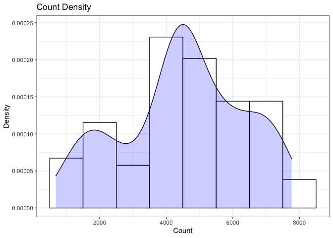<!-- -->

``` r
summary(day$cnt)
```

    ##    Min. 1st Qu.  Median    Mean 3rd Qu.    Max. 
    ##     683    3579    4576    4511    5769    7767

From the histogram, it is pretty evident that the count of total rental
bikes are in the sub 5000 range. We will investigate if there is a
relationship between the response variables and other relevant predictor
variables in the dataset in the next section. We will proceed to look at
the other variables individually.

``` r
#visualize numeric predictor variables using a histogram
p1 <- ggplot(day) + geom_histogram(aes(x = temp), fill = "red", binwidth = 0.01)
p2 <- ggplot(day) + geom_histogram(aes(x = atemp), fill = "red", binwidth = 0.01)
p3 <- ggplot(day) + geom_histogram(aes(x = hum), fill = "red", binwidth = 0.01)
p4 <- ggplot(day) + geom_histogram(aes(x = windspeed), fill = "red", binwidth = 0.01)
gridExtra::grid.arrange(p1,p2,p3,p4, nrow = 2)
```

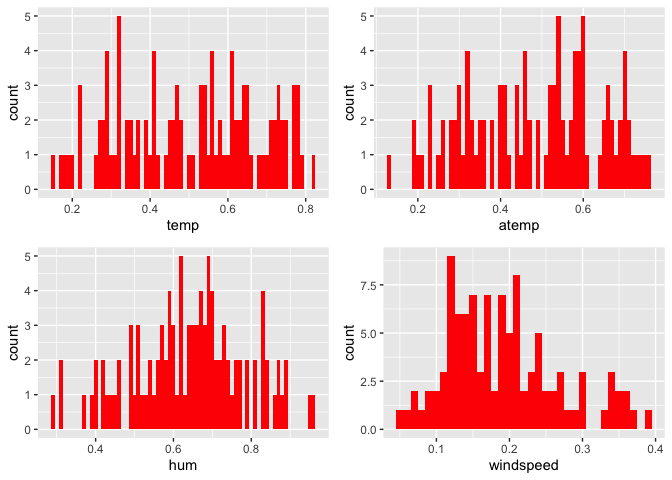<!-- --> Observations: \* No
clear cut pattern in `temp` and `atemp`.

  - `windspeed` and `hum` appears to be skewed and should be transformed
    to curb its skewness.

  - The distribution of `temp` and `atemp` looks very similar. We should
    think about taking out one of the variables.

<!-- end list -->

``` r
#visualize categorical predictor variables
ggplot(day) + geom_bar(aes(x = season),fill = "pink")
```

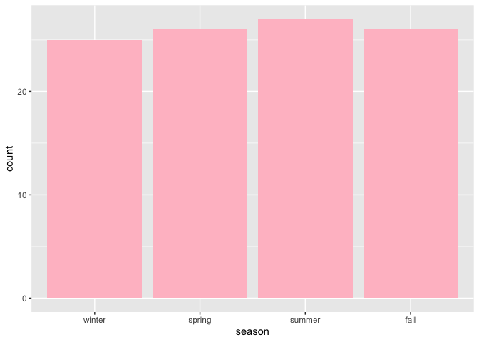<!-- -->

``` r
ggplot(day) + geom_bar(aes(x = yr),fill = "pink")
```

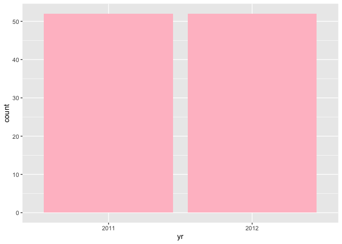<!-- -->

``` r
ggplot(day) + geom_bar(aes(x = holiday),fill = "pink")
```

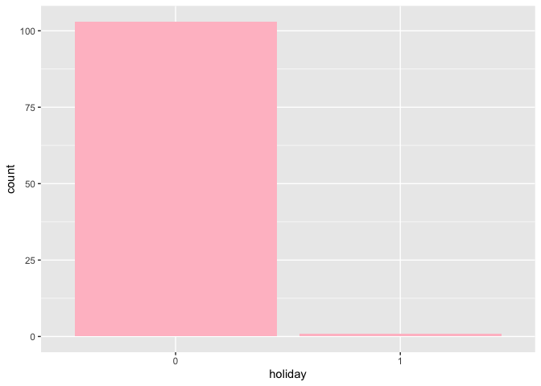<!-- -->

``` r
ggplot(day) + geom_bar(aes(x = workingday),fill = "pink")
```

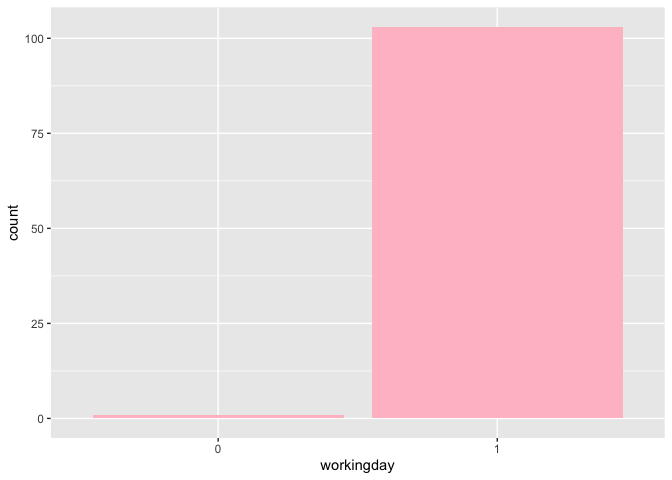<!-- -->

``` r
ggplot(day) + geom_bar(aes(x = mnth),fill = "pink")
```

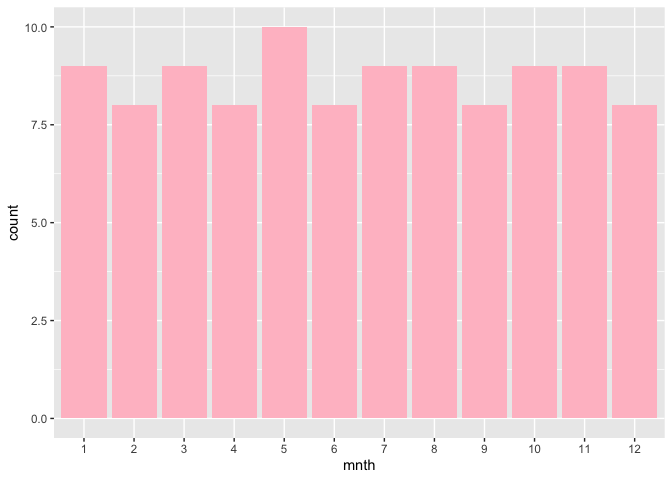<!-- -->

``` r
ggplot(day) + geom_bar(aes(x = weekday),fill = "pink")
```

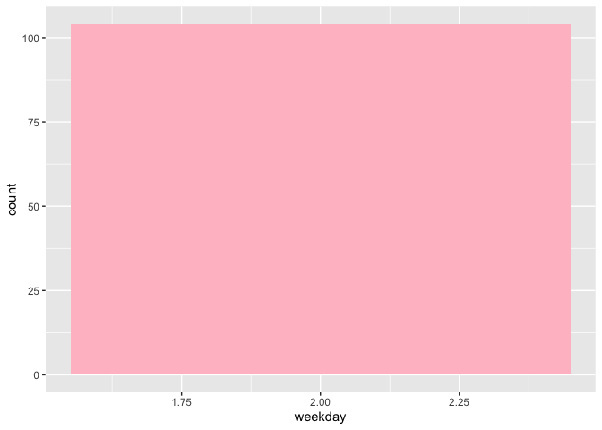<!-- -->

``` r
ggplot(day) + geom_bar(aes(x = weathersit),fill = "pink")
```

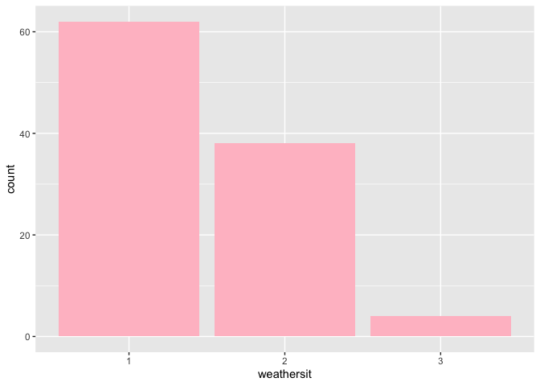<!-- -->

Observations: \* More people rode bikes in the summer, but the variation
between seasons is not much.

  - The same number of people rode bikes in 2011 and 2012.

  - Many people rode bikes on days that are not holidays.

  - Most people used the bike-sharing system on days that were neither
    weekends nor holidays.

  - Most people used the bike sharing system on days with clear weather.

### Bi-variate Analysis

In this section, we will explore the predictor variables with respect to
the response variable. The objective is to discover hidden relationships
between the independent and response variables and use those findings in
the model building process.

``` r
# First, we will explore the relationship between the target and numerical variables.
p1 <- ggplot(day) +geom_point(aes(x = temp, y = cnt), colour = "violet") + labs(title = "Normalized Temperature vs Total Rental Bikes")
p2 <- ggplot(day) +geom_point(aes(x = atemp, y = cnt), colour = "#FF99CC") +labs(title = "Normalized Feeling Temperature vs Total Rental Bikes")
p3 <- ggplot(day) +geom_point(aes(x = hum, y = cnt), colour = "pink") + labs(title = "Normalized Humidity vs Total rental Bikes")
p4 <- ggplot(day) +geom_point(aes(x = windspeed, y = cnt), colour = "#FF66CC") +labs(title= "Normalized Windspeed vs Total rental Bikes")
gridExtra::grid.arrange(p1, p2, p3, p4, nrow = 2)
```

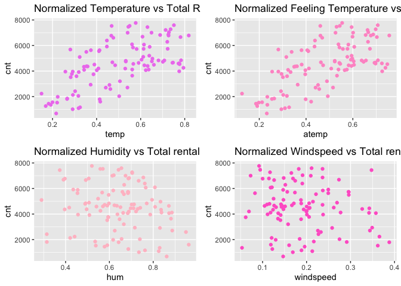<!-- -->

Observations: \* There appears to be a positive linear relationship
between `cnt` , `temp`, and `atemp`.

  - There is also a weak negative realationship between `cnt`, `hum`,
    and `windspeed`.

<!-- end list -->

``` r
# Now we'll visualize the relationship between the target and categorical variables.
# Instead of using a boxplot, I will use a violin plot which is the blend of boxplot and a density plot
g1 <- ggplot(day) + geom_violin(aes(x = season, y = cnt))
g2 <- ggplot(day) + geom_violin(aes(x = yr, y = cnt))
g3 <- ggplot(day) + geom_violin(aes(x = mnth, y = cnt))
g4 <- ggplot(day) + geom_violin(aes(x = holiday, y = cnt))
g5 <- ggplot(day) + geom_violin(aes(x = weekday, y = cnt))
g6 <- ggplot(day) + geom_violin(aes(x = workingday, y = cnt))
g7 <- ggplot(day) + geom_violin(aes(x = weathersit, y = cnt))
gridExtra::grid.arrange(g1, g2, g3, g4, g5, g6, g7, nrow = 4)
```

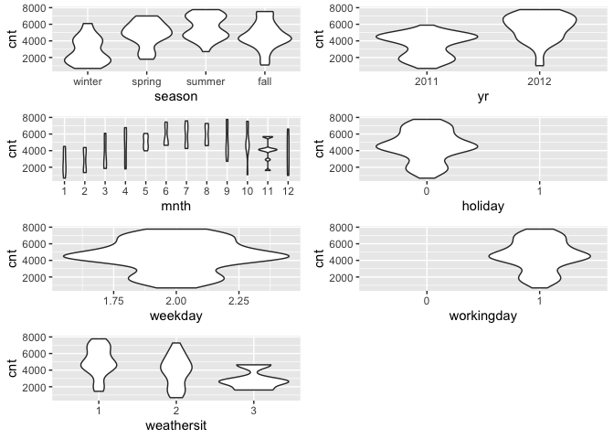<!-- -->

``` r
day_c <- day[ , c(10:14)]
round(cor(day_c), 2)
```

    ##            temp atemp   hum windspeed   cnt
    ## temp       1.00  1.00  0.11     -0.09  0.63
    ## atemp      1.00  1.00  0.12     -0.12  0.64
    ## hum        0.11  0.12  1.00     -0.10 -0.18
    ## windspeed -0.09 -0.12 -0.10      1.00 -0.15
    ## cnt        0.63  0.64 -0.18     -0.15  1.00

From the above matrix, we can see that `temp` and `atemp` are highly
correlated. So we only need to include one of these variables in the
model to prevent multicollinearity. We will also transform the humidity
and windspeed variable.

``` r
day <- mutate(day, log_hum = log(day$hum+1))
day <- mutate(day, log_ws = log(day$windspeed + 1))
day <- select(day, -weekday)
day
```

    ##     instant     dteday season   yr mnth holiday workingday weathersit     temp
    ## 1         4 2011-01-04 winter 2011    1       0          1          1 0.200000
    ## 2        11 2011-01-11 winter 2011    1       0          1          2 0.169091
    ## 3        18 2011-01-18 winter 2011    1       0          1          2 0.216667
    ## 4        25 2011-01-25 winter 2011    1       0          1          2 0.223478
    ## 5        32 2011-02-01 winter 2011    2       0          1          2 0.192174
    ## 6        39 2011-02-08 winter 2011    2       0          1          1 0.220833
    ## 7        46 2011-02-15 winter 2011    2       0          1          1 0.266087
    ## 8        53 2011-02-22 winter 2011    2       0          1          1 0.182222
    ## 9        60 2011-03-01 winter 2011    3       0          1          1 0.266667
    ## 10       67 2011-03-08 winter 2011    3       0          1          1 0.292500
    ## 11       74 2011-03-15 winter 2011    3       0          1          2 0.317391
    ## 12       81 2011-03-22 spring 2011    3       0          1          1 0.441667
    ## 13       88 2011-03-29 spring 2011    3       0          1          1 0.302500
    ## 14       95 2011-04-05 spring 2011    4       0          1          2 0.414167
    ## 15      102 2011-04-12 spring 2011    4       0          1          2 0.502500
    ## 16      109 2011-04-19 spring 2011    4       0          1          2 0.505833
    ## 17      116 2011-04-26 spring 2011    4       0          1          1 0.631667
    ## 18      123 2011-05-03 spring 2011    5       0          1          2 0.616667
    ## 19      130 2011-05-10 spring 2011    5       0          1          1 0.532500
    ## 20      137 2011-05-17 spring 2011    5       0          1          2 0.561667
    ## 21      144 2011-05-24 spring 2011    5       0          1          2 0.660000
    ## 22      151 2011-05-31 spring 2011    5       0          1          1 0.775000
    ## 23      158 2011-06-07 spring 2011    6       0          1          1 0.707500
    ## 24      165 2011-06-14 spring 2011    6       0          1          1 0.604167
    ## 25      172 2011-06-21 summer 2011    6       0          1          2 0.680833
    ## 26      179 2011-06-28 summer 2011    6       0          1          1 0.744167
    ## 27      186 2011-07-05 summer 2011    7       0          1          1 0.746667
    ## 28      193 2011-07-12 summer 2011    7       0          1          1 0.794167
    ## 29      200 2011-07-19 summer 2011    7       0          1          1 0.776667
    ## 30      207 2011-07-26 summer 2011    7       0          1          1 0.771667
    ## 31      214 2011-08-02 summer 2011    8       0          1          1 0.783333
    ## 32      221 2011-08-09 summer 2011    8       0          1          1 0.775000
    ## 33      228 2011-08-16 summer 2011    8       0          1          1 0.700833
    ## 34      235 2011-08-23 summer 2011    8       0          1          1 0.640833
    ## 35      242 2011-08-30 summer 2011    8       0          1          1 0.639167
    ## 36      249 2011-09-06 summer 2011    9       0          1          3 0.540000
    ## 37      256 2011-09-13 summer 2011    9       0          1          1 0.650833
    ## 38      263 2011-09-20 summer 2011    9       0          1          2 0.561667
    ## 39      270 2011-09-27   fall 2011    9       0          1          2 0.636667
    ## 40      277 2011-10-04   fall 2011   10       0          1          1 0.484167
    ## 41      284 2011-10-11   fall 2011   10       0          1          2 0.566667
    ## 42      291 2011-10-18   fall 2011   10       0          1          2 0.532500
    ## 43      298 2011-10-25   fall 2011   10       0          1          1 0.471667
    ## 44      305 2011-11-01   fall 2011   11       0          1          1 0.400833
    ## 45      312 2011-11-08   fall 2011   11       0          1          1 0.408333
    ## 46      319 2011-11-15   fall 2011   11       0          1          2 0.530000
    ## 47      326 2011-11-22   fall 2011   11       0          1          3 0.416667
    ## 48      333 2011-11-29   fall 2011   11       0          1          2 0.458333
    ## 49      340 2011-12-06   fall 2011   12       0          1          3 0.462500
    ## 50      347 2011-12-13   fall 2011   12       0          1          1 0.282500
    ## 51      354 2011-12-20   fall 2011   12       0          1          2 0.385833
    ## 52      361 2011-12-27 winter 2011   12       0          1          2 0.325000
    ## 53      368 2012-01-03 winter 2012    1       0          1          1 0.150000
    ## 54      375 2012-01-10 winter 2012    1       0          1          1 0.308696
    ## 55      382 2012-01-17 winter 2012    1       0          1          2 0.373043
    ## 56      389 2012-01-24 winter 2012    1       0          1          1 0.342500
    ## 57      396 2012-01-31 winter 2012    1       0          1          1 0.390000
    ## 58      403 2012-02-07 winter 2012    2       0          1          1 0.354167
    ## 59      410 2012-02-14 winter 2012    2       0          1          2 0.319167
    ## 60      417 2012-02-21 winter 2012    2       0          1          1 0.287826
    ## 61      424 2012-02-28 winter 2012    2       0          1          1 0.359167
    ## 62      431 2012-03-06 winter 2012    3       0          1          1 0.258333
    ## 63      438 2012-03-13 winter 2012    3       0          1          1 0.565000
    ## 64      445 2012-03-20 winter 2012    3       0          1          1 0.560833
    ## 65      452 2012-03-27 spring 2012    3       0          1          1 0.323333
    ## 66      459 2012-04-03 spring 2012    4       0          1          1 0.466667
    ## 67      466 2012-04-10 spring 2012    4       0          1          1 0.446667
    ## 68      473 2012-04-17 spring 2012    4       0          1          1 0.608333
    ## 69      480 2012-04-24 spring 2012    4       0          1          1 0.413333
    ## 70      487 2012-05-01 spring 2012    5       0          1          2 0.613333
    ## 71      494 2012-05-08 spring 2012    5       0          1          2 0.581667
    ## 72      501 2012-05-15 spring 2012    5       0          1          2 0.611667
    ## 73      508 2012-05-22 spring 2012    5       0          1          2 0.615000
    ## 74      515 2012-05-29 spring 2012    5       0          1          1 0.722500
    ## 75      522 2012-06-05 spring 2012    6       0          1          2 0.540833
    ## 76      529 2012-06-12 spring 2012    6       0          1          2 0.653333
    ## 77      536 2012-06-19 spring 2012    6       0          1          1 0.688333
    ## 78      543 2012-06-26 summer 2012    6       0          1          1 0.630833
    ## 79      550 2012-07-03 summer 2012    7       0          1          1 0.780833
    ## 80      557 2012-07-10 summer 2012    7       0          1          2 0.720833
    ## 81      564 2012-07-17 summer 2012    7       0          1          1 0.818333
    ## 82      571 2012-07-24 summer 2012    7       0          1          1 0.750833
    ## 83      578 2012-07-31 summer 2012    7       0          1          1 0.713333
    ## 84      585 2012-08-07 summer 2012    8       0          1          2 0.735833
    ## 85      592 2012-08-14 summer 2012    8       0          1          1 0.726667
    ## 86      599 2012-08-21 summer 2012    8       0          1          1 0.649167
    ## 87      606 2012-08-28 summer 2012    8       0          1          1 0.728333
    ## 88      613 2012-09-04 summer 2012    9       0          1          1 0.725833
    ## 89      620 2012-09-11 summer 2012    9       0          1          1 0.577500
    ## 90      627 2012-09-18 summer 2012    9       0          1          2 0.623333
    ## 91      634 2012-09-25   fall 2012    9       0          1          1 0.550000
    ## 92      641 2012-10-02   fall 2012   10       0          1          3 0.590833
    ## 93      648 2012-10-09   fall 2012   10       0          1          2 0.446667
    ## 94      655 2012-10-16   fall 2012   10       0          1          1 0.468333
    ## 95      662 2012-10-23   fall 2012   10       0          1          1 0.544167
    ## 96      669 2012-10-30   fall 2012   10       0          1          2 0.318182
    ## 97      676 2012-11-06   fall 2012   11       0          1          1 0.280833
    ## 98      683 2012-11-13   fall 2012   11       0          1          2 0.343333
    ## 99      690 2012-11-20   fall 2012   11       0          1          2 0.374167
    ## 100     697 2012-11-27   fall 2012   11       0          1          2 0.291667
    ## 101     704 2012-12-04   fall 2012   12       0          1          1 0.475833
    ## 102     711 2012-12-11   fall 2012   12       0          1          2 0.353333
    ## 103     718 2012-12-18   fall 2012   12       0          1          1 0.410833
    ## 104     725 2012-12-25 winter 2012   12       1          0          2 0.291304
    ##        atemp      hum windspeed  cnt   log_hum     log_ws
    ## 1   0.212122 0.590435 0.1602960 1562 0.4640076 0.14867514
    ## 2   0.191464 0.686364 0.1221320 1263 0.5225747 0.11523045
    ## 3   0.232333 0.861667 0.1467750  683 0.6214723 0.13695365
    ## 4   0.234526 0.616957 0.1297960 1985 0.4805460 0.12203709
    ## 5   0.234530 0.829565 0.0532130 1360 0.6040782 0.05184549
    ## 6   0.198246 0.537917 0.3619500 1530 0.4304289 0.30891750
    ## 7   0.254274 0.314348 0.2913740 1815 0.2733407 0.25570677
    ## 8   0.186033 0.577778 0.1956830 1450 0.4560175 0.17871757
    ## 9   0.263879 0.535000 0.2164250 1851 0.4285304 0.19591623
    ## 10  0.302400 0.420833 0.1206500 2133 0.3512433 0.11390887
    ## 11  0.318178 0.655652 0.1843090 2056 0.5041949 0.16915948
    ## 12  0.440642 0.624583 0.2257500 2703 0.4852512 0.20355290
    ## 13  0.292908 0.314167 0.2269960 2425 0.2732030 0.20456891
    ## 14  0.398350 0.642083 0.3880670 1795 0.4959656 0.32791213
    ## 15  0.493054 0.739167 0.2748790 2034 0.5534063 0.24285127
    ## 16  0.489258 0.665833 0.1579710 3204 0.5103253 0.14666934
    ## 17  0.594083 0.729167 0.3265000 4400 0.5476398 0.28254389
    ## 18  0.582079 0.697083 0.3426670 4451 0.5289109 0.29465793
    ## 19  0.522721 0.489167 0.1156710 4803 0.3982169 0.10945602
    ## 20  0.538529 0.837917 0.2773540 4123 0.6086329 0.24479075
    ## 21  0.604813 0.740833 0.2070920 4492 0.5543637 0.18821416
    ## 22  0.725383 0.636667 0.1113290 3982 0.4926619 0.10555660
    ## 23  0.655950 0.597917 0.1878080 4833 0.4687009 0.17210959
    ## 24  0.591546 0.507083 0.2692830 4891 0.4101760 0.23845217
    ## 25  0.637646 0.770417 0.1710250 4835 0.5712151 0.15787943
    ## 26  0.692558 0.634167 0.1442830 4648 0.4911332 0.13477824
    ## 27  0.696338 0.590417 0.1262580 4665 0.4639962 0.11890063
    ## 28  0.739275 0.559167 0.2002540 4258 0.4441517 0.18253320
    ## 29  0.747479 0.650417 0.1306000 4541 0.5010280 0.12274847
    ## 30  0.696979 0.540833 0.2002580 4590 0.4323232 0.18253653
    ## 31  0.707071 0.491250 0.2058500 4845 0.3996147 0.18718471
    ## 32  0.724121 0.570417 0.1511210 4602 0.4513412 0.14073625
    ## 33  0.645837 0.578333 0.2363290 4725 0.4563692 0.21214650
    ## 34  0.606067 0.455417 0.1467630 5895 0.3752925 0.13694319
    ## 35  0.594704 0.548333 0.1250080 5204 0.4371789 0.11779015
    ## 36  0.515200 0.886957 0.3439430 2710 0.6349655 0.29560783
    ## 37  0.603554 0.712500 0.1418040 4763 0.5379543 0.13260947
    ## 38  0.532217 0.881250 0.1349540 3641 0.6319364 0.12659212
    ## 39  0.574525 0.885417 0.1181710 4120 0.6341490 0.11169431
    ## 40  0.472858 0.710000 0.2058540 4456 0.5364934 0.18718803
    ## 41  0.546096 0.808750 0.1430420 4563 0.5926360 0.13369313
    ## 42  0.522721 0.701667 0.1100870 4748 0.5316084 0.10443839
    ## 43  0.463375 0.622917 0.1666580 4687 0.4842251 0.15414325
    ## 44  0.397088 0.683750 0.1355710 4068 0.5210234 0.12713561
    ## 45  0.412246 0.721667 0.0690375 4205 0.5432930 0.06675871
    ## 46  0.507579 0.688750 0.1996330 4195 0.5239886 0.18201568
    ## 47  0.421696 0.962500 0.1187920 1607 0.6742192 0.11224953
    ## 48  0.451375 0.830833 0.2580920 2914 0.6047711 0.22959629
    ## 49  0.456400 0.949583 0.2325830 2594 0.6676155 0.20911197
    ## 50  0.301138 0.590000 0.1405500 3523 0.4637340 0.13151060
    ## 51  0.396454 0.595417 0.0615708 3750 0.4671351 0.05974970
    ## 52  0.327633 0.762500 0.1884500 1162 0.5667333 0.17264994
    ## 53  0.126275 0.441250 0.3656710 2236 0.3655108 0.31164588
    ## 54  0.318826 0.646522 0.1875520 3598 0.4986652 0.17189405
    ## 55  0.364278 0.716087 0.3491300 2935 0.5400467 0.29945994
    ## 56  0.349108 0.835833 0.1237670 4339 0.6074983 0.11668643
    ## 57  0.381317 0.416667 0.2618170 4509 0.3483069 0.23255275
    ## 58  0.361104 0.496250 0.1473790 4375 0.4029620 0.13748021
    ## 59  0.333946 0.508750 0.1411790 3922 0.4112815 0.13206194
    ## 60  0.295113 0.594348 0.2057170 3777 0.4664649 0.18707441
    ## 61  0.353525 0.395833 0.1934170 4363 0.3334914 0.17682062
    ## 62  0.255042 0.456667 0.2008750 3956 0.3761509 0.18305046
    ## 63  0.542929 0.617500 0.2369500 5847 0.4808817 0.21264867
    ## 64  0.538533 0.807917 0.1212710 6093 0.5921754 0.11446286
    ## 65  0.315654 0.290000 0.1871920 5102 0.2546422 0.17159085
    ## 66  0.461483 0.396667 0.1001330 6772 0.3340887 0.09543108
    ## 67  0.436233 0.435000 0.2493750 5918 0.3611648 0.22264343
    ## 68  0.598487 0.390417 0.2736290 6691 0.3296037 0.24187031
    ## 69  0.405283 0.454167 0.2493830 5633 0.3744332 0.22264983
    ## 70  0.577021 0.659583 0.1560960 5740 0.5065664 0.14504881
    ## 71  0.557471 0.685833 0.2960290 5728 0.5222598 0.25930497
    ## 72  0.576404 0.794583 0.1473920 5115 0.5847727 0.13749154
    ## 73  0.580825 0.765833 0.1181670 6073 0.5686225 0.11169074
    ## 74  0.672992 0.684583 0.2954000 5743 0.5215181 0.25881953
    ## 75  0.525892 0.613333 0.2095750 7001 0.4783022 0.19026906
    ## 76  0.597875 0.833333 0.2145460 4972 0.6061356 0.19437034
    ## 77  0.654692 0.690000 0.1480170 6825 0.5247285 0.13803611
    ## 78  0.594704 0.373333 0.3476420 7442 0.3172406 0.29835640
    ## 79  0.702650 0.492083 0.1262370 6660 0.4001731 0.11888199
    ## 80  0.664796 0.667500 0.1517370 6290 0.5113255 0.14127124
    ## 81  0.755683 0.505833 0.1144290 6786 0.4093462 0.10834217
    ## 82  0.706450 0.655000 0.2114540 7592 0.5038010 0.19182129
    ## 83  0.662896 0.704167 0.1654250 7216 0.5330764 0.15308583
    ## 84  0.697621 0.703750 0.1169080 7273 0.5328317 0.11056415
    ## 85  0.676779 0.686667 0.1691580 6784 0.5227544 0.15628383
    ## 86  0.601025 0.673750 0.0727708 7006 0.5150666 0.07024483
    ## 87  0.666050 0.620000 0.1909250 7040 0.4824261 0.17473032
    ## 88  0.686888 0.755000 0.2363210 6864 0.5624689 0.21214003
    ## 89  0.554292 0.520000 0.0920542 7767 0.4187103 0.08806051
    ## 90  0.565067 0.872500 0.3575870 4073 0.6272744 0.30570886
    ## 91  0.544179 0.570000 0.2363210 7538 0.4510756 0.21214003
    ## 92  0.542333 0.871667 0.1044750 4639 0.6268295 0.09937011
    ## 93  0.438112 0.761667 0.1903000 6392 0.5662605 0.17420538
    ## 94  0.460846 0.558333 0.1822210 7534 0.4436167 0.16739487
    ## 95  0.530304 0.641667 0.0945458 7466 0.4957122 0.09033948
    ## 96  0.309909 0.825455 0.2130090 1096 0.6018293 0.19310405
    ## 97  0.281567 0.567083 0.1735130 5686 0.4492159 0.16000181
    ## 98  0.323225 0.662917 0.3420460 4094 0.5085733 0.29419532
    ## 99  0.380667 0.685000 0.0827250 5634 0.5217656 0.07948101
    ## 100 0.281558 0.786667 0.2375620 3959 0.5803519 0.21314332
    ## 101 0.469054 0.733750 0.1741290 6606 0.5502867 0.16052660
    ## 102 0.338363 0.596667 0.2960370 5501 0.4679183 0.25931115
    ## 103 0.409708 0.666250 0.2214040 5557 0.5105756 0.20000102
    ## 104 0.294465 0.734783 0.1687260 1013 0.5508823 0.15591427

## Model Building

First we split the data into train and test sets.

``` r
set.seed(23)
dayIndex<- createDataPartition(day$cnt, p = 0.7, list=FALSE)
dayTrain <- day[dayIndex, ]
dayTest <- day[-dayIndex, ]
dayTrain <- select(dayTrain, -dteday, -weathersit,-temp)
# tree-based model;

fit1 <- train(cnt~., data = dayTrain, method = "rpart", 
      preProcess = c("center", "scale"), 
      trControl = trainControl(method = "loocv", number = 10), tuneGrid = NULL)
```

    ## Warning in preProcess.default(thresh = 0.95, k = 5, freqCut = 19, uniqueCut =
    ## 10, : These variables have zero variances: holiday1, workingday1

    ## Warning in nominalTrainWorkflow(x = x, y = y, wts = weights, info = trainInfo, :
    ## There were missing values in resampled performance measures.

``` r
# boosted tree model
fit2 <- train(cnt~., data = dayTrain, method = "gbm", 
      preProcess = c("center", "scale"), 
      trControl = trainControl(method = "cv", number = 10), 
      tuneGrid = NULL)
```

    ## Iter   TrainDeviance   ValidDeviance   StepSize   Improve
    ##      1  2854660.7406             nan     0.1000 191026.2901
    ##      2  2711308.2668             nan     0.1000 134334.0441
    ##      3  2528814.6155             nan     0.1000 139338.1577
    ##      4  2275751.3460             nan     0.1000 200288.5325
    ##      5  2101356.2125             nan     0.1000 170011.9641
    ##      6  1960033.4894             nan     0.1000 122861.3367
    ##      7  1839050.9419             nan     0.1000 115688.3241
    ##      8  1742387.5793             nan     0.1000 112562.5770
    ##      9  1640251.3281             nan     0.1000 76490.7995
    ##     10  1560432.1854             nan     0.1000 71071.6986
    ##     20   945437.5590             nan     0.1000 1877.2067
    ##     40   603559.8214             nan     0.1000  850.3551
    ##     60   482263.0487             nan     0.1000 -7401.0108
    ##     80   413286.2428             nan     0.1000  811.6067
    ##    100   386350.0382             nan     0.1000 -3884.2804
    ##    120   361065.8441             nan     0.1000 -5516.3817
    ##    140   343268.0186             nan     0.1000 -10719.5557
    ##    150   335938.3298             nan     0.1000 -5778.2904
    ## 
    ## Iter   TrainDeviance   ValidDeviance   StepSize   Improve
    ##      1  2722405.3714             nan     0.1000 276828.8445
    ##      2  2388863.0090             nan     0.1000 283151.5599
    ##      3  2150454.1505             nan     0.1000 143831.0630
    ##      4  1902485.6239             nan     0.1000 214620.3527
    ##      5  1790470.2771             nan     0.1000 108809.1061
    ##      6  1675408.9437             nan     0.1000 105571.2352
    ##      7  1521030.0162             nan     0.1000 145012.4754
    ##      8  1426497.8376             nan     0.1000 64987.9122
    ##      9  1336197.2497             nan     0.1000 86504.4480
    ##     10  1272613.2064             nan     0.1000 46867.9639
    ##     20   750548.4713             nan     0.1000 19388.7049
    ##     40   449049.9171             nan     0.1000  449.8283
    ##     60   356130.7990             nan     0.1000 -8155.7604
    ##     80   324773.1211             nan     0.1000 -6797.8620
    ##    100   288005.5899             nan     0.1000 -11752.6344
    ##    120   261291.5312             nan     0.1000 -6564.8647
    ##    140   231615.7398             nan     0.1000 -6586.1167
    ##    150   223036.8129             nan     0.1000 -3606.3791
    ## 
    ## Iter   TrainDeviance   ValidDeviance   StepSize   Improve
    ##      1  2735638.0660             nan     0.1000 332695.8944
    ##      2  2532567.8282             nan     0.1000 175294.1248
    ##      3  2308849.8889             nan     0.1000 153567.4517
    ##      4  2148932.3488             nan     0.1000 142085.5829
    ##      5  1922526.3151             nan     0.1000 186952.1458
    ##      6  1790738.3567             nan     0.1000 131472.5450
    ##      7  1609773.6195             nan     0.1000 170346.0094
    ##      8  1450067.4815             nan     0.1000 85244.1386
    ##      9  1374676.7075             nan     0.1000 71383.6518
    ##     10  1262359.0986             nan     0.1000 67910.9019
    ##     20   760512.0412             nan     0.1000 12116.5651
    ##     40   457172.4405             nan     0.1000 -2831.4888
    ##     60   349897.1633             nan     0.1000 -7713.0501
    ##     80   300411.6016             nan     0.1000 -4215.7475
    ##    100   264811.1353             nan     0.1000 -4341.2373
    ##    120   244035.3780             nan     0.1000 -4507.5054
    ##    140   222962.5787             nan     0.1000 -2605.3180
    ##    150   209342.5070             nan     0.1000 -1196.8531
    ## 
    ## Iter   TrainDeviance   ValidDeviance   StepSize   Improve
    ##      1  2715393.0485             nan     0.1000 199976.1331
    ##      2  2481984.7178             nan     0.1000 165188.7111
    ##      3  2247785.5537             nan     0.1000 147808.2331
    ##      4  2085420.5653             nan     0.1000 138678.1797
    ##      5  1927114.9227             nan     0.1000 136157.1709
    ##      6  1777129.4160             nan     0.1000 62956.9180
    ##      7  1653542.0796             nan     0.1000 79478.9276
    ##      8  1579617.4242             nan     0.1000 38739.3538
    ##      9  1479600.6013             nan     0.1000 63815.0605
    ##     10  1373177.3471             nan     0.1000 76591.7017
    ##     20   870730.1351             nan     0.1000 5395.2598
    ##     40   505004.6424             nan     0.1000 -1192.7067
    ##     60   376869.9772             nan     0.1000 -6732.5627
    ##     80   341091.7117             nan     0.1000 -8640.9064
    ##    100   317300.5031             nan     0.1000 -490.0007
    ##    120   296809.5842             nan     0.1000 -4689.8499
    ##    140   275642.9693             nan     0.1000 -5673.1862
    ##    150   268690.0548             nan     0.1000 -894.5035
    ## 
    ## Iter   TrainDeviance   ValidDeviance   StepSize   Improve
    ##      1  2614094.9100             nan     0.1000 303963.5910
    ##      2  2271159.7775             nan     0.1000 290288.9908
    ##      3  2135393.4353             nan     0.1000 155301.2290
    ##      4  1917190.5639             nan     0.1000 226625.6692
    ##      5  1824530.4208             nan     0.1000 55051.7758
    ##      6  1621867.7924             nan     0.1000 204556.0172
    ##      7  1484618.2370             nan     0.1000 118621.0043
    ##      8  1333184.0542             nan     0.1000 88890.9008
    ##      9  1239354.0100             nan     0.1000 23564.6492
    ##     10  1123265.7308             nan     0.1000 68320.2790
    ##     20   652853.9279             nan     0.1000 17197.0454
    ##     40   404977.4797             nan     0.1000 -1887.9012
    ##     60   335816.7261             nan     0.1000 -957.1120
    ##     80   294939.7884             nan     0.1000 -2500.3982
    ##    100   260121.4399             nan     0.1000 -5668.0795
    ##    120   235793.5995             nan     0.1000 -1998.4712
    ##    140   215198.5932             nan     0.1000 -3751.0508
    ##    150   204698.1356             nan     0.1000 -4542.3222
    ## 
    ## Iter   TrainDeviance   ValidDeviance   StepSize   Improve
    ##      1  2684565.5445             nan     0.1000 359100.6480
    ##      2  2405931.2335             nan     0.1000 269470.4506
    ##      3  2134724.8711             nan     0.1000 220416.8770
    ##      4  2010334.8901             nan     0.1000 106664.6278
    ##      5  1820364.4469             nan     0.1000 183066.1592
    ##      6  1704074.9733             nan     0.1000 110675.5542
    ##      7  1559877.6314             nan     0.1000 131512.4498
    ##      8  1440214.2989             nan     0.1000 47483.1908
    ##      9  1368981.3762             nan     0.1000 47452.2382
    ##     10  1296107.8005             nan     0.1000 20076.7955
    ##     20   725441.3773             nan     0.1000 38228.1340
    ##     40   388360.3402             nan     0.1000 -18023.6283
    ##     60   296443.8468             nan     0.1000 -1436.1405
    ##     80   257028.6816             nan     0.1000 -3677.8359
    ##    100   231540.5548             nan     0.1000 -5961.4739
    ##    120   211873.2068             nan     0.1000 -5016.8711
    ##    140   195484.3794             nan     0.1000 -9569.0104
    ##    150   189674.9142             nan     0.1000 -6348.9843
    ## 
    ## Iter   TrainDeviance   ValidDeviance   StepSize   Improve
    ##      1  2905221.9956             nan     0.1000 262153.8232
    ##      2  2669724.2579             nan     0.1000 185259.8546
    ##      3  2422082.7122             nan     0.1000 181118.7625
    ##      4  2251408.8894             nan     0.1000 132439.9051
    ##      5  2075064.1623             nan     0.1000 84340.2905
    ##      6  1958378.9382             nan     0.1000 138310.4718
    ##      7  1830281.3911             nan     0.1000 124032.9203
    ##      8  1716042.3481             nan     0.1000 85529.5149
    ##      9  1651787.6942             nan     0.1000 67073.4126
    ##     10  1544008.5585             nan     0.1000 86072.4335
    ##     20   958425.2166             nan     0.1000 23912.1847
    ##     40   550357.1378             nan     0.1000 -5402.1668
    ##     60   424377.9387             nan     0.1000 -8501.6510
    ##     80   375386.1141             nan     0.1000 -5694.7694
    ##    100   344321.8135             nan     0.1000 -3046.3441
    ##    120   319499.7830             nan     0.1000 -4497.6076
    ##    140   307888.4457             nan     0.1000 -3336.9093
    ##    150   300341.8832             nan     0.1000 -4587.8033
    ## 
    ## Iter   TrainDeviance   ValidDeviance   StepSize   Improve
    ##      1  2965829.7869             nan     0.1000 250899.8897
    ##      2  2619917.6706             nan     0.1000 305164.0770
    ##      3  2343867.4096             nan     0.1000 217932.1177
    ##      4  2183973.8543             nan     0.1000 120761.7113
    ##      5  1981260.9779             nan     0.1000 184052.3352
    ##      6  1855835.4921             nan     0.1000 120898.9970
    ##      7  1698515.7146             nan     0.1000 143027.0010
    ##      8  1594703.1060             nan     0.1000 73956.3666
    ##      9  1467773.6701             nan     0.1000 104259.6290
    ##     10  1304907.9095             nan     0.1000 48786.4133
    ##     20   780352.7545             nan     0.1000 3131.1709
    ##     40   471043.9055             nan     0.1000 -8165.0006
    ##     60   375115.5546             nan     0.1000 -1715.8273
    ##     80   315862.2093             nan     0.1000 -12339.8380
    ##    100   283993.1886             nan     0.1000 -6660.1922
    ##    120   262632.1695             nan     0.1000 -5197.5346
    ##    140   235371.3250             nan     0.1000 -6140.1991
    ##    150   228604.0430             nan     0.1000 -6663.5866
    ## 
    ## Iter   TrainDeviance   ValidDeviance   StepSize   Improve
    ##      1  2905539.9705             nan     0.1000 337281.7824
    ##      2  2669386.6297             nan     0.1000 186465.9874
    ##      3  2457274.7822             nan     0.1000 244639.9325
    ##      4  2243129.9462             nan     0.1000 213713.4971
    ##      5  2032613.2794             nan     0.1000 166260.4928
    ##      6  1909089.6509             nan     0.1000 77338.2539
    ##      7  1755658.1053             nan     0.1000 102898.2525
    ##      8  1662741.9624             nan     0.1000 89471.8273
    ##      9  1573631.8796             nan     0.1000 53019.6995
    ##     10  1453121.2515             nan     0.1000 114282.4496
    ##     20   850902.9132             nan     0.1000 35783.3369
    ##     40   477404.8570             nan     0.1000 -7044.2255
    ##     60   364152.4928             nan     0.1000 -9428.7679
    ##     80   326853.5073             nan     0.1000 -6418.7515
    ##    100   293428.7109             nan     0.1000 -8478.7528
    ##    120   265285.5364             nan     0.1000 -3006.8324
    ##    140   246448.4427             nan     0.1000 -3284.0680
    ##    150   235319.7227             nan     0.1000 -2544.8163
    ## 
    ## Iter   TrainDeviance   ValidDeviance   StepSize   Improve
    ##      1  2767967.6790             nan     0.1000 280535.1335
    ##      2  2524185.5265             nan     0.1000 179557.4546
    ##      3  2334119.4279             nan     0.1000 138477.2436
    ##      4  2156993.5813             nan     0.1000 174400.5983
    ##      5  2006945.2454             nan     0.1000 151865.4422
    ##      6  1876186.6985             nan     0.1000 100291.4275
    ##      7  1758429.2100             nan     0.1000 86475.6986
    ##      8  1656126.6431             nan     0.1000 79416.5489
    ##      9  1542103.0017             nan     0.1000 88163.7058
    ##     10  1471076.3559             nan     0.1000 67323.5945
    ##     20   952670.5828             nan     0.1000 13435.0382
    ##     40   531180.9337             nan     0.1000 3927.4686
    ##     60   408544.9493             nan     0.1000 -4706.8727
    ##     80   353517.3529             nan     0.1000 -3731.9250
    ##    100   326504.5198             nan     0.1000 -3594.8869
    ##    120   302384.6021             nan     0.1000 -1737.1983
    ##    140   280422.6434             nan     0.1000 -9640.8099
    ##    150   274821.0993             nan     0.1000 -2481.0878
    ## 
    ## Iter   TrainDeviance   ValidDeviance   StepSize   Improve
    ##      1  2736036.4395             nan     0.1000 249476.8420
    ##      2  2515359.3231             nan     0.1000 137586.6635
    ##      3  2286711.4454             nan     0.1000 162243.0774
    ##      4  2044874.8318             nan     0.1000 195688.0484
    ##      5  1832983.9518             nan     0.1000 176066.1492
    ##      6  1749473.1027             nan     0.1000 96335.7719
    ##      7  1608806.6277             nan     0.1000 139043.8305
    ##      8  1437793.8307             nan     0.1000 79001.3093
    ##      9  1363951.6533             nan     0.1000 75810.6865
    ##     10  1270415.5393             nan     0.1000 82128.7615
    ##     20   733746.8370             nan     0.1000 18002.4022
    ##     40   430667.1709             nan     0.1000 -8214.1057
    ##     60   328027.8099             nan     0.1000 -1413.9640
    ##     80   291668.4057             nan     0.1000 -2678.9846
    ##    100   247244.7883             nan     0.1000 1208.6563
    ##    120   221547.0017             nan     0.1000 -4227.5564
    ##    140   203360.4807             nan     0.1000 -1353.7067
    ##    150   193085.0339             nan     0.1000 -2429.5424
    ## 
    ## Iter   TrainDeviance   ValidDeviance   StepSize   Improve
    ##      1  2855622.4370             nan     0.1000 119046.2982
    ##      2  2524073.4482             nan     0.1000 300893.8448
    ##      3  2255715.8490             nan     0.1000 285299.4764
    ##      4  2034434.7139             nan     0.1000 217634.5661
    ##      5  1822667.2107             nan     0.1000 189337.4027
    ##      6  1635938.1664             nan     0.1000 150547.8676
    ##      7  1458187.0571             nan     0.1000 91528.7680
    ##      8  1339037.1509             nan     0.1000 83271.2569
    ##      9  1275605.1951             nan     0.1000 35584.4074
    ##     10  1204052.7058             nan     0.1000 49979.4617
    ##     20   724282.1479             nan     0.1000 14435.0288
    ##     40   413363.6400             nan     0.1000 -10153.7390
    ##     60   324396.8668             nan     0.1000 -7391.5716
    ##     80   283101.4605             nan     0.1000 -4003.6831
    ##    100   247222.8670             nan     0.1000 -5077.4615
    ##    120   215021.1165             nan     0.1000 -2257.7415
    ##    140   193383.8775             nan     0.1000 -4909.4299
    ##    150   184404.0635             nan     0.1000 -4892.8442
    ## 
    ## Iter   TrainDeviance   ValidDeviance   StepSize   Improve
    ##      1  3010609.7738             nan     0.1000 236380.9546
    ##      2  2796741.9339             nan     0.1000 187921.0098
    ##      3  2596356.6032             nan     0.1000 199031.7698
    ##      4  2378573.9383             nan     0.1000 163470.3661
    ##      5  2168192.4404             nan     0.1000 166682.8306
    ##      6  2028849.6020             nan     0.1000 107500.6368
    ##      7  1916096.4844             nan     0.1000 124918.9402
    ##      8  1836210.8839             nan     0.1000 57401.5365
    ##      9  1737197.4740             nan     0.1000 109260.5609
    ##     10  1635784.2324             nan     0.1000 91247.8687
    ##     20  1005687.1475             nan     0.1000 36230.5466
    ##     40   554182.3595             nan     0.1000 14713.7454
    ##     60   421274.4418             nan     0.1000 -3737.5704
    ##     80   375917.7368             nan     0.1000 -260.4650
    ##    100   349243.2961             nan     0.1000 -1440.4410
    ##    120   326373.9582             nan     0.1000 -4574.1809
    ##    140   304417.5516             nan     0.1000 -2420.0148
    ##    150   296507.5099             nan     0.1000 -2538.0444
    ## 
    ## Iter   TrainDeviance   ValidDeviance   StepSize   Improve
    ##      1  2854668.8053             nan     0.1000 328068.0639
    ##      2  2537805.8017             nan     0.1000 310926.7352
    ##      3  2208407.9323             nan     0.1000 225626.2763
    ##      4  2040195.8160             nan     0.1000 126212.3733
    ##      5  1842624.7034             nan     0.1000 159026.8735
    ##      6  1677042.7323             nan     0.1000 122873.1481
    ##      7  1588228.2302             nan     0.1000 60290.8513
    ##      8  1506579.8485             nan     0.1000 88413.8681
    ##      9  1409240.7880             nan     0.1000 45636.4749
    ##     10  1325943.7995             nan     0.1000 64684.3486
    ##     20   788060.8498             nan     0.1000 11781.3737
    ##     40   437715.1890             nan     0.1000 -7733.3421
    ##     60   342216.2660             nan     0.1000 -3744.9071
    ##     80   302298.9428             nan     0.1000 -2382.8128
    ##    100   267342.1145             nan     0.1000 -12400.8769
    ##    120   246690.5747             nan     0.1000 -4189.4329
    ##    140   222734.6756             nan     0.1000 -5553.6585
    ##    150   214588.6510             nan     0.1000 -2024.2578
    ## 
    ## Iter   TrainDeviance   ValidDeviance   StepSize   Improve
    ##      1  2805312.4339             nan     0.1000 306572.0185
    ##      2  2526357.4758             nan     0.1000 263800.4856
    ##      3  2258317.0181             nan     0.1000 241076.3934
    ##      4  2077191.5254             nan     0.1000 202872.6257
    ##      5  1880548.5498             nan     0.1000 172435.2474
    ##      6  1668982.7402             nan     0.1000 162620.8260
    ##      7  1565868.2528             nan     0.1000 38463.2395
    ##      8  1492383.3610             nan     0.1000 83673.6005
    ##      9  1393880.9718             nan     0.1000 81511.3687
    ##     10  1274929.1010             nan     0.1000 52466.1638
    ##     20   796700.6010             nan     0.1000 18776.0706
    ##     40   452694.0700             nan     0.1000  870.6154
    ##     60   352429.7112             nan     0.1000 -6208.6217
    ##     80   322621.3912             nan     0.1000 -12397.4957
    ##    100   280828.0906             nan     0.1000 -2964.6039
    ##    120   250776.1397             nan     0.1000 -5574.7934
    ##    140   228725.2702             nan     0.1000 -3017.6787
    ##    150   222911.3432             nan     0.1000 -7041.9617

    ## Warning in preProcess.default(thresh = 0.95, k = 5, freqCut = 19, uniqueCut =
    ## 10, : These variables have zero variances: holiday1, workingday1

    ## Warning in (function (x, y, offset = NULL, misc = NULL, distribution =
    ## "bernoulli", : variable 17: holiday1 has no variation.

    ## Warning in (function (x, y, offset = NULL, misc = NULL, distribution =
    ## "bernoulli", : variable 18: workingday1 has no variation.

    ## Iter   TrainDeviance   ValidDeviance   StepSize   Improve
    ##      1  2825531.7971             nan     0.1000 319879.9363
    ##      2  2603656.7178             nan     0.1000 255073.8992
    ##      3  2421220.4662             nan     0.1000 191821.8746
    ##      4  2223271.8684             nan     0.1000 209363.6815
    ##      5  2034153.7128             nan     0.1000 136675.0815
    ##      6  1873971.7473             nan     0.1000 156687.7390
    ##      7  1747631.2178             nan     0.1000 112220.3609
    ##      8  1650305.3978             nan     0.1000 115488.1341
    ##      9  1550885.6532             nan     0.1000 88918.0134
    ##     10  1461101.2443             nan     0.1000 89957.2535
    ##     20   888949.6108             nan     0.1000 7260.3469
    ##     40   501870.1056             nan     0.1000 -4138.0678
    ##     60   379936.5846             nan     0.1000 -11971.1225
    ##     80   310130.6514             nan     0.1000 -5654.6695
    ##    100   278684.3326             nan     0.1000 -119.6690
    ##    120   259256.9913             nan     0.1000 -9435.1497
    ##    140   239693.6141             nan     0.1000 -8583.5021
    ##    150   232925.1534             nan     0.1000 -2500.3311

    ## Warning in preProcess.default(thresh = 0.95, k = 5, freqCut = 19, uniqueCut =
    ## 10, : These variables have zero variances: holiday1, workingday1

    ## Warning in (function (x, y, offset = NULL, misc = NULL, distribution =
    ## "bernoulli", : variable 17: holiday1 has no variation.

    ## Warning in (function (x, y, offset = NULL, misc = NULL, distribution =
    ## "bernoulli", : variable 18: workingday1 has no variation.

    ## Iter   TrainDeviance   ValidDeviance   StepSize   Improve
    ##      1  2784056.0622             nan     0.1000 313588.5389
    ##      2  2427997.4186             nan     0.1000 362338.7192
    ##      3  2180735.0404             nan     0.1000 232584.9049
    ##      4  1992006.0527             nan     0.1000 202653.8257
    ##      5  1771695.1170             nan     0.1000 230354.8093
    ##      6  1655051.2044             nan     0.1000 100071.2829
    ##      7  1463477.1967             nan     0.1000 148290.9312
    ##      8  1383658.7596             nan     0.1000 73463.9999
    ##      9  1253805.0658             nan     0.1000 63818.5868
    ##     10  1185590.9819             nan     0.1000 80090.0632
    ##     20   579898.0494             nan     0.1000 19973.0206
    ##     40   346185.0436             nan     0.1000 -2209.0546
    ##     60   274428.7003             nan     0.1000 -6867.5992
    ##     80   237522.3976             nan     0.1000 -2634.4938
    ##    100   220926.0502             nan     0.1000 -764.4394
    ##    120   198358.9258             nan     0.1000 -1978.7572
    ##    140   177406.6489             nan     0.1000 -2042.9230
    ##    150   167531.6146             nan     0.1000 -2816.8406

    ## Warning in preProcess.default(thresh = 0.95, k = 5, freqCut = 19, uniqueCut =
    ## 10, : These variables have zero variances: holiday1, workingday1

    ## Warning in (function (x, y, offset = NULL, misc = NULL, distribution =
    ## "bernoulli", : variable 17: holiday1 has no variation.

    ## Warning in (function (x, y, offset = NULL, misc = NULL, distribution =
    ## "bernoulli", : variable 18: workingday1 has no variation.

    ## Iter   TrainDeviance   ValidDeviance   StepSize   Improve
    ##      1  2773445.2007             nan     0.1000 417105.3967
    ##      2  2431040.2371             nan     0.1000 307782.2129
    ##      3  2127311.0875             nan     0.1000 293460.4537
    ##      4  1919126.0286             nan     0.1000 174190.8234
    ##      5  1712528.8499             nan     0.1000 178049.4152
    ##      6  1549025.6870             nan     0.1000 143581.3360
    ##      7  1452496.0716             nan     0.1000 65189.7096
    ##      8  1309751.8436             nan     0.1000 136845.1964
    ##      9  1176215.3817             nan     0.1000 93702.0844
    ##     10  1108625.6108             nan     0.1000 70874.4792
    ##     20   624734.4320             nan     0.1000 16258.6535
    ##     40   382659.6596             nan     0.1000  352.9358
    ##     60   274187.9748             nan     0.1000  572.9253
    ##     80   239528.5643             nan     0.1000 -5085.6381
    ##    100   202737.3823             nan     0.1000 -1747.9004
    ##    120   183052.7342             nan     0.1000 -1398.4331
    ##    140   171130.5747             nan     0.1000 -2145.4459
    ##    150   161730.2036             nan     0.1000 -4591.3357
    ## 
    ## Iter   TrainDeviance   ValidDeviance   StepSize   Improve
    ##      1  2935802.5082             nan     0.1000 216121.6056
    ##      2  2638947.9696             nan     0.1000 239397.9038
    ##      3  2419851.9864             nan     0.1000 173810.1641
    ##      4  2230626.0884             nan     0.1000 132377.9359
    ##      5  2044400.4964             nan     0.1000 158703.7450
    ##      6  1904693.1841             nan     0.1000 95083.2465
    ##      7  1779747.4339             nan     0.1000 100189.5951
    ##      8  1691610.1380             nan     0.1000 91565.0312
    ##      9  1598676.7802             nan     0.1000 17659.5106
    ##     10  1498175.3218             nan     0.1000 74760.7591
    ##     20   986957.8156             nan     0.1000 19070.1161
    ##     40   625935.6932             nan     0.1000 9313.9998
    ##     60   510988.9238             nan     0.1000 -9965.9639
    ##     80   454021.1641             nan     0.1000 -2241.7154
    ##    100   411468.9563             nan     0.1000 -9643.1635
    ##    120   391719.0912             nan     0.1000 -7084.7694
    ##    140   367333.0034             nan     0.1000 -6444.5286
    ##    150   362379.1154             nan     0.1000 -1420.0968
    ## 
    ## Iter   TrainDeviance   ValidDeviance   StepSize   Improve
    ##      1  2828065.4478             nan     0.1000 366267.0055
    ##      2  2573208.0548             nan     0.1000 196843.1473
    ##      3  2330810.2522             nan     0.1000 203436.9146
    ##      4  2147541.8252             nan     0.1000 157964.9673
    ##      5  1998836.9473             nan     0.1000 117558.2358
    ##      6  1837001.0941             nan     0.1000 109582.2565
    ##      7  1608259.0534             nan     0.1000 129666.3527
    ##      8  1494481.1890             nan     0.1000 142041.7543
    ##      9  1408077.0154             nan     0.1000 81970.0669
    ##     10  1290197.0778             nan     0.1000 83780.8445
    ##     20   789705.4755             nan     0.1000 26168.7074
    ##     40   500951.7054             nan     0.1000 -344.1105
    ##     60   433369.3707             nan     0.1000 -6684.4439
    ##     80   376894.9889             nan     0.1000 -356.6366
    ##    100   331652.7589             nan     0.1000 -11719.2056
    ##    120   299275.7194             nan     0.1000 -445.6337
    ##    140   277501.9743             nan     0.1000 -9117.5907
    ##    150   265209.0678             nan     0.1000 -5546.3147
    ## 
    ## Iter   TrainDeviance   ValidDeviance   StepSize   Improve
    ##      1  2866677.9044             nan     0.1000 238283.5447
    ##      2  2567641.4823             nan     0.1000 298646.5514
    ##      3  2357429.6011             nan     0.1000 235919.8910
    ##      4  2117091.1650             nan     0.1000 191182.4923
    ##      5  1961353.0114             nan     0.1000 157161.6716
    ##      6  1840826.3704             nan     0.1000 88497.1838
    ##      7  1681350.6609             nan     0.1000 115353.7641
    ##      8  1547509.2315             nan     0.1000 97834.5862
    ##      9  1483364.0475             nan     0.1000 71353.9270
    ##     10  1351220.5406             nan     0.1000 72159.7772
    ##     20   817621.3151             nan     0.1000 16318.7183
    ##     40   501968.7430             nan     0.1000 -2102.0148
    ##     60   386434.4109             nan     0.1000 -1932.4629
    ##     80   336156.6317             nan     0.1000 -1056.7610
    ##    100   315879.8444             nan     0.1000 -9019.1933
    ##    120   287446.0573             nan     0.1000 -13051.6294
    ##    140   253175.7914             nan     0.1000 -2806.2163
    ##    150   243948.2290             nan     0.1000 -5371.2979
    ## 
    ## Iter   TrainDeviance   ValidDeviance   StepSize   Improve
    ##      1  2860314.8081             nan     0.1000 212926.6349
    ##      2  2591541.2923             nan     0.1000 182547.0605
    ##      3  2439646.6767             nan     0.1000 147083.1699
    ##      4  2228260.0693             nan     0.1000 157414.3884
    ##      5  2068665.1294             nan     0.1000 98553.9338
    ##      6  1937283.3883             nan     0.1000 95389.8162
    ##      7  1801066.0767             nan     0.1000 112789.7101
    ##      8  1692057.4518             nan     0.1000 92689.3591
    ##      9  1572245.0447             nan     0.1000 61623.6793
    ##     10  1502235.8420             nan     0.1000 69011.3949
    ##     20   964472.7776             nan     0.1000 29353.0124
    ##     40   583858.1351             nan     0.1000 -9747.0453
    ##     60   449783.9385             nan     0.1000 3083.0748
    ##     80   391181.7903             nan     0.1000 -7826.2002
    ##    100   355003.4777             nan     0.1000 -4362.7208
    ##    120   336502.6416             nan     0.1000 -7704.0432
    ##    140   318999.6424             nan     0.1000 -3778.8750
    ##    150   312948.5963             nan     0.1000 -5694.4094
    ## 
    ## Iter   TrainDeviance   ValidDeviance   StepSize   Improve
    ##      1  2781911.1008             nan     0.1000 287056.4807
    ##      2  2450783.3458             nan     0.1000 291476.8255
    ##      3  2237116.7344             nan     0.1000 206127.0985
    ##      4  1983759.1764             nan     0.1000 179994.6756
    ##      5  1811527.5198             nan     0.1000 123757.3750
    ##      6  1666133.0858             nan     0.1000 136820.9574
    ##      7  1554572.4929             nan     0.1000 44906.8118
    ##      8  1472879.8458             nan     0.1000 99417.5501
    ##      9  1407796.4431             nan     0.1000 41074.1381
    ##     10  1325333.0935             nan     0.1000 66382.5643
    ##     20   814224.0405             nan     0.1000 32933.7582
    ##     40   485519.3558             nan     0.1000 -10723.2201
    ##     60   388820.8734             nan     0.1000 -8932.2790
    ##     80   337869.9933             nan     0.1000 -8500.8740
    ##    100   305635.3644             nan     0.1000 -5180.6116
    ##    120   272941.4734             nan     0.1000 -2418.0030
    ##    140   254655.2389             nan     0.1000 -3792.9354
    ##    150   240303.7118             nan     0.1000 -5520.5199
    ## 
    ## Iter   TrainDeviance   ValidDeviance   StepSize   Improve
    ##      1  2882820.0679             nan     0.1000 230761.9448
    ##      2  2621580.5695             nan     0.1000 289978.3505
    ##      3  2390536.3506             nan     0.1000 100732.7069
    ##      4  2141942.3233             nan     0.1000 179437.2875
    ##      5  1943778.2801             nan     0.1000 164218.2269
    ##      6  1862469.5221             nan     0.1000 74740.5972
    ##      7  1716191.2170             nan     0.1000 124936.2560
    ##      8  1587726.9479             nan     0.1000 81370.5641
    ##      9  1501472.6341             nan     0.1000 59818.0369
    ##     10  1444924.2944             nan     0.1000 14802.3064
    ##     20   810568.9834             nan     0.1000 31085.2039
    ##     40   482493.8476             nan     0.1000 6361.7796
    ##     60   395767.2493             nan     0.1000 -5767.6028
    ##     80   331954.9317             nan     0.1000 -4646.1581
    ##    100   298428.6933             nan     0.1000 -5959.2762
    ##    120   272707.8489             nan     0.1000 -3333.3350
    ##    140   255861.1630             nan     0.1000 -1296.4642
    ##    150   247011.8209             nan     0.1000 -8325.7982
    ## 
    ## Iter   TrainDeviance   ValidDeviance   StepSize   Improve
    ##      1  2985253.2429             nan     0.1000 216086.6212
    ##      2  2729976.3551             nan     0.1000 250483.4833
    ##      3  2485757.3377             nan     0.1000 242562.9035
    ##      4  2301252.8069             nan     0.1000 193323.9027
    ##      5  2106093.6956             nan     0.1000 180531.3482
    ##      6  1962367.2212             nan     0.1000 131318.4189
    ##      7  1827737.5994             nan     0.1000 56520.3564
    ##      8  1709714.4562             nan     0.1000 119745.6805
    ##      9  1598750.4756             nan     0.1000 96985.1080
    ##     10  1482643.4511             nan     0.1000 111615.7055
    ##     20   877701.6311             nan     0.1000 19845.1949
    ##     40   506603.3890             nan     0.1000 -4350.2674
    ##     60   386098.8207             nan     0.1000  116.9288
    ##     80   333943.0292             nan     0.1000 -6222.0075
    ##    100   309185.5059             nan     0.1000 -3335.8692
    ##    120   290493.1269             nan     0.1000 -552.6893
    ##    140   280153.0420             nan     0.1000 -229.0149
    ##    150   276730.9695             nan     0.1000 -3287.8086
    ## 
    ## Iter   TrainDeviance   ValidDeviance   StepSize   Improve
    ##      1  2949192.4781             nan     0.1000 241048.0682
    ##      2  2631334.6327             nan     0.1000 334246.7261
    ##      3  2404855.2056             nan     0.1000 181075.5675
    ##      4  2206577.2273             nan     0.1000 222370.7172
    ##      5  2032769.4692             nan     0.1000 99786.4647
    ##      6  1864518.7934             nan     0.1000 137691.2265
    ##      7  1660351.7078             nan     0.1000 154076.7383
    ##      8  1475954.2453             nan     0.1000 100768.7693
    ##      9  1393093.8892             nan     0.1000 67528.3948
    ##     10  1294558.7948             nan     0.1000 95734.8214
    ##     20   708492.5518             nan     0.1000 25086.1512
    ##     40   383806.1122             nan     0.1000 4182.2272
    ##     60   318003.3203             nan     0.1000 -4883.7149
    ##     80   282202.6112             nan     0.1000 -10408.1033
    ##    100   243124.9411             nan     0.1000 -8283.3720
    ##    120   219498.8018             nan     0.1000 -4075.9267
    ##    140   208854.8367             nan     0.1000 -4268.5114
    ##    150   201427.3691             nan     0.1000 -8056.8444
    ## 
    ## Iter   TrainDeviance   ValidDeviance   StepSize   Improve
    ##      1  2894713.4960             nan     0.1000 317289.8723
    ##      2  2560662.6804             nan     0.1000 288678.6047
    ##      3  2290674.1545             nan     0.1000 223418.9169
    ##      4  1995183.1775             nan     0.1000 218042.1262
    ##      5  1833598.1479             nan     0.1000 99478.9490
    ##      6  1628906.6152             nan     0.1000 147768.5320
    ##      7  1498088.4141             nan     0.1000 95660.8850
    ##      8  1356032.2257             nan     0.1000 79727.4225
    ##      9  1220457.2422             nan     0.1000 69265.2349
    ##     10  1170866.2088             nan     0.1000 41675.9429
    ##     20   639527.6875             nan     0.1000  729.6538
    ##     40   397497.0811             nan     0.1000 7518.8243
    ##     60   342855.3814             nan     0.1000 -3594.0088
    ##     80   308370.5182             nan     0.1000 -4099.6189
    ##    100   273206.9682             nan     0.1000 -4756.2480
    ##    120   244482.6263             nan     0.1000 -4531.5623
    ##    140   222109.6270             nan     0.1000 -2419.3513
    ##    150   214285.3637             nan     0.1000 -2592.2225
    ## 
    ## Iter   TrainDeviance   ValidDeviance   StepSize   Improve
    ##      1  2854455.9175             nan     0.1000 166110.5370
    ##      2  2620604.7471             nan     0.1000 210284.9051
    ##      3  2427272.2690             nan     0.1000 152920.3699
    ##      4  2226040.0316             nan     0.1000 176542.5592
    ##      5  2074921.7266             nan     0.1000 132031.6801
    ##      6  1931099.4159             nan     0.1000 125203.7156
    ##      7  1800898.5098             nan     0.1000 68298.7549
    ##      8  1712878.7493             nan     0.1000 72520.3868
    ##      9  1569725.9639             nan     0.1000 102540.1846
    ##     10  1481600.7430             nan     0.1000 38051.6968
    ##     20   907700.2336             nan     0.1000 24630.4600
    ##     40   551166.1823             nan     0.1000 -1971.0325
    ##     60   449115.7175             nan     0.1000 2455.6227
    ##     80   399135.5708             nan     0.1000 -3038.7549
    ##    100   359858.6207             nan     0.1000 -2335.4489
    ##    120   340458.7443             nan     0.1000 -6747.4238
    ##    140   318760.6527             nan     0.1000 -4461.8017
    ##    150   311255.7932             nan     0.1000 -5426.1635
    ## 
    ## Iter   TrainDeviance   ValidDeviance   StepSize   Improve
    ##      1  2804812.5616             nan     0.1000 316201.8339
    ##      2  2635453.8554             nan     0.1000 133616.3377
    ##      3  2386985.9561             nan     0.1000 170616.5186
    ##      4  2199763.8354             nan     0.1000 196293.6447
    ##      5  2031457.9172             nan     0.1000 142382.1598
    ##      6  1793678.8746             nan     0.1000 136517.7189
    ##      7  1701455.9382             nan     0.1000 74812.9623
    ##      8  1556590.4967             nan     0.1000 110013.6213
    ##      9  1444236.4862             nan     0.1000 98236.4116
    ##     10  1336844.3947             nan     0.1000 95123.5762
    ##     20   809242.3165             nan     0.1000 -2896.1698
    ##     40   505563.7055             nan     0.1000 -3126.0258
    ##     60   362748.9552             nan     0.1000 -3204.7204
    ##     80   318744.7900             nan     0.1000 -13244.1292
    ##    100   283616.9104             nan     0.1000 -1538.0389
    ##    120   264995.8050             nan     0.1000 -4009.7430
    ##    140   247475.1370             nan     0.1000 -460.3826
    ##    150   233416.4391             nan     0.1000 -4238.4899
    ## 
    ## Iter   TrainDeviance   ValidDeviance   StepSize   Improve
    ##      1  2844592.9468             nan     0.1000 330402.8698
    ##      2  2561436.3549             nan     0.1000 258409.8977
    ##      3  2280581.3741             nan     0.1000 281192.7990
    ##      4  2050432.6115             nan     0.1000 103936.1235
    ##      5  1905308.1263             nan     0.1000 123666.0252
    ##      6  1774697.0360             nan     0.1000 129074.1471
    ##      7  1618490.5262             nan     0.1000 150007.1393
    ##      8  1478179.2364             nan     0.1000 107487.0026
    ##      9  1401793.3739             nan     0.1000 50687.5821
    ##     10  1330637.7865             nan     0.1000 59918.1721
    ##     20   748669.0949             nan     0.1000 18981.9226
    ##     40   449225.5211             nan     0.1000 -5504.0479
    ##     60   349316.8851             nan     0.1000 -9492.1327
    ##     80   308809.0496             nan     0.1000 -3432.8487
    ##    100   271324.4259             nan     0.1000 -2037.0992
    ##    120   237259.6183             nan     0.1000 1008.6476
    ##    140   222841.1941             nan     0.1000 -3638.5129
    ##    150   210050.0200             nan     0.1000 -2261.2406
    ## 
    ## Iter   TrainDeviance   ValidDeviance   StepSize   Improve
    ##      1  2781498.0443             nan     0.1000 345382.0164
    ##      2  2533273.7627             nan     0.1000 238992.6681
    ##      3  2236701.0350             nan     0.1000 253457.8233
    ##      4  2047230.0783             nan     0.1000 190467.3802
    ##      5  1795791.6055             nan     0.1000 182139.8519
    ##      6  1634930.3216             nan     0.1000 161524.4242
    ##      7  1486537.9760             nan     0.1000 146695.3195
    ##      8  1378077.1818             nan     0.1000 112076.9593
    ##      9  1267650.4107             nan     0.1000 100965.0912
    ##     10  1182847.1413             nan     0.1000 74807.6802
    ##     20   654667.7596             nan     0.1000 22448.3642
    ##     40   350692.4461             nan     0.1000 6268.5908
    ##     60   283950.8965             nan     0.1000 -1609.8083
    ##     80   244592.6380             nan     0.1000 -6567.8014
    ##    100   227019.9662             nan     0.1000 -3218.0733

``` r
predrp <- predict(fit1, newdata = select(dayTest, -cnt))
postResample(predrp, dayTest$cnt)
```

    ##         RMSE     Rsquared          MAE 
    ## 1351.7269091    0.5371702  891.0553803

``` r
boostPred <- predict(fit2, newdata = select(dayTest, -cnt))
postResample(boostPred, dayTest$cnt)
```

    ##        RMSE    Rsquared         MAE 
    ## 800.1624025   0.8347759 597.5570959

``` r
plot(fit1)
```

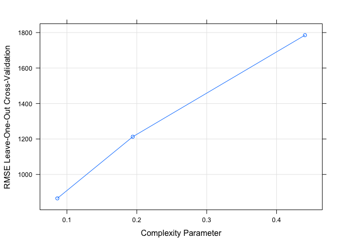<!-- -->

``` r
plot(fit2)
```

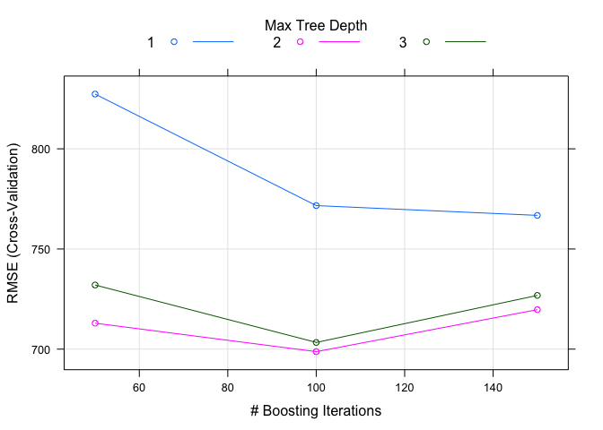<!-- -->

``` r
#plot(varImp(fit2))
```
