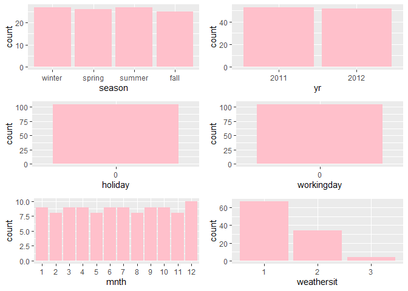

Project 2
================
Ifeoma Ojialor
10/16/2020

## Introduction

In this project, we will use a bike-sharing dataset to create machine
learning models. Before moving forward, I will briefly explain the
bike-sharing system and how it works. A bike-sharing system is a service
in which users can rent/use bicycles on a short term basis for a fee.
The goal of these programs is to provide affordable access to bicycles
for short distance trips as opposed to walking or taking public
transportation. Imagine how many people use these systems on a given
day, the numbers can vary greatly based on some elements. The goal of
this project is to build a predictive model to find out the number of
people that use these bikes in a given time period using available
information about that time/day. This in turn, can help businesses that
oversee this systems to manage them in a cost efficient manner.  
We will be using the bike-sharing dataset from the UCL Machine Learning
Repository. We will use the regression and boosted tree method to model
the response variable `cnt`.

## Exploratory Data Analysis

First we will read in the data using a relative path.

``` r
#read in data and filter to desired weekday
day1 <- read.csv("Bike-Sharing-Dataset/day.csv")
head(day1,5)
```

    ##   instant     dteday season yr mnth holiday
    ## 1       1 2011-01-01      1  0    1       0
    ## 2       2 2011-01-02      1  0    1       0
    ## 3       3 2011-01-03      1  0    1       0
    ## 4       4 2011-01-04      1  0    1       0
    ## 5       5 2011-01-05      1  0    1       0
    ##   weekday workingday weathersit     temp
    ## 1       6          0          2 0.344167
    ## 2       0          0          2 0.363478
    ## 3       1          1          1 0.196364
    ## 4       2          1          1 0.200000
    ## 5       3          1          1 0.226957
    ##      atemp      hum windspeed casual registered
    ## 1 0.363625 0.805833  0.160446    331        654
    ## 2 0.353739 0.696087  0.248539    131        670
    ## 3 0.189405 0.437273  0.248309    120       1229
    ## 4 0.212122 0.590435  0.160296    108       1454
    ## 5 0.229270 0.436957  0.186900     82       1518
    ##    cnt
    ## 1  985
    ## 2  801
    ## 3 1349
    ## 4 1562
    ## 5 1600

Next, we will remove the *casual* and *registered* variables since the
`cnt` variable is a combination of both.

``` r
day1 <- select(day1, -casual, -registered) 
day1$weekday <- as.factor(day1$weekday)
levels(day1$weekday) <- c("Sunday", "Monday", "Tuesday", "Wednesday", "Thursday", "Friday", "Saturday")
day <- filter(day1, weekday == params$days)

#Check for missing values
miss <- data.frame(apply(day,2,function(x){sum(is.na(x))}))
names(miss)[1] <- "missing"
miss
```

    ##            missing
    ## instant          0
    ## dteday           0
    ## season           0
    ## yr               0
    ## mnth             0
    ## holiday          0
    ## weekday          0
    ## workingday       0
    ## weathersit       0
    ## temp             0
    ## atemp            0
    ## hum              0
    ## windspeed        0
    ## cnt              0

There are no missing values in the dataset, so we can continue with our
analysis.

``` r
#Change the variables into their appropriate format.
day$season <- as.factor(day$season)
day$weathersit <- as.factor(day$weathersit)
day$holiday <- as.factor(day$holiday)
day$workingday <- as.factor(day$workingday)
day$yr <- as.factor(day$yr)
day$mnth <- as.factor(day$mnth)

levels(day$season) <- c("winter", "spring", "summer", "fall")
levels(day$yr) <- c("2011", "2012")
str(day)
```

    ## 'data.frame':    105 obs. of  14 variables:
    ##  $ instant   : int  1 8 15 22 29 36 43 50 57 64 ...
    ##  $ dteday    : chr  "2011-01-01" "2011-01-08" "2011-01-15" "2011-01-22" ...
    ##  $ season    : Factor w/ 4 levels "winter","spring",..: 1 1 1 1 1 1 1 1 1 1 ...
    ##  $ yr        : Factor w/ 2 levels "2011","2012": 1 1 1 1 1 1 1 1 1 1 ...
    ##  $ mnth      : Factor w/ 12 levels "1","2","3","4",..: 1 1 1 1 1 2 2 2 2 3 ...
    ##  $ holiday   : Factor w/ 1 level "0": 1 1 1 1 1 1 1 1 1 1 ...
    ##  $ weekday   : Factor w/ 7 levels "Sunday","Monday",..: 7 7 7 7 7 7 7 7 7 7 ...
    ##  $ workingday: Factor w/ 1 level "0": 1 1 1 1 1 1 1 1 1 1 ...
    ##  $ weathersit: Factor w/ 3 levels "1","2","3": 2 2 2 1 1 2 1 1 1 2 ...
    ##  $ temp      : num  0.3442 0.165 0.2333 0.0591 0.1965 ...
    ##  $ atemp     : num  0.3636 0.1623 0.2481 0.0791 0.2121 ...
    ##  $ hum       : num  0.806 0.536 0.499 0.4 0.652 ...
    ##  $ windspeed : num  0.16 0.267 0.158 0.172 0.145 ...
    ##  $ cnt       : int  985 959 1248 981 1098 1005 1472 1635 1969 2077 ...

### Univariate Analysis

The `cnt` is the response variable, so we’ll use a histogram to get a
visual understanding of the variable.

``` r
ggplot(day, aes(x = cnt)) + theme_bw() + geom_histogram(aes(y =..density..), color = "black", fill = "white", binwidth = 1000) + geom_density(alpha = 0.2, fill = "blue") + labs(title = "Count Density", x = "Count", y = "Density")
```

<!-- -->

``` r
summary(day$cnt)
```

    ##    Min. 1st Qu.  Median    Mean 3rd Qu.    Max. 
    ##     627    2732    4521    4551    6140    8714

From the histogram and summary statistics output, it is pretty evident
that the count of total rental bikes are in the sub 5000 range. We will
investigate if there is a relationship between the response variable and
other relevant predictor variables in the next section. Lets look at the
other variables individually.

``` r
#visualize numeric predictor variables using a histogram
p1 <- ggplot(day) + geom_histogram(aes(x = temp), fill = "red", binwidth = 0.03)
p2 <- ggplot(day) + geom_histogram(aes(x = atemp), fill = "red", binwidth = 0.03)
p3 <- ggplot(day) + geom_histogram(aes(x = hum), fill = "red", binwidth = 0.025)
p4 <- ggplot(day) + geom_histogram(aes(x = windspeed), fill = "red", binwidth = 0.03)
gridExtra::grid.arrange(p1,p2,p3,p4, nrow = 2)
```

<!-- -->

Observations:  
\* No clear cut pattern in `temp`and `atemp`.

  - `hum` appears to be skewed to the left when the dataset is not
    filtered to a specific weekday.

  - `windspeed` appears to be skewed(right). This variable should be
    transformed to curb its skewness.

  - The distribution of `temp` and `atemp` looks very similar. We should
    think about taking out one of the variables.

<!-- end list -->

``` r
#visualize categorical predictor variables
h1 <- ggplot(day) + geom_bar(aes(x = season),fill = "pink")
h2 <- ggplot(day) + geom_bar(aes(x = yr),fill = "pink")
h3 <- ggplot(day) + geom_bar(aes(x = holiday),fill = "pink")
h4 <- ggplot(day) + geom_bar(aes(x = workingday),fill = "pink")
h5 <- ggplot(day) + geom_bar(aes(x = mnth),fill = "pink")
h6 <- ggplot(day) + geom_bar(aes(x = weathersit),fill = "pink")
gridExtra::grid.arrange(h1,h2,h3,h4,h5,h6, nrow = 3)
```

<!-- -->

Observations:  
\* The variation between the four seasons is little to none.

  - About the same number of people rode bikes in 2011 and 2012.

  - Many people rode bikes on days that are not holidays.

  - Most people used the bike-sharing system on days that were neither
    weekends nor holidays.

  - Most people used the bike sharing system on days with clear weather.

### Bi-variate Analysis

In this section, we will explore the predictor variables with respect to
the response variable. The objective is to discover hidden relationships
between the independent and response variables and use those findings in
the model building process.

``` r
# First, we will explore the relationship between the target and numerical variables.
p1 <- ggplot(day) +geom_point(aes(x = temp, y = cnt), colour = "violet") + labs(title = "Normalized Temperature vs Total Rental Bikes")
p2 <- ggplot(day) +geom_point(aes(x = atemp, y = cnt), colour = "#FF99CC") +labs(title = "Normalized Feeling Temperature vs Total Rental Bikes")
p3 <- ggplot(day) +geom_point(aes(x = hum, y = cnt), colour = "pink") + labs(title = "Normalized Humidity vs Total rental Bikes")
p4 <- ggplot(day) +geom_point(aes(x = windspeed, y = cnt), colour = "#FF66CC") +labs(title= "Normalized Windspeed vs Total rental Bikes")
gridExtra::grid.arrange(p1, p2, p3, p4, nrow = 2)
```

<!-- -->

Observations:  
\* There appears to be a positive linear relationship between `cnt` ,
`temp`, and `atemp`.

  - There is also a weak relationship between `cnt`, `hum`, and
    `windspeed`.

<!-- end list -->

``` r
# Now we'll visualize the relationship between the target and categorical variables.
# Instead of using a boxplot, I will use a violin plot which is the blend of both a boxplot and density plot
g1 <- ggplot(day) + geom_col(aes(x = yr, y = cnt, fill = season))+theme_bw()
g2 <- ggplot(day) + geom_violin(aes(x = yr, y = cnt))+theme_bw()
g3 <- ggplot(day) + geom_col(aes(x = mnth, y = cnt, fill = season))+theme_bw() 
g4 <- ggplot(day) + geom_col(aes(x = holiday, y = cnt, fill = season)) + theme_bw() 
g6 <- ggplot(day) + geom_col(aes(x = workingday, y = cnt, fill = season))
g7 <- ggplot(day) + geom_col(aes(x = weathersit, y = cnt, fill = season))
gridExtra::grid.arrange(g1, g2, g3, nrow = 2)
```

<!-- -->

``` r
gridExtra::grid.arrange(g4, g6, g7, nrow = 2)
```

<!-- --> Observations:  
\* The total bike rental count is higher in 2012 than 2011.

  - During workingday, the bike rental counts quite the highest compared
    to during no working day for different seasons.

  - During clear,partly cloudy weather, the bike rental count is highest
    and the second highest is during mist cloudy weather and followed by
    third highest during light snow and light rain weather.

  - The highest bike rental count was during the summer and lowest in
    the winter.

## Correlation Matrix

Correlation matrix helps us to understand the linear relationship
between variables.

``` r
day_c <- day[ , c(10:14)]
round(cor(day_c), 2)
```

    ##            temp atemp   hum windspeed   cnt
    ## temp       1.00  1.00  0.07     -0.16  0.63
    ## atemp      1.00  1.00  0.09     -0.18  0.64
    ## hum        0.07  0.09  1.00     -0.21 -0.11
    ## windspeed -0.16 -0.18 -0.21      1.00 -0.28
    ## cnt        0.63  0.64 -0.11     -0.28  1.00

From the above matrix, we can see that `temp` and `atemp` are highly
correlated. So we only need to include one of these variables in the
model to prevent multicollinearity. We will also transform the humidity
and windspeed variable.

``` r
day <- mutate(day, log_hum = log(day$hum+1))
day <- mutate(day, log_ws = log(day$windspeed + 1))

#Remove irrelevant variables
day <- select(day, -weekday,-holiday,-workingday,-dteday,-temp, -instant)
```

## Model Building

First we split the data into train and test sets.

``` r
set.seed(23)
dayIndex<- createDataPartition(day$cnt, p = 0.7, list=FALSE)
dayTrain <- day[dayIndex, ]
dayTest <- day[-dayIndex, ]

# Build a tree-based model using loocv;
fitTree <- train(cnt~ ., data = dayTrain, method = "rpart", 
              preProcess = c("center", "scale"), 
              trControl = trainControl(method = "loocv", number = 10), tuneGrid = data.frame(cp = 0.01:0.10))
```

    ## Warning in preProcess.default(thresh = 0.95,
    ## k = 5, freqCut = 19, uniqueCut = 10, : These
    ## variables have zero variances: weathersit3

    ## Warning in preProcess.default(thresh = 0.95,
    ## k = 5, freqCut = 19, uniqueCut = 10, : These
    ## variables have zero variances: weathersit3

    ## Warning in preProcess.default(thresh = 0.95,
    ## k = 5, freqCut = 19, uniqueCut = 10, : These
    ## variables have zero variances: weathersit3

    ## Warning in preProcess.default(thresh = 0.95,
    ## k = 5, freqCut = 19, uniqueCut = 10, : These
    ## variables have zero variances: weathersit3

    ## Warning in preProcess.default(thresh = 0.95,
    ## k = 5, freqCut = 19, uniqueCut = 10, : These
    ## variables have zero variances: weathersit3

    ## Warning in preProcess.default(thresh = 0.95,
    ## k = 5, freqCut = 19, uniqueCut = 10, : These
    ## variables have zero variances: weathersit3

    ## Warning in preProcess.default(thresh = 0.95,
    ## k = 5, freqCut = 19, uniqueCut = 10, : These
    ## variables have zero variances: weathersit3

    ## Warning in preProcess.default(thresh = 0.95,
    ## k = 5, freqCut = 19, uniqueCut = 10, : These
    ## variables have zero variances: weathersit3

    ## Warning in preProcess.default(thresh = 0.95,
    ## k = 5, freqCut = 19, uniqueCut = 10, : These
    ## variables have zero variances: weathersit3

    ## Warning in preProcess.default(thresh = 0.95,
    ## k = 5, freqCut = 19, uniqueCut = 10, : These
    ## variables have zero variances: weathersit3

    ## Warning in preProcess.default(thresh = 0.95,
    ## k = 5, freqCut = 19, uniqueCut = 10, : These
    ## variables have zero variances: weathersit3

    ## Warning in preProcess.default(thresh = 0.95,
    ## k = 5, freqCut = 19, uniqueCut = 10, : These
    ## variables have zero variances: weathersit3

    ## Warning in preProcess.default(thresh = 0.95,
    ## k = 5, freqCut = 19, uniqueCut = 10, : These
    ## variables have zero variances: weathersit3

    ## Warning in preProcess.default(thresh = 0.95,
    ## k = 5, freqCut = 19, uniqueCut = 10, : These
    ## variables have zero variances: weathersit3

    ## Warning in preProcess.default(thresh = 0.95,
    ## k = 5, freqCut = 19, uniqueCut = 10, : These
    ## variables have zero variances: weathersit3

    ## Warning in preProcess.default(thresh = 0.95,
    ## k = 5, freqCut = 19, uniqueCut = 10, : These
    ## variables have zero variances: weathersit3

    ## Warning in preProcess.default(thresh = 0.95,
    ## k = 5, freqCut = 19, uniqueCut = 10, : These
    ## variables have zero variances: weathersit3

    ## Warning in preProcess.default(thresh = 0.95,
    ## k = 5, freqCut = 19, uniqueCut = 10, : These
    ## variables have zero variances: weathersit3

    ## Warning in preProcess.default(thresh = 0.95,
    ## k = 5, freqCut = 19, uniqueCut = 10, : These
    ## variables have zero variances: weathersit3

    ## Warning in preProcess.default(thresh = 0.95,
    ## k = 5, freqCut = 19, uniqueCut = 10, : These
    ## variables have zero variances: weathersit3

    ## Warning in preProcess.default(thresh = 0.95,
    ## k = 5, freqCut = 19, uniqueCut = 10, : These
    ## variables have zero variances: weathersit3

    ## Warning in preProcess.default(thresh = 0.95,
    ## k = 5, freqCut = 19, uniqueCut = 10, : These
    ## variables have zero variances: weathersit3

    ## Warning in preProcess.default(thresh = 0.95,
    ## k = 5, freqCut = 19, uniqueCut = 10, : These
    ## variables have zero variances: weathersit3

    ## Warning in preProcess.default(thresh = 0.95,
    ## k = 5, freqCut = 19, uniqueCut = 10, : These
    ## variables have zero variances: weathersit3

    ## Warning in preProcess.default(thresh = 0.95,
    ## k = 5, freqCut = 19, uniqueCut = 10, : These
    ## variables have zero variances: weathersit3

    ## Warning in preProcess.default(thresh = 0.95,
    ## k = 5, freqCut = 19, uniqueCut = 10, : These
    ## variables have zero variances: weathersit3

    ## Warning in preProcess.default(thresh = 0.95,
    ## k = 5, freqCut = 19, uniqueCut = 10, : These
    ## variables have zero variances: weathersit3

    ## Warning in preProcess.default(thresh = 0.95,
    ## k = 5, freqCut = 19, uniqueCut = 10, : These
    ## variables have zero variances: weathersit3

    ## Warning in preProcess.default(thresh = 0.95,
    ## k = 5, freqCut = 19, uniqueCut = 10, : These
    ## variables have zero variances: weathersit3

    ## Warning in preProcess.default(thresh = 0.95,
    ## k = 5, freqCut = 19, uniqueCut = 10, : These
    ## variables have zero variances: weathersit3

    ## Warning in preProcess.default(thresh = 0.95,
    ## k = 5, freqCut = 19, uniqueCut = 10, : These
    ## variables have zero variances: weathersit3

    ## Warning in preProcess.default(thresh = 0.95,
    ## k = 5, freqCut = 19, uniqueCut = 10, : These
    ## variables have zero variances: weathersit3

    ## Warning in preProcess.default(thresh = 0.95,
    ## k = 5, freqCut = 19, uniqueCut = 10, : These
    ## variables have zero variances: weathersit3

    ## Warning in preProcess.default(thresh = 0.95,
    ## k = 5, freqCut = 19, uniqueCut = 10, : These
    ## variables have zero variances: weathersit3

    ## Warning in preProcess.default(thresh = 0.95,
    ## k = 5, freqCut = 19, uniqueCut = 10, : These
    ## variables have zero variances: weathersit3

    ## Warning in preProcess.default(thresh = 0.95,
    ## k = 5, freqCut = 19, uniqueCut = 10, : These
    ## variables have zero variances: weathersit3

    ## Warning in preProcess.default(thresh = 0.95,
    ## k = 5, freqCut = 19, uniqueCut = 10, : These
    ## variables have zero variances: weathersit3

    ## Warning in preProcess.default(thresh = 0.95,
    ## k = 5, freqCut = 19, uniqueCut = 10, : These
    ## variables have zero variances: weathersit3

    ## Warning in preProcess.default(thresh = 0.95,
    ## k = 5, freqCut = 19, uniqueCut = 10, : These
    ## variables have zero variances: weathersit3

    ## Warning in preProcess.default(thresh = 0.95,
    ## k = 5, freqCut = 19, uniqueCut = 10, : These
    ## variables have zero variances: weathersit3

    ## Warning in preProcess.default(thresh = 0.95,
    ## k = 5, freqCut = 19, uniqueCut = 10, : These
    ## variables have zero variances: weathersit3

    ## Warning in preProcess.default(thresh = 0.95,
    ## k = 5, freqCut = 19, uniqueCut = 10, : These
    ## variables have zero variances: weathersit3

    ## Warning in preProcess.default(thresh = 0.95,
    ## k = 5, freqCut = 19, uniqueCut = 10, : These
    ## variables have zero variances: weathersit3

    ## Warning in preProcess.default(thresh = 0.95,
    ## k = 5, freqCut = 19, uniqueCut = 10, : These
    ## variables have zero variances: weathersit3

    ## Warning in preProcess.default(thresh = 0.95,
    ## k = 5, freqCut = 19, uniqueCut = 10, : These
    ## variables have zero variances: weathersit3

    ## Warning in preProcess.default(thresh = 0.95,
    ## k = 5, freqCut = 19, uniqueCut = 10, : These
    ## variables have zero variances: weathersit3

    ## Warning in preProcess.default(thresh = 0.95,
    ## k = 5, freqCut = 19, uniqueCut = 10, : These
    ## variables have zero variances: weathersit3

    ## Warning in preProcess.default(thresh = 0.95,
    ## k = 5, freqCut = 19, uniqueCut = 10, : These
    ## variables have zero variances: weathersit3

    ## Warning in preProcess.default(thresh = 0.95,
    ## k = 5, freqCut = 19, uniqueCut = 10, : These
    ## variables have zero variances: weathersit3

    ## Warning in preProcess.default(thresh = 0.95,
    ## k = 5, freqCut = 19, uniqueCut = 10, : These
    ## variables have zero variances: weathersit3

    ## Warning in preProcess.default(thresh = 0.95,
    ## k = 5, freqCut = 19, uniqueCut = 10, : These
    ## variables have zero variances: weathersit3

    ## Warning in preProcess.default(thresh = 0.95,
    ## k = 5, freqCut = 19, uniqueCut = 10, : These
    ## variables have zero variances: weathersit3

    ## Warning in preProcess.default(thresh = 0.95,
    ## k = 5, freqCut = 19, uniqueCut = 10, : These
    ## variables have zero variances: weathersit3

    ## Warning in preProcess.default(thresh = 0.95,
    ## k = 5, freqCut = 19, uniqueCut = 10, : These
    ## variables have zero variances: weathersit3

    ## Warning in preProcess.default(thresh = 0.95,
    ## k = 5, freqCut = 19, uniqueCut = 10, : These
    ## variables have zero variances: weathersit3

    ## Warning in preProcess.default(thresh = 0.95,
    ## k = 5, freqCut = 19, uniqueCut = 10, : These
    ## variables have zero variances: weathersit3

    ## Warning in preProcess.default(thresh = 0.95,
    ## k = 5, freqCut = 19, uniqueCut = 10, : These
    ## variables have zero variances: weathersit3

    ## Warning in preProcess.default(thresh = 0.95,
    ## k = 5, freqCut = 19, uniqueCut = 10, : These
    ## variables have zero variances: weathersit3

    ## Warning in preProcess.default(thresh = 0.95,
    ## k = 5, freqCut = 19, uniqueCut = 10, : These
    ## variables have zero variances: weathersit3

    ## Warning in preProcess.default(thresh = 0.95,
    ## k = 5, freqCut = 19, uniqueCut = 10, : These
    ## variables have zero variances: weathersit3

    ## Warning in preProcess.default(thresh = 0.95,
    ## k = 5, freqCut = 19, uniqueCut = 10, : These
    ## variables have zero variances: weathersit3

    ## Warning in preProcess.default(thresh = 0.95,
    ## k = 5, freqCut = 19, uniqueCut = 10, : These
    ## variables have zero variances: weathersit3

    ## Warning in preProcess.default(thresh = 0.95,
    ## k = 5, freqCut = 19, uniqueCut = 10, : These
    ## variables have zero variances: weathersit3

    ## Warning in preProcess.default(thresh = 0.95,
    ## k = 5, freqCut = 19, uniqueCut = 10, : These
    ## variables have zero variances: weathersit3

    ## Warning in preProcess.default(thresh = 0.95,
    ## k = 5, freqCut = 19, uniqueCut = 10, : These
    ## variables have zero variances: weathersit3

    ## Warning in preProcess.default(thresh = 0.95,
    ## k = 5, freqCut = 19, uniqueCut = 10, : These
    ## variables have zero variances: weathersit3

    ## Warning in preProcess.default(thresh = 0.95,
    ## k = 5, freqCut = 19, uniqueCut = 10, : These
    ## variables have zero variances: weathersit3

    ## Warning in preProcess.default(thresh = 0.95,
    ## k = 5, freqCut = 19, uniqueCut = 10, : These
    ## variables have zero variances: weathersit3

    ## Warning in preProcess.default(thresh = 0.95,
    ## k = 5, freqCut = 19, uniqueCut = 10, : These
    ## variables have zero variances: weathersit3

    ## Warning in preProcess.default(thresh = 0.95,
    ## k = 5, freqCut = 19, uniqueCut = 10, : These
    ## variables have zero variances: weathersit3

    ## Warning in preProcess.default(thresh = 0.95,
    ## k = 5, freqCut = 19, uniqueCut = 10, : These
    ## variables have zero variances: weathersit3

    ## Warning in preProcess.default(thresh = 0.95,
    ## k = 5, freqCut = 19, uniqueCut = 10, : These
    ## variables have zero variances: weathersit3

    ## Warning in preProcess.default(thresh = 0.95,
    ## k = 5, freqCut = 19, uniqueCut = 10, : These
    ## variables have zero variances: weathersit3

    ## Warning in preProcess.default(thresh = 0.95,
    ## k = 5, freqCut = 19, uniqueCut = 10, : These
    ## variables have zero variances: weathersit3

    ## Warning in preProcess.default(thresh = 0.95,
    ## k = 5, freqCut = 19, uniqueCut = 10, : These
    ## variables have zero variances: weathersit3

    ## Warning in preProcess.default(thresh = 0.95,
    ## k = 5, freqCut = 19, uniqueCut = 10, : These
    ## variables have zero variances: weathersit3

    ## Warning in nominalTrainWorkflow(x = x, y =
    ## y, wts = weights, info = trainInfo, : There
    ## were missing values in resampled performance
    ## measures.

    ## Warning in preProcess.default(thresh = 0.95,
    ## k = 5, freqCut = 19, uniqueCut = 10, : These
    ## variables have zero variances: weathersit3

``` r
# Display information from the tree fit
fitTree$results
```

    ##     cp     RMSE Rsquared      MAE   RMSESD
    ## 1 0.01 1241.014      NaN 1241.014 928.4852
    ##   RsquaredSD    MAESD
    ## 1         NA 928.4852

``` r
# Build a boosted tree model using cv
fitBoost <- train(cnt~., data = dayTrain, method = "gbm", 
              preProcess = c("center", "scale"), 
              trControl = trainControl(method = "cv", number = 10), 
              tuneGrid = expand.grid(n.trees=c(10,20,50,100,500,1000),shrinkage=c(0.01,0.05,0.1,0.5),n.minobsinnode =c(3,5,10),interaction.depth=c(1,5,10)))
```

    ## Warning in preProcess.default(thresh = 0.95,
    ## k = 5, freqCut = 19, uniqueCut = 10, : These
    ## variables have zero variances: weathersit3

    ## Warning in (function (x, y, offset = NULL, misc
    ## = NULL, distribution = "bernoulli", : variable
    ## 17: weathersit3 has no variation.

    ## Iter   TrainDeviance   ValidDeviance   StepSize   Improve
    ##      1  4701216.1640             nan     0.0100 39416.0641
    ##      2  4653984.2769             nan     0.0100 40435.5945
    ##      3  4609704.2081             nan     0.0100 42220.7875
    ##      4  4575278.2498             nan     0.0100 33150.9435
    ##      5  4530429.1484             nan     0.0100 36853.4288
    ##      6  4488261.8032             nan     0.0100 39589.3916
    ##      7  4451169.8021             nan     0.0100 38429.1636
    ##      8  4407774.3322             nan     0.0100 31428.7890
    ##      9  4376200.1051             nan     0.0100 25779.2107
    ##     10  4335711.6095             nan     0.0100 33346.9789
    ##     20  3985925.6962             nan     0.0100 31163.2576
    ##     40  3398813.5595             nan     0.0100 22596.7675
    ##     60  2928797.4964             nan     0.0100 14372.9773
    ##     80  2554081.3498             nan     0.0100 11909.7495
    ##    100  2249448.0668             nan     0.0100 11546.5722
    ##    120  2005505.2751             nan     0.0100 5487.6298
    ##    140  1797286.9210             nan     0.0100 9263.2782
    ##    160  1642449.2502             nan     0.0100 8227.1589
    ##    180  1504004.7225             nan     0.0100 6997.5853
    ##    200  1380650.7679             nan     0.0100 5839.5457
    ##    220  1275867.8883             nan     0.0100  914.3991
    ##    240  1188675.7728             nan     0.0100 2815.4950
    ##    260  1113341.8365             nan     0.0100 2609.1494
    ##    280  1046345.3269             nan     0.0100 2865.0845
    ##    300   989576.8933             nan     0.0100 1329.9599
    ##    320   934988.9827             nan     0.0100 1550.0621
    ##    340   893949.2858             nan     0.0100 -1334.5668
    ##    360   854459.0494             nan     0.0100 -1277.9961
    ##    380   821123.7630             nan     0.0100 1301.4820
    ##    400   786125.3369             nan     0.0100 -1168.2079
    ##    420   752897.9535             nan     0.0100  572.8233
    ##    440   723471.8711             nan     0.0100 -404.4055
    ##    460   698977.8279             nan     0.0100  216.3401
    ##    480   676526.2458             nan     0.0100  349.3483
    ##    500   651796.3404             nan     0.0100  -26.1968
    ##    520   630711.3703             nan     0.0100 -615.9664
    ##    540   609263.3739             nan     0.0100  -63.1614
    ##    560   588329.3822             nan     0.0100 -132.9789
    ##    580   569451.7174             nan     0.0100   -9.5563
    ##    600   551803.0747             nan     0.0100 -402.2703
    ##    620   535718.6183             nan     0.0100 -642.2141
    ##    640   521317.5233             nan     0.0100 -1006.9346
    ##    660   507997.9825             nan     0.0100    9.2242
    ##    680   495222.7684             nan     0.0100 -803.4278
    ##    700   482284.9431             nan     0.0100 -368.1001
    ##    720   468524.7666             nan     0.0100 -538.7417
    ##    740   456750.0862             nan     0.0100  -53.3613
    ##    760   446445.6898             nan     0.0100 -481.2551
    ##    780   438371.7832             nan     0.0100  -43.4531
    ##    800   430556.8061             nan     0.0100 -236.0216
    ##    820   422233.8955             nan     0.0100 -144.5804
    ##    840   412875.7265             nan     0.0100 -1077.0383
    ##    860   404221.8129             nan     0.0100 -283.9084
    ##    880   395684.0529             nan     0.0100 -389.8115
    ##    900   388583.6659             nan     0.0100   70.6267
    ##    920   383607.4141             nan     0.0100 -562.7625
    ##    940   377674.2300             nan     0.0100 -412.1501
    ##    960   371805.4188             nan     0.0100 -878.5957
    ##    980   366486.4742             nan     0.0100 -396.8205
    ##   1000   360992.6782             nan     0.0100 -1313.5914

    ## Warning in preProcess.default(thresh = 0.95,
    ## k = 5, freqCut = 19, uniqueCut = 10, : These
    ## variables have zero variances: weathersit3

    ## Warning in (function (x, y, offset = NULL, misc
    ## = NULL, distribution = "bernoulli", : variable
    ## 17: weathersit3 has no variation.

    ## Iter   TrainDeviance   ValidDeviance   StepSize   Improve
    ##      1  4706456.0788             nan     0.0100 38859.7098
    ##      2  4660446.1972             nan     0.0100 39660.5611
    ##      3  4619604.3524             nan     0.0100 41583.8366
    ##      4  4590735.4148             nan     0.0100 24090.2489
    ##      5  4546470.6280             nan     0.0100 21626.6393
    ##      6  4502159.9290             nan     0.0100 27889.9413
    ##      7  4460483.8200             nan     0.0100 36831.9760
    ##      8  4420749.4020             nan     0.0100 36131.3513
    ##      9  4380055.5224             nan     0.0100 19577.8138
    ##     10  4338868.8517             nan     0.0100 28430.0598
    ##     20  3996618.7509             nan     0.0100 32759.7826
    ##     40  3387377.2856             nan     0.0100 24526.1112
    ##     60  2914801.3605             nan     0.0100 14313.6927
    ##     80  2540358.5926             nan     0.0100 15149.8164
    ##    100  2224739.2674             nan     0.0100 12160.3835
    ##    120  1980883.8433             nan     0.0100 7593.7254
    ##    140  1772316.2143             nan     0.0100 6139.5090
    ##    160  1600081.7909             nan     0.0100 5676.8650
    ##    180  1463673.2637             nan     0.0100 1087.1180
    ##    200  1343649.7444             nan     0.0100 2333.9186
    ##    220  1245854.1129             nan     0.0100 1834.9441
    ##    240  1154752.9627             nan     0.0100 2970.1122
    ##    260  1084283.1437             nan     0.0100 -465.2236
    ##    280  1021380.3159             nan     0.0100 -189.4746
    ##    300   966597.3667             nan     0.0100  360.6145
    ##    320   920205.3367             nan     0.0100  976.4192
    ##    340   874240.9219             nan     0.0100  123.8200
    ##    360   836270.7906             nan     0.0100  677.3268
    ##    380   802141.7988             nan     0.0100 -932.2788
    ##    400   772514.9237             nan     0.0100 -171.8158
    ##    420   745355.8868             nan     0.0100 -808.4187
    ##    440   722995.0040             nan     0.0100  -65.8841
    ##    460   702335.5139             nan     0.0100  -35.7289
    ##    480   682565.7203             nan     0.0100 -831.4981
    ##    500   662929.3613             nan     0.0100   63.4779
    ##    520   646397.1834             nan     0.0100  241.3150
    ##    540   628976.7162             nan     0.0100 -652.7525
    ##    560   615650.6302             nan     0.0100 -1197.0156
    ##    580   600848.7608             nan     0.0100 -688.3008
    ##    600   585985.1353             nan     0.0100 -491.7357
    ##    620   572914.1549             nan     0.0100 -325.4030
    ##    640   560199.6817             nan     0.0100 -1769.9271
    ##    660   547259.4410             nan     0.0100 -1520.8827
    ##    680   536894.8917             nan     0.0100  -92.0947
    ##    700   526760.7037             nan     0.0100 -144.8860
    ##    720   516273.4844             nan     0.0100 -234.2494
    ##    740   506294.3749             nan     0.0100  197.3670
    ##    760   498841.0038             nan     0.0100 -944.9710
    ##    780   490010.2711             nan     0.0100 -389.7922
    ##    800   481074.5327             nan     0.0100 -259.4471
    ##    820   474108.8883             nan     0.0100 -1245.6288
    ##    840   468238.7073             nan     0.0100 -156.4852
    ##    860   459215.0230             nan     0.0100 -574.3482
    ##    880   453459.1254             nan     0.0100 -683.6239
    ##    900   446468.2313             nan     0.0100  -95.4920
    ##    920   441934.9760             nan     0.0100 -1365.8290
    ##    940   437476.5385             nan     0.0100 -922.9658
    ##    960   434158.3118             nan     0.0100  -86.3117
    ##    980   429751.3485             nan     0.0100 -520.7766
    ##   1000   424005.4082             nan     0.0100 -764.2285

    ## Warning in preProcess.default(thresh = 0.95,
    ## k = 5, freqCut = 19, uniqueCut = 10, : These
    ## variables have zero variances: weathersit3

    ## Warning in (function (x, y, offset = NULL, misc
    ## = NULL, distribution = "bernoulli", : variable
    ## 17: weathersit3 has no variation.

    ## Iter   TrainDeviance   ValidDeviance   StepSize   Improve
    ##      1  4698845.1353             nan     0.0100 36043.2918
    ##      2  4658490.0353             nan     0.0100 39558.0638
    ##      3  4611421.0214             nan     0.0100 39452.6548
    ##      4  4572634.4239             nan     0.0100 28772.4975
    ##      5  4534755.9677             nan     0.0100 34958.1174
    ##      6  4495360.3236             nan     0.0100 33092.9607
    ##      7  4463560.1909             nan     0.0100 34288.3839
    ##      8  4427941.7469             nan     0.0100 37048.7079
    ##      9  4387656.2718             nan     0.0100 25802.6914
    ##     10  4358299.3436             nan     0.0100 33955.3672
    ##     20  4011730.7570             nan     0.0100 33572.6757
    ##     40  3438291.9702             nan     0.0100 18003.4420
    ##     60  2994288.2583             nan     0.0100 16145.3976
    ##     80  2617793.3160             nan     0.0100 9603.4721
    ##    100  2345097.9369             nan     0.0100 12791.2864
    ##    120  2103631.2857             nan     0.0100 5668.3126
    ##    140  1896959.5734             nan     0.0100 2370.8819
    ##    160  1744978.6142             nan     0.0100 6330.5560
    ##    180  1600435.8556             nan     0.0100 4953.7651
    ##    200  1477833.9177             nan     0.0100 3295.8305
    ##    220  1388670.5226             nan     0.0100 1898.5079
    ##    240  1308099.0695             nan     0.0100 2932.0312
    ##    260  1244872.8970             nan     0.0100 1910.1021
    ##    280  1182403.9714             nan     0.0100 1290.7045
    ##    300  1131659.0554             nan     0.0100 -616.5292
    ##    320  1084436.1778             nan     0.0100 1004.0354
    ##    340  1038009.9142             nan     0.0100 -862.6686
    ##    360   993188.3550             nan     0.0100 1467.4219
    ##    380   964304.0032             nan     0.0100 1031.9276
    ##    400   929222.7166             nan     0.0100  492.0835
    ##    420   899855.1096             nan     0.0100 -833.4507
    ##    440   879816.5931             nan     0.0100   -2.6666
    ##    460   857660.0366             nan     0.0100   69.9028
    ##    480   838335.6077             nan     0.0100   65.0922
    ##    500   818026.6847             nan     0.0100 -148.8845
    ##    520   801740.8136             nan     0.0100 -1760.4547
    ##    540   790458.1545             nan     0.0100 -2068.6785
    ##    560   778966.0238             nan     0.0100 -2012.7997
    ##    580   768752.6518             nan     0.0100  -58.2412
    ##    600   757756.5130             nan     0.0100   13.4834
    ##    620   747232.2954             nan     0.0100 -1140.2440
    ##    640   736602.7688             nan     0.0100 -151.4780
    ##    660   721945.5843             nan     0.0100  180.8382
    ##    680   714546.2209             nan     0.0100 -2386.5878
    ##    700   704737.8012             nan     0.0100  305.8596
    ##    720   694040.7799             nan     0.0100  473.2151
    ##    740   684490.2984             nan     0.0100 -727.1044
    ##    760   678579.4459             nan     0.0100 -1852.5420
    ##    780   670257.8484             nan     0.0100 -716.9894
    ##    800   663659.7064             nan     0.0100   66.3493
    ##    820   657410.6475             nan     0.0100 -943.9390
    ##    840   651859.3958             nan     0.0100 -1256.3837
    ##    860   644280.9695             nan     0.0100 -1266.1407
    ##    880   639762.3892             nan     0.0100 -602.8600
    ##    900   635563.3338             nan     0.0100 -203.8823
    ##    920   629411.5630             nan     0.0100  -25.6096
    ##    940   626095.4106             nan     0.0100 -599.3523
    ##    960   621408.5865             nan     0.0100 -1024.5906
    ##    980   618594.3003             nan     0.0100 -225.4292
    ##   1000   612950.3982             nan     0.0100 -320.8461

    ## Warning in preProcess.default(thresh = 0.95,
    ## k = 5, freqCut = 19, uniqueCut = 10, : These
    ## variables have zero variances: weathersit3

    ## Warning in (function (x, y, offset = NULL, misc
    ## = NULL, distribution = "bernoulli", : variable
    ## 17: weathersit3 has no variation.

    ## Iter   TrainDeviance   ValidDeviance   StepSize   Improve
    ##      1  4668891.9034             nan     0.0100 50519.0052
    ##      2  4591815.5092             nan     0.0100 66854.2266
    ##      3  4520960.5896             nan     0.0100 51024.8797
    ##      4  4454575.8105             nan     0.0100 55622.3852
    ##      5  4379776.9855             nan     0.0100 56857.9872
    ##      6  4316375.9070             nan     0.0100 40001.8727
    ##      7  4247240.2314             nan     0.0100 67713.0983
    ##      8  4187416.8051             nan     0.0100 53587.7593
    ##      9  4121904.4246             nan     0.0100 52301.7634
    ##     10  4064848.5481             nan     0.0100 37564.7655
    ##     20  3508782.4461             nan     0.0100 25923.7674
    ##     40  2627027.6957             nan     0.0100 19383.5525
    ##     60  1991602.2723             nan     0.0100 15351.5505
    ##     80  1548509.3934             nan     0.0100 12854.9815
    ##    100  1225860.4204             nan     0.0100 9630.4542
    ##    120   978638.2800             nan     0.0100 4699.1589
    ##    140   800968.2586             nan     0.0100 5557.6437
    ##    160   657895.8998             nan     0.0100  568.0386
    ##    180   559634.1423             nan     0.0100 2487.1084
    ##    200   480112.2271             nan     0.0100 1978.8186
    ##    220   412749.6137             nan     0.0100 1800.6324
    ##    240   363042.1517             nan     0.0100  333.6256
    ##    260   322133.6793             nan     0.0100   36.6104
    ##    280   284649.2062             nan     0.0100 -554.4820
    ##    300   258750.7401             nan     0.0100 -847.7755
    ##    320   233354.8697             nan     0.0100 -212.6107
    ##    340   214269.6188             nan     0.0100   37.0924
    ##    360   198261.4377             nan     0.0100 -556.4866
    ##    380   182953.6772             nan     0.0100 -185.0622
    ##    400   169992.6375             nan     0.0100 -766.6871
    ##    420   159171.7243             nan     0.0100 -794.1450
    ##    440   148190.6572             nan     0.0100   97.5777
    ##    460   139849.6896             nan     0.0100 -447.4800
    ##    480   131449.6597             nan     0.0100 -406.0484
    ##    500   122143.2692             nan     0.0100 -429.0892
    ##    520   115327.1196             nan     0.0100 -382.6389
    ##    540   109543.9810             nan     0.0100  -47.7424
    ##    560   104909.6755             nan     0.0100 -724.0335
    ##    580    98899.5574             nan     0.0100 -157.2610
    ##    600    94516.0303             nan     0.0100 -105.8873
    ##    620    90137.6128             nan     0.0100 -336.1531
    ##    640    86232.0317             nan     0.0100 -632.9167
    ##    660    81746.9447             nan     0.0100 -254.6168
    ##    680    78366.0008             nan     0.0100 -451.0106
    ##    700    74891.9576             nan     0.0100 -276.3820
    ##    720    71011.3076             nan     0.0100 -504.7025
    ##    740    67998.5321             nan     0.0100 -261.8219
    ##    760    64727.2037             nan     0.0100 -297.4357
    ##    780    61853.8110             nan     0.0100 -273.3606
    ##    800    58986.1384             nan     0.0100 -250.1475
    ##    820    56188.5142             nan     0.0100  -99.9958
    ##    840    53780.4352             nan     0.0100 -258.7513
    ##    860    51178.8098             nan     0.0100 -142.0056
    ##    880    48833.3109             nan     0.0100 -156.4422
    ##    900    46725.4754             nan     0.0100 -123.7599
    ##    920    44855.2220             nan     0.0100 -242.7639
    ##    940    42787.7167             nan     0.0100 -123.4852
    ##    960    40907.7039             nan     0.0100 -187.1925
    ##    980    39182.7704             nan     0.0100  -89.3670
    ##   1000    37474.1601             nan     0.0100 -189.7828

    ## Warning in preProcess.default(thresh = 0.95,
    ## k = 5, freqCut = 19, uniqueCut = 10, : These
    ## variables have zero variances: weathersit3

    ## Warning in (function (x, y, offset = NULL, misc
    ## = NULL, distribution = "bernoulli", : variable
    ## 17: weathersit3 has no variation.

    ## Iter   TrainDeviance   ValidDeviance   StepSize   Improve
    ##      1  4677840.9617             nan     0.0100 40198.6452
    ##      2  4602975.9635             nan     0.0100 77701.5590
    ##      3  4533686.7153             nan     0.0100 41761.4605
    ##      4  4471461.6458             nan     0.0100 44558.5445
    ##      5  4410370.7932             nan     0.0100 50414.3738
    ##      6  4345969.0723             nan     0.0100 71405.4732
    ##      7  4288522.5528             nan     0.0100 39280.3081
    ##      8  4221175.2106             nan     0.0100 48967.5619
    ##      9  4152247.7121             nan     0.0100 54791.2235
    ##     10  4091582.6998             nan     0.0100 44239.1134
    ##     20  3569466.0160             nan     0.0100 44356.6655
    ##     40  2727615.8410             nan     0.0100 27867.4945
    ##     60  2117196.9971             nan     0.0100 11946.1830
    ##     80  1674519.2358             nan     0.0100 21130.2049
    ##    100  1360923.8785             nan     0.0100 10765.0259
    ##    120  1118080.9295             nan     0.0100 3708.8923
    ##    140   934050.7405             nan     0.0100 6618.2820
    ##    160   802664.8982             nan     0.0100 1599.7028
    ##    180   694221.5297             nan     0.0100 3094.0816
    ##    200   612835.1149             nan     0.0100 -1497.1251
    ##    220   547352.9082             nan     0.0100 1872.1193
    ##    240   497440.1669             nan     0.0100 1804.3301
    ##    260   454973.4735             nan     0.0100 -702.7828
    ##    280   417243.8873             nan     0.0100  153.0628
    ##    300   384493.8558             nan     0.0100  421.9995
    ##    320   361047.7671             nan     0.0100 -477.1676
    ##    340   340260.9041             nan     0.0100  307.6051
    ##    360   319373.4975             nan     0.0100 -1106.4298
    ##    380   301573.2202             nan     0.0100 -1294.0489
    ##    400   287445.2740             nan     0.0100 -429.4424
    ##    420   275175.8819             nan     0.0100 -1191.6580
    ##    440   263983.6946             nan     0.0100 -135.1635
    ##    460   252263.2664             nan     0.0100  -91.5641
    ##    480   240873.6635             nan     0.0100 -511.6992
    ##    500   232123.8289             nan     0.0100 -749.0498
    ##    520   224921.3585             nan     0.0100 -637.8898
    ##    540   218410.8525             nan     0.0100 -803.6295
    ##    560   210623.4439             nan     0.0100 -626.5942
    ##    580   202874.0150             nan     0.0100 -151.2502
    ##    600   194838.2706             nan     0.0100 -536.7086
    ##    620   188339.4741             nan     0.0100 -340.8607
    ##    640   182685.9540             nan     0.0100 -471.8421
    ##    660   177109.5267             nan     0.0100 -771.3519
    ##    680   172170.1573             nan     0.0100 -422.8033
    ##    700   166557.3399             nan     0.0100 -367.9760
    ##    720   159259.7190             nan     0.0100 -304.4993
    ##    740   154537.5745             nan     0.0100 -1032.2353
    ##    760   148795.7514             nan     0.0100 -356.1844
    ##    780   144798.6422             nan     0.0100 -670.7267
    ##    800   139622.3708             nan     0.0100 -515.0891
    ##    820   136282.5485             nan     0.0100 -407.3082
    ##    840   133164.7214             nan     0.0100 -528.7251
    ##    860   129717.1568             nan     0.0100 -394.9404
    ##    880   125587.7425             nan     0.0100 -151.6789
    ##    900   120763.4958             nan     0.0100 -184.2015
    ##    920   117198.2338             nan     0.0100 -473.3733
    ##    940   113690.2761             nan     0.0100 -296.8378
    ##    960   110655.2519             nan     0.0100 -458.6511
    ##    980   106926.6622             nan     0.0100 -267.6286
    ##   1000   103456.6103             nan     0.0100 -295.9930

    ## Warning in preProcess.default(thresh = 0.95,
    ## k = 5, freqCut = 19, uniqueCut = 10, : These
    ## variables have zero variances: weathersit3

    ## Warning in (function (x, y, offset = NULL, misc
    ## = NULL, distribution = "bernoulli", : variable
    ## 17: weathersit3 has no variation.

    ## Iter   TrainDeviance   ValidDeviance   StepSize   Improve
    ##      1  4689015.8790             nan     0.0100 49910.4218
    ##      2  4633714.0225             nan     0.0100 56015.1031
    ##      3  4581691.3734             nan     0.0100 50193.5285
    ##      4  4536603.6168             nan     0.0100 35437.2587
    ##      5  4491642.0292             nan     0.0100 37243.6543
    ##      6  4435408.4773             nan     0.0100 48968.9722
    ##      7  4398933.6530             nan     0.0100 29608.9634
    ##      8  4355272.1923             nan     0.0100 38233.2422
    ##      9  4298331.8322             nan     0.0100 41440.7237
    ##     10  4255053.0757             nan     0.0100 42773.3331
    ##     20  3854998.6977             nan     0.0100 22986.2926
    ##     40  3231816.0879             nan     0.0100 17786.2325
    ##     60  2780410.5166             nan     0.0100 25422.3661
    ##     80  2404511.6818             nan     0.0100 11264.5021
    ##    100  2105972.0498             nan     0.0100 8463.9774
    ##    120  1838357.8680             nan     0.0100 15249.2880
    ##    140  1641807.9436             nan     0.0100 7194.2669
    ##    160  1498241.7232             nan     0.0100 4458.4685
    ##    180  1363483.0315             nan     0.0100 2489.1476
    ##    200  1234993.0646             nan     0.0100  -80.2153
    ##    220  1155509.4676             nan     0.0100  479.3253
    ##    240  1086595.9921             nan     0.0100 -747.9517
    ##    260  1035302.0324             nan     0.0100  996.6015
    ##    280   976796.0630             nan     0.0100  969.0312
    ##    300   918878.6368             nan     0.0100  705.0729
    ##    320   860371.9331             nan     0.0100  548.2126
    ##    340   823237.9812             nan     0.0100 1039.9658
    ##    360   788629.3950             nan     0.0100  823.2882
    ##    380   763617.1615             nan     0.0100 -229.9877
    ##    400   736433.1104             nan     0.0100 -679.8657
    ##    420   713528.6042             nan     0.0100  642.4831
    ##    440   694204.1240             nan     0.0100  221.8429
    ##    460   677420.9213             nan     0.0100 -1890.3468
    ##    480   659526.1881             nan     0.0100  -28.0714
    ##    500   644177.5931             nan     0.0100 -1364.5482
    ##    520   627929.2182             nan     0.0100 -163.6227
    ##    540   615235.5767             nan     0.0100 -1648.4593
    ##    560   601334.7469             nan     0.0100 -1010.8150
    ##    580   589994.1490             nan     0.0100  -71.0115
    ##    600   579961.3956             nan     0.0100 -501.5792
    ##    620   572606.2188             nan     0.0100 -905.8924
    ##    640   565246.8479             nan     0.0100 -534.9191
    ##    660   559240.4614             nan     0.0100 -533.7093
    ##    680   548060.5127             nan     0.0100 -767.8671
    ##    700   542851.3459             nan     0.0100 -897.2041
    ##    720   537270.4846             nan     0.0100 -1715.4086
    ##    740   531144.2190             nan     0.0100 -361.8622
    ##    760   525550.9962             nan     0.0100 -2556.9363
    ##    780   516690.6470             nan     0.0100 -235.2448
    ##    800   510186.7905             nan     0.0100 -186.5053
    ##    820   505458.3177             nan     0.0100 -1219.8548
    ##    840   500623.0859             nan     0.0100 -670.5120
    ##    860   493611.7189             nan     0.0100 -1395.4003
    ##    880   489076.6516             nan     0.0100 -1062.7212
    ##    900   484321.2082             nan     0.0100 -842.4713
    ##    920   478716.0437             nan     0.0100 -1083.8564
    ##    940   475983.7234             nan     0.0100 -723.4401
    ##    960   471897.8370             nan     0.0100 -1174.8499
    ##    980   467204.3307             nan     0.0100 -422.1424
    ##   1000   463436.5154             nan     0.0100 -284.1623

    ## Warning in preProcess.default(thresh = 0.95,
    ## k = 5, freqCut = 19, uniqueCut = 10, : These
    ## variables have zero variances: weathersit3

    ## Warning in (function (x, y, offset = NULL, misc
    ## = NULL, distribution = "bernoulli", : variable
    ## 17: weathersit3 has no variation.

    ## Iter   TrainDeviance   ValidDeviance   StepSize   Improve
    ##      1  4666495.3211             nan     0.0100 60845.4982
    ##      2  4596941.5079             nan     0.0100 60577.9187
    ##      3  4523491.0406             nan     0.0100 74833.7737
    ##      4  4455199.3928             nan     0.0100 53954.6080
    ##      5  4388352.6867             nan     0.0100 52258.6539
    ##      6  4326253.8676             nan     0.0100 65022.0441
    ##      7  4265521.1010             nan     0.0100 42166.8874
    ##      8  4197151.4531             nan     0.0100 50844.5806
    ##      9  4131549.6951             nan     0.0100 68199.2407
    ##     10  4059981.5599             nan     0.0100 50286.9909
    ##     20  3459295.5385             nan     0.0100 49154.5418
    ##     40  2559486.2208             nan     0.0100 26868.2808
    ##     60  1925797.0633             nan     0.0100 25486.3497
    ##     80  1473570.8921             nan     0.0100 21276.5262
    ##    100  1146974.2327             nan     0.0100 12448.2870
    ##    120   888280.3765             nan     0.0100 4648.5725
    ##    140   714694.4470             nan     0.0100 4061.6965
    ##    160   575938.3423             nan     0.0100 2896.2876
    ##    180   483593.6778             nan     0.0100 -135.3014
    ##    200   406648.6706             nan     0.0100 2972.5292
    ##    220   348160.2415             nan     0.0100 -264.9044
    ##    240   299331.9949             nan     0.0100 -231.2686
    ##    260   257831.7539             nan     0.0100 -169.8068
    ##    280   229324.6070             nan     0.0100 -777.6027
    ##    300   204879.2209             nan     0.0100 -352.3610
    ##    320   185436.8792             nan     0.0100 -974.4415
    ##    340   167200.7086             nan     0.0100   86.2725
    ##    360   150348.0313             nan     0.0100 -342.7880
    ##    380   137063.7222             nan     0.0100 -149.3209
    ##    400   126111.8190             nan     0.0100 -477.8635
    ##    420   116190.2355             nan     0.0100  -77.4809
    ##    440   107879.5289             nan     0.0100 -676.1409
    ##    460    99867.0846             nan     0.0100 -403.6243
    ##    480    93064.1164             nan     0.0100  -47.4338
    ##    500    86855.5320             nan     0.0100 -542.2297
    ##    520    80475.1406             nan     0.0100   39.9040
    ##    540    74723.9033             nan     0.0100 -251.0620
    ##    560    69788.7989             nan     0.0100 -300.1308
    ##    580    64702.3049             nan     0.0100 -336.7148
    ##    600    60693.9343             nan     0.0100 -260.9845
    ##    620    56601.3852             nan     0.0100  -14.1515
    ##    640    53331.7832             nan     0.0100 -409.5219
    ##    660    50219.5292             nan     0.0100 -333.8246
    ##    680    47652.1963             nan     0.0100 -338.9207
    ##    700    45060.4954             nan     0.0100 -145.8440
    ##    720    42595.4521             nan     0.0100 -305.0511
    ##    740    40183.7638             nan     0.0100 -212.1420
    ##    760    38305.5982             nan     0.0100 -254.9284
    ##    780    36322.2921             nan     0.0100 -186.2205
    ##    800    34669.3067             nan     0.0100 -265.2421
    ##    820    32879.7415             nan     0.0100  -62.5558
    ##    840    30773.5076             nan     0.0100 -121.4259
    ##    860    29228.8981             nan     0.0100  -92.1038
    ##    880    27704.0890             nan     0.0100 -152.4666
    ##    900    26197.1453             nan     0.0100 -141.4281
    ##    920    24940.1539             nan     0.0100 -100.5583
    ##    940    23489.4847             nan     0.0100  -68.5965
    ##    960    22118.2605             nan     0.0100 -153.0685
    ##    980    21060.2232             nan     0.0100  -63.3661
    ##   1000    19975.4027             nan     0.0100  -41.6323

    ## Warning in preProcess.default(thresh = 0.95,
    ## k = 5, freqCut = 19, uniqueCut = 10, : These
    ## variables have zero variances: weathersit3

    ## Warning in (function (x, y, offset = NULL, misc
    ## = NULL, distribution = "bernoulli", : variable
    ## 17: weathersit3 has no variation.

    ## Iter   TrainDeviance   ValidDeviance   StepSize   Improve
    ##      1  4670442.1442             nan     0.0100 54428.5530
    ##      2  4603207.5855             nan     0.0100 62043.1013
    ##      3  4526565.3623             nan     0.0100 67536.7113
    ##      4  4463670.9161             nan     0.0100 65467.6483
    ##      5  4400263.6871             nan     0.0100 49427.4620
    ##      6  4350247.3174             nan     0.0100 28683.5305
    ##      7  4290936.9141             nan     0.0100 51022.8943
    ##      8  4227308.4981             nan     0.0100 39793.3507
    ##      9  4160695.6085             nan     0.0100 59893.6364
    ##     10  4099482.3728             nan     0.0100 53099.0765
    ##     20  3560553.9959             nan     0.0100 37473.6167
    ##     40  2685264.9254             nan     0.0100 24973.2993
    ##     60  2089089.0108             nan     0.0100 20031.9432
    ##     80  1644223.4438             nan     0.0100 21964.4739
    ##    100  1337513.5859             nan     0.0100 5657.9319
    ##    120  1109301.5848             nan     0.0100 6116.1480
    ##    140   938794.2576             nan     0.0100 1521.1433
    ##    160   803442.6205             nan     0.0100 6380.2521
    ##    180   701620.4703             nan     0.0100 1704.5593
    ##    200   619760.2434             nan     0.0100 -687.8635
    ##    220   553719.2991             nan     0.0100 -189.2961
    ##    240   505518.7594             nan     0.0100 -744.6562
    ##    260   459434.8931             nan     0.0100 -644.8690
    ##    280   425370.8776             nan     0.0100 -1139.7310
    ##    300   396394.5235             nan     0.0100 -372.9460
    ##    320   371817.6326             nan     0.0100 -1104.6969
    ##    340   350556.5525             nan     0.0100  -35.0466
    ##    360   329483.0701             nan     0.0100  -67.5198
    ##    380   310832.2591             nan     0.0100  -44.4625
    ##    400   295753.0394             nan     0.0100 -318.5915
    ##    420   279903.7607             nan     0.0100 -120.3112
    ##    440   268854.2531             nan     0.0100 -749.5175
    ##    460   256343.9173             nan     0.0100 -450.6306
    ##    480   245845.3908             nan     0.0100 -448.9835
    ##    500   234269.8875             nan     0.0100 -315.7710
    ##    520   224829.1720             nan     0.0100 -139.3377
    ##    540   216487.6913             nan     0.0100 -415.8265
    ##    560   207018.1352             nan     0.0100 -271.3242
    ##    580   200551.8491             nan     0.0100 -351.2370
    ##    600   193931.2768             nan     0.0100 -326.4890
    ##    620   187166.3683             nan     0.0100 -363.0654
    ##    640   180988.6917             nan     0.0100 -440.7065
    ##    660   176051.7085             nan     0.0100 -877.6076
    ##    680   170798.9877             nan     0.0100 -532.6450
    ##    700   165638.2607             nan     0.0100 -661.0990
    ##    720   159997.7795             nan     0.0100 -433.0972
    ##    740   155101.9431             nan     0.0100 -515.2326
    ##    760   150944.5553             nan     0.0100 -583.0390
    ##    780   146021.0773             nan     0.0100 -200.6160
    ##    800   141155.8624             nan     0.0100 -413.4245
    ##    820   136380.8304             nan     0.0100 -671.0093
    ##    840   131914.6411             nan     0.0100 -290.5544
    ##    860   128143.6074             nan     0.0100 -916.8623
    ##    880   124255.3590             nan     0.0100 -423.0077
    ##    900   120479.3759             nan     0.0100 -783.3248
    ##    920   117265.2110             nan     0.0100 -426.4834
    ##    940   113651.3566             nan     0.0100  -96.6967
    ##    960   110010.5346             nan     0.0100 -262.1582
    ##    980   106627.7481             nan     0.0100 -389.0878
    ##   1000   103343.7944             nan     0.0100 -246.8142

    ## Warning in preProcess.default(thresh = 0.95,
    ## k = 5, freqCut = 19, uniqueCut = 10, : These
    ## variables have zero variances: weathersit3

    ## Warning in (function (x, y, offset = NULL, misc
    ## = NULL, distribution = "bernoulli", : variable
    ## 17: weathersit3 has no variation.

    ## Iter   TrainDeviance   ValidDeviance   StepSize   Improve
    ##      1  4693571.4262             nan     0.0100 38525.2268
    ##      2  4652402.0394             nan     0.0100 43047.5834
    ##      3  4593204.1404             nan     0.0100 53910.4510
    ##      4  4538837.1936             nan     0.0100 49996.8688
    ##      5  4497591.5110             nan     0.0100 39357.3484
    ##      6  4458694.3749             nan     0.0100 43498.7770
    ##      7  4412220.8185             nan     0.0100 45316.4539
    ##      8  4370965.7172             nan     0.0100 34980.9034
    ##      9  4325498.6340             nan     0.0100 35282.9458
    ##     10  4287969.4566             nan     0.0100 34778.2616
    ##     20  3910543.8954             nan     0.0100 28699.4985
    ##     40  3267523.1762             nan     0.0100 21602.5085
    ##     60  2767825.7066             nan     0.0100 18335.5581
    ##     80  2388235.3374             nan     0.0100 15341.4552
    ##    100  2077450.5258             nan     0.0100 2344.3067
    ##    120  1847085.4257             nan     0.0100 7115.6378
    ##    140  1641702.8218             nan     0.0100 4931.0504
    ##    160  1478298.0384             nan     0.0100  701.9426
    ##    180  1357912.0935             nan     0.0100 2329.9164
    ##    200  1243683.6950             nan     0.0100 3917.0410
    ##    220  1152418.2187             nan     0.0100 1391.6008
    ##    240  1088303.7403             nan     0.0100 2828.5330
    ##    260  1027194.3187             nan     0.0100 1307.4761
    ##    280   980388.6433             nan     0.0100  673.7962
    ##    300   940399.5774             nan     0.0100 -360.9720
    ##    320   900467.5070             nan     0.0100 -472.8232
    ##    340   862356.5830             nan     0.0100 1455.9587
    ##    360   823113.5587             nan     0.0100  653.9030
    ##    380   793405.6278             nan     0.0100 -1003.0099
    ##    400   769264.6833             nan     0.0100  464.2343
    ##    420   742960.2126             nan     0.0100 -638.1099
    ##    440   721411.9001             nan     0.0100  253.3628
    ##    460   706695.8691             nan     0.0100 -639.9826
    ##    480   685521.9395             nan     0.0100 1101.0912
    ##    500   667027.4575             nan     0.0100 -1644.5855
    ##    520   649352.1898             nan     0.0100 -311.7649
    ##    540   637053.7178             nan     0.0100 -1060.5146
    ##    560   622488.7385             nan     0.0100 -1108.1253
    ##    580   612403.9586             nan     0.0100 -1902.3338
    ##    600   600893.4766             nan     0.0100 -2267.6369
    ##    620   591008.3827             nan     0.0100 -1044.2969
    ##    640   583068.5059             nan     0.0100 -832.5690
    ##    660   573982.9360             nan     0.0100 -3505.5270
    ##    680   566002.5511             nan     0.0100 -1279.7015
    ##    700   558350.6636             nan     0.0100 -1252.2352
    ##    720   547801.5095             nan     0.0100 -955.7865
    ##    740   540450.7483             nan     0.0100 -714.8897
    ##    760   532657.8263             nan     0.0100 -854.3300
    ##    780   527017.0093             nan     0.0100 -103.1506
    ##    800   521903.0337             nan     0.0100 -1028.6555
    ##    820   515020.4799             nan     0.0100 -537.8091
    ##    840   510132.7073             nan     0.0100 -1249.4535
    ##    860   504436.2660             nan     0.0100 -829.7743
    ##    880   499322.5870             nan     0.0100 -275.2748
    ##    900   495228.1841             nan     0.0100 -1662.0322
    ##    920   491229.5699             nan     0.0100 -1306.2773
    ##    940   487849.2153             nan     0.0100  -86.5771
    ##    960   482825.1192             nan     0.0100 -1631.7790
    ##    980   478352.3847             nan     0.0100 -1276.3478
    ##   1000   472940.1825             nan     0.0100 -256.3794

    ## Warning in preProcess.default(thresh = 0.95,
    ## k = 5, freqCut = 19, uniqueCut = 10, : These
    ## variables have zero variances: weathersit3

    ## Warning in (function (x, y, offset = NULL, misc
    ## = NULL, distribution = "bernoulli", : variable
    ## 17: weathersit3 has no variation.

    ## Iter   TrainDeviance   ValidDeviance   StepSize   Improve
    ##      1  4496741.0002             nan     0.0500 217615.3612
    ##      2  4275100.0734             nan     0.0500 143389.9539
    ##      3  4081462.4465             nan     0.0500 164972.6058
    ##      4  3936891.8481             nan     0.0500 111960.0220
    ##      5  3766562.7640             nan     0.0500 135707.7201
    ##      6  3640668.7274             nan     0.0500 121086.6998
    ##      7  3519396.6015             nan     0.0500 98867.3817
    ##      8  3369517.9161             nan     0.0500 114767.6095
    ##      9  3216185.4681             nan     0.0500 106927.8876
    ##     10  3093249.0973             nan     0.0500 64962.7767
    ##     20  2194546.0084             nan     0.0500 63928.8956
    ##     40  1333175.2181             nan     0.0500 -5745.1139
    ##     60   985314.0390             nan     0.0500 -17123.8629
    ##     80   787853.8816             nan     0.0500 5050.1095
    ##    100   659248.3134             nan     0.0500 -2570.1091
    ##    120   571198.5802             nan     0.0500  522.1945
    ##    140   493086.2724             nan     0.0500 -1004.5015
    ##    160   442288.7070             nan     0.0500 -3661.3533
    ##    180   405829.4691             nan     0.0500 -346.8626
    ##    200   368396.6871             nan     0.0500 -2712.2750
    ##    220   344066.7022             nan     0.0500    4.0537
    ##    240   329436.4743             nan     0.0500 -4735.3963
    ##    260   314209.5868             nan     0.0500 -5793.6741
    ##    280   302128.4497             nan     0.0500 -4093.7671
    ##    300   287246.1633             nan     0.0500 -1042.6721
    ##    320   277731.6650             nan     0.0500 -1143.1599
    ##    340   268278.5125             nan     0.0500 -3349.4205
    ##    360   260113.3647             nan     0.0500 -3032.5673
    ##    380   253014.8107             nan     0.0500 -3751.9776
    ##    400   245578.6653             nan     0.0500 -1319.7270
    ##    420   238543.3377             nan     0.0500 -1188.1229
    ##    440   229940.4433             nan     0.0500 -1756.5643
    ##    460   221273.8573             nan     0.0500 -2204.6845
    ##    480   213552.9884             nan     0.0500 -2954.1538
    ##    500   205336.3825             nan     0.0500 -2507.5323
    ##    520   198226.7474             nan     0.0500 -1999.9455
    ##    540   190718.7376             nan     0.0500 -1821.7717
    ##    560   185804.7173             nan     0.0500 -1866.4841
    ##    580   179538.6963             nan     0.0500 -1002.1767
    ##    600   175770.3919             nan     0.0500 -1390.8883
    ##    620   169511.4293             nan     0.0500 -1044.8982
    ##    640   164971.1689             nan     0.0500 -1255.2897
    ##    660   160369.2241             nan     0.0500 -841.2360
    ##    680   156819.5156             nan     0.0500 -2574.0155
    ##    700   154007.0849             nan     0.0500 -1171.7707
    ##    720   150570.9221             nan     0.0500 -2051.3752
    ##    740   146330.3436             nan     0.0500 -4113.5415
    ##    760   142672.1964             nan     0.0500 -672.8850
    ##    780   139561.2443             nan     0.0500 -553.9095
    ##    800   135521.8670             nan     0.0500 -970.3742
    ##    820   131831.9853             nan     0.0500 -227.7549
    ##    840   128068.2013             nan     0.0500 -1508.6400
    ##    860   124357.2668             nan     0.0500 -1402.7195
    ##    880   122331.7032             nan     0.0500 -1356.5059
    ##    900   120184.9868             nan     0.0500 -1183.4202
    ##    920   116996.2041             nan     0.0500 -611.4346
    ##    940   114781.4277             nan     0.0500 -1154.0662
    ##    960   111354.8290             nan     0.0500 -1230.3772
    ##    980   109149.6303             nan     0.0500 -1072.0367
    ##   1000   106310.4638             nan     0.0500 -440.6099

    ## Warning in preProcess.default(thresh = 0.95,
    ## k = 5, freqCut = 19, uniqueCut = 10, : These
    ## variables have zero variances: weathersit3

    ## Warning in (function (x, y, offset = NULL, misc
    ## = NULL, distribution = "bernoulli", : variable
    ## 17: weathersit3 has no variation.

    ## Iter   TrainDeviance   ValidDeviance   StepSize   Improve
    ##      1  4550660.1666             nan     0.0500 206633.3026
    ##      2  4339551.8096             nan     0.0500 205246.6012
    ##      3  4164905.9794             nan     0.0500 190350.3504
    ##      4  3989990.6237             nan     0.0500 159356.2665
    ##      5  3823476.7465             nan     0.0500 124716.7157
    ##      6  3674280.9461             nan     0.0500 108806.8818
    ##      7  3535506.7853             nan     0.0500 105352.9055
    ##      8  3394238.7294             nan     0.0500 84801.0865
    ##      9  3280050.4340             nan     0.0500 98130.9377
    ##     10  3161855.0496             nan     0.0500 91514.9570
    ##     20  2273830.3969             nan     0.0500 22833.4129
    ##     40  1402920.5240             nan     0.0500 16549.0633
    ##     60  1012236.0979             nan     0.0500 7983.3968
    ##     80   812887.8782             nan     0.0500 -8379.1881
    ##    100   701897.6812             nan     0.0500 1948.3887
    ##    120   617247.0824             nan     0.0500 -2402.9506
    ##    140   559597.0029             nan     0.0500 -1273.2888
    ##    160   514550.5273             nan     0.0500 -4438.3011
    ##    180   478983.8036             nan     0.0500 -6590.0214
    ##    200   451097.3750             nan     0.0500 -4637.5741
    ##    220   432720.8250             nan     0.0500 -2809.7752
    ##    240   413681.2633             nan     0.0500 -1593.5750
    ##    260   400455.0264             nan     0.0500 -7186.2126
    ##    280   389174.0096             nan     0.0500 -3011.9366
    ##    300   373921.3036             nan     0.0500 -2729.5458
    ##    320   363505.5901             nan     0.0500 -2090.9039
    ##    340   350241.9316             nan     0.0500 -2477.5881
    ##    360   340465.8852             nan     0.0500 -1766.5623
    ##    380   329361.2575             nan     0.0500 -1947.3573
    ##    400   317810.9445             nan     0.0500 -3558.6728
    ##    420   309714.9928             nan     0.0500 -3129.5780
    ##    440   302020.0849             nan     0.0500 -3727.0316
    ##    460   295822.3240             nan     0.0500 -3866.0864
    ##    480   285990.0204             nan     0.0500 -2763.2506
    ##    500   278032.3993             nan     0.0500 -492.8490
    ##    520   269858.0533             nan     0.0500 -2260.9972
    ##    540   261548.9693             nan     0.0500 -2007.9188
    ##    560   254605.7571             nan     0.0500 -2141.9352
    ##    580   250340.1845             nan     0.0500 -2728.7223
    ##    600   243648.8211             nan     0.0500 -2277.3226
    ##    620   238373.8944             nan     0.0500 -1249.7477
    ##    640   233612.4822             nan     0.0500 -1637.4811
    ##    660   231593.8937             nan     0.0500 -2247.5489
    ##    680   226598.7923             nan     0.0500 -1136.5220
    ##    700   223533.6820             nan     0.0500 -1263.8383
    ##    720   219604.8080             nan     0.0500 -1741.1533
    ##    740   215508.9391             nan     0.0500 -1817.7439
    ##    760   213013.6871             nan     0.0500 -2832.3650
    ##    780   209067.3409             nan     0.0500 -2990.6875
    ##    800   203997.8037             nan     0.0500 -2491.3610
    ##    820   200757.2282             nan     0.0500 -1728.8208
    ##    840   198879.8934             nan     0.0500 -1611.0440
    ##    860   193755.4216             nan     0.0500 -650.7312
    ##    880   189755.4011             nan     0.0500 -2145.8737
    ##    900   184978.8516             nan     0.0500 -1915.6694
    ##    920   181367.7345             nan     0.0500 -1945.3186
    ##    940   178573.8389             nan     0.0500 -1412.9868
    ##    960   174371.6637             nan     0.0500 -1626.6481
    ##    980   171871.0732             nan     0.0500 -1847.4698
    ##   1000   169521.2897             nan     0.0500 -1218.4616

    ## Warning in preProcess.default(thresh = 0.95,
    ## k = 5, freqCut = 19, uniqueCut = 10, : These
    ## variables have zero variances: weathersit3

    ## Warning in (function (x, y, offset = NULL, misc
    ## = NULL, distribution = "bernoulli", : variable
    ## 17: weathersit3 has no variation.

    ## Iter   TrainDeviance   ValidDeviance   StepSize   Improve
    ##      1  4489297.3899             nan     0.0500 175900.3684
    ##      2  4320683.1302             nan     0.0500 188844.4687
    ##      3  4126475.0084             nan     0.0500 62422.2053
    ##      4  3949887.1119             nan     0.0500 173383.5575
    ##      5  3801925.3685             nan     0.0500 143386.0013
    ##      6  3673135.7221             nan     0.0500 146173.6471
    ##      7  3501501.0506             nan     0.0500 129233.4367
    ##      8  3374698.8052             nan     0.0500 109258.2032
    ##      9  3267605.5985             nan     0.0500 86973.8009
    ##     10  3159817.6089             nan     0.0500 102846.9763
    ##     20  2274442.0158             nan     0.0500 54151.8364
    ##     40  1455840.7619             nan     0.0500 -8579.1100
    ##     60  1161193.4932             nan     0.0500  428.1000
    ##     80   949100.1322             nan     0.0500 1587.3855
    ##    100   843117.5247             nan     0.0500 -8155.9383
    ##    120   775227.6264             nan     0.0500 -12867.3668
    ##    140   721308.8607             nan     0.0500 -7662.3589
    ##    160   678950.3880             nan     0.0500 1453.9122
    ##    180   639237.4509             nan     0.0500 -1328.9655
    ##    200   617878.1704             nan     0.0500 -3057.9756
    ##    220   598107.8554             nan     0.0500 -1434.5170
    ##    240   578112.6463             nan     0.0500 -2593.0976
    ##    260   562235.5790             nan     0.0500 -9094.8218
    ##    280   544209.6390             nan     0.0500 -7371.7222
    ##    300   530612.9273             nan     0.0500 -3583.5949
    ##    320   522151.0761             nan     0.0500 -7186.5166
    ##    340   511802.2054             nan     0.0500 -2348.4517
    ##    360   503356.0855             nan     0.0500 -2055.8185
    ##    380   489942.4604             nan     0.0500 -5679.5614
    ##    400   481710.4968             nan     0.0500 -3151.0988
    ##    420   474646.3462             nan     0.0500 -4072.6102
    ##    440   467198.9366             nan     0.0500 -770.6749
    ##    460   458697.1691             nan     0.0500 -3027.4232
    ##    480   455166.0029             nan     0.0500 -2570.3001
    ##    500   450344.4935             nan     0.0500 -2103.1728
    ##    520   441360.9511             nan     0.0500 -3940.1756
    ##    540   434710.9350             nan     0.0500 -4808.7022
    ##    560   430432.2748             nan     0.0500 -2231.2954
    ##    580   425440.7495             nan     0.0500 -3731.3506
    ##    600   418692.2145             nan     0.0500 -4013.6252
    ##    620   414704.7589             nan     0.0500 -1131.0961
    ##    640   409110.6868             nan     0.0500 -675.5591
    ##    660   402143.4320             nan     0.0500  161.6072
    ##    680   398527.8103             nan     0.0500 -1428.1714
    ##    700   393795.8265             nan     0.0500 -6612.5462
    ##    720   387482.6702             nan     0.0500 -2305.4196
    ##    740   381981.8116             nan     0.0500 -1341.8270
    ##    760   376447.3137             nan     0.0500 -2063.1932
    ##    780   370660.6637             nan     0.0500 -463.1229
    ##    800   366173.0134             nan     0.0500 -2798.8921
    ##    820   362048.8622             nan     0.0500 -3760.7716
    ##    840   355411.3556             nan     0.0500 -1065.9836
    ##    860   351230.5356             nan     0.0500 -2364.1007
    ##    880   347341.0973             nan     0.0500 -3091.0392
    ##    900   344649.8416             nan     0.0500 -1438.3058
    ##    920   337463.2529             nan     0.0500 -1947.6115
    ##    940   334687.4497             nan     0.0500 -2982.1903
    ##    960   330730.9648             nan     0.0500 -1319.8720
    ##    980   325947.8766             nan     0.0500 -2895.6784
    ##   1000   321631.4934             nan     0.0500 -1465.5182

    ## Warning in preProcess.default(thresh = 0.95,
    ## k = 5, freqCut = 19, uniqueCut = 10, : These
    ## variables have zero variances: weathersit3

    ## Warning in (function (x, y, offset = NULL, misc
    ## = NULL, distribution = "bernoulli", : variable
    ## 17: weathersit3 has no variation.

    ## Iter   TrainDeviance   ValidDeviance   StepSize   Improve
    ##      1  4409790.8189             nan     0.0500 272099.9679
    ##      2  4078576.8021             nan     0.0500 290458.5777
    ##      3  3813390.5443             nan     0.0500 208993.8539
    ##      4  3567178.4408             nan     0.0500 199411.1233
    ##      5  3323581.8245             nan     0.0500 113858.8844
    ##      6  3076872.0202             nan     0.0500 233224.7430
    ##      7  2881213.7318             nan     0.0500 167258.1732
    ##      8  2697775.5876             nan     0.0500 136887.6564
    ##      9  2471673.0138             nan     0.0500 170900.5853
    ##     10  2328112.9046             nan     0.0500 131199.1423
    ##     20  1243974.3991             nan     0.0500 21163.1471
    ##     40   492817.0732             nan     0.0500 -2809.6646
    ##     60   281971.3783             nan     0.0500 2533.3714
    ##     80   185393.0085             nan     0.0500 -1734.7725
    ##    100   135320.0451             nan     0.0500 -1817.8879
    ##    120   101488.5712             nan     0.0500 -1158.4608
    ##    140    77579.5490             nan     0.0500 -2473.1977
    ##    160    61250.9578             nan     0.0500 -861.8882
    ##    180    50145.8028             nan     0.0500 -1429.0558
    ##    200    41362.9499             nan     0.0500 -1106.7353
    ##    220    32993.8737             nan     0.0500 -845.2485
    ##    240    26756.5919             nan     0.0500 -1002.4752
    ##    260    22188.5846             nan     0.0500 -266.3109
    ##    280    18556.3843             nan     0.0500 -310.5937
    ##    300    14921.4435             nan     0.0500 -325.6196
    ##    320    12014.9324             nan     0.0500 -318.9164
    ##    340    10101.7708             nan     0.0500 -152.5135
    ##    360     8551.1931             nan     0.0500 -127.1406
    ##    380     6997.0989             nan     0.0500 -131.5733
    ##    400     5714.0898             nan     0.0500 -152.6490
    ##    420     4752.0901             nan     0.0500  -57.1381
    ##    440     4024.6257             nan     0.0500  -69.8287
    ##    460     3327.9410             nan     0.0500  -62.4593
    ##    480     2850.9481             nan     0.0500  -69.2379
    ##    500     2354.2814             nan     0.0500  -55.7229
    ##    520     1954.6309             nan     0.0500  -45.5580
    ##    540     1614.7871             nan     0.0500  -14.8525
    ##    560     1316.6554             nan     0.0500  -20.9148
    ##    580     1099.6965             nan     0.0500  -43.9579
    ##    600      913.6564             nan     0.0500   -1.2093
    ##    620      747.9537             nan     0.0500  -27.0425
    ##    640      623.9935             nan     0.0500  -18.8851
    ##    660      531.2525             nan     0.0500  -18.3219
    ##    680      455.5727             nan     0.0500  -14.5277
    ##    700      385.2037             nan     0.0500  -11.6187
    ##    720      340.4450             nan     0.0500  -14.8332
    ##    740      294.2329             nan     0.0500   -9.3704
    ##    760      245.8574             nan     0.0500   -7.9907
    ##    780      210.3335             nan     0.0500   -7.9551
    ##    800      176.7545             nan     0.0500   -5.4147
    ##    820      153.1012             nan     0.0500   -4.7636
    ##    840      130.1242             nan     0.0500   -4.7076
    ##    860      109.0238             nan     0.0500   -3.0518
    ##    880       90.8867             nan     0.0500   -1.9753
    ##    900       77.8658             nan     0.0500   -1.4278
    ##    920       63.7631             nan     0.0500   -1.9866
    ##    940       53.5229             nan     0.0500   -0.7614
    ##    960       45.6479             nan     0.0500   -0.8738
    ##    980       39.1110             nan     0.0500   -0.9928
    ##   1000       31.9134             nan     0.0500   -1.0028

    ## Warning in preProcess.default(thresh = 0.95,
    ## k = 5, freqCut = 19, uniqueCut = 10, : These
    ## variables have zero variances: weathersit3

    ## Warning in (function (x, y, offset = NULL, misc
    ## = NULL, distribution = "bernoulli", : variable
    ## 17: weathersit3 has no variation.

    ## Iter   TrainDeviance   ValidDeviance   StepSize   Improve
    ##      1  4379264.2558             nan     0.0500 350019.9447
    ##      2  4054891.8825             nan     0.0500 298897.1284
    ##      3  3793366.1462             nan     0.0500 263299.4170
    ##      4  3516590.5336             nan     0.0500 220208.9079
    ##      5  3303355.9267             nan     0.0500 228138.9759
    ##      6  3094639.5649             nan     0.0500 135532.0546
    ##      7  2936771.4882             nan     0.0500 132548.6674
    ##      8  2748315.9057             nan     0.0500 149273.4123
    ##      9  2568501.4898             nan     0.0500 182731.3658
    ##     10  2381836.5234             nan     0.0500 154570.2782
    ##     20  1320534.8809             nan     0.0500 75685.0577
    ##     40   625260.1118             nan     0.0500 1667.1337
    ##     60   411478.0572             nan     0.0500 -100.2009
    ##     80   309134.4369             nan     0.0500 -4802.5994
    ##    100   257237.6665             nan     0.0500 -2490.7691
    ##    120   208630.2136             nan     0.0500 -1889.3782
    ##    140   176882.7207             nan     0.0500 -2526.4006
    ##    160   151193.9571             nan     0.0500 -2753.3588
    ##    180   130668.5375             nan     0.0500 -4039.4598
    ##    200   111284.4924             nan     0.0500 -1805.8039
    ##    220    95046.7648             nan     0.0500 -1485.2051
    ##    240    82332.4768             nan     0.0500 -1462.8166
    ##    260    72329.8079             nan     0.0500 -1147.0368
    ##    280    64511.1487             nan     0.0500 -1579.1649
    ##    300    56520.4335             nan     0.0500 -856.5557
    ##    320    49343.0669             nan     0.0500 -1095.2391
    ##    340    41612.3423             nan     0.0500 -832.5631
    ##    360    36666.8424             nan     0.0500 -590.1574
    ##    380    32807.9535             nan     0.0500 -453.7305
    ##    400    29401.7368             nan     0.0500 -688.1623
    ##    420    25902.7715             nan     0.0500 -357.4249
    ##    440    23051.9422             nan     0.0500 -175.4612
    ##    460    20705.3533             nan     0.0500 -280.1199
    ##    480    18678.2857             nan     0.0500 -262.8836
    ##    500    16889.3591             nan     0.0500 -348.2713
    ##    520    14936.1481             nan     0.0500 -395.3541
    ##    540    12994.3093             nan     0.0500 -147.0995
    ##    560    11911.0538             nan     0.0500 -136.2651
    ##    580    10722.9623             nan     0.0500 -195.9973
    ##    600     9549.7083             nan     0.0500  -85.3966
    ##    620     8551.6056             nan     0.0500 -221.9583
    ##    640     7686.9231             nan     0.0500 -129.7289
    ##    660     6900.2401             nan     0.0500 -109.7404
    ##    680     6421.4175             nan     0.0500 -130.6718
    ##    700     5756.8934             nan     0.0500 -115.1716
    ##    720     5206.6712             nan     0.0500  -52.4337
    ##    740     4767.5536             nan     0.0500  -93.8295
    ##    760     4395.0287             nan     0.0500 -112.1271
    ##    780     3981.1211             nan     0.0500  -65.1717
    ##    800     3629.7919             nan     0.0500  -36.3950
    ##    820     3276.4871             nan     0.0500  -65.9695
    ##    840     3021.7665             nan     0.0500  -47.8672
    ##    860     2723.3035             nan     0.0500  -51.0591
    ##    880     2435.6030             nan     0.0500  -56.5567
    ##    900     2261.8548             nan     0.0500  -56.5693
    ##    920     2043.6892             nan     0.0500  -23.2796
    ##    940     1886.7425             nan     0.0500  -33.3111
    ##    960     1708.2282             nan     0.0500  -30.9342
    ##    980     1541.0845             nan     0.0500  -25.6740
    ##   1000     1399.7458             nan     0.0500  -16.9469

    ## Warning in preProcess.default(thresh = 0.95,
    ## k = 5, freqCut = 19, uniqueCut = 10, : These
    ## variables have zero variances: weathersit3

    ## Warning in (function (x, y, offset = NULL, misc
    ## = NULL, distribution = "bernoulli", : variable
    ## 17: weathersit3 has no variation.

    ## Iter   TrainDeviance   ValidDeviance   StepSize   Improve
    ##      1  4446378.9651             nan     0.0500 269698.0334
    ##      2  4161759.6621             nan     0.0500 235601.8188
    ##      3  3990218.9742             nan     0.0500 155084.5281
    ##      4  3787981.9758             nan     0.0500 131477.0971
    ##      5  3584775.2616             nan     0.0500 159839.0509
    ##      6  3432204.6238             nan     0.0500 121586.6043
    ##      7  3309037.4934             nan     0.0500 71790.6016
    ##      8  3180267.4567             nan     0.0500 81576.6506
    ##      9  3056181.0601             nan     0.0500 65417.7747
    ##     10  2917145.9503             nan     0.0500 116735.3682
    ##     20  2098977.2436             nan     0.0500 60014.0121
    ##     40  1214497.0472             nan     0.0500 16115.7284
    ##     60   915462.9730             nan     0.0500 -2206.7550
    ##     80   751500.6114             nan     0.0500 -2931.0642
    ##    100   642855.0661             nan     0.0500 -11061.6449
    ##    120   588088.7856             nan     0.0500 -4402.0454
    ##    140   554489.6613             nan     0.0500 -5569.1452
    ##    160   532252.1693             nan     0.0500 -2477.3918
    ##    180   514337.0492             nan     0.0500 -604.5199
    ##    200   489890.0383             nan     0.0500 -4769.7784
    ##    220   467963.0544             nan     0.0500 -5563.1420
    ##    240   447075.5632             nan     0.0500 -2420.0819
    ##    260   433153.5956             nan     0.0500 -3756.1381
    ##    280   419185.6021             nan     0.0500 -8004.0179
    ##    300   406961.8949             nan     0.0500 -4692.4161
    ##    320   394640.0107             nan     0.0500 -1904.4088
    ##    340   381963.7801             nan     0.0500 -2370.2189
    ##    360   367033.4806             nan     0.0500 -3098.8268
    ##    380   362971.7727             nan     0.0500 -2577.9324
    ##    400   351430.5546             nan     0.0500 -657.6717
    ##    420   341956.5793             nan     0.0500 -2787.5851
    ##    440   332623.4090             nan     0.0500 -2585.3782
    ##    460   325867.5837             nan     0.0500 -3023.7112
    ##    480   315680.4470             nan     0.0500 -1984.5681
    ##    500   306328.1823             nan     0.0500 -2839.6943
    ##    520   300636.7987             nan     0.0500 -1709.0527
    ##    540   291431.3053             nan     0.0500 -2472.6131
    ##    560   283331.3571             nan     0.0500 -3542.9919
    ##    580   273629.5924             nan     0.0500 -1669.3523
    ##    600   265834.4003             nan     0.0500 -974.4205
    ##    620   260441.6015             nan     0.0500 -3304.5429
    ##    640   252904.2598             nan     0.0500 -1576.3074
    ##    660   249750.2154             nan     0.0500 -1055.6706
    ##    680   245530.8340             nan     0.0500 -417.9513
    ##    700   236535.2918             nan     0.0500 -560.8242
    ##    720   231797.3135             nan     0.0500 -793.1441
    ##    740   227502.4260             nan     0.0500 -1561.1849
    ##    760   224872.5933             nan     0.0500 -879.3029
    ##    780   216863.8069             nan     0.0500 -2063.7380
    ##    800   213530.4330             nan     0.0500 -1187.7692
    ##    820   205543.0286             nan     0.0500 -2279.8477
    ##    840   200763.2204             nan     0.0500 -1365.6282
    ##    860   196627.1011             nan     0.0500 -955.5210
    ##    880   192230.8241             nan     0.0500 -2819.9328
    ##    900   187069.4700             nan     0.0500 -481.5009
    ##    920   181710.4105             nan     0.0500 -2715.6315
    ##    940   178128.5219             nan     0.0500 -1456.5547
    ##    960   176063.9898             nan     0.0500 -1565.2303
    ##    980   172953.0320             nan     0.0500 -2536.1424
    ##   1000   168769.6550             nan     0.0500 -1737.6077

    ## Warning in preProcess.default(thresh = 0.95,
    ## k = 5, freqCut = 19, uniqueCut = 10, : These
    ## variables have zero variances: weathersit3

    ## Warning in (function (x, y, offset = NULL, misc
    ## = NULL, distribution = "bernoulli", : variable
    ## 17: weathersit3 has no variation.

    ## Iter   TrainDeviance   ValidDeviance   StepSize   Improve
    ##      1  4375196.1352             nan     0.0500 302287.0959
    ##      2  4007690.6044             nan     0.0500 279865.9847
    ##      3  3705400.7665             nan     0.0500 277457.6633
    ##      4  3401298.9574             nan     0.0500 334356.9540
    ##      5  3161178.7524             nan     0.0500 157859.5245
    ##      6  2911222.6023             nan     0.0500 216255.6058
    ##      7  2722013.3002             nan     0.0500 150781.4541
    ##      8  2495460.8240             nan     0.0500 171790.1684
    ##      9  2372807.9163             nan     0.0500 49735.6003
    ##     10  2220339.9743             nan     0.0500 132379.1778
    ##     20  1097890.7746             nan     0.0500 78016.1629
    ##     40   415166.6012             nan     0.0500 1018.8637
    ##     60   219325.5156             nan     0.0500 -2811.5143
    ##     80   132775.3750             nan     0.0500 -327.3969
    ##    100    87582.4484             nan     0.0500 -762.5614
    ##    120    60240.6733             nan     0.0500 -1441.0476
    ##    140    43607.6659             nan     0.0500 -986.2989
    ##    160    31788.0016             nan     0.0500 -926.9472
    ##    180    23767.4602             nan     0.0500 -353.7666
    ##    200    17996.0693             nan     0.0500 -205.6656
    ##    220    14141.6026             nan     0.0500 -238.2420
    ##    240    11229.9127             nan     0.0500 -287.1744
    ##    260     8475.6487             nan     0.0500 -135.7375
    ##    280     6794.7176             nan     0.0500 -105.7489
    ##    300     5641.8778             nan     0.0500 -145.3842
    ##    320     4555.4133             nan     0.0500  -69.3821
    ##    340     3801.3534             nan     0.0500 -138.8898
    ##    360     2961.5556             nan     0.0500  -50.8357
    ##    380     2403.7611             nan     0.0500  -40.3654
    ##    400     2088.6839             nan     0.0500  -60.1377
    ##    420     1657.6930             nan     0.0500  -47.5294
    ##    440     1334.8206             nan     0.0500  -26.0884
    ##    460     1094.5630             nan     0.0500   -4.0013
    ##    480      927.9144             nan     0.0500  -33.2943
    ##    500      727.7458             nan     0.0500   -6.0782
    ##    520      597.0402             nan     0.0500  -23.1908
    ##    540      502.0667             nan     0.0500  -17.3118
    ##    560      413.9833             nan     0.0500   -1.6123
    ##    580      343.0764             nan     0.0500  -14.0626
    ##    600      287.9087             nan     0.0500   -4.6232
    ##    620      232.6274             nan     0.0500   -7.2514
    ##    640      188.7103             nan     0.0500   -1.7906
    ##    660      153.6471             nan     0.0500   -4.6675
    ##    680      121.3408             nan     0.0500   -3.6311
    ##    700      105.0597             nan     0.0500   -2.7101
    ##    720       91.7839             nan     0.0500   -1.8834
    ##    740       81.9453             nan     0.0500   -0.9570
    ##    760       69.5672             nan     0.0500   -0.4457
    ##    780       58.4983             nan     0.0500   -1.2115
    ##    800       48.4250             nan     0.0500   -1.1045
    ##    820       40.8920             nan     0.0500   -1.1846
    ##    840       35.5079             nan     0.0500   -1.3421
    ##    860       28.9735             nan     0.0500   -0.8172
    ##    880       23.7474             nan     0.0500   -0.6938
    ##    900       19.7846             nan     0.0500   -0.4063
    ##    920       16.6653             nan     0.0500   -0.3395
    ##    940       14.6853             nan     0.0500   -0.4277
    ##    960       12.3369             nan     0.0500   -0.3859
    ##    980       10.5139             nan     0.0500   -0.0710
    ##   1000        9.0447             nan     0.0500   -0.2383

    ## Warning in preProcess.default(thresh = 0.95,
    ## k = 5, freqCut = 19, uniqueCut = 10, : These
    ## variables have zero variances: weathersit3

    ## Warning in (function (x, y, offset = NULL, misc
    ## = NULL, distribution = "bernoulli", : variable
    ## 17: weathersit3 has no variation.

    ## Iter   TrainDeviance   ValidDeviance   StepSize   Improve
    ##      1  4341099.9695             nan     0.0500 298959.2999
    ##      2  3989980.6740             nan     0.0500 330860.1726
    ##      3  3701338.5816             nan     0.0500 265709.0287
    ##      4  3457221.1832             nan     0.0500 176532.6313
    ##      5  3208420.9352             nan     0.0500 219198.5217
    ##      6  2976383.7594             nan     0.0500 193026.6698
    ##      7  2793071.6177             nan     0.0500 141361.8418
    ##      8  2625565.2572             nan     0.0500 151894.6387
    ##      9  2458420.3137             nan     0.0500 157945.6569
    ##     10  2308271.3577             nan     0.0500 83006.8429
    ##     20  1258410.9103             nan     0.0500 45370.1941
    ##     40   593073.1161             nan     0.0500 -1362.1242
    ##     60   374995.7990             nan     0.0500   -8.1434
    ##     80   287395.8575             nan     0.0500 -3471.6575
    ##    100   236453.9624             nan     0.0500 -3264.8043
    ##    120   195903.5730             nan     0.0500 -3559.4386
    ##    140   160853.5998             nan     0.0500 -6037.2068
    ##    160   135685.2532             nan     0.0500 -2561.6828
    ##    180   114008.4627             nan     0.0500 -2005.8771
    ##    200    96092.8172             nan     0.0500 -3340.6264
    ##    220    82766.1891             nan     0.0500 -2028.5894
    ##    240    70361.5130             nan     0.0500 -1508.6675
    ##    260    63120.3288             nan     0.0500 -1365.7584
    ##    280    55957.6535             nan     0.0500 -848.5377
    ##    300    49228.2274             nan     0.0500 -779.0649
    ##    320    42223.9926             nan     0.0500 -617.8260
    ##    340    39086.1514             nan     0.0500 -437.2587
    ##    360    33698.9824             nan     0.0500 -853.3115
    ##    380    29481.2450             nan     0.0500 -485.6874
    ##    400    26292.2786             nan     0.0500 -459.7228
    ##    420    23312.7346             nan     0.0500 -457.3386
    ##    440    20864.0971             nan     0.0500 -461.1786
    ##    460    18578.1940             nan     0.0500 -497.9948
    ##    480    16554.0053             nan     0.0500 -552.6269
    ##    500    14879.6867             nan     0.0500 -190.2382
    ##    520    13058.8207             nan     0.0500  -34.0551
    ##    540    11763.1424             nan     0.0500 -137.8724
    ##    560    10602.0281             nan     0.0500 -171.0296
    ##    580     9406.8710             nan     0.0500 -287.8922
    ##    600     8539.8204             nan     0.0500 -196.2956
    ##    620     7552.9323             nan     0.0500 -163.5460
    ##    640     6883.8338             nan     0.0500  -82.4763
    ##    660     6133.7334             nan     0.0500  -76.0212
    ##    680     5538.4282             nan     0.0500 -105.7050
    ##    700     5040.9268             nan     0.0500  -98.7752
    ##    720     4484.1930             nan     0.0500  -24.4022
    ##    740     4011.2434             nan     0.0500  -85.9677
    ##    760     3665.0442             nan     0.0500  -43.2244
    ##    780     3284.7534             nan     0.0500  -65.5769
    ##    800     2972.4156             nan     0.0500  -49.5444
    ##    820     2735.1125             nan     0.0500  -65.8598
    ##    840     2449.2664             nan     0.0500  -50.8727
    ##    860     2252.8538             nan     0.0500  -33.2423
    ##    880     2020.6311             nan     0.0500  -32.2670
    ##    900     1815.2949             nan     0.0500  -22.9914
    ##    920     1700.4650             nan     0.0500  -36.2294
    ##    940     1508.0917             nan     0.0500  -33.6189
    ##    960     1405.0571             nan     0.0500  -23.1469
    ##    980     1302.0685             nan     0.0500  -32.5080
    ##   1000     1211.4555             nan     0.0500   -6.6237

    ## Warning in preProcess.default(thresh = 0.95,
    ## k = 5, freqCut = 19, uniqueCut = 10, : These
    ## variables have zero variances: weathersit3

    ## Warning in (function (x, y, offset = NULL, misc
    ## = NULL, distribution = "bernoulli", : variable
    ## 17: weathersit3 has no variation.

    ## Iter   TrainDeviance   ValidDeviance   StepSize   Improve
    ##      1  4469374.3658             nan     0.0500 227361.1530
    ##      2  4270282.7434             nan     0.0500 173975.4526
    ##      3  4066275.0662             nan     0.0500 184182.8773
    ##      4  3912199.1376             nan     0.0500 134596.5787
    ##      5  3766919.9596             nan     0.0500 113763.4061
    ##      6  3642169.7639             nan     0.0500 118902.5170
    ##      7  3515353.4635             nan     0.0500 71101.3724
    ##      8  3412307.1581             nan     0.0500 102247.6038
    ##      9  3279165.5216             nan     0.0500 104693.9498
    ##     10  3169693.2982             nan     0.0500 86899.7293
    ##     20  2264806.2753             nan     0.0500 44737.9029
    ##     40  1330411.3322             nan     0.0500 10045.4444
    ##     60   960896.7823             nan     0.0500 -1672.2315
    ##     80   788593.5303             nan     0.0500 -967.6403
    ##    100   674656.8544             nan     0.0500 -2469.9501
    ##    120   604510.3809             nan     0.0500 1148.2152
    ##    140   546159.8640             nan     0.0500 -2424.2873
    ##    160   526052.6900             nan     0.0500 -9984.9704
    ##    180   505560.7716             nan     0.0500 -1067.6898
    ##    200   483896.4513             nan     0.0500 -1293.0336
    ##    220   463678.1136             nan     0.0500 -2585.1542
    ##    240   448327.2543             nan     0.0500 -2816.6533
    ##    260   429257.0009             nan     0.0500 -1962.6026
    ##    280   412645.6043             nan     0.0500 -7665.1749
    ##    300   400775.0520             nan     0.0500 -1471.2909
    ##    320   390334.9554             nan     0.0500 -4231.6971
    ##    340   379512.8015             nan     0.0500 -2883.1297
    ##    360   369629.9213             nan     0.0500 -3610.6307
    ##    380   359809.0185             nan     0.0500 -1372.0705
    ##    400   352742.8482             nan     0.0500 -2661.8232
    ##    420   340974.0868             nan     0.0500 -5453.7320
    ##    440   332341.8114             nan     0.0500 -1572.4407
    ##    460   323134.4346             nan     0.0500 -2933.5134
    ##    480   315093.4950             nan     0.0500 -3184.5863
    ##    500   308190.6938             nan     0.0500 -3389.7062
    ##    520   301414.6991             nan     0.0500 -404.0045
    ##    540   291089.4623             nan     0.0500 -1162.9540
    ##    560   282525.0143             nan     0.0500 -1461.6737
    ##    580   271784.8696             nan     0.0500 -2392.2113
    ##    600   264266.2830             nan     0.0500 -4011.7802
    ##    620   260021.3235             nan     0.0500 -7206.4443
    ##    640   253703.4840             nan     0.0500 -2111.5796
    ##    660   247259.1099             nan     0.0500 -3263.6892
    ##    680   241334.7782             nan     0.0500 -3156.5512
    ##    700   233332.7097             nan     0.0500 -1308.9719
    ##    720   230527.9672             nan     0.0500 -1251.7659
    ##    740   221877.7395             nan     0.0500 -2295.7063
    ##    760   216561.5330             nan     0.0500 -2124.8208
    ##    780   208591.2960             nan     0.0500 -4122.8441
    ##    800   204585.7892             nan     0.0500 -342.5681
    ##    820   199706.8815             nan     0.0500 -100.1185
    ##    840   195776.8161             nan     0.0500 -1478.9479
    ##    860   190173.9856             nan     0.0500 -663.9008
    ##    880   186980.1852             nan     0.0500 -1145.3539
    ##    900   180994.1275             nan     0.0500 -1534.5918
    ##    920   178215.0662             nan     0.0500 -1414.5183
    ##    940   175687.4912             nan     0.0500 -437.4682
    ##    960   172333.8752             nan     0.0500 -1548.2988
    ##    980   170656.8679             nan     0.0500 -538.0918
    ##   1000   166478.5088             nan     0.0500 -1198.3295

    ## Warning in preProcess.default(thresh = 0.95,
    ## k = 5, freqCut = 19, uniqueCut = 10, : These
    ## variables have zero variances: weathersit3

    ## Warning in (function (x, y, offset = NULL, misc
    ## = NULL, distribution = "bernoulli", : variable
    ## 17: weathersit3 has no variation.

    ## Iter   TrainDeviance   ValidDeviance   StepSize   Improve
    ##      1  4374804.4867             nan     0.1000 275737.1686
    ##      2  3977639.8168             nan     0.1000 330191.4019
    ##      3  3617134.4940             nan     0.1000 237608.7021
    ##      4  3344821.9465             nan     0.1000 301783.9752
    ##      5  3061586.8018             nan     0.1000 191146.4281
    ##      6  2813603.3510             nan     0.1000 134228.4199
    ##      7  2659289.4248             nan     0.1000 134253.7942
    ##      8  2492891.4685             nan     0.1000 124357.7276
    ##      9  2366282.1720             nan     0.1000 84740.8503
    ##     10  2198770.9476             nan     0.1000 158838.9011
    ##     20  1342838.2480             nan     0.1000 16955.6385
    ##     40   800250.7822             nan     0.1000 -13923.8702
    ##     60   550228.4624             nan     0.1000 3294.3190
    ##     80   437938.7458             nan     0.1000 -7695.2569
    ##    100   375344.0840             nan     0.1000 -1118.5509
    ##    120   335874.2873             nan     0.1000 -15562.1787
    ##    140   318225.0533             nan     0.1000 -3053.9066
    ##    160   293277.1572             nan     0.1000 -3999.1313
    ##    180   273700.8475             nan     0.1000 -3424.5240
    ##    200   260490.5424             nan     0.1000 -4157.0148
    ##    220   242685.1801             nan     0.1000 -5820.0117
    ##    240   232913.4013             nan     0.1000 -6349.3977
    ##    260   223310.7353             nan     0.1000 -6310.0100
    ##    280   206306.1855             nan     0.1000 -1927.1669
    ##    300   194564.0787             nan     0.1000 -4797.3327
    ##    320   183140.7278             nan     0.1000 -2303.8043
    ##    340   175099.7889             nan     0.1000 -2103.1461
    ##    360   168111.3316             nan     0.1000 -2697.0950
    ##    380   156933.0763             nan     0.1000 -3449.1301
    ##    400   147131.8658             nan     0.1000 -1744.5668
    ##    420   142466.7567             nan     0.1000 -1947.3349
    ##    440   133170.2234             nan     0.1000 -1547.8789
    ##    460   126911.4166             nan     0.1000 -2172.6093
    ##    480   124575.3492             nan     0.1000 -3471.9531
    ##    500   120485.8128             nan     0.1000 -913.0533
    ##    520   117383.5553             nan     0.1000 -1013.6773
    ##    540   112550.4350             nan     0.1000 -1316.4852
    ##    560   107903.1030             nan     0.1000 -2326.8082
    ##    580   104833.7179             nan     0.1000 -3384.5423
    ##    600   101208.0429             nan     0.1000 -2597.8547
    ##    620    97536.8009             nan     0.1000 -5017.6403
    ##    640    92938.7777             nan     0.1000 -1553.7357
    ##    660    88937.0867             nan     0.1000 -593.7279
    ##    680    84671.4063             nan     0.1000 -1831.5343
    ##    700    82528.4768             nan     0.1000 -2339.5641
    ##    720    80145.2292             nan     0.1000 -1267.3650
    ##    740    75868.5623             nan     0.1000 -1989.5666
    ##    760    75081.2548             nan     0.1000 -998.8000
    ##    780    73351.6321             nan     0.1000 -413.2033
    ##    800    70588.6202             nan     0.1000 -2080.6082
    ##    820    67782.0235             nan     0.1000 -879.6685
    ##    840    66733.2065             nan     0.1000 -1104.3676
    ##    860    65535.3202             nan     0.1000 -1017.5868
    ##    880    63993.3464             nan     0.1000 -1783.1331
    ##    900    61662.5667             nan     0.1000 -1562.4433
    ##    920    58788.8675             nan     0.1000 -1943.4694
    ##    940    56888.9598             nan     0.1000 -932.6110
    ##    960    55618.4583             nan     0.1000 -1532.2666
    ##    980    53715.2489             nan     0.1000 -1072.1894
    ##   1000    51947.8463             nan     0.1000 -110.2787

    ## Warning in preProcess.default(thresh = 0.95,
    ## k = 5, freqCut = 19, uniqueCut = 10, : These
    ## variables have zero variances: weathersit3

    ## Warning in (function (x, y, offset = NULL, misc
    ## = NULL, distribution = "bernoulli", : variable
    ## 17: weathersit3 has no variation.

    ## Iter   TrainDeviance   ValidDeviance   StepSize   Improve
    ##      1  4342712.9395             nan     0.1000 348355.0670
    ##      2  4070963.2140             nan     0.1000 200562.5725
    ##      3  3680619.4227             nan     0.1000 317850.9564
    ##      4  3424922.9569             nan     0.1000 130745.1191
    ##      5  3105486.0844             nan     0.1000 214440.5240
    ##      6  2853013.5977             nan     0.1000 204219.9504
    ##      7  2691627.2666             nan     0.1000 176046.0160
    ##      8  2530952.7402             nan     0.1000 97321.9367
    ##      9  2426644.3486             nan     0.1000 87565.2337
    ##     10  2243962.4025             nan     0.1000 111079.6536
    ##     20  1331701.3671             nan     0.1000 -11303.0996
    ##     40   782698.6077             nan     0.1000 11962.7408
    ##     60   586710.3962             nan     0.1000  347.3248
    ##     80   484947.1692             nan     0.1000 -2053.7508
    ##    100   430251.0217             nan     0.1000 -1994.4918
    ##    120   402294.0027             nan     0.1000 -8333.0182
    ##    140   368468.5146             nan     0.1000 -3466.0262
    ##    160   344162.5849             nan     0.1000 -2798.0251
    ##    180   327518.2595             nan     0.1000 -3649.6374
    ##    200   310129.1136             nan     0.1000 -3858.5203
    ##    220   291377.4506             nan     0.1000 -2635.2868
    ##    240   277173.1057             nan     0.1000 -3591.7149
    ##    260   263384.1985             nan     0.1000 -2945.8952
    ##    280   250104.4886             nan     0.1000 -1090.7538
    ##    300   236519.0223             nan     0.1000 -6255.9817
    ##    320   231851.7554             nan     0.1000 -2635.3292
    ##    340   221895.0869             nan     0.1000 -4135.3032
    ##    360   213954.7422             nan     0.1000 -8134.3454
    ##    380   205342.7453             nan     0.1000 -3172.6473
    ##    400   200271.7325             nan     0.1000 -3249.1639
    ##    420   190929.0078             nan     0.1000 -2225.0530
    ##    440   183050.9211             nan     0.1000 -1488.2505
    ##    460   173400.0139             nan     0.1000 -2156.9348
    ##    480   167776.5515             nan     0.1000 -2724.7615
    ##    500   161320.5577             nan     0.1000 -2456.6761
    ##    520   157322.3411             nan     0.1000 -4891.7207
    ##    540   150768.2594             nan     0.1000 -2601.8154
    ##    560   143514.2202             nan     0.1000 -4007.2946
    ##    580   140370.8729             nan     0.1000 -1342.9263
    ##    600   135409.9106             nan     0.1000 -3852.1150
    ##    620   131421.4203             nan     0.1000 -2059.7112
    ##    640   125821.3188             nan     0.1000 -568.1329
    ##    660   122143.4924             nan     0.1000 -869.8296
    ##    680   118506.4918             nan     0.1000 -3636.4028
    ##    700   114688.0399             nan     0.1000 -1160.8837
    ##    720   111201.4562             nan     0.1000 -2271.7298
    ##    740   108681.5551             nan     0.1000 -4718.4990
    ##    760   104204.7252             nan     0.1000 -1634.5295
    ##    780   102501.7095             nan     0.1000 -2343.3307
    ##    800    99898.6748             nan     0.1000 -2387.3434
    ##    820    96789.9888             nan     0.1000 -1940.1663
    ##    840    94804.0195             nan     0.1000 -2490.4260
    ##    860    92578.5361             nan     0.1000 -738.4640
    ##    880    88018.5082             nan     0.1000 -2248.8926
    ##    900    84667.9359             nan     0.1000  -14.9945
    ##    920    82814.8724             nan     0.1000 -994.7503
    ##    940    80103.8252             nan     0.1000 -398.9630
    ##    960    78489.4431             nan     0.1000 -1969.1980
    ##    980    76220.1479             nan     0.1000 -834.7864
    ##   1000    73630.4323             nan     0.1000 -891.4455

    ## Warning in preProcess.default(thresh = 0.95,
    ## k = 5, freqCut = 19, uniqueCut = 10, : These
    ## variables have zero variances: weathersit3

    ## Warning in (function (x, y, offset = NULL, misc
    ## = NULL, distribution = "bernoulli", : variable
    ## 17: weathersit3 has no variation.

    ## Iter   TrainDeviance   ValidDeviance   StepSize   Improve
    ##      1  4293119.4909             nan     0.1000 401454.9765
    ##      2  3950915.2445             nan     0.1000 317835.5881
    ##      3  3594521.8855             nan     0.1000 229089.2325
    ##      4  3339037.4517             nan     0.1000 213972.4201
    ##      5  3067320.0960             nan     0.1000 172906.1276
    ##      6  2895092.5761             nan     0.1000 163211.4876
    ##      7  2669630.3848             nan     0.1000 121856.2202
    ##      8  2475934.9053             nan     0.1000 161136.0047
    ##      9  2329201.0385             nan     0.1000 130600.6552
    ##     10  2182957.8797             nan     0.1000 120385.6792
    ##     20  1410010.5761             nan     0.1000 19857.0417
    ##     40   996229.8043             nan     0.1000 -2671.4995
    ##     60   772688.9115             nan     0.1000 -1786.3460
    ##     80   684630.4561             nan     0.1000 -9167.3998
    ##    100   629305.9795             nan     0.1000 -3153.0168
    ##    120   579284.6895             nan     0.1000 -4848.1120
    ##    140   549625.9521             nan     0.1000 -12867.6348
    ##    160   526472.6930             nan     0.1000 -3755.1135
    ##    180   504639.8398             nan     0.1000 -4483.8074
    ##    200   494159.7734             nan     0.1000 -4232.8950
    ##    220   475269.2343             nan     0.1000 -3266.9972
    ##    240   461924.4555             nan     0.1000 -9190.2881
    ##    260   443787.1394             nan     0.1000 -9152.5353
    ##    280   429328.2617             nan     0.1000 -6806.3216
    ##    300   408164.0823             nan     0.1000 -7491.4660
    ##    320   392256.0336             nan     0.1000 -2620.2315
    ##    340   384031.5600             nan     0.1000 -7985.5737
    ##    360   375788.1927             nan     0.1000 -5422.0394
    ##    380   362166.9005             nan     0.1000 -7521.5392
    ##    400   354227.5730             nan     0.1000 -2069.9785
    ##    420   346538.3672             nan     0.1000 -1074.9996
    ##    440   337505.7540             nan     0.1000 -9531.7953
    ##    460   328202.2861             nan     0.1000 -1871.8238
    ##    480   319976.3415             nan     0.1000 -2161.3954
    ##    500   311768.6103             nan     0.1000 -10286.5589
    ##    520   306126.9419             nan     0.1000 -6422.5992
    ##    540   295440.5807             nan     0.1000 -5585.8696
    ##    560   290424.6645             nan     0.1000 -4904.9224
    ##    580   288850.5357             nan     0.1000 -3623.6132
    ##    600   279425.2962             nan     0.1000 -3943.5282
    ##    620   273501.4040             nan     0.1000 -5846.9729
    ##    640   269523.5084             nan     0.1000 -3007.4940
    ##    660   263658.7562             nan     0.1000 -7839.0128
    ##    680   256835.8088             nan     0.1000 -2720.2040
    ##    700   250328.7089             nan     0.1000 -2548.7876
    ##    720   245959.3354             nan     0.1000 -4008.9112
    ##    740   240675.4458             nan     0.1000  -97.2814
    ##    760   236198.3110             nan     0.1000 -1299.8970
    ##    780   232995.0735             nan     0.1000 -1502.8892
    ##    800   232306.9269             nan     0.1000 -14364.4301
    ##    820   228790.4120             nan     0.1000 -3577.4854
    ##    840   219460.8457             nan     0.1000 -4085.2479
    ##    860   218253.1294             nan     0.1000  116.4843
    ##    880   214154.0069             nan     0.1000 -2591.7757
    ##    900   208857.5314             nan     0.1000 -1904.7207
    ##    920   204538.2478             nan     0.1000 -3201.3753
    ##    940   198307.0734             nan     0.1000 -6334.8273
    ##    960   196392.2397             nan     0.1000 -6056.7804
    ##    980   195036.1492             nan     0.1000 -900.6637
    ##   1000   190022.7466             nan     0.1000 -1576.9203

    ## Warning in preProcess.default(thresh = 0.95,
    ## k = 5, freqCut = 19, uniqueCut = 10, : These
    ## variables have zero variances: weathersit3

    ## Warning in (function (x, y, offset = NULL, misc
    ## = NULL, distribution = "bernoulli", : variable
    ## 17: weathersit3 has no variation.

    ## Iter   TrainDeviance   ValidDeviance   StepSize   Improve
    ##      1  3973952.5229             nan     0.1000 806205.9987
    ##      2  3386998.4733             nan     0.1000 419659.3917
    ##      3  2884940.9943             nan     0.1000 424031.9361
    ##      4  2561708.0468             nan     0.1000 271323.5476
    ##      5  2234296.2986             nan     0.1000 229022.7762
    ##      6  1956177.5902             nan     0.1000 174862.1056
    ##      7  1751654.5655             nan     0.1000 152548.9636
    ##      8  1545239.1748             nan     0.1000 144071.4591
    ##      9  1445672.1131             nan     0.1000 -3576.0278
    ##     10  1292452.0783             nan     0.1000 140961.6627
    ##     20   491098.7042             nan     0.1000 18291.3599
    ##     40   186702.7754             nan     0.1000 -6761.4412
    ##     60   102664.6447             nan     0.1000 -7844.3139
    ##     80    66640.8324             nan     0.1000 -1765.2950
    ##    100    44348.9009             nan     0.1000 -2354.0674
    ##    120    29167.5208             nan     0.1000 -1598.1954
    ##    140    19686.4812             nan     0.1000 -226.7598
    ##    160    12805.9187             nan     0.1000 -688.7057
    ##    180     9670.5180             nan     0.1000 -733.1193
    ##    200     6935.1316             nan     0.1000 -329.2128
    ##    220     4802.0461             nan     0.1000 -211.9060
    ##    240     3262.5557             nan     0.1000  -50.1249
    ##    260     2436.7899             nan     0.1000  -93.3316
    ##    280     1884.3611             nan     0.1000  -76.4342
    ##    300     1280.5154             nan     0.1000  -80.6922
    ##    320      968.8142             nan     0.1000  -81.1855
    ##    340      680.8307             nan     0.1000  -24.5184
    ##    360      475.5510             nan     0.1000  -19.1078
    ##    380      344.3555             nan     0.1000  -17.9064
    ##    400      235.2963             nan     0.1000  -12.6314
    ##    420      170.9317             nan     0.1000  -11.9922
    ##    440      119.1669             nan     0.1000   -4.4694
    ##    460       84.9893             nan     0.1000   -2.8814
    ##    480       64.4769             nan     0.1000   -2.9641
    ##    500       46.3918             nan     0.1000   -0.6914
    ##    520       33.3008             nan     0.1000   -2.4760
    ##    540       23.1198             nan     0.1000   -1.3421
    ##    560       15.7828             nan     0.1000   -0.7393
    ##    580       11.2831             nan     0.1000   -0.4596
    ##    600        7.7768             nan     0.1000   -0.3401
    ##    620        5.7185             nan     0.1000   -0.3080
    ##    640        4.1242             nan     0.1000   -0.3221
    ##    660        2.9229             nan     0.1000   -0.0897
    ##    680        2.0626             nan     0.1000   -0.0412
    ##    700        1.4901             nan     0.1000   -0.0840
    ##    720        1.0622             nan     0.1000   -0.0363
    ##    740        0.7546             nan     0.1000   -0.0348
    ##    760        0.5571             nan     0.1000   -0.0387
    ##    780        0.3899             nan     0.1000   -0.0232
    ##    800        0.2931             nan     0.1000   -0.0164
    ##    820        0.1918             nan     0.1000   -0.0047
    ##    840        0.1303             nan     0.1000   -0.0062
    ##    860        0.0973             nan     0.1000   -0.0017
    ##    880        0.0711             nan     0.1000   -0.0035
    ##    900        0.0504             nan     0.1000   -0.0034
    ##    920        0.0352             nan     0.1000   -0.0009
    ##    940        0.0266             nan     0.1000   -0.0018
    ##    960        0.0199             nan     0.1000   -0.0007
    ##    980        0.0132             nan     0.1000   -0.0008
    ##   1000        0.0097             nan     0.1000   -0.0003

    ## Warning in preProcess.default(thresh = 0.95,
    ## k = 5, freqCut = 19, uniqueCut = 10, : These
    ## variables have zero variances: weathersit3

    ## Warning in (function (x, y, offset = NULL, misc
    ## = NULL, distribution = "bernoulli", : variable
    ## 17: weathersit3 has no variation.

    ## Iter   TrainDeviance   ValidDeviance   StepSize   Improve
    ##      1  3998071.8719             nan     0.1000 586550.1176
    ##      2  3487720.9303             nan     0.1000 354263.7230
    ##      3  3081995.8656             nan     0.1000 362423.5873
    ##      4  2734074.2581             nan     0.1000 317444.1839
    ##      5  2492347.2904             nan     0.1000 144642.2211
    ##      6  2204261.9746             nan     0.1000 227593.1890
    ##      7  1940606.3211             nan     0.1000 206896.4587
    ##      8  1718549.3014             nan     0.1000 119404.5437
    ##      9  1529191.0863             nan     0.1000 135523.4397
    ##     10  1360324.1350             nan     0.1000 132027.4391
    ##     20   614276.6597             nan     0.1000 28057.8373
    ##     40   308016.6164             nan     0.1000 -8275.9127
    ##     60   212521.9386             nan     0.1000 -7621.3696
    ##     80   158654.8196             nan     0.1000 -7031.4910
    ##    100   119147.1761             nan     0.1000 -3862.4443
    ##    120    89418.3322             nan     0.1000 -3649.8691
    ##    140    67386.3624             nan     0.1000 -1037.0546
    ##    160    48161.3232             nan     0.1000 -1937.7920
    ##    180    35101.8880             nan     0.1000 -1695.3540
    ##    200    27853.6107             nan     0.1000 -1336.1337
    ##    220    22079.7635             nan     0.1000 -1639.1279
    ##    240    17492.0240             nan     0.1000 -594.6285
    ##    260    14031.8318             nan     0.1000  -53.6278
    ##    280    10887.5644             nan     0.1000 -686.8005
    ##    300     9007.2555             nan     0.1000 -294.5416
    ##    320     7394.7437             nan     0.1000 -174.8304
    ##    340     5866.4212             nan     0.1000 -108.0451
    ##    360     4780.3642             nan     0.1000 -213.8612
    ##    380     4116.1117             nan     0.1000 -163.5435
    ##    400     3272.7171             nan     0.1000 -243.5554
    ##    420     2552.6693             nan     0.1000  -90.8730
    ##    440     2079.7264             nan     0.1000  -61.4918
    ##    460     1710.6168             nan     0.1000  -61.1519
    ##    480     1359.1198             nan     0.1000  -48.6274
    ##    500     1152.5606             nan     0.1000  -81.5520
    ##    520      907.6263             nan     0.1000  -40.8652
    ##    540      744.7000             nan     0.1000  -32.2509
    ##    560      635.3237             nan     0.1000  -23.7751
    ##    580      540.0337             nan     0.1000  -14.0723
    ##    600      447.2239             nan     0.1000   -6.6556
    ##    620      373.9658             nan     0.1000  -11.2268
    ##    640      322.9021             nan     0.1000  -15.3675
    ##    660      251.3660             nan     0.1000  -12.1742
    ##    680      219.2218             nan     0.1000   -6.2038
    ##    700      184.8198             nan     0.1000   -6.7634
    ##    720      147.4531             nan     0.1000   -1.8242
    ##    740      121.8392             nan     0.1000   -3.9348
    ##    760      102.1886             nan     0.1000   -1.6377
    ##    780       86.7652             nan     0.1000   -2.0531
    ##    800       74.8241             nan     0.1000   -1.7516
    ##    820       64.2818             nan     0.1000   -0.9735
    ##    840       53.3583             nan     0.1000   -3.3909
    ##    860       43.9078             nan     0.1000   -1.6521
    ##    880       37.5234             nan     0.1000   -0.5969
    ##    900       33.4218             nan     0.1000   -1.1923
    ##    920       30.0792             nan     0.1000   -1.2606
    ##    940       23.9053             nan     0.1000   -0.5715
    ##    960       20.2504             nan     0.1000   -0.6771
    ##    980       17.7560             nan     0.1000   -0.2715
    ##   1000       14.6469             nan     0.1000   -0.4084

    ## Warning in preProcess.default(thresh = 0.95,
    ## k = 5, freqCut = 19, uniqueCut = 10, : These
    ## variables have zero variances: weathersit3

    ## Warning in (function (x, y, offset = NULL, misc
    ## = NULL, distribution = "bernoulli", : variable
    ## 17: weathersit3 has no variation.

    ## Iter   TrainDeviance   ValidDeviance   StepSize   Improve
    ##      1  4227358.5212             nan     0.1000 596746.6566
    ##      2  3781396.2946             nan     0.1000 492232.6694
    ##      3  3353443.5003             nan     0.1000 291317.3016
    ##      4  3110836.6346             nan     0.1000 182492.1630
    ##      5  2829753.4434             nan     0.1000 266096.5582
    ##      6  2578813.7844             nan     0.1000 231604.0028
    ##      7  2424608.9684             nan     0.1000 136268.8990
    ##      8  2221486.9653             nan     0.1000 127197.2550
    ##      9  2105632.1890             nan     0.1000 110895.8994
    ##     10  1960290.0105             nan     0.1000 80276.1276
    ##     20  1202293.2236             nan     0.1000 -17307.3176
    ##     40   716164.3173             nan     0.1000 -5014.7306
    ##     60   578454.7398             nan     0.1000 -3999.0511
    ##     80   492426.1471             nan     0.1000 -5436.6125
    ##    100   446659.5178             nan     0.1000 -6288.7566
    ##    120   402767.4181             nan     0.1000 -5329.3873
    ##    140   374805.0093             nan     0.1000 -3955.0370
    ##    160   352529.3531             nan     0.1000 -5817.6873
    ##    180   330640.6020             nan     0.1000 -1619.6667
    ##    200   311462.3738             nan     0.1000 -4435.9374
    ##    220   306875.3936             nan     0.1000 -4930.3987
    ##    240   292198.7280             nan     0.1000 -5005.5366
    ##    260   276338.7458             nan     0.1000 -2496.7631
    ##    280   262874.4074             nan     0.1000 -1727.2330
    ##    300   248400.9408             nan     0.1000 -6688.0958
    ##    320   229821.8061             nan     0.1000  190.7474
    ##    340   221328.6789             nan     0.1000 -7425.9309
    ##    360   212594.9220             nan     0.1000 -2816.9926
    ##    380   203023.9639             nan     0.1000 -2464.3477
    ##    400   195187.0652             nan     0.1000 -3967.9749
    ##    420   186712.7218             nan     0.1000 -2514.1151
    ##    440   179598.7131             nan     0.1000 -3611.5914
    ##    460   172518.6577             nan     0.1000 -3885.8785
    ##    480   164071.4429             nan     0.1000 -5770.6222
    ##    500   154821.2633             nan     0.1000 -1819.1430
    ##    520   149950.7263             nan     0.1000 -4144.0033
    ##    540   143823.4013             nan     0.1000 -1841.7461
    ##    560   138137.9678             nan     0.1000 -1870.2494
    ##    580   131298.5281             nan     0.1000 -1905.3093
    ##    600   128238.7724             nan     0.1000 -1224.0311
    ##    620   122828.1806             nan     0.1000 -2248.6994
    ##    640   118891.5531             nan     0.1000 -1865.0911
    ##    660   114573.7045             nan     0.1000 -633.1851
    ##    680   110873.1915             nan     0.1000 -2892.1945
    ##    700   107904.7689             nan     0.1000 -1926.0402
    ##    720   102858.2505             nan     0.1000 -1395.5840
    ##    740    99544.1500             nan     0.1000 -3356.7514
    ##    760    95523.5272             nan     0.1000 -817.6699
    ##    780    91035.8411             nan     0.1000 -1533.1591
    ##    800    87299.0288             nan     0.1000 -2679.0833
    ##    820    84098.4571             nan     0.1000 -1611.1543
    ##    840    81319.4578             nan     0.1000 -2787.8480
    ##    860    77965.5115             nan     0.1000 -579.4313
    ##    880    75268.3008             nan     0.1000 -456.9220
    ##    900    72083.1563             nan     0.1000 -2559.1708
    ##    920    70480.8819             nan     0.1000 -1679.7787
    ##    940    69494.5927             nan     0.1000 -976.0346
    ##    960    66999.9290             nan     0.1000 -314.5372
    ##    980    64599.6297             nan     0.1000 -1540.3594
    ##   1000    64026.0677             nan     0.1000 -468.8926

    ## Warning in preProcess.default(thresh = 0.95,
    ## k = 5, freqCut = 19, uniqueCut = 10, : These
    ## variables have zero variances: weathersit3

    ## Warning in (function (x, y, offset = NULL, misc
    ## = NULL, distribution = "bernoulli", : variable
    ## 17: weathersit3 has no variation.

    ## Iter   TrainDeviance   ValidDeviance   StepSize   Improve
    ##      1  4003422.0510             nan     0.1000 726054.3282
    ##      2  3454217.8557             nan     0.1000 488136.6110
    ##      3  2976998.4506             nan     0.1000 376022.3603
    ##      4  2539517.4548             nan     0.1000 296550.5601
    ##      5  2205135.0308             nan     0.1000 173448.4517
    ##      6  1892084.8715             nan     0.1000 268561.8355
    ##      7  1634914.7738             nan     0.1000 192086.6318
    ##      8  1427938.3250             nan     0.1000 136133.3792
    ##      9  1220601.2557             nan     0.1000 178993.4039
    ##     10  1098111.3315             nan     0.1000 53230.3488
    ##     20   405164.6310             nan     0.1000 36623.2808
    ##     40   142063.6106             nan     0.1000 -4832.6180
    ##     60    65097.3288             nan     0.1000 -4932.7362
    ##     80    36181.3815             nan     0.1000 -1288.7167
    ##    100    20764.2642             nan     0.1000 -1171.5923
    ##    120    12711.2651             nan     0.1000 -328.9167
    ##    140     7789.9662             nan     0.1000 -513.0157
    ##    160     5212.1680             nan     0.1000 -221.7342
    ##    180     3838.0751             nan     0.1000 -177.1031
    ##    200     2842.4231             nan     0.1000 -122.9817
    ##    220     2041.1848             nan     0.1000 -129.0604
    ##    240     1559.5366             nan     0.1000  -61.2730
    ##    260     1305.4921             nan     0.1000  -87.2944
    ##    280      820.4528             nan     0.1000  -17.0754
    ##    300      578.1329             nan     0.1000  -37.3206
    ##    320      399.0491             nan     0.1000   -0.7498
    ##    340      281.8725             nan     0.1000    2.8192
    ##    360      176.0129             nan     0.1000  -15.7589
    ##    380      132.5118             nan     0.1000   -1.4184
    ##    400       92.1900             nan     0.1000   -5.6009
    ##    420       78.2107             nan     0.1000   -5.7665
    ##    440       60.8046             nan     0.1000   -4.1751
    ##    460       40.0957             nan     0.1000   -1.3709
    ##    480       27.8379             nan     0.1000   -0.6681
    ##    500       19.4670             nan     0.1000   -0.6038
    ##    520       13.0113             nan     0.1000   -1.1331
    ##    540        8.2905             nan     0.1000   -0.4000
    ##    560        6.2348             nan     0.1000   -0.0495
    ##    580        4.4462             nan     0.1000   -0.3603
    ##    600        3.2910             nan     0.1000   -0.0478
    ##    620        2.6877             nan     0.1000   -0.0988
    ##    640        1.9223             nan     0.1000   -0.2363
    ##    660        1.4736             nan     0.1000   -0.0136
    ##    680        1.0564             nan     0.1000   -0.0053
    ##    700        0.8498             nan     0.1000   -0.0499
    ##    720        0.5116             nan     0.1000   -0.0266
    ##    740        0.3956             nan     0.1000   -0.0093
    ##    760        0.2703             nan     0.1000   -0.0051
    ##    780        0.1984             nan     0.1000   -0.0062
    ##    800        0.1296             nan     0.1000   -0.0142
    ##    820        0.1018             nan     0.1000   -0.0013
    ##    840        0.0731             nan     0.1000   -0.0039
    ##    860        0.0486             nan     0.1000   -0.0024
    ##    880        0.0407             nan     0.1000   -0.0030
    ##    900        0.0293             nan     0.1000    0.0001
    ##    920        0.0198             nan     0.1000    0.0003
    ##    940        0.0164             nan     0.1000   -0.0020
    ##    960        0.0121             nan     0.1000   -0.0000
    ##    980        0.0083             nan     0.1000   -0.0006
    ##   1000        0.0063             nan     0.1000   -0.0002

    ## Warning in preProcess.default(thresh = 0.95,
    ## k = 5, freqCut = 19, uniqueCut = 10, : These
    ## variables have zero variances: weathersit3

    ## Warning in (function (x, y, offset = NULL, misc
    ## = NULL, distribution = "bernoulli", : variable
    ## 17: weathersit3 has no variation.

    ## Iter   TrainDeviance   ValidDeviance   StepSize   Improve
    ##      1  3969877.7225             nan     0.1000 666302.0731
    ##      2  3401813.6737             nan     0.1000 478509.6145
    ##      3  2978284.1310             nan     0.1000 303276.2271
    ##      4  2660774.5696             nan     0.1000 144617.7247
    ##      5  2298366.5768             nan     0.1000 285160.1997
    ##      6  2035680.0389             nan     0.1000 256641.4507
    ##      7  1766284.6709             nan     0.1000 227387.5576
    ##      8  1518817.0049             nan     0.1000 157157.5031
    ##      9  1354879.1010             nan     0.1000 128809.2677
    ##     10  1203844.0555             nan     0.1000 106310.4587
    ##     20   551958.3595             nan     0.1000 10633.1069
    ##     40   278273.8969             nan     0.1000 -4083.4807
    ##     60   204151.4880             nan     0.1000 -6145.9213
    ##     80   144117.0580             nan     0.1000 -4947.7700
    ##    100   106868.5613             nan     0.1000 -4953.7158
    ##    120    79018.5309             nan     0.1000 -4078.0530
    ##    140    58718.4256             nan     0.1000 -1091.7003
    ##    160    46318.4770             nan     0.1000 -1756.9959
    ##    180    36756.1135             nan     0.1000 -366.2868
    ##    200    30576.7986             nan     0.1000 -662.4193
    ##    220    24170.3533             nan     0.1000 -798.3895
    ##    240    18718.6587             nan     0.1000 -810.1441
    ##    260    14887.8786             nan     0.1000 -402.0367
    ##    280    12643.8670             nan     0.1000 -777.2308
    ##    300     9968.8807             nan     0.1000 -364.2139
    ##    320     7906.9380             nan     0.1000 -112.8448
    ##    340     6755.2268             nan     0.1000 -459.3055
    ##    360     5484.8411             nan     0.1000 -147.1005
    ##    380     4762.0766             nan     0.1000   29.8624
    ##    400     4032.2869             nan     0.1000 -102.8696
    ##    420     3152.2914             nan     0.1000  -83.4445
    ##    440     2566.4755             nan     0.1000  -64.7990
    ##    460     2171.9878             nan     0.1000  -36.9475
    ##    480     1820.5786             nan     0.1000  -29.3010
    ##    500     1621.0440             nan     0.1000  -57.1599
    ##    520     1451.2122             nan     0.1000  -52.3372
    ##    540     1159.4026             nan     0.1000   -5.7450
    ##    560      978.4815             nan     0.1000  -47.7829
    ##    580      824.7742             nan     0.1000   -7.0589
    ##    600      698.1916             nan     0.1000  -27.6946
    ##    620      599.3332             nan     0.1000  -21.6299
    ##    640      490.3228             nan     0.1000  -13.4790
    ##    660      401.0276             nan     0.1000  -15.4206
    ##    680      343.3330             nan     0.1000  -21.1255
    ##    700      304.4637             nan     0.1000  -16.2931
    ##    720      257.1913             nan     0.1000   -6.0445
    ##    740      206.0397             nan     0.1000   -3.2921
    ##    760      166.3543             nan     0.1000   -3.2112
    ##    780      132.6685             nan     0.1000   -0.9304
    ##    800      111.1546             nan     0.1000   -5.1336
    ##    820       94.8203             nan     0.1000   -3.9790
    ##    840       80.7509             nan     0.1000   -2.9389
    ##    860       67.8825             nan     0.1000   -3.0993
    ##    880       54.5350             nan     0.1000   -1.0790
    ##    900       46.3194             nan     0.1000   -1.1637
    ##    920       39.2472             nan     0.1000   -0.3957
    ##    940       32.9330             nan     0.1000   -0.9763
    ##    960       27.9466             nan     0.1000   -0.9117
    ##    980       24.8737             nan     0.1000   -1.0726
    ##   1000       22.0079             nan     0.1000   -0.6374

    ## Warning in preProcess.default(thresh = 0.95,
    ## k = 5, freqCut = 19, uniqueCut = 10, : These
    ## variables have zero variances: weathersit3

    ## Warning in (function (x, y, offset = NULL, misc
    ## = NULL, distribution = "bernoulli", : variable
    ## 17: weathersit3 has no variation.

    ## Iter   TrainDeviance   ValidDeviance   StepSize   Improve
    ##      1  4225226.8230             nan     0.1000 339169.9767
    ##      2  3825548.1700             nan     0.1000 294474.9636
    ##      3  3541899.9340             nan     0.1000 234104.9247
    ##      4  3260650.0366             nan     0.1000 184257.5888
    ##      5  2983146.9980             nan     0.1000 273982.8097
    ##      6  2854340.3562             nan     0.1000 111850.0043
    ##      7  2620654.9824             nan     0.1000 179533.9165
    ##      8  2474396.9543             nan     0.1000 152347.2323
    ##      9  2351507.5060             nan     0.1000 88155.6498
    ##     10  2220227.8229             nan     0.1000 94832.4586
    ##     20  1251801.6387             nan     0.1000 38054.4945
    ##     40   748222.3813             nan     0.1000 -15580.9679
    ##     60   615613.9678             nan     0.1000 -5261.9692
    ##     80   530614.3798             nan     0.1000 -16214.9785
    ##    100   483289.7270             nan     0.1000 -9481.7015
    ##    120   447060.0283             nan     0.1000 -9275.1035
    ##    140   411986.1986             nan     0.1000 -10213.9684
    ##    160   386293.4546             nan     0.1000 -6524.8392
    ##    180   367194.8229             nan     0.1000 -6746.0116
    ##    200   341927.2742             nan     0.1000 -3981.5958
    ##    220   318966.5912             nan     0.1000 -4355.8329
    ##    240   303922.6225             nan     0.1000 -1402.5421
    ##    260   289066.5421             nan     0.1000  348.5700
    ##    280   273546.6010             nan     0.1000 -3302.7721
    ##    300   261566.1620             nan     0.1000 -5771.2722
    ##    320   244155.1521             nan     0.1000 -7984.1320
    ##    340   232138.4080             nan     0.1000 -4666.4066
    ##    360   223925.8469             nan     0.1000 -3077.7901
    ##    380   212370.1462             nan     0.1000 -3993.2514
    ##    400   202401.8529             nan     0.1000 -2910.4130
    ##    420   193970.7020             nan     0.1000 -1369.9785
    ##    440   188669.2507             nan     0.1000 -5186.6934
    ##    460   182498.8970             nan     0.1000 -10255.4703
    ##    480   175242.9984             nan     0.1000 -4510.6358
    ##    500   167246.7398             nan     0.1000 -2865.6623
    ##    520   160781.9541             nan     0.1000 -2415.1149
    ##    540   156949.6843             nan     0.1000 -4127.4079
    ##    560   152930.9561             nan     0.1000 -3008.1225
    ##    580   147357.9997             nan     0.1000 -2980.0600
    ##    600   140839.4192             nan     0.1000 -306.3449
    ##    620   137634.7474             nan     0.1000 -2073.6878
    ##    640   131509.1509             nan     0.1000 -224.0892
    ##    660   125590.4630             nan     0.1000 -2504.6245
    ##    680   118863.0796             nan     0.1000 -2247.5024
    ##    700   116756.2962             nan     0.1000 -1737.3177
    ##    720   109149.5700             nan     0.1000 -716.7050
    ##    740   106045.4515             nan     0.1000 -1201.3303
    ##    760   102598.7998             nan     0.1000 -4129.7271
    ##    780    97837.4487             nan     0.1000 -2845.9097
    ##    800    94768.2190             nan     0.1000 -1435.3596
    ##    820    91768.1906             nan     0.1000 -2202.4124
    ##    840    87880.1030             nan     0.1000 -949.9228
    ##    860    85487.4674             nan     0.1000 -863.9904
    ##    880    83903.4283             nan     0.1000 -1194.1223
    ##    900    80926.9230             nan     0.1000 -2554.4997
    ##    920    77998.0291             nan     0.1000 -1686.6425
    ##    940    76365.7243             nan     0.1000 -866.9874
    ##    960    75307.8726             nan     0.1000 -768.4206
    ##    980    72999.8637             nan     0.1000 -637.4568
    ##   1000    71174.4682             nan     0.1000 -2198.2861

    ## Warning in preProcess.default(thresh = 0.95,
    ## k = 5, freqCut = 19, uniqueCut = 10, : These
    ## variables have zero variances: weathersit3

    ## Warning in (function (x, y, offset = NULL, misc
    ## = NULL, distribution = "bernoulli", : variable
    ## 17: weathersit3 has no variation.

    ## Iter   TrainDeviance   ValidDeviance   StepSize   Improve
    ##      1  3072007.8118             nan     0.5000 1255593.9206
    ##      2  2023672.8387             nan     0.5000 435829.5646
    ##      3  1441952.0637             nan     0.5000 200929.3851
    ##      4  1291352.5192             nan     0.5000 -15079.2386
    ##      5  1049958.6488             nan     0.5000 54559.2554
    ##      6   982284.2226             nan     0.5000 -63060.0059
    ##      7   897752.1767             nan     0.5000 -66501.9862
    ##      8   809617.8736             nan     0.5000 22041.8409
    ##      9   704155.5500             nan     0.5000 39814.2564
    ##     10   688510.0560             nan     0.5000 -29451.7230
    ##     20   474627.1884             nan     0.5000 -9783.4654
    ##     40   368880.1734             nan     0.5000 -65834.8438
    ##     60   284890.3539             nan     0.5000 -15621.8375
    ##     80   208126.1166             nan     0.5000 -7882.2995
    ##    100   147977.0065             nan     0.5000 -19516.6998
    ##    120   115582.5254             nan     0.5000 -5096.1021
    ##    140   107600.6239             nan     0.5000 -19473.5446
    ##    160    85757.0673             nan     0.5000 -5531.3229
    ##    180    76839.3732             nan     0.5000 -11755.8241
    ##    200    60937.6171             nan     0.5000 -8344.3879
    ##    220    50527.4093             nan     0.5000 -6328.5886
    ##    240    41746.5068             nan     0.5000 -8592.9049
    ##    260    35894.3094             nan     0.5000 -2227.0656
    ##    280    28063.9560             nan     0.5000 -997.4224
    ##    300    24670.3504             nan     0.5000 -479.9475
    ##    320    20153.0211             nan     0.5000 -1844.1996
    ##    340    17492.0477             nan     0.5000 -434.6221
    ##    360    14361.4975             nan     0.5000 -1227.3796
    ##    380    14472.3588             nan     0.5000 -5184.2012
    ##    400    10341.2300             nan     0.5000 -916.3201
    ##    420     9262.4522             nan     0.5000 -1477.7342
    ##    440     7127.4757             nan     0.5000 -719.5488
    ##    460     5851.4512             nan     0.5000 -641.9689
    ##    480     4869.7885             nan     0.5000 -424.4796
    ##    500     4521.1910             nan     0.5000  121.1995
    ##    520     3765.7770             nan     0.5000 -189.8694
    ##    540     3275.6085             nan     0.5000 -181.6772
    ##    560     2754.3695             nan     0.5000  -34.9736
    ##    580     2575.5803             nan     0.5000 -105.5396
    ##    600     2208.5313             nan     0.5000  -61.5409
    ##    620     2173.6366             nan     0.5000 -129.7146
    ##    640     1827.6712             nan     0.5000 -165.9678
    ##    660     1734.5132             nan     0.5000 -492.5053
    ##    680     1576.3552             nan     0.5000 -223.9501
    ##    700     1191.1551             nan     0.5000  -49.6187
    ##    720     1063.4883             nan     0.5000 -156.2707
    ##    740      851.1408             nan     0.5000  -47.2869
    ##    760      748.9238             nan     0.5000  -90.5916
    ##    780      677.0994             nan     0.5000 -100.3487
    ##    800      579.3284             nan     0.5000  -74.8407
    ##    820      531.8758             nan     0.5000  -19.2273
    ##    840      469.2568             nan     0.5000  -46.9868
    ##    860      375.8885             nan     0.5000  -42.2441
    ##    880      347.6349             nan     0.5000  -43.7231
    ##    900      290.3467             nan     0.5000  -13.0876
    ##    920      264.9336             nan     0.5000  -23.1351
    ##    940      233.9894             nan     0.5000  -24.2257
    ##    960      198.8393             nan     0.5000  -31.7784
    ##    980      151.3881             nan     0.5000   -4.7625
    ##   1000      145.7948             nan     0.5000   -4.9205

    ## Warning in preProcess.default(thresh = 0.95,
    ## k = 5, freqCut = 19, uniqueCut = 10, : These
    ## variables have zero variances: weathersit3

    ## Warning in (function (x, y, offset = NULL, misc
    ## = NULL, distribution = "bernoulli", : variable
    ## 17: weathersit3 has no variation.

    ## Iter   TrainDeviance   ValidDeviance   StepSize   Improve
    ##      1  3038759.3883             nan     0.5000 1676459.3639
    ##      2  2176787.0657             nan     0.5000 838496.0429
    ##      3  1660026.3430             nan     0.5000 551594.0032
    ##      4  1280911.7873             nan     0.5000 303009.1979
    ##      5  1235297.8341             nan     0.5000 -290728.2881
    ##      6  1040707.7529             nan     0.5000 182880.7727
    ##      7   914493.9813             nan     0.5000 50071.7323
    ##      8   895209.0039             nan     0.5000 -53311.6530
    ##      9   773764.4102             nan     0.5000 -9190.4693
    ##     10   722297.3720             nan     0.5000 -17870.6595
    ##     20   511969.6627             nan     0.5000 -7405.2590
    ##     40   355770.6229             nan     0.5000 -11045.7403
    ##     60   290782.7317             nan     0.5000 -7115.3870
    ##     80   227524.6267             nan     0.5000 -3629.4600
    ##    100   214889.9782             nan     0.5000 -14266.3954
    ##    120   176416.0752             nan     0.5000 -20272.8324
    ##    140   157833.5835             nan     0.5000 -13646.4596
    ##    160   150284.7629             nan     0.5000 -30466.0939
    ##    180   117713.4040             nan     0.5000 -11186.9064
    ##    200   101988.6453             nan     0.5000 -10555.7957
    ##    220    82392.2309             nan     0.5000 -2724.2148
    ##    240    71126.6414             nan     0.5000 1410.8695
    ##    260    65141.2100             nan     0.5000 -4576.2653
    ##    280    60702.2434             nan     0.5000 -3107.8166
    ##    300    52527.5377             nan     0.5000 -926.4042
    ##    320    50015.0518             nan     0.5000 -5155.0918
    ##    340    42878.0499             nan     0.5000 -4186.9257
    ##    360    37344.4887             nan     0.5000 -6427.9717
    ##    380    32830.5681             nan     0.5000 -484.9128
    ##    400    29093.0255             nan     0.5000  -68.3036
    ##    420    25631.0424             nan     0.5000 -1938.2189
    ##    440    23049.1951             nan     0.5000 -2939.4700
    ##    460    20719.4805             nan     0.5000 -655.7342
    ##    480    17407.2451             nan     0.5000 -1252.1602
    ##    500    16061.4260             nan     0.5000 -339.3942
    ##    520    13817.7048             nan     0.5000 -1031.6549
    ##    540    12182.2633             nan     0.5000 -595.4806
    ##    560    10776.7763             nan     0.5000 -1043.4414
    ##    580    10712.6708             nan     0.5000  298.7653
    ##    600     9466.6022             nan     0.5000 -259.8856
    ##    620     9761.3455             nan     0.5000 -364.9759
    ##    640     9022.4686             nan     0.5000 -499.0453
    ##    660     8417.5177             nan     0.5000 -1786.5812
    ##    680     6729.9129             nan     0.5000 -1380.6552
    ##    700     5220.8334             nan     0.5000 -602.5721
    ##    720     5006.1132             nan     0.5000 -1280.6581
    ##    740     4230.1573             nan     0.5000 -719.7784
    ##    760     3821.6331             nan     0.5000 -273.1395
    ##    780     3676.2112             nan     0.5000 -220.4523
    ##    800     3372.5429             nan     0.5000 -126.2492
    ##    820     3379.9201             nan     0.5000 -318.2460
    ##    840     3006.2915             nan     0.5000 -160.0778
    ##    860     2806.9035             nan     0.5000 -140.7478
    ##    880     2411.4970             nan     0.5000  -66.4697
    ##    900     2359.4541             nan     0.5000 -151.0800
    ##    920     2230.2533             nan     0.5000 -163.3190
    ##    940     1912.4218             nan     0.5000 -260.0477
    ##    960     1709.2145             nan     0.5000 -190.4445
    ##    980     1558.2510             nan     0.5000 -114.4585
    ##   1000     1422.5243             nan     0.5000 -197.4387

    ## Warning in preProcess.default(thresh = 0.95,
    ## k = 5, freqCut = 19, uniqueCut = 10, : These
    ## variables have zero variances: weathersit3

    ## Warning in (function (x, y, offset = NULL, misc
    ## = NULL, distribution = "bernoulli", : variable
    ## 17: weathersit3 has no variation.

    ## Iter   TrainDeviance   ValidDeviance   StepSize   Improve
    ##      1  3072550.5877             nan     0.5000 1355922.4110
    ##      2  2237131.4821             nan     0.5000 829282.0228
    ##      3  1938442.5003             nan     0.5000 331366.2805
    ##      4  1445465.8914             nan     0.5000 227809.6221
    ##      5  1208663.7218             nan     0.5000 22540.2889
    ##      6  1095178.5880             nan     0.5000 -16141.7710
    ##      7   927874.4035             nan     0.5000 91477.3744
    ##      8   923373.9677             nan     0.5000 -88185.2192
    ##      9   889094.9452             nan     0.5000 -17638.1997
    ##     10   886108.5866             nan     0.5000 -35199.4508
    ##     20   626132.0610             nan     0.5000 -8837.4222
    ##     40   520929.1774             nan     0.5000 -65321.7697
    ##     60   436381.4446             nan     0.5000 -26924.0080
    ##     80   386438.2133             nan     0.5000 -39522.2451
    ##    100   347518.7015             nan     0.5000 -6904.6532
    ##    120   294945.0707             nan     0.5000 -18508.8577
    ##    140   280571.0393             nan     0.5000 -24100.3197
    ##    160   231741.2366             nan     0.5000 -4621.2535
    ##    180   222784.0789             nan     0.5000 -21592.4680
    ##    200   195134.5064             nan     0.5000 -7797.7318
    ##    220   172121.2801             nan     0.5000 -6602.3077
    ##    240   157583.6615             nan     0.5000 -2077.4651
    ##    260   144881.0018             nan     0.5000 -6061.5561
    ##    280   131311.2936             nan     0.5000 -9280.9872
    ##    300   114013.3724             nan     0.5000 -1773.5989
    ##    320   111822.5481             nan     0.5000 -7210.8433
    ##    340   111479.4459             nan     0.5000 -18016.8417
    ##    360    98452.3954             nan     0.5000 -6418.1724
    ##    380    88584.7616             nan     0.5000 -4260.0737
    ##    400    83253.6417             nan     0.5000 -3625.4900
    ##    420    86736.2923             nan     0.5000 -14365.3674
    ##    440    70057.5930             nan     0.5000 -2579.4661
    ##    460    65874.8297             nan     0.5000 -2102.3114
    ##    480    65006.7220             nan     0.5000 -12541.9288
    ##    500    58926.7950             nan     0.5000 -4643.9895
    ##    520    55746.8288             nan     0.5000  120.6526
    ##    540    52794.1936             nan     0.5000 -1413.2321
    ##    560    49761.2807             nan     0.5000 -2869.7069
    ##    580    46264.0875             nan     0.5000 -2043.6374
    ##    600    43857.3670             nan     0.5000 -4226.0853
    ##    620    40667.1830             nan     0.5000 -1274.7347
    ##    640    39099.2439             nan     0.5000 -1602.6850
    ##    660    38548.7404             nan     0.5000 -3665.4007
    ##    680    36288.7826             nan     0.5000 -138.9116
    ##    700    34586.6041             nan     0.5000 -4476.1205
    ##    720    30986.3527             nan     0.5000 -402.9064
    ##    740    28984.1904             nan     0.5000 -1000.9367
    ##    760    26621.3039             nan     0.5000 -1251.1441
    ##    780    25960.1618             nan     0.5000 -338.2632
    ##    800    23815.6720             nan     0.5000 -1060.6868
    ##    820    22055.9910             nan     0.5000 -217.2574
    ##    840    21125.8249             nan     0.5000   18.6279
    ##    860    19768.0066             nan     0.5000  206.4193
    ##    880    18821.3713             nan     0.5000 -1118.5763
    ##    900    18282.9294             nan     0.5000  503.6665
    ##    920    16910.2553             nan     0.5000 -916.0819
    ##    940    16089.2409             nan     0.5000 -2273.5157
    ##    960    15411.9573             nan     0.5000 -1867.5543
    ##    980    15436.2216             nan     0.5000 -1167.7171
    ##   1000    14328.0397             nan     0.5000  512.4730

    ## Warning in preProcess.default(thresh = 0.95,
    ## k = 5, freqCut = 19, uniqueCut = 10, : These
    ## variables have zero variances: weathersit3

    ## Warning in (function (x, y, offset = NULL, misc
    ## = NULL, distribution = "bernoulli", : variable
    ## 17: weathersit3 has no variation.

    ## Iter   TrainDeviance   ValidDeviance   StepSize   Improve
    ##      1  2092137.3416             nan     0.5000 1767909.4307
    ##      2  1313960.1842             nan     0.5000 418913.5682
    ##      3   810618.2031             nan     0.5000 402708.3691
    ##      4   714434.5177             nan     0.5000 -24746.2743
    ##      5   598645.9670             nan     0.5000 -6010.7142
    ##      6   393488.1336             nan     0.5000 77411.1562
    ##      7   374624.5114             nan     0.5000 -140950.1383
    ##      8   364442.2205             nan     0.5000 -113078.9187
    ##      9   301628.4590             nan     0.5000 -9668.9740
    ##     10   271701.3921             nan     0.5000 -45437.3073
    ##     20   109757.0759             nan     0.5000 -30624.5174
    ##     40    19655.7640             nan     0.5000 -4860.5211
    ##     60     2404.8074             nan     0.5000 -860.1629
    ##     80      286.8219             nan     0.5000 -179.4601
    ##    100       46.8939             nan     0.5000  -25.3792
    ##    120        7.5363             nan     0.5000   -1.5605
    ##    140        1.2070             nan     0.5000   -0.2903
    ##    160        0.3843             nan     0.5000   -0.0797
    ##    180        0.1027             nan     0.5000   -0.0148
    ##    200        0.0274             nan     0.5000   -0.0056
    ##    220        0.0079             nan     0.5000   -0.0015
    ##    240        0.0024             nan     0.5000   -0.0004
    ##    260        0.0004             nan     0.5000   -0.0001
    ##    280        0.0001             nan     0.5000   -0.0000
    ##    300        0.0000             nan     0.5000   -0.0000
    ##    320        0.0000             nan     0.5000   -0.0000
    ##    340        0.0000             nan     0.5000   -0.0000
    ##    360        0.0000             nan     0.5000   -0.0000
    ##    380        0.0000             nan     0.5000   -0.0000
    ##    400        0.0000             nan     0.5000   -0.0000
    ##    420        0.0000             nan     0.5000   -0.0000
    ##    440        0.0000             nan     0.5000   -0.0000
    ##    460        0.0000             nan     0.5000   -0.0000
    ##    480        0.0000             nan     0.5000   -0.0000
    ##    500        0.0000             nan     0.5000   -0.0000
    ##    520        0.0000             nan     0.5000   -0.0000
    ##    540        0.0000             nan     0.5000   -0.0000
    ##    560        0.0000             nan     0.5000   -0.0000
    ##    580        0.0000             nan     0.5000   -0.0000
    ##    600        0.0000             nan     0.5000   -0.0000
    ##    620        0.0000             nan     0.5000   -0.0000
    ##    640        0.0000             nan     0.5000   -0.0000
    ##    660        0.0000             nan     0.5000   -0.0000
    ##    680        0.0000             nan     0.5000    0.0000
    ##    700        0.0000             nan     0.5000   -0.0000
    ##    720        0.0000             nan     0.5000   -0.0000
    ##    740        0.0000             nan     0.5000   -0.0000
    ##    760        0.0000             nan     0.5000   -0.0000
    ##    780        0.0000             nan     0.5000   -0.0000
    ##    800        0.0000             nan     0.5000   -0.0000
    ##    820        0.0000             nan     0.5000   -0.0000
    ##    840        0.0000             nan     0.5000   -0.0000
    ##    860        0.0000             nan     0.5000   -0.0000
    ##    880        0.0000             nan     0.5000   -0.0000
    ##    900        0.0000             nan     0.5000   -0.0000
    ##    920        0.0000             nan     0.5000   -0.0000
    ##    940        0.0000             nan     0.5000   -0.0000
    ##    960        0.0000             nan     0.5000   -0.0000
    ##    980        0.0000             nan     0.5000   -0.0000
    ##   1000        0.0000             nan     0.5000    0.0000

    ## Warning in preProcess.default(thresh = 0.95,
    ## k = 5, freqCut = 19, uniqueCut = 10, : These
    ## variables have zero variances: weathersit3

    ## Warning in (function (x, y, offset = NULL, misc
    ## = NULL, distribution = "bernoulli", : variable
    ## 17: weathersit3 has no variation.

    ## Iter   TrainDeviance   ValidDeviance   StepSize   Improve
    ##      1  2359961.7570             nan     0.5000 1903479.2249
    ##      2  1249632.7727             nan     0.5000 854410.3288
    ##      3   865037.8703             nan     0.5000 334913.2924
    ##      4   619611.2505             nan     0.5000 102089.8381
    ##      5   564441.8007             nan     0.5000 -105745.9570
    ##      6   547494.2395             nan     0.5000 -81251.2607
    ##      7   502274.5067             nan     0.5000 -45634.0329
    ##      8   468472.1694             nan     0.5000 -69114.0630
    ##      9   394847.8990             nan     0.5000 22040.8247
    ##     10   369657.3528             nan     0.5000 -91160.0297
    ##     20   198235.6242             nan     0.5000 -27161.7383
    ##     40    53917.0432             nan     0.5000 -19029.4259
    ##     60    14666.6610             nan     0.5000    4.9756
    ##     80     5746.1125             nan     0.5000 -513.4816
    ##    100     1857.7510             nan     0.5000 -400.2512
    ##    120      699.3100             nan     0.5000 -134.8543
    ##    140      313.4650             nan     0.5000  -50.3242
    ##    160       85.1154             nan     0.5000   -9.7192
    ##    180       41.0954             nan     0.5000   -1.3430
    ##    200       21.1107             nan     0.5000   -4.2071
    ##    220       11.3507             nan     0.5000   -2.7148
    ##    240        6.3097             nan     0.5000   -1.6642
    ##    260        3.0353             nan     0.5000   -0.0200
    ##    280        1.5503             nan     0.5000   -0.3556
    ##    300        0.7515             nan     0.5000   -0.1284
    ##    320        0.3480             nan     0.5000   -0.1830
    ##    340        0.1741             nan     0.5000   -0.0101
    ##    360        0.1073             nan     0.5000   -0.0215
    ##    380        0.0553             nan     0.5000   -0.0028
    ##    400        0.0258             nan     0.5000   -0.0069
    ##    420        0.0142             nan     0.5000   -0.0004
    ##    440        0.0061             nan     0.5000   -0.0011
    ##    460        0.0031             nan     0.5000   -0.0003
    ##    480        0.0020             nan     0.5000    0.0000
    ##    500        0.0012             nan     0.5000   -0.0001
    ##    520        0.0009             nan     0.5000   -0.0001
    ##    540        0.0003             nan     0.5000   -0.0001
    ##    560        0.0002             nan     0.5000   -0.0000
    ##    580        0.0001             nan     0.5000   -0.0000
    ##    600        0.0000             nan     0.5000   -0.0000
    ##    620        0.0000             nan     0.5000   -0.0000
    ##    640        0.0000             nan     0.5000   -0.0000
    ##    660        0.0000             nan     0.5000   -0.0000
    ##    680        0.0000             nan     0.5000   -0.0000
    ##    700        0.0000             nan     0.5000   -0.0000
    ##    720        0.0000             nan     0.5000   -0.0000
    ##    740        0.0000             nan     0.5000   -0.0000
    ##    760        0.0000             nan     0.5000   -0.0000
    ##    780        0.0000             nan     0.5000   -0.0000
    ##    800        0.0000             nan     0.5000   -0.0000
    ##    820        0.0000             nan     0.5000   -0.0000
    ##    840        0.0000             nan     0.5000   -0.0000
    ##    860        0.0000             nan     0.5000   -0.0000
    ##    880        0.0000             nan     0.5000   -0.0000
    ##    900        0.0000             nan     0.5000   -0.0000
    ##    920        0.0000             nan     0.5000   -0.0000
    ##    940        0.0000             nan     0.5000   -0.0000
    ##    960        0.0000             nan     0.5000   -0.0000
    ##    980        0.0000             nan     0.5000   -0.0000
    ##   1000        0.0000             nan     0.5000   -0.0000

    ## Warning in preProcess.default(thresh = 0.95,
    ## k = 5, freqCut = 19, uniqueCut = 10, : These
    ## variables have zero variances: weathersit3

    ## Warning in (function (x, y, offset = NULL, misc
    ## = NULL, distribution = "bernoulli", : variable
    ## 17: weathersit3 has no variation.

    ## Iter   TrainDeviance   ValidDeviance   StepSize   Improve
    ##      1  2977663.3780             nan     0.5000 1318108.2544
    ##      2  2257773.2069             nan     0.5000 376257.0237
    ##      3  1486808.7945             nan     0.5000 722182.9623
    ##      4  1308497.8909             nan     0.5000 119707.4554
    ##      5  1225172.6758             nan     0.5000 47697.3317
    ##      6  1171879.1273             nan     0.5000 30994.7886
    ##      7  1096965.8488             nan     0.5000 13898.8186
    ##      8  1068876.3895             nan     0.5000 -101119.7642
    ##      9  1073126.3288             nan     0.5000 -201856.8885
    ##     10  1035256.2960             nan     0.5000 -206741.6283
    ##     20   634000.3882             nan     0.5000 -9473.6164
    ##     40   494438.8045             nan     0.5000 -24749.0663
    ##     60   366033.1756             nan     0.5000 -49231.9756
    ##     80   264307.3272             nan     0.5000 -15158.0240
    ##    100   235452.9308             nan     0.5000 -37244.2919
    ##    120   186564.9662             nan     0.5000 -16915.0965
    ##    140   152567.9976             nan     0.5000 -11227.5412
    ##    160   132747.1109             nan     0.5000 -20338.8321
    ##    180   117305.0900             nan     0.5000 -560.2996
    ##    200   100548.3913             nan     0.5000 -12809.8472
    ##    220    82173.8722             nan     0.5000 -5287.6595
    ##    240    72557.1461             nan     0.5000 -228.6733
    ##    260    64425.0176             nan     0.5000 -4550.2673
    ##    280    57827.6980             nan     0.5000 -7604.4303
    ##    300    49268.0207             nan     0.5000 -2790.0509
    ##    320    44928.1155             nan     0.5000 -4002.2966
    ##    340    36376.2409             nan     0.5000 -1751.7177
    ##    360    31930.6696             nan     0.5000 -3576.0625
    ##    380    29049.3597             nan     0.5000 -1993.2735
    ##    400    24680.5105             nan     0.5000 -1207.4596
    ##    420    21198.8588             nan     0.5000 -1850.2739
    ##    440    20076.7607             nan     0.5000  347.0253
    ##    460    17824.7259             nan     0.5000 -970.4276
    ##    480    16765.8199             nan     0.5000 -4083.3821
    ##    500    13365.5894             nan     0.5000 -3441.9951
    ##    520    11452.4730             nan     0.5000 -101.8685
    ##    540    10896.5080             nan     0.5000 -224.1642
    ##    560     9461.1248             nan     0.5000 -618.9072
    ##    580     9045.6456             nan     0.5000 -1539.6369
    ##    600     7818.8686             nan     0.5000 -595.9336
    ##    620     7501.2648             nan     0.5000 -1572.3524
    ##    640     6762.7465             nan     0.5000 -342.2866
    ##    660     5469.4155             nan     0.5000  -84.4649
    ##    680     5453.8411             nan     0.5000 -717.7451
    ##    700     4831.5368             nan     0.5000 -360.4968
    ##    720     4336.6914             nan     0.5000 -665.3817
    ##    740     3965.7408             nan     0.5000 -341.2894
    ##    760     4144.6962             nan     0.5000 -484.3210
    ##    780     3423.3996             nan     0.5000 -115.5013
    ##    800     2996.3252             nan     0.5000 -588.0314
    ##    820     2517.4333             nan     0.5000  -27.5365
    ##    840     2395.4832             nan     0.5000 -122.6121
    ##    860     2150.1188             nan     0.5000 -157.3068
    ##    880     1818.8450             nan     0.5000  -24.2526
    ##    900     1869.5082             nan     0.5000 -272.6872
    ##    920     1673.6584             nan     0.5000  -38.8838
    ##    940     1543.2380             nan     0.5000  -49.3912
    ##    960     1486.7163             nan     0.5000 -155.0685
    ##    980     1333.4835             nan     0.5000   16.7430
    ##   1000     1201.5099             nan     0.5000 -108.4659

    ## Warning in preProcess.default(thresh = 0.95,
    ## k = 5, freqCut = 19, uniqueCut = 10, : These
    ## variables have zero variances: weathersit3

    ## Warning in (function (x, y, offset = NULL, misc
    ## = NULL, distribution = "bernoulli", : variable
    ## 17: weathersit3 has no variation.

    ## Iter   TrainDeviance   ValidDeviance   StepSize   Improve
    ##      1  1970880.4734             nan     0.5000 2731421.3515
    ##      2  1222533.5720             nan     0.5000 130292.2998
    ##      3   879936.0291             nan     0.5000 111510.9407
    ##      4   696186.8931             nan     0.5000 25284.2203
    ##      5   517132.1054             nan     0.5000 -1295.8088
    ##      6   476844.8734             nan     0.5000 -101964.1010
    ##      7   400117.6930             nan     0.5000 -96326.7469
    ##      8   337694.7975             nan     0.5000 -25506.0978
    ##      9   299397.3261             nan     0.5000 -118815.8833
    ##     10   248166.0833             nan     0.5000 -76719.9737
    ##     20    94494.2979             nan     0.5000 -41214.7029
    ##     40    18162.7504             nan     0.5000 -5172.6590
    ##     60     2687.9762             nan     0.5000  -86.6850
    ##     80      284.7981             nan     0.5000  -98.2049
    ##    100       40.2792             nan     0.5000   -5.3574
    ##    120       24.1122             nan     0.5000   -9.8768
    ##    140       11.9326             nan     0.5000   -5.2852
    ##    160        2.5136             nan     0.5000    0.1190
    ##    180        0.8004             nan     0.5000   -0.1496
    ##    200        0.3079             nan     0.5000   -0.0151
    ##    220        0.2215             nan     0.5000   -0.0387
    ##    240        0.0738             nan     0.5000   -0.0103
    ##    260        0.0137             nan     0.5000   -0.0040
    ##    280        0.0036             nan     0.5000   -0.0006
    ##    300        0.0017             nan     0.5000   -0.0005
    ##    320        0.0004             nan     0.5000   -0.0000
    ##    340        0.0001             nan     0.5000   -0.0000
    ##    360        0.0000             nan     0.5000   -0.0000
    ##    380        0.0000             nan     0.5000   -0.0000
    ##    400        0.0000             nan     0.5000   -0.0000
    ##    420        0.0000             nan     0.5000   -0.0000
    ##    440        0.0000             nan     0.5000    0.0000
    ##    460        0.0000             nan     0.5000   -0.0000
    ##    480        0.0000             nan     0.5000   -0.0000
    ##    500        0.0000             nan     0.5000   -0.0000
    ##    520        0.0000             nan     0.5000   -0.0000
    ##    540        0.0000             nan     0.5000   -0.0000
    ##    560        0.0000             nan     0.5000   -0.0000
    ##    580        0.0000             nan     0.5000    0.0000
    ##    600        0.0000             nan     0.5000    0.0000
    ##    620        0.0000             nan     0.5000   -0.0000
    ##    640        0.0000             nan     0.5000   -0.0000
    ##    660        0.0000             nan     0.5000   -0.0000
    ##    680        0.0000             nan     0.5000   -0.0000
    ##    700        0.0000             nan     0.5000   -0.0000
    ##    720        0.0000             nan     0.5000   -0.0000
    ##    740        0.0000             nan     0.5000   -0.0000
    ##    760        0.0000             nan     0.5000   -0.0000
    ##    780        0.0000             nan     0.5000   -0.0000
    ##    800        0.0000             nan     0.5000   -0.0000
    ##    820        0.0000             nan     0.5000   -0.0000
    ##    840        0.0000             nan     0.5000    0.0000
    ##    860        0.0000             nan     0.5000   -0.0000
    ##    880        0.0000             nan     0.5000   -0.0000
    ##    900        0.0000             nan     0.5000   -0.0000
    ##    920        0.0000             nan     0.5000   -0.0000
    ##    940        0.0000             nan     0.5000   -0.0000
    ##    960        0.0000             nan     0.5000    0.0000
    ##    980        0.0000             nan     0.5000   -0.0000
    ##   1000        0.0000             nan     0.5000   -0.0000

    ## Warning in preProcess.default(thresh = 0.95,
    ## k = 5, freqCut = 19, uniqueCut = 10, : These
    ## variables have zero variances: weathersit3

    ## Warning in (function (x, y, offset = NULL, misc
    ## = NULL, distribution = "bernoulli", : variable
    ## 17: weathersit3 has no variation.

    ## Iter   TrainDeviance   ValidDeviance   StepSize   Improve
    ##      1  2259931.9892             nan     0.5000 2326072.8188
    ##      2  1292532.7109             nan     0.5000 412644.4960
    ##      3   934815.2321             nan     0.5000 235220.3548
    ##      4   811269.2947             nan     0.5000 -216449.3905
    ##      5   690379.8936             nan     0.5000 1673.5216
    ##      6   622922.5306             nan     0.5000 -69366.8626
    ##      7   519373.9666             nan     0.5000 -61750.5638
    ##      8   432391.7213             nan     0.5000 -57609.8323
    ##      9   425919.0166             nan     0.5000 -98178.6158
    ##     10   406380.6477             nan     0.5000 -112083.7423
    ##     20   224333.8252             nan     0.5000 -48692.1794
    ##     40    80022.5105             nan     0.5000 -7615.1325
    ##     60    20809.7812             nan     0.5000 -598.5661
    ##     80     6895.8148             nan     0.5000 -445.5875
    ##    100     3060.9713             nan     0.5000 -859.9513
    ##    120     1478.0942             nan     0.5000 -496.1964
    ##    140      455.3195             nan     0.5000 -114.4862
    ##    160      231.3252             nan     0.5000  -82.9066
    ##    180       87.5470             nan     0.5000  -25.8430
    ##    200       32.8659             nan     0.5000  -13.4289
    ##    220       13.8068             nan     0.5000   -2.8174
    ##    240        7.1292             nan     0.5000   -2.2963
    ##    260        3.3180             nan     0.5000   -1.2841
    ##    280        1.1726             nan     0.5000   -0.2470
    ##    300        0.4825             nan     0.5000   -0.2845
    ##    320        0.2144             nan     0.5000   -0.0320
    ##    340        0.0655             nan     0.5000   -0.0081
    ##    360        0.0284             nan     0.5000    0.0007
    ##    380        0.0148             nan     0.5000   -0.0020
    ##    400        0.0080             nan     0.5000   -0.0019
    ##    420        0.0038             nan     0.5000   -0.0004
    ##    440        0.0014             nan     0.5000   -0.0005
    ##    460        0.0007             nan     0.5000   -0.0002
    ##    480        0.0003             nan     0.5000   -0.0001
    ##    500        0.0002             nan     0.5000   -0.0000
    ##    520        0.0001             nan     0.5000   -0.0000
    ##    540        0.0000             nan     0.5000   -0.0000
    ##    560        0.0000             nan     0.5000   -0.0000
    ##    580        0.0000             nan     0.5000   -0.0000
    ##    600        0.0000             nan     0.5000   -0.0000
    ##    620        0.0000             nan     0.5000   -0.0000
    ##    640        0.0000             nan     0.5000   -0.0000
    ##    660        0.0000             nan     0.5000   -0.0000
    ##    680        0.0000             nan     0.5000   -0.0000
    ##    700        0.0000             nan     0.5000   -0.0000
    ##    720        0.0000             nan     0.5000   -0.0000
    ##    740        0.0000             nan     0.5000   -0.0000
    ##    760        0.0000             nan     0.5000   -0.0000
    ##    780        0.0000             nan     0.5000   -0.0000
    ##    800        0.0000             nan     0.5000   -0.0000
    ##    820        0.0000             nan     0.5000   -0.0000
    ##    840        0.0000             nan     0.5000   -0.0000
    ##    860        0.0000             nan     0.5000   -0.0000
    ##    880        0.0000             nan     0.5000   -0.0000
    ##    900        0.0000             nan     0.5000   -0.0000
    ##    920        0.0000             nan     0.5000   -0.0000
    ##    940        0.0000             nan     0.5000   -0.0000
    ##    960        0.0000             nan     0.5000   -0.0000
    ##    980        0.0000             nan     0.5000   -0.0000
    ##   1000        0.0000             nan     0.5000   -0.0000

    ## Warning in preProcess.default(thresh = 0.95,
    ## k = 5, freqCut = 19, uniqueCut = 10, : These
    ## variables have zero variances: weathersit3

    ## Warning in (function (x, y, offset = NULL, misc
    ## = NULL, distribution = "bernoulli", : variable
    ## 17: weathersit3 has no variation.

    ## Iter   TrainDeviance   ValidDeviance   StepSize   Improve
    ##      1  2991034.0938             nan     0.5000 2168174.6534
    ##      2  2529801.6186             nan     0.5000 304751.1750
    ##      3  1630983.2785             nan     0.5000 529956.9146
    ##      4  1254185.8645             nan     0.5000 234932.3295
    ##      5  1139141.8298             nan     0.5000 10113.0614
    ##      6   965689.3726             nan     0.5000 -19021.1318
    ##      7   970857.8067             nan     0.5000 -209120.1794
    ##      8   979183.3319             nan     0.5000 -161397.0965
    ##      9   874314.5546             nan     0.5000 54626.7574
    ##     10   764438.7003             nan     0.5000 52907.9713
    ##     20   665725.4309             nan     0.5000 -32080.3974
    ##     40   480566.0999             nan     0.5000 -68967.3566
    ##     60   299842.6164             nan     0.5000 9034.5452
    ##     80   253446.7257             nan     0.5000 -28470.3989
    ##    100   201700.6456             nan     0.5000 -20519.4792
    ##    120   159535.8817             nan     0.5000 -27593.0535
    ##    140   130353.3433             nan     0.5000 -2495.9716
    ##    160   119687.5331             nan     0.5000 -29387.6345
    ##    180    87227.4886             nan     0.5000 -5843.9390
    ##    200    74848.6180             nan     0.5000 -483.0576
    ##    220    67851.0063             nan     0.5000 -1872.4569
    ##    240    61872.8277             nan     0.5000 -3795.9535
    ##    260    52945.6096             nan     0.5000 -6142.6669
    ##    280    45513.3848             nan     0.5000 -2323.7001
    ##    300    39011.3118             nan     0.5000 -5382.0048
    ##    320    32600.7187             nan     0.5000 -522.0071
    ##    340    28170.8954             nan     0.5000 -592.8728
    ##    360    24304.3690             nan     0.5000 -282.2118
    ##    380    20187.7965             nan     0.5000 -2502.4409
    ##    400    18675.9332             nan     0.5000 -3781.2460
    ##    420    16749.8482             nan     0.5000 -1560.7178
    ##    440    15105.3849             nan     0.5000 -3016.2698
    ##    460    12574.1549             nan     0.5000 -1288.1555
    ##    480    12009.1478             nan     0.5000 -2349.2468
    ##    500     9920.8030             nan     0.5000 -864.9324
    ##    520     9070.8362             nan     0.5000  -53.4497
    ##    540     8147.8959             nan     0.5000 -713.9295
    ##    560     7481.1014             nan     0.5000 -185.4126
    ##    580     6716.8772             nan     0.5000   60.0180
    ##    600     6354.6814             nan     0.5000 -190.9489
    ##    620     5262.1647             nan     0.5000   92.3129
    ##    640     4800.8650             nan     0.5000 -390.8277
    ##    660     4155.0626             nan     0.5000 -113.1972
    ##    680     3381.7952             nan     0.5000  -43.7773
    ##    700     2784.1592             nan     0.5000 -153.6315
    ##    720     2751.2017             nan     0.5000 -457.5268
    ##    740     2527.7011             nan     0.5000 -281.3719
    ##    760     2190.9155             nan     0.5000 -270.3089
    ##    780     1998.3734             nan     0.5000 -214.5546
    ##    800     1801.7895             nan     0.5000  -98.2051
    ##    820     1817.9607             nan     0.5000 -225.3676
    ##    840     1488.5820             nan     0.5000  -63.0178
    ##    860     1411.6433             nan     0.5000  -87.7506
    ##    880     1368.4392             nan     0.5000 -170.2992
    ##    900     1380.2239             nan     0.5000 -217.9220
    ##    920     1331.8952             nan     0.5000 -133.5640
    ##    940     1295.0440             nan     0.5000 -242.0600
    ##    960     1287.0835             nan     0.5000 -130.7890
    ##    980     1221.6317             nan     0.5000    6.2732
    ##   1000     1181.1567             nan     0.5000  -77.6583

    ## Warning in preProcess.default(thresh = 0.95,
    ## k = 5, freqCut = 19, uniqueCut = 10, : These
    ## variables have zero variances: weathersit3

    ## Warning in (function (x, y, offset = NULL, misc
    ## = NULL, distribution = "bernoulli", : variable
    ## 17: weathersit3 has no variation.

    ## Iter   TrainDeviance   ValidDeviance   StepSize   Improve
    ##      1  4797572.0619             nan     0.0100 34995.5973
    ##      2  4753396.6569             nan     0.0100 33143.4081
    ##      3  4719044.9702             nan     0.0100 13958.5601
    ##      4  4669259.6448             nan     0.0100 32297.3945
    ##      5  4633392.6909             nan     0.0100 34738.8707
    ##      6  4601211.9122             nan     0.0100 28653.5455
    ##      7  4568345.6381             nan     0.0100 26587.1960
    ##      8  4525432.2465             nan     0.0100 34793.8507
    ##      9  4486687.3781             nan     0.0100 28669.1748
    ##     10  4448426.4759             nan     0.0100 28270.6018
    ##     20  4128805.2894             nan     0.0100 19536.0463
    ##     40  3600085.1447             nan     0.0100 17756.5885
    ##     60  3154687.5078             nan     0.0100 12850.1422
    ##     80  2810683.2416             nan     0.0100 -1431.2656
    ##    100  2526538.3495             nan     0.0100 11196.7949
    ##    120  2293915.3580             nan     0.0100 6040.3140
    ##    140  2068856.0447             nan     0.0100 4018.8632
    ##    160  1905017.8087             nan     0.0100  -11.4381
    ##    180  1756080.4212             nan     0.0100 6941.6180
    ##    200  1618750.7169             nan     0.0100 2988.2311
    ##    220  1503118.0784             nan     0.0100 4492.5487
    ##    240  1409731.9931             nan     0.0100 -1527.2103
    ##    260  1319870.0137             nan     0.0100  272.5002
    ##    280  1243179.9899             nan     0.0100 -214.3238
    ##    300  1173674.8326             nan     0.0100 1214.4047
    ##    320  1110786.7125             nan     0.0100 -611.8971
    ##    340  1054741.7231             nan     0.0100  972.7823
    ##    360  1004634.9654             nan     0.0100 -143.9362
    ##    380   959221.4485             nan     0.0100 -752.8864
    ##    400   914470.3894             nan     0.0100 1251.7654
    ##    420   876827.1476             nan     0.0100  711.8734
    ##    440   841437.7116             nan     0.0100 -1350.9486
    ##    460   805543.9707             nan     0.0100  872.3190
    ##    480   774615.8300             nan     0.0100 -954.1747
    ##    500   743330.9131             nan     0.0100    9.6115
    ##    520   714813.3570             nan     0.0100 -2614.6846
    ##    540   686079.3199             nan     0.0100  161.8148
    ##    560   659720.8521             nan     0.0100  183.6984
    ##    580   634742.7265             nan     0.0100 -102.1392
    ##    600   611657.4115             nan     0.0100  -24.0383
    ##    620   592350.8848             nan     0.0100  -31.4032
    ##    640   572477.3755             nan     0.0100 -236.9232
    ##    660   552904.6410             nan     0.0100  -57.8458
    ##    680   533855.4527             nan     0.0100 -296.1204
    ##    700   517491.0218             nan     0.0100 -706.5491
    ##    720   501275.6353             nan     0.0100  -53.4130
    ##    740   488401.6797             nan     0.0100 -535.3278
    ##    760   472961.3411             nan     0.0100  -17.0458
    ##    780   459918.0990             nan     0.0100 -1173.4442
    ##    800   445823.8093             nan     0.0100 -123.7203
    ##    820   434307.3567             nan     0.0100 -1533.1054
    ##    840   423257.4471             nan     0.0100 -157.4088
    ##    860   411946.8488             nan     0.0100 -520.4116
    ##    880   401697.4266             nan     0.0100   37.5556
    ##    900   392604.3545             nan     0.0100 -223.8292
    ##    920   383567.5367             nan     0.0100 -414.5118
    ##    940   374687.4695             nan     0.0100 -212.7330
    ##    960   367270.7762             nan     0.0100   85.3645
    ##    980   359303.1094             nan     0.0100 -682.5960
    ##   1000   352794.7713             nan     0.0100   85.0322

    ## Warning in preProcess.default(thresh = 0.95,
    ## k = 5, freqCut = 19, uniqueCut = 10, : These
    ## variables have zero variances: weathersit3

    ## Warning in (function (x, y, offset = NULL, misc
    ## = NULL, distribution = "bernoulli", : variable
    ## 17: weathersit3 has no variation.

    ## Iter   TrainDeviance   ValidDeviance   StepSize   Improve
    ##      1  4812384.3505             nan     0.0100 34330.4368
    ##      2  4759204.4151             nan     0.0100 35677.9475
    ##      3  4729695.0981             nan     0.0100 14091.8007
    ##      4  4697485.5350             nan     0.0100 21799.7025
    ##      5  4662135.3037             nan     0.0100 36423.6700
    ##      6  4615977.2076             nan     0.0100 34520.0066
    ##      7  4564847.0204             nan     0.0100 25864.3372
    ##      8  4531211.1843             nan     0.0100 30961.9328
    ##      9  4501377.8883             nan     0.0100 21857.1152
    ##     10  4466377.8655             nan     0.0100 36869.9417
    ##     20  4150676.4728             nan     0.0100 26248.9060
    ##     40  3606784.1957             nan     0.0100 10858.1191
    ##     60  3169674.9365             nan     0.0100 17048.8158
    ##     80  2787944.4264             nan     0.0100 14042.8041
    ##    100  2528122.8010             nan     0.0100 10495.8928
    ##    120  2276631.3965             nan     0.0100 10295.7691
    ##    140  2079842.9601             nan     0.0100 7649.3107
    ##    160  1917745.5876             nan     0.0100  443.5814
    ##    180  1767311.4380             nan     0.0100 5948.0848
    ##    200  1640907.8994             nan     0.0100 1256.8163
    ##    220  1535207.5750             nan     0.0100 4985.2702
    ##    240  1434988.2136             nan     0.0100  531.9258
    ##    260  1352839.1100             nan     0.0100 1115.7587
    ##    280  1278744.5130             nan     0.0100 2361.7606
    ##    300  1216409.0028             nan     0.0100 1539.9253
    ##    320  1148456.2934             nan     0.0100  343.9995
    ##    340  1092353.8496             nan     0.0100 1332.3721
    ##    360  1043563.8719             nan     0.0100  445.0094
    ##    380   996579.8699             nan     0.0100 1453.9548
    ##    400   956012.9646             nan     0.0100  727.2359
    ##    420   913648.3762             nan     0.0100  315.5936
    ##    440   881371.8500             nan     0.0100 -917.6387
    ##    460   846700.0021             nan     0.0100  934.1701
    ##    480   816728.5098             nan     0.0100 -278.4320
    ##    500   790642.0198             nan     0.0100  161.7995
    ##    520   762330.0011             nan     0.0100  829.7767
    ##    540   738080.5167             nan     0.0100  267.6204
    ##    560   714071.0846             nan     0.0100  535.3403
    ##    580   690647.4622             nan     0.0100 -109.1918
    ##    600   669200.3221             nan     0.0100 -1025.1169
    ##    620   649326.8761             nan     0.0100 -605.0546
    ##    640   632014.7066             nan     0.0100 -201.9002
    ##    660   614984.8590             nan     0.0100 -760.5515
    ##    680   598553.5753             nan     0.0100 -709.3876
    ##    700   585197.8407             nan     0.0100   96.4324
    ##    720   571591.3373             nan     0.0100 -363.3666
    ##    740   558655.3545             nan     0.0100 -1579.8648
    ##    760   545657.3300             nan     0.0100 -558.0201
    ##    780   533954.9301             nan     0.0100   36.1128
    ##    800   523584.1067             nan     0.0100 -170.9656
    ##    820   512183.7199             nan     0.0100 -597.1369
    ##    840   502276.7051             nan     0.0100  -80.9573
    ##    860   493608.3494             nan     0.0100 -653.3882
    ##    880   483561.2233             nan     0.0100 -220.2821
    ##    900   473863.9581             nan     0.0100 -183.0101
    ##    920   465029.7062             nan     0.0100 -2301.1707
    ##    940   458001.5298             nan     0.0100 -425.5340
    ##    960   450305.1316             nan     0.0100 -1098.2140
    ##    980   443340.7989             nan     0.0100 -710.6443
    ##   1000   436678.7204             nan     0.0100  -29.6654

    ## Warning in preProcess.default(thresh = 0.95,
    ## k = 5, freqCut = 19, uniqueCut = 10, : These
    ## variables have zero variances: weathersit3

    ## Warning in (function (x, y, offset = NULL, misc
    ## = NULL, distribution = "bernoulli", : variable
    ## 17: weathersit3 has no variation.

    ## Iter   TrainDeviance   ValidDeviance   StepSize   Improve
    ##      1  4808471.5297             nan     0.0100 35575.4389
    ##      2  4772064.5098             nan     0.0100 37764.2358
    ##      3  4728958.6454             nan     0.0100 35740.8426
    ##      4  4685749.6276             nan     0.0100 32958.5184
    ##      5  4662457.5682             nan     0.0100 23010.7652
    ##      6  4627851.5871             nan     0.0100 20735.9739
    ##      7  4582105.9801             nan     0.0100 33594.2965
    ##      8  4543665.8083             nan     0.0100 33030.2970
    ##      9  4501290.2718             nan     0.0100 35721.4312
    ##     10  4477311.3922             nan     0.0100 22056.8171
    ##     20  4125312.1998             nan     0.0100 20988.9296
    ##     40  3564177.4743             nan     0.0100 20771.7851
    ##     60  3137608.3650             nan     0.0100 16679.3495
    ##     80  2802516.2922             nan     0.0100 8125.4795
    ##    100  2521655.0777             nan     0.0100 11412.8196
    ##    120  2300867.9714             nan     0.0100 7373.1797
    ##    140  2117872.8743             nan     0.0100 4485.8249
    ##    160  1974954.3899             nan     0.0100 5054.9802
    ##    180  1851746.6719             nan     0.0100 3170.5764
    ##    200  1743821.4189             nan     0.0100 4029.4012
    ##    220  1662183.3319             nan     0.0100  802.1548
    ##    240  1591243.8096             nan     0.0100  773.7206
    ##    260  1530628.1368             nan     0.0100 -2333.1095
    ##    280  1478395.7825             nan     0.0100 1824.6475
    ##    300  1430217.5508             nan     0.0100 -759.4696
    ##    320  1381158.6997             nan     0.0100 -1221.4760
    ##    340  1339973.2106             nan     0.0100 -431.4177
    ##    360  1307154.9565             nan     0.0100 -2818.9429
    ##    380  1272026.8638             nan     0.0100 -2553.8715
    ##    400  1235042.2483             nan     0.0100 1156.1481
    ##    420  1197823.8945             nan     0.0100 -839.5991
    ##    440  1175123.9587             nan     0.0100 -581.7294
    ##    460  1149240.5837             nan     0.0100 -253.0029
    ##    480  1119430.5613             nan     0.0100 -1467.1925
    ##    500  1094443.4892             nan     0.0100 -652.6404
    ##    520  1070993.9375             nan     0.0100 1865.3532
    ##    540  1046371.3224             nan     0.0100 -1078.0861
    ##    560  1025576.4282             nan     0.0100 -667.8568
    ##    580  1010296.0708             nan     0.0100 -1697.6725
    ##    600   988253.1007             nan     0.0100 -345.9624
    ##    620   969737.5886             nan     0.0100 1315.2808
    ##    640   955135.6135             nan     0.0100 -684.8733
    ##    660   944184.9799             nan     0.0100 -866.2155
    ##    680   928830.3213             nan     0.0100 -969.7724
    ##    700   914125.8176             nan     0.0100 -1674.1277
    ##    720   902569.5608             nan     0.0100 -1798.6122
    ##    740   890477.5596             nan     0.0100 -870.7385
    ##    760   876592.0686             nan     0.0100  634.9671
    ##    780   862011.7680             nan     0.0100 1159.4047
    ##    800   852172.8493             nan     0.0100 -1923.2234
    ##    820   841846.7005             nan     0.0100 -1021.9369
    ##    840   830544.6430             nan     0.0100   11.9960
    ##    860   821269.3886             nan     0.0100 -833.3280
    ##    880   812050.9471             nan     0.0100 -1348.8608
    ##    900   801098.3217             nan     0.0100 -652.7388
    ##    920   790625.4641             nan     0.0100 -371.3813
    ##    940   782059.7504             nan     0.0100 -731.5364
    ##    960   774467.0109             nan     0.0100 -1198.4037
    ##    980   767791.7796             nan     0.0100 -1570.0560
    ##   1000   758205.5557             nan     0.0100 -155.5475

    ## Warning in preProcess.default(thresh = 0.95,
    ## k = 5, freqCut = 19, uniqueCut = 10, : These
    ## variables have zero variances: weathersit3

    ## Warning in (function (x, y, offset = NULL, misc
    ## = NULL, distribution = "bernoulli", : variable
    ## 17: weathersit3 has no variation.

    ## Iter   TrainDeviance   ValidDeviance   StepSize   Improve
    ##      1  4775602.0992             nan     0.0100 60613.6094
    ##      2  4702908.7755             nan     0.0100 70883.5644
    ##      3  4630151.4524             nan     0.0100 78379.5028
    ##      4  4566894.3430             nan     0.0100 53925.0425
    ##      5  4493481.4748             nan     0.0100 62653.1007
    ##      6  4431849.4266             nan     0.0100 51199.6910
    ##      7  4362158.9062             nan     0.0100 64751.8614
    ##      8  4301611.3778             nan     0.0100 49844.5798
    ##      9  4238642.5789             nan     0.0100 39168.8059
    ##     10  4178659.8170             nan     0.0100 49697.9728
    ##     20  3610163.9279             nan     0.0100 49710.6505
    ##     40  2745589.9175             nan     0.0100 43095.8135
    ##     60  2121533.6036             nan     0.0100 23406.7868
    ##     80  1673788.1423             nan     0.0100 16484.2261
    ##    100  1336284.9818             nan     0.0100 10277.2380
    ##    120  1104888.9267             nan     0.0100 5148.8235
    ##    140   910302.6032             nan     0.0100 4821.9242
    ##    160   765556.3385             nan     0.0100 3541.9848
    ##    180   656306.0415             nan     0.0100 1516.7335
    ##    200   566664.2663             nan     0.0100  630.6932
    ##    220   492590.1457             nan     0.0100 1642.9036
    ##    240   433085.2903             nan     0.0100  828.5506
    ##    260   377701.5394             nan     0.0100  325.4078
    ##    280   335478.6593             nan     0.0100  773.0941
    ##    300   299061.8932             nan     0.0100 -921.5718
    ##    320   268936.1322             nan     0.0100 -1123.2324
    ##    340   244225.8327             nan     0.0100 -713.1028
    ##    360   222277.0761             nan     0.0100  -85.1177
    ##    380   206357.7867             nan     0.0100 -1189.9324
    ##    400   190005.7559             nan     0.0100 -163.4619
    ##    420   174128.0845             nan     0.0100  416.7696
    ##    440   162140.0420             nan     0.0100 -389.0534
    ##    460   149602.2255             nan     0.0100 -188.3760
    ##    480   139607.8165             nan     0.0100 -284.2894
    ##    500   130740.4748             nan     0.0100 -168.8538
    ##    520   122239.3837             nan     0.0100 -1082.7560
    ##    540   114535.3527             nan     0.0100 -787.3821
    ##    560   107633.5819             nan     0.0100  -63.3980
    ##    580    99102.4882             nan     0.0100 -368.8850
    ##    600    93882.8615             nan     0.0100 -212.5989
    ##    620    89570.0113             nan     0.0100 -307.4435
    ##    640    84523.0655             nan     0.0100 -218.7804
    ##    660    79999.5833             nan     0.0100 -247.3660
    ##    680    75758.4099             nan     0.0100 -204.0320
    ##    700    71805.0255             nan     0.0100 -400.7866
    ##    720    68562.7585             nan     0.0100 -234.2643
    ##    740    65154.2920             nan     0.0100  -70.2622
    ##    760    61915.9001             nan     0.0100 -270.8491
    ##    780    58902.8099             nan     0.0100 -273.1470
    ##    800    55591.6410             nan     0.0100 -284.9873
    ##    820    52534.9312             nan     0.0100 -130.1381
    ##    840    50562.4448             nan     0.0100 -157.8661
    ##    860    48292.1047             nan     0.0100 -237.4548
    ##    880    46239.2186             nan     0.0100 -154.4615
    ##    900    44047.7571             nan     0.0100 -145.6046
    ##    920    41830.8674             nan     0.0100 -246.6657
    ##    940    39938.5826             nan     0.0100 -184.9081
    ##    960    38250.4180             nan     0.0100  -63.8584
    ##    980    36685.9337             nan     0.0100 -234.9246
    ##   1000    35448.9206             nan     0.0100  -16.6521

    ## Warning in preProcess.default(thresh = 0.95,
    ## k = 5, freqCut = 19, uniqueCut = 10, : These
    ## variables have zero variances: weathersit3

    ## Warning in (function (x, y, offset = NULL, misc
    ## = NULL, distribution = "bernoulli", : variable
    ## 17: weathersit3 has no variation.

    ## Iter   TrainDeviance   ValidDeviance   StepSize   Improve
    ##      1  4781101.2998             nan     0.0100 62646.5254
    ##      2  4713044.7474             nan     0.0100 42891.5581
    ##      3  4636837.7727             nan     0.0100 70692.3501
    ##      4  4583096.0319             nan     0.0100 30678.5313
    ##      5  4513470.9108             nan     0.0100 42049.3713
    ##      6  4443034.4655             nan     0.0100 60355.0661
    ##      7  4370555.8286             nan     0.0100 60155.5243
    ##      8  4315365.0828             nan     0.0100 19794.4264
    ##      9  4254485.5897             nan     0.0100 44374.9947
    ##     10  4191815.9475             nan     0.0100 37714.9150
    ##     20  3666300.7354             nan     0.0100 37590.7710
    ##     40  2842043.6136             nan     0.0100 30977.6433
    ##     60  2228856.5895             nan     0.0100 15573.9056
    ##     80  1799821.3127             nan     0.0100 11880.3373
    ##    100  1477599.4433             nan     0.0100 8187.6910
    ##    120  1245614.2749             nan     0.0100 4494.4363
    ##    140  1068129.6453             nan     0.0100 -3616.4580
    ##    160   930818.7966             nan     0.0100 1526.1723
    ##    180   820661.1408             nan     0.0100 3037.1976
    ##    200   724721.8045             nan     0.0100 1290.9929
    ##    220   645556.2981             nan     0.0100  400.5721
    ##    240   578674.1314             nan     0.0100 1997.2009
    ##    260   530173.4655             nan     0.0100 -514.8375
    ##    280   486349.6040             nan     0.0100 -318.1906
    ##    300   452488.3098             nan     0.0100 -120.0505
    ##    320   418945.9630             nan     0.0100  346.4479
    ##    340   390147.5692             nan     0.0100 1342.1035
    ##    360   364564.1557             nan     0.0100 1021.5368
    ##    380   340912.6875             nan     0.0100 -271.2570
    ##    400   321127.7340             nan     0.0100 -380.7572
    ##    420   302070.8267             nan     0.0100 -175.4045
    ##    440   288736.9545             nan     0.0100 -602.0434
    ##    460   274487.0433             nan     0.0100 -447.2115
    ##    480   262428.4269             nan     0.0100 -1264.8369
    ##    500   251140.8667             nan     0.0100 -1535.6537
    ##    520   239716.9941             nan     0.0100  -77.4493
    ##    540   232634.4209             nan     0.0100 -827.2877
    ##    560   222902.0704             nan     0.0100 -228.3343
    ##    580   213614.4444             nan     0.0100 -283.7987
    ##    600   204111.1160             nan     0.0100 -431.7564
    ##    620   195564.2976             nan     0.0100 -420.3746
    ##    640   187710.4744             nan     0.0100 -608.7387
    ##    660   180340.9419             nan     0.0100 -346.2553
    ##    680   172714.4200             nan     0.0100 -320.7030
    ##    700   167048.6079             nan     0.0100 -158.0784
    ##    720   161487.5115             nan     0.0100 -467.4080
    ##    740   156048.1914             nan     0.0100 -410.3998
    ##    760   150667.7776             nan     0.0100 -457.4759
    ##    780   145432.6696             nan     0.0100 -599.7581
    ##    800   140172.5161             nan     0.0100 -283.7745
    ##    820   136217.5661             nan     0.0100 -355.1136
    ##    840   132217.3446             nan     0.0100 -547.6165
    ##    860   127779.7122             nan     0.0100 -427.6115
    ##    880   124275.0907             nan     0.0100 -365.6200
    ##    900   120757.4993             nan     0.0100 -214.5393
    ##    920   117054.0045             nan     0.0100 -228.0260
    ##    940   113349.3615             nan     0.0100  -76.7999
    ##    960   110223.3917             nan     0.0100 -467.9200
    ##    980   106226.5141             nan     0.0100 -416.1110
    ##   1000   103006.4844             nan     0.0100 -128.7179

    ## Warning in preProcess.default(thresh = 0.95,
    ## k = 5, freqCut = 19, uniqueCut = 10, : These
    ## variables have zero variances: weathersit3

    ## Warning in (function (x, y, offset = NULL, misc
    ## = NULL, distribution = "bernoulli", : variable
    ## 17: weathersit3 has no variation.

    ## Iter   TrainDeviance   ValidDeviance   StepSize   Improve
    ##      1  4795762.0234             nan     0.0100 43153.8095
    ##      2  4755239.2342             nan     0.0100 35183.2247
    ##      3  4716846.4379             nan     0.0100 33201.9298
    ##      4  4685664.0524             nan     0.0100 32345.0098
    ##      5  4643934.2181             nan     0.0100 43267.4592
    ##      6  4613671.7760             nan     0.0100 22056.2658
    ##      7  4574269.7485             nan     0.0100 30557.8585
    ##      8  4520793.3926             nan     0.0100 52849.8156
    ##      9  4479212.1821             nan     0.0100 32837.2226
    ##     10  4443514.6876             nan     0.0100 30299.1478
    ##     20  4011714.4263             nan     0.0100 31536.4412
    ##     40  3444372.1984             nan     0.0100 17906.2614
    ##     60  2975340.7263             nan     0.0100 14832.3479
    ##     80  2618527.7153             nan     0.0100 6388.7539
    ##    100  2327469.8951             nan     0.0100 1951.6960
    ##    120  2062227.0373             nan     0.0100 11296.8022
    ##    140  1865297.4942             nan     0.0100 4761.9257
    ##    160  1711467.1040             nan     0.0100 5253.7316
    ##    180  1585177.3112             nan     0.0100 1256.0946
    ##    200  1486816.2839             nan     0.0100 2440.8240
    ##    220  1401335.5792             nan     0.0100  297.2398
    ##    240  1334110.5531             nan     0.0100 1114.6070
    ##    260  1263661.5765             nan     0.0100 1241.8918
    ##    280  1197162.2144             nan     0.0100 -2989.7503
    ##    300  1136699.2954             nan     0.0100  253.4914
    ##    320  1089738.9734             nan     0.0100 -945.4724
    ##    340  1049549.9479             nan     0.0100 -148.1349
    ##    360  1016504.3917             nan     0.0100 -704.2458
    ##    380   979533.2814             nan     0.0100 -1344.2786
    ##    400   954020.8704             nan     0.0100 -1909.0033
    ##    420   930100.5883             nan     0.0100  861.4948
    ##    440   903009.3085             nan     0.0100 -647.3835
    ##    460   879102.6473             nan     0.0100 -2364.0261
    ##    480   857242.8798             nan     0.0100 -1926.5913
    ##    500   838861.2146             nan     0.0100 -244.6742
    ##    520   817870.7280             nan     0.0100 -942.7505
    ##    540   798627.5373             nan     0.0100 -327.1194
    ##    560   783080.6469             nan     0.0100   -3.9101
    ##    580   766725.4246             nan     0.0100 -532.9469
    ##    600   753716.3852             nan     0.0100 -412.4354
    ##    620   741501.5109             nan     0.0100 -673.9908
    ##    640   728420.9497             nan     0.0100 -528.2237
    ##    660   716052.0388             nan     0.0100 -727.1833
    ##    680   698835.5730             nan     0.0100 -541.1920
    ##    700   686957.9186             nan     0.0100 -714.6737
    ##    720   679886.7687             nan     0.0100 -599.3302
    ##    740   667158.8851             nan     0.0100 -1064.5152
    ##    760   658228.7227             nan     0.0100 -1521.6911
    ##    780   649432.4742             nan     0.0100 -1055.6464
    ##    800   641662.5853             nan     0.0100 -2198.7009
    ##    820   630453.3967             nan     0.0100 -1482.2752
    ##    840   619607.8298             nan     0.0100 -569.1043
    ##    860   608925.7947             nan     0.0100 -1681.4817
    ##    880   601374.7793             nan     0.0100 -465.0916
    ##    900   593825.3286             nan     0.0100 -428.8025
    ##    920   585833.7278             nan     0.0100  237.8665
    ##    940   575290.1319             nan     0.0100 -421.7621
    ##    960   571553.0576             nan     0.0100 -2095.0568
    ##    980   565798.4016             nan     0.0100 -1772.6587
    ##   1000   560213.4487             nan     0.0100 -1091.8319

    ## Warning in preProcess.default(thresh = 0.95,
    ## k = 5, freqCut = 19, uniqueCut = 10, : These
    ## variables have zero variances: weathersit3

    ## Warning in (function (x, y, offset = NULL, misc
    ## = NULL, distribution = "bernoulli", : variable
    ## 17: weathersit3 has no variation.

    ## Iter   TrainDeviance   ValidDeviance   StepSize   Improve
    ##      1  4759592.8208             nan     0.0100 71907.4311
    ##      2  4679413.3988             nan     0.0100 47610.7638
    ##      3  4611284.8662             nan     0.0100 58437.8871
    ##      4  4548696.7239             nan     0.0100 51760.2235
    ##      5  4479950.1494             nan     0.0100 60753.1965
    ##      6  4419331.5587             nan     0.0100 39614.0930
    ##      7  4342583.9749             nan     0.0100 54428.0346
    ##      8  4269300.5135             nan     0.0100 83848.6113
    ##      9  4196263.3640             nan     0.0100 66767.0780
    ##     10  4131975.5903             nan     0.0100 45872.0509
    ##     20  3563542.8331             nan     0.0100 27300.9063
    ##     40  2679139.2916             nan     0.0100 27234.6754
    ##     60  2036465.5079             nan     0.0100 15273.9222
    ##     80  1562624.0871             nan     0.0100 12593.1257
    ##    100  1225508.5556             nan     0.0100 7482.0718
    ##    120   977990.5501             nan     0.0100 5454.3409
    ##    140   786934.2856             nan     0.0100 6796.9035
    ##    160   641007.6373             nan     0.0100 3912.7670
    ##    180   524902.3291             nan     0.0100 2299.2389
    ##    200   447193.9413             nan     0.0100 2649.7406
    ##    220   377352.5960             nan     0.0100  492.4410
    ##    240   324921.0172             nan     0.0100  453.0916
    ##    260   279801.2928             nan     0.0100  -91.6884
    ##    280   242438.7960             nan     0.0100  979.3568
    ##    300   215679.7989             nan     0.0100   33.1751
    ##    320   192343.6543             nan     0.0100   97.7799
    ##    340   173292.8653             nan     0.0100 -219.3650
    ##    360   155416.6574             nan     0.0100   -4.1471
    ##    380   140811.6674             nan     0.0100 -284.4863
    ##    400   127758.5232             nan     0.0100  239.3177
    ##    420   115819.3971             nan     0.0100 -280.4014
    ##    440   105152.7543             nan     0.0100 -397.0152
    ##    460    95263.8837             nan     0.0100  -97.2722
    ##    480    88470.3108             nan     0.0100 -661.2534
    ##    500    82726.0406             nan     0.0100 -233.1443
    ##    520    75909.5584             nan     0.0100 -193.7361
    ##    540    71125.8848             nan     0.0100 -301.4667
    ##    560    66241.1725             nan     0.0100  -47.2362
    ##    580    62066.0392             nan     0.0100 -162.1012
    ##    600    57879.0149             nan     0.0100 -146.8217
    ##    620    54367.8438             nan     0.0100 -432.3999
    ##    640    50809.4509             nan     0.0100 -428.4163
    ##    660    47656.8331             nan     0.0100 -105.1751
    ##    680    45049.7464             nan     0.0100 -152.3717
    ##    700    41797.7111             nan     0.0100 -144.8191
    ##    720    39679.6188             nan     0.0100  -99.8112
    ##    740    37216.4873             nan     0.0100 -195.9957
    ##    760    35017.5057             nan     0.0100  -21.9604
    ##    780    32648.0092             nan     0.0100 -170.7573
    ##    800    30963.5905             nan     0.0100 -201.5686
    ##    820    29366.8987             nan     0.0100 -114.6162
    ##    840    27707.4515             nan     0.0100  -70.2730
    ##    860    26235.4154             nan     0.0100  -11.1925
    ##    880    24631.0702             nan     0.0100  -65.8274
    ##    900    23275.2280             nan     0.0100  -26.2238
    ##    920    22122.1366             nan     0.0100  -71.1707
    ##    940    21133.9748             nan     0.0100 -117.7102
    ##    960    20170.4653             nan     0.0100  -44.9566
    ##    980    18804.8352             nan     0.0100  -73.3345
    ##   1000    17898.5371             nan     0.0100 -133.3135

    ## Warning in preProcess.default(thresh = 0.95,
    ## k = 5, freqCut = 19, uniqueCut = 10, : These
    ## variables have zero variances: weathersit3

    ## Warning in (function (x, y, offset = NULL, misc
    ## = NULL, distribution = "bernoulli", : variable
    ## 17: weathersit3 has no variation.

    ## Iter   TrainDeviance   ValidDeviance   StepSize   Improve
    ##      1  4785636.3213             nan     0.0100 44833.1070
    ##      2  4723755.1428             nan     0.0100 44669.4042
    ##      3  4665522.6371             nan     0.0100 54142.7432
    ##      4  4601774.6125             nan     0.0100 56267.6969
    ##      5  4539653.5567             nan     0.0100 44258.0807
    ##      6  4476141.2611             nan     0.0100 73498.0580
    ##      7  4405932.4601             nan     0.0100 65884.8250
    ##      8  4351226.4680             nan     0.0100 47526.6101
    ##      9  4299715.6426             nan     0.0100 53940.5303
    ##     10  4230789.1709             nan     0.0100 55213.8974
    ##     20  3704214.7023             nan     0.0100 38689.5539
    ##     40  2883874.8764             nan     0.0100 33652.7418
    ##     60  2260328.3530             nan     0.0100 11182.9472
    ##     80  1837897.3649             nan     0.0100 10390.5086
    ##    100  1514157.7619             nan     0.0100 7179.0797
    ##    120  1280540.6418             nan     0.0100 2216.3991
    ##    140  1101720.9777             nan     0.0100 3975.1073
    ##    160   959736.0307             nan     0.0100  172.3523
    ##    180   840640.3605             nan     0.0100 -1695.8139
    ##    200   747136.1760             nan     0.0100 2317.7929
    ##    220   673461.9241             nan     0.0100  527.5413
    ##    240   611329.4674             nan     0.0100  996.8266
    ##    260   556679.0514             nan     0.0100 -1884.9991
    ##    280   508350.3705             nan     0.0100 -455.7840
    ##    300   464852.4045             nan     0.0100 -1434.7783
    ##    320   434781.5051             nan     0.0100  731.6977
    ##    340   404960.2416             nan     0.0100 -879.9628
    ##    360   376616.6310             nan     0.0100  253.3221
    ##    380   354441.7320             nan     0.0100 -783.7535
    ##    400   332127.3589             nan     0.0100 -876.9203
    ##    420   315376.6475             nan     0.0100  746.7861
    ##    440   298554.3752             nan     0.0100 -1084.4703
    ##    460   284808.0756             nan     0.0100 -282.1777
    ##    480   272369.7754             nan     0.0100 -254.0076
    ##    500   260016.8301             nan     0.0100 -774.4292
    ##    520   247982.1993             nan     0.0100 -489.6186
    ##    540   237321.6588             nan     0.0100 -1886.0998
    ##    560   226839.9944             nan     0.0100 -405.1068
    ##    580   217916.8563             nan     0.0100 -483.3692
    ##    600   209453.3337             nan     0.0100  -65.5343
    ##    620   201928.9295             nan     0.0100   31.6750
    ##    640   195938.5971             nan     0.0100 -233.3839
    ##    660   189477.9275             nan     0.0100 -148.6899
    ##    680   182802.9090             nan     0.0100 -201.3446
    ##    700   177431.8379             nan     0.0100 -163.5182
    ##    720   171401.8487             nan     0.0100 -106.3245
    ##    740   165566.6550             nan     0.0100 -184.5852
    ##    760   158861.5239             nan     0.0100 -761.4825
    ##    780   153033.4836             nan     0.0100 -1067.0258
    ##    800   148045.0919             nan     0.0100 -590.7976
    ##    820   143758.9019             nan     0.0100 -500.6253
    ##    840   138206.6717             nan     0.0100 -303.2735
    ##    860   133681.0214             nan     0.0100 -256.4896
    ##    880   128780.1600             nan     0.0100 -709.0431
    ##    900   124538.6772             nan     0.0100 -404.2028
    ##    920   121063.1870             nan     0.0100 -314.3384
    ##    940   117701.5680             nan     0.0100 -524.7891
    ##    960   113909.2648             nan     0.0100 -155.7216
    ##    980   110173.2920             nan     0.0100 -227.0395
    ##   1000   107019.1872             nan     0.0100 -318.6399

    ## Warning in preProcess.default(thresh = 0.95,
    ## k = 5, freqCut = 19, uniqueCut = 10, : These
    ## variables have zero variances: weathersit3

    ## Warning in (function (x, y, offset = NULL, misc
    ## = NULL, distribution = "bernoulli", : variable
    ## 17: weathersit3 has no variation.

    ## Iter   TrainDeviance   ValidDeviance   StepSize   Improve
    ##      1  4806722.0742             nan     0.0100 41366.2535
    ##      2  4757392.4529             nan     0.0100 36664.9150
    ##      3  4695888.0081             nan     0.0100 40420.8160
    ##      4  4652409.6173             nan     0.0100 37976.7067
    ##      5  4610996.1815             nan     0.0100 29793.1925
    ##      6  4570036.4556             nan     0.0100 39204.0803
    ##      7  4511159.0294             nan     0.0100 55979.7240
    ##      8  4468285.2159             nan     0.0100 27024.8180
    ##      9  4436233.0936             nan     0.0100 29626.6364
    ##     10  4397052.7005             nan     0.0100 33169.8311
    ##     20  4002978.0458             nan     0.0100 22302.6489
    ##     40  3430637.9410             nan     0.0100 15414.5374
    ##     60  2968809.8200             nan     0.0100 14542.1820
    ##     80  2599960.1870             nan     0.0100 9049.3301
    ##    100  2312297.7782             nan     0.0100 7894.4919
    ##    120  2067602.1568             nan     0.0100 7643.8536
    ##    140  1881692.2171             nan     0.0100 10895.1669
    ##    160  1736217.5743             nan     0.0100 4007.9134
    ##    180  1575138.9198             nan     0.0100 1795.3065
    ##    200  1477116.7114             nan     0.0100 -3592.0078
    ##    220  1390522.1823             nan     0.0100 1182.1310
    ##    240  1314014.9900             nan     0.0100 1326.0312
    ##    260  1251973.4363             nan     0.0100  174.0449
    ##    280  1206076.9879             nan     0.0100 1768.6492
    ##    300  1149175.9987             nan     0.0100 -1618.8920
    ##    320  1104153.3612             nan     0.0100  869.8576
    ##    340  1069441.4780             nan     0.0100  822.8643
    ##    360  1034631.5814             nan     0.0100  -41.3019
    ##    380  1003318.2372             nan     0.0100  912.1872
    ##    400   979895.7152             nan     0.0100 -626.8088
    ##    420   953137.5791             nan     0.0100 -1645.0929
    ##    440   924498.0364             nan     0.0100 1367.4390
    ##    460   898270.4290             nan     0.0100 -1159.6643
    ##    480   873205.7793             nan     0.0100 -1441.4344
    ##    500   852566.0931             nan     0.0100 -654.7905
    ##    520   836438.3056             nan     0.0100 -1134.2074
    ##    540   824346.8049             nan     0.0100 -2825.6270
    ##    560   806363.6625             nan     0.0100 -440.5275
    ##    580   789166.4276             nan     0.0100 -2119.4380
    ##    600   776681.1306             nan     0.0100 -1296.4219
    ##    620   759733.1207             nan     0.0100 -957.0133
    ##    640   745632.6252             nan     0.0100 -1807.0008
    ##    660   733695.9084             nan     0.0100 -2436.9413
    ##    680   722341.1358             nan     0.0100 -845.0464
    ##    700   711556.9868             nan     0.0100 -1357.1599
    ##    720   702435.3517             nan     0.0100 -2724.3453
    ##    740   689473.3164             nan     0.0100 -911.1198
    ##    760   677317.1183             nan     0.0100 -712.5678
    ##    780   667943.7848             nan     0.0100  516.3678
    ##    800   659480.9870             nan     0.0100 -1441.5544
    ##    820   650988.5800             nan     0.0100 -2126.7681
    ##    840   641285.1748             nan     0.0100 -703.2545
    ##    860   632492.6766             nan     0.0100  130.8927
    ##    880   625898.3289             nan     0.0100  381.3872
    ##    900   617115.9261             nan     0.0100 -1678.2829
    ##    920   607588.5843             nan     0.0100 -1176.8017
    ##    940   602827.4738             nan     0.0100 -964.8870
    ##    960   595091.4197             nan     0.0100 -192.6773
    ##    980   587178.3632             nan     0.0100 -900.8836
    ##   1000   581377.7476             nan     0.0100 -1238.7205

    ## Warning in preProcess.default(thresh = 0.95,
    ## k = 5, freqCut = 19, uniqueCut = 10, : These
    ## variables have zero variances: weathersit3

    ## Warning in (function (x, y, offset = NULL, misc
    ## = NULL, distribution = "bernoulli", : variable
    ## 17: weathersit3 has no variation.

    ## Iter   TrainDeviance   ValidDeviance   StepSize   Improve
    ##      1  4652677.3766             nan     0.0500 198821.8860
    ##      2  4503527.4300             nan     0.0500 115707.1327
    ##      3  4356733.3565             nan     0.0500 122526.8835
    ##      4  4157876.6843             nan     0.0500 155624.8732
    ##      5  4040047.5567             nan     0.0500 102774.0254
    ##      6  3932552.8372             nan     0.0500 99653.4490
    ##      7  3772713.7163             nan     0.0500 111078.9234
    ##      8  3635353.3295             nan     0.0500 93658.9499
    ##      9  3533348.1185             nan     0.0500 96656.4192
    ##     10  3440105.2422             nan     0.0500 79324.7498
    ##     20  2597199.2004             nan     0.0500 59442.9415
    ##     40  1737897.3771             nan     0.0500 1300.0562
    ##     60  1270031.3062             nan     0.0500  194.8893
    ##     80   955980.6018             nan     0.0500 6340.7315
    ##    100   755475.3871             nan     0.0500 1905.7248
    ##    120   629442.6877             nan     0.0500  738.8654
    ##    140   534671.2877             nan     0.0500 1008.4826
    ##    160   464550.7677             nan     0.0500 -1695.9093
    ##    180   416690.5052             nan     0.0500 -220.7006
    ##    200   372310.1382             nan     0.0500 -7088.6615
    ##    220   347101.3883             nan     0.0500 -4458.4656
    ##    240   323201.5161             nan     0.0500 -6468.5500
    ##    260   301898.6112             nan     0.0500 -2431.7768
    ##    280   285177.4917             nan     0.0500  534.5079
    ##    300   272022.4032             nan     0.0500 -1677.4756
    ##    320   263306.1838             nan     0.0500 -5513.9434
    ##    340   251960.5510             nan     0.0500 -862.8764
    ##    360   238752.6740             nan     0.0500 -2812.3351
    ##    380   227754.0985             nan     0.0500 -1706.8304
    ##    400   219631.9879             nan     0.0500 -2326.5984
    ##    420   210737.1277             nan     0.0500   36.1240
    ##    440   202173.2523             nan     0.0500 -2334.2601
    ##    460   197608.2081             nan     0.0500 -873.1397
    ##    480   189670.0425             nan     0.0500 -1583.6826
    ##    500   181657.4461             nan     0.0500 -582.5117
    ##    520   176232.4627             nan     0.0500 -2025.4837
    ##    540   170630.5651             nan     0.0500 -860.3491
    ##    560   164699.5178             nan     0.0500 -2938.5020
    ##    580   159843.3519             nan     0.0500 -1239.9717
    ##    600   153393.3166             nan     0.0500 -1616.6155
    ##    620   148716.3558             nan     0.0500 -2356.1440
    ##    640   142635.5401             nan     0.0500 -326.6503
    ##    660   138725.8709             nan     0.0500 -1827.6559
    ##    680   134945.2861             nan     0.0500 -174.0823
    ##    700   131614.2785             nan     0.0500 -4409.5576
    ##    720   127816.0362             nan     0.0500 -2393.9850
    ##    740   124081.0562             nan     0.0500 -748.2241
    ##    760   121391.7645             nan     0.0500 -1747.8540
    ##    780   117480.2865             nan     0.0500 -1051.3859
    ##    800   116163.7440             nan     0.0500 -2181.8429
    ##    820   113411.8475             nan     0.0500 -968.6926
    ##    840   109512.4040             nan     0.0500 -535.1449
    ##    860   107633.0048             nan     0.0500 -573.5408
    ##    880   105516.1692             nan     0.0500 -788.6190
    ##    900   103974.8580             nan     0.0500 -1228.6148
    ##    920   101831.2132             nan     0.0500 -1100.6463
    ##    940    99592.5387             nan     0.0500 -1021.9398
    ##    960    97593.3206             nan     0.0500 -1288.9617
    ##    980    95476.5431             nan     0.0500 -1782.8586
    ##   1000    94289.0458             nan     0.0500 -780.1739

    ## Warning in preProcess.default(thresh = 0.95,
    ## k = 5, freqCut = 19, uniqueCut = 10, : These
    ## variables have zero variances: weathersit3

    ## Warning in (function (x, y, offset = NULL, misc
    ## = NULL, distribution = "bernoulli", : variable
    ## 17: weathersit3 has no variation.

    ## Iter   TrainDeviance   ValidDeviance   StepSize   Improve
    ##      1  4674111.7202             nan     0.0500 158177.7616
    ##      2  4487914.0802             nan     0.0500 150058.2201
    ##      3  4353606.9721             nan     0.0500 72375.9483
    ##      4  4198082.9960             nan     0.0500 141396.6619
    ##      5  4022099.0091             nan     0.0500 153733.0593
    ##      6  3874129.7496             nan     0.0500 97615.3513
    ##      7  3736642.6263             nan     0.0500 89001.0235
    ##      8  3590114.0626             nan     0.0500 113616.3296
    ##      9  3475231.3442             nan     0.0500 100326.2211
    ##     10  3367626.8412             nan     0.0500 71692.8831
    ##     20  2484240.5121             nan     0.0500 79046.1434
    ##     40  1604227.5771             nan     0.0500 25169.9110
    ##     60  1194943.1405             nan     0.0500 -11681.2280
    ##     80   939488.6467             nan     0.0500 -3498.4418
    ##    100   779486.5862             nan     0.0500 2315.1280
    ##    120   664959.7209             nan     0.0500  675.3567
    ##    140   589552.4207             nan     0.0500 -2050.6804
    ##    160   528996.8599             nan     0.0500 -2221.5804
    ##    180   476959.0776             nan     0.0500  585.3335
    ##    200   446134.0537             nan     0.0500 -1703.7750
    ##    220   415613.2047             nan     0.0500 -1859.4614
    ##    240   397870.1924             nan     0.0500 -6674.6471
    ##    260   382596.2467             nan     0.0500 -2393.0725
    ##    280   364456.0353             nan     0.0500 -2531.6385
    ##    300   343887.4689             nan     0.0500 -769.6724
    ##    320   329025.5958             nan     0.0500 -2129.8801
    ##    340   315704.5999             nan     0.0500 -1649.5114
    ##    360   301525.1883             nan     0.0500 -1377.6934
    ##    380   291439.4831             nan     0.0500 -1877.9424
    ##    400   283380.0534             nan     0.0500 -3091.2465
    ##    420   275315.3849             nan     0.0500 -1929.5168
    ##    440   266627.9429             nan     0.0500 -1895.5805
    ##    460   258697.8640             nan     0.0500 -2306.7124
    ##    480   250602.4354             nan     0.0500 -3832.3220
    ##    500   242858.9250             nan     0.0500 -1332.3068
    ##    520   236049.5457             nan     0.0500 -2610.1902
    ##    540   225863.9604             nan     0.0500   19.7799
    ##    560   220632.5276             nan     0.0500 -1614.2104
    ##    580   215011.7662             nan     0.0500 -1728.6501
    ##    600   205311.3688             nan     0.0500 -3578.2563
    ##    620   199985.2163             nan     0.0500 -2247.4711
    ##    640   193614.7041             nan     0.0500 -789.2492
    ##    660   186527.2123             nan     0.0500 -113.7645
    ##    680   182070.1454             nan     0.0500 -2765.4537
    ##    700   177384.9459             nan     0.0500 -998.2544
    ##    720   171919.9558             nan     0.0500 -1613.6199
    ##    740   168466.4690             nan     0.0500 -981.3623
    ##    760   163334.2076             nan     0.0500 -361.8221
    ##    780   160395.1826             nan     0.0500 -384.8934
    ##    800   155981.3274             nan     0.0500 -1053.3766
    ##    820   152135.7910             nan     0.0500 -910.7706
    ##    840   149255.8094             nan     0.0500 -2530.7841
    ##    860   145803.5002             nan     0.0500 -624.3329
    ##    880   142431.7945             nan     0.0500 -1336.0760
    ##    900   139156.7831             nan     0.0500 -512.9032
    ##    920   136817.4726             nan     0.0500 -913.0186
    ##    940   134332.0531             nan     0.0500 -595.9741
    ##    960   131310.2469             nan     0.0500 -1414.4699
    ##    980   127677.8672             nan     0.0500 -1160.5098
    ##   1000   124366.4869             nan     0.0500 -664.7810

    ## Warning in preProcess.default(thresh = 0.95,
    ## k = 5, freqCut = 19, uniqueCut = 10, : These
    ## variables have zero variances: weathersit3

    ## Warning in (function (x, y, offset = NULL, misc
    ## = NULL, distribution = "bernoulli", : variable
    ## 17: weathersit3 has no variation.

    ## Iter   TrainDeviance   ValidDeviance   StepSize   Improve
    ##      1  4651614.3672             nan     0.0500 143949.3005
    ##      2  4456161.2373             nan     0.0500 165446.1257
    ##      3  4292116.6704             nan     0.0500 155869.8355
    ##      4  4115710.7468             nan     0.0500 116878.7006
    ##      5  3950408.9685             nan     0.0500 107676.9234
    ##      6  3824972.3682             nan     0.0500 111557.5531
    ##      7  3678279.2516             nan     0.0500 102705.3963
    ##      8  3553287.4927             nan     0.0500 78921.2466
    ##      9  3440098.4938             nan     0.0500 97428.5965
    ##     10  3322155.1304             nan     0.0500 88067.0974
    ##     20  2535542.7568             nan     0.0500 -3212.2237
    ##     40  1749428.8107             nan     0.0500 13358.6429
    ##     60  1424294.6848             nan     0.0500 8849.5165
    ##     80  1239577.7103             nan     0.0500 -5423.1623
    ##    100  1105864.9281             nan     0.0500 -8035.5118
    ##    120   987716.2295             nan     0.0500 -5924.8491
    ##    140   914072.6673             nan     0.0500 5127.4813
    ##    160   862221.0943             nan     0.0500 -2238.6351
    ##    180   804386.6307             nan     0.0500 -6864.1704
    ##    200   768271.5300             nan     0.0500 -1151.3595
    ##    220   728842.2325             nan     0.0500 -3334.9782
    ##    240   701434.5791             nan     0.0500 1025.7148
    ##    260   680516.6518             nan     0.0500 -3250.2828
    ##    280   659499.1236             nan     0.0500 -4836.6825
    ##    300   639333.8215             nan     0.0500 -7642.5918
    ##    320   626058.7844             nan     0.0500 -3608.4504
    ##    340   608672.0713             nan     0.0500 -626.8078
    ##    360   593890.8917             nan     0.0500 -4604.5151
    ##    380   576345.9774             nan     0.0500 -4392.7733
    ##    400   567777.4246             nan     0.0500 -1170.7196
    ##    420   559643.0094             nan     0.0500 -4472.6204
    ##    440   551902.7134             nan     0.0500 -6403.4753
    ##    460   539972.3889             nan     0.0500 -2762.2498
    ##    480   531660.7508             nan     0.0500 -5102.0779
    ##    500   516709.6680             nan     0.0500 -1956.9915
    ##    520   512499.6589             nan     0.0500 -4847.4524
    ##    540   506894.6953             nan     0.0500 -5399.0057
    ##    560   499139.1917             nan     0.0500 -1375.1568
    ##    580   492328.4238             nan     0.0500 -3658.6522
    ##    600   482955.8597             nan     0.0500 -2363.2052
    ##    620   475660.7576             nan     0.0500 -2613.7484
    ##    640   467209.4226             nan     0.0500 -3825.1774
    ##    660   457629.4120             nan     0.0500 -7448.6741
    ##    680   450035.4470             nan     0.0500 -3536.1534
    ##    700   443372.2439             nan     0.0500 -1856.9647
    ##    720   437771.9556             nan     0.0500 -1856.8173
    ##    740   431869.6123             nan     0.0500 -1756.2239
    ##    760   426052.1655             nan     0.0500 -3470.5785
    ##    780   420496.6428             nan     0.0500 -7187.0883
    ##    800   413537.2482             nan     0.0500 -4758.6464
    ##    820   406808.7732             nan     0.0500 -2264.0115
    ##    840   400427.6899             nan     0.0500 -3043.3682
    ##    860   394254.9133             nan     0.0500 -2745.9853
    ##    880   388573.8090             nan     0.0500 -1898.2830
    ##    900   384284.8384             nan     0.0500 -2072.0480
    ##    920   379571.6447             nan     0.0500 -5975.7926
    ##    940   376146.7576             nan     0.0500 -3562.5973
    ##    960   373181.7402             nan     0.0500 -2581.9133
    ##    980   367357.9725             nan     0.0500 -2022.1359
    ##   1000   362941.2661             nan     0.0500 -2316.2150

    ## Warning in preProcess.default(thresh = 0.95,
    ## k = 5, freqCut = 19, uniqueCut = 10, : These
    ## variables have zero variances: weathersit3

    ## Warning in (function (x, y, offset = NULL, misc
    ## = NULL, distribution = "bernoulli", : variable
    ## 17: weathersit3 has no variation.

    ## Iter   TrainDeviance   ValidDeviance   StepSize   Improve
    ##      1  4474871.1785             nan     0.0500 296168.9263
    ##      2  4105079.0408             nan     0.0500 336740.3820
    ##      3  3793215.8324             nan     0.0500 291954.2392
    ##      4  3539370.8690             nan     0.0500 235242.9427
    ##      5  3254370.0452             nan     0.0500 219370.8681
    ##      6  3054146.9579             nan     0.0500 219036.1891
    ##      7  2833540.5680             nan     0.0500 200097.5498
    ##      8  2635112.5046             nan     0.0500 174273.9880
    ##      9  2488357.6788             nan     0.0500 124015.6563
    ##     10  2363848.4259             nan     0.0500 117618.3605
    ##     20  1297601.7096             nan     0.0500 26894.7535
    ##     40   546805.4696             nan     0.0500 11850.6027
    ##     60   289652.5909             nan     0.0500 -1287.3127
    ##     80   177819.8114             nan     0.0500 -254.7846
    ##    100   120990.6721             nan     0.0500 -1345.1817
    ##    120    85518.0507             nan     0.0500 -2054.6163
    ##    140    65262.6705             nan     0.0500 -1976.9768
    ##    160    51719.6635             nan     0.0500 -1275.8555
    ##    180    40616.6291             nan     0.0500 -756.5014
    ##    200    31719.6813             nan     0.0500 -282.9068
    ##    220    25755.5566             nan     0.0500 -554.5417
    ##    240    21368.5621             nan     0.0500 -648.5412
    ##    260    17644.3832             nan     0.0500 -621.4284
    ##    280    14283.2182             nan     0.0500 -342.0270
    ##    300    12112.9358             nan     0.0500 -132.5703
    ##    320    10331.5061             nan     0.0500 -240.6015
    ##    340     8309.1195             nan     0.0500 -213.7104
    ##    360     6924.8022             nan     0.0500 -194.5423
    ##    380     5746.9628             nan     0.0500 -109.7010
    ##    400     4886.4714             nan     0.0500  -65.4540
    ##    420     4132.5001             nan     0.0500 -109.1455
    ##    440     3441.3677             nan     0.0500 -102.2837
    ##    460     2953.3886             nan     0.0500  -95.4090
    ##    480     2478.8811             nan     0.0500  -64.0993
    ##    500     2020.4550             nan     0.0500  -38.6419
    ##    520     1728.1671             nan     0.0500  -30.1034
    ##    540     1392.6077             nan     0.0500  -20.8989
    ##    560     1154.9178             nan     0.0500  -14.4476
    ##    580      951.7226             nan     0.0500  -18.8186
    ##    600      805.9228             nan     0.0500  -27.2993
    ##    620      697.5424             nan     0.0500  -15.0987
    ##    640      589.1434             nan     0.0500  -10.7839
    ##    660      497.6668             nan     0.0500  -13.0993
    ##    680      423.2465             nan     0.0500   -8.3963
    ##    700      356.1978             nan     0.0500   -3.6427
    ##    720      302.1758             nan     0.0500   -6.9628
    ##    740      257.6760             nan     0.0500   -7.6053
    ##    760      226.2611             nan     0.0500   -7.3754
    ##    780      186.3737             nan     0.0500   -5.0647
    ##    800      156.2486             nan     0.0500   -4.4426
    ##    820      131.1122             nan     0.0500   -2.2953
    ##    840      110.0934             nan     0.0500   -2.4284
    ##    860       95.1948             nan     0.0500   -2.7708
    ##    880       82.4432             nan     0.0500   -3.4437
    ##    900       69.8837             nan     0.0500   -1.0253
    ##    920       57.8291             nan     0.0500   -1.5625
    ##    940       49.1214             nan     0.0500   -1.7107
    ##    960       40.1746             nan     0.0500   -0.5986
    ##    980       33.8867             nan     0.0500   -1.6749
    ##   1000       28.2076             nan     0.0500   -1.0537

    ## Warning in preProcess.default(thresh = 0.95,
    ## k = 5, freqCut = 19, uniqueCut = 10, : These
    ## variables have zero variances: weathersit3

    ## Warning in (function (x, y, offset = NULL, misc
    ## = NULL, distribution = "bernoulli", : variable
    ## 17: weathersit3 has no variation.

    ## Iter   TrainDeviance   ValidDeviance   StepSize   Improve
    ##      1  4511277.3291             nan     0.0500 279440.6055
    ##      2  4184007.8117             nan     0.0500 279583.0774
    ##      3  3906257.6127             nan     0.0500 256683.4857
    ##      4  3724298.6014             nan     0.0500 197667.6067
    ##      5  3519317.7952             nan     0.0500 208283.5185
    ##      6  3289571.4066             nan     0.0500 159992.7683
    ##      7  3075950.6029             nan     0.0500 179298.2497
    ##      8  2906663.2907             nan     0.0500 124093.9714
    ##      9  2725839.7914             nan     0.0500 159643.3023
    ##     10  2558566.4878             nan     0.0500 116063.8851
    ##     20  1515203.3348             nan     0.0500 41735.2773
    ##     40   738036.0080             nan     0.0500 6545.8343
    ##     60   460960.8641             nan     0.0500 -3345.4916
    ##     80   310267.8003             nan     0.0500 -7013.1775
    ##    100   242431.2098             nan     0.0500 -1367.0431
    ##    120   205501.1311             nan     0.0500 -713.5057
    ##    140   168387.3588             nan     0.0500 -2792.0447
    ##    160   148799.1203             nan     0.0500 -2371.4142
    ##    180   125953.5874             nan     0.0500 -1929.7718
    ##    200   110970.1368             nan     0.0500 -1192.0489
    ##    220    98995.0800             nan     0.0500 -314.4914
    ##    240    86590.6117             nan     0.0500 -1547.7843
    ##    260    74480.5908             nan     0.0500 -820.0345
    ##    280    65859.1443             nan     0.0500 -1761.6709
    ##    300    58693.0301             nan     0.0500 -925.7593
    ##    320    53461.5161             nan     0.0500 -902.8313
    ##    340    46696.7003             nan     0.0500 -603.0551
    ##    360    42229.0982             nan     0.0500 -168.4618
    ##    380    36877.0492             nan     0.0500  -93.4547
    ##    400    33335.9999             nan     0.0500 -682.9225
    ##    420    29904.0991             nan     0.0500 -336.0944
    ##    440    26494.8014             nan     0.0500 -331.3137
    ##    460    23423.8748             nan     0.0500 -382.5374
    ##    480    20806.0157             nan     0.0500 -528.2956
    ##    500    18685.7958             nan     0.0500 -183.9322
    ##    520    16706.8668             nan     0.0500 -119.6156
    ##    540    14778.1121             nan     0.0500 -210.9366
    ##    560    13195.5453             nan     0.0500 -269.6400
    ##    580    11835.6889             nan     0.0500 -161.4080
    ##    600    10442.2862             nan     0.0500 -112.5442
    ##    620     9413.2801             nan     0.0500 -200.7246
    ##    640     8382.6462             nan     0.0500 -120.9693
    ##    660     7654.0172             nan     0.0500 -134.3441
    ##    680     6942.4713             nan     0.0500 -197.4923
    ##    700     6283.7586             nan     0.0500 -174.0128
    ##    720     5637.8784             nan     0.0500  -89.6461
    ##    740     4991.7924             nan     0.0500  -91.2218
    ##    760     4565.0165             nan     0.0500 -126.6364
    ##    780     4093.6347             nan     0.0500  -98.7124
    ##    800     3640.3706             nan     0.0500  -35.2089
    ##    820     3341.5336             nan     0.0500  -30.7282
    ##    840     3089.8810             nan     0.0500  -16.5476
    ##    860     2824.5498             nan     0.0500  -40.9115
    ##    880     2565.4903             nan     0.0500  -29.3541
    ##    900     2305.2869             nan     0.0500  -58.6412
    ##    920     2121.6876             nan     0.0500   -6.7368
    ##    940     1951.8573             nan     0.0500  -23.6893
    ##    960     1783.4300             nan     0.0500  -25.8501
    ##    980     1627.9015             nan     0.0500  -38.1639
    ##   1000     1526.8566             nan     0.0500  -39.6898

    ## Warning in preProcess.default(thresh = 0.95,
    ## k = 5, freqCut = 19, uniqueCut = 10, : These
    ## variables have zero variances: weathersit3

    ## Warning in (function (x, y, offset = NULL, misc
    ## = NULL, distribution = "bernoulli", : variable
    ## 17: weathersit3 has no variation.

    ## Iter   TrainDeviance   ValidDeviance   StepSize   Improve
    ##      1  4709568.0582             nan     0.0500 108314.3907
    ##      2  4427957.7387             nan     0.0500 255638.1285
    ##      3  4210891.9941             nan     0.0500 167287.1780
    ##      4  4027045.7249             nan     0.0500 160302.1448
    ##      5  3765246.4821             nan     0.0500 239725.2563
    ##      6  3560971.1281             nan     0.0500 177184.2391
    ##      7  3395753.9804             nan     0.0500 134279.3565
    ##      8  3211927.9855             nan     0.0500 187061.8886
    ##      9  3099329.7216             nan     0.0500 92371.1202
    ##     10  3000588.7767             nan     0.0500 81300.8560
    ##     20  2161528.6018             nan     0.0500 83182.2395
    ##     40  1485793.9187             nan     0.0500 33058.8590
    ##     60  1124449.1334             nan     0.0500 1244.3959
    ##     80   932028.0717             nan     0.0500 -2347.3194
    ##    100   823823.7796             nan     0.0500 -8266.9329
    ##    120   738959.0824             nan     0.0500 -8454.4650
    ##    140   680462.4522             nan     0.0500 -2949.0271
    ##    160   620372.7476             nan     0.0500 -3265.5565
    ##    180   583204.0537             nan     0.0500 -4174.1427
    ##    200   551966.3489             nan     0.0500 -6782.2301
    ##    220   515768.7223             nan     0.0500 -1934.7173
    ##    240   494491.0946             nan     0.0500 -5564.8724
    ##    260   467397.6826             nan     0.0500 -4468.7847
    ##    280   445404.0091             nan     0.0500 -5011.5930
    ##    300   435253.0658             nan     0.0500 -5940.4154
    ##    320   416169.7330             nan     0.0500 -1495.6859
    ##    340   404457.1102             nan     0.0500 -3037.3529
    ##    360   392881.1270             nan     0.0500 -2421.7032
    ##    380   380822.6419             nan     0.0500 -2830.0961
    ##    400   369913.8950             nan     0.0500 -3022.4837
    ##    420   359780.6348             nan     0.0500 -1996.1947
    ##    440   345140.9012             nan     0.0500 -2471.7763
    ##    460   335343.0655             nan     0.0500 -1271.3677
    ##    480   325288.1757             nan     0.0500 -696.5980
    ##    500   316256.9808             nan     0.0500 -1354.9182
    ##    520   307639.4420             nan     0.0500 -3082.7540
    ##    540   302258.3192             nan     0.0500 -1971.8471
    ##    560   292105.6902             nan     0.0500 -3933.4420
    ##    580   286069.1063             nan     0.0500 -3931.9489
    ##    600   280894.8433             nan     0.0500 -1151.6826
    ##    620   270628.9495             nan     0.0500 -2371.8759
    ##    640   262119.1711             nan     0.0500 -2282.4111
    ##    660   253949.0815             nan     0.0500 -4312.3518
    ##    680   249478.8887             nan     0.0500 -1718.6695
    ##    700   244840.7270             nan     0.0500 -4042.6805
    ##    720   239224.2666             nan     0.0500 -917.6651
    ##    740   234563.8118             nan     0.0500 -1396.3790
    ##    760   229656.0803             nan     0.0500 -1986.0323
    ##    780   226087.6254             nan     0.0500 -3412.2894
    ##    800   221071.0720             nan     0.0500 -1906.9316
    ##    820   215020.4675             nan     0.0500 -1271.4316
    ##    840   210347.9375             nan     0.0500 -1286.6384
    ##    860   207153.8653             nan     0.0500 -875.9196
    ##    880   203918.9747             nan     0.0500 -2244.3473
    ##    900   197854.5246             nan     0.0500 -1294.3872
    ##    920   193076.5296             nan     0.0500 -412.6758
    ##    940   189261.6489             nan     0.0500 -1440.2979
    ##    960   185232.0494             nan     0.0500 -1514.9730
    ##    980   182191.2592             nan     0.0500 -1055.7755
    ##   1000   179790.5002             nan     0.0500 -2099.1620

    ## Warning in preProcess.default(thresh = 0.95,
    ## k = 5, freqCut = 19, uniqueCut = 10, : These
    ## variables have zero variances: weathersit3

    ## Warning in (function (x, y, offset = NULL, misc
    ## = NULL, distribution = "bernoulli", : variable
    ## 17: weathersit3 has no variation.

    ## Iter   TrainDeviance   ValidDeviance   StepSize   Improve
    ##      1  4472577.9646             nan     0.0500 343117.9031
    ##      2  4120833.0907             nan     0.0500 265976.8936
    ##      3  3826393.1005             nan     0.0500 276281.2690
    ##      4  3500362.2566             nan     0.0500 312509.3104
    ##      5  3272626.3597             nan     0.0500 160147.1629
    ##      6  3018721.7276             nan     0.0500 228910.0695
    ##      7  2815942.7020             nan     0.0500 134531.8617
    ##      8  2645644.0851             nan     0.0500 65162.2247
    ##      9  2463371.7108             nan     0.0500 189472.9064
    ##     10  2294707.8291             nan     0.0500 122992.2834
    ##     20  1235785.3950             nan     0.0500 39765.9539
    ##     40   475117.0776             nan     0.0500 3914.8348
    ##     60   234604.5890             nan     0.0500 -1482.3074
    ##     80   137108.4392             nan     0.0500 1212.8099
    ##    100    86310.3954             nan     0.0500   36.2413
    ##    120    61118.4756             nan     0.0500 -1402.2821
    ##    140    45158.6013             nan     0.0500 -621.8433
    ##    160    32509.6527             nan     0.0500 -1272.5057
    ##    180    24168.8708             nan     0.0500 -449.1030
    ##    200    17970.8395             nan     0.0500 -429.4291
    ##    220    14391.2038             nan     0.0500 -410.1980
    ##    240    11344.4233             nan     0.0500 -198.3092
    ##    260     8926.7416             nan     0.0500 -266.6498
    ##    280     6878.1166             nan     0.0500 -109.7389
    ##    300     5265.6325             nan     0.0500  -52.0433
    ##    320     3892.2957             nan     0.0500 -105.3180
    ##    340     3052.6370             nan     0.0500  -89.6027
    ##    360     2230.7289             nan     0.0500  -30.4551
    ##    380     1634.9605             nan     0.0500  -55.0861
    ##    400     1278.7406             nan     0.0500  -31.4772
    ##    420     1037.0505             nan     0.0500  -11.9556
    ##    440      816.9882             nan     0.0500  -32.0603
    ##    460      647.2120             nan     0.0500  -13.8795
    ##    480      522.6834             nan     0.0500   -3.9602
    ##    500      443.5960             nan     0.0500  -13.8847
    ##    520      359.3050             nan     0.0500   -4.1576
    ##    540      300.0470             nan     0.0500   -4.4380
    ##    560      267.4839             nan     0.0500  -10.3590
    ##    580      225.6548             nan     0.0500   -4.2710
    ##    600      183.9957             nan     0.0500   -2.7797
    ##    620      147.6556             nan     0.0500   -5.6417
    ##    640      125.9981             nan     0.0500   -3.5585
    ##    660      100.2612             nan     0.0500   -2.3022
    ##    680       87.3318             nan     0.0500   -2.4165
    ##    700       73.8486             nan     0.0500   -0.8450
    ##    720       65.0806             nan     0.0500   -1.2321
    ##    740       58.2189             nan     0.0500   -1.8778
    ##    760       51.0691             nan     0.0500   -0.5400
    ##    780       44.4477             nan     0.0500   -0.7499
    ##    800       39.8102             nan     0.0500   -0.9976
    ##    820       35.8556             nan     0.0500   -1.2220
    ##    840       31.8920             nan     0.0500   -0.8486
    ##    860       26.9889             nan     0.0500   -0.0630
    ##    880       23.9807             nan     0.0500   -0.7475
    ##    900       22.1818             nan     0.0500   -1.0359
    ##    920       18.9209             nan     0.0500   -0.4960
    ##    940       16.8006             nan     0.0500   -0.7738
    ##    960       14.8126             nan     0.0500   -0.0562
    ##    980       12.9016             nan     0.0500   -0.1301
    ##   1000       11.1872             nan     0.0500   -0.4829

    ## Warning in preProcess.default(thresh = 0.95,
    ## k = 5, freqCut = 19, uniqueCut = 10, : These
    ## variables have zero variances: weathersit3

    ## Warning in (function (x, y, offset = NULL, misc
    ## = NULL, distribution = "bernoulli", : variable
    ## 17: weathersit3 has no variation.

    ## Iter   TrainDeviance   ValidDeviance   StepSize   Improve
    ##      1  4479359.3065             nan     0.0500 335075.1522
    ##      2  4197474.2113             nan     0.0500 229263.3344
    ##      3  3875365.3816             nan     0.0500 237451.2138
    ##      4  3605124.7691             nan     0.0500 211414.7301
    ##      5  3328975.3441             nan     0.0500 270261.1121
    ##      6  3159382.8868             nan     0.0500 112022.7640
    ##      7  2983739.0825             nan     0.0500 151822.7688
    ##      8  2802430.3663             nan     0.0500 163348.4243
    ##      9  2631850.1946             nan     0.0500 114412.1689
    ##     10  2497881.4669             nan     0.0500 133267.3393
    ##     20  1545235.2812             nan     0.0500 33055.4303
    ##     40   743436.4633             nan     0.0500 12049.9242
    ##     60   464261.9747             nan     0.0500 2754.0538
    ##     80   331715.0515             nan     0.0500  330.0252
    ##    100   257512.9932             nan     0.0500 -1079.7641
    ##    120   210118.6531             nan     0.0500 -712.4221
    ##    140   174624.0058             nan     0.0500 -3049.4767
    ##    160   148615.0497             nan     0.0500 -957.7849
    ##    180   129860.0074             nan     0.0500 -789.2081
    ##    200   113712.8743             nan     0.0500 -2257.8559
    ##    220    98026.9428             nan     0.0500 -1487.6451
    ##    240    86126.0265             nan     0.0500 -1082.5742
    ##    260    73559.6317             nan     0.0500 -2025.6501
    ##    280    65658.1167             nan     0.0500 -894.1297
    ##    300    56805.6505             nan     0.0500 -841.7634
    ##    320    49952.9921             nan     0.0500 -984.7998
    ##    340    43053.1455             nan     0.0500 -405.5550
    ##    360    38436.9015             nan     0.0500 -842.5168
    ##    380    32853.7744             nan     0.0500 -241.9004
    ##    400    28933.5047             nan     0.0500 -797.3431
    ##    420    26613.3283             nan     0.0500 -367.8095
    ##    440    23743.4694             nan     0.0500 -608.2823
    ##    460    21000.6623             nan     0.0500 -280.8091
    ##    480    18978.1905             nan     0.0500 -208.2512
    ##    500    16560.4680             nan     0.0500 -317.4463
    ##    520    15136.3677             nan     0.0500 -251.2195
    ##    540    13665.8059             nan     0.0500 -137.4579
    ##    560    12447.3642             nan     0.0500 -231.0477
    ##    580    11277.5443             nan     0.0500 -230.1957
    ##    600    10188.2938             nan     0.0500 -225.4015
    ##    620     8954.1422             nan     0.0500 -155.0168
    ##    640     8226.3121             nan     0.0500 -127.0693
    ##    660     7322.5689             nan     0.0500  -70.9498
    ##    680     6685.5153             nan     0.0500 -156.2289
    ##    700     6178.7035             nan     0.0500 -179.9075
    ##    720     5589.7882             nan     0.0500 -107.7608
    ##    740     5127.6677             nan     0.0500 -147.3564
    ##    760     4681.4573             nan     0.0500  -99.6234
    ##    780     4218.1900             nan     0.0500  -94.5643
    ##    800     3901.9312             nan     0.0500  -84.4899
    ##    820     3564.5821             nan     0.0500 -105.4882
    ##    840     3223.1988             nan     0.0500  -54.1240
    ##    860     2942.2674             nan     0.0500  -77.5834
    ##    880     2651.3430             nan     0.0500  -23.4619
    ##    900     2397.6982             nan     0.0500  -31.9922
    ##    920     2234.8934             nan     0.0500  -26.7273
    ##    940     2064.0196             nan     0.0500  -59.7883
    ##    960     1884.4142             nan     0.0500  -41.7281
    ##    980     1681.6821             nan     0.0500  -17.0371
    ##   1000     1525.2816             nan     0.0500  -30.8480

    ## Warning in preProcess.default(thresh = 0.95,
    ## k = 5, freqCut = 19, uniqueCut = 10, : These
    ## variables have zero variances: weathersit3

    ## Warning in (function (x, y, offset = NULL, misc
    ## = NULL, distribution = "bernoulli", : variable
    ## 17: weathersit3 has no variation.

    ## Iter   TrainDeviance   ValidDeviance   StepSize   Improve
    ##      1  4702959.3115             nan     0.0500 169133.6848
    ##      2  4481712.6369             nan     0.0500 181382.6035
    ##      3  4340512.0132             nan     0.0500 74023.0057
    ##      4  4177143.0049             nan     0.0500 129229.7486
    ##      5  3998262.1988             nan     0.0500 109338.7221
    ##      6  3871725.6674             nan     0.0500 65880.5597
    ##      7  3726464.5657             nan     0.0500 99315.7468
    ##      8  3587512.9782             nan     0.0500 52840.2476
    ##      9  3432675.4712             nan     0.0500 82317.3357
    ##     10  3253552.3118             nan     0.0500 171529.9786
    ##     20  2294695.6353             nan     0.0500 49259.1631
    ##     40  1561783.4401             nan     0.0500 7177.9240
    ##     60  1220924.3291             nan     0.0500 1759.7490
    ##     80  1028260.7052             nan     0.0500 -10973.7100
    ##    100   909327.3190             nan     0.0500 -2711.6721
    ##    120   842426.0748             nan     0.0500 -4015.5777
    ##    140   747425.8869             nan     0.0500 -9114.4841
    ##    160   693736.7318             nan     0.0500 -9241.0480
    ##    180   651665.9751             nan     0.0500 -5402.0577
    ##    200   618996.2378             nan     0.0500 -2739.2525
    ##    220   599388.5815             nan     0.0500 -5229.5421
    ##    240   568733.2072             nan     0.0500 -5333.4502
    ##    260   541450.6795             nan     0.0500 -4414.8585
    ##    280   517517.6429             nan     0.0500 -10593.0399
    ##    300   496003.9219             nan     0.0500 -4521.9702
    ##    320   483864.9557             nan     0.0500 -1987.8540
    ##    340   465366.8747             nan     0.0500 -2372.7457
    ##    360   446685.0195             nan     0.0500 -2021.8932
    ##    380   435567.0652             nan     0.0500 -4888.9197
    ##    400   420842.0552             nan     0.0500 -1173.0630
    ##    420   404439.7526             nan     0.0500 -3374.5904
    ##    440   389743.5408             nan     0.0500 -4068.6995
    ##    460   382086.2710             nan     0.0500 -1591.2281
    ##    480   367859.1643             nan     0.0500 -4413.1594
    ##    500   358505.0972             nan     0.0500 -2362.6504
    ##    520   349762.9248             nan     0.0500 -4020.3233
    ##    540   341300.4114             nan     0.0500 -3521.3264
    ##    560   329449.7416             nan     0.0500 -6827.0037
    ##    580   321418.0165             nan     0.0500 -883.0220
    ##    600   314242.9078             nan     0.0500 -3967.5347
    ##    620   307270.6506             nan     0.0500 -4923.3888
    ##    640   299280.1358             nan     0.0500 -2486.9299
    ##    660   293937.0401             nan     0.0500 -1860.9672
    ##    680   288255.2617             nan     0.0500 -2611.3089
    ##    700   282632.0393             nan     0.0500 -2292.5461
    ##    720   276224.2586             nan     0.0500 -5382.6591
    ##    740   270367.0284             nan     0.0500 -2369.8920
    ##    760   263065.4667             nan     0.0500 -3413.9115
    ##    780   254728.9990             nan     0.0500 -3248.7851
    ##    800   248422.8890             nan     0.0500 -1987.7312
    ##    820   240780.6600             nan     0.0500 -4439.8605
    ##    840   234302.4131             nan     0.0500 -1610.1561
    ##    860   228728.0256             nan     0.0500 -3843.3041
    ##    880   222506.0120             nan     0.0500 -729.1953
    ##    900   218571.3965             nan     0.0500 -1246.2726
    ##    920   213489.0044             nan     0.0500 -2519.9592
    ##    940   209249.8276             nan     0.0500 -793.3200
    ##    960   206112.7818             nan     0.0500 -3639.7646
    ##    980   200594.1491             nan     0.0500 -2858.5375
    ##   1000   195462.1845             nan     0.0500 -1595.2853

    ## Warning in preProcess.default(thresh = 0.95,
    ## k = 5, freqCut = 19, uniqueCut = 10, : These
    ## variables have zero variances: weathersit3

    ## Warning in (function (x, y, offset = NULL, misc
    ## = NULL, distribution = "bernoulli", : variable
    ## 17: weathersit3 has no variation.

    ## Iter   TrainDeviance   ValidDeviance   StepSize   Improve
    ##      1  4451209.7335             nan     0.1000 392532.0755
    ##      2  4080961.9738             nan     0.1000 249791.9674
    ##      3  3865474.9831             nan     0.1000 176412.7638
    ##      4  3651130.4698             nan     0.1000 213028.0051
    ##      5  3403356.4710             nan     0.1000 176920.2004
    ##      6  3175109.2969             nan     0.1000 163567.9895
    ##      7  2983451.9649             nan     0.1000 132127.4943
    ##      8  2837695.6969             nan     0.1000 95460.8571
    ##      9  2690575.9268             nan     0.1000 166804.3893
    ##     10  2550065.2321             nan     0.1000 128227.8563
    ##     20  1638389.7607             nan     0.1000 20860.2307
    ##     40   893198.3954             nan     0.1000 2559.9031
    ##     60   592994.2664             nan     0.1000 -2692.7175
    ##     80   432751.9711             nan     0.1000 3819.2895
    ##    100   356635.1309             nan     0.1000 -607.4055
    ##    120   300210.0069             nan     0.1000 -235.9160
    ##    140   263175.1609             nan     0.1000 -4168.0398
    ##    160   246032.6360             nan     0.1000 -3947.9797
    ##    180   219521.0681             nan     0.1000 -7960.5530
    ##    200   198483.5943             nan     0.1000 -2078.0578
    ##    220   183464.1312             nan     0.1000 -2924.2405
    ##    240   172137.9919             nan     0.1000 -2657.9259
    ##    260   159131.9988             nan     0.1000 -5034.9684
    ##    280   150121.8793             nan     0.1000 -3095.5881
    ##    300   142376.5190             nan     0.1000 -3442.0884
    ##    320   134670.2795             nan     0.1000 -4961.8360
    ##    340   129404.9187             nan     0.1000 -4483.9517
    ##    360   122403.4546             nan     0.1000 -803.2583
    ##    380   115010.8246             nan     0.1000 -896.6310
    ##    400   110659.7465             nan     0.1000 -979.6085
    ##    420   104174.1554             nan     0.1000 -1407.8891
    ##    440   102214.6243             nan     0.1000 -5819.9127
    ##    460    97557.0584             nan     0.1000 -1877.4588
    ##    480    94882.2357             nan     0.1000 -1759.4085
    ##    500    91452.7647             nan     0.1000 -2380.2752
    ##    520    87251.3232             nan     0.1000 -1693.5693
    ##    540    85668.3559             nan     0.1000 -628.1568
    ##    560    82677.4198             nan     0.1000 -2423.1344
    ##    580    78457.6443             nan     0.1000 -922.1421
    ##    600    75713.9495             nan     0.1000 -1583.3450
    ##    620    73345.4145             nan     0.1000 -1119.0586
    ##    640    70768.3218             nan     0.1000 -2062.1462
    ##    660    68769.8841             nan     0.1000 -1909.0029
    ##    680    66822.6428             nan     0.1000 -684.5515
    ##    700    65674.0386             nan     0.1000 -1448.8014
    ##    720    63660.0327             nan     0.1000 -736.5185
    ##    740    61015.5009             nan     0.1000 -1860.4558
    ##    760    59210.9467             nan     0.1000 -620.8592
    ##    780    56807.1293             nan     0.1000 -1394.9522
    ##    800    55214.2059             nan     0.1000 -1173.7743
    ##    820    53551.5669             nan     0.1000 -999.4170
    ##    840    51773.1553             nan     0.1000 -845.8247
    ##    860    50261.4776             nan     0.1000 -1292.8370
    ##    880    48060.1820             nan     0.1000 -1488.3771
    ##    900    47276.4430             nan     0.1000 -1485.3349
    ##    920    45357.8293             nan     0.1000 -1373.1051
    ##    940    44001.0208             nan     0.1000 -1546.9904
    ##    960    41751.8949             nan     0.1000 -697.3465
    ##    980    40300.2997             nan     0.1000 -608.8618
    ##   1000    38878.8415             nan     0.1000 -959.8971

    ## Warning in preProcess.default(thresh = 0.95,
    ## k = 5, freqCut = 19, uniqueCut = 10, : These
    ## variables have zero variances: weathersit3

    ## Warning in (function (x, y, offset = NULL, misc
    ## = NULL, distribution = "bernoulli", : variable
    ## 17: weathersit3 has no variation.

    ## Iter   TrainDeviance   ValidDeviance   StepSize   Improve
    ##      1  4461335.2008             nan     0.1000 297823.3423
    ##      2  4064854.2153             nan     0.1000 317265.2997
    ##      3  3779617.4008             nan     0.1000 243969.8071
    ##      4  3570996.9911             nan     0.1000 176897.5962
    ##      5  3378161.9541             nan     0.1000 119320.6288
    ##      6  3132840.3286             nan     0.1000 212596.7397
    ##      7  2954014.8111             nan     0.1000 107405.9356
    ##      8  2788279.4979             nan     0.1000 172462.3505
    ##      9  2653360.0398             nan     0.1000 98600.3251
    ##     10  2530702.2286             nan     0.1000 139458.9824
    ##     20  1698648.6960             nan     0.1000 62819.6617
    ##     40   950218.9097             nan     0.1000 13857.6025
    ##     60   647102.3925             nan     0.1000  915.1283
    ##     80   513164.4268             nan     0.1000 2602.4264
    ##    100   413204.7240             nan     0.1000 -11802.2757
    ##    120   357775.2375             nan     0.1000 -6433.8069
    ##    140   325443.5551             nan     0.1000 -3444.6600
    ##    160   297025.6385             nan     0.1000 -2436.1277
    ##    180   277853.7065             nan     0.1000 -1377.6668
    ##    200   260274.4169             nan     0.1000 -579.0685
    ##    220   245495.3032             nan     0.1000 -5925.5123
    ##    240   233153.7608             nan     0.1000 -8462.0674
    ##    260   226146.9346             nan     0.1000 -6623.7520
    ##    280   212392.5709             nan     0.1000 -1577.3974
    ##    300   200021.3142             nan     0.1000 -2197.4401
    ##    320   190126.8515             nan     0.1000 -2590.8572
    ##    340   179838.8974             nan     0.1000 -2275.4122
    ##    360   169853.5706             nan     0.1000 -3663.4732
    ##    380   159782.2158             nan     0.1000 -2462.5575
    ##    400   151332.2786             nan     0.1000 -3044.8916
    ##    420   144354.2112             nan     0.1000 -1905.9105
    ##    440   134626.8150             nan     0.1000 -3530.5187
    ##    460   128533.6192             nan     0.1000 -877.4908
    ##    480   122897.6510             nan     0.1000 -2250.1218
    ##    500   116320.2115             nan     0.1000 -3401.4473
    ##    520   110533.9565             nan     0.1000 -1485.5292
    ##    540   105350.6089             nan     0.1000 -3365.9825
    ##    560   101685.3241             nan     0.1000 -626.5896
    ##    580    95678.7168             nan     0.1000 -995.9844
    ##    600    90757.2345             nan     0.1000 -1592.7548
    ##    620    87893.5212             nan     0.1000 -1400.3306
    ##    640    83078.9213             nan     0.1000 -1681.4795
    ##    660    80246.6407             nan     0.1000 -1142.6584
    ##    680    77775.7273             nan     0.1000 -1676.2174
    ##    700    77075.1159             nan     0.1000 -902.6952
    ##    720    72586.8457             nan     0.1000 -945.5668
    ##    740    70194.9429             nan     0.1000 -1559.3680
    ##    760    68225.0150             nan     0.1000 -1656.5943
    ##    780    66758.5521             nan     0.1000 -898.9499
    ##    800    64080.9126             nan     0.1000 -1213.3369
    ##    820    62794.9462             nan     0.1000 -1770.8592
    ##    840    60969.2186             nan     0.1000 -789.3724
    ##    860    59632.9653             nan     0.1000 -1647.5845
    ##    880    58788.4738             nan     0.1000 -1220.6549
    ##    900    56684.9570             nan     0.1000 -3279.7197
    ##    920    55133.8788             nan     0.1000 -639.8582
    ##    940    53275.1035             nan     0.1000 -1672.3741
    ##    960    52212.3716             nan     0.1000 -654.4472
    ##    980    50592.3672             nan     0.1000 -782.2893
    ##   1000    49018.6627             nan     0.1000 -1292.5007

    ## Warning in preProcess.default(thresh = 0.95,
    ## k = 5, freqCut = 19, uniqueCut = 10, : These
    ## variables have zero variances: weathersit3

    ## Warning in (function (x, y, offset = NULL, misc
    ## = NULL, distribution = "bernoulli", : variable
    ## 17: weathersit3 has no variation.

    ## Iter   TrainDeviance   ValidDeviance   StepSize   Improve
    ##      1  4484624.0187             nan     0.1000 346176.9546
    ##      2  4092908.4667             nan     0.1000 289126.0261
    ##      3  3781874.9170             nan     0.1000 256899.1434
    ##      4  3550136.6861             nan     0.1000 214947.0727
    ##      5  3306306.5745             nan     0.1000 207593.7453
    ##      6  3134623.6347             nan     0.1000 144334.7592
    ##      7  2918507.6733             nan     0.1000 75864.5634
    ##      8  2774020.0800             nan     0.1000 161543.9950
    ##      9  2600168.1470             nan     0.1000 134343.2897
    ##     10  2492335.2416             nan     0.1000 21936.9723
    ##     20  1740790.9283             nan     0.1000 46914.9293
    ##     40  1232230.6251             nan     0.1000 10852.1795
    ##     60   981311.8811             nan     0.1000 -7376.9676
    ##     80   858200.0998             nan     0.1000 -7139.5693
    ##    100   798864.7050             nan     0.1000 -6667.0984
    ##    120   726468.1568             nan     0.1000 -21388.5073
    ##    140   678029.5455             nan     0.1000 -15740.3740
    ##    160   630735.6465             nan     0.1000 -11326.0646
    ##    180   605824.9227             nan     0.1000 -8969.7055
    ##    200   577288.7285             nan     0.1000 -6983.5824
    ##    220   561690.9631             nan     0.1000 -6999.5401
    ##    240   546813.1738             nan     0.1000 -639.0827
    ##    260   516975.7393             nan     0.1000 -14452.1617
    ##    280   501459.5415             nan     0.1000 -3700.7511
    ##    300   479706.4643             nan     0.1000 -6204.0079
    ##    320   460898.9245             nan     0.1000 -5920.9068
    ##    340   445288.6797             nan     0.1000 -6401.2685
    ##    360   438000.3850             nan     0.1000 -2828.4918
    ##    380   423947.0875             nan     0.1000 -3355.2337
    ##    400   410773.0906             nan     0.1000 -2481.5305
    ##    420   398531.8022             nan     0.1000 -7110.3404
    ##    440   381128.5650             nan     0.1000 -7433.7759
    ##    460   371180.0755             nan     0.1000 -5979.4365
    ##    480   359397.9238             nan     0.1000 -5895.2152
    ##    500   355248.0539             nan     0.1000 -152.1518
    ##    520   345324.5572             nan     0.1000 -7368.2297
    ##    540   334373.1553             nan     0.1000 -1029.3877
    ##    560   323173.8879             nan     0.1000 -5869.8581
    ##    580   319435.4643             nan     0.1000 -5345.4047
    ##    600   308806.8246             nan     0.1000 -4802.9337
    ##    620   304295.5412             nan     0.1000 -7933.9343
    ##    640   297338.9162             nan     0.1000 -1671.1960
    ##    660   289993.6859             nan     0.1000 -4621.7052
    ##    680   286764.0151             nan     0.1000 -3979.4354
    ##    700   280021.4563             nan     0.1000 -3052.7021
    ##    720   274106.2157             nan     0.1000 -3099.6883
    ##    740   268990.8886             nan     0.1000 -3447.6344
    ##    760   266173.0407             nan     0.1000 -7414.1350
    ##    780   265952.7040             nan     0.1000 -9228.8725
    ##    800   259954.0680             nan     0.1000 -6036.8528
    ##    820   256225.8207             nan     0.1000 -3229.8987
    ##    840   249305.1546             nan     0.1000 -7947.7437
    ##    860   244995.9778             nan     0.1000 -4619.9318
    ##    880   239527.5238             nan     0.1000 -4159.9595
    ##    900   234931.7731             nan     0.1000 -5893.3542
    ##    920   230321.3340             nan     0.1000 -6377.3615
    ##    940   225478.2634             nan     0.1000 -3314.3737
    ##    960   225441.4892             nan     0.1000 -3161.9313
    ##    980   222273.2478             nan     0.1000 -447.3681
    ##   1000   218302.4056             nan     0.1000 -1262.3386

    ## Warning in preProcess.default(thresh = 0.95,
    ## k = 5, freqCut = 19, uniqueCut = 10, : These
    ## variables have zero variances: weathersit3

    ## Warning in (function (x, y, offset = NULL, misc
    ## = NULL, distribution = "bernoulli", : variable
    ## 17: weathersit3 has no variation.

    ## Iter   TrainDeviance   ValidDeviance   StepSize   Improve
    ##      1  4153076.1597             nan     0.1000 809787.1752
    ##      2  3645845.3653             nan     0.1000 391113.5092
    ##      3  3163968.0848             nan     0.1000 342933.9370
    ##      4  2757620.7162             nan     0.1000 238871.0025
    ##      5  2479582.9668             nan     0.1000 122253.9415
    ##      6  2184963.3865             nan     0.1000 263646.0484
    ##      7  1910406.3475             nan     0.1000 232576.7812
    ##      8  1748603.2531             nan     0.1000 115742.7961
    ##      9  1568289.7475             nan     0.1000 126017.9071
    ##     10  1436974.2454             nan     0.1000 26221.0153
    ##     20   619351.5691             nan     0.1000 22113.4776
    ##     40   220086.6306             nan     0.1000 -3437.2516
    ##     60   107220.0211             nan     0.1000 -8470.0754
    ##     80    62196.1350             nan     0.1000 -2496.9722
    ##    100    37045.9677             nan     0.1000 -380.1567
    ##    120    25264.5132             nan     0.1000 -612.3377
    ##    140    16810.7705             nan     0.1000 -617.1383
    ##    160    11069.6798             nan     0.1000 -462.1636
    ##    180     7691.7997             nan     0.1000 -893.4087
    ##    200     5196.0583             nan     0.1000 -289.3636
    ##    220     3571.4195             nan     0.1000 -132.1820
    ##    240     2490.2626             nan     0.1000 -140.6961
    ##    260     1786.0807             nan     0.1000  -25.1193
    ##    280     1229.4398             nan     0.1000  -51.1199
    ##    300      844.2522             nan     0.1000  -28.5606
    ##    320      580.0367             nan     0.1000  -36.6429
    ##    340      407.0634             nan     0.1000  -29.1412
    ##    360      280.0963             nan     0.1000  -11.2305
    ##    380      217.6282             nan     0.1000  -11.9864
    ##    400      162.7002             nan     0.1000  -14.0496
    ##    420      121.4535             nan     0.1000   -5.8039
    ##    440       84.1985             nan     0.1000   -4.4960
    ##    460       61.0321             nan     0.1000   -3.1413
    ##    480       44.3735             nan     0.1000   -2.7516
    ##    500       30.6292             nan     0.1000   -2.5965
    ##    520       22.8781             nan     0.1000   -0.6023
    ##    540       15.7789             nan     0.1000   -0.2316
    ##    560       11.1361             nan     0.1000   -0.3373
    ##    580        7.9790             nan     0.1000   -0.6491
    ##    600        5.4061             nan     0.1000   -0.0839
    ##    620        4.0206             nan     0.1000   -0.2408
    ##    640        2.9712             nan     0.1000   -0.0804
    ##    660        2.0450             nan     0.1000   -0.1356
    ##    680        1.4605             nan     0.1000   -0.0642
    ##    700        1.0039             nan     0.1000   -0.0619
    ##    720        0.7879             nan     0.1000   -0.0665
    ##    740        0.5955             nan     0.1000   -0.0430
    ##    760        0.4298             nan     0.1000   -0.0219
    ##    780        0.3150             nan     0.1000   -0.0110
    ##    800        0.2227             nan     0.1000   -0.0151
    ##    820        0.1579             nan     0.1000   -0.0041
    ##    840        0.1115             nan     0.1000   -0.0059
    ##    860        0.0792             nan     0.1000   -0.0052
    ##    880        0.0627             nan     0.1000   -0.0012
    ##    900        0.0414             nan     0.1000   -0.0030
    ##    920        0.0309             nan     0.1000   -0.0021
    ##    940        0.0210             nan     0.1000   -0.0010
    ##    960        0.0162             nan     0.1000   -0.0011
    ##    980        0.0113             nan     0.1000   -0.0007
    ##   1000        0.0091             nan     0.1000   -0.0005

    ## Warning in preProcess.default(thresh = 0.95,
    ## k = 5, freqCut = 19, uniqueCut = 10, : These
    ## variables have zero variances: weathersit3

    ## Warning in (function (x, y, offset = NULL, misc
    ## = NULL, distribution = "bernoulli", : variable
    ## 17: weathersit3 has no variation.

    ## Iter   TrainDeviance   ValidDeviance   StepSize   Improve
    ##      1  4393676.7615             nan     0.1000 372155.7460
    ##      2  3845739.9603             nan     0.1000 623060.9872
    ##      3  3359492.2934             nan     0.1000 227530.5420
    ##      4  2910097.5725             nan     0.1000 409562.9903
    ##      5  2507807.5553             nan     0.1000 308592.9209
    ##      6  2252265.6276             nan     0.1000 250235.6716
    ##      7  2004103.3971             nan     0.1000 176332.7387
    ##      8  1826161.2497             nan     0.1000 119018.3202
    ##      9  1675352.7365             nan     0.1000 131726.5323
    ##     10  1537225.7340             nan     0.1000 40822.7254
    ##     20   816292.5066             nan     0.1000 6162.4809
    ##     40   377393.9843             nan     0.1000 -2583.4259
    ##     60   246123.3608             nan     0.1000 -3609.0783
    ##     80   175537.0688             nan     0.1000 -4234.2603
    ##    100   125283.6460             nan     0.1000 -3990.4395
    ##    120    93914.4576             nan     0.1000 -2601.6724
    ##    140    73895.3688             nan     0.1000 -3122.4898
    ##    160    57523.2377             nan     0.1000 -2381.7838
    ##    180    44122.9507             nan     0.1000 -1424.4940
    ##    200    38202.7534             nan     0.1000  -78.2124
    ##    220    31462.6485             nan     0.1000 -1001.5337
    ##    240    25572.2567             nan     0.1000 -545.5193
    ##    260    20347.7626             nan     0.1000 -591.1945
    ##    280    16456.6362             nan     0.1000 -660.5239
    ##    300    13627.1630             nan     0.1000 -194.5341
    ##    320    11271.1443             nan     0.1000 -546.7408
    ##    340     9350.5813             nan     0.1000 -301.7267
    ##    360     7876.1917             nan     0.1000 -287.4917
    ##    380     6713.8238             nan     0.1000 -208.8933
    ##    400     5573.5256             nan     0.1000 -191.7069
    ##    420     4599.5827             nan     0.1000 -169.0262
    ##    440     3636.9407             nan     0.1000 -155.7640
    ##    460     3080.0097             nan     0.1000 -121.8110
    ##    480     2567.1775             nan     0.1000  -71.6176
    ##    500     2243.3010             nan     0.1000  -63.5494
    ##    520     1863.4569             nan     0.1000  -28.4703
    ##    540     1559.4511             nan     0.1000  -53.7889
    ##    560     1283.8041             nan     0.1000  -36.5314
    ##    580     1127.3401             nan     0.1000  -28.1533
    ##    600      915.5275             nan     0.1000  -20.3655
    ##    620      803.6881             nan     0.1000   -2.0419
    ##    640      654.6860             nan     0.1000  -32.4238
    ##    660      563.8048             nan     0.1000  -17.7220
    ##    680      492.1775             nan     0.1000  -25.4020
    ##    700      426.4766             nan     0.1000  -14.7270
    ##    720      354.5973             nan     0.1000  -12.8767
    ##    740      300.8014             nan     0.1000  -14.4771
    ##    760      264.2158             nan     0.1000  -16.1564
    ##    780      220.4778             nan     0.1000   -3.7203
    ##    800      187.5579             nan     0.1000   -5.5326
    ##    820      159.5646             nan     0.1000   -2.1717
    ##    840      131.0586             nan     0.1000   -6.7541
    ##    860      112.5941             nan     0.1000   -2.6637
    ##    880       93.4889             nan     0.1000   -0.5399
    ##    900       84.3130             nan     0.1000   -0.3527
    ##    920       71.3444             nan     0.1000   -0.7683
    ##    940       62.6026             nan     0.1000   -2.6924
    ##    960       53.9699             nan     0.1000   -2.7644
    ##    980       46.7151             nan     0.1000   -1.2654
    ##   1000       38.4425             nan     0.1000   -1.0830

    ## Warning in preProcess.default(thresh = 0.95,
    ## k = 5, freqCut = 19, uniqueCut = 10, : These
    ## variables have zero variances: weathersit3

    ## Warning in (function (x, y, offset = NULL, misc
    ## = NULL, distribution = "bernoulli", : variable
    ## 17: weathersit3 has no variation.

    ## Iter   TrainDeviance   ValidDeviance   StepSize   Improve
    ##      1  4322351.2476             nan     0.1000 593606.0542
    ##      2  3939475.6810             nan     0.1000 291751.2347
    ##      3  3663335.0121             nan     0.1000 273221.6264
    ##      4  3282637.6159             nan     0.1000 443442.3483
    ##      5  2949027.4495             nan     0.1000 315157.0844
    ##      6  2785766.7578             nan     0.1000 163626.6079
    ##      7  2639029.3524             nan     0.1000 118782.8995
    ##      8  2483333.1450             nan     0.1000 82846.2390
    ##      9  2287267.6058             nan     0.1000 194423.0244
    ##     10  2210812.1329             nan     0.1000 42786.0282
    ##     20  1458433.7492             nan     0.1000 25918.6649
    ##     40  1014020.6137             nan     0.1000 -24941.9119
    ##     60   810058.7568             nan     0.1000 -5207.9547
    ##     80   656548.0563             nan     0.1000   69.5593
    ##    100   574743.7084             nan     0.1000 -9722.4580
    ##    120   513281.2891             nan     0.1000 -1729.2638
    ##    140   462398.2997             nan     0.1000 -2788.3362
    ##    160   431160.6563             nan     0.1000 -4195.9353
    ##    180   397518.7595             nan     0.1000 -5575.0816
    ##    200   372793.5143             nan     0.1000 -1865.7607
    ##    220   351554.6204             nan     0.1000 -1965.3572
    ##    240   328623.5204             nan     0.1000 -5733.7567
    ##    260   315711.7132             nan     0.1000 -4165.5932
    ##    280   303831.8872             nan     0.1000 -5052.1057
    ##    300   288387.8718             nan     0.1000 -3318.8296
    ##    320   278748.1271             nan     0.1000 -5030.9767
    ##    340   271557.2039             nan     0.1000 -6602.7981
    ##    360   255526.1320             nan     0.1000 -2146.0670
    ##    380   245772.0601             nan     0.1000 -4987.1045
    ##    400   234284.2619             nan     0.1000 -2172.6722
    ##    420   223113.1633             nan     0.1000 -2505.7289
    ##    440   210404.0214             nan     0.1000 -2500.3674
    ##    460   200959.8416             nan     0.1000 -2806.0205
    ##    480   193007.0037             nan     0.1000 -6116.6304
    ##    500   187042.2757             nan     0.1000 -3610.7892
    ##    520   180112.7943             nan     0.1000 -2514.6043
    ##    540   176197.8577             nan     0.1000 -4771.1528
    ##    560   168544.8946             nan     0.1000 -3220.1192
    ##    580   162539.6455             nan     0.1000 -1555.8950
    ##    600   158364.6033             nan     0.1000 -6224.1719
    ##    620   153463.9963             nan     0.1000 -1911.1234
    ##    640   147948.6416             nan     0.1000 -2499.1498
    ##    660   144022.7619             nan     0.1000 -3893.7035
    ##    680   136846.9296             nan     0.1000 -407.4567
    ##    700   133240.5364             nan     0.1000 -1738.9169
    ##    720   131137.6739             nan     0.1000 -3191.6189
    ##    740   126191.6038             nan     0.1000 -1279.3416
    ##    760   120747.5201             nan     0.1000 -877.8805
    ##    780   118616.8450             nan     0.1000 -3440.9425
    ##    800   111165.0768             nan     0.1000 -2908.8608
    ##    820   108548.4866             nan     0.1000 -1319.0749
    ##    840   106747.7925             nan     0.1000 -629.6094
    ##    860   105818.4709             nan     0.1000 -1747.6597
    ##    880   102391.9831             nan     0.1000 -853.3276
    ##    900    99032.6878             nan     0.1000 -2253.5150
    ##    920    95365.9792             nan     0.1000 -1879.2307
    ##    940    93162.5366             nan     0.1000 -1820.0962
    ##    960    91129.4485             nan     0.1000 -2929.8397
    ##    980    86740.9149             nan     0.1000 -724.0734
    ##   1000    84515.3431             nan     0.1000 -1008.8116

    ## Warning in preProcess.default(thresh = 0.95,
    ## k = 5, freqCut = 19, uniqueCut = 10, : These
    ## variables have zero variances: weathersit3

    ## Warning in (function (x, y, offset = NULL, misc
    ## = NULL, distribution = "bernoulli", : variable
    ## 17: weathersit3 has no variation.

    ## Iter   TrainDeviance   ValidDeviance   StepSize   Improve
    ##      1  4093849.7674             nan     0.1000 732208.2284
    ##      2  3465291.4284             nan     0.1000 552777.6136
    ##      3  2953405.8201             nan     0.1000 329281.5416
    ##      4  2601508.9099             nan     0.1000 307985.2137
    ##      5  2280313.7115             nan     0.1000 253799.6046
    ##      6  1987756.6165             nan     0.1000 145847.0510
    ##      7  1756281.9690             nan     0.1000 152779.0714
    ##      8  1509876.6885             nan     0.1000 177890.4162
    ##      9  1374314.4878             nan     0.1000 77924.9559
    ##     10  1216775.8755             nan     0.1000 99258.1997
    ##     20   492991.4272             nan     0.1000 -427.7322
    ##     40   160697.0285             nan     0.1000 -4868.5211
    ##     60    70563.6514             nan     0.1000 -1056.4637
    ##     80    37512.5092             nan     0.1000 -2964.9212
    ##    100    22607.9419             nan     0.1000 -1689.5939
    ##    120    13479.0168             nan     0.1000 -963.5003
    ##    140     8553.5982             nan     0.1000 -451.7951
    ##    160     5200.1449             nan     0.1000 -181.0107
    ##    180     3300.2895             nan     0.1000 -121.2180
    ##    200     2325.1556             nan     0.1000  -99.5282
    ##    220     1373.2010             nan     0.1000  -57.3220
    ##    240      897.7175             nan     0.1000  -43.2412
    ##    260      626.9902             nan     0.1000   -5.8186
    ##    280      440.1585             nan     0.1000  -14.9556
    ##    300      261.8871             nan     0.1000   -8.2517
    ##    320      163.2928             nan     0.1000   -3.1735
    ##    340      111.4246             nan     0.1000   -6.0821
    ##    360       77.1158             nan     0.1000   -2.2034
    ##    380       52.4702             nan     0.1000   -1.3523
    ##    400       36.1663             nan     0.1000   -1.8551
    ##    420       24.6831             nan     0.1000   -1.0177
    ##    440       18.0578             nan     0.1000   -0.9485
    ##    460       12.2098             nan     0.1000   -0.5086
    ##    480        7.5845             nan     0.1000   -0.0226
    ##    500        5.3104             nan     0.1000   -0.2416
    ##    520        3.4260             nan     0.1000   -0.0609
    ##    540        2.3499             nan     0.1000   -0.0223
    ##    560        1.6930             nan     0.1000   -0.0738
    ##    580        1.4049             nan     0.1000   -0.0845
    ##    600        0.8973             nan     0.1000   -0.0911
    ##    620        0.5942             nan     0.1000   -0.0305
    ##    640        0.4203             nan     0.1000   -0.0049
    ##    660        0.2939             nan     0.1000   -0.0206
    ##    680        0.2144             nan     0.1000   -0.0226
    ##    700        0.1800             nan     0.1000   -0.0219
    ##    720        0.1218             nan     0.1000   -0.0032
    ##    740        0.0826             nan     0.1000   -0.0030
    ##    760        0.0553             nan     0.1000   -0.0043
    ##    780        0.0395             nan     0.1000   -0.0046
    ##    800        0.0301             nan     0.1000    0.0001
    ##    820        0.0227             nan     0.1000   -0.0008
    ##    840        0.0178             nan     0.1000   -0.0010
    ##    860        0.0127             nan     0.1000   -0.0000
    ##    880        0.0077             nan     0.1000   -0.0007
    ##    900        0.0065             nan     0.1000   -0.0003
    ##    920        0.0050             nan     0.1000   -0.0006
    ##    940        0.0044             nan     0.1000   -0.0005
    ##    960        0.0038             nan     0.1000   -0.0003
    ##    980        0.0030             nan     0.1000   -0.0000
    ##   1000        0.0023             nan     0.1000   -0.0001

    ## Warning in preProcess.default(thresh = 0.95,
    ## k = 5, freqCut = 19, uniqueCut = 10, : These
    ## variables have zero variances: weathersit3

    ## Warning in (function (x, y, offset = NULL, misc
    ## = NULL, distribution = "bernoulli", : variable
    ## 17: weathersit3 has no variation.

    ## Iter   TrainDeviance   ValidDeviance   StepSize   Improve
    ##      1  4225232.5435             nan     0.1000 406644.3489
    ##      2  3648204.2837             nan     0.1000 603915.7369
    ##      3  3255179.2053             nan     0.1000 267019.9718
    ##      4  2846626.2281             nan     0.1000 253109.8260
    ##      5  2546325.5830             nan     0.1000 237627.4874
    ##      6  2268379.8185             nan     0.1000 154908.0971
    ##      7  2017688.8487             nan     0.1000 134738.0572
    ##      8  1802598.5144             nan     0.1000 187644.7074
    ##      9  1612540.6179             nan     0.1000 167240.6605
    ##     10  1463242.5313             nan     0.1000 100619.3495
    ##     20   745325.9591             nan     0.1000 7148.1986
    ##     40   338122.7415             nan     0.1000 -2554.2846
    ##     60   213292.0552             nan     0.1000 -5667.4746
    ##     80   147170.7741             nan     0.1000 -2403.8535
    ##    100   102680.1013             nan     0.1000 -1871.3052
    ##    120    80533.3159             nan     0.1000 -2410.0491
    ##    140    64635.1066             nan     0.1000 -1103.6650
    ##    160    49429.9508             nan     0.1000 -466.8807
    ##    180    36166.0441             nan     0.1000 -1151.6271
    ##    200    28582.9209             nan     0.1000 -385.5819
    ##    220    21860.9315             nan     0.1000 -694.0934
    ##    240    17250.0457             nan     0.1000 -425.1671
    ##    260    14120.1484             nan     0.1000 -562.9913
    ##    280    11471.8201             nan     0.1000 -290.7727
    ##    300     9148.2817             nan     0.1000 -416.1192
    ##    320     7818.3953             nan     0.1000 -373.8433
    ##    340     6201.6097             nan     0.1000 -182.5521
    ##    360     4936.4044             nan     0.1000 -341.6164
    ##    380     4009.9957             nan     0.1000  -98.6129
    ##    400     3265.1894             nan     0.1000 -157.2557
    ##    420     2783.4872             nan     0.1000 -104.0003
    ##    440     2289.8549             nan     0.1000  -87.9842
    ##    460     1800.7766             nan     0.1000  -68.8661
    ##    480     1552.0074             nan     0.1000  -33.8715
    ##    500     1245.7710             nan     0.1000  -38.3073
    ##    520     1023.1402             nan     0.1000  -81.9080
    ##    540      828.2526             nan     0.1000  -46.2079
    ##    560      700.0776             nan     0.1000  -29.1423
    ##    580      588.2676             nan     0.1000  -33.5379
    ##    600      474.2318             nan     0.1000  -16.9789
    ##    620      409.3380             nan     0.1000   -9.2655
    ##    640      360.7851             nan     0.1000  -25.3401
    ##    660      294.4875             nan     0.1000   -5.4984
    ##    680      242.6554             nan     0.1000   -6.8494
    ##    700      198.3572             nan     0.1000  -16.6046
    ##    720      161.6184             nan     0.1000   -6.1952
    ##    740      141.2646             nan     0.1000   -2.0455
    ##    760      118.7975             nan     0.1000   -4.3840
    ##    780      103.9439             nan     0.1000   -1.8951
    ##    800       90.1490             nan     0.1000   -5.2554
    ##    820       79.4440             nan     0.1000   -1.3345
    ##    840       71.8235             nan     0.1000   -3.2115
    ##    860       60.7845             nan     0.1000   -1.2396
    ##    880       55.4105             nan     0.1000   -0.7420
    ##    900       51.9219             nan     0.1000   -2.1769
    ##    920       44.4613             nan     0.1000   -1.6839
    ##    940       38.4383             nan     0.1000   -0.6111
    ##    960       31.9289             nan     0.1000   -0.2605
    ##    980       25.9248             nan     0.1000   -1.7048
    ##   1000       21.7042             nan     0.1000   -0.3382

    ## Warning in preProcess.default(thresh = 0.95,
    ## k = 5, freqCut = 19, uniqueCut = 10, : These
    ## variables have zero variances: weathersit3

    ## Warning in (function (x, y, offset = NULL, misc
    ## = NULL, distribution = "bernoulli", : variable
    ## 17: weathersit3 has no variation.

    ## Iter   TrainDeviance   ValidDeviance   StepSize   Improve
    ##      1  4238739.0767             nan     0.1000 635551.1434
    ##      2  3870705.3180             nan     0.1000 328602.2340
    ##      3  3479274.5142             nan     0.1000 383821.7773
    ##      4  3128940.9578             nan     0.1000 309461.4580
    ##      5  2869896.7364             nan     0.1000 125002.8260
    ##      6  2692531.8427             nan     0.1000 107681.2150
    ##      7  2554860.3919             nan     0.1000 125318.7336
    ##      8  2420009.3812             nan     0.1000 86502.7342
    ##      9  2266373.1329             nan     0.1000 118606.2735
    ##     10  2104439.4511             nan     0.1000 119733.2682
    ##     20  1487890.4137             nan     0.1000 8653.2855
    ##     40   993701.0661             nan     0.1000 -9325.1557
    ##     60   810856.4782             nan     0.1000 -25392.5911
    ##     80   698961.4715             nan     0.1000 -24828.0506
    ##    100   651767.8714             nan     0.1000 -9162.6750
    ##    120   585347.9918             nan     0.1000 -8169.6161
    ##    140   538394.2264             nan     0.1000 5053.4901
    ##    160   503359.5983             nan     0.1000 -14865.2890
    ##    180   469237.5933             nan     0.1000 -10120.0399
    ##    200   437930.1694             nan     0.1000 -704.3227
    ##    220   414720.7383             nan     0.1000 -15560.0786
    ##    240   397423.2079             nan     0.1000 -7376.9099
    ##    260   373896.5544             nan     0.1000 -4522.9224
    ##    280   363465.7280             nan     0.1000 -9345.4131
    ##    300   347276.3115             nan     0.1000 -7689.5597
    ##    320   329943.6839             nan     0.1000 -4000.5865
    ##    340   317641.4369             nan     0.1000 -12987.9394
    ##    360   291410.5005             nan     0.1000 -4063.7874
    ##    380   280784.1224             nan     0.1000 -5292.5639
    ##    400   266906.1299             nan     0.1000 -4539.0816
    ##    420   253807.2508             nan     0.1000 -3074.4144
    ##    440   241406.1541             nan     0.1000 -3706.3082
    ##    460   231010.6660             nan     0.1000 -2174.4191
    ##    480   220400.0468             nan     0.1000 -3301.8632
    ##    500   210320.0001             nan     0.1000 -963.0666
    ##    520   202495.1334             nan     0.1000 -2301.6546
    ##    540   193409.2581             nan     0.1000 -3197.6276
    ##    560   184934.3392             nan     0.1000 -4531.4670
    ##    580   181391.7367             nan     0.1000 -770.0707
    ##    600   173547.7220             nan     0.1000 -6511.8677
    ##    620   168995.0010             nan     0.1000 -7138.9116
    ##    640   161225.2944             nan     0.1000 -1689.9155
    ##    660   155280.3550             nan     0.1000 -4959.5027
    ##    680   149585.2323             nan     0.1000 -3034.5213
    ##    700   145819.5550             nan     0.1000 -2726.4208
    ##    720   141891.3469             nan     0.1000 -3300.5981
    ##    740   137680.6042             nan     0.1000 -4308.7913
    ##    760   133703.8358             nan     0.1000 -1205.8387
    ##    780   130787.8495             nan     0.1000 -2289.8290
    ##    800   125946.9060             nan     0.1000 -1752.5803
    ##    820   122799.5272             nan     0.1000 -1766.8248
    ##    840   118957.9271             nan     0.1000 -3356.8142
    ##    860   115858.6728             nan     0.1000 -2484.8319
    ##    880   112039.2957             nan     0.1000 -1788.9580
    ##    900   107872.7703             nan     0.1000 -2134.5035
    ##    920   104980.5094             nan     0.1000 -1404.2893
    ##    940   100325.3559             nan     0.1000 -1723.9121
    ##    960    95835.6952             nan     0.1000 -3269.2056
    ##    980    92994.6616             nan     0.1000 -1291.4451
    ##   1000    91250.4446             nan     0.1000 -1020.2131

    ## Warning in preProcess.default(thresh = 0.95,
    ## k = 5, freqCut = 19, uniqueCut = 10, : These
    ## variables have zero variances: weathersit3

    ## Warning in (function (x, y, offset = NULL, misc
    ## = NULL, distribution = "bernoulli", : variable
    ## 17: weathersit3 has no variation.

    ## Iter   TrainDeviance   ValidDeviance   StepSize   Improve
    ##      1  3041981.6536             nan     0.5000 1130008.4148
    ##      2  2270022.1254             nan     0.5000 900978.2639
    ##      3  1841007.3116             nan     0.5000 423125.3378
    ##      4  1490017.5157             nan     0.5000 270279.6707
    ##      5  1331548.9151             nan     0.5000 -23018.5328
    ##      6  1139077.1960             nan     0.5000 -74969.4469
    ##      7   942785.8073             nan     0.5000 78260.8979
    ##      8   799455.3844             nan     0.5000 -35783.4036
    ##      9   757969.4597             nan     0.5000 -35722.5939
    ##     10   735651.5261             nan     0.5000 -52027.1820
    ##     20   359003.7973             nan     0.5000 -47435.3040
    ##     40   257484.9664             nan     0.5000 -32849.6404
    ##     60   201052.5745             nan     0.5000 -53907.2293
    ##     80   143893.8560             nan     0.5000 3077.0650
    ##    100   124423.9817             nan     0.5000 -19902.2856
    ##    120   107012.2821             nan     0.5000 -23703.4049
    ##    140    81143.9059             nan     0.5000 -4864.8462
    ##    160    68519.9174             nan     0.5000  113.3973
    ##    180    57055.8242             nan     0.5000 -6457.4175
    ##    200    45197.6207             nan     0.5000 -2521.4273
    ##    220    38598.4997             nan     0.5000 -4166.6807
    ##    240    34443.6823             nan     0.5000 -7562.2216
    ##    260    27626.9618             nan     0.5000 -491.4191
    ##    280    24461.1521             nan     0.5000 -2026.0598
    ##    300    20419.8491             nan     0.5000 -1038.3125
    ##    320    18520.4591             nan     0.5000  430.3906
    ##    340    16025.7550             nan     0.5000 -3319.7967
    ##    360    13537.1728             nan     0.5000 -2791.0290
    ##    380    12072.3768             nan     0.5000 -1841.0304
    ##    400    10530.4970             nan     0.5000 -770.0231
    ##    420     9001.5732             nan     0.5000 -1445.7657
    ##    440     8351.8531             nan     0.5000 -1283.8158
    ##    460     6837.1482             nan     0.5000 -391.2038
    ##    480     6274.9327             nan     0.5000 -904.7629
    ##    500     4948.6591             nan     0.5000 -932.2792
    ##    520     4932.9889             nan     0.5000 -468.5381
    ##    540     4773.9993             nan     0.5000  136.8209
    ##    560     3989.0666             nan     0.5000 -425.3226
    ##    580     3102.4802             nan     0.5000 -224.3940
    ##    600     2574.2863             nan     0.5000 -300.3401
    ##    620     2318.6543             nan     0.5000 -390.4206
    ##    640     1928.7137             nan     0.5000 -182.8408
    ##    660     1716.9643             nan     0.5000 -221.6292
    ##    680     1468.0931             nan     0.5000 -103.8269
    ##    700     1428.3678             nan     0.5000 -287.1329
    ##    720     1517.1761             nan     0.5000 -218.1059
    ##    740     1249.0041             nan     0.5000 -209.3619
    ##    760     1112.6858             nan     0.5000  -82.1340
    ##    780      981.5611             nan     0.5000 -185.0869
    ##    800      837.2751             nan     0.5000  -90.1101
    ##    820      696.0264             nan     0.5000  -76.0012
    ##    840      567.5701             nan     0.5000  -38.7954
    ##    860      526.3948             nan     0.5000  -86.8778
    ##    880      497.2616             nan     0.5000  -75.5651
    ##    900      448.9951             nan     0.5000  -88.1407
    ##    920      453.5054             nan     0.5000  -45.6994
    ##    940      408.6360             nan     0.5000  -24.9208
    ##    960      371.6686             nan     0.5000  -37.6348
    ##    980      355.8931             nan     0.5000  -25.1536
    ##   1000      305.2307             nan     0.5000  -61.5444

    ## Warning in preProcess.default(thresh = 0.95,
    ## k = 5, freqCut = 19, uniqueCut = 10, : These
    ## variables have zero variances: weathersit3

    ## Warning in (function (x, y, offset = NULL, misc
    ## = NULL, distribution = "bernoulli", : variable
    ## 17: weathersit3 has no variation.

    ## Iter   TrainDeviance   ValidDeviance   StepSize   Improve
    ##      1  3083739.8674             nan     0.5000 1045336.5214
    ##      2  2231486.1516             nan     0.5000 771453.6157
    ##      3  1759141.2446             nan     0.5000 434947.8439
    ##      4  1624539.9372             nan     0.5000 -59695.8195
    ##      5  1577323.5755             nan     0.5000 -224918.6256
    ##      6  1246579.6830             nan     0.5000 211986.2541
    ##      7  1068593.5613             nan     0.5000 -85400.1110
    ##      8   931641.1097             nan     0.5000 73082.2026
    ##      9   887317.5630             nan     0.5000 -93004.3930
    ##     10   861696.0035             nan     0.5000 -51733.3501
    ##     20   524685.1665             nan     0.5000 -26821.3178
    ##     40   348496.9512             nan     0.5000 4814.5674
    ##     60   274394.2293             nan     0.5000 -12278.0334
    ##     80   222473.6415             nan     0.5000 -17560.6119
    ##    100   173291.5001             nan     0.5000 -7442.8584
    ##    120   138245.9272             nan     0.5000 -7708.3410
    ##    140   118047.8366             nan     0.5000 -5432.8798
    ##    160    94228.7778             nan     0.5000 -18770.0497
    ##    180    74044.6579             nan     0.5000 -4949.6083
    ##    200    68813.3560             nan     0.5000 -3922.3132
    ##    220    64508.7643             nan     0.5000 -5304.1711
    ##    240    47293.5966             nan     0.5000  901.8245
    ##    260    37046.4806             nan     0.5000 -1289.6270
    ##    280    33797.3476             nan     0.5000 -8644.6163
    ##    300    27673.8060             nan     0.5000 -2788.0658
    ##    320    25676.6754             nan     0.5000 -1618.2010
    ##    340    25101.4218             nan     0.5000 -4136.0405
    ##    360    21932.4298             nan     0.5000 -331.1655
    ##    380    20165.8895             nan     0.5000 -2532.9741
    ##    400    17639.6781             nan     0.5000 -591.1357
    ##    420    16716.8197             nan     0.5000 -1550.8745
    ##    440    14568.2929             nan     0.5000 -1358.4922
    ##    460    12492.0063             nan     0.5000 -313.9976
    ##    480    10726.1148             nan     0.5000 -269.6838
    ##    500     9740.2444             nan     0.5000 -950.0766
    ##    520     9094.1553             nan     0.5000 -1179.8029
    ##    540     7682.9620             nan     0.5000 -1155.9210
    ##    560     6906.8274             nan     0.5000 -502.2962
    ##    580     6091.6433             nan     0.5000 -462.3717
    ##    600     5565.7586             nan     0.5000 -273.1445
    ##    620     5363.8646             nan     0.5000 -255.5054
    ##    640     5248.9488             nan     0.5000 -322.5887
    ##    660     4680.2483             nan     0.5000 -736.4981
    ##    680     4169.7922             nan     0.5000 -480.9334
    ##    700     3561.1206             nan     0.5000 -140.7126
    ##    720     3022.8049             nan     0.5000 -499.9842
    ##    740     2865.0577             nan     0.5000 -214.8426
    ##    760     2490.5244             nan     0.5000   16.8398
    ##    780     2345.4020             nan     0.5000 -144.2602
    ##    800     2234.9093             nan     0.5000 -305.1006
    ##    820     2152.9940             nan     0.5000 -351.1235
    ##    840     2035.0257             nan     0.5000  -89.0476
    ##    860     1793.1491             nan     0.5000 -229.8202
    ##    880     1438.8975             nan     0.5000 -117.3859
    ##    900     1273.4870             nan     0.5000 -165.6715
    ##    920     1184.8487             nan     0.5000 -100.7413
    ##    940     1113.6545             nan     0.5000  -96.1280
    ##    960     1069.0537             nan     0.5000  -19.1088
    ##    980      884.4112             nan     0.5000 -135.6092
    ##   1000      916.1454             nan     0.5000 -195.5574

    ## Warning in preProcess.default(thresh = 0.95,
    ## k = 5, freqCut = 19, uniqueCut = 10, : These
    ## variables have zero variances: weathersit3

    ## Warning in (function (x, y, offset = NULL, misc
    ## = NULL, distribution = "bernoulli", : variable
    ## 17: weathersit3 has no variation.

    ## Iter   TrainDeviance   ValidDeviance   StepSize   Improve
    ##      1  3444534.0221             nan     0.5000 1676348.1554
    ##      2  2698729.7394             nan     0.5000 915236.8515
    ##      3  2218329.4530             nan     0.5000 500243.8381
    ##      4  1900483.5928             nan     0.5000 250829.5809
    ##      5  1621078.6015             nan     0.5000 192330.9714
    ##      6  1535425.7528             nan     0.5000 -14122.5534
    ##      7  1431567.8187             nan     0.5000 -157071.0675
    ##      8  1381972.4159             nan     0.5000 -196955.9759
    ##      9  1398489.0364             nan     0.5000 -99431.6274
    ##     10  1149332.0324             nan     0.5000 226336.3339
    ##     20   904071.0655             nan     0.5000 -60756.3614
    ##     40   638844.3811             nan     0.5000 -57895.3111
    ##     60   464548.9183             nan     0.5000 -26236.3593
    ##     80   417279.0565             nan     0.5000 -22149.6886
    ##    100   370763.1396             nan     0.5000 6738.9698
    ##    120   332008.9370             nan     0.5000 -6783.9392
    ##    140   308230.1198             nan     0.5000 -41221.5341
    ##    160   289667.3736             nan     0.5000 -26620.5769
    ##    180   255483.7649             nan     0.5000 -18256.5286
    ##    200   229088.4777             nan     0.5000 -12353.5059
    ##    220   202255.7967             nan     0.5000 -14721.2312
    ##    240   189458.2429             nan     0.5000 -10865.8645
    ##    260   179743.8280             nan     0.5000 -1373.6440
    ##    280   159480.6050             nan     0.5000 -18742.7313
    ##    300   154528.8294             nan     0.5000 -11896.7512
    ##    320   133613.8842             nan     0.5000 -10316.0847
    ##    340   126186.3071             nan     0.5000 -9128.1963
    ##    360   110553.6169             nan     0.5000 -11993.8231
    ##    380    88870.3427             nan     0.5000 -1987.9464
    ##    400    84314.0186             nan     0.5000 -6284.0655
    ##    420    84595.3388             nan     0.5000 -10142.9641
    ##    440    73962.1797             nan     0.5000 -5057.0919
    ##    460    70741.6949             nan     0.5000 -9154.7187
    ##    480    72978.2027             nan     0.5000 -8010.1173
    ##    500    69016.9851             nan     0.5000 -3717.6816
    ##    520    64498.6544             nan     0.5000  552.4940
    ##    540    59831.0020             nan     0.5000 -5960.4229
    ##    560    56328.5051             nan     0.5000 -2476.5611
    ##    580    54412.4393             nan     0.5000 -1252.4785
    ##    600    52001.1878             nan     0.5000 -8122.3709
    ##    620    49539.3264             nan     0.5000 -4193.0499
    ##    640    49445.1888             nan     0.5000 -3420.3516
    ##    660    52578.4335             nan     0.5000 -8018.6955
    ##    680    47799.3220             nan     0.5000 -4968.6322
    ##    700    47268.9990             nan     0.5000 -3996.7571
    ##    720    45624.7439             nan     0.5000 -8743.6193
    ##    740    43674.7314             nan     0.5000 -6008.8660
    ##    760    43994.5352             nan     0.5000 -1114.5482
    ##    780    41250.3212             nan     0.5000 -3686.7400
    ##    800    41887.5057             nan     0.5000 -4179.7740
    ##    820    39063.9557             nan     0.5000 -574.2156
    ##    840    38702.9928             nan     0.5000 -6094.9347
    ##    860    37114.0530             nan     0.5000 -4578.9160
    ##    880    35826.8157             nan     0.5000 -2443.7699
    ##    900    35039.6541             nan     0.5000 -2694.1764
    ##    920    35535.4008             nan     0.5000 -7270.2273
    ##    940    32598.5206             nan     0.5000 -1638.9156
    ##    960    30700.2835             nan     0.5000 -553.9987
    ##    980    28910.1306             nan     0.5000 -1059.1014
    ##   1000    30149.0944             nan     0.5000 -4550.7252

    ## Warning in preProcess.default(thresh = 0.95,
    ## k = 5, freqCut = 19, uniqueCut = 10, : These
    ## variables have zero variances: weathersit3

    ## Warning in (function (x, y, offset = NULL, misc
    ## = NULL, distribution = "bernoulli", : variable
    ## 17: weathersit3 has no variation.

    ## Iter   TrainDeviance   ValidDeviance   StepSize   Improve
    ##      1  2074548.4812             nan     0.5000 2169079.2510
    ##      2  1275307.2535             nan     0.5000 178927.2953
    ##      3   812848.0791             nan     0.5000 35340.1022
    ##      4   656333.3854             nan     0.5000 -15931.4803
    ##      5   601977.3370             nan     0.5000 -228024.2083
    ##      6   494850.1900             nan     0.5000 -100933.8318
    ##      7   426714.7084             nan     0.5000 -31360.7531
    ##      8   382435.4909             nan     0.5000 -50216.6868
    ##      9   333836.4022             nan     0.5000 -122449.5045
    ##     10   297329.0281             nan     0.5000 -79910.4667
    ##     20   146447.3179             nan     0.5000 -55020.9917
    ##     40    20829.8418             nan     0.5000 -3767.4629
    ##     60     5388.5561             nan     0.5000 -856.6774
    ##     80      952.2076             nan     0.5000 -167.7003
    ##    100      167.1032             nan     0.5000  -67.7937
    ##    120       35.8873             nan     0.5000   -7.4757
    ##    140       10.9167             nan     0.5000   -5.2220
    ##    160        2.7077             nan     0.5000   -0.7720
    ##    180        0.4637             nan     0.5000   -0.1484
    ##    200        0.0539             nan     0.5000    0.0013
    ##    220        0.0110             nan     0.5000   -0.0033
    ##    240        0.0021             nan     0.5000   -0.0002
    ##    260        0.0003             nan     0.5000   -0.0000
    ##    280        0.0001             nan     0.5000   -0.0000
    ##    300        0.0000             nan     0.5000   -0.0000
    ##    320        0.0000             nan     0.5000   -0.0000
    ##    340        0.0000             nan     0.5000   -0.0000
    ##    360        0.0000             nan     0.5000   -0.0000
    ##    380        0.0000             nan     0.5000   -0.0000
    ##    400        0.0000             nan     0.5000   -0.0000
    ##    420        0.0000             nan     0.5000   -0.0000
    ##    440        0.0000             nan     0.5000   -0.0000
    ##    460        0.0000             nan     0.5000   -0.0000
    ##    480        0.0000             nan     0.5000   -0.0000
    ##    500        0.0000             nan     0.5000   -0.0000
    ##    520        0.0000             nan     0.5000   -0.0000
    ##    540        0.0000             nan     0.5000   -0.0000
    ##    560        0.0000             nan     0.5000   -0.0000
    ##    580        0.0000             nan     0.5000   -0.0000
    ##    600        0.0000             nan     0.5000   -0.0000
    ##    620        0.0000             nan     0.5000   -0.0000
    ##    640        0.0000             nan     0.5000   -0.0000
    ##    660        0.0000             nan     0.5000    0.0000
    ##    680        0.0000             nan     0.5000   -0.0000
    ##    700        0.0000             nan     0.5000   -0.0000
    ##    720        0.0000             nan     0.5000   -0.0000
    ##    740        0.0000             nan     0.5000   -0.0000
    ##    760        0.0000             nan     0.5000   -0.0000
    ##    780        0.0000             nan     0.5000   -0.0000
    ##    800        0.0000             nan     0.5000   -0.0000
    ##    820        0.0000             nan     0.5000   -0.0000
    ##    840        0.0000             nan     0.5000   -0.0000
    ##    860        0.0000             nan     0.5000   -0.0000
    ##    880        0.0000             nan     0.5000   -0.0000
    ##    900        0.0000             nan     0.5000   -0.0000
    ##    920        0.0000             nan     0.5000   -0.0000
    ##    940        0.0000             nan     0.5000   -0.0000
    ##    960        0.0000             nan     0.5000   -0.0000
    ##    980        0.0000             nan     0.5000   -0.0000
    ##   1000        0.0000             nan     0.5000   -0.0000

    ## Warning in preProcess.default(thresh = 0.95,
    ## k = 5, freqCut = 19, uniqueCut = 10, : These
    ## variables have zero variances: weathersit3

    ## Warning in (function (x, y, offset = NULL, misc
    ## = NULL, distribution = "bernoulli", : variable
    ## 17: weathersit3 has no variation.

    ## Iter   TrainDeviance   ValidDeviance   StepSize   Improve
    ##      1  2302459.4105             nan     0.5000 2018716.8313
    ##      2  1598664.2819             nan     0.5000 597489.0665
    ##      3  1187738.8955             nan     0.5000 247752.6741
    ##      4   918662.6440             nan     0.5000 120847.2169
    ##      5   850698.7182             nan     0.5000 -106508.2863
    ##      6   733832.5182             nan     0.5000 -1282.9981
    ##      7   644557.4496             nan     0.5000 40071.8919
    ##      8   569629.0144             nan     0.5000 -64495.1810
    ##      9   508345.2487             nan     0.5000 -68122.7638
    ##     10   497511.5313             nan     0.5000 -145916.7738
    ##     20   293680.8115             nan     0.5000 -55698.2269
    ##     40    93915.1977             nan     0.5000 -19091.3465
    ##     60    28232.1731             nan     0.5000 -872.2840
    ##     80    13220.4446             nan     0.5000 -2182.5935
    ##    100     6330.0845             nan     0.5000 -1066.2972
    ##    120     2958.3945             nan     0.5000 -857.6286
    ##    140     1439.4446             nan     0.5000 -261.5810
    ##    160      798.4873             nan     0.5000  -92.7974
    ##    180      461.2278             nan     0.5000 -110.2449
    ##    200      244.6964             nan     0.5000   -8.5228
    ##    220      119.4030             nan     0.5000  -13.3414
    ##    240       86.3025             nan     0.5000  -15.2895
    ##    260       49.1560             nan     0.5000   -7.1974
    ##    280       27.8379             nan     0.5000   -2.0559
    ##    300       21.0106             nan     0.5000   -0.6105
    ##    320       12.0305             nan     0.5000   -2.3269
    ##    340        6.5844             nan     0.5000    0.0924
    ##    360        3.2406             nan     0.5000   -1.0707
    ##    380        2.2470             nan     0.5000    0.2002
    ##    400        1.5380             nan     0.5000    0.0292
    ##    420        0.9627             nan     0.5000   -0.1312
    ##    440        0.5547             nan     0.5000   -0.1276
    ##    460        0.3827             nan     0.5000   -0.0780
    ##    480        0.2014             nan     0.5000   -0.0239
    ##    500        0.0918             nan     0.5000   -0.0018
    ##    520        0.0473             nan     0.5000   -0.0125
    ##    540        0.0251             nan     0.5000   -0.0062
    ##    560        0.0122             nan     0.5000   -0.0012
    ##    580        0.0067             nan     0.5000   -0.0001
    ##    600        0.0055             nan     0.5000   -0.0014
    ##    620        0.0032             nan     0.5000   -0.0008
    ##    640        0.0016             nan     0.5000   -0.0005
    ##    660        0.0009             nan     0.5000   -0.0002
    ##    680        0.0006             nan     0.5000   -0.0001
    ##    700        0.0004             nan     0.5000   -0.0000
    ##    720        0.0001             nan     0.5000   -0.0000
    ##    740        0.0001             nan     0.5000   -0.0000
    ##    760        0.0000             nan     0.5000   -0.0000
    ##    780        0.0000             nan     0.5000   -0.0000
    ##    800        0.0000             nan     0.5000   -0.0000
    ##    820        0.0000             nan     0.5000    0.0000
    ##    840        0.0000             nan     0.5000   -0.0000
    ##    860        0.0000             nan     0.5000   -0.0000
    ##    880        0.0000             nan     0.5000   -0.0000
    ##    900        0.0000             nan     0.5000   -0.0000
    ##    920        0.0000             nan     0.5000   -0.0000
    ##    940        0.0000             nan     0.5000   -0.0000
    ##    960        0.0000             nan     0.5000   -0.0000
    ##    980        0.0000             nan     0.5000   -0.0000
    ##   1000        0.0000             nan     0.5000   -0.0000

    ## Warning in preProcess.default(thresh = 0.95,
    ## k = 5, freqCut = 19, uniqueCut = 10, : These
    ## variables have zero variances: weathersit3

    ## Warning in (function (x, y, offset = NULL, misc
    ## = NULL, distribution = "bernoulli", : variable
    ## 17: weathersit3 has no variation.

    ## Iter   TrainDeviance   ValidDeviance   StepSize   Improve
    ##      1  3428791.1885             nan     0.5000 1455762.3185
    ##      2  2107990.7312             nan     0.5000 1270061.8328
    ##      3  1701236.7346             nan     0.5000 219051.4653
    ##      4  1495799.6596             nan     0.5000 10945.4671
    ##      5  1442187.9760             nan     0.5000 -186963.1617
    ##      6  1340164.9945             nan     0.5000 20429.0218
    ##      7  1133320.3069             nan     0.5000 52156.8457
    ##      8  1026362.0095             nan     0.5000 -69440.0063
    ##      9  1021988.8126             nan     0.5000 -145948.7943
    ##     10   962360.9008             nan     0.5000 -124966.6945
    ##     20   809298.1625             nan     0.5000 -71505.3126
    ##     40   502665.8765             nan     0.5000 -26584.0521
    ##     60   493441.2198             nan     0.5000 -151296.0449
    ##     80   349045.9726             nan     0.5000 -2716.3809
    ##    100   274561.7305             nan     0.5000 -19412.0904
    ##    120   233228.6104             nan     0.5000 -2255.4076
    ##    140   191500.7747             nan     0.5000 -4522.2004
    ##    160   156758.1201             nan     0.5000 -18888.8937
    ##    180   132115.8456             nan     0.5000 -17146.7737
    ##    200   119796.9026             nan     0.5000 -21936.6579
    ##    220   104437.2858             nan     0.5000 -12407.3484
    ##    240    91290.9915             nan     0.5000 -7157.9862
    ##    260    76808.0782             nan     0.5000 -7080.4177
    ##    280    64761.5980             nan     0.5000 -4367.1967
    ##    300    56102.7011             nan     0.5000 -2860.2775
    ##    320    48927.4386             nan     0.5000 -2471.8042
    ##    340    43727.7527             nan     0.5000 -11473.0732
    ##    360    39850.0448             nan     0.5000 -4840.2811
    ##    380    38415.4269             nan     0.5000 -3481.0871
    ##    400    33426.8061             nan     0.5000 -554.0830
    ##    420    32070.0090             nan     0.5000 -6425.9067
    ##    440    28375.4746             nan     0.5000 -1124.0268
    ##    460    28175.4841             nan     0.5000 -1409.5279
    ##    480    27025.4440             nan     0.5000 -2635.1271
    ##    500    25702.9172             nan     0.5000 -273.1927
    ##    520    25073.9273             nan     0.5000 -386.7359
    ##    540    23469.1397             nan     0.5000 -1315.2606
    ##    560    23847.8380             nan     0.5000 -3032.2326
    ##    580    23770.3678             nan     0.5000 -1581.3507
    ##    600    21623.0885             nan     0.5000 -243.3839
    ##    620    20741.3441             nan     0.5000 -4271.6627
    ##    640    18490.7556             nan     0.5000 -835.2791
    ##    660    18245.8485             nan     0.5000   74.8495
    ##    680    18993.3007             nan     0.5000 -3815.0148
    ##    700    16913.7879             nan     0.5000 -980.1303
    ##    720    16449.4159             nan     0.5000 -718.8440
    ##    740    15829.1512             nan     0.5000 -2287.6312
    ##    760    15864.3541             nan     0.5000 -4860.3439
    ##    780    14411.0848             nan     0.5000 -326.9573
    ##    800    14607.6964             nan     0.5000 -2091.0363
    ##    820    14439.7211             nan     0.5000 -332.3499
    ##    840    13968.0974             nan     0.5000 -2217.9118
    ##    860    13458.5955             nan     0.5000  115.7123
    ##    880    13278.8068             nan     0.5000  -43.6092
    ##    900    13640.7348             nan     0.5000 -1896.6657
    ##    920    13100.1951             nan     0.5000 -1307.1841
    ##    940    12976.0217             nan     0.5000 -646.3290
    ##    960    12937.0892             nan     0.5000 -2583.2629
    ##    980    12582.0546             nan     0.5000 -2661.6011
    ##   1000    12644.1471             nan     0.5000 -938.2935

    ## Warning in preProcess.default(thresh = 0.95,
    ## k = 5, freqCut = 19, uniqueCut = 10, : These
    ## variables have zero variances: weathersit3

    ## Warning in (function (x, y, offset = NULL, misc
    ## = NULL, distribution = "bernoulli", : variable
    ## 17: weathersit3 has no variation.

    ## Iter   TrainDeviance   ValidDeviance   StepSize   Improve
    ##      1  2423095.4047             nan     0.5000 1884699.6302
    ##      2  1451459.2659             nan     0.5000 860126.2801
    ##      3   857148.4754             nan     0.5000 172815.9944
    ##      4   697710.1206             nan     0.5000 49554.5135
    ##      5   609941.8246             nan     0.5000 4336.8288
    ##      6   492830.3366             nan     0.5000 -15792.1562
    ##      7   410248.3607             nan     0.5000 -83385.5393
    ##      8   393605.5857             nan     0.5000 -42322.1937
    ##      9   329032.2185             nan     0.5000 -71566.0621
    ##     10   292609.7386             nan     0.5000 -182.0631
    ##     20    97216.6529             nan     0.5000 -3600.4101
    ##     40    20367.4442             nan     0.5000 -1616.3243
    ##     60     2524.2967             nan     0.5000  559.3155
    ##     80      301.4533             nan     0.5000  -62.4627
    ##    100       32.6181             nan     0.5000   -7.5269
    ##    120        5.2591             nan     0.5000   -0.7987
    ##    140        0.5392             nan     0.5000   -0.1602
    ##    160        0.1270             nan     0.5000    0.0054
    ##    180        0.0300             nan     0.5000   -0.0205
    ##    200        0.0083             nan     0.5000   -0.0031
    ##    220        0.0017             nan     0.5000   -0.0002
    ##    240        0.0005             nan     0.5000   -0.0003
    ##    260        0.0001             nan     0.5000   -0.0000
    ##    280        0.0000             nan     0.5000   -0.0000
    ##    300        0.0000             nan     0.5000   -0.0000
    ##    320        0.0000             nan     0.5000   -0.0000
    ##    340        0.0000             nan     0.5000   -0.0000
    ##    360        0.0000             nan     0.5000   -0.0000
    ##    380        0.0000             nan     0.5000   -0.0000
    ##    400        0.0000             nan     0.5000   -0.0000
    ##    420        0.0000             nan     0.5000    0.0000
    ##    440        0.0000             nan     0.5000   -0.0000
    ##    460        0.0000             nan     0.5000   -0.0000
    ##    480        0.0000             nan     0.5000   -0.0000
    ##    500        0.0000             nan     0.5000   -0.0000
    ##    520        0.0000             nan     0.5000   -0.0000
    ##    540        0.0000             nan     0.5000   -0.0000
    ##    560        0.0000             nan     0.5000   -0.0000
    ##    580        0.0000             nan     0.5000   -0.0000
    ##    600        0.0000             nan     0.5000   -0.0000
    ##    620        0.0000             nan     0.5000   -0.0000
    ##    640        0.0000             nan     0.5000   -0.0000
    ##    660        0.0000             nan     0.5000   -0.0000
    ##    680        0.0000             nan     0.5000    0.0000
    ##    700        0.0000             nan     0.5000   -0.0000
    ##    720        0.0000             nan     0.5000   -0.0000
    ##    740        0.0000             nan     0.5000   -0.0000
    ##    760        0.0000             nan     0.5000   -0.0000
    ##    780        0.0000             nan     0.5000    0.0000
    ##    800        0.0000             nan     0.5000   -0.0000
    ##    820        0.0000             nan     0.5000   -0.0000
    ##    840        0.0000             nan     0.5000   -0.0000
    ##    860        0.0000             nan     0.5000   -0.0000
    ##    880        0.0000             nan     0.5000   -0.0000
    ##    900        0.0000             nan     0.5000   -0.0000
    ##    920        0.0000             nan     0.5000   -0.0000
    ##    940        0.0000             nan     0.5000    0.0000
    ##    960        0.0000             nan     0.5000   -0.0000
    ##    980        0.0000             nan     0.5000   -0.0000
    ##   1000        0.0000             nan     0.5000   -0.0000

    ## Warning in preProcess.default(thresh = 0.95,
    ## k = 5, freqCut = 19, uniqueCut = 10, : These
    ## variables have zero variances: weathersit3

    ## Warning in (function (x, y, offset = NULL, misc
    ## = NULL, distribution = "bernoulli", : variable
    ## 17: weathersit3 has no variation.

    ## Iter   TrainDeviance   ValidDeviance   StepSize   Improve
    ##      1  2222842.3977             nan     0.5000 2429543.9174
    ##      2  1204743.6372             nan     0.5000 462436.3026
    ##      3   928403.6045             nan     0.5000 -8969.1762
    ##      4   846768.3832             nan     0.5000 -153222.5001
    ##      5   730493.3287             nan     0.5000 -6443.5893
    ##      6   631103.7207             nan     0.5000 -16673.7511
    ##      7   557089.0792             nan     0.5000 -64410.0123
    ##      8   475188.7295             nan     0.5000 -8827.4857
    ##      9   440844.5802             nan     0.5000 -39165.1994
    ##     10   381865.9878             nan     0.5000 -7019.9178
    ##     20   197381.1914             nan     0.5000 -70028.7164
    ##     40    88858.4812             nan     0.5000 -12839.6344
    ##     60    45397.0801             nan     0.5000 -6029.1187
    ##     80    24173.0704             nan     0.5000 -5549.9624
    ##    100    14502.7283             nan     0.5000 -3456.7832
    ##    120     9137.9362             nan     0.5000 -928.6188
    ##    140     3669.2574             nan     0.5000 -509.9124
    ##    160     2258.2966             nan     0.5000 -531.7551
    ##    180     1523.5220             nan     0.5000 -308.5871
    ##    200     1017.9409             nan     0.5000 -296.7047
    ##    220      645.9460             nan     0.5000  -70.3098
    ##    240      382.1241             nan     0.5000  -18.8698
    ##    260      194.4300             nan     0.5000  -47.1535
    ##    280      114.0897             nan     0.5000   -2.9681
    ##    300       58.8695             nan     0.5000  -18.9481
    ##    320       35.2631             nan     0.5000   -7.0742
    ##    340       17.4151             nan     0.5000   -4.4113
    ##    360       10.8894             nan     0.5000   -3.5873
    ##    380        7.4099             nan     0.5000   -0.4414
    ##    400        5.8698             nan     0.5000   -1.1700
    ##    420        3.2044             nan     0.5000   -0.1205
    ##    440        2.9672             nan     0.5000   -0.7271
    ##    460        2.3288             nan     0.5000   -0.6518
    ##    480        1.5392             nan     0.5000   -0.0906
    ##    500        1.3618             nan     0.5000   -0.0546
    ##    520        0.7826             nan     0.5000    0.0239
    ##    540        0.3763             nan     0.5000   -0.0900
    ##    560        0.2381             nan     0.5000   -0.0631
    ##    580        0.1481             nan     0.5000    0.0228
    ##    600        0.0864             nan     0.5000   -0.0067
    ##    620        0.0403             nan     0.5000   -0.0008
    ##    640        0.0359             nan     0.5000   -0.0060
    ##    660        0.0154             nan     0.5000   -0.0003
    ##    680        0.0069             nan     0.5000   -0.0021
    ##    700        0.0050             nan     0.5000    0.0004
    ##    720        0.0029             nan     0.5000    0.0000
    ##    740        0.0014             nan     0.5000   -0.0000
    ##    760        0.0008             nan     0.5000   -0.0001
    ##    780        0.0004             nan     0.5000   -0.0000
    ##    800        0.0003             nan     0.5000   -0.0000
    ##    820        0.0002             nan     0.5000   -0.0001
    ##    840        0.0001             nan     0.5000   -0.0000
    ##    860        0.0001             nan     0.5000   -0.0000
    ##    880        0.0001             nan     0.5000   -0.0000
    ##    900        0.0000             nan     0.5000   -0.0000
    ##    920        0.0000             nan     0.5000   -0.0000
    ##    940        0.0000             nan     0.5000   -0.0000
    ##    960        0.0000             nan     0.5000   -0.0000
    ##    980        0.0000             nan     0.5000   -0.0000
    ##   1000        0.0000             nan     0.5000   -0.0000

    ## Warning in preProcess.default(thresh = 0.95,
    ## k = 5, freqCut = 19, uniqueCut = 10, : These
    ## variables have zero variances: weathersit3

    ## Warning in (function (x, y, offset = NULL, misc
    ## = NULL, distribution = "bernoulli", : variable
    ## 17: weathersit3 has no variation.

    ## Iter   TrainDeviance   ValidDeviance   StepSize   Improve
    ##      1  2798199.0324             nan     0.5000 2370385.6194
    ##      2  2105902.8648             nan     0.5000 522473.2240
    ##      3  1750308.0757             nan     0.5000 269461.4029
    ##      4  1586657.0549             nan     0.5000 88278.4027
    ##      5  1417330.9522             nan     0.5000 -13403.2587
    ##      6  1258645.7865             nan     0.5000 -127262.1505
    ##      7  1130234.5945             nan     0.5000 -211353.0102
    ##      8  1091121.2152             nan     0.5000 -114375.0664
    ##      9  1043293.6979             nan     0.5000 -131108.1627
    ##     10  1008704.8147             nan     0.5000 -108786.4665
    ##     20   770247.4185             nan     0.5000 -66406.1736
    ##     40   544130.8205             nan     0.5000 -30614.8669
    ##     60   401593.7273             nan     0.5000 -64628.5172
    ##     80   325216.5143             nan     0.5000 -38009.4859
    ##    100   249032.5191             nan     0.5000 -5903.7327
    ##    120   212778.1906             nan     0.5000 -25770.7878
    ##    140   185899.7829             nan     0.5000 -44062.0800
    ##    160   134301.4148             nan     0.5000 -11686.5007
    ##    180   120161.7068             nan     0.5000 -6720.1052
    ##    200   100827.4016             nan     0.5000  606.8549
    ##    220    87671.4383             nan     0.5000 -4143.4773
    ##    240    79289.7952             nan     0.5000 -6253.5234
    ##    260    69508.5281             nan     0.5000 -6390.3641
    ##    280    62419.0905             nan     0.5000 -5055.5426
    ##    300    57091.5661             nan     0.5000 -5252.9774
    ##    320    56255.4392             nan     0.5000 -7517.5481
    ##    340    47156.6163             nan     0.5000 -1577.6947
    ##    360    45755.9009             nan     0.5000 -5420.9598
    ##    380    42496.8741             nan     0.5000 -486.0735
    ##    400    41376.6874             nan     0.5000 -3516.0042
    ##    420    37536.1574             nan     0.5000 -112.6698
    ##    440    34675.8488             nan     0.5000 -3511.3767
    ##    460    32782.7769             nan     0.5000 -8272.6174
    ##    480    29722.2967             nan     0.5000 -1075.7773
    ##    500    29182.8032             nan     0.5000 -2080.8356
    ##    520    29181.1808             nan     0.5000 -1555.4412
    ##    540    30849.5664             nan     0.5000 -1245.9543
    ##    560    28893.8660             nan     0.5000 -1569.5187
    ##    580    27299.6268             nan     0.5000 -408.3729
    ##    600    27495.3927             nan     0.5000 -835.9272
    ##    620    27198.3405             nan     0.5000 -1933.5981
    ##    640    24764.3974             nan     0.5000 -3342.9522
    ##    660    24860.4770             nan     0.5000 -2411.5263
    ##    680    24006.6475             nan     0.5000 -404.9187
    ##    700    22743.6355             nan     0.5000 -2997.5747
    ##    720    20773.7984             nan     0.5000 -3945.7764
    ##    740    20376.0951             nan     0.5000 -1478.1563
    ##    760    20522.7210             nan     0.5000 -911.5435
    ##    780    18681.6569             nan     0.5000 -1112.0691
    ##    800    18155.4787             nan     0.5000 -362.7023
    ##    820    18414.7887             nan     0.5000 -2983.6755
    ##    840    17511.9312             nan     0.5000 -732.5195
    ##    860    17209.2203             nan     0.5000  -87.3367
    ##    880    17981.5288             nan     0.5000 -4963.2360
    ##    900    16811.2539             nan     0.5000 -168.1700
    ##    920    16804.5366             nan     0.5000 -3469.4991
    ##    940    16330.9965             nan     0.5000 -2452.4477
    ##    960    16098.3582             nan     0.5000 -338.7900
    ##    980    16529.9627             nan     0.5000 -272.2831
    ##   1000    16592.0192             nan     0.5000 -571.8703

    ## Warning in preProcess.default(thresh = 0.95,
    ## k = 5, freqCut = 19, uniqueCut = 10, : These
    ## variables have zero variances: weathersit3

    ## Warning in (function (x, y, offset = NULL, misc
    ## = NULL, distribution = "bernoulli", : variable
    ## 17: weathersit3 has no variation.

    ## Iter   TrainDeviance   ValidDeviance   StepSize   Improve
    ##      1  4605515.7868             nan     0.0100 30447.7957
    ##      2  4576668.3648             nan     0.0100 15042.0853
    ##      3  4544296.5324             nan     0.0100 22712.1089
    ##      4  4504884.3870             nan     0.0100 23961.1096
    ##      5  4471983.2425             nan     0.0100 27296.6746
    ##      6  4432995.2173             nan     0.0100 27278.3896
    ##      7  4406893.5792             nan     0.0100 25176.3338
    ##      8  4380154.8396             nan     0.0100 28176.7054
    ##      9  4352220.3137             nan     0.0100 22977.7918
    ##     10  4319746.6126             nan     0.0100 22217.8330
    ##     20  4015234.2573             nan     0.0100 14392.1734
    ##     40  3501416.8973             nan     0.0100 18963.7360
    ##     60  3101278.6856             nan     0.0100 12329.1247
    ##     80  2775217.1865             nan     0.0100 8657.7846
    ##    100  2488703.0068             nan     0.0100 3493.8633
    ##    120  2245000.8962             nan     0.0100 10836.6773
    ##    140  2063007.8796             nan     0.0100 10337.5111
    ##    160  1876475.3699             nan     0.0100 8311.5740
    ##    180  1727101.1140             nan     0.0100 6481.0802
    ##    200  1598109.5912             nan     0.0100 4289.2767
    ##    220  1491965.9344             nan     0.0100 2950.7396
    ##    240  1385114.1360             nan     0.0100 -336.0188
    ##    260  1305277.8968             nan     0.0100  499.9656
    ##    280  1224703.4050             nan     0.0100  793.5676
    ##    300  1156396.5968             nan     0.0100  595.9766
    ##    320  1091429.6661             nan     0.0100  376.5369
    ##    340  1035510.0390             nan     0.0100 -580.0385
    ##    360   982585.8538             nan     0.0100 1917.4968
    ##    380   934622.6909             nan     0.0100  288.3889
    ##    400   892314.3141             nan     0.0100  735.2811
    ##    420   853503.8440             nan     0.0100  266.9541
    ##    440   815365.2901             nan     0.0100 -2148.0092
    ##    460   778305.3234             nan     0.0100  409.1821
    ##    480   748819.1895             nan     0.0100  849.4527
    ##    500   720716.8409             nan     0.0100 -2404.5535
    ##    520   693317.5353             nan     0.0100   44.6069
    ##    540   669436.1800             nan     0.0100 -317.9155
    ##    560   644411.4356             nan     0.0100  131.4291
    ##    580   622900.9243             nan     0.0100   70.4514
    ##    600   603476.2611             nan     0.0100  -78.1391
    ##    620   587196.3731             nan     0.0100 -410.9620
    ##    640   567374.6167             nan     0.0100   -1.5623
    ##    660   550773.3454             nan     0.0100   -3.8069
    ##    680   534288.1297             nan     0.0100  -78.5541
    ##    700   520651.5344             nan     0.0100 -865.4480
    ##    720   505841.2825             nan     0.0100 -1241.9532
    ##    740   493584.3027             nan     0.0100 -165.4811
    ##    760   481790.5503             nan     0.0100 -333.6232
    ##    780   472345.1400             nan     0.0100   68.4748
    ##    800   463298.9468             nan     0.0100 -722.0345
    ##    820   453892.1855             nan     0.0100 -787.7745
    ##    840   444346.4405             nan     0.0100 -331.9952
    ##    860   436111.3779             nan     0.0100 -550.7255
    ##    880   427852.9873             nan     0.0100 -472.5236
    ##    900   419912.6601             nan     0.0100  177.1872
    ##    920   412744.8894             nan     0.0100 -658.0169
    ##    940   405983.7181             nan     0.0100    9.1580
    ##    960   399416.9152             nan     0.0100 -429.1451
    ##    980   392350.8712             nan     0.0100 -649.3011
    ##   1000   386742.2315             nan     0.0100  -29.9648

    ## Warning in preProcess.default(thresh = 0.95,
    ## k = 5, freqCut = 19, uniqueCut = 10, : These
    ## variables have zero variances: weathersit3

    ## Warning in (function (x, y, offset = NULL, misc
    ## = NULL, distribution = "bernoulli", : variable
    ## 17: weathersit3 has no variation.

    ## Iter   TrainDeviance   ValidDeviance   StepSize   Improve
    ##      1  4610797.5634             nan     0.0100 21920.8663
    ##      2  4572302.1832             nan     0.0100 31637.0452
    ##      3  4540392.2410             nan     0.0100 22507.1401
    ##      4  4505844.5054             nan     0.0100 31383.1902
    ##      5  4471883.5955             nan     0.0100 32201.2546
    ##      6  4444634.1399             nan     0.0100 21691.5567
    ##      7  4431018.9983             nan     0.0100 -8485.1571
    ##      8  4397934.7112             nan     0.0100 19689.8608
    ##      9  4359642.1229             nan     0.0100 24902.6038
    ##     10  4334240.9116             nan     0.0100 24343.8078
    ##     20  4016388.8049             nan     0.0100 25818.7116
    ##     40  3505019.9003             nan     0.0100 18605.5989
    ##     60  3102203.5017             nan     0.0100 16846.7125
    ##     80  2765725.2109             nan     0.0100 9602.0303
    ##    100  2466533.0316             nan     0.0100 11005.2748
    ##    120  2229183.4199             nan     0.0100 7293.8232
    ##    140  2024746.0235             nan     0.0100 -1843.7685
    ##    160  1862792.6932             nan     0.0100 2578.6443
    ##    180  1721592.8623             nan     0.0100  573.7411
    ##    200  1607635.7556             nan     0.0100 3362.4618
    ##    220  1501502.8370             nan     0.0100 4887.5962
    ##    240  1413655.6808             nan     0.0100 2305.1569
    ##    260  1333040.2937             nan     0.0100  318.9245
    ##    280  1266350.1305             nan     0.0100 1309.8999
    ##    300  1204938.2251             nan     0.0100 3462.8569
    ##    320  1145485.7655             nan     0.0100  402.9817
    ##    340  1087437.6467             nan     0.0100  767.7959
    ##    360  1041667.0123             nan     0.0100 1648.1444
    ##    380   994200.3443             nan     0.0100  -77.1184
    ##    400   953511.8939             nan     0.0100  548.5559
    ##    420   919385.1704             nan     0.0100  566.2510
    ##    440   882488.0901             nan     0.0100 -626.5049
    ##    460   850900.9020             nan     0.0100 1106.3932
    ##    480   821545.6434             nan     0.0100  324.3405
    ##    500   793609.9883             nan     0.0100 -1214.3625
    ##    520   769575.8621             nan     0.0100 -899.7200
    ##    540   744972.1717             nan     0.0100 -1556.4924
    ##    560   723631.5127             nan     0.0100   75.5154
    ##    580   704069.7005             nan     0.0100 -965.0770
    ##    600   685012.1768             nan     0.0100 -114.4617
    ##    620   665332.1942             nan     0.0100  336.7856
    ##    640   647652.4008             nan     0.0100 -527.1048
    ##    660   631020.1719             nan     0.0100 -1183.9677
    ##    680   614934.7736             nan     0.0100 -1274.7429
    ##    700   601067.8469             nan     0.0100 -1233.4254
    ##    720   588313.8334             nan     0.0100 -401.4051
    ##    740   576069.6480             nan     0.0100  -19.3907
    ##    760   563888.6507             nan     0.0100 -1637.2771
    ##    780   552643.8354             nan     0.0100 -597.9394
    ##    800   543392.6930             nan     0.0100   23.6649
    ##    820   532584.8212             nan     0.0100 -423.1495
    ##    840   522884.7231             nan     0.0100 -809.4172
    ##    860   515201.5113             nan     0.0100  290.2991
    ##    880   508657.4063             nan     0.0100 -169.5453
    ##    900   500152.8514             nan     0.0100 -348.2945
    ##    920   491645.3297             nan     0.0100 -150.8305
    ##    940   483095.6762             nan     0.0100 -650.1225
    ##    960   477021.1706             nan     0.0100 -929.9940
    ##    980   470773.7119             nan     0.0100 -826.7058
    ##   1000   463148.2998             nan     0.0100 -583.2654

    ## Warning in preProcess.default(thresh = 0.95,
    ## k = 5, freqCut = 19, uniqueCut = 10, : These
    ## variables have zero variances: weathersit3

    ## Warning in (function (x, y, offset = NULL, misc
    ## = NULL, distribution = "bernoulli", : variable
    ## 17: weathersit3 has no variation.

    ## Iter   TrainDeviance   ValidDeviance   StepSize   Improve
    ##      1  4605400.3795             nan     0.0100 34688.8030
    ##      2  4565957.8120             nan     0.0100 21374.7753
    ##      3  4536667.4995             nan     0.0100 22759.7900
    ##      4  4500414.4757             nan     0.0100 31464.7205
    ##      5  4465245.1932             nan     0.0100 31261.6316
    ##      6  4433740.1066             nan     0.0100 21867.8001
    ##      7  4395931.2327             nan     0.0100 29478.3706
    ##      8  4362680.7798             nan     0.0100 18012.8876
    ##      9  4324534.3015             nan     0.0100 27940.4397
    ##     10  4293764.3699             nan     0.0100 29348.1875
    ##     20  4016853.0051             nan     0.0100 22695.1680
    ##     40  3520446.9333             nan     0.0100 18788.1253
    ##     60  3135620.6620             nan     0.0100 14047.5781
    ##     80  2804539.8379             nan     0.0100 10288.0126
    ##    100  2530940.8136             nan     0.0100 10261.6418
    ##    120  2318541.8409             nan     0.0100 5916.8421
    ##    140  2136736.9180             nan     0.0100 6166.7394
    ##    160  1971408.7185             nan     0.0100 5493.3027
    ##    180  1840631.8369             nan     0.0100 2919.1925
    ##    200  1726838.8815             nan     0.0100 2664.1463
    ##    220  1627955.4856             nan     0.0100 -1092.9359
    ##    240  1539324.5578             nan     0.0100 1448.1129
    ##    260  1472452.2774             nan     0.0100  822.5378
    ##    280  1417108.7927             nan     0.0100 -1531.5239
    ##    300  1362675.3357             nan     0.0100  213.4904
    ##    320  1321249.3104             nan     0.0100 -3800.1715
    ##    340  1279051.3085             nan     0.0100 -479.7183
    ##    360  1240791.8717             nan     0.0100 -342.5540
    ##    380  1207167.3107             nan     0.0100 -632.2761
    ##    400  1177467.2945             nan     0.0100 -2720.2252
    ##    420  1154764.7241             nan     0.0100 -2990.3990
    ##    440  1122396.9825             nan     0.0100 -942.8220
    ##    460  1102166.2476             nan     0.0100   60.6194
    ##    480  1075038.2338             nan     0.0100  605.1831
    ##    500  1057756.8123             nan     0.0100 -853.2978
    ##    520  1026898.9118             nan     0.0100 1938.0532
    ##    540  1011326.2059             nan     0.0100 -118.0081
    ##    560   993010.9970             nan     0.0100 -1573.1853
    ##    580   967757.8206             nan     0.0100 -1762.8199
    ##    600   953146.0224             nan     0.0100 -1080.3384
    ##    620   936063.1138             nan     0.0100 1726.7491
    ##    640   926700.8188             nan     0.0100  134.9979
    ##    660   911717.9567             nan     0.0100  810.7790
    ##    680   894364.2396             nan     0.0100 -377.8117
    ##    700   878141.8457             nan     0.0100  743.4271
    ##    720   864960.1932             nan     0.0100 -1247.7766
    ##    740   852061.2689             nan     0.0100  -40.6177
    ##    760   839593.1088             nan     0.0100 -205.7937
    ##    780   826333.7320             nan     0.0100 -1519.4426
    ##    800   816952.9974             nan     0.0100 -398.0174
    ##    820   809258.9480             nan     0.0100 -839.0686
    ##    840   801057.6614             nan     0.0100 -2513.7105
    ##    860   792743.7132             nan     0.0100 -927.0652
    ##    880   785960.9882             nan     0.0100 -590.8175
    ##    900   779181.9403             nan     0.0100 -2142.7495
    ##    920   771249.2113             nan     0.0100 -773.9974
    ##    940   763120.5608             nan     0.0100 -1622.9928
    ##    960   754566.2251             nan     0.0100 -694.9508
    ##    980   751611.3390             nan     0.0100 -1853.6766
    ##   1000   746881.0375             nan     0.0100 -1183.3237

    ## Warning in preProcess.default(thresh = 0.95,
    ## k = 5, freqCut = 19, uniqueCut = 10, : These
    ## variables have zero variances: weathersit3

    ## Warning in (function (x, y, offset = NULL, misc
    ## = NULL, distribution = "bernoulli", : variable
    ## 17: weathersit3 has no variation.

    ## Iter   TrainDeviance   ValidDeviance   StepSize   Improve
    ##      1  4562069.9465             nan     0.0100 66689.5639
    ##      2  4490329.1443             nan     0.0100 68736.3245
    ##      3  4419141.7579             nan     0.0100 62795.3561
    ##      4  4353967.7878             nan     0.0100 70273.8043
    ##      5  4290208.3719             nan     0.0100 54462.4259
    ##      6  4235540.6183             nan     0.0100 45961.6200
    ##      7  4177148.4735             nan     0.0100 37057.0941
    ##      8  4126996.7101             nan     0.0100 34018.9271
    ##      9  4070494.5076             nan     0.0100 55889.1899
    ##     10  4013015.4305             nan     0.0100 32246.6256
    ##     20  3490022.6740             nan     0.0100 33787.3610
    ##     40  2687085.1609             nan     0.0100 33519.7821
    ##     60  2095532.1053             nan     0.0100 15207.3612
    ##     80  1633591.1071             nan     0.0100 15226.0512
    ##    100  1303561.2064             nan     0.0100 12965.7499
    ##    120  1078224.4850             nan     0.0100 6248.3644
    ##    140   888094.5981             nan     0.0100 3164.3208
    ##    160   741929.2546             nan     0.0100 5876.4654
    ##    180   626384.4715             nan     0.0100 1489.7699
    ##    200   530625.5216             nan     0.0100 2845.3732
    ##    220   458583.7143             nan     0.0100 1163.6819
    ##    240   400632.0584             nan     0.0100   60.3441
    ##    260   354004.7907             nan     0.0100 -425.4547
    ##    280   313076.1589             nan     0.0100  -93.1810
    ##    300   281606.3809             nan     0.0100 -411.6784
    ##    320   252471.5703             nan     0.0100 -1481.0234
    ##    340   229898.4035             nan     0.0100 -575.8470
    ##    360   210326.0551             nan     0.0100 -249.4165
    ##    380   193929.9492             nan     0.0100 -491.2262
    ##    400   179544.9093             nan     0.0100 -106.9857
    ##    420   167963.2562             nan     0.0100 -956.9412
    ##    440   156775.8502             nan     0.0100 -260.2422
    ##    460   146308.8900             nan     0.0100 -335.2067
    ##    480   136581.6957             nan     0.0100 -536.0477
    ##    500   127994.2523             nan     0.0100 -230.1005
    ##    520   121358.4544             nan     0.0100 -248.1364
    ##    540   113637.3927             nan     0.0100 -346.1959
    ##    560   106759.1563             nan     0.0100 -302.3283
    ##    580   101138.4317             nan     0.0100 -389.8232
    ##    600    95777.0735             nan     0.0100 -280.1582
    ##    620    91154.1909             nan     0.0100 -501.4068
    ##    640    86355.9887             nan     0.0100 -377.0359
    ##    660    81948.1715             nan     0.0100  -53.5334
    ##    680    78272.3666             nan     0.0100 -233.1763
    ##    700    74385.4998             nan     0.0100 -193.4892
    ##    720    70907.5961             nan     0.0100 -219.0755
    ##    740    66770.6138             nan     0.0100 -311.8748
    ##    760    63241.1550             nan     0.0100 -293.7215
    ##    780    60515.8571             nan     0.0100 -319.7256
    ##    800    58045.7582             nan     0.0100 -266.0527
    ##    820    55446.2719             nan     0.0100 -297.4216
    ##    840    52807.6305             nan     0.0100  -28.7932
    ##    860    49907.5972             nan     0.0100 -258.5893
    ##    880    47623.3777             nan     0.0100  -21.6993
    ##    900    45463.4326             nan     0.0100  -59.4960
    ##    920    43423.3829             nan     0.0100 -260.7047
    ##    940    41402.0568             nan     0.0100 -185.3714
    ##    960    39810.7536             nan     0.0100 -114.9242
    ##    980    37597.1691             nan     0.0100 -124.7075
    ##   1000    35901.2381             nan     0.0100  -81.6540

    ## Warning in preProcess.default(thresh = 0.95,
    ## k = 5, freqCut = 19, uniqueCut = 10, : These
    ## variables have zero variances: weathersit3

    ## Warning in (function (x, y, offset = NULL, misc
    ## = NULL, distribution = "bernoulli", : variable
    ## 17: weathersit3 has no variation.

    ## Iter   TrainDeviance   ValidDeviance   StepSize   Improve
    ##      1  4570448.6931             nan     0.0100 54192.2277
    ##      2  4512901.7033             nan     0.0100 47145.0593
    ##      3  4449991.8733             nan     0.0100 43494.1645
    ##      4  4393801.5767             nan     0.0100 49184.6086
    ##      5  4324969.6754             nan     0.0100 71970.6264
    ##      6  4265667.4462             nan     0.0100 53447.6594
    ##      7  4209626.5227             nan     0.0100 53145.1269
    ##      8  4151093.3933             nan     0.0100 59777.5249
    ##      9  4099194.3089             nan     0.0100 47602.6639
    ##     10  4039850.3326             nan     0.0100 44608.7906
    ##     20  3553085.4711             nan     0.0100 38952.3943
    ##     40  2771663.8666             nan     0.0100 27351.0583
    ##     60  2243377.6136             nan     0.0100 8167.0561
    ##     80  1822039.3171             nan     0.0100 8833.1903
    ##    100  1511824.4924             nan     0.0100 5598.6109
    ##    120  1281916.3236             nan     0.0100  681.4692
    ##    140  1090501.8306             nan     0.0100 5446.1896
    ##    160   953602.9324             nan     0.0100 2650.7310
    ##    180   831562.1710             nan     0.0100 2853.4756
    ##    200   729835.9377             nan     0.0100 -472.0602
    ##    220   648878.1687             nan     0.0100   39.9677
    ##    240   579225.8503             nan     0.0100 2469.6492
    ##    260   523236.4997             nan     0.0100 -1691.3527
    ##    280   473961.5734             nan     0.0100 -179.4759
    ##    300   432431.6773             nan     0.0100 -1500.7237
    ##    320   405119.6186             nan     0.0100 -671.9719
    ##    340   376792.0834             nan     0.0100 -107.9273
    ##    360   348883.3302             nan     0.0100  -31.2620
    ##    380   326578.1676             nan     0.0100 -1218.3318
    ##    400   310313.7553             nan     0.0100 -1038.2633
    ##    420   293534.4526             nan     0.0100 -1013.4898
    ##    440   280310.2516             nan     0.0100 -740.0839
    ##    460   267839.7894             nan     0.0100 -892.3306
    ##    480   257230.1790             nan     0.0100 -735.1473
    ##    500   245875.1868             nan     0.0100 -755.8278
    ##    520   235964.4901             nan     0.0100 -659.6718
    ##    540   225502.5282             nan     0.0100  -85.9834
    ##    560   217827.0997             nan     0.0100   10.2494
    ##    580   209539.0767             nan     0.0100 -568.6134
    ##    600   200869.6819             nan     0.0100 -410.5713
    ##    620   193832.9544             nan     0.0100 -374.1363
    ##    640   186068.6989             nan     0.0100 -423.5154
    ##    660   179333.1758             nan     0.0100 -535.2559
    ##    680   173197.7467             nan     0.0100 -658.9079
    ##    700   167109.8170             nan     0.0100 -329.3352
    ##    720   162282.2689             nan     0.0100 -866.3970
    ##    740   157187.4588             nan     0.0100 -333.0198
    ##    760   151733.8264             nan     0.0100 -996.7670
    ##    780   147194.2361             nan     0.0100 -149.0349
    ##    800   141908.6705             nan     0.0100 -631.2495
    ##    820   138412.8139             nan     0.0100 -351.1809
    ##    840   133297.6380             nan     0.0100 -279.0114
    ##    860   129880.7787             nan     0.0100 -599.6626
    ##    880   126413.6916             nan     0.0100 -510.7828
    ##    900   122646.6964             nan     0.0100 -347.5474
    ##    920   119222.9360             nan     0.0100 -237.7505
    ##    940   115379.3234             nan     0.0100 -174.7483
    ##    960   111420.5569             nan     0.0100 -218.2686
    ##    980   108798.8684             nan     0.0100 -281.2292
    ##   1000   105670.3216             nan     0.0100 -397.3778

    ## Warning in preProcess.default(thresh = 0.95,
    ## k = 5, freqCut = 19, uniqueCut = 10, : These
    ## variables have zero variances: weathersit3

    ## Warning in (function (x, y, offset = NULL, misc
    ## = NULL, distribution = "bernoulli", : variable
    ## 17: weathersit3 has no variation.

    ## Iter   TrainDeviance   ValidDeviance   StepSize   Improve
    ##      1  4589373.0432             nan     0.0100 51696.3641
    ##      2  4549469.1495             nan     0.0100 27815.6202
    ##      3  4508477.0925             nan     0.0100 24095.6949
    ##      4  4482018.1549             nan     0.0100 27294.3106
    ##      5  4428209.8578             nan     0.0100 46549.4801
    ##      6  4395740.0161             nan     0.0100 30753.8114
    ##      7  4340474.3903             nan     0.0100 52188.7237
    ##      8  4294031.5152             nan     0.0100 46590.9522
    ##      9  4258732.5135             nan     0.0100 35203.9146
    ##     10  4217942.7618             nan     0.0100 27060.0906
    ##     20  3832383.7804             nan     0.0100 16838.2395
    ##     40  3332605.1004             nan     0.0100 15932.7459
    ##     60  2905073.7183             nan     0.0100 13431.7504
    ##     80  2578317.5010             nan     0.0100 11546.1828
    ##    100  2277122.2572             nan     0.0100 7042.0088
    ##    120  2047249.1399             nan     0.0100 3301.0132
    ##    140  1863290.5697             nan     0.0100 5685.3492
    ##    160  1690696.9697             nan     0.0100 3027.7816
    ##    180  1576611.1492             nan     0.0100 1686.6411
    ##    200  1472113.6131             nan     0.0100 3231.1306
    ##    220  1392931.4219             nan     0.0100 -2037.2028
    ##    240  1297389.1608             nan     0.0100 5150.1004
    ##    260  1225261.1802             nan     0.0100 1334.6649
    ##    280  1160351.7851             nan     0.0100  314.1758
    ##    300  1120317.6963             nan     0.0100 -337.2130
    ##    320  1068314.5193             nan     0.0100 -487.0999
    ##    340  1025548.1979             nan     0.0100 -465.7932
    ##    360   998175.2641             nan     0.0100 -1304.2991
    ##    380   967227.1836             nan     0.0100  472.2066
    ##    400   928698.6819             nan     0.0100 -281.6326
    ##    420   898040.6660             nan     0.0100 -879.0919
    ##    440   873328.2693             nan     0.0100  182.7503
    ##    460   848590.8542             nan     0.0100 -836.2515
    ##    480   824647.9429             nan     0.0100 -428.9715
    ##    500   809022.7172             nan     0.0100 -254.1795
    ##    520   791593.4302             nan     0.0100 -1698.8704
    ##    540   780359.3768             nan     0.0100 -1004.2599
    ##    560   761557.6513             nan     0.0100  -15.8621
    ##    580   745003.0486             nan     0.0100  305.7427
    ##    600   731050.3202             nan     0.0100   64.9777
    ##    620   714901.9537             nan     0.0100 -562.7832
    ##    640   702131.4271             nan     0.0100 -1473.5529
    ##    660   691571.4767             nan     0.0100 -398.8304
    ##    680   677039.7228             nan     0.0100 -606.5384
    ##    700   664125.9422             nan     0.0100 -2251.7975
    ##    720   654357.6810             nan     0.0100 -801.0778
    ##    740   645804.4031             nan     0.0100 -904.3291
    ##    760   636571.2490             nan     0.0100 -1260.0874
    ##    780   628270.9576             nan     0.0100  -53.9118
    ##    800   621282.6058             nan     0.0100 -621.4947
    ##    820   611664.2243             nan     0.0100 -529.5318
    ##    840   603912.4020             nan     0.0100 -839.5260
    ##    860   596479.5845             nan     0.0100 -1000.1486
    ##    880   591270.0949             nan     0.0100 -503.7099
    ##    900   584263.7265             nan     0.0100 -1469.0361
    ##    920   577375.3626             nan     0.0100 -962.4734
    ##    940   569896.2718             nan     0.0100 -1554.1896
    ##    960   564258.2706             nan     0.0100 -1648.8371
    ##    980   559127.9366             nan     0.0100 -880.6029
    ##   1000   552949.0190             nan     0.0100 -1371.9176

    ## Warning in preProcess.default(thresh = 0.95,
    ## k = 5, freqCut = 19, uniqueCut = 10, : These
    ## variables have zero variances: weathersit3

    ## Warning in (function (x, y, offset = NULL, misc
    ## = NULL, distribution = "bernoulli", : variable
    ## 17: weathersit3 has no variation.

    ## Iter   TrainDeviance   ValidDeviance   StepSize   Improve
    ##      1  4567889.3656             nan     0.0100 49087.7692
    ##      2  4516034.3433             nan     0.0100 46537.8461
    ##      3  4458788.2320             nan     0.0100 32170.7886
    ##      4  4388410.3189             nan     0.0100 69339.9693
    ##      5  4314416.5594             nan     0.0100 53704.5698
    ##      6  4248164.7971             nan     0.0100 46616.4085
    ##      7  4174496.9604             nan     0.0100 61613.5539
    ##      8  4106039.2497             nan     0.0100 74358.4134
    ##      9  4039891.0728             nan     0.0100 61998.7928
    ##     10  3976785.2418             nan     0.0100 44033.3875
    ##     20  3413120.9049             nan     0.0100 37889.7199
    ##     40  2583736.3720             nan     0.0100 24279.1619
    ##     60  1956423.5486             nan     0.0100 28748.9769
    ##     80  1514818.4340             nan     0.0100 17930.5670
    ##    100  1193069.0031             nan     0.0100 6138.2334
    ##    120   960965.1225             nan     0.0100 7714.0398
    ##    140   763502.5854             nan     0.0100 4565.9641
    ##    160   621965.2689             nan     0.0100 1407.3807
    ##    180   515782.1820             nan     0.0100 1253.6717
    ##    200   430201.6156             nan     0.0100 2278.6970
    ##    220   360869.7320             nan     0.0100  180.1404
    ##    240   311227.7315             nan     0.0100 -1115.3358
    ##    260   271111.2499             nan     0.0100  801.6411
    ##    280   240304.9483             nan     0.0100  148.3774
    ##    300   213353.9721             nan     0.0100  196.1639
    ##    320   188682.9406             nan     0.0100  -39.3674
    ##    340   167666.8241             nan     0.0100 -130.3814
    ##    360   150187.7748             nan     0.0100 -285.1277
    ##    380   137785.6022             nan     0.0100 -396.4936
    ##    400   124895.9281             nan     0.0100 -297.4674
    ##    420   115223.6272             nan     0.0100 -520.3295
    ##    440   105666.2680             nan     0.0100 -403.1758
    ##    460    98009.4767             nan     0.0100 -217.9420
    ##    480    90334.6726             nan     0.0100 -390.3029
    ##    500    84110.1274             nan     0.0100 -539.2915
    ##    520    78224.3737             nan     0.0100 -294.3261
    ##    540    71797.9134             nan     0.0100 -390.3210
    ##    560    67134.4694             nan     0.0100 -225.6444
    ##    580    62866.6011             nan     0.0100  139.1716
    ##    600    58523.4341             nan     0.0100 -393.0430
    ##    620    54718.1412             nan     0.0100 -140.4547
    ##    640    51615.7261             nan     0.0100 -376.8928
    ##    660    48437.8916             nan     0.0100  -44.3692
    ##    680    45507.2537             nan     0.0100 -136.1408
    ##    700    42698.9353             nan     0.0100 -145.7168
    ##    720    40260.8615             nan     0.0100  -87.7149
    ##    740    37551.3676             nan     0.0100 -126.9777
    ##    760    35540.1772             nan     0.0100  -49.7368
    ##    780    33357.7763             nan     0.0100 -164.2927
    ##    800    31359.4226             nan     0.0100  -65.8314
    ##    820    29142.2368             nan     0.0100 -141.3322
    ##    840    27412.8362             nan     0.0100 -242.1208
    ##    860    25662.9434             nan     0.0100 -126.9303
    ##    880    24174.0749             nan     0.0100 -103.4255
    ##    900    22779.1632             nan     0.0100  -92.5587
    ##    920    21497.7789             nan     0.0100 -124.6753
    ##    940    20349.1107             nan     0.0100  -89.7985
    ##    960    19267.9017             nan     0.0100  -58.4102
    ##    980    18170.3776             nan     0.0100  -70.9586
    ##   1000    17042.2013             nan     0.0100  -88.3707

    ## Warning in preProcess.default(thresh = 0.95,
    ## k = 5, freqCut = 19, uniqueCut = 10, : These
    ## variables have zero variances: weathersit3

    ## Warning in (function (x, y, offset = NULL, misc
    ## = NULL, distribution = "bernoulli", : variable
    ## 17: weathersit3 has no variation.

    ## Iter   TrainDeviance   ValidDeviance   StepSize   Improve
    ##      1  4559254.7864             nan     0.0100 57507.8920
    ##      2  4506387.7732             nan     0.0100 44683.8454
    ##      3  4442469.1063             nan     0.0100 44399.3644
    ##      4  4369344.3279             nan     0.0100 63753.4606
    ##      5  4308839.6227             nan     0.0100 39642.1946
    ##      6  4240102.9117             nan     0.0100 45280.6830
    ##      7  4185107.6345             nan     0.0100 46040.6791
    ##      8  4122784.0466             nan     0.0100 53329.0524
    ##      9  4074796.4790             nan     0.0100 48585.9441
    ##     10  4018256.5026             nan     0.0100 40711.8363
    ##     20  3531060.1611             nan     0.0100 36363.8246
    ##     40  2777047.8421             nan     0.0100 17655.6846
    ##     60  2222160.5246             nan     0.0100 19245.8546
    ##     80  1795081.1849             nan     0.0100 15286.7010
    ##    100  1470090.3953             nan     0.0100 10950.6723
    ##    120  1224726.3443             nan     0.0100 3940.0764
    ##    140  1044892.0461             nan     0.0100 -394.7985
    ##    160   901587.7081             nan     0.0100 1062.1462
    ##    180   787864.7934             nan     0.0100  703.2064
    ##    200   688600.1844             nan     0.0100 1624.8172
    ##    220   620807.8841             nan     0.0100  929.8514
    ##    240   559382.5034             nan     0.0100  926.7750
    ##    260   510184.9615             nan     0.0100  414.6722
    ##    280   464652.2161             nan     0.0100 -2068.1617
    ##    300   427969.3031             nan     0.0100 -1002.3436
    ##    320   398529.1455             nan     0.0100  -79.3747
    ##    340   368656.6734             nan     0.0100 -683.9030
    ##    360   343457.4247             nan     0.0100 -434.0597
    ##    380   318848.9239             nan     0.0100 -844.6395
    ##    400   301672.3188             nan     0.0100 -578.4604
    ##    420   285209.0539             nan     0.0100 -1198.2183
    ##    440   272096.7721             nan     0.0100 -560.0228
    ##    460   258713.4531             nan     0.0100 -1042.5310
    ##    480   249674.9096             nan     0.0100 -961.6930
    ##    500   241132.5918             nan     0.0100 -705.3789
    ##    520   232403.2938             nan     0.0100 -471.7275
    ##    540   220893.3479             nan     0.0100 -788.6513
    ##    560   212988.4660             nan     0.0100 -618.0875
    ##    580   205341.8623             nan     0.0100 -980.2052
    ##    600   196763.0177             nan     0.0100 -319.3875
    ##    620   188643.5230             nan     0.0100 -404.9690
    ##    640   183408.4934             nan     0.0100 -689.4501
    ##    660   176885.0846             nan     0.0100 -381.0926
    ##    680   170210.9297             nan     0.0100 -294.1036
    ##    700   164743.2135             nan     0.0100 -323.0305
    ##    720   159535.7587             nan     0.0100 -196.3670
    ##    740   154986.8968             nan     0.0100 -679.2994
    ##    760   149380.9923             nan     0.0100 -450.0320
    ##    780   143437.8151             nan     0.0100 -234.3166
    ##    800   138834.9866             nan     0.0100 -501.9919
    ##    820   135096.1361             nan     0.0100 -601.2333
    ##    840   130858.0671             nan     0.0100 -309.8338
    ##    860   126801.4352             nan     0.0100   31.5485
    ##    880   122730.0062             nan     0.0100 -240.5232
    ##    900   118453.4263             nan     0.0100  -38.8304
    ##    920   114576.0069             nan     0.0100 -492.9631
    ##    940   111380.8810             nan     0.0100 -296.4034
    ##    960   107977.9844             nan     0.0100 -534.0534
    ##    980   104823.8429             nan     0.0100 -387.3058
    ##   1000   101853.0903             nan     0.0100 -324.6769

    ## Warning in preProcess.default(thresh = 0.95,
    ## k = 5, freqCut = 19, uniqueCut = 10, : These
    ## variables have zero variances: weathersit3

    ## Warning in (function (x, y, offset = NULL, misc
    ## = NULL, distribution = "bernoulli", : variable
    ## 17: weathersit3 has no variation.

    ## Iter   TrainDeviance   ValidDeviance   StepSize   Improve
    ##      1  4583555.0275             nan     0.0100 51700.4178
    ##      2  4546336.3402             nan     0.0100 26302.7030
    ##      3  4516494.6088             nan     0.0100 22248.8024
    ##      4  4481887.4657             nan     0.0100 28194.1446
    ##      5  4437874.4582             nan     0.0100 32848.8765
    ##      6  4382352.0023             nan     0.0100 42115.7653
    ##      7  4341285.5836             nan     0.0100 33870.7450
    ##      8  4287645.9626             nan     0.0100 44605.6303
    ##      9  4243053.7020             nan     0.0100 47330.4277
    ##     10  4213134.7888             nan     0.0100 31329.7385
    ##     20  3860226.9832             nan     0.0100 23062.3111
    ##     40  3292976.5095             nan     0.0100 28343.2059
    ##     60  2873991.7261             nan     0.0100 24517.8960
    ##     80  2478709.4353             nan     0.0100 7685.1295
    ##    100  2202768.4279             nan     0.0100 5264.3306
    ##    120  1992890.0250             nan     0.0100 2632.5543
    ##    140  1799769.1872             nan     0.0100 8248.8846
    ##    160  1645808.0765             nan     0.0100 -296.5999
    ##    180  1531245.8571             nan     0.0100  965.7797
    ##    200  1435077.1458             nan     0.0100 1906.4983
    ##    220  1349205.5132             nan     0.0100 1087.5072
    ##    240  1291023.2731             nan     0.0100  -38.0638
    ##    260  1220774.0418             nan     0.0100 2500.0797
    ##    280  1166545.8782             nan     0.0100 -1691.9504
    ##    300  1118998.8935             nan     0.0100 1623.2702
    ##    320  1074422.0599             nan     0.0100  750.0975
    ##    340  1037366.3910             nan     0.0100 3694.1430
    ##    360  1002968.2738             nan     0.0100 -1917.2109
    ##    380   970592.3209             nan     0.0100  535.0470
    ##    400   943518.5073             nan     0.0100 -835.9259
    ##    420   912563.6516             nan     0.0100 -1388.4541
    ##    440   887079.4946             nan     0.0100   75.2505
    ##    460   866999.6016             nan     0.0100    2.0380
    ##    480   840907.5085             nan     0.0100 -1101.8823
    ##    500   827942.5717             nan     0.0100 -1786.4343
    ##    520   807100.5369             nan     0.0100 -574.1672
    ##    540   784213.5722             nan     0.0100 -747.4718
    ##    560   767639.7353             nan     0.0100 -1711.0466
    ##    580   750333.6192             nan     0.0100 -1610.2519
    ##    600   739137.0700             nan     0.0100 -1382.4615
    ##    620   724024.2844             nan     0.0100 -1581.5526
    ##    640   712126.6138             nan     0.0100 -1327.2984
    ##    660   700383.9218             nan     0.0100 -874.1402
    ##    680   691683.7739             nan     0.0100 -510.4410
    ##    700   680730.1863             nan     0.0100  181.5009
    ##    720   668495.4470             nan     0.0100 -1850.5291
    ##    740   658812.1983             nan     0.0100 -894.4599
    ##    760   651476.7133             nan     0.0100 -1025.8513
    ##    780   642450.4161             nan     0.0100 -688.4466
    ##    800   632618.7196             nan     0.0100  142.6074
    ##    820   627214.9352             nan     0.0100 -606.4137
    ##    840   620628.4834             nan     0.0100 -1509.2601
    ##    860   613577.9410             nan     0.0100 -450.5420
    ##    880   604709.2420             nan     0.0100 -412.4962
    ##    900   598105.3784             nan     0.0100 -506.7202
    ##    920   592749.4447             nan     0.0100 -1630.7305
    ##    940   585511.4688             nan     0.0100 -1400.5237
    ##    960   579916.8212             nan     0.0100 -1605.2106
    ##    980   572252.3188             nan     0.0100 -391.7042
    ##   1000   567528.5766             nan     0.0100 -1131.1881

    ## Warning in preProcess.default(thresh = 0.95,
    ## k = 5, freqCut = 19, uniqueCut = 10, : These
    ## variables have zero variances: weathersit3

    ## Warning in (function (x, y, offset = NULL, misc
    ## = NULL, distribution = "bernoulli", : variable
    ## 17: weathersit3 has no variation.

    ## Iter   TrainDeviance   ValidDeviance   StepSize   Improve
    ##      1  4432561.5542             nan     0.0500 99059.3338
    ##      2  4289221.5527             nan     0.0500 140497.7628
    ##      3  4132171.2255             nan     0.0500 114641.7393
    ##      4  3998732.2750             nan     0.0500 116603.0758
    ##      5  3833582.9372             nan     0.0500 96109.5996
    ##      6  3688875.0676             nan     0.0500 111662.9230
    ##      7  3560963.6222             nan     0.0500 94142.0355
    ##      8  3423290.5946             nan     0.0500 60667.0186
    ##      9  3337935.2813             nan     0.0500 67820.8115
    ##     10  3231781.5491             nan     0.0500 110274.3491
    ##     20  2488138.1068             nan     0.0500 49287.2816
    ##     40  1640274.6086             nan     0.0500 6029.5466
    ##     60  1184180.2409             nan     0.0500 -1559.9115
    ##     80   930617.5899             nan     0.0500 -1223.3805
    ##    100   739057.8102             nan     0.0500 -5314.8645
    ##    120   626396.8756             nan     0.0500 -3830.0934
    ##    140   528440.3121             nan     0.0500  401.9834
    ##    160   461773.8669             nan     0.0500 -4968.6340
    ##    180   414531.1493             nan     0.0500 -5789.1047
    ##    200   387921.9184             nan     0.0500 -204.4266
    ##    220   365796.9349             nan     0.0500 -4331.2981
    ##    240   350249.1013             nan     0.0500 -3301.2497
    ##    260   332498.7715             nan     0.0500 -3972.6681
    ##    280   315558.2054             nan     0.0500 -1616.7189
    ##    300   300170.8962             nan     0.0500 -4334.1180
    ##    320   285100.0277             nan     0.0500 -1281.7839
    ##    340   272940.4822             nan     0.0500 -1063.9894
    ##    360   265022.3984             nan     0.0500 -2333.5347
    ##    380   256729.4459             nan     0.0500 -4527.4668
    ##    400   243989.1169             nan     0.0500 -3737.5118
    ##    420   234968.5465             nan     0.0500 -1877.8984
    ##    440   226238.7221             nan     0.0500 -1411.3038
    ##    460   217415.5110             nan     0.0500 -2892.9765
    ##    480   212979.0548             nan     0.0500 -2509.3978
    ##    500   206382.6112             nan     0.0500 -1469.1979
    ##    520   201946.5991             nan     0.0500 -2182.5290
    ##    540   197695.3198             nan     0.0500 -2978.9688
    ##    560   190087.3977             nan     0.0500 -1479.5777
    ##    580   182372.5923             nan     0.0500 -1065.5298
    ##    600   177353.9811             nan     0.0500 -2305.4858
    ##    620   172091.4076             nan     0.0500 -2168.2224
    ##    640   168284.5774             nan     0.0500 -1004.4806
    ##    660   166548.4863             nan     0.0500 -1633.6684
    ##    680   162177.8086             nan     0.0500 -1498.7156
    ##    700   158297.5331             nan     0.0500 -2483.1366
    ##    720   154435.1490             nan     0.0500 -496.2251
    ##    740   152307.5945             nan     0.0500 -559.7214
    ##    760   149007.8590             nan     0.0500 -1205.2967
    ##    780   146380.5657             nan     0.0500 -1446.2188
    ##    800   142670.5419             nan     0.0500 -1706.8505
    ##    820   140445.3830             nan     0.0500 -1593.5414
    ##    840   137348.3087             nan     0.0500 -327.9033
    ##    860   134726.8389             nan     0.0500 -658.0590
    ##    880   131563.1941             nan     0.0500 -1011.4531
    ##    900   129576.8030             nan     0.0500 -1109.6513
    ##    920   127836.0492             nan     0.0500 -896.0209
    ##    940   125767.4624             nan     0.0500 -1367.5702
    ##    960   123762.6806             nan     0.0500 -1567.1112
    ##    980   121393.3600             nan     0.0500 -1210.0549
    ##   1000   119125.0556             nan     0.0500 -1226.0130

    ## Warning in preProcess.default(thresh = 0.95,
    ## k = 5, freqCut = 19, uniqueCut = 10, : These
    ## variables have zero variances: weathersit3

    ## Warning in (function (x, y, offset = NULL, misc
    ## = NULL, distribution = "bernoulli", : variable
    ## 17: weathersit3 has no variation.

    ## Iter   TrainDeviance   ValidDeviance   StepSize   Improve
    ##      1  4477766.0819             nan     0.0500 108904.7788
    ##      2  4323458.1340             nan     0.0500 139863.4761
    ##      3  4173575.6722             nan     0.0500 115667.3452
    ##      4  4013241.4272             nan     0.0500 96515.1710
    ##      5  3899965.5477             nan     0.0500 56009.5513
    ##      6  3787672.8909             nan     0.0500 116183.6041
    ##      7  3651638.2031             nan     0.0500 121887.0563
    ##      8  3533313.2746             nan     0.0500 103616.2372
    ##      9  3407602.0538             nan     0.0500 100006.6814
    ##     10  3296652.2855             nan     0.0500 90031.4554
    ##     20  2511877.7949             nan     0.0500 72629.3458
    ##     40  1614725.1416             nan     0.0500 20561.3628
    ##     60  1175029.5080             nan     0.0500 10896.0328
    ##     80   945916.0072             nan     0.0500 -4128.6034
    ##    100   794393.6102             nan     0.0500  963.8901
    ##    120   671933.8459             nan     0.0500 2096.4372
    ##    140   593515.4703             nan     0.0500 -516.6227
    ##    160   526230.4607             nan     0.0500 -4141.8477
    ##    180   491198.1176             nan     0.0500 -146.1883
    ##    200   460364.3276             nan     0.0500 -7463.5459
    ##    220   435096.6675             nan     0.0500 -2336.5213
    ##    240   413863.6847             nan     0.0500 -2525.4240
    ##    260   398406.2134             nan     0.0500 -7023.7680
    ##    280   381591.5610             nan     0.0500 -2785.5591
    ##    300   364493.0368             nan     0.0500 -2631.7802
    ##    320   350326.7317             nan     0.0500 -1029.0742
    ##    340   335915.5071             nan     0.0500 -1539.6113
    ##    360   325352.4812             nan     0.0500 -6761.2996
    ##    380   314001.9790             nan     0.0500 -258.7433
    ##    400   303461.8353             nan     0.0500 -3327.6149
    ##    420   295627.5466             nan     0.0500 -4434.4052
    ##    440   286544.0069             nan     0.0500 -2540.1515
    ##    460   280552.0905             nan     0.0500 -1665.1280
    ##    480   271060.4163             nan     0.0500 -2039.6265
    ##    500   265765.3956             nan     0.0500 -102.7732
    ##    520   261479.6437             nan     0.0500 -1519.0716
    ##    540   255032.6959             nan     0.0500 -2499.2744
    ##    560   247859.2407             nan     0.0500 -1157.8347
    ##    580   243186.7697             nan     0.0500 -5483.8761
    ##    600   233846.0173             nan     0.0500 -830.8044
    ##    620   228959.9727             nan     0.0500 -2053.7765
    ##    640   222945.8128             nan     0.0500 -1154.4264
    ##    660   218818.4962             nan     0.0500 -3106.3649
    ##    680   216130.2426             nan     0.0500 -3306.9281
    ##    700   211907.7504             nan     0.0500 -1685.1847
    ##    720   208453.5417             nan     0.0500 -1224.1322
    ##    740   203372.8512             nan     0.0500 -2342.5809
    ##    760   198623.6540             nan     0.0500 -4132.4146
    ##    780   192887.5695             nan     0.0500 -3149.3335
    ##    800   190849.8262             nan     0.0500 -832.6092
    ##    820   187193.2315             nan     0.0500 -1773.7546
    ##    840   183571.0384             nan     0.0500 -1881.1720
    ##    860   180397.6390             nan     0.0500 -949.7234
    ##    880   177072.2313             nan     0.0500 -2824.1530
    ##    900   172827.5737             nan     0.0500 -773.6050
    ##    920   170475.6964             nan     0.0500 -1692.8657
    ##    940   166491.7659             nan     0.0500 -282.4718
    ##    960   163068.3379             nan     0.0500 -2040.9336
    ##    980   161173.8832             nan     0.0500 -2481.9806
    ##   1000   157192.0944             nan     0.0500 -1343.8204

    ## Warning in preProcess.default(thresh = 0.95,
    ## k = 5, freqCut = 19, uniqueCut = 10, : These
    ## variables have zero variances: weathersit3

    ## Warning in (function (x, y, offset = NULL, misc
    ## = NULL, distribution = "bernoulli", : variable
    ## 17: weathersit3 has no variation.

    ## Iter   TrainDeviance   ValidDeviance   StepSize   Improve
    ##      1  4463600.1983             nan     0.0500 105855.1828
    ##      2  4292516.8693             nan     0.0500 141168.5683
    ##      3  4116286.9576             nan     0.0500 145246.6121
    ##      4  3995086.4986             nan     0.0500 99522.9561
    ##      5  3838914.5760             nan     0.0500 131977.7306
    ##      6  3703890.5876             nan     0.0500 96281.9497
    ##      7  3579939.1205             nan     0.0500 95506.0238
    ##      8  3454403.5424             nan     0.0500 75591.1861
    ##      9  3366455.1299             nan     0.0500 70466.3199
    ##     10  3258661.8953             nan     0.0500 70317.2778
    ##     20  2521737.1744             nan     0.0500 32451.6757
    ##     40  1724793.2567             nan     0.0500 16464.9217
    ##     60  1368584.1163             nan     0.0500 3289.0809
    ##     80  1139244.9605             nan     0.0500  605.8583
    ##    100  1006737.6449             nan     0.0500  -13.9902
    ##    120   919051.6216             nan     0.0500 -8646.9342
    ##    140   852092.4448             nan     0.0500 4659.2644
    ##    160   809404.5041             nan     0.0500 -8639.3384
    ##    180   766013.0635             nan     0.0500 -8569.5956
    ##    200   730833.3865             nan     0.0500 -567.5496
    ##    220   713970.4370             nan     0.0500 -6472.3617
    ##    240   691079.4921             nan     0.0500 -5319.1118
    ##    260   673923.9617             nan     0.0500 -5960.8813
    ##    280   659249.8163             nan     0.0500 -4785.0824
    ##    300   650969.0276             nan     0.0500 -10565.9453
    ##    320   635063.2261             nan     0.0500 -891.9106
    ##    340   618821.7653             nan     0.0500 -4259.9139
    ##    360   604308.1072             nan     0.0500 -1624.4305
    ##    380   586436.3781             nan     0.0500 -2847.2699
    ##    400   575240.2593             nan     0.0500 -7766.0800
    ##    420   567694.3693             nan     0.0500 -1921.2659
    ##    440   560217.4749             nan     0.0500 -2150.6934
    ##    460   551524.7051             nan     0.0500 -1588.6704
    ##    480   544426.5206             nan     0.0500 -3664.3561
    ##    500   533356.4944             nan     0.0500 -8754.7436
    ##    520   523288.3546             nan     0.0500 -1203.8875
    ##    540   519999.6694             nan     0.0500 -3147.2212
    ##    560   509880.1891             nan     0.0500 -1303.1688
    ##    580   500117.8977             nan     0.0500 -10830.9687
    ##    600   491407.7018             nan     0.0500 -5062.1871
    ##    620   485225.2731             nan     0.0500 -4947.8327
    ##    640   482386.5218             nan     0.0500 -5970.9678
    ##    660   476212.0732             nan     0.0500 -632.2502
    ##    680   470211.5731             nan     0.0500 -6771.6261
    ##    700   464050.8882             nan     0.0500 -7441.2926
    ##    720   458864.4325             nan     0.0500 -2728.3121
    ##    740   451988.0122             nan     0.0500 -3762.8481
    ##    760   445981.9404             nan     0.0500 -3346.0785
    ##    780   441317.2125             nan     0.0500 -5530.7271
    ##    800   432369.2554             nan     0.0500 -2427.6652
    ##    820   426437.1824             nan     0.0500 -2415.7416
    ##    840   421457.2039             nan     0.0500 -2586.1234
    ##    860   418909.8302             nan     0.0500 -885.4777
    ##    880   414091.9828             nan     0.0500 -2414.9321
    ##    900   405874.5653             nan     0.0500 -1444.7088
    ##    920   399371.1256             nan     0.0500 -1409.5915
    ##    940   396923.3265             nan     0.0500 -1046.2923
    ##    960   391985.8668             nan     0.0500 -978.4180
    ##    980   388240.3481             nan     0.0500 -1524.1222
    ##   1000   382287.3480             nan     0.0500 -6612.6891

    ## Warning in preProcess.default(thresh = 0.95,
    ## k = 5, freqCut = 19, uniqueCut = 10, : These
    ## variables have zero variances: weathersit3

    ## Warning in (function (x, y, offset = NULL, misc
    ## = NULL, distribution = "bernoulli", : variable
    ## 17: weathersit3 has no variation.

    ## Iter   TrainDeviance   ValidDeviance   StepSize   Improve
    ##      1  4291353.8190             nan     0.0500 328362.5776
    ##      2  4031037.4038             nan     0.0500 204227.4473
    ##      3  3752126.9798             nan     0.0500 177065.6783
    ##      4  3491550.3789             nan     0.0500 309042.6681
    ##      5  3216056.0824             nan     0.0500 164319.4187
    ##      6  2978785.2225             nan     0.0500 133264.6861
    ##      7  2766412.1637             nan     0.0500 114655.9924
    ##      8  2563815.6302             nan     0.0500 174017.2249
    ##      9  2407999.5743             nan     0.0500 155005.5564
    ##     10  2258187.5754             nan     0.0500 105805.7906
    ##     20  1294227.0335             nan     0.0500 58122.1598
    ##     40   488737.7482             nan     0.0500 5588.7245
    ##     60   267339.9760             nan     0.0500 -1615.2713
    ##     80   179766.7161             nan     0.0500 -732.4861
    ##    100   123069.5833             nan     0.0500 -1518.2353
    ##    120    91065.1357             nan     0.0500 -848.1606
    ##    140    71226.8481             nan     0.0500 -328.8020
    ##    160    53835.1742             nan     0.0500 -575.9561
    ##    180    41176.3375             nan     0.0500 -686.4434
    ##    200    32668.2035             nan     0.0500 -688.2731
    ##    220    26362.0887             nan     0.0500 -566.2701
    ##    240    21890.0681             nan     0.0500 -492.2357
    ##    260    17687.7469             nan     0.0500 -432.0664
    ##    280    14735.3817             nan     0.0500 -351.8294
    ##    300    11939.8862             nan     0.0500 -192.6115
    ##    320    10003.9270             nan     0.0500 -233.2438
    ##    340     8219.6268             nan     0.0500 -126.3309
    ##    360     6715.3591             nan     0.0500  -95.6579
    ##    380     5554.7976             nan     0.0500 -135.4688
    ##    400     4597.3004             nan     0.0500  -62.7967
    ##    420     3747.4514             nan     0.0500 -115.9365
    ##    440     3149.1950             nan     0.0500  -80.7266
    ##    460     2587.1920             nan     0.0500  -82.8536
    ##    480     2131.8631             nan     0.0500  -40.8555
    ##    500     1812.7950             nan     0.0500  -41.0028
    ##    520     1517.0399             nan     0.0500  -43.1089
    ##    540     1269.2827             nan     0.0500  -29.1201
    ##    560     1077.1131             nan     0.0500  -12.9377
    ##    580      881.9796             nan     0.0500  -14.2259
    ##    600      725.5544             nan     0.0500  -25.7156
    ##    620      596.7042             nan     0.0500  -19.0578
    ##    640      504.1531             nan     0.0500   -8.3262
    ##    660      421.4154             nan     0.0500   -5.6143
    ##    680      366.0045             nan     0.0500  -13.0120
    ##    700      314.1124             nan     0.0500  -11.1229
    ##    720      264.2378             nan     0.0500   -5.8605
    ##    740      224.7813             nan     0.0500   -7.5031
    ##    760      198.8202             nan     0.0500   -5.3028
    ##    780      168.3681             nan     0.0500   -4.4718
    ##    800      141.4015             nan     0.0500   -2.7939
    ##    820      117.7137             nan     0.0500   -2.4262
    ##    840       97.8625             nan     0.0500   -2.0435
    ##    860       83.4095             nan     0.0500   -1.8432
    ##    880       70.0115             nan     0.0500   -2.0134
    ##    900       57.9743             nan     0.0500   -1.0414
    ##    920       49.6713             nan     0.0500   -0.7373
    ##    940       41.6451             nan     0.0500   -1.3102
    ##    960       35.7842             nan     0.0500   -1.1589
    ##    980       30.4986             nan     0.0500   -0.9157
    ##   1000       26.1385             nan     0.0500   -0.7245

    ## Warning in preProcess.default(thresh = 0.95,
    ## k = 5, freqCut = 19, uniqueCut = 10, : These
    ## variables have zero variances: weathersit3

    ## Warning in (function (x, y, offset = NULL, misc
    ## = NULL, distribution = "bernoulli", : variable
    ## 17: weathersit3 has no variation.

    ## Iter   TrainDeviance   ValidDeviance   StepSize   Improve
    ##      1  4353581.7203             nan     0.0500 245828.3215
    ##      2  4078046.7751             nan     0.0500 249391.4570
    ##      3  3841738.8142             nan     0.0500 178594.8517
    ##      4  3644251.0950             nan     0.0500 143841.6668
    ##      5  3386038.1961             nan     0.0500 286995.9554
    ##      6  3181692.9098             nan     0.0500 131997.5038
    ##      7  3021046.0034             nan     0.0500 129295.6868
    ##      8  2836474.5805             nan     0.0500 177670.9415
    ##      9  2676469.0957             nan     0.0500 121026.4672
    ##     10  2509167.4908             nan     0.0500 175970.1996
    ##     20  1518046.2161             nan     0.0500 59562.7077
    ##     40   703782.0981             nan     0.0500 15011.2315
    ##     60   447597.6604             nan     0.0500 -2889.3987
    ##     80   330634.4585             nan     0.0500 -831.2344
    ##    100   258038.7794             nan     0.0500 -1623.9552
    ##    120   207736.2184             nan     0.0500 -3666.9029
    ##    140   175307.5171             nan     0.0500 -2980.9171
    ##    160   149039.0761             nan     0.0500 -226.8180
    ##    180   123710.5122             nan     0.0500 -1531.4384
    ##    200   107185.9000             nan     0.0500 -1539.9820
    ##    220    91749.2751             nan     0.0500 -536.7808
    ##    240    78949.4090             nan     0.0500 -469.5222
    ##    260    70218.1930             nan     0.0500 -1251.1702
    ##    280    61215.5509             nan     0.0500 -517.9484
    ##    300    56018.1692             nan     0.0500 -691.5030
    ##    320    50304.2618             nan     0.0500 -782.6430
    ##    340    44768.7603             nan     0.0500 -551.0804
    ##    360    39330.7390             nan     0.0500 -1327.4128
    ##    380    33824.1612             nan     0.0500 -407.1985
    ##    400    30361.0417             nan     0.0500 -225.2731
    ##    420    26693.4699             nan     0.0500 -360.6736
    ##    440    23849.7221             nan     0.0500 -224.8866
    ##    460    21271.2323             nan     0.0500 -260.0777
    ##    480    18597.1953             nan     0.0500 -120.9648
    ##    500    16580.9864             nan     0.0500 -223.6580
    ##    520    14574.5545             nan     0.0500 -255.7012
    ##    540    12861.3128             nan     0.0500 -285.4297
    ##    560    11356.0507             nan     0.0500 -134.8018
    ##    580    10227.2760             nan     0.0500 -170.9616
    ##    600     9046.9603             nan     0.0500 -156.6033
    ##    620     8236.1248             nan     0.0500  -37.9137
    ##    640     7386.6561             nan     0.0500  -67.7047
    ##    660     6530.3872             nan     0.0500 -218.6547
    ##    680     5810.0511             nan     0.0500  -21.8805
    ##    700     5259.0123             nan     0.0500  -98.9151
    ##    720     4676.6870             nan     0.0500  -75.2035
    ##    740     4144.9461             nan     0.0500  -12.1691
    ##    760     3754.2958             nan     0.0500   -7.0583
    ##    780     3401.5111             nan     0.0500  -60.9089
    ##    800     3000.6361             nan     0.0500  -12.9312
    ##    820     2699.6814             nan     0.0500  -29.8793
    ##    840     2418.9401             nan     0.0500  -51.4394
    ##    860     2242.2477             nan     0.0500  -92.8990
    ##    880     2018.6142             nan     0.0500  -28.7954
    ##    900     1831.9551             nan     0.0500  -13.3918
    ##    920     1663.0520             nan     0.0500  -44.4021
    ##    940     1535.5130             nan     0.0500  -16.8812
    ##    960     1420.7827             nan     0.0500  -31.0110
    ##    980     1305.1083             nan     0.0500  -34.7913
    ##   1000     1156.9753             nan     0.0500  -11.2781

    ## Warning in preProcess.default(thresh = 0.95,
    ## k = 5, freqCut = 19, uniqueCut = 10, : These
    ## variables have zero variances: weathersit3

    ## Warning in (function (x, y, offset = NULL, misc
    ## = NULL, distribution = "bernoulli", : variable
    ## 17: weathersit3 has no variation.

    ## Iter   TrainDeviance   ValidDeviance   StepSize   Improve
    ##      1  4330212.6804             nan     0.0500 272905.3821
    ##      2  4136079.2705             nan     0.0500 168019.3473
    ##      3  4035577.7554             nan     0.0500 97995.2851
    ##      4  3876126.6895             nan     0.0500 123938.6079
    ##      5  3725093.6549             nan     0.0500 63073.0760
    ##      6  3536424.2169             nan     0.0500 177321.1373
    ##      7  3420103.7270             nan     0.0500 88055.8393
    ##      8  3308874.5831             nan     0.0500 90543.0309
    ##      9  3205262.9784             nan     0.0500 53819.2866
    ##     10  3112776.2807             nan     0.0500 73787.8365
    ##     20  2293934.5970             nan     0.0500 16274.0459
    ##     40  1498511.6868             nan     0.0500 7340.6556
    ##     60  1165973.8076             nan     0.0500 26868.1449
    ##     80   968315.4605             nan     0.0500 -8501.7326
    ##    100   793232.2423             nan     0.0500 2262.6300
    ##    120   728837.7653             nan     0.0500 -5363.1884
    ##    140   669850.7999             nan     0.0500 -4553.5496
    ##    160   618046.5226             nan     0.0500 -7233.0666
    ##    180   589641.6049             nan     0.0500 -4433.8259
    ##    200   549777.9097             nan     0.0500 -3538.2895
    ##    220   513738.8153             nan     0.0500 -3209.0510
    ##    240   492566.3417             nan     0.0500 -610.2860
    ##    260   471582.2075             nan     0.0500 -2428.3954
    ##    280   454349.5553             nan     0.0500 -8774.8866
    ##    300   439699.4781             nan     0.0500 -3395.4937
    ##    320   425675.9918             nan     0.0500 -2732.8195
    ##    340   416133.8414             nan     0.0500 -3747.0920
    ##    360   402056.9397             nan     0.0500 -3103.7338
    ##    380   392844.4751             nan     0.0500 -7744.5702
    ##    400   376299.4072             nan     0.0500 -4722.7617
    ##    420   362608.0325             nan     0.0500 -2451.3018
    ##    440   352989.0727             nan     0.0500 -1888.2665
    ##    460   342377.1800             nan     0.0500 -1870.8094
    ##    480   334793.5702             nan     0.0500 -4479.5610
    ##    500   326745.9225             nan     0.0500 -5977.8405
    ##    520   320013.4649             nan     0.0500 -2360.9673
    ##    540   309349.8214             nan     0.0500 -1629.9297
    ##    560   302833.5960             nan     0.0500 -2303.8454
    ##    580   296939.0564             nan     0.0500 -4326.3346
    ##    600   290859.3962             nan     0.0500 -3885.6005
    ##    620   283898.4212             nan     0.0500 -4485.6426
    ##    640   279332.9034             nan     0.0500 -2038.3946
    ##    660   270347.2494             nan     0.0500 -808.0924
    ##    680   264223.1011             nan     0.0500 -938.1522
    ##    700   259868.2910             nan     0.0500 -963.4371
    ##    720   251866.9079             nan     0.0500 -989.6686
    ##    740   245528.1264             nan     0.0500 -2564.1212
    ##    760   242476.9913             nan     0.0500 -1231.5023
    ##    780   237182.6474             nan     0.0500 -3375.3758
    ##    800   231114.2260             nan     0.0500 -1670.3573
    ##    820   226488.2747             nan     0.0500 -2296.1040
    ##    840   224094.7895             nan     0.0500 -1768.3484
    ##    860   219872.0522             nan     0.0500 -2646.0004
    ##    880   215645.3620             nan     0.0500 -962.7111
    ##    900   210656.2759             nan     0.0500 -535.4270
    ##    920   207737.7582             nan     0.0500 -1377.3774
    ##    940   201976.0145             nan     0.0500 -4434.1668
    ##    960   198228.1453             nan     0.0500 -1220.0990
    ##    980   194902.8578             nan     0.0500 -1076.4555
    ##   1000   190483.8517             nan     0.0500 -694.9439

    ## Warning in preProcess.default(thresh = 0.95,
    ## k = 5, freqCut = 19, uniqueCut = 10, : These
    ## variables have zero variances: weathersit3

    ## Warning in (function (x, y, offset = NULL, misc
    ## = NULL, distribution = "bernoulli", : variable
    ## 17: weathersit3 has no variation.

    ## Iter   TrainDeviance   ValidDeviance   StepSize   Improve
    ##      1  4251656.7709             nan     0.0500 323691.8118
    ##      2  3930719.4176             nan     0.0500 323623.8481
    ##      3  3641542.1574             nan     0.0500 238761.8831
    ##      4  3382328.2549             nan     0.0500 218672.8239
    ##      5  3134137.2646             nan     0.0500 198503.7619
    ##      6  2891676.7074             nan     0.0500 236013.6768
    ##      7  2690270.1311             nan     0.0500 131062.6800
    ##      8  2526774.7625             nan     0.0500 141141.1416
    ##      9  2356410.3052             nan     0.0500 130754.0281
    ##     10  2183193.3349             nan     0.0500 121075.4910
    ##     20  1198740.9102             nan     0.0500 2579.4378
    ##     40   473989.5469             nan     0.0500 9853.1687
    ##     60   231148.2809             nan     0.0500  -99.1836
    ##     80   151041.8326             nan     0.0500 -1228.8290
    ##    100   102778.7929             nan     0.0500 -678.7292
    ##    120    72227.3730             nan     0.0500 -1194.7790
    ##    140    51859.4283             nan     0.0500 -139.4266
    ##    160    36283.7930             nan     0.0500 -240.8272
    ##    180    28026.4165             nan     0.0500 -624.9921
    ##    200    21930.5648             nan     0.0500 -295.6183
    ##    220    16389.5482             nan     0.0500 -214.2739
    ##    240    11921.8412             nan     0.0500 -218.6488
    ##    260     8677.5218             nan     0.0500 -339.7481
    ##    280     6506.2243             nan     0.0500 -187.3528
    ##    300     5112.4647             nan     0.0500 -111.0913
    ##    320     3814.7043             nan     0.0500 -102.8074
    ##    340     3258.3712             nan     0.0500  -89.3501
    ##    360     2613.3206             nan     0.0500  -37.6231
    ##    380     2006.6418             nan     0.0500  -77.4348
    ##    400     1678.7980             nan     0.0500  -64.3736
    ##    420     1333.0709             nan     0.0500  -46.0170
    ##    440     1106.6750             nan     0.0500  -31.0007
    ##    460      855.7973             nan     0.0500  -17.2343
    ##    480      680.2140             nan     0.0500  -15.3142
    ##    500      556.5749             nan     0.0500   -9.6607
    ##    520      447.5099             nan     0.0500   -9.4595
    ##    540      390.7313             nan     0.0500   -9.3233
    ##    560      302.2836             nan     0.0500   -9.8810
    ##    580      232.1129             nan     0.0500   -3.4311
    ##    600      181.3714             nan     0.0500   -3.6444
    ##    620      143.0883             nan     0.0500   -2.7391
    ##    640      118.1995             nan     0.0500   -3.0040
    ##    660       91.9308             nan     0.0500   -2.4685
    ##    680       77.8161             nan     0.0500   -1.9238
    ##    700       64.6534             nan     0.0500   -1.7049
    ##    720       52.8371             nan     0.0500   -0.9690
    ##    740       45.8224             nan     0.0500   -1.3025
    ##    760       37.3971             nan     0.0500   -0.2693
    ##    780       31.8554             nan     0.0500   -0.6441
    ##    800       26.9351             nan     0.0500   -0.3893
    ##    820       21.9002             nan     0.0500   -0.3592
    ##    840       18.2012             nan     0.0500   -0.3942
    ##    860       15.5850             nan     0.0500   -0.2235
    ##    880       12.2443             nan     0.0500   -0.2800
    ##    900        9.7349             nan     0.0500   -0.1689
    ##    920        8.2416             nan     0.0500   -0.1011
    ##    940        7.1168             nan     0.0500   -0.1407
    ##    960        6.0399             nan     0.0500   -0.1219
    ##    980        5.0786             nan     0.0500   -0.1162
    ##   1000        4.1915             nan     0.0500   -0.1110

    ## Warning in preProcess.default(thresh = 0.95,
    ## k = 5, freqCut = 19, uniqueCut = 10, : These
    ## variables have zero variances: weathersit3

    ## Warning in (function (x, y, offset = NULL, misc
    ## = NULL, distribution = "bernoulli", : variable
    ## 17: weathersit3 has no variation.

    ## Iter   TrainDeviance   ValidDeviance   StepSize   Improve
    ##      1  4339139.6685             nan     0.0500 268213.1534
    ##      2  4092820.5523             nan     0.0500 228310.8346
    ##      3  3807982.7677             nan     0.0500 239804.3655
    ##      4  3540866.2501             nan     0.0500 226096.0163
    ##      5  3285165.5129             nan     0.0500 232608.4994
    ##      6  3061207.9312             nan     0.0500 135787.9838
    ##      7  2840917.5116             nan     0.0500 208276.7311
    ##      8  2702058.7868             nan     0.0500 99753.9189
    ##      9  2552078.6962             nan     0.0500 97116.5519
    ##     10  2424886.4787             nan     0.0500 85511.4726
    ##     20  1471395.9883             nan     0.0500 56319.4168
    ##     40   706848.6716             nan     0.0500 13132.1918
    ##     60   436813.1446             nan     0.0500 3422.6593
    ##     80   308580.0927             nan     0.0500 -224.3698
    ##    100   238242.6230             nan     0.0500 -2744.4007
    ##    120   193126.1590             nan     0.0500 -2652.0160
    ##    140   161831.7453             nan     0.0500 -2470.7424
    ##    160   140869.3441             nan     0.0500 -4155.8010
    ##    180   117220.5196             nan     0.0500  234.2973
    ##    200   102186.7900             nan     0.0500 -1893.1120
    ##    220    88822.0759             nan     0.0500 -1934.2964
    ##    240    75975.1277             nan     0.0500 -930.9392
    ##    260    67011.7158             nan     0.0500 -833.3118
    ##    280    58221.4443             nan     0.0500 -1134.5283
    ##    300    50444.3663             nan     0.0500 -623.1276
    ##    320    43908.3241             nan     0.0500 -180.6094
    ##    340    39300.9701             nan     0.0500 -133.6598
    ##    360    34483.6634             nan     0.0500 -592.0650
    ##    380    30293.7722             nan     0.0500 -246.9645
    ##    400    27253.7718             nan     0.0500 -675.8242
    ##    420    24099.5011             nan     0.0500 -477.5607
    ##    440    21455.7141             nan     0.0500 -243.9598
    ##    460    18640.0359             nan     0.0500 -379.4234
    ##    480    16607.2424             nan     0.0500 -398.3022
    ##    500    14937.2114             nan     0.0500 -179.0142
    ##    520    13213.4966             nan     0.0500 -124.7738
    ##    540    12002.1587             nan     0.0500 -106.0520
    ##    560    10657.0121             nan     0.0500 -127.5657
    ##    580     9700.8687             nan     0.0500 -309.9322
    ##    600     8642.3081             nan     0.0500 -135.8621
    ##    620     7728.7066             nan     0.0500 -107.0838
    ##    640     6886.2282             nan     0.0500 -108.0429
    ##    660     6190.4365             nan     0.0500 -148.8990
    ##    680     5335.0081             nan     0.0500 -108.0838
    ##    700     4886.8361             nan     0.0500  -99.4249
    ##    720     4290.4169             nan     0.0500 -101.5091
    ##    740     3862.7106             nan     0.0500  -59.0243
    ##    760     3484.5534             nan     0.0500  -69.0789
    ##    780     3172.0984             nan     0.0500  -40.5769
    ##    800     2968.6228             nan     0.0500  -58.8418
    ##    820     2684.2768             nan     0.0500  -54.0739
    ##    840     2416.7377             nan     0.0500  -71.5198
    ##    860     2172.0131             nan     0.0500  -33.0784
    ##    880     1949.5746             nan     0.0500  -14.8398
    ##    900     1803.7672             nan     0.0500  -38.9583
    ##    920     1644.2023             nan     0.0500  -32.9275
    ##    940     1483.8548             nan     0.0500  -28.4680
    ##    960     1362.6260             nan     0.0500  -33.7041
    ##    980     1249.7822             nan     0.0500  -22.7269
    ##   1000     1118.1713             nan     0.0500  -22.8663

    ## Warning in preProcess.default(thresh = 0.95,
    ## k = 5, freqCut = 19, uniqueCut = 10, : These
    ## variables have zero variances: weathersit3

    ## Warning in (function (x, y, offset = NULL, misc
    ## = NULL, distribution = "bernoulli", : variable
    ## 17: weathersit3 has no variation.

    ## Iter   TrainDeviance   ValidDeviance   StepSize   Improve
    ##      1  4401279.0696             nan     0.0500 135834.0429
    ##      2  4118272.0114             nan     0.0500 229865.4181
    ##      3  3863345.4154             nan     0.0500 232530.7752
    ##      4  3703049.9096             nan     0.0500 137069.2698
    ##      5  3589474.7816             nan     0.0500 105748.9466
    ##      6  3465163.5963             nan     0.0500 98997.4765
    ##      7  3278020.8204             nan     0.0500 136850.4516
    ##      8  3126250.8506             nan     0.0500 160035.3127
    ##      9  3041455.5219             nan     0.0500 60051.4562
    ##     10  2879185.2907             nan     0.0500 133120.1089
    ##     20  2080596.6954             nan     0.0500 52829.8936
    ##     40  1413434.8881             nan     0.0500 14275.4650
    ##     60  1118745.8418             nan     0.0500 1443.9413
    ##     80   907354.4129             nan     0.0500 15464.9756
    ##    100   809788.9971             nan     0.0500 -7162.8203
    ##    120   738618.4530             nan     0.0500  256.2517
    ##    140   678215.0190             nan     0.0500 -4140.1545
    ##    160   630063.1999             nan     0.0500 -6077.3402
    ##    180   594505.3753             nan     0.0500 -5312.0001
    ##    200   553948.6823             nan     0.0500 -125.0610
    ##    220   527763.3416             nan     0.0500 -4316.3648
    ##    240   507677.5212             nan     0.0500 -1989.0991
    ##    260   483679.9968             nan     0.0500 -7905.7961
    ##    280   465322.9254             nan     0.0500 -4708.6303
    ##    300   451672.9915             nan     0.0500 -2081.2953
    ##    320   443274.6248             nan     0.0500 -8655.3177
    ##    340   429708.5246             nan     0.0500 -4619.3108
    ##    360   413254.7128             nan     0.0500 -2740.7811
    ##    380   399441.4456             nan     0.0500 -4189.2859
    ##    400   385007.3417             nan     0.0500 -8695.9748
    ##    420   372960.1442             nan     0.0500 -315.4715
    ##    440   363302.8985             nan     0.0500 -4541.0922
    ##    460   351386.1402             nan     0.0500 -2456.7945
    ##    480   341253.2477             nan     0.0500 -2153.9582
    ##    500   332331.2963             nan     0.0500 -3505.8895
    ##    520   323019.7343             nan     0.0500 -1634.6077
    ##    540   314907.7472             nan     0.0500 -6584.4633
    ##    560   307824.3189             nan     0.0500 -2542.9198
    ##    580   299173.9538             nan     0.0500 -2915.4165
    ##    600   289672.1813             nan     0.0500 -2372.9589
    ##    620   281329.2549             nan     0.0500 -4045.5844
    ##    640   273668.3673             nan     0.0500 -1632.5613
    ##    660   268982.5834             nan     0.0500 -1666.0012
    ##    680   264297.6563             nan     0.0500 -4703.5142
    ##    700   258511.8826             nan     0.0500 -2725.3245
    ##    720   252356.6422             nan     0.0500 -2604.0080
    ##    740   248517.9517             nan     0.0500 -1538.3339
    ##    760   243748.0634             nan     0.0500 -2421.6016
    ##    780   240256.2775             nan     0.0500 -1937.3666
    ##    800   235792.1879             nan     0.0500 -2632.4919
    ##    820   231161.1795             nan     0.0500 -327.2600
    ##    840   228066.9921             nan     0.0500 -2271.6972
    ##    860   222939.8538             nan     0.0500 -1919.1717
    ##    880   218537.8194             nan     0.0500 -659.3532
    ##    900   214784.7519             nan     0.0500 -1101.7591
    ##    920   211319.4103             nan     0.0500 -2837.3140
    ##    940   206774.2943             nan     0.0500 -1088.7087
    ##    960   202036.9958             nan     0.0500 -3322.8716
    ##    980   198602.7884             nan     0.0500 -2989.4773
    ##   1000   195515.0166             nan     0.0500 -1672.6202

    ## Warning in preProcess.default(thresh = 0.95,
    ## k = 5, freqCut = 19, uniqueCut = 10, : These
    ## variables have zero variances: weathersit3

    ## Warning in (function (x, y, offset = NULL, misc
    ## = NULL, distribution = "bernoulli", : variable
    ## 17: weathersit3 has no variation.

    ## Iter   TrainDeviance   ValidDeviance   StepSize   Improve
    ##      1  4296088.0581             nan     0.1000 198403.8465
    ##      2  3950091.2562             nan     0.1000 297898.2724
    ##      3  3728674.9660             nan     0.1000 205120.4410
    ##      4  3474301.5262             nan     0.1000 169116.7514
    ##      5  3376626.5675             nan     0.1000 16516.7332
    ##      6  3165085.6371             nan     0.1000 119548.8197
    ##      7  2951047.2620             nan     0.1000 220627.6611
    ##      8  2773154.2293             nan     0.1000 146798.7587
    ##      9  2559006.4019             nan     0.1000 196289.5884
    ##     10  2447090.4019             nan     0.1000 63066.9741
    ##     20  1560232.8661             nan     0.1000 50695.4919
    ##     40   905607.6782             nan     0.1000 -402.2332
    ##     60   615959.9385             nan     0.1000 4934.8831
    ##     80   461712.1919             nan     0.1000 -3485.6231
    ##    100   385089.4969             nan     0.1000 -2268.6392
    ##    120   347287.0870             nan     0.1000 -5638.4598
    ##    140   308716.2320             nan     0.1000 -1590.8213
    ##    160   277696.7392             nan     0.1000 -7591.6569
    ##    180   258670.7122             nan     0.1000 -4118.5904
    ##    200   244216.5756             nan     0.1000 -5757.0907
    ##    220   224083.4070             nan     0.1000 -2086.7709
    ##    240   209291.6722             nan     0.1000 -2333.3882
    ##    260   198139.5358             nan     0.1000 -5878.0204
    ##    280   187694.6115             nan     0.1000 -5200.1708
    ##    300   176835.3526             nan     0.1000 -4366.9397
    ##    320   167596.3003             nan     0.1000 -2712.8832
    ##    340   154363.8537             nan     0.1000 -3306.0002
    ##    360   145352.5794             nan     0.1000 -2343.4421
    ##    380   140626.9526             nan     0.1000 -6195.6659
    ##    400   133831.7562             nan     0.1000 -2984.2826
    ##    420   127040.6830             nan     0.1000 -1042.3259
    ##    440   119439.7159             nan     0.1000 -3177.3865
    ##    460   118189.3297             nan     0.1000 -3594.4734
    ##    480   112140.4348             nan     0.1000 -1781.5310
    ##    500   106509.1002             nan     0.1000 -538.7881
    ##    520   102616.7602             nan     0.1000 -1843.8814
    ##    540    97453.9996             nan     0.1000 -1167.5237
    ##    560    92870.8736             nan     0.1000 -1733.4239
    ##    580    87824.2784             nan     0.1000 -1072.1148
    ##    600    84046.7913             nan     0.1000 -1729.1133
    ##    620    80321.7286             nan     0.1000 -1669.2437
    ##    640    79128.8365             nan     0.1000 -1332.1136
    ##    660    76885.4138             nan     0.1000 -938.9679
    ##    680    74268.0186             nan     0.1000 -1264.2569
    ##    700    71191.6271             nan     0.1000 -2691.8631
    ##    720    68694.5050             nan     0.1000 -1003.1754
    ##    740    67271.8884             nan     0.1000 -1462.0869
    ##    760    65936.3032             nan     0.1000 -1250.4014
    ##    780    64067.1049             nan     0.1000 -2413.9425
    ##    800    62270.7731             nan     0.1000 -689.7062
    ##    820    60535.2487             nan     0.1000 -1508.9036
    ##    840    58197.0778             nan     0.1000 -2027.9246
    ##    860    56587.1609             nan     0.1000 -750.0730
    ##    880    55639.9860             nan     0.1000 -1022.5412
    ##    900    53920.8468             nan     0.1000 -540.4471
    ##    920    51298.4621             nan     0.1000 -294.9168
    ##    940    50050.1293             nan     0.1000 -1580.4580
    ##    960    49116.4996             nan     0.1000 -1056.1227
    ##    980    47664.3159             nan     0.1000 -1818.9070
    ##   1000    45846.8850             nan     0.1000 -674.7282

    ## Warning in preProcess.default(thresh = 0.95,
    ## k = 5, freqCut = 19, uniqueCut = 10, : These
    ## variables have zero variances: weathersit3

    ## Warning in (function (x, y, offset = NULL, misc
    ## = NULL, distribution = "bernoulli", : variable
    ## 17: weathersit3 has no variation.

    ## Iter   TrainDeviance   ValidDeviance   StepSize   Improve
    ##      1  4314761.4808             nan     0.1000 177640.2875
    ##      2  4038387.4279             nan     0.1000 290457.0555
    ##      3  3749497.2472             nan     0.1000 208127.9259
    ##      4  3477313.2221             nan     0.1000 166941.3909
    ##      5  3207410.0465             nan     0.1000 209226.7193
    ##      6  3014050.2766             nan     0.1000 118368.6752
    ##      7  2810920.9430             nan     0.1000 151338.1061
    ##      8  2649264.1490             nan     0.1000 74330.0356
    ##      9  2525192.1434             nan     0.1000 49372.9674
    ##     10  2407433.3787             nan     0.1000 135762.5757
    ##     20  1600251.0904             nan     0.1000 35528.6081
    ##     40   970105.4643             nan     0.1000  832.2980
    ##     60   667264.9965             nan     0.1000 4039.5341
    ##     80   526049.4683             nan     0.1000 -5205.5927
    ##    100   449410.1240             nan     0.1000 -7075.2824
    ##    120   404927.5155             nan     0.1000 -3236.4257
    ##    140   374648.1519             nan     0.1000 -4023.8651
    ##    160   348260.9240             nan     0.1000 -7549.0913
    ##    180   331286.9382             nan     0.1000 -13224.2941
    ##    200   308811.7183             nan     0.1000 -1436.7199
    ##    220   291744.3766             nan     0.1000 -3387.3782
    ##    240   274886.9004             nan     0.1000 -4123.4800
    ##    260   263007.5331             nan     0.1000 -6648.8689
    ##    280   245669.6567             nan     0.1000 -2231.9584
    ##    300   233195.4977             nan     0.1000 -2317.6273
    ##    320   223937.1725             nan     0.1000 -3882.0555
    ##    340   217085.5141             nan     0.1000 -1429.9627
    ##    360   207247.3703             nan     0.1000 -1063.7781
    ##    380   198732.9981             nan     0.1000 -3672.9629
    ##    400   188996.5024             nan     0.1000 -990.7685
    ##    420   183769.1111             nan     0.1000 -1675.7612
    ##    440   177780.6120             nan     0.1000 -3101.4345
    ##    460   170258.4477             nan     0.1000 -4098.7897
    ##    480   162605.6627             nan     0.1000 -5132.2871
    ##    500   158696.8553             nan     0.1000 -5483.4710
    ##    520   151191.6098             nan     0.1000 -617.5899
    ##    540   145662.6104             nan     0.1000 -2641.5300
    ##    560   141659.9289             nan     0.1000 -3468.6826
    ##    580   136861.8468             nan     0.1000 -1123.5166
    ##    600   131521.4003             nan     0.1000 -3084.3221
    ##    620   127393.8365             nan     0.1000 -1500.5269
    ##    640   123594.9235             nan     0.1000 -1458.9502
    ##    660   118972.7903             nan     0.1000 -1656.7217
    ##    680   116784.1346             nan     0.1000 -2078.2770
    ##    700   112733.0120             nan     0.1000 -4024.1593
    ##    720   109400.9788             nan     0.1000 -2312.7751
    ##    740   105692.4846             nan     0.1000 -2463.5543
    ##    760   101874.6402             nan     0.1000 -1680.2665
    ##    780    98967.6192             nan     0.1000 -4135.1748
    ##    800    95897.0470             nan     0.1000 -2272.6828
    ##    820    93863.9591             nan     0.1000 -1771.0972
    ##    840    89868.3902             nan     0.1000 -293.3444
    ##    860    87331.7171             nan     0.1000 -2753.2444
    ##    880    85338.6617             nan     0.1000 -1012.5983
    ##    900    82597.6350             nan     0.1000 -2169.9758
    ##    920    79206.6675             nan     0.1000 -779.8561
    ##    940    77021.4936             nan     0.1000 -1389.9525
    ##    960    76482.6293             nan     0.1000 -2401.0924
    ##    980    75041.3748             nan     0.1000 -820.0488
    ##   1000    73246.5046             nan     0.1000 -1318.7748

    ## Warning in preProcess.default(thresh = 0.95,
    ## k = 5, freqCut = 19, uniqueCut = 10, : These
    ## variables have zero variances: weathersit3

    ## Warning in (function (x, y, offset = NULL, misc
    ## = NULL, distribution = "bernoulli", : variable
    ## 17: weathersit3 has no variation.

    ## Iter   TrainDeviance   ValidDeviance   StepSize   Improve
    ##      1  4354113.6697             nan     0.1000 237371.6654
    ##      2  3990503.1660             nan     0.1000 253807.6668
    ##      3  3695797.6454             nan     0.1000 211833.0934
    ##      4  3500002.1597             nan     0.1000 206126.4835
    ##      5  3292970.9360             nan     0.1000 214841.0550
    ##      6  3093414.6582             nan     0.1000 133489.2536
    ##      7  2955310.9691             nan     0.1000 107655.8791
    ##      8  2836612.5414             nan     0.1000 100199.8086
    ##      9  2777862.4483             nan     0.1000 5650.2569
    ##     10  2593597.4617             nan     0.1000 176313.6642
    ##     20  1682691.9374             nan     0.1000 16998.2855
    ##     40  1126950.6837             nan     0.1000 14137.7567
    ##     60   903526.3708             nan     0.1000 -8659.2915
    ##     80   824573.9874             nan     0.1000 -1527.0021
    ##    100   752162.3638             nan     0.1000 2710.2873
    ##    120   706018.5127             nan     0.1000 -6734.6127
    ##    140   669186.7863             nan     0.1000 -4429.4206
    ##    160   639529.9501             nan     0.1000 -10348.9712
    ##    180   612228.1134             nan     0.1000 -6768.7668
    ##    200   592422.1899             nan     0.1000 -5694.6720
    ##    220   570044.9105             nan     0.1000 -6360.8564
    ##    240   554502.9517             nan     0.1000 -11062.8355
    ##    260   533321.0479             nan     0.1000 -3100.7088
    ##    280   510748.2001             nan     0.1000 -3869.7393
    ##    300   503480.8597             nan     0.1000 -4688.9514
    ##    320   488162.2578             nan     0.1000 -5064.5856
    ##    340   477180.9848             nan     0.1000 -7672.8562
    ##    360   462335.7400             nan     0.1000 -13543.4427
    ##    380   451087.6124             nan     0.1000 -4283.6584
    ##    400   434746.7959             nan     0.1000 -4555.9676
    ##    420   430308.2922             nan     0.1000 -8770.2434
    ##    440   418555.5555             nan     0.1000 -4579.6072
    ##    460   408085.3247             nan     0.1000 -3141.9317
    ##    480   393469.3268             nan     0.1000 -1460.6626
    ##    500   380960.0802             nan     0.1000 -9480.6958
    ##    520   373784.6844             nan     0.1000 -2033.4620
    ##    540   366219.0718             nan     0.1000 -10047.2426
    ##    560   358489.7062             nan     0.1000 -615.8599
    ##    580   353972.7086             nan     0.1000 -4678.5114
    ##    600   346887.6410             nan     0.1000 -9585.3992
    ##    620   341536.7322             nan     0.1000 -7442.6431
    ##    640   337512.9654             nan     0.1000 -3390.3964
    ##    660   331978.7520             nan     0.1000 -5157.3350
    ##    680   324356.9450             nan     0.1000 -4022.8647
    ##    700   321079.5036             nan     0.1000 -4563.5798
    ##    720   317550.6239             nan     0.1000 -4683.5298
    ##    740   312441.8298             nan     0.1000 -3278.0098
    ##    760   305737.5775             nan     0.1000 -7206.0122
    ##    780   299985.4649             nan     0.1000 -1756.8242
    ##    800   295007.4157             nan     0.1000 -3477.4106
    ##    820   289269.1938             nan     0.1000 -852.2140
    ##    840   281636.7105             nan     0.1000 -7088.5857
    ##    860   273508.9896             nan     0.1000 -8928.1601
    ##    880   267189.2956             nan     0.1000 -3896.9972
    ##    900   264562.7052             nan     0.1000 -7772.8692
    ##    920   262515.0082             nan     0.1000 -5249.8207
    ##    940   260886.2506             nan     0.1000 -2795.6642
    ##    960   254876.2216             nan     0.1000 -2833.1080
    ##    980   250616.7781             nan     0.1000 -3941.3866
    ##   1000   245705.5399             nan     0.1000 -2497.6159

    ## Warning in preProcess.default(thresh = 0.95,
    ## k = 5, freqCut = 19, uniqueCut = 10, : These
    ## variables have zero variances: weathersit3

    ## Warning in (function (x, y, offset = NULL, misc
    ## = NULL, distribution = "bernoulli", : variable
    ## 17: weathersit3 has no variation.

    ## Iter   TrainDeviance   ValidDeviance   StepSize   Improve
    ##      1  3925669.9863             nan     0.1000 602641.2436
    ##      2  3560275.1784             nan     0.1000 121522.8233
    ##      3  3062984.9641             nan     0.1000 453335.0112
    ##      4  2598459.3045             nan     0.1000 308070.8799
    ##      5  2300349.3195             nan     0.1000 275525.4547
    ##      6  2002718.7618             nan     0.1000 155799.8996
    ##      7  1772729.8069             nan     0.1000 152723.9913
    ##      8  1589002.6088             nan     0.1000 145738.5748
    ##      9  1461730.8837             nan     0.1000 23904.4182
    ##     10  1312728.6274             nan     0.1000 61125.5631
    ##     20   532080.0888             nan     0.1000 10630.5649
    ##     40   178001.4606             nan     0.1000 -6254.2878
    ##     60   101816.7015             nan     0.1000 -3724.6041
    ##     80    62629.9280             nan     0.1000 -4659.8609
    ##    100    41970.3806             nan     0.1000 -1756.9789
    ##    120    27425.2838             nan     0.1000 -2293.8233
    ##    140    18578.9797             nan     0.1000 -160.3670
    ##    160    12345.2963             nan     0.1000 -410.8406
    ##    180     8459.1944             nan     0.1000 -655.6811
    ##    200     5876.6965             nan     0.1000 -329.1123
    ##    220     4128.4729             nan     0.1000 -239.7897
    ##    240     2963.0906             nan     0.1000 -126.8093
    ##    260     2102.8635             nan     0.1000  -59.2519
    ##    280     1480.7552             nan     0.1000  -38.0054
    ##    300     1004.5478             nan     0.1000  -75.2422
    ##    320      677.3804             nan     0.1000  -26.8178
    ##    340      469.8262             nan     0.1000   -7.8714
    ##    360      337.4893             nan     0.1000  -24.4579
    ##    380      241.9962             nan     0.1000  -12.1011
    ##    400      177.8695             nan     0.1000   -8.4203
    ##    420      135.3787             nan     0.1000   -4.9487
    ##    440      100.3871             nan     0.1000   -3.9776
    ##    460       76.4033             nan     0.1000   -4.0967
    ##    480       50.9180             nan     0.1000   -2.5228
    ##    500       36.9314             nan     0.1000   -2.8266
    ##    520       26.4961             nan     0.1000   -1.5704
    ##    540       19.2904             nan     0.1000   -1.5479
    ##    560       13.7904             nan     0.1000   -0.7015
    ##    580        9.9303             nan     0.1000   -0.7469
    ##    600        7.0451             nan     0.1000   -0.5039
    ##    620        5.1159             nan     0.1000   -0.3746
    ##    640        3.7414             nan     0.1000   -0.0196
    ##    660        2.8392             nan     0.1000   -0.1618
    ##    680        2.0492             nan     0.1000   -0.1091
    ##    700        1.4361             nan     0.1000   -0.0645
    ##    720        1.0435             nan     0.1000   -0.0480
    ##    740        0.7559             nan     0.1000   -0.0099
    ##    760        0.5264             nan     0.1000   -0.0250
    ##    780        0.3922             nan     0.1000   -0.0254
    ##    800        0.2865             nan     0.1000   -0.0075
    ##    820        0.2108             nan     0.1000   -0.0073
    ##    840        0.1494             nan     0.1000   -0.0068
    ##    860        0.1112             nan     0.1000   -0.0047
    ##    880        0.0804             nan     0.1000   -0.0027
    ##    900        0.0591             nan     0.1000   -0.0017
    ##    920        0.0452             nan     0.1000   -0.0023
    ##    940        0.0328             nan     0.1000   -0.0016
    ##    960        0.0239             nan     0.1000   -0.0014
    ##    980        0.0186             nan     0.1000   -0.0015
    ##   1000        0.0139             nan     0.1000   -0.0007

    ## Warning in preProcess.default(thresh = 0.95,
    ## k = 5, freqCut = 19, uniqueCut = 10, : These
    ## variables have zero variances: weathersit3

    ## Warning in (function (x, y, offset = NULL, misc
    ## = NULL, distribution = "bernoulli", : variable
    ## 17: weathersit3 has no variation.

    ## Iter   TrainDeviance   ValidDeviance   StepSize   Improve
    ##      1  4013222.9424             nan     0.1000 682473.1653
    ##      2  3481532.8979             nan     0.1000 392009.9322
    ##      3  3020756.4203             nan     0.1000 460511.9450
    ##      4  2690982.8350             nan     0.1000 286588.3278
    ##      5  2404084.6519             nan     0.1000 232782.0131
    ##      6  2196018.5114             nan     0.1000 147236.1807
    ##      7  1953847.1193             nan     0.1000 215808.6962
    ##      8  1753589.4487             nan     0.1000 194900.7482
    ##      9  1606828.3270             nan     0.1000 84227.4573
    ##     10  1426922.5773             nan     0.1000 102070.5791
    ##     20   713226.3258             nan     0.1000 26637.0464
    ##     40   328482.8456             nan     0.1000 -21616.3427
    ##     60   215934.1706             nan     0.1000 -3428.7845
    ##     80   156130.7085             nan     0.1000 -2426.9750
    ##    100   118225.6890             nan     0.1000 -2576.4165
    ##    120    87823.9193             nan     0.1000 -1304.0100
    ##    140    71542.3913             nan     0.1000 -2961.3595
    ##    160    51903.4523             nan     0.1000 -1786.5923
    ##    180    40652.3656             nan     0.1000 -1252.2219
    ##    200    30850.6377             nan     0.1000 -915.6904
    ##    220    24346.4615             nan     0.1000 -972.9956
    ##    240    18997.5765             nan     0.1000 -805.9148
    ##    260    14678.7911             nan     0.1000   -5.8126
    ##    280    11473.1559             nan     0.1000 -425.0438
    ##    300     9664.0966             nan     0.1000 -439.4255
    ##    320     7912.1815             nan     0.1000 -231.9229
    ##    340     6604.4664             nan     0.1000 -276.3555
    ##    360     4945.9243             nan     0.1000 -187.6060
    ##    380     4176.1536             nan     0.1000 -101.9769
    ##    400     3518.4103             nan     0.1000 -227.3680
    ##    420     3034.8981             nan     0.1000 -118.8366
    ##    440     2417.5316             nan     0.1000  -82.2600
    ##    460     2137.6385             nan     0.1000  -70.6392
    ##    480     1797.7992             nan     0.1000  -76.0512
    ##    500     1564.1516             nan     0.1000  -52.5110
    ##    520     1329.7691             nan     0.1000  -32.1377
    ##    540     1155.3912             nan     0.1000  -35.2661
    ##    560      995.2692             nan     0.1000  -49.8093
    ##    580      877.5552             nan     0.1000   -9.7643
    ##    600      749.7925             nan     0.1000  -13.2327
    ##    620      670.0154             nan     0.1000  -51.3941
    ##    640      588.6732             nan     0.1000  -15.0567
    ##    660      539.1665             nan     0.1000  -13.8482
    ##    680      498.4285             nan     0.1000  -20.4683
    ##    700      469.7760             nan     0.1000  -15.9214
    ##    720      419.4212             nan     0.1000  -10.7179
    ##    740      375.1439             nan     0.1000  -25.5653
    ##    760      324.2629             nan     0.1000   -7.9115
    ##    780      303.3628             nan     0.1000  -13.8900
    ##    800      278.0204             nan     0.1000   -4.8184
    ##    820      261.1816             nan     0.1000   -3.4944
    ##    840      238.6381             nan     0.1000   -2.6831
    ##    860      223.4749             nan     0.1000  -10.2174
    ##    880      211.4745             nan     0.1000   -9.0999
    ##    900      188.4192             nan     0.1000   -5.2516
    ##    920      176.0173             nan     0.1000   -7.3759
    ##    940      165.3000             nan     0.1000  -13.7176
    ##    960      151.2316             nan     0.1000   -6.5217
    ##    980      139.7199             nan     0.1000   -2.0039
    ##   1000      127.9590             nan     0.1000   -4.3949

    ## Warning in preProcess.default(thresh = 0.95,
    ## k = 5, freqCut = 19, uniqueCut = 10, : These
    ## variables have zero variances: weathersit3

    ## Warning in (function (x, y, offset = NULL, misc
    ## = NULL, distribution = "bernoulli", : variable
    ## 17: weathersit3 has no variation.

    ## Iter   TrainDeviance   ValidDeviance   StepSize   Improve
    ##      1  4321060.3485             nan     0.1000 316517.6816
    ##      2  3996752.0902             nan     0.1000 171636.8111
    ##      3  3653302.1582             nan     0.1000 316680.5780
    ##      4  3289240.8498             nan     0.1000 358375.9413
    ##      5  3126207.5736             nan     0.1000 118804.7926
    ##      6  2991962.1917             nan     0.1000 123184.0993
    ##      7  2645353.1977             nan     0.1000 206990.1006
    ##      8  2562991.4286             nan     0.1000 12981.9205
    ##      9  2470515.7397             nan     0.1000 75328.0923
    ##     10  2374532.8453             nan     0.1000 83320.0321
    ##     20  1411595.0237             nan     0.1000 24007.6692
    ##     40  1040634.4099             nan     0.1000 -9110.9956
    ##     60   759269.6112             nan     0.1000 -2139.5082
    ##     80   624919.6941             nan     0.1000 -7486.8804
    ##    100   567421.3269             nan     0.1000 -10776.6127
    ##    120   511892.5196             nan     0.1000 -8595.0819
    ##    140   471249.7793             nan     0.1000 -7966.3360
    ##    160   432203.5394             nan     0.1000 -8363.5382
    ##    180   389129.6889             nan     0.1000 -1058.4749
    ##    200   368925.1154             nan     0.1000 -10931.1928
    ##    220   344532.5400             nan     0.1000 -2277.7271
    ##    240   321381.0525             nan     0.1000 -9485.4978
    ##    260   305837.1142             nan     0.1000 -7247.7839
    ##    280   294029.8165             nan     0.1000 -2945.0495
    ##    300   276850.4726             nan     0.1000 -4184.4231
    ##    320   267038.1856             nan     0.1000 -2300.5195
    ##    340   260138.8603             nan     0.1000 -5450.8055
    ##    360   243731.2141             nan     0.1000 -5385.0507
    ##    380   238201.3511             nan     0.1000 -7830.8719
    ##    400   233909.5105             nan     0.1000 -6828.3615
    ##    420   227266.1426             nan     0.1000 -508.6933
    ##    440   218948.3539             nan     0.1000 -3403.1983
    ##    460   209877.6167             nan     0.1000 -9853.4399
    ##    480   200577.3659             nan     0.1000 -2297.1365
    ##    500   193012.4948             nan     0.1000 -3728.8113
    ##    520   187101.3134             nan     0.1000 -7234.7076
    ##    540   180387.8189             nan     0.1000 -1641.7352
    ##    560   176082.0198             nan     0.1000 -3121.9242
    ##    580   172251.2394             nan     0.1000 -3579.7512
    ##    600   167330.3883             nan     0.1000 -5511.6081
    ##    620   160785.5822             nan     0.1000 -1245.6314
    ##    640   154532.0836             nan     0.1000 -2745.6052
    ##    660   151396.7800             nan     0.1000 -5661.7518
    ##    680   143594.7741             nan     0.1000 -1414.3480
    ##    700   140511.8742             nan     0.1000 -1384.1882
    ##    720   136490.0002             nan     0.1000 -3500.6958
    ##    740   132162.5053             nan     0.1000 -1508.0564
    ##    760   127954.1136             nan     0.1000 -4556.5296
    ##    780   124741.5132             nan     0.1000 -1968.0912
    ##    800   121241.8186             nan     0.1000 -2391.5933
    ##    820   117022.6128             nan     0.1000 -3730.6263
    ##    840   112405.8777             nan     0.1000 -2523.1277
    ##    860   108129.3882             nan     0.1000 -2789.6480
    ##    880   105477.4003             nan     0.1000 -380.1468
    ##    900   102080.9685             nan     0.1000 -1092.7663
    ##    920    99281.1369             nan     0.1000 -2713.0020
    ##    940    95553.9285             nan     0.1000 -2612.6236
    ##    960    93401.5608             nan     0.1000 -1677.9967
    ##    980    90312.7329             nan     0.1000 -3545.7833
    ##   1000    89016.7171             nan     0.1000 -854.6536

    ## Warning in preProcess.default(thresh = 0.95,
    ## k = 5, freqCut = 19, uniqueCut = 10, : These
    ## variables have zero variances: weathersit3

    ## Warning in (function (x, y, offset = NULL, misc
    ## = NULL, distribution = "bernoulli", : variable
    ## 17: weathersit3 has no variation.

    ## Iter   TrainDeviance   ValidDeviance   StepSize   Improve
    ##      1  4014490.3568             nan     0.1000 532535.8824
    ##      2  3457256.2234             nan     0.1000 440896.2892
    ##      3  2994260.9291             nan     0.1000 361377.9717
    ##      4  2634176.5029             nan     0.1000 347680.1569
    ##      5  2267593.0540             nan     0.1000 355276.6567
    ##      6  2012767.2638             nan     0.1000 204995.6459
    ##      7  1773864.4320             nan     0.1000 138787.7575
    ##      8  1572639.9730             nan     0.1000 130388.2661
    ##      9  1343852.0536             nan     0.1000 201087.2655
    ##     10  1181145.2768             nan     0.1000 129231.1073
    ##     20   478521.9587             nan     0.1000 10042.5509
    ##     40   214340.1755             nan     0.1000 1380.7064
    ##     60   117013.0864             nan     0.1000 -3548.6204
    ##     80    67077.0143             nan     0.1000 -4532.5985
    ##    100    41660.5452             nan     0.1000 -860.9033
    ##    120    25263.5244             nan     0.1000 -2011.8333
    ##    140    17170.6280             nan     0.1000 -1302.2835
    ##    160    10932.4847             nan     0.1000  -90.9313
    ##    180     7573.2831             nan     0.1000 -274.4591
    ##    200     5273.5349             nan     0.1000 -437.6002
    ##    220     3436.9835             nan     0.1000 -177.0367
    ##    240     2203.9567             nan     0.1000   -4.6990
    ##    260     1711.7860             nan     0.1000  -83.3921
    ##    280     1191.6696             nan     0.1000  -39.5120
    ##    300      869.3436             nan     0.1000  -48.4920
    ##    320      617.2380             nan     0.1000  -32.0355
    ##    340      394.5613             nan     0.1000   -9.5524
    ##    360      243.6220             nan     0.1000  -12.0551
    ##    380      159.4302             nan     0.1000   -4.3308
    ##    400      113.9567             nan     0.1000   -5.1474
    ##    420       86.5462             nan     0.1000   -1.8258
    ##    440       68.6007             nan     0.1000   -3.8369
    ##    460       50.4193             nan     0.1000   -1.9128
    ##    480       36.1432             nan     0.1000   -2.4167
    ##    500       24.2181             nan     0.1000   -0.3703
    ##    520       17.4104             nan     0.1000   -0.5541
    ##    540       12.6522             nan     0.1000   -0.4678
    ##    560       10.2690             nan     0.1000   -0.1827
    ##    580        8.5441             nan     0.1000   -0.6336
    ##    600        6.9301             nan     0.1000   -0.4801
    ##    620        5.7835             nan     0.1000   -0.5255
    ##    640        4.0499             nan     0.1000   -0.1856
    ##    660        2.9659             nan     0.1000   -0.0270
    ##    680        2.2938             nan     0.1000   -0.0565
    ##    700        1.7508             nan     0.1000   -0.1181
    ##    720        1.4266             nan     0.1000   -0.0198
    ##    740        1.0123             nan     0.1000   -0.0235
    ##    760        0.7221             nan     0.1000   -0.0300
    ##    780        0.5841             nan     0.1000   -0.0244
    ##    800        0.4085             nan     0.1000   -0.0219
    ##    820        0.3266             nan     0.1000   -0.0224
    ##    840        0.2468             nan     0.1000   -0.0024
    ##    860        0.1740             nan     0.1000   -0.0102
    ##    880        0.1653             nan     0.1000   -0.0146
    ##    900        0.1414             nan     0.1000   -0.0066
    ##    920        0.1139             nan     0.1000   -0.0003
    ##    940        0.0909             nan     0.1000   -0.0036
    ##    960        0.0746             nan     0.1000   -0.0059
    ##    980        0.0624             nan     0.1000   -0.0039
    ##   1000        0.0503             nan     0.1000   -0.0035

    ## Warning in preProcess.default(thresh = 0.95,
    ## k = 5, freqCut = 19, uniqueCut = 10, : These
    ## variables have zero variances: weathersit3

    ## Warning in (function (x, y, offset = NULL, misc
    ## = NULL, distribution = "bernoulli", : variable
    ## 17: weathersit3 has no variation.

    ## Iter   TrainDeviance   ValidDeviance   StepSize   Improve
    ##      1  4033323.3153             nan     0.1000 540599.6310
    ##      2  3496440.6388             nan     0.1000 548972.7391
    ##      3  3047551.2439             nan     0.1000 480211.3893
    ##      4  2729651.2512             nan     0.1000 302252.9250
    ##      5  2412192.1825             nan     0.1000 314801.1782
    ##      6  2160236.4633             nan     0.1000 256704.6555
    ##      7  1961253.2831             nan     0.1000 93959.2852
    ##      8  1781380.9630             nan     0.1000 125015.9790
    ##      9  1634485.6148             nan     0.1000 91785.3054
    ##     10  1474713.0235             nan     0.1000 91821.8354
    ##     20   760088.9074             nan     0.1000 -9000.7389
    ##     40   385663.1695             nan     0.1000 -1889.3236
    ##     60   235822.0720             nan     0.1000 -5727.1152
    ##     80   164678.8231             nan     0.1000 -4481.9465
    ##    100   116183.8373             nan     0.1000 -1946.5822
    ##    120    87055.5422             nan     0.1000 -1499.3046
    ##    140    64467.9103             nan     0.1000 -3153.7114
    ##    160    48776.0028             nan     0.1000 -1891.8218
    ##    180    38587.2561             nan     0.1000 -2279.8284
    ##    200    29746.5601             nan     0.1000 -923.0194
    ##    220    23504.1298             nan     0.1000 -811.2599
    ##    240    17933.7352             nan     0.1000 -547.7462
    ##    260    14624.2216             nan     0.1000 -209.6763
    ##    280    11657.3097             nan     0.1000 -365.8530
    ##    300     9695.5567             nan     0.1000 -437.8798
    ##    320     7841.6096             nan     0.1000  -92.8157
    ##    340     6288.7232             nan     0.1000 -123.8925
    ##    360     4992.8579             nan     0.1000 -292.9970
    ##    380     4274.1881             nan     0.1000  -78.2272
    ##    400     3442.8588             nan     0.1000 -129.3409
    ##    420     2905.4648             nan     0.1000 -260.2922
    ##    440     2407.6540             nan     0.1000  -82.6420
    ##    460     2082.6938             nan     0.1000  -58.1254
    ##    480     1834.5826             nan     0.1000  -87.9518
    ##    500     1500.4233             nan     0.1000  -61.7131
    ##    520     1249.2414             nan     0.1000  -17.2077
    ##    540     1092.4596             nan     0.1000  -22.7220
    ##    560      945.4342             nan     0.1000  -26.9052
    ##    580      844.1479             nan     0.1000  -44.4178
    ##    600      715.2012             nan     0.1000  -32.5968
    ##    620      639.0521             nan     0.1000  -25.8889
    ##    640      589.7804             nan     0.1000  -20.3517
    ##    660      534.6959             nan     0.1000   -6.9316
    ##    680      485.0794             nan     0.1000  -15.3133
    ##    700      422.5886             nan     0.1000  -15.4385
    ##    720      370.7751             nan     0.1000  -14.7269
    ##    740      349.4624             nan     0.1000   -1.7776
    ##    760      331.0242             nan     0.1000  -14.8426
    ##    780      300.6288             nan     0.1000  -18.8679
    ##    800      266.0689             nan     0.1000  -18.4061
    ##    820      231.7367             nan     0.1000   -0.1855
    ##    840      220.2338             nan     0.1000   -9.6585
    ##    860      191.9579             nan     0.1000  -14.2788
    ##    880      173.2143             nan     0.1000  -12.2219
    ##    900      154.7482             nan     0.1000   -6.5681
    ##    920      139.4971             nan     0.1000   -7.9877
    ##    940      125.5763             nan     0.1000   -3.7743
    ##    960      113.8556             nan     0.1000   -7.7889
    ##    980       96.4758             nan     0.1000   -8.0138
    ##   1000       90.7013             nan     0.1000   -0.6925

    ## Warning in preProcess.default(thresh = 0.95,
    ## k = 5, freqCut = 19, uniqueCut = 10, : These
    ## variables have zero variances: weathersit3

    ## Warning in (function (x, y, offset = NULL, misc
    ## = NULL, distribution = "bernoulli", : variable
    ## 17: weathersit3 has no variation.

    ## Iter   TrainDeviance   ValidDeviance   StepSize   Improve
    ##      1  4128160.0031             nan     0.1000 444937.8281
    ##      2  3787792.0073             nan     0.1000 148371.0673
    ##      3  3560626.1173             nan     0.1000 157112.4204
    ##      4  3296611.2277             nan     0.1000 194320.6162
    ##      5  3050979.0372             nan     0.1000 170467.6009
    ##      6  2843267.5852             nan     0.1000 127743.0189
    ##      7  2720135.0691             nan     0.1000 103607.7394
    ##      8  2457531.2858             nan     0.1000 251671.3920
    ##      9  2329079.4817             nan     0.1000 81111.0083
    ##     10  2193476.8420             nan     0.1000 73052.1902
    ##     20  1382754.7426             nan     0.1000 24090.6970
    ##     40   902519.0336             nan     0.1000 -4872.2638
    ##     60   699706.6336             nan     0.1000 21214.1045
    ##     80   619984.0380             nan     0.1000 -5129.9058
    ##    100   517495.8303             nan     0.1000 -14387.3222
    ##    120   482239.5584             nan     0.1000 -4495.2158
    ##    140   440563.0466             nan     0.1000 -8299.5261
    ##    160   413900.1543             nan     0.1000 -4140.2168
    ##    180   393144.3428             nan     0.1000 -6204.8056
    ##    200   358836.0134             nan     0.1000 -8225.0526
    ##    220   339698.8859             nan     0.1000 -4842.4433
    ##    240   319259.2165             nan     0.1000 -3890.4350
    ##    260   303145.4394             nan     0.1000 -11425.7054
    ##    280   288306.5221             nan     0.1000 -2049.5275
    ##    300   276453.1526             nan     0.1000 -10514.1464
    ##    320   264981.5245             nan     0.1000 -7415.0599
    ##    340   251894.5327             nan     0.1000 -7010.4581
    ##    360   240104.5771             nan     0.1000 -2683.3613
    ##    380   232449.3809             nan     0.1000 -3725.7371
    ##    400   225704.3163             nan     0.1000 -5054.1081
    ##    420   217815.5815             nan     0.1000 -3678.6072
    ##    440   210223.0970             nan     0.1000 -4793.1994
    ##    460   200848.0242             nan     0.1000 -4975.9724
    ##    480   190070.2128             nan     0.1000 -1182.3471
    ##    500   184263.8248             nan     0.1000 -4552.3703
    ##    520   179594.0477             nan     0.1000 -8831.1515
    ##    540   174185.7075             nan     0.1000 -3967.3750
    ##    560   167385.8922             nan     0.1000 -4173.3274
    ##    580   162214.1576             nan     0.1000 -3672.0311
    ##    600   156722.4712             nan     0.1000 -3384.6347
    ##    620   151519.3002             nan     0.1000 -2768.3079
    ##    640   145711.4082             nan     0.1000 -3917.9033
    ##    660   141568.7110             nan     0.1000 -3767.9787
    ##    680   139444.3525             nan     0.1000 -3810.1058
    ##    700   131264.7411             nan     0.1000 -2692.0376
    ##    720   128094.6777             nan     0.1000 -4561.0232
    ##    740   122997.0608             nan     0.1000 -1374.0449
    ##    760   118350.6991             nan     0.1000 -1905.2118
    ##    780   113881.4656             nan     0.1000 -1872.8548
    ##    800   110355.7999             nan     0.1000 -2244.9627
    ##    820   106784.5645             nan     0.1000 -2173.3362
    ##    840   102817.3904             nan     0.1000 -1146.2116
    ##    860   100027.5353             nan     0.1000 -2037.7580
    ##    880    96824.9434             nan     0.1000 -2363.4344
    ##    900    94386.4278             nan     0.1000 -1162.3638
    ##    920    91979.6534             nan     0.1000 -3868.6401
    ##    940    90615.4956             nan     0.1000 -1293.7637
    ##    960    89119.8895             nan     0.1000 -1089.4228
    ##    980    86998.8978             nan     0.1000 -2416.2619
    ##   1000    84777.4885             nan     0.1000 -820.6544

    ## Warning in preProcess.default(thresh = 0.95,
    ## k = 5, freqCut = 19, uniqueCut = 10, : These
    ## variables have zero variances: weathersit3

    ## Warning in (function (x, y, offset = NULL, misc
    ## = NULL, distribution = "bernoulli", : variable
    ## 17: weathersit3 has no variation.

    ## Iter   TrainDeviance   ValidDeviance   StepSize   Improve
    ##      1  3275262.6125             nan     0.5000 1323311.9546
    ##      2  2388201.7088             nan     0.5000 869242.4937
    ##      3  1903104.3574             nan     0.5000 370689.8765
    ##      4  1699734.0980             nan     0.5000 207542.6048
    ##      5  1414884.3352             nan     0.5000 -3591.1923
    ##      6  1222065.7873             nan     0.5000 128356.5623
    ##      7  1076961.5861             nan     0.5000 19958.5484
    ##      8   976414.9337             nan     0.5000 -7764.5483
    ##      9   923859.5858             nan     0.5000 -20169.3414
    ##     10   863828.3055             nan     0.5000  120.8399
    ##     20   495384.4808             nan     0.5000 -13242.9589
    ##     40   332349.9361             nan     0.5000 -15097.1538
    ##     60   289532.7843             nan     0.5000 -19068.7853
    ##     80   213181.3003             nan     0.5000 -45427.0931
    ##    100   174254.8378             nan     0.5000 -27739.2557
    ##    120   140990.5385             nan     0.5000 -15687.9101
    ##    140   119705.4631             nan     0.5000 -7964.2545
    ##    160    83903.0227             nan     0.5000 -9659.1777
    ##    180    79611.3816             nan     0.5000 -11412.4033
    ##    200    68943.1505             nan     0.5000 -10735.0385
    ##    220    58534.5009             nan     0.5000 -5976.4754
    ##    240    49748.3016             nan     0.5000 -2346.6810
    ##    260    39758.7349             nan     0.5000 -1079.8956
    ##    280    33835.6045             nan     0.5000 -3980.1022
    ##    300    30280.2138             nan     0.5000 -2848.9505
    ##    320    26052.0406             nan     0.5000 -3815.8926
    ##    340    21095.5806             nan     0.5000 -360.4487
    ##    360    16381.0559             nan     0.5000  331.1510
    ##    380    13990.9050             nan     0.5000 -1232.5567
    ##    400    12686.6307             nan     0.5000 -822.6685
    ##    420     9982.3044             nan     0.5000 -244.6782
    ##    440     7555.8354             nan     0.5000 -331.9802
    ##    460     6521.5723             nan     0.5000 -270.7990
    ##    480     5300.2892             nan     0.5000 -526.3317
    ##    500     4911.1737             nan     0.5000 -1058.6195
    ##    520     4543.3701             nan     0.5000 -850.8957
    ##    540     3374.0754             nan     0.5000 -491.8545
    ##    560     3113.3107             nan     0.5000  -95.2814
    ##    580     2605.1273             nan     0.5000 -436.9625
    ##    600     2321.2430             nan     0.5000 -534.4887
    ##    620     1861.7654             nan     0.5000 -171.0305
    ##    640     1645.8220             nan     0.5000  -91.4329
    ##    660     1367.1767             nan     0.5000    1.1248
    ##    680     1310.5304             nan     0.5000 -206.0170
    ##    700     1006.7271             nan     0.5000 -165.4590
    ##    720     1056.6559             nan     0.5000 -136.8147
    ##    740      769.1846             nan     0.5000  -69.7836
    ##    760      614.8703             nan     0.5000  -38.2398
    ##    780      528.4724             nan     0.5000    1.2477
    ##    800      459.8880             nan     0.5000  -39.6413
    ##    820      379.4299             nan     0.5000  -48.0010
    ##    840      316.2445             nan     0.5000  -39.5854
    ##    860      271.1518             nan     0.5000  -39.7717
    ##    880      240.8513             nan     0.5000    3.8473
    ##    900      191.9155             nan     0.5000  -21.6213
    ##    920      146.6158             nan     0.5000  -11.7643
    ##    940      134.4474             nan     0.5000  -22.6093
    ##    960      121.8108             nan     0.5000  -14.3611
    ##    980      100.2445             nan     0.5000   -7.1411
    ##   1000       94.7810             nan     0.5000  -14.1792

    ## Warning in preProcess.default(thresh = 0.95,
    ## k = 5, freqCut = 19, uniqueCut = 10, : These
    ## variables have zero variances: weathersit3

    ## Warning in (function (x, y, offset = NULL, misc
    ## = NULL, distribution = "bernoulli", : variable
    ## 17: weathersit3 has no variation.

    ## Iter   TrainDeviance   ValidDeviance   StepSize   Improve
    ##      1  3308572.8126             nan     0.5000 1392413.6451
    ##      2  2485082.7472             nan     0.5000 218617.5488
    ##      3  1629816.5791             nan     0.5000 693990.5642
    ##      4  1469254.3269             nan     0.5000 136246.9286
    ##      5  1414073.5916             nan     0.5000 -42251.0653
    ##      6  1292166.1636             nan     0.5000 -40341.8323
    ##      7  1123163.5944             nan     0.5000 75524.6447
    ##      8  1019137.2078             nan     0.5000 -4607.2033
    ##      9   911650.5594             nan     0.5000 -25569.1341
    ##     10   904844.2166             nan     0.5000 -49124.4020
    ##     20   628580.6510             nan     0.5000 -60680.2950
    ##     40   385093.4892             nan     0.5000 -1813.4139
    ##     60   275095.8822             nan     0.5000 -34057.3998
    ##     80   221514.4815             nan     0.5000 -26336.2921
    ##    100   180315.0623             nan     0.5000 -43218.5401
    ##    120   145408.1448             nan     0.5000 -7854.9549
    ##    140   131616.3819             nan     0.5000 -10718.3936
    ##    160   116045.3285             nan     0.5000 -8022.3163
    ##    180   110724.3093             nan     0.5000 -18512.1189
    ##    200    97801.1460             nan     0.5000 -6522.8553
    ##    220    83930.6511             nan     0.5000 -8981.3660
    ##    240    69650.1757             nan     0.5000 -4551.1401
    ##    260    65609.6034             nan     0.5000 -6347.7180
    ##    280    57042.5472             nan     0.5000 -3382.3787
    ##    300    52224.0945             nan     0.5000 -3721.2583
    ##    320    51824.9106             nan     0.5000 -7225.2476
    ##    340    48175.9645             nan     0.5000 -7195.4119
    ##    360    41940.3707             nan     0.5000 -1167.1787
    ##    380    38931.8743             nan     0.5000 -5289.9612
    ##    400    34692.4262             nan     0.5000 -1684.5359
    ##    420    31032.3220             nan     0.5000 -334.5733
    ##    440    29613.1870             nan     0.5000 -6513.0500
    ##    460    25908.5918             nan     0.5000 -908.1112
    ##    480    24069.7866             nan     0.5000 -1658.6509
    ##    500    23575.9636             nan     0.5000 -1749.3729
    ##    520    20219.7092             nan     0.5000 -1873.0224
    ##    540    18202.0851             nan     0.5000 -2589.1524
    ##    560    17432.0588             nan     0.5000 -2538.8457
    ##    580    16257.0920             nan     0.5000 -2375.5279
    ##    600    14567.9516             nan     0.5000 -1924.8331
    ##    620    13063.5541             nan     0.5000 -717.1865
    ##    640    12495.2259             nan     0.5000 -546.2793
    ##    660    11463.8003             nan     0.5000 -1154.5296
    ##    680    11486.0829             nan     0.5000 -1836.5318
    ##    700     9816.4659             nan     0.5000 -1675.4949
    ##    720     9583.3248             nan     0.5000 -933.4901
    ##    740     7501.4518             nan     0.5000 -1003.4486
    ##    760     6710.3872             nan     0.5000 -657.1078
    ##    780     6512.1150             nan     0.5000 -332.5326
    ##    800     6070.8801             nan     0.5000 -347.2925
    ##    820     5677.2185             nan     0.5000 -145.4809
    ##    840     5431.1450             nan     0.5000 -573.9107
    ##    860     5235.9439             nan     0.5000 -484.7421
    ##    880     4942.3220             nan     0.5000  -36.6983
    ##    900     4610.5363             nan     0.5000 -386.3374
    ##    920     4126.2195             nan     0.5000 -491.3640
    ##    940     3840.1693             nan     0.5000 -401.5444
    ##    960     3178.2160             nan     0.5000 -417.9216
    ##    980     2879.3029             nan     0.5000 -210.6532
    ##   1000     2479.6620             nan     0.5000 -143.5386

    ## Warning in preProcess.default(thresh = 0.95,
    ## k = 5, freqCut = 19, uniqueCut = 10, : These
    ## variables have zero variances: weathersit3

    ## Warning in (function (x, y, offset = NULL, misc
    ## = NULL, distribution = "bernoulli", : variable
    ## 17: weathersit3 has no variation.

    ## Iter   TrainDeviance   ValidDeviance   StepSize   Improve
    ##      1  3613966.2779             nan     0.5000 581137.7038
    ##      2  2428240.9191             nan     0.5000 949381.9068
    ##      3  2150142.3267             nan     0.5000 59655.5117
    ##      4  1789262.9586             nan     0.5000 264955.9078
    ##      5  1617938.9205             nan     0.5000 200421.4505
    ##      6  1543963.3296             nan     0.5000 11590.3483
    ##      7  1420637.0889             nan     0.5000 52782.7886
    ##      8  1412163.0778             nan     0.5000 -230745.3598
    ##      9  1257414.7770             nan     0.5000 108502.9118
    ##     10  1300399.1665             nan     0.5000 -178196.8135
    ##     20   848824.2057             nan     0.5000 -94550.5737
    ##     40   774145.3316             nan     0.5000 -48692.0260
    ##     60   638607.4634             nan     0.5000 -69521.5495
    ##     80   517071.4692             nan     0.5000 -38196.6188
    ##    100   518813.2355             nan     0.5000 -60730.4184
    ##    120   423089.8999             nan     0.5000 -31304.6158
    ##    140   396897.5715             nan     0.5000 -15167.8849
    ##    160   356203.5644             nan     0.5000 -39072.6280
    ##    180   337228.6462             nan     0.5000 -26626.9167
    ##    200   291071.8765             nan     0.5000 -21819.8983
    ##    220   267239.4014             nan     0.5000 -8946.3390
    ##    240   244799.9907             nan     0.5000 -14926.6878
    ##    260   224821.1464             nan     0.5000 -14105.6835
    ##    280   203550.1822             nan     0.5000 -10291.6614
    ##    300   189153.0661             nan     0.5000 -6625.5572
    ##    320   174235.0244             nan     0.5000 -5564.7200
    ##    340   164534.9952             nan     0.5000 3530.3124
    ##    360   163983.1314             nan     0.5000 -16990.4632
    ##    380   153493.5332             nan     0.5000 -9586.6744
    ##    400   147520.5867             nan     0.5000 -12388.1379
    ##    420   150621.8257             nan     0.5000 -3547.1431
    ##    440   145663.4413             nan     0.5000 -21238.5983
    ##    460   140512.9723             nan     0.5000 -7945.7940
    ##    480   129473.3002             nan     0.5000 -7655.9708
    ##    500   115670.8262             nan     0.5000 -4841.8176
    ##    520   106038.8607             nan     0.5000 -22614.4906
    ##    540   103293.8795             nan     0.5000 1016.7175
    ##    560   103610.5341             nan     0.5000 -4495.3495
    ##    580    98269.9242             nan     0.5000 -16768.3990
    ##    600    97831.7974             nan     0.5000 -10508.6474
    ##    620    93665.3488             nan     0.5000 -10514.0080
    ##    640    89517.8053             nan     0.5000  326.1324
    ##    660    83877.9352             nan     0.5000 -2009.9424
    ##    680    84280.3511             nan     0.5000 -15779.5557
    ##    700    78501.7001             nan     0.5000 -401.3108
    ##    720    77287.3413             nan     0.5000 -1437.6129
    ##    740    78869.9933             nan     0.5000 -9240.1237
    ##    760    74504.5870             nan     0.5000 -1434.7082
    ##    780    69894.8205             nan     0.5000 -4199.5889
    ##    800    71033.4531             nan     0.5000 -9510.6779
    ##    820    64232.6092             nan     0.5000 -2434.4994
    ##    840    60570.3651             nan     0.5000 -3454.5559
    ##    860    59622.2566             nan     0.5000  392.2563
    ##    880    58128.2418             nan     0.5000 -266.3192
    ##    900    55566.3824             nan     0.5000 -2196.0249
    ##    920    51089.7908             nan     0.5000 -3045.3153
    ##    940    50959.2957             nan     0.5000 -4785.6760
    ##    960    48831.8194             nan     0.5000 -1061.5913
    ##    980    49004.7115             nan     0.5000 -478.2188
    ##   1000    48718.7328             nan     0.5000 -1970.5491

    ## Warning in preProcess.default(thresh = 0.95,
    ## k = 5, freqCut = 19, uniqueCut = 10, : These
    ## variables have zero variances: weathersit3

    ## Warning in (function (x, y, offset = NULL, misc
    ## = NULL, distribution = "bernoulli", : variable
    ## 17: weathersit3 has no variation.

    ## Iter   TrainDeviance   ValidDeviance   StepSize   Improve
    ##      1  2100627.4456             nan     0.5000 2856709.4941
    ##      2  1228868.1646             nan     0.5000 584699.9373
    ##      3   899635.1239             nan     0.5000 -97095.2599
    ##      4   652094.9068             nan     0.5000 141877.1217
    ##      5   520224.2578             nan     0.5000 -84510.9776
    ##      6   428239.3758             nan     0.5000 -9400.7866
    ##      7   347558.6364             nan     0.5000 -7627.7925
    ##      8   305583.5254             nan     0.5000 -31805.6850
    ##      9   293762.4851             nan     0.5000 -42088.6907
    ##     10   243597.9087             nan     0.5000 -43622.5748
    ##     20   128107.3686             nan     0.5000 -29223.6730
    ##     40    37713.8501             nan     0.5000 -6865.8458
    ##     60     9307.2841             nan     0.5000 -1878.2980
    ##     80     1427.5003             nan     0.5000 -277.0322
    ##    100      446.6525             nan     0.5000  -86.0132
    ##    120      123.4071             nan     0.5000  -26.4261
    ##    140       37.0327             nan     0.5000   -8.1303
    ##    160       12.1768             nan     0.5000   -4.3644
    ##    180        2.2558             nan     0.5000   -0.3971
    ##    200        0.4923             nan     0.5000   -0.1666
    ##    220        0.1125             nan     0.5000   -0.0222
    ##    240        0.0338             nan     0.5000   -0.0041
    ##    260        0.0117             nan     0.5000   -0.0016
    ##    280        0.0021             nan     0.5000   -0.0005
    ##    300        0.0006             nan     0.5000   -0.0000
    ##    320        0.0002             nan     0.5000   -0.0001
    ##    340        0.0000             nan     0.5000   -0.0000
    ##    360        0.0000             nan     0.5000   -0.0000
    ##    380        0.0000             nan     0.5000   -0.0000
    ##    400        0.0000             nan     0.5000   -0.0000
    ##    420        0.0000             nan     0.5000    0.0000
    ##    440        0.0000             nan     0.5000   -0.0000
    ##    460        0.0000             nan     0.5000   -0.0000
    ##    480        0.0000             nan     0.5000   -0.0000
    ##    500        0.0000             nan     0.5000   -0.0000
    ##    520        0.0000             nan     0.5000   -0.0000
    ##    540        0.0000             nan     0.5000   -0.0000
    ##    560        0.0000             nan     0.5000   -0.0000
    ##    580        0.0000             nan     0.5000   -0.0000
    ##    600        0.0000             nan     0.5000   -0.0000
    ##    620        0.0000             nan     0.5000   -0.0000
    ##    640        0.0000             nan     0.5000   -0.0000
    ##    660        0.0000             nan     0.5000   -0.0000
    ##    680        0.0000             nan     0.5000   -0.0000
    ##    700        0.0000             nan     0.5000   -0.0000
    ##    720        0.0000             nan     0.5000   -0.0000
    ##    740        0.0000             nan     0.5000   -0.0000
    ##    760        0.0000             nan     0.5000   -0.0000
    ##    780        0.0000             nan     0.5000   -0.0000
    ##    800        0.0000             nan     0.5000   -0.0000
    ##    820        0.0000             nan     0.5000   -0.0000
    ##    840        0.0000             nan     0.5000   -0.0000
    ##    860        0.0000             nan     0.5000   -0.0000
    ##    880        0.0000             nan     0.5000   -0.0000
    ##    900        0.0000             nan     0.5000   -0.0000
    ##    920        0.0000             nan     0.5000   -0.0000
    ##    940        0.0000             nan     0.5000   -0.0000
    ##    960        0.0000             nan     0.5000   -0.0000
    ##    980        0.0000             nan     0.5000   -0.0000
    ##   1000        0.0000             nan     0.5000   -0.0000

    ## Warning in preProcess.default(thresh = 0.95,
    ## k = 5, freqCut = 19, uniqueCut = 10, : These
    ## variables have zero variances: weathersit3

    ## Warning in (function (x, y, offset = NULL, misc
    ## = NULL, distribution = "bernoulli", : variable
    ## 17: weathersit3 has no variation.

    ## Iter   TrainDeviance   ValidDeviance   StepSize   Improve
    ##      1  2323155.3098             nan     0.5000 1924351.0418
    ##      2  1467379.0167             nan     0.5000 748882.2028
    ##      3  1172082.0082             nan     0.5000 192969.2929
    ##      4   899385.6657             nan     0.5000 -167742.4121
    ##      5   745866.6958             nan     0.5000 -87877.4159
    ##      6   594713.2899             nan     0.5000 6881.8225
    ##      7   542396.8903             nan     0.5000 -143819.5050
    ##      8   535748.3940             nan     0.5000 -186577.4436
    ##      9   540301.7041             nan     0.5000 -127096.9636
    ##     10   497191.0706             nan     0.5000 -78376.1730
    ##     20   214045.7852             nan     0.5000 -51991.2988
    ##     40    64495.8298             nan     0.5000 -11880.0111
    ##     60    18350.9399             nan     0.5000 -5340.8080
    ##     80     5966.1133             nan     0.5000 -894.8624
    ##    100     3181.3287             nan     0.5000 -756.1196
    ##    120     1651.3993             nan     0.5000 -242.8487
    ##    140      744.4335             nan     0.5000 -151.2776
    ##    160      386.1255             nan     0.5000 -107.4383
    ##    180      210.2361             nan     0.5000   -7.8794
    ##    200      117.9657             nan     0.5000  -14.9179
    ##    220       97.4181             nan     0.5000  -27.9390
    ##    240       48.2327             nan     0.5000   -0.9954
    ##    260       36.0737             nan     0.5000   -1.3020
    ##    280       18.8434             nan     0.5000   -2.8497
    ##    300       14.7312             nan     0.5000   -2.4249
    ##    320       10.0549             nan     0.5000   -0.9665
    ##    340        5.4989             nan     0.5000   -0.2261
    ##    360        4.1082             nan     0.5000   -0.2328
    ##    380        2.5196             nan     0.5000   -0.5680
    ##    400        1.2699             nan     0.5000   -0.3137
    ##    420        0.9849             nan     0.5000   -0.1778
    ##    440        0.6800             nan     0.5000   -0.0145
    ##    460        0.4354             nan     0.5000    0.0043
    ##    480        0.2916             nan     0.5000   -0.0436
    ##    500        0.2039             nan     0.5000   -0.0426
    ##    520        0.1631             nan     0.5000   -0.0298
    ##    540        0.0897             nan     0.5000    0.0011
    ##    560        0.0467             nan     0.5000   -0.0021
    ##    580        0.0371             nan     0.5000   -0.0017
    ##    600        0.0232             nan     0.5000   -0.0036
    ##    620        0.0131             nan     0.5000   -0.0015
    ##    640        0.0086             nan     0.5000    0.0001
    ##    660        0.0059             nan     0.5000   -0.0019
    ##    680        0.0033             nan     0.5000   -0.0002
    ##    700        0.0028             nan     0.5000   -0.0009
    ##    720        0.0020             nan     0.5000   -0.0002
    ##    740        0.0009             nan     0.5000    0.0000
    ##    760        0.0006             nan     0.5000   -0.0001
    ##    780        0.0005             nan     0.5000   -0.0001
    ##    800        0.0003             nan     0.5000   -0.0000
    ##    820        0.0002             nan     0.5000   -0.0001
    ##    840        0.0001             nan     0.5000   -0.0000
    ##    860        0.0001             nan     0.5000   -0.0000
    ##    880        0.0000             nan     0.5000   -0.0000
    ##    900        0.0000             nan     0.5000   -0.0000
    ##    920        0.0000             nan     0.5000   -0.0000
    ##    940        0.0000             nan     0.5000   -0.0000
    ##    960        0.0000             nan     0.5000   -0.0000
    ##    980        0.0000             nan     0.5000   -0.0000
    ##   1000        0.0000             nan     0.5000   -0.0000

    ## Warning in preProcess.default(thresh = 0.95,
    ## k = 5, freqCut = 19, uniqueCut = 10, : These
    ## variables have zero variances: weathersit3

    ## Warning in (function (x, y, offset = NULL, misc
    ## = NULL, distribution = "bernoulli", : variable
    ## 17: weathersit3 has no variation.

    ## Iter   TrainDeviance   ValidDeviance   StepSize   Improve
    ##      1  3464809.8429             nan     0.5000 8225.4259
    ##      2  2248205.0636             nan     0.5000 1110637.8498
    ##      3  1787287.4919             nan     0.5000 327343.5013
    ##      4  1547831.9695             nan     0.5000 10876.4289
    ##      5  1390447.7034             nan     0.5000 -312402.9712
    ##      6  1231542.4737             nan     0.5000 86852.3165
    ##      7  1199358.6858             nan     0.5000 -72030.9176
    ##      8  1134282.2161             nan     0.5000 16980.6333
    ##      9   906954.4929             nan     0.5000 119942.2246
    ##     10   872481.0459             nan     0.5000 -46787.5557
    ##     20   638528.0756             nan     0.5000 -27097.8327
    ##     40   445201.5119             nan     0.5000 -17053.6018
    ##     60   354912.7096             nan     0.5000 -42185.3524
    ##     80   285637.6003             nan     0.5000 -21833.2697
    ##    100   239352.1033             nan     0.5000 -35817.4516
    ##    120   209791.6416             nan     0.5000 -32565.2387
    ##    140   186848.9648             nan     0.5000 -13788.2867
    ##    160   154078.1276             nan     0.5000 -12671.6585
    ##    180   148813.2212             nan     0.5000 -17844.3282
    ##    200   132227.3825             nan     0.5000 -20901.4424
    ##    220   108537.4935             nan     0.5000 3412.2432
    ##    240    91106.8505             nan     0.5000 -19122.8651
    ##    260    85792.4060             nan     0.5000 -3614.2068
    ##    280    73659.1813             nan     0.5000 -6233.2936
    ##    300    66675.1610             nan     0.5000 -2825.8452
    ##    320    67454.1157             nan     0.5000 -5394.0164
    ##    340    59426.1055             nan     0.5000 -433.7298
    ##    360    54658.7552             nan     0.5000 -1767.9641
    ##    380    50135.2699             nan     0.5000 -7323.5637
    ##    400    47280.2517             nan     0.5000 -1584.1916
    ##    420    43221.3618             nan     0.5000 -5958.5477
    ##    440    37291.2783             nan     0.5000 -1229.4345
    ##    460    32625.4096             nan     0.5000 -1818.8258
    ##    480    28942.7545             nan     0.5000 -2487.2166
    ##    500    26905.5259             nan     0.5000 -5170.1146
    ##    520    24066.2778             nan     0.5000 -2126.3887
    ##    540    21050.7973             nan     0.5000 -1028.3855
    ##    560    20527.1636             nan     0.5000 -384.0521
    ##    580    20336.9361             nan     0.5000 -4166.3783
    ##    600    19100.2646             nan     0.5000 -3400.3701
    ##    620    18861.6494             nan     0.5000 -4654.3654
    ##    640    16314.0830             nan     0.5000 -1097.5085
    ##    660    13926.1979             nan     0.5000 -1083.8644
    ##    680    13279.4558             nan     0.5000 -1387.2458
    ##    700    12890.6539             nan     0.5000 -1814.5915
    ##    720    13766.3687             nan     0.5000 -2279.5690
    ##    740    11286.3531             nan     0.5000 -1049.4614
    ##    760    10996.1912             nan     0.5000  -22.0618
    ##    780    10807.6703             nan     0.5000 -2045.2453
    ##    800     9993.1843             nan     0.5000 -133.7627
    ##    820    10500.4912             nan     0.5000 -1514.0338
    ##    840    10280.7219             nan     0.5000 -1463.7852
    ##    860     9428.1487             nan     0.5000  -43.8915
    ##    880    10497.1213             nan     0.5000 -1103.6483
    ##    900     9750.2733             nan     0.5000 -1067.4333
    ##    920     9063.4355             nan     0.5000  -77.0295
    ##    940     9029.7523             nan     0.5000  -94.8055
    ##    960     8775.9366             nan     0.5000 -558.9499
    ##    980     8670.7058             nan     0.5000  121.9239
    ##   1000     8597.6425             nan     0.5000   44.9007

    ## Warning in preProcess.default(thresh = 0.95,
    ## k = 5, freqCut = 19, uniqueCut = 10, : These
    ## variables have zero variances: weathersit3

    ## Warning in (function (x, y, offset = NULL, misc
    ## = NULL, distribution = "bernoulli", : variable
    ## 17: weathersit3 has no variation.

    ## Iter   TrainDeviance   ValidDeviance   StepSize   Improve
    ##      1  1940685.7146             nan     0.5000 2517956.9048
    ##      2  1069236.9359             nan     0.5000 190106.0051
    ##      3   677652.1592             nan     0.5000 191858.3950
    ##      4   543392.4060             nan     0.5000 -189607.1003
    ##      5   427117.6922             nan     0.5000 -38198.2080
    ##      6   310044.9458             nan     0.5000 -58102.8795
    ##      7   249490.8420             nan     0.5000 -77276.2233
    ##      8   202982.2391             nan     0.5000 -24327.3364
    ##      9   161712.8646             nan     0.5000 -6314.2130
    ##     10   141878.6734             nan     0.5000 -77961.2553
    ##     20    34055.5899             nan     0.5000 -4336.0640
    ##     40     1706.4949             nan     0.5000 -643.8409
    ##     60      246.5650             nan     0.5000  -54.7273
    ##     80       37.9736             nan     0.5000  -21.0052
    ##    100        3.5087             nan     0.5000   -0.5118
    ##    120        0.5337             nan     0.5000   -0.1755
    ##    140        0.1670             nan     0.5000   -0.0041
    ##    160        0.0624             nan     0.5000    0.0066
    ##    180        0.0319             nan     0.5000   -0.0003
    ##    200        0.0076             nan     0.5000   -0.0018
    ##    220        0.0027             nan     0.5000   -0.0012
    ##    240        0.0015             nan     0.5000   -0.0004
    ##    260        0.0006             nan     0.5000   -0.0000
    ##    280        0.0001             nan     0.5000   -0.0000
    ##    300        0.0000             nan     0.5000   -0.0000
    ##    320        0.0000             nan     0.5000   -0.0000
    ##    340        0.0000             nan     0.5000    0.0000
    ##    360        0.0000             nan     0.5000   -0.0000
    ##    380        0.0000             nan     0.5000   -0.0000
    ##    400        0.0000             nan     0.5000   -0.0000
    ##    420        0.0000             nan     0.5000   -0.0000
    ##    440        0.0000             nan     0.5000   -0.0000
    ##    460        0.0000             nan     0.5000    0.0000
    ##    480        0.0000             nan     0.5000   -0.0000
    ##    500        0.0000             nan     0.5000   -0.0000
    ##    520        0.0000             nan     0.5000    0.0000
    ##    540        0.0000             nan     0.5000   -0.0000
    ##    560        0.0000             nan     0.5000   -0.0000
    ##    580        0.0000             nan     0.5000   -0.0000
    ##    600        0.0000             nan     0.5000   -0.0000
    ##    620        0.0000             nan     0.5000   -0.0000
    ##    640        0.0000             nan     0.5000   -0.0000
    ##    660        0.0000             nan     0.5000   -0.0000
    ##    680        0.0000             nan     0.5000   -0.0000
    ##    700        0.0000             nan     0.5000    0.0000
    ##    720        0.0000             nan     0.5000   -0.0000
    ##    740        0.0000             nan     0.5000   -0.0000
    ##    760        0.0000             nan     0.5000   -0.0000
    ##    780        0.0000             nan     0.5000   -0.0000
    ##    800        0.0000             nan     0.5000   -0.0000
    ##    820        0.0000             nan     0.5000   -0.0000
    ##    840        0.0000             nan     0.5000   -0.0000
    ##    860        0.0000             nan     0.5000   -0.0000
    ##    880        0.0000             nan     0.5000    0.0000
    ##    900        0.0000             nan     0.5000    0.0000
    ##    920        0.0000             nan     0.5000   -0.0000
    ##    940        0.0000             nan     0.5000   -0.0000
    ##    960        0.0000             nan     0.5000   -0.0000
    ##    980        0.0000             nan     0.5000   -0.0000
    ##   1000        0.0000             nan     0.5000   -0.0000

    ## Warning in preProcess.default(thresh = 0.95,
    ## k = 5, freqCut = 19, uniqueCut = 10, : These
    ## variables have zero variances: weathersit3

    ## Warning in (function (x, y, offset = NULL, misc
    ## = NULL, distribution = "bernoulli", : variable
    ## 17: weathersit3 has no variation.

    ## Iter   TrainDeviance   ValidDeviance   StepSize   Improve
    ##      1  2747008.0690             nan     0.5000 948327.6209
    ##      2  1229884.7049             nan     0.5000 857598.2687
    ##      3  1073869.3321             nan     0.5000 -212291.5911
    ##      4   964413.6072             nan     0.5000 65027.3564
    ##      5   856876.2439             nan     0.5000 -159592.1349
    ##      6   770119.1326             nan     0.5000 -263842.0027
    ##      7   681301.6663             nan     0.5000 -145702.9350
    ##      8   551821.5065             nan     0.5000 -44790.4710
    ##      9   519039.5024             nan     0.5000 -49922.9277
    ##     10   550738.3628             nan     0.5000 -168812.6857
    ##     20   298326.0256             nan     0.5000 -75758.0529
    ##     40    57322.7180             nan     0.5000 -12579.3036
    ##     60    19573.9502             nan     0.5000 -3535.0553
    ##     80     6920.2542             nan     0.5000 -911.6458
    ##    100     3010.0857             nan     0.5000 -880.5918
    ##    120     1616.4176             nan     0.5000 -585.1973
    ##    140      918.7726             nan     0.5000 -345.4291
    ##    160      492.4443             nan     0.5000 -170.8681
    ##    180      302.8310             nan     0.5000  -54.1613
    ##    200      160.8441             nan     0.5000  -13.9205
    ##    220       83.5045             nan     0.5000   -4.7320
    ##    240       53.1610             nan     0.5000   -9.9998
    ##    260       39.5554             nan     0.5000  -11.7371
    ##    280       21.2985             nan     0.5000   -2.0111
    ##    300       13.5544             nan     0.5000   -2.0999
    ##    320        6.9802             nan     0.5000   -0.2789
    ##    340        5.0064             nan     0.5000    0.1531
    ##    360        4.1567             nan     0.5000   -0.4892
    ##    380        2.7386             nan     0.5000   -0.4000
    ##    400        2.0736             nan     0.5000    0.0141
    ##    420        1.4590             nan     0.5000   -0.3998
    ##    440        1.1869             nan     0.5000   -0.0549
    ##    460        0.6936             nan     0.5000   -0.0251
    ##    480        0.5099             nan     0.5000   -0.0629
    ##    500        0.2967             nan     0.5000   -0.0484
    ##    520        0.2301             nan     0.5000   -0.0275
    ##    540        0.1641             nan     0.5000   -0.0608
    ##    560        0.1556             nan     0.5000   -0.0686
    ##    580        0.1016             nan     0.5000   -0.0185
    ##    600        0.0853             nan     0.5000    0.0029
    ##    620        0.0574             nan     0.5000   -0.0267
    ##    640        0.0458             nan     0.5000   -0.0124
    ##    660        0.0302             nan     0.5000   -0.0058
    ##    680        0.0235             nan     0.5000   -0.0047
    ##    700        0.0159             nan     0.5000   -0.0012
    ##    720        0.0109             nan     0.5000   -0.0011
    ##    740        0.0071             nan     0.5000   -0.0000
    ##    760        0.0035             nan     0.5000   -0.0011
    ##    780        0.0022             nan     0.5000   -0.0005
    ##    800        0.0016             nan     0.5000    0.0001
    ##    820        0.0011             nan     0.5000   -0.0002
    ##    840        0.0005             nan     0.5000   -0.0001
    ##    860        0.0004             nan     0.5000   -0.0002
    ##    880        0.0003             nan     0.5000   -0.0000
    ##    900        0.0003             nan     0.5000   -0.0001
    ##    920        0.0002             nan     0.5000   -0.0000
    ##    940        0.0001             nan     0.5000   -0.0000
    ##    960        0.0001             nan     0.5000   -0.0000
    ##    980        0.0001             nan     0.5000   -0.0000
    ##   1000        0.0000             nan     0.5000   -0.0000

    ## Warning in preProcess.default(thresh = 0.95,
    ## k = 5, freqCut = 19, uniqueCut = 10, : These
    ## variables have zero variances: weathersit3

    ## Warning in (function (x, y, offset = NULL, misc
    ## = NULL, distribution = "bernoulli", : variable
    ## 17: weathersit3 has no variation.

    ## Iter   TrainDeviance   ValidDeviance   StepSize   Improve
    ##      1  3522143.2637             nan     0.5000 695563.0969
    ##      2  2592618.9647             nan     0.5000 817872.3128
    ##      3  1903205.7446             nan     0.5000 619935.0097
    ##      4  1577244.7287             nan     0.5000 291217.8320
    ##      5  1370426.0129             nan     0.5000 44878.7220
    ##      6  1311944.9530             nan     0.5000 -165685.1916
    ##      7  1240524.1123             nan     0.5000 -5382.7032
    ##      8  1136799.0191             nan     0.5000 41265.6870
    ##      9  1144648.3773             nan     0.5000 -278773.1170
    ##     10  1086560.8097             nan     0.5000 -58612.2042
    ##     20   918875.0119             nan     0.5000 -219958.0189
    ##     40   660593.0225             nan     0.5000 -116143.7907
    ##     60   522601.1237             nan     0.5000 -17011.3626
    ##     80   511573.9374             nan     0.5000 -98516.6476
    ##    100   439986.3559             nan     0.5000 -35813.2453
    ##    120   395295.2237             nan     0.5000 -33924.5660
    ##    140   318750.4928             nan     0.5000 -20162.2089
    ##    160   262279.6792             nan     0.5000 -14414.4422
    ##    180   223926.7091             nan     0.5000 -8929.4654
    ##    200   213798.9496             nan     0.5000 -28342.5575
    ##    220   188017.9729             nan     0.5000 -6027.4034
    ##    240   168794.5252             nan     0.5000 -13835.8297
    ##    260   151210.7285             nan     0.5000 -21973.4860
    ##    280   132936.0759             nan     0.5000 -7022.9379
    ##    300   108700.7457             nan     0.5000 -16876.6066
    ##    320    90331.9051             nan     0.5000 -16065.5521
    ##    340    77643.1726             nan     0.5000 -13767.6922
    ##    360    67751.3620             nan     0.5000 -5923.9140
    ##    380    63791.6154             nan     0.5000 -2650.0543
    ##    400    51971.2548             nan     0.5000 -3373.9802
    ##    420    45186.8418             nan     0.5000 -1180.0083
    ##    440    40545.2672             nan     0.5000 -4263.5438
    ##    460    37259.1181             nan     0.5000 -4307.8378
    ##    480    33574.2779             nan     0.5000 -6866.2927
    ##    500    30309.9756             nan     0.5000 -3395.1972
    ##    520    25612.1361             nan     0.5000 -2255.1323
    ##    540    23424.6861             nan     0.5000 -3884.9661
    ##    560    21385.3684             nan     0.5000 -4275.7002
    ##    580    19542.2423             nan     0.5000 -3306.5720
    ##    600    18209.4967             nan     0.5000 -2056.6184
    ##    620    18735.3575             nan     0.5000 -4069.1085
    ##    640    17192.8614             nan     0.5000 -1155.3663
    ##    660    15665.1742             nan     0.5000 -1093.4554
    ##    680    14646.3823             nan     0.5000 -805.1995
    ##    700    13711.3335             nan     0.5000 -481.0475
    ##    720    13873.6853             nan     0.5000 -1795.2420
    ##    740    12635.0530             nan     0.5000 -1707.7834
    ##    760    12222.9357             nan     0.5000 -1301.6305
    ##    780    12362.0970             nan     0.5000 -1450.7560
    ##    800    11989.7093             nan     0.5000 -1420.3042
    ##    820    12332.1624             nan     0.5000 -1437.6919
    ##    840    11511.2418             nan     0.5000 -123.0707
    ##    860    11157.5701             nan     0.5000 -105.7047
    ##    880    10886.4629             nan     0.5000 -2515.6109
    ##    900    10388.0867             nan     0.5000 -126.9016
    ##    920    10493.6531             nan     0.5000 -1074.7270
    ##    940     9794.6082             nan     0.5000 -1390.8843
    ##    960     9353.8644             nan     0.5000  226.9543
    ##    980     9513.5676             nan     0.5000 -200.8441
    ##   1000     9737.3071             nan     0.5000 -452.9488

    ## Warning in preProcess.default(thresh = 0.95,
    ## k = 5, freqCut = 19, uniqueCut = 10, : These
    ## variables have zero variances: weathersit3

    ## Warning in (function (x, y, offset = NULL, misc
    ## = NULL, distribution = "bernoulli", : variable
    ## 17: weathersit3 has no variation.

    ## Iter   TrainDeviance   ValidDeviance   StepSize   Improve
    ##      1  4735410.5496             nan     0.0100 35742.8461
    ##      2  4697109.2703             nan     0.0100 34528.5967
    ##      3  4661880.4983             nan     0.0100 31113.3196
    ##      4  4626752.9142             nan     0.0100 44477.8523
    ##      5  4596282.6806             nan     0.0100 36151.4258
    ##      6  4560984.8030             nan     0.0100 39316.7299
    ##      7  4526529.1559             nan     0.0100 24999.9294
    ##      8  4484055.8524             nan     0.0100 29324.9730
    ##      9  4449833.7292             nan     0.0100 24935.8338
    ##     10  4417580.2625             nan     0.0100 28686.9876
    ##     20  4100086.4241             nan     0.0100 27222.6912
    ##     40  3575271.6555             nan     0.0100 10113.7867
    ##     60  3155664.5103             nan     0.0100 10471.8761
    ##     80  2809538.7758             nan     0.0100 14555.3552
    ##    100  2521812.4001             nan     0.0100 10863.1602
    ##    120  2246923.1357             nan     0.0100 1273.9456
    ##    140  2057485.7831             nan     0.0100 8609.0986
    ##    160  1888018.7182             nan     0.0100 1501.5946
    ##    180  1734940.2646             nan     0.0100 4476.1349
    ##    200  1611764.2134             nan     0.0100  476.6661
    ##    220  1504575.0247             nan     0.0100  567.1669
    ##    240  1409440.9420             nan     0.0100 2333.6400
    ##    260  1322793.0654             nan     0.0100 3692.6739
    ##    280  1242038.3215             nan     0.0100 1998.0427
    ##    300  1173509.9289             nan     0.0100 2296.0468
    ##    320  1105858.1378             nan     0.0100 1436.1367
    ##    340  1048321.4485             nan     0.0100  -82.7868
    ##    360   993872.2615             nan     0.0100 -211.6423
    ##    380   950600.9651             nan     0.0100 -1414.8985
    ##    400   904263.3004             nan     0.0100 -424.5990
    ##    420   864663.2133             nan     0.0100 -1182.2965
    ##    440   827106.8128             nan     0.0100  679.5009
    ##    460   792232.9407             nan     0.0100 -704.7312
    ##    480   761051.3955             nan     0.0100  642.6765
    ##    500   730855.3287             nan     0.0100 -977.0417
    ##    520   704125.5452             nan     0.0100  595.8312
    ##    540   677689.1279             nan     0.0100 -752.0927
    ##    560   655721.0236             nan     0.0100 -167.4750
    ##    580   635410.9150             nan     0.0100 -1755.1173
    ##    600   614273.0152             nan     0.0100 -1643.8668
    ##    620   594779.0371             nan     0.0100  -88.7610
    ##    640   576595.4953             nan     0.0100 -418.8950
    ##    660   559938.1091             nan     0.0100 -1544.3159
    ##    680   542152.4406             nan     0.0100  134.9478
    ##    700   526375.2606             nan     0.0100   61.6355
    ##    720   512416.6338             nan     0.0100   -0.6647
    ##    740   500557.2632             nan     0.0100 -1141.5361
    ##    760   487124.7319             nan     0.0100 -998.2725
    ##    780   475009.2793             nan     0.0100  402.6707
    ##    800   464255.6374             nan     0.0100 -769.6330
    ##    820   453482.2010             nan     0.0100 -543.9012
    ##    840   443713.4071             nan     0.0100 -484.2452
    ##    860   433395.3781             nan     0.0100 -261.9482
    ##    880   424633.4896             nan     0.0100  340.9767
    ##    900   415805.7225             nan     0.0100  -90.9761
    ##    920   408243.5663             nan     0.0100 -319.0168
    ##    940   401304.2033             nan     0.0100  -31.6485
    ##    960   394252.2491             nan     0.0100  -14.1535
    ##    980   388761.8142             nan     0.0100 -458.2694
    ##   1000   382264.5389             nan     0.0100   84.3730

    ## Warning in preProcess.default(thresh = 0.95,
    ## k = 5, freqCut = 19, uniqueCut = 10, : These
    ## variables have zero variances: weathersit3

    ## Warning in (function (x, y, offset = NULL, misc
    ## = NULL, distribution = "bernoulli", : variable
    ## 17: weathersit3 has no variation.

    ## Iter   TrainDeviance   ValidDeviance   StepSize   Improve
    ##      1  4726239.0699             nan     0.0100 31262.9249
    ##      2  4679090.7597             nan     0.0100 34400.1488
    ##      3  4645685.4522             nan     0.0100 32178.5081
    ##      4  4611653.5032             nan     0.0100 41513.2513
    ##      5  4585510.9193             nan     0.0100 22583.2349
    ##      6  4556347.6975             nan     0.0100 21698.9396
    ##      7  4522945.2394             nan     0.0100 29167.1544
    ##      8  4484661.9836             nan     0.0100 45590.1861
    ##      9  4454727.2707             nan     0.0100 19260.9224
    ##     10  4427634.1417             nan     0.0100 28417.3275
    ##     20  4115255.8396             nan     0.0100 23942.2653
    ##     40  3575419.4181             nan     0.0100 17445.1403
    ##     60  3160685.4383             nan     0.0100 16579.5993
    ##     80  2792168.5015             nan     0.0100 14055.0807
    ##    100  2536800.9225             nan     0.0100 5196.4759
    ##    120  2282843.1708             nan     0.0100 9612.3355
    ##    140  2074506.6342             nan     0.0100 7479.2842
    ##    160  1893366.7643             nan     0.0100 8154.2761
    ##    180  1750654.2957             nan     0.0100 5679.0718
    ##    200  1625749.8848             nan     0.0100 -513.9548
    ##    220  1507661.4689             nan     0.0100 2447.2970
    ##    240  1412802.6103             nan     0.0100 2452.7858
    ##    260  1327563.5665             nan     0.0100 1927.1010
    ##    280  1253452.2686             nan     0.0100 2470.7210
    ##    300  1192752.5187             nan     0.0100 -108.7355
    ##    320  1129378.4313             nan     0.0100 1490.8898
    ##    340  1077039.0556             nan     0.0100 -2039.1199
    ##    360  1033265.5859             nan     0.0100 1378.7878
    ##    380   983022.8975             nan     0.0100 1779.0813
    ##    400   940493.8083             nan     0.0100  404.7147
    ##    420   904297.0634             nan     0.0100  781.0481
    ##    440   869275.8051             nan     0.0100  762.0559
    ##    460   840973.4444             nan     0.0100 -375.9403
    ##    480   808062.2514             nan     0.0100 -1616.5103
    ##    500   781918.8023             nan     0.0100   95.6829
    ##    520   754615.6880             nan     0.0100  118.6844
    ##    540   729367.4044             nan     0.0100 -641.7790
    ##    560   706788.4542             nan     0.0100 -965.7233
    ##    580   685702.8775             nan     0.0100 -1056.2785
    ##    600   666328.7887             nan     0.0100  -36.7704
    ##    620   649162.1324             nan     0.0100 -399.5478
    ##    640   631965.0439             nan     0.0100 -2743.9803
    ##    660   614939.0580             nan     0.0100 -1010.0532
    ##    680   601194.0232             nan     0.0100 -1481.8746
    ##    700   587023.6041             nan     0.0100 -251.9147
    ##    720   574884.9028             nan     0.0100 -615.7064
    ##    740   560974.1135             nan     0.0100 -1082.0413
    ##    760   548228.7646             nan     0.0100 -583.7890
    ##    780   537122.0576             nan     0.0100 -447.1345
    ##    800   528170.6591             nan     0.0100 -405.0888
    ##    820   518656.1341             nan     0.0100 -212.1311
    ##    840   508991.1409             nan     0.0100 -2025.4768
    ##    860   500745.9254             nan     0.0100 -815.7422
    ##    880   492624.2324             nan     0.0100  -54.0395
    ##    900   483932.4190             nan     0.0100 -141.7968
    ##    920   474794.1615             nan     0.0100 -449.0307
    ##    940   467381.7778             nan     0.0100 -1077.3261
    ##    960   460210.3134             nan     0.0100 -591.4744
    ##    980   453519.1722             nan     0.0100 -248.5339
    ##   1000   447844.0844             nan     0.0100   41.4405

    ## Warning in preProcess.default(thresh = 0.95,
    ## k = 5, freqCut = 19, uniqueCut = 10, : These
    ## variables have zero variances: weathersit3

    ## Warning in (function (x, y, offset = NULL, misc
    ## = NULL, distribution = "bernoulli", : variable
    ## 17: weathersit3 has no variation.

    ## Iter   TrainDeviance   ValidDeviance   StepSize   Improve
    ##      1  4728852.7508             nan     0.0100 28967.5223
    ##      2  4689538.3125             nan     0.0100 37050.2647
    ##      3  4659865.3749             nan     0.0100 20553.5527
    ##      4  4621092.8536             nan     0.0100 28603.0901
    ##      5  4585856.8830             nan     0.0100 32074.8160
    ##      6  4552794.9392             nan     0.0100 35030.8315
    ##      7  4511399.8060             nan     0.0100 29657.5227
    ##      8  4487690.0159             nan     0.0100 24636.1223
    ##      9  4450784.1006             nan     0.0100 32768.6426
    ##     10  4409370.5902             nan     0.0100 25463.7587
    ##     20  4100518.2238             nan     0.0100 26219.1307
    ##     40  3601971.0270             nan     0.0100 18362.4812
    ##     60  3202158.7881             nan     0.0100 14873.7043
    ##     80  2876748.4732             nan     0.0100 10090.5937
    ##    100  2605094.8398             nan     0.0100 6641.0090
    ##    120  2349445.9288             nan     0.0100 8698.3990
    ##    140  2170413.9516             nan     0.0100 5278.0931
    ##    160  2014364.8265             nan     0.0100 7140.1787
    ##    180  1874824.8484             nan     0.0100 6360.4751
    ##    200  1765403.8032             nan     0.0100 -236.0968
    ##    220  1662720.0467             nan     0.0100 1395.4329
    ##    240  1587274.8104             nan     0.0100 3943.9056
    ##    260  1507149.4130             nan     0.0100 -276.3511
    ##    280  1430338.6618             nan     0.0100  850.0435
    ##    300  1377725.0155             nan     0.0100 1053.7611
    ##    320  1322454.2496             nan     0.0100  822.1120
    ##    340  1283428.5290             nan     0.0100 -859.3626
    ##    360  1236119.3178             nan     0.0100 1330.9608
    ##    380  1199478.5657             nan     0.0100 -397.8605
    ##    400  1166961.2982             nan     0.0100 -102.9737
    ##    420  1134369.7599             nan     0.0100  -28.3007
    ##    440  1105181.0923             nan     0.0100  458.2412
    ##    460  1077496.8945             nan     0.0100  -69.9310
    ##    480  1052863.9361             nan     0.0100 -1257.1272
    ##    500  1028183.7311             nan     0.0100 -733.1558
    ##    520  1006195.1830             nan     0.0100 -1613.0698
    ##    540   983443.9610             nan     0.0100 -3223.3201
    ##    560   964823.9811             nan     0.0100  -58.4208
    ##    580   949043.1366             nan     0.0100 -211.8444
    ##    600   931019.8952             nan     0.0100  597.7265
    ##    620   917427.4420             nan     0.0100   65.1355
    ##    640   904108.2231             nan     0.0100  439.6923
    ##    660   888522.4978             nan     0.0100 -3232.5497
    ##    680   874920.2932             nan     0.0100  376.8653
    ##    700   862312.1711             nan     0.0100   26.8028
    ##    720   849771.2629             nan     0.0100 -985.8745
    ##    740   835868.3229             nan     0.0100 -1057.5267
    ##    760   824715.2519             nan     0.0100   59.9473
    ##    780   816505.9539             nan     0.0100 -655.5171
    ##    800   805853.1675             nan     0.0100 -457.8822
    ##    820   798643.6514             nan     0.0100 -1667.1760
    ##    840   788571.0005             nan     0.0100 -818.9137
    ##    860   777216.6880             nan     0.0100 -936.9710
    ##    880   770790.5157             nan     0.0100 -2091.0689
    ##    900   764940.1123             nan     0.0100 -1738.8488
    ##    920   755463.9168             nan     0.0100 -944.1128
    ##    940   747009.3523             nan     0.0100 -715.7417
    ##    960   742528.9205             nan     0.0100 -646.4920
    ##    980   735184.7697             nan     0.0100 -2080.4266
    ##   1000   728541.8876             nan     0.0100 -1090.8948

    ## Warning in preProcess.default(thresh = 0.95,
    ## k = 5, freqCut = 19, uniqueCut = 10, : These
    ## variables have zero variances: weathersit3

    ## Warning in (function (x, y, offset = NULL, misc
    ## = NULL, distribution = "bernoulli", : variable
    ## 17: weathersit3 has no variation.

    ## Iter   TrainDeviance   ValidDeviance   StepSize   Improve
    ##      1  4700431.9169             nan     0.0100 56235.8386
    ##      2  4621210.4193             nan     0.0100 84480.9694
    ##      3  4550826.4421             nan     0.0100 51003.0075
    ##      4  4481090.0429             nan     0.0100 59685.0981
    ##      5  4409724.9599             nan     0.0100 68527.8622
    ##      6  4349846.4581             nan     0.0100 51719.9040
    ##      7  4285154.6736             nan     0.0100 49535.8148
    ##      8  4220593.2350             nan     0.0100 63817.2433
    ##      9  4154931.9490             nan     0.0100 54414.2473
    ##     10  4098783.3386             nan     0.0100 55588.1405
    ##     20  3547436.2760             nan     0.0100 48896.1648
    ##     40  2710475.8561             nan     0.0100 33380.2662
    ##     60  2130079.8846             nan     0.0100 15772.3845
    ##     80  1701796.1653             nan     0.0100 18009.5284
    ##    100  1374657.6576             nan     0.0100 8715.2768
    ##    120  1119025.3379             nan     0.0100 7164.9202
    ##    140   922423.3701             nan     0.0100 6234.6296
    ##    160   780814.5596             nan     0.0100 3922.8687
    ##    180   668691.1247             nan     0.0100 1060.0019
    ##    200   575877.1284             nan     0.0100 2231.6658
    ##    220   498456.8678             nan     0.0100 1329.0068
    ##    240   436877.0545             nan     0.0100  274.3760
    ##    260   388094.0225             nan     0.0100  511.5579
    ##    280   343929.5769             nan     0.0100  410.2571
    ##    300   310017.5112             nan     0.0100 -1516.7001
    ##    320   281768.3967             nan     0.0100  565.7493
    ##    340   256798.2576             nan     0.0100  306.1570
    ##    360   236476.1434             nan     0.0100 -445.1486
    ##    380   214804.9374             nan     0.0100   33.6712
    ##    400   200680.7509             nan     0.0100 -1247.9974
    ##    420   186720.2788             nan     0.0100 -262.0741
    ##    440   173445.2237             nan     0.0100 -356.2093
    ##    460   162422.7490             nan     0.0100 -559.7780
    ##    480   152101.8627             nan     0.0100 -803.4291
    ##    500   142128.0501             nan     0.0100 -493.0448
    ##    520   133828.1551             nan     0.0100 -536.4230
    ##    540   125515.8237             nan     0.0100 -340.3739
    ##    560   116914.6409             nan     0.0100 -631.0481
    ##    580   111519.4279             nan     0.0100 -476.5852
    ##    600   106069.0813             nan     0.0100 -295.8286
    ##    620    99714.2584             nan     0.0100 -590.1581
    ##    640    94313.1979             nan     0.0100 -291.0169
    ##    660    89017.9954             nan     0.0100 -492.4961
    ##    680    83834.2463             nan     0.0100 -452.4308
    ##    700    79793.1061             nan     0.0100 -271.1225
    ##    720    75545.0225             nan     0.0100 -223.4036
    ##    740    71520.7547             nan     0.0100  -86.1951
    ##    760    67981.1264             nan     0.0100 -307.7423
    ##    780    65515.8254             nan     0.0100 -411.9648
    ##    800    62540.5913             nan     0.0100 -297.1900
    ##    820    59270.3232             nan     0.0100 -111.9201
    ##    840    56724.6090             nan     0.0100 -237.7008
    ##    860    54286.2437             nan     0.0100 -184.4448
    ##    880    51693.4254             nan     0.0100  -52.9634
    ##    900    49375.0497             nan     0.0100  -50.1025
    ##    920    47344.0172             nan     0.0100 -207.4873
    ##    940    45353.6986             nan     0.0100 -105.5279
    ##    960    43198.5944             nan     0.0100 -250.2466
    ##    980    41114.5832             nan     0.0100  -46.7679
    ##   1000    39018.3972             nan     0.0100  -29.7745

    ## Warning in preProcess.default(thresh = 0.95,
    ## k = 5, freqCut = 19, uniqueCut = 10, : These
    ## variables have zero variances: weathersit3

    ## Warning in (function (x, y, offset = NULL, misc
    ## = NULL, distribution = "bernoulli", : variable
    ## 17: weathersit3 has no variation.

    ## Iter   TrainDeviance   ValidDeviance   StepSize   Improve
    ##      1  4696517.7582             nan     0.0100 72276.6253
    ##      2  4632887.1198             nan     0.0100 58681.0787
    ##      3  4563373.9126             nan     0.0100 63523.4297
    ##      4  4492402.8001             nan     0.0100 72219.9695
    ##      5  4429423.3629             nan     0.0100 49889.9400
    ##      6  4371900.0741             nan     0.0100 56338.9517
    ##      7  4312740.5865             nan     0.0100 50745.7311
    ##      8  4255165.2071             nan     0.0100 41344.6339
    ##      9  4195041.6740             nan     0.0100 42185.0684
    ##     10  4130704.5649             nan     0.0100 59219.2660
    ##     20  3584034.5005             nan     0.0100 47887.3045
    ##     40  2807353.0835             nan     0.0100 25389.9797
    ##     60  2253121.8749             nan     0.0100 11883.5987
    ##     80  1840188.7932             nan     0.0100 18055.5885
    ##    100  1510883.5862             nan     0.0100 9746.0801
    ##    120  1270816.6923             nan     0.0100 5602.3048
    ##    140  1094914.9886             nan     0.0100 4119.3130
    ##    160   943151.3684             nan     0.0100 2987.9739
    ##    180   831609.7928             nan     0.0100 2428.5438
    ##    200   735663.2165             nan     0.0100 2548.8676
    ##    220   663363.9537             nan     0.0100 -539.4188
    ##    240   601751.0126             nan     0.0100  676.8049
    ##    260   544198.9300             nan     0.0100 -1412.3923
    ##    280   497783.6143             nan     0.0100  257.1570
    ##    300   456896.6470             nan     0.0100 -732.7680
    ##    320   424113.8375             nan     0.0100 -1169.9709
    ##    340   392724.1070             nan     0.0100 -631.9077
    ##    360   368184.0206             nan     0.0100 -1039.1801
    ##    380   350472.8135             nan     0.0100 -491.9821
    ##    400   330813.7990             nan     0.0100 -327.6605
    ##    420   313519.2923             nan     0.0100 -679.8670
    ##    440   300107.0733             nan     0.0100 -1956.8316
    ##    460   286557.1390             nan     0.0100 -884.9690
    ##    480   275581.4797             nan     0.0100 -241.9593
    ##    500   263301.0437             nan     0.0100 -976.4194
    ##    520   252285.7780             nan     0.0100 -236.4331
    ##    540   243220.5170             nan     0.0100 -820.3136
    ##    560   234579.5621             nan     0.0100 -846.0383
    ##    580   224202.2563             nan     0.0100 -907.1358
    ##    600   214575.1141             nan     0.0100 -390.0462
    ##    620   207705.6669             nan     0.0100 -449.2300
    ##    640   201251.5339             nan     0.0100 -550.3444
    ##    660   192594.2068             nan     0.0100  -95.7597
    ##    680   184601.0437             nan     0.0100 -748.5264
    ##    700   178945.7438             nan     0.0100 -467.1077
    ##    720   172971.2984             nan     0.0100 -924.3152
    ##    740   166465.1557             nan     0.0100 -747.2437
    ##    760   161824.8912             nan     0.0100 -566.2346
    ##    780   156341.8955             nan     0.0100 -569.6780
    ##    800   150921.7575             nan     0.0100 -347.6528
    ##    820   145887.1808             nan     0.0100 -471.9937
    ##    840   141640.9613             nan     0.0100 -322.2358
    ##    860   136947.7462             nan     0.0100 -616.8228
    ##    880   132697.1857             nan     0.0100 -696.4902
    ##    900   129018.2838             nan     0.0100 -327.2414
    ##    920   124681.0328             nan     0.0100 -485.2986
    ##    940   120294.0054             nan     0.0100 -156.6749
    ##    960   117053.3278             nan     0.0100 -522.1014
    ##    980   114227.5590             nan     0.0100 -226.8505
    ##   1000   110792.3992             nan     0.0100 -234.0456

    ## Warning in preProcess.default(thresh = 0.95,
    ## k = 5, freqCut = 19, uniqueCut = 10, : These
    ## variables have zero variances: weathersit3

    ## Warning in (function (x, y, offset = NULL, misc
    ## = NULL, distribution = "bernoulli", : variable
    ## 17: weathersit3 has no variation.

    ## Iter   TrainDeviance   ValidDeviance   StepSize   Improve
    ##      1  4718588.5901             nan     0.0100 45620.2954
    ##      2  4686047.2597             nan     0.0100 36831.4111
    ##      3  4622113.2754             nan     0.0100 50140.5008
    ##      4  4574349.1964             nan     0.0100 41238.3970
    ##      5  4538087.0211             nan     0.0100 29920.2913
    ##      6  4503258.0336             nan     0.0100 32456.6397
    ##      7  4450141.2707             nan     0.0100 56813.9256
    ##      8  4411473.3593             nan     0.0100 37615.3820
    ##      9  4384360.0147             nan     0.0100 20210.8111
    ##     10  4347223.8574             nan     0.0100 25612.3170
    ##     20  3974616.6391             nan     0.0100 26970.6806
    ##     40  3403985.8935             nan     0.0100 13001.4663
    ##     60  2887244.3132             nan     0.0100 25679.9673
    ##     80  2524004.9364             nan     0.0100 9118.8819
    ##    100  2224854.7917             nan     0.0100 7450.2329
    ##    120  2015482.7303             nan     0.0100 4786.3976
    ##    140  1816144.4888             nan     0.0100 13138.7076
    ##    160  1666728.6514             nan     0.0100 3643.2519
    ##    180  1533299.1951             nan     0.0100 7128.6296
    ##    200  1420401.8621             nan     0.0100 2163.6433
    ##    220  1331145.4060             nan     0.0100 1612.9212
    ##    240  1256997.7893             nan     0.0100  343.4139
    ##    260  1198724.5513             nan     0.0100 -2107.6808
    ##    280  1134576.6287             nan     0.0100 3414.1780
    ##    300  1085574.2713             nan     0.0100 -209.9171
    ##    320  1042712.4199             nan     0.0100 -1239.3653
    ##    340  1007589.6673             nan     0.0100  135.2780
    ##    360   968566.1691             nan     0.0100  315.2165
    ##    380   933265.2079             nan     0.0100 -655.3559
    ##    400   910725.9733             nan     0.0100 -700.1682
    ##    420   882994.0282             nan     0.0100  299.0729
    ##    440   859073.5051             nan     0.0100 -1282.8799
    ##    460   832512.8093             nan     0.0100 -1504.3709
    ##    480   807272.8898             nan     0.0100 -1177.1757
    ##    500   792911.8810             nan     0.0100 -372.5030
    ##    520   780658.8690             nan     0.0100 -1336.2495
    ##    540   761944.6026             nan     0.0100 -757.9174
    ##    560   748640.7465             nan     0.0100 -506.1817
    ##    580   734517.2916             nan     0.0100 -1987.9645
    ##    600   720810.3960             nan     0.0100 -553.0211
    ##    620   711969.5801             nan     0.0100 -686.7521
    ##    640   701525.6499             nan     0.0100 -1422.8302
    ##    660   690718.7814             nan     0.0100 -564.4571
    ##    680   679077.5959             nan     0.0100 -414.0858
    ##    700   669027.1034             nan     0.0100 -956.4461
    ##    720   659838.6699             nan     0.0100 -639.1643
    ##    740   651041.0925             nan     0.0100 -908.9690
    ##    760   642757.5463             nan     0.0100 -2483.5249
    ##    780   635433.8670             nan     0.0100 -464.3789
    ##    800   625593.5685             nan     0.0100 -160.5907
    ##    820   619255.5718             nan     0.0100 -536.4930
    ##    840   612679.2762             nan     0.0100 -872.8306
    ##    860   605440.3365             nan     0.0100 -2277.6164
    ##    880   599309.1241             nan     0.0100 -971.6124
    ##    900   593436.3622             nan     0.0100 -1077.3215
    ##    920   586591.6012             nan     0.0100 -276.0137
    ##    940   578275.8596             nan     0.0100 -1163.3654
    ##    960   570934.3722             nan     0.0100 -222.7067
    ##    980   564585.9815             nan     0.0100 -928.3294
    ##   1000   558735.2513             nan     0.0100 -1587.9903

    ## Warning in preProcess.default(thresh = 0.95,
    ## k = 5, freqCut = 19, uniqueCut = 10, : These
    ## variables have zero variances: weathersit3

    ## Warning in (function (x, y, offset = NULL, misc
    ## = NULL, distribution = "bernoulli", : variable
    ## 17: weathersit3 has no variation.

    ## Iter   TrainDeviance   ValidDeviance   StepSize   Improve
    ##      1  4721895.3200             nan     0.0100 51375.5715
    ##      2  4643501.6105             nan     0.0100 52783.1543
    ##      3  4567678.8668             nan     0.0100 58319.7121
    ##      4  4504053.9585             nan     0.0100 46034.7135
    ##      5  4432989.0937             nan     0.0100 62252.3120
    ##      6  4363209.1113             nan     0.0100 75293.9134
    ##      7  4291823.9498             nan     0.0100 58399.4231
    ##      8  4227887.7668             nan     0.0100 64571.5355
    ##      9  4160216.4268             nan     0.0100 60888.2129
    ##     10  4094021.4805             nan     0.0100 58040.1355
    ##     20  3545199.5019             nan     0.0100 48650.1066
    ##     40  2655711.2034             nan     0.0100 28557.5378
    ##     60  2009308.8783             nan     0.0100 22688.4127
    ##     80  1555803.3471             nan     0.0100 15506.0142
    ##    100  1228392.2332             nan     0.0100 12116.2781
    ##    120   980076.1260             nan     0.0100 6410.8538
    ##    140   802611.8750             nan     0.0100 3900.7030
    ##    160   663000.6967             nan     0.0100 3370.7201
    ##    180   556530.0441             nan     0.0100 1208.5924
    ##    200   469984.5284             nan     0.0100 1612.9419
    ##    220   400074.6706             nan     0.0100  -43.2345
    ##    240   347888.1608             nan     0.0100  891.8596
    ##    260   304254.0406             nan     0.0100 -237.7805
    ##    280   269185.7607             nan     0.0100 -293.7959
    ##    300   240132.5877             nan     0.0100 -389.1945
    ##    320   216119.8970             nan     0.0100  -22.8437
    ##    340   193563.3446             nan     0.0100  172.4628
    ##    360   174381.8091             nan     0.0100 -102.3307
    ##    380   158729.5870             nan     0.0100 -378.8383
    ##    400   145229.8194             nan     0.0100 -138.1525
    ##    420   133519.4114             nan     0.0100 -396.9240
    ##    440   122755.1570             nan     0.0100 -596.9290
    ##    460   113460.3233             nan     0.0100 -562.1174
    ##    480   104942.3851             nan     0.0100 -314.7695
    ##    500    97337.7724             nan     0.0100 -213.7862
    ##    520    90445.3423             nan     0.0100 -156.5308
    ##    540    84453.0564             nan     0.0100  -81.6424
    ##    560    78646.5630             nan     0.0100 -575.7752
    ##    580    73960.1984             nan     0.0100 -266.2220
    ##    600    69272.6168             nan     0.0100 -438.8587
    ##    620    64823.1611             nan     0.0100 -187.7935
    ##    640    60997.2860             nan     0.0100 -138.8758
    ##    660    57435.2973             nan     0.0100 -145.6151
    ##    680    53928.2562             nan     0.0100 -142.2787
    ##    700    50537.5640             nan     0.0100  -73.4381
    ##    720    47508.4626             nan     0.0100 -168.6516
    ##    740    44594.6351             nan     0.0100 -142.0326
    ##    760    41617.6734             nan     0.0100  -91.3734
    ##    780    39564.8253             nan     0.0100 -170.9369
    ##    800    37275.4811             nan     0.0100   -9.2981
    ##    820    35279.3820             nan     0.0100  -89.5061
    ##    840    33442.6971             nan     0.0100 -105.5570
    ##    860    31619.4190             nan     0.0100  -70.8625
    ##    880    29927.2407             nan     0.0100 -102.2331
    ##    900    28339.9258             nan     0.0100 -114.5049
    ##    920    26994.0180             nan     0.0100  -72.6188
    ##    940    25720.8550             nan     0.0100 -104.1312
    ##    960    24169.5403             nan     0.0100  -71.0443
    ##    980    22861.8263             nan     0.0100  -46.3960
    ##   1000    21855.8424             nan     0.0100 -125.2064

    ## Warning in preProcess.default(thresh = 0.95,
    ## k = 5, freqCut = 19, uniqueCut = 10, : These
    ## variables have zero variances: weathersit3

    ## Warning in (function (x, y, offset = NULL, misc
    ## = NULL, distribution = "bernoulli", : variable
    ## 17: weathersit3 has no variation.

    ## Iter   TrainDeviance   ValidDeviance   StepSize   Improve
    ##      1  4702461.8837             nan     0.0100 70029.6385
    ##      2  4638641.4583             nan     0.0100 64943.2910
    ##      3  4567312.5057             nan     0.0100 61407.7942
    ##      4  4494227.6522             nan     0.0100 66280.9454
    ##      5  4421004.4105             nan     0.0100 59411.0724
    ##      6  4364220.9397             nan     0.0100 42511.8826
    ##      7  4308745.7754             nan     0.0100 50250.2862
    ##      8  4242058.4028             nan     0.0100 64251.4190
    ##      9  4191233.6800             nan     0.0100 31506.1990
    ##     10  4130570.6523             nan     0.0100 46079.0125
    ##     20  3631145.7029             nan     0.0100 50092.1844
    ##     40  2812092.0889             nan     0.0100 32692.7976
    ##     60  2258288.5200             nan     0.0100 14961.2339
    ##     80  1828966.2612             nan     0.0100 11723.0470
    ##    100  1522120.0063             nan     0.0100 14824.2975
    ##    120  1277998.1067             nan     0.0100 9691.2608
    ##    140  1092700.6109             nan     0.0100 7021.8061
    ##    160   945152.3635             nan     0.0100 2502.0909
    ##    180   824528.7405             nan     0.0100 1913.3886
    ##    200   733894.6151             nan     0.0100  513.0398
    ##    220   655407.0652             nan     0.0100 1440.4710
    ##    240   590414.6579             nan     0.0100 1449.6315
    ##    260   544390.5506             nan     0.0100 1457.7789
    ##    280   497660.4178             nan     0.0100 1413.6319
    ##    300   456986.1567             nan     0.0100 -779.9603
    ##    320   427513.9414             nan     0.0100  867.0217
    ##    340   401336.8263             nan     0.0100 -423.2214
    ##    360   373375.0149             nan     0.0100 -1328.9287
    ##    380   354033.3562             nan     0.0100 -368.7286
    ##    400   332848.5724             nan     0.0100  233.6903
    ##    420   315978.0116             nan     0.0100   37.3507
    ##    440   303418.3744             nan     0.0100 -801.9735
    ##    460   289977.0681             nan     0.0100 -858.0621
    ##    480   274862.5064             nan     0.0100  178.2592
    ##    500   263761.4906             nan     0.0100 -998.5472
    ##    520   254776.5866             nan     0.0100 -364.7768
    ##    540   245050.3616             nan     0.0100 -377.0497
    ##    560   237581.2313             nan     0.0100 -615.9059
    ##    580   228769.0133             nan     0.0100 -238.1325
    ##    600   221397.6416             nan     0.0100 -875.9763
    ##    620   213413.6085             nan     0.0100 -321.4293
    ##    640   205666.4814             nan     0.0100 -150.5560
    ##    660   198894.2217             nan     0.0100 -406.3621
    ##    680   192943.4354             nan     0.0100 -310.0787
    ##    700   186648.8217             nan     0.0100 -175.1925
    ##    720   180454.3818             nan     0.0100 -692.7834
    ##    740   175318.9923             nan     0.0100 -764.5940
    ##    760   169328.4785             nan     0.0100 -669.9152
    ##    780   163704.0015             nan     0.0100 -437.8860
    ##    800   158258.6720             nan     0.0100 -469.5172
    ##    820   152545.1988             nan     0.0100 -664.4610
    ##    840   146643.5060             nan     0.0100 -579.6462
    ##    860   141939.0739             nan     0.0100 -703.1113
    ##    880   137491.5711             nan     0.0100 -626.3885
    ##    900   132996.3175             nan     0.0100 -214.7594
    ##    920   129018.8246             nan     0.0100 -547.2597
    ##    940   125040.7091             nan     0.0100 -499.8015
    ##    960   122068.9364             nan     0.0100 -479.3593
    ##    980   118467.0063             nan     0.0100 -278.8306
    ##   1000   115124.6967             nan     0.0100 -159.1597

    ## Warning in preProcess.default(thresh = 0.95,
    ## k = 5, freqCut = 19, uniqueCut = 10, : These
    ## variables have zero variances: weathersit3

    ## Warning in (function (x, y, offset = NULL, misc
    ## = NULL, distribution = "bernoulli", : variable
    ## 17: weathersit3 has no variation.

    ## Iter   TrainDeviance   ValidDeviance   StepSize   Improve
    ##      1  4719995.9535             nan     0.0100 37094.1860
    ##      2  4680365.2179             nan     0.0100 31583.3957
    ##      3  4639332.6079             nan     0.0100 33470.3690
    ##      4  4602794.7502             nan     0.0100 29594.5260
    ##      5  4548408.3696             nan     0.0100 51703.3923
    ##      6  4511485.7434             nan     0.0100 32639.7809
    ##      7  4451631.0648             nan     0.0100 56966.0507
    ##      8  4426014.6508             nan     0.0100 25648.3925
    ##      9  4362777.1375             nan     0.0100 47856.4605
    ##     10  4327523.7215             nan     0.0100 38217.9818
    ##     20  3980682.5081             nan     0.0100 43509.4068
    ##     40  3361884.7360             nan     0.0100 13620.4277
    ##     60  2914407.8667             nan     0.0100 22306.7204
    ##     80  2576185.5077             nan     0.0100 5244.3225
    ##    100  2324968.2478             nan     0.0100 5801.7041
    ##    120  2062362.8862             nan     0.0100 12390.8215
    ##    140  1832725.6536             nan     0.0100 8300.4043
    ##    160  1685807.2931             nan     0.0100 3261.8056
    ##    180  1576134.7231             nan     0.0100 2820.9553
    ##    200  1444323.7914             nan     0.0100 4927.1504
    ##    220  1355465.7149             nan     0.0100  128.9080
    ##    240  1268725.0338             nan     0.0100 -1028.2778
    ##    260  1207315.9904             nan     0.0100 1274.7071
    ##    280  1148002.8042             nan     0.0100 3643.9533
    ##    300  1091321.7957             nan     0.0100 -1576.9189
    ##    320  1046006.7875             nan     0.0100 -520.6994
    ##    340  1011174.8340             nan     0.0100 -1722.3010
    ##    360   970684.8549             nan     0.0100 -192.0755
    ##    380   940368.3072             nan     0.0100 1065.3426
    ##    400   907486.5531             nan     0.0100 1540.7473
    ##    420   883506.9579             nan     0.0100 -944.7965
    ##    440   852667.6785             nan     0.0100 -2070.3183
    ##    460   829007.7964             nan     0.0100 -957.0932
    ##    480   806741.2181             nan     0.0100 -301.0779
    ##    500   789612.3288             nan     0.0100 -732.3109
    ##    520   772547.1752             nan     0.0100 -1107.1818
    ##    540   760037.5885             nan     0.0100 -692.4789
    ##    560   745845.5116             nan     0.0100 -461.4013
    ##    580   734923.0732             nan     0.0100 -1366.0183
    ##    600   721311.0047             nan     0.0100 -741.9537
    ##    620   710185.3844             nan     0.0100 -956.8775
    ##    640   700640.4284             nan     0.0100 -3338.6922
    ##    660   691468.3804             nan     0.0100 -1120.7800
    ##    680   680211.2405             nan     0.0100 -976.3875
    ##    700   668641.0429             nan     0.0100 -1091.3340
    ##    720   663397.5574             nan     0.0100 -1409.1384
    ##    740   654539.1171             nan     0.0100 -532.4359
    ##    760   647031.3169             nan     0.0100 -1492.4512
    ##    780   638511.6471             nan     0.0100  -41.2101
    ##    800   630292.9305             nan     0.0100 -1076.2295
    ##    820   623031.0248             nan     0.0100 -1648.3060
    ##    840   617850.3555             nan     0.0100 -1430.5916
    ##    860   611540.9626             nan     0.0100 -311.6660
    ##    880   603654.5633             nan     0.0100 -1367.2536
    ##    900   597035.0093             nan     0.0100 -629.7685
    ##    920   592326.9489             nan     0.0100 -1092.3611
    ##    940   585467.6694             nan     0.0100 -776.1282
    ##    960   576977.5157             nan     0.0100 -1718.6859
    ##    980   569858.3266             nan     0.0100  204.6869
    ##   1000   566133.8516             nan     0.0100 -984.6608

    ## Warning in preProcess.default(thresh = 0.95,
    ## k = 5, freqCut = 19, uniqueCut = 10, : These
    ## variables have zero variances: weathersit3

    ## Warning in (function (x, y, offset = NULL, misc
    ## = NULL, distribution = "bernoulli", : variable
    ## 17: weathersit3 has no variation.

    ## Iter   TrainDeviance   ValidDeviance   StepSize   Improve
    ##      1  4591735.7280             nan     0.0500 202452.8452
    ##      2  4422752.1583             nan     0.0500 102543.7183
    ##      3  4309005.3942             nan     0.0500 71920.5977
    ##      4  4134797.2817             nan     0.0500 147050.5561
    ##      5  4013778.4497             nan     0.0500 80596.9034
    ##      6  3876350.3372             nan     0.0500 141650.0941
    ##      7  3724317.4201             nan     0.0500 146896.2903
    ##      8  3607545.2797             nan     0.0500 136350.9295
    ##      9  3483542.6417             nan     0.0500 105331.1543
    ##     10  3372177.1243             nan     0.0500 110767.0347
    ##     20  2502127.2002             nan     0.0500 21151.8113
    ##     40  1578841.2105             nan     0.0500 27889.0113
    ##     60  1140823.1833             nan     0.0500 -6868.4304
    ##     80   887565.9115             nan     0.0500  492.1464
    ##    100   707378.0903             nan     0.0500  622.5026
    ##    120   605210.7447             nan     0.0500  869.0251
    ##    140   533423.8177             nan     0.0500 -4225.7346
    ##    160   459338.6520             nan     0.0500 -793.7951
    ##    180   411847.4612             nan     0.0500 -1341.3817
    ##    200   377519.2807             nan     0.0500 -2257.0091
    ##    220   356722.3036             nan     0.0500 -7518.3700
    ##    240   330925.1581             nan     0.0500 -1213.9418
    ##    260   315289.2105             nan     0.0500 -6807.3253
    ##    280   301397.3941             nan     0.0500 -1606.1737
    ##    300   282504.6183             nan     0.0500 -534.8853
    ##    320   269962.9932             nan     0.0500 -537.3477
    ##    340   260805.5434             nan     0.0500 -4911.4786
    ##    360   249240.3151             nan     0.0500 -3272.7087
    ##    380   243262.7088             nan     0.0500 -1279.8626
    ##    400   236309.8946             nan     0.0500 -1797.3283
    ##    420   228648.8197             nan     0.0500 -412.9115
    ##    440   219693.5469             nan     0.0500 -1351.5095
    ##    460   212729.2449             nan     0.0500 -2112.2926
    ##    480   207120.3621             nan     0.0500 -3768.2371
    ##    500   200570.5613             nan     0.0500 -2215.1840
    ##    520   197118.4334             nan     0.0500 -781.1505
    ##    540   192841.1900             nan     0.0500 -3607.6459
    ##    560   188510.5098             nan     0.0500 -1506.4857
    ##    580   181834.6888             nan     0.0500 -1547.7875
    ##    600   177394.3833             nan     0.0500 -1022.7884
    ##    620   172865.9416             nan     0.0500 -1901.8354
    ##    640   167792.1422             nan     0.0500 -1500.4149
    ##    660   163018.9043             nan     0.0500 -2952.0237
    ##    680   159482.0987             nan     0.0500 -893.9687
    ##    700   155705.5108             nan     0.0500 -1600.5454
    ##    720   151974.7208             nan     0.0500 -744.0899
    ##    740   147593.5481             nan     0.0500 -825.0082
    ##    760   143999.5182             nan     0.0500 -2011.4170
    ##    780   140490.9203             nan     0.0500 -1875.0019
    ##    800   137738.1674             nan     0.0500 -695.0891
    ##    820   134381.6167             nan     0.0500 -2093.4416
    ##    840   131770.9351             nan     0.0500 -1549.7985
    ##    860   128447.4684             nan     0.0500 -1246.0511
    ##    880   125298.2115             nan     0.0500 -1926.5873
    ##    900   122235.5440             nan     0.0500 -758.3393
    ##    920   119070.2202             nan     0.0500 -2048.7616
    ##    940   116082.4845             nan     0.0500 -987.2157
    ##    960   114339.1399             nan     0.0500 -921.8284
    ##    980   111866.9814             nan     0.0500 -1263.1067
    ##   1000   109118.4061             nan     0.0500 -1196.4826

    ## Warning in preProcess.default(thresh = 0.95,
    ## k = 5, freqCut = 19, uniqueCut = 10, : These
    ## variables have zero variances: weathersit3

    ## Warning in (function (x, y, offset = NULL, misc
    ## = NULL, distribution = "bernoulli", : variable
    ## 17: weathersit3 has no variation.

    ## Iter   TrainDeviance   ValidDeviance   StepSize   Improve
    ##      1  4598919.2125             nan     0.0500 148257.5712
    ##      2  4416976.9229             nan     0.0500 178169.5006
    ##      3  4249186.4714             nan     0.0500 144828.9267
    ##      4  4082628.4767             nan     0.0500 110244.7780
    ##      5  3919141.4643             nan     0.0500 96753.9058
    ##      6  3794726.1789             nan     0.0500 133423.6030
    ##      7  3687929.8705             nan     0.0500 88618.5949
    ##      8  3576260.1643             nan     0.0500 91717.7208
    ##      9  3471602.0440             nan     0.0500 94474.0707
    ##     10  3332051.4570             nan     0.0500 81275.7605
    ##     20  2550570.4605             nan     0.0500 72167.2454
    ##     40  1662907.5331             nan     0.0500 35516.6933
    ##     60  1213780.5767             nan     0.0500 10183.3635
    ##     80   939699.6676             nan     0.0500 2588.2943
    ##    100   768379.3681             nan     0.0500 -2330.5053
    ##    120   653937.0042             nan     0.0500 -3290.1747
    ##    140   585720.4469             nan     0.0500 -8623.1018
    ##    160   521938.2840             nan     0.0500 -6701.0343
    ##    180   480870.2402             nan     0.0500 -1249.2266
    ##    200   454176.8311             nan     0.0500 -6548.1474
    ##    220   427978.0833             nan     0.0500 -6426.7714
    ##    240   413490.0031             nan     0.0500 -3987.1036
    ##    260   392599.1474             nan     0.0500 -1985.7117
    ##    280   377480.9694             nan     0.0500 -2246.3548
    ##    300   365107.5602             nan     0.0500 -1261.9243
    ##    320   351088.9300             nan     0.0500 -4120.8199
    ##    340   339036.7268             nan     0.0500 -3326.4894
    ##    360   329920.7274             nan     0.0500 -4601.3345
    ##    380   320248.1749             nan     0.0500 -4190.4983
    ##    400   310485.8004             nan     0.0500 -2837.4051
    ##    420   302621.7975             nan     0.0500 -1370.4096
    ##    440   293342.2739             nan     0.0500 -1105.7389
    ##    460   280441.1516             nan     0.0500 -883.6232
    ##    480   270906.7828             nan     0.0500 -1579.1775
    ##    500   261990.4730             nan     0.0500 -545.4680
    ##    520   256290.8522             nan     0.0500 -1890.9454
    ##    540   249479.8240             nan     0.0500 -3395.1112
    ##    560   242814.1683             nan     0.0500 -1378.8963
    ##    580   237870.3492             nan     0.0500 -861.3776
    ##    600   230671.6200             nan     0.0500 -1401.0200
    ##    620   226654.2906             nan     0.0500 -3682.9011
    ##    640   220158.9983             nan     0.0500 -2262.1673
    ##    660   213208.3791             nan     0.0500 -1677.3404
    ##    680   207896.5524             nan     0.0500 -726.0056
    ##    700   203490.5769             nan     0.0500 -1230.5613
    ##    720   197799.9472             nan     0.0500 -634.4301
    ##    740   194827.1381             nan     0.0500 -803.9490
    ##    760   190773.0139             nan     0.0500 -1333.5085
    ##    780   188067.7261             nan     0.0500 -1364.6919
    ##    800   182542.4753             nan     0.0500 -387.1456
    ##    820   179615.3306             nan     0.0500 -2380.7629
    ##    840   176058.5248             nan     0.0500 -3148.1270
    ##    860   172099.8810             nan     0.0500 -2142.1839
    ##    880   169906.8706             nan     0.0500 -2110.5161
    ##    900   165929.2034             nan     0.0500 -1936.0335
    ##    920   161450.8303             nan     0.0500 -1300.1297
    ##    940   158205.6477             nan     0.0500 -308.8107
    ##    960   156228.4491             nan     0.0500 -1523.5061
    ##    980   151658.0282             nan     0.0500 -3313.3243
    ##   1000   149216.9155             nan     0.0500 -835.8090

    ## Warning in preProcess.default(thresh = 0.95,
    ## k = 5, freqCut = 19, uniqueCut = 10, : These
    ## variables have zero variances: weathersit3

    ## Warning in (function (x, y, offset = NULL, misc
    ## = NULL, distribution = "bernoulli", : variable
    ## 17: weathersit3 has no variation.

    ## Iter   TrainDeviance   ValidDeviance   StepSize   Improve
    ##      1  4555734.0829             nan     0.0500 105790.5326
    ##      2  4410544.3669             nan     0.0500 140770.5799
    ##      3  4252678.2694             nan     0.0500 130853.9793
    ##      4  4114885.1645             nan     0.0500 101367.4912
    ##      5  3971242.6438             nan     0.0500 122229.6907
    ##      6  3857663.0323             nan     0.0500 109429.2902
    ##      7  3746057.0060             nan     0.0500 100004.8187
    ##      8  3617321.1865             nan     0.0500 88621.3797
    ##      9  3506518.4166             nan     0.0500 76048.7756
    ##     10  3391836.0050             nan     0.0500 89877.1155
    ##     20  2579481.1204             nan     0.0500 47394.4409
    ##     40  1819586.6263             nan     0.0500 21189.6425
    ##     60  1471261.8449             nan     0.0500 10485.0682
    ##     80  1214110.6522             nan     0.0500 -8303.6227
    ##    100  1057710.2775             nan     0.0500 -1140.2476
    ##    120   976671.7040             nan     0.0500 4335.6258
    ##    140   883960.2289             nan     0.0500 -1218.3394
    ##    160   829404.4141             nan     0.0500 -7757.2077
    ##    180   780988.9174             nan     0.0500  205.2080
    ##    200   745444.6412             nan     0.0500 -842.8112
    ##    220   723792.4050             nan     0.0500 -1560.0140
    ##    240   697949.5039             nan     0.0500 -4227.2071
    ##    260   673168.4112             nan     0.0500 -3781.8345
    ##    280   655307.4118             nan     0.0500 -3650.4027
    ##    300   640455.7593             nan     0.0500 -4306.6442
    ##    320   627024.6312             nan     0.0500 -3246.6230
    ##    340   609382.4653             nan     0.0500 -7267.8099
    ##    360   598068.0199             nan     0.0500 -7321.5307
    ##    380   586755.3912             nan     0.0500 -4331.5894
    ##    400   575343.4141             nan     0.0500 -3759.7834
    ##    420   561570.5066             nan     0.0500 -3054.4564
    ##    440   552252.7055             nan     0.0500 -10933.1130
    ##    460   541918.3164             nan     0.0500 -7709.3037
    ##    480   531989.4591             nan     0.0500 -1833.6980
    ##    500   523341.1621             nan     0.0500 -6863.5076
    ##    520   516115.7779             nan     0.0500 -5769.8164
    ##    540   508205.2820             nan     0.0500 -4180.2570
    ##    560   497086.1677             nan     0.0500 -1984.5793
    ##    580   490583.1209             nan     0.0500 -5643.6882
    ##    600   481668.9050             nan     0.0500 -6275.9903
    ##    620   475112.9302             nan     0.0500 -3062.7129
    ##    640   469222.7945             nan     0.0500 -2884.3145
    ##    660   465724.7474             nan     0.0500 -2949.3584
    ##    680   460201.7684             nan     0.0500 -1973.1491
    ##    700   452420.8246             nan     0.0500 -3421.0978
    ##    720   448269.1450             nan     0.0500 -6948.7456
    ##    740   441188.7768             nan     0.0500 -2960.8550
    ##    760   437608.4515             nan     0.0500 -1995.4674
    ##    780   432693.1034             nan     0.0500 -3828.4033
    ##    800   425803.4092             nan     0.0500 -2185.3693
    ##    820   417904.0877             nan     0.0500 -1435.9232
    ##    840   412850.4447             nan     0.0500 -5999.5643
    ##    860   408394.2182             nan     0.0500 -537.8176
    ##    880   403164.9129             nan     0.0500 -2348.1324
    ##    900   396337.3016             nan     0.0500 -2030.7560
    ##    920   392995.0589             nan     0.0500 -3818.8277
    ##    940   387565.7951             nan     0.0500 -2048.3356
    ##    960   383274.9803             nan     0.0500  -73.1003
    ##    980   380446.5794             nan     0.0500 -3124.6835
    ##   1000   375876.5805             nan     0.0500 -1432.6831

    ## Warning in preProcess.default(thresh = 0.95,
    ## k = 5, freqCut = 19, uniqueCut = 10, : These
    ## variables have zero variances: weathersit3

    ## Warning in (function (x, y, offset = NULL, misc
    ## = NULL, distribution = "bernoulli", : variable
    ## 17: weathersit3 has no variation.

    ## Iter   TrainDeviance   ValidDeviance   StepSize   Improve
    ##      1  4431877.4580             nan     0.0500 352215.3031
    ##      2  4104940.5957             nan     0.0500 288495.4096
    ##      3  3821694.9995             nan     0.0500 256726.3892
    ##      4  3542092.5010             nan     0.0500 223396.2021
    ##      5  3303921.4423             nan     0.0500 196935.0023
    ##      6  3061438.3401             nan     0.0500 216136.7654
    ##      7  2882458.8692             nan     0.0500 189221.4643
    ##      8  2684367.9201             nan     0.0500 163253.5990
    ##      9  2526718.4684             nan     0.0500 167094.2363
    ##     10  2376595.9340             nan     0.0500 73078.6055
    ##     20  1312238.7673             nan     0.0500 60286.5631
    ##     40   568550.1663             nan     0.0500 15955.1114
    ##     60   315756.4184             nan     0.0500  776.6767
    ##     80   203246.7676             nan     0.0500 -1007.8928
    ##    100   153898.6468             nan     0.0500 -2993.5158
    ##    120   111915.5571             nan     0.0500 -2728.1097
    ##    140    87219.0454             nan     0.0500 -2001.4351
    ##    160    70447.6621             nan     0.0500 -2153.6210
    ##    180    53598.3935             nan     0.0500 -1098.0548
    ##    200    42568.6274             nan     0.0500 -346.7632
    ##    220    33966.7488             nan     0.0500 -134.0026
    ##    240    27670.3806             nan     0.0500 -988.1046
    ##    260    22964.3345             nan     0.0500 -499.4141
    ##    280    18406.6517             nan     0.0500 -643.5254
    ##    300    15559.3181             nan     0.0500 -241.2384
    ##    320    13318.0153             nan     0.0500 -196.5580
    ##    340    10885.5486             nan     0.0500  -36.4079
    ##    360     9147.9772             nan     0.0500 -310.8117
    ##    380     7538.9591             nan     0.0500 -137.5191
    ##    400     6434.4653             nan     0.0500 -146.0020
    ##    420     5379.4765             nan     0.0500  -27.9432
    ##    440     4530.3089             nan     0.0500  -18.9377
    ##    460     3730.7218             nan     0.0500  -55.0544
    ##    480     2997.9794             nan     0.0500  -64.6175
    ##    500     2439.3793             nan     0.0500  -73.4092
    ##    520     2066.2735             nan     0.0500  -63.6031
    ##    540     1763.2365             nan     0.0500  -68.4227
    ##    560     1437.2994             nan     0.0500  -34.4635
    ##    580     1228.5299             nan     0.0500  -61.3782
    ##    600     1055.4013             nan     0.0500  -15.2878
    ##    620      902.1457             nan     0.0500  -40.3851
    ##    640      750.3127             nan     0.0500  -16.7611
    ##    660      644.5186             nan     0.0500  -15.1545
    ##    680      542.0099             nan     0.0500  -16.9977
    ##    700      444.0931             nan     0.0500   -9.0806
    ##    720      366.2100             nan     0.0500   -6.4718
    ##    740      318.0625             nan     0.0500   -1.9850
    ##    760      278.5305             nan     0.0500   -7.7123
    ##    780      246.3382             nan     0.0500   -7.6515
    ##    800      218.5399             nan     0.0500   -6.6107
    ##    820      191.2701             nan     0.0500   -5.9702
    ##    840      163.5104             nan     0.0500   -4.3996
    ##    860      138.8365             nan     0.0500   -4.7163
    ##    880      119.7177             nan     0.0500   -2.6726
    ##    900      105.4282             nan     0.0500   -3.9603
    ##    920       92.9683             nan     0.0500   -2.0043
    ##    940       77.6857             nan     0.0500   -2.2008
    ##    960       68.7455             nan     0.0500   -2.4330
    ##    980       61.3300             nan     0.0500   -2.4634
    ##   1000       49.4093             nan     0.0500   -0.9896

    ## Warning in preProcess.default(thresh = 0.95,
    ## k = 5, freqCut = 19, uniqueCut = 10, : These
    ## variables have zero variances: weathersit3

    ## Warning in (function (x, y, offset = NULL, misc
    ## = NULL, distribution = "bernoulli", : variable
    ## 17: weathersit3 has no variation.

    ## Iter   TrainDeviance   ValidDeviance   StepSize   Improve
    ##      1  4406994.4229             nan     0.0500 343446.1591
    ##      2  4172639.2395             nan     0.0500 105799.8084
    ##      3  3931366.8205             nan     0.0500 180392.2731
    ##      4  3632519.0033             nan     0.0500 237537.0738
    ##      5  3358580.0829             nan     0.0500 245585.4257
    ##      6  3141565.1575             nan     0.0500 163398.2631
    ##      7  2985861.2208             nan     0.0500 144256.1063
    ##      8  2828337.7745             nan     0.0500 176717.6786
    ##      9  2662443.6330             nan     0.0500 140848.8518
    ##     10  2522089.1733             nan     0.0500 138105.0993
    ##     20  1518162.5031             nan     0.0500 38747.2081
    ##     40   744164.4543             nan     0.0500 1283.1640
    ##     60   467078.7566             nan     0.0500 8656.8733
    ##     80   328980.0178             nan     0.0500 -2798.3886
    ##    100   264639.2550             nan     0.0500 -3671.9390
    ##    120   222210.0788             nan     0.0500 -3204.6817
    ##    140   189094.9522             nan     0.0500 -1773.5511
    ##    160   162203.9693             nan     0.0500 -2083.6237
    ##    180   137457.5422             nan     0.0500 -357.5578
    ##    200   118278.8595             nan     0.0500 -2464.3129
    ##    220   103464.4845             nan     0.0500 -2078.1286
    ##    240    91593.3207             nan     0.0500 -2564.7369
    ##    260    79518.8964             nan     0.0500 -487.1518
    ##    280    69788.3167             nan     0.0500 -2003.5666
    ##    300    62902.5102             nan     0.0500 -490.2816
    ##    320    55278.6819             nan     0.0500 -452.4453
    ##    340    48079.0903             nan     0.0500 -1080.3552
    ##    360    43432.9632             nan     0.0500 -920.2853
    ##    380    39208.4867             nan     0.0500 -627.1974
    ##    400    34545.7792             nan     0.0500 -656.2765
    ##    420    31231.0150             nan     0.0500 -563.5352
    ##    440    27613.1465             nan     0.0500 -558.5171
    ##    460    24818.9899             nan     0.0500 -117.3336
    ##    480    22212.6081             nan     0.0500 -445.1511
    ##    500    19421.3335             nan     0.0500 -188.6660
    ##    520    17266.0887             nan     0.0500 -229.8102
    ##    540    15358.2592             nan     0.0500 -248.8288
    ##    560    13780.8769             nan     0.0500 -335.8307
    ##    580    12298.9197             nan     0.0500 -272.6576
    ##    600    11153.4899             nan     0.0500 -214.0298
    ##    620    10185.8737             nan     0.0500 -101.3050
    ##    640     9178.4456             nan     0.0500 -163.6251
    ##    660     8520.3198             nan     0.0500 -175.6961
    ##    680     7523.9117             nan     0.0500 -143.7691
    ##    700     6796.1855             nan     0.0500 -123.6098
    ##    720     6056.1329             nan     0.0500 -192.9353
    ##    740     5448.7304             nan     0.0500 -118.8745
    ##    760     4894.6148             nan     0.0500  -96.9643
    ##    780     4413.8208             nan     0.0500  -46.8180
    ##    800     4046.4916             nan     0.0500  -42.3415
    ##    820     3717.3230             nan     0.0500  -41.9231
    ##    840     3378.8651             nan     0.0500  -30.9286
    ##    860     3191.0443             nan     0.0500  -88.6421
    ##    880     2962.9697             nan     0.0500  -32.7923
    ##    900     2772.5207             nan     0.0500  -24.4448
    ##    920     2487.9319             nan     0.0500  -29.8298
    ##    940     2321.8931             nan     0.0500  -37.4342
    ##    960     2127.6595             nan     0.0500  -20.5316
    ##    980     2014.9594             nan     0.0500  -27.3515
    ##   1000     1864.6494             nan     0.0500  -60.4517

    ## Warning in preProcess.default(thresh = 0.95,
    ## k = 5, freqCut = 19, uniqueCut = 10, : These
    ## variables have zero variances: weathersit3

    ## Warning in (function (x, y, offset = NULL, misc
    ## = NULL, distribution = "bernoulli", : variable
    ## 17: weathersit3 has no variation.

    ## Iter   TrainDeviance   ValidDeviance   StepSize   Improve
    ##      1  4582231.9084             nan     0.0500 186814.1168
    ##      2  4269293.7976             nan     0.0500 282972.4925
    ##      3  4103314.9635             nan     0.0500 147281.7172
    ##      4  3926274.0613             nan     0.0500 140770.4373
    ##      5  3749658.2814             nan     0.0500 185236.7242
    ##      6  3617123.4467             nan     0.0500 77713.1713
    ##      7  3465805.0561             nan     0.0500 142297.9134
    ##      8  3353535.0254             nan     0.0500 66313.6720
    ##      9  3244652.2741             nan     0.0500 97501.2924
    ##     10  3153358.0952             nan     0.0500 67798.2759
    ##     20  2232094.7040             nan     0.0500 99308.7500
    ##     40  1460768.7821             nan     0.0500 -3908.4730
    ##     60  1077819.3654             nan     0.0500 11060.9674
    ##     80   919933.3269             nan     0.0500 -695.8044
    ##    100   812369.4037             nan     0.0500 -1460.1242
    ##    120   712584.7156             nan     0.0500 -3060.5803
    ##    140   656149.3697             nan     0.0500 -4925.9248
    ##    160   615038.9605             nan     0.0500 -8465.9026
    ##    180   579495.8242             nan     0.0500 -801.0098
    ##    200   549039.6458             nan     0.0500 -7063.1822
    ##    220   527273.2338             nan     0.0500 -6310.7019
    ##    240   511407.8401             nan     0.0500 -11939.3335
    ##    260   491710.8849             nan     0.0500 -3545.8673
    ##    280   470714.9923             nan     0.0500 -5061.6236
    ##    300   448931.7988             nan     0.0500 -3959.4007
    ##    320   439783.5682             nan     0.0500 -2836.3913
    ##    340   423683.7653             nan     0.0500 -5232.6848
    ##    360   407026.7582             nan     0.0500 -5446.1984
    ##    380   397492.0331             nan     0.0500 -2381.6044
    ##    400   386320.9985             nan     0.0500 -3964.9714
    ##    420   375421.4751             nan     0.0500 -2975.6247
    ##    440   360680.8597             nan     0.0500 -3234.7976
    ##    460   348644.6667             nan     0.0500 -1359.7563
    ##    480   338827.9116             nan     0.0500 -3723.4344
    ##    500   327225.7030             nan     0.0500 -4757.2709
    ##    520   316993.9298             nan     0.0500 -7053.7360
    ##    540   310290.4608             nan     0.0500 -795.4965
    ##    560   303344.8832             nan     0.0500 -1691.6244
    ##    580   295404.4508             nan     0.0500 -930.2485
    ##    600   288582.9815             nan     0.0500 -2359.7117
    ##    620   281034.2868             nan     0.0500 -4075.0981
    ##    640   274135.2681             nan     0.0500 -2377.2801
    ##    660   269476.2061             nan     0.0500 -2982.2974
    ##    680   262718.4326             nan     0.0500 -1438.6885
    ##    700   256379.2279             nan     0.0500 -428.3301
    ##    720   251175.8764             nan     0.0500 -916.9748
    ##    740   245838.0739             nan     0.0500 -4232.8822
    ##    760   242035.6700             nan     0.0500 -4716.5839
    ##    780   237389.2400             nan     0.0500 -873.1889
    ##    800   231866.5496             nan     0.0500 -5840.3190
    ##    820   228520.0968             nan     0.0500 -3962.8732
    ##    840   223679.3671             nan     0.0500 -2098.5614
    ##    860   216631.2010             nan     0.0500 -1008.6468
    ##    880   212969.7712             nan     0.0500 -3008.7824
    ##    900   208972.4011             nan     0.0500 -514.5583
    ##    920   204770.9309             nan     0.0500 -1025.4378
    ##    940   200917.5510             nan     0.0500 -2455.1970
    ##    960   195675.7297             nan     0.0500 -1804.8866
    ##    980   192104.1941             nan     0.0500 -1826.7180
    ##   1000   186371.0972             nan     0.0500 -1583.5057

    ## Warning in preProcess.default(thresh = 0.95,
    ## k = 5, freqCut = 19, uniqueCut = 10, : These
    ## variables have zero variances: weathersit3

    ## Warning in (function (x, y, offset = NULL, misc
    ## = NULL, distribution = "bernoulli", : variable
    ## 17: weathersit3 has no variation.

    ## Iter   TrainDeviance   ValidDeviance   StepSize   Improve
    ##      1  4451666.9648             nan     0.0500 354134.1747
    ##      2  4077438.7253             nan     0.0500 352855.1163
    ##      3  3779917.7664             nan     0.0500 236837.7960
    ##      4  3494423.9027             nan     0.0500 263206.9771
    ##      5  3235418.2997             nan     0.0500 177641.9779
    ##      6  3020179.5586             nan     0.0500 208291.4268
    ##      7  2800686.6854             nan     0.0500 188815.7033
    ##      8  2569196.0160             nan     0.0500 179126.1506
    ##      9  2385464.2587             nan     0.0500 189385.2260
    ##     10  2231183.5091             nan     0.0500 117798.9577
    ##     20  1210190.3834             nan     0.0500 43477.1817
    ##     40   448117.3918             nan     0.0500 17934.4293
    ##     60   222902.8617             nan     0.0500 -1451.7493
    ##     80   140432.3621             nan     0.0500 -2733.9094
    ##    100    97550.8780             nan     0.0500 -1437.4497
    ##    120    67753.8422             nan     0.0500 -1530.9268
    ##    140    49654.1397             nan     0.0500 -926.8732
    ##    160    36993.2194             nan     0.0500 -1361.0830
    ##    180    27245.7718             nan     0.0500 -420.8012
    ##    200    20629.4411             nan     0.0500 -643.3753
    ##    220    16128.0113             nan     0.0500 -358.8299
    ##    240    12460.3689             nan     0.0500 -167.0008
    ##    260     9276.6186             nan     0.0500 -356.4529
    ##    280     7424.7403             nan     0.0500 -289.5719
    ##    300     5751.7344             nan     0.0500 -207.7570
    ##    320     4490.7978             nan     0.0500  -69.8275
    ##    340     3605.1225             nan     0.0500  -55.3856
    ##    360     2978.9052             nan     0.0500  -58.2523
    ##    380     2543.4583             nan     0.0500  -52.2528
    ##    400     2096.2303             nan     0.0500  -11.4387
    ##    420     1748.6415             nan     0.0500  -74.4500
    ##    440     1494.9674             nan     0.0500  -57.7325
    ##    460     1278.9736             nan     0.0500  -23.2692
    ##    480     1039.5134             nan     0.0500   -3.9363
    ##    500      873.0928             nan     0.0500    0.7660
    ##    520      697.7013             nan     0.0500   -5.0268
    ##    540      601.6057             nan     0.0500  -12.6226
    ##    560      534.8729             nan     0.0500  -10.4330
    ##    580      460.1643             nan     0.0500  -13.2077
    ##    600      421.9829             nan     0.0500   -1.4588
    ##    620      376.4286             nan     0.0500   -2.7544
    ##    640      308.6402             nan     0.0500   -1.4356
    ##    660      272.8137             nan     0.0500   -9.2784
    ##    680      246.8140             nan     0.0500   -7.5612
    ##    700      212.8400             nan     0.0500   -6.0254
    ##    720      188.4803             nan     0.0500   -3.1338
    ##    740      172.3710             nan     0.0500   -4.9899
    ##    760      157.9071             nan     0.0500   -2.6029
    ##    780      138.9665             nan     0.0500   -2.1232
    ##    800      122.5979             nan     0.0500   -2.9995
    ##    820      116.8920             nan     0.0500   -3.3782
    ##    840      110.7695             nan     0.0500   -2.2404
    ##    860      101.7126             nan     0.0500   -4.2196
    ##    880       93.9925             nan     0.0500   -0.7148
    ##    900       78.1951             nan     0.0500   -1.9758
    ##    920       74.8157             nan     0.0500   -3.3111
    ##    940       67.0281             nan     0.0500    0.0423
    ##    960       61.9262             nan     0.0500   -0.8682
    ##    980       62.0767             nan     0.0500   -2.2241
    ##   1000       53.4844             nan     0.0500   -1.7152

    ## Warning in preProcess.default(thresh = 0.95,
    ## k = 5, freqCut = 19, uniqueCut = 10, : These
    ## variables have zero variances: weathersit3

    ## Warning in (function (x, y, offset = NULL, misc
    ## = NULL, distribution = "bernoulli", : variable
    ## 17: weathersit3 has no variation.

    ## Iter   TrainDeviance   ValidDeviance   StepSize   Improve
    ##      1  4446668.9130             nan     0.0500 255995.2501
    ##      2  4132381.8512             nan     0.0500 204547.0816
    ##      3  3845779.7546             nan     0.0500 233457.5077
    ##      4  3560526.0580             nan     0.0500 260075.7457
    ##      5  3346497.0234             nan     0.0500 129159.7246
    ##      6  3124032.5172             nan     0.0500 192783.5511
    ##      7  2931034.3640             nan     0.0500 122615.8502
    ##      8  2758764.7338             nan     0.0500 108932.6900
    ##      9  2602135.2451             nan     0.0500 125531.6191
    ##     10  2435335.8006             nan     0.0500 131100.4902
    ##     20  1503504.7998             nan     0.0500 37923.6667
    ##     40   768882.4307             nan     0.0500 -5148.2303
    ##     60   549239.1448             nan     0.0500 -5389.1155
    ##     80   390686.8111             nan     0.0500 -4629.7919
    ##    100   308493.4133             nan     0.0500 -2159.7680
    ##    120   256187.0182             nan     0.0500 -1124.2520
    ##    140   215348.1598             nan     0.0500 -2299.7632
    ##    160   187360.3616             nan     0.0500 -4475.7346
    ##    180   158431.6838             nan     0.0500 -769.2270
    ##    200   135920.0231             nan     0.0500 -789.2420
    ##    220   119199.2243             nan     0.0500 -3182.1659
    ##    240   102760.5338             nan     0.0500 -850.6153
    ##    260    91499.4964             nan     0.0500 -1389.0302
    ##    280    80887.1118             nan     0.0500 -1074.3672
    ##    300    69306.2698             nan     0.0500 -860.0115
    ##    320    60930.3664             nan     0.0500 -361.4061
    ##    340    53665.4773             nan     0.0500 -660.8170
    ##    360    47093.7539             nan     0.0500 -301.8969
    ##    380    41339.2715             nan     0.0500 -701.1750
    ##    400    36939.1585             nan     0.0500 -296.6645
    ##    420    32839.1016             nan     0.0500 -415.9902
    ##    440    29399.8387             nan     0.0500 -1071.3797
    ##    460    26407.0784             nan     0.0500 -334.6054
    ##    480    23813.4654             nan     0.0500 -601.9210
    ##    500    21386.6857             nan     0.0500 -389.4198
    ##    520    19368.5942             nan     0.0500 -173.6513
    ##    540    17189.1548             nan     0.0500 -308.7372
    ##    560    15767.5081             nan     0.0500 -231.5044
    ##    580    14571.5547             nan     0.0500 -118.0652
    ##    600    13257.3510             nan     0.0500 -210.6754
    ##    620    12014.7213             nan     0.0500 -307.9104
    ##    640    10750.9383             nan     0.0500 -144.0165
    ##    660     9465.9776             nan     0.0500 -163.9106
    ##    680     8619.8654             nan     0.0500  -99.1710
    ##    700     7725.6469             nan     0.0500 -129.7995
    ##    720     7066.3453             nan     0.0500 -125.3212
    ##    740     6431.6989             nan     0.0500  -61.5738
    ##    760     6011.3356             nan     0.0500 -179.0387
    ##    780     5425.4121             nan     0.0500 -116.1618
    ##    800     4876.2968             nan     0.0500 -102.0270
    ##    820     4439.0908             nan     0.0500  -77.6618
    ##    840     4097.7729             nan     0.0500  -45.5572
    ##    860     3798.9157             nan     0.0500  -19.8883
    ##    880     3520.5471             nan     0.0500 -125.6238
    ##    900     3237.7289             nan     0.0500  -67.1845
    ##    920     3019.6896             nan     0.0500  -48.9417
    ##    940     2783.6471             nan     0.0500  -72.4692
    ##    960     2576.2506             nan     0.0500  -14.7409
    ##    980     2374.7635             nan     0.0500  -22.7524
    ##   1000     2251.9179             nan     0.0500  -42.1238

    ## Warning in preProcess.default(thresh = 0.95,
    ## k = 5, freqCut = 19, uniqueCut = 10, : These
    ## variables have zero variances: weathersit3

    ## Warning in (function (x, y, offset = NULL, misc
    ## = NULL, distribution = "bernoulli", : variable
    ## 17: weathersit3 has no variation.

    ## Iter   TrainDeviance   ValidDeviance   StepSize   Improve
    ##      1  4587819.6571             nan     0.0500 123003.6378
    ##      2  4425938.7292             nan     0.0500 184673.4393
    ##      3  4292029.0830             nan     0.0500 153251.8326
    ##      4  4159502.6818             nan     0.0500 132895.8660
    ##      5  3913455.2580             nan     0.0500 234768.3367
    ##      6  3801530.1771             nan     0.0500 93090.1280
    ##      7  3640833.2989             nan     0.0500 136201.3598
    ##      8  3511325.2316             nan     0.0500 93577.5768
    ##      9  3379892.8515             nan     0.0500 83365.7592
    ##     10  3261309.1361             nan     0.0500 75020.1869
    ##     20  2356093.4414             nan     0.0500 48967.7580
    ##     40  1551515.6975             nan     0.0500  557.5481
    ##     60  1131948.8579             nan     0.0500 -13277.7495
    ##     80   935959.8726             nan     0.0500 8688.3713
    ##    100   816354.0287             nan     0.0500 -16650.3669
    ##    120   725861.9482             nan     0.0500 -9740.5728
    ##    140   664140.1582             nan     0.0500 -2499.6364
    ##    160   630283.6657             nan     0.0500 -3455.9885
    ##    180   607191.9824             nan     0.0500 -3044.5449
    ##    200   576786.3067             nan     0.0500  328.1673
    ##    220   550054.6122             nan     0.0500 -9309.9522
    ##    240   530429.7444             nan     0.0500 -1309.8870
    ##    260   499724.2725             nan     0.0500 -3559.1137
    ##    280   485868.2331             nan     0.0500 -2623.6213
    ##    300   470909.0211             nan     0.0500  623.3983
    ##    320   456761.2435             nan     0.0500 -3284.7047
    ##    340   440367.8552             nan     0.0500 -3584.2499
    ##    360   430759.9914             nan     0.0500 -2746.8349
    ##    380   418170.4538             nan     0.0500 -1293.8036
    ##    400   406105.3168             nan     0.0500 -5375.1343
    ##    420   388391.0888             nan     0.0500 -4609.1697
    ##    440   377732.0298             nan     0.0500 -3996.8242
    ##    460   365157.3918             nan     0.0500 -2260.5030
    ##    480   355697.3414             nan     0.0500 -1054.4172
    ##    500   347712.2027             nan     0.0500 -1596.4297
    ##    520   335789.7505             nan     0.0500 -1896.5393
    ##    540   327335.0789             nan     0.0500 -3950.9305
    ##    560   321300.6697             nan     0.0500 -5671.1336
    ##    580   313847.4934             nan     0.0500 -3673.6515
    ##    600   306212.8122             nan     0.0500 -2016.7759
    ##    620   293870.4478             nan     0.0500 -3901.5828
    ##    640   283022.7648             nan     0.0500 -2516.6334
    ##    660   276597.2876             nan     0.0500 -5879.7160
    ##    680   271583.5590             nan     0.0500 -2028.9626
    ##    700   263710.8722             nan     0.0500 -3198.7192
    ##    720   257855.3794             nan     0.0500 -1007.6801
    ##    740   253380.1784             nan     0.0500 -2463.0138
    ##    760   245625.2369             nan     0.0500 -2560.7161
    ##    780   238405.1984             nan     0.0500 -5512.1739
    ##    800   233682.9397             nan     0.0500 -3232.4199
    ##    820   228372.9668             nan     0.0500 -3253.7172
    ##    840   223715.6451             nan     0.0500 -666.2236
    ##    860   218085.4335             nan     0.0500 -3270.4949
    ##    880   213215.8159             nan     0.0500 -2002.7241
    ##    900   209512.1401             nan     0.0500 -1232.9736
    ##    920   205892.7706             nan     0.0500 -279.9506
    ##    940   202030.8846             nan     0.0500 -1711.2883
    ##    960   199027.2858             nan     0.0500 -1104.6455
    ##    980   197719.4731             nan     0.0500 -2260.6886
    ##   1000   193464.8037             nan     0.0500 -2088.5286

    ## Warning in preProcess.default(thresh = 0.95,
    ## k = 5, freqCut = 19, uniqueCut = 10, : These
    ## variables have zero variances: weathersit3

    ## Warning in (function (x, y, offset = NULL, misc
    ## = NULL, distribution = "bernoulli", : variable
    ## 17: weathersit3 has no variation.

    ## Iter   TrainDeviance   ValidDeviance   StepSize   Improve
    ##      1  4440411.4595             nan     0.1000 205808.3878
    ##      2  4132334.7976             nan     0.1000 132260.7736
    ##      3  3818298.9174             nan     0.1000 329785.7234
    ##      4  3537779.7110             nan     0.1000 294641.6161
    ##      5  3301792.7987             nan     0.1000 189896.2871
    ##      6  3078479.6552             nan     0.1000 200171.9886
    ##      7  2901542.6445             nan     0.1000 151994.6604
    ##      8  2742554.2821             nan     0.1000 103217.3872
    ##      9  2603072.1485             nan     0.1000 76037.0791
    ##     10  2449766.6828             nan     0.1000 116247.0382
    ##     20  1599672.7350             nan     0.1000 25234.9460
    ##     40   915173.4477             nan     0.1000 4016.8774
    ##     60   611258.0362             nan     0.1000 -3349.6159
    ##     80   461761.7727             nan     0.1000 -4900.4029
    ##    100   386424.8622             nan     0.1000 -4783.5024
    ##    120   345546.5713             nan     0.1000 -3222.0357
    ##    140   309014.8750             nan     0.1000 -7125.8661
    ##    160   276946.2227             nan     0.1000 -6301.6488
    ##    180   252304.1645             nan     0.1000 -464.1280
    ##    200   234321.9527             nan     0.1000 -466.7834
    ##    220   217037.7563             nan     0.1000 -3059.8316
    ##    240   202878.4751             nan     0.1000 -6833.0532
    ##    260   186515.0217             nan     0.1000 -3408.8115
    ##    280   177434.3363             nan     0.1000 -5166.2386
    ##    300   166920.9761             nan     0.1000 -3295.6084
    ##    320   164783.5079             nan     0.1000 -4653.6227
    ##    340   149971.6352             nan     0.1000 -3357.2250
    ##    360   142327.2532             nan     0.1000 -1765.0995
    ##    380   134952.1115             nan     0.1000 -2971.3715
    ##    400   130939.5253             nan     0.1000 -4567.5134
    ##    420   126592.9704             nan     0.1000 -1465.9604
    ##    440   119018.3557             nan     0.1000 -2665.9060
    ##    460   114566.4453             nan     0.1000 -1569.4459
    ##    480   109779.5384             nan     0.1000 -1815.9156
    ##    500   105504.1604             nan     0.1000 -2420.1403
    ##    520   101416.4793             nan     0.1000 -665.1782
    ##    540    97440.2015             nan     0.1000 -366.7067
    ##    560    94760.8270             nan     0.1000 -2131.1746
    ##    580    90678.9646             nan     0.1000 -2059.7815
    ##    600    87563.6673             nan     0.1000 -2229.0004
    ##    620    84756.1942             nan     0.1000 -1748.1334
    ##    640    79603.5898             nan     0.1000 -1961.0569
    ##    660    76918.9675             nan     0.1000 -1659.0000
    ##    680    74800.2686             nan     0.1000 -3199.0784
    ##    700    71031.4920             nan     0.1000 -1066.7146
    ##    720    68346.0106             nan     0.1000 -185.8677
    ##    740    66143.1163             nan     0.1000 -1141.0100
    ##    760    63739.8383             nan     0.1000 -908.0735
    ##    780    61994.6052             nan     0.1000 -770.9421
    ##    800    59178.0377             nan     0.1000 -696.9675
    ##    820    56658.0700             nan     0.1000 -1344.7728
    ##    840    54521.9677             nan     0.1000 -893.5493
    ##    860    52645.7587             nan     0.1000 -816.1231
    ##    880    51158.9764             nan     0.1000 -1539.1324
    ##    900    49207.5457             nan     0.1000 -1546.1365
    ##    920    46795.9056             nan     0.1000 -872.6143
    ##    940    45056.1405             nan     0.1000 -970.7466
    ##    960    44100.7974             nan     0.1000 -568.2033
    ##    980    42913.1528             nan     0.1000 -1040.0031
    ##   1000    41116.0205             nan     0.1000  -82.5284

    ## Warning in preProcess.default(thresh = 0.95,
    ## k = 5, freqCut = 19, uniqueCut = 10, : These
    ## variables have zero variances: weathersit3

    ## Warning in (function (x, y, offset = NULL, misc
    ## = NULL, distribution = "bernoulli", : variable
    ## 17: weathersit3 has no variation.

    ## Iter   TrainDeviance   ValidDeviance   StepSize   Improve
    ##      1  4396791.3923             nan     0.1000 361985.0972
    ##      2  4087596.8914             nan     0.1000 166302.7303
    ##      3  3767901.4944             nan     0.1000 287990.6762
    ##      4  3457647.2804             nan     0.1000 220692.7760
    ##      5  3218652.9700             nan     0.1000 155056.7814
    ##      6  3065646.3348             nan     0.1000 164510.4295
    ##      7  2895173.6986             nan     0.1000 110594.0466
    ##      8  2681291.5398             nan     0.1000 148582.0419
    ##      9  2535994.2326             nan     0.1000 125860.4689
    ##     10  2392522.2603             nan     0.1000 95443.1472
    ##     20  1606572.3100             nan     0.1000 4562.2148
    ##     40   951803.3886             nan     0.1000 -27015.6976
    ##     60   673114.6560             nan     0.1000 -7370.0785
    ##     80   530949.1286             nan     0.1000 -1639.7019
    ##    100   446502.1079             nan     0.1000 1447.1890
    ##    120   404220.1326             nan     0.1000 -5528.6765
    ##    140   369181.4048             nan     0.1000 -10615.8510
    ##    160   340641.1818             nan     0.1000 -2660.3046
    ##    180   317407.2714             nan     0.1000 -3349.4612
    ##    200   298185.2356             nan     0.1000  263.0902
    ##    220   280525.5884             nan     0.1000 -2855.7345
    ##    240   267763.2219             nan     0.1000 -4793.7563
    ##    260   259074.7886             nan     0.1000 -8524.5682
    ##    280   241084.4612             nan     0.1000 -3162.4913
    ##    300   230953.8270             nan     0.1000 -2821.1929
    ##    320   220013.1156             nan     0.1000 -1729.5888
    ##    340   211263.0071             nan     0.1000 -3068.4236
    ##    360   202730.1640             nan     0.1000 -2250.1100
    ##    380   193747.5128             nan     0.1000 -6090.9370
    ##    400   186279.5713             nan     0.1000 -4607.1840
    ##    420   178373.5812             nan     0.1000 -1978.2564
    ##    440   169634.3132             nan     0.1000 -3145.0544
    ##    460   163677.2412             nan     0.1000 -3243.2603
    ##    480   157967.1609             nan     0.1000 -1760.6975
    ##    500   152304.5832             nan     0.1000 -4119.2302
    ##    520   145469.7770             nan     0.1000 -254.7962
    ##    540   140292.6995             nan     0.1000 -3078.1685
    ##    560   134939.4206             nan     0.1000 -2131.3022
    ##    580   130815.3629             nan     0.1000 -5611.8821
    ##    600   126714.1675             nan     0.1000 -3226.4677
    ##    620   122223.0468             nan     0.1000 -4140.7877
    ##    640   117081.6647             nan     0.1000 -1894.8202
    ##    660   112208.8255             nan     0.1000 -2166.6137
    ##    680   107851.1893             nan     0.1000 -2964.4293
    ##    700   106691.9175             nan     0.1000 -1161.3419
    ##    720   103590.6723             nan     0.1000 -1494.6807
    ##    740   101122.2883             nan     0.1000 -380.8752
    ##    760    98439.6546             nan     0.1000 -411.4924
    ##    780    95596.6957             nan     0.1000 -1516.8585
    ##    800    94802.8977             nan     0.1000 -585.2266
    ##    820    92104.9088             nan     0.1000 -594.8944
    ##    840    88568.1248             nan     0.1000 -864.9180
    ##    860    85645.0526             nan     0.1000 -1178.2536
    ##    880    82877.4743             nan     0.1000 -2277.1114
    ##    900    80973.0344             nan     0.1000 -1557.1934
    ##    920    77711.0610             nan     0.1000 -1131.7213
    ##    940    76484.5196             nan     0.1000 -1389.3565
    ##    960    73789.4085             nan     0.1000 -2946.4429
    ##    980    71116.6883             nan     0.1000 -405.0613
    ##   1000    69885.3319             nan     0.1000 -614.0301

    ## Warning in preProcess.default(thresh = 0.95,
    ## k = 5, freqCut = 19, uniqueCut = 10, : These
    ## variables have zero variances: weathersit3

    ## Warning in (function (x, y, offset = NULL, misc
    ## = NULL, distribution = "bernoulli", : variable
    ## 17: weathersit3 has no variation.

    ## Iter   TrainDeviance   ValidDeviance   StepSize   Improve
    ##      1  4359373.9167             nan     0.1000 317452.4673
    ##      2  4048442.7680             nan     0.1000 292857.4676
    ##      3  3853345.3895             nan     0.1000 207242.9709
    ##      4  3583316.0146             nan     0.1000 197478.3033
    ##      5  3345736.7916             nan     0.1000 173482.1445
    ##      6  3164754.2495             nan     0.1000 168600.7811
    ##      7  3021379.2240             nan     0.1000 143424.5521
    ##      8  2832000.6173             nan     0.1000 76367.9536
    ##      9  2705729.8187             nan     0.1000 102598.4871
    ##     10  2532554.8032             nan     0.1000 113558.4917
    ##     20  1796255.3428             nan     0.1000 48588.7339
    ##     40  1161973.8432             nan     0.1000 14184.5468
    ##     60   948484.6380             nan     0.1000  950.3370
    ##     80   855291.1234             nan     0.1000 -14558.8773
    ##    100   779204.2958             nan     0.1000 -5185.2106
    ##    120   727479.2460             nan     0.1000 -11387.3303
    ##    140   693214.0495             nan     0.1000 -6477.6023
    ##    160   659872.7162             nan     0.1000 -5835.7907
    ##    180   625739.2195             nan     0.1000 -5813.8860
    ##    200   596932.4302             nan     0.1000 -5540.5006
    ##    220   576413.5339             nan     0.1000 -1929.7787
    ##    240   559559.4551             nan     0.1000 -12861.1453
    ##    260   542062.9734             nan     0.1000 -6339.3427
    ##    280   516836.4121             nan     0.1000 -5688.3007
    ##    300   499960.8269             nan     0.1000 -1795.1415
    ##    320   485885.9942             nan     0.1000 -5155.2522
    ##    340   471758.3343             nan     0.1000 -4504.8751
    ##    360   457664.2362             nan     0.1000 -2052.0126
    ##    380   451977.6691             nan     0.1000 -1705.9058
    ##    400   437036.1580             nan     0.1000 1337.4562
    ##    420   423315.2785             nan     0.1000 -5407.4810
    ##    440   413722.5495             nan     0.1000 -4194.3361
    ##    460   404086.4205             nan     0.1000 -1136.7068
    ##    480   392990.8363             nan     0.1000 -6135.4577
    ##    500   385231.9875             nan     0.1000 -6608.2744
    ##    520   375054.6386             nan     0.1000 -3689.5274
    ##    540   362154.7956             nan     0.1000 -8271.9339
    ##    560   355698.2599             nan     0.1000 -9994.9484
    ##    580   345586.0595             nan     0.1000 -6051.0827
    ##    600   339012.4920             nan     0.1000 -8630.4539
    ##    620   328351.1055             nan     0.1000 -6004.9920
    ##    640   321243.4102             nan     0.1000 -4905.9100
    ##    660   315168.6683             nan     0.1000 -6789.7530
    ##    680   312377.0963             nan     0.1000 -6464.0417
    ##    700   302514.2616             nan     0.1000 -2811.8231
    ##    720   298602.8733             nan     0.1000 -5231.2619
    ##    740   294392.1517             nan     0.1000 -9788.5789
    ##    760   286199.7776             nan     0.1000 -3003.3816
    ##    780   282231.2081             nan     0.1000 -3590.4484
    ##    800   274839.1144             nan     0.1000 -1960.7640
    ##    820   270707.0158             nan     0.1000 -2115.5168
    ##    840   268584.8678             nan     0.1000 -3676.4402
    ##    860   267434.2900             nan     0.1000 -5708.5967
    ##    880   259507.2858             nan     0.1000 -12030.0696
    ##    900   256591.4253             nan     0.1000 -4029.0100
    ##    920   251800.4058             nan     0.1000 -2584.2168
    ##    940   249304.9614             nan     0.1000 -4092.3465
    ##    960   243428.2052             nan     0.1000 -5074.0859
    ##    980   240175.8056             nan     0.1000 -2397.6225
    ##   1000   235871.9775             nan     0.1000 -4012.0154

    ## Warning in preProcess.default(thresh = 0.95,
    ## k = 5, freqCut = 19, uniqueCut = 10, : These
    ## variables have zero variances: weathersit3

    ## Warning in (function (x, y, offset = NULL, misc
    ## = NULL, distribution = "bernoulli", : variable
    ## 17: weathersit3 has no variation.

    ## Iter   TrainDeviance   ValidDeviance   StepSize   Improve
    ##      1  4108461.0367             nan     0.1000 545341.5205
    ##      2  3584544.1905             nan     0.1000 427706.5975
    ##      3  3070453.5790             nan     0.1000 428422.6579
    ##      4  2716965.8910             nan     0.1000 216862.2436
    ##      5  2334182.8327             nan     0.1000 333670.1810
    ##      6  2121325.0189             nan     0.1000 129507.1458
    ##      7  1856236.8880             nan     0.1000 150763.7875
    ##      8  1680828.5117             nan     0.1000 112463.6017
    ##      9  1551852.1018             nan     0.1000 64667.0092
    ##     10  1363124.3047             nan     0.1000 107149.8283
    ##     20   605663.0509             nan     0.1000 -5072.2229
    ##     40   235696.0288             nan     0.1000 -1062.4833
    ##     60   144286.5352             nan     0.1000 -2404.2664
    ##     80    83160.0158             nan     0.1000 -2930.1664
    ##    100    51666.9189             nan     0.1000 -1301.3381
    ##    120    34712.2807             nan     0.1000 -1328.7362
    ##    140    23156.8210             nan     0.1000 -1611.5445
    ##    160    14757.4772             nan     0.1000 -158.5688
    ##    180     9691.8491             nan     0.1000 -262.7704
    ##    200     6610.7814             nan     0.1000 -240.2281
    ##    220     4259.9558             nan     0.1000 -121.0263
    ##    240     2884.2314             nan     0.1000 -206.5986
    ##    260     1947.9800             nan     0.1000  -42.2843
    ##    280     1348.7342             nan     0.1000  -50.7659
    ##    300      961.8383             nan     0.1000  -25.2034
    ##    320      650.3980             nan     0.1000  -31.5632
    ##    340      470.9115             nan     0.1000  -28.3945
    ##    360      351.0663             nan     0.1000   -7.2292
    ##    380      250.5676             nan     0.1000  -21.0392
    ##    400      173.5000             nan     0.1000   -8.4116
    ##    420      120.7050             nan     0.1000   -8.1852
    ##    440       88.2609             nan     0.1000   -5.5514
    ##    460       64.4891             nan     0.1000   -5.1942
    ##    480       49.0966             nan     0.1000   -1.7672
    ##    500       37.3864             nan     0.1000   -1.6248
    ##    520       26.7064             nan     0.1000   -1.9507
    ##    540       19.4305             nan     0.1000   -0.5668
    ##    560       14.4062             nan     0.1000   -0.8315
    ##    580       11.2445             nan     0.1000   -0.8061
    ##    600        8.5661             nan     0.1000   -0.3571
    ##    620        6.6887             nan     0.1000   -0.4666
    ##    640        5.3501             nan     0.1000   -0.2580
    ##    660        4.4172             nan     0.1000   -0.2139
    ##    680        3.1995             nan     0.1000   -0.0566
    ##    700        2.5567             nan     0.1000   -0.0681
    ##    720        2.1474             nan     0.1000   -0.1375
    ##    740        1.8762             nan     0.1000   -0.1275
    ##    760        1.5552             nan     0.1000   -0.1173
    ##    780        1.2149             nan     0.1000   -0.0528
    ##    800        0.9404             nan     0.1000   -0.0737
    ##    820        0.7754             nan     0.1000   -0.0802
    ##    840        0.5849             nan     0.1000   -0.0509
    ##    860        0.4860             nan     0.1000   -0.0147
    ##    880        0.3834             nan     0.1000   -0.0143
    ##    900        0.3366             nan     0.1000   -0.0106
    ##    920        0.2404             nan     0.1000   -0.0058
    ##    940        0.2050             nan     0.1000   -0.0196
    ##    960        0.1622             nan     0.1000   -0.0143
    ##    980        0.1169             nan     0.1000   -0.0026
    ##   1000        0.0982             nan     0.1000   -0.0088

    ## Warning in preProcess.default(thresh = 0.95,
    ## k = 5, freqCut = 19, uniqueCut = 10, : These
    ## variables have zero variances: weathersit3

    ## Warning in (function (x, y, offset = NULL, misc
    ## = NULL, distribution = "bernoulli", : variable
    ## 17: weathersit3 has no variation.

    ## Iter   TrainDeviance   ValidDeviance   StepSize   Improve
    ##      1  4045620.0219             nan     0.1000 688871.6639
    ##      2  3588758.9454             nan     0.1000 451801.7962
    ##      3  3059885.0791             nan     0.1000 438387.0542
    ##      4  2743216.9682             nan     0.1000 349664.7416
    ##      5  2430781.6054             nan     0.1000 283987.8967
    ##      6  2153770.8603             nan     0.1000 173747.0214
    ##      7  1977849.9436             nan     0.1000 90527.6694
    ##      8  1795620.9454             nan     0.1000 99779.1654
    ##      9  1603340.1250             nan     0.1000 191617.3095
    ##     10  1433058.0769             nan     0.1000 93354.5382
    ##     20   699458.2318             nan     0.1000 -7510.6949
    ##     40   368318.4585             nan     0.1000 -15828.0846
    ##     60   250294.2676             nan     0.1000 -7164.8836
    ##     80   170308.5803             nan     0.1000 -10542.6583
    ##    100   127908.2729             nan     0.1000 -1658.9754
    ##    120    99219.7007             nan     0.1000 -2701.3362
    ##    140    69714.8367             nan     0.1000 -426.8621
    ##    160    51909.4940             nan     0.1000 -1948.8803
    ##    180    43980.1637             nan     0.1000 -2624.6489
    ##    200    34832.1409             nan     0.1000 -2438.9595
    ##    220    28319.9538             nan     0.1000 -187.8051
    ##    240    23192.0518             nan     0.1000 -927.1473
    ##    260    18837.9671             nan     0.1000 -826.6106
    ##    280    16007.4534             nan     0.1000 -1230.0433
    ##    300    13567.7499             nan     0.1000 -671.0431
    ##    320    10374.0027             nan     0.1000 -574.3614
    ##    340     8376.3059             nan     0.1000  -79.5952
    ##    360     6968.3124             nan     0.1000 -270.9170
    ##    380     6196.8262             nan     0.1000  -61.6394
    ##    400     5365.4605             nan     0.1000 -121.5180
    ##    420     4795.7148             nan     0.1000 -173.0954
    ##    440     4140.8184             nan     0.1000 -104.8525
    ##    460     3573.7825             nan     0.1000  -87.7893
    ##    480     3165.6595             nan     0.1000  -48.7148
    ##    500     2705.3595             nan     0.1000 -180.0373
    ##    520     2320.5831             nan     0.1000  -59.8841
    ##    540     1988.6263             nan     0.1000 -164.4104
    ##    560     1865.0640             nan     0.1000 -104.4454
    ##    580     1712.2700             nan     0.1000  -57.8869
    ##    600     1531.2990             nan     0.1000  -10.0405
    ##    620     1424.0898             nan     0.1000  -51.7641
    ##    640     1200.7644             nan     0.1000   -5.1255
    ##    660     1025.4422             nan     0.1000  -52.2578
    ##    680      903.9734             nan     0.1000  -10.7692
    ##    700      766.3906             nan     0.1000  -16.1536
    ##    720      674.1538             nan     0.1000   -9.5036
    ##    740      588.2226             nan     0.1000  -11.8222
    ##    760      528.3877             nan     0.1000  -26.4603
    ##    780      491.1831             nan     0.1000   -5.0026
    ##    800      436.8720             nan     0.1000   -2.3872
    ##    820      404.7384             nan     0.1000   -1.4993
    ##    840      362.1462             nan     0.1000   -7.3565
    ##    860      323.0929             nan     0.1000   -0.1022
    ##    880      283.3558             nan     0.1000   -7.7170
    ##    900      250.2203             nan     0.1000   -6.6816
    ##    920      226.6359             nan     0.1000   -7.3199
    ##    940      211.3027             nan     0.1000   -2.8962
    ##    960      191.5916             nan     0.1000   -8.0100
    ##    980      158.5534             nan     0.1000   -3.1350
    ##   1000      137.4629             nan     0.1000   -0.5904

    ## Warning in preProcess.default(thresh = 0.95,
    ## k = 5, freqCut = 19, uniqueCut = 10, : These
    ## variables have zero variances: weathersit3

    ## Warning in (function (x, y, offset = NULL, misc
    ## = NULL, distribution = "bernoulli", : variable
    ## 17: weathersit3 has no variation.

    ## Iter   TrainDeviance   ValidDeviance   StepSize   Improve
    ##      1  4384559.6711             nan     0.1000 387574.9278
    ##      2  4020844.6535             nan     0.1000 158127.4578
    ##      3  3698532.5592             nan     0.1000 99346.2279
    ##      4  3473960.4051             nan     0.1000 54305.6470
    ##      5  3182525.4995             nan     0.1000 154892.4287
    ##      6  2812956.8109             nan     0.1000 285471.8244
    ##      7  2627446.5770             nan     0.1000 186213.8275
    ##      8  2431589.4333             nan     0.1000 186383.5245
    ##      9  2311846.9198             nan     0.1000 73454.0540
    ##     10  2216144.7660             nan     0.1000 104316.8530
    ##     20  1430693.9289             nan     0.1000 22737.7609
    ##     40   919032.3552             nan     0.1000 -6034.4533
    ##     60   724186.9017             nan     0.1000 -703.2195
    ##     80   621193.6915             nan     0.1000 -5811.0004
    ##    100   560444.3152             nan     0.1000 -11396.2343
    ##    120   521256.4115             nan     0.1000 -6799.6798
    ##    140   478111.7760             nan     0.1000 -9268.6989
    ##    160   437400.2552             nan     0.1000 -7554.7288
    ##    180   415016.9370             nan     0.1000 -6816.7760
    ##    200   396505.5166             nan     0.1000 -8005.8846
    ##    220   382375.5197             nan     0.1000 -1551.9824
    ##    240   362908.4650             nan     0.1000 -8285.8613
    ##    260   342744.0154             nan     0.1000 -3036.3812
    ##    280   327600.2500             nan     0.1000 -1942.7956
    ##    300   316767.7183             nan     0.1000 -7475.0844
    ##    320   300156.2630             nan     0.1000 -3520.8605
    ##    340   279269.5656             nan     0.1000 -7522.2122
    ##    360   265712.3284             nan     0.1000 -7513.5162
    ##    380   251432.9442             nan     0.1000 -9612.7240
    ##    400   242018.9819             nan     0.1000 -6844.2798
    ##    420   231848.7759             nan     0.1000 -1592.6976
    ##    440   221155.9341             nan     0.1000 -2996.6748
    ##    460   213486.1630             nan     0.1000 -2270.4579
    ##    480   204785.1510             nan     0.1000 -8266.4350
    ##    500   197673.1962             nan     0.1000 -1806.7275
    ##    520   187599.3784             nan     0.1000 -1080.4640
    ##    540   180934.5310             nan     0.1000 -1793.7588
    ##    560   176729.2654             nan     0.1000 -3845.0022
    ##    580   170892.8815             nan     0.1000 -7056.1138
    ##    600   163444.6697             nan     0.1000 -3033.9460
    ##    620   159125.3042             nan     0.1000 -3745.4198
    ##    640   153065.1052             nan     0.1000 -2430.5488
    ##    660   148535.0816             nan     0.1000 -1858.5110
    ##    680   144787.6989             nan     0.1000 -5852.3139
    ##    700   142071.5884             nan     0.1000 -2043.2166
    ##    720   135805.8048             nan     0.1000 -2142.8395
    ##    740   131709.9784             nan     0.1000 -1456.7293
    ##    760   127686.0829             nan     0.1000 -1625.3215
    ##    780   122095.9853             nan     0.1000 -1799.3462
    ##    800   118527.9400             nan     0.1000 -2605.1239
    ##    820   117048.4799             nan     0.1000 -2863.8836
    ##    840   115046.8670             nan     0.1000 -3816.8107
    ##    860   111344.2413             nan     0.1000 -2658.3169
    ##    880   108143.8705             nan     0.1000 -1206.5998
    ##    900   102000.5604             nan     0.1000 -2361.7409
    ##    920    99716.8224             nan     0.1000 -1544.9116
    ##    940    96896.5290             nan     0.1000 -1380.0511
    ##    960    93520.9920             nan     0.1000 -1584.5980
    ##    980    91430.1440             nan     0.1000 -3090.5736
    ##   1000    87623.4141             nan     0.1000 -2470.1176

    ## Warning in preProcess.default(thresh = 0.95,
    ## k = 5, freqCut = 19, uniqueCut = 10, : These
    ## variables have zero variances: weathersit3

    ## Warning in (function (x, y, offset = NULL, misc
    ## = NULL, distribution = "bernoulli", : variable
    ## 17: weathersit3 has no variation.

    ## Iter   TrainDeviance   ValidDeviance   StepSize   Improve
    ##      1  4072406.8844             nan     0.1000 665380.6074
    ##      2  3585395.1452             nan     0.1000 391339.7890
    ##      3  3083080.1035             nan     0.1000 344396.3110
    ##      4  2700038.2601             nan     0.1000 212372.6047
    ##      5  2303035.4903             nan     0.1000 286758.0559
    ##      6  2014430.5152             nan     0.1000 246205.5511
    ##      7  1838413.2911             nan     0.1000 115852.1891
    ##      8  1656134.1273             nan     0.1000 153761.4436
    ##      9  1461158.4860             nan     0.1000 164018.9358
    ##     10  1281076.9954             nan     0.1000 101251.1037
    ##     20   485823.7224             nan     0.1000 -14884.6011
    ##     40   189318.4775             nan     0.1000 -2472.3438
    ##     60    95907.4959             nan     0.1000 -2315.7317
    ##     80    51357.4405             nan     0.1000 -2026.2790
    ##    100    27888.6675             nan     0.1000 -716.5354
    ##    120    16283.1619             nan     0.1000 -1203.4195
    ##    140    10487.7368             nan     0.1000 -427.2153
    ##    160     6135.9909             nan     0.1000 -287.0946
    ##    180     3613.9186             nan     0.1000  -23.6850
    ##    200     2216.9928             nan     0.1000 -228.8770
    ##    220     1353.4169             nan     0.1000  -59.9909
    ##    240      925.2185             nan     0.1000  -41.0910
    ##    260      601.9708             nan     0.1000  -12.2461
    ##    280      421.3233             nan     0.1000  -29.4268
    ##    300      288.3278             nan     0.1000  -16.5415
    ##    320      203.5521             nan     0.1000   -5.8232
    ##    340      152.0421             nan     0.1000   -2.4262
    ##    360      105.2086             nan     0.1000   -8.8155
    ##    380       75.8606             nan     0.1000   -1.5020
    ##    400       58.7598             nan     0.1000   -4.0380
    ##    420       37.6437             nan     0.1000   -2.0138
    ##    440       29.5967             nan     0.1000   -2.5200
    ##    460       22.6634             nan     0.1000   -0.3675
    ##    480       16.0872             nan     0.1000   -0.2795
    ##    500       12.1874             nan     0.1000   -0.6175
    ##    520        9.4427             nan     0.1000   -0.7873
    ##    540        7.9603             nan     0.1000   -0.6492
    ##    560        6.2842             nan     0.1000   -0.3403
    ##    580        5.2708             nan     0.1000   -0.0059
    ##    600        4.4257             nan     0.1000   -0.2915
    ##    620        3.6499             nan     0.1000   -0.3458
    ##    640        3.0054             nan     0.1000   -0.0557
    ##    660        2.3050             nan     0.1000   -0.1234
    ##    680        1.9921             nan     0.1000   -0.2574
    ##    700        1.6638             nan     0.1000   -0.0266
    ##    720        1.2625             nan     0.1000   -0.0775
    ##    740        0.9831             nan     0.1000   -0.1219
    ##    760        0.8369             nan     0.1000   -0.0032
    ##    780        0.6417             nan     0.1000   -0.0478
    ##    800        0.5233             nan     0.1000    0.0004
    ##    820        0.4501             nan     0.1000   -0.0151
    ##    840        0.3607             nan     0.1000   -0.0056
    ##    860        0.3065             nan     0.1000   -0.0092
    ##    880        0.2606             nan     0.1000   -0.0134
    ##    900        0.2184             nan     0.1000   -0.0144
    ##    920        0.1825             nan     0.1000   -0.0013
    ##    940        0.1498             nan     0.1000   -0.0004
    ##    960        0.1286             nan     0.1000   -0.0096
    ##    980        0.1183             nan     0.1000   -0.0070
    ##   1000        0.1044             nan     0.1000   -0.0012

    ## Warning in preProcess.default(thresh = 0.95,
    ## k = 5, freqCut = 19, uniqueCut = 10, : These
    ## variables have zero variances: weathersit3

    ## Warning in (function (x, y, offset = NULL, misc
    ## = NULL, distribution = "bernoulli", : variable
    ## 17: weathersit3 has no variation.

    ## Iter   TrainDeviance   ValidDeviance   StepSize   Improve
    ##      1  4072343.0975             nan     0.1000 723709.9037
    ##      2  3526781.8055             nan     0.1000 585701.8155
    ##      3  3173021.4843             nan     0.1000 224382.2569
    ##      4  2763817.2746             nan     0.1000 350267.4651
    ##      5  2441444.3828             nan     0.1000 257365.7766
    ##      6  2138824.0893             nan     0.1000 229229.6723
    ##      7  1908147.6933             nan     0.1000 245118.8134
    ##      8  1719252.0565             nan     0.1000 183590.1019
    ##      9  1522092.1204             nan     0.1000 80209.8363
    ##     10  1364418.7595             nan     0.1000 97205.4067
    ##     20   739030.9999             nan     0.1000 -3718.8091
    ##     40   360985.8614             nan     0.1000 -4557.2009
    ##     60   226343.3695             nan     0.1000 -4318.4428
    ##     80   178372.2139             nan     0.1000 -7102.4154
    ##    100   128131.1182             nan     0.1000 -965.6120
    ##    120    99805.8858             nan     0.1000 -5256.2407
    ##    140    82337.3499             nan     0.1000 -2633.6166
    ##    160    64116.5618             nan     0.1000 -3223.7497
    ##    180    50690.3970             nan     0.1000 -1025.7728
    ##    200    39861.6560             nan     0.1000 -1170.1372
    ##    220    30490.8731             nan     0.1000 -1053.8399
    ##    240    23729.1663             nan     0.1000 -1011.4613
    ##    260    19524.1497             nan     0.1000 -964.0025
    ##    280    15853.5789             nan     0.1000 -382.6134
    ##    300    13007.3563             nan     0.1000 -301.8861
    ##    320    11017.0113             nan     0.1000 -147.9628
    ##    340     9154.3914             nan     0.1000 -457.1927
    ##    360     7365.4048             nan     0.1000 -282.7964
    ##    380     6508.1760             nan     0.1000 -200.3978
    ##    400     5526.0411             nan     0.1000 -234.3679
    ##    420     4991.2831             nan     0.1000 -127.3762
    ##    440     4197.0994             nan     0.1000 -142.8129
    ##    460     3785.5766             nan     0.1000  -85.6473
    ##    480     3184.6313             nan     0.1000  -99.5095
    ##    500     2805.9975             nan     0.1000  -95.2440
    ##    520     2509.8624             nan     0.1000  -73.1240
    ##    540     2275.8387             nan     0.1000  -43.7393
    ##    560     1977.9602             nan     0.1000  -92.8694
    ##    580     1744.0141             nan     0.1000  -88.3381
    ##    600     1458.2186             nan     0.1000  -33.4894
    ##    620     1210.9530             nan     0.1000  -12.5814
    ##    640     1096.0011             nan     0.1000  -24.6478
    ##    660      992.7669             nan     0.1000  -18.2464
    ##    680      866.4144             nan     0.1000  -10.3369
    ##    700      805.3763             nan     0.1000  -33.6468
    ##    720      810.7563             nan     0.1000  -32.8820
    ##    740      723.8759             nan     0.1000  -21.9624
    ##    760      671.2296             nan     0.1000  -21.3339
    ##    780      629.6284             nan     0.1000  -16.4880
    ##    800      567.8346             nan     0.1000  -19.7799
    ##    820      465.7198             nan     0.1000   -4.5596
    ##    840      416.9127             nan     0.1000  -10.1229
    ##    860      378.2596             nan     0.1000   -2.2481
    ##    880      315.1640             nan     0.1000   -6.6137
    ##    900      298.2252             nan     0.1000   -0.2007
    ##    920      256.9656             nan     0.1000  -10.3501
    ##    940      229.3680             nan     0.1000   -2.4517
    ##    960      209.9354             nan     0.1000  -10.9930
    ##    980      194.4094             nan     0.1000   -1.6134
    ##   1000      169.1399             nan     0.1000   -6.8136

    ## Warning in preProcess.default(thresh = 0.95,
    ## k = 5, freqCut = 19, uniqueCut = 10, : These
    ## variables have zero variances: weathersit3

    ## Warning in (function (x, y, offset = NULL, misc
    ## = NULL, distribution = "bernoulli", : variable
    ## 17: weathersit3 has no variation.

    ## Iter   TrainDeviance   ValidDeviance   StepSize   Improve
    ##      1  4307828.4534             nan     0.1000 347207.0419
    ##      2  4046605.7691             nan     0.1000 205598.3294
    ##      3  3553394.1382             nan     0.1000 420764.8320
    ##      4  3277824.0683             nan     0.1000 263693.1099
    ##      5  3106239.5482             nan     0.1000 182499.9556
    ##      6  2934205.4146             nan     0.1000 169170.2897
    ##      7  2767259.9157             nan     0.1000 110017.5528
    ##      8  2634686.2104             nan     0.1000 94369.6495
    ##      9  2425029.4661             nan     0.1000 201346.8852
    ##     10  2310829.5144             nan     0.1000 111791.4715
    ##     20  1532368.8806             nan     0.1000 26255.4172
    ##     40   930416.4334             nan     0.1000 -11119.0108
    ##     60   780566.7676             nan     0.1000 4207.7330
    ##     80   679539.0865             nan     0.1000 -17073.7506
    ##    100   607810.2861             nan     0.1000 -15681.9706
    ##    120   543887.8716             nan     0.1000 -16982.1010
    ##    140   502206.0708             nan     0.1000 -5315.7133
    ##    160   479309.8369             nan     0.1000 -7401.5934
    ##    180   447274.3495             nan     0.1000 -5541.6762
    ##    200   430236.9695             nan     0.1000 -11720.5400
    ##    220   407051.0629             nan     0.1000 -7138.8390
    ##    240   381327.7234             nan     0.1000 -8070.5331
    ##    260   360941.6725             nan     0.1000 -4085.6009
    ##    280   345942.1816             nan     0.1000 -1569.1768
    ##    300   331872.8229             nan     0.1000 -3883.3794
    ##    320   321082.9612             nan     0.1000 -3498.3784
    ##    340   307112.4062             nan     0.1000 -17435.2668
    ##    360   297347.2789             nan     0.1000 -2500.4050
    ##    380   280033.9854             nan     0.1000 -2443.8035
    ##    400   267125.7086             nan     0.1000 -1304.7503
    ##    420   252255.1423             nan     0.1000 -2960.7979
    ##    440   240980.2711             nan     0.1000 -1514.2033
    ##    460   226745.9432             nan     0.1000 -4810.1706
    ##    480   217297.2460             nan     0.1000 -6263.4851
    ##    500   209080.3727             nan     0.1000 -3332.4174
    ##    520   205572.8751             nan     0.1000 -4158.7721
    ##    540   193491.1614             nan     0.1000 -3806.3460
    ##    560   188294.2274             nan     0.1000 -2985.1591
    ##    580   182873.4437             nan     0.1000 -1660.4125
    ##    600   177909.2308             nan     0.1000 -3567.6809
    ##    620   170472.6273             nan     0.1000 -2850.9006
    ##    640   165603.8939             nan     0.1000 -2144.3240
    ##    660   162350.9306             nan     0.1000 -4122.7511
    ##    680   154420.3001             nan     0.1000 -2056.5968
    ##    700   147274.8247             nan     0.1000 -2211.1201
    ##    720   141013.6838             nan     0.1000 -103.4101
    ##    740   132419.5803             nan     0.1000 -1538.5264
    ##    760   129314.7918             nan     0.1000 -2017.8425
    ##    780   125917.3223             nan     0.1000 -796.2743
    ##    800   121479.3739             nan     0.1000 -2615.7186
    ##    820   118921.4975             nan     0.1000 -1000.2208
    ##    840   115017.8624             nan     0.1000 -2895.3792
    ##    860   111461.1046             nan     0.1000 -2271.1551
    ##    880   106328.4635             nan     0.1000 -2276.7435
    ##    900   104646.3553             nan     0.1000 -1691.4274
    ##    920   101735.2476             nan     0.1000 -1780.5679
    ##    940    97754.4706             nan     0.1000 -919.0886
    ##    960    96115.3517             nan     0.1000   76.1010
    ##    980    93134.2679             nan     0.1000 -1043.3806
    ##   1000    91492.0716             nan     0.1000 -1855.2895

    ## Warning in preProcess.default(thresh = 0.95,
    ## k = 5, freqCut = 19, uniqueCut = 10, : These
    ## variables have zero variances: weathersit3

    ## Warning in (function (x, y, offset = NULL, misc
    ## = NULL, distribution = "bernoulli", : variable
    ## 17: weathersit3 has no variation.

    ## Iter   TrainDeviance   ValidDeviance   StepSize   Improve
    ##      1  3559638.5205             nan     0.5000 1438411.4505
    ##      2  2752230.6600             nan     0.5000 458647.4603
    ##      3  1789933.1658             nan     0.5000 812673.2596
    ##      4  1615463.3808             nan     0.5000 -108312.0871
    ##      5  1366326.2493             nan     0.5000 -85550.1679
    ##      6  1207658.0418             nan     0.5000 -70464.2218
    ##      7  1076994.3369             nan     0.5000 73121.7455
    ##      8  1056998.1280             nan     0.5000 -203988.5937
    ##      9   938424.1086             nan     0.5000 79715.8759
    ##     10   842553.0217             nan     0.5000 28654.2942
    ##     20   500019.7164             nan     0.5000 -9390.3083
    ##     40   308441.8146             nan     0.5000 -27189.1254
    ##     60   224173.5354             nan     0.5000 -56129.9010
    ##     80   183654.7625             nan     0.5000 -9066.3049
    ##    100   154766.7334             nan     0.5000 -24711.3929
    ##    120   117904.0452             nan     0.5000 -821.9701
    ##    140    90903.3895             nan     0.5000 -236.6082
    ##    160    79331.2491             nan     0.5000 -12597.0869
    ##    180    61216.9886             nan     0.5000 -3593.0231
    ##    200    49610.8434             nan     0.5000 -10953.2541
    ##    220    40741.3100             nan     0.5000 -846.4369
    ##    240    39747.7280             nan     0.5000 -2436.8478
    ##    260    30310.4514             nan     0.5000 -731.9042
    ##    280    23492.3879             nan     0.5000 -1149.5127
    ##    300    18462.0317             nan     0.5000 -632.0076
    ##    320    16184.9355             nan     0.5000 -892.7676
    ##    340    13703.7108             nan     0.5000 -926.5613
    ##    360    11148.7869             nan     0.5000 -1133.8190
    ##    380     9625.2301             nan     0.5000 -871.3174
    ##    400     7287.5014             nan     0.5000 -876.8691
    ##    420     6234.0784             nan     0.5000   60.1769
    ##    440     5100.4941             nan     0.5000 -300.1649
    ##    460     5014.0808             nan     0.5000 -296.8906
    ##    480     4229.9620             nan     0.5000 -231.6931
    ##    500     3388.0418             nan     0.5000 -339.4471
    ##    520     3138.7203             nan     0.5000 -462.8907
    ##    540     2558.0489             nan     0.5000 -194.9143
    ##    560     2081.8746             nan     0.5000 -283.0697
    ##    580     1751.3761             nan     0.5000   25.7570
    ##    600     1585.9707             nan     0.5000 -230.0926
    ##    620     1495.0487             nan     0.5000 -257.4565
    ##    640     1180.3997             nan     0.5000  -93.6472
    ##    660     1054.1367             nan     0.5000   -7.2266
    ##    680      953.4279             nan     0.5000  -52.4940
    ##    700      782.3816             nan     0.5000    5.8948
    ##    720      633.9538             nan     0.5000  -58.6907
    ##    740      568.3533             nan     0.5000  -41.5952
    ##    760      488.0550             nan     0.5000  -47.2424
    ##    780      419.9804             nan     0.5000  -90.8698
    ##    800      335.0295             nan     0.5000  -47.2336
    ##    820      285.0737             nan     0.5000  -12.2668
    ##    840      269.3172             nan     0.5000  -35.3156
    ##    860      249.5887             nan     0.5000  -43.7430
    ##    880      223.3306             nan     0.5000  -42.4350
    ##    900      186.3879             nan     0.5000  -10.4972
    ##    920      178.6700             nan     0.5000  -32.8209
    ##    940      144.9576             nan     0.5000   -8.7158
    ##    960      146.4565             nan     0.5000  -12.4153
    ##    980      131.0898             nan     0.5000  -14.2648
    ##   1000      106.0957             nan     0.5000  -20.1768

    ## Warning in preProcess.default(thresh = 0.95,
    ## k = 5, freqCut = 19, uniqueCut = 10, : These
    ## variables have zero variances: weathersit3

    ## Warning in (function (x, y, offset = NULL, misc
    ## = NULL, distribution = "bernoulli", : variable
    ## 17: weathersit3 has no variation.

    ## Iter   TrainDeviance   ValidDeviance   StepSize   Improve
    ##      1  3294782.0706             nan     0.5000 1009982.1171
    ##      2  2483261.2701             nan     0.5000 351704.1584
    ##      3  1653491.5849             nan     0.5000 735223.7545
    ##      4  1499589.6751             nan     0.5000 -307334.6461
    ##      5  1327361.3552             nan     0.5000 165821.3824
    ##      6  1256057.3503             nan     0.5000 17154.6768
    ##      7  1211572.2672             nan     0.5000 -97614.1226
    ##      8  1090351.8938             nan     0.5000 10908.1413
    ##      9  1144101.1824             nan     0.5000 -192851.5426
    ##     10  1050720.8798             nan     0.5000 -5681.9900
    ##     20   662549.2948             nan     0.5000 -57340.7400
    ##     40   453348.5480             nan     0.5000 -25066.4224
    ##     60   339441.9889             nan     0.5000 -60911.4391
    ##     80   233048.0943             nan     0.5000 -4049.3325
    ##    100   178606.5907             nan     0.5000 -355.5417
    ##    120   128009.3173             nan     0.5000 -4401.4798
    ##    140   108819.7256             nan     0.5000 -5516.4072
    ##    160    89778.5278             nan     0.5000 -12370.5657
    ##    180    78058.8813             nan     0.5000 -4366.3622
    ##    200    71561.7457             nan     0.5000 -11742.8733
    ##    220    57260.6774             nan     0.5000 -3156.0783
    ##    240    52310.6694             nan     0.5000  692.9831
    ##    260    43671.5954             nan     0.5000 -1762.5764
    ##    280    38711.1431             nan     0.5000 -3455.1141
    ##    300    33439.0335             nan     0.5000 -2750.3415
    ##    320    34456.4561             nan     0.5000 -6673.0905
    ##    340    27159.9299             nan     0.5000 -1937.1925
    ##    360    24927.3652             nan     0.5000 -2826.8285
    ##    380    20399.8457             nan     0.5000 -1308.1451
    ##    400    20969.2324             nan     0.5000 -3546.8183
    ##    420    17457.8523             nan     0.5000 -1058.1864
    ##    440    15595.6388             nan     0.5000 -2602.1591
    ##    460    15377.0231             nan     0.5000 -2075.3818
    ##    480    13549.1101             nan     0.5000 -1628.1031
    ##    500    14686.4782             nan     0.5000 -3194.9215
    ##    520    12198.9117             nan     0.5000 -833.1847
    ##    540    11293.8317             nan     0.5000 -2309.8944
    ##    560     9756.0364             nan     0.5000 -1329.3889
    ##    580     9090.4177             nan     0.5000 -1116.5666
    ##    600     8229.3019             nan     0.5000 -241.6451
    ##    620     7855.9831             nan     0.5000 -469.4158
    ##    640     7311.7813             nan     0.5000 -952.6726
    ##    660     6706.1559             nan     0.5000 -848.4483
    ##    680     5984.6617             nan     0.5000 -803.9753
    ##    700     5221.0736             nan     0.5000 -368.5710
    ##    720     4944.3954             nan     0.5000 -664.2776
    ##    740     4221.0303             nan     0.5000 -233.0426
    ##    760     3865.2581             nan     0.5000   32.4810
    ##    780     3667.4124             nan     0.5000 -591.3493
    ##    800     3101.7028             nan     0.5000 -190.0816
    ##    820     2761.6438             nan     0.5000 -170.7593
    ##    840     2677.2359             nan     0.5000  157.7239
    ##    860     2441.5132             nan     0.5000 -475.7904
    ##    880     2304.2039             nan     0.5000  109.2224
    ##    900     2097.4305             nan     0.5000 -217.0703
    ##    920     1988.9320             nan     0.5000   25.8107
    ##    940     1918.0309             nan     0.5000 -105.9459
    ##    960     1652.7597             nan     0.5000 -228.7297
    ##    980     1380.0452             nan     0.5000  -66.0756
    ##   1000     1326.9487             nan     0.5000 -183.3268

    ## Warning in preProcess.default(thresh = 0.95,
    ## k = 5, freqCut = 19, uniqueCut = 10, : These
    ## variables have zero variances: weathersit3

    ## Warning in (function (x, y, offset = NULL, misc
    ## = NULL, distribution = "bernoulli", : variable
    ## 17: weathersit3 has no variation.

    ## Iter   TrainDeviance   ValidDeviance   StepSize   Improve
    ##      1  3493350.3133             nan     0.5000 1254036.0421
    ##      2  2625835.1608             nan     0.5000 834672.4533
    ##      3  1938951.6868             nan     0.5000 540033.6877
    ##      4  1654786.7613             nan     0.5000 -13223.6247
    ##      5  1479443.1545             nan     0.5000 127849.8554
    ##      6  1402095.3062             nan     0.5000 -50003.1928
    ##      7  1268702.7381             nan     0.5000 81818.6658
    ##      8  1115168.4805             nan     0.5000 15663.2867
    ##      9  1152192.2741             nan     0.5000 -297042.1173
    ##     10  1089015.4176             nan     0.5000 -70469.5146
    ##     20   754253.8355             nan     0.5000 13642.6055
    ##     40   615324.1147             nan     0.5000 -51461.4741
    ##     60   505397.8518             nan     0.5000 -27868.4287
    ##     80   439455.3613             nan     0.5000 -13340.0149
    ##    100   403236.2295             nan     0.5000 -59162.0326
    ##    120   372988.9192             nan     0.5000 -31710.2322
    ##    140   343846.9490             nan     0.5000 -16614.3342
    ##    160   335827.4463             nan     0.5000 -35610.0501
    ##    180   305209.5388             nan     0.5000 -11648.7217
    ##    200   287767.4535             nan     0.5000 -33859.0816
    ##    220   270552.6842             nan     0.5000 -19597.3311
    ##    240   239851.9090             nan     0.5000 -24577.8209
    ##    260   220624.9874             nan     0.5000 -17799.7507
    ##    280   208815.7739             nan     0.5000 -25161.3918
    ##    300   195979.2507             nan     0.5000 -42791.8390
    ##    320   180814.6201             nan     0.5000 -17110.6071
    ##    340   171174.6247             nan     0.5000 -7426.9625
    ##    360   161856.4310             nan     0.5000 -14436.5672
    ##    380   163580.9000             nan     0.5000 -7656.1176
    ##    400   149817.6062             nan     0.5000 -8264.5284
    ##    420   150679.6885             nan     0.5000 -7953.2634
    ##    440   145888.7113             nan     0.5000 -9131.1895
    ##    460   137580.1867             nan     0.5000  753.2442
    ##    480   130867.1598             nan     0.5000 -6971.0809
    ##    500   130597.7262             nan     0.5000 -14118.5246
    ##    520   135206.8140             nan     0.5000 1827.7276
    ##    540   121946.4679             nan     0.5000 -10467.5971
    ##    560   116622.1193             nan     0.5000 -549.7359
    ##    580   111517.5921             nan     0.5000 -12937.7286
    ##    600   106439.3329             nan     0.5000 -2337.7872
    ##    620   104784.3940             nan     0.5000 -20381.9010
    ##    640   101872.1823             nan     0.5000 -6682.4938
    ##    660    95684.8105             nan     0.5000 -6171.0909
    ##    680    89595.8013             nan     0.5000 -2943.5560
    ##    700    87273.7662             nan     0.5000 -2710.1061
    ##    720    82150.6192             nan     0.5000 -563.2848
    ##    740    78847.8437             nan     0.5000 1779.8176
    ##    760    77724.0665             nan     0.5000 -12654.6938
    ##    780    84123.1356             nan     0.5000 -15968.9024
    ##    800    74757.8320             nan     0.5000 -3280.9916
    ##    820    71593.4202             nan     0.5000 -726.0454
    ##    840    67484.5235             nan     0.5000 -3052.0416
    ##    860    67097.4426             nan     0.5000 -3560.1053
    ##    880    67204.9549             nan     0.5000 -7307.5744
    ##    900    65304.4064             nan     0.5000 -14880.2818
    ##    920    61834.8475             nan     0.5000 -4875.4672
    ##    940    60021.7640             nan     0.5000 -5546.3707
    ##    960    56428.5453             nan     0.5000 -6441.9926
    ##    980    53778.8952             nan     0.5000 -2471.3811
    ##   1000    52343.8770             nan     0.5000 -637.9291

    ## Warning in preProcess.default(thresh = 0.95,
    ## k = 5, freqCut = 19, uniqueCut = 10, : These
    ## variables have zero variances: weathersit3

    ## Warning in (function (x, y, offset = NULL, misc
    ## = NULL, distribution = "bernoulli", : variable
    ## 17: weathersit3 has no variation.

    ## Iter   TrainDeviance   ValidDeviance   StepSize   Improve
    ##      1  2127114.3868             nan     0.5000 1437768.1397
    ##      2  1310556.8014             nan     0.5000 316334.0789
    ##      3   979428.8239             nan     0.5000 58998.5629
    ##      4   795948.8195             nan     0.5000 -267314.1067
    ##      5   639834.5527             nan     0.5000 -91471.3594
    ##      6   642641.2779             nan     0.5000 -213958.3035
    ##      7   483393.1330             nan     0.5000 -32631.9618
    ##      8   414144.4843             nan     0.5000 -67485.2104
    ##      9   356644.1890             nan     0.5000 -5723.9675
    ##     10   297347.1937             nan     0.5000 -28571.8174
    ##     20   104912.7322             nan     0.5000 -27947.3442
    ##     40    16927.9532             nan     0.5000 -2817.5330
    ##     60     5314.1081             nan     0.5000 -2090.0916
    ##     80      995.1914             nan     0.5000 -357.5835
    ##    100      134.7056             nan     0.5000  -25.6326
    ##    120       37.9652             nan     0.5000   -4.7186
    ##    140        9.1008             nan     0.5000   -3.5309
    ##    160        2.9408             nan     0.5000   -0.7383
    ##    180        0.5944             nan     0.5000   -0.1765
    ##    200        0.0943             nan     0.5000   -0.0096
    ##    220        0.0366             nan     0.5000   -0.0066
    ##    240        0.0128             nan     0.5000   -0.0059
    ##    260        0.0018             nan     0.5000   -0.0011
    ##    280        0.0005             nan     0.5000   -0.0003
    ##    300        0.0001             nan     0.5000   -0.0000
    ##    320        0.0000             nan     0.5000   -0.0000
    ##    340        0.0000             nan     0.5000   -0.0000
    ##    360        0.0000             nan     0.5000   -0.0000
    ##    380        0.0000             nan     0.5000   -0.0000
    ##    400        0.0000             nan     0.5000   -0.0000
    ##    420        0.0000             nan     0.5000   -0.0000
    ##    440        0.0000             nan     0.5000   -0.0000
    ##    460        0.0000             nan     0.5000   -0.0000
    ##    480        0.0000             nan     0.5000    0.0000
    ##    500        0.0000             nan     0.5000   -0.0000
    ##    520        0.0000             nan     0.5000   -0.0000
    ##    540        0.0000             nan     0.5000   -0.0000
    ##    560        0.0000             nan     0.5000   -0.0000
    ##    580        0.0000             nan     0.5000   -0.0000
    ##    600        0.0000             nan     0.5000   -0.0000
    ##    620        0.0000             nan     0.5000   -0.0000
    ##    640        0.0000             nan     0.5000   -0.0000
    ##    660        0.0000             nan     0.5000   -0.0000
    ##    680        0.0000             nan     0.5000   -0.0000
    ##    700        0.0000             nan     0.5000   -0.0000
    ##    720        0.0000             nan     0.5000   -0.0000
    ##    740        0.0000             nan     0.5000   -0.0000
    ##    760        0.0000             nan     0.5000   -0.0000
    ##    780        0.0000             nan     0.5000   -0.0000
    ##    800        0.0000             nan     0.5000   -0.0000
    ##    820        0.0000             nan     0.5000   -0.0000
    ##    840        0.0000             nan     0.5000   -0.0000
    ##    860        0.0000             nan     0.5000   -0.0000
    ##    880        0.0000             nan     0.5000   -0.0000
    ##    900        0.0000             nan     0.5000   -0.0000
    ##    920        0.0000             nan     0.5000   -0.0000
    ##    940        0.0000             nan     0.5000   -0.0000
    ##    960        0.0000             nan     0.5000   -0.0000
    ##    980        0.0000             nan     0.5000   -0.0000
    ##   1000        0.0000             nan     0.5000   -0.0000

    ## Warning in preProcess.default(thresh = 0.95,
    ## k = 5, freqCut = 19, uniqueCut = 10, : These
    ## variables have zero variances: weathersit3

    ## Warning in (function (x, y, offset = NULL, misc
    ## = NULL, distribution = "bernoulli", : variable
    ## 17: weathersit3 has no variation.

    ## Iter   TrainDeviance   ValidDeviance   StepSize   Improve
    ##      1  2308393.0862             nan     0.5000 1717685.2804
    ##      2  1402183.4587             nan     0.5000 604414.5835
    ##      3   850818.5549             nan     0.5000 474302.3132
    ##      4   623330.5781             nan     0.5000 135294.1233
    ##      5   535125.8619             nan     0.5000 -21649.5058
    ##      6   498067.6821             nan     0.5000 -14190.2726
    ##      7   478809.6180             nan     0.5000 -96177.0134
    ##      8   475555.2467             nan     0.5000 -110209.0263
    ##      9   442639.8540             nan     0.5000 -58362.0830
    ##     10   408831.8689             nan     0.5000 -111109.5620
    ##     20   197341.7602             nan     0.5000 -40037.6589
    ##     40    75094.1814             nan     0.5000 -7110.7913
    ##     60    23142.8756             nan     0.5000 -2317.0332
    ##     80     9436.7005             nan     0.5000 -2929.0610
    ##    100     3052.7773             nan     0.5000 -897.6763
    ##    120      975.1562             nan     0.5000  -90.4627
    ##    140      424.6005             nan     0.5000  -78.5486
    ##    160      206.9742             nan     0.5000  -23.3396
    ##    180       87.3355             nan     0.5000  -10.5844
    ##    200       57.9154             nan     0.5000   -5.2820
    ##    220       24.6058             nan     0.5000   -3.0114
    ##    240       14.9933             nan     0.5000   -1.4678
    ##    260        9.0722             nan     0.5000   -0.8141
    ##    280        6.7876             nan     0.5000   -1.9679
    ##    300        4.6262             nan     0.5000   -0.9748
    ##    320        1.6751             nan     0.5000   -0.3678
    ##    340        0.8506             nan     0.5000   -0.0519
    ##    360        0.4790             nan     0.5000   -0.1716
    ##    380        0.2165             nan     0.5000   -0.0402
    ##    400        0.0994             nan     0.5000   -0.0142
    ##    420        0.0701             nan     0.5000   -0.0174
    ##    440        0.0337             nan     0.5000   -0.0040
    ##    460        0.0180             nan     0.5000   -0.0022
    ##    480        0.0110             nan     0.5000    0.0001
    ##    500        0.0058             nan     0.5000   -0.0026
    ##    520        0.0046             nan     0.5000   -0.0011
    ##    540        0.0020             nan     0.5000   -0.0003
    ##    560        0.0009             nan     0.5000   -0.0001
    ##    580        0.0003             nan     0.5000   -0.0001
    ##    600        0.0001             nan     0.5000   -0.0000
    ##    620        0.0001             nan     0.5000   -0.0000
    ##    640        0.0000             nan     0.5000   -0.0000
    ##    660        0.0000             nan     0.5000   -0.0000
    ##    680        0.0000             nan     0.5000   -0.0000
    ##    700        0.0000             nan     0.5000   -0.0000
    ##    720        0.0000             nan     0.5000   -0.0000
    ##    740        0.0000             nan     0.5000    0.0000
    ##    760        0.0000             nan     0.5000   -0.0000
    ##    780        0.0000             nan     0.5000   -0.0000
    ##    800        0.0000             nan     0.5000   -0.0000
    ##    820        0.0000             nan     0.5000   -0.0000
    ##    840        0.0000             nan     0.5000   -0.0000
    ##    860        0.0000             nan     0.5000   -0.0000
    ##    880        0.0000             nan     0.5000   -0.0000
    ##    900        0.0000             nan     0.5000   -0.0000
    ##    920        0.0000             nan     0.5000   -0.0000
    ##    940        0.0000             nan     0.5000   -0.0000
    ##    960        0.0000             nan     0.5000   -0.0000
    ##    980        0.0000             nan     0.5000   -0.0000
    ##   1000        0.0000             nan     0.5000   -0.0000

    ## Warning in preProcess.default(thresh = 0.95,
    ## k = 5, freqCut = 19, uniqueCut = 10, : These
    ## variables have zero variances: weathersit3

    ## Warning in (function (x, y, offset = NULL, misc
    ## = NULL, distribution = "bernoulli", : variable
    ## 17: weathersit3 has no variation.

    ## Iter   TrainDeviance   ValidDeviance   StepSize   Improve
    ##      1  3516641.7001             nan     0.5000 1339671.9817
    ##      2  2854034.4863             nan     0.5000 630946.7275
    ##      3  2136028.5249             nan     0.5000 758918.5713
    ##      4  1640236.4719             nan     0.5000 546814.3717
    ##      5  1421416.1735             nan     0.5000 42125.8693
    ##      6  1326892.0232             nan     0.5000 -81720.2577
    ##      7  1236561.8392             nan     0.5000 61857.0528
    ##      8  1111178.8091             nan     0.5000 80245.4991
    ##      9  1049106.4112             nan     0.5000 -95299.6594
    ##     10  1028038.4965             nan     0.5000 -65557.1458
    ##     20   809187.4463             nan     0.5000 -198468.0655
    ##     40   625683.0572             nan     0.5000 -35759.6783
    ##     60   466921.9286             nan     0.5000 -81820.2208
    ##     80   367107.7703             nan     0.5000 -28862.3104
    ##    100   277418.6894             nan     0.5000 -23556.6407
    ##    120   206979.6560             nan     0.5000 -5103.9331
    ##    140   164963.0391             nan     0.5000 -13010.3405
    ##    160   150958.6701             nan     0.5000 -8634.0622
    ##    180   123376.9498             nan     0.5000 -3268.3839
    ##    200   101702.8849             nan     0.5000 -5720.5391
    ##    220    90434.5153             nan     0.5000 -5782.3615
    ##    240    77816.7261             nan     0.5000 -5222.1210
    ##    260    74068.4924             nan     0.5000 -8914.1592
    ##    280    64884.0307             nan     0.5000 -7386.2154
    ##    300    57214.4639             nan     0.5000 -4055.8383
    ##    320    51579.2613             nan     0.5000 -3354.3742
    ##    340    46533.4286             nan     0.5000 -2189.6739
    ##    360    44688.8466             nan     0.5000 -2431.9818
    ##    380    41310.9133             nan     0.5000 -1110.2581
    ##    400    38565.1335             nan     0.5000 -1335.1022
    ##    420    35987.1040             nan     0.5000 -423.8500
    ##    440    34375.8446             nan     0.5000 -576.8497
    ##    460    30449.4719             nan     0.5000 -676.7548
    ##    480    27009.0566             nan     0.5000 -454.0252
    ##    500    25448.0207             nan     0.5000 -1516.4433
    ##    520    23726.8641             nan     0.5000 -1524.9463
    ##    540    22816.7540             nan     0.5000 -1452.3810
    ##    560    22400.9488             nan     0.5000 -1363.1877
    ##    580    22157.4088             nan     0.5000 -1423.0744
    ##    600    20772.1899             nan     0.5000 -1747.4949
    ##    620    20865.2985             nan     0.5000 -3303.0448
    ##    640    19368.8834             nan     0.5000 -2124.4893
    ##    660    18113.2137             nan     0.5000 -573.0774
    ##    680    16520.1814             nan     0.5000 -1134.3995
    ##    700    16244.0656             nan     0.5000 -3116.6807
    ##    720    15416.2837             nan     0.5000 -609.9966
    ##    740    14754.8527             nan     0.5000 -299.9992
    ##    760    14670.6567             nan     0.5000 -1860.5497
    ##    780    14554.7040             nan     0.5000 -1870.1958
    ##    800    13218.0176             nan     0.5000  -45.7698
    ##    820    13036.3452             nan     0.5000 -1937.2639
    ##    840    12819.0633             nan     0.5000 -486.4916
    ##    860    11909.7986             nan     0.5000   37.9018
    ##    880    11731.2645             nan     0.5000 -355.8333
    ##    900    11254.6741             nan     0.5000 -1989.6839
    ##    920    10917.3118             nan     0.5000 -446.3855
    ##    940    10675.9468             nan     0.5000 -824.0134
    ##    960    10493.9711             nan     0.5000 -385.9900
    ##    980    10596.2361             nan     0.5000 -2074.4128
    ##   1000    10750.6690             nan     0.5000 -2307.7439

    ## Warning in preProcess.default(thresh = 0.95,
    ## k = 5, freqCut = 19, uniqueCut = 10, : These
    ## variables have zero variances: weathersit3

    ## Warning in (function (x, y, offset = NULL, misc
    ## = NULL, distribution = "bernoulli", : variable
    ## 17: weathersit3 has no variation.

    ## Iter   TrainDeviance   ValidDeviance   StepSize   Improve
    ##      1  1917344.0502             nan     0.5000 2053478.5928
    ##      2  1196629.0626             nan     0.5000 413537.6705
    ##      3   871884.8886             nan     0.5000 68408.8313
    ##      4   751610.3863             nan     0.5000 -87529.7421
    ##      5   579124.9272             nan     0.5000 -69965.4956
    ##      6   480817.9988             nan     0.5000 -19354.7302
    ##      7   401157.0280             nan     0.5000 -86439.0830
    ##      8   311093.7921             nan     0.5000 -6578.4493
    ##      9   257096.8907             nan     0.5000 -45215.2934
    ##     10   206690.6856             nan     0.5000 -30587.1762
    ##     20    80508.5685             nan     0.5000 -26114.6884
    ##     40     3551.7297             nan     0.5000 -964.7652
    ##     60      405.8390             nan     0.5000  -82.3925
    ##     80       37.3619             nan     0.5000  -13.3056
    ##    100        4.2990             nan     0.5000   -1.0558
    ##    120        1.2283             nan     0.5000   -0.2637
    ##    140        0.3949             nan     0.5000   -0.2187
    ##    160        0.0939             nan     0.5000   -0.0358
    ##    180        0.0340             nan     0.5000   -0.0089
    ##    200        0.0144             nan     0.5000   -0.0022
    ##    220        0.0042             nan     0.5000   -0.0008
    ##    240        0.0015             nan     0.5000    0.0001
    ##    260        0.0005             nan     0.5000   -0.0001
    ##    280        0.0002             nan     0.5000    0.0000
    ##    300        0.0001             nan     0.5000   -0.0000
    ##    320        0.0000             nan     0.5000   -0.0000
    ##    340        0.0000             nan     0.5000   -0.0000
    ##    360        0.0000             nan     0.5000   -0.0000
    ##    380        0.0000             nan     0.5000   -0.0000
    ##    400        0.0000             nan     0.5000   -0.0000
    ##    420        0.0000             nan     0.5000    0.0000
    ##    440        0.0000             nan     0.5000   -0.0000
    ##    460        0.0000             nan     0.5000   -0.0000
    ##    480        0.0000             nan     0.5000   -0.0000
    ##    500        0.0000             nan     0.5000   -0.0000
    ##    520        0.0000             nan     0.5000   -0.0000
    ##    540        0.0000             nan     0.5000   -0.0000
    ##    560        0.0000             nan     0.5000   -0.0000
    ##    580        0.0000             nan     0.5000   -0.0000
    ##    600        0.0000             nan     0.5000   -0.0000
    ##    620        0.0000             nan     0.5000    0.0000
    ##    640        0.0000             nan     0.5000   -0.0000
    ##    660        0.0000             nan     0.5000   -0.0000
    ##    680        0.0000             nan     0.5000   -0.0000
    ##    700        0.0000             nan     0.5000   -0.0000
    ##    720        0.0000             nan     0.5000   -0.0000
    ##    740        0.0000             nan     0.5000   -0.0000
    ##    760        0.0000             nan     0.5000    0.0000
    ##    780        0.0000             nan     0.5000   -0.0000
    ##    800        0.0000             nan     0.5000   -0.0000
    ##    820        0.0000             nan     0.5000   -0.0000
    ##    840        0.0000             nan     0.5000   -0.0000
    ##    860        0.0000             nan     0.5000   -0.0000
    ##    880        0.0000             nan     0.5000   -0.0000
    ##    900        0.0000             nan     0.5000   -0.0000
    ##    920        0.0000             nan     0.5000   -0.0000
    ##    940        0.0000             nan     0.5000   -0.0000
    ##    960        0.0000             nan     0.5000   -0.0000
    ##    980        0.0000             nan     0.5000   -0.0000
    ##   1000        0.0000             nan     0.5000   -0.0000

    ## Warning in preProcess.default(thresh = 0.95,
    ## k = 5, freqCut = 19, uniqueCut = 10, : These
    ## variables have zero variances: weathersit3

    ## Warning in (function (x, y, offset = NULL, misc
    ## = NULL, distribution = "bernoulli", : variable
    ## 17: weathersit3 has no variation.

    ## Iter   TrainDeviance   ValidDeviance   StepSize   Improve
    ##      1  2170938.2273             nan     0.5000 2871227.7115
    ##      2  1294969.7194             nan     0.5000 408928.4993
    ##      3   991030.1675             nan     0.5000 3076.0891
    ##      4   807630.5193             nan     0.5000 155067.6992
    ##      5   634557.0011             nan     0.5000  762.6899
    ##      6   547778.5185             nan     0.5000 10646.4070
    ##      7   494732.4834             nan     0.5000 -102516.8299
    ##      8   462593.5595             nan     0.5000 -15938.6686
    ##      9   404557.0872             nan     0.5000 -54445.4141
    ##     10   410643.0002             nan     0.5000 -130240.7614
    ##     20   189064.8722             nan     0.5000 -3050.4764
    ##     40    70051.3142             nan     0.5000 -20820.7126
    ##     60    20037.9891             nan     0.5000 -581.2437
    ##     80    10384.3616             nan     0.5000 -604.1046
    ##    100     5493.4681             nan     0.5000 -1546.2049
    ##    120     2439.1766             nan     0.5000 -633.7946
    ##    140     1405.7442             nan     0.5000 -123.9280
    ##    160      963.1714             nan     0.5000 -291.4467
    ##    180      481.7456             nan     0.5000  -60.1652
    ##    200      284.2664             nan     0.5000  -13.6568
    ##    220      185.2764             nan     0.5000  -19.3856
    ##    240       98.9444             nan     0.5000  -14.5584
    ##    260       70.6498             nan     0.5000  -15.2780
    ##    280       54.9599             nan     0.5000   -0.9520
    ##    300       30.3997             nan     0.5000    0.9700
    ##    320       23.9015             nan     0.5000   -3.8039
    ##    340       14.0472             nan     0.5000   -2.1819
    ##    360        8.9476             nan     0.5000   -1.4215
    ##    380        5.5348             nan     0.5000   -0.2495
    ##    400        3.1900             nan     0.5000   -0.4060
    ##    420        1.6834             nan     0.5000   -0.4278
    ##    440        0.8166             nan     0.5000   -0.0350
    ##    460        0.4200             nan     0.5000   -0.0923
    ##    480        0.2427             nan     0.5000   -0.0057
    ##    500        0.1367             nan     0.5000   -0.0073
    ##    520        0.0554             nan     0.5000   -0.0006
    ##    540        0.0387             nan     0.5000   -0.0045
    ##    560        0.0208             nan     0.5000   -0.0042
    ##    580        0.0114             nan     0.5000   -0.0002
    ##    600        0.0084             nan     0.5000   -0.0033
    ##    620        0.0057             nan     0.5000   -0.0013
    ##    640        0.0035             nan     0.5000   -0.0003
    ##    660        0.0018             nan     0.5000   -0.0000
    ##    680        0.0009             nan     0.5000   -0.0001
    ##    700        0.0004             nan     0.5000   -0.0000
    ##    720        0.0002             nan     0.5000   -0.0001
    ##    740        0.0001             nan     0.5000   -0.0000
    ##    760        0.0001             nan     0.5000   -0.0000
    ##    780        0.0001             nan     0.5000   -0.0000
    ##    800        0.0000             nan     0.5000   -0.0000
    ##    820        0.0000             nan     0.5000   -0.0000
    ##    840        0.0000             nan     0.5000   -0.0000
    ##    860        0.0000             nan     0.5000    0.0000
    ##    880        0.0000             nan     0.5000   -0.0000
    ##    900        0.0000             nan     0.5000   -0.0000
    ##    920        0.0000             nan     0.5000   -0.0000
    ##    940        0.0000             nan     0.5000    0.0000
    ##    960        0.0000             nan     0.5000   -0.0000
    ##    980        0.0000             nan     0.5000    0.0000
    ##   1000        0.0000             nan     0.5000   -0.0000

    ## Warning in preProcess.default(thresh = 0.95,
    ## k = 5, freqCut = 19, uniqueCut = 10, : These
    ## variables have zero variances: weathersit3

    ## Warning in (function (x, y, offset = NULL, misc
    ## = NULL, distribution = "bernoulli", : variable
    ## 17: weathersit3 has no variation.

    ## Iter   TrainDeviance   ValidDeviance   StepSize   Improve
    ##      1  3261020.7458             nan     0.5000 1134352.3935
    ##      2  2427425.5086             nan     0.5000 922133.2934
    ##      3  2166122.6760             nan     0.5000 194737.6537
    ##      4  1826573.4799             nan     0.5000 375953.3213
    ##      5  1374019.8561             nan     0.5000 345406.6699
    ##      6  1173480.4192             nan     0.5000 106177.3187
    ##      7  1154895.7494             nan     0.5000 -114080.8302
    ##      8  1068520.3700             nan     0.5000 -28492.5629
    ##      9   944128.8569             nan     0.5000 -60467.1654
    ##     10   910361.6774             nan     0.5000 -94014.2817
    ##     20   788992.2883             nan     0.5000 -18074.4578
    ##     40   596572.0410             nan     0.5000 -35041.9941
    ##     60   443874.1538             nan     0.5000 -18087.7378
    ##     80   400178.4629             nan     0.5000 -26058.8245
    ##    100   328784.1626             nan     0.5000 -24005.4445
    ##    120   271478.6870             nan     0.5000 -17424.6758
    ##    140   204861.8112             nan     0.5000 -23759.7674
    ##    160   165027.2325             nan     0.5000 -13633.5404
    ##    180   157239.9339             nan     0.5000 -16273.5022
    ##    200   133556.5910             nan     0.5000 -47679.6195
    ##    220   111879.3100             nan     0.5000 -4554.3100
    ##    240   105639.2637             nan     0.5000 -432.5972
    ##    260   100013.6253             nan     0.5000 -2628.7462
    ##    280    93920.1513             nan     0.5000 -8498.6211
    ##    300    84162.0164             nan     0.5000 -1688.3112
    ##    320    73504.7314             nan     0.5000 -169.3455
    ##    340    73517.0152             nan     0.5000 -11238.4488
    ##    360    69515.0958             nan     0.5000 -8221.5621
    ##    380    61786.8346             nan     0.5000 -5342.6371
    ##    400    56562.9549             nan     0.5000  242.9501
    ##    420    53780.1094             nan     0.5000 -2680.3286
    ##    440    51483.0444             nan     0.5000 -4846.2934
    ##    460    50597.0393             nan     0.5000 -6377.6508
    ##    480    46004.0832             nan     0.5000 -357.3354
    ##    500    40752.5096             nan     0.5000 -1577.9718
    ##    520    40327.6350             nan     0.5000 -5670.4743
    ##    540    39196.5753             nan     0.5000 -3968.1394
    ##    560    39460.6246             nan     0.5000 -2063.5412
    ##    580    35825.3501             nan     0.5000   39.9912
    ##    600    30286.0018             nan     0.5000 -5424.9463
    ##    620    28404.5854             nan     0.5000 -2163.5639
    ##    640    26273.2823             nan     0.5000    6.2414
    ##    660    25486.2669             nan     0.5000 -4893.3045
    ##    680    23901.6965             nan     0.5000 -754.2042
    ##    700    22285.0499             nan     0.5000   73.7617
    ##    720    20982.0992             nan     0.5000 -897.5100
    ##    740    20976.5008             nan     0.5000 -293.6360
    ##    760    19495.3558             nan     0.5000 -1373.4443
    ##    780    19188.3948             nan     0.5000 -402.7596
    ##    800    18116.1176             nan     0.5000 -277.5250
    ##    820    16910.3813             nan     0.5000 -873.3174
    ##    840    18861.8644             nan     0.5000 -2775.9070
    ##    860    16376.3682             nan     0.5000 -695.4572
    ##    880    16229.3333             nan     0.5000 -1367.2163
    ##    900    15475.0702             nan     0.5000 -1595.2665
    ##    920    14419.5221             nan     0.5000 -511.7407
    ##    940    14390.9958             nan     0.5000  281.1371
    ##    960    13588.4268             nan     0.5000 -604.2641
    ##    980    13857.5910             nan     0.5000 -600.4791
    ##   1000    13745.6238             nan     0.5000 -1169.6628

    ## Warning in preProcess.default(thresh = 0.95,
    ## k = 5, freqCut = 19, uniqueCut = 10, : These
    ## variables have zero variances: weathersit3

    ## Warning in (function (x, y, offset = NULL, misc
    ## = NULL, distribution = "bernoulli", : variable
    ## 17: weathersit3 has no variation.

    ## Iter   TrainDeviance   ValidDeviance   StepSize   Improve
    ##      1  4782075.1418             nan     0.0100 37464.2292
    ##      2  4754243.0308             nan     0.0100 29262.9900
    ##      3  4714221.5255             nan     0.0100 36364.1400
    ##      4  4674979.9869             nan     0.0100 32944.3337
    ##      5  4633127.9123             nan     0.0100 45408.1163
    ##      6  4595214.5066             nan     0.0100 33356.2800
    ##      7  4560445.3434             nan     0.0100 34900.8298
    ##      8  4527868.0115             nan     0.0100 36519.4144
    ##      9  4481855.1163             nan     0.0100 28398.3994
    ##     10  4450445.3219             nan     0.0100 34481.0329
    ##     20  4123529.1138             nan     0.0100 19660.4367
    ##     40  3556314.8561             nan     0.0100 21822.2285
    ##     60  3130681.9292             nan     0.0100 12865.2704
    ##     80  2738966.6044             nan     0.0100 9792.5026
    ##    100  2439007.6557             nan     0.0100 1715.0772
    ##    120  2195477.0302             nan     0.0100 8268.3036
    ##    140  1994098.5591             nan     0.0100 5694.3852
    ##    160  1817372.4052             nan     0.0100 7031.2469
    ##    180  1663288.2730             nan     0.0100 5072.5106
    ##    200  1540097.9465             nan     0.0100 3136.4451
    ##    220  1430567.6013             nan     0.0100 1208.3001
    ##    240  1338630.9845             nan     0.0100 3032.9613
    ##    260  1257256.3255             nan     0.0100 1257.9045
    ##    280  1182166.0802             nan     0.0100 3095.4895
    ##    300  1110351.4922             nan     0.0100 1090.6200
    ##    320  1047189.9234             nan     0.0100 -152.8325
    ##    340   988626.6161             nan     0.0100 1482.1494
    ##    360   936454.4322             nan     0.0100 2345.5947
    ##    380   894402.2246             nan     0.0100 -173.6782
    ##    400   855369.8364             nan     0.0100 -636.0325
    ##    420   815022.1037             nan     0.0100  151.0062
    ##    440   783229.7582             nan     0.0100  830.0531
    ##    460   752037.2173             nan     0.0100   48.7772
    ##    480   721158.3248             nan     0.0100  147.9911
    ##    500   693559.9142             nan     0.0100 -1087.3142
    ##    520   666620.7813             nan     0.0100    7.8720
    ##    540   643360.8818             nan     0.0100   21.5106
    ##    560   621859.9983             nan     0.0100 -456.1203
    ##    580   601538.3390             nan     0.0100  324.1766
    ##    600   582640.8192             nan     0.0100  174.4542
    ##    620   561671.2399             nan     0.0100 -755.3465
    ##    640   544512.6299             nan     0.0100  144.4667
    ##    660   526412.5426             nan     0.0100   32.3950
    ##    680   511500.8719             nan     0.0100 -208.3019
    ##    700   497336.6589             nan     0.0100 -1625.7897
    ##    720   483740.2630             nan     0.0100 -1030.8586
    ##    740   471205.3347             nan     0.0100  206.7082
    ##    760   458852.9240             nan     0.0100  345.2494
    ##    780   447679.4349             nan     0.0100 -646.7372
    ##    800   437702.4229             nan     0.0100 -481.9779
    ##    820   428854.6751             nan     0.0100 -1113.1890
    ##    840   418648.3009             nan     0.0100 -263.1942
    ##    860   409444.1787             nan     0.0100 -560.7957
    ##    880   402102.0134             nan     0.0100   98.5783
    ##    900   395646.1850             nan     0.0100 -469.7379
    ##    920   389167.2708             nan     0.0100 -804.1453
    ##    940   381849.8523             nan     0.0100 -326.1228
    ##    960   375767.6666             nan     0.0100 -529.5261
    ##    980   369435.3834             nan     0.0100 -772.1492
    ##   1000   363088.1989             nan     0.0100 -374.5991

    ## Warning in preProcess.default(thresh = 0.95,
    ## k = 5, freqCut = 19, uniqueCut = 10, : These
    ## variables have zero variances: weathersit3

    ## Warning in (function (x, y, offset = NULL, misc
    ## = NULL, distribution = "bernoulli", : variable
    ## 17: weathersit3 has no variation.

    ## Iter   TrainDeviance   ValidDeviance   StepSize   Improve
    ##      1  4778039.3683             nan     0.0100 32588.1162
    ##      2  4735084.2189             nan     0.0100 36563.9716
    ##      3  4698497.7583             nan     0.0100 32982.6759
    ##      4  4653773.3332             nan     0.0100 31561.4921
    ##      5  4609313.3122             nan     0.0100 34030.5610
    ##      6  4567401.9445             nan     0.0100 24467.6219
    ##      7  4535036.8755             nan     0.0100 33922.4462
    ##      8  4493488.8659             nan     0.0100 31733.0171
    ##      9  4456379.6249             nan     0.0100 38628.4471
    ##     10  4426065.2091             nan     0.0100 28193.4389
    ##     20  4065998.9347             nan     0.0100 29737.5045
    ##     40  3547710.4469             nan     0.0100 19248.8066
    ##     60  3084514.3160             nan     0.0100 14977.9737
    ##     80  2710736.7545             nan     0.0100 13613.1880
    ##    100  2428572.5586             nan     0.0100 9876.1808
    ##    120  2184244.5394             nan     0.0100 1921.1989
    ##    140  1969118.7556             nan     0.0100 5453.7510
    ##    160  1809597.8417             nan     0.0100 5934.0284
    ##    180  1680147.7324             nan     0.0100 3511.7172
    ##    200  1547654.2525             nan     0.0100 3534.4572
    ##    220  1447266.8735             nan     0.0100 1320.8621
    ##    240  1364924.5504             nan     0.0100 1465.3167
    ##    260  1283997.8942             nan     0.0100 2913.6682
    ##    280  1223063.0082             nan     0.0100 -1139.7036
    ##    300  1155675.1559             nan     0.0100  885.7962
    ##    320  1099260.7880             nan     0.0100 1081.4932
    ##    340  1049233.0412             nan     0.0100  145.5856
    ##    360  1001607.7600             nan     0.0100  949.9739
    ##    380   953867.1456             nan     0.0100  661.1694
    ##    400   912377.9755             nan     0.0100  158.5106
    ##    420   871406.4604             nan     0.0100 -1076.7221
    ##    440   838446.9285             nan     0.0100 -864.6990
    ##    460   809720.6899             nan     0.0100  201.6826
    ##    480   775850.2432             nan     0.0100  924.5127
    ##    500   749371.2656             nan     0.0100 -954.9491
    ##    520   726840.6413             nan     0.0100 -351.9720
    ##    540   703660.1644             nan     0.0100  401.6624
    ##    560   682999.2512             nan     0.0100 -103.6049
    ##    580   663259.7999             nan     0.0100 -178.3166
    ##    600   643439.1681             nan     0.0100 -681.1576
    ##    620   624596.5394             nan     0.0100  387.0641
    ##    640   607417.7569             nan     0.0100 -1205.0202
    ##    660   591958.5352             nan     0.0100 -641.9487
    ##    680   574953.1287             nan     0.0100 -699.6763
    ##    700   561412.7594             nan     0.0100 -712.9390
    ##    720   548108.1934             nan     0.0100 -342.4457
    ##    740   534180.9921             nan     0.0100  -62.6100
    ##    760   523698.2188             nan     0.0100  121.5209
    ##    780   514975.3659             nan     0.0100  -18.3499
    ##    800   504487.0241             nan     0.0100 -1994.8531
    ##    820   494502.1997             nan     0.0100 -515.2347
    ##    840   486556.9581             nan     0.0100 -258.4576
    ##    860   480392.7921             nan     0.0100 -1985.8434
    ##    880   472828.8655             nan     0.0100 -223.2996
    ##    900   464839.2674             nan     0.0100 -382.1927
    ##    920   460732.5815             nan     0.0100 -889.0957
    ##    940   453827.7623             nan     0.0100 -707.7206
    ##    960   447062.2158             nan     0.0100 -994.0022
    ##    980   441879.4413             nan     0.0100  -49.1023
    ##   1000   437172.9540             nan     0.0100 -567.8562

    ## Warning in preProcess.default(thresh = 0.95,
    ## k = 5, freqCut = 19, uniqueCut = 10, : These
    ## variables have zero variances: weathersit3

    ## Warning in (function (x, y, offset = NULL, misc
    ## = NULL, distribution = "bernoulli", : variable
    ## 17: weathersit3 has no variation.

    ## Iter   TrainDeviance   ValidDeviance   StepSize   Improve
    ##      1  4770908.0284             nan     0.0100 41053.7349
    ##      2  4738070.2414             nan     0.0100 35264.0501
    ##      3  4696747.4785             nan     0.0100 36390.3571
    ##      4  4659328.3226             nan     0.0100 37121.7656
    ##      5  4614671.8783             nan     0.0100 25011.7522
    ##      6  4569934.0159             nan     0.0100 32511.5102
    ##      7  4525101.4906             nan     0.0100 36939.5611
    ##      8  4493925.0091             nan     0.0100 27348.5110
    ##      9  4458831.5013             nan     0.0100 28114.1199
    ##     10  4422009.1636             nan     0.0100 35485.9391
    ##     20  4107714.0307             nan     0.0100 26493.4004
    ##     40  3565911.3863             nan     0.0100 19634.6727
    ##     60  3120751.8753             nan     0.0100 16418.4758
    ##     80  2783897.6857             nan     0.0100 -369.6979
    ##    100  2489927.3939             nan     0.0100 8386.8550
    ##    120  2253251.5366             nan     0.0100 8437.9340
    ##    140  2076643.8677             nan     0.0100 4697.5780
    ##    160  1920104.4470             nan     0.0100 1600.1350
    ##    180  1786560.4845             nan     0.0100 2904.6029
    ##    200  1697434.5346             nan     0.0100 -7779.1774
    ##    220  1596085.2393             nan     0.0100 4096.3884
    ##    240  1515913.3997             nan     0.0100 1384.6455
    ##    260  1445784.0133             nan     0.0100 1635.4830
    ##    280  1390666.5097             nan     0.0100  903.9029
    ##    300  1333616.2119             nan     0.0100 -2680.7840
    ##    320  1286545.8659             nan     0.0100  388.3067
    ##    340  1238045.4627             nan     0.0100  475.9686
    ##    360  1203117.2033             nan     0.0100  279.6379
    ##    380  1172605.0461             nan     0.0100   29.2915
    ##    400  1137319.5019             nan     0.0100 -615.1535
    ##    420  1107472.6780             nan     0.0100   21.7744
    ##    440  1081769.5965             nan     0.0100 -423.4531
    ##    460  1058043.8203             nan     0.0100 -160.1873
    ##    480  1042001.4877             nan     0.0100 -1105.6811
    ##    500  1019325.0906             nan     0.0100 -820.0902
    ##    520   991155.7625             nan     0.0100 -358.4348
    ##    540   971921.2513             nan     0.0100 -1103.9286
    ##    560   950592.0053             nan     0.0100 -404.3632
    ##    580   931791.8090             nan     0.0100 -891.4826
    ##    600   914432.8944             nan     0.0100 -711.9203
    ##    620   894738.6329             nan     0.0100  229.5716
    ##    640   879393.2633             nan     0.0100 -534.3589
    ##    660   863159.7229             nan     0.0100 -729.2122
    ##    680   852556.1482             nan     0.0100 -959.6757
    ##    700   836641.0127             nan     0.0100 -571.5179
    ##    720   828934.3381             nan     0.0100 -1197.1752
    ##    740   817606.0754             nan     0.0100 -1816.5396
    ##    760   807327.8750             nan     0.0100 -519.0057
    ##    780   797640.1779             nan     0.0100 -1054.8281
    ##    800   790484.9718             nan     0.0100  -80.9944
    ##    820   780407.5392             nan     0.0100 -1770.1799
    ##    840   770047.3431             nan     0.0100 -1022.4961
    ##    860   760350.1964             nan     0.0100  339.9094
    ##    880   752097.3948             nan     0.0100 -1284.3171
    ##    900   744052.5595             nan     0.0100 -237.3356
    ##    920   737094.4146             nan     0.0100 -803.9148
    ##    940   728536.4889             nan     0.0100 -1247.2318
    ##    960   723419.5249             nan     0.0100 -1332.4524
    ##    980   718489.9651             nan     0.0100 -2242.8750
    ##   1000   712279.7208             nan     0.0100 -772.2328

    ## Warning in preProcess.default(thresh = 0.95,
    ## k = 5, freqCut = 19, uniqueCut = 10, : These
    ## variables have zero variances: weathersit3

    ## Warning in (function (x, y, offset = NULL, misc
    ## = NULL, distribution = "bernoulli", : variable
    ## 17: weathersit3 has no variation.

    ## Iter   TrainDeviance   ValidDeviance   StepSize   Improve
    ##      1  4756381.5918             nan     0.0100 43169.1666
    ##      2  4676764.3509             nan     0.0100 66211.3935
    ##      3  4602842.6127             nan     0.0100 69567.9954
    ##      4  4543185.6271             nan     0.0100 36099.0643
    ##      5  4482037.7169             nan     0.0100 55420.7895
    ##      6  4420416.7561             nan     0.0100 62824.9846
    ##      7  4359529.3530             nan     0.0100 50536.8046
    ##      8  4303953.4984             nan     0.0100 61519.8431
    ##      9  4239454.7273             nan     0.0100 65195.6892
    ##     10  4175621.9532             nan     0.0100 40830.8018
    ##     20  3630564.8832             nan     0.0100 37505.6654
    ##     40  2744161.7923             nan     0.0100 33808.0247
    ##     60  2115115.4058             nan     0.0100 21314.6359
    ##     80  1674326.1663             nan     0.0100 12105.6917
    ##    100  1349064.5067             nan     0.0100 13008.6498
    ##    120  1088191.3711             nan     0.0100 6285.8204
    ##    140   895422.8783             nan     0.0100 2242.5377
    ##    160   733209.7234             nan     0.0100 5989.8898
    ##    180   620925.7494             nan     0.0100 1580.7422
    ##    200   542085.5132             nan     0.0100 1369.0335
    ##    220   468596.4902             nan     0.0100 2349.3920
    ##    240   408032.1041             nan     0.0100 1310.8642
    ##    260   360577.1830             nan     0.0100  188.1178
    ##    280   322822.0153             nan     0.0100   44.2900
    ##    300   288805.7236             nan     0.0100 -753.3763
    ##    320   262949.1351             nan     0.0100  500.6228
    ##    340   241817.7079             nan     0.0100   51.4549
    ##    360   223498.7871             nan     0.0100  298.3088
    ##    380   205281.7598             nan     0.0100 -686.7700
    ##    400   190791.5343             nan     0.0100   68.6658
    ##    420   179836.9621             nan     0.0100 -516.0132
    ##    440   169029.9304             nan     0.0100 -539.7290
    ##    460   159688.2154             nan     0.0100 -525.0329
    ##    480   150104.5842             nan     0.0100 -739.3561
    ##    500   139845.8240             nan     0.0100 -715.1498
    ##    520   132331.0987             nan     0.0100 -200.2264
    ##    540   124182.7815             nan     0.0100 -307.1139
    ##    560   118398.7522             nan     0.0100 -387.5409
    ##    580   111724.8554             nan     0.0100 -371.6698
    ##    600   105666.6173             nan     0.0100 -494.3817
    ##    620   100232.8050             nan     0.0100 -432.9576
    ##    640    95046.9505             nan     0.0100 -513.1202
    ##    660    90765.0567             nan     0.0100 -344.0586
    ##    680    86423.0636             nan     0.0100 -463.7079
    ##    700    82493.5132             nan     0.0100 -180.5258
    ##    720    79687.5061             nan     0.0100 -280.3405
    ##    740    76017.5490             nan     0.0100 -262.4280
    ##    760    72089.2302             nan     0.0100 -170.0262
    ##    780    68734.1978             nan     0.0100 -185.6652
    ##    800    65920.7979             nan     0.0100 -129.3464
    ##    820    62708.2260             nan     0.0100  -83.2182
    ##    840    59879.6144             nan     0.0100 -100.4145
    ##    860    57022.4374             nan     0.0100 -165.4219
    ##    880    54494.4837             nan     0.0100 -106.6088
    ##    900    52543.0434             nan     0.0100  -90.9095
    ##    920    49829.4625             nan     0.0100 -185.4404
    ##    940    47646.7980             nan     0.0100  -45.2013
    ##    960    45794.8131             nan     0.0100 -215.5851
    ##    980    43652.9159             nan     0.0100 -126.4788
    ##   1000    41916.0120             nan     0.0100  -78.1971

    ## Warning in preProcess.default(thresh = 0.95,
    ## k = 5, freqCut = 19, uniqueCut = 10, : These
    ## variables have zero variances: weathersit3

    ## Warning in (function (x, y, offset = NULL, misc
    ## = NULL, distribution = "bernoulli", : variable
    ## 17: weathersit3 has no variation.

    ## Iter   TrainDeviance   ValidDeviance   StepSize   Improve
    ##      1  4761253.5649             nan     0.0100 60532.6363
    ##      2  4695620.0305             nan     0.0100 64978.4117
    ##      3  4627128.2878             nan     0.0100 70073.6479
    ##      4  4563638.8173             nan     0.0100 55848.8129
    ##      5  4488778.7442             nan     0.0100 69512.0788
    ##      6  4422751.0445             nan     0.0100 58251.5557
    ##      7  4356083.5640             nan     0.0100 49055.1522
    ##      8  4296213.1269             nan     0.0100 43166.9073
    ##      9  4238531.6911             nan     0.0100 57610.6720
    ##     10  4183149.2169             nan     0.0100 40785.9181
    ##     20  3679162.0120             nan     0.0100 42370.3930
    ##     40  2840318.6245             nan     0.0100 30292.5908
    ##     60  2292130.3862             nan     0.0100 16611.2311
    ##     80  1847137.5934             nan     0.0100 16958.5181
    ##    100  1528643.0593             nan     0.0100 5910.0341
    ##    120  1273087.4580             nan     0.0100 5744.2298
    ##    140  1093791.9276             nan     0.0100 -2334.8325
    ##    160   954962.8086             nan     0.0100 1877.3621
    ##    180   849022.6143             nan     0.0100 3684.3002
    ##    200   757333.2927             nan     0.0100 1765.2114
    ##    220   683851.8072             nan     0.0100  619.6975
    ##    240   613803.5637             nan     0.0100 -1109.6466
    ##    260   558781.3216             nan     0.0100 -1222.1959
    ##    280   517270.3032             nan     0.0100  402.8755
    ##    300   475886.5330             nan     0.0100  -90.7859
    ##    320   443976.8670             nan     0.0100   -5.7491
    ##    340   415239.1217             nan     0.0100 -1285.2827
    ##    360   391016.9698             nan     0.0100   32.5621
    ##    380   372733.5927             nan     0.0100 -379.2529
    ##    400   354735.0761             nan     0.0100 -603.9772
    ##    420   337988.9684             nan     0.0100 -147.6191
    ##    440   322667.7085             nan     0.0100 -1061.9960
    ##    460   310591.8195             nan     0.0100 -736.5520
    ##    480   299484.4613             nan     0.0100 -970.7961
    ##    500   289343.0562             nan     0.0100  -65.6003
    ##    520   278342.7890             nan     0.0100 -594.8289
    ##    540   270906.0203             nan     0.0100 -1180.5409
    ##    560   261604.5887             nan     0.0100 -678.9372
    ##    580   251282.5773             nan     0.0100 -813.0151
    ##    600   241772.9027             nan     0.0100 -541.0908
    ##    620   233483.5273             nan     0.0100 -449.2018
    ##    640   225781.2287             nan     0.0100 -979.3743
    ##    660   218591.1460             nan     0.0100 -755.4550
    ##    680   211511.7608             nan     0.0100 -419.4179
    ##    700   204815.8522             nan     0.0100 -612.0036
    ##    720   198329.7500             nan     0.0100 -907.4906
    ##    740   192163.1237             nan     0.0100 -732.8223
    ##    760   186242.2462             nan     0.0100 -912.0742
    ##    780   180495.6342             nan     0.0100 -340.9769
    ##    800   174528.8435             nan     0.0100 -538.5348
    ##    820   168511.5335             nan     0.0100 -412.3121
    ##    840   164181.5986             nan     0.0100 -480.1534
    ##    860   159332.9113             nan     0.0100 -410.8605
    ##    880   153931.0421             nan     0.0100 -287.2217
    ##    900   149592.0146             nan     0.0100 -237.1968
    ##    920   144961.7595             nan     0.0100 -276.7289
    ##    940   141235.0022             nan     0.0100 -386.6340
    ##    960   136337.4342             nan     0.0100 -346.7846
    ##    980   132282.1812             nan     0.0100 -104.6358
    ##   1000   129255.8663             nan     0.0100 -711.4743

    ## Warning in preProcess.default(thresh = 0.95,
    ## k = 5, freqCut = 19, uniqueCut = 10, : These
    ## variables have zero variances: weathersit3

    ## Warning in (function (x, y, offset = NULL, misc
    ## = NULL, distribution = "bernoulli", : variable
    ## 17: weathersit3 has no variation.

    ## Iter   TrainDeviance   ValidDeviance   StepSize   Improve
    ##      1  4770249.9122             nan     0.0100 33981.5002
    ##      2  4725270.7614             nan     0.0100 31358.8894
    ##      3  4687640.7792             nan     0.0100 35896.7559
    ##      4  4648404.3746             nan     0.0100 37168.1622
    ##      5  4596294.1376             nan     0.0100 41928.6658
    ##      6  4550244.7242             nan     0.0100 34498.1918
    ##      7  4499289.4315             nan     0.0100 37366.5125
    ##      8  4457055.0222             nan     0.0100 38326.4554
    ##      9  4407585.8934             nan     0.0100 54457.5626
    ##     10  4364798.7185             nan     0.0100 26187.0380
    ##     20  3968707.6210             nan     0.0100 46222.5778
    ##     40  3358570.2983             nan     0.0100 33768.1633
    ##     60  2899870.2150             nan     0.0100 14512.0147
    ##     80  2491302.1506             nan     0.0100 8139.4659
    ##    100  2222825.3447             nan     0.0100 10847.5699
    ##    120  1994813.3922             nan     0.0100 8661.2646
    ##    140  1772838.7565             nan     0.0100 7136.0837
    ##    160  1629574.5686             nan     0.0100 3604.2812
    ##    180  1500481.5174             nan     0.0100  396.9931
    ##    200  1400633.6505             nan     0.0100 6612.0637
    ##    220  1320222.1273             nan     0.0100 1343.6024
    ##    240  1251145.8940             nan     0.0100 -1127.0064
    ##    260  1187299.1204             nan     0.0100  102.8720
    ##    280  1127558.4841             nan     0.0100  307.2226
    ##    300  1080627.9722             nan     0.0100 2576.9989
    ##    320  1029656.9528             nan     0.0100 -1909.0705
    ##    340   995025.8865             nan     0.0100   -8.3928
    ##    360   962857.6035             nan     0.0100 -180.2337
    ##    380   931425.0944             nan     0.0100 -2033.6161
    ##    400   904564.9148             nan     0.0100 -290.6568
    ##    420   881563.9492             nan     0.0100   46.9111
    ##    440   856405.0514             nan     0.0100 -1767.1234
    ##    460   835472.0768             nan     0.0100  275.5125
    ##    480   814275.8669             nan     0.0100 -1810.6355
    ##    500   792215.4092             nan     0.0100 -1634.7183
    ##    520   767502.8301             nan     0.0100 -1343.3890
    ##    540   752468.6622             nan     0.0100 -400.5241
    ##    560   737435.5143             nan     0.0100 -1879.1938
    ##    580   719332.1397             nan     0.0100 -1349.4759
    ##    600   704804.0155             nan     0.0100 -1478.3572
    ##    620   694777.4652             nan     0.0100 -164.4829
    ##    640   681070.9464             nan     0.0100 -765.3698
    ##    660   668178.0738             nan     0.0100 -1147.1139
    ##    680   658444.4033             nan     0.0100 -277.4425
    ##    700   650406.2586             nan     0.0100 -844.8534
    ##    720   640331.8381             nan     0.0100 -854.9969
    ##    740   635112.5077             nan     0.0100 -563.8405
    ##    760   626067.3388             nan     0.0100 -1173.8378
    ##    780   616602.9690             nan     0.0100 -1079.3657
    ##    800   609997.5452             nan     0.0100 -1478.2453
    ##    820   602066.2822             nan     0.0100 -218.1783
    ##    840   597091.7822             nan     0.0100 -442.1129
    ##    860   590056.3987             nan     0.0100  -71.8410
    ##    880   584544.1831             nan     0.0100 -501.1081
    ##    900   580497.5188             nan     0.0100 -478.5374
    ##    920   574703.2575             nan     0.0100 -1818.3754
    ##    940   570670.3967             nan     0.0100 -730.7820
    ##    960   566239.0376             nan     0.0100 -910.0648
    ##    980   561771.2907             nan     0.0100 -1651.5593
    ##   1000   557519.7519             nan     0.0100 -779.4765

    ## Warning in preProcess.default(thresh = 0.95,
    ## k = 5, freqCut = 19, uniqueCut = 10, : These
    ## variables have zero variances: weathersit3

    ## Warning in (function (x, y, offset = NULL, misc
    ## = NULL, distribution = "bernoulli", : variable
    ## 17: weathersit3 has no variation.

    ## Iter   TrainDeviance   ValidDeviance   StepSize   Improve
    ##      1  4751880.6699             nan     0.0100 62274.8481
    ##      2  4683582.4631             nan     0.0100 57934.2558
    ##      3  4611374.0844             nan     0.0100 55664.1019
    ##      4  4550499.6175             nan     0.0100 47961.4709
    ##      5  4481659.8154             nan     0.0100 67664.3121
    ##      6  4414751.9154             nan     0.0100 54504.1319
    ##      7  4341585.9241             nan     0.0100 63565.8472
    ##      8  4277348.9059             nan     0.0100 57077.7159
    ##      9  4209442.2991             nan     0.0100 66797.5760
    ##     10  4161519.8174             nan     0.0100 16855.9643
    ##     20  3562256.9857             nan     0.0100 42060.4695
    ##     40  2644483.0179             nan     0.0100 39959.8170
    ##     60  2022692.1605             nan     0.0100 12709.3972
    ##     80  1593846.3206             nan     0.0100 15145.4445
    ##    100  1264065.3481             nan     0.0100 12116.1144
    ##    120  1004224.0974             nan     0.0100 6855.3043
    ##    140   811262.6600             nan     0.0100 5699.5541
    ##    160   663047.3494             nan     0.0100 3717.3931
    ##    180   551913.3528             nan     0.0100 4692.5880
    ##    200   462238.0561             nan     0.0100 2238.8544
    ##    220   392085.5649             nan     0.0100   84.2235
    ##    240   340352.4010             nan     0.0100 1094.1598
    ##    260   298225.2052             nan     0.0100  141.1913
    ##    280   264215.5962             nan     0.0100 -238.3960
    ##    300   238123.5006             nan     0.0100   60.5651
    ##    320   214120.1186             nan     0.0100 -164.6318
    ##    340   194768.2090             nan     0.0100 -1141.2944
    ##    360   177482.0983             nan     0.0100   -9.1649
    ##    380   161955.8078             nan     0.0100 -575.2462
    ##    400   149444.1041             nan     0.0100  103.5446
    ##    420   137940.7646             nan     0.0100 -315.2743
    ##    440   127744.6257             nan     0.0100 -772.7964
    ##    460   120195.4738             nan     0.0100 -459.0713
    ##    480   111929.6726             nan     0.0100 -245.8083
    ##    500   105801.7770             nan     0.0100   29.9259
    ##    520    98216.1632             nan     0.0100   22.6129
    ##    540    92164.4752             nan     0.0100  -84.0062
    ##    560    85734.9979             nan     0.0100 -537.5560
    ##    580    80429.0737             nan     0.0100   10.1523
    ##    600    75957.4080             nan     0.0100 -257.4476
    ##    620    71528.7057             nan     0.0100 -245.5720
    ##    640    67408.2859             nan     0.0100 -279.2754
    ##    660    63484.1680             nan     0.0100   18.4237
    ##    680    59648.0196             nan     0.0100 -290.9107
    ##    700    56128.4349             nan     0.0100 -113.7381
    ##    720    53283.6657             nan     0.0100 -209.4040
    ##    740    50930.4809             nan     0.0100 -381.0412
    ##    760    48783.7440             nan     0.0100 -416.1643
    ##    780    45780.9797             nan     0.0100 -402.3482
    ##    800    43138.1803             nan     0.0100 -279.2338
    ##    820    40487.3185             nan     0.0100 -285.8211
    ##    840    38225.6241             nan     0.0100  -91.7508
    ##    860    36464.6113             nan     0.0100 -158.0165
    ##    880    34633.1218             nan     0.0100  -94.3713
    ##    900    32480.7778             nan     0.0100 -144.2189
    ##    920    30957.4246             nan     0.0100 -137.0177
    ##    940    29322.9726             nan     0.0100  -90.2649
    ##    960    27737.1823             nan     0.0100  -97.4153
    ##    980    26200.8326             nan     0.0100  -94.2075
    ##   1000    25003.4888             nan     0.0100  -29.7490

    ## Warning in preProcess.default(thresh = 0.95,
    ## k = 5, freqCut = 19, uniqueCut = 10, : These
    ## variables have zero variances: weathersit3

    ## Warning in (function (x, y, offset = NULL, misc
    ## = NULL, distribution = "bernoulli", : variable
    ## 17: weathersit3 has no variation.

    ## Iter   TrainDeviance   ValidDeviance   StepSize   Improve
    ##      1  4751887.1365             nan     0.0100 73462.9405
    ##      2  4688716.2823             nan     0.0100 62617.0641
    ##      3  4624229.9889             nan     0.0100 59418.2786
    ##      4  4546918.7652             nan     0.0100 73802.8304
    ##      5  4481239.2987             nan     0.0100 57484.7007
    ##      6  4416774.1118             nan     0.0100 51311.0871
    ##      7  4351623.4356             nan     0.0100 51249.1251
    ##      8  4280279.9691             nan     0.0100 52680.9853
    ##      9  4220146.0182             nan     0.0100 59058.8486
    ##     10  4156484.6480             nan     0.0100 61841.0774
    ##     20  3628630.7292             nan     0.0100 49441.6353
    ##     40  2806286.2745             nan     0.0100 19832.5286
    ##     60  2227517.2979             nan     0.0100 19019.3322
    ##     80  1800071.4766             nan     0.0100 17117.6812
    ##    100  1492071.0890             nan     0.0100 11464.4807
    ##    120  1255340.0111             nan     0.0100 5474.3850
    ##    140  1066620.1613             nan     0.0100 4595.5553
    ##    160   920586.6667             nan     0.0100 1900.8725
    ##    180   806579.3465             nan     0.0100 4428.5799
    ##    200   717583.5529             nan     0.0100 2783.9419
    ##    220   641402.8491             nan     0.0100 2045.9139
    ##    240   585657.5542             nan     0.0100 -389.2818
    ##    260   534401.7889             nan     0.0100 1138.9097
    ##    280   492257.2188             nan     0.0100  361.3518
    ##    300   456122.5767             nan     0.0100 1051.1544
    ##    320   425396.4190             nan     0.0100 -1561.0656
    ##    340   400480.1364             nan     0.0100 -314.7301
    ##    360   379356.9140             nan     0.0100 -666.1406
    ##    380   357253.5651             nan     0.0100 -401.0134
    ##    400   342670.8900             nan     0.0100 -873.2513
    ##    420   325417.1778             nan     0.0100 -975.7672
    ##    440   308901.3153             nan     0.0100   -2.9493
    ##    460   295265.2088             nan     0.0100 -1853.8801
    ##    480   284483.4444             nan     0.0100 -490.1585
    ##    500   274573.3627             nan     0.0100 -198.8614
    ##    520   263927.1821             nan     0.0100 -743.4638
    ##    540   253685.1861             nan     0.0100 -925.1509
    ##    560   244897.0283             nan     0.0100 -855.9434
    ##    580   235492.3409             nan     0.0100  -93.9316
    ##    600   227049.2917             nan     0.0100 -162.5726
    ##    620   220389.3456             nan     0.0100 -634.4838
    ##    640   213368.2346             nan     0.0100 -763.6101
    ##    660   206369.3945             nan     0.0100 -553.6532
    ##    680   199848.1815             nan     0.0100 -136.6115
    ##    700   193821.2240             nan     0.0100 -152.0926
    ##    720   189285.0674             nan     0.0100 -668.0980
    ##    740   183438.0398             nan     0.0100 -526.4084
    ##    760   179185.7600             nan     0.0100 -463.0379
    ##    780   173417.1079             nan     0.0100 -734.4585
    ##    800   169261.7120             nan     0.0100    2.6030
    ##    820   164230.7258             nan     0.0100 -878.9650
    ##    840   159320.3000             nan     0.0100 -280.9164
    ##    860   155460.7738             nan     0.0100 -582.1809
    ##    880   150177.8388             nan     0.0100 -317.0504
    ##    900   145121.9421             nan     0.0100 -225.5389
    ##    920   140358.9405             nan     0.0100  -82.2945
    ##    940   136409.3521             nan     0.0100 -163.2995
    ##    960   132482.6555             nan     0.0100 -476.1765
    ##    980   128161.2796             nan     0.0100 -374.9425
    ##   1000   123968.4288             nan     0.0100 -377.6769

    ## Warning in preProcess.default(thresh = 0.95,
    ## k = 5, freqCut = 19, uniqueCut = 10, : These
    ## variables have zero variances: weathersit3

    ## Warning in (function (x, y, offset = NULL, misc
    ## = NULL, distribution = "bernoulli", : variable
    ## 17: weathersit3 has no variation.

    ## Iter   TrainDeviance   ValidDeviance   StepSize   Improve
    ##      1  4774360.0932             nan     0.0100 36976.3282
    ##      2  4736776.9099             nan     0.0100 30079.0226
    ##      3  4686367.0339             nan     0.0100 50667.5043
    ##      4  4635557.9316             nan     0.0100 34891.5405
    ##      5  4601702.6938             nan     0.0100 31889.4061
    ##      6  4551409.4572             nan     0.0100 49621.4510
    ##      7  4498871.9562             nan     0.0100 45001.8919
    ##      8  4446390.5120             nan     0.0100 45877.2635
    ##      9  4403801.6988             nan     0.0100 32239.7099
    ##     10  4381598.4874             nan     0.0100 14335.9595
    ##     20  3980041.9050             nan     0.0100 45750.6550
    ##     40  3369465.0023             nan     0.0100 16816.6045
    ##     60  2843167.1422             nan     0.0100 13892.1957
    ##     80  2458065.9656             nan     0.0100 9010.5951
    ##    100  2171255.2294             nan     0.0100 18324.6963
    ##    120  1933059.1004             nan     0.0100 10635.3907
    ##    140  1747999.6106             nan     0.0100 9043.2889
    ##    160  1595346.2603             nan     0.0100 3980.4101
    ##    180  1481593.1387             nan     0.0100  804.3457
    ##    200  1388463.6405             nan     0.0100  804.0640
    ##    220  1307446.7536             nan     0.0100 2856.2471
    ##    240  1223602.7352             nan     0.0100 2574.7670
    ##    260  1155607.0099             nan     0.0100 -933.5752
    ##    280  1106831.6825             nan     0.0100  463.8163
    ##    300  1062104.8474             nan     0.0100 -1022.2481
    ##    320  1008439.3075             nan     0.0100   -8.8641
    ##    340   972792.2132             nan     0.0100 -354.9039
    ##    360   932111.2621             nan     0.0100 -1252.0100
    ##    380   904833.4182             nan     0.0100 -1261.8416
    ##    400   872464.4985             nan     0.0100 -802.5902
    ##    420   845171.1542             nan     0.0100 -1487.1666
    ##    440   825552.5551             nan     0.0100 -1656.6361
    ##    460   803692.7750             nan     0.0100 -1886.4220
    ##    480   788991.6793             nan     0.0100    8.3715
    ##    500   766798.8415             nan     0.0100    4.5144
    ##    520   753568.1217             nan     0.0100 -1135.7382
    ##    540   737888.4092             nan     0.0100 -1699.8868
    ##    560   726752.2779             nan     0.0100 -1980.2583
    ##    580   713475.4877             nan     0.0100 -795.1785
    ##    600   700683.8978             nan     0.0100 -1057.4444
    ##    620   690525.3627             nan     0.0100 -1769.2028
    ##    640   681977.9889             nan     0.0100 -2346.1225
    ##    660   671599.2452             nan     0.0100 -342.4485
    ##    680   661901.6569             nan     0.0100 -645.0764
    ##    700   656887.5313             nan     0.0100 -3198.0342
    ##    720   650453.7767             nan     0.0100 -574.1282
    ##    740   643630.3576             nan     0.0100 -1010.6232
    ##    760   633903.9764             nan     0.0100 -510.7173
    ##    780   627033.0765             nan     0.0100 -598.7747
    ##    800   618427.2164             nan     0.0100   -1.7725
    ##    820   610993.9758             nan     0.0100 -856.5452
    ##    840   602197.8859             nan     0.0100 -1711.1763
    ##    860   594207.1146             nan     0.0100 -971.3537
    ##    880   588795.5012             nan     0.0100 -764.7588
    ##    900   583682.0166             nan     0.0100 -213.0029
    ##    920   579671.5306             nan     0.0100 -392.9094
    ##    940   574460.2357             nan     0.0100 -908.5271
    ##    960   569352.5140             nan     0.0100 -1039.2705
    ##    980   564675.2697             nan     0.0100 -684.8653
    ##   1000   559104.4640             nan     0.0100 -1255.9122

    ## Warning in preProcess.default(thresh = 0.95,
    ## k = 5, freqCut = 19, uniqueCut = 10, : These
    ## variables have zero variances: weathersit3

    ## Warning in (function (x, y, offset = NULL, misc
    ## = NULL, distribution = "bernoulli", : variable
    ## 17: weathersit3 has no variation.

    ## Iter   TrainDeviance   ValidDeviance   StepSize   Improve
    ##      1  4642152.7912             nan     0.0500 182113.1779
    ##      2  4488917.4091             nan     0.0500 128146.2848
    ##      3  4296655.8644             nan     0.0500 156594.1963
    ##      4  4127279.6496             nan     0.0500 157723.6871
    ##      5  3992151.6033             nan     0.0500 135770.5129
    ##      6  3868939.6407             nan     0.0500 117331.6732
    ##      7  3700041.2587             nan     0.0500 117785.7513
    ##      8  3577606.8087             nan     0.0500 100003.0695
    ##      9  3403934.0118             nan     0.0500 118614.1355
    ##     10  3296979.3854             nan     0.0500 104454.2653
    ##     20  2384157.0607             nan     0.0500 62529.6460
    ##     40  1545455.8970             nan     0.0500 21633.1481
    ##     60  1109729.2688             nan     0.0500 12973.6958
    ##     80   874520.2778             nan     0.0500 -3675.6406
    ##    100   690543.2576             nan     0.0500 -15715.3330
    ##    120   571271.2029             nan     0.0500 -6542.6913
    ##    140   496290.4854             nan     0.0500 1045.5033
    ##    160   443956.8751             nan     0.0500 1610.5166
    ##    180   402565.6527             nan     0.0500  233.4692
    ##    200   370454.6948             nan     0.0500  903.6687
    ##    220   341923.6677             nan     0.0500 -4894.1964
    ##    240   324077.0618             nan     0.0500 -2570.1422
    ##    260   304208.6421             nan     0.0500 -5189.9214
    ##    280   289254.4304             nan     0.0500 -2432.3902
    ##    300   273821.7106             nan     0.0500 -2443.5717
    ##    320   264798.2249             nan     0.0500 -4884.5195
    ##    340   250906.7666             nan     0.0500 -1440.4201
    ##    360   241578.7939             nan     0.0500 -4525.0162
    ##    380   230672.4386             nan     0.0500 -2282.9663
    ##    400   222797.5076             nan     0.0500 -1547.6181
    ##    420   217076.7549             nan     0.0500 -4157.1718
    ##    440   209654.0777             nan     0.0500 -1188.3351
    ##    460   201283.7627             nan     0.0500 -1326.0928
    ##    480   195099.8732             nan     0.0500 -2062.6936
    ##    500   188568.4578             nan     0.0500 -1166.3087
    ##    520   183292.6567             nan     0.0500 -1265.7079
    ##    540   176139.3139             nan     0.0500 -4504.9249
    ##    560   170643.4981             nan     0.0500 -1435.0479
    ##    580   164395.7392             nan     0.0500 -2086.8991
    ##    600   158568.8861             nan     0.0500 -991.3075
    ##    620   155081.8586             nan     0.0500 -462.0177
    ##    640   150371.0233             nan     0.0500 -1145.6950
    ##    660   148139.6803             nan     0.0500 -1021.7015
    ##    680   143866.2264             nan     0.0500 -627.0695
    ##    700   139511.8538             nan     0.0500 -780.4244
    ##    720   135688.6818             nan     0.0500 -1770.3495
    ##    740   131775.3757             nan     0.0500 -952.7779
    ##    760   130834.9141             nan     0.0500 -1987.9630
    ##    780   128145.4703             nan     0.0500 -1237.2404
    ##    800   124541.1103             nan     0.0500 -1408.0246
    ##    820   121362.0580             nan     0.0500 -1142.6054
    ##    840   118780.9916             nan     0.0500 -108.3757
    ##    860   116442.3535             nan     0.0500 -1959.0942
    ##    880   113877.8228             nan     0.0500 -1517.5377
    ##    900   111171.0404             nan     0.0500 -2189.9618
    ##    920   108417.0572             nan     0.0500 -1184.8096
    ##    940   106693.6727             nan     0.0500 -1019.1463
    ##    960   104651.5512             nan     0.0500 -269.4585
    ##    980   102933.6379             nan     0.0500 -593.7043
    ##   1000   101093.0690             nan     0.0500 -663.0523

    ## Warning in preProcess.default(thresh = 0.95,
    ## k = 5, freqCut = 19, uniqueCut = 10, : These
    ## variables have zero variances: weathersit3

    ## Warning in (function (x, y, offset = NULL, misc
    ## = NULL, distribution = "bernoulli", : variable
    ## 17: weathersit3 has no variation.

    ## Iter   TrainDeviance   ValidDeviance   StepSize   Improve
    ##      1  4627468.0825             nan     0.0500 198882.7542
    ##      2  4417432.2225             nan     0.0500 164423.3617
    ##      3  4222373.0915             nan     0.0500 131105.1534
    ##      4  4080226.1261             nan     0.0500 136030.2655
    ##      5  3935218.2854             nan     0.0500 114314.3748
    ##      6  3790011.4397             nan     0.0500 121727.1864
    ##      7  3653476.3375             nan     0.0500 80375.7054
    ##      8  3554544.2903             nan     0.0500 103753.3902
    ##      9  3439930.5989             nan     0.0500 47325.2177
    ##     10  3297446.0934             nan     0.0500 102894.1121
    ##     20  2323463.6973             nan     0.0500 45375.0537
    ##     40  1523047.6498             nan     0.0500 22802.8175
    ##     60  1151274.4141             nan     0.0500 13985.8717
    ##     80   913558.8349             nan     0.0500 4743.0456
    ##    100   744708.9478             nan     0.0500 -3942.7359
    ##    120   641920.3054             nan     0.0500 2923.2329
    ##    140   569217.4397             nan     0.0500  679.3388
    ##    160   521263.3600             nan     0.0500 -2856.2379
    ##    180   477084.9643             nan     0.0500 -4985.2039
    ##    200   452277.8715             nan     0.0500 -5207.7702
    ##    220   426572.4200             nan     0.0500 -3272.1299
    ##    240   406152.0191             nan     0.0500 -2955.7768
    ##    260   387001.1486             nan     0.0500 -6275.7244
    ##    280   373191.3849             nan     0.0500   92.8260
    ##    300   355468.8171             nan     0.0500 -2993.3335
    ##    320   343849.6658             nan     0.0500 -1111.7282
    ##    340   334234.3722             nan     0.0500 -1304.0928
    ##    360   325260.5977             nan     0.0500 -3196.8250
    ##    380   316257.2544             nan     0.0500 -3353.8050
    ##    400   305415.0843             nan     0.0500 -933.1740
    ##    420   296035.4221             nan     0.0500 -3308.7403
    ##    440   289448.4637             nan     0.0500 -2347.7461
    ##    460   280256.0406             nan     0.0500 -3217.1080
    ##    480   272626.7718             nan     0.0500 -4124.5225
    ##    500   264154.5809             nan     0.0500 -3580.4608
    ##    520   258642.7836             nan     0.0500 -605.3813
    ##    540   250987.6844             nan     0.0500 -4149.7711
    ##    560   244621.1204             nan     0.0500 -2292.5237
    ##    580   240086.1009             nan     0.0500 -1552.9399
    ##    600   232171.2591             nan     0.0500 -251.1737
    ##    620   227516.5878             nan     0.0500 -1025.7745
    ##    640   221161.1410             nan     0.0500 -985.4194
    ##    660   215230.0913             nan     0.0500 -1579.0187
    ##    680   210715.0691             nan     0.0500 -1393.1115
    ##    700   206871.1479             nan     0.0500 -875.9637
    ##    720   201429.3652             nan     0.0500 -1854.5954
    ##    740   197098.8843             nan     0.0500 -1664.4139
    ##    760   192050.8395             nan     0.0500 -1336.0832
    ##    780   186824.2728             nan     0.0500 -1521.8163
    ##    800   182161.3035             nan     0.0500 -1752.9840
    ##    820   178284.9633             nan     0.0500 -1325.1232
    ##    840   174958.9151             nan     0.0500 -481.8855
    ##    860   170173.2835             nan     0.0500 -2489.6723
    ##    880   165754.3404             nan     0.0500 -997.3517
    ##    900   162112.5115             nan     0.0500 -1817.8475
    ##    920   158312.3619             nan     0.0500 -876.1826
    ##    940   155121.3556             nan     0.0500 -953.7346
    ##    960   151241.1525             nan     0.0500 -1190.7141
    ##    980   148095.6851             nan     0.0500 -722.2666
    ##   1000   145292.6111             nan     0.0500 -869.9223

    ## Warning in preProcess.default(thresh = 0.95,
    ## k = 5, freqCut = 19, uniqueCut = 10, : These
    ## variables have zero variances: weathersit3

    ## Warning in (function (x, y, offset = NULL, misc
    ## = NULL, distribution = "bernoulli", : variable
    ## 17: weathersit3 has no variation.

    ## Iter   TrainDeviance   ValidDeviance   StepSize   Improve
    ##      1  4611999.5833             nan     0.0500 187251.1924
    ##      2  4377622.1423             nan     0.0500 161347.8927
    ##      3  4251444.2040             nan     0.0500 124803.1622
    ##      4  4116947.8563             nan     0.0500 142422.9082
    ##      5  3973961.9018             nan     0.0500 127145.2591
    ##      6  3838041.6402             nan     0.0500 122974.5527
    ##      7  3687789.1108             nan     0.0500 81377.1783
    ##      8  3573007.0182             nan     0.0500 113824.6818
    ##      9  3472502.7640             nan     0.0500 79556.6791
    ##     10  3350199.2990             nan     0.0500 50257.2087
    ##     20  2488504.9138             nan     0.0500 58963.3656
    ##     40  1659335.0973             nan     0.0500   69.3697
    ##     60  1325668.0176             nan     0.0500 7999.2960
    ##     80  1129143.0699             nan     0.0500 -16569.6014
    ##    100  1011503.9220             nan     0.0500  434.1978
    ##    120   908684.1651             nan     0.0500 -3829.4486
    ##    140   850054.1243             nan     0.0500 2707.9893
    ##    160   795814.2434             nan     0.0500 -2941.2207
    ##    180   751885.5914             nan     0.0500 -1612.8917
    ##    200   720591.2908             nan     0.0500 -9158.9126
    ##    220   696376.3145             nan     0.0500 1460.6662
    ##    240   672602.8766             nan     0.0500 -1576.8332
    ##    260   647447.0125             nan     0.0500  159.4261
    ##    280   628112.5446             nan     0.0500 -1956.8759
    ##    300   610833.6073             nan     0.0500 -4249.0602
    ##    320   598080.6205             nan     0.0500 -2501.4426
    ##    340   582776.7341             nan     0.0500 -2563.5575
    ##    360   572600.4826             nan     0.0500 -3206.0586
    ##    380   563611.0286             nan     0.0500  443.0399
    ##    400   551596.8576             nan     0.0500 -5002.3735
    ##    420   542540.2908             nan     0.0500 -8488.8455
    ##    440   531380.6962             nan     0.0500 -4268.7732
    ##    460   525056.2369             nan     0.0500 -1464.1477
    ##    480   516060.2505             nan     0.0500 -4079.8175
    ##    500   507729.0947             nan     0.0500 -3898.4069
    ##    520   499556.5511             nan     0.0500 -2745.5758
    ##    540   492807.9264             nan     0.0500 -4350.8569
    ##    560   486881.6033             nan     0.0500 -2152.8310
    ##    580   477348.1747             nan     0.0500 -3910.8280
    ##    600   471413.4054             nan     0.0500 -2872.6584
    ##    620   465537.1866             nan     0.0500 -4237.2341
    ##    640   458755.3690             nan     0.0500 -2340.7397
    ##    660   450294.9777             nan     0.0500 -6060.4036
    ##    680   445798.3394             nan     0.0500 -4884.8765
    ##    700   441189.4612             nan     0.0500 -5283.2196
    ##    720   437214.1622             nan     0.0500 -3850.1352
    ##    740   429726.6260             nan     0.0500 -1215.8637
    ##    760   422314.0162             nan     0.0500 -8996.2120
    ##    780   415461.0491             nan     0.0500 -4079.7925
    ##    800   409903.3713             nan     0.0500 -3525.1820
    ##    820   403845.0837             nan     0.0500 -1133.7472
    ##    840   400614.4125             nan     0.0500 -3132.8744
    ##    860   396371.6935             nan     0.0500 -765.6269
    ##    880   393328.6311             nan     0.0500 -1557.8128
    ##    900   389418.2092             nan     0.0500 -1797.4838
    ##    920   383920.1871             nan     0.0500 -1048.6599
    ##    940   377721.2862             nan     0.0500 -2412.5901
    ##    960   371440.0039             nan     0.0500 -1385.6879
    ##    980   367864.9029             nan     0.0500 -2898.7477
    ##   1000   365230.9493             nan     0.0500 -2674.1283

    ## Warning in preProcess.default(thresh = 0.95,
    ## k = 5, freqCut = 19, uniqueCut = 10, : These
    ## variables have zero variances: weathersit3

    ## Warning in (function (x, y, offset = NULL, misc
    ## = NULL, distribution = "bernoulli", : variable
    ## 17: weathersit3 has no variation.

    ## Iter   TrainDeviance   ValidDeviance   StepSize   Improve
    ##      1  4449233.3548             nan     0.0500 299802.0817
    ##      2  4113117.9481             nan     0.0500 331296.5953
    ##      3  3829256.5074             nan     0.0500 286867.0506
    ##      4  3544026.6208             nan     0.0500 234294.9855
    ##      5  3329750.4943             nan     0.0500 203605.7456
    ##      6  3131212.6889             nan     0.0500 158862.3307
    ##      7  2905300.0159             nan     0.0500 192709.9842
    ##      8  2730444.7615             nan     0.0500 160127.6503
    ##      9  2546009.6016             nan     0.0500 167591.6943
    ##     10  2409632.3596             nan     0.0500 133039.7950
    ##     20  1320454.5541             nan     0.0500 59494.1676
    ##     40   563952.5452             nan     0.0500 1425.0910
    ##     60   318701.6615             nan     0.0500 2125.6086
    ##     80   219554.4901             nan     0.0500 -2294.2246
    ##    100   163269.6558             nan     0.0500 -2176.4495
    ##    120   125792.1427             nan     0.0500 -3980.8952
    ##    140    91073.7255             nan     0.0500 -1517.4321
    ##    160    72051.0914             nan     0.0500 -1526.4637
    ##    180    57503.6458             nan     0.0500 -1744.4460
    ##    200    45666.6850             nan     0.0500 -951.5154
    ##    220    37648.9840             nan     0.0500 -347.9337
    ##    240    30814.3910             nan     0.0500 -728.6490
    ##    260    24952.9142             nan     0.0500 -131.2464
    ##    280    20569.1886             nan     0.0500 -500.3596
    ##    300    17101.6519             nan     0.0500 -281.9665
    ##    320    13712.2840             nan     0.0500 -344.4409
    ##    340    11362.2478             nan     0.0500 -363.4475
    ##    360     9389.3850             nan     0.0500 -282.5980
    ##    380     7861.7031             nan     0.0500  -84.2315
    ##    400     6488.4175             nan     0.0500 -279.8870
    ##    420     5356.5687             nan     0.0500  -23.3800
    ##    440     4599.6471             nan     0.0500 -107.3064
    ##    460     3932.3728             nan     0.0500 -128.6328
    ##    480     3398.4659             nan     0.0500 -143.5370
    ##    500     2907.1350             nan     0.0500  -14.3853
    ##    520     2490.6252             nan     0.0500  -84.4432
    ##    540     2074.3888             nan     0.0500  -60.3459
    ##    560     1847.3992             nan     0.0500  -23.6156
    ##    580     1604.6410             nan     0.0500  -50.5720
    ##    600     1391.0079             nan     0.0500  -52.5760
    ##    620     1187.8307             nan     0.0500  -23.3364
    ##    640     1027.0533             nan     0.0500  -31.9523
    ##    660      859.2216             nan     0.0500  -19.5826
    ##    680      740.2238             nan     0.0500  -18.3111
    ##    700      622.9300             nan     0.0500   -5.1134
    ##    720      541.7974             nan     0.0500  -21.4711
    ##    740      469.3381             nan     0.0500  -12.8950
    ##    760      402.6482             nan     0.0500  -13.8185
    ##    780      358.3773             nan     0.0500   -1.5910
    ##    800      316.8945             nan     0.0500  -11.1852
    ##    820      271.4370             nan     0.0500   -6.8015
    ##    840      226.3915             nan     0.0500   -9.7235
    ##    860      189.2529             nan     0.0500   -6.0481
    ##    880      162.1389             nan     0.0500   -0.5582
    ##    900      141.5448             nan     0.0500   -2.7032
    ##    920      122.2859             nan     0.0500   -3.1493
    ##    940      109.9907             nan     0.0500   -2.5654
    ##    960       96.9744             nan     0.0500   -3.0080
    ##    980       86.9438             nan     0.0500   -1.1092
    ##   1000       81.6877             nan     0.0500   -0.7603

    ## Warning in preProcess.default(thresh = 0.95,
    ## k = 5, freqCut = 19, uniqueCut = 10, : These
    ## variables have zero variances: weathersit3

    ## Warning in (function (x, y, offset = NULL, misc
    ## = NULL, distribution = "bernoulli", : variable
    ## 17: weathersit3 has no variation.

    ## Iter   TrainDeviance   ValidDeviance   StepSize   Improve
    ##      1  4486229.2019             nan     0.0500 307898.0936
    ##      2  4125219.3909             nan     0.0500 229903.1956
    ##      3  3823909.7379             nan     0.0500 236124.2256
    ##      4  3569301.5916             nan     0.0500 203595.4200
    ##      5  3325558.3850             nan     0.0500 219572.8242
    ##      6  3144272.2654             nan     0.0500 159204.9525
    ##      7  2930490.3461             nan     0.0500 194014.9173
    ##      8  2744896.5816             nan     0.0500 161408.6469
    ##      9  2578738.8362             nan     0.0500 168186.3534
    ##     10  2461553.5736             nan     0.0500 84399.2651
    ##     20  1469109.1037             nan     0.0500 24567.0767
    ##     40   742461.4951             nan     0.0500 11988.3101
    ##     60   475602.7355             nan     0.0500 -1563.4745
    ##     80   346866.4527             nan     0.0500 -2473.1786
    ##    100   289263.8282             nan     0.0500 -9448.4924
    ##    120   235919.5962             nan     0.0500 -2367.3028
    ##    140   206141.3885             nan     0.0500 -491.0307
    ##    160   171300.0051             nan     0.0500 -1567.9670
    ##    180   144014.7478             nan     0.0500 -3572.5824
    ##    200   123667.6282             nan     0.0500 -1723.9895
    ##    220   104410.1191             nan     0.0500 -1312.1916
    ##    240    92730.9631             nan     0.0500 -1373.7582
    ##    260    80594.9251             nan     0.0500 -1660.2905
    ##    280    71567.8518             nan     0.0500 -2124.6476
    ##    300    64660.8363             nan     0.0500 -1084.3009
    ##    320    57634.2362             nan     0.0500 -1394.4144
    ##    340    49243.4281             nan     0.0500 -988.9135
    ##    360    44191.4630             nan     0.0500 -1213.1155
    ##    380    39500.8029             nan     0.0500 -359.0550
    ##    400    34814.2229             nan     0.0500 -561.2571
    ##    420    30555.2248             nan     0.0500 -561.8035
    ##    440    27507.1400             nan     0.0500 -530.2474
    ##    460    24392.7685             nan     0.0500 -166.6649
    ##    480    21594.1158             nan     0.0500 -458.6013
    ##    500    19017.3996             nan     0.0500 -345.2665
    ##    520    17040.3235             nan     0.0500  -41.6079
    ##    540    15517.0293             nan     0.0500 -630.6637
    ##    560    14037.1033             nan     0.0500  -34.9762
    ##    580    12583.6669             nan     0.0500 -333.3709
    ##    600    11477.8466             nan     0.0500 -302.9238
    ##    620    10032.6018             nan     0.0500 -254.6160
    ##    640     9195.7662             nan     0.0500 -174.1971
    ##    660     8288.4143             nan     0.0500 -112.8970
    ##    680     7418.9772             nan     0.0500 -185.1502
    ##    700     6540.3147             nan     0.0500  -73.7795
    ##    720     5985.9627             nan     0.0500  -64.5480
    ##    740     5380.6181             nan     0.0500 -118.4543
    ##    760     4806.1460             nan     0.0500  -37.7331
    ##    780     4261.0358             nan     0.0500  -99.9133
    ##    800     3862.9320             nan     0.0500  -72.1469
    ##    820     3426.5010             nan     0.0500  -44.8595
    ##    840     3150.8955             nan     0.0500  -45.0680
    ##    860     2870.0087             nan     0.0500  -35.1368
    ##    880     2571.8502             nan     0.0500  -17.0281
    ##    900     2348.3891             nan     0.0500  -57.2125
    ##    920     2181.7798             nan     0.0500  -40.7460
    ##    940     1997.8087             nan     0.0500   -9.2178
    ##    960     1831.8456             nan     0.0500  -19.0345
    ##    980     1691.5711             nan     0.0500  -14.0383
    ##   1000     1555.3897             nan     0.0500   -8.6782

    ## Warning in preProcess.default(thresh = 0.95,
    ## k = 5, freqCut = 19, uniqueCut = 10, : These
    ## variables have zero variances: weathersit3

    ## Warning in (function (x, y, offset = NULL, misc
    ## = NULL, distribution = "bernoulli", : variable
    ## 17: weathersit3 has no variation.

    ## Iter   TrainDeviance   ValidDeviance   StepSize   Improve
    ##      1  4487754.7104             nan     0.0500 296384.7971
    ##      2  4337780.5935             nan     0.0500 164645.6099
    ##      3  4087266.1310             nan     0.0500 219553.2025
    ##      4  3955056.5386             nan     0.0500 91820.9723
    ##      5  3722668.9416             nan     0.0500 203992.9074
    ##      6  3581029.9303             nan     0.0500 107143.0869
    ##      7  3363382.1256             nan     0.0500 155695.3724
    ##      8  3224310.7733             nan     0.0500 133984.2484
    ##      9  3093207.2474             nan     0.0500 113466.8328
    ##     10  2983678.5131             nan     0.0500 100476.3312
    ##     20  2177010.2782             nan     0.0500 58187.4838
    ##     40  1377205.4545             nan     0.0500 5079.2646
    ##     60  1034002.7324             nan     0.0500 1382.6366
    ##     80   877656.9281             nan     0.0500 5197.2373
    ##    100   770784.8603             nan     0.0500 -8996.7215
    ##    120   706032.3946             nan     0.0500 -8972.3036
    ##    140   650008.1211             nan     0.0500 -8982.1243
    ##    160   606519.5201             nan     0.0500 -3108.5932
    ##    180   579568.4490             nan     0.0500 -5788.3842
    ##    200   545486.2667             nan     0.0500 -5689.4054
    ##    220   523729.2703             nan     0.0500 -5851.4090
    ##    240   496991.2341             nan     0.0500 -1752.9519
    ##    260   478954.8996             nan     0.0500 -7608.7993
    ##    280   459334.7858             nan     0.0500 -5703.0293
    ##    300   442841.7107             nan     0.0500 -3023.8657
    ##    320   429758.3979             nan     0.0500 -1123.3157
    ##    340   412956.5527             nan     0.0500 -3356.3943
    ##    360   398317.9478             nan     0.0500 -1563.6273
    ##    380   383291.7795             nan     0.0500 -3466.8054
    ##    400   372061.6868             nan     0.0500 -2168.4296
    ##    420   361281.4380             nan     0.0500 -3532.6695
    ##    440   354231.8446             nan     0.0500 -1844.2372
    ##    460   343774.3055             nan     0.0500 -4009.9116
    ##    480   335633.6756             nan     0.0500 -1471.1648
    ##    500   327261.0766             nan     0.0500 -1353.2422
    ##    520   317604.2223             nan     0.0500 -2814.6641
    ##    540   311762.8708             nan     0.0500 -1955.9294
    ##    560   303332.3496             nan     0.0500 -5724.9703
    ##    580   297430.0338             nan     0.0500 -2131.3017
    ##    600   291774.5330             nan     0.0500 -7658.5588
    ##    620   285879.1585             nan     0.0500 -2499.7617
    ##    640   280207.2857             nan     0.0500 -3541.2397
    ##    660   271522.9113             nan     0.0500 -1657.1756
    ##    680   262720.7315             nan     0.0500 -5754.0825
    ##    700   255705.2414             nan     0.0500 -3094.6407
    ##    720   250014.1735             nan     0.0500 -2276.6285
    ##    740   243715.6550             nan     0.0500 -1329.4884
    ##    760   240463.7274             nan     0.0500 -1988.6834
    ##    780   235906.7888             nan     0.0500 -2710.1463
    ##    800   229411.3819             nan     0.0500 -4941.5193
    ##    820   225238.3443             nan     0.0500 -970.1313
    ##    840   220973.1580             nan     0.0500 -5633.4745
    ##    860   217067.0243             nan     0.0500 -3251.1579
    ##    880   213314.2280             nan     0.0500 -3923.4050
    ##    900   210051.7502             nan     0.0500 -1442.4046
    ##    920   206422.1200             nan     0.0500 -2301.0264
    ##    940   202503.3277             nan     0.0500 -3132.5469
    ##    960   199045.4352             nan     0.0500 -1933.0402
    ##    980   195016.1359             nan     0.0500 -824.8585
    ##   1000   191061.1496             nan     0.0500 -2264.2957

    ## Warning in preProcess.default(thresh = 0.95,
    ## k = 5, freqCut = 19, uniqueCut = 10, : These
    ## variables have zero variances: weathersit3

    ## Warning in (function (x, y, offset = NULL, misc
    ## = NULL, distribution = "bernoulli", : variable
    ## 17: weathersit3 has no variation.

    ## Iter   TrainDeviance   ValidDeviance   StepSize   Improve
    ##      1  4419845.4606             nan     0.0500 389272.5513
    ##      2  4078551.6321             nan     0.0500 205764.5461
    ##      3  3762343.5984             nan     0.0500 305257.2070
    ##      4  3496148.5557             nan     0.0500 205702.7816
    ##      5  3234638.3948             nan     0.0500 251391.4183
    ##      6  3048006.8953             nan     0.0500 147423.9090
    ##      7  2823943.4458             nan     0.0500 212235.9614
    ##      8  2643222.9730             nan     0.0500 109021.9341
    ##      9  2487368.3324             nan     0.0500 117400.2530
    ##     10  2298599.0295             nan     0.0500 110404.9994
    ##     20  1241386.3976             nan     0.0500 20757.1933
    ##     40   481355.2737             nan     0.0500 6779.9996
    ##     60   259451.2940             nan     0.0500 2055.6463
    ##     80   168916.5780             nan     0.0500 -4564.9849
    ##    100   114903.9997             nan     0.0500 -3592.7301
    ##    120    87913.3750             nan     0.0500 -2231.8924
    ##    140    67174.4257             nan     0.0500 -1040.7159
    ##    160    51792.5438             nan     0.0500 -1478.8982
    ##    180    40844.1930             nan     0.0500 -1019.0298
    ##    200    30501.2041             nan     0.0500 -239.0678
    ##    220    23353.1864             nan     0.0500 -992.1177
    ##    240    19025.0853             nan     0.0500 -144.4411
    ##    260    14701.9804             nan     0.0500 -171.6208
    ##    280    11041.7999             nan     0.0500 -432.5277
    ##    300     8614.4756             nan     0.0500  -78.3133
    ##    320     7248.0032             nan     0.0500 -223.6314
    ##    340     6082.0127             nan     0.0500  -76.2633
    ##    360     4592.4520             nan     0.0500  -14.6189
    ##    380     3576.3396             nan     0.0500  -50.6216
    ##    400     2908.0820             nan     0.0500  -69.7602
    ##    420     2371.4579             nan     0.0500  -72.8839
    ##    440     1906.8672             nan     0.0500  -14.6354
    ##    460     1544.8383             nan     0.0500   -3.3032
    ##    480     1308.4671             nan     0.0500  -33.9529
    ##    500     1062.2692             nan     0.0500  -13.0955
    ##    520      824.1236             nan     0.0500  -24.4826
    ##    540      649.6246             nan     0.0500   -1.5482
    ##    560      538.8914             nan     0.0500  -20.5246
    ##    580      447.0683             nan     0.0500   -8.6376
    ##    600      380.6120             nan     0.0500  -14.2380
    ##    620      335.8450             nan     0.0500   -5.1784
    ##    640      281.2860             nan     0.0500   -0.3303
    ##    660      247.2295             nan     0.0500   -4.7184
    ##    680      211.4194             nan     0.0500   -1.4744
    ##    700      170.2953             nan     0.0500   -1.9673
    ##    720      147.5211             nan     0.0500   -7.3607
    ##    740      120.6133             nan     0.0500   -1.4279
    ##    760      105.9668             nan     0.0500   -0.6616
    ##    780       90.9626             nan     0.0500   -3.5985
    ##    800       79.3533             nan     0.0500   -0.9953
    ##    820       70.0416             nan     0.0500   -2.6800
    ##    840       60.0426             nan     0.0500   -1.7707
    ##    860       50.5021             nan     0.0500   -0.5201
    ##    880       41.5091             nan     0.0500   -1.6408
    ##    900       35.6999             nan     0.0500   -1.8670
    ##    920       29.8624             nan     0.0500   -0.5167
    ##    940       25.9620             nan     0.0500   -0.1331
    ##    960       22.1493             nan     0.0500   -0.3746
    ##    980       20.0027             nan     0.0500   -0.7899
    ##   1000       17.8466             nan     0.0500   -0.0314

    ## Warning in preProcess.default(thresh = 0.95,
    ## k = 5, freqCut = 19, uniqueCut = 10, : These
    ## variables have zero variances: weathersit3

    ## Warning in (function (x, y, offset = NULL, misc
    ## = NULL, distribution = "bernoulli", : variable
    ## 17: weathersit3 has no variation.

    ## Iter   TrainDeviance   ValidDeviance   StepSize   Improve
    ##      1  4481877.2634             nan     0.0500 231799.0796
    ##      2  4195629.6921             nan     0.0500 263852.2310
    ##      3  3896876.8149             nan     0.0500 219246.2576
    ##      4  3661230.9837             nan     0.0500 256965.8625
    ##      5  3386636.4655             nan     0.0500 229199.1535
    ##      6  3178297.5947             nan     0.0500 182802.6674
    ##      7  2935709.2691             nan     0.0500 200764.7870
    ##      8  2789690.6548             nan     0.0500 93827.7164
    ##      9  2625227.0163             nan     0.0500 150616.3431
    ##     10  2493710.0763             nan     0.0500 134173.1262
    ##     20  1540045.0938             nan     0.0500 15385.1020
    ##     40   749102.5928             nan     0.0500 14265.9623
    ##     60   467165.3258             nan     0.0500 -5457.8869
    ##     80   377550.6965             nan     0.0500 -5944.0097
    ##    100   308598.4477             nan     0.0500 -6998.8825
    ##    120   260365.1971             nan     0.0500 -6123.6202
    ##    140   221625.1156             nan     0.0500 -4889.6707
    ##    160   192516.9388             nan     0.0500 -3242.9022
    ##    180   165274.1859             nan     0.0500 -1616.1540
    ##    200   143259.2046             nan     0.0500 -3188.1753
    ##    220   130167.4523             nan     0.0500 -1966.8474
    ##    240   111062.1826             nan     0.0500 -713.0029
    ##    260    97967.0935             nan     0.0500 -1448.1426
    ##    280    85662.9190             nan     0.0500 -1268.4699
    ##    300    73837.4081             nan     0.0500 -1436.7595
    ##    320    67163.0363             nan     0.0500 -806.8188
    ##    340    61547.9271             nan     0.0500 -1145.9465
    ##    360    53916.4074             nan     0.0500 -1141.6235
    ##    380    49928.3144             nan     0.0500 -1120.1388
    ##    400    43453.1129             nan     0.0500 -748.1471
    ##    420    39300.6442             nan     0.0500 -741.7236
    ##    440    34871.2357             nan     0.0500 -358.3740
    ##    460    31519.3916             nan     0.0500 -579.1332
    ##    480    27512.1463             nan     0.0500 -835.1546
    ##    500    24732.9395             nan     0.0500 -413.7803
    ##    520    21803.0000             nan     0.0500 -483.0498
    ##    540    19705.4460             nan     0.0500 -177.5848
    ##    560    17696.7925             nan     0.0500 -271.9949
    ##    580    15918.9787             nan     0.0500 -277.8665
    ##    600    14319.9885             nan     0.0500 -621.9988
    ##    620    12720.4531             nan     0.0500 -199.8790
    ##    640    11390.6866             nan     0.0500  -46.4486
    ##    660    10443.6169             nan     0.0500 -250.8287
    ##    680     9476.3873             nan     0.0500 -304.9044
    ##    700     8293.7249             nan     0.0500 -210.6396
    ##    720     7402.9250             nan     0.0500 -107.9614
    ##    740     6517.4645             nan     0.0500  -83.8881
    ##    760     5809.7800             nan     0.0500 -182.7910
    ##    780     5283.8293             nan     0.0500  -76.4509
    ##    800     4829.6769             nan     0.0500  -99.2662
    ##    820     4433.3148             nan     0.0500  -76.5920
    ##    840     4040.9238             nan     0.0500  -53.5284
    ##    860     3651.9038             nan     0.0500  -82.9905
    ##    880     3193.7809             nan     0.0500  -39.2307
    ##    900     2834.2418             nan     0.0500  -39.0749
    ##    920     2541.2402             nan     0.0500  -84.5103
    ##    940     2373.8512             nan     0.0500  -19.1995
    ##    960     2227.9605             nan     0.0500  -41.5919
    ##    980     2065.5943             nan     0.0500  -45.8578
    ##   1000     1920.2902             nan     0.0500  -51.1236

    ## Warning in preProcess.default(thresh = 0.95,
    ## k = 5, freqCut = 19, uniqueCut = 10, : These
    ## variables have zero variances: weathersit3

    ## Warning in (function (x, y, offset = NULL, misc
    ## = NULL, distribution = "bernoulli", : variable
    ## 17: weathersit3 has no variation.

    ## Iter   TrainDeviance   ValidDeviance   StepSize   Improve
    ##      1  4536778.8178             nan     0.0500 253409.0659
    ##      2  4342992.0710             nan     0.0500 169339.9101
    ##      3  4177086.7872             nan     0.0500 158090.2738
    ##      4  4012462.2635             nan     0.0500 133367.8953
    ##      5  3842613.8062             nan     0.0500 90739.0578
    ##      6  3672808.2746             nan     0.0500 133192.2175
    ##      7  3565379.5160             nan     0.0500 102144.4798
    ##      8  3388181.7563             nan     0.0500 150265.2865
    ##      9  3268459.0028             nan     0.0500 61912.7493
    ##     10  3163879.2904             nan     0.0500 67451.4996
    ##     20  2270247.8056             nan     0.0500 58216.0311
    ##     40  1472917.8662             nan     0.0500 3949.4824
    ##     60  1140531.0575             nan     0.0500 -3958.3696
    ##     80   940234.3347             nan     0.0500 -1009.0295
    ##    100   823512.7397             nan     0.0500 -2437.7542
    ##    120   766085.8281             nan     0.0500 1600.9172
    ##    140   694279.5355             nan     0.0500 -11630.9684
    ##    160   646233.1865             nan     0.0500 -8176.1676
    ##    180   625909.5971             nan     0.0500 -9935.4039
    ##    200   600895.8476             nan     0.0500 -1884.6867
    ##    220   580368.5254             nan     0.0500 -2594.4546
    ##    240   560025.2813             nan     0.0500 -2174.4045
    ##    260   541781.9013             nan     0.0500 -3373.8538
    ##    280   524682.2501             nan     0.0500 -7679.2380
    ##    300   506035.8501             nan     0.0500 -8944.6151
    ##    320   489497.9347             nan     0.0500 -4912.4583
    ##    340   471990.4654             nan     0.0500 -7136.3403
    ##    360   455716.7495             nan     0.0500 -2103.2997
    ##    380   438699.4660             nan     0.0500 -5212.3986
    ##    400   429773.5484             nan     0.0500 -2426.0105
    ##    420   418345.1880             nan     0.0500 -2210.7326
    ##    440   408547.4092             nan     0.0500 -4350.9175
    ##    460   395765.1513             nan     0.0500 -10298.0101
    ##    480   389145.3774             nan     0.0500 -5115.0372
    ##    500   372600.8964             nan     0.0500 -1502.0192
    ##    520   362854.1673             nan     0.0500 -2249.6001
    ##    540   354571.7898             nan     0.0500 -2863.3670
    ##    560   347855.7777             nan     0.0500 -2517.0791
    ##    580   339298.0318             nan     0.0500 -1329.4866
    ##    600   330667.0096             nan     0.0500 -1898.1795
    ##    620   323932.1756             nan     0.0500 -5126.6194
    ##    640   312900.8947             nan     0.0500 -1679.4145
    ##    660   305284.0339             nan     0.0500 -2475.8609
    ##    680   301952.4992             nan     0.0500 -5890.6556
    ##    700   297137.0589             nan     0.0500 -2266.8050
    ##    720   289390.4926             nan     0.0500 -2531.3411
    ##    740   282963.6513             nan     0.0500 -1574.1897
    ##    760   278702.4215             nan     0.0500 -4062.1717
    ##    780   272287.6591             nan     0.0500 -2746.4281
    ##    800   266158.8310             nan     0.0500 -1109.4467
    ##    820   258308.4122             nan     0.0500 -1802.1528
    ##    840   254542.3446             nan     0.0500 -1652.9448
    ##    860   249559.4418             nan     0.0500 -1419.1352
    ##    880   246332.5100             nan     0.0500 -1317.2161
    ##    900   242326.0856             nan     0.0500 -340.0765
    ##    920   236650.6527             nan     0.0500 -2317.7976
    ##    940   232616.2214             nan     0.0500 -3613.9634
    ##    960   228048.2399             nan     0.0500 -1801.9696
    ##    980   224028.3850             nan     0.0500 -2929.9326
    ##   1000   219463.8902             nan     0.0500 -1811.5607

    ## Warning in preProcess.default(thresh = 0.95,
    ## k = 5, freqCut = 19, uniqueCut = 10, : These
    ## variables have zero variances: weathersit3

    ## Warning in (function (x, y, offset = NULL, misc
    ## = NULL, distribution = "bernoulli", : variable
    ## 17: weathersit3 has no variation.

    ## Iter   TrainDeviance   ValidDeviance   StepSize   Improve
    ##      1  4432191.4393             nan     0.1000 370198.6061
    ##      2  4085175.4622             nan     0.1000 315346.2961
    ##      3  3822472.0888             nan     0.1000 238951.7819
    ##      4  3570761.7422             nan     0.1000 223903.9315
    ##      5  3290555.1171             nan     0.1000 188850.5354
    ##      6  3124957.2955             nan     0.1000 164049.2603
    ##      7  2886208.9423             nan     0.1000 120177.5329
    ##      8  2724702.3847             nan     0.1000 97426.4987
    ##      9  2566809.4755             nan     0.1000 128440.8368
    ##     10  2332175.7953             nan     0.1000 97276.9926
    ##     20  1532203.4799             nan     0.1000 -1682.3687
    ##     40   864697.4487             nan     0.1000 1147.3991
    ##     60   575132.7551             nan     0.1000 -15260.2185
    ##     80   439346.9814             nan     0.1000 -11360.6160
    ##    100   365201.1701             nan     0.1000 -12588.5412
    ##    120   333862.4467             nan     0.1000 -9530.3488
    ##    140   291592.6586             nan     0.1000 -5052.3971
    ##    160   264503.1400             nan     0.1000 -6956.4730
    ##    180   243677.7789             nan     0.1000 -1437.9615
    ##    200   221294.6225             nan     0.1000 -4607.9914
    ##    220   208303.5719             nan     0.1000 -4992.2622
    ##    240   194117.5662             nan     0.1000 -2177.0562
    ##    260   180941.9891             nan     0.1000 -2355.8767
    ##    280   167551.3943             nan     0.1000 -2282.9243
    ##    300   158514.0031             nan     0.1000 -3481.8158
    ##    320   152072.6414             nan     0.1000 -3737.9015
    ##    340   145189.7132             nan     0.1000 -3382.6860
    ##    360   135116.6014             nan     0.1000 -3552.1901
    ##    380   127248.5373             nan     0.1000 -1198.4140
    ##    400   122768.3505             nan     0.1000 -512.5713
    ##    420   121192.4341             nan     0.1000 -4289.4966
    ##    440   116153.5026             nan     0.1000 -1442.0546
    ##    460   112207.7154             nan     0.1000 -1416.8783
    ##    480   108551.6285             nan     0.1000 -2475.8736
    ##    500   102904.1608             nan     0.1000 -1367.0517
    ##    520    99288.4622             nan     0.1000 -880.3894
    ##    540    95148.4985             nan     0.1000 -2793.9873
    ##    560    91091.5501             nan     0.1000 -2014.2331
    ##    580    88317.1107             nan     0.1000 -1137.8706
    ##    600    86103.3322             nan     0.1000 -715.2651
    ##    620    83958.9995             nan     0.1000 -1804.4146
    ##    640    80173.2501             nan     0.1000 -455.0895
    ##    660    77409.3545             nan     0.1000 -868.4868
    ##    680    73899.0367             nan     0.1000 -1533.3835
    ##    700    71302.4375             nan     0.1000 -539.5670
    ##    720    68997.3880             nan     0.1000 -1946.9840
    ##    740    65835.9515             nan     0.1000 -1750.7697
    ##    760    62466.0943             nan     0.1000 -452.5665
    ##    780    60713.0158             nan     0.1000 -1593.8025
    ##    800    58873.3387             nan     0.1000 -1221.5541
    ##    820    57151.0054             nan     0.1000 -1819.3102
    ##    840    54944.3334             nan     0.1000 -1572.1091
    ##    860    53060.8814             nan     0.1000 -1474.7485
    ##    880    51553.1982             nan     0.1000 -1385.6791
    ##    900    50702.4924             nan     0.1000 -1015.5596
    ##    920    48363.6327             nan     0.1000 -636.3970
    ##    940    47142.4538             nan     0.1000 -1679.8613
    ##    960    45643.8057             nan     0.1000 -1082.3674
    ##    980    44237.0966             nan     0.1000 -550.5553
    ##   1000    43055.9028             nan     0.1000 -1955.2030

    ## Warning in preProcess.default(thresh = 0.95,
    ## k = 5, freqCut = 19, uniqueCut = 10, : These
    ## variables have zero variances: weathersit3

    ## Warning in (function (x, y, offset = NULL, misc
    ## = NULL, distribution = "bernoulli", : variable
    ## 17: weathersit3 has no variation.

    ## Iter   TrainDeviance   ValidDeviance   StepSize   Improve
    ##      1  4395666.0166             nan     0.1000 331598.0833
    ##      2  3993543.1207             nan     0.1000 175808.7161
    ##      3  3767786.8585             nan     0.1000 195021.7915
    ##      4  3567984.7872             nan     0.1000 97186.0039
    ##      5  3254129.5402             nan     0.1000 214989.4814
    ##      6  3009968.9672             nan     0.1000 33773.3038
    ##      7  2845203.6588             nan     0.1000 171561.6316
    ##      8  2655420.7158             nan     0.1000 119399.4718
    ##      9  2624967.8976             nan     0.1000 -47230.7056
    ##     10  2456501.2806             nan     0.1000 134554.9261
    ##     20  1602963.0139             nan     0.1000 31686.2317
    ##     40   956664.4003             nan     0.1000 12337.6701
    ##     60   692932.9884             nan     0.1000 -1722.5456
    ##     80   555207.8168             nan     0.1000 -20250.3132
    ##    100   484576.6428             nan     0.1000 -1720.8256
    ##    120   443653.6235             nan     0.1000 -5816.8676
    ##    140   416875.1915             nan     0.1000 -7482.6992
    ##    160   388435.5289             nan     0.1000 -8559.8871
    ##    180   355469.3397             nan     0.1000 -7269.2354
    ##    200   336151.2173             nan     0.1000 -5093.3935
    ##    220   312043.6939             nan     0.1000 -2256.0198
    ##    240   297531.6203             nan     0.1000 -12281.4785
    ##    260   276372.5249             nan     0.1000 -3754.4281
    ##    280   265002.9324             nan     0.1000 -937.0949
    ##    300   254558.3024             nan     0.1000 -3571.6422
    ##    320   242462.9257             nan     0.1000 -6387.3213
    ##    340   230327.2787             nan     0.1000 -2435.5030
    ##    360   218210.0384             nan     0.1000 -3433.0025
    ##    380   209431.8901             nan     0.1000 -3403.2033
    ##    400   196327.6008             nan     0.1000 -3447.3737
    ##    420   186983.9486             nan     0.1000 -2110.5303
    ##    440   178645.2567             nan     0.1000 -2686.5096
    ##    460   170146.4276             nan     0.1000 -1081.7450
    ##    480   166393.2957             nan     0.1000 -1745.6555
    ##    500   166199.0398             nan     0.1000 -2792.9234
    ##    520   157703.4869             nan     0.1000 -5415.9734
    ##    540   150797.6626             nan     0.1000 -2384.5285
    ##    560   142348.5783             nan     0.1000 -1697.4297
    ##    580   135709.1643             nan     0.1000 -4020.2579
    ##    600   131521.0905             nan     0.1000 -733.6001
    ##    620   126902.2371             nan     0.1000 -1664.8396
    ##    640   120860.4609             nan     0.1000 -2327.3098
    ##    660   116791.8211             nan     0.1000 -1379.2009
    ##    680   115124.2564             nan     0.1000 -1902.9288
    ##    700   109830.5248             nan     0.1000 -1016.0236
    ##    720   106573.0779             nan     0.1000 -674.7254
    ##    740   104139.6745             nan     0.1000 -1301.7980
    ##    760   100718.3775             nan     0.1000 -2309.0368
    ##    780    97842.4463             nan     0.1000 -5639.6329
    ##    800    92623.7865             nan     0.1000 -1288.8177
    ##    820    89349.2275             nan     0.1000 -1913.3192
    ##    840    85400.8404             nan     0.1000 -954.5044
    ##    860    82622.8923             nan     0.1000 -2114.7763
    ##    880    79860.8252             nan     0.1000 -2258.2109
    ##    900    78179.2985             nan     0.1000 -2694.5349
    ##    920    76325.0289             nan     0.1000 -2042.7022
    ##    940    74459.9530             nan     0.1000 -1446.1562
    ##    960    71183.7315             nan     0.1000 -940.7359
    ##    980    68892.4151             nan     0.1000 -1226.3215
    ##   1000    67976.6472             nan     0.1000 -788.3204

    ## Warning in preProcess.default(thresh = 0.95,
    ## k = 5, freqCut = 19, uniqueCut = 10, : These
    ## variables have zero variances: weathersit3

    ## Warning in (function (x, y, offset = NULL, misc
    ## = NULL, distribution = "bernoulli", : variable
    ## 17: weathersit3 has no variation.

    ## Iter   TrainDeviance   ValidDeviance   StepSize   Improve
    ##      1  4444150.5603             nan     0.1000 345732.3129
    ##      2  4067427.6978             nan     0.1000 308535.4903
    ##      3  3811737.6357             nan     0.1000 206330.0837
    ##      4  3520413.0185             nan     0.1000 241823.9102
    ##      5  3321979.5214             nan     0.1000 127178.7849
    ##      6  3115200.7937             nan     0.1000 180660.4394
    ##      7  2935550.5266             nan     0.1000 144886.4765
    ##      8  2774987.2877             nan     0.1000 151690.0962
    ##      9  2621346.9270             nan     0.1000 103788.0147
    ##     10  2441654.9054             nan     0.1000 135141.4798
    ##     20  1618243.5394             nan     0.1000 49501.2131
    ##     40  1117068.1281             nan     0.1000 -1483.5104
    ##     60   904362.0569             nan     0.1000 -6891.9655
    ##     80   764303.8209             nan     0.1000 -14915.4153
    ##    100   703767.7316             nan     0.1000 -9623.9274
    ##    120   639122.6173             nan     0.1000 -4462.1311
    ##    140   605710.1376             nan     0.1000 -13048.2171
    ##    160   577956.8560             nan     0.1000 -15093.7299
    ##    180   557564.8121             nan     0.1000 -140.6857
    ##    200   534870.0754             nan     0.1000 -18128.5522
    ##    220   516762.8998             nan     0.1000 -4914.1371
    ##    240   498232.3781             nan     0.1000 -4505.3119
    ##    260   482976.5122             nan     0.1000 -8076.0869
    ##    280   470930.3327             nan     0.1000 -6529.7420
    ##    300   450795.6497             nan     0.1000 -8454.4894
    ##    320   436567.6920             nan     0.1000 -2415.5355
    ##    340   424937.3784             nan     0.1000 -9635.1755
    ##    360   418153.7735             nan     0.1000 -11389.5320
    ##    380   408420.3076             nan     0.1000 -7542.8818
    ##    400   397824.6213             nan     0.1000 -189.3364
    ##    420   387042.6173             nan     0.1000 -9783.6027
    ##    440   380396.0296             nan     0.1000 -7631.0751
    ##    460   377192.9548             nan     0.1000 -2464.7880
    ##    480   362563.1039             nan     0.1000 -4595.6671
    ##    500   348781.4080             nan     0.1000 -2628.6458
    ##    520   343391.2005             nan     0.1000 -3928.3769
    ##    540   334443.8407             nan     0.1000 -7344.7618
    ##    560   331311.3965             nan     0.1000 -4194.9563
    ##    580   323453.3256             nan     0.1000 -3926.0005
    ##    600   316780.4771             nan     0.1000 -3113.4560
    ##    620   311643.7786             nan     0.1000 -1943.3478
    ##    640   304159.4343             nan     0.1000 -5654.1957
    ##    660   296330.3796             nan     0.1000 -1387.5048
    ##    680   290985.6898             nan     0.1000 -8159.7569
    ##    700   284176.7776             nan     0.1000 -6530.9136
    ##    720   282779.4421             nan     0.1000 -5263.3947
    ##    740   275944.4802             nan     0.1000 -1900.5112
    ##    760   273656.1434             nan     0.1000 -5188.9787
    ##    780   267953.5205             nan     0.1000 -2279.2836
    ##    800   261621.9360             nan     0.1000 -7232.4938
    ##    820   255538.4196             nan     0.1000 -3065.5528
    ##    840   253270.4316             nan     0.1000 -3328.1548
    ##    860   250638.9120             nan     0.1000 -1352.2639
    ##    880   247373.3525             nan     0.1000 -6527.4180
    ##    900   241188.4149             nan     0.1000 -535.1492
    ##    920   236414.9227             nan     0.1000 -3424.5966
    ##    940   232283.9358             nan     0.1000 -2826.6299
    ##    960   229294.7799             nan     0.1000 -4315.6732
    ##    980   225957.3155             nan     0.1000 -1759.4027
    ##   1000   223742.9135             nan     0.1000 -2482.2607

    ## Warning in preProcess.default(thresh = 0.95,
    ## k = 5, freqCut = 19, uniqueCut = 10, : These
    ## variables have zero variances: weathersit3

    ## Warning in (function (x, y, offset = NULL, misc
    ## = NULL, distribution = "bernoulli", : variable
    ## 17: weathersit3 has no variation.

    ## Iter   TrainDeviance   ValidDeviance   StepSize   Improve
    ##      1  4161352.4553             nan     0.1000 630132.3352
    ##      2  3586294.9494             nan     0.1000 518941.4671
    ##      3  3145569.8270             nan     0.1000 365303.9478
    ##      4  2741122.0769             nan     0.1000 302868.7704
    ##      5  2364940.6245             nan     0.1000 213349.5735
    ##      6  2053135.6703             nan     0.1000 226237.6454
    ##      7  1813449.0517             nan     0.1000 143497.8591
    ##      8  1615864.2823             nan     0.1000 145278.1367
    ##      9  1470704.1314             nan     0.1000 93827.3847
    ##     10  1346844.5191             nan     0.1000 77765.1634
    ##     20   545142.8990             nan     0.1000 15159.8987
    ##     40   200260.9570             nan     0.1000 -13050.6927
    ##     60   106672.6384             nan     0.1000 -3360.4246
    ##     80    64583.6374             nan     0.1000 -2013.4462
    ##    100    43625.9723             nan     0.1000 -2395.6858
    ##    120    27810.4658             nan     0.1000 -2161.0369
    ##    140    19316.2844             nan     0.1000 -490.8274
    ##    160    13086.3598             nan     0.1000 -483.0735
    ##    180     9125.9553             nan     0.1000 -414.9816
    ##    200     6420.4280             nan     0.1000 -424.1012
    ##    220     4476.3139             nan     0.1000 -235.6030
    ##    240     3061.9488             nan     0.1000  -69.3914
    ##    260     2292.2193             nan     0.1000 -137.4402
    ##    280     1808.9834             nan     0.1000  -76.7224
    ##    300     1294.9173             nan     0.1000  -64.0601
    ##    320      858.4415             nan     0.1000  -25.7404
    ##    340      622.4939             nan     0.1000  -15.5419
    ##    360      469.1345             nan     0.1000  -21.7325
    ##    380      369.6026             nan     0.1000  -11.5725
    ##    400      264.6184             nan     0.1000   -3.0972
    ##    420      191.7600             nan     0.1000   -6.7448
    ##    440      150.0225             nan     0.1000   -9.5289
    ##    460      115.1042             nan     0.1000   -8.0957
    ##    480       83.7810             nan     0.1000   -2.7146
    ##    500       66.9354             nan     0.1000   -2.5732
    ##    520       52.7958             nan     0.1000   -1.3234
    ##    540       36.0808             nan     0.1000   -1.2873
    ##    560       28.2209             nan     0.1000   -1.3118
    ##    580       23.3860             nan     0.1000   -0.8466
    ##    600       17.0911             nan     0.1000   -1.7087
    ##    620       14.3937             nan     0.1000   -0.2546
    ##    640       11.8124             nan     0.1000   -0.4569
    ##    660        9.0485             nan     0.1000   -0.4731
    ##    680        6.5696             nan     0.1000   -0.4950
    ##    700        5.1367             nan     0.1000   -0.4530
    ##    720        3.9625             nan     0.1000   -0.1359
    ##    740        2.8769             nan     0.1000   -0.1602
    ##    760        2.2144             nan     0.1000   -0.0975
    ##    780        1.7806             nan     0.1000   -0.0635
    ##    800        1.3290             nan     0.1000   -0.0257
    ##    820        0.9322             nan     0.1000   -0.0272
    ##    840        0.7457             nan     0.1000   -0.0112
    ##    860        0.5727             nan     0.1000   -0.0507
    ##    880        0.4866             nan     0.1000   -0.0078
    ##    900        0.3936             nan     0.1000   -0.0095
    ##    920        0.3179             nan     0.1000   -0.0043
    ##    940        0.2554             nan     0.1000   -0.0190
    ##    960        0.1920             nan     0.1000   -0.0178
    ##    980        0.1632             nan     0.1000   -0.0014
    ##   1000        0.1369             nan     0.1000   -0.0102

    ## Warning in preProcess.default(thresh = 0.95,
    ## k = 5, freqCut = 19, uniqueCut = 10, : These
    ## variables have zero variances: weathersit3

    ## Warning in (function (x, y, offset = NULL, misc
    ## = NULL, distribution = "bernoulli", : variable
    ## 17: weathersit3 has no variation.

    ## Iter   TrainDeviance   ValidDeviance   StepSize   Improve
    ##      1  4159007.6264             nan     0.1000 614600.6345
    ##      2  3575259.2002             nan     0.1000 415344.2840
    ##      3  3120376.6869             nan     0.1000 376409.5727
    ##      4  2772727.7787             nan     0.1000 305798.9277
    ##      5  2395677.1041             nan     0.1000 227428.3432
    ##      6  2112688.4970             nan     0.1000 188958.2566
    ##      7  1897935.1901             nan     0.1000 160465.0076
    ##      8  1668627.4735             nan     0.1000 158114.7607
    ##      9  1526602.6704             nan     0.1000 94664.6629
    ##     10  1428054.8967             nan     0.1000 74508.4413
    ##     20   731791.2477             nan     0.1000 -21728.6652
    ##     40   374302.4184             nan     0.1000 -4556.7825
    ##     60   256215.9092             nan     0.1000 -4508.4147
    ##     80   169753.4862             nan     0.1000 -2951.7059
    ##    100   125201.8718             nan     0.1000 -2928.6284
    ##    120    94150.9599             nan     0.1000 -494.8786
    ##    140    69927.4393             nan     0.1000 -2643.3998
    ##    160    56307.6966             nan     0.1000 -1147.9832
    ##    180    45591.8062             nan     0.1000 -1619.9405
    ##    200    35727.3269             nan     0.1000 -1635.6173
    ##    220    27731.2172             nan     0.1000 -1674.3182
    ##    240    21833.0602             nan     0.1000 -224.8399
    ##    260    17197.3231             nan     0.1000 -402.9481
    ##    280    13127.9062             nan     0.1000 -228.1733
    ##    300    10248.7873             nan     0.1000 -430.6356
    ##    320     8107.1277             nan     0.1000 -256.2249
    ##    340     6729.5694             nan     0.1000 -265.0839
    ##    360     5439.7371             nan     0.1000  -44.8407
    ##    380     4371.7427             nan     0.1000 -206.5441
    ##    400     3614.5149             nan     0.1000  -25.7035
    ##    420     3065.8883             nan     0.1000 -109.0871
    ##    440     2501.1708             nan     0.1000 -108.0803
    ##    460     2220.0826             nan     0.1000 -100.0900
    ##    480     1999.4710             nan     0.1000   -7.8393
    ##    500     1772.4410             nan     0.1000  -27.2935
    ##    520     1509.3127             nan     0.1000  -38.4936
    ##    540     1263.7104             nan     0.1000  -36.1425
    ##    560     1023.5645             nan     0.1000  -42.5489
    ##    580      923.1194             nan     0.1000   -7.5482
    ##    600      820.7514             nan     0.1000  -36.8823
    ##    620      732.0870             nan     0.1000  -13.0826
    ##    640      680.9720             nan     0.1000  -14.8659
    ##    660      584.1326             nan     0.1000   -0.1517
    ##    680      490.3694             nan     0.1000  -12.9803
    ##    700      463.5251             nan     0.1000  -13.2299
    ##    720      416.0966             nan     0.1000  -15.9495
    ##    740      372.9899             nan     0.1000   -5.3719
    ##    760      360.1093             nan     0.1000   -8.2520
    ##    780      296.0450             nan     0.1000   -5.1685
    ##    800      261.4421             nan     0.1000   -2.8395
    ##    820      229.6237             nan     0.1000   -7.8500
    ##    840      211.8542             nan     0.1000   -8.4656
    ##    860      187.2466             nan     0.1000   -4.0016
    ##    880      176.4831             nan     0.1000   -1.0289
    ##    900      161.5616             nan     0.1000   -4.1016
    ##    920      140.4629             nan     0.1000   -5.2528
    ##    940      124.7790             nan     0.1000   -0.3046
    ##    960      114.3857             nan     0.1000   -3.5077
    ##    980      105.0046             nan     0.1000   -2.0816
    ##   1000       93.3929             nan     0.1000   -3.4253

    ## Warning in preProcess.default(thresh = 0.95,
    ## k = 5, freqCut = 19, uniqueCut = 10, : These
    ## variables have zero variances: weathersit3

    ## Warning in (function (x, y, offset = NULL, misc
    ## = NULL, distribution = "bernoulli", : variable
    ## 17: weathersit3 has no variation.

    ## Iter   TrainDeviance   ValidDeviance   StepSize   Improve
    ##      1  4179848.0368             nan     0.1000 570010.0266
    ##      2  3905249.2600             nan     0.1000 304324.9227
    ##      3  3621425.5434             nan     0.1000 180352.5161
    ##      4  3277546.0403             nan     0.1000 322373.7149
    ##      5  3021004.9002             nan     0.1000 87120.3431
    ##      6  2829516.5803             nan     0.1000 114279.9591
    ##      7  2656886.2408             nan     0.1000 125772.1279
    ##      8  2466336.6288             nan     0.1000 145550.9264
    ##      9  2322797.3492             nan     0.1000 119088.8613
    ##     10  2215829.3610             nan     0.1000 50677.0620
    ##     20  1431609.8757             nan     0.1000 46782.2294
    ##     40   897930.0932             nan     0.1000 -34008.6010
    ##     60   723073.0657             nan     0.1000 -19835.6180
    ##     80   631925.1800             nan     0.1000 -11650.1790
    ##    100   567889.6928             nan     0.1000 -16337.0867
    ##    120   528511.2210             nan     0.1000 -18978.8171
    ##    140   498296.2444             nan     0.1000 -12727.3951
    ##    160   470518.9382             nan     0.1000 -6456.1776
    ##    180   440110.2570             nan     0.1000 -5792.9921
    ##    200   411795.1425             nan     0.1000 -3956.8792
    ##    220   388833.7867             nan     0.1000 -4703.2729
    ##    240   375955.5685             nan     0.1000 -2396.9101
    ##    260   368242.3761             nan     0.1000 -13436.4803
    ##    280   354471.8322             nan     0.1000 -13377.7826
    ##    300   335092.1483             nan     0.1000 -8531.2970
    ##    320   312962.0139             nan     0.1000 -6410.3181
    ##    340   306270.7041             nan     0.1000 -2800.0995
    ##    360   290023.9121             nan     0.1000 -8398.2619
    ##    380   280821.2009             nan     0.1000 -2942.5413
    ##    400   272839.3339             nan     0.1000 -4680.9447
    ##    420   258433.2962             nan     0.1000 -5797.2558
    ##    440   249351.6074             nan     0.1000 -5100.4602
    ##    460   241397.5720             nan     0.1000 -7872.9937
    ##    480   237040.4851             nan     0.1000 -2764.8676
    ##    500   231103.9241             nan     0.1000 -4419.0054
    ##    520   221983.1388             nan     0.1000 -2491.5662
    ##    540   216129.9306             nan     0.1000 -4360.3275
    ##    560   209492.2425             nan     0.1000 -6200.2221
    ##    580   199543.2191             nan     0.1000 -1795.6899
    ##    600   194947.2643             nan     0.1000 -7017.0108
    ##    620   195417.8337             nan     0.1000 -7027.6811
    ##    640   188331.7451             nan     0.1000 -1849.6878
    ##    660   183043.0469             nan     0.1000 -6777.8890
    ##    680   177909.5850             nan     0.1000 -1266.9871
    ##    700   171059.5115             nan     0.1000 -2503.6515
    ##    720   167020.1897             nan     0.1000 -2031.1787
    ##    740   159072.5160             nan     0.1000 -3659.7138
    ##    760   151183.5976             nan     0.1000 -2612.8508
    ##    780   145181.2358             nan     0.1000 -714.2201
    ##    800   141752.7864             nan     0.1000 -2481.6417
    ##    820   137039.2329             nan     0.1000 -1900.3572
    ##    840   133517.9145             nan     0.1000 -2443.7184
    ##    860   128296.6193             nan     0.1000 -1828.7429
    ##    880   124866.1498             nan     0.1000 -3862.8838
    ##    900   121652.8875             nan     0.1000 -1540.7231
    ##    920   116925.1165             nan     0.1000 -2030.3067
    ##    940   113683.6035             nan     0.1000 -1157.6605
    ##    960   108171.0068             nan     0.1000 -4737.9902
    ##    980   104683.4478             nan     0.1000 -3399.4681
    ##   1000   101438.0512             nan     0.1000 -2688.8630

    ## Warning in preProcess.default(thresh = 0.95,
    ## k = 5, freqCut = 19, uniqueCut = 10, : These
    ## variables have zero variances: weathersit3

    ## Warning in (function (x, y, offset = NULL, misc
    ## = NULL, distribution = "bernoulli", : variable
    ## 17: weathersit3 has no variation.

    ## Iter   TrainDeviance   ValidDeviance   StepSize   Improve
    ##      1  4080240.6834             nan     0.1000 639427.6952
    ##      2  3531946.7676             nan     0.1000 414540.3431
    ##      3  3069944.7269             nan     0.1000 461206.3837
    ##      4  2603013.1004             nan     0.1000 456434.4480
    ##      5  2265894.2607             nan     0.1000 254601.7410
    ##      6  1972307.1501             nan     0.1000 208729.6835
    ##      7  1748648.2904             nan     0.1000 176510.5215
    ##      8  1499918.9131             nan     0.1000 206881.2131
    ##      9  1286363.2455             nan     0.1000 182607.1742
    ##     10  1176059.4577             nan     0.1000 36683.3314
    ##     20   453911.4850             nan     0.1000  449.9582
    ##     40   154109.7773             nan     0.1000 -6950.8647
    ##     60    85499.1491             nan     0.1000 -2408.2113
    ##     80    47839.6080             nan     0.1000 -3726.9270
    ##    100    29089.7944             nan     0.1000 -1571.4524
    ##    120    19256.0959             nan     0.1000 -1621.5405
    ##    140    13019.0120             nan     0.1000 -188.0119
    ##    160     9846.2681             nan     0.1000 -379.0998
    ##    180     7339.1396             nan     0.1000 -480.3160
    ##    200     5289.7754             nan     0.1000 -365.8155
    ##    220     3864.2558             nan     0.1000 -335.5837
    ##    240     2704.0379             nan     0.1000 -239.2769
    ##    260     2007.5868             nan     0.1000 -209.2326
    ##    280     1659.1289             nan     0.1000 -138.0340
    ##    300     1297.3482             nan     0.1000  -78.2284
    ##    320     1005.9082             nan     0.1000  -13.9284
    ##    340      751.1547             nan     0.1000   -1.7493
    ##    360      634.7502             nan     0.1000   -7.1738
    ##    380      521.4209             nan     0.1000  -44.6194
    ##    400      396.8573             nan     0.1000  -43.2282
    ##    420      311.3080             nan     0.1000  -19.1404
    ##    440      228.2872             nan     0.1000   -5.6730
    ##    460      204.2833             nan     0.1000    0.5974
    ##    480      180.0972             nan     0.1000  -12.8434
    ##    500      120.9256             nan     0.1000   -4.4064
    ##    520       94.8434             nan     0.1000   -5.4777
    ##    540       81.6235             nan     0.1000   -0.5776
    ##    560       71.6341             nan     0.1000   -4.4676
    ##    580       64.3098             nan     0.1000   -1.1594
    ##    600       54.9629             nan     0.1000   -2.7785
    ##    620       48.3395             nan     0.1000   -3.1549
    ##    640       42.0026             nan     0.1000   -3.9936
    ##    660       33.9708             nan     0.1000   -0.8034
    ##    680       25.9706             nan     0.1000   -0.2933
    ##    700       20.4784             nan     0.1000   -0.2711
    ##    720       15.7464             nan     0.1000   -0.8137
    ##    740       13.9962             nan     0.1000   -1.0346
    ##    760       10.2305             nan     0.1000   -0.6409
    ##    780        7.8676             nan     0.1000   -0.5285
    ##    800        7.0037             nan     0.1000   -0.0764
    ##    820        5.2814             nan     0.1000   -0.1087
    ##    840        4.4464             nan     0.1000   -0.2159
    ##    860        3.8393             nan     0.1000   -0.1929
    ##    880        2.8833             nan     0.1000   -0.1928
    ##    900        2.2389             nan     0.1000   -0.0162
    ##    920        1.9996             nan     0.1000   -0.2194
    ##    940        1.4615             nan     0.1000   -0.1564
    ##    960        1.2167             nan     0.1000   -0.0666
    ##    980        1.0341             nan     0.1000   -0.0180
    ##   1000        0.7239             nan     0.1000   -0.0061

    ## Warning in preProcess.default(thresh = 0.95,
    ## k = 5, freqCut = 19, uniqueCut = 10, : These
    ## variables have zero variances: weathersit3

    ## Warning in (function (x, y, offset = NULL, misc
    ## = NULL, distribution = "bernoulli", : variable
    ## 17: weathersit3 has no variation.

    ## Iter   TrainDeviance   ValidDeviance   StepSize   Improve
    ##      1  4141482.9262             nan     0.1000 593607.1382
    ##      2  3663574.9678             nan     0.1000 384756.0102
    ##      3  3130997.8383             nan     0.1000 444267.9493
    ##      4  2768508.9074             nan     0.1000 322149.6838
    ##      5  2374078.7992             nan     0.1000 425971.1345
    ##      6  2088751.6652             nan     0.1000 228273.7767
    ##      7  1862533.4588             nan     0.1000 176077.5449
    ##      8  1667596.6396             nan     0.1000 86668.1108
    ##      9  1523968.4334             nan     0.1000 107035.9503
    ##     10  1403456.3083             nan     0.1000 92307.7529
    ##     20   679134.7202             nan     0.1000 36240.7224
    ##     40   354666.4050             nan     0.1000 -9214.9306
    ##     60   231730.6234             nan     0.1000 -2984.4478
    ##     80   167534.6616             nan     0.1000 -7547.7581
    ##    100   134690.5981             nan     0.1000 -3102.9056
    ##    120   107136.4569             nan     0.1000 -4416.7900
    ##    140    82582.2841             nan     0.1000 -3143.5030
    ##    160    64448.8648             nan     0.1000 -2725.3625
    ##    180    50187.4325             nan     0.1000 -1268.2876
    ##    200    38063.9830             nan     0.1000 -766.7947
    ##    220    31595.6948             nan     0.1000 -1283.1785
    ##    240    27141.6563             nan     0.1000 -738.1077
    ##    260    22589.4865             nan     0.1000 -241.3227
    ##    280    18542.4370             nan     0.1000 -592.9036
    ##    300    15278.0282             nan     0.1000 -300.1485
    ##    320    13060.6744             nan     0.1000 -390.9441
    ##    340    10941.9375             nan     0.1000 -262.0044
    ##    360     9501.9665             nan     0.1000 -166.5087
    ##    380     7854.8041             nan     0.1000  -90.4014
    ##    400     6687.0089             nan     0.1000 -176.9076
    ##    420     5707.6189             nan     0.1000 -119.0959
    ##    440     4792.1627             nan     0.1000 -166.8731
    ##    460     4259.5652             nan     0.1000 -159.1579
    ##    480     3887.2476             nan     0.1000 -141.0166
    ##    500     3337.5752             nan     0.1000 -130.3641
    ##    520     2991.0379             nan     0.1000  -81.8711
    ##    540     2670.7139             nan     0.1000 -188.5365
    ##    560     2518.9253             nan     0.1000 -151.8643
    ##    580     2277.2471             nan     0.1000 -106.2696
    ##    600     2048.2506             nan     0.1000  -63.1555
    ##    620     1831.7952             nan     0.1000 -121.7127
    ##    640     1598.7862             nan     0.1000 -105.7116
    ##    660     1454.1735             nan     0.1000  -35.1181
    ##    680     1310.3667             nan     0.1000  -17.2895
    ##    700     1209.7864             nan     0.1000  -58.1336
    ##    720     1097.1009             nan     0.1000  -89.7525
    ##    740      917.6064             nan     0.1000  -34.2935
    ##    760      843.3935             nan     0.1000  -30.5536
    ##    780      741.0873             nan     0.1000  -51.5766
    ##    800      687.8567             nan     0.1000  -63.5440
    ##    820      606.5472             nan     0.1000  -45.2254
    ##    840      524.5795             nan     0.1000   -9.0680
    ##    860      476.9275             nan     0.1000  -12.7206
    ##    880      442.1718             nan     0.1000   -8.3116
    ##    900      401.6268             nan     0.1000  -32.2122
    ##    920      373.3184             nan     0.1000  -22.9344
    ##    940      344.6767             nan     0.1000  -12.1648
    ##    960      305.8679             nan     0.1000  -10.3509
    ##    980      287.7411             nan     0.1000   -5.6354
    ##   1000      258.7823             nan     0.1000   -1.6516

    ## Warning in preProcess.default(thresh = 0.95,
    ## k = 5, freqCut = 19, uniqueCut = 10, : These
    ## variables have zero variances: weathersit3

    ## Warning in (function (x, y, offset = NULL, misc
    ## = NULL, distribution = "bernoulli", : variable
    ## 17: weathersit3 has no variation.

    ## Iter   TrainDeviance   ValidDeviance   StepSize   Improve
    ##      1  4459357.1787             nan     0.1000 336321.6850
    ##      2  4063737.2934             nan     0.1000 262290.2750
    ##      3  3744692.1135             nan     0.1000 337654.0859
    ##      4  3562049.9408             nan     0.1000 199539.4559
    ##      5  3349564.3390             nan     0.1000 157424.4138
    ##      6  3026587.7216             nan     0.1000 250042.6401
    ##      7  2905215.4627             nan     0.1000 37047.5949
    ##      8  2769529.2097             nan     0.1000 167826.4113
    ##      9  2625579.1191             nan     0.1000 148901.1633
    ##     10  2503764.6879             nan     0.1000 122646.0123
    ##     20  1475235.1277             nan     0.1000 46340.8141
    ##     40   949744.1566             nan     0.1000 14543.0540
    ##     60   727789.6450             nan     0.1000 -2548.2512
    ##     80   661737.6992             nan     0.1000 -13870.7600
    ##    100   609364.3979             nan     0.1000 -2635.4765
    ##    120   567932.2986             nan     0.1000 -18719.8937
    ##    140   506638.0281             nan     0.1000 -4760.6191
    ##    160   468481.4894             nan     0.1000 -11251.5837
    ##    180   442129.6163             nan     0.1000 -1028.6886
    ##    200   418271.1828             nan     0.1000 -12236.0405
    ##    220   392056.0835             nan     0.1000 -4071.6917
    ##    240   366601.5245             nan     0.1000 -2801.9582
    ##    260   345592.7612             nan     0.1000 -4310.5815
    ##    280   334405.0329             nan     0.1000 -4642.5163
    ##    300   319389.3275             nan     0.1000 -10114.1456
    ##    320   300461.6960             nan     0.1000 -1793.0771
    ##    340   291703.8950             nan     0.1000 -13588.6973
    ##    360   273171.1467             nan     0.1000 -4513.8057
    ##    380   262566.8394             nan     0.1000 -5302.8034
    ##    400   251961.3601             nan     0.1000 -5947.3775
    ##    420   242596.1321             nan     0.1000 -8159.4102
    ##    440   229502.9374             nan     0.1000 -7555.5150
    ##    460   220824.6836             nan     0.1000 -1166.7395
    ##    480   211928.0330             nan     0.1000  158.4639
    ##    500   202720.0083             nan     0.1000 -3645.6145
    ##    520   193460.9786             nan     0.1000 -4807.6485
    ##    540   187217.2108             nan     0.1000 -2455.1022
    ##    560   181812.2257             nan     0.1000 -3396.4776
    ##    580   176411.3892             nan     0.1000 -2238.2050
    ##    600   169501.3180             nan     0.1000 -2383.4356
    ##    620   165892.3965             nan     0.1000 -3739.6514
    ##    640   160990.7180             nan     0.1000 -3532.1716
    ##    660   154761.4206             nan     0.1000 -1393.0463
    ##    680   150951.5813             nan     0.1000 -5267.4222
    ##    700   145945.3281             nan     0.1000 -1105.6144
    ##    720   142351.5222             nan     0.1000 -6692.7558
    ##    740   136999.2473             nan     0.1000 -2442.5850
    ##    760   131887.3062             nan     0.1000 -2474.8119
    ##    780   127434.4076             nan     0.1000 -5403.5925
    ##    800   124807.6116             nan     0.1000 -2257.1558
    ##    820   122676.5006             nan     0.1000 -3365.7678
    ##    840   120996.4049             nan     0.1000 -428.9686
    ##    860   118017.7668             nan     0.1000 -910.5774
    ##    880   115289.4101             nan     0.1000 -4793.0702
    ##    900   112631.9169             nan     0.1000 -1723.7047
    ##    920   108832.1628             nan     0.1000 -3806.9431
    ##    940   105640.5422             nan     0.1000 -1172.3408
    ##    960   103637.4956             nan     0.1000 -1073.1222
    ##    980   100681.2396             nan     0.1000 -1494.5363
    ##   1000    98345.6177             nan     0.1000 -1666.5836

    ## Warning in preProcess.default(thresh = 0.95,
    ## k = 5, freqCut = 19, uniqueCut = 10, : These
    ## variables have zero variances: weathersit3

    ## Warning in (function (x, y, offset = NULL, misc
    ## = NULL, distribution = "bernoulli", : variable
    ## 17: weathersit3 has no variation.

    ## Iter   TrainDeviance   ValidDeviance   StepSize   Improve
    ##      1  3219968.8024             nan     0.5000 1324115.0921
    ##      2  2422468.7135             nan     0.5000 970729.7309
    ##      3  2078544.9592             nan     0.5000 48915.4027
    ##      4  1545625.4005             nan     0.5000 586511.9611
    ##      5  1406431.7005             nan     0.5000 -82389.7999
    ##      6  1163824.2579             nan     0.5000 -112565.0474
    ##      7   990160.0289             nan     0.5000 155718.3379
    ##      8   855873.0121             nan     0.5000 4446.6649
    ##      9   822678.7577             nan     0.5000 -95191.7994
    ##     10   799393.2192             nan     0.5000 -103861.2660
    ##     20   486302.9479             nan     0.5000 -22950.8196
    ##     40   305346.6198             nan     0.5000 -48707.3113
    ##     60   230373.8031             nan     0.5000 -18067.6097
    ##     80   203049.7151             nan     0.5000 -54232.3334
    ##    100   161796.0485             nan     0.5000 -16182.5099
    ##    120   141144.1872             nan     0.5000 -19015.4468
    ##    140   109311.4186             nan     0.5000 -10042.3073
    ##    160    96291.8366             nan     0.5000 -14702.7814
    ##    180    92085.9154             nan     0.5000 -22727.3706
    ##    200    78963.3395             nan     0.5000 -6934.4814
    ##    220    63761.4310             nan     0.5000 -14701.8293
    ##    240    50284.2026             nan     0.5000 -1830.1183
    ##    260    42888.0015             nan     0.5000 -10078.5241
    ##    280    32364.3257             nan     0.5000  972.9036
    ##    300    30803.3843             nan     0.5000 -8539.6764
    ##    320    25824.2282             nan     0.5000 -5206.4477
    ##    340    26140.4622             nan     0.5000 -3035.1116
    ##    360    19702.6301             nan     0.5000 -3715.3239
    ##    380    17541.8360             nan     0.5000 -950.9970
    ##    400    15404.8018             nan     0.5000 -2088.9982
    ##    420    12730.4113             nan     0.5000 -1251.4351
    ##    440    12633.4415             nan     0.5000 -1480.5852
    ##    460    10919.1248             nan     0.5000 -856.9448
    ##    480     9467.1797             nan     0.5000 -1026.7426
    ##    500     8218.4516             nan     0.5000 -1653.5624
    ##    520     6643.4464             nan     0.5000 -292.3120
    ##    540     6418.4388             nan     0.5000 -262.4896
    ##    560     5465.2065             nan     0.5000 -863.5421
    ##    580     5178.3575             nan     0.5000 -124.6262
    ##    600     4448.0247             nan     0.5000 -251.3406
    ##    620     3941.3373             nan     0.5000 -604.8891
    ##    640     3651.1535             nan     0.5000 -636.8290
    ##    660     3170.3007             nan     0.5000 -128.2596
    ##    680     2772.5013             nan     0.5000 -434.5287
    ##    700     2166.9086             nan     0.5000 -121.0193
    ##    720     2074.1364             nan     0.5000 -349.4182
    ##    740     1959.5792             nan     0.5000 -441.1203
    ##    760     1773.6233             nan     0.5000 -542.2374
    ##    780     1648.0475             nan     0.5000 -183.0039
    ##    800     1628.7677             nan     0.5000 -105.0488
    ##    820     1368.4616             nan     0.5000 -250.6173
    ##    840     1056.4887             nan     0.5000  -51.8163
    ##    860     1020.0952             nan     0.5000 -158.2919
    ##    880      936.6208             nan     0.5000  -87.1667
    ##    900      821.6037             nan     0.5000 -123.9352
    ##    920      669.6541             nan     0.5000  -42.0624
    ##    940      624.3739             nan     0.5000 -160.1057
    ##    960      524.3808             nan     0.5000  -35.0105
    ##    980      490.4793             nan     0.5000  -45.0589
    ##   1000      421.5545             nan     0.5000  -67.7749

    ## Warning in preProcess.default(thresh = 0.95,
    ## k = 5, freqCut = 19, uniqueCut = 10, : These
    ## variables have zero variances: weathersit3

    ## Warning in (function (x, y, offset = NULL, misc
    ## = NULL, distribution = "bernoulli", : variable
    ## 17: weathersit3 has no variation.

    ## Iter   TrainDeviance   ValidDeviance   StepSize   Improve
    ##      1  3424484.6342             nan     0.5000 1330588.6078
    ##      2  2901019.9637             nan     0.5000 275514.7131
    ##      3  1819708.2668             nan     0.5000 424363.1055
    ##      4  1451507.6365             nan     0.5000 294915.2231
    ##      5  1262069.0525             nan     0.5000 24238.8073
    ##      6  1077475.5889             nan     0.5000 77918.1531
    ##      7  1044864.1759             nan     0.5000 -145947.5331
    ##      8   922344.6327             nan     0.5000 54294.0808
    ##      9   840319.5808             nan     0.5000 55580.4484
    ##     10   783062.8552             nan     0.5000 29068.3940
    ##     20   484448.6026             nan     0.5000 1869.6074
    ##     40   381425.5708             nan     0.5000 -79402.9395
    ##     60   263196.4682             nan     0.5000 -28315.4516
    ##     80   213096.6618             nan     0.5000 -14932.4260
    ##    100   187444.1579             nan     0.5000 -45945.6423
    ##    120   161847.8414             nan     0.5000 -17302.8940
    ##    140   139285.8745             nan     0.5000 -14103.6651
    ##    160   127459.0804             nan     0.5000 -16411.2508
    ##    180   104293.6757             nan     0.5000 -17458.3838
    ##    200    90685.5820             nan     0.5000 -13216.1351
    ##    220    73653.3223             nan     0.5000 -3454.4943
    ##    240    72618.3549             nan     0.5000 -6981.9793
    ##    260    59343.8172             nan     0.5000 -3834.3988
    ##    280    52103.7396             nan     0.5000 -2408.7059
    ##    300    48932.7887             nan     0.5000 -2573.8825
    ##    320    43811.1256             nan     0.5000 1732.5811
    ##    340    40152.6068             nan     0.5000 -6780.9917
    ##    360    34015.8053             nan     0.5000 -3554.4672
    ##    380    34887.0354             nan     0.5000 -464.4412
    ##    400    28598.9712             nan     0.5000 -3581.3057
    ##    420    25652.6057             nan     0.5000 -1395.6489
    ##    440    21435.9180             nan     0.5000 -413.1470
    ##    460    20492.8587             nan     0.5000  742.4399
    ##    480    17674.5600             nan     0.5000 -1265.7804
    ##    500    15971.7574             nan     0.5000 -803.8739
    ##    520    15680.4305             nan     0.5000 -2864.0425
    ##    540    13471.4285             nan     0.5000  -61.7101
    ##    560    11780.9984             nan     0.5000 -926.7123
    ##    580    10837.5842             nan     0.5000 -1197.8215
    ##    600    10685.1449             nan     0.5000  173.0696
    ##    620     9797.4415             nan     0.5000 -823.7814
    ##    640     9550.0041             nan     0.5000 -925.2302
    ##    660     9575.9263             nan     0.5000 -1246.2870
    ##    680     8452.7493             nan     0.5000  -84.6960
    ##    700     7305.6661             nan     0.5000 -279.1995
    ##    720     7057.5728             nan     0.5000 -852.9054
    ##    740     6085.0474             nan     0.5000 -598.8686
    ##    760     5883.6117             nan     0.5000  128.4110
    ##    780     5900.4014             nan     0.5000 -652.3815
    ##    800     4982.3264             nan     0.5000 -427.0210
    ##    820     4706.7850             nan     0.5000   42.2029
    ##    840     4349.2082             nan     0.5000 -345.1450
    ##    860     4245.6248             nan     0.5000 -307.0932
    ##    880     3709.6250             nan     0.5000 -448.6456
    ##    900     3541.2393             nan     0.5000 -153.0577
    ##    920     3423.8696             nan     0.5000 -706.2405
    ##    940     3117.8005             nan     0.5000 -238.7226
    ##    960     2767.1385             nan     0.5000 -296.3955
    ##    980     2434.4239             nan     0.5000 -224.9770
    ##   1000     2305.4653             nan     0.5000 -330.0321

    ## Warning in preProcess.default(thresh = 0.95,
    ## k = 5, freqCut = 19, uniqueCut = 10, : These
    ## variables have zero variances: weathersit3

    ## Warning in (function (x, y, offset = NULL, misc
    ## = NULL, distribution = "bernoulli", : variable
    ## 17: weathersit3 has no variation.

    ## Iter   TrainDeviance   ValidDeviance   StepSize   Improve
    ##      1  3378477.1265             nan     0.5000 1367165.6959
    ##      2  2325795.7945             nan     0.5000 751666.2547
    ##      3  2160422.0131             nan     0.5000 -112306.2110
    ##      4  1689625.9749             nan     0.5000 165804.7068
    ##      5  1667848.0359             nan     0.5000 -95760.3181
    ##      6  1530531.5942             nan     0.5000 94569.9866
    ##      7  1545561.3657             nan     0.5000 -108931.9260
    ##      8  1468572.4410             nan     0.5000 -99775.4674
    ##      9  1219410.5064             nan     0.5000 152188.4703
    ##     10  1067035.4879             nan     0.5000 119854.1227
    ##     20   767484.5154             nan     0.5000 -62251.9303
    ##     40   577809.0237             nan     0.5000 -42666.5096
    ##     60   475253.3983             nan     0.5000 -73536.8819
    ##     80   402862.4548             nan     0.5000 -39522.0240
    ##    100   371082.0824             nan     0.5000 -47323.1312
    ##    120   335536.8408             nan     0.5000 -31216.9733
    ##    140   307212.6163             nan     0.5000 8614.3523
    ##    160   300125.9933             nan     0.5000 -4577.6129
    ##    180   310715.3179             nan     0.5000 -49578.3957
    ##    200   280612.7522             nan     0.5000 -51321.0688
    ##    220   267278.2392             nan     0.5000 -20332.4054
    ##    240   238311.9285             nan     0.5000 -683.9079
    ##    260   218841.1562             nan     0.5000 -2763.0399
    ##    280   222182.5877             nan     0.5000 -31340.0867
    ##    300   196969.5007             nan     0.5000 -10398.9652
    ##    320   185107.7542             nan     0.5000 -24894.0752
    ##    340   170608.3372             nan     0.5000 -2278.3240
    ##    360   162407.4081             nan     0.5000 -15389.7656
    ##    380   170236.4151             nan     0.5000 -23248.0231
    ##    400   149259.7069             nan     0.5000 -16881.7246
    ##    420   143663.6304             nan     0.5000 -9067.2354
    ##    440   138427.8832             nan     0.5000 -10966.0431
    ##    460   138585.9428             nan     0.5000 -3574.2703
    ##    480   134516.1334             nan     0.5000 -5520.3572
    ##    500   128949.2788             nan     0.5000 2707.4224
    ##    520   133030.7240             nan     0.5000 -27648.2049
    ##    540   125462.3304             nan     0.5000 -18920.0442
    ##    560   112929.4376             nan     0.5000 -26980.0727
    ##    580   113955.1406             nan     0.5000 -700.4784
    ##    600   101260.3419             nan     0.5000 -3590.0814
    ##    620    92478.7864             nan     0.5000 -5623.3307
    ##    640    92329.0207             nan     0.5000 -9247.4297
    ##    660    89296.0756             nan     0.5000 -3916.0007
    ##    680    84732.9235             nan     0.5000 -2842.2376
    ##    700    82579.7558             nan     0.5000 -8359.2140
    ##    720    84923.7105             nan     0.5000 2374.1732
    ##    740    77375.6672             nan     0.5000 -2267.8703
    ##    760    77335.8634             nan     0.5000 -16584.2854
    ##    780    77369.6487             nan     0.5000 -1525.2929
    ##    800    74976.4010             nan     0.5000 -6376.5304
    ##    820    79944.7920             nan     0.5000 -6917.5349
    ##    840    71539.1039             nan     0.5000 -2258.8705
    ##    860    70391.5033             nan     0.5000 -4388.4056
    ##    880    71765.2604             nan     0.5000 -5528.9556
    ##    900    70625.1072             nan     0.5000 -2987.5753
    ##    920    72141.8128             nan     0.5000 -6209.4924
    ##    940    62641.1773             nan     0.5000 -1260.4921
    ##    960    59692.0589             nan     0.5000 -3264.7630
    ##    980    58744.0223             nan     0.5000 -3997.7310
    ##   1000    59259.3324             nan     0.5000 -6675.3985

    ## Warning in preProcess.default(thresh = 0.95,
    ## k = 5, freqCut = 19, uniqueCut = 10, : These
    ## variables have zero variances: weathersit3

    ## Warning in (function (x, y, offset = NULL, misc
    ## = NULL, distribution = "bernoulli", : variable
    ## 17: weathersit3 has no variation.

    ## Iter   TrainDeviance   ValidDeviance   StepSize   Improve
    ##      1  1871460.1725             nan     0.5000 1951051.0914
    ##      2  1145683.8669             nan     0.5000 412783.1666
    ##      3   862494.5908             nan     0.5000 79054.9268
    ##      4   682161.6358             nan     0.5000 72146.1023
    ##      5   590480.5079             nan     0.5000 -15219.2367
    ##      6   498113.4496             nan     0.5000 -19413.4505
    ##      7   453595.4643             nan     0.5000 -64564.3668
    ##      8   411941.5745             nan     0.5000 -12679.7647
    ##      9   368075.2965             nan     0.5000 -27056.4463
    ##     10   350131.5751             nan     0.5000 -82204.7293
    ##     20   127841.8236             nan     0.5000 -26073.6838
    ##     40    25815.0726             nan     0.5000 -7605.3642
    ##     60     5345.4612             nan     0.5000 -2800.5962
    ##     80      723.1570             nan     0.5000 -215.0194
    ##    100      260.5918             nan     0.5000  -50.0573
    ##    120      111.9061             nan     0.5000  -22.9979
    ##    140       41.5740             nan     0.5000  -11.3880
    ##    160       15.8484             nan     0.5000   -2.5832
    ##    180        5.2788             nan     0.5000   -1.1497
    ##    200        1.8524             nan     0.5000   -0.2999
    ##    220        0.3415             nan     0.5000   -0.0297
    ##    240        0.0809             nan     0.5000   -0.0201
    ##    260        0.0173             nan     0.5000   -0.0037
    ##    280        0.0030             nan     0.5000   -0.0013
    ##    300        0.0014             nan     0.5000   -0.0004
    ##    320        0.0003             nan     0.5000   -0.0000
    ##    340        0.0001             nan     0.5000   -0.0000
    ##    360        0.0000             nan     0.5000   -0.0000
    ##    380        0.0000             nan     0.5000   -0.0000
    ##    400        0.0000             nan     0.5000   -0.0000
    ##    420        0.0000             nan     0.5000   -0.0000
    ##    440        0.0000             nan     0.5000   -0.0000
    ##    460        0.0000             nan     0.5000   -0.0000
    ##    480        0.0000             nan     0.5000   -0.0000
    ##    500        0.0000             nan     0.5000   -0.0000
    ##    520        0.0000             nan     0.5000   -0.0000
    ##    540        0.0000             nan     0.5000   -0.0000
    ##    560        0.0000             nan     0.5000   -0.0000
    ##    580        0.0000             nan     0.5000   -0.0000
    ##    600        0.0000             nan     0.5000   -0.0000
    ##    620        0.0000             nan     0.5000   -0.0000
    ##    640        0.0000             nan     0.5000    0.0000
    ##    660        0.0000             nan     0.5000   -0.0000
    ##    680        0.0000             nan     0.5000   -0.0000
    ##    700        0.0000             nan     0.5000   -0.0000
    ##    720        0.0000             nan     0.5000   -0.0000
    ##    740        0.0000             nan     0.5000   -0.0000
    ##    760        0.0000             nan     0.5000   -0.0000
    ##    780        0.0000             nan     0.5000   -0.0000
    ##    800        0.0000             nan     0.5000   -0.0000
    ##    820        0.0000             nan     0.5000   -0.0000
    ##    840        0.0000             nan     0.5000    0.0000
    ##    860        0.0000             nan     0.5000   -0.0000
    ##    880        0.0000             nan     0.5000   -0.0000
    ##    900        0.0000             nan     0.5000   -0.0000
    ##    920        0.0000             nan     0.5000   -0.0000
    ##    940        0.0000             nan     0.5000   -0.0000
    ##    960        0.0000             nan     0.5000   -0.0000
    ##    980        0.0000             nan     0.5000   -0.0000
    ##   1000        0.0000             nan     0.5000   -0.0000

    ## Warning in preProcess.default(thresh = 0.95,
    ## k = 5, freqCut = 19, uniqueCut = 10, : These
    ## variables have zero variances: weathersit3

    ## Warning in (function (x, y, offset = NULL, misc
    ## = NULL, distribution = "bernoulli", : variable
    ## 17: weathersit3 has no variation.

    ## Iter   TrainDeviance   ValidDeviance   StepSize   Improve
    ##      1  2411359.8325             nan     0.5000 2129912.5977
    ##      2  1371877.4299             nan     0.5000 839907.8486
    ##      3   768347.9815             nan     0.5000 306656.8962
    ##      4   600799.3934             nan     0.5000 80582.3810
    ##      5   513553.4155             nan     0.5000 6289.8465
    ##      6   479329.5962             nan     0.5000 -24225.6212
    ##      7   445739.2246             nan     0.5000 -106617.5491
    ##      8   368973.5282             nan     0.5000 -4211.8670
    ##      9   335488.8628             nan     0.5000 -52241.6657
    ##     10   321046.4982             nan     0.5000 -45469.9727
    ##     20   148823.3821             nan     0.5000 -15712.7637
    ##     40    40893.0417             nan     0.5000 -832.0853
    ##     60    16818.4948             nan     0.5000 -3097.8533
    ##     80     7061.6403             nan     0.5000 -659.3249
    ##    100     2597.2129             nan     0.5000 -269.8654
    ##    120     1365.9986             nan     0.5000 -136.1770
    ##    140      512.0030             nan     0.5000  -36.1812
    ##    160      250.9383             nan     0.5000  -28.3796
    ##    180      140.7622             nan     0.5000  -45.9023
    ##    200       97.0981             nan     0.5000   -3.1070
    ##    220       35.6631             nan     0.5000   -6.8077
    ##    240       19.2761             nan     0.5000   -0.5819
    ##    260       11.8269             nan     0.5000   -1.8524
    ##    280        7.0361             nan     0.5000   -1.2765
    ##    300        4.4905             nan     0.5000   -0.7527
    ##    320        2.6441             nan     0.5000   -0.0098
    ##    340        1.0200             nan     0.5000   -0.2177
    ##    360        0.6314             nan     0.5000   -0.1935
    ##    380        0.4292             nan     0.5000   -0.0924
    ##    400        0.2176             nan     0.5000   -0.0424
    ##    420        0.1207             nan     0.5000   -0.0068
    ##    440        0.0888             nan     0.5000    0.0033
    ##    460        0.0600             nan     0.5000    0.0001
    ##    480        0.0295             nan     0.5000   -0.0046
    ##    500        0.0157             nan     0.5000   -0.0042
    ##    520        0.0104             nan     0.5000   -0.0017
    ##    540        0.0058             nan     0.5000   -0.0004
    ##    560        0.0044             nan     0.5000   -0.0017
    ##    580        0.0018             nan     0.5000    0.0000
    ##    600        0.0010             nan     0.5000   -0.0001
    ##    620        0.0007             nan     0.5000   -0.0001
    ##    640        0.0004             nan     0.5000   -0.0000
    ##    660        0.0003             nan     0.5000   -0.0000
    ##    680        0.0002             nan     0.5000   -0.0000
    ##    700        0.0001             nan     0.5000   -0.0000
    ##    720        0.0001             nan     0.5000   -0.0000
    ##    740        0.0001             nan     0.5000   -0.0000
    ##    760        0.0000             nan     0.5000   -0.0000
    ##    780        0.0000             nan     0.5000   -0.0000
    ##    800        0.0000             nan     0.5000   -0.0000
    ##    820        0.0000             nan     0.5000   -0.0000
    ##    840        0.0000             nan     0.5000   -0.0000
    ##    860        0.0000             nan     0.5000   -0.0000
    ##    880        0.0000             nan     0.5000    0.0000
    ##    900        0.0000             nan     0.5000   -0.0000
    ##    920        0.0000             nan     0.5000   -0.0000
    ##    940        0.0000             nan     0.5000   -0.0000
    ##    960        0.0000             nan     0.5000   -0.0000
    ##    980        0.0000             nan     0.5000   -0.0000
    ##   1000        0.0000             nan     0.5000   -0.0000

    ## Warning in preProcess.default(thresh = 0.95,
    ## k = 5, freqCut = 19, uniqueCut = 10, : These
    ## variables have zero variances: weathersit3

    ## Warning in (function (x, y, offset = NULL, misc
    ## = NULL, distribution = "bernoulli", : variable
    ## 17: weathersit3 has no variation.

    ## Iter   TrainDeviance   ValidDeviance   StepSize   Improve
    ##      1  3312238.7422             nan     0.5000 1420601.0474
    ##      2  2841617.0481             nan     0.5000 488862.8548
    ##      3  1894251.2503             nan     0.5000 706575.0874
    ##      4  1680113.6805             nan     0.5000 15518.7412
    ##      5  1373458.7375             nan     0.5000 231770.6363
    ##      6  1373787.4326             nan     0.5000 -135172.8413
    ##      7  1250999.5045             nan     0.5000 106626.4391
    ##      8  1067230.6242             nan     0.5000 75608.7057
    ##      9   922539.9457             nan     0.5000 42281.5078
    ##     10   809819.3619             nan     0.5000 83347.5234
    ##     20   658855.2749             nan     0.5000 -133823.6829
    ##     40   520970.1176             nan     0.5000 -15145.5703
    ##     60   426023.6285             nan     0.5000  363.4879
    ##     80   337085.4611             nan     0.5000 -19877.1340
    ##    100   260739.1302             nan     0.5000 -7731.4793
    ##    120   211947.6679             nan     0.5000 -14706.1281
    ##    140   180466.2862             nan     0.5000 -17278.3920
    ##    160   140930.0278             nan     0.5000 -18653.5709
    ##    180   114611.2346             nan     0.5000 -18753.4222
    ##    200    93825.2271             nan     0.5000 2107.0623
    ##    220    83636.2508             nan     0.5000 -9161.4100
    ##    240    76470.7242             nan     0.5000 -4569.4217
    ##    260    62947.5438             nan     0.5000 -2369.0713
    ##    280    59049.9242             nan     0.5000 -4959.5892
    ##    300    56690.3048             nan     0.5000 -3480.7370
    ##    320    47685.0411             nan     0.5000 -8101.3390
    ##    340    44220.1998             nan     0.5000 -5448.8789
    ##    360    40091.9346             nan     0.5000 -4495.5365
    ##    380    36895.9650             nan     0.5000 -2994.4789
    ##    400    32165.3129             nan     0.5000 -6704.2529
    ##    420    32451.0603             nan     0.5000 -1592.4811
    ##    440    30091.2646             nan     0.5000 -5086.0001
    ##    460    26089.6039             nan     0.5000 -5780.6494
    ##    480    25235.7085             nan     0.5000 -376.8217
    ##    500    26403.4593             nan     0.5000 -6070.4201
    ##    520    25543.9380             nan     0.5000 -7885.1073
    ##    540    22583.7378             nan     0.5000 -2499.4592
    ##    560    22047.4675             nan     0.5000 -281.8254
    ##    580    20903.5955             nan     0.5000 -4271.6263
    ##    600    18609.3468             nan     0.5000 -2281.3437
    ##    620    18106.2123             nan     0.5000 -2145.7731
    ##    640    17013.7552             nan     0.5000 -1126.2201
    ##    660    17185.5752             nan     0.5000  160.6310
    ##    680    16654.8219             nan     0.5000 -1500.0958
    ##    700    16349.5639             nan     0.5000 -1071.4883
    ##    720    16355.9641             nan     0.5000 -2502.1388
    ##    740    16703.0572             nan     0.5000 -2267.3074
    ##    760    16088.3026             nan     0.5000 -2324.5103
    ##    780    15832.4702             nan     0.5000 -213.2601
    ##    800    15699.9859             nan     0.5000 -857.7937
    ##    820    15216.1191             nan     0.5000 -942.0278
    ##    840    16169.3461             nan     0.5000 -560.1482
    ##    860    14882.6598             nan     0.5000  135.4808
    ##    880    14984.7208             nan     0.5000 -2139.9354
    ##    900    15184.6255             nan     0.5000 -3776.0750
    ##    920    13801.1573             nan     0.5000 -1912.7886
    ##    940    13860.8916             nan     0.5000 -1817.3732
    ##    960    13893.3012             nan     0.5000 -2346.7443
    ##    980    13769.1217             nan     0.5000 -878.5076
    ##   1000    13317.8141             nan     0.5000  -97.3115

    ## Warning in preProcess.default(thresh = 0.95,
    ## k = 5, freqCut = 19, uniqueCut = 10, : These
    ## variables have zero variances: weathersit3

    ## Warning in (function (x, y, offset = NULL, misc
    ## = NULL, distribution = "bernoulli", : variable
    ## 17: weathersit3 has no variation.

    ## Iter   TrainDeviance   ValidDeviance   StepSize   Improve
    ##      1  2113140.9278             nan     0.5000 1868801.5441
    ##      2  1276641.9774             nan     0.5000 39085.1053
    ##      3   871200.0331             nan     0.5000 -183861.6674
    ##      4   698435.9314             nan     0.5000 -159576.7584
    ##      5   544060.0441             nan     0.5000 -66848.7806
    ##      6   528267.4535             nan     0.5000 -284317.0803
    ##      7   440922.1177             nan     0.5000 -99244.6900
    ##      8   352707.8273             nan     0.5000 -66674.0494
    ##      9   310432.1933             nan     0.5000 -48066.5226
    ##     10   257322.6925             nan     0.5000 -46197.8670
    ##     20   111195.6018             nan     0.5000 -34254.2777
    ##     40    10040.9432             nan     0.5000 -4536.5237
    ##     60     2080.1420             nan     0.5000 -684.7075
    ##     80      587.9813             nan     0.5000  -97.2939
    ##    100      155.4033             nan     0.5000  -75.7853
    ##    120       38.8736             nan     0.5000  -15.9621
    ##    140        7.8870             nan     0.5000   -1.6374
    ##    160        2.5892             nan     0.5000   -0.5727
    ##    180        0.5602             nan     0.5000   -0.2915
    ##    200        0.1725             nan     0.5000   -0.0445
    ##    220        0.0379             nan     0.5000   -0.0105
    ##    240        0.0058             nan     0.5000   -0.0024
    ##    260        0.0019             nan     0.5000    0.0001
    ##    280        0.0004             nan     0.5000   -0.0000
    ##    300        0.0001             nan     0.5000    0.0000
    ##    320        0.0000             nan     0.5000    0.0000
    ##    340        0.0000             nan     0.5000   -0.0000
    ##    360        0.0000             nan     0.5000   -0.0000
    ##    380        0.0000             nan     0.5000    0.0000
    ##    400        0.0000             nan     0.5000   -0.0000
    ##    420        0.0000             nan     0.5000   -0.0000
    ##    440        0.0000             nan     0.5000   -0.0000
    ##    460        0.0000             nan     0.5000   -0.0000
    ##    480        0.0000             nan     0.5000   -0.0000
    ##    500        0.0000             nan     0.5000   -0.0000
    ##    520        0.0000             nan     0.5000   -0.0000
    ##    540        0.0000             nan     0.5000   -0.0000
    ##    560        0.0000             nan     0.5000   -0.0000
    ##    580        0.0000             nan     0.5000   -0.0000
    ##    600        0.0000             nan     0.5000   -0.0000
    ##    620        0.0000             nan     0.5000   -0.0000
    ##    640        0.0000             nan     0.5000   -0.0000
    ##    660        0.0000             nan     0.5000   -0.0000
    ##    680        0.0000             nan     0.5000   -0.0000
    ##    700        0.0000             nan     0.5000   -0.0000
    ##    720        0.0000             nan     0.5000   -0.0000
    ##    740        0.0000             nan     0.5000   -0.0000
    ##    760        0.0000             nan     0.5000   -0.0000
    ##    780        0.0000             nan     0.5000   -0.0000
    ##    800        0.0000             nan     0.5000   -0.0000
    ##    820        0.0000             nan     0.5000   -0.0000
    ##    840        0.0000             nan     0.5000   -0.0000
    ##    860        0.0000             nan     0.5000   -0.0000
    ##    880        0.0000             nan     0.5000   -0.0000
    ##    900        0.0000             nan     0.5000   -0.0000
    ##    920        0.0000             nan     0.5000   -0.0000
    ##    940        0.0000             nan     0.5000   -0.0000
    ##    960        0.0000             nan     0.5000   -0.0000
    ##    980        0.0000             nan     0.5000   -0.0000
    ##   1000        0.0000             nan     0.5000   -0.0000

    ## Warning in preProcess.default(thresh = 0.95,
    ## k = 5, freqCut = 19, uniqueCut = 10, : These
    ## variables have zero variances: weathersit3

    ## Warning in (function (x, y, offset = NULL, misc
    ## = NULL, distribution = "bernoulli", : variable
    ## 17: weathersit3 has no variation.

    ## Iter   TrainDeviance   ValidDeviance   StepSize   Improve
    ##      1  2387490.2217             nan     0.5000 1796774.8071
    ##      2  1586828.4489             nan     0.5000 577705.7256
    ##      3  1176715.5915             nan     0.5000 -39896.8295
    ##      4  1012993.4963             nan     0.5000 -84715.9225
    ##      5   815986.5348             nan     0.5000 -35320.3720
    ##      6   644682.2677             nan     0.5000 8038.0094
    ##      7   568362.9007             nan     0.5000 -93177.6074
    ##      8   528897.2993             nan     0.5000 -81361.4706
    ##      9   456744.7078             nan     0.5000 35573.5155
    ##     10   405741.4953             nan     0.5000 20769.7809
    ##     20   212714.8444             nan     0.5000 -31542.4017
    ##     40    61768.2421             nan     0.5000 -13933.9090
    ##     60    24220.1020             nan     0.5000 -8980.6066
    ##     80    10804.1160             nan     0.5000 -2149.7260
    ##    100     6265.3385             nan     0.5000 -759.8906
    ##    120     2924.2124             nan     0.5000 -123.2145
    ##    140     1542.6747             nan     0.5000 -223.4816
    ##    160      618.9741             nan     0.5000  -46.2619
    ##    180      268.7836             nan     0.5000  -55.5723
    ##    200      180.5611             nan     0.5000  -44.0856
    ##    220      107.6897             nan     0.5000  -54.2956
    ##    240       61.8405             nan     0.5000    0.8477
    ##    260       44.7470             nan     0.5000   -2.0990
    ##    280       29.3980             nan     0.5000   -5.3145
    ##    300       12.8757             nan     0.5000   -0.9524
    ##    320        7.0288             nan     0.5000   -1.1183
    ##    340        2.8098             nan     0.5000   -0.4491
    ##    360        1.4624             nan     0.5000   -0.1863
    ##    380        0.8355             nan     0.5000   -0.2496
    ##    400        0.4513             nan     0.5000   -0.0316
    ##    420        0.2427             nan     0.5000   -0.0043
    ##    440        0.1954             nan     0.5000   -0.0318
    ##    460        0.1599             nan     0.5000   -0.0259
    ##    480        0.1043             nan     0.5000   -0.0175
    ##    500        0.0370             nan     0.5000   -0.0071
    ##    520        0.0216             nan     0.5000   -0.0033
    ##    540        0.0160             nan     0.5000   -0.0016
    ##    560        0.0116             nan     0.5000   -0.0009
    ##    580        0.0056             nan     0.5000   -0.0010
    ##    600        0.0036             nan     0.5000   -0.0002
    ##    620        0.0021             nan     0.5000   -0.0003
    ##    640        0.0018             nan     0.5000   -0.0005
    ##    660        0.0012             nan     0.5000   -0.0001
    ##    680        0.0006             nan     0.5000   -0.0001
    ##    700        0.0006             nan     0.5000   -0.0001
    ##    720        0.0003             nan     0.5000   -0.0001
    ##    740        0.0002             nan     0.5000   -0.0000
    ##    760        0.0001             nan     0.5000    0.0000
    ##    780        0.0001             nan     0.5000   -0.0000
    ##    800        0.0000             nan     0.5000   -0.0000
    ##    820        0.0000             nan     0.5000   -0.0000
    ##    840        0.0000             nan     0.5000   -0.0000
    ##    860        0.0000             nan     0.5000   -0.0000
    ##    880        0.0000             nan     0.5000   -0.0000
    ##    900        0.0000             nan     0.5000    0.0000
    ##    920        0.0000             nan     0.5000   -0.0000
    ##    940        0.0000             nan     0.5000   -0.0000
    ##    960        0.0000             nan     0.5000   -0.0000
    ##    980        0.0000             nan     0.5000   -0.0000
    ##   1000        0.0000             nan     0.5000    0.0000

    ## Warning in preProcess.default(thresh = 0.95,
    ## k = 5, freqCut = 19, uniqueCut = 10, : These
    ## variables have zero variances: weathersit3

    ## Warning in (function (x, y, offset = NULL, misc
    ## = NULL, distribution = "bernoulli", : variable
    ## 17: weathersit3 has no variation.

    ## Iter   TrainDeviance   ValidDeviance   StepSize   Improve
    ##      1  2615704.7314             nan     0.5000 1929837.5072
    ##      2  1685944.0288             nan     0.5000 778641.3454
    ##      3  1463252.7660             nan     0.5000 203150.1554
    ##      4  1363427.2615             nan     0.5000 -46156.7218
    ##      5  1171908.4038             nan     0.5000 -844.6561
    ##      6  1092101.0898             nan     0.5000 30331.8861
    ##      7   989741.2947             nan     0.5000 69325.4050
    ##      8   956780.3879             nan     0.5000 -3559.5818
    ##      9   917930.7926             nan     0.5000 -86460.6750
    ##     10   900142.0268             nan     0.5000 -66821.9807
    ##     20   721089.2781             nan     0.5000 -92415.3874
    ##     40   487827.2104             nan     0.5000 -20597.6984
    ##     60   385568.9466             nan     0.5000 -18369.7478
    ##     80   324684.5550             nan     0.5000 -17198.5257
    ##    100   272987.3014             nan     0.5000 -32612.4057
    ##    120   234718.8871             nan     0.5000 -23645.2824
    ##    140   201289.2806             nan     0.5000 -16909.8449
    ##    160   155715.2242             nan     0.5000 -30935.8859
    ##    180   132560.1266             nan     0.5000 -9839.6037
    ##    200   128548.0841             nan     0.5000 -9055.6813
    ##    220   124464.4571             nan     0.5000 -11017.7180
    ##    240    95094.9416             nan     0.5000 -9453.3184
    ##    260    86887.1099             nan     0.5000 -15532.4855
    ##    280    78691.4412             nan     0.5000 -5065.3731
    ##    300    68119.0127             nan     0.5000 -11898.6997
    ##    320    62656.6211             nan     0.5000 -8880.1880
    ##    340    57049.9478             nan     0.5000 -9032.7283
    ##    360    54608.4936             nan     0.5000 -748.0769
    ##    380    47128.5156             nan     0.5000 -4617.1626
    ##    400    46546.0521             nan     0.5000 -4704.0244
    ##    420    43977.4573             nan     0.5000 -7435.1433
    ##    440    43621.1130             nan     0.5000 -4018.8469
    ##    460    41001.4541             nan     0.5000 -6045.4254
    ##    480    35254.3708             nan     0.5000 -641.9923
    ##    500    35602.3085             nan     0.5000  374.4972
    ##    520    33658.4614             nan     0.5000 -3765.0759
    ##    540    32837.7277             nan     0.5000 -766.4767
    ##    560    30332.5904             nan     0.5000  348.4078
    ##    580    28358.2879             nan     0.5000   33.8390
    ##    600    29092.2728             nan     0.5000 -3966.4867
    ##    620    28830.7473             nan     0.5000 -3193.0989
    ##    640    28224.0401             nan     0.5000 -1606.8553
    ##    660    27602.2417             nan     0.5000 -3197.0246
    ##    680    25570.2450             nan     0.5000 -1296.6725
    ##    700    25190.9950             nan     0.5000 -1913.6836
    ##    720    25119.4377             nan     0.5000 -914.1594
    ##    740    24417.3124             nan     0.5000 -2409.4800
    ##    760    24264.2332             nan     0.5000 -5579.8769
    ##    780    24073.3178             nan     0.5000 -925.0583
    ##    800    23531.0898             nan     0.5000 -1888.1839
    ##    820    22521.5843             nan     0.5000 -3630.1466
    ##    840    21176.8580             nan     0.5000 -616.3475
    ##    860    19061.7584             nan     0.5000 -268.2036
    ##    880    19020.9921             nan     0.5000 -2716.5458
    ##    900    18877.4106             nan     0.5000 -725.6704
    ##    920    19433.4376             nan     0.5000 -5272.3519
    ##    940    18518.6699             nan     0.5000 -1473.6656
    ##    960    17709.8092             nan     0.5000 -1313.2366
    ##    980    17585.0333             nan     0.5000 -1705.7822
    ##   1000    17023.6695             nan     0.5000 -1699.6945

    ## Warning in preProcess.default(thresh = 0.95,
    ## k = 5, freqCut = 19, uniqueCut = 10, : These
    ## variables have zero variances: weathersit3

    ## Warning in (function (x, y, offset = NULL, misc
    ## = NULL, distribution = "bernoulli", : variable
    ## 17: weathersit3 has no variation.

    ## Iter   TrainDeviance   ValidDeviance   StepSize   Improve
    ##      1  4829263.7596             nan     0.0100 46485.4866
    ##      2  4810013.5636             nan     0.0100 17489.1775
    ##      3  4763336.9288             nan     0.0100 36282.5659
    ##      4  4728674.4400             nan     0.0100 32422.8569
    ##      5  4678998.6480             nan     0.0100 31555.0920
    ##      6  4635239.6822             nan     0.0100 35145.6262
    ##      7  4606471.7862             nan     0.0100 33157.4639
    ##      8  4567001.9367             nan     0.0100 33752.4306
    ##      9  4524596.5302             nan     0.0100 31851.3631
    ##     10  4490482.5734             nan     0.0100 32150.3537
    ##     20  4151880.2749             nan     0.0100 16652.5976
    ##     40  3613844.8662             nan     0.0100 16285.0859
    ##     60  3182632.0027             nan     0.0100 16809.0057
    ##     80  2854060.1787             nan     0.0100  157.4419
    ##    100  2539065.6184             nan     0.0100 9338.7686
    ##    120  2304927.4632             nan     0.0100 1628.3768
    ##    140  2075680.2917             nan     0.0100 4595.1028
    ##    160  1901972.6194             nan     0.0100 2354.2619
    ##    180  1760439.0411             nan     0.0100 2831.0141
    ##    200  1632160.6631             nan     0.0100 6423.1772
    ##    220  1515696.9574             nan     0.0100 2536.0618
    ##    240  1411925.1005             nan     0.0100 -2692.4419
    ##    260  1322305.9638             nan     0.0100 1920.6388
    ##    280  1244938.5387             nan     0.0100 2645.3143
    ##    300  1170297.0542             nan     0.0100 1466.9530
    ##    320  1100978.1477             nan     0.0100 2486.1377
    ##    340  1039721.8514             nan     0.0100 2100.3415
    ##    360   989589.6324             nan     0.0100 1147.2382
    ##    380   944481.5711             nan     0.0100 -234.2534
    ##    400   900019.7240             nan     0.0100 -1659.0559
    ##    420   860562.6371             nan     0.0100  862.0422
    ##    440   823844.5946             nan     0.0100 -481.0964
    ##    460   792617.1449             nan     0.0100  -98.3901
    ##    480   759986.3746             nan     0.0100 -257.2866
    ##    500   731177.4053             nan     0.0100  734.1725
    ##    520   702756.9034             nan     0.0100 1050.1607
    ##    540   678803.6873             nan     0.0100  159.7421
    ##    560   654365.5005             nan     0.0100 -115.7242
    ##    580   630388.1299             nan     0.0100  622.9213
    ##    600   608399.0146             nan     0.0100 -285.8568
    ##    620   588975.2830             nan     0.0100 -744.0489
    ##    640   570165.8912             nan     0.0100 -1986.8733
    ##    660   553800.2491             nan     0.0100 -1423.2613
    ##    680   537198.2546             nan     0.0100 -834.1110
    ##    700   521761.1015             nan     0.0100 -1176.4401
    ##    720   506328.3250             nan     0.0100  -15.8950
    ##    740   494729.3737             nan     0.0100    0.0311
    ##    760   481409.8794             nan     0.0100  130.2229
    ##    780   468662.0537             nan     0.0100 -714.8557
    ##    800   457442.3941             nan     0.0100  -40.6737
    ##    820   445857.2529             nan     0.0100 -295.9071
    ##    840   436544.9591             nan     0.0100 -180.5586
    ##    860   429093.0290             nan     0.0100 -121.6407
    ##    880   421056.5941             nan     0.0100 -625.9783
    ##    900   413671.6449             nan     0.0100 -329.9125
    ##    920   405829.2237             nan     0.0100 -976.8229
    ##    940   398280.7532             nan     0.0100 -468.1506
    ##    960   391558.2959             nan     0.0100 -664.2998
    ##    980   386186.3889             nan     0.0100 -159.4076
    ##   1000   380925.1621             nan     0.0100 -284.2939

    ## Warning in preProcess.default(thresh = 0.95,
    ## k = 5, freqCut = 19, uniqueCut = 10, : These
    ## variables have zero variances: weathersit3

    ## Warning in (function (x, y, offset = NULL, misc
    ## = NULL, distribution = "bernoulli", : variable
    ## 17: weathersit3 has no variation.

    ## Iter   TrainDeviance   ValidDeviance   StepSize   Improve
    ##      1  4831280.8965             nan     0.0100 30462.7359
    ##      2  4788864.5292             nan     0.0100 36289.6503
    ##      3  4744667.1537             nan     0.0100 31579.5473
    ##      4  4709990.5904             nan     0.0100 34553.4165
    ##      5  4678029.1708             nan     0.0100 24304.8047
    ##      6  4643411.9829             nan     0.0100 23442.2356
    ##      7  4602514.1743             nan     0.0100 31507.7668
    ##      8  4577017.7781             nan     0.0100 19871.8757
    ##      9  4552106.4587             nan     0.0100 20983.2675
    ##     10  4518542.6568             nan     0.0100 33181.8693
    ##     20  4198560.1974             nan     0.0100 24247.5925
    ##     40  3625146.7942             nan     0.0100 16771.2738
    ##     60  3189538.2460             nan     0.0100 19254.4053
    ##     80  2849493.7759             nan     0.0100 7104.8344
    ##    100  2538087.6262             nan     0.0100 4143.5934
    ##    120  2294926.3944             nan     0.0100 8852.5091
    ##    140  2097951.4733             nan     0.0100 8125.0012
    ##    160  1909236.0439             nan     0.0100 6474.8114
    ##    180  1763378.2100             nan     0.0100 1042.1146
    ##    200  1642569.7491             nan     0.0100 1438.7394
    ##    220  1536113.9414             nan     0.0100  776.3468
    ##    240  1440056.6549             nan     0.0100 3611.8331
    ##    260  1368238.8736             nan     0.0100  110.6552
    ##    280  1291854.1903             nan     0.0100 1974.9510
    ##    300  1221763.3482             nan     0.0100 1308.4117
    ##    320  1158801.7080             nan     0.0100 1770.3160
    ##    340  1105366.9959             nan     0.0100  721.5403
    ##    360  1054805.8913             nan     0.0100  403.8763
    ##    380  1010128.1618             nan     0.0100 -1948.2830
    ##    400   971580.4119             nan     0.0100 -962.8220
    ##    420   930589.1316             nan     0.0100   89.9682
    ##    440   896565.5252             nan     0.0100 -898.4661
    ##    460   862535.6417             nan     0.0100 -1427.1272
    ##    480   833362.7534             nan     0.0100  618.5455
    ##    500   802687.4562             nan     0.0100  275.3631
    ##    520   779081.0026             nan     0.0100  333.5280
    ##    540   757010.1346             nan     0.0100  775.0901
    ##    560   734090.6012             nan     0.0100 -1026.4877
    ##    580   711414.3631             nan     0.0100  734.3177
    ##    600   692503.9076             nan     0.0100 -175.8581
    ##    620   673936.5732             nan     0.0100  332.2449
    ##    640   656905.2148             nan     0.0100 -1052.8225
    ##    660   643432.7305             nan     0.0100 -654.5522
    ##    680   629780.0137             nan     0.0100 -342.2327
    ##    700   617680.3036             nan     0.0100 -715.0504
    ##    720   603311.8597             nan     0.0100  -29.2994
    ##    740   590811.8163             nan     0.0100 -1298.6762
    ##    760   576863.3581             nan     0.0100 -765.0166
    ##    780   565533.3916             nan     0.0100 -991.6054
    ##    800   555753.5473             nan     0.0100   47.0089
    ##    820   544891.3305             nan     0.0100 -1255.9769
    ##    840   535154.6719             nan     0.0100 -1001.8802
    ##    860   525813.9422             nan     0.0100 -933.6202
    ##    880   519964.0786             nan     0.0100 -377.8601
    ##    900   510879.6107             nan     0.0100 -219.5829
    ##    920   503756.2898             nan     0.0100  206.2962
    ##    940   495753.9331             nan     0.0100 -693.8195
    ##    960   489177.7856             nan     0.0100 -1410.9880
    ##    980   482082.3223             nan     0.0100 -747.1522
    ##   1000   475587.2521             nan     0.0100 -413.3917

    ## Warning in preProcess.default(thresh = 0.95,
    ## k = 5, freqCut = 19, uniqueCut = 10, : These
    ## variables have zero variances: weathersit3

    ## Warning in (function (x, y, offset = NULL, misc
    ## = NULL, distribution = "bernoulli", : variable
    ## 17: weathersit3 has no variation.

    ## Iter   TrainDeviance   ValidDeviance   StepSize   Improve
    ##      1  4829874.7680             nan     0.0100 32901.9451
    ##      2  4789783.7581             nan     0.0100 38323.9801
    ##      3  4750970.4286             nan     0.0100 34441.4057
    ##      4  4715765.3386             nan     0.0100 28672.3816
    ##      5  4671945.9357             nan     0.0100 33231.4037
    ##      6  4631593.4203             nan     0.0100 37844.4558
    ##      7  4597915.8055             nan     0.0100 35875.4791
    ##      8  4565535.9009             nan     0.0100 31447.8357
    ##      9  4535981.2492             nan     0.0100 20923.0383
    ##     10  4500364.5878             nan     0.0100 16146.6409
    ##     20  4178436.7471             nan     0.0100 26691.9654
    ##     40  3614066.2489             nan     0.0100 12021.9762
    ##     60  3205160.8225             nan     0.0100 16692.6380
    ##     80  2851081.3077             nan     0.0100 12857.9882
    ##    100  2557948.9796             nan     0.0100 7636.1681
    ##    120  2330282.6850             nan     0.0100 8057.4540
    ##    140  2146684.4409             nan     0.0100  961.0670
    ##    160  1981567.3108             nan     0.0100 4119.5898
    ##    180  1854464.9583             nan     0.0100 2595.1172
    ##    200  1753988.3213             nan     0.0100 1633.3928
    ##    220  1661162.3414             nan     0.0100 3104.9589
    ##    240  1576964.5280             nan     0.0100 -473.2404
    ##    260  1514173.9512             nan     0.0100 -233.2068
    ##    280  1451235.8794             nan     0.0100 -558.0285
    ##    300  1392915.6805             nan     0.0100 1928.8993
    ##    320  1343659.3032             nan     0.0100 -211.8995
    ##    340  1296072.4207             nan     0.0100  465.4423
    ##    360  1256034.1129             nan     0.0100  -30.6817
    ##    380  1227761.1203             nan     0.0100 -2237.4176
    ##    400  1198707.2914             nan     0.0100 -1978.6012
    ##    420  1174853.0029             nan     0.0100  685.6395
    ##    440  1146758.1634             nan     0.0100 -1115.1470
    ##    460  1120263.5965             nan     0.0100 -3368.9766
    ##    480  1094532.9487             nan     0.0100 -413.8961
    ##    500  1075541.5883             nan     0.0100 -1407.0317
    ##    520  1055722.8544             nan     0.0100 -197.2640
    ##    540  1036910.2129             nan     0.0100 -534.9826
    ##    560  1020443.6780             nan     0.0100 -2275.8561
    ##    580  1005593.7086             nan     0.0100 -879.3991
    ##    600   993059.5727             nan     0.0100 -1638.6979
    ##    620   973519.2095             nan     0.0100 -1476.1736
    ##    640   957672.9660             nan     0.0100 -656.4447
    ##    660   946001.6548             nan     0.0100  103.0734
    ##    680   934454.7731             nan     0.0100 -2002.1570
    ##    700   922889.6276             nan     0.0100 -495.0581
    ##    720   907965.5227             nan     0.0100 -2668.6362
    ##    740   900327.4540             nan     0.0100 -940.1546
    ##    760   891560.1513             nan     0.0100   26.4421
    ##    780   883563.4012             nan     0.0100 -378.1296
    ##    800   876050.4131             nan     0.0100 -218.5448
    ##    820   865876.3264             nan     0.0100 -1466.5244
    ##    840   857205.3864             nan     0.0100  757.1451
    ##    860   849574.8982             nan     0.0100 -410.7577
    ##    880   842612.4229             nan     0.0100 -347.6612
    ##    900   836348.7197             nan     0.0100  350.1992
    ##    920   831555.0078             nan     0.0100 -442.7715
    ##    940   825048.4950             nan     0.0100 -819.7270
    ##    960   819360.6518             nan     0.0100 -965.7030
    ##    980   813207.8545             nan     0.0100 -1838.4041
    ##   1000   806099.9440             nan     0.0100 -1832.9220

    ## Warning in preProcess.default(thresh = 0.95,
    ## k = 5, freqCut = 19, uniqueCut = 10, : These
    ## variables have zero variances: weathersit3

    ## Warning in (function (x, y, offset = NULL, misc
    ## = NULL, distribution = "bernoulli", : variable
    ## 17: weathersit3 has no variation.

    ## Iter   TrainDeviance   ValidDeviance   StepSize   Improve
    ##      1  4798990.2843             nan     0.0100 74091.1685
    ##      2  4722233.2619             nan     0.0100 71258.8633
    ##      3  4654625.7521             nan     0.0100 59104.7506
    ##      4  4581907.8786             nan     0.0100 64983.9108
    ##      5  4511752.7991             nan     0.0100 68024.1160
    ##      6  4462279.5125             nan     0.0100 30981.8237
    ##      7  4391252.9736             nan     0.0100 55290.5739
    ##      8  4320804.0714             nan     0.0100 65964.5839
    ##      9  4260566.1345             nan     0.0100 47544.8464
    ##     10  4193556.7918             nan     0.0100 56480.0872
    ##     20  3651357.7668             nan     0.0100 45794.9396
    ##     40  2775681.8023             nan     0.0100 32383.6506
    ##     60  2168632.3391             nan     0.0100 9003.0821
    ##     80  1711247.1505             nan     0.0100 15481.5619
    ##    100  1386039.1551             nan     0.0100 7984.4940
    ##    120  1117955.3505             nan     0.0100 3870.5205
    ##    140   922222.7546             nan     0.0100 7399.8879
    ##    160   764091.6449             nan     0.0100 3169.4878
    ##    180   654567.4277             nan     0.0100  431.8493
    ##    200   569791.9663             nan     0.0100 2003.3384
    ##    220   496252.0840             nan     0.0100 1854.2411
    ##    240   438086.8954             nan     0.0100 -836.7950
    ##    260   388343.0884             nan     0.0100 -899.5933
    ##    280   347741.8033             nan     0.0100 -2108.7162
    ##    300   315356.6117             nan     0.0100  251.2424
    ##    320   285768.5692             nan     0.0100  304.8963
    ##    340   258458.2873             nan     0.0100 -660.6403
    ##    360   236530.3134             nan     0.0100  -93.8436
    ##    380   218800.3097             nan     0.0100 -482.9675
    ##    400   202129.5070             nan     0.0100  188.6501
    ##    420   186931.6956             nan     0.0100  -33.2258
    ##    440   173074.4822             nan     0.0100 -232.9783
    ##    460   161222.7016             nan     0.0100 -246.5362
    ##    480   150983.8982             nan     0.0100 -221.6525
    ##    500   141588.2806             nan     0.0100 -161.1125
    ##    520   133191.8478             nan     0.0100 -797.1599
    ##    540   124953.9972             nan     0.0100  -69.1021
    ##    560   118461.8930             nan     0.0100 -408.3611
    ##    580   111434.2399             nan     0.0100 -586.6267
    ##    600   105335.6339             nan     0.0100 -444.8749
    ##    620   100296.7829             nan     0.0100  -96.4640
    ##    640    93986.0216             nan     0.0100 -284.5938
    ##    660    89078.7207             nan     0.0100 -381.6989
    ##    680    83919.2400             nan     0.0100 -259.6981
    ##    700    79524.7620             nan     0.0100 -179.3865
    ##    720    74920.5289             nan     0.0100 -200.7151
    ##    740    70286.1408             nan     0.0100 -413.2642
    ##    760    66982.5716             nan     0.0100 -110.5659
    ##    780    63671.7632             nan     0.0100 -275.0565
    ##    800    60110.1278             nan     0.0100 -327.4160
    ##    820    57377.8175             nan     0.0100 -199.1714
    ##    840    54976.5696             nan     0.0100 -119.5290
    ##    860    52338.8799             nan     0.0100  -84.6218
    ##    880    49884.1378             nan     0.0100 -221.8448
    ##    900    47279.6362             nan     0.0100 -116.9747
    ##    920    45011.4631             nan     0.0100 -247.3935
    ##    940    42748.8408             nan     0.0100 -248.7074
    ##    960    40820.7411             nan     0.0100 -287.6867
    ##    980    38849.0586             nan     0.0100 -277.5608
    ##   1000    37041.6372             nan     0.0100 -144.5416

    ## Warning in preProcess.default(thresh = 0.95,
    ## k = 5, freqCut = 19, uniqueCut = 10, : These
    ## variables have zero variances: weathersit3

    ## Warning in (function (x, y, offset = NULL, misc
    ## = NULL, distribution = "bernoulli", : variable
    ## 17: weathersit3 has no variation.

    ## Iter   TrainDeviance   ValidDeviance   StepSize   Improve
    ##      1  4806830.8592             nan     0.0100 62267.6169
    ##      2  4743152.4769             nan     0.0100 69590.4055
    ##      3  4677851.3102             nan     0.0100 45906.8136
    ##      4  4607359.5020             nan     0.0100 71663.9632
    ##      5  4536285.5896             nan     0.0100 64953.3268
    ##      6  4482437.2275             nan     0.0100 62465.7331
    ##      7  4415794.9777             nan     0.0100 47259.8093
    ##      8  4342440.0990             nan     0.0100 67351.6467
    ##      9  4279766.3594             nan     0.0100 54746.7069
    ##     10  4231579.5109             nan     0.0100 32840.9267
    ##     20  3688849.3483             nan     0.0100 37085.0661
    ##     40  2870193.8462             nan     0.0100 36512.0630
    ##     60  2301840.2003             nan     0.0100 19408.5182
    ##     80  1860028.5347             nan     0.0100 9011.4155
    ##    100  1546951.6708             nan     0.0100 5931.1493
    ##    120  1302320.3956             nan     0.0100 7498.4246
    ##    140  1114672.0472             nan     0.0100 2610.0243
    ##    160   980722.4451             nan     0.0100 3086.1564
    ##    180   856856.9949             nan     0.0100 3518.1615
    ##    200   760480.9860             nan     0.0100 -2194.0354
    ##    220   684259.8950             nan     0.0100 1673.9746
    ##    240   624667.6797             nan     0.0100  907.6324
    ##    260   570949.1033             nan     0.0100  662.8664
    ##    280   523953.2385             nan     0.0100 -2212.1795
    ##    300   482330.5377             nan     0.0100 -549.3228
    ##    320   451294.7932             nan     0.0100 -140.6260
    ##    340   426718.0273             nan     0.0100 -451.4423
    ##    360   403038.6701             nan     0.0100 -512.4028
    ##    380   378899.6398             nan     0.0100   16.2950
    ##    400   358677.0590             nan     0.0100 -634.4198
    ##    420   344146.7215             nan     0.0100 -581.8266
    ##    440   327805.1758             nan     0.0100 -2688.2122
    ##    460   313040.6731             nan     0.0100 -228.7715
    ##    480   300258.6573             nan     0.0100 -411.9626
    ##    500   287928.4206             nan     0.0100 -779.2828
    ##    520   275185.7395             nan     0.0100 -690.9340
    ##    540   263806.0935             nan     0.0100 -1069.4728
    ##    560   250823.9759             nan     0.0100   22.9052
    ##    580   241324.6353             nan     0.0100 -344.6825
    ##    600   230587.3510             nan     0.0100 -1011.9814
    ##    620   222806.5080             nan     0.0100 -328.1506
    ##    640   215395.1118             nan     0.0100 -443.1811
    ##    660   207873.0601             nan     0.0100 -752.2565
    ##    680   199611.8977             nan     0.0100 -647.4005
    ##    700   192685.5272             nan     0.0100 -690.5965
    ##    720   185348.6381             nan     0.0100 -569.4776
    ##    740   178597.2866             nan     0.0100 -379.5409
    ##    760   173035.0776             nan     0.0100 -557.2852
    ##    780   166810.5605             nan     0.0100 -124.3091
    ##    800   160276.7012             nan     0.0100 -481.6875
    ##    820   154851.8449             nan     0.0100 -535.0657
    ##    840   149664.1885             nan     0.0100    3.6383
    ##    860   145042.4361             nan     0.0100 -611.6793
    ##    880   140603.9622             nan     0.0100 -368.4118
    ##    900   136953.0752             nan     0.0100 -717.5574
    ##    920   133181.6032             nan     0.0100 -259.6850
    ##    940   129182.9475             nan     0.0100 -512.2484
    ##    960   124916.5355             nan     0.0100 -485.6044
    ##    980   121310.9537             nan     0.0100 -229.8659
    ##   1000   117730.2418             nan     0.0100 -418.3855

    ## Warning in preProcess.default(thresh = 0.95,
    ## k = 5, freqCut = 19, uniqueCut = 10, : These
    ## variables have zero variances: weathersit3

    ## Warning in (function (x, y, offset = NULL, misc
    ## = NULL, distribution = "bernoulli", : variable
    ## 17: weathersit3 has no variation.

    ## Iter   TrainDeviance   ValidDeviance   StepSize   Improve
    ##      1  4837397.0109             nan     0.0100 40482.4615
    ##      2  4796184.8354             nan     0.0100 37350.7980
    ##      3  4732177.6784             nan     0.0100 61776.8780
    ##      4  4691361.6666             nan     0.0100 38530.2067
    ##      5  4651354.5555             nan     0.0100 38413.5961
    ##      6  4605526.8338             nan     0.0100 36695.8712
    ##      7  4567674.0404             nan     0.0100 30413.6708
    ##      8  4537009.0960             nan     0.0100 29918.3734
    ##      9  4494116.9882             nan     0.0100 28162.4760
    ##     10  4471736.9849             nan     0.0100 22775.4521
    ##     20  4089488.6197             nan     0.0100 43249.6484
    ##     40  3430557.8579             nan     0.0100 16252.1474
    ##     60  2971047.7265             nan     0.0100 14575.3104
    ##     80  2615918.0932             nan     0.0100 -818.1970
    ##    100  2310263.5729             nan     0.0100 9390.7920
    ##    120  2034133.8030             nan     0.0100 5485.7948
    ##    140  1835321.6846             nan     0.0100 2462.2126
    ##    160  1685312.6282             nan     0.0100 10303.1018
    ##    180  1556887.4933             nan     0.0100 3036.7101
    ##    200  1453644.6058             nan     0.0100 4352.7295
    ##    220  1368584.6169             nan     0.0100 -315.5887
    ##    240  1291872.2429             nan     0.0100 1037.9989
    ##    260  1222627.8542             nan     0.0100 1385.4840
    ##    280  1158763.1755             nan     0.0100 2609.0518
    ##    300  1117375.4277             nan     0.0100 -845.3745
    ##    320  1069686.3591             nan     0.0100 -218.9350
    ##    340  1027447.4670             nan     0.0100 -458.7122
    ##    360   993568.7899             nan     0.0100 -1266.9173
    ##    380   967603.3317             nan     0.0100 -913.6824
    ##    400   940853.6732             nan     0.0100 -467.4943
    ##    420   914189.5926             nan     0.0100 -1324.3971
    ##    440   893906.0291             nan     0.0100 -2813.6841
    ##    460   869849.0964             nan     0.0100 -125.3216
    ##    480   851134.1712             nan     0.0100 -257.0312
    ##    500   824962.7502             nan     0.0100 -343.0369
    ##    520   813206.0662             nan     0.0100 -2314.9689
    ##    540   798057.9182             nan     0.0100 -1812.8353
    ##    560   786438.9088             nan     0.0100 -1248.5004
    ##    580   774103.7864             nan     0.0100  110.6307
    ##    600   762761.7318             nan     0.0100 -1906.0491
    ##    620   747458.7811             nan     0.0100 -404.8011
    ##    640   738274.0704             nan     0.0100 -717.1916
    ##    660   723449.6075             nan     0.0100  287.6769
    ##    680   713507.6845             nan     0.0100 -247.3999
    ##    700   705070.3307             nan     0.0100 -1902.9686
    ##    720   694838.9379             nan     0.0100  -65.1054
    ##    740   687584.8904             nan     0.0100 -988.9310
    ##    760   677680.3989             nan     0.0100 -666.6632
    ##    780   671926.0562             nan     0.0100 -1394.1527
    ##    800   663488.4078             nan     0.0100 -1423.9469
    ##    820   655188.3914             nan     0.0100 -759.4551
    ##    840   649016.2012             nan     0.0100 -1440.6341
    ##    860   641407.2024             nan     0.0100 -444.1880
    ##    880   634785.0314             nan     0.0100 -825.7942
    ##    900   628330.6875             nan     0.0100 -929.4203
    ##    920   622318.6399             nan     0.0100 -1202.2887
    ##    940   614127.8869             nan     0.0100 -351.2715
    ##    960   608338.8063             nan     0.0100  -75.1728
    ##    980   600173.2597             nan     0.0100 -1690.5565
    ##   1000   594117.5131             nan     0.0100 -848.5686

    ## Warning in preProcess.default(thresh = 0.95,
    ## k = 5, freqCut = 19, uniqueCut = 10, : These
    ## variables have zero variances: weathersit3

    ## Warning in (function (x, y, offset = NULL, misc
    ## = NULL, distribution = "bernoulli", : variable
    ## 17: weathersit3 has no variation.

    ## Iter   TrainDeviance   ValidDeviance   StepSize   Improve
    ##      1  4800447.8035             nan     0.0100 56990.5307
    ##      2  4718032.3039             nan     0.0100 53199.4540
    ##      3  4656271.2008             nan     0.0100 38678.6748
    ##      4  4578674.9256             nan     0.0100 71794.2515
    ##      5  4517226.6256             nan     0.0100 48874.4836
    ##      6  4451486.2908             nan     0.0100 48071.8352
    ##      7  4390382.3917             nan     0.0100 58267.7265
    ##      8  4315171.4928             nan     0.0100 64105.3196
    ##      9  4251606.6047             nan     0.0100 53794.7134
    ##     10  4183332.1242             nan     0.0100 64705.0311
    ##     20  3598799.5408             nan     0.0100 30327.5894
    ##     40  2719689.4930             nan     0.0100 31947.1115
    ##     60  2054754.1333             nan     0.0100 23998.1931
    ##     80  1592684.7427             nan     0.0100 17235.1508
    ##    100  1251636.5793             nan     0.0100 5002.3489
    ##    120  1004503.3636             nan     0.0100 5831.1449
    ##    140   820908.8609             nan     0.0100 5658.3628
    ##    160   684136.3756             nan     0.0100 1337.4155
    ##    180   576696.2437             nan     0.0100  679.2908
    ##    200   492891.0387             nan     0.0100 -942.1230
    ##    220   423022.0045             nan     0.0100 1716.8693
    ##    240   365083.0117             nan     0.0100 1004.9939
    ##    260   318668.9115             nan     0.0100 -398.8693
    ##    280   283402.7589             nan     0.0100 -1107.3424
    ##    300   254013.3500             nan     0.0100 -946.0452
    ##    320   228869.5834             nan     0.0100 -416.4990
    ##    340   207293.9703             nan     0.0100 -651.5919
    ##    360   189376.9204             nan     0.0100 -471.1030
    ##    380   174697.8227             nan     0.0100 -888.4300
    ##    400   158906.9628             nan     0.0100 -292.1485
    ##    420   146767.2286             nan     0.0100  -75.3380
    ##    440   136388.7752             nan     0.0100 -499.4500
    ##    460   126555.4813             nan     0.0100 -488.3764
    ##    480   117751.6089             nan     0.0100 -339.3974
    ##    500   110473.5278             nan     0.0100   43.0254
    ##    520   103667.9105             nan     0.0100 -748.4393
    ##    540    96638.4372             nan     0.0100 -280.5315
    ##    560    90258.0529             nan     0.0100 -181.4456
    ##    580    85131.9164             nan     0.0100 -144.9754
    ##    600    79651.9516             nan     0.0100 -295.1078
    ##    620    74908.4806             nan     0.0100 -251.7449
    ##    640    70133.6186             nan     0.0100 -149.7314
    ##    660    65995.3725             nan     0.0100 -161.5479
    ##    680    61866.8595             nan     0.0100 -281.7898
    ##    700    58407.2699             nan     0.0100 -221.7432
    ##    720    55231.6681             nan     0.0100 -123.8544
    ##    740    52853.9847             nan     0.0100 -253.2300
    ##    760    49740.7108             nan     0.0100 -151.7366
    ##    780    47334.0343             nan     0.0100 -252.1744
    ##    800    45271.7259             nan     0.0100  -29.6255
    ##    820    42490.7381             nan     0.0100 -147.8683
    ##    840    40135.5438             nan     0.0100 -145.1624
    ##    860    38088.6029             nan     0.0100 -136.9125
    ##    880    36361.8123             nan     0.0100 -292.3945
    ##    900    34368.2833             nan     0.0100 -221.2644
    ##    920    32855.3613             nan     0.0100 -149.4279
    ##    940    31326.2884             nan     0.0100 -174.9405
    ##    960    29693.1172             nan     0.0100  -74.4860
    ##    980    28320.2854             nan     0.0100 -117.7470
    ##   1000    27151.6838             nan     0.0100  -42.2979

    ## Warning in preProcess.default(thresh = 0.95,
    ## k = 5, freqCut = 19, uniqueCut = 10, : These
    ## variables have zero variances: weathersit3

    ## Warning in (function (x, y, offset = NULL, misc
    ## = NULL, distribution = "bernoulli", : variable
    ## 17: weathersit3 has no variation.

    ## Iter   TrainDeviance   ValidDeviance   StepSize   Improve
    ##      1  4798966.0962             nan     0.0100 54748.7617
    ##      2  4744185.1597             nan     0.0100 56330.1970
    ##      3  4687883.9768             nan     0.0100 65400.7941
    ##      4  4627615.8392             nan     0.0100 57997.2657
    ##      5  4565836.0731             nan     0.0100 56273.8860
    ##      6  4505481.5710             nan     0.0100 52863.7425
    ##      7  4447992.7002             nan     0.0100 60435.9179
    ##      8  4382070.0052             nan     0.0100 66685.1788
    ##      9  4327412.2262             nan     0.0100 37066.1658
    ##     10  4266375.8955             nan     0.0100 53388.9563
    ##     20  3724439.4450             nan     0.0100 51918.5638
    ##     40  2888070.0377             nan     0.0100 35124.1773
    ##     60  2291223.2362             nan     0.0100 22751.7110
    ##     80  1866386.8231             nan     0.0100 9582.7202
    ##    100  1540191.2305             nan     0.0100 9617.8116
    ##    120  1298235.9427             nan     0.0100 2672.6971
    ##    140  1112349.4270             nan     0.0100 3276.4637
    ##    160   961544.7544             nan     0.0100 1583.0389
    ##    180   834824.8533             nan     0.0100 1666.1133
    ##    200   744124.9457             nan     0.0100 2570.5320
    ##    220   675568.1989             nan     0.0100 -2741.4400
    ##    240   612989.2602             nan     0.0100 -1392.6788
    ##    260   563220.7932             nan     0.0100 -847.8916
    ##    280   524469.8359             nan     0.0100 -462.5829
    ##    300   487995.1619             nan     0.0100 -265.2291
    ##    320   450383.4662             nan     0.0100 -391.1550
    ##    340   428045.4382             nan     0.0100  228.6241
    ##    360   402241.5854             nan     0.0100 -484.9348
    ##    380   385052.8804             nan     0.0100 -1260.3824
    ##    400   365583.7269             nan     0.0100 -1108.6802
    ##    420   347051.8352             nan     0.0100 -233.1544
    ##    440   331947.7890             nan     0.0100   13.8206
    ##    460   314352.6389             nan     0.0100 -1080.0644
    ##    480   300344.6027             nan     0.0100 -443.3743
    ##    500   286272.6116             nan     0.0100 -662.6677
    ##    520   275562.1476             nan     0.0100 -1301.7051
    ##    540   264605.3922             nan     0.0100 -407.9312
    ##    560   254805.6433             nan     0.0100 -473.9381
    ##    580   245243.1989             nan     0.0100 -872.3377
    ##    600   237401.6754             nan     0.0100 -587.9855
    ##    620   228155.1725             nan     0.0100 -734.6917
    ##    640   221072.4498             nan     0.0100 -383.5042
    ##    660   213115.4376             nan     0.0100 -670.4024
    ##    680   205705.6672             nan     0.0100 -221.5537
    ##    700   198779.8396             nan     0.0100  -66.7472
    ##    720   193211.1035             nan     0.0100 -878.7981
    ##    740   186431.4739             nan     0.0100 -669.7743
    ##    760   179777.6323             nan     0.0100 -1493.5734
    ##    780   173067.5293             nan     0.0100 -493.9201
    ##    800   168321.4904             nan     0.0100 -640.4823
    ##    820   163444.9865             nan     0.0100 -959.0249
    ##    840   157918.8171             nan     0.0100  -38.1936
    ##    860   153013.5697             nan     0.0100 -543.6880
    ##    880   148356.1288             nan     0.0100 -860.8960
    ##    900   143464.6297             nan     0.0100 -518.8801
    ##    920   138602.0751             nan     0.0100 -200.6471
    ##    940   134220.8547             nan     0.0100 -496.9460
    ##    960   129773.2082             nan     0.0100 -713.9158
    ##    980   126210.3158             nan     0.0100  -82.4570
    ##   1000   121957.3435             nan     0.0100 -272.3672

    ## Warning in preProcess.default(thresh = 0.95,
    ## k = 5, freqCut = 19, uniqueCut = 10, : These
    ## variables have zero variances: weathersit3

    ## Warning in (function (x, y, offset = NULL, misc
    ## = NULL, distribution = "bernoulli", : variable
    ## 17: weathersit3 has no variation.

    ## Iter   TrainDeviance   ValidDeviance   StepSize   Improve
    ##      1  4810494.3278             nan     0.0100 58387.6994
    ##      2  4759566.3558             nan     0.0100 34748.8636
    ##      3  4704076.9059             nan     0.0100 48948.8527
    ##      4  4669377.1454             nan     0.0100 32113.3300
    ##      5  4628304.2507             nan     0.0100 44409.5966
    ##      6  4601813.5418             nan     0.0100 21642.9056
    ##      7  4565574.1145             nan     0.0100 33679.0752
    ##      8  4525766.1014             nan     0.0100 29646.9621
    ##      9  4476216.1751             nan     0.0100 50633.7775
    ##     10  4427643.6426             nan     0.0100 43964.4966
    ##     20  4075095.2711             nan     0.0100 18342.9905
    ##     40  3467597.4833             nan     0.0100 34631.0945
    ##     60  2996577.2985             nan     0.0100 4363.1036
    ##     80  2621009.4238             nan     0.0100 8546.4113
    ##    100  2257729.8771             nan     0.0100 1133.3445
    ##    120  2051795.9396             nan     0.0100 2648.5224
    ##    140  1855950.2750             nan     0.0100 3256.1579
    ##    160  1718217.9946             nan     0.0100 3642.4456
    ##    180  1588331.8376             nan     0.0100 4246.6782
    ##    200  1476343.3002             nan     0.0100 1617.6464
    ##    220  1391039.0735             nan     0.0100 -810.9629
    ##    240  1323935.8717             nan     0.0100 1338.1923
    ##    260  1254639.1420             nan     0.0100 2946.0328
    ##    280  1185302.6964             nan     0.0100  238.0146
    ##    300  1133884.9126             nan     0.0100 -328.6938
    ##    320  1089973.6717             nan     0.0100 -804.8755
    ##    340  1053430.2273             nan     0.0100 -202.5662
    ##    360  1010748.0012             nan     0.0100 -881.5862
    ##    380   984485.9276             nan     0.0100 -961.9296
    ##    400   957728.4243             nan     0.0100 -3429.3429
    ##    420   930373.1084             nan     0.0100 -3937.6632
    ##    440   906006.1430             nan     0.0100 1452.7079
    ##    460   888057.6067             nan     0.0100 -839.2209
    ##    480   867866.8329             nan     0.0100  -71.6615
    ##    500   844051.8818             nan     0.0100  677.6800
    ##    520   825841.8971             nan     0.0100 -943.6367
    ##    540   809420.3122             nan     0.0100 -1158.1095
    ##    560   795883.3424             nan     0.0100  154.5302
    ##    580   784059.0143             nan     0.0100 -490.3767
    ##    600   769467.3067             nan     0.0100 -1935.6477
    ##    620   755549.6104             nan     0.0100 -398.1757
    ##    640   737894.0451             nan     0.0100 -759.9122
    ##    660   726548.2866             nan     0.0100 -2060.6230
    ##    680   717045.3534             nan     0.0100 -777.0017
    ##    700   707440.0620             nan     0.0100 -958.3848
    ##    720   696007.8671             nan     0.0100 -599.6201
    ##    740   688769.4032             nan     0.0100 -642.6711
    ##    760   681953.2112             nan     0.0100 -1252.2442
    ##    780   674275.9001             nan     0.0100 -400.2734
    ##    800   666216.7110             nan     0.0100 -1614.1427
    ##    820   656306.3707             nan     0.0100 -1977.9262
    ##    840   649001.1868             nan     0.0100 -611.2432
    ##    860   644503.1697             nan     0.0100 -989.7458
    ##    880   638092.7354             nan     0.0100 -1004.0027
    ##    900   629420.3166             nan     0.0100 -536.0626
    ##    920   621776.6495             nan     0.0100 -623.3078
    ##    940   615079.8023             nan     0.0100 -1407.6542
    ##    960   608277.0513             nan     0.0100  211.8685
    ##    980   603209.4702             nan     0.0100 -767.6264
    ##   1000   598358.5355             nan     0.0100 -1472.8053

    ## Warning in preProcess.default(thresh = 0.95,
    ## k = 5, freqCut = 19, uniqueCut = 10, : These
    ## variables have zero variances: weathersit3

    ## Warning in (function (x, y, offset = NULL, misc
    ## = NULL, distribution = "bernoulli", : variable
    ## 17: weathersit3 has no variation.

    ## Iter   TrainDeviance   ValidDeviance   StepSize   Improve
    ##      1  4645853.4462             nan     0.0500 139859.9157
    ##      2  4504130.5771             nan     0.0500 104861.0361
    ##      3  4322897.8746             nan     0.0500 143049.8635
    ##      4  4159083.4969             nan     0.0500 120160.8250
    ##      5  4005299.2116             nan     0.0500 125384.8822
    ##      6  3846914.4705             nan     0.0500 87636.0266
    ##      7  3713332.6354             nan     0.0500 120786.1073
    ##      8  3574977.4404             nan     0.0500 115094.1967
    ##      9  3461642.5074             nan     0.0500 103849.8595
    ##     10  3344819.9813             nan     0.0500 81275.6703
    ##     20  2510706.2243             nan     0.0500 35328.6538
    ##     40  1634787.0183             nan     0.0500 18080.2218
    ##     60  1198866.8131             nan     0.0500 11752.6784
    ##     80   920801.3550             nan     0.0500 1850.6216
    ##    100   750314.8448             nan     0.0500 1183.4889
    ##    120   625358.4735             nan     0.0500 -3118.3309
    ##    140   537228.3674             nan     0.0500 -1567.0337
    ##    160   477873.7419             nan     0.0500 -2913.0063
    ##    180   434183.2802             nan     0.0500 -5247.6089
    ##    200   396383.8436             nan     0.0500 -1956.7341
    ##    220   370330.1713             nan     0.0500 -2714.1866
    ##    240   350722.5939             nan     0.0500 -8462.1319
    ##    260   329147.6586             nan     0.0500 -3413.1101
    ##    280   311926.4313             nan     0.0500 -2415.5089
    ##    300   297159.7616             nan     0.0500 -3498.4021
    ##    320   287325.2696             nan     0.0500 -3107.4843
    ##    340   275102.8415             nan     0.0500 -1945.9457
    ##    360   261197.2591             nan     0.0500 -1214.3824
    ##    380   252795.4515             nan     0.0500 -5313.0692
    ##    400   243866.8053             nan     0.0500 -1880.8271
    ##    420   237457.4418             nan     0.0500 -768.9702
    ##    440   230541.6361             nan     0.0500 -1807.4252
    ##    460   221899.0254             nan     0.0500 -1630.1122
    ##    480   215659.6076             nan     0.0500 -402.2724
    ##    500   207355.5518             nan     0.0500 -1116.7463
    ##    520   200943.0474             nan     0.0500 -1046.3478
    ##    540   194233.1441             nan     0.0500 -283.5719
    ##    560   189087.5862             nan     0.0500 -1993.5834
    ##    580   181399.3125             nan     0.0500 -3529.1613
    ##    600   178018.6155             nan     0.0500 -2296.9900
    ##    620   172883.8349             nan     0.0500 -2029.5809
    ##    640   166545.7482             nan     0.0500 -2324.3005
    ##    660   161484.1232             nan     0.0500 -1004.7385
    ##    680   158106.3357             nan     0.0500 -2126.0269
    ##    700   152361.4069             nan     0.0500 -1571.5860
    ##    720   148431.7304             nan     0.0500 -1126.9230
    ##    740   143944.5430             nan     0.0500 -1400.8085
    ##    760   141388.7586             nan     0.0500 -1944.7634
    ##    780   136630.4444             nan     0.0500 -791.7707
    ##    800   133869.0996             nan     0.0500 -1146.4001
    ##    820   131785.5917             nan     0.0500 -1413.9611
    ##    840   127252.1089             nan     0.0500 -1024.9152
    ##    860   125678.0770             nan     0.0500 -2240.6412
    ##    880   123162.6685             nan     0.0500 -509.4907
    ##    900   120312.3303             nan     0.0500 -813.1637
    ##    920   118151.6504             nan     0.0500 -747.3233
    ##    940   116114.8365             nan     0.0500 -1859.2180
    ##    960   113434.6297             nan     0.0500 -874.6549
    ##    980   110631.9177             nan     0.0500 -740.2114
    ##   1000   107897.4466             nan     0.0500 -1829.1768

    ## Warning in preProcess.default(thresh = 0.95,
    ## k = 5, freqCut = 19, uniqueCut = 10, : These
    ## variables have zero variances: weathersit3

    ## Warning in (function (x, y, offset = NULL, misc
    ## = NULL, distribution = "bernoulli", : variable
    ## 17: weathersit3 has no variation.

    ## Iter   TrainDeviance   ValidDeviance   StepSize   Improve
    ##      1  4669976.6709             nan     0.0500 199550.9577
    ##      2  4472693.8363             nan     0.0500 181586.7168
    ##      3  4295943.9015             nan     0.0500 142882.7268
    ##      4  4123813.8764             nan     0.0500 141454.3973
    ##      5  3972347.0091             nan     0.0500 96140.1561
    ##      6  3824381.0986             nan     0.0500 75423.9563
    ##      7  3674447.2889             nan     0.0500 124249.7709
    ##      8  3546352.3154             nan     0.0500 84518.4168
    ##      9  3416221.1346             nan     0.0500 95958.8808
    ##     10  3303840.4516             nan     0.0500 100044.1046
    ##     20  2510668.6859             nan     0.0500 26223.9401
    ##     40  1621855.1152             nan     0.0500 5230.0941
    ##     60  1216217.2432             nan     0.0500 12186.2812
    ##     80   988289.3740             nan     0.0500 3189.6330
    ##    100   822804.7578             nan     0.0500 -4539.7715
    ##    120   706097.8341             nan     0.0500  679.0580
    ##    140   614652.8231             nan     0.0500 -980.5922
    ##    160   564260.7097             nan     0.0500 -1294.6840
    ##    180   524030.9303             nan     0.0500 -5158.9400
    ##    200   489465.4395             nan     0.0500 -5927.6664
    ##    220   459969.6809             nan     0.0500 -3913.3756
    ##    240   438848.2425             nan     0.0500 -3279.1184
    ##    260   421356.9607             nan     0.0500 -2259.9457
    ##    280   406945.4382             nan     0.0500 -3005.9590
    ##    300   389934.1981             nan     0.0500 -2286.2270
    ##    320   368483.3502             nan     0.0500 -3796.4909
    ##    340   355700.4014             nan     0.0500 -769.2354
    ##    360   347225.2261             nan     0.0500 -1416.3603
    ##    380   334588.6707             nan     0.0500 -7429.2132
    ##    400   321766.3497             nan     0.0500 -1800.9178
    ##    420   314890.3071             nan     0.0500 -4716.0702
    ##    440   302551.6519             nan     0.0500 -1086.7839
    ##    460   296259.9306             nan     0.0500 -2700.7340
    ##    480   288563.5316             nan     0.0500 -3876.4446
    ##    500   277575.3812             nan     0.0500 -1395.8284
    ##    520   271112.7958             nan     0.0500 -2691.7759
    ##    540   264616.3112             nan     0.0500 -2866.8841
    ##    560   259290.0975             nan     0.0500   32.5542
    ##    580   252966.1743             nan     0.0500 -1780.9039
    ##    600   246163.8009             nan     0.0500 -4198.8631
    ##    620   238716.3033             nan     0.0500 -890.4819
    ##    640   232361.0752             nan     0.0500 -746.3444
    ##    660   228395.8229             nan     0.0500 -1733.1215
    ##    680   223781.7647             nan     0.0500 -359.0063
    ##    700   217421.5716             nan     0.0500 -1464.1366
    ##    720   212311.0879             nan     0.0500 -944.1893
    ##    740   205643.6287             nan     0.0500 -1325.3946
    ##    760   200839.0131             nan     0.0500 -492.6504
    ##    780   196928.3048             nan     0.0500 -2682.5767
    ##    800   191825.2399             nan     0.0500 -2104.1158
    ##    820   187350.0824             nan     0.0500 -1641.9255
    ##    840   182492.4733             nan     0.0500 -647.7311
    ##    860   177572.1978             nan     0.0500 -1243.1688
    ##    880   172673.5808             nan     0.0500 -1344.2097
    ##    900   170237.9851             nan     0.0500 -760.4120
    ##    920   168416.2335             nan     0.0500 -1489.1807
    ##    940   165192.5425             nan     0.0500 -299.3094
    ##    960   162833.4596             nan     0.0500 -1217.4360
    ##    980   160273.4771             nan     0.0500 -1154.5052
    ##   1000   155424.7247             nan     0.0500 -2039.6669

    ## Warning in preProcess.default(thresh = 0.95,
    ## k = 5, freqCut = 19, uniqueCut = 10, : These
    ## variables have zero variances: weathersit3

    ## Warning in (function (x, y, offset = NULL, misc
    ## = NULL, distribution = "bernoulli", : variable
    ## 17: weathersit3 has no variation.

    ## Iter   TrainDeviance   ValidDeviance   StepSize   Improve
    ##      1  4668006.4061             nan     0.0500 213653.9763
    ##      2  4505289.2335             nan     0.0500 161129.9393
    ##      3  4344209.3263             nan     0.0500 114029.3945
    ##      4  4194627.5980             nan     0.0500 169681.7983
    ##      5  4039963.4439             nan     0.0500 91821.4386
    ##      6  3906693.3807             nan     0.0500 64250.7077
    ##      7  3792594.5646             nan     0.0500 83093.8127
    ##      8  3671726.6499             nan     0.0500 66245.8544
    ##      9  3538374.1740             nan     0.0500 95824.4592
    ##     10  3438179.0881             nan     0.0500 92524.0473
    ##     20  2597209.2660             nan     0.0500 30755.2708
    ##     40  1733794.2770             nan     0.0500 26220.1914
    ##     60  1390027.5394             nan     0.0500 -29121.6366
    ##     80  1191612.3397             nan     0.0500 -4931.2037
    ##    100  1062328.7709             nan     0.0500 -3485.9256
    ##    120   983922.3103             nan     0.0500 -13536.3961
    ##    140   913436.7718             nan     0.0500 -4233.3918
    ##    160   872366.6977             nan     0.0500 -8163.9124
    ##    180   843663.6894             nan     0.0500 1503.2500
    ##    200   817474.4160             nan     0.0500 -6318.5147
    ##    220   792899.6847             nan     0.0500 -2001.2178
    ##    240   771945.4565             nan     0.0500 -4267.3033
    ##    260   754835.3661             nan     0.0500 -1430.3075
    ##    280   738079.8163             nan     0.0500 -3130.1585
    ##    300   713841.9731             nan     0.0500 -6103.6056
    ##    320   699524.0062             nan     0.0500 -4758.0676
    ##    340   678293.0288             nan     0.0500 -4477.5533
    ##    360   667714.2511             nan     0.0500 -8819.2489
    ##    380   656709.0876             nan     0.0500 -442.2984
    ##    400   642693.6333             nan     0.0500 -4659.7324
    ##    420   629156.6544             nan     0.0500 -3410.9370
    ##    440   616169.2417             nan     0.0500 -4188.4171
    ##    460   601427.7363             nan     0.0500 -3265.7209
    ##    480   590792.6229             nan     0.0500 -5881.2180
    ##    500   579965.0607             nan     0.0500 -6508.8661
    ##    520   572972.5217             nan     0.0500 -6503.5757
    ##    540   560068.2094             nan     0.0500 -2483.5962
    ##    560   545530.9833             nan     0.0500 -1071.8826
    ##    580   537378.0881             nan     0.0500 -1687.2352
    ##    600   530427.9727             nan     0.0500 -4698.9492
    ##    620   522404.3237             nan     0.0500 -4785.0995
    ##    640   511316.0110             nan     0.0500 -2076.1667
    ##    660   504659.9275             nan     0.0500 -1465.1784
    ##    680   498579.8787             nan     0.0500 -1107.4606
    ##    700   493180.1663             nan     0.0500 -6999.7623
    ##    720   483981.4680             nan     0.0500 -1242.4599
    ##    740   477418.3054             nan     0.0500 -3372.4787
    ##    760   471935.9268             nan     0.0500 -6053.7334
    ##    780   467075.0266             nan     0.0500 -6659.3692
    ##    800   461024.4687             nan     0.0500 -2810.7040
    ##    820   457105.6278             nan     0.0500 -4654.9800
    ##    840   452149.1569             nan     0.0500 -6916.3539
    ##    860   448493.3079             nan     0.0500 -426.4101
    ##    880   442623.1639             nan     0.0500 -4858.5506
    ##    900   436478.5441             nan     0.0500 -4229.6212
    ##    920   429436.8546             nan     0.0500 -1849.3972
    ##    940   424554.8826             nan     0.0500 -3046.8556
    ##    960   419483.4021             nan     0.0500 -3587.4357
    ##    980   413672.2975             nan     0.0500 -5884.9707
    ##   1000   410049.6889             nan     0.0500 -5695.1841

    ## Warning in preProcess.default(thresh = 0.95,
    ## k = 5, freqCut = 19, uniqueCut = 10, : These
    ## variables have zero variances: weathersit3

    ## Warning in (function (x, y, offset = NULL, misc
    ## = NULL, distribution = "bernoulli", : variable
    ## 17: weathersit3 has no variation.

    ## Iter   TrainDeviance   ValidDeviance   StepSize   Improve
    ##      1  4500045.8326             nan     0.0500 338895.3828
    ##      2  4197066.9758             nan     0.0500 228955.9796
    ##      3  3869370.2210             nan     0.0500 316307.4986
    ##      4  3576588.5270             nan     0.0500 188143.6657
    ##      5  3324655.1126             nan     0.0500 257719.4594
    ##      6  3156724.3285             nan     0.0500 108183.7432
    ##      7  2943034.8614             nan     0.0500 202257.6531
    ##      8  2756339.8319             nan     0.0500 89366.8026
    ##      9  2601599.4858             nan     0.0500 53894.9955
    ##     10  2451949.4974             nan     0.0500 136555.5000
    ##     20  1416999.3239             nan     0.0500 26383.4474
    ##     40   590243.6826             nan     0.0500 7485.4676
    ##     60   343325.8906             nan     0.0500 -1920.9959
    ##     80   227279.0332             nan     0.0500 -2059.3375
    ##    100   167603.3887             nan     0.0500 -1311.9050
    ##    120   125924.8520             nan     0.0500 -3710.1078
    ##    140    96817.7042             nan     0.0500 -1799.8352
    ##    160    77271.5045             nan     0.0500 -1340.7719
    ##    180    60846.2830             nan     0.0500    3.2611
    ##    200    50566.8416             nan     0.0500 -884.0145
    ##    220    39927.4552             nan     0.0500 -992.5439
    ##    240    33156.0902             nan     0.0500 -416.3218
    ##    260    25105.5408             nan     0.0500 -465.1089
    ##    280    20003.4565             nan     0.0500 -468.1061
    ##    300    16442.5846             nan     0.0500 -439.4254
    ##    320    13303.7264             nan     0.0500 -335.7975
    ##    340    10744.4626             nan     0.0500 -174.9708
    ##    360     8879.3428             nan     0.0500  -79.6024
    ##    380     7217.7308             nan     0.0500 -139.6214
    ##    400     6200.6339             nan     0.0500 -102.2423
    ##    420     5205.0854             nan     0.0500  -90.6131
    ##    440     4442.9233             nan     0.0500 -153.0460
    ##    460     3823.2209             nan     0.0500  -85.4833
    ##    480     3136.6263             nan     0.0500  -71.5281
    ##    500     2592.0277             nan     0.0500  -56.9447
    ##    520     2252.0541             nan     0.0500  -50.1551
    ##    540     1887.8540             nan     0.0500  -31.1613
    ##    560     1604.4333             nan     0.0500  -28.8757
    ##    580     1345.9833             nan     0.0500  -40.3471
    ##    600     1151.5347             nan     0.0500  -35.0355
    ##    620      999.4475             nan     0.0500  -19.2424
    ##    640      862.1131             nan     0.0500  -16.9293
    ##    660      739.9673             nan     0.0500   -8.9048
    ##    680      624.3657             nan     0.0500  -14.4153
    ##    700      532.6291             nan     0.0500  -14.7888
    ##    720      440.5321             nan     0.0500   -8.6759
    ##    740      381.8722             nan     0.0500   -5.5942
    ##    760      323.7154             nan     0.0500   -9.8658
    ##    780      269.2559             nan     0.0500   -2.6029
    ##    800      230.9991             nan     0.0500   -8.6971
    ##    820      207.5712             nan     0.0500   -5.2454
    ##    840      179.4766             nan     0.0500   -3.5276
    ##    860      153.8459             nan     0.0500   -5.8602
    ##    880      128.9160             nan     0.0500   -4.1266
    ##    900      113.0653             nan     0.0500   -1.9365
    ##    920       99.1858             nan     0.0500   -4.4067
    ##    940       83.3736             nan     0.0500   -1.1089
    ##    960       73.9312             nan     0.0500   -2.2683
    ##    980       64.2906             nan     0.0500   -0.3531
    ##   1000       57.4699             nan     0.0500   -1.1460

    ## Warning in preProcess.default(thresh = 0.95,
    ## k = 5, freqCut = 19, uniqueCut = 10, : These
    ## variables have zero variances: weathersit3

    ## Warning in (function (x, y, offset = NULL, misc
    ## = NULL, distribution = "bernoulli", : variable
    ## 17: weathersit3 has no variation.

    ## Iter   TrainDeviance   ValidDeviance   StepSize   Improve
    ##      1  4519711.3649             nan     0.0500 337619.5128
    ##      2  4206471.4864             nan     0.0500 282146.1818
    ##      3  3918823.2858             nan     0.0500 249629.8060
    ##      4  3659434.4495             nan     0.0500 180449.8615
    ##      5  3425839.7808             nan     0.0500 219761.1068
    ##      6  3191455.9878             nan     0.0500 230804.7948
    ##      7  3005212.2549             nan     0.0500 165622.2358
    ##      8  2841483.0472             nan     0.0500 124707.1687
    ##      9  2697438.8526             nan     0.0500 97104.7182
    ##     10  2524814.3833             nan     0.0500 134794.1054
    ##     20  1519049.9357             nan     0.0500 23697.5537
    ##     40   759703.8615             nan     0.0500 -1566.8953
    ##     60   481517.6385             nan     0.0500 -4773.7756
    ##     80   371797.4540             nan     0.0500 -3580.1963
    ##    100   307304.2409             nan     0.0500 -1459.1761
    ##    120   256428.2429             nan     0.0500 -1773.7531
    ##    140   220492.5380             nan     0.0500 -2464.4400
    ##    160   189044.0177             nan     0.0500 -2185.5251
    ##    180   156992.7868             nan     0.0500 -3293.3079
    ##    200   132625.6741             nan     0.0500 -1143.1024
    ##    220   114474.2155             nan     0.0500 -2190.2639
    ##    240   101468.0277             nan     0.0500 -1835.7186
    ##    260    87518.0645             nan     0.0500 -2893.7620
    ##    280    78068.2890             nan     0.0500 -1000.3506
    ##    300    67938.1834             nan     0.0500 -1699.3338
    ##    320    60531.1947             nan     0.0500 -1197.3386
    ##    340    54101.2569             nan     0.0500 -251.9401
    ##    360    48018.2738             nan     0.0500 -789.1315
    ##    380    41332.8529             nan     0.0500 -406.1806
    ##    400    35880.7555             nan     0.0500 -516.8676
    ##    420    32409.9509             nan     0.0500 -465.0202
    ##    440    28612.3984             nan     0.0500 -172.4361
    ##    460    25635.2160             nan     0.0500 -974.3894
    ##    480    22306.8456             nan     0.0500 -548.6907
    ##    500    19859.9922             nan     0.0500 -224.5552
    ##    520    17798.2032             nan     0.0500 -386.5594
    ##    540    16510.6454             nan     0.0500 -424.6355
    ##    560    14871.9466             nan     0.0500 -261.3769
    ##    580    13400.5651             nan     0.0500 -400.1815
    ##    600    12015.2269             nan     0.0500 -118.7190
    ##    620    10566.1242             nan     0.0500 -121.8355
    ##    640     9508.5996             nan     0.0500 -113.3080
    ##    660     8728.5840             nan     0.0500 -211.4363
    ##    680     7869.3534             nan     0.0500 -135.0700
    ##    700     7088.5685             nan     0.0500  -31.8434
    ##    720     6410.5697             nan     0.0500  -87.0237
    ##    740     5861.9786             nan     0.0500  -75.4247
    ##    760     5447.2193             nan     0.0500 -123.4057
    ##    780     4957.9551             nan     0.0500 -177.5033
    ##    800     4585.0742             nan     0.0500  -29.2115
    ##    820     4192.8619             nan     0.0500  -86.4969
    ##    840     3724.8113             nan     0.0500 -113.6464
    ##    860     3504.8214             nan     0.0500  -67.9277
    ##    880     3206.4276             nan     0.0500  -61.4819
    ##    900     2815.0133             nan     0.0500  -18.3744
    ##    920     2547.1666             nan     0.0500  -82.7587
    ##    940     2340.3481             nan     0.0500  -28.0265
    ##    960     2124.6970             nan     0.0500  -23.5683
    ##    980     1971.4576             nan     0.0500  -18.3867
    ##   1000     1892.6410             nan     0.0500  -15.4145

    ## Warning in preProcess.default(thresh = 0.95,
    ## k = 5, freqCut = 19, uniqueCut = 10, : These
    ## variables have zero variances: weathersit3

    ## Warning in (function (x, y, offset = NULL, misc
    ## = NULL, distribution = "bernoulli", : variable
    ## 17: weathersit3 has no variation.

    ## Iter   TrainDeviance   ValidDeviance   StepSize   Improve
    ##      1  4607642.6251             nan     0.0500 290487.8700
    ##      2  4424645.2578             nan     0.0500 157004.8369
    ##      3  4236728.5930             nan     0.0500 150733.1287
    ##      4  4066382.8460             nan     0.0500 68582.9268
    ##      5  3909088.8450             nan     0.0500 132376.5953
    ##      6  3764491.4620             nan     0.0500 96222.0890
    ##      7  3622023.2404             nan     0.0500 103357.6909
    ##      8  3530050.8624             nan     0.0500 73885.3845
    ##      9  3405909.2770             nan     0.0500 118554.2188
    ##     10  3308914.0241             nan     0.0500 83275.7982
    ##     20  2383304.4897             nan     0.0500 48590.1131
    ##     40  1508356.4672             nan     0.0500 -12490.1346
    ##     60  1121278.8496             nan     0.0500 -14426.1684
    ##     80   960678.9420             nan     0.0500 -12399.0469
    ##    100   856175.2749             nan     0.0500 -11222.6177
    ##    120   777433.5214             nan     0.0500 -2387.2770
    ##    140   721441.4448             nan     0.0500 -6506.4937
    ##    160   675563.8696             nan     0.0500 -8288.2557
    ##    180   644529.5808             nan     0.0500 -7571.4859
    ##    200   621623.0531             nan     0.0500 -6836.6710
    ##    220   599082.4211             nan     0.0500 -6727.3004
    ##    240   581226.0556             nan     0.0500 -149.3695
    ##    260   554555.1070             nan     0.0500 -3442.0936
    ##    280   539041.1163             nan     0.0500 -7343.4298
    ##    300   516791.1533             nan     0.0500 -1793.5038
    ##    320   504496.9351             nan     0.0500 -4210.1611
    ##    340   492095.2955             nan     0.0500 -1156.4176
    ##    360   481072.4249             nan     0.0500 -2068.5848
    ##    380   466799.1393             nan     0.0500 -500.3455
    ##    400   453404.9338             nan     0.0500 -3878.1464
    ##    420   434005.4151             nan     0.0500 -3449.2193
    ##    440   424599.9579             nan     0.0500 -3131.3511
    ##    460   410308.9470             nan     0.0500 -3771.2927
    ##    480   399927.6492             nan     0.0500 -2567.3396
    ##    500   384609.9054             nan     0.0500  289.9253
    ##    520   376002.4454             nan     0.0500 -1695.8806
    ##    540   365345.4377             nan     0.0500 -2647.2300
    ##    560   358605.5836             nan     0.0500 -3657.9796
    ##    580   350563.7206             nan     0.0500 -3392.0462
    ##    600   342712.7200             nan     0.0500 -1228.5450
    ##    620   331666.8548             nan     0.0500 -897.0109
    ##    640   326595.9031             nan     0.0500 -2398.5437
    ##    660   319501.1270             nan     0.0500 -1956.2113
    ##    680   310669.7304             nan     0.0500 -3409.5509
    ##    700   304567.5900             nan     0.0500 -6800.5365
    ##    720   297501.2409             nan     0.0500 -1653.6762
    ##    740   291756.5508             nan     0.0500 -2658.7239
    ##    760   283443.8619             nan     0.0500 -3653.3316
    ##    780   278467.6578             nan     0.0500 -3824.9218
    ##    800   268159.7992             nan     0.0500 -616.8741
    ##    820   262866.1203             nan     0.0500 -2191.9840
    ##    840   256956.0186             nan     0.0500 -3145.8245
    ##    860   251634.8088             nan     0.0500 -3471.6812
    ##    880   249126.8999             nan     0.0500 -3409.3474
    ##    900   244450.2293             nan     0.0500 -3018.4939
    ##    920   238849.4626             nan     0.0500 -3580.5826
    ##    940   234502.6982             nan     0.0500 -2075.9779
    ##    960   229329.8151             nan     0.0500 -1864.4749
    ##    980   225578.0992             nan     0.0500 -2106.0395
    ##   1000   223353.1856             nan     0.0500 -2187.4623

    ## Warning in preProcess.default(thresh = 0.95,
    ## k = 5, freqCut = 19, uniqueCut = 10, : These
    ## variables have zero variances: weathersit3

    ## Warning in (function (x, y, offset = NULL, misc
    ## = NULL, distribution = "bernoulli", : variable
    ## 17: weathersit3 has no variation.

    ## Iter   TrainDeviance   ValidDeviance   StepSize   Improve
    ##      1  4521453.2057             nan     0.0500 325111.2704
    ##      2  4170628.7279             nan     0.0500 157410.7982
    ##      3  3897561.4661             nan     0.0500 244153.5896
    ##      4  3593506.8010             nan     0.0500 260574.4009
    ##      5  3298040.4106             nan     0.0500 214582.4380
    ##      6  3106528.9533             nan     0.0500 136908.9085
    ##      7  2840130.0928             nan     0.0500 192572.3141
    ##      8  2648331.6177             nan     0.0500 121023.9448
    ##      9  2497583.3925             nan     0.0500 120010.8336
    ##     10  2305973.6222             nan     0.0500 167917.9350
    ##     20  1230301.9108             nan     0.0500 50551.3449
    ##     40   488869.9991             nan     0.0500 5894.7326
    ##     60   241400.7162             nan     0.0500 3253.4719
    ##     80   146809.4650             nan     0.0500 -465.4807
    ##    100    95161.4095             nan     0.0500  117.1316
    ##    120    65811.5802             nan     0.0500 -1457.5164
    ##    140    49100.0540             nan     0.0500 -1863.7926
    ##    160    35644.6872             nan     0.0500 -614.1779
    ##    180    26087.4122             nan     0.0500 -218.7367
    ##    200    18498.8852             nan     0.0500 -465.6943
    ##    220    13157.4671             nan     0.0500 -251.3585
    ##    240     9565.4116             nan     0.0500 -261.7849
    ##    260     7265.0785             nan     0.0500 -151.8470
    ##    280     5561.8221             nan     0.0500  -94.3779
    ##    300     4160.7733             nan     0.0500 -114.6383
    ##    320     3204.5794             nan     0.0500  -79.4084
    ##    340     2458.0425             nan     0.0500  -54.3990
    ##    360     1977.4721             nan     0.0500   -1.1401
    ##    380     1610.8668             nan     0.0500  -57.6206
    ##    400     1235.8317             nan     0.0500  -17.1088
    ##    420      987.2346             nan     0.0500  -37.2896
    ##    440      817.6253             nan     0.0500  -14.4040
    ##    460      679.9610             nan     0.0500  -11.1180
    ##    480      543.7396             nan     0.0500  -10.2208
    ##    500      442.3850             nan     0.0500  -12.2227
    ##    520      355.5696             nan     0.0500  -10.0188
    ##    540      296.3791             nan     0.0500   -6.5012
    ##    560      246.9032             nan     0.0500  -10.5054
    ##    580      209.8972             nan     0.0500   -3.1911
    ##    600      181.6454             nan     0.0500   -5.2836
    ##    620      151.1923             nan     0.0500   -5.4217
    ##    640      123.1605             nan     0.0500   -2.8064
    ##    660      104.1191             nan     0.0500   -4.0864
    ##    680       88.5155             nan     0.0500   -0.9800
    ##    700       73.2658             nan     0.0500   -0.5815
    ##    720       59.8783             nan     0.0500   -1.0780
    ##    740       50.0626             nan     0.0500   -1.4782
    ##    760       41.8123             nan     0.0500   -0.9968
    ##    780       34.7684             nan     0.0500   -1.3820
    ##    800       29.1879             nan     0.0500   -0.3768
    ##    820       25.2553             nan     0.0500   -0.2751
    ##    840       20.6431             nan     0.0500   -0.2975
    ##    860       18.6350             nan     0.0500   -0.4907
    ##    880       16.2096             nan     0.0500   -0.1932
    ##    900       13.8060             nan     0.0500   -0.4816
    ##    920       11.8927             nan     0.0500   -0.2096
    ##    940       10.3453             nan     0.0500   -0.4057
    ##    960        9.0948             nan     0.0500   -0.1921
    ##    980        8.0695             nan     0.0500   -0.0541
    ##   1000        6.7421             nan     0.0500   -0.0821

    ## Warning in preProcess.default(thresh = 0.95,
    ## k = 5, freqCut = 19, uniqueCut = 10, : These
    ## variables have zero variances: weathersit3

    ## Warning in (function (x, y, offset = NULL, misc
    ## = NULL, distribution = "bernoulli", : variable
    ## 17: weathersit3 has no variation.

    ## Iter   TrainDeviance   ValidDeviance   StepSize   Improve
    ##      1  4556528.7331             nan     0.0500 270882.3380
    ##      2  4252109.9651             nan     0.0500 311995.8395
    ##      3  3916685.5912             nan     0.0500 277887.3284
    ##      4  3635988.3903             nan     0.0500 214876.0885
    ##      5  3383419.9257             nan     0.0500 169601.8654
    ##      6  3160406.1500             nan     0.0500 188950.3065
    ##      7  3023197.5577             nan     0.0500 137863.4472
    ##      8  2836891.0753             nan     0.0500 139247.4996
    ##      9  2684799.5046             nan     0.0500 139274.9617
    ##     10  2532091.4206             nan     0.0500 161621.8835
    ##     20  1521058.2867             nan     0.0500 43700.7044
    ##     40   822378.7855             nan     0.0500 5781.7137
    ##     60   521041.2262             nan     0.0500 4944.8741
    ##     80   380696.3844             nan     0.0500 2167.7803
    ##    100   311945.8438             nan     0.0500 -8285.9433
    ##    120   257639.9214             nan     0.0500 -1332.3746
    ##    140   216009.6331             nan     0.0500 -5416.1796
    ##    160   186897.8942             nan     0.0500 -3558.7817
    ##    180   157102.5001             nan     0.0500  280.0848
    ##    200   133646.8163             nan     0.0500 -1443.3935
    ##    220   116083.5979             nan     0.0500 -932.1858
    ##    240    99528.5346             nan     0.0500 -1840.8812
    ##    260    91295.9230             nan     0.0500 -1086.4101
    ##    280    80182.7519             nan     0.0500 -1221.9214
    ##    300    70232.8037             nan     0.0500 -1086.2564
    ##    320    61846.8876             nan     0.0500 -780.1982
    ##    340    53791.4285             nan     0.0500 -985.1225
    ##    360    47241.1371             nan     0.0500 -1076.5399
    ##    380    41798.5115             nan     0.0500 -718.1298
    ##    400    36254.7966             nan     0.0500 -574.1176
    ##    420    32675.4360             nan     0.0500 -798.7986
    ##    440    29228.1671             nan     0.0500 -445.9101
    ##    460    26445.0835             nan     0.0500 -218.5482
    ##    480    23691.4689             nan     0.0500 -426.6046
    ##    500    21296.4019             nan     0.0500 -474.1092
    ##    520    19131.6888             nan     0.0500 -307.9800
    ##    540    17459.5158             nan     0.0500 -537.9548
    ##    560    15363.1590             nan     0.0500 -213.5903
    ##    580    14016.3374             nan     0.0500 -286.7628
    ##    600    12610.6227             nan     0.0500 -129.8314
    ##    620    11053.4884             nan     0.0500 -157.5884
    ##    640    10034.4789             nan     0.0500 -255.3427
    ##    660     9229.0151             nan     0.0500 -291.9004
    ##    680     8280.7871             nan     0.0500  -86.5104
    ##    700     7607.8954             nan     0.0500  -70.6539
    ##    720     6919.5493             nan     0.0500 -116.8925
    ##    740     6219.5758             nan     0.0500 -110.2818
    ##    760     5707.0666             nan     0.0500 -128.6943
    ##    780     5071.4540             nan     0.0500  -67.6446
    ##    800     4511.8839             nan     0.0500  -78.8465
    ##    820     4166.4207             nan     0.0500 -111.2218
    ##    840     3721.7586             nan     0.0500  -73.4383
    ##    860     3459.6380             nan     0.0500  -50.4632
    ##    880     3157.1665             nan     0.0500  -47.0322
    ##    900     2899.9051             nan     0.0500  -15.2728
    ##    920     2684.3121             nan     0.0500  -56.0480
    ##    940     2495.3507             nan     0.0500   -8.4577
    ##    960     2351.3630             nan     0.0500  -46.7896
    ##    980     2079.8873             nan     0.0500   -6.4282
    ##   1000     1938.0465             nan     0.0500  -24.3700

    ## Warning in preProcess.default(thresh = 0.95,
    ## k = 5, freqCut = 19, uniqueCut = 10, : These
    ## variables have zero variances: weathersit3

    ## Warning in (function (x, y, offset = NULL, misc
    ## = NULL, distribution = "bernoulli", : variable
    ## 17: weathersit3 has no variation.

    ## Iter   TrainDeviance   ValidDeviance   StepSize   Improve
    ##      1  4558036.2091             nan     0.0500 253606.9363
    ##      2  4320908.0645             nan     0.0500 190962.7465
    ##      3  4119140.7620             nan     0.0500 131132.9737
    ##      4  3905804.2840             nan     0.0500 135419.9191
    ##      5  3674251.5338             nan     0.0500 225035.0469
    ##      6  3583467.7826             nan     0.0500 89016.0424
    ##      7  3439013.7915             nan     0.0500 116248.7981
    ##      8  3259843.7408             nan     0.0500 165436.4697
    ##      9  3155260.6014             nan     0.0500 84198.0547
    ##     10  3065018.9277             nan     0.0500 64345.2805
    ##     20  2138211.4543             nan     0.0500 35106.2586
    ##     40  1423468.7055             nan     0.0500 18603.4180
    ##     60  1091540.4927             nan     0.0500 -2382.1339
    ##     80   935377.3441             nan     0.0500 9328.9462
    ##    100   852202.8880             nan     0.0500 2599.6572
    ##    120   760586.4360             nan     0.0500 -10964.0476
    ##    140   708603.6616             nan     0.0500 -6139.2997
    ##    160   650464.3046             nan     0.0500 1149.1992
    ##    180   620630.0106             nan     0.0500   72.6034
    ##    200   591858.6430             nan     0.0500 -2261.3999
    ##    220   568142.1855             nan     0.0500 -8155.5368
    ##    240   550573.6386             nan     0.0500 -5352.0283
    ##    260   529052.2710             nan     0.0500 -1853.1817
    ##    280   505799.7756             nan     0.0500 -2581.4037
    ##    300   486257.0424             nan     0.0500 -3545.0977
    ##    320   465669.8726             nan     0.0500 -2393.1434
    ##    340   452469.3067             nan     0.0500 -6853.5827
    ##    360   434655.5137             nan     0.0500 -2475.1658
    ##    380   424961.6226             nan     0.0500 -6974.4743
    ##    400   406241.1428             nan     0.0500 -1517.8317
    ##    420   398713.6207             nan     0.0500 -5450.5683
    ##    440   387027.8190             nan     0.0500 -1531.6411
    ##    460   374891.4239             nan     0.0500 -4888.6203
    ##    480   366954.0920             nan     0.0500 -2190.4227
    ##    500   351972.6116             nan     0.0500 -4964.7222
    ##    520   342328.5976             nan     0.0500 -4401.0548
    ##    540   332383.5683             nan     0.0500 -6787.4748
    ##    560   325252.2131             nan     0.0500 -1017.0954
    ##    580   314707.1660             nan     0.0500 -4683.5490
    ##    600   306454.2485             nan     0.0500 -2185.8087
    ##    620   300922.4755             nan     0.0500  159.3238
    ##    640   288718.9803             nan     0.0500 -644.8750
    ##    660   282550.4019             nan     0.0500 -5057.9013
    ##    680   275731.2185             nan     0.0500 -1302.4662
    ##    700   271656.2474             nan     0.0500 -1489.8089
    ##    720   263901.9672             nan     0.0500 -2037.0489
    ##    740   259521.1836             nan     0.0500 -2568.6186
    ##    760   252289.0448             nan     0.0500 -3120.8256
    ##    780   248685.6691             nan     0.0500 -1130.0648
    ##    800   243444.0935             nan     0.0500 -2381.7619
    ##    820   238618.7188             nan     0.0500 -1277.5023
    ##    840   232557.1900             nan     0.0500 -1102.1872
    ##    860   228093.9840             nan     0.0500 -1445.0087
    ##    880   223836.3454             nan     0.0500 -2378.4720
    ##    900   219203.6595             nan     0.0500 -2806.1297
    ##    920   216392.7435             nan     0.0500 -1885.3737
    ##    940   211159.8396             nan     0.0500 -1542.0075
    ##    960   205672.7363             nan     0.0500 -5111.2485
    ##    980   202270.4442             nan     0.0500 -850.7188
    ##   1000   198156.0135             nan     0.0500 -421.5978

    ## Warning in preProcess.default(thresh = 0.95,
    ## k = 5, freqCut = 19, uniqueCut = 10, : These
    ## variables have zero variances: weathersit3

    ## Warning in (function (x, y, offset = NULL, misc
    ## = NULL, distribution = "bernoulli", : variable
    ## 17: weathersit3 has no variation.

    ## Iter   TrainDeviance   ValidDeviance   StepSize   Improve
    ##      1  4488764.0697             nan     0.1000 339913.3018
    ##      2  4109696.1462             nan     0.1000 323466.0281
    ##      3  3809124.3567             nan     0.1000 190425.3662
    ##      4  3592468.4567             nan     0.1000 130246.9485
    ##      5  3333186.1077             nan     0.1000 262560.8975
    ##      6  3046119.6564             nan     0.1000 190969.8305
    ##      7  2865426.7171             nan     0.1000 102665.4463
    ##      8  2691391.7772             nan     0.1000 156624.0537
    ##      9  2497782.9866             nan     0.1000 127557.8923
    ##     10  2371391.7590             nan     0.1000 88252.6329
    ##     20  1671448.4946             nan     0.1000 -33460.5156
    ##     40   940084.8802             nan     0.1000 -14930.6261
    ##     60   636674.9514             nan     0.1000 -1911.4206
    ##     80   468059.5913             nan     0.1000 -2840.6317
    ##    100   396545.7728             nan     0.1000 -2814.8180
    ##    120   353175.6276             nan     0.1000 -7870.4166
    ##    140   314963.6927             nan     0.1000 -2978.6268
    ##    160   286587.4677             nan     0.1000 -6537.8862
    ##    180   265297.5917             nan     0.1000 -3057.8824
    ##    200   247652.4853             nan     0.1000 -3461.6850
    ##    220   233627.6768             nan     0.1000 -4061.8971
    ##    240   220335.8643             nan     0.1000 -1948.8395
    ##    260   208017.1303             nan     0.1000 -3901.0233
    ##    280   199534.2960             nan     0.1000 -4379.7074
    ##    300   182646.3985             nan     0.1000 -1420.8587
    ##    320   171787.3562             nan     0.1000 -2008.8536
    ##    340   160177.0834             nan     0.1000 -2321.4173
    ##    360   153344.6855             nan     0.1000 -1505.8304
    ##    380   145676.2294             nan     0.1000 -1818.5931
    ##    400   140207.0988             nan     0.1000 -1052.5891
    ##    420   135307.2091             nan     0.1000 -3410.4440
    ##    440   128323.6234             nan     0.1000 -2656.8286
    ##    460   121867.2158             nan     0.1000 -2508.9893
    ##    480   116949.4878             nan     0.1000 -5354.0127
    ##    500   111311.0112             nan     0.1000 -480.2757
    ##    520   107847.2125             nan     0.1000 -1236.6907
    ##    540   102324.6688             nan     0.1000 -3460.2323
    ##    560    98466.4442             nan     0.1000 -1536.9143
    ##    580    93009.8421             nan     0.1000 -1855.2180
    ##    600    90319.0261             nan     0.1000 -1513.6819
    ##    620    87369.7313             nan     0.1000 -1010.3015
    ##    640    84655.9672             nan     0.1000 -1041.9400
    ##    660    80895.4968             nan     0.1000 -1834.3661
    ##    680    77079.1871             nan     0.1000 -164.6687
    ##    700    73980.2657             nan     0.1000 -1143.3646
    ##    720    70894.0286             nan     0.1000 -1215.0167
    ##    740    67450.0182             nan     0.1000 -1530.7185
    ##    760    63939.7053             nan     0.1000 -1323.3820
    ##    780    62045.9302             nan     0.1000 -541.7247
    ##    800    59373.1912             nan     0.1000 -919.7989
    ##    820    56589.6963             nan     0.1000 -1682.5003
    ##    840    55334.4092             nan     0.1000 -1693.9295
    ##    860    52847.2011             nan     0.1000 -733.7926
    ##    880    51047.4646             nan     0.1000 -1059.3412
    ##    900    49361.9138             nan     0.1000 -1005.7304
    ##    920    48060.3686             nan     0.1000 -810.2060
    ##    940    46704.3161             nan     0.1000 -1044.9604
    ##    960    44550.2831             nan     0.1000 -1599.7703
    ##    980    42705.4980             nan     0.1000 -293.6969
    ##   1000    41490.0343             nan     0.1000 -1105.9071

    ## Warning in preProcess.default(thresh = 0.95,
    ## k = 5, freqCut = 19, uniqueCut = 10, : These
    ## variables have zero variances: weathersit3

    ## Warning in (function (x, y, offset = NULL, misc
    ## = NULL, distribution = "bernoulli", : variable
    ## 17: weathersit3 has no variation.

    ## Iter   TrainDeviance   ValidDeviance   StepSize   Improve
    ##      1  4491582.4976             nan     0.1000 378867.4989
    ##      2  4104056.9895             nan     0.1000 303943.5899
    ##      3  3825194.6394             nan     0.1000 294332.4118
    ##      4  3635344.0163             nan     0.1000 128235.0029
    ##      5  3521019.4383             nan     0.1000 6625.3524
    ##      6  3272693.8445             nan     0.1000 208894.0269
    ##      7  3077529.8471             nan     0.1000 204848.9725
    ##      8  2859327.4281             nan     0.1000 136707.6776
    ##      9  2687283.1944             nan     0.1000 128719.8083
    ##     10  2565733.7231             nan     0.1000 102798.4549
    ##     20  1673304.1656             nan     0.1000 -7336.9782
    ##     40  1006800.3265             nan     0.1000 -20998.2023
    ##     60   692257.2370             nan     0.1000 -4165.9557
    ##     80   562090.0074             nan     0.1000 -3477.2850
    ##    100   489554.9545             nan     0.1000 -1065.9098
    ##    120   467948.3921             nan     0.1000 -14055.0583
    ##    140   418382.0055             nan     0.1000 -5139.4936
    ##    160   383368.1055             nan     0.1000 -4071.0545
    ##    180   351355.3395             nan     0.1000 -3316.5628
    ##    200   328302.1093             nan     0.1000 -6804.0386
    ##    220   318083.5089             nan     0.1000 -6404.9203
    ##    240   298507.2265             nan     0.1000 -11490.7120
    ##    260   288104.7593             nan     0.1000 -5836.8952
    ##    280   278009.6975             nan     0.1000 -3388.5358
    ##    300   264666.1051             nan     0.1000 -3149.0160
    ##    320   251558.2828             nan     0.1000 -1860.5658
    ##    340   237995.9817             nan     0.1000 -9674.6812
    ##    360   226126.1961             nan     0.1000 -3769.3978
    ##    380   216616.1510             nan     0.1000 -4081.2809
    ##    400   205220.6774             nan     0.1000 -4035.9014
    ##    420   194445.8145             nan     0.1000 -3852.4873
    ##    440   188701.0096             nan     0.1000 -4158.5767
    ##    460   178024.9710             nan     0.1000 -1611.3819
    ##    480   171582.3075             nan     0.1000 -2685.9421
    ##    500   165199.8615             nan     0.1000 -2564.9496
    ##    520   157487.4913             nan     0.1000 -2462.1345
    ##    540   150225.5905             nan     0.1000 -2639.1894
    ##    560   144342.9113             nan     0.1000 -2190.8293
    ##    580   138229.3279             nan     0.1000 -1457.0831
    ##    600   132552.0760             nan     0.1000 -2572.8517
    ##    620   125555.7329             nan     0.1000 -1214.9169
    ##    640   121794.4808             nan     0.1000 -2545.8753
    ##    660   115004.7381             nan     0.1000 -2882.3273
    ##    680   110440.5252             nan     0.1000 -1471.3880
    ##    700   106725.0741             nan     0.1000 -2638.2220
    ##    720   102581.2730             nan     0.1000 -1288.9363
    ##    740    99666.9696             nan     0.1000 -1342.4811
    ##    760    96979.4779             nan     0.1000 -1437.1721
    ##    780    91740.9278             nan     0.1000 -1252.8373
    ##    800    89645.5484             nan     0.1000 -1905.9995
    ##    820    85203.9424             nan     0.1000 -1366.2492
    ##    840    81150.5115             nan     0.1000 -451.8801
    ##    860    78239.7839             nan     0.1000 -1077.2657
    ##    880    75578.4884             nan     0.1000 -2408.5198
    ##    900    72012.2101             nan     0.1000 -836.3495
    ##    920    69864.5067             nan     0.1000 -2311.6339
    ##    940    67686.4843             nan     0.1000 -1126.6620
    ##    960    65901.0544             nan     0.1000 -1669.0379
    ##    980    63812.0928             nan     0.1000 -699.3939
    ##   1000    61835.0924             nan     0.1000 -824.6658

    ## Warning in preProcess.default(thresh = 0.95,
    ## k = 5, freqCut = 19, uniqueCut = 10, : These
    ## variables have zero variances: weathersit3

    ## Warning in (function (x, y, offset = NULL, misc
    ## = NULL, distribution = "bernoulli", : variable
    ## 17: weathersit3 has no variation.

    ## Iter   TrainDeviance   ValidDeviance   StepSize   Improve
    ##      1  4404914.4984             nan     0.1000 346388.2978
    ##      2  4084375.6836             nan     0.1000 250211.0715
    ##      3  3852373.3141             nan     0.1000 199308.0796
    ##      4  3624245.4564             nan     0.1000 212626.7813
    ##      5  3356917.1769             nan     0.1000 167331.9488
    ##      6  3181340.6593             nan     0.1000 170627.4741
    ##      7  3013007.8122             nan     0.1000 132401.0708
    ##      8  2833098.4724             nan     0.1000 131494.3585
    ##      9  2691796.7285             nan     0.1000 106481.8633
    ##     10  2568640.2924             nan     0.1000 70037.0948
    ##     20  1716006.3280             nan     0.1000 33330.8851
    ##     40  1153287.4011             nan     0.1000 -31090.8281
    ##     60   970524.8011             nan     0.1000 7770.9138
    ##     80   844170.1533             nan     0.1000 4720.1480
    ##    100   775788.4966             nan     0.1000 -2576.1657
    ##    120   739277.6883             nan     0.1000 -11354.3872
    ##    140   696810.7299             nan     0.1000 -5655.7099
    ##    160   664939.8752             nan     0.1000 -7116.0678
    ##    180   644600.0972             nan     0.1000 -17511.2402
    ##    200   617177.6574             nan     0.1000 -17334.0845
    ##    220   595466.7583             nan     0.1000 -11409.4147
    ##    240   574644.6457             nan     0.1000 -17197.2510
    ##    260   548423.9322             nan     0.1000 -7231.3081
    ##    280   533665.4147             nan     0.1000 -1342.5258
    ##    300   519890.1334             nan     0.1000 -13075.8681
    ##    320   500723.1269             nan     0.1000 -15021.8584
    ##    340   493933.5213             nan     0.1000 -5108.3560
    ##    360   484683.3186             nan     0.1000 -4827.7632
    ##    380   472665.3452             nan     0.1000 -6534.0225
    ##    400   459890.8226             nan     0.1000 -4375.5315
    ##    420   444948.2599             nan     0.1000 -2931.9375
    ##    440   443561.2731             nan     0.1000 -12375.0560
    ##    460   428674.5166             nan     0.1000 -9025.6838
    ##    480   419516.8595             nan     0.1000 -4090.6022
    ##    500   414583.7724             nan     0.1000 -5084.7570
    ##    520   409230.4479             nan     0.1000 -5502.3064
    ##    540   398575.8785             nan     0.1000 -9112.7802
    ##    560   388438.2780             nan     0.1000 -5075.3421
    ##    580   380128.1133             nan     0.1000 -4162.6081
    ##    600   372753.7079             nan     0.1000 -10505.1732
    ##    620   361332.8688             nan     0.1000 -11422.1909
    ##    640   347714.9166             nan     0.1000 -3740.3985
    ##    660   338077.2355             nan     0.1000 -9050.6757
    ##    680   332014.0976             nan     0.1000 -3485.9946
    ##    700   323972.4633             nan     0.1000 -11043.8814
    ##    720   319974.3437             nan     0.1000 -6846.6872
    ##    740   315585.2071             nan     0.1000 -3598.6452
    ##    760   312456.4642             nan     0.1000 -5878.2969
    ##    780   307007.1695             nan     0.1000 -2267.0105
    ##    800   297335.9116             nan     0.1000 -3636.1322
    ##    820   289801.8169             nan     0.1000 -6112.6017
    ##    840   284400.9842             nan     0.1000 -2282.2409
    ##    860   278444.6668             nan     0.1000 -5243.7879
    ##    880   273310.0657             nan     0.1000 -8657.1759
    ##    900   268933.2535             nan     0.1000 -5846.2056
    ##    920   262965.8189             nan     0.1000 -7174.1448
    ##    940   259476.2915             nan     0.1000 -799.0181
    ##    960   254335.8009             nan     0.1000 -4357.8199
    ##    980   247669.1418             nan     0.1000 -3832.7776
    ##   1000   242779.2584             nan     0.1000 -3159.0314

    ## Warning in preProcess.default(thresh = 0.95,
    ## k = 5, freqCut = 19, uniqueCut = 10, : These
    ## variables have zero variances: weathersit3

    ## Warning in (function (x, y, offset = NULL, misc
    ## = NULL, distribution = "bernoulli", : variable
    ## 17: weathersit3 has no variation.

    ## Iter   TrainDeviance   ValidDeviance   StepSize   Improve
    ##      1  4176259.5715             nan     0.1000 549363.0027
    ##      2  3655767.5038             nan     0.1000 294888.3063
    ##      3  3168222.4289             nan     0.1000 303360.0025
    ##      4  2777460.1724             nan     0.1000 306625.8933
    ##      5  2454530.8460             nan     0.1000 176036.3611
    ##      6  2185352.7113             nan     0.1000 217428.6911
    ##      7  1908335.8073             nan     0.1000 234285.1175
    ##      8  1716444.8037             nan     0.1000 145102.5843
    ##      9  1515157.7743             nan     0.1000 167737.0457
    ##     10  1346251.1589             nan     0.1000 126223.2402
    ##     20   665510.9972             nan     0.1000 21279.3643
    ##     40   247005.8140             nan     0.1000 -11121.1389
    ##     60   131426.1177             nan     0.1000 -4519.2552
    ##     80    85625.6183             nan     0.1000 -2621.7193
    ##    100    57052.7287             nan     0.1000 -3315.3840
    ##    120    36355.6300             nan     0.1000 -1595.8381
    ##    140    22819.6981             nan     0.1000 -1438.7441
    ##    160    16551.3829             nan     0.1000 -975.0912
    ##    180    11501.2810             nan     0.1000 -165.4716
    ##    200     7940.9034             nan     0.1000 -469.8191
    ##    220     5662.8535             nan     0.1000 -249.7582
    ##    240     4319.6632             nan     0.1000 -108.7259
    ##    260     3249.0575             nan     0.1000  -90.9914
    ##    280     2386.4271             nan     0.1000  -88.5115
    ##    300     1764.7789             nan     0.1000  -55.3821
    ##    320     1359.0116             nan     0.1000  -36.0708
    ##    340      853.1199             nan     0.1000  -11.9437
    ##    360      602.6778             nan     0.1000  -34.0971
    ##    380      451.9101             nan     0.1000   -9.0819
    ##    400      342.2879             nan     0.1000   -9.9155
    ##    420      249.9058             nan     0.1000   -6.4787
    ##    440      182.4225             nan     0.1000   -3.7723
    ##    460      139.8349             nan     0.1000   -6.7714
    ##    480       96.7096             nan     0.1000   -3.0065
    ##    500       70.7175             nan     0.1000   -3.4641
    ##    520       50.8774             nan     0.1000   -1.5825
    ##    540       37.5632             nan     0.1000   -2.0928
    ##    560       27.0501             nan     0.1000   -2.0411
    ##    580       19.1698             nan     0.1000   -0.6967
    ##    600       14.0282             nan     0.1000   -0.9118
    ##    620       10.6395             nan     0.1000   -0.6378
    ##    640        7.8118             nan     0.1000   -0.6640
    ##    660        5.6298             nan     0.1000   -0.3905
    ##    680        4.2283             nan     0.1000   -0.1683
    ##    700        3.1755             nan     0.1000   -0.1641
    ##    720        2.4807             nan     0.1000   -0.1042
    ##    740        1.7730             nan     0.1000   -0.1041
    ##    760        1.4251             nan     0.1000   -0.0799
    ##    780        0.9846             nan     0.1000   -0.0307
    ##    800        0.7887             nan     0.1000   -0.0396
    ##    820        0.5642             nan     0.1000   -0.0346
    ##    840        0.4083             nan     0.1000   -0.0305
    ##    860        0.3082             nan     0.1000   -0.0113
    ##    880        0.2284             nan     0.1000   -0.0191
    ##    900        0.1829             nan     0.1000   -0.0107
    ##    920        0.1493             nan     0.1000   -0.0101
    ##    940        0.1266             nan     0.1000   -0.0020
    ##    960        0.0934             nan     0.1000   -0.0049
    ##    980        0.0747             nan     0.1000   -0.0026
    ##   1000        0.0525             nan     0.1000   -0.0019

    ## Warning in preProcess.default(thresh = 0.95,
    ## k = 5, freqCut = 19, uniqueCut = 10, : These
    ## variables have zero variances: weathersit3

    ## Warning in (function (x, y, offset = NULL, misc
    ## = NULL, distribution = "bernoulli", : variable
    ## 17: weathersit3 has no variation.

    ## Iter   TrainDeviance   ValidDeviance   StepSize   Improve
    ##      1  4240950.6777             nan     0.1000 458768.1346
    ##      2  3747265.9891             nan     0.1000 468536.2835
    ##      3  3239071.2087             nan     0.1000 399289.8626
    ##      4  2867867.0013             nan     0.1000 312560.6169
    ##      5  2554328.5189             nan     0.1000 371997.3763
    ##      6  2244959.2650             nan     0.1000 220917.8654
    ##      7  2020371.5276             nan     0.1000 188345.8918
    ##      8  1837175.0777             nan     0.1000 60935.0804
    ##      9  1616020.8063             nan     0.1000 124056.8497
    ##     10  1461519.8774             nan     0.1000 123030.2638
    ##     20   727926.7871             nan     0.1000 20647.8305
    ##     40   392872.2296             nan     0.1000 -7457.6142
    ##     60   290011.0524             nan     0.1000 -696.6242
    ##     80   206763.1610             nan     0.1000 -7895.8958
    ##    100   152112.4552             nan     0.1000 -3537.9903
    ##    120   115625.0562             nan     0.1000 -5215.3187
    ##    140    92829.5254             nan     0.1000 -3139.2104
    ##    160    74634.9625             nan     0.1000 -2933.5985
    ##    180    58524.4758             nan     0.1000 -3393.9976
    ##    200    42953.4975             nan     0.1000 -819.4036
    ##    220    35917.2889             nan     0.1000 -452.4161
    ##    240    29471.2506             nan     0.1000 -1215.1087
    ##    260    24000.8436             nan     0.1000 -790.9997
    ##    280    18122.1800             nan     0.1000 -604.7476
    ##    300    14511.1245             nan     0.1000 -631.3285
    ##    320    12526.6243             nan     0.1000 -430.1631
    ##    340     9971.1928             nan     0.1000 -297.7230
    ##    360     8295.6261             nan     0.1000 -321.3446
    ##    380     6690.5163             nan     0.1000 -204.5127
    ##    400     5484.2273             nan     0.1000 -221.7289
    ##    420     4668.3310             nan     0.1000 -228.5357
    ##    440     3907.1685             nan     0.1000  -44.8026
    ##    460     3326.2411             nan     0.1000  -82.8668
    ##    480     3000.5689             nan     0.1000 -185.0315
    ##    500     2460.0619             nan     0.1000  -46.1183
    ##    520     2106.1990             nan     0.1000  -76.0847
    ##    540     1750.0853             nan     0.1000  -31.8088
    ##    560     1579.2307             nan     0.1000  -27.1879
    ##    580     1339.9204             nan     0.1000  -79.3022
    ##    600     1165.9963             nan     0.1000  -15.9868
    ##    620      976.0650             nan     0.1000  -29.6135
    ##    640      840.5082             nan     0.1000  -11.1397
    ##    660      763.9653             nan     0.1000   -7.6707
    ##    680      644.3127             nan     0.1000  -23.0566
    ##    700      574.1353             nan     0.1000  -11.4505
    ##    720      501.0852             nan     0.1000  -21.5312
    ##    740      438.7888             nan     0.1000  -33.4219
    ##    760      389.0671             nan     0.1000  -28.0918
    ##    780      348.2745             nan     0.1000   -0.9647
    ##    800      312.2100             nan     0.1000  -11.4727
    ##    820      296.6408             nan     0.1000   -2.4750
    ##    840      272.4538             nan     0.1000   -7.0766
    ##    860      249.9642             nan     0.1000   -9.6461
    ##    880      218.7147             nan     0.1000   -7.0834
    ##    900      193.0354             nan     0.1000   -1.2061
    ##    920      178.4752             nan     0.1000   -6.4167
    ##    940      152.1108             nan     0.1000   -2.4687
    ##    960      141.7011             nan     0.1000   -3.9050
    ##    980      120.8445             nan     0.1000   -2.8134
    ##   1000      110.0283             nan     0.1000   -2.3429

    ## Warning in preProcess.default(thresh = 0.95,
    ## k = 5, freqCut = 19, uniqueCut = 10, : These
    ## variables have zero variances: weathersit3

    ## Warning in (function (x, y, offset = NULL, misc
    ## = NULL, distribution = "bernoulli", : variable
    ## 17: weathersit3 has no variation.

    ## Iter   TrainDeviance   ValidDeviance   StepSize   Improve
    ##      1  4202693.1644             nan     0.1000 545820.6446
    ##      2  4011678.5460             nan     0.1000 183152.3746
    ##      3  3598848.0507             nan     0.1000 178989.6875
    ##      4  3242178.7159             nan     0.1000 311475.0660
    ##      5  3077621.1305             nan     0.1000 161358.0386
    ##      6  2924086.4566             nan     0.1000 109036.8291
    ##      7  2734427.0729             nan     0.1000 68513.8054
    ##      8  2407901.3073             nan     0.1000 201059.1192
    ##      9  2220059.1828             nan     0.1000 141198.4429
    ##     10  2112732.7391             nan     0.1000 90887.4399
    ##     20  1461276.7532             nan     0.1000 -26404.9069
    ##     40  1011704.7990             nan     0.1000 -1674.7030
    ##     60   833522.6419             nan     0.1000 -17366.9802
    ##     80   741035.7043             nan     0.1000 -15853.1604
    ##    100   658133.3129             nan     0.1000 -34743.2913
    ##    120   599473.3237             nan     0.1000 -12420.3607
    ##    140   562469.4941             nan     0.1000 -10027.8138
    ##    160   521891.7927             nan     0.1000 -12212.2722
    ##    180   489034.9631             nan     0.1000 -10940.4357
    ##    200   458644.6002             nan     0.1000 -12080.0052
    ##    220   431742.6737             nan     0.1000 -11382.4535
    ##    240   409605.8261             nan     0.1000 -2930.0166
    ##    260   384434.9877             nan     0.1000 -4375.2111
    ##    280   360347.8005             nan     0.1000 -8777.9927
    ##    300   335121.2027             nan     0.1000 -6336.5597
    ##    320   318390.8235             nan     0.1000 -2551.9754
    ##    340   302726.0799             nan     0.1000 -7810.3298
    ##    360   288884.8054             nan     0.1000 -2927.4014
    ##    380   271244.2675             nan     0.1000 -336.0885
    ##    400   265477.9374             nan     0.1000 -1723.8066
    ##    420   255706.6986             nan     0.1000 -4150.3223
    ##    440   247280.6050             nan     0.1000 -4169.7791
    ##    460   236316.5190             nan     0.1000 -2939.2154
    ##    480   223814.8989             nan     0.1000 -4380.0699
    ##    500   216101.3584             nan     0.1000 -8531.3625
    ##    520   210447.7625             nan     0.1000 -2535.8283
    ##    540   198573.1198             nan     0.1000 -7553.9205
    ##    560   191968.3588             nan     0.1000 -3763.7863
    ##    580   185326.3401             nan     0.1000 -2003.2895
    ##    600   181225.8127             nan     0.1000 -3074.3834
    ##    620   174540.4312             nan     0.1000 -2011.4381
    ##    640   167499.0418             nan     0.1000 -1663.1666
    ##    660   157163.2935             nan     0.1000 -2390.0454
    ##    680   154558.0576             nan     0.1000 -3904.1835
    ##    700   147373.2950             nan     0.1000 -2828.5852
    ##    720   141425.9984             nan     0.1000 -2663.1198
    ##    740   136269.7824             nan     0.1000 -1939.9205
    ##    760   132010.1228             nan     0.1000 -2914.3953
    ##    780   128498.9799             nan     0.1000 -2080.7708
    ##    800   125626.2346             nan     0.1000 -1310.7339
    ##    820   122905.2684             nan     0.1000 -2195.4910
    ##    840   117410.9011             nan     0.1000 -2114.6540
    ##    860   113420.8126             nan     0.1000 -1251.8850
    ##    880   110319.1002             nan     0.1000 -4826.9659
    ##    900   107600.6423             nan     0.1000 -1967.3669
    ##    920   105023.8792             nan     0.1000 -1821.8934
    ##    940   101699.6541             nan     0.1000 -4850.1438
    ##    960    97951.7618             nan     0.1000 -1476.1989
    ##    980    96524.4983             nan     0.1000 -2146.2457
    ##   1000    93577.6793             nan     0.1000 -1037.4905

    ## Warning in preProcess.default(thresh = 0.95,
    ## k = 5, freqCut = 19, uniqueCut = 10, : These
    ## variables have zero variances: weathersit3

    ## Warning in (function (x, y, offset = NULL, misc
    ## = NULL, distribution = "bernoulli", : variable
    ## 17: weathersit3 has no variation.

    ## Iter   TrainDeviance   ValidDeviance   StepSize   Improve
    ##      1  4163376.5848             nan     0.1000 505178.9060
    ##      2  3518608.2172             nan     0.1000 567180.6330
    ##      3  3037921.7476             nan     0.1000 425055.2894
    ##      4  2578822.4440             nan     0.1000 393830.9845
    ##      5  2197650.5818             nan     0.1000 354175.8232
    ##      6  2009663.0072             nan     0.1000 171283.4570
    ##      7  1753369.0949             nan     0.1000 200527.7726
    ##      8  1545280.3842             nan     0.1000 146998.2230
    ##      9  1365363.6494             nan     0.1000 78749.4756
    ##     10  1252533.1348             nan     0.1000 67864.2214
    ##     20   492569.8596             nan     0.1000 -319.8683
    ##     40   159428.3816             nan     0.1000 -4671.3552
    ##     60    76225.8183             nan     0.1000 -3084.4870
    ##     80    36988.1454             nan     0.1000 -2140.2700
    ##    100    21386.5792             nan     0.1000 -486.4251
    ##    120    12153.6328             nan     0.1000 -597.8455
    ##    140     6928.8173             nan     0.1000 -105.1432
    ##    160     4413.8253             nan     0.1000 -204.3071
    ##    180     2542.8923             nan     0.1000   17.2743
    ##    200     1548.8677             nan     0.1000  -21.3172
    ##    220     1086.9632             nan     0.1000  -52.8756
    ##    240      700.6120             nan     0.1000  -77.2000
    ##    260      436.5523             nan     0.1000  -18.3569
    ##    280      293.8175             nan     0.1000  -10.2293
    ##    300      179.9699             nan     0.1000   -4.0420
    ##    320      130.7902             nan     0.1000   -8.0924
    ##    340       85.3280             nan     0.1000   -7.3610
    ##    360       54.2024             nan     0.1000   -2.2560
    ##    380       39.0989             nan     0.1000   -3.5165
    ##    400       26.7204             nan     0.1000   -0.8498
    ##    420       19.5534             nan     0.1000   -1.0860
    ##    440       13.9743             nan     0.1000   -0.8787
    ##    460       10.8796             nan     0.1000   -0.1397
    ##    480        8.4066             nan     0.1000   -0.4067
    ##    500        6.2401             nan     0.1000   -0.0988
    ##    520        4.5866             nan     0.1000   -0.4583
    ##    540        3.2659             nan     0.1000   -0.2455
    ##    560        2.4828             nan     0.1000   -0.1018
    ##    580        1.9377             nan     0.1000   -0.2408
    ##    600        1.3149             nan     0.1000   -0.0161
    ##    620        1.1725             nan     0.1000   -0.0558
    ##    640        0.8655             nan     0.1000   -0.0249
    ##    660        0.6354             nan     0.1000   -0.0292
    ##    680        0.5465             nan     0.1000   -0.0149
    ##    700        0.4396             nan     0.1000   -0.0146
    ##    720        0.3613             nan     0.1000   -0.0048
    ##    740        0.3176             nan     0.1000   -0.0158
    ##    760        0.2719             nan     0.1000   -0.0103
    ##    780        0.2236             nan     0.1000   -0.0177
    ##    800        0.1669             nan     0.1000   -0.0069
    ##    820        0.1382             nan     0.1000   -0.0076
    ##    840        0.1052             nan     0.1000   -0.0057
    ##    860        0.0871             nan     0.1000   -0.0014
    ##    880        0.0772             nan     0.1000   -0.0014
    ##    900        0.0575             nan     0.1000   -0.0004
    ##    920        0.0453             nan     0.1000   -0.0002
    ##    940        0.0391             nan     0.1000   -0.0028
    ##    960        0.0314             nan     0.1000   -0.0036
    ##    980        0.0268             nan     0.1000   -0.0003
    ##   1000        0.0204             nan     0.1000   -0.0011

    ## Warning in preProcess.default(thresh = 0.95,
    ## k = 5, freqCut = 19, uniqueCut = 10, : These
    ## variables have zero variances: weathersit3

    ## Warning in (function (x, y, offset = NULL, misc
    ## = NULL, distribution = "bernoulli", : variable
    ## 17: weathersit3 has no variation.

    ## Iter   TrainDeviance   ValidDeviance   StepSize   Improve
    ##      1  4211170.5133             nan     0.1000 608364.6221
    ##      2  3725588.0640             nan     0.1000 480474.3346
    ##      3  3185425.8039             nan     0.1000 406180.8753
    ##      4  2772469.9308             nan     0.1000 331355.6753
    ##      5  2432393.6232             nan     0.1000 321124.4417
    ##      6  2145897.8233             nan     0.1000 157732.5648
    ##      7  1876724.7890             nan     0.1000 184721.7452
    ##      8  1699977.3104             nan     0.1000 95263.3522
    ##      9  1552215.8240             nan     0.1000 117623.9943
    ##     10  1426740.5525             nan     0.1000 85091.6585
    ##     20   724577.0419             nan     0.1000 14566.5203
    ##     40   356611.1860             nan     0.1000 -443.5036
    ##     60   238978.5378             nan     0.1000 -7811.6810
    ##     80   177008.3731             nan     0.1000 -3462.2544
    ##    100   128748.1815             nan     0.1000 -5020.5149
    ##    120    95965.3994             nan     0.1000 -4200.8268
    ##    140    70845.1902             nan     0.1000 -1858.4392
    ##    160    55070.4686             nan     0.1000 -1638.6380
    ##    180    41154.9798             nan     0.1000 -841.6005
    ##    200    33442.8771             nan     0.1000 -900.2187
    ##    220    26059.7423             nan     0.1000 -1986.9917
    ##    240    21534.0460             nan     0.1000 -1269.3799
    ##    260    17690.6891             nan     0.1000 -548.8436
    ##    280    14384.4161             nan     0.1000 -541.1655
    ##    300    11967.9913             nan     0.1000 -356.0688
    ##    320     9362.7474             nan     0.1000 -341.8806
    ##    340     7811.1070             nan     0.1000 -418.1915
    ##    360     6462.2616             nan     0.1000 -193.2537
    ##    380     5439.1948             nan     0.1000 -205.1510
    ##    400     4582.5680             nan     0.1000 -104.5101
    ##    420     3607.5707             nan     0.1000 -178.7795
    ##    440     3049.0005             nan     0.1000  -60.0023
    ##    460     2436.2708             nan     0.1000  -23.5228
    ##    480     2079.9984             nan     0.1000  -93.4791
    ##    500     1704.8046             nan     0.1000  -61.0024
    ##    520     1470.2266             nan     0.1000  -47.3243
    ##    540     1196.9177             nan     0.1000  -35.6791
    ##    560     1020.2613             nan     0.1000  -64.0284
    ##    580      884.8384             nan     0.1000  -31.3658
    ##    600      771.3810             nan     0.1000   -9.6320
    ##    620      679.3150             nan     0.1000  -10.7191
    ##    640      582.7995             nan     0.1000  -32.9996
    ##    660      513.3015             nan     0.1000  -31.1749
    ##    680      471.6451             nan     0.1000  -10.8301
    ##    700      433.1177             nan     0.1000  -16.8470
    ##    720      370.6017             nan     0.1000   -3.0121
    ##    740      354.1456             nan     0.1000  -26.8725
    ##    760      302.1727             nan     0.1000   -3.5642
    ##    780      276.9463             nan     0.1000   -0.7533
    ##    800      260.3020             nan     0.1000  -10.3456
    ##    820      233.6388             nan     0.1000   -7.4100
    ##    840      213.6852             nan     0.1000   -1.7001
    ##    860      189.5129             nan     0.1000   -6.9339
    ##    880      176.0219             nan     0.1000   -7.1584
    ##    900      149.0838             nan     0.1000  -11.0049
    ##    920      138.1952             nan     0.1000  -11.2845
    ##    940      123.1000             nan     0.1000   -4.4964
    ##    960      109.8964             nan     0.1000   -0.5668
    ##    980       98.0389             nan     0.1000   -1.9709
    ##   1000       82.7249             nan     0.1000   -2.3992

    ## Warning in preProcess.default(thresh = 0.95,
    ## k = 5, freqCut = 19, uniqueCut = 10, : These
    ## variables have zero variances: weathersit3

    ## Warning in (function (x, y, offset = NULL, misc
    ## = NULL, distribution = "bernoulli", : variable
    ## 17: weathersit3 has no variation.

    ## Iter   TrainDeviance   ValidDeviance   StepSize   Improve
    ##      1  4481218.0678             nan     0.1000 222888.7744
    ##      2  4049636.5629             nan     0.1000 445176.2576
    ##      3  3701376.4343             nan     0.1000 242618.9245
    ##      4  3487231.1181             nan     0.1000 116281.0443
    ##      5  3208273.7242             nan     0.1000 225478.9536
    ##      6  2962559.6799             nan     0.1000 123597.6554
    ##      7  2823315.5519             nan     0.1000 125445.2358
    ##      8  2549405.4796             nan     0.1000 264278.2541
    ##      9  2433852.1022             nan     0.1000 103131.2724
    ##     10  2314955.1359             nan     0.1000 102831.5309
    ##     20  1546321.4092             nan     0.1000 17052.5515
    ##     40  1074848.7232             nan     0.1000 -9250.4328
    ##     60   905233.7382             nan     0.1000 -28049.2980
    ##     80   788786.5125             nan     0.1000 -3494.8852
    ##    100   696207.3496             nan     0.1000 -10165.6568
    ##    120   632001.3432             nan     0.1000 -12390.0056
    ##    140   591026.2713             nan     0.1000 -6964.3154
    ##    160   540962.5964             nan     0.1000 -10603.5603
    ##    180   509457.8129             nan     0.1000 -8499.4041
    ##    200   480903.9373             nan     0.1000 -5207.7149
    ##    220   459996.7777             nan     0.1000 -3391.8308
    ##    240   431283.7330             nan     0.1000 -6054.6067
    ##    260   407473.4934             nan     0.1000 -4678.7600
    ##    280   378220.9633             nan     0.1000 -9311.0042
    ##    300   360599.8711             nan     0.1000 -3773.0281
    ##    320   340771.3815             nan     0.1000 -13409.9979
    ##    340   327621.6680             nan     0.1000 -4014.1334
    ##    360   306444.2644             nan     0.1000 -4023.3447
    ##    380   298105.4350             nan     0.1000 -4973.0515
    ##    400   290472.1211             nan     0.1000 -2334.5203
    ##    420   280390.5569             nan     0.1000 -13419.7627
    ##    440   270745.6599             nan     0.1000 -6981.4939
    ##    460   261748.9382             nan     0.1000 -5904.5518
    ##    480   249290.4345             nan     0.1000 -5972.5511
    ##    500   240426.4368             nan     0.1000 -1931.0021
    ##    520   232113.4516             nan     0.1000 -1880.4792
    ##    540   224377.3029             nan     0.1000 -7255.2841
    ##    560   218125.5751             nan     0.1000 -6735.0970
    ##    580   212420.6607             nan     0.1000 -5280.1233
    ##    600   204385.2690             nan     0.1000 -6353.9106
    ##    620   196309.6845             nan     0.1000 -5925.3798
    ##    640   188209.2324             nan     0.1000 -3478.5397
    ##    660   185777.8312             nan     0.1000 -4025.2264
    ##    680   177136.9015             nan     0.1000 -1980.8992
    ##    700   171359.5130             nan     0.1000 -1838.6706
    ##    720   165946.8361             nan     0.1000 -1238.4125
    ##    740   162240.3711             nan     0.1000 -3969.6740
    ##    760   159385.5609             nan     0.1000 -3806.3107
    ##    780   154235.3190             nan     0.1000 -1776.5910
    ##    800   150342.1680             nan     0.1000 -4348.6212
    ##    820   146131.1951             nan     0.1000 -2564.5149
    ##    840   142324.7379             nan     0.1000 -2726.4241
    ##    860   137389.8296             nan     0.1000 -2781.8493
    ##    880   132598.5023             nan     0.1000  -95.4704
    ##    900   128788.4368             nan     0.1000 -1527.1066
    ##    920   126901.5610             nan     0.1000 -1539.2553
    ##    940   124010.3345             nan     0.1000 -3703.5794
    ##    960   120334.8789             nan     0.1000 -611.5537
    ##    980   116897.6405             nan     0.1000 -3768.5575
    ##   1000   114392.2123             nan     0.1000 -1482.7136

    ## Warning in preProcess.default(thresh = 0.95,
    ## k = 5, freqCut = 19, uniqueCut = 10, : These
    ## variables have zero variances: weathersit3

    ## Warning in (function (x, y, offset = NULL, misc
    ## = NULL, distribution = "bernoulli", : variable
    ## 17: weathersit3 has no variation.

    ## Iter   TrainDeviance   ValidDeviance   StepSize   Improve
    ##      1  3447231.1195             nan     0.5000 1430016.8701
    ##      2  2525550.4266             nan     0.5000 797971.0489
    ##      3  1893811.8982             nan     0.5000 145728.0733
    ##      4  1591657.0092             nan     0.5000 39593.7696
    ##      5  1496291.0336             nan     0.5000 -79164.2282
    ##      6  1325998.2327             nan     0.5000 -32714.8139
    ##      7  1148474.0140             nan     0.5000 -33179.2263
    ##      8   995899.2221             nan     0.5000 106368.3239
    ##      9   942037.0124             nan     0.5000 36151.0075
    ##     10   855507.3905             nan     0.5000 93792.7732
    ##     20   496690.3904             nan     0.5000 -67942.8939
    ##     40   339312.4536             nan     0.5000 -20907.3874
    ##     60   284538.9260             nan     0.5000 -4901.1256
    ##     80   200180.9548             nan     0.5000 -6924.7072
    ##    100   153447.3574             nan     0.5000 -3674.4075
    ##    120   119078.6543             nan     0.5000 -16034.3916
    ##    140    98800.9371             nan     0.5000 -21911.8065
    ##    160    72265.3815             nan     0.5000 -14551.0568
    ##    180    51560.9778             nan     0.5000  -45.4900
    ##    200    40409.3696             nan     0.5000 -2879.0814
    ##    220    38110.3889             nan     0.5000 -7595.3570
    ##    240    36022.7687             nan     0.5000 -4095.4173
    ##    260    28507.1441             nan     0.5000 -3496.7335
    ##    280    25737.6565             nan     0.5000 -4826.7529
    ##    300    21157.0419             nan     0.5000 -1831.9292
    ##    320    18064.5590             nan     0.5000  179.3566
    ##    340    17009.4358             nan     0.5000 -4902.9737
    ##    360    13355.4468             nan     0.5000 -2829.3433
    ##    380    10879.5213             nan     0.5000 -1120.7636
    ##    400    10203.6400             nan     0.5000 -1929.0846
    ##    420     8362.3974             nan     0.5000 -121.9399
    ##    440     7347.4051             nan     0.5000 -885.0523
    ##    460     6425.0121             nan     0.5000 -524.5605
    ##    480     5819.6920             nan     0.5000 -715.0407
    ##    500     5650.9620             nan     0.5000 -868.6574
    ##    520     4849.4941             nan     0.5000 -692.5092
    ##    540     3903.3826             nan     0.5000 -198.1564
    ##    560     3468.8896             nan     0.5000 -295.8238
    ##    580     3071.2647             nan     0.5000 -281.9366
    ##    600     2679.4272             nan     0.5000 -246.0449
    ##    620     2092.3040             nan     0.5000 -168.5117
    ##    640     2101.3333             nan     0.5000 -128.8281
    ##    660     1674.2782             nan     0.5000  -55.7359
    ##    680     1511.9665             nan     0.5000  -99.0666
    ##    700     1351.5503             nan     0.5000 -253.9336
    ##    720     1114.3779             nan     0.5000  -71.8807
    ##    740      993.1808             nan     0.5000  -23.7413
    ##    760      962.5553             nan     0.5000 -309.4722
    ##    780      775.3601             nan     0.5000  -95.4172
    ##    800      676.7134             nan     0.5000  -76.3955
    ##    820      602.7188             nan     0.5000   12.1321
    ##    840      543.9428             nan     0.5000  -35.8576
    ##    860      511.9711             nan     0.5000  -15.6797
    ##    880      420.1271             nan     0.5000  -44.8980
    ##    900      360.2607             nan     0.5000  -34.3088
    ##    920      301.1501             nan     0.5000  -31.0475
    ##    940      271.3282             nan     0.5000  -27.5493
    ##    960      241.1730             nan     0.5000  -25.0156
    ##    980      202.3356             nan     0.5000  -15.6309
    ##   1000      217.1586             nan     0.5000  -50.1307

    ## Warning in preProcess.default(thresh = 0.95,
    ## k = 5, freqCut = 19, uniqueCut = 10, : These
    ## variables have zero variances: weathersit3

    ## Warning in (function (x, y, offset = NULL, misc
    ## = NULL, distribution = "bernoulli", : variable
    ## 17: weathersit3 has no variation.

    ## Iter   TrainDeviance   ValidDeviance   StepSize   Improve
    ##      1  3513230.6993             nan     0.5000 1255795.9276
    ##      2  3008455.6159             nan     0.5000 532502.1704
    ##      3  2232871.6656             nan     0.5000 873843.0493
    ##      4  1878025.3722             nan     0.5000 292589.0294
    ##      5  1745801.9918             nan     0.5000 130605.9318
    ##      6  1456584.3645             nan     0.5000 33302.3966
    ##      7  1343862.0672             nan     0.5000 -73451.7276
    ##      8  1281442.8930             nan     0.5000 -93585.3674
    ##      9  1161373.8280             nan     0.5000 -79015.5670
    ##     10  1128170.7115             nan     0.5000 -61858.5651
    ##     20   606307.9747             nan     0.5000 -49501.3333
    ##     40   430504.7169             nan     0.5000 -31518.7411
    ##     60   356127.9718             nan     0.5000 -55151.9300
    ##     80   265319.1285             nan     0.5000 -17430.7463
    ##    100   215228.5510             nan     0.5000 -39236.5582
    ##    120   183832.1276             nan     0.5000 -1127.2354
    ##    140   168313.0584             nan     0.5000 -13225.9915
    ##    160   143030.2639             nan     0.5000 -19534.7042
    ##    180   119910.5687             nan     0.5000 5491.5052
    ##    200    96243.5422             nan     0.5000 -996.1118
    ##    220    76738.5283             nan     0.5000  544.9461
    ##    240    65487.9330             nan     0.5000 2535.9827
    ##    260    59769.9366             nan     0.5000 -15997.5462
    ##    280    53555.9496             nan     0.5000 -5731.7360
    ##    300    48930.9581             nan     0.5000 -3217.2651
    ##    320    40891.8169             nan     0.5000 -1318.9427
    ##    340    36207.6187             nan     0.5000 -4929.8827
    ##    360    29502.6913             nan     0.5000 -205.6614
    ##    380    24520.6447             nan     0.5000 -889.9061
    ##    400    21219.1119             nan     0.5000 -191.9454
    ##    420    19165.5684             nan     0.5000 -1552.6881
    ##    440    16813.6992             nan     0.5000  258.4868
    ##    460    14736.6063             nan     0.5000 -2557.9016
    ##    480    13729.8709             nan     0.5000 -1809.9231
    ##    500    13078.4349             nan     0.5000 -1627.0267
    ##    520    13289.0438             nan     0.5000   31.4994
    ##    540    10380.3080             nan     0.5000 -1090.7977
    ##    560     8805.8447             nan     0.5000 -614.8079
    ##    580     7593.8036             nan     0.5000  182.0914
    ##    600     6579.5974             nan     0.5000 -650.8175
    ##    620     5785.3764             nan     0.5000 -548.5638
    ##    640     5215.7039             nan     0.5000 -1073.9029
    ##    660     4750.6842             nan     0.5000 -658.0109
    ##    680     3779.0876             nan     0.5000 -347.4876
    ##    700     3296.0166             nan     0.5000 -340.4992
    ##    720     3137.7416             nan     0.5000 -164.2306
    ##    740     2697.8839             nan     0.5000  -66.0176
    ##    760     2377.9450             nan     0.5000 -166.4495
    ##    780     2201.8329             nan     0.5000 -142.3699
    ##    800     1781.2362             nan     0.5000 -187.3035
    ##    820     1620.9001             nan     0.5000 -163.9926
    ##    840     1413.8995             nan     0.5000  -22.3661
    ##    860     1432.7596             nan     0.5000 -183.6011
    ##    880     1183.5869             nan     0.5000 -126.6440
    ##    900     1097.6161             nan     0.5000  -88.4406
    ##    920      950.6990             nan     0.5000 -190.1302
    ##    940      867.0029             nan     0.5000  -27.5273
    ##    960      751.0643             nan     0.5000  -34.2721
    ##    980      685.6480             nan     0.5000 -104.6417
    ##   1000      642.6971             nan     0.5000  -75.0389

    ## Warning in preProcess.default(thresh = 0.95,
    ## k = 5, freqCut = 19, uniqueCut = 10, : These
    ## variables have zero variances: weathersit3

    ## Warning in (function (x, y, offset = NULL, misc
    ## = NULL, distribution = "bernoulli", : variable
    ## 17: weathersit3 has no variation.

    ## Iter   TrainDeviance   ValidDeviance   StepSize   Improve
    ##      1  3161247.5328             nan     0.5000 1163473.6960
    ##      2  2257053.1840             nan     0.5000 783554.5301
    ##      3  2016094.2980             nan     0.5000 152761.5020
    ##      4  1600283.3360             nan     0.5000 288329.5124
    ##      5  1425006.4108             nan     0.5000 52765.9562
    ##      6  1286062.0731             nan     0.5000 151152.1842
    ##      7  1216117.2864             nan     0.5000 -147825.7276
    ##      8  1183314.2787             nan     0.5000 -82602.3285
    ##      9  1145671.8011             nan     0.5000 -8350.7537
    ##     10  1140363.7953             nan     0.5000 -120443.5023
    ##     20   810370.5274             nan     0.5000 -84690.6177
    ##     40   658593.5357             nan     0.5000 -54866.6899
    ##     60   552980.4733             nan     0.5000 -53232.0284
    ##     80   534367.7300             nan     0.5000 -61756.9759
    ##    100   453547.4640             nan     0.5000 -20684.7877
    ##    120   388200.1725             nan     0.5000 -31948.4623
    ##    140   345668.3103             nan     0.5000 -30181.4414
    ##    160   318614.7318             nan     0.5000 -18043.6115
    ##    180   291828.8897             nan     0.5000 -42195.8762
    ##    200   278207.4291             nan     0.5000 -14807.7617
    ##    220   244346.8101             nan     0.5000 -2912.5128
    ##    240   230979.9978             nan     0.5000 -50066.6573
    ##    260   219626.9930             nan     0.5000 -20627.4177
    ##    280   208876.8126             nan     0.5000 -30265.7865
    ##    300   193425.8952             nan     0.5000 -25820.9134
    ##    320   164126.9585             nan     0.5000 -6900.6350
    ##    340   164080.7341             nan     0.5000 -8217.4723
    ##    360   150363.8950             nan     0.5000 -3044.0099
    ##    380   138997.7199             nan     0.5000 -13559.0851
    ##    400   142063.5723             nan     0.5000 -25949.7129
    ##    420   117375.5956             nan     0.5000 -1333.2745
    ##    440   112926.9403             nan     0.5000 -1207.2252
    ##    460   114928.7546             nan     0.5000 -9818.7919
    ##    480   115472.8009             nan     0.5000 -7684.8791
    ##    500   107324.1229             nan     0.5000 -12071.3617
    ##    520   108216.1360             nan     0.5000 -13418.1118
    ##    540   100758.0955             nan     0.5000 -7754.4774
    ##    560   100261.8885             nan     0.5000 -7183.1097
    ##    580    89788.1554             nan     0.5000 -1379.5097
    ##    600    78504.3205             nan     0.5000 -983.3485
    ##    620    79043.4156             nan     0.5000 -7756.6819
    ##    640    77735.6155             nan     0.5000 -9182.7436
    ##    660    75598.5472             nan     0.5000   36.3544
    ##    680    74391.7816             nan     0.5000 -5735.7896
    ##    700    70359.4017             nan     0.5000 -10568.9968
    ##    720    66507.8456             nan     0.5000 -5642.6675
    ##    740    67051.4672             nan     0.5000 -10410.4527
    ##    760    64411.5613             nan     0.5000 -5402.6507
    ##    780    59857.9296             nan     0.5000 -6037.2110
    ##    800    56327.3180             nan     0.5000 -2038.0540
    ##    820    54261.6680             nan     0.5000 -4301.1638
    ##    840    53386.7691             nan     0.5000 -3542.2544
    ##    860    50574.2306             nan     0.5000 -2339.5565
    ##    880    50427.6879             nan     0.5000 -1890.5858
    ##    900    47182.0373             nan     0.5000 -1418.2960
    ##    920    47782.0101             nan     0.5000 -4134.7907
    ##    940    45957.3489             nan     0.5000 -1151.0304
    ##    960    45028.7599             nan     0.5000 -3502.9866
    ##    980    45723.2695             nan     0.5000 -5389.5109
    ##   1000    44246.8039             nan     0.5000 2048.3816

    ## Warning in preProcess.default(thresh = 0.95,
    ## k = 5, freqCut = 19, uniqueCut = 10, : These
    ## variables have zero variances: weathersit3

    ## Warning in (function (x, y, offset = NULL, misc
    ## = NULL, distribution = "bernoulli", : variable
    ## 17: weathersit3 has no variation.

    ## Iter   TrainDeviance   ValidDeviance   StepSize   Improve
    ##      1  2637658.4189             nan     0.5000 2204781.6788
    ##      2  1202014.7970             nan     0.5000 1046735.0677
    ##      3   879974.0683             nan     0.5000 -1988.0483
    ##      4   732096.0061             nan     0.5000 -22746.7422
    ##      5   612673.1239             nan     0.5000 17947.8768
    ##      6   559291.7727             nan     0.5000 -74021.1346
    ##      7   510749.9825             nan     0.5000 -85810.9995
    ##      8   417380.7191             nan     0.5000 -102718.7767
    ##      9   314098.9884             nan     0.5000 30731.5611
    ##     10   271783.8610             nan     0.5000 -21812.0823
    ##     20   119736.4252             nan     0.5000 2658.2156
    ##     40    14379.5035             nan     0.5000 -1709.6066
    ##     60     4666.1885             nan     0.5000 -1201.6812
    ##     80      880.0556             nan     0.5000 -242.1887
    ##    100      204.5990             nan     0.5000  -34.2857
    ##    120       23.8909             nan     0.5000   -1.9740
    ##    140        8.0460             nan     0.5000   -2.5550
    ##    160        1.7948             nan     0.5000   -0.8003
    ##    180        0.4323             nan     0.5000   -0.1167
    ##    200        0.0913             nan     0.5000   -0.0394
    ##    220        0.0173             nan     0.5000   -0.0039
    ##    240        0.0043             nan     0.5000   -0.0018
    ##    260        0.0006             nan     0.5000   -0.0002
    ##    280        0.0002             nan     0.5000   -0.0000
    ##    300        0.0000             nan     0.5000   -0.0000
    ##    320        0.0000             nan     0.5000   -0.0000
    ##    340        0.0000             nan     0.5000   -0.0000
    ##    360        0.0000             nan     0.5000   -0.0000
    ##    380        0.0000             nan     0.5000   -0.0000
    ##    400        0.0000             nan     0.5000   -0.0000
    ##    420        0.0000             nan     0.5000   -0.0000
    ##    440        0.0000             nan     0.5000   -0.0000
    ##    460        0.0000             nan     0.5000   -0.0000
    ##    480        0.0000             nan     0.5000   -0.0000
    ##    500        0.0000             nan     0.5000   -0.0000
    ##    520        0.0000             nan     0.5000    0.0000
    ##    540        0.0000             nan     0.5000   -0.0000
    ##    560        0.0000             nan     0.5000   -0.0000
    ##    580        0.0000             nan     0.5000   -0.0000
    ##    600        0.0000             nan     0.5000   -0.0000
    ##    620        0.0000             nan     0.5000   -0.0000
    ##    640        0.0000             nan     0.5000   -0.0000
    ##    660        0.0000             nan     0.5000   -0.0000
    ##    680        0.0000             nan     0.5000   -0.0000
    ##    700        0.0000             nan     0.5000   -0.0000
    ##    720        0.0000             nan     0.5000    0.0000
    ##    740        0.0000             nan     0.5000   -0.0000
    ##    760        0.0000             nan     0.5000   -0.0000
    ##    780        0.0000             nan     0.5000   -0.0000
    ##    800        0.0000             nan     0.5000   -0.0000
    ##    820        0.0000             nan     0.5000   -0.0000
    ##    840        0.0000             nan     0.5000   -0.0000
    ##    860        0.0000             nan     0.5000   -0.0000
    ##    880        0.0000             nan     0.5000   -0.0000
    ##    900        0.0000             nan     0.5000   -0.0000
    ##    920        0.0000             nan     0.5000   -0.0000
    ##    940        0.0000             nan     0.5000   -0.0000
    ##    960        0.0000             nan     0.5000   -0.0000
    ##    980        0.0000             nan     0.5000   -0.0000
    ##   1000        0.0000             nan     0.5000    0.0000

    ## Warning in preProcess.default(thresh = 0.95,
    ## k = 5, freqCut = 19, uniqueCut = 10, : These
    ## variables have zero variances: weathersit3

    ## Warning in (function (x, y, offset = NULL, misc
    ## = NULL, distribution = "bernoulli", : variable
    ## 17: weathersit3 has no variation.

    ## Iter   TrainDeviance   ValidDeviance   StepSize   Improve
    ##      1  2348788.1073             nan     0.5000 2215500.6846
    ##      2  1595990.2743             nan     0.5000 410568.6143
    ##      3  1128286.8217             nan     0.5000 187789.8405
    ##      4   879435.8416             nan     0.5000 45572.9027
    ##      5   697183.4044             nan     0.5000 -60316.3988
    ##      6   676234.4511             nan     0.5000 -80761.8574
    ##      7   537771.6317             nan     0.5000 -4516.9522
    ##      8   415103.8604             nan     0.5000 79587.6388
    ##      9   404297.4938             nan     0.5000 -70690.9606
    ##     10   339312.9350             nan     0.5000 10839.2355
    ##     20   172556.1116             nan     0.5000 -7809.3921
    ##     40    58122.8671             nan     0.5000 -11792.4024
    ##     60    17017.6340             nan     0.5000 -1674.3844
    ##     80     7796.5856             nan     0.5000 -823.0751
    ##    100     3557.8671             nan     0.5000   -2.0294
    ##    120     1780.3301             nan     0.5000 -282.5148
    ##    140      927.5774             nan     0.5000  -44.9673
    ##    160      423.2350             nan     0.5000  -54.7086
    ##    180      189.6311             nan     0.5000  -15.6909
    ##    200      107.2159             nan     0.5000   -7.0248
    ##    220       76.4445             nan     0.5000  -23.3108
    ##    240       29.8857             nan     0.5000   -1.1759
    ##    260       17.8606             nan     0.5000   -1.9566
    ##    280        9.7150             nan     0.5000   -0.7031
    ##    300        4.0250             nan     0.5000   -1.3723
    ##    320        1.8463             nan     0.5000   -0.1656
    ##    340        0.7387             nan     0.5000   -0.0984
    ##    360        0.4234             nan     0.5000   -0.0220
    ##    380        0.2907             nan     0.5000   -0.0674
    ##    400        0.1282             nan     0.5000   -0.0209
    ##    420        0.0772             nan     0.5000   -0.0117
    ##    440        0.0500             nan     0.5000   -0.0125
    ##    460        0.0294             nan     0.5000   -0.0088
    ##    480        0.0140             nan     0.5000   -0.0036
    ##    500        0.0076             nan     0.5000   -0.0010
    ##    520        0.0045             nan     0.5000   -0.0003
    ##    540        0.0029             nan     0.5000   -0.0004
    ##    560        0.0030             nan     0.5000   -0.0005
    ##    580        0.0022             nan     0.5000   -0.0005
    ##    600        0.0011             nan     0.5000   -0.0002
    ##    620        0.0007             nan     0.5000    0.0000
    ##    640        0.0005             nan     0.5000    0.0000
    ##    660        0.0003             nan     0.5000   -0.0000
    ##    680        0.0001             nan     0.5000   -0.0000
    ##    700        0.0001             nan     0.5000   -0.0000
    ##    720        0.0001             nan     0.5000   -0.0000
    ##    740        0.0000             nan     0.5000   -0.0000
    ##    760        0.0000             nan     0.5000   -0.0000
    ##    780        0.0000             nan     0.5000   -0.0000
    ##    800        0.0000             nan     0.5000   -0.0000
    ##    820        0.0000             nan     0.5000   -0.0000
    ##    840        0.0000             nan     0.5000   -0.0000
    ##    860        0.0000             nan     0.5000   -0.0000
    ##    880        0.0000             nan     0.5000   -0.0000
    ##    900        0.0000             nan     0.5000   -0.0000
    ##    920        0.0000             nan     0.5000   -0.0000
    ##    940        0.0000             nan     0.5000   -0.0000
    ##    960        0.0000             nan     0.5000   -0.0000
    ##    980        0.0000             nan     0.5000   -0.0000
    ##   1000        0.0000             nan     0.5000   -0.0000

    ## Warning in preProcess.default(thresh = 0.95,
    ## k = 5, freqCut = 19, uniqueCut = 10, : These
    ## variables have zero variances: weathersit3

    ## Warning in (function (x, y, offset = NULL, misc
    ## = NULL, distribution = "bernoulli", : variable
    ## 17: weathersit3 has no variation.

    ## Iter   TrainDeviance   ValidDeviance   StepSize   Improve
    ##      1  3118007.8414             nan     0.5000 1281871.4221
    ##      2  2285964.1694             nan     0.5000 848306.7331
    ##      3  2041421.9997             nan     0.5000 -12247.5983
    ##      4  1759196.0098             nan     0.5000 153414.1994
    ##      5  1546104.0771             nan     0.5000 185317.2903
    ##      6  1386792.4618             nan     0.5000 40335.2117
    ##      7  1169693.5661             nan     0.5000 5099.1492
    ##      8  1120091.2287             nan     0.5000 -51943.3913
    ##      9   941176.8063             nan     0.5000 -183890.6648
    ##     10   906015.3451             nan     0.5000 -8038.1337
    ##     20   678618.5824             nan     0.5000 -21358.1158
    ##     40   539030.4211             nan     0.5000 -32974.9211
    ##     60   440688.7700             nan     0.5000 -16908.6120
    ##     80   327790.1160             nan     0.5000 -39194.0150
    ##    100   286518.5749             nan     0.5000 -20690.1201
    ##    120   233108.0140             nan     0.5000 -49516.1370
    ##    140   193409.4948             nan     0.5000 -18179.1438
    ##    160   170082.0795             nan     0.5000 -9283.1366
    ##    180   149633.6548             nan     0.5000 -11856.4196
    ##    200   128856.0152             nan     0.5000 3105.3696
    ##    220   122046.0922             nan     0.5000 2843.5180
    ##    240   102926.4790             nan     0.5000 -10900.1021
    ##    260    83472.8971             nan     0.5000 -4372.5167
    ##    280    77047.2504             nan     0.5000 -768.5129
    ##    300    67452.5466             nan     0.5000 -3928.9835
    ##    320    60256.7781             nan     0.5000 -5678.8974
    ##    340    56660.7627             nan     0.5000  -26.8032
    ##    360    50981.9619             nan     0.5000 -1011.1309
    ##    380    49725.4026             nan     0.5000 -3427.9455
    ##    400    43024.3024             nan     0.5000 -1252.4672
    ##    420    37645.2684             nan     0.5000 -2709.5670
    ##    440    34015.5038             nan     0.5000 -172.7660
    ##    460    33837.3007             nan     0.5000 -7402.1721
    ##    480    30537.6866             nan     0.5000 -2801.1478
    ##    500    27864.3180             nan     0.5000 -1993.6280
    ##    520    25608.5007             nan     0.5000 -5043.4778
    ##    540    21566.0499             nan     0.5000 -1619.6741
    ##    560    20558.3163             nan     0.5000  170.2643
    ##    580    19807.0179             nan     0.5000 -1014.3869
    ##    600    18748.9054             nan     0.5000 -198.0483
    ##    620    17932.8864             nan     0.5000  -47.6251
    ##    640    16610.9791             nan     0.5000 -494.2461
    ##    660    16624.3840             nan     0.5000 -1554.2244
    ##    680    15398.8128             nan     0.5000  597.1987
    ##    700    16079.4531             nan     0.5000 -1641.0343
    ##    720    15035.4294             nan     0.5000 -467.1963
    ##    740    14581.0204             nan     0.5000   11.8346
    ##    760    14104.3716             nan     0.5000  176.1253
    ##    780    13254.5226             nan     0.5000 -710.2186
    ##    800    13472.8403             nan     0.5000 -1579.7094
    ##    820    13702.8076             nan     0.5000 -115.0500
    ##    840    13511.3248             nan     0.5000 -1220.1070
    ##    860    13254.5267             nan     0.5000 -2743.4831
    ##    880    12847.7012             nan     0.5000 -2281.7703
    ##    900    13044.2058             nan     0.5000 -1459.9112
    ##    920    11940.4292             nan     0.5000 -449.9509
    ##    940    12159.7044             nan     0.5000 -283.0441
    ##    960    12506.8073             nan     0.5000 -3741.8969
    ##    980    11159.7209             nan     0.5000 -412.6401
    ##   1000    11169.0129             nan     0.5000    1.4535

    ## Warning in preProcess.default(thresh = 0.95,
    ## k = 5, freqCut = 19, uniqueCut = 10, : These
    ## variables have zero variances: weathersit3

    ## Warning in (function (x, y, offset = NULL, misc
    ## = NULL, distribution = "bernoulli", : variable
    ## 17: weathersit3 has no variation.

    ## Iter   TrainDeviance   ValidDeviance   StepSize   Improve
    ##      1  2181727.2360             nan     0.5000 1751940.1088
    ##      2  1262388.6559             nan     0.5000 631472.6412
    ##      3   861440.2675             nan     0.5000 193776.4322
    ##      4   591468.8238             nan     0.5000 -112917.9349
    ##      5   510870.6527             nan     0.5000 -36308.3304
    ##      6   519326.7628             nan     0.5000 -126306.2630
    ##      7   488725.7649             nan     0.5000 -163394.2994
    ##      8   455028.7909             nan     0.5000 -42322.7270
    ##      9   394674.3968             nan     0.5000 -78443.9571
    ##     10   374518.1421             nan     0.5000 -127687.2499
    ##     20   127205.5058             nan     0.5000 -40519.1292
    ##     40    11709.8887             nan     0.5000 -1123.9955
    ##     60      830.5177             nan     0.5000 -178.0413
    ##     80       64.2627             nan     0.5000  -18.3446
    ##    100        9.0986             nan     0.5000   -3.4471
    ##    120        1.0027             nan     0.5000   -0.1761
    ##    140        0.0634             nan     0.5000   -0.0269
    ##    160        0.0085             nan     0.5000   -0.0016
    ##    180        0.0017             nan     0.5000   -0.0008
    ##    200        0.0002             nan     0.5000   -0.0000
    ##    220        0.0000             nan     0.5000   -0.0000
    ##    240        0.0000             nan     0.5000    0.0000
    ##    260        0.0000             nan     0.5000   -0.0000
    ##    280        0.0000             nan     0.5000   -0.0000
    ##    300        0.0000             nan     0.5000    0.0000
    ##    320        0.0000             nan     0.5000    0.0000
    ##    340        0.0000             nan     0.5000    0.0000
    ##    360        0.0000             nan     0.5000   -0.0000
    ##    380        0.0000             nan     0.5000   -0.0000
    ##    400        0.0000             nan     0.5000   -0.0000
    ##    420        0.0000             nan     0.5000   -0.0000
    ##    440        0.0000             nan     0.5000   -0.0000
    ##    460        0.0000             nan     0.5000    0.0000
    ##    480        0.0000             nan     0.5000    0.0000
    ##    500        0.0000             nan     0.5000   -0.0000
    ##    520        0.0000             nan     0.5000    0.0000
    ##    540        0.0000             nan     0.5000   -0.0000
    ##    560        0.0000             nan     0.5000   -0.0000
    ##    580        0.0000             nan     0.5000   -0.0000
    ##    600        0.0000             nan     0.5000   -0.0000
    ##    620        0.0000             nan     0.5000   -0.0000
    ##    640        0.0000             nan     0.5000   -0.0000
    ##    660        0.0000             nan     0.5000   -0.0000
    ##    680        0.0000             nan     0.5000   -0.0000
    ##    700        0.0000             nan     0.5000   -0.0000
    ##    720        0.0000             nan     0.5000   -0.0000
    ##    740        0.0000             nan     0.5000   -0.0000
    ##    760        0.0000             nan     0.5000   -0.0000
    ##    780        0.0000             nan     0.5000   -0.0000
    ##    800        0.0000             nan     0.5000   -0.0000
    ##    820        0.0000             nan     0.5000   -0.0000
    ##    840        0.0000             nan     0.5000   -0.0000
    ##    860        0.0000             nan     0.5000   -0.0000
    ##    880        0.0000             nan     0.5000   -0.0000
    ##    900        0.0000             nan     0.5000   -0.0000
    ##    920        0.0000             nan     0.5000   -0.0000
    ##    940        0.0000             nan     0.5000   -0.0000
    ##    960        0.0000             nan     0.5000   -0.0000
    ##    980        0.0000             nan     0.5000   -0.0000
    ##   1000        0.0000             nan     0.5000   -0.0000

    ## Warning in preProcess.default(thresh = 0.95,
    ## k = 5, freqCut = 19, uniqueCut = 10, : These
    ## variables have zero variances: weathersit3

    ## Warning in (function (x, y, offset = NULL, misc
    ## = NULL, distribution = "bernoulli", : variable
    ## 17: weathersit3 has no variation.

    ## Iter   TrainDeviance   ValidDeviance   StepSize   Improve
    ##      1  2259170.2512             nan     0.5000 2072328.7058
    ##      2  1475112.4550             nan     0.5000 421831.7646
    ##      3  1035668.7044             nan     0.5000 195840.0505
    ##      4   869169.1290             nan     0.5000 -105955.3521
    ##      5   727868.4996             nan     0.5000 -194096.2502
    ##      6   670880.5375             nan     0.5000 -199108.6990
    ##      7   589975.7093             nan     0.5000 -86702.7733
    ##      8   594045.2741             nan     0.5000 -133025.9266
    ##      9   579592.6398             nan     0.5000 -117364.4563
    ##     10   588990.4647             nan     0.5000 -198706.5367
    ##     20   307242.5902             nan     0.5000 -44603.1948
    ##     40    74741.4818             nan     0.5000 -27401.7389
    ##     60    32566.2055             nan     0.5000 -14565.6083
    ##     80    14265.0805             nan     0.5000 -1270.9121
    ##    100     4653.2872             nan     0.5000  188.8179
    ##    120     2863.2025             nan     0.5000 -522.1377
    ##    140     1665.5011             nan     0.5000 -124.8061
    ##    160      605.5804             nan     0.5000  -26.9953
    ##    180      267.2525             nan     0.5000  -72.7510
    ##    200      103.6396             nan     0.5000    1.3204
    ##    220       50.4843             nan     0.5000  -16.0119
    ##    240       26.0122             nan     0.5000   -0.1551
    ##    260       15.6488             nan     0.5000   -1.6121
    ##    280       10.5802             nan     0.5000    0.7916
    ##    300        5.8207             nan     0.5000   -1.2949
    ##    320        3.0688             nan     0.5000   -1.1384
    ##    340        1.4968             nan     0.5000   -0.1249
    ##    360        1.0291             nan     0.5000   -0.0017
    ##    380        0.5314             nan     0.5000   -0.0749
    ##    400        0.1926             nan     0.5000   -0.0709
    ##    420        0.1713             nan     0.5000   -0.0603
    ##    440        0.0833             nan     0.5000   -0.0227
    ##    460        0.0397             nan     0.5000   -0.0073
    ##    480        0.0171             nan     0.5000   -0.0065
    ##    500        0.0106             nan     0.5000   -0.0035
    ##    520        0.0053             nan     0.5000   -0.0020
    ##    540        0.0029             nan     0.5000   -0.0006
    ##    560        0.0010             nan     0.5000   -0.0001
    ##    580        0.0006             nan     0.5000   -0.0001
    ##    600        0.0006             nan     0.5000    0.0000
    ##    620        0.0003             nan     0.5000   -0.0001
    ##    640        0.0001             nan     0.5000    0.0000
    ##    660        0.0001             nan     0.5000   -0.0000
    ##    680        0.0000             nan     0.5000   -0.0000
    ##    700        0.0000             nan     0.5000   -0.0000
    ##    720        0.0000             nan     0.5000   -0.0000
    ##    740        0.0000             nan     0.5000   -0.0000
    ##    760        0.0000             nan     0.5000   -0.0000
    ##    780        0.0000             nan     0.5000   -0.0000
    ##    800        0.0000             nan     0.5000   -0.0000
    ##    820        0.0000             nan     0.5000   -0.0000
    ##    840        0.0000             nan     0.5000   -0.0000
    ##    860        0.0000             nan     0.5000   -0.0000
    ##    880        0.0000             nan     0.5000   -0.0000
    ##    900        0.0000             nan     0.5000   -0.0000
    ##    920        0.0000             nan     0.5000   -0.0000
    ##    940        0.0000             nan     0.5000   -0.0000
    ##    960        0.0000             nan     0.5000   -0.0000
    ##    980        0.0000             nan     0.5000   -0.0000
    ##   1000        0.0000             nan     0.5000    0.0000

    ## Warning in preProcess.default(thresh = 0.95,
    ## k = 5, freqCut = 19, uniqueCut = 10, : These
    ## variables have zero variances: weathersit3

    ## Warning in (function (x, y, offset = NULL, misc
    ## = NULL, distribution = "bernoulli", : variable
    ## 17: weathersit3 has no variation.

    ## Iter   TrainDeviance   ValidDeviance   StepSize   Improve
    ##      1  2692365.6968             nan     0.5000 2059686.7594
    ##      2  2086812.7809             nan     0.5000 343575.9497
    ##      3  1838310.1193             nan     0.5000 137079.5109
    ##      4  1652632.1892             nan     0.5000 91184.2507
    ##      5  1551987.8504             nan     0.5000 17830.9246
    ##      6  1348844.4843             nan     0.5000 52592.8390
    ##      7  1123776.1786             nan     0.5000 117350.1315
    ##      8  1114047.7062             nan     0.5000 -117464.9391
    ##      9  1060374.2123             nan     0.5000 13836.7220
    ##     10   996411.9931             nan     0.5000 -127760.8780
    ##     20   802477.0056             nan     0.5000 -118563.4946
    ##     40   608250.0868             nan     0.5000 -83675.9835
    ##     60   454429.0820             nan     0.5000 -15148.5612
    ##     80   434473.0513             nan     0.5000 -63755.7872
    ##    100   339596.7003             nan     0.5000 5066.8614
    ##    120   304164.1801             nan     0.5000 -31369.2562
    ##    140   241368.3442             nan     0.5000 -21191.3520
    ##    160   210505.5817             nan     0.5000 -3660.9935
    ##    180   184814.7864             nan     0.5000 -18398.3204
    ##    200   161921.1332             nan     0.5000 -22265.6570
    ##    220   137360.6620             nan     0.5000 -13495.5460
    ##    240   128194.1303             nan     0.5000 -5838.2138
    ##    260   113881.3555             nan     0.5000 -6565.7675
    ##    280   102143.9458             nan     0.5000 -5857.7441
    ##    300    97443.4899             nan     0.5000 1490.5307
    ##    320    91340.7971             nan     0.5000 -4166.4816
    ##    340    77716.1552             nan     0.5000  -87.3582
    ##    360    71797.7853             nan     0.5000 -11444.3409
    ##    380    68317.2470             nan     0.5000 -7784.0983
    ##    400    62890.6700             nan     0.5000 -9197.1962
    ##    420    57525.6128             nan     0.5000 -3826.5154
    ##    440    54028.0055             nan     0.5000 -2576.8504
    ##    460    51093.0250             nan     0.5000 -5089.1904
    ##    480    50967.5585             nan     0.5000 -9166.0109
    ##    500    45086.7578             nan     0.5000 -6227.2874
    ##    520    39356.4394             nan     0.5000 -4801.1287
    ##    540    38080.6865             nan     0.5000 -214.5214
    ##    560    37602.8753             nan     0.5000 -2012.3365
    ##    580    35070.6393             nan     0.5000 -546.6577
    ##    600    35328.3117             nan     0.5000 -5954.7459
    ##    620    34313.7214             nan     0.5000 -1519.4603
    ##    640    31461.8148             nan     0.5000   89.4087
    ##    660    29996.2396             nan     0.5000 -865.7825
    ##    680    29377.7356             nan     0.5000 -6621.2129
    ##    700    26799.6235             nan     0.5000  556.6206
    ##    720    26833.4306             nan     0.5000 -1945.1155
    ##    740    24866.1275             nan     0.5000 -1114.8692
    ##    760    23157.2701             nan     0.5000 -1481.8064
    ##    780    23892.5862             nan     0.5000 -3383.1888
    ##    800    23731.1600             nan     0.5000 -1669.4304
    ##    820    21795.0993             nan     0.5000 -1733.6248
    ##    840    20950.1305             nan     0.5000 -1939.6000
    ##    860    19509.6575             nan     0.5000 -661.9998
    ##    880    19457.1872             nan     0.5000 -3482.6164
    ##    900    18196.8691             nan     0.5000 -2674.8225
    ##    920    17599.1786             nan     0.5000 -725.4901
    ##    940    16954.4143             nan     0.5000 -4203.1423
    ##    960    16647.9655             nan     0.5000 -749.6602
    ##    980    15817.4411             nan     0.5000 -1671.9922
    ##   1000    15690.1274             nan     0.5000 -1796.0098

    ## Warning in preProcess.default(thresh = 0.95,
    ## k = 5, freqCut = 19, uniqueCut = 10, : These
    ## variables have zero variances: weathersit3

    ## Warning in (function (x, y, offset = NULL, misc
    ## = NULL, distribution = "bernoulli", : variable
    ## 17: weathersit3 has no variation.

    ## Iter   TrainDeviance   ValidDeviance   StepSize   Improve
    ##      1  4833138.0580             nan     0.0100 30643.0042
    ##      2  4789303.6452             nan     0.0100 41018.6318
    ##      3  4746309.4752             nan     0.0100 34889.2025
    ##      4  4704794.4692             nan     0.0100 36367.1838
    ##      5  4671134.3228             nan     0.0100 30408.1633
    ##      6  4634198.4421             nan     0.0100 36184.3325
    ##      7  4598062.9842             nan     0.0100 33217.9191
    ##      8  4557626.1621             nan     0.0100 38895.0604
    ##      9  4514284.5080             nan     0.0100 33920.3649
    ##     10  4483482.0121             nan     0.0100 35488.2253
    ##     20  4157313.4307             nan     0.0100 19320.9279
    ##     40  3582042.1816             nan     0.0100 18964.3998
    ##     60  3134289.1452             nan     0.0100 11896.6459
    ##     80  2773258.9447             nan     0.0100 12680.5202
    ##    100  2458967.9276             nan     0.0100 12923.8207
    ##    120  2201995.5086             nan     0.0100 10431.7814
    ##    140  1996863.2808             nan     0.0100 4836.8827
    ##    160  1808194.0670             nan     0.0100 7344.4510
    ##    180  1661617.8930             nan     0.0100 5469.2348
    ##    200  1530742.2195             nan     0.0100 2734.9401
    ##    220  1407614.6542             nan     0.0100 1483.0988
    ##    240  1311379.8800             nan     0.0100 2883.0008
    ##    260  1218920.0654             nan     0.0100 1607.0485
    ##    280  1139242.2026             nan     0.0100 3534.8793
    ##    300  1073726.1505             nan     0.0100 1516.9734
    ##    320  1014212.8209             nan     0.0100 1414.8201
    ##    340   961073.0127             nan     0.0100 1952.4233
    ##    360   908205.1156             nan     0.0100 -370.3791
    ##    380   866164.3733             nan     0.0100   89.8650
    ##    400   828411.0991             nan     0.0100 -802.5667
    ##    420   788362.4697             nan     0.0100 -265.0832
    ##    440   754594.0658             nan     0.0100   -1.1187
    ##    460   723092.6675             nan     0.0100   60.4220
    ##    480   693565.2915             nan     0.0100  347.2767
    ##    500   666399.4039             nan     0.0100  558.4902
    ##    520   640091.4748             nan     0.0100  822.2304
    ##    540   618710.6955             nan     0.0100  257.8133
    ##    560   596542.5689             nan     0.0100  -27.5427
    ##    580   578453.5530             nan     0.0100  341.3651
    ##    600   560562.3053             nan     0.0100 -515.6832
    ##    620   542665.4671             nan     0.0100 -298.4698
    ##    640   524313.1827             nan     0.0100 -698.6142
    ##    660   508348.1575             nan     0.0100  -79.1442
    ##    680   494215.2249             nan     0.0100 -1027.1962
    ##    700   480608.0711             nan     0.0100   40.7324
    ##    720   467779.2605             nan     0.0100 -1288.8513
    ##    740   455974.5637             nan     0.0100 -548.2643
    ##    760   444091.7453             nan     0.0100 -440.9485
    ##    780   433224.6926             nan     0.0100 -217.8350
    ##    800   423870.6297             nan     0.0100 -461.4627
    ##    820   414567.1065             nan     0.0100 -376.6584
    ##    840   408277.4456             nan     0.0100 -2712.9740
    ##    860   400377.2424             nan     0.0100   67.1288
    ##    880   392442.0765             nan     0.0100  -18.3002
    ##    900   385005.8468             nan     0.0100 -402.0613
    ##    920   377557.6253             nan     0.0100 -208.0317
    ##    940   370519.2087             nan     0.0100 -623.2210
    ##    960   365226.5723             nan     0.0100  -34.8817
    ##    980   359171.1496             nan     0.0100 -588.8154
    ##   1000   354050.6688             nan     0.0100 -294.6674

    ## Warning in preProcess.default(thresh = 0.95,
    ## k = 5, freqCut = 19, uniqueCut = 10, : These
    ## variables have zero variances: weathersit3

    ## Warning in (function (x, y, offset = NULL, misc
    ## = NULL, distribution = "bernoulli", : variable
    ## 17: weathersit3 has no variation.

    ## Iter   TrainDeviance   ValidDeviance   StepSize   Improve
    ##      1  4831206.9369             nan     0.0100 42642.3722
    ##      2  4782776.0521             nan     0.0100 37786.8926
    ##      3  4744800.8094             nan     0.0100 35561.7548
    ##      4  4703306.2919             nan     0.0100 43767.9193
    ##      5  4652120.8762             nan     0.0100 46821.7747
    ##      6  4614894.9852             nan     0.0100 38944.4410
    ##      7  4576501.4351             nan     0.0100 36172.3902
    ##      8  4533038.0421             nan     0.0100 29366.7055
    ##      9  4499282.1410             nan     0.0100 27400.6138
    ##     10  4462818.3157             nan     0.0100 32355.4473
    ##     20  4118714.8611             nan     0.0100 30576.8216
    ##     40  3578061.4559             nan     0.0100 15630.7450
    ##     60  3133511.4491             nan     0.0100 17660.6859
    ##     80  2747356.3523             nan     0.0100 12499.3021
    ##    100  2449899.3191             nan     0.0100 5356.6584
    ##    120  2194569.5053             nan     0.0100 6891.0872
    ##    140  1991477.9074             nan     0.0100 7425.0749
    ##    160  1808615.0508             nan     0.0100 4781.7421
    ##    180  1671664.3588             nan     0.0100 2818.2419
    ##    200  1538907.5949             nan     0.0100 5948.4889
    ##    220  1412734.5258             nan     0.0100  716.6896
    ##    240  1313679.7561             nan     0.0100 3227.1924
    ##    260  1235817.4153             nan     0.0100  270.9028
    ##    280  1164840.8944             nan     0.0100  437.8934
    ##    300  1099180.5758             nan     0.0100 -1194.3410
    ##    320  1040668.6544             nan     0.0100 2869.2903
    ##    340   991206.9529             nan     0.0100  326.2499
    ##    360   939835.1368             nan     0.0100 -479.7477
    ##    380   896901.9382             nan     0.0100 -658.6888
    ##    400   857205.3601             nan     0.0100  468.6913
    ##    420   824631.3488             nan     0.0100 -349.3259
    ##    440   793636.9412             nan     0.0100  477.1826
    ##    460   759011.6379             nan     0.0100  600.6275
    ##    480   732048.5474             nan     0.0100 -695.6543
    ##    500   705905.3863             nan     0.0100 -167.1764
    ##    520   683844.6657             nan     0.0100  413.5599
    ##    540   665750.3166             nan     0.0100 -421.4785
    ##    560   644821.3907             nan     0.0100 -597.7168
    ##    580   627932.8528             nan     0.0100 -538.0477
    ##    600   609465.6965             nan     0.0100  -18.3387
    ##    620   594071.4925             nan     0.0100 -384.2401
    ##    640   578074.1012             nan     0.0100 -404.0588
    ##    660   561888.4863             nan     0.0100  354.7832
    ##    680   548984.7269             nan     0.0100 -756.2034
    ##    700   540258.8664             nan     0.0100 -1873.3763
    ##    720   528631.2187             nan     0.0100 -981.4383
    ##    740   516249.1161             nan     0.0100  145.8049
    ##    760   505650.8283             nan     0.0100  108.6400
    ##    780   496715.1936             nan     0.0100 -1231.2028
    ##    800   487468.0067             nan     0.0100  127.8981
    ##    820   478461.1687             nan     0.0100   43.9494
    ##    840   471281.7076             nan     0.0100   58.7339
    ##    860   462781.3566             nan     0.0100   16.5791
    ##    880   456291.1718             nan     0.0100 -540.1569
    ##    900   449708.9893             nan     0.0100 -187.6369
    ##    920   442467.9221             nan     0.0100 -540.8068
    ##    940   437138.8934             nan     0.0100 -346.5359
    ##    960   432778.2037             nan     0.0100 -529.1698
    ##    980   427134.7840             nan     0.0100 -611.6444
    ##   1000   422263.6646             nan     0.0100 -540.0407

    ## Warning in preProcess.default(thresh = 0.95,
    ## k = 5, freqCut = 19, uniqueCut = 10, : These
    ## variables have zero variances: weathersit3

    ## Warning in (function (x, y, offset = NULL, misc
    ## = NULL, distribution = "bernoulli", : variable
    ## 17: weathersit3 has no variation.

    ## Iter   TrainDeviance   ValidDeviance   StepSize   Improve
    ##      1  4827115.4205             nan     0.0100 33763.3850
    ##      2  4800042.7666             nan     0.0100 23569.1339
    ##      3  4764339.9371             nan     0.0100 37031.2738
    ##      4  4723044.8976             nan     0.0100 43485.6612
    ##      5  4686174.7310             nan     0.0100 42585.3125
    ##      6  4647266.0967             nan     0.0100 31714.5706
    ##      7  4608221.1392             nan     0.0100 39294.2217
    ##      8  4573505.6705             nan     0.0100 18954.0372
    ##      9  4534916.0755             nan     0.0100 34714.7502
    ##     10  4498999.7375             nan     0.0100 39716.5920
    ##     20  4169417.5646             nan     0.0100 30384.9634
    ##     40  3610459.5867             nan     0.0100 20018.9776
    ##     60  3152588.6685             nan     0.0100 10553.2111
    ##     80  2797611.1537             nan     0.0100 12824.8306
    ##    100  2510596.1930             nan     0.0100 9756.8766
    ##    120  2269075.0481             nan     0.0100 4309.3219
    ##    140  2060307.5148             nan     0.0100 3394.2562
    ##    160  1898493.2720             nan     0.0100 1418.3763
    ##    180  1745776.8984             nan     0.0100 4722.9310
    ##    200  1622890.4001             nan     0.0100 3014.1932
    ##    220  1524023.4673             nan     0.0100 4037.1297
    ##    240  1439201.8317             nan     0.0100 1711.8198
    ##    260  1370641.3623             nan     0.0100 1714.8394
    ##    280  1302822.9067             nan     0.0100 1248.7305
    ##    300  1244281.9322             nan     0.0100  208.5837
    ##    320  1200491.9955             nan     0.0100 1381.3502
    ##    340  1155582.5121             nan     0.0100 -493.2082
    ##    360  1119323.5490             nan     0.0100 -528.3790
    ##    380  1084932.8544             nan     0.0100  -95.1346
    ##    400  1057508.1063             nan     0.0100  254.6679
    ##    420  1031873.9279             nan     0.0100 1359.4561
    ##    440  1010294.0456             nan     0.0100 1538.2573
    ##    460   985123.1831             nan     0.0100 -618.6712
    ##    480   967555.2628             nan     0.0100 1413.8977
    ##    500   951531.7440             nan     0.0100  101.9723
    ##    520   930353.6560             nan     0.0100  859.7312
    ##    540   912832.7766             nan     0.0100   15.1471
    ##    560   902347.1719             nan     0.0100  -71.1622
    ##    580   891633.2631             nan     0.0100  212.7491
    ##    600   881007.9910             nan     0.0100 -236.6314
    ##    620   868720.0360             nan     0.0100  212.8910
    ##    640   859201.3408             nan     0.0100 -774.6491
    ##    660   847619.3071             nan     0.0100 -363.4391
    ##    680   836469.5945             nan     0.0100   51.3124
    ##    700   828561.6574             nan     0.0100  229.0516
    ##    720   818676.4005             nan     0.0100 -1317.5769
    ##    740   807015.1229             nan     0.0100  369.5385
    ##    760   797031.6019             nan     0.0100  224.4928
    ##    780   788001.0396             nan     0.0100  -55.0471
    ##    800   780119.4044             nan     0.0100 -482.9666
    ##    820   775225.7751             nan     0.0100 -914.1367
    ##    840   767862.0719             nan     0.0100 -1730.3620
    ##    860   762136.2786             nan     0.0100 -1788.3204
    ##    880   754073.1732             nan     0.0100 -964.0633
    ##    900   745665.6958             nan     0.0100 -607.9192
    ##    920   741218.7509             nan     0.0100 -910.1621
    ##    940   737237.6475             nan     0.0100 -636.0049
    ##    960   730595.3482             nan     0.0100 -2045.8921
    ##    980   725247.4748             nan     0.0100 -743.7967
    ##   1000   719655.5859             nan     0.0100 -979.0686

    ## Warning in preProcess.default(thresh = 0.95,
    ## k = 5, freqCut = 19, uniqueCut = 10, : These
    ## variables have zero variances: weathersit3

    ## Warning in (function (x, y, offset = NULL, misc
    ## = NULL, distribution = "bernoulli", : variable
    ## 17: weathersit3 has no variation.

    ## Iter   TrainDeviance   ValidDeviance   StepSize   Improve
    ##      1  4799153.0054             nan     0.0100 56179.4194
    ##      2  4722232.7413             nan     0.0100 69362.1543
    ##      3  4658195.2546             nan     0.0100 54005.4319
    ##      4  4587477.9071             nan     0.0100 45957.3574
    ##      5  4517693.8401             nan     0.0100 59691.7398
    ##      6  4444245.6374             nan     0.0100 50654.4616
    ##      7  4374890.8230             nan     0.0100 53804.8685
    ##      8  4299581.8936             nan     0.0100 57446.8623
    ##      9  4241964.3907             nan     0.0100 53844.3926
    ##     10  4178176.0942             nan     0.0100 54891.2189
    ##     20  3588473.0726             nan     0.0100 44197.4259
    ##     40  2692759.8547             nan     0.0100 39514.2756
    ##     60  2048074.7815             nan     0.0100 16357.5494
    ##     80  1603904.6265             nan     0.0100 14485.0723
    ##    100  1290058.8597             nan     0.0100 -1287.9510
    ##    120  1055553.3307             nan     0.0100 10110.6606
    ##    140   880432.3042             nan     0.0100 4155.0313
    ##    160   740557.5297             nan     0.0100 2680.7677
    ##    180   629609.5653             nan     0.0100 4204.2320
    ##    200   534907.1017             nan     0.0100 1388.9695
    ##    220   462244.1249             nan     0.0100 2697.6974
    ##    240   402030.5152             nan     0.0100 1121.3154
    ##    260   355577.0982             nan     0.0100 1486.4308
    ##    280   316546.0791             nan     0.0100   73.6328
    ##    300   283810.4519             nan     0.0100 -581.0686
    ##    320   255394.9396             nan     0.0100 -311.1443
    ##    340   231293.4044             nan     0.0100  -35.1024
    ##    360   210586.7409             nan     0.0100 -681.2629
    ##    380   191311.3922             nan     0.0100   73.9948
    ##    400   177696.1039             nan     0.0100 -170.9306
    ##    420   164621.6388             nan     0.0100   22.5895
    ##    440   152802.9663             nan     0.0100   77.0944
    ##    460   142481.3690             nan     0.0100 -356.2774
    ##    480   133479.9350             nan     0.0100  110.8164
    ##    500   125240.2210             nan     0.0100 -167.7465
    ##    520   117061.8381             nan     0.0100 -296.9170
    ##    540   111226.0948             nan     0.0100 -274.6949
    ##    560   106090.8624             nan     0.0100   55.2368
    ##    580   100397.5357             nan     0.0100 -237.7592
    ##    600    94207.9309             nan     0.0100 -172.2622
    ##    620    89008.8738             nan     0.0100 -313.1707
    ##    640    84253.1422             nan     0.0100 -406.0520
    ##    660    79731.0148             nan     0.0100 -145.1973
    ##    680    75507.9013             nan     0.0100 -332.9110
    ##    700    71347.5942             nan     0.0100 -234.7000
    ##    720    67771.1973             nan     0.0100 -404.8793
    ##    740    64276.6727             nan     0.0100  -70.3777
    ##    760    61471.8364             nan     0.0100 -233.4993
    ##    780    58619.3305             nan     0.0100  -91.3106
    ##    800    56486.5070             nan     0.0100 -253.7929
    ##    820    53783.5390             nan     0.0100 -156.4743
    ##    840    51676.4159             nan     0.0100 -229.0392
    ##    860    48873.9668             nan     0.0100   37.1235
    ##    880    46496.8926             nan     0.0100  -84.4977
    ##    900    44574.9079             nan     0.0100  -27.5744
    ##    920    42298.4443             nan     0.0100 -154.9164
    ##    940    40310.5374             nan     0.0100 -109.7001
    ##    960    38506.9780             nan     0.0100 -200.1912
    ##    980    37031.5503             nan     0.0100 -227.4817
    ##   1000    35458.3742             nan     0.0100 -176.2326

    ## Warning in preProcess.default(thresh = 0.95,
    ## k = 5, freqCut = 19, uniqueCut = 10, : These
    ## variables have zero variances: weathersit3

    ## Warning in (function (x, y, offset = NULL, misc
    ## = NULL, distribution = "bernoulli", : variable
    ## 17: weathersit3 has no variation.

    ## Iter   TrainDeviance   ValidDeviance   StepSize   Improve
    ##      1  4793635.3701             nan     0.0100 55821.8446
    ##      2  4724401.3863             nan     0.0100 69711.0509
    ##      3  4648829.5868             nan     0.0100 49053.9162
    ##      4  4585198.7509             nan     0.0100 57651.6908
    ##      5  4514393.5183             nan     0.0100 59592.1765
    ##      6  4448274.9747             nan     0.0100 72998.5758
    ##      7  4380263.9315             nan     0.0100 48732.8330
    ##      8  4316384.2343             nan     0.0100 47575.5597
    ##      9  4252843.7993             nan     0.0100 53208.2071
    ##     10  4194647.2998             nan     0.0100 41827.5885
    ##     20  3627951.2265             nan     0.0100 35176.0160
    ##     40  2754933.5529             nan     0.0100 33780.9813
    ##     60  2130817.3544             nan     0.0100 22102.5812
    ##     80  1708633.1095             nan     0.0100 13798.2697
    ##    100  1394506.2202             nan     0.0100 7380.6659
    ##    120  1172866.2983             nan     0.0100 5940.8847
    ##    140   990395.9495             nan     0.0100 2076.3217
    ##    160   849425.4129             nan     0.0100 3602.2102
    ##    180   748498.6901             nan     0.0100 1473.6288
    ##    200   668814.1196             nan     0.0100 3321.3608
    ##    220   596945.9767             nan     0.0100 1153.3877
    ##    240   542081.1922             nan     0.0100  170.1187
    ##    260   496614.8432             nan     0.0100    1.7490
    ##    280   462516.1446             nan     0.0100 -721.6081
    ##    300   424979.8501             nan     0.0100  -65.6674
    ##    320   391891.7989             nan     0.0100 -1329.5922
    ##    340   364574.1947             nan     0.0100 -485.5023
    ##    360   342747.7530             nan     0.0100 -815.7135
    ##    380   323597.3801             nan     0.0100 -645.1648
    ##    400   305185.5879             nan     0.0100 -658.8681
    ##    420   291383.8317             nan     0.0100 -1390.9571
    ##    440   276264.4121             nan     0.0100 -523.8339
    ##    460   262547.9868             nan     0.0100   76.4118
    ##    480   252533.0980             nan     0.0100 -1009.1176
    ##    500   243477.3416             nan     0.0100 -305.2344
    ##    520   233981.3873             nan     0.0100   26.5930
    ##    540   224254.1985             nan     0.0100 -357.2049
    ##    560   215144.1109             nan     0.0100 -284.9998
    ##    580   205551.1448             nan     0.0100 -377.8115
    ##    600   198640.0934             nan     0.0100 -815.2449
    ##    620   190103.1533             nan     0.0100 -688.3298
    ##    640   182156.8894             nan     0.0100 -483.5133
    ##    660   175071.7905             nan     0.0100 -957.2923
    ##    680   170107.3150             nan     0.0100 -369.2765
    ##    700   165955.4131             nan     0.0100 -267.4505
    ##    720   160586.3556             nan     0.0100 -514.7619
    ##    740   155876.5356             nan     0.0100 -329.3509
    ##    760   150629.4945             nan     0.0100 -555.6902
    ##    780   145923.6073             nan     0.0100 -613.0862
    ##    800   140765.8739             nan     0.0100 -256.1614
    ##    820   136758.3379             nan     0.0100 -740.0926
    ##    840   132089.7214             nan     0.0100 -747.0641
    ##    860   128144.7000             nan     0.0100 -159.1835
    ##    880   123703.9159             nan     0.0100 -219.6494
    ##    900   120526.2176             nan     0.0100 -448.8926
    ##    920   117685.4920             nan     0.0100 -478.7559
    ##    940   114435.7493             nan     0.0100 -394.1237
    ##    960   110429.2282             nan     0.0100 -530.1447
    ##    980   107544.3014             nan     0.0100 -297.9033
    ##   1000   103806.9134             nan     0.0100  -10.8146

    ## Warning in preProcess.default(thresh = 0.95,
    ## k = 5, freqCut = 19, uniqueCut = 10, : These
    ## variables have zero variances: weathersit3

    ## Warning in (function (x, y, offset = NULL, misc
    ## = NULL, distribution = "bernoulli", : variable
    ## 17: weathersit3 has no variation.

    ## Iter   TrainDeviance   ValidDeviance   StepSize   Improve
    ##      1  4835700.7705             nan     0.0100 21771.7626
    ##      2  4770436.0005             nan     0.0100 64472.0038
    ##      3  4715677.8820             nan     0.0100 40530.2311
    ##      4  4655784.5708             nan     0.0100 59555.7601
    ##      5  4604583.6870             nan     0.0100 31019.1914
    ##      6  4545970.9848             nan     0.0100 57074.4558
    ##      7  4495470.3027             nan     0.0100 36231.0395
    ##      8  4467606.6254             nan     0.0100 26750.0281
    ##      9  4408670.9039             nan     0.0100 49169.6909
    ##     10  4359076.1625             nan     0.0100 51917.6165
    ##     20  3958107.0796             nan     0.0100 40705.3724
    ##     40  3268724.8734             nan     0.0100 20843.3419
    ##     60  2823719.5429             nan     0.0100 13039.7163
    ##     80  2441964.8425             nan     0.0100 9652.0811
    ##    100  2135036.9141             nan     0.0100 15534.7331
    ##    120  1897273.5431             nan     0.0100 7974.7727
    ##    140  1694401.9407             nan     0.0100 5294.9132
    ##    160  1535857.8216             nan     0.0100 4022.8283
    ##    180  1410933.8503             nan     0.0100 -713.7899
    ##    200  1310171.8486             nan     0.0100  578.2778
    ##    220  1210883.6940             nan     0.0100 1148.1840
    ##    240  1145541.2238             nan     0.0100 2262.0779
    ##    260  1087894.8603             nan     0.0100 2084.0719
    ##    280  1036197.4901             nan     0.0100  -55.4713
    ##    300   998751.0362             nan     0.0100 -295.4253
    ##    320   955272.3769             nan     0.0100 -1301.6763
    ##    340   924984.7368             nan     0.0100 -1782.9181
    ##    360   897673.5294             nan     0.0100  163.8459
    ##    380   874250.7981             nan     0.0100 -2585.0172
    ##    400   856006.5707             nan     0.0100 -1251.9484
    ##    420   829976.5379             nan     0.0100 -1337.4211
    ##    440   810874.9761             nan     0.0100 -1705.6187
    ##    460   790274.0410             nan     0.0100 -2963.6128
    ##    480   772807.5795             nan     0.0100 -2254.4048
    ##    500   754881.7795             nan     0.0100 -1313.9209
    ##    520   740995.3303             nan     0.0100 -772.6154
    ##    540   727224.4920             nan     0.0100 -933.8563
    ##    560   714740.3467             nan     0.0100 -1179.4393
    ##    580   702763.4158             nan     0.0100 -1382.9396
    ##    600   692859.6964             nan     0.0100 -1651.8107
    ##    620   681916.0603             nan     0.0100 -1503.3320
    ##    640   669731.5949             nan     0.0100 -2010.4812
    ##    660   660958.4299             nan     0.0100 -110.7963
    ##    680   654673.3146             nan     0.0100 -937.5235
    ##    700   645433.2309             nan     0.0100 -1272.8281
    ##    720   641190.3775             nan     0.0100 -1307.7136
    ##    740   635226.4168             nan     0.0100 -152.9837
    ##    760   627117.5334             nan     0.0100 -165.8878
    ##    780   618222.5379             nan     0.0100 -1006.9468
    ##    800   606844.4397             nan     0.0100 -398.3409
    ##    820   600794.6953             nan     0.0100 -1101.1368
    ##    840   595362.8217             nan     0.0100 -195.7198
    ##    860   588397.8274             nan     0.0100 -304.9934
    ##    880   579556.2297             nan     0.0100 -1078.1073
    ##    900   573955.3250             nan     0.0100 -1355.8343
    ##    920   566339.3825             nan     0.0100 -371.0014
    ##    940   561696.0645             nan     0.0100 -819.7451
    ##    960   554148.9175             nan     0.0100 -471.2905
    ##    980   546509.6019             nan     0.0100 -213.2543
    ##   1000   540766.6512             nan     0.0100 -304.7929

    ## Warning in preProcess.default(thresh = 0.95,
    ## k = 5, freqCut = 19, uniqueCut = 10, : These
    ## variables have zero variances: weathersit3

    ## Warning in (function (x, y, offset = NULL, misc
    ## = NULL, distribution = "bernoulli", : variable
    ## 17: weathersit3 has no variation.

    ## Iter   TrainDeviance   ValidDeviance   StepSize   Improve
    ##      1  4787936.4853             nan     0.0100 77189.1894
    ##      2  4709342.5436             nan     0.0100 60424.4631
    ##      3  4637076.6739             nan     0.0100 66217.9683
    ##      4  4560353.7578             nan     0.0100 57716.1214
    ##      5  4489107.6419             nan     0.0100 69164.1005
    ##      6  4404430.0436             nan     0.0100 93584.1116
    ##      7  4340076.5655             nan     0.0100 56912.6457
    ##      8  4284718.8634             nan     0.0100 55968.1948
    ##      9  4222458.5544             nan     0.0100 51706.1184
    ##     10  4167664.0981             nan     0.0100 33891.9230
    ##     20  3571348.2768             nan     0.0100 50778.1718
    ##     40  2646230.9616             nan     0.0100 32039.0634
    ##     60  2010134.4113             nan     0.0100 11659.7050
    ##     80  1538652.0173             nan     0.0100 8042.8467
    ##    100  1198219.7359             nan     0.0100 12189.3114
    ##    120   951536.2951             nan     0.0100 5062.6927
    ##    140   778707.4270             nan     0.0100 3508.5352
    ##    160   640223.7893             nan     0.0100 1962.2551
    ##    180   536966.5154             nan     0.0100 1770.9735
    ##    200   450918.5905             nan     0.0100 2164.6595
    ##    220   382671.4999             nan     0.0100  523.5935
    ##    240   331179.4161             nan     0.0100   71.7653
    ##    260   288636.0737             nan     0.0100  -63.1167
    ##    280   256903.8004             nan     0.0100  470.6919
    ##    300   228655.8104             nan     0.0100 -806.8169
    ##    320   207903.2434             nan     0.0100 -1594.8772
    ##    340   184372.9440             nan     0.0100  104.7478
    ##    360   168707.9149             nan     0.0100 -635.3241
    ##    380   154596.8187             nan     0.0100   22.7710
    ##    400   143014.8944             nan     0.0100 -426.6474
    ##    420   131267.2671             nan     0.0100 -504.2746
    ##    440   120172.6068             nan     0.0100 -367.0867
    ##    460   111960.3046             nan     0.0100 -610.9891
    ##    480   103842.8647             nan     0.0100  -54.7302
    ##    500    95147.1197             nan     0.0100   64.3010
    ##    520    90222.6747             nan     0.0100  -80.0025
    ##    540    84125.9679             nan     0.0100 -288.5079
    ##    560    79369.6620             nan     0.0100 -219.3362
    ##    580    74745.4361             nan     0.0100 -160.0887
    ##    600    71592.7362             nan     0.0100 -149.0110
    ##    620    67366.7188             nan     0.0100  -66.6563
    ##    640    63053.4102             nan     0.0100 -189.0266
    ##    660    59626.2020             nan     0.0100 -165.7219
    ##    680    56910.3076             nan     0.0100 -139.2487
    ##    700    53659.7519             nan     0.0100  -15.2620
    ##    720    51073.0022             nan     0.0100 -196.6575
    ##    740    48410.1416             nan     0.0100    8.4938
    ##    760    46217.4310             nan     0.0100 -119.2725
    ##    780    43621.1331             nan     0.0100 -132.4050
    ##    800    41314.5434             nan     0.0100 -150.3714
    ##    820    39200.8870             nan     0.0100 -145.5246
    ##    840    37545.3678             nan     0.0100 -110.6863
    ##    860    35238.8478             nan     0.0100 -118.4902
    ##    880    33964.3764             nan     0.0100 -103.2145
    ##    900    32206.0742             nan     0.0100   -5.0566
    ##    920    30774.9697             nan     0.0100 -136.6951
    ##    940    29285.1085             nan     0.0100  -72.9523
    ##    960    27779.5812             nan     0.0100  -58.0269
    ##    980    26338.7002             nan     0.0100  -99.3994
    ##   1000    24984.5330             nan     0.0100  -49.0888

    ## Warning in preProcess.default(thresh = 0.95,
    ## k = 5, freqCut = 19, uniqueCut = 10, : These
    ## variables have zero variances: weathersit3

    ## Warning in (function (x, y, offset = NULL, misc
    ## = NULL, distribution = "bernoulli", : variable
    ## 17: weathersit3 has no variation.

    ## Iter   TrainDeviance   ValidDeviance   StepSize   Improve
    ##      1  4794071.4513             nan     0.0100 53798.3079
    ##      2  4723972.0990             nan     0.0100 61843.4910
    ##      3  4653760.3708             nan     0.0100 45798.5069
    ##      4  4594634.2860             nan     0.0100 44305.6951
    ##      5  4525056.7406             nan     0.0100 59879.0240
    ##      6  4459442.8510             nan     0.0100 67847.4753
    ##      7  4388858.8841             nan     0.0100 60231.7093
    ##      8  4319339.3684             nan     0.0100 56603.7179
    ##      9  4249190.4309             nan     0.0100 52527.1501
    ##     10  4191155.4353             nan     0.0100 63829.4531
    ##     20  3634132.2469             nan     0.0100 52285.6588
    ##     40  2779636.8388             nan     0.0100 38152.3163
    ##     60  2143716.0647             nan     0.0100 21271.3279
    ##     80  1722979.1443             nan     0.0100 14947.2010
    ##    100  1414675.6026             nan     0.0100 13010.7495
    ##    120  1175353.1062             nan     0.0100 5376.9002
    ##    140  1013954.8276             nan     0.0100 2523.3231
    ##    160   879723.9748             nan     0.0100 1694.8538
    ##    180   779394.5048             nan     0.0100 2365.4592
    ##    200   691164.4044             nan     0.0100 1856.9633
    ##    220   627088.6243             nan     0.0100 -1458.4832
    ##    240   567622.2494             nan     0.0100 1876.8850
    ##    260   517798.7177             nan     0.0100 1342.8501
    ##    280   475476.9825             nan     0.0100  -16.7033
    ##    300   435531.4338             nan     0.0100  424.2358
    ##    320   404330.0839             nan     0.0100 -269.7604
    ##    340   380651.6968             nan     0.0100 -323.0132
    ##    360   357690.3341             nan     0.0100 -2257.4447
    ##    380   339705.1928             nan     0.0100 -636.0452
    ##    400   320828.2087             nan     0.0100 -520.9186
    ##    420   303696.9230             nan     0.0100 -772.3714
    ##    440   288000.6790             nan     0.0100 -1002.9027
    ##    460   274580.2103             nan     0.0100    7.2183
    ##    480   262546.4879             nan     0.0100 -873.9712
    ##    500   252540.0465             nan     0.0100 -116.8672
    ##    520   244790.0490             nan     0.0100 -707.4739
    ##    540   235610.0406             nan     0.0100 -1019.6133
    ##    560   225417.1511             nan     0.0100 -101.0187
    ##    580   215724.6736             nan     0.0100  -68.4940
    ##    600   207422.4488             nan     0.0100 -1228.6434
    ##    620   200466.5280             nan     0.0100 -130.9005
    ##    640   192548.1591             nan     0.0100 -921.5612
    ##    660   186875.6732             nan     0.0100 -1020.2074
    ##    680   180785.7431             nan     0.0100 -506.3933
    ##    700   173941.1172             nan     0.0100 -938.3254
    ##    720   168570.4403             nan     0.0100 -637.4555
    ##    740   163228.8848             nan     0.0100 -115.9734
    ##    760   158048.2735             nan     0.0100 -731.5733
    ##    780   153005.4575             nan     0.0100 -713.1137
    ##    800   148616.0697             nan     0.0100 -724.0454
    ##    820   143913.8132             nan     0.0100 -775.5733
    ##    840   138733.4836             nan     0.0100 -417.4456
    ##    860   134798.3917             nan     0.0100 -157.1535
    ##    880   131590.1213             nan     0.0100 -733.6577
    ##    900   126906.2456             nan     0.0100 -140.2296
    ##    920   122882.9494             nan     0.0100 -949.8811
    ##    940   119162.9736             nan     0.0100 -479.2285
    ##    960   115010.6114             nan     0.0100 -153.5520
    ##    980   111241.1741             nan     0.0100 -206.2189
    ##   1000   107505.6891             nan     0.0100 -376.8248

    ## Warning in preProcess.default(thresh = 0.95,
    ## k = 5, freqCut = 19, uniqueCut = 10, : These
    ## variables have zero variances: weathersit3

    ## Warning in (function (x, y, offset = NULL, misc
    ## = NULL, distribution = "bernoulli", : variable
    ## 17: weathersit3 has no variation.

    ## Iter   TrainDeviance   ValidDeviance   StepSize   Improve
    ##      1  4818323.2220             nan     0.0100 33798.7327
    ##      2  4761118.2228             nan     0.0100 62686.0322
    ##      3  4727395.3959             nan     0.0100 19039.2003
    ##      4  4678318.3870             nan     0.0100 39798.9483
    ##      5  4632230.0280             nan     0.0100 42628.1624
    ##      6  4611212.0172             nan     0.0100 -298.3623
    ##      7  4586400.6278             nan     0.0100 19653.2846
    ##      8  4540422.9141             nan     0.0100 36368.5812
    ##      9  4509262.7652             nan     0.0100 26721.3832
    ##     10  4471911.2630             nan     0.0100 29648.5957
    ##     20  4055669.9797             nan     0.0100 28546.4498
    ##     40  3299458.4084             nan     0.0100 25839.6289
    ##     60  2792874.2741             nan     0.0100 7422.5772
    ##     80  2434575.7686             nan     0.0100 7381.7234
    ##    100  2084562.7575             nan     0.0100 14567.4587
    ##    120  1858842.2071             nan     0.0100 14398.7401
    ##    140  1676282.6247             nan     0.0100 10424.7003
    ##    160  1521947.3720             nan     0.0100 6811.9281
    ##    180  1416986.6536             nan     0.0100 1088.8378
    ##    200  1307467.5459             nan     0.0100  718.6949
    ##    220  1217889.8345             nan     0.0100  323.3410
    ##    240  1146883.9221             nan     0.0100 -2478.7396
    ##    260  1086649.8812             nan     0.0100 1553.6460
    ##    280  1036102.7069             nan     0.0100 1815.6682
    ##    300   991157.1018             nan     0.0100 -1560.6704
    ##    320   958493.2164             nan     0.0100  743.0415
    ##    340   927159.5228             nan     0.0100 -2592.7309
    ##    360   894455.5811             nan     0.0100 -552.8794
    ##    380   864201.7876             nan     0.0100 -2627.2767
    ##    400   842736.1879             nan     0.0100  305.7769
    ##    420   816341.1419             nan     0.0100 -1147.9852
    ##    440   797199.4397             nan     0.0100   89.4529
    ##    460   779233.3599             nan     0.0100 -256.0284
    ##    480   763408.4095             nan     0.0100 -3864.6488
    ##    500   746206.4590             nan     0.0100 -1102.4531
    ##    520   736089.3196             nan     0.0100 -1616.4726
    ##    540   722564.9723             nan     0.0100  590.2006
    ##    560   711728.4862             nan     0.0100 -1255.6030
    ##    580   701824.0687             nan     0.0100   88.9308
    ##    600   685634.7516             nan     0.0100 -1250.1247
    ##    620   675935.2253             nan     0.0100 -1496.7610
    ##    640   664817.3981             nan     0.0100 -2254.7940
    ##    660   654992.8635             nan     0.0100 -636.9488
    ##    680   645928.8712             nan     0.0100 -726.7303
    ##    700   635844.1692             nan     0.0100 -509.8388
    ##    720   627466.6780             nan     0.0100 -1594.8602
    ##    740   620562.3901             nan     0.0100 -1386.0451
    ##    760   613080.9482             nan     0.0100 -160.6040
    ##    780   606378.2825             nan     0.0100 -1889.3305
    ##    800   599190.9711             nan     0.0100 -798.6634
    ##    820   591348.9852             nan     0.0100  465.1225
    ##    840   584871.8305             nan     0.0100 -333.3063
    ##    860   580887.8653             nan     0.0100 -2151.4258
    ##    880   575573.3839             nan     0.0100 -1414.0248
    ##    900   567549.5785             nan     0.0100 -1220.7904
    ##    920   562831.5779             nan     0.0100 -521.7884
    ##    940   557325.8655             nan     0.0100 -1020.8608
    ##    960   552151.2554             nan     0.0100 -621.2294
    ##    980   547789.1189             nan     0.0100 -1084.1663
    ##   1000   542316.5119             nan     0.0100 -564.6459

    ## Warning in preProcess.default(thresh = 0.95,
    ## k = 5, freqCut = 19, uniqueCut = 10, : These
    ## variables have zero variances: weathersit3

    ## Warning in (function (x, y, offset = NULL, misc
    ## = NULL, distribution = "bernoulli", : variable
    ## 17: weathersit3 has no variation.

    ## Iter   TrainDeviance   ValidDeviance   StepSize   Improve
    ##      1  4686555.6758             nan     0.0500 182145.8878
    ##      2  4499372.0667             nan     0.0500 178909.9862
    ##      3  4316645.1477             nan     0.0500 132872.6159
    ##      4  4105816.7497             nan     0.0500 153574.0154
    ##      5  3915565.3719             nan     0.0500 117553.7856
    ##      6  3795766.5429             nan     0.0500 125437.0803
    ##      7  3674794.6326             nan     0.0500 100375.5404
    ##      8  3578885.3114             nan     0.0500 100915.9614
    ##      9  3423609.7178             nan     0.0500 100613.1578
    ##     10  3307920.2531             nan     0.0500 61713.6676
    ##     20  2439837.6741             nan     0.0500 60106.8101
    ##     40  1544555.1707             nan     0.0500 -11348.6203
    ##     60  1075323.4673             nan     0.0500 4481.4916
    ##     80   831987.7044             nan     0.0500 -5717.1918
    ##    100   679415.2198             nan     0.0500 -1459.3231
    ##    120   567017.4402             nan     0.0500 -3704.6357
    ##    140   491609.6363             nan     0.0500 -2546.8383
    ##    160   439228.2492             nan     0.0500 -2838.0471
    ##    180   399299.5635             nan     0.0500 -5053.2868
    ##    200   368528.8739             nan     0.0500 -5643.7326
    ##    220   341550.7176             nan     0.0500 -3979.9078
    ##    240   314528.9809             nan     0.0500 -135.7833
    ##    260   292057.9654             nan     0.0500 -1929.3685
    ##    280   274090.1199             nan     0.0500 -910.6836
    ##    300   261976.2498             nan     0.0500 -3484.3020
    ##    320   246871.9980             nan     0.0500 -1287.5519
    ##    340   238477.1599             nan     0.0500 -3309.6775
    ##    360   227342.6970             nan     0.0500 -2800.9722
    ##    380   217738.8585             nan     0.0500 -932.3752
    ##    400   208210.1608             nan     0.0500  -14.5212
    ##    420   202722.2633             nan     0.0500 -871.5183
    ##    440   193725.5867             nan     0.0500 -1586.4720
    ##    460   188778.1812             nan     0.0500 -2575.9651
    ##    480   183209.3681             nan     0.0500 -1308.1949
    ##    500   177202.3438             nan     0.0500 -1559.9982
    ##    520   171765.2581             nan     0.0500 -2283.2990
    ##    540   164665.5863             nan     0.0500 -550.0507
    ##    560   160231.2032             nan     0.0500 -2250.0262
    ##    580   155944.9188             nan     0.0500 -1848.4792
    ##    600   151378.4381             nan     0.0500 -1260.9836
    ##    620   146606.9687             nan     0.0500 -826.5143
    ##    640   143272.4457             nan     0.0500 -1769.2170
    ##    660   139948.1933             nan     0.0500 -1746.5807
    ##    680   136028.7332             nan     0.0500 -2566.5122
    ##    700   132148.5249             nan     0.0500 -915.5961
    ##    720   129413.1548             nan     0.0500 -1793.6532
    ##    740   126785.1306             nan     0.0500 -1492.7101
    ##    760   123988.8250             nan     0.0500 -1645.9430
    ##    780   120860.2613             nan     0.0500 -1308.4292
    ##    800   118234.8930             nan     0.0500 -2487.7544
    ##    820   115264.7847             nan     0.0500 -960.3642
    ##    840   112946.7010             nan     0.0500 -1127.4208
    ##    860   110154.5288             nan     0.0500 -863.4073
    ##    880   108015.7679             nan     0.0500 -1243.5093
    ##    900   106344.6526             nan     0.0500 -361.5098
    ##    920   103178.7966             nan     0.0500 -546.7643
    ##    940   100707.0863             nan     0.0500 -363.9967
    ##    960   100023.1583             nan     0.0500 -1423.1332
    ##    980    96706.3617             nan     0.0500 -428.2485
    ##   1000    94603.5383             nan     0.0500 -525.7158

    ## Warning in preProcess.default(thresh = 0.95,
    ## k = 5, freqCut = 19, uniqueCut = 10, : These
    ## variables have zero variances: weathersit3

    ## Warning in (function (x, y, offset = NULL, misc
    ## = NULL, distribution = "bernoulli", : variable
    ## 17: weathersit3 has no variation.

    ## Iter   TrainDeviance   ValidDeviance   StepSize   Improve
    ##      1  4644419.1898             nan     0.0500 211302.5864
    ##      2  4439262.9275             nan     0.0500 180916.2762
    ##      3  4269406.8053             nan     0.0500 159602.1923
    ##      4  4089925.4493             nan     0.0500 118400.0457
    ##      5  3955235.9480             nan     0.0500 85375.8118
    ##      6  3791077.9963             nan     0.0500 114168.7302
    ##      7  3746554.5189             nan     0.0500 -3354.4136
    ##      8  3617266.6471             nan     0.0500 120394.0997
    ##      9  3500879.9557             nan     0.0500 126349.7123
    ##     10  3383216.0624             nan     0.0500 91854.9031
    ##     20  2467445.5200             nan     0.0500 10339.7804
    ##     40  1557701.8054             nan     0.0500 4585.1597
    ##     60  1064959.4660             nan     0.0500 -2378.3208
    ##     80   820781.2005             nan     0.0500 2765.4714
    ##    100   678905.0706             nan     0.0500 -4186.5597
    ##    120   583904.9956             nan     0.0500 -4813.6180
    ##    140   521565.6881             nan     0.0500 -586.7028
    ##    160   469630.2667             nan     0.0500 -5095.5856
    ##    180   438524.6655             nan     0.0500 -2218.4323
    ##    200   421767.1539             nan     0.0500 -7304.5590
    ##    220   397457.8233             nan     0.0500 -2938.8773
    ##    240   375009.9457             nan     0.0500 -4829.5343
    ##    260   357868.3819             nan     0.0500 -10059.8813
    ##    280   341552.3346             nan     0.0500 -3517.0987
    ##    300   329250.3809             nan     0.0500 -3127.2764
    ##    320   318648.9794             nan     0.0500 -3737.5195
    ##    340   307294.5009             nan     0.0500 -1041.4980
    ##    360   295801.7707             nan     0.0500 -2688.1382
    ##    380   287974.0129             nan     0.0500 -2836.8073
    ##    400   278366.8802             nan     0.0500 -869.8671
    ##    420   267882.8231             nan     0.0500 -1857.1869
    ##    440   259536.1399             nan     0.0500 -1173.7178
    ##    460   251561.2324             nan     0.0500 -2003.9585
    ##    480   243124.1612             nan     0.0500 -1759.4198
    ##    500   238165.7748             nan     0.0500 -1686.5765
    ##    520   231153.9903             nan     0.0500 -533.6810
    ##    540   227475.5550             nan     0.0500 -3361.8390
    ##    560   221234.4548             nan     0.0500 -1275.3451
    ##    580   215259.7542             nan     0.0500 -1044.0724
    ##    600   209015.3832             nan     0.0500 -928.5793
    ##    620   202152.6356             nan     0.0500 -2905.4597
    ##    640   196716.4583             nan     0.0500 -317.5558
    ##    660   192156.0999             nan     0.0500 -2803.7138
    ##    680   188570.7731             nan     0.0500 -1440.4659
    ##    700   183909.4512             nan     0.0500 -938.5312
    ##    720   180309.9358             nan     0.0500 -1668.2061
    ##    740   176191.5074             nan     0.0500 -1326.2989
    ##    760   172175.0044             nan     0.0500 -1679.9212
    ##    780   169209.1181             nan     0.0500 -929.0892
    ##    800   165379.6152             nan     0.0500 -473.4688
    ##    820   162183.0412             nan     0.0500 -1594.5654
    ##    840   158412.4316             nan     0.0500 -600.0816
    ##    860   154409.3146             nan     0.0500 -1722.3991
    ##    880   151453.0864             nan     0.0500 -1197.5791
    ##    900   147413.8106             nan     0.0500 -1159.2972
    ##    920   145354.9691             nan     0.0500 -623.3879
    ##    940   143540.6378             nan     0.0500 -1199.6122
    ##    960   139522.6577             nan     0.0500 -112.8123
    ##    980   136801.1404             nan     0.0500 -233.2995
    ##   1000   133384.5729             nan     0.0500 -676.3828

    ## Warning in preProcess.default(thresh = 0.95,
    ## k = 5, freqCut = 19, uniqueCut = 10, : These
    ## variables have zero variances: weathersit3

    ## Warning in (function (x, y, offset = NULL, misc
    ## = NULL, distribution = "bernoulli", : variable
    ## 17: weathersit3 has no variation.

    ## Iter   TrainDeviance   ValidDeviance   StepSize   Improve
    ##      1  4652996.1825             nan     0.0500 222104.9745
    ##      2  4528150.5222             nan     0.0500 102121.3252
    ##      3  4322981.5320             nan     0.0500 150537.7220
    ##      4  4100750.5528             nan     0.0500 114948.3001
    ##      5  3962914.4401             nan     0.0500 72824.0877
    ##      6  3827430.5402             nan     0.0500 95394.5052
    ##      7  3725581.3088             nan     0.0500 105229.2545
    ##      8  3601642.9900             nan     0.0500 100930.8232
    ##      9  3488588.8379             nan     0.0500 67224.8342
    ##     10  3390975.7029             nan     0.0500 81852.8370
    ##     20  2498557.1179             nan     0.0500 66889.8709
    ##     40  1620393.4606             nan     0.0500 32153.3292
    ##     60  1251093.9533             nan     0.0500 1825.8834
    ##     80  1035116.4835             nan     0.0500 -2136.2173
    ##    100   940898.8111             nan     0.0500 -570.8559
    ##    120   880343.2225             nan     0.0500 -1072.0662
    ##    140   815884.4086             nan     0.0500 -7178.5529
    ##    160   764370.3434             nan     0.0500 -12495.8690
    ##    180   733423.3168             nan     0.0500  405.7172
    ##    200   704997.9843             nan     0.0500 -7304.4465
    ##    220   682802.1348             nan     0.0500 -6154.5656
    ##    240   665107.8959             nan     0.0500 -6204.4295
    ##    260   645295.4914             nan     0.0500 -5098.5307
    ##    280   632327.5837             nan     0.0500 -9609.9902
    ##    300   617135.1350             nan     0.0500 -3371.1404
    ##    320   608414.4637             nan     0.0500 -9675.4319
    ##    340   593185.2183             nan     0.0500 -4054.4135
    ##    360   582885.5759             nan     0.0500 -3238.7665
    ##    380   572271.0425             nan     0.0500 -986.2047
    ##    400   565205.8324             nan     0.0500 -2906.0215
    ##    420   551122.2856             nan     0.0500 -4847.4996
    ##    440   540874.7617             nan     0.0500 -2434.7342
    ##    460   533197.7526             nan     0.0500 -6225.5181
    ##    480   525540.2559             nan     0.0500 -2443.7391
    ##    500   520075.8444             nan     0.0500 -609.3104
    ##    520   509018.8385             nan     0.0500 -2095.9587
    ##    540   500851.2833             nan     0.0500 -2574.8519
    ##    560   494338.9584             nan     0.0500 -2569.1770
    ##    580   488049.4361             nan     0.0500 -2584.9443
    ##    600   478995.0611             nan     0.0500 -3271.4490
    ##    620   472165.8972             nan     0.0500 -5687.3899
    ##    640   464990.0111             nan     0.0500 -2908.0114
    ##    660   458585.4259             nan     0.0500 -3819.4264
    ##    680   452790.6399             nan     0.0500 -6073.5820
    ##    700   449306.7169             nan     0.0500 -3284.7572
    ##    720   438088.7511             nan     0.0500 -2237.5202
    ##    740   431573.0161             nan     0.0500 -3954.4047
    ##    760   427424.2720             nan     0.0500 -963.4012
    ##    780   424510.6247             nan     0.0500 -4347.1292
    ##    800   416597.9938             nan     0.0500 -3323.5136
    ##    820   411384.2746             nan     0.0500 -3403.0763
    ##    840   407408.4147             nan     0.0500 -1994.4972
    ##    860   402127.1150             nan     0.0500 -1317.4895
    ##    880   396991.0435             nan     0.0500 -4277.1593
    ##    900   392918.2177             nan     0.0500 -3888.8821
    ##    920   388048.4445             nan     0.0500 -1398.0637
    ##    940   384616.0955             nan     0.0500 -1972.6821
    ##    960   380906.6622             nan     0.0500 -2095.8702
    ##    980   376283.2756             nan     0.0500 -4199.8591
    ##   1000   372507.0401             nan     0.0500 -3301.9328

    ## Warning in preProcess.default(thresh = 0.95,
    ## k = 5, freqCut = 19, uniqueCut = 10, : These
    ## variables have zero variances: weathersit3

    ## Warning in (function (x, y, offset = NULL, misc
    ## = NULL, distribution = "bernoulli", : variable
    ## 17: weathersit3 has no variation.

    ## Iter   TrainDeviance   ValidDeviance   StepSize   Improve
    ##      1  4489171.8412             nan     0.0500 295181.2275
    ##      2  4141906.9205             nan     0.0500 369320.2325
    ##      3  3866935.0018             nan     0.0500 296309.9229
    ##      4  3570831.6331             nan     0.0500 212671.3551
    ##      5  3310990.8929             nan     0.0500 234709.3648
    ##      6  3112042.2556             nan     0.0500 117854.9159
    ##      7  2881638.2936             nan     0.0500 164209.1794
    ##      8  2648131.5813             nan     0.0500 189289.8389
    ##      9  2464872.7945             nan     0.0500 139930.9846
    ##     10  2284897.1771             nan     0.0500 138262.6792
    ##     20  1256316.3881             nan     0.0500 27749.3335
    ##     40   532861.4709             nan     0.0500 1721.1998
    ##     60   299904.2834             nan     0.0500 -4841.9023
    ##     80   194407.0050             nan     0.0500 -449.1616
    ##    100   139529.4536             nan     0.0500 -1449.3649
    ##    120   106434.4356             nan     0.0500 -2005.4341
    ##    140    81196.5019             nan     0.0500 -717.6615
    ##    160    60705.4388             nan     0.0500 -646.3973
    ##    180    45728.4198             nan     0.0500 -697.3389
    ##    200    35539.5184             nan     0.0500 -417.6402
    ##    220    27463.0275             nan     0.0500 -562.2826
    ##    240    22238.1556             nan     0.0500 -900.4514
    ##    260    18116.6026             nan     0.0500 -565.1736
    ##    280    14338.1228             nan     0.0500  -97.1792
    ##    300    11871.9196             nan     0.0500 -274.8559
    ##    320     9464.1215             nan     0.0500 -310.0586
    ##    340     7756.1701             nan     0.0500 -217.5817
    ##    360     6380.7481             nan     0.0500 -199.1418
    ##    380     5064.8301             nan     0.0500 -172.2030
    ##    400     4191.7793             nan     0.0500  -71.8239
    ##    420     3543.3010             nan     0.0500 -154.1438
    ##    440     2972.3937             nan     0.0500  -91.4263
    ##    460     2480.9813             nan     0.0500  -39.3114
    ##    480     1991.2619             nan     0.0500  -38.6114
    ##    500     1614.1969             nan     0.0500  -70.9012
    ##    520     1350.1432             nan     0.0500  -54.6218
    ##    540     1092.3222             nan     0.0500  -19.2074
    ##    560      917.4170             nan     0.0500   -6.6432
    ##    580      773.7948             nan     0.0500  -11.0234
    ##    600      638.5027             nan     0.0500  -19.1629
    ##    620      531.7887             nan     0.0500   -7.2456
    ##    640      439.9032             nan     0.0500   -8.9995
    ##    660      368.0531             nan     0.0500  -18.2586
    ##    680      305.4134             nan     0.0500   -3.9559
    ##    700      253.9688             nan     0.0500   -7.6935
    ##    720      217.7882             nan     0.0500   -4.7774
    ##    740      181.2621             nan     0.0500   -3.2758
    ##    760      154.0215             nan     0.0500   -3.8732
    ##    780      130.9742             nan     0.0500   -2.7394
    ##    800      110.1280             nan     0.0500   -3.7540
    ##    820       90.8227             nan     0.0500   -1.5242
    ##    840       75.8429             nan     0.0500   -1.8152
    ##    860       63.1153             nan     0.0500   -1.9487
    ##    880       54.0194             nan     0.0500   -1.6084
    ##    900       45.1008             nan     0.0500   -0.8940
    ##    920       37.7393             nan     0.0500   -0.8011
    ##    940       32.7096             nan     0.0500   -0.8778
    ##    960       28.0393             nan     0.0500   -0.5396
    ##    980       24.2060             nan     0.0500   -0.5992
    ##   1000       19.7574             nan     0.0500   -0.3995

    ## Warning in preProcess.default(thresh = 0.95,
    ## k = 5, freqCut = 19, uniqueCut = 10, : These
    ## variables have zero variances: weathersit3

    ## Warning in (function (x, y, offset = NULL, misc
    ## = NULL, distribution = "bernoulli", : variable
    ## 17: weathersit3 has no variation.

    ## Iter   TrainDeviance   ValidDeviance   StepSize   Improve
    ##      1  4517912.8915             nan     0.0500 277902.1547
    ##      2  4235805.2629             nan     0.0500 253050.0414
    ##      3  3939474.1578             nan     0.0500 284184.5081
    ##      4  3711077.7457             nan     0.0500 136163.2786
    ##      5  3452615.2942             nan     0.0500 249003.6233
    ##      6  3223989.8177             nan     0.0500 167450.0349
    ##      7  2991762.4068             nan     0.0500 140587.3011
    ##      8  2803572.4110             nan     0.0500 144911.0981
    ##      9  2635142.3964             nan     0.0500 134648.3823
    ##     10  2464720.0858             nan     0.0500 144918.4375
    ##     20  1443893.3236             nan     0.0500 52014.1605
    ##     40   645032.3620             nan     0.0500 17898.9282
    ##     60   396443.8595             nan     0.0500 -1069.4117
    ##     80   288419.0092             nan     0.0500 -6668.9018
    ##    100   221717.3726             nan     0.0500 -1300.1813
    ##    120   180571.3099             nan     0.0500 -1704.6480
    ##    140   152943.1200             nan     0.0500 -3655.6921
    ##    160   136774.1072             nan     0.0500 -2804.6591
    ##    180   118279.4771             nan     0.0500 -538.7534
    ##    200   101804.4281             nan     0.0500 -2191.3530
    ##    220    87475.0862             nan     0.0500 -1534.4353
    ##    240    76467.9287             nan     0.0500 -2202.3832
    ##    260    65983.0067             nan     0.0500 -1406.9491
    ##    280    57832.1261             nan     0.0500 -1052.6002
    ##    300    50910.3236             nan     0.0500 -1093.0265
    ##    320    44687.4482             nan     0.0500 -1544.7793
    ##    340    40154.9236             nan     0.0500 -537.1128
    ##    360    35785.9419             nan     0.0500 -643.1389
    ##    380    31848.5471             nan     0.0500 -597.6241
    ##    400    28404.3719             nan     0.0500 -600.1774
    ##    420    25462.1143             nan     0.0500 -412.2828
    ##    440    22730.2070             nan     0.0500 -336.6100
    ##    460    20659.4727             nan     0.0500 -215.9658
    ##    480    18363.0994             nan     0.0500 -513.9933
    ##    500    16093.8821             nan     0.0500 -224.4099
    ##    520    13878.8101             nan     0.0500 -189.7717
    ##    540    12215.6195             nan     0.0500 -109.0723
    ##    560    11013.4375             nan     0.0500 -218.1387
    ##    580    10169.3333             nan     0.0500 -157.1756
    ##    600     9045.8647             nan     0.0500 -219.4072
    ##    620     8370.7301             nan     0.0500 -157.3722
    ##    640     7616.7583             nan     0.0500 -208.5496
    ##    660     6707.8182             nan     0.0500  -55.6088
    ##    680     5963.7623             nan     0.0500  -84.4235
    ##    700     5484.9851             nan     0.0500 -220.8351
    ##    720     5034.9671             nan     0.0500 -122.3222
    ##    740     4575.8763             nan     0.0500  -70.8187
    ##    760     4013.8294             nan     0.0500  -25.9248
    ##    780     3636.6639             nan     0.0500  -80.1235
    ##    800     3343.4880             nan     0.0500  -17.3684
    ##    820     3072.5338             nan     0.0500  -18.8378
    ##    840     2729.5959             nan     0.0500  -33.3468
    ##    860     2467.6729             nan     0.0500   -9.9898
    ##    880     2268.3540             nan     0.0500  -36.1816
    ##    900     2043.7842             nan     0.0500  -52.4908
    ##    920     1844.8110             nan     0.0500   -4.9710
    ##    940     1697.5827             nan     0.0500  -30.8645
    ##    960     1523.8384             nan     0.0500  -20.0279
    ##    980     1375.6885             nan     0.0500  -22.5301
    ##   1000     1256.8707             nan     0.0500  -11.7603

    ## Warning in preProcess.default(thresh = 0.95,
    ## k = 5, freqCut = 19, uniqueCut = 10, : These
    ## variables have zero variances: weathersit3

    ## Warning in (function (x, y, offset = NULL, misc
    ## = NULL, distribution = "bernoulli", : variable
    ## 17: weathersit3 has no variation.

    ## Iter   TrainDeviance   ValidDeviance   StepSize   Improve
    ##      1  4627484.7547             nan     0.0500 247724.8848
    ##      2  4328497.4229             nan     0.0500 295435.5554
    ##      3  4124400.6055             nan     0.0500 132902.4045
    ##      4  3925969.3496             nan     0.0500 129424.9058
    ##      5  3879275.7756             nan     0.0500 -67024.1762
    ##      6  3653724.5114             nan     0.0500 207209.9970
    ##      7  3468603.8845             nan     0.0500 207010.4041
    ##      8  3357101.2203             nan     0.0500 46750.0241
    ##      9  3207981.7059             nan     0.0500 101164.2918
    ##     10  3039108.3980             nan     0.0500 160327.4708
    ##     20  2046021.7140             nan     0.0500 68443.0135
    ##     40  1313781.3984             nan     0.0500 -5137.8801
    ##     60   993508.6125             nan     0.0500 1611.9020
    ##     80   849801.3512             nan     0.0500 -11453.5001
    ##    100   759672.2725             nan     0.0500 1583.6385
    ##    120   688639.9978             nan     0.0500 -3902.6944
    ##    140   642972.1387             nan     0.0500 -12758.0936
    ##    160   603208.1688             nan     0.0500 -5944.0278
    ##    180   578121.9752             nan     0.0500 -4440.9514
    ##    200   555556.1947             nan     0.0500 -3802.4090
    ##    220   532309.6162             nan     0.0500 -5043.8872
    ##    240   514711.0681             nan     0.0500 -11135.5603
    ##    260   488846.4593             nan     0.0500 -2922.4234
    ##    280   462906.7973             nan     0.0500 -4248.5334
    ##    300   447402.7254             nan     0.0500   -0.1613
    ##    320   431889.8300             nan     0.0500 -4945.9337
    ##    340   416371.7660             nan     0.0500 -5104.7486
    ##    360   406213.4416             nan     0.0500 -2828.8057
    ##    380   396344.4889             nan     0.0500 -1922.6628
    ##    400   379642.4913             nan     0.0500 -10659.7726
    ##    420   368507.3343             nan     0.0500 -3016.8543
    ##    440   358322.7590             nan     0.0500 -2470.1726
    ##    460   353547.8061             nan     0.0500 -1201.3131
    ##    480   345034.4148             nan     0.0500 -1690.1453
    ##    500   336002.4601             nan     0.0500 -1355.3403
    ##    520   329718.8736             nan     0.0500 -3595.6696
    ##    540   318044.1838             nan     0.0500 -2726.3118
    ##    560   311402.4030             nan     0.0500 -4024.0391
    ##    580   303717.4663             nan     0.0500 -1058.1085
    ##    600   297360.1227             nan     0.0500 -1152.4750
    ##    620   286869.0312             nan     0.0500 -2680.0717
    ##    640   281156.9174             nan     0.0500 -4206.5671
    ##    660   270608.8867             nan     0.0500 -2152.1523
    ##    680   266639.8347             nan     0.0500 -1691.7826
    ##    700   257493.1629             nan     0.0500 -1229.7961
    ##    720   251703.2392             nan     0.0500 -1678.9002
    ##    740   244771.0096             nan     0.0500 -1318.1524
    ##    760   240425.0827             nan     0.0500 -2664.3210
    ##    780   234634.2783             nan     0.0500 -2111.1963
    ##    800   229316.2297             nan     0.0500 -2657.7208
    ##    820   226966.5957             nan     0.0500 -1352.5305
    ##    840   219487.3001             nan     0.0500 -4779.2506
    ##    860   214191.5559             nan     0.0500 -4612.2964
    ##    880   210394.9593             nan     0.0500 -3498.8958
    ##    900   205458.9369             nan     0.0500 -791.4958
    ##    920   201070.6553             nan     0.0500 -689.0118
    ##    940   198049.7848             nan     0.0500 -203.9061
    ##    960   193142.9504             nan     0.0500 -2176.2125
    ##    980   190450.5733             nan     0.0500 -890.2572
    ##   1000   187361.2208             nan     0.0500 -782.5200

    ## Warning in preProcess.default(thresh = 0.95,
    ## k = 5, freqCut = 19, uniqueCut = 10, : These
    ## variables have zero variances: weathersit3

    ## Warning in (function (x, y, offset = NULL, misc
    ## = NULL, distribution = "bernoulli", : variable
    ## 17: weathersit3 has no variation.

    ## Iter   TrainDeviance   ValidDeviance   StepSize   Improve
    ##      1  4508201.6655             nan     0.0500 228084.5969
    ##      2  4124555.5331             nan     0.0500 388619.6902
    ##      3  3784759.4952             nan     0.0500 305825.1313
    ##      4  3485655.5864             nan     0.0500 195200.8529
    ##      5  3246094.4663             nan     0.0500 251117.0986
    ##      6  3008340.4565             nan     0.0500 211496.4705
    ##      7  2775946.7024             nan     0.0500 215856.1955
    ##      8  2572299.9831             nan     0.0500 124775.2434
    ##      9  2400349.8154             nan     0.0500 131177.4981
    ##     10  2242314.5749             nan     0.0500 128133.4843
    ##     20  1188559.6644             nan     0.0500 40741.1520
    ##     40   434592.0699             nan     0.0500 11119.4916
    ##     60   229573.4507             nan     0.0500 -5247.1068
    ##     80   150713.1583             nan     0.0500 -1282.0817
    ##    100   113921.5277             nan     0.0500 -2723.9591
    ##    120    85100.1206             nan     0.0500 -2173.5032
    ##    140    66134.1400             nan     0.0500 -454.4702
    ##    160    50470.2314             nan     0.0500 -232.0406
    ##    180    39236.6685             nan     0.0500 -1184.1530
    ##    200    30320.1822             nan     0.0500 -718.7989
    ##    220    24373.1165             nan     0.0500 -404.5000
    ##    240    17902.5843             nan     0.0500 -656.1921
    ##    260    13281.6138             nan     0.0500 -260.4177
    ##    280    11102.5721             nan     0.0500 -160.5006
    ##    300     9507.5150             nan     0.0500 -198.3618
    ##    320     7964.0759             nan     0.0500 -102.4125
    ##    340     6788.3395             nan     0.0500 -184.4124
    ##    360     5573.1533             nan     0.0500 -129.5988
    ##    380     4599.2335             nan     0.0500  -50.3398
    ##    400     3912.5148             nan     0.0500  -73.3492
    ##    420     2998.2579             nan     0.0500  -40.7652
    ##    440     2510.3239             nan     0.0500  -15.5000
    ##    460     2152.4927             nan     0.0500  -37.5630
    ##    480     1920.3860             nan     0.0500  -45.9219
    ##    500     1485.1955             nan     0.0500  -31.2694
    ##    520     1227.8263             nan     0.0500  -19.2673
    ##    540     1043.8268             nan     0.0500  -17.7610
    ##    560      865.2928             nan     0.0500  -19.8377
    ##    580      746.1160             nan     0.0500  -10.9998
    ##    600      632.1325             nan     0.0500  -10.5977
    ##    620      555.5206             nan     0.0500   -7.4387
    ##    640      481.0739             nan     0.0500   -2.9505
    ##    660      404.6657             nan     0.0500   -6.9588
    ##    680      354.9500             nan     0.0500  -19.1993
    ##    700      298.7042             nan     0.0500   -3.9418
    ##    720      241.7957             nan     0.0500   -5.3995
    ##    740      205.3684             nan     0.0500   -1.3595
    ##    760      177.1856             nan     0.0500   -4.4116
    ##    780      153.8849             nan     0.0500   -1.5607
    ##    800      128.7883             nan     0.0500   -1.5445
    ##    820      110.1443             nan     0.0500   -0.9123
    ##    840       95.0252             nan     0.0500   -3.5723
    ##    860       81.5855             nan     0.0500   -0.6020
    ##    880       72.5099             nan     0.0500   -2.2966
    ##    900       60.6615             nan     0.0500   -1.0226
    ##    920       50.4723             nan     0.0500   -1.3148
    ##    940       41.8456             nan     0.0500   -1.4104
    ##    960       38.2084             nan     0.0500   -1.0709
    ##    980       35.8356             nan     0.0500   -0.3607
    ##   1000       30.1347             nan     0.0500   -0.9359

    ## Warning in preProcess.default(thresh = 0.95,
    ## k = 5, freqCut = 19, uniqueCut = 10, : These
    ## variables have zero variances: weathersit3

    ## Warning in (function (x, y, offset = NULL, misc
    ## = NULL, distribution = "bernoulli", : variable
    ## 17: weathersit3 has no variation.

    ## Iter   TrainDeviance   ValidDeviance   StepSize   Improve
    ##      1  4567776.7116             nan     0.0500 289109.3383
    ##      2  4237433.2303             nan     0.0500 276081.7189
    ##      3  3922730.7854             nan     0.0500 278334.6912
    ##      4  3645871.1434             nan     0.0500 267228.6608
    ##      5  3413020.4548             nan     0.0500 212846.7156
    ##      6  3201182.6184             nan     0.0500 132094.7421
    ##      7  2997760.7108             nan     0.0500 156033.3492
    ##      8  2803726.9804             nan     0.0500 146849.6000
    ##      9  2628497.4818             nan     0.0500 179421.1757
    ##     10  2470320.0285             nan     0.0500 154081.0410
    ##     20  1424986.8032             nan     0.0500 29033.3101
    ##     40   680184.5276             nan     0.0500 10978.3830
    ##     60   453997.1736             nan     0.0500 1384.9163
    ##     80   335262.6174             nan     0.0500 -2249.2235
    ##    100   266500.3230             nan     0.0500 -3712.5214
    ##    120   218880.4426             nan     0.0500 -2751.1362
    ##    140   186160.6199             nan     0.0500 -2172.2026
    ##    160   162355.6220             nan     0.0500 -1842.4418
    ##    180   138787.8014             nan     0.0500  408.8161
    ##    200   118198.6975             nan     0.0500 -1633.5247
    ##    220   103990.3142             nan     0.0500 -2386.1021
    ##    240    90497.1895             nan     0.0500 -1289.4550
    ##    260    78970.2725             nan     0.0500 -1295.9613
    ##    280    69586.3459             nan     0.0500 -1261.1935
    ##    300    62392.1190             nan     0.0500 -379.4168
    ##    320    54813.7367             nan     0.0500 -973.4550
    ##    340    47854.9812             nan     0.0500 -420.3216
    ##    360    41995.2490             nan     0.0500 -875.9974
    ##    380    37677.5427             nan     0.0500 -912.1954
    ##    400    33299.8443             nan     0.0500 -268.0436
    ##    420    30598.1641             nan     0.0500 -470.1766
    ##    440    27298.5981             nan     0.0500 -483.0059
    ##    460    24840.6468             nan     0.0500 -448.7916
    ##    480    21578.5793             nan     0.0500 -330.5642
    ##    500    19585.0011             nan     0.0500 -505.4420
    ##    520    17526.3142             nan     0.0500 -587.8669
    ##    540    15910.1146             nan     0.0500 -226.2453
    ##    560    14544.4075             nan     0.0500 -278.5748
    ##    580    13005.0108             nan     0.0500 -213.6350
    ##    600    11808.0072             nan     0.0500 -287.6054
    ##    620    10851.2728             nan     0.0500 -275.5421
    ##    640     9685.5916             nan     0.0500 -170.6513
    ##    660     8766.3871             nan     0.0500 -134.7379
    ##    680     7921.7112             nan     0.0500  -85.0942
    ##    700     6957.3472             nan     0.0500 -186.6694
    ##    720     6502.9896             nan     0.0500 -193.5637
    ##    740     5749.9168             nan     0.0500 -105.0748
    ##    760     5224.8092             nan     0.0500  -70.5099
    ##    780     4825.3713             nan     0.0500 -142.6631
    ##    800     4424.5567             nan     0.0500 -153.3906
    ##    820     3942.4043             nan     0.0500  -36.9168
    ##    840     3439.8742             nan     0.0500  -71.0498
    ##    860     3153.8946             nan     0.0500 -106.2659
    ##    880     2861.2768             nan     0.0500  -53.2594
    ##    900     2629.0122             nan     0.0500  -44.1789
    ##    920     2357.5158             nan     0.0500  -62.0248
    ##    940     2146.1111             nan     0.0500  -53.5204
    ##    960     1968.6522             nan     0.0500  -38.1159
    ##    980     1805.2767             nan     0.0500  -41.0411
    ##   1000     1598.3805             nan     0.0500  -18.5607

    ## Warning in preProcess.default(thresh = 0.95,
    ## k = 5, freqCut = 19, uniqueCut = 10, : These
    ## variables have zero variances: weathersit3

    ## Warning in (function (x, y, offset = NULL, misc
    ## = NULL, distribution = "bernoulli", : variable
    ## 17: weathersit3 has no variation.

    ## Iter   TrainDeviance   ValidDeviance   StepSize   Improve
    ##      1  4630528.0833             nan     0.0500 188061.1568
    ##      2  4343213.6673             nan     0.0500 297354.0882
    ##      3  4168604.8564             nan     0.0500 152034.0526
    ##      4  3981427.3275             nan     0.0500 154410.5954
    ##      5  3831255.4502             nan     0.0500 161192.5214
    ##      6  3709393.7920             nan     0.0500 113219.4976
    ##      7  3577433.9882             nan     0.0500 119902.2456
    ##      8  3394099.2861             nan     0.0500 179563.5991
    ##      9  3265565.0260             nan     0.0500 62863.3871
    ##     10  3152199.4690             nan     0.0500 47296.1413
    ##     20  2218419.0567             nan     0.0500 43857.6644
    ##     40  1422831.5186             nan     0.0500 3191.5857
    ##     60  1035191.7544             nan     0.0500  850.3869
    ##     80   860069.2654             nan     0.0500 3665.1011
    ##    100   760888.7449             nan     0.0500 -6722.3740
    ##    120   703040.5726             nan     0.0500 -2290.2422
    ##    140   652733.6185             nan     0.0500 -5219.3329
    ##    160   609545.9733             nan     0.0500 -6684.6438
    ##    180   577202.6642             nan     0.0500 -6713.0155
    ##    200   552103.7584             nan     0.0500 -4774.4598
    ##    220   532087.7746             nan     0.0500 -3305.9270
    ##    240   517719.4064             nan     0.0500 -8584.3187
    ##    260   496143.4598             nan     0.0500 -1250.5814
    ##    280   480277.9095             nan     0.0500 -5378.9891
    ##    300   460223.0623             nan     0.0500 -2198.2460
    ##    320   444394.4476             nan     0.0500 -3235.7108
    ##    340   431010.5911             nan     0.0500 -10276.1240
    ##    360   414989.6448             nan     0.0500 -5373.4672
    ##    380   401884.1852             nan     0.0500 -1463.6450
    ##    400   390814.9766             nan     0.0500 -2659.1248
    ##    420   379841.7686             nan     0.0500 -2479.4572
    ##    440   366665.9238             nan     0.0500 -5436.5378
    ##    460   357217.9147             nan     0.0500 -1174.2980
    ##    480   348919.5707             nan     0.0500 -1730.4893
    ##    500   339775.3361             nan     0.0500 -2662.7872
    ##    520   325992.1000             nan     0.0500 -3176.6514
    ##    540   318633.8286             nan     0.0500 -3372.8326
    ##    560   313828.9389             nan     0.0500 -3253.2973
    ##    580   302436.9029             nan     0.0500  -73.8694
    ##    600   295202.7045             nan     0.0500 -2203.1226
    ##    620   290687.6463             nan     0.0500 -2561.1566
    ##    640   285154.1898             nan     0.0500 -2648.5020
    ##    660   277926.0392             nan     0.0500 -1542.8512
    ##    680   268963.2580             nan     0.0500 -3325.9302
    ##    700   263801.8191             nan     0.0500 -2724.2734
    ##    720   254401.4400             nan     0.0500 -3332.7366
    ##    740   249272.1179             nan     0.0500 -654.7045
    ##    760   241290.1281             nan     0.0500 -3398.2569
    ##    780   237980.3949             nan     0.0500 -2612.7667
    ##    800   228967.7204             nan     0.0500 -357.9332
    ##    820   224922.3899             nan     0.0500 -2624.6254
    ##    840   222259.0425             nan     0.0500 -902.0705
    ##    860   215221.8002             nan     0.0500 -576.3860
    ##    880   212063.9847             nan     0.0500 -1427.7650
    ##    900   205996.0436             nan     0.0500 -3281.5289
    ##    920   201196.1873             nan     0.0500 -2265.6213
    ##    940   196921.7543             nan     0.0500 -1980.7007
    ##    960   195161.5594             nan     0.0500 -1411.3901
    ##    980   189655.5771             nan     0.0500 -998.6278
    ##   1000   185741.9303             nan     0.0500 -2250.4491

    ## Warning in preProcess.default(thresh = 0.95,
    ## k = 5, freqCut = 19, uniqueCut = 10, : These
    ## variables have zero variances: weathersit3

    ## Warning in (function (x, y, offset = NULL, misc
    ## = NULL, distribution = "bernoulli", : variable
    ## 17: weathersit3 has no variation.

    ## Iter   TrainDeviance   ValidDeviance   StepSize   Improve
    ##      1  4478113.0577             nan     0.1000 369357.8562
    ##      2  4104050.3086             nan     0.1000 303220.9456
    ##      3  3841007.5217             nan     0.1000 214029.5848
    ##      4  3650276.1237             nan     0.1000 167120.1433
    ##      5  3420879.0914             nan     0.1000 176140.9019
    ##      6  3192454.7190             nan     0.1000 213444.4558
    ##      7  2988782.8770             nan     0.1000 198098.7008
    ##      8  2793783.4942             nan     0.1000 171556.1337
    ##      9  2637606.6956             nan     0.1000 132561.8410
    ##     10  2504565.8263             nan     0.1000 75178.2915
    ##     20  1604259.3814             nan     0.1000 -6730.3937
    ##     40   812227.9572             nan     0.1000 12204.4827
    ##     60   544049.3943             nan     0.1000 -10818.1630
    ##     80   407895.1702             nan     0.1000 1772.3107
    ##    100   345893.3213             nan     0.1000 -14167.7995
    ##    120   313716.3845             nan     0.1000 -6101.7290
    ##    140   282112.4375             nan     0.1000 -3062.3529
    ##    160   264516.7516             nan     0.1000 -6227.8451
    ##    180   243476.9400             nan     0.1000 -4145.6981
    ##    200   222985.6475             nan     0.1000 -2481.7829
    ##    220   206749.8430             nan     0.1000 -6508.8002
    ##    240   191507.1160             nan     0.1000 -6830.9624
    ##    260   180039.8994             nan     0.1000 -2895.7538
    ##    280   167318.7250             nan     0.1000 -3054.8460
    ##    300   160238.6426             nan     0.1000 -4903.1339
    ##    320   150113.5129             nan     0.1000 -2877.2283
    ##    340   142782.2316             nan     0.1000 -1165.9044
    ##    360   133258.7600             nan     0.1000 -841.4635
    ##    380   128574.8214             nan     0.1000 -3087.1919
    ##    400   122022.3129             nan     0.1000   92.2028
    ##    420   115369.2245             nan     0.1000 -378.8631
    ##    440   111297.4623             nan     0.1000 -2497.7878
    ##    460   107793.3974             nan     0.1000 -5087.8138
    ##    480   101779.5726             nan     0.1000 -637.4127
    ##    500    97138.8567             nan     0.1000 -584.2895
    ##    520    93223.2996             nan     0.1000 -554.3411
    ##    540    89975.5930             nan     0.1000 -1434.5061
    ##    560    86306.9610             nan     0.1000 -2630.1659
    ##    580    82367.1336             nan     0.1000 -698.7369
    ##    600    78882.0432             nan     0.1000 -292.7417
    ##    620    75755.7007             nan     0.1000 -1288.4234
    ##    640    73260.6447             nan     0.1000 -1185.5243
    ##    660    70137.1880             nan     0.1000 -941.7599
    ##    680    66987.3772             nan     0.1000 -2867.0487
    ##    700    64260.9502             nan     0.1000 -991.9515
    ##    720    63309.6335             nan     0.1000 -531.7465
    ##    740    60982.3954             nan     0.1000 -1948.1998
    ##    760    58316.8968             nan     0.1000 -1362.2107
    ##    780    56407.3225             nan     0.1000 -719.9536
    ##    800    54565.5074             nan     0.1000 -1424.0171
    ##    820    52583.2301             nan     0.1000 -146.0452
    ##    840    51187.8817             nan     0.1000 -1128.1790
    ##    860    49656.7385             nan     0.1000 -826.8346
    ##    880    47725.9647             nan     0.1000 -784.2716
    ##    900    46638.8621             nan     0.1000 -1411.0605
    ##    920    45037.5255             nan     0.1000 -977.4125
    ##    940    43548.2315             nan     0.1000 -1100.0685
    ##    960    41515.9039             nan     0.1000 -830.3399
    ##    980    39704.3321             nan     0.1000 -1489.2526
    ##   1000    38646.7647             nan     0.1000 -468.9376

    ## Warning in preProcess.default(thresh = 0.95,
    ## k = 5, freqCut = 19, uniqueCut = 10, : These
    ## variables have zero variances: weathersit3

    ## Warning in (function (x, y, offset = NULL, misc
    ## = NULL, distribution = "bernoulli", : variable
    ## 17: weathersit3 has no variation.

    ## Iter   TrainDeviance   ValidDeviance   StepSize   Improve
    ##      1  4814335.3257             nan     0.1000 -215836.7668
    ##      2  4350969.6876             nan     0.1000 369998.4085
    ##      3  4040487.8019             nan     0.1000 322315.7943
    ##      4  3749729.5339             nan     0.1000 233864.1855
    ##      5  3532749.0770             nan     0.1000 230902.9174
    ##      6  3221687.2373             nan     0.1000 113324.4324
    ##      7  2970927.1069             nan     0.1000 126910.9389
    ##      8  2801472.9058             nan     0.1000 141295.3093
    ##      9  2645511.8487             nan     0.1000 100649.0491
    ##     10  2431181.2567             nan     0.1000 164403.3628
    ##     20  1504665.9150             nan     0.1000 43860.0478
    ##     40   831655.9483             nan     0.1000 11601.0720
    ##     60   601372.1434             nan     0.1000 -1646.5118
    ##     80   506244.2588             nan     0.1000 -5731.1573
    ##    100   446788.2423             nan     0.1000 -7386.5051
    ##    120   415197.3665             nan     0.1000 -4222.2191
    ##    140   375151.0639             nan     0.1000 -1265.0457
    ##    160   348958.9061             nan     0.1000 -13017.9186
    ##    180   324398.7373             nan     0.1000 -2931.4524
    ##    200   298927.4400             nan     0.1000 -5363.5748
    ##    220   282861.2621             nan     0.1000 -12274.7788
    ##    240   262893.8611             nan     0.1000 -7864.8571
    ##    260   253118.5865             nan     0.1000 -3527.8641
    ##    280   245617.0002             nan     0.1000 -10165.5467
    ##    300   229137.6959             nan     0.1000 -2808.2136
    ##    320   220355.1039             nan     0.1000 -1119.3288
    ##    340   209509.3934             nan     0.1000 -775.2901
    ##    360   195900.5298             nan     0.1000 -2709.9967
    ##    380   188819.4858             nan     0.1000 -2259.1819
    ##    400   181257.6520             nan     0.1000 -6732.9725
    ##    420   174320.3184             nan     0.1000 -5476.3939
    ##    440   164598.5934             nan     0.1000 -3745.0922
    ##    460   156739.9700             nan     0.1000 -2764.8730
    ##    480   150818.2954             nan     0.1000 -2138.3086
    ##    500   143512.2017             nan     0.1000 -1356.1780
    ##    520   135630.4362             nan     0.1000 -2215.7632
    ##    540   132087.1436             nan     0.1000 -3667.0009
    ##    560   125649.3372             nan     0.1000 -3037.9130
    ##    580   120394.3461             nan     0.1000 -504.8630
    ##    600   117146.9689             nan     0.1000 -2886.1342
    ##    620   112857.9724             nan     0.1000 -1117.4626
    ##    640   107478.5777             nan     0.1000 -2161.1679
    ##    660   104464.7864             nan     0.1000 -2429.3510
    ##    680   101299.6359             nan     0.1000 -2716.9482
    ##    700    98213.3553             nan     0.1000 -771.1376
    ##    720    95083.6149             nan     0.1000 -2502.1321
    ##    740    92380.6550             nan     0.1000 -571.0479
    ##    760    88913.3123             nan     0.1000 -667.2947
    ##    780    86074.4310             nan     0.1000 -1873.5771
    ##    800    82973.4249             nan     0.1000 -761.8821
    ##    820    80882.3167             nan     0.1000 -1641.3180
    ##    840    77811.8680             nan     0.1000 -1409.4852
    ##    860    76385.1081             nan     0.1000 -1980.6193
    ##    880    73504.0106             nan     0.1000 -1688.5047
    ##    900    71267.2813             nan     0.1000 -1378.5720
    ##    920    68678.1007             nan     0.1000 -937.7230
    ##    940    65911.9658             nan     0.1000 -509.4159
    ##    960    64262.2434             nan     0.1000 -1922.9551
    ##    980    62167.7305             nan     0.1000 -554.5625
    ##   1000    60538.2261             nan     0.1000 -1679.2247

    ## Warning in preProcess.default(thresh = 0.95,
    ## k = 5, freqCut = 19, uniqueCut = 10, : These
    ## variables have zero variances: weathersit3

    ## Warning in (function (x, y, offset = NULL, misc
    ## = NULL, distribution = "bernoulli", : variable
    ## 17: weathersit3 has no variation.

    ## Iter   TrainDeviance   ValidDeviance   StepSize   Improve
    ##      1  4483778.7803             nan     0.1000 369164.6088
    ##      2  4213662.0698             nan     0.1000 202922.2676
    ##      3  3939926.4986             nan     0.1000 285454.2252
    ##      4  3620668.7114             nan     0.1000 311219.4402
    ##      5  3407999.7408             nan     0.1000 189678.8188
    ##      6  3221291.3656             nan     0.1000 166873.4786
    ##      7  2970404.0990             nan     0.1000 136132.4133
    ##      8  2804473.8028             nan     0.1000 95381.1062
    ##      9  2697546.2982             nan     0.1000 18371.4896
    ##     10  2533822.0505             nan     0.1000 117548.4620
    ##     20  1655660.2254             nan     0.1000 51811.3424
    ##     40  1089282.2035             nan     0.1000 -7109.5062
    ##     60   887736.1072             nan     0.1000 -7680.8715
    ##     80   805933.1348             nan     0.1000 -2132.1251
    ##    100   748458.7841             nan     0.1000 -3298.7985
    ##    120   703957.8417             nan     0.1000 -15665.6115
    ##    140   672223.9720             nan     0.1000 -7231.1785
    ##    160   642525.8915             nan     0.1000 -35978.5591
    ##    180   616286.5238             nan     0.1000 -13996.4919
    ##    200   585775.6039             nan     0.1000 -13209.1539
    ##    220   564494.4690             nan     0.1000 -16014.1979
    ##    240   544117.4601             nan     0.1000 -5118.5202
    ##    260   530583.8769             nan     0.1000 -2713.0647
    ##    280   509785.1237             nan     0.1000 -2719.4509
    ##    300   496641.9550             nan     0.1000 -2341.6437
    ##    320   480665.4129             nan     0.1000 -4578.2320
    ##    340   465706.7026             nan     0.1000 -4650.4470
    ##    360   454329.4695             nan     0.1000 -5907.2955
    ##    380   443400.5480             nan     0.1000 -6476.5905
    ##    400   426848.3823             nan     0.1000 -7918.4567
    ##    420   418663.2641             nan     0.1000 -2253.2943
    ##    440   412448.3754             nan     0.1000 -7495.3737
    ##    460   400783.9754             nan     0.1000 -3155.0953
    ##    480   389790.4509             nan     0.1000 -4512.5516
    ##    500   381506.4001             nan     0.1000 -9510.5212
    ##    520   374513.4441             nan     0.1000 -4182.7326
    ##    540   369083.4324             nan     0.1000 -5958.0162
    ##    560   358011.6027             nan     0.1000 -1580.9716
    ##    580   351615.1792             nan     0.1000 -11517.4060
    ##    600   342638.3992             nan     0.1000 -2648.1046
    ##    620   336916.3087             nan     0.1000 -6753.6340
    ##    640   332707.8342             nan     0.1000 -321.5615
    ##    660   328118.5796             nan     0.1000 -2697.7510
    ##    680   320624.0440             nan     0.1000 -1573.1986
    ##    700   314022.4605             nan     0.1000 -4361.3748
    ##    720   308259.2102             nan     0.1000 -8808.8809
    ##    740   307504.1879             nan     0.1000 -5096.1268
    ##    760   299488.3263             nan     0.1000 -1462.1400
    ##    780   295635.8876             nan     0.1000 -1808.3662
    ##    800   294443.4991             nan     0.1000 -6510.0154
    ##    820   286624.8633             nan     0.1000 -3131.8383
    ##    840   283003.0121             nan     0.1000 -5216.8810
    ##    860   276737.6136             nan     0.1000 -2452.5894
    ##    880   273904.0096             nan     0.1000 -5040.0557
    ##    900   270074.6029             nan     0.1000 -1532.7940
    ##    920   265623.2872             nan     0.1000 -2469.9705
    ##    940   260985.9048             nan     0.1000 -1282.6669
    ##    960   256416.5743             nan     0.1000 -3724.9808
    ##    980   250203.8046             nan     0.1000 -4119.5637
    ##   1000   249509.2784             nan     0.1000 -5673.8623

    ## Warning in preProcess.default(thresh = 0.95,
    ## k = 5, freqCut = 19, uniqueCut = 10, : These
    ## variables have zero variances: weathersit3

    ## Warning in (function (x, y, offset = NULL, misc
    ## = NULL, distribution = "bernoulli", : variable
    ## 17: weathersit3 has no variation.

    ## Iter   TrainDeviance   ValidDeviance   StepSize   Improve
    ##      1  4194434.1845             nan     0.1000 684562.4108
    ##      2  3629519.6246             nan     0.1000 514957.1455
    ##      3  3070987.6031             nan     0.1000 540469.7602
    ##      4  2641993.2729             nan     0.1000 371316.6551
    ##      5  2381577.5923             nan     0.1000 211259.6948
    ##      6  2077905.1750             nan     0.1000 195656.1287
    ##      7  1818042.7379             nan     0.1000 225491.0825
    ##      8  1589491.3090             nan     0.1000 174091.5517
    ##      9  1399338.1046             nan     0.1000 206968.4118
    ##     10  1239962.5197             nan     0.1000 132190.3245
    ##     20   493782.1531             nan     0.1000 5867.9843
    ##     40   181563.9054             nan     0.1000 -5988.7743
    ##     60    93965.3954             nan     0.1000 -1037.9660
    ##     80    57579.1686             nan     0.1000 -1130.0454
    ##    100    35165.1468             nan     0.1000 -999.3445
    ##    120    23131.4924             nan     0.1000 -1001.2280
    ##    140    15230.7307             nan     0.1000 -974.9565
    ##    160    11253.0134             nan     0.1000 -458.2320
    ##    180     7813.4144             nan     0.1000 -299.9670
    ##    200     5077.0922             nan     0.1000 -225.8694
    ##    220     3413.3842             nan     0.1000 -234.9138
    ##    240     2311.3910             nan     0.1000 -101.3832
    ##    260     1457.2327             nan     0.1000 -124.7910
    ##    280     1002.0483             nan     0.1000  -51.8588
    ##    300      719.3526             nan     0.1000  -26.7806
    ##    320      499.0477             nan     0.1000  -40.9684
    ##    340      351.0961             nan     0.1000  -19.3557
    ##    360      246.1101             nan     0.1000   -5.8665
    ##    380      186.0217             nan     0.1000  -10.3979
    ##    400      128.0078             nan     0.1000   -7.5747
    ##    420       90.2789             nan     0.1000   -5.5037
    ##    440       63.2843             nan     0.1000   -3.3717
    ##    460       45.1466             nan     0.1000   -2.7842
    ##    480       32.2824             nan     0.1000   -1.8128
    ##    500       22.9938             nan     0.1000   -1.1605
    ##    520       16.9882             nan     0.1000   -0.9479
    ##    540       12.7218             nan     0.1000   -0.8164
    ##    560        8.9303             nan     0.1000   -0.3168
    ##    580        6.3375             nan     0.1000   -0.3371
    ##    600        4.4765             nan     0.1000   -0.2704
    ##    620        3.3056             nan     0.1000   -0.0723
    ##    640        2.4908             nan     0.1000   -0.1231
    ##    660        1.8057             nan     0.1000   -0.1229
    ##    680        1.2925             nan     0.1000   -0.0390
    ##    700        0.9479             nan     0.1000   -0.0467
    ##    720        0.6482             nan     0.1000   -0.0247
    ##    740        0.4787             nan     0.1000   -0.0092
    ##    760        0.3579             nan     0.1000    0.0009
    ##    780        0.2652             nan     0.1000   -0.0073
    ##    800        0.1888             nan     0.1000   -0.0221
    ##    820        0.1383             nan     0.1000   -0.0100
    ##    840        0.1010             nan     0.1000   -0.0087
    ##    860        0.0740             nan     0.1000   -0.0051
    ##    880        0.0531             nan     0.1000   -0.0021
    ##    900        0.0368             nan     0.1000   -0.0021
    ##    920        0.0262             nan     0.1000   -0.0014
    ##    940        0.0196             nan     0.1000   -0.0007
    ##    960        0.0135             nan     0.1000   -0.0005
    ##    980        0.0099             nan     0.1000   -0.0000
    ##   1000        0.0076             nan     0.1000   -0.0004

    ## Warning in preProcess.default(thresh = 0.95,
    ## k = 5, freqCut = 19, uniqueCut = 10, : These
    ## variables have zero variances: weathersit3

    ## Warning in (function (x, y, offset = NULL, misc
    ## = NULL, distribution = "bernoulli", : variable
    ## 17: weathersit3 has no variation.

    ## Iter   TrainDeviance   ValidDeviance   StepSize   Improve
    ##      1  4206759.7347             nan     0.1000 650223.4888
    ##      2  3655558.8827             nan     0.1000 450882.9166
    ##      3  3198288.6253             nan     0.1000 400761.7644
    ##      4  2894718.4575             nan     0.1000 224573.6297
    ##      5  2476503.7762             nan     0.1000 321923.1603
    ##      6  2190116.0503             nan     0.1000 295249.8330
    ##      7  1961185.1740             nan     0.1000 74629.5652
    ##      8  1736324.9294             nan     0.1000 119601.4906
    ##      9  1549823.4101             nan     0.1000 174339.5273
    ##     10  1405167.8300             nan     0.1000 99192.5990
    ##     20   656558.8909             nan     0.1000 11820.3163
    ##     40   323225.9965             nan     0.1000 -7333.1679
    ##     60   208347.9343             nan     0.1000 -9769.4388
    ##     80   154336.4827             nan     0.1000 -4439.9228
    ##    100   108594.7157             nan     0.1000 -1829.3886
    ##    120    78035.2482             nan     0.1000 -2047.9254
    ##    140    58320.0293             nan     0.1000 -920.1479
    ##    160    46656.1791             nan     0.1000 -1971.9467
    ##    180    37256.6618             nan     0.1000 -748.8077
    ##    200    30008.5426             nan     0.1000 -464.5316
    ##    220    23745.2051             nan     0.1000 -683.7218
    ##    240    18759.8388             nan     0.1000 -1001.3608
    ##    260    14043.2902             nan     0.1000 -466.2041
    ##    280    11539.0004             nan     0.1000 -636.3984
    ##    300     9520.0998             nan     0.1000 -232.8957
    ##    320     7560.7239             nan     0.1000 -410.9959
    ##    340     6076.8873             nan     0.1000 -197.6914
    ##    360     5034.0879             nan     0.1000  -94.5494
    ##    380     4114.4130             nan     0.1000 -156.1652
    ##    400     3367.6667             nan     0.1000  -71.2339
    ##    420     2788.4366             nan     0.1000 -122.2008
    ##    440     2188.5081             nan     0.1000  -23.8114
    ##    460     1834.2913             nan     0.1000  -72.7748
    ##    480     1469.5233             nan     0.1000  -53.5665
    ##    500     1296.8749             nan     0.1000  -30.4683
    ##    520     1107.7581             nan     0.1000  -19.2390
    ##    540      931.2404             nan     0.1000  -45.7735
    ##    560      783.1338             nan     0.1000  -26.7351
    ##    580      667.6010             nan     0.1000  -24.6330
    ##    600      531.5016             nan     0.1000  -29.4001
    ##    620      454.3710             nan     0.1000  -20.9781
    ##    640      363.3922             nan     0.1000  -16.0933
    ##    660      320.3532             nan     0.1000  -12.3372
    ##    680      263.0501             nan     0.1000   -7.0366
    ##    700      218.6179             nan     0.1000  -16.7984
    ##    720      186.1561             nan     0.1000   -8.6984
    ##    740      153.7402             nan     0.1000   -9.3350
    ##    760      127.3925             nan     0.1000   -4.4634
    ##    780      104.4504             nan     0.1000   -2.5488
    ##    800       91.4548             nan     0.1000   -1.9053
    ##    820       76.2398             nan     0.1000   -2.5164
    ##    840       66.8950             nan     0.1000   -4.0342
    ##    860       55.6376             nan     0.1000   -1.8033
    ##    880       44.5041             nan     0.1000   -2.1189
    ##    900       35.5311             nan     0.1000   -0.6518
    ##    920       30.3936             nan     0.1000   -0.5259
    ##    940       27.1310             nan     0.1000   -1.0735
    ##    960       22.8005             nan     0.1000   -1.3270
    ##    980       17.3344             nan     0.1000   -0.7868
    ##   1000       14.6907             nan     0.1000   -0.1387

    ## Warning in preProcess.default(thresh = 0.95,
    ## k = 5, freqCut = 19, uniqueCut = 10, : These
    ## variables have zero variances: weathersit3

    ## Warning in (function (x, y, offset = NULL, misc
    ## = NULL, distribution = "bernoulli", : variable
    ## 17: weathersit3 has no variation.

    ## Iter   TrainDeviance   ValidDeviance   StepSize   Improve
    ##      1  4488039.3817             nan     0.1000 334159.9645
    ##      2  4139398.0624             nan     0.1000 377904.1675
    ##      3  3810649.9189             nan     0.1000 352246.6539
    ##      4  3630863.1637             nan     0.1000 115767.0428
    ##      5  3381616.5865             nan     0.1000 195765.0208
    ##      6  3180447.1129             nan     0.1000 123114.3085
    ##      7  2841142.1235             nan     0.1000 304198.0740
    ##      8  2574751.2065             nan     0.1000 267147.4638
    ##      9  2414436.5047             nan     0.1000 91931.9178
    ##     10  2288387.1539             nan     0.1000 79084.8451
    ##     20  1383981.0576             nan     0.1000 52927.0979
    ##     40   882440.2726             nan     0.1000 2405.4436
    ##     60   747810.8055             nan     0.1000 -7103.0832
    ##     80   659872.2368             nan     0.1000 -12610.3179
    ##    100   591591.5472             nan     0.1000 -10081.6275
    ##    120   540910.9298             nan     0.1000 -9682.9281
    ##    140   508761.4488             nan     0.1000 -11989.0928
    ##    160   465922.6904             nan     0.1000 -7345.6610
    ##    180   439825.0526             nan     0.1000 -3105.0244
    ##    200   409651.2646             nan     0.1000 -7396.5213
    ##    220   387522.0218             nan     0.1000 -6967.6734
    ##    240   369250.5714             nan     0.1000 -5896.2666
    ##    260   356868.7818             nan     0.1000 -4905.0824
    ##    280   343949.7444             nan     0.1000 -9579.1773
    ##    300   326232.2615             nan     0.1000 -3665.5970
    ##    320   303648.2002             nan     0.1000 -7623.4498
    ##    340   286117.8207             nan     0.1000 -3555.3356
    ##    360   272304.9383             nan     0.1000 -1973.2377
    ##    380   261439.1946             nan     0.1000 -2397.3590
    ##    400   250573.4606             nan     0.1000 -770.6418
    ##    420   241297.6163             nan     0.1000 -6013.8459
    ##    440   230040.5540             nan     0.1000 -3048.7747
    ##    460   219423.4265             nan     0.1000 -5883.5500
    ##    480   210086.4467             nan     0.1000 -3290.5321
    ##    500   205071.5045             nan     0.1000 -5136.8452
    ##    520   196503.6347             nan     0.1000 -5054.0747
    ##    540   192023.1877             nan     0.1000 -5184.7754
    ##    560   187518.7840             nan     0.1000 -6732.3272
    ##    580   179930.5566             nan     0.1000 -1091.6409
    ##    600   173361.8757             nan     0.1000 -4896.3061
    ##    620   166856.8654             nan     0.1000 -5287.2544
    ##    640   161637.3267             nan     0.1000 -1054.6075
    ##    660   157114.3054             nan     0.1000 -5800.2781
    ##    680   152425.1849             nan     0.1000 -557.3314
    ##    700   146236.2691             nan     0.1000 -1422.7656
    ##    720   143200.2331             nan     0.1000 -1111.5028
    ##    740   139588.9809             nan     0.1000 -4088.8478
    ##    760   134329.0801             nan     0.1000 -2583.6637
    ##    780   129333.5208             nan     0.1000 -4263.8674
    ##    800   125426.3035             nan     0.1000 -1316.2216
    ##    820   121011.0874             nan     0.1000 -3166.8277
    ##    840   117981.7103             nan     0.1000 -2802.6552
    ##    860   113894.9235             nan     0.1000 -839.4034
    ##    880   112183.6397             nan     0.1000 -3064.8538
    ##    900   108186.9522             nan     0.1000 -1704.0293
    ##    920   105650.5649             nan     0.1000 -2136.6294
    ##    940   103683.3093             nan     0.1000 -1913.1686
    ##    960   101543.7344             nan     0.1000 -1278.8754
    ##    980    98856.1077             nan     0.1000 -1836.0477
    ##   1000    95878.9467             nan     0.1000 -2917.6098

    ## Warning in preProcess.default(thresh = 0.95,
    ## k = 5, freqCut = 19, uniqueCut = 10, : These
    ## variables have zero variances: weathersit3

    ## Warning in (function (x, y, offset = NULL, misc
    ## = NULL, distribution = "bernoulli", : variable
    ## 17: weathersit3 has no variation.

    ## Iter   TrainDeviance   ValidDeviance   StepSize   Improve
    ##      1  4061771.8526             nan     0.1000 803704.1343
    ##      2  3421872.9298             nan     0.1000 606024.2643
    ##      3  3016635.2926             nan     0.1000 455684.6647
    ##      4  2607812.6718             nan     0.1000 277611.4998
    ##      5  2285041.8277             nan     0.1000 191555.3901
    ##      6  2003932.8783             nan     0.1000 247023.3951
    ##      7  1733556.4551             nan     0.1000 181594.1856
    ##      8  1525128.5467             nan     0.1000 209339.1614
    ##      9  1338671.0878             nan     0.1000 126681.9047
    ##     10  1156132.3960             nan     0.1000 132370.7080
    ##     20   445000.0563             nan     0.1000 6443.4670
    ##     40   165637.0473             nan     0.1000 -5317.5132
    ##     60    88438.3571             nan     0.1000 -3242.6917
    ##     80    48468.2705             nan     0.1000 -1735.0540
    ##    100    28069.1891             nan     0.1000 -1086.8907
    ##    120    17091.1369             nan     0.1000 -765.6582
    ##    140    10223.9330             nan     0.1000 -343.5471
    ##    160     6328.5656             nan     0.1000 -430.4315
    ##    180     3713.2297             nan     0.1000 -121.0485
    ##    200     2238.9749             nan     0.1000 -113.8516
    ##    220     1534.1451             nan     0.1000  -54.1713
    ##    240     1131.0267             nan     0.1000   -2.7313
    ##    260      777.8134             nan     0.1000  -11.3411
    ##    280      530.8883             nan     0.1000  -19.7756
    ##    300      366.9755             nan     0.1000  -11.2029
    ##    320      267.8713             nan     0.1000  -14.6007
    ##    340      208.5183             nan     0.1000   -4.9336
    ##    360      149.5838             nan     0.1000   -5.4533
    ##    380      111.3271             nan     0.1000   -3.8647
    ##    400       88.9006             nan     0.1000   -1.6863
    ##    420       66.9349             nan     0.1000   -4.6056
    ##    440       45.0462             nan     0.1000   -2.4223
    ##    460       34.2391             nan     0.1000   -2.0075
    ##    480       26.6935             nan     0.1000   -0.4481
    ##    500       18.4906             nan     0.1000   -0.6860
    ##    520       13.2433             nan     0.1000   -0.3214
    ##    540        9.4338             nan     0.1000   -0.3867
    ##    560        6.5840             nan     0.1000   -0.1166
    ##    580        4.9010             nan     0.1000   -0.2768
    ##    600        3.5197             nan     0.1000   -0.1364
    ##    620        2.7682             nan     0.1000   -0.1187
    ##    640        1.8869             nan     0.1000   -0.0246
    ##    660        1.2455             nan     0.1000   -0.0309
    ##    680        0.9853             nan     0.1000   -0.0325
    ##    700        0.6639             nan     0.1000   -0.0393
    ##    720        0.5392             nan     0.1000   -0.0094
    ##    740        0.3889             nan     0.1000   -0.0200
    ##    760        0.2910             nan     0.1000   -0.0157
    ##    780        0.2096             nan     0.1000   -0.0039
    ##    800        0.1789             nan     0.1000   -0.0095
    ##    820        0.1528             nan     0.1000   -0.0065
    ##    840        0.1189             nan     0.1000   -0.0043
    ##    860        0.0898             nan     0.1000   -0.0056
    ##    880        0.0684             nan     0.1000   -0.0008
    ##    900        0.0591             nan     0.1000   -0.0012
    ##    920        0.0450             nan     0.1000   -0.0014
    ##    940        0.0319             nan     0.1000   -0.0013
    ##    960        0.0275             nan     0.1000   -0.0005
    ##    980        0.0218             nan     0.1000   -0.0009
    ##   1000        0.0181             nan     0.1000   -0.0005

    ## Warning in preProcess.default(thresh = 0.95,
    ## k = 5, freqCut = 19, uniqueCut = 10, : These
    ## variables have zero variances: weathersit3

    ## Warning in (function (x, y, offset = NULL, misc
    ## = NULL, distribution = "bernoulli", : variable
    ## 17: weathersit3 has no variation.

    ## Iter   TrainDeviance   ValidDeviance   StepSize   Improve
    ##      1  4127804.5550             nan     0.1000 778280.7376
    ##      2  3532514.8125             nan     0.1000 574270.4902
    ##      3  3069051.7876             nan     0.1000 372404.5103
    ##      4  2711571.9612             nan     0.1000 278357.7971
    ##      5  2403119.9937             nan     0.1000 163128.9856
    ##      6  2143170.2918             nan     0.1000 240981.7698
    ##      7  1939397.5946             nan     0.1000 214178.7290
    ##      8  1768346.1209             nan     0.1000 88752.9726
    ##      9  1569093.6785             nan     0.1000 134696.9292
    ##     10  1429782.0802             nan     0.1000 98328.3868
    ##     20   649553.8150             nan     0.1000 36020.5740
    ##     40   286406.0475             nan     0.1000 -11949.9972
    ##     60   182838.3427             nan     0.1000 -8283.7851
    ##     80   134043.8050             nan     0.1000 -1085.8641
    ##    100    96431.8833             nan     0.1000 -2032.1806
    ##    120    74358.2613             nan     0.1000 -4308.0593
    ##    140    60675.2876             nan     0.1000 -2078.3524
    ##    160    48900.4058             nan     0.1000   67.4603
    ##    180    39383.9797             nan     0.1000 -971.2967
    ##    200    31706.6887             nan     0.1000 -884.7457
    ##    220    24428.9875             nan     0.1000 -1172.0194
    ##    240    19489.3891             nan     0.1000 -456.9800
    ##    260    16289.5741             nan     0.1000 -494.2601
    ##    280    12770.3597             nan     0.1000 -749.3291
    ##    300    10815.8960             nan     0.1000 -373.6206
    ##    320     9200.1143             nan     0.1000 -381.6171
    ##    340     7296.3794             nan     0.1000 -121.5675
    ##    360     6122.2017             nan     0.1000 -205.0288
    ##    380     4948.5698             nan     0.1000 -177.8307
    ##    400     4151.7510             nan     0.1000 -168.5771
    ##    420     3569.5904             nan     0.1000 -154.7747
    ##    440     2970.2937             nan     0.1000  -93.8635
    ##    460     2478.5833             nan     0.1000  -74.7342
    ##    480     2036.2736             nan     0.1000  -35.0605
    ##    500     1651.9356             nan     0.1000  -16.9552
    ##    520     1343.5229             nan     0.1000  -52.8702
    ##    540     1125.2737             nan     0.1000  -44.9122
    ##    560      913.3606             nan     0.1000  -43.8146
    ##    580      777.3972             nan     0.1000  -10.4469
    ##    600      676.2758             nan     0.1000  -45.1141
    ##    620      569.2536             nan     0.1000  -26.7941
    ##    640      466.8672             nan     0.1000  -22.6438
    ##    660      381.1742             nan     0.1000  -16.3567
    ##    680      321.4977             nan     0.1000  -15.4461
    ##    700      268.3922             nan     0.1000  -17.0351
    ##    720      231.6857             nan     0.1000   -6.9549
    ##    740      197.2716             nan     0.1000   -8.3976
    ##    760      172.7587             nan     0.1000   -8.7388
    ##    780      141.8897             nan     0.1000   -0.6340
    ##    800      118.9546             nan     0.1000   -3.3392
    ##    820       95.2704             nan     0.1000   -2.3142
    ##    840       86.6797             nan     0.1000   -0.6287
    ##    860       77.7844             nan     0.1000   -3.2876
    ##    880       63.0697             nan     0.1000   -1.1991
    ##    900       53.4455             nan     0.1000   -2.1764
    ##    920       44.9198             nan     0.1000   -1.2998
    ##    940       37.2876             nan     0.1000   -0.3518
    ##    960       31.2562             nan     0.1000   -0.1830
    ##    980       27.3789             nan     0.1000   -1.2292
    ##   1000       23.4261             nan     0.1000   -0.9726

    ## Warning in preProcess.default(thresh = 0.95,
    ## k = 5, freqCut = 19, uniqueCut = 10, : These
    ## variables have zero variances: weathersit3

    ## Warning in (function (x, y, offset = NULL, misc
    ## = NULL, distribution = "bernoulli", : variable
    ## 17: weathersit3 has no variation.

    ## Iter   TrainDeviance   ValidDeviance   StepSize   Improve
    ##      1  4554427.1781             nan     0.1000 325610.5630
    ##      2  4007958.6490             nan     0.1000 549418.9103
    ##      3  3677631.5921             nan     0.1000 281964.3118
    ##      4  3435427.1837             nan     0.1000 144074.9774
    ##      5  3257268.6969             nan     0.1000 84325.9367
    ##      6  3020013.0247             nan     0.1000 162153.9516
    ##      7  2887610.4994             nan     0.1000 137240.1917
    ##      8  2530122.6230             nan     0.1000 259384.0200
    ##      9  2378132.2361             nan     0.1000 83607.9746
    ##     10  2177400.3612             nan     0.1000 218370.4314
    ##     20  1363956.3872             nan     0.1000 -26211.1570
    ##     40   873200.7846             nan     0.1000 -9770.1298
    ##     60   717998.5109             nan     0.1000 -12348.9813
    ##     80   646215.4297             nan     0.1000 -6513.0863
    ##    100   592716.3356             nan     0.1000 -1869.1871
    ##    120   551274.9028             nan     0.1000 1329.8290
    ##    140   507028.8343             nan     0.1000 -8875.2912
    ##    160   467556.5092             nan     0.1000 -1757.0731
    ##    180   429148.6375             nan     0.1000 -11526.6684
    ##    200   404847.8671             nan     0.1000 -26435.1882
    ##    220   381511.3156             nan     0.1000 -6326.9227
    ##    240   376085.0578             nan     0.1000 -7202.7034
    ##    260   351294.7024             nan     0.1000 -4566.2274
    ##    280   328154.6924             nan     0.1000 -13420.8988
    ##    300   309859.6886             nan     0.1000 -9857.5582
    ##    320   293688.0321             nan     0.1000 -4083.9852
    ##    340   278250.4387             nan     0.1000 -4775.0361
    ##    360   264183.7556             nan     0.1000 -4002.5777
    ##    380   250403.6269             nan     0.1000 -4505.9504
    ##    400   238344.0238             nan     0.1000 -5945.3129
    ##    420   225750.6807             nan     0.1000 -3182.4556
    ##    440   218371.3523             nan     0.1000 -2701.2420
    ##    460   210027.2686             nan     0.1000 -1368.8322
    ##    480   201493.9897             nan     0.1000 -2508.6952
    ##    500   193472.5680             nan     0.1000 -6035.3324
    ##    520   186199.9239             nan     0.1000 -2943.9514
    ##    540   182072.2186             nan     0.1000 -3580.5797
    ##    560   175228.0754             nan     0.1000 -3311.0243
    ##    580   168128.2133             nan     0.1000 -2635.2647
    ##    600   161867.9097             nan     0.1000 -2341.5088
    ##    620   156418.8504             nan     0.1000 -3365.6121
    ##    640   150761.4452             nan     0.1000 -1215.2971
    ##    660   147467.4403             nan     0.1000 -1712.5715
    ##    680   143990.2458             nan     0.1000 -2437.8301
    ##    700   139395.9756             nan     0.1000 -3372.4987
    ##    720   135048.7180             nan     0.1000 -1346.8948
    ##    740   131637.7082             nan     0.1000 -1826.5578
    ##    760   127008.7269             nan     0.1000 -1313.4086
    ##    780   123653.8071             nan     0.1000 -4123.3562
    ##    800   120982.6554             nan     0.1000 -804.8387
    ##    820   117916.5911             nan     0.1000 -4201.1844
    ##    840   114763.6337             nan     0.1000 -1570.1173
    ##    860   112253.6672             nan     0.1000 -2787.4030
    ##    880   109188.4501             nan     0.1000 -2719.8031
    ##    900   105350.9551             nan     0.1000 -907.3604
    ##    920   101221.1107             nan     0.1000 -2125.6121
    ##    940    98185.2633             nan     0.1000 -1977.4049
    ##    960    97071.0553             nan     0.1000 -2125.1337
    ##    980    96044.4945             nan     0.1000 -1555.8759
    ##   1000    93003.9609             nan     0.1000 -769.0021

    ## Warning in preProcess.default(thresh = 0.95,
    ## k = 5, freqCut = 19, uniqueCut = 10, : These
    ## variables have zero variances: weathersit3

    ## Warning in (function (x, y, offset = NULL, misc
    ## = NULL, distribution = "bernoulli", : variable
    ## 17: weathersit3 has no variation.

    ## Iter   TrainDeviance   ValidDeviance   StepSize   Improve
    ##      1  3586986.1903             nan     0.5000 996137.0139
    ##      2  2603528.1051             nan     0.5000 941495.1590
    ##      3  1730482.2268             nan     0.5000 689334.8674
    ##      4  1344091.1032             nan     0.5000 291369.0547
    ##      5  1296263.7119             nan     0.5000 -49392.7489
    ##      6  1182779.8318             nan     0.5000 -150898.9374
    ##      7  1079942.6690             nan     0.5000 -35601.3702
    ##      8  1026115.4268             nan     0.5000 -309745.3049
    ##      9   922540.7798             nan     0.5000 64852.7730
    ##     10   915797.2028             nan     0.5000 -127941.0360
    ##     20   463284.8132             nan     0.5000 -60863.1438
    ##     40   291558.6795             nan     0.5000 -9853.5638
    ##     60   216890.4191             nan     0.5000  921.4991
    ##     80   161038.4192             nan     0.5000 -7578.6491
    ##    100   141623.7078             nan     0.5000 -12708.0374
    ##    120   116470.5563             nan     0.5000 -19026.7306
    ##    140    86663.4011             nan     0.5000 -9150.5008
    ##    160    70584.3819             nan     0.5000 -8280.6543
    ##    180    57552.9827             nan     0.5000 -6186.8355
    ##    200    47685.6912             nan     0.5000 -5356.1698
    ##    220    41857.1525             nan     0.5000 -3647.9513
    ##    240    36209.1276             nan     0.5000 -6312.0322
    ##    260    29095.6466             nan     0.5000 -2096.6307
    ##    280    22959.4780             nan     0.5000 -2444.2280
    ##    300    18778.9576             nan     0.5000 -2493.3918
    ##    320    15362.3349             nan     0.5000 -632.5171
    ##    340    13269.5883             nan     0.5000 -2041.1632
    ##    360    10962.1842             nan     0.5000 -672.6983
    ##    380     9371.3328             nan     0.5000 -686.8767
    ##    400     7543.5077             nan     0.5000 -229.6758
    ##    420     6452.5592             nan     0.5000 -1360.9532
    ##    440     5565.0749             nan     0.5000 -897.9472
    ##    460     4152.3300             nan     0.5000 -173.8483
    ##    480     3447.2551             nan     0.5000 -388.6299
    ##    500     2841.2738             nan     0.5000 -215.8850
    ##    520     2549.6859             nan     0.5000 -311.5482
    ##    540     2323.7911             nan     0.5000  -57.7135
    ##    560     2107.2615             nan     0.5000 -156.3717
    ##    580     1721.1897             nan     0.5000  -50.2836
    ##    600     1614.0319             nan     0.5000 -359.0910
    ##    620     1411.0474             nan     0.5000 -142.3542
    ##    640     1164.0133             nan     0.5000  -34.8855
    ##    660     1025.9679             nan     0.5000 -116.8130
    ##    680      857.5822             nan     0.5000  -57.4385
    ##    700      744.9311             nan     0.5000    8.2510
    ##    720      662.8834             nan     0.5000  -81.4047
    ##    740      581.1149             nan     0.5000  -17.3607
    ##    760      520.6805             nan     0.5000  -62.8038
    ##    780      463.8571             nan     0.5000  -14.7025
    ##    800      411.4407             nan     0.5000  -51.7764
    ##    820      350.4171             nan     0.5000  -30.9525
    ##    840      293.3486             nan     0.5000  -55.6638
    ##    860      271.5655             nan     0.5000   -5.9794
    ##    880      242.1463             nan     0.5000   -8.7712
    ##    900      204.1052             nan     0.5000   -5.5077
    ##    920      194.8617             nan     0.5000   -8.6287
    ##    940      179.4171             nan     0.5000  -31.7134
    ##    960      151.9876             nan     0.5000  -16.1348
    ##    980      138.6839             nan     0.5000  -11.0484
    ##   1000      141.1631             nan     0.5000  -20.0268

    ## Warning in preProcess.default(thresh = 0.95,
    ## k = 5, freqCut = 19, uniqueCut = 10, : These
    ## variables have zero variances: weathersit3

    ## Warning in (function (x, y, offset = NULL, misc
    ## = NULL, distribution = "bernoulli", : variable
    ## 17: weathersit3 has no variation.

    ## Iter   TrainDeviance   ValidDeviance   StepSize   Improve
    ##      1  3175952.7512             nan     0.5000 1612916.2583
    ##      2  2584550.1342             nan     0.5000 52896.3462
    ##      3  1828097.6978             nan     0.5000 752962.7277
    ##      4  1540266.8124             nan     0.5000 280320.4291
    ##      5  1272461.4870             nan     0.5000 -9868.2108
    ##      6  1040081.4110             nan     0.5000 -70247.6266
    ##      7   956959.2506             nan     0.5000 32367.0679
    ##      8   898058.4686             nan     0.5000 17175.1215
    ##      9   778838.0222             nan     0.5000 68810.3001
    ##     10   713365.4445             nan     0.5000 91293.9073
    ##     20   479710.8035             nan     0.5000 -27565.8958
    ##     40   385362.3756             nan     0.5000 -33114.8717
    ##     60   295180.0637             nan     0.5000 -30438.3657
    ##     80   246334.8862             nan     0.5000 -18501.9640
    ##    100   211710.2007             nan     0.5000 -14250.4079
    ##    120   179343.0979             nan     0.5000 -6194.5891
    ##    140   163682.5488             nan     0.5000 -6421.6058
    ##    160   132487.8445             nan     0.5000 -2681.6185
    ##    180   112345.3761             nan     0.5000 -11910.8180
    ##    200   104787.1721             nan     0.5000 -3200.1218
    ##    220    92642.6713             nan     0.5000  329.1892
    ##    240    81661.8573             nan     0.5000 -5027.2254
    ##    260    76725.5236             nan     0.5000 -2625.6576
    ##    280    71834.6634             nan     0.5000 -1500.0064
    ##    300    59257.8197             nan     0.5000 -3391.4997
    ##    320    55312.7400             nan     0.5000 -7836.8520
    ##    340    47348.9069             nan     0.5000 -7185.9303
    ##    360    39719.5604             nan     0.5000 -5021.1346
    ##    380    36321.8060             nan     0.5000 -8066.4015
    ##    400    32077.5064             nan     0.5000 -1583.6266
    ##    420    29237.5644             nan     0.5000 -2018.3776
    ##    440    26105.5959             nan     0.5000 -2832.8512
    ##    460    22114.1845             nan     0.5000 -1632.8895
    ##    480    20280.2795             nan     0.5000 -1000.5593
    ##    500    18884.2051             nan     0.5000 -1886.7703
    ##    520    18757.6513             nan     0.5000 -1037.9642
    ##    540    15723.4535             nan     0.5000 -369.7713
    ##    560    15288.4922             nan     0.5000 -2113.5713
    ##    580    13438.5084             nan     0.5000 -336.9050
    ##    600    12425.2155             nan     0.5000 -1113.1377
    ##    620    11223.5794             nan     0.5000 -723.1668
    ##    640    10568.0792             nan     0.5000 -528.0281
    ##    660    10052.7946             nan     0.5000 -880.6359
    ##    680     9991.4936             nan     0.5000 -1374.8024
    ##    700     9085.5806             nan     0.5000 -540.3378
    ##    720     7872.9911             nan     0.5000  -19.5172
    ##    740     6786.1904             nan     0.5000 -357.9504
    ##    760     6355.7701             nan     0.5000 -1176.3312
    ##    780     5731.3715             nan     0.5000 -973.8013
    ##    800     5504.1163             nan     0.5000 -345.1298
    ##    820     4961.4723             nan     0.5000  155.1097
    ##    840     4458.8448             nan     0.5000 -444.2383
    ##    860     4022.9145             nan     0.5000 -119.4054
    ##    880     3736.1715             nan     0.5000 -181.0897
    ##    900     3149.6552             nan     0.5000 -133.5644
    ##    920     2991.4963             nan     0.5000   40.2597
    ##    940     2972.1377             nan     0.5000 -299.9679
    ##    960     2568.8133             nan     0.5000 -387.0457
    ##    980     2329.7477             nan     0.5000 -245.4576
    ##   1000     2121.4433             nan     0.5000 -121.6286

    ## Warning in preProcess.default(thresh = 0.95,
    ## k = 5, freqCut = 19, uniqueCut = 10, : These
    ## variables have zero variances: weathersit3

    ## Warning in (function (x, y, offset = NULL, misc
    ## = NULL, distribution = "bernoulli", : variable
    ## 17: weathersit3 has no variation.

    ## Iter   TrainDeviance   ValidDeviance   StepSize   Improve
    ##      1  3764179.4587             nan     0.5000 810277.6530
    ##      2  2959233.0155             nan     0.5000 904323.5688
    ##      3  2168559.0371             nan     0.5000 723845.0294
    ##      4  2067482.1329             nan     0.5000 -314076.8433
    ##      5  1671158.8148             nan     0.5000 79167.7715
    ##      6  1623589.8536             nan     0.5000 -43804.8628
    ##      7  1360575.4778             nan     0.5000 140699.5043
    ##      8  1339052.3117             nan     0.5000 -28624.9823
    ##      9  1323688.3996             nan     0.5000 -86037.8635
    ##     10  1269543.4251             nan     0.5000 -61672.3078
    ##     20  1135319.9347             nan     0.5000 -109488.2142
    ##     40   744231.8808             nan     0.5000 -112219.4275
    ##     60   640069.5853             nan     0.5000 -11158.7975
    ##     80   547874.0575             nan     0.5000 -29183.3601
    ##    100   494689.7518             nan     0.5000 -25252.1418
    ##    120   460185.7905             nan     0.5000 -18921.6823
    ##    140   433147.5648             nan     0.5000 -54786.5043
    ##    160   367020.1994             nan     0.5000 -3546.4311
    ##    180   343317.3613             nan     0.5000 -16902.2442
    ##    200   324400.3631             nan     0.5000 -26995.5707
    ##    220   301367.0277             nan     0.5000 -26501.9039
    ##    240   277955.7643             nan     0.5000 -21414.8376
    ##    260   258969.6424             nan     0.5000 -7422.6585
    ##    280   232416.0770             nan     0.5000 -10449.9886
    ##    300   222483.3470             nan     0.5000 -17138.6025
    ##    320   204873.2905             nan     0.5000 -17857.5269
    ##    340   197998.2958             nan     0.5000 -5458.3678
    ##    360   189018.0966             nan     0.5000 -21561.3459
    ##    380   168900.3290             nan     0.5000 -7371.9413
    ##    400   153765.1668             nan     0.5000 -4769.1709
    ##    420   146047.0231             nan     0.5000 -5443.7349
    ##    440   144259.3499             nan     0.5000 -2246.9851
    ##    460   149086.2781             nan     0.5000 -19211.2446
    ##    480   133618.9618             nan     0.5000 -8964.4849
    ##    500   141945.9308             nan     0.5000 -35027.0784
    ##    520   131102.7104             nan     0.5000 -8450.9168
    ##    540   118949.8549             nan     0.5000 -8761.8012
    ##    560   120758.4450             nan     0.5000 -347.9776
    ##    580   121089.9401             nan     0.5000 -16287.7572
    ##    600   115954.8874             nan     0.5000 -7385.1760
    ##    620   108615.1336             nan     0.5000 -6292.4862
    ##    640   110954.4404             nan     0.5000 -4269.9048
    ##    660   101097.0952             nan     0.5000 -4298.4258
    ##    680    94591.9953             nan     0.5000 -6660.5409
    ##    700    99178.6266             nan     0.5000 -697.2099
    ##    720    89626.2771             nan     0.5000 -4087.7250
    ##    740    87157.7533             nan     0.5000 -6157.5875
    ##    760    88826.2645             nan     0.5000 -5942.1700
    ##    780    80299.2137             nan     0.5000 -3759.8458
    ##    800    81795.7271             nan     0.5000 -6843.4529
    ##    820    74576.8685             nan     0.5000 -732.4667
    ##    840    72432.3832             nan     0.5000 -3840.2625
    ##    860    70782.7736             nan     0.5000 2079.7449
    ##    880    75794.2984             nan     0.5000 -9219.9878
    ##    900    69679.2303             nan     0.5000 -8960.5873
    ##    920    66920.0783             nan     0.5000 -8654.5435
    ##    940    62091.2120             nan     0.5000 1366.8894
    ##    960    64554.7015             nan     0.5000 -4932.3659
    ##    980    63697.9635             nan     0.5000 -5769.6464
    ##   1000    59458.6899             nan     0.5000 -6402.0358

    ## Warning in preProcess.default(thresh = 0.95,
    ## k = 5, freqCut = 19, uniqueCut = 10, : These
    ## variables have zero variances: weathersit3

    ## Warning in (function (x, y, offset = NULL, misc
    ## = NULL, distribution = "bernoulli", : variable
    ## 17: weathersit3 has no variation.

    ## Iter   TrainDeviance   ValidDeviance   StepSize   Improve
    ##      1  2078633.9252             nan     0.5000 1791784.0728
    ##      2  1266842.8667             nan     0.5000 602928.9501
    ##      3  1033378.3781             nan     0.5000 -99634.5969
    ##      4   870900.3293             nan     0.5000 -198664.8011
    ##      5   663250.7959             nan     0.5000 75380.4355
    ##      6   654622.2462             nan     0.5000 -318448.4457
    ##      7   592454.4566             nan     0.5000 -219754.1852
    ##      8   518333.7162             nan     0.5000 -214975.3568
    ##      9   459332.3079             nan     0.5000 -96169.2524
    ##     10   359636.9668             nan     0.5000 -62102.5131
    ##     20   109353.6115             nan     0.5000 -19756.5165
    ##     40    13869.4196             nan     0.5000 -4764.9387
    ##     60     2088.6783             nan     0.5000 -434.6098
    ##     80      333.8868             nan     0.5000 -213.7906
    ##    100       87.8579             nan     0.5000  -43.8597
    ##    120       26.3045             nan     0.5000   -6.9739
    ##    140        3.8996             nan     0.5000   -0.5606
    ##    160        0.9661             nan     0.5000   -0.1328
    ##    180        0.2406             nan     0.5000   -0.0673
    ##    200        0.0480             nan     0.5000   -0.0039
    ##    220        0.0110             nan     0.5000   -0.0029
    ##    240        0.0028             nan     0.5000   -0.0008
    ##    260        0.0009             nan     0.5000   -0.0004
    ##    280        0.0002             nan     0.5000   -0.0001
    ##    300        0.0000             nan     0.5000   -0.0000
    ##    320        0.0000             nan     0.5000   -0.0000
    ##    340        0.0000             nan     0.5000   -0.0000
    ##    360        0.0000             nan     0.5000   -0.0000
    ##    380        0.0000             nan     0.5000   -0.0000
    ##    400        0.0000             nan     0.5000   -0.0000
    ##    420        0.0000             nan     0.5000   -0.0000
    ##    440        0.0000             nan     0.5000    0.0000
    ##    460        0.0000             nan     0.5000   -0.0000
    ##    480        0.0000             nan     0.5000   -0.0000
    ##    500        0.0000             nan     0.5000   -0.0000
    ##    520        0.0000             nan     0.5000   -0.0000
    ##    540        0.0000             nan     0.5000   -0.0000
    ##    560        0.0000             nan     0.5000   -0.0000
    ##    580        0.0000             nan     0.5000   -0.0000
    ##    600        0.0000             nan     0.5000   -0.0000
    ##    620        0.0000             nan     0.5000   -0.0000
    ##    640        0.0000             nan     0.5000   -0.0000
    ##    660        0.0000             nan     0.5000   -0.0000
    ##    680        0.0000             nan     0.5000   -0.0000
    ##    700        0.0000             nan     0.5000   -0.0000
    ##    720        0.0000             nan     0.5000   -0.0000
    ##    740        0.0000             nan     0.5000   -0.0000
    ##    760        0.0000             nan     0.5000   -0.0000
    ##    780        0.0000             nan     0.5000   -0.0000
    ##    800        0.0000             nan     0.5000   -0.0000
    ##    820        0.0000             nan     0.5000   -0.0000
    ##    840        0.0000             nan     0.5000   -0.0000
    ##    860        0.0000             nan     0.5000   -0.0000
    ##    880        0.0000             nan     0.5000   -0.0000
    ##    900        0.0000             nan     0.5000   -0.0000
    ##    920        0.0000             nan     0.5000   -0.0000
    ##    940        0.0000             nan     0.5000   -0.0000
    ##    960        0.0000             nan     0.5000   -0.0000
    ##    980        0.0000             nan     0.5000   -0.0000
    ##   1000        0.0000             nan     0.5000    0.0000

    ## Warning in preProcess.default(thresh = 0.95,
    ## k = 5, freqCut = 19, uniqueCut = 10, : These
    ## variables have zero variances: weathersit3

    ## Warning in (function (x, y, offset = NULL, misc
    ## = NULL, distribution = "bernoulli", : variable
    ## 17: weathersit3 has no variation.

    ## Iter   TrainDeviance   ValidDeviance   StepSize   Improve
    ##      1  2623012.1087             nan     0.5000 1908181.9640
    ##      2  1492496.6987             nan     0.5000 1138742.6696
    ##      3  1111464.4366             nan     0.5000 227189.9229
    ##      4   846221.3495             nan     0.5000 152083.2938
    ##      5   642982.6983             nan     0.5000 18178.1679
    ##      6   512983.7634             nan     0.5000 -76427.8277
    ##      7   439304.5373             nan     0.5000 -4066.8191
    ##      8   433156.8376             nan     0.5000 -96206.5893
    ##      9   402683.2491             nan     0.5000 -65328.7940
    ##     10   379467.0833             nan     0.5000 -100417.3443
    ##     20   213498.8618             nan     0.5000 -32353.4586
    ##     40    98151.7728             nan     0.5000 -15587.0837
    ##     60    37848.9572             nan     0.5000 -3137.6276
    ##     80    11893.1115             nan     0.5000 -2470.7984
    ##    100     4677.3723             nan     0.5000 -1399.3635
    ##    120     1567.4214             nan     0.5000 -307.8877
    ##    140      756.2509             nan     0.5000 -202.7734
    ##    160      284.6957             nan     0.5000 -102.2091
    ##    180      133.0669             nan     0.5000  -30.3002
    ##    200       67.8744             nan     0.5000  -13.9363
    ##    220       38.6066             nan     0.5000   -3.3937
    ##    240       26.2315             nan     0.5000   -1.5184
    ##    260       17.3703             nan     0.5000   -2.2830
    ##    280        6.7948             nan     0.5000   -0.1415
    ##    300        3.4680             nan     0.5000   -0.7806
    ##    320        1.7289             nan     0.5000   -0.3113
    ##    340        1.2680             nan     0.5000   -0.4254
    ##    360        0.7411             nan     0.5000   -0.1461
    ##    380        0.4504             nan     0.5000   -0.1012
    ##    400        0.2248             nan     0.5000   -0.0694
    ##    420        0.0784             nan     0.5000   -0.0099
    ##    440        0.0463             nan     0.5000   -0.0111
    ##    460        0.0193             nan     0.5000   -0.0042
    ##    480        0.0105             nan     0.5000   -0.0010
    ##    500        0.0047             nan     0.5000   -0.0008
    ##    520        0.0029             nan     0.5000   -0.0002
    ##    540        0.0018             nan     0.5000   -0.0002
    ##    560        0.0006             nan     0.5000   -0.0001
    ##    580        0.0003             nan     0.5000   -0.0000
    ##    600        0.0002             nan     0.5000   -0.0000
    ##    620        0.0001             nan     0.5000   -0.0000
    ##    640        0.0000             nan     0.5000   -0.0000
    ##    660        0.0000             nan     0.5000   -0.0000
    ##    680        0.0000             nan     0.5000   -0.0000
    ##    700        0.0000             nan     0.5000   -0.0000
    ##    720        0.0000             nan     0.5000   -0.0000
    ##    740        0.0000             nan     0.5000    0.0000
    ##    760        0.0000             nan     0.5000    0.0000
    ##    780        0.0000             nan     0.5000   -0.0000
    ##    800        0.0000             nan     0.5000   -0.0000
    ##    820        0.0000             nan     0.5000   -0.0000
    ##    840        0.0000             nan     0.5000   -0.0000
    ##    860        0.0000             nan     0.5000    0.0000
    ##    880        0.0000             nan     0.5000   -0.0000
    ##    900        0.0000             nan     0.5000   -0.0000
    ##    920        0.0000             nan     0.5000   -0.0000
    ##    940        0.0000             nan     0.5000   -0.0000
    ##    960        0.0000             nan     0.5000   -0.0000
    ##    980        0.0000             nan     0.5000   -0.0000
    ##   1000        0.0000             nan     0.5000   -0.0000

    ## Warning in preProcess.default(thresh = 0.95,
    ## k = 5, freqCut = 19, uniqueCut = 10, : These
    ## variables have zero variances: weathersit3

    ## Warning in (function (x, y, offset = NULL, misc
    ## = NULL, distribution = "bernoulli", : variable
    ## 17: weathersit3 has no variation.

    ## Iter   TrainDeviance   ValidDeviance   StepSize   Improve
    ##      1  2346393.7458             nan     0.5000 2197005.3301
    ##      2  1819786.5452             nan     0.5000 355355.8258
    ##      3  1536878.6817             nan     0.5000 322007.4546
    ##      4  1492246.6848             nan     0.5000 -159064.8055
    ##      5  1286855.5577             nan     0.5000 107326.8388
    ##      6  1217417.8273             nan     0.5000 -19113.6902
    ##      7   946406.5072             nan     0.5000 142112.2017
    ##      8   944263.1932             nan     0.5000 -91346.1399
    ##      9   908117.1123             nan     0.5000 -50827.7474
    ##     10   861078.8837             nan     0.5000 -32004.8285
    ##     20   626517.9946             nan     0.5000 -68068.0430
    ##     40   397404.9142             nan     0.5000 -63540.3817
    ##     60   327681.4601             nan     0.5000 -48055.5610
    ##     80   247109.5518             nan     0.5000 -7786.9209
    ##    100   205064.8786             nan     0.5000 -15707.7456
    ##    120   174173.7134             nan     0.5000 -16727.9785
    ##    140   163630.4030             nan     0.5000 -36465.8830
    ##    160   142803.7950             nan     0.5000 -12756.8320
    ##    180   118275.1607             nan     0.5000 -6942.4385
    ##    200    88838.5113             nan     0.5000 -12204.9950
    ##    220    76786.6287             nan     0.5000 -905.0946
    ##    240    67306.1308             nan     0.5000 -5362.9409
    ##    260    65020.7308             nan     0.5000 -6690.8982
    ##    280    59129.0396             nan     0.5000 -9328.7619
    ##    300    52645.3589             nan     0.5000 -4721.1249
    ##    320    47650.3330             nan     0.5000 -4837.3631
    ##    340    42986.6411             nan     0.5000 -2722.7061
    ##    360    39257.0731             nan     0.5000 -3622.8210
    ##    380    33127.8248             nan     0.5000 -3450.4356
    ##    400    32696.2232             nan     0.5000 -3584.5446
    ##    420    29832.2764             nan     0.5000 -3818.8130
    ##    440    27975.3888             nan     0.5000 -3349.0824
    ##    460    26085.7418             nan     0.5000 -1217.2213
    ##    480    23133.6747             nan     0.5000 -1181.1798
    ##    500    22673.9906             nan     0.5000 -3851.2796
    ##    520    21672.1705             nan     0.5000 -970.1500
    ##    540    20828.0460             nan     0.5000 -2104.3802
    ##    560    18284.8693             nan     0.5000 -1012.2394
    ##    580    18559.6986             nan     0.5000 -3264.9850
    ##    600    19337.0851             nan     0.5000 -2562.5262
    ##    620    17046.7100             nan     0.5000   -3.8679
    ##    640    17022.0741             nan     0.5000 -2211.6378
    ##    660    15737.5817             nan     0.5000 -606.3388
    ##    680    15498.3879             nan     0.5000 -1377.7806
    ##    700    15463.5486             nan     0.5000 -863.3585
    ##    720    14236.7424             nan     0.5000 -344.3096
    ##    740    13464.1768             nan     0.5000 -728.2329
    ##    760    12676.1706             nan     0.5000 -588.6309
    ##    780    12489.9067             nan     0.5000 -1773.9441
    ##    800    12349.9235             nan     0.5000 -2079.2003
    ##    820    11726.3829             nan     0.5000 -225.5344
    ##    840    11625.4343             nan     0.5000 -1386.4223
    ##    860    11052.9619             nan     0.5000 -441.6731
    ##    880    10972.6620             nan     0.5000 -310.0567
    ##    900    10889.4866             nan     0.5000 -1571.3633
    ##    920    10498.9409             nan     0.5000 -107.0767
    ##    940    10343.2261             nan     0.5000 -245.1534
    ##    960    10183.1372             nan     0.5000 -430.0001
    ##    980    10382.0611             nan     0.5000 -252.3770
    ##   1000    10202.6730             nan     0.5000  -82.7399

    ## Warning in preProcess.default(thresh = 0.95,
    ## k = 5, freqCut = 19, uniqueCut = 10, : These
    ## variables have zero variances: weathersit3

    ## Warning in (function (x, y, offset = NULL, misc
    ## = NULL, distribution = "bernoulli", : variable
    ## 17: weathersit3 has no variation.

    ## Iter   TrainDeviance   ValidDeviance   StepSize   Improve
    ##      1  1975493.8199             nan     0.5000 2234455.6239
    ##      2  1225633.8600             nan     0.5000 274289.8922
    ##      3   766992.1962             nan     0.5000 35734.2643
    ##      4   643299.6098             nan     0.5000 -154250.8878
    ##      5   610650.4789             nan     0.5000 -269800.1471
    ##      6   394177.9350             nan     0.5000 29354.0252
    ##      7   269350.2402             nan     0.5000 -28607.3522
    ##      8   222468.3456             nan     0.5000 -39227.4230
    ##      9   216850.2727             nan     0.5000 -101977.8512
    ##     10   181224.2802             nan     0.5000 -30819.8626
    ##     20    43439.7483             nan     0.5000 -20149.6990
    ##     40     4869.3627             nan     0.5000 -1125.6036
    ##     60     1038.8287             nan     0.5000 -212.4885
    ##     80      199.0873             nan     0.5000  -92.8646
    ##    100       24.7307             nan     0.5000   -6.1224
    ##    120        6.6217             nan     0.5000   -0.6452
    ##    140        1.0803             nan     0.5000   -0.0916
    ##    160        0.1647             nan     0.5000   -0.0692
    ##    180        0.0324             nan     0.5000    0.0027
    ##    200        0.0068             nan     0.5000   -0.0022
    ##    220        0.0017             nan     0.5000   -0.0006
    ##    240        0.0003             nan     0.5000   -0.0000
    ##    260        0.0001             nan     0.5000    0.0000
    ##    280        0.0000             nan     0.5000   -0.0000
    ##    300        0.0000             nan     0.5000   -0.0000
    ##    320        0.0000             nan     0.5000   -0.0000
    ##    340        0.0000             nan     0.5000   -0.0000
    ##    360        0.0000             nan     0.5000   -0.0000
    ##    380        0.0000             nan     0.5000   -0.0000
    ##    400        0.0000             nan     0.5000   -0.0000
    ##    420        0.0000             nan     0.5000    0.0000
    ##    440        0.0000             nan     0.5000   -0.0000
    ##    460        0.0000             nan     0.5000   -0.0000
    ##    480        0.0000             nan     0.5000   -0.0000
    ##    500        0.0000             nan     0.5000   -0.0000
    ##    520        0.0000             nan     0.5000   -0.0000
    ##    540        0.0000             nan     0.5000   -0.0000
    ##    560        0.0000             nan     0.5000   -0.0000
    ##    580        0.0000             nan     0.5000    0.0000
    ##    600        0.0000             nan     0.5000   -0.0000
    ##    620        0.0000             nan     0.5000   -0.0000
    ##    640        0.0000             nan     0.5000    0.0000
    ##    660        0.0000             nan     0.5000   -0.0000
    ##    680        0.0000             nan     0.5000   -0.0000
    ##    700        0.0000             nan     0.5000   -0.0000
    ##    720        0.0000             nan     0.5000   -0.0000
    ##    740        0.0000             nan     0.5000   -0.0000
    ##    760        0.0000             nan     0.5000   -0.0000
    ##    780        0.0000             nan     0.5000   -0.0000
    ##    800        0.0000             nan     0.5000   -0.0000
    ##    820        0.0000             nan     0.5000   -0.0000
    ##    840        0.0000             nan     0.5000   -0.0000
    ##    860        0.0000             nan     0.5000   -0.0000
    ##    880        0.0000             nan     0.5000   -0.0000
    ##    900        0.0000             nan     0.5000   -0.0000
    ##    920        0.0000             nan     0.5000   -0.0000
    ##    940        0.0000             nan     0.5000   -0.0000
    ##    960        0.0000             nan     0.5000   -0.0000
    ##    980        0.0000             nan     0.5000   -0.0000
    ##   1000        0.0000             nan     0.5000   -0.0000

    ## Warning in preProcess.default(thresh = 0.95,
    ## k = 5, freqCut = 19, uniqueCut = 10, : These
    ## variables have zero variances: weathersit3

    ## Warning in (function (x, y, offset = NULL, misc
    ## = NULL, distribution = "bernoulli", : variable
    ## 17: weathersit3 has no variation.

    ## Iter   TrainDeviance   ValidDeviance   StepSize   Improve
    ##      1  1981241.3884             nan     0.5000 2719909.6328
    ##      2  1275886.2972             nan     0.5000 570291.2872
    ##      3   831488.4333             nan     0.5000 137912.0422
    ##      4   676840.3868             nan     0.5000 -88885.0275
    ##      5   575906.7970             nan     0.5000 38175.8047
    ##      6   540638.5100             nan     0.5000 -82824.6298
    ##      7   501074.2814             nan     0.5000 -92641.4726
    ##      8   432992.1772             nan     0.5000 -6350.8415
    ##      9   389596.9986             nan     0.5000 -16527.0552
    ##     10   391262.5130             nan     0.5000 -68218.6997
    ##     20   175284.0101             nan     0.5000 6195.5134
    ##     40    57481.1580             nan     0.5000 -8619.9942
    ##     60    28250.9347             nan     0.5000 -8979.1766
    ##     80    11531.4137             nan     0.5000 -1612.2681
    ##    100     3936.4658             nan     0.5000 -840.4703
    ##    120     1693.2058             nan     0.5000 -261.9985
    ##    140      685.2447             nan     0.5000 -188.9473
    ##    160      436.2873             nan     0.5000 -112.5813
    ##    180      269.8978             nan     0.5000  -64.1283
    ##    200      151.6979             nan     0.5000  -45.9880
    ##    220       98.3701             nan     0.5000   -1.5826
    ##    240       64.3676             nan     0.5000  -13.7059
    ##    260       24.1855             nan     0.5000   -5.3561
    ##    280       12.8961             nan     0.5000   -1.1746
    ##    300       10.0424             nan     0.5000   -3.0996
    ##    320        4.8111             nan     0.5000   -1.2926
    ##    340        2.0849             nan     0.5000   -0.1614
    ##    360        0.8177             nan     0.5000   -0.1278
    ##    380        0.3438             nan     0.5000   -0.1000
    ##    400        0.1814             nan     0.5000    0.0243
    ##    420        0.0861             nan     0.5000   -0.0145
    ##    440        0.0618             nan     0.5000   -0.0121
    ##    460        0.0255             nan     0.5000    0.0009
    ##    480        0.0116             nan     0.5000   -0.0019
    ##    500        0.0075             nan     0.5000   -0.0029
    ##    520        0.0039             nan     0.5000   -0.0003
    ##    540        0.0023             nan     0.5000   -0.0003
    ##    560        0.0013             nan     0.5000   -0.0001
    ##    580        0.0008             nan     0.5000   -0.0002
    ##    600        0.0004             nan     0.5000   -0.0000
    ##    620        0.0003             nan     0.5000   -0.0000
    ##    640        0.0001             nan     0.5000   -0.0000
    ##    660        0.0001             nan     0.5000   -0.0000
    ##    680        0.0000             nan     0.5000   -0.0000
    ##    700        0.0000             nan     0.5000   -0.0000
    ##    720        0.0000             nan     0.5000   -0.0000
    ##    740        0.0000             nan     0.5000   -0.0000
    ##    760        0.0000             nan     0.5000   -0.0000
    ##    780        0.0000             nan     0.5000   -0.0000
    ##    800        0.0000             nan     0.5000   -0.0000
    ##    820        0.0000             nan     0.5000   -0.0000
    ##    840        0.0000             nan     0.5000   -0.0000
    ##    860        0.0000             nan     0.5000   -0.0000
    ##    880        0.0000             nan     0.5000   -0.0000
    ##    900        0.0000             nan     0.5000   -0.0000
    ##    920        0.0000             nan     0.5000   -0.0000
    ##    940        0.0000             nan     0.5000   -0.0000
    ##    960        0.0000             nan     0.5000   -0.0000
    ##    980        0.0000             nan     0.5000   -0.0000
    ##   1000        0.0000             nan     0.5000   -0.0000

    ## Warning in preProcess.default(thresh = 0.95,
    ## k = 5, freqCut = 19, uniqueCut = 10, : These
    ## variables have zero variances: weathersit3

    ## Warning in (function (x, y, offset = NULL, misc
    ## = NULL, distribution = "bernoulli", : variable
    ## 17: weathersit3 has no variation.

    ## Iter   TrainDeviance   ValidDeviance   StepSize   Improve
    ##      1  3203328.6928             nan     0.5000 1194595.4543
    ##      2  2348891.0452             nan     0.5000 810983.5333
    ##      3  1844481.2066             nan     0.5000 363020.0804
    ##      4  1514997.4410             nan     0.5000 275747.8248
    ##      5  1364838.2433             nan     0.5000 164801.9474
    ##      6  1069084.2182             nan     0.5000 77504.6654
    ##      7  1069627.3783             nan     0.5000 -65865.6764
    ##      8   997804.8888             nan     0.5000 35973.3421
    ##      9   945559.0703             nan     0.5000 -166411.1642
    ##     10   892292.7119             nan     0.5000 8266.3069
    ##     20   724581.0362             nan     0.5000 -65411.1665
    ##     40   514839.8950             nan     0.5000 -57141.1252
    ##     60   371623.6146             nan     0.5000 -23091.0968
    ##     80   300276.4441             nan     0.5000 -27332.7276
    ##    100   275746.8330             nan     0.5000 -40654.5348
    ##    120   220242.7504             nan     0.5000 -8624.0567
    ##    140   181840.7477             nan     0.5000 -8750.5734
    ##    160   156471.0148             nan     0.5000 -5564.3073
    ##    180   143520.1681             nan     0.5000 -18071.1976
    ##    200   127663.5641             nan     0.5000 -6606.1836
    ##    220   124058.0273             nan     0.5000 -6261.4085
    ##    240   114485.5567             nan     0.5000 -33162.5459
    ##    260   101128.5979             nan     0.5000 -6348.3723
    ##    280   104704.7637             nan     0.5000 -10907.1324
    ##    300    95103.5151             nan     0.5000 -13326.1438
    ##    320    84622.2673             nan     0.5000 -104.2283
    ##    340    68032.1262             nan     0.5000 -2751.1892
    ##    360    60715.5127             nan     0.5000 -1060.0189
    ##    380    54809.9176             nan     0.5000 -6607.4265
    ##    400    48816.0535             nan     0.5000 -2529.0129
    ##    420    41310.7438             nan     0.5000 -1775.2652
    ##    440    39252.2212             nan     0.5000 -5364.2696
    ##    460    37848.5032             nan     0.5000   78.7533
    ##    480    34683.8472             nan     0.5000 1921.4521
    ##    500    33562.5733             nan     0.5000 -2094.9269
    ##    520    30076.1834             nan     0.5000  270.5494
    ##    540    28898.6298             nan     0.5000 -5298.0994
    ##    560    27897.1411             nan     0.5000  611.6153
    ##    580    24286.3707             nan     0.5000 -1096.8690
    ##    600    23044.7650             nan     0.5000 -1894.5041
    ##    620    21197.6089             nan     0.5000 -1614.3681
    ##    640    20445.2969             nan     0.5000 -1614.4930
    ##    660    20067.6881             nan     0.5000 -1887.5638
    ##    680    19281.0060             nan     0.5000 -2504.4765
    ##    700    20664.8348             nan     0.5000 -2617.5305
    ##    720    19005.8455             nan     0.5000 -1804.1995
    ##    740    17776.4314             nan     0.5000 -1521.7959
    ##    760    15713.6130             nan     0.5000   28.8526
    ##    780    16151.7070             nan     0.5000 -1160.3131
    ##    800    16305.9635             nan     0.5000 -2140.9583
    ##    820    14771.6930             nan     0.5000 -1373.2002
    ##    840    14357.8270             nan     0.5000 -255.9154
    ##    860    13600.2742             nan     0.5000 -649.1890
    ##    880    13027.9135             nan     0.5000 -1196.4188
    ##    900    12604.6425             nan     0.5000 -450.4137
    ##    920    12556.0350             nan     0.5000 -292.8240
    ##    940    11733.2599             nan     0.5000 -976.3609
    ##    960    11558.9334             nan     0.5000 -251.3875
    ##    980    11348.0483             nan     0.5000 -1161.3099
    ##   1000    11199.3152             nan     0.5000 -936.5814

    ## Warning in preProcess.default(thresh = 0.95,
    ## k = 5, freqCut = 19, uniqueCut = 10, : These
    ## variables have zero variances: weathersit3

    ## Warning in (function (x, y, offset = NULL, misc
    ## = NULL, distribution = "bernoulli", : variable
    ## 17: weathersit3 has no variation.

    ## Iter   TrainDeviance   ValidDeviance   StepSize   Improve
    ##      1  4683156.4486             nan     0.0100 20387.4684
    ##      2  4643558.0441             nan     0.0100 25691.4736
    ##      3  4603346.8916             nan     0.0100 31329.9405
    ##      4  4570976.6677             nan     0.0100 29097.3327
    ##      5  4526701.5050             nan     0.0100 35661.9565
    ##      6  4484563.0753             nan     0.0100 33046.2146
    ##      7  4451284.8573             nan     0.0100 22382.7609
    ##      8  4414554.8714             nan     0.0100 30663.7137
    ##      9  4377020.3748             nan     0.0100 21116.8282
    ##     10  4349760.6341             nan     0.0100 30031.9559
    ##     20  4053592.6796             nan     0.0100  270.7214
    ##     40  3537627.8374             nan     0.0100 18481.9803
    ##     60  3106935.5666             nan     0.0100 10891.9900
    ##     80  2739159.5655             nan     0.0100 14426.7701
    ##    100  2465416.1842             nan     0.0100 12252.9543
    ##    120  2222408.4835             nan     0.0100 10299.6023
    ##    140  2015789.7461             nan     0.0100 1619.0848
    ##    160  1834038.6267             nan     0.0100 5945.2484
    ##    180  1693831.5142             nan     0.0100  660.4477
    ##    200  1563880.4240             nan     0.0100 2454.1681
    ##    220  1451555.8305             nan     0.0100 5014.5892
    ##    240  1357584.3646             nan     0.0100 1082.4447
    ##    260  1268733.2147             nan     0.0100 1140.6418
    ##    280  1182076.6483             nan     0.0100  155.0429
    ##    300  1119400.8462             nan     0.0100 1932.2758
    ##    320  1064669.8519             nan     0.0100  324.2748
    ##    340  1012809.6907             nan     0.0100 1298.0128
    ##    360   958677.1746             nan     0.0100 2054.7960
    ##    380   915259.4704             nan     0.0100  -69.5474
    ##    400   876376.3539             nan     0.0100  637.9667
    ##    420   837672.6993             nan     0.0100 -174.2683
    ##    440   804251.6653             nan     0.0100 -577.0431
    ##    460   771143.6333             nan     0.0100 -1757.9606
    ##    480   740532.9364             nan     0.0100  121.1741
    ##    500   713344.9839             nan     0.0100 -106.3047
    ##    520   688748.6194             nan     0.0100 -882.9132
    ##    540   662953.1176             nan     0.0100 -297.2403
    ##    560   641814.8778             nan     0.0100  244.4472
    ##    580   623744.7560             nan     0.0100 -159.6174
    ##    600   602091.1821             nan     0.0100  -29.0351
    ##    620   583606.2614             nan     0.0100 -175.6957
    ##    640   564038.1589             nan     0.0100 -579.8072
    ##    660   546667.2282             nan     0.0100 -1355.9761
    ##    680   530864.8662             nan     0.0100   -8.9542
    ##    700   517771.8280             nan     0.0100   30.7143
    ##    720   505768.8513             nan     0.0100 -755.0603
    ##    740   492424.5315             nan     0.0100 -493.6140
    ##    760   478219.5377             nan     0.0100 -459.3649
    ##    780   466202.5434             nan     0.0100 -905.2168
    ##    800   456560.0002             nan     0.0100 -676.1640
    ##    820   446035.7762             nan     0.0100 -700.2351
    ##    840   435543.0100             nan     0.0100 -341.9604
    ##    860   426333.5605             nan     0.0100 -178.1654
    ##    880   416644.1017             nan     0.0100 -1153.5413
    ##    900   408793.4809             nan     0.0100   35.0008
    ##    920   401103.4654             nan     0.0100 -458.7524
    ##    940   395313.5501             nan     0.0100 -539.0841
    ##    960   388596.2295             nan     0.0100 -183.6225
    ##    980   383484.2030             nan     0.0100 -236.2340
    ##   1000   378855.7852             nan     0.0100 -276.9317

    ## Warning in preProcess.default(thresh = 0.95,
    ## k = 5, freqCut = 19, uniqueCut = 10, : These
    ## variables have zero variances: weathersit3

    ## Warning in (function (x, y, offset = NULL, misc
    ## = NULL, distribution = "bernoulli", : variable
    ## 17: weathersit3 has no variation.

    ## Iter   TrainDeviance   ValidDeviance   StepSize   Improve
    ##      1  4670304.1959             nan     0.0100 28535.4634
    ##      2  4638591.8332             nan     0.0100 29069.1904
    ##      3  4612298.8332             nan     0.0100 27787.8614
    ##      4  4573026.8459             nan     0.0100 32189.6646
    ##      5  4532034.0914             nan     0.0100 27707.9751
    ##      6  4492572.6783             nan     0.0100 19157.7782
    ##      7  4452582.3939             nan     0.0100 25257.6161
    ##      8  4417518.5070             nan     0.0100 30377.6708
    ##      9  4375837.2929             nan     0.0100 40146.8013
    ##     10  4347410.6791             nan     0.0100 29804.2297
    ##     20  4021858.1413             nan     0.0100 24214.8408
    ##     40  3508700.0804             nan     0.0100 16883.2826
    ##     60  3092366.9466             nan     0.0100 15895.5396
    ##     80  2735298.9937             nan     0.0100 12785.1838
    ##    100  2446681.1351             nan     0.0100 11355.4334
    ##    120  2211252.6412             nan     0.0100 6418.1528
    ##    140  2018532.8760             nan     0.0100 5011.8616
    ##    160  1826916.7833             nan     0.0100 4366.2466
    ##    180  1681554.4320             nan     0.0100 2142.6801
    ##    200  1547821.6763             nan     0.0100 1113.3591
    ##    220  1440776.1432             nan     0.0100 3204.7862
    ##    240  1353998.6102             nan     0.0100  215.5410
    ##    260  1270174.0509             nan     0.0100 2119.5108
    ##    280  1201124.0908             nan     0.0100 1308.2727
    ##    300  1135080.4350             nan     0.0100 2630.2476
    ##    320  1078734.4864             nan     0.0100 -529.7770
    ##    340  1030408.2087             nan     0.0100 -1636.3676
    ##    360   981291.2539             nan     0.0100 1235.1284
    ##    380   942203.3533             nan     0.0100  486.5233
    ##    400   907811.4086             nan     0.0100  149.3476
    ##    420   872737.7211             nan     0.0100 1601.8458
    ##    440   843021.5256             nan     0.0100 -837.7674
    ##    460   812833.9338             nan     0.0100  902.1985
    ##    480   784256.9249             nan     0.0100 -1042.9002
    ##    500   757294.1536             nan     0.0100  332.2658
    ##    520   730825.8944             nan     0.0100 -447.2592
    ##    540   708588.9498             nan     0.0100 -309.3313
    ##    560   688924.7846             nan     0.0100 -431.8600
    ##    580   667251.9452             nan     0.0100 -1855.9117
    ##    600   650467.0986             nan     0.0100 -801.9308
    ##    620   635703.2205             nan     0.0100  232.1364
    ##    640   622588.8551             nan     0.0100 -873.5476
    ##    660   606663.2695             nan     0.0100 -855.6434
    ##    680   593290.3723             nan     0.0100 -198.1379
    ##    700   580135.0104             nan     0.0100 -890.2550
    ##    720   570156.1642             nan     0.0100 -1290.5274
    ##    740   560935.1399             nan     0.0100 -403.9108
    ##    760   551730.8934             nan     0.0100 -1616.3171
    ##    780   542193.3039             nan     0.0100  209.2414
    ##    800   531278.1739             nan     0.0100   55.0618
    ##    820   524513.8301             nan     0.0100 -259.5494
    ##    840   515540.9670             nan     0.0100 -804.4293
    ##    860   507364.0226             nan     0.0100 -1167.8121
    ##    880   501087.5637             nan     0.0100  -27.7529
    ##    900   494022.0149             nan     0.0100  -41.4568
    ##    920   487862.8281             nan     0.0100 -306.8149
    ##    940   483388.4781             nan     0.0100 -506.7727
    ##    960   476867.4813             nan     0.0100   60.4626
    ##    980   471753.1438             nan     0.0100 -442.4231
    ##   1000   466662.1746             nan     0.0100 -1009.3676

    ## Warning in preProcess.default(thresh = 0.95,
    ## k = 5, freqCut = 19, uniqueCut = 10, : These
    ## variables have zero variances: weathersit3

    ## Warning in (function (x, y, offset = NULL, misc
    ## = NULL, distribution = "bernoulli", : variable
    ## 17: weathersit3 has no variation.

    ## Iter   TrainDeviance   ValidDeviance   StepSize   Improve
    ##      1  4683930.9681             nan     0.0100 29344.6850
    ##      2  4635823.6016             nan     0.0100 29354.2961
    ##      3  4603889.5606             nan     0.0100 29048.5207
    ##      4  4564621.3841             nan     0.0100 28581.7084
    ##      5  4529862.9058             nan     0.0100 30794.2759
    ##      6  4496083.6933             nan     0.0100 30034.1847
    ##      7  4454753.2251             nan     0.0100 29278.1942
    ##      8  4427580.0487             nan     0.0100 26821.0118
    ##      9  4391272.1243             nan     0.0100 24678.7060
    ##     10  4355432.3553             nan     0.0100 30543.6297
    ##     20  4088011.0125             nan     0.0100 25660.0239
    ##     40  3609754.4592             nan     0.0100 15968.1241
    ##     60  3206004.1524             nan     0.0100 16822.1730
    ##     80  2856003.9482             nan     0.0100 9362.4914
    ##    100  2584934.4455             nan     0.0100 5215.9072
    ##    120  2350809.4858             nan     0.0100 8039.3275
    ##    140  2160210.7961             nan     0.0100 5136.6019
    ##    160  1998096.3731             nan     0.0100 3461.7444
    ##    180  1852407.8082             nan     0.0100 -1719.5128
    ##    200  1734052.5212             nan     0.0100 4935.0119
    ##    220  1633233.7749             nan     0.0100 -2806.4718
    ##    240  1544827.5087             nan     0.0100 1986.0726
    ##    260  1468132.2694             nan     0.0100 1302.5839
    ##    280  1401130.8329             nan     0.0100 1256.3077
    ##    300  1342785.0390             nan     0.0100 2739.0175
    ##    320  1291232.5393             nan     0.0100  974.6971
    ##    340  1249134.7467             nan     0.0100 -1980.1702
    ##    360  1202390.3204             nan     0.0100 -1218.6962
    ##    380  1164346.4899             nan     0.0100 -683.8161
    ##    400  1134578.5251             nan     0.0100 -584.2263
    ##    420  1104762.1584             nan     0.0100 -526.7635
    ##    440  1072284.7432             nan     0.0100  -21.9836
    ##    460  1047142.6020             nan     0.0100 -1451.9187
    ##    480  1022230.6612             nan     0.0100 -693.9379
    ##    500  1001769.4097             nan     0.0100  990.3340
    ##    520   979616.5178             nan     0.0100 1417.6899
    ##    540   958631.1731             nan     0.0100   37.8898
    ##    560   940418.6496             nan     0.0100 -462.2136
    ##    580   923117.5497             nan     0.0100  -19.1816
    ##    600   904777.6389             nan     0.0100 -1213.8888
    ##    620   884865.6679             nan     0.0100 -1026.8908
    ##    640   869663.2099             nan     0.0100 -1494.8467
    ##    660   857432.3575             nan     0.0100 -1216.0998
    ##    680   840517.4982             nan     0.0100 -1562.1285
    ##    700   829463.8266             nan     0.0100 -1063.2718
    ##    720   818402.7731             nan     0.0100 -703.1987
    ##    740   807100.1934             nan     0.0100 -211.2366
    ##    760   795893.5608             nan     0.0100 -2106.7304
    ##    780   786069.0349             nan     0.0100 -578.3175
    ##    800   776318.9763             nan     0.0100 -827.7026
    ##    820   766025.1229             nan     0.0100 -2370.6170
    ##    840   756665.4250             nan     0.0100  -40.6055
    ##    860   749718.9876             nan     0.0100 -1463.7713
    ##    880   745071.5838             nan     0.0100 -1873.3555
    ##    900   737455.2198             nan     0.0100 -322.5779
    ##    920   729194.8955             nan     0.0100 -909.2196
    ##    940   722106.8130             nan     0.0100 -630.4230
    ##    960   716088.3488             nan     0.0100 -1286.6709
    ##    980   711347.9126             nan     0.0100 -623.1402
    ##   1000   706571.1052             nan     0.0100 -1836.6594

    ## Warning in preProcess.default(thresh = 0.95,
    ## k = 5, freqCut = 19, uniqueCut = 10, : These
    ## variables have zero variances: weathersit3

    ## Warning in (function (x, y, offset = NULL, misc
    ## = NULL, distribution = "bernoulli", : variable
    ## 17: weathersit3 has no variation.

    ## Iter   TrainDeviance   ValidDeviance   StepSize   Improve
    ##      1  4643607.4488             nan     0.0100 52808.1639
    ##      2  4577635.7647             nan     0.0100 62754.2610
    ##      3  4512471.9152             nan     0.0100 46095.0330
    ##      4  4438680.7534             nan     0.0100 65950.1843
    ##      5  4368620.3086             nan     0.0100 51728.2205
    ##      6  4297621.2519             nan     0.0100 74926.8831
    ##      7  4231922.9112             nan     0.0100 58501.0473
    ##      8  4161890.1599             nan     0.0100 62348.2325
    ##      9  4093798.6537             nan     0.0100 64846.3999
    ##     10  4037423.5472             nan     0.0100 36984.5944
    ##     20  3476294.2985             nan     0.0100 54237.0762
    ##     40  2651782.2049             nan     0.0100 32525.5814
    ##     60  2033423.6849             nan     0.0100 17649.6535
    ##     80  1617758.1735             nan     0.0100 15309.3251
    ##    100  1282966.5721             nan     0.0100 13967.4399
    ##    120  1049578.7109             nan     0.0100 9257.2644
    ##    140   857403.1001             nan     0.0100 4614.1281
    ##    160   725219.6994             nan     0.0100 2009.0400
    ##    180   617815.1910             nan     0.0100  295.2683
    ##    200   537788.2921             nan     0.0100 2153.6897
    ##    220   465646.6172             nan     0.0100 1871.5077
    ##    240   412819.6880             nan     0.0100 -892.7075
    ##    260   369300.9206             nan     0.0100  518.9935
    ##    280   332234.0576             nan     0.0100  124.0374
    ##    300   298005.1829             nan     0.0100  367.9383
    ##    320   270992.4825             nan     0.0100 -405.4999
    ##    340   246302.1543             nan     0.0100 -269.0503
    ##    360   224723.7933             nan     0.0100 -544.3277
    ##    380   207324.6119             nan     0.0100 -686.0272
    ##    400   190711.6697             nan     0.0100 -815.3085
    ##    420   175746.7620             nan     0.0100 -282.0005
    ##    440   164109.9256             nan     0.0100 -712.8235
    ##    460   153986.1494             nan     0.0100  -98.0148
    ##    480   143589.7800             nan     0.0100 -590.7857
    ##    500   134028.5053             nan     0.0100 -590.8706
    ##    520   125598.2646             nan     0.0100 -371.2888
    ##    540   117136.8417             nan     0.0100 -517.6773
    ##    560   109680.3823             nan     0.0100 -267.7731
    ##    580   103946.1519             nan     0.0100 -301.3108
    ##    600    97401.4478             nan     0.0100  -32.9349
    ##    620    91420.4025             nan     0.0100  -84.0079
    ##    640    86638.9840             nan     0.0100 -344.0298
    ##    660    82669.9623             nan     0.0100 -373.2394
    ##    680    78012.9945             nan     0.0100 -220.8637
    ##    700    74624.1611             nan     0.0100 -234.8252
    ##    720    71802.6747             nan     0.0100  -98.0983
    ##    740    68043.3665             nan     0.0100 -359.0467
    ##    760    64703.6017             nan     0.0100 -400.4831
    ##    780    61712.0346             nan     0.0100 -133.3089
    ##    800    59173.2851             nan     0.0100 -308.0944
    ##    820    56461.2068             nan     0.0100 -198.9283
    ##    840    53798.0465             nan     0.0100 -252.7865
    ##    860    51070.1941             nan     0.0100  -71.4486
    ##    880    48812.1314             nan     0.0100 -373.8069
    ##    900    46832.8975             nan     0.0100 -194.6712
    ##    920    44923.4192             nan     0.0100 -176.4768
    ##    940    43088.0483             nan     0.0100 -211.4077
    ##    960    41156.8181             nan     0.0100 -217.2442
    ##    980    39406.0497             nan     0.0100 -113.5365
    ##   1000    37732.4314             nan     0.0100 -100.3572

    ## Warning in preProcess.default(thresh = 0.95,
    ## k = 5, freqCut = 19, uniqueCut = 10, : These
    ## variables have zero variances: weathersit3

    ## Warning in (function (x, y, offset = NULL, misc
    ## = NULL, distribution = "bernoulli", : variable
    ## 17: weathersit3 has no variation.

    ## Iter   TrainDeviance   ValidDeviance   StepSize   Improve
    ##      1  4637570.6105             nan     0.0100 78207.1084
    ##      2  4568667.7148             nan     0.0100 62303.6271
    ##      3  4501510.1154             nan     0.0100 67025.4664
    ##      4  4435485.7514             nan     0.0100 46473.2750
    ##      5  4370651.5239             nan     0.0100 57548.5449
    ##      6  4313781.4466             nan     0.0100 52253.0204
    ##      7  4259774.6382             nan     0.0100 47398.6277
    ##      8  4199339.4544             nan     0.0100 41490.8755
    ##      9  4133416.3659             nan     0.0100 57727.0361
    ##     10  4079225.1678             nan     0.0100 38890.1750
    ##     20  3561165.8299             nan     0.0100 43915.1141
    ##     40  2754546.2601             nan     0.0100 27513.7906
    ##     60  2176499.6967             nan     0.0100 22091.5230
    ##     80  1758132.8017             nan     0.0100 5710.5606
    ##    100  1472214.4596             nan     0.0100 7360.1776
    ##    120  1235525.0491             nan     0.0100 6376.5874
    ##    140  1058859.0017             nan     0.0100 -522.3827
    ##    160   914157.6400             nan     0.0100 3270.1284
    ##    180   806722.1052             nan     0.0100  227.7687
    ##    200   714962.5573             nan     0.0100  969.8191
    ##    220   647947.0070             nan     0.0100 1213.6747
    ##    240   591817.1160             nan     0.0100 1453.8092
    ##    260   538832.3308             nan     0.0100  -69.0536
    ##    280   496051.9504             nan     0.0100 -445.8154
    ##    300   463891.2589             nan     0.0100 -687.3646
    ##    320   433281.5581             nan     0.0100 -835.7420
    ##    340   406762.3807             nan     0.0100 -572.9193
    ##    360   383641.7055             nan     0.0100 -586.4734
    ##    380   360668.4949             nan     0.0100 -437.1717
    ##    400   342584.1135             nan     0.0100 -127.0462
    ##    420   324560.0651             nan     0.0100 -821.8114
    ##    440   310674.2097             nan     0.0100 -1461.1661
    ##    460   297074.5648             nan     0.0100 -875.3408
    ##    480   283445.6405             nan     0.0100 -603.5311
    ##    500   269969.1190             nan     0.0100 -569.2064
    ##    520   257747.3579             nan     0.0100 -398.0299
    ##    540   248259.1703             nan     0.0100 -1231.1284
    ##    560   239932.0089             nan     0.0100 -380.0280
    ##    580   230260.8159             nan     0.0100 -685.0250
    ##    600   220427.7509             nan     0.0100 -698.5095
    ##    620   212492.7985             nan     0.0100 -464.0851
    ##    640   204788.5929             nan     0.0100 -558.0158
    ##    660   196853.9376             nan     0.0100 -323.8634
    ##    680   191550.6574             nan     0.0100 -836.9437
    ##    700   185396.5813             nan     0.0100 -764.6222
    ##    720   178142.6151             nan     0.0100 -704.3466
    ##    740   171850.8060             nan     0.0100 -853.0118
    ##    760   165877.1538             nan     0.0100 -1331.0889
    ##    780   160334.7794             nan     0.0100 -497.9271
    ##    800   154765.7219             nan     0.0100 -532.0065
    ##    820   150273.1020             nan     0.0100 -347.6483
    ##    840   145489.7248             nan     0.0100 -369.5279
    ##    860   140402.5353             nan     0.0100 -198.8037
    ##    880   136249.0555             nan     0.0100 -264.4586
    ##    900   132651.3266             nan     0.0100  -87.3292
    ##    920   128045.0194             nan     0.0100 -969.1855
    ##    940   124358.5773             nan     0.0100 -419.4833
    ##    960   120912.2296             nan     0.0100 -484.6408
    ##    980   117550.0217             nan     0.0100 -582.9135
    ##   1000   114995.4213             nan     0.0100 -396.3176

    ## Warning in preProcess.default(thresh = 0.95,
    ## k = 5, freqCut = 19, uniqueCut = 10, : These
    ## variables have zero variances: weathersit3

    ## Warning in (function (x, y, offset = NULL, misc
    ## = NULL, distribution = "bernoulli", : variable
    ## 17: weathersit3 has no variation.

    ## Iter   TrainDeviance   ValidDeviance   StepSize   Improve
    ##      1  4677560.9499             nan     0.0100 41624.4571
    ##      2  4641153.1546             nan     0.0100 29298.7785
    ##      3  4602227.3694             nan     0.0100 42413.3352
    ##      4  4568105.5883             nan     0.0100 31973.3060
    ##      5  4516569.5657             nan     0.0100 54050.3432
    ##      6  4457702.0693             nan     0.0100 49408.7398
    ##      7  4399626.4259             nan     0.0100 50157.1188
    ##      8  4377888.5153             nan     0.0100 12276.1807
    ##      9  4348722.6467             nan     0.0100 16958.0396
    ##     10  4304015.9144             nan     0.0100 22245.4671
    ##     20  3981780.3753             nan     0.0100 17323.1786
    ##     40  3345850.5978             nan     0.0100 10413.3256
    ##     60  2896284.3709             nan     0.0100 15681.4762
    ##     80  2518714.8018             nan     0.0100 5405.9157
    ##    100  2259060.2251             nan     0.0100 17323.4094
    ##    120  2040645.9440             nan     0.0100 6050.2275
    ##    140  1846817.9504             nan     0.0100 10555.4705
    ##    160  1678728.6258             nan     0.0100 3696.6227
    ##    180  1564580.8677             nan     0.0100 4797.0085
    ##    200  1449028.2557             nan     0.0100  773.9079
    ##    220  1358839.8249             nan     0.0100 1576.4109
    ##    240  1272061.4168             nan     0.0100 -602.6235
    ##    260  1196365.0510             nan     0.0100 1156.2955
    ##    280  1116145.6001             nan     0.0100  252.6998
    ##    300  1063504.3433             nan     0.0100 -2813.3863
    ##    320  1019315.1356             nan     0.0100 -128.3615
    ##    340   984203.7584             nan     0.0100 -2246.9055
    ##    360   947135.6366             nan     0.0100 -1533.2640
    ##    380   916931.1872             nan     0.0100 1471.1439
    ##    400   879105.2290             nan     0.0100 -2558.5763
    ##    420   849268.0114             nan     0.0100 -1909.0000
    ##    440   830702.8200             nan     0.0100 -1577.4921
    ##    460   811919.1624             nan     0.0100 -1079.2191
    ##    480   786757.6462             nan     0.0100 -1831.5284
    ##    500   767672.0515             nan     0.0100 -126.1478
    ##    520   750844.8756             nan     0.0100 -365.5845
    ##    540   733643.2187             nan     0.0100 -1007.2124
    ##    560   715776.0293             nan     0.0100 -1194.4437
    ##    580   702054.4181             nan     0.0100  -23.8460
    ##    600   687278.5742             nan     0.0100 -701.1280
    ##    620   674701.1798             nan     0.0100 -346.0036
    ##    640   663292.2373             nan     0.0100 -265.4439
    ##    660   654512.7078             nan     0.0100 -1930.1085
    ##    680   647111.3524             nan     0.0100 -2352.5401
    ##    700   636618.9057             nan     0.0100 -1217.6993
    ##    720   628116.3339             nan     0.0100 -1568.7698
    ##    740   619358.3447             nan     0.0100 -721.3852
    ##    760   613334.6247             nan     0.0100 -873.5859
    ##    780   606422.9601             nan     0.0100 -864.8198
    ##    800   600621.1115             nan     0.0100 -703.4129
    ##    820   594957.9659             nan     0.0100 -882.4108
    ##    840   583828.6160             nan     0.0100 -456.2511
    ##    860   578366.5218             nan     0.0100 -995.4141
    ##    880   568682.7846             nan     0.0100 -916.2471
    ##    900   562550.1123             nan     0.0100 -2654.1834
    ##    920   556684.6029             nan     0.0100 -191.2337
    ##    940   551716.2164             nan     0.0100 -704.8610
    ##    960   546081.1813             nan     0.0100 -2358.2697
    ##    980   542115.4182             nan     0.0100 -657.9495
    ##   1000   537055.8451             nan     0.0100 -594.2655

    ## Warning in preProcess.default(thresh = 0.95,
    ## k = 5, freqCut = 19, uniqueCut = 10, : These
    ## variables have zero variances: weathersit3

    ## Warning in (function (x, y, offset = NULL, misc
    ## = NULL, distribution = "bernoulli", : variable
    ## 17: weathersit3 has no variation.

    ## Iter   TrainDeviance   ValidDeviance   StepSize   Improve
    ##      1  4642868.9991             nan     0.0100 56957.4953
    ##      2  4571392.3995             nan     0.0100 64969.5186
    ##      3  4505477.7722             nan     0.0100 59486.6885
    ##      4  4448903.2371             nan     0.0100 9824.4158
    ##      5  4379757.8357             nan     0.0100 63299.3461
    ##      6  4310512.0452             nan     0.0100 57100.6274
    ##      7  4246855.4822             nan     0.0100 59643.7967
    ##      8  4175366.7173             nan     0.0100 57799.3172
    ##      9  4099188.1036             nan     0.0100 81179.1390
    ##     10  4032187.0689             nan     0.0100 50728.8651
    ##     20  3480973.5951             nan     0.0100 47024.4955
    ##     40  2619808.0677             nan     0.0100 41308.4606
    ##     60  2002420.2270             nan     0.0100 25953.7256
    ##     80  1543802.0936             nan     0.0100 18738.9893
    ##    100  1212036.3314             nan     0.0100 9561.5101
    ##    120   973878.3955             nan     0.0100 6788.2039
    ##    140   777978.5334             nan     0.0100 2676.2654
    ##    160   649875.9063             nan     0.0100 4735.8857
    ##    180   545863.7293             nan     0.0100 3350.3970
    ##    200   455327.4137             nan     0.0100 2408.7604
    ##    220   388696.9176             nan     0.0100 -194.6819
    ##    240   336674.6577             nan     0.0100 -435.2869
    ##    260   296759.8784             nan     0.0100  213.4615
    ##    280   261639.4176             nan     0.0100  398.0617
    ##    300   230677.9334             nan     0.0100 -1594.4775
    ##    320   206223.7960             nan     0.0100 -487.6856
    ##    340   185617.4842             nan     0.0100 -358.6272
    ##    360   168309.2709             nan     0.0100 -249.3198
    ##    380   152589.0380             nan     0.0100 -218.5403
    ##    400   139547.4701             nan     0.0100 -135.2221
    ##    420   128212.5610             nan     0.0100  -84.8671
    ##    440   118841.7518             nan     0.0100 -252.9542
    ##    460   109637.3277             nan     0.0100 -248.4268
    ##    480   101452.9767             nan     0.0100 -261.1857
    ##    500    94746.1353             nan     0.0100 -395.3909
    ##    520    88452.2493             nan     0.0100 -805.7661
    ##    540    82712.4464             nan     0.0100 -326.0174
    ##    560    77540.8177             nan     0.0100 -431.8112
    ##    580    72478.2598             nan     0.0100 -383.4555
    ##    600    68387.6078             nan     0.0100    8.8038
    ##    620    64088.6174             nan     0.0100 -427.3366
    ##    640    60321.1798             nan     0.0100  -77.0692
    ##    660    57217.0367             nan     0.0100 -240.4905
    ##    680    53825.8898             nan     0.0100 -337.5655
    ##    700    50716.2567             nan     0.0100 -322.6361
    ##    720    47888.0781             nan     0.0100 -136.3776
    ##    740    44549.9272             nan     0.0100  -18.1382
    ##    760    42086.9793             nan     0.0100 -171.0271
    ##    780    39850.0922             nan     0.0100  -72.5795
    ##    800    37365.4164             nan     0.0100 -299.3370
    ##    820    35669.0057             nan     0.0100 -140.4224
    ##    840    33824.9940             nan     0.0100 -241.5875
    ##    860    32022.9655             nan     0.0100 -125.1264
    ##    880    30409.8985             nan     0.0100  -46.7080
    ##    900    28959.3803             nan     0.0100 -121.5667
    ##    920    27284.8040             nan     0.0100  -28.4810
    ##    940    25737.6235             nan     0.0100 -164.2994
    ##    960    24397.7295             nan     0.0100 -179.9474
    ##    980    22963.5227             nan     0.0100  -77.8422
    ##   1000    21929.6549             nan     0.0100 -144.9184

    ## Warning in preProcess.default(thresh = 0.95,
    ## k = 5, freqCut = 19, uniqueCut = 10, : These
    ## variables have zero variances: weathersit3

    ## Warning in (function (x, y, offset = NULL, misc
    ## = NULL, distribution = "bernoulli", : variable
    ## 17: weathersit3 has no variation.

    ## Iter   TrainDeviance   ValidDeviance   StepSize   Improve
    ##      1  4648738.1895             nan     0.0100 53797.8926
    ##      2  4577535.2719             nan     0.0100 60362.9827
    ##      3  4518715.7578             nan     0.0100 12212.2430
    ##      4  4450973.8017             nan     0.0100 62076.8686
    ##      5  4386182.6428             nan     0.0100 51995.8081
    ##      6  4338635.8209             nan     0.0100 37669.7703
    ##      7  4276604.1394             nan     0.0100 54845.6427
    ##      8  4211408.9743             nan     0.0100 57722.5643
    ##      9  4161889.4633             nan     0.0100 38378.1556
    ##     10  4109997.1414             nan     0.0100 50786.8088
    ##     20  3596587.0182             nan     0.0100 52169.9475
    ##     40  2805935.8801             nan     0.0100 29641.7120
    ##     60  2215072.3518             nan     0.0100 18084.1779
    ##     80  1780781.1509             nan     0.0100 7641.7735
    ##    100  1452100.9477             nan     0.0100 13200.6847
    ##    120  1236247.2308             nan     0.0100 4772.4836
    ##    140  1052712.7059             nan     0.0100 3898.6214
    ##    160   906063.7277             nan     0.0100 1126.6534
    ##    180   801041.7359             nan     0.0100 1052.0700
    ##    200   706930.4107             nan     0.0100 3204.7173
    ##    220   630916.6897             nan     0.0100  763.6739
    ##    240   572538.1928             nan     0.0100 -178.8858
    ##    260   525825.3508             nan     0.0100  -96.2192
    ##    280   482904.9249             nan     0.0100 -391.4997
    ##    300   445912.7253             nan     0.0100 -646.5252
    ##    320   412466.8109             nan     0.0100  -49.5032
    ##    340   387347.8253             nan     0.0100 -1524.8373
    ##    360   364703.4962             nan     0.0100 -775.8628
    ##    380   343290.7113             nan     0.0100 -518.6300
    ##    400   324304.6617             nan     0.0100  103.7594
    ##    420   306836.6514             nan     0.0100 -214.5322
    ##    440   292619.2406             nan     0.0100 -706.2353
    ##    460   280268.2757             nan     0.0100 -338.2078
    ##    480   266529.9666             nan     0.0100  108.8628
    ##    500   253774.0469             nan     0.0100 -194.6173
    ##    520   242596.2412             nan     0.0100 -537.9314
    ##    540   233320.2127             nan     0.0100 -650.8351
    ##    560   225240.0037             nan     0.0100 -440.0887
    ##    580   217534.5420             nan     0.0100 -227.9689
    ##    600   209022.2302             nan     0.0100   33.4420
    ##    620   201175.1129             nan     0.0100 -931.2193
    ##    640   193067.7686             nan     0.0100 -457.9506
    ##    660   186812.1004             nan     0.0100 -490.8288
    ##    680   180849.1708             nan     0.0100 -742.4368
    ##    700   174799.0081             nan     0.0100 -310.3100
    ##    720   168952.6350             nan     0.0100 -500.8148
    ##    740   163072.0735             nan     0.0100   23.7819
    ##    760   158254.7812             nan     0.0100 -857.1304
    ##    780   154294.3678             nan     0.0100 -271.7764
    ##    800   149296.4367             nan     0.0100 -632.7943
    ##    820   144717.5375             nan     0.0100 -403.6231
    ##    840   139809.0589             nan     0.0100 -417.5433
    ##    860   135763.4714             nan     0.0100 -769.9130
    ##    880   131611.1337             nan     0.0100 -258.1371
    ##    900   127132.1460             nan     0.0100 -627.9609
    ##    920   124093.8277             nan     0.0100 -387.7125
    ##    940   120482.2921             nan     0.0100  -30.2056
    ##    960   117142.6016             nan     0.0100 -405.0654
    ##    980   113794.9261             nan     0.0100 -525.4009
    ##   1000   110873.0421             nan     0.0100 -546.9483

    ## Warning in preProcess.default(thresh = 0.95,
    ## k = 5, freqCut = 19, uniqueCut = 10, : These
    ## variables have zero variances: weathersit3

    ## Warning in (function (x, y, offset = NULL, misc
    ## = NULL, distribution = "bernoulli", : variable
    ## 17: weathersit3 has no variation.

    ## Iter   TrainDeviance   ValidDeviance   StepSize   Improve
    ##      1  4653703.2814             nan     0.0100 58437.5874
    ##      2  4625222.3547             nan     0.0100 29178.3233
    ##      3  4571655.0617             nan     0.0100 46358.6319
    ##      4  4528190.0176             nan     0.0100 21508.0359
    ##      5  4469723.1153             nan     0.0100 50285.8077
    ##      6  4419208.9608             nan     0.0100 50277.8522
    ##      7  4381155.4979             nan     0.0100 31380.8646
    ##      8  4337104.0298             nan     0.0100 38324.9813
    ##      9  4305324.0947             nan     0.0100 25928.4611
    ##     10  4276188.5227             nan     0.0100 23631.0260
    ##     20  3907443.0241             nan     0.0100 23020.3544
    ##     40  3265115.3813             nan     0.0100 21793.2015
    ##     60  2813440.8233             nan     0.0100 10808.2900
    ##     80  2444384.2779             nan     0.0100 8288.7885
    ##    100  2173536.0680             nan     0.0100 14681.3153
    ##    120  1951612.8796             nan     0.0100 13654.0828
    ##    140  1741731.3503             nan     0.0100 7467.6299
    ##    160  1608443.3556             nan     0.0100  117.1150
    ##    180  1478840.3763             nan     0.0100 8667.7429
    ##    200  1379551.9069             nan     0.0100 3043.8860
    ##    220  1293703.4806             nan     0.0100 2144.0931
    ##    240  1222501.4001             nan     0.0100 -1170.5716
    ##    260  1149486.1975             nan     0.0100  108.7851
    ##    280  1096255.2208             nan     0.0100 1529.2643
    ##    300  1038247.1502             nan     0.0100  113.0666
    ##    320   992428.4916             nan     0.0100 -1561.0840
    ##    340   946062.6438             nan     0.0100  -43.3698
    ##    360   901764.8071             nan     0.0100 1798.3348
    ##    380   865927.0565             nan     0.0100 -1158.6198
    ##    400   842691.9338             nan     0.0100 -662.3240
    ##    420   820388.9917             nan     0.0100 -1091.4943
    ##    440   793058.1291             nan     0.0100 -462.8624
    ##    460   766291.7022             nan     0.0100 -940.1101
    ##    480   742277.7154             nan     0.0100 -160.0016
    ##    500   723666.6413             nan     0.0100 -1031.3967
    ##    520   709617.7676             nan     0.0100 -737.7992
    ##    540   694013.7223             nan     0.0100 -1464.6830
    ##    560   680009.8546             nan     0.0100 -777.7114
    ##    580   670314.3625             nan     0.0100 -938.1440
    ##    600   659792.1935             nan     0.0100 -820.8511
    ##    620   650993.2999             nan     0.0100 -969.1133
    ##    640   640395.6533             nan     0.0100 -926.1181
    ##    660   631971.5846             nan     0.0100 -1660.2408
    ##    680   623719.0668             nan     0.0100 -842.2138
    ##    700   617794.2925             nan     0.0100 -1354.1604
    ##    720   611381.6432             nan     0.0100 -1547.6110
    ##    740   605268.8378             nan     0.0100 -665.0141
    ##    760   596194.3736             nan     0.0100 -1222.3992
    ##    780   587530.4541             nan     0.0100 -442.9123
    ##    800   581745.3633             nan     0.0100 -3044.5655
    ##    820   573111.7490             nan     0.0100 -642.2972
    ##    840   567619.8646             nan     0.0100 -612.4125
    ##    860   562663.0291             nan     0.0100 -1214.3464
    ##    880   554776.0523             nan     0.0100 -914.1714
    ##    900   549443.6263             nan     0.0100 -1179.6207
    ##    920   543885.7861             nan     0.0100 -1241.3128
    ##    940   539448.0443             nan     0.0100 -979.1387
    ##    960   534153.6654             nan     0.0100 -1330.4299
    ##    980   531331.4792             nan     0.0100 -659.8158
    ##   1000   527852.4782             nan     0.0100 -1959.9568

    ## Warning in preProcess.default(thresh = 0.95,
    ## k = 5, freqCut = 19, uniqueCut = 10, : These
    ## variables have zero variances: weathersit3

    ## Warning in (function (x, y, offset = NULL, misc
    ## = NULL, distribution = "bernoulli", : variable
    ## 17: weathersit3 has no variation.

    ## Iter   TrainDeviance   ValidDeviance   StepSize   Improve
    ##      1  4523535.1533             nan     0.0500 153036.4940
    ##      2  4374588.4797             nan     0.0500 138191.5977
    ##      3  4222974.3270             nan     0.0500 141948.3386
    ##      4  4048166.3012             nan     0.0500 54457.3925
    ##      5  3918363.7710             nan     0.0500 155517.4317
    ##      6  3767850.6018             nan     0.0500 117730.0752
    ##      7  3650516.9682             nan     0.0500 68849.0752
    ##      8  3492936.7828             nan     0.0500 154364.8616
    ##      9  3365162.3005             nan     0.0500 116576.8740
    ##     10  3271613.6184             nan     0.0500 83306.4006
    ##     20  2432834.0706             nan     0.0500 40609.7827
    ##     40  1543736.7359             nan     0.0500 21877.2285
    ##     60  1086673.6990             nan     0.0500  364.5524
    ##     80   848905.6549             nan     0.0500 2196.1041
    ##    100   699644.5558             nan     0.0500 -9584.5316
    ##    120   590749.0936             nan     0.0500 -3997.4072
    ##    140   513048.3726             nan     0.0500  724.1867
    ##    160   452629.6596             nan     0.0500 -2675.2090
    ##    180   415017.5279             nan     0.0500 -3336.0799
    ##    200   383468.7682             nan     0.0500 -4307.5220
    ##    220   359262.4237             nan     0.0500 -4067.7951
    ##    240   338512.4127             nan     0.0500 -1286.5982
    ##    260   321024.1933             nan     0.0500 -1277.1099
    ##    280   303810.0642             nan     0.0500 -1955.7029
    ##    300   289851.2188             nan     0.0500 -2127.0861
    ##    320   280773.8668             nan     0.0500 -3748.1606
    ##    340   269997.0119             nan     0.0500 -1724.8571
    ##    360   260551.5280             nan     0.0500 -1174.1657
    ##    380   249983.4797             nan     0.0500  236.5693
    ##    400   237708.0173             nan     0.0500 -1371.4764
    ##    420   228072.9194             nan     0.0500 -1715.4599
    ##    440   222627.3528             nan     0.0500 -579.3673
    ##    460   216921.0887             nan     0.0500 -2479.2820
    ##    480   210571.1874             nan     0.0500 -2914.0014
    ##    500   205942.6430             nan     0.0500 -1421.8157
    ##    520   200519.6335             nan     0.0500 -2957.3912
    ##    540   195704.0015             nan     0.0500 -1060.9606
    ##    560   188608.5232             nan     0.0500 -2031.7251
    ##    580   185801.5826             nan     0.0500 -1205.0182
    ##    600   181113.2320             nan     0.0500 -2258.3317
    ##    620   176385.5273             nan     0.0500 -1401.8450
    ##    640   172760.3340             nan     0.0500 -3127.6537
    ##    660   172027.1899             nan     0.0500 -2047.2287
    ##    680   167917.0852             nan     0.0500 -1529.3342
    ##    700   164356.2371             nan     0.0500 -1120.1538
    ##    720   160101.4456             nan     0.0500 -789.4664
    ##    740   156725.7354             nan     0.0500 -1140.1795
    ##    760   152701.9581             nan     0.0500 -693.3797
    ##    780   149931.1813             nan     0.0500 -1592.1208
    ##    800   145832.0303             nan     0.0500 -205.1785
    ##    820   141639.1067             nan     0.0500 -1387.9169
    ##    840   138115.9658             nan     0.0500 -974.5729
    ##    860   136024.1159             nan     0.0500 -3456.8406
    ##    880   134112.1990             nan     0.0500 -1155.5905
    ##    900   131129.3460             nan     0.0500 -972.0771
    ##    920   127878.0990             nan     0.0500 -832.1925
    ##    940   125608.7177             nan     0.0500 -1140.3490
    ##    960   123605.7779             nan     0.0500 -1705.2947
    ##    980   120927.3646             nan     0.0500 -1142.2497
    ##   1000   118177.2699             nan     0.0500 -493.9121

    ## Warning in preProcess.default(thresh = 0.95,
    ## k = 5, freqCut = 19, uniqueCut = 10, : These
    ## variables have zero variances: weathersit3

    ## Warning in (function (x, y, offset = NULL, misc
    ## = NULL, distribution = "bernoulli", : variable
    ## 17: weathersit3 has no variation.

    ## Iter   TrainDeviance   ValidDeviance   StepSize   Improve
    ##      1  4539267.0322             nan     0.0500 167063.5871
    ##      2  4367741.1784             nan     0.0500 168206.7288
    ##      3  4174343.4933             nan     0.0500 123097.4184
    ##      4  4016625.3839             nan     0.0500 97218.7442
    ##      5  3895463.9987             nan     0.0500 99114.0073
    ##      6  3753328.6193             nan     0.0500 112121.3954
    ##      7  3622861.6422             nan     0.0500 103615.3968
    ##      8  3478563.7688             nan     0.0500 156443.2277
    ##      9  3352265.4230             nan     0.0500 72628.2304
    ##     10  3219540.5546             nan     0.0500 53379.7378
    ##     20  2372184.8733             nan     0.0500 30469.5394
    ##     40  1565034.4016             nan     0.0500 27761.9499
    ##     60  1132019.8225             nan     0.0500 -1036.6105
    ##     80   892897.4612             nan     0.0500 -8172.9612
    ##    100   749908.4849             nan     0.0500 -5943.9279
    ##    120   646337.3799             nan     0.0500 -2100.2927
    ##    140   591850.4542             nan     0.0500 -7469.4746
    ##    160   547775.3589             nan     0.0500 -726.7307
    ##    180   506977.2363             nan     0.0500 -108.5725
    ##    200   482832.3905             nan     0.0500 -7413.9700
    ##    220   460308.3757             nan     0.0500 -7008.8144
    ##    240   442591.4533             nan     0.0500 -4789.5381
    ##    260   427199.8238             nan     0.0500 -3283.0116
    ##    280   408732.4267             nan     0.0500 -4226.2875
    ##    300   393008.3440             nan     0.0500 -1025.6795
    ##    320   381377.9946             nan     0.0500 -1685.7385
    ##    340   369141.0996             nan     0.0500 -2760.1507
    ##    360   356819.0947             nan     0.0500 -4728.4048
    ##    380   345782.2105             nan     0.0500 -5586.8102
    ##    400   337322.2291             nan     0.0500 -923.1930
    ##    420   328424.9473             nan     0.0500 -133.9530
    ##    440   321004.3300             nan     0.0500 -2739.3877
    ##    460   312546.1020             nan     0.0500 -3604.6633
    ##    480   304418.3268             nan     0.0500 -2556.9568
    ##    500   295811.0763             nan     0.0500 -2761.8807
    ##    520   288062.7077             nan     0.0500 -2618.4363
    ##    540   283203.9608             nan     0.0500 -2467.5342
    ##    560   276865.1437             nan     0.0500 -602.8854
    ##    580   269904.2501             nan     0.0500 -1688.4346
    ##    600   262899.8615             nan     0.0500 -739.6877
    ##    620   256408.9971             nan     0.0500 -1992.3471
    ##    640   251132.9954             nan     0.0500 -2591.8184
    ##    660   245627.8980             nan     0.0500 -3777.6736
    ##    680   240942.3171             nan     0.0500 -3216.5133
    ##    700   234096.9266             nan     0.0500 -1200.6130
    ##    720   228639.8674             nan     0.0500 -650.6525
    ##    740   222976.4132             nan     0.0500 -887.1215
    ##    760   217382.9116             nan     0.0500 -1770.3127
    ##    780   216327.5771             nan     0.0500 -1716.5296
    ##    800   211168.3664             nan     0.0500 -487.7170
    ##    820   207970.6522             nan     0.0500 -2044.7158
    ##    840   202056.9786             nan     0.0500 -1526.5718
    ##    860   198787.2551             nan     0.0500 -1073.0618
    ##    880   194560.9446             nan     0.0500 -249.3317
    ##    900   191554.5293             nan     0.0500 -2642.4301
    ##    920   187384.3912             nan     0.0500 -1761.0474
    ##    940   182976.7777             nan     0.0500 -2621.7779
    ##    960   179475.0915             nan     0.0500 -1367.1753
    ##    980   174871.1868             nan     0.0500 -901.1323
    ##   1000   171801.0603             nan     0.0500 -908.8337

    ## Warning in preProcess.default(thresh = 0.95,
    ## k = 5, freqCut = 19, uniqueCut = 10, : These
    ## variables have zero variances: weathersit3

    ## Warning in (function (x, y, offset = NULL, misc
    ## = NULL, distribution = "bernoulli", : variable
    ## 17: weathersit3 has no variation.

    ## Iter   TrainDeviance   ValidDeviance   StepSize   Improve
    ##      1  4558195.8932             nan     0.0500 48669.0828
    ##      2  4364627.8149             nan     0.0500 163013.8148
    ##      3  4159066.8723             nan     0.0500 116300.8518
    ##      4  4038874.4576             nan     0.0500 120177.6390
    ##      5  3927460.6907             nan     0.0500 121611.4990
    ##      6  3794736.2534             nan     0.0500 108979.5307
    ##      7  3649243.1733             nan     0.0500 86656.6240
    ##      8  3543489.0336             nan     0.0500 89553.4335
    ##      9  3415589.4972             nan     0.0500 94426.0647
    ##     10  3310039.8117             nan     0.0500 72852.9696
    ##     20  2535537.8421             nan     0.0500 49030.9563
    ##     40  1706298.0257             nan     0.0500 16744.6669
    ##     60  1325911.0865             nan     0.0500 -3372.8752
    ##     80  1096109.9121             nan     0.0500 6039.0808
    ##    100   971890.7905             nan     0.0500 10847.4523
    ##    120   887413.1809             nan     0.0500 -5978.9495
    ##    140   820883.5050             nan     0.0500 -10142.3071
    ##    160   778307.6277             nan     0.0500 -648.7647
    ##    180   740471.9262             nan     0.0500 -3705.3597
    ##    200   719791.6606             nan     0.0500 -7157.3073
    ##    220   697261.8930             nan     0.0500 -6599.0375
    ##    240   674013.0293             nan     0.0500 -7304.0324
    ##    260   652134.7433             nan     0.0500 -3876.6694
    ##    280   637029.5421             nan     0.0500 -3306.0454
    ##    300   623129.5377             nan     0.0500 -3535.5940
    ##    320   608945.6277             nan     0.0500 -7396.2608
    ##    340   601699.6940             nan     0.0500 -7552.7770
    ##    360   592782.2303             nan     0.0500 -4297.4588
    ##    380   581617.5317             nan     0.0500 -2271.6021
    ##    400   570895.1930             nan     0.0500 -2350.8848
    ##    420   561194.6562             nan     0.0500 -6546.4728
    ##    440   550330.1961             nan     0.0500 -4119.5764
    ##    460   542332.1794             nan     0.0500 -4746.2552
    ##    480   530576.4446             nan     0.0500 -6793.1508
    ##    500   520706.1428             nan     0.0500 -6285.1147
    ##    520   516025.8225             nan     0.0500 -5470.3136
    ##    540   508886.8002             nan     0.0500 -1986.5734
    ##    560   499770.2147             nan     0.0500 -2458.9843
    ##    580   495705.8989             nan     0.0500 -8833.5772
    ##    600   484262.2797             nan     0.0500 -6917.9394
    ##    620   478831.8813             nan     0.0500 -4415.3712
    ##    640   470829.7539             nan     0.0500 -4266.8725
    ##    660   468202.1317             nan     0.0500 -2550.6618
    ##    680   461731.6400             nan     0.0500 -6274.8389
    ##    700   457167.2562             nan     0.0500 -4131.8047
    ##    720   450818.4703             nan     0.0500 -5447.5104
    ##    740   442721.8950             nan     0.0500 -2087.7462
    ##    760   436913.5199             nan     0.0500 -4832.0529
    ##    780   430372.6101             nan     0.0500 -1689.0204
    ##    800   423063.2653             nan     0.0500 -3498.8674
    ##    820   419015.6646             nan     0.0500 -2374.1114
    ##    840   411425.3860             nan     0.0500 -3984.2361
    ##    860   408474.5432             nan     0.0500 -3854.0805
    ##    880   401776.7299             nan     0.0500 -4979.7240
    ##    900   397788.4593             nan     0.0500 -3410.8067
    ##    920   392144.7659             nan     0.0500 -2034.5040
    ##    940   386183.7364             nan     0.0500 -2815.1338
    ##    960   382545.6603             nan     0.0500 -3344.3009
    ##    980   378087.1467             nan     0.0500 -4630.3721
    ##   1000   372823.6474             nan     0.0500 -3432.3365

    ## Warning in preProcess.default(thresh = 0.95,
    ## k = 5, freqCut = 19, uniqueCut = 10, : These
    ## variables have zero variances: weathersit3

    ## Warning in (function (x, y, offset = NULL, misc
    ## = NULL, distribution = "bernoulli", : variable
    ## 17: weathersit3 has no variation.

    ## Iter   TrainDeviance   ValidDeviance   StepSize   Improve
    ##      1  4358627.3015             nan     0.0500 323322.4647
    ##      2  4039346.4888             nan     0.0500 276248.5206
    ##      3  3715371.4492             nan     0.0500 324162.1320
    ##      4  3468268.0677             nan     0.0500 232953.0691
    ##      5  3203971.9776             nan     0.0500 242116.3344
    ##      6  2987297.3398             nan     0.0500 220631.6428
    ##      7  2800359.6564             nan     0.0500 120607.6193
    ##      8  2629172.2549             nan     0.0500 139486.6687
    ##      9  2442985.8013             nan     0.0500 176956.4699
    ##     10  2284005.6466             nan     0.0500 130493.5732
    ##     20  1251951.6947             nan     0.0500 62166.1280
    ##     40   529813.4086             nan     0.0500 -7054.6072
    ##     60   296553.1793             nan     0.0500 1219.3014
    ##     80   200957.2782             nan     0.0500  790.7416
    ##    100   144494.8583             nan     0.0500 -421.0558
    ##    120   112044.6869             nan     0.0500 -1913.7911
    ##    140    87542.6246             nan     0.0500 -2081.7572
    ##    160    70138.7991             nan     0.0500 -2965.2692
    ##    180    57783.5832             nan     0.0500 -2142.0638
    ##    200    46971.6767             nan     0.0500 -682.9771
    ##    220    38489.5384             nan     0.0500 -1040.1282
    ##    240    32516.3922             nan     0.0500 -439.7061
    ##    260    26955.1276             nan     0.0500 -177.0493
    ##    280    22809.6864             nan     0.0500  -47.2266
    ##    300    19043.0342             nan     0.0500 -291.9678
    ##    320    15405.3369             nan     0.0500 -351.5410
    ##    340    12700.7697             nan     0.0500 -295.8766
    ##    360    10602.9459             nan     0.0500 -147.7733
    ##    380     8826.2723             nan     0.0500 -249.5411
    ##    400     7437.2063             nan     0.0500  -68.9993
    ##    420     6215.2865             nan     0.0500 -127.8916
    ##    440     5137.3187             nan     0.0500 -118.2605
    ##    460     4305.1031             nan     0.0500  -68.1218
    ##    480     3628.5832             nan     0.0500 -108.2862
    ##    500     3102.7741             nan     0.0500  -43.4492
    ##    520     2640.4065             nan     0.0500  -66.3700
    ##    540     2278.1134             nan     0.0500  -41.7991
    ##    560     1920.8349             nan     0.0500  -70.1730
    ##    580     1621.3892             nan     0.0500  -42.0898
    ##    600     1402.3380             nan     0.0500  -22.4445
    ##    620     1194.9212             nan     0.0500  -40.9276
    ##    640      988.9303             nan     0.0500  -16.6334
    ##    660      846.7608             nan     0.0500  -20.1355
    ##    680      719.3630             nan     0.0500  -14.9385
    ##    700      610.1476             nan     0.0500  -10.3120
    ##    720      521.3304             nan     0.0500  -16.3613
    ##    740      436.8629             nan     0.0500   -3.8852
    ##    760      373.8961             nan     0.0500  -13.2137
    ##    780      309.9861             nan     0.0500   -6.3353
    ##    800      269.9957             nan     0.0500   -3.5201
    ##    820      229.2449             nan     0.0500   -3.7293
    ##    840      196.2917             nan     0.0500   -1.6372
    ##    860      168.5977             nan     0.0500   -3.0823
    ##    880      141.4529             nan     0.0500   -4.0885
    ##    900      121.8440             nan     0.0500   -4.5791
    ##    920      101.6266             nan     0.0500   -1.9128
    ##    940       87.0311             nan     0.0500   -2.6026
    ##    960       74.0035             nan     0.0500   -2.4615
    ##    980       64.7230             nan     0.0500   -1.4179
    ##   1000       56.3469             nan     0.0500   -1.1158

    ## Warning in preProcess.default(thresh = 0.95,
    ## k = 5, freqCut = 19, uniqueCut = 10, : These
    ## variables have zero variances: weathersit3

    ## Warning in (function (x, y, offset = NULL, misc
    ## = NULL, distribution = "bernoulli", : variable
    ## 17: weathersit3 has no variation.

    ## Iter   TrainDeviance   ValidDeviance   StepSize   Improve
    ##      1  4376398.0853             nan     0.0500 335266.6685
    ##      2  4145484.8954             nan     0.0500 267348.8426
    ##      3  3900423.6084             nan     0.0500 197718.2362
    ##      4  3641962.9430             nan     0.0500 186291.1612
    ##      5  3414447.7004             nan     0.0500 231125.8739
    ##      6  3188296.1119             nan     0.0500 185322.6516
    ##      7  2992567.9373             nan     0.0500 182529.0261
    ##      8  2818365.0977             nan     0.0500 152416.3500
    ##      9  2639928.9866             nan     0.0500 177253.5800
    ##     10  2482684.3799             nan     0.0500 60351.9437
    ##     20  1473439.0333             nan     0.0500 47892.5353
    ##     40   720567.1386             nan     0.0500 16502.2932
    ##     60   472909.6578             nan     0.0500 -3872.7127
    ##     80   350440.6015             nan     0.0500 -8123.7541
    ##    100   274395.8958             nan     0.0500 -2493.2259
    ##    120   224627.8430             nan     0.0500 -4992.6446
    ##    140   193843.4072             nan     0.0500 -3329.7578
    ##    160   165520.6649             nan     0.0500 -2391.8853
    ##    180   142114.9062             nan     0.0500 -1541.5049
    ##    200   124818.8545             nan     0.0500 -516.6257
    ##    220   106842.8528             nan     0.0500 -2325.5851
    ##    240    92211.6150             nan     0.0500 -909.6246
    ##    260    79908.7559             nan     0.0500 -1324.4369
    ##    280    71040.1044             nan     0.0500 -1428.1491
    ##    300    62252.0508             nan     0.0500 -1663.7077
    ##    320    55586.5664             nan     0.0500 -1148.5320
    ##    340    49133.2494             nan     0.0500 -825.4050
    ##    360    42806.3603             nan     0.0500 -523.2064
    ##    380    37856.6064             nan     0.0500 -726.1419
    ##    400    33102.0602             nan     0.0500 -437.4413
    ##    420    29617.4347             nan     0.0500 -587.1720
    ##    440    26113.5948             nan     0.0500 -485.3574
    ##    460    23545.2878             nan     0.0500 -365.7870
    ##    480    21116.4333             nan     0.0500 -360.9305
    ##    500    18941.4289             nan     0.0500 -331.8512
    ##    520    17083.4425             nan     0.0500 -264.7011
    ##    540    15047.1284             nan     0.0500 -229.4703
    ##    560    13376.0220             nan     0.0500 -231.3227
    ##    580    11703.4304             nan     0.0500 -130.7149
    ##    600    10816.0866             nan     0.0500 -206.1600
    ##    620     9693.6709             nan     0.0500 -145.6716
    ##    640     8746.0378             nan     0.0500 -147.7122
    ##    660     7797.0299             nan     0.0500 -145.3405
    ##    680     7086.9965             nan     0.0500  -82.8758
    ##    700     6434.8221             nan     0.0500  -84.7882
    ##    720     6010.8950             nan     0.0500 -119.9294
    ##    740     5497.1044             nan     0.0500  -33.4120
    ##    760     5133.5220             nan     0.0500  -66.4384
    ##    780     4551.9464             nan     0.0500  -94.7809
    ##    800     4112.2057             nan     0.0500  -32.0328
    ##    820     3784.6297             nan     0.0500  -70.6478
    ##    840     3400.4569             nan     0.0500  -84.5953
    ##    860     3154.2100             nan     0.0500  -44.8098
    ##    880     2846.1381             nan     0.0500  -79.8597
    ##    900     2569.5427             nan     0.0500  -47.6634
    ##    920     2410.5842             nan     0.0500  -48.6578
    ##    940     2278.5063             nan     0.0500  -62.1210
    ##    960     2124.3443             nan     0.0500  -42.6539
    ##    980     1975.6560             nan     0.0500  -31.0776
    ##   1000     1786.5254             nan     0.0500  -27.2385

    ## Warning in preProcess.default(thresh = 0.95,
    ## k = 5, freqCut = 19, uniqueCut = 10, : These
    ## variables have zero variances: weathersit3

    ## Warning in (function (x, y, offset = NULL, misc
    ## = NULL, distribution = "bernoulli", : variable
    ## 17: weathersit3 has no variation.

    ## Iter   TrainDeviance   ValidDeviance   StepSize   Improve
    ##      1  4544140.3832             nan     0.0500 94707.1392
    ##      2  4409526.1340             nan     0.0500 154938.7122
    ##      3  4159108.3830             nan     0.0500 235885.1902
    ##      4  3991580.9399             nan     0.0500 97694.2725
    ##      5  3878650.5329             nan     0.0500 98532.2370
    ##      6  3758047.0222             nan     0.0500 95418.7847
    ##      7  3596848.4787             nan     0.0500 98878.4519
    ##      8  3385537.4987             nan     0.0500 194086.1374
    ##      9  3190822.1622             nan     0.0500 155248.6116
    ##     10  3102100.3816             nan     0.0500 80832.6036
    ##     20  2253939.5036             nan     0.0500 72903.1638
    ##     40  1417560.5726             nan     0.0500 17725.4384
    ##     60  1106786.9975             nan     0.0500 -11483.8899
    ##     80   885794.0003             nan     0.0500 -13006.7193
    ##    100   778269.4925             nan     0.0500 -342.5899
    ##    120   712258.7425             nan     0.0500 -5445.5818
    ##    140   656422.2862             nan     0.0500 -3348.1528
    ##    160   627678.0265             nan     0.0500 -1117.9288
    ##    180   606518.6941             nan     0.0500 -6248.8895
    ##    200   578861.9396             nan     0.0500 -5684.4053
    ##    220   549006.6463             nan     0.0500 -2234.7781
    ##    240   526759.7489             nan     0.0500 -1189.6258
    ##    260   501410.5101             nan     0.0500 -4993.9151
    ##    280   487504.9873             nan     0.0500 -8423.3529
    ##    300   470491.2788             nan     0.0500 -3503.0394
    ##    320   453429.1401             nan     0.0500 -3114.4982
    ##    340   437695.7966             nan     0.0500 -3387.4490
    ##    360   424561.2777             nan     0.0500 -7858.1222
    ##    380   413756.3551             nan     0.0500 -8637.0359
    ##    400   402219.3749             nan     0.0500 -4266.2639
    ##    420   389914.5707             nan     0.0500 -5136.7851
    ##    440   375219.1194             nan     0.0500 -3010.7580
    ##    460   363095.0556             nan     0.0500 -3188.4884
    ##    480   352003.6445             nan     0.0500 -1328.1840
    ##    500   344444.8412             nan     0.0500 -1831.7786
    ##    520   332942.0004             nan     0.0500 -2073.0825
    ##    540   327616.8029             nan     0.0500 -1826.6747
    ##    560   319222.9486             nan     0.0500 -3450.6215
    ##    580   312467.4406             nan     0.0500 -2894.3827
    ##    600   304434.1584             nan     0.0500 -1750.9857
    ##    620   296837.6023             nan     0.0500 -3182.0970
    ##    640   289160.3395             nan     0.0500 -805.9403
    ##    660   282080.7198             nan     0.0500 -2260.4258
    ##    680   275262.3472             nan     0.0500 -3350.7369
    ##    700   269307.8256             nan     0.0500 -941.1151
    ##    720   262765.8427             nan     0.0500 -766.6624
    ##    740   257437.3198             nan     0.0500 -2493.9072
    ##    760   253160.9974             nan     0.0500 -1121.2319
    ##    780   250392.2715             nan     0.0500 -1852.6681
    ##    800   245480.4263             nan     0.0500 -844.4077
    ##    820   240719.2919             nan     0.0500 -2357.0328
    ##    840   236335.6532             nan     0.0500 -4241.9816
    ##    860   229854.9982             nan     0.0500 -1661.4162
    ##    880   223273.3647             nan     0.0500 -3862.8566
    ##    900   217651.6745             nan     0.0500 -2028.8715
    ##    920   212789.5072             nan     0.0500 -2197.7064
    ##    940   207762.5168             nan     0.0500 -2547.1496
    ##    960   202913.4567             nan     0.0500 -1684.7183
    ##    980   199513.9136             nan     0.0500 -1840.9097
    ##   1000   196366.3827             nan     0.0500 -1190.6982

    ## Warning in preProcess.default(thresh = 0.95,
    ## k = 5, freqCut = 19, uniqueCut = 10, : These
    ## variables have zero variances: weathersit3

    ## Warning in (function (x, y, offset = NULL, misc
    ## = NULL, distribution = "bernoulli", : variable
    ## 17: weathersit3 has no variation.

    ## Iter   TrainDeviance   ValidDeviance   StepSize   Improve
    ##      1  4384649.8120             nan     0.0500 282558.2139
    ##      2  4069056.2726             nan     0.0500 240071.6260
    ##      3  3796915.1160             nan     0.0500 191346.5480
    ##      4  3512833.8488             nan     0.0500 158808.5145
    ##      5  3271412.8947             nan     0.0500 179082.6368
    ##      6  3045101.7613             nan     0.0500 199206.8298
    ##      7  2854687.8546             nan     0.0500 205419.3307
    ##      8  2668410.7589             nan     0.0500 102003.3095
    ##      9  2471461.8012             nan     0.0500 202462.6239
    ##     10  2323497.8494             nan     0.0500 146591.6068
    ##     20  1199167.7723             nan     0.0500 58520.7953
    ##     40   462537.4926             nan     0.0500 13070.5061
    ##     60   267283.6405             nan     0.0500 -8918.4609
    ##     80   172003.3410             nan     0.0500 -1828.1242
    ##    100   121623.6168             nan     0.0500  218.5466
    ##    120    90112.1366             nan     0.0500 -2542.4694
    ##    140    71931.1847             nan     0.0500 -1471.4995
    ##    160    60282.8549             nan     0.0500 -785.1789
    ##    180    51829.7100             nan     0.0500 -1733.1546
    ##    200    39234.9232             nan     0.0500 -1577.7258
    ##    220    32526.7427             nan     0.0500 -363.2995
    ##    240    25512.8691             nan     0.0500 -665.7026
    ##    260    21583.4788             nan     0.0500 -354.9149
    ##    280    17786.3839             nan     0.0500 -204.8549
    ##    300    14874.5621             nan     0.0500 -420.9984
    ##    320    11598.9051             nan     0.0500 -452.9326
    ##    340     8824.3483             nan     0.0500 -126.9536
    ##    360     7017.9089             nan     0.0500 -161.0182
    ##    380     5777.3882             nan     0.0500 -110.4331
    ##    400     4903.4099             nan     0.0500 -165.7047
    ##    420     4106.4410             nan     0.0500 -149.9350
    ##    440     3359.1549             nan     0.0500 -107.7618
    ##    460     2783.0817             nan     0.0500  -81.2654
    ##    480     2257.4140             nan     0.0500    8.3840
    ##    500     1881.5670             nan     0.0500  -24.4874
    ##    520     1572.3052             nan     0.0500  -35.4767
    ##    540     1294.3398             nan     0.0500  -49.5718
    ##    560     1086.2940             nan     0.0500  -15.5920
    ##    580      882.2484             nan     0.0500   -7.2564
    ##    600      736.5703             nan     0.0500   -7.8434
    ##    620      641.8352             nan     0.0500  -19.2614
    ##    640      536.5199             nan     0.0500   -7.5873
    ##    660      458.8970             nan     0.0500  -14.1658
    ##    680      403.7091             nan     0.0500   -7.9917
    ##    700      346.1914             nan     0.0500  -10.3559
    ##    720      280.3059             nan     0.0500   -3.4286
    ##    740      242.1299             nan     0.0500   -1.6575
    ##    760      221.1236             nan     0.0500   -4.3148
    ##    780      201.1183             nan     0.0500   -1.8473
    ##    800      180.7299             nan     0.0500   -2.2915
    ##    820      159.9418             nan     0.0500   -5.5001
    ##    840      146.6019             nan     0.0500   -5.3404
    ##    860      132.5417             nan     0.0500   -3.6172
    ##    880      115.5587             nan     0.0500   -0.6412
    ##    900      101.1404             nan     0.0500   -1.8150
    ##    920       93.7791             nan     0.0500   -0.6859
    ##    940       84.8386             nan     0.0500   -0.6514
    ##    960       78.8218             nan     0.0500   -2.6039
    ##    980       68.8498             nan     0.0500   -1.1035
    ##   1000       65.2608             nan     0.0500   -0.3328

    ## Warning in preProcess.default(thresh = 0.95,
    ## k = 5, freqCut = 19, uniqueCut = 10, : These
    ## variables have zero variances: weathersit3

    ## Warning in (function (x, y, offset = NULL, misc
    ## = NULL, distribution = "bernoulli", : variable
    ## 17: weathersit3 has no variation.

    ## Iter   TrainDeviance   ValidDeviance   StepSize   Improve
    ##      1  4368169.9623             nan     0.0500 242682.7487
    ##      2  4056098.6232             nan     0.0500 326171.2836
    ##      3  3792557.6668             nan     0.0500 195231.6935
    ##      4  3560290.0964             nan     0.0500 245976.7020
    ##      5  3321635.7417             nan     0.0500 258066.2069
    ##      6  3101250.3532             nan     0.0500 187772.4338
    ##      7  2982966.7475             nan     0.0500 117737.2914
    ##      8  2791791.9016             nan     0.0500 137445.1632
    ##      9  2630065.8074             nan     0.0500 156418.8302
    ##     10  2473251.4400             nan     0.0500 153134.7121
    ##     20  1428257.3919             nan     0.0500 33628.1751
    ##     40   748728.7489             nan     0.0500 4196.3258
    ##     60   472117.5893             nan     0.0500 -4358.3582
    ##     80   345923.5838             nan     0.0500 -1861.9878
    ##    100   284655.6551             nan     0.0500 -162.3493
    ##    120   236275.2348             nan     0.0500 -3379.4215
    ##    140   195098.8824             nan     0.0500 -4464.6375
    ##    160   168480.1719             nan     0.0500 -2999.9380
    ##    180   140978.9764             nan     0.0500 -2436.4189
    ##    200   122147.0545             nan     0.0500 -665.4860
    ##    220   108945.2086             nan     0.0500 -2239.5315
    ##    240    94049.3582             nan     0.0500 -1000.2534
    ##    260    79965.9077             nan     0.0500 -543.0729
    ##    280    69709.9453             nan     0.0500 -1038.2045
    ##    300    62512.7935             nan     0.0500 -547.5087
    ##    320    55406.3948             nan     0.0500 -684.1391
    ##    340    48886.0168             nan     0.0500 -1210.0294
    ##    360    42776.4898             nan     0.0500 -739.9582
    ##    380    37547.5085             nan     0.0500 -299.2657
    ##    400    33269.9797             nan     0.0500 -549.4602
    ##    420    29533.4369             nan     0.0500 -400.8413
    ##    440    26870.7660             nan     0.0500 -380.4676
    ##    460    24493.2218             nan     0.0500 -444.9073
    ##    480    21582.2823             nan     0.0500 -240.1310
    ##    500    19441.3553             nan     0.0500 -367.9538
    ##    520    17388.6361             nan     0.0500 -231.6212
    ##    540    15654.9791             nan     0.0500 -110.4491
    ##    560    14154.6545             nan     0.0500 -213.5078
    ##    580    12578.0598             nan     0.0500 -331.0606
    ##    600    11395.8122             nan     0.0500 -351.2505
    ##    620    10356.4054             nan     0.0500  -72.4574
    ##    640     9208.9025             nan     0.0500 -172.9860
    ##    660     8497.8300             nan     0.0500 -142.1288
    ##    680     7598.3233             nan     0.0500 -110.5157
    ##    700     6892.6852             nan     0.0500  -85.7329
    ##    720     6228.4340             nan     0.0500  -38.0105
    ##    740     5726.7042             nan     0.0500  -91.9877
    ##    760     5146.9011             nan     0.0500  -65.2922
    ##    780     4676.6212             nan     0.0500 -132.8209
    ##    800     4331.2503             nan     0.0500 -114.1809
    ##    820     3981.3164             nan     0.0500 -109.4744
    ##    840     3582.4439             nan     0.0500  -26.7344
    ##    860     3240.5490             nan     0.0500 -109.1743
    ##    880     2969.3699             nan     0.0500  -65.4258
    ##    900     2788.3977             nan     0.0500  -80.9448
    ##    920     2506.6184             nan     0.0500  -48.5513
    ##    940     2375.6520             nan     0.0500  -38.1398
    ##    960     2196.3867             nan     0.0500  -11.2365
    ##    980     2063.5946             nan     0.0500  -18.2687
    ##   1000     1931.5984             nan     0.0500  -43.8333

    ## Warning in preProcess.default(thresh = 0.95,
    ## k = 5, freqCut = 19, uniqueCut = 10, : These
    ## variables have zero variances: weathersit3

    ## Warning in (function (x, y, offset = NULL, misc
    ## = NULL, distribution = "bernoulli", : variable
    ## 17: weathersit3 has no variation.

    ## Iter   TrainDeviance   ValidDeviance   StepSize   Improve
    ##      1  4524654.8126             nan     0.0500 165918.4421
    ##      2  4349572.7434             nan     0.0500 146855.6447
    ##      3  4107076.5979             nan     0.0500 143918.5014
    ##      4  3867795.0940             nan     0.0500 240768.3160
    ##      5  3641492.2189             nan     0.0500 214288.0012
    ##      6  3569728.8945             nan     0.0500 67402.9911
    ##      7  3455965.5389             nan     0.0500 71351.4116
    ##      8  3321440.5467             nan     0.0500 87542.4019
    ##      9  3234563.2586             nan     0.0500 68018.4508
    ##     10  3142399.7102             nan     0.0500 80900.2523
    ##     20  2200533.5332             nan     0.0500 10245.6087
    ##     40  1462792.6333             nan     0.0500 15485.4664
    ##     60  1093616.5407             nan     0.0500 -2752.3572
    ##     80   904405.9515             nan     0.0500 -12953.1676
    ##    100   822622.1612             nan     0.0500 -5169.5202
    ##    120   736656.5623             nan     0.0500 -9244.9083
    ##    140   672731.2889             nan     0.0500 -9680.9936
    ##    160   632134.1122             nan     0.0500 -2874.5037
    ##    180   600724.7319             nan     0.0500 -6128.8809
    ##    200   571006.3603             nan     0.0500 -1821.2220
    ##    220   548751.5267             nan     0.0500 -2891.1350
    ##    240   529757.7406             nan     0.0500 -2535.3722
    ##    260   516904.3967             nan     0.0500 -1601.4631
    ##    280   491555.7874             nan     0.0500 -842.3557
    ##    300   471304.7998             nan     0.0500 -1106.7916
    ##    320   459471.0248             nan     0.0500 -7234.8891
    ##    340   444075.5748             nan     0.0500 -5740.2173
    ##    360   430157.2711             nan     0.0500 -4641.0480
    ##    380   412591.7524             nan     0.0500 -743.0399
    ##    400   399742.6889             nan     0.0500 -6500.2036
    ##    420   385886.9899             nan     0.0500 -1871.3617
    ##    440   377461.3712             nan     0.0500 -2646.0459
    ##    460   368013.1875             nan     0.0500 -2609.2556
    ##    480   356974.5049             nan     0.0500 -2135.8482
    ##    500   347785.6810             nan     0.0500 -3612.2535
    ##    520   339672.2869             nan     0.0500 -8776.3893
    ##    540   332051.3188             nan     0.0500 -2288.3512
    ##    560   323838.5948             nan     0.0500 -3672.2066
    ##    580   314758.9720             nan     0.0500 -2444.8513
    ##    600   305033.0564             nan     0.0500 -1914.9074
    ##    620   299004.9118             nan     0.0500 -2148.8947
    ##    640   296304.2197             nan     0.0500 -2189.5909
    ##    660   289488.0609             nan     0.0500 -2422.2472
    ##    680   282513.8817             nan     0.0500 -1353.0926
    ##    700   274989.8100             nan     0.0500 -3908.8037
    ##    720   269881.0627             nan     0.0500 -1464.2304
    ##    740   261267.4379             nan     0.0500 -4543.8367
    ##    760   256483.8018             nan     0.0500 -3375.7037
    ##    780   249376.7438             nan     0.0500 -1787.6863
    ##    800   245847.8708             nan     0.0500 -1056.5388
    ##    820   240351.0024             nan     0.0500 -2004.3709
    ##    840   237083.8960             nan     0.0500 -3602.4645
    ##    860   231530.8391             nan     0.0500 -2668.2480
    ##    880   228073.6642             nan     0.0500 -3343.7322
    ##    900   222330.1426             nan     0.0500 -4604.2082
    ##    920   216667.8940             nan     0.0500 -1030.2993
    ##    940   209824.4805             nan     0.0500 -1485.2332
    ##    960   204200.6495             nan     0.0500 -3131.2863
    ##    980   200191.9277             nan     0.0500 -2030.9560
    ##   1000   194795.0292             nan     0.0500 -2632.0427

    ## Warning in preProcess.default(thresh = 0.95,
    ## k = 5, freqCut = 19, uniqueCut = 10, : These
    ## variables have zero variances: weathersit3

    ## Warning in (function (x, y, offset = NULL, misc
    ## = NULL, distribution = "bernoulli", : variable
    ## 17: weathersit3 has no variation.

    ## Iter   TrainDeviance   ValidDeviance   StepSize   Improve
    ##      1  4348972.3666             nan     0.1000 434485.1599
    ##      2  4085829.1635             nan     0.1000 154855.7040
    ##      3  3875392.4878             nan     0.1000 213263.4477
    ##      4  3570412.1255             nan     0.1000 237500.5471
    ##      5  3337124.4796             nan     0.1000 164264.0375
    ##      6  3107494.3443             nan     0.1000 135815.5979
    ##      7  2908722.1684             nan     0.1000 120534.6212
    ##      8  2752859.1759             nan     0.1000 73927.1166
    ##      9  2607943.5885             nan     0.1000 184214.0445
    ##     10  2467419.0032             nan     0.1000 127110.8662
    ##     20  1546485.3257             nan     0.1000 37612.4350
    ##     40   869384.9639             nan     0.1000 12526.0138
    ##     60   619382.3056             nan     0.1000 -19369.8909
    ##     80   470547.8692             nan     0.1000 -593.1292
    ##    100   402093.0284             nan     0.1000 -4222.2179
    ##    120   352068.0378             nan     0.1000 -12932.8091
    ##    140   326747.6811             nan     0.1000 -6667.2950
    ##    160   311354.6763             nan     0.1000 -6559.7042
    ##    180   280302.6826             nan     0.1000 -8939.6681
    ##    200   271697.1388             nan     0.1000 -10350.9127
    ##    220   250594.4853             nan     0.1000 -5337.3033
    ##    240   234137.3589             nan     0.1000 -6904.2111
    ##    260   219229.4857             nan     0.1000 -3869.3405
    ##    280   211273.8001             nan     0.1000 -7218.0929
    ##    300   201460.2539             nan     0.1000 -2060.5926
    ##    320   196150.6748             nan     0.1000 -5273.7007
    ##    340   186325.6071             nan     0.1000 -1429.1545
    ##    360   177304.5432             nan     0.1000 -2450.0131
    ##    380   170153.8057             nan     0.1000 -1805.7582
    ##    400   163452.7475             nan     0.1000 -4482.1437
    ##    420   158288.8494             nan     0.1000 -2509.8949
    ##    440   151099.6428             nan     0.1000 -3661.8073
    ##    460   143994.1910             nan     0.1000 -1166.1734
    ##    480   140403.0688             nan     0.1000 -4569.0213
    ##    500   134235.6890             nan     0.1000 -2382.9709
    ##    520   130082.7189             nan     0.1000 -4492.1429
    ##    540   125123.7030             nan     0.1000 -1018.2046
    ##    560   123774.5992             nan     0.1000 -3343.5343
    ##    580   121526.4372             nan     0.1000 -1828.0952
    ##    600   118516.6806             nan     0.1000 -1981.6672
    ##    620   113639.2442             nan     0.1000 -1266.7623
    ##    640   110756.7959             nan     0.1000 -1350.1523
    ##    660   106693.7871             nan     0.1000 -2406.7006
    ##    680   102733.6389             nan     0.1000 -1541.1282
    ##    700   100426.3390             nan     0.1000 -1923.7705
    ##    720    95754.7872             nan     0.1000 -1516.5795
    ##    740    92615.5802             nan     0.1000 -1433.4995
    ##    760    90463.7970             nan     0.1000 -1466.9278
    ##    780    89744.2468             nan     0.1000 -1900.3533
    ##    800    86734.5241             nan     0.1000 -1386.0040
    ##    820    83696.2426             nan     0.1000 -2015.5724
    ##    840    80202.8864             nan     0.1000 -2057.6958
    ##    860    78144.4216             nan     0.1000 -1744.4159
    ##    880    75251.6196             nan     0.1000 -1979.9890
    ##    900    72515.1550             nan     0.1000 -1327.2273
    ##    920    69475.6632             nan     0.1000 -1237.9639
    ##    940    68290.1126             nan     0.1000 -1819.4257
    ##    960    67074.9803             nan     0.1000 -1100.6055
    ##    980    64708.8318             nan     0.1000 -2353.9900
    ##   1000    63652.2303             nan     0.1000 -2442.1506

    ## Warning in preProcess.default(thresh = 0.95,
    ## k = 5, freqCut = 19, uniqueCut = 10, : These
    ## variables have zero variances: weathersit3

    ## Warning in (function (x, y, offset = NULL, misc
    ## = NULL, distribution = "bernoulli", : variable
    ## 17: weathersit3 has no variation.

    ## Iter   TrainDeviance   ValidDeviance   StepSize   Improve
    ##      1  4301034.6330             nan     0.1000 312814.3757
    ##      2  3992531.3017             nan     0.1000 227804.6239
    ##      3  3674264.6126             nan     0.1000 139399.8205
    ##      4  3405995.1308             nan     0.1000 117280.9747
    ##      5  3191567.8797             nan     0.1000 103402.1317
    ##      6  2889989.1018             nan     0.1000 211382.3494
    ##      7  2699939.6254             nan     0.1000 125223.0722
    ##      8  2538101.5762             nan     0.1000 55427.5699
    ##      9  2399973.7800             nan     0.1000 99890.2083
    ##     10  2265290.7751             nan     0.1000 88596.5742
    ##     20  1543978.5841             nan     0.1000 25424.1994
    ##     40   964057.7116             nan     0.1000 -3339.5694
    ##     60   681913.0136             nan     0.1000 -699.2338
    ##     80   590631.2581             nan     0.1000 -2834.1327
    ##    100   518565.2139             nan     0.1000 -10554.5682
    ##    120   480949.6548             nan     0.1000 -15583.5951
    ##    140   442760.0305             nan     0.1000 -1884.6541
    ##    160   415352.6113             nan     0.1000 -8824.7300
    ##    180   394878.6767             nan     0.1000 -3889.8392
    ##    200   372074.0072             nan     0.1000 -10537.8657
    ##    220   355758.8899             nan     0.1000 -2935.4488
    ##    240   344231.1599             nan     0.1000 -9441.4640
    ##    260   323436.4829             nan     0.1000 -3186.4069
    ##    280   309595.0476             nan     0.1000 -9342.7242
    ##    300   291806.1855             nan     0.1000 -5663.8052
    ##    320   277622.0536             nan     0.1000 -5252.6364
    ##    340   262844.9356             nan     0.1000 -3195.8179
    ##    360   249759.6928             nan     0.1000 -1514.2231
    ##    380   237482.6707             nan     0.1000 -149.1392
    ##    400   227593.5113             nan     0.1000 -6663.3899
    ##    420   215603.2537             nan     0.1000 -2358.2780
    ##    440   207914.4769             nan     0.1000 -2958.6353
    ##    460   200587.2722             nan     0.1000 -1470.9435
    ##    480   193374.7950             nan     0.1000 -2678.6482
    ##    500   186501.6116             nan     0.1000 -2034.5898
    ##    520   180623.0700             nan     0.1000 -406.8975
    ##    540   172947.3149             nan     0.1000 -2398.6620
    ##    560   166352.1043             nan     0.1000 -2353.4190
    ##    580   158627.0212             nan     0.1000 -1605.1536
    ##    600   153557.4450             nan     0.1000 -3094.6482
    ##    620   146859.1623             nan     0.1000 -1866.5670
    ##    640   143258.2631             nan     0.1000 -1539.6901
    ##    660   135824.1972             nan     0.1000 -3081.7959
    ##    680   131457.0404             nan     0.1000 -3890.9165
    ##    700   127544.7496             nan     0.1000 -2416.7951
    ##    720   123195.0338             nan     0.1000 -2575.9735
    ##    740   119071.9351             nan     0.1000 -1498.1590
    ##    760   113496.5326             nan     0.1000 -2146.7677
    ##    780   110881.4959             nan     0.1000 -1022.8703
    ##    800   106375.4258             nan     0.1000 -2835.1231
    ##    820   103491.3634             nan     0.1000 -1750.5040
    ##    840   100293.0296             nan     0.1000 -1846.5730
    ##    860    97267.8239             nan     0.1000 -2479.3778
    ##    880    95029.0030             nan     0.1000 -1950.1045
    ##    900    93478.9163             nan     0.1000 -2312.7419
    ##    920    90014.6217             nan     0.1000 -1385.5787
    ##    940    87150.4284             nan     0.1000 -1996.5109
    ##    960    84795.4074             nan     0.1000 -869.4304
    ##    980    82590.3015             nan     0.1000 -1676.9253
    ##   1000    80171.4757             nan     0.1000 -904.4539

    ## Warning in preProcess.default(thresh = 0.95,
    ## k = 5, freqCut = 19, uniqueCut = 10, : These
    ## variables have zero variances: weathersit3

    ## Warning in (function (x, y, offset = NULL, misc
    ## = NULL, distribution = "bernoulli", : variable
    ## 17: weathersit3 has no variation.

    ## Iter   TrainDeviance   ValidDeviance   StepSize   Improve
    ##      1  4382484.8560             nan     0.1000 289647.6323
    ##      2  4033452.9087             nan     0.1000 200378.7573
    ##      3  3806232.8944             nan     0.1000 233637.1115
    ##      4  3566233.8403             nan     0.1000 202674.2362
    ##      5  3288059.5621             nan     0.1000 173308.3450
    ##      6  3102716.5542             nan     0.1000 163771.7746
    ##      7  2858369.9438             nan     0.1000 95303.5709
    ##      8  2706603.6459             nan     0.1000 95770.9945
    ##      9  2579231.9087             nan     0.1000 43755.0332
    ##     10  2408239.0972             nan     0.1000 117416.8574
    ##     20  1686261.1394             nan     0.1000 43466.1722
    ##     40  1136731.5169             nan     0.1000 26420.8061
    ##     60   876962.9450             nan     0.1000 -1690.9912
    ##     80   766080.3646             nan     0.1000 -2765.3895
    ##    100   695649.3436             nan     0.1000 -14883.4410
    ##    120   631369.5992             nan     0.1000 -8863.0447
    ##    140   604200.6552             nan     0.1000 -6401.3474
    ##    160   594835.3654             nan     0.1000 -7180.6017
    ##    180   574935.1224             nan     0.1000 -3290.7464
    ##    200   565064.2639             nan     0.1000 -2171.2622
    ##    220   551327.0916             nan     0.1000 -4282.2635
    ##    240   528700.0033             nan     0.1000 -6806.7017
    ##    260   517211.8094             nan     0.1000 -11344.2992
    ##    280   503536.6919             nan     0.1000 -12109.5620
    ##    300   489927.2498             nan     0.1000 -14430.9751
    ##    320   476911.5637             nan     0.1000 -5912.2736
    ##    340   461647.9523             nan     0.1000 -4294.2705
    ##    360   449528.9906             nan     0.1000 -5831.1282
    ##    380   439743.9669             nan     0.1000 -3138.5448
    ##    400   425412.0418             nan     0.1000 -877.6197
    ##    420   413883.9160             nan     0.1000 -7033.1650
    ##    440   403244.7618             nan     0.1000 -1167.1436
    ##    460   392223.5827             nan     0.1000 -6822.3015
    ##    480   382238.3759             nan     0.1000 -5352.6903
    ##    500   372943.5099             nan     0.1000 -2916.1195
    ##    520   363571.7762             nan     0.1000 -7949.2395
    ##    540   359094.1657             nan     0.1000 -9494.8583
    ##    560   350057.5695             nan     0.1000 -3988.1593
    ##    580   340301.5246             nan     0.1000 -5854.0071
    ##    600   332799.6553             nan     0.1000 -4801.6337
    ##    620   325830.8934             nan     0.1000 -5392.0189
    ##    640   318709.1264             nan     0.1000 -3711.4382
    ##    660   314594.3985             nan     0.1000 -5825.1046
    ##    680   312033.8177             nan     0.1000 -6805.5594
    ##    700   302692.7077             nan     0.1000 -3194.1835
    ##    720   294003.4114             nan     0.1000 -4719.4173
    ##    740   289725.7759             nan     0.1000 -1301.9448
    ##    760   285210.1924             nan     0.1000 -3025.4925
    ##    780   280319.5238             nan     0.1000 -4399.0516
    ##    800   273541.6829             nan     0.1000 -2869.1012
    ##    820   266291.9841             nan     0.1000 -6429.9871
    ##    840   263412.1565             nan     0.1000 -1805.5829
    ##    860   259570.5919             nan     0.1000 -2893.4548
    ##    880   259801.9389             nan     0.1000 -1708.4296
    ##    900   252528.9196             nan     0.1000 -1628.2784
    ##    920   248884.6293             nan     0.1000 -1114.9888
    ##    940   246832.8822             nan     0.1000 -7792.6357
    ##    960   240353.1370             nan     0.1000 -5722.5406
    ##    980   239783.8832             nan     0.1000 -1900.9150
    ##   1000   236881.6733             nan     0.1000 -5957.2649

    ## Warning in preProcess.default(thresh = 0.95,
    ## k = 5, freqCut = 19, uniqueCut = 10, : These
    ## variables have zero variances: weathersit3

    ## Warning in (function (x, y, offset = NULL, misc
    ## = NULL, distribution = "bernoulli", : variable
    ## 17: weathersit3 has no variation.

    ## Iter   TrainDeviance   ValidDeviance   StepSize   Improve
    ##      1  3976587.0935             nan     0.1000 496369.1207
    ##      2  3543169.0601             nan     0.1000 405623.4313
    ##      3  3101461.8613             nan     0.1000 363919.4861
    ##      4  2829638.2765             nan     0.1000 104618.0748
    ##      5  2452817.5657             nan     0.1000 269047.9040
    ##      6  2091779.1153             nan     0.1000 335142.1132
    ##      7  1826130.7902             nan     0.1000 159790.0065
    ##      8  1595080.0802             nan     0.1000 134695.1422
    ##      9  1442437.2723             nan     0.1000 19220.3948
    ##     10  1329075.7165             nan     0.1000 104835.6361
    ##     20   593886.5060             nan     0.1000 27962.7545
    ##     40   274591.9210             nan     0.1000  323.7590
    ##     60   137195.9865             nan     0.1000 -2754.0352
    ##     80    87482.6508             nan     0.1000 -3276.8810
    ##    100    52261.8007             nan     0.1000 -910.9912
    ##    120    34483.9827             nan     0.1000 -1014.8839
    ##    140    22166.5387             nan     0.1000 -1148.5858
    ##    160    14368.8061             nan     0.1000 -418.5803
    ##    180    10321.3144             nan     0.1000 -648.1581
    ##    200     7517.1622             nan     0.1000 -415.3869
    ##    220     5307.9869             nan     0.1000 -317.7758
    ##    240     3461.3405             nan     0.1000 -122.7276
    ##    260     2499.2295             nan     0.1000  -99.0797
    ##    280     1677.9237             nan     0.1000 -121.0840
    ##    300     1194.8630             nan     0.1000  -49.6392
    ##    320      804.9958             nan     0.1000  -52.1983
    ##    340      594.3339             nan     0.1000  -69.6032
    ##    360      425.0994             nan     0.1000  -15.4789
    ##    380      313.3554             nan     0.1000  -18.2347
    ##    400      238.9586             nan     0.1000   -7.9913
    ##    420      177.0439             nan     0.1000   -6.8577
    ##    440      131.9032             nan     0.1000  -14.6302
    ##    460      101.5081             nan     0.1000   -5.3111
    ##    480       74.0621             nan     0.1000   -2.8893
    ##    500       56.7759             nan     0.1000   -2.7860
    ##    520       40.7022             nan     0.1000   -0.9580
    ##    540       28.1551             nan     0.1000   -0.0842
    ##    560       19.6947             nan     0.1000   -0.9001
    ##    580       14.8171             nan     0.1000   -0.4678
    ##    600       10.9919             nan     0.1000   -0.4358
    ##    620        8.3789             nan     0.1000   -0.4449
    ##    640        6.0937             nan     0.1000   -0.2729
    ##    660        4.4597             nan     0.1000   -0.2028
    ##    680        3.1661             nan     0.1000   -0.1927
    ##    700        2.4011             nan     0.1000   -0.1212
    ##    720        1.8191             nan     0.1000   -0.1159
    ##    740        1.2950             nan     0.1000   -0.0334
    ##    760        0.9629             nan     0.1000   -0.0253
    ##    780        0.7179             nan     0.1000   -0.0340
    ##    800        0.5371             nan     0.1000   -0.0267
    ##    820        0.3886             nan     0.1000   -0.0215
    ##    840        0.2883             nan     0.1000   -0.0030
    ##    860        0.2140             nan     0.1000   -0.0117
    ##    880        0.1576             nan     0.1000   -0.0060
    ##    900        0.1197             nan     0.1000   -0.0035
    ##    920        0.0852             nan     0.1000   -0.0038
    ##    940        0.0629             nan     0.1000   -0.0040
    ##    960        0.0450             nan     0.1000   -0.0025
    ##    980        0.0333             nan     0.1000   -0.0002
    ##   1000        0.0238             nan     0.1000   -0.0015

    ## Warning in preProcess.default(thresh = 0.95,
    ## k = 5, freqCut = 19, uniqueCut = 10, : These
    ## variables have zero variances: weathersit3

    ## Warning in (function (x, y, offset = NULL, misc
    ## = NULL, distribution = "bernoulli", : variable
    ## 17: weathersit3 has no variation.

    ## Iter   TrainDeviance   ValidDeviance   StepSize   Improve
    ##      1  4096348.2227             nan     0.1000 623709.4828
    ##      2  3533260.4198             nan     0.1000 458681.5186
    ##      3  3060310.7000             nan     0.1000 304889.1946
    ##      4  2651040.6960             nan     0.1000 236523.9914
    ##      5  2348614.8721             nan     0.1000 271007.2439
    ##      6  2105710.2453             nan     0.1000 180950.4207
    ##      7  1874278.0673             nan     0.1000 169286.7101
    ##      8  1730048.5266             nan     0.1000 90941.7440
    ##      9  1591718.9786             nan     0.1000 132281.2039
    ##     10  1458285.9266             nan     0.1000 84971.4424
    ##     20   721429.3835             nan     0.1000 -3130.0220
    ##     40   406184.3203             nan     0.1000 -20737.3208
    ##     60   267173.2367             nan     0.1000 -8883.4892
    ##     80   181170.6481             nan     0.1000 -5299.2003
    ##    100   126949.5926             nan     0.1000 -4904.0114
    ##    120    94905.0827             nan     0.1000 -294.5157
    ##    140    73991.3072             nan     0.1000 -3392.3184
    ##    160    57021.0107             nan     0.1000 -1910.8021
    ##    180    45445.9751             nan     0.1000 -1919.1255
    ##    200    35441.5089             nan     0.1000 -1352.4717
    ##    220    27402.7311             nan     0.1000 -1686.3961
    ##    240    21679.6391             nan     0.1000 -805.3866
    ##    260    18560.9358             nan     0.1000 -624.7421
    ##    280    14675.1678             nan     0.1000 -363.5647
    ##    300    12610.5337             nan     0.1000 -414.6900
    ##    320     9828.4561             nan     0.1000 -426.3335
    ##    340     8286.8877             nan     0.1000 -376.8377
    ##    360     6897.7124             nan     0.1000 -415.0823
    ##    380     6026.9234             nan     0.1000  -95.9953
    ##    400     5053.4535             nan     0.1000 -187.5746
    ##    420     4133.3486             nan     0.1000 -101.1581
    ##    440     3365.3617             nan     0.1000 -146.5242
    ##    460     2859.1997             nan     0.1000  -69.7866
    ##    480     2403.0586             nan     0.1000  -85.0636
    ##    500     1994.8682             nan     0.1000  -38.5764
    ##    520     1751.9809             nan     0.1000  -47.0636
    ##    540     1519.2114             nan     0.1000  -55.5288
    ##    560     1285.1654             nan     0.1000  -98.5676
    ##    580     1107.9374             nan     0.1000  -34.4763
    ##    600      985.3222             nan     0.1000  -27.3678
    ##    620      822.6609             nan     0.1000  -13.7908
    ##    640      682.9988             nan     0.1000  -10.6863
    ##    660      607.8209             nan     0.1000  -29.7169
    ##    680      564.9833             nan     0.1000   -9.0010
    ##    700      469.5391             nan     0.1000   -1.7552
    ##    720      424.4425             nan     0.1000   -7.4953
    ##    740      372.8486             nan     0.1000   -8.5242
    ##    760      339.5700             nan     0.1000  -11.9682
    ##    780      305.3944             nan     0.1000   -5.1538
    ##    800      277.2935             nan     0.1000   -4.4259
    ##    820      243.2039             nan     0.1000  -14.9256
    ##    840      215.4912             nan     0.1000   -6.7223
    ##    860      189.4576             nan     0.1000   -5.2922
    ##    880      177.1431             nan     0.1000   -7.5719
    ##    900      148.2567             nan     0.1000   -4.4321
    ##    920      141.0813             nan     0.1000   -4.3619
    ##    940      113.5012             nan     0.1000   -8.3167
    ##    960       98.4689             nan     0.1000   -3.1221
    ##    980       89.0558             nan     0.1000    0.3099
    ##   1000       78.4207             nan     0.1000   -2.3599

    ## Warning in preProcess.default(thresh = 0.95,
    ## k = 5, freqCut = 19, uniqueCut = 10, : These
    ## variables have zero variances: weathersit3

    ## Warning in (function (x, y, offset = NULL, misc
    ## = NULL, distribution = "bernoulli", : variable
    ## 17: weathersit3 has no variation.

    ## Iter   TrainDeviance   ValidDeviance   StepSize   Improve
    ##      1  4452750.9813             nan     0.1000 188317.3840
    ##      2  3978619.4803             nan     0.1000 512492.2690
    ##      3  3618747.6147             nan     0.1000 182334.6897
    ##      4  3411060.7590             nan     0.1000 171690.2093
    ##      5  3117447.6697             nan     0.1000 208433.8379
    ##      6  2916643.5319             nan     0.1000 192800.8208
    ##      7  2794220.4358             nan     0.1000 100031.0896
    ##      8  2527474.5562             nan     0.1000 211828.8734
    ##      9  2276952.0666             nan     0.1000 132004.4912
    ##     10  2150952.4994             nan     0.1000 91072.3785
    ##     20  1347975.2464             nan     0.1000 21661.9320
    ##     40   842363.0872             nan     0.1000 -8007.7001
    ##     60   701389.2052             nan     0.1000 -17924.3240
    ##     80   615261.4884             nan     0.1000 -4680.7366
    ##    100   562031.3150             nan     0.1000 -3041.7402
    ##    120   510130.9209             nan     0.1000 -13866.9532
    ##    140   470858.8713             nan     0.1000 -7286.5625
    ##    160   437605.8579             nan     0.1000 -14057.7264
    ##    180   406615.6635             nan     0.1000 -6389.9999
    ##    200   380062.8819             nan     0.1000 -5779.3706
    ##    220   360631.8331             nan     0.1000 -5099.2631
    ##    240   346248.9738             nan     0.1000 -13588.9729
    ##    260   329934.0714             nan     0.1000 -3184.7049
    ##    280   313743.9861             nan     0.1000 -3892.4323
    ##    300   294870.2912             nan     0.1000 -4365.9756
    ##    320   271880.1328             nan     0.1000 -4827.6593
    ##    340   261181.9332             nan     0.1000 -4610.2135
    ##    360   245614.4968             nan     0.1000 -1237.8485
    ##    380   234839.2635             nan     0.1000 -2912.2594
    ##    400   223876.6817             nan     0.1000 -1976.5651
    ##    420   217860.9488             nan     0.1000 -5175.1419
    ##    440   206017.7591             nan     0.1000   82.9281
    ##    460   199342.1970             nan     0.1000 -9952.4165
    ##    480   188633.3517             nan     0.1000 -2293.7963
    ##    500   181302.6544             nan     0.1000 -2566.0301
    ##    520   174674.6769             nan     0.1000 -4645.0814
    ##    540   167393.9067             nan     0.1000 -3012.5963
    ##    560   162239.0672             nan     0.1000 -2444.2890
    ##    580   156287.8869             nan     0.1000 -4727.0028
    ##    600   151332.7591             nan     0.1000 -2346.9637
    ##    620   146362.6481             nan     0.1000 -3306.9439
    ##    640   141682.8018             nan     0.1000 -401.4183
    ##    660   135474.2036             nan     0.1000 -1085.3124
    ##    680   129044.8444             nan     0.1000 -3905.9961
    ##    700   125663.5131             nan     0.1000 -3821.3122
    ##    720   120961.4844             nan     0.1000 -1367.9428
    ##    740   116115.1777             nan     0.1000 -2269.9423
    ##    760   111328.2638             nan     0.1000 -2579.9568
    ##    780   107133.4932             nan     0.1000 -2917.4201
    ##    800   103124.3227             nan     0.1000 -3065.2655
    ##    820   100590.1321             nan     0.1000 -2056.9739
    ##    840    97494.6993             nan     0.1000 -553.8197
    ##    860    95034.9363             nan     0.1000 -2594.6255
    ##    880    91987.7476             nan     0.1000 -2422.4715
    ##    900    88877.3955             nan     0.1000 -1083.5997
    ##    920    84313.7888             nan     0.1000 -1233.5295
    ##    940    81430.9320             nan     0.1000 -1327.7123
    ##    960    78343.7534             nan     0.1000 -857.3611
    ##    980    74396.5500             nan     0.1000 -1452.2304
    ##   1000    72793.9414             nan     0.1000 -1788.0001

    ## Warning in preProcess.default(thresh = 0.95,
    ## k = 5, freqCut = 19, uniqueCut = 10, : These
    ## variables have zero variances: weathersit3

    ## Warning in (function (x, y, offset = NULL, misc
    ## = NULL, distribution = "bernoulli", : variable
    ## 17: weathersit3 has no variation.

    ## Iter   TrainDeviance   ValidDeviance   StepSize   Improve
    ##      1  4089551.8017             nan     0.1000 498487.1323
    ##      2  3534820.9559             nan     0.1000 407306.5629
    ##      3  2968517.5501             nan     0.1000 537771.5393
    ##      4  2522551.6546             nan     0.1000 380183.5021
    ##      5  2203057.9669             nan     0.1000 321208.6252
    ##      6  1928624.3994             nan     0.1000 136651.4363
    ##      7  1669921.1926             nan     0.1000 215592.6542
    ##      8  1521428.9398             nan     0.1000 75332.7414
    ##      9  1321045.6046             nan     0.1000 144310.7751
    ##     10  1158475.4578             nan     0.1000 86211.5576
    ##     20   507506.8190             nan     0.1000 -756.6857
    ##     40   179706.3549             nan     0.1000 -2129.3726
    ##     60   100971.8521             nan     0.1000 -3370.6313
    ##     80    63761.5665             nan     0.1000 -1264.3203
    ##    100    39142.7062             nan     0.1000 -2236.0143
    ##    120    26602.7689             nan     0.1000 -1480.2174
    ##    140    16701.3972             nan     0.1000 -508.2891
    ##    160    11061.8513             nan     0.1000 -291.9974
    ##    180     7727.4226             nan     0.1000 -257.9510
    ##    200     5155.4266             nan     0.1000 -225.1487
    ##    220     3884.1214             nan     0.1000  -99.8072
    ##    240     2907.1552             nan     0.1000 -100.9500
    ##    260     2032.3003             nan     0.1000 -118.6961
    ##    280     1360.9197             nan     0.1000  -90.9932
    ##    300      824.2093             nan     0.1000  -35.2531
    ##    320      583.2113             nan     0.1000  -21.7767
    ##    340      441.1520             nan     0.1000  -33.9495
    ##    360      328.4164             nan     0.1000  -27.1141
    ##    380      251.0619             nan     0.1000  -10.6354
    ##    400      189.7392             nan     0.1000  -13.2867
    ##    420      137.7909             nan     0.1000   -3.6501
    ##    440      101.5366             nan     0.1000   -5.9494
    ##    460       77.2116             nan     0.1000   -3.1029
    ##    480       55.5964             nan     0.1000   -5.0519
    ##    500       39.4944             nan     0.1000   -0.9517
    ##    520       29.1646             nan     0.1000   -1.8305
    ##    540       21.1297             nan     0.1000   -1.0737
    ##    560       19.3454             nan     0.1000   -0.2523
    ##    580       15.1083             nan     0.1000   -0.9427
    ##    600       13.0380             nan     0.1000   -0.2544
    ##    620       10.1238             nan     0.1000   -0.1302
    ##    640        8.6003             nan     0.1000   -0.6396
    ##    660        7.2331             nan     0.1000   -0.1340
    ##    680        6.1988             nan     0.1000   -0.1271
    ##    700        4.8322             nan     0.1000   -0.0070
    ##    720        3.0352             nan     0.1000   -0.1141
    ##    740        2.2354             nan     0.1000   -0.0689
    ##    760        1.9509             nan     0.1000   -0.0484
    ##    780        1.5806             nan     0.1000   -0.0093
    ##    800        1.2058             nan     0.1000   -0.0795
    ##    820        0.8290             nan     0.1000   -0.0030
    ##    840        0.6326             nan     0.1000   -0.0505
    ##    860        0.4762             nan     0.1000   -0.0192
    ##    880        0.3644             nan     0.1000   -0.0359
    ##    900        0.2871             nan     0.1000   -0.0005
    ##    920        0.2386             nan     0.1000   -0.0162
    ##    940        0.1965             nan     0.1000   -0.0060
    ##    960        0.1617             nan     0.1000   -0.0159
    ##    980        0.1307             nan     0.1000   -0.0020
    ##   1000        0.0835             nan     0.1000   -0.0020

    ## Warning in preProcess.default(thresh = 0.95,
    ## k = 5, freqCut = 19, uniqueCut = 10, : These
    ## variables have zero variances: weathersit3

    ## Warning in (function (x, y, offset = NULL, misc
    ## = NULL, distribution = "bernoulli", : variable
    ## 17: weathersit3 has no variation.

    ## Iter   TrainDeviance   ValidDeviance   StepSize   Improve
    ##      1  4076178.0593             nan     0.1000 587640.4582
    ##      2  3620073.8528             nan     0.1000 333555.5920
    ##      3  3168730.2667             nan     0.1000 493680.1177
    ##      4  2767364.8315             nan     0.1000 323812.7519
    ##      5  2461239.0881             nan     0.1000 198081.7583
    ##      6  2137620.9907             nan     0.1000 240120.7874
    ##      7  1939220.5177             nan     0.1000 120991.3858
    ##      8  1755258.3128             nan     0.1000 132333.2168
    ##      9  1602051.3153             nan     0.1000 121378.1335
    ##     10  1470606.2077             nan     0.1000 61609.2804
    ##     20   728811.8939             nan     0.1000 -18513.0442
    ##     40   412699.5010             nan     0.1000 -6483.8864
    ##     60   277722.1051             nan     0.1000 -4264.0434
    ##     80   197303.1521             nan     0.1000 -14565.9749
    ##    100   137723.4592             nan     0.1000 -1612.1112
    ##    120   103863.3878             nan     0.1000 -2408.3417
    ##    140    76245.9359             nan     0.1000 -1720.4469
    ##    160    60276.3300             nan     0.1000 -2394.1573
    ##    180    48091.9824             nan     0.1000 -850.9678
    ##    200    39590.2349             nan     0.1000 -599.6359
    ##    220    30153.0226             nan     0.1000 -2101.9830
    ##    240    24441.6969             nan     0.1000 -999.4200
    ##    260    19324.7309             nan     0.1000 -386.7053
    ##    280    15660.1140             nan     0.1000 -451.1863
    ##    300    12883.1404             nan     0.1000 -345.3271
    ##    320    10701.0018             nan     0.1000 -349.3694
    ##    340     8328.8799             nan     0.1000 -321.1893
    ##    360     6709.3723             nan     0.1000 -105.1522
    ##    380     5818.3659             nan     0.1000 -134.9949
    ##    400     4935.3833             nan     0.1000 -122.7371
    ##    420     4066.2241             nan     0.1000 -172.6234
    ##    440     3205.4835             nan     0.1000 -177.4853
    ##    460     2599.1204             nan     0.1000  -80.4927
    ##    480     2075.5888             nan     0.1000  -46.6865
    ##    500     1729.9800             nan     0.1000  -30.0080
    ##    520     1423.8007             nan     0.1000  -42.6820
    ##    540     1240.8897             nan     0.1000  -27.6923
    ##    560     1107.3499             nan     0.1000  -53.9132
    ##    580      939.5426             nan     0.1000  -42.9861
    ##    600      766.6412             nan     0.1000   -7.5292
    ##    620      653.1873             nan     0.1000  -33.7002
    ##    640      587.9967             nan     0.1000  -15.4254
    ##    660      500.6791             nan     0.1000  -13.6589
    ##    680      440.8485             nan     0.1000  -11.5084
    ##    700      376.7722             nan     0.1000   -8.6223
    ##    720      331.3029             nan     0.1000  -12.7866
    ##    740      283.7298             nan     0.1000   -3.5031
    ##    760      249.4185             nan     0.1000   -4.5829
    ##    780      223.4395             nan     0.1000   -8.4118
    ##    800      194.3391             nan     0.1000   -5.3361
    ##    820      168.6226             nan     0.1000   -0.8561
    ##    840      145.1234             nan     0.1000   -3.6655
    ##    860      133.0168             nan     0.1000   -8.5161
    ##    880      125.2812             nan     0.1000   -1.0665
    ##    900      118.1895             nan     0.1000   -5.0272
    ##    920      107.4629             nan     0.1000   -3.9279
    ##    940       94.5688             nan     0.1000   -1.6700
    ##    960       82.1133             nan     0.1000   -3.6494
    ##    980       75.2810             nan     0.1000   -0.2070
    ##   1000       63.9840             nan     0.1000   -3.0055

    ## Warning in preProcess.default(thresh = 0.95,
    ## k = 5, freqCut = 19, uniqueCut = 10, : These
    ## variables have zero variances: weathersit3

    ## Warning in (function (x, y, offset = NULL, misc
    ## = NULL, distribution = "bernoulli", : variable
    ## 17: weathersit3 has no variation.

    ## Iter   TrainDeviance   ValidDeviance   StepSize   Improve
    ##      1  4124922.5876             nan     0.1000 487333.3242
    ##      2  3598392.4574             nan     0.1000 450841.8482
    ##      3  3307610.8141             nan     0.1000 232063.7004
    ##      4  3067356.1458             nan     0.1000 119936.0716
    ##      5  2776685.4354             nan     0.1000 216205.3721
    ##      6  2637551.9337             nan     0.1000 115884.3237
    ##      7  2427973.7746             nan     0.1000 206471.9557
    ##      8  2360157.0142             nan     0.1000 73119.1843
    ##      9  2146899.2600             nan     0.1000 77800.1863
    ##     10  2085178.1121             nan     0.1000 62861.8809
    ##     20  1462418.1391             nan     0.1000 12921.5219
    ##     40   974062.4501             nan     0.1000 13674.3171
    ##     60   751909.0913             nan     0.1000 10834.5480
    ##     80   639196.2970             nan     0.1000 -12805.3283
    ##    100   570911.1853             nan     0.1000 -21914.5283
    ##    120   512896.1658             nan     0.1000 -6567.8262
    ##    140   482530.7927             nan     0.1000 -8588.0413
    ##    160   440277.5069             nan     0.1000 -3583.9613
    ##    180   411009.5960             nan     0.1000 -7427.9064
    ##    200   387839.0374             nan     0.1000 -4808.2871
    ##    220   366627.5174             nan     0.1000 -7820.7092
    ##    240   343379.1285             nan     0.1000 -4550.2333
    ##    260   315822.1714             nan     0.1000 -1417.8421
    ##    280   304119.8194             nan     0.1000 -6540.2809
    ##    300   289824.7426             nan     0.1000 -1730.8075
    ##    320   283444.9340             nan     0.1000 -5085.8302
    ##    340   263683.3930             nan     0.1000 -1332.6530
    ##    360   253486.8303             nan     0.1000 -1501.0869
    ##    380   240536.1386             nan     0.1000 -7154.7625
    ##    400   230387.0165             nan     0.1000 -7373.3864
    ##    420   221441.7608             nan     0.1000 -4233.2887
    ##    440   213992.7512             nan     0.1000 -4162.1820
    ##    460   202823.6266             nan     0.1000 -6034.5693
    ##    480   191615.1234             nan     0.1000 -5238.7859
    ##    500   182080.8794             nan     0.1000 -3620.3503
    ##    520   173717.5992             nan     0.1000 -4188.3378
    ##    540   165025.9948             nan     0.1000 -4519.2723
    ##    560   157156.4452             nan     0.1000 -2789.1503
    ##    580   150926.0003             nan     0.1000 -1395.2247
    ##    600   146556.6526             nan     0.1000 -2750.6260
    ##    620   142741.4728             nan     0.1000 -3671.0965
    ##    640   135630.5042             nan     0.1000 -1176.5464
    ##    660   130991.9082             nan     0.1000 -2282.7667
    ##    680   125151.2854             nan     0.1000 -1361.7095
    ##    700   120593.9903             nan     0.1000 -849.5983
    ##    720   115774.3169             nan     0.1000 -1938.4946
    ##    740   111252.7989             nan     0.1000 -1238.5437
    ##    760   107540.7262             nan     0.1000 -3026.1156
    ##    780   104388.0457             nan     0.1000 -2361.4093
    ##    800   100768.2225             nan     0.1000 -805.4738
    ##    820    98458.5166             nan     0.1000 -506.7061
    ##    840    95678.5881             nan     0.1000 -1086.1310
    ##    860    92285.2011             nan     0.1000 -2630.6344
    ##    880    89692.4891             nan     0.1000 -1710.0076
    ##    900    87904.0806             nan     0.1000 -1309.5757
    ##    920    84197.4876             nan     0.1000 -1034.2288
    ##    940    82444.8773             nan     0.1000 -2338.7051
    ##    960    80343.0919             nan     0.1000 -1517.2795
    ##    980    76615.4904             nan     0.1000 -196.9319
    ##   1000    74617.8309             nan     0.1000 -709.6834

    ## Warning in preProcess.default(thresh = 0.95,
    ## k = 5, freqCut = 19, uniqueCut = 10, : These
    ## variables have zero variances: weathersit3

    ## Warning in (function (x, y, offset = NULL, misc
    ## = NULL, distribution = "bernoulli", : variable
    ## 17: weathersit3 has no variation.

    ## Iter   TrainDeviance   ValidDeviance   StepSize   Improve
    ##      1  3299703.9706             nan     0.5000 1294432.3019
    ##      2  2375443.1668             nan     0.5000 633148.7706
    ##      3  1783646.9770             nan     0.5000 453727.4359
    ##      4  1433310.7852             nan     0.5000 -80579.3381
    ##      5  1295978.9773             nan     0.5000 -98103.3132
    ##      6  1215730.3902             nan     0.5000 13706.9483
    ##      7  1009126.0656             nan     0.5000 137132.3412
    ##      8   932998.8215             nan     0.5000 -138253.3001
    ##      9   862443.7280             nan     0.5000 -102630.7665
    ##     10   736927.4921             nan     0.5000 88124.1092
    ##     20   563216.1019             nan     0.5000 -162817.1902
    ##     40   312569.3202             nan     0.5000 -55235.7268
    ##     60   280603.0951             nan     0.5000 -10417.3366
    ##     80   207225.9061             nan     0.5000 -38195.6518
    ##    100   179657.3154             nan     0.5000 -23990.6018
    ##    120   131594.4921             nan     0.5000 -8699.6413
    ##    140   112235.1436             nan     0.5000 -2329.5971
    ##    160    98389.9990             nan     0.5000 -6179.8512
    ##    180    92542.0330             nan     0.5000 -24447.5651
    ##    200    62307.4237             nan     0.5000 -846.1445
    ##    220    50466.0300             nan     0.5000 -9832.8298
    ##    240    43320.2839             nan     0.5000 -3257.3116
    ##    260    37844.9006             nan     0.5000 -930.5189
    ##    280    35520.6690             nan     0.5000 -4595.6716
    ##    300    28739.8904             nan     0.5000 -1093.2190
    ##    320    24298.3250             nan     0.5000 -2533.3206
    ##    340    21032.0918             nan     0.5000 -2909.6337
    ##    360    17472.5201             nan     0.5000 -2237.5595
    ##    380    13734.9791             nan     0.5000 -941.9686
    ##    400    11073.0188             nan     0.5000 -1158.0146
    ##    420     9253.9341             nan     0.5000  -50.4050
    ##    440     7828.7032             nan     0.5000  -43.8257
    ##    460     6566.2737             nan     0.5000 -469.3939
    ##    480     5094.6530             nan     0.5000 -455.3940
    ##    500     4791.5866             nan     0.5000 -981.8597
    ##    520     3610.0454             nan     0.5000   10.1851
    ##    540     3149.3838             nan     0.5000 -130.1190
    ##    560     2876.1448             nan     0.5000 -496.1968
    ##    580     2622.9647             nan     0.5000 -272.2099
    ##    600     1967.3124             nan     0.5000   16.6065
    ##    620     1785.6540             nan     0.5000 -167.1156
    ##    640     1652.6313             nan     0.5000 -263.5078
    ##    660     1424.2153             nan     0.5000 -197.6882
    ##    680     1293.4970             nan     0.5000 -129.0311
    ##    700     1161.9821             nan     0.5000 -205.8593
    ##    720      942.6387             nan     0.5000 -187.1889
    ##    740      784.5693             nan     0.5000  -71.7663
    ##    760      674.0631             nan     0.5000 -111.9297
    ##    780      585.1689             nan     0.5000  -47.9698
    ##    800      493.6685             nan     0.5000  -55.1457
    ##    820      508.2243             nan     0.5000 -113.6428
    ##    840      386.2406             nan     0.5000  -28.1212
    ##    860      305.7922             nan     0.5000  -38.2596
    ##    880      261.0259             nan     0.5000  -31.8348
    ##    900      215.9190             nan     0.5000  -12.7161
    ##    920      195.4553             nan     0.5000   -9.6090
    ##    940      175.9076             nan     0.5000  -10.4856
    ##    960      147.8300             nan     0.5000  -31.7636
    ##    980      126.4584             nan     0.5000   -6.7176
    ##   1000      113.2369             nan     0.5000  -18.1051

    ## Warning in preProcess.default(thresh = 0.95,
    ## k = 5, freqCut = 19, uniqueCut = 10, : These
    ## variables have zero variances: weathersit3

    ## Warning in (function (x, y, offset = NULL, misc
    ## = NULL, distribution = "bernoulli", : variable
    ## 17: weathersit3 has no variation.

    ## Iter   TrainDeviance   ValidDeviance   StepSize   Improve
    ##      1  3243886.8455             nan     0.5000 276259.9206
    ##      2  2521267.5640             nan     0.5000 418163.6090
    ##      3  1578662.1728             nan     0.5000 781269.0827
    ##      4  1435127.9131             nan     0.5000 -224482.4692
    ##      5  1262201.9228             nan     0.5000 98038.3487
    ##      6  1155277.4243             nan     0.5000 -35161.6071
    ##      7  1107433.8099             nan     0.5000 18675.9720
    ##      8   997755.0074             nan     0.5000 135896.0871
    ##      9   929788.6728             nan     0.5000 -1710.6982
    ##     10   929833.4836             nan     0.5000 -105821.5538
    ##     20   708298.1317             nan     0.5000 42331.8178
    ##     40   533948.4400             nan     0.5000 -58505.7606
    ##     60   360644.9084             nan     0.5000 -27351.2861
    ##     80   272102.8345             nan     0.5000 -16163.0686
    ##    100   233962.1507             nan     0.5000 -12670.4984
    ##    120   187496.2687             nan     0.5000 -29374.1756
    ##    140   163453.2862             nan     0.5000 -15831.4478
    ##    160   129527.2029             nan     0.5000 -18263.4028
    ##    180   108773.5494             nan     0.5000 -6143.4351
    ##    200    99906.2603             nan     0.5000 -10125.9286
    ##    220    83781.2336             nan     0.5000 -5540.0746
    ##    240    80703.6104             nan     0.5000 -4138.5756
    ##    260    65644.1068             nan     0.5000 -9680.0062
    ##    280    57373.6565             nan     0.5000 -8449.2210
    ##    300    51911.6771             nan     0.5000 -8906.1637
    ##    320    46420.2061             nan     0.5000 -1200.3885
    ##    340    40852.3944             nan     0.5000 -355.1215
    ##    360    34370.0174             nan     0.5000 -5352.6767
    ##    380    31034.7173             nan     0.5000 -3153.5378
    ##    400    26234.5863             nan     0.5000 -3896.0541
    ##    420    24221.1538             nan     0.5000 -915.3328
    ##    440    20327.7588             nan     0.5000  -88.8200
    ##    460    18346.7677             nan     0.5000 -538.8944
    ##    480    15617.7144             nan     0.5000 -1637.0081
    ##    500    14552.5028             nan     0.5000 -1105.1459
    ##    520    12883.6012             nan     0.5000 -131.3592
    ##    540    11763.4247             nan     0.5000 -1240.4643
    ##    560    11647.0756             nan     0.5000 -1689.4498
    ##    580    10210.7921             nan     0.5000 -452.9713
    ##    600     9457.5032             nan     0.5000 -842.2229
    ##    620     8512.3632             nan     0.5000 -606.6716
    ##    640     8340.1763             nan     0.5000 -1662.9097
    ##    660     6957.7025             nan     0.5000 -512.4886
    ##    680     6340.1297             nan     0.5000 -527.6173
    ##    700     5463.3684             nan     0.5000  -18.1063
    ##    720     5210.4222             nan     0.5000 -785.7015
    ##    740     4576.8993             nan     0.5000 -629.6471
    ##    760     3755.0406             nan     0.5000 -120.4472
    ##    780     3298.1739             nan     0.5000 -201.2258
    ##    800     3209.5871             nan     0.5000 -476.0916
    ##    820     2555.6731             nan     0.5000 -186.4093
    ##    840     2321.6126             nan     0.5000 -206.7311
    ##    860     2060.4098             nan     0.5000  -58.7606
    ##    880     1930.5788             nan     0.5000 -177.6412
    ##    900     1829.3017             nan     0.5000 -208.5676
    ##    920     1627.8396             nan     0.5000   98.2486
    ##    940     1544.0560             nan     0.5000 -146.0861
    ##    960     1305.5420             nan     0.5000 -125.9648
    ##    980     1166.4335             nan     0.5000 -146.6359
    ##   1000     1009.3371             nan     0.5000  -54.0011

    ## Warning in preProcess.default(thresh = 0.95,
    ## k = 5, freqCut = 19, uniqueCut = 10, : These
    ## variables have zero variances: weathersit3

    ## Warning in (function (x, y, offset = NULL, misc
    ## = NULL, distribution = "bernoulli", : variable
    ## 17: weathersit3 has no variation.

    ## Iter   TrainDeviance   ValidDeviance   StepSize   Improve
    ##      1  3350638.5599             nan     0.5000 693903.2810
    ##      2  2548052.4979             nan     0.5000 751666.5732
    ##      3  2113370.9527             nan     0.5000 221587.0703
    ##      4  1793241.0418             nan     0.5000 207414.8813
    ##      5  1556744.0879             nan     0.5000 140553.1102
    ##      6  1358131.5934             nan     0.5000 -82406.2689
    ##      7  1302196.8516             nan     0.5000 -130939.8285
    ##      8  1237503.8262             nan     0.5000 -106032.4200
    ##      9  1173115.7492             nan     0.5000 6376.1981
    ##     10  1137906.3573             nan     0.5000 -25427.7740
    ##     20   901452.7399             nan     0.5000 -179536.5837
    ##     40   698437.0120             nan     0.5000 -45423.2587
    ##     60   580934.9127             nan     0.5000 -22613.3123
    ##     80   520318.9926             nan     0.5000 7656.4044
    ##    100   436098.1266             nan     0.5000 -34552.1707
    ##    120   380890.3392             nan     0.5000 -47864.1058
    ##    140   344136.4215             nan     0.5000 -48044.7398
    ##    160   305697.1783             nan     0.5000 -24418.6936
    ##    180   276190.7518             nan     0.5000 -25826.5024
    ##    200   270844.4940             nan     0.5000 -39833.5020
    ##    220   243439.7122             nan     0.5000 -39811.7063
    ##    240   227696.9366             nan     0.5000 -21394.5948
    ##    260   198303.2188             nan     0.5000 -6753.5052
    ##    280   181369.8006             nan     0.5000 -33045.6372
    ##    300   166808.0786             nan     0.5000 -33504.9665
    ##    320   151815.9217             nan     0.5000 -8395.3885
    ##    340   145462.1187             nan     0.5000 -3507.0061
    ##    360   137298.9804             nan     0.5000 -7859.0826
    ##    380   129864.3615             nan     0.5000 -11561.0423
    ##    400   124350.0435             nan     0.5000 -8786.0615
    ##    420   117873.5697             nan     0.5000 -12943.0685
    ##    440   112022.4773             nan     0.5000 -6274.1061
    ##    460   112520.4088             nan     0.5000 -19609.4068
    ##    480   104359.9138             nan     0.5000 -7282.5327
    ##    500   101315.4703             nan     0.5000 1228.0025
    ##    520   100214.9459             nan     0.5000 -7940.0582
    ##    540    96562.1952             nan     0.5000 -1684.3858
    ##    560    92429.1056             nan     0.5000 -14548.6881
    ##    580    91370.2438             nan     0.5000 4198.4683
    ##    600    80761.4019             nan     0.5000 -5126.8252
    ##    620    79816.2885             nan     0.5000 -3411.5723
    ##    640    74755.9411             nan     0.5000 -4841.3016
    ##    660    71372.3147             nan     0.5000 -1866.3567
    ##    680    67945.6826             nan     0.5000 -4915.0795
    ##    700    65779.3001             nan     0.5000 -11614.2097
    ##    720    63079.7064             nan     0.5000 -2965.7570
    ##    740    61890.9752             nan     0.5000 -11611.1411
    ##    760    56531.0479             nan     0.5000 -3253.5041
    ##    780    53748.2771             nan     0.5000 -1781.4200
    ##    800    53356.5465             nan     0.5000 -2236.2087
    ##    820    50007.5103             nan     0.5000 -2075.2084
    ##    840    52343.0446             nan     0.5000 -9792.7224
    ##    860    48165.2265             nan     0.5000 -3546.0293
    ##    880    45900.4185             nan     0.5000 -1874.2827
    ##    900    46029.6804             nan     0.5000 -2911.8004
    ##    920    43533.0826             nan     0.5000 -4005.3832
    ##    940    45076.0804             nan     0.5000 -7284.4431
    ##    960    40062.2324             nan     0.5000 -879.0484
    ##    980    38651.7646             nan     0.5000 -2043.0977
    ##   1000    38628.7728             nan     0.5000 -6399.2801

    ## Warning in preProcess.default(thresh = 0.95,
    ## k = 5, freqCut = 19, uniqueCut = 10, : These
    ## variables have zero variances: weathersit3

    ## Warning in (function (x, y, offset = NULL, misc
    ## = NULL, distribution = "bernoulli", : variable
    ## 17: weathersit3 has no variation.

    ## Iter   TrainDeviance   ValidDeviance   StepSize   Improve
    ##      1  1994091.0099             nan     0.5000 2148910.4474
    ##      2  1041820.5954             nan     0.5000 867873.1406
    ##      3   679567.4113             nan     0.5000 175231.2527
    ##      4   541824.6205             nan     0.5000 -6770.6684
    ##      5   531045.3940             nan     0.5000 -104500.2737
    ##      6   448633.4725             nan     0.5000 -23195.4527
    ##      7   380294.9623             nan     0.5000 -151554.2106
    ##      8   331632.8835             nan     0.5000 -63394.5629
    ##      9   290479.3967             nan     0.5000 -62098.9800
    ##     10   236391.0671             nan     0.5000 6965.1065
    ##     20   125214.1415             nan     0.5000 -25094.6727
    ##     40    32260.5191             nan     0.5000 -11001.7089
    ##     60     5750.5514             nan     0.5000 -1541.6964
    ##     80      722.2909             nan     0.5000 -341.6684
    ##    100      136.7457             nan     0.5000  -32.9825
    ##    120       31.2703             nan     0.5000   -3.1136
    ##    140        6.6721             nan     0.5000   -1.9959
    ##    160        0.9522             nan     0.5000   -0.2864
    ##    180        0.2579             nan     0.5000   -0.0557
    ##    200        0.0287             nan     0.5000   -0.0034
    ##    220        0.0051             nan     0.5000   -0.0008
    ##    240        0.0012             nan     0.5000   -0.0000
    ##    260        0.0004             nan     0.5000    0.0000
    ##    280        0.0001             nan     0.5000   -0.0000
    ##    300        0.0000             nan     0.5000   -0.0000
    ##    320        0.0000             nan     0.5000   -0.0000
    ##    340        0.0000             nan     0.5000   -0.0000
    ##    360        0.0000             nan     0.5000   -0.0000
    ##    380        0.0000             nan     0.5000   -0.0000
    ##    400        0.0000             nan     0.5000   -0.0000
    ##    420        0.0000             nan     0.5000   -0.0000
    ##    440        0.0000             nan     0.5000   -0.0000
    ##    460        0.0000             nan     0.5000   -0.0000
    ##    480        0.0000             nan     0.5000   -0.0000
    ##    500        0.0000             nan     0.5000   -0.0000
    ##    520        0.0000             nan     0.5000   -0.0000
    ##    540        0.0000             nan     0.5000   -0.0000
    ##    560        0.0000             nan     0.5000   -0.0000
    ##    580        0.0000             nan     0.5000   -0.0000
    ##    600        0.0000             nan     0.5000   -0.0000
    ##    620        0.0000             nan     0.5000   -0.0000
    ##    640        0.0000             nan     0.5000   -0.0000
    ##    660        0.0000             nan     0.5000   -0.0000
    ##    680        0.0000             nan     0.5000   -0.0000
    ##    700        0.0000             nan     0.5000   -0.0000
    ##    720        0.0000             nan     0.5000   -0.0000
    ##    740        0.0000             nan     0.5000   -0.0000
    ##    760        0.0000             nan     0.5000   -0.0000
    ##    780        0.0000             nan     0.5000   -0.0000
    ##    800        0.0000             nan     0.5000   -0.0000
    ##    820        0.0000             nan     0.5000   -0.0000
    ##    840        0.0000             nan     0.5000   -0.0000
    ##    860        0.0000             nan     0.5000   -0.0000
    ##    880        0.0000             nan     0.5000   -0.0000
    ##    900        0.0000             nan     0.5000   -0.0000
    ##    920        0.0000             nan     0.5000   -0.0000
    ##    940        0.0000             nan     0.5000   -0.0000
    ##    960        0.0000             nan     0.5000   -0.0000
    ##    980        0.0000             nan     0.5000   -0.0000
    ##   1000        0.0000             nan     0.5000   -0.0000

    ## Warning in preProcess.default(thresh = 0.95,
    ## k = 5, freqCut = 19, uniqueCut = 10, : These
    ## variables have zero variances: weathersit3

    ## Warning in (function (x, y, offset = NULL, misc
    ## = NULL, distribution = "bernoulli", : variable
    ## 17: weathersit3 has no variation.

    ## Iter   TrainDeviance   ValidDeviance   StepSize   Improve
    ##      1  2449401.8387             nan     0.5000 1704161.7113
    ##      2  1855139.2559             nan     0.5000 227396.1710
    ##      3  1124053.9665             nan     0.5000 97265.8602
    ##      4   793478.4745             nan     0.5000 156700.0593
    ##      5   761712.0038             nan     0.5000 -177072.5843
    ##      6   697926.0817             nan     0.5000 -60854.1327
    ##      7   641193.8384             nan     0.5000 -81579.2845
    ##      8   550487.4700             nan     0.5000 30236.2127
    ##      9   499779.6031             nan     0.5000 -23856.8780
    ##     10   467201.5709             nan     0.5000 -5043.4629
    ##     20   251436.1854             nan     0.5000 -41595.0299
    ##     40   108323.6510             nan     0.5000 -16486.6630
    ##     60    26272.8703             nan     0.5000 -5112.2156
    ##     80     9138.5750             nan     0.5000  709.7251
    ##    100     3739.7096             nan     0.5000 -607.2618
    ##    120     1582.1554             nan     0.5000 -241.2050
    ##    140      729.1585             nan     0.5000 -145.2608
    ##    160      356.3798             nan     0.5000  -23.9856
    ##    180      166.2988             nan     0.5000  -44.7803
    ##    200       79.3768             nan     0.5000   -8.6113
    ##    220       59.8705             nan     0.5000  -16.5216
    ##    240       41.5987             nan     0.5000   -6.7652
    ##    260       23.6602             nan     0.5000   -3.8927
    ##    280       15.8515             nan     0.5000   -0.7808
    ##    300       11.0254             nan     0.5000   -1.8524
    ##    320        6.6889             nan     0.5000   -0.3328
    ##    340        6.5045             nan     0.5000   -0.9606
    ##    360        3.0781             nan     0.5000   -0.2394
    ##    380        1.4426             nan     0.5000   -0.0728
    ##    400        0.6950             nan     0.5000   -0.1095
    ##    420        0.3825             nan     0.5000   -0.1231
    ##    440        0.1722             nan     0.5000   -0.0561
    ##    460        0.1203             nan     0.5000   -0.0105
    ##    480        0.0583             nan     0.5000   -0.0057
    ##    500        0.0404             nan     0.5000   -0.0087
    ##    520        0.0204             nan     0.5000   -0.0031
    ##    540        0.0115             nan     0.5000   -0.0009
    ##    560        0.0067             nan     0.5000   -0.0003
    ##    580        0.0028             nan     0.5000   -0.0005
    ##    600        0.0021             nan     0.5000   -0.0002
    ##    620        0.0016             nan     0.5000   -0.0001
    ##    640        0.0012             nan     0.5000   -0.0002
    ##    660        0.0008             nan     0.5000   -0.0003
    ##    680        0.0006             nan     0.5000   -0.0001
    ##    700        0.0003             nan     0.5000   -0.0001
    ##    720        0.0002             nan     0.5000   -0.0000
    ##    740        0.0001             nan     0.5000   -0.0000
    ##    760        0.0000             nan     0.5000   -0.0000
    ##    780        0.0000             nan     0.5000   -0.0000
    ##    800        0.0000             nan     0.5000   -0.0000
    ##    820        0.0000             nan     0.5000   -0.0000
    ##    840        0.0000             nan     0.5000   -0.0000
    ##    860        0.0000             nan     0.5000   -0.0000
    ##    880        0.0000             nan     0.5000   -0.0000
    ##    900        0.0000             nan     0.5000   -0.0000
    ##    920        0.0000             nan     0.5000   -0.0000
    ##    940        0.0000             nan     0.5000    0.0000
    ##    960        0.0000             nan     0.5000   -0.0000
    ##    980        0.0000             nan     0.5000    0.0000
    ##   1000        0.0000             nan     0.5000   -0.0000

    ## Warning in preProcess.default(thresh = 0.95,
    ## k = 5, freqCut = 19, uniqueCut = 10, : These
    ## variables have zero variances: weathersit3

    ## Warning in (function (x, y, offset = NULL, misc
    ## = NULL, distribution = "bernoulli", : variable
    ## 17: weathersit3 has no variation.

    ## Iter   TrainDeviance   ValidDeviance   StepSize   Improve
    ##      1  2585514.7250             nan     0.5000 2092872.2112
    ##      2  1877995.4676             nan     0.5000 543533.4960
    ##      3  1585282.4880             nan     0.5000 257117.1203
    ##      4  1401428.0705             nan     0.5000 151817.6855
    ##      5  1295704.6599             nan     0.5000 3309.1166
    ##      6  1136774.6121             nan     0.5000 53424.6269
    ##      7  1092354.0810             nan     0.5000 -180882.0054
    ##      8   996307.2074             nan     0.5000 45054.1236
    ##      9   980334.2883             nan     0.5000 -15962.1975
    ##     10   992405.3363             nan     0.5000 -91708.7420
    ##     20   762066.1066             nan     0.5000 -91115.5311
    ##     40   485198.0405             nan     0.5000 -17719.7571
    ##     60   445964.0972             nan     0.5000 12157.8712
    ##     80   373371.2611             nan     0.5000 24850.7183
    ##    100   277711.7764             nan     0.5000 -17475.7051
    ##    120   230441.9263             nan     0.5000 -13007.2856
    ##    140   200641.2885             nan     0.5000 -25016.7227
    ##    160   177809.0593             nan     0.5000 -1160.1410
    ##    180   144215.7936             nan     0.5000 -14771.3290
    ##    200   124214.2641             nan     0.5000 -7696.6597
    ##    220   109187.5353             nan     0.5000 -3302.0361
    ##    240    94130.6762             nan     0.5000 -20345.0988
    ##    260    86071.5904             nan     0.5000 -20441.9487
    ##    280    73550.9308             nan     0.5000 -6146.5227
    ##    300    61674.2962             nan     0.5000 -6213.5928
    ##    320    58754.9291             nan     0.5000 -5759.0786
    ##    340    56004.8057             nan     0.5000 -5847.7989
    ##    360    51875.6818             nan     0.5000 -5910.1299
    ##    380    46074.1113             nan     0.5000 -5253.3655
    ##    400    43339.6606             nan     0.5000 -802.4313
    ##    420    45961.6961             nan     0.5000  226.9547
    ##    440    37594.8368             nan     0.5000 -1737.9206
    ##    460    34937.4210             nan     0.5000 -4412.0829
    ##    480    33669.1138             nan     0.5000 -6370.9336
    ##    500    33835.0972             nan     0.5000 -4675.7659
    ##    520    30636.2959             nan     0.5000 -2104.5218
    ##    540    27446.9206             nan     0.5000 -498.9362
    ##    560    27539.2835             nan     0.5000 -3850.6380
    ##    580    23927.3290             nan     0.5000   35.1427
    ##    600    21829.3410             nan     0.5000 -918.5287
    ##    620    21739.7619             nan     0.5000 -220.4719
    ##    640    18592.0770             nan     0.5000 -2287.4147
    ##    660    17612.9681             nan     0.5000 -1268.6932
    ##    680    17200.2485             nan     0.5000 -1238.6494
    ##    700    18190.3426             nan     0.5000 -2578.1544
    ##    720    15645.8722             nan     0.5000 -229.5177
    ##    740    15774.2574             nan     0.5000 -963.0322
    ##    760    15670.5613             nan     0.5000 -395.2087
    ##    780    15137.5746             nan     0.5000 -1401.5463
    ##    800    14504.6719             nan     0.5000 -1158.4211
    ##    820    14141.6365             nan     0.5000   35.1105
    ##    840    13184.9673             nan     0.5000 -433.3116
    ##    860    13442.4083             nan     0.5000 -2803.9128
    ##    880    12982.7729             nan     0.5000 -2186.8639
    ##    900    12219.1862             nan     0.5000 -246.7454
    ##    920    12108.6127             nan     0.5000 -958.9942
    ##    940    12406.7019             nan     0.5000 -1845.6855
    ##    960    12284.2359             nan     0.5000 -243.7662
    ##    980    11611.9266             nan     0.5000 -185.0447
    ##   1000    11430.1107             nan     0.5000 -362.0311

    ## Warning in preProcess.default(thresh = 0.95,
    ## k = 5, freqCut = 19, uniqueCut = 10, : These
    ## variables have zero variances: weathersit3

    ## Warning in (function (x, y, offset = NULL, misc
    ## = NULL, distribution = "bernoulli", : variable
    ## 17: weathersit3 has no variation.

    ## Iter   TrainDeviance   ValidDeviance   StepSize   Improve
    ##      1  2281638.5735             nan     0.5000 1359371.2180
    ##      2  1505040.0826             nan     0.5000 86230.1014
    ##      3  1017263.1914             nan     0.5000 233386.5498
    ##      4   844116.0348             nan     0.5000 -370787.8712
    ##      5   577816.4823             nan     0.5000 -19855.2300
    ##      6   534885.0727             nan     0.5000 -270364.5038
    ##      7   372834.6166             nan     0.5000 57877.3492
    ##      8   286142.8347             nan     0.5000 -80447.5117
    ##      9   219846.4691             nan     0.5000 -37770.3146
    ##     10   250224.2504             nan     0.5000 -162528.9871
    ##     20    83136.4043             nan     0.5000 -23682.6806
    ##     40     7748.5988             nan     0.5000 -3562.0165
    ##     60     1702.6831             nan     0.5000 -226.7914
    ##     80      252.1773             nan     0.5000 -107.1927
    ##    100       49.8874             nan     0.5000   -2.0780
    ##    120       26.8337             nan     0.5000   -9.6053
    ##    140        3.9570             nan     0.5000   -0.9299
    ##    160        2.0543             nan     0.5000   -1.0379
    ##    180        0.7832             nan     0.5000   -0.2545
    ##    200        0.1798             nan     0.5000   -0.0892
    ##    220        0.0429             nan     0.5000   -0.0219
    ##    240        0.0148             nan     0.5000    0.0010
    ##    260        0.0060             nan     0.5000   -0.0019
    ##    280        0.0023             nan     0.5000   -0.0005
    ##    300        0.0005             nan     0.5000   -0.0002
    ##    320        0.0001             nan     0.5000   -0.0000
    ##    340        0.0000             nan     0.5000   -0.0000
    ##    360        0.0000             nan     0.5000   -0.0000
    ##    380        0.0000             nan     0.5000   -0.0000
    ##    400        0.0000             nan     0.5000   -0.0000
    ##    420        0.0000             nan     0.5000   -0.0000
    ##    440        0.0000             nan     0.5000   -0.0000
    ##    460        0.0000             nan     0.5000   -0.0000
    ##    480        0.0000             nan     0.5000   -0.0000
    ##    500        0.0000             nan     0.5000   -0.0000
    ##    520        0.0000             nan     0.5000   -0.0000
    ##    540        0.0000             nan     0.5000   -0.0000
    ##    560        0.0000             nan     0.5000   -0.0000
    ##    580        0.0000             nan     0.5000   -0.0000
    ##    600        0.0000             nan     0.5000   -0.0000
    ##    620        0.0000             nan     0.5000   -0.0000
    ##    640        0.0000             nan     0.5000   -0.0000
    ##    660        0.0000             nan     0.5000    0.0000
    ##    680        0.0000             nan     0.5000   -0.0000
    ##    700        0.0000             nan     0.5000    0.0000
    ##    720        0.0000             nan     0.5000   -0.0000
    ##    740        0.0000             nan     0.5000   -0.0000
    ##    760        0.0000             nan     0.5000    0.0000
    ##    780        0.0000             nan     0.5000   -0.0000
    ##    800        0.0000             nan     0.5000   -0.0000
    ##    820        0.0000             nan     0.5000   -0.0000
    ##    840        0.0000             nan     0.5000   -0.0000
    ##    860        0.0000             nan     0.5000   -0.0000
    ##    880        0.0000             nan     0.5000    0.0000
    ##    900        0.0000             nan     0.5000   -0.0000
    ##    920        0.0000             nan     0.5000   -0.0000
    ##    940        0.0000             nan     0.5000   -0.0000
    ##    960        0.0000             nan     0.5000   -0.0000
    ##    980        0.0000             nan     0.5000   -0.0000
    ##   1000        0.0000             nan     0.5000    0.0000

    ## Warning in preProcess.default(thresh = 0.95,
    ## k = 5, freqCut = 19, uniqueCut = 10, : These
    ## variables have zero variances: weathersit3

    ## Warning in (function (x, y, offset = NULL, misc
    ## = NULL, distribution = "bernoulli", : variable
    ## 17: weathersit3 has no variation.

    ## Iter   TrainDeviance   ValidDeviance   StepSize   Improve
    ##      1  2349929.2955             nan     0.5000 1853114.1940
    ##      2  1368606.7414             nan     0.5000 681790.0408
    ##      3  1176748.3166             nan     0.5000 -102978.4770
    ##      4   838557.4559             nan     0.5000 329228.2561
    ##      5   748582.9027             nan     0.5000 -122970.5910
    ##      6   643381.2685             nan     0.5000 -108596.5703
    ##      7   508174.1685             nan     0.5000 39484.2414
    ##      8   434812.2816             nan     0.5000 30576.2511
    ##      9   406707.2768             nan     0.5000 -9967.0762
    ##     10   386554.9046             nan     0.5000 -45309.5224
    ##     20   219532.4124             nan     0.5000 -58878.5168
    ##     40    93990.3536             nan     0.5000 -25147.5084
    ##     60    37570.1973             nan     0.5000 -14424.3033
    ##     80    14844.5556             nan     0.5000 -3271.4410
    ##    100     6691.1500             nan     0.5000 -760.0447
    ##    120     3698.2007             nan     0.5000 -374.6746
    ##    140     1565.8847             nan     0.5000 -239.3802
    ##    160      686.3969             nan     0.5000 -147.6278
    ##    180      332.8859             nan     0.5000  -59.9537
    ##    200      184.2882             nan     0.5000  -21.4250
    ##    220       61.2632             nan     0.5000    2.4510
    ##    240       28.5641             nan     0.5000   -6.8756
    ##    260       12.0922             nan     0.5000   -1.7754
    ##    280        4.5051             nan     0.5000   -1.0689
    ##    300        2.1531             nan     0.5000   -0.3523
    ##    320        1.0847             nan     0.5000   -0.1189
    ##    340        0.5188             nan     0.5000   -0.0083
    ##    360        0.3323             nan     0.5000    0.0017
    ##    380        0.1827             nan     0.5000   -0.0548
    ##    400        0.0814             nan     0.5000   -0.0031
    ##    420        0.0480             nan     0.5000   -0.0120
    ##    440        0.0274             nan     0.5000   -0.0084
    ##    460        0.0169             nan     0.5000   -0.0010
    ##    480        0.0097             nan     0.5000   -0.0015
    ##    500        0.0054             nan     0.5000   -0.0012
    ##    520        0.0029             nan     0.5000   -0.0004
    ##    540        0.0015             nan     0.5000   -0.0002
    ##    560        0.0009             nan     0.5000   -0.0001
    ##    580        0.0005             nan     0.5000   -0.0000
    ##    600        0.0002             nan     0.5000   -0.0000
    ##    620        0.0001             nan     0.5000   -0.0000
    ##    640        0.0001             nan     0.5000   -0.0000
    ##    660        0.0001             nan     0.5000   -0.0000
    ##    680        0.0000             nan     0.5000   -0.0000
    ##    700        0.0000             nan     0.5000   -0.0000
    ##    720        0.0000             nan     0.5000   -0.0000
    ##    740        0.0000             nan     0.5000   -0.0000
    ##    760        0.0000             nan     0.5000   -0.0000
    ##    780        0.0000             nan     0.5000   -0.0000
    ##    800        0.0000             nan     0.5000   -0.0000
    ##    820        0.0000             nan     0.5000   -0.0000
    ##    840        0.0000             nan     0.5000   -0.0000
    ##    860        0.0000             nan     0.5000   -0.0000
    ##    880        0.0000             nan     0.5000   -0.0000
    ##    900        0.0000             nan     0.5000   -0.0000
    ##    920        0.0000             nan     0.5000   -0.0000
    ##    940        0.0000             nan     0.5000   -0.0000
    ##    960        0.0000             nan     0.5000   -0.0000
    ##    980        0.0000             nan     0.5000   -0.0000
    ##   1000        0.0000             nan     0.5000   -0.0000

    ## Warning in preProcess.default(thresh = 0.95,
    ## k = 5, freqCut = 19, uniqueCut = 10, : These
    ## variables have zero variances: weathersit3

    ## Warning in (function (x, y, offset = NULL, misc
    ## = NULL, distribution = "bernoulli", : variable
    ## 17: weathersit3 has no variation.

    ## Iter   TrainDeviance   ValidDeviance   StepSize   Improve
    ##      1  2913320.5850             nan     0.5000 1876628.5029
    ##      2  2358394.7916             nan     0.5000 355928.4579
    ##      3  1886795.2867             nan     0.5000 294977.4045
    ##      4  1643946.7665             nan     0.5000 97358.3114
    ##      5  1523342.3037             nan     0.5000 -28833.5096
    ##      6  1364216.7818             nan     0.5000 129843.7532
    ##      7  1274763.2464             nan     0.5000 -96950.5104
    ##      8  1181639.8885             nan     0.5000 -22179.1539
    ##      9  1194317.7338             nan     0.5000 -128376.1262
    ##     10  1109323.6489             nan     0.5000 3923.4008
    ##     20   785658.0785             nan     0.5000 -242647.6589
    ##     40   554741.5423             nan     0.5000 -85677.9676
    ##     60   385016.5114             nan     0.5000 -14712.6123
    ##     80   294697.5695             nan     0.5000 -19316.5704
    ##    100   244804.0723             nan     0.5000 -55765.0868
    ##    120   194179.7801             nan     0.5000 -19174.1836
    ##    140   168836.2006             nan     0.5000 -26275.4016
    ##    160   131075.6700             nan     0.5000 -13847.1033
    ##    180   113072.5286             nan     0.5000 -23116.0387
    ##    200    93963.7608             nan     0.5000  437.9189
    ##    220    79616.0536             nan     0.5000    7.3098
    ##    240    72117.3658             nan     0.5000 -8750.5815
    ##    260    66538.6793             nan     0.5000 -2909.6976
    ##    280    56979.0253             nan     0.5000 -1539.6657
    ##    300    52295.4836             nan     0.5000  -66.3320
    ##    320    43927.5741             nan     0.5000 -4055.8317
    ##    340    42569.8192             nan     0.5000  111.8970
    ##    360    37452.0866             nan     0.5000 -1563.7640
    ##    380    35385.1651             nan     0.5000 -4912.2918
    ##    400    30736.5350             nan     0.5000 -1044.4348
    ##    420    29461.0315             nan     0.5000 -581.1460
    ##    440    25263.4997             nan     0.5000 -986.4696
    ##    460    24810.2874             nan     0.5000 -2319.3793
    ##    480    23835.1606             nan     0.5000 -1477.7558
    ##    500    22329.4617             nan     0.5000 -1515.4107
    ##    520    23024.6028             nan     0.5000 -2294.0846
    ##    540    21905.7778             nan     0.5000 -539.3872
    ##    560    21319.0001             nan     0.5000 -675.6377
    ##    580    22232.3939             nan     0.5000 -2134.3746
    ##    600    19705.3090             nan     0.5000 -567.1059
    ##    620    18967.5062             nan     0.5000 -1117.1429
    ##    640    17921.7916             nan     0.5000 -2341.0522
    ##    660    18277.9077             nan     0.5000 -3133.3710
    ##    680    17112.8294             nan     0.5000 -146.6802
    ##    700    17573.6532             nan     0.5000 -3414.9996
    ##    720    17087.2511             nan     0.5000 -1083.7629
    ##    740    16897.5458             nan     0.5000 -769.9936
    ##    760    16189.8273             nan     0.5000 -328.1204
    ##    780    16102.1663             nan     0.5000 -2619.5966
    ##    800    15676.5214             nan     0.5000 -571.4003
    ##    820    15962.5881             nan     0.5000 -374.7939
    ##    840    14645.4283             nan     0.5000 -242.3209
    ##    860    14323.5981             nan     0.5000 -182.2533
    ##    880    14357.1723             nan     0.5000 -2625.3674
    ##    900    14916.0709             nan     0.5000 -2817.0536
    ##    920    13668.1027             nan     0.5000 -245.0028
    ##    940    13614.5143             nan     0.5000  185.0826
    ##    960    13040.6028             nan     0.5000 -366.0752
    ##    980    13200.1984             nan     0.5000 -653.6679
    ##   1000    13309.0965             nan     0.5000 -790.8195

    ## Warning in preProcess.default(thresh = 0.95,
    ## k = 5, freqCut = 19, uniqueCut = 10, : These
    ## variables have zero variances: weathersit3

    ## Warning in (function (x, y, offset = NULL, misc
    ## = NULL, distribution = "bernoulli", : variable
    ## 17: weathersit3 has no variation.

    ## Iter   TrainDeviance   ValidDeviance   StepSize   Improve
    ##      1  4498946.0684             nan     0.0100 30730.6353
    ##      2  4453692.2251             nan     0.0100 23831.2985
    ##      3  4417783.8952             nan     0.0100 33254.6690
    ##      4  4387652.3818             nan     0.0100 33765.7336
    ##      5  4351353.2497             nan     0.0100 23772.9818
    ##      6  4314974.6377             nan     0.0100 24121.1016
    ##      7  4279608.5435             nan     0.0100 29448.0354
    ##      8  4259226.6197             nan     0.0100 16702.6944
    ##      9  4226667.3452             nan     0.0100 32175.6132
    ##     10  4198649.1074             nan     0.0100 19417.7504
    ##     20  3884898.8550             nan     0.0100 17975.0744
    ##     40  3358653.3184             nan     0.0100 16111.6409
    ##     60  2962701.6639             nan     0.0100 13054.2916
    ##     80  2608888.8766             nan     0.0100 10107.9109
    ##    100  2320807.5212             nan     0.0100 6521.4704
    ##    120  2075029.3267             nan     0.0100 8569.1651
    ##    140  1877329.2270             nan     0.0100 6741.6972
    ##    160  1706123.5033             nan     0.0100 3591.1392
    ##    180  1563778.0312             nan     0.0100 1661.8834
    ##    200  1449551.5448             nan     0.0100 5663.3498
    ##    220  1342220.1992             nan     0.0100 3049.4440
    ##    240  1251215.0436             nan     0.0100 1474.6856
    ##    260  1167029.4615             nan     0.0100 -471.0687
    ##    280  1096992.7378             nan     0.0100 -170.7061
    ##    300  1034424.5076             nan     0.0100 1027.9078
    ##    320   975023.3020             nan     0.0100  393.8443
    ##    340   924124.2575             nan     0.0100  700.6077
    ##    360   876071.1533             nan     0.0100 -1231.9411
    ##    380   833801.9941             nan     0.0100   37.1005
    ##    400   791700.4124             nan     0.0100  467.1550
    ##    420   755853.1327             nan     0.0100  528.0582
    ##    440   724132.9400             nan     0.0100 -1610.3723
    ##    460   691366.2370             nan     0.0100  191.3346
    ##    480   661132.6256             nan     0.0100  246.1614
    ##    500   633462.7791             nan     0.0100  282.9881
    ##    520   607745.9935             nan     0.0100 -1068.6755
    ##    540   587738.6707             nan     0.0100  190.1885
    ##    560   563663.1110             nan     0.0100  203.5636
    ##    580   543168.4200             nan     0.0100 -1250.3863
    ##    600   525026.4092             nan     0.0100  -48.2608
    ##    620   506448.7323             nan     0.0100 -470.5322
    ##    640   489894.3903             nan     0.0100 -342.1626
    ##    660   473037.7433             nan     0.0100 -401.6865
    ##    680   458977.2424             nan     0.0100   73.8913
    ##    700   446782.8557             nan     0.0100  -21.8281
    ##    720   435021.8402             nan     0.0100 -742.5200
    ##    740   422651.6605             nan     0.0100   26.9141
    ##    760   411844.6303             nan     0.0100  293.5890
    ##    780   400392.6665             nan     0.0100  139.9121
    ##    800   391838.1693             nan     0.0100  -48.5996
    ##    820   382754.4665             nan     0.0100 -610.7875
    ##    840   373504.7672             nan     0.0100 -127.2593
    ##    860   366046.0551             nan     0.0100 -970.8277
    ##    880   358216.4342             nan     0.0100   37.0684
    ##    900   350818.5237             nan     0.0100 -358.8021
    ##    920   344232.5326             nan     0.0100 -570.7268
    ##    940   338233.8075             nan     0.0100 -414.0335
    ##    960   331535.4941             nan     0.0100 -249.4891
    ##    980   327130.0332             nan     0.0100 -353.8716
    ##   1000   320259.6862             nan     0.0100 -991.7981

    ## Warning in preProcess.default(thresh = 0.95,
    ## k = 5, freqCut = 19, uniqueCut = 10, : These
    ## variables have zero variances: weathersit3

    ## Warning in (function (x, y, offset = NULL, misc
    ## = NULL, distribution = "bernoulli", : variable
    ## 17: weathersit3 has no variation.

    ## Iter   TrainDeviance   ValidDeviance   StepSize   Improve
    ##      1  4498449.8047             nan     0.0100 33077.7669
    ##      2  4456173.7290             nan     0.0100 30430.2545
    ##      3  4427876.5772             nan     0.0100 30581.3438
    ##      4  4389653.1059             nan     0.0100 29982.5067
    ##      5  4356576.4039             nan     0.0100 30961.3733
    ##      6  4325349.9851             nan     0.0100 29029.9027
    ##      7  4286569.3233             nan     0.0100 36203.7987
    ##      8  4250280.8435             nan     0.0100 26898.8634
    ##      9  4217605.5667             nan     0.0100 27908.2157
    ##     10  4184687.5862             nan     0.0100 30897.8471
    ##     20  3900494.4507             nan     0.0100 -215.5933
    ##     40  3357595.9177             nan     0.0100 16901.6249
    ##     60  2946985.2730             nan     0.0100 18702.2713
    ##     80  2601875.1328             nan     0.0100 14992.6434
    ##    100  2305169.0893             nan     0.0100 3963.8260
    ##    120  2074306.4266             nan     0.0100 6212.1725
    ##    140  1878352.0521             nan     0.0100 7749.3591
    ##    160  1719826.4001             nan     0.0100 4356.6814
    ##    180  1575247.6769             nan     0.0100 5892.1586
    ##    200  1461296.7117             nan     0.0100 2086.4596
    ##    220  1358121.6311             nan     0.0100 3597.4743
    ##    240  1278499.6133             nan     0.0100  811.0249
    ##    260  1196356.8666             nan     0.0100  276.4896
    ##    280  1130006.5793             nan     0.0100 -668.2069
    ##    300  1069577.7317             nan     0.0100 1341.5143
    ##    320  1016010.9498             nan     0.0100  376.0315
    ##    340   967239.9491             nan     0.0100 -452.0112
    ##    360   915717.2483             nan     0.0100 -462.3545
    ##    380   876662.9277             nan     0.0100  572.0883
    ##    400   837822.4138             nan     0.0100 -1042.1018
    ##    420   807450.2705             nan     0.0100 -478.8039
    ##    440   774764.4720             nan     0.0100 -398.4145
    ##    460   741198.4357             nan     0.0100    1.5193
    ##    480   714443.6693             nan     0.0100  845.0909
    ##    500   686064.1707             nan     0.0100  313.0422
    ##    520   663573.8717             nan     0.0100  151.7582
    ##    540   642411.8566             nan     0.0100  248.4411
    ##    560   623990.6596             nan     0.0100 -245.7549
    ##    580   605620.9546             nan     0.0100 -436.2580
    ##    600   586687.5722             nan     0.0100  102.6083
    ##    620   567565.8379             nan     0.0100  216.0117
    ##    640   551691.5592             nan     0.0100 -160.6023
    ##    660   534067.3484             nan     0.0100 -472.1468
    ##    680   518922.2636             nan     0.0100 -194.3570
    ##    700   504797.0826             nan     0.0100 -1291.4045
    ##    720   492609.8089             nan     0.0100 -329.8548
    ##    740   482158.6997             nan     0.0100 -103.4005
    ##    760   472842.2114             nan     0.0100 -465.1028
    ##    780   463312.8137             nan     0.0100 -124.2342
    ##    800   453125.8261             nan     0.0100 -114.3865
    ##    820   441687.2979             nan     0.0100 -780.0549
    ##    840   432909.1637             nan     0.0100 -627.9735
    ##    860   425934.2015             nan     0.0100 -796.3620
    ##    880   418996.3520             nan     0.0100 -295.0538
    ##    900   412022.3449             nan     0.0100  153.3313
    ##    920   405928.9507             nan     0.0100 -985.6287
    ##    940   399428.5442             nan     0.0100 -179.6267
    ##    960   395292.7111             nan     0.0100  -49.9802
    ##    980   388823.1870             nan     0.0100 -130.3843
    ##   1000   382688.2118             nan     0.0100  -32.6459

    ## Warning in preProcess.default(thresh = 0.95,
    ## k = 5, freqCut = 19, uniqueCut = 10, : These
    ## variables have zero variances: weathersit3

    ## Warning in (function (x, y, offset = NULL, misc
    ## = NULL, distribution = "bernoulli", : variable
    ## 17: weathersit3 has no variation.

    ## Iter   TrainDeviance   ValidDeviance   StepSize   Improve
    ##      1  4500555.2786             nan     0.0100 26104.5298
    ##      2  4457299.0292             nan     0.0100 28826.0367
    ##      3  4418678.8605             nan     0.0100 30455.6705
    ##      4  4393618.2598             nan     0.0100 24258.7800
    ##      5  4361875.4764             nan     0.0100 29045.5229
    ##      6  4325073.9521             nan     0.0100 26265.7645
    ##      7  4292760.2533             nan     0.0100 27424.4087
    ##      8  4258884.1651             nan     0.0100 28771.9261
    ##      9  4227369.8462             nan     0.0100 25754.0092
    ##     10  4204688.6348             nan     0.0100 22947.3976
    ##     20  3925828.4635             nan     0.0100 18092.8741
    ##     40  3396509.6094             nan     0.0100 23433.0459
    ##     60  3002169.0284             nan     0.0100 12294.2852
    ##     80  2686590.3126             nan     0.0100 7983.1505
    ##    100  2397519.9516             nan     0.0100 8719.6584
    ##    120  2168257.1548             nan     0.0100 4899.0899
    ##    140  1975805.9712             nan     0.0100 4878.8654
    ##    160  1825705.4901             nan     0.0100 4713.9910
    ##    180  1697984.3171             nan     0.0100  479.7631
    ##    200  1584080.7195             nan     0.0100 1611.6589
    ##    220  1504489.9196             nan     0.0100 2617.8083
    ##    240  1425860.1054             nan     0.0100 2529.0995
    ##    260  1357787.3609             nan     0.0100 1279.8837
    ##    280  1295705.6262             nan     0.0100  141.3064
    ##    300  1247280.8525             nan     0.0100 -2219.8924
    ##    320  1200125.7479             nan     0.0100 2373.2085
    ##    340  1163807.9881             nan     0.0100  915.0071
    ##    360  1134628.5460             nan     0.0100 -1322.8825
    ##    380  1100907.7885             nan     0.0100 -125.9083
    ##    400  1068355.9784             nan     0.0100  490.3286
    ##    420  1041016.2189             nan     0.0100 -261.5533
    ##    440  1016189.2540             nan     0.0100 -1273.5124
    ##    460   989474.0859             nan     0.0100  443.6204
    ##    480   971564.5385             nan     0.0100 -195.0927
    ##    500   950668.3002             nan     0.0100 -247.0171
    ##    520   935233.5496             nan     0.0100 -224.2779
    ##    540   915670.2121             nan     0.0100 -152.7937
    ##    560   898653.7383             nan     0.0100 -782.7447
    ##    580   881900.2910             nan     0.0100 -4078.9370
    ##    600   866994.8196             nan     0.0100 -723.2996
    ##    620   852987.3255             nan     0.0100 -949.9606
    ##    640   837892.2044             nan     0.0100  -40.0658
    ##    660   828388.4651             nan     0.0100 -2318.8200
    ##    680   811504.3392             nan     0.0100 -355.5499
    ##    700   799623.0215             nan     0.0100 -1131.1834
    ##    720   786879.4373             nan     0.0100 -266.1488
    ##    740   778224.4531             nan     0.0100 -314.2844
    ##    760   767200.7730             nan     0.0100 -1243.6754
    ##    780   758981.4671             nan     0.0100 -1448.6731
    ##    800   749808.3733             nan     0.0100 -900.7129
    ##    820   739863.8061             nan     0.0100 -2007.6454
    ##    840   733031.7171             nan     0.0100 -347.3679
    ##    860   726384.2057             nan     0.0100 -877.3588
    ##    880   719688.0131             nan     0.0100 -813.1592
    ##    900   715097.6722             nan     0.0100 -796.5918
    ##    920   707497.5436             nan     0.0100 -863.0389
    ##    940   700136.0402             nan     0.0100 -1201.0700
    ##    960   696137.7425             nan     0.0100  178.8476
    ##    980   688559.9242             nan     0.0100  237.6800
    ##   1000   681073.8084             nan     0.0100 -654.8570

    ## Warning in preProcess.default(thresh = 0.95,
    ## k = 5, freqCut = 19, uniqueCut = 10, : These
    ## variables have zero variances: weathersit3

    ## Warning in (function (x, y, offset = NULL, misc
    ## = NULL, distribution = "bernoulli", : variable
    ## 17: weathersit3 has no variation.

    ## Iter   TrainDeviance   ValidDeviance   StepSize   Improve
    ##      1  4462916.3087             nan     0.0100 62540.3380
    ##      2  4395372.3066             nan     0.0100 58369.2668
    ##      3  4327928.1278             nan     0.0100 55183.5469
    ##      4  4263594.3145             nan     0.0100 58986.2724
    ##      5  4192282.2639             nan     0.0100 53423.6845
    ##      6  4116151.3044             nan     0.0100 53908.9194
    ##      7  4052051.9899             nan     0.0100 70570.3376
    ##      8  4004218.6172             nan     0.0100 38826.7461
    ##      9  3937802.4087             nan     0.0100 47196.3377
    ##     10  3877177.8205             nan     0.0100 60449.3672
    ##     20  3349937.8630             nan     0.0100 46753.7327
    ##     40  2549314.5568             nan     0.0100 19171.5965
    ##     60  1964794.8723             nan     0.0100 21467.4334
    ##     80  1543180.3239             nan     0.0100 10064.6058
    ##    100  1231927.3375             nan     0.0100 13054.9751
    ##    120   990289.3497             nan     0.0100 8651.1810
    ##    140   812906.1755             nan     0.0100 5167.6264
    ##    160   675502.5582             nan     0.0100 3758.1961
    ##    180   567552.6100             nan     0.0100 3093.5666
    ##    200   484252.7255             nan     0.0100 1240.2094
    ##    220   419318.0450             nan     0.0100  293.5971
    ##    240   368357.0943             nan     0.0100  315.0542
    ##    260   328016.2564             nan     0.0100  568.9633
    ##    280   287916.9076             nan     0.0100  897.9993
    ##    300   257440.8693             nan     0.0100  332.4613
    ##    320   232755.5704             nan     0.0100 -188.5775
    ##    340   210262.7188             nan     0.0100  544.8230
    ##    360   192377.8230             nan     0.0100  219.1830
    ##    380   176329.9964             nan     0.0100 -151.9157
    ##    400   162463.4949             nan     0.0100 -433.8390
    ##    420   150641.2223             nan     0.0100  330.6547
    ##    440   140977.5687             nan     0.0100 -758.9026
    ##    460   131697.1028             nan     0.0100 -237.7092
    ##    480   122287.2643             nan     0.0100 -474.2396
    ##    500   115217.9760             nan     0.0100 -179.2921
    ##    520   108192.2128             nan     0.0100 -213.5729
    ##    540   101488.5646             nan     0.0100 -252.1579
    ##    560    95152.7616             nan     0.0100 -389.4959
    ##    580    90517.2936             nan     0.0100 -360.2918
    ##    600    84928.5469             nan     0.0100 -329.4279
    ##    620    80187.0504             nan     0.0100 -549.0504
    ##    640    75224.4670             nan     0.0100 -105.0038
    ##    660    71575.8439             nan     0.0100 -133.5882
    ##    680    67788.4234             nan     0.0100 -121.3170
    ##    700    64468.7272             nan     0.0100 -338.5290
    ##    720    61210.2044             nan     0.0100 -463.6685
    ##    740    58093.6733             nan     0.0100 -206.2711
    ##    760    55354.0226             nan     0.0100  -44.1103
    ##    780    52680.2946             nan     0.0100 -242.1192
    ##    800    50240.2045             nan     0.0100 -308.2439
    ##    820    48125.5622             nan     0.0100 -161.8536
    ##    840    45773.6763             nan     0.0100 -206.7923
    ##    860    43747.5875             nan     0.0100 -270.5550
    ##    880    41752.7687             nan     0.0100 -267.4003
    ##    900    39918.3773             nan     0.0100 -252.1524
    ##    920    37925.2796             nan     0.0100  -40.1025
    ##    940    36248.4815             nan     0.0100 -109.4592
    ##    960    34643.6386             nan     0.0100 -108.0581
    ##    980    33296.0908             nan     0.0100 -143.8695
    ##   1000    31696.3185             nan     0.0100  -75.2415

    ## Warning in preProcess.default(thresh = 0.95,
    ## k = 5, freqCut = 19, uniqueCut = 10, : These
    ## variables have zero variances: weathersit3

    ## Warning in (function (x, y, offset = NULL, misc
    ## = NULL, distribution = "bernoulli", : variable
    ## 17: weathersit3 has no variation.

    ## Iter   TrainDeviance   ValidDeviance   StepSize   Improve
    ##      1  4467546.9180             nan     0.0100 52725.8080
    ##      2  4414114.1896             nan     0.0100 43994.7878
    ##      3  4346964.2639             nan     0.0100 49518.9765
    ##      4  4288154.6864             nan     0.0100 37185.2547
    ##      5  4222791.6574             nan     0.0100 49950.5287
    ##      6  4159500.5356             nan     0.0100 36516.3794
    ##      7  4098507.0285             nan     0.0100 62278.7683
    ##      8  4051307.7384             nan     0.0100 49485.1867
    ##      9  3991038.3504             nan     0.0100 50367.4834
    ##     10  3935611.7176             nan     0.0100 54150.0268
    ##     20  3413432.9341             nan     0.0100 35174.0011
    ##     40  2640506.5708             nan     0.0100 32484.5925
    ##     60  2088514.2725             nan     0.0100 20304.9371
    ##     80  1687143.8547             nan     0.0100 16153.2038
    ##    100  1383797.8730             nan     0.0100 3042.3098
    ##    120  1163592.9807             nan     0.0100 2016.1298
    ##    140   989493.2427             nan     0.0100 4937.9884
    ##    160   855596.8252             nan     0.0100 2402.9969
    ##    180   745947.0512             nan     0.0100 3181.9197
    ##    200   654094.4835             nan     0.0100 1375.7613
    ##    220   587107.0066             nan     0.0100 1322.5288
    ##    240   530487.7835             nan     0.0100  814.7299
    ##    260   478135.1872             nan     0.0100  -82.6854
    ##    280   436374.0460             nan     0.0100  749.4094
    ##    300   405861.7911             nan     0.0100 -318.2858
    ##    320   379420.4228             nan     0.0100 -321.6267
    ##    340   352333.0762             nan     0.0100  382.2090
    ##    360   330228.6445             nan     0.0100 -249.6669
    ##    380   303879.9028             nan     0.0100  -93.7889
    ##    400   287697.0384             nan     0.0100  613.7443
    ##    420   268779.8028             nan     0.0100  572.5053
    ##    440   255895.4178             nan     0.0100 -681.6122
    ##    460   242033.7926             nan     0.0100 -792.1220
    ##    480   231196.8341             nan     0.0100 -582.3645
    ##    500   220167.8042             nan     0.0100 -416.0389
    ##    520   212259.7077             nan     0.0100 -539.0260
    ##    540   202658.2765             nan     0.0100 -561.7569
    ##    560   195596.1634             nan     0.0100 -730.1102
    ##    580   189190.9875             nan     0.0100 -219.3465
    ##    600   182364.1335             nan     0.0100 -783.5968
    ##    620   174265.3007             nan     0.0100 -121.9316
    ##    640   169176.9887             nan     0.0100 -515.1651
    ##    660   162278.0207             nan     0.0100 -323.9532
    ##    680   157366.3519             nan     0.0100 -447.6786
    ##    700   151312.0504             nan     0.0100 -510.4329
    ##    720   145770.0541             nan     0.0100   15.7831
    ##    740   141313.0775             nan     0.0100 -766.1286
    ##    760   136525.1153             nan     0.0100 -338.5472
    ##    780   131798.7612             nan     0.0100 -450.8676
    ##    800   128260.6069             nan     0.0100 -785.9562
    ##    820   124595.1036             nan     0.0100 -553.0762
    ##    840   120626.1602             nan     0.0100 -554.1043
    ##    860   117111.1865             nan     0.0100  -88.8182
    ##    880   113017.1752             nan     0.0100 -259.2104
    ##    900   109736.6584             nan     0.0100 -274.5592
    ##    920   106661.8499             nan     0.0100 -459.1883
    ##    940   103864.5225             nan     0.0100 -348.1842
    ##    960   100634.6324             nan     0.0100 -447.2167
    ##    980    97602.3352             nan     0.0100 -453.3195
    ##   1000    94909.9551             nan     0.0100 -360.4779

    ## Warning in preProcess.default(thresh = 0.95,
    ## k = 5, freqCut = 19, uniqueCut = 10, : These
    ## variables have zero variances: weathersit3

    ## Warning in (function (x, y, offset = NULL, misc
    ## = NULL, distribution = "bernoulli", : variable
    ## 17: weathersit3 has no variation.

    ## Iter   TrainDeviance   ValidDeviance   StepSize   Improve
    ##      1  4496654.6942             nan     0.0100 34626.4454
    ##      2  4461544.2398             nan     0.0100 26148.9880
    ##      3  4408718.4984             nan     0.0100 51226.2622
    ##      4  4379137.3619             nan     0.0100 25777.1152
    ##      5  4347199.3347             nan     0.0100 22899.3122
    ##      6  4289047.3853             nan     0.0100 57501.5206
    ##      7  4234722.1955             nan     0.0100 56481.4549
    ##      8  4207539.3479             nan     0.0100 24684.1113
    ##      9  4183829.4567             nan     0.0100 20129.0666
    ##     10  4122774.3687             nan     0.0100 57029.0126
    ##     20  3743178.6383             nan     0.0100 19976.0729
    ##     40  3163396.0512             nan     0.0100 19668.8409
    ##     60  2686689.9339             nan     0.0100 24545.1902
    ##     80  2307714.0164             nan     0.0100 16246.4670
    ##    100  2032886.9601             nan     0.0100 8859.5572
    ##    120  1827596.1617             nan     0.0100 10245.4749
    ##    140  1647435.2736             nan     0.0100 4931.7280
    ##    160  1503747.0091             nan     0.0100 2155.6500
    ##    180  1395241.2076             nan     0.0100 4596.3815
    ##    200  1297073.8177             nan     0.0100 2999.2801
    ##    220  1224053.9571             nan     0.0100 2537.9391
    ##    240  1159400.4035             nan     0.0100 -275.0607
    ##    260  1099710.0981             nan     0.0100  714.4578
    ##    280  1048612.0050             nan     0.0100  115.5593
    ##    300   998098.6426             nan     0.0100 1001.5978
    ##    320   959504.8253             nan     0.0100  998.6526
    ##    340   922723.4472             nan     0.0100 -2972.8751
    ##    360   895668.3521             nan     0.0100 -1106.7171
    ##    380   861732.6686             nan     0.0100 1504.8513
    ##    400   842147.8468             nan     0.0100 -350.8682
    ##    420   815369.5987             nan     0.0100  683.9497
    ##    440   791823.6359             nan     0.0100 -488.8640
    ##    460   771238.9904             nan     0.0100 -1032.8196
    ##    480   752329.4702             nan     0.0100 -458.7848
    ##    500   741140.1861             nan     0.0100 -2462.6443
    ##    520   722380.1796             nan     0.0100 -374.4302
    ##    540   708866.7277             nan     0.0100 -543.5976
    ##    560   695735.4552             nan     0.0100  711.9579
    ##    580   682837.1458             nan     0.0100 -1407.0434
    ##    600   667589.9746             nan     0.0100 -988.5252
    ##    620   656035.7277             nan     0.0100 -1160.3589
    ##    640   645260.3141             nan     0.0100 -1138.1702
    ##    660   634957.0894             nan     0.0100  311.4628
    ##    680   626118.9030             nan     0.0100 -595.3267
    ##    700   615929.4068             nan     0.0100 -1721.9563
    ##    720   610931.5670             nan     0.0100 -851.2593
    ##    740   603524.0728             nan     0.0100 -844.7246
    ##    760   594016.2538             nan     0.0100 -193.6991
    ##    780   588337.9179             nan     0.0100 -330.2342
    ##    800   580694.4129             nan     0.0100 -1068.8768
    ##    820   572467.4268             nan     0.0100 -1014.0140
    ##    840   566605.0783             nan     0.0100 -1852.6246
    ##    860   560292.1346             nan     0.0100 -369.2856
    ##    880   554052.9541             nan     0.0100 -399.2284
    ##    900   549672.5886             nan     0.0100 -1051.9772
    ##    920   543854.0678             nan     0.0100 -1296.2058
    ##    940   538811.1635             nan     0.0100 -421.3390
    ##    960   533397.7085             nan     0.0100 -1513.2568
    ##    980   527327.4584             nan     0.0100 -1753.1308
    ##   1000   523245.3002             nan     0.0100 -723.7800

    ## Warning in preProcess.default(thresh = 0.95,
    ## k = 5, freqCut = 19, uniqueCut = 10, : These
    ## variables have zero variances: weathersit3

    ## Warning in (function (x, y, offset = NULL, misc
    ## = NULL, distribution = "bernoulli", : variable
    ## 17: weathersit3 has no variation.

    ## Iter   TrainDeviance   ValidDeviance   StepSize   Improve
    ##      1  4462662.6570             nan     0.0100 74109.0209
    ##      2  4401776.0623             nan     0.0100 54254.2959
    ##      3  4329986.2931             nan     0.0100 65203.7874
    ##      4  4262047.3189             nan     0.0100 31307.1201
    ##      5  4194607.7756             nan     0.0100 55991.1788
    ##      6  4135331.8854             nan     0.0100 39251.9223
    ##      7  4072129.8311             nan     0.0100 47116.3827
    ##      8  4012498.4137             nan     0.0100 51486.2746
    ##      9  3949865.7499             nan     0.0100 72871.6193
    ##     10  3880404.9928             nan     0.0100 62673.8427
    ##     20  3345790.7613             nan     0.0100 32901.0040
    ##     40  2483892.4612             nan     0.0100 33180.4329
    ##     60  1885057.8616             nan     0.0100 18100.7790
    ##     80  1440270.1929             nan     0.0100 12082.6630
    ##    100  1126752.0831             nan     0.0100 9008.8913
    ##    120   903632.5095             nan     0.0100 5836.0470
    ##    140   731043.9428             nan     0.0100 5803.4901
    ##    160   599602.5888             nan     0.0100 1536.2876
    ##    180   496629.0124             nan     0.0100 2827.3657
    ##    200   422038.1465             nan     0.0100 1210.7075
    ##    220   356154.9967             nan     0.0100  -56.5801
    ##    240   307356.5884             nan     0.0100  -12.2633
    ##    260   265256.0943             nan     0.0100 1182.1249
    ##    280   231055.7190             nan     0.0100  774.3820
    ##    300   205938.2423             nan     0.0100   45.3565
    ##    320   184351.0469             nan     0.0100 -424.4770
    ##    340   163876.3393             nan     0.0100  -24.7555
    ##    360   148403.1881             nan     0.0100  230.1430
    ##    380   135807.7568             nan     0.0100 -418.1995
    ##    400   124888.3076             nan     0.0100   -0.4415
    ##    420   115100.4679             nan     0.0100 -703.5771
    ##    440   106536.5911             nan     0.0100 -108.7621
    ##    460    99791.0284             nan     0.0100 -438.8881
    ##    480    92225.5959             nan     0.0100 -498.3996
    ##    500    85465.1050             nan     0.0100 -116.9368
    ##    520    79176.7288             nan     0.0100 -418.6729
    ##    540    73832.2901             nan     0.0100 -167.7074
    ##    560    68967.0281             nan     0.0100    3.4777
    ##    580    64271.8089             nan     0.0100 -206.6453
    ##    600    59929.5200             nan     0.0100 -177.6053
    ##    620    56326.7687             nan     0.0100 -236.3175
    ##    640    53091.0333             nan     0.0100 -194.8333
    ##    660    50364.0721             nan     0.0100 -116.8331
    ##    680    47105.8149             nan     0.0100  -93.2854
    ##    700    44051.7704             nan     0.0100  -77.1290
    ##    720    41733.4750             nan     0.0100 -169.4264
    ##    740    39821.1080             nan     0.0100 -100.6818
    ##    760    37754.2652             nan     0.0100 -193.1493
    ##    780    35601.1818             nan     0.0100 -250.5306
    ##    800    33950.9814             nan     0.0100 -336.0347
    ##    820    32557.3228             nan     0.0100 -293.9568
    ##    840    30905.2018             nan     0.0100  -36.3783
    ##    860    29113.8882             nan     0.0100 -173.8778
    ##    880    27865.2412             nan     0.0100 -111.7505
    ##    900    26493.3005             nan     0.0100 -105.0612
    ##    920    25112.6619             nan     0.0100  -81.1856
    ##    940    23885.0722             nan     0.0100  -53.3580
    ##    960    22841.6347             nan     0.0100 -133.0478
    ##    980    21638.1633             nan     0.0100 -108.9492
    ##   1000    20636.2087             nan     0.0100  -55.2818

    ## Warning in preProcess.default(thresh = 0.95,
    ## k = 5, freqCut = 19, uniqueCut = 10, : These
    ## variables have zero variances: weathersit3

    ## Warning in (function (x, y, offset = NULL, misc
    ## = NULL, distribution = "bernoulli", : variable
    ## 17: weathersit3 has no variation.

    ## Iter   TrainDeviance   ValidDeviance   StepSize   Improve
    ##      1  4465542.1228             nan     0.0100 70377.7167
    ##      2  4395043.0025             nan     0.0100 52206.0141
    ##      3  4327000.8491             nan     0.0100 52483.9721
    ##      4  4260735.7815             nan     0.0100 53441.7213
    ##      5  4197707.6580             nan     0.0100 51621.8421
    ##      6  4141200.6286             nan     0.0100 55275.9843
    ##      7  4084735.5923             nan     0.0100 35515.6316
    ##      8  4037387.9800             nan     0.0100 24678.0941
    ##      9  3983801.5166             nan     0.0100 65527.0827
    ##     10  3928733.2774             nan     0.0100 47576.4038
    ##     20  3409907.1499             nan     0.0100 47525.6582
    ##     40  2641996.5466             nan     0.0100 31190.6462
    ##     60  2070142.2466             nan     0.0100 11944.8372
    ##     80  1689717.5721             nan     0.0100 9406.4941
    ##    100  1373349.4751             nan     0.0100 7708.6625
    ##    120  1148500.0994             nan     0.0100 9573.8973
    ##    140   975268.4424             nan     0.0100 6073.3528
    ##    160   840178.2131             nan     0.0100 3106.1079
    ##    180   740103.7637             nan     0.0100 3537.1367
    ##    200   658500.0584             nan     0.0100 2406.3909
    ##    220   586923.3116             nan     0.0100 1587.2569
    ##    240   528027.4180             nan     0.0100  -75.3231
    ##    260   470736.6292             nan     0.0100 1894.3262
    ##    280   423780.9133             nan     0.0100 2005.2311
    ##    300   391645.1301             nan     0.0100 -1000.9550
    ##    320   364365.0094             nan     0.0100 -502.1308
    ##    340   338417.9190             nan     0.0100 -487.1737
    ##    360   315650.6952             nan     0.0100 -107.1628
    ##    380   295611.0638             nan     0.0100 -254.5518
    ##    400   275865.6097             nan     0.0100 -381.8945
    ##    420   261877.4401             nan     0.0100 -504.6590
    ##    440   248869.4289             nan     0.0100 -614.7734
    ##    460   239612.3475             nan     0.0100 -1725.3707
    ##    480   228423.2497             nan     0.0100 -307.8754
    ##    500   219184.5247             nan     0.0100 -400.2310
    ##    520   210912.7215             nan     0.0100 -717.3233
    ##    540   202738.5808             nan     0.0100 -641.5515
    ##    560   194356.1401             nan     0.0100 -718.6123
    ##    580   186032.6009             nan     0.0100 -902.4708
    ##    600   179198.7764             nan     0.0100 -274.9584
    ##    620   173589.3209             nan     0.0100 -1109.5790
    ##    640   168010.5971             nan     0.0100 -656.2204
    ##    660   162998.3893             nan     0.0100 -942.2431
    ##    680   158032.5988             nan     0.0100 -339.9841
    ##    700   152627.4094             nan     0.0100 -392.4841
    ##    720   148005.8754             nan     0.0100 -739.2587
    ##    740   143671.2135             nan     0.0100 -571.2747
    ##    760   138811.2840             nan     0.0100 -704.1817
    ##    780   134552.6393             nan     0.0100 -334.6613
    ##    800   129733.7442             nan     0.0100 -569.0222
    ##    820   125076.4369             nan     0.0100 -387.5576
    ##    840   120910.0045             nan     0.0100 -186.5983
    ##    860   116279.7351             nan     0.0100 -193.6245
    ##    880   113411.7750             nan     0.0100 -316.5937
    ##    900   109535.8032             nan     0.0100 -285.5235
    ##    920   107088.6841             nan     0.0100 -395.8769
    ##    940   103734.9124             nan     0.0100 -373.8750
    ##    960   100703.6887             nan     0.0100 -680.8010
    ##    980    98106.4422             nan     0.0100  -96.5415
    ##   1000    95861.7135             nan     0.0100 -251.1328

    ## Warning in preProcess.default(thresh = 0.95,
    ## k = 5, freqCut = 19, uniqueCut = 10, : These
    ## variables have zero variances: weathersit3

    ## Warning in (function (x, y, offset = NULL, misc
    ## = NULL, distribution = "bernoulli", : variable
    ## 17: weathersit3 has no variation.

    ## Iter   TrainDeviance   ValidDeviance   StepSize   Improve
    ##      1  4506598.9754             nan     0.0100 26572.4461
    ##      2  4467427.8368             nan     0.0100 26054.8297
    ##      3  4427272.2354             nan     0.0100 29828.2398
    ##      4  4373993.8723             nan     0.0100 59941.5590
    ##      5  4311029.8641             nan     0.0100 54028.3574
    ##      6  4287515.6316             nan     0.0100 22753.6719
    ##      7  4258135.8963             nan     0.0100 27026.2194
    ##      8  4216038.7355             nan     0.0100 38351.6621
    ##      9  4183142.0890             nan     0.0100 23857.6605
    ##     10  4147415.7771             nan     0.0100 36285.8973
    ##     20  3794167.3969             nan     0.0100 25902.3692
    ##     40  3209851.4120             nan     0.0100 16846.6580
    ##     60  2726037.5448             nan     0.0100 17547.8363
    ##     80  2378308.3303             nan     0.0100 7530.7726
    ##    100  2071845.2166             nan     0.0100 15090.9086
    ##    120  1843985.2402             nan     0.0100 3934.6442
    ##    140  1676078.4922             nan     0.0100 5112.7428
    ##    160  1541145.0381             nan     0.0100 -659.7712
    ##    180  1427512.2375             nan     0.0100 1870.8616
    ##    200  1329592.1230             nan     0.0100 4490.9661
    ##    220  1247935.6441             nan     0.0100  611.8885
    ##    240  1168972.3239             nan     0.0100 2594.4440
    ##    260  1108252.3606             nan     0.0100 3611.6381
    ##    280  1047840.9405             nan     0.0100 -124.8635
    ##    300  1008858.9427             nan     0.0100  -30.7038
    ##    320   951961.5608             nan     0.0100 2536.8049
    ##    340   919645.9665             nan     0.0100 -737.9232
    ##    360   893688.8634             nan     0.0100 -1253.8646
    ##    380   865731.9313             nan     0.0100 -369.7515
    ##    400   830456.9248             nan     0.0100  183.9603
    ##    420   809112.4288             nan     0.0100 -219.2694
    ##    440   788480.1228             nan     0.0100 -1924.9181
    ##    460   770129.0985             nan     0.0100 -849.9200
    ##    480   749212.2545             nan     0.0100 1106.2327
    ##    500   734444.9537             nan     0.0100 -1918.7307
    ##    520   714707.9987             nan     0.0100 -181.4279
    ##    540   702475.5023             nan     0.0100 -128.4995
    ##    560   689596.2638             nan     0.0100 -1780.4681
    ##    580   675609.6685             nan     0.0100 -1198.2618
    ##    600   664282.8765             nan     0.0100 -644.6128
    ##    620   653766.7072             nan     0.0100 -542.7798
    ##    640   645098.0826             nan     0.0100 -716.4366
    ##    660   637082.1518             nan     0.0100 -752.6128
    ##    680   629055.4670             nan     0.0100 -429.6821
    ##    700   617888.1058             nan     0.0100 -911.0401
    ##    720   608845.6768             nan     0.0100 -185.0590
    ##    740   600768.7191             nan     0.0100  385.4439
    ##    760   595761.0699             nan     0.0100 -1867.5735
    ##    780   588655.0298             nan     0.0100  585.8184
    ##    800   582866.6511             nan     0.0100 -471.3260
    ##    820   575650.9138             nan     0.0100 -320.2373
    ##    840   569798.4395             nan     0.0100 -682.1547
    ##    860   563559.8466             nan     0.0100 -425.3786
    ##    880   558835.4070             nan     0.0100 -1212.7097
    ##    900   550648.8580             nan     0.0100 -935.6005
    ##    920   544813.7001             nan     0.0100 -635.3972
    ##    940   539775.6235             nan     0.0100 -805.6715
    ##    960   535616.0121             nan     0.0100 -741.8533
    ##    980   528845.7509             nan     0.0100 -1572.5119
    ##   1000   523824.8833             nan     0.0100 -1642.2442

    ## Warning in preProcess.default(thresh = 0.95,
    ## k = 5, freqCut = 19, uniqueCut = 10, : These
    ## variables have zero variances: weathersit3

    ## Warning in (function (x, y, offset = NULL, misc
    ## = NULL, distribution = "bernoulli", : variable
    ## 17: weathersit3 has no variation.

    ## Iter   TrainDeviance   ValidDeviance   StepSize   Improve
    ##      1  4340869.1741             nan     0.0500 158757.6438
    ##      2  4170711.1396             nan     0.0500 141195.3416
    ##      3  4019744.6696             nan     0.0500 139011.0618
    ##      4  3895239.2131             nan     0.0500 108529.4377
    ##      5  3762679.1650             nan     0.0500 102930.1982
    ##      6  3611217.9455             nan     0.0500 52066.0121
    ##      7  3485120.3553             nan     0.0500 78177.6082
    ##      8  3359588.0265             nan     0.0500 115099.1048
    ##      9  3248296.6578             nan     0.0500 100936.8937
    ##     10  3154614.7123             nan     0.0500 65117.1940
    ##     20  2319706.9895             nan     0.0500 42778.5384
    ##     40  1432412.7260             nan     0.0500 -301.6146
    ##     60  1021217.0382             nan     0.0500 -7239.0764
    ##     80   789716.2186             nan     0.0500 1923.1576
    ##    100   622914.5491             nan     0.0500 2732.3692
    ##    120   513936.4704             nan     0.0500 -479.5462
    ##    140   435928.7697             nan     0.0500 -4152.2311
    ##    160   372312.3606             nan     0.0500 -2469.6849
    ##    180   333929.9618             nan     0.0500 -1448.2002
    ##    200   302335.0613             nan     0.0500 -606.5038
    ##    220   282933.0797             nan     0.0500 -3015.1293
    ##    240   263483.1876             nan     0.0500 -3975.7676
    ##    260   253533.8686             nan     0.0500 -2616.2351
    ##    280   242033.8670             nan     0.0500 -308.1541
    ##    300   230217.8851             nan     0.0500 -2247.7505
    ##    320   223662.2216             nan     0.0500 -662.0316
    ##    340   213412.1603             nan     0.0500 -894.8784
    ##    360   205993.7854             nan     0.0500 -3989.7395
    ##    380   199059.4770             nan     0.0500 -2774.7566
    ##    400   190541.3114             nan     0.0500 -1958.3350
    ##    420   183091.2685             nan     0.0500 -723.1323
    ##    440   176495.9415             nan     0.0500 -1225.0319
    ##    460   171191.1092             nan     0.0500 -1391.4612
    ##    480   163977.0379             nan     0.0500 -812.9901
    ##    500   158847.5918             nan     0.0500 -752.3920
    ##    520   151925.4558             nan     0.0500 -2308.2379
    ##    540   147423.1519             nan     0.0500 -1304.8986
    ##    560   142848.0424             nan     0.0500 -301.3545
    ##    580   139386.2434             nan     0.0500 -708.1023
    ##    600   135859.5631             nan     0.0500 -1694.4275
    ##    620   130789.9312             nan     0.0500 -2094.0890
    ##    640   127640.6712             nan     0.0500 -1315.5185
    ##    660   124008.9536             nan     0.0500 -855.2186
    ##    680   121295.6609             nan     0.0500 -472.2034
    ##    700   118484.0806             nan     0.0500 -311.0707
    ##    720   114197.5049             nan     0.0500 -919.2066
    ##    740   110979.5898             nan     0.0500 -1223.1315
    ##    760   109026.1613             nan     0.0500 -1121.7566
    ##    780   107067.1154             nan     0.0500 -1052.4056
    ##    800   104241.1433             nan     0.0500 -362.6565
    ##    820   101161.8275             nan     0.0500 -458.1605
    ##    840    98406.4344             nan     0.0500 -337.5901
    ##    860    96212.0327             nan     0.0500 -761.3092
    ##    880    93551.8568             nan     0.0500 -801.5207
    ##    900    91258.3656             nan     0.0500 -810.4073
    ##    920    89715.4665             nan     0.0500 -398.4946
    ##    940    86807.4141             nan     0.0500 -595.1062
    ##    960    84356.6171             nan     0.0500 -1108.1691
    ##    980    82475.7664             nan     0.0500 -1243.4301
    ##   1000    80813.5480             nan     0.0500 -1724.4895

    ## Warning in preProcess.default(thresh = 0.95,
    ## k = 5, freqCut = 19, uniqueCut = 10, : These
    ## variables have zero variances: weathersit3

    ## Warning in (function (x, y, offset = NULL, misc
    ## = NULL, distribution = "bernoulli", : variable
    ## 17: weathersit3 has no variation.

    ## Iter   TrainDeviance   ValidDeviance   StepSize   Improve
    ##      1  4380164.5273             nan     0.0500 124697.8437
    ##      2  4207676.8706             nan     0.0500 148384.3923
    ##      3  4060701.8738             nan     0.0500 123503.7191
    ##      4  3862684.8444             nan     0.0500 142402.4521
    ##      5  3714233.3333             nan     0.0500 109285.8954
    ##      6  3623646.4009             nan     0.0500 69675.1176
    ##      7  3463892.0253             nan     0.0500 107080.9978
    ##      8  3358844.3265             nan     0.0500 104985.1286
    ##      9  3257179.6624             nan     0.0500 96303.5059
    ##     10  3140728.7741             nan     0.0500 98550.8194
    ##     20  2305250.7715             nan     0.0500 50931.1847
    ##     40  1458252.5895             nan     0.0500 18733.7223
    ##     60  1036527.2837             nan     0.0500 -559.2645
    ##     80   827764.3772             nan     0.0500 -1777.8670
    ##    100   672218.4854             nan     0.0500  539.0979
    ##    120   591982.2023             nan     0.0500  827.1033
    ##    140   510776.8797             nan     0.0500 -2013.1145
    ##    160   457062.0556             nan     0.0500 -2704.9982
    ##    180   409932.0386             nan     0.0500 -5421.6554
    ##    200   382771.9601             nan     0.0500 -5525.3899
    ##    220   354916.9274             nan     0.0500 -1185.2139
    ##    240   339782.1028             nan     0.0500 -593.3398
    ##    260   324948.9080             nan     0.0500 -3697.3720
    ##    280   317854.2246             nan     0.0500 -5727.0600
    ##    300   302737.9048             nan     0.0500 -2627.3944
    ##    320   290767.9231             nan     0.0500 -1847.1044
    ##    340   277208.0288             nan     0.0500 -846.9069
    ##    360   267856.8922             nan     0.0500 -3578.4504
    ##    380   259881.1581             nan     0.0500 -1729.8948
    ##    400   254841.0696             nan     0.0500 -3944.6196
    ##    420   247173.3773             nan     0.0500 -551.8333
    ##    440   239804.1613             nan     0.0500 -3127.1635
    ##    460   233607.7062             nan     0.0500 -1993.1202
    ##    480   227578.2503             nan     0.0500 -125.4678
    ##    500   220698.4528             nan     0.0500 -2700.6923
    ##    520   215913.5499             nan     0.0500 -2034.7786
    ##    540   209700.6056             nan     0.0500 -1612.2677
    ##    560   203108.0160             nan     0.0500 -1661.5093
    ##    580   197049.8679             nan     0.0500 -870.1098
    ##    600   192751.4048             nan     0.0500 -1429.0798
    ##    620   187759.7186             nan     0.0500 -3220.6196
    ##    640   183656.1693             nan     0.0500 -1839.0578
    ##    660   178394.7701             nan     0.0500 -1478.1973
    ##    680   174084.8961             nan     0.0500 -1976.3695
    ##    700   169640.6753             nan     0.0500 -1880.8783
    ##    720   167549.2018             nan     0.0500 -1871.7150
    ##    740   164299.8235             nan     0.0500 -1934.6900
    ##    760   159615.7930             nan     0.0500 -1642.4927
    ##    780   155979.2380             nan     0.0500 -1132.1774
    ##    800   151576.4483             nan     0.0500 -2700.1735
    ##    820   147753.0652             nan     0.0500 -670.3736
    ##    840   146043.9308             nan     0.0500 -2249.8403
    ##    860   143837.1353             nan     0.0500 -2016.1213
    ##    880   141896.0358             nan     0.0500 -2013.0365
    ##    900   136767.5438             nan     0.0500 -1090.6756
    ##    920   132813.6446             nan     0.0500 -1047.2783
    ##    940   128857.6925             nan     0.0500 -1789.6306
    ##    960   125796.1934             nan     0.0500 -1330.1371
    ##    980   123159.6907             nan     0.0500 -919.9662
    ##   1000   121612.3779             nan     0.0500 -1048.0366

    ## Warning in preProcess.default(thresh = 0.95,
    ## k = 5, freqCut = 19, uniqueCut = 10, : These
    ## variables have zero variances: weathersit3

    ## Warning in (function (x, y, offset = NULL, misc
    ## = NULL, distribution = "bernoulli", : variable
    ## 17: weathersit3 has no variation.

    ## Iter   TrainDeviance   ValidDeviance   StepSize   Improve
    ##      1  4360623.7847             nan     0.0500 144947.4004
    ##      2  4210725.8904             nan     0.0500 146525.0941
    ##      3  4036516.8212             nan     0.0500 109781.0841
    ##      4  3880404.3926             nan     0.0500 148229.5390
    ##      5  3717720.5030             nan     0.0500 116537.5963
    ##      6  3577108.7698             nan     0.0500 125211.9507
    ##      7  3433409.5683             nan     0.0500 50580.3223
    ##      8  3299320.8185             nan     0.0500 102695.9837
    ##      9  3160725.8058             nan     0.0500 93089.8071
    ##     10  3049015.2872             nan     0.0500 86745.3560
    ##     20  2328840.6373             nan     0.0500 27313.2455
    ##     40  1615443.2466             nan     0.0500 6425.4505
    ##     60  1263867.9224             nan     0.0500 5462.2254
    ##     80  1071516.6723             nan     0.0500  657.6561
    ##    100   968159.7303             nan     0.0500 -10299.5775
    ##    120   893848.4495             nan     0.0500 -2033.2200
    ##    140   821083.1075             nan     0.0500 -3897.3934
    ##    160   759541.6109             nan     0.0500 -1540.0860
    ##    180   720480.0353             nan     0.0500 -5222.3674
    ##    200   685458.1808             nan     0.0500 -2354.2781
    ##    220   660161.2783             nan     0.0500 -4761.0993
    ##    240   636435.3655             nan     0.0500 -4481.0672
    ##    260   618231.0030             nan     0.0500 -5710.8782
    ##    280   603438.6193             nan     0.0500 -6586.4810
    ##    300   589019.8525             nan     0.0500 -4113.7375
    ##    320   574026.1779             nan     0.0500 -716.4653
    ##    340   565675.7889             nan     0.0500 -8037.4228
    ##    360   556075.5757             nan     0.0500 -3869.0884
    ##    380   546686.1295             nan     0.0500 -2058.4254
    ##    400   534023.1828             nan     0.0500 -3174.5306
    ##    420   528353.7721             nan     0.0500 -3667.3513
    ##    440   515612.4293             nan     0.0500 -5709.9641
    ##    460   504273.8237             nan     0.0500 -6772.2855
    ##    480   494848.9388             nan     0.0500 -8501.1860
    ##    500   487123.6707             nan     0.0500 -1994.1948
    ##    520   480378.9081             nan     0.0500 -2453.5974
    ##    540   472070.0544             nan     0.0500 -2654.4130
    ##    560   464362.7739             nan     0.0500 -2615.9439
    ##    580   460491.8065             nan     0.0500 -1714.4177
    ##    600   452540.3836             nan     0.0500 -1415.0721
    ##    620   447021.9200             nan     0.0500 -1241.6136
    ##    640   441222.5858             nan     0.0500 -4488.7965
    ##    660   433822.7958             nan     0.0500 -1720.3153
    ##    680   428845.8398             nan     0.0500 -2558.4694
    ##    700   423619.0022             nan     0.0500 -2346.8389
    ##    720   420020.0797             nan     0.0500 -4450.9980
    ##    740   415303.2973             nan     0.0500 -849.1439
    ##    760   409806.1208             nan     0.0500 -3382.4865
    ##    780   406070.6230             nan     0.0500 -2509.4435
    ##    800   403335.7936             nan     0.0500 -7251.9640
    ##    820   398153.0366             nan     0.0500 -1908.7920
    ##    840   393623.2533             nan     0.0500 -1096.9962
    ##    860   390041.0576             nan     0.0500 -1434.2703
    ##    880   386190.1855             nan     0.0500 -2140.1902
    ##    900   381738.2092             nan     0.0500 -2101.7310
    ##    920   377104.9413             nan     0.0500 -1150.3667
    ##    940   370619.6886             nan     0.0500 -2319.0055
    ##    960   368444.5027             nan     0.0500 -2955.9449
    ##    980   366325.0835             nan     0.0500 -2407.0509
    ##   1000   364554.0086             nan     0.0500 -3493.5265

    ## Warning in preProcess.default(thresh = 0.95,
    ## k = 5, freqCut = 19, uniqueCut = 10, : These
    ## variables have zero variances: weathersit3

    ## Warning in (function (x, y, offset = NULL, misc
    ## = NULL, distribution = "bernoulli", : variable
    ## 17: weathersit3 has no variation.

    ## Iter   TrainDeviance   ValidDeviance   StepSize   Improve
    ##      1  4208665.0351             nan     0.0500 350424.1220
    ##      2  3888369.2885             nan     0.0500 205134.0052
    ##      3  3620964.9542             nan     0.0500 244501.5012
    ##      4  3353198.7758             nan     0.0500 212308.2897
    ##      5  3113540.8214             nan     0.0500 183425.6773
    ##      6  2893155.9141             nan     0.0500 224165.0494
    ##      7  2688897.3852             nan     0.0500 153854.0379
    ##      8  2524701.3905             nan     0.0500 109339.7162
    ##      9  2425404.3790             nan     0.0500 41583.9409
    ##     10  2251864.9113             nan     0.0500 131133.7846
    ##     20  1196995.8808             nan     0.0500 36232.6093
    ##     40   506986.1714             nan     0.0500 -3103.3842
    ##     60   263078.5094             nan     0.0500  198.6034
    ##     80   175325.4582             nan     0.0500  412.7360
    ##    100   125708.3791             nan     0.0500 -3099.0587
    ##    120    95508.6439             nan     0.0500 -2706.4066
    ##    140    72115.6515             nan     0.0500 -975.8117
    ##    160    53802.7212             nan     0.0500 -1007.2968
    ##    180    43496.0762             nan     0.0500 -545.8743
    ##    200    34816.9152             nan     0.0500 -162.1942
    ##    220    28074.1541             nan     0.0500 -950.4407
    ##    240    23065.3550             nan     0.0500 -490.0091
    ##    260    18960.2354             nan     0.0500 -394.2627
    ##    280    14983.0272             nan     0.0500 -314.4588
    ##    300    11699.4617             nan     0.0500 -266.1569
    ##    320     9817.7023             nan     0.0500 -302.1241
    ##    340     8023.4312             nan     0.0500 -272.0146
    ##    360     6750.9178             nan     0.0500  -67.6697
    ##    380     5638.2155             nan     0.0500 -156.4538
    ##    400     4612.8267             nan     0.0500  -81.3495
    ##    420     3739.1387             nan     0.0500  -61.2035
    ##    440     3202.0466             nan     0.0500  -80.0599
    ##    460     2645.1246             nan     0.0500  -73.0625
    ##    480     2213.4974             nan     0.0500  -73.1712
    ##    500     1887.1179             nan     0.0500  -65.1449
    ##    520     1619.4515             nan     0.0500  -27.3596
    ##    540     1387.6520             nan     0.0500  -21.8222
    ##    560     1181.2391             nan     0.0500  -26.7066
    ##    580      983.4565             nan     0.0500  -26.8728
    ##    600      830.3092             nan     0.0500  -17.9800
    ##    620      710.4020             nan     0.0500  -22.1458
    ##    640      605.1032             nan     0.0500  -22.7313
    ##    660      527.5024             nan     0.0500   -6.7818
    ##    680      446.7405             nan     0.0500   -7.9720
    ##    700      374.3282             nan     0.0500   -5.8647
    ##    720      318.0936             nan     0.0500   -7.3794
    ##    740      272.2110             nan     0.0500   -2.6216
    ##    760      238.3325             nan     0.0500   -4.0827
    ##    780      197.2169             nan     0.0500   -7.3265
    ##    800      166.9114             nan     0.0500   -3.2062
    ##    820      135.6011             nan     0.0500   -2.9195
    ##    840      115.8358             nan     0.0500   -4.2995
    ##    860      104.2515             nan     0.0500   -2.5232
    ##    880       87.4531             nan     0.0500   -0.4995
    ##    900       73.9734             nan     0.0500   -0.7187
    ##    920       63.0224             nan     0.0500   -1.8957
    ##    940       54.8961             nan     0.0500   -1.2294
    ##    960       46.6635             nan     0.0500   -0.7320
    ##    980       40.2826             nan     0.0500   -0.8703
    ##   1000       33.8640             nan     0.0500   -0.6432

    ## Warning in preProcess.default(thresh = 0.95,
    ## k = 5, freqCut = 19, uniqueCut = 10, : These
    ## variables have zero variances: weathersit3

    ## Warning in (function (x, y, offset = NULL, misc
    ## = NULL, distribution = "bernoulli", : variable
    ## 17: weathersit3 has no variation.

    ## Iter   TrainDeviance   ValidDeviance   StepSize   Improve
    ##      1  4192419.6314             nan     0.0500 242203.1478
    ##      2  3946881.8722             nan     0.0500 191948.3523
    ##      3  3691248.8642             nan     0.0500 280934.4568
    ##      4  3436206.9834             nan     0.0500 222303.5785
    ##      5  3206394.8257             nan     0.0500 199497.3038
    ##      6  3011089.7998             nan     0.0500 109148.7054
    ##      7  2828964.2474             nan     0.0500 165333.3838
    ##      8  2644225.3550             nan     0.0500 178974.6895
    ##      9  2499710.3718             nan     0.0500 146510.9051
    ##     10  2353404.3661             nan     0.0500 152407.4656
    ##     20  1387096.9060             nan     0.0500 68659.9989
    ##     40   697326.5288             nan     0.0500 10026.4070
    ##     60   410400.9459             nan     0.0500 -1824.2235
    ##     80   299012.8844             nan     0.0500 -5720.9953
    ##    100   238767.3999             nan     0.0500  236.4047
    ##    120   195398.4058             nan     0.0500 -1776.2900
    ##    140   162619.5411             nan     0.0500 -2465.8153
    ##    160   138196.4212             nan     0.0500 -2449.9330
    ##    180   120040.9824             nan     0.0500 -4222.0585
    ##    200   103178.6643             nan     0.0500 -1736.0775
    ##    220    88395.5753             nan     0.0500 -685.4468
    ##    240    76490.8396             nan     0.0500 -972.1287
    ##    260    66372.7674             nan     0.0500 -1574.2575
    ##    280    57916.5653             nan     0.0500 -797.5192
    ##    300    51158.4900             nan     0.0500 -571.6737
    ##    320    44543.5590             nan     0.0500 -438.0965
    ##    340    39763.3152             nan     0.0500 -1259.9813
    ##    360    35036.9991             nan     0.0500 -450.4519
    ##    380    30554.5789             nan     0.0500 -292.8277
    ##    400    27298.5115             nan     0.0500 -374.0935
    ##    420    24327.8642             nan     0.0500 -420.9550
    ##    440    21757.7176             nan     0.0500 -412.5401
    ##    460    19253.6998             nan     0.0500 -227.8775
    ##    480    17285.9493             nan     0.0500 -241.5007
    ##    500    15474.1948             nan     0.0500 -343.0794
    ##    520    13936.6342             nan     0.0500 -263.3004
    ##    540    12248.8191             nan     0.0500 -256.4977
    ##    560    10928.2440             nan     0.0500 -187.6924
    ##    580     9670.3613             nan     0.0500 -209.9553
    ##    600     8934.6761             nan     0.0500 -150.8613
    ##    620     7992.0328             nan     0.0500 -126.0640
    ##    640     7069.4478             nan     0.0500 -109.5933
    ##    660     6457.3668             nan     0.0500 -162.8090
    ##    680     5956.8473             nan     0.0500  -91.6005
    ##    700     5380.6864             nan     0.0500  -71.7356
    ##    720     4934.6565             nan     0.0500  -96.9444
    ##    740     4433.9870             nan     0.0500  -79.4614
    ##    760     4102.1492             nan     0.0500  -54.6262
    ##    780     3722.4674             nan     0.0500  -27.2174
    ##    800     3294.3705             nan     0.0500  -31.3385
    ##    820     3025.1889             nan     0.0500  -78.8281
    ##    840     2715.4605             nan     0.0500  -57.8464
    ##    860     2498.5659             nan     0.0500  -77.8333
    ##    880     2271.8208             nan     0.0500  -34.0948
    ##    900     2057.0489             nan     0.0500  -61.2717
    ##    920     1903.2544             nan     0.0500  -17.2060
    ##    940     1766.3976             nan     0.0500  -12.0130
    ##    960     1638.8201             nan     0.0500  -41.6547
    ##    980     1477.3965             nan     0.0500  -42.8075
    ##   1000     1367.1949             nan     0.0500  -49.7095

    ## Warning in preProcess.default(thresh = 0.95,
    ## k = 5, freqCut = 19, uniqueCut = 10, : These
    ## variables have zero variances: weathersit3

    ## Warning in (function (x, y, offset = NULL, misc
    ## = NULL, distribution = "bernoulli", : variable
    ## 17: weathersit3 has no variation.

    ## Iter   TrainDeviance   ValidDeviance   StepSize   Improve
    ##      1  4351335.8293             nan     0.0500 147891.3963
    ##      2  4199947.4271             nan     0.0500 127615.5267
    ##      3  3915154.3303             nan     0.0500 266348.6082
    ##      4  3786793.9693             nan     0.0500 100273.8689
    ##      5  3665173.4878             nan     0.0500 87541.2036
    ##      6  3500807.4493             nan     0.0500 82304.2488
    ##      7  3374750.9288             nan     0.0500 120321.2859
    ##      8  3276648.8902             nan     0.0500 83991.1337
    ##      9  3105117.4514             nan     0.0500 136172.1226
    ##     10  3045091.1404             nan     0.0500 8702.9012
    ##     20  2209295.2444             nan     0.0500 42364.0903
    ##     40  1377870.0806             nan     0.0500 -16494.4562
    ##     60  1047498.4360             nan     0.0500 -1734.8684
    ##     80   877725.7696             nan     0.0500 -3826.3603
    ##    100   809513.7672             nan     0.0500 -10014.5036
    ##    120   716857.5116             nan     0.0500 -2800.9451
    ##    140   643346.3296             nan     0.0500 -4231.1179
    ##    160   618928.5492             nan     0.0500 -11482.8355
    ##    180   590230.6931             nan     0.0500 -1443.6828
    ##    200   560420.1100             nan     0.0500 -3173.1862
    ##    220   541399.2837             nan     0.0500 -4751.3192
    ##    240   515280.5952             nan     0.0500 -2737.3638
    ##    260   495033.6324             nan     0.0500 -4389.6926
    ##    280   478417.4885             nan     0.0500 -2672.9859
    ##    300   466175.6423             nan     0.0500 -3260.7220
    ##    320   448548.7931             nan     0.0500 -2689.5624
    ##    340   437660.4526             nan     0.0500 -2263.4102
    ##    360   426017.3878             nan     0.0500 -1591.1792
    ##    380   414227.1210             nan     0.0500 -3158.5258
    ##    400   405973.2441             nan     0.0500 -2192.6249
    ##    420   393469.7982             nan     0.0500 -3110.9624
    ##    440   383237.3811             nan     0.0500 -1530.7140
    ##    460   374399.2923             nan     0.0500 -2870.5129
    ##    480   362650.7559             nan     0.0500 -2483.8220
    ##    500   358585.0787             nan     0.0500 -3838.6105
    ##    520   349849.3782             nan     0.0500 -1180.6847
    ##    540   341682.5990             nan     0.0500 -1073.2960
    ##    560   334359.6581             nan     0.0500 -4879.3533
    ##    580   329235.9238             nan     0.0500 -4986.9591
    ##    600   320333.7013             nan     0.0500 -2025.4835
    ##    620   313063.0729             nan     0.0500 -1442.6152
    ##    640   308127.8598             nan     0.0500 -3884.1147
    ##    660   299953.3039             nan     0.0500 -3914.6302
    ##    680   297769.2248             nan     0.0500 -2055.6820
    ##    700   292834.8391             nan     0.0500 -2056.6497
    ##    720   287979.1519             nan     0.0500 -2839.1005
    ##    740   282153.3313             nan     0.0500 -2462.0425
    ##    760   279528.6490             nan     0.0500 -6476.9578
    ##    780   274667.2428             nan     0.0500 -1554.5912
    ##    800   271559.8670             nan     0.0500 -2844.6146
    ##    820   265154.6933             nan     0.0500 -1592.2081
    ##    840   259425.0873             nan     0.0500 -684.1528
    ##    860   254059.5490             nan     0.0500 -1898.5995
    ##    880   249999.2586             nan     0.0500 -1074.7406
    ##    900   245816.8951             nan     0.0500 -404.9657
    ##    920   242109.6493             nan     0.0500 -2917.1120
    ##    940   239161.5731             nan     0.0500 -1390.9019
    ##    960   235924.7050             nan     0.0500 -2844.2019
    ##    980   231210.7809             nan     0.0500 -2448.7695
    ##   1000   226722.2623             nan     0.0500 -3215.3719

    ## Warning in preProcess.default(thresh = 0.95,
    ## k = 5, freqCut = 19, uniqueCut = 10, : These
    ## variables have zero variances: weathersit3

    ## Warning in (function (x, y, offset = NULL, misc
    ## = NULL, distribution = "bernoulli", : variable
    ## 17: weathersit3 has no variation.

    ## Iter   TrainDeviance   ValidDeviance   StepSize   Improve
    ##      1  4186549.6167             nan     0.0500 287511.3469
    ##      2  3897906.4440             nan     0.0500 276380.1628
    ##      3  3612636.8822             nan     0.0500 265266.6504
    ##      4  3302736.4290             nan     0.0500 220879.9260
    ##      5  3061893.6432             nan     0.0500 271394.4439
    ##      6  2818423.1370             nan     0.0500 191196.3495
    ##      7  2573794.5272             nan     0.0500 209565.2394
    ##      8  2409774.3556             nan     0.0500 118375.2347
    ##      9  2254952.2839             nan     0.0500 149376.0576
    ##     10  2094762.6249             nan     0.0500 117644.9208
    ##     20  1098414.5530             nan     0.0500 63624.5891
    ##     40   413178.7494             nan     0.0500 15512.9759
    ##     60   192032.7666             nan     0.0500 -2001.9233
    ##     80   113294.8779             nan     0.0500 -2120.4312
    ##    100    74559.8643             nan     0.0500  218.8136
    ##    120    54196.3722             nan     0.0500 -1134.2449
    ##    140    41633.7564             nan     0.0500 -1481.7246
    ##    160    29955.5491             nan     0.0500 -600.3092
    ##    180    23996.5211             nan     0.0500 -461.2919
    ##    200    19140.3107             nan     0.0500 -332.1360
    ##    220    14451.1724             nan     0.0500 -588.6766
    ##    240    11172.2851             nan     0.0500 -217.1019
    ##    260     8800.6994             nan     0.0500 -224.3307
    ##    280     7283.4705             nan     0.0500 -164.7949
    ##    300     5893.8968             nan     0.0500 -185.8269
    ##    320     4589.8709             nan     0.0500 -110.1264
    ##    340     3869.0659             nan     0.0500  -88.6727
    ##    360     3384.0743             nan     0.0500  -72.5215
    ##    380     2970.3047             nan     0.0500  -93.5577
    ##    400     2467.8405             nan     0.0500  -58.5255
    ##    420     1976.1949             nan     0.0500  -21.5092
    ##    440     1697.1333             nan     0.0500  -33.5138
    ##    460     1402.0676             nan     0.0500  -45.7066
    ##    480     1179.9804             nan     0.0500  -18.3279
    ##    500      994.1740             nan     0.0500  -15.6680
    ##    520      813.8755             nan     0.0500  -11.8969
    ##    540      692.1967             nan     0.0500  -20.0694
    ##    560      581.5704             nan     0.0500  -23.5842
    ##    580      482.1829             nan     0.0500  -17.2924
    ##    600      429.3631             nan     0.0500   -9.3162
    ##    620      372.0304             nan     0.0500   -5.5459
    ##    640      312.8946             nan     0.0500  -12.1146
    ##    660      277.0222             nan     0.0500   -9.0786
    ##    680      240.0016             nan     0.0500   -6.5294
    ##    700      202.6968             nan     0.0500   -3.3277
    ##    720      168.7778             nan     0.0500   -1.6995
    ##    740      140.3070             nan     0.0500   -3.3256
    ##    760      117.6625             nan     0.0500   -0.5755
    ##    780      105.1751             nan     0.0500   -2.6237
    ##    800       91.4605             nan     0.0500   -0.5549
    ##    820       78.3946             nan     0.0500   -1.8511
    ##    840       67.6802             nan     0.0500   -0.7808
    ##    860       60.9312             nan     0.0500   -1.6379
    ##    880       52.2161             nan     0.0500   -0.6079
    ##    900       45.5226             nan     0.0500   -1.0653
    ##    920       39.6627             nan     0.0500   -0.1497
    ##    940       35.5027             nan     0.0500   -1.1340
    ##    960       31.3304             nan     0.0500   -0.6276
    ##    980       27.9157             nan     0.0500   -0.4517
    ##   1000       24.7917             nan     0.0500   -1.1364

    ## Warning in preProcess.default(thresh = 0.95,
    ## k = 5, freqCut = 19, uniqueCut = 10, : These
    ## variables have zero variances: weathersit3

    ## Warning in (function (x, y, offset = NULL, misc
    ## = NULL, distribution = "bernoulli", : variable
    ## 17: weathersit3 has no variation.

    ## Iter   TrainDeviance   ValidDeviance   StepSize   Improve
    ##      1  4286257.4500             nan     0.0500 161544.3349
    ##      2  3994676.1815             nan     0.0500 288098.1149
    ##      3  3744260.0238             nan     0.0500 214595.4082
    ##      4  3488182.5954             nan     0.0500 275932.7181
    ##      5  3275421.2121             nan     0.0500 215591.6294
    ##      6  3050045.8221             nan     0.0500 172022.2962
    ##      7  2833805.3242             nan     0.0500 157262.9805
    ##      8  2653085.9066             nan     0.0500 205707.8706
    ##      9  2518161.7391             nan     0.0500 127096.4735
    ##     10  2395431.2730             nan     0.0500 71406.5866
    ##     20  1360540.6149             nan     0.0500 58869.9457
    ##     40   630228.6536             nan     0.0500 16169.3629
    ##     60   383864.3020             nan     0.0500 -4195.0654
    ##     80   270519.2659             nan     0.0500 -3000.0758
    ##    100   209706.8991             nan     0.0500 -4043.1170
    ##    120   170351.2318             nan     0.0500 -794.0581
    ##    140   147418.0693             nan     0.0500 -3104.4430
    ##    160   124574.1179             nan     0.0500 -1877.8149
    ##    180   107477.5648             nan     0.0500 -1530.9904
    ##    200    92436.3893             nan     0.0500 -882.9958
    ##    220    81322.8615             nan     0.0500 -1212.0494
    ##    240    71165.8605             nan     0.0500 -1140.5757
    ##    260    64304.1863             nan     0.0500 -1086.8039
    ##    280    57532.7772             nan     0.0500 -839.9887
    ##    300    50593.9735             nan     0.0500 -1816.7509
    ##    320    43917.7402             nan     0.0500 -838.4955
    ##    340    39194.5844             nan     0.0500 -884.3832
    ##    360    35066.0588             nan     0.0500 -556.2354
    ##    380    31603.9676             nan     0.0500 -509.1055
    ##    400    27357.9387             nan     0.0500  -95.0092
    ##    420    24425.9268             nan     0.0500 -611.9103
    ##    440    21735.4468             nan     0.0500 -597.3030
    ##    460    19668.5850             nan     0.0500 -404.7892
    ##    480    17568.1473             nan     0.0500 -175.4321
    ##    500    16098.9498             nan     0.0500 -239.2839
    ##    520    14463.4507             nan     0.0500 -327.2800
    ##    540    12994.9460             nan     0.0500 -130.7084
    ##    560    11675.9738             nan     0.0500 -242.6949
    ##    580    10575.4086             nan     0.0500 -212.9174
    ##    600     9826.7745             nan     0.0500 -196.2880
    ##    620     8915.2075             nan     0.0500  -56.5905
    ##    640     7987.5777             nan     0.0500 -270.2735
    ##    660     7152.4936             nan     0.0500 -105.2424
    ##    680     6526.8391             nan     0.0500  -45.9405
    ##    700     6010.2091             nan     0.0500 -112.0220
    ##    720     5372.0173             nan     0.0500 -110.0939
    ##    740     4765.2475             nan     0.0500  -65.3200
    ##    760     4246.7669             nan     0.0500  -39.6961
    ##    780     3840.0746             nan     0.0500  -80.1268
    ##    800     3515.5087             nan     0.0500  -48.3454
    ##    820     3291.3444             nan     0.0500  -96.2453
    ##    840     2932.5106             nan     0.0500  -32.6124
    ##    860     2582.4600             nan     0.0500  -23.5157
    ##    880     2373.4500             nan     0.0500  -34.8925
    ##    900     2238.2510             nan     0.0500  -50.2019
    ##    920     2023.1570             nan     0.0500  -56.0163
    ##    940     1874.3653             nan     0.0500  -48.0142
    ##    960     1703.0249             nan     0.0500  -10.0981
    ##    980     1573.7289             nan     0.0500  -37.3191
    ##   1000     1446.1589             nan     0.0500  -13.9905

    ## Warning in preProcess.default(thresh = 0.95,
    ## k = 5, freqCut = 19, uniqueCut = 10, : These
    ## variables have zero variances: weathersit3

    ## Warning in (function (x, y, offset = NULL, misc
    ## = NULL, distribution = "bernoulli", : variable
    ## 17: weathersit3 has no variation.

    ## Iter   TrainDeviance   ValidDeviance   StepSize   Improve
    ##      1  4317908.2987             nan     0.0500 168077.3720
    ##      2  4164733.9396             nan     0.0500 99274.4816
    ##      3  4003118.8045             nan     0.0500 150000.1123
    ##      4  3766488.7394             nan     0.0500 202912.2360
    ##      5  3669715.1765             nan     0.0500 103248.1073
    ##      6  3565008.3207             nan     0.0500 60056.7086
    ##      7  3445842.0694             nan     0.0500 93512.3069
    ##      8  3308551.9728             nan     0.0500 119177.3823
    ##      9  3212273.4960             nan     0.0500 92071.6013
    ##     10  3040394.8667             nan     0.0500 148130.5018
    ##     20  2160240.0493             nan     0.0500 90048.2083
    ##     40  1416557.9750             nan     0.0500 1634.2811
    ##     60  1083150.9665             nan     0.0500 -1847.5113
    ##     80   892543.5520             nan     0.0500 -6916.0444
    ##    100   788679.1365             nan     0.0500 -9547.3219
    ##    120   720447.0977             nan     0.0500  445.6416
    ##    140   680922.2187             nan     0.0500  790.4868
    ##    160   631079.5933             nan     0.0500 -3071.5000
    ##    180   595945.5196             nan     0.0500 -3455.6389
    ##    200   564656.0647             nan     0.0500 -4555.2034
    ##    220   539637.5058             nan     0.0500 -4594.1762
    ##    240   523701.5809             nan     0.0500 -1890.0095
    ##    260   499002.6209             nan     0.0500 -4365.2275
    ##    280   482284.8184             nan     0.0500 -4286.2500
    ##    300   465495.1514             nan     0.0500 -6310.6300
    ##    320   457402.8473             nan     0.0500 -1852.9238
    ##    340   450130.0027             nan     0.0500 -2345.0426
    ##    360   436096.5691             nan     0.0500 -9189.5377
    ##    380   421161.6535             nan     0.0500 -2649.2688
    ##    400   411673.5861             nan     0.0500 -1964.9459
    ##    420   399834.7629             nan     0.0500 -2719.2002
    ##    440   388589.5183             nan     0.0500 -3839.7728
    ##    460   377634.8460             nan     0.0500 -1838.0549
    ##    480   371544.9048             nan     0.0500 -5001.3458
    ##    500   362447.3359             nan     0.0500 -3796.5958
    ##    520   356595.0559             nan     0.0500 -3915.0167
    ##    540   349488.3604             nan     0.0500 -5314.2637
    ##    560   344294.3503             nan     0.0500 -2311.0577
    ##    580   337024.5660             nan     0.0500 -4013.1667
    ##    600   330687.5592             nan     0.0500 -6532.7993
    ##    620   324148.4770             nan     0.0500 -3936.4833
    ##    640   318294.5084             nan     0.0500 -5189.8318
    ##    660   310246.3601             nan     0.0500 -3499.1550
    ##    680   305934.5385             nan     0.0500 -3336.6361
    ##    700   301414.3332             nan     0.0500 -2069.8048
    ##    720   296334.5408             nan     0.0500 -1622.8876
    ##    740   288582.0349             nan     0.0500 -2148.6510
    ##    760   282753.0266             nan     0.0500 -821.4509
    ##    780   277843.0108             nan     0.0500 -1526.8114
    ##    800   274094.3281             nan     0.0500 -3374.2171
    ##    820   269590.2521             nan     0.0500 -838.7239
    ##    840   264485.2146             nan     0.0500 -3241.3222
    ##    860   260957.5679             nan     0.0500 -2085.8789
    ##    880   256786.3200             nan     0.0500 -1702.6186
    ##    900   252850.1602             nan     0.0500 -1529.5882
    ##    920   248069.6858             nan     0.0500 -1443.9871
    ##    940   244492.6010             nan     0.0500 -923.3868
    ##    960   240992.6432             nan     0.0500 -3220.3448
    ##    980   236860.6526             nan     0.0500 -1857.3396
    ##   1000   234767.0436             nan     0.0500 -2941.4144

    ## Warning in preProcess.default(thresh = 0.95,
    ## k = 5, freqCut = 19, uniqueCut = 10, : These
    ## variables have zero variances: weathersit3

    ## Warning in (function (x, y, offset = NULL, misc
    ## = NULL, distribution = "bernoulli", : variable
    ## 17: weathersit3 has no variation.

    ## Iter   TrainDeviance   ValidDeviance   StepSize   Improve
    ##      1  4220976.6516             nan     0.1000 250968.6865
    ##      2  3910355.6180             nan     0.1000 326484.6639
    ##      3  3648802.5840             nan     0.1000 272701.8456
    ##      4  3393683.1719             nan     0.1000 173562.9327
    ##      5  3175242.0115             nan     0.1000 180187.7882
    ##      6  2950079.7341             nan     0.1000 195675.5865
    ##      7  2748354.7193             nan     0.1000 107123.9654
    ##      8  2569749.5120             nan     0.1000 73580.7102
    ##      9  2404984.3821             nan     0.1000 152851.0333
    ##     10  2266407.2712             nan     0.1000 133844.7021
    ##     20  1447198.2540             nan     0.1000 21187.0307
    ##     40   794289.2262             nan     0.1000  940.6244
    ##     60   514046.4214             nan     0.1000 -1928.6114
    ##     80   370386.6833             nan     0.1000 -1853.2196
    ##    100   304717.1362             nan     0.1000 -3711.2754
    ##    120   268506.0108             nan     0.1000 -1528.4675
    ##    140   239619.4096             nan     0.1000 -5159.3409
    ##    160   218491.2742             nan     0.1000 -5244.5316
    ##    180   207664.5142             nan     0.1000 -572.1436
    ##    200   190381.1257             nan     0.1000 -5210.9092
    ##    220   175634.6755             nan     0.1000 -1756.8698
    ##    240   164366.6291             nan     0.1000 -2451.2083
    ##    260   153128.2215             nan     0.1000 -5903.8160
    ##    280   145476.0635             nan     0.1000 -3576.6063
    ##    300   136223.0526             nan     0.1000 -3557.6308
    ##    320   126253.1194             nan     0.1000 -1315.1418
    ##    340   118552.7493             nan     0.1000 -4818.1037
    ##    360   111446.4397             nan     0.1000 -740.1530
    ##    380   106006.9864             nan     0.1000 -2047.1188
    ##    400   102352.2247             nan     0.1000 -2478.8753
    ##    420    96957.0558             nan     0.1000 -2148.8502
    ##    440    90532.1575             nan     0.1000 -818.6527
    ##    460    86644.8311             nan     0.1000 -451.3301
    ##    480    84253.8706             nan     0.1000 -1243.8031
    ##    500    81270.5314             nan     0.1000 -845.6931
    ##    520    77374.3235             nan     0.1000 -1882.4610
    ##    540    75289.6391             nan     0.1000 -4048.2837
    ##    560    72120.4939             nan     0.1000 -740.3901
    ##    580    68792.8429             nan     0.1000 -870.2224
    ##    600    65308.6917             nan     0.1000 -709.2475
    ##    620    63930.5040             nan     0.1000 -2919.0404
    ##    640    61672.7859             nan     0.1000 -1566.7533
    ##    660    59830.7932             nan     0.1000 -745.9452
    ##    680    57474.5065             nan     0.1000 -1318.1359
    ##    700    56373.3817             nan     0.1000 -1086.7621
    ##    720    54772.8758             nan     0.1000 -956.3654
    ##    740    53009.7759             nan     0.1000 -487.6129
    ##    760    51523.0513             nan     0.1000 -1268.1978
    ##    780    50142.9905             nan     0.1000 -1476.0827
    ##    800    48277.1445             nan     0.1000 -1293.9256
    ##    820    46489.0851             nan     0.1000 -1778.7293
    ##    840    45004.1764             nan     0.1000 -1901.0317
    ##    860    44079.6472             nan     0.1000 -808.7968
    ##    880    42166.1143             nan     0.1000 -889.6617
    ##    900    40267.1189             nan     0.1000 -459.1875
    ##    920    38975.9404             nan     0.1000 -608.6859
    ##    940    37428.9546             nan     0.1000 -886.8103
    ##    960    36450.8278             nan     0.1000 -529.9667
    ##    980    35170.2214             nan     0.1000 -694.6507
    ##   1000    33780.0131             nan     0.1000 -555.3915

    ## Warning in preProcess.default(thresh = 0.95,
    ## k = 5, freqCut = 19, uniqueCut = 10, : These
    ## variables have zero variances: weathersit3

    ## Warning in (function (x, y, offset = NULL, misc
    ## = NULL, distribution = "bernoulli", : variable
    ## 17: weathersit3 has no variation.

    ## Iter   TrainDeviance   ValidDeviance   StepSize   Improve
    ##      1  4111385.3296             nan     0.1000 211539.6715
    ##      2  3878479.7770             nan     0.1000 253793.0268
    ##      3  3632987.6921             nan     0.1000 202572.7805
    ##      4  3321307.5996             nan     0.1000 283887.6865
    ##      5  3119467.4233             nan     0.1000 190756.4897
    ##      6  2950901.0726             nan     0.1000 156147.7971
    ##      7  2782545.3595             nan     0.1000 98441.8245
    ##      8  2555745.8856             nan     0.1000 144066.0802
    ##      9  2421947.9735             nan     0.1000 56507.9174
    ##     10  2237686.0988             nan     0.1000 128420.8602
    ##     20  1484183.3091             nan     0.1000 16598.4346
    ##     40   831635.1705             nan     0.1000 5570.8115
    ##     60   590461.9372             nan     0.1000 -4209.8183
    ##     80   470320.8767             nan     0.1000 -1548.9346
    ##    100   404259.0994             nan     0.1000 -4413.9302
    ##    120   355812.0865             nan     0.1000 -1498.1542
    ##    140   317501.4515             nan     0.1000 -2884.3867
    ##    160   293191.4575             nan     0.1000 -5549.6202
    ##    180   274420.0300             nan     0.1000 -1934.9479
    ##    200   252496.2940             nan     0.1000 -2170.1216
    ##    220   235988.2214             nan     0.1000 -2159.5371
    ##    240   223809.2399             nan     0.1000 -5246.5528
    ##    260   210133.0525             nan     0.1000 -3492.4791
    ##    280   199041.4234             nan     0.1000 -6324.2499
    ##    300   190719.4753             nan     0.1000 -3608.9292
    ##    320   179156.9604             nan     0.1000 -1314.5732
    ##    340   171187.4775             nan     0.1000 -2512.5080
    ##    360   165831.5194             nan     0.1000 -2408.8388
    ##    380   159775.0153             nan     0.1000 -5949.5975
    ##    400   153036.4849             nan     0.1000 -436.1970
    ##    420   144877.8115             nan     0.1000 -948.8842
    ##    440   140344.9981             nan     0.1000 -1445.1678
    ##    460   134518.2311             nan     0.1000 -3529.4512
    ##    480   124453.1339             nan     0.1000 -1185.4210
    ##    500   120153.1661             nan     0.1000 -1875.4816
    ##    520   113259.2280             nan     0.1000 -2499.1965
    ##    540   109356.2366             nan     0.1000 -1725.1214
    ##    560   104537.3087             nan     0.1000 -1574.7559
    ##    580   101656.0957             nan     0.1000 -2085.7819
    ##    600    98107.3189             nan     0.1000 -1302.9477
    ##    620    95674.8178             nan     0.1000 -1467.1209
    ##    640    93043.5010             nan     0.1000  -19.6048
    ##    660    89631.6703             nan     0.1000 -466.0202
    ##    680    86727.0695             nan     0.1000 -1625.5540
    ##    700    83433.8653             nan     0.1000 -466.9181
    ##    720    82225.8711             nan     0.1000 -1196.2076
    ##    740    81215.1795             nan     0.1000 -1826.5036
    ##    760    78964.2791             nan     0.1000 -1821.5432
    ##    780    77163.2171             nan     0.1000 -3134.6992
    ##    800    75062.4536             nan     0.1000 -2071.6523
    ##    820    72448.8681             nan     0.1000 -339.9240
    ##    840    71526.0311             nan     0.1000 -1306.9965
    ##    860    68096.4383             nan     0.1000 -835.1336
    ##    880    66113.9767             nan     0.1000 -562.0339
    ##    900    64583.5711             nan     0.1000 -1341.0441
    ##    920    62667.3337             nan     0.1000 -2142.5540
    ##    940    61430.1801             nan     0.1000 -674.6578
    ##    960    59844.2139             nan     0.1000 -899.1634
    ##    980    57827.5122             nan     0.1000 -460.5452
    ##   1000    56027.9487             nan     0.1000 -1368.0443

    ## Warning in preProcess.default(thresh = 0.95,
    ## k = 5, freqCut = 19, uniqueCut = 10, : These
    ## variables have zero variances: weathersit3

    ## Warning in (function (x, y, offset = NULL, misc
    ## = NULL, distribution = "bernoulli", : variable
    ## 17: weathersit3 has no variation.

    ## Iter   TrainDeviance   ValidDeviance   StepSize   Improve
    ##      1  4176908.1962             nan     0.1000 322998.2416
    ##      2  3940065.2854             nan     0.1000 274871.3135
    ##      3  3570908.9093             nan     0.1000 235312.9547
    ##      4  3338723.1873             nan     0.1000 182549.5773
    ##      5  3088851.1884             nan     0.1000 149014.8048
    ##      6  2904610.1740             nan     0.1000 184651.0623
    ##      7  2748460.5521             nan     0.1000 96112.2503
    ##      8  2596965.4650             nan     0.1000 66518.9133
    ##      9  2487391.2405             nan     0.1000 110470.0002
    ##     10  2357482.3538             nan     0.1000 120129.7661
    ##     20  1658527.6143             nan     0.1000 -20120.5974
    ##     40  1172967.2155             nan     0.1000  533.5991
    ##     60   920390.6611             nan     0.1000 2855.4692
    ##     80   786610.8843             nan     0.1000 6151.0582
    ##    100   725260.2474             nan     0.1000 -11562.8575
    ##    120   681458.6408             nan     0.1000 -7156.2685
    ##    140   641293.9372             nan     0.1000 -15620.3939
    ##    160   604625.1306             nan     0.1000 -10098.5347
    ##    180   588310.1686             nan     0.1000 -3738.7192
    ##    200   552599.8151             nan     0.1000 -25915.2174
    ##    220   534547.9569             nan     0.1000 -8012.2732
    ##    240   525248.8698             nan     0.1000 -7144.2013
    ##    260   504794.1707             nan     0.1000 -3826.0792
    ##    280   492445.7709             nan     0.1000 -6556.5954
    ##    300   488302.0063             nan     0.1000 -8860.0056
    ##    320   476480.2378             nan     0.1000 -5307.4623
    ##    340   465352.7373             nan     0.1000 -149.6843
    ##    360   455306.1040             nan     0.1000 -9930.5997
    ##    380   450871.9684             nan     0.1000 -2888.4046
    ##    400   440067.0323             nan     0.1000 -6877.7426
    ##    420   431006.8027             nan     0.1000 -5663.9589
    ##    440   419924.5741             nan     0.1000 -4585.8503
    ##    460   413091.2983             nan     0.1000 -4080.7849
    ##    480   399241.8240             nan     0.1000 -6418.7151
    ##    500   398652.3780             nan     0.1000 -9190.3199
    ##    520   386444.4058             nan     0.1000 -11056.8910
    ##    540   384380.7077             nan     0.1000 -7695.3051
    ##    560   373133.7563             nan     0.1000 -6577.5111
    ##    580   369718.8956             nan     0.1000 -7232.9963
    ##    600   362879.6369             nan     0.1000 -6849.5270
    ##    620   352649.7859             nan     0.1000 -2089.7825
    ##    640   347687.6049             nan     0.1000 -4578.6344
    ##    660   342368.0945             nan     0.1000 -10136.2179
    ##    680   337646.9700             nan     0.1000 -5962.1334
    ##    700   333331.6212             nan     0.1000 -10850.3541
    ##    720   328321.7187             nan     0.1000 -1901.3370
    ##    740   320681.1934             nan     0.1000 -11023.0114
    ##    760   317323.9253             nan     0.1000 -2732.0896
    ##    780   311401.4169             nan     0.1000 -3772.3746
    ##    800   307097.6592             nan     0.1000 -2162.1991
    ##    820   301302.6037             nan     0.1000 -1649.3858
    ##    840   290489.3721             nan     0.1000 -2659.1228
    ##    860   285879.2035             nan     0.1000 -5933.9505
    ##    880   279043.7869             nan     0.1000 -3372.8325
    ##    900   274698.6073             nan     0.1000 -7021.0691
    ##    920   270467.7538             nan     0.1000 -7669.1581
    ##    940   267692.9064             nan     0.1000 -1580.4611
    ##    960   261461.4601             nan     0.1000 -2585.9861
    ##    980   257689.2769             nan     0.1000 -5401.8086
    ##   1000   256190.7217             nan     0.1000 -574.7559

    ## Warning in preProcess.default(thresh = 0.95,
    ## k = 5, freqCut = 19, uniqueCut = 10, : These
    ## variables have zero variances: weathersit3

    ## Warning in (function (x, y, offset = NULL, misc
    ## = NULL, distribution = "bernoulli", : variable
    ## 17: weathersit3 has no variation.

    ## Iter   TrainDeviance   ValidDeviance   StepSize   Improve
    ##      1  3898811.7626             nan     0.1000 547319.2702
    ##      2  3333143.2942             nan     0.1000 466370.9752
    ##      3  2832463.8125             nan     0.1000 452243.4758
    ##      4  2517577.5587             nan     0.1000 295705.6627
    ##      5  2222978.4154             nan     0.1000 210576.2998
    ##      6  1921293.1485             nan     0.1000 255184.7226
    ##      7  1647717.4962             nan     0.1000 193776.9349
    ##      8  1445632.3798             nan     0.1000 91012.3373
    ##      9  1292726.2856             nan     0.1000 86456.7549
    ##     10  1176579.5910             nan     0.1000 86396.2984
    ##     20   478830.1770             nan     0.1000 7407.2342
    ##     40   171352.5730             nan     0.1000 -6406.3876
    ##     60    83221.8197             nan     0.1000 -1307.1578
    ##     80    48531.9599             nan     0.1000 -1139.4767
    ##    100    29309.1024             nan     0.1000 -1314.0468
    ##    120    18529.1118             nan     0.1000 -691.4905
    ##    140    12671.3630             nan     0.1000 -474.5300
    ##    160     8484.3194             nan     0.1000 -346.5217
    ##    180     5592.5370             nan     0.1000 -258.8884
    ##    200     3765.8987             nan     0.1000 -152.7698
    ##    220     2626.0947             nan     0.1000 -112.0939
    ##    240     1759.2877             nan     0.1000  -91.3388
    ##    260     1182.1990             nan     0.1000  -86.2663
    ##    280      830.8040             nan     0.1000  -21.4361
    ##    300      578.7465             nan     0.1000  -27.0240
    ##    320      392.0592             nan     0.1000  -16.3216
    ##    340      296.4540             nan     0.1000  -15.5883
    ##    360      195.9648             nan     0.1000   -1.5982
    ##    380      136.9355             nan     0.1000   -2.7908
    ##    400       90.1492             nan     0.1000   -3.2846
    ##    420       65.7821             nan     0.1000   -1.3982
    ##    440       46.5566             nan     0.1000   -1.8737
    ##    460       32.8975             nan     0.1000   -2.2835
    ##    480       24.0520             nan     0.1000   -1.2440
    ##    500       16.8778             nan     0.1000   -0.5404
    ##    520       12.4828             nan     0.1000   -0.8386
    ##    540        8.5779             nan     0.1000    0.0868
    ##    560        6.2772             nan     0.1000   -0.2869
    ##    580        4.5573             nan     0.1000   -0.1492
    ##    600        3.3522             nan     0.1000   -0.2722
    ##    620        2.3417             nan     0.1000   -0.1253
    ##    640        1.6879             nan     0.1000   -0.0866
    ##    660        1.2297             nan     0.1000   -0.0773
    ##    680        0.9071             nan     0.1000   -0.0419
    ##    700        0.6410             nan     0.1000   -0.0514
    ##    720        0.4500             nan     0.1000   -0.0280
    ##    740        0.3214             nan     0.1000   -0.0098
    ##    760        0.2370             nan     0.1000   -0.0168
    ##    780        0.1599             nan     0.1000   -0.0114
    ##    800        0.1119             nan     0.1000   -0.0066
    ##    820        0.0812             nan     0.1000   -0.0051
    ##    840        0.0583             nan     0.1000   -0.0036
    ##    860        0.0409             nan     0.1000   -0.0017
    ##    880        0.0293             nan     0.1000   -0.0021
    ##    900        0.0198             nan     0.1000   -0.0013
    ##    920        0.0139             nan     0.1000   -0.0001
    ##    940        0.0105             nan     0.1000   -0.0006
    ##    960        0.0076             nan     0.1000   -0.0002
    ##    980        0.0054             nan     0.1000   -0.0003
    ##   1000        0.0041             nan     0.1000   -0.0003

    ## Warning in preProcess.default(thresh = 0.95,
    ## k = 5, freqCut = 19, uniqueCut = 10, : These
    ## variables have zero variances: weathersit3

    ## Warning in (function (x, y, offset = NULL, misc
    ## = NULL, distribution = "bernoulli", : variable
    ## 17: weathersit3 has no variation.

    ## Iter   TrainDeviance   ValidDeviance   StepSize   Improve
    ##      1  3892739.8152             nan     0.1000 501554.6259
    ##      2  3461149.2175             nan     0.1000 307915.4274
    ##      3  3007884.8607             nan     0.1000 311057.9613
    ##      4  2656331.8239             nan     0.1000 331265.3142
    ##      5  2341463.0334             nan     0.1000 318216.9158
    ##      6  2054950.7622             nan     0.1000 293817.6877
    ##      7  1834423.7534             nan     0.1000 155141.2410
    ##      8  1642485.9775             nan     0.1000 148759.7449
    ##      9  1501967.6152             nan     0.1000 82992.3206
    ##     10  1346449.7327             nan     0.1000 99151.4309
    ##     20   658467.4838             nan     0.1000 6969.8201
    ##     40   323878.9326             nan     0.1000 -337.0855
    ##     60   205624.3957             nan     0.1000 -2851.0587
    ##     80   149788.5276             nan     0.1000 -3926.0911
    ##    100   112130.3881             nan     0.1000 -1876.6391
    ##    120    84530.6038             nan     0.1000 -1991.0675
    ##    140    65169.7789             nan     0.1000 -2859.2154
    ##    160    55418.8964             nan     0.1000 -1945.3190
    ##    180    45252.6848             nan     0.1000 -1477.2383
    ##    200    36596.4203             nan     0.1000 -1306.0708
    ##    220    28080.8035             nan     0.1000 -369.7730
    ##    240    23050.1143             nan     0.1000 -618.5308
    ##    260    18432.3639             nan     0.1000 -554.3575
    ##    280    14493.8069             nan     0.1000 -643.1965
    ##    300    11465.4179             nan     0.1000 -311.9043
    ##    320     9344.0770             nan     0.1000 -397.8788
    ##    340     7657.8496             nan     0.1000 -122.7789
    ##    360     6312.9159             nan     0.1000 -343.7263
    ##    380     5263.0914             nan     0.1000 -156.0481
    ##    400     4594.5363             nan     0.1000  -91.6267
    ##    420     3857.8145             nan     0.1000 -102.6685
    ##    440     3264.9860             nan     0.1000  -69.5299
    ##    460     2749.8852             nan     0.1000  -51.0185
    ##    480     2439.9037             nan     0.1000 -116.2162
    ##    500     2087.7253             nan     0.1000  -11.4734
    ##    520     1859.4119             nan     0.1000  -95.2428
    ##    540     1674.9301             nan     0.1000  -83.2570
    ##    560     1413.4999             nan     0.1000  -56.3225
    ##    580     1204.3955             nan     0.1000  -61.3396
    ##    600     1028.1773             nan     0.1000  -40.2783
    ##    620      889.6669             nan     0.1000  -13.2486
    ##    640      786.5202             nan     0.1000  -15.7196
    ##    660      683.4788             nan     0.1000   -1.2350
    ##    680      614.4273             nan     0.1000  -13.1402
    ##    700      554.8646             nan     0.1000   -9.2582
    ##    720      504.8857             nan     0.1000   -6.4180
    ##    740      436.2723             nan     0.1000  -17.1757
    ##    760      381.9561             nan     0.1000  -13.1816
    ##    780      334.4327             nan     0.1000   -5.2909
    ##    800      312.0211             nan     0.1000   -4.9568
    ##    820      288.3401             nan     0.1000   -5.6493
    ##    840      264.6390             nan     0.1000   -4.8084
    ##    860      238.0704             nan     0.1000   -6.0311
    ##    880      228.2822             nan     0.1000  -10.5682
    ##    900      187.8576             nan     0.1000   -7.5007
    ##    920      169.0520             nan     0.1000   -1.1030
    ##    940      149.2194             nan     0.1000   -3.6880
    ##    960      131.0430             nan     0.1000   -2.6928
    ##    980      119.0971             nan     0.1000   -5.4796
    ##   1000      119.0616             nan     0.1000   -6.2769

    ## Warning in preProcess.default(thresh = 0.95,
    ## k = 5, freqCut = 19, uniqueCut = 10, : These
    ## variables have zero variances: weathersit3

    ## Warning in (function (x, y, offset = NULL, misc
    ## = NULL, distribution = "bernoulli", : variable
    ## 17: weathersit3 has no variation.

    ## Iter   TrainDeviance   ValidDeviance   StepSize   Improve
    ##      1  4186600.9746             nan     0.1000 299135.6710
    ##      2  3881080.9623             nan     0.1000 256261.9423
    ##      3  3406269.7075             nan     0.1000 405213.8074
    ##      4  3154782.3002             nan     0.1000 137996.1736
    ##      5  2920152.5381             nan     0.1000 131906.8334
    ##      6  2691904.4973             nan     0.1000 197200.8701
    ##      7  2516353.9123             nan     0.1000 169779.2121
    ##      8  2281497.3123             nan     0.1000 123055.9911
    ##      9  2174525.2248             nan     0.1000 10527.9048
    ##     10  2084356.8140             nan     0.1000 103456.8476
    ##     20  1398387.1358             nan     0.1000 18262.5095
    ##     40  1019477.4180             nan     0.1000 -18174.3561
    ##     60   790337.7934             nan     0.1000 -6769.0158
    ##     80   649016.2632             nan     0.1000 -15933.5847
    ##    100   579227.3670             nan     0.1000 -10216.2568
    ##    120   523529.2553             nan     0.1000 -11164.5487
    ##    140   492541.6892             nan     0.1000 -5627.1999
    ##    160   448285.5155             nan     0.1000 -10680.5649
    ##    180   423634.3526             nan     0.1000 -9150.8663
    ##    200   398565.3479             nan     0.1000 -4125.6325
    ##    220   377518.3533             nan     0.1000 -5177.3556
    ##    240   365092.6711             nan     0.1000 -6055.7566
    ##    260   348340.9017             nan     0.1000 -4531.6560
    ##    280   334169.1479             nan     0.1000 -3761.9467
    ##    300   323387.2911             nan     0.1000 -2265.7812
    ##    320   312856.8656             nan     0.1000 -8584.2382
    ##    340   299868.4454             nan     0.1000 -14329.7582
    ##    360   289978.2074             nan     0.1000 -7341.2368
    ##    380   275634.9581             nan     0.1000 -3395.4685
    ##    400   264535.7198             nan     0.1000 -5861.9281
    ##    420   257337.8856             nan     0.1000 -751.3473
    ##    440   245561.1595             nan     0.1000 -5705.1701
    ##    460   242445.7181             nan     0.1000 -3238.6011
    ##    480   234350.5016             nan     0.1000 -2554.9745
    ##    500   226490.8269             nan     0.1000 -3057.0515
    ##    520   219176.2872             nan     0.1000 -7208.9692
    ##    540   208894.9232             nan     0.1000 -880.0226
    ##    560   206953.2711             nan     0.1000 -5045.7464
    ##    580   198479.0384             nan     0.1000 -2606.4759
    ##    600   195941.9797             nan     0.1000 -3746.7996
    ##    620   186958.5120             nan     0.1000 -2156.7033
    ##    640   183462.4442             nan     0.1000  -13.0779
    ##    660   179384.9633             nan     0.1000 -1697.5420
    ##    680   173485.0911             nan     0.1000 -3435.8189
    ##    700   167819.2232             nan     0.1000 -2570.0661
    ##    720   163288.3528             nan     0.1000 -3073.1936
    ##    740   157442.0048             nan     0.1000 -3153.2709
    ##    760   151151.7078             nan     0.1000 -109.1601
    ##    780   143661.5492             nan     0.1000 -1842.6285
    ##    800   136212.1485             nan     0.1000 -580.5785
    ##    820   133644.9523             nan     0.1000 -5572.9205
    ##    840   130473.7682             nan     0.1000 -1584.8630
    ##    860   128005.3244             nan     0.1000 -2609.5651
    ##    880   124753.4784             nan     0.1000 -4623.6857
    ##    900   122626.0944             nan     0.1000 -863.7277
    ##    920   119050.8595             nan     0.1000 -1144.1575
    ##    940   117413.2005             nan     0.1000 -4977.2697
    ##    960   110163.8996             nan     0.1000 -1133.5700
    ##    980   107535.5624             nan     0.1000 -1575.3061
    ##   1000   106868.7838             nan     0.1000 -3266.9743

    ## Warning in preProcess.default(thresh = 0.95,
    ## k = 5, freqCut = 19, uniqueCut = 10, : These
    ## variables have zero variances: weathersit3

    ## Warning in (function (x, y, offset = NULL, misc
    ## = NULL, distribution = "bernoulli", : variable
    ## 17: weathersit3 has no variation.

    ## Iter   TrainDeviance   ValidDeviance   StepSize   Improve
    ##      1  3832288.1818             nan     0.1000 592677.0011
    ##      2  3207661.3475             nan     0.1000 543103.1385
    ##      3  2751173.3065             nan     0.1000 331088.1312
    ##      4  2399478.2214             nan     0.1000 350955.5365
    ##      5  2074659.3990             nan     0.1000 283248.6978
    ##      6  1738517.9055             nan     0.1000 327121.4256
    ##      7  1509384.8479             nan     0.1000 186069.4535
    ##      8  1330536.0366             nan     0.1000 128398.9221
    ##      9  1144271.8385             nan     0.1000 138154.7244
    ##     10  1024967.2991             nan     0.1000 86086.5317
    ##     20   390460.4334             nan     0.1000 23716.2290
    ##     40   128613.0257             nan     0.1000 -5207.9990
    ##     60    62480.1593             nan     0.1000 -2482.0951
    ##     80    33132.8070             nan     0.1000 -945.5902
    ##    100    17911.9057             nan     0.1000 -483.8229
    ##    120    10561.7796             nan     0.1000 -337.7814
    ##    140     6287.4995             nan     0.1000 -383.9227
    ##    160     4670.2043             nan     0.1000 -336.4228
    ##    180     2903.2853             nan     0.1000  -23.1969
    ##    200     1798.8949             nan     0.1000  -40.7881
    ##    220     1204.4132             nan     0.1000  -65.5337
    ##    240      840.1144             nan     0.1000  -13.4822
    ##    260      576.7023             nan     0.1000  -49.6853
    ##    280      365.5058             nan     0.1000  -34.9047
    ##    300      271.7614             nan     0.1000  -27.1285
    ##    320      179.2621             nan     0.1000   -5.9144
    ##    340      131.2941             nan     0.1000   -7.3725
    ##    360       85.7047             nan     0.1000   -2.8459
    ##    380       71.9587             nan     0.1000   -1.4603
    ##    400       51.8553             nan     0.1000   -5.7781
    ##    420       31.9545             nan     0.1000   -1.1173
    ##    440       25.2994             nan     0.1000   -0.3551
    ##    460       18.1819             nan     0.1000   -0.3806
    ##    480       14.0746             nan     0.1000   -0.8357
    ##    500       10.8882             nan     0.1000   -0.9172
    ##    520        8.6007             nan     0.1000   -0.2891
    ##    540        7.0156             nan     0.1000   -0.2438
    ##    560        4.8801             nan     0.1000   -0.0309
    ##    580        3.7065             nan     0.1000   -0.1751
    ##    600        2.7019             nan     0.1000   -0.0226
    ##    620        2.1264             nan     0.1000   -0.2357
    ##    640        1.7873             nan     0.1000   -0.0991
    ##    660        1.2997             nan     0.1000    0.0061
    ##    680        0.9963             nan     0.1000   -0.0335
    ##    700        0.7373             nan     0.1000   -0.0381
    ##    720        0.6274             nan     0.1000   -0.0362
    ##    740        0.4821             nan     0.1000   -0.0356
    ##    760        0.2965             nan     0.1000   -0.0202
    ##    780        0.2075             nan     0.1000   -0.0117
    ##    800        0.1381             nan     0.1000   -0.0113
    ##    820        0.0950             nan     0.1000   -0.0010
    ##    840        0.0722             nan     0.1000   -0.0004
    ##    860        0.0481             nan     0.1000   -0.0038
    ##    880        0.0339             nan     0.1000   -0.0008
    ##    900        0.0274             nan     0.1000   -0.0002
    ##    920        0.0201             nan     0.1000   -0.0015
    ##    940        0.0135             nan     0.1000   -0.0013
    ##    960        0.0106             nan     0.1000   -0.0014
    ##    980        0.0085             nan     0.1000   -0.0004
    ##   1000        0.0060             nan     0.1000   -0.0002

    ## Warning in preProcess.default(thresh = 0.95,
    ## k = 5, freqCut = 19, uniqueCut = 10, : These
    ## variables have zero variances: weathersit3

    ## Warning in (function (x, y, offset = NULL, misc
    ## = NULL, distribution = "bernoulli", : variable
    ## 17: weathersit3 has no variation.

    ## Iter   TrainDeviance   ValidDeviance   StepSize   Improve
    ##      1  3895297.3767             nan     0.1000 567922.1497
    ##      2  3467865.6254             nan     0.1000 463406.5447
    ##      3  3029417.3755             nan     0.1000 405638.6947
    ##      4  2648343.6699             nan     0.1000 363177.5856
    ##      5  2304383.6735             nan     0.1000 342719.7371
    ##      6  2066067.9156             nan     0.1000 217514.9005
    ##      7  1853793.4639             nan     0.1000 126167.2217
    ##      8  1646749.0911             nan     0.1000 215469.3942
    ##      9  1492473.6295             nan     0.1000 139252.6351
    ##     10  1334789.0687             nan     0.1000 126854.9070
    ##     20   602185.0472             nan     0.1000 17233.8912
    ##     40   270262.1388             nan     0.1000 -4843.5112
    ##     60   186772.1459             nan     0.1000 -7091.2948
    ##     80   136475.8290             nan     0.1000 -4423.5643
    ##    100    98947.5826             nan     0.1000 -3202.7568
    ##    120    77385.0702             nan     0.1000 -1964.9454
    ##    140    57387.8032             nan     0.1000 -1847.3353
    ##    160    43988.3824             nan     0.1000 -885.3383
    ##    180    35528.3370             nan     0.1000 -1286.8756
    ##    200    26287.1472             nan     0.1000 -429.7953
    ##    220    21517.8760             nan     0.1000 -993.8240
    ##    240    16613.7034             nan     0.1000 -1048.3354
    ##    260    12576.9294             nan     0.1000 -351.4081
    ##    280    10174.8392             nan     0.1000 -639.4630
    ##    300     8420.4679             nan     0.1000 -187.1201
    ##    320     6744.8592             nan     0.1000 -167.8935
    ##    340     5156.3629             nan     0.1000 -137.8200
    ##    360     4333.2837             nan     0.1000  -60.4510
    ##    380     3607.8400             nan     0.1000 -105.9801
    ##    400     2883.4801             nan     0.1000  -38.5654
    ##    420     2415.6012             nan     0.1000  -73.2223
    ##    440     2079.4805             nan     0.1000  -58.4303
    ##    460     1759.2931             nan     0.1000  -75.9071
    ##    480     1415.4634             nan     0.1000  -56.8924
    ##    500     1167.8473             nan     0.1000  -62.3668
    ##    520      963.1062             nan     0.1000  -81.6988
    ##    540      773.2912             nan     0.1000  -38.7532
    ##    560      620.3643             nan     0.1000  -53.6079
    ##    580      509.1624             nan     0.1000  -15.8924
    ##    600      418.0812             nan     0.1000  -27.6656
    ##    620      356.1907             nan     0.1000   -7.2765
    ##    640      279.8646             nan     0.1000   -6.7521
    ##    660      229.6487             nan     0.1000  -10.4489
    ##    680      194.3520             nan     0.1000   -6.2588
    ##    700      172.3238             nan     0.1000   -7.9451
    ##    720      147.3083             nan     0.1000   -4.8637
    ##    740      136.0425             nan     0.1000   -3.1629
    ##    760      123.4372             nan     0.1000   -8.5754
    ##    780      108.2962             nan     0.1000   -2.2719
    ##    800       92.7232             nan     0.1000   -3.1013
    ##    820       80.6330             nan     0.1000   -0.4326
    ##    840       71.8607             nan     0.1000   -2.2673
    ##    860       58.6616             nan     0.1000   -2.2339
    ##    880       52.4546             nan     0.1000   -4.1755
    ##    900       43.3251             nan     0.1000   -0.7076
    ##    920       34.9995             nan     0.1000   -1.5588
    ##    940       29.8312             nan     0.1000   -0.6468
    ##    960       26.1042             nan     0.1000   -1.1061
    ##    980       21.4522             nan     0.1000   -0.4101
    ##   1000       18.9322             nan     0.1000   -0.3267

    ## Warning in preProcess.default(thresh = 0.95,
    ## k = 5, freqCut = 19, uniqueCut = 10, : These
    ## variables have zero variances: weathersit3

    ## Warning in (function (x, y, offset = NULL, misc
    ## = NULL, distribution = "bernoulli", : variable
    ## 17: weathersit3 has no variation.

    ## Iter   TrainDeviance   ValidDeviance   StepSize   Improve
    ##      1  4204813.8478             nan     0.1000 245922.5118
    ##      2  3673783.7312             nan     0.1000 417095.4076
    ##      3  3494099.6046             nan     0.1000 179455.3011
    ##      4  3310114.7509             nan     0.1000 173809.1150
    ##      5  3059250.2931             nan     0.1000 218986.5087
    ##      6  2702105.1328             nan     0.1000 239014.3661
    ##      7  2489852.5444             nan     0.1000 132327.1086
    ##      8  2370314.4498             nan     0.1000 108723.7769
    ##      9  2204071.4790             nan     0.1000 165325.0092
    ##     10  2099764.3969             nan     0.1000 89501.9236
    ##     20  1269190.2021             nan     0.1000 52489.7239
    ##     40   878456.5605             nan     0.1000 -4555.4265
    ##     60   710655.6261             nan     0.1000 -2294.2171
    ##     80   615487.3357             nan     0.1000 -6824.0298
    ##    100   565417.0540             nan     0.1000 -11496.1242
    ##    120   508672.8508             nan     0.1000 -8456.2151
    ##    140   480870.9339             nan     0.1000 -12336.5716
    ##    160   459280.9319             nan     0.1000 -5944.1519
    ##    180   436308.0308             nan     0.1000 -16910.3626
    ##    200   419031.5382             nan     0.1000 -7289.3253
    ##    220   391475.7004             nan     0.1000 -3561.0618
    ##    240   377374.4630             nan     0.1000 -4852.0592
    ##    260   362063.6644             nan     0.1000 -11259.1066
    ##    280   345799.3057             nan     0.1000 -2198.8757
    ##    300   328596.6701             nan     0.1000 -4473.1721
    ##    320   317685.6943             nan     0.1000 -7386.9977
    ##    340   306472.6966             nan     0.1000 -1122.3308
    ##    360   290520.9297             nan     0.1000 -8148.7791
    ##    380   278186.6866             nan     0.1000 -8283.8845
    ##    400   268005.1152             nan     0.1000 -4476.0046
    ##    420   261692.5087             nan     0.1000 -2203.2366
    ##    440   255689.6629             nan     0.1000 -2524.8090
    ##    460   250888.3120             nan     0.1000 -5481.0281
    ##    480   246762.3227             nan     0.1000 -10661.3046
    ##    500   237792.5317             nan     0.1000 -2669.2740
    ##    520   233049.8211             nan     0.1000 -3450.7720
    ##    540   224619.3887             nan     0.1000 -1691.5388
    ##    560   217659.3960             nan     0.1000 -3097.5185
    ##    580   207458.8894             nan     0.1000 -5153.2965
    ##    600   201480.1485             nan     0.1000 -905.0153
    ##    620   195936.9835             nan     0.1000 -2547.3738
    ##    640   190215.2519             nan     0.1000 -3434.2484
    ##    660   188042.4533             nan     0.1000 -7566.8697
    ##    680   183339.0504             nan     0.1000 -1252.9397
    ##    700   178267.0060             nan     0.1000 -1659.1449
    ##    720   168318.8011             nan     0.1000 -2089.8140
    ##    740   164804.5905             nan     0.1000 -2269.1996
    ##    760   161615.7693             nan     0.1000 -2634.2780
    ##    780   158481.0839             nan     0.1000 -1797.5210
    ##    800   153313.4039             nan     0.1000 -400.0285
    ##    820   152085.0173             nan     0.1000 -3037.1283
    ##    840   148309.3256             nan     0.1000 -2261.6305
    ##    860   144630.1288             nan     0.1000 -1517.2822
    ##    880   141999.1914             nan     0.1000 -2302.5179
    ##    900   137800.2448             nan     0.1000 -5503.4973
    ##    920   133014.7549             nan     0.1000 -1884.3527
    ##    940   128303.0441             nan     0.1000 -2816.6691
    ##    960   125666.8763             nan     0.1000 -2063.0414
    ##    980   123567.3098             nan     0.1000 -3251.1924
    ##   1000   121000.9867             nan     0.1000 -693.0089

    ## Warning in preProcess.default(thresh = 0.95,
    ## k = 5, freqCut = 19, uniqueCut = 10, : These
    ## variables have zero variances: weathersit3

    ## Warning in (function (x, y, offset = NULL, misc
    ## = NULL, distribution = "bernoulli", : variable
    ## 17: weathersit3 has no variation.

    ## Iter   TrainDeviance   ValidDeviance   StepSize   Improve
    ##      1  3145078.4685             nan     0.5000 619068.7283
    ##      2  2318810.6790             nan     0.5000 937099.3221
    ##      3  1800065.1902             nan     0.5000 41559.4293
    ##      4  1644112.3037             nan     0.5000 -33994.6659
    ##      5  1169360.7511             nan     0.5000 16938.7070
    ##      6   962726.6371             nan     0.5000 114572.6330
    ##      7   892343.6321             nan     0.5000 41574.0772
    ##      8   754201.6945             nan     0.5000 40032.1668
    ##      9   690118.0712             nan     0.5000 -16934.7552
    ##     10   645092.8899             nan     0.5000 -16077.8862
    ##     20   426040.4953             nan     0.5000 -20653.6093
    ##     40   235200.0792             nan     0.5000 -7490.2303
    ##     60   172272.2625             nan     0.5000 -27408.7117
    ##     80   139054.8535             nan     0.5000 -22645.9619
    ##    100   107389.9900             nan     0.5000 -11167.5853
    ##    120    94106.8899             nan     0.5000 -9820.6654
    ##    140    70542.6231             nan     0.5000 -11457.9138
    ##    160    60903.5902             nan     0.5000 -3774.0420
    ##    180    49852.0907             nan     0.5000 -2492.5973
    ##    200    43119.9483             nan     0.5000 -3396.6021
    ##    220    35874.3018             nan     0.5000 -6814.1470
    ##    240    26805.9905             nan     0.5000 -862.9582
    ##    260    24176.5336             nan     0.5000 -1704.2227
    ##    280    17838.0367             nan     0.5000 -1285.5150
    ##    300    16116.4083             nan     0.5000 -3552.0760
    ##    320    12539.3314             nan     0.5000 -319.1433
    ##    340    11313.2583             nan     0.5000 -1062.1250
    ##    360     9342.8338             nan     0.5000 -413.9272
    ##    380     7835.2027             nan     0.5000 -1183.0768
    ##    400     6475.7900             nan     0.5000 -226.5744
    ##    420     5745.6406             nan     0.5000 -750.5615
    ##    440     5097.8426             nan     0.5000   19.3266
    ##    460     4370.6099             nan     0.5000 -239.6819
    ##    480     3931.8522             nan     0.5000 -432.4987
    ##    500     3328.7882             nan     0.5000 -250.0693
    ##    520     2850.8280             nan     0.5000 -116.5571
    ##    540     2831.7561             nan     0.5000 -361.8161
    ##    560     2414.0423             nan     0.5000 -160.4247
    ##    580     2045.8644             nan     0.5000 -429.1339
    ##    600     1735.1291             nan     0.5000 -139.8895
    ##    620     1518.9527             nan     0.5000  -84.2672
    ##    640     1383.7138             nan     0.5000 -163.1178
    ##    660     1099.3757             nan     0.5000  -84.7074
    ##    680      988.5652             nan     0.5000  -88.7952
    ##    700      926.9687             nan     0.5000  -78.6399
    ##    720      882.1369             nan     0.5000  -54.1413
    ##    740      780.0812             nan     0.5000   43.5294
    ##    760      677.9750             nan     0.5000  -90.0227
    ##    780      643.7661             nan     0.5000 -123.9105
    ##    800      519.0119             nan     0.5000  -27.1211
    ##    820      447.1088             nan     0.5000  -47.2295
    ##    840      367.0677             nan     0.5000  -56.8694
    ##    860      323.1945             nan     0.5000  -21.8431
    ##    880      295.0323             nan     0.5000  -27.9080
    ##    900      281.5179             nan     0.5000  -32.5258
    ##    920      225.1549             nan     0.5000   -6.9963
    ##    940      219.5972             nan     0.5000  -55.8424
    ##    960      201.3901             nan     0.5000  -54.4013
    ##    980      158.7808             nan     0.5000   -3.7670
    ##   1000      127.7032             nan     0.5000  -12.7037

    ## Warning in preProcess.default(thresh = 0.95,
    ## k = 5, freqCut = 19, uniqueCut = 10, : These
    ## variables have zero variances: weathersit3

    ## Warning in (function (x, y, offset = NULL, misc
    ## = NULL, distribution = "bernoulli", : variable
    ## 17: weathersit3 has no variation.

    ## Iter   TrainDeviance   ValidDeviance   StepSize   Improve
    ##      1  3288752.9642             nan     0.5000 782401.6394
    ##      2  2785895.8911             nan     0.5000 359426.6364
    ##      3  1980775.9188             nan     0.5000 991776.8156
    ##      4  1818142.1986             nan     0.5000 -91467.1996
    ##      5  1773301.6302             nan     0.5000 -320961.6714
    ##      6  1758598.7859             nan     0.5000 -280539.0447
    ##      7  1421391.6854             nan     0.5000 122135.0129
    ##      8  1304380.8098             nan     0.5000 -19505.9071
    ##      9  1267381.2545             nan     0.5000 -76607.6147
    ##     10  1100103.7607             nan     0.5000 106895.0693
    ##     20   599214.7869             nan     0.5000 -109226.6838
    ##     40   336782.5213             nan     0.5000 -18298.8754
    ##     60   252706.8455             nan     0.5000 -34053.1590
    ##     80   188491.2656             nan     0.5000 -22606.6535
    ##    100   156883.0551             nan     0.5000 -12089.1747
    ##    120   112903.8542             nan     0.5000 -8142.0484
    ##    140    95456.8729             nan     0.5000 -9632.4692
    ##    160    82599.5259             nan     0.5000 -6141.5089
    ##    180    67236.7376             nan     0.5000 -4063.9794
    ##    200    59023.3971             nan     0.5000 -1711.1641
    ##    220    53469.3881             nan     0.5000 -6316.1684
    ##    240    48391.3301             nan     0.5000 -1374.5402
    ##    260    43043.2010             nan     0.5000 -5126.7580
    ##    280    34435.7375             nan     0.5000 -599.7306
    ##    300    32010.2187             nan     0.5000 -1238.3136
    ##    320    31843.9731             nan     0.5000 -5982.3222
    ##    340    27121.8581             nan     0.5000 -2137.1714
    ##    360    22677.3505             nan     0.5000 -991.1818
    ##    380    20618.9159             nan     0.5000 -2334.8876
    ##    400    18906.2795             nan     0.5000 -1566.2072
    ##    420    18071.2901             nan     0.5000 -1971.8888
    ##    440    15310.4503             nan     0.5000 -1225.5338
    ##    460    15445.5624             nan     0.5000 -3583.3253
    ##    480    12682.2901             nan     0.5000 -1091.3952
    ##    500    12335.1897             nan     0.5000 -1318.2882
    ##    520    10432.6516             nan     0.5000 -505.0841
    ##    540    10197.7401             nan     0.5000 -943.8385
    ##    560    10038.5102             nan     0.5000 -906.8697
    ##    580     9190.5761             nan     0.5000 -423.6607
    ##    600     9097.9908             nan     0.5000 -1384.3484
    ##    620     9282.9880             nan     0.5000 -1036.9686
    ##    640     8111.2107             nan     0.5000 -170.2423
    ##    660     7209.5353             nan     0.5000 -151.2473
    ##    680     6884.1969             nan     0.5000 -304.3634
    ##    700     6091.9016             nan     0.5000 -891.7836
    ##    720     5975.5196             nan     0.5000 -280.5244
    ##    740     5110.5132             nan     0.5000 -669.4758
    ##    760     4645.8000             nan     0.5000    2.9687
    ##    780     4100.2686             nan     0.5000 -226.6735
    ##    800     3764.2881             nan     0.5000 -331.0548
    ##    820     3650.5560             nan     0.5000 -376.8915
    ##    840     3506.7016             nan     0.5000 -424.4446
    ##    860     3100.4783             nan     0.5000 -376.8770
    ##    880     3217.9961             nan     0.5000 -874.5025
    ##    900     2636.6720             nan     0.5000  -46.7352
    ##    920     2382.0384             nan     0.5000  -20.0151
    ##    940     2355.2251             nan     0.5000 -217.8923
    ##    960     2078.0683             nan     0.5000 -398.5407
    ##    980     1891.7558             nan     0.5000 -315.2030
    ##   1000     1789.2741             nan     0.5000 -114.6961

    ## Warning in preProcess.default(thresh = 0.95,
    ## k = 5, freqCut = 19, uniqueCut = 10, : These
    ## variables have zero variances: weathersit3

    ## Warning in (function (x, y, offset = NULL, misc
    ## = NULL, distribution = "bernoulli", : variable
    ## 17: weathersit3 has no variation.

    ## Iter   TrainDeviance   ValidDeviance   StepSize   Improve
    ##      1  3389671.4153             nan     0.5000 1156961.4336
    ##      2  2532523.5369             nan     0.5000 1095437.9914
    ##      3  2099198.4100             nan     0.5000 389773.3877
    ##      4  1828926.2980             nan     0.5000 312224.1371
    ##      5  1614270.0071             nan     0.5000 115000.4796
    ##      6  1436275.5451             nan     0.5000 -54602.3467
    ##      7  1295113.1044             nan     0.5000 153723.8047
    ##      8  1181308.3280             nan     0.5000 12953.3669
    ##      9  1158432.3613             nan     0.5000 -160712.5443
    ##     10  1107125.6340             nan     0.5000 25337.4442
    ##     20   826062.8165             nan     0.5000 -55590.8170
    ##     40   598802.2000             nan     0.5000 -15547.7216
    ##     60   507333.3788             nan     0.5000 -22102.7462
    ##     80   482790.4838             nan     0.5000 5197.1564
    ##    100   453703.6297             nan     0.5000 -28014.0602
    ##    120   429628.1608             nan     0.5000 -26851.7494
    ##    140   407274.6924             nan     0.5000  153.9318
    ##    160   386551.6794             nan     0.5000 1587.3947
    ##    180   357184.1948             nan     0.5000 -33359.8703
    ##    200   320852.5468             nan     0.5000  211.2969
    ##    220   306335.4823             nan     0.5000 -35831.0579
    ##    240   281409.9129             nan     0.5000 -21447.4216
    ##    260   279810.5532             nan     0.5000 -11252.6386
    ##    280   269955.9418             nan     0.5000 -16447.2858
    ##    300   258544.5049             nan     0.5000 -28381.2403
    ##    320   249667.7560             nan     0.5000 -6982.1970
    ##    340   246118.1707             nan     0.5000 -11298.6727
    ##    360   234064.4827             nan     0.5000 -11814.9594
    ##    380   226670.5567             nan     0.5000 -17501.0727
    ##    400   214111.9865             nan     0.5000 11111.1003
    ##    420   201956.3943             nan     0.5000 1457.9215
    ##    440   199763.4573             nan     0.5000 -18735.9580
    ##    460   190366.7235             nan     0.5000 -9579.3325
    ##    480   184942.4507             nan     0.5000 -864.3497
    ##    500   183976.4245             nan     0.5000 -18628.4914
    ##    520   179426.1989             nan     0.5000 -28121.1421
    ##    540   163899.4248             nan     0.5000 -20061.7264
    ##    560   156724.3337             nan     0.5000 -5310.3429
    ##    580   148853.4571             nan     0.5000 -7393.2751
    ##    600   146986.1134             nan     0.5000 -18119.2902
    ##    620   144282.2311             nan     0.5000 -33558.5262
    ##    640   144563.3612             nan     0.5000 -7026.0669
    ##    660   151503.1916             nan     0.5000 -22761.1039
    ##    680   141913.6603             nan     0.5000 -4537.7942
    ##    700   133134.3216             nan     0.5000 -9556.0953
    ##    720   130750.5550             nan     0.5000 -12872.7594
    ##    740   118243.0576             nan     0.5000 -14801.5526
    ##    760   118378.7434             nan     0.5000 -22238.7536
    ##    780   106844.5275             nan     0.5000 -13612.7434
    ##    800   102028.0828             nan     0.5000 -949.3484
    ##    820    99375.0274             nan     0.5000 -12035.3325
    ##    840    96212.1521             nan     0.5000 -6436.6249
    ##    860    92414.3688             nan     0.5000 -4139.6069
    ##    880    89644.8586             nan     0.5000 -3559.4031
    ##    900    89112.7554             nan     0.5000 -1551.6169
    ##    920    86901.6204             nan     0.5000 -11250.7765
    ##    940    84903.5996             nan     0.5000 -11324.2532
    ##    960    76479.6806             nan     0.5000 -1105.4995
    ##    980    73721.8354             nan     0.5000  296.4554
    ##   1000    72559.5832             nan     0.5000 -5511.0762

    ## Warning in preProcess.default(thresh = 0.95,
    ## k = 5, freqCut = 19, uniqueCut = 10, : These
    ## variables have zero variances: weathersit3

    ## Warning in (function (x, y, offset = NULL, misc
    ## = NULL, distribution = "bernoulli", : variable
    ## 17: weathersit3 has no variation.

    ## Iter   TrainDeviance   ValidDeviance   StepSize   Improve
    ##      1  1986756.4994             nan     0.5000 2287570.7283
    ##      2  1168547.6845             nan     0.5000 809011.9448
    ##      3   878919.6258             nan     0.5000 34293.9960
    ##      4   547834.3187             nan     0.5000 144046.3313
    ##      5   369189.7144             nan     0.5000 -30946.0763
    ##      6   322512.1389             nan     0.5000 -68210.9063
    ##      7   325369.1174             nan     0.5000 -157216.3821
    ##      8   281969.4817             nan     0.5000 -17920.9109
    ##      9   220475.5888             nan     0.5000 -41175.1537
    ##     10   186524.8448             nan     0.5000 -18047.6574
    ##     20    59257.7460             nan     0.5000 -9994.6593
    ##     40    13525.0095             nan     0.5000 -1886.3312
    ##     60     1761.9846             nan     0.5000 -320.0008
    ##     80      342.6471             nan     0.5000 -135.5543
    ##    100      122.9466             nan     0.5000  -26.2041
    ##    120       30.3367             nan     0.5000  -10.6859
    ##    140       11.8342             nan     0.5000   -2.4037
    ##    160        3.1220             nan     0.5000   -0.5282
    ##    180        0.7767             nan     0.5000   -0.1797
    ##    200        0.1570             nan     0.5000   -0.0310
    ##    220        0.0391             nan     0.5000   -0.0093
    ##    240        0.0106             nan     0.5000    0.0000
    ##    260        0.0024             nan     0.5000   -0.0001
    ##    280        0.0009             nan     0.5000   -0.0002
    ##    300        0.0003             nan     0.5000   -0.0001
    ##    320        0.0001             nan     0.5000   -0.0000
    ##    340        0.0000             nan     0.5000   -0.0000
    ##    360        0.0000             nan     0.5000   -0.0000
    ##    380        0.0000             nan     0.5000   -0.0000
    ##    400        0.0000             nan     0.5000   -0.0000
    ##    420        0.0000             nan     0.5000   -0.0000
    ##    440        0.0000             nan     0.5000   -0.0000
    ##    460        0.0000             nan     0.5000   -0.0000
    ##    480        0.0000             nan     0.5000   -0.0000
    ##    500        0.0000             nan     0.5000   -0.0000
    ##    520        0.0000             nan     0.5000   -0.0000
    ##    540        0.0000             nan     0.5000   -0.0000
    ##    560        0.0000             nan     0.5000   -0.0000
    ##    580        0.0000             nan     0.5000   -0.0000
    ##    600        0.0000             nan     0.5000   -0.0000
    ##    620        0.0000             nan     0.5000   -0.0000
    ##    640        0.0000             nan     0.5000   -0.0000
    ##    660        0.0000             nan     0.5000   -0.0000
    ##    680        0.0000             nan     0.5000   -0.0000
    ##    700        0.0000             nan     0.5000   -0.0000
    ##    720        0.0000             nan     0.5000   -0.0000
    ##    740        0.0000             nan     0.5000   -0.0000
    ##    760        0.0000             nan     0.5000   -0.0000
    ##    780        0.0000             nan     0.5000   -0.0000
    ##    800        0.0000             nan     0.5000   -0.0000
    ##    820        0.0000             nan     0.5000   -0.0000
    ##    840        0.0000             nan     0.5000   -0.0000
    ##    860        0.0000             nan     0.5000   -0.0000
    ##    880        0.0000             nan     0.5000   -0.0000
    ##    900        0.0000             nan     0.5000   -0.0000
    ##    920        0.0000             nan     0.5000   -0.0000
    ##    940        0.0000             nan     0.5000   -0.0000
    ##    960        0.0000             nan     0.5000   -0.0000
    ##    980        0.0000             nan     0.5000   -0.0000
    ##   1000        0.0000             nan     0.5000   -0.0000

    ## Warning in preProcess.default(thresh = 0.95,
    ## k = 5, freqCut = 19, uniqueCut = 10, : These
    ## variables have zero variances: weathersit3

    ## Warning in (function (x, y, offset = NULL, misc
    ## = NULL, distribution = "bernoulli", : variable
    ## 17: weathersit3 has no variation.

    ## Iter   TrainDeviance   ValidDeviance   StepSize   Improve
    ##      1  2081524.9343             nan     0.5000 2241384.6770
    ##      2  1549051.2493             nan     0.5000 209563.0088
    ##      3  1192438.1991             nan     0.5000 92230.9030
    ##      4   818220.3951             nan     0.5000 60603.5190
    ##      5   733974.3689             nan     0.5000 -168222.9143
    ##      6   533816.3942             nan     0.5000 -48753.5596
    ##      7   462516.5458             nan     0.5000 -70821.8627
    ##      8   395685.2728             nan     0.5000 -24405.0344
    ##      9   313174.5117             nan     0.5000 -20126.5321
    ##     10   257207.7731             nan     0.5000 -5301.2452
    ##     20   129998.1315             nan     0.5000 -19103.2958
    ##     40    42506.4029             nan     0.5000 -5017.9061
    ##     60    14145.8735             nan     0.5000 -3271.8894
    ##     80     6738.3557             nan     0.5000 -839.3195
    ##    100     3238.6281             nan     0.5000   45.4237
    ##    120     1788.1995             nan     0.5000 -202.2081
    ##    140      717.3334             nan     0.5000 -116.2433
    ##    160      290.2433             nan     0.5000  -22.3856
    ##    180      159.3933             nan     0.5000  -42.9931
    ##    200       92.3803             nan     0.5000  -34.2636
    ##    220       60.4039             nan     0.5000    3.9774
    ##    240       29.1157             nan     0.5000   -8.6409
    ##    260       18.7706             nan     0.5000   -6.6048
    ##    280       11.3676             nan     0.5000   -3.3683
    ##    300        6.2298             nan     0.5000   -0.3325
    ##    320        3.7470             nan     0.5000   -1.9244
    ##    340        2.4424             nan     0.5000   -0.8011
    ##    360        1.3410             nan     0.5000    0.1049
    ##    380        0.8243             nan     0.5000   -0.2674
    ##    400        0.5455             nan     0.5000   -0.0491
    ##    420        0.4523             nan     0.5000   -0.0366
    ##    440        0.1818             nan     0.5000   -0.0393
    ##    460        0.1184             nan     0.5000   -0.0328
    ##    480        0.0589             nan     0.5000   -0.0094
    ##    500        0.0236             nan     0.5000   -0.0054
    ##    520        0.0179             nan     0.5000   -0.0067
    ##    540        0.0099             nan     0.5000   -0.0008
    ##    560        0.0066             nan     0.5000   -0.0004
    ##    580        0.0046             nan     0.5000   -0.0004
    ##    600        0.0026             nan     0.5000   -0.0007
    ##    620        0.0023             nan     0.5000   -0.0006
    ##    640        0.0019             nan     0.5000   -0.0001
    ##    660        0.0008             nan     0.5000   -0.0003
    ##    680        0.0004             nan     0.5000   -0.0000
    ##    700        0.0002             nan     0.5000   -0.0000
    ##    720        0.0001             nan     0.5000   -0.0000
    ##    740        0.0001             nan     0.5000   -0.0000
    ##    760        0.0001             nan     0.5000   -0.0000
    ##    780        0.0000             nan     0.5000   -0.0000
    ##    800        0.0000             nan     0.5000   -0.0000
    ##    820        0.0000             nan     0.5000   -0.0000
    ##    840        0.0000             nan     0.5000    0.0000
    ##    860        0.0000             nan     0.5000   -0.0000
    ##    880        0.0000             nan     0.5000   -0.0000
    ##    900        0.0000             nan     0.5000   -0.0000
    ##    920        0.0000             nan     0.5000   -0.0000
    ##    940        0.0000             nan     0.5000   -0.0000
    ##    960        0.0000             nan     0.5000   -0.0000
    ##    980        0.0000             nan     0.5000   -0.0000
    ##   1000        0.0000             nan     0.5000    0.0000

    ## Warning in preProcess.default(thresh = 0.95,
    ## k = 5, freqCut = 19, uniqueCut = 10, : These
    ## variables have zero variances: weathersit3

    ## Warning in (function (x, y, offset = NULL, misc
    ## = NULL, distribution = "bernoulli", : variable
    ## 17: weathersit3 has no variation.

    ## Iter   TrainDeviance   ValidDeviance   StepSize   Improve
    ##      1  2370594.6207             nan     0.5000 1333395.3569
    ##      2  2086729.9280             nan     0.5000 16454.9162
    ##      3  1660985.9081             nan     0.5000 255554.1563
    ##      4  1602956.0964             nan     0.5000 -88644.9169
    ##      5  1221531.6524             nan     0.5000 156464.3711
    ##      6  1208056.6928             nan     0.5000 -107836.0235
    ##      7  1099865.7038             nan     0.5000 10917.7633
    ##      8  1019001.6783             nan     0.5000 13449.7858
    ##      9   895657.5536             nan     0.5000 91198.7383
    ##     10   827583.1491             nan     0.5000 -123260.8357
    ##     20   741195.3915             nan     0.5000 -67908.2513
    ##     40   574753.5899             nan     0.5000 -106659.7298
    ##     60   411174.6310             nan     0.5000 -56200.2065
    ##     80   367600.8565             nan     0.5000 -55199.0076
    ##    100   278423.7719             nan     0.5000 -25444.8881
    ##    120   238532.4970             nan     0.5000 -20063.1510
    ##    140   228922.6618             nan     0.5000 -45722.1713
    ##    160   208952.8544             nan     0.5000 -12564.7670
    ##    180   167682.1247             nan     0.5000 -9793.7029
    ##    200   158030.1758             nan     0.5000 -45452.9777
    ##    220   136932.5424             nan     0.5000 -18476.6984
    ##    240   116098.3904             nan     0.5000 -21061.6467
    ##    260   105268.6170             nan     0.5000 -12354.3715
    ##    280    97684.1521             nan     0.5000 -417.8187
    ##    300    90337.3810             nan     0.5000 -7264.3371
    ##    320    83180.3890             nan     0.5000 -6881.9370
    ##    340    78115.2184             nan     0.5000 -2836.2416
    ##    360    70404.2747             nan     0.5000 -739.8441
    ##    380    65399.9839             nan     0.5000 -7192.9935
    ##    400    63508.7762             nan     0.5000 -2213.4886
    ##    420    61528.8429             nan     0.5000 -9863.3323
    ##    440    64659.7557             nan     0.5000 -5742.1763
    ##    460    60123.6053             nan     0.5000 -8933.2168
    ##    480    56107.7958             nan     0.5000 -7327.2499
    ##    500    53355.4691             nan     0.5000 -179.9804
    ##    520    53659.1590             nan     0.5000 -2870.2459
    ##    540    51973.1770             nan     0.5000 -3867.2697
    ##    560    49152.7976             nan     0.5000 -9485.1092
    ##    580    47447.5229             nan     0.5000 -5778.8886
    ##    600    46692.5922             nan     0.5000 1657.3535
    ##    620    45154.6615             nan     0.5000 -4677.4431
    ##    640    45083.5259             nan     0.5000 1268.3203
    ##    660    39353.8661             nan     0.5000 -2145.0747
    ##    680    38547.4577             nan     0.5000 -337.4530
    ##    700    35455.5445             nan     0.5000  818.8589
    ##    720    35254.7552             nan     0.5000  953.2559
    ##    740    33192.6008             nan     0.5000 -568.4077
    ##    760    33589.3235             nan     0.5000  -97.4263
    ##    780    34030.0197             nan     0.5000 -6467.7270
    ##    800    31941.0876             nan     0.5000 -1902.0371
    ##    820    31320.7177             nan     0.5000 -1120.8905
    ##    840    32301.1792             nan     0.5000 -2309.1365
    ##    860    30747.5820             nan     0.5000 -4450.1506
    ##    880    30793.2487             nan     0.5000 -3234.5669
    ##    900    27570.8586             nan     0.5000 -931.0958
    ##    920    26497.4246             nan     0.5000 -1430.2286
    ##    940    25243.7675             nan     0.5000 -543.7583
    ##    960    25634.4313             nan     0.5000 -1104.8809
    ##    980    25058.0129             nan     0.5000 -3249.5294
    ##   1000    23425.4518             nan     0.5000   26.1618

    ## Warning in preProcess.default(thresh = 0.95,
    ## k = 5, freqCut = 19, uniqueCut = 10, : These
    ## variables have zero variances: weathersit3

    ## Warning in (function (x, y, offset = NULL, misc
    ## = NULL, distribution = "bernoulli", : variable
    ## 17: weathersit3 has no variation.

    ## Iter   TrainDeviance   ValidDeviance   StepSize   Improve
    ##      1  2116977.3902             nan     0.5000 1816487.6237
    ##      2  1247717.8814             nan     0.5000 733790.4321
    ##      3   843802.0331             nan     0.5000 106047.8302
    ##      4   715023.4080             nan     0.5000 -29467.8990
    ##      5   663756.4133             nan     0.5000 -130110.8286
    ##      6   563908.7234             nan     0.5000 -12798.8085
    ##      7   434034.8575             nan     0.5000 -104715.3056
    ##      8   423463.6069             nan     0.5000 -131177.2281
    ##      9   362594.4713             nan     0.5000 -97302.3242
    ##     10   304440.3009             nan     0.5000 -27497.0715
    ##     20   121594.7929             nan     0.5000 -47612.1912
    ##     40    15074.5700             nan     0.5000 -2337.6404
    ##     60     2427.2198             nan     0.5000 -790.8624
    ##     80      385.0955             nan     0.5000  -93.1708
    ##    100       58.7045             nan     0.5000  -10.7967
    ##    120       14.8757             nan     0.5000   -0.5696
    ##    140        4.3990             nan     0.5000   -0.0435
    ##    160        0.6785             nan     0.5000   -0.0527
    ##    180        0.1113             nan     0.5000   -0.0266
    ##    200        0.0305             nan     0.5000   -0.0093
    ##    220        0.0083             nan     0.5000   -0.0026
    ##    240        0.0019             nan     0.5000   -0.0008
    ##    260        0.0008             nan     0.5000   -0.0003
    ##    280        0.0001             nan     0.5000   -0.0000
    ##    300        0.0000             nan     0.5000   -0.0000
    ##    320        0.0000             nan     0.5000   -0.0000
    ##    340        0.0000             nan     0.5000    0.0000
    ##    360        0.0000             nan     0.5000   -0.0000
    ##    380        0.0000             nan     0.5000   -0.0000
    ##    400        0.0000             nan     0.5000    0.0000
    ##    420        0.0000             nan     0.5000   -0.0000
    ##    440        0.0000             nan     0.5000   -0.0000
    ##    460        0.0000             nan     0.5000   -0.0000
    ##    480        0.0000             nan     0.5000   -0.0000
    ##    500        0.0000             nan     0.5000   -0.0000
    ##    520        0.0000             nan     0.5000   -0.0000
    ##    540        0.0000             nan     0.5000   -0.0000
    ##    560        0.0000             nan     0.5000   -0.0000
    ##    580        0.0000             nan     0.5000   -0.0000
    ##    600        0.0000             nan     0.5000   -0.0000
    ##    620        0.0000             nan     0.5000   -0.0000
    ##    640        0.0000             nan     0.5000   -0.0000
    ##    660        0.0000             nan     0.5000   -0.0000
    ##    680        0.0000             nan     0.5000   -0.0000
    ##    700        0.0000             nan     0.5000   -0.0000
    ##    720        0.0000             nan     0.5000    0.0000
    ##    740        0.0000             nan     0.5000   -0.0000
    ##    760        0.0000             nan     0.5000   -0.0000
    ##    780        0.0000             nan     0.5000   -0.0000
    ##    800        0.0000             nan     0.5000   -0.0000
    ##    820        0.0000             nan     0.5000   -0.0000
    ##    840        0.0000             nan     0.5000   -0.0000
    ##    860        0.0000             nan     0.5000   -0.0000
    ##    880        0.0000             nan     0.5000   -0.0000
    ##    900        0.0000             nan     0.5000   -0.0000
    ##    920        0.0000             nan     0.5000    0.0000
    ##    940        0.0000             nan     0.5000   -0.0000
    ##    960        0.0000             nan     0.5000   -0.0000
    ##    980        0.0000             nan     0.5000   -0.0000
    ##   1000        0.0000             nan     0.5000   -0.0000

    ## Warning in preProcess.default(thresh = 0.95,
    ## k = 5, freqCut = 19, uniqueCut = 10, : These
    ## variables have zero variances: weathersit3

    ## Warning in (function (x, y, offset = NULL, misc
    ## = NULL, distribution = "bernoulli", : variable
    ## 17: weathersit3 has no variation.

    ## Iter   TrainDeviance   ValidDeviance   StepSize   Improve
    ##      1  2080387.3411             nan     0.5000 1337482.0224
    ##      2  1139631.4539             nan     0.5000 870991.5611
    ##      3   909863.9827             nan     0.5000 -95138.0150
    ##      4   698266.9002             nan     0.5000 171620.3583
    ##      5   616841.2036             nan     0.5000 -42348.2419
    ##      6   565696.8651             nan     0.5000 -120279.1243
    ##      7   404015.5532             nan     0.5000 16077.8571
    ##      8   359511.8817             nan     0.5000 -10004.8461
    ##      9   341810.7385             nan     0.5000 -47165.9089
    ##     10   316580.2622             nan     0.5000 -20752.3997
    ##     20   140551.2755             nan     0.5000 -23488.2139
    ##     40    51529.9707             nan     0.5000 -7923.6777
    ##     60    24870.6718             nan     0.5000 -6154.2104
    ##     80    11031.5539             nan     0.5000 -1044.7619
    ##    100     3020.3905             nan     0.5000 -120.4992
    ##    120     1740.3582             nan     0.5000 -179.6430
    ##    140     1163.3643             nan     0.5000 -370.9148
    ##    160      396.3622             nan     0.5000  -11.6149
    ##    180      203.7315             nan     0.5000  -53.6195
    ##    200      100.4957             nan     0.5000  -12.0308
    ##    220       74.5305             nan     0.5000  -43.6133
    ##    240       32.3258             nan     0.5000  -15.2677
    ##    260       18.4839             nan     0.5000   -7.3001
    ##    280       11.6133             nan     0.5000   -1.3008
    ##    300        7.1021             nan     0.5000   -2.1681
    ##    320        3.4183             nan     0.5000   -1.6116
    ##    340        2.1638             nan     0.5000   -0.7418
    ##    360        1.9320             nan     0.5000    0.0143
    ##    380        1.1453             nan     0.5000   -0.1318
    ##    400        1.0498             nan     0.5000   -0.1275
    ##    420        0.5973             nan     0.5000   -0.0181
    ##    440        0.4862             nan     0.5000   -0.0955
    ##    460        0.4619             nan     0.5000   -0.1763
    ##    480        0.2925             nan     0.5000   -0.0315
    ##    500        0.1702             nan     0.5000   -0.0469
    ##    520        0.1132             nan     0.5000   -0.0021
    ##    540        0.0632             nan     0.5000   -0.0045
    ##    560        0.0371             nan     0.5000   -0.0055
    ##    580        0.0255             nan     0.5000    0.0017
    ##    600        0.0144             nan     0.5000   -0.0025
    ##    620        0.0098             nan     0.5000   -0.0009
    ##    640        0.0062             nan     0.5000   -0.0002
    ##    660        0.0031             nan     0.5000   -0.0003
    ##    680        0.0021             nan     0.5000   -0.0002
    ##    700        0.0013             nan     0.5000   -0.0001
    ##    720        0.0008             nan     0.5000   -0.0001
    ##    740        0.0003             nan     0.5000   -0.0000
    ##    760        0.0002             nan     0.5000   -0.0000
    ##    780        0.0001             nan     0.5000   -0.0000
    ##    800        0.0001             nan     0.5000   -0.0000
    ##    820        0.0000             nan     0.5000   -0.0000
    ##    840        0.0000             nan     0.5000   -0.0000
    ##    860        0.0000             nan     0.5000   -0.0000
    ##    880        0.0000             nan     0.5000   -0.0000
    ##    900        0.0000             nan     0.5000   -0.0000
    ##    920        0.0000             nan     0.5000   -0.0000
    ##    940        0.0000             nan     0.5000   -0.0000
    ##    960        0.0000             nan     0.5000   -0.0000
    ##    980        0.0000             nan     0.5000   -0.0000
    ##   1000        0.0000             nan     0.5000   -0.0000

    ## Warning in preProcess.default(thresh = 0.95,
    ## k = 5, freqCut = 19, uniqueCut = 10, : These
    ## variables have zero variances: weathersit3

    ## Warning in (function (x, y, offset = NULL, misc
    ## = NULL, distribution = "bernoulli", : variable
    ## 17: weathersit3 has no variation.

    ## Iter   TrainDeviance   ValidDeviance   StepSize   Improve
    ##      1  3196177.9104             nan     0.5000 1133789.4901
    ##      2  1574484.7286             nan     0.5000 961720.5264
    ##      3  1198633.1499             nan     0.5000 333601.5364
    ##      4  1104314.3718             nan     0.5000 19414.6801
    ##      5  1018239.2246             nan     0.5000 40996.1703
    ##      6   942481.0005             nan     0.5000 49099.1923
    ##      7   871937.0751             nan     0.5000 71109.4736
    ##      8   864259.4490             nan     0.5000 -126251.7089
    ##      9   798432.3282             nan     0.5000 -27147.2306
    ##     10   716066.1966             nan     0.5000 64285.7001
    ##     20   509663.7445             nan     0.5000 -6964.4823
    ##     40   407348.4137             nan     0.5000 -5719.9762
    ##     60   347973.4174             nan     0.5000 -81871.3031
    ##     80   284408.1818             nan     0.5000 -30043.1971
    ##    100   272443.3773             nan     0.5000 -24467.8950
    ##    120   212576.5033             nan     0.5000 -9561.4573
    ##    140   176517.1647             nan     0.5000 -8440.3319
    ##    160   148840.5579             nan     0.5000  801.6131
    ##    180   125079.6353             nan     0.5000 -23058.3002
    ##    200   107015.8937             nan     0.5000 -7100.1774
    ##    220    94624.6707             nan     0.5000 -4625.3411
    ##    240    83613.5616             nan     0.5000 -14641.5353
    ##    260    71592.3248             nan     0.5000 -6958.2029
    ##    280    65343.6233             nan     0.5000 -6434.5708
    ##    300    54669.2244             nan     0.5000 -6451.8996
    ##    320    54051.6925             nan     0.5000 -4547.6792
    ##    340    48061.0711             nan     0.5000 -2618.3769
    ##    360    46104.5634             nan     0.5000 -844.6560
    ##    380    40856.8190             nan     0.5000 -4509.7917
    ##    400    35675.8345             nan     0.5000 -152.8490
    ##    420    32895.4733             nan     0.5000 -1619.1991
    ##    440    30669.8513             nan     0.5000 -7135.7455
    ##    460    27675.9160             nan     0.5000 -2583.0980
    ##    480    28238.5373             nan     0.5000 -1432.8699
    ##    500    27379.6405             nan     0.5000 -577.1376
    ##    520    26575.1172             nan     0.5000 -3141.1791
    ##    540    26220.6643             nan     0.5000 -1780.3610
    ##    560    25745.9392             nan     0.5000 -4075.3513
    ##    580    21920.1425             nan     0.5000 -2034.4230
    ##    600    20060.7785             nan     0.5000 -1890.2527
    ##    620    20593.7716             nan     0.5000 -1377.1593
    ##    640    19531.0038             nan     0.5000 -1883.2751
    ##    660    18201.8048             nan     0.5000 -792.2063
    ##    680    18276.1224             nan     0.5000 -2343.1547
    ##    700    18316.7523             nan     0.5000 -1406.9021
    ##    720    16073.0861             nan     0.5000 -1695.8758
    ##    740    16177.4610             nan     0.5000 -4308.2311
    ##    760    15764.5019             nan     0.5000 -2362.7114
    ##    780    14862.2262             nan     0.5000 -2692.7500
    ##    800    14069.1137             nan     0.5000 -1212.6346
    ##    820    14114.7951             nan     0.5000 -3824.7455
    ##    840    12403.1419             nan     0.5000 -897.1013
    ##    860    12125.6295             nan     0.5000 -1034.3279
    ##    880    11610.7503             nan     0.5000 -376.4833
    ##    900    10814.6270             nan     0.5000 -438.1338
    ##    920    10834.8585             nan     0.5000 -347.2494
    ##    940    10800.0259             nan     0.5000 -1997.2045
    ##    960    10268.8032             nan     0.5000  -67.5585
    ##    980    10108.8706             nan     0.5000 -191.3879
    ##   1000     9625.9806             nan     0.5000 -432.4871

    ## Warning in preProcess.default(thresh = 0.95,
    ## k = 5, freqCut = 19, uniqueCut = 10, : These
    ## variables have zero variances: weathersit3

    ## Warning in (function (x, y, offset = NULL, misc
    ## = NULL, distribution = "bernoulli", : variable
    ## 17: weathersit3 has no variation.

    ## Iter   TrainDeviance   ValidDeviance   StepSize   Improve
    ##      1  4770670.9392             nan     0.0100 43930.5320
    ##      2  4729610.0992             nan     0.0100 37844.6221
    ##      3  4692435.5438             nan     0.0100 33336.0788
    ##      4  4656718.9722             nan     0.0100 29971.3035
    ##      5  4616077.1108             nan     0.0100 22253.2225
    ##      6  4582663.3513             nan     0.0100 28201.8660
    ##      7  4546331.5738             nan     0.0100 26368.3879
    ##      8  4509998.6527             nan     0.0100 35397.3710
    ##      9  4473180.2122             nan     0.0100 27228.8105
    ##     10  4437826.5860             nan     0.0100 30282.9451
    ##     20  4100600.3416             nan     0.0100 26101.0159
    ##     40  3574499.3607             nan     0.0100 16844.2491
    ##     60  3136425.7532             nan     0.0100 14745.2936
    ##     80  2798331.2070             nan     0.0100 11593.7455
    ##    100  2500065.9428             nan     0.0100 8231.6718
    ##    120  2241987.1666             nan     0.0100 10041.8741
    ##    140  2037494.3593             nan     0.0100 -10142.2964
    ##    160  1857612.5823             nan     0.0100 1533.2154
    ##    180  1710970.9429             nan     0.0100 7589.2647
    ##    200  1571649.3978             nan     0.0100 3536.5652
    ##    220  1453090.0078             nan     0.0100 5276.7627
    ##    240  1363339.3728             nan     0.0100 1051.9900
    ##    260  1263520.3354             nan     0.0100 2037.3586
    ##    280  1178170.9393             nan     0.0100 -181.8294
    ##    300  1104256.5165             nan     0.0100  348.6974
    ##    320  1039142.7286             nan     0.0100 -135.3272
    ##    340   969616.5846             nan     0.0100  568.4821
    ##    360   917551.6674             nan     0.0100  773.5220
    ##    380   871144.1393             nan     0.0100  977.7290
    ##    400   827694.8772             nan     0.0100 1336.5963
    ##    420   789649.2660             nan     0.0100  388.6415
    ##    440   752068.4818             nan     0.0100 -912.4708
    ##    460   716643.7129             nan     0.0100 -247.6080
    ##    480   686018.4685             nan     0.0100 -185.2562
    ##    500   656085.3890             nan     0.0100  280.9091
    ##    520   631972.3148             nan     0.0100  114.8217
    ##    540   606556.4117             nan     0.0100  109.4926
    ##    560   582579.8752             nan     0.0100  -77.2406
    ##    580   562213.1922             nan     0.0100 -469.5534
    ##    600   542281.1187             nan     0.0100   85.5424
    ##    620   523339.0196             nan     0.0100 -251.5576
    ##    640   503559.9716             nan     0.0100   92.0952
    ##    660   484564.9648             nan     0.0100 -368.6263
    ##    680   469314.8470             nan     0.0100  258.3929
    ##    700   453815.5312             nan     0.0100 -471.1135
    ##    720   440427.5533             nan     0.0100 -110.6995
    ##    740   427757.3797             nan     0.0100   39.1585
    ##    760   416453.9622             nan     0.0100 -624.9846
    ##    780   404953.6651             nan     0.0100 -323.0427
    ##    800   393757.0292             nan     0.0100   84.2791
    ##    820   383401.4795             nan     0.0100  -93.5027
    ##    840   373169.2520             nan     0.0100 -1026.8653
    ##    860   365032.3826             nan     0.0100 -296.6509
    ##    880   356850.8240             nan     0.0100 -417.4413
    ##    900   348515.8813             nan     0.0100 -1341.7967
    ##    920   340189.3277             nan     0.0100 -127.1336
    ##    940   333635.7503             nan     0.0100 -369.1407
    ##    960   326815.0991             nan     0.0100  -95.2566
    ##    980   320492.4814             nan     0.0100 -517.7816
    ##   1000   314447.8223             nan     0.0100 -291.2394

    ## Warning in preProcess.default(thresh = 0.95,
    ## k = 5, freqCut = 19, uniqueCut = 10, : These
    ## variables have zero variances: weathersit3

    ## Warning in (function (x, y, offset = NULL, misc
    ## = NULL, distribution = "bernoulli", : variable
    ## 17: weathersit3 has no variation.

    ## Iter   TrainDeviance   ValidDeviance   StepSize   Improve
    ##      1  4767588.9712             nan     0.0100 43618.9449
    ##      2  4732679.2340             nan     0.0100 34567.3843
    ##      3  4693372.5929             nan     0.0100 36706.3374
    ##      4  4652341.9105             nan     0.0100 37182.1358
    ##      5  4622011.9428             nan     0.0100 24901.8167
    ##      6  4598280.6801             nan     0.0100 22826.6626
    ##      7  4553377.5706             nan     0.0100 27521.2165
    ##      8  4520211.3625             nan     0.0100 35817.3082
    ##      9  4488469.8052             nan     0.0100 27881.1846
    ##     10  4456769.3182             nan     0.0100 27763.6404
    ##     20  4131102.1318             nan     0.0100 28093.6296
    ##     40  3552570.5254             nan     0.0100 20088.6827
    ##     60  3106383.1391             nan     0.0100 17731.8491
    ##     80  2738657.5654             nan     0.0100 13732.0703
    ##    100  2438976.3532             nan     0.0100 9673.4480
    ##    120  2195697.5314             nan     0.0100 9481.6867
    ##    140  1986262.4027             nan     0.0100 3580.3749
    ##    160  1820717.8747             nan     0.0100 2246.1201
    ##    180  1666867.9955             nan     0.0100 6338.2340
    ##    200  1556252.2613             nan     0.0100 -2355.4345
    ##    220  1441071.1825             nan     0.0100 1970.7586
    ##    240  1344423.8249             nan     0.0100   44.5472
    ##    260  1258462.6060             nan     0.0100 1970.5513
    ##    280  1184000.1916             nan     0.0100  167.3584
    ##    300  1112970.5542             nan     0.0100 -493.1184
    ##    320  1050260.7387             nan     0.0100 -571.7237
    ##    340   999855.8886             nan     0.0100  830.7716
    ##    360   945148.3798             nan     0.0100 1386.6098
    ##    380   899225.1439             nan     0.0100 1002.6029
    ##    400   863095.7849             nan     0.0100  124.9928
    ##    420   825284.1860             nan     0.0100  913.7494
    ##    440   790268.2925             nan     0.0100 1096.9431
    ##    460   760167.5321             nan     0.0100  698.6342
    ##    480   731271.9625             nan     0.0100 -662.3194
    ##    500   703906.5372             nan     0.0100 -1020.5122
    ##    520   681561.7929             nan     0.0100 -1187.3519
    ##    540   656164.9930             nan     0.0100 -399.5710
    ##    560   635670.9169             nan     0.0100 -2349.2342
    ##    580   614549.9894             nan     0.0100  589.3368
    ##    600   597999.2039             nan     0.0100 -217.5592
    ##    620   580021.5344             nan     0.0100 -978.5117
    ##    640   565078.4133             nan     0.0100 -282.9782
    ##    660   547977.7299             nan     0.0100 -1303.7080
    ##    680   536381.8567             nan     0.0100 -970.0062
    ##    700   522046.6688             nan     0.0100 -1152.1249
    ##    720   510639.1170             nan     0.0100   18.1311
    ##    740   500673.1468             nan     0.0100 -406.0673
    ##    760   489948.7092             nan     0.0100 -878.1871
    ##    780   480064.4953             nan     0.0100 -788.1466
    ##    800   469248.8747             nan     0.0100 -590.5143
    ##    820   458792.7802             nan     0.0100 -518.8473
    ##    840   449254.8242             nan     0.0100  -31.9198
    ##    860   441115.3740             nan     0.0100 -686.7741
    ##    880   433978.3401             nan     0.0100 -288.4977
    ##    900   428585.1812             nan     0.0100 -136.4925
    ##    920   421433.8633             nan     0.0100 -562.1028
    ##    940   412865.0040             nan     0.0100 -236.3286
    ##    960   407971.1373             nan     0.0100 -218.0716
    ##    980   402053.3720             nan     0.0100 -772.9995
    ##   1000   397504.6355             nan     0.0100 -119.6807

    ## Warning in preProcess.default(thresh = 0.95,
    ## k = 5, freqCut = 19, uniqueCut = 10, : These
    ## variables have zero variances: weathersit3

    ## Warning in (function (x, y, offset = NULL, misc
    ## = NULL, distribution = "bernoulli", : variable
    ## 17: weathersit3 has no variation.

    ## Iter   TrainDeviance   ValidDeviance   StepSize   Improve
    ##      1  4772730.4053             nan     0.0100 33299.1089
    ##      2  4726925.6302             nan     0.0100 32076.7244
    ##      3  4681973.7509             nan     0.0100 32114.1515
    ##      4  4647462.0654             nan     0.0100 27641.4726
    ##      5  4626480.6312             nan     0.0100 26151.2679
    ##      6  4588697.5940             nan     0.0100 26333.6086
    ##      7  4552067.5021             nan     0.0100 26093.5819
    ##      8  4523274.4888             nan     0.0100 21894.8749
    ##      9  4497578.3368             nan     0.0100 28106.2716
    ##     10  4463982.4603             nan     0.0100 26907.1712
    ##     20  4146247.4798             nan     0.0100 21817.7223
    ##     40  3623448.8071             nan     0.0100 22642.3345
    ##     60  3192717.1757             nan     0.0100 11404.0295
    ##     80  2828662.5862             nan     0.0100 11092.7317
    ##    100  2518421.8717             nan     0.0100 10119.1481
    ##    120  2282254.8452             nan     0.0100 9192.3590
    ##    140  2082424.6235             nan     0.0100 5757.4159
    ##    160  1926750.7505             nan     0.0100 5194.0700
    ##    180  1790873.8340             nan     0.0100 5422.7137
    ##    200  1677983.3395             nan     0.0100 2438.6204
    ##    220  1589747.1198             nan     0.0100   50.2696
    ##    240  1505626.3799             nan     0.0100 2098.4940
    ##    260  1430062.1833             nan     0.0100 2230.0595
    ##    280  1368479.7017             nan     0.0100 -3117.3765
    ##    300  1305242.8125             nan     0.0100 1193.2315
    ##    320  1253009.5559             nan     0.0100  643.0665
    ##    340  1211791.8786             nan     0.0100 -5206.7269
    ##    360  1172849.0488             nan     0.0100  691.3681
    ##    380  1127801.0885             nan     0.0100  -39.6141
    ##    400  1096588.6632             nan     0.0100 -545.7770
    ##    420  1068634.9416             nan     0.0100  -51.9365
    ##    440  1040845.0937             nan     0.0100 1150.1168
    ##    460  1011633.4739             nan     0.0100 1204.8535
    ##    480   988726.4811             nan     0.0100 -3178.9974
    ##    500   963859.7384             nan     0.0100 -243.0674
    ##    520   941559.8853             nan     0.0100 1011.3572
    ##    540   923600.6575             nan     0.0100  455.9372
    ##    560   901352.3333             nan     0.0100 -1465.1931
    ##    580   879853.9529             nan     0.0100 -1721.0833
    ##    600   863737.7955             nan     0.0100   46.4328
    ##    620   846895.1204             nan     0.0100 -214.7036
    ##    640   831334.4531             nan     0.0100  447.5394
    ##    660   818178.1546             nan     0.0100 -702.5111
    ##    680   807250.8781             nan     0.0100 -286.1999
    ##    700   796761.8820             nan     0.0100 -2145.9942
    ##    720   787972.9715             nan     0.0100 -1401.3220
    ##    740   778022.1735             nan     0.0100  151.6722
    ##    760   768103.5595             nan     0.0100 -563.5483
    ##    780   758652.9973             nan     0.0100 -888.5262
    ##    800   748037.6311             nan     0.0100  -97.7255
    ##    820   738932.2138             nan     0.0100 -2106.0991
    ##    840   728926.9380             nan     0.0100 -1596.6551
    ##    860   722691.8837             nan     0.0100 -1022.6239
    ##    880   716788.6178             nan     0.0100 -1023.4636
    ##    900   709607.9193             nan     0.0100 -850.8569
    ##    920   701460.6729             nan     0.0100 -900.8380
    ##    940   696051.9974             nan     0.0100 -678.8218
    ##    960   690339.3582             nan     0.0100 -1176.8243
    ##    980   684236.1187             nan     0.0100 -1746.4799
    ##   1000   678165.6310             nan     0.0100 -905.2472

    ## Warning in preProcess.default(thresh = 0.95,
    ## k = 5, freqCut = 19, uniqueCut = 10, : These
    ## variables have zero variances: weathersit3

    ## Warning in (function (x, y, offset = NULL, misc
    ## = NULL, distribution = "bernoulli", : variable
    ## 17: weathersit3 has no variation.

    ## Iter   TrainDeviance   ValidDeviance   StepSize   Improve
    ##      1  4732630.4151             nan     0.0100 67301.4713
    ##      2  4659390.8787             nan     0.0100 51638.1891
    ##      3  4592455.0822             nan     0.0100 56525.7476
    ##      4  4528950.6395             nan     0.0100 54876.3689
    ##      5  4461423.4078             nan     0.0100 66215.7223
    ##      6  4399170.3310             nan     0.0100 60429.6732
    ##      7  4347390.2949             nan     0.0100 50379.4144
    ##      8  4282063.9379             nan     0.0100 59167.9166
    ##      9  4235743.1461             nan     0.0100 30932.3795
    ##     10  4174121.2260             nan     0.0100 43249.3268
    ##     20  3612014.2063             nan     0.0100 45367.2942
    ##     40  2758399.2544             nan     0.0100 34212.2397
    ##     60  2131273.8093             nan     0.0100 14002.1232
    ##     80  1668202.2287             nan     0.0100 17150.4482
    ##    100  1329079.8702             nan     0.0100 11461.0122
    ##    120  1083979.2911             nan     0.0100 7949.2828
    ##    140   899783.6274             nan     0.0100 5850.4529
    ##    160   746187.2829             nan     0.0100 -352.8854
    ##    180   622550.0344             nan     0.0100 1746.1198
    ##    200   531875.4047             nan     0.0100 1566.8141
    ##    220   461297.1703             nan     0.0100 1777.5366
    ##    240   401920.2788             nan     0.0100   31.0325
    ##    260   354240.6937             nan     0.0100  296.3686
    ##    280   315832.0858             nan     0.0100  842.7027
    ##    300   283114.3696             nan     0.0100  308.3428
    ##    320   253792.7291             nan     0.0100 -131.3025
    ##    340   233719.1038             nan     0.0100 -1325.4790
    ##    360   214912.3312             nan     0.0100 -408.6967
    ##    380   197252.0754             nan     0.0100 -168.7972
    ##    400   183947.5851             nan     0.0100  -77.2352
    ##    420   170267.6792             nan     0.0100  287.8812
    ##    440   158751.9768             nan     0.0100 -424.3382
    ##    460   150774.9188             nan     0.0100 -241.8168
    ##    480   140724.5293             nan     0.0100 -995.1591
    ##    500   131544.2685             nan     0.0100 -287.4255
    ##    520   122917.1208             nan     0.0100  -86.9428
    ##    540   116097.2407             nan     0.0100  -85.3081
    ##    560   109740.0481             nan     0.0100 -267.1877
    ##    580   103626.5840             nan     0.0100 -309.6453
    ##    600    97576.8692             nan     0.0100 -259.6913
    ##    620    92157.0550             nan     0.0100  -42.0698
    ##    640    87494.9749             nan     0.0100 -168.4000
    ##    660    83223.3932             nan     0.0100 -128.8810
    ##    680    78724.6813             nan     0.0100 -307.0547
    ##    700    74682.5827             nan     0.0100 -398.5742
    ##    720    70950.9580             nan     0.0100 -452.9208
    ##    740    67286.0620             nan     0.0100 -305.8508
    ##    760    63843.0776             nan     0.0100 -238.9462
    ##    780    61059.8588             nan     0.0100  -65.8458
    ##    800    58078.5097             nan     0.0100 -267.2484
    ##    820    55319.8861             nan     0.0100 -210.2600
    ##    840    52676.9827             nan     0.0100 -204.5726
    ##    860    50262.7970             nan     0.0100 -225.9944
    ##    880    48225.8190             nan     0.0100 -441.3905
    ##    900    46234.7673             nan     0.0100 -117.8257
    ##    920    44079.1708             nan     0.0100 -262.8522
    ##    940    41982.7056             nan     0.0100 -105.9235
    ##    960    39951.4179             nan     0.0100 -233.4949
    ##    980    38045.7100             nan     0.0100  -93.8923
    ##   1000    36569.3020             nan     0.0100  -91.9925

    ## Warning in preProcess.default(thresh = 0.95,
    ## k = 5, freqCut = 19, uniqueCut = 10, : These
    ## variables have zero variances: weathersit3

    ## Warning in (function (x, y, offset = NULL, misc
    ## = NULL, distribution = "bernoulli", : variable
    ## 17: weathersit3 has no variation.

    ## Iter   TrainDeviance   ValidDeviance   StepSize   Improve
    ##      1  4738963.9901             nan     0.0100 56659.0076
    ##      2  4667438.7987             nan     0.0100 59964.0271
    ##      3  4602932.5394             nan     0.0100 70127.8073
    ##      4  4541429.0233             nan     0.0100 59982.1491
    ##      5  4478249.4531             nan     0.0100 63989.4786
    ##      6  4419443.7470             nan     0.0100 53979.6045
    ##      7  4360528.3671             nan     0.0100 49613.2358
    ##      8  4304413.4772             nan     0.0100 46602.4817
    ##      9  4247184.2160             nan     0.0100 52812.2278
    ##     10  4182173.8431             nan     0.0100 62741.3984
    ##     20  3658487.1475             nan     0.0100 26330.0446
    ##     40  2820742.1813             nan     0.0100 29514.1238
    ##     60  2240482.3958             nan     0.0100 25458.4480
    ##     80  1806438.3955             nan     0.0100 15048.0666
    ##    100  1485696.9313             nan     0.0100 9187.6179
    ##    120  1233999.9270             nan     0.0100 10540.1845
    ##    140  1051499.1077             nan     0.0100 2903.4760
    ##    160   902611.0876             nan     0.0100 2936.3321
    ##    180   788759.8617             nan     0.0100 1653.2225
    ##    200   691833.6124             nan     0.0100 3904.5535
    ##    220   618986.5400             nan     0.0100 -1321.2129
    ##    240   553202.0406             nan     0.0100  711.0431
    ##    260   503933.3948             nan     0.0100 -667.9531
    ##    280   461655.0749             nan     0.0100  223.5263
    ##    300   422602.1148             nan     0.0100   20.1887
    ##    320   390800.8457             nan     0.0100 -317.9058
    ##    340   364255.6075             nan     0.0100 -980.0553
    ##    360   341904.2583             nan     0.0100 -1167.8054
    ##    380   322367.9362             nan     0.0100 -309.5114
    ##    400   305071.7725             nan     0.0100 -1014.4396
    ##    420   291947.9933             nan     0.0100 -338.6876
    ##    440   278155.5057             nan     0.0100 -100.9501
    ##    460   264770.1775             nan     0.0100   44.8736
    ##    480   253659.7617             nan     0.0100 -859.9985
    ##    500   243330.6838             nan     0.0100 -280.2772
    ##    520   233355.0586             nan     0.0100 -214.6566
    ##    540   223465.6939             nan     0.0100  -26.4923
    ##    560   215689.9796             nan     0.0100 -551.9186
    ##    580   209115.4745             nan     0.0100 -504.6415
    ##    600   200957.1505             nan     0.0100 -870.5882
    ##    620   193819.2053             nan     0.0100  -87.1492
    ##    640   188106.1548             nan     0.0100 -188.3782
    ##    660   182419.6539             nan     0.0100 -203.8450
    ##    680   177391.5911             nan     0.0100 -625.3825
    ##    700   171123.0739             nan     0.0100 -231.5074
    ##    720   166369.6852             nan     0.0100 -335.8673
    ##    740   159943.0857             nan     0.0100 -581.5228
    ##    760   155662.1400             nan     0.0100 -247.9757
    ##    780   150361.4979             nan     0.0100 -602.5407
    ##    800   145469.8167             nan     0.0100 -629.7734
    ##    820   140593.7616             nan     0.0100 -386.6264
    ##    840   136351.5681             nan     0.0100 -461.6284
    ##    860   132225.3985             nan     0.0100 -359.5789
    ##    880   127430.5379             nan     0.0100 -737.4720
    ##    900   123897.0152             nan     0.0100 -688.7254
    ##    920   120392.4515             nan     0.0100 -293.5371
    ##    940   116953.9211             nan     0.0100 -456.4695
    ##    960   113086.3533             nan     0.0100 -758.7353
    ##    980   109868.1063             nan     0.0100 -175.1266
    ##   1000   107007.0400             nan     0.0100 -360.0123

    ## Warning in preProcess.default(thresh = 0.95,
    ## k = 5, freqCut = 19, uniqueCut = 10, : These
    ## variables have zero variances: weathersit3

    ## Warning in (function (x, y, offset = NULL, misc
    ## = NULL, distribution = "bernoulli", : variable
    ## 17: weathersit3 has no variation.

    ## Iter   TrainDeviance   ValidDeviance   StepSize   Improve
    ##      1  4746570.2022             nan     0.0100 55909.6707
    ##      2  4711188.0039             nan     0.0100 34263.0005
    ##      3  4663533.1032             nan     0.0100 31949.2048
    ##      4  4606833.6048             nan     0.0100 60143.2437
    ##      5  4566233.3098             nan     0.0100 33163.3293
    ##      6  4536469.0901             nan     0.0100 26755.9474
    ##      7  4504630.3601             nan     0.0100 30051.6771
    ##      8  4471692.2802             nan     0.0100 26231.1187
    ##      9  4414849.4283             nan     0.0100 47399.2950
    ##     10  4379776.4525             nan     0.0100 24568.5685
    ##     20  3967759.7202             nan     0.0100 40139.3543
    ##     40  3383569.6549             nan     0.0100 34039.8640
    ##     60  2904817.6608             nan     0.0100 16563.0675
    ##     80  2519430.1218             nan     0.0100 10930.6349
    ##    100  2219504.9425             nan     0.0100 6931.3875
    ##    120  1963259.5700             nan     0.0100 6369.8741
    ##    140  1775552.7194             nan     0.0100 3847.5346
    ##    160  1641970.3924             nan     0.0100 3301.6784
    ##    180  1513008.3156             nan     0.0100  754.8263
    ##    200  1396230.3681             nan     0.0100  201.5618
    ##    220  1302790.2732             nan     0.0100 4284.2108
    ##    240  1218051.3956             nan     0.0100 1040.4877
    ##    260  1144186.4594             nan     0.0100 -532.0799
    ##    280  1086160.1144             nan     0.0100 1390.8729
    ##    300  1027337.8788             nan     0.0100   50.1695
    ##    320   985633.2427             nan     0.0100 1451.4823
    ##    340   947443.9436             nan     0.0100 -1220.3658
    ##    360   906204.0335             nan     0.0100 -550.4920
    ##    380   877304.0118             nan     0.0100 -1223.6101
    ##    400   841124.4621             nan     0.0100  146.1822
    ##    420   813358.1975             nan     0.0100   61.9781
    ##    440   790503.6309             nan     0.0100  -99.0136
    ##    460   769679.6509             nan     0.0100 -1731.4494
    ##    480   744097.7361             nan     0.0100 -727.4162
    ##    500   725944.7144             nan     0.0100 -744.2043
    ##    520   705640.9572             nan     0.0100 -1016.9584
    ##    540   690705.8267             nan     0.0100 -1041.1288
    ##    560   672596.3531             nan     0.0100 -377.0949
    ##    580   662754.7875             nan     0.0100 -1305.3905
    ##    600   650743.7194             nan     0.0100 -1036.5829
    ##    620   638078.4008             nan     0.0100 -876.8183
    ##    640   626800.2223             nan     0.0100 -2456.1652
    ##    660   614713.1830             nan     0.0100 -166.6892
    ##    680   602883.9465             nan     0.0100 -1136.4795
    ##    700   593751.9554             nan     0.0100 -1223.3688
    ##    720   583790.3794             nan     0.0100 -803.2448
    ##    740   575791.2805             nan     0.0100 -1241.8663
    ##    760   567272.7384             nan     0.0100 -1021.1328
    ##    780   560586.5910             nan     0.0100 -1648.6245
    ##    800   552580.7003             nan     0.0100 -849.4062
    ##    820   547296.5620             nan     0.0100 -407.2236
    ##    840   539515.9982             nan     0.0100 -1355.8048
    ##    860   534119.6080             nan     0.0100 -1102.8056
    ##    880   528864.0147             nan     0.0100 -789.2445
    ##    900   521168.6113             nan     0.0100 -1053.5623
    ##    920   516118.0967             nan     0.0100 -1026.1833
    ##    940   511354.0225             nan     0.0100 -503.6016
    ##    960   505986.1514             nan     0.0100 -943.2166
    ##    980   500725.5915             nan     0.0100 -1189.1081
    ##   1000   496511.5631             nan     0.0100 -783.3238

    ## Warning in preProcess.default(thresh = 0.95,
    ## k = 5, freqCut = 19, uniqueCut = 10, : These
    ## variables have zero variances: weathersit3

    ## Warning in (function (x, y, offset = NULL, misc
    ## = NULL, distribution = "bernoulli", : variable
    ## 17: weathersit3 has no variation.

    ## Iter   TrainDeviance   ValidDeviance   StepSize   Improve
    ##      1  4741667.8002             nan     0.0100 69894.4890
    ##      2  4674221.9741             nan     0.0100 60652.7798
    ##      3  4591081.5823             nan     0.0100 68441.1840
    ##      4  4513373.2673             nan     0.0100 63574.9945
    ##      5  4437509.6362             nan     0.0100 73867.9281
    ##      6  4377653.9758             nan     0.0100 45888.2170
    ##      7  4314307.6497             nan     0.0100 49114.1563
    ##      8  4245894.3961             nan     0.0100 60704.9506
    ##      9  4182111.0925             nan     0.0100 52682.7895
    ##     10  4109358.9686             nan     0.0100 63715.1719
    ##     20  3521918.0200             nan     0.0100 41830.9545
    ##     40  2600545.8672             nan     0.0100 22543.1767
    ##     60  1957655.6763             nan     0.0100 22520.3418
    ##     80  1501337.3283             nan     0.0100 12497.8601
    ##    100  1169233.8021             nan     0.0100 8999.6404
    ##    120   939958.5125             nan     0.0100  -81.3951
    ##    140   758855.3700             nan     0.0100 5401.3517
    ##    160   618458.7234             nan     0.0100 -205.0642
    ##    180   517563.2368             nan     0.0100 2920.7915
    ##    200   440167.7623             nan     0.0100 -798.5045
    ##    220   373274.2437             nan     0.0100  879.4488
    ##    240   318090.9455             nan     0.0100  803.4171
    ##    260   277429.2495             nan     0.0100 -589.1278
    ##    280   244245.5708             nan     0.0100  639.1830
    ##    300   215486.6766             nan     0.0100  324.6206
    ##    320   191148.0776             nan     0.0100  118.2965
    ##    340   172724.3035             nan     0.0100 -863.2858
    ##    360   156477.6360             nan     0.0100 -414.9164
    ##    380   141718.0559             nan     0.0100 -557.3513
    ##    400   129495.0133             nan     0.0100 -300.8543
    ##    420   118042.3083             nan     0.0100 -710.2199
    ##    440   108860.5954             nan     0.0100 -141.2945
    ##    460   101800.4603             nan     0.0100 -472.0511
    ##    480    93806.2414             nan     0.0100 -127.3181
    ##    500    87119.0933             nan     0.0100 -329.3409
    ##    520    80800.7794             nan     0.0100 -427.2994
    ##    540    76448.0105             nan     0.0100 -129.8619
    ##    560    72316.6588             nan     0.0100 -165.5321
    ##    580    68508.6060             nan     0.0100 -231.1054
    ##    600    64159.3290             nan     0.0100 -129.0732
    ##    620    60158.4293             nan     0.0100  -43.6569
    ##    640    56414.1227             nan     0.0100 -291.7895
    ##    660    52865.5877             nan     0.0100    6.0728
    ##    680    49778.5364             nan     0.0100 -264.0972
    ##    700    47085.2591             nan     0.0100 -168.0805
    ##    720    44228.2397             nan     0.0100 -110.7479
    ##    740    41728.8320             nan     0.0100  -90.4299
    ##    760    39502.2597             nan     0.0100 -116.7065
    ##    780    37352.5451             nan     0.0100 -109.2767
    ##    800    35434.2684             nan     0.0100 -194.0880
    ##    820    33328.3576             nan     0.0100 -209.6928
    ##    840    31377.0531             nan     0.0100 -196.9826
    ##    860    29486.2562             nan     0.0100 -154.4370
    ##    880    28084.9798             nan     0.0100 -252.9772
    ##    900    26784.3777             nan     0.0100 -169.2055
    ##    920    25498.9434             nan     0.0100 -101.1687
    ##    940    24292.1071             nan     0.0100 -129.3682
    ##    960    23047.2994             nan     0.0100  -60.3752
    ##    980    21561.4804             nan     0.0100  -70.6923
    ##   1000    20415.8554             nan     0.0100 -106.3542

    ## Warning in preProcess.default(thresh = 0.95,
    ## k = 5, freqCut = 19, uniqueCut = 10, : These
    ## variables have zero variances: weathersit3

    ## Warning in (function (x, y, offset = NULL, misc
    ## = NULL, distribution = "bernoulli", : variable
    ## 17: weathersit3 has no variation.

    ## Iter   TrainDeviance   ValidDeviance   StepSize   Improve
    ##      1  4733707.5984             nan     0.0100 71991.9594
    ##      2  4663142.1509             nan     0.0100 64619.0737
    ##      3  4596252.0883             nan     0.0100 47999.5503
    ##      4  4536317.6138             nan     0.0100 60173.7747
    ##      5  4473221.7708             nan     0.0100 46900.3735
    ##      6  4420545.5868             nan     0.0100 56880.1030
    ##      7  4364932.6328             nan     0.0100 57132.3568
    ##      8  4309652.4221             nan     0.0100 49468.6089
    ##      9  4254749.4245             nan     0.0100 47614.5715
    ##     10  4194634.3246             nan     0.0100 52047.5074
    ##     20  3664105.2727             nan     0.0100 25476.2627
    ##     40  2858795.1459             nan     0.0100 30403.1389
    ##     60  2240724.6818             nan     0.0100 26820.9195
    ##     80  1805216.7699             nan     0.0100 19223.9178
    ##    100  1473480.0924             nan     0.0100 5648.1644
    ##    120  1225441.5798             nan     0.0100 2989.2948
    ##    140  1036379.0086             nan     0.0100 1454.8438
    ##    160   899757.4209             nan     0.0100 2287.1132
    ##    180   766761.4962             nan     0.0100  500.1065
    ##    200   680233.4347             nan     0.0100  726.2449
    ##    220   607000.8650             nan     0.0100  426.3870
    ##    240   548000.5660             nan     0.0100  665.2531
    ##    260   494001.1754             nan     0.0100 1163.3622
    ##    280   448332.6394             nan     0.0100 1207.1263
    ##    300   412999.4307             nan     0.0100 -359.0784
    ##    320   382743.7522             nan     0.0100  951.0614
    ##    340   362041.5572             nan     0.0100  513.4725
    ##    360   339948.9911             nan     0.0100 -126.3120
    ##    380   320096.3009             nan     0.0100 -207.8306
    ##    400   303984.0715             nan     0.0100 -159.8479
    ##    420   289206.4619             nan     0.0100 -521.7783
    ##    440   275262.0087             nan     0.0100 -913.1091
    ##    460   263310.9984             nan     0.0100 -673.6739
    ##    480   252102.4038             nan     0.0100   29.4526
    ##    500   241152.7882             nan     0.0100 -642.9849
    ##    520   230860.8029             nan     0.0100 -413.8450
    ##    540   221882.9027             nan     0.0100 -383.5824
    ##    560   213388.1327             nan     0.0100 -328.9918
    ##    580   206293.9738             nan     0.0100 -633.0539
    ##    600   199586.1539             nan     0.0100 -567.7633
    ##    620   192133.0761             nan     0.0100 -427.9808
    ##    640   186323.5088             nan     0.0100 -325.1731
    ##    660   180567.8977             nan     0.0100 -361.4371
    ##    680   175846.0993             nan     0.0100 -381.8718
    ##    700   170636.2039             nan     0.0100 -691.6951
    ##    720   165176.9962             nan     0.0100 -366.9382
    ##    740   159665.2176             nan     0.0100 -587.5910
    ##    760   154322.7431             nan     0.0100 -510.4921
    ##    780   149374.5409             nan     0.0100 -365.3564
    ##    800   144358.5214             nan     0.0100 -347.8760
    ##    820   140694.1431             nan     0.0100 -139.7715
    ##    840   136278.1141             nan     0.0100 -199.8792
    ##    860   132608.4793             nan     0.0100 -616.1909
    ##    880   129291.8066             nan     0.0100 -207.6672
    ##    900   125572.5654             nan     0.0100 -215.0758
    ##    920   121733.6166             nan     0.0100 -553.1737
    ##    940   117545.8163             nan     0.0100 -450.6847
    ##    960   114155.3415             nan     0.0100 -398.5788
    ##    980   110941.3950             nan     0.0100 -463.3677
    ##   1000   107968.1567             nan     0.0100 -235.1120

    ## Warning in preProcess.default(thresh = 0.95,
    ## k = 5, freqCut = 19, uniqueCut = 10, : These
    ## variables have zero variances: weathersit3

    ## Warning in (function (x, y, offset = NULL, misc
    ## = NULL, distribution = "bernoulli", : variable
    ## 17: weathersit3 has no variation.

    ## Iter   TrainDeviance   ValidDeviance   StepSize   Improve
    ##      1  4759818.8182             nan     0.0100 34209.1185
    ##      2  4712989.7913             nan     0.0100 22759.7287
    ##      3  4661180.3527             nan     0.0100 43194.9792
    ##      4  4595463.7939             nan     0.0100 59835.5624
    ##      5  4557125.4909             nan     0.0100 25567.0355
    ##      6  4508613.0271             nan     0.0100 39855.3060
    ##      7  4456749.3644             nan     0.0100 53908.8578
    ##      8  4406175.8547             nan     0.0100 49047.4173
    ##      9  4352245.0320             nan     0.0100 50673.5694
    ##     10  4300588.6708             nan     0.0100 46147.8914
    ##     20  3936797.5723             nan     0.0100 21816.4106
    ##     40  3340147.7756             nan     0.0100 14459.6449
    ##     60  2864296.0408             nan     0.0100 13202.5685
    ##     80  2473357.9673             nan     0.0100 13668.5100
    ##    100  2161813.4082             nan     0.0100 12296.4154
    ##    120  1933776.1866             nan     0.0100 -1448.7113
    ##    140  1760813.4700             nan     0.0100 1904.8852
    ##    160  1603767.0820             nan     0.0100 2895.6025
    ##    180  1464161.4570             nan     0.0100 2878.1563
    ##    200  1342831.9620             nan     0.0100 -6234.9215
    ##    220  1250192.0963             nan     0.0100 1809.1773
    ##    240  1175624.8733             nan     0.0100 -2942.5226
    ##    260  1105164.7771             nan     0.0100 1933.5016
    ##    280  1040269.7140             nan     0.0100 -872.6897
    ##    300   985759.9065             nan     0.0100 -1510.9186
    ##    320   944255.2299             nan     0.0100  523.9788
    ##    340   906886.5326             nan     0.0100 -1521.0544
    ##    360   873129.1895             nan     0.0100 -1729.6550
    ##    380   844737.1486             nan     0.0100  212.2781
    ##    400   819034.1050             nan     0.0100  -36.7298
    ##    420   798112.0824             nan     0.0100 -832.8159
    ##    440   774537.2710             nan     0.0100  137.6258
    ##    460   753800.7176             nan     0.0100  192.8172
    ##    480   735390.1757             nan     0.0100 -915.7372
    ##    500   717429.2174             nan     0.0100 -920.0670
    ##    520   702322.3583             nan     0.0100    9.2054
    ##    540   688370.6940             nan     0.0100 -2271.9231
    ##    560   676545.4575             nan     0.0100 -1012.9177
    ##    580   665776.3648             nan     0.0100 -617.9497
    ##    600   648940.7505             nan     0.0100 -1031.8135
    ##    620   637719.3814             nan     0.0100 -731.9692
    ##    640   627452.9245             nan     0.0100 -283.2953
    ##    660   617134.4022             nan     0.0100 -807.5799
    ##    680   606136.2942             nan     0.0100 -109.3925
    ##    700   597475.8307             nan     0.0100  153.2274
    ##    720   588299.7289             nan     0.0100 -1305.1658
    ##    740   579240.5235             nan     0.0100  -12.1186
    ##    760   570365.0448             nan     0.0100  -91.6502
    ##    780   565240.9678             nan     0.0100 -1038.7928
    ##    800   558538.5959             nan     0.0100 -1318.4332
    ##    820   549496.9819             nan     0.0100 -710.9627
    ##    840   543330.4539             nan     0.0100 -258.8300
    ##    860   537413.7911             nan     0.0100 -450.2947
    ##    880   531559.7730             nan     0.0100 -371.6918
    ##    900   527333.8038             nan     0.0100 -1051.4652
    ##    920   522215.7498             nan     0.0100 -398.4425
    ##    940   516196.7359             nan     0.0100 -744.2133
    ##    960   511964.8210             nan     0.0100 -556.5712
    ##    980   507625.6009             nan     0.0100 -549.3088
    ##   1000   503335.0558             nan     0.0100 -779.5646

    ## Warning in preProcess.default(thresh = 0.95,
    ## k = 5, freqCut = 19, uniqueCut = 10, : These
    ## variables have zero variances: weathersit3

    ## Warning in (function (x, y, offset = NULL, misc
    ## = NULL, distribution = "bernoulli", : variable
    ## 17: weathersit3 has no variation.

    ## Iter   TrainDeviance   ValidDeviance   StepSize   Improve
    ##      1  4578914.7424             nan     0.0500 173929.3491
    ##      2  4415123.4417             nan     0.0500 130848.2543
    ##      3  4221036.5651             nan     0.0500 114231.8393
    ##      4  4094839.7525             nan     0.0500 138872.3070
    ##      5  3978847.3721             nan     0.0500 123210.7608
    ##      6  3799083.0770             nan     0.0500 100990.6365
    ##      7  3679725.8773             nan     0.0500 87571.2659
    ##      8  3557437.6875             nan     0.0500 94015.3839
    ##      9  3397445.9940             nan     0.0500 106313.1732
    ##     10  3291925.9774             nan     0.0500 88719.2994
    ##     20  2421671.1981             nan     0.0500 45926.6461
    ##     40  1512298.0350             nan     0.0500 21560.2003
    ##     60  1058466.9451             nan     0.0500  644.9038
    ##     80   820867.0365             nan     0.0500 -2217.9959
    ##    100   653192.0948             nan     0.0500 -2880.7132
    ##    120   537527.6546             nan     0.0500 -620.2492
    ##    140   455869.0253             nan     0.0500 -2411.2606
    ##    160   400008.8521             nan     0.0500 -1896.8797
    ##    180   352745.7856             nan     0.0500 1058.9236
    ##    200   325638.8123             nan     0.0500 -5039.3042
    ##    220   297547.7065             nan     0.0500 -1473.6844
    ##    240   276999.4816             nan     0.0500 -792.3899
    ##    260   266967.1947             nan     0.0500 -3660.6086
    ##    280   252480.3040             nan     0.0500 -725.1458
    ##    300   239910.1002             nan     0.0500 -3236.9911
    ##    320   231408.8921             nan     0.0500 -4565.3644
    ##    340   224109.1053             nan     0.0500 -3128.2495
    ##    360   215446.7776             nan     0.0500 -787.8445
    ##    380   204706.9603             nan     0.0500 -2612.0798
    ##    400   196424.4569             nan     0.0500 -2761.6011
    ##    420   190616.4358             nan     0.0500 -1588.5645
    ##    440   183847.9605             nan     0.0500 -1752.6254
    ##    460   179990.4987             nan     0.0500 -2612.2826
    ##    480   175610.3888             nan     0.0500 -762.6465
    ##    500   168426.9750             nan     0.0500 -896.7824
    ##    520   162139.3698             nan     0.0500 -1673.6768
    ##    540   159070.1549             nan     0.0500 -2817.6104
    ##    560   154590.6109             nan     0.0500 -1416.6352
    ##    580   149593.8264             nan     0.0500 -820.7191
    ##    600   145426.9895             nan     0.0500 -2871.1773
    ##    620   141702.8615             nan     0.0500 -811.2122
    ##    640   138323.6720             nan     0.0500 -1005.2641
    ##    660   134435.2034             nan     0.0500 -1104.0051
    ##    680   130252.6474             nan     0.0500 -2766.3768
    ##    700   128545.0758             nan     0.0500 -670.4037
    ##    720   123571.9054             nan     0.0500 -916.5040
    ##    740   122070.6081             nan     0.0500 -1081.0490
    ##    760   118998.4129             nan     0.0500 -1242.1692
    ##    780   116264.5070             nan     0.0500 -629.0889
    ##    800   113514.1638             nan     0.0500 -1120.8898
    ##    820   111322.9389             nan     0.0500 -1697.2120
    ##    840   108334.2137             nan     0.0500 -747.6661
    ##    860   105658.4260             nan     0.0500 -290.7406
    ##    880   102170.2511             nan     0.0500 -1656.2337
    ##    900   100209.1907             nan     0.0500 -1203.5607
    ##    920    97649.1371             nan     0.0500 -513.4153
    ##    940    95581.3733             nan     0.0500 -673.4847
    ##    960    94214.5153             nan     0.0500 -1160.9128
    ##    980    91613.4057             nan     0.0500 -535.6409
    ##   1000    89501.2185             nan     0.0500 -1762.9324

    ## Warning in preProcess.default(thresh = 0.95,
    ## k = 5, freqCut = 19, uniqueCut = 10, : These
    ## variables have zero variances: weathersit3

    ## Warning in (function (x, y, offset = NULL, misc
    ## = NULL, distribution = "bernoulli", : variable
    ## 17: weathersit3 has no variation.

    ## Iter   TrainDeviance   ValidDeviance   StepSize   Improve
    ##      1  4625630.0209             nan     0.0500 162011.2439
    ##      2  4444842.6494             nan     0.0500 132300.6403
    ##      3  4271991.4336             nan     0.0500 187542.4939
    ##      4  4140665.9996             nan     0.0500 133414.9108
    ##      5  4003312.6302             nan     0.0500 91804.8244
    ##      6  3873302.1117             nan     0.0500 113320.8933
    ##      7  3727880.7277             nan     0.0500 122529.2396
    ##      8  3576499.9044             nan     0.0500 106066.1291
    ##      9  3522518.7105             nan     0.0500 3349.0677
    ##     10  3390272.9410             nan     0.0500 108950.1894
    ##     20  2405401.8469             nan     0.0500 34036.6349
    ##     40  1531677.8599             nan     0.0500 27971.2805
    ##     60  1103483.3056             nan     0.0500 -2729.2210
    ##     80   852082.5471             nan     0.0500 5138.0690
    ##    100   704296.7128             nan     0.0500 -6303.1545
    ##    120   600245.2005             nan     0.0500 -1228.1474
    ##    140   525282.6966             nan     0.0500 -1657.6124
    ##    160   466207.7949             nan     0.0500 -3532.2643
    ##    180   429694.7385             nan     0.0500 -540.6152
    ##    200   393708.3897             nan     0.0500 -3380.7180
    ##    220   374513.7352             nan     0.0500 -1308.1603
    ##    240   357996.0140             nan     0.0500 -2100.4744
    ##    260   336390.7618             nan     0.0500 -724.4496
    ##    280   320963.2367             nan     0.0500 -1699.7298
    ##    300   311164.6501             nan     0.0500 -1532.7528
    ##    320   299108.6138             nan     0.0500 -5591.4220
    ##    340   289442.2163             nan     0.0500 -3217.2854
    ##    360   282535.4123             nan     0.0500 -3071.2036
    ##    380   273987.7974             nan     0.0500 -1736.6886
    ##    400   266674.0713             nan     0.0500 -436.4070
    ##    420   259782.4260             nan     0.0500 -3755.0473
    ##    440   252694.9517             nan     0.0500 -2404.8600
    ##    460   247981.4188             nan     0.0500 -1072.4835
    ##    480   242600.8324             nan     0.0500 -1594.5232
    ##    500   236655.5927             nan     0.0500 -1139.6841
    ##    520   229735.5738             nan     0.0500 -2105.7559
    ##    540   223364.7274             nan     0.0500 -864.6983
    ##    560   217666.7407             nan     0.0500 -1189.7109
    ##    580   210680.5613             nan     0.0500 -2236.0413
    ##    600   206904.9296             nan     0.0500 -1062.0750
    ##    620   204538.4607             nan     0.0500 -1749.2846
    ##    640   200949.3661             nan     0.0500 -536.1734
    ##    660   196218.6882             nan     0.0500 -1785.0259
    ##    680   192738.9472             nan     0.0500 -2294.6589
    ##    700   187137.6137             nan     0.0500 -2077.3814
    ##    720   183137.3706             nan     0.0500 -1517.3945
    ##    740   178683.7461             nan     0.0500 -2313.9438
    ##    760   173451.0246             nan     0.0500 -1110.0002
    ##    780   168588.0513             nan     0.0500 -1065.7552
    ##    800   163659.2388             nan     0.0500 -2994.0251
    ##    820   159732.8341             nan     0.0500 -920.3512
    ##    840   155406.1524             nan     0.0500 -465.4455
    ##    860   152169.4121             nan     0.0500 -2128.9419
    ##    880   149230.1964             nan     0.0500 -1494.8995
    ##    900   145301.6455             nan     0.0500 -608.0937
    ##    920   142039.1417             nan     0.0500 -447.8619
    ##    940   139600.7749             nan     0.0500 -2141.1197
    ##    960   136931.1599             nan     0.0500 -1655.0212
    ##    980   133866.6180             nan     0.0500 -1218.8473
    ##   1000   130644.6778             nan     0.0500 -1741.9957

    ## Warning in preProcess.default(thresh = 0.95,
    ## k = 5, freqCut = 19, uniqueCut = 10, : These
    ## variables have zero variances: weathersit3

    ## Warning in (function (x, y, offset = NULL, misc
    ## = NULL, distribution = "bernoulli", : variable
    ## 17: weathersit3 has no variation.

    ## Iter   TrainDeviance   ValidDeviance   StepSize   Improve
    ##      1  4596009.3780             nan     0.0500 113649.9379
    ##      2  4413447.1306             nan     0.0500 142620.7128
    ##      3  4285823.0405             nan     0.0500 131862.9009
    ##      4  4104645.1899             nan     0.0500 127051.0055
    ##      5  3973132.6901             nan     0.0500 101532.5342
    ##      6  3854581.9433             nan     0.0500 118142.6159
    ##      7  3736606.5561             nan     0.0500 94223.9758
    ##      8  3642521.3450             nan     0.0500 99627.3123
    ##      9  3501726.5260             nan     0.0500 113698.9454
    ##     10  3398886.9233             nan     0.0500 100054.6131
    ##     20  2532606.3734             nan     0.0500 68174.7759
    ##     40  1709871.0585             nan     0.0500 17669.5139
    ##     60  1319923.9180             nan     0.0500 -3941.5506
    ##     80  1108459.7398             nan     0.0500 3636.5189
    ##    100   972346.9290             nan     0.0500 -15309.2789
    ##    120   896173.9875             nan     0.0500 -3485.5325
    ##    140   831020.1591             nan     0.0500 -8006.5423
    ##    160   779158.7189             nan     0.0500 -2929.0118
    ##    180   742537.2365             nan     0.0500 -2667.2468
    ##    200   704346.0868             nan     0.0500 -2456.7426
    ##    220   683675.5393             nan     0.0500 -5846.0064
    ##    240   651265.4936             nan     0.0500 -7274.3318
    ##    260   632869.3987             nan     0.0500 -2718.8507
    ##    280   624539.2163             nan     0.0500 -5105.8063
    ##    300   607962.5217             nan     0.0500 -6535.9525
    ##    320   597941.6574             nan     0.0500 -3559.3409
    ##    340   585297.6202             nan     0.0500 -9006.9784
    ##    360   572187.5854             nan     0.0500 -4165.8586
    ##    380   559737.3053             nan     0.0500 -6225.4995
    ##    400   544015.3169             nan     0.0500 -2804.6289
    ##    420   533298.1726             nan     0.0500 -2683.5654
    ##    440   522822.1983             nan     0.0500 -2358.0216
    ##    460   511556.5065             nan     0.0500 -436.3438
    ##    480   508051.3909             nan     0.0500 -2351.8140
    ##    500   498760.5632             nan     0.0500 -5683.0884
    ##    520   492503.3509             nan     0.0500 -2627.1709
    ##    540   482315.2940             nan     0.0500 -996.0593
    ##    560   473684.6284             nan     0.0500 -1268.7793
    ##    580   463447.4284             nan     0.0500 -2346.1419
    ##    600   457353.8998             nan     0.0500 -1941.9212
    ##    620   452069.2556             nan     0.0500 -4474.1339
    ##    640   444616.6232             nan     0.0500 -4330.6280
    ##    660   440223.7660             nan     0.0500 -3233.8794
    ##    680   435261.3783             nan     0.0500 -2391.3104
    ##    700   428248.6839             nan     0.0500 -1661.3893
    ##    720   421621.5798             nan     0.0500 -2100.2397
    ##    740   417189.3579             nan     0.0500 -2783.3837
    ##    760   411126.0267             nan     0.0500 -3507.4899
    ##    780   405671.0463             nan     0.0500 -1419.5249
    ##    800   400671.6599             nan     0.0500 -3814.6181
    ##    820   393725.8886             nan     0.0500 -2326.7153
    ##    840   386859.7027             nan     0.0500 -1280.0197
    ##    860   382032.5213             nan     0.0500 -1449.9011
    ##    880   375924.9690             nan     0.0500 -4555.3235
    ##    900   372265.7401             nan     0.0500 -1613.1269
    ##    920   368166.4323             nan     0.0500 -2922.8873
    ##    940   363563.9348             nan     0.0500 -2574.8323
    ##    960   360339.1071             nan     0.0500 -2930.6970
    ##    980   355830.2844             nan     0.0500 -2818.1040
    ##   1000   352241.2128             nan     0.0500 -1469.0052

    ## Warning in preProcess.default(thresh = 0.95,
    ## k = 5, freqCut = 19, uniqueCut = 10, : These
    ## variables have zero variances: weathersit3

    ## Warning in (function (x, y, offset = NULL, misc
    ## = NULL, distribution = "bernoulli", : variable
    ## 17: weathersit3 has no variation.

    ## Iter   TrainDeviance   ValidDeviance   StepSize   Improve
    ##      1  4438572.1386             nan     0.0500 284985.3489
    ##      2  4198265.0387             nan     0.0500 162961.4978
    ##      3  3848473.4777             nan     0.0500 333039.3871
    ##      4  3586967.3395             nan     0.0500 216423.0572
    ##      5  3327832.9097             nan     0.0500 236868.6499
    ##      6  3111782.1714             nan     0.0500 155023.7076
    ##      7  2924110.2367             nan     0.0500 169133.1848
    ##      8  2739810.3453             nan     0.0500 152842.1809
    ##      9  2519989.4315             nan     0.0500 137797.0316
    ##     10  2390738.0424             nan     0.0500 95538.6723
    ##     20  1323635.8062             nan     0.0500 47325.0224
    ##     40   519903.4187             nan     0.0500 11054.3033
    ##     60   278244.3379             nan     0.0500 -3071.9772
    ##     80   169203.1273             nan     0.0500 1915.2727
    ##    100   115507.1873             nan     0.0500 -512.2679
    ##    120    86665.8891             nan     0.0500 -2719.1455
    ##    140    66031.8526             nan     0.0500 -1316.9964
    ##    160    51844.1948             nan     0.0500 -1451.6978
    ##    180    41523.5156             nan     0.0500 -903.4957
    ##    200    32130.1265             nan     0.0500 -725.4695
    ##    220    25133.4672             nan     0.0500 -432.1873
    ##    240    19930.3056             nan     0.0500 -790.7707
    ##    260    16488.0863             nan     0.0500 -538.2363
    ##    280    13802.5500             nan     0.0500 -241.8960
    ##    300    11100.6863             nan     0.0500 -143.1104
    ##    320     9096.0601             nan     0.0500 -171.3419
    ##    340     7457.8936             nan     0.0500  -80.5446
    ##    360     6157.7544             nan     0.0500 -142.8540
    ##    380     5035.2669             nan     0.0500 -140.9072
    ##    400     4392.6593             nan     0.0500 -202.3168
    ##    420     3670.2526             nan     0.0500 -126.1084
    ##    440     3113.3736             nan     0.0500  -54.5477
    ##    460     2584.0048             nan     0.0500  -47.8866
    ##    480     2176.8701             nan     0.0500  -33.8460
    ##    500     1858.0217             nan     0.0500  -65.6986
    ##    520     1605.5585             nan     0.0500  -49.6373
    ##    540     1354.0739             nan     0.0500  -21.5842
    ##    560     1160.2272             nan     0.0500  -29.5393
    ##    580      954.7864             nan     0.0500  -29.6941
    ##    600      788.6720             nan     0.0500  -10.6621
    ##    620      667.8014             nan     0.0500  -12.1889
    ##    640      565.3240             nan     0.0500  -19.6800
    ##    660      474.4254             nan     0.0500   -6.5420
    ##    680      387.6106             nan     0.0500   -9.6892
    ##    700      339.1193             nan     0.0500  -11.3118
    ##    720      280.7337             nan     0.0500   -5.6261
    ##    740      232.7757             nan     0.0500   -4.2489
    ##    760      196.0493             nan     0.0500   -1.3219
    ##    780      166.8254             nan     0.0500   -2.1086
    ##    800      140.3465             nan     0.0500   -1.9617
    ##    820      116.1148             nan     0.0500   -3.6088
    ##    840       97.7678             nan     0.0500   -1.5859
    ##    860       82.8657             nan     0.0500   -1.3907
    ##    880       71.3521             nan     0.0500   -1.1371
    ##    900       60.0554             nan     0.0500   -0.5864
    ##    920       51.0396             nan     0.0500   -1.7134
    ##    940       42.8408             nan     0.0500   -1.3158
    ##    960       36.1775             nan     0.0500   -0.9279
    ##    980       30.0838             nan     0.0500   -0.0119
    ##   1000       25.8173             nan     0.0500   -0.6630

    ## Warning in preProcess.default(thresh = 0.95,
    ## k = 5, freqCut = 19, uniqueCut = 10, : These
    ## variables have zero variances: weathersit3

    ## Warning in (function (x, y, offset = NULL, misc
    ## = NULL, distribution = "bernoulli", : variable
    ## 17: weathersit3 has no variation.

    ## Iter   TrainDeviance   ValidDeviance   StepSize   Improve
    ##      1  4463487.7917             nan     0.0500 326065.0698
    ##      2  4152981.6257             nan     0.0500 268497.3981
    ##      3  3892265.2015             nan     0.0500 201713.7044
    ##      4  3737705.5806             nan     0.0500 108572.3915
    ##      5  3475417.0774             nan     0.0500 271647.9607
    ##      6  3213777.1711             nan     0.0500 259327.0278
    ##      7  3020108.8215             nan     0.0500 181554.0484
    ##      8  2793380.2549             nan     0.0500 173029.5801
    ##      9  2653323.2825             nan     0.0500 76651.5190
    ##     10  2507201.4678             nan     0.0500 111444.4521
    ##     20  1461669.9121             nan     0.0500 48324.5394
    ##     40   685833.7627             nan     0.0500 11119.8788
    ##     60   458174.5511             nan     0.0500 2343.3501
    ##     80   345680.9648             nan     0.0500 -3572.4147
    ##    100   265899.4026             nan     0.0500 -5783.7689
    ##    120   224884.1094             nan     0.0500 -3681.7549
    ##    140   193986.0931             nan     0.0500 -2276.6784
    ##    160   159084.3464             nan     0.0500 -1225.6370
    ##    180   138108.9230             nan     0.0500 -1889.7295
    ##    200   119039.7616             nan     0.0500 -2472.8963
    ##    220   101075.4188             nan     0.0500 -670.7781
    ##    240    90123.9662             nan     0.0500 -1556.6923
    ##    260    79481.4350             nan     0.0500 -135.3340
    ##    280    70313.7394             nan     0.0500 -1398.0338
    ##    300    62641.7286             nan     0.0500 -1940.1090
    ##    320    54993.5254             nan     0.0500 -1629.3385
    ##    340    47966.2580             nan     0.0500 -887.5857
    ##    360    42960.4431             nan     0.0500 -314.8356
    ##    380    38706.0112             nan     0.0500 -1272.9960
    ##    400    35120.5136             nan     0.0500 -673.4710
    ##    420    31626.2254             nan     0.0500 -889.1245
    ##    440    27904.1805             nan     0.0500 -234.5763
    ##    460    24904.3847             nan     0.0500 -365.1437
    ##    480    22632.5707             nan     0.0500 -511.2808
    ##    500    20419.6741             nan     0.0500 -721.9458
    ##    520    18510.7559             nan     0.0500 -594.2732
    ##    540    17088.2268             nan     0.0500 -263.0256
    ##    560    15068.3682             nan     0.0500  -36.7883
    ##    580    13718.2877             nan     0.0500 -212.6090
    ##    600    12410.4281             nan     0.0500 -239.4758
    ##    620    11293.1300             nan     0.0500 -213.0763
    ##    640    10349.2868             nan     0.0500 -320.4141
    ##    660     9115.2111             nan     0.0500 -110.0919
    ##    680     8189.4518             nan     0.0500 -178.7995
    ##    700     7459.5927             nan     0.0500  -44.0306
    ##    720     6822.0026             nan     0.0500  -67.2386
    ##    740     6230.6051             nan     0.0500  -46.8119
    ##    760     5683.6856             nan     0.0500  -40.8560
    ##    780     5325.0791             nan     0.0500 -105.8960
    ##    800     4806.7624             nan     0.0500  -32.7832
    ##    820     4348.3864             nan     0.0500 -111.2277
    ##    840     3985.5099             nan     0.0500  -41.9150
    ##    860     3749.3850             nan     0.0500  -91.0550
    ##    880     3446.8175             nan     0.0500  -82.5755
    ##    900     3185.1384             nan     0.0500  -88.9290
    ##    920     2926.3199             nan     0.0500  -78.4059
    ##    940     2687.9733             nan     0.0500  -46.2901
    ##    960     2467.6061             nan     0.0500  -73.4212
    ##    980     2271.4557             nan     0.0500  -46.6982
    ##   1000     2101.8523             nan     0.0500  -53.8082

    ## Warning in preProcess.default(thresh = 0.95,
    ## k = 5, freqCut = 19, uniqueCut = 10, : These
    ## variables have zero variances: weathersit3

    ## Warning in (function (x, y, offset = NULL, misc
    ## = NULL, distribution = "bernoulli", : variable
    ## 17: weathersit3 has no variation.

    ## Iter   TrainDeviance   ValidDeviance   StepSize   Improve
    ##      1  4468834.7310             nan     0.0500 322812.4366
    ##      2  4255121.0503             nan     0.0500 135837.5729
    ##      3  4124062.1169             nan     0.0500 125086.3074
    ##      4  3843853.6619             nan     0.0500 250460.1905
    ##      5  3695320.2978             nan     0.0500 127631.8602
    ##      6  3605157.6508             nan     0.0500 103759.4462
    ##      7  3509328.3396             nan     0.0500 101327.2116
    ##      8  3383553.4862             nan     0.0500 98862.8760
    ##      9  3216920.5071             nan     0.0500 108243.2746
    ##     10  3019607.4118             nan     0.0500 161194.4916
    ##     20  2166255.8292             nan     0.0500 19359.0363
    ##     40  1307251.7521             nan     0.0500 8592.4521
    ##     60   956059.8408             nan     0.0500 3242.5812
    ##     80   786174.3643             nan     0.0500 -7159.3937
    ##    100   709184.0676             nan     0.0500 -4929.2770
    ##    120   637988.7641             nan     0.0500 -3378.2411
    ##    140   588657.4605             nan     0.0500 -7039.3247
    ##    160   548391.4040             nan     0.0500 1180.9482
    ##    180   524092.7748             nan     0.0500 -6976.0233
    ##    200   501045.8948             nan     0.0500 -3395.5711
    ##    220   476663.3900             nan     0.0500 -6182.7746
    ##    240   451169.3308             nan     0.0500 -7181.1662
    ##    260   438962.4224             nan     0.0500 -5695.3117
    ##    280   417542.4729             nan     0.0500 -3962.5672
    ##    300   400340.7944             nan     0.0500 -3384.8971
    ##    320   385029.2280             nan     0.0500 -696.0480
    ##    340   371357.5292             nan     0.0500 -4395.2023
    ##    360   358769.8577             nan     0.0500 -4628.0552
    ##    380   351355.9453             nan     0.0500 -2314.3389
    ##    400   341201.5383             nan     0.0500 -1625.7056
    ##    420   330494.2680             nan     0.0500 -5034.6571
    ##    440   324039.7498             nan     0.0500 -512.6357
    ##    460   313610.5300             nan     0.0500 -3477.7469
    ##    480   304394.9206             nan     0.0500 -3500.5056
    ##    500   296307.0436             nan     0.0500 -1900.6919
    ##    520   284171.7378             nan     0.0500 -3251.5530
    ##    540   276786.9050             nan     0.0500 -2781.4126
    ##    560   271640.2114             nan     0.0500 -2488.8632
    ##    580   261638.6270             nan     0.0500 -2640.3894
    ##    600   254674.4979             nan     0.0500 -1888.3727
    ##    620   250961.7559             nan     0.0500 -2913.3531
    ##    640   245915.1581             nan     0.0500 -978.9312
    ##    660   241012.8931             nan     0.0500 -2606.5249
    ##    680   235476.9109             nan     0.0500 -1539.2812
    ##    700   229360.0882             nan     0.0500 -1813.2586
    ##    720   224188.2701             nan     0.0500 -1145.0802
    ##    740   220686.9433             nan     0.0500 -4615.4680
    ##    760   214683.5929             nan     0.0500 -2065.6416
    ##    780   211675.4205             nan     0.0500 -1484.6060
    ##    800   206082.0950             nan     0.0500 -2537.0775
    ##    820   200930.2044             nan     0.0500 -5227.9838
    ##    840   195693.5711             nan     0.0500 -1743.2604
    ##    860   193761.6844             nan     0.0500 -1629.9222
    ##    880   190739.7088             nan     0.0500 -2139.0056
    ##    900   184424.2732             nan     0.0500 -206.4060
    ##    920   181388.4127             nan     0.0500 -1656.5771
    ##    940   175968.4378             nan     0.0500 -1092.5585
    ##    960   171122.4263             nan     0.0500 -625.3263
    ##    980   169077.6824             nan     0.0500 -2898.4199
    ##   1000   165491.1041             nan     0.0500 -1383.7329

    ## Warning in preProcess.default(thresh = 0.95,
    ## k = 5, freqCut = 19, uniqueCut = 10, : These
    ## variables have zero variances: weathersit3

    ## Warning in (function (x, y, offset = NULL, misc
    ## = NULL, distribution = "bernoulli", : variable
    ## 17: weathersit3 has no variation.

    ## Iter   TrainDeviance   ValidDeviance   StepSize   Improve
    ##      1  4473020.1783             nan     0.0500 215014.9810
    ##      2  4178916.3467             nan     0.0500 303202.8310
    ##      3  3912769.4890             nan     0.0500 106757.1587
    ##      4  3631328.5308             nan     0.0500 243999.0698
    ##      5  3387863.7029             nan     0.0500 131755.7005
    ##      6  3151265.6744             nan     0.0500 193574.2393
    ##      7  2916932.1225             nan     0.0500 191809.2097
    ##      8  2751918.2550             nan     0.0500 147455.1378
    ##      9  2544781.5686             nan     0.0500 206443.7847
    ##     10  2362653.6841             nan     0.0500 138663.8670
    ##     20  1246168.3395             nan     0.0500 45486.1386
    ##     40   477674.2440             nan     0.0500 3134.9024
    ##     60   235967.0881             nan     0.0500 2243.2317
    ##     80   142020.7687             nan     0.0500 -365.9958
    ##    100   103131.0452             nan     0.0500 -1933.6724
    ##    120    74999.8930             nan     0.0500 -1238.1929
    ##    140    54706.8971             nan     0.0500 -1742.1919
    ##    160    40049.5098             nan     0.0500 -661.1546
    ##    180    31776.7039             nan     0.0500 -498.3972
    ##    200    23223.7553             nan     0.0500 -369.9498
    ##    220    17299.1357             nan     0.0500 -231.1139
    ##    240    13350.1585             nan     0.0500 -230.8449
    ##    260    10213.1105             nan     0.0500 -300.3310
    ##    280     8079.7981             nan     0.0500 -236.6082
    ##    300     6298.7331             nan     0.0500  -85.4905
    ##    320     4946.2408             nan     0.0500 -151.9633
    ##    340     3945.0893             nan     0.0500 -130.4828
    ##    360     3148.1741             nan     0.0500  -43.9104
    ##    380     2513.2813             nan     0.0500  -56.0343
    ##    400     1983.6653             nan     0.0500  -92.3442
    ##    420     1673.2409             nan     0.0500  -20.3092
    ##    440     1335.8056             nan     0.0500  -38.1046
    ##    460     1090.4051             nan     0.0500  -45.8293
    ##    480      885.0589             nan     0.0500  -35.1335
    ##    500      743.9223             nan     0.0500  -21.2887
    ##    520      617.7767             nan     0.0500   -8.3796
    ##    540      510.2430             nan     0.0500  -12.3138
    ##    560      441.9718             nan     0.0500   -7.6635
    ##    580      371.6620             nan     0.0500   -8.0432
    ##    600      325.2578             nan     0.0500   -6.2345
    ##    620      273.0548             nan     0.0500   -5.0449
    ##    640      235.9319             nan     0.0500   -4.5078
    ##    660      195.3207             nan     0.0500   -3.4393
    ##    680      164.0641             nan     0.0500   -3.8892
    ##    700      137.8620             nan     0.0500   -3.4159
    ##    720      117.3012             nan     0.0500   -2.4048
    ##    740       95.2469             nan     0.0500   -3.8151
    ##    760       78.0415             nan     0.0500   -2.0399
    ##    780       67.7180             nan     0.0500   -1.4432
    ##    800       59.0173             nan     0.0500   -0.6504
    ##    820       51.9797             nan     0.0500   -1.6494
    ##    840       48.3912             nan     0.0500   -1.9339
    ##    860       41.4332             nan     0.0500   -0.7006
    ##    880       36.7753             nan     0.0500   -0.7833
    ##    900       31.0885             nan     0.0500   -0.8949
    ##    920       27.1918             nan     0.0500   -0.4867
    ##    940       23.4089             nan     0.0500   -0.8233
    ##    960       20.2649             nan     0.0500   -0.6571
    ##    980       17.4891             nan     0.0500   -0.2975
    ##   1000       14.1892             nan     0.0500   -0.2082

    ## Warning in preProcess.default(thresh = 0.95,
    ## k = 5, freqCut = 19, uniqueCut = 10, : These
    ## variables have zero variances: weathersit3

    ## Warning in (function (x, y, offset = NULL, misc
    ## = NULL, distribution = "bernoulli", : variable
    ## 17: weathersit3 has no variation.

    ## Iter   TrainDeviance   ValidDeviance   StepSize   Improve
    ##      1  4454410.4139             nan     0.0500 298490.8445
    ##      2  4165470.2220             nan     0.0500 257519.3185
    ##      3  3849065.4115             nan     0.0500 250647.9393
    ##      4  3577589.8524             nan     0.0500 204131.0421
    ##      5  3392142.6810             nan     0.0500 197936.4756
    ##      6  3147478.9317             nan     0.0500 151049.2330
    ##      7  2941429.9693             nan     0.0500 196612.2403
    ##      8  2809084.0725             nan     0.0500 125976.7620
    ##      9  2620600.3413             nan     0.0500 161313.1465
    ##     10  2485729.0314             nan     0.0500 103267.3197
    ##     20  1450276.9814             nan     0.0500 60024.6657
    ##     40   684960.3519             nan     0.0500 -1899.4606
    ##     60   444516.3237             nan     0.0500 -3222.9831
    ##     80   326417.3256             nan     0.0500 -3768.2069
    ##    100   250067.8658             nan     0.0500 -3164.1958
    ##    120   205138.7368             nan     0.0500 -2191.5340
    ##    140   169800.5450             nan     0.0500 -129.8397
    ##    160   148071.0132             nan     0.0500 -1966.6442
    ##    180   125863.1813             nan     0.0500 -1559.7573
    ##    200   109098.8357             nan     0.0500 -2550.5836
    ##    220    97296.1952             nan     0.0500 -2064.5061
    ##    240    86977.8020             nan     0.0500 -2021.1086
    ##    260    74498.2868             nan     0.0500 -1620.0023
    ##    280    65335.7516             nan     0.0500 -1102.5126
    ##    300    56899.9375             nan     0.0500 -460.0369
    ##    320    49786.2867             nan     0.0500 -520.4042
    ##    340    43100.1377             nan     0.0500 -512.3990
    ##    360    38352.4634             nan     0.0500 -671.9738
    ##    380    34777.4338             nan     0.0500 -407.4134
    ##    400    31282.2970             nan     0.0500 -454.7362
    ##    420    28274.2491             nan     0.0500 -463.0351
    ##    440    25604.5987             nan     0.0500 -475.6026
    ##    460    22939.0179             nan     0.0500 -464.8427
    ##    480    20176.2371             nan     0.0500 -496.2010
    ##    500    18181.6885             nan     0.0500 -220.6089
    ##    520    16806.1334             nan     0.0500 -245.9244
    ##    540    15270.2923             nan     0.0500 -167.1958
    ##    560    13505.7972             nan     0.0500 -108.1562
    ##    580    12102.1286             nan     0.0500 -228.4496
    ##    600    10743.0762             nan     0.0500 -107.1870
    ##    620     9640.9759             nan     0.0500 -148.4125
    ##    640     8949.6107             nan     0.0500 -180.6970
    ##    660     8038.4892             nan     0.0500 -150.5315
    ##    680     7267.2126             nan     0.0500  -72.1633
    ##    700     6566.3500             nan     0.0500 -125.3896
    ##    720     6081.3393             nan     0.0500 -100.4997
    ##    740     5636.5938             nan     0.0500  -19.9015
    ##    760     5013.5159             nan     0.0500  -79.1687
    ##    780     4629.6506             nan     0.0500  -59.7279
    ##    800     4157.7077             nan     0.0500  -23.9717
    ##    820     3806.2975             nan     0.0500 -113.8835
    ##    840     3472.9946             nan     0.0500  -55.2269
    ##    860     3187.7538             nan     0.0500  -31.7148
    ##    880     2948.0570             nan     0.0500  -96.2270
    ##    900     2717.6739             nan     0.0500  -46.4390
    ##    920     2527.0732             nan     0.0500  -44.1268
    ##    940     2350.4878             nan     0.0500  -34.8803
    ##    960     2145.7380             nan     0.0500  -30.0376
    ##    980     1955.8225             nan     0.0500  -27.1006
    ##   1000     1816.8342             nan     0.0500  -30.5169

    ## Warning in preProcess.default(thresh = 0.95,
    ## k = 5, freqCut = 19, uniqueCut = 10, : These
    ## variables have zero variances: weathersit3

    ## Warning in (function (x, y, offset = NULL, misc
    ## = NULL, distribution = "bernoulli", : variable
    ## 17: weathersit3 has no variation.

    ## Iter   TrainDeviance   ValidDeviance   StepSize   Improve
    ##      1  4576417.8604             nan     0.0500 157369.3093
    ##      2  4385272.7201             nan     0.0500 123453.1540
    ##      3  4147681.9248             nan     0.0500 164549.6140
    ##      4  3886702.5252             nan     0.0500 226554.4973
    ##      5  3751443.1634             nan     0.0500 119387.3120
    ##      6  3640971.6021             nan     0.0500 109780.5200
    ##      7  3502332.0896             nan     0.0500 97902.2568
    ##      8  3407461.1834             nan     0.0500 80637.9950
    ##      9  3269971.3794             nan     0.0500 91346.5944
    ##     10  3045849.9552             nan     0.0500 169903.4862
    ##     20  2207481.2007             nan     0.0500 71086.5842
    ##     40  1414465.8000             nan     0.0500 12241.2134
    ##     60  1029068.6853             nan     0.0500  708.9015
    ##     80   835055.4644             nan     0.0500 4382.1379
    ##    100   726824.8853             nan     0.0500 -8104.3759
    ##    120   669250.0755             nan     0.0500 -7364.9868
    ##    140   618703.0052             nan     0.0500 -5087.8948
    ##    160   582215.2796             nan     0.0500 -4807.6866
    ##    180   554529.0145             nan     0.0500 -1630.0546
    ##    200   524335.5581             nan     0.0500 -575.6004
    ##    220   501004.4322             nan     0.0500 -7253.1079
    ##    240   477399.9997             nan     0.0500 -2677.6763
    ##    260   452642.3542             nan     0.0500 -3557.3458
    ##    280   433584.4265             nan     0.0500 -1043.2578
    ##    300   416551.4466             nan     0.0500 -4225.7919
    ##    320   400749.3796             nan     0.0500 -1771.7054
    ##    340   388082.2330             nan     0.0500 -2281.7846
    ##    360   373542.9027             nan     0.0500 -3809.3327
    ##    380   356229.3883             nan     0.0500 -1564.1326
    ##    400   349210.3463             nan     0.0500 -2355.5491
    ##    420   335494.6701             nan     0.0500 -3543.8151
    ##    440   323255.2768             nan     0.0500 -2245.6962
    ##    460   316520.9434             nan     0.0500 -4301.3566
    ##    480   308478.2730             nan     0.0500 -8109.1169
    ##    500   300530.0913             nan     0.0500 -2686.5143
    ##    520   291737.6457             nan     0.0500 -4716.2210
    ##    540   284547.4324             nan     0.0500 -1620.5398
    ##    560   276658.7073             nan     0.0500 -2743.2325
    ##    580   267743.6536             nan     0.0500 -2616.3692
    ##    600   262285.0697             nan     0.0500 -2756.8777
    ##    620   255717.2715             nan     0.0500 -843.3882
    ##    640   246197.5624             nan     0.0500 -1255.6637
    ##    660   242674.0056             nan     0.0500 -4647.7821
    ##    680   236278.8683             nan     0.0500 -509.5560
    ##    700   228806.9905             nan     0.0500 -2919.7074
    ##    720   223352.9718             nan     0.0500 -1663.6714
    ##    740   218231.3246             nan     0.0500 -1107.6122
    ##    760   214041.4711             nan     0.0500 -1145.1923
    ##    780   206928.8567             nan     0.0500 -1349.8281
    ##    800   202154.8753             nan     0.0500 -1996.4182
    ##    820   194621.7412             nan     0.0500 -2698.1782
    ##    840   190767.6485             nan     0.0500 -1082.0230
    ##    860   187336.0934             nan     0.0500 -2250.5902
    ##    880   183190.0439             nan     0.0500 -957.5793
    ##    900   177743.6437             nan     0.0500 -3378.4310
    ##    920   174878.5817             nan     0.0500 -1943.3682
    ##    940   172133.7035             nan     0.0500 -1509.5651
    ##    960   168840.4530             nan     0.0500 -2755.1552
    ##    980   165703.1348             nan     0.0500 -2159.3398
    ##   1000   162149.1209             nan     0.0500 -724.0031

    ## Warning in preProcess.default(thresh = 0.95,
    ## k = 5, freqCut = 19, uniqueCut = 10, : These
    ## variables have zero variances: weathersit3

    ## Warning in (function (x, y, offset = NULL, misc
    ## = NULL, distribution = "bernoulli", : variable
    ## 17: weathersit3 has no variation.

    ## Iter   TrainDeviance   ValidDeviance   StepSize   Improve
    ##      1  4468124.2482             nan     0.1000 267836.6268
    ##      2  4116241.3902             nan     0.1000 237333.6174
    ##      3  3807165.3348             nan     0.1000 258401.1032
    ##      4  3522830.4503             nan     0.1000 204390.6256
    ##      5  3309381.5733             nan     0.1000 159504.4111
    ##      6  3135278.9386             nan     0.1000 68063.0639
    ##      7  2916889.5445             nan     0.1000 191651.9553
    ##      8  2749468.2936             nan     0.1000 61989.8106
    ##      9  2561070.4439             nan     0.1000 152705.8332
    ##     10  2442842.5471             nan     0.1000 80945.0879
    ##     20  1503382.6208             nan     0.1000 21353.5219
    ##     40   806313.3799             nan     0.1000 17596.2582
    ##     60   555705.6486             nan     0.1000 -2951.9951
    ##     80   399285.1089             nan     0.1000 -10466.6861
    ##    100   331266.6283             nan     0.1000 -8162.8338
    ##    120   270983.5776             nan     0.1000 -1338.5211
    ##    140   238538.9729             nan     0.1000 -3578.6605
    ##    160   220253.2196             nan     0.1000 -4256.9350
    ##    180   201015.7115             nan     0.1000 -3520.5283
    ##    200   183193.3563             nan     0.1000 -3511.6486
    ##    220   171211.4315             nan     0.1000 -3631.8285
    ##    240   164184.2633             nan     0.1000 -1662.4343
    ##    260   154599.8948             nan     0.1000 -5494.4382
    ##    280   145534.1125             nan     0.1000 -3144.4410
    ##    300   135799.6581             nan     0.1000 -4367.1351
    ##    320   129528.4447             nan     0.1000  -95.6805
    ##    340   122707.4763             nan     0.1000 -731.7331
    ##    360   116164.6753             nan     0.1000 -2000.8348
    ##    380   111958.0652             nan     0.1000 -1235.9658
    ##    400   106001.7442             nan     0.1000 -1466.3772
    ##    420   101781.6027             nan     0.1000 -2076.0577
    ##    440    96104.1256             nan     0.1000 -2703.7121
    ##    460    92699.4162             nan     0.1000 -2031.8663
    ##    480    88322.5321             nan     0.1000 -1671.6064
    ##    500    83433.4278             nan     0.1000 -880.3870
    ##    520    81245.5038             nan     0.1000 -316.5592
    ##    540    77464.4965             nan     0.1000 -1224.5304
    ##    560    74911.2630             nan     0.1000 -710.0020
    ##    580    71316.9431             nan     0.1000 -1312.5673
    ##    600    68340.7672             nan     0.1000 -2155.7275
    ##    620    66461.9593             nan     0.1000 -958.9209
    ##    640    63080.3308             nan     0.1000 -816.1451
    ##    660    60746.0129             nan     0.1000 -1617.9903
    ##    680    58629.3524             nan     0.1000 -1297.2591
    ##    700    55272.9632             nan     0.1000 -610.3719
    ##    720    53413.1106             nan     0.1000 -166.8689
    ##    740    50614.2026             nan     0.1000 -1813.9728
    ##    760    48422.8396             nan     0.1000 -1090.2548
    ##    780    47605.6035             nan     0.1000 -1615.4134
    ##    800    45832.5815             nan     0.1000 -800.1281
    ##    820    44355.1634             nan     0.1000 -996.1746
    ##    840    42834.8368             nan     0.1000 -413.7944
    ##    860    41333.9585             nan     0.1000 -1019.5841
    ##    880    40895.9786             nan     0.1000 -1194.6068
    ##    900    37950.1669             nan     0.1000 -1396.5141
    ##    920    37017.6107             nan     0.1000 -730.2710
    ##    940    36083.3749             nan     0.1000 -907.3225
    ##    960    34834.9137             nan     0.1000 -687.3074
    ##    980    33422.5598             nan     0.1000   87.4935
    ##   1000    32858.6226             nan     0.1000 -367.7541

    ## Warning in preProcess.default(thresh = 0.95,
    ## k = 5, freqCut = 19, uniqueCut = 10, : These
    ## variables have zero variances: weathersit3

    ## Warning in (function (x, y, offset = NULL, misc
    ## = NULL, distribution = "bernoulli", : variable
    ## 17: weathersit3 has no variation.

    ## Iter   TrainDeviance   ValidDeviance   StepSize   Improve
    ##      1  4453624.2139             nan     0.1000 280271.3550
    ##      2  4129918.2244             nan     0.1000 264097.0782
    ##      3  3843808.7725             nan     0.1000 273473.0498
    ##      4  3488202.4125             nan     0.1000 227960.3053
    ##      5  3280213.1003             nan     0.1000 211822.0204
    ##      6  3052193.6440             nan     0.1000 172899.0480
    ##      7  2833240.1444             nan     0.1000 156859.5488
    ##      8  2668497.0373             nan     0.1000 97185.1513
    ##      9  2543992.7995             nan     0.1000 131273.0750
    ##     10  2420598.8547             nan     0.1000 91425.3598
    ##     20  1508307.3237             nan     0.1000 18871.9260
    ##     40   889790.4782             nan     0.1000 -9705.7375
    ##     60   619362.7335             nan     0.1000 -3744.9942
    ##     80   492711.1315             nan     0.1000 -5255.4228
    ##    100   414925.4404             nan     0.1000 -1096.6056
    ##    120   372272.5750             nan     0.1000 -3362.8419
    ##    140   348177.3796             nan     0.1000 -9519.0041
    ##    160   333623.2681             nan     0.1000 -1606.7010
    ##    180   306651.2143             nan     0.1000   19.6695
    ##    200   287276.4969             nan     0.1000 -3270.6234
    ##    220   268528.2460             nan     0.1000 -3700.4255
    ##    240   258298.0922             nan     0.1000 -7690.0398
    ##    260   245215.7204             nan     0.1000 -5887.6314
    ##    280   230676.4724             nan     0.1000 -3128.8647
    ##    300   217080.4335             nan     0.1000 -3080.6567
    ##    320   208108.7582             nan     0.1000 -5144.6253
    ##    340   197820.2982             nan     0.1000 -4450.0500
    ##    360   187462.9325             nan     0.1000 -1664.0893
    ##    380   179358.6372             nan     0.1000 -1645.9857
    ##    400   173850.5074             nan     0.1000 -3126.8205
    ##    420   165538.0059             nan     0.1000 -2066.7310
    ##    440   157614.6795             nan     0.1000 -8513.8019
    ##    460   152294.8586             nan     0.1000 -2485.5085
    ##    480   148589.0966             nan     0.1000 -2722.0501
    ##    500   141326.2502             nan     0.1000 -3959.9069
    ##    520   135425.7033             nan     0.1000 -2105.9847
    ##    540   130518.8910             nan     0.1000 -2023.8877
    ##    560   124561.4933             nan     0.1000 -2027.2171
    ##    580   120252.4803             nan     0.1000 -180.5261
    ##    600   114742.9698             nan     0.1000 -1004.8848
    ##    620   111268.9945             nan     0.1000 -2638.7898
    ##    640   106494.2575             nan     0.1000 -2614.7923
    ##    660   101986.2924             nan     0.1000 -2616.3353
    ##    680    98379.2090             nan     0.1000 -2385.4021
    ##    700    95768.4005             nan     0.1000 -1211.7080
    ##    720    92631.3220             nan     0.1000 -2340.0681
    ##    740    89025.5614             nan     0.1000 -671.9570
    ##    760    85289.0900             nan     0.1000 -828.4811
    ##    780    82321.2431             nan     0.1000 -2178.8985
    ##    800    79636.6789             nan     0.1000 -1081.9161
    ##    820    76422.9295             nan     0.1000 -867.6554
    ##    840    73643.6450             nan     0.1000 -833.1402
    ##    860    70563.4015             nan     0.1000 -927.5447
    ##    880    68606.2505             nan     0.1000 -937.7708
    ##    900    66486.4674             nan     0.1000 -999.0073
    ##    920    64211.9502             nan     0.1000 -1031.9640
    ##    940    62951.3916             nan     0.1000 -2512.8937
    ##    960    60211.1487             nan     0.1000 -779.1830
    ##    980    59289.1302             nan     0.1000 -744.3422
    ##   1000    57097.6334             nan     0.1000 -463.8730

    ## Warning in preProcess.default(thresh = 0.95,
    ## k = 5, freqCut = 19, uniqueCut = 10, : These
    ## variables have zero variances: weathersit3

    ## Warning in (function (x, y, offset = NULL, misc
    ## = NULL, distribution = "bernoulli", : variable
    ## 17: weathersit3 has no variation.

    ## Iter   TrainDeviance   ValidDeviance   StepSize   Improve
    ##      1  4382948.5034             nan     0.1000 224309.4818
    ##      2  4125774.3981             nan     0.1000 178470.7078
    ##      3  3898662.7407             nan     0.1000 182250.3981
    ##      4  3697616.6287             nan     0.1000 150985.8235
    ##      5  3489622.0674             nan     0.1000 142873.6283
    ##      6  3244106.4603             nan     0.1000 264777.2553
    ##      7  2948504.4212             nan     0.1000 176628.1460
    ##      8  2737657.5472             nan     0.1000 123752.6847
    ##      9  2626805.2867             nan     0.1000 76058.2529
    ##     10  2474153.1739             nan     0.1000 104581.0446
    ##     20  1768171.4156             nan     0.1000 13236.6155
    ##     40  1103738.4073             nan     0.1000 1885.1258
    ##     60   903989.7627             nan     0.1000 -6674.5078
    ##     80   777500.4824             nan     0.1000 -4444.7499
    ##    100   703037.7736             nan     0.1000 -6218.0189
    ##    120   656772.6312             nan     0.1000 -11028.1763
    ##    140   617291.2761             nan     0.1000 -6709.2195
    ##    160   591371.1958             nan     0.1000 1059.0902
    ##    180   569555.0141             nan     0.1000 -4384.6007
    ##    200   546479.5302             nan     0.1000 -6724.7062
    ##    220   525415.8795             nan     0.1000 -4780.9366
    ##    240   506452.6383             nan     0.1000 -6209.3713
    ##    260   492507.4006             nan     0.1000 -3110.2700
    ##    280   468273.6612             nan     0.1000 -7614.3712
    ##    300   455907.7157             nan     0.1000 -3622.7793
    ##    320   441559.9284             nan     0.1000 -5311.0472
    ##    340   427678.4009             nan     0.1000 -9303.3337
    ##    360   412659.3992             nan     0.1000 -2457.5597
    ##    380   405091.0231             nan     0.1000 -5846.6802
    ##    400   398438.4716             nan     0.1000 -8779.2426
    ##    420   386132.4600             nan     0.1000 -1361.4698
    ##    440   381551.0901             nan     0.1000 -5636.9549
    ##    460   374621.6040             nan     0.1000 -443.1247
    ##    480   364535.1710             nan     0.1000 -3160.1483
    ##    500   356583.2140             nan     0.1000 -8962.1102
    ##    520   353546.7732             nan     0.1000 -7136.2856
    ##    540   343213.1291             nan     0.1000 -6565.0521
    ##    560   336589.8276             nan     0.1000 -2068.8797
    ##    580   330707.3435             nan     0.1000 -6518.9991
    ##    600   324942.0949             nan     0.1000 -3721.4033
    ##    620   317198.4126             nan     0.1000 -2700.6991
    ##    640   309510.9610             nan     0.1000 -7551.3741
    ##    660   305618.5202             nan     0.1000 -4493.1101
    ##    680   298968.8740             nan     0.1000 -4480.3238
    ##    700   293884.5570             nan     0.1000 -6690.0838
    ##    720   288438.3262             nan     0.1000 -4066.0597
    ##    740   286630.5525             nan     0.1000 -217.5876
    ##    760   280057.0377             nan     0.1000 -6461.5799
    ##    780   268894.5567             nan     0.1000 -1962.3962
    ##    800   264639.3015             nan     0.1000 -4645.4523
    ##    820   259907.4310             nan     0.1000 -4778.4009
    ##    840   256978.2807             nan     0.1000 -1625.9299
    ##    860   249339.5640             nan     0.1000 -2752.7732
    ##    880   245324.2190             nan     0.1000 -2675.6358
    ##    900   243448.2253             nan     0.1000 -4568.9349
    ##    920   237328.6288             nan     0.1000 -4859.0459
    ##    940   232596.2730             nan     0.1000 -2806.7664
    ##    960   226924.8372             nan     0.1000 -4183.1411
    ##    980   224113.3883             nan     0.1000 -2705.2013
    ##   1000   219257.0392             nan     0.1000 -1191.2118

    ## Warning in preProcess.default(thresh = 0.95,
    ## k = 5, freqCut = 19, uniqueCut = 10, : These
    ## variables have zero variances: weathersit3

    ## Warning in (function (x, y, offset = NULL, misc
    ## = NULL, distribution = "bernoulli", : variable
    ## 17: weathersit3 has no variation.

    ## Iter   TrainDeviance   ValidDeviance   StepSize   Improve
    ##      1  4109959.4766             nan     0.1000 565380.9124
    ##      2  3468764.2833             nan     0.1000 557211.2225
    ##      3  3031075.5235             nan     0.1000 435489.7656
    ##      4  2746865.1780             nan     0.1000 100143.6419
    ##      5  2366738.5010             nan     0.1000 329785.6753
    ##      6  2116326.3344             nan     0.1000 267494.8086
    ##      7  1829432.8417             nan     0.1000 280685.7134
    ##      8  1614778.3147             nan     0.1000 175727.3500
    ##      9  1446784.7841             nan     0.1000 128434.6683
    ##     10  1342331.4914             nan     0.1000 60567.6992
    ##     20   594419.9163             nan     0.1000 26251.9619
    ##     40   210598.4127             nan     0.1000 -5391.6560
    ##     60   119419.1926             nan     0.1000 -5981.3368
    ##     80    71128.1259             nan     0.1000 -2359.5081
    ##    100    45914.3712             nan     0.1000 -280.9580
    ##    120    28359.6347             nan     0.1000 -733.6831
    ##    140    19800.4174             nan     0.1000 -861.1933
    ##    160    12763.8996             nan     0.1000 -352.6815
    ##    180     8734.2266             nan     0.1000 -338.0289
    ##    200     5671.2926             nan     0.1000  -61.5375
    ##    220     3918.6195             nan     0.1000 -218.1941
    ##    240     2704.5870             nan     0.1000 -123.9330
    ##    260     1871.0559             nan     0.1000  -79.3814
    ##    280     1223.9935             nan     0.1000  -41.3894
    ##    300      808.9456             nan     0.1000  -58.5213
    ##    320      581.3489             nan     0.1000  -42.8218
    ##    340      410.2694             nan     0.1000  -16.5684
    ##    360      310.3502             nan     0.1000  -24.2829
    ##    380      229.5130             nan     0.1000  -10.8440
    ##    400      167.5315             nan     0.1000  -10.9989
    ##    420      129.1106             nan     0.1000  -10.4209
    ##    440       90.4115             nan     0.1000   -4.3730
    ##    460       67.5530             nan     0.1000   -4.0338
    ##    480       47.8736             nan     0.1000   -0.9074
    ##    500       35.7068             nan     0.1000   -2.0178
    ##    520       25.2935             nan     0.1000   -0.8523
    ##    540       17.6904             nan     0.1000   -1.4009
    ##    560       13.2124             nan     0.1000   -0.6312
    ##    580        9.2149             nan     0.1000   -0.2801
    ##    600        6.7900             nan     0.1000   -0.3045
    ##    620        5.4218             nan     0.1000   -0.5681
    ##    640        4.0346             nan     0.1000   -0.3459
    ##    660        3.1993             nan     0.1000   -0.0887
    ##    680        2.2732             nan     0.1000   -0.1300
    ##    700        1.6467             nan     0.1000   -0.0796
    ##    720        1.2048             nan     0.1000   -0.0168
    ##    740        0.9116             nan     0.1000   -0.0592
    ##    760        0.6629             nan     0.1000   -0.0206
    ##    780        0.5220             nan     0.1000   -0.0352
    ##    800        0.3669             nan     0.1000   -0.0188
    ##    820        0.2707             nan     0.1000   -0.0073
    ##    840        0.2095             nan     0.1000   -0.0102
    ##    860        0.1697             nan     0.1000   -0.0052
    ##    880        0.1342             nan     0.1000   -0.0093
    ##    900        0.1074             nan     0.1000   -0.0030
    ##    920        0.0816             nan     0.1000   -0.0044
    ##    940        0.0662             nan     0.1000   -0.0047
    ##    960        0.0533             nan     0.1000   -0.0031
    ##    980        0.0394             nan     0.1000   -0.0014
    ##   1000        0.0274             nan     0.1000   -0.0017

    ## Warning in preProcess.default(thresh = 0.95,
    ## k = 5, freqCut = 19, uniqueCut = 10, : These
    ## variables have zero variances: weathersit3

    ## Warning in (function (x, y, offset = NULL, misc
    ## = NULL, distribution = "bernoulli", : variable
    ## 17: weathersit3 has no variation.

    ## Iter   TrainDeviance   ValidDeviance   StepSize   Improve
    ##      1  4183444.8041             nan     0.1000 549426.6788
    ##      2  3613876.5445             nan     0.1000 538505.5886
    ##      3  3181363.9036             nan     0.1000 224193.3348
    ##      4  2858044.7942             nan     0.1000 244630.7205
    ##      5  2541569.0987             nan     0.1000 196353.2859
    ##      6  2265028.2370             nan     0.1000 212227.6482
    ##      7  2018235.6012             nan     0.1000 159471.1827
    ##      8  1754169.4531             nan     0.1000 252926.2961
    ##      9  1595896.3746             nan     0.1000 10976.3256
    ##     10  1462137.0077             nan     0.1000 101965.2859
    ##     20   713055.2829             nan     0.1000 14125.9805
    ##     40   331798.9302             nan     0.1000 -6637.9231
    ##     60   228581.1314             nan     0.1000 -7609.6334
    ##     80   167879.0796             nan     0.1000 -4610.9806
    ##    100   124722.6286             nan     0.1000 -4179.6690
    ##    120    97782.9028             nan     0.1000 -4160.9380
    ##    140    72640.3449             nan     0.1000 -2600.2024
    ##    160    58679.7489             nan     0.1000 -2454.4744
    ##    180    46232.8236             nan     0.1000 -1711.5872
    ##    200    34757.3583             nan     0.1000 -487.2879
    ##    220    27492.5995             nan     0.1000 -1022.5999
    ##    240    21564.6829             nan     0.1000 -1049.3812
    ##    260    17317.4634             nan     0.1000 -676.8855
    ##    280    13724.6450             nan     0.1000 -624.5086
    ##    300    11538.8514             nan     0.1000 -280.6365
    ##    320     9482.6649             nan     0.1000 -275.2247
    ##    340     7523.1044             nan     0.1000  -88.6655
    ##    360     6073.8690             nan     0.1000 -332.3913
    ##    380     4745.1784             nan     0.1000  -74.3506
    ##    400     3950.1702             nan     0.1000 -145.9711
    ##    420     3316.8894             nan     0.1000  -55.4725
    ##    440     2886.7847             nan     0.1000 -147.8163
    ##    460     2321.5081             nan     0.1000 -100.2598
    ##    480     1863.0613             nan     0.1000  -57.4236
    ##    500     1590.1369             nan     0.1000  -55.8234
    ##    520     1274.5301             nan     0.1000  -23.2576
    ##    540     1055.9427             nan     0.1000  -47.2230
    ##    560      896.1833             nan     0.1000  -39.5138
    ##    580      700.5862             nan     0.1000   -8.4897
    ##    600      600.6681             nan     0.1000  -15.5783
    ##    620      553.9384             nan     0.1000  -16.3180
    ##    640      482.2672             nan     0.1000   -9.2589
    ##    660      400.9101             nan     0.1000  -10.5104
    ##    680      341.2738             nan     0.1000   -8.2435
    ##    700      310.1971             nan     0.1000   -6.1598
    ##    720      278.5171             nan     0.1000   -5.4211
    ##    740      241.4546             nan     0.1000   -5.7670
    ##    760      210.5311             nan     0.1000   -4.1150
    ##    780      192.3940             nan     0.1000   -6.6215
    ##    800      152.0707             nan     0.1000   -2.3875
    ##    820      140.7159             nan     0.1000   -0.7302
    ##    840      127.6506             nan     0.1000   -1.8746
    ##    860      116.2190             nan     0.1000   -2.9572
    ##    880      109.9244             nan     0.1000   -1.8201
    ##    900       99.6953             nan     0.1000   -4.6172
    ##    920       84.6811             nan     0.1000   -2.4286
    ##    940       71.8864             nan     0.1000   -2.0401
    ##    960       65.1809             nan     0.1000   -1.5990
    ##    980       59.8317             nan     0.1000   -3.9290
    ##   1000       53.5276             nan     0.1000   -0.9756

    ## Warning in preProcess.default(thresh = 0.95,
    ## k = 5, freqCut = 19, uniqueCut = 10, : These
    ## variables have zero variances: weathersit3

    ## Warning in (function (x, y, offset = NULL, misc
    ## = NULL, distribution = "bernoulli", : variable
    ## 17: weathersit3 has no variation.

    ## Iter   TrainDeviance   ValidDeviance   StepSize   Improve
    ##      1  4216535.7511             nan     0.1000 549856.7451
    ##      2  3779064.6158             nan     0.1000 464622.2438
    ##      3  3397423.8699             nan     0.1000 345948.6218
    ##      4  3084693.2535             nan     0.1000 234786.3794
    ##      5  2788063.8032             nan     0.1000 243917.7323
    ##      6  2635777.5210             nan     0.1000 143247.6322
    ##      7  2467509.7184             nan     0.1000 115537.9156
    ##      8  2288134.6742             nan     0.1000 106367.0202
    ##      9  2163343.3723             nan     0.1000 90258.3468
    ##     10  2020189.1349             nan     0.1000 73164.4068
    ##     20  1370663.8447             nan     0.1000 34416.8364
    ##     40   889604.8718             nan     0.1000 -2651.8217
    ##     60   690052.5838             nan     0.1000 -19388.6822
    ##     80   594402.1536             nan     0.1000 -15813.2694
    ##    100   533919.3910             nan     0.1000 -12437.5332
    ##    120   484727.0913             nan     0.1000 -9147.2509
    ##    140   443686.1152             nan     0.1000 1086.9615
    ##    160   412544.6699             nan     0.1000 -1062.2292
    ##    180   380635.2705             nan     0.1000 -8535.1409
    ##    200   348955.1511             nan     0.1000 -7335.8529
    ##    220   330925.8197             nan     0.1000 -895.2884
    ##    240   313041.8568             nan     0.1000 -2576.3298
    ##    260   295708.3925             nan     0.1000 -3518.0900
    ##    280   283238.6866             nan     0.1000 -4618.0462
    ##    300   267379.7104             nan     0.1000 -5226.3375
    ##    320   249842.3806             nan     0.1000 -10426.9403
    ##    340   239798.7407             nan     0.1000 -1415.6440
    ##    360   225953.0065             nan     0.1000   43.9885
    ##    380   216814.8327             nan     0.1000 -6937.7566
    ##    400   206363.1615             nan     0.1000 -5060.3412
    ##    420   198650.6076             nan     0.1000 -4574.9970
    ##    440   188926.5383             nan     0.1000 -5805.1375
    ##    460   181637.9338             nan     0.1000 -3402.3901
    ##    480   175119.3720             nan     0.1000 -3269.4131
    ##    500   168978.1599             nan     0.1000 -4902.0703
    ##    520   160530.6240             nan     0.1000 -3505.3401
    ##    540   156069.0108             nan     0.1000 -1186.3487
    ##    560   147605.0128             nan     0.1000 -1494.4376
    ##    580   142937.8028             nan     0.1000 -950.3245
    ##    600   136564.5519             nan     0.1000 -1404.7973
    ##    620   131117.4220             nan     0.1000 -2038.4211
    ##    640   127842.6898             nan     0.1000 -1231.2028
    ##    660   123438.6897             nan     0.1000  -42.9949
    ##    680   117750.5792             nan     0.1000 -807.2853
    ##    700   114408.7565             nan     0.1000 -3716.9538
    ##    720   107923.5168             nan     0.1000 -1568.2519
    ##    740   104198.2805             nan     0.1000 -968.6586
    ##    760    99034.7861             nan     0.1000 -2152.1091
    ##    780    95633.5889             nan     0.1000 -884.9876
    ##    800    92295.1699             nan     0.1000 -358.1967
    ##    820    88434.9051             nan     0.1000 -1201.1785
    ##    840    85014.6445             nan     0.1000 -1021.5217
    ##    860    83208.0528             nan     0.1000 -964.1906
    ##    880    80473.1777             nan     0.1000 -2220.0212
    ##    900    78312.7121             nan     0.1000 -2401.5906
    ##    920    75123.3702             nan     0.1000 -208.8775
    ##    940    73737.4748             nan     0.1000 -1004.7284
    ##    960    72020.5031             nan     0.1000 -1551.7639
    ##    980    70036.0864             nan     0.1000 -1209.4069
    ##   1000    67242.3190             nan     0.1000 -1042.7596

    ## Warning in preProcess.default(thresh = 0.95,
    ## k = 5, freqCut = 19, uniqueCut = 10, : These
    ## variables have zero variances: weathersit3

    ## Warning in (function (x, y, offset = NULL, misc
    ## = NULL, distribution = "bernoulli", : variable
    ## 17: weathersit3 has no variation.

    ## Iter   TrainDeviance   ValidDeviance   StepSize   Improve
    ##      1  4047028.2768             nan     0.1000 757461.2235
    ##      2  3560133.1782             nan     0.1000 513084.8547
    ##      3  3029056.7339             nan     0.1000 461987.1165
    ##      4  2659423.5848             nan     0.1000 209804.8989
    ##      5  2279508.2555             nan     0.1000 298883.2486
    ##      6  1941122.6483             nan     0.1000 272435.5506
    ##      7  1700720.2728             nan     0.1000 204676.5732
    ##      8  1484512.5922             nan     0.1000 199183.1809
    ##      9  1310478.2437             nan     0.1000 136397.9812
    ##     10  1168920.3930             nan     0.1000 73568.1128
    ##     20   484503.6070             nan     0.1000 8323.0172
    ##     40   193905.0589             nan     0.1000 -17609.4601
    ##     60    93591.8624             nan     0.1000 -1341.1221
    ##     80    54657.6423             nan     0.1000 -1410.7276
    ##    100    33371.4708             nan     0.1000 -1615.7578
    ##    120    19184.7213             nan     0.1000 -1072.8259
    ##    140    11578.3843             nan     0.1000 -202.0114
    ##    160     7180.2721             nan     0.1000 -365.2893
    ##    180     4366.6012             nan     0.1000 -188.7899
    ##    200     2875.2858             nan     0.1000 -185.6817
    ##    220     1815.5836             nan     0.1000 -110.9914
    ##    240     1171.1252             nan     0.1000  -92.0194
    ##    260      748.8397             nan     0.1000  -44.6146
    ##    280      525.1721             nan     0.1000  -22.0873
    ##    300      368.7544             nan     0.1000   -3.2054
    ##    320      266.1751             nan     0.1000   -4.6106
    ##    340      227.2352             nan     0.1000  -25.4573
    ##    360      174.5414             nan     0.1000  -12.0250
    ##    380      128.9525             nan     0.1000   -2.2251
    ##    400       95.8175             nan     0.1000   -8.8134
    ##    420       72.2872             nan     0.1000   -2.1183
    ##    440       62.5733             nan     0.1000   -0.8122
    ##    460       56.0235             nan     0.1000   -0.1139
    ##    480       39.7444             nan     0.1000   -3.4790
    ##    500       33.6416             nan     0.1000   -1.3088
    ##    520       23.5894             nan     0.1000   -0.4719
    ##    540       18.4147             nan     0.1000   -0.7864
    ##    560       13.0005             nan     0.1000   -0.3344
    ##    580       10.9436             nan     0.1000   -0.9070
    ##    600        7.3906             nan     0.1000   -0.3770
    ##    620        5.2955             nan     0.1000   -0.2737
    ##    640        4.3311             nan     0.1000   -0.3357
    ##    660        3.3488             nan     0.1000   -0.0279
    ##    680        2.5789             nan     0.1000   -0.0557
    ##    700        1.7400             nan     0.1000   -0.0345
    ##    720        1.3449             nan     0.1000   -0.0370
    ##    740        1.1392             nan     0.1000   -0.0269
    ##    760        0.8248             nan     0.1000   -0.0174
    ##    780        0.5790             nan     0.1000   -0.0086
    ##    800        0.4704             nan     0.1000   -0.0236
    ##    820        0.3162             nan     0.1000   -0.0153
    ##    840        0.2156             nan     0.1000   -0.0128
    ##    860        0.1615             nan     0.1000   -0.0129
    ##    880        0.1198             nan     0.1000   -0.0043
    ##    900        0.0934             nan     0.1000   -0.0026
    ##    920        0.0671             nan     0.1000   -0.0037
    ##    940        0.0406             nan     0.1000   -0.0016
    ##    960        0.0277             nan     0.1000   -0.0030
    ##    980        0.0201             nan     0.1000   -0.0018
    ##   1000        0.0157             nan     0.1000   -0.0010

    ## Warning in preProcess.default(thresh = 0.95,
    ## k = 5, freqCut = 19, uniqueCut = 10, : These
    ## variables have zero variances: weathersit3

    ## Warning in (function (x, y, offset = NULL, misc
    ## = NULL, distribution = "bernoulli", : variable
    ## 17: weathersit3 has no variation.

    ## Iter   TrainDeviance   ValidDeviance   StepSize   Improve
    ##      1  4196540.1801             nan     0.1000 593239.1957
    ##      2  3660889.5405             nan     0.1000 517370.5798
    ##      3  3344100.5785             nan     0.1000 310459.1023
    ##      4  2943606.0613             nan     0.1000 382835.4006
    ##      5  2516762.1259             nan     0.1000 373319.7370
    ##      6  2253827.3930             nan     0.1000 123644.7937
    ##      7  1969834.4579             nan     0.1000 221666.9647
    ##      8  1763753.7867             nan     0.1000 86477.2834
    ##      9  1598350.8890             nan     0.1000 132150.3593
    ##     10  1493142.5910             nan     0.1000 46806.1986
    ##     20   738814.8004             nan     0.1000 11430.7640
    ##     40   329530.6954             nan     0.1000 -7000.4852
    ##     60   200016.3959             nan     0.1000 -6991.1128
    ##     80   146146.7418             nan     0.1000 -4969.1339
    ##    100   110622.6058             nan     0.1000 -3952.9930
    ##    120    86151.7897             nan     0.1000 -493.6931
    ##    140    67899.3911             nan     0.1000 -2771.6115
    ##    160    51808.2669             nan     0.1000 -1005.7862
    ##    180    42519.4414             nan     0.1000 -2400.7373
    ##    200    34106.1997             nan     0.1000 -768.5232
    ##    220    26667.3122             nan     0.1000 -963.6482
    ##    240    21209.8276             nan     0.1000 -234.9701
    ##    260    17025.0140             nan     0.1000 -673.0516
    ##    280    14514.4161             nan     0.1000 -496.5875
    ##    300    11264.6956             nan     0.1000 -591.0754
    ##    320     9167.8468             nan     0.1000 -310.3211
    ##    340     7301.7272             nan     0.1000 -149.0949
    ##    360     5924.2500             nan     0.1000 -346.3942
    ##    380     4914.9543             nan     0.1000 -170.3635
    ##    400     4098.6652             nan     0.1000  -89.0148
    ##    420     3282.9904             nan     0.1000 -163.2301
    ##    440     2735.1189             nan     0.1000 -135.8965
    ##    460     2408.2371             nan     0.1000 -129.9002
    ##    480     2089.6853             nan     0.1000  -46.2118
    ##    500     1835.5594             nan     0.1000  -86.8469
    ##    520     1691.4311             nan     0.1000  -51.2688
    ##    540     1466.5169             nan     0.1000  -75.3164
    ##    560     1245.0894             nan     0.1000  -42.3321
    ##    580     1129.6666             nan     0.1000  -30.6078
    ##    600      980.5977             nan     0.1000   -9.6583
    ##    620      825.3038             nan     0.1000   -9.8472
    ##    640      717.5169             nan     0.1000  -23.3402
    ##    660      607.2751             nan     0.1000   -0.2468
    ##    680      502.1579             nan     0.1000   -9.8446
    ##    700      441.1326             nan     0.1000  -23.2625
    ##    720      384.1770             nan     0.1000   -9.1915
    ##    740      352.0852             nan     0.1000  -15.8556
    ##    760      313.8164             nan     0.1000  -15.4090
    ##    780      271.5549             nan     0.1000  -10.6971
    ##    800      247.5860             nan     0.1000   -4.8138
    ##    820      231.2327             nan     0.1000   -6.2135
    ##    840      206.7827             nan     0.1000   -0.4684
    ##    860      184.6893             nan     0.1000   -8.8641
    ##    880      174.8504             nan     0.1000   -0.9933
    ##    900      160.7530             nan     0.1000   -6.9673
    ##    920      147.6292             nan     0.1000   -4.4981
    ##    940      127.8380             nan     0.1000   -2.8759
    ##    960      113.2120             nan     0.1000   -2.9490
    ##    980       99.3867             nan     0.1000   -2.9964
    ##   1000       88.3911             nan     0.1000   -7.6542

    ## Warning in preProcess.default(thresh = 0.95,
    ## k = 5, freqCut = 19, uniqueCut = 10, : These
    ## variables have zero variances: weathersit3

    ## Warning in (function (x, y, offset = NULL, misc
    ## = NULL, distribution = "bernoulli", : variable
    ## 17: weathersit3 has no variation.

    ## Iter   TrainDeviance   ValidDeviance   StepSize   Improve
    ##      1  4449858.2236             nan     0.1000 187113.9089
    ##      2  4120495.7411             nan     0.1000 189905.3473
    ##      3  3749333.4080             nan     0.1000 314522.2232
    ##      4  3480896.0501             nan     0.1000 212363.4670
    ##      5  3190815.7095             nan     0.1000 204354.1166
    ##      6  2931282.6628             nan     0.1000 208194.8280
    ##      7  2745026.6714             nan     0.1000 145710.1075
    ##      8  2567400.3910             nan     0.1000 155566.4025
    ##      9  2455714.3358             nan     0.1000 83356.3375
    ##     10  2265017.4849             nan     0.1000 185475.8501
    ##     20  1483718.7950             nan     0.1000 21566.7858
    ##     40   936088.6991             nan     0.1000 -23771.7052
    ##     60   747405.2936             nan     0.1000 -39326.3903
    ##     80   628027.7450             nan     0.1000 -4626.0964
    ##    100   576962.6936             nan     0.1000 -23616.7402
    ##    120   497929.0003             nan     0.1000 -11794.6119
    ##    140   452418.7695             nan     0.1000 -6010.0068
    ##    160   424501.0112             nan     0.1000 -3256.3543
    ##    180   394847.8296             nan     0.1000 -14410.2337
    ##    200   374017.6562             nan     0.1000 -8211.9160
    ##    220   354979.5858             nan     0.1000 -1606.5202
    ##    240   327411.7263             nan     0.1000 -9463.0760
    ##    260   300701.2329             nan     0.1000 -4684.7147
    ##    280   283013.5362             nan     0.1000 -3966.5152
    ##    300   267365.9405             nan     0.1000 -7424.8619
    ##    320   257062.5621             nan     0.1000 -2315.0884
    ##    340   249558.7215             nan     0.1000 -2250.6278
    ##    360   234304.6148             nan     0.1000 -2221.3937
    ##    380   216787.0561             nan     0.1000 -2276.1425
    ##    400   207569.2062             nan     0.1000 -627.4737
    ##    420   197806.1867             nan     0.1000 -4159.6431
    ##    440   191227.7095             nan     0.1000 -3503.2835
    ##    460   181599.2091             nan     0.1000 -2941.9223
    ##    480   172026.2526             nan     0.1000 -3108.4910
    ##    500   164159.8067             nan     0.1000 -2116.8860
    ##    520   160364.5034             nan     0.1000 -5458.5404
    ##    540   157390.1100             nan     0.1000 -1572.1792
    ##    560   150145.8276             nan     0.1000 -1947.5668
    ##    580   141722.5867             nan     0.1000 -764.4115
    ##    600   135923.3072             nan     0.1000 -3759.9277
    ##    620   132124.7902             nan     0.1000 -2006.4826
    ##    640   126736.5756             nan     0.1000 -683.0583
    ##    660   122991.1731             nan     0.1000 -1116.8356
    ##    680   117070.3844             nan     0.1000 -3883.6979
    ##    700   112175.2900             nan     0.1000 -1131.2768
    ##    720   105996.9687             nan     0.1000 -3876.1998
    ##    740   103678.9578             nan     0.1000 -2631.6607
    ##    760    98922.1887             nan     0.1000 -1027.6926
    ##    780    96383.9227             nan     0.1000 -2631.0665
    ##    800    91857.7501             nan     0.1000 -373.5025
    ##    820    88895.7479             nan     0.1000 -160.5568
    ##    840    86998.3243             nan     0.1000 -1606.9384
    ##    860    84272.5203             nan     0.1000 -3330.6392
    ##    880    80427.4985             nan     0.1000 -2268.2518
    ##    900    78810.7145             nan     0.1000 -1346.2340
    ##    920    78010.7395             nan     0.1000 -2952.7465
    ##    940    75923.1036             nan     0.1000 -774.8586
    ##    960    73249.4621             nan     0.1000 -1638.3167
    ##    980    70907.8276             nan     0.1000 -991.3431
    ##   1000    69321.9005             nan     0.1000 -876.4534

    ## Warning in preProcess.default(thresh = 0.95,
    ## k = 5, freqCut = 19, uniqueCut = 10, : These
    ## variables have zero variances: weathersit3

    ## Warning in (function (x, y, offset = NULL, misc
    ## = NULL, distribution = "bernoulli", : variable
    ## 17: weathersit3 has no variation.

    ## Iter   TrainDeviance   ValidDeviance   StepSize   Improve
    ##      1  3583236.3440             nan     0.5000 953810.0941
    ##      2  2255703.3909             nan     0.5000 1229914.2981
    ##      3  1747573.2203             nan     0.5000 393747.2108
    ##      4  1482873.8108             nan     0.5000 58338.2274
    ##      5  1434217.6836             nan     0.5000 -115956.0765
    ##      6  1387488.8815             nan     0.5000 -197290.7344
    ##      7  1287463.6503             nan     0.5000 32216.7618
    ##      8  1107825.1267             nan     0.5000 -47397.1903
    ##      9   961498.2555             nan     0.5000 139738.9475
    ##     10   845322.0530             nan     0.5000 59518.6821
    ##     20   436222.2802             nan     0.5000 -4614.2109
    ##     40   302852.5009             nan     0.5000 -57387.3812
    ##     60   202112.5372             nan     0.5000 -32271.9425
    ##     80   156034.4491             nan     0.5000 -36655.1561
    ##    100   121505.6644             nan     0.5000 -19642.2889
    ##    120   100981.6843             nan     0.5000 -14162.1341
    ##    140    81615.8334             nan     0.5000 -14479.3859
    ##    160    68115.0523             nan     0.5000 -7352.3998
    ##    180    54839.4685             nan     0.5000 -4953.6111
    ##    200    47498.6076             nan     0.5000 -8618.5131
    ##    220    36208.1363             nan     0.5000 -7279.8173
    ##    240    30360.5198             nan     0.5000 -1874.1153
    ##    260    26395.8791             nan     0.5000 -2152.1058
    ##    280    22916.9256             nan     0.5000 -2314.6389
    ##    300    18590.9614             nan     0.5000 -1382.5546
    ##    320    16170.6891             nan     0.5000 -892.0115
    ##    340    14991.1213             nan     0.5000 -2203.4697
    ##    360    14214.8605             nan     0.5000 -1253.7852
    ##    380    12071.4776             nan     0.5000 -1383.8366
    ##    400     9873.8818             nan     0.5000 -482.9299
    ##    420     8472.5640             nan     0.5000 -877.8110
    ##    440     7107.7921             nan     0.5000 -637.3120
    ##    460     6673.5132             nan     0.5000 -1168.3976
    ##    480     5852.3676             nan     0.5000  -56.2783
    ##    500     4920.7267             nan     0.5000 -1008.5843
    ##    520     4522.1050             nan     0.5000 -347.2764
    ##    540     3971.8255             nan     0.5000 -642.9048
    ##    560     3439.1202             nan     0.5000 -186.7374
    ##    580     2673.8460             nan     0.5000 -156.0494
    ##    600     2298.9365             nan     0.5000 -336.0386
    ##    620     1845.8851             nan     0.5000 -151.1936
    ##    640     1709.1774             nan     0.5000 -497.2965
    ##    660     1461.7883             nan     0.5000 -340.8212
    ##    680     1250.9456             nan     0.5000 -121.4551
    ##    700      981.2408             nan     0.5000 -132.7304
    ##    720      865.8421             nan     0.5000 -135.3916
    ##    740      756.5515             nan     0.5000  -83.1902
    ##    760      612.3986             nan     0.5000   -4.0821
    ##    780      577.9763             nan     0.5000  -56.4861
    ##    800      504.1027             nan     0.5000  -71.2163
    ##    820      435.0583             nan     0.5000  -24.3893
    ##    840      387.2331             nan     0.5000  -42.6602
    ##    860      299.8811             nan     0.5000  -17.5334
    ##    880      255.6959             nan     0.5000   -6.4962
    ##    900      221.8433             nan     0.5000  -58.8158
    ##    920      192.5942             nan     0.5000  -37.5977
    ##    940      159.1344             nan     0.5000  -14.3076
    ##    960      139.0483             nan     0.5000   -6.9546
    ##    980      125.4643             nan     0.5000  -13.3059
    ##   1000      110.1010             nan     0.5000  -14.8446

    ## Warning in preProcess.default(thresh = 0.95,
    ## k = 5, freqCut = 19, uniqueCut = 10, : These
    ## variables have zero variances: weathersit3

    ## Warning in (function (x, y, offset = NULL, misc
    ## = NULL, distribution = "bernoulli", : variable
    ## 17: weathersit3 has no variation.

    ## Iter   TrainDeviance   ValidDeviance   StepSize   Improve
    ##      1  3150882.7372             nan     0.5000 1191410.5654
    ##      2  2043435.7306             nan     0.5000 744603.2388
    ##      3  1747912.0243             nan     0.5000 150557.9561
    ##      4  1530288.6252             nan     0.5000 72087.0169
    ##      5  1164612.0096             nan     0.5000 168832.0118
    ##      6   964231.8932             nan     0.5000 142355.6386
    ##      7   807937.9894             nan     0.5000 7179.4828
    ##      8   758383.7124             nan     0.5000 -24725.5321
    ##      9   705855.7132             nan     0.5000 -4479.0670
    ##     10   607733.9048             nan     0.5000 89415.2961
    ##     20   442998.1817             nan     0.5000 -25607.1939
    ##     40   309512.5954             nan     0.5000 -14961.8402
    ##     60   278132.5744             nan     0.5000 -41539.4076
    ##     80   205151.1762             nan     0.5000 -6543.0190
    ##    100   197949.0685             nan     0.5000 -21820.0649
    ##    120   158357.5288             nan     0.5000 -23048.7169
    ##    140   136164.2538             nan     0.5000 -2163.2460
    ##    160   116335.4826             nan     0.5000 2079.1869
    ##    180   107495.8333             nan     0.5000 -4388.9612
    ##    200    91449.6825             nan     0.5000 -5270.6027
    ##    220    75619.9153             nan     0.5000 -717.6405
    ##    240    65975.3044             nan     0.5000 -1699.3238
    ##    260    58607.6715             nan     0.5000 -2802.8147
    ##    280    56158.5523             nan     0.5000 -705.8147
    ##    300    52735.2387             nan     0.5000 -6880.9077
    ##    320    43846.2994             nan     0.5000 1734.0349
    ##    340    38933.3448             nan     0.5000 -3245.7215
    ##    360    36019.7675             nan     0.5000 -4110.1908
    ##    380    31670.5997             nan     0.5000 -3507.8063
    ##    400    29295.0888             nan     0.5000 -5008.7926
    ##    420    27171.6626             nan     0.5000 -9068.7359
    ##    440    22412.7399             nan     0.5000 -1422.3089
    ##    460    18868.8017             nan     0.5000  791.0791
    ##    480    16187.5328             nan     0.5000  263.9147
    ##    500    15375.5133             nan     0.5000 -637.4137
    ##    520    13501.6581             nan     0.5000 -1699.2539
    ##    540    12012.7179             nan     0.5000 -1115.1351
    ##    560    10712.6481             nan     0.5000 -967.5730
    ##    580    10174.1411             nan     0.5000  437.8182
    ##    600     8759.6705             nan     0.5000 -782.5663
    ##    620     8037.7839             nan     0.5000 -267.2981
    ##    640     7605.5051             nan     0.5000  495.2320
    ##    660     6659.7035             nan     0.5000 -507.8893
    ##    680     5510.1760             nan     0.5000 -1446.2040
    ##    700     4833.4674             nan     0.5000   74.4015
    ##    720     4325.9920             nan     0.5000 -422.5867
    ##    740     3825.7276             nan     0.5000 -177.9506
    ##    760     3557.9572             nan     0.5000  -96.0334
    ##    780     3533.8405             nan     0.5000 -486.8478
    ##    800     3297.7741             nan     0.5000 -477.1075
    ##    820     3117.4738             nan     0.5000 -135.2329
    ##    840     2583.9388             nan     0.5000 -429.9186
    ##    860     2401.9543             nan     0.5000 -220.5510
    ##    880     2172.0212             nan     0.5000 -158.2842
    ##    900     2087.9469             nan     0.5000 -804.0696
    ##    920     1857.9840             nan     0.5000 -428.2608
    ##    940     1637.7892             nan     0.5000 -466.4909
    ##    960     1565.8904             nan     0.5000 -119.7083
    ##    980     1406.1686             nan     0.5000 -117.3357
    ##   1000     1346.3589             nan     0.5000 -201.4750

    ## Warning in preProcess.default(thresh = 0.95,
    ## k = 5, freqCut = 19, uniqueCut = 10, : These
    ## variables have zero variances: weathersit3

    ## Warning in (function (x, y, offset = NULL, misc
    ## = NULL, distribution = "bernoulli", : variable
    ## 17: weathersit3 has no variation.

    ## Iter   TrainDeviance   ValidDeviance   StepSize   Improve
    ##      1  3273303.0340             nan     0.5000 1298736.6812
    ##      2  2236599.6425             nan     0.5000 956629.9738
    ##      3  1817431.4880             nan     0.5000 369656.6466
    ##      4  1650323.8455             nan     0.5000 -85470.1953
    ##      5  1377102.1897             nan     0.5000 91855.4158
    ##      6  1336609.8783             nan     0.5000 2740.8653
    ##      7  1187412.6449             nan     0.5000 167645.6496
    ##      8  1041929.9568             nan     0.5000 72147.7199
    ##      9   960008.6475             nan     0.5000 -19070.6246
    ##     10   953908.7074             nan     0.5000 -102662.4426
    ##     20   729642.6923             nan     0.5000 -67638.4582
    ##     40   633623.6770             nan     0.5000 -30065.7965
    ##     60   564303.1956             nan     0.5000 -67500.9455
    ##     80   522658.1243             nan     0.5000 -33173.1024
    ##    100   439641.4573             nan     0.5000 -20753.2174
    ##    120   390866.0393             nan     0.5000 -581.2983
    ##    140   356486.6364             nan     0.5000 -18489.9230
    ##    160   317044.9981             nan     0.5000 -10447.7079
    ##    180   289254.4173             nan     0.5000 -25238.2924
    ##    200   281448.6149             nan     0.5000 -25814.7225
    ##    220   245553.4849             nan     0.5000 -16625.7461
    ##    240   217295.3578             nan     0.5000 -19066.7206
    ##    260   204120.5120             nan     0.5000 -13445.3435
    ##    280   184654.7513             nan     0.5000 -17548.0857
    ##    300   180571.5994             nan     0.5000 -8695.4984
    ##    320   164952.8571             nan     0.5000 -31743.6003
    ##    340   136162.6673             nan     0.5000 -14891.2824
    ##    360   123841.8956             nan     0.5000 -2842.0118
    ##    380   116392.9983             nan     0.5000 -15932.1903
    ##    400   101162.6082             nan     0.5000 -8585.3459
    ##    420    92543.5399             nan     0.5000 -10591.0024
    ##    440    83089.4993             nan     0.5000 -6412.8847
    ##    460    76247.5471             nan     0.5000 -2122.2367
    ##    480    71867.3607             nan     0.5000 -266.7287
    ##    500    67486.4326             nan     0.5000 -10595.4175
    ##    520    61997.0667             nan     0.5000 -1957.3598
    ##    540    59822.8030             nan     0.5000 -3224.9573
    ##    560    54746.9907             nan     0.5000 -6055.3454
    ##    580    48814.2527             nan     0.5000 -2539.1160
    ##    600    48553.9247             nan     0.5000  -68.3067
    ##    620    45752.9698             nan     0.5000  309.0266
    ##    640    45995.5393             nan     0.5000 -11250.4391
    ##    660    41169.6731             nan     0.5000 -2035.9795
    ##    680    41936.1835             nan     0.5000 -1464.3402
    ##    700    38555.8382             nan     0.5000 -2610.2574
    ##    720    35990.2868             nan     0.5000 -3172.8407
    ##    740    34147.7005             nan     0.5000 -6007.6514
    ##    760    32674.9044             nan     0.5000 -920.2713
    ##    780    32104.4424             nan     0.5000 -5553.8739
    ##    800    30090.6969             nan     0.5000 -2085.4876
    ##    820    27477.2071             nan     0.5000 -1606.3956
    ##    840    26799.0462             nan     0.5000 -1830.3401
    ##    860    27212.0695             nan     0.5000 -6121.0978
    ##    880    25243.6403             nan     0.5000 -3985.7092
    ##    900    23078.7680             nan     0.5000 -871.9113
    ##    920    22553.4905             nan     0.5000 -2140.2633
    ##    940    22383.4834             nan     0.5000 -1715.6186
    ##    960    21506.0118             nan     0.5000 -1898.9057
    ##    980    21485.5299             nan     0.5000  682.7309
    ##   1000    20379.1530             nan     0.5000 -3876.3909

    ## Warning in preProcess.default(thresh = 0.95,
    ## k = 5, freqCut = 19, uniqueCut = 10, : These
    ## variables have zero variances: weathersit3

    ## Warning in (function (x, y, offset = NULL, misc
    ## = NULL, distribution = "bernoulli", : variable
    ## 17: weathersit3 has no variation.

    ## Iter   TrainDeviance   ValidDeviance   StepSize   Improve
    ##      1  2220666.2917             nan     0.5000 2611453.6613
    ##      2  1452553.1910             nan     0.5000 470123.3793
    ##      3   818248.0275             nan     0.5000 499728.9912
    ##      4   607109.7795             nan     0.5000 -180573.9713
    ##      5   455940.9284             nan     0.5000 3059.2829
    ##      6   421431.6173             nan     0.5000 -138497.5617
    ##      7   360028.6870             nan     0.5000 -82421.7485
    ##      8   303140.4115             nan     0.5000 -82258.0767
    ##      9   212688.6183             nan     0.5000 25839.5577
    ##     10   188338.6897             nan     0.5000 -23432.4288
    ##     20    64002.7483             nan     0.5000 -25781.1471
    ##     40    10090.1812             nan     0.5000 -2661.6776
    ##     60     3041.2350             nan     0.5000  427.2789
    ##     80      609.2100             nan     0.5000 -119.1042
    ##    100      155.5402             nan     0.5000  -41.6680
    ##    120       49.2029             nan     0.5000  -13.4438
    ##    140        9.7422             nan     0.5000   -3.8772
    ##    160        1.5975             nan     0.5000   -0.7343
    ##    180        0.2904             nan     0.5000   -0.0930
    ##    200        0.1029             nan     0.5000   -0.0632
    ##    220        0.0251             nan     0.5000   -0.0023
    ##    240        0.0064             nan     0.5000   -0.0012
    ##    260        0.0006             nan     0.5000   -0.0001
    ##    280        0.0002             nan     0.5000   -0.0001
    ##    300        0.0000             nan     0.5000   -0.0000
    ##    320        0.0000             nan     0.5000   -0.0000
    ##    340        0.0000             nan     0.5000   -0.0000
    ##    360        0.0000             nan     0.5000   -0.0000
    ##    380        0.0000             nan     0.5000   -0.0000
    ##    400        0.0000             nan     0.5000   -0.0000
    ##    420        0.0000             nan     0.5000   -0.0000
    ##    440        0.0000             nan     0.5000   -0.0000
    ##    460        0.0000             nan     0.5000   -0.0000
    ##    480        0.0000             nan     0.5000   -0.0000
    ##    500        0.0000             nan     0.5000   -0.0000
    ##    520        0.0000             nan     0.5000   -0.0000
    ##    540        0.0000             nan     0.5000   -0.0000
    ##    560        0.0000             nan     0.5000   -0.0000
    ##    580        0.0000             nan     0.5000   -0.0000
    ##    600        0.0000             nan     0.5000   -0.0000
    ##    620        0.0000             nan     0.5000   -0.0000
    ##    640        0.0000             nan     0.5000   -0.0000
    ##    660        0.0000             nan     0.5000   -0.0000
    ##    680        0.0000             nan     0.5000   -0.0000
    ##    700        0.0000             nan     0.5000   -0.0000
    ##    720        0.0000             nan     0.5000   -0.0000
    ##    740        0.0000             nan     0.5000   -0.0000
    ##    760        0.0000             nan     0.5000   -0.0000
    ##    780        0.0000             nan     0.5000   -0.0000
    ##    800        0.0000             nan     0.5000   -0.0000
    ##    820        0.0000             nan     0.5000   -0.0000
    ##    840        0.0000             nan     0.5000   -0.0000
    ##    860        0.0000             nan     0.5000   -0.0000
    ##    880        0.0000             nan     0.5000   -0.0000
    ##    900        0.0000             nan     0.5000   -0.0000
    ##    920        0.0000             nan     0.5000   -0.0000
    ##    940        0.0000             nan     0.5000   -0.0000
    ##    960        0.0000             nan     0.5000   -0.0000
    ##    980        0.0000             nan     0.5000   -0.0000
    ##   1000        0.0000             nan     0.5000   -0.0000

    ## Warning in preProcess.default(thresh = 0.95,
    ## k = 5, freqCut = 19, uniqueCut = 10, : These
    ## variables have zero variances: weathersit3

    ## Warning in (function (x, y, offset = NULL, misc
    ## = NULL, distribution = "bernoulli", : variable
    ## 17: weathersit3 has no variation.

    ## Iter   TrainDeviance   ValidDeviance   StepSize   Improve
    ##      1  2308991.2441             nan     0.5000 2097628.9457
    ##      2  1458167.6051             nan     0.5000 773934.2051
    ##      3   982727.4344             nan     0.5000 329396.2640
    ##      4   854053.1575             nan     0.5000 -26442.4512
    ##      5   689677.5602             nan     0.5000 -23818.2937
    ##      6   627424.9825             nan     0.5000 -38892.2945
    ##      7   625979.3282             nan     0.5000 -114727.9966
    ##      8   510506.6648             nan     0.5000 -70855.5665
    ##      9   431826.0220             nan     0.5000 -10705.1718
    ##     10   412626.7065             nan     0.5000 -73605.9457
    ##     20   274496.6072             nan     0.5000 -8290.6938
    ##     40    98005.7655             nan     0.5000 -5469.1464
    ##     60    33741.3497             nan     0.5000 -8532.2762
    ##     80    17917.2330             nan     0.5000 -4697.1950
    ##    100     8699.0105             nan     0.5000 -1480.2733
    ##    120     4030.8145             nan     0.5000 -742.2988
    ##    140     2581.5922             nan     0.5000 -397.6659
    ##    160     1392.5818             nan     0.5000 -157.9547
    ##    180      657.2409             nan     0.5000  -43.4946
    ##    200      431.5250             nan     0.5000  -85.3685
    ##    220      331.5128             nan     0.5000  -82.5551
    ##    240      294.5465             nan     0.5000  -98.6656
    ##    260      153.0085             nan     0.5000  -10.6264
    ##    280       71.8403             nan     0.5000   -8.5197
    ##    300       31.5419             nan     0.5000   -5.3296
    ##    320       14.5085             nan     0.5000   -2.9519
    ##    340        8.7885             nan     0.5000   -2.2770
    ##    360        5.1119             nan     0.5000   -0.1051
    ##    380        2.8795             nan     0.5000   -0.7277
    ##    400        1.6589             nan     0.5000   -0.2590
    ##    420        1.1456             nan     0.5000   -0.3357
    ##    440        0.7362             nan     0.5000    0.0019
    ##    460        0.5325             nan     0.5000   -0.0821
    ##    480        0.3544             nan     0.5000   -0.0064
    ##    500        0.1702             nan     0.5000   -0.0083
    ##    520        0.1021             nan     0.5000    0.0016
    ##    540        0.0714             nan     0.5000    0.0013
    ##    560        0.0386             nan     0.5000   -0.0200
    ##    580        0.0156             nan     0.5000   -0.0079
    ##    600        0.0089             nan     0.5000   -0.0030
    ##    620        0.0054             nan     0.5000   -0.0009
    ##    640        0.0026             nan     0.5000   -0.0003
    ##    660        0.0010             nan     0.5000   -0.0001
    ##    680        0.0006             nan     0.5000   -0.0000
    ##    700        0.0005             nan     0.5000   -0.0000
    ##    720        0.0003             nan     0.5000   -0.0000
    ##    740        0.0002             nan     0.5000   -0.0001
    ##    760        0.0002             nan     0.5000   -0.0000
    ##    780        0.0001             nan     0.5000   -0.0000
    ##    800        0.0001             nan     0.5000    0.0000
    ##    820        0.0000             nan     0.5000   -0.0000
    ##    840        0.0000             nan     0.5000   -0.0000
    ##    860        0.0000             nan     0.5000   -0.0000
    ##    880        0.0000             nan     0.5000   -0.0000
    ##    900        0.0000             nan     0.5000   -0.0000
    ##    920        0.0000             nan     0.5000   -0.0000
    ##    940        0.0000             nan     0.5000   -0.0000
    ##    960        0.0000             nan     0.5000   -0.0000
    ##    980        0.0000             nan     0.5000   -0.0000
    ##   1000        0.0000             nan     0.5000   -0.0000

    ## Warning in preProcess.default(thresh = 0.95,
    ## k = 5, freqCut = 19, uniqueCut = 10, : These
    ## variables have zero variances: weathersit3

    ## Warning in (function (x, y, offset = NULL, misc
    ## = NULL, distribution = "bernoulli", : variable
    ## 17: weathersit3 has no variation.

    ## Iter   TrainDeviance   ValidDeviance   StepSize   Improve
    ##      1  2824129.7686             nan     0.5000 2291656.6523
    ##      2  2170609.6227             nan     0.5000 504822.3679
    ##      3  1700254.1283             nan     0.5000 277373.3920
    ##      4  1374664.0425             nan     0.5000 326888.5418
    ##      5  1378772.6799             nan     0.5000 -170365.6716
    ##      6  1273186.4089             nan     0.5000 -39283.6847
    ##      7  1245799.2638             nan     0.5000 -54838.8067
    ##      8  1136099.5645             nan     0.5000 119354.6192
    ##      9  1124053.3319             nan     0.5000 -151152.7803
    ##     10  1047078.1757             nan     0.5000 -24683.0432
    ##     20   786501.8729             nan     0.5000 -63722.6892
    ##     40   570099.3304             nan     0.5000 -10504.3977
    ##     60   433585.9048             nan     0.5000 -24019.7107
    ##     80   324137.7518             nan     0.5000 -34124.9689
    ##    100   248256.6737             nan     0.5000  547.1101
    ##    120   211701.2216             nan     0.5000 -15992.5635
    ##    140   162803.6996             nan     0.5000 -4115.0196
    ##    160   150614.9099             nan     0.5000 -10979.8089
    ##    180   133145.6486             nan     0.5000 -13870.3724
    ##    200   119109.2537             nan     0.5000 -1107.9846
    ##    220   104912.1364             nan     0.5000 -10966.1612
    ##    240    99253.9109             nan     0.5000 -18901.8998
    ##    260    83353.9954             nan     0.5000 -10302.6322
    ##    280    72924.6130             nan     0.5000 -6119.5071
    ##    300    62266.1762             nan     0.5000 -5487.9983
    ##    320    57294.1540             nan     0.5000 -8097.7630
    ##    340    52836.8408             nan     0.5000 -4066.7634
    ##    360    47667.9176             nan     0.5000 -5728.3263
    ##    380    43171.4742             nan     0.5000 -1387.3170
    ##    400    38131.7300             nan     0.5000 -6648.4519
    ##    420    34726.2516             nan     0.5000 -6003.2115
    ##    440    31399.4241             nan     0.5000 -2744.5932
    ##    460    30724.6806             nan     0.5000 -419.2137
    ##    480    26204.0473             nan     0.5000  -93.2710
    ##    500    24263.0638             nan     0.5000 -686.1988
    ##    520    22983.6003             nan     0.5000 -5055.0170
    ##    540    21303.8544             nan     0.5000 -1775.3807
    ##    560    20851.8108             nan     0.5000 -2052.9846
    ##    580    19912.9949             nan     0.5000 -1624.6671
    ##    600    18373.7762             nan     0.5000 -2843.2828
    ##    620    18294.5260             nan     0.5000 -3008.8772
    ##    640    16636.6083             nan     0.5000 -400.9718
    ##    660    15757.7634             nan     0.5000 -304.5721
    ##    680    14694.1728             nan     0.5000 -965.5511
    ##    700    14232.5400             nan     0.5000 -112.4110
    ##    720    13760.2132             nan     0.5000 -2757.9905
    ##    740    12623.9501             nan     0.5000 -630.2939
    ##    760    11947.3784             nan     0.5000  -19.3055
    ##    780    11453.8996             nan     0.5000 -298.6586
    ##    800    11369.7648             nan     0.5000 -2543.3512
    ##    820    10749.9665             nan     0.5000  132.2093
    ##    840    10502.9431             nan     0.5000 -300.4054
    ##    860    10817.9834             nan     0.5000  -43.2866
    ##    880    10429.2138             nan     0.5000 -209.1750
    ##    900     9798.0467             nan     0.5000  -49.7995
    ##    920    10048.9474             nan     0.5000 -220.8998
    ##    940     9209.4926             nan     0.5000 -1058.3373
    ##    960     9161.4828             nan     0.5000 -103.7485
    ##    980     9023.8179             nan     0.5000 -300.7807
    ##   1000     8713.7217             nan     0.5000 -670.9400

    ## Warning in preProcess.default(thresh = 0.95,
    ## k = 5, freqCut = 19, uniqueCut = 10, : These
    ## variables have zero variances: weathersit3

    ## Warning in (function (x, y, offset = NULL, misc
    ## = NULL, distribution = "bernoulli", : variable
    ## 17: weathersit3 has no variation.

    ## Iter   TrainDeviance   ValidDeviance   StepSize   Improve
    ##      1  2448504.3153             nan     0.5000 1263305.2660
    ##      2  1097265.4144             nan     0.5000 897172.2345
    ##      3   578021.6942             nan     0.5000 410741.5416
    ##      4   386929.2621             nan     0.5000 58438.9077
    ##      5   326170.0301             nan     0.5000 -110342.5025
    ##      6   289066.2027             nan     0.5000 -58790.4837
    ##      7   234104.0320             nan     0.5000 -33599.0175
    ##      8   205004.7477             nan     0.5000 -18240.9240
    ##      9   170899.3682             nan     0.5000 -34626.3005
    ##     10   150093.4898             nan     0.5000 -6270.1749
    ##     20    38286.2490             nan     0.5000 -8202.3187
    ##     40     8004.8669             nan     0.5000 -3048.7826
    ##     60      636.0662             nan     0.5000  -13.2511
    ##     80      107.3157             nan     0.5000  -34.8073
    ##    100       12.0077             nan     0.5000   -2.8474
    ##    120        2.6357             nan     0.5000   -1.2309
    ##    140        0.9382             nan     0.5000   -0.3425
    ##    160        0.3419             nan     0.5000   -0.0673
    ##    180        0.1119             nan     0.5000   -0.0316
    ##    200        0.0359             nan     0.5000   -0.0054
    ##    220        0.0180             nan     0.5000    0.0007
    ##    240        0.0058             nan     0.5000   -0.0018
    ##    260        0.0044             nan     0.5000   -0.0003
    ##    280        0.0015             nan     0.5000   -0.0004
    ##    300        0.0005             nan     0.5000   -0.0003
    ##    320        0.0002             nan     0.5000   -0.0000
    ##    340        0.0000             nan     0.5000   -0.0000
    ##    360        0.0000             nan     0.5000   -0.0000
    ##    380        0.0000             nan     0.5000   -0.0000
    ##    400        0.0000             nan     0.5000   -0.0000
    ##    420        0.0000             nan     0.5000   -0.0000
    ##    440        0.0000             nan     0.5000   -0.0000
    ##    460        0.0000             nan     0.5000   -0.0000
    ##    480        0.0000             nan     0.5000   -0.0000
    ##    500        0.0000             nan     0.5000   -0.0000
    ##    520        0.0000             nan     0.5000   -0.0000
    ##    540        0.0000             nan     0.5000    0.0000
    ##    560        0.0000             nan     0.5000   -0.0000
    ##    580        0.0000             nan     0.5000   -0.0000
    ##    600        0.0000             nan     0.5000   -0.0000
    ##    620        0.0000             nan     0.5000   -0.0000
    ##    640        0.0000             nan     0.5000   -0.0000
    ##    660        0.0000             nan     0.5000   -0.0000
    ##    680        0.0000             nan     0.5000   -0.0000
    ##    700        0.0000             nan     0.5000    0.0000
    ##    720        0.0000             nan     0.5000   -0.0000
    ##    740        0.0000             nan     0.5000    0.0000
    ##    760        0.0000             nan     0.5000   -0.0000
    ##    780        0.0000             nan     0.5000   -0.0000
    ##    800        0.0000             nan     0.5000   -0.0000
    ##    820        0.0000             nan     0.5000   -0.0000
    ##    840        0.0000             nan     0.5000   -0.0000
    ##    860        0.0000             nan     0.5000   -0.0000
    ##    880        0.0000             nan     0.5000    0.0000
    ##    900        0.0000             nan     0.5000   -0.0000
    ##    920        0.0000             nan     0.5000   -0.0000
    ##    940        0.0000             nan     0.5000   -0.0000
    ##    960        0.0000             nan     0.5000   -0.0000
    ##    980        0.0000             nan     0.5000   -0.0000
    ##   1000        0.0000             nan     0.5000    0.0000

    ## Warning in preProcess.default(thresh = 0.95,
    ## k = 5, freqCut = 19, uniqueCut = 10, : These
    ## variables have zero variances: weathersit3

    ## Warning in (function (x, y, offset = NULL, misc
    ## = NULL, distribution = "bernoulli", : variable
    ## 17: weathersit3 has no variation.

    ## Iter   TrainDeviance   ValidDeviance   StepSize   Improve
    ##      1  2143811.7056             nan     0.5000 2505843.7806
    ##      2  1699698.5474             nan     0.5000 -206034.9077
    ##      3  1070647.8211             nan     0.5000 474283.3974
    ##      4   813586.0785             nan     0.5000 -89927.1162
    ##      5   751852.3795             nan     0.5000 -191875.5835
    ##      6   585592.0096             nan     0.5000 78155.2118
    ##      7   500403.8976             nan     0.5000 -16434.7525
    ##      8   517566.3528             nan     0.5000 -157295.4541
    ##      9   462697.8095             nan     0.5000 -88906.0912
    ##     10   403278.8995             nan     0.5000 21545.3512
    ##     20   180590.9644             nan     0.5000 -23544.2984
    ##     40    82592.1025             nan     0.5000 -16344.6416
    ##     60    28152.1217             nan     0.5000 -7770.5103
    ##     80    12955.3752             nan     0.5000 -4252.2890
    ##    100     5862.0505             nan     0.5000 -327.1704
    ##    120     2416.5512             nan     0.5000 -333.7366
    ##    140     1304.7505             nan     0.5000 -183.9963
    ##    160      613.7130             nan     0.5000   18.2351
    ##    180      388.2873             nan     0.5000 -100.2178
    ##    200      157.0269             nan     0.5000  -18.0317
    ##    220      101.5472             nan     0.5000   -7.3454
    ##    240       74.6518             nan     0.5000  -26.1433
    ##    260       33.5105             nan     0.5000    0.5758
    ##    280       19.0148             nan     0.5000   -5.3594
    ##    300        8.6575             nan     0.5000   -0.2605
    ##    320        4.8120             nan     0.5000   -0.9236
    ##    340        2.3140             nan     0.5000   -0.5655
    ##    360        1.0924             nan     0.5000   -0.0309
    ##    380        0.5884             nan     0.5000   -0.2975
    ##    400        0.4064             nan     0.5000   -0.0277
    ##    420        0.2310             nan     0.5000   -0.0171
    ##    440        0.1658             nan     0.5000   -0.0243
    ##    460        0.0839             nan     0.5000   -0.0081
    ##    480        0.0515             nan     0.5000   -0.0206
    ##    500        0.0269             nan     0.5000   -0.0018
    ##    520        0.0119             nan     0.5000   -0.0037
    ##    540        0.0059             nan     0.5000   -0.0008
    ##    560        0.0025             nan     0.5000   -0.0003
    ##    580        0.0014             nan     0.5000   -0.0002
    ##    600        0.0007             nan     0.5000   -0.0001
    ##    620        0.0002             nan     0.5000   -0.0000
    ##    640        0.0001             nan     0.5000   -0.0000
    ##    660        0.0001             nan     0.5000   -0.0000
    ##    680        0.0000             nan     0.5000   -0.0000
    ##    700        0.0000             nan     0.5000   -0.0000
    ##    720        0.0000             nan     0.5000   -0.0000
    ##    740        0.0000             nan     0.5000   -0.0000
    ##    760        0.0000             nan     0.5000   -0.0000
    ##    780        0.0000             nan     0.5000   -0.0000
    ##    800        0.0000             nan     0.5000   -0.0000
    ##    820        0.0000             nan     0.5000   -0.0000
    ##    840        0.0000             nan     0.5000   -0.0000
    ##    860        0.0000             nan     0.5000   -0.0000
    ##    880        0.0000             nan     0.5000   -0.0000
    ##    900        0.0000             nan     0.5000    0.0000
    ##    920        0.0000             nan     0.5000   -0.0000
    ##    940        0.0000             nan     0.5000   -0.0000
    ##    960        0.0000             nan     0.5000   -0.0000
    ##    980        0.0000             nan     0.5000   -0.0000
    ##   1000        0.0000             nan     0.5000   -0.0000

    ## Warning in preProcess.default(thresh = 0.95,
    ## k = 5, freqCut = 19, uniqueCut = 10, : These
    ## variables have zero variances: weathersit3

    ## Warning in (function (x, y, offset = NULL, misc
    ## = NULL, distribution = "bernoulli", : variable
    ## 17: weathersit3 has no variation.

    ## Iter   TrainDeviance   ValidDeviance   StepSize   Improve
    ##      1  3365060.0364             nan     0.5000 1588519.8286
    ##      2  1947688.1174             nan     0.5000 1224762.3738
    ##      3  1624370.1206             nan     0.5000 242726.6076
    ##      4  1359379.3005             nan     0.5000 -63806.6779
    ##      5  1151842.7067             nan     0.5000 79257.2832
    ##      6   992506.2756             nan     0.5000 -33089.3330
    ##      7   982017.4248             nan     0.5000 -29052.3632
    ##      8   898131.7314             nan     0.5000 26871.0083
    ##      9   898362.1939             nan     0.5000 -150106.8561
    ##     10   881436.1828             nan     0.5000 1879.6055
    ##     20   580454.7840             nan     0.5000 -16154.9975
    ##     40   454404.2813             nan     0.5000 -19174.6686
    ##     60   328294.8261             nan     0.5000 -10530.2155
    ##     80   287897.0875             nan     0.5000 -50233.0083
    ##    100   209361.1965             nan     0.5000 1202.0136
    ##    120   181870.0116             nan     0.5000 -28450.3898
    ##    140   161992.5399             nan     0.5000 -32084.4506
    ##    160   134580.1358             nan     0.5000 -4645.0210
    ##    180   111118.1070             nan     0.5000 -5618.8805
    ##    200    97262.8448             nan     0.5000 -3225.0219
    ##    220    82584.0640             nan     0.5000 -10192.5379
    ##    240    76945.8292             nan     0.5000 -2953.8653
    ##    260    65864.8793             nan     0.5000 -5328.2131
    ##    280    57034.0701             nan     0.5000 2395.3962
    ##    300    48908.5110             nan     0.5000  -88.3503
    ##    320    42575.3623             nan     0.5000 -3989.2787
    ##    340    36987.6079             nan     0.5000 -7285.9070
    ##    360    36542.8057             nan     0.5000 -4929.1055
    ##    380    35549.6710             nan     0.5000 -2813.2182
    ##    400    30897.4698             nan     0.5000 -1989.4668
    ##    420    28509.7377             nan     0.5000 -258.8278
    ##    440    28018.2169             nan     0.5000 -6413.1006
    ##    460    24905.6736             nan     0.5000 -2174.2430
    ##    480    24385.6161             nan     0.5000 -2852.0197
    ##    500    22091.7434             nan     0.5000 -358.2074
    ##    520    20268.2938             nan     0.5000 -533.7468
    ##    540    19531.4936             nan     0.5000 -3755.1948
    ##    560    17270.4239             nan     0.5000 -1129.7193
    ##    580    17141.2942             nan     0.5000 -1076.2751
    ##    600    17170.9704             nan     0.5000 -3560.0632
    ##    620    16105.9153             nan     0.5000  541.2079
    ##    640    15397.9733             nan     0.5000  490.8983
    ##    660    14429.6511             nan     0.5000 -1260.7110
    ##    680    13571.0675             nan     0.5000 -795.9245
    ##    700    13284.6883             nan     0.5000 -872.1829
    ##    720    13161.4940             nan     0.5000 -2457.3509
    ##    740    12922.4867             nan     0.5000 -1945.5802
    ##    760    12562.9472             nan     0.5000 -1568.8656
    ##    780    12064.5920             nan     0.5000 -485.2271
    ##    800    11735.8430             nan     0.5000 -369.8344
    ##    820    11016.5953             nan     0.5000 -1428.3090
    ##    840    10560.2926             nan     0.5000  -16.1001
    ##    860    10403.5480             nan     0.5000  -83.8304
    ##    880    10823.5096             nan     0.5000 -552.3765
    ##    900    10520.5386             nan     0.5000 -1389.6993
    ##    920     9957.3210             nan     0.5000 -143.5308
    ##    940     9874.8684             nan     0.5000 -1276.8669
    ##    960     9428.7051             nan     0.5000  -48.8307
    ##    980     9384.5151             nan     0.5000  -95.4962
    ##   1000     9509.4991             nan     0.5000 -100.6292

    ## Warning in preProcess.default(thresh = 0.95,
    ## k = 5, freqCut = 19, uniqueCut = 10, : These
    ## variables have zero variances: weathersit3

    ## Warning in (function (x, y, offset = NULL, misc
    ## = NULL, distribution = "bernoulli", : variable
    ## 17: weathersit3 has no variation.

    ## Iter   TrainDeviance   ValidDeviance   StepSize   Improve
    ##      1  4454985.3826             nan     0.1000 219631.1749
    ##      2  4146773.4361             nan     0.1000 391697.8418
    ##      3  3817911.6383             nan     0.1000 314503.2762
    ##      4  3522447.2410             nan     0.1000 248398.5872
    ##      5  3311912.9317             nan     0.1000 121566.0922
    ##      6  3136023.7753             nan     0.1000 197785.2436
    ##      7  2913140.1756             nan     0.1000 159694.7345
    ##      8  2701401.0736             nan     0.1000 174259.4197
    ##      9  2571823.3443             nan     0.1000 49373.1910
    ##     10  2450761.9557             nan     0.1000 61101.0648
    ##     20  1499336.6905             nan     0.1000 48167.7001
    ##     40   851066.5176             nan     0.1000 1645.5153
    ##     60   578763.6028             nan     0.1000 1130.5067
    ##     80   443739.6551             nan     0.1000 -5026.5855
    ##    100   386904.3784             nan     0.1000 -6355.3249
    ##    120   347110.4719             nan     0.1000 -5108.3550
    ##    140   309348.5054             nan     0.1000 -7801.7488
    ##    160   279294.5397             nan     0.1000 -4073.8384
    ##    180   256889.9249             nan     0.1000 -4373.5240
    ##    200   242413.6765             nan     0.1000 -1228.9662
    ##    220   228775.6462             nan     0.1000 -4275.8573
    ##    240   215398.7326             nan     0.1000 -2060.2910
    ##    260   204622.5826             nan     0.1000 -3914.7987
    ##    280   192666.2668             nan     0.1000 -3144.3095
    ##    300   182586.0089             nan     0.1000 -524.2238
    ##    320   174631.5149             nan     0.1000 -3481.8484
    ##    340   170353.9110             nan     0.1000 -3215.5862
    ##    360   160505.6204             nan     0.1000 -5357.6172
    ##    380   154064.9150             nan     0.1000 -644.5491
    ##    400   150652.6508             nan     0.1000 -4748.5094
    ##    420   141742.5790             nan     0.1000 -353.3497
    ##    440   137883.1708             nan     0.1000 -2771.0650
    ##    460   134826.3875             nan     0.1000 -3758.6238
    ##    480   130482.0347             nan     0.1000 -2137.6396
    ##    500   125707.5413             nan     0.1000 -1956.4075

``` r
# Display information from the boost fit
fitBoost$results
```

    ##     shrinkage interaction.depth n.minobsinnode
    ## 1        0.01                 1              3
    ## 7        0.01                 1              5
    ## 13       0.01                 1             10
    ## 55       0.05                 1              3
    ## 61       0.05                 1              5
    ## 67       0.05                 1             10
    ## 109      0.10                 1              3
    ## 115      0.10                 1              5
    ## 121      0.10                 1             10
    ## 163      0.50                 1              3
    ## 169      0.50                 1              5
    ## 175      0.50                 1             10
    ## 19       0.01                 5              3
    ## 25       0.01                 5              5
    ## 31       0.01                 5             10
    ## 73       0.05                 5              3
    ## 79       0.05                 5              5
    ## 85       0.05                 5             10
    ## 127      0.10                 5              3
    ## 133      0.10                 5              5
    ## 139      0.10                 5             10
    ## 181      0.50                 5              3
    ## 187      0.50                 5              5
    ## 193      0.50                 5             10
    ## 37       0.01                10              3
    ## 43       0.01                10              5
    ## 49       0.01                10             10
    ## 91       0.05                10              3
    ## 97       0.05                10              5
    ## 103      0.05                10             10
    ## 145      0.10                10              3
    ## 151      0.10                10              5
    ## 157      0.10                10             10
    ## 199      0.50                10              3
    ## 205      0.50                10              5
    ## 211      0.50                10             10
    ## 2        0.01                 1              3
    ## 8        0.01                 1              5
    ## 14       0.01                 1             10
    ## 56       0.05                 1              3
    ## 62       0.05                 1              5
    ## 68       0.05                 1             10
    ## 110      0.10                 1              3
    ## 116      0.10                 1              5
    ## 122      0.10                 1             10
    ## 164      0.50                 1              3
    ## 170      0.50                 1              5
    ## 176      0.50                 1             10
    ## 20       0.01                 5              3
    ## 26       0.01                 5              5
    ## 32       0.01                 5             10
    ## 74       0.05                 5              3
    ## 80       0.05                 5              5
    ## 86       0.05                 5             10
    ## 128      0.10                 5              3
    ## 134      0.10                 5              5
    ## 140      0.10                 5             10
    ## 182      0.50                 5              3
    ## 188      0.50                 5              5
    ## 194      0.50                 5             10
    ## 38       0.01                10              3
    ## 44       0.01                10              5
    ## 50       0.01                10             10
    ## 92       0.05                10              3
    ## 98       0.05                10              5
    ## 104      0.05                10             10
    ## 146      0.10                10              3
    ## 152      0.10                10              5
    ## 158      0.10                10             10
    ## 200      0.50                10              3
    ## 206      0.50                10              5
    ## 212      0.50                10             10
    ## 3        0.01                 1              3
    ## 9        0.01                 1              5
    ## 15       0.01                 1             10
    ## 57       0.05                 1              3
    ## 63       0.05                 1              5
    ## 69       0.05                 1             10
    ## 111      0.10                 1              3
    ## 117      0.10                 1              5
    ## 123      0.10                 1             10
    ## 165      0.50                 1              3
    ## 171      0.50                 1              5
    ## 177      0.50                 1             10
    ## 21       0.01                 5              3
    ## 27       0.01                 5              5
    ## 33       0.01                 5             10
    ## 75       0.05                 5              3
    ## 81       0.05                 5              5
    ## 87       0.05                 5             10
    ## 129      0.10                 5              3
    ## 135      0.10                 5              5
    ## 141      0.10                 5             10
    ## 183      0.50                 5              3
    ## 189      0.50                 5              5
    ## 195      0.50                 5             10
    ## 39       0.01                10              3
    ## 45       0.01                10              5
    ## 51       0.01                10             10
    ## 93       0.05                10              3
    ##     n.trees      RMSE  Rsquared       MAE
    ## 1        10 2113.2530 0.4761019 1768.2003
    ## 7        10 2106.1521 0.5314235 1764.3111
    ## 13       10 2106.4017 0.5044089 1762.6640
    ## 55       10 1853.0192 0.6336587 1558.6161
    ## 61       10 1856.5459 0.6327736 1558.9031
    ## 67       10 1851.5910 0.5849608 1545.5887
    ## 109      10 1589.6633 0.7013794 1327.7881
    ## 115      10 1599.2040 0.6994424 1354.8004
    ## 121      10 1642.5403 0.6331415 1375.1479
    ## 163      10 1045.6004 0.8077241  822.5841
    ## 169      10 1178.4134 0.7432103  991.5582
    ## 175      10 1210.8630 0.7052302 1016.9805
    ## 19       10 2044.5464 0.7517042 1713.4740
    ## 25       10 2045.4303 0.7122725 1714.3456
    ## 31       10 2090.6720 0.5781423 1748.1119
    ## 73       10 1637.5294 0.7394506 1389.4963
    ## 79       10 1668.0365 0.6882389 1402.6834
    ## 85       10 1807.4858 0.6574586 1517.8920
    ## 127      10 1366.7425 0.7442164 1136.0884
    ## 133      10 1338.1854 0.7601970 1136.8568
    ## 139      10 1554.2823 0.6511530 1300.6453
    ## 181      10 1128.0578 0.7630424  886.1826
    ## 187      10 1233.2104 0.7226151  974.6744
    ## 193      10 1155.1447 0.7033433  983.0406
    ## 37       10 2038.3066 0.7671583 1711.2078
    ## 43       10 2041.8086 0.7620993 1714.4827
    ## 49       10 2086.1382 0.6418059 1746.8345
    ## 91       10 1616.9615 0.7670476 1365.0577
    ## 97       10 1632.2499 0.7446909 1385.3284
    ## 103      10 1817.0821 0.6024590 1533.0460
    ## 145      10 1291.3657 0.7788207 1106.0524
    ## 151      10 1376.8713 0.7358010 1156.0679
    ## 157      10 1598.6247 0.6227385 1350.3265
    ## 199      10 1237.6976 0.7179189  990.8055
    ## 205      10 1128.4046 0.7579782  893.0120
    ## 211      10 1069.5358 0.7612104  886.1209
    ## 2        20 2045.7723 0.5234803 1708.3301
    ## 8        20 2037.3980 0.5739535 1706.2422
    ## 14       20 2042.9970 0.5243061 1703.5315
    ## 56       20 1618.8662 0.6927514 1367.4559
    ## 62       20 1624.7764 0.6656585 1358.5701
    ## 68       20 1627.5305 0.6572343 1370.2122
    ## 110      20 1315.7088 0.7427791 1123.6925
    ## 116      20 1328.2187 0.7415209 1120.5306
    ## 122      20 1375.3480 0.6856184 1159.4366
    ## 164      20  928.2874 0.8389236  743.4632
    ## 170      20 1006.4774 0.8046592  844.2065
    ## 176      20 1137.3075 0.7476087  914.0670
    ## 20       20 1923.6692 0.7522528 1617.0124
    ## 26       20 1927.9382 0.7274979 1619.7614
    ## 32       20 2004.4889 0.6158250 1679.1051
    ## 74       20 1338.7781 0.7641475 1128.2031
    ## 80       20 1359.0231 0.7420989 1160.2240
    ## 86       20 1564.2826 0.6812648 1326.4380
    ## 128      20 1127.2704 0.7718103  945.2986
    ## 134      20 1122.7229 0.7757034  953.7896
    ## 140      20 1309.1655 0.6889963 1116.0583
    ## 182      20 1056.7039 0.7961353  827.6395
    ## 188      20 1211.2370 0.7411215  984.6528
    ## 194      20 1241.2606 0.6984335 1037.8406
    ## 38       20 1909.4518 0.7700916 1609.9869
    ## 44       20 1924.1526 0.7606596 1620.1307
    ## 50       20 2010.9556 0.6068748 1684.1024
    ## 92       20 1311.9830 0.7702430 1093.3004
    ## 98       20 1347.8788 0.7444452 1150.8782
    ## 104      20 1568.1144 0.6587790 1336.1541
    ## 146      20 1015.4810 0.8214180  860.8350
    ## 152      20 1136.0709 0.7727228  953.7012
    ## 158      20 1319.5932 0.6853769 1112.4947
    ## 200      20 1255.4686 0.7180537  996.2974
    ## 206      20 1158.6272 0.7711289  898.6091
    ## 212      20 1020.4057 0.8057825  814.3400
    ## 3        50 1864.6487 0.6088654 1560.2340
    ## 9        50 1858.6408 0.6388060 1560.4682
    ## 15       50 1872.2837 0.5861408 1557.4400
    ## 57       50 1264.6576 0.7538980 1072.6700
    ## 63       50 1248.6662 0.7511733 1056.1090
    ## 69       50 1296.0388 0.7174739 1098.8520
    ## 111      50  988.7939 0.8203145  828.0453
    ## 117      50 1028.4022 0.8029469  854.9952
    ## 123      50 1129.6658 0.7485912  951.1321
    ## 165      50  903.0795 0.8432859  728.9443
    ## 171      50  973.1859 0.8185986  774.8899
    ## 177      50 1075.4955 0.7766966  859.5864
    ## 21       50 1630.9201 0.7764810 1378.6791
    ## 27       50 1650.9181 0.7422520 1392.2045
    ## 33       50 1809.0191 0.6319166 1515.0955
    ## 75       50 1014.4703 0.8108547  844.6585
    ## 81       50 1071.1047 0.7824556  898.0472
    ## 87       50 1256.1795 0.7022084 1072.9690
    ## 129      50  929.7513 0.8237703  735.0740
    ## 135      50  981.9751 0.8135475  785.4254
    ## 141      50 1132.5663 0.7279845  938.1493
    ## 183      50 1036.7131 0.7986823  835.2499
    ## 189      50 1162.1272 0.7418998  933.8803
    ## 195      50 1156.4819 0.7422571  918.6479
    ## 39       50 1616.0812 0.7744858 1374.9658
    ## 45       50 1653.2444 0.7473611 1403.4750
    ## 51       50 1804.3330 0.6413674 1507.0370
    ## 93       50 1013.2027 0.8087624  819.5462
    ##       RMSESD RsquaredSD    MAESD
    ## 1   209.0138 0.27593890 268.6187
    ## 7   207.4619 0.25186240 266.9352
    ## 13  216.3305 0.23647321 280.5680
    ## 55  178.9789 0.23107587 223.1139
    ## 61  196.2711 0.21868862 242.4085
    ## 67  200.9661 0.23423389 250.8266
    ## 109 216.8369 0.21050356 214.5054
    ## 115 190.6100 0.17546821 208.7840
    ## 121 201.1945 0.18822663 219.5027
    ## 163 239.5168 0.09535945 164.7050
    ## 169 245.9073 0.12382068 209.2109
    ## 175 308.8677 0.11430294 265.7901
    ## 19  197.1142 0.17674011 260.9617
    ## 25  200.5889 0.16438331 267.5334
    ## 31  210.5927 0.24676829 275.1745
    ## 73  160.5384 0.15285400 188.4167
    ## 79  169.0952 0.17713605 210.8504
    ## 85  204.9077 0.21496596 252.0421
    ## 127 192.6415 0.14314020 156.5980
    ## 133 211.0013 0.16249367 189.2114
    ## 139 219.1783 0.22324785 211.6824
    ## 181 462.8993 0.18450181 374.7642
    ## 187 323.0925 0.15512247 306.2786
    ## 193 382.0532 0.19816236 324.8588
    ## 37  202.3191 0.14930383 265.2254
    ## 43  202.6150 0.16447966 266.5716
    ## 49  214.2085 0.22116412 275.2617
    ## 91  170.8411 0.14838399 194.0529
    ## 97  165.5502 0.16680370 193.7661
    ## 103 180.8838 0.24194306 210.8219
    ## 145 174.0552 0.10925088 137.8646
    ## 151 194.0749 0.16631748 196.1191
    ## 157 231.4194 0.23654987 204.2961
    ## 199 360.0686 0.19712209 264.8255
    ## 205 256.3370 0.11068724 174.2679
    ## 211 369.4406 0.17715206 300.3087
    ## 2   196.0870 0.25444732 256.8898
    ## 8   199.8005 0.27637686 256.3481
    ## 14  214.0190 0.25102640 279.6806
    ## 56  204.1972 0.22681228 202.5800
    ## 62  190.7871 0.21575041 201.4580
    ## 68  206.6527 0.19719164 232.5624
    ## 110 255.0230 0.17520633 204.8777
    ## 116 242.9001 0.16220543 220.7965
    ## 122 251.8337 0.17561010 223.8108
    ## 164 224.7401 0.08247066 139.2553
    ## 170 346.6292 0.12828212 280.7765
    ## 176 264.5655 0.09375525 217.5745
    ## 20  183.3385 0.16496865 240.3384
    ## 26  182.0292 0.16081451 245.4238
    ## 32  203.3828 0.23377747 262.2402
    ## 74  202.7284 0.15296567 171.2446
    ## 80  214.2153 0.16780840 193.6952
    ## 86  224.2710 0.21338972 249.0771
    ## 128 276.2103 0.14211172 176.0598
    ## 134 278.4341 0.13970211 196.5014
    ## 140 298.6823 0.18870809 259.0563
    ## 182 423.3892 0.16719855 304.2058
    ## 188 303.3221 0.11956764 257.5764
    ## 194 317.7391 0.16031267 234.2514
    ## 38  190.4250 0.13376058 249.5186
    ## 44  187.6249 0.16216626 246.6309
    ## 50  204.0195 0.23371517 262.2952
    ## 92  189.4955 0.14084983 155.5521
    ## 98  190.8604 0.14408154 167.8999
    ## 104 224.6842 0.21224477 223.4749
    ## 146 230.3836 0.10239630 176.7471
    ## 152 263.2385 0.13993518 193.0461
    ## 158 277.1609 0.18932142 230.5226
    ## 200 317.8147 0.16279167 164.8392
    ## 206 206.7112 0.08213490 129.5086
    ## 212 279.5468 0.13727766 206.6193
    ## 3   183.6870 0.23374957 223.0112
    ## 9   183.6332 0.23619760 221.7577
    ## 15  202.7844 0.24992027 254.6305
    ## 57  247.1031 0.17079892 218.0729
    ## 63  286.7957 0.17589595 232.8612
    ## 69  274.2688 0.17380505 244.7307
    ## 111 302.1832 0.12596936 241.6262
    ## 117 323.6901 0.13699622 255.5411
    ## 123 321.8454 0.15093803 294.3165
    ## 165 277.3266 0.09096591 209.5103
    ## 171 351.2615 0.12058557 246.2532
    ## 177 214.1596 0.07760495 167.8719
    ## 21  170.5797 0.15783912 195.5129
    ## 27  156.4626 0.15645339 195.0809
    ## 33  192.8992 0.24147580 231.2687
    ## 75  277.6514 0.12606983 181.5374
    ## 81  301.5554 0.13632880 207.2849
    ## 87  318.6120 0.18187505 284.0876
    ## 129 309.8231 0.11558236 216.0594
    ## 135 292.1557 0.10746007 192.1408
    ## 141 347.1485 0.17250020 299.7992
    ## 183 408.0041 0.15252861 326.2701
    ## 189 303.2727 0.13877089 245.4245
    ## 195 353.6075 0.16190382 236.1252
    ## 39  163.8765 0.13260536 191.3174
    ## 45  162.4163 0.15553200 194.1873
    ## 51  191.9577 0.22115645 241.3136
    ## 93  258.0300 0.11957181 182.4421
    ##  [ reached 'max' / getOption("max.print") -- omitted 116 rows ]

Now, we make predictions on the test data sets using the best model
fits. Then we compare RMSE to determine the best model.

``` r
predTree <- predict(fitTree, newdata = select(dayTest, -cnt))
postResample(predTree, dayTest$cnt)
```

    ##         RMSE     Rsquared          MAE 
    ## 1279.9443248    0.6791617 1031.9067668

``` r
boostPred <- predict(fitBoost, newdata = select(dayTest, -cnt))
postResample(boostPred, dayTest$cnt)
```

    ##         RMSE     Rsquared          MAE 
    ## 1018.9523845    0.8092966  861.6383337

When we compare the two models, the boosted tree model has lower RMSE
values when applied on the test dataset. Hence, the boosted tree model
is our final model and best model for interpreting the bike rental count
on a daily basis.
