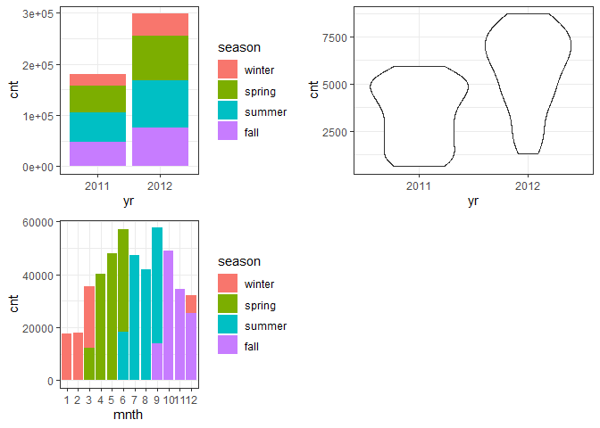

Project 2
================
Ifeoma Ojialor
10/16/2020

## Introduction

In this project, we will use a bike-sharing dataset to create machine
learning models. Before moving forward, I will briefly explain the
bike-sharing system and how it works. A bike-sharing system is a service
in which users can rent/use bicycles on a short term basis for a fee.
The goal of these programs is to provide affordable access to bicycles
for short distance trips as opposed to walking or taking public
transportation. Imagine how many people use these systems on a given
day, the numbers can vary greatly based on some elements. The goal of
this project is to build a predictive model to find out the number of
people that use these bikes in a given time period using available
information about that time/day. This in turn, can help businesses that
oversee this systems to manage them in a cost efficient manner.  
We will be using the bike-sharing dataset from the UCL Machine Learning
Repository. We will use the regression and boosted tree method to model
the response variable `cnt`.

## Exploratory Data Analysis

First we will read in the data using a relative path.

``` r
#read in data and filter to desired weekday
day1 <- read.csv("Bike-Sharing-Dataset/day.csv")
head(day1,5)
```

    ##   instant     dteday season yr mnth holiday
    ## 1       1 2011-01-01      1  0    1       0
    ## 2       2 2011-01-02      1  0    1       0
    ## 3       3 2011-01-03      1  0    1       0
    ## 4       4 2011-01-04      1  0    1       0
    ## 5       5 2011-01-05      1  0    1       0
    ##   weekday workingday weathersit     temp
    ## 1       6          0          2 0.344167
    ## 2       0          0          2 0.363478
    ## 3       1          1          1 0.196364
    ## 4       2          1          1 0.200000
    ## 5       3          1          1 0.226957
    ##      atemp      hum windspeed casual registered
    ## 1 0.363625 0.805833  0.160446    331        654
    ## 2 0.353739 0.696087  0.248539    131        670
    ## 3 0.189405 0.437273  0.248309    120       1229
    ## 4 0.212122 0.590435  0.160296    108       1454
    ## 5 0.229270 0.436957  0.186900     82       1518
    ##    cnt
    ## 1  985
    ## 2  801
    ## 3 1349
    ## 4 1562
    ## 5 1600

Next, we will remove the *casual* and *registered* variables since the
`cnt` variable is a combination of both.

``` r
day1 <- select(day1, -casual, -registered) 
day1$weekday <- as.factor(day1$weekday)
levels(day1$weekday) <- c("Sunday", "Monday", "Tuesday", "Wednesday", "Thursday", "Friday", "Saturday")
day <- filter(day1, weekday == params$days)

#Check for missing values
miss <- data.frame(apply(day,2,function(x){sum(is.na(x))}))
names(miss)[1] <- "missing"
miss
```

    ##            missing
    ## instant          0
    ## dteday           0
    ## season           0
    ## yr               0
    ## mnth             0
    ## holiday          0
    ## weekday          0
    ## workingday       0
    ## weathersit       0
    ## temp             0
    ## atemp            0
    ## hum              0
    ## windspeed        0
    ## cnt              0

There are no missing values in the dataset, so we can continue with our
analysis.

``` r
#Change the variables into their appropriate format.
day$season <- as.factor(day$season)
day$weathersit <- as.factor(day$weathersit)
day$holiday <- as.factor(day$holiday)
day$workingday <- as.factor(day$workingday)
day$yr <- as.factor(day$yr)
day$mnth <- as.factor(day$mnth)

levels(day$season) <- c("winter", "spring", "summer", "fall")
levels(day$yr) <- c("2011", "2012")
str(day)
```

    ## 'data.frame':    105 obs. of  14 variables:
    ##  $ instant   : int  1 8 15 22 29 36 43 50 57 64 ...
    ##  $ dteday    : chr  "2011-01-01" "2011-01-08" "2011-01-15" "2011-01-22" ...
    ##  $ season    : Factor w/ 4 levels "winter","spring",..: 1 1 1 1 1 1 1 1 1 1 ...
    ##  $ yr        : Factor w/ 2 levels "2011","2012": 1 1 1 1 1 1 1 1 1 1 ...
    ##  $ mnth      : Factor w/ 12 levels "1","2","3","4",..: 1 1 1 1 1 2 2 2 2 3 ...
    ##  $ holiday   : Factor w/ 1 level "0": 1 1 1 1 1 1 1 1 1 1 ...
    ##  $ weekday   : Factor w/ 7 levels "Sunday","Monday",..: 7 7 7 7 7 7 7 7 7 7 ...
    ##  $ workingday: Factor w/ 1 level "0": 1 1 1 1 1 1 1 1 1 1 ...
    ##  $ weathersit: Factor w/ 3 levels "1","2","3": 2 2 2 1 1 2 1 1 1 2 ...
    ##  $ temp      : num  0.3442 0.165 0.2333 0.0591 0.1965 ...
    ##  $ atemp     : num  0.3636 0.1623 0.2481 0.0791 0.2121 ...
    ##  $ hum       : num  0.806 0.536 0.499 0.4 0.652 ...
    ##  $ windspeed : num  0.16 0.267 0.158 0.172 0.145 ...
    ##  $ cnt       : int  985 959 1248 981 1098 1005 1472 1635 1969 2077 ...

### Univariate Analysis

The `cnt` is the response variable, so we’ll use a histogram to get a
visual understanding of the variable.

``` r
ggplot(day, aes(x = cnt)) + theme_bw() + geom_histogram(aes(y =..density..), color = "black", fill = "white", binwidth = 1000) + geom_density(alpha = 0.2, fill = "blue") + labs(title = "Count Density", x = "Count", y = "Density")
```

<!-- -->

``` r
summary(day$cnt)
```

    ##    Min. 1st Qu.  Median    Mean 3rd Qu.    Max. 
    ##     627    2732    4521    4551    6140    8714

From the histogram and summary statistics output, it is pretty evident
that the count of total rental bikes are in the sub 5000 range. We will
investigate if there is a relationship between the response variable and
other relevant predictor variables in the next section. Lets look at the
other variables individually.

``` r
#visualize numeric predictor variables using a histogram
p1 <- ggplot(day) + geom_histogram(aes(x = temp), fill = "red", binwidth = 0.03)
p2 <- ggplot(day) + geom_histogram(aes(x = atemp), fill = "red", binwidth = 0.03)
p3 <- ggplot(day) + geom_histogram(aes(x = hum), fill = "red", binwidth = 0.025)
p4 <- ggplot(day) + geom_histogram(aes(x = windspeed), fill = "red", binwidth = 0.03)
gridExtra::grid.arrange(p1,p2,p3,p4, nrow = 2)
```

<!-- -->

Observations:  
\* No clear cut pattern in `temp`and `atemp`.

  - `hum` appears to be skewed to the left when the dataset is not
    filtered to a specific weekday.

  - `windspeed` appears to be skewed(right). This variable should be
    transformed to curb its skewness.

  - The distribution of `temp` and `atemp` looks very similar. We should
    think about taking out one of the variables.

<!-- end list -->

``` r
#visualize categorical predictor variables
h1 <- ggplot(day) + geom_bar(aes(x = season),fill = "pink")
h2 <- ggplot(day) + geom_bar(aes(x = yr),fill = "pink")
h3 <- ggplot(day) + geom_bar(aes(x = holiday),fill = "pink")
h4 <- ggplot(day) + geom_bar(aes(x = workingday),fill = "pink")
h5 <- ggplot(day) + geom_bar(aes(x = mnth),fill = "pink")
h6 <- ggplot(day) + geom_bar(aes(x = weathersit),fill = "pink")
gridExtra::grid.arrange(h1,h2,h3,h4,h5,h6, nrow = 3)
```

<!-- -->

Observations:  
\* The variation between the four seasons is little to none.

  - About the same number of people rode bikes in 2011 and 2012.

  - Many people rode bikes on days that are not holidays.

  - Most people used the bike-sharing system on days that were neither
    weekends nor holidays.

  - Most people used the bike sharing system on days with clear weather.

### Bi-variate Analysis

In this section, we will explore the predictor variables with respect to
the response variable. The objective is to discover hidden relationships
between the independent and response variables and use those findings in
the model building process.

``` r
# First, we will explore the relationship between the target and numerical variables.
p1 <- ggplot(day) +geom_point(aes(x = temp, y = cnt), colour = "violet") + labs(title = "Normalized Temperature vs Total Rental Bikes")
p2 <- ggplot(day) +geom_point(aes(x = atemp, y = cnt), colour = "#FF99CC") +labs(title = "Normalized Feeling Temperature vs Total Rental Bikes")
p3 <- ggplot(day) +geom_point(aes(x = hum, y = cnt), colour = "pink") + labs(title = "Normalized Humidity vs Total rental Bikes")
p4 <- ggplot(day) +geom_point(aes(x = windspeed, y = cnt), colour = "#FF66CC") +labs(title= "Normalized Windspeed vs Total rental Bikes")
gridExtra::grid.arrange(p1, p2, p3, p4, nrow = 2)
```

<!-- -->

Observations:  
\* There appears to be a positive linear relationship between `cnt` ,
`temp`, and `atemp`.

  - There is also a weak relationship between `cnt`, `hum`, and
    `windspeed`.

<!-- end list -->

``` r
# Now we'll visualize the relationship between the target and categorical variables.
# Instead of using a boxplot, I will use a violin plot which is the blend of both a boxplot and density plot
g1 <- ggplot(day) + geom_col(aes(x = yr, y = cnt, fill = season))+theme_bw()
g2 <- ggplot(day) + geom_violin(aes(x = yr, y = cnt))+theme_bw()
g3 <- ggplot(day) + geom_col(aes(x = mnth, y = cnt, fill = season))+theme_bw() 
g4 <- ggplot(day) + geom_col(aes(x = holiday, y = cnt, fill = season)) + theme_bw() 
g6 <- ggplot(day) + geom_col(aes(x = workingday, y = cnt, fill = season))
g7 <- ggplot(day) + geom_col(aes(x = weathersit, y = cnt, fill = season))
gridExtra::grid.arrange(g1, g2, g3, nrow = 2)
```

<!-- -->

``` r
gridExtra::grid.arrange(g4, g6, g7, nrow = 2)
```

<!-- --> Observations:  
\* The total bike rental count is higher in 2012 than 2011.

  - During workingday, the bike rental counts quite the highest compared
    to during no working day for different seasons.

  - During clear,partly cloudy weather, the bike rental count is highest
    and the second highest is during mist cloudy weather and followed by
    third highest during light snow and light rain weather.

  - The highest bike rental count was during the summer and lowest in
    the winter.

## Correlation Matrix

Correlation matrix helps us to understand the linear relationship
between variables.

``` r
day_c <- day[ , c(10:14)]
round(cor(day_c), 2)
```

    ##            temp atemp   hum windspeed   cnt
    ## temp       1.00  1.00  0.07     -0.16  0.63
    ## atemp      1.00  1.00  0.09     -0.18  0.64
    ## hum        0.07  0.09  1.00     -0.21 -0.11
    ## windspeed -0.16 -0.18 -0.21      1.00 -0.28
    ## cnt        0.63  0.64 -0.11     -0.28  1.00

From the above matrix, we can see that `temp` and `atemp` are highly
correlated. So we only need to include one of these variables in the
model to prevent multicollinearity. We will also transform the humidity
and windspeed variable.

``` r
day <- mutate(day, log_hum = log(day$hum+1))
day <- mutate(day, log_ws = log(day$windspeed + 1))

#Remove irrelevant variables
day <- select(day, -weekday,-holiday,-workingday,-dteday,-temp, -instant)
```

## Model Building

First we split the data into train and test sets.

``` r
set.seed(23)
dayIndex<- createDataPartition(day$cnt, p = 0.7, list=FALSE)
dayTrain <- day[dayIndex, ]
dayTest <- day[-dayIndex, ]

# Build a tree-based model using loocv;
fitTree <- train(cnt~ ., data = dayTrain, method = "rpart", 
              preProcess = c("center", "scale"), 
              trControl = trainControl(method = "loocv", number = 10), tuneGrid = data.frame(cp = 0.01:0.10))
```

    ## Warning in preProcess.default(thresh = 0.95,
    ## k = 5, freqCut = 19, uniqueCut = 10, : These
    ## variables have zero variances: weathersit3

    ## Warning in preProcess.default(thresh = 0.95,
    ## k = 5, freqCut = 19, uniqueCut = 10, : These
    ## variables have zero variances: weathersit3

    ## Warning in preProcess.default(thresh = 0.95,
    ## k = 5, freqCut = 19, uniqueCut = 10, : These
    ## variables have zero variances: weathersit3

    ## Warning in preProcess.default(thresh = 0.95,
    ## k = 5, freqCut = 19, uniqueCut = 10, : These
    ## variables have zero variances: weathersit3

    ## Warning in preProcess.default(thresh = 0.95,
    ## k = 5, freqCut = 19, uniqueCut = 10, : These
    ## variables have zero variances: weathersit3

    ## Warning in preProcess.default(thresh = 0.95,
    ## k = 5, freqCut = 19, uniqueCut = 10, : These
    ## variables have zero variances: weathersit3

    ## Warning in preProcess.default(thresh = 0.95,
    ## k = 5, freqCut = 19, uniqueCut = 10, : These
    ## variables have zero variances: weathersit3

    ## Warning in preProcess.default(thresh = 0.95,
    ## k = 5, freqCut = 19, uniqueCut = 10, : These
    ## variables have zero variances: weathersit3

    ## Warning in preProcess.default(thresh = 0.95,
    ## k = 5, freqCut = 19, uniqueCut = 10, : These
    ## variables have zero variances: weathersit3

    ## Warning in preProcess.default(thresh = 0.95,
    ## k = 5, freqCut = 19, uniqueCut = 10, : These
    ## variables have zero variances: weathersit3

    ## Warning in preProcess.default(thresh = 0.95,
    ## k = 5, freqCut = 19, uniqueCut = 10, : These
    ## variables have zero variances: weathersit3

    ## Warning in preProcess.default(thresh = 0.95,
    ## k = 5, freqCut = 19, uniqueCut = 10, : These
    ## variables have zero variances: weathersit3

    ## Warning in preProcess.default(thresh = 0.95,
    ## k = 5, freqCut = 19, uniqueCut = 10, : These
    ## variables have zero variances: weathersit3

    ## Warning in preProcess.default(thresh = 0.95,
    ## k = 5, freqCut = 19, uniqueCut = 10, : These
    ## variables have zero variances: weathersit3

    ## Warning in preProcess.default(thresh = 0.95,
    ## k = 5, freqCut = 19, uniqueCut = 10, : These
    ## variables have zero variances: weathersit3

    ## Warning in preProcess.default(thresh = 0.95,
    ## k = 5, freqCut = 19, uniqueCut = 10, : These
    ## variables have zero variances: weathersit3

    ## Warning in preProcess.default(thresh = 0.95,
    ## k = 5, freqCut = 19, uniqueCut = 10, : These
    ## variables have zero variances: weathersit3

    ## Warning in preProcess.default(thresh = 0.95,
    ## k = 5, freqCut = 19, uniqueCut = 10, : These
    ## variables have zero variances: weathersit3

    ## Warning in preProcess.default(thresh = 0.95,
    ## k = 5, freqCut = 19, uniqueCut = 10, : These
    ## variables have zero variances: weathersit3

    ## Warning in preProcess.default(thresh = 0.95,
    ## k = 5, freqCut = 19, uniqueCut = 10, : These
    ## variables have zero variances: weathersit3

    ## Warning in preProcess.default(thresh = 0.95,
    ## k = 5, freqCut = 19, uniqueCut = 10, : These
    ## variables have zero variances: weathersit3

    ## Warning in preProcess.default(thresh = 0.95,
    ## k = 5, freqCut = 19, uniqueCut = 10, : These
    ## variables have zero variances: weathersit3

    ## Warning in preProcess.default(thresh = 0.95,
    ## k = 5, freqCut = 19, uniqueCut = 10, : These
    ## variables have zero variances: weathersit3

    ## Warning in preProcess.default(thresh = 0.95,
    ## k = 5, freqCut = 19, uniqueCut = 10, : These
    ## variables have zero variances: weathersit3

    ## Warning in preProcess.default(thresh = 0.95,
    ## k = 5, freqCut = 19, uniqueCut = 10, : These
    ## variables have zero variances: weathersit3

    ## Warning in preProcess.default(thresh = 0.95,
    ## k = 5, freqCut = 19, uniqueCut = 10, : These
    ## variables have zero variances: weathersit3

    ## Warning in preProcess.default(thresh = 0.95,
    ## k = 5, freqCut = 19, uniqueCut = 10, : These
    ## variables have zero variances: weathersit3

    ## Warning in preProcess.default(thresh = 0.95,
    ## k = 5, freqCut = 19, uniqueCut = 10, : These
    ## variables have zero variances: weathersit3

    ## Warning in preProcess.default(thresh = 0.95,
    ## k = 5, freqCut = 19, uniqueCut = 10, : These
    ## variables have zero variances: weathersit3

    ## Warning in preProcess.default(thresh = 0.95,
    ## k = 5, freqCut = 19, uniqueCut = 10, : These
    ## variables have zero variances: weathersit3

    ## Warning in preProcess.default(thresh = 0.95,
    ## k = 5, freqCut = 19, uniqueCut = 10, : These
    ## variables have zero variances: weathersit3

    ## Warning in preProcess.default(thresh = 0.95,
    ## k = 5, freqCut = 19, uniqueCut = 10, : These
    ## variables have zero variances: weathersit3

    ## Warning in preProcess.default(thresh = 0.95,
    ## k = 5, freqCut = 19, uniqueCut = 10, : These
    ## variables have zero variances: weathersit3

    ## Warning in preProcess.default(thresh = 0.95,
    ## k = 5, freqCut = 19, uniqueCut = 10, : These
    ## variables have zero variances: weathersit3

    ## Warning in preProcess.default(thresh = 0.95,
    ## k = 5, freqCut = 19, uniqueCut = 10, : These
    ## variables have zero variances: weathersit3

    ## Warning in preProcess.default(thresh = 0.95,
    ## k = 5, freqCut = 19, uniqueCut = 10, : These
    ## variables have zero variances: weathersit3

    ## Warning in preProcess.default(thresh = 0.95,
    ## k = 5, freqCut = 19, uniqueCut = 10, : These
    ## variables have zero variances: weathersit3

    ## Warning in preProcess.default(thresh = 0.95,
    ## k = 5, freqCut = 19, uniqueCut = 10, : These
    ## variables have zero variances: weathersit3

    ## Warning in preProcess.default(thresh = 0.95,
    ## k = 5, freqCut = 19, uniqueCut = 10, : These
    ## variables have zero variances: weathersit3

    ## Warning in preProcess.default(thresh = 0.95,
    ## k = 5, freqCut = 19, uniqueCut = 10, : These
    ## variables have zero variances: weathersit3

    ## Warning in preProcess.default(thresh = 0.95,
    ## k = 5, freqCut = 19, uniqueCut = 10, : These
    ## variables have zero variances: weathersit3

    ## Warning in preProcess.default(thresh = 0.95,
    ## k = 5, freqCut = 19, uniqueCut = 10, : These
    ## variables have zero variances: weathersit3

    ## Warning in preProcess.default(thresh = 0.95,
    ## k = 5, freqCut = 19, uniqueCut = 10, : These
    ## variables have zero variances: weathersit3

    ## Warning in preProcess.default(thresh = 0.95,
    ## k = 5, freqCut = 19, uniqueCut = 10, : These
    ## variables have zero variances: weathersit3

    ## Warning in preProcess.default(thresh = 0.95,
    ## k = 5, freqCut = 19, uniqueCut = 10, : These
    ## variables have zero variances: weathersit3

    ## Warning in preProcess.default(thresh = 0.95,
    ## k = 5, freqCut = 19, uniqueCut = 10, : These
    ## variables have zero variances: weathersit3

    ## Warning in preProcess.default(thresh = 0.95,
    ## k = 5, freqCut = 19, uniqueCut = 10, : These
    ## variables have zero variances: weathersit3

    ## Warning in preProcess.default(thresh = 0.95,
    ## k = 5, freqCut = 19, uniqueCut = 10, : These
    ## variables have zero variances: weathersit3

    ## Warning in preProcess.default(thresh = 0.95,
    ## k = 5, freqCut = 19, uniqueCut = 10, : These
    ## variables have zero variances: weathersit3

    ## Warning in preProcess.default(thresh = 0.95,
    ## k = 5, freqCut = 19, uniqueCut = 10, : These
    ## variables have zero variances: weathersit3

    ## Warning in preProcess.default(thresh = 0.95,
    ## k = 5, freqCut = 19, uniqueCut = 10, : These
    ## variables have zero variances: weathersit3

    ## Warning in preProcess.default(thresh = 0.95,
    ## k = 5, freqCut = 19, uniqueCut = 10, : These
    ## variables have zero variances: weathersit3

    ## Warning in preProcess.default(thresh = 0.95,
    ## k = 5, freqCut = 19, uniqueCut = 10, : These
    ## variables have zero variances: weathersit3

    ## Warning in preProcess.default(thresh = 0.95,
    ## k = 5, freqCut = 19, uniqueCut = 10, : These
    ## variables have zero variances: weathersit3

    ## Warning in preProcess.default(thresh = 0.95,
    ## k = 5, freqCut = 19, uniqueCut = 10, : These
    ## variables have zero variances: weathersit3

    ## Warning in preProcess.default(thresh = 0.95,
    ## k = 5, freqCut = 19, uniqueCut = 10, : These
    ## variables have zero variances: weathersit3

    ## Warning in preProcess.default(thresh = 0.95,
    ## k = 5, freqCut = 19, uniqueCut = 10, : These
    ## variables have zero variances: weathersit3

    ## Warning in preProcess.default(thresh = 0.95,
    ## k = 5, freqCut = 19, uniqueCut = 10, : These
    ## variables have zero variances: weathersit3

    ## Warning in preProcess.default(thresh = 0.95,
    ## k = 5, freqCut = 19, uniqueCut = 10, : These
    ## variables have zero variances: weathersit3

    ## Warning in preProcess.default(thresh = 0.95,
    ## k = 5, freqCut = 19, uniqueCut = 10, : These
    ## variables have zero variances: weathersit3

    ## Warning in preProcess.default(thresh = 0.95,
    ## k = 5, freqCut = 19, uniqueCut = 10, : These
    ## variables have zero variances: weathersit3

    ## Warning in preProcess.default(thresh = 0.95,
    ## k = 5, freqCut = 19, uniqueCut = 10, : These
    ## variables have zero variances: weathersit3

    ## Warning in preProcess.default(thresh = 0.95,
    ## k = 5, freqCut = 19, uniqueCut = 10, : These
    ## variables have zero variances: weathersit3

    ## Warning in preProcess.default(thresh = 0.95,
    ## k = 5, freqCut = 19, uniqueCut = 10, : These
    ## variables have zero variances: weathersit3

    ## Warning in preProcess.default(thresh = 0.95,
    ## k = 5, freqCut = 19, uniqueCut = 10, : These
    ## variables have zero variances: weathersit3

    ## Warning in preProcess.default(thresh = 0.95,
    ## k = 5, freqCut = 19, uniqueCut = 10, : These
    ## variables have zero variances: weathersit3

    ## Warning in preProcess.default(thresh = 0.95,
    ## k = 5, freqCut = 19, uniqueCut = 10, : These
    ## variables have zero variances: weathersit3

    ## Warning in preProcess.default(thresh = 0.95,
    ## k = 5, freqCut = 19, uniqueCut = 10, : These
    ## variables have zero variances: weathersit3

    ## Warning in preProcess.default(thresh = 0.95,
    ## k = 5, freqCut = 19, uniqueCut = 10, : These
    ## variables have zero variances: weathersit3

    ## Warning in preProcess.default(thresh = 0.95,
    ## k = 5, freqCut = 19, uniqueCut = 10, : These
    ## variables have zero variances: weathersit3

    ## Warning in preProcess.default(thresh = 0.95,
    ## k = 5, freqCut = 19, uniqueCut = 10, : These
    ## variables have zero variances: weathersit3

    ## Warning in preProcess.default(thresh = 0.95,
    ## k = 5, freqCut = 19, uniqueCut = 10, : These
    ## variables have zero variances: weathersit3

    ## Warning in preProcess.default(thresh = 0.95,
    ## k = 5, freqCut = 19, uniqueCut = 10, : These
    ## variables have zero variances: weathersit3

    ## Warning in preProcess.default(thresh = 0.95,
    ## k = 5, freqCut = 19, uniqueCut = 10, : These
    ## variables have zero variances: weathersit3

    ## Warning in preProcess.default(thresh = 0.95,
    ## k = 5, freqCut = 19, uniqueCut = 10, : These
    ## variables have zero variances: weathersit3

    ## Warning in preProcess.default(thresh = 0.95,
    ## k = 5, freqCut = 19, uniqueCut = 10, : These
    ## variables have zero variances: weathersit3

    ## Warning in nominalTrainWorkflow(x = x, y =
    ## y, wts = weights, info = trainInfo, : There
    ## were missing values in resampled performance
    ## measures.

    ## Warning in preProcess.default(thresh = 0.95,
    ## k = 5, freqCut = 19, uniqueCut = 10, : These
    ## variables have zero variances: weathersit3

``` r
# Build a boosted tree model using cv
fitBoost <- train(cnt~., data = dayTrain, method = "gbm", 
              preProcess = c("center", "scale"), 
              trControl = trainControl(method = "cv", number = 10), 
              tuneGrid = expand.grid(n.trees=c(10,20,50,100,500,1000),shrinkage=c(0.01,0.05,0.1,0.5),n.minobsinnode =c(3,5,10),interaction.depth=c(1,5,10)))
```

    ## Warning in preProcess.default(thresh = 0.95,
    ## k = 5, freqCut = 19, uniqueCut = 10, : These
    ## variables have zero variances: weathersit3

    ## Warning in (function (x, y, offset = NULL, misc
    ## = NULL, distribution = "bernoulli", : variable
    ## 17: weathersit3 has no variation.

    ## Warning in preProcess.default(thresh = 0.95,
    ## k = 5, freqCut = 19, uniqueCut = 10, : These
    ## variables have zero variances: weathersit3

    ## Warning in (function (x, y, offset = NULL, misc
    ## = NULL, distribution = "bernoulli", : variable
    ## 17: weathersit3 has no variation.

    ## Warning in preProcess.default(thresh = 0.95,
    ## k = 5, freqCut = 19, uniqueCut = 10, : These
    ## variables have zero variances: weathersit3

    ## Warning in (function (x, y, offset = NULL, misc
    ## = NULL, distribution = "bernoulli", : variable
    ## 17: weathersit3 has no variation.

    ## Warning in preProcess.default(thresh = 0.95,
    ## k = 5, freqCut = 19, uniqueCut = 10, : These
    ## variables have zero variances: weathersit3

    ## Warning in (function (x, y, offset = NULL, misc
    ## = NULL, distribution = "bernoulli", : variable
    ## 17: weathersit3 has no variation.

    ## Warning in preProcess.default(thresh = 0.95,
    ## k = 5, freqCut = 19, uniqueCut = 10, : These
    ## variables have zero variances: weathersit3

    ## Warning in (function (x, y, offset = NULL, misc
    ## = NULL, distribution = "bernoulli", : variable
    ## 17: weathersit3 has no variation.

    ## Warning in preProcess.default(thresh = 0.95,
    ## k = 5, freqCut = 19, uniqueCut = 10, : These
    ## variables have zero variances: weathersit3

    ## Warning in (function (x, y, offset = NULL, misc
    ## = NULL, distribution = "bernoulli", : variable
    ## 17: weathersit3 has no variation.

    ## Warning in preProcess.default(thresh = 0.95,
    ## k = 5, freqCut = 19, uniqueCut = 10, : These
    ## variables have zero variances: weathersit3

    ## Warning in (function (x, y, offset = NULL, misc
    ## = NULL, distribution = "bernoulli", : variable
    ## 17: weathersit3 has no variation.

    ## Warning in preProcess.default(thresh = 0.95,
    ## k = 5, freqCut = 19, uniqueCut = 10, : These
    ## variables have zero variances: weathersit3

    ## Warning in (function (x, y, offset = NULL, misc
    ## = NULL, distribution = "bernoulli", : variable
    ## 17: weathersit3 has no variation.

    ## Warning in preProcess.default(thresh = 0.95,
    ## k = 5, freqCut = 19, uniqueCut = 10, : These
    ## variables have zero variances: weathersit3

    ## Warning in (function (x, y, offset = NULL, misc
    ## = NULL, distribution = "bernoulli", : variable
    ## 17: weathersit3 has no variation.

    ## Warning in preProcess.default(thresh = 0.95,
    ## k = 5, freqCut = 19, uniqueCut = 10, : These
    ## variables have zero variances: weathersit3

    ## Warning in (function (x, y, offset = NULL, misc
    ## = NULL, distribution = "bernoulli", : variable
    ## 17: weathersit3 has no variation.

    ## Warning in preProcess.default(thresh = 0.95,
    ## k = 5, freqCut = 19, uniqueCut = 10, : These
    ## variables have zero variances: weathersit3

    ## Warning in (function (x, y, offset = NULL, misc
    ## = NULL, distribution = "bernoulli", : variable
    ## 17: weathersit3 has no variation.

    ## Warning in preProcess.default(thresh = 0.95,
    ## k = 5, freqCut = 19, uniqueCut = 10, : These
    ## variables have zero variances: weathersit3

    ## Warning in (function (x, y, offset = NULL, misc
    ## = NULL, distribution = "bernoulli", : variable
    ## 17: weathersit3 has no variation.

    ## Warning in preProcess.default(thresh = 0.95,
    ## k = 5, freqCut = 19, uniqueCut = 10, : These
    ## variables have zero variances: weathersit3

    ## Warning in (function (x, y, offset = NULL, misc
    ## = NULL, distribution = "bernoulli", : variable
    ## 17: weathersit3 has no variation.

    ## Warning in preProcess.default(thresh = 0.95,
    ## k = 5, freqCut = 19, uniqueCut = 10, : These
    ## variables have zero variances: weathersit3

    ## Warning in (function (x, y, offset = NULL, misc
    ## = NULL, distribution = "bernoulli", : variable
    ## 17: weathersit3 has no variation.

    ## Warning in preProcess.default(thresh = 0.95,
    ## k = 5, freqCut = 19, uniqueCut = 10, : These
    ## variables have zero variances: weathersit3

    ## Warning in (function (x, y, offset = NULL, misc
    ## = NULL, distribution = "bernoulli", : variable
    ## 17: weathersit3 has no variation.

    ## Warning in preProcess.default(thresh = 0.95,
    ## k = 5, freqCut = 19, uniqueCut = 10, : These
    ## variables have zero variances: weathersit3

    ## Warning in (function (x, y, offset = NULL, misc
    ## = NULL, distribution = "bernoulli", : variable
    ## 17: weathersit3 has no variation.

    ## Warning in preProcess.default(thresh = 0.95,
    ## k = 5, freqCut = 19, uniqueCut = 10, : These
    ## variables have zero variances: weathersit3

    ## Warning in (function (x, y, offset = NULL, misc
    ## = NULL, distribution = "bernoulli", : variable
    ## 17: weathersit3 has no variation.

    ## Warning in preProcess.default(thresh = 0.95,
    ## k = 5, freqCut = 19, uniqueCut = 10, : These
    ## variables have zero variances: weathersit3

    ## Warning in (function (x, y, offset = NULL, misc
    ## = NULL, distribution = "bernoulli", : variable
    ## 17: weathersit3 has no variation.

    ## Warning in preProcess.default(thresh = 0.95,
    ## k = 5, freqCut = 19, uniqueCut = 10, : These
    ## variables have zero variances: weathersit3

    ## Warning in (function (x, y, offset = NULL, misc
    ## = NULL, distribution = "bernoulli", : variable
    ## 17: weathersit3 has no variation.

    ## Warning in preProcess.default(thresh = 0.95,
    ## k = 5, freqCut = 19, uniqueCut = 10, : These
    ## variables have zero variances: weathersit3

    ## Warning in (function (x, y, offset = NULL, misc
    ## = NULL, distribution = "bernoulli", : variable
    ## 17: weathersit3 has no variation.

    ## Warning in preProcess.default(thresh = 0.95,
    ## k = 5, freqCut = 19, uniqueCut = 10, : These
    ## variables have zero variances: weathersit3

    ## Warning in (function (x, y, offset = NULL, misc
    ## = NULL, distribution = "bernoulli", : variable
    ## 17: weathersit3 has no variation.

    ## Warning in preProcess.default(thresh = 0.95,
    ## k = 5, freqCut = 19, uniqueCut = 10, : These
    ## variables have zero variances: weathersit3

    ## Warning in (function (x, y, offset = NULL, misc
    ## = NULL, distribution = "bernoulli", : variable
    ## 17: weathersit3 has no variation.

    ## Warning in preProcess.default(thresh = 0.95,
    ## k = 5, freqCut = 19, uniqueCut = 10, : These
    ## variables have zero variances: weathersit3

    ## Warning in (function (x, y, offset = NULL, misc
    ## = NULL, distribution = "bernoulli", : variable
    ## 17: weathersit3 has no variation.

    ## Warning in preProcess.default(thresh = 0.95,
    ## k = 5, freqCut = 19, uniqueCut = 10, : These
    ## variables have zero variances: weathersit3

    ## Warning in (function (x, y, offset = NULL, misc
    ## = NULL, distribution = "bernoulli", : variable
    ## 17: weathersit3 has no variation.

    ## Warning in preProcess.default(thresh = 0.95,
    ## k = 5, freqCut = 19, uniqueCut = 10, : These
    ## variables have zero variances: weathersit3

    ## Warning in (function (x, y, offset = NULL, misc
    ## = NULL, distribution = "bernoulli", : variable
    ## 17: weathersit3 has no variation.

    ## Warning in preProcess.default(thresh = 0.95,
    ## k = 5, freqCut = 19, uniqueCut = 10, : These
    ## variables have zero variances: weathersit3

    ## Warning in (function (x, y, offset = NULL, misc
    ## = NULL, distribution = "bernoulli", : variable
    ## 17: weathersit3 has no variation.

    ## Warning in preProcess.default(thresh = 0.95,
    ## k = 5, freqCut = 19, uniqueCut = 10, : These
    ## variables have zero variances: weathersit3

    ## Warning in (function (x, y, offset = NULL, misc
    ## = NULL, distribution = "bernoulli", : variable
    ## 17: weathersit3 has no variation.

    ## Warning in preProcess.default(thresh = 0.95,
    ## k = 5, freqCut = 19, uniqueCut = 10, : These
    ## variables have zero variances: weathersit3

    ## Warning in (function (x, y, offset = NULL, misc
    ## = NULL, distribution = "bernoulli", : variable
    ## 17: weathersit3 has no variation.

    ## Warning in preProcess.default(thresh = 0.95,
    ## k = 5, freqCut = 19, uniqueCut = 10, : These
    ## variables have zero variances: weathersit3

    ## Warning in (function (x, y, offset = NULL, misc
    ## = NULL, distribution = "bernoulli", : variable
    ## 17: weathersit3 has no variation.

    ## Warning in preProcess.default(thresh = 0.95,
    ## k = 5, freqCut = 19, uniqueCut = 10, : These
    ## variables have zero variances: weathersit3

    ## Warning in (function (x, y, offset = NULL, misc
    ## = NULL, distribution = "bernoulli", : variable
    ## 17: weathersit3 has no variation.

    ## Warning in preProcess.default(thresh = 0.95,
    ## k = 5, freqCut = 19, uniqueCut = 10, : These
    ## variables have zero variances: weathersit3

    ## Warning in (function (x, y, offset = NULL, misc
    ## = NULL, distribution = "bernoulli", : variable
    ## 17: weathersit3 has no variation.

    ## Warning in preProcess.default(thresh = 0.95,
    ## k = 5, freqCut = 19, uniqueCut = 10, : These
    ## variables have zero variances: weathersit3

    ## Warning in (function (x, y, offset = NULL, misc
    ## = NULL, distribution = "bernoulli", : variable
    ## 17: weathersit3 has no variation.

    ## Warning in preProcess.default(thresh = 0.95,
    ## k = 5, freqCut = 19, uniqueCut = 10, : These
    ## variables have zero variances: weathersit3

    ## Warning in (function (x, y, offset = NULL, misc
    ## = NULL, distribution = "bernoulli", : variable
    ## 17: weathersit3 has no variation.

    ## Warning in preProcess.default(thresh = 0.95,
    ## k = 5, freqCut = 19, uniqueCut = 10, : These
    ## variables have zero variances: weathersit3

    ## Warning in (function (x, y, offset = NULL, misc
    ## = NULL, distribution = "bernoulli", : variable
    ## 17: weathersit3 has no variation.

    ## Warning in preProcess.default(thresh = 0.95,
    ## k = 5, freqCut = 19, uniqueCut = 10, : These
    ## variables have zero variances: weathersit3

    ## Warning in (function (x, y, offset = NULL, misc
    ## = NULL, distribution = "bernoulli", : variable
    ## 17: weathersit3 has no variation.

    ## Warning in preProcess.default(thresh = 0.95,
    ## k = 5, freqCut = 19, uniqueCut = 10, : These
    ## variables have zero variances: weathersit3

    ## Warning in (function (x, y, offset = NULL, misc
    ## = NULL, distribution = "bernoulli", : variable
    ## 17: weathersit3 has no variation.

    ## Warning in preProcess.default(thresh = 0.95,
    ## k = 5, freqCut = 19, uniqueCut = 10, : These
    ## variables have zero variances: weathersit3

    ## Warning in (function (x, y, offset = NULL, misc
    ## = NULL, distribution = "bernoulli", : variable
    ## 17: weathersit3 has no variation.

    ## Warning in preProcess.default(thresh = 0.95,
    ## k = 5, freqCut = 19, uniqueCut = 10, : These
    ## variables have zero variances: weathersit3

    ## Warning in (function (x, y, offset = NULL, misc
    ## = NULL, distribution = "bernoulli", : variable
    ## 17: weathersit3 has no variation.

    ## Warning in preProcess.default(thresh = 0.95,
    ## k = 5, freqCut = 19, uniqueCut = 10, : These
    ## variables have zero variances: weathersit3

    ## Warning in (function (x, y, offset = NULL, misc
    ## = NULL, distribution = "bernoulli", : variable
    ## 17: weathersit3 has no variation.

    ## Warning in preProcess.default(thresh = 0.95,
    ## k = 5, freqCut = 19, uniqueCut = 10, : These
    ## variables have zero variances: weathersit3

    ## Warning in (function (x, y, offset = NULL, misc
    ## = NULL, distribution = "bernoulli", : variable
    ## 17: weathersit3 has no variation.

    ## Warning in preProcess.default(thresh = 0.95,
    ## k = 5, freqCut = 19, uniqueCut = 10, : These
    ## variables have zero variances: weathersit3

    ## Warning in (function (x, y, offset = NULL, misc
    ## = NULL, distribution = "bernoulli", : variable
    ## 17: weathersit3 has no variation.

    ## Warning in preProcess.default(thresh = 0.95,
    ## k = 5, freqCut = 19, uniqueCut = 10, : These
    ## variables have zero variances: weathersit3

    ## Warning in (function (x, y, offset = NULL, misc
    ## = NULL, distribution = "bernoulli", : variable
    ## 17: weathersit3 has no variation.

    ## Warning in preProcess.default(thresh = 0.95,
    ## k = 5, freqCut = 19, uniqueCut = 10, : These
    ## variables have zero variances: weathersit3

    ## Warning in (function (x, y, offset = NULL, misc
    ## = NULL, distribution = "bernoulli", : variable
    ## 17: weathersit3 has no variation.

    ## Warning in preProcess.default(thresh = 0.95,
    ## k = 5, freqCut = 19, uniqueCut = 10, : These
    ## variables have zero variances: weathersit3

    ## Warning in (function (x, y, offset = NULL, misc
    ## = NULL, distribution = "bernoulli", : variable
    ## 17: weathersit3 has no variation.

    ## Warning in preProcess.default(thresh = 0.95,
    ## k = 5, freqCut = 19, uniqueCut = 10, : These
    ## variables have zero variances: weathersit3

    ## Warning in (function (x, y, offset = NULL, misc
    ## = NULL, distribution = "bernoulli", : variable
    ## 17: weathersit3 has no variation.

    ## Warning in preProcess.default(thresh = 0.95,
    ## k = 5, freqCut = 19, uniqueCut = 10, : These
    ## variables have zero variances: weathersit3

    ## Warning in (function (x, y, offset = NULL, misc
    ## = NULL, distribution = "bernoulli", : variable
    ## 17: weathersit3 has no variation.

    ## Warning in preProcess.default(thresh = 0.95,
    ## k = 5, freqCut = 19, uniqueCut = 10, : These
    ## variables have zero variances: weathersit3

    ## Warning in (function (x, y, offset = NULL, misc
    ## = NULL, distribution = "bernoulli", : variable
    ## 17: weathersit3 has no variation.

    ## Warning in preProcess.default(thresh = 0.95,
    ## k = 5, freqCut = 19, uniqueCut = 10, : These
    ## variables have zero variances: weathersit3

    ## Warning in (function (x, y, offset = NULL, misc
    ## = NULL, distribution = "bernoulli", : variable
    ## 17: weathersit3 has no variation.

    ## Warning in preProcess.default(thresh = 0.95,
    ## k = 5, freqCut = 19, uniqueCut = 10, : These
    ## variables have zero variances: weathersit3

    ## Warning in (function (x, y, offset = NULL, misc
    ## = NULL, distribution = "bernoulli", : variable
    ## 17: weathersit3 has no variation.

    ## Warning in preProcess.default(thresh = 0.95,
    ## k = 5, freqCut = 19, uniqueCut = 10, : These
    ## variables have zero variances: weathersit3

    ## Warning in (function (x, y, offset = NULL, misc
    ## = NULL, distribution = "bernoulli", : variable
    ## 17: weathersit3 has no variation.

    ## Warning in preProcess.default(thresh = 0.95,
    ## k = 5, freqCut = 19, uniqueCut = 10, : These
    ## variables have zero variances: weathersit3

    ## Warning in (function (x, y, offset = NULL, misc
    ## = NULL, distribution = "bernoulli", : variable
    ## 17: weathersit3 has no variation.

    ## Warning in preProcess.default(thresh = 0.95,
    ## k = 5, freqCut = 19, uniqueCut = 10, : These
    ## variables have zero variances: weathersit3

    ## Warning in (function (x, y, offset = NULL, misc
    ## = NULL, distribution = "bernoulli", : variable
    ## 17: weathersit3 has no variation.

    ## Warning in preProcess.default(thresh = 0.95,
    ## k = 5, freqCut = 19, uniqueCut = 10, : These
    ## variables have zero variances: weathersit3

    ## Warning in (function (x, y, offset = NULL, misc
    ## = NULL, distribution = "bernoulli", : variable
    ## 17: weathersit3 has no variation.

    ## Warning in preProcess.default(thresh = 0.95,
    ## k = 5, freqCut = 19, uniqueCut = 10, : These
    ## variables have zero variances: weathersit3

    ## Warning in (function (x, y, offset = NULL, misc
    ## = NULL, distribution = "bernoulli", : variable
    ## 17: weathersit3 has no variation.

    ## Warning in preProcess.default(thresh = 0.95,
    ## k = 5, freqCut = 19, uniqueCut = 10, : These
    ## variables have zero variances: weathersit3

    ## Warning in (function (x, y, offset = NULL, misc
    ## = NULL, distribution = "bernoulli", : variable
    ## 17: weathersit3 has no variation.

    ## Warning in preProcess.default(thresh = 0.95,
    ## k = 5, freqCut = 19, uniqueCut = 10, : These
    ## variables have zero variances: weathersit3

    ## Warning in (function (x, y, offset = NULL, misc
    ## = NULL, distribution = "bernoulli", : variable
    ## 17: weathersit3 has no variation.

    ## Warning in preProcess.default(thresh = 0.95,
    ## k = 5, freqCut = 19, uniqueCut = 10, : These
    ## variables have zero variances: weathersit3

    ## Warning in (function (x, y, offset = NULL, misc
    ## = NULL, distribution = "bernoulli", : variable
    ## 17: weathersit3 has no variation.

    ## Warning in preProcess.default(thresh = 0.95,
    ## k = 5, freqCut = 19, uniqueCut = 10, : These
    ## variables have zero variances: weathersit3

    ## Warning in (function (x, y, offset = NULL, misc
    ## = NULL, distribution = "bernoulli", : variable
    ## 17: weathersit3 has no variation.

    ## Warning in preProcess.default(thresh = 0.95,
    ## k = 5, freqCut = 19, uniqueCut = 10, : These
    ## variables have zero variances: weathersit3

    ## Warning in (function (x, y, offset = NULL, misc
    ## = NULL, distribution = "bernoulli", : variable
    ## 17: weathersit3 has no variation.

    ## Warning in preProcess.default(thresh = 0.95,
    ## k = 5, freqCut = 19, uniqueCut = 10, : These
    ## variables have zero variances: weathersit3

    ## Warning in (function (x, y, offset = NULL, misc
    ## = NULL, distribution = "bernoulli", : variable
    ## 17: weathersit3 has no variation.

    ## Warning in preProcess.default(thresh = 0.95,
    ## k = 5, freqCut = 19, uniqueCut = 10, : These
    ## variables have zero variances: weathersit3

    ## Warning in (function (x, y, offset = NULL, misc
    ## = NULL, distribution = "bernoulli", : variable
    ## 17: weathersit3 has no variation.

    ## Warning in preProcess.default(thresh = 0.95,
    ## k = 5, freqCut = 19, uniqueCut = 10, : These
    ## variables have zero variances: weathersit3

    ## Warning in (function (x, y, offset = NULL, misc
    ## = NULL, distribution = "bernoulli", : variable
    ## 17: weathersit3 has no variation.

    ## Warning in preProcess.default(thresh = 0.95,
    ## k = 5, freqCut = 19, uniqueCut = 10, : These
    ## variables have zero variances: weathersit3

    ## Warning in (function (x, y, offset = NULL, misc
    ## = NULL, distribution = "bernoulli", : variable
    ## 17: weathersit3 has no variation.

    ## Warning in preProcess.default(thresh = 0.95,
    ## k = 5, freqCut = 19, uniqueCut = 10, : These
    ## variables have zero variances: weathersit3

    ## Warning in (function (x, y, offset = NULL, misc
    ## = NULL, distribution = "bernoulli", : variable
    ## 17: weathersit3 has no variation.

    ## Warning in preProcess.default(thresh = 0.95,
    ## k = 5, freqCut = 19, uniqueCut = 10, : These
    ## variables have zero variances: weathersit3

    ## Warning in (function (x, y, offset = NULL, misc
    ## = NULL, distribution = "bernoulli", : variable
    ## 17: weathersit3 has no variation.

    ## Warning in preProcess.default(thresh = 0.95,
    ## k = 5, freqCut = 19, uniqueCut = 10, : These
    ## variables have zero variances: weathersit3

    ## Warning in (function (x, y, offset = NULL, misc
    ## = NULL, distribution = "bernoulli", : variable
    ## 17: weathersit3 has no variation.

    ## Warning in preProcess.default(thresh = 0.95,
    ## k = 5, freqCut = 19, uniqueCut = 10, : These
    ## variables have zero variances: weathersit3

    ## Warning in (function (x, y, offset = NULL, misc
    ## = NULL, distribution = "bernoulli", : variable
    ## 17: weathersit3 has no variation.

    ## Warning in preProcess.default(thresh = 0.95,
    ## k = 5, freqCut = 19, uniqueCut = 10, : These
    ## variables have zero variances: weathersit3

    ## Warning in (function (x, y, offset = NULL, misc
    ## = NULL, distribution = "bernoulli", : variable
    ## 17: weathersit3 has no variation.

    ## Warning in preProcess.default(thresh = 0.95,
    ## k = 5, freqCut = 19, uniqueCut = 10, : These
    ## variables have zero variances: weathersit3

    ## Warning in (function (x, y, offset = NULL, misc
    ## = NULL, distribution = "bernoulli", : variable
    ## 17: weathersit3 has no variation.

    ## Warning in preProcess.default(thresh = 0.95,
    ## k = 5, freqCut = 19, uniqueCut = 10, : These
    ## variables have zero variances: weathersit3

    ## Warning in (function (x, y, offset = NULL, misc
    ## = NULL, distribution = "bernoulli", : variable
    ## 17: weathersit3 has no variation.

    ## Warning in preProcess.default(thresh = 0.95,
    ## k = 5, freqCut = 19, uniqueCut = 10, : These
    ## variables have zero variances: weathersit3

    ## Warning in (function (x, y, offset = NULL, misc
    ## = NULL, distribution = "bernoulli", : variable
    ## 17: weathersit3 has no variation.

    ## Warning in preProcess.default(thresh = 0.95,
    ## k = 5, freqCut = 19, uniqueCut = 10, : These
    ## variables have zero variances: weathersit3

    ## Warning in (function (x, y, offset = NULL, misc
    ## = NULL, distribution = "bernoulli", : variable
    ## 17: weathersit3 has no variation.

    ## Warning in preProcess.default(thresh = 0.95,
    ## k = 5, freqCut = 19, uniqueCut = 10, : These
    ## variables have zero variances: weathersit3

    ## Warning in (function (x, y, offset = NULL, misc
    ## = NULL, distribution = "bernoulli", : variable
    ## 17: weathersit3 has no variation.

    ## Warning in preProcess.default(thresh = 0.95,
    ## k = 5, freqCut = 19, uniqueCut = 10, : These
    ## variables have zero variances: weathersit3

    ## Warning in (function (x, y, offset = NULL, misc
    ## = NULL, distribution = "bernoulli", : variable
    ## 17: weathersit3 has no variation.

    ## Warning in preProcess.default(thresh = 0.95,
    ## k = 5, freqCut = 19, uniqueCut = 10, : These
    ## variables have zero variances: weathersit3

    ## Warning in (function (x, y, offset = NULL, misc
    ## = NULL, distribution = "bernoulli", : variable
    ## 17: weathersit3 has no variation.

    ## Warning in preProcess.default(thresh = 0.95,
    ## k = 5, freqCut = 19, uniqueCut = 10, : These
    ## variables have zero variances: weathersit3

    ## Warning in (function (x, y, offset = NULL, misc
    ## = NULL, distribution = "bernoulli", : variable
    ## 17: weathersit3 has no variation.

    ## Warning in preProcess.default(thresh = 0.95,
    ## k = 5, freqCut = 19, uniqueCut = 10, : These
    ## variables have zero variances: weathersit3

    ## Warning in (function (x, y, offset = NULL, misc
    ## = NULL, distribution = "bernoulli", : variable
    ## 17: weathersit3 has no variation.

    ## Warning in preProcess.default(thresh = 0.95,
    ## k = 5, freqCut = 19, uniqueCut = 10, : These
    ## variables have zero variances: weathersit3

    ## Warning in (function (x, y, offset = NULL, misc
    ## = NULL, distribution = "bernoulli", : variable
    ## 17: weathersit3 has no variation.

    ## Warning in preProcess.default(thresh = 0.95,
    ## k = 5, freqCut = 19, uniqueCut = 10, : These
    ## variables have zero variances: weathersit3

    ## Warning in (function (x, y, offset = NULL, misc
    ## = NULL, distribution = "bernoulli", : variable
    ## 17: weathersit3 has no variation.

    ## Warning in preProcess.default(thresh = 0.95,
    ## k = 5, freqCut = 19, uniqueCut = 10, : These
    ## variables have zero variances: weathersit3

    ## Warning in (function (x, y, offset = NULL, misc
    ## = NULL, distribution = "bernoulli", : variable
    ## 17: weathersit3 has no variation.

    ## Warning in preProcess.default(thresh = 0.95,
    ## k = 5, freqCut = 19, uniqueCut = 10, : These
    ## variables have zero variances: weathersit3

    ## Warning in (function (x, y, offset = NULL, misc
    ## = NULL, distribution = "bernoulli", : variable
    ## 17: weathersit3 has no variation.

    ## Warning in preProcess.default(thresh = 0.95,
    ## k = 5, freqCut = 19, uniqueCut = 10, : These
    ## variables have zero variances: weathersit3

    ## Warning in (function (x, y, offset = NULL, misc
    ## = NULL, distribution = "bernoulli", : variable
    ## 17: weathersit3 has no variation.

    ## Warning in preProcess.default(thresh = 0.95,
    ## k = 5, freqCut = 19, uniqueCut = 10, : These
    ## variables have zero variances: weathersit3

    ## Warning in (function (x, y, offset = NULL, misc
    ## = NULL, distribution = "bernoulli", : variable
    ## 17: weathersit3 has no variation.

    ## Warning in preProcess.default(thresh = 0.95,
    ## k = 5, freqCut = 19, uniqueCut = 10, : These
    ## variables have zero variances: weathersit3

    ## Warning in (function (x, y, offset = NULL, misc
    ## = NULL, distribution = "bernoulli", : variable
    ## 17: weathersit3 has no variation.

    ## Warning in preProcess.default(thresh = 0.95,
    ## k = 5, freqCut = 19, uniqueCut = 10, : These
    ## variables have zero variances: weathersit3

    ## Warning in (function (x, y, offset = NULL, misc
    ## = NULL, distribution = "bernoulli", : variable
    ## 17: weathersit3 has no variation.

    ## Warning in preProcess.default(thresh = 0.95,
    ## k = 5, freqCut = 19, uniqueCut = 10, : These
    ## variables have zero variances: weathersit3

    ## Warning in (function (x, y, offset = NULL, misc
    ## = NULL, distribution = "bernoulli", : variable
    ## 17: weathersit3 has no variation.

    ## Warning in preProcess.default(thresh = 0.95,
    ## k = 5, freqCut = 19, uniqueCut = 10, : These
    ## variables have zero variances: weathersit3

    ## Warning in (function (x, y, offset = NULL, misc
    ## = NULL, distribution = "bernoulli", : variable
    ## 17: weathersit3 has no variation.

    ## Warning in preProcess.default(thresh = 0.95,
    ## k = 5, freqCut = 19, uniqueCut = 10, : These
    ## variables have zero variances: weathersit3

    ## Warning in (function (x, y, offset = NULL, misc
    ## = NULL, distribution = "bernoulli", : variable
    ## 17: weathersit3 has no variation.

    ## Warning in preProcess.default(thresh = 0.95,
    ## k = 5, freqCut = 19, uniqueCut = 10, : These
    ## variables have zero variances: weathersit3

    ## Warning in (function (x, y, offset = NULL, misc
    ## = NULL, distribution = "bernoulli", : variable
    ## 17: weathersit3 has no variation.

    ## Warning in preProcess.default(thresh = 0.95,
    ## k = 5, freqCut = 19, uniqueCut = 10, : These
    ## variables have zero variances: weathersit3

    ## Warning in (function (x, y, offset = NULL, misc
    ## = NULL, distribution = "bernoulli", : variable
    ## 17: weathersit3 has no variation.

    ## Warning in preProcess.default(thresh = 0.95,
    ## k = 5, freqCut = 19, uniqueCut = 10, : These
    ## variables have zero variances: weathersit3

    ## Warning in (function (x, y, offset = NULL, misc
    ## = NULL, distribution = "bernoulli", : variable
    ## 17: weathersit3 has no variation.

    ## Warning in preProcess.default(thresh = 0.95,
    ## k = 5, freqCut = 19, uniqueCut = 10, : These
    ## variables have zero variances: weathersit3

    ## Warning in (function (x, y, offset = NULL, misc
    ## = NULL, distribution = "bernoulli", : variable
    ## 17: weathersit3 has no variation.

    ## Warning in preProcess.default(thresh = 0.95,
    ## k = 5, freqCut = 19, uniqueCut = 10, : These
    ## variables have zero variances: weathersit3

    ## Warning in (function (x, y, offset = NULL, misc
    ## = NULL, distribution = "bernoulli", : variable
    ## 17: weathersit3 has no variation.

    ## Warning in preProcess.default(thresh = 0.95,
    ## k = 5, freqCut = 19, uniqueCut = 10, : These
    ## variables have zero variances: weathersit3

    ## Warning in (function (x, y, offset = NULL, misc
    ## = NULL, distribution = "bernoulli", : variable
    ## 17: weathersit3 has no variation.

    ## Warning in preProcess.default(thresh = 0.95,
    ## k = 5, freqCut = 19, uniqueCut = 10, : These
    ## variables have zero variances: weathersit3

    ## Warning in (function (x, y, offset = NULL, misc
    ## = NULL, distribution = "bernoulli", : variable
    ## 17: weathersit3 has no variation.

    ## Warning in preProcess.default(thresh = 0.95,
    ## k = 5, freqCut = 19, uniqueCut = 10, : These
    ## variables have zero variances: weathersit3

    ## Warning in (function (x, y, offset = NULL, misc
    ## = NULL, distribution = "bernoulli", : variable
    ## 17: weathersit3 has no variation.

    ## Warning in preProcess.default(thresh = 0.95,
    ## k = 5, freqCut = 19, uniqueCut = 10, : These
    ## variables have zero variances: weathersit3

    ## Warning in (function (x, y, offset = NULL, misc
    ## = NULL, distribution = "bernoulli", : variable
    ## 17: weathersit3 has no variation.

    ## Warning in preProcess.default(thresh = 0.95,
    ## k = 5, freqCut = 19, uniqueCut = 10, : These
    ## variables have zero variances: weathersit3

    ## Warning in (function (x, y, offset = NULL, misc
    ## = NULL, distribution = "bernoulli", : variable
    ## 17: weathersit3 has no variation.

    ## Warning in preProcess.default(thresh = 0.95,
    ## k = 5, freqCut = 19, uniqueCut = 10, : These
    ## variables have zero variances: weathersit3

    ## Warning in (function (x, y, offset = NULL, misc
    ## = NULL, distribution = "bernoulli", : variable
    ## 17: weathersit3 has no variation.

    ## Warning in preProcess.default(thresh = 0.95,
    ## k = 5, freqCut = 19, uniqueCut = 10, : These
    ## variables have zero variances: weathersit3

    ## Warning in (function (x, y, offset = NULL, misc
    ## = NULL, distribution = "bernoulli", : variable
    ## 17: weathersit3 has no variation.

    ## Warning in preProcess.default(thresh = 0.95,
    ## k = 5, freqCut = 19, uniqueCut = 10, : These
    ## variables have zero variances: weathersit3

    ## Warning in (function (x, y, offset = NULL, misc
    ## = NULL, distribution = "bernoulli", : variable
    ## 17: weathersit3 has no variation.

    ## Warning in preProcess.default(thresh = 0.95,
    ## k = 5, freqCut = 19, uniqueCut = 10, : These
    ## variables have zero variances: weathersit3

    ## Warning in (function (x, y, offset = NULL, misc
    ## = NULL, distribution = "bernoulli", : variable
    ## 17: weathersit3 has no variation.

    ## Warning in preProcess.default(thresh = 0.95,
    ## k = 5, freqCut = 19, uniqueCut = 10, : These
    ## variables have zero variances: weathersit3

    ## Warning in (function (x, y, offset = NULL, misc
    ## = NULL, distribution = "bernoulli", : variable
    ## 17: weathersit3 has no variation.

    ## Warning in preProcess.default(thresh = 0.95,
    ## k = 5, freqCut = 19, uniqueCut = 10, : These
    ## variables have zero variances: weathersit3

    ## Warning in (function (x, y, offset = NULL, misc
    ## = NULL, distribution = "bernoulli", : variable
    ## 17: weathersit3 has no variation.

    ## Warning in preProcess.default(thresh = 0.95,
    ## k = 5, freqCut = 19, uniqueCut = 10, : These
    ## variables have zero variances: weathersit3

    ## Warning in (function (x, y, offset = NULL, misc
    ## = NULL, distribution = "bernoulli", : variable
    ## 17: weathersit3 has no variation.

    ## Warning in preProcess.default(thresh = 0.95,
    ## k = 5, freqCut = 19, uniqueCut = 10, : These
    ## variables have zero variances: weathersit3

    ## Warning in (function (x, y, offset = NULL, misc
    ## = NULL, distribution = "bernoulli", : variable
    ## 17: weathersit3 has no variation.

    ## Warning in preProcess.default(thresh = 0.95,
    ## k = 5, freqCut = 19, uniqueCut = 10, : These
    ## variables have zero variances: weathersit3

    ## Warning in (function (x, y, offset = NULL, misc
    ## = NULL, distribution = "bernoulli", : variable
    ## 17: weathersit3 has no variation.

    ## Warning in preProcess.default(thresh = 0.95,
    ## k = 5, freqCut = 19, uniqueCut = 10, : These
    ## variables have zero variances: weathersit3

    ## Warning in (function (x, y, offset = NULL, misc
    ## = NULL, distribution = "bernoulli", : variable
    ## 17: weathersit3 has no variation.

    ## Warning in preProcess.default(thresh = 0.95,
    ## k = 5, freqCut = 19, uniqueCut = 10, : These
    ## variables have zero variances: weathersit3

    ## Warning in (function (x, y, offset = NULL, misc
    ## = NULL, distribution = "bernoulli", : variable
    ## 17: weathersit3 has no variation.

    ## Warning in preProcess.default(thresh = 0.95,
    ## k = 5, freqCut = 19, uniqueCut = 10, : These
    ## variables have zero variances: weathersit3

    ## Warning in (function (x, y, offset = NULL, misc
    ## = NULL, distribution = "bernoulli", : variable
    ## 17: weathersit3 has no variation.

    ## Warning in preProcess.default(thresh = 0.95,
    ## k = 5, freqCut = 19, uniqueCut = 10, : These
    ## variables have zero variances: weathersit3

    ## Warning in (function (x, y, offset = NULL, misc
    ## = NULL, distribution = "bernoulli", : variable
    ## 17: weathersit3 has no variation.

    ## Warning in preProcess.default(thresh = 0.95,
    ## k = 5, freqCut = 19, uniqueCut = 10, : These
    ## variables have zero variances: weathersit3

    ## Warning in (function (x, y, offset = NULL, misc
    ## = NULL, distribution = "bernoulli", : variable
    ## 17: weathersit3 has no variation.

    ## Warning in preProcess.default(thresh = 0.95,
    ## k = 5, freqCut = 19, uniqueCut = 10, : These
    ## variables have zero variances: weathersit3

    ## Warning in (function (x, y, offset = NULL, misc
    ## = NULL, distribution = "bernoulli", : variable
    ## 17: weathersit3 has no variation.

    ## Warning in preProcess.default(thresh = 0.95,
    ## k = 5, freqCut = 19, uniqueCut = 10, : These
    ## variables have zero variances: weathersit3

    ## Warning in (function (x, y, offset = NULL, misc
    ## = NULL, distribution = "bernoulli", : variable
    ## 17: weathersit3 has no variation.

    ## Warning in preProcess.default(thresh = 0.95,
    ## k = 5, freqCut = 19, uniqueCut = 10, : These
    ## variables have zero variances: weathersit3

    ## Warning in (function (x, y, offset = NULL, misc
    ## = NULL, distribution = "bernoulli", : variable
    ## 17: weathersit3 has no variation.

    ## Warning in preProcess.default(thresh = 0.95,
    ## k = 5, freqCut = 19, uniqueCut = 10, : These
    ## variables have zero variances: weathersit3

    ## Warning in (function (x, y, offset = NULL, misc
    ## = NULL, distribution = "bernoulli", : variable
    ## 17: weathersit3 has no variation.

    ## Warning in preProcess.default(thresh = 0.95,
    ## k = 5, freqCut = 19, uniqueCut = 10, : These
    ## variables have zero variances: weathersit3

    ## Warning in (function (x, y, offset = NULL, misc
    ## = NULL, distribution = "bernoulli", : variable
    ## 17: weathersit3 has no variation.

    ## Warning in preProcess.default(thresh = 0.95,
    ## k = 5, freqCut = 19, uniqueCut = 10, : These
    ## variables have zero variances: weathersit3

    ## Warning in (function (x, y, offset = NULL, misc
    ## = NULL, distribution = "bernoulli", : variable
    ## 17: weathersit3 has no variation.

    ## Warning in preProcess.default(thresh = 0.95,
    ## k = 5, freqCut = 19, uniqueCut = 10, : These
    ## variables have zero variances: weathersit3

    ## Warning in (function (x, y, offset = NULL, misc
    ## = NULL, distribution = "bernoulli", : variable
    ## 17: weathersit3 has no variation.

    ## Warning in preProcess.default(thresh = 0.95,
    ## k = 5, freqCut = 19, uniqueCut = 10, : These
    ## variables have zero variances: weathersit3

    ## Warning in (function (x, y, offset = NULL, misc
    ## = NULL, distribution = "bernoulli", : variable
    ## 17: weathersit3 has no variation.

    ## Warning in preProcess.default(thresh = 0.95,
    ## k = 5, freqCut = 19, uniqueCut = 10, : These
    ## variables have zero variances: weathersit3

    ## Warning in (function (x, y, offset = NULL, misc
    ## = NULL, distribution = "bernoulli", : variable
    ## 17: weathersit3 has no variation.

    ## Warning in preProcess.default(thresh = 0.95,
    ## k = 5, freqCut = 19, uniqueCut = 10, : These
    ## variables have zero variances: weathersit3

    ## Warning in (function (x, y, offset = NULL, misc
    ## = NULL, distribution = "bernoulli", : variable
    ## 17: weathersit3 has no variation.

    ## Warning in preProcess.default(thresh = 0.95,
    ## k = 5, freqCut = 19, uniqueCut = 10, : These
    ## variables have zero variances: weathersit3

    ## Warning in (function (x, y, offset = NULL, misc
    ## = NULL, distribution = "bernoulli", : variable
    ## 17: weathersit3 has no variation.

    ## Warning in preProcess.default(thresh = 0.95,
    ## k = 5, freqCut = 19, uniqueCut = 10, : These
    ## variables have zero variances: weathersit3

    ## Warning in (function (x, y, offset = NULL, misc
    ## = NULL, distribution = "bernoulli", : variable
    ## 17: weathersit3 has no variation.

    ## Warning in preProcess.default(thresh = 0.95,
    ## k = 5, freqCut = 19, uniqueCut = 10, : These
    ## variables have zero variances: weathersit3

    ## Warning in (function (x, y, offset = NULL, misc
    ## = NULL, distribution = "bernoulli", : variable
    ## 17: weathersit3 has no variation.

    ## Warning in preProcess.default(thresh = 0.95,
    ## k = 5, freqCut = 19, uniqueCut = 10, : These
    ## variables have zero variances: weathersit3

    ## Warning in (function (x, y, offset = NULL, misc
    ## = NULL, distribution = "bernoulli", : variable
    ## 17: weathersit3 has no variation.

    ## Warning in preProcess.default(thresh = 0.95,
    ## k = 5, freqCut = 19, uniqueCut = 10, : These
    ## variables have zero variances: weathersit3

    ## Warning in (function (x, y, offset = NULL, misc
    ## = NULL, distribution = "bernoulli", : variable
    ## 17: weathersit3 has no variation.

    ## Warning in preProcess.default(thresh = 0.95,
    ## k = 5, freqCut = 19, uniqueCut = 10, : These
    ## variables have zero variances: weathersit3

    ## Warning in (function (x, y, offset = NULL, misc
    ## = NULL, distribution = "bernoulli", : variable
    ## 17: weathersit3 has no variation.

    ## Warning in preProcess.default(thresh = 0.95,
    ## k = 5, freqCut = 19, uniqueCut = 10, : These
    ## variables have zero variances: weathersit3

    ## Warning in (function (x, y, offset = NULL, misc
    ## = NULL, distribution = "bernoulli", : variable
    ## 17: weathersit3 has no variation.

    ## Warning in preProcess.default(thresh = 0.95,
    ## k = 5, freqCut = 19, uniqueCut = 10, : These
    ## variables have zero variances: weathersit3

    ## Warning in (function (x, y, offset = NULL, misc
    ## = NULL, distribution = "bernoulli", : variable
    ## 17: weathersit3 has no variation.

    ## Warning in preProcess.default(thresh = 0.95,
    ## k = 5, freqCut = 19, uniqueCut = 10, : These
    ## variables have zero variances: weathersit3

    ## Warning in (function (x, y, offset = NULL, misc
    ## = NULL, distribution = "bernoulli", : variable
    ## 17: weathersit3 has no variation.

    ## Warning in preProcess.default(thresh = 0.95,
    ## k = 5, freqCut = 19, uniqueCut = 10, : These
    ## variables have zero variances: weathersit3

    ## Warning in (function (x, y, offset = NULL, misc
    ## = NULL, distribution = "bernoulli", : variable
    ## 17: weathersit3 has no variation.

    ## Warning in preProcess.default(thresh = 0.95,
    ## k = 5, freqCut = 19, uniqueCut = 10, : These
    ## variables have zero variances: weathersit3

    ## Warning in (function (x, y, offset = NULL, misc
    ## = NULL, distribution = "bernoulli", : variable
    ## 17: weathersit3 has no variation.

    ## Warning in preProcess.default(thresh = 0.95,
    ## k = 5, freqCut = 19, uniqueCut = 10, : These
    ## variables have zero variances: weathersit3

    ## Warning in (function (x, y, offset = NULL, misc
    ## = NULL, distribution = "bernoulli", : variable
    ## 17: weathersit3 has no variation.

    ## Warning in preProcess.default(thresh = 0.95,
    ## k = 5, freqCut = 19, uniqueCut = 10, : These
    ## variables have zero variances: weathersit3

    ## Warning in (function (x, y, offset = NULL, misc
    ## = NULL, distribution = "bernoulli", : variable
    ## 17: weathersit3 has no variation.

    ## Warning in preProcess.default(thresh = 0.95,
    ## k = 5, freqCut = 19, uniqueCut = 10, : These
    ## variables have zero variances: weathersit3

    ## Warning in (function (x, y, offset = NULL, misc
    ## = NULL, distribution = "bernoulli", : variable
    ## 17: weathersit3 has no variation.

    ## Warning in preProcess.default(thresh = 0.95,
    ## k = 5, freqCut = 19, uniqueCut = 10, : These
    ## variables have zero variances: weathersit3

    ## Warning in (function (x, y, offset = NULL, misc
    ## = NULL, distribution = "bernoulli", : variable
    ## 17: weathersit3 has no variation.

    ## Warning in preProcess.default(thresh = 0.95,
    ## k = 5, freqCut = 19, uniqueCut = 10, : These
    ## variables have zero variances: weathersit3

    ## Warning in (function (x, y, offset = NULL, misc
    ## = NULL, distribution = "bernoulli", : variable
    ## 17: weathersit3 has no variation.

    ## Warning in preProcess.default(thresh = 0.95,
    ## k = 5, freqCut = 19, uniqueCut = 10, : These
    ## variables have zero variances: weathersit3

    ## Warning in (function (x, y, offset = NULL, misc
    ## = NULL, distribution = "bernoulli", : variable
    ## 17: weathersit3 has no variation.

    ## Warning in preProcess.default(thresh = 0.95,
    ## k = 5, freqCut = 19, uniqueCut = 10, : These
    ## variables have zero variances: weathersit3

    ## Warning in (function (x, y, offset = NULL, misc
    ## = NULL, distribution = "bernoulli", : variable
    ## 17: weathersit3 has no variation.

    ## Warning in preProcess.default(thresh = 0.95,
    ## k = 5, freqCut = 19, uniqueCut = 10, : These
    ## variables have zero variances: weathersit3

    ## Warning in (function (x, y, offset = NULL, misc
    ## = NULL, distribution = "bernoulli", : variable
    ## 17: weathersit3 has no variation.

    ## Warning in preProcess.default(thresh = 0.95,
    ## k = 5, freqCut = 19, uniqueCut = 10, : These
    ## variables have zero variances: weathersit3

    ## Warning in (function (x, y, offset = NULL, misc
    ## = NULL, distribution = "bernoulli", : variable
    ## 17: weathersit3 has no variation.

    ## Warning in preProcess.default(thresh = 0.95,
    ## k = 5, freqCut = 19, uniqueCut = 10, : These
    ## variables have zero variances: weathersit3

    ## Warning in (function (x, y, offset = NULL, misc
    ## = NULL, distribution = "bernoulli", : variable
    ## 17: weathersit3 has no variation.

    ## Warning in preProcess.default(thresh = 0.95,
    ## k = 5, freqCut = 19, uniqueCut = 10, : These
    ## variables have zero variances: weathersit3

    ## Warning in (function (x, y, offset = NULL, misc
    ## = NULL, distribution = "bernoulli", : variable
    ## 17: weathersit3 has no variation.

    ## Warning in preProcess.default(thresh = 0.95,
    ## k = 5, freqCut = 19, uniqueCut = 10, : These
    ## variables have zero variances: weathersit3

    ## Warning in (function (x, y, offset = NULL, misc
    ## = NULL, distribution = "bernoulli", : variable
    ## 17: weathersit3 has no variation.

    ## Warning in preProcess.default(thresh = 0.95,
    ## k = 5, freqCut = 19, uniqueCut = 10, : These
    ## variables have zero variances: weathersit3

    ## Warning in (function (x, y, offset = NULL, misc
    ## = NULL, distribution = "bernoulli", : variable
    ## 17: weathersit3 has no variation.

    ## Warning in preProcess.default(thresh = 0.95,
    ## k = 5, freqCut = 19, uniqueCut = 10, : These
    ## variables have zero variances: weathersit3

    ## Warning in (function (x, y, offset = NULL, misc
    ## = NULL, distribution = "bernoulli", : variable
    ## 17: weathersit3 has no variation.

    ## Warning in preProcess.default(thresh = 0.95,
    ## k = 5, freqCut = 19, uniqueCut = 10, : These
    ## variables have zero variances: weathersit3

    ## Warning in (function (x, y, offset = NULL, misc
    ## = NULL, distribution = "bernoulli", : variable
    ## 17: weathersit3 has no variation.

    ## Warning in preProcess.default(thresh = 0.95,
    ## k = 5, freqCut = 19, uniqueCut = 10, : These
    ## variables have zero variances: weathersit3

    ## Warning in (function (x, y, offset = NULL, misc
    ## = NULL, distribution = "bernoulli", : variable
    ## 17: weathersit3 has no variation.

    ## Warning in preProcess.default(thresh = 0.95,
    ## k = 5, freqCut = 19, uniqueCut = 10, : These
    ## variables have zero variances: weathersit3

    ## Warning in (function (x, y, offset = NULL, misc
    ## = NULL, distribution = "bernoulli", : variable
    ## 17: weathersit3 has no variation.

    ## Warning in preProcess.default(thresh = 0.95,
    ## k = 5, freqCut = 19, uniqueCut = 10, : These
    ## variables have zero variances: weathersit3

    ## Warning in (function (x, y, offset = NULL, misc
    ## = NULL, distribution = "bernoulli", : variable
    ## 17: weathersit3 has no variation.

    ## Warning in preProcess.default(thresh = 0.95,
    ## k = 5, freqCut = 19, uniqueCut = 10, : These
    ## variables have zero variances: weathersit3

    ## Warning in (function (x, y, offset = NULL, misc
    ## = NULL, distribution = "bernoulli", : variable
    ## 17: weathersit3 has no variation.

    ## Warning in preProcess.default(thresh = 0.95,
    ## k = 5, freqCut = 19, uniqueCut = 10, : These
    ## variables have zero variances: weathersit3

    ## Warning in (function (x, y, offset = NULL, misc
    ## = NULL, distribution = "bernoulli", : variable
    ## 17: weathersit3 has no variation.

    ## Warning in preProcess.default(thresh = 0.95,
    ## k = 5, freqCut = 19, uniqueCut = 10, : These
    ## variables have zero variances: weathersit3

    ## Warning in (function (x, y, offset = NULL, misc
    ## = NULL, distribution = "bernoulli", : variable
    ## 17: weathersit3 has no variation.

    ## Warning in preProcess.default(thresh = 0.95,
    ## k = 5, freqCut = 19, uniqueCut = 10, : These
    ## variables have zero variances: weathersit3

    ## Warning in (function (x, y, offset = NULL, misc
    ## = NULL, distribution = "bernoulli", : variable
    ## 17: weathersit3 has no variation.

    ## Warning in preProcess.default(thresh = 0.95,
    ## k = 5, freqCut = 19, uniqueCut = 10, : These
    ## variables have zero variances: weathersit3

    ## Warning in (function (x, y, offset = NULL, misc
    ## = NULL, distribution = "bernoulli", : variable
    ## 17: weathersit3 has no variation.

    ## Warning in preProcess.default(thresh = 0.95,
    ## k = 5, freqCut = 19, uniqueCut = 10, : These
    ## variables have zero variances: weathersit3

    ## Warning in (function (x, y, offset = NULL, misc
    ## = NULL, distribution = "bernoulli", : variable
    ## 17: weathersit3 has no variation.

    ## Warning in preProcess.default(thresh = 0.95,
    ## k = 5, freqCut = 19, uniqueCut = 10, : These
    ## variables have zero variances: weathersit3

    ## Warning in (function (x, y, offset = NULL, misc
    ## = NULL, distribution = "bernoulli", : variable
    ## 17: weathersit3 has no variation.

    ## Warning in preProcess.default(thresh = 0.95,
    ## k = 5, freqCut = 19, uniqueCut = 10, : These
    ## variables have zero variances: weathersit3

    ## Warning in (function (x, y, offset = NULL, misc
    ## = NULL, distribution = "bernoulli", : variable
    ## 17: weathersit3 has no variation.

    ## Warning in preProcess.default(thresh = 0.95,
    ## k = 5, freqCut = 19, uniqueCut = 10, : These
    ## variables have zero variances: weathersit3

    ## Warning in (function (x, y, offset = NULL, misc
    ## = NULL, distribution = "bernoulli", : variable
    ## 17: weathersit3 has no variation.

    ## Warning in preProcess.default(thresh = 0.95,
    ## k = 5, freqCut = 19, uniqueCut = 10, : These
    ## variables have zero variances: weathersit3

    ## Warning in (function (x, y, offset = NULL, misc
    ## = NULL, distribution = "bernoulli", : variable
    ## 17: weathersit3 has no variation.

    ## Warning in preProcess.default(thresh = 0.95,
    ## k = 5, freqCut = 19, uniqueCut = 10, : These
    ## variables have zero variances: weathersit3

    ## Warning in (function (x, y, offset = NULL, misc
    ## = NULL, distribution = "bernoulli", : variable
    ## 17: weathersit3 has no variation.

    ## Warning in preProcess.default(thresh = 0.95,
    ## k = 5, freqCut = 19, uniqueCut = 10, : These
    ## variables have zero variances: weathersit3

    ## Warning in (function (x, y, offset = NULL, misc
    ## = NULL, distribution = "bernoulli", : variable
    ## 17: weathersit3 has no variation.

    ## Warning in preProcess.default(thresh = 0.95,
    ## k = 5, freqCut = 19, uniqueCut = 10, : These
    ## variables have zero variances: weathersit3

    ## Warning in (function (x, y, offset = NULL, misc
    ## = NULL, distribution = "bernoulli", : variable
    ## 17: weathersit3 has no variation.

    ## Warning in preProcess.default(thresh = 0.95,
    ## k = 5, freqCut = 19, uniqueCut = 10, : These
    ## variables have zero variances: weathersit3

    ## Warning in (function (x, y, offset = NULL, misc
    ## = NULL, distribution = "bernoulli", : variable
    ## 17: weathersit3 has no variation.

    ## Warning in preProcess.default(thresh = 0.95,
    ## k = 5, freqCut = 19, uniqueCut = 10, : These
    ## variables have zero variances: weathersit3

    ## Warning in (function (x, y, offset = NULL, misc
    ## = NULL, distribution = "bernoulli", : variable
    ## 17: weathersit3 has no variation.

    ## Warning in preProcess.default(thresh = 0.95,
    ## k = 5, freqCut = 19, uniqueCut = 10, : These
    ## variables have zero variances: weathersit3

    ## Warning in (function (x, y, offset = NULL, misc
    ## = NULL, distribution = "bernoulli", : variable
    ## 17: weathersit3 has no variation.

    ## Warning in preProcess.default(thresh = 0.95,
    ## k = 5, freqCut = 19, uniqueCut = 10, : These
    ## variables have zero variances: weathersit3

    ## Warning in (function (x, y, offset = NULL, misc
    ## = NULL, distribution = "bernoulli", : variable
    ## 17: weathersit3 has no variation.

    ## Warning in preProcess.default(thresh = 0.95,
    ## k = 5, freqCut = 19, uniqueCut = 10, : These
    ## variables have zero variances: weathersit3

    ## Warning in (function (x, y, offset = NULL, misc
    ## = NULL, distribution = "bernoulli", : variable
    ## 17: weathersit3 has no variation.

    ## Warning in preProcess.default(thresh = 0.95,
    ## k = 5, freqCut = 19, uniqueCut = 10, : These
    ## variables have zero variances: weathersit3

    ## Warning in (function (x, y, offset = NULL, misc
    ## = NULL, distribution = "bernoulli", : variable
    ## 17: weathersit3 has no variation.

    ## Warning in preProcess.default(thresh = 0.95,
    ## k = 5, freqCut = 19, uniqueCut = 10, : These
    ## variables have zero variances: weathersit3

    ## Warning in (function (x, y, offset = NULL, misc
    ## = NULL, distribution = "bernoulli", : variable
    ## 17: weathersit3 has no variation.

    ## Warning in preProcess.default(thresh = 0.95,
    ## k = 5, freqCut = 19, uniqueCut = 10, : These
    ## variables have zero variances: weathersit3

    ## Warning in (function (x, y, offset = NULL, misc
    ## = NULL, distribution = "bernoulli", : variable
    ## 17: weathersit3 has no variation.

    ## Warning in preProcess.default(thresh = 0.95,
    ## k = 5, freqCut = 19, uniqueCut = 10, : These
    ## variables have zero variances: weathersit3

    ## Warning in (function (x, y, offset = NULL, misc
    ## = NULL, distribution = "bernoulli", : variable
    ## 17: weathersit3 has no variation.

    ## Warning in preProcess.default(thresh = 0.95,
    ## k = 5, freqCut = 19, uniqueCut = 10, : These
    ## variables have zero variances: weathersit3

    ## Warning in (function (x, y, offset = NULL, misc
    ## = NULL, distribution = "bernoulli", : variable
    ## 17: weathersit3 has no variation.

    ## Warning in preProcess.default(thresh = 0.95,
    ## k = 5, freqCut = 19, uniqueCut = 10, : These
    ## variables have zero variances: weathersit3

    ## Warning in (function (x, y, offset = NULL, misc
    ## = NULL, distribution = "bernoulli", : variable
    ## 17: weathersit3 has no variation.

    ## Warning in preProcess.default(thresh = 0.95,
    ## k = 5, freqCut = 19, uniqueCut = 10, : These
    ## variables have zero variances: weathersit3

    ## Warning in (function (x, y, offset = NULL, misc
    ## = NULL, distribution = "bernoulli", : variable
    ## 17: weathersit3 has no variation.

    ## Warning in preProcess.default(thresh = 0.95,
    ## k = 5, freqCut = 19, uniqueCut = 10, : These
    ## variables have zero variances: weathersit3

    ## Warning in (function (x, y, offset = NULL, misc
    ## = NULL, distribution = "bernoulli", : variable
    ## 17: weathersit3 has no variation.

    ## Warning in preProcess.default(thresh = 0.95,
    ## k = 5, freqCut = 19, uniqueCut = 10, : These
    ## variables have zero variances: weathersit3

    ## Warning in (function (x, y, offset = NULL, misc
    ## = NULL, distribution = "bernoulli", : variable
    ## 17: weathersit3 has no variation.

    ## Warning in preProcess.default(thresh = 0.95,
    ## k = 5, freqCut = 19, uniqueCut = 10, : These
    ## variables have zero variances: weathersit3

    ## Warning in (function (x, y, offset = NULL, misc
    ## = NULL, distribution = "bernoulli", : variable
    ## 17: weathersit3 has no variation.

    ## Warning in preProcess.default(thresh = 0.95,
    ## k = 5, freqCut = 19, uniqueCut = 10, : These
    ## variables have zero variances: weathersit3

    ## Warning in (function (x, y, offset = NULL, misc
    ## = NULL, distribution = "bernoulli", : variable
    ## 17: weathersit3 has no variation.

    ## Warning in preProcess.default(thresh = 0.95,
    ## k = 5, freqCut = 19, uniqueCut = 10, : These
    ## variables have zero variances: weathersit3

    ## Warning in (function (x, y, offset = NULL, misc
    ## = NULL, distribution = "bernoulli", : variable
    ## 17: weathersit3 has no variation.

    ## Warning in preProcess.default(thresh = 0.95,
    ## k = 5, freqCut = 19, uniqueCut = 10, : These
    ## variables have zero variances: weathersit3

    ## Warning in (function (x, y, offset = NULL, misc
    ## = NULL, distribution = "bernoulli", : variable
    ## 17: weathersit3 has no variation.

    ## Warning in preProcess.default(thresh = 0.95,
    ## k = 5, freqCut = 19, uniqueCut = 10, : These
    ## variables have zero variances: weathersit3

    ## Warning in (function (x, y, offset = NULL, misc
    ## = NULL, distribution = "bernoulli", : variable
    ## 17: weathersit3 has no variation.

    ## Warning in preProcess.default(thresh = 0.95,
    ## k = 5, freqCut = 19, uniqueCut = 10, : These
    ## variables have zero variances: weathersit3

    ## Warning in (function (x, y, offset = NULL, misc
    ## = NULL, distribution = "bernoulli", : variable
    ## 17: weathersit3 has no variation.

    ## Warning in preProcess.default(thresh = 0.95,
    ## k = 5, freqCut = 19, uniqueCut = 10, : These
    ## variables have zero variances: weathersit3

    ## Warning in (function (x, y, offset = NULL, misc
    ## = NULL, distribution = "bernoulli", : variable
    ## 17: weathersit3 has no variation.

    ## Warning in preProcess.default(thresh = 0.95,
    ## k = 5, freqCut = 19, uniqueCut = 10, : These
    ## variables have zero variances: weathersit3

    ## Warning in (function (x, y, offset = NULL, misc
    ## = NULL, distribution = "bernoulli", : variable
    ## 17: weathersit3 has no variation.

    ## Warning in preProcess.default(thresh = 0.95,
    ## k = 5, freqCut = 19, uniqueCut = 10, : These
    ## variables have zero variances: weathersit3

    ## Warning in (function (x, y, offset = NULL, misc
    ## = NULL, distribution = "bernoulli", : variable
    ## 17: weathersit3 has no variation.

    ## Warning in preProcess.default(thresh = 0.95,
    ## k = 5, freqCut = 19, uniqueCut = 10, : These
    ## variables have zero variances: weathersit3

    ## Warning in (function (x, y, offset = NULL, misc
    ## = NULL, distribution = "bernoulli", : variable
    ## 17: weathersit3 has no variation.

    ## Warning in preProcess.default(thresh = 0.95,
    ## k = 5, freqCut = 19, uniqueCut = 10, : These
    ## variables have zero variances: weathersit3

    ## Warning in (function (x, y, offset = NULL, misc
    ## = NULL, distribution = "bernoulli", : variable
    ## 17: weathersit3 has no variation.

    ## Warning in preProcess.default(thresh = 0.95,
    ## k = 5, freqCut = 19, uniqueCut = 10, : These
    ## variables have zero variances: weathersit3

    ## Warning in (function (x, y, offset = NULL, misc
    ## = NULL, distribution = "bernoulli", : variable
    ## 17: weathersit3 has no variation.

    ## Warning in preProcess.default(thresh = 0.95,
    ## k = 5, freqCut = 19, uniqueCut = 10, : These
    ## variables have zero variances: weathersit3

    ## Warning in (function (x, y, offset = NULL, misc
    ## = NULL, distribution = "bernoulli", : variable
    ## 17: weathersit3 has no variation.

    ## Warning in preProcess.default(thresh = 0.95,
    ## k = 5, freqCut = 19, uniqueCut = 10, : These
    ## variables have zero variances: weathersit3

    ## Warning in (function (x, y, offset = NULL, misc
    ## = NULL, distribution = "bernoulli", : variable
    ## 17: weathersit3 has no variation.

    ## Warning in preProcess.default(thresh = 0.95,
    ## k = 5, freqCut = 19, uniqueCut = 10, : These
    ## variables have zero variances: weathersit3

    ## Warning in (function (x, y, offset = NULL, misc
    ## = NULL, distribution = "bernoulli", : variable
    ## 17: weathersit3 has no variation.

    ## Warning in preProcess.default(thresh = 0.95,
    ## k = 5, freqCut = 19, uniqueCut = 10, : These
    ## variables have zero variances: weathersit3

    ## Warning in (function (x, y, offset = NULL, misc
    ## = NULL, distribution = "bernoulli", : variable
    ## 17: weathersit3 has no variation.

    ## Warning in preProcess.default(thresh = 0.95,
    ## k = 5, freqCut = 19, uniqueCut = 10, : These
    ## variables have zero variances: weathersit3

    ## Warning in (function (x, y, offset = NULL, misc
    ## = NULL, distribution = "bernoulli", : variable
    ## 17: weathersit3 has no variation.

    ## Warning in preProcess.default(thresh = 0.95,
    ## k = 5, freqCut = 19, uniqueCut = 10, : These
    ## variables have zero variances: weathersit3

    ## Warning in (function (x, y, offset = NULL, misc
    ## = NULL, distribution = "bernoulli", : variable
    ## 17: weathersit3 has no variation.

    ## Warning in preProcess.default(thresh = 0.95,
    ## k = 5, freqCut = 19, uniqueCut = 10, : These
    ## variables have zero variances: weathersit3

    ## Warning in (function (x, y, offset = NULL, misc
    ## = NULL, distribution = "bernoulli", : variable
    ## 17: weathersit3 has no variation.

    ## Warning in preProcess.default(thresh = 0.95,
    ## k = 5, freqCut = 19, uniqueCut = 10, : These
    ## variables have zero variances: weathersit3

    ## Warning in (function (x, y, offset = NULL, misc
    ## = NULL, distribution = "bernoulli", : variable
    ## 17: weathersit3 has no variation.

    ## Warning in preProcess.default(thresh = 0.95,
    ## k = 5, freqCut = 19, uniqueCut = 10, : These
    ## variables have zero variances: weathersit3

    ## Warning in (function (x, y, offset = NULL, misc
    ## = NULL, distribution = "bernoulli", : variable
    ## 17: weathersit3 has no variation.

    ## Warning in preProcess.default(thresh = 0.95,
    ## k = 5, freqCut = 19, uniqueCut = 10, : These
    ## variables have zero variances: weathersit3

    ## Warning in (function (x, y, offset = NULL, misc
    ## = NULL, distribution = "bernoulli", : variable
    ## 17: weathersit3 has no variation.

    ## Warning in preProcess.default(thresh = 0.95,
    ## k = 5, freqCut = 19, uniqueCut = 10, : These
    ## variables have zero variances: weathersit3

    ## Warning in (function (x, y, offset = NULL, misc
    ## = NULL, distribution = "bernoulli", : variable
    ## 17: weathersit3 has no variation.

    ## Warning in preProcess.default(thresh = 0.95,
    ## k = 5, freqCut = 19, uniqueCut = 10, : These
    ## variables have zero variances: weathersit3

    ## Warning in (function (x, y, offset = NULL, misc
    ## = NULL, distribution = "bernoulli", : variable
    ## 17: weathersit3 has no variation.

    ## Warning in preProcess.default(thresh = 0.95,
    ## k = 5, freqCut = 19, uniqueCut = 10, : These
    ## variables have zero variances: weathersit3

    ## Warning in (function (x, y, offset = NULL, misc
    ## = NULL, distribution = "bernoulli", : variable
    ## 17: weathersit3 has no variation.

    ## Warning in preProcess.default(thresh = 0.95,
    ## k = 5, freqCut = 19, uniqueCut = 10, : These
    ## variables have zero variances: weathersit3

    ## Warning in (function (x, y, offset = NULL, misc
    ## = NULL, distribution = "bernoulli", : variable
    ## 17: weathersit3 has no variation.

    ## Warning in preProcess.default(thresh = 0.95,
    ## k = 5, freqCut = 19, uniqueCut = 10, : These
    ## variables have zero variances: weathersit3

    ## Warning in (function (x, y, offset = NULL, misc
    ## = NULL, distribution = "bernoulli", : variable
    ## 17: weathersit3 has no variation.

    ## Warning in preProcess.default(thresh = 0.95,
    ## k = 5, freqCut = 19, uniqueCut = 10, : These
    ## variables have zero variances: weathersit3

    ## Warning in (function (x, y, offset = NULL, misc
    ## = NULL, distribution = "bernoulli", : variable
    ## 17: weathersit3 has no variation.

    ## Warning in preProcess.default(thresh = 0.95,
    ## k = 5, freqCut = 19, uniqueCut = 10, : These
    ## variables have zero variances: weathersit3

    ## Warning in (function (x, y, offset = NULL, misc
    ## = NULL, distribution = "bernoulli", : variable
    ## 17: weathersit3 has no variation.

    ## Warning in preProcess.default(thresh = 0.95,
    ## k = 5, freqCut = 19, uniqueCut = 10, : These
    ## variables have zero variances: weathersit3

    ## Warning in (function (x, y, offset = NULL, misc
    ## = NULL, distribution = "bernoulli", : variable
    ## 17: weathersit3 has no variation.

    ## Warning in preProcess.default(thresh = 0.95,
    ## k = 5, freqCut = 19, uniqueCut = 10, : These
    ## variables have zero variances: weathersit3

    ## Warning in (function (x, y, offset = NULL, misc
    ## = NULL, distribution = "bernoulli", : variable
    ## 17: weathersit3 has no variation.

    ## Warning in preProcess.default(thresh = 0.95,
    ## k = 5, freqCut = 19, uniqueCut = 10, : These
    ## variables have zero variances: weathersit3

    ## Warning in (function (x, y, offset = NULL, misc
    ## = NULL, distribution = "bernoulli", : variable
    ## 17: weathersit3 has no variation.

    ## Warning in preProcess.default(thresh = 0.95,
    ## k = 5, freqCut = 19, uniqueCut = 10, : These
    ## variables have zero variances: weathersit3

    ## Warning in (function (x, y, offset = NULL, misc
    ## = NULL, distribution = "bernoulli", : variable
    ## 17: weathersit3 has no variation.

    ## Warning in preProcess.default(thresh = 0.95,
    ## k = 5, freqCut = 19, uniqueCut = 10, : These
    ## variables have zero variances: weathersit3

    ## Warning in (function (x, y, offset = NULL, misc
    ## = NULL, distribution = "bernoulli", : variable
    ## 17: weathersit3 has no variation.

    ## Warning in preProcess.default(thresh = 0.95,
    ## k = 5, freqCut = 19, uniqueCut = 10, : These
    ## variables have zero variances: weathersit3

    ## Warning in (function (x, y, offset = NULL, misc
    ## = NULL, distribution = "bernoulli", : variable
    ## 17: weathersit3 has no variation.

    ## Warning in preProcess.default(thresh = 0.95,
    ## k = 5, freqCut = 19, uniqueCut = 10, : These
    ## variables have zero variances: weathersit3

    ## Warning in (function (x, y, offset = NULL, misc
    ## = NULL, distribution = "bernoulli", : variable
    ## 17: weathersit3 has no variation.

    ## Warning in preProcess.default(thresh = 0.95,
    ## k = 5, freqCut = 19, uniqueCut = 10, : These
    ## variables have zero variances: weathersit3

    ## Warning in (function (x, y, offset = NULL, misc
    ## = NULL, distribution = "bernoulli", : variable
    ## 17: weathersit3 has no variation.

    ## Warning in preProcess.default(thresh = 0.95,
    ## k = 5, freqCut = 19, uniqueCut = 10, : These
    ## variables have zero variances: weathersit3

    ## Warning in (function (x, y, offset = NULL, misc
    ## = NULL, distribution = "bernoulli", : variable
    ## 17: weathersit3 has no variation.

    ## Warning in preProcess.default(thresh = 0.95,
    ## k = 5, freqCut = 19, uniqueCut = 10, : These
    ## variables have zero variances: weathersit3

    ## Warning in (function (x, y, offset = NULL, misc
    ## = NULL, distribution = "bernoulli", : variable
    ## 17: weathersit3 has no variation.

    ## Warning in preProcess.default(thresh = 0.95,
    ## k = 5, freqCut = 19, uniqueCut = 10, : These
    ## variables have zero variances: weathersit3

    ## Warning in (function (x, y, offset = NULL, misc
    ## = NULL, distribution = "bernoulli", : variable
    ## 17: weathersit3 has no variation.

    ## Warning in preProcess.default(thresh = 0.95,
    ## k = 5, freqCut = 19, uniqueCut = 10, : These
    ## variables have zero variances: weathersit3

    ## Warning in (function (x, y, offset = NULL, misc
    ## = NULL, distribution = "bernoulli", : variable
    ## 17: weathersit3 has no variation.

    ## Warning in preProcess.default(thresh = 0.95,
    ## k = 5, freqCut = 19, uniqueCut = 10, : These
    ## variables have zero variances: weathersit3

    ## Warning in (function (x, y, offset = NULL, misc
    ## = NULL, distribution = "bernoulli", : variable
    ## 17: weathersit3 has no variation.

    ## Warning in preProcess.default(thresh = 0.95,
    ## k = 5, freqCut = 19, uniqueCut = 10, : These
    ## variables have zero variances: weathersit3

    ## Warning in (function (x, y, offset = NULL, misc
    ## = NULL, distribution = "bernoulli", : variable
    ## 17: weathersit3 has no variation.

    ## Warning in preProcess.default(thresh = 0.95,
    ## k = 5, freqCut = 19, uniqueCut = 10, : These
    ## variables have zero variances: weathersit3

    ## Warning in (function (x, y, offset = NULL, misc
    ## = NULL, distribution = "bernoulli", : variable
    ## 17: weathersit3 has no variation.

    ## Warning in preProcess.default(thresh = 0.95,
    ## k = 5, freqCut = 19, uniqueCut = 10, : These
    ## variables have zero variances: weathersit3

    ## Warning in (function (x, y, offset = NULL, misc
    ## = NULL, distribution = "bernoulli", : variable
    ## 17: weathersit3 has no variation.

    ## Warning in preProcess.default(thresh = 0.95,
    ## k = 5, freqCut = 19, uniqueCut = 10, : These
    ## variables have zero variances: weathersit3

    ## Warning in (function (x, y, offset = NULL, misc
    ## = NULL, distribution = "bernoulli", : variable
    ## 17: weathersit3 has no variation.

    ## Warning in preProcess.default(thresh = 0.95,
    ## k = 5, freqCut = 19, uniqueCut = 10, : These
    ## variables have zero variances: weathersit3

    ## Warning in (function (x, y, offset = NULL, misc
    ## = NULL, distribution = "bernoulli", : variable
    ## 17: weathersit3 has no variation.

    ## Warning in preProcess.default(thresh = 0.95,
    ## k = 5, freqCut = 19, uniqueCut = 10, : These
    ## variables have zero variances: weathersit3

    ## Warning in (function (x, y, offset = NULL, misc
    ## = NULL, distribution = "bernoulli", : variable
    ## 17: weathersit3 has no variation.

    ## Warning in preProcess.default(thresh = 0.95,
    ## k = 5, freqCut = 19, uniqueCut = 10, : These
    ## variables have zero variances: weathersit3

    ## Warning in (function (x, y, offset = NULL, misc
    ## = NULL, distribution = "bernoulli", : variable
    ## 17: weathersit3 has no variation.

    ## Warning in preProcess.default(thresh = 0.95,
    ## k = 5, freqCut = 19, uniqueCut = 10, : These
    ## variables have zero variances: weathersit3

    ## Warning in (function (x, y, offset = NULL, misc
    ## = NULL, distribution = "bernoulli", : variable
    ## 17: weathersit3 has no variation.

    ## Warning in preProcess.default(thresh = 0.95,
    ## k = 5, freqCut = 19, uniqueCut = 10, : These
    ## variables have zero variances: weathersit3

    ## Warning in (function (x, y, offset = NULL, misc
    ## = NULL, distribution = "bernoulli", : variable
    ## 17: weathersit3 has no variation.

    ## Warning in preProcess.default(thresh = 0.95,
    ## k = 5, freqCut = 19, uniqueCut = 10, : These
    ## variables have zero variances: weathersit3

    ## Warning in (function (x, y, offset = NULL, misc
    ## = NULL, distribution = "bernoulli", : variable
    ## 17: weathersit3 has no variation.

    ## Warning in preProcess.default(thresh = 0.95,
    ## k = 5, freqCut = 19, uniqueCut = 10, : These
    ## variables have zero variances: weathersit3

    ## Warning in (function (x, y, offset = NULL, misc
    ## = NULL, distribution = "bernoulli", : variable
    ## 17: weathersit3 has no variation.

    ## Warning in preProcess.default(thresh = 0.95,
    ## k = 5, freqCut = 19, uniqueCut = 10, : These
    ## variables have zero variances: weathersit3

    ## Warning in (function (x, y, offset = NULL, misc
    ## = NULL, distribution = "bernoulli", : variable
    ## 17: weathersit3 has no variation.

    ## Warning in preProcess.default(thresh = 0.95,
    ## k = 5, freqCut = 19, uniqueCut = 10, : These
    ## variables have zero variances: weathersit3

    ## Warning in (function (x, y, offset = NULL, misc
    ## = NULL, distribution = "bernoulli", : variable
    ## 17: weathersit3 has no variation.

    ## Warning in preProcess.default(thresh = 0.95,
    ## k = 5, freqCut = 19, uniqueCut = 10, : These
    ## variables have zero variances: weathersit3

    ## Warning in (function (x, y, offset = NULL, misc
    ## = NULL, distribution = "bernoulli", : variable
    ## 17: weathersit3 has no variation.

    ## Warning in preProcess.default(thresh = 0.95,
    ## k = 5, freqCut = 19, uniqueCut = 10, : These
    ## variables have zero variances: weathersit3

    ## Warning in (function (x, y, offset = NULL, misc
    ## = NULL, distribution = "bernoulli", : variable
    ## 17: weathersit3 has no variation.

    ## Warning in preProcess.default(thresh = 0.95,
    ## k = 5, freqCut = 19, uniqueCut = 10, : These
    ## variables have zero variances: weathersit3

    ## Warning in (function (x, y, offset = NULL, misc
    ## = NULL, distribution = "bernoulli", : variable
    ## 17: weathersit3 has no variation.

    ## Warning in preProcess.default(thresh = 0.95,
    ## k = 5, freqCut = 19, uniqueCut = 10, : These
    ## variables have zero variances: weathersit3

    ## Warning in (function (x, y, offset = NULL, misc
    ## = NULL, distribution = "bernoulli", : variable
    ## 17: weathersit3 has no variation.

    ## Warning in preProcess.default(thresh = 0.95,
    ## k = 5, freqCut = 19, uniqueCut = 10, : These
    ## variables have zero variances: weathersit3

    ## Warning in (function (x, y, offset = NULL, misc
    ## = NULL, distribution = "bernoulli", : variable
    ## 17: weathersit3 has no variation.

    ## Warning in preProcess.default(thresh = 0.95,
    ## k = 5, freqCut = 19, uniqueCut = 10, : These
    ## variables have zero variances: weathersit3

    ## Warning in (function (x, y, offset = NULL, misc
    ## = NULL, distribution = "bernoulli", : variable
    ## 17: weathersit3 has no variation.

    ## Warning in preProcess.default(thresh = 0.95,
    ## k = 5, freqCut = 19, uniqueCut = 10, : These
    ## variables have zero variances: weathersit3

    ## Warning in (function (x, y, offset = NULL, misc
    ## = NULL, distribution = "bernoulli", : variable
    ## 17: weathersit3 has no variation.

    ## Warning in preProcess.default(thresh = 0.95,
    ## k = 5, freqCut = 19, uniqueCut = 10, : These
    ## variables have zero variances: weathersit3

    ## Warning in (function (x, y, offset = NULL, misc
    ## = NULL, distribution = "bernoulli", : variable
    ## 17: weathersit3 has no variation.

    ## Warning in preProcess.default(thresh = 0.95,
    ## k = 5, freqCut = 19, uniqueCut = 10, : These
    ## variables have zero variances: weathersit3

    ## Warning in (function (x, y, offset = NULL, misc
    ## = NULL, distribution = "bernoulli", : variable
    ## 17: weathersit3 has no variation.

    ## Warning in preProcess.default(thresh = 0.95,
    ## k = 5, freqCut = 19, uniqueCut = 10, : These
    ## variables have zero variances: weathersit3

    ## Warning in (function (x, y, offset = NULL, misc
    ## = NULL, distribution = "bernoulli", : variable
    ## 17: weathersit3 has no variation.

    ## Warning in preProcess.default(thresh = 0.95,
    ## k = 5, freqCut = 19, uniqueCut = 10, : These
    ## variables have zero variances: weathersit3

    ## Warning in (function (x, y, offset = NULL, misc
    ## = NULL, distribution = "bernoulli", : variable
    ## 17: weathersit3 has no variation.

    ## Warning in preProcess.default(thresh = 0.95,
    ## k = 5, freqCut = 19, uniqueCut = 10, : These
    ## variables have zero variances: weathersit3

    ## Warning in (function (x, y, offset = NULL, misc
    ## = NULL, distribution = "bernoulli", : variable
    ## 17: weathersit3 has no variation.

    ## Warning in preProcess.default(thresh = 0.95,
    ## k = 5, freqCut = 19, uniqueCut = 10, : These
    ## variables have zero variances: weathersit3

    ## Warning in (function (x, y, offset = NULL, misc
    ## = NULL, distribution = "bernoulli", : variable
    ## 17: weathersit3 has no variation.

    ## Warning in preProcess.default(thresh = 0.95,
    ## k = 5, freqCut = 19, uniqueCut = 10, : These
    ## variables have zero variances: weathersit3

    ## Warning in (function (x, y, offset = NULL, misc
    ## = NULL, distribution = "bernoulli", : variable
    ## 17: weathersit3 has no variation.

    ## Warning in preProcess.default(thresh = 0.95,
    ## k = 5, freqCut = 19, uniqueCut = 10, : These
    ## variables have zero variances: weathersit3

    ## Warning in (function (x, y, offset = NULL, misc
    ## = NULL, distribution = "bernoulli", : variable
    ## 17: weathersit3 has no variation.

    ## Warning in preProcess.default(thresh = 0.95,
    ## k = 5, freqCut = 19, uniqueCut = 10, : These
    ## variables have zero variances: weathersit3

    ## Warning in (function (x, y, offset = NULL, misc
    ## = NULL, distribution = "bernoulli", : variable
    ## 17: weathersit3 has no variation.

    ## Warning in preProcess.default(thresh = 0.95,
    ## k = 5, freqCut = 19, uniqueCut = 10, : These
    ## variables have zero variances: weathersit3

    ## Warning in (function (x, y, offset = NULL, misc
    ## = NULL, distribution = "bernoulli", : variable
    ## 17: weathersit3 has no variation.

    ## Warning in preProcess.default(thresh = 0.95,
    ## k = 5, freqCut = 19, uniqueCut = 10, : These
    ## variables have zero variances: weathersit3

    ## Warning in (function (x, y, offset = NULL, misc
    ## = NULL, distribution = "bernoulli", : variable
    ## 17: weathersit3 has no variation.

    ## Warning in preProcess.default(thresh = 0.95,
    ## k = 5, freqCut = 19, uniqueCut = 10, : These
    ## variables have zero variances: weathersit3

    ## Warning in (function (x, y, offset = NULL, misc
    ## = NULL, distribution = "bernoulli", : variable
    ## 17: weathersit3 has no variation.

    ## Warning in preProcess.default(thresh = 0.95,
    ## k = 5, freqCut = 19, uniqueCut = 10, : These
    ## variables have zero variances: weathersit3

    ## Warning in (function (x, y, offset = NULL, misc
    ## = NULL, distribution = "bernoulli", : variable
    ## 17: weathersit3 has no variation.

    ## Warning in preProcess.default(thresh = 0.95,
    ## k = 5, freqCut = 19, uniqueCut = 10, : These
    ## variables have zero variances: weathersit3

    ## Warning in (function (x, y, offset = NULL, misc
    ## = NULL, distribution = "bernoulli", : variable
    ## 17: weathersit3 has no variation.

    ## Warning in preProcess.default(thresh = 0.95,
    ## k = 5, freqCut = 19, uniqueCut = 10, : These
    ## variables have zero variances: weathersit3

    ## Warning in (function (x, y, offset = NULL, misc
    ## = NULL, distribution = "bernoulli", : variable
    ## 17: weathersit3 has no variation.

    ## Warning in preProcess.default(thresh = 0.95,
    ## k = 5, freqCut = 19, uniqueCut = 10, : These
    ## variables have zero variances: weathersit3

    ## Warning in (function (x, y, offset = NULL, misc
    ## = NULL, distribution = "bernoulli", : variable
    ## 17: weathersit3 has no variation.

    ## Warning in preProcess.default(thresh = 0.95,
    ## k = 5, freqCut = 19, uniqueCut = 10, : These
    ## variables have zero variances: weathersit3

    ## Warning in (function (x, y, offset = NULL, misc
    ## = NULL, distribution = "bernoulli", : variable
    ## 17: weathersit3 has no variation.

    ## Warning in preProcess.default(thresh = 0.95,
    ## k = 5, freqCut = 19, uniqueCut = 10, : These
    ## variables have zero variances: weathersit3

    ## Warning in (function (x, y, offset = NULL, misc
    ## = NULL, distribution = "bernoulli", : variable
    ## 17: weathersit3 has no variation.

    ## Warning in preProcess.default(thresh = 0.95,
    ## k = 5, freqCut = 19, uniqueCut = 10, : These
    ## variables have zero variances: weathersit3

    ## Warning in (function (x, y, offset = NULL, misc
    ## = NULL, distribution = "bernoulli", : variable
    ## 17: weathersit3 has no variation.

    ## Warning in preProcess.default(thresh = 0.95,
    ## k = 5, freqCut = 19, uniqueCut = 10, : These
    ## variables have zero variances: weathersit3

    ## Warning in (function (x, y, offset = NULL, misc
    ## = NULL, distribution = "bernoulli", : variable
    ## 17: weathersit3 has no variation.

    ## Warning in preProcess.default(thresh = 0.95,
    ## k = 5, freqCut = 19, uniqueCut = 10, : These
    ## variables have zero variances: weathersit3

    ## Warning in (function (x, y, offset = NULL, misc
    ## = NULL, distribution = "bernoulli", : variable
    ## 17: weathersit3 has no variation.

    ## Warning in preProcess.default(thresh = 0.95,
    ## k = 5, freqCut = 19, uniqueCut = 10, : These
    ## variables have zero variances: weathersit3

    ## Warning in (function (x, y, offset = NULL, misc
    ## = NULL, distribution = "bernoulli", : variable
    ## 17: weathersit3 has no variation.

    ## Warning in preProcess.default(thresh = 0.95,
    ## k = 5, freqCut = 19, uniqueCut = 10, : These
    ## variables have zero variances: weathersit3

    ## Warning in (function (x, y, offset = NULL, misc
    ## = NULL, distribution = "bernoulli", : variable
    ## 17: weathersit3 has no variation.

    ## Warning in preProcess.default(thresh = 0.95,
    ## k = 5, freqCut = 19, uniqueCut = 10, : These
    ## variables have zero variances: weathersit3

    ## Warning in (function (x, y, offset = NULL, misc
    ## = NULL, distribution = "bernoulli", : variable
    ## 17: weathersit3 has no variation.

    ## Warning in preProcess.default(thresh = 0.95,
    ## k = 5, freqCut = 19, uniqueCut = 10, : These
    ## variables have zero variances: weathersit3

    ## Warning in (function (x, y, offset = NULL, misc
    ## = NULL, distribution = "bernoulli", : variable
    ## 17: weathersit3 has no variation.

    ## Warning in preProcess.default(thresh = 0.95,
    ## k = 5, freqCut = 19, uniqueCut = 10, : These
    ## variables have zero variances: weathersit3

    ## Warning in (function (x, y, offset = NULL, misc
    ## = NULL, distribution = "bernoulli", : variable
    ## 17: weathersit3 has no variation.

    ## Warning in preProcess.default(thresh = 0.95,
    ## k = 5, freqCut = 19, uniqueCut = 10, : These
    ## variables have zero variances: weathersit3

    ## Warning in (function (x, y, offset = NULL, misc
    ## = NULL, distribution = "bernoulli", : variable
    ## 17: weathersit3 has no variation.

    ## Warning in preProcess.default(thresh = 0.95,
    ## k = 5, freqCut = 19, uniqueCut = 10, : These
    ## variables have zero variances: weathersit3

    ## Warning in (function (x, y, offset = NULL, misc
    ## = NULL, distribution = "bernoulli", : variable
    ## 17: weathersit3 has no variation.

    ## Warning in preProcess.default(thresh = 0.95,
    ## k = 5, freqCut = 19, uniqueCut = 10, : These
    ## variables have zero variances: weathersit3

    ## Warning in (function (x, y, offset = NULL, misc
    ## = NULL, distribution = "bernoulli", : variable
    ## 17: weathersit3 has no variation.

    ## Warning in preProcess.default(thresh = 0.95,
    ## k = 5, freqCut = 19, uniqueCut = 10, : These
    ## variables have zero variances: weathersit3

    ## Warning in (function (x, y, offset = NULL, misc
    ## = NULL, distribution = "bernoulli", : variable
    ## 17: weathersit3 has no variation.

    ## Warning in preProcess.default(thresh = 0.95,
    ## k = 5, freqCut = 19, uniqueCut = 10, : These
    ## variables have zero variances: weathersit3

    ## Warning in (function (x, y, offset = NULL, misc
    ## = NULL, distribution = "bernoulli", : variable
    ## 17: weathersit3 has no variation.

    ## Warning in preProcess.default(thresh = 0.95,
    ## k = 5, freqCut = 19, uniqueCut = 10, : These
    ## variables have zero variances: weathersit3

    ## Warning in (function (x, y, offset = NULL, misc
    ## = NULL, distribution = "bernoulli", : variable
    ## 17: weathersit3 has no variation.

    ## Warning in preProcess.default(thresh = 0.95,
    ## k = 5, freqCut = 19, uniqueCut = 10, : These
    ## variables have zero variances: weathersit3

    ## Warning in (function (x, y, offset = NULL, misc
    ## = NULL, distribution = "bernoulli", : variable
    ## 17: weathersit3 has no variation.

    ## Warning in preProcess.default(thresh = 0.95,
    ## k = 5, freqCut = 19, uniqueCut = 10, : These
    ## variables have zero variances: weathersit3

    ## Warning in (function (x, y, offset = NULL, misc
    ## = NULL, distribution = "bernoulli", : variable
    ## 17: weathersit3 has no variation.

    ## Warning in preProcess.default(thresh = 0.95,
    ## k = 5, freqCut = 19, uniqueCut = 10, : These
    ## variables have zero variances: weathersit3

    ## Warning in (function (x, y, offset = NULL, misc
    ## = NULL, distribution = "bernoulli", : variable
    ## 17: weathersit3 has no variation.

    ## Warning in preProcess.default(thresh = 0.95,
    ## k = 5, freqCut = 19, uniqueCut = 10, : These
    ## variables have zero variances: weathersit3

    ## Warning in (function (x, y, offset = NULL, misc
    ## = NULL, distribution = "bernoulli", : variable
    ## 17: weathersit3 has no variation.

    ## Warning in preProcess.default(thresh = 0.95,
    ## k = 5, freqCut = 19, uniqueCut = 10, : These
    ## variables have zero variances: weathersit3

    ## Warning in (function (x, y, offset = NULL, misc
    ## = NULL, distribution = "bernoulli", : variable
    ## 17: weathersit3 has no variation.

    ## Warning in preProcess.default(thresh = 0.95,
    ## k = 5, freqCut = 19, uniqueCut = 10, : These
    ## variables have zero variances: weathersit3

    ## Warning in (function (x, y, offset = NULL, misc
    ## = NULL, distribution = "bernoulli", : variable
    ## 17: weathersit3 has no variation.

    ## Warning in preProcess.default(thresh = 0.95,
    ## k = 5, freqCut = 19, uniqueCut = 10, : These
    ## variables have zero variances: weathersit3

    ## Warning in (function (x, y, offset = NULL, misc
    ## = NULL, distribution = "bernoulli", : variable
    ## 17: weathersit3 has no variation.

    ## Warning in preProcess.default(thresh = 0.95,
    ## k = 5, freqCut = 19, uniqueCut = 10, : These
    ## variables have zero variances: weathersit3

    ## Warning in (function (x, y, offset = NULL, misc
    ## = NULL, distribution = "bernoulli", : variable
    ## 17: weathersit3 has no variation.

    ## Warning in preProcess.default(thresh = 0.95,
    ## k = 5, freqCut = 19, uniqueCut = 10, : These
    ## variables have zero variances: weathersit3

    ## Warning in (function (x, y, offset = NULL, misc
    ## = NULL, distribution = "bernoulli", : variable
    ## 17: weathersit3 has no variation.

    ## Warning in preProcess.default(thresh = 0.95,
    ## k = 5, freqCut = 19, uniqueCut = 10, : These
    ## variables have zero variances: weathersit3

    ## Warning in (function (x, y, offset = NULL, misc
    ## = NULL, distribution = "bernoulli", : variable
    ## 17: weathersit3 has no variation.

    ## Warning in preProcess.default(thresh = 0.95,
    ## k = 5, freqCut = 19, uniqueCut = 10, : These
    ## variables have zero variances: weathersit3

    ## Warning in (function (x, y, offset = NULL, misc
    ## = NULL, distribution = "bernoulli", : variable
    ## 17: weathersit3 has no variation.

    ## Warning in preProcess.default(thresh = 0.95,
    ## k = 5, freqCut = 19, uniqueCut = 10, : These
    ## variables have zero variances: weathersit3

    ## Warning in (function (x, y, offset = NULL, misc
    ## = NULL, distribution = "bernoulli", : variable
    ## 17: weathersit3 has no variation.

    ## Warning in preProcess.default(thresh = 0.95,
    ## k = 5, freqCut = 19, uniqueCut = 10, : These
    ## variables have zero variances: weathersit3

    ## Warning in (function (x, y, offset = NULL, misc
    ## = NULL, distribution = "bernoulli", : variable
    ## 17: weathersit3 has no variation.

    ## Warning in preProcess.default(thresh = 0.95,
    ## k = 5, freqCut = 19, uniqueCut = 10, : These
    ## variables have zero variances: weathersit3

    ## Warning in (function (x, y, offset = NULL, misc
    ## = NULL, distribution = "bernoulli", : variable
    ## 17: weathersit3 has no variation.

    ## Warning in preProcess.default(thresh = 0.95,
    ## k = 5, freqCut = 19, uniqueCut = 10, : These
    ## variables have zero variances: weathersit3

    ## Warning in (function (x, y, offset = NULL, misc
    ## = NULL, distribution = "bernoulli", : variable
    ## 17: weathersit3 has no variation.

    ## Warning in preProcess.default(thresh = 0.95,
    ## k = 5, freqCut = 19, uniqueCut = 10, : These
    ## variables have zero variances: weathersit3

    ## Warning in (function (x, y, offset = NULL, misc
    ## = NULL, distribution = "bernoulli", : variable
    ## 17: weathersit3 has no variation.

    ## Warning in preProcess.default(thresh = 0.95,
    ## k = 5, freqCut = 19, uniqueCut = 10, : These
    ## variables have zero variances: weathersit3

    ## Warning in (function (x, y, offset = NULL, misc
    ## = NULL, distribution = "bernoulli", : variable
    ## 17: weathersit3 has no variation.

    ## Warning in preProcess.default(thresh = 0.95,
    ## k = 5, freqCut = 19, uniqueCut = 10, : These
    ## variables have zero variances: weathersit3

    ## Warning in (function (x, y, offset = NULL, misc
    ## = NULL, distribution = "bernoulli", : variable
    ## 17: weathersit3 has no variation.

    ## Warning in preProcess.default(thresh = 0.95,
    ## k = 5, freqCut = 19, uniqueCut = 10, : These
    ## variables have zero variances: weathersit3

    ## Warning in (function (x, y, offset = NULL, misc
    ## = NULL, distribution = "bernoulli", : variable
    ## 17: weathersit3 has no variation.

    ## Warning in preProcess.default(thresh = 0.95,
    ## k = 5, freqCut = 19, uniqueCut = 10, : These
    ## variables have zero variances: weathersit3

    ## Warning in (function (x, y, offset = NULL, misc
    ## = NULL, distribution = "bernoulli", : variable
    ## 17: weathersit3 has no variation.

    ## Warning in preProcess.default(thresh = 0.95,
    ## k = 5, freqCut = 19, uniqueCut = 10, : These
    ## variables have zero variances: weathersit3

    ## Warning in (function (x, y, offset = NULL, misc
    ## = NULL, distribution = "bernoulli", : variable
    ## 17: weathersit3 has no variation.

    ## Warning in preProcess.default(thresh = 0.95,
    ## k = 5, freqCut = 19, uniqueCut = 10, : These
    ## variables have zero variances: weathersit3

    ## Warning in (function (x, y, offset = NULL, misc
    ## = NULL, distribution = "bernoulli", : variable
    ## 17: weathersit3 has no variation.

    ## Warning in preProcess.default(thresh = 0.95,
    ## k = 5, freqCut = 19, uniqueCut = 10, : These
    ## variables have zero variances: weathersit3

    ## Warning in (function (x, y, offset = NULL, misc
    ## = NULL, distribution = "bernoulli", : variable
    ## 17: weathersit3 has no variation.

    ## Warning in preProcess.default(thresh = 0.95,
    ## k = 5, freqCut = 19, uniqueCut = 10, : These
    ## variables have zero variances: weathersit3

    ## Warning in (function (x, y, offset = NULL, misc
    ## = NULL, distribution = "bernoulli", : variable
    ## 17: weathersit3 has no variation.

    ## Warning in preProcess.default(thresh = 0.95,
    ## k = 5, freqCut = 19, uniqueCut = 10, : These
    ## variables have zero variances: weathersit3

    ## Warning in (function (x, y, offset = NULL, misc
    ## = NULL, distribution = "bernoulli", : variable
    ## 17: weathersit3 has no variation.

    ## Warning in preProcess.default(thresh = 0.95,
    ## k = 5, freqCut = 19, uniqueCut = 10, : These
    ## variables have zero variances: weathersit3

    ## Warning in (function (x, y, offset = NULL, misc
    ## = NULL, distribution = "bernoulli", : variable
    ## 17: weathersit3 has no variation.

    ## Warning in preProcess.default(thresh = 0.95,
    ## k = 5, freqCut = 19, uniqueCut = 10, : These
    ## variables have zero variances: weathersit3

    ## Warning in (function (x, y, offset = NULL, misc
    ## = NULL, distribution = "bernoulli", : variable
    ## 17: weathersit3 has no variation.

    ## Warning in preProcess.default(thresh = 0.95,
    ## k = 5, freqCut = 19, uniqueCut = 10, : These
    ## variables have zero variances: weathersit3

    ## Warning in (function (x, y, offset = NULL, misc
    ## = NULL, distribution = "bernoulli", : variable
    ## 17: weathersit3 has no variation.

    ## Warning in preProcess.default(thresh = 0.95,
    ## k = 5, freqCut = 19, uniqueCut = 10, : These
    ## variables have zero variances: weathersit3

    ## Warning in (function (x, y, offset = NULL, misc
    ## = NULL, distribution = "bernoulli", : variable
    ## 17: weathersit3 has no variation.

    ## Warning in preProcess.default(thresh = 0.95,
    ## k = 5, freqCut = 19, uniqueCut = 10, : These
    ## variables have zero variances: weathersit3

    ## Warning in (function (x, y, offset = NULL, misc
    ## = NULL, distribution = "bernoulli", : variable
    ## 17: weathersit3 has no variation.

    ## Warning in preProcess.default(thresh = 0.95,
    ## k = 5, freqCut = 19, uniqueCut = 10, : These
    ## variables have zero variances: weathersit3

    ## Warning in (function (x, y, offset = NULL, misc
    ## = NULL, distribution = "bernoulli", : variable
    ## 17: weathersit3 has no variation.

    ## Warning in preProcess.default(thresh = 0.95,
    ## k = 5, freqCut = 19, uniqueCut = 10, : These
    ## variables have zero variances: weathersit3

    ## Warning in (function (x, y, offset = NULL, misc
    ## = NULL, distribution = "bernoulli", : variable
    ## 17: weathersit3 has no variation.

    ## Warning in preProcess.default(thresh = 0.95,
    ## k = 5, freqCut = 19, uniqueCut = 10, : These
    ## variables have zero variances: weathersit3

    ## Warning in (function (x, y, offset = NULL, misc
    ## = NULL, distribution = "bernoulli", : variable
    ## 17: weathersit3 has no variation.

    ## Warning in preProcess.default(thresh = 0.95,
    ## k = 5, freqCut = 19, uniqueCut = 10, : These
    ## variables have zero variances: weathersit3

    ## Warning in (function (x, y, offset = NULL, misc
    ## = NULL, distribution = "bernoulli", : variable
    ## 17: weathersit3 has no variation.

    ## Warning in preProcess.default(thresh = 0.95,
    ## k = 5, freqCut = 19, uniqueCut = 10, : These
    ## variables have zero variances: weathersit3

    ## Warning in (function (x, y, offset = NULL, misc
    ## = NULL, distribution = "bernoulli", : variable
    ## 17: weathersit3 has no variation.

    ## Warning in preProcess.default(thresh = 0.95,
    ## k = 5, freqCut = 19, uniqueCut = 10, : These
    ## variables have zero variances: weathersit3

    ## Warning in (function (x, y, offset = NULL, misc
    ## = NULL, distribution = "bernoulli", : variable
    ## 17: weathersit3 has no variation.

    ## Warning in preProcess.default(thresh = 0.95,
    ## k = 5, freqCut = 19, uniqueCut = 10, : These
    ## variables have zero variances: weathersit3

    ## Warning in (function (x, y, offset = NULL, misc
    ## = NULL, distribution = "bernoulli", : variable
    ## 17: weathersit3 has no variation.

    ## Warning in preProcess.default(thresh = 0.95,
    ## k = 5, freqCut = 19, uniqueCut = 10, : These
    ## variables have zero variances: weathersit3

    ## Warning in (function (x, y, offset = NULL, misc
    ## = NULL, distribution = "bernoulli", : variable
    ## 17: weathersit3 has no variation.

    ## Warning in preProcess.default(thresh = 0.95,
    ## k = 5, freqCut = 19, uniqueCut = 10, : These
    ## variables have zero variances: weathersit3

    ## Warning in (function (x, y, offset = NULL, misc
    ## = NULL, distribution = "bernoulli", : variable
    ## 17: weathersit3 has no variation.

    ## Warning in preProcess.default(thresh = 0.95,
    ## k = 5, freqCut = 19, uniqueCut = 10, : These
    ## variables have zero variances: weathersit3

    ## Warning in (function (x, y, offset = NULL, misc
    ## = NULL, distribution = "bernoulli", : variable
    ## 17: weathersit3 has no variation.

    ## Warning in preProcess.default(thresh = 0.95,
    ## k = 5, freqCut = 19, uniqueCut = 10, : These
    ## variables have zero variances: weathersit3

    ## Warning in (function (x, y, offset = NULL, misc
    ## = NULL, distribution = "bernoulli", : variable
    ## 17: weathersit3 has no variation.

    ## Warning in preProcess.default(thresh = 0.95,
    ## k = 5, freqCut = 19, uniqueCut = 10, : These
    ## variables have zero variances: weathersit3

    ## Warning in (function (x, y, offset = NULL, misc
    ## = NULL, distribution = "bernoulli", : variable
    ## 17: weathersit3 has no variation.

    ## Warning in preProcess.default(thresh = 0.95,
    ## k = 5, freqCut = 19, uniqueCut = 10, : These
    ## variables have zero variances: weathersit3

    ## Warning in (function (x, y, offset = NULL, misc
    ## = NULL, distribution = "bernoulli", : variable
    ## 17: weathersit3 has no variation.

    ## Warning in preProcess.default(thresh = 0.95,
    ## k = 5, freqCut = 19, uniqueCut = 10, : These
    ## variables have zero variances: weathersit3

    ## Warning in (function (x, y, offset = NULL, misc
    ## = NULL, distribution = "bernoulli", : variable
    ## 17: weathersit3 has no variation.

    ## Warning in preProcess.default(thresh = 0.95,
    ## k = 5, freqCut = 19, uniqueCut = 10, : These
    ## variables have zero variances: weathersit3

    ## Warning in (function (x, y, offset = NULL, misc
    ## = NULL, distribution = "bernoulli", : variable
    ## 17: weathersit3 has no variation.

    ## Warning in preProcess.default(thresh = 0.95,
    ## k = 5, freqCut = 19, uniqueCut = 10, : These
    ## variables have zero variances: weathersit3

    ## Warning in (function (x, y, offset = NULL, misc
    ## = NULL, distribution = "bernoulli", : variable
    ## 17: weathersit3 has no variation.

    ## Warning in preProcess.default(thresh = 0.95,
    ## k = 5, freqCut = 19, uniqueCut = 10, : These
    ## variables have zero variances: weathersit3

    ## Warning in (function (x, y, offset = NULL, misc
    ## = NULL, distribution = "bernoulli", : variable
    ## 17: weathersit3 has no variation.

    ## Warning in preProcess.default(thresh = 0.95,
    ## k = 5, freqCut = 19, uniqueCut = 10, : These
    ## variables have zero variances: weathersit3

    ## Warning in (function (x, y, offset = NULL, misc
    ## = NULL, distribution = "bernoulli", : variable
    ## 17: weathersit3 has no variation.

    ## Warning in preProcess.default(thresh = 0.95,
    ## k = 5, freqCut = 19, uniqueCut = 10, : These
    ## variables have zero variances: weathersit3

    ## Warning in (function (x, y, offset = NULL, misc
    ## = NULL, distribution = "bernoulli", : variable
    ## 17: weathersit3 has no variation.

    ## Warning in preProcess.default(thresh = 0.95,
    ## k = 5, freqCut = 19, uniqueCut = 10, : These
    ## variables have zero variances: weathersit3

    ## Warning in (function (x, y, offset = NULL, misc
    ## = NULL, distribution = "bernoulli", : variable
    ## 17: weathersit3 has no variation.

    ## Warning in preProcess.default(thresh = 0.95,
    ## k = 5, freqCut = 19, uniqueCut = 10, : These
    ## variables have zero variances: weathersit3

    ## Warning in (function (x, y, offset = NULL, misc
    ## = NULL, distribution = "bernoulli", : variable
    ## 17: weathersit3 has no variation.

    ## Warning in preProcess.default(thresh = 0.95,
    ## k = 5, freqCut = 19, uniqueCut = 10, : These
    ## variables have zero variances: weathersit3

    ## Warning in (function (x, y, offset = NULL, misc
    ## = NULL, distribution = "bernoulli", : variable
    ## 17: weathersit3 has no variation.

    ## Warning in preProcess.default(thresh = 0.95,
    ## k = 5, freqCut = 19, uniqueCut = 10, : These
    ## variables have zero variances: weathersit3

    ## Warning in (function (x, y, offset = NULL, misc
    ## = NULL, distribution = "bernoulli", : variable
    ## 17: weathersit3 has no variation.

    ## Warning in preProcess.default(thresh = 0.95,
    ## k = 5, freqCut = 19, uniqueCut = 10, : These
    ## variables have zero variances: weathersit3

    ## Warning in (function (x, y, offset = NULL, misc
    ## = NULL, distribution = "bernoulli", : variable
    ## 17: weathersit3 has no variation.

    ## Warning in preProcess.default(thresh = 0.95,
    ## k = 5, freqCut = 19, uniqueCut = 10, : These
    ## variables have zero variances: weathersit3

    ## Warning in (function (x, y, offset = NULL, misc
    ## = NULL, distribution = "bernoulli", : variable
    ## 17: weathersit3 has no variation.

    ## Warning in preProcess.default(thresh = 0.95,
    ## k = 5, freqCut = 19, uniqueCut = 10, : These
    ## variables have zero variances: weathersit3

    ## Warning in (function (x, y, offset = NULL, misc
    ## = NULL, distribution = "bernoulli", : variable
    ## 17: weathersit3 has no variation.

    ## Warning in preProcess.default(thresh = 0.95,
    ## k = 5, freqCut = 19, uniqueCut = 10, : These
    ## variables have zero variances: weathersit3

    ## Warning in (function (x, y, offset = NULL, misc
    ## = NULL, distribution = "bernoulli", : variable
    ## 17: weathersit3 has no variation.

    ## Warning in preProcess.default(thresh = 0.95,
    ## k = 5, freqCut = 19, uniqueCut = 10, : These
    ## variables have zero variances: weathersit3

    ## Warning in (function (x, y, offset = NULL, misc
    ## = NULL, distribution = "bernoulli", : variable
    ## 17: weathersit3 has no variation.

    ## Warning in preProcess.default(thresh = 0.95,
    ## k = 5, freqCut = 19, uniqueCut = 10, : These
    ## variables have zero variances: weathersit3

    ## Warning in (function (x, y, offset = NULL, misc
    ## = NULL, distribution = "bernoulli", : variable
    ## 17: weathersit3 has no variation.

    ## Warning in preProcess.default(thresh = 0.95,
    ## k = 5, freqCut = 19, uniqueCut = 10, : These
    ## variables have zero variances: weathersit3

    ## Warning in (function (x, y, offset = NULL, misc
    ## = NULL, distribution = "bernoulli", : variable
    ## 17: weathersit3 has no variation.

    ## Warning in preProcess.default(thresh = 0.95,
    ## k = 5, freqCut = 19, uniqueCut = 10, : These
    ## variables have zero variances: weathersit3

    ## Warning in (function (x, y, offset = NULL, misc
    ## = NULL, distribution = "bernoulli", : variable
    ## 17: weathersit3 has no variation.

    ## Warning in preProcess.default(thresh = 0.95,
    ## k = 5, freqCut = 19, uniqueCut = 10, : These
    ## variables have zero variances: weathersit3

    ## Warning in (function (x, y, offset = NULL, misc
    ## = NULL, distribution = "bernoulli", : variable
    ## 17: weathersit3 has no variation.

    ## Warning in preProcess.default(thresh = 0.95,
    ## k = 5, freqCut = 19, uniqueCut = 10, : These
    ## variables have zero variances: weathersit3

    ## Warning in (function (x, y, offset = NULL, misc
    ## = NULL, distribution = "bernoulli", : variable
    ## 17: weathersit3 has no variation.

    ## Warning in preProcess.default(thresh = 0.95,
    ## k = 5, freqCut = 19, uniqueCut = 10, : These
    ## variables have zero variances: weathersit3

    ## Warning in (function (x, y, offset = NULL, misc
    ## = NULL, distribution = "bernoulli", : variable
    ## 17: weathersit3 has no variation.

    ## Warning in preProcess.default(thresh = 0.95,
    ## k = 5, freqCut = 19, uniqueCut = 10, : These
    ## variables have zero variances: weathersit3

    ## Warning in (function (x, y, offset = NULL, misc
    ## = NULL, distribution = "bernoulli", : variable
    ## 17: weathersit3 has no variation.

    ## Warning in preProcess.default(thresh = 0.95,
    ## k = 5, freqCut = 19, uniqueCut = 10, : These
    ## variables have zero variances: weathersit3

    ## Warning in (function (x, y, offset = NULL, misc
    ## = NULL, distribution = "bernoulli", : variable
    ## 17: weathersit3 has no variation.

    ## Warning in preProcess.default(thresh = 0.95,
    ## k = 5, freqCut = 19, uniqueCut = 10, : These
    ## variables have zero variances: weathersit3

    ## Warning in (function (x, y, offset = NULL, misc
    ## = NULL, distribution = "bernoulli", : variable
    ## 17: weathersit3 has no variation.

    ## Warning in preProcess.default(thresh = 0.95,
    ## k = 5, freqCut = 19, uniqueCut = 10, : These
    ## variables have zero variances: weathersit3

    ## Warning in (function (x, y, offset = NULL, misc
    ## = NULL, distribution = "bernoulli", : variable
    ## 17: weathersit3 has no variation.

    ## Warning in preProcess.default(thresh = 0.95,
    ## k = 5, freqCut = 19, uniqueCut = 10, : These
    ## variables have zero variances: weathersit3

    ## Warning in (function (x, y, offset = NULL, misc
    ## = NULL, distribution = "bernoulli", : variable
    ## 17: weathersit3 has no variation.

    ## Warning in preProcess.default(thresh = 0.95,
    ## k = 5, freqCut = 19, uniqueCut = 10, : These
    ## variables have zero variances: weathersit3

    ## Warning in (function (x, y, offset = NULL, misc
    ## = NULL, distribution = "bernoulli", : variable
    ## 17: weathersit3 has no variation.

    ## Warning in preProcess.default(thresh = 0.95,
    ## k = 5, freqCut = 19, uniqueCut = 10, : These
    ## variables have zero variances: weathersit3

    ## Warning in (function (x, y, offset = NULL, misc
    ## = NULL, distribution = "bernoulli", : variable
    ## 17: weathersit3 has no variation.

    ## Warning in preProcess.default(thresh = 0.95,
    ## k = 5, freqCut = 19, uniqueCut = 10, : These
    ## variables have zero variances: weathersit3

    ## Warning in (function (x, y, offset = NULL, misc
    ## = NULL, distribution = "bernoulli", : variable
    ## 17: weathersit3 has no variation.

    ## Warning in preProcess.default(thresh = 0.95,
    ## k = 5, freqCut = 19, uniqueCut = 10, : These
    ## variables have zero variances: weathersit3

    ## Warning in (function (x, y, offset = NULL, misc
    ## = NULL, distribution = "bernoulli", : variable
    ## 17: weathersit3 has no variation.

    ## Warning in preProcess.default(thresh = 0.95,
    ## k = 5, freqCut = 19, uniqueCut = 10, : These
    ## variables have zero variances: weathersit3

    ## Warning in (function (x, y, offset = NULL, misc
    ## = NULL, distribution = "bernoulli", : variable
    ## 17: weathersit3 has no variation.

    ## Warning in preProcess.default(thresh = 0.95,
    ## k = 5, freqCut = 19, uniqueCut = 10, : These
    ## variables have zero variances: weathersit3

    ## Warning in (function (x, y, offset = NULL, misc
    ## = NULL, distribution = "bernoulli", : variable
    ## 17: weathersit3 has no variation.

    ## Warning in preProcess.default(thresh = 0.95,
    ## k = 5, freqCut = 19, uniqueCut = 10, : These
    ## variables have zero variances: weathersit3

    ## Warning in (function (x, y, offset = NULL, misc
    ## = NULL, distribution = "bernoulli", : variable
    ## 17: weathersit3 has no variation.

    ## Warning in preProcess.default(thresh = 0.95,
    ## k = 5, freqCut = 19, uniqueCut = 10, : These
    ## variables have zero variances: weathersit3

    ## Warning in (function (x, y, offset = NULL, misc
    ## = NULL, distribution = "bernoulli", : variable
    ## 17: weathersit3 has no variation.

    ## Warning in preProcess.default(thresh = 0.95,
    ## k = 5, freqCut = 19, uniqueCut = 10, : These
    ## variables have zero variances: weathersit3

    ## Warning in (function (x, y, offset = NULL, misc
    ## = NULL, distribution = "bernoulli", : variable
    ## 17: weathersit3 has no variation.

    ## Warning in preProcess.default(thresh = 0.95,
    ## k = 5, freqCut = 19, uniqueCut = 10, : These
    ## variables have zero variances: weathersit3

    ## Warning in (function (x, y, offset = NULL, misc
    ## = NULL, distribution = "bernoulli", : variable
    ## 17: weathersit3 has no variation.

    ## Warning in preProcess.default(thresh = 0.95,
    ## k = 5, freqCut = 19, uniqueCut = 10, : These
    ## variables have zero variances: weathersit3

    ## Warning in (function (x, y, offset = NULL, misc
    ## = NULL, distribution = "bernoulli", : variable
    ## 17: weathersit3 has no variation.

    ## Warning in preProcess.default(thresh = 0.95,
    ## k = 5, freqCut = 19, uniqueCut = 10, : These
    ## variables have zero variances: weathersit3

    ## Warning in (function (x, y, offset = NULL, misc
    ## = NULL, distribution = "bernoulli", : variable
    ## 17: weathersit3 has no variation.

    ## Warning in preProcess.default(thresh = 0.95,
    ## k = 5, freqCut = 19, uniqueCut = 10, : These
    ## variables have zero variances: weathersit3

    ## Warning in (function (x, y, offset = NULL, misc
    ## = NULL, distribution = "bernoulli", : variable
    ## 17: weathersit3 has no variation.

    ## Warning in preProcess.default(thresh = 0.95,
    ## k = 5, freqCut = 19, uniqueCut = 10, : These
    ## variables have zero variances: weathersit3

    ## Warning in (function (x, y, offset = NULL, misc
    ## = NULL, distribution = "bernoulli", : variable
    ## 17: weathersit3 has no variation.

    ## Warning in preProcess.default(thresh = 0.95,
    ## k = 5, freqCut = 19, uniqueCut = 10, : These
    ## variables have zero variances: weathersit3

    ## Warning in (function (x, y, offset = NULL, misc
    ## = NULL, distribution = "bernoulli", : variable
    ## 17: weathersit3 has no variation.

    ## Warning in preProcess.default(thresh = 0.95,
    ## k = 5, freqCut = 19, uniqueCut = 10, : These
    ## variables have zero variances: weathersit3

    ## Warning in (function (x, y, offset = NULL, misc
    ## = NULL, distribution = "bernoulli", : variable
    ## 17: weathersit3 has no variation.

    ## Warning in preProcess.default(thresh = 0.95,
    ## k = 5, freqCut = 19, uniqueCut = 10, : These
    ## variables have zero variances: weathersit3

    ## Warning in (function (x, y, offset = NULL, misc
    ## = NULL, distribution = "bernoulli", : variable
    ## 17: weathersit3 has no variation.

    ## Warning in preProcess.default(thresh = 0.95,
    ## k = 5, freqCut = 19, uniqueCut = 10, : These
    ## variables have zero variances: weathersit3

    ## Warning in (function (x, y, offset = NULL, misc
    ## = NULL, distribution = "bernoulli", : variable
    ## 17: weathersit3 has no variation.

    ## Warning in preProcess.default(thresh = 0.95,
    ## k = 5, freqCut = 19, uniqueCut = 10, : These
    ## variables have zero variances: weathersit3

    ## Warning in (function (x, y, offset = NULL, misc
    ## = NULL, distribution = "bernoulli", : variable
    ## 17: weathersit3 has no variation.

    ## Warning in preProcess.default(thresh = 0.95,
    ## k = 5, freqCut = 19, uniqueCut = 10, : These
    ## variables have zero variances: weathersit3

    ## Warning in (function (x, y, offset = NULL, misc
    ## = NULL, distribution = "bernoulli", : variable
    ## 17: weathersit3 has no variation.

``` r
# Display information from the tree fit
fitTree$results
```

    ##     cp     RMSE Rsquared      MAE   RMSESD
    ## 1 0.01 1241.014      NaN 1241.014 928.4852
    ##   RsquaredSD    MAESD
    ## 1         NA 928.4852

``` r
# Display information from the boost fit
fitBoost$results
```

    ##     shrinkage interaction.depth n.minobsinnode
    ## 1        0.01                 1              3
    ## 7        0.01                 1              5
    ## 13       0.01                 1             10
    ## 55       0.05                 1              3
    ## 61       0.05                 1              5
    ## 67       0.05                 1             10
    ## 109      0.10                 1              3
    ## 115      0.10                 1              5
    ## 121      0.10                 1             10
    ## 163      0.50                 1              3
    ## 169      0.50                 1              5
    ## 175      0.50                 1             10
    ## 19       0.01                 5              3
    ## 25       0.01                 5              5
    ## 31       0.01                 5             10
    ## 73       0.05                 5              3
    ## 79       0.05                 5              5
    ## 85       0.05                 5             10
    ## 127      0.10                 5              3
    ## 133      0.10                 5              5
    ## 139      0.10                 5             10
    ## 181      0.50                 5              3
    ## 187      0.50                 5              5
    ## 193      0.50                 5             10
    ## 37       0.01                10              3
    ## 43       0.01                10              5
    ## 49       0.01                10             10
    ## 91       0.05                10              3
    ## 97       0.05                10              5
    ## 103      0.05                10             10
    ## 145      0.10                10              3
    ## 151      0.10                10              5
    ## 157      0.10                10             10
    ## 199      0.50                10              3
    ## 205      0.50                10              5
    ## 211      0.50                10             10
    ## 2        0.01                 1              3
    ## 8        0.01                 1              5
    ## 14       0.01                 1             10
    ## 56       0.05                 1              3
    ## 62       0.05                 1              5
    ## 68       0.05                 1             10
    ## 110      0.10                 1              3
    ## 116      0.10                 1              5
    ## 122      0.10                 1             10
    ## 164      0.50                 1              3
    ## 170      0.50                 1              5
    ## 176      0.50                 1             10
    ## 20       0.01                 5              3
    ## 26       0.01                 5              5
    ## 32       0.01                 5             10
    ## 74       0.05                 5              3
    ## 80       0.05                 5              5
    ## 86       0.05                 5             10
    ## 128      0.10                 5              3
    ## 134      0.10                 5              5
    ## 140      0.10                 5             10
    ## 182      0.50                 5              3
    ## 188      0.50                 5              5
    ## 194      0.50                 5             10
    ## 38       0.01                10              3
    ## 44       0.01                10              5
    ## 50       0.01                10             10
    ## 92       0.05                10              3
    ## 98       0.05                10              5
    ## 104      0.05                10             10
    ## 146      0.10                10              3
    ## 152      0.10                10              5
    ## 158      0.10                10             10
    ## 200      0.50                10              3
    ## 206      0.50                10              5
    ## 212      0.50                10             10
    ## 3        0.01                 1              3
    ## 9        0.01                 1              5
    ## 15       0.01                 1             10
    ## 57       0.05                 1              3
    ## 63       0.05                 1              5
    ## 69       0.05                 1             10
    ## 111      0.10                 1              3
    ## 117      0.10                 1              5
    ## 123      0.10                 1             10
    ## 165      0.50                 1              3
    ## 171      0.50                 1              5
    ## 177      0.50                 1             10
    ## 21       0.01                 5              3
    ## 27       0.01                 5              5
    ## 33       0.01                 5             10
    ## 75       0.05                 5              3
    ## 81       0.05                 5              5
    ## 87       0.05                 5             10
    ## 129      0.10                 5              3
    ## 135      0.10                 5              5
    ## 141      0.10                 5             10
    ## 183      0.50                 5              3
    ## 189      0.50                 5              5
    ## 195      0.50                 5             10
    ## 39       0.01                10              3
    ## 45       0.01                10              5
    ## 51       0.01                10             10
    ## 93       0.05                10              3
    ##     n.trees      RMSE  Rsquared       MAE
    ## 1        10 2113.2530 0.4761019 1768.2003
    ## 7        10 2106.1521 0.5314235 1764.3111
    ## 13       10 2106.4017 0.5044089 1762.6640
    ## 55       10 1853.0192 0.6336587 1558.6161
    ## 61       10 1856.5459 0.6327736 1558.9031
    ## 67       10 1851.5910 0.5849608 1545.5887
    ## 109      10 1589.6633 0.7013794 1327.7881
    ## 115      10 1599.2040 0.6994424 1354.8004
    ## 121      10 1642.5403 0.6331415 1375.1479
    ## 163      10 1045.6004 0.8077241  822.5841
    ## 169      10 1178.4134 0.7432103  991.5582
    ## 175      10 1210.8630 0.7052302 1016.9805
    ## 19       10 2044.5464 0.7517042 1713.4740
    ## 25       10 2045.4303 0.7122725 1714.3456
    ## 31       10 2090.6720 0.5781423 1748.1119
    ## 73       10 1637.5294 0.7394506 1389.4963
    ## 79       10 1668.0365 0.6882389 1402.6834
    ## 85       10 1807.4858 0.6574586 1517.8920
    ## 127      10 1366.7425 0.7442164 1136.0884
    ## 133      10 1338.1854 0.7601970 1136.8568
    ## 139      10 1554.2823 0.6511530 1300.6453
    ## 181      10 1128.0578 0.7630424  886.1826
    ## 187      10 1233.2104 0.7226151  974.6744
    ## 193      10 1155.1447 0.7033433  983.0406
    ## 37       10 2038.3066 0.7671583 1711.2078
    ## 43       10 2041.8086 0.7620993 1714.4827
    ## 49       10 2086.1382 0.6418059 1746.8345
    ## 91       10 1616.9615 0.7670476 1365.0577
    ## 97       10 1632.2499 0.7446909 1385.3284
    ## 103      10 1817.0821 0.6024590 1533.0460
    ## 145      10 1291.3657 0.7788207 1106.0524
    ## 151      10 1376.8713 0.7358010 1156.0679
    ## 157      10 1598.6247 0.6227385 1350.3265
    ## 199      10 1237.6976 0.7179189  990.8055
    ## 205      10 1128.4046 0.7579782  893.0120
    ## 211      10 1069.5358 0.7612104  886.1209
    ## 2        20 2045.7723 0.5234803 1708.3301
    ## 8        20 2037.3980 0.5739535 1706.2422
    ## 14       20 2042.9970 0.5243061 1703.5315
    ## 56       20 1618.8662 0.6927514 1367.4559
    ## 62       20 1624.7764 0.6656585 1358.5701
    ## 68       20 1627.5305 0.6572343 1370.2122
    ## 110      20 1315.7088 0.7427791 1123.6925
    ## 116      20 1328.2187 0.7415209 1120.5306
    ## 122      20 1375.3480 0.6856184 1159.4366
    ## 164      20  928.2874 0.8389236  743.4632
    ## 170      20 1006.4774 0.8046592  844.2065
    ## 176      20 1137.3075 0.7476087  914.0670
    ## 20       20 1923.6692 0.7522528 1617.0124
    ## 26       20 1927.9382 0.7274979 1619.7614
    ## 32       20 2004.4889 0.6158250 1679.1051
    ## 74       20 1338.7781 0.7641475 1128.2031
    ## 80       20 1359.0231 0.7420989 1160.2240
    ## 86       20 1564.2826 0.6812648 1326.4380
    ## 128      20 1127.2704 0.7718103  945.2986
    ## 134      20 1122.7229 0.7757034  953.7896
    ## 140      20 1309.1655 0.6889963 1116.0583
    ## 182      20 1056.7039 0.7961353  827.6395
    ## 188      20 1211.2370 0.7411215  984.6528
    ## 194      20 1241.2606 0.6984335 1037.8406
    ## 38       20 1909.4518 0.7700916 1609.9869
    ## 44       20 1924.1526 0.7606596 1620.1307
    ## 50       20 2010.9556 0.6068748 1684.1024
    ## 92       20 1311.9830 0.7702430 1093.3004
    ## 98       20 1347.8788 0.7444452 1150.8782
    ## 104      20 1568.1144 0.6587790 1336.1541
    ## 146      20 1015.4810 0.8214180  860.8350
    ## 152      20 1136.0709 0.7727228  953.7012
    ## 158      20 1319.5932 0.6853769 1112.4947
    ## 200      20 1255.4686 0.7180537  996.2974
    ## 206      20 1158.6272 0.7711289  898.6091
    ## 212      20 1020.4057 0.8057825  814.3400
    ## 3        50 1864.6487 0.6088654 1560.2340
    ## 9        50 1858.6408 0.6388060 1560.4682
    ## 15       50 1872.2837 0.5861408 1557.4400
    ## 57       50 1264.6576 0.7538980 1072.6700
    ## 63       50 1248.6662 0.7511733 1056.1090
    ## 69       50 1296.0388 0.7174739 1098.8520
    ## 111      50  988.7939 0.8203145  828.0453
    ## 117      50 1028.4022 0.8029469  854.9952
    ## 123      50 1129.6658 0.7485912  951.1321
    ## 165      50  903.0795 0.8432859  728.9443
    ## 171      50  973.1859 0.8185986  774.8899
    ## 177      50 1075.4955 0.7766966  859.5864
    ## 21       50 1630.9201 0.7764810 1378.6791
    ## 27       50 1650.9181 0.7422520 1392.2045
    ## 33       50 1809.0191 0.6319166 1515.0955
    ## 75       50 1014.4703 0.8108547  844.6585
    ## 81       50 1071.1047 0.7824556  898.0472
    ## 87       50 1256.1795 0.7022084 1072.9690
    ## 129      50  929.7513 0.8237703  735.0740
    ## 135      50  981.9751 0.8135475  785.4254
    ## 141      50 1132.5663 0.7279845  938.1493
    ## 183      50 1036.7131 0.7986823  835.2499
    ## 189      50 1162.1272 0.7418998  933.8803
    ## 195      50 1156.4819 0.7422571  918.6479
    ## 39       50 1616.0812 0.7744858 1374.9658
    ## 45       50 1653.2444 0.7473611 1403.4750
    ## 51       50 1804.3330 0.6413674 1507.0370
    ## 93       50 1013.2027 0.8087624  819.5462
    ##       RMSESD RsquaredSD    MAESD
    ## 1   209.0138 0.27593890 268.6187
    ## 7   207.4619 0.25186240 266.9352
    ## 13  216.3305 0.23647321 280.5680
    ## 55  178.9789 0.23107587 223.1139
    ## 61  196.2711 0.21868862 242.4085
    ## 67  200.9661 0.23423389 250.8266
    ## 109 216.8369 0.21050356 214.5054
    ## 115 190.6100 0.17546821 208.7840
    ## 121 201.1945 0.18822663 219.5027
    ## 163 239.5168 0.09535945 164.7050
    ## 169 245.9073 0.12382068 209.2109
    ## 175 308.8677 0.11430294 265.7901
    ## 19  197.1142 0.17674011 260.9617
    ## 25  200.5889 0.16438331 267.5334
    ## 31  210.5927 0.24676829 275.1745
    ## 73  160.5384 0.15285400 188.4167
    ## 79  169.0952 0.17713605 210.8504
    ## 85  204.9077 0.21496596 252.0421
    ## 127 192.6415 0.14314020 156.5980
    ## 133 211.0013 0.16249367 189.2114
    ## 139 219.1783 0.22324785 211.6824
    ## 181 462.8993 0.18450181 374.7642
    ## 187 323.0925 0.15512247 306.2786
    ## 193 382.0532 0.19816236 324.8588
    ## 37  202.3191 0.14930383 265.2254
    ## 43  202.6150 0.16447966 266.5716
    ## 49  214.2085 0.22116412 275.2617
    ## 91  170.8411 0.14838399 194.0529
    ## 97  165.5502 0.16680370 193.7661
    ## 103 180.8838 0.24194306 210.8219
    ## 145 174.0552 0.10925088 137.8646
    ## 151 194.0749 0.16631748 196.1191
    ## 157 231.4194 0.23654987 204.2961
    ## 199 360.0686 0.19712209 264.8255
    ## 205 256.3370 0.11068724 174.2679
    ## 211 369.4406 0.17715206 300.3087
    ## 2   196.0870 0.25444732 256.8898
    ## 8   199.8005 0.27637686 256.3481
    ## 14  214.0190 0.25102640 279.6806
    ## 56  204.1972 0.22681228 202.5800
    ## 62  190.7871 0.21575041 201.4580
    ## 68  206.6527 0.19719164 232.5624
    ## 110 255.0230 0.17520633 204.8777
    ## 116 242.9001 0.16220543 220.7965
    ## 122 251.8337 0.17561010 223.8108
    ## 164 224.7401 0.08247066 139.2553
    ## 170 346.6292 0.12828212 280.7765
    ## 176 264.5655 0.09375525 217.5745
    ## 20  183.3385 0.16496865 240.3384
    ## 26  182.0292 0.16081451 245.4238
    ## 32  203.3828 0.23377747 262.2402
    ## 74  202.7284 0.15296567 171.2446
    ## 80  214.2153 0.16780840 193.6952
    ## 86  224.2710 0.21338972 249.0771
    ## 128 276.2103 0.14211172 176.0598
    ## 134 278.4341 0.13970211 196.5014
    ## 140 298.6823 0.18870809 259.0563
    ## 182 423.3892 0.16719855 304.2058
    ## 188 303.3221 0.11956764 257.5764
    ## 194 317.7391 0.16031267 234.2514
    ## 38  190.4250 0.13376058 249.5186
    ## 44  187.6249 0.16216626 246.6309
    ## 50  204.0195 0.23371517 262.2952
    ## 92  189.4955 0.14084983 155.5521
    ## 98  190.8604 0.14408154 167.8999
    ## 104 224.6842 0.21224477 223.4749
    ## 146 230.3836 0.10239630 176.7471
    ## 152 263.2385 0.13993518 193.0461
    ## 158 277.1609 0.18932142 230.5226
    ## 200 317.8147 0.16279167 164.8392
    ## 206 206.7112 0.08213490 129.5086
    ## 212 279.5468 0.13727766 206.6193
    ## 3   183.6870 0.23374957 223.0112
    ## 9   183.6332 0.23619760 221.7577
    ## 15  202.7844 0.24992027 254.6305
    ## 57  247.1031 0.17079892 218.0729
    ## 63  286.7957 0.17589595 232.8612
    ## 69  274.2688 0.17380505 244.7307
    ## 111 302.1832 0.12596936 241.6262
    ## 117 323.6901 0.13699622 255.5411
    ## 123 321.8454 0.15093803 294.3165
    ## 165 277.3266 0.09096591 209.5103
    ## 171 351.2615 0.12058557 246.2532
    ## 177 214.1596 0.07760495 167.8719
    ## 21  170.5797 0.15783912 195.5129
    ## 27  156.4626 0.15645339 195.0809
    ## 33  192.8992 0.24147580 231.2687
    ## 75  277.6514 0.12606983 181.5374
    ## 81  301.5554 0.13632880 207.2849
    ## 87  318.6120 0.18187505 284.0876
    ## 129 309.8231 0.11558236 216.0594
    ## 135 292.1557 0.10746007 192.1408
    ## 141 347.1485 0.17250020 299.7992
    ## 183 408.0041 0.15252861 326.2701
    ## 189 303.2727 0.13877089 245.4245
    ## 195 353.6075 0.16190382 236.1252
    ## 39  163.8765 0.13260536 191.3174
    ## 45  162.4163 0.15553200 194.1873
    ## 51  191.9577 0.22115645 241.3136
    ## 93  258.0300 0.11957181 182.4421
    ##  [ reached 'max' / getOption("max.print") -- omitted 116 rows ]

Now, we make predictions on the test data sets using the best model
fits. Then we compare RMSE to determine the best model.

``` r
predTree <- predict(fitTree, newdata = select(dayTest, -cnt))
postResample(predTree, dayTest$cnt)
```

    ##         RMSE     Rsquared          MAE 
    ## 1279.9443248    0.6791617 1031.9067668

``` r
boostPred <- predict(fitBoost, newdata = select(dayTest, -cnt))
postResample(boostPred, dayTest$cnt)
```

    ##         RMSE     Rsquared          MAE 
    ## 1018.9523845    0.8092966  861.6383337

When we compare the two models, the boosted tree model has lower RMSE
values when applied on the test dataset. Hence, the boosted tree model
is our final model and best model for interpreting the bike rental count
on a daily basis.
