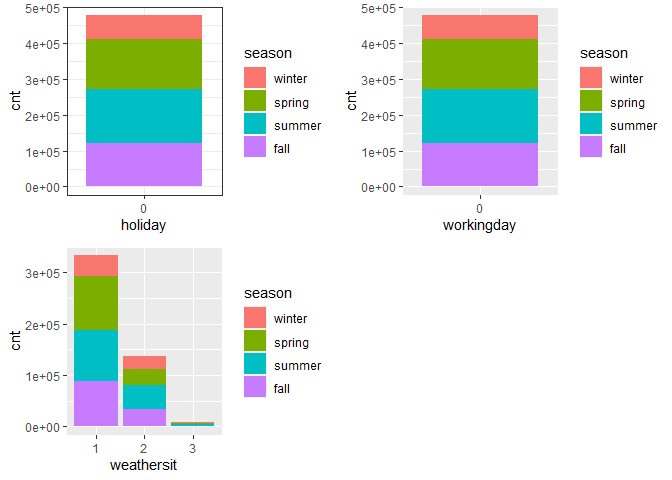

Project 2
================
Ifeoma Ojialor
10/16/2020

## Introduction

In this project, we will use a bike-sharing dataset to create machine
learning models. Before moving forward, I will briefly explain the
bike-sharing system and how it works. A bike-sharing system is a service
in which users can rent/use bicycles on a short term basis for a fee.
The goal of these programs is to provide affordable access to bicycles
for short distance trips as opposed to walking or taking public
transportation. Imagine how many people use these systems on a given
day, the numbers can vary greatly based on some elements. The goal of
this project is to build a predictive model to find out the number of
people that use these bikes in a given time period using available
information about that time/day. This in turn, can help businesses that
oversee this systems to manage them in a cost efficient manner.  
We will be using the bike-sharing dataset from the UCL Machine Learning
Repository. We will use the regression and boosted tree method to model
the response variable `cnt`.

## Exploratory Data Analysis

First we will read in the data using a relative path.

``` r
#read in data and filter to desired weekday
day1 <- read.csv("Bike-Sharing-Dataset/day.csv")
head(day1,5)
```

    ##   instant     dteday season yr mnth holiday
    ## 1       1 2011-01-01      1  0    1       0
    ## 2       2 2011-01-02      1  0    1       0
    ## 3       3 2011-01-03      1  0    1       0
    ## 4       4 2011-01-04      1  0    1       0
    ## 5       5 2011-01-05      1  0    1       0
    ##   weekday workingday weathersit     temp
    ## 1       6          0          2 0.344167
    ## 2       0          0          2 0.363478
    ## 3       1          1          1 0.196364
    ## 4       2          1          1 0.200000
    ## 5       3          1          1 0.226957
    ##      atemp      hum windspeed casual registered
    ## 1 0.363625 0.805833  0.160446    331        654
    ## 2 0.353739 0.696087  0.248539    131        670
    ## 3 0.189405 0.437273  0.248309    120       1229
    ## 4 0.212122 0.590435  0.160296    108       1454
    ## 5 0.229270 0.436957  0.186900     82       1518
    ##    cnt
    ## 1  985
    ## 2  801
    ## 3 1349
    ## 4 1562
    ## 5 1600

Next, we will remove the *casual* and *registered* variables since the
`cnt` variable is a combination of both.

``` r
day1 <- select(day1, -casual, -registered) 
day1$weekday <- as.factor(day1$weekday)
levels(day1$weekday) <- c("Sunday", "Monday", "Tuesday", "Wednesday", "Thursday", "Friday", "Saturday")
day <- filter(day1, weekday == params$days)

#Check for missing values
miss <- data.frame(apply(day,2,function(x){sum(is.na(x))}))
names(miss)[1] <- "missing"
miss
```

    ##            missing
    ## instant          0
    ## dteday           0
    ## season           0
    ## yr               0
    ## mnth             0
    ## holiday          0
    ## weekday          0
    ## workingday       0
    ## weathersit       0
    ## temp             0
    ## atemp            0
    ## hum              0
    ## windspeed        0
    ## cnt              0

There are no missing values in the dataset, so we can continue with our
analysis.

``` r
#Change the variables into their appropriate format.
day$season <- as.factor(day$season)
day$weathersit <- as.factor(day$weathersit)
day$holiday <- as.factor(day$holiday)
day$workingday <- as.factor(day$workingday)
day$yr <- as.factor(day$yr)
day$mnth <- as.factor(day$mnth)

levels(day$season) <- c("winter", "spring", "summer", "fall")
levels(day$yr) <- c("2011", "2012")
str(day)
```

    ## 'data.frame':    105 obs. of  14 variables:
    ##  $ instant   : int  1 8 15 22 29 36 43 50 57 64 ...
    ##  $ dteday    : chr  "2011-01-01" "2011-01-08" "2011-01-15" "2011-01-22" ...
    ##  $ season    : Factor w/ 4 levels "winter","spring",..: 1 1 1 1 1 1 1 1 1 1 ...
    ##  $ yr        : Factor w/ 2 levels "2011","2012": 1 1 1 1 1 1 1 1 1 1 ...
    ##  $ mnth      : Factor w/ 12 levels "1","2","3","4",..: 1 1 1 1 1 2 2 2 2 3 ...
    ##  $ holiday   : Factor w/ 1 level "0": 1 1 1 1 1 1 1 1 1 1 ...
    ##  $ weekday   : Factor w/ 7 levels "Sunday","Monday",..: 7 7 7 7 7 7 7 7 7 7 ...
    ##  $ workingday: Factor w/ 1 level "0": 1 1 1 1 1 1 1 1 1 1 ...
    ##  $ weathersit: Factor w/ 3 levels "1","2","3": 2 2 2 1 1 2 1 1 1 2 ...
    ##  $ temp      : num  0.3442 0.165 0.2333 0.0591 0.1965 ...
    ##  $ atemp     : num  0.3636 0.1623 0.2481 0.0791 0.2121 ...
    ##  $ hum       : num  0.806 0.536 0.499 0.4 0.652 ...
    ##  $ windspeed : num  0.16 0.267 0.158 0.172 0.145 ...
    ##  $ cnt       : int  985 959 1248 981 1098 1005 1472 1635 1969 2077 ...

### Univariate Analysis

The `cnt` is the response variable, so we’ll use a histogram to get a
visual understanding of the variable.

``` r
ggplot(day, aes(x = cnt)) + theme_bw() + geom_histogram(aes(y =..density..), color = "black", fill = "white", binwidth = 1000) + geom_density(alpha = 0.2, fill = "blue") + labs(title = "Count Density", x = "Count", y = "Density")
```

<!-- -->

``` r
summary(day$cnt)
```

    ##    Min. 1st Qu.  Median    Mean 3rd Qu.    Max. 
    ##     627    2732    4521    4551    6140    8714

From the histogram and summary statistics output, it is pretty evident
that the count of total rental bikes are in the sub 5000 range. We will
investigate if there is a relationship between the response variable and
other relevant predictor variables in the next section. Lets look at the
other variables individually.

``` r
#visualize numeric predictor variables using a histogram
p1 <- ggplot(day) + geom_histogram(aes(x = temp), fill = "red", binwidth = 0.03)
p2 <- ggplot(day) + geom_histogram(aes(x = atemp), fill = "red", binwidth = 0.03)
p3 <- ggplot(day) + geom_histogram(aes(x = hum), fill = "red", binwidth = 0.025)
p4 <- ggplot(day) + geom_histogram(aes(x = windspeed), fill = "red", binwidth = 0.03)
gridExtra::grid.arrange(p1,p2,p3,p4, nrow = 2)
```

<!-- -->

Observations:  
\* No clear cut pattern in `temp`and `atemp`.

  - `hum` appears to be skewed to the left when the dataset is not
    filtered to a specific weekday.

  - `windspeed` appears to be skewed(right). This variable should be
    transformed to curb its skewness.

  - The distribution of `temp` and `atemp` looks very similar. We should
    think about taking out one of the variables.

<!-- end list -->

``` r
#visualize categorical predictor variables
h1 <- ggplot(day) + geom_bar(aes(x = season),fill = "pink")
h2 <- ggplot(day) + geom_bar(aes(x = yr),fill = "pink")
h3 <- ggplot(day) + geom_bar(aes(x = holiday),fill = "pink")
h4 <- ggplot(day) + geom_bar(aes(x = workingday),fill = "pink")
h5 <- ggplot(day) + geom_bar(aes(x = mnth),fill = "pink")
h6 <- ggplot(day) + geom_bar(aes(x = weathersit),fill = "pink")
gridExtra::grid.arrange(h1,h2,h3,h4,h5,h6, nrow = 3)
```

<!-- -->

Observations:  
\* The variation between the four seasons is little to none.

  - About the same number of people rode bikes in 2011 and 2012.

  - Many people rode bikes on days that are not holidays.

  - Most people used the bike-sharing system on days that were neither
    weekends nor holidays.

  - Most people used the bike sharing system on days with clear weather.

### Bi-variate Analysis

In this section, we will explore the predictor variables with respect to
the response variable. The objective is to discover hidden relationships
between the independent and response variables and use those findings in
the model building process.

``` r
# First, we will explore the relationship between the target and numerical variables.
p1 <- ggplot(day) +geom_point(aes(x = temp, y = cnt), colour = "violet") + labs(title = "Normalized Temperature vs Total Rental Bikes")
p2 <- ggplot(day) +geom_point(aes(x = atemp, y = cnt), colour = "#FF99CC") +labs(title = "Normalized Feeling Temperature vs Total Rental Bikes")
p3 <- ggplot(day) +geom_point(aes(x = hum, y = cnt), colour = "pink") + labs(title = "Normalized Humidity vs Total rental Bikes")
p4 <- ggplot(day) +geom_point(aes(x = windspeed, y = cnt), colour = "#FF66CC") +labs(title= "Normalized Windspeed vs Total rental Bikes")
gridExtra::grid.arrange(p1, p2, p3, p4, nrow = 2)
```

<!-- -->

Observations:  
\* There appears to be a positive linear relationship between `cnt` ,
`temp`, and `atemp`.

  - There is also a weak relationship between `cnt`, `hum`, and
    `windspeed`.

<!-- end list -->

``` r
# Now we'll visualize the relationship between the target and categorical variables.
# Instead of using a boxplot, I will use a violin plot which is the blend of both a boxplot and density plot
g1 <- ggplot(day) + geom_col(aes(x = yr, y = cnt, fill = season))+theme_bw()
g2 <- ggplot(day) + geom_violin(aes(x = yr, y = cnt))+theme_bw()
g3 <- ggplot(day) + geom_col(aes(x = mnth, y = cnt, fill = season))+theme_bw() 
g4 <- ggplot(day) + geom_col(aes(x = holiday, y = cnt, fill = season)) + theme_bw() 
g6 <- ggplot(day) + geom_col(aes(x = workingday, y = cnt, fill = season))
g7 <- ggplot(day) + geom_col(aes(x = weathersit, y = cnt, fill = season))
gridExtra::grid.arrange(g1, g2, g3, nrow = 2)
```

<!-- -->

``` r
gridExtra::grid.arrange(g4, g6, g7, nrow = 2)
```

<!-- --> Observations:  
\* The total bike rental count is higher in 2012 than 2011.

  - During workingday, the bike rental counts quite the highest compared
    to during no working day for different seasons.

  - During clear,partly cloudy weather, the bike rental count is highest
    and the second highest is during mist cloudy weather and followed by
    third highest during light snow and light rain weather.

  - The highest bike rental count was during the summer and lowest in
    the winter.

## Correlation Matrix

Correlation matrix helps us to understand the linear relationship
between variables.

``` r
day_c <- day[ , c(10:14)]
round(cor(day_c), 2)
```

    ##            temp atemp   hum windspeed   cnt
    ## temp       1.00  1.00  0.07     -0.16  0.63
    ## atemp      1.00  1.00  0.09     -0.18  0.64
    ## hum        0.07  0.09  1.00     -0.21 -0.11
    ## windspeed -0.16 -0.18 -0.21      1.00 -0.28
    ## cnt        0.63  0.64 -0.11     -0.28  1.00

From the above matrix, we can see that `temp` and `atemp` are highly
correlated. So we only need to include one of these variables in the
model to prevent multicollinearity. We will also transform the humidity
and windspeed variable.

``` r
day <- mutate(day, log_hum = log(day$hum+1))
day <- mutate(day, log_ws = log(day$windspeed + 1))

#Remove irrelevant variables
day <- select(day, -weekday,-holiday,-workingday,-dteday,-temp, -instant)
```

## Model Building

First we split the data into train and test sets.

``` r
set.seed(23)
dayIndex<- createDataPartition(day$cnt, p = 0.7, list=FALSE)
dayTrain <- day[dayIndex, ]
dayTest <- day[-dayIndex, ]

# Build a tree-based model using loocv;
fitTree <- train(cnt~ ., data = dayTrain, method = "rpart", 
              preProcess = c("center", "scale"), 
              trControl = trainControl(method = "loocv", number = 10), tuneGrid = data.frame(cp = 0.01:0.10))
```

    ## Warning in preProcess.default(thresh = 0.95,
    ## k = 5, freqCut = 19, uniqueCut = 10, : These
    ## variables have zero variances: weathersit3

    ## Warning in preProcess.default(thresh = 0.95,
    ## k = 5, freqCut = 19, uniqueCut = 10, : These
    ## variables have zero variances: weathersit3

    ## Warning in preProcess.default(thresh = 0.95,
    ## k = 5, freqCut = 19, uniqueCut = 10, : These
    ## variables have zero variances: weathersit3

    ## Warning in preProcess.default(thresh = 0.95,
    ## k = 5, freqCut = 19, uniqueCut = 10, : These
    ## variables have zero variances: weathersit3

    ## Warning in preProcess.default(thresh = 0.95,
    ## k = 5, freqCut = 19, uniqueCut = 10, : These
    ## variables have zero variances: weathersit3

    ## Warning in preProcess.default(thresh = 0.95,
    ## k = 5, freqCut = 19, uniqueCut = 10, : These
    ## variables have zero variances: weathersit3

    ## Warning in preProcess.default(thresh = 0.95,
    ## k = 5, freqCut = 19, uniqueCut = 10, : These
    ## variables have zero variances: weathersit3

    ## Warning in preProcess.default(thresh = 0.95,
    ## k = 5, freqCut = 19, uniqueCut = 10, : These
    ## variables have zero variances: weathersit3

    ## Warning in preProcess.default(thresh = 0.95,
    ## k = 5, freqCut = 19, uniqueCut = 10, : These
    ## variables have zero variances: weathersit3

    ## Warning in preProcess.default(thresh = 0.95,
    ## k = 5, freqCut = 19, uniqueCut = 10, : These
    ## variables have zero variances: weathersit3

    ## Warning in preProcess.default(thresh = 0.95,
    ## k = 5, freqCut = 19, uniqueCut = 10, : These
    ## variables have zero variances: weathersit3

    ## Warning in preProcess.default(thresh = 0.95,
    ## k = 5, freqCut = 19, uniqueCut = 10, : These
    ## variables have zero variances: weathersit3

    ## Warning in preProcess.default(thresh = 0.95,
    ## k = 5, freqCut = 19, uniqueCut = 10, : These
    ## variables have zero variances: weathersit3

    ## Warning in preProcess.default(thresh = 0.95,
    ## k = 5, freqCut = 19, uniqueCut = 10, : These
    ## variables have zero variances: weathersit3

    ## Warning in preProcess.default(thresh = 0.95,
    ## k = 5, freqCut = 19, uniqueCut = 10, : These
    ## variables have zero variances: weathersit3

    ## Warning in preProcess.default(thresh = 0.95,
    ## k = 5, freqCut = 19, uniqueCut = 10, : These
    ## variables have zero variances: weathersit3

    ## Warning in preProcess.default(thresh = 0.95,
    ## k = 5, freqCut = 19, uniqueCut = 10, : These
    ## variables have zero variances: weathersit3

    ## Warning in preProcess.default(thresh = 0.95,
    ## k = 5, freqCut = 19, uniqueCut = 10, : These
    ## variables have zero variances: weathersit3

    ## Warning in preProcess.default(thresh = 0.95,
    ## k = 5, freqCut = 19, uniqueCut = 10, : These
    ## variables have zero variances: weathersit3

    ## Warning in preProcess.default(thresh = 0.95,
    ## k = 5, freqCut = 19, uniqueCut = 10, : These
    ## variables have zero variances: weathersit3

    ## Warning in preProcess.default(thresh = 0.95,
    ## k = 5, freqCut = 19, uniqueCut = 10, : These
    ## variables have zero variances: weathersit3

    ## Warning in preProcess.default(thresh = 0.95,
    ## k = 5, freqCut = 19, uniqueCut = 10, : These
    ## variables have zero variances: weathersit3

    ## Warning in preProcess.default(thresh = 0.95,
    ## k = 5, freqCut = 19, uniqueCut = 10, : These
    ## variables have zero variances: weathersit3

    ## Warning in preProcess.default(thresh = 0.95,
    ## k = 5, freqCut = 19, uniqueCut = 10, : These
    ## variables have zero variances: weathersit3

    ## Warning in preProcess.default(thresh = 0.95,
    ## k = 5, freqCut = 19, uniqueCut = 10, : These
    ## variables have zero variances: weathersit3

    ## Warning in preProcess.default(thresh = 0.95,
    ## k = 5, freqCut = 19, uniqueCut = 10, : These
    ## variables have zero variances: weathersit3

    ## Warning in preProcess.default(thresh = 0.95,
    ## k = 5, freqCut = 19, uniqueCut = 10, : These
    ## variables have zero variances: weathersit3

    ## Warning in preProcess.default(thresh = 0.95,
    ## k = 5, freqCut = 19, uniqueCut = 10, : These
    ## variables have zero variances: weathersit3

    ## Warning in preProcess.default(thresh = 0.95,
    ## k = 5, freqCut = 19, uniqueCut = 10, : These
    ## variables have zero variances: weathersit3

    ## Warning in preProcess.default(thresh = 0.95,
    ## k = 5, freqCut = 19, uniqueCut = 10, : These
    ## variables have zero variances: weathersit3

    ## Warning in preProcess.default(thresh = 0.95,
    ## k = 5, freqCut = 19, uniqueCut = 10, : These
    ## variables have zero variances: weathersit3

    ## Warning in preProcess.default(thresh = 0.95,
    ## k = 5, freqCut = 19, uniqueCut = 10, : These
    ## variables have zero variances: weathersit3

    ## Warning in preProcess.default(thresh = 0.95,
    ## k = 5, freqCut = 19, uniqueCut = 10, : These
    ## variables have zero variances: weathersit3

    ## Warning in preProcess.default(thresh = 0.95,
    ## k = 5, freqCut = 19, uniqueCut = 10, : These
    ## variables have zero variances: weathersit3

    ## Warning in preProcess.default(thresh = 0.95,
    ## k = 5, freqCut = 19, uniqueCut = 10, : These
    ## variables have zero variances: weathersit3

    ## Warning in preProcess.default(thresh = 0.95,
    ## k = 5, freqCut = 19, uniqueCut = 10, : These
    ## variables have zero variances: weathersit3

    ## Warning in preProcess.default(thresh = 0.95,
    ## k = 5, freqCut = 19, uniqueCut = 10, : These
    ## variables have zero variances: weathersit3

    ## Warning in preProcess.default(thresh = 0.95,
    ## k = 5, freqCut = 19, uniqueCut = 10, : These
    ## variables have zero variances: weathersit3

    ## Warning in preProcess.default(thresh = 0.95,
    ## k = 5, freqCut = 19, uniqueCut = 10, : These
    ## variables have zero variances: weathersit3

    ## Warning in preProcess.default(thresh = 0.95,
    ## k = 5, freqCut = 19, uniqueCut = 10, : These
    ## variables have zero variances: weathersit3

    ## Warning in preProcess.default(thresh = 0.95,
    ## k = 5, freqCut = 19, uniqueCut = 10, : These
    ## variables have zero variances: weathersit3

    ## Warning in preProcess.default(thresh = 0.95,
    ## k = 5, freqCut = 19, uniqueCut = 10, : These
    ## variables have zero variances: weathersit3

    ## Warning in preProcess.default(thresh = 0.95,
    ## k = 5, freqCut = 19, uniqueCut = 10, : These
    ## variables have zero variances: weathersit3

    ## Warning in preProcess.default(thresh = 0.95,
    ## k = 5, freqCut = 19, uniqueCut = 10, : These
    ## variables have zero variances: weathersit3

    ## Warning in preProcess.default(thresh = 0.95,
    ## k = 5, freqCut = 19, uniqueCut = 10, : These
    ## variables have zero variances: weathersit3

    ## Warning in preProcess.default(thresh = 0.95,
    ## k = 5, freqCut = 19, uniqueCut = 10, : These
    ## variables have zero variances: weathersit3

    ## Warning in preProcess.default(thresh = 0.95,
    ## k = 5, freqCut = 19, uniqueCut = 10, : These
    ## variables have zero variances: weathersit3

    ## Warning in preProcess.default(thresh = 0.95,
    ## k = 5, freqCut = 19, uniqueCut = 10, : These
    ## variables have zero variances: weathersit3

    ## Warning in preProcess.default(thresh = 0.95,
    ## k = 5, freqCut = 19, uniqueCut = 10, : These
    ## variables have zero variances: weathersit3

    ## Warning in preProcess.default(thresh = 0.95,
    ## k = 5, freqCut = 19, uniqueCut = 10, : These
    ## variables have zero variances: weathersit3

    ## Warning in preProcess.default(thresh = 0.95,
    ## k = 5, freqCut = 19, uniqueCut = 10, : These
    ## variables have zero variances: weathersit3

    ## Warning in preProcess.default(thresh = 0.95,
    ## k = 5, freqCut = 19, uniqueCut = 10, : These
    ## variables have zero variances: weathersit3

    ## Warning in preProcess.default(thresh = 0.95,
    ## k = 5, freqCut = 19, uniqueCut = 10, : These
    ## variables have zero variances: weathersit3

    ## Warning in preProcess.default(thresh = 0.95,
    ## k = 5, freqCut = 19, uniqueCut = 10, : These
    ## variables have zero variances: weathersit3

    ## Warning in preProcess.default(thresh = 0.95,
    ## k = 5, freqCut = 19, uniqueCut = 10, : These
    ## variables have zero variances: weathersit3

    ## Warning in preProcess.default(thresh = 0.95,
    ## k = 5, freqCut = 19, uniqueCut = 10, : These
    ## variables have zero variances: weathersit3

    ## Warning in preProcess.default(thresh = 0.95,
    ## k = 5, freqCut = 19, uniqueCut = 10, : These
    ## variables have zero variances: weathersit3

    ## Warning in preProcess.default(thresh = 0.95,
    ## k = 5, freqCut = 19, uniqueCut = 10, : These
    ## variables have zero variances: weathersit3

    ## Warning in preProcess.default(thresh = 0.95,
    ## k = 5, freqCut = 19, uniqueCut = 10, : These
    ## variables have zero variances: weathersit3

    ## Warning in preProcess.default(thresh = 0.95,
    ## k = 5, freqCut = 19, uniqueCut = 10, : These
    ## variables have zero variances: weathersit3

    ## Warning in preProcess.default(thresh = 0.95,
    ## k = 5, freqCut = 19, uniqueCut = 10, : These
    ## variables have zero variances: weathersit3

    ## Warning in preProcess.default(thresh = 0.95,
    ## k = 5, freqCut = 19, uniqueCut = 10, : These
    ## variables have zero variances: weathersit3

    ## Warning in preProcess.default(thresh = 0.95,
    ## k = 5, freqCut = 19, uniqueCut = 10, : These
    ## variables have zero variances: weathersit3

    ## Warning in preProcess.default(thresh = 0.95,
    ## k = 5, freqCut = 19, uniqueCut = 10, : These
    ## variables have zero variances: weathersit3

    ## Warning in preProcess.default(thresh = 0.95,
    ## k = 5, freqCut = 19, uniqueCut = 10, : These
    ## variables have zero variances: weathersit3

    ## Warning in preProcess.default(thresh = 0.95,
    ## k = 5, freqCut = 19, uniqueCut = 10, : These
    ## variables have zero variances: weathersit3

    ## Warning in preProcess.default(thresh = 0.95,
    ## k = 5, freqCut = 19, uniqueCut = 10, : These
    ## variables have zero variances: weathersit3

    ## Warning in preProcess.default(thresh = 0.95,
    ## k = 5, freqCut = 19, uniqueCut = 10, : These
    ## variables have zero variances: weathersit3

    ## Warning in preProcess.default(thresh = 0.95,
    ## k = 5, freqCut = 19, uniqueCut = 10, : These
    ## variables have zero variances: weathersit3

    ## Warning in preProcess.default(thresh = 0.95,
    ## k = 5, freqCut = 19, uniqueCut = 10, : These
    ## variables have zero variances: weathersit3

    ## Warning in preProcess.default(thresh = 0.95,
    ## k = 5, freqCut = 19, uniqueCut = 10, : These
    ## variables have zero variances: weathersit3

    ## Warning in preProcess.default(thresh = 0.95,
    ## k = 5, freqCut = 19, uniqueCut = 10, : These
    ## variables have zero variances: weathersit3

    ## Warning in preProcess.default(thresh = 0.95,
    ## k = 5, freqCut = 19, uniqueCut = 10, : These
    ## variables have zero variances: weathersit3

    ## Warning in preProcess.default(thresh = 0.95,
    ## k = 5, freqCut = 19, uniqueCut = 10, : These
    ## variables have zero variances: weathersit3

    ## Warning in preProcess.default(thresh = 0.95,
    ## k = 5, freqCut = 19, uniqueCut = 10, : These
    ## variables have zero variances: weathersit3

    ## Warning in preProcess.default(thresh = 0.95,
    ## k = 5, freqCut = 19, uniqueCut = 10, : These
    ## variables have zero variances: weathersit3

    ## Warning in nominalTrainWorkflow(x = x, y =
    ## y, wts = weights, info = trainInfo, : There
    ## were missing values in resampled performance
    ## measures.

    ## Warning in preProcess.default(thresh = 0.95,
    ## k = 5, freqCut = 19, uniqueCut = 10, : These
    ## variables have zero variances: weathersit3

``` r
# Display information from the tree fit
fitTree$results
```

    ##     cp     RMSE Rsquared      MAE   RMSESD
    ## 1 0.01 1241.014      NaN 1241.014 928.4852
    ##   RsquaredSD    MAESD
    ## 1         NA 928.4852

``` r
# Build a boosted tree model using cv
fitBoost <- train(cnt~., data = dayTrain, method = "gbm", 
              preProcess = c("center", "scale"), 
              trControl = trainControl(method = "cv", number = 10), 
              tuneGrid = expand.grid(n.trees=c(10,20),shrinkage=c(0.01,0.05),n.minobsinnode =c(3),interaction.depth=c(1,5)))
```

    ## Warning in preProcess.default(thresh = 0.95,
    ## k = 5, freqCut = 19, uniqueCut = 10, : These
    ## variables have zero variances: weathersit3

    ## Warning in (function (x, y, offset = NULL, misc
    ## = NULL, distribution = "bernoulli", : variable
    ## 17: weathersit3 has no variation.

    ## Iter   TrainDeviance   ValidDeviance   StepSize   Improve
    ##      1  4701216.1640             nan     0.0100 39416.0641
    ##      2  4653984.2769             nan     0.0100 40435.5945
    ##      3  4609704.2081             nan     0.0100 42220.7875
    ##      4  4575278.2498             nan     0.0100 33150.9435
    ##      5  4530429.1484             nan     0.0100 36853.4288
    ##      6  4488261.8032             nan     0.0100 39589.3916
    ##      7  4451169.8021             nan     0.0100 38429.1636
    ##      8  4407774.3322             nan     0.0100 31428.7890
    ##      9  4376200.1051             nan     0.0100 25779.2107
    ##     10  4335711.6095             nan     0.0100 33346.9789
    ##     20  3985925.6962             nan     0.0100 31163.2576

    ## Warning in preProcess.default(thresh = 0.95,
    ## k = 5, freqCut = 19, uniqueCut = 10, : These
    ## variables have zero variances: weathersit3

    ## Warning in (function (x, y, offset = NULL, misc
    ## = NULL, distribution = "bernoulli", : variable
    ## 17: weathersit3 has no variation.

    ## Iter   TrainDeviance   ValidDeviance   StepSize   Improve
    ##      1  4675514.7477             nan     0.0100 78170.9887
    ##      2  4593407.7386             nan     0.0100 75381.2311
    ##      3  4521450.8675             nan     0.0100 74604.8631
    ##      4  4450119.6431             nan     0.0100 72038.8030
    ##      5  4375417.0163             nan     0.0100 42868.1976
    ##      6  4307577.5674             nan     0.0100 49364.8985
    ##      7  4238340.1608             nan     0.0100 60217.3690
    ##      8  4173038.6276             nan     0.0100 60022.8770
    ##      9  4107274.6260             nan     0.0100 47363.1226
    ##     10  4038799.9571             nan     0.0100 51989.4616
    ##     20  3492908.7330             nan     0.0100 52732.5957

    ## Warning in preProcess.default(thresh = 0.95,
    ## k = 5, freqCut = 19, uniqueCut = 10, : These
    ## variables have zero variances: weathersit3

    ## Warning in (function (x, y, offset = NULL, misc
    ## = NULL, distribution = "bernoulli", : variable
    ## 17: weathersit3 has no variation.

    ## Iter   TrainDeviance   ValidDeviance   StepSize   Improve
    ##      1  4532531.9730             nan     0.0500 175231.8394
    ##      2  4361416.6915             nan     0.0500 145227.0546
    ##      3  4164857.7622             nan     0.0500 141126.9589
    ##      4  3998330.1478             nan     0.0500 119388.2736
    ##      5  3844618.9013             nan     0.0500 138664.7539
    ##      6  3700267.0866             nan     0.0500 120138.8446
    ##      7  3586976.7856             nan     0.0500 114592.9099
    ##      8  3466199.8869             nan     0.0500 117596.9508
    ##      9  3329914.3886             nan     0.0500 75755.3807
    ##     10  3250133.5022             nan     0.0500 74692.1643
    ##     20  2308119.2259             nan     0.0500 60350.1376

    ## Warning in preProcess.default(thresh = 0.95,
    ## k = 5, freqCut = 19, uniqueCut = 10, : These
    ## variables have zero variances: weathersit3

    ## Warning in (function (x, y, offset = NULL, misc
    ## = NULL, distribution = "bernoulli", : variable
    ## 17: weathersit3 has no variation.

    ## Iter   TrainDeviance   ValidDeviance   StepSize   Improve
    ##      1  4385536.1265             nan     0.0500 246635.6854
    ##      2  4032706.4332             nan     0.0500 304142.7595
    ##      3  3733189.3667             nan     0.0500 210478.8481
    ##      4  3471599.7923             nan     0.0500 213406.3452
    ##      5  3193714.1701             nan     0.0500 203014.4582
    ##      6  2977205.1340             nan     0.0500 136365.2443
    ##      7  2755104.7910             nan     0.0500 214158.7374
    ##      8  2574457.0240             nan     0.0500 166569.1794
    ##      9  2404198.8294             nan     0.0500 115212.8273
    ##     10  2261000.4762             nan     0.0500 90799.6568
    ##     20  1242696.0087             nan     0.0500 16376.9935

    ## Warning in preProcess.default(thresh = 0.95,
    ## k = 5, freqCut = 19, uniqueCut = 10, : These
    ## variables have zero variances: weathersit3

    ## Warning in (function (x, y, offset = NULL, misc
    ## = NULL, distribution = "bernoulli", : variable
    ## 17: weathersit3 has no variation.

    ## Iter   TrainDeviance   ValidDeviance   StepSize   Improve
    ##      1  4817856.3462             nan     0.0100 13754.9342
    ##      2  4770830.1867             nan     0.0100 42296.8615
    ##      3  4728632.3573             nan     0.0100 30367.5359
    ##      4  4688199.5743             nan     0.0100 35021.7441
    ##      5  4640600.7567             nan     0.0100 33626.3099
    ##      6  4616749.4082             nan     0.0100 22799.3917
    ##      7  4576879.2514             nan     0.0100 32725.1838
    ##      8  4536354.8545             nan     0.0100 24067.9994
    ##      9  4503502.1523             nan     0.0100 35479.9190
    ##     10  4464977.2282             nan     0.0100 28402.9148
    ##     20  4129340.9574             nan     0.0100 31034.0939

    ## Warning in preProcess.default(thresh = 0.95,
    ## k = 5, freqCut = 19, uniqueCut = 10, : These
    ## variables have zero variances: weathersit3

    ## Warning in (function (x, y, offset = NULL, misc
    ## = NULL, distribution = "bernoulli", : variable
    ## 17: weathersit3 has no variation.

    ## Iter   TrainDeviance   ValidDeviance   StepSize   Improve
    ##      1  4773285.9028             nan     0.0100 61609.7282
    ##      2  4702489.2510             nan     0.0100 63469.4372
    ##      3  4633994.4842             nan     0.0100 64877.2098
    ##      4  4583947.0397             nan     0.0100 28929.2498
    ##      5  4520394.8598             nan     0.0100 58399.5519
    ##      6  4443603.4975             nan     0.0100 65114.9428
    ##      7  4385490.1968             nan     0.0100 55691.5627
    ##      8  4321446.4638             nan     0.0100 50253.3678
    ##      9  4252490.3928             nan     0.0100 59609.0659
    ##     10  4186930.3700             nan     0.0100 62056.1173
    ##     20  3620264.0596             nan     0.0100 40081.5152

    ## Warning in preProcess.default(thresh = 0.95,
    ## k = 5, freqCut = 19, uniqueCut = 10, : These
    ## variables have zero variances: weathersit3

    ## Warning in (function (x, y, offset = NULL, misc
    ## = NULL, distribution = "bernoulli", : variable
    ## 17: weathersit3 has no variation.

    ## Iter   TrainDeviance   ValidDeviance   StepSize   Improve
    ##      1  4586999.2741             nan     0.0500 161825.1572
    ##      2  4412183.3820             nan     0.0500 155545.2042
    ##      3  4236036.4257             nan     0.0500 158286.5430
    ##      4  4096403.8824             nan     0.0500 127666.8632
    ##      5  3971745.3689             nan     0.0500 108835.3141
    ##      6  3837685.3544             nan     0.0500 136714.8635
    ##      7  3703597.8614             nan     0.0500 117347.6849
    ##      8  3603296.7392             nan     0.0500 57387.1954
    ##      9  3477010.8397             nan     0.0500 94722.9460
    ##     10  3394761.9643             nan     0.0500 35606.6781
    ##     20  2537793.4572             nan     0.0500 56524.7473

    ## Warning in preProcess.default(thresh = 0.95,
    ## k = 5, freqCut = 19, uniqueCut = 10, : These
    ## variables have zero variances: weathersit3

    ## Warning in (function (x, y, offset = NULL, misc
    ## = NULL, distribution = "bernoulli", : variable
    ## 17: weathersit3 has no variation.

    ## Iter   TrainDeviance   ValidDeviance   StepSize   Improve
    ##      1  4496951.4332             nan     0.0500 233847.1281
    ##      2  4160709.4141             nan     0.0500 305361.4760
    ##      3  3892895.7614             nan     0.0500 199314.4206
    ##      4  3612130.9099             nan     0.0500 236352.6157
    ##      5  3345093.8188             nan     0.0500 172246.9520
    ##      6  3096799.4337             nan     0.0500 237447.2780
    ##      7  2903170.2161             nan     0.0500 152041.3169
    ##      8  2727860.4116             nan     0.0500 129512.1144
    ##      9  2565280.8588             nan     0.0500 101345.2167
    ##     10  2407235.2971             nan     0.0500 141218.8887
    ##     20  1357939.2536             nan     0.0500 25843.9033

    ## Warning in preProcess.default(thresh = 0.95,
    ## k = 5, freqCut = 19, uniqueCut = 10, : These
    ## variables have zero variances: weathersit3

    ## Warning in (function (x, y, offset = NULL, misc
    ## = NULL, distribution = "bernoulli", : variable
    ## 17: weathersit3 has no variation.

    ## Iter   TrainDeviance   ValidDeviance   StepSize   Improve
    ##      1  4599296.7321             nan     0.0100 33343.6138
    ##      2  4564491.4455             nan     0.0100 29790.3721
    ##      3  4528300.4647             nan     0.0100 29987.8070
    ##      4  4496417.4813             nan     0.0100 33668.0863
    ##      5  4460117.5750             nan     0.0100 31969.4796
    ##      6  4425914.4847             nan     0.0100 17594.1134
    ##      7  4395081.3529             nan     0.0100 26401.3399
    ##      8  4363511.5434             nan     0.0100 21627.4930
    ##      9  4330472.2346             nan     0.0100 27281.6536
    ##     10  4300438.8881             nan     0.0100 26794.0497
    ##     20  4007881.6120             nan     0.0100 19151.6657

    ## Warning in preProcess.default(thresh = 0.95,
    ## k = 5, freqCut = 19, uniqueCut = 10, : These
    ## variables have zero variances: weathersit3

    ## Warning in (function (x, y, offset = NULL, misc
    ## = NULL, distribution = "bernoulli", : variable
    ## 17: weathersit3 has no variation.

    ## Iter   TrainDeviance   ValidDeviance   StepSize   Improve
    ##      1  4566420.1945             nan     0.0100 63009.9533
    ##      2  4487523.9945             nan     0.0100 77683.5764
    ##      3  4432831.3539             nan     0.0100 65199.9718
    ##      4  4368087.7438             nan     0.0100 59744.1095
    ##      5  4299323.4426             nan     0.0100 50803.2946
    ##      6  4229302.3101             nan     0.0100 61962.9006
    ##      7  4165822.4358             nan     0.0100 64960.9735
    ##      8  4117915.8176             nan     0.0100 35690.1285
    ##      9  4062351.2479             nan     0.0100 55672.4269
    ##     10  4009804.4237             nan     0.0100 55724.6730
    ##     20  3487256.0559             nan     0.0100 37925.0935

    ## Warning in preProcess.default(thresh = 0.95,
    ## k = 5, freqCut = 19, uniqueCut = 10, : These
    ## variables have zero variances: weathersit3

    ## Warning in (function (x, y, offset = NULL, misc
    ## = NULL, distribution = "bernoulli", : variable
    ## 17: weathersit3 has no variation.

    ## Iter   TrainDeviance   ValidDeviance   StepSize   Improve
    ##      1  4453235.0676             nan     0.0500 163986.9815
    ##      2  4257381.7662             nan     0.0500 124763.7944
    ##      3  4130512.6501             nan     0.0500 151061.6181
    ##      4  3992406.8977             nan     0.0500 145358.1160
    ##      5  3848334.5475             nan     0.0500 76637.3749
    ##      6  3707417.1218             nan     0.0500 113893.4179
    ##      7  3585942.9856             nan     0.0500 37174.0520
    ##      8  3491487.5131             nan     0.0500 66988.0067
    ##      9  3362707.1773             nan     0.0500 54359.9233
    ##     10  3243090.7620             nan     0.0500 102865.7456
    ##     20  2454031.0204             nan     0.0500 67093.9104

    ## Warning in preProcess.default(thresh = 0.95,
    ## k = 5, freqCut = 19, uniqueCut = 10, : These
    ## variables have zero variances: weathersit3

    ## Warning in (function (x, y, offset = NULL, misc
    ## = NULL, distribution = "bernoulli", : variable
    ## 17: weathersit3 has no variation.

    ## Iter   TrainDeviance   ValidDeviance   StepSize   Improve
    ##      1  4291644.8427             nan     0.0500 382065.6432
    ##      2  4020749.6872             nan     0.0500 198125.3458
    ##      3  3739327.7543             nan     0.0500 212483.2013
    ##      4  3473841.0318             nan     0.0500 274794.7643
    ##      5  3219099.7099             nan     0.0500 210249.5928
    ##      6  3006954.0281             nan     0.0500 174078.5338
    ##      7  2852982.4434             nan     0.0500 120371.2510
    ##      8  2678993.9069             nan     0.0500 97481.0716
    ##      9  2506106.2510             nan     0.0500 142789.6674
    ##     10  2325734.5659             nan     0.0500 186171.8594
    ##     20  1279371.3423             nan     0.0500 53873.5865

    ## Warning in preProcess.default(thresh = 0.95,
    ## k = 5, freqCut = 19, uniqueCut = 10, : These
    ## variables have zero variances: weathersit3

    ## Warning in (function (x, y, offset = NULL, misc
    ## = NULL, distribution = "bernoulli", : variable
    ## 17: weathersit3 has no variation.

    ## Iter   TrainDeviance   ValidDeviance   StepSize   Improve
    ##      1  4730809.2386             nan     0.0100 31766.3863
    ##      2  4694652.7704             nan     0.0100 33360.6051
    ##      3  4656462.9597             nan     0.0100 31293.9263
    ##      4  4618403.2838             nan     0.0100 33641.9471
    ##      5  4581234.4671             nan     0.0100 28779.8467
    ##      6  4550581.1553             nan     0.0100 19008.7565
    ##      7  4522085.8882             nan     0.0100 23035.9892
    ##      8  4485656.5215             nan     0.0100 31490.0044
    ##      9  4452220.3353             nan     0.0100 30869.0250
    ##     10  4417378.5144             nan     0.0100 31305.2742
    ##     20  4113661.5117             nan     0.0100 23147.0925

    ## Warning in preProcess.default(thresh = 0.95,
    ## k = 5, freqCut = 19, uniqueCut = 10, : These
    ## variables have zero variances: weathersit3

    ## Warning in (function (x, y, offset = NULL, misc
    ## = NULL, distribution = "bernoulli", : variable
    ## 17: weathersit3 has no variation.

    ## Iter   TrainDeviance   ValidDeviance   StepSize   Improve
    ##      1  4707637.7126             nan     0.0100 64251.7198
    ##      2  4638237.6191             nan     0.0100 55851.1376
    ##      3  4568062.3953             nan     0.0100 66084.6932
    ##      4  4496138.7005             nan     0.0100 65806.4377
    ##      5  4430886.3784             nan     0.0100 66752.0728
    ##      6  4358252.8667             nan     0.0100 52464.1194
    ##      7  4296514.4719             nan     0.0100 60437.8620
    ##      8  4226987.0878             nan     0.0100 56758.3254
    ##      9  4170694.8953             nan     0.0100 64438.3383
    ##     10  4105791.8419             nan     0.0100 63247.6874
    ##     20  3563349.1849             nan     0.0100 54140.5528

    ## Warning in preProcess.default(thresh = 0.95,
    ## k = 5, freqCut = 19, uniqueCut = 10, : These
    ## variables have zero variances: weathersit3

    ## Warning in (function (x, y, offset = NULL, misc
    ## = NULL, distribution = "bernoulli", : variable
    ## 17: weathersit3 has no variation.

    ## Iter   TrainDeviance   ValidDeviance   StepSize   Improve
    ##      1  4556730.9535             nan     0.0500 173848.1090
    ##      2  4390524.4745             nan     0.0500 151230.9123
    ##      3  4238993.6379             nan     0.0500 124794.9717
    ##      4  4076978.5484             nan     0.0500 79031.6925
    ##      5  3899249.8607             nan     0.0500 111581.3666
    ##      6  3782516.6610             nan     0.0500 116522.8298
    ##      7  3657873.3973             nan     0.0500 96703.9893
    ##      8  3514087.3725             nan     0.0500 93861.0394
    ##      9  3400142.5577             nan     0.0500 39039.6224
    ##     10  3301546.1686             nan     0.0500 91283.8705
    ##     20  2439861.3046             nan     0.0500 53296.3448

    ## Warning in preProcess.default(thresh = 0.95,
    ## k = 5, freqCut = 19, uniqueCut = 10, : These
    ## variables have zero variances: weathersit3

    ## Warning in (function (x, y, offset = NULL, misc
    ## = NULL, distribution = "bernoulli", : variable
    ## 17: weathersit3 has no variation.

    ## Iter   TrainDeviance   ValidDeviance   StepSize   Improve
    ##      1  4403496.7885             nan     0.0500 290291.9184
    ##      2  4049937.7691             nan     0.0500 342140.6821
    ##      3  3745797.0543             nan     0.0500 250014.5299
    ##      4  3507782.5770             nan     0.0500 219016.0683
    ##      5  3246835.8685             nan     0.0500 184837.3308
    ##      6  3024380.0600             nan     0.0500 213966.8523
    ##      7  2825030.4950             nan     0.0500 172409.9424
    ##      8  2631579.0768             nan     0.0500 81923.2892
    ##      9  2462633.2671             nan     0.0500 163759.2418
    ##     10  2305154.9793             nan     0.0500 140812.2634
    ##     20  1291100.5108             nan     0.0500 36740.9071

    ## Warning in preProcess.default(thresh = 0.95,
    ## k = 5, freqCut = 19, uniqueCut = 10, : These
    ## variables have zero variances: weathersit3

    ## Warning in (function (x, y, offset = NULL, misc
    ## = NULL, distribution = "bernoulli", : variable
    ## 17: weathersit3 has no variation.

    ## Iter   TrainDeviance   ValidDeviance   StepSize   Improve
    ##      1  4776270.3339             nan     0.0100 33998.4006
    ##      2  4739221.8098             nan     0.0100 34757.4660
    ##      3  4705475.5972             nan     0.0100 34876.9858
    ##      4  4662923.0882             nan     0.0100 30337.2407
    ##      5  4623387.7199             nan     0.0100 28291.7476
    ##      6  4587142.8397             nan     0.0100 37681.3778
    ##      7  4552540.0352             nan     0.0100 30137.4084
    ##      8  4516697.7362             nan     0.0100 34217.8091
    ##      9  4486292.0235             nan     0.0100 26489.6411
    ##     10  4441113.2709             nan     0.0100 28259.2079
    ##     20  4079528.2474             nan     0.0100 23186.6410

    ## Warning in preProcess.default(thresh = 0.95,
    ## k = 5, freqCut = 19, uniqueCut = 10, : These
    ## variables have zero variances: weathersit3

    ## Warning in (function (x, y, offset = NULL, misc
    ## = NULL, distribution = "bernoulli", : variable
    ## 17: weathersit3 has no variation.

    ## Iter   TrainDeviance   ValidDeviance   StepSize   Improve
    ##      1  4752362.9383             nan     0.0100 71128.3801
    ##      2  4675999.7100             nan     0.0100 64929.6078
    ##      3  4594764.1133             nan     0.0100 69507.3038
    ##      4  4522883.3777             nan     0.0100 50507.6213
    ##      5  4451659.1403             nan     0.0100 70192.4055
    ##      6  4381517.7308             nan     0.0100 67523.4993
    ##      7  4314268.9601             nan     0.0100 56959.2831
    ##      8  4246578.9614             nan     0.0100 45078.6981
    ##      9  4188592.2859             nan     0.0100 58870.4125
    ##     10  4126964.2748             nan     0.0100 43896.8606
    ##     20  3594817.3536             nan     0.0100 47588.3654

    ## Warning in preProcess.default(thresh = 0.95,
    ## k = 5, freqCut = 19, uniqueCut = 10, : These
    ## variables have zero variances: weathersit3

    ## Warning in (function (x, y, offset = NULL, misc
    ## = NULL, distribution = "bernoulli", : variable
    ## 17: weathersit3 has no variation.

    ## Iter   TrainDeviance   ValidDeviance   StepSize   Improve
    ##      1  4642668.0180             nan     0.0500 118303.5316
    ##      2  4435168.8008             nan     0.0500 147178.8482
    ##      3  4236968.8690             nan     0.0500 175124.1512
    ##      4  4114210.3515             nan     0.0500 115944.3113
    ##      5  3947155.3275             nan     0.0500 142518.9598
    ##      6  3795860.8437             nan     0.0500 144138.6263
    ##      7  3690251.2790             nan     0.0500 103088.3725
    ##      8  3534350.5389             nan     0.0500 127152.4164
    ##      9  3358372.4984             nan     0.0500 105041.3125
    ##     10  3248557.9515             nan     0.0500 97065.8039
    ##     20  2343029.1713             nan     0.0500 43506.7503

    ## Warning in preProcess.default(thresh = 0.95,
    ## k = 5, freqCut = 19, uniqueCut = 10, : These
    ## variables have zero variances: weathersit3

    ## Warning in (function (x, y, offset = NULL, misc
    ## = NULL, distribution = "bernoulli", : variable
    ## 17: weathersit3 has no variation.

    ## Iter   TrainDeviance   ValidDeviance   StepSize   Improve
    ##      1  4485745.2725             nan     0.0500 346597.2726
    ##      2  4143460.3195             nan     0.0500 334132.7863
    ##      3  3858898.9227             nan     0.0500 285343.3584
    ##      4  3564447.7396             nan     0.0500 186228.3800
    ##      5  3312345.6361             nan     0.0500 243611.7316
    ##      6  3040333.5723             nan     0.0500 277604.0243
    ##      7  2813642.1247             nan     0.0500 193154.6881
    ##      8  2619057.8579             nan     0.0500 131609.5908
    ##      9  2460956.8392             nan     0.0500 123649.2373
    ##     10  2324174.5421             nan     0.0500 131753.2918
    ##     20  1273206.5123             nan     0.0500 38712.2612

    ## Warning in preProcess.default(thresh = 0.95,
    ## k = 5, freqCut = 19, uniqueCut = 10, : These
    ## variables have zero variances: weathersit3

    ## Warning in (function (x, y, offset = NULL, misc
    ## = NULL, distribution = "bernoulli", : variable
    ## 17: weathersit3 has no variation.

    ## Iter   TrainDeviance   ValidDeviance   StepSize   Improve
    ##      1  4821787.8833             nan     0.0100 38467.7947
    ##      2  4778298.9609             nan     0.0100 41745.7940
    ##      3  4727480.9493             nan     0.0100 27032.5370
    ##      4  4683380.8278             nan     0.0100 40943.5614
    ##      5  4643706.3497             nan     0.0100 33224.0922
    ##      6  4599659.4827             nan     0.0100 32920.9802
    ##      7  4552719.0090             nan     0.0100 32869.2762
    ##      8  4515176.4790             nan     0.0100 34465.6388
    ##      9  4479203.2264             nan     0.0100 31444.1882
    ##     10  4436782.5078             nan     0.0100 26463.6224
    ##     20  4131945.2032             nan     0.0100 26738.2903

    ## Warning in preProcess.default(thresh = 0.95,
    ## k = 5, freqCut = 19, uniqueCut = 10, : These
    ## variables have zero variances: weathersit3

    ## Warning in (function (x, y, offset = NULL, misc
    ## = NULL, distribution = "bernoulli", : variable
    ## 17: weathersit3 has no variation.

    ## Iter   TrainDeviance   ValidDeviance   StepSize   Improve
    ##      1  4787742.1692             nan     0.0100 74031.3002
    ##      2  4717052.8836             nan     0.0100 54866.8440
    ##      3  4643593.4163             nan     0.0100 64451.7103
    ##      4  4576591.2268             nan     0.0100 71993.1889
    ##      5  4509750.1035             nan     0.0100 66011.5703
    ##      6  4443071.8260             nan     0.0100 50937.6745
    ##      7  4382858.8173             nan     0.0100 59456.7878
    ##      8  4321679.4722             nan     0.0100 53238.5073
    ##      9  4256847.7253             nan     0.0100 65154.9078
    ##     10  4195052.5026             nan     0.0100 46339.8735
    ##     20  3623143.2120             nan     0.0100 48961.2096

    ## Warning in preProcess.default(thresh = 0.95,
    ## k = 5, freqCut = 19, uniqueCut = 10, : These
    ## variables have zero variances: weathersit3

    ## Warning in (function (x, y, offset = NULL, misc
    ## = NULL, distribution = "bernoulli", : variable
    ## 17: weathersit3 has no variation.

    ## Iter   TrainDeviance   ValidDeviance   StepSize   Improve
    ##      1  4648961.7235             nan     0.0500 183422.5665
    ##      2  4461130.7387             nan     0.0500 168578.9165
    ##      3  4320276.5985             nan     0.0500 97113.1965
    ##      4  4182671.9079             nan     0.0500 97016.2960
    ##      5  4027445.5560             nan     0.0500 112531.8013
    ##      6  3864358.3944             nan     0.0500 130259.0059
    ##      7  3757072.8206             nan     0.0500 99608.0280
    ##      8  3635634.7408             nan     0.0500 61023.3361
    ##      9  3474060.6450             nan     0.0500 105558.7450
    ##     10  3365332.0826             nan     0.0500 58191.4507
    ##     20  2528984.0599             nan     0.0500 83052.5104

    ## Warning in preProcess.default(thresh = 0.95,
    ## k = 5, freqCut = 19, uniqueCut = 10, : These
    ## variables have zero variances: weathersit3

    ## Warning in (function (x, y, offset = NULL, misc
    ## = NULL, distribution = "bernoulli", : variable
    ## 17: weathersit3 has no variation.

    ## Iter   TrainDeviance   ValidDeviance   StepSize   Improve
    ##      1  4503734.8257             nan     0.0500 435028.8721
    ##      2  4177180.0348             nan     0.0500 260529.6354
    ##      3  3873823.5629             nan     0.0500 225393.3474
    ##      4  3622260.9067             nan     0.0500 188846.9168
    ##      5  3362544.9235             nan     0.0500 217133.2513
    ##      6  3167442.9629             nan     0.0500 138593.0429
    ##      7  2954889.3392             nan     0.0500 197513.0734
    ##      8  2752527.0518             nan     0.0500 144060.4222
    ##      9  2574190.7637             nan     0.0500 161304.5159
    ##     10  2420954.8554             nan     0.0500 130535.5289
    ##     20  1343121.6024             nan     0.0500 45633.2512

    ## Warning in preProcess.default(thresh = 0.95,
    ## k = 5, freqCut = 19, uniqueCut = 10, : These
    ## variables have zero variances: weathersit3

    ## Warning in (function (x, y, offset = NULL, misc
    ## = NULL, distribution = "bernoulli", : variable
    ## 17: weathersit3 has no variation.

    ## Iter   TrainDeviance   ValidDeviance   StepSize   Improve
    ##      1  4817836.5122             nan     0.0100 45965.7400
    ##      2  4774831.4053             nan     0.0100 36782.1831
    ##      3  4729070.1150             nan     0.0100 35701.0390
    ##      4  4687395.0601             nan     0.0100 38635.4235
    ##      5  4647059.0828             nan     0.0100 27673.2928
    ##      6  4605025.3401             nan     0.0100 37569.0713
    ##      7  4556274.8076             nan     0.0100 29542.3953
    ##      8  4514409.3731             nan     0.0100 34997.3266
    ##      9  4472709.7836             nan     0.0100 28032.7583
    ##     10  4427398.0169             nan     0.0100 36886.7913
    ##     20  4096753.9976             nan     0.0100 16569.8109

    ## Warning in preProcess.default(thresh = 0.95,
    ## k = 5, freqCut = 19, uniqueCut = 10, : These
    ## variables have zero variances: weathersit3

    ## Warning in (function (x, y, offset = NULL, misc
    ## = NULL, distribution = "bernoulli", : variable
    ## 17: weathersit3 has no variation.

    ## Iter   TrainDeviance   ValidDeviance   StepSize   Improve
    ##      1  4789654.0722             nan     0.0100 67035.5571
    ##      2  4722339.7046             nan     0.0100 49523.5822
    ##      3  4645556.2056             nan     0.0100 80822.6512
    ##      4  4573833.4418             nan     0.0100 46337.8814
    ##      5  4499653.8728             nan     0.0100 66073.1562
    ##      6  4429397.2410             nan     0.0100 68328.5906
    ##      7  4380593.8172             nan     0.0100 31001.4030
    ##      8  4311369.8434             nan     0.0100 62639.8683
    ##      9  4240643.2769             nan     0.0100 67287.5319
    ##     10  4176896.4137             nan     0.0100 49508.4331
    ##     20  3573806.0403             nan     0.0100 51451.6772

    ## Warning in preProcess.default(thresh = 0.95,
    ## k = 5, freqCut = 19, uniqueCut = 10, : These
    ## variables have zero variances: weathersit3

    ## Warning in (function (x, y, offset = NULL, misc
    ## = NULL, distribution = "bernoulli", : variable
    ## 17: weathersit3 has no variation.

    ## Iter   TrainDeviance   ValidDeviance   StepSize   Improve
    ##      1  4634548.2523             nan     0.0500 158747.7146
    ##      2  4430359.8361             nan     0.0500 123259.0416
    ##      3  4247454.4018             nan     0.0500 174298.3765
    ##      4  4112170.6252             nan     0.0500 113499.2343
    ##      5  3970243.9963             nan     0.0500 128770.6433
    ##      6  3836897.2607             nan     0.0500 130154.3907
    ##      7  3692058.0661             nan     0.0500 109386.9117
    ##      8  3540175.0985             nan     0.0500 131275.2018
    ##      9  3403515.8289             nan     0.0500 48795.4175
    ##     10  3302383.8783             nan     0.0500 61628.3924
    ##     20  2409275.6820             nan     0.0500 55959.3751

    ## Warning in preProcess.default(thresh = 0.95,
    ## k = 5, freqCut = 19, uniqueCut = 10, : These
    ## variables have zero variances: weathersit3

    ## Warning in (function (x, y, offset = NULL, misc
    ## = NULL, distribution = "bernoulli", : variable
    ## 17: weathersit3 has no variation.

    ## Iter   TrainDeviance   ValidDeviance   StepSize   Improve
    ##      1  4468995.4865             nan     0.0500 271136.4937
    ##      2  4079004.6620             nan     0.0500 301473.7079
    ##      3  3821014.1085             nan     0.0500 180043.7546
    ##      4  3564449.0118             nan     0.0500 180649.9416
    ##      5  3294803.5257             nan     0.0500 239951.4134
    ##      6  3095152.2074             nan     0.0500 140859.0467
    ##      7  2884930.7440             nan     0.0500 102534.2132
    ##      8  2668463.7954             nan     0.0500 193261.6996
    ##      9  2504950.0019             nan     0.0500 157631.4993
    ##     10  2336923.7101             nan     0.0500 119247.3071
    ##     20  1299390.1135             nan     0.0500 61437.8859

    ## Warning in preProcess.default(thresh = 0.95,
    ## k = 5, freqCut = 19, uniqueCut = 10, : These
    ## variables have zero variances: weathersit3

    ## Warning in (function (x, y, offset = NULL, misc
    ## = NULL, distribution = "bernoulli", : variable
    ## 17: weathersit3 has no variation.

    ## Iter   TrainDeviance   ValidDeviance   StepSize   Improve
    ##      1  4675079.9165             nan     0.0100 36294.4027
    ##      2  4632172.6410             nan     0.0100 35422.7609
    ##      3  4605364.4191             nan     0.0100 21177.5253
    ##      4  4559506.5500             nan     0.0100 28907.6987
    ##      5  4517838.0178             nan     0.0100 27097.1930
    ##      6  4482354.4364             nan     0.0100 27881.4432
    ##      7  4455751.7706             nan     0.0100 20207.4687
    ##      8  4417737.8658             nan     0.0100 30622.3280
    ##      9  4378898.9113             nan     0.0100 25851.8419
    ##     10  4342424.0600             nan     0.0100 29163.4851
    ##     20  4014434.3798             nan     0.0100 17501.6436

    ## Warning in preProcess.default(thresh = 0.95,
    ## k = 5, freqCut = 19, uniqueCut = 10, : These
    ## variables have zero variances: weathersit3

    ## Warning in (function (x, y, offset = NULL, misc
    ## = NULL, distribution = "bernoulli", : variable
    ## 17: weathersit3 has no variation.

    ## Iter   TrainDeviance   ValidDeviance   StepSize   Improve
    ##      1  4636937.2932             nan     0.0100 64547.1569
    ##      2  4569447.6901             nan     0.0100 53972.3820
    ##      3  4495643.7588             nan     0.0100 73310.7465
    ##      4  4437590.4531             nan     0.0100 29837.0222
    ##      5  4385141.2422             nan     0.0100 37252.4110
    ##      6  4314687.7630             nan     0.0100 78551.9381
    ##      7  4256649.4397             nan     0.0100 54027.9993
    ##      8  4196207.1174             nan     0.0100 57442.9612
    ##      9  4133877.8072             nan     0.0100 58303.6585
    ##     10  4067070.0800             nan     0.0100 61540.7310
    ##     20  3524728.4128             nan     0.0100 25562.5534

    ## Warning in preProcess.default(thresh = 0.95,
    ## k = 5, freqCut = 19, uniqueCut = 10, : These
    ## variables have zero variances: weathersit3

    ## Warning in (function (x, y, offset = NULL, misc
    ## = NULL, distribution = "bernoulli", : variable
    ## 17: weathersit3 has no variation.

    ## Iter   TrainDeviance   ValidDeviance   StepSize   Improve
    ##      1  4481130.7526             nan     0.0500 147429.1344
    ##      2  4315080.0829             nan     0.0500 126813.4903
    ##      3  4143235.4848             nan     0.0500 141484.7076
    ##      4  3976974.6840             nan     0.0500 66497.2383
    ##      5  3830805.8637             nan     0.0500 102762.3318
    ##      6  3722835.0747             nan     0.0500 88660.6734
    ##      7  3576537.5137             nan     0.0500 122582.4320
    ##      8  3470172.3319             nan     0.0500 92393.8414
    ##      9  3358731.2990             nan     0.0500 88978.0441
    ##     10  3257963.6255             nan     0.0500 92763.6631
    ##     20  2390205.7359             nan     0.0500 43515.9592

    ## Warning in preProcess.default(thresh = 0.95,
    ## k = 5, freqCut = 19, uniqueCut = 10, : These
    ## variables have zero variances: weathersit3

    ## Warning in (function (x, y, offset = NULL, misc
    ## = NULL, distribution = "bernoulli", : variable
    ## 17: weathersit3 has no variation.

    ## Iter   TrainDeviance   ValidDeviance   StepSize   Improve
    ##      1  4388244.2006             nan     0.0500 303625.9967
    ##      2  4097509.9698             nan     0.0500 195183.5131
    ##      3  3826193.5646             nan     0.0500 236554.0024
    ##      4  3579528.9726             nan     0.0500 176219.3910
    ##      5  3307860.2479             nan     0.0500 228148.3839
    ##      6  3042196.3143             nan     0.0500 243119.5169
    ##      7  2827461.6466             nan     0.0500 176316.4799
    ##      8  2637795.9411             nan     0.0500 187574.9227
    ##      9  2464425.4748             nan     0.0500 93043.0380
    ##     10  2317519.7486             nan     0.0500 88120.6760
    ##     20  1292200.5759             nan     0.0500 50630.3575

    ## Warning in preProcess.default(thresh = 0.95,
    ## k = 5, freqCut = 19, uniqueCut = 10, : These
    ## variables have zero variances: weathersit3

    ## Warning in (function (x, y, offset = NULL, misc
    ## = NULL, distribution = "bernoulli", : variable
    ## 17: weathersit3 has no variation.

    ## Iter   TrainDeviance   ValidDeviance   StepSize   Improve
    ##      1  4488142.6374             nan     0.0100 19318.0088
    ##      2  4456549.7682             nan     0.0100 24326.8354
    ##      3  4422143.2859             nan     0.0100 22559.3629
    ##      4  4392018.4119             nan     0.0100 26646.7454
    ##      5  4352655.4988             nan     0.0100 34867.8724
    ##      6  4310982.5911             nan     0.0100 26258.9619
    ##      7  4271799.4010             nan     0.0100 25401.9644
    ##      8  4237467.9309             nan     0.0100 31023.8986
    ##      9  4204820.4456             nan     0.0100 25617.2687
    ##     10  4172177.2271             nan     0.0100 20547.3620
    ##     20  3885289.8770             nan     0.0100 21368.3402

    ## Warning in preProcess.default(thresh = 0.95,
    ## k = 5, freqCut = 19, uniqueCut = 10, : These
    ## variables have zero variances: weathersit3

    ## Warning in (function (x, y, offset = NULL, misc
    ## = NULL, distribution = "bernoulli", : variable
    ## 17: weathersit3 has no variation.

    ## Iter   TrainDeviance   ValidDeviance   StepSize   Improve
    ##      1  4462113.8451             nan     0.0100 76170.2722
    ##      2  4389189.6161             nan     0.0100 80505.3668
    ##      3  4325004.2028             nan     0.0100 62363.4430
    ##      4  4271620.8662             nan     0.0100 45114.4928
    ##      5  4204259.1788             nan     0.0100 59475.1260
    ##      6  4140109.7129             nan     0.0100 46902.4048
    ##      7  4077779.2179             nan     0.0100 44825.2710
    ##      8  4024470.2011             nan     0.0100 47845.0962
    ##      9  3961742.4263             nan     0.0100 53399.3281
    ##     10  3904344.3301             nan     0.0100 44418.2353
    ##     20  3399411.5657             nan     0.0100 37817.6231

    ## Warning in preProcess.default(thresh = 0.95,
    ## k = 5, freqCut = 19, uniqueCut = 10, : These
    ## variables have zero variances: weathersit3

    ## Warning in (function (x, y, offset = NULL, misc
    ## = NULL, distribution = "bernoulli", : variable
    ## 17: weathersit3 has no variation.

    ## Iter   TrainDeviance   ValidDeviance   StepSize   Improve
    ##      1  4361164.6857             nan     0.0500 149617.2205
    ##      2  4196435.7468             nan     0.0500 50978.4027
    ##      3  4041889.5345             nan     0.0500 144888.8889
    ##      4  3892918.8718             nan     0.0500 114111.0857
    ##      5  3764338.8945             nan     0.0500 122549.7690
    ##      6  3657190.4208             nan     0.0500 86776.3135
    ##      7  3541297.8061             nan     0.0500 62601.0234
    ##      8  3428854.0109             nan     0.0500 97277.6023
    ##      9  3273124.8246             nan     0.0500 127973.4958
    ##     10  3167128.5185             nan     0.0500 61592.3695
    ##     20  2309033.9838             nan     0.0500 49481.1076

    ## Warning in preProcess.default(thresh = 0.95,
    ## k = 5, freqCut = 19, uniqueCut = 10, : These
    ## variables have zero variances: weathersit3

    ## Warning in (function (x, y, offset = NULL, misc
    ## = NULL, distribution = "bernoulli", : variable
    ## 17: weathersit3 has no variation.

    ## Iter   TrainDeviance   ValidDeviance   StepSize   Improve
    ##      1  4225427.7430             nan     0.0500 315098.1320
    ##      2  3926303.5867             nan     0.0500 280118.0709
    ##      3  3625840.3678             nan     0.0500 242693.2942
    ##      4  3386141.3655             nan     0.0500 186033.9029
    ##      5  3141898.9938             nan     0.0500 254671.7042
    ##      6  2949891.9256             nan     0.0500 156083.7500
    ##      7  2755358.6154             nan     0.0500 179001.3770
    ##      8  2554594.1571             nan     0.0500 114245.7466
    ##      9  2391589.4533             nan     0.0500 105534.6271
    ##     10  2253460.6984             nan     0.0500 109051.0270
    ##     20  1255994.0185             nan     0.0500 71316.7879

    ## Warning in preProcess.default(thresh = 0.95,
    ## k = 5, freqCut = 19, uniqueCut = 10, : These
    ## variables have zero variances: weathersit3

    ## Warning in (function (x, y, offset = NULL, misc
    ## = NULL, distribution = "bernoulli", : variable
    ## 17: weathersit3 has no variation.

    ## Iter   TrainDeviance   ValidDeviance   StepSize   Improve
    ##      1  4762057.9816             nan     0.0100 39630.1406
    ##      2  4725383.0728             nan     0.0100 21799.0696
    ##      3  4699059.6574             nan     0.0100 12139.9634
    ##      4  4653104.1459             nan     0.0100 29490.8736
    ##      5  4610483.7908             nan     0.0100 38071.0396
    ##      6  4573973.8532             nan     0.0100 25569.2312
    ##      7  4536807.6113             nan     0.0100 40394.6793
    ##      8  4498786.3502             nan     0.0100 30355.4828
    ##      9  4456324.5063             nan     0.0100 22093.6334
    ##     10  4420183.8306             nan     0.0100 16879.1453
    ##     20  4142875.4580             nan     0.0100 24385.2548

    ## Warning in preProcess.default(thresh = 0.95,
    ## k = 5, freqCut = 19, uniqueCut = 10, : These
    ## variables have zero variances: weathersit3

    ## Warning in (function (x, y, offset = NULL, misc
    ## = NULL, distribution = "bernoulli", : variable
    ## 17: weathersit3 has no variation.

    ## Iter   TrainDeviance   ValidDeviance   StepSize   Improve
    ##      1  4736643.4213             nan     0.0100 64945.7317
    ##      2  4670590.2599             nan     0.0100 41802.7538
    ##      3  4605950.1863             nan     0.0100 49469.5144
    ##      4  4537357.8975             nan     0.0100 56911.2685
    ##      5  4457075.0581             nan     0.0100 77325.9754
    ##      6  4396355.3225             nan     0.0100 51849.3356
    ##      7  4334449.5836             nan     0.0100 47045.3627
    ##      8  4272950.1951             nan     0.0100 69481.3109
    ##      9  4213288.9874             nan     0.0100 51104.1283
    ##     10  4155206.2524             nan     0.0100 51603.0680
    ##     20  3616432.3143             nan     0.0100 35888.3134

    ## Warning in preProcess.default(thresh = 0.95,
    ## k = 5, freqCut = 19, uniqueCut = 10, : These
    ## variables have zero variances: weathersit3

    ## Warning in (function (x, y, offset = NULL, misc
    ## = NULL, distribution = "bernoulli", : variable
    ## 17: weathersit3 has no variation.

    ## Iter   TrainDeviance   ValidDeviance   StepSize   Improve
    ##      1  4605413.0771             nan     0.0500 167465.0793
    ##      2  4419728.7836             nan     0.0500 160795.2056
    ##      3  4238228.5691             nan     0.0500 130383.9604
    ##      4  4069187.8916             nan     0.0500 132562.1627
    ##      5  3939856.6221             nan     0.0500 115087.7461
    ##      6  3783500.2664             nan     0.0500 112236.4187
    ##      7  3638902.7367             nan     0.0500 80905.3417
    ##      8  3501490.4054             nan     0.0500 92395.4732
    ##      9  3361937.2096             nan     0.0500 82264.1775
    ##     10  3268047.7437             nan     0.0500 74026.7118
    ##     20  2443388.1345             nan     0.0500 9711.5043

    ## Warning in preProcess.default(thresh = 0.95,
    ## k = 5, freqCut = 19, uniqueCut = 10, : These
    ## variables have zero variances: weathersit3

    ## Warning in (function (x, y, offset = NULL, misc
    ## = NULL, distribution = "bernoulli", : variable
    ## 17: weathersit3 has no variation.

    ## Iter   TrainDeviance   ValidDeviance   StepSize   Improve
    ##      1  4504591.2516             nan     0.0500 184172.6120
    ##      2  4198067.6118             nan     0.0500 295029.7819
    ##      3  3922211.1547             nan     0.0500 191521.7208
    ##      4  3677801.0772             nan     0.0500 220659.5877
    ##      5  3416266.6758             nan     0.0500 243853.8791
    ##      6  3163857.1725             nan     0.0500 226766.1716
    ##      7  2938322.9510             nan     0.0500 222298.4270
    ##      8  2773015.5323             nan     0.0500 147062.8943
    ##      9  2566509.3119             nan     0.0500 173760.3891
    ##     10  2371006.5033             nan     0.0500 131596.3680
    ##     20  1336680.2567             nan     0.0500 43724.9679

    ## Warning in preProcess.default(thresh = 0.95,
    ## k = 5, freqCut = 19, uniqueCut = 10, : These
    ## variables have zero variances: weathersit3

    ## Warning in (function (x, y, offset = NULL, misc
    ## = NULL, distribution = "bernoulli", : variable
    ## 17: weathersit3 has no variation.

    ## Iter   TrainDeviance   ValidDeviance   StepSize   Improve
    ##      1  4433502.9370             nan     0.0500 278306.2831
    ##      2  4145272.9693             nan     0.0500 226806.7221
    ##      3  3867631.4733             nan     0.0500 246690.9876
    ##      4  3567064.9492             nan     0.0500 247490.2059
    ##      5  3316545.0952             nan     0.0500 183077.9200
    ##      6  3100146.1566             nan     0.0500 200759.1740
    ##      7  2884743.6808             nan     0.0500 150270.7487
    ##      8  2679023.0499             nan     0.0500 149475.5407
    ##      9  2516635.7126             nan     0.0500 85769.5874
    ##     10  2352345.9760             nan     0.0500 145894.1897
    ##     20  1308538.4059             nan     0.0500 37782.7033

``` r
# Display information from the boost fit
fitBoost$results
```

    ##   shrinkage interaction.depth n.minobsinnode
    ## 1      0.01                 1              3
    ## 5      0.05                 1              3
    ## 3      0.01                 5              3
    ## 7      0.05                 5              3
    ## 2      0.01                 1              3
    ## 6      0.05                 1              3
    ## 4      0.01                 5              3
    ## 8      0.05                 5              3
    ##   n.trees     RMSE  Rsquared      MAE   RMSESD
    ## 1      10 2102.181 0.5145187 1759.849 214.5940
    ## 5      10 1833.161 0.6398256 1529.096 193.6780
    ## 3      10 2045.418 0.7303948 1716.344 203.2664
    ## 7      10 1636.729 0.7576516 1387.219 158.5902
    ## 2      20 2038.975 0.5347946 1706.904 208.6593
    ## 6      20 1606.464 0.6977609 1346.069 191.2157
    ## 4      20 1925.437 0.7502893 1620.835 192.0928
    ## 8      20 1329.930 0.7820172 1121.215 196.1094
    ##   RsquaredSD    MAESD
    ## 1  0.2758937 276.3317
    ## 5  0.2524550 215.0489
    ## 3  0.1631520 267.9532
    ## 7  0.1574120 182.0358
    ## 2  0.2631282 269.4775
    ## 6  0.2169323 172.8409
    ## 4  0.1448961 250.9714
    ## 8  0.1427690 165.2551

Now, we make predictions on the test data sets using the best model
fits. Then we compare RMSE to determine the best model.

``` r
predTree <- predict(fitTree, newdata = select(dayTest, -cnt))
postResample(predTree, dayTest$cnt)
```

    ##         RMSE     Rsquared          MAE 
    ## 1279.9443248    0.6791617 1031.9067668

``` r
boostPred <- predict(fitBoost, newdata = select(dayTest, -cnt))
postResample(boostPred, dayTest$cnt)
```

    ##         RMSE     Rsquared          MAE 
    ## 1241.7993959    0.7748996  927.0984043

When we compare the two models, the boosted tree model has lower RMSE
values when applied on the test dataset. Hence, the boosted tree model
is our final model and best model for interpreting the bike rental count
on a daily basis.
