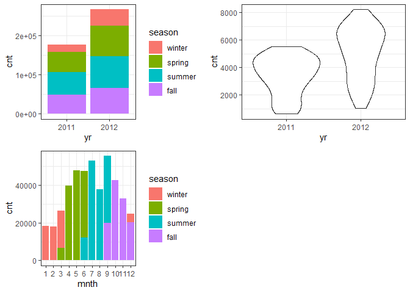

Project 2
================
Ifeoma Ojialor
10/16/2020

## Introduction

In this project, we will use a bike-sharing dataset to create machine
learning models. Before moving forward, I will briefly explain the
bike-sharing system and how it works. A bike-sharing system is a service
in which users can rent/use bicycles on a short term basis for a fee.
The goal of these programs is to provide affordable access to bicycles
for short distance trips as opposed to walking or taking public
transportation. Imagine how many people use these systems on a given
day, the numbers can vary greatly based on some elements. The goal of
this project is to build a predictive model to find out the number of
people that use these bikes in a given time period using available
information about that time/day. This in turn, can help businesses that
oversee this systems to manage them in a cost efficient manner.  
We will be using the bike-sharing dataset from the UCL Machine Learning
Repository. We will use the regression and boosted tree method to model
the response variable `cnt`.

## Exploratory Data Analysis

First we will read in the data using a relative path.

``` r
#read in data and filter to desired weekday
day1 <- read.csv("Bike-Sharing-Dataset/day.csv")
head(day1,5)
```

    ##   instant     dteday season yr mnth holiday weekday workingday weathersit
    ## 1       1 2011-01-01      1  0    1       0       6          0          2
    ## 2       2 2011-01-02      1  0    1       0       0          0          2
    ## 3       3 2011-01-03      1  0    1       0       1          1          1
    ## 4       4 2011-01-04      1  0    1       0       2          1          1
    ## 5       5 2011-01-05      1  0    1       0       3          1          1
    ##       temp    atemp      hum windspeed casual registered  cnt
    ## 1 0.344167 0.363625 0.805833  0.160446    331        654  985
    ## 2 0.363478 0.353739 0.696087  0.248539    131        670  801
    ## 3 0.196364 0.189405 0.437273  0.248309    120       1229 1349
    ## 4 0.200000 0.212122 0.590435  0.160296    108       1454 1562
    ## 5 0.226957 0.229270 0.436957  0.186900     82       1518 1600

Next, we will remove the *casual* and *registered* variables since the
`cnt` variable is a combination of both.

``` r
day1 <- select(day1, -casual, -registered) 
day1$weekday <- as.factor(day1$weekday)
levels(day1$weekday) <- c("Sunday", "Monday", "Tuesday", "Wednesday", "Thursday", "Friday", "Saturday")
day <- filter(day1, weekday == params$days)

#Check for missing values
miss <- data.frame(apply(day,2,function(x){sum(is.na(x))}))
names(miss)[1] <- "missing"
miss
```

    ##            missing
    ## instant          0
    ## dteday           0
    ## season           0
    ## yr               0
    ## mnth             0
    ## holiday          0
    ## weekday          0
    ## workingday       0
    ## weathersit       0
    ## temp             0
    ## atemp            0
    ## hum              0
    ## windspeed        0
    ## cnt              0

There are no missing values in the dataset, so we can continue with our
analysis.

``` r
#Change the variables into their appropriate format.
day$season <- as.factor(day$season)
day$weathersit <- as.factor(day$weathersit)
day$holiday <- as.factor(day$holiday)
day$workingday <- as.factor(day$workingday)
day$yr <- as.factor(day$yr)
day$mnth <- as.factor(day$mnth)

levels(day$season) <- c("winter", "spring", "summer", "fall")
levels(day$yr) <- c("2011", "2012")
str(day)
```

    ## 'data.frame':    105 obs. of  14 variables:
    ##  $ instant   : int  2 9 16 23 30 37 44 51 58 65 ...
    ##  $ dteday    : chr  "2011-01-02" "2011-01-09" "2011-01-16" "2011-01-23" ...
    ##  $ season    : Factor w/ 4 levels "winter","spring",..: 1 1 1 1 1 1 1 1 1 1 ...
    ##  $ yr        : Factor w/ 2 levels "2011","2012": 1 1 1 1 1 1 1 1 1 1 ...
    ##  $ mnth      : Factor w/ 12 levels "1","2","3","4",..: 1 1 1 1 1 2 2 2 2 3 ...
    ##  $ holiday   : Factor w/ 1 level "0": 1 1 1 1 1 1 1 1 1 1 ...
    ##  $ weekday   : Factor w/ 7 levels "Sunday","Monday",..: 1 1 1 1 1 1 1 1 1 1 ...
    ##  $ workingday: Factor w/ 1 level "0": 1 1 1 1 1 1 1 1 1 1 ...
    ##  $ weathersit: Factor w/ 3 levels "1","2","3": 2 1 1 1 1 1 1 1 1 2 ...
    ##  $ temp      : num  0.3635 0.1383 0.2317 0.0965 0.2165 ...
    ##  $ atemp     : num  0.3537 0.1162 0.2342 0.0988 0.2503 ...
    ##  $ hum       : num  0.696 0.434 0.484 0.437 0.722 ...
    ##  $ windspeed : num  0.249 0.362 0.188 0.247 0.074 ...
    ##  $ cnt       : int  801 822 1204 986 1096 1623 1589 1812 2402 605 ...

### Univariate Analysis

The `cnt` is the response variable, so we’ll use a histogram to get a
visual understanding of the variable.

``` r
ggplot(day, aes(x = cnt)) + theme_bw() + geom_histogram(aes(y =..density..), color = "black", fill = "white", binwidth = 1000) + geom_density(alpha = 0.2, fill = "blue") + labs(title = "Count Density", x = "Count", y = "Density")
```

<!-- -->

``` r
summary(day$cnt)
```

    ##    Min. 1st Qu.  Median    Mean 3rd Qu.    Max. 
    ##     605    2918    4334    4229    5464    8227

From the histogram and summary statistics output, it is pretty evident
that the count of total rental bikes are in the sub 5000 range. We will
investigate if there is a relationship between the response variable and
other relevant predictor variables in the next section. Lets look at the
other variables individually.

``` r
#visualize numeric predictor variables using a histogram
p1 <- ggplot(day) + geom_histogram(aes(x = temp), fill = "red", binwidth = 0.03)
p2 <- ggplot(day) + geom_histogram(aes(x = atemp), fill = "red", binwidth = 0.03)
p3 <- ggplot(day) + geom_histogram(aes(x = hum), fill = "red", binwidth = 0.025)
p4 <- ggplot(day) + geom_histogram(aes(x = windspeed), fill = "red", binwidth = 0.03)
gridExtra::grid.arrange(p1,p2,p3,p4, nrow = 2)
```

<!-- -->

Observations:  
\* No clear cut pattern in `temp`and `atemp`.

  - `hum` appears to be skewed to the left when the dataset is not
    filtered to a specific weekday.

  - `windspeed` appears to be skewed(right). This variable should be
    transformed to curb its skewness.

  - The distribution of `temp` and `atemp` looks very similar. We should
    think about taking out one of the variables.

<!-- end list -->

``` r
#visualize categorical predictor variables
h1 <- ggplot(day) + geom_bar(aes(x = season),fill = "pink")
h2 <- ggplot(day) + geom_bar(aes(x = yr),fill = "pink")
h3 <- ggplot(day) + geom_bar(aes(x = holiday),fill = "pink")
h4 <- ggplot(day) + geom_bar(aes(x = workingday),fill = "pink")
h5 <- ggplot(day) + geom_bar(aes(x = mnth),fill = "pink")
h6 <- ggplot(day) + geom_bar(aes(x = weathersit),fill = "pink")
gridExtra::grid.arrange(h1,h2,h3,h4,h5,h6, nrow = 3)
```

<!-- -->

Observations:  
\* The variation between the four seasons is little to none.

  - About the same number of people rode bikes in 2011 and 2012.

  - Many people rode bikes on days that are not holidays.

  - Most people used the bike-sharing system on days that were neither
    weekends nor holidays.

  - Most people used the bike sharing system on days with clear weather.

### Bi-variate Analysis

In this section, we will explore the predictor variables with respect to
the response variable. The objective is to discover hidden relationships
between the independent and response variables and use those findings in
the model building process.

``` r
# First, we will explore the relationship between the target and numerical variables.
p1 <- ggplot(day) +geom_point(aes(x = temp, y = cnt), colour = "violet") + labs(title = "Normalized Temperature vs Total Rental Bikes")
p2 <- ggplot(day) +geom_point(aes(x = atemp, y = cnt), colour = "#FF99CC") +labs(title = "Normalized Feeling Temperature vs Total Rental Bikes")
p3 <- ggplot(day) +geom_point(aes(x = hum, y = cnt), colour = "pink") + labs(title = "Normalized Humidity vs Total rental Bikes")
p4 <- ggplot(day) +geom_point(aes(x = windspeed, y = cnt), colour = "#FF66CC") +labs(title= "Normalized Windspeed vs Total rental Bikes")
gridExtra::grid.arrange(p1, p2, p3, p4, nrow = 2)
```

<!-- -->

Observations:  
\* There appears to be a positive linear relationship between `cnt` ,
`temp`, and `atemp`.

  - There is also a weak relationship between `cnt`, `hum`, and
    `windspeed`.

<!-- end list -->

``` r
# Now we'll visualize the relationship between the target and categorical variables.
# Instead of using a boxplot, I will use a violin plot which is the blend of both a boxplot and density plot
g1 <- ggplot(day) + geom_col(aes(x = yr, y = cnt, fill = season))+theme_bw()
g2 <- ggplot(day) + geom_violin(aes(x = yr, y = cnt))+theme_bw()
g3 <- ggplot(day) + geom_col(aes(x = mnth, y = cnt, fill = season))+theme_bw() 
g4 <- ggplot(day) + geom_col(aes(x = holiday, y = cnt, fill = season)) + theme_bw() 
g6 <- ggplot(day) + geom_col(aes(x = workingday, y = cnt, fill = season))
g7 <- ggplot(day) + geom_col(aes(x = weathersit, y = cnt, fill = season))
gridExtra::grid.arrange(g1, g2, g3, nrow = 2)
```

<!-- -->

``` r
gridExtra::grid.arrange(g4, g6, g7, nrow = 2)
```

<!-- --> Observations:  
\* The total bike rental count is higher in 2012 than 2011.

  - During workingday, the bike rental counts quite the highest compared
    to during no working day for different seasons.

  - During clear,partly cloudy weather, the bike rental count is highest
    and the second highest is during mist cloudy weather and followed by
    third highest during light snow and light rain weather.

  - The highest bike rental count was during the summer and lowest in
    the winter.

## Correlation Matrix

Correlation matrix helps us to understand the linear relationship
between variables.

``` r
day_c <- day[ , c(10:14)]
round(cor(day_c), 2)
```

    ##            temp atemp   hum windspeed   cnt
    ## temp       1.00  1.00  0.22     -0.20  0.68
    ## atemp      1.00  1.00  0.23     -0.23  0.68
    ## hum        0.22  0.23  1.00     -0.27  0.03
    ## windspeed -0.20 -0.23 -0.27      1.00 -0.27
    ## cnt        0.68  0.68  0.03     -0.27  1.00

From the above matrix, we can see that `temp` and `atemp` are highly
correlated. So we only need to include one of these variables in the
model to prevent multicollinearity. We will also transform the humidity
and windspeed variable.

``` r
day <- mutate(day, log_hum = log(day$hum+1))
day <- mutate(day, log_ws = log(day$windspeed + 1))

#Remove irrelevant variables
day <- select(day, -weekday,-holiday,-workingday,-dteday,-temp, -instant)
```

## Model Building

First we split the data into train and test sets.

``` r
set.seed(23)
dayIndex<- createDataPartition(day$cnt, p = 0.7, list=FALSE)
dayTrain <- day[dayIndex, ]
dayTest <- day[-dayIndex, ]

# Build a tree-based model using loocv;
fitTree <- train(cnt~ ., data = dayTrain, method = "rpart", 
              preProcess = c("center", "scale"), 
              trControl = trainControl(method = "loocv", number = 10), tuneGrid = data.frame(cp = 0.01:0.10))
```

    ## Warning in preProcess.default(thresh = 0.95, k = 5, freqCut = 19,
    ## uniqueCut = 10, : These variables have zero variances: weathersit3

    ## Warning in nominalTrainWorkflow(x = x, y = y, wts = weights, info =
    ## trainInfo, : There were missing values in resampled performance measures.

``` r
# Build a boosted tree model using cv
fitBoost <- train(cnt~., data = dayTrain, method = "gbm", 
              preProcess = c("center", "scale"), 
              trControl = trainControl(method = "cv", number = 10), 
              tuneGrid = expand.grid(n.trees=c(10,20,50,100,500,1000),shrinkage=c(0.01,0.05,0.1,0.5),n.minobsinnode =c(3,5,10),interaction.depth=c(1,5,10)))
```

    ## Warning in preProcess.default(thresh = 0.95, k = 5, freqCut = 19,
    ## uniqueCut = 10, : These variables have zero variances: weathersit3

    ## Warning in (function (x, y, offset = NULL, misc = NULL, distribution =
    ## "bernoulli", : variable 17: weathersit3 has no variation.

    ## Warning in preProcess.default(thresh = 0.95, k = 5, freqCut = 19,
    ## uniqueCut = 10, : These variables have zero variances: weathersit3

    ## Warning in (function (x, y, offset = NULL, misc = NULL, distribution =
    ## "bernoulli", : variable 17: weathersit3 has no variation.

    ## Warning in preProcess.default(thresh = 0.95, k = 5, freqCut = 19,
    ## uniqueCut = 10, : These variables have zero variances: weathersit3

    ## Warning in (function (x, y, offset = NULL, misc = NULL, distribution =
    ## "bernoulli", : variable 17: weathersit3 has no variation.

    ## Warning in preProcess.default(thresh = 0.95, k = 5, freqCut = 19,
    ## uniqueCut = 10, : These variables have zero variances: weathersit3

    ## Warning in (function (x, y, offset = NULL, misc = NULL, distribution =
    ## "bernoulli", : variable 17: weathersit3 has no variation.

    ## Warning in preProcess.default(thresh = 0.95, k = 5, freqCut = 19,
    ## uniqueCut = 10, : These variables have zero variances: weathersit3

    ## Warning in (function (x, y, offset = NULL, misc = NULL, distribution =
    ## "bernoulli", : variable 17: weathersit3 has no variation.

    ## Warning in preProcess.default(thresh = 0.95, k = 5, freqCut = 19,
    ## uniqueCut = 10, : These variables have zero variances: weathersit3

    ## Warning in (function (x, y, offset = NULL, misc = NULL, distribution =
    ## "bernoulli", : variable 17: weathersit3 has no variation.

    ## Warning in preProcess.default(thresh = 0.95, k = 5, freqCut = 19,
    ## uniqueCut = 10, : These variables have zero variances: weathersit3

    ## Warning in (function (x, y, offset = NULL, misc = NULL, distribution =
    ## "bernoulli", : variable 17: weathersit3 has no variation.

    ## Warning in preProcess.default(thresh = 0.95, k = 5, freqCut = 19,
    ## uniqueCut = 10, : These variables have zero variances: weathersit3

    ## Warning in (function (x, y, offset = NULL, misc = NULL, distribution =
    ## "bernoulli", : variable 17: weathersit3 has no variation.

    ## Warning in preProcess.default(thresh = 0.95, k = 5, freqCut = 19,
    ## uniqueCut = 10, : These variables have zero variances: weathersit3

    ## Warning in (function (x, y, offset = NULL, misc = NULL, distribution =
    ## "bernoulli", : variable 17: weathersit3 has no variation.

    ## Warning in preProcess.default(thresh = 0.95, k = 5, freqCut = 19,
    ## uniqueCut = 10, : These variables have zero variances: weathersit3

    ## Warning in (function (x, y, offset = NULL, misc = NULL, distribution =
    ## "bernoulli", : variable 17: weathersit3 has no variation.

    ## Warning in preProcess.default(thresh = 0.95, k = 5, freqCut = 19,
    ## uniqueCut = 10, : These variables have zero variances: weathersit3

    ## Warning in (function (x, y, offset = NULL, misc = NULL, distribution =
    ## "bernoulli", : variable 17: weathersit3 has no variation.

    ## Warning in preProcess.default(thresh = 0.95, k = 5, freqCut = 19,
    ## uniqueCut = 10, : These variables have zero variances: weathersit3

    ## Warning in (function (x, y, offset = NULL, misc = NULL, distribution =
    ## "bernoulli", : variable 17: weathersit3 has no variation.

    ## Warning in preProcess.default(thresh = 0.95, k = 5, freqCut = 19,
    ## uniqueCut = 10, : These variables have zero variances: weathersit3

    ## Warning in (function (x, y, offset = NULL, misc = NULL, distribution =
    ## "bernoulli", : variable 17: weathersit3 has no variation.

    ## Warning in preProcess.default(thresh = 0.95, k = 5, freqCut = 19,
    ## uniqueCut = 10, : These variables have zero variances: weathersit3

    ## Warning in (function (x, y, offset = NULL, misc = NULL, distribution =
    ## "bernoulli", : variable 17: weathersit3 has no variation.

    ## Warning in preProcess.default(thresh = 0.95, k = 5, freqCut = 19,
    ## uniqueCut = 10, : These variables have zero variances: weathersit3

    ## Warning in (function (x, y, offset = NULL, misc = NULL, distribution =
    ## "bernoulli", : variable 17: weathersit3 has no variation.

    ## Warning in preProcess.default(thresh = 0.95, k = 5, freqCut = 19,
    ## uniqueCut = 10, : These variables have zero variances: weathersit3

    ## Warning in (function (x, y, offset = NULL, misc = NULL, distribution =
    ## "bernoulli", : variable 17: weathersit3 has no variation.

    ## Warning in preProcess.default(thresh = 0.95, k = 5, freqCut = 19,
    ## uniqueCut = 10, : These variables have zero variances: weathersit3

    ## Warning in (function (x, y, offset = NULL, misc = NULL, distribution =
    ## "bernoulli", : variable 17: weathersit3 has no variation.

    ## Warning in preProcess.default(thresh = 0.95, k = 5, freqCut = 19,
    ## uniqueCut = 10, : These variables have zero variances: weathersit3

    ## Warning in (function (x, y, offset = NULL, misc = NULL, distribution =
    ## "bernoulli", : variable 17: weathersit3 has no variation.

    ## Warning in preProcess.default(thresh = 0.95, k = 5, freqCut = 19,
    ## uniqueCut = 10, : These variables have zero variances: weathersit3

    ## Warning in (function (x, y, offset = NULL, misc = NULL, distribution =
    ## "bernoulli", : variable 17: weathersit3 has no variation.

    ## Warning in preProcess.default(thresh = 0.95, k = 5, freqCut = 19,
    ## uniqueCut = 10, : These variables have zero variances: weathersit3

    ## Warning in (function (x, y, offset = NULL, misc = NULL, distribution =
    ## "bernoulli", : variable 17: weathersit3 has no variation.

    ## Warning in preProcess.default(thresh = 0.95, k = 5, freqCut = 19,
    ## uniqueCut = 10, : These variables have zero variances: weathersit3

    ## Warning in (function (x, y, offset = NULL, misc = NULL, distribution =
    ## "bernoulli", : variable 17: weathersit3 has no variation.

    ## Warning in preProcess.default(thresh = 0.95, k = 5, freqCut = 19,
    ## uniqueCut = 10, : These variables have zero variances: weathersit3

    ## Warning in (function (x, y, offset = NULL, misc = NULL, distribution =
    ## "bernoulli", : variable 17: weathersit3 has no variation.

    ## Warning in preProcess.default(thresh = 0.95, k = 5, freqCut = 19,
    ## uniqueCut = 10, : These variables have zero variances: weathersit3

    ## Warning in (function (x, y, offset = NULL, misc = NULL, distribution =
    ## "bernoulli", : variable 17: weathersit3 has no variation.

    ## Warning in preProcess.default(thresh = 0.95, k = 5, freqCut = 19,
    ## uniqueCut = 10, : These variables have zero variances: weathersit3

    ## Warning in (function (x, y, offset = NULL, misc = NULL, distribution =
    ## "bernoulli", : variable 17: weathersit3 has no variation.

    ## Warning in preProcess.default(thresh = 0.95, k = 5, freqCut = 19,
    ## uniqueCut = 10, : These variables have zero variances: weathersit3

    ## Warning in (function (x, y, offset = NULL, misc = NULL, distribution =
    ## "bernoulli", : variable 17: weathersit3 has no variation.

    ## Warning in preProcess.default(thresh = 0.95, k = 5, freqCut = 19,
    ## uniqueCut = 10, : These variables have zero variances: weathersit3

    ## Warning in (function (x, y, offset = NULL, misc = NULL, distribution =
    ## "bernoulli", : variable 17: weathersit3 has no variation.

    ## Warning in preProcess.default(thresh = 0.95, k = 5, freqCut = 19,
    ## uniqueCut = 10, : These variables have zero variances: weathersit3

    ## Warning in (function (x, y, offset = NULL, misc = NULL, distribution =
    ## "bernoulli", : variable 17: weathersit3 has no variation.

    ## Warning in preProcess.default(thresh = 0.95, k = 5, freqCut = 19,
    ## uniqueCut = 10, : These variables have zero variances: weathersit3

    ## Warning in (function (x, y, offset = NULL, misc = NULL, distribution =
    ## "bernoulli", : variable 17: weathersit3 has no variation.

    ## Warning in preProcess.default(thresh = 0.95, k = 5, freqCut = 19,
    ## uniqueCut = 10, : These variables have zero variances: weathersit3

    ## Warning in (function (x, y, offset = NULL, misc = NULL, distribution =
    ## "bernoulli", : variable 17: weathersit3 has no variation.

    ## Warning in preProcess.default(thresh = 0.95, k = 5, freqCut = 19,
    ## uniqueCut = 10, : These variables have zero variances: weathersit3

    ## Warning in (function (x, y, offset = NULL, misc = NULL, distribution =
    ## "bernoulli", : variable 17: weathersit3 has no variation.

    ## Warning in preProcess.default(thresh = 0.95, k = 5, freqCut = 19,
    ## uniqueCut = 10, : These variables have zero variances: weathersit3

    ## Warning in (function (x, y, offset = NULL, misc = NULL, distribution =
    ## "bernoulli", : variable 17: weathersit3 has no variation.

    ## Warning in preProcess.default(thresh = 0.95, k = 5, freqCut = 19,
    ## uniqueCut = 10, : These variables have zero variances: weathersit3

    ## Warning in (function (x, y, offset = NULL, misc = NULL, distribution =
    ## "bernoulli", : variable 17: weathersit3 has no variation.

    ## Warning in preProcess.default(thresh = 0.95, k = 5, freqCut = 19,
    ## uniqueCut = 10, : These variables have zero variances: weathersit3

    ## Warning in (function (x, y, offset = NULL, misc = NULL, distribution =
    ## "bernoulli", : variable 17: weathersit3 has no variation.

    ## Warning in preProcess.default(thresh = 0.95, k = 5, freqCut = 19,
    ## uniqueCut = 10, : These variables have zero variances: weathersit3

    ## Warning in (function (x, y, offset = NULL, misc = NULL, distribution =
    ## "bernoulli", : variable 17: weathersit3 has no variation.

    ## Warning in preProcess.default(thresh = 0.95, k = 5, freqCut = 19,
    ## uniqueCut = 10, : These variables have zero variances: weathersit3

    ## Warning in (function (x, y, offset = NULL, misc = NULL, distribution =
    ## "bernoulli", : variable 17: weathersit3 has no variation.

    ## Warning in preProcess.default(thresh = 0.95, k = 5, freqCut = 19,
    ## uniqueCut = 10, : These variables have zero variances: weathersit3

    ## Warning in (function (x, y, offset = NULL, misc = NULL, distribution =
    ## "bernoulli", : variable 17: weathersit3 has no variation.

``` r
# Adding a linear regression model part 2!
FitLinear <- train(cnt~ atemp + mnth*season, data = dayTrain, method = "lm", trControl = trainControl(method = "cv", number = 10))
```

    ## Warning in predict.lm(modelFit, newdata): prediction from a rank-deficient
    ## fit may be misleading

    ## Warning in predict.lm(modelFit, newdata): prediction from a rank-deficient
    ## fit may be misleading
    
    ## Warning in predict.lm(modelFit, newdata): prediction from a rank-deficient
    ## fit may be misleading
    
    ## Warning in predict.lm(modelFit, newdata): prediction from a rank-deficient
    ## fit may be misleading
    
    ## Warning in predict.lm(modelFit, newdata): prediction from a rank-deficient
    ## fit may be misleading
    
    ## Warning in predict.lm(modelFit, newdata): prediction from a rank-deficient
    ## fit may be misleading
    
    ## Warning in predict.lm(modelFit, newdata): prediction from a rank-deficient
    ## fit may be misleading
    
    ## Warning in predict.lm(modelFit, newdata): prediction from a rank-deficient
    ## fit may be misleading
    
    ## Warning in predict.lm(modelFit, newdata): prediction from a rank-deficient
    ## fit may be misleading
    
    ## Warning in predict.lm(modelFit, newdata): prediction from a rank-deficient
    ## fit may be misleading

``` r
# Display information from the tree fit
fitTree$results
```

    ##     cp    RMSE Rsquared     MAE   RMSESD RsquaredSD    MAESD
    ## 1 0.01 876.447      NaN 876.447 696.7947         NA 696.7947

``` r
# Display information from the boost fit
fitBoost$results
```

    ##     shrinkage interaction.depth n.minobsinnode n.trees      RMSE
    ## 1        0.01                 1              3      10 1763.6584
    ## 7        0.01                 1              5      10 1764.3302
    ## 13       0.01                 1             10      10 1764.2372
    ## 55       0.05                 1              3      10 1522.7605
    ## 61       0.05                 1              5      10 1501.9330
    ## 67       0.05                 1             10      10 1497.2138
    ## 109      0.10                 1              3      10 1309.2918
    ## 115      0.10                 1              5      10 1311.8966
    ## 121      0.10                 1             10      10 1302.7337
    ## 163      0.50                 1              3      10  917.9029
    ## 169      0.50                 1              5      10  934.8736
    ## 175      0.50                 1             10      10  910.8766
    ## 19       0.01                 5              3      10 1731.2146
    ## 25       0.01                 5              5      10 1731.0939
    ## 31       0.01                 5             10      10 1748.2293
    ## 73       0.05                 5              3      10 1366.6850
    ## 79       0.05                 5              5      10 1362.5839
    ## 85       0.05                 5             10      10 1444.0379
    ## 127      0.10                 5              3      10 1061.9742
    ## 133      0.10                 5              5      10 1113.9344
    ## 139      0.10                 5             10      10 1233.4062
    ## 181      0.50                 5              3      10 1028.1076
    ## 187      0.50                 5              5      10  935.3785
    ## 193      0.50                 5             10      10  981.7195
    ## 37       0.01                10              3      10 1722.8139
    ## 43       0.01                10              5      10 1730.4016
    ## 49       0.01                10             10      10 1752.8684
    ## 91       0.05                10              3      10 1354.8136
    ## 97       0.05                10              5      10 1389.2257
    ## 103      0.05                10             10      10 1449.2152
    ## 145      0.10                10              3      10 1076.4201
    ## 151      0.10                10              5      10 1093.3432
    ## 157      0.10                10             10      10 1207.1858
    ## 199      0.50                10              3      10  993.1331
    ## 205      0.50                10              5      10  889.7993
    ## 211      0.50                10             10      10  964.8158
    ## 2        0.01                 1              3      20 1684.9719
    ## 8        0.01                 1              5      20 1687.2443
    ## 14       0.01                 1             10      20 1686.1133
    ## 56       0.05                 1              3      20 1337.0626
    ## 62       0.05                 1              5      20 1331.2545
    ## 68       0.05                 1             10      20 1308.9571
    ## 110      0.10                 1              3      20 1102.6908
    ## 116      0.10                 1              5      20 1112.0651
    ## 122      0.10                 1             10      20 1114.2167
    ## 164      0.50                 1              3      20  832.6112
    ## 170      0.50                 1              5      20  887.0923
    ## 176      0.50                 1             10      20  880.5641
    ## 20       0.01                 5              3      20 1628.7608
    ## 26       0.01                 5              5      20 1627.8898
    ## 32       0.01                 5             10      20 1657.5666
    ## 74       0.05                 5              3      20 1090.8831
    ## 80       0.05                 5              5      20 1103.6068
    ## 86       0.05                 5             10      20 1222.4849
    ## 128      0.10                 5              3      20  906.6635
    ## 134      0.10                 5              5      20  944.5993
    ## 140      0.10                 5             10      20 1025.9938
    ## 182      0.50                 5              3      20 1013.7838
    ## 188      0.50                 5              5      20  987.5331
    ## 194      0.50                 5             10      20  865.2408
    ## 38       0.01                10              3      20 1609.2213
    ## 44       0.01                10              5      20 1624.9436
    ## 50       0.01                10             10      20 1661.1626
    ## 92       0.05                10              3      20 1112.1452
    ## 98       0.05                10              5      20 1136.9510
    ## 104      0.05                10             10      20 1239.3000
    ## 146      0.10                10              3      20  895.0019
    ## 152      0.10                10              5      20  943.0911
    ## 158      0.10                10             10      20 1018.5156
    ## 200      0.50                10              3      20 1028.5208
    ## 206      0.50                10              5      20  903.3584
    ## 212      0.50                10             10      20  985.4816
    ## 3        0.01                 1              3      50 1515.4598
    ## 9        0.01                 1              5      50 1510.4864
    ## 15       0.01                 1             10      50 1513.3596
    ## 57       0.05                 1              3      50 1030.2204
    ## 63       0.05                 1              5      50 1067.2619
    ## 69       0.05                 1             10      50 1043.2868
    ## 111      0.10                 1              3      50  849.5543
    ## 117      0.10                 1              5      50  885.8940
    ## 123      0.10                 1             10      50  938.8958
    ## 165      0.50                 1              3      50  857.0144
    ## 171      0.50                 1              5      50  854.5006
    ## 177      0.50                 1             10      50  858.6233
    ## 21       0.01                 5              3      50 1373.7107
    ## 27       0.01                 5              5      50 1373.8782
    ## 33       0.01                 5             10      50 1450.1082
    ## 75       0.05                 5              3      50  867.5285
    ## 81       0.05                 5              5      50  875.8493
    ## 87       0.05                 5             10      50  979.8481
    ## 129      0.10                 5              3      50  783.6846
    ## 135      0.10                 5              5      50  841.0886
    ## 141      0.10                 5             10      50  920.5777
    ## 183      0.50                 5              3      50 1050.7483
    ## 189      0.50                 5              5      50  980.5564
    ## 195      0.50                 5             10      50  838.2015
    ## 39       0.01                10              3      50 1357.2587
    ## 45       0.01                10              5      50 1379.0520
    ## 51       0.01                10             10      50 1447.9110
    ## 93       0.05                10              3      50  881.8279
    ##      Rsquared       MAE   RMSESD RsquaredSD    MAESD
    ## 1   0.5797375 1458.8509 323.8318 0.14192905 280.2480
    ## 7   0.5820523 1460.2278 320.8613 0.15444117 275.8542
    ## 13  0.5560348 1460.1929 321.5634 0.14362216 278.8720
    ## 55  0.6179975 1248.9733 300.1782 0.18180387 244.6412
    ## 61  0.5935837 1224.8541 311.7997 0.13543886 260.5603
    ## 67  0.6284765 1232.5005 317.4487 0.16091398 280.1406
    ## 109 0.6836901 1064.7325 315.9912 0.16751381 303.5793
    ## 115 0.6763741 1050.7326 280.8960 0.13575270 274.9649
    ## 121 0.7012840 1052.2105 318.2860 0.18361617 290.2379
    ## 163 0.8174363  772.4295 213.1592 0.10229692 203.6937
    ## 169 0.7969490  782.7636 334.5861 0.13950100 305.8893
    ## 175 0.8052041  769.1301 235.7673 0.09926224 226.4643
    ## 19  0.7686772 1437.4260 310.5120 0.09839016 270.6245
    ## 25  0.7566872 1437.0525 311.0901 0.14117843 273.4453
    ## 31  0.7036091 1449.1674 315.7109 0.17314954 274.8859
    ## 73  0.7607214 1135.4775 290.9680 0.14185623 268.1188
    ## 79  0.7856281 1124.5402 281.7385 0.13812013 269.4012
    ## 85  0.7098099 1188.7830 304.0499 0.13415672 268.7591
    ## 127 0.8161825  889.4343 219.0444 0.10842687 216.7388
    ## 133 0.7641883  948.9346 279.1693 0.14590156 257.9838
    ## 139 0.7197940 1020.4982 311.7177 0.16160007 292.7742
    ## 181 0.7831233  863.9991 299.7620 0.13326997 267.3052
    ## 187 0.7823117  803.6627 359.0912 0.13636553 294.3644
    ## 193 0.7475115  789.9698 286.7801 0.15045800 263.4035
    ## 37  0.7891870 1430.5832 310.5756 0.12569031 270.1205
    ## 43  0.7291174 1438.0805 307.3248 0.15891419 269.2309
    ## 49  0.6616102 1454.0707 318.0743 0.14792304 277.3789
    ## 91  0.7706822 1126.1389 273.8095 0.13180536 257.0777
    ## 97  0.7449113 1147.0593 279.8692 0.18420195 258.1864
    ## 103 0.6876758 1191.5579 296.2093 0.16618648 266.3257
    ## 145 0.8038858  909.9749 219.9904 0.12771475 202.8711
    ## 151 0.7832021  924.0144 290.2809 0.11036321 287.8599
    ## 157 0.7255963  992.0231 315.7064 0.15800298 294.9450
    ## 199 0.7685606  831.6274 400.1693 0.14257831 321.1824
    ## 205 0.8008247  751.8856 326.5006 0.12012986 287.9142
    ## 211 0.7687449  817.8917 300.0267 0.14019108 291.7188
    ## 2   0.5941552 1386.8498 320.5299 0.15327189 274.6192
    ## 8   0.5875549 1389.4476 322.2796 0.16778074 277.7955
    ## 14  0.5817509 1389.9468 323.8682 0.13573148 277.3615
    ## 56  0.6899527 1085.4749 293.6054 0.16668292 280.7734
    ## 62  0.6911580 1091.9174 285.7762 0.15375956 262.5856
    ## 68  0.6989467 1069.8170 308.7773 0.14541899 282.3272
    ## 110 0.7600880  912.9758 290.9261 0.13177681 280.3599
    ## 116 0.7593056  897.5675 243.6671 0.11468983 251.3704
    ## 122 0.7401649  916.1285 296.1572 0.16457185 257.8831
    ## 164 0.8383970  673.2371 276.6672 0.11393157 231.5225
    ## 170 0.8270025  734.5309 332.4899 0.12946772 273.4379
    ## 176 0.8208058  718.0458 211.8247 0.08096215 193.6595
    ## 20  0.7604481 1347.4678 301.8304 0.13951621 266.4941
    ## 26  0.7495706 1352.8093 305.2889 0.14558059 267.1558
    ## 32  0.6882076 1369.0521 313.6233 0.16585108 276.8920
    ## 74  0.7973207  919.6374 257.5950 0.12133731 238.7150
    ## 80  0.7948228  927.8251 274.2497 0.12880960 262.8911
    ## 86  0.7342463 1009.3808 296.9754 0.14303828 279.0898
    ## 128 0.8208306  746.0707 212.8202 0.09816798 206.0638
    ## 134 0.7900234  813.0819 288.0686 0.13575207 273.4906
    ## 140 0.7590291  855.4415 304.8650 0.14246607 282.4587
    ## 182 0.7988307  861.6188 303.6445 0.13883698 233.2468
    ## 188 0.7616053  812.5759 314.4115 0.12764207 261.9987
    ## 194 0.8028546  715.6111 275.0062 0.11532337 227.7230
    ## 38  0.7980743 1332.3142 299.5914 0.11703166 262.2637
    ## 44  0.7483652 1349.2454 302.4346 0.15393732 265.6007
    ## 50  0.6787018 1374.2745 317.6275 0.15986274 276.9144
    ## 92  0.7805629  929.5505 278.8291 0.13893736 264.6952
    ## 98  0.7676783  951.6109 272.9597 0.15191750 258.1016
    ## 104 0.7316991 1026.7811 284.9668 0.15121590 264.3505
    ## 146 0.8170568  735.2749 226.9688 0.11234362 222.0422
    ## 152 0.7936192  806.4899 237.9278 0.10404232 252.9814
    ## 158 0.7634259  857.8755 280.8928 0.14266419 266.3915
    ## 200 0.7567600  855.7689 442.0016 0.18008595 368.8245
    ## 206 0.8218075  748.8260 220.5142 0.09275184 185.4200
    ## 212 0.7721840  832.6469 305.4933 0.12375881 285.4843
    ## 3   0.6153647 1236.5948 311.5629 0.15260047 262.0354
    ## 9   0.6206926 1233.1782 320.1548 0.16503826 277.3365
    ## 15  0.6029443 1236.2556 317.8153 0.16255032 271.9274
    ## 57  0.7943274  847.0324 247.5757 0.12817298 232.9693
    ## 63  0.7627771  880.5367 254.7796 0.14107531 239.6700
    ## 69  0.7764161  866.2499 264.0521 0.13545727 236.0101
    ## 111 0.8338962  707.9227 268.4957 0.11010395 238.3049
    ## 117 0.8211629  734.4042 222.9704 0.10677379 212.2675
    ## 123 0.7866615  766.9422 255.5339 0.13269340 220.5681
    ## 165 0.8326234  690.1447 262.9578 0.09018358 216.1823
    ## 171 0.8190456  663.4957 319.2851 0.10837118 270.7991
    ## 177 0.8334810  702.6095 264.6281 0.09162124 225.9094
    ## 21  0.7798118 1135.3931 281.6775 0.14366550 262.2849
    ## 27  0.7717452 1139.0743 297.0548 0.14192528 279.3914
    ## 33  0.6946783 1190.1366 308.4020 0.15961526 278.4535
    ## 75  0.8289019  721.8958 258.2995 0.10315234 231.2907
    ## 81  0.8166791  743.2885 298.4442 0.12116414 283.8766
    ## 87  0.7734744  822.8560 275.3151 0.12740263 261.2345
    ## 129 0.8486972  632.8815 259.1850 0.09837939 213.1544
    ## 135 0.8212968  685.6878 315.4155 0.12509888 276.9396
    ## 141 0.7796462  762.0477 321.1977 0.13727406 286.3901
    ## 183 0.7862054  890.2219 271.1498 0.12176168 217.7542
    ## 189 0.7612204  786.1815 286.4126 0.13707865 219.7023
    ## 195 0.8306556  701.0577 286.4548 0.09865573 233.3522
    ## 39  0.7935062 1132.8480 281.5356 0.12451666 259.2553
    ## 45  0.7566515 1141.2218 293.5160 0.15729772 274.7296
    ## 51  0.7022457 1192.1772 309.7910 0.15623846 278.4517
    ## 93  0.8211698  723.7288 275.4020 0.12011071 266.2428
    ##  [ reached 'max' / getOption("max.print") -- omitted 116 rows ]

``` r
# Display information from the linear model fit
FitLinear$results
```

    ##   intercept    RMSE  Rsquared      MAE   RMSESD RsquaredSD    MAESD
    ## 1      TRUE 1414.36 0.5099216 1136.666 234.6557  0.1943615 217.7712

Now, we make predictions on the test data sets using the best model
fits. Then we compare RMSE to determine the best model.

``` r
predTree <- predict(fitTree, newdata = select(dayTest, -cnt))
postResample(predTree, dayTest$cnt)
```

    ##        RMSE    Rsquared         MAE 
    ## 931.8296989   0.7537105 768.7726790

``` r
boostPred <- predict(fitBoost, newdata = select(dayTest, -cnt))
postResample(boostPred, dayTest$cnt)
```

    ##        RMSE    Rsquared         MAE 
    ## 941.9625094   0.7442337 770.2147422

``` r
linearPred <- predict(FitLinear, newdata = select(dayTest, -cnt))
```

    ## Warning in predict.lm(modelFit, newdata): prediction from a rank-deficient
    ## fit may be misleading

``` r
postResample(linearPred, dayTest$cnt)
```

    ##         RMSE     Rsquared          MAE 
    ## 1405.3867226    0.4544444 1228.3250319

When we compare the two models, the boosted tree model has lower RMSE
values when applied on the test dataset. Hence, the boosted tree model
is our final model and best model for interpreting the bike rental count
on a daily basis.
