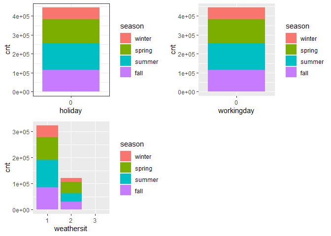

Project 2
================
Ifeoma Ojialor
10/16/2020

## Introduction

In this project, we will use a bike-sharing dataset to create machine
learning models. Before moving forward, I will briefly explain the
bike-sharing system and how it works. A bike-sharing system is a service
in which users can rent/use bicycles on a short term basis for a fee.
The goal of these programs is to provide affordable access to bicycles
for short distance trips as opposed to walking or taking public
transportation. Imagine how many people use these systems on a given
day, the numbers can vary greatly based on some elements. The goal of
this project is to build a predictive model to find out the number of
people that use these bikes in a given time period using available
information about that time/day. This in turn, can help businesses that
oversee this systems to manage them in a cost efficient manner.  
We will be using the bike-sharing dataset from the UCL Machine Learning
Repository. We will use the regression and boosted tree method to model
the response variable `cnt`.

## Exploratory Data Analysis

First we will read in the data using a relative path.

``` r
#read in data and filter to desired weekday
day1 <- read.csv("Bike-Sharing-Dataset/day.csv")
head(day1,5)
```

    ##   instant     dteday season yr mnth holiday
    ## 1       1 2011-01-01      1  0    1       0
    ## 2       2 2011-01-02      1  0    1       0
    ## 3       3 2011-01-03      1  0    1       0
    ## 4       4 2011-01-04      1  0    1       0
    ## 5       5 2011-01-05      1  0    1       0
    ##   weekday workingday weathersit     temp
    ## 1       6          0          2 0.344167
    ## 2       0          0          2 0.363478
    ## 3       1          1          1 0.196364
    ## 4       2          1          1 0.200000
    ## 5       3          1          1 0.226957
    ##      atemp      hum windspeed casual registered
    ## 1 0.363625 0.805833  0.160446    331        654
    ## 2 0.353739 0.696087  0.248539    131        670
    ## 3 0.189405 0.437273  0.248309    120       1229
    ## 4 0.212122 0.590435  0.160296    108       1454
    ## 5 0.229270 0.436957  0.186900     82       1518
    ##    cnt
    ## 1  985
    ## 2  801
    ## 3 1349
    ## 4 1562
    ## 5 1600

Next, we will remove the *casual* and *registered* variables since the
`cnt` variable is a combination of both.

``` r
day1 <- select(day1, -casual, -registered) 
day1$weekday <- as.factor(day1$weekday)
levels(day1$weekday) <- c("Sunday", "Monday", "Tuesday", "Wednesday", "Thursday", "Friday", "Saturday")
day <- filter(day1, weekday == params$days)

#Check for missing values
miss <- data.frame(apply(day,2,function(x){sum(is.na(x))}))
names(miss)[1] <- "missing"
miss
```

    ##            missing
    ## instant          0
    ## dteday           0
    ## season           0
    ## yr               0
    ## mnth             0
    ## holiday          0
    ## weekday          0
    ## workingday       0
    ## weathersit       0
    ## temp             0
    ## atemp            0
    ## hum              0
    ## windspeed        0
    ## cnt              0

There are no missing values in the dataset, so we can continue with our
analysis.

``` r
#Change the variables into their appropriate format.
day$season <- as.factor(day$season)
day$weathersit <- as.factor(day$weathersit)
day$holiday <- as.factor(day$holiday)
day$workingday <- as.factor(day$workingday)
day$yr <- as.factor(day$yr)
day$mnth <- as.factor(day$mnth)

levels(day$season) <- c("winter", "spring", "summer", "fall")
levels(day$yr) <- c("2011", "2012")
str(day)
```

    ## 'data.frame':    105 obs. of  14 variables:
    ##  $ instant   : int  2 9 16 23 30 37 44 51 58 65 ...
    ##  $ dteday    : chr  "2011-01-02" "2011-01-09" "2011-01-16" "2011-01-23" ...
    ##  $ season    : Factor w/ 4 levels "winter","spring",..: 1 1 1 1 1 1 1 1 1 1 ...
    ##  $ yr        : Factor w/ 2 levels "2011","2012": 1 1 1 1 1 1 1 1 1 1 ...
    ##  $ mnth      : Factor w/ 12 levels "1","2","3","4",..: 1 1 1 1 1 2 2 2 2 3 ...
    ##  $ holiday   : Factor w/ 1 level "0": 1 1 1 1 1 1 1 1 1 1 ...
    ##  $ weekday   : Factor w/ 7 levels "Sunday","Monday",..: 1 1 1 1 1 1 1 1 1 1 ...
    ##  $ workingday: Factor w/ 1 level "0": 1 1 1 1 1 1 1 1 1 1 ...
    ##  $ weathersit: Factor w/ 3 levels "1","2","3": 2 1 1 1 1 1 1 1 1 2 ...
    ##  $ temp      : num  0.3635 0.1383 0.2317 0.0965 0.2165 ...
    ##  $ atemp     : num  0.3537 0.1162 0.2342 0.0988 0.2503 ...
    ##  $ hum       : num  0.696 0.434 0.484 0.437 0.722 ...
    ##  $ windspeed : num  0.249 0.362 0.188 0.247 0.074 ...
    ##  $ cnt       : int  801 822 1204 986 1096 1623 1589 1812 2402 605 ...

### Univariate Analysis

The `cnt` is the response variable, so we’ll use a histogram to get a
visual understanding of the variable.

``` r
ggplot(day, aes(x = cnt)) + theme_bw() + geom_histogram(aes(y =..density..), color = "black", fill = "white", binwidth = 1000) + geom_density(alpha = 0.2, fill = "blue") + labs(title = "Count Density", x = "Count", y = "Density")
```

<!-- -->

``` r
summary(day$cnt)
```

    ##    Min. 1st Qu.  Median    Mean 3rd Qu.    Max. 
    ##     605    2918    4334    4229    5464    8227

From the histogram and summary statistics output, it is pretty evident
that the count of total rental bikes are in the sub 5000 range. We will
investigate if there is a relationship between the response variable and
other relevant predictor variables in the next section. Lets look at the
other variables individually.

``` r
#visualize numeric predictor variables using a histogram
p1 <- ggplot(day) + geom_histogram(aes(x = temp), fill = "red", binwidth = 0.03)
p2 <- ggplot(day) + geom_histogram(aes(x = atemp), fill = "red", binwidth = 0.03)
p3 <- ggplot(day) + geom_histogram(aes(x = hum), fill = "red", binwidth = 0.025)
p4 <- ggplot(day) + geom_histogram(aes(x = windspeed), fill = "red", binwidth = 0.03)
gridExtra::grid.arrange(p1,p2,p3,p4, nrow = 2)
```

<!-- -->

Observations:  
\* No clear cut pattern in `temp`and `atemp`.

  - `hum` appears to be skewed to the left when the dataset is not
    filtered to a specific weekday.

  - `windspeed` appears to be skewed(right). This variable should be
    transformed to curb its skewness.

  - The distribution of `temp` and `atemp` looks very similar. We should
    think about taking out one of the variables.

<!-- end list -->

``` r
#visualize categorical predictor variables
h1 <- ggplot(day) + geom_bar(aes(x = season),fill = "pink")
h2 <- ggplot(day) + geom_bar(aes(x = yr),fill = "pink")
h3 <- ggplot(day) + geom_bar(aes(x = holiday),fill = "pink")
h4 <- ggplot(day) + geom_bar(aes(x = workingday),fill = "pink")
h5 <- ggplot(day) + geom_bar(aes(x = mnth),fill = "pink")
h6 <- ggplot(day) + geom_bar(aes(x = weathersit),fill = "pink")
gridExtra::grid.arrange(h1,h2,h3,h4,h5,h6, nrow = 3)
```

<!-- -->

Observations:  
\* The variation between the four seasons is little to none.

  - About the same number of people rode bikes in 2011 and 2012.

  - Many people rode bikes on days that are not holidays.

  - Most people used the bike-sharing system on days that were neither
    weekends nor holidays.

  - Most people used the bike sharing system on days with clear weather.

### Bi-variate Analysis

In this section, we will explore the predictor variables with respect to
the response variable. The objective is to discover hidden relationships
between the independent and response variables and use those findings in
the model building process.

``` r
# First, we will explore the relationship between the target and numerical variables.
p1 <- ggplot(day) +geom_point(aes(x = temp, y = cnt), colour = "violet") + labs(title = "Normalized Temperature vs Total Rental Bikes")
p2 <- ggplot(day) +geom_point(aes(x = atemp, y = cnt), colour = "#FF99CC") +labs(title = "Normalized Feeling Temperature vs Total Rental Bikes")
p3 <- ggplot(day) +geom_point(aes(x = hum, y = cnt), colour = "pink") + labs(title = "Normalized Humidity vs Total rental Bikes")
p4 <- ggplot(day) +geom_point(aes(x = windspeed, y = cnt), colour = "#FF66CC") +labs(title= "Normalized Windspeed vs Total rental Bikes")
gridExtra::grid.arrange(p1, p2, p3, p4, nrow = 2)
```

<!-- -->

Observations:  
\* There appears to be a positive linear relationship between `cnt` ,
`temp`, and `atemp`.

  - There is also a weak relationship between `cnt`, `hum`, and
    `windspeed`.

<!-- end list -->

``` r
# Now we'll visualize the relationship between the target and categorical variables.
# Instead of using a boxplot, I will use a violin plot which is the blend of both a boxplot and density plot
g1 <- ggplot(day) + geom_col(aes(x = yr, y = cnt, fill = season))+theme_bw()
g2 <- ggplot(day) + geom_violin(aes(x = yr, y = cnt))+theme_bw()
g3 <- ggplot(day) + geom_col(aes(x = mnth, y = cnt, fill = season))+theme_bw() 
g4 <- ggplot(day) + geom_col(aes(x = holiday, y = cnt, fill = season)) + theme_bw() 
g6 <- ggplot(day) + geom_col(aes(x = workingday, y = cnt, fill = season))
g7 <- ggplot(day) + geom_col(aes(x = weathersit, y = cnt, fill = season))
gridExtra::grid.arrange(g1, g2, g3, nrow = 2)
```

<!-- -->

``` r
gridExtra::grid.arrange(g4, g6, g7, nrow = 2)
```

<!-- --> Observations:  
\* The total bike rental count is higher in 2012 than 2011.

  - During workingday, the bike rental counts quite the highest compared
    to during no working day for different seasons.

  - During clear,partly cloudy weather, the bike rental count is highest
    and the second highest is during mist cloudy weather and followed by
    third highest during light snow and light rain weather.

  - The highest bike rental count was during the summer and lowest in
    the winter.

## Correlation Matrix

Correlation matrix helps us to understand the linear relationship
between variables.

``` r
day_c <- day[ , c(10:14)]
round(cor(day_c), 2)
```

    ##            temp atemp   hum windspeed   cnt
    ## temp       1.00  1.00  0.22     -0.20  0.68
    ## atemp      1.00  1.00  0.23     -0.23  0.68
    ## hum        0.22  0.23  1.00     -0.27  0.03
    ## windspeed -0.20 -0.23 -0.27      1.00 -0.27
    ## cnt        0.68  0.68  0.03     -0.27  1.00

From the above matrix, we can see that `temp` and `atemp` are highly
correlated. So we only need to include one of these variables in the
model to prevent multicollinearity. We will also transform the humidity
and windspeed variable.

``` r
day <- mutate(day, log_hum = log(day$hum+1))
day <- mutate(day, log_ws = log(day$windspeed + 1))

#Remove irrelevant variables
day <- select(day, -weekday,-holiday,-workingday,-dteday,-temp, -instant)
```

## Model Building

First we split the data into train and test sets.

``` r
set.seed(23)
dayIndex<- createDataPartition(day$cnt, p = 0.7, list=FALSE)
dayTrain <- day[dayIndex, ]
dayTest <- day[-dayIndex, ]

# Build a tree-based model using loocv;
fitTree <- train(cnt~ ., data = dayTrain, method = "rpart", 
              preProcess = c("center", "scale"), 
              trControl = trainControl(method = "loocv", number = 10), tuneGrid = data.frame(cp = 0.01:0.10))
```

    ## Warning in preProcess.default(thresh = 0.95,
    ## k = 5, freqCut = 19, uniqueCut = 10, : These
    ## variables have zero variances: weathersit3

    ## Warning in nominalTrainWorkflow(x = x, y =
    ## y, wts = weights, info = trainInfo, : There
    ## were missing values in resampled performance
    ## measures.

``` r
# Display information from the tree fit
fitTree$results
```

    ##     cp    RMSE Rsquared     MAE   RMSESD
    ## 1 0.01 876.447      NaN 876.447 696.7947
    ##   RsquaredSD    MAESD
    ## 1         NA 696.7947

``` r
# Build a boosted tree model using cv
fitBoost <- train(cnt~., data = dayTrain, method = "gbm", 
              preProcess = c("center", "scale"), 
              trControl = trainControl(method = "cv", number = 10), 
              tuneGrid = expand.grid(n.trees=c(10,20),shrinkage=c(0.01,0.05),n.minobsinnode =c(3),interaction.depth=c(1,5)))
```

    ## Warning in preProcess.default(thresh = 0.95,
    ## k = 5, freqCut = 19, uniqueCut = 10, : These
    ## variables have zero variances: weathersit3

    ## Warning in (function (x, y, offset = NULL, misc
    ## = NULL, distribution = "bernoulli", : variable
    ## 17: weathersit3 has no variation.

    ## Iter   TrainDeviance   ValidDeviance   StepSize   Improve
    ##      1  3542420.2709             nan     0.0100 40874.6581
    ##      2  3508754.4434             nan     0.0100 37749.6105
    ##      3  3469495.9116             nan     0.0100 39114.0956
    ##      4  3431376.7391             nan     0.0100 34233.1614
    ##      5  3398466.2710             nan     0.0100 18905.1673
    ##      6  3359950.6336             nan     0.0100 34633.6427
    ##      7  3329610.6607             nan     0.0100 34640.0792
    ##      8  3295659.0334             nan     0.0100 32523.6982
    ##      9  3262236.2766             nan     0.0100 35402.3764
    ##     10  3229305.6300             nan     0.0100 27787.6303
    ##     20  2935401.4187             nan     0.0100 28918.3854

    ## Warning in preProcess.default(thresh = 0.95,
    ## k = 5, freqCut = 19, uniqueCut = 10, : These
    ## variables have zero variances: weathersit3

    ## Warning in (function (x, y, offset = NULL, misc
    ## = NULL, distribution = "bernoulli", : variable
    ## 17: weathersit3 has no variation.

    ## Iter   TrainDeviance   ValidDeviance   StepSize   Improve
    ##      1  3528516.6731             nan     0.0100 51971.6186
    ##      2  3467702.8208             nan     0.0100 51416.0288
    ##      3  3409689.9894             nan     0.0100 59574.8178
    ##      4  3353192.4515             nan     0.0100 67001.2525
    ##      5  3304678.8378             nan     0.0100 34108.0806
    ##      6  3255790.3830             nan     0.0100 55320.4952
    ##      7  3205943.2567             nan     0.0100 41830.5981
    ##      8  3156220.3666             nan     0.0100 46246.4590
    ##      9  3108522.8660             nan     0.0100 38263.6511
    ##     10  3059588.6936             nan     0.0100 39934.4598
    ##     20  2634254.5009             nan     0.0100 38682.9112

    ## Warning in preProcess.default(thresh = 0.95,
    ## k = 5, freqCut = 19, uniqueCut = 10, : These
    ## variables have zero variances: weathersit3

    ## Warning in (function (x, y, offset = NULL, misc
    ## = NULL, distribution = "bernoulli", : variable
    ## 17: weathersit3 has no variation.

    ## Iter   TrainDeviance   ValidDeviance   StepSize   Improve
    ##      1  3410198.4688             nan     0.0500 140229.2990
    ##      2  3259190.3039             nan     0.0500 123694.5998
    ##      3  3094005.5166             nan     0.0500 124679.0132
    ##      4  2945513.8712             nan     0.0500 110663.2484
    ##      5  2812140.1914             nan     0.0500 123456.5735
    ##      6  2715563.8710             nan     0.0500 107943.0297
    ##      7  2646063.9893             nan     0.0500 49620.2179
    ##      8  2544844.7601             nan     0.0500 103530.6237
    ##      9  2426005.2607             nan     0.0500 66304.7677
    ##     10  2346973.3345             nan     0.0500 81875.3897
    ##     20  1701750.2693             nan     0.0500 43391.6779

    ## Warning in preProcess.default(thresh = 0.95,
    ## k = 5, freqCut = 19, uniqueCut = 10, : These
    ## variables have zero variances: weathersit3

    ## Warning in (function (x, y, offset = NULL, misc
    ## = NULL, distribution = "bernoulli", : variable
    ## 17: weathersit3 has no variation.

    ## Iter   TrainDeviance   ValidDeviance   StepSize   Improve
    ##      1  3292345.9983             nan     0.0500 235613.7590
    ##      2  3028102.2659             nan     0.0500 212040.3321
    ##      3  2793297.8605             nan     0.0500 254925.4428
    ##      4  2574188.4565             nan     0.0500 179617.6423
    ##      5  2368747.0836             nan     0.0500 187365.3183
    ##      6  2200409.8236             nan     0.0500 112932.5943
    ##      7  2034027.6091             nan     0.0500 155742.1365
    ##      8  1904977.1822             nan     0.0500 118593.1069
    ##      9  1775330.0400             nan     0.0500 106250.3195
    ##     10  1630500.4651             nan     0.0500 112409.4080
    ##     20   898315.7517             nan     0.0500 27936.1214
    ## 
    ## Iter   TrainDeviance   ValidDeviance   StepSize   Improve
    ##      1  3550307.1841             nan     0.0100 28399.1710
    ##      2  3513735.6068             nan     0.0100 35734.6258
    ##      3  3478343.7516             nan     0.0100 33743.3636
    ##      4  3439077.8210             nan     0.0100 29731.8443
    ##      5  3398054.6394             nan     0.0100 34620.9875
    ##      6  3360595.6005             nan     0.0100 44676.3914
    ##      7  3329452.3579             nan     0.0100 22193.1001
    ##      8  3295396.8289             nan     0.0100 31035.8175
    ##      9  3268010.0573             nan     0.0100 28791.2516
    ##     10  3233115.6256             nan     0.0100 31272.8679
    ##     20  2940665.9203             nan     0.0100 26569.8319
    ## 
    ## Iter   TrainDeviance   ValidDeviance   StepSize   Improve
    ##      1  3537013.0874             nan     0.0100 44631.3364
    ##      2  3485670.6566             nan     0.0100 38203.4740
    ##      3  3432273.1014             nan     0.0100 49100.5317
    ##      4  3388999.1042             nan     0.0100 35544.0650
    ##      5  3338605.8650             nan     0.0100 51258.1862
    ##      6  3291704.1076             nan     0.0100 45762.9840
    ##      7  3250921.8288             nan     0.0100 38465.4440
    ##      8  3202396.3505             nan     0.0100 42321.6053
    ##      9  3145894.7329             nan     0.0100 55692.2803
    ##     10  3098996.1622             nan     0.0100 44640.4009
    ##     20  2653710.5701             nan     0.0100 35346.2445
    ## 
    ## Iter   TrainDeviance   ValidDeviance   StepSize   Improve
    ##      1  3381326.9540             nan     0.0500 170599.5534
    ##      2  3174031.3411             nan     0.0500 153584.6186
    ##      3  3040316.2779             nan     0.0500 138931.9267
    ##      4  2897620.5497             nan     0.0500 132991.7801
    ##      5  2779684.3203             nan     0.0500 106270.4595
    ##      6  2695805.1964             nan     0.0500 92961.4311
    ##      7  2577490.8926             nan     0.0500 84296.2161
    ##      8  2477380.0805             nan     0.0500 62482.7601
    ##      9  2372542.0270             nan     0.0500 75623.8364
    ##     10  2288914.5153             nan     0.0500 64229.1938
    ##     20  1727066.0782             nan     0.0500 34733.4167
    ## 
    ## Iter   TrainDeviance   ValidDeviance   StepSize   Improve
    ##      1  3278850.6162             nan     0.0500 259919.2744
    ##      2  2997727.1527             nan     0.0500 227007.2719
    ##      3  2797365.5633             nan     0.0500 124525.0764
    ##      4  2589545.9627             nan     0.0500 225262.1970
    ##      5  2375424.8792             nan     0.0500 165999.8670
    ##      6  2213534.8034             nan     0.0500 125080.4788
    ##      7  2081492.9577             nan     0.0500 85166.6810
    ##      8  1938791.9216             nan     0.0500 113592.1693
    ##      9  1797342.1074             nan     0.0500 109264.3345
    ##     10  1676997.7920             nan     0.0500 105133.0899
    ##     20   911253.0601             nan     0.0500 40906.0607
    ## 
    ## Iter   TrainDeviance   ValidDeviance   StepSize   Improve
    ##      1  3283018.1127             nan     0.0100 34779.6816
    ##      2  3257328.5174             nan     0.0100 21343.3472
    ##      3  3222742.5806             nan     0.0100 35696.1949
    ##      4  3188751.4867             nan     0.0100 33857.3218
    ##      5  3162767.0090             nan     0.0100 23355.9766
    ##      6  3133505.3980             nan     0.0100 27518.8402
    ##      7  3105542.6688             nan     0.0100 29454.8027
    ##      8  3081562.7113             nan     0.0100 23870.6791
    ##      9  3053399.8504             nan     0.0100 23757.8230
    ##     10  3031816.8586             nan     0.0100 25582.8806
    ##     20  2766107.3008             nan     0.0100 20322.9752
    ## 
    ## Iter   TrainDeviance   ValidDeviance   StepSize   Improve
    ##      1  3264965.7363             nan     0.0100 52272.2392
    ##      2  3205906.6529             nan     0.0100 55831.1568
    ##      3  3165949.2300             nan     0.0100 47637.1573
    ##      4  3114266.4670             nan     0.0100 53046.3130
    ##      5  3060694.0127             nan     0.0100 38393.0639
    ##      6  3014486.0824             nan     0.0100 33657.1012
    ##      7  2980368.6952             nan     0.0100 25578.1763
    ##      8  2935608.2080             nan     0.0100 40856.6252
    ##      9  2895028.8822             nan     0.0100 48899.6179
    ##     10  2860141.5363             nan     0.0100 30791.8219
    ##     20  2459480.6680             nan     0.0100 43582.5309
    ## 
    ## Iter   TrainDeviance   ValidDeviance   StepSize   Improve
    ##      1  3159060.6575             nan     0.0500 153049.8854
    ##      2  3010743.2794             nan     0.0500 130176.8656
    ##      3  2911267.0118             nan     0.0500 109685.8767
    ##      4  2790247.6759             nan     0.0500 133230.6730
    ##      5  2661678.8042             nan     0.0500 113718.3791
    ##      6  2563218.7254             nan     0.0500 104084.5013
    ##      7  2446930.7942             nan     0.0500 99008.0643
    ##      8  2337946.4458             nan     0.0500 83410.3808
    ##      9  2231647.0281             nan     0.0500 75998.5194
    ##     10  2147524.7660             nan     0.0500 70924.0001
    ##     20  1604550.9412             nan     0.0500 28547.1892
    ## 
    ## Iter   TrainDeviance   ValidDeviance   StepSize   Improve
    ##      1  3062253.6004             nan     0.0500 258255.8640
    ##      2  2821120.4703             nan     0.0500 227549.4060
    ##      3  2633534.9534             nan     0.0500 167731.1510
    ##      4  2479390.0876             nan     0.0500 192870.4741
    ##      5  2325477.7934             nan     0.0500 137542.4903
    ##      6  2150090.0413             nan     0.0500 148702.3943
    ##      7  2014881.4876             nan     0.0500 127422.1797
    ##      8  1885415.0901             nan     0.0500 84728.1314
    ##      9  1745993.7087             nan     0.0500 109274.4408
    ##     10  1653147.7714             nan     0.0500 94789.4356
    ##     20   914568.2072             nan     0.0500 29189.2662
    ## 
    ## Iter   TrainDeviance   ValidDeviance   StepSize   Improve
    ##      1  3298623.7235             nan     0.0100 36300.8609
    ##      2  3265200.0971             nan     0.0100 33812.5169
    ##      3  3233455.3573             nan     0.0100 19397.6317
    ##      4  3204707.8586             nan     0.0100 30891.5551
    ##      5  3169241.1956             nan     0.0100 27381.3213
    ##      6  3136643.5066             nan     0.0100 32337.3857
    ##      7  3106034.9583             nan     0.0100 23724.7601
    ##      8  3069784.3591             nan     0.0100 31741.4678
    ##      9  3040221.3597             nan     0.0100 30619.2676
    ##     10  3006079.2828             nan     0.0100 32604.6585
    ##     20  2732611.4493             nan     0.0100 20991.2721
    ## 
    ## Iter   TrainDeviance   ValidDeviance   StepSize   Improve
    ##      1  3280996.9416             nan     0.0100 52315.7355
    ##      2  3229704.5177             nan     0.0100 43536.3199
    ##      3  3180121.7089             nan     0.0100 45144.1327
    ##      4  3128568.7348             nan     0.0100 41136.3085
    ##      5  3080737.8735             nan     0.0100 45389.5061
    ##      6  3025151.8104             nan     0.0100 37760.5363
    ##      7  2982631.2661             nan     0.0100 46111.7272
    ##      8  2940930.4043             nan     0.0100 32970.3902
    ##      9  2901832.9879             nan     0.0100 35932.7541
    ##     10  2855106.0900             nan     0.0100 45782.4871
    ##     20  2460389.6221             nan     0.0100 30640.2081
    ## 
    ## Iter   TrainDeviance   ValidDeviance   StepSize   Improve
    ##      1  3149290.5405             nan     0.0500 157145.5102
    ##      2  2984487.2435             nan     0.0500 147654.2817
    ##      3  2835023.2957             nan     0.0500 154381.9059
    ##      4  2687192.3332             nan     0.0500 110241.9125
    ##      5  2560689.2306             nan     0.0500 100091.3478
    ##      6  2445548.5685             nan     0.0500 116073.9542
    ##      7  2349162.7869             nan     0.0500 84338.9464
    ##      8  2261796.1590             nan     0.0500 45151.5145
    ##      9  2167050.8684             nan     0.0500 64082.6496
    ##     10  2096187.0443             nan     0.0500 45459.5640
    ##     20  1573492.0369             nan     0.0500 40167.5419
    ## 
    ## Iter   TrainDeviance   ValidDeviance   StepSize   Improve
    ##      1  3085618.2539             nan     0.0500 211381.5614
    ##      2  2832904.2784             nan     0.0500 211306.3287
    ##      3  2629016.8546             nan     0.0500 158975.0995
    ##      4  2435645.9336             nan     0.0500 182316.7976
    ##      5  2240701.6140             nan     0.0500 142925.5145
    ##      6  2074517.5962             nan     0.0500 149422.6169
    ##      7  1913127.0814             nan     0.0500 140975.5773
    ##      8  1757090.0022             nan     0.0500 104203.7495
    ##      9  1660922.7889             nan     0.0500 89331.3005
    ##     10  1554998.6352             nan     0.0500 111393.8596
    ##     20   827470.5933             nan     0.0500 37939.0310
    ## 
    ## Iter   TrainDeviance   ValidDeviance   StepSize   Improve
    ##      1  3438009.7523             nan     0.0100 31795.8104
    ##      2  3401401.8113             nan     0.0100 42262.4590
    ##      3  3369145.8584             nan     0.0100 33032.5982
    ##      4  3331225.7890             nan     0.0100 35791.3246
    ##      5  3290148.8344             nan     0.0100 36462.1925
    ##      6  3263437.0597             nan     0.0100 33605.2096
    ##      7  3230503.3259             nan     0.0100 31144.8617
    ##      8  3193638.8385             nan     0.0100 34804.7175
    ##      9  3164739.1007             nan     0.0100 27745.0993
    ##     10  3121287.8859             nan     0.0100 26072.7336
    ##     20  2816511.5518             nan     0.0100 23918.2212
    ## 
    ## Iter   TrainDeviance   ValidDeviance   StepSize   Improve
    ##      1  3432869.0202             nan     0.0100 46789.7412
    ##      2  3381236.8902             nan     0.0100 44170.9033
    ##      3  3323628.5731             nan     0.0100 45085.6043
    ##      4  3273996.5085             nan     0.0100 37850.2049
    ##      5  3221452.7830             nan     0.0100 51669.5669
    ##      6  3172695.6388             nan     0.0100 37992.2571
    ##      7  3122953.7182             nan     0.0100 35984.9564
    ##      8  3072630.7017             nan     0.0100 32067.2357
    ##      9  3025097.4149             nan     0.0100 44322.1454
    ##     10  2974701.2989             nan     0.0100 36149.6348
    ##     20  2566597.2205             nan     0.0100 37408.7056
    ## 
    ## Iter   TrainDeviance   ValidDeviance   StepSize   Improve
    ##      1  3293555.7029             nan     0.0500 171204.1082
    ##      2  3135560.2395             nan     0.0500 148770.6050
    ##      3  3020977.6181             nan     0.0500 81511.6568
    ##      4  2862172.3833             nan     0.0500 149195.6731
    ##      5  2721946.2594             nan     0.0500 128891.0037
    ##      6  2608264.3244             nan     0.0500 120076.3748
    ##      7  2559638.2726             nan     0.0500 31984.9816
    ##      8  2462482.5527             nan     0.0500 74264.4433
    ##      9  2351049.6472             nan     0.0500 99738.1996
    ##     10  2267895.8938             nan     0.0500 85781.4627
    ##     20  1627719.4700             nan     0.0500 20918.1555
    ## 
    ## Iter   TrainDeviance   ValidDeviance   StepSize   Improve
    ##      1  3271662.1065             nan     0.0500 202605.3710
    ##      2  3023851.5624             nan     0.0500 252410.4502
    ##      3  2822392.5442             nan     0.0500 181705.9349
    ##      4  2599892.6360             nan     0.0500 183338.1181
    ##      5  2433245.6345             nan     0.0500 182157.2699
    ##      6  2266413.4676             nan     0.0500 175170.3674
    ##      7  2130802.2555             nan     0.0500 80503.1938
    ##      8  1961669.9917             nan     0.0500 126414.5973
    ##      9  1851265.7085             nan     0.0500 56438.8579
    ##     10  1747207.4060             nan     0.0500 93774.7978
    ##     20   963906.5222             nan     0.0500 26488.1708
    ## 
    ## Iter   TrainDeviance   ValidDeviance   StepSize   Improve
    ##      1  3489437.6916             nan     0.0100 27649.8743
    ##      2  3447054.4125             nan     0.0100 34082.5094
    ##      3  3404952.8347             nan     0.0100 32912.9122
    ##      4  3369663.1057             nan     0.0100 36636.0017
    ##      5  3332446.9891             nan     0.0100 32408.6791
    ##      6  3301765.4113             nan     0.0100 30771.7845
    ##      7  3257460.8905             nan     0.0100 30216.8092
    ##      8  3226854.9173             nan     0.0100 29266.5137
    ##      9  3196604.7158             nan     0.0100 29091.1839
    ##     10  3163406.8922             nan     0.0100 26837.9847
    ##     20  2897238.8022             nan     0.0100 25649.2059
    ## 
    ## Iter   TrainDeviance   ValidDeviance   StepSize   Improve
    ##      1  3469639.8002             nan     0.0100 51648.0230
    ##      2  3411925.0884             nan     0.0100 51623.5081
    ##      3  3360594.1571             nan     0.0100 36340.5041
    ##      4  3312436.0291             nan     0.0100 49562.8198
    ##      5  3258069.7298             nan     0.0100 52058.5075
    ##      6  3211647.4641             nan     0.0100 35548.7959
    ##      7  3166738.1761             nan     0.0100 31462.8828
    ##      8  3114680.5045             nan     0.0100 51999.0064
    ##      9  3069976.3060             nan     0.0100 35937.0276
    ##     10  3018924.8786             nan     0.0100 39895.6765
    ##     20  2599276.2518             nan     0.0100 39155.5562
    ## 
    ## Iter   TrainDeviance   ValidDeviance   StepSize   Improve
    ##      1  3310882.4026             nan     0.0500 170582.5909
    ##      2  3147628.9025             nan     0.0500 160830.6192
    ##      3  2977535.6343             nan     0.0500 164563.9720
    ##      4  2837683.6172             nan     0.0500 128315.4669
    ##      5  2738151.9638             nan     0.0500 93302.7168
    ##      6  2625913.4356             nan     0.0500 104962.4090
    ##      7  2530953.9469             nan     0.0500 93979.0104
    ##      8  2428736.2814             nan     0.0500 78241.2017
    ##      9  2331175.3206             nan     0.0500 78044.9812
    ##     10  2249840.0770             nan     0.0500 68282.8202
    ##     20  1711805.7134             nan     0.0500 36172.1548
    ## 
    ## Iter   TrainDeviance   ValidDeviance   StepSize   Improve
    ##      1  3273931.8070             nan     0.0500 256949.5276
    ##      2  3046556.6599             nan     0.0500 165241.7281
    ##      3  2798353.6265             nan     0.0500 219932.8803
    ##      4  2568056.1956             nan     0.0500 164736.3586
    ##      5  2378476.9316             nan     0.0500 153556.5409
    ##      6  2235967.7200             nan     0.0500 93413.4542
    ##      7  2096426.1473             nan     0.0500 143182.8982
    ##      8  1944756.3820             nan     0.0500 96195.8528
    ##      9  1820362.8367             nan     0.0500 104820.4233
    ##     10  1691832.4456             nan     0.0500 112166.3282
    ##     20   942173.1416             nan     0.0500 36969.3034
    ## 
    ## Iter   TrainDeviance   ValidDeviance   StepSize   Improve
    ##      1  3540543.8628             nan     0.0100 43155.9556
    ##      2  3502330.5230             nan     0.0100 35929.5748
    ##      3  3461363.3596             nan     0.0100 34990.8760
    ##      4  3425981.3140             nan     0.0100 35995.4220
    ##      5  3391570.7833             nan     0.0100 16644.7468
    ##      6  3352511.3537             nan     0.0100 23152.4074
    ##      7  3310697.7661             nan     0.0100 27018.0094
    ##      8  3276903.8307             nan     0.0100 31108.2456
    ##      9  3249624.6121             nan     0.0100 17644.0033
    ##     10  3221496.0452             nan     0.0100 28548.2593
    ##     20  2937021.7545             nan     0.0100 18293.8821
    ## 
    ## Iter   TrainDeviance   ValidDeviance   StepSize   Improve
    ##      1  3523746.2626             nan     0.0100 48007.5995
    ##      2  3471730.5094             nan     0.0100 41071.2077
    ##      3  3416334.8615             nan     0.0100 48110.0689
    ##      4  3358183.4121             nan     0.0100 46341.1350
    ##      5  3304786.8583             nan     0.0100 34338.1165
    ##      6  3253200.4998             nan     0.0100 50008.1596
    ##      7  3204849.8462             nan     0.0100 45491.2157
    ##      8  3153258.2481             nan     0.0100 43812.2345
    ##      9  3104404.7320             nan     0.0100 43897.0618
    ##     10  3055390.6409             nan     0.0100 39509.3559
    ##     20  2598807.2350             nan     0.0100 25146.6592
    ## 
    ## Iter   TrainDeviance   ValidDeviance   StepSize   Improve
    ##      1  3354370.5064             nan     0.0500 160593.5781
    ##      2  3172294.6229             nan     0.0500 158397.5768
    ##      3  3033062.9764             nan     0.0500 140236.1598
    ##      4  2900554.6544             nan     0.0500 143585.6815
    ##      5  2784682.4687             nan     0.0500 86709.8764
    ##      6  2686579.8762             nan     0.0500 98351.2696
    ##      7  2604207.1979             nan     0.0500 95120.9839
    ##      8  2511956.8471             nan     0.0500 92630.5826
    ##      9  2406592.9457             nan     0.0500 61590.7121
    ##     10  2337604.2007             nan     0.0500 50899.6305
    ##     20  1754100.2236             nan     0.0500 28044.9433
    ## 
    ## Iter   TrainDeviance   ValidDeviance   StepSize   Improve
    ##      1  3348308.7617             nan     0.0500 190876.9477
    ##      2  3063073.5097             nan     0.0500 229606.0945
    ##      3  2891877.3639             nan     0.0500 138145.0460
    ##      4  2682821.5204             nan     0.0500 131406.6089
    ##      5  2481937.5012             nan     0.0500 144838.9009
    ##      6  2302758.4386             nan     0.0500 155587.4622
    ##      7  2150400.9943             nan     0.0500 85024.5365
    ##      8  1972018.7752             nan     0.0500 143776.3146
    ##      9  1873918.8424             nan     0.0500 105789.6700
    ##     10  1731463.9285             nan     0.0500 108179.9521
    ##     20   924093.1934             nan     0.0500 60601.2343
    ## 
    ## Iter   TrainDeviance   ValidDeviance   StepSize   Improve
    ##      1  3448602.8814             nan     0.0100 26038.0376
    ##      2  3413293.9942             nan     0.0100 31484.3963
    ##      3  3377630.8942             nan     0.0100 35020.5985
    ##      4  3340694.8023             nan     0.0100 31341.5704
    ##      5  3311781.9503             nan     0.0100 17414.8498
    ##      6  3281659.7705             nan     0.0100 35337.2518
    ##      7  3244998.1072             nan     0.0100 29007.0224
    ##      8  3215491.9263             nan     0.0100 25868.3215
    ##      9  3179796.3487             nan     0.0100 29123.0839
    ##     10  3143420.4713             nan     0.0100 29677.5400
    ##     20  2856181.6182             nan     0.0100 24267.1994
    ## 
    ## Iter   TrainDeviance   ValidDeviance   StepSize   Improve
    ##      1  3420583.3950             nan     0.0100 43566.4311
    ##      2  3364610.7531             nan     0.0100 51547.4668
    ##      3  3314230.3374             nan     0.0100 47491.3998
    ##      4  3265223.6626             nan     0.0100 29268.5896
    ##      5  3217960.1853             nan     0.0100 35672.7636
    ##      6  3165177.7906             nan     0.0100 59124.0194
    ##      7  3119280.1950             nan     0.0100 36961.0696
    ##      8  3079575.8295             nan     0.0100 30000.8677
    ##      9  3041075.6023             nan     0.0100 31576.0278
    ##     10  2998235.6612             nan     0.0100 39672.7986
    ##     20  2602808.7655             nan     0.0100 37581.5922
    ## 
    ## Iter   TrainDeviance   ValidDeviance   StepSize   Improve
    ##      1  3273116.2979             nan     0.0500 156394.2054
    ##      2  3108720.6123             nan     0.0500 159324.0698
    ##      3  2986808.6396             nan     0.0500 115266.1755
    ##      4  2840555.9208             nan     0.0500 109929.9425
    ##      5  2754802.1445             nan     0.0500 51823.3420
    ##      6  2670900.6176             nan     0.0500 102350.0090
    ##      7  2558721.6790             nan     0.0500 96548.5145
    ##      8  2473881.5691             nan     0.0500 95100.0993
    ##      9  2391519.9871             nan     0.0500 85815.7306
    ##     10  2305596.3492             nan     0.0500 67305.8748
    ##     20  1694247.2486             nan     0.0500 15838.8811
    ## 
    ## Iter   TrainDeviance   ValidDeviance   StepSize   Improve
    ##      1  3288980.1297             nan     0.0500 151181.4956
    ##      2  3040428.6346             nan     0.0500 191391.8701
    ##      3  2843780.1402             nan     0.0500 155585.8550
    ##      4  2620950.4732             nan     0.0500 243629.8742
    ##      5  2415498.1248             nan     0.0500 185992.7591
    ##      6  2250448.0608             nan     0.0500 131065.1814
    ##      7  2080958.1300             nan     0.0500 161059.2377
    ##      8  1964218.3534             nan     0.0500 94731.6684
    ##      9  1833276.2519             nan     0.0500 45018.6796
    ##     10  1700502.1599             nan     0.0500 86210.2902
    ##     20   919475.3236             nan     0.0500 40732.9056
    ## 
    ## Iter   TrainDeviance   ValidDeviance   StepSize   Improve
    ##      1  3229145.1998             nan     0.0100 37137.1354
    ##      2  3195248.6472             nan     0.0100 25931.6180
    ##      3  3159341.4876             nan     0.0100 22314.2142
    ##      4  3124981.3901             nan     0.0100 34969.0784
    ##      5  3090201.9283             nan     0.0100 35460.0693
    ##      6  3057780.1737             nan     0.0100 26169.3544
    ##      7  3020745.9048             nan     0.0100 28385.1491
    ##      8  2989647.3172             nan     0.0100 30740.0721
    ##      9  2968965.5240             nan     0.0100 7823.9065
    ##     10  2936469.9661             nan     0.0100 30143.9827
    ##     20  2666794.3036             nan     0.0100 25224.7396
    ## 
    ## Iter   TrainDeviance   ValidDeviance   StepSize   Improve
    ##      1  3215146.8261             nan     0.0100 44175.7660
    ##      2  3163189.8023             nan     0.0100 52248.6952
    ##      3  3112409.9196             nan     0.0100 48050.3368
    ##      4  3061862.7971             nan     0.0100 49293.3881
    ##      5  3021926.8708             nan     0.0100 40816.6480
    ##      6  2974304.2985             nan     0.0100 39596.9013
    ##      7  2930983.5435             nan     0.0100 34839.9351
    ##      8  2884891.0189             nan     0.0100 46590.2778
    ##      9  2838302.2690             nan     0.0100 30643.8383
    ##     10  2810421.1906             nan     0.0100 17248.7908
    ##     20  2435836.5269             nan     0.0100 35538.2063
    ## 
    ## Iter   TrainDeviance   ValidDeviance   StepSize   Improve
    ##      1  3095191.4127             nan     0.0500 131366.4464
    ##      2  2907302.9916             nan     0.0500 146916.4601
    ##      3  2756653.1178             nan     0.0500 146862.2483
    ##      4  2645610.3870             nan     0.0500 128562.5144
    ##      5  2529476.7944             nan     0.0500 105597.7031
    ##      6  2438272.6059             nan     0.0500 75836.9836
    ##      7  2339755.7543             nan     0.0500 81232.1175
    ##      8  2268582.2755             nan     0.0500 87060.5326
    ##      9  2200431.6057             nan     0.0500 58280.8643
    ##     10  2126153.0651             nan     0.0500 42577.3965
    ##     20  1567943.6318             nan     0.0500 41218.7344
    ## 
    ## Iter   TrainDeviance   ValidDeviance   StepSize   Improve
    ##      1  3048636.2307             nan     0.0500 245430.7326
    ##      2  2841587.3113             nan     0.0500 220273.8089
    ##      3  2623148.4700             nan     0.0500 172537.9082
    ##      4  2443825.2838             nan     0.0500 110130.7825
    ##      5  2275044.1876             nan     0.0500 174714.7420
    ##      6  2103905.5113             nan     0.0500 142604.3884
    ##      7  1928212.4687             nan     0.0500 120875.9690
    ##      8  1770083.8513             nan     0.0500 110020.3614
    ##      9  1631461.6014             nan     0.0500 76619.2504
    ##     10  1495887.5454             nan     0.0500 135414.7092
    ##     20   816806.3445             nan     0.0500 25736.3108
    ## 
    ## Iter   TrainDeviance   ValidDeviance   StepSize   Improve
    ##      1  3621159.9486             nan     0.0100 18962.1817
    ##      2  3573248.9620             nan     0.0100 32702.7745
    ##      3  3540533.8438             nan     0.0100 22197.6264
    ##      4  3493554.8831             nan     0.0100 32128.1683
    ##      5  3454471.7600             nan     0.0100 29826.9738
    ##      6  3415773.7190             nan     0.0100 35610.1332
    ##      7  3384967.2029             nan     0.0100 36872.6862
    ##      8  3357921.0275             nan     0.0100 19238.5364
    ##      9  3322769.7522             nan     0.0100 27069.0605
    ##     10  3283730.1441             nan     0.0100 31590.5004
    ##     20  2983797.7626             nan     0.0100 25208.2642
    ## 
    ## Iter   TrainDeviance   ValidDeviance   StepSize   Improve
    ##      1  3611255.1592             nan     0.0100 27463.8655
    ##      2  3550715.8395             nan     0.0100 41036.0789
    ##      3  3500998.1051             nan     0.0100 44951.4941
    ##      4  3435019.2434             nan     0.0100 68145.3906
    ##      5  3370638.7602             nan     0.0100 56996.4714
    ##      6  3323207.4988             nan     0.0100 38105.4683
    ##      7  3267865.6814             nan     0.0100 38505.7050
    ##      8  3213581.6234             nan     0.0100 53924.6536
    ##      9  3168736.8266             nan     0.0100 36308.9519
    ##     10  3125802.4628             nan     0.0100 42175.0728
    ##     20  2690349.8040             nan     0.0100 49044.2981
    ## 
    ## Iter   TrainDeviance   ValidDeviance   StepSize   Improve
    ##      1  3463728.8864             nan     0.0500 184857.5950
    ##      2  3330225.6729             nan     0.0500 149409.8535
    ##      3  3124257.9523             nan     0.0500 159943.2382
    ##      4  2978671.4684             nan     0.0500 135717.6386
    ##      5  2851123.9457             nan     0.0500 140862.9569
    ##      6  2704306.2816             nan     0.0500 116903.5812
    ##      7  2563766.2671             nan     0.0500 79957.6106
    ##      8  2472911.5226             nan     0.0500 74025.0718
    ##      9  2388241.5204             nan     0.0500 77483.8484
    ##     10  2311530.0895             nan     0.0500 89110.4269
    ##     20  1684288.6200             nan     0.0500 23381.0590
    ## 
    ## Iter   TrainDeviance   ValidDeviance   StepSize   Improve
    ##      1  3373218.2684             nan     0.0500 206835.2130
    ##      2  3111141.8547             nan     0.0500 217846.3320
    ##      3  2893122.4177             nan     0.0500 229372.7396
    ##      4  2691361.2206             nan     0.0500 236359.8953
    ##      5  2487109.0503             nan     0.0500 183819.8870
    ##      6  2313835.2052             nan     0.0500 128953.1953
    ##      7  2157975.2392             nan     0.0500 158538.2786
    ##      8  1988189.4785             nan     0.0500 135450.3876
    ##      9  1863790.6277             nan     0.0500 98299.6592
    ##     10  1741759.9008             nan     0.0500 86985.5076
    ##     20   926009.3745             nan     0.0500 25452.5568
    ## 
    ## Iter   TrainDeviance   ValidDeviance   StepSize   Improve
    ##      1  3223042.5612             nan     0.0500 219390.0931
    ##      2  2977745.1288             nan     0.0500 229066.1331
    ##      3  2743791.2379             nan     0.0500 228791.0577
    ##      4  2521610.1692             nan     0.0500 193804.7439
    ##      5  2341407.9520             nan     0.0500 126830.6247
    ##      6  2165091.5048             nan     0.0500 162966.7771
    ##      7  1995627.5397             nan     0.0500 77938.7089
    ##      8  1865477.5973             nan     0.0500 81704.2634
    ##      9  1736095.4977             nan     0.0500 85931.1291
    ##     10  1642367.0496             nan     0.0500 66213.0830
    ##     20   903066.9449             nan     0.0500 41237.5312

``` r
# Display information from the boost fit
fitBoost$results
```

    ##   shrinkage interaction.depth n.minobsinnode
    ## 1      0.01                 1              3
    ## 5      0.05                 1              3
    ## 3      0.01                 5              3
    ## 7      0.05                 5              3
    ## 2      0.01                 1              3
    ## 6      0.05                 1              3
    ## 4      0.01                 5              3
    ## 8      0.05                 5              3
    ##   n.trees     RMSE  Rsquared       MAE   RMSESD
    ## 1      10 1764.674 0.5588257 1460.4041 325.3655
    ## 5      10 1514.795 0.5746118 1223.2971 313.3400
    ## 3      10 1728.011 0.7958158 1434.3381 312.4347
    ## 7      10 1352.478 0.7817855 1124.0925 278.4871
    ## 2      20 1686.844 0.5663590 1389.5585 328.1745
    ## 6      20 1352.945 0.6807767 1103.9966 288.3853
    ## 4      20 1614.291 0.8111431 1335.1801 306.9383
    ## 8      20 1080.687 0.8010422  907.5814 269.3852
    ##   RsquaredSD    MAESD
    ## 1  0.1852578 279.3633
    ## 5  0.1525568 271.0540
    ## 3  0.1142248 271.1376
    ## 7  0.1433120 260.3668
    ## 2  0.1781675 280.5700
    ## 6  0.1689414 262.4483
    ## 4  0.1073943 269.6571
    ## 8  0.1379988 253.2906

Now, we make predictions on the test data sets using the best model
fits. Then we compare RMSE to determine the best model.

``` r
predTree <- predict(fitTree, newdata = select(dayTest, -cnt))
postResample(predTree, dayTest$cnt)
```

    ##        RMSE    Rsquared         MAE 
    ## 931.8296989   0.7537105 768.7726790

``` r
boostPred <- predict(fitBoost, newdata = select(dayTest, -cnt))
postResample(boostPred, dayTest$cnt)
```

    ##         RMSE     Rsquared          MAE 
    ## 1082.5324406    0.8343596  895.0454381

When we compare the two models, the boosted tree model has lower RMSE
values when applied on the test dataset. Hence, the boosted tree model
is our final model and best model for interpreting the bike rental count
on a daily basis.
