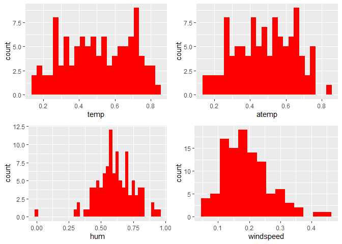

Project 2
================
Ifeoma Ojialor
10/16/2020

## Introduction

In this project, we will use a bike-sharing dataset to create machine
learning models. Before moving forward, I will briefly explain the
bike-sharing system and how it works. A bike-sharing system is a service
in which users can rent/use bicycles on a short term basis for a fee.
The goal of these programs is to provide affordable access to bicycles
for short distance trips as opposed to walking or taking public
transportation. Imagine how many people use these systems on a given
day, the numbers can vary greatly based on some elements. The goal of
this project is to build a predictive model to find out the number of
people that use these bikes in a given time period using available
information about that time/day. This in turn, can help businesses that
oversee this systems to manage them in a cost efficient manner.  
We will be using the bike-sharing dataset from the UCL Machine Learning
Repository. We will use the regression and boosted tree method to model
the response variable `cnt`.

## Exploratory Data Analysis

First we will read in the data using a relative path.

``` r
#read in data and filter to desired weekday
day1 <- read.csv("Bike-Sharing-Dataset/day.csv")
head(day1,5)
```

    ##   instant     dteday season yr mnth holiday
    ## 1       1 2011-01-01      1  0    1       0
    ## 2       2 2011-01-02      1  0    1       0
    ## 3       3 2011-01-03      1  0    1       0
    ## 4       4 2011-01-04      1  0    1       0
    ## 5       5 2011-01-05      1  0    1       0
    ##   weekday workingday weathersit     temp
    ## 1       6          0          2 0.344167
    ## 2       0          0          2 0.363478
    ## 3       1          1          1 0.196364
    ## 4       2          1          1 0.200000
    ## 5       3          1          1 0.226957
    ##      atemp      hum windspeed casual registered
    ## 1 0.363625 0.805833  0.160446    331        654
    ## 2 0.353739 0.696087  0.248539    131        670
    ## 3 0.189405 0.437273  0.248309    120       1229
    ## 4 0.212122 0.590435  0.160296    108       1454
    ## 5 0.229270 0.436957  0.186900     82       1518
    ##    cnt
    ## 1  985
    ## 2  801
    ## 3 1349
    ## 4 1562
    ## 5 1600

Next, we will remove the *casual* and *registered* variables since the
`cnt` variable is a combination of both.

``` r
day1 <- select(day1, -casual, -registered) 
day1$weekday <- as.factor(day1$weekday)
levels(day1$weekday) <- c("Sunday", "Monday", "Tuesday", "Wednesday", "Thursday", "Friday", "Saturday")
day <- filter(day1, weekday == params$days)

#Check for missing values
miss <- data.frame(apply(day,2,function(x){sum(is.na(x))}))
names(miss)[1] <- "missing"
miss
```

    ##            missing
    ## instant          0
    ## dteday           0
    ## season           0
    ## yr               0
    ## mnth             0
    ## holiday          0
    ## weekday          0
    ## workingday       0
    ## weathersit       0
    ## temp             0
    ## atemp            0
    ## hum              0
    ## windspeed        0
    ## cnt              0

There are no missing values in the dataset, so we can continue with our
analysis.

``` r
#Change the variables into their appropriate format.
day$season <- as.factor(day$season)
day$weathersit <- as.factor(day$weathersit)
day$holiday <- as.factor(day$holiday)
day$workingday <- as.factor(day$workingday)
day$yr <- as.factor(day$yr)
day$mnth <- as.factor(day$mnth)

levels(day$season) <- c("winter", "spring", "summer", "fall")
levels(day$yr) <- c("2011", "2012")
str(day)
```

    ## 'data.frame':    104 obs. of  14 variables:
    ##  $ instant   : int  6 13 20 27 34 41 48 55 62 69 ...
    ##  $ dteday    : chr  "2011-01-06" "2011-01-13" "2011-01-20" "2011-01-27" ...
    ##  $ season    : Factor w/ 4 levels "winter","spring",..: 1 1 1 1 1 1 1 1 1 1 ...
    ##  $ yr        : Factor w/ 2 levels "2011","2012": 1 1 1 1 1 1 1 1 1 1 ...
    ##  $ mnth      : Factor w/ 12 levels "1","2","3","4",..: 1 1 1 1 2 2 2 2 3 3 ...
    ##  $ holiday   : Factor w/ 2 levels "0","1": 1 1 1 1 1 1 1 1 1 1 ...
    ##  $ weekday   : Factor w/ 7 levels "Sunday","Monday",..: 5 5 5 5 5 5 5 5 5 5 ...
    ##  $ workingday: Factor w/ 2 levels "0","1": 2 2 2 2 2 2 2 2 2 2 ...
    ##  $ weathersit: Factor w/ 3 levels "1","2","3": 1 1 2 1 1 1 1 2 1 3 ...
    ##  $ temp      : num  0.204 0.165 0.262 0.195 0.187 ...
    ##  $ atemp     : num  0.233 0.151 0.255 0.22 0.178 ...
    ##  $ hum       : num  0.518 0.47 0.538 0.688 0.438 ...
    ##  $ windspeed : num  0.0896 0.301 0.1959 0.1138 0.2778 ...
    ##  $ cnt       : int  1606 1406 1927 431 1550 1538 2475 1807 1685 623 ...

### Univariate Analysis

The `cnt` is the response variable, so we’ll use a histogram to get a
visual understanding of the variable.

``` r
ggplot(day, aes(x = cnt)) + theme_bw() + geom_histogram(aes(y =..density..), color = "black", fill = "white", binwidth = 1000) + geom_density(alpha = 0.2, fill = "blue") + labs(title = "Count Density", x = "Count", y = "Density")
```

<!-- -->

``` r
summary(day$cnt)
```

    ##    Min. 1st Qu.  Median    Mean 3rd Qu.    Max. 
    ##     431    3271    4721    4667    6286    7804

From the histogram and summary statistics output, it is pretty evident
that the count of total rental bikes are in the sub 5000 range. We will
investigate if there is a relationship between the response variable and
other relevant predictor variables in the next section. Lets look at the
other variables individually.

``` r
#visualize numeric predictor variables using a histogram
p1 <- ggplot(day) + geom_histogram(aes(x = temp), fill = "red", binwidth = 0.03)
p2 <- ggplot(day) + geom_histogram(aes(x = atemp), fill = "red", binwidth = 0.03)
p3 <- ggplot(day) + geom_histogram(aes(x = hum), fill = "red", binwidth = 0.025)
p4 <- ggplot(day) + geom_histogram(aes(x = windspeed), fill = "red", binwidth = 0.03)
gridExtra::grid.arrange(p1,p2,p3,p4, nrow = 2)
```

<!-- -->

Observations:  
\* No clear cut pattern in `temp`and `atemp`.

  - `hum` appears to be skewed to the left when the dataset is not
    filtered to a specific weekday.

  - `windspeed` appears to be skewed(right). This variable should be
    transformed to curb its skewness.

  - The distribution of `temp` and `atemp` looks very similar. We should
    think about taking out one of the variables.

<!-- end list -->

``` r
#visualize categorical predictor variables
h1 <- ggplot(day) + geom_bar(aes(x = season),fill = "pink")
h2 <- ggplot(day) + geom_bar(aes(x = yr),fill = "pink")
h3 <- ggplot(day) + geom_bar(aes(x = holiday),fill = "pink")
h4 <- ggplot(day) + geom_bar(aes(x = workingday),fill = "pink")
h5 <- ggplot(day) + geom_bar(aes(x = mnth),fill = "pink")
h6 <- ggplot(day) + geom_bar(aes(x = weathersit),fill = "pink")
gridExtra::grid.arrange(h1,h2,h3,h4,h5,h6, nrow = 3)
```

<!-- -->

Observations:  
\* The variation between the four seasons is little to none.

  - About the same number of people rode bikes in 2011 and 2012.

  - Many people rode bikes on days that are not holidays.

  - Most people used the bike-sharing system on days that were neither
    weekends nor holidays.

  - Most people used the bike sharing system on days with clear weather.

### Bi-variate Analysis

In this section, we will explore the predictor variables with respect to
the response variable. The objective is to discover hidden relationships
between the independent and response variables and use those findings in
the model building process.

``` r
# First, we will explore the relationship between the target and numerical variables.
p1 <- ggplot(day) +geom_point(aes(x = temp, y = cnt), colour = "violet") + labs(title = "Normalized Temperature vs Total Rental Bikes")
p2 <- ggplot(day) +geom_point(aes(x = atemp, y = cnt), colour = "#FF99CC") +labs(title = "Normalized Feeling Temperature vs Total Rental Bikes")
p3 <- ggplot(day) +geom_point(aes(x = hum, y = cnt), colour = "pink") + labs(title = "Normalized Humidity vs Total rental Bikes")
p4 <- ggplot(day) +geom_point(aes(x = windspeed, y = cnt), colour = "#FF66CC") +labs(title= "Normalized Windspeed vs Total rental Bikes")
gridExtra::grid.arrange(p1, p2, p3, p4, nrow = 2)
```

<!-- -->

Observations:  
\* There appears to be a positive linear relationship between `cnt` ,
`temp`, and `atemp`.

  - There is also a weak relationship between `cnt`, `hum`, and
    `windspeed`.

<!-- end list -->

``` r
# Now we'll visualize the relationship between the target and categorical variables.
# Instead of using a boxplot, I will use a violin plot which is the blend of both a boxplot and density plot
g1 <- ggplot(day) + geom_col(aes(x = yr, y = cnt, fill = season))+theme_bw()
g2 <- ggplot(day) + geom_violin(aes(x = yr, y = cnt))+theme_bw()
g3 <- ggplot(day) + geom_col(aes(x = mnth, y = cnt, fill = season))+theme_bw() 
g4 <- ggplot(day) + geom_col(aes(x = holiday, y = cnt, fill = season)) + theme_bw() 
g6 <- ggplot(day) + geom_col(aes(x = workingday, y = cnt, fill = season))
g7 <- ggplot(day) + geom_col(aes(x = weathersit, y = cnt, fill = season))
gridExtra::grid.arrange(g1, g2, g3, nrow = 2)
```

<!-- -->

``` r
gridExtra::grid.arrange(g4, g6, g7, nrow = 2)
```

<!-- --> Observations:  
\* The total bike rental count is higher in 2012 than 2011.

  - During workingday, the bike rental counts quite the highest compared
    to during no working day for different seasons.

  - During clear,partly cloudy weather, the bike rental count is highest
    and the second highest is during mist cloudy weather and followed by
    third highest during light snow and light rain weather.

  - The highest bike rental count was during the summer and lowest in
    the winter.

## Correlation Matrix

Correlation matrix helps us to understand the linear relationship
between variables.

``` r
day_c <- day[ , c(10:14)]
round(cor(day_c), 2)
```

    ##            temp atemp   hum windspeed   cnt
    ## temp       1.00  1.00  0.15     -0.11  0.60
    ## atemp      1.00  1.00  0.15     -0.12  0.61
    ## hum        0.15  0.15  1.00     -0.31  0.00
    ## windspeed -0.11 -0.12 -0.31      1.00 -0.18
    ## cnt        0.60  0.61  0.00     -0.18  1.00

From the above matrix, we can see that `temp` and `atemp` are highly
correlated. So we only need to include one of these variables in the
model to prevent multicollinearity. We will also transform the humidity
and windspeed variable.

``` r
day <- mutate(day, log_hum = log(day$hum+1))
day <- mutate(day, log_ws = log(day$windspeed + 1))

#Remove irrelevant variables
day <- select(day, -weekday,-holiday,-workingday,-dteday,-temp, -instant)
```

## Model Building

First we split the data into train and test sets.

``` r
set.seed(23)
dayIndex<- createDataPartition(day$cnt, p = 0.7, list=FALSE)
dayTrain <- day[dayIndex, ]
dayTest <- day[-dayIndex, ]

# Build a tree-based model using loocv;
fitTree <- train(cnt~ ., data = dayTrain, method = "rpart", 
              preProcess = c("center", "scale"), 
              trControl = trainControl(method = "loocv", number = 10), tuneGrid = data.frame(cp = 0.01:0.10))
```

    ## Warning in nominalTrainWorkflow(x = x, y =
    ## y, wts = weights, info = trainInfo, : There
    ## were missing values in resampled performance
    ## measures.

``` r
# Display information from the tree fit
fitTree$results
```

    ##     cp     RMSE Rsquared      MAE  RMSESD
    ## 1 0.01 743.4704      NaN 743.4704 549.294
    ##   RsquaredSD   MAESD
    ## 1         NA 549.294

``` r
# Build a boosted tree model using cv
fitBoost <- train(cnt~., data = dayTrain, method = "gbm", 
              preProcess = c("center", "scale"), 
              trControl = trainControl(method = "cv", number = 10), 
              tuneGrid = expand.grid(n.trees=c(10,20),shrinkage=c(0.01,0.05),n.minobsinnode =c(3),interaction.depth=c(1,5)))
```

    ## Iter   TrainDeviance   ValidDeviance   StepSize   Improve
    ##      1  3745954.3502             nan     0.0100 26721.6731
    ##      2  3714381.0527             nan     0.0100 32402.0805
    ##      3  3679927.4013             nan     0.0100 30908.5756
    ##      4  3644557.4695             nan     0.0100 33951.5439
    ##      5  3614297.1273             nan     0.0100 17637.7004
    ##      6  3582416.3365             nan     0.0100 29899.8570
    ##      7  3551653.5551             nan     0.0100 31625.7167
    ##      8  3525366.6269             nan     0.0100 30215.9189
    ##      9  3492444.4117             nan     0.0100 32867.8865
    ##     10  3472000.9847             nan     0.0100 12474.7306
    ##     20  3162971.4142             nan     0.0100 28459.3981
    ## 
    ## Iter   TrainDeviance   ValidDeviance   StepSize   Improve
    ##      1  3724004.6662             nan     0.0100 48808.2489
    ##      2  3659589.5206             nan     0.0100 68584.0381
    ##      3  3597362.3159             nan     0.0100 56034.1496
    ##      4  3541739.3684             nan     0.0100 53000.3324
    ##      5  3483874.2159             nan     0.0100 40645.3120
    ##      6  3427466.4673             nan     0.0100 45618.3632
    ##      7  3367360.5211             nan     0.0100 58735.3549
    ##      8  3310791.7234             nan     0.0100 52961.2395
    ##      9  3260291.0114             nan     0.0100 40091.2722
    ##     10  3211790.2579             nan     0.0100 44623.5613
    ##     20  2716694.3879             nan     0.0100 39920.2441
    ## 
    ## Iter   TrainDeviance   ValidDeviance   StepSize   Improve
    ##      1  3591141.9933             nan     0.0500 175419.2178
    ##      2  3426067.4549             nan     0.0500 146481.5188
    ##      3  3242711.6579             nan     0.0500 145085.2269
    ##      4  3109163.7287             nan     0.0500 122057.8366
    ##      5  2970659.3010             nan     0.0500 131168.4677
    ##      6  2844777.1301             nan     0.0500 136947.5360
    ##      7  2774273.4477             nan     0.0500 51297.8083
    ##      8  2685493.7622             nan     0.0500 76259.7721
    ##      9  2560128.0729             nan     0.0500 103124.1227
    ##     10  2472372.4042             nan     0.0500 100434.6805
    ##     20  1683754.9360             nan     0.0500 60455.3925
    ## 
    ## Iter   TrainDeviance   ValidDeviance   StepSize   Improve
    ##      1  3455485.3190             nan     0.0500 270341.1723
    ##      2  3156961.9133             nan     0.0500 282481.9510
    ##      3  2876539.4009             nan     0.0500 278793.7837
    ##      4  2640812.4532             nan     0.0500 170504.6569
    ##      5  2433997.9822             nan     0.0500 131050.6701
    ##      6  2225905.5677             nan     0.0500 181689.4155
    ##      7  2075204.0899             nan     0.0500 143705.8046
    ##      8  1905087.0893             nan     0.0500 163572.2687
    ##      9  1790727.6762             nan     0.0500 72651.7495
    ##     10  1667807.9837             nan     0.0500 103380.7726
    ##     20   854158.5111             nan     0.0500 24305.8898
    ## 
    ## Iter   TrainDeviance   ValidDeviance   StepSize   Improve
    ##      1  3730138.9805             nan     0.0100 33402.1763
    ##      2  3697494.2895             nan     0.0100 32577.2626
    ##      3  3664156.3629             nan     0.0100 30448.5959
    ##      4  3634281.0177             nan     0.0100 26479.8883
    ##      5  3594637.9260             nan     0.0100 19295.4879
    ##      6  3566516.3160             nan     0.0100 29971.7215
    ##      7  3539616.1311             nan     0.0100 21377.7341
    ##      8  3507126.2503             nan     0.0100 21648.7682
    ##      9  3478779.5945             nan     0.0100 30943.3058
    ##     10  3445009.5371             nan     0.0100 30439.9170
    ##     20  3165803.9538             nan     0.0100 24147.8475
    ## 
    ## Iter   TrainDeviance   ValidDeviance   StepSize   Improve
    ##      1  3703238.0702             nan     0.0100 55376.3742
    ##      2  3641311.5394             nan     0.0100 60567.0611
    ##      3  3587701.8810             nan     0.0100 57946.3207
    ##      4  3529454.5834             nan     0.0100 52131.2717
    ##      5  3472528.5673             nan     0.0100 51666.7830
    ##      6  3411920.6916             nan     0.0100 51208.7080
    ##      7  3354076.1646             nan     0.0100 52013.4041
    ##      8  3301102.5078             nan     0.0100 37178.3212
    ##      9  3251508.3609             nan     0.0100 47693.2724
    ##     10  3200539.6206             nan     0.0100 49337.0191
    ##     20  2736055.1682             nan     0.0100 33281.9036
    ## 
    ## Iter   TrainDeviance   ValidDeviance   StepSize   Improve
    ##      1  3569409.5972             nan     0.0500 133099.3880
    ##      2  3390531.3012             nan     0.0500 156053.1519
    ##      3  3268114.4148             nan     0.0500 127458.7150
    ##      4  3100232.1843             nan     0.0500 134251.4406
    ##      5  2956027.2757             nan     0.0500 119295.0938
    ##      6  2854323.1033             nan     0.0500 111897.1657
    ##      7  2734017.9354             nan     0.0500 105672.0707
    ##      8  2677497.2861             nan     0.0500 20426.9553
    ##      9  2566090.7510             nan     0.0500 80871.5834
    ##     10  2458256.4265             nan     0.0500 78939.3503
    ##     20  1729658.4749             nan     0.0500 45351.1389
    ## 
    ## Iter   TrainDeviance   ValidDeviance   StepSize   Improve
    ##      1  3449691.1136             nan     0.0500 274221.1690
    ##      2  3167548.3983             nan     0.0500 296052.5989
    ##      3  2949253.1435             nan     0.0500 156230.1155
    ##      4  2779195.5169             nan     0.0500 150303.6412
    ##      5  2548114.2142             nan     0.0500 178137.6167
    ##      6  2350163.2235             nan     0.0500 147667.4899
    ##      7  2197113.3421             nan     0.0500 113647.2107
    ##      8  2072462.9223             nan     0.0500 83142.1163
    ##      9  1905007.1067             nan     0.0500 146970.0066
    ##     10  1799055.2505             nan     0.0500 78308.2323
    ##     20   982766.5443             nan     0.0500 46999.6443
    ## 
    ## Iter   TrainDeviance   ValidDeviance   StepSize   Improve
    ##      1  3718408.0474             nan     0.0100 4211.9117
    ##      2  3688502.2992             nan     0.0100 31542.0726
    ##      3  3657819.8997             nan     0.0100 30219.3524
    ##      4  3632708.0417             nan     0.0100 29241.2132
    ##      5  3600793.5319             nan     0.0100 29302.3297
    ##      6  3563689.6650             nan     0.0100 26884.0431
    ##      7  3531938.8607             nan     0.0100 28794.6673
    ##      8  3505653.5154             nan     0.0100 27752.1415
    ##      9  3478118.5576             nan     0.0100 23192.1844
    ##     10  3448969.7457             nan     0.0100 24109.8422
    ##     20  3208319.2853             nan     0.0100 28414.1632
    ## 
    ## Iter   TrainDeviance   ValidDeviance   StepSize   Improve
    ##      1  3674952.6527             nan     0.0100 54753.9337
    ##      2  3615662.5852             nan     0.0100 54467.6333
    ##      3  3559617.2090             nan     0.0100 61093.8007
    ##      4  3510389.0463             nan     0.0100 49838.4174
    ##      5  3450157.3860             nan     0.0100 46635.3038
    ##      6  3398774.4191             nan     0.0100 46266.7668
    ##      7  3340945.1033             nan     0.0100 54939.2556
    ##      8  3283309.5545             nan     0.0100 38815.0509
    ##      9  3230540.3207             nan     0.0100 56390.9796
    ##     10  3174911.3132             nan     0.0100 60149.7892
    ##     20  2722548.1640             nan     0.0100 45883.5303
    ## 
    ## Iter   TrainDeviance   ValidDeviance   StepSize   Improve
    ##      1  3596040.6683             nan     0.0500 153048.9112
    ##      2  3434701.7646             nan     0.0500 132406.2182
    ##      3  3295840.2141             nan     0.0500 141962.4595
    ##      4  3166109.2348             nan     0.0500 125699.4997
    ##      5  3019381.2100             nan     0.0500 114510.4320
    ##      6  2910972.7466             nan     0.0500 107659.9478
    ##      7  2765748.9206             nan     0.0500 85795.7498
    ##      8  2645644.0172             nan     0.0500 94658.2700
    ##      9  2536001.7071             nan     0.0500 85019.4206
    ##     10  2433676.6232             nan     0.0500 81515.4242
    ##     20  1698401.7435             nan     0.0500 41595.5386
    ## 
    ## Iter   TrainDeviance   ValidDeviance   StepSize   Improve
    ##      1  3545734.8845             nan     0.0500 208496.8164
    ##      2  3264733.8429             nan     0.0500 264450.0777
    ##      3  3022700.0248             nan     0.0500 205800.6422
    ##      4  2791825.3728             nan     0.0500 222979.2258
    ##      5  2562487.4904             nan     0.0500 193910.6816
    ##      6  2384081.9134             nan     0.0500 155327.5300
    ##      7  2256922.4847             nan     0.0500 99137.2430
    ##      8  2090067.0291             nan     0.0500 118452.1287
    ##      9  1934428.9777             nan     0.0500 115523.9725
    ##     10  1797383.1865             nan     0.0500 129313.2739
    ##     20   936424.0826             nan     0.0500 64344.2400
    ## 
    ## Iter   TrainDeviance   ValidDeviance   StepSize   Improve
    ##      1  3678487.7081             nan     0.0100 34329.7023
    ##      2  3647177.9876             nan     0.0100 32456.2361
    ##      3  3615446.2186             nan     0.0100 20979.8068
    ##      4  3575752.2961             nan     0.0100 29687.7642
    ##      5  3541500.5154             nan     0.0100 27667.4737
    ##      6  3508956.3745             nan     0.0100 26156.9437
    ##      7  3470743.9556             nan     0.0100 28135.5609
    ##      8  3437763.2509             nan     0.0100 28047.3439
    ##      9  3409100.3046             nan     0.0100 28457.7003
    ##     10  3387855.1956             nan     0.0100 23692.0311
    ##     20  3133500.3497             nan     0.0100 16848.8516
    ## 
    ## Iter   TrainDeviance   ValidDeviance   StepSize   Improve
    ##      1  3640791.8914             nan     0.0100 73260.0484
    ##      2  3576573.0026             nan     0.0100 71076.8775
    ##      3  3515692.8027             nan     0.0100 58818.1640
    ##      4  3458498.9629             nan     0.0100 44782.5246
    ##      5  3402470.3351             nan     0.0100 65085.9810
    ##      6  3342726.7025             nan     0.0100 38602.9330
    ##      7  3284864.3006             nan     0.0100 58926.8567
    ##      8  3223948.3560             nan     0.0100 54070.4735
    ##      9  3173756.7368             nan     0.0100 55309.5342
    ##     10  3120984.8435             nan     0.0100 54363.8222
    ##     20  2681549.5800             nan     0.0100 44773.9685
    ## 
    ## Iter   TrainDeviance   ValidDeviance   StepSize   Improve
    ##      1  3544806.3171             nan     0.0500 163260.1156
    ##      2  3407896.5995             nan     0.0500 139353.5398
    ##      3  3248626.7950             nan     0.0500 142853.8699
    ##      4  3123569.5288             nan     0.0500 91169.1106
    ##      5  3017277.2026             nan     0.0500 126603.2760
    ##      6  2916645.2816             nan     0.0500 114524.3165
    ##      7  2777058.8506             nan     0.0500 127256.5531
    ##      8  2671745.1797             nan     0.0500 70752.4370
    ##      9  2535484.3315             nan     0.0500 93987.3401
    ##     10  2433209.3214             nan     0.0500 96310.9222
    ##     20  1695680.1540             nan     0.0500 52317.7673
    ## 
    ## Iter   TrainDeviance   ValidDeviance   StepSize   Improve
    ##      1  3497076.3270             nan     0.0500 153853.1931
    ##      2  3203773.7744             nan     0.0500 252933.2233
    ##      3  2957317.9837             nan     0.0500 179917.2659
    ##      4  2759969.5961             nan     0.0500 200794.5751
    ##      5  2511206.1157             nan     0.0500 221735.1186
    ##      6  2317529.1719             nan     0.0500 159467.5586
    ##      7  2125321.9565             nan     0.0500 136502.4245
    ##      8  2007910.7674             nan     0.0500 41755.3564
    ##      9  1840485.3138             nan     0.0500 142408.8707
    ##     10  1706578.0808             nan     0.0500 78084.3447
    ##     20   893161.4047             nan     0.0500 32770.0809
    ## 
    ## Iter   TrainDeviance   ValidDeviance   StepSize   Improve
    ##      1  3989563.0894             nan     0.0100 37158.3500
    ##      2  3950771.7507             nan     0.0100 39664.3704
    ##      3  3916148.2698             nan     0.0100 36008.5808
    ##      4  3883169.9491             nan     0.0100 23505.0154
    ##      5  3842797.5924             nan     0.0100 33904.4981
    ##      6  3809021.7177             nan     0.0100 34050.7874
    ##      7  3780698.0685             nan     0.0100 24510.7128
    ##      8  3746005.1323             nan     0.0100 31740.5056
    ##      9  3715611.0497             nan     0.0100 21609.3183
    ##     10  3678098.6406             nan     0.0100 29924.6131
    ##     20  3335047.9290             nan     0.0100 21651.9525
    ## 
    ## Iter   TrainDeviance   ValidDeviance   StepSize   Improve
    ##      1  3954034.1709             nan     0.0100 78322.8507
    ##      2  3902973.0971             nan     0.0100 44096.3383
    ##      3  3833733.0343             nan     0.0100 65717.2863
    ##      4  3771522.7633             nan     0.0100 60638.4989
    ##      5  3709115.6051             nan     0.0100 56483.9992
    ##      6  3641074.4976             nan     0.0100 66576.6870
    ##      7  3582698.5271             nan     0.0100 41629.9055
    ##      8  3521834.9055             nan     0.0100 52679.3080
    ##      9  3469707.8365             nan     0.0100 49560.1854
    ##     10  3412626.8297             nan     0.0100 54489.7166
    ##     20  2888924.4852             nan     0.0100 48839.9793
    ## 
    ## Iter   TrainDeviance   ValidDeviance   StepSize   Improve
    ##      1  3826102.1098             nan     0.0500 175022.8283
    ##      2  3652620.0732             nan     0.0500 166780.7686
    ##      3  3489704.7154             nan     0.0500 141457.0073
    ##      4  3328318.0584             nan     0.0500 151291.7224
    ##      5  3170461.9307             nan     0.0500 142067.0063
    ##      6  3078836.0725             nan     0.0500 112056.5989
    ##      7  2963553.8580             nan     0.0500 120307.7021
    ##      8  2853449.3180             nan     0.0500 102174.5592
    ##      9  2743820.1453             nan     0.0500 93003.7295
    ##     10  2640055.6309             nan     0.0500 112475.2960
    ##     20  1806844.5655             nan     0.0500 42488.9881
    ## 
    ## Iter   TrainDeviance   ValidDeviance   StepSize   Improve
    ##      1  3691977.4509             nan     0.0500 356779.2816
    ##      2  3390040.8374             nan     0.0500 257527.9320
    ##      3  3127155.9588             nan     0.0500 288753.6936
    ##      4  2883705.5069             nan     0.0500 169911.4968
    ##      5  2645548.9454             nan     0.0500 228607.8825
    ##      6  2445388.7610             nan     0.0500 208914.1555
    ##      7  2287140.1933             nan     0.0500 101093.4848
    ##      8  2104256.6310             nan     0.0500 173748.6239
    ##      9  1950224.6654             nan     0.0500 94498.7428
    ##     10  1799279.7663             nan     0.0500 140969.5935
    ##     20   976637.7230             nan     0.0500 21341.2653
    ## 
    ## Iter   TrainDeviance   ValidDeviance   StepSize   Improve
    ##      1  3705176.8113             nan     0.0100 33039.7975
    ##      2  3667251.2903             nan     0.0100 34243.9012
    ##      3  3627660.3905             nan     0.0100 29256.9192
    ##      4  3588230.4959             nan     0.0100 31318.2104
    ##      5  3554457.6507             nan     0.0100 32887.3596
    ##      6  3521744.8427             nan     0.0100 29160.2439
    ##      7  3496012.0012             nan     0.0100 16113.4524
    ##      8  3464734.2691             nan     0.0100 26082.7907
    ##      9  3435517.3041             nan     0.0100 28267.3369
    ##     10  3399218.0078             nan     0.0100 29845.2134
    ##     20  3122709.5991             nan     0.0100 9217.0687
    ## 
    ## Iter   TrainDeviance   ValidDeviance   StepSize   Improve
    ##      1  3690148.7981             nan     0.0100 41937.2498
    ##      2  3643489.4991             nan     0.0100 30695.1491
    ##      3  3587078.7612             nan     0.0100 61941.8037
    ##      4  3529679.7956             nan     0.0100 60690.7066
    ##      5  3475214.9252             nan     0.0100 59412.5131
    ##      6  3419801.5728             nan     0.0100 52186.5708
    ##      7  3361597.4124             nan     0.0100 54339.7898
    ##      8  3312779.9089             nan     0.0100 55803.0467
    ##      9  3259241.2150             nan     0.0100 65990.9830
    ##     10  3203997.8491             nan     0.0100 56089.0831
    ##     20  2729015.5754             nan     0.0100 44162.5256
    ## 
    ## Iter   TrainDeviance   ValidDeviance   StepSize   Improve
    ##      1  3562104.2653             nan     0.0500 154019.2025
    ##      2  3389747.0191             nan     0.0500 159146.0178
    ##      3  3211207.8396             nan     0.0500 136944.7147
    ##      4  3060694.8652             nan     0.0500 136477.3355
    ##      5  2984724.7084             nan     0.0500 72906.9356
    ##      6  2859971.6518             nan     0.0500 122012.5846
    ##      7  2734031.5800             nan     0.0500 126274.8361
    ##      8  2591934.4694             nan     0.0500 92074.8661
    ##      9  2463648.5674             nan     0.0500 89186.6317
    ##     10  2360409.5352             nan     0.0500 91179.3496
    ##     20  1605527.7990             nan     0.0500 43816.7824
    ## 
    ## Iter   TrainDeviance   ValidDeviance   StepSize   Improve
    ##      1  3440659.7032             nan     0.0500 253015.6332
    ##      2  3148647.9115             nan     0.0500 246778.6520
    ##      3  2875857.9020             nan     0.0500 294586.1693
    ##      4  2652965.7556             nan     0.0500 204901.5088
    ##      5  2428590.6491             nan     0.0500 172235.1440
    ##      6  2245228.0914             nan     0.0500 188489.8255
    ##      7  2072928.4798             nan     0.0500 205512.6887
    ##      8  1898292.1135             nan     0.0500 115105.7476
    ##      9  1798214.5120             nan     0.0500 58596.8075
    ##     10  1673186.4840             nan     0.0500 121521.6196
    ##     20   883397.0194             nan     0.0500 17043.5092
    ## 
    ## Iter   TrainDeviance   ValidDeviance   StepSize   Improve
    ##      1  3815446.5377             nan     0.0100 31509.0988
    ##      2  3780864.7476             nan     0.0100 27832.7157
    ##      3  3743619.6857             nan     0.0100 30041.6016
    ##      4  3709888.5491             nan     0.0100 32119.2436
    ##      5  3679254.8676             nan     0.0100 17927.7845
    ##      6  3643563.1369             nan     0.0100 24150.3575
    ##      7  3604137.6570             nan     0.0100 31484.9896
    ##      8  3568626.0789             nan     0.0100 30475.9275
    ##      9  3531090.7219             nan     0.0100 28513.1317
    ##     10  3495454.9382             nan     0.0100 29410.6306
    ##     20  3196060.7883             nan     0.0100 20974.9126
    ## 
    ## Iter   TrainDeviance   ValidDeviance   StepSize   Improve
    ##      1  3787937.9171             nan     0.0100 55329.2671
    ##      2  3725089.6268             nan     0.0100 48953.6842
    ##      3  3658220.6417             nan     0.0100 62213.6914
    ##      4  3603512.7253             nan     0.0100 45898.0554
    ##      5  3544501.9259             nan     0.0100 49447.0130
    ##      6  3481595.6062             nan     0.0100 62015.1751
    ##      7  3422781.5850             nan     0.0100 53879.1832
    ##      8  3365295.7292             nan     0.0100 51101.8480
    ##      9  3313794.3785             nan     0.0100 34479.7814
    ##     10  3257162.5092             nan     0.0100 56167.3388
    ##     20  2777228.2085             nan     0.0100 38173.1401
    ## 
    ## Iter   TrainDeviance   ValidDeviance   StepSize   Improve
    ##      1  3666957.5019             nan     0.0500 132104.5522
    ##      2  3474582.5180             nan     0.0500 145542.8026
    ##      3  3343150.7581             nan     0.0500 132764.5601
    ##      4  3172827.8583             nan     0.0500 132949.2861
    ##      5  3073774.1653             nan     0.0500 31408.4039
    ##      6  2944114.6279             nan     0.0500 118525.6957
    ##      7  2843872.7146             nan     0.0500 91343.3231
    ##      8  2735780.2316             nan     0.0500 117164.9162
    ##      9  2613739.2158             nan     0.0500 100348.6757
    ##     10  2551580.5446             nan     0.0500 12397.3713
    ##     20  1693056.5764             nan     0.0500 61023.2362
    ## 
    ## Iter   TrainDeviance   ValidDeviance   StepSize   Improve
    ##      1  3544692.4249             nan     0.0500 267267.1666
    ##      2  3248156.4334             nan     0.0500 184375.7068
    ##      3  2989733.8988             nan     0.0500 261744.1824
    ##      4  2742606.8413             nan     0.0500 160450.4086
    ##      5  2520568.2969             nan     0.0500 192532.7848
    ##      6  2311645.5572             nan     0.0500 214152.2106
    ##      7  2137700.1206             nan     0.0500 134356.6556
    ##      8  2016484.8145             nan     0.0500 104942.4382
    ##      9  1915189.1201             nan     0.0500 100656.3266
    ##     10  1771019.9332             nan     0.0500 118316.5453
    ##     20   936002.9690             nan     0.0500 33318.9987
    ## 
    ## Iter   TrainDeviance   ValidDeviance   StepSize   Improve
    ##      1  3779901.1436             nan     0.0100 31477.4334
    ##      2  3743021.7098             nan     0.0100 31130.0694
    ##      3  3703531.9360             nan     0.0100 31580.9259
    ##      4  3672353.4096             nan     0.0100 28914.3897
    ##      5  3640897.4430             nan     0.0100 28822.2280
    ##      6  3608744.6919             nan     0.0100 30935.8966
    ##      7  3574845.1113             nan     0.0100 30707.9482
    ##      8  3551227.8136             nan     0.0100 13988.7432
    ##      9  3518751.0958             nan     0.0100 24284.3187
    ##     10  3489033.8097             nan     0.0100 27324.6534
    ##     20  3203219.8194             nan     0.0100 25162.3261
    ## 
    ## Iter   TrainDeviance   ValidDeviance   StepSize   Improve
    ##      1  3751164.0579             nan     0.0100 52897.7089
    ##      2  3721891.9244             nan     0.0100 16454.0033
    ##      3  3668236.5400             nan     0.0100 46304.5301
    ##      4  3606432.6722             nan     0.0100 52206.8572
    ##      5  3538258.3320             nan     0.0100 72483.5519
    ##      6  3470254.8961             nan     0.0100 67031.8229
    ##      7  3410208.2147             nan     0.0100 49283.9258
    ##      8  3360207.9728             nan     0.0100 46867.2172
    ##      9  3313296.6531             nan     0.0100 48392.3179
    ##     10  3256030.2762             nan     0.0100 65027.1598
    ##     20  2774993.9280             nan     0.0100 49517.0443
    ## 
    ## Iter   TrainDeviance   ValidDeviance   StepSize   Improve
    ##      1  3627415.7493             nan     0.0500 139323.6821
    ##      2  3455986.2230             nan     0.0500 119117.6155
    ##      3  3325895.9876             nan     0.0500 131245.4995
    ##      4  3124653.6663             nan     0.0500 142961.9476
    ##      5  3003017.7748             nan     0.0500 100264.3462
    ##      6  2866197.9793             nan     0.0500 139178.1338
    ##      7  2789847.3525             nan     0.0500 57341.1136
    ##      8  2679923.9036             nan     0.0500 116233.1611
    ##      9  2596750.8058             nan     0.0500 57107.4803
    ##     10  2485513.5442             nan     0.0500 106000.6552
    ##     20  1674263.4472             nan     0.0500 49849.5313
    ## 
    ## Iter   TrainDeviance   ValidDeviance   StepSize   Improve
    ##      1  3515506.4786             nan     0.0500 272239.4330
    ##      2  3241334.8853             nan     0.0500 197090.4321
    ##      3  2949307.6274             nan     0.0500 273799.6203
    ##      4  2761291.3378             nan     0.0500 173854.5518
    ##      5  2565328.9798             nan     0.0500 199034.3340
    ##      6  2371118.2646             nan     0.0500 177439.1662
    ##      7  2188903.8967             nan     0.0500 183728.1059
    ##      8  2038872.5350             nan     0.0500 139555.1266
    ##      9  1893112.4933             nan     0.0500 107880.0748
    ##     10  1759360.3999             nan     0.0500 115157.6723
    ##     20   949786.3164             nan     0.0500 38663.0059
    ## 
    ## Iter   TrainDeviance   ValidDeviance   StepSize   Improve
    ##      1  3718881.2044             nan     0.0100 32227.5238
    ##      2  3681100.7955             nan     0.0100 35055.1367
    ##      3  3640805.3038             nan     0.0100 26431.6099
    ##      4  3603283.3155             nan     0.0100 35027.9406
    ##      5  3564329.4058             nan     0.0100 32965.9836
    ##      6  3525036.9498             nan     0.0100 26517.8403
    ##      7  3489993.6672             nan     0.0100 26199.2781
    ##      8  3450975.7563             nan     0.0100 31620.4843
    ##      9  3411865.3956             nan     0.0100 30935.7731
    ##     10  3390366.9325             nan     0.0100 10976.6410
    ##     20  3089583.0241             nan     0.0100 24958.9983
    ## 
    ## Iter   TrainDeviance   ValidDeviance   StepSize   Improve
    ##      1  3708559.5432             nan     0.0100 60502.3681
    ##      2  3651095.3184             nan     0.0100 55022.0987
    ##      3  3594108.2164             nan     0.0100 60674.5453
    ##      4  3542597.4108             nan     0.0100 45030.0252
    ##      5  3485149.0895             nan     0.0100 59308.6740
    ##      6  3428010.6583             nan     0.0100 52712.1036
    ##      7  3381289.7167             nan     0.0100 30916.6384
    ##      8  3319632.9085             nan     0.0100 59090.2169
    ##      9  3262725.1663             nan     0.0100 57398.3757
    ##     10  3210029.1473             nan     0.0100 43178.3258
    ##     20  2755470.9999             nan     0.0100 38468.7654
    ## 
    ## Iter   TrainDeviance   ValidDeviance   StepSize   Improve
    ##      1  3590694.0587             nan     0.0500 179695.3325
    ##      2  3440893.0314             nan     0.0500 142167.5626
    ##      3  3274634.8027             nan     0.0500 161968.9023
    ##      4  3174475.8912             nan     0.0500 88107.5108
    ##      5  3007847.7291             nan     0.0500 146971.9146
    ##      6  2861085.5316             nan     0.0500 126709.2698
    ##      7  2744469.2424             nan     0.0500 63033.5845
    ##      8  2620827.0750             nan     0.0500 118472.6932
    ##      9  2504590.7440             nan     0.0500 81292.3083
    ##     10  2387739.5245             nan     0.0500 109919.3783
    ##     20  1592442.4673             nan     0.0500 30971.9142
    ## 
    ## Iter   TrainDeviance   ValidDeviance   StepSize   Improve
    ##      1  3492285.5617             nan     0.0500 331962.5322
    ##      2  3236087.9658             nan     0.0500 239825.9731
    ##      3  2998618.1297             nan     0.0500 196038.7684
    ##      4  2776467.4336             nan     0.0500 173343.1056
    ##      5  2556239.9915             nan     0.0500 242387.5093
    ##      6  2360561.7404             nan     0.0500 161103.4505
    ##      7  2166769.4012             nan     0.0500 161637.2469
    ##      8  1996900.0093             nan     0.0500 129165.6751
    ##      9  1843964.9876             nan     0.0500 94899.7066
    ##     10  1710335.6402             nan     0.0500 118760.5837
    ##     20   914580.2102             nan     0.0500 39975.1657
    ## 
    ## Iter   TrainDeviance   ValidDeviance   StepSize   Improve
    ##      1  3833831.5590             nan     0.0100 39333.6963
    ##      2  3789742.8200             nan     0.0100 34983.5972
    ##      3  3757060.9981             nan     0.0100 29081.6682
    ##      4  3714711.5384             nan     0.0100 35640.5908
    ##      5  3694047.8880             nan     0.0100 4359.0299
    ##      6  3654815.6656             nan     0.0100 36482.5856
    ##      7  3628580.1362             nan     0.0100 29087.0815
    ##      8  3596038.4093             nan     0.0100 28535.6027
    ##      9  3558871.5358             nan     0.0100 26367.1003
    ##     10  3534880.4512             nan     0.0100 15115.8069
    ##     20  3215352.8761             nan     0.0100 27523.4892
    ## 
    ## Iter   TrainDeviance   ValidDeviance   StepSize   Improve
    ##      1  3812714.7493             nan     0.0100 58877.8596
    ##      2  3752966.6237             nan     0.0100 47509.8693
    ##      3  3697788.2951             nan     0.0100 54009.5705
    ##      4  3635111.1005             nan     0.0100 63104.4366
    ##      5  3572166.3076             nan     0.0100 61606.3890
    ##      6  3516712.6983             nan     0.0100 49514.8142
    ##      7  3458134.6451             nan     0.0100 42044.3723
    ##      8  3399427.6334             nan     0.0100 61506.9414
    ##      9  3345527.7344             nan     0.0100 57085.3239
    ##     10  3290568.8815             nan     0.0100 58319.2525
    ##     20  2788113.0996             nan     0.0100 44799.8723
    ## 
    ## Iter   TrainDeviance   ValidDeviance   StepSize   Improve
    ##      1  3678294.4673             nan     0.0500 196210.0873
    ##      2  3537555.2267             nan     0.0500 132836.6698
    ##      3  3304513.5460             nan     0.0500 141003.2863
    ##      4  3191115.5823             nan     0.0500 123329.0566
    ##      5  3044532.3478             nan     0.0500 124835.0171
    ##      6  2896380.8138             nan     0.0500 126966.2546
    ##      7  2757339.6802             nan     0.0500 110034.1638
    ##      8  2647821.5153             nan     0.0500 112165.8452
    ##      9  2545601.6448             nan     0.0500 92701.7980
    ##     10  2472721.4990             nan     0.0500 55699.1433
    ##     20  1730319.0326             nan     0.0500 72170.4176
    ## 
    ## Iter   TrainDeviance   ValidDeviance   StepSize   Improve
    ##      1  3541687.2632             nan     0.0500 316128.7154
    ##      2  3249097.1576             nan     0.0500 279193.1520
    ##      3  3003082.3880             nan     0.0500 268021.0077
    ##      4  2816753.8854             nan     0.0500 194420.5662
    ##      5  2619348.4366             nan     0.0500 137993.4566
    ##      6  2406562.0619             nan     0.0500 164623.6094
    ##      7  2246710.1135             nan     0.0500 180039.0923
    ##      8  2073736.7582             nan     0.0500 172553.4840
    ##      9  1925032.9712             nan     0.0500 110650.0961
    ##     10  1794498.2942             nan     0.0500 66757.6120
    ##     20   935432.8074             nan     0.0500 18190.9946
    ## 
    ## Iter   TrainDeviance   ValidDeviance   StepSize   Improve
    ##      1  3456628.5221             nan     0.0500 374304.0619
    ##      2  3182578.9926             nan     0.0500 305780.4922
    ##      3  2900515.7964             nan     0.0500 306625.4393
    ##      4  2698307.3455             nan     0.0500 203692.7347
    ##      5  2504499.3066             nan     0.0500 193352.2560
    ##      6  2301214.9797             nan     0.0500 176490.3307
    ##      7  2111173.3731             nan     0.0500 116535.0689
    ##      8  1964415.1932             nan     0.0500 103114.2965
    ##      9  1810383.6005             nan     0.0500 124244.9067
    ##     10  1674139.8202             nan     0.0500 128051.6169
    ##     20   894962.6727             nan     0.0500 40626.5191

``` r
# Display information from the boost fit
fitBoost$results
```

    ##   shrinkage interaction.depth n.minobsinnode
    ## 1      0.01                 1              3
    ## 5      0.05                 1              3
    ## 3      0.01                 5              3
    ## 7      0.05                 5              3
    ## 2      0.01                 1              3
    ## 6      0.05                 1              3
    ## 4      0.01                 5              3
    ## 8      0.05                 5              3
    ##   n.trees     RMSE  Rsquared       MAE   RMSESD
    ## 1      10 1857.459 0.6793315 1552.3426 255.8222
    ## 5      10 1582.055 0.7747607 1322.1649 250.0981
    ## 3      10 1793.911 0.8415872 1494.6889 263.5940
    ## 7      10 1350.726 0.8335332 1135.4870 262.6912
    ## 2      20 1783.382 0.7434697 1489.8037 256.4795
    ## 6      20 1313.704 0.8293542 1107.6855 234.7696
    ## 4      20 1665.117 0.8535515 1389.3813 265.0345
    ## 8      20 1055.665 0.8405455  882.3718 299.3484
    ##   RsquaredSD    MAESD
    ## 1 0.21552220 232.3504
    ## 5 0.13270637 197.3903
    ## 3 0.09527129 236.8385
    ## 7 0.08610272 193.5246
    ## 2 0.18671575 229.9945
    ## 6 0.10300612 179.6797
    ## 4 0.07793559 223.0401
    ## 8 0.08534773 233.7093

Now, we make predictions on the test data sets using the best model
fits. Then we compare RMSE to determine the best model.

``` r
predTree <- predict(fitTree, newdata = select(dayTest, -cnt))
postResample(predTree, dayTest$cnt)
```

    ##         RMSE     Rsquared          MAE 
    ## 1267.2719351    0.6313671 1017.6188560

``` r
boostPred <- predict(fitBoost, newdata = select(dayTest, -cnt))
postResample(boostPred, dayTest$cnt)
```

    ##         RMSE     Rsquared          MAE 
    ## 1170.4900274    0.7125411  979.9184812

When we compare the two models, the boosted tree model has lower RMSE
values when applied on the test dataset. Hence, the boosted tree model
is our final model and best model for interpreting the bike rental count
on a daily basis.
