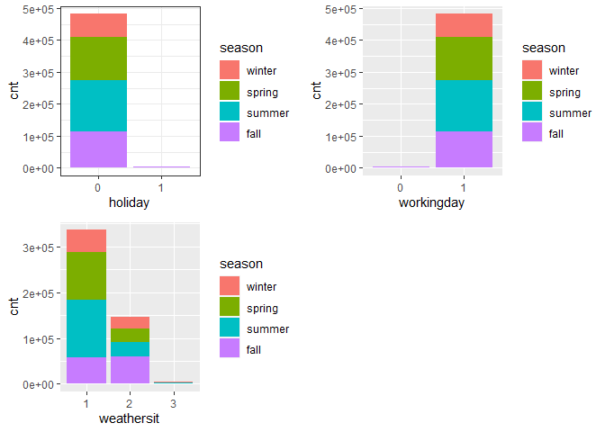

Project 2
================
Ifeoma Ojialor
10/16/2020

## Introduction

In this project, we will use a bike-sharing dataset to create machine
learning models. Before moving forward, I will briefly explain the
bike-sharing system and how it works. A bike-sharing system is a service
in which users can rent/use bicycles on a short term basis for a fee.
The goal of these programs is to provide affordable access to bicycles
for short distance trips as opposed to walking or taking public
transportation. Imagine how many people use these systems on a given
day, the numbers can vary greatly based on some elements. The goal of
this project is to build a predictive model to find out the number of
people that use these bikes in a given time period using available
information about that time/day. This in turn, can help businesses that
oversee this systems to manage them in a cost efficient manner.  
We will be using the bike-sharing dataset from the UCL Machine Learning
Repository. We will use the regression and boosted tree method to model
the response variable `cnt`.

## Exploratory Data Analysis

First we will read in the data using a relative path.

``` r
#read in data and filter to desired weekday
day1 <- read.csv("Bike-Sharing-Dataset/day.csv")
head(day1,5)
```

    ##   instant     dteday season yr mnth holiday
    ## 1       1 2011-01-01      1  0    1       0
    ## 2       2 2011-01-02      1  0    1       0
    ## 3       3 2011-01-03      1  0    1       0
    ## 4       4 2011-01-04      1  0    1       0
    ## 5       5 2011-01-05      1  0    1       0
    ##   weekday workingday weathersit     temp
    ## 1       6          0          2 0.344167
    ## 2       0          0          2 0.363478
    ## 3       1          1          1 0.196364
    ## 4       2          1          1 0.200000
    ## 5       3          1          1 0.226957
    ##      atemp      hum windspeed casual registered
    ## 1 0.363625 0.805833  0.160446    331        654
    ## 2 0.353739 0.696087  0.248539    131        670
    ## 3 0.189405 0.437273  0.248309    120       1229
    ## 4 0.212122 0.590435  0.160296    108       1454
    ## 5 0.229270 0.436957  0.186900     82       1518
    ##    cnt
    ## 1  985
    ## 2  801
    ## 3 1349
    ## 4 1562
    ## 5 1600

Next, we will remove the *casual* and *registered* variables since the
`cnt` variable is a combination of both.

``` r
day1 <- select(day1, -casual, -registered) 
day1$weekday <- as.factor(day1$weekday)
levels(day1$weekday) <- c("Sunday", "Monday", "Tuesday", "Wednesday", "Thursday", "Friday", "Saturday")
day <- filter(day1, weekday == params$days)

#Check for missing values
miss <- data.frame(apply(day,2,function(x){sum(is.na(x))}))
names(miss)[1] <- "missing"
miss
```

    ##            missing
    ## instant          0
    ## dteday           0
    ## season           0
    ## yr               0
    ## mnth             0
    ## holiday          0
    ## weekday          0
    ## workingday       0
    ## weathersit       0
    ## temp             0
    ## atemp            0
    ## hum              0
    ## windspeed        0
    ## cnt              0

There are no missing values in the dataset, so we can continue with our
analysis.

``` r
#Change the variables into their appropriate format.
day$season <- as.factor(day$season)
day$weathersit <- as.factor(day$weathersit)
day$holiday <- as.factor(day$holiday)
day$workingday <- as.factor(day$workingday)
day$yr <- as.factor(day$yr)
day$mnth <- as.factor(day$mnth)

levels(day$season) <- c("winter", "spring", "summer", "fall")
levels(day$yr) <- c("2011", "2012")
str(day)
```

    ## 'data.frame':    104 obs. of  14 variables:
    ##  $ instant   : int  6 13 20 27 34 41 48 55 62 69 ...
    ##  $ dteday    : chr  "2011-01-06" "2011-01-13" "2011-01-20" "2011-01-27" ...
    ##  $ season    : Factor w/ 4 levels "winter","spring",..: 1 1 1 1 1 1 1 1 1 1 ...
    ##  $ yr        : Factor w/ 2 levels "2011","2012": 1 1 1 1 1 1 1 1 1 1 ...
    ##  $ mnth      : Factor w/ 12 levels "1","2","3","4",..: 1 1 1 1 2 2 2 2 3 3 ...
    ##  $ holiday   : Factor w/ 2 levels "0","1": 1 1 1 1 1 1 1 1 1 1 ...
    ##  $ weekday   : Factor w/ 7 levels "Sunday","Monday",..: 5 5 5 5 5 5 5 5 5 5 ...
    ##  $ workingday: Factor w/ 2 levels "0","1": 2 2 2 2 2 2 2 2 2 2 ...
    ##  $ weathersit: Factor w/ 3 levels "1","2","3": 1 1 2 1 1 1 1 2 1 3 ...
    ##  $ temp      : num  0.204 0.165 0.262 0.195 0.187 ...
    ##  $ atemp     : num  0.233 0.151 0.255 0.22 0.178 ...
    ##  $ hum       : num  0.518 0.47 0.538 0.688 0.438 ...
    ##  $ windspeed : num  0.0896 0.301 0.1959 0.1138 0.2778 ...
    ##  $ cnt       : int  1606 1406 1927 431 1550 1538 2475 1807 1685 623 ...

### Univariate Analysis

The `cnt` is the response variable, so we’ll use a histogram to get a
visual understanding of the variable.

``` r
ggplot(day, aes(x = cnt)) + theme_bw() + geom_histogram(aes(y =..density..), color = "black", fill = "white", binwidth = 1000) + geom_density(alpha = 0.2, fill = "blue") + labs(title = "Count Density", x = "Count", y = "Density")
```

<!-- -->

``` r
summary(day$cnt)
```

    ##    Min. 1st Qu.  Median    Mean 3rd Qu.    Max. 
    ##     431    3271    4721    4667    6286    7804

From the histogram and summary statistics output, it is pretty evident
that the count of total rental bikes are in the sub 5000 range. We will
investigate if there is a relationship between the response variable and
other relevant predictor variables in the next section. Lets look at the
other variables individually.

``` r
#visualize numeric predictor variables using a histogram
p1 <- ggplot(day) + geom_histogram(aes(x = temp), fill = "red", binwidth = 0.03)
p2 <- ggplot(day) + geom_histogram(aes(x = atemp), fill = "red", binwidth = 0.03)
p3 <- ggplot(day) + geom_histogram(aes(x = hum), fill = "red", binwidth = 0.025)
p4 <- ggplot(day) + geom_histogram(aes(x = windspeed), fill = "red", binwidth = 0.03)
gridExtra::grid.arrange(p1,p2,p3,p4, nrow = 2)
```

<!-- -->

Observations:  
\* No clear cut pattern in `temp`and `atemp`.

  - `hum` appears to be skewed to the left when the dataset is not
    filtered to a specific weekday.

  - `windspeed` appears to be skewed(right). This variable should be
    transformed to curb its skewness.

  - The distribution of `temp` and `atemp` looks very similar. We should
    think about taking out one of the variables.

<!-- end list -->

``` r
#visualize categorical predictor variables
h1 <- ggplot(day) + geom_bar(aes(x = season),fill = "pink")
h2 <- ggplot(day) + geom_bar(aes(x = yr),fill = "pink")
h3 <- ggplot(day) + geom_bar(aes(x = holiday),fill = "pink")
h4 <- ggplot(day) + geom_bar(aes(x = workingday),fill = "pink")
h5 <- ggplot(day) + geom_bar(aes(x = mnth),fill = "pink")
h6 <- ggplot(day) + geom_bar(aes(x = weathersit),fill = "pink")
gridExtra::grid.arrange(h1,h2,h3,h4,h5,h6, nrow = 3)
```

<!-- -->

Observations:  
\* The variation between the four seasons is little to none.

  - About the same number of people rode bikes in 2011 and 2012.

  - Many people rode bikes on days that are not holidays.

  - Most people used the bike-sharing system on days that were neither
    weekends nor holidays.

  - Most people used the bike sharing system on days with clear weather.

### Bi-variate Analysis

In this section, we will explore the predictor variables with respect to
the response variable. The objective is to discover hidden relationships
between the independent and response variables and use those findings in
the model building process.

``` r
# First, we will explore the relationship between the target and numerical variables.
p1 <- ggplot(day) +geom_point(aes(x = temp, y = cnt), colour = "violet") + labs(title = "Normalized Temperature vs Total Rental Bikes")
p2 <- ggplot(day) +geom_point(aes(x = atemp, y = cnt), colour = "#FF99CC") +labs(title = "Normalized Feeling Temperature vs Total Rental Bikes")
p3 <- ggplot(day) +geom_point(aes(x = hum, y = cnt), colour = "pink") + labs(title = "Normalized Humidity vs Total rental Bikes")
p4 <- ggplot(day) +geom_point(aes(x = windspeed, y = cnt), colour = "#FF66CC") +labs(title= "Normalized Windspeed vs Total rental Bikes")
gridExtra::grid.arrange(p1, p2, p3, p4, nrow = 2)
```

<!-- -->

Observations:  
\* There appears to be a positive linear relationship between `cnt` ,
`temp`, and `atemp`.

  - There is also a weak relationship between `cnt`, `hum`, and
    `windspeed`.

<!-- end list -->

``` r
# Now we'll visualize the relationship between the target and categorical variables.
# Instead of using a boxplot, I will use a violin plot which is the blend of both a boxplot and density plot
g1 <- ggplot(day) + geom_col(aes(x = yr, y = cnt, fill = season))+theme_bw()
g2 <- ggplot(day) + geom_violin(aes(x = yr, y = cnt))+theme_bw()
g3 <- ggplot(day) + geom_col(aes(x = mnth, y = cnt, fill = season))+theme_bw() 
g4 <- ggplot(day) + geom_col(aes(x = holiday, y = cnt, fill = season)) + theme_bw() 
g6 <- ggplot(day) + geom_col(aes(x = workingday, y = cnt, fill = season))
g7 <- ggplot(day) + geom_col(aes(x = weathersit, y = cnt, fill = season))
gridExtra::grid.arrange(g1, g2, g3, nrow = 2)
```

<!-- -->

``` r
gridExtra::grid.arrange(g4, g6, g7, nrow = 2)
```

<!-- --> Observations:  
\* The total bike rental count is higher in 2012 than 2011.

  - During workingday, the bike rental counts quite the highest compared
    to during no working day for different seasons.

  - During clear,partly cloudy weather, the bike rental count is highest
    and the second highest is during mist cloudy weather and followed by
    third highest during light snow and light rain weather.

  - The highest bike rental count was during the summer and lowest in
    the winter.

## Correlation Matrix

Correlation matrix helps us to understand the linear relationship
between variables.

``` r
day_c <- day[ , c(10:14)]
round(cor(day_c), 2)
```

    ##            temp atemp   hum windspeed   cnt
    ## temp       1.00  1.00  0.15     -0.11  0.60
    ## atemp      1.00  1.00  0.15     -0.12  0.61
    ## hum        0.15  0.15  1.00     -0.31  0.00
    ## windspeed -0.11 -0.12 -0.31      1.00 -0.18
    ## cnt        0.60  0.61  0.00     -0.18  1.00

From the above matrix, we can see that `temp` and `atemp` are highly
correlated. So we only need to include one of these variables in the
model to prevent multicollinearity. We will also transform the humidity
and windspeed variable.

``` r
day <- mutate(day, log_hum = log(day$hum+1))
day <- mutate(day, log_ws = log(day$windspeed + 1))

#Remove irrelevant variables
day <- select(day, -weekday,-holiday,-workingday,-dteday,-temp, -instant)
```

## Model Building

First we split the data into train and test sets.

``` r
set.seed(23)
dayIndex<- createDataPartition(day$cnt, p = 0.7, list=FALSE)
dayTrain <- day[dayIndex, ]
dayTest <- day[-dayIndex, ]

# Build a tree-based model using loocv;
fitTree <- train(cnt~ ., data = dayTrain, method = "rpart", 
              preProcess = c("center", "scale"), 
              trControl = trainControl(method = "loocv", number = 10), tuneGrid = data.frame(cp = 0.01:0.10))
```

    ## Warning in nominalTrainWorkflow(x = x, y =
    ## y, wts = weights, info = trainInfo, : There
    ## were missing values in resampled performance
    ## measures.

``` r
# Display information from the tree fit
fitTree$results
```

    ##     cp     RMSE Rsquared      MAE  RMSESD
    ## 1 0.01 743.4704      NaN 743.4704 549.294
    ##   RsquaredSD   MAESD
    ## 1         NA 549.294

``` r
# Build a boosted tree model using cv
fitBoost <- train(cnt~., data = dayTrain, method = "gbm", 
              preProcess = c("center", "scale"), 
              trControl = trainControl(method = "cv", number = 10), 
              tuneGrid = expand.grid(n.trees=c(10,20,50,100,500,1000),shrinkage=c(0.01,0.05,0.1,0.5),n.minobsinnode =c(3,5,10),interaction.depth=c(1,5,10)))
```

    ## Iter   TrainDeviance   ValidDeviance   StepSize   Improve
    ##      1  3745954.3502             nan     0.0100 26721.6731
    ##      2  3714381.0527             nan     0.0100 32402.0805
    ##      3  3679927.4013             nan     0.0100 30908.5756
    ##      4  3644557.4695             nan     0.0100 33951.5439
    ##      5  3614297.1273             nan     0.0100 17637.7004
    ##      6  3582416.3365             nan     0.0100 29899.8570
    ##      7  3551653.5551             nan     0.0100 31625.7167
    ##      8  3525366.6269             nan     0.0100 30215.9189
    ##      9  3492444.4117             nan     0.0100 32867.8865
    ##     10  3472000.9847             nan     0.0100 12474.7306
    ##     20  3162971.4142             nan     0.0100 28459.3981
    ##     40  2641440.2421             nan     0.0100 21416.6145
    ##     60  2243031.3112             nan     0.0100 5066.0460
    ##     80  1909311.1178             nan     0.0100 14683.4211
    ##    100  1632716.4079             nan     0.0100 12017.6961
    ##    120  1423619.3348             nan     0.0100 9552.4784
    ##    140  1264073.8501             nan     0.0100 5523.8747
    ##    160  1124729.3539             nan     0.0100 5606.1618
    ##    180  1004453.5072             nan     0.0100 2896.1941
    ##    200   917683.3785             nan     0.0100 2617.4301
    ##    220   832655.2240             nan     0.0100 1167.8415
    ##    240   762688.8078             nan     0.0100 1000.7838
    ##    260   710623.9817             nan     0.0100 1353.0842
    ##    280   665845.1378             nan     0.0100  973.4840
    ##    300   626208.7408             nan     0.0100 -151.5168
    ##    320   593917.3326             nan     0.0100  614.2991
    ##    340   568773.7443             nan     0.0100 -960.3946
    ##    360   544538.7098             nan     0.0100 -235.2629
    ##    380   522779.0577             nan     0.0100 -1186.4634
    ##    400   503911.8147             nan     0.0100  569.1257
    ##    420   485188.9053             nan     0.0100 -552.1669
    ##    440   470126.7738             nan     0.0100 -730.5309
    ##    460   456629.8378             nan     0.0100   47.5383
    ##    480   443528.8936             nan     0.0100 -757.9868
    ##    500   432925.8263             nan     0.0100 -1026.2277
    ##    520   420915.0460             nan     0.0100 -241.1183
    ##    540   411094.3172             nan     0.0100 -1500.3626
    ##    560   401012.8583             nan     0.0100 -558.9677
    ##    580   392944.6280             nan     0.0100 -159.4298
    ##    600   385409.2085             nan     0.0100 -244.9140
    ##    620   377613.4488             nan     0.0100  -51.3651
    ##    640   371040.2830             nan     0.0100 -629.2757
    ##    660   364296.2316             nan     0.0100 -333.8200
    ##    680   358392.0147             nan     0.0100 -404.2531
    ##    700   353426.2170             nan     0.0100  216.5629
    ##    720   347166.1143             nan     0.0100 -1027.1973
    ##    740   341469.6421             nan     0.0100 -288.2254
    ##    760   336403.9372             nan     0.0100 -1367.2213
    ##    780   331465.2301             nan     0.0100 -1742.9012
    ##    800   327499.2388             nan     0.0100 -408.8091
    ##    820   322823.7593             nan     0.0100 -921.3153
    ##    840   318675.1329             nan     0.0100   57.5580
    ##    860   314475.4967             nan     0.0100 -221.7620
    ##    880   310995.7538             nan     0.0100 -761.3186
    ##    900   307472.5811             nan     0.0100 -366.1781
    ##    920   304401.7453             nan     0.0100 -311.3850
    ##    940   300721.8900             nan     0.0100 -134.6259
    ##    960   297442.5998             nan     0.0100 -1127.5579
    ##    980   294330.9877             nan     0.0100 -541.3369
    ##   1000   290585.5633             nan     0.0100 -358.7466
    ## 
    ## Iter   TrainDeviance   ValidDeviance   StepSize   Improve
    ##      1  3741058.7727             nan     0.0100 35399.3769
    ##      2  3704772.4211             nan     0.0100 35748.6685
    ##      3  3668050.8001             nan     0.0100 34025.0685
    ##      4  3636264.9251             nan     0.0100 32451.8797
    ##      5  3602367.8002             nan     0.0100 17763.8225
    ##      6  3563568.1141             nan     0.0100 32595.7117
    ##      7  3529767.6155             nan     0.0100 32109.6907
    ##      8  3497425.3349             nan     0.0100 30866.5918
    ##      9  3462416.1982             nan     0.0100 30659.2072
    ##     10  3431942.6166             nan     0.0100 27639.0704
    ##     20  3120740.2468             nan     0.0100 25935.4842
    ##     40  2624454.9036             nan     0.0100 18807.9489
    ##     60  2203721.8655             nan     0.0100 15647.2786
    ##     80  1868159.9708             nan     0.0100 13140.5442
    ##    100  1611912.8970             nan     0.0100 8111.9267
    ##    120  1402693.5690             nan     0.0100 9075.0191
    ##    140  1222422.5139             nan     0.0100 8045.4728
    ##    160  1096739.6260             nan     0.0100  181.5209
    ##    180   991671.6732             nan     0.0100 1229.8200
    ##    200   890683.7962             nan     0.0100 3414.2904
    ##    220   819445.8023             nan     0.0100 3737.0343
    ##    240   753802.8307             nan     0.0100 2584.1202
    ##    260   700811.1898             nan     0.0100  402.5072
    ##    280   657774.2521             nan     0.0100 1875.9003
    ##    300   620835.3942             nan     0.0100  796.4603
    ##    320   586749.1580             nan     0.0100  625.5578
    ##    340   559781.5438             nan     0.0100  -23.4306
    ##    360   536181.4153             nan     0.0100 -691.5711
    ##    380   514849.8688             nan     0.0100   40.1408
    ##    400   497785.1362             nan     0.0100 -429.8727
    ##    420   480506.7242             nan     0.0100 -677.8156
    ##    440   466928.4402             nan     0.0100 -211.2815
    ##    460   454960.2576             nan     0.0100 -1461.4513
    ##    480   442623.7712             nan     0.0100 -214.3588
    ##    500   432024.7573             nan     0.0100 -566.1937
    ##    520   422051.4560             nan     0.0100 -534.9580
    ##    540   414497.1749             nan     0.0100 -418.8357
    ##    560   406638.0187             nan     0.0100 -225.6011
    ##    580   400150.9297             nan     0.0100  -51.7267
    ##    600   392391.2966             nan     0.0100   -9.4612
    ##    620   386194.9893             nan     0.0100 -449.0956
    ##    640   378454.0677             nan     0.0100   -6.8870
    ##    660   372765.8572             nan     0.0100 -474.7716
    ##    680   368108.7589             nan     0.0100 -296.5992
    ##    700   362940.7500             nan     0.0100 -152.4183
    ##    720   357838.7561             nan     0.0100 -186.0216
    ##    740   353547.9876             nan     0.0100 -294.8046
    ##    760   349405.0327             nan     0.0100 -776.0810
    ##    780   345363.7600             nan     0.0100 -782.0573
    ##    800   341649.0419             nan     0.0100 -675.5351
    ##    820   337329.6773             nan     0.0100 -177.7065
    ##    840   333861.5968             nan     0.0100 -440.1145
    ##    860   330983.1747             nan     0.0100 -202.5944
    ##    880   328106.3262             nan     0.0100 -796.2988
    ##    900   324615.5929             nan     0.0100 -515.9121
    ##    920   322313.7122             nan     0.0100 -310.2476
    ##    940   319075.4752             nan     0.0100 -444.9502
    ##    960   316269.5894             nan     0.0100 -624.2073
    ##    980   313051.9950             nan     0.0100 -828.4903
    ##   1000   309610.7961             nan     0.0100 -995.1419
    ## 
    ## Iter   TrainDeviance   ValidDeviance   StepSize   Improve
    ##      1  3736632.0932             nan     0.0100 35835.6416
    ##      2  3700529.2975             nan     0.0100 33275.0598
    ##      3  3660258.3234             nan     0.0100 32067.0750
    ##      4  3627203.7955             nan     0.0100 30888.1104
    ##      5  3594324.8252             nan     0.0100 31039.6524
    ##      6  3564422.1859             nan     0.0100 34935.6453
    ##      7  3538699.9076             nan     0.0100 30475.9693
    ##      8  3518322.4523             nan     0.0100 18443.3353
    ##      9  3481753.0652             nan     0.0100 30968.5501
    ##     10  3455877.2916             nan     0.0100 28640.5410
    ##     20  3165075.7406             nan     0.0100 26195.2275
    ##     40  2649616.4169             nan     0.0100 22828.7243
    ##     60  2223606.3155             nan     0.0100 15963.0720
    ##     80  1902910.9968             nan     0.0100 15150.3878
    ##    100  1633639.1161             nan     0.0100 12252.2952
    ##    120  1416299.3053             nan     0.0100 4034.7604
    ##    140  1262344.5928             nan     0.0100 6927.5188
    ##    160  1126815.7696             nan     0.0100 1796.5044
    ##    180  1007045.1678             nan     0.0100 4281.8015
    ##    200   918380.8301             nan     0.0100 3401.6534
    ##    220   843075.5907             nan     0.0100 2749.8887
    ##    240   780347.5871             nan     0.0100 1033.8471
    ##    260   735346.3294             nan     0.0100 1691.9922
    ##    280   694135.3476             nan     0.0100  945.4271
    ##    300   660893.6467             nan     0.0100  594.6684
    ##    320   633280.0468             nan     0.0100  408.6255
    ##    340   608644.1623             nan     0.0100  949.8449
    ##    360   587679.3251             nan     0.0100  100.8179
    ##    380   569352.9230             nan     0.0100  605.4381
    ##    400   552290.3472             nan     0.0100  313.3173
    ##    420   538926.1722             nan     0.0100 -1137.3642
    ##    440   527240.3323             nan     0.0100  905.8065
    ##    460   517346.0997             nan     0.0100 -121.6391
    ##    480   507141.8094             nan     0.0100 -332.1448
    ##    500   500069.0637             nan     0.0100 -444.8099
    ##    520   491681.2150             nan     0.0100  963.5775
    ##    540   487105.2065             nan     0.0100 -213.3952
    ##    560   483095.6087             nan     0.0100 -686.7505
    ##    580   479084.1309             nan     0.0100 -455.9703
    ##    600   476545.4821             nan     0.0100 -1076.6133
    ##    620   470476.7427             nan     0.0100 -719.6796
    ##    640   462802.3483             nan     0.0100 -215.6194
    ##    660   458386.0733             nan     0.0100 -1123.2962
    ##    680   455525.0999             nan     0.0100 -401.5071
    ##    700   450135.2055             nan     0.0100 -1153.8278
    ##    720   445874.5483             nan     0.0100 -297.7713
    ##    740   441476.3852             nan     0.0100 -121.3940
    ##    760   439061.4525             nan     0.0100 -1086.8376
    ##    780   436078.5860             nan     0.0100 -1161.2465
    ##    800   431826.7231             nan     0.0100 -622.4743
    ##    820   428972.0767             nan     0.0100 -293.3346
    ##    840   427139.7460             nan     0.0100 -426.6516
    ##    860   424653.1510             nan     0.0100 -384.4366
    ##    880   421653.3684             nan     0.0100 -445.1706
    ##    900   418952.0080             nan     0.0100 -264.1137
    ##    920   416985.8395             nan     0.0100 -161.0791
    ##    940   414959.6475             nan     0.0100 -360.4563
    ##    960   412593.4977             nan     0.0100 -969.5652
    ##    980   410568.4324             nan     0.0100 -340.8177
    ##   1000   406998.6229             nan     0.0100 -619.7982
    ## 
    ## Iter   TrainDeviance   ValidDeviance   StepSize   Improve
    ##      1  3708825.0452             nan     0.0100 55447.8018
    ##      2  3642624.5104             nan     0.0100 63226.6997
    ##      3  3575451.2056             nan     0.0100 67648.4803
    ##      4  3513645.2901             nan     0.0100 46160.6688
    ##      5  3454244.9087             nan     0.0100 41007.7045
    ##      6  3394756.8472             nan     0.0100 52346.3528
    ##      7  3344907.1934             nan     0.0100 50188.8337
    ##      8  3284658.8752             nan     0.0100 59409.4393
    ##      9  3238005.5958             nan     0.0100 37000.8455
    ##     10  3185559.9348             nan     0.0100 47785.6550
    ##     20  2692120.4612             nan     0.0100 47813.5304
    ##     40  1984800.0653             nan     0.0100 37625.9635
    ##     60  1481323.8934             nan     0.0100 17252.9178
    ##     80  1134082.1122             nan     0.0100 10606.7744
    ##    100   887707.9192             nan     0.0100 8120.1735
    ##    120   716495.8076             nan     0.0100 5660.0481
    ##    140   582374.4779             nan     0.0100 5699.2985
    ##    160   486963.6566             nan     0.0100 1499.9691
    ##    180   411496.0272             nan     0.0100 1740.5380
    ##    200   354793.8508             nan     0.0100  837.7061
    ##    220   309591.2704             nan     0.0100  844.1197
    ##    240   275463.4090             nan     0.0100  788.9983
    ##    260   247614.7319             nan     0.0100  181.4245
    ##    280   222743.0789             nan     0.0100  154.9114
    ##    300   203006.4746             nan     0.0100  381.7173
    ##    320   186424.4696             nan     0.0100 -696.8404
    ##    340   172742.6504             nan     0.0100 -579.5489
    ##    360   160580.4588             nan     0.0100  229.0292
    ##    380   148431.4858             nan     0.0100  -97.0146
    ##    400   138008.0655             nan     0.0100 -145.5297
    ##    420   129131.6234             nan     0.0100 -162.8195
    ##    440   120505.0871             nan     0.0100 -295.3130
    ##    460   113033.3645             nan     0.0100 -444.3851
    ##    480   106022.4304             nan     0.0100 -430.3628
    ##    500    99874.0938             nan     0.0100 -557.4607
    ##    520    94286.1745             nan     0.0100 -208.5526
    ##    540    88481.8034             nan     0.0100 -296.8279
    ##    560    83268.9493             nan     0.0100 -222.5674
    ##    580    79431.7684             nan     0.0100 -288.3320
    ##    600    74963.0666             nan     0.0100 -360.6284
    ##    620    70474.3262             nan     0.0100 -275.1127
    ##    640    67082.6979             nan     0.0100 -332.0487
    ##    660    64147.5936             nan     0.0100 -152.8318
    ##    680    60387.9254             nan     0.0100 -259.8961
    ##    700    57733.3707             nan     0.0100 -292.1970
    ##    720    54402.4250             nan     0.0100 -276.0366
    ##    740    51988.3714             nan     0.0100 -305.2245
    ##    760    50021.9557             nan     0.0100  -86.0976
    ##    780    47859.6226             nan     0.0100  -64.1825
    ##    800    45706.6893             nan     0.0100 -186.9589
    ##    820    43605.3234             nan     0.0100 -219.5277
    ##    840    41292.4246             nan     0.0100 -181.8236
    ##    860    39162.8899             nan     0.0100 -191.3437
    ##    880    37209.6867             nan     0.0100 -270.4690
    ##    900    35630.5782             nan     0.0100 -127.3886
    ##    920    34045.3712             nan     0.0100 -129.3671
    ##    940    32364.6712             nan     0.0100 -157.9274
    ##    960    30700.3094             nan     0.0100 -107.5301
    ##    980    29450.5043             nan     0.0100 -103.5545
    ##   1000    28210.0179             nan     0.0100  -43.6200
    ## 
    ## Iter   TrainDeviance   ValidDeviance   StepSize   Improve
    ##      1  3704069.5057             nan     0.0100 59273.1495
    ##      2  3644402.1172             nan     0.0100 63749.8038
    ##      3  3586146.2736             nan     0.0100 52287.0706
    ##      4  3525570.6833             nan     0.0100 49261.4595
    ##      5  3473558.0324             nan     0.0100 45732.8734
    ##      6  3416242.5604             nan     0.0100 59909.3868
    ##      7  3363192.0244             nan     0.0100 46225.6929
    ##      8  3306355.1636             nan     0.0100 38251.9104
    ##      9  3258594.4556             nan     0.0100 44531.7904
    ##     10  3206928.1688             nan     0.0100 44323.7328
    ##     20  2739703.1141             nan     0.0100 40884.6807
    ##     40  2035681.3805             nan     0.0100 33526.0500
    ##     60  1546118.9688             nan     0.0100 9343.1877
    ##     80  1197147.3306             nan     0.0100 10246.3017
    ##    100   955211.7858             nan     0.0100 7747.4017
    ##    120   779448.8005             nan     0.0100 6484.1544
    ##    140   655191.1837             nan     0.0100 4032.5107
    ##    160   567330.4525             nan     0.0100 3009.7485
    ##    180   498344.2309             nan     0.0100 1704.5482
    ##    200   438810.6985             nan     0.0100 2027.0133
    ##    220   394787.6298             nan     0.0100 1052.5514
    ##    240   356484.8647             nan     0.0100  493.5735
    ##    260   330342.6422             nan     0.0100 -1084.1094
    ##    280   310232.1246             nan     0.0100 -1026.8917
    ##    300   286462.3429             nan     0.0100 -316.5855
    ##    320   272928.5949             nan     0.0100 -627.5982
    ##    340   257737.0741             nan     0.0100  -79.2347
    ##    360   244550.5597             nan     0.0100 -250.8103
    ##    380   232922.9407             nan     0.0100 -967.9647
    ##    400   220591.2412             nan     0.0100 -126.1198
    ##    420   210764.5175             nan     0.0100 -629.3028
    ##    440   201239.4384             nan     0.0100 -636.4022
    ##    460   191153.8377             nan     0.0100 -880.2124
    ##    480   182941.0871             nan     0.0100 -845.3164
    ##    500   174732.7977             nan     0.0100 -398.6775
    ##    520   167151.7564             nan     0.0100 -1032.6479
    ##    540   160851.4675             nan     0.0100 -743.7234
    ##    560   154941.0630             nan     0.0100 -463.4422
    ##    580   149207.5197             nan     0.0100 -588.6842
    ##    600   144486.6105             nan     0.0100 -921.9936
    ##    620   138913.2615             nan     0.0100 -385.3566
    ##    640   134362.2360             nan     0.0100 -505.7996
    ##    660   129238.6180             nan     0.0100 -536.2998
    ##    680   124881.0324             nan     0.0100 -298.2269
    ##    700   120237.9368             nan     0.0100 -590.6439
    ##    720   115866.9115             nan     0.0100 -327.6025
    ##    740   111650.8614             nan     0.0100 -352.8418
    ##    760   108036.0540             nan     0.0100 -565.1513
    ##    780   104296.2386             nan     0.0100 -146.6408
    ##    800   101394.9393             nan     0.0100 -391.6266
    ##    820    97969.1821             nan     0.0100   21.9908
    ##    840    94478.9077             nan     0.0100 -153.3512
    ##    860    91576.6785             nan     0.0100 -295.4945
    ##    880    89453.5246             nan     0.0100 -230.3836
    ##    900    87017.2515             nan     0.0100 -200.6432
    ##    920    84162.8375             nan     0.0100 -250.5467
    ##    940    81736.5866             nan     0.0100 -293.4749
    ##    960    79676.6424             nan     0.0100 -306.6062
    ##    980    77340.1208             nan     0.0100 -139.8523
    ##   1000    74895.9423             nan     0.0100 -373.3215
    ## 
    ## Iter   TrainDeviance   ValidDeviance   StepSize   Improve
    ##      1  3736744.0683             nan     0.0100 31643.3577
    ##      2  3698584.6893             nan     0.0100 40137.6089
    ##      3  3664873.3908             nan     0.0100 35180.2325
    ##      4  3624233.3294             nan     0.0100 33037.8747
    ##      5  3595474.2452             nan     0.0100 31009.4796
    ##      6  3563010.1543             nan     0.0100 30313.9416
    ##      7  3529761.6462             nan     0.0100 25156.6283
    ##      8  3487722.1044             nan     0.0100 32495.1924
    ##      9  3460202.8570             nan     0.0100 32025.8840
    ##     10  3431180.2649             nan     0.0100 29091.3114
    ##     20  3103641.8999             nan     0.0100 25505.4788
    ##     40  2562609.9503             nan     0.0100 21111.7503
    ##     60  2150362.0375             nan     0.0100 15950.4967
    ##     80  1827134.6673             nan     0.0100 11657.6718
    ##    100  1566662.2690             nan     0.0100 10279.9726
    ##    120  1351934.0410             nan     0.0100 11474.1418
    ##    140  1170293.2078             nan     0.0100 8912.1612
    ##    160  1031352.1523             nan     0.0100 -415.6760
    ##    180   920106.6311             nan     0.0100 3405.6021
    ##    200   826677.0103             nan     0.0100 -203.0297
    ##    220   765813.1411             nan     0.0100 1976.3469
    ##    240   714343.7382             nan     0.0100 -2052.6667
    ##    260   669650.2381             nan     0.0100 1825.2117
    ##    280   631358.8864             nan     0.0100  537.7728
    ##    300   597422.8650             nan     0.0100   71.5238
    ##    320   569836.5420             nan     0.0100   83.7635
    ##    340   545178.1456             nan     0.0100   96.6552
    ##    360   527426.7006             nan     0.0100 1125.9961
    ##    380   513144.5096             nan     0.0100 -402.5594
    ##    400   497947.7875             nan     0.0100 -547.9503
    ##    420   490823.9182             nan     0.0100 -461.2983
    ##    440   481211.7830             nan     0.0100 -302.5481
    ##    460   474537.9680             nan     0.0100 -1265.6239
    ##    480   468242.1276             nan     0.0100 -362.4374
    ##    500   463352.1820             nan     0.0100 -616.1532
    ##    520   452955.8183             nan     0.0100 -297.8761
    ##    540   448432.2835             nan     0.0100 -943.6140
    ##    560   444605.9094             nan     0.0100 -459.8384
    ##    580   439646.4858             nan     0.0100 1059.6514
    ##    600   433757.9196             nan     0.0100 -540.4995
    ##    620   426359.8904             nan     0.0100 -1192.6813
    ##    640   419787.9683             nan     0.0100 -1791.0566
    ##    660   413427.7441             nan     0.0100 -221.8484
    ##    680   406996.6449             nan     0.0100  -86.0336
    ##    700   403209.2517             nan     0.0100 -421.5331
    ##    720   396159.1118             nan     0.0100 -742.1768
    ##    740   392224.9529             nan     0.0100 -542.5548
    ##    760   386517.3695             nan     0.0100 -144.6278
    ##    780   382928.1394             nan     0.0100 -404.2695
    ##    800   378709.5567             nan     0.0100 -638.1993
    ##    820   373344.8285             nan     0.0100 -798.8221
    ##    840   369617.2524             nan     0.0100 -645.9607
    ##    860   366895.3186             nan     0.0100 -456.7073
    ##    880   363853.8023             nan     0.0100 -355.0825
    ##    900   360117.7421             nan     0.0100 -721.7177
    ##    920   353707.0042             nan     0.0100  -22.6514
    ##    940   350248.2877             nan     0.0100 -1588.0192
    ##    960   344227.3157             nan     0.0100 -672.0078
    ##    980   339144.6177             nan     0.0100 -778.9630
    ##   1000   334950.9791             nan     0.0100 -882.2071
    ## 
    ## Iter   TrainDeviance   ValidDeviance   StepSize   Improve
    ##      1  3710700.1270             nan     0.0100 48586.7008
    ##      2  3646998.7301             nan     0.0100 53146.1191
    ##      3  3590169.4540             nan     0.0100 56925.6231
    ##      4  3536037.7734             nan     0.0100 53654.7365
    ##      5  3482010.8266             nan     0.0100 51172.9015
    ##      6  3431615.5026             nan     0.0100 55898.2076
    ##      7  3375240.7911             nan     0.0100 39172.4860
    ##      8  3317319.6674             nan     0.0100 51317.2147
    ##      9  3264329.5901             nan     0.0100 50154.3912
    ##     10  3215155.9661             nan     0.0100 34842.1173
    ##     20  2723186.3538             nan     0.0100 43224.9552
    ##     40  1968428.2417             nan     0.0100 18266.6885
    ##     60  1426594.7831             nan     0.0100 18100.2467
    ##     80  1061834.7738             nan     0.0100 11964.7379
    ##    100   818951.9172             nan     0.0100 1278.4404
    ##    120   630822.7888             nan     0.0100 6449.0445
    ##    140   503126.9861             nan     0.0100 4401.8233
    ##    160   408040.2623             nan     0.0100 2596.1147
    ##    180   336485.3012             nan     0.0100 2779.1981
    ##    200   287489.0538             nan     0.0100  753.1888
    ##    220   246976.4524             nan     0.0100 1404.8206
    ##    240   215620.8005             nan     0.0100 -190.1800
    ##    260   192166.0279             nan     0.0100 -661.7643
    ##    280   171012.4628             nan     0.0100 -475.8332
    ##    300   155742.3082             nan     0.0100  -66.7864
    ##    320   143396.2626             nan     0.0100 -552.0068
    ##    340   130375.3610             nan     0.0100 -101.6930
    ##    360   119219.2356             nan     0.0100 -499.0033
    ##    380   110149.2288             nan     0.0100  110.6315
    ##    400   101477.3345             nan     0.0100 -115.5603
    ##    420    95077.9575             nan     0.0100 -218.0361
    ##    440    89360.6531             nan     0.0100 -187.9356
    ##    460    84122.3747             nan     0.0100 -133.5671
    ##    480    79210.8980             nan     0.0100 -268.9648
    ##    500    75002.8084             nan     0.0100 -196.7039
    ##    520    70145.9720             nan     0.0100 -329.8534
    ##    540    66300.0607             nan     0.0100 -311.7350
    ##    560    62943.4873             nan     0.0100 -218.9920
    ##    580    59862.8027             nan     0.0100 -281.6204
    ##    600    57072.6304             nan     0.0100 -274.4502
    ##    620    53927.2712             nan     0.0100 -112.3254
    ##    640    50980.8975             nan     0.0100 -125.2896
    ##    660    48340.7888             nan     0.0100 -178.8381
    ##    680    45584.8680             nan     0.0100 -260.6888
    ##    700    43103.6791             nan     0.0100  -30.4722
    ##    720    41166.3966             nan     0.0100 -161.1559
    ##    740    39054.8796             nan     0.0100 -149.0874
    ##    760    37350.1560             nan     0.0100 -143.2812
    ##    780    35403.2626             nan     0.0100  -79.0251
    ##    800    33648.0543             nan     0.0100  -26.9675
    ##    820    32153.5221             nan     0.0100  -39.0888
    ##    840    30798.5520             nan     0.0100 -103.7112
    ##    860    29205.5897             nan     0.0100  -54.0590
    ##    880    27904.3863             nan     0.0100  -97.3777
    ##    900    26838.1057             nan     0.0100 -135.8833
    ##    920    25792.3776             nan     0.0100  -69.9596
    ##    940    24552.7634             nan     0.0100  -87.9681
    ##    960    23604.7604             nan     0.0100  -91.9642
    ##    980    22706.0827             nan     0.0100  -22.6523
    ##   1000    21618.2602             nan     0.0100 -161.9025
    ## 
    ## Iter   TrainDeviance   ValidDeviance   StepSize   Improve
    ##      1  3706039.9041             nan     0.0100 55936.9509
    ##      2  3653301.1113             nan     0.0100 61690.1039
    ##      3  3591517.7279             nan     0.0100 56251.7605
    ##      4  3538749.5506             nan     0.0100 51795.0158
    ##      5  3486618.6824             nan     0.0100 35965.5875
    ##      6  3427562.1033             nan     0.0100 57005.7169
    ##      7  3371701.4347             nan     0.0100 54321.9296
    ##      8  3317721.7688             nan     0.0100 47673.1807
    ##      9  3261500.1668             nan     0.0100 43239.1722
    ##     10  3210656.4709             nan     0.0100 47366.4673
    ##     20  2791397.5444             nan     0.0100 41614.7190
    ##     40  2055718.2610             nan     0.0100 23136.5269
    ##     60  1550365.2981             nan     0.0100 15516.8270
    ##     80  1200457.9597             nan     0.0100 13937.6074
    ##    100   955423.8894             nan     0.0100 8260.5012
    ##    120   788908.6033             nan     0.0100 6901.3873
    ##    140   658425.8992             nan     0.0100 2112.6411
    ##    160   563821.0295             nan     0.0100 1736.6245
    ##    180   493228.2025             nan     0.0100 1367.1016
    ##    200   447485.8700             nan     0.0100 -923.6828
    ##    220   402107.4590             nan     0.0100  656.1009
    ##    240   370352.6428             nan     0.0100  117.1048
    ##    260   341546.6187             nan     0.0100 -956.8417
    ##    280   319231.4374             nan     0.0100 -768.2217
    ##    300   298576.7913             nan     0.0100 -814.4881
    ##    320   279262.1231             nan     0.0100 -384.1676
    ##    340   264892.6454             nan     0.0100 -119.5818
    ##    360   253661.4652             nan     0.0100 -631.9872
    ##    380   240017.8088             nan     0.0100 -582.6128
    ##    400   228458.9524             nan     0.0100 -1130.9151
    ##    420   217471.9546             nan     0.0100 -292.3511
    ##    440   207901.9202             nan     0.0100 -545.8667
    ##    460   198817.3773             nan     0.0100 -307.7244
    ##    480   190264.9020             nan     0.0100 -242.2987
    ##    500   181585.3741             nan     0.0100 -449.3882
    ##    520   174421.9450             nan     0.0100 -908.5878
    ##    540   167481.2141             nan     0.0100 -816.6989
    ##    560   161371.6331             nan     0.0100 -513.0514
    ##    580   155077.2508             nan     0.0100 -123.3030
    ##    600   149664.9569             nan     0.0100 -270.9711
    ##    620   144140.3323             nan     0.0100  -11.5242
    ##    640   139021.6386             nan     0.0100 -654.4856
    ##    660   133788.0887             nan     0.0100 -283.8840
    ##    680   129596.3287             nan     0.0100 -348.3951
    ##    700   124926.5168             nan     0.0100 -271.0498
    ##    720   120664.7481             nan     0.0100 -430.2461
    ##    740   117244.3888             nan     0.0100 -296.6026
    ##    760   113468.6489             nan     0.0100 -518.1804
    ##    780   110233.7667             nan     0.0100 -183.7679
    ##    800   106442.2786             nan     0.0100 -311.1150
    ##    820   102888.5373             nan     0.0100 -250.1073
    ##    840    99625.4655             nan     0.0100 -612.0100
    ##    860    96474.9340             nan     0.0100 -159.5896
    ##    880    93385.8756             nan     0.0100 -367.2089
    ##    900    90286.7025             nan     0.0100 -274.5575
    ##    920    87365.7921             nan     0.0100 -371.8583
    ##    940    84788.0974             nan     0.0100 -217.9802
    ##    960    81521.0559             nan     0.0100 -307.3887
    ##    980    79418.5268             nan     0.0100  -79.3644
    ##   1000    77272.9061             nan     0.0100  -10.5347
    ## 
    ## Iter   TrainDeviance   ValidDeviance   StepSize   Improve
    ##      1  3735345.6932             nan     0.0100 15829.7313
    ##      2  3703948.1439             nan     0.0100 31070.2427
    ##      3  3670256.1994             nan     0.0100 34626.5751
    ##      4  3639746.9221             nan     0.0100 34234.1089
    ##      5  3601720.6277             nan     0.0100 34391.0502
    ##      6  3575767.7661             nan     0.0100 19868.6627
    ##      7  3541105.2979             nan     0.0100 25352.1365
    ##      8  3504973.9160             nan     0.0100 35516.1185
    ##      9  3470164.2954             nan     0.0100 31128.0626
    ##     10  3435404.7573             nan     0.0100 30434.0320
    ##     20  3117036.2697             nan     0.0100 26743.8193
    ##     40  2567094.1630             nan     0.0100 21612.3975
    ##     60  2118539.5289             nan     0.0100 14358.1337
    ##     80  1761321.7415             nan     0.0100 18885.3397
    ##    100  1505807.3032             nan     0.0100 9767.3572
    ##    120  1292932.7290             nan     0.0100 7579.8892
    ##    140  1134298.4055             nan     0.0100 5647.9889
    ##    160  1008746.9339             nan     0.0100 3779.1510
    ##    180   906615.0622             nan     0.0100 3293.1480
    ##    200   828707.9741             nan     0.0100 -237.5361
    ##    220   762131.2757             nan     0.0100 1251.3736
    ##    240   715530.4203             nan     0.0100  660.5183
    ##    260   671839.3272             nan     0.0100 -961.8226
    ##    280   638648.7731             nan     0.0100  645.8859
    ##    300   612451.9025             nan     0.0100  122.7371
    ##    320   592985.5576             nan     0.0100 -611.8201
    ##    340   572335.7153             nan     0.0100   28.9135
    ##    360   548948.2185             nan     0.0100  -81.2796
    ##    380   532243.0934             nan     0.0100 -420.8327
    ##    400   519548.4689             nan     0.0100 -2203.9018
    ##    420   507322.8311             nan     0.0100 -146.4429
    ##    440   497981.5730             nan     0.0100 -809.4211
    ##    460   490250.8173             nan     0.0100 -587.7738
    ##    480   483690.6015             nan     0.0100 -1180.2121
    ##    500   476809.0237             nan     0.0100 -362.9350
    ##    520   467238.3734             nan     0.0100 -674.0327
    ##    540   457976.8514             nan     0.0100  507.9659
    ##    560   449373.6074             nan     0.0100 -1102.6067
    ##    580   444530.9785             nan     0.0100 -439.8424
    ##    600   440767.5532             nan     0.0100 -133.6476
    ##    620   434536.5208             nan     0.0100 -1271.6813
    ##    640   429452.7098             nan     0.0100 -894.4557
    ##    660   423711.9829             nan     0.0100 -654.7582
    ##    680   420641.7350             nan     0.0100 -554.0383
    ##    700   413826.5200             nan     0.0100 -783.1046
    ##    720   407826.1860             nan     0.0100 -281.2604
    ##    740   403109.3282             nan     0.0100 -757.5730
    ##    760   399128.3644             nan     0.0100  -47.2929
    ##    780   394549.2629             nan     0.0100 -1355.8128
    ##    800   391242.5764             nan     0.0100 -666.1373
    ##    820   387308.9436             nan     0.0100 -347.1744
    ##    840   384561.9487             nan     0.0100 -578.2115
    ##    860   380604.9719             nan     0.0100 -963.4213
    ##    880   376948.7371             nan     0.0100 -553.2993
    ##    900   372399.8427             nan     0.0100 -841.7043
    ##    920   370197.5608             nan     0.0100 -679.7281
    ##    940   367947.2583             nan     0.0100 -205.6301
    ##    960   363595.4360             nan     0.0100 -156.5443
    ##    980   360425.5594             nan     0.0100 -413.3363
    ##   1000   358742.6667             nan     0.0100 -349.7435
    ## 
    ## Iter   TrainDeviance   ValidDeviance   StepSize   Improve
    ##      1  3609438.0130             nan     0.0500 153954.5618
    ##      2  3511149.0571             nan     0.0500 28428.9844
    ##      3  3349314.9465             nan     0.0500 153439.7383
    ##      4  3209718.6299             nan     0.0500 128961.1140
    ##      5  3071695.3908             nan     0.0500 124914.5124
    ##      6  2923423.4839             nan     0.0500 146719.0376
    ##      7  2803808.0211             nan     0.0500 106946.7318
    ##      8  2664673.1876             nan     0.0500 136263.7684
    ##      9  2521700.0196             nan     0.0500 101840.7821
    ##     10  2392999.2090             nan     0.0500 107161.6957
    ##     20  1645813.3536             nan     0.0500 61394.4935
    ##     40   895627.7131             nan     0.0500 18289.5932
    ##     60   616208.3764             nan     0.0500 5992.5391
    ##     80   495824.7786             nan     0.0500 -3327.9021
    ##    100   424229.6502             nan     0.0500  482.4451
    ##    120   371393.3156             nan     0.0500 -2000.0325
    ##    140   341089.9021             nan     0.0500 -2389.4807
    ##    160   317563.3794             nan     0.0500 -1909.2397
    ##    180   297086.7458             nan     0.0500 -5129.2971
    ##    200   280443.5528             nan     0.0500 -3452.1978
    ##    220   265001.2378             nan     0.0500 -2614.1168
    ##    240   254759.9150             nan     0.0500 -1936.8827
    ##    260   242638.9616             nan     0.0500 -2200.4855
    ##    280   234917.8895             nan     0.0500 -428.0549
    ##    300   223349.9506             nan     0.0500 -598.2838
    ##    320   216982.5350             nan     0.0500 -3454.5731
    ##    340   207395.3687             nan     0.0500 -1394.3765
    ##    360   201434.3825             nan     0.0500 -1643.0933
    ##    380   194586.4381             nan     0.0500 -1304.2229
    ##    400   188918.5752             nan     0.0500 -1967.2730
    ##    420   184163.8598             nan     0.0500 -3539.1070
    ##    440   177708.8645             nan     0.0500 -1602.4012
    ##    460   173333.4172             nan     0.0500 -570.3509
    ##    480   167343.7876             nan     0.0500 -720.9777
    ##    500   162413.6143             nan     0.0500 -2220.8552
    ##    520   158064.2984             nan     0.0500 -453.9173
    ##    540   152851.6877             nan     0.0500 -2270.1425
    ##    560   149021.8513             nan     0.0500 -2518.8135
    ##    580   146247.9745             nan     0.0500 -3795.2937
    ##    600   142280.9862             nan     0.0500 -2489.5206
    ##    620   138304.5552             nan     0.0500 -1441.3794
    ##    640   133809.6451             nan     0.0500 -1301.7997
    ##    660   131150.1693             nan     0.0500 -1629.0291
    ##    680   129043.7677             nan     0.0500 -1145.9977
    ##    700   125778.1927             nan     0.0500 -1238.5821
    ##    720   123426.8572             nan     0.0500 -1780.5169
    ##    740   119700.8381             nan     0.0500 -1174.0564
    ##    760   116039.1060             nan     0.0500 -2371.2778
    ##    780   113634.8270             nan     0.0500 -584.8296
    ##    800   110982.3459             nan     0.0500 -567.2315
    ##    820   108178.1482             nan     0.0500 -1553.4798
    ##    840   105667.6816             nan     0.0500 -1547.4999
    ##    860   102733.3842             nan     0.0500 -891.4963
    ##    880    99990.9424             nan     0.0500 -1252.9560
    ##    900    97620.5265             nan     0.0500 -496.9848
    ##    920    96118.0950             nan     0.0500 -983.2498
    ##    940    93704.3193             nan     0.0500 -1535.1724
    ##    960    91087.0911             nan     0.0500 -311.9386
    ##    980    89360.2162             nan     0.0500 -683.7870
    ##   1000    87042.3686             nan     0.0500 -459.9679
    ## 
    ## Iter   TrainDeviance   ValidDeviance   StepSize   Improve
    ##      1  3619557.3907             nan     0.0500 151218.4143
    ##      2  3476949.5374             nan     0.0500 124044.3241
    ##      3  3331187.9943             nan     0.0500 149243.4463
    ##      4  3200926.0626             nan     0.0500 158052.5486
    ##      5  3047137.4516             nan     0.0500 106856.1346
    ##      6  2892811.2880             nan     0.0500 131342.2900
    ##      7  2767915.1338             nan     0.0500 126732.6033
    ##      8  2631551.7047             nan     0.0500 102910.8829
    ##      9  2533197.4638             nan     0.0500 106141.6104
    ##     10  2414319.3814             nan     0.0500 97773.3880
    ##     20  1634715.8571             nan     0.0500 51337.3400
    ##     40   898391.2690             nan     0.0500 2713.3149
    ##     60   623480.1641             nan     0.0500 5504.8685
    ##     80   515877.1155             nan     0.0500 -2439.8342
    ##    100   441467.3571             nan     0.0500 3498.2808
    ##    120   395776.0851             nan     0.0500 -3207.9295
    ##    140   368670.5230             nan     0.0500 -3356.7875
    ##    160   349113.5011             nan     0.0500 -1722.4876
    ##    180   334269.0436             nan     0.0500 -1837.7303
    ##    200   317421.8771             nan     0.0500 -529.8042
    ##    220   302060.5054             nan     0.0500 -138.6855
    ##    240   291994.3683             nan     0.0500 -4886.4669
    ##    260   281068.2822             nan     0.0500 -2247.9114
    ##    280   270994.5896             nan     0.0500 -1293.7328
    ##    300   263090.3330             nan     0.0500 -1782.8737
    ##    320   255251.4203             nan     0.0500 -1421.1688
    ##    340   245012.2556             nan     0.0500 -2495.6223
    ##    360   236425.1774             nan     0.0500 -1783.4213
    ##    380   226730.4013             nan     0.0500 -1972.3674
    ##    400   217665.1920             nan     0.0500 -1542.3937
    ##    420   211716.6768             nan     0.0500 -3977.1559
    ##    440   202926.7979             nan     0.0500 -3563.8618
    ##    460   200349.1759             nan     0.0500 -1693.5099
    ##    480   193503.3841             nan     0.0500 -1673.5705
    ##    500   188301.0790             nan     0.0500 -2098.9650
    ##    520   183113.0760             nan     0.0500 -704.2463
    ##    540   178017.7602             nan     0.0500 -2041.0713
    ##    560   174768.6129             nan     0.0500 -1982.4723
    ##    580   169033.3202             nan     0.0500 -933.9534
    ##    600   164976.8374             nan     0.0500 -1349.2608
    ##    620   160479.6597             nan     0.0500 -1265.2210
    ##    640   158034.2970             nan     0.0500 -1238.3701
    ##    660   153959.4058             nan     0.0500 -1201.8961
    ##    680   149166.2486             nan     0.0500 -845.8950
    ##    700   145526.4889             nan     0.0500 -954.7195
    ##    720   141121.6904             nan     0.0500 -1881.1592
    ##    740   136825.8146             nan     0.0500 -1291.5248
    ##    760   134028.4490             nan     0.0500 -1037.7961
    ##    780   130176.9640             nan     0.0500 -864.0573
    ##    800   126528.8134             nan     0.0500 -1012.5248
    ##    820   122790.5418             nan     0.0500 -1799.4976
    ##    840   120725.8329             nan     0.0500 -1037.1016
    ##    860   117300.6656             nan     0.0500 -376.6294
    ##    880   114291.8428             nan     0.0500 -1518.0981
    ##    900   111788.3770             nan     0.0500 -619.6892
    ##    920   109378.6658             nan     0.0500 -1372.2380
    ##    940   106461.9098             nan     0.0500 -1232.6262
    ##    960   104197.6717             nan     0.0500 -233.4558
    ##    980   101739.0516             nan     0.0500 -1496.3061
    ##   1000    99367.3074             nan     0.0500 -1359.7144
    ## 
    ## Iter   TrainDeviance   ValidDeviance   StepSize   Improve
    ##      1  3610616.1831             nan     0.0500 185526.5620
    ##      2  3418426.8262             nan     0.0500 133284.8949
    ##      3  3249044.2901             nan     0.0500 121622.0720
    ##      4  3096220.3122             nan     0.0500 153041.0979
    ##      5  2930474.0780             nan     0.0500 149539.6439
    ##      6  2792177.7783             nan     0.0500 140227.7706
    ##      7  2688533.7445             nan     0.0500 113256.7209
    ##      8  2572836.1918             nan     0.0500 110176.5447
    ##      9  2470431.0744             nan     0.0500 89184.4390
    ##     10  2373843.8414             nan     0.0500 87051.7576
    ##     20  1569214.2813             nan     0.0500 50435.9973
    ##     40   880833.2178             nan     0.0500 9407.8257
    ##     60   653741.7155             nan     0.0500 -102.2130
    ##     80   550160.1055             nan     0.0500  919.3025
    ##    100   491897.6619             nan     0.0500 -376.8282
    ##    120   460807.9721             nan     0.0500 -1826.8807
    ##    140   440344.4319             nan     0.0500 -2971.7331
    ##    160   424035.0762             nan     0.0500 -5189.5988
    ##    180   411308.3964             nan     0.0500 -2690.4056
    ##    200   399998.3054             nan     0.0500 -1212.2609
    ##    220   391659.4152             nan     0.0500 -4784.7150
    ##    240   379611.8488             nan     0.0500 -1559.4233
    ##    260   364631.7940             nan     0.0500 -6360.3157
    ##    280   355813.4690             nan     0.0500 -1519.0306
    ##    300   343780.4883             nan     0.0500 -4661.5823
    ##    320   339210.9477             nan     0.0500 -3694.7170
    ##    340   332573.6490             nan     0.0500 -2202.0526
    ##    360   325400.7895             nan     0.0500 -2550.3365
    ##    380   315766.7578             nan     0.0500 -1944.4174
    ##    400   309314.3715             nan     0.0500 -1139.0018
    ##    420   303223.8658             nan     0.0500 -2109.9288
    ##    440   298348.8285             nan     0.0500 -4516.8928
    ##    460   292658.3901             nan     0.0500 -3020.1326
    ##    480   288880.2237             nan     0.0500 -1735.9748
    ##    500   283182.2791             nan     0.0500 -3785.2086
    ##    520   277837.5597             nan     0.0500 -144.9258
    ##    540   272463.4651             nan     0.0500 -717.8149
    ##    560   267178.0829             nan     0.0500 -3510.6966
    ##    580   261889.3848             nan     0.0500 -2074.6637
    ##    600   255117.4871             nan     0.0500 -989.0215
    ##    620   252509.1154             nan     0.0500 -1145.4508
    ##    640   249252.8221             nan     0.0500 -1351.9603
    ##    660   244278.1385             nan     0.0500 -1641.9613
    ##    680   240365.7716             nan     0.0500 -1310.5615
    ##    700   236466.4035             nan     0.0500 -3401.1536
    ##    720   231146.5732             nan     0.0500 -1264.6111
    ##    740   227508.0254             nan     0.0500 -1159.0206
    ##    760   222705.4009             nan     0.0500 -1025.4235
    ##    780   218229.2366             nan     0.0500 -1488.0294
    ##    800   212629.2388             nan     0.0500 -825.7088
    ##    820   209894.0262             nan     0.0500 -1375.1411
    ##    840   208211.4667             nan     0.0500 -1512.1307
    ##    860   204657.3171             nan     0.0500 -1200.6974
    ##    880   201674.1208             nan     0.0500 -1317.2070
    ##    900   198011.0927             nan     0.0500 -774.2687
    ##    920   194448.6184             nan     0.0500 -1703.6383
    ##    940   191855.7942             nan     0.0500 -1540.4752
    ##    960   190072.9951             nan     0.0500 -1256.6643
    ##    980   187045.3116             nan     0.0500 -658.8333
    ##   1000   184148.8637             nan     0.0500 -547.6983
    ## 
    ## Iter   TrainDeviance   ValidDeviance   StepSize   Improve
    ##      1  3466774.9922             nan     0.0500 319125.7652
    ##      2  3201886.4231             nan     0.0500 233866.3585
    ##      3  2947972.3626             nan     0.0500 220081.8067
    ##      4  2719704.6352             nan     0.0500 181745.0655
    ##      5  2499082.9169             nan     0.0500 182621.6868
    ##      6  2311616.7534             nan     0.0500 169739.5629
    ##      7  2125628.9387             nan     0.0500 145960.8091
    ##      8  1967523.6845             nan     0.0500 121302.5124
    ##      9  1864462.1687             nan     0.0500 76826.9671
    ##     10  1734008.7285             nan     0.0500 117977.2318
    ##     20   877145.1838             nan     0.0500 32731.6926
    ##     40   363017.5704             nan     0.0500 -1899.1136
    ##     60   211723.8974             nan     0.0500 2575.9764
    ##     80   140712.0809             nan     0.0500 -2980.3041
    ##    100   100448.7407             nan     0.0500 -2148.5994
    ##    120    74510.5325             nan     0.0500 -1313.0209
    ##    140    55682.1214             nan     0.0500 -697.5822
    ##    160    42008.4283             nan     0.0500 -617.5243
    ##    180    31860.7198             nan     0.0500 -767.5671
    ##    200    25370.5123             nan     0.0500 -501.3556
    ##    220    19547.7512             nan     0.0500 -625.9712
    ##    240    15340.1656             nan     0.0500 -412.9781
    ##    260    11964.0299             nan     0.0500 -195.4048
    ##    280     9446.9093             nan     0.0500 -263.8192
    ##    300     7479.9681             nan     0.0500 -158.5721
    ##    320     6218.4699             nan     0.0500 -158.5851
    ##    340     5076.9786             nan     0.0500 -119.0161
    ##    360     4201.8135             nan     0.0500  -52.0094
    ##    380     3571.3607             nan     0.0500  -20.7999
    ##    400     2964.6524             nan     0.0500  -55.5150
    ##    420     2437.2183             nan     0.0500  -77.1337
    ##    440     1932.8313             nan     0.0500  -33.0481
    ##    460     1523.5294             nan     0.0500  -25.8006
    ##    480     1275.8604             nan     0.0500  -33.1741
    ##    500     1056.4672             nan     0.0500  -19.4541
    ##    520      878.1293             nan     0.0500   -8.7066
    ##    540      742.3516             nan     0.0500  -20.9127
    ##    560      651.0973             nan     0.0500  -20.7871
    ##    580      532.4975             nan     0.0500  -11.3484
    ##    600      455.3854             nan     0.0500  -11.3178
    ##    620      383.0632             nan     0.0500  -12.9271
    ##    640      339.4282             nan     0.0500   -8.2121
    ##    660      296.2586             nan     0.0500   -8.3509
    ##    680      250.0157             nan     0.0500   -9.6009
    ##    700      214.1691             nan     0.0500   -6.2470
    ##    720      193.5199             nan     0.0500   -3.9012
    ##    740      170.0896             nan     0.0500   -6.7776
    ##    760      152.9775             nan     0.0500   -4.6940
    ##    780      125.2941             nan     0.0500   -3.3166
    ##    800      108.3824             nan     0.0500   -2.2002
    ##    820       96.6856             nan     0.0500   -3.5239
    ##    840       80.7839             nan     0.0500   -2.6119
    ##    860       70.5377             nan     0.0500   -0.5725
    ##    880       60.7550             nan     0.0500   -1.8007
    ##    900       54.0620             nan     0.0500   -1.1843
    ##    920       45.5801             nan     0.0500   -0.7852
    ##    940       39.8529             nan     0.0500   -1.2016
    ##    960       35.5884             nan     0.0500   -0.4741
    ##    980       31.5461             nan     0.0500   -0.5023
    ##   1000       28.9546             nan     0.0500   -0.6556
    ## 
    ## Iter   TrainDeviance   ValidDeviance   StepSize   Improve
    ##      1  3503646.6521             nan     0.0500 316091.0775
    ##      2  3223665.3241             nan     0.0500 321270.5624
    ##      3  2993386.2513             nan     0.0500 231695.6016
    ##      4  2776971.4634             nan     0.0500 202557.0508
    ##      5  2612692.5063             nan     0.0500 169171.7217
    ##      6  2401586.7499             nan     0.0500 127321.9309
    ##      7  2228176.9081             nan     0.0500 161895.3072
    ##      8  2063382.1871             nan     0.0500 134032.3226
    ##      9  1944157.5672             nan     0.0500 119911.4285
    ##     10  1797189.2627             nan     0.0500 156195.8088
    ##     20   987171.7111             nan     0.0500 45205.3943
    ##     40   452484.4362             nan     0.0500 3278.3041
    ##     60   293851.2391             nan     0.0500 -4579.1298
    ##     80   223012.6431             nan     0.0500 -1527.4961
    ##    100   185059.2144             nan     0.0500 -2435.5285
    ##    120   153590.0206             nan     0.0500 -1495.7205
    ##    140   125739.5191             nan     0.0500 -2168.2451
    ##    160   102720.8250             nan     0.0500 -2381.4903
    ##    180    86526.3750             nan     0.0500 -2305.2949
    ##    200    75554.7425             nan     0.0500 -1156.4726
    ##    220    65385.3316             nan     0.0500 -771.4107
    ##    240    55713.2438             nan     0.0500 -925.2616
    ##    260    47326.3818             nan     0.0500 -865.1286
    ##    280    41805.5718             nan     0.0500 -1017.3148
    ##    300    37054.0645             nan     0.0500 -788.8919
    ##    320    33545.9203             nan     0.0500 -406.3482
    ##    340    30754.4797             nan     0.0500 -398.6805
    ##    360    28040.1036             nan     0.0500 -351.1133
    ##    380    25562.5548             nan     0.0500 -527.2127
    ##    400    22032.9820             nan     0.0500 -278.4388
    ##    420    19724.2103             nan     0.0500 -537.1685
    ##    440    17744.4216             nan     0.0500 -114.2735
    ##    460    16171.2430             nan     0.0500 -318.2211
    ##    480    13986.8199             nan     0.0500 -104.5442
    ##    500    12107.6229             nan     0.0500 -186.1566
    ##    520    10829.8943             nan     0.0500 -186.8128
    ##    540    10141.3031             nan     0.0500 -183.8001
    ##    560     9291.1572             nan     0.0500 -218.3005
    ##    580     8430.0204             nan     0.0500 -123.0560
    ##    600     7593.7831             nan     0.0500  -48.1941
    ##    620     6950.8139             nan     0.0500 -109.5819
    ##    640     6168.9903             nan     0.0500  -27.3067
    ##    660     5484.3292             nan     0.0500  -68.5037
    ##    680     4886.8701             nan     0.0500  -23.1938
    ##    700     4491.2230             nan     0.0500 -104.4961
    ##    720     4140.5972             nan     0.0500 -107.0447
    ##    740     3784.9240             nan     0.0500  -72.0703
    ##    760     3469.2951             nan     0.0500  -69.8449
    ##    780     3198.1737             nan     0.0500  -45.6207
    ##    800     2822.9047             nan     0.0500  -27.3409
    ##    820     2626.6140             nan     0.0500  -66.5241
    ##    840     2479.4177             nan     0.0500  -22.5186
    ##    860     2333.1810             nan     0.0500  -41.8200
    ##    880     2151.0297             nan     0.0500  -22.8790
    ##    900     1964.8977             nan     0.0500  -34.8454
    ##    920     1861.5299             nan     0.0500  -10.1641
    ##    940     1738.7065             nan     0.0500  -35.6762
    ##    960     1587.1707             nan     0.0500  -19.0336
    ##    980     1495.7913             nan     0.0500  -36.0480
    ##   1000     1368.9861             nan     0.0500  -11.3697
    ## 
    ## Iter   TrainDeviance   ValidDeviance   StepSize   Improve
    ##      1  3616417.4018             nan     0.0500 156620.2148
    ##      2  3430090.2171             nan     0.0500 188620.6046
    ##      3  3262745.7898             nan     0.0500 131277.9772
    ##      4  3086144.0054             nan     0.0500 146718.5412
    ##      5  2948139.3233             nan     0.0500 143132.8496
    ##      6  2775052.8647             nan     0.0500 191837.7717
    ##      7  2625994.0849             nan     0.0500 135539.6445
    ##      8  2504888.6991             nan     0.0500 76297.1918
    ##      9  2376403.9655             nan     0.0500 100057.8064
    ##     10  2254149.1867             nan     0.0500 115888.7132
    ##     20  1474842.9161             nan     0.0500 42926.9868
    ##     40   808313.6770             nan     0.0500 9001.8973
    ##     60   586771.1218             nan     0.0500 -2504.1032
    ##     80   518525.7521             nan     0.0500 -6503.4433
    ##    100   471270.7847             nan     0.0500  439.0803
    ##    120   442923.6720             nan     0.0500 -7078.9431
    ##    140   418037.1867             nan     0.0500 -1414.2500
    ##    160   387086.8389             nan     0.0500 -5087.8604
    ##    180   355220.8019             nan     0.0500 2129.1392
    ##    200   338514.4782             nan     0.0500 -3500.0241
    ##    220   319559.0356             nan     0.0500 -2166.2146
    ##    240   305178.4027             nan     0.0500 -3388.5554
    ##    260   292681.0051             nan     0.0500 -4726.9019
    ##    280   277979.6493             nan     0.0500 -689.8886
    ##    300   259528.2151             nan     0.0500 -2126.2993
    ##    320   251994.5012             nan     0.0500 -3915.5292
    ##    340   242640.2747             nan     0.0500 -4026.0736
    ##    360   232910.7806             nan     0.0500 -2728.3528
    ##    380   224887.2458             nan     0.0500 -1053.6869
    ##    400   219091.3219             nan     0.0500 -1844.9992
    ##    420   214142.9947             nan     0.0500 -1697.7161
    ##    440   208125.4868             nan     0.0500 -2644.9065
    ##    460   201659.7649             nan     0.0500 -611.5319
    ##    480   195607.7106             nan     0.0500 -2723.2289
    ##    500   191508.9507             nan     0.0500 -1594.0259
    ##    520   185323.7436             nan     0.0500 -1861.3206
    ##    540   180439.5763             nan     0.0500 -2748.0379
    ##    560   173415.2493             nan     0.0500 -2556.6155
    ##    580   167404.8504             nan     0.0500 -905.8705
    ##    600   161792.7774             nan     0.0500 -953.3595
    ##    620   154302.4371             nan     0.0500 -770.1968
    ##    640   149352.2169             nan     0.0500 -655.2659
    ##    660   144772.2987             nan     0.0500 -2930.8370
    ##    680   142603.2114             nan     0.0500 -670.5344
    ##    700   138354.6219             nan     0.0500 -786.4867
    ##    720   135503.7598             nan     0.0500 -1617.3368
    ##    740   130695.4542             nan     0.0500 -142.2593
    ##    760   126690.0440             nan     0.0500 -527.3474
    ##    780   121091.2035             nan     0.0500 -1211.9208
    ##    800   117571.7810             nan     0.0500 -423.6170
    ##    820   114607.9068             nan     0.0500 -636.3015
    ##    840   112467.3955             nan     0.0500 -1016.0107
    ##    860   110222.6597             nan     0.0500 -1083.2186
    ##    880   107855.3472             nan     0.0500 -1001.8984
    ##    900   105031.8683             nan     0.0500 -1229.0995
    ##    920   102504.1435             nan     0.0500 -1643.4439
    ##    940    99879.1272             nan     0.0500 -1407.6582
    ##    960    98021.5936             nan     0.0500 -151.0304
    ##    980    95808.4785             nan     0.0500 -1281.3521
    ##   1000    93514.4018             nan     0.0500 -811.7617
    ## 
    ## Iter   TrainDeviance   ValidDeviance   StepSize   Improve
    ##      1  3485303.9112             nan     0.0500 264652.0046
    ##      2  3158452.4957             nan     0.0500 287955.2423
    ##      3  2906729.6296             nan     0.0500 210424.2864
    ##      4  2696082.7949             nan     0.0500 185775.0549
    ##      5  2457528.9965             nan     0.0500 214719.1935
    ##      6  2262625.3131             nan     0.0500 155483.7540
    ##      7  2075178.5424             nan     0.0500 134314.4438
    ##      8  1926811.0425             nan     0.0500 105964.3511
    ##      9  1801744.4328             nan     0.0500 93560.7919
    ##     10  1666452.2707             nan     0.0500 95328.5214
    ##     20   815490.9955             nan     0.0500 26742.2911
    ##     40   298039.1601             nan     0.0500 4200.0234
    ##     60   166920.7780             nan     0.0500 -1266.0723
    ##     80   112446.3643             nan     0.0500 -492.8605
    ##    100    81897.9844             nan     0.0500 -1392.0398
    ##    120    60388.6357             nan     0.0500 -2161.7408
    ##    140    45399.4099             nan     0.0500 -398.1136
    ##    160    34150.3090             nan     0.0500 -359.9536
    ##    180    28478.3888             nan     0.0500 -1087.7638
    ##    200    23273.5949             nan     0.0500 -371.8179
    ##    220    18513.0217             nan     0.0500 -136.4783
    ##    240    15882.9481             nan     0.0500 -389.1452
    ##    260    13695.9565             nan     0.0500 -276.9105
    ##    280    11929.3051             nan     0.0500 -248.5302
    ##    300     9728.2045             nan     0.0500 -196.1405
    ##    320     8576.7084             nan     0.0500 -297.3758
    ##    340     7497.3444             nan     0.0500  -17.6019
    ##    360     6332.7820             nan     0.0500  -66.7553
    ##    380     5434.9917             nan     0.0500  -29.0914
    ##    400     4786.1484             nan     0.0500  -59.9936
    ##    420     4472.8255             nan     0.0500  -54.5543
    ##    440     3963.0654             nan     0.0500 -171.8299
    ##    460     3500.5020             nan     0.0500   -3.3289
    ##    480     3028.0518             nan     0.0500  -79.6753
    ##    500     2756.4184             nan     0.0500  -99.4552
    ##    520     2547.6091             nan     0.0500   -6.7962
    ##    540     2264.9767             nan     0.0500  -79.2284
    ##    560     1931.3935             nan     0.0500  -22.1519
    ##    580     1724.5380             nan     0.0500   -2.9927
    ##    600     1512.1998             nan     0.0500  -59.7965
    ##    620     1346.3359             nan     0.0500  -54.5830
    ##    640     1212.9744             nan     0.0500  -11.7702
    ##    660     1012.1271             nan     0.0500  -40.5765
    ##    680      891.6452             nan     0.0500  -36.7363
    ##    700      803.6289             nan     0.0500  -21.1846
    ##    720      739.4686             nan     0.0500   -9.9906
    ##    740      695.1341             nan     0.0500  -21.3791
    ##    760      606.6885             nan     0.0500   -4.3958
    ##    780      563.0204             nan     0.0500   -8.2902
    ##    800      497.0782             nan     0.0500   -4.0478
    ##    820      454.3055             nan     0.0500  -14.7380
    ##    840      396.7575             nan     0.0500   -7.3867
    ##    860      362.3986             nan     0.0500  -10.4917
    ##    880      320.9535             nan     0.0500   -1.5365
    ##    900      293.8447             nan     0.0500   -7.6401
    ##    920      270.0419             nan     0.0500  -15.6832
    ##    940      236.7358             nan     0.0500   -3.5609
    ##    960      211.5037             nan     0.0500   -0.9974
    ##    980      188.4410             nan     0.0500   -5.1173
    ##   1000      163.8353             nan     0.0500   -6.6004
    ## 
    ## Iter   TrainDeviance   ValidDeviance   StepSize   Improve
    ##      1  3484176.2880             nan     0.0500 198859.6462
    ##      2  3220143.8146             nan     0.0500 301443.3516
    ##      3  2984561.5769             nan     0.0500 231386.9923
    ##      4  2758796.5728             nan     0.0500 188947.3290
    ##      5  2554681.2407             nan     0.0500 211680.3703
    ##      6  2363303.0050             nan     0.0500 201704.7084
    ##      7  2209042.9093             nan     0.0500 143651.7681
    ##      8  2050396.9068             nan     0.0500 157075.9548
    ##      9  1922269.1541             nan     0.0500 133461.9628
    ##     10  1767643.2857             nan     0.0500 110718.4168
    ##     20   955706.1677             nan     0.0500 33180.3275
    ##     40   434880.8857             nan     0.0500 7872.1926
    ##     60   298586.8557             nan     0.0500 -4474.4086
    ##     80   231896.4527             nan     0.0500 -2835.3484
    ##    100   193644.7171             nan     0.0500 -1241.4039
    ##    120   158935.5152             nan     0.0500 -3713.3867
    ##    140   131572.4048             nan     0.0500 -1792.7117
    ##    160   106810.8496             nan     0.0500 -1898.3334
    ##    180    89666.8558             nan     0.0500 -1929.8391
    ##    200    77597.6081             nan     0.0500 -1795.5667
    ##    220    66682.1109             nan     0.0500 -411.6266
    ##    240    56471.1014             nan     0.0500 -1073.3857
    ##    260    49564.0435             nan     0.0500 -795.6681
    ##    280    43614.4551             nan     0.0500 -584.7478
    ##    300    38537.4092             nan     0.0500 -474.5584
    ##    320    34865.8117             nan     0.0500 -623.1890
    ##    340    30847.7682             nan     0.0500 -446.8646
    ##    360    27895.9036             nan     0.0500 -618.0583
    ##    380    25009.3162             nan     0.0500 -327.7087
    ##    400    23012.3957             nan     0.0500 -404.0659
    ##    420    20707.7804             nan     0.0500 -298.9591
    ##    440    18814.9499             nan     0.0500 -219.7296
    ##    460    16830.8063             nan     0.0500 -354.1258
    ##    480    15664.1276             nan     0.0500 -278.7904
    ##    500    13991.2031             nan     0.0500 -256.8770
    ##    520    12794.8778             nan     0.0500 -305.8794
    ##    540    11761.9064             nan     0.0500 -157.0908
    ##    560    10600.1225             nan     0.0500 -101.5702
    ##    580    10074.0083             nan     0.0500 -283.2490
    ##    600     8846.5978             nan     0.0500  -70.2767
    ##    620     8005.6686             nan     0.0500  -40.2285
    ##    640     7117.8381             nan     0.0500  -23.1578
    ##    660     6446.9769             nan     0.0500  -22.1181
    ##    680     5925.8793             nan     0.0500  -91.7370
    ##    700     5297.3081             nan     0.0500  -59.0418
    ##    720     4918.1253             nan     0.0500  -44.3135
    ##    740     4540.4724             nan     0.0500  -53.6236
    ##    760     4004.7537             nan     0.0500  -47.2091
    ##    780     3677.9134             nan     0.0500  -36.7337
    ##    800     3423.8707             nan     0.0500  -59.8920
    ##    820     3120.3728             nan     0.0500  -61.1118
    ##    840     2959.3409             nan     0.0500  -17.3085
    ##    860     2747.5041             nan     0.0500  -35.6354
    ##    880     2558.9053             nan     0.0500  -37.1956
    ##    900     2381.1986             nan     0.0500   -4.7149
    ##    920     2171.3140             nan     0.0500  -12.2277
    ##    940     2040.1573             nan     0.0500  -41.9923
    ##    960     1947.6903             nan     0.0500  -27.0110
    ##    980     1724.1583             nan     0.0500  -24.5338
    ##   1000     1563.1040             nan     0.0500  -17.6352
    ## 
    ## Iter   TrainDeviance   ValidDeviance   StepSize   Improve
    ##      1  3603446.4004             nan     0.0500 176841.3444
    ##      2  3398024.4041             nan     0.0500 226393.7675
    ##      3  3181176.9420             nan     0.0500 218698.0106
    ##      4  2985814.0623             nan     0.0500 169935.9146
    ##      5  2842761.6304             nan     0.0500 124145.5319
    ##      6  2718845.4134             nan     0.0500 119430.3226
    ##      7  2588446.7990             nan     0.0500 104127.3049
    ##      8  2474108.8744             nan     0.0500 89395.3909
    ##      9  2338732.7385             nan     0.0500 98430.8031
    ##     10  2241328.5577             nan     0.0500 78615.7881
    ##     20  1421741.7836             nan     0.0500 16721.2681
    ##     40   806916.2164             nan     0.0500 -1789.2924
    ##     60   586809.5277             nan     0.0500 -636.9596
    ##     80   499259.8295             nan     0.0500 -1744.9776
    ##    100   452916.5436             nan     0.0500 -762.2939
    ##    120   435302.2070             nan     0.0500 -12747.4835
    ##    140   394354.9572             nan     0.0500 -2393.0052
    ##    160   374146.9067             nan     0.0500 -2673.1313
    ##    180   356225.2283             nan     0.0500 -5572.8615
    ##    200   341887.3718             nan     0.0500 -4633.0637
    ##    220   326425.4261             nan     0.0500 -1421.0400
    ##    240   315390.4325             nan     0.0500 -1856.0287
    ##    260   302824.7559             nan     0.0500 -2055.3362
    ##    280   289798.4965             nan     0.0500 -1497.4492
    ##    300   277673.0603             nan     0.0500 -1796.9453
    ##    320   263283.9643             nan     0.0500 -1836.1195
    ##    340   255212.6750             nan     0.0500 -7853.3104
    ##    360   245728.8156             nan     0.0500 -664.4128
    ##    380   233913.0557             nan     0.0500 -2133.4453
    ##    400   229447.1335             nan     0.0500 -287.9423
    ##    420   219255.2457             nan     0.0500 -2840.4633
    ##    440   213236.4166             nan     0.0500 -2633.8110
    ##    460   204486.3443             nan     0.0500    7.9244
    ##    480   199829.4962             nan     0.0500 -2713.2381
    ##    500   193709.2355             nan     0.0500 -5080.8457
    ##    520   185772.3581             nan     0.0500 -1256.2312
    ##    540   181257.3695             nan     0.0500 -1018.4132
    ##    560   173073.7849             nan     0.0500 -670.5284
    ##    580   168561.4310             nan     0.0500 -1045.2836
    ##    600   163837.0981             nan     0.0500 -3479.3998
    ##    620   157185.0231             nan     0.0500 -456.0634
    ##    640   153044.5042             nan     0.0500 -591.0103
    ##    660   148561.5602             nan     0.0500 -1358.8647
    ##    680   143877.1111             nan     0.0500 -1410.2466
    ##    700   140691.6939             nan     0.0500 -772.4542
    ##    720   137842.9060             nan     0.0500 -882.8578
    ##    740   134209.5132             nan     0.0500 -688.8551
    ##    760   131165.6295             nan     0.0500 -2334.1383
    ##    780   128413.5367             nan     0.0500 -1320.7519
    ##    800   126304.1546             nan     0.0500 -779.9005
    ##    820   122370.8824             nan     0.0500 -955.1006
    ##    840   119102.8430             nan     0.0500 -1086.4153
    ##    860   116776.5697             nan     0.0500 -707.8258
    ##    880   112666.1482             nan     0.0500 -1975.1464
    ##    900   109806.6380             nan     0.0500 -1546.7042
    ##    920   106447.9330             nan     0.0500 -624.8378
    ##    940   104180.8443             nan     0.0500 -1077.0396
    ##    960   102202.3514             nan     0.0500 -814.0689
    ##    980    99790.2288             nan     0.0500 -1310.2089
    ##   1000    97638.3568             nan     0.0500 -554.0236
    ## 
    ## Iter   TrainDeviance   ValidDeviance   StepSize   Improve
    ##      1  3391661.1684             nan     0.1000 307568.5181
    ##      2  3090509.1018             nan     0.1000 266378.6039
    ##      3  2748059.1926             nan     0.1000 289524.6641
    ##      4  2532939.4294             nan     0.1000 216761.3756
    ##      5  2288039.6169             nan     0.1000 140979.2033
    ##      6  2088311.8809             nan     0.1000 173269.8108
    ##      7  1952927.9984             nan     0.1000 142427.2053
    ##      8  1779375.1611             nan     0.1000 146816.9450
    ##      9  1670566.2210             nan     0.1000 102831.1458
    ##     10  1574150.2582             nan     0.1000 71585.2098
    ##     20   909961.2498             nan     0.1000 30837.9228
    ##     40   518520.0049             nan     0.1000 -3600.6492
    ##     60   371924.5394             nan     0.1000 -3112.8088
    ##     80   309312.9104             nan     0.1000 -3906.2361
    ##    100   282918.4717             nan     0.1000 -2976.2808
    ##    120   257252.3426             nan     0.1000 -1825.9906
    ##    140   240114.5765             nan     0.1000 -4012.9610
    ##    160   217614.6688             nan     0.1000 -1196.3885
    ##    180   199631.9926             nan     0.1000 -1685.3355
    ##    200   185391.9413             nan     0.1000 -1877.2542
    ##    220   171836.9214             nan     0.1000 -7124.1677
    ##    240   159914.0882             nan     0.1000 -2028.3272
    ##    260   147963.8913             nan     0.1000 -2291.7149
    ##    280   139999.6988             nan     0.1000 -832.9908
    ##    300   133225.4662             nan     0.1000 -3169.5339
    ##    320   126601.9253             nan     0.1000 -1917.6187
    ##    340   116708.8102             nan     0.1000 -1965.3115
    ##    360   111131.3026             nan     0.1000 -1306.1094
    ##    380   104764.7795             nan     0.1000 -1970.3196
    ##    400    98752.1706             nan     0.1000 -1880.1666
    ##    420    95084.1123             nan     0.1000 -2165.3721
    ##    440    89799.7097             nan     0.1000 -1391.2903
    ##    460    85871.9213             nan     0.1000 -2736.8725
    ##    480    82879.9183             nan     0.1000 -728.8277
    ##    500    79940.1778             nan     0.1000 -2603.1202
    ##    520    75628.3349             nan     0.1000 -352.1172
    ##    540    74604.3200             nan     0.1000 -698.5783
    ##    560    69520.5867             nan     0.1000 -3105.7990
    ##    580    66699.9281             nan     0.1000 -1133.1977
    ##    600    64202.0519             nan     0.1000 -1476.1775
    ##    620    60754.8698             nan     0.1000 -370.2911
    ##    640    56950.3334             nan     0.1000 -1281.5578
    ##    660    53839.9423             nan     0.1000 -613.8571
    ##    680    52003.8240             nan     0.1000 -1104.4103
    ##    700    50229.9741             nan     0.1000 -788.7087
    ##    720    48404.2707             nan     0.1000 -1180.3663
    ##    740    46907.9817             nan     0.1000 -1012.3276
    ##    760    44979.2528             nan     0.1000 -888.1984
    ##    780    42918.3549             nan     0.1000 -708.6873
    ##    800    40890.2797             nan     0.1000 -974.0509
    ##    820    39179.3753             nan     0.1000 -1168.9902
    ##    840    38153.5931             nan     0.1000 -118.4695
    ##    860    36576.0607             nan     0.1000 -616.7707
    ##    880    35879.3780             nan     0.1000 -988.4275
    ##    900    34680.3191             nan     0.1000 -388.5541
    ##    920    33083.2484             nan     0.1000 -811.6507
    ##    940    32254.9823             nan     0.1000 -1159.1916
    ##    960    31125.0271             nan     0.1000 -520.9746
    ##    980    29876.0590             nan     0.1000 -229.7938
    ##   1000    29157.6502             nan     0.1000 -355.1879
    ## 
    ## Iter   TrainDeviance   ValidDeviance   StepSize   Improve
    ##      1  3490510.3040             nan     0.1000 310338.4787
    ##      2  3171137.7569             nan     0.1000 271770.6831
    ##      3  2823996.4267             nan     0.1000 260093.3439
    ##      4  2536014.3125             nan     0.1000 210686.7715
    ##      5  2366735.9553             nan     0.1000 89989.9479
    ##      6  2168679.9842             nan     0.1000 193351.3061
    ##      7  2003262.3976             nan     0.1000 159497.0341
    ##      8  1823435.3776             nan     0.1000 113703.0066
    ##      9  1649906.6941             nan     0.1000 133599.3113
    ##     10  1525238.7627             nan     0.1000 94788.6630
    ##     20   882465.6344             nan     0.1000 39141.7194
    ##     40   498548.8076             nan     0.1000 -3169.2790
    ##     60   399326.4471             nan     0.1000 -5952.6968
    ##     80   352787.1342             nan     0.1000 -298.1137
    ##    100   328418.0973             nan     0.1000 -6721.5825
    ##    120   307767.1228             nan     0.1000 -7675.8961
    ##    140   287227.0494             nan     0.1000 -9722.8803
    ##    160   264776.1692             nan     0.1000 -2504.5747
    ##    180   238387.9478             nan     0.1000 -6180.5511
    ##    200   219105.3557             nan     0.1000 -2375.7542
    ##    220   206212.3098             nan     0.1000 -1745.7588
    ##    240   196350.9175             nan     0.1000 -3520.7443
    ##    260   181371.9707             nan     0.1000 -4806.5584
    ##    280   168202.4250             nan     0.1000 -3780.4640
    ##    300   158379.0435             nan     0.1000 -2676.8568
    ##    320   151871.5625             nan     0.1000 -6384.7362
    ##    340   142080.8535             nan     0.1000 -2163.4563
    ##    360   137141.7937             nan     0.1000 -2764.3072
    ##    380   129813.0609             nan     0.1000 -648.8215
    ##    400   121404.5048             nan     0.1000 -1927.0946
    ##    420   114391.4487             nan     0.1000 -3707.9556
    ##    440   109249.5926             nan     0.1000 -1092.3225
    ##    460   104185.8337             nan     0.1000 -1587.2045
    ##    480    99976.2263             nan     0.1000 -1387.0142
    ##    500    94896.8189             nan     0.1000 -2498.3764
    ##    520    90473.8313             nan     0.1000 -1597.6382
    ##    540    85765.3437             nan     0.1000 -1244.0800
    ##    560    81691.7276             nan     0.1000 -762.6621
    ##    580    78738.8439             nan     0.1000 -3246.9602
    ##    600    74432.8387             nan     0.1000 -1216.8783
    ##    620    71047.4739             nan     0.1000 -3039.6959
    ##    640    66096.9349             nan     0.1000 -1677.7353
    ##    660    63933.2725             nan     0.1000 -1285.8682
    ##    680    60652.9540             nan     0.1000 -1805.1108
    ##    700    56931.9687             nan     0.1000 -1478.3519
    ##    720    55463.9725             nan     0.1000 -2824.9624
    ##    740    53603.4598             nan     0.1000 -1008.2989
    ##    760    51649.7250             nan     0.1000 -648.6279
    ##    780    50941.4566             nan     0.1000 -823.9066
    ##    800    48498.0992             nan     0.1000 -1221.7025
    ##    820    47189.1670             nan     0.1000 -502.1793
    ##    840    45200.9824             nan     0.1000 -522.7350
    ##    860    43594.6173             nan     0.1000 -1221.3125
    ##    880    41628.7539             nan     0.1000  -94.9416
    ##    900    39836.7055             nan     0.1000 -610.2880
    ##    920    38693.1489             nan     0.1000 -709.2390
    ##    940    37419.4869             nan     0.1000 -786.5560
    ##    960    36152.4888             nan     0.1000 -568.5979
    ##    980    34864.0060             nan     0.1000 -1080.8518
    ##   1000    33981.2285             nan     0.1000 -909.4883
    ## 
    ## Iter   TrainDeviance   ValidDeviance   StepSize   Improve
    ##      1  3419719.3303             nan     0.1000 336694.1019
    ##      2  3105965.7074             nan     0.1000 281292.4703
    ##      3  2818738.2899             nan     0.1000 193201.9351
    ##      4  2525005.4160             nan     0.1000 202906.3916
    ##      5  2320428.0935             nan     0.1000 178443.0994
    ##      6  2089564.4181             nan     0.1000 196547.5759
    ##      7  1899639.7279             nan     0.1000 127489.1414
    ##      8  1723876.4947             nan     0.1000 109556.5645
    ##      9  1629322.9956             nan     0.1000 91716.1977
    ##     10  1476347.2452             nan     0.1000 116754.0963
    ##     20   914405.9550             nan     0.1000 32693.8710
    ##     40   564521.8305             nan     0.1000 -717.7949
    ##     60   493649.1718             nan     0.1000 -3385.2553
    ##     80   438072.6389             nan     0.1000 -2461.1041
    ##    100   401436.3699             nan     0.1000 -3952.6029
    ##    120   371641.8400             nan     0.1000 -6228.0708
    ##    140   354795.4005             nan     0.1000 -5892.8086
    ##    160   342731.3125             nan     0.1000 -3362.8228
    ##    180   310604.7894             nan     0.1000 -4637.9066
    ##    200   301580.8925             nan     0.1000 -7544.7698
    ##    220   289752.2081             nan     0.1000 -4897.2340
    ##    240   281067.0195             nan     0.1000 -2554.9958
    ##    260   272212.5070             nan     0.1000 -8271.7197
    ##    280   261119.5976             nan     0.1000 -2978.1682
    ##    300   252322.8990             nan     0.1000 -9134.0600
    ##    320   239500.8942             nan     0.1000 -3137.2901
    ##    340   231002.2860             nan     0.1000 -2837.8502
    ##    360   222124.7670             nan     0.1000 -4569.6740
    ##    380   216776.1123             nan     0.1000 -1786.7561
    ##    400   208413.2242             nan     0.1000 -792.6689
    ##    420   204656.4659             nan     0.1000 -6113.0654
    ##    440   197019.3620             nan     0.1000 -3835.6240
    ##    460   192218.0761             nan     0.1000 -1675.3200
    ##    480   186225.1729             nan     0.1000 -2737.7286
    ##    500   184852.1713             nan     0.1000 -3260.4408
    ##    520   177364.9833             nan     0.1000 -2375.6848
    ##    540   173312.0913             nan     0.1000 -3531.1616
    ##    560   169568.8745             nan     0.1000 -7255.3368
    ##    580   163106.9406             nan     0.1000 -915.2096
    ##    600   160215.0893             nan     0.1000 -2572.9249
    ##    620   155697.5643             nan     0.1000 -6689.4895
    ##    640   150748.6256             nan     0.1000 -2493.1832
    ##    660   146959.1737             nan     0.1000 -2302.1311
    ##    680   142221.3284             nan     0.1000 -1882.3205
    ##    700   138365.5802             nan     0.1000 -2047.0761
    ##    720   136008.2135             nan     0.1000 -4645.7004
    ##    740   134196.7114             nan     0.1000 -3242.6352
    ##    760   131240.3738             nan     0.1000 -2141.5240
    ##    780   128293.6077             nan     0.1000 -3609.9880
    ##    800   124084.2970             nan     0.1000 -1739.8611
    ##    820   121855.6743             nan     0.1000 -3826.2780
    ##    840   120699.4574             nan     0.1000 -994.2830
    ##    860   116497.5384             nan     0.1000 -2019.0452
    ##    880   113810.4896             nan     0.1000 -2595.7782
    ##    900   109845.2423             nan     0.1000 -1128.5693
    ##    920   107399.7478             nan     0.1000 -221.2366
    ##    940   105397.6583             nan     0.1000 -359.0096
    ##    960   102997.0747             nan     0.1000 -1617.1699
    ##    980   100510.4565             nan     0.1000 -1294.7584
    ##   1000    96389.6397             nan     0.1000 -2212.2766
    ## 
    ## Iter   TrainDeviance   ValidDeviance   StepSize   Improve
    ##      1  3120612.4475             nan     0.1000 670540.3732
    ##      2  2556227.7725             nan     0.1000 488867.1991
    ##      3  2220693.6370             nan     0.1000 324890.5904
    ##      4  1887087.7608             nan     0.1000 355925.7316
    ##      5  1644431.9150             nan     0.1000 190983.1870
    ##      6  1382462.6113             nan     0.1000 218333.9250
    ##      7  1240418.8024             nan     0.1000 102804.3399
    ##      8  1075446.3268             nan     0.1000 151687.7765
    ##      9   959823.6231             nan     0.1000 104871.1986
    ##     10   857211.5191             nan     0.1000 80520.0103
    ##     20   372741.0819             nan     0.1000 21207.0189
    ##     40   160447.9009             nan     0.1000 -5216.7047
    ##     60    88842.5465             nan     0.1000 -2440.4345
    ##     80    52987.4510             nan     0.1000 -2607.1771
    ##    100    31827.2296             nan     0.1000 -336.2226
    ##    120    20723.4654             nan     0.1000 -1086.0412
    ##    140    13881.5336             nan     0.1000 -612.9688
    ##    160     9361.1542             nan     0.1000 -510.8393
    ##    180     6432.9416             nan     0.1000 -298.5533
    ##    200     4235.4468             nan     0.1000 -141.0045
    ##    220     3023.7587             nan     0.1000 -249.8114
    ##    240     2098.1891             nan     0.1000  -34.8531
    ##    260     1406.2142             nan     0.1000  -39.3105
    ##    280     1066.0636             nan     0.1000  -58.1373
    ##    300      827.2816             nan     0.1000  -34.2156
    ##    320      661.9572             nan     0.1000  -45.4835
    ##    340      492.7443             nan     0.1000  -23.4234
    ##    360      367.3682             nan     0.1000  -31.0274
    ##    380      280.4887             nan     0.1000   -9.4214
    ##    400      204.8375             nan     0.1000  -11.5406
    ##    420      152.6686             nan     0.1000   -7.0574
    ##    440      115.8938             nan     0.1000   -7.6913
    ##    460       81.7289             nan     0.1000   -5.3048
    ##    480       59.6133             nan     0.1000   -3.6153
    ##    500       45.7182             nan     0.1000   -0.4471
    ##    520       37.5672             nan     0.1000   -1.1608
    ##    540       29.0583             nan     0.1000   -1.0052
    ##    560       23.4072             nan     0.1000   -0.9199
    ##    580       18.6487             nan     0.1000   -1.0944
    ##    600       14.4236             nan     0.1000   -0.6727
    ##    620       12.1410             nan     0.1000   -0.4590
    ##    640        9.6907             nan     0.1000   -0.7515
    ##    660        7.6725             nan     0.1000   -0.6276
    ##    680        6.1181             nan     0.1000   -0.0746
    ##    700        4.6512             nan     0.1000   -0.1316
    ##    720        3.8979             nan     0.1000   -0.1878
    ##    740        3.4978             nan     0.1000   -0.0329
    ##    760        2.8793             nan     0.1000   -0.0222
    ##    780        2.3803             nan     0.1000   -0.0998
    ##    800        1.8514             nan     0.1000   -0.0267
    ##    820        1.5380             nan     0.1000   -0.1233
    ##    840        1.4475             nan     0.1000   -0.1065
    ##    860        1.2864             nan     0.1000   -0.0143
    ##    880        1.2239             nan     0.1000   -0.0776
    ##    900        1.1733             nan     0.1000   -0.0086
    ##    920        0.8117             nan     0.1000   -0.0049
    ##    940        0.7087             nan     0.1000   -0.0022
    ##    960        0.6097             nan     0.1000   -0.0456
    ##    980        0.5313             nan     0.1000   -0.0200
    ##   1000        0.4408             nan     0.1000   -0.0222
    ## 
    ## Iter   TrainDeviance   ValidDeviance   StepSize   Improve
    ##      1  3157299.0342             nan     0.1000 507439.4589
    ##      2  2657377.1378             nan     0.1000 425044.9669
    ##      3  2266358.6439             nan     0.1000 337276.4308
    ##      4  1948003.0742             nan     0.1000 282433.9333
    ##      5  1688558.8483             nan     0.1000 274305.4841
    ##      6  1484161.9599             nan     0.1000 196620.2819
    ##      7  1314033.2326             nan     0.1000 141669.8752
    ##      8  1135287.1863             nan     0.1000 113088.1051
    ##      9  1013554.9352             nan     0.1000 82955.3345
    ##     10   883890.5648             nan     0.1000 113261.1191
    ##     20   445128.6697             nan     0.1000 -7207.1473
    ##     40   230967.5529             nan     0.1000 -7283.5462
    ##     60   160089.7324             nan     0.1000 -5565.2785
    ##     80   108811.0954             nan     0.1000 -2089.1689
    ##    100    77741.2140             nan     0.1000 -1282.8550
    ##    120    59720.6712             nan     0.1000 -1263.1844
    ##    140    42642.2745             nan     0.1000 -1082.0307
    ##    160    31021.6671             nan     0.1000 -1869.4192
    ##    180    24632.3358             nan     0.1000 -1332.2408
    ##    200    18832.8840             nan     0.1000 -715.5314
    ##    220    14718.2915             nan     0.1000 -348.6563
    ##    240    11413.9426             nan     0.1000 -338.2063
    ##    260     8995.5676             nan     0.1000 -305.1429
    ##    280     6846.1259             nan     0.1000 -140.0191
    ##    300     5585.1417             nan     0.1000 -175.4624
    ##    320     4716.5078             nan     0.1000 -122.3287
    ##    340     3885.7168             nan     0.1000 -180.8363
    ##    360     3121.6690             nan     0.1000 -127.1829
    ##    380     2728.6991             nan     0.1000 -107.8621
    ##    400     2304.7991             nan     0.1000  -39.8688
    ##    420     1922.0225             nan     0.1000  -31.3301
    ##    440     1646.3207             nan     0.1000  -43.5787
    ##    460     1330.9851             nan     0.1000  -67.0557
    ##    480     1209.3062             nan     0.1000  -38.2675
    ##    500     1030.4000             nan     0.1000  -20.8388
    ##    520      909.6306             nan     0.1000  -33.5085
    ##    540      817.9669             nan     0.1000  -30.4792
    ##    560      724.7602             nan     0.1000  -20.8791
    ##    580      586.4218             nan     0.1000   -9.1938
    ##    600      491.7476             nan     0.1000  -21.8894
    ##    620      429.3811             nan     0.1000  -30.5606
    ##    640      347.3256             nan     0.1000   -7.7265
    ##    660      296.5307             nan     0.1000  -11.0717
    ##    680      249.1384             nan     0.1000   -8.3753
    ##    700      187.5211             nan     0.1000   -1.1777
    ##    720      172.1106             nan     0.1000   -4.3354
    ##    740      143.1896             nan     0.1000   -6.4247
    ##    760      119.7075             nan     0.1000   -7.2885
    ##    780      102.1017             nan     0.1000   -3.0591
    ##    800       92.0476             nan     0.1000   -3.6374
    ##    820       82.3112             nan     0.1000   -1.0670
    ##    840       70.5739             nan     0.1000   -2.1715
    ##    860       56.1813             nan     0.1000   -1.5140
    ##    880       46.0897             nan     0.1000   -0.4560
    ##    900       39.8387             nan     0.1000   -0.6954
    ##    920       33.9060             nan     0.1000   -1.1399
    ##    940       29.4407             nan     0.1000   -1.2858
    ##    960       26.6731             nan     0.1000   -0.3269
    ##    980       23.5487             nan     0.1000   -0.6973
    ##   1000       20.9230             nan     0.1000    0.1594
    ## 
    ## Iter   TrainDeviance   ValidDeviance   StepSize   Improve
    ##      1  3408691.7282             nan     0.1000 336699.3391
    ##      2  3060340.7365             nan     0.1000 268013.9020
    ##      3  2757782.8201             nan     0.1000 257732.7722
    ##      4  2502450.0865             nan     0.1000 243486.7225
    ##      5  2207322.3080             nan     0.1000 309164.2893
    ##      6  2101153.7760             nan     0.1000 57759.6042
    ##      7  1975093.9142             nan     0.1000 150509.8367
    ##      8  1786083.2883             nan     0.1000 107756.8931
    ##      9  1634713.2306             nan     0.1000 175160.6698
    ##     10  1467968.1766             nan     0.1000 134727.0751
    ##     20   791906.7100             nan     0.1000 -14168.3761
    ##     40   482570.5678             nan     0.1000  722.4560
    ##     60   419799.5086             nan     0.1000 -10658.8848
    ##     80   377718.0650             nan     0.1000 -831.8704
    ##    100   346158.2078             nan     0.1000 -5586.7144
    ##    120   318456.8482             nan     0.1000 -3387.4247
    ##    140   286516.6293             nan     0.1000 -1521.2484
    ##    160   265832.8630             nan     0.1000 -8119.1933
    ##    180   252874.6103             nan     0.1000 -3876.9584
    ##    200   240057.6390             nan     0.1000 -1735.0582
    ##    220   226338.5079             nan     0.1000 -7414.8991
    ##    240   210571.9937             nan     0.1000 -1667.0595
    ##    260   197515.2283             nan     0.1000 -3013.3115
    ##    280   186011.6531             nan     0.1000 -5314.1564
    ##    300   176848.8792             nan     0.1000 -2307.8580
    ##    320   166841.4529             nan     0.1000 -1921.1780
    ##    340   156751.4496             nan     0.1000 -1849.8309
    ##    360   147793.6099             nan     0.1000 -2401.8424
    ##    380   141601.0241             nan     0.1000 -2139.1929
    ##    400   133386.8838             nan     0.1000 -3796.2349
    ##    420   127304.7555             nan     0.1000 -1386.9967
    ##    440   118783.3943             nan     0.1000 -2875.1745
    ##    460   114621.4494             nan     0.1000 -2050.0924
    ##    480   107979.6889             nan     0.1000 -4243.1906
    ##    500   100034.4297             nan     0.1000 -2693.4863
    ##    520    94586.4972             nan     0.1000 -1505.9181
    ##    540    92521.6223             nan     0.1000 -1682.4898
    ##    560    88862.7867             nan     0.1000 -1177.6092
    ##    580    86428.1682             nan     0.1000 -1261.2324
    ##    600    81422.3045             nan     0.1000 -2281.7823
    ##    620    77833.4050             nan     0.1000 -298.9558
    ##    640    73527.6382             nan     0.1000 -1387.8895
    ##    660    69170.3342             nan     0.1000 -370.0761
    ##    680    67061.4650             nan     0.1000 -318.9978
    ##    700    63070.0229             nan     0.1000 -1548.4570
    ##    720    60822.9409             nan     0.1000 -591.5507
    ##    740    57601.2797             nan     0.1000 -335.6693
    ##    760    55112.3499             nan     0.1000 -808.7477
    ##    780    52511.4913             nan     0.1000 -1107.4393
    ##    800    49956.6403             nan     0.1000 -256.3673
    ##    820    48291.6874             nan     0.1000 -949.4189
    ##    840    46240.3482             nan     0.1000 -1274.2130
    ##    860    43091.2473             nan     0.1000 -447.6774
    ##    880    41630.6508             nan     0.1000 -718.2642
    ##    900    40089.3588             nan     0.1000 -253.7501
    ##    920    37881.6959             nan     0.1000 -463.0476
    ##    940    36234.6970             nan     0.1000 -742.6703
    ##    960    34719.2852             nan     0.1000 -992.8313
    ##    980    33470.1834             nan     0.1000 -323.1962
    ##   1000    32773.8740             nan     0.1000 -509.8665
    ## 
    ## Iter   TrainDeviance   ValidDeviance   StepSize   Improve
    ##      1  3131515.3763             nan     0.1000 571934.4384
    ##      2  2654546.5044             nan     0.1000 420892.2622
    ##      3  2310276.8975             nan     0.1000 298984.6878
    ##      4  1981677.4182             nan     0.1000 254229.1760
    ##      5  1655661.4077             nan     0.1000 281634.8069
    ##      6  1396750.3576             nan     0.1000 226724.6902
    ##      7  1172930.6065             nan     0.1000 152476.1727
    ##      8  1018687.8434             nan     0.1000 117180.8815
    ##      9   850520.6948             nan     0.1000 131326.3428
    ##     10   760920.2300             nan     0.1000 63951.1334
    ##     20   261267.7922             nan     0.1000 13403.6663
    ##     40    90661.6689             nan     0.1000 -139.4295
    ##     60    39155.3562             nan     0.1000 -1120.6502
    ##     80    23316.8364             nan     0.1000 -659.2426
    ##    100    11762.3658             nan     0.1000 -417.3621
    ##    120     6622.5788             nan     0.1000 -375.9610
    ##    140     4013.4959             nan     0.1000 -261.9189
    ##    160     2430.5007             nan     0.1000  -86.3083
    ##    180     1452.2414             nan     0.1000  -70.6109
    ##    200      849.7009             nan     0.1000  -40.5191
    ##    220      598.0331             nan     0.1000  -14.0528
    ##    240      373.6228             nan     0.1000  -21.3902
    ##    260      247.8898             nan     0.1000   -4.3431
    ##    280      192.3052             nan     0.1000   -1.1075
    ##    300      132.9792             nan     0.1000   -2.7198
    ##    320       93.8479             nan     0.1000   -7.4400
    ##    340       72.5102             nan     0.1000   -0.8430
    ##    360       63.7395             nan     0.1000   -0.0698
    ##    380       46.6220             nan     0.1000   -3.5941
    ##    400       36.8823             nan     0.1000   -2.4384
    ##    420       30.7386             nan     0.1000   -1.2643
    ##    440       23.2141             nan     0.1000   -0.4147
    ##    460       17.8509             nan     0.1000   -0.8333
    ##    480       10.9777             nan     0.1000   -0.9295
    ##    500        8.5913             nan     0.1000   -0.2932
    ##    520        7.1480             nan     0.1000   -0.3863
    ##    540        5.8120             nan     0.1000   -0.0579
    ##    560        4.2226             nan     0.1000   -0.0666
    ##    580        3.7569             nan     0.1000   -0.0082
    ##    600        2.8366             nan     0.1000   -0.1815
    ##    620        2.1851             nan     0.1000   -0.0346
    ##    640        1.8902             nan     0.1000   -0.1374
    ##    660        1.6842             nan     0.1000   -0.0589
    ##    680        1.1434             nan     0.1000   -0.0871
    ##    700        0.9978             nan     0.1000   -0.0827
    ##    720        0.7580             nan     0.1000   -0.0274
    ##    740        0.6727             nan     0.1000   -0.0273
    ##    760        0.6952             nan     0.1000   -0.0315
    ##    780        0.6702             nan     0.1000   -0.0201
    ##    800        0.6146             nan     0.1000   -0.0037
    ##    820        0.4971             nan     0.1000   -0.0277
    ##    840        0.3700             nan     0.1000   -0.0303
    ##    860        0.3255             nan     0.1000   -0.0228
    ##    880        0.2795             nan     0.1000   -0.0182
    ##    900        0.2041             nan     0.1000   -0.0112
    ##    920        0.1739             nan     0.1000   -0.0005
    ##    940        0.1453             nan     0.1000   -0.0062
    ##    960        0.1329             nan     0.1000   -0.0009
    ##    980        0.0965             nan     0.1000   -0.0061
    ##   1000        0.0887             nan     0.1000   -0.0056
    ## 
    ## Iter   TrainDeviance   ValidDeviance   StepSize   Improve
    ##      1  3200571.7211             nan     0.1000 529560.0868
    ##      2  2698818.8459             nan     0.1000 427596.6425
    ##      3  2316231.3391             nan     0.1000 354222.8214
    ##      4  2059390.8488             nan     0.1000 110331.1236
    ##      5  1733028.5381             nan     0.1000 274487.5207
    ##      6  1527425.0590             nan     0.1000 209237.4179
    ##      7  1344090.5048             nan     0.1000 177621.1510
    ##      8  1174729.5776             nan     0.1000 118969.3995
    ##      9  1021997.8973             nan     0.1000 118543.9656
    ##     10   896831.4396             nan     0.1000 85799.2186
    ##     20   408680.2311             nan     0.1000 6237.1498
    ##     40   219082.2506             nan     0.1000 -1614.8339
    ##     60   132236.8460             nan     0.1000  274.3985
    ##     80    92728.1580             nan     0.1000 -4605.8851
    ##    100    65698.8268             nan     0.1000 -2735.3775
    ##    120    49869.7521             nan     0.1000 -1999.7958
    ##    140    38859.2006             nan     0.1000 -815.5497
    ##    160    30099.6990             nan     0.1000 -1406.9201
    ##    180    24103.6703             nan     0.1000 -1214.2745
    ##    200    17856.7326             nan     0.1000 -267.6365
    ##    220    13572.9895             nan     0.1000 -468.8455
    ##    240    10974.1684             nan     0.1000 -623.0479
    ##    260     8792.4323             nan     0.1000 -263.9117
    ##    280     7252.0011             nan     0.1000  -35.1118
    ##    300     6444.5905             nan     0.1000 -166.4240
    ##    320     5178.1251             nan     0.1000  -46.7223
    ##    340     4079.0760             nan     0.1000  -27.0015
    ##    360     3124.5612             nan     0.1000  -97.9464
    ##    380     2437.6902             nan     0.1000  -27.4053
    ##    400     1992.3865             nan     0.1000  -42.7710
    ##    420     1595.9534             nan     0.1000  -86.6723
    ##    440     1360.9462             nan     0.1000  -20.1166
    ##    460     1175.6382             nan     0.1000  -15.4945
    ##    480     1002.7500             nan     0.1000  -32.8450
    ##    500      828.0350             nan     0.1000  -23.5653
    ##    520      703.3832             nan     0.1000  -22.2253
    ##    540      590.8787             nan     0.1000   -5.7328
    ##    560      551.8782             nan     0.1000  -24.0670
    ##    580      451.8522             nan     0.1000   -3.7838
    ##    600      361.1142             nan     0.1000   -8.0697
    ##    620      295.2505             nan     0.1000  -15.1011
    ##    640      254.2885             nan     0.1000  -11.5242
    ##    660      208.8975             nan     0.1000   -8.2699
    ##    680      173.1055             nan     0.1000   -3.2090
    ##    700      147.6915             nan     0.1000   -4.0830
    ##    720      123.7861             nan     0.1000   -6.3234
    ##    740      108.7762             nan     0.1000   -1.7359
    ##    760       98.3003             nan     0.1000   -0.6230
    ##    780       80.3125             nan     0.1000   -4.4374
    ##    800       64.4178             nan     0.1000   -1.8594
    ##    820       53.8068             nan     0.1000   -2.1132
    ##    840       47.3278             nan     0.1000   -1.1997
    ##    860       41.7290             nan     0.1000   -1.9121
    ##    880       38.8197             nan     0.1000   -1.2156
    ##    900       35.9444             nan     0.1000   -1.0426
    ##    920       30.3392             nan     0.1000   -0.3408
    ##    940       26.0926             nan     0.1000   -1.1132
    ##    960       22.1983             nan     0.1000   -0.3917
    ##    980       18.6459             nan     0.1000   -0.6570
    ##   1000       16.0839             nan     0.1000   -0.1861
    ## 
    ## Iter   TrainDeviance   ValidDeviance   StepSize   Improve
    ##      1  3402419.7505             nan     0.1000 277233.3908
    ##      2  3067767.9038             nan     0.1000 281229.6689
    ##      3  2747527.5562             nan     0.1000 273532.4473
    ##      4  2483476.0214             nan     0.1000 211775.5744
    ##      5  2281998.1600             nan     0.1000 197190.2111
    ##      6  2077544.9317             nan     0.1000 206508.2226
    ##      7  1912493.6970             nan     0.1000 113476.0475
    ##      8  1794716.7276             nan     0.1000 109575.2037
    ##      9  1690258.1849             nan     0.1000 45415.8050
    ##     10  1540860.7060             nan     0.1000 115481.4707
    ##     20   831945.5282             nan     0.1000 16374.8890
    ##     40   532671.8155             nan     0.1000 -3494.8129
    ##     60   464157.0613             nan     0.1000 -2506.2185
    ##     80   391621.1454             nan     0.1000 -4522.9233
    ##    100   329734.0476             nan     0.1000 -3501.1690
    ##    120   309115.7879             nan     0.1000 -3714.1826
    ##    140   285837.0893             nan     0.1000 -5718.8819
    ##    160   264889.6794             nan     0.1000 -6946.4210
    ##    180   252864.7113             nan     0.1000 -5834.1700
    ##    200   232978.5177             nan     0.1000 -3887.7503
    ##    220   220983.5689             nan     0.1000 -4073.8405
    ##    240   197597.1826             nan     0.1000 -4465.2088
    ##    260   188878.5882             nan     0.1000 -5272.3600
    ##    280   177373.7884             nan     0.1000 -7550.5387
    ##    300   168813.1561             nan     0.1000 -2997.5828
    ##    320   155147.4270             nan     0.1000 -966.2457
    ##    340   147238.8775             nan     0.1000 -3792.1949
    ##    360   138777.5717             nan     0.1000 -3377.0650
    ##    380   128967.0724             nan     0.1000 -1653.6166
    ##    400   121454.3743             nan     0.1000 -1256.3335
    ##    420   115488.0015             nan     0.1000 -995.3924
    ##    440   110652.3791             nan     0.1000 -1089.5576
    ##    460   104942.2437             nan     0.1000 -2041.9984
    ##    480    99290.5150             nan     0.1000 -1813.5174
    ##    500    95817.4940             nan     0.1000 -2787.7494
    ##    520    92141.5045             nan     0.1000 -1029.8117
    ##    540    87187.3430             nan     0.1000 -1266.0447
    ##    560    84040.8096             nan     0.1000 -3581.7663
    ##    580    80185.9787             nan     0.1000 -1336.2002
    ##    600    76589.0155             nan     0.1000 -931.2988
    ##    620    73385.9957             nan     0.1000 -873.2060
    ##    640    70399.4308             nan     0.1000 -2081.6963
    ##    660    66676.7668             nan     0.1000 -2815.0678
    ##    680    63111.5540             nan     0.1000 -313.2301
    ##    700    59284.2126             nan     0.1000 -1307.4810
    ##    720    55902.3692             nan     0.1000 -703.9183
    ##    740    53568.8465             nan     0.1000 -1080.8497
    ##    760    52406.3879             nan     0.1000 -546.4497
    ##    780    50434.8147             nan     0.1000 -524.5022
    ##    800    49209.4853             nan     0.1000 -1483.1164
    ##    820    46481.7350             nan     0.1000 -1094.8484
    ##    840    44856.5365             nan     0.1000 -1176.5691
    ##    860    43139.1642             nan     0.1000 -1183.9553
    ##    880    41540.4189             nan     0.1000 -639.3345
    ##    900    39861.9194             nan     0.1000 -1426.4537
    ##    920    37901.1317             nan     0.1000 -523.0642
    ##    940    36348.4460             nan     0.1000 -384.2860
    ##    960    34611.6154             nan     0.1000 -807.0113
    ##    980    34011.3083             nan     0.1000 -822.3203
    ##   1000    32566.5333             nan     0.1000 -292.2135
    ## 
    ## Iter   TrainDeviance   ValidDeviance   StepSize   Improve
    ##      1  2261416.8831             nan     0.5000 1120670.3209
    ##      2  1216040.3463             nan     0.5000 839893.9922
    ##      3   895951.9369             nan     0.5000 163722.9338
    ##      4   749767.5933             nan     0.5000 50265.6161
    ##      5   699204.4007             nan     0.5000 14894.1466
    ##      6   608261.9129             nan     0.5000 27766.4070
    ##      7   575060.9761             nan     0.5000 -50211.3929
    ##      8   545482.1810             nan     0.5000 -151410.3293
    ##      9   481233.8904             nan     0.5000 63221.6366
    ##     10   480885.5586             nan     0.5000 -44626.9687
    ##     20   343881.4816             nan     0.5000 -17833.3727
    ##     40   279558.5929             nan     0.5000 -24020.8792
    ##     60   197407.8552             nan     0.5000 -15025.2165
    ##     80   164467.2784             nan     0.5000 -18719.0919
    ##    100   128053.6909             nan     0.5000 -2098.9952
    ##    120   100121.0196             nan     0.5000 -1520.0679
    ##    140    81468.6311             nan     0.5000 -13517.6174
    ##    160    67372.5840             nan     0.5000 -8226.9982
    ##    180    59515.6347             nan     0.5000 -9552.3121
    ##    200    48241.8951             nan     0.5000 -3028.6426
    ##    220    51486.4395             nan     0.5000 -5691.2841
    ##    240    38732.5509             nan     0.5000 -4052.4211
    ##    260    32738.2696             nan     0.5000 -1453.1416
    ##    280    25067.0125             nan     0.5000 -1576.2517
    ##    300    25605.0423             nan     0.5000 -547.8823
    ##    320    21097.0811             nan     0.5000 -3224.1021
    ##    340    19448.1025             nan     0.5000 -3635.3805
    ##    360    17581.2844             nan     0.5000 -1294.2701
    ##    380    14399.9442             nan     0.5000   81.5097
    ##    400    12435.6714             nan     0.5000 -901.0629
    ##    420    12637.9561             nan     0.5000 -2669.8921
    ##    440    11092.3521             nan     0.5000 -1361.1287
    ##    460    10323.7584             nan     0.5000 -855.3967
    ##    480     8139.8835             nan     0.5000 -932.8085
    ##    500     7093.6356             nan     0.5000 -682.4470
    ##    520     6144.8745             nan     0.5000 -486.1103
    ##    540     5559.9719             nan     0.5000 -926.7358
    ##    560     4720.8207             nan     0.5000 -162.4024
    ##    580     4175.0965             nan     0.5000 -157.0107
    ##    600     3559.5424             nan     0.5000 -894.9646
    ##    620     3151.7792             nan     0.5000 -617.5264
    ##    640     2516.8289             nan     0.5000 -265.4513
    ##    660     2309.0923             nan     0.5000 -386.0588
    ##    680     1788.1139             nan     0.5000 -121.5460
    ##    700     1458.6344             nan     0.5000  -25.7917
    ##    720     1234.1817             nan     0.5000  -86.6905
    ##    740     1081.5856             nan     0.5000  -53.8222
    ##    760     1052.4036             nan     0.5000 -113.0851
    ##    780      948.6211             nan     0.5000  -68.8462
    ##    800      828.8712             nan     0.5000 -166.0007
    ##    820      698.5319             nan     0.5000  -61.2134
    ##    840      651.5723             nan     0.5000  -56.5767
    ##    860      580.6292             nan     0.5000  -32.9923
    ##    880      475.5161             nan     0.5000  -26.8678
    ##    900      433.8570             nan     0.5000  -24.0852
    ##    920      349.5020             nan     0.5000  -20.2590
    ##    940      284.8177             nan     0.5000  -32.3336
    ##    960      283.4075             nan     0.5000  -44.8039
    ##    980      243.0855             nan     0.5000  -22.4081
    ##   1000      191.3955             nan     0.5000  -28.4106
    ## 
    ## Iter   TrainDeviance   ValidDeviance   StepSize   Improve
    ##      1  2380387.1991             nan     0.5000 789727.4979
    ##      2  1147496.5127             nan     0.5000 1060920.8652
    ##      3   858586.5987             nan     0.5000 260679.8090
    ##      4   751762.9175             nan     0.5000 -217775.3101
    ##      5   661879.1340             nan     0.5000 15675.2712
    ##      6   638690.9063             nan     0.5000 -37876.9900
    ##      7   583943.3041             nan     0.5000 39501.9659
    ##      8   510877.9958             nan     0.5000 49268.8675
    ##      9   504223.6866             nan     0.5000 -48203.8818
    ##     10   489335.8658             nan     0.5000 -30109.2135
    ##     20   377405.0948             nan     0.5000 -18438.6594
    ##     40   251137.3387             nan     0.5000 -18333.8417
    ##     60   176018.2733             nan     0.5000 -9253.7501
    ##     80   134168.8016             nan     0.5000 -8050.6053
    ##    100   102132.1099             nan     0.5000 -11454.5809
    ##    120    87810.3113             nan     0.5000 -11852.3098
    ##    140    73793.4914             nan     0.5000 -7182.7207
    ##    160    61633.8954             nan     0.5000 -10287.0148
    ##    180    51760.4964             nan     0.5000 -3999.8303
    ##    200    43786.2706             nan     0.5000 -2116.5182
    ##    220    37423.3425             nan     0.5000 -4501.4101
    ##    240    32369.8703             nan     0.5000 -1733.3614
    ##    260    26725.5028             nan     0.5000 -801.9042
    ##    280    24217.9205             nan     0.5000 -3593.6280
    ##    300    18946.2574             nan     0.5000 -1048.2989
    ##    320    16926.2813             nan     0.5000 -2182.7223
    ##    340    14736.8575             nan     0.5000 -697.1077
    ##    360    12907.2555             nan     0.5000 -795.0461
    ##    380    11840.1348             nan     0.5000 -1379.3816
    ##    400    10642.1990             nan     0.5000 -780.5298
    ##    420     9171.6251             nan     0.5000 -1764.7470
    ##    440     7431.8159             nan     0.5000   53.3454
    ##    460     6618.8967             nan     0.5000 -1048.5028
    ##    480     6504.1147             nan     0.5000 -819.1989
    ##    500     5863.2366             nan     0.5000 -365.3984
    ##    520     4781.9022             nan     0.5000  -71.7259
    ##    540     4058.3656             nan     0.5000 -129.6644
    ##    560     3880.3943             nan     0.5000 -258.0030
    ##    580     3510.9527             nan     0.5000 -393.6949
    ##    600     3171.9736             nan     0.5000 -232.6932
    ##    620     2935.2291             nan     0.5000 -173.5850
    ##    640     2320.3357             nan     0.5000 -174.9147
    ##    660     2158.4203             nan     0.5000  -20.4739
    ##    680     2057.1482             nan     0.5000 -124.3488
    ##    700     1773.6682             nan     0.5000 -220.6562
    ##    720     1527.6149             nan     0.5000 -120.4429
    ##    740     1387.7695             nan     0.5000  -96.8883
    ##    760     1204.6863             nan     0.5000  -91.0981
    ##    780     1144.2120             nan     0.5000  -90.4378
    ##    800     1033.3440             nan     0.5000 -130.7333
    ##    820      903.2684             nan     0.5000   -5.0377
    ##    840      850.7192             nan     0.5000  -80.0120
    ##    860      815.4862             nan     0.5000  -73.5918
    ##    880      743.6306             nan     0.5000  -73.6010
    ##    900      650.6922             nan     0.5000  -19.0654
    ##    920      605.2878             nan     0.5000  -84.5941
    ##    940      501.3940             nan     0.5000   -6.8964
    ##    960      486.2055             nan     0.5000    6.5890
    ##    980      407.3630             nan     0.5000  -30.4067
    ##   1000      412.9055             nan     0.5000  -17.7391
    ## 
    ## Iter   TrainDeviance   ValidDeviance   StepSize   Improve
    ##      1  2386254.1069             nan     0.5000 784091.9929
    ##      2  1229540.0613             nan     0.5000 1126206.0402
    ##      3  1065864.8498             nan     0.5000 74926.7299
    ##      4   781598.6562             nan     0.5000 99259.4016
    ##      5   679537.4416             nan     0.5000 75240.0957
    ##      6   654219.2066             nan     0.5000 -19111.8094
    ##      7   623295.8593             nan     0.5000 14528.9306
    ##      8   601588.9950             nan     0.5000 13919.3686
    ##      9   614053.2595             nan     0.5000 -54998.4849
    ##     10   583636.5211             nan     0.5000 -32528.8730
    ##     20   526852.6797             nan     0.5000 -57177.4027
    ##     40   393755.6780             nan     0.5000 8416.3651
    ##     60   348783.1133             nan     0.5000 -28548.3330
    ##     80   282617.7718             nan     0.5000 -31301.2316
    ##    100   245635.0825             nan     0.5000 -27124.7228
    ##    120   210014.2155             nan     0.5000 -6387.1350
    ##    140   178270.3344             nan     0.5000 -8511.9783
    ##    160   166747.4791             nan     0.5000 -22774.4454
    ##    180   134705.7057             nan     0.5000 -4371.3068
    ##    200   119301.6796             nan     0.5000 -12596.6587
    ##    220   112650.7004             nan     0.5000 -5524.7280
    ##    240    98744.6259             nan     0.5000 -4826.3284
    ##    260    92492.1925             nan     0.5000 -16895.1540
    ##    280    83087.8962             nan     0.5000 -18028.9697
    ##    300    73714.0790             nan     0.5000 -790.3073
    ##    320    71055.7354             nan     0.5000 -2391.6516
    ##    340    64292.2599             nan     0.5000 1015.3962
    ##    360    58681.0720             nan     0.5000 -7289.8958
    ##    380    59069.1835             nan     0.5000 -6343.5412
    ##    400    51230.1562             nan     0.5000 -1517.5001
    ##    420    51141.7287             nan     0.5000 -1585.6754
    ##    440    44394.8371             nan     0.5000 -411.0553
    ##    460    40002.9063             nan     0.5000  110.3197
    ##    480    38821.1456             nan     0.5000 -2559.6186
    ##    500    36441.1323             nan     0.5000 -537.8446
    ##    520    34720.1016             nan     0.5000 -2529.5563
    ##    540    31105.5795             nan     0.5000 -2931.9402
    ##    560    29206.4822             nan     0.5000  303.8276
    ##    580    27809.2780             nan     0.5000 -1289.0450
    ##    600    25217.6340             nan     0.5000 -154.8774
    ##    620    23034.0498             nan     0.5000 -1251.7235
    ##    640    21895.2132             nan     0.5000 -496.8309
    ##    660    20768.3279             nan     0.5000 -2649.2195
    ##    680    19332.8161             nan     0.5000 -650.1024
    ##    700    17923.2863             nan     0.5000 -2571.8576
    ##    720    16753.2201             nan     0.5000 -409.9653
    ##    740    15128.1508             nan     0.5000  752.7806
    ##    760    14194.9150             nan     0.5000 -1506.9976
    ##    780    12550.8394             nan     0.5000 -783.1725
    ##    800    11575.2915             nan     0.5000 -1042.6006
    ##    820    10618.8300             nan     0.5000 -1120.7804
    ##    840     9890.7209             nan     0.5000 -1072.2640
    ##    860     8908.3440             nan     0.5000 -464.2930
    ##    880     8385.0764             nan     0.5000 -483.9463
    ##    900     7785.4620             nan     0.5000 -114.4393
    ##    920     7345.1856             nan     0.5000 -905.1030
    ##    940     6412.1709             nan     0.5000 -573.0704
    ##    960     6413.1754             nan     0.5000  -47.8350
    ##    980     5816.7504             nan     0.5000 -477.1442
    ##   1000     5890.1602             nan     0.5000 -238.6528
    ## 
    ## Iter   TrainDeviance   ValidDeviance   StepSize   Improve
    ##      1  1425036.7286             nan     0.5000 1632649.2309
    ##      2   794043.2899             nan     0.5000 314207.3089
    ##      3   657779.8694             nan     0.5000 -78471.5619
    ##      4   576894.2070             nan     0.5000 -52714.8695
    ##      5   474979.9648             nan     0.5000 -21666.2100
    ##      6   402135.6770             nan     0.5000 -91509.2001
    ##      7   340353.0004             nan     0.5000 -24392.1408
    ##      8   285369.0771             nan     0.5000 -94582.7849
    ##      9   245784.3586             nan     0.5000 -57226.4993
    ##     10   221026.1194             nan     0.5000 -3061.7997
    ##     20    83625.5574             nan     0.5000 5043.1548
    ##     40    31310.8361             nan     0.5000 -3284.0659
    ##     60     7865.1291             nan     0.5000 -2397.1373
    ##     80     1241.4139             nan     0.5000   33.7593
    ##    100      236.3853             nan     0.5000 -132.1149
    ##    120       46.5676             nan     0.5000  -19.1128
    ##    140       12.9052             nan     0.5000   -1.2230
    ##    160        2.7852             nan     0.5000   -0.8987
    ##    180        0.7383             nan     0.5000   -0.0907
    ##    200        0.1449             nan     0.5000   -0.0474
    ##    220        0.0308             nan     0.5000   -0.0024
    ##    240        0.0155             nan     0.5000   -0.0057
    ##    260        0.0035             nan     0.5000   -0.0012
    ##    280        0.0012             nan     0.5000   -0.0003
    ##    300        0.0002             nan     0.5000   -0.0001
    ##    320        0.0000             nan     0.5000   -0.0000
    ##    340        0.0000             nan     0.5000   -0.0000
    ##    360        0.0000             nan     0.5000   -0.0000
    ##    380        0.0000             nan     0.5000   -0.0000
    ##    400        0.0000             nan     0.5000   -0.0000
    ##    420        0.0000             nan     0.5000   -0.0000
    ##    440        0.0000             nan     0.5000   -0.0000
    ##    460        0.0000             nan     0.5000   -0.0000
    ##    480        0.0000             nan     0.5000   -0.0000
    ##    500        0.0000             nan     0.5000   -0.0000
    ##    520        0.0000             nan     0.5000   -0.0000
    ##    540        0.0000             nan     0.5000   -0.0000
    ##    560        0.0000             nan     0.5000   -0.0000
    ##    580        0.0000             nan     0.5000   -0.0000
    ##    600        0.0000             nan     0.5000   -0.0000
    ##    620        0.0000             nan     0.5000   -0.0000
    ##    640        0.0000             nan     0.5000   -0.0000
    ##    660        0.0000             nan     0.5000   -0.0000
    ##    680        0.0000             nan     0.5000   -0.0000
    ##    700        0.0000             nan     0.5000   -0.0000
    ##    720        0.0000             nan     0.5000   -0.0000
    ##    740        0.0000             nan     0.5000   -0.0000
    ##    760        0.0000             nan     0.5000   -0.0000
    ##    780        0.0000             nan     0.5000   -0.0000
    ##    800        0.0000             nan     0.5000   -0.0000
    ##    820        0.0000             nan     0.5000   -0.0000
    ##    840        0.0000             nan     0.5000   -0.0000
    ##    860        0.0000             nan     0.5000   -0.0000
    ##    880        0.0000             nan     0.5000   -0.0000
    ##    900        0.0000             nan     0.5000   -0.0000
    ##    920        0.0000             nan     0.5000   -0.0000
    ##    940        0.0000             nan     0.5000   -0.0000
    ##    960        0.0000             nan     0.5000   -0.0000
    ##    980        0.0000             nan     0.5000   -0.0000
    ##   1000        0.0000             nan     0.5000   -0.0000
    ## 
    ## Iter   TrainDeviance   ValidDeviance   StepSize   Improve
    ##      1  1569780.3692             nan     0.5000 2534700.6689
    ##      2  1021374.4555             nan     0.5000 289031.6173
    ##      3   602167.9338             nan     0.5000 237571.7336
    ##      4   494347.1155             nan     0.5000 60373.2099
    ##      5   506610.6065             nan     0.5000 -160229.7383
    ##      6   448861.1838             nan     0.5000 8033.8682
    ##      7   393697.5275             nan     0.5000 -71595.0911
    ##      8   360384.0742             nan     0.5000 -54845.5706
    ##      9   296679.0489             nan     0.5000 -20613.2417
    ##     10   283252.1994             nan     0.5000 -75348.6048
    ##     20   146782.2120             nan     0.5000 -37165.9042
    ##     40    49172.5387             nan     0.5000 -10143.0696
    ##     60    22489.3015             nan     0.5000 -4941.7501
    ##     80     9149.8521             nan     0.5000  236.3527
    ##    100     3637.5590             nan     0.5000 -695.2195
    ##    120     1410.5746             nan     0.5000 -242.5804
    ##    140      751.4754             nan     0.5000 -118.4406
    ##    160      456.6935             nan     0.5000 -135.4045
    ##    180      225.4127             nan     0.5000   -7.4224
    ##    200      156.3875             nan     0.5000  -31.9932
    ##    220       67.5232             nan     0.5000   -4.6728
    ##    240       34.5286             nan     0.5000   -7.8788
    ##    260       15.1172             nan     0.5000    0.3845
    ##    280        5.7667             nan     0.5000   -1.7718
    ##    300        2.5913             nan     0.5000    0.0440
    ##    320        1.4677             nan     0.5000   -0.3001
    ##    340        0.8061             nan     0.5000   -0.0534
    ##    360        0.4141             nan     0.5000   -0.0443
    ##    380        0.2336             nan     0.5000   -0.0522
    ##    400        0.1426             nan     0.5000   -0.0130
    ##    420        0.0657             nan     0.5000   -0.0112
    ##    440        0.0445             nan     0.5000   -0.0101
    ##    460        0.0189             nan     0.5000   -0.0060
    ##    480        0.0094             nan     0.5000   -0.0045
    ##    500        0.0035             nan     0.5000   -0.0002
    ##    520        0.0019             nan     0.5000   -0.0007
    ##    540        0.0009             nan     0.5000   -0.0003
    ##    560        0.0003             nan     0.5000   -0.0001
    ##    580        0.0002             nan     0.5000    0.0000
    ##    600        0.0001             nan     0.5000   -0.0000
    ##    620        0.0000             nan     0.5000   -0.0000
    ##    640        0.0000             nan     0.5000   -0.0000
    ##    660        0.0000             nan     0.5000   -0.0000
    ##    680        0.0000             nan     0.5000   -0.0000
    ##    700        0.0000             nan     0.5000   -0.0000
    ##    720        0.0000             nan     0.5000   -0.0000
    ##    740        0.0000             nan     0.5000   -0.0000
    ##    760        0.0000             nan     0.5000    0.0000
    ##    780        0.0000             nan     0.5000   -0.0000
    ##    800        0.0000             nan     0.5000   -0.0000
    ##    820        0.0000             nan     0.5000   -0.0000
    ##    840        0.0000             nan     0.5000   -0.0000
    ##    860        0.0000             nan     0.5000   -0.0000
    ##    880        0.0000             nan     0.5000   -0.0000
    ##    900        0.0000             nan     0.5000   -0.0000
    ##    920        0.0000             nan     0.5000   -0.0000
    ##    940        0.0000             nan     0.5000   -0.0000
    ##    960        0.0000             nan     0.5000   -0.0000
    ##    980        0.0000             nan     0.5000   -0.0000
    ##   1000        0.0000             nan     0.5000   -0.0000
    ## 
    ## Iter   TrainDeviance   ValidDeviance   StepSize   Improve
    ##      1  2034139.9911             nan     0.5000 929396.5447
    ##      2  1290902.5252             nan     0.5000 849515.3570
    ##      3  1029436.1793             nan     0.5000 159557.4511
    ##      4   805394.4332             nan     0.5000 230369.3325
    ##      5   745226.3161             nan     0.5000 58831.2672
    ##      6   677545.2059             nan     0.5000 35020.5001
    ##      7   646368.9254             nan     0.5000 28549.1373
    ##      8   617733.6026             nan     0.5000 12371.1875
    ##      9   589743.3499             nan     0.5000 -2512.1466
    ##     10   603859.7335             nan     0.5000 -106593.2815
    ##     20   421345.0348             nan     0.5000 -13966.4463
    ##     40   243291.0266             nan     0.5000 -22838.6180
    ##     60   185155.9026             nan     0.5000 -20929.1359
    ##     80   136465.5051             nan     0.5000 -4699.1023
    ##    100   100342.4488             nan     0.5000 5252.0113
    ##    120    82134.0834             nan     0.5000 -7854.1735
    ##    140    71172.1684             nan     0.5000 -18745.2031
    ##    160    56718.3204             nan     0.5000 -643.9540
    ##    180    47161.4587             nan     0.5000 -6633.6748
    ##    200    39357.7769             nan     0.5000 -6255.7773
    ##    220    28222.4793             nan     0.5000 -1151.7286
    ##    240    21207.7529             nan     0.5000 -2872.6289
    ##    260    17505.5945             nan     0.5000 -1181.6901
    ##    280    15199.6934             nan     0.5000 -1994.6780
    ##    300    12135.5954             nan     0.5000 -1255.2728
    ##    320     9528.3275             nan     0.5000 -1011.2752
    ##    340     8674.4895             nan     0.5000  -55.6215
    ##    360     7056.5409             nan     0.5000 -842.3032
    ##    380     6490.3869             nan     0.5000 -1041.1781
    ##    400     5397.1695             nan     0.5000 -338.1679
    ##    420     4840.2012             nan     0.5000 -892.4689
    ##    440     3705.1919             nan     0.5000 -323.5388
    ##    460     2904.4513             nan     0.5000 -164.5019
    ##    480     2417.7673             nan     0.5000 -489.9210
    ##    500     1927.3003             nan     0.5000 -168.2891
    ##    520     1791.6582             nan     0.5000 -187.6622
    ##    540     1545.7516             nan     0.5000 -109.5348
    ##    560     1378.2624             nan     0.5000  -62.4691
    ##    580     1288.3727             nan     0.5000 -186.1437
    ##    600     1095.3095             nan     0.5000   -1.8903
    ##    620      976.3607             nan     0.5000   -3.7354
    ##    640      854.1271             nan     0.5000 -158.6530
    ##    660      734.1994             nan     0.5000   -1.7468
    ##    680      655.5648             nan     0.5000  -22.7194
    ##    700      512.5531             nan     0.5000  -21.0740
    ##    720      433.3329             nan     0.5000  -36.4638
    ##    740      390.8503             nan     0.5000  -18.5512
    ##    760      347.8103             nan     0.5000  -38.8406
    ##    780      303.3553             nan     0.5000  -20.2965
    ##    800      277.9948             nan     0.5000  -34.7498
    ##    820      247.5030             nan     0.5000   -8.8067
    ##    840      230.4283             nan     0.5000  -24.9883
    ##    860      197.2159             nan     0.5000  -11.8260
    ##    880      181.5336             nan     0.5000  -18.8645
    ##    900      158.7025             nan     0.5000  -12.8964
    ##    920      137.6419             nan     0.5000  -19.7599
    ##    940      125.0998             nan     0.5000   -2.5386
    ##    960      114.6159             nan     0.5000  -11.5017
    ##    980       98.6985             nan     0.5000   -4.3386
    ##   1000       89.7101             nan     0.5000  -13.4926
    ## 
    ## Iter   TrainDeviance   ValidDeviance   StepSize   Improve
    ##      1  1389279.4384             nan     0.5000 2134245.2376
    ##      2   816927.4977             nan     0.5000 323134.7775
    ##      3   429532.7643             nan     0.5000 271166.5131
    ##      4   365038.7108             nan     0.5000 -27614.9818
    ##      5   288613.5346             nan     0.5000 -61852.9141
    ##      6   225829.5183             nan     0.5000 12647.5204
    ##      7   210639.4545             nan     0.5000 -81915.1020
    ##      8   175364.1102             nan     0.5000 -23144.6353
    ##      9   138362.2652             nan     0.5000 -9284.7962
    ##     10   103560.8311             nan     0.5000 -18921.2609
    ##     20    37557.2051             nan     0.5000 -11087.7231
    ##     40     1707.0241             nan     0.5000 -507.6037
    ##     60      196.2157             nan     0.5000 -109.2565
    ##     80       32.1308             nan     0.5000   -8.1665
    ##    100        8.1870             nan     0.5000   -1.1506
    ##    120        2.8386             nan     0.5000   -0.9389
    ##    140        0.4946             nan     0.5000    0.0182
    ##    160        0.1432             nan     0.5000   -0.0395
    ##    180        0.0152             nan     0.5000   -0.0053
    ##    200        0.0027             nan     0.5000   -0.0009
    ##    220        0.0004             nan     0.5000   -0.0001
    ##    240        0.0001             nan     0.5000   -0.0000
    ##    260        0.0000             nan     0.5000   -0.0000
    ##    280        0.0000             nan     0.5000   -0.0000
    ##    300        0.0000             nan     0.5000   -0.0000
    ##    320        0.0000             nan     0.5000   -0.0000
    ##    340        0.0000             nan     0.5000   -0.0000
    ##    360        0.0000             nan     0.5000   -0.0000
    ##    380        0.0000             nan     0.5000   -0.0000
    ##    400        0.0000             nan     0.5000    0.0000
    ##    420        0.0000             nan     0.5000   -0.0000
    ##    440        0.0000             nan     0.5000   -0.0000
    ##    460        0.0000             nan     0.5000   -0.0000
    ##    480        0.0000             nan     0.5000   -0.0000
    ##    500        0.0000             nan     0.5000   -0.0000
    ##    520        0.0000             nan     0.5000   -0.0000
    ##    540        0.0000             nan     0.5000   -0.0000
    ##    560        0.0000             nan     0.5000   -0.0000
    ##    580        0.0000             nan     0.5000   -0.0000
    ##    600        0.0000             nan     0.5000   -0.0000
    ##    620        0.0000             nan     0.5000   -0.0000
    ##    640        0.0000             nan     0.5000   -0.0000
    ##    660        0.0000             nan     0.5000   -0.0000
    ##    680        0.0000             nan     0.5000   -0.0000
    ##    700        0.0000             nan     0.5000   -0.0000
    ##    720        0.0000             nan     0.5000   -0.0000
    ##    740        0.0000             nan     0.5000   -0.0000
    ##    760        0.0000             nan     0.5000   -0.0000
    ##    780        0.0000             nan     0.5000   -0.0000
    ##    800        0.0000             nan     0.5000   -0.0000
    ##    820        0.0000             nan     0.5000   -0.0000
    ##    840        0.0000             nan     0.5000   -0.0000
    ##    860        0.0000             nan     0.5000   -0.0000
    ##    880        0.0000             nan     0.5000   -0.0000
    ##    900        0.0000             nan     0.5000   -0.0000
    ##    920        0.0000             nan     0.5000   -0.0000
    ##    940        0.0000             nan     0.5000   -0.0000
    ##    960        0.0000             nan     0.5000   -0.0000
    ##    980        0.0000             nan     0.5000   -0.0000
    ##   1000        0.0000             nan     0.5000   -0.0000
    ## 
    ## Iter   TrainDeviance   ValidDeviance   StepSize   Improve
    ##      1  1357773.9308             nan     0.5000 2150023.7283
    ##      2   784440.7567             nan     0.5000 89577.7420
    ##      3   534021.0021             nan     0.5000 153532.6312
    ##      4   475233.8302             nan     0.5000 25720.5445
    ##      5   446388.5894             nan     0.5000 -110461.4181
    ##      6   398131.9112             nan     0.5000 -35379.3501
    ##      7   391409.3604             nan     0.5000 -81285.1331
    ##      8   364302.6816             nan     0.5000 -38655.0741
    ##      9   291419.2217             nan     0.5000 16059.8978
    ##     10   251519.0373             nan     0.5000 -39888.9935
    ##     20   151106.4514             nan     0.5000 -5325.8761
    ##     40    39098.8765             nan     0.5000 -8974.1891
    ##     60    18096.6528             nan     0.5000 -1467.4408
    ##     80     6837.1716             nan     0.5000 -1606.8810
    ##    100     2659.4584             nan     0.5000 -648.7251
    ##    120     1219.8449             nan     0.5000 -165.3738
    ##    140      566.6858             nan     0.5000 -109.6256
    ##    160      232.3180             nan     0.5000  -67.3258
    ##    180       96.0159             nan     0.5000  -26.4586
    ##    200       54.2309             nan     0.5000   -2.5613
    ##    220       28.4458             nan     0.5000   -7.2100
    ##    240       10.7963             nan     0.5000   -0.6412
    ##    260        4.6702             nan     0.5000   -0.1028
    ##    280        3.0566             nan     0.5000   -0.8053
    ##    300        1.4600             nan     0.5000   -0.2303
    ##    320        0.6856             nan     0.5000   -0.1279
    ##    340        0.3026             nan     0.5000   -0.0495
    ##    360        0.1516             nan     0.5000   -0.0554
    ##    380        0.0533             nan     0.5000   -0.0106
    ##    400        0.0238             nan     0.5000    0.0008
    ##    420        0.0137             nan     0.5000   -0.0004
    ##    440        0.0054             nan     0.5000   -0.0008
    ##    460        0.0020             nan     0.5000   -0.0007
    ##    480        0.0011             nan     0.5000   -0.0001
    ##    500        0.0004             nan     0.5000   -0.0001
    ##    520        0.0001             nan     0.5000   -0.0000
    ##    540        0.0000             nan     0.5000   -0.0000
    ##    560        0.0000             nan     0.5000   -0.0000
    ##    580        0.0000             nan     0.5000   -0.0000
    ##    600        0.0000             nan     0.5000   -0.0000
    ##    620        0.0000             nan     0.5000   -0.0000
    ##    640        0.0000             nan     0.5000   -0.0000
    ##    660        0.0000             nan     0.5000   -0.0000
    ##    680        0.0000             nan     0.5000   -0.0000
    ##    700        0.0000             nan     0.5000   -0.0000
    ##    720        0.0000             nan     0.5000   -0.0000
    ##    740        0.0000             nan     0.5000   -0.0000
    ##    760        0.0000             nan     0.5000   -0.0000
    ##    780        0.0000             nan     0.5000   -0.0000
    ##    800        0.0000             nan     0.5000   -0.0000
    ##    820        0.0000             nan     0.5000   -0.0000
    ##    840        0.0000             nan     0.5000   -0.0000
    ##    860        0.0000             nan     0.5000   -0.0000
    ##    880        0.0000             nan     0.5000   -0.0000
    ##    900        0.0000             nan     0.5000   -0.0000
    ##    920        0.0000             nan     0.5000   -0.0000
    ##    940        0.0000             nan     0.5000   -0.0000
    ##    960        0.0000             nan     0.5000   -0.0000
    ##    980        0.0000             nan     0.5000    0.0000
    ##   1000        0.0000             nan     0.5000   -0.0000
    ## 
    ## Iter   TrainDeviance   ValidDeviance   StepSize   Improve
    ##      1  2573134.1886             nan     0.5000 1437514.5012
    ##      2  1672770.4304             nan     0.5000 1059553.7433
    ##      3  1417853.2547             nan     0.5000 -227111.7976
    ##      4   919871.4524             nan     0.5000 437182.0133
    ##      5   822627.8463             nan     0.5000 -32123.1431
    ##      6   716280.4350             nan     0.5000 35093.1812
    ##      7   658259.3784             nan     0.5000 46807.6036
    ##      8   619244.3719             nan     0.5000 10433.0675
    ##      9   615942.4800             nan     0.5000 -32970.7057
    ##     10   551724.6576             nan     0.5000 -4501.6980
    ##     20   409934.4365             nan     0.5000 -1577.6736
    ##     40   311358.9645             nan     0.5000 29942.1905
    ##     60   224117.7121             nan     0.5000 -26991.7753
    ##     80   146234.2588             nan     0.5000 -8433.1451
    ##    100   119071.8548             nan     0.5000 -14038.0124
    ##    120   102213.3814             nan     0.5000 -3509.6341
    ##    140    87775.0708             nan     0.5000 1022.5946
    ##    160    62061.2066             nan     0.5000 -5986.7973
    ##    180    46358.5193             nan     0.5000 -4763.4156
    ##    200    40704.1348             nan     0.5000 -2194.7908
    ##    220    32458.6171             nan     0.5000 -2237.4813
    ##    240    27503.9467             nan     0.5000 -3258.5107
    ##    260    23761.4402             nan     0.5000 -3975.8951
    ##    280    19892.1055             nan     0.5000 -1298.8902
    ##    300    17037.2252             nan     0.5000 -287.9642
    ##    320    13337.1369             nan     0.5000  -53.9297
    ##    340    10759.8670             nan     0.5000   67.5107
    ##    360     9008.2805             nan     0.5000 -1144.9170
    ##    380     7677.0543             nan     0.5000 -449.3795
    ##    400     7084.9702             nan     0.5000 -523.7319
    ##    420     5997.5365             nan     0.5000 -147.4639
    ##    440     5587.7702             nan     0.5000 -725.9873
    ##    460     4491.5272             nan     0.5000   21.1319
    ##    480     4196.9301             nan     0.5000 -562.9617
    ##    500     3342.9140             nan     0.5000 -252.5005
    ##    520     3260.2438             nan     0.5000 -177.8554
    ##    540     2945.8561             nan     0.5000 -677.5512
    ##    560     2349.6434             nan     0.5000 -319.4614
    ##    580     2082.1940             nan     0.5000 -179.0050
    ##    600     1714.0391             nan     0.5000  -45.6207
    ##    620     1611.5551             nan     0.5000 -180.0621
    ##    640     1387.0320             nan     0.5000  -73.9715
    ##    660     1340.8778             nan     0.5000 -282.8741
    ##    680     1163.1012             nan     0.5000  -62.2655
    ##    700     1044.5487             nan     0.5000  -95.7350
    ##    720      890.7795             nan     0.5000  -32.6926
    ##    740      796.0749             nan     0.5000   -4.5455
    ##    760      713.6072             nan     0.5000  -28.0386
    ##    780      620.2454             nan     0.5000  -63.9236
    ##    800      516.7819             nan     0.5000  -35.7406
    ##    820      528.2477             nan     0.5000  -76.3783
    ##    840      458.0365             nan     0.5000  -38.2783
    ##    860      382.8748             nan     0.5000  -51.9051
    ##    880      315.5898             nan     0.5000  -44.2634
    ##    900      301.6303             nan     0.5000  -57.2846
    ##    920      256.0045             nan     0.5000  -13.2456
    ##    940      231.9340             nan     0.5000  -26.4914
    ##    960      198.4682             nan     0.5000  -19.0631
    ##    980      171.4113             nan     0.5000  -14.2640
    ##   1000      153.2721             nan     0.5000  -17.9904
    ## 
    ## Iter   TrainDeviance   ValidDeviance   StepSize   Improve
    ##      1  3731719.9728             nan     0.0100 30124.7974
    ##      2  3695001.7506             nan     0.0100 22231.9451
    ##      3  3668670.0578             nan     0.0100 23132.9285
    ##      4  3632379.1255             nan     0.0100 33532.1944
    ##      5  3600733.7301             nan     0.0100 24420.5163
    ##      6  3564745.2361             nan     0.0100 31422.2307
    ##      7  3536287.8816             nan     0.0100 29682.5947
    ##      8  3502872.2247             nan     0.0100 28654.1959
    ##      9  3467461.7049             nan     0.0100 23196.0977
    ##     10  3437823.6794             nan     0.0100 21016.5221
    ##     20  3149510.7899             nan     0.0100 24527.7512
    ##     40  2667274.4366             nan     0.0100 20843.8770
    ##     60  2278012.8264             nan     0.0100 15943.4548
    ##     80  1979919.3040             nan     0.0100 9404.1217
    ##    100  1742817.4296             nan     0.0100 11009.5986
    ##    120  1543206.9443             nan     0.0100 6228.7904
    ##    140  1373023.2791             nan     0.0100 6615.9958
    ##    160  1244108.9938             nan     0.0100  826.5047
    ##    180  1126693.6391             nan     0.0100 4609.8659
    ##    200  1034273.8652             nan     0.0100 3896.2624
    ##    220   951923.3069             nan     0.0100 3653.1015
    ##    240   885451.5301             nan     0.0100 2422.4955
    ##    260   826221.5768             nan     0.0100  328.4692
    ##    280   782886.1900             nan     0.0100  314.6680
    ##    300   744036.3736             nan     0.0100 1759.7399
    ##    320   706287.7963             nan     0.0100  262.9005
    ##    340   671655.1802             nan     0.0100  118.2102
    ##    360   643299.2696             nan     0.0100 -938.7654
    ##    380   616780.7062             nan     0.0100  290.5189
    ##    400   594508.5768             nan     0.0100  705.2004
    ##    420   572901.7223             nan     0.0100 -308.2661
    ##    440   555813.4310             nan     0.0100 -125.8317
    ##    460   538430.8722             nan     0.0100 -1395.0693
    ##    480   522351.2438             nan     0.0100 -858.0586
    ##    500   508160.5998             nan     0.0100 -409.0389
    ##    520   494539.7216             nan     0.0100 -1893.1255
    ##    540   482628.2202             nan     0.0100 -984.1480
    ##    560   470951.4433             nan     0.0100 -1124.0672
    ##    580   462296.5308             nan     0.0100 -2005.8043
    ##    600   452793.2169             nan     0.0100    3.2066
    ##    620   444014.4314             nan     0.0100 -1345.6138
    ##    640   436082.7067             nan     0.0100 -632.6607
    ##    660   426527.9479             nan     0.0100 -448.5430
    ##    680   417313.7344             nan     0.0100   69.1059
    ##    700   408540.2077             nan     0.0100 -357.2782
    ##    720   402026.4759             nan     0.0100 -906.2196
    ##    740   394918.6149             nan     0.0100 -388.8026
    ##    760   388985.5634             nan     0.0100 -448.6506
    ##    780   384760.9677             nan     0.0100 -1396.5035
    ##    800   379879.7778             nan     0.0100 -728.4888
    ##    820   374645.1447             nan     0.0100 -255.8631
    ##    840   371659.2138             nan     0.0100 -1341.1069
    ##    860   367009.4293             nan     0.0100 -650.7215
    ##    880   361519.3032             nan     0.0100 -1084.4985
    ##    900   357261.3917             nan     0.0100 -335.3857
    ##    920   353030.4372             nan     0.0100 -482.6428
    ##    940   349445.5190             nan     0.0100 -976.8507
    ##    960   345975.4776             nan     0.0100 -457.1020
    ##    980   342069.4177             nan     0.0100  -58.8362
    ##   1000   338737.9011             nan     0.0100 -632.6885
    ## 
    ## Iter   TrainDeviance   ValidDeviance   StepSize   Improve
    ##      1  3737691.0618             nan     0.0100 30864.3884
    ##      2  3697963.8247             nan     0.0100 32415.9528
    ##      3  3665992.2196             nan     0.0100 33830.0932
    ##      4  3632348.0507             nan     0.0100 27722.3584
    ##      5  3604876.3316             nan     0.0100 30660.0547
    ##      6  3569354.9004             nan     0.0100 27780.5921
    ##      7  3543303.1856             nan     0.0100 9457.8241
    ##      8  3516871.0692             nan     0.0100 29059.8306
    ##      9  3488539.3688             nan     0.0100 30140.1735
    ##     10  3453709.2129             nan     0.0100 28194.1778
    ##     20  3176182.7124             nan     0.0100 26086.1548
    ##     40  2698161.1026             nan     0.0100 16619.2016
    ##     60  2286468.7119             nan     0.0100 14599.4397
    ##     80  1951657.6836             nan     0.0100 12699.1599
    ##    100  1710793.9254             nan     0.0100 9912.2429
    ##    120  1512929.4963             nan     0.0100 7295.3215
    ##    140  1352782.9943             nan     0.0100 5624.1226
    ##    160  1208340.7499             nan     0.0100 1480.0994
    ##    180  1105854.2489             nan     0.0100 4579.7292
    ##    200  1022345.0571             nan     0.0100 -415.0834
    ##    220   945180.7744             nan     0.0100 -635.2726
    ##    240   887036.4107             nan     0.0100 -2126.9517
    ##    260   836269.0939             nan     0.0100  788.5887
    ##    280   788066.1974             nan     0.0100 -443.9896
    ##    300   750757.7583             nan     0.0100 1667.8476
    ##    320   712862.1829             nan     0.0100 1165.0330
    ##    340   682036.4294             nan     0.0100  515.2076
    ##    360   659422.1974             nan     0.0100 -206.5025
    ##    380   639301.8833             nan     0.0100  641.9376
    ##    400   620001.9243             nan     0.0100 -1135.2224
    ##    420   601490.3722             nan     0.0100 -284.5766
    ##    440   585525.1098             nan     0.0100 -809.7005
    ##    460   569892.2199             nan     0.0100   52.3947
    ##    480   556557.7725             nan     0.0100 -373.5518
    ##    500   545495.0701             nan     0.0100   -9.3413
    ##    520   533798.4211             nan     0.0100  -47.3213
    ##    540   523843.9637             nan     0.0100 -518.7406
    ##    560   513696.3047             nan     0.0100  103.8204
    ##    580   504676.1326             nan     0.0100 -610.7497
    ##    600   496754.2271             nan     0.0100 -661.2976
    ##    620   489627.5132             nan     0.0100 -902.5231
    ##    640   484082.2172             nan     0.0100 -224.0232
    ##    660   479268.7301             nan     0.0100 -1667.0583
    ##    680   473886.1177             nan     0.0100 -902.9890
    ##    700   467069.0936             nan     0.0100 -440.4634
    ##    720   460421.3250             nan     0.0100 -1102.7054
    ##    740   454422.6249             nan     0.0100 -879.4158
    ##    760   449479.9666             nan     0.0100  154.6468
    ##    780   444631.4581             nan     0.0100 -482.3512
    ##    800   438802.7340             nan     0.0100 -556.7080
    ##    820   434824.0646             nan     0.0100 -655.4527
    ##    840   430275.5254             nan     0.0100 -339.0145
    ##    860   425545.3795             nan     0.0100 -265.1034
    ##    880   420677.4847             nan     0.0100  -79.2457
    ##    900   416676.5005             nan     0.0100 -446.4759
    ##    920   412935.5898             nan     0.0100 -913.2627
    ##    940   409381.8646             nan     0.0100 -679.0063
    ##    960   405500.9818             nan     0.0100 -1028.9110
    ##    980   402326.8791             nan     0.0100   -5.1884
    ##   1000   398130.7350             nan     0.0100 -215.0124
    ## 
    ## Iter   TrainDeviance   ValidDeviance   StepSize   Improve
    ##      1  3731740.5462             nan     0.0100 34203.3032
    ##      2  3700370.6888             nan     0.0100 30042.4369
    ##      3  3658794.5689             nan     0.0100 26687.6844
    ##      4  3629991.8992             nan     0.0100 30135.7082
    ##      5  3597177.6018             nan     0.0100 30731.0122
    ##      6  3560302.8184             nan     0.0100 29785.7307
    ##      7  3523411.5842             nan     0.0100 26827.6207
    ##      8  3489845.1153             nan     0.0100 26629.6244
    ##      9  3461892.7907             nan     0.0100 26946.4768
    ##     10  3435798.5159             nan     0.0100 30012.4555
    ##     20  3156933.0861             nan     0.0100 22178.8765
    ##     40  2671140.4763             nan     0.0100 19560.3781
    ##     60  2259389.5357             nan     0.0100 16636.8769
    ##     80  1954113.3358             nan     0.0100 2736.8718
    ##    100  1706585.4770             nan     0.0100 10138.4336
    ##    120  1509725.3151             nan     0.0100 6837.4161
    ##    140  1357972.5655             nan     0.0100 1136.2908
    ##    160  1217209.5611             nan     0.0100 -792.3805
    ##    180  1103715.9484             nan     0.0100 3424.9830
    ##    200  1019462.6619             nan     0.0100 3072.1675
    ##    220   946906.7731             nan     0.0100 2210.4676
    ##    240   891319.8367             nan     0.0100 1384.4710
    ##    260   842019.2827             nan     0.0100  660.4691
    ##    280   798375.1229             nan     0.0100 -888.0509
    ##    300   761341.0246             nan     0.0100 -624.3346
    ##    320   728285.4859             nan     0.0100  632.8700
    ##    340   701093.3557             nan     0.0100 -514.9430
    ##    360   678276.3424             nan     0.0100 -1277.2216
    ##    380   659270.7439             nan     0.0100  427.0299
    ##    400   641693.5231             nan     0.0100 -1110.5546
    ##    420   629066.8905             nan     0.0100 -374.4380
    ##    440   618169.8728             nan     0.0100  -10.6362
    ##    460   609294.3075             nan     0.0100 -335.1841
    ##    480   599799.8065             nan     0.0100 -905.4567
    ##    500   592329.1198             nan     0.0100 -2091.4511
    ##    520   583401.5352             nan     0.0100 -689.2568
    ##    540   575742.2471             nan     0.0100 -369.1648
    ##    560   568428.3353             nan     0.0100 -786.1473
    ##    580   562649.0927             nan     0.0100 -694.7193
    ##    600   556599.1138             nan     0.0100 -936.7924
    ##    620   551072.3080             nan     0.0100 -319.9359
    ##    640   546614.2811             nan     0.0100 -864.4787
    ##    660   541838.8714             nan     0.0100 -1562.2915
    ##    680   537472.0577             nan     0.0100 -1780.7043
    ##    700   531656.8286             nan     0.0100 -306.6338
    ##    720   527102.0972             nan     0.0100 -1028.9517
    ##    740   523961.7507             nan     0.0100 -850.5609
    ##    760   520726.2233             nan     0.0100  297.9910
    ##    780   517110.3959             nan     0.0100 -279.4249
    ##    800   513970.3142             nan     0.0100 -545.3124
    ##    820   510431.4166             nan     0.0100 -731.1710
    ##    840   507676.3025             nan     0.0100 -435.1923
    ##    860   504193.2598             nan     0.0100 -846.1235
    ##    880   499687.0622             nan     0.0100 -582.5811
    ##    900   496757.8068             nan     0.0100 -1269.6944
    ##    920   492107.6921             nan     0.0100 -720.4001
    ##    940   488008.6079             nan     0.0100 -524.8648
    ##    960   484971.0020             nan     0.0100 -794.6860
    ##    980   482768.4262             nan     0.0100 -521.9873
    ##   1000   480544.1801             nan     0.0100 -318.7322
    ## 
    ## Iter   TrainDeviance   ValidDeviance   StepSize   Improve
    ##      1  3702974.3926             nan     0.0100 63515.4943
    ##      2  3638259.8219             nan     0.0100 50572.1141
    ##      3  3597012.5850             nan     0.0100 30534.5209
    ##      4  3561110.3367             nan     0.0100 25061.2231
    ##      5  3500081.2929             nan     0.0100 50197.7139
    ##      6  3446275.4156             nan     0.0100 45295.0163
    ##      7  3394140.2779             nan     0.0100 53359.1755
    ##      8  3335573.8418             nan     0.0100 58382.6878
    ##      9  3271714.2000             nan     0.0100 53406.8748
    ##     10  3214868.9257             nan     0.0100 45397.8536
    ##     20  2736004.0854             nan     0.0100 42805.5283
    ##     40  2045596.7676             nan     0.0100 21622.3797
    ##     60  1553460.9394             nan     0.0100 5745.2542
    ##     80  1211074.4086             nan     0.0100 13949.2759
    ##    100   970788.9416             nan     0.0100 8271.5607
    ##    120   793063.3571             nan     0.0100 9498.3930
    ##    140   667206.9672             nan     0.0100 1318.7662
    ##    160   571815.0132             nan     0.0100  531.7672
    ##    180   493277.1512             nan     0.0100 1555.9213
    ##    200   427825.0399             nan     0.0100  340.4680
    ##    220   378560.9809             nan     0.0100  331.1582
    ##    240   337891.3776             nan     0.0100 -145.0941
    ##    260   302446.1601             nan     0.0100 -446.6414
    ##    280   276620.3858             nan     0.0100 -346.7690
    ##    300   255353.2280             nan     0.0100  152.2047
    ##    320   236615.3703             nan     0.0100 -269.1547
    ##    340   218588.3885             nan     0.0100 -608.9849
    ##    360   201337.0332             nan     0.0100 -469.9606
    ##    380   186648.7244             nan     0.0100 -548.0764
    ##    400   175146.9036             nan     0.0100 -1036.9989
    ##    420   164095.0921             nan     0.0100 -378.7356
    ##    440   153002.8531             nan     0.0100 -360.4576
    ##    460   144558.0712             nan     0.0100 -539.2061
    ##    480   135817.7905             nan     0.0100 -552.9071
    ##    500   127975.6503             nan     0.0100 -406.0071
    ##    520   121679.3231             nan     0.0100 -247.4989
    ##    540   115197.9421             nan     0.0100 -342.5538
    ##    560   108672.8080             nan     0.0100 -612.1653
    ##    580   103191.0078             nan     0.0100 -276.2944
    ##    600    97122.0197             nan     0.0100  -93.1477
    ##    620    92214.0552             nan     0.0100 -349.2802
    ##    640    87557.9011             nan     0.0100  -12.9413
    ##    660    83117.4344             nan     0.0100 -410.5598
    ##    680    78721.9605             nan     0.0100 -239.0858
    ##    700    74175.6362             nan     0.0100 -126.9942
    ##    720    70263.8661             nan     0.0100 -271.5353
    ##    740    66373.8839             nan     0.0100 -139.2781
    ##    760    63376.0959             nan     0.0100 -293.4094
    ##    780    59726.6159             nan     0.0100  -81.5091
    ##    800    56860.1751             nan     0.0100 -263.0999
    ##    820    53910.8695             nan     0.0100 -286.4069
    ##    840    51612.0352             nan     0.0100 -235.0316
    ##    860    49067.4288             nan     0.0100 -143.9529
    ##    880    47076.8162             nan     0.0100 -319.5797
    ##    900    44796.0704             nan     0.0100 -299.4602
    ##    920    42429.9722             nan     0.0100 -181.0091
    ##    940    40882.3358             nan     0.0100  -72.4744
    ##    960    38887.1075             nan     0.0100 -188.9851
    ##    980    37063.8903             nan     0.0100 -129.2927
    ##   1000    35227.6713             nan     0.0100 -230.6716
    ## 
    ## Iter   TrainDeviance   ValidDeviance   StepSize   Improve
    ##      1  3706994.2885             nan     0.0100 45276.8636
    ##      2  3643174.1450             nan     0.0100 59400.8889
    ##      3  3599958.1339             nan     0.0100 28022.6136
    ##      4  3541858.8302             nan     0.0100 33686.9686
    ##      5  3501401.9766             nan     0.0100 40465.7880
    ##      6  3443034.3247             nan     0.0100 48907.0335
    ##      7  3391909.2665             nan     0.0100 52148.8590
    ##      8  3342231.5419             nan     0.0100 37748.6783
    ##      9  3288608.1754             nan     0.0100 52312.8441
    ##     10  3245275.0457             nan     0.0100 24193.1604
    ##     20  2774965.9716             nan     0.0100 43926.9006
    ##     40  2088810.1695             nan     0.0100 24465.2542
    ##     60  1609213.0125             nan     0.0100 20337.9408
    ##     80  1275747.2929             nan     0.0100 10380.9624
    ##    100  1033116.0700             nan     0.0100 9501.6573
    ##    120   863835.2211             nan     0.0100 4344.9310
    ##    140   733073.1702             nan     0.0100 1764.0025
    ##    160   643945.9347             nan     0.0100 3277.1131
    ##    180   570486.5957             nan     0.0100 1318.8465
    ##    200   519324.8776             nan     0.0100 -1093.1244
    ##    220   474630.3740             nan     0.0100 -643.2266
    ##    240   438399.5831             nan     0.0100 -1186.0682
    ##    260   409912.4419             nan     0.0100  -44.8981
    ##    280   383731.8527             nan     0.0100 -872.6781
    ##    300   362432.9548             nan     0.0100 -901.3933
    ##    320   342103.8962             nan     0.0100 -1620.0082
    ##    340   326994.4550             nan     0.0100  121.1848
    ##    360   313309.6143             nan     0.0100 -196.5362
    ##    380   298185.1715             nan     0.0100 -180.4722
    ##    400   286487.3035             nan     0.0100 -1079.8200
    ##    420   273891.2737             nan     0.0100 -610.2131
    ##    440   262714.1402             nan     0.0100 -1851.0360
    ##    460   251339.2847             nan     0.0100 -362.0422
    ##    480   243485.4889             nan     0.0100 -306.2002
    ##    500   235199.2250             nan     0.0100 -453.6635
    ##    520   226565.0307             nan     0.0100 -1339.2276
    ##    540   219256.2633             nan     0.0100 -529.8123
    ##    560   211782.5241             nan     0.0100 -687.7390
    ##    580   202904.2171             nan     0.0100 -666.8729
    ##    600   195775.2408             nan     0.0100 -986.6426
    ##    620   188737.3675             nan     0.0100 -610.5868
    ##    640   182847.8538             nan     0.0100 -1114.5866
    ##    660   177212.6071             nan     0.0100 -343.3463
    ##    680   171970.2916             nan     0.0100 -298.0982
    ##    700   166878.4722             nan     0.0100 -451.2613
    ##    720   161931.6132             nan     0.0100 -697.9135
    ##    740   156798.5553             nan     0.0100 -462.2994
    ##    760   152285.9828             nan     0.0100 -418.3086
    ##    780   148263.5316             nan     0.0100 -575.6952
    ##    800   144134.2001             nan     0.0100 -611.3350
    ##    820   138912.5821             nan     0.0100 -461.7539
    ##    840   134982.5801             nan     0.0100 -283.7907
    ##    860   130727.4881             nan     0.0100 -633.6062
    ##    880   126215.7015             nan     0.0100 -416.9221
    ##    900   121747.2438             nan     0.0100 -526.4382
    ##    920   117302.7465             nan     0.0100 -336.9192
    ##    940   114461.3865             nan     0.0100 -143.8783
    ##    960   111532.0853             nan     0.0100 -475.5799
    ##    980   108439.9549             nan     0.0100 -259.4248
    ##   1000   105122.3579             nan     0.0100  -59.5550
    ## 
    ## Iter   TrainDeviance   ValidDeviance   StepSize   Improve
    ##      1  3717998.4784             nan     0.0100 48139.5033
    ##      2  3681662.1768             nan     0.0100 29734.5975
    ##      3  3628703.1043             nan     0.0100 50492.1846
    ##      4  3581476.9758             nan     0.0100 51637.7687
    ##      5  3551219.6505             nan     0.0100 26683.8152
    ##      6  3507444.8605             nan     0.0100 38789.9041
    ##      7  3466069.5711             nan     0.0100 39439.6745
    ##      8  3437065.4767             nan     0.0100 29450.1847
    ##      9  3402206.1056             nan     0.0100 26224.3342
    ##     10  3358190.2708             nan     0.0100 33186.9795
    ##     20  3047991.4354             nan     0.0100 37007.3887
    ##     40  2567785.0796             nan     0.0100 14988.3313
    ##     60  2151284.5637             nan     0.0100 14536.6558
    ##     80  1836573.7792             nan     0.0100 10413.3716
    ##    100  1566785.9589             nan     0.0100 5892.1369
    ##    120  1354743.1083             nan     0.0100 5991.1905
    ##    140  1192268.6621             nan     0.0100 4637.7311
    ##    160  1066666.5763             nan     0.0100 -2729.4299
    ##    180   971503.4840             nan     0.0100 3273.6161
    ##    200   888950.8757             nan     0.0100 1358.1241
    ##    220   828067.7782             nan     0.0100 1997.6483
    ##    240   785435.2853             nan     0.0100  881.1358
    ##    260   740426.8359             nan     0.0100  752.1462
    ##    280   704117.6645             nan     0.0100 1086.1223
    ##    300   679366.0788             nan     0.0100 -1793.0913
    ##    320   655591.2459             nan     0.0100 -433.4800
    ##    340   633918.4182             nan     0.0100 -601.3567
    ##    360   619256.9247             nan     0.0100 -816.0486
    ##    380   605765.8064             nan     0.0100 -1735.6098
    ##    400   592319.2859             nan     0.0100  244.2641
    ##    420   582017.1315             nan     0.0100 -2371.2091
    ##    440   571514.7624             nan     0.0100 -707.1865
    ##    460   562812.0847             nan     0.0100 -1712.9078
    ##    480   556273.3403             nan     0.0100 -591.3250
    ##    500   548738.8276             nan     0.0100 -584.5637
    ##    520   540184.6923             nan     0.0100 -1940.1398
    ##    540   529447.0560             nan     0.0100 -827.2925
    ##    560   521205.2327             nan     0.0100 -582.4834
    ##    580   512728.4193             nan     0.0100 -438.0381
    ##    600   506401.9073             nan     0.0100 -798.9137
    ##    620   501510.8436             nan     0.0100 -1099.8638
    ##    640   494276.8602             nan     0.0100 -1019.3616
    ##    660   488714.4582             nan     0.0100 -1551.0716
    ##    680   483160.0343             nan     0.0100 -312.5841
    ##    700   478978.6339             nan     0.0100 -831.6567
    ##    720   476109.5856             nan     0.0100 -839.3470
    ##    740   469190.4476             nan     0.0100 -1550.7692
    ##    760   463529.9496             nan     0.0100 -293.4224
    ##    780   459783.6840             nan     0.0100 -1212.8796
    ##    800   453969.3998             nan     0.0100 -495.9282
    ##    820   449625.8231             nan     0.0100  210.4185
    ##    840   446979.8423             nan     0.0100 -1556.5784
    ##    860   442844.2563             nan     0.0100 -231.6211
    ##    880   439897.0016             nan     0.0100 -581.4426
    ##    900   435643.0151             nan     0.0100 -1005.2278
    ##    920   430087.0402             nan     0.0100 -1793.4766
    ##    940   423483.0497             nan     0.0100 -760.4451
    ##    960   419791.7568             nan     0.0100 -530.4383
    ##    980   416236.9308             nan     0.0100 -134.0336
    ##   1000   410505.1169             nan     0.0100 -892.9636
    ## 
    ## Iter   TrainDeviance   ValidDeviance   StepSize   Improve
    ##      1  3711848.5868             nan     0.0100 42314.1714
    ##      2  3662863.6780             nan     0.0100 29174.7703
    ##      3  3601702.5264             nan     0.0100 63300.0135
    ##      4  3536922.3224             nan     0.0100 61363.2493
    ##      5  3477187.4680             nan     0.0100 64696.6872
    ##      6  3412769.7600             nan     0.0100 55760.7404
    ##      7  3353065.4737             nan     0.0100 50671.7799
    ##      8  3290895.3925             nan     0.0100 77928.7629
    ##      9  3232823.3346             nan     0.0100 50117.4107
    ##     10  3182133.6598             nan     0.0100 44079.9047
    ##     20  2723236.9046             nan     0.0100 47166.0144
    ##     40  1987602.2623             nan     0.0100 25889.2073
    ##     60  1468058.7040             nan     0.0100 14724.1962
    ##     80  1121121.9491             nan     0.0100 6735.8047
    ##    100   874055.7546             nan     0.0100 10230.1649
    ##    120   705602.6051             nan     0.0100 1652.8961
    ##    140   579970.4566             nan     0.0100 -1026.7304
    ##    160   482623.1850             nan     0.0100 1725.6822
    ##    180   405357.0208             nan     0.0100 1723.7705
    ##    200   347234.2243             nan     0.0100  563.0782
    ##    220   303992.0432             nan     0.0100  405.0836
    ##    240   262885.2826             nan     0.0100 -244.8307
    ##    260   235762.8871             nan     0.0100   93.6423
    ##    280   210166.4448             nan     0.0100 -486.5444
    ##    300   187746.3595             nan     0.0100  323.0980
    ##    320   170854.3145             nan     0.0100  -35.0954
    ##    340   158436.2975             nan     0.0100 -416.7623
    ##    360   145247.8651             nan     0.0100 -207.7077
    ##    380   133568.1108             nan     0.0100 -160.7456
    ##    400   125387.3326             nan     0.0100 -667.3034
    ##    420   114996.9026             nan     0.0100 -257.2589
    ##    440   107466.7496             nan     0.0100 -101.6106
    ##    460   101689.8066             nan     0.0100 -284.5471
    ##    480    94431.2596             nan     0.0100 -275.5297
    ##    500    88365.9323             nan     0.0100 -404.5987
    ##    520    83180.4077             nan     0.0100 -282.3976
    ##    540    77390.7759             nan     0.0100 -382.5811
    ##    560    72989.3613             nan     0.0100 -253.8626
    ##    580    69527.3922             nan     0.0100  -96.5559
    ##    600    65316.1565             nan     0.0100 -333.0698
    ##    620    61056.3488             nan     0.0100 -253.9175
    ##    640    57563.9387             nan     0.0100 -272.9794
    ##    660    54389.5349             nan     0.0100 -283.3428
    ##    680    51358.9283             nan     0.0100 -209.5327
    ##    700    48629.5262             nan     0.0100 -119.5810
    ##    720    45613.7386             nan     0.0100 -193.6413
    ##    740    43099.8753             nan     0.0100 -167.6614
    ##    760    40287.1915             nan     0.0100  -39.2980
    ##    780    38035.1319             nan     0.0100 -265.0939
    ##    800    36441.9079             nan     0.0100 -174.8968
    ##    820    34901.2179             nan     0.0100  -87.5209
    ##    840    32981.3073             nan     0.0100  -91.6087
    ##    860    31405.1758             nan     0.0100 -123.7576
    ##    880    29779.6344             nan     0.0100 -126.8099
    ##    900    28198.2149             nan     0.0100  -92.9309
    ##    920    26949.7089             nan     0.0100  -78.1554
    ##    940    25806.1825             nan     0.0100  -13.1742
    ##    960    24532.4823             nan     0.0100 -171.4496
    ##    980    23579.4115             nan     0.0100 -119.6722
    ##   1000    22468.5571             nan     0.0100    2.6791
    ## 
    ## Iter   TrainDeviance   ValidDeviance   StepSize   Improve
    ##      1  3708328.4054             nan     0.0100 54101.9208
    ##      2  3652598.4796             nan     0.0100 44955.8890
    ##      3  3593618.2569             nan     0.0100 49804.5445
    ##      4  3545609.4756             nan     0.0100 37594.1288
    ##      5  3483969.1913             nan     0.0100 52897.5534
    ##      6  3435128.9567             nan     0.0100 47978.6013
    ##      7  3389832.4366             nan     0.0100 54569.2813
    ##      8  3335334.9347             nan     0.0100 53502.4520
    ##      9  3284831.8264             nan     0.0100 43782.5387
    ##     10  3234505.0363             nan     0.0100 48282.1843
    ##     20  2782413.8712             nan     0.0100 31127.6875
    ##     40  2088469.6340             nan     0.0100 24915.6725
    ##     60  1613329.9411             nan     0.0100 16363.2435
    ##     80  1282830.8793             nan     0.0100 9604.8790
    ##    100  1058861.5111             nan     0.0100 6837.4361
    ##    120   884583.8142             nan     0.0100 2301.5429
    ##    140   764120.1376             nan     0.0100 3285.3671
    ##    160   675010.4445             nan     0.0100 1276.0579
    ##    180   603618.7521             nan     0.0100 -310.4935
    ##    200   540615.8982             nan     0.0100 -598.1056
    ##    220   492051.2732             nan     0.0100   89.3341
    ##    240   451177.9699             nan     0.0100  741.9457
    ##    260   418168.7177             nan     0.0100 -1484.8959
    ##    280   389774.9514             nan     0.0100 -150.1650
    ##    300   370055.0941             nan     0.0100 -844.4609
    ##    320   354236.4091             nan     0.0100 -1771.4784
    ##    340   338231.1317             nan     0.0100 -603.5009
    ##    360   320053.6208             nan     0.0100  284.2791
    ##    380   305762.3436             nan     0.0100 -1430.0455
    ##    400   291600.6849             nan     0.0100 -649.9363
    ##    420   279725.9086             nan     0.0100 -1287.6715
    ##    440   268498.3557             nan     0.0100 -1670.0297
    ##    460   259710.7117             nan     0.0100 -1115.4266
    ##    480   250332.5159             nan     0.0100 -1008.4870
    ##    500   241672.3749             nan     0.0100 -1289.0855
    ##    520   233520.7816             nan     0.0100 -710.8289
    ##    540   225747.3252             nan     0.0100 -586.8527
    ##    560   217309.1160             nan     0.0100 -880.0026
    ##    580   210072.7832             nan     0.0100 -422.7989
    ##    600   203244.7099             nan     0.0100 -968.9877
    ##    620   196981.9261             nan     0.0100 -824.8109
    ##    640   191203.9078             nan     0.0100 -833.6503
    ##    660   186251.0257             nan     0.0100 -299.4640
    ##    680   180252.2727             nan     0.0100 -161.9514
    ##    700   174857.4616             nan     0.0100 -947.1927
    ##    720   169307.5937             nan     0.0100 -703.2546
    ##    740   163210.5540             nan     0.0100 -354.5612
    ##    760   158779.7260             nan     0.0100 -501.4864
    ##    780   154252.6556             nan     0.0100 -565.7536
    ##    800   149605.5894             nan     0.0100 -496.7527
    ##    820   144918.8541             nan     0.0100 -587.4792
    ##    840   140267.6901             nan     0.0100 -151.8187
    ##    860   136725.1249             nan     0.0100 -551.7538
    ##    880   132944.1746             nan     0.0100 -289.6616
    ##    900   129753.8021             nan     0.0100 -358.6116
    ##    920   125696.2527             nan     0.0100 -192.0923
    ##    940   122025.0314             nan     0.0100 -202.6942
    ##    960   118462.1805             nan     0.0100 -369.7736
    ##    980   115638.6244             nan     0.0100 -316.5914
    ##   1000   112661.8987             nan     0.0100 -608.2090
    ## 
    ## Iter   TrainDeviance   ValidDeviance   StepSize   Improve
    ##      1  3734355.0364             nan     0.0100 32799.4222
    ##      2  3697462.7197             nan     0.0100 24469.2088
    ##      3  3658427.8144             nan     0.0100 28186.4768
    ##      4  3618278.5768             nan     0.0100 33074.6945
    ##      5  3586471.7080             nan     0.0100 28159.1262
    ##      6  3563927.4714             nan     0.0100 28590.7336
    ##      7  3538283.0203             nan     0.0100 28859.1900
    ##      8  3493775.3499             nan     0.0100 35844.3027
    ##      9  3467538.0213             nan     0.0100 24980.0410
    ##     10  3419709.8886             nan     0.0100 42018.8739
    ##     20  3073702.1558             nan     0.0100 29262.7316
    ##     40  2576947.6411             nan     0.0100 18877.4534
    ##     60  2131942.4823             nan     0.0100 23246.9109
    ##     80  1831111.9516             nan     0.0100 10891.1759
    ##    100  1569589.5542             nan     0.0100 5848.9536
    ##    120  1366544.9001             nan     0.0100 7155.3822
    ##    140  1195461.1164             nan     0.0100 3810.1387
    ##    160  1069158.0143             nan     0.0100 2765.7754
    ##    180   966873.8397             nan     0.0100 1250.0677
    ##    200   893344.3659             nan     0.0100 3360.2553
    ##    220   837566.3532             nan     0.0100  798.6568
    ##    240   786370.9006             nan     0.0100 -878.5249
    ##    260   753211.0285             nan     0.0100  194.8063
    ##    280   722377.7974             nan     0.0100  712.4450
    ##    300   692406.8180             nan     0.0100  461.4772
    ##    320   669596.0535             nan     0.0100  -27.6234
    ##    340   647793.4606             nan     0.0100 -158.8036
    ##    360   631230.6676             nan     0.0100 -1051.4264
    ##    380   617083.3798             nan     0.0100 -243.1316
    ##    400   603371.5672             nan     0.0100 -1210.7263
    ##    420   590840.3942             nan     0.0100 -2055.1746
    ##    440   580032.1093             nan     0.0100 -523.0654
    ##    460   567481.9120             nan     0.0100  205.9137
    ##    480   554818.9420             nan     0.0100 -980.2272
    ##    500   549704.2006             nan     0.0100 -1626.8387
    ##    520   542197.8495             nan     0.0100 -439.5488
    ##    540   537383.5104             nan     0.0100 -861.3573
    ##    560   528780.9837             nan     0.0100 -603.6565
    ##    580   523318.0017             nan     0.0100 -869.4572
    ##    600   518781.1390             nan     0.0100 -1965.4210
    ##    620   509419.0038             nan     0.0100 -212.8261
    ##    640   503728.7502             nan     0.0100 -967.0992
    ##    660   498159.1864             nan     0.0100 -235.2471
    ##    680   494295.1743             nan     0.0100 -243.0317
    ##    700   489559.0805             nan     0.0100 -703.1729
    ##    720   483797.4553             nan     0.0100 -1982.7517
    ##    740   476682.4259             nan     0.0100 -490.0987
    ##    760   474060.9915             nan     0.0100 -1400.7558
    ##    780   468158.9678             nan     0.0100 -1583.5751
    ##    800   461829.7487             nan     0.0100 -418.4513
    ##    820   456362.4429             nan     0.0100 -1098.2642
    ##    840   450465.8991             nan     0.0100 -1452.1784
    ##    860   444513.9177             nan     0.0100  337.5823
    ##    880   441671.7214             nan     0.0100 -865.3965
    ##    900   437491.5122             nan     0.0100 -248.3901
    ##    920   435401.4800             nan     0.0100 -1063.8278
    ##    940   431205.1927             nan     0.0100 -285.1974
    ##    960   427665.6744             nan     0.0100 -977.6613
    ##    980   424077.1925             nan     0.0100 -483.1289
    ##   1000   419574.6291             nan     0.0100 -904.8058
    ## 
    ## Iter   TrainDeviance   ValidDeviance   StepSize   Improve
    ##      1  3612689.6700             nan     0.0500 153293.7900
    ##      2  3473109.3596             nan     0.0500 140340.0241
    ##      3  3360785.9052             nan     0.0500 115817.6577
    ##      4  3211957.1859             nan     0.0500 116889.5280
    ##      5  3139062.0171             nan     0.0500 32850.1234
    ##      6  3020504.7078             nan     0.0500 140508.1101
    ##      7  2883407.4295             nan     0.0500 130353.7565
    ##      8  2745499.0772             nan     0.0500 112020.3204
    ##      9  2628139.5740             nan     0.0500 93575.7648
    ##     10  2560090.4179             nan     0.0500 32189.6407
    ##     20  1816846.3966             nan     0.0500 21782.5413
    ##     40  1071146.1428             nan     0.0500 26215.2329
    ##     60   756539.7006             nan     0.0500 9034.8560
    ##     80   593019.5342             nan     0.0500 4471.1233
    ##    100   513194.6011             nan     0.0500 -516.5851
    ##    120   463975.4685             nan     0.0500 -705.0950
    ##    140   419431.0043             nan     0.0500 -4804.6643
    ##    160   387374.0999             nan     0.0500 -2585.3346
    ##    180   364119.2918             nan     0.0500 -8288.4469
    ##    200   345706.7352             nan     0.0500 -2152.2498
    ##    220   329598.4315             nan     0.0500 -3489.3433
    ##    240   315509.9223             nan     0.0500 -2694.2099
    ##    260   302141.1057             nan     0.0500 -1653.8664
    ##    280   290786.0226             nan     0.0500 -1072.1101
    ##    300   280786.4599             nan     0.0500 -2394.3931
    ##    320   270039.0127             nan     0.0500 -2634.7970
    ##    340   260592.3643             nan     0.0500 -1865.2239
    ##    360   254049.2718             nan     0.0500 -3305.2917
    ##    380   245947.2058             nan     0.0500 -3126.7140
    ##    400   240226.3757             nan     0.0500 -1286.2035
    ##    420   230477.2686             nan     0.0500  141.3039
    ##    440   224600.3404             nan     0.0500 -2077.6886
    ##    460   216908.2838             nan     0.0500 -1744.3914
    ##    480   209364.7350             nan     0.0500 -1162.2880
    ##    500   204295.0257             nan     0.0500 -1740.3213
    ##    520   198478.7377             nan     0.0500 -1728.2045
    ##    540   193073.6810             nan     0.0500 -1860.3740
    ##    560   186883.6472             nan     0.0500 -3226.4429
    ##    580   183905.1630             nan     0.0500 -3180.5488
    ##    600   180326.2464             nan     0.0500 -1732.9088
    ##    620   176234.1419             nan     0.0500 -1890.0990
    ##    640   173777.6478             nan     0.0500 -1604.3349
    ##    660   170342.7979             nan     0.0500 -1508.0412
    ##    680   166334.9796             nan     0.0500 -1487.5106
    ##    700   163723.7219             nan     0.0500 -5916.0927
    ##    720   158878.0112             nan     0.0500 -1198.4013
    ##    740   155671.9827             nan     0.0500 -1391.1286
    ##    760   150431.5147             nan     0.0500 -991.2975
    ##    780   147146.8553             nan     0.0500 -1267.1740
    ##    800   144185.8952             nan     0.0500 -900.2223
    ##    820   141976.6396             nan     0.0500 -3500.9755
    ##    840   138178.7463             nan     0.0500 -1858.2955
    ##    860   135404.6837             nan     0.0500 -1312.2284
    ##    880   132125.0570             nan     0.0500 -2195.9300
    ##    900   130456.1473             nan     0.0500 -641.1173
    ##    920   127662.5565             nan     0.0500 -2366.9319
    ##    940   124954.0534             nan     0.0500 -1604.9070
    ##    960   122025.2154             nan     0.0500 -1507.5873
    ##    980   119233.9442             nan     0.0500 -2629.0551
    ##   1000   116615.4040             nan     0.0500 -3557.8535
    ## 
    ## Iter   TrainDeviance   ValidDeviance   StepSize   Improve
    ##      1  3584092.9738             nan     0.0500 159726.2424
    ##      2  3431716.1710             nan     0.0500 143224.2150
    ##      3  3290767.5132             nan     0.0500 143393.5036
    ##      4  3182369.3432             nan     0.0500 90482.8626
    ##      5  3063271.6308             nan     0.0500 112061.0370
    ##      6  2915322.2202             nan     0.0500 129366.7880
    ##      7  2765008.3801             nan     0.0500 110087.0584
    ##      8  2655453.0102             nan     0.0500 97455.6615
    ##      9  2540778.2592             nan     0.0500 100211.1905
    ##     10  2412667.5871             nan     0.0500 71735.0646
    ##     20  1673793.2611             nan     0.0500 33802.6811
    ##     40   998177.3070             nan     0.0500  217.3085
    ##     60   719158.1059             nan     0.0500 -6166.1317
    ##     80   610138.9200             nan     0.0500 1401.6187
    ##    100   544669.8458             nan     0.0500 -4864.6673
    ##    120   491418.3596             nan     0.0500 -2864.1246
    ##    140   458860.1025             nan     0.0500  416.3854
    ##    160   435062.0090             nan     0.0500 -4867.0125
    ##    180   409722.7925             nan     0.0500 -1157.9263
    ##    200   395883.4519             nan     0.0500 -3070.8310
    ##    220   386962.5830             nan     0.0500 -2175.2122
    ##    240   376380.8328             nan     0.0500 -5884.2424
    ##    260   367007.8691             nan     0.0500 -1454.3444
    ##    280   355020.6088             nan     0.0500 -1320.6865
    ##    300   341816.0121             nan     0.0500 -2117.0245
    ##    320   332210.9735             nan     0.0500 -3030.7195
    ##    340   322655.2803             nan     0.0500 -3226.1985
    ##    360   312597.0642             nan     0.0500 -7574.4855
    ##    380   305240.3245             nan     0.0500 -2575.6830
    ##    400   295164.1773             nan     0.0500 -2125.5375
    ##    420   287630.8995             nan     0.0500 -1412.4248
    ##    440   278782.2408             nan     0.0500 -1361.4651
    ##    460   269955.6022             nan     0.0500 -2897.9557
    ##    480   264861.8467             nan     0.0500 -2607.8921
    ##    500   260015.5553             nan     0.0500 -2543.6618
    ##    520   253901.6935             nan     0.0500 -619.8616
    ##    540   247085.5040             nan     0.0500 -5065.8761
    ##    560   242309.7317             nan     0.0500 -1119.6940
    ##    580   236766.8389             nan     0.0500 -2157.1323
    ##    600   232894.0812             nan     0.0500 -1878.9113
    ##    620   227059.7593             nan     0.0500 -1401.7050
    ##    640   220968.6165             nan     0.0500 -1141.3382
    ##    660   215305.9042             nan     0.0500 -2160.3328
    ##    680   211737.3396             nan     0.0500 -1492.9632
    ##    700   206526.4019             nan     0.0500 -770.3626
    ##    720   201842.2433             nan     0.0500 -1851.1479
    ##    740   198402.2337             nan     0.0500 -468.0042
    ##    760   194319.5323             nan     0.0500 -1340.7428
    ##    780   190594.6249             nan     0.0500 -2307.4469
    ##    800   187173.0591             nan     0.0500 -749.8420
    ##    820   182105.4604             nan     0.0500 -860.8863
    ##    840   179266.1472             nan     0.0500 -933.1319
    ##    860   176703.5059             nan     0.0500 -1066.9694
    ##    880   172705.8943             nan     0.0500 -2261.0076
    ##    900   171173.2869             nan     0.0500 -207.6718
    ##    920   168119.2168             nan     0.0500 -986.7879
    ##    940   163870.4506             nan     0.0500 -1212.2655
    ##    960   161712.2769             nan     0.0500 -1495.0633
    ##    980   158626.6566             nan     0.0500 -1514.7841
    ##   1000   156532.3008             nan     0.0500 -848.3683
    ## 
    ## Iter   TrainDeviance   ValidDeviance   StepSize   Improve
    ##      1  3619101.2333             nan     0.0500 105550.2180
    ##      2  3420106.3000             nan     0.0500 146802.6553
    ##      3  3284650.5625             nan     0.0500 145813.1366
    ##      4  3154072.2625             nan     0.0500 129261.1171
    ##      5  3026968.2287             nan     0.0500 124441.6270
    ##      6  2892398.5018             nan     0.0500 102658.9473
    ##      7  2798836.9439             nan     0.0500 105736.0081
    ##      8  2671833.7865             nan     0.0500 118334.8055
    ##      9  2554975.4045             nan     0.0500 97648.4614
    ##     10  2493483.8954             nan     0.0500 11256.2088
    ##     20  1733481.0039             nan     0.0500 56885.0283
    ##     40   987413.7308             nan     0.0500 14692.4477
    ##     60   745462.9716             nan     0.0500 5150.9040
    ##     80   637824.4249             nan     0.0500 3183.6524
    ##    100   572928.8628             nan     0.0500 -7236.4632
    ##    120   536598.4870             nan     0.0500 -4372.0953
    ##    140   516308.5978             nan     0.0500 -1681.6580
    ##    160   494840.2369             nan     0.0500 -4101.5844
    ##    180   477801.0600             nan     0.0500 -5231.9768
    ##    200   464975.0950             nan     0.0500 -6524.3070
    ##    220   448292.3714             nan     0.0500 -1571.9062
    ##    240   431925.8167             nan     0.0500 -5410.8760
    ##    260   422282.4339             nan     0.0500 -3473.4751
    ##    280   410261.5937             nan     0.0500 -2994.4793
    ##    300   399941.2984             nan     0.0500 -7486.5143
    ##    320   393532.4524             nan     0.0500 -2643.8096
    ##    340   382354.5719             nan     0.0500 -5743.8239
    ##    360   375735.8129             nan     0.0500 -2443.1726
    ##    380   364053.2848             nan     0.0500 -1866.1426
    ##    400   356515.5307             nan     0.0500 -2442.9826
    ##    420   345206.0745             nan     0.0500 -3117.6070
    ##    440   334601.1602             nan     0.0500 -2445.3281
    ##    460   327001.9250             nan     0.0500 -2381.7530
    ##    480   320211.8714             nan     0.0500 -736.8284
    ##    500   315481.1716             nan     0.0500 -841.9101
    ##    520   310017.7160             nan     0.0500 -1343.3409
    ##    540   305034.5137             nan     0.0500 -1098.1210
    ##    560   301336.1633             nan     0.0500 -1206.2149
    ##    580   297128.1982             nan     0.0500 -2421.3071
    ##    600   293853.2298             nan     0.0500 -918.3425
    ##    620   289294.4906             nan     0.0500 -1419.4369
    ##    640   284604.2277             nan     0.0500 -1919.9729
    ##    660   279593.6826             nan     0.0500 -3053.9343
    ##    680   274868.7784             nan     0.0500 -1485.7002
    ##    700   269794.3037             nan     0.0500 -3387.5639
    ##    720   263237.3758             nan     0.0500 -1404.9225
    ##    740   258393.1158             nan     0.0500 -1893.1122
    ##    760   254535.5346             nan     0.0500 -2829.6402
    ##    780   250831.3575             nan     0.0500 -892.3488
    ##    800   247046.1722             nan     0.0500 -3995.8194
    ##    820   243332.8112             nan     0.0500 -1231.9127
    ##    840   240139.4849             nan     0.0500 -1698.7877
    ##    860   235992.4655             nan     0.0500 -3025.6068
    ##    880   231065.2791             nan     0.0500 -1810.5498
    ##    900   226663.7476             nan     0.0500 -1588.9362
    ##    920   224387.2810             nan     0.0500 -608.3189
    ##    940   219684.4399             nan     0.0500 -2655.0418
    ##    960   216332.6517             nan     0.0500 -1903.3257
    ##    980   212722.4211             nan     0.0500 -2388.4059
    ##   1000   210123.5193             nan     0.0500 -5043.8780
    ## 
    ## Iter   TrainDeviance   ValidDeviance   StepSize   Improve
    ##      1  3451866.0177             nan     0.0500 210594.2099
    ##      2  3176643.0947             nan     0.0500 277591.0169
    ##      3  2909614.1589             nan     0.0500 253700.9820
    ##      4  2691808.8686             nan     0.0500 211200.5126
    ##      5  2487815.5174             nan     0.0500 139041.5120
    ##      6  2321097.6450             nan     0.0500 165673.7500
    ##      7  2135693.3873             nan     0.0500 147939.1320
    ##      8  1981708.9490             nan     0.0500 120147.3520
    ##      9  1847347.6083             nan     0.0500 143291.3095
    ##     10  1753381.1198             nan     0.0500 80636.6449
    ##     20   947296.2774             nan     0.0500 41607.1905
    ##     40   453485.6511             nan     0.0500  131.5597
    ##     60   257329.2415             nan     0.0500 -4132.7136
    ##     80   182023.3865             nan     0.0500 -1551.3470
    ##    100   133940.7492             nan     0.0500 -939.0622
    ##    120    97066.4352             nan     0.0500 -1059.1515
    ##    140    76321.4924             nan     0.0500 -2125.3505
    ##    160    58601.9263             nan     0.0500  227.7547
    ##    180    45603.1151             nan     0.0500 -543.0455
    ##    200    35393.4039             nan     0.0500 -783.9331
    ##    220    27643.0598             nan     0.0500 -343.1800
    ##    240    21583.0767             nan     0.0500 -457.0158
    ##    260    16836.9636             nan     0.0500 -721.0210
    ##    280    13990.4974             nan     0.0500 -227.4990
    ##    300    11634.0785             nan     0.0500 -210.9027
    ##    320     9291.4562             nan     0.0500 -143.7654
    ##    340     7449.4586             nan     0.0500  -99.9560
    ##    360     6129.5504             nan     0.0500  -41.2109
    ##    380     4946.6673             nan     0.0500  -62.3977
    ##    400     3987.8679             nan     0.0500  -94.6945
    ##    420     3239.6103             nan     0.0500  -24.1294
    ##    440     2765.4474             nan     0.0500  -81.8410
    ##    460     2314.1629             nan     0.0500  -48.0695
    ##    480     1868.4235             nan     0.0500  -26.5084
    ##    500     1498.4186             nan     0.0500  -21.5517
    ##    520     1221.0467             nan     0.0500  -68.1712
    ##    540      993.6939             nan     0.0500  -36.1327
    ##    560      797.5729             nan     0.0500  -25.0179
    ##    580      655.8972             nan     0.0500   -5.5700
    ##    600      517.4148             nan     0.0500  -11.0855
    ##    620      420.8389             nan     0.0500  -10.1850
    ##    640      352.3170             nan     0.0500  -15.8513
    ##    660      288.1357             nan     0.0500   -4.0589
    ##    680      242.4661             nan     0.0500   -4.8839
    ##    700      205.4090             nan     0.0500   -2.5615
    ##    720      173.3447             nan     0.0500   -5.5037
    ##    740      149.6685             nan     0.0500   -5.0649
    ##    760      124.7800             nan     0.0500   -4.2431
    ##    780      103.5680             nan     0.0500   -3.7608
    ##    800       86.2943             nan     0.0500   -0.9225
    ##    820       69.6799             nan     0.0500   -2.0399
    ##    840       58.4099             nan     0.0500   -2.0071
    ##    860       47.9425             nan     0.0500   -0.5686
    ##    880       39.3713             nan     0.0500   -0.7731
    ##    900       34.3872             nan     0.0500   -1.3864
    ##    920       30.0068             nan     0.0500   -0.4045
    ##    940       25.6862             nan     0.0500   -0.5080
    ##    960       21.7376             nan     0.0500   -0.7059
    ##    980       17.6406             nan     0.0500   -0.2470
    ##   1000       14.8626             nan     0.0500   -0.5511
    ## 
    ## Iter   TrainDeviance   ValidDeviance   StepSize   Improve
    ##      1  3461221.4557             nan     0.0500 260218.5934
    ##      2  3197914.7698             nan     0.0500 207488.9158
    ##      3  2991060.0356             nan     0.0500 206856.2547
    ##      4  2789444.6155             nan     0.0500 190209.6083
    ##      5  2622620.5767             nan     0.0500 202013.8839
    ##      6  2411863.3443             nan     0.0500 173748.6198
    ##      7  2232819.1841             nan     0.0500 149891.3724
    ##      8  2107194.0651             nan     0.0500 104106.6290
    ##      9  1939862.9228             nan     0.0500 146191.6660
    ##     10  1812148.3094             nan     0.0500 100212.0757
    ##     20  1011718.6469             nan     0.0500 58632.9959
    ##     40   545977.9696             nan     0.0500 -393.9775
    ##     60   395675.5484             nan     0.0500 -8015.4062
    ##     80   292313.0561             nan     0.0500 -1649.7515
    ##    100   235523.6028             nan     0.0500 -5231.3310
    ##    120   197165.5961             nan     0.0500 -2217.0622
    ##    140   165860.0476             nan     0.0500 -1537.3328
    ##    160   140149.7566             nan     0.0500 -2354.0373
    ##    180   122069.3549             nan     0.0500 -2748.6807
    ##    200   104858.0791             nan     0.0500 -3023.0420
    ##    220    92099.8735             nan     0.0500 -1197.3370
    ##    240    80810.9548             nan     0.0500 -2402.0839
    ##    260    71219.2660             nan     0.0500 -1691.2096
    ##    280    63172.7298             nan     0.0500 -829.1915
    ##    300    53965.8888             nan     0.0500 -753.7589
    ##    320    48109.5874             nan     0.0500 -430.7016
    ##    340    43048.9050             nan     0.0500 -797.0591
    ##    360    38847.1383             nan     0.0500 -1315.6305
    ##    380    34395.5797             nan     0.0500 -750.0146
    ##    400    30317.7966             nan     0.0500 -241.9529
    ##    420    27233.9029             nan     0.0500 -605.4718
    ##    440    24897.8489             nan     0.0500 -397.1065
    ##    460    22255.7657             nan     0.0500 -205.4714
    ##    480    20047.7445             nan     0.0500 -364.4637
    ##    500    18367.3858             nan     0.0500 -335.0581
    ##    520    16437.2988             nan     0.0500 -254.5404
    ##    540    14608.6622             nan     0.0500 -266.6124
    ##    560    13179.6950             nan     0.0500 -310.0327
    ##    580    11546.3524             nan     0.0500 -144.0491
    ##    600    10056.5595             nan     0.0500  -79.4403
    ##    620     9040.7478             nan     0.0500 -160.6138
    ##    640     8061.7360             nan     0.0500 -101.9791
    ##    660     7291.5674             nan     0.0500 -100.4134
    ##    680     6580.3243             nan     0.0500  -49.8327
    ##    700     5803.6595             nan     0.0500  -84.5576
    ##    720     5064.9979             nan     0.0500   -7.5552
    ##    740     4622.7400             nan     0.0500 -143.0296
    ##    760     4137.8002             nan     0.0500 -109.9484
    ##    780     3704.7418             nan     0.0500 -111.1810
    ##    800     3284.0108             nan     0.0500 -112.0330
    ##    820     2902.7021             nan     0.0500  -61.7933
    ##    840     2620.6968             nan     0.0500  -29.2218
    ##    860     2344.1446             nan     0.0500  -33.6754
    ##    880     2123.2324             nan     0.0500  -31.7365
    ##    900     1934.3399             nan     0.0500  -83.5667
    ##    920     1768.8185             nan     0.0500  -34.8359
    ##    940     1574.2775             nan     0.0500  -25.2452
    ##    960     1388.2395             nan     0.0500  -12.4294
    ##    980     1238.0496             nan     0.0500  -38.1301
    ##   1000     1127.5541             nan     0.0500  -38.6158
    ## 
    ## Iter   TrainDeviance   ValidDeviance   StepSize   Improve
    ##      1  3574630.2192             nan     0.0500 156150.7202
    ##      2  3410915.0455             nan     0.0500 161697.0200
    ##      3  3189329.3978             nan     0.0500 217119.6800
    ##      4  2973414.4580             nan     0.0500 171460.4680
    ##      5  2807073.7102             nan     0.0500 128609.8788
    ##      6  2714972.3818             nan     0.0500 101869.8288
    ##      7  2574520.3444             nan     0.0500 116446.1339
    ##      8  2466703.3117             nan     0.0500 92392.7569
    ##      9  2332532.3009             nan     0.0500 94997.3862
    ##     10  2291555.0688             nan     0.0500 -732.0407
    ##     20  1470620.6917             nan     0.0500 70531.0770
    ##     40   868572.1236             nan     0.0500 8027.2045
    ##     60   676542.2483             nan     0.0500 -2217.9148
    ##     80   582867.2703             nan     0.0500  663.9121
    ##    100   542538.5427             nan     0.0500 -1887.9488
    ##    120   509926.7186             nan     0.0500 -1663.5977
    ##    140   479060.2437             nan     0.0500 -2544.5346
    ##    160   464031.2506             nan     0.0500 -5797.4897
    ##    180   444266.2474             nan     0.0500 -9901.8313
    ##    200   421533.2230             nan     0.0500 -4142.5755
    ##    220   397231.0811             nan     0.0500 -3562.8772
    ##    240   383238.4739             nan     0.0500 -3188.1627
    ##    260   367624.1324             nan     0.0500 -2100.4275
    ##    280   347759.7735             nan     0.0500 -2433.8606
    ##    300   337219.8301             nan     0.0500 -1858.1811
    ##    320   319690.1042             nan     0.0500 -1032.5006
    ##    340   306432.5762             nan     0.0500 -3114.8378
    ##    360   293596.4038             nan     0.0500 -3175.1959
    ##    380   284150.4495             nan     0.0500 -2639.0661
    ##    400   272685.3792             nan     0.0500  125.2480
    ##    420   266061.7148             nan     0.0500 -2208.8017
    ##    440   259803.3281             nan     0.0500 -3007.8125
    ##    460   254032.4977             nan     0.0500 -3216.6302
    ##    480   244496.8666             nan     0.0500 -3701.9515
    ##    500   237731.6956             nan     0.0500 -1293.5768
    ##    520   230818.3570             nan     0.0500 -1872.1741
    ##    540   224691.0119             nan     0.0500 -1783.1115
    ##    560   221627.5938             nan     0.0500 -1056.8407
    ##    580   215786.1270             nan     0.0500 -1472.0722
    ##    600   209540.4520             nan     0.0500 -2357.7355
    ##    620   203857.4303             nan     0.0500 -2566.8002
    ##    640   197610.8060             nan     0.0500 -2693.8548
    ##    660   192459.0325             nan     0.0500 -2168.1529
    ##    680   186292.3889             nan     0.0500 -841.6311
    ##    700   179669.1461             nan     0.0500 -991.0838
    ##    720   176342.6583             nan     0.0500 -2906.5025
    ##    740   171665.9665             nan     0.0500 -2274.6228
    ##    760   165980.5722             nan     0.0500 -1327.9062
    ##    780   160965.6759             nan     0.0500 -1355.0463
    ##    800   157354.8001             nan     0.0500 -2231.2150
    ##    820   154578.9462             nan     0.0500 -2004.3418
    ##    840   148954.4593             nan     0.0500 -448.3328
    ##    860   144033.0647             nan     0.0500 -1073.3549
    ##    880   140034.1545             nan     0.0500 -1650.9843
    ##    900   136894.9913             nan     0.0500 -621.1419
    ##    920   131975.1491             nan     0.0500 -1561.9754
    ##    940   126727.7528             nan     0.0500 -721.6948
    ##    960   123767.3967             nan     0.0500 -1191.9689
    ##    980   120534.6999             nan     0.0500 -961.0149
    ##   1000   118221.3010             nan     0.0500 -969.0505
    ## 
    ## Iter   TrainDeviance   ValidDeviance   StepSize   Improve
    ##      1  3459075.2796             nan     0.0500 242764.1072
    ##      2  3150103.9389             nan     0.0500 299590.0640
    ##      3  2881520.1222             nan     0.0500 217456.5252
    ##      4  2643501.0477             nan     0.0500 211421.0836
    ##      5  2437022.1192             nan     0.0500 151102.3116
    ##      6  2253134.5380             nan     0.0500 135451.8159
    ##      7  2089576.8243             nan     0.0500 147013.9692
    ##      8  1964331.5849             nan     0.0500 76242.0978
    ##      9  1816750.3972             nan     0.0500 167979.1513
    ##     10  1668723.4623             nan     0.0500 103467.7595
    ##     20   872056.1545             nan     0.0500 39806.0603
    ##     40   336513.5500             nan     0.0500 7644.0633
    ##     60   180863.3986             nan     0.0500  484.4270
    ##     80   118090.5908             nan     0.0500 -1078.6781
    ##    100    79011.0394             nan     0.0500 -1994.7961
    ##    120    57049.1326             nan     0.0500 -384.3822
    ##    140    42684.8975             nan     0.0500 -531.2703
    ##    160    31762.0207             nan     0.0500 -606.5207
    ##    180    24614.6560             nan     0.0500 -702.7860
    ##    200    18993.5252             nan     0.0500 -267.9766
    ##    220    14715.0109             nan     0.0500 -376.8778
    ##    240    11964.8184             nan     0.0500 -322.1190
    ##    260     9006.8902             nan     0.0500  -99.6153
    ##    280     7351.1744             nan     0.0500 -313.8558
    ##    300     6208.1181             nan     0.0500 -152.1859
    ##    320     5099.7435             nan     0.0500  -37.2430
    ##    340     4360.1922             nan     0.0500  -69.8483
    ##    360     3794.4380             nan     0.0500  -28.4158
    ##    380     3081.5486             nan     0.0500  -57.5334
    ##    400     2490.3279             nan     0.0500  -38.3554
    ##    420     2138.1751             nan     0.0500  -73.6714
    ##    440     1897.8784             nan     0.0500  -18.5064
    ##    460     1591.0402             nan     0.0500  -25.6395
    ##    480     1306.0016             nan     0.0500  -52.4122
    ##    500     1086.2518             nan     0.0500  -32.8533
    ##    520      932.0985             nan     0.0500  -20.3755
    ##    540      792.4725             nan     0.0500  -20.0880
    ##    560      681.6999             nan     0.0500   -4.6425
    ##    580      602.6196             nan     0.0500  -19.9497
    ##    600      547.5888             nan     0.0500  -15.1835
    ##    620      477.7533             nan     0.0500   -4.8186
    ##    640      410.4934             nan     0.0500   -5.8079
    ##    660      367.7399             nan     0.0500   -7.8301
    ##    680      334.2951             nan     0.0500   -3.2224
    ##    700      290.8753             nan     0.0500   -8.1275
    ##    720      253.9864             nan     0.0500   -1.5933
    ##    740      222.8257             nan     0.0500   -0.0892
    ##    760      204.3997             nan     0.0500    0.2112
    ##    780      176.5001             nan     0.0500   -0.4540
    ##    800      159.8721             nan     0.0500   -4.5161
    ##    820      137.3047             nan     0.0500   -4.1943
    ##    840      118.1258             nan     0.0500   -1.0970
    ##    860      103.0812             nan     0.0500   -5.6990
    ##    880       84.9458             nan     0.0500   -5.0534
    ##    900       74.8187             nan     0.0500   -2.1927
    ##    920       67.3971             nan     0.0500   -0.6627
    ##    940       57.2105             nan     0.0500   -1.7721
    ##    960       50.3880             nan     0.0500   -0.1341
    ##    980       45.6597             nan     0.0500   -1.2750
    ##   1000       40.1560             nan     0.0500   -0.4632
    ## 
    ## Iter   TrainDeviance   ValidDeviance   StepSize   Improve
    ##      1  3454128.5989             nan     0.0500 257337.0806
    ##      2  3199617.9038             nan     0.0500 239633.8279
    ##      3  2915112.8762             nan     0.0500 249003.5008
    ##      4  2722771.9933             nan     0.0500 218768.5427
    ##      5  2575189.6417             nan     0.0500 91177.6270
    ##      6  2394670.4058             nan     0.0500 151824.0602
    ##      7  2226746.8669             nan     0.0500 157254.2396
    ##      8  2036465.9856             nan     0.0500 172714.3219
    ##      9  1899223.5949             nan     0.0500 134106.4702
    ##     10  1770707.5233             nan     0.0500 106924.8554
    ##     20  1029783.4430             nan     0.0500 39188.0775
    ##     40   552298.3279             nan     0.0500 4083.6087
    ##     60   385038.3700             nan     0.0500 -5424.2142
    ##     80   303549.5264             nan     0.0500 -2494.9222
    ##    100   255470.1043             nan     0.0500 -7265.4849
    ##    120   211662.0935             nan     0.0500 -3666.0188
    ##    140   181703.1178             nan     0.0500 -1977.9718
    ##    160   158837.3163             nan     0.0500 -2208.9139
    ##    180   137338.6200             nan     0.0500 -784.6674
    ##    200   119406.8241             nan     0.0500 -1503.8856
    ##    220   103815.7863             nan     0.0500 -1699.3074
    ##    240    91662.5684             nan     0.0500 -1492.2175
    ##    260    80706.5673             nan     0.0500 -1492.7755
    ##    280    69213.1040             nan     0.0500 -971.0495
    ##    300    60901.3897             nan     0.0500 -1422.5145
    ##    320    54161.7588             nan     0.0500 -624.5711
    ##    340    47776.9470             nan     0.0500 -427.5899
    ##    360    41885.5903             nan     0.0500 -611.5948
    ##    380    35679.2169             nan     0.0500 -718.6832
    ##    400    30869.8014             nan     0.0500 -628.4000
    ##    420    27348.7335             nan     0.0500 -615.5359
    ##    440    24242.5516             nan     0.0500 -397.0633
    ##    460    21002.0219             nan     0.0500 -657.4408
    ##    480    18907.7643             nan     0.0500 -498.2408
    ##    500    16381.1479             nan     0.0500 -457.0120
    ##    520    14676.1166             nan     0.0500 -263.5867
    ##    540    13213.6616             nan     0.0500 -107.2312
    ##    560    11753.1760             nan     0.0500 -163.3959
    ##    580    10539.2813             nan     0.0500 -282.1122
    ##    600     9304.9582             nan     0.0500  -54.9206
    ##    620     8363.0701             nan     0.0500 -189.8379
    ##    640     7585.0422             nan     0.0500  -48.1221
    ##    660     6778.5304             nan     0.0500 -138.5433
    ##    680     6052.3346             nan     0.0500 -224.1080
    ##    700     5527.9213             nan     0.0500 -150.3661
    ##    720     4916.6543             nan     0.0500  -66.8907
    ##    740     4337.3308             nan     0.0500 -119.0533
    ##    760     3916.3685             nan     0.0500  -39.9017
    ##    780     3458.3506             nan     0.0500  -52.1616
    ##    800     3148.5755             nan     0.0500  -56.1534
    ##    820     2857.7135             nan     0.0500  -26.1208
    ##    840     2554.0660             nan     0.0500  -88.9602
    ##    860     2333.0201             nan     0.0500  -34.6424
    ##    880     2077.7359             nan     0.0500  -29.8362
    ##    900     1876.3189             nan     0.0500  -39.1075
    ##    920     1702.9234             nan     0.0500  -25.3231
    ##    940     1508.7640             nan     0.0500  -22.5652
    ##    960     1359.1691             nan     0.0500   -7.7586
    ##    980     1213.9342             nan     0.0500   -9.7001
    ##   1000     1111.0281             nan     0.0500  -27.4848
    ## 
    ## Iter   TrainDeviance   ValidDeviance   StepSize   Improve
    ##      1  3543544.9602             nan     0.0500 218685.7436
    ##      2  3342694.3907             nan     0.0500 205188.0460
    ##      3  3154998.4843             nan     0.0500 133971.7049
    ##      4  2999823.8640             nan     0.0500 134268.4409
    ##      5  2856995.0032             nan     0.0500 128027.9976
    ##      6  2738558.4215             nan     0.0500 96689.2301
    ##      7  2611994.4853             nan     0.0500 113146.4698
    ##      8  2511929.9523             nan     0.0500 98962.4622
    ##      9  2396518.4004             nan     0.0500 88801.6091
    ##     10  2306560.5934             nan     0.0500 92103.1350
    ##     20  1545718.6932             nan     0.0500 54476.1340
    ##     40   904515.2258             nan     0.0500 5004.3844
    ##     60   682921.0628             nan     0.0500 3477.0520
    ##     80   594966.2046             nan     0.0500 -4700.3414
    ##    100   537807.7265             nan     0.0500 -2499.4977
    ##    120   509960.1454             nan     0.0500 -4822.1574
    ##    140   467989.5562             nan     0.0500 -6855.4896
    ##    160   426376.7073             nan     0.0500 -6762.7535
    ##    180   407553.2476             nan     0.0500 -3171.7145
    ##    200   388998.2374             nan     0.0500 -2121.4121
    ##    220   374361.1317             nan     0.0500 -7592.7004
    ##    240   355285.7923             nan     0.0500 -4229.6826
    ##    260   346097.8678             nan     0.0500 -4479.9307
    ##    280   337045.5658             nan     0.0500 -2003.5142
    ##    300   322735.5014             nan     0.0500 -2234.2669
    ##    320   311431.7952             nan     0.0500 -2158.4007
    ##    340   299302.5473             nan     0.0500 -4935.7680
    ##    360   286292.3949             nan     0.0500 -1962.1628
    ##    380   277316.7202             nan     0.0500 -1659.5509
    ##    400   265628.5009             nan     0.0500 -1175.9034
    ##    420   257047.8818             nan     0.0500 -3255.1769
    ##    440   248120.7312             nan     0.0500 -1000.2589
    ##    460   239077.9672             nan     0.0500 -1218.5318
    ##    480   233415.6287             nan     0.0500 -5534.8218
    ##    500   226446.7056             nan     0.0500 -4032.8517
    ##    520   219905.3872             nan     0.0500 -2178.3936
    ##    540   211792.5709             nan     0.0500 -1958.5011
    ##    560   206777.8609             nan     0.0500 -2599.1045
    ##    580   200645.0291             nan     0.0500 -1420.1472
    ##    600   191467.3190             nan     0.0500 -537.6861
    ##    620   185236.0033             nan     0.0500 -981.8258
    ##    640   178145.5035             nan     0.0500 -869.4576
    ##    660   173206.6563             nan     0.0500 -2176.1109
    ##    680   167095.1266             nan     0.0500 -2037.6326
    ##    700   163001.5840             nan     0.0500 -1003.8796
    ##    720   158945.3368             nan     0.0500 -1038.5658
    ##    740   155024.0103             nan     0.0500 -1153.5983
    ##    760   150430.0540             nan     0.0500 -327.6668
    ##    780   146335.2656             nan     0.0500 -871.0771
    ##    800   143282.0065             nan     0.0500 -1009.1783
    ##    820   139851.4564             nan     0.0500 -1014.6079
    ##    840   134757.6153             nan     0.0500 -1187.1064
    ##    860   131196.0673             nan     0.0500 -1389.5169
    ##    880   129094.9567             nan     0.0500 -1002.8771
    ##    900   126083.9513             nan     0.0500 -3788.6569
    ##    920   121701.4302             nan     0.0500 -1595.6671
    ##    940   118837.4847             nan     0.0500 -1209.8219
    ##    960   115190.7335             nan     0.0500 -1902.1335
    ##    980   112624.7998             nan     0.0500 -982.5161
    ##   1000   110459.2946             nan     0.0500 -1057.4487
    ## 
    ## Iter   TrainDeviance   ValidDeviance   StepSize   Improve
    ##      1  3477332.5633             nan     0.1000 316712.3715
    ##      2  3156670.2110             nan     0.1000 234128.5087
    ##      3  2922225.5738             nan     0.1000 216145.5096
    ##      4  2710638.3444             nan     0.1000 173578.8804
    ##      5  2468803.1542             nan     0.1000 196940.4391
    ##      6  2278038.5318             nan     0.1000 147715.0208
    ##      7  2076886.1114             nan     0.1000 148629.3231
    ##      8  1882767.5867             nan     0.1000 128911.7515
    ##      9  1749948.4377             nan     0.1000 116827.6059
    ##     10  1622374.3158             nan     0.1000 99132.9997
    ##     20   970913.1869             nan     0.1000 23875.4878
    ##     40   600349.9059             nan     0.1000 -14545.5009
    ##     60   467185.6576             nan     0.1000 -6361.2510
    ##     80   389642.7721             nan     0.1000 -3457.6579
    ##    100   339667.5312             nan     0.1000 -4651.3761
    ##    120   310162.8370             nan     0.1000 -5198.7825
    ##    140   293273.1558             nan     0.1000 -7244.3565
    ##    160   269961.0288             nan     0.1000 -2279.6385
    ##    180   253457.4641             nan     0.1000 -3944.3088
    ##    200   241627.8278             nan     0.1000 -5443.5235
    ##    220   225721.7838             nan     0.1000 -2057.6562
    ##    240   212602.5698             nan     0.1000 -1807.8788
    ##    260   207671.7135             nan     0.1000 -4890.2874
    ##    280   189173.9353             nan     0.1000 -6591.2611
    ##    300   178940.7889             nan     0.1000 -7525.0665
    ##    320   170422.9185             nan     0.1000 -2707.8322
    ##    340   162361.0761             nan     0.1000 -4918.7725
    ##    360   154496.3260             nan     0.1000 -1826.6656
    ##    380   145104.5450             nan     0.1000 -1103.1036
    ##    400   136487.6052             nan     0.1000 -4953.9277
    ##    420   128846.1043             nan     0.1000 -252.8745
    ##    440   125980.9735             nan     0.1000 -5318.2719
    ##    460   120260.5071             nan     0.1000 -1610.8295
    ##    480   116456.9687             nan     0.1000 -1214.6754
    ##    500   109398.4901             nan     0.1000 -2297.6290
    ##    520   104207.9645             nan     0.1000 -2255.8658
    ##    540   100344.7074             nan     0.1000 -2696.3576
    ##    560    98895.5508             nan     0.1000 -2953.4164
    ##    580    93301.6269             nan     0.1000 -4073.4586
    ##    600    88483.0218             nan     0.1000 -1083.4878
    ##    620    84997.4077             nan     0.1000 -862.0470
    ##    640    81143.9688             nan     0.1000 -127.8865
    ##    660    78913.4172             nan     0.1000 -1940.8421
    ##    680    75374.0936             nan     0.1000 -1338.6682
    ##    700    73252.9513             nan     0.1000    1.0315
    ##    720    71184.9926             nan     0.1000 -2989.7046
    ##    740    69708.1158             nan     0.1000 -1014.1227
    ##    760    67234.7553             nan     0.1000 -1898.2151
    ##    780    64731.6746             nan     0.1000 -745.5734
    ##    800    62443.9776             nan     0.1000 -962.8505
    ##    820    61681.4974             nan     0.1000 -2831.0046
    ##    840    61036.6830             nan     0.1000 -2214.7473
    ##    860    59476.9049             nan     0.1000 -1157.0740
    ##    880    57691.2573             nan     0.1000 -1196.2460
    ##    900    56221.3116             nan     0.1000 -797.9870
    ##    920    54913.5988             nan     0.1000 -841.3695
    ##    940    53205.8863             nan     0.1000 -1253.9049
    ##    960    52341.9035             nan     0.1000 -834.0730
    ##    980    51061.6764             nan     0.1000 -1989.8211
    ##   1000    48958.9636             nan     0.1000 -1519.8601
    ## 
    ## Iter   TrainDeviance   ValidDeviance   StepSize   Improve
    ##      1  3494014.9265             nan     0.1000 317626.2477
    ##      2  3234898.5216             nan     0.1000 281988.7398
    ##      3  2990650.9821             nan     0.1000 257224.2406
    ##      4  2761697.3424             nan     0.1000 199830.7742
    ##      5  2552659.9116             nan     0.1000 218415.7119
    ##      6  2346848.8061             nan     0.1000 207959.9177
    ##      7  2203529.6510             nan     0.1000 163026.0401
    ##      8  2052267.3531             nan     0.1000 155270.4699
    ##      9  1917749.3302             nan     0.1000 131773.1202
    ##     10  1814915.3831             nan     0.1000 95797.7832
    ##     20  1086047.3259             nan     0.1000 46011.0809
    ##     40   647005.5378             nan     0.1000 -6839.3668
    ##     60   535803.9188             nan     0.1000  271.6930
    ##     80   469320.8973             nan     0.1000 -375.9593
    ##    100   421086.4991             nan     0.1000 -3323.6489
    ##    120   392571.3122             nan     0.1000 -5505.1681
    ##    140   366385.9801             nan     0.1000 -6046.0816
    ##    160   347870.3020             nan     0.1000 -4935.8121
    ##    180   324462.5697             nan     0.1000 -3261.2173
    ##    200   308323.7699             nan     0.1000 -10204.9144
    ##    220   289638.5157             nan     0.1000 -555.2672
    ##    240   275280.1915             nan     0.1000 1217.9508
    ##    260   261442.0055             nan     0.1000 -6030.4351
    ##    280   247365.0702             nan     0.1000 -11617.7910
    ##    300   237155.1083             nan     0.1000 -3855.6737
    ##    320   228035.2530             nan     0.1000 -2330.4696
    ##    340   218910.2291             nan     0.1000 -3240.4756
    ##    360   207997.8878             nan     0.1000  -23.5662
    ##    380   204335.8940             nan     0.1000 -6782.3054
    ##    400   198029.3105             nan     0.1000 -5339.4581
    ##    420   188047.8178             nan     0.1000 -4000.5177
    ##    440   182066.7531             nan     0.1000 -3273.3749
    ##    460   171881.1516             nan     0.1000 -2187.0158
    ##    480   164359.0460             nan     0.1000 -1777.4785
    ##    500   159500.9949             nan     0.1000 -1061.9072
    ##    520   154634.2746             nan     0.1000 -2526.2272
    ##    540   151301.0298             nan     0.1000 -5275.2981
    ##    560   144661.6523             nan     0.1000 -2290.1710
    ##    580   140228.3770             nan     0.1000 -2996.9253
    ##    600   138156.0164             nan     0.1000 -2510.8010
    ##    620   132367.3875             nan     0.1000 -1439.8211
    ##    640   129527.8457             nan     0.1000 -4744.5323
    ##    660   126258.9863             nan     0.1000 -1932.6151
    ##    680   122821.5548             nan     0.1000 -2749.2357
    ##    700   119153.0652             nan     0.1000 -1280.8211
    ##    720   115750.2748             nan     0.1000 -1302.2067
    ##    740   110911.6722             nan     0.1000 -1677.3620
    ##    760   107058.4428             nan     0.1000 -1580.7868
    ##    780   104282.5684             nan     0.1000 -4477.5165
    ##    800   100543.0862             nan     0.1000 -501.0655
    ##    820    96101.1002             nan     0.1000 -616.4176
    ##    840    93132.9543             nan     0.1000 -269.4045
    ##    860    89609.8422             nan     0.1000 -4425.5521
    ##    880    87807.7537             nan     0.1000  148.0515
    ##    900    83163.6305             nan     0.1000 -1248.0630
    ##    920    79890.3900             nan     0.1000 -723.4904
    ##    940    77700.2445             nan     0.1000 -899.8103
    ##    960    76043.7947             nan     0.1000 -1959.0860
    ##    980    73449.0565             nan     0.1000 -1379.2771
    ##   1000    71319.0194             nan     0.1000 -1053.0373
    ## 
    ## Iter   TrainDeviance   ValidDeviance   StepSize   Improve
    ##      1  3439303.1145             nan     0.1000 279697.7540
    ##      2  3163912.2055             nan     0.1000 203336.3082
    ##      3  2858706.0168             nan     0.1000 295609.9097
    ##      4  2623981.1364             nan     0.1000 241663.8988
    ##      5  2413099.5508             nan     0.1000 195810.8224
    ##      6  2318733.9536             nan     0.1000 -14760.3074
    ##      7  2113983.6079             nan     0.1000 132795.3411
    ##      8  1994382.5468             nan     0.1000 140308.3388
    ##      9  1859707.5805             nan     0.1000 117847.7830
    ##     10  1720966.9998             nan     0.1000 47126.3517
    ##     20   977126.5207             nan     0.1000 35556.6883
    ##     40   644087.4714             nan     0.1000 -17723.1500
    ##     60   565951.2510             nan     0.1000 -4042.0146
    ##     80   522141.3413             nan     0.1000 -9380.0260
    ##    100   485689.4784             nan     0.1000 -15240.3442
    ##    120   444301.3081             nan     0.1000 -8906.1260
    ##    140   409697.4850             nan     0.1000 -10323.7652
    ##    160   385588.4195             nan     0.1000 -1934.2723
    ##    180   369447.2818             nan     0.1000 -3699.0730
    ##    200   359438.8362             nan     0.1000 -7473.4439
    ##    220   345225.4939             nan     0.1000 -1406.2480
    ##    240   327589.0942             nan     0.1000 -5738.5198
    ##    260   315248.8941             nan     0.1000 -10828.5320
    ##    280   303708.4602             nan     0.1000 -2080.4951
    ##    300   293723.1431             nan     0.1000 -2230.4338
    ##    320   287637.6258             nan     0.1000 -3172.1851
    ##    340   275818.2173             nan     0.1000 -5681.9860
    ##    360   262313.2959             nan     0.1000 -4841.0932
    ##    380   254071.7949             nan     0.1000 -816.5921
    ##    400   246814.2568             nan     0.1000 -2246.8689
    ##    420   241089.5273             nan     0.1000 -4032.1489
    ##    440   229688.1895             nan     0.1000 -1701.1627
    ##    460   222854.1987             nan     0.1000 -6834.2678
    ##    480   215332.9559             nan     0.1000 -4510.1355
    ##    500   209420.0077             nan     0.1000 -2233.7513
    ##    520   203294.3550             nan     0.1000 -2581.3182
    ##    540   198243.0485             nan     0.1000 -3961.3076
    ##    560   194399.4045             nan     0.1000 -1001.3382
    ##    580   189740.1240             nan     0.1000 -11169.0828
    ##    600   180983.1023             nan     0.1000 -1335.1672
    ##    620   177147.3051             nan     0.1000 -497.6602
    ##    640   173718.0410             nan     0.1000 -2330.9936
    ##    660   170992.9282             nan     0.1000 -2675.9284
    ##    680   164071.1387             nan     0.1000 -3121.5645
    ##    700   158773.1533             nan     0.1000 -4505.6771
    ##    720   153951.3114             nan     0.1000 -3059.3622
    ##    740   150283.0495             nan     0.1000 -1139.8826
    ##    760   146711.9924             nan     0.1000 -3166.7800
    ##    780   141741.1317             nan     0.1000 -3641.2350
    ##    800   138277.9688             nan     0.1000 -781.0473
    ##    820   134930.1932             nan     0.1000 -2140.4658
    ##    840   131020.0907             nan     0.1000 -1846.2053
    ##    860   128842.0600             nan     0.1000 -2005.1239
    ##    880   126625.4274             nan     0.1000 -2108.1934
    ##    900   122873.3541             nan     0.1000 -1272.0338
    ##    920   119664.7690             nan     0.1000 -372.8579
    ##    940   116094.5749             nan     0.1000 -1148.6127
    ##    960   114556.1826             nan     0.1000 -1564.3181
    ##    980   111159.1468             nan     0.1000 -3050.9522
    ##   1000   109923.7112             nan     0.1000 -5072.9371
    ## 
    ## Iter   TrainDeviance   ValidDeviance   StepSize   Improve
    ##      1  3275715.4887             nan     0.1000 434398.9436
    ##      2  2779139.1747             nan     0.1000 351721.3696
    ##      3  2407437.9174             nan     0.1000 406795.9232
    ##      4  2068210.8249             nan     0.1000 269145.7890
    ##      5  1830293.3934             nan     0.1000 242285.9869
    ##      6  1596983.3434             nan     0.1000 200737.0641
    ##      7  1400782.6836             nan     0.1000 171128.8541
    ##      8  1229517.7888             nan     0.1000 125433.6579
    ##      9  1107003.1023             nan     0.1000 66686.4161
    ##     10   995281.0444             nan     0.1000 94453.1812
    ##     20   463798.5570             nan     0.1000 11892.8674
    ##     40   179240.9545             nan     0.1000 -6150.6878
    ##     60    98369.2263             nan     0.1000  506.5292
    ##     80    58488.6868             nan     0.1000 -2895.3402
    ##    100    36523.5212             nan     0.1000 -172.1273
    ##    120    22876.0816             nan     0.1000 -1245.6616
    ##    140    14820.7843             nan     0.1000 -132.1509
    ##    160     8280.4079             nan     0.1000 -268.3268
    ##    180     5397.5609             nan     0.1000 -413.0351
    ##    200     3525.7780             nan     0.1000  -93.0015
    ##    220     2578.0746             nan     0.1000 -173.7031
    ##    240     1716.7656             nan     0.1000  -95.4182
    ##    260     1121.7374             nan     0.1000  -21.6851
    ##    280      769.5400             nan     0.1000  -42.0432
    ##    300      548.4445             nan     0.1000  -24.6721
    ##    320      405.6615             nan     0.1000  -20.3875
    ##    340      273.0398             nan     0.1000  -19.0344
    ##    360      196.8139             nan     0.1000  -14.3750
    ##    380      135.0216             nan     0.1000   -8.0454
    ##    400       95.4865             nan     0.1000   -2.2557
    ##    420       68.8371             nan     0.1000   -2.8303
    ##    440       51.9775             nan     0.1000   -3.3228
    ##    460       35.9037             nan     0.1000   -0.9382
    ##    480       24.3425             nan     0.1000   -0.4524
    ##    500       16.9998             nan     0.1000   -0.8150
    ##    520       11.6727             nan     0.1000   -0.7093
    ##    540        8.1163             nan     0.1000   -0.2368
    ##    560        5.6329             nan     0.1000   -0.3184
    ##    580        4.0674             nan     0.1000   -0.2749
    ##    600        3.1171             nan     0.1000   -0.1683
    ##    620        2.1906             nan     0.1000   -0.0984
    ##    640        1.7115             nan     0.1000   -0.0635
    ##    660        1.3008             nan     0.1000   -0.0646
    ##    680        0.9237             nan     0.1000   -0.0498
    ##    700        0.6947             nan     0.1000   -0.0290
    ##    720        0.5036             nan     0.1000   -0.0299
    ##    740        0.3968             nan     0.1000   -0.0115
    ##    760        0.2904             nan     0.1000   -0.0088
    ##    780        0.2211             nan     0.1000   -0.0127
    ##    800        0.1582             nan     0.1000   -0.0033
    ##    820        0.1107             nan     0.1000   -0.0035
    ##    840        0.0813             nan     0.1000   -0.0018
    ##    860        0.0662             nan     0.1000   -0.0048
    ##    880        0.0484             nan     0.1000   -0.0011
    ##    900        0.0397             nan     0.1000   -0.0018
    ##    920        0.0273             nan     0.1000   -0.0011
    ##    940        0.0215             nan     0.1000   -0.0010
    ##    960        0.0167             nan     0.1000   -0.0010
    ##    980        0.0139             nan     0.1000   -0.0010
    ##   1000        0.0102             nan     0.1000   -0.0006
    ## 
    ## Iter   TrainDeviance   ValidDeviance   StepSize   Improve
    ##      1  3212098.7295             nan     0.1000 445996.1956
    ##      2  2745202.9584             nan     0.1000 552629.5789
    ##      3  2356120.1826             nan     0.1000 266121.1915
    ##      4  2013141.9672             nan     0.1000 323665.0213
    ##      5  1779506.6576             nan     0.1000 265227.1068
    ##      6  1555164.5461             nan     0.1000 183795.0436
    ##      7  1374587.2992             nan     0.1000 158280.9349
    ##      8  1257846.2185             nan     0.1000 87289.9523
    ##      9  1129016.3209             nan     0.1000 122454.2828
    ##     10  1037455.3345             nan     0.1000 60858.5205
    ##     20   516922.0458             nan     0.1000 -2104.9306
    ##     40   282804.0948             nan     0.1000 -2608.8666
    ##     60   203978.1392             nan     0.1000 -1369.9507
    ##     80   144701.0836             nan     0.1000 -4332.7724
    ##    100    98761.1641             nan     0.1000 -6738.9039
    ##    120    75359.6872             nan     0.1000 -2580.1749
    ##    140    57645.9357             nan     0.1000 -1784.9005
    ##    160    42822.1374             nan     0.1000 -1865.8706
    ##    180    33129.0221             nan     0.1000 -1161.7002
    ##    200    26419.5455             nan     0.1000 -912.0120
    ##    220    21033.9995             nan     0.1000 -492.9114
    ##    240    17009.8895             nan     0.1000 -374.8334
    ##    260    13569.6908             nan     0.1000 -404.5857
    ##    280     9642.2285             nan     0.1000 -329.2515
    ##    300     7588.7475             nan     0.1000 -101.1345
    ##    320     6002.2131             nan     0.1000 -305.0037
    ##    340     4872.6373             nan     0.1000 -181.9241
    ##    360     3776.5395             nan     0.1000 -202.9060
    ##    380     3081.8715             nan     0.1000 -146.4670
    ##    400     2440.7777             nan     0.1000 -117.6867
    ##    420     1977.9757             nan     0.1000  -65.7623
    ##    440     1614.8691             nan     0.1000  -83.8293
    ##    460     1370.9558             nan     0.1000  -58.6381
    ##    480     1096.4932             nan     0.1000  -40.4250
    ##    500      925.8432             nan     0.1000  -15.9761
    ##    520      796.7751             nan     0.1000  -17.9101
    ##    540      633.6564             nan     0.1000  -16.2293
    ##    560      513.9870             nan     0.1000  -29.7467
    ##    580      411.4620             nan     0.1000  -15.2696
    ##    600      331.6153             nan     0.1000  -13.0008
    ##    620      274.4560             nan     0.1000  -11.5123
    ##    640      230.5502             nan     0.1000  -10.9973
    ##    660      191.7286             nan     0.1000   -7.6923
    ##    680      156.2261             nan     0.1000   -7.5369
    ##    700      124.9565             nan     0.1000   -0.8317
    ##    720      106.8238             nan     0.1000   -3.1047
    ##    740       88.8483             nan     0.1000   -3.1837
    ##    760       71.2459             nan     0.1000   -0.7175
    ##    780       61.8024             nan     0.1000   -2.3631
    ##    800       48.8775             nan     0.1000   -1.6905
    ##    820       40.9774             nan     0.1000   -2.1090
    ##    840       34.3311             nan     0.1000   -1.2913
    ##    860       28.0039             nan     0.1000   -0.9589
    ##    880       23.8194             nan     0.1000   -0.5926
    ##    900       19.4489             nan     0.1000   -0.2908
    ##    920       16.5768             nan     0.1000   -0.6122
    ##    940       13.9165             nan     0.1000   -0.4961
    ##    960       11.8483             nan     0.1000   -0.4712
    ##    980        9.5441             nan     0.1000   -0.2749
    ##   1000        7.6629             nan     0.1000   -0.3108
    ## 
    ## Iter   TrainDeviance   ValidDeviance   StepSize   Improve
    ##      1  3442781.1675             nan     0.1000 285863.4992
    ##      2  3131144.0397             nan     0.1000 296374.6132
    ##      3  2907513.0458             nan     0.1000 205792.7699
    ##      4  2717751.8934             nan     0.1000 64055.9192
    ##      5  2539944.3073             nan     0.1000 219527.5202
    ##      6  2382290.3023             nan     0.1000 165336.9956
    ##      7  2164189.9111             nan     0.1000 180533.0338
    ##      8  2017127.4933             nan     0.1000 132320.7219
    ##      9  1886622.6189             nan     0.1000 142999.6081
    ##     10  1742167.8456             nan     0.1000 117387.5670
    ##     20   944839.4948             nan     0.1000 17549.0589
    ##     40   612444.5915             nan     0.1000 -6926.9575
    ##     60   527906.5035             nan     0.1000 1513.8299
    ##     80   473900.6698             nan     0.1000 2574.7033
    ##    100   439929.1507             nan     0.1000 -10412.4482
    ##    120   394749.8949             nan     0.1000 -4616.4318
    ##    140   352846.5087             nan     0.1000 -7783.3460
    ##    160   325553.1477             nan     0.1000 -2481.9764
    ##    180   300319.1079             nan     0.1000 -1552.0453
    ##    200   278334.8393             nan     0.1000 -5256.7528
    ##    220   259846.4927             nan     0.1000 -2927.4365
    ##    240   246774.7959             nan     0.1000 -6613.7619
    ##    260   234252.0478             nan     0.1000 -3379.8821
    ##    280   226951.2106             nan     0.1000 -6312.2108
    ##    300   214393.2867             nan     0.1000 -10964.5289
    ##    320   197754.3455             nan     0.1000 -1616.6535
    ##    340   181299.6979             nan     0.1000 -1073.8822
    ##    360   168741.5817             nan     0.1000 -7132.4737
    ##    380   161539.7633             nan     0.1000 -3168.1434
    ##    400   150719.1150             nan     0.1000 -5091.3882
    ##    420   143405.4857             nan     0.1000 -2510.8668
    ##    440   135733.5814             nan     0.1000 -1970.6302
    ##    460   131341.1615             nan     0.1000 -1231.2968
    ##    480   124440.8394             nan     0.1000 -1262.3843
    ##    500   117597.0183             nan     0.1000 -2109.6391
    ##    520   112831.5696             nan     0.1000 -2554.0692
    ##    540   106251.6361             nan     0.1000 -3388.9437
    ##    560   100957.0499             nan     0.1000 -1006.7181
    ##    580    97023.1353             nan     0.1000 -2013.4245
    ##    600    91272.7099             nan     0.1000 -1778.9224
    ##    620    86858.5945             nan     0.1000 -982.7373
    ##    640    82219.1367             nan     0.1000 -1651.4600
    ##    660    79742.0156             nan     0.1000 -1034.0136
    ##    680    75891.1311             nan     0.1000 -1915.1372
    ##    700    71348.0694             nan     0.1000 -1897.7054
    ##    720    67941.9542             nan     0.1000 -2266.2707
    ##    740    64311.4502             nan     0.1000 -825.2941
    ##    760    61934.3589             nan     0.1000 -1573.8107
    ##    780    60090.5520             nan     0.1000 -1081.4834
    ##    800    57103.4014             nan     0.1000 -915.0492
    ##    820    55564.4240             nan     0.1000 -1229.9944
    ##    840    52585.9953             nan     0.1000 -971.5761
    ##    860    51107.2449             nan     0.1000 -1067.2491
    ##    880    48636.1925             nan     0.1000 -1208.3618
    ##    900    46851.9152             nan     0.1000 -1225.4603
    ##    920    44426.4792             nan     0.1000 -1756.4991
    ##    940    42033.0578             nan     0.1000 -646.8860
    ##    960    40286.0045             nan     0.1000 -748.8577
    ##    980    38578.7782             nan     0.1000 -534.2899
    ##   1000    37364.5911             nan     0.1000 -706.9782
    ## 
    ## Iter   TrainDeviance   ValidDeviance   StepSize   Improve
    ##      1  3174027.2765             nan     0.1000 420091.7453
    ##      2  2644667.3731             nan     0.1000 477174.2187
    ##      3  2212192.3213             nan     0.1000 319830.4970
    ##      4  1877027.1524             nan     0.1000 309614.9469
    ##      5  1589130.8078             nan     0.1000 179763.4730
    ##      6  1360775.6984             nan     0.1000 117044.7309
    ##      7  1176019.8814             nan     0.1000 161259.7153
    ##      8  1005515.8131             nan     0.1000 140083.6494
    ##      9   900794.6912             nan     0.1000 97706.7062
    ##     10   820445.8574             nan     0.1000 24847.0882
    ##     20   314169.0697             nan     0.1000 18943.9591
    ##     40    98416.8341             nan     0.1000 -3015.9537
    ##     60    50189.7557             nan     0.1000 -465.0485
    ##     80    25755.2646             nan     0.1000 -998.8197
    ##    100    13551.3580             nan     0.1000 -160.3930
    ##    120     8282.7805             nan     0.1000 -381.8210
    ##    140     5323.8548             nan     0.1000 -225.6789
    ##    160     3008.7836             nan     0.1000 -118.4021
    ##    180     2058.7256             nan     0.1000  -53.2877
    ##    200     1192.2065             nan     0.1000  -88.6122
    ##    220      668.1380             nan     0.1000  -34.4854
    ##    240      415.1336             nan     0.1000   -6.8617
    ##    260      269.6572             nan     0.1000   -6.2309
    ##    280      158.8006             nan     0.1000   -2.1462
    ##    300      115.2109             nan     0.1000   -7.1250
    ##    320       80.1688             nan     0.1000   -3.1030
    ##    340       56.5478             nan     0.1000   -1.7732
    ##    360       36.1979             nan     0.1000   -1.7316
    ##    380       26.3309             nan     0.1000   -1.5727
    ##    400       20.9670             nan     0.1000   -1.4458
    ##    420       16.5339             nan     0.1000   -0.5873
    ##    440       12.6119             nan     0.1000   -0.1877
    ##    460       10.2097             nan     0.1000   -0.1266
    ##    480        7.4211             nan     0.1000   -0.0826
    ##    500        5.2963             nan     0.1000   -0.0766
    ##    520        4.0338             nan     0.1000   -0.0301
    ##    540        3.2848             nan     0.1000   -0.1576
    ##    560        2.0295             nan     0.1000   -0.0107
    ##    580        1.3406             nan     0.1000   -0.0044
    ##    600        0.9108             nan     0.1000   -0.0273
    ##    620        0.6352             nan     0.1000   -0.0675
    ##    640        0.4083             nan     0.1000   -0.0129
    ##    660        0.2394             nan     0.1000   -0.0099
    ##    680        0.1479             nan     0.1000   -0.0058
    ##    700        0.0995             nan     0.1000   -0.0027
    ##    720        0.0738             nan     0.1000   -0.0010
    ##    740        0.0539             nan     0.1000   -0.0008
    ##    760        0.0385             nan     0.1000   -0.0039
    ##    780        0.0248             nan     0.1000   -0.0018
    ##    800        0.0163             nan     0.1000   -0.0011
    ##    820        0.0098             nan     0.1000   -0.0004
    ##    840        0.0063             nan     0.1000   -0.0007
    ##    860        0.0041             nan     0.1000   -0.0002
    ##    880        0.0032             nan     0.1000   -0.0002
    ##    900        0.0023             nan     0.1000   -0.0001
    ##    920        0.0015             nan     0.1000   -0.0000
    ##    940        0.0011             nan     0.1000   -0.0000
    ##    960        0.0007             nan     0.1000   -0.0000
    ##    980        0.0006             nan     0.1000   -0.0000
    ##   1000        0.0004             nan     0.1000   -0.0000
    ## 
    ## Iter   TrainDeviance   ValidDeviance   StepSize   Improve
    ##      1  3134323.1107             nan     0.1000 535645.7596
    ##      2  2721071.0837             nan     0.1000 485343.6474
    ##      3  2307705.8312             nan     0.1000 428143.3908
    ##      4  1987487.2221             nan     0.1000 170470.7737
    ##      5  1718333.6686             nan     0.1000 249179.9669
    ##      6  1550324.6311             nan     0.1000 160870.1725
    ##      7  1363193.0763             nan     0.1000 105410.1481
    ##      8  1239416.6437             nan     0.1000 112058.1603
    ##      9  1127489.7843             nan     0.1000 65414.4050
    ##     10  1022887.7431             nan     0.1000 82755.5752
    ##     20   524436.9988             nan     0.1000 27297.2189
    ##     40   291933.1683             nan     0.1000 -10118.9272
    ##     60   197603.1714             nan     0.1000 -4727.9118
    ##     80   148968.0458             nan     0.1000 -6700.3146
    ##    100   111566.6913             nan     0.1000 -2801.0914
    ##    120    90153.0167             nan     0.1000 -3506.6733
    ##    140    73048.5611             nan     0.1000 -2201.8324
    ##    160    59788.8253             nan     0.1000 -2304.0351
    ##    180    45718.4046             nan     0.1000 -908.2671
    ##    200    36312.5625             nan     0.1000 -1577.3549
    ##    220    29143.4426             nan     0.1000 -1887.2896
    ##    240    23474.8858             nan     0.1000 -852.2967
    ##    260    20058.2072             nan     0.1000 -540.7402
    ##    280    17663.8882             nan     0.1000 -626.8738
    ##    300    14179.2320             nan     0.1000 -354.5210
    ##    320    11139.0540             nan     0.1000 -225.4650
    ##    340     8781.1809             nan     0.1000 -241.1615
    ##    360     6804.5455             nan     0.1000 -321.8242
    ##    380     5645.8687             nan     0.1000 -198.9938
    ##    400     4627.5443             nan     0.1000 -122.5648
    ##    420     3711.1599             nan     0.1000 -148.3939
    ##    440     3009.6318             nan     0.1000  -14.0393
    ##    460     2465.9892             nan     0.1000  -44.7306
    ##    480     2040.8221             nan     0.1000  -28.6215
    ##    500     1749.1318             nan     0.1000  -62.8630
    ##    520     1445.2601             nan     0.1000  -52.6899
    ##    540     1162.4023             nan     0.1000  -36.7059
    ##    560      996.2367             nan     0.1000  -32.1092
    ##    580      830.3095             nan     0.1000  -28.5366
    ##    600      682.2179             nan     0.1000  -28.0437
    ##    620      568.1280             nan     0.1000  -13.3177
    ##    640      467.8275             nan     0.1000  -12.9372
    ##    660      378.6195             nan     0.1000   -9.0677
    ##    680      310.8260             nan     0.1000  -15.6101
    ##    700      250.3320             nan     0.1000   -9.8522
    ##    720      209.7507             nan     0.1000  -11.4202
    ##    740      169.3666             nan     0.1000   -6.9470
    ##    760      149.0153             nan     0.1000   -3.4924
    ##    780      123.7689             nan     0.1000   -1.1013
    ##    800      100.7181             nan     0.1000   -1.7918
    ##    820       83.3237             nan     0.1000   -3.8963
    ##    840       67.8822             nan     0.1000   -1.6022
    ##    860       54.6411             nan     0.1000   -1.6971
    ##    880       46.3501             nan     0.1000   -1.9103
    ##    900       39.1850             nan     0.1000   -1.1990
    ##    920       31.7827             nan     0.1000   -0.9896
    ##    940       25.3559             nan     0.1000   -1.5467
    ##    960       20.2983             nan     0.1000   -0.9700
    ##    980       17.3582             nan     0.1000   -0.4582
    ##   1000       14.8306             nan     0.1000   -0.7645
    ## 
    ## Iter   TrainDeviance   ValidDeviance   StepSize   Improve
    ##      1  3483525.9906             nan     0.1000 315627.4986
    ##      2  3132531.1323             nan     0.1000 327500.5337
    ##      3  3001175.6704             nan     0.1000 22365.3603
    ##      4  2644971.1441             nan     0.1000 388876.0744
    ##      5  2419442.3336             nan     0.1000 228763.4992
    ##      6  2300366.0251             nan     0.1000 24569.1801
    ##      7  2169491.7243             nan     0.1000 134292.9997
    ##      8  2007008.7818             nan     0.1000 110462.7693
    ##      9  1780126.9491             nan     0.1000 189772.4066
    ##     10  1598388.9384             nan     0.1000 179435.4249
    ##     20   901459.3324             nan     0.1000 12800.4807
    ##     40   612579.7047             nan     0.1000 -13072.1681
    ##     60   503111.0087             nan     0.1000 -17281.0217
    ##     80   441728.5923             nan     0.1000  643.0470
    ##    100   400850.5295             nan     0.1000 -11435.1517
    ##    120   360574.2857             nan     0.1000 -2821.7973
    ##    140   333781.6467             nan     0.1000 -4962.6711
    ##    160   317726.9583             nan     0.1000 -6295.5683
    ##    180   295815.0949             nan     0.1000 -237.0257
    ##    200   278877.8821             nan     0.1000 -2750.1541
    ##    220   262505.5367             nan     0.1000 -3201.3368
    ##    240   248431.1308             nan     0.1000 -6383.1159
    ##    260   231548.7218             nan     0.1000 -2618.4318
    ##    280   217870.7769             nan     0.1000 -5275.4988
    ##    300   200744.1376             nan     0.1000 -2805.2088
    ##    320   194438.6337             nan     0.1000 -2188.6493
    ##    340   184657.6452             nan     0.1000 -5926.5401
    ##    360   176994.4688             nan     0.1000 -1475.9851
    ##    380   170754.0642             nan     0.1000 -4376.1948
    ##    400   163274.3566             nan     0.1000 -3027.5083
    ##    420   152650.3286             nan     0.1000 -4007.0935
    ##    440   145850.8682             nan     0.1000 -3704.8747
    ##    460   137277.0256             nan     0.1000 -1765.1371
    ##    480   129035.1963             nan     0.1000 -2359.2038
    ##    500   124201.7937             nan     0.1000 -971.8088
    ##    520   115981.5207             nan     0.1000 -1195.0966
    ##    540   108676.2650             nan     0.1000 -1731.4557
    ##    560   102992.9079             nan     0.1000 -843.2587
    ##    580    99272.9423             nan     0.1000 -4520.7718
    ##    600    93845.0304             nan     0.1000 -1217.2020
    ##    620    89579.6302             nan     0.1000 -758.7718
    ##    640    84607.4301             nan     0.1000 -2407.3120
    ##    660    81486.8508             nan     0.1000 -1894.9222
    ##    680    78049.5730             nan     0.1000 -2628.6544
    ##    700    75190.0924             nan     0.1000 -779.1506
    ##    720    72421.0379             nan     0.1000 -886.4615
    ##    740    69474.8132             nan     0.1000 -2175.3194
    ##    760    65398.8260             nan     0.1000 -1624.0225
    ##    780    62745.5498             nan     0.1000 -350.1444
    ##    800    59278.0866             nan     0.1000 -404.7778
    ##    820    56389.2047             nan     0.1000 -1902.2017
    ##    840    54725.1111             nan     0.1000 -893.5214
    ##    860    52808.5251             nan     0.1000 -1286.5901
    ##    880    51079.2627             nan     0.1000 -713.4230
    ##    900    49336.9578             nan     0.1000 -1675.8448
    ##    920    46607.0313             nan     0.1000 -174.3770
    ##    940    44889.6929             nan     0.1000 -1071.2593
    ##    960    42287.4170             nan     0.1000 -591.1892
    ##    980    40839.1209             nan     0.1000 -499.1893
    ##   1000    39497.6392             nan     0.1000 -561.0734
    ## 
    ## Iter   TrainDeviance   ValidDeviance   StepSize   Improve
    ##      1  2485845.2533             nan     0.5000 874584.8370
    ##      2  1416364.4008             nan     0.5000 1074426.2066
    ##      3  1135894.8587             nan     0.5000 297486.7467
    ##      4   886965.8102             nan     0.5000 195186.5512
    ##      5   772509.0314             nan     0.5000 33943.5151
    ##      6   660509.8350             nan     0.5000 4969.6773
    ##      7   626236.5486             nan     0.5000 -44682.4888
    ##      8   575570.2206             nan     0.5000  336.2396
    ##      9   564870.4756             nan     0.5000 -81849.2674
    ##     10   512511.1223             nan     0.5000 20205.0172
    ##     20   317264.2773             nan     0.5000 -22309.2300
    ##     40   266588.1692             nan     0.5000 -10311.1980
    ##     60   202003.7988             nan     0.5000 -28782.2031
    ##     80   171206.7706             nan     0.5000 -31693.5969
    ##    100   136057.8819             nan     0.5000 -13991.7282
    ##    120    99327.4757             nan     0.5000 -4651.8043
    ##    140    77323.8645             nan     0.5000 -1913.6780
    ##    160    67034.2934             nan     0.5000 -5679.5183
    ##    180    54015.3931             nan     0.5000 -11552.8677
    ##    200    42303.5945             nan     0.5000 -443.0910
    ##    220    41587.8517             nan     0.5000 -18369.3565
    ##    240    37242.1698             nan     0.5000 -5662.6410
    ##    260    29990.3363             nan     0.5000 -4735.5783
    ##    280    26343.8382             nan     0.5000 -1357.1194
    ##    300    25248.9044             nan     0.5000 -6584.8879
    ##    320    20507.6815             nan     0.5000 -956.0062
    ##    340    21316.6972             nan     0.5000 -2385.0400
    ##    360    15824.6771             nan     0.5000 -1365.7027
    ##    380    14024.8144             nan     0.5000 -2450.6522
    ##    400    12295.9352             nan     0.5000 -947.1555
    ##    420    11648.2810             nan     0.5000 -787.0671
    ##    440    10195.7416             nan     0.5000 -1149.9055
    ##    460     8892.2748             nan     0.5000 -620.1981
    ##    480     7542.0717             nan     0.5000 -779.2774
    ##    500     6379.7499             nan     0.5000 -943.5479
    ##    520     4648.5470             nan     0.5000 -232.3130
    ##    540     4328.3870             nan     0.5000 -751.3465
    ##    560     3571.8250             nan     0.5000 -623.8303
    ##    580     2992.8995             nan     0.5000 -235.1213
    ##    600     3080.7070             nan     0.5000 -516.6848
    ##    620     2682.2520             nan     0.5000 -192.3197
    ##    640     2317.6504             nan     0.5000 -162.4681
    ##    660     2137.4359             nan     0.5000 -430.9948
    ##    680     1797.6198             nan     0.5000 -138.9433
    ##    700     1500.6129             nan     0.5000 -132.8025
    ##    720     1180.0607             nan     0.5000  -43.3090
    ##    740     1042.5113             nan     0.5000  -63.2184
    ##    760      917.8042             nan     0.5000  -94.1113
    ##    780      811.6151             nan     0.5000  -54.7496
    ##    800      720.2264             nan     0.5000  -70.6044
    ##    820      685.2410             nan     0.5000  -33.3629
    ##    840      609.3907             nan     0.5000  -70.8884
    ##    860      522.6045             nan     0.5000  -20.6977
    ##    880      474.6562             nan     0.5000  -57.8517
    ##    900      411.7257             nan     0.5000  -24.8306
    ##    920      368.5215             nan     0.5000  -53.2333
    ##    940      330.5206             nan     0.5000  -29.9625
    ##    960      304.5089             nan     0.5000  -58.9818
    ##    980      254.9134             nan     0.5000  -34.8516
    ##   1000      221.0590             nan     0.5000  -27.0059
    ## 
    ## Iter   TrainDeviance   ValidDeviance   StepSize   Improve
    ##      1  2508522.3872             nan     0.5000 1045930.5547
    ##      2  1577418.6429             nan     0.5000 1121933.8667
    ##      3  1295301.4504             nan     0.5000 -3668.6962
    ##      4   955278.3399             nan     0.5000 345860.7364
    ##      5   914471.6720             nan     0.5000 -77779.7419
    ##      6   826959.5856             nan     0.5000 -108505.7201
    ##      7   791069.5915             nan     0.5000 -26401.8806
    ##      8   720287.6911             nan     0.5000 23647.4451
    ##      9   712872.9214             nan     0.5000 -38412.4839
    ##     10   659734.6083             nan     0.5000 -63833.5718
    ##     20   497942.0549             nan     0.5000 -34620.2679
    ##     40   390701.9854             nan     0.5000 19801.4582
    ##     60   277133.8380             nan     0.5000 -9416.5647
    ##     80   297747.8326             nan     0.5000 -92521.8066
    ##    100   235615.5619             nan     0.5000 -23718.7549
    ##    120   185435.8625             nan     0.5000 -19515.3928
    ##    140   135656.4564             nan     0.5000 -9666.8172
    ##    160   121456.6272             nan     0.5000 -11686.5398
    ##    180   104882.2709             nan     0.5000 -5984.4921
    ##    200    99350.9730             nan     0.5000 -945.2803
    ##    220    76614.2264             nan     0.5000 -4246.0664
    ##    240    62798.6514             nan     0.5000 -1800.5002
    ##    260    50281.1409             nan     0.5000 -540.4518
    ##    280    42510.7236             nan     0.5000 -2206.1964
    ##    300    37101.5542             nan     0.5000 -3553.1989
    ##    320    30845.2017             nan     0.5000 -511.6397
    ##    340    26546.8270             nan     0.5000 -1390.7942
    ##    360    22273.6890             nan     0.5000 -1127.9559
    ##    380    19599.0384             nan     0.5000 -1558.4973
    ##    400    16385.1011             nan     0.5000 -1507.2314
    ##    420    13946.6139             nan     0.5000  -16.7203
    ##    440    12005.9104             nan     0.5000  297.0700
    ##    460     9856.8076             nan     0.5000 -988.5206
    ##    480     7778.4461             nan     0.5000 -660.6821
    ##    500     6938.3428             nan     0.5000 -319.5226
    ##    520     6222.5832             nan     0.5000 -217.0044
    ##    540     4777.8658             nan     0.5000 -279.6630
    ##    560     4336.0362             nan     0.5000 -101.1842
    ##    580     3835.4911             nan     0.5000 -618.8571
    ##    600     3381.1285             nan     0.5000 -462.0097
    ##    620     3032.3738             nan     0.5000 -485.3773
    ##    640     2495.9726             nan     0.5000 -220.2758
    ##    660     2368.3220             nan     0.5000 -292.8581
    ##    680     2337.6039             nan     0.5000 -784.5207
    ##    700     1872.8523             nan     0.5000 -160.8146
    ##    720     1774.8073             nan     0.5000 -138.5738
    ##    740     1455.9494             nan     0.5000 -226.9701
    ##    760     1213.9246             nan     0.5000 -210.2124
    ##    780     1062.0251             nan     0.5000  -97.7974
    ##    800      942.6936             nan     0.5000 -116.5237
    ##    820      747.7946             nan     0.5000  -54.0440
    ##    840      636.0955             nan     0.5000  -81.8071
    ##    860      552.0572             nan     0.5000  -38.9779
    ##    880      468.8130             nan     0.5000  -30.2994
    ##    900      414.7305             nan     0.5000  -12.4087
    ##    920      373.4575             nan     0.5000  -24.9942
    ##    940      336.8639             nan     0.5000  -12.8589
    ##    960      294.2614             nan     0.5000  -28.6364
    ##    980      266.9327             nan     0.5000  -15.8577
    ##   1000      249.7896             nan     0.5000  -43.8433
    ## 
    ## Iter   TrainDeviance   ValidDeviance   StepSize   Improve
    ##      1  2834835.6968             nan     0.5000 872894.6682
    ##      2  1823101.0389             nan     0.5000 1123835.5352
    ##      3  1372604.7923             nan     0.5000 383139.2589
    ##      4   929489.3550             nan     0.5000 500754.5671
    ##      5   812912.7988             nan     0.5000 20021.7298
    ##      6   695019.9256             nan     0.5000 91913.2218
    ##      7   668606.1379             nan     0.5000 -69702.5036
    ##      8   601635.1558             nan     0.5000 11495.6844
    ##      9   604269.3448             nan     0.5000 -42728.9343
    ##     10   567853.3859             nan     0.5000 -8380.9343
    ##     20   436951.8470             nan     0.5000 -46172.6227
    ##     40   381610.2759             nan     0.5000 -20715.6462
    ##     60   300487.4162             nan     0.5000 -17071.9894
    ##     80   247102.2917             nan     0.5000  543.9086
    ##    100   211329.6414             nan     0.5000 -7901.9798
    ##    120   175261.9163             nan     0.5000 -6108.8427
    ##    140   161258.6204             nan     0.5000 -19959.8156
    ##    160   135129.3473             nan     0.5000 -5621.9604
    ##    180   122417.5488             nan     0.5000 -7627.6317
    ##    200   117163.3462             nan     0.5000 -5088.4689
    ##    220   104616.6350             nan     0.5000 -7447.6411
    ##    240    95063.6549             nan     0.5000 -3704.4459
    ##    260    82169.2961             nan     0.5000 -2492.4756
    ##    280    75998.3467             nan     0.5000 -10695.9479
    ##    300    68007.0967             nan     0.5000 -5429.7248
    ##    320    62241.6903             nan     0.5000 -5286.8458
    ##    340    58877.6065             nan     0.5000 -1370.3269
    ##    360    54566.6669             nan     0.5000 -6611.0809
    ##    380    51269.7614             nan     0.5000 -2309.5922
    ##    400    44385.1685             nan     0.5000 -1272.2893
    ##    420    38408.6387             nan     0.5000 -791.1777
    ##    440    36025.8266             nan     0.5000 -3938.4928
    ##    460    29669.0035             nan     0.5000 -468.5694
    ##    480    28856.6528             nan     0.5000 -3215.9705
    ##    500    25615.9367             nan     0.5000 -1947.2475
    ##    520    25508.1795             nan     0.5000 -6562.0237
    ##    540    21000.3276             nan     0.5000 -1010.7169
    ##    560    21223.2392             nan     0.5000  -60.8639
    ##    580    19148.4305             nan     0.5000 -2408.5474
    ##    600    16190.2760             nan     0.5000 -1546.6673
    ##    620    14524.4386             nan     0.5000 -2278.6303
    ##    640    13680.5310             nan     0.5000 -1650.0982
    ##    660    13344.2854             nan     0.5000 -1369.3542
    ##    680    12261.6623             nan     0.5000 -212.5997
    ##    700    11642.2878             nan     0.5000 -265.0578
    ##    720    11024.5232             nan     0.5000 -469.7806
    ##    740    10011.4351             nan     0.5000 -490.1649
    ##    760     9784.8770             nan     0.5000 -1355.8723
    ##    780     8438.1507             nan     0.5000 -867.3412
    ##    800     7831.1202             nan     0.5000 -609.3897
    ##    820     7574.6766             nan     0.5000 -332.9351
    ##    840     6901.8967             nan     0.5000 -1066.0752
    ##    860     6156.8347             nan     0.5000 -540.8727
    ##    880     6225.5939             nan     0.5000   50.4473
    ##    900     5553.6158             nan     0.5000 -1057.6441
    ##    920     4982.4111             nan     0.5000 -304.3887
    ##    940     4586.8987             nan     0.5000 -394.7825
    ##    960     4265.6205             nan     0.5000   86.7310
    ##    980     3535.3701             nan     0.5000 -339.6963
    ##   1000     3194.2126             nan     0.5000 -497.8575
    ## 
    ## Iter   TrainDeviance   ValidDeviance   StepSize   Improve
    ##      1  1460278.9933             nan     0.5000 1438428.0319
    ##      2   928193.3649             nan     0.5000 297955.4440
    ##      3   606360.5646             nan     0.5000 120292.1701
    ##      4   463325.4212             nan     0.5000 37993.8380
    ##      5   367212.1910             nan     0.5000 5495.4162
    ##      6   313870.8689             nan     0.5000 -52977.2718
    ##      7   294924.7637             nan     0.5000 -66965.5580
    ##      8   267806.2801             nan     0.5000 -77531.7473
    ##      9   196976.3502             nan     0.5000 -3291.6730
    ##     10   188218.0340             nan     0.5000 -50876.7333
    ##     20    64175.1151             nan     0.5000 -19447.7210
    ##     40     7765.7304             nan     0.5000 -2958.9430
    ##     60     1280.4401             nan     0.5000 -371.2959
    ##     80      231.9862             nan     0.5000  -28.2981
    ##    100       48.4310             nan     0.5000   -6.4601
    ##    120        7.6069             nan     0.5000   -3.0684
    ##    140        1.6326             nan     0.5000   -0.4129
    ##    160        0.3497             nan     0.5000   -0.0895
    ##    180        0.0848             nan     0.5000   -0.0093
    ##    200        0.0113             nan     0.5000   -0.0041
    ##    220        0.0021             nan     0.5000   -0.0006
    ##    240        0.0003             nan     0.5000   -0.0001
    ##    260        0.0001             nan     0.5000   -0.0000
    ##    280        0.0000             nan     0.5000   -0.0000
    ##    300        0.0000             nan     0.5000   -0.0000
    ##    320        0.0000             nan     0.5000   -0.0000
    ##    340        0.0000             nan     0.5000   -0.0000
    ##    360        0.0000             nan     0.5000   -0.0000
    ##    380        0.0000             nan     0.5000   -0.0000
    ##    400        0.0000             nan     0.5000   -0.0000
    ##    420        0.0000             nan     0.5000   -0.0000
    ##    440        0.0000             nan     0.5000   -0.0000
    ##    460        0.0000             nan     0.5000   -0.0000
    ##    480        0.0000             nan     0.5000   -0.0000
    ##    500        0.0000             nan     0.5000   -0.0000
    ##    520        0.0000             nan     0.5000   -0.0000
    ##    540        0.0000             nan     0.5000   -0.0000
    ##    560        0.0000             nan     0.5000   -0.0000
    ##    580        0.0000             nan     0.5000   -0.0000
    ##    600        0.0000             nan     0.5000   -0.0000
    ##    620        0.0000             nan     0.5000   -0.0000
    ##    640        0.0000             nan     0.5000   -0.0000
    ##    660        0.0000             nan     0.5000   -0.0000
    ##    680        0.0000             nan     0.5000   -0.0000
    ##    700        0.0000             nan     0.5000   -0.0000
    ##    720        0.0000             nan     0.5000   -0.0000
    ##    740        0.0000             nan     0.5000   -0.0000
    ##    760        0.0000             nan     0.5000   -0.0000
    ##    780        0.0000             nan     0.5000   -0.0000
    ##    800        0.0000             nan     0.5000   -0.0000
    ##    820        0.0000             nan     0.5000   -0.0000
    ##    840        0.0000             nan     0.5000   -0.0000
    ##    860        0.0000             nan     0.5000   -0.0000
    ##    880        0.0000             nan     0.5000   -0.0000
    ##    900        0.0000             nan     0.5000   -0.0000
    ##    920        0.0000             nan     0.5000   -0.0000
    ##    940        0.0000             nan     0.5000   -0.0000
    ##    960        0.0000             nan     0.5000   -0.0000
    ##    980        0.0000             nan     0.5000   -0.0000
    ##   1000        0.0000             nan     0.5000   -0.0000
    ## 
    ## Iter   TrainDeviance   ValidDeviance   StepSize   Improve
    ##      1  1523451.8856             nan     0.5000 2129435.8968
    ##      2  1002109.1491             nan     0.5000 472067.0689
    ##      3   728573.1457             nan     0.5000 88901.3567
    ##      4   534243.9825             nan     0.5000 89568.6084
    ##      5   442632.5475             nan     0.5000 30970.0822
    ##      6   419942.0432             nan     0.5000 -86737.7834
    ##      7   401403.5420             nan     0.5000 -51978.4005
    ##      8   394971.2084             nan     0.5000 -84337.0305
    ##      9   366090.7834             nan     0.5000 -35507.3138
    ##     10   320932.8780             nan     0.5000 6093.7935
    ##     20   206656.1136             nan     0.5000 -3585.5158
    ##     40    76136.3248             nan     0.5000 -17954.4625
    ##     60    19946.6307             nan     0.5000 1494.7241
    ##     80     8112.3123             nan     0.5000 -520.3188
    ##    100     2680.3307             nan     0.5000 -717.2021
    ##    120      991.3873             nan     0.5000 -172.2717
    ##    140      262.5069             nan     0.5000  -29.2500
    ##    160       98.7217             nan     0.5000  -26.4446
    ##    180       46.5459             nan     0.5000   -4.0602
    ##    200       24.4003             nan     0.5000   -1.8677
    ##    220       11.4434             nan     0.5000   -1.4528
    ##    240        4.1213             nan     0.5000    0.1077
    ##    260        1.6412             nan     0.5000    0.0110
    ##    280        0.8327             nan     0.5000   -0.1078
    ##    300        0.4854             nan     0.5000   -0.0906
    ##    320        0.2468             nan     0.5000   -0.0385
    ##    340        0.1055             nan     0.5000   -0.0056
    ##    360        0.0422             nan     0.5000   -0.0056
    ##    380        0.0190             nan     0.5000   -0.0012
    ##    400        0.0072             nan     0.5000    0.0001
    ##    420        0.0036             nan     0.5000   -0.0006
    ##    440        0.0013             nan     0.5000   -0.0002
    ##    460        0.0006             nan     0.5000   -0.0001
    ##    480        0.0002             nan     0.5000   -0.0001
    ##    500        0.0001             nan     0.5000   -0.0000
    ##    520        0.0000             nan     0.5000   -0.0000
    ##    540        0.0000             nan     0.5000   -0.0000
    ##    560        0.0000             nan     0.5000   -0.0000
    ##    580        0.0000             nan     0.5000   -0.0000
    ##    600        0.0000             nan     0.5000   -0.0000
    ##    620        0.0000             nan     0.5000   -0.0000
    ##    640        0.0000             nan     0.5000   -0.0000
    ##    660        0.0000             nan     0.5000   -0.0000
    ##    680        0.0000             nan     0.5000   -0.0000
    ##    700        0.0000             nan     0.5000   -0.0000
    ##    720        0.0000             nan     0.5000   -0.0000
    ##    740        0.0000             nan     0.5000   -0.0000
    ##    760        0.0000             nan     0.5000   -0.0000
    ##    780        0.0000             nan     0.5000   -0.0000
    ##    800        0.0000             nan     0.5000   -0.0000
    ##    820        0.0000             nan     0.5000   -0.0000
    ##    840        0.0000             nan     0.5000   -0.0000
    ##    860        0.0000             nan     0.5000   -0.0000
    ##    880        0.0000             nan     0.5000   -0.0000
    ##    900        0.0000             nan     0.5000   -0.0000
    ##    920        0.0000             nan     0.5000   -0.0000
    ##    940        0.0000             nan     0.5000   -0.0000
    ##    960        0.0000             nan     0.5000   -0.0000
    ##    980        0.0000             nan     0.5000   -0.0000
    ##   1000        0.0000             nan     0.5000   -0.0000
    ## 
    ## Iter   TrainDeviance   ValidDeviance   StepSize   Improve
    ##      1  2499064.8319             nan     0.5000 1243696.1794
    ##      2  1429997.8655             nan     0.5000 918544.4032
    ##      3  1112610.9688             nan     0.5000 139408.9592
    ##      4   795955.6674             nan     0.5000 13889.7665
    ##      5   754502.0455             nan     0.5000 9770.9389
    ##      6   696534.0415             nan     0.5000 -36655.1842
    ##      7   646413.5740             nan     0.5000 -72436.9683
    ##      8   652998.5776             nan     0.5000 -83925.3716
    ##      9   655796.7731             nan     0.5000 -47096.1238
    ##     10   644491.6125             nan     0.5000 -50554.4916
    ##     20   592828.2786             nan     0.5000 -61348.9032
    ##     40   451908.8034             nan     0.5000 -75566.9643
    ##     60   335490.5290             nan     0.5000 -53125.9377
    ##     80   268949.5475             nan     0.5000 -4522.7920
    ##    100   210344.1180             nan     0.5000 -22702.7753
    ##    120   191948.9445             nan     0.5000 -24229.1218
    ##    140   143295.1812             nan     0.5000 -5084.7988
    ##    160   115604.5944             nan     0.5000 -11337.1031
    ##    180    86204.5464             nan     0.5000 -4625.1076
    ##    200    81385.4622             nan     0.5000 -2288.0101
    ##    220    67522.0605             nan     0.5000  869.5692
    ##    240    58142.2438             nan     0.5000 -6530.9802
    ##    260    54249.1837             nan     0.5000 -5411.9157
    ##    280    46853.9380             nan     0.5000 -8169.4992
    ##    300    39063.7132             nan     0.5000 -3597.4936
    ##    320    28129.4773             nan     0.5000 -4878.5453
    ##    340    23810.3538             nan     0.5000 -2828.5728
    ##    360    21519.9545             nan     0.5000 -3705.4913
    ##    380    18214.5464             nan     0.5000 -1694.1512
    ##    400    15633.9342             nan     0.5000 -645.3674
    ##    420    14249.5780             nan     0.5000 -3318.9588
    ##    440    11745.4669             nan     0.5000 -952.4091
    ##    460    10665.5759             nan     0.5000 -471.9519
    ##    480     8167.4954             nan     0.5000 -496.2704
    ##    500     7315.4071             nan     0.5000 -435.8783
    ##    520     6425.1225             nan     0.5000 -667.2368
    ##    540     6100.8970             nan     0.5000 -348.8719
    ##    560     4835.7429             nan     0.5000 -582.3826
    ##    580     4621.2032             nan     0.5000 -400.5446
    ##    600     4084.5454             nan     0.5000 -277.6445
    ##    620     3220.4987             nan     0.5000 -360.0550
    ##    640     2758.9231             nan     0.5000 -210.4352
    ##    660     2690.5527             nan     0.5000 -120.4956
    ##    680     2481.2827             nan     0.5000 -280.8063
    ##    700     1935.9843             nan     0.5000 -153.3560
    ##    720     1848.9399             nan     0.5000 -411.9345
    ##    740     1623.8384             nan     0.5000 -119.9320
    ##    760     1250.4615             nan     0.5000 -163.1506
    ##    780     1077.1263             nan     0.5000  -36.1717
    ##    800     1140.6198             nan     0.5000 -258.3002
    ##    820      909.0397             nan     0.5000  -29.1422
    ##    840      803.4350             nan     0.5000  -11.3696
    ##    860      599.1482             nan     0.5000  -37.1398
    ##    880      515.1749             nan     0.5000  -12.6454
    ##    900      466.7436             nan     0.5000  -54.6135
    ##    920      437.8429             nan     0.5000  -11.4977
    ##    940      370.6436             nan     0.5000  -15.2993
    ##    960      325.3165             nan     0.5000  -88.5550
    ##    980      309.2357             nan     0.5000  -50.4386
    ##   1000      291.2335             nan     0.5000  -55.6263
    ## 
    ## Iter   TrainDeviance   ValidDeviance   StepSize   Improve
    ##      1  1418823.9011             nan     0.5000 2392912.6853
    ##      2   795324.8947             nan     0.5000 258147.9042
    ##      3   504499.9283             nan     0.5000 153375.3614
    ##      4   389528.4929             nan     0.5000 -17887.7098
    ##      5   327750.5493             nan     0.5000 -68682.3886
    ##      6   265403.0102             nan     0.5000 -31357.1829
    ##      7   215182.5316             nan     0.5000 -39907.0012
    ##      8   169557.7266             nan     0.5000 -44938.1936
    ##      9   147873.9091             nan     0.5000 -59780.7596
    ##     10   134879.2926             nan     0.5000 -34659.8204
    ##     20    45162.4030             nan     0.5000 -3277.9519
    ##     40     6494.8558             nan     0.5000 -3165.9361
    ##     60      988.7900             nan     0.5000 -167.0176
    ##     80      153.0838             nan     0.5000  -76.8235
    ##    100       31.5195             nan     0.5000  -14.1570
    ##    120        4.6066             nan     0.5000   -1.2338
    ##    140        0.9848             nan     0.5000   -0.0732
    ##    160        0.2481             nan     0.5000    0.0034
    ##    180        0.0752             nan     0.5000   -0.0388
    ##    200        0.0095             nan     0.5000   -0.0016
    ##    220        0.0031             nan     0.5000   -0.0011
    ##    240        0.0003             nan     0.5000   -0.0001
    ##    260        0.0000             nan     0.5000   -0.0000
    ##    280        0.0000             nan     0.5000   -0.0000
    ##    300        0.0000             nan     0.5000   -0.0000
    ##    320        0.0000             nan     0.5000   -0.0000
    ##    340        0.0000             nan     0.5000   -0.0000
    ##    360        0.0000             nan     0.5000   -0.0000
    ##    380        0.0000             nan     0.5000    0.0000
    ##    400        0.0000             nan     0.5000   -0.0000
    ##    420        0.0000             nan     0.5000   -0.0000
    ##    440        0.0000             nan     0.5000   -0.0000
    ##    460        0.0000             nan     0.5000   -0.0000
    ##    480        0.0000             nan     0.5000   -0.0000
    ##    500        0.0000             nan     0.5000   -0.0000
    ##    520        0.0000             nan     0.5000   -0.0000
    ##    540        0.0000             nan     0.5000   -0.0000
    ##    560        0.0000             nan     0.5000   -0.0000
    ##    580        0.0000             nan     0.5000   -0.0000
    ##    600        0.0000             nan     0.5000    0.0000
    ##    620        0.0000             nan     0.5000   -0.0000
    ##    640        0.0000             nan     0.5000   -0.0000
    ##    660        0.0000             nan     0.5000   -0.0000
    ##    680        0.0000             nan     0.5000   -0.0000
    ##    700        0.0000             nan     0.5000   -0.0000
    ##    720        0.0000             nan     0.5000   -0.0000
    ##    740        0.0000             nan     0.5000   -0.0000
    ##    760        0.0000             nan     0.5000   -0.0000
    ##    780        0.0000             nan     0.5000   -0.0000
    ##    800        0.0000             nan     0.5000   -0.0000
    ##    820        0.0000             nan     0.5000   -0.0000
    ##    840        0.0000             nan     0.5000   -0.0000
    ##    860        0.0000             nan     0.5000   -0.0000
    ##    880        0.0000             nan     0.5000   -0.0000
    ##    900        0.0000             nan     0.5000   -0.0000
    ##    920        0.0000             nan     0.5000   -0.0000
    ##    940        0.0000             nan     0.5000   -0.0000
    ##    960        0.0000             nan     0.5000   -0.0000
    ##    980        0.0000             nan     0.5000   -0.0000
    ##   1000        0.0000             nan     0.5000   -0.0000
    ## 
    ## Iter   TrainDeviance   ValidDeviance   StepSize   Improve
    ##      1  1703987.3419             nan     0.5000 1688752.7771
    ##      2   940664.2005             nan     0.5000 476815.6304
    ##      3   673818.6116             nan     0.5000 134212.1533
    ##      4   596885.3180             nan     0.5000 -25841.2958
    ##      5   588464.6526             nan     0.5000 -233835.0025
    ##      6   543769.5472             nan     0.5000 -146278.3222
    ##      7   492752.2392             nan     0.5000 -57567.0534
    ##      8   482759.5316             nan     0.5000 -57332.6598
    ##      9   420787.8383             nan     0.5000 -45410.2694
    ##     10   377032.8864             nan     0.5000 -51757.9718
    ##     20   216997.4070             nan     0.5000 -72570.7196
    ##     40    73892.3436             nan     0.5000 -7448.4756
    ##     60    25153.3990             nan     0.5000 -9750.2719
    ##     80     7792.5419             nan     0.5000 -1563.6558
    ##    100     4273.8831             nan     0.5000 -1310.0010
    ##    120     1124.9073             nan     0.5000 -216.4618
    ##    140      306.3090             nan     0.5000  -41.6676
    ##    160      171.6649             nan     0.5000  -32.2648
    ##    180       80.5736             nan     0.5000   -6.9462
    ##    200       38.1680             nan     0.5000   -2.9201
    ##    220       17.1393             nan     0.5000   -5.0674
    ##    240        8.0161             nan     0.5000   -1.1646
    ##    260        3.9827             nan     0.5000   -0.9075
    ##    280        1.2331             nan     0.5000    0.0345
    ##    300        0.5437             nan     0.5000   -0.1210
    ##    320        0.1958             nan     0.5000    0.0121
    ##    340        0.0947             nan     0.5000   -0.0036
    ##    360        0.0501             nan     0.5000   -0.0090
    ##    380        0.0213             nan     0.5000   -0.0057
    ##    400        0.0074             nan     0.5000   -0.0004
    ##    420        0.0031             nan     0.5000   -0.0007
    ##    440        0.0016             nan     0.5000   -0.0006
    ##    460        0.0007             nan     0.5000   -0.0001
    ##    480        0.0003             nan     0.5000   -0.0001
    ##    500        0.0001             nan     0.5000   -0.0000
    ##    520        0.0001             nan     0.5000   -0.0000
    ##    540        0.0000             nan     0.5000    0.0000
    ##    560        0.0000             nan     0.5000   -0.0000
    ##    580        0.0000             nan     0.5000   -0.0000
    ##    600        0.0000             nan     0.5000   -0.0000
    ##    620        0.0000             nan     0.5000   -0.0000
    ##    640        0.0000             nan     0.5000   -0.0000
    ##    660        0.0000             nan     0.5000   -0.0000
    ##    680        0.0000             nan     0.5000   -0.0000
    ##    700        0.0000             nan     0.5000   -0.0000
    ##    720        0.0000             nan     0.5000   -0.0000
    ##    740        0.0000             nan     0.5000   -0.0000
    ##    760        0.0000             nan     0.5000   -0.0000
    ##    780        0.0000             nan     0.5000   -0.0000
    ##    800        0.0000             nan     0.5000   -0.0000
    ##    820        0.0000             nan     0.5000   -0.0000
    ##    840        0.0000             nan     0.5000   -0.0000
    ##    860        0.0000             nan     0.5000   -0.0000
    ##    880        0.0000             nan     0.5000   -0.0000
    ##    900        0.0000             nan     0.5000   -0.0000
    ##    920        0.0000             nan     0.5000   -0.0000
    ##    940        0.0000             nan     0.5000   -0.0000
    ##    960        0.0000             nan     0.5000   -0.0000
    ##    980        0.0000             nan     0.5000   -0.0000
    ##   1000        0.0000             nan     0.5000   -0.0000
    ## 
    ## Iter   TrainDeviance   ValidDeviance   StepSize   Improve
    ##      1  2698392.6875             nan     0.5000 1207692.1620
    ##      2  1594504.4311             nan     0.5000 1065679.2701
    ##      3  1238921.3235             nan     0.5000 246930.1858
    ##      4   976582.9465             nan     0.5000 203768.5508
    ##      5   910560.7175             nan     0.5000 -61097.6778
    ##      6   788834.9394             nan     0.5000 -39775.0380
    ##      7   732122.9056             nan     0.5000 -73617.0636
    ##      8   708442.2783             nan     0.5000 -16284.3484
    ##      9   682614.9696             nan     0.5000 -80233.1443
    ##     10   643119.3409             nan     0.5000 22289.7852
    ##     20   481033.5651             nan     0.5000 -31729.9751
    ##     40   366911.3229             nan     0.5000 -115916.6082
    ##     60   300081.8332             nan     0.5000 4070.6549
    ##     80   232760.7182             nan     0.5000 -52370.1137
    ##    100   188695.7842             nan     0.5000 2750.7816
    ##    120   137944.9128             nan     0.5000 -2971.5780
    ##    140   109930.7580             nan     0.5000 -14065.4564
    ##    160   100670.3284             nan     0.5000 -24371.0272
    ##    180    71793.0362             nan     0.5000 -2697.3866
    ##    200    64361.6082             nan     0.5000 -8594.3611
    ##    220    54770.8814             nan     0.5000 -2740.9909
    ##    240    43945.8084             nan     0.5000 -2157.9333
    ##    260    42351.0088             nan     0.5000 -8474.4592
    ##    280    32937.8940             nan     0.5000 -3202.0166
    ##    300    27691.0143             nan     0.5000 -2732.9727
    ##    320    23512.4835             nan     0.5000 -5068.4548
    ##    340    18387.4010             nan     0.5000 -4210.4039
    ##    360    15918.3598             nan     0.5000  226.6722
    ##    380    14071.8146             nan     0.5000 -1435.6155
    ##    400    11838.7725             nan     0.5000 -1074.3948
    ##    420    10072.1479             nan     0.5000 -824.2530
    ##    440     9153.0278             nan     0.5000 -2071.0372
    ##    460     7834.6760             nan     0.5000 -1233.7031
    ##    480     6169.6885             nan     0.5000 -354.8363
    ##    500     5557.2721             nan     0.5000 -671.4123
    ##    520     4977.0226             nan     0.5000 -207.0397
    ##    540     4305.9618             nan     0.5000 -528.0072
    ##    560     3814.5743             nan     0.5000 -365.8421
    ##    580     3418.9998             nan     0.5000 -157.5271
    ##    600     3009.6768             nan     0.5000  -97.0508
    ##    620     2522.4514             nan     0.5000 -349.4705
    ##    640     2312.3227             nan     0.5000 -203.1218
    ##    660     2156.9425             nan     0.5000 -314.4979
    ##    680     2021.3539             nan     0.5000 -104.3270
    ##    700     1678.4269             nan     0.5000 -224.7397
    ##    720     1370.2253             nan     0.5000  -74.3653
    ##    740     1284.0010             nan     0.5000  -57.1333
    ##    760     1169.5307             nan     0.5000 -157.4960
    ##    780     1130.5388             nan     0.5000  -73.2896
    ##    800      962.9055             nan     0.5000 -112.4133
    ##    820      804.7770             nan     0.5000  -63.3826
    ##    840      766.1109             nan     0.5000  -24.9136
    ##    860      693.8463             nan     0.5000  -12.0494
    ##    880      636.9790             nan     0.5000  -37.2749
    ##    900      565.3583             nan     0.5000   37.0919
    ##    920      472.7385             nan     0.5000  -17.5918
    ##    940      435.4618             nan     0.5000  -29.6249
    ##    960      409.7152             nan     0.5000  -72.2697
    ##    980      339.3125             nan     0.5000  -13.2058
    ##   1000      307.1038             nan     0.5000   -9.1246
    ## 
    ## Iter   TrainDeviance   ValidDeviance   StepSize   Improve
    ##      1  3704490.3806             nan     0.0100 31441.2520
    ##      2  3677013.8113             nan     0.0100 23873.7560
    ##      3  3638722.8453             nan     0.0100 23773.5563
    ##      4  3616622.1736             nan     0.0100 -475.2492
    ##      5  3589187.3085             nan     0.0100 29869.3816
    ##      6  3558913.4859             nan     0.0100 29646.6952
    ##      7  3536730.7434             nan     0.0100 20300.6128
    ##      8  3505918.6064             nan     0.0100 30326.2736
    ##      9  3477703.8399             nan     0.0100 23705.2374
    ##     10  3439567.4359             nan     0.0100 24276.0822
    ##     20  3176223.1470             nan     0.0100 21021.7752
    ##     40  2706994.1703             nan     0.0100 20396.5310
    ##     60  2343242.7798             nan     0.0100 10785.2756
    ##     80  2043955.5186             nan     0.0100 5838.7215
    ##    100  1791582.0259             nan     0.0100 8778.0400
    ##    120  1599035.3986             nan     0.0100 2838.8864
    ##    140  1420624.5155             nan     0.0100 8387.4081
    ##    160  1258336.3898             nan     0.0100 6211.3961
    ##    180  1141247.6720             nan     0.0100 3892.5101
    ##    200  1048903.1272             nan     0.0100 -450.9302
    ##    220   969420.1131             nan     0.0100 -1490.7585
    ##    240   898950.9998             nan     0.0100 2716.3923
    ##    260   845343.3300             nan     0.0100 2594.1938
    ##    280   795543.7872             nan     0.0100  868.4944
    ##    300   749941.9665             nan     0.0100  819.7449
    ##    320   710799.1889             nan     0.0100 1160.0284
    ##    340   679616.2308             nan     0.0100 1181.3038
    ##    360   653336.3319             nan     0.0100 -1324.4323
    ##    380   626698.7695             nan     0.0100 -786.3231
    ##    400   603901.5018             nan     0.0100 -263.5698
    ##    420   584248.9338             nan     0.0100 -321.8694
    ##    440   567180.9232             nan     0.0100 -1595.2030
    ##    460   549256.7616             nan     0.0100 -352.7954
    ##    480   533639.2460             nan     0.0100 -106.4483
    ##    500   520855.7759             nan     0.0100   -3.7761
    ##    520   507551.6651             nan     0.0100   71.1835
    ##    540   495406.6208             nan     0.0100 -190.0095
    ##    560   484807.2404             nan     0.0100 -107.1558
    ##    580   473339.7996             nan     0.0100 -291.4671
    ##    600   463363.9211             nan     0.0100  -42.9629
    ##    620   454646.3866             nan     0.0100 -938.6523
    ##    640   446714.2451             nan     0.0100    8.9643
    ##    660   439005.0324             nan     0.0100   65.3615
    ##    680   432805.7987             nan     0.0100 -720.4896
    ##    700   425802.8794             nan     0.0100   99.8367
    ##    720   419647.9975             nan     0.0100 -338.4777
    ##    740   413163.2371             nan     0.0100 -541.5590
    ##    760   406393.6049             nan     0.0100 -988.0873
    ##    780   400538.9163             nan     0.0100 -358.6313
    ##    800   395210.7492             nan     0.0100 -107.8010
    ##    820   390434.8282             nan     0.0100 -244.2440
    ##    840   385193.9647             nan     0.0100 -456.6291
    ##    860   379842.4240             nan     0.0100 -992.7344
    ##    880   376332.5172             nan     0.0100 -579.3783
    ##    900   373048.6037             nan     0.0100 -938.5158
    ##    920   369215.3600             nan     0.0100 -634.4636
    ##    940   365504.7694             nan     0.0100 -530.6019
    ##    960   361871.3698             nan     0.0100 -666.5478
    ##    980   357847.0552             nan     0.0100 -459.3129
    ##   1000   354223.1714             nan     0.0100 -312.7740
    ## 
    ## Iter   TrainDeviance   ValidDeviance   StepSize   Improve
    ##      1  3712528.1873             nan     0.0100 29108.6309
    ##      2  3681990.8341             nan     0.0100 28718.5768
    ##      3  3664367.3777             nan     0.0100 10468.6870
    ##      4  3629238.6776             nan     0.0100 31431.7633
    ##      5  3595969.4973             nan     0.0100 30340.6435
    ##      6  3565707.7353             nan     0.0100 22369.8963
    ##      7  3542568.0663             nan     0.0100 27803.4779
    ##      8  3507378.5469             nan     0.0100 27682.3758
    ##      9  3473441.9498             nan     0.0100 24579.9583
    ##     10  3446456.2734             nan     0.0100 26988.9174
    ##     20  3179812.0201             nan     0.0100 24855.5251
    ##     40  2716285.5015             nan     0.0100 11296.5026
    ##     60  2360405.0308             nan     0.0100 16181.0838
    ##     80  2045828.2677             nan     0.0100 13164.2721
    ##    100  1803273.0137             nan     0.0100 10968.7085
    ##    120  1595862.7666             nan     0.0100 9502.3079
    ##    140  1406639.0145             nan     0.0100 2122.9544
    ##    160  1280918.4348             nan     0.0100 3324.8369
    ##    180  1162915.3920             nan     0.0100 3254.4826
    ##    200  1061974.5208             nan     0.0100 4292.5933
    ##    220   985730.4167             nan     0.0100 3669.9503
    ##    240   919515.0298             nan     0.0100 -266.3206
    ##    260   857281.0106             nan     0.0100 1006.0052
    ##    280   804462.0079             nan     0.0100   -7.3497
    ##    300   763244.4140             nan     0.0100 1544.8131
    ##    320   733285.5350             nan     0.0100  573.9052
    ##    340   699736.3981             nan     0.0100 -510.6731
    ##    360   669711.0631             nan     0.0100   59.1646
    ##    380   646747.2450             nan     0.0100  593.7278
    ##    400   625808.6636             nan     0.0100  228.0532
    ##    420   607495.1884             nan     0.0100  216.7034
    ##    440   589027.7195             nan     0.0100  -41.9521
    ##    460   573783.9402             nan     0.0100 -2081.4457
    ##    480   559761.3850             nan     0.0100  629.8768
    ##    500   545728.7418             nan     0.0100 -265.3191
    ##    520   534219.0438             nan     0.0100  -64.3904
    ##    540   523758.5487             nan     0.0100 -173.1210
    ##    560   513846.1193             nan     0.0100 -399.2633
    ##    580   504638.6778             nan     0.0100 -1256.7002
    ##    600   496988.0914             nan     0.0100 -1447.0230
    ##    620   487867.0332             nan     0.0100 -374.7304
    ##    640   480817.3162             nan     0.0100 -863.7424
    ##    660   474530.7239             nan     0.0100 -577.4989
    ##    680   467191.9142             nan     0.0100 -374.3437
    ##    700   460238.4757             nan     0.0100 -670.8778
    ##    720   454009.3745             nan     0.0100 -105.6927
    ##    740   447830.7371             nan     0.0100 -408.8980
    ##    760   442133.2313             nan     0.0100 -311.2789
    ##    780   437332.6093             nan     0.0100 -599.7398
    ##    800   432498.4619             nan     0.0100 -554.2153
    ##    820   428068.3693             nan     0.0100 -1119.1606
    ##    840   423057.7056             nan     0.0100 -338.6508
    ##    860   419201.3234             nan     0.0100 -402.5715
    ##    880   415266.9896             nan     0.0100 -676.2054
    ##    900   412229.6200             nan     0.0100 -540.9954
    ##    920   408429.9235             nan     0.0100 -752.4852
    ##    940   404737.1066             nan     0.0100 -1402.2980
    ##    960   400937.5329             nan     0.0100 -697.9527
    ##    980   397377.2197             nan     0.0100 -398.6143
    ##   1000   394751.7126             nan     0.0100 -688.8810
    ## 
    ## Iter   TrainDeviance   ValidDeviance   StepSize   Improve
    ##      1  3707109.6842             nan     0.0100 31287.6551
    ##      2  3676233.2672             nan     0.0100 24997.3061
    ##      3  3635084.2722             nan     0.0100 27443.9528
    ##      4  3608730.9394             nan     0.0100 29514.6945
    ##      5  3576411.1504             nan     0.0100 28545.4288
    ##      6  3545962.2317             nan     0.0100 26223.2752
    ##      7  3515079.7104             nan     0.0100 29958.8729
    ##      8  3484767.1411             nan     0.0100 26750.6461
    ##      9  3451178.4522             nan     0.0100 24551.2587
    ##     10  3424369.5269             nan     0.0100 27016.9122
    ##     20  3155587.8117             nan     0.0100 20544.0980
    ##     40  2695618.2259             nan     0.0100 19471.6217
    ##     60  2312374.6462             nan     0.0100 15068.2897
    ##     80  2028652.6449             nan     0.0100 8378.2092
    ##    100  1776225.9240             nan     0.0100 10453.6926
    ##    120  1577857.4222             nan     0.0100 7724.0765
    ##    140  1405350.7794             nan     0.0100 7022.0906
    ##    160  1269607.8774             nan     0.0100 5236.2841
    ##    180  1153176.2633             nan     0.0100 4164.2168
    ##    200  1063612.0420             nan     0.0100 2228.9309
    ##    220   978914.5674             nan     0.0100 3228.0644
    ##    240   916316.4806             nan     0.0100 2088.4182
    ##    260   868196.6123             nan     0.0100 1450.2118
    ##    280   827630.7828             nan     0.0100 -137.2941
    ##    300   787236.2760             nan     0.0100  643.0635
    ##    320   755182.0838             nan     0.0100 1263.3506
    ##    340   723603.5922             nan     0.0100 -495.7952
    ##    360   694819.0245             nan     0.0100 -556.5244
    ##    380   676177.6823             nan     0.0100 -1954.7404
    ##    400   658914.8793             nan     0.0100 -1025.6309
    ##    420   644074.8658             nan     0.0100 -1060.3581
    ##    440   629182.3984             nan     0.0100  474.5350
    ##    460   615008.0688             nan     0.0100 -1266.9564
    ##    480   603062.7024             nan     0.0100 -256.7646
    ##    500   591481.2650             nan     0.0100 -368.5097
    ##    520   580861.7486             nan     0.0100 -780.6208
    ##    540   571597.2452             nan     0.0100 -127.5077
    ##    560   561060.3597             nan     0.0100 -231.4110
    ##    580   552509.6066             nan     0.0100 -1655.4260
    ##    600   545037.9801             nan     0.0100 -343.0998
    ##    620   538094.7266             nan     0.0100  559.4181
    ##    640   532992.2065             nan     0.0100 -611.4651
    ##    660   527439.2902             nan     0.0100  495.2913
    ##    680   522077.5134             nan     0.0100 -369.3212
    ##    700   518053.3629             nan     0.0100  608.1214
    ##    720   511487.9726             nan     0.0100  -29.8283
    ##    740   505970.6744             nan     0.0100   30.0678
    ##    760   501860.8938             nan     0.0100 -606.7277
    ##    780   496781.3556             nan     0.0100 -608.9481
    ##    800   492210.5238             nan     0.0100 -357.2376
    ##    820   488190.6947             nan     0.0100 -361.9454
    ##    840   485759.3069             nan     0.0100 -805.2215
    ##    860   482912.3605             nan     0.0100 -1065.0956
    ##    880   478232.3660             nan     0.0100 -599.7368
    ##    900   474249.5725             nan     0.0100 -218.2703
    ##    920   471744.3597             nan     0.0100 -1179.0714
    ##    940   468765.2450             nan     0.0100 -260.3033
    ##    960   465470.8663             nan     0.0100 -252.1131
    ##    980   462745.5700             nan     0.0100 -1157.0588
    ##   1000   457471.0405             nan     0.0100  238.9299
    ## 
    ## Iter   TrainDeviance   ValidDeviance   StepSize   Improve
    ##      1  3672617.5949             nan     0.0100 65834.8522
    ##      2  3610426.6857             nan     0.0100 71533.6384
    ##      3  3551986.8823             nan     0.0100 48977.0956
    ##      4  3509594.4334             nan     0.0100 49071.3985
    ##      5  3453720.6155             nan     0.0100 41140.2237
    ##      6  3399669.5333             nan     0.0100 55399.2882
    ##      7  3347040.8041             nan     0.0100 53294.1525
    ##      8  3292090.6390             nan     0.0100 53468.7628
    ##      9  3242108.2786             nan     0.0100 54987.8415
    ##     10  3183556.8416             nan     0.0100 41857.6076
    ##     20  2720913.8810             nan     0.0100 31072.6411
    ##     40  2021252.3840             nan     0.0100 21392.9077
    ##     60  1543511.8025             nan     0.0100 17039.8520
    ##     80  1202759.0667             nan     0.0100 14813.6820
    ##    100   948769.4421             nan     0.0100 8039.2058
    ##    120   772181.8990             nan     0.0100 -1114.7944
    ##    140   645574.1506             nan     0.0100 1143.8611
    ##    160   554258.4413             nan     0.0100  163.2325
    ##    180   470281.2962             nan     0.0100 -536.7669
    ##    200   415363.8734             nan     0.0100   -5.7767
    ##    220   366889.6791             nan     0.0100 -159.4979
    ##    240   327449.2873             nan     0.0100 -410.3388
    ##    260   297600.7429             nan     0.0100  -56.9652
    ##    280   271931.9752             nan     0.0100 -767.7342
    ##    300   250642.3883             nan     0.0100    2.3056
    ##    320   230866.3839             nan     0.0100 -624.0086
    ##    340   212932.7401             nan     0.0100 -635.0353
    ##    360   199968.9012             nan     0.0100 -852.1640
    ##    380   187072.9214             nan     0.0100  -48.0104
    ##    400   174176.5115             nan     0.0100 -669.4418
    ##    420   162124.4621             nan     0.0100   71.5338
    ##    440   153268.9758             nan     0.0100 -476.9514
    ##    460   143079.6416             nan     0.0100 -286.4612
    ##    480   135466.3204             nan     0.0100 -827.8329
    ##    500   127830.8926             nan     0.0100 -633.3541
    ##    520   119409.8260             nan     0.0100 -378.9521
    ##    540   112892.8810             nan     0.0100  -15.2561
    ##    560   108022.4785             nan     0.0100 -232.5982
    ##    580   102023.5682             nan     0.0100 -891.4462
    ##    600    96556.8272             nan     0.0100 -166.8881
    ##    620    91358.3022             nan     0.0100 -214.7337
    ##    640    86627.2069             nan     0.0100  -55.1211
    ##    660    82328.0010             nan     0.0100 -312.2464
    ##    680    77958.6781             nan     0.0100 -272.8698
    ##    700    73587.0258             nan     0.0100 -349.1261
    ##    720    70123.1487             nan     0.0100 -441.9591
    ##    740    66731.2084             nan     0.0100 -261.6085
    ##    760    63466.5830             nan     0.0100 -223.1173
    ##    780    60209.2887             nan     0.0100 -366.0388
    ##    800    57112.4237             nan     0.0100 -286.6958
    ##    820    54753.4882             nan     0.0100 -138.9248
    ##    840    52040.4213             nan     0.0100 -262.7496
    ##    860    49444.4658             nan     0.0100 -126.4812
    ##    880    47243.7389             nan     0.0100 -288.5991
    ##    900    44958.4295             nan     0.0100 -254.7778
    ##    920    43260.1490             nan     0.0100  -53.2400
    ##    940    41658.4438             nan     0.0100 -161.3250
    ##    960    39519.0820             nan     0.0100  -39.8902
    ##    980    37601.3865             nan     0.0100 -183.0097
    ##   1000    35867.2001             nan     0.0100  -96.2616
    ## 
    ## Iter   TrainDeviance   ValidDeviance   StepSize   Improve
    ##      1  3680142.2247             nan     0.0100 63508.1451
    ##      2  3626497.2609             nan     0.0100 44937.2399
    ##      3  3567089.7108             nan     0.0100 48819.8346
    ##      4  3511876.9261             nan     0.0100 54428.1016
    ##      5  3459642.9455             nan     0.0100 56611.4535
    ##      6  3399983.8360             nan     0.0100 50297.0526
    ##      7  3346555.2443             nan     0.0100 52076.0127
    ##      8  3293527.6290             nan     0.0100 54881.7939
    ##      9  3240248.8965             nan     0.0100 48995.7457
    ##     10  3184293.6780             nan     0.0100 46432.6084
    ##     20  2786324.5752             nan     0.0100 36242.7957
    ##     40  2121348.9434             nan     0.0100 23096.2681
    ##     60  1654254.8547             nan     0.0100 18269.3564
    ##     80  1305155.3435             nan     0.0100 11920.7027
    ##    100  1050675.5486             nan     0.0100 7388.2073
    ##    120   876029.4644             nan     0.0100 2018.5986
    ##    140   754093.3417             nan     0.0100 2168.8225
    ##    160   660709.5350             nan     0.0100 2969.3480
    ##    180   595996.3822             nan     0.0100 1600.4077
    ##    200   534298.5668             nan     0.0100  890.5079
    ##    220   485637.8293             nan     0.0100  -20.3741
    ##    240   446058.7985             nan     0.0100 1254.7080
    ##    260   414377.6924             nan     0.0100 -890.9065
    ##    280   385337.9280             nan     0.0100 -812.2668
    ##    300   362618.4428             nan     0.0100 -1654.1899
    ##    320   344457.5862             nan     0.0100  -54.6727
    ##    340   328542.3046             nan     0.0100 -593.4798
    ##    360   311333.7726             nan     0.0100 -675.4239
    ##    380   295216.0521             nan     0.0100 -574.3140
    ##    400   283793.3176             nan     0.0100 -1065.9990
    ##    420   274210.1167             nan     0.0100 -1201.1295
    ##    440   262176.3578             nan     0.0100 -1167.7355
    ##    460   252098.5095             nan     0.0100 -273.9643
    ##    480   243908.0875             nan     0.0100 -905.5057
    ##    500   236130.6315             nan     0.0100 -705.3050
    ##    520   228662.4089             nan     0.0100 -972.3272
    ##    540   221055.7242             nan     0.0100 -945.6952
    ##    560   212321.1993             nan     0.0100 -507.9169
    ##    580   204507.3014             nan     0.0100 -756.0512
    ##    600   197403.4027             nan     0.0100 -705.7503
    ##    620   190530.5557             nan     0.0100 -724.4243
    ##    640   184620.0515             nan     0.0100 -556.7988
    ##    660   179756.6065             nan     0.0100 -190.4402
    ##    680   174965.4206             nan     0.0100 -612.6734
    ##    700   170979.5158             nan     0.0100 -798.8614
    ##    720   166095.7495             nan     0.0100 -698.0861
    ##    740   161436.3332             nan     0.0100 -441.2938
    ##    760   157043.9176             nan     0.0100 -616.1327
    ##    780   151599.7252             nan     0.0100 -249.5279
    ##    800   147742.6646             nan     0.0100 -393.8149
    ##    820   143171.0872             nan     0.0100 -593.0201
    ##    840   138850.4029             nan     0.0100 -627.8139
    ##    860   134606.1570             nan     0.0100 -325.9018
    ##    880   130057.6290             nan     0.0100 -401.9424
    ##    900   126093.8690             nan     0.0100 -654.2426
    ##    920   122428.1112             nan     0.0100 -377.4379
    ##    940   118837.8184             nan     0.0100 -371.6792
    ##    960   115418.0896             nan     0.0100 -143.3751
    ##    980   112833.0645             nan     0.0100 -388.3739
    ##   1000   110035.5991             nan     0.0100 -249.7454
    ## 
    ## Iter   TrainDeviance   ValidDeviance   StepSize   Improve
    ##      1  3714919.2839             nan     0.0100 14531.6191
    ##      2  3662932.7956             nan     0.0100 47061.8255
    ##      3  3621267.9367             nan     0.0100 42798.3581
    ##      4  3601759.7302             nan     0.0100 24570.1171
    ##      5  3577441.5076             nan     0.0100 28338.1104
    ##      6  3548521.7957             nan     0.0100 27669.9508
    ##      7  3502218.2673             nan     0.0100 41590.1026
    ##      8  3473933.6762             nan     0.0100 26905.3718
    ##      9  3429462.8055             nan     0.0100 44898.9179
    ##     10  3394131.6451             nan     0.0100 25028.0987
    ##     20  3071656.9327             nan     0.0100 22830.9061
    ##     40  2552659.3035             nan     0.0100 22092.1630
    ##     60  2123996.1321             nan     0.0100 11929.5533
    ##     80  1811914.7178             nan     0.0100 10932.4460
    ##    100  1571746.9784             nan     0.0100 6965.2166
    ##    120  1369498.8957             nan     0.0100 8165.2375
    ##    140  1220722.5761             nan     0.0100 3672.7877
    ##    160  1097315.1507             nan     0.0100   82.3729
    ##    180   996347.7134             nan     0.0100 3079.4426
    ##    200   917372.8757             nan     0.0100 2375.9986
    ##    220   851691.7214             nan     0.0100 -830.7466
    ##    240   798389.7875             nan     0.0100 3014.3929
    ##    260   755816.3553             nan     0.0100  849.8506
    ##    280   722878.5892             nan     0.0100  121.0116
    ##    300   691845.2637             nan     0.0100  295.4112
    ##    320   667430.5804             nan     0.0100 -1330.8926
    ##    340   646614.5843             nan     0.0100 -1005.8280
    ##    360   626233.1884             nan     0.0100 -960.5653
    ##    380   606544.2531             nan     0.0100 -1126.3695
    ##    400   592208.5727             nan     0.0100   97.2878
    ##    420   573782.8808             nan     0.0100 -604.6703
    ##    440   564592.6360             nan     0.0100  -49.7872
    ##    460   552232.3296             nan     0.0100   57.4140
    ##    480   539291.4535             nan     0.0100 -201.6793
    ##    500   532985.8123             nan     0.0100  131.7539
    ##    520   525186.4988             nan     0.0100 -996.2288
    ##    540   517984.5962             nan     0.0100 -1273.5908
    ##    560   511462.6079             nan     0.0100 -1836.8579
    ##    580   501741.4928             nan     0.0100 -243.9473
    ##    600   493583.7032             nan     0.0100 -999.1783
    ##    620   485110.9225             nan     0.0100 -248.0124
    ##    640   480170.7694             nan     0.0100 -1593.2036
    ##    660   472735.1812             nan     0.0100 -478.9917
    ##    680   467974.7492             nan     0.0100 -1132.1529
    ##    700   461479.1667             nan     0.0100 -328.8311
    ##    720   456755.2194             nan     0.0100 -923.1947
    ##    740   451843.8525             nan     0.0100 -203.2428
    ##    760   447070.6646             nan     0.0100   34.4656
    ##    780   443448.8084             nan     0.0100 -635.4468
    ##    800   438646.2256             nan     0.0100 -462.3607
    ##    820   434964.2009             nan     0.0100 -217.7332
    ##    840   431325.5906             nan     0.0100 -1411.4230
    ##    860   425913.4952             nan     0.0100 -908.6378
    ##    880   423491.9177             nan     0.0100 -343.4576
    ##    900   420024.1443             nan     0.0100 -696.3250
    ##    920   415302.7289             nan     0.0100 -840.2481
    ##    940   408661.5552             nan     0.0100 -799.7080
    ##    960   405291.3097             nan     0.0100 -702.6673
    ##    980   402238.0416             nan     0.0100 -903.5781
    ##   1000   397411.3650             nan     0.0100 -136.3676
    ## 
    ## Iter   TrainDeviance   ValidDeviance   StepSize   Improve
    ##      1  3677410.2911             nan     0.0100 37708.3058
    ##      2  3619696.6124             nan     0.0100 56261.0913
    ##      3  3562153.7128             nan     0.0100 55603.3245
    ##      4  3505099.1368             nan     0.0100 57901.1729
    ##      5  3442696.2494             nan     0.0100 49295.9492
    ##      6  3388527.4710             nan     0.0100 46512.4218
    ##      7  3323178.2667             nan     0.0100 64601.0036
    ##      8  3262762.8588             nan     0.0100 63325.7125
    ##      9  3208741.1857             nan     0.0100 40773.0561
    ##     10  3158290.8515             nan     0.0100 50024.4649
    ##     20  2688682.4669             nan     0.0100 41718.7271
    ##     40  1953418.5629             nan     0.0100 26825.3105
    ##     60  1450931.5541             nan     0.0100 13076.9819
    ##     80  1109587.9399             nan     0.0100 6672.2457
    ##    100   865481.7043             nan     0.0100 8841.4460
    ##    120   686264.1417             nan     0.0100 -1347.1321
    ##    140   565517.2083             nan     0.0100 2354.3566
    ##    160   466945.8577             nan     0.0100 1677.3050
    ##    180   397147.5363             nan     0.0100  240.2546
    ##    200   342053.4308             nan     0.0100 -1016.1793
    ##    220   298865.2210             nan     0.0100 1070.5105
    ##    240   262548.3541             nan     0.0100  104.4737
    ##    260   237684.7372             nan     0.0100 -530.4941
    ##    280   212172.1182             nan     0.0100 -1005.9732
    ##    300   192008.9781             nan     0.0100  191.8955
    ##    320   174663.2291             nan     0.0100 -370.0918
    ##    340   159226.1524             nan     0.0100 -385.0040
    ##    360   144095.3879             nan     0.0100  100.0580
    ##    380   133547.6723             nan     0.0100 -283.3039
    ##    400   123264.2971             nan     0.0100 -324.2595
    ##    420   116153.8083             nan     0.0100 -662.0335
    ##    440   108076.8048             nan     0.0100 -496.1038
    ##    460   100608.0684             nan     0.0100  -98.2435
    ##    480    93556.9181             nan     0.0100 -297.0500
    ##    500    88126.6280             nan     0.0100 -408.1266
    ##    520    82626.2122             nan     0.0100 -330.7826
    ##    540    77505.3173             nan     0.0100 -259.0592
    ##    560    72704.5693             nan     0.0100 -616.6682
    ##    580    67838.5503             nan     0.0100 -380.8161
    ##    600    63478.3923             nan     0.0100  -87.8384
    ##    620    59284.8509             nan     0.0100  -57.3366
    ##    640    56334.2816             nan     0.0100 -358.5151
    ##    660    52939.4004             nan     0.0100 -469.6748
    ##    680    49396.4770             nan     0.0100  -72.0382
    ##    700    46472.9843             nan     0.0100 -173.9914
    ##    720    43765.4114             nan     0.0100 -289.3288
    ##    740    41184.9299             nan     0.0100 -301.9370
    ##    760    39032.7087             nan     0.0100 -188.5939
    ##    780    37022.3373             nan     0.0100 -249.2874
    ##    800    35151.2590             nan     0.0100 -146.0448
    ##    820    33537.8731             nan     0.0100  -86.4036
    ##    840    31731.8610             nan     0.0100  -54.7692
    ##    860    30369.0712             nan     0.0100 -154.6491
    ##    880    28779.5722             nan     0.0100 -155.3150
    ##    900    27362.4998             nan     0.0100 -213.5881
    ##    920    25993.5684             nan     0.0100  -81.1623
    ##    940    24717.8595             nan     0.0100  -54.2238
    ##    960    23647.3138             nan     0.0100  -38.4577
    ##    980    22518.9944             nan     0.0100  -88.2603
    ##   1000    21827.3617             nan     0.0100  -33.6196
    ## 
    ## Iter   TrainDeviance   ValidDeviance   StepSize   Improve
    ##      1  3682357.2258             nan     0.0100 42729.9319
    ##      2  3629162.4365             nan     0.0100 53398.8513
    ##      3  3570908.3318             nan     0.0100 45629.1511
    ##      4  3512917.5843             nan     0.0100 49231.0879
    ##      5  3450790.3474             nan     0.0100 47445.3577
    ##      6  3410597.7503             nan     0.0100 21892.3494
    ##      7  3349480.7326             nan     0.0100 55555.6415
    ##      8  3294723.4387             nan     0.0100 47169.5702
    ##      9  3246959.5281             nan     0.0100 50297.1479
    ##     10  3196222.0777             nan     0.0100 40562.9565
    ##     20  2767270.8836             nan     0.0100 46337.0904
    ##     40  2078006.8070             nan     0.0100 30780.7511
    ##     60  1597427.7075             nan     0.0100 18803.4943
    ##     80  1275666.5023             nan     0.0100 6857.9955
    ##    100  1032746.3058             nan     0.0100 4057.3247
    ##    120   867710.5049             nan     0.0100 6909.5863
    ##    140   742272.9883             nan     0.0100 4928.9747
    ##    160   644623.5410             nan     0.0100  420.4033
    ##    180   569386.8165             nan     0.0100 2593.3778
    ##    200   508170.5764             nan     0.0100 1526.7264
    ##    220   463788.1534             nan     0.0100  919.6643
    ##    240   421500.4311             nan     0.0100  227.2846
    ##    260   390786.5061             nan     0.0100 -438.8297
    ##    280   365169.4297             nan     0.0100 -1137.3279
    ##    300   342368.3315             nan     0.0100  -39.5685
    ##    320   324087.5207             nan     0.0100 -740.2493
    ##    340   307579.1773             nan     0.0100 -497.2014
    ##    360   292783.5320             nan     0.0100 -628.7326
    ##    380   278242.4469             nan     0.0100 -456.8233
    ##    400   267707.7205             nan     0.0100 -710.2990
    ##    420   258482.0288             nan     0.0100 -417.2989
    ##    440   248026.5170             nan     0.0100 -1094.0177
    ##    460   238884.0924             nan     0.0100 -694.8189
    ##    480   229518.6651             nan     0.0100 -1097.6191
    ##    500   221547.7639             nan     0.0100 -341.6113
    ##    520   213989.3887             nan     0.0100 -241.7119
    ##    540   206413.5639             nan     0.0100 -1279.4656
    ##    560   200433.4807             nan     0.0100 -358.9095
    ##    580   193151.6138             nan     0.0100 -555.0647
    ##    600   186882.8842             nan     0.0100 -765.3298
    ##    620   181063.4503             nan     0.0100 -338.5110
    ##    640   175153.6267             nan     0.0100 -929.7850
    ##    660   169817.2648             nan     0.0100 -252.4890
    ##    680   163752.2038             nan     0.0100 -744.0961
    ##    700   158065.8894             nan     0.0100 -1156.5266
    ##    720   152566.4439             nan     0.0100 -573.1410
    ##    740   147933.2213             nan     0.0100 -485.8175
    ##    760   143192.4941             nan     0.0100 -193.7749
    ##    780   139307.2963             nan     0.0100 -459.4242
    ##    800   134388.1915             nan     0.0100 -444.3000
    ##    820   130926.3948             nan     0.0100  -83.5571
    ##    840   127440.7582             nan     0.0100 -303.9020
    ##    860   122947.7105             nan     0.0100 -765.9757
    ##    880   118905.0968             nan     0.0100  -85.0377
    ##    900   115359.8569             nan     0.0100 -252.7684
    ##    920   112091.6582             nan     0.0100 -116.1450
    ##    940   108357.0047             nan     0.0100 -457.1825
    ##    960   105652.6416             nan     0.0100 -121.2419
    ##    980   103091.6866             nan     0.0100 -127.3067
    ##   1000   100248.8863             nan     0.0100 -116.4335
    ## 
    ## Iter   TrainDeviance   ValidDeviance   StepSize   Improve
    ##      1  3710156.7404             nan     0.0100 23484.4956
    ##      2  3668995.4487             nan     0.0100 40105.2651
    ##      3  3633533.0799             nan     0.0100 22037.9838
    ##      4  3601606.0354             nan     0.0100 27412.5786
    ##      5  3567965.2750             nan     0.0100 29502.4385
    ##      6  3522170.7294             nan     0.0100 36885.8727
    ##      7  3494532.8304             nan     0.0100 26502.1038
    ##      8  3461822.7124             nan     0.0100 11120.0127
    ##      9  3428097.6965             nan     0.0100 27867.6884
    ##     10  3400821.0786             nan     0.0100 24834.8964
    ##     20  3045850.6926             nan     0.0100 34261.0514
    ##     40  2511947.1223             nan     0.0100 21174.6667
    ##     60  2110944.6981             nan     0.0100 20135.2471
    ##     80  1790424.8447             nan     0.0100 8591.0895
    ##    100  1549472.0198             nan     0.0100 6701.1970
    ##    120  1367678.9778             nan     0.0100 5569.5240
    ##    140  1202134.5051             nan     0.0100 6752.0702
    ##    160  1100499.9546             nan     0.0100 -1462.3436
    ##    180   996509.5636             nan     0.0100 2584.3129
    ##    200   910948.6338             nan     0.0100 1017.9209
    ##    220   848244.2419             nan     0.0100 1604.5947
    ##    240   797683.6739             nan     0.0100  357.0149
    ##    260   756242.8486             nan     0.0100 -520.6579
    ##    280   726695.4516             nan     0.0100  312.1523
    ##    300   697195.6792             nan     0.0100 -1650.0957
    ##    320   671152.8407             nan     0.0100 -185.4223
    ##    340   652965.6551             nan     0.0100  -48.6428
    ##    360   633122.1999             nan     0.0100 -497.6957
    ##    380   617426.9044             nan     0.0100 -702.1864
    ##    400   604459.1059             nan     0.0100 -112.3465
    ##    420   586706.7933             nan     0.0100 -640.6695
    ##    440   577494.1650             nan     0.0100 -434.8600
    ##    460   566866.9484             nan     0.0100 -1298.7220
    ##    480   556098.0999             nan     0.0100 -1861.3559
    ##    500   547995.9922             nan     0.0100 -427.4802
    ##    520   538943.9613             nan     0.0100 -1537.0556
    ##    540   530874.1559             nan     0.0100 -565.3146
    ##    560   522071.3793             nan     0.0100 -826.3278
    ##    580   514612.4672             nan     0.0100 -543.7726
    ##    600   509038.3634             nan     0.0100 -781.0916
    ##    620   502929.4668             nan     0.0100 -1122.7794
    ##    640   496925.3897             nan     0.0100  -15.1996
    ##    660   489572.0847             nan     0.0100 -998.7643
    ##    680   483874.4258             nan     0.0100 -1694.1837
    ##    700   478181.0743             nan     0.0100 -1053.8559
    ##    720   472150.5938             nan     0.0100 -1324.7057
    ##    740   467151.2181             nan     0.0100 -951.5874
    ##    760   461743.5558             nan     0.0100 -1524.8695
    ##    780   457703.4461             nan     0.0100 -756.4873
    ##    800   451980.5209             nan     0.0100 -567.8489
    ##    820   447734.3213             nan     0.0100 -1285.6565
    ##    840   443246.2415             nan     0.0100 -470.3340
    ##    860   437079.6441             nan     0.0100  -49.2635
    ##    880   432977.6411             nan     0.0100 -635.8993
    ##    900   428294.0139             nan     0.0100 -458.2563
    ##    920   425039.2001             nan     0.0100 -724.1954
    ##    940   420915.6765             nan     0.0100 -826.6226
    ##    960   415997.6823             nan     0.0100 -550.2289
    ##    980   411449.7761             nan     0.0100 -1393.6208
    ##   1000   405292.8587             nan     0.0100 -672.6527
    ## 
    ## Iter   TrainDeviance   ValidDeviance   StepSize   Improve
    ##      1  3598496.2155             nan     0.0500 143815.1847
    ##      2  3470042.1245             nan     0.0500 148723.0052
    ##      3  3376182.7871             nan     0.0500 59650.1157
    ##      4  3248573.0382             nan     0.0500 114704.6842
    ##      5  3070547.0807             nan     0.0500 123713.8566
    ##      6  2951060.7832             nan     0.0500 122910.7160
    ##      7  2817730.3538             nan     0.0500 101875.7684
    ##      8  2694213.0657             nan     0.0500 89727.5704
    ##      9  2588071.4575             nan     0.0500 89670.3297
    ##     10  2534760.3908             nan     0.0500 24362.9071
    ##     20  1837412.5821             nan     0.0500 53423.3584
    ##     40  1057109.6799             nan     0.0500 21680.2731
    ##     60   764886.9639             nan     0.0500   -3.1795
    ##     80   609021.4963             nan     0.0500 -2761.3095
    ##    100   528910.3044             nan     0.0500 -1612.7132
    ##    120   473979.0309             nan     0.0500 -252.2232
    ##    140   432553.1204             nan     0.0500 -1877.6237
    ##    160   399474.5109             nan     0.0500   11.6679
    ##    180   383415.6572             nan     0.0500 -4322.2581
    ##    200   364354.5835             nan     0.0500 -3549.5412
    ##    220   346414.6405             nan     0.0500 -2284.2110
    ##    240   334730.8355             nan     0.0500 -2453.5019
    ##    260   327066.4895             nan     0.0500 -2917.4476
    ##    280   317012.6019             nan     0.0500 -3916.0404
    ##    300   304400.9397             nan     0.0500 -2811.4363
    ##    320   294125.8947             nan     0.0500 -4767.1795
    ##    340   284904.7972             nan     0.0500 -2311.2374
    ##    360   276504.6184             nan     0.0500 -2987.7166
    ##    380   266959.8485             nan     0.0500 -1169.9649
    ##    400   258911.9799             nan     0.0500 -3912.9123
    ##    420   253226.5406             nan     0.0500 -1696.4567
    ##    440   246488.8679             nan     0.0500 -667.6773
    ##    460   237714.3810             nan     0.0500 -3148.0223
    ##    480   234758.0602             nan     0.0500 -2418.5426
    ##    500   226203.4021             nan     0.0500 -1708.7019
    ##    520   219207.7597             nan     0.0500 -1194.5517
    ##    540   213795.9506             nan     0.0500 -1940.6081
    ##    560   205105.8603             nan     0.0500   10.2913
    ##    580   198636.0586             nan     0.0500 -685.1166
    ##    600   194304.5230             nan     0.0500 -577.3130
    ##    620   190085.8720             nan     0.0500 -2435.2044
    ##    640   187160.9143             nan     0.0500 -1804.8219
    ##    660   184244.6270             nan     0.0500 -3321.5419
    ##    680   180488.7582             nan     0.0500 -1953.1642
    ##    700   175859.2850             nan     0.0500 -3631.1120
    ##    720   171136.1941             nan     0.0500 -1870.0980
    ##    740   166819.4262             nan     0.0500 -1556.7569
    ##    760   162658.3330             nan     0.0500 -2208.2595
    ##    780   160098.0974             nan     0.0500 -2024.8856
    ##    800   154750.2780             nan     0.0500 -1434.5555
    ##    820   150182.3414             nan     0.0500 -1770.9153
    ##    840   147062.4412             nan     0.0500 -1382.4141
    ##    860   144640.2738             nan     0.0500 -1667.1880
    ##    880   141069.8313             nan     0.0500 -1473.0926
    ##    900   138614.8282             nan     0.0500 -953.0735
    ##    920   135847.1087             nan     0.0500 -1885.5478
    ##    940   132809.1906             nan     0.0500 -1958.5816
    ##    960   131198.3662             nan     0.0500 -1776.9640
    ##    980   128824.7395             nan     0.0500 -1173.6710
    ##   1000   125301.9291             nan     0.0500 -1434.8987
    ## 
    ## Iter   TrainDeviance   ValidDeviance   StepSize   Improve
    ##      1  3613237.9489             nan     0.0500 72352.5161
    ##      2  3473991.5809             nan     0.0500 150757.6434
    ##      3  3299829.6672             nan     0.0500 124504.8955
    ##      4  3148244.6021             nan     0.0500 69645.8314
    ##      5  3057227.6881             nan     0.0500 99639.3144
    ##      6  2942686.8277             nan     0.0500 114132.0132
    ##      7  2817082.1192             nan     0.0500 118460.3622
    ##      8  2725463.1807             nan     0.0500 79955.6125
    ##      9  2588948.3543             nan     0.0500 91673.7399
    ##     10  2487582.7858             nan     0.0500 96384.7687
    ##     20  1783423.4456             nan     0.0500 66869.7235
    ##     40  1035828.5913             nan     0.0500 -6761.3575
    ##     60   746273.5890             nan     0.0500 -4244.8972
    ##     80   620041.6142             nan     0.0500 -204.6003
    ##    100   542709.7139             nan     0.0500 1988.5303
    ##    120   486073.5272             nan     0.0500 1060.6966
    ##    140   454019.8123             nan     0.0500 -4722.0440
    ##    160   429621.8911             nan     0.0500 -2633.8329
    ##    180   409560.2781             nan     0.0500 -197.1658
    ##    200   394164.9783             nan     0.0500 -3826.0245
    ##    220   379229.2033             nan     0.0500 -1505.1664
    ##    240   365033.1995             nan     0.0500 -2747.6251
    ##    260   356818.9063             nan     0.0500 -4893.9091
    ##    280   349060.6299             nan     0.0500 -7343.4137
    ##    300   337140.0468             nan     0.0500 -3581.9382
    ##    320   326562.1978             nan     0.0500 -2070.2602
    ##    340   318128.3729             nan     0.0500 -7476.5434
    ##    360   306979.4138             nan     0.0500 -2437.9497
    ##    380   298567.6841             nan     0.0500 -4226.5297
    ##    400   290100.9543             nan     0.0500 -1301.1782
    ##    420   281833.7743             nan     0.0500 -2934.6178
    ##    440   272296.4553             nan     0.0500 -2830.4682
    ##    460   268305.7395             nan     0.0500 -4049.4392
    ##    480   259519.6562             nan     0.0500 -2846.1511
    ##    500   250936.2462             nan     0.0500 -1749.6264
    ##    520   245138.2361             nan     0.0500 -1957.1010
    ##    540   239582.4641             nan     0.0500 -3355.4657
    ##    560   234706.1586             nan     0.0500 -788.2995
    ##    580   228313.1529             nan     0.0500 -312.5821
    ##    600   223480.8013             nan     0.0500 -3168.5022
    ##    620   218062.1952             nan     0.0500 -2640.7671
    ##    640   213187.1519             nan     0.0500 -1870.6667
    ##    660   207696.9060             nan     0.0500 -1968.4634
    ##    680   202318.9367             nan     0.0500 -1395.5495
    ##    700   199414.4182             nan     0.0500 -4540.4527
    ##    720   195171.4838             nan     0.0500 -889.9300
    ##    740   191337.5449             nan     0.0500 -1262.6073
    ##    760   187100.1170             nan     0.0500 -1696.8476
    ##    780   182951.5713             nan     0.0500 -863.9797
    ##    800   178572.9037             nan     0.0500 -1347.6987
    ##    820   176574.6092             nan     0.0500 -2490.2532
    ##    840   172097.2476             nan     0.0500 -1241.4809
    ##    860   168193.0375             nan     0.0500 -1586.3521
    ##    880   165618.4814             nan     0.0500 -3432.9582
    ##    900   162623.5576             nan     0.0500 -2289.6293
    ##    920   158840.4982             nan     0.0500 -2052.3135
    ##    940   156248.6258             nan     0.0500 -859.5939
    ##    960   151653.9782             nan     0.0500 -1662.1633
    ##    980   149254.3051             nan     0.0500 -2750.0866
    ##   1000   147425.0654             nan     0.0500 -992.9150
    ## 
    ## Iter   TrainDeviance   ValidDeviance   StepSize   Improve
    ##      1  3564376.7008             nan     0.0500 149429.0650
    ##      2  3427520.0814             nan     0.0500 134724.3674
    ##      3  3311889.6819             nan     0.0500 133235.5847
    ##      4  3165460.8200             nan     0.0500 119112.8663
    ##      5  3032137.0011             nan     0.0500 116816.4890
    ##      6  2908401.6975             nan     0.0500 81410.2954
    ##      7  2783234.6447             nan     0.0500 104136.7540
    ##      8  2657840.2214             nan     0.0500 86584.8002
    ##      9  2551949.0975             nan     0.0500 89864.5028
    ##     10  2445129.2822             nan     0.0500 81314.3371
    ##     20  1750457.6243             nan     0.0500 54832.9655
    ##     40  1050810.1654             nan     0.0500 18081.5476
    ##     60   782616.8624             nan     0.0500 2747.1656
    ##     80   658500.8015             nan     0.0500 1682.5003
    ##    100   592013.5456             nan     0.0500 2509.8045
    ##    120   552596.0576             nan     0.0500  359.2130
    ##    140   530693.2089             nan     0.0500 -3232.3429
    ##    160   513900.8118             nan     0.0500 -1976.8216
    ##    180   494126.5748             nan     0.0500  497.7285
    ##    200   471883.5259             nan     0.0500 -2283.2782
    ##    220   452295.2020             nan     0.0500 -6002.3465
    ##    240   441439.8667             nan     0.0500 -3094.5164
    ##    260   433650.3128             nan     0.0500 -707.1642
    ##    280   424861.0497             nan     0.0500 -4312.5136
    ##    300   411969.9036             nan     0.0500  367.7678
    ##    320   400335.2619             nan     0.0500 -3243.0183
    ##    340   393074.3599             nan     0.0500 -3820.4356
    ##    360   383626.3962             nan     0.0500 -4224.4846
    ##    380   376180.1362             nan     0.0500 -1946.6121
    ##    400   366986.6127             nan     0.0500 -2452.0269
    ##    420   359842.8720             nan     0.0500 -1610.3857
    ##    440   351929.1784             nan     0.0500 -817.7153
    ##    460   343728.3879             nan     0.0500 -3818.4850
    ##    480   337473.5882             nan     0.0500 -2339.0160
    ##    500   331216.7696             nan     0.0500 -1894.6779
    ##    520   324214.2728             nan     0.0500 -2609.5532
    ##    540   318078.2943             nan     0.0500 -1666.4034
    ##    560   309645.9226             nan     0.0500 -602.8059
    ##    580   305560.4315             nan     0.0500 -1884.8208
    ##    600   301186.5962             nan     0.0500 -1670.2778
    ##    620   295991.6454             nan     0.0500 -1955.0053
    ##    640   292368.5704             nan     0.0500 -2262.7957
    ##    660   285726.5690             nan     0.0500 -1179.0883
    ##    680   280463.6664             nan     0.0500 -2133.4075
    ##    700   275963.7105             nan     0.0500 -440.0056
    ##    720   270380.4997             nan     0.0500 -2359.2595
    ##    740   265804.0331             nan     0.0500 -1877.1979
    ##    760   262342.4763             nan     0.0500 -1839.4819
    ##    780   257762.6108             nan     0.0500 -559.3382
    ##    800   254325.9497             nan     0.0500 -1775.9897
    ##    820   250464.9293             nan     0.0500 -3416.2276
    ##    840   247497.7114             nan     0.0500 -1001.2942
    ##    860   243457.8740             nan     0.0500 -849.5107
    ##    880   239672.5738             nan     0.0500 -3340.8886
    ##    900   237535.7839             nan     0.0500 -874.2540
    ##    920   232024.1147             nan     0.0500 -3711.4283
    ##    940   227362.1620             nan     0.0500 -2469.5987
    ##    960   224093.7313             nan     0.0500 -1385.5236
    ##    980   221281.9847             nan     0.0500 -1987.6985
    ##   1000   219115.2316             nan     0.0500 -1112.3125
    ## 
    ## Iter   TrainDeviance   ValidDeviance   StepSize   Improve
    ##      1  3428934.7924             nan     0.0500 297093.1643
    ##      2  3151775.9876             nan     0.0500 260126.8083
    ##      3  2881913.3102             nan     0.0500 265372.8555
    ##      4  2638422.4267             nan     0.0500 231982.6071
    ##      5  2426699.8131             nan     0.0500 144045.3453
    ##      6  2236049.0453             nan     0.0500 179049.0229
    ##      7  2113910.6084             nan     0.0500 65425.2061
    ##      8  1956270.7865             nan     0.0500 146798.5273
    ##      9  1821871.2920             nan     0.0500 166180.2385
    ##     10  1699961.9416             nan     0.0500 107728.1370
    ##     20   940577.3706             nan     0.0500 49948.3001
    ##     40   398554.8043             nan     0.0500 3415.5811
    ##     60   256468.2077             nan     0.0500 -4611.1273
    ##     80   189162.1741             nan     0.0500 -338.3454
    ##    100   142743.2822             nan     0.0500 -2343.0369
    ##    120   110569.5548             nan     0.0500 -498.3982
    ##    140    88020.0483             nan     0.0500 -1477.0601
    ##    160    73332.0932             nan     0.0500 -1371.8583
    ##    180    59964.1033             nan     0.0500 -1596.6262
    ##    200    48947.3468             nan     0.0500   -4.4826
    ##    220    39989.1060             nan     0.0500 -511.1356
    ##    240    33365.5641             nan     0.0500 -1133.3458
    ##    260    28417.0947             nan     0.0500 -407.2526
    ##    280    23844.4210             nan     0.0500 -1093.6292
    ##    300    19742.9111             nan     0.0500  -78.4072
    ##    320    16696.5755             nan     0.0500 -197.8108
    ##    340    14463.0640             nan     0.0500 -367.8642
    ##    360    11579.3837             nan     0.0500 -107.9923
    ##    380     9310.0444             nan     0.0500 -152.4944
    ##    400     7893.7740             nan     0.0500 -293.0837
    ##    420     6909.9665             nan     0.0500 -149.6644
    ##    440     5914.6430             nan     0.0500 -291.1806
    ##    460     5013.6596             nan     0.0500  -63.9683
    ##    480     4426.9913             nan     0.0500 -149.7764
    ##    500     3692.2829             nan     0.0500  -70.3636
    ##    520     3033.3370             nan     0.0500 -111.2900
    ##    540     2661.1109             nan     0.0500  -39.6496
    ##    560     2318.0061             nan     0.0500  -21.3487
    ##    580     1905.0441             nan     0.0500  -15.9080
    ##    600     1582.1528             nan     0.0500  -60.6114
    ##    620     1377.7645             nan     0.0500  -40.5203
    ##    640     1154.2203             nan     0.0500  -19.2483
    ##    660      951.7644             nan     0.0500   -5.8406
    ##    680      868.2444             nan     0.0500  -19.5243
    ##    700      787.5183             nan     0.0500   -4.9749
    ##    720      678.0717             nan     0.0500  -29.4150
    ##    740      583.9028             nan     0.0500  -15.0003
    ##    760      508.2051             nan     0.0500  -24.6324
    ##    780      454.3238             nan     0.0500  -10.4000
    ##    800      386.8536             nan     0.0500   -1.8869
    ##    820      345.2308             nan     0.0500   -3.0699
    ##    840      295.9066             nan     0.0500   -8.1480
    ##    860      260.0242             nan     0.0500   -9.5065
    ##    880      225.5921             nan     0.0500   -3.9049
    ##    900      200.4217             nan     0.0500   -5.4399
    ##    920      169.3336             nan     0.0500   -1.9204
    ##    940      141.8484             nan     0.0500   -1.3714
    ##    960      121.9603             nan     0.0500   -1.2601
    ##    980      106.0711             nan     0.0500   -1.9881
    ##   1000       97.5208             nan     0.0500   -3.1520
    ## 
    ## Iter   TrainDeviance   ValidDeviance   StepSize   Improve
    ##      1  3452913.5620             nan     0.0500 228154.0039
    ##      2  3194713.7301             nan     0.0500 274368.1929
    ##      3  2936631.9873             nan     0.0500 223428.2647
    ##      4  2742818.5048             nan     0.0500 211814.9642
    ##      5  2554105.7065             nan     0.0500 227413.6471
    ##      6  2378320.1563             nan     0.0500 164814.6010
    ##      7  2254758.9201             nan     0.0500 91158.5809
    ##      8  2156424.0289             nan     0.0500 12980.3107
    ##      9  2049646.1668             nan     0.0500 97757.4405
    ##     10  1927289.9891             nan     0.0500 103714.6623
    ##     20  1036167.6033             nan     0.0500 42296.9150
    ##     40   493697.3293             nan     0.0500  424.3412
    ##     60   362100.7311             nan     0.0500 -8346.7393
    ##     80   283995.5442             nan     0.0500  287.4139
    ##    100   235282.2224             nan     0.0500 -3685.7506
    ##    120   199299.6828             nan     0.0500 -1915.3987
    ##    140   167489.5010             nan     0.0500 -910.1606
    ##    160   145985.0714             nan     0.0500 -650.5081
    ##    180   126992.6295             nan     0.0500 -2464.2638
    ##    200   109993.9086             nan     0.0500 -1893.7406
    ##    220    96742.7379             nan     0.0500 -1621.6785
    ##    240    85984.4556             nan     0.0500 -2034.0115
    ##    260    75513.9134             nan     0.0500 -1075.7760
    ##    280    66884.4896             nan     0.0500 -1374.8108
    ##    300    59767.5632             nan     0.0500 -283.7629
    ##    320    53380.9958             nan     0.0500 -1182.3860
    ##    340    48203.1627             nan     0.0500 -851.8722
    ##    360    42142.7108             nan     0.0500 -1129.2171
    ##    380    37313.3350             nan     0.0500 -1249.4791
    ##    400    32877.3096             nan     0.0500 -686.6471
    ##    420    29356.9843             nan     0.0500 -584.3160
    ##    440    25963.2774             nan     0.0500 -562.3905
    ##    460    23101.7637             nan     0.0500 -151.1915
    ##    480    19927.6772             nan     0.0500 -299.0589
    ##    500    17429.9612             nan     0.0500 -191.2592
    ##    520    15576.5793             nan     0.0500 -162.5565
    ##    540    14176.5647             nan     0.0500 -149.8340
    ##    560    12638.2991             nan     0.0500 -190.8900
    ##    580    11147.3315             nan     0.0500 -118.1143
    ##    600    10116.3212             nan     0.0500 -182.0142
    ##    620     9144.9926             nan     0.0500 -163.4935
    ##    640     8293.4186             nan     0.0500 -188.3825
    ##    660     7269.5289             nan     0.0500 -102.2595
    ##    680     6664.2245             nan     0.0500  -48.2021
    ##    700     5947.4451             nan     0.0500 -130.6270
    ##    720     5452.0204             nan     0.0500  -94.4770
    ##    740     4874.0116             nan     0.0500 -113.2825
    ##    760     4368.8784             nan     0.0500  -82.4957
    ##    780     3925.5076             nan     0.0500  -40.5366
    ##    800     3542.4046             nan     0.0500  -65.3850
    ##    820     3187.3922             nan     0.0500  -36.9852
    ##    840     2868.2669             nan     0.0500  -14.5519
    ##    860     2494.1389             nan     0.0500  -35.8962
    ##    880     2267.6183             nan     0.0500  -43.6832
    ##    900     2021.0939             nan     0.0500  -13.2172
    ##    920     1802.5919             nan     0.0500  -46.0687
    ##    940     1639.3424             nan     0.0500  -15.3337
    ##    960     1519.3660             nan     0.0500  -10.5924
    ##    980     1376.6044             nan     0.0500  -37.3567
    ##   1000     1264.0273             nan     0.0500  -11.4720
    ## 
    ## Iter   TrainDeviance   ValidDeviance   StepSize   Improve
    ##      1  3564218.9173             nan     0.0500 69700.2497
    ##      2  3400581.4374             nan     0.0500 117730.9912
    ##      3  3270301.5327             nan     0.0500 129844.7189
    ##      4  3136660.6541             nan     0.0500 138433.0376
    ##      5  2984853.1383             nan     0.0500 121917.7569
    ##      6  2822905.4006             nan     0.0500 90892.7851
    ##      7  2727010.2012             nan     0.0500 45148.8918
    ##      8  2602174.6165             nan     0.0500 117591.9544
    ##      9  2486427.4680             nan     0.0500 98580.7492
    ##     10  2371548.1400             nan     0.0500 88859.3975
    ##     20  1625011.1252             nan     0.0500 36410.9459
    ##     40   896501.4515             nan     0.0500 10862.3595
    ##     60   664617.5847             nan     0.0500 4894.2367
    ##     80   586793.5022             nan     0.0500 -960.2787
    ##    100   544102.4358             nan     0.0500 -3900.8226
    ##    120   511275.9241             nan     0.0500 -2353.2723
    ##    140   482119.0911             nan     0.0500 -3302.7702
    ##    160   459670.2536             nan     0.0500 -4935.1090
    ##    180   437638.3084             nan     0.0500 -1398.8409
    ##    200   417992.3935             nan     0.0500 -205.2612
    ##    220   393430.9833             nan     0.0500 -4044.5196
    ##    240   374632.6653             nan     0.0500 -3658.9551
    ##    260   361302.4129             nan     0.0500 -3125.8622
    ##    280   347076.0938             nan     0.0500 -3163.9457
    ##    300   331097.1922             nan     0.0500 -1086.1575
    ##    320   315658.0479             nan     0.0500 -1380.2964
    ##    340   303474.1579             nan     0.0500 -1463.0829
    ##    360   291152.4209             nan     0.0500 -964.2688
    ##    380   280303.7490             nan     0.0500 -2930.9575
    ##    400   272859.4924             nan     0.0500 -912.4690
    ##    420   262829.0943             nan     0.0500 -6984.7866
    ##    440   251936.5101             nan     0.0500 -2476.2160
    ##    460   241622.4089             nan     0.0500 -1612.0291
    ##    480   231672.8724             nan     0.0500 -1378.3475
    ##    500   223943.5717             nan     0.0500  439.5277
    ##    520   214931.0051             nan     0.0500 -769.8350
    ##    540   210017.3371             nan     0.0500 -2606.8877
    ##    560   201768.1218             nan     0.0500 -1084.2436
    ##    580   195777.4048             nan     0.0500 -2967.6687
    ##    600   191545.6750             nan     0.0500 -2279.7383
    ##    620   185272.0869             nan     0.0500 -3766.9157
    ##    640   179905.4013             nan     0.0500 -2666.1846
    ##    660   174453.2682             nan     0.0500 -1461.2687
    ##    680   170340.7084             nan     0.0500 -732.0525
    ##    700   165552.7897             nan     0.0500 -1549.9396
    ##    720   158819.9212             nan     0.0500 -487.5239
    ##    740   153910.1163             nan     0.0500 -1811.4013
    ##    760   150712.9731             nan     0.0500 -1493.8394
    ##    780   147189.1318             nan     0.0500 -382.9653
    ##    800   144086.9675             nan     0.0500 -1853.9876
    ##    820   140072.1936             nan     0.0500 -734.3800
    ##    840   136479.0100             nan     0.0500 -812.2195
    ##    860   132254.5323             nan     0.0500 -728.0098
    ##    880   128854.0476             nan     0.0500 -762.9598
    ##    900   126473.0187             nan     0.0500 -2648.1712
    ##    920   123732.8030             nan     0.0500 -2061.0593
    ##    940   119561.5483             nan     0.0500 -1216.4652
    ##    960   116227.0007             nan     0.0500 -575.2374
    ##    980   112628.4187             nan     0.0500 -1837.1383
    ##   1000   110416.4632             nan     0.0500 -632.5060
    ## 
    ## Iter   TrainDeviance   ValidDeviance   StepSize   Improve
    ##      1  3450156.6585             nan     0.0500 306856.3302
    ##      2  3152886.9473             nan     0.0500 284377.0224
    ##      3  2917574.9757             nan     0.0500 158692.0471
    ##      4  2679749.4726             nan     0.0500 224021.7798
    ##      5  2475750.4985             nan     0.0500 194857.1417
    ##      6  2322369.3165             nan     0.0500 52762.5654
    ##      7  2122985.5806             nan     0.0500 176937.4071
    ##      8  1958363.1883             nan     0.0500 146172.9976
    ##      9  1810212.1535             nan     0.0500 118480.0094
    ##     10  1704336.3037             nan     0.0500 64639.0647
    ##     20   864750.0855             nan     0.0500 53998.0584
    ##     40   303368.3130             nan     0.0500 7347.4797
    ##     60   170031.3710             nan     0.0500 -2494.1453
    ##     80   108200.0496             nan     0.0500 -1856.1983
    ##    100    81992.9852             nan     0.0500 -958.1084
    ##    120    58119.7526             nan     0.0500 -792.1047
    ##    140    44032.3925             nan     0.0500 -1442.6266
    ##    160    32252.9578             nan     0.0500 -1079.7542
    ##    180    24838.5232             nan     0.0500 -600.7296
    ##    200    18697.4193             nan     0.0500 -610.3283
    ##    220    15168.1092             nan     0.0500 -130.1917
    ##    240    12086.0610             nan     0.0500 -450.6538
    ##    260     9585.4001             nan     0.0500 -346.7080
    ##    280     7399.4231             nan     0.0500 -189.3670
    ##    300     5855.3487             nan     0.0500 -162.8804
    ##    320     5106.6712             nan     0.0500 -157.5055
    ##    340     4288.7982             nan     0.0500 -128.9082
    ##    360     3636.1278             nan     0.0500  -57.4998
    ##    380     3029.3242             nan     0.0500   -0.5630
    ##    400     2637.7021             nan     0.0500  -75.3935
    ##    420     2424.5778             nan     0.0500  -38.4488
    ##    440     2172.2880             nan     0.0500  -37.8677
    ##    460     1944.1853             nan     0.0500  -59.4445
    ##    480     1718.9742             nan     0.0500  -55.3586
    ##    500     1473.6348             nan     0.0500   -1.2593
    ##    520     1313.5801             nan     0.0500  -17.5051
    ##    540     1133.4932             nan     0.0500  -65.4726
    ##    560      950.9244             nan     0.0500   -2.3898
    ##    580      827.2237             nan     0.0500   -4.8670
    ##    600      687.4926             nan     0.0500  -10.0356
    ##    620      601.4937             nan     0.0500  -20.0540
    ##    640      520.8573             nan     0.0500  -30.9658
    ##    660      469.1796             nan     0.0500  -29.1183
    ##    680      396.1150             nan     0.0500   -6.2144
    ##    700      365.0385             nan     0.0500  -10.9534
    ##    720      335.2979             nan     0.0500   -4.9414
    ##    740      318.1360             nan     0.0500   -3.1996
    ##    760      278.2070             nan     0.0500  -13.9774
    ##    780      262.2932             nan     0.0500   -6.5739
    ##    800      238.2311             nan     0.0500   -3.4971
    ##    820      201.0212             nan     0.0500   -5.7392
    ##    840      178.2115             nan     0.0500   -3.8667
    ##    860      167.9570             nan     0.0500   -4.6041
    ##    880      150.8479             nan     0.0500   -3.9543
    ##    900      133.7765             nan     0.0500   -3.0271
    ##    920      118.8801             nan     0.0500   -1.0817
    ##    940      109.3822             nan     0.0500   -2.8384
    ##    960       98.3898             nan     0.0500   -5.2366
    ##    980       84.8868             nan     0.0500   -0.6578
    ##   1000       76.7253             nan     0.0500   -1.7669
    ## 
    ## Iter   TrainDeviance   ValidDeviance   StepSize   Improve
    ##      1  3472238.9086             nan     0.0500 260042.6820
    ##      2  3231632.6993             nan     0.0500 271300.2608
    ##      3  2975248.0178             nan     0.0500 236906.3423
    ##      4  2781518.5188             nan     0.0500 131578.0348
    ##      5  2573299.4220             nan     0.0500 209608.0616
    ##      6  2409217.4779             nan     0.0500 84733.8872
    ##      7  2249716.2385             nan     0.0500 164411.1412
    ##      8  2128310.1130             nan     0.0500 122903.6013
    ##      9  1992384.5665             nan     0.0500 99647.9204
    ##     10  1873780.6757             nan     0.0500 104936.9458
    ##     20  1035691.6737             nan     0.0500 49042.8945
    ##     40   497250.4250             nan     0.0500 12148.8719
    ##     60   342835.2754             nan     0.0500 -3948.7062
    ##     80   262615.3806             nan     0.0500 -5721.4242
    ##    100   213356.4072             nan     0.0500 -4994.9598
    ##    120   180042.0381             nan     0.0500 -2648.3706
    ##    140   154845.2808             nan     0.0500 -858.0234
    ##    160   131054.2849             nan     0.0500 -1223.5721
    ##    180   113531.5730             nan     0.0500 -1512.4241
    ##    200    96497.5784             nan     0.0500 -891.2418
    ##    220    82013.8528             nan     0.0500 -2577.9847
    ##    240    71238.6820             nan     0.0500 -878.1620
    ##    260    62084.8955             nan     0.0500 -876.1449
    ##    280    53166.2391             nan     0.0500 -713.7604
    ##    300    46163.8445             nan     0.0500 -861.9003
    ##    320    41290.6842             nan     0.0500 -362.7754
    ##    340    36963.9844             nan     0.0500 -610.8548
    ##    360    32767.2810             nan     0.0500 -385.3464
    ##    380    29157.0692             nan     0.0500 -475.6498
    ##    400    26191.1923             nan     0.0500 -442.6031
    ##    420    23548.6366             nan     0.0500 -475.1655
    ##    440    20951.3908             nan     0.0500 -469.4787
    ##    460    18793.3340             nan     0.0500 -285.9646
    ##    480    16889.6279             nan     0.0500 -306.9187
    ##    500    15013.3345             nan     0.0500 -318.9265
    ##    520    13435.9613             nan     0.0500 -201.6314
    ##    540    12015.9760             nan     0.0500 -169.0131
    ##    560    10546.7684             nan     0.0500 -212.0056
    ##    580     9228.3546             nan     0.0500 -182.9037
    ##    600     8235.6641             nan     0.0500 -254.0163
    ##    620     7509.0223             nan     0.0500 -151.4630
    ##    640     6670.6524             nan     0.0500 -145.1977
    ##    660     5860.0033             nan     0.0500  -76.4997
    ##    680     5343.4780             nan     0.0500 -152.8591
    ##    700     4737.8079             nan     0.0500  -73.5904
    ##    720     4265.9499             nan     0.0500  -94.1259
    ##    740     3779.1979             nan     0.0500  -11.8251
    ##    760     3407.3924             nan     0.0500  -83.1114
    ##    780     3063.9223             nan     0.0500  -62.4060
    ##    800     2798.4036             nan     0.0500  -39.3361
    ##    820     2501.6568             nan     0.0500  -38.3845
    ##    840     2252.4522             nan     0.0500  -54.3200
    ##    860     2074.0844             nan     0.0500  -16.8966
    ##    880     1816.3941             nan     0.0500  -17.6198
    ##    900     1653.8423             nan     0.0500  -39.6679
    ##    920     1481.5291             nan     0.0500  -28.8579
    ##    940     1379.6297             nan     0.0500  -14.8907
    ##    960     1259.4243             nan     0.0500  -23.5969
    ##    980     1140.0965             nan     0.0500  -11.1304
    ##   1000     1012.9470             nan     0.0500  -16.4790
    ## 
    ## Iter   TrainDeviance   ValidDeviance   StepSize   Improve
    ##      1  3587167.8836             nan     0.0500 154753.2359
    ##      2  3351838.5790             nan     0.0500 225017.4079
    ##      3  3247527.7641             nan     0.0500 123560.7767
    ##      4  3078837.8963             nan     0.0500 155081.4533
    ##      5  2906368.4004             nan     0.0500 188475.9752
    ##      6  2772429.3553             nan     0.0500 122374.0768
    ##      7  2680190.8263             nan     0.0500 96031.7896
    ##      8  2581927.8546             nan     0.0500 28928.3715
    ##      9  2490684.2271             nan     0.0500 84487.5338
    ##     10  2347392.8413             nan     0.0500 121760.6475
    ##     20  1578506.5942             nan     0.0500 50400.7917
    ##     40   897384.3110             nan     0.0500 6365.6075
    ##     60   691697.4509             nan     0.0500 -1993.0661
    ##     80   611816.4206             nan     0.0500 5955.3140
    ##    100   569511.8956             nan     0.0500 -5669.8620
    ##    120   521285.8799             nan     0.0500 2591.2918
    ##    140   490063.9603             nan     0.0500 -4204.0355
    ##    160   457166.7387             nan     0.0500 -2452.4990
    ##    180   427817.8173             nan     0.0500 -8034.9359
    ##    200   405502.9283             nan     0.0500 -2980.1195
    ##    220   388574.0958             nan     0.0500 -4696.9280
    ##    240   363745.0701             nan     0.0500 -2577.9842
    ##    260   345589.7019             nan     0.0500 -2525.9115
    ##    280   332116.8494             nan     0.0500 -3824.5853
    ##    300   321761.1077             nan     0.0500 -4674.6310
    ##    320   311248.7324             nan     0.0500 -2891.2999
    ##    340   296923.9638             nan     0.0500  449.8092
    ##    360   285824.1778             nan     0.0500 -1582.4737
    ##    380   274533.5717             nan     0.0500 -3080.0578
    ##    400   266190.2835             nan     0.0500 -2630.1025
    ##    420   258997.0266             nan     0.0500 -2040.4242
    ##    440   249616.0626             nan     0.0500 -1536.1987
    ##    460   243640.6881             nan     0.0500 -3887.7968
    ##    480   235682.5819             nan     0.0500 -3444.9519
    ##    500   227621.6423             nan     0.0500 -632.0649
    ##    520   221726.5696             nan     0.0500 -1236.5398
    ##    540   214884.0561             nan     0.0500 -2533.2610
    ##    560   207518.9964             nan     0.0500 -1927.6264
    ##    580   200629.9551             nan     0.0500 -3093.2402
    ##    600   194802.6532             nan     0.0500 -4375.6493
    ##    620   188963.5657             nan     0.0500 -1243.9985
    ##    640   183199.7838             nan     0.0500  -66.2725
    ##    660   177802.2660             nan     0.0500 -1545.7123
    ##    680   170450.4235             nan     0.0500 -903.1556
    ##    700   165852.8704             nan     0.0500 -1180.3306
    ##    720   161287.4681             nan     0.0500 -1193.9935
    ##    740   154648.9613             nan     0.0500 -2021.5730
    ##    760   151860.5163             nan     0.0500 -740.5234
    ##    780   148177.5332             nan     0.0500 -811.0677
    ##    800   144552.6616             nan     0.0500 -1671.4348
    ##    820   141460.0937             nan     0.0500 -791.8338
    ##    840   137227.8707             nan     0.0500 -820.8662
    ##    860   132568.9885             nan     0.0500 -604.3167
    ##    880   128681.4714             nan     0.0500 -859.3787
    ##    900   124479.0312             nan     0.0500 -1002.0079
    ##    920   121847.1767             nan     0.0500 -1352.1269
    ##    940   118646.6907             nan     0.0500 -1819.3897
    ##    960   115672.0351             nan     0.0500 -2263.1207
    ##    980   113470.3324             nan     0.0500 -958.9432
    ##   1000   110996.6657             nan     0.0500 -301.1039
    ## 
    ## Iter   TrainDeviance   ValidDeviance   StepSize   Improve
    ##      1  3411621.2230             nan     0.1000 218474.1600
    ##      2  3254592.0802             nan     0.1000 54031.0748
    ##      3  3023603.9552             nan     0.1000 270127.4274
    ##      4  2758630.8253             nan     0.1000 223204.8215
    ##      5  2573684.7752             nan     0.1000 174932.5681
    ##      6  2399385.6705             nan     0.1000 177146.2166
    ##      7  2222473.2709             nan     0.1000 166474.7245
    ##      8  2082745.3114             nan     0.1000 111806.4218
    ##      9  1963621.8367             nan     0.1000 63153.5409
    ##     10  1856631.3408             nan     0.1000 135535.1762
    ##     20  1077803.7528             nan     0.1000 24558.0369
    ##     40   631445.5013             nan     0.1000 -1026.3602
    ##     60   491041.6760             nan     0.1000 -5829.6733
    ##     80   440888.4469             nan     0.1000 -17398.1007
    ##    100   391769.9546             nan     0.1000 -5305.2998
    ##    120   363903.6311             nan     0.1000 -11230.4946
    ##    140   325829.0325             nan     0.1000 -3545.6618
    ##    160   308259.9053             nan     0.1000 -4843.6843
    ##    180   287173.6832             nan     0.1000 -5572.5805
    ##    200   268638.9200             nan     0.1000 -2274.5108
    ##    220   244354.5486             nan     0.1000 -6914.2686
    ##    240   232501.8337             nan     0.1000 -5996.3505
    ##    260   216498.1022             nan     0.1000 -2190.8970
    ##    280   206380.3707             nan     0.1000 -2308.3092
    ##    300   196209.5425             nan     0.1000 -1947.3621
    ##    320   185580.2554             nan     0.1000 -10773.4972
    ##    340   181226.2152             nan     0.1000 -1845.3493
    ##    360   171531.3566             nan     0.1000 -2552.5676
    ##    380   164368.5639             nan     0.1000 -4040.8930
    ##    400   156083.7653             nan     0.1000 -5003.2534
    ##    420   149396.7988             nan     0.1000 -3273.0199
    ##    440   142468.2945             nan     0.1000 -680.4179
    ##    460   136344.4246             nan     0.1000 -2909.7333
    ##    480   128612.6351             nan     0.1000 -1542.8509
    ##    500   123353.3156             nan     0.1000   13.2681
    ##    520   118606.4715             nan     0.1000 -1766.4341
    ##    540   114845.5108             nan     0.1000 -5194.3897
    ##    560   109743.1207             nan     0.1000 -2988.8644
    ##    580   105020.6726             nan     0.1000 -4721.8769
    ##    600    98942.0743             nan     0.1000 -1319.4895
    ##    620    94273.5045             nan     0.1000 -3534.3544
    ##    640    92442.3713             nan     0.1000 -1707.9151
    ##    660    89252.6096             nan     0.1000 -617.8634
    ##    680    86334.1488             nan     0.1000 -1958.7226
    ##    700    82330.5927             nan     0.1000 -1444.9969
    ##    720    78004.4386             nan     0.1000 -2219.8243
    ##    740    75041.8571             nan     0.1000 -2037.2641
    ##    760    72934.8228             nan     0.1000 -1293.3386
    ##    780    71806.9057             nan     0.1000 -1881.2332
    ##    800    68972.0921             nan     0.1000 -1413.2918
    ##    820    67826.1577             nan     0.1000 -4795.5621
    ##    840    64598.7901             nan     0.1000 -679.4195
    ##    860    62256.0050             nan     0.1000 -2061.0823
    ##    880    60262.8388             nan     0.1000 -1395.2097
    ##    900    57995.1309             nan     0.1000 -1126.6221
    ##    920    55994.7216             nan     0.1000 -1457.3460
    ##    940    54320.7178             nan     0.1000 -937.4731
    ##    960    51441.5977             nan     0.1000 -619.0490
    ##    980    50048.4625             nan     0.1000 -1491.1778
    ##   1000    48007.8517             nan     0.1000 -557.0870
    ## 
    ## Iter   TrainDeviance   ValidDeviance   StepSize   Improve
    ##      1  3533376.0777             nan     0.1000 58259.5636
    ##      2  3190946.1835             nan     0.1000 283482.0517
    ##      3  3029319.1802             nan     0.1000 -89151.7715
    ##      4  2783506.2491             nan     0.1000 214175.9555
    ##      5  2552969.7878             nan     0.1000 192344.0106
    ##      6  2350328.1741             nan     0.1000 189638.0449
    ##      7  2198276.7304             nan     0.1000 135021.6966
    ##      8  2083545.8927             nan     0.1000 56090.3190
    ##      9  1938906.0493             nan     0.1000 91517.2214
    ##     10  1759614.3352             nan     0.1000 146293.2146
    ##     20   999881.3534             nan     0.1000 29439.0218
    ##     40   629211.3590             nan     0.1000 -1726.0881
    ##     60   508604.2881             nan     0.1000 -5732.8917
    ##     80   448125.6240             nan     0.1000 -1082.4828
    ##    100   409367.3979             nan     0.1000 -5189.0416
    ##    120   381193.8898             nan     0.1000 -5261.8480
    ##    140   361043.6038             nan     0.1000 -1977.5190
    ##    160   343117.1384             nan     0.1000 -2409.5150
    ##    180   327404.6872             nan     0.1000 -3023.2955
    ##    200   312719.1411             nan     0.1000 -5498.6068
    ##    220   294704.6957             nan     0.1000 -7382.3808
    ##    240   281245.5331             nan     0.1000 -8533.2315
    ##    260   267229.9196             nan     0.1000 -10226.2182
    ##    280   262397.3639             nan     0.1000 -10878.7691
    ##    300   248848.4141             nan     0.1000 -12176.4503
    ##    320   238530.1674             nan     0.1000 -1251.7556
    ##    340   229416.4578             nan     0.1000 -5571.1181
    ##    360   217897.8767             nan     0.1000 -3818.7861
    ##    380   207034.6525             nan     0.1000 -5639.7997
    ##    400   198072.9515             nan     0.1000 -2453.2295
    ##    420   188938.6153             nan     0.1000 -3327.7173
    ##    440   181240.1515             nan     0.1000 -4748.5332
    ##    460   174412.0878             nan     0.1000 -3737.9308
    ##    480   169461.2942             nan     0.1000 -4806.5950
    ##    500   163655.4560             nan     0.1000 -532.3871
    ##    520   158473.9539             nan     0.1000 -5346.0818
    ##    540   154478.2222             nan     0.1000 -3212.5820
    ##    560   147502.9187             nan     0.1000 -2190.4626
    ##    580   144468.4758             nan     0.1000 -2093.2492
    ##    600   139030.5335             nan     0.1000 -1515.8844
    ##    620   135314.0653             nan     0.1000 -1699.9926
    ##    640   131276.8588             nan     0.1000 -3524.2674
    ##    660   126722.4095             nan     0.1000 -2400.5337
    ##    680   121764.7016             nan     0.1000 -465.6156
    ##    700   116966.8081             nan     0.1000 -1178.1005
    ##    720   113305.2923             nan     0.1000 -2188.8622
    ##    740   108993.9698             nan     0.1000 -730.2844
    ##    760   105219.1392             nan     0.1000 -1108.0634
    ##    780   102004.4622             nan     0.1000 -2203.4181
    ##    800    97675.1568             nan     0.1000 -256.5237
    ##    820    93699.8870             nan     0.1000 -922.2846
    ##    840    91726.2750             nan     0.1000 -1221.1970
    ##    860    89055.1932             nan     0.1000 -2354.3122
    ##    880    86990.7080             nan     0.1000 -3902.7088
    ##    900    83072.5463             nan     0.1000 -960.6111
    ##    920    81158.6141             nan     0.1000 -868.8518
    ##    940    78779.8885             nan     0.1000 -2406.5758
    ##    960    76717.7557             nan     0.1000 -379.3606
    ##    980    73694.7452             nan     0.1000 -1307.1342
    ##   1000    71971.6441             nan     0.1000 -1940.2999
    ## 
    ## Iter   TrainDeviance   ValidDeviance   StepSize   Improve
    ##      1  3512411.0169             nan     0.1000 194477.3785
    ##      2  3204134.1917             nan     0.1000 294829.7715
    ##      3  2953748.9572             nan     0.1000 239303.8447
    ##      4  2707211.1692             nan     0.1000 205816.9046
    ##      5  2588611.1815             nan     0.1000 66544.8265
    ##      6  2388815.2506             nan     0.1000 171553.2463
    ##      7  2190293.1230             nan     0.1000 170197.0125
    ##      8  2032320.8345             nan     0.1000 126708.4753
    ##      9  1903798.7127             nan     0.1000 134898.3135
    ##     10  1777898.3966             nan     0.1000 75810.6442
    ##     20  1051941.9554             nan     0.1000 27147.4906
    ##     40   662091.9320             nan     0.1000 -289.4265
    ##     60   554536.3316             nan     0.1000 -3599.9953
    ##     80   513703.4331             nan     0.1000 -7342.0080
    ##    100   471656.6370             nan     0.1000 -1341.8593
    ##    120   445204.5623             nan     0.1000 -3491.0138
    ##    140   422692.9426             nan     0.1000 -6226.7107
    ##    160   405645.5672             nan     0.1000 -2767.9198
    ##    180   388555.3015             nan     0.1000 -6103.7629
    ##    200   368034.0244             nan     0.1000 -7081.5349
    ##    220   354004.3375             nan     0.1000 -4053.7675
    ##    240   339608.6129             nan     0.1000 -1819.7318
    ##    260   326328.5105             nan     0.1000 -3856.8663
    ##    280   312829.3295             nan     0.1000 -1474.8367
    ##    300   304577.3235             nan     0.1000 -3495.2340
    ##    320   287077.8674             nan     0.1000 -3869.4663
    ##    340   276557.4510             nan     0.1000 -3427.5656
    ##    360   261432.0440             nan     0.1000 -3576.9301
    ##    380   252536.0472             nan     0.1000 -2023.4513
    ##    400   245175.7474             nan     0.1000 -1104.3194
    ##    420   238660.5283             nan     0.1000 -3534.2891
    ##    440   231366.6692             nan     0.1000 -6099.4966
    ##    460   223230.4183             nan     0.1000 -782.9532
    ##    480   219399.0992             nan     0.1000 -2123.2848
    ##    500   210205.0564             nan     0.1000 -6250.4601
    ##    520   203667.7510             nan     0.1000 -1426.2975
    ##    540   198055.4937             nan     0.1000 -1929.4817
    ##    560   191848.7763             nan     0.1000 -3041.7446
    ##    580   185000.6533             nan     0.1000 -2929.1285
    ##    600   179661.0901             nan     0.1000 -2745.6183
    ##    620   174622.9979             nan     0.1000 -4101.7973
    ##    640   171047.0828             nan     0.1000 -2305.6615
    ##    660   166281.8164             nan     0.1000 -4061.3402
    ##    680   160237.1009             nan     0.1000 -1688.6597
    ##    700   156342.6870             nan     0.1000 -4744.3415
    ##    720   152531.7574             nan     0.1000 -1228.1993
    ##    740   149592.3501             nan     0.1000 -3515.1163
    ##    760   143818.9836             nan     0.1000 -3647.9811
    ##    780   140348.6549             nan     0.1000 -2481.3577
    ##    800   136988.8764             nan     0.1000 -3767.7960
    ##    820   133219.0377             nan     0.1000 -1301.2470
    ##    840   130087.9040             nan     0.1000 -2661.3969
    ##    860   125813.8838             nan     0.1000 -3090.8545
    ##    880   123206.4135             nan     0.1000 -2023.0464
    ##    900   121043.2342             nan     0.1000 -1248.3532
    ##    920   118012.8400             nan     0.1000 -1225.3774
    ##    940   115579.2501             nan     0.1000 -3146.7023
    ##    960   112325.8252             nan     0.1000 -984.9011
    ##    980   109403.8440             nan     0.1000 -3871.0594
    ##   1000   107580.7935             nan     0.1000 -2228.8101
    ## 
    ## Iter   TrainDeviance   ValidDeviance   StepSize   Improve
    ##      1  3130710.8908             nan     0.1000 503095.9834
    ##      2  2688920.6380             nan     0.1000 423312.7003
    ##      3  2283157.7600             nan     0.1000 383476.5650
    ##      4  2027250.9135             nan     0.1000 131484.6730
    ##      5  1751498.8449             nan     0.1000 200357.4722
    ##      6  1552771.6906             nan     0.1000 120334.3184
    ##      7  1362038.6549             nan     0.1000 132717.6616
    ##      8  1204468.1758             nan     0.1000 138573.6173
    ##      9  1057100.9171             nan     0.1000 97659.9619
    ##     10   950168.4408             nan     0.1000 56373.1232
    ##     20   426617.9982             nan     0.1000 12138.8481
    ##     40   207816.8649             nan     0.1000 -6152.9880
    ##     60   123928.7545             nan     0.1000 -6098.5990
    ##     80    77451.0768             nan     0.1000 -4562.2061
    ##    100    49915.7702             nan     0.1000 -1344.8322
    ##    120    32762.6884             nan     0.1000 -1333.7180
    ##    140    22182.1029             nan     0.1000 -807.4349
    ##    160    15345.4622             nan     0.1000 -517.5859
    ##    180    10715.0022             nan     0.1000   94.7392
    ##    200     7969.1504             nan     0.1000 -292.6515
    ##    220     5565.9591             nan     0.1000  -86.1686
    ##    240     4036.4079             nan     0.1000 -254.2459
    ##    260     3089.9177             nan     0.1000  -54.6620
    ##    280     2073.9238             nan     0.1000  -11.6201
    ##    300     1630.9501             nan     0.1000 -107.9099
    ##    320     1197.6818             nan     0.1000  -29.4753
    ##    340      925.6598             nan     0.1000  -56.3432
    ##    360      623.9910             nan     0.1000  -38.0325
    ##    380      434.6649             nan     0.1000  -17.7928
    ##    400      312.7068             nan     0.1000  -14.9825
    ##    420      225.8613             nan     0.1000   -3.1051
    ##    440      186.2957             nan     0.1000  -13.9859
    ##    460      137.1261             nan     0.1000   -9.3642
    ##    480       97.5442             nan     0.1000   -4.7617
    ##    500       74.4703             nan     0.1000   -2.0680
    ##    520       56.0575             nan     0.1000   -1.8192
    ##    540       41.7108             nan     0.1000   -3.5999
    ##    560       32.6583             nan     0.1000   -1.4617
    ##    580       25.3460             nan     0.1000   -1.7110
    ##    600       17.7998             nan     0.1000   -0.5326
    ##    620       15.2889             nan     0.1000   -0.8299
    ##    640       10.7792             nan     0.1000   -0.3501
    ##    660        8.2654             nan     0.1000   -0.4007
    ##    680        6.6723             nan     0.1000   -0.1924
    ##    700        4.9637             nan     0.1000   -0.2393
    ##    720        4.0600             nan     0.1000   -0.1105
    ##    740        3.4623             nan     0.1000   -0.0871
    ##    760        2.6545             nan     0.1000   -0.0385
    ##    780        2.2359             nan     0.1000   -0.1002
    ##    800        1.6620             nan     0.1000   -0.0917
    ##    820        1.3701             nan     0.1000   -0.0856
    ##    840        1.0435             nan     0.1000   -0.0130
    ##    860        0.7820             nan     0.1000   -0.0697
    ##    880        0.5783             nan     0.1000   -0.0044
    ##    900        0.4076             nan     0.1000   -0.0140
    ##    920        0.3623             nan     0.1000   -0.0064
    ##    940        0.2787             nan     0.1000   -0.0024
    ##    960        0.2200             nan     0.1000   -0.0138
    ##    980        0.1808             nan     0.1000   -0.0132
    ##   1000        0.1510             nan     0.1000   -0.0091
    ## 
    ## Iter   TrainDeviance   ValidDeviance   StepSize   Improve
    ##      1  3159565.2508             nan     0.1000 559146.0000
    ##      2  2702004.0639             nan     0.1000 328726.2481
    ##      3  2323494.9252             nan     0.1000 258641.0686
    ##      4  2003796.8415             nan     0.1000 203000.0798
    ##      5  1822862.6944             nan     0.1000 150117.1700
    ##      6  1633026.7343             nan     0.1000 132926.6011
    ##      7  1456698.6429             nan     0.1000 131806.0204
    ##      8  1291567.5117             nan     0.1000 100822.5809
    ##      9  1149994.5781             nan     0.1000 100694.3054
    ##     10  1077405.2489             nan     0.1000 24890.8549
    ##     20   587036.3155             nan     0.1000 34129.8834
    ##     40   328091.7340             nan     0.1000 -456.5637
    ##     60   227854.4766             nan     0.1000 -7164.9666
    ##     80   168053.2995             nan     0.1000 -3786.5252
    ##    100   129809.5193             nan     0.1000 -3539.1296
    ##    120    98943.8345             nan     0.1000 -2712.7778
    ##    140    75284.0358             nan     0.1000 -1004.2067
    ##    160    55323.2314             nan     0.1000 -2538.3519
    ##    180    42381.4320             nan     0.1000 -927.5800
    ##    200    33675.2998             nan     0.1000 -1055.8631
    ##    220    25378.4416             nan     0.1000 -608.0912
    ##    240    20697.8727             nan     0.1000 -762.2493
    ##    260    16606.8438             nan     0.1000 -370.5061
    ##    280    13677.5707             nan     0.1000 -636.6983
    ##    300    11240.8950             nan     0.1000 -396.4266
    ##    320     8845.4609             nan     0.1000 -144.2903
    ##    340     7257.9338             nan     0.1000 -427.2749
    ##    360     5986.7139             nan     0.1000 -144.5039
    ##    380     5013.8263             nan     0.1000 -189.3937
    ##    400     4208.0666             nan     0.1000 -214.1613
    ##    420     3458.0962             nan     0.1000  -82.2903
    ##    440     2861.7551             nan     0.1000 -149.9929
    ##    460     2299.2219             nan     0.1000  -50.4064
    ##    480     1915.4314             nan     0.1000  -35.6182
    ##    500     1623.6610             nan     0.1000  -98.6879
    ##    520     1355.4695             nan     0.1000  -28.8665
    ##    540     1080.2908             nan     0.1000  -20.6988
    ##    560      910.7996             nan     0.1000  -20.5320
    ##    580      728.1587             nan     0.1000  -29.8220
    ##    600      638.0843             nan     0.1000  -21.3887
    ##    620      520.3564             nan     0.1000  -20.2287
    ##    640      431.8340             nan     0.1000  -10.2495
    ##    660      373.4041             nan     0.1000  -21.8099
    ##    680      303.9968             nan     0.1000   -5.3884
    ##    700      250.5761             nan     0.1000   -8.1662
    ##    720      208.9154             nan     0.1000   -2.6231
    ##    740      167.7342             nan     0.1000   -6.7122
    ##    760      140.8979             nan     0.1000   -5.4757
    ##    780      117.4823             nan     0.1000   -1.0153
    ##    800      101.2075             nan     0.1000   -5.0901
    ##    820       84.7770             nan     0.1000   -2.4327
    ##    840       72.8272             nan     0.1000   -1.3615
    ##    860       67.4768             nan     0.1000   -4.5190
    ##    880       59.3555             nan     0.1000   -1.6713
    ##    900       50.3105             nan     0.1000   -1.6976
    ##    920       44.3283             nan     0.1000   -1.6668
    ##    940       39.6424             nan     0.1000   -0.0851
    ##    960       33.2869             nan     0.1000   -0.6972
    ##    980       27.9550             nan     0.1000   -1.2459
    ##   1000       23.8591             nan     0.1000   -0.9277
    ## 
    ## Iter   TrainDeviance   ValidDeviance   StepSize   Improve
    ##      1  3326499.0097             nan     0.1000 431505.7045
    ##      2  2911462.8298             nan     0.1000 342693.2404
    ##      3  2578857.5689             nan     0.1000 316149.4798
    ##      4  2310023.4503             nan     0.1000 246951.8931
    ##      5  2163795.2544             nan     0.1000 107965.1621
    ##      6  2015421.8994             nan     0.1000 149763.7019
    ##      7  1800718.2139             nan     0.1000 163912.0941
    ##      8  1661362.5912             nan     0.1000 66125.2929
    ##      9  1555219.3727             nan     0.1000 104927.7233
    ##     10  1458132.7485             nan     0.1000 71328.7845
    ##     20   884504.6284             nan     0.1000 -15221.5335
    ##     40   644177.5903             nan     0.1000 7103.9069
    ##     60   554899.5663             nan     0.1000 -8327.7101
    ##     80   493422.6427             nan     0.1000 -8842.2399
    ##    100   454819.1037             nan     0.1000 -5810.6019
    ##    120   417790.1188             nan     0.1000 -10741.4245
    ##    140   393105.4081             nan     0.1000  728.9062
    ##    160   347987.4291             nan     0.1000 -14787.9774
    ##    180   323725.5021             nan     0.1000 -3641.4387
    ##    200   291370.9304             nan     0.1000 -5066.2927
    ##    220   270807.2483             nan     0.1000 -12044.5028
    ##    240   245090.0898             nan     0.1000 -1533.9509
    ##    260   226796.9628             nan     0.1000 -6853.9486
    ##    280   211557.3488             nan     0.1000 -1437.9222
    ##    300   200521.2856             nan     0.1000 -4106.3407
    ##    320   186037.0570             nan     0.1000 -2863.2383
    ##    340   175359.7628             nan     0.1000 -5269.3063
    ##    360   161840.9245             nan     0.1000 -375.4604
    ##    380   153475.9688             nan     0.1000 -6023.1231
    ##    400   144560.5913             nan     0.1000 -1140.3636
    ##    420   139653.9968             nan     0.1000 -3037.5021
    ##    440   132729.4405             nan     0.1000 -2884.0297
    ##    460   128717.0435             nan     0.1000 -5503.5990
    ##    480   122455.9961             nan     0.1000 -2195.2687
    ##    500   114783.4060             nan     0.1000 -1681.4310
    ##    520   108907.3803             nan     0.1000 -1402.4241
    ##    540   102262.5295             nan     0.1000 -2154.8455
    ##    560    97424.1023             nan     0.1000 -3339.9082
    ##    580    93265.8167             nan     0.1000 -3002.1622
    ##    600    89735.2395             nan     0.1000 -1267.3091
    ##    620    86758.5523             nan     0.1000 -1595.4275
    ##    640    81109.6433             nan     0.1000 -1447.1185
    ##    660    78205.1850             nan     0.1000 -1886.2664
    ##    680    74405.7978             nan     0.1000 -2649.9697
    ##    700    72110.1694             nan     0.1000 -1472.5090
    ##    720    69048.2395             nan     0.1000 -1543.9736
    ##    740    65827.0458             nan     0.1000 -448.3850
    ##    760    63320.6793             nan     0.1000 -1827.1414
    ##    780    61106.3313             nan     0.1000 -1187.5980
    ##    800    58001.9734             nan     0.1000 -799.1360
    ##    820    55049.5070             nan     0.1000 -1205.4900
    ##    840    52448.1126             nan     0.1000 -133.2763
    ##    860    50514.9460             nan     0.1000 -618.1311
    ##    880    48372.9838             nan     0.1000 -443.2952
    ##    900    46262.9830             nan     0.1000 -951.9689
    ##    920    44760.6256             nan     0.1000 -603.8880
    ##    940    42515.5427             nan     0.1000 -513.3759
    ##    960    40660.0167             nan     0.1000 -716.3291
    ##    980    39776.5132             nan     0.1000 -994.7969
    ##   1000    38391.7091             nan     0.1000 -300.4351
    ## 
    ## Iter   TrainDeviance   ValidDeviance   StepSize   Improve
    ##      1  3152031.3929             nan     0.1000 547634.6404
    ##      2  2672834.6385             nan     0.1000 365517.3056
    ##      3  2242836.0520             nan     0.1000 430960.7653
    ##      4  1894512.0006             nan     0.1000 331634.5877
    ##      5  1611918.6967             nan     0.1000 289639.7828
    ##      6  1382237.7848             nan     0.1000 213599.8686
    ##      7  1216197.2265             nan     0.1000 133939.7592
    ##      8  1023632.8229             nan     0.1000 163793.1674
    ##      9   888919.5326             nan     0.1000 100921.6487
    ##     10   815200.3771             nan     0.1000 31947.7231
    ##     20   280005.7904             nan     0.1000 2672.8697
    ##     40   111393.2321             nan     0.1000 -708.3929
    ##     60    60984.5144             nan     0.1000 -5146.7705
    ##     80    36292.9076             nan     0.1000 -1873.1035
    ##    100    21927.0989             nan     0.1000 -1142.1714
    ##    120    16417.4441             nan     0.1000 -835.0007
    ##    140    11383.8410             nan     0.1000 -216.8548
    ##    160     8307.3149             nan     0.1000  -43.4491
    ##    180     5501.5056             nan     0.1000 -265.9865
    ##    200     4072.9698             nan     0.1000  -60.7258
    ##    220     3161.9614             nan     0.1000  -26.8988
    ##    240     2812.3559             nan     0.1000 -163.7156
    ##    260     2360.3385             nan     0.1000  -89.1423
    ##    280     1944.9893             nan     0.1000  -60.2186
    ##    300     1515.8912             nan     0.1000   -3.4417
    ##    320     1272.4908             nan     0.1000  -37.7322
    ##    340     1013.8072             nan     0.1000   -5.7408
    ##    360      925.3464             nan     0.1000  -32.4226
    ##    380      646.0258             nan     0.1000  -40.2728
    ##    400      483.8624             nan     0.1000  -32.0750
    ##    420      438.2359             nan     0.1000  -32.2353
    ##    440      344.1075             nan     0.1000  -21.6071
    ##    460      278.8272             nan     0.1000   -7.3220
    ##    480      197.5906             nan     0.1000   -8.3107
    ##    500      136.9411             nan     0.1000   -0.2710
    ##    520      106.6566             nan     0.1000   -9.5150
    ##    540       84.9348             nan     0.1000   -3.6149
    ##    560       65.1959             nan     0.1000   -1.9908
    ##    580       48.6991             nan     0.1000   -0.7485
    ##    600       40.2123             nan     0.1000   -1.8702
    ##    620       29.4988             nan     0.1000   -0.4562
    ##    640       24.4983             nan     0.1000   -2.2537
    ##    660       20.5139             nan     0.1000   -0.0610
    ##    680       15.1952             nan     0.1000   -1.9014
    ##    700       11.6759             nan     0.1000   -0.2177
    ##    720       10.0187             nan     0.1000   -1.1926
    ##    740        7.6908             nan     0.1000   -0.0916
    ##    760        5.9596             nan     0.1000   -0.0374
    ##    780        4.4352             nan     0.1000   -0.0740
    ##    800        4.0364             nan     0.1000   -0.0438
    ##    820        3.1004             nan     0.1000   -0.1834
    ##    840        2.3746             nan     0.1000   -0.3014
    ##    860        1.8844             nan     0.1000   -0.0540
    ##    880        1.6089             nan     0.1000   -0.0196
    ##    900        1.2016             nan     0.1000   -0.0117
    ##    920        0.9128             nan     0.1000   -0.0054
    ##    940        0.6895             nan     0.1000   -0.0053
    ##    960        0.5301             nan     0.1000   -0.0082
    ##    980        0.3781             nan     0.1000   -0.0111
    ##   1000        0.3306             nan     0.1000   -0.0144
    ## 
    ## Iter   TrainDeviance   ValidDeviance   StepSize   Improve
    ##      1  3289082.8337             nan     0.1000 358709.1903
    ##      2  2765463.7999             nan     0.1000 492894.9314
    ##      3  2344330.6854             nan     0.1000 412554.6974
    ##      4  2098814.9688             nan     0.1000 226385.5406
    ##      5  1837223.3381             nan     0.1000 192673.6517
    ##      6  1615891.5757             nan     0.1000 185405.9001
    ##      7  1435206.8007             nan     0.1000 68788.3276
    ##      8  1278806.7143             nan     0.1000 156384.6419
    ##      9  1190069.9956             nan     0.1000 11360.4405
    ##     10  1075837.6219             nan     0.1000 87125.7155
    ##     20   530280.5613             nan     0.1000 23869.9288
    ##     40   295688.8661             nan     0.1000 -11813.0506
    ##     60   202337.2758             nan     0.1000 -1632.0456
    ##     80   143509.3197             nan     0.1000 -2321.7979
    ##    100   113620.4517             nan     0.1000 -2937.6658
    ##    120    89310.7018             nan     0.1000 -6000.6804
    ##    140    69833.6580             nan     0.1000 -3562.3840
    ##    160    54668.2631             nan     0.1000 -2361.5232
    ##    180    43864.8034             nan     0.1000 -3427.0973
    ##    200    33361.7725             nan     0.1000 -1379.1384
    ##    220    26066.3450             nan     0.1000 -401.4665
    ##    240    21289.8347             nan     0.1000 -695.3035
    ##    260    17023.9540             nan     0.1000 -1185.3191
    ##    280    13319.4121             nan     0.1000 -367.8856
    ##    300    10427.7095             nan     0.1000 -560.8545
    ##    320     8569.1210             nan     0.1000  -98.4207
    ##    340     6830.8779             nan     0.1000 -274.1091
    ##    360     5710.2104             nan     0.1000 -124.3414
    ##    380     4615.9528             nan     0.1000  -98.7949
    ##    400     3568.5687             nan     0.1000 -119.9428
    ##    420     2909.4956             nan     0.1000  -64.2690
    ##    440     2251.5139             nan     0.1000  -57.9633
    ##    460     1847.5675             nan     0.1000  -41.3042
    ##    480     1529.5798             nan     0.1000  -46.9422
    ##    500     1208.9246             nan     0.1000  -14.0496
    ##    520      965.8300             nan     0.1000  -33.7729
    ##    540      781.6322             nan     0.1000  -39.9497
    ##    560      653.1908             nan     0.1000  -28.2955
    ##    580      509.5907             nan     0.1000   -2.8475
    ##    600      408.0056             nan     0.1000  -14.2207
    ##    620      337.2351             nan     0.1000   -8.0406
    ##    640      281.5752             nan     0.1000  -10.5988
    ##    660      234.8115             nan     0.1000   -4.4504
    ##    680      209.3349             nan     0.1000  -15.9834
    ##    700      170.4745             nan     0.1000   -9.0424
    ##    720      141.2136             nan     0.1000   -4.0051
    ##    740      125.0851             nan     0.1000   -4.3625
    ##    760      102.8633             nan     0.1000   -5.6267
    ##    780       85.4144             nan     0.1000   -2.6414
    ##    800       72.2729             nan     0.1000   -3.3218
    ##    820       62.8552             nan     0.1000   -2.2451
    ##    840       52.4029             nan     0.1000   -3.1916
    ##    860       42.9711             nan     0.1000   -1.3670
    ##    880       36.3822             nan     0.1000   -2.2759
    ##    900       31.7876             nan     0.1000   -0.8127
    ##    920       25.8806             nan     0.1000   -0.8465
    ##    940       21.1739             nan     0.1000   -0.5265
    ##    960       18.5584             nan     0.1000   -0.6289
    ##    980       15.2006             nan     0.1000   -0.2796
    ##   1000       12.9544             nan     0.1000   -0.1599
    ## 
    ## Iter   TrainDeviance   ValidDeviance   StepSize   Improve
    ##      1  3422771.7786             nan     0.1000 294603.2355
    ##      2  3094117.9797             nan     0.1000 258023.7411
    ##      3  2887627.2098             nan     0.1000 197085.1518
    ##      4  2557514.0209             nan     0.1000 263477.7644
    ##      5  2330168.5382             nan     0.1000 147468.3043
    ##      6  2171397.1148             nan     0.1000 110918.6504
    ##      7  1958322.1347             nan     0.1000 237132.7900
    ##      8  1785969.8067             nan     0.1000 102191.7556
    ##      9  1677551.7362             nan     0.1000 85923.6548
    ##     10  1537404.8862             nan     0.1000 139139.4682
    ##     20   946917.6926             nan     0.1000 5060.4729
    ##     40   631275.7439             nan     0.1000 2319.3506
    ##     60   532090.3038             nan     0.1000 -12298.9644
    ##     80   473474.4466             nan     0.1000 -5579.7897
    ##    100   408963.8771             nan     0.1000 -5799.3271
    ##    120   383331.4433             nan     0.1000 -3046.1512
    ##    140   360852.1026             nan     0.1000 -8558.0079
    ##    160   332829.1883             nan     0.1000 -7875.9738
    ##    180   308052.1382             nan     0.1000 -4979.1361
    ##    200   287314.0677             nan     0.1000 -3192.4405
    ##    220   265061.2265             nan     0.1000 -4988.3027
    ##    240   239103.6134             nan     0.1000 -5057.5169
    ##    260   229973.3167             nan     0.1000 -6155.1595
    ##    280   215446.9021             nan     0.1000 -3469.9728
    ##    300   202337.4252             nan     0.1000 -2184.6186
    ##    320   191006.7187             nan     0.1000 -1246.4523
    ##    340   179067.0092             nan     0.1000 -2656.8028
    ##    360   171956.7448             nan     0.1000 -3404.1108
    ##    380   163596.4124             nan     0.1000 -1058.9080
    ##    400   152097.0723             nan     0.1000 -4406.8058
    ##    420   143631.6728             nan     0.1000 -3082.0269
    ##    440   137038.8040             nan     0.1000 -3300.5738
    ##    460   131642.2424             nan     0.1000 -2123.2400
    ##    480   123852.6103             nan     0.1000 -2642.3189
    ##    500   116825.9199             nan     0.1000 -1565.6972
    ##    520   111997.1122             nan     0.1000 -2289.0303
    ##    540   109990.3087             nan     0.1000 -2171.8731
    ##    560   103866.9588             nan     0.1000 -1703.8467
    ##    580   100056.8957             nan     0.1000 -1157.2320
    ##    600    95681.8971             nan     0.1000 -235.6978
    ##    620    90832.0214             nan     0.1000 -798.2553
    ##    640    87493.7051             nan     0.1000 -2279.4564
    ##    660    83817.4175             nan     0.1000 -1507.8770
    ##    680    80377.6520             nan     0.1000 -647.6659
    ##    700    77788.8360             nan     0.1000 -1341.6855
    ##    720    76033.4567             nan     0.1000 -3056.6935
    ##    740    70973.2508             nan     0.1000 -2137.2202
    ##    760    68170.9440             nan     0.1000 -168.1713
    ##    780    65224.4026             nan     0.1000 -2134.1862
    ##    800    61503.8743             nan     0.1000 -2036.1422
    ##    820    58968.8575             nan     0.1000 -1506.3614
    ##    840    56649.0439             nan     0.1000 -980.8796
    ##    860    53960.5377             nan     0.1000 -1419.9005
    ##    880    51634.4131             nan     0.1000 -214.5281
    ##    900    50122.9430             nan     0.1000 -386.3204
    ##    920    48214.8764             nan     0.1000 -362.2503
    ##    940    46123.6062             nan     0.1000 -784.5469
    ##    960    43641.4201             nan     0.1000 -525.9315
    ##    980    42089.2568             nan     0.1000 -420.5007
    ##   1000    41183.1426             nan     0.1000 -1468.6547
    ## 
    ## Iter   TrainDeviance   ValidDeviance   StepSize   Improve
    ##      1  2780383.0204             nan     0.5000 1247830.4567
    ##      2  1668034.6059             nan     0.5000 833603.5559
    ##      3  1170257.0879             nan     0.5000 350906.0864
    ##      4   974053.9763             nan     0.5000 147962.4908
    ##      5   795594.0172             nan     0.5000 -9561.6732
    ##      6   777788.7929             nan     0.5000 -167544.6362
    ##      7   749645.7528             nan     0.5000 -79816.5096
    ##      8   702725.5678             nan     0.5000 22138.4699
    ##      9   638590.4525             nan     0.5000 -6685.9048
    ##     10   614334.5582             nan     0.5000 -31785.6200
    ##     20   483549.2761             nan     0.5000 22710.2656
    ##     40   310605.1652             nan     0.5000 -69708.4307
    ##     60   223876.3858             nan     0.5000 -17938.2328
    ##     80   190519.6292             nan     0.5000 -44969.7076
    ##    100   155114.6824             nan     0.5000 -21573.3366
    ##    120   128508.7987             nan     0.5000 -23238.5188
    ##    140    93523.2981             nan     0.5000  378.2881
    ##    160    66762.1022             nan     0.5000 -14112.1108
    ##    180    54282.7102             nan     0.5000 -10310.9487
    ##    200    43065.8702             nan     0.5000 -5241.7021
    ##    220    32769.1605             nan     0.5000 -2809.7085
    ##    240    29775.7462             nan     0.5000 -1525.9162
    ##    260    27109.2691             nan     0.5000 -263.8470
    ##    280    23497.6032             nan     0.5000 -1492.0268
    ##    300    17529.1972             nan     0.5000 -135.9588
    ##    320    15060.0052             nan     0.5000 -308.4396
    ##    340    13317.3937             nan     0.5000 -1388.3009
    ##    360    11368.1873             nan     0.5000 -886.7344
    ##    380    11136.2323             nan     0.5000 -1383.9920
    ##    400    10144.9183             nan     0.5000 -1396.7655
    ##    420     9940.4104             nan     0.5000 -320.8558
    ##    440     8601.9199             nan     0.5000 -1070.7396
    ##    460     7203.2399             nan     0.5000 -792.9136
    ##    480     6499.5450             nan     0.5000 -1395.6686
    ##    500     5854.4483             nan     0.5000 -151.2583
    ##    520     4809.9410             nan     0.5000 -474.3504
    ##    540     3875.1251             nan     0.5000 -296.7792
    ##    560     3507.6520             nan     0.5000 -431.0254
    ##    580     2870.7403             nan     0.5000 -226.4753
    ##    600     2452.6636             nan     0.5000 -137.4090
    ##    620     2329.0258             nan     0.5000 -688.5562
    ##    640     1955.5019             nan     0.5000 -207.3975
    ##    660     1713.8678             nan     0.5000 -143.1446
    ##    680     1535.0963             nan     0.5000 -381.6701
    ##    700     1246.1083             nan     0.5000  -29.5703
    ##    720     1203.3025             nan     0.5000 -183.0894
    ##    740     1003.8183             nan     0.5000  -36.9438
    ##    760      893.0765             nan     0.5000 -193.3721
    ##    780      755.6902             nan     0.5000 -110.6710
    ##    800      651.8902             nan     0.5000  -68.5483
    ##    820      564.3451             nan     0.5000  -51.0701
    ##    840      449.1061             nan     0.5000  -50.4270
    ##    860      412.4857             nan     0.5000  -24.5975
    ##    880      327.8315             nan     0.5000  -26.5894
    ##    900      287.4501             nan     0.5000  -28.9656
    ##    920      255.1676             nan     0.5000  -33.9069
    ##    940      222.9969             nan     0.5000  -23.6106
    ##    960      196.9790             nan     0.5000  -21.7077
    ##    980      176.2794             nan     0.5000  -25.5458
    ##   1000      158.8071             nan     0.5000   -4.7023
    ## 
    ## Iter   TrainDeviance   ValidDeviance   StepSize   Improve
    ##      1  2732555.1353             nan     0.5000 1219725.2187
    ##      2  1755601.0771             nan     0.5000 921435.0762
    ##      3  1385643.5330             nan     0.5000 249968.5167
    ##      4   952766.4430             nan     0.5000 382992.3305
    ##      5   890420.0697             nan     0.5000 8403.6872
    ##      6   759978.0557             nan     0.5000 110957.9034
    ##      7   696073.0587             nan     0.5000 13867.9435
    ##      8   691619.1076             nan     0.5000 -86314.3409
    ##      9   634508.9380             nan     0.5000 48810.6032
    ##     10   593465.9079             nan     0.5000 24089.6546
    ##     20   395647.9015             nan     0.5000 4629.9692
    ##     40   324183.8143             nan     0.5000 -34651.3532
    ##     60   260736.0995             nan     0.5000 -17296.0896
    ##     80   215881.6725             nan     0.5000 -32254.9450
    ##    100   179555.3506             nan     0.5000 -7979.7515
    ##    120   150622.0885             nan     0.5000 -48800.2236
    ##    140   117120.0120             nan     0.5000 -9596.5491
    ##    160    93143.7392             nan     0.5000 2837.0784
    ##    180    78930.2743             nan     0.5000 -4859.4576
    ##    200    66380.3892             nan     0.5000 -9802.5066
    ##    220    61731.9635             nan     0.5000 -9002.1410
    ##    240    55518.0041             nan     0.5000 -7194.3854
    ##    260    45286.2980             nan     0.5000 -3095.6871
    ##    280    38665.7158             nan     0.5000 -4348.4878
    ##    300    34573.0766             nan     0.5000  458.6327
    ##    320    27932.8109             nan     0.5000 -3058.8252
    ##    340    22718.5916             nan     0.5000 -1196.5717
    ##    360    20860.5651             nan     0.5000 -833.9436
    ##    380    18478.8766             nan     0.5000 -2792.5350
    ##    400    16938.0527             nan     0.5000 -1233.8659
    ##    420    16893.3802             nan     0.5000 -2861.4067
    ##    440    12538.1404             nan     0.5000 -1255.1171
    ##    460    10875.1862             nan     0.5000 -1385.6026
    ##    480     9476.4444             nan     0.5000 -1538.7073
    ##    500     8324.9622             nan     0.5000 -401.6198
    ##    520     6960.5824             nan     0.5000 -528.7947
    ##    540     6456.0928             nan     0.5000 -528.3071
    ##    560     5888.1012             nan     0.5000 -1031.3989
    ##    580     4939.4516             nan     0.5000 -306.9003
    ##    600     4213.9150             nan     0.5000  223.8758
    ##    620     3916.9055             nan     0.5000 -529.0148
    ##    640     3591.8368             nan     0.5000 -202.2543
    ##    660     2880.1835             nan     0.5000 -313.8653
    ##    680     2581.4818             nan     0.5000 -414.1577
    ##    700     2319.8739             nan     0.5000 -174.7877
    ##    720     2100.4118             nan     0.5000 -184.5706
    ##    740     1790.8234             nan     0.5000 -154.9347
    ##    760     1655.3923             nan     0.5000 -233.7124
    ##    780     1382.9043             nan     0.5000  -38.5829
    ##    800     1235.5075             nan     0.5000  -47.9409
    ##    820     1151.3709             nan     0.5000 -131.1057
    ##    840     1012.5846             nan     0.5000  -42.9074
    ##    860      917.3721             nan     0.5000  -15.2087
    ##    880      874.1826             nan     0.5000  -80.9545
    ##    900      739.7435             nan     0.5000 -100.7310
    ##    920      681.2035             nan     0.5000  -60.5274
    ##    940      615.7776             nan     0.5000   -7.2083
    ##    960      526.5439             nan     0.5000  -77.4914
    ##    980      478.2694             nan     0.5000 -100.2913
    ##   1000      384.1414             nan     0.5000    7.1085
    ## 
    ## Iter   TrainDeviance   ValidDeviance   StepSize   Improve
    ##      1  2441380.2602             nan     0.5000 878565.0332
    ##      2  1505269.8803             nan     0.5000 985888.7108
    ##      3  1140333.9621             nan     0.5000 385868.5925
    ##      4   922694.0733             nan     0.5000 -19769.1695
    ##      5   807809.5528             nan     0.5000 100658.5541
    ##      6   726506.2120             nan     0.5000 71991.1294
    ##      7   706205.9633             nan     0.5000 -50499.9160
    ##      8   651989.6550             nan     0.5000 -9648.7419
    ##      9   613050.1758             nan     0.5000 36212.9252
    ##     10   616622.8566             nan     0.5000 -23108.3353
    ##     20   465491.1079             nan     0.5000 -29090.3433
    ##     40   350888.8433             nan     0.5000 -22063.3769
    ##     60   280600.7929             nan     0.5000 -4473.8321
    ##     80   234408.3125             nan     0.5000 -22382.8433
    ##    100   201873.6151             nan     0.5000 -603.9966
    ##    120   173337.3658             nan     0.5000 -14961.3121
    ##    140   158782.5607             nan     0.5000 -13831.1898
    ##    160   130752.2397             nan     0.5000 4215.7420
    ##    180   118458.7804             nan     0.5000 -4470.1631
    ##    200   109159.1434             nan     0.5000 -17295.3732
    ##    220   102141.3880             nan     0.5000 -15922.5214
    ##    240    92273.4706             nan     0.5000 -9169.5598
    ##    260    77044.9119             nan     0.5000 -3759.9136
    ##    280    64436.1681             nan     0.5000 -4585.0185
    ##    300    55647.8057             nan     0.5000 -5568.0702
    ##    320    50371.0766             nan     0.5000 -3993.3968
    ##    340    46677.1989             nan     0.5000 -5536.2026
    ##    360    41307.2429             nan     0.5000 -2859.6612
    ##    380    37062.7619             nan     0.5000 -798.6974
    ##    400    34958.4164             nan     0.5000 -5601.4577
    ##    420    33555.3016             nan     0.5000 -1788.9164
    ##    440    30371.3016             nan     0.5000 -2675.6564
    ##    460    27425.0558             nan     0.5000 -1734.0554
    ##    480    26841.0484             nan     0.5000 1295.2722
    ##    500    22529.8644             nan     0.5000 -3100.0940
    ##    520    22093.9503             nan     0.5000 -584.9379
    ##    540    21476.9689             nan     0.5000 -5272.8112
    ##    560    18984.9208             nan     0.5000 -1256.6290
    ##    580    18151.5516             nan     0.5000 -2466.1360
    ##    600    15640.1552             nan     0.5000 -1122.4088
    ##    620    14261.5619             nan     0.5000 -1459.5414
    ##    640    12799.4547             nan     0.5000 -718.3053
    ##    660    12068.2051             nan     0.5000 -1517.3118
    ##    680    10903.5563             nan     0.5000 -456.4613
    ##    700    10324.5877             nan     0.5000 -1157.2121
    ##    720     8833.7361             nan     0.5000   57.4291
    ##    740     8199.7658             nan     0.5000 -589.1777
    ##    760     8036.4579             nan     0.5000 -885.8799
    ##    780     7162.6108             nan     0.5000 -271.4852
    ##    800     6549.2581             nan     0.5000 -908.3486
    ##    820     6204.8327             nan     0.5000 -1409.4332
    ##    840     5597.4252             nan     0.5000 -643.0624
    ##    860     4813.0626             nan     0.5000 -231.7694
    ##    880     4380.7563             nan     0.5000 -448.5795
    ##    900     3910.7198             nan     0.5000 -188.8218
    ##    920     3574.3934             nan     0.5000 -222.4057
    ##    940     3189.2222             nan     0.5000  -58.9383
    ##    960     3010.4057             nan     0.5000   10.5476
    ##    980     2678.0524             nan     0.5000 -164.3996
    ##   1000     2518.0752             nan     0.5000  -41.9969
    ## 
    ## Iter   TrainDeviance   ValidDeviance   StepSize   Improve
    ##      1  1790067.2556             nan     0.5000 2000470.1348
    ##      2   900800.0013             nan     0.5000 800806.7613
    ##      3   581669.5695             nan     0.5000 207997.1577
    ##      4   468135.7055             nan     0.5000 -42850.8230
    ##      5   407893.5722             nan     0.5000 -174283.6767
    ##      6   327746.9764             nan     0.5000 -9999.9679
    ##      7   263140.8081             nan     0.5000 -66610.3865
    ##      8   211884.8059             nan     0.5000 -58403.5540
    ##      9   174955.6269             nan     0.5000 -19973.1922
    ##     10   153643.1537             nan     0.5000 -22574.9021
    ##     20    53456.0487             nan     0.5000 -19219.5360
    ##     40     7612.9003             nan     0.5000 -2952.1105
    ##     60     1450.8298             nan     0.5000 -633.0325
    ##     80      210.9720             nan     0.5000   17.2793
    ##    100       33.4090             nan     0.5000   -6.2731
    ##    120        5.9670             nan     0.5000   -1.5728
    ##    140        1.3571             nan     0.5000   -0.3159
    ##    160        0.3577             nan     0.5000   -0.1862
    ##    180        0.0918             nan     0.5000   -0.0369
    ##    200        0.0347             nan     0.5000   -0.0172
    ##    220        0.0123             nan     0.5000   -0.0054
    ##    240        0.0020             nan     0.5000   -0.0003
    ##    260        0.0005             nan     0.5000   -0.0002
    ##    280        0.0001             nan     0.5000   -0.0000
    ##    300        0.0000             nan     0.5000   -0.0000
    ##    320        0.0000             nan     0.5000   -0.0000
    ##    340        0.0000             nan     0.5000   -0.0000
    ##    360        0.0000             nan     0.5000   -0.0000
    ##    380        0.0000             nan     0.5000   -0.0000
    ##    400        0.0000             nan     0.5000   -0.0000
    ##    420        0.0000             nan     0.5000   -0.0000
    ##    440        0.0000             nan     0.5000   -0.0000
    ##    460        0.0000             nan     0.5000   -0.0000
    ##    480        0.0000             nan     0.5000   -0.0000
    ##    500        0.0000             nan     0.5000   -0.0000
    ##    520        0.0000             nan     0.5000   -0.0000
    ##    540        0.0000             nan     0.5000   -0.0000
    ##    560        0.0000             nan     0.5000   -0.0000
    ##    580        0.0000             nan     0.5000   -0.0000
    ##    600        0.0000             nan     0.5000   -0.0000
    ##    620        0.0000             nan     0.5000   -0.0000
    ##    640        0.0000             nan     0.5000   -0.0000
    ##    660        0.0000             nan     0.5000   -0.0000
    ##    680        0.0000             nan     0.5000   -0.0000
    ##    700        0.0000             nan     0.5000   -0.0000
    ##    720        0.0000             nan     0.5000   -0.0000
    ##    740        0.0000             nan     0.5000   -0.0000
    ##    760        0.0000             nan     0.5000   -0.0000
    ##    780        0.0000             nan     0.5000   -0.0000
    ##    800        0.0000             nan     0.5000   -0.0000
    ##    820        0.0000             nan     0.5000   -0.0000
    ##    840        0.0000             nan     0.5000   -0.0000
    ##    860        0.0000             nan     0.5000   -0.0000
    ##    880        0.0000             nan     0.5000   -0.0000
    ##    900        0.0000             nan     0.5000   -0.0000
    ##    920        0.0000             nan     0.5000   -0.0000
    ##    940        0.0000             nan     0.5000   -0.0000
    ##    960        0.0000             nan     0.5000   -0.0000
    ##    980        0.0000             nan     0.5000   -0.0000
    ##   1000        0.0000             nan     0.5000   -0.0000
    ## 
    ## Iter   TrainDeviance   ValidDeviance   StepSize   Improve
    ##      1  1399458.6275             nan     0.5000 1790836.4654
    ##      2  1043382.9864             nan     0.5000 212713.0547
    ##      3   724704.7437             nan     0.5000 221074.4598
    ##      4   529865.4254             nan     0.5000 24426.8560
    ##      5   477760.6379             nan     0.5000 -41813.7375
    ##      6   464690.0292             nan     0.5000 -115293.1254
    ##      7   446352.1559             nan     0.5000 -85131.1859
    ##      8   407931.6027             nan     0.5000 -42769.9661
    ##      9   361694.1084             nan     0.5000 -90985.2952
    ##     10   347413.8106             nan     0.5000 -110800.0581
    ##     20   197106.0644             nan     0.5000 -38225.2465
    ##     40    50132.7160             nan     0.5000 -8120.9431
    ##     60    16848.6592             nan     0.5000 -2165.7314
    ##     80     6867.1746             nan     0.5000 -1326.7707
    ##    100     2365.0065             nan     0.5000 -471.5776
    ##    120      832.1648             nan     0.5000 -247.9120
    ##    140      280.7681             nan     0.5000  -40.1141
    ##    160      117.1750             nan     0.5000  -18.9539
    ##    180       57.7397             nan     0.5000   -6.8037
    ##    200       26.7160             nan     0.5000   -7.4395
    ##    220       14.9896             nan     0.5000   -2.1423
    ##    240        5.0308             nan     0.5000   -0.6557
    ##    260        1.8834             nan     0.5000   -0.5985
    ##    280        0.5451             nan     0.5000   -0.0475
    ##    300        0.2182             nan     0.5000   -0.0501
    ##    320        0.0970             nan     0.5000   -0.0031
    ##    340        0.0497             nan     0.5000   -0.0074
    ##    360        0.0182             nan     0.5000   -0.0007
    ##    380        0.0066             nan     0.5000   -0.0010
    ##    400        0.0030             nan     0.5000   -0.0007
    ##    420        0.0016             nan     0.5000   -0.0003
    ##    440        0.0007             nan     0.5000   -0.0002
    ##    460        0.0003             nan     0.5000   -0.0001
    ##    480        0.0002             nan     0.5000   -0.0001
    ##    500        0.0001             nan     0.5000   -0.0000
    ##    520        0.0001             nan     0.5000   -0.0000
    ##    540        0.0000             nan     0.5000   -0.0000
    ##    560        0.0000             nan     0.5000   -0.0000
    ##    580        0.0000             nan     0.5000   -0.0000
    ##    600        0.0000             nan     0.5000    0.0000
    ##    620        0.0000             nan     0.5000    0.0000
    ##    640        0.0000             nan     0.5000   -0.0000
    ##    660        0.0000             nan     0.5000   -0.0000
    ##    680        0.0000             nan     0.5000   -0.0000
    ##    700        0.0000             nan     0.5000   -0.0000
    ##    720        0.0000             nan     0.5000   -0.0000
    ##    740        0.0000             nan     0.5000   -0.0000
    ##    760        0.0000             nan     0.5000   -0.0000
    ##    780        0.0000             nan     0.5000    0.0000
    ##    800        0.0000             nan     0.5000   -0.0000
    ##    820        0.0000             nan     0.5000   -0.0000
    ##    840        0.0000             nan     0.5000   -0.0000
    ##    860        0.0000             nan     0.5000   -0.0000
    ##    880        0.0000             nan     0.5000   -0.0000
    ##    900        0.0000             nan     0.5000   -0.0000
    ##    920        0.0000             nan     0.5000   -0.0000
    ##    940        0.0000             nan     0.5000   -0.0000
    ##    960        0.0000             nan     0.5000   -0.0000
    ##    980        0.0000             nan     0.5000   -0.0000
    ##   1000        0.0000             nan     0.5000   -0.0000
    ## 
    ## Iter   TrainDeviance   ValidDeviance   StepSize   Improve
    ##      1  2338880.5901             nan     0.5000 678192.5087
    ##      2  1219188.7316             nan     0.5000 924721.6313
    ##      3   878649.0109             nan     0.5000 296138.8454
    ##      4   800819.4621             nan     0.5000 60721.4164
    ##      5   704253.9445             nan     0.5000 -161.8626
    ##      6   667536.4141             nan     0.5000 -24320.2437
    ##      7   667902.9730             nan     0.5000 -72901.1498
    ##      8   655038.3428             nan     0.5000 -7328.1547
    ##      9   613876.9101             nan     0.5000 12607.7315
    ##     10   545421.1622             nan     0.5000 42334.8389
    ##     20   462728.1645             nan     0.5000 -4155.5529
    ##     40   333269.4981             nan     0.5000 -11939.2467
    ##     60   251415.3868             nan     0.5000 -25111.5897
    ##     80   184629.0231             nan     0.5000 -19119.5515
    ##    100   146026.0796             nan     0.5000 -12840.7377
    ##    120   128587.6980             nan     0.5000 -13636.0680
    ##    140   107979.9406             nan     0.5000 -11195.9038
    ##    160    84187.0424             nan     0.5000 -5079.8385
    ##    180    69035.9566             nan     0.5000 -10736.1549
    ##    200    55400.7837             nan     0.5000 -8370.2122
    ##    220    45331.4425             nan     0.5000 -875.4088
    ##    240    37606.4285             nan     0.5000 -8139.9365
    ##    260    32389.4776             nan     0.5000 -1656.9525
    ##    280    26701.7023             nan     0.5000 -3016.2219
    ##    300    22700.1621             nan     0.5000 -3318.6914
    ##    320    18167.4919             nan     0.5000 -729.6504
    ##    340    16668.3030             nan     0.5000 -1868.0400
    ##    360    14269.3113             nan     0.5000 -3051.1786
    ##    380    11185.1203             nan     0.5000 -986.8149
    ##    400    10151.2282             nan     0.5000 -389.3993
    ##    420     8368.2536             nan     0.5000 -816.5428
    ##    440     7304.0143             nan     0.5000 -476.9082
    ##    460     6068.0579             nan     0.5000 -306.2339
    ##    480     5449.1536             nan     0.5000 -557.1227
    ##    500     4910.7637             nan     0.5000 -825.1918
    ##    520     3868.1163             nan     0.5000   -9.6691
    ##    540     3652.7912             nan     0.5000 -327.5577
    ##    560     3175.7022             nan     0.5000 -120.0872
    ##    580     2861.3379             nan     0.5000 -789.1731
    ##    600     2575.9785             nan     0.5000 -261.0738
    ##    620     2370.3957             nan     0.5000 -209.4847
    ##    640     1908.5655             nan     0.5000 -346.6722
    ##    660     1660.1709             nan     0.5000 -102.1930
    ##    680     1478.7678             nan     0.5000 -166.9254
    ##    700     1366.5843             nan     0.5000 -135.4903
    ##    720     1224.7182             nan     0.5000 -233.9434
    ##    740     1067.8654             nan     0.5000  -67.3915
    ##    760      913.2064             nan     0.5000  -52.7519
    ##    780      827.2447             nan     0.5000  -62.3150
    ##    800      733.6390             nan     0.5000 -123.4408
    ##    820      629.0601             nan     0.5000  -69.7850
    ##    840      585.6464             nan     0.5000  -52.5945
    ##    860      530.9795             nan     0.5000  -52.0445
    ##    880      477.9781             nan     0.5000   -2.4710
    ##    900      454.4482             nan     0.5000  -24.2599
    ##    920      390.7491             nan     0.5000  -20.0083
    ##    940      360.9703             nan     0.5000  -84.1588
    ##    960      308.1663             nan     0.5000  -11.0837
    ##    980      289.6329             nan     0.5000  -25.8890
    ##   1000      253.2228             nan     0.5000  -17.1866
    ## 
    ## Iter   TrainDeviance   ValidDeviance   StepSize   Improve
    ##      1  1324029.3239             nan     0.5000 2185875.7454
    ##      2   585771.5260             nan     0.5000 572112.1310
    ##      3   469819.0435             nan     0.5000 -16663.4050
    ##      4   369785.3673             nan     0.5000 -67987.9504
    ##      5   310355.8461             nan     0.5000 -132065.2436
    ##      6   233869.0721             nan     0.5000 -38982.3957
    ##      7   174565.2732             nan     0.5000 13804.2441
    ##      8   152233.5060             nan     0.5000 -45863.3649
    ##      9   139369.3736             nan     0.5000 -54576.5496
    ##     10   116331.1215             nan     0.5000 2141.4015
    ##     20    53435.7767             nan     0.5000 -13240.9084
    ##     40     5431.1656             nan     0.5000 -1823.7016
    ##     60     1255.5744             nan     0.5000 -484.3428
    ##     80      119.0712             nan     0.5000   -5.8549
    ##    100       29.0971             nan     0.5000   -6.6410
    ##    120        2.4946             nan     0.5000   -0.9011
    ##    140        0.3026             nan     0.5000   -0.1830
    ##    160        0.0267             nan     0.5000   -0.0029
    ##    180        0.0024             nan     0.5000   -0.0004
    ##    200        0.0003             nan     0.5000   -0.0001
    ##    220        0.0001             nan     0.5000   -0.0000
    ##    240        0.0000             nan     0.5000   -0.0000
    ##    260        0.0000             nan     0.5000   -0.0000
    ##    280        0.0000             nan     0.5000   -0.0000
    ##    300        0.0000             nan     0.5000   -0.0000
    ##    320        0.0000             nan     0.5000   -0.0000
    ##    340        0.0000             nan     0.5000   -0.0000
    ##    360        0.0000             nan     0.5000   -0.0000
    ##    380        0.0000             nan     0.5000   -0.0000
    ##    400        0.0000             nan     0.5000   -0.0000
    ##    420        0.0000             nan     0.5000   -0.0000
    ##    440        0.0000             nan     0.5000   -0.0000
    ##    460        0.0000             nan     0.5000   -0.0000
    ##    480        0.0000             nan     0.5000   -0.0000
    ##    500        0.0000             nan     0.5000   -0.0000
    ##    520        0.0000             nan     0.5000   -0.0000
    ##    540        0.0000             nan     0.5000   -0.0000
    ##    560        0.0000             nan     0.5000   -0.0000
    ##    580        0.0000             nan     0.5000   -0.0000
    ##    600        0.0000             nan     0.5000   -0.0000
    ##    620        0.0000             nan     0.5000   -0.0000
    ##    640        0.0000             nan     0.5000   -0.0000
    ##    660        0.0000             nan     0.5000   -0.0000
    ##    680        0.0000             nan     0.5000   -0.0000
    ##    700        0.0000             nan     0.5000   -0.0000
    ##    720        0.0000             nan     0.5000   -0.0000
    ##    740        0.0000             nan     0.5000   -0.0000
    ##    760        0.0000             nan     0.5000   -0.0000
    ##    780        0.0000             nan     0.5000   -0.0000
    ##    800        0.0000             nan     0.5000   -0.0000
    ##    820        0.0000             nan     0.5000   -0.0000
    ##    840        0.0000             nan     0.5000   -0.0000
    ##    860        0.0000             nan     0.5000   -0.0000
    ##    880        0.0000             nan     0.5000   -0.0000
    ##    900        0.0000             nan     0.5000   -0.0000
    ##    920        0.0000             nan     0.5000   -0.0000
    ##    940        0.0000             nan     0.5000   -0.0000
    ##    960        0.0000             nan     0.5000   -0.0000
    ##    980        0.0000             nan     0.5000   -0.0000
    ##   1000        0.0000             nan     0.5000   -0.0000
    ## 
    ## Iter   TrainDeviance   ValidDeviance   StepSize   Improve
    ##      1  1481372.4021             nan     0.5000 1175790.7873
    ##      2   844348.0289             nan     0.5000 572935.7601
    ##      3   548551.3112             nan     0.5000 67288.7318
    ##      4   418323.8394             nan     0.5000 37373.4321
    ##      5   350847.8232             nan     0.5000 -32348.7417
    ##      6   366084.4594             nan     0.5000 -161113.6368
    ##      7   306763.6819             nan     0.5000 -10698.3323
    ##      8   279862.3189             nan     0.5000 -44856.4089
    ##      9   280591.1475             nan     0.5000 -48548.8410
    ##     10   258351.1373             nan     0.5000 -14124.6048
    ##     20   133357.0137             nan     0.5000 -44097.3780
    ##     40    39698.5738             nan     0.5000 -5159.2585
    ##     60    15295.2238             nan     0.5000 -4130.7149
    ##     80     8201.9175             nan     0.5000 -1857.2222
    ##    100     3881.8538             nan     0.5000 -1283.1971
    ##    120     1739.4691             nan     0.5000 -261.3395
    ##    140      703.9352             nan     0.5000 -125.2589
    ##    160      247.6550             nan     0.5000   19.9786
    ##    180      117.6609             nan     0.5000  -25.0970
    ##    200       65.8160             nan     0.5000  -22.0286
    ##    220       30.3383             nan     0.5000   -3.4423
    ##    240       11.3032             nan     0.5000   -2.6239
    ##    260        6.3231             nan     0.5000   -1.3219
    ##    280        2.4130             nan     0.5000   -0.9217
    ##    300        0.9929             nan     0.5000   -0.3343
    ##    320        0.5290             nan     0.5000   -0.1714
    ##    340        0.1556             nan     0.5000   -0.0116
    ##    360        0.0778             nan     0.5000    0.0030
    ##    380        0.0237             nan     0.5000   -0.0043
    ##    400        0.0103             nan     0.5000   -0.0018
    ##    420        0.0042             nan     0.5000   -0.0008
    ##    440        0.0017             nan     0.5000   -0.0003
    ##    460        0.0007             nan     0.5000   -0.0002
    ##    480        0.0003             nan     0.5000   -0.0001
    ##    500        0.0001             nan     0.5000   -0.0000
    ##    520        0.0001             nan     0.5000   -0.0000
    ##    540        0.0000             nan     0.5000   -0.0000
    ##    560        0.0000             nan     0.5000   -0.0000
    ##    580        0.0000             nan     0.5000   -0.0000
    ##    600        0.0000             nan     0.5000   -0.0000
    ##    620        0.0000             nan     0.5000   -0.0000
    ##    640        0.0000             nan     0.5000   -0.0000
    ##    660        0.0000             nan     0.5000    0.0000
    ##    680        0.0000             nan     0.5000   -0.0000
    ##    700        0.0000             nan     0.5000   -0.0000
    ##    720        0.0000             nan     0.5000   -0.0000
    ##    740        0.0000             nan     0.5000   -0.0000
    ##    760        0.0000             nan     0.5000   -0.0000
    ##    780        0.0000             nan     0.5000   -0.0000
    ##    800        0.0000             nan     0.5000   -0.0000
    ##    820        0.0000             nan     0.5000   -0.0000
    ##    840        0.0000             nan     0.5000   -0.0000
    ##    860        0.0000             nan     0.5000   -0.0000
    ##    880        0.0000             nan     0.5000   -0.0000
    ##    900        0.0000             nan     0.5000   -0.0000
    ##    920        0.0000             nan     0.5000   -0.0000
    ##    940        0.0000             nan     0.5000   -0.0000
    ##    960        0.0000             nan     0.5000    0.0000
    ##    980        0.0000             nan     0.5000   -0.0000
    ##   1000        0.0000             nan     0.5000   -0.0000
    ## 
    ## Iter   TrainDeviance   ValidDeviance   StepSize   Improve
    ##      1  2412356.2024             nan     0.5000 1302457.9302
    ##      2  1556976.4141             nan     0.5000 921774.4297
    ##      3  1204888.1469             nan     0.5000 326186.8760
    ##      4  1070508.5807             nan     0.5000 -44853.4401
    ##      5   905651.7966             nan     0.5000 101956.6362
    ##      6   798550.1544             nan     0.5000 -25524.0221
    ##      7   727276.5778             nan     0.5000 48750.6914
    ##      8   720745.0697             nan     0.5000 -51644.3153
    ##      9   722365.7719             nan     0.5000 -98742.0557
    ##     10   678911.2133             nan     0.5000 -100469.8576
    ##     20   549586.6385             nan     0.5000 -111824.3355
    ##     40   307164.0003             nan     0.5000 -21688.9715
    ##     60   238752.8553             nan     0.5000 -2707.1853
    ##     80   182869.9833             nan     0.5000 -17528.4392
    ##    100   144293.0794             nan     0.5000 -15954.8327
    ##    120   117242.2926             nan     0.5000 -5627.6965
    ##    140    97469.2142             nan     0.5000 -21049.2716
    ##    160    79837.1224             nan     0.5000 -12024.4587
    ##    180    55974.8257             nan     0.5000 -4441.6673
    ##    200    49887.6106             nan     0.5000 -4380.0530
    ##    220    40536.8234             nan     0.5000 -2186.9450
    ##    240    39965.1865             nan     0.5000 -4519.6670
    ##    260    29533.7712             nan     0.5000 -2196.1280
    ##    280    23364.1313             nan     0.5000 -1551.4025
    ##    300    18876.8979             nan     0.5000 -2498.2672
    ##    320    15281.0352             nan     0.5000 -989.7156
    ##    340    12246.5519             nan     0.5000  292.9689
    ##    360    11189.3361             nan     0.5000 -970.8682
    ##    380     9507.9873             nan     0.5000 -483.9250
    ##    400     7937.9269             nan     0.5000 -686.2709
    ##    420     6556.4421             nan     0.5000 -251.4711
    ##    440     6034.5716             nan     0.5000 -177.4533
    ##    460     5153.2589             nan     0.5000 -557.5253
    ##    480     4609.0671             nan     0.5000 -638.7624
    ##    500     4022.1011             nan     0.5000 -193.4407
    ##    520     3423.0776             nan     0.5000 -140.0395
    ##    540     3189.7698             nan     0.5000 -257.7020
    ##    560     2690.1872             nan     0.5000 -352.2907
    ##    580     2422.7471             nan     0.5000 -413.0395
    ##    600     2331.8116             nan     0.5000 -504.6522
    ##    620     1907.6418             nan     0.5000  -56.7536
    ##    640     1472.3784             nan     0.5000  -85.8010
    ##    660     1315.4034             nan     0.5000 -257.1345
    ##    680     1198.5771             nan     0.5000  -80.4684
    ##    700     1138.9803             nan     0.5000  -84.7122
    ##    720      926.9082             nan     0.5000  -20.8253
    ##    740      782.3457             nan     0.5000  -96.9848
    ##    760      624.4698             nan     0.5000   15.8056
    ##    780      471.8495             nan     0.5000  -24.2972
    ##    800      445.9244             nan     0.5000   15.9301
    ##    820      400.9540             nan     0.5000  -29.5288
    ##    840      369.5427             nan     0.5000  -42.4693
    ##    860      322.0800             nan     0.5000  -43.6246
    ##    880      296.2376             nan     0.5000   -4.0226
    ##    900      288.2548             nan     0.5000  -45.3220
    ##    920      240.3203             nan     0.5000  -18.5722
    ##    940      210.9999             nan     0.5000  -26.8888
    ##    960      175.4773             nan     0.5000  -12.0173
    ##    980      151.9043             nan     0.5000   -9.0908
    ##   1000      145.3468             nan     0.5000  -30.2641
    ## 
    ## Iter   TrainDeviance   ValidDeviance   StepSize   Improve
    ##      1  3688783.8186             nan     0.0100 24291.6895
    ##      2  3662158.9584             nan     0.0100 22523.6548
    ##      3  3626492.2716             nan     0.0100 31107.3835
    ##      4  3595152.9981             nan     0.0100 32819.0336
    ##      5  3562354.3239             nan     0.0100 31395.5415
    ##      6  3536803.9145             nan     0.0100 30298.0274
    ##      7  3506975.7363             nan     0.0100 23179.0438
    ##      8  3479601.5629             nan     0.0100 20126.9703
    ##      9  3462549.3545             nan     0.0100 9238.3192
    ##     10  3440930.5519             nan     0.0100 25830.5502
    ##     20  3155644.7412             nan     0.0100 28188.1664
    ##     40  2682947.9631             nan     0.0100 11040.7240
    ##     60  2300497.9841             nan     0.0100 14747.6955
    ##     80  1982839.7554             nan     0.0100 12684.9148
    ##    100  1725481.7620             nan     0.0100 4280.6908
    ##    120  1514206.0161             nan     0.0100 -4994.0721
    ##    140  1339133.8562             nan     0.0100 3135.4867
    ##    160  1211858.1652             nan     0.0100 -385.0700
    ##    180  1087827.1701             nan     0.0100 2158.8813
    ##    200   995443.8931             nan     0.0100 2825.2592
    ##    220   920018.7164             nan     0.0100 1446.7428
    ##    240   854507.8408             nan     0.0100 1402.0826
    ##    260   803993.2607             nan     0.0100 2759.6528
    ##    280   756289.9114             nan     0.0100  752.5140
    ##    300   716496.1297             nan     0.0100   80.7979
    ##    320   676726.0680             nan     0.0100 1114.8390
    ##    340   645236.1137             nan     0.0100 1557.7938
    ##    360   616426.8950             nan     0.0100  199.3611
    ##    380   590415.1503             nan     0.0100 -457.2346
    ##    400   569571.4054             nan     0.0100 -2050.5249
    ##    420   547131.5717             nan     0.0100    3.9347
    ##    440   532832.2202             nan     0.0100 -1829.5952
    ##    460   516267.6502             nan     0.0100 -916.4918
    ##    480   499874.6702             nan     0.0100 -216.5451
    ##    500   485327.9865             nan     0.0100 -1820.7627
    ##    520   471695.9863             nan     0.0100  -34.7194
    ##    540   460401.1617             nan     0.0100 -126.7111
    ##    560   450666.3465             nan     0.0100 -458.1237
    ##    580   441132.7608             nan     0.0100 -917.2791
    ##    600   431355.4897             nan     0.0100 -158.6133
    ##    620   422525.0868             nan     0.0100  -74.2211
    ##    640   413918.0285             nan     0.0100 -325.0577
    ##    660   405769.8556             nan     0.0100 -201.0664
    ##    680   397972.0726             nan     0.0100 -825.7274
    ##    700   388963.2513             nan     0.0100 -1026.9927
    ##    720   381914.7670             nan     0.0100 -304.3494
    ##    740   376249.6334             nan     0.0100 -554.3681
    ##    760   370648.5481             nan     0.0100 -787.1925
    ##    780   365549.5437             nan     0.0100 -167.8123
    ##    800   360594.6660             nan     0.0100 -776.8969
    ##    820   354734.4776             nan     0.0100  292.5164
    ##    840   349961.3334             nan     0.0100 -612.5730
    ##    860   345339.2637             nan     0.0100 -425.9387
    ##    880   342393.6154             nan     0.0100 -279.1469
    ##    900   338993.8567             nan     0.0100 -755.1944
    ##    920   334418.9841             nan     0.0100 -423.9813
    ##    940   331125.6985             nan     0.0100  194.1553
    ##    960   327987.7480             nan     0.0100 -1255.2630
    ##    980   324195.2066             nan     0.0100 -560.8785
    ##   1000   321412.9993             nan     0.0100 -1171.3548
    ## 
    ## Iter   TrainDeviance   ValidDeviance   StepSize   Improve
    ##      1  3680553.5797             nan     0.0100 18584.1184
    ##      2  3644982.6074             nan     0.0100 33226.7798
    ##      3  3617469.0425             nan     0.0100 29915.9173
    ##      4  3588794.3373             nan     0.0100 31672.3367
    ##      5  3553813.2279             nan     0.0100 31258.0954
    ##      6  3519373.7050             nan     0.0100 31472.6291
    ##      7  3491802.3042             nan     0.0100 27812.0639
    ##      8  3457763.4812             nan     0.0100 31035.5597
    ##      9  3424419.4150             nan     0.0100 28964.2341
    ##     10  3400276.6858             nan     0.0100 28120.4018
    ##     20  3114376.5077             nan     0.0100 12467.4575
    ##     40  2669996.0244             nan     0.0100 21002.3158
    ##     60  2281195.4207             nan     0.0100 7807.1685
    ##     80  1976509.1393             nan     0.0100 12933.8271
    ##    100  1733097.2237             nan     0.0100 9782.8094
    ##    120  1535585.4343             nan     0.0100 6980.6903
    ##    140  1353330.8567             nan     0.0100 5709.3735
    ##    160  1201975.5835             nan     0.0100 6076.3064
    ##    180  1089737.0090             nan     0.0100 3912.7374
    ##    200   995612.2531             nan     0.0100 3604.1809
    ##    220   914348.9391             nan     0.0100 2584.2869
    ##    240   852235.3847             nan     0.0100 1758.6537
    ##    260   797719.1862             nan     0.0100 1304.3254
    ##    280   752786.9928             nan     0.0100 1881.6004
    ##    300   715851.5807             nan     0.0100 -963.1602
    ##    320   683831.3766             nan     0.0100 1132.8177
    ##    340   652721.6284             nan     0.0100  508.6874
    ##    360   626007.3160             nan     0.0100 -399.8979
    ##    380   605057.5063             nan     0.0100 -390.6639
    ##    400   582898.0335             nan     0.0100  378.5103
    ##    420   564281.9647             nan     0.0100  281.8452
    ##    440   547211.7578             nan     0.0100 -622.7203
    ##    460   532365.1068             nan     0.0100 -1140.2961
    ##    480   518666.9529             nan     0.0100  434.8956
    ##    500   504682.3910             nan     0.0100  -97.0977
    ##    520   492588.1036             nan     0.0100  191.0499
    ##    540   483164.5156             nan     0.0100   15.6189
    ##    560   473137.7589             nan     0.0100    2.5717
    ##    580   463375.1074             nan     0.0100 -636.3594
    ##    600   454712.0569             nan     0.0100 -872.4235
    ##    620   446533.8859             nan     0.0100 -691.7572
    ##    640   439296.2203             nan     0.0100 -1018.1290
    ##    660   432037.5172             nan     0.0100   -3.1855
    ##    680   423363.9623             nan     0.0100 -292.7705
    ##    700   416171.2101             nan     0.0100 -229.6241
    ##    720   410568.8623             nan     0.0100 -1060.5087
    ##    740   405211.7670             nan     0.0100 -253.4173
    ##    760   399232.0685             nan     0.0100 -556.4876
    ##    780   394365.5917             nan     0.0100 -1004.5756
    ##    800   388798.1251             nan     0.0100   57.0944
    ##    820   383865.5765             nan     0.0100 -566.0940
    ##    840   381408.7069             nan     0.0100 -952.7841
    ##    860   376873.4161             nan     0.0100 -591.4981
    ##    880   372907.6598             nan     0.0100 -1122.0748
    ##    900   369041.7744             nan     0.0100 -1059.4059
    ##    920   365225.9993             nan     0.0100   33.6397
    ##    940   361950.2625             nan     0.0100 -541.3631
    ##    960   358190.2380             nan     0.0100  -11.5413
    ##    980   354882.3053             nan     0.0100 -288.4254
    ##   1000   351610.8558             nan     0.0100  -94.3302
    ## 
    ## Iter   TrainDeviance   ValidDeviance   StepSize   Improve
    ##      1  3671495.8166             nan     0.0100 32169.6963
    ##      2  3644772.7887             nan     0.0100 24727.1582
    ##      3  3612948.7362             nan     0.0100 30288.8208
    ##      4  3593084.6899             nan     0.0100  412.2803
    ##      5  3561009.5731             nan     0.0100 31136.3034
    ##      6  3525796.4847             nan     0.0100 30212.5142
    ##      7  3496648.1957             nan     0.0100 19536.9602
    ##      8  3470072.8140             nan     0.0100 27429.6108
    ##      9  3437468.0644             nan     0.0100 29219.1439
    ##     10  3401001.1277             nan     0.0100 23670.4045
    ##     20  3129816.7759             nan     0.0100 24352.5682
    ##     40  2652282.6536             nan     0.0100 20030.3765
    ##     60  2253698.9996             nan     0.0100 16162.7201
    ##     80  1951968.3728             nan     0.0100 10028.8893
    ##    100  1709285.5002             nan     0.0100 7567.3769
    ##    120  1492500.1212             nan     0.0100 8997.2283
    ##    140  1328771.8939             nan     0.0100 4690.8155
    ##    160  1197746.7838             nan     0.0100 5403.4689
    ##    180  1094789.1748             nan     0.0100 4061.7329
    ##    200   997956.5193             nan     0.0100 3501.5622
    ##    220   925372.7153             nan     0.0100 2885.8370
    ##    240   864914.7425             nan     0.0100  852.1224
    ##    260   809946.2859             nan     0.0100 1169.1009
    ##    280   764401.5017             nan     0.0100  526.0944
    ##    300   726208.6771             nan     0.0100  412.7766
    ##    320   696366.8809             nan     0.0100  835.5190
    ##    340   673280.1244             nan     0.0100   22.8241
    ##    360   647903.8858             nan     0.0100  817.0162
    ##    380   627793.4456             nan     0.0100 -788.8966
    ##    400   608502.5466             nan     0.0100 -1262.1164
    ##    420   592861.3173             nan     0.0100   90.0791
    ##    440   577206.1838             nan     0.0100 -772.7311
    ##    460   562708.5812             nan     0.0100  430.2241
    ##    480   549161.5350             nan     0.0100  329.2400
    ##    500   540537.9296             nan     0.0100 -280.8676
    ##    520   528423.0410             nan     0.0100 -349.8643
    ##    540   519852.3170             nan     0.0100 -1096.9963
    ##    560   512417.3753             nan     0.0100 -1610.9174
    ##    580   504715.1403             nan     0.0100 -1703.5040
    ##    600   498090.7305             nan     0.0100 -711.0918
    ##    620   491076.6479             nan     0.0100  -62.2122
    ##    640   485309.1442             nan     0.0100 -602.6897
    ##    660   481307.8610             nan     0.0100 -1025.3084
    ##    680   478692.1031             nan     0.0100 -1574.0304
    ##    700   472395.5376             nan     0.0100 -385.6977
    ##    720   469669.2652             nan     0.0100 -556.5219
    ##    740   465127.7672             nan     0.0100 -391.1233
    ##    760   462245.6183             nan     0.0100 -273.2457
    ##    780   456557.8410             nan     0.0100 -264.4478
    ##    800   451997.8039             nan     0.0100 -1102.5304
    ##    820   447985.6799             nan     0.0100 -853.2350
    ##    840   444675.9746             nan     0.0100 -211.8980
    ##    860   440200.7862             nan     0.0100 -678.5420
    ##    880   436815.2956             nan     0.0100 -870.2975
    ##    900   432432.0808             nan     0.0100 -709.8618
    ##    920   428211.2793             nan     0.0100 -652.4445
    ##    940   424604.9851             nan     0.0100 -1262.8855
    ##    960   420499.7876             nan     0.0100   74.8734
    ##    980   417267.2268             nan     0.0100   46.7634
    ##   1000   414210.3852             nan     0.0100 -416.8441
    ## 
    ## Iter   TrainDeviance   ValidDeviance   StepSize   Improve
    ##      1  3646475.6211             nan     0.0100 62110.9577
    ##      2  3582594.9332             nan     0.0100 64412.9748
    ##      3  3521647.8539             nan     0.0100 56167.1671
    ##      4  3464932.8665             nan     0.0100 54077.7451
    ##      5  3430797.7131             nan     0.0100 15010.0164
    ##      6  3394215.8306             nan     0.0100 19195.0899
    ##      7  3336358.9588             nan     0.0100 40166.0083
    ##      8  3284972.2291             nan     0.0100 63254.3958
    ##      9  3233010.0352             nan     0.0100 43192.9771
    ##     10  3188433.2216             nan     0.0100 39818.6570
    ##     20  2720406.3522             nan     0.0100 43875.4808
    ##     40  1992775.0549             nan     0.0100 28328.1601
    ##     60  1505441.6143             nan     0.0100 15608.8986
    ##     80  1141411.5357             nan     0.0100 14303.8352
    ##    100   894658.4541             nan     0.0100 5769.0874
    ##    120   711850.3935             nan     0.0100 6735.2642
    ##    140   586899.7783             nan     0.0100 5315.2603
    ##    160   496699.8700             nan     0.0100 2679.4197
    ##    180   421683.9508             nan     0.0100 3563.4317
    ##    200   366889.8942             nan     0.0100 1504.6185
    ##    220   320993.2510             nan     0.0100  599.7577
    ##    240   285026.5634             nan     0.0100  195.2311
    ##    260   254511.3854             nan     0.0100 -222.2651
    ##    280   230739.5129             nan     0.0100   -8.6006
    ##    300   211540.5386             nan     0.0100 -318.6966
    ##    320   195345.0789             nan     0.0100 -764.3808
    ##    340   181341.8145             nan     0.0100 -667.2118
    ##    360   170820.5248             nan     0.0100 -559.8978
    ##    380   158779.8338             nan     0.0100 -359.7758
    ##    400   148937.9761             nan     0.0100 -599.4995
    ##    420   138458.1436             nan     0.0100 -302.8533
    ##    440   130107.2317             nan     0.0100 -665.1349
    ##    460   122424.5554             nan     0.0100 -656.0743
    ##    480   115981.1735             nan     0.0100 -829.3858
    ##    500   109176.6289             nan     0.0100 -549.1280
    ##    520   102388.5674             nan     0.0100 -223.2044
    ##    540    97170.0633             nan     0.0100 -545.2268
    ##    560    92002.6354             nan     0.0100 -512.6130
    ##    580    87562.4212             nan     0.0100 -364.5752
    ##    600    83962.9201             nan     0.0100 -529.2925
    ##    620    79905.9448             nan     0.0100 -390.8317
    ##    640    75632.8268             nan     0.0100 -183.2348
    ##    660    72202.9674             nan     0.0100 -229.7050
    ##    680    68330.2993             nan     0.0100  -73.0635
    ##    700    65134.6694             nan     0.0100  -60.3513
    ##    720    62021.1608             nan     0.0100  -78.7314
    ##    740    59273.1695             nan     0.0100 -148.9445
    ##    760    56632.3249             nan     0.0100 -320.0231
    ##    780    54625.1949             nan     0.0100 -142.3715
    ##    800    51950.8318             nan     0.0100  -75.1147
    ##    820    49959.9068             nan     0.0100 -169.9484
    ##    840    47709.8615             nan     0.0100  -77.6711
    ##    860    45149.3730             nan     0.0100 -263.8459
    ##    880    43124.3962             nan     0.0100 -212.0988
    ##    900    41608.5362             nan     0.0100 -146.9573
    ##    920    40123.9628             nan     0.0100  -95.3836
    ##    940    38300.0542             nan     0.0100  -59.8487
    ##    960    36731.6978             nan     0.0100 -234.8669
    ##    980    35324.0849             nan     0.0100 -104.5764
    ##   1000    33931.1345             nan     0.0100 -296.7036
    ## 
    ## Iter   TrainDeviance   ValidDeviance   StepSize   Improve
    ##      1  3647945.1236             nan     0.0100 59399.4035
    ##      2  3587024.7805             nan     0.0100 60285.0052
    ##      3  3520482.1456             nan     0.0100 55562.5960
    ##      4  3460468.4460             nan     0.0100 65619.9595
    ##      5  3418903.4801             nan     0.0100 38840.6085
    ##      6  3371778.9839             nan     0.0100 40912.9001
    ##      7  3319151.0007             nan     0.0100 38634.7211
    ##      8  3267261.4929             nan     0.0100 38390.7508
    ##      9  3215864.3237             nan     0.0100 38990.3300
    ##     10  3164368.5260             nan     0.0100 58437.3153
    ##     20  2720928.5230             nan     0.0100 18569.4764
    ##     40  2039149.6081             nan     0.0100 29644.1907
    ##     60  1586649.0572             nan     0.0100 15251.9557
    ##     80  1238727.2525             nan     0.0100 16147.7640
    ##    100  1001186.1546             nan     0.0100 3579.7167
    ##    120   828656.0278             nan     0.0100 4623.7815
    ##    140   693792.1182             nan     0.0100 2411.0892
    ##    160   601815.2196             nan     0.0100 1497.2351
    ##    180   527143.7818             nan     0.0100 1194.7410
    ##    200   471714.9318             nan     0.0100 1710.4229
    ##    220   428950.5181             nan     0.0100 2003.7174
    ##    240   393381.4160             nan     0.0100  -18.0013
    ##    260   361677.5507             nan     0.0100  264.7113
    ##    280   338177.6995             nan     0.0100 -785.4257
    ##    300   316656.2910             nan     0.0100  522.9722
    ##    320   298802.7545             nan     0.0100   88.0680
    ##    340   280915.6119             nan     0.0100 -1313.2855
    ##    360   266701.2025             nan     0.0100 -1045.9698
    ##    380   255452.1237             nan     0.0100 -756.1290
    ##    400   246062.0406             nan     0.0100 -789.0700
    ##    420   234039.9570             nan     0.0100 -219.4159
    ##    440   224629.0937             nan     0.0100 -473.3446
    ##    460   214720.0622             nan     0.0100 -900.4283
    ##    480   206774.8417             nan     0.0100 -502.1400
    ##    500   199642.7677             nan     0.0100 -259.1555
    ##    520   192422.1853             nan     0.0100 -749.9662
    ##    540   185639.2181             nan     0.0100 -645.5038
    ##    560   179304.8428             nan     0.0100 -256.3072
    ##    580   173157.2974             nan     0.0100 -1002.6863
    ##    600   167215.2507             nan     0.0100 -593.4896
    ##    620   162077.9282             nan     0.0100 -252.1037
    ##    640   156638.0560             nan     0.0100 -430.2702
    ##    660   152127.7090             nan     0.0100 -801.9933
    ##    680   147801.3974             nan     0.0100 -466.5157
    ##    700   143780.5759             nan     0.0100 -462.4164
    ##    720   138631.9309             nan     0.0100 -677.5460
    ##    740   134277.6918             nan     0.0100 -287.5692
    ##    760   129128.4130             nan     0.0100 -389.3610
    ##    780   125241.6087             nan     0.0100 -368.0018
    ##    800   121302.0505             nan     0.0100 -316.9882
    ##    820   117424.2273             nan     0.0100 -542.5799
    ##    840   113480.3783             nan     0.0100 -557.0397
    ##    860   110308.7741             nan     0.0100 -316.5927
    ##    880   107353.5453             nan     0.0100 -424.2273
    ##    900   104465.9514             nan     0.0100 -327.0285
    ##    920   101025.4505             nan     0.0100 -244.3843
    ##    940    98370.5672             nan     0.0100 -131.0217
    ##    960    95548.1475             nan     0.0100 -245.5038
    ##    980    93205.8699             nan     0.0100 -341.7001
    ##   1000    90333.7888             nan     0.0100 -361.6122
    ## 
    ## Iter   TrainDeviance   ValidDeviance   StepSize   Improve
    ##      1  3676795.4303             nan     0.0100 31226.4941
    ##      2  3636482.9751             nan     0.0100 48959.6873
    ##      3  3598999.7783             nan     0.0100 31441.9307
    ##      4  3552973.2197             nan     0.0100 47434.0479
    ##      5  3524481.4334             nan     0.0100 27360.9526
    ##      6  3496168.5070             nan     0.0100 30348.6501
    ##      7  3468165.1097             nan     0.0100 29827.2430
    ##      8  3427526.5012             nan     0.0100 39490.0240
    ##      9  3380621.0555             nan     0.0100 39022.4197
    ##     10  3338513.8522             nan     0.0100 33609.8269
    ##     20  3045102.1904             nan     0.0100 22997.0443
    ##     40  2518581.7357             nan     0.0100 27993.3750
    ##     60  2104783.5967             nan     0.0100 11675.5356
    ##     80  1789497.2451             nan     0.0100 9774.4155
    ##    100  1541981.1255             nan     0.0100 9851.2745
    ##    120  1346239.9759             nan     0.0100 6275.3281
    ##    140  1182540.7431             nan     0.0100 4918.5565
    ##    160  1053503.9164             nan     0.0100 3400.4563
    ##    180   956260.8010             nan     0.0100 3830.4030
    ##    200   879122.5331             nan     0.0100 2378.8850
    ##    220   820145.0315             nan     0.0100 1923.9300
    ##    240   765568.2421             nan     0.0100 1305.8889
    ##    260   719056.4880             nan     0.0100  898.9940
    ##    280   684538.2428             nan     0.0100  915.2117
    ##    300   654605.3729             nan     0.0100  352.6967
    ##    320   628653.8218             nan     0.0100 1302.1910
    ##    340   604615.8396             nan     0.0100 -160.5771
    ##    360   585705.6809             nan     0.0100 -843.4297
    ##    380   568815.1572             nan     0.0100  172.8310
    ##    400   552720.1543             nan     0.0100 -388.7734
    ##    420   537665.1643             nan     0.0100 -832.0669
    ##    440   522994.7631             nan     0.0100 -1793.5090
    ##    460   512622.3210             nan     0.0100 -978.3818
    ##    480   503548.7495             nan     0.0100 -386.1859
    ##    500   495051.7594             nan     0.0100 -149.9230
    ##    520   486285.6041             nan     0.0100 -1168.9450
    ##    540   476146.2051             nan     0.0100 -1114.5916
    ##    560   468871.2721             nan     0.0100 -640.4915
    ##    580   461772.0680             nan     0.0100  -67.5676
    ##    600   453950.0111             nan     0.0100  -91.6989
    ##    620   446753.6775             nan     0.0100  -33.1034
    ##    640   441229.8435             nan     0.0100 -906.6639
    ##    660   434677.9780             nan     0.0100 -901.6720
    ##    680   428743.9409             nan     0.0100 -969.2850
    ##    700   423724.4880             nan     0.0100 -1162.5929
    ##    720   416892.1236             nan     0.0100 -918.5726
    ##    740   410003.0567             nan     0.0100 -688.3874
    ##    760   406146.9648             nan     0.0100 -446.4773
    ##    780   401496.9950             nan     0.0100 -899.6804
    ##    800   397896.4748             nan     0.0100 -253.5069
    ##    820   391358.3655             nan     0.0100 -284.5673
    ##    840   386957.6750             nan     0.0100 -787.1927
    ##    860   384110.5570             nan     0.0100 -202.5262
    ##    880   380583.3335             nan     0.0100 -665.9168
    ##    900   376977.2042             nan     0.0100 -1080.7071
    ##    920   372977.6860             nan     0.0100 -1439.3748
    ##    940   369696.6832             nan     0.0100 -796.7971
    ##    960   366399.0663             nan     0.0100 -323.2985
    ##    980   363515.8145             nan     0.0100 -747.7026
    ##   1000   359404.4255             nan     0.0100 -639.6747
    ## 
    ## Iter   TrainDeviance   ValidDeviance   StepSize   Improve
    ##      1  3645700.3216             nan     0.0100 76880.1521
    ##      2  3580539.1072             nan     0.0100 56017.3689
    ##      3  3523836.7188             nan     0.0100 27059.3797
    ##      4  3471733.9540             nan     0.0100 52370.2188
    ##      5  3410261.9127             nan     0.0100 56734.4906
    ##      6  3353298.5846             nan     0.0100 54007.4752
    ##      7  3289255.3109             nan     0.0100 62318.7750
    ##      8  3231989.4954             nan     0.0100 46038.0139
    ##      9  3178510.7766             nan     0.0100 44797.5768
    ##     10  3127246.2183             nan     0.0100 37595.8973
    ##     20  2666830.6906             nan     0.0100 37405.4942
    ##     40  1954214.3531             nan     0.0100 18500.0883
    ##     60  1436047.8662             nan     0.0100 18187.1408
    ##     80  1083959.6651             nan     0.0100 17498.2319
    ##    100   837882.4927             nan     0.0100 8327.8032
    ##    120   666353.0357             nan     0.0100 4230.8136
    ##    140   529256.4092             nan     0.0100 2764.6462
    ##    160   435522.7417             nan     0.0100 3447.1825
    ##    180   368331.2893             nan     0.0100 -402.1601
    ##    200   312875.7483             nan     0.0100  212.0908
    ##    220   270121.7857             nan     0.0100  977.8986
    ##    240   238569.9476             nan     0.0100 -308.0848
    ##    260   211799.4129             nan     0.0100 -444.4470
    ##    280   188137.4711             nan     0.0100 -818.4346
    ##    300   169529.3202             nan     0.0100  158.0122
    ##    320   153811.0793             nan     0.0100 -1024.4081
    ##    340   141340.5935             nan     0.0100   67.1135
    ##    360   130648.5097             nan     0.0100 -532.2098
    ##    380   120070.9665             nan     0.0100 -1050.4973
    ##    400   111988.6511             nan     0.0100 -376.8240
    ##    420   105008.0808             nan     0.0100 -400.8505
    ##    440    98348.6835             nan     0.0100 -270.8827
    ##    460    93098.4658             nan     0.0100 -690.8897
    ##    480    86315.6007             nan     0.0100  -56.7749
    ##    500    80873.0704             nan     0.0100 -183.1846
    ##    520    75434.1182             nan     0.0100 -508.1341
    ##    540    70748.9008             nan     0.0100 -349.3181
    ##    560    66291.0907             nan     0.0100 -116.5560
    ##    580    62707.4171             nan     0.0100 -177.6812
    ##    600    58841.7748             nan     0.0100 -200.3168
    ##    620    55299.2661             nan     0.0100 -225.2985
    ##    640    52576.6140             nan     0.0100 -276.6990
    ##    660    49693.2471             nan     0.0100 -220.1029
    ##    680    46792.8776             nan     0.0100 -118.6148
    ##    700    44469.0500             nan     0.0100 -180.5444
    ##    720    41835.7561             nan     0.0100 -199.2724
    ##    740    39563.1093             nan     0.0100 -116.7088
    ##    760    37281.2121             nan     0.0100 -192.7582
    ##    780    35617.2558             nan     0.0100 -257.9398
    ##    800    33868.6279             nan     0.0100 -243.3887
    ##    820    32135.8574             nan     0.0100 -255.0597
    ##    840    30548.4322             nan     0.0100 -174.4672
    ##    860    29334.1606             nan     0.0100  -87.9904
    ##    880    27989.9706             nan     0.0100  -53.5682
    ##    900    26489.8919             nan     0.0100 -135.2280
    ##    920    25305.4959             nan     0.0100 -130.9664
    ##    940    24130.9534             nan     0.0100  -88.8749
    ##    960    22908.7200             nan     0.0100  -40.6594
    ##    980    21910.4880             nan     0.0100  -75.9563
    ##   1000    21009.1148             nan     0.0100 -138.7271
    ## 
    ## Iter   TrainDeviance   ValidDeviance   StepSize   Improve
    ##      1  3657661.1296             nan     0.0100 48301.4887
    ##      2  3598316.9792             nan     0.0100 73847.5119
    ##      3  3536482.9591             nan     0.0100 54869.2325
    ##      4  3473056.3256             nan     0.0100 66628.2985
    ##      5  3421181.1529             nan     0.0100 46470.1570
    ##      6  3367368.0071             nan     0.0100 34749.4942
    ##      7  3315125.4204             nan     0.0100 39858.2775
    ##      8  3259472.4421             nan     0.0100 58304.6653
    ##      9  3210587.4653             nan     0.0100 39432.1291
    ##     10  3161131.1137             nan     0.0100 36728.4983
    ##     20  2728323.7043             nan     0.0100 32851.8228
    ##     40  2038148.1658             nan     0.0100 21371.4983
    ##     60  1555043.1176             nan     0.0100 25810.6429
    ##     80  1221417.2355             nan     0.0100 12399.2371
    ##    100   982604.7659             nan     0.0100 9507.7647
    ##    120   816653.8118             nan     0.0100 5395.6997
    ##    140   699552.4528             nan     0.0100 2921.9435
    ##    160   611219.7854             nan     0.0100 2792.6327
    ##    180   541623.5737             nan     0.0100  177.8796
    ##    200   483423.6547             nan     0.0100 1148.0454
    ##    220   436708.3429             nan     0.0100 -160.9624
    ##    240   398546.7111             nan     0.0100  171.2043
    ##    260   370046.6289             nan     0.0100 -288.3587
    ##    280   346516.5907             nan     0.0100 -262.5343
    ##    300   322156.9542             nan     0.0100 -389.7753
    ##    320   303698.8040             nan     0.0100  233.2200
    ##    340   286148.4150             nan     0.0100 -1178.3126
    ##    360   268749.7685             nan     0.0100 -1159.2387
    ##    380   256537.6700             nan     0.0100 -480.5576
    ##    400   245312.2727             nan     0.0100 -1854.5371
    ##    420   233670.6655             nan     0.0100 -410.6991
    ##    440   225289.1241             nan     0.0100 -295.3672
    ##    460   215797.1731             nan     0.0100 -362.9426
    ##    480   207136.8840             nan     0.0100 -384.2945
    ##    500   198452.1594             nan     0.0100 -645.8921
    ##    520   190432.7937             nan     0.0100 -811.7133
    ##    540   182024.5311             nan     0.0100 -403.0717
    ##    560   174849.3552             nan     0.0100 -439.3424
    ##    580   167476.8276             nan     0.0100 -350.7097
    ##    600   161080.6139             nan     0.0100 -652.2959
    ##    620   155688.3563             nan     0.0100 -539.4831
    ##    640   150172.5362             nan     0.0100 -456.5260
    ##    660   146054.5072             nan     0.0100 -742.6028
    ##    680   141088.2299             nan     0.0100 -414.4123
    ##    700   136777.0954             nan     0.0100 -360.8020
    ##    720   132746.0557             nan     0.0100 -256.4224
    ##    740   129112.9025             nan     0.0100 -777.1798
    ##    760   125572.6979             nan     0.0100 -355.8658
    ##    780   122289.7410             nan     0.0100 -441.6292
    ##    800   117996.9010             nan     0.0100 -487.4372
    ##    820   113851.8235             nan     0.0100 -513.8273
    ##    840   110326.0940             nan     0.0100 -583.1354
    ##    860   106327.2212             nan     0.0100 -185.1539
    ##    880   103653.3786             nan     0.0100 -293.2661
    ##    900   100639.1209             nan     0.0100 -325.9498
    ##    920    98126.4144             nan     0.0100 -276.3059
    ##    940    95148.4493             nan     0.0100 -587.8269
    ##    960    92557.3646             nan     0.0100 -213.5280
    ##    980    90059.9659             nan     0.0100 -342.2527
    ##   1000    87398.8186             nan     0.0100 -393.6951
    ## 
    ## Iter   TrainDeviance   ValidDeviance   StepSize   Improve
    ##      1  3652899.5912             nan     0.0100 49706.5189
    ##      2  3612478.6132             nan     0.0100 34957.5616
    ##      3  3572806.0757             nan     0.0100 24872.6211
    ##      4  3546249.9115             nan     0.0100 16198.0792
    ##      5  3512369.0674             nan     0.0100 30086.5314
    ##      6  3477316.9579             nan     0.0100 30928.7778
    ##      7  3453587.6679             nan     0.0100 25932.0294
    ##      8  3408195.9555             nan     0.0100 45065.0425
    ##      9  3377427.0768             nan     0.0100 30547.2749
    ##     10  3354498.2115             nan     0.0100 27049.1775
    ##     20  3061339.9533             nan     0.0100 25033.0466
    ##     40  2583185.1838             nan     0.0100 15949.3509
    ##     60  2128116.6589             nan     0.0100 13922.9324
    ##     80  1782254.7416             nan     0.0100 16637.2157
    ##    100  1525240.2348             nan     0.0100 12808.3638
    ##    120  1324613.5608             nan     0.0100 6074.4024
    ##    140  1164710.7406             nan     0.0100 6693.5583
    ##    160  1043946.6335             nan     0.0100 4264.1760
    ##    180   938330.9343             nan     0.0100 3848.7153
    ##    200   860581.6470             nan     0.0100  321.8786
    ##    220   794901.0586             nan     0.0100  514.5602
    ##    240   741136.8163             nan     0.0100 1002.7746
    ##    260   706400.7886             nan     0.0100  495.6503
    ##    280   672738.5939             nan     0.0100 -1063.9017
    ##    300   643064.9058             nan     0.0100 -816.6771
    ##    320   618501.4563             nan     0.0100  204.9684
    ##    340   600568.5743             nan     0.0100  440.8317
    ##    360   580731.0871             nan     0.0100 -355.7076
    ##    380   565387.8277             nan     0.0100   21.4260
    ##    400   548123.8528             nan     0.0100 -125.6843
    ##    420   538403.0801             nan     0.0100 -474.1764
    ##    440   524514.9422             nan     0.0100 -619.1164
    ##    460   512689.5747             nan     0.0100  354.8481
    ##    480   503609.4255             nan     0.0100 -441.9203
    ##    500   494692.9476             nan     0.0100 -606.0831
    ##    520   484919.3471             nan     0.0100   21.3633
    ##    540   477203.5755             nan     0.0100 -549.0189
    ##    560   469601.7800             nan     0.0100 -424.0123
    ##    580   464085.8113             nan     0.0100 -789.8114
    ##    600   457665.3080             nan     0.0100 -794.7405
    ##    620   449088.0788             nan     0.0100 -603.0109
    ##    640   442757.6022             nan     0.0100  -88.5120
    ##    660   438791.1205             nan     0.0100 -1136.7163
    ##    680   432548.3608             nan     0.0100 -775.8646
    ##    700   426991.1831             nan     0.0100 -650.1621
    ##    720   423029.9298             nan     0.0100 -520.0769
    ##    740   418522.6374             nan     0.0100 -821.8894
    ##    760   413462.4234             nan     0.0100 -423.7360
    ##    780   407845.2332             nan     0.0100 -389.1054
    ##    800   404286.5315             nan     0.0100 -143.5027
    ##    820   399956.4517             nan     0.0100 -434.3737
    ##    840   394195.1327             nan     0.0100 -359.1808
    ##    860   389866.6308             nan     0.0100 -975.4806
    ##    880   386151.3172             nan     0.0100 -468.2729
    ##    900   379947.9202             nan     0.0100 -277.2900
    ##    920   375294.3854             nan     0.0100 -724.4055
    ##    940   369798.8944             nan     0.0100 -1174.5365
    ##    960   367694.4603             nan     0.0100 -524.5447
    ##    980   363494.4764             nan     0.0100 -386.4263
    ##   1000   359397.7432             nan     0.0100 -552.6037
    ## 
    ## Iter   TrainDeviance   ValidDeviance   StepSize   Improve
    ##      1  3571702.7947             nan     0.0500 159394.7225
    ##      2  3403636.0381             nan     0.0500 151477.0397
    ##      3  3305190.3530             nan     0.0500 56899.1925
    ##      4  3167791.7759             nan     0.0500 129467.6150
    ##      5  3020949.6686             nan     0.0500 122268.6916
    ##      6  2894231.7389             nan     0.0500 119802.1769
    ##      7  2778455.4107             nan     0.0500 115417.2714
    ##      8  2686583.3674             nan     0.0500 106570.1408
    ##      9  2593364.5199             nan     0.0500 80404.1126
    ##     10  2494333.3368             nan     0.0500 97575.4363
    ##     20  1741395.7834             nan     0.0500 29954.0291
    ##     40   970766.0593             nan     0.0500 11896.4278
    ##     60   695163.7792             nan     0.0500  328.1470
    ##     80   574568.0513             nan     0.0500 -1616.3897
    ##    100   492469.4653             nan     0.0500 -2336.0392
    ##    120   433386.2425             nan     0.0500 -4048.4088
    ##    140   394428.4556             nan     0.0500 -611.4392
    ##    160   365035.9194             nan     0.0500 -441.7586
    ##    180   338997.7899             nan     0.0500 1226.8598
    ##    200   318680.2574             nan     0.0500 -1865.8437
    ##    220   300922.6983             nan     0.0500 -4135.0760
    ##    240   292696.9068             nan     0.0500 -1163.5544
    ##    260   282928.9352             nan     0.0500  -85.7084
    ##    280   272768.6976             nan     0.0500 -1512.4065
    ##    300   264578.7486             nan     0.0500 -2575.8740
    ##    320   257877.4798             nan     0.0500 -1237.0211
    ##    340   250537.7847             nan     0.0500 -2875.3332
    ##    360   241990.3985             nan     0.0500 -2249.2982
    ##    380   234928.0740             nan     0.0500 -4973.3530
    ##    400   228905.6806             nan     0.0500 -1621.7337
    ##    420   223227.2867             nan     0.0500 -1286.4816
    ##    440   218019.7671             nan     0.0500 -1980.0895
    ##    460   211076.4276             nan     0.0500 -1530.5258
    ##    480   207522.2248             nan     0.0500 -3700.8772
    ##    500   200403.9399             nan     0.0500 -3489.9609
    ##    520   194785.4208             nan     0.0500  -74.4951
    ##    540   190323.3949             nan     0.0500 -665.6508
    ##    560   185196.5113             nan     0.0500 -1679.9610
    ##    580   180318.4685             nan     0.0500 -2260.7328
    ##    600   177824.7066             nan     0.0500 -2518.0458
    ##    620   173683.6782             nan     0.0500 -1596.7203
    ##    640   168594.2773             nan     0.0500 -630.1450
    ##    660   163402.3236             nan     0.0500 -663.3695
    ##    680   159899.3585             nan     0.0500 -1363.6009
    ##    700   158582.2957             nan     0.0500 -3823.9814
    ##    720   154917.0874             nan     0.0500 -2780.6467
    ##    740   149655.9288             nan     0.0500 -1511.8852
    ##    760   147583.2016             nan     0.0500 -3502.7098
    ##    780   145124.3120             nan     0.0500 -1337.2799
    ##    800   142742.0525             nan     0.0500 -3606.6749
    ##    820   138414.6586             nan     0.0500 -1291.2729
    ##    840   136917.4925             nan     0.0500 -1413.6444
    ##    860   136045.2714             nan     0.0500 -1297.9776
    ##    880   132371.2850             nan     0.0500 -1242.6650
    ##    900   129600.6435             nan     0.0500 -2156.3969
    ##    920   126685.0300             nan     0.0500 -3310.6064
    ##    940   124983.7922             nan     0.0500 -1149.3290
    ##    960   123706.1466             nan     0.0500 -710.0859
    ##    980   120802.6722             nan     0.0500 -1192.3060
    ##   1000   118746.1554             nan     0.0500 -678.2584
    ## 
    ## Iter   TrainDeviance   ValidDeviance   StepSize   Improve
    ##      1  3588890.0857             nan     0.0500 82634.1111
    ##      2  3492797.0470             nan     0.0500 18763.6798
    ##      3  3344034.0317             nan     0.0500 152894.7012
    ##      4  3180232.4268             nan     0.0500 133007.3723
    ##      5  3011340.9488             nan     0.0500 104994.8843
    ##      6  2889231.9109             nan     0.0500 123269.1927
    ##      7  2773227.6065             nan     0.0500 107045.5248
    ##      8  2651958.8818             nan     0.0500 102726.2466
    ##      9  2554560.9874             nan     0.0500 105459.1760
    ##     10  2446324.9101             nan     0.0500 87273.5178
    ##     20  1703093.8083             nan     0.0500 52554.1248
    ##     40  1010191.4204             nan     0.0500 24610.1763
    ##     60   739567.2416             nan     0.0500 -1229.1848
    ##     80   585975.9456             nan     0.0500 1327.5334
    ##    100   510040.0714             nan     0.0500 -6826.3442
    ##    120   459967.1936             nan     0.0500 -7329.9755
    ##    140   418751.9825             nan     0.0500 -2000.7092
    ##    160   391970.9329             nan     0.0500 -3657.2457
    ##    180   373919.5483             nan     0.0500 -1590.8742
    ##    200   356117.0957             nan     0.0500 -2770.3590
    ##    220   341746.3681             nan     0.0500 -2054.4701
    ##    240   331231.5473             nan     0.0500 -2228.0846
    ##    260   310069.2430             nan     0.0500 -1247.3790
    ##    280   300049.5851             nan     0.0500 -2389.5211
    ##    300   286667.7808             nan     0.0500 -5734.1833
    ##    320   280657.2619             nan     0.0500 -2460.2633
    ##    340   268142.9497             nan     0.0500 -940.9159
    ##    360   260093.4512             nan     0.0500 -2681.6821
    ##    380   249190.3891             nan     0.0500 -3580.1149
    ##    400   241477.3287             nan     0.0500 -2092.0889
    ##    420   234290.4206             nan     0.0500 -2782.4833
    ##    440   228073.3331             nan     0.0500 -2666.5850
    ##    460   222456.6801             nan     0.0500 -3084.9285
    ##    480   214668.9639             nan     0.0500 -3460.9828
    ##    500   209339.9179             nan     0.0500 -2167.3756
    ##    520   199876.4094             nan     0.0500 -788.2143
    ##    540   194443.6179             nan     0.0500 -1070.8796
    ##    560   188423.5148             nan     0.0500 -1868.9560
    ##    580   184452.6136             nan     0.0500 -2570.5145
    ##    600   180873.7468             nan     0.0500 -760.5199
    ##    620   176240.9632             nan     0.0500 -2963.5565
    ##    640   173034.0457             nan     0.0500 -643.0224
    ##    660   166821.1078             nan     0.0500 -1204.9904
    ##    680   161748.3139             nan     0.0500 -698.5789
    ##    700   157687.9886             nan     0.0500 -377.7716
    ##    720   153386.2742             nan     0.0500 -1403.9253
    ##    740   150038.8833             nan     0.0500 -1774.7260
    ##    760   147378.1193             nan     0.0500 -449.3010
    ##    780   143767.0028             nan     0.0500 -1746.3038
    ##    800   141059.9474             nan     0.0500 -1944.1475
    ##    820   138418.8933             nan     0.0500 -214.7846
    ##    840   136017.5278             nan     0.0500 -1379.7456
    ##    860   132612.2021             nan     0.0500 -899.1404
    ##    880   129631.6431             nan     0.0500 -498.5009
    ##    900   126958.4699             nan     0.0500 -1986.4793
    ##    920   124042.0337             nan     0.0500 -683.1250
    ##    940   121881.7216             nan     0.0500 -1266.2615
    ##    960   119507.4914             nan     0.0500 -1050.6288
    ##    980   117035.3921             nan     0.0500 -1032.7643
    ##   1000   114950.7084             nan     0.0500 -403.4608
    ## 
    ## Iter   TrainDeviance   ValidDeviance   StepSize   Improve
    ##      1  3513416.7160             nan     0.0500 103410.6027
    ##      2  3369034.8034             nan     0.0500 156108.0787
    ##      3  3204300.2031             nan     0.0500 135526.9892
    ##      4  3096705.1098             nan     0.0500 119396.6825
    ##      5  2971563.4140             nan     0.0500 131055.0407
    ##      6  2856234.1422             nan     0.0500 117891.5601
    ##      7  2748910.4668             nan     0.0500 104308.0697
    ##      8  2639508.1416             nan     0.0500 84941.2663
    ##      9  2509805.3760             nan     0.0500 98054.7122
    ##     10  2418482.9427             nan     0.0500 83188.1751
    ##     20  1703268.1822             nan     0.0500 46523.2969
    ##     40   984549.7818             nan     0.0500 6045.2863
    ##     60   730727.4751             nan     0.0500 2174.7256
    ##     80   613647.2826             nan     0.0500 -2623.7956
    ##    100   550127.5584             nan     0.0500 1016.0958
    ##    120   508418.2652             nan     0.0500 -1918.2548
    ##    140   478604.0206             nan     0.0500 -2461.2268
    ##    160   457746.0826             nan     0.0500 -5563.1505
    ##    180   438236.1386             nan     0.0500 -8550.5457
    ##    200   417032.9860             nan     0.0500 -3656.6694
    ##    220   406958.4594             nan     0.0500 -4076.1177
    ##    240   392407.3517             nan     0.0500 -2143.5520
    ##    260   381498.8934             nan     0.0500 -804.2789
    ##    280   371999.6410             nan     0.0500 -2100.4687
    ##    300   360372.1309             nan     0.0500 -1134.4382
    ##    320   350061.0035             nan     0.0500 -3246.9722
    ##    340   339110.9374             nan     0.0500 -3186.4316
    ##    360   333481.0563             nan     0.0500 -4161.9027
    ##    380   325696.6426             nan     0.0500    5.4038
    ##    400   319030.9917             nan     0.0500 -934.9570
    ##    420   312826.4668             nan     0.0500 -4540.8775
    ##    440   306283.9975             nan     0.0500 -1790.2721
    ##    460   299937.8740             nan     0.0500 -1136.7505
    ##    480   293001.9553             nan     0.0500 -1891.3791
    ##    500   287245.6464             nan     0.0500 -1109.5530
    ##    520   282071.2080             nan     0.0500 -2372.8486
    ##    540   275056.9385             nan     0.0500 -3215.2642
    ##    560   271534.9182             nan     0.0500 -1704.9675
    ##    580   266906.6983             nan     0.0500 -408.9442
    ##    600   262125.8077             nan     0.0500 -2367.7108
    ##    620   256366.2893             nan     0.0500 -1687.1450
    ##    640   252244.7003             nan     0.0500 -464.5277
    ##    660   246835.2489             nan     0.0500 -999.5478
    ##    680   243907.7068             nan     0.0500 -5115.1275
    ##    700   240811.0470             nan     0.0500 -1799.9744
    ##    720   236989.9695             nan     0.0500 -2550.6034
    ##    740   232150.5535             nan     0.0500 -1081.2310
    ##    760   228229.4190             nan     0.0500 -666.2901
    ##    780   224080.6877             nan     0.0500 -523.6545
    ##    800   221406.9185             nan     0.0500 -1642.0040
    ##    820   218743.4160             nan     0.0500 -672.8473
    ##    840   214960.9915             nan     0.0500 -1062.4485
    ##    860   211215.7276             nan     0.0500 -1941.2203
    ##    880   207458.8726             nan     0.0500 -1666.7732
    ##    900   204248.7878             nan     0.0500 -1174.1314
    ##    920   201004.1797             nan     0.0500 -1763.8743
    ##    940   198145.1359             nan     0.0500 -1808.3837
    ##    960   194746.7942             nan     0.0500 -771.5209
    ##    980   190546.7948             nan     0.0500  152.5719
    ##   1000   188699.4321             nan     0.0500 -1888.3552
    ## 
    ## Iter   TrainDeviance   ValidDeviance   StepSize   Improve
    ##      1  3422971.8030             nan     0.0500 326738.4753
    ##      2  3128362.8360             nan     0.0500 331941.7569
    ##      3  2893805.6064             nan     0.0500 247318.0269
    ##      4  2672412.9903             nan     0.0500 185878.4674
    ##      5  2480024.2461             nan     0.0500 169181.0973
    ##      6  2309761.5825             nan     0.0500 148821.8012
    ##      7  2191264.3545             nan     0.0500 93866.4089
    ##      8  2015127.5017             nan     0.0500 141969.8752
    ##      9  1878039.3794             nan     0.0500 127844.9038
    ##     10  1763033.7295             nan     0.0500 101193.2237
    ##     20   916069.4991             nan     0.0500 52670.8509
    ##     40   381074.3391             nan     0.0500  755.1233
    ##     60   232906.0292             nan     0.0500 -1049.9797
    ##     80   174310.8313             nan     0.0500 -2996.7340
    ##    100   126619.9251             nan     0.0500 -3547.5469
    ##    120    98926.6113             nan     0.0500 -2347.3042
    ##    140    73440.7486             nan     0.0500 -2164.9929
    ##    160    60964.0127             nan     0.0500 -482.7979
    ##    180    47456.5800             nan     0.0500 -1675.8916
    ##    200    37445.7881             nan     0.0500 -645.4850
    ##    220    31815.3964             nan     0.0500 -917.2561
    ##    240    26438.4618             nan     0.0500 -222.4250
    ##    260    21594.9794             nan     0.0500 -195.5971
    ##    280    17807.2162             nan     0.0500  -56.3278
    ##    300    14448.4824             nan     0.0500 -120.6547
    ##    320    11991.5216             nan     0.0500 -408.3102
    ##    340    10155.5729             nan     0.0500 -420.4904
    ##    360     8691.2585             nan     0.0500 -133.5499
    ##    380     7282.4684             nan     0.0500 -262.9387
    ##    400     6175.7801             nan     0.0500 -150.2754
    ##    420     5384.3832             nan     0.0500 -159.1963
    ##    440     4647.5843             nan     0.0500 -156.9980
    ##    460     4122.9483             nan     0.0500 -156.9046
    ##    480     3500.3235             nan     0.0500  -44.7285
    ##    500     3026.5764             nan     0.0500  -54.6674
    ##    520     2552.3595             nan     0.0500  -45.2100
    ##    540     2143.8766             nan     0.0500  -79.8367
    ##    560     1903.3617             nan     0.0500  -73.4076
    ##    580     1544.7992             nan     0.0500  -59.2321
    ##    600     1278.5128             nan     0.0500  -47.5782
    ##    620     1006.2408             nan     0.0500  -34.7306
    ##    640      862.9309             nan     0.0500  -33.7055
    ##    660      722.8717             nan     0.0500  -21.4382
    ##    680      606.9911             nan     0.0500   -5.7143
    ##    700      515.1789             nan     0.0500  -13.4435
    ##    720      445.5586             nan     0.0500  -10.7637
    ##    740      392.6754             nan     0.0500   -4.3680
    ##    760      325.3044             nan     0.0500  -11.9503
    ##    780      279.3929             nan     0.0500   -4.7038
    ##    800      236.2065             nan     0.0500   -9.9298
    ##    820      200.5083             nan     0.0500   -5.9008
    ##    840      171.2271             nan     0.0500   -4.8996
    ##    860      149.2663             nan     0.0500   -2.8651
    ##    880      127.6890             nan     0.0500   -2.5119
    ##    900      110.7361             nan     0.0500   -2.8467
    ##    920       93.4987             nan     0.0500   -1.4870
    ##    940       77.8680             nan     0.0500   -3.6365
    ##    960       68.5704             nan     0.0500   -3.0267
    ##    980       63.9807             nan     0.0500   -0.9818
    ##   1000       53.9213             nan     0.0500   -1.3708
    ## 
    ## Iter   TrainDeviance   ValidDeviance   StepSize   Improve
    ##      1  3433115.0911             nan     0.0500 326254.9073
    ##      2  3267313.6991             nan     0.0500 93841.0256
    ##      3  2995406.4090             nan     0.0500 242601.3861
    ##      4  2762309.3935             nan     0.0500 217846.2997
    ##      5  2562004.2961             nan     0.0500 170833.9242
    ##      6  2383815.2736             nan     0.0500 169186.9910
    ##      7  2231495.1563             nan     0.0500 142226.6432
    ##      8  2072367.1568             nan     0.0500 164175.5015
    ##      9  1924883.3706             nan     0.0500 126284.6403
    ##     10  1816102.1117             nan     0.0500 117908.6731
    ##     20  1010326.3476             nan     0.0500 24919.5046
    ##     40   494908.0060             nan     0.0500 5321.6358
    ##     60   336527.7883             nan     0.0500 -2159.0211
    ##     80   264600.1466             nan     0.0500 -4795.5726
    ##    100   211750.1314             nan     0.0500 -3470.5635
    ##    120   175378.9351             nan     0.0500 -1603.3870
    ##    140   153669.3189             nan     0.0500 -2553.0739
    ##    160   135688.6280             nan     0.0500 -1187.3607
    ##    180   119527.4447             nan     0.0500 -2495.1631
    ##    200    99742.6345             nan     0.0500 -592.5058
    ##    220    88591.2023             nan     0.0500 -711.3146
    ##    240    79139.8073             nan     0.0500 -2137.6629
    ##    260    70632.6952             nan     0.0500 -1282.0878
    ##    280    61499.2616             nan     0.0500 -1447.7060
    ##    300    55289.1193             nan     0.0500 -1336.3674
    ##    320    46587.6979             nan     0.0500 -264.1027
    ##    340    40563.5488             nan     0.0500 -492.9041
    ##    360    36453.3228             nan     0.0500 -834.7380
    ##    380    32599.4218             nan     0.0500 -1031.0083
    ##    400    29725.9378             nan     0.0500 -237.8015
    ##    420    26544.4711             nan     0.0500 -760.5335
    ##    440    23484.4195             nan     0.0500 -362.2473
    ##    460    20793.3607             nan     0.0500 -494.3440
    ##    480    18833.5127             nan     0.0500 -212.7980
    ##    500    16687.2989             nan     0.0500 -191.6199
    ##    520    14923.8853             nan     0.0500 -594.4670
    ##    540    13076.9183             nan     0.0500 -136.2832
    ##    560    11743.8292             nan     0.0500 -255.3939
    ##    580    10494.4162             nan     0.0500 -123.8306
    ##    600     9410.7907             nan     0.0500 -155.0019
    ##    620     8508.9476             nan     0.0500 -152.8230
    ##    640     7713.1494             nan     0.0500  -61.8401
    ##    660     7089.1606             nan     0.0500 -161.5687
    ##    680     6448.4562             nan     0.0500 -187.5815
    ##    700     5756.9293             nan     0.0500  -75.8990
    ##    720     5239.5826             nan     0.0500 -127.0427
    ##    740     4610.1930             nan     0.0500  -59.0680
    ##    760     4135.7862             nan     0.0500 -112.6603
    ##    780     3712.9230             nan     0.0500  -87.2187
    ##    800     3321.7967             nan     0.0500  -54.5937
    ##    820     3032.9847             nan     0.0500  -61.9104
    ##    840     2749.8661             nan     0.0500  -55.3876
    ##    860     2529.8929             nan     0.0500 -106.2836
    ##    880     2243.3962             nan     0.0500  -50.5006
    ##    900     2024.6208             nan     0.0500  -40.1746
    ##    920     1824.4144             nan     0.0500  -20.4988
    ##    940     1668.3214             nan     0.0500  -21.9697
    ##    960     1504.5859             nan     0.0500  -20.1534
    ##    980     1334.0849             nan     0.0500  -10.5608
    ##   1000     1204.5886             nan     0.0500  -28.2958
    ## 
    ## Iter   TrainDeviance   ValidDeviance   StepSize   Improve
    ##      1  3531173.7508             nan     0.0500 160510.9334
    ##      2  3391353.9334             nan     0.0500 136337.6185
    ##      3  3238904.2420             nan     0.0500 140180.3611
    ##      4  3032637.4433             nan     0.0500 119688.0616
    ##      5  2907516.9891             nan     0.0500 86739.8045
    ##      6  2783196.0446             nan     0.0500 105284.5273
    ##      7  2622947.9254             nan     0.0500 171881.3786
    ##      8  2519723.8251             nan     0.0500 87490.1906
    ##      9  2417396.2314             nan     0.0500 96837.0943
    ##     10  2311090.2601             nan     0.0500 86133.5498
    ##     20  1483931.2516             nan     0.0500 64244.5774
    ##     40   845946.9493             nan     0.0500 12888.5411
    ##     60   633001.5170             nan     0.0500 -306.7356
    ##     80   534614.4153             nan     0.0500 -8697.5041
    ##    100   487941.2712             nan     0.0500  745.6170
    ##    120   456262.2696             nan     0.0500 -4170.4575
    ##    140   433210.1070             nan     0.0500 -2021.3030
    ##    160   402523.6801             nan     0.0500 -533.8283
    ##    180   383245.7123             nan     0.0500 -6665.1932
    ##    200   364582.7048             nan     0.0500 -5871.3096
    ##    220   350870.5759             nan     0.0500 -2280.4379
    ##    240   336279.9890             nan     0.0500 -5317.6675
    ##    260   325586.3034             nan     0.0500 -4186.7221
    ##    280   311262.2751             nan     0.0500 -2794.0078
    ##    300   300573.0218             nan     0.0500 -1085.0340
    ##    320   288820.2551             nan     0.0500 -1663.9012
    ##    340   278901.8240             nan     0.0500 -2928.9449
    ##    360   262804.8068             nan     0.0500 -1218.8200
    ##    380   250775.7961             nan     0.0500 -2282.0972
    ##    400   240853.0782             nan     0.0500 -3172.8735
    ##    420   231956.7681             nan     0.0500 -2099.4122
    ##    440   227145.1280             nan     0.0500 -1069.1580
    ##    460   219865.5538             nan     0.0500 -2732.3058
    ##    480   214203.1796             nan     0.0500 -937.1024
    ##    500   204599.5373             nan     0.0500 -1059.8189
    ##    520   198487.1830             nan     0.0500 -1756.1607
    ##    540   195217.9529             nan     0.0500 -1093.8751
    ##    560   191072.3822             nan     0.0500 -818.2641
    ##    580   185825.3157             nan     0.0500 -3623.0347
    ##    600   180261.2531             nan     0.0500  -93.5826
    ##    620   175172.5123             nan     0.0500 -2070.0743
    ##    640   170825.3772             nan     0.0500 -1486.0452
    ##    660   164672.4353             nan     0.0500 -993.4264
    ##    680   159981.3602             nan     0.0500 -2196.9010
    ##    700   155875.0183             nan     0.0500 -2218.2611
    ##    720   151377.5418             nan     0.0500 -1739.6458
    ##    740   146732.1201             nan     0.0500 -1105.7872
    ##    760   142036.0102             nan     0.0500 -530.0065
    ##    780   138381.4188             nan     0.0500 -3083.9359
    ##    800   133982.8117             nan     0.0500 -486.1096
    ##    820   130177.3586             nan     0.0500 -2286.2716
    ##    840   127451.5601             nan     0.0500 -833.7747
    ##    860   122969.5677             nan     0.0500 -437.4471
    ##    880   119583.6119             nan     0.0500 -844.0875
    ##    900   115954.9124             nan     0.0500 -590.7727
    ##    920   112773.8583             nan     0.0500 -438.5188
    ##    940   109289.9609             nan     0.0500 -539.8431
    ##    960   107156.3995             nan     0.0500 -1977.9464
    ##    980   103819.3970             nan     0.0500 -1149.6559
    ##   1000   101755.4144             nan     0.0500 -1223.0766
    ## 
    ## Iter   TrainDeviance   ValidDeviance   StepSize   Improve
    ##      1  3399063.6413             nan     0.0500 297903.5684
    ##      2  3107002.2209             nan     0.0500 285375.4663
    ##      3  2862555.0747             nan     0.0500 232803.1740
    ##      4  2643850.1951             nan     0.0500 174103.1440
    ##      5  2423794.3687             nan     0.0500 188949.3157
    ##      6  2227923.2229             nan     0.0500 196048.6622
    ##      7  2041273.9260             nan     0.0500 194860.6135
    ##      8  1874477.6014             nan     0.0500 155198.0660
    ##      9  1727155.5405             nan     0.0500 102414.0516
    ##     10  1599290.4420             nan     0.0500 128617.8272
    ##     20   811239.4223             nan     0.0500 57611.4754
    ##     40   304794.7213             nan     0.0500 3471.1493
    ##     60   182684.9293             nan     0.0500 -6060.3627
    ##     80   129341.2174             nan     0.0500 -2217.9264
    ##    100    93434.2651             nan     0.0500 -527.2235
    ##    120    67266.5171             nan     0.0500 -1673.5739
    ##    140    53766.3335             nan     0.0500 -1234.1935
    ##    160    42292.8404             nan     0.0500 -1166.4838
    ##    180    31577.6893             nan     0.0500 -699.0494
    ##    200    24634.8547             nan     0.0500 -583.0690
    ##    220    19542.6730             nan     0.0500 -487.3655
    ##    240    15843.4276             nan     0.0500 -298.8384
    ##    260    12776.7467             nan     0.0500 -323.9901
    ##    280    11120.5032             nan     0.0500 -268.3222
    ##    300     8710.9592             nan     0.0500  -21.8889
    ##    320     7265.9585             nan     0.0500 -181.9096
    ##    340     5994.7012             nan     0.0500 -168.4241
    ##    360     5192.7169             nan     0.0500 -187.8343
    ##    380     4324.6970             nan     0.0500  -21.9652
    ##    400     3677.9248             nan     0.0500 -126.6441
    ##    420     3249.3641             nan     0.0500  -17.6983
    ##    440     3007.1568             nan     0.0500  -57.5161
    ##    460     2492.7289             nan     0.0500  -83.7104
    ##    480     2193.4681             nan     0.0500  -33.0969
    ##    500     1851.8886             nan     0.0500  -81.6888
    ##    520     1516.4421             nan     0.0500  -41.1474
    ##    540     1355.8598             nan     0.0500   -2.6268
    ##    560     1176.6880             nan     0.0500  -30.0874
    ##    580      993.8805             nan     0.0500  -15.0377
    ##    600      834.2954             nan     0.0500  -11.7847
    ##    620      716.9485             nan     0.0500  -22.7688
    ##    640      634.9938             nan     0.0500  -12.5442
    ##    660      536.7331             nan     0.0500  -15.4530
    ##    680      449.5443             nan     0.0500   -4.9358
    ##    700      392.7030             nan     0.0500   -9.8976
    ##    720      354.3579             nan     0.0500   -8.2442
    ##    740      310.3635             nan     0.0500   -3.3788
    ##    760      262.5295             nan     0.0500   -2.7863
    ##    780      216.8544             nan     0.0500   -4.3543
    ##    800      197.7144             nan     0.0500   -0.2399
    ##    820      180.6299             nan     0.0500   -0.4424
    ##    840      153.4109             nan     0.0500   -2.6163
    ##    860      122.7514             nan     0.0500   -7.2015
    ##    880       99.1592             nan     0.0500   -1.7457
    ##    900       90.9922             nan     0.0500   -2.9092
    ##    920       85.1478             nan     0.0500   -1.6705
    ##    940       75.4511             nan     0.0500   -2.2066
    ##    960       62.8498             nan     0.0500   -1.2345
    ##    980       53.7031             nan     0.0500   -0.3149
    ##   1000       46.3516             nan     0.0500   -0.5104
    ## 
    ## Iter   TrainDeviance   ValidDeviance   StepSize   Improve
    ##      1  3434369.9577             nan     0.0500 319932.0254
    ##      2  3153309.6917             nan     0.0500 187355.7113
    ##      3  2905261.7803             nan     0.0500 217108.9410
    ##      4  2669002.4683             nan     0.0500 235600.1818
    ##      5  2458049.1198             nan     0.0500 151454.3817
    ##      6  2262803.8277             nan     0.0500 136192.6702
    ##      7  2123856.4115             nan     0.0500 112388.5620
    ##      8  1980615.0795             nan     0.0500 142128.5131
    ##      9  1826549.7677             nan     0.0500 113551.7428
    ##     10  1686731.4185             nan     0.0500 136217.0983
    ##     20   974409.0273             nan     0.0500 38100.6543
    ##     40   463341.1084             nan     0.0500  258.9875
    ##     60   308118.6881             nan     0.0500 1479.6555
    ##     80   233570.7207             nan     0.0500 -5270.1032
    ##    100   193906.4286             nan     0.0500 -664.3355
    ##    120   162605.0463             nan     0.0500 -2969.3957
    ##    140   136803.1881             nan     0.0500 -1912.2267
    ##    160   118525.0677             nan     0.0500 -2711.4017
    ##    180    98516.0917             nan     0.0500 -1188.4708
    ##    200    83700.6870             nan     0.0500 -1620.2962
    ##    220    71564.0257             nan     0.0500 -2061.6997
    ##    240    62993.8086             nan     0.0500 -1923.7809
    ##    260    57276.8274             nan     0.0500 -1285.2146
    ##    280    49268.3224             nan     0.0500 -1311.6274
    ##    300    42628.5061             nan     0.0500 -859.0571
    ##    320    37604.1967             nan     0.0500 -1028.7116
    ##    340    33723.3535             nan     0.0500 -471.4020
    ##    360    30426.3019             nan     0.0500 -451.9525
    ##    380    27022.6337             nan     0.0500 -394.6630
    ##    400    24462.3067             nan     0.0500 -201.9648
    ##    420    22694.4785             nan     0.0500 -383.1001
    ##    440    20143.3551             nan     0.0500 -578.4816
    ##    460    18010.6763             nan     0.0500 -120.2825
    ##    480    16040.4244             nan     0.0500   -9.0175
    ##    500    14829.1577             nan     0.0500 -283.9541
    ##    520    13324.8036             nan     0.0500 -303.9989
    ##    540    11756.7059             nan     0.0500 -160.0254
    ##    560    10729.6579             nan     0.0500 -143.6047
    ##    580     9705.9063             nan     0.0500 -274.4356
    ##    600     8642.2957             nan     0.0500 -248.6668
    ##    620     7840.3220             nan     0.0500  -25.8714
    ##    640     7031.7575             nan     0.0500  -49.9220
    ##    660     6409.8362             nan     0.0500 -109.4799
    ##    680     5712.1847             nan     0.0500 -133.9034
    ##    700     5203.9857             nan     0.0500  -79.3382
    ##    720     4779.3442             nan     0.0500  -21.1189
    ##    740     4244.6920             nan     0.0500  -45.8534
    ##    760     3822.3337             nan     0.0500 -103.1341
    ##    780     3464.0224             nan     0.0500 -122.8699
    ##    800     3245.2959             nan     0.0500  -82.6255
    ##    820     2896.1810             nan     0.0500  -28.6076
    ##    840     2651.7269             nan     0.0500  -41.8591
    ##    860     2467.1003             nan     0.0500  -15.2948
    ##    880     2211.4332             nan     0.0500  -43.4811
    ##    900     1988.9825             nan     0.0500  -23.5992
    ##    920     1781.5268             nan     0.0500  -10.9542
    ##    940     1638.2876             nan     0.0500  -30.6490
    ##    960     1503.4621             nan     0.0500  -34.9045
    ##    980     1378.5428             nan     0.0500  -11.2915
    ##   1000     1241.3946             nan     0.0500  -14.3452
    ## 
    ## Iter   TrainDeviance   ValidDeviance   StepSize   Improve
    ##      1  3489139.8655             nan     0.0500 206635.0092
    ##      2  3370891.4230             nan     0.0500 136835.3390
    ##      3  3238351.9179             nan     0.0500 136227.7096
    ##      4  3127632.7561             nan     0.0500 129902.8644
    ##      5  2973729.1139             nan     0.0500 112268.9000
    ##      6  2776561.7516             nan     0.0500 174371.6645
    ##      7  2654280.4360             nan     0.0500 90194.3119
    ##      8  2544513.4946             nan     0.0500 96345.1551
    ##      9  2427815.0949             nan     0.0500 100172.5251
    ##     10  2328059.7176             nan     0.0500 90623.6003
    ##     20  1527934.6398             nan     0.0500 47429.3972
    ##     40   863534.7758             nan     0.0500 2055.6923
    ##     60   636153.1211             nan     0.0500 7168.5532
    ##     80   557032.4072             nan     0.0500 -4229.6377
    ##    100   504875.3136             nan     0.0500 -6268.9809
    ##    120   455603.0686             nan     0.0500 -2061.8626
    ##    140   427020.1674             nan     0.0500 -2347.1424
    ##    160   405508.4200             nan     0.0500 -5339.9690
    ##    180   381070.1548             nan     0.0500 -4416.2335
    ##    200   362244.6521             nan     0.0500 -2417.0288
    ##    220   339718.0283             nan     0.0500 -4705.6573
    ##    240   327432.0413             nan     0.0500 -3448.9984
    ##    260   314966.5721             nan     0.0500 -5961.9973
    ##    280   301378.1376             nan     0.0500 -3532.0684
    ##    300   291594.4951             nan     0.0500 -2747.9846
    ##    320   280244.1262             nan     0.0500 -1899.2951
    ##    340   273187.0077             nan     0.0500 -1834.9483
    ##    360   266234.1721             nan     0.0500 -3081.3346
    ##    380   259108.9869             nan     0.0500 -1088.9961
    ##    400   245412.6272             nan     0.0500 -1015.1343
    ##    420   241047.7179             nan     0.0500 -3208.7513
    ##    440   236324.1144             nan     0.0500 -2003.9194
    ##    460   227696.5311             nan     0.0500 -5335.9090
    ##    480   221048.0671             nan     0.0500 -471.5286
    ##    500   212563.7690             nan     0.0500 -3034.2797
    ##    520   205373.2837             nan     0.0500 -924.4192
    ##    540   199157.0603             nan     0.0500 -2206.7741
    ##    560   194047.8189             nan     0.0500 -2280.8971
    ##    580   185959.0179             nan     0.0500 -885.5716
    ##    600   179665.4831             nan     0.0500 -869.3795
    ##    620   174715.5275             nan     0.0500 -451.4606
    ##    640   167881.5830             nan     0.0500 -1320.9548
    ##    660   162053.1134             nan     0.0500 -593.7365
    ##    680   158894.6866             nan     0.0500 -109.1439
    ##    700   154619.9481             nan     0.0500 -1806.5033
    ##    720   151860.0102             nan     0.0500 -1140.0559
    ##    740   148232.9600             nan     0.0500 -1380.9310
    ##    760   143625.2647             nan     0.0500 -1298.4586
    ##    780   139373.7488             nan     0.0500 -967.5729
    ##    800   136362.6638             nan     0.0500 -2595.2817
    ##    820   133268.2342             nan     0.0500 -1175.3270
    ##    840   131771.1573             nan     0.0500 -1322.7482
    ##    860   126748.7335             nan     0.0500 -1937.3026
    ##    880   124430.7796             nan     0.0500 -1057.0383
    ##    900   121867.6237             nan     0.0500 -871.1646
    ##    920   119968.1527             nan     0.0500 -2381.5772
    ##    940   117403.1014             nan     0.0500 -1492.6481
    ##    960   115465.1357             nan     0.0500 -1071.4108
    ##    980   112767.7784             nan     0.0500 -710.0588
    ##   1000   110621.0698             nan     0.0500 -1874.8520
    ## 
    ## Iter   TrainDeviance   ValidDeviance   StepSize   Improve
    ##      1  3404763.0699             nan     0.1000 212536.6037
    ##      2  3033608.8224             nan     0.1000 290163.1389
    ##      3  2788030.1077             nan     0.1000 171600.7427
    ##      4  2502179.9297             nan     0.1000 222924.4775
    ##      5  2338424.1494             nan     0.1000 154232.8323
    ##      6  2240428.7489             nan     0.1000 44694.7583
    ##      7  2149863.1850             nan     0.1000 23884.2933
    ##      8  1957033.2783             nan     0.1000 121316.3210
    ##      9  1811839.7356             nan     0.1000 118413.5291
    ##     10  1658451.6224             nan     0.1000 86403.0236
    ##     20   985181.1819             nan     0.1000 -847.2067
    ##     40   581375.4978             nan     0.1000 -11778.5505
    ##     60   460966.9419             nan     0.1000 -5852.0005
    ##     80   368332.2438             nan     0.1000 -2851.7383
    ##    100   337709.9055             nan     0.1000 -2835.1702
    ##    120   306622.5772             nan     0.1000 -8606.3778
    ##    140   287956.4643             nan     0.1000 -10606.5227
    ##    160   276521.6401             nan     0.1000 -4038.5068
    ##    180   252755.5421             nan     0.1000 -2741.7856
    ##    200   236302.3805             nan     0.1000 -1428.7396
    ##    220   225657.3971             nan     0.1000 -6240.4393
    ##    240   215559.3774             nan     0.1000 -4657.8424
    ##    260   199562.3608             nan     0.1000 -3338.5456
    ##    280   189309.4459             nan     0.1000 -1633.3397
    ##    300   180245.5609             nan     0.1000 -5828.0306
    ##    320   173811.0138             nan     0.1000 -6058.8097
    ##    340   165978.7671             nan     0.1000  441.5654
    ##    360   156620.7352             nan     0.1000 -2030.4190
    ##    380   150280.8825             nan     0.1000 -2074.9092
    ##    400   149753.7842             nan     0.1000 -3678.9241
    ##    420   139557.4566             nan     0.1000 -3272.6065
    ##    440   135246.7926             nan     0.1000 -4589.9574
    ##    460   131978.3065             nan     0.1000 -327.3414
    ##    480   125886.2191             nan     0.1000 -2579.4528
    ##    500   123840.7883             nan     0.1000 -2879.7396
    ##    520   119511.6018             nan     0.1000 -2688.4119
    ##    540   113262.4431             nan     0.1000 -2180.9624
    ##    560   110347.2660             nan     0.1000 -1603.1708
    ##    580   105048.1259             nan     0.1000 -3297.9122
    ##    600   102567.9430             nan     0.1000 -3296.4486
    ##    620    99168.7058             nan     0.1000 -1782.0941
    ##    640    96221.9579             nan     0.1000 -1012.7705
    ##    660    94011.4984             nan     0.1000 -2573.7591
    ##    680    89936.8783             nan     0.1000 -4332.6971
    ##    700    86773.0276             nan     0.1000 -1207.7321
    ##    720    85172.5178             nan     0.1000 -1826.4844
    ##    740    82552.7240             nan     0.1000 -667.8608
    ##    760    79838.7691             nan     0.1000 -1248.3711
    ##    780    79175.5844             nan     0.1000 -1224.6988
    ##    800    76312.4054             nan     0.1000 -1412.1318
    ##    820    73053.6745             nan     0.1000 -638.7874
    ##    840    71882.9497             nan     0.1000 -2041.7678
    ##    860    70137.6075             nan     0.1000 -1531.8831
    ##    880    68375.7917             nan     0.1000 -195.4722
    ##    900    66200.8714             nan     0.1000 -811.1484
    ##    920    64873.0396             nan     0.1000 -1746.3412
    ##    940    63036.8477             nan     0.1000 -308.7812
    ##    960    61089.7948             nan     0.1000 -652.5443
    ##    980    59787.4480             nan     0.1000 -646.4017
    ##   1000    58612.9607             nan     0.1000 -1560.8579
    ## 
    ## Iter   TrainDeviance   ValidDeviance   StepSize   Improve
    ##      1  3391651.1129             nan     0.1000 298247.4047
    ##      2  3147953.8475             nan     0.1000 198237.6692
    ##      3  2952971.3989             nan     0.1000 246921.9068
    ##      4  2739462.8179             nan     0.1000 118935.6552
    ##      5  2551866.1521             nan     0.1000 200583.6285
    ##      6  2389778.3556             nan     0.1000 161663.0388
    ##      7  2179214.3107             nan     0.1000 186852.9579
    ##      8  1959126.4030             nan     0.1000 141562.5572
    ##      9  1840641.2514             nan     0.1000 119232.2492
    ##     10  1738849.9260             nan     0.1000 97788.1177
    ##     20   977167.4724             nan     0.1000 35289.2940
    ##     40   556646.4379             nan     0.1000 4312.6404
    ##     60   446663.0774             nan     0.1000 -3479.9867
    ##     80   375659.5731             nan     0.1000 -1189.8234
    ##    100   340124.2782             nan     0.1000 -2854.6005
    ##    120   319647.1556             nan     0.1000 -5385.6622
    ##    140   301810.1275             nan     0.1000 -8048.7648
    ##    160   275360.8365             nan     0.1000 -8131.7424
    ##    180   261386.6978             nan     0.1000 -941.9352
    ##    200   245403.7592             nan     0.1000 -2559.3929
    ##    220   234223.5827             nan     0.1000 -3317.3932
    ##    240   223242.0243             nan     0.1000 -9207.9466
    ##    260   209997.0276             nan     0.1000 -4297.6581
    ##    280   198868.5568             nan     0.1000 -2534.3134
    ##    300   190793.1865             nan     0.1000 -5210.1130
    ##    320   182526.7661             nan     0.1000 -6107.8915
    ##    340   173236.4247             nan     0.1000 -4358.7512
    ##    360   166909.8521             nan     0.1000 -1552.3750
    ##    380   156955.3121             nan     0.1000 -1542.4656
    ##    400   151437.7538             nan     0.1000 -3946.4085
    ##    420   142699.8855             nan     0.1000 -3938.4023
    ##    440   135034.3527             nan     0.1000 -2423.2179
    ##    460   129431.4807             nan     0.1000 -1609.7244
    ##    480   125142.5546             nan     0.1000 -1281.9915
    ##    500   121328.8349             nan     0.1000 -2077.3095
    ##    520   116192.3220             nan     0.1000 -2917.5988
    ##    540   112278.9126             nan     0.1000 -1124.3856
    ##    560   111224.8278             nan     0.1000 -1101.6989
    ##    580   104857.7880             nan     0.1000 -1615.4825
    ##    600   100174.5358             nan     0.1000 -6388.2597
    ##    620    95475.5068             nan     0.1000 -1709.7392
    ##    640    93001.8349             nan     0.1000 -1859.8027
    ##    660    89745.2398             nan     0.1000 -2446.8118
    ##    680    87271.6048             nan     0.1000 -2587.8127
    ##    700    84173.8779             nan     0.1000 -983.1864
    ##    720    82173.1267             nan     0.1000 -405.9547
    ##    740    79069.3351             nan     0.1000 -879.5497
    ##    760    78052.4025             nan     0.1000 -1005.8699
    ##    780    75333.4571             nan     0.1000 -1049.2540
    ##    800    72402.3511             nan     0.1000 -1629.5927
    ##    820    71839.2971             nan     0.1000 -1008.6566
    ##    840    68935.1027             nan     0.1000 -741.7235
    ##    860    66433.8863             nan     0.1000 -821.6777
    ##    880    63769.7233             nan     0.1000 -956.2655
    ##    900    61237.1580             nan     0.1000 -488.4437
    ##    920    58744.0922             nan     0.1000 -693.1552
    ##    940    57051.2641             nan     0.1000 -669.7534
    ##    960    55256.5320             nan     0.1000 -1435.7136
    ##    980    53986.8132             nan     0.1000 -1782.9185
    ##   1000    51627.5077             nan     0.1000 -402.3107
    ## 
    ## Iter   TrainDeviance   ValidDeviance   StepSize   Improve
    ##      1  3334154.3531             nan     0.1000 266776.1877
    ##      2  3067614.5665             nan     0.1000 241148.6318
    ##      3  2755547.7379             nan     0.1000 241110.7878
    ##      4  2549250.7175             nan     0.1000 202481.5643
    ##      5  2348527.8991             nan     0.1000 176756.5477
    ##      6  2172477.7965             nan     0.1000 184456.3923
    ##      7  2061473.2818             nan     0.1000 127138.6680
    ##      8  1896223.4101             nan     0.1000 126124.0385
    ##      9  1760432.2095             nan     0.1000 109817.2857
    ##     10  1633341.4411             nan     0.1000 88220.9645
    ##     20   989979.0451             nan     0.1000 -1484.9889
    ##     40   599210.9210             nan     0.1000 -2128.7818
    ##     60   480226.5034             nan     0.1000 -8071.0930
    ##     80   420499.0858             nan     0.1000   27.4120
    ##    100   389541.1550             nan     0.1000 -2414.3859
    ##    120   361638.6864             nan     0.1000  249.5264
    ##    140   343673.1996             nan     0.1000 -4827.7882
    ##    160   322035.6945             nan     0.1000 -2366.0331
    ##    180   306777.9009             nan     0.1000 -716.5977
    ##    200   293357.8554             nan     0.1000 -4604.0985
    ##    220   278390.7557             nan     0.1000 -8702.6732
    ##    240   273158.6838             nan     0.1000 -1954.5111
    ##    260   265324.6311             nan     0.1000 -3597.9313
    ##    280   254782.0804             nan     0.1000 -1321.5739
    ##    300   248487.5475             nan     0.1000 -3802.6321
    ##    320   237457.6333             nan     0.1000 -1912.5954
    ##    340   230300.3883             nan     0.1000 -7766.5723
    ##    360   224182.9906             nan     0.1000 -3801.0319
    ##    380   216215.8594             nan     0.1000 -2614.1669
    ##    400   209180.1657             nan     0.1000 -2088.3017
    ##    420   201490.3490             nan     0.1000 -3815.6026
    ##    440   197428.3622             nan     0.1000 -7314.9036
    ##    460   193336.9101             nan     0.1000 -1416.3697
    ##    480   186018.2292             nan     0.1000 -4838.3482
    ##    500   182462.4724             nan     0.1000 -3686.5828
    ##    520   178162.7207             nan     0.1000 -1759.9247
    ##    540   168902.6900             nan     0.1000 -775.1544
    ##    560   163917.8120             nan     0.1000 -5020.9007
    ##    580   160384.5527             nan     0.1000 -3258.0128
    ##    600   156121.1287             nan     0.1000 -3478.9867
    ##    620   151567.8547             nan     0.1000 -860.2307
    ##    640   148742.5802             nan     0.1000 -951.7529
    ##    660   144362.3761             nan     0.1000 -4017.8564
    ##    680   141190.4380             nan     0.1000 -3689.1975
    ##    700   139188.4319             nan     0.1000 -2761.4251
    ##    720   134165.8028             nan     0.1000 -2018.0218
    ##    740   131930.7733             nan     0.1000  155.6785
    ##    760   128373.4706             nan     0.1000 -2417.8703
    ##    780   123295.4135             nan     0.1000 -1178.3315
    ##    800   119845.5950             nan     0.1000 -3511.8018
    ##    820   115326.9044             nan     0.1000 -1606.8563
    ##    840   113425.1459             nan     0.1000 -657.3282
    ##    860   109872.3936             nan     0.1000 -3526.7064
    ##    880   107602.3886             nan     0.1000 -1568.0411
    ##    900   105070.2719             nan     0.1000 -1556.6755
    ##    920   102788.7459             nan     0.1000 -828.3184
    ##    940   100917.5579             nan     0.1000 -2098.6500
    ##    960    98856.6706             nan     0.1000 -610.5457
    ##    980    96702.0860             nan     0.1000 -706.0090
    ##   1000    95118.1246             nan     0.1000 -3469.5969
    ## 
    ## Iter   TrainDeviance   ValidDeviance   StepSize   Improve
    ##      1  3068295.0288             nan     0.1000 608988.8824
    ##      2  2584536.9672             nan     0.1000 488987.2555
    ##      3  2211405.5795             nan     0.1000 359775.6438
    ##      4  1846178.9628             nan     0.1000 270630.3011
    ##      5  1629215.3214             nan     0.1000 148885.9477
    ##      6  1390143.6825             nan     0.1000 220410.6975
    ##      7  1223146.1550             nan     0.1000 129893.0725
    ##      8  1059446.9459             nan     0.1000 114489.6246
    ##      9   941879.0056             nan     0.1000 116028.8523
    ##     10   851020.4597             nan     0.1000 70492.5330
    ##     20   374412.2759             nan     0.1000 6390.9310
    ##     40   163971.6317             nan     0.1000 -4604.7505
    ##     60    95143.1220             nan     0.1000 -5036.8012
    ##     80    59716.4276             nan     0.1000 -2123.9056
    ##    100    38978.2659             nan     0.1000 -1473.4222
    ##    120    25172.7736             nan     0.1000 -977.4094
    ##    140    16067.3087             nan     0.1000 -449.7208
    ##    160    10036.7705             nan     0.1000 -255.1776
    ##    180     6796.6191             nan     0.1000 -343.8001
    ##    200     4818.9922             nan     0.1000 -232.5738
    ##    220     3457.8264             nan     0.1000 -256.8252
    ##    240     2162.5893             nan     0.1000  -16.1879
    ##    260     1330.3094             nan     0.1000  -38.7007
    ##    280      875.6353             nan     0.1000  -34.2814
    ##    300      585.7518             nan     0.1000  -39.0208
    ##    320      391.5760             nan     0.1000  -21.1649
    ##    340      266.9584             nan     0.1000  -13.0368
    ##    360      184.6977             nan     0.1000   -8.8603
    ##    380      131.8000             nan     0.1000   -7.3429
    ##    400       96.7130             nan     0.1000   -4.2950
    ##    420       69.2950             nan     0.1000   -1.2139
    ##    440       48.1732             nan     0.1000   -1.6066
    ##    460       33.5667             nan     0.1000   -1.0683
    ##    480       23.4027             nan     0.1000   -1.2001
    ##    500       16.6550             nan     0.1000   -0.5251
    ##    520       11.7192             nan     0.1000   -0.4671
    ##    540        8.6955             nan     0.1000   -0.2858
    ##    560        6.7297             nan     0.1000   -0.1299
    ##    580        4.6831             nan     0.1000   -0.1510
    ##    600        3.3427             nan     0.1000   -0.1546
    ##    620        2.2216             nan     0.1000   -0.0966
    ##    640        1.6133             nan     0.1000   -0.1056
    ##    660        1.1289             nan     0.1000   -0.0477
    ##    680        0.7542             nan     0.1000   -0.0240
    ##    700        0.5639             nan     0.1000   -0.0325
    ##    720        0.4087             nan     0.1000   -0.0049
    ##    740        0.2976             nan     0.1000   -0.0166
    ##    760        0.2199             nan     0.1000   -0.0134
    ##    780        0.1543             nan     0.1000   -0.0106
    ##    800        0.1116             nan     0.1000   -0.0044
    ##    820        0.0773             nan     0.1000   -0.0028
    ##    840        0.0565             nan     0.1000   -0.0041
    ##    860        0.0403             nan     0.1000   -0.0019
    ##    880        0.0273             nan     0.1000   -0.0012
    ##    900        0.0197             nan     0.1000   -0.0015
    ##    920        0.0140             nan     0.1000   -0.0004
    ##    940        0.0102             nan     0.1000   -0.0004
    ##    960        0.0073             nan     0.1000   -0.0002
    ##    980        0.0057             nan     0.1000   -0.0004
    ##   1000        0.0039             nan     0.1000   -0.0002
    ## 
    ## Iter   TrainDeviance   ValidDeviance   StepSize   Improve
    ##      1  3182838.9792             nan     0.1000 447759.3602
    ##      2  2719448.6111             nan     0.1000 478981.6142
    ##      3  2300385.8650             nan     0.1000 380177.5526
    ##      4  1948115.3328             nan     0.1000 312211.4506
    ##      5  1711217.1407             nan     0.1000 252080.6702
    ##      6  1487754.2328             nan     0.1000 161590.1878
    ##      7  1295685.3046             nan     0.1000 167828.7433
    ##      8  1148065.9580             nan     0.1000 142420.2579
    ##      9  1002538.3137             nan     0.1000 102353.2322
    ##     10   893285.5386             nan     0.1000 73749.2578
    ##     20   423764.2775             nan     0.1000 11467.7341
    ##     40   239852.6747             nan     0.1000 -10443.1267
    ##     60   161426.7308             nan     0.1000 -6411.8051
    ##     80   119476.5250             nan     0.1000 -3669.2617
    ##    100    90042.7336             nan     0.1000 -3138.9401
    ##    120    69786.7194             nan     0.1000 -3503.7694
    ##    140    52671.0888             nan     0.1000 -1810.2518
    ##    160    40555.9262             nan     0.1000 -2374.7971
    ##    180    31531.7898             nan     0.1000 -1652.4290
    ##    200    24349.2168             nan     0.1000 -1042.7805
    ##    220    20148.7792             nan     0.1000 -1039.5427
    ##    240    15598.6216             nan     0.1000 -585.9770
    ##    260    13149.3748             nan     0.1000  -78.7999
    ##    280    10801.0094             nan     0.1000 -572.5419
    ##    300     8265.6041             nan     0.1000 -323.6385
    ##    320     6854.2137             nan     0.1000 -109.2749
    ##    340     5297.3886             nan     0.1000 -154.5815
    ##    360     4249.5893             nan     0.1000  -89.1412
    ##    380     3394.6259             nan     0.1000 -125.8262
    ##    400     2848.9426             nan     0.1000  -75.2338
    ##    420     2260.5865             nan     0.1000  -80.5886
    ##    440     1829.2113             nan     0.1000 -109.7664
    ##    460     1594.7509             nan     0.1000  -71.2124
    ##    480     1277.0896             nan     0.1000  -46.6640
    ##    500     1024.3499             nan     0.1000  -32.0143
    ##    520      881.1530             nan     0.1000   -2.7897
    ##    540      721.0432             nan     0.1000  -30.0330
    ##    560      637.5971             nan     0.1000  -21.2120
    ##    580      507.3048             nan     0.1000  -26.3507
    ##    600      420.3247             nan     0.1000  -20.4730
    ##    620      357.0815             nan     0.1000  -21.2395
    ##    640      294.2333             nan     0.1000   -3.7431
    ##    660      247.3771             nan     0.1000   -4.1878
    ##    680      205.2685             nan     0.1000   -9.1066
    ##    700      170.3159             nan     0.1000   -5.5704
    ##    720      144.7390             nan     0.1000   -3.4554
    ##    740      126.3628             nan     0.1000   -6.9683
    ##    760       97.5105             nan     0.1000   -1.9351
    ##    780       82.9627             nan     0.1000   -5.0058
    ##    800       69.9063             nan     0.1000   -2.5600
    ##    820       57.2079             nan     0.1000   -2.3027
    ##    840       49.2060             nan     0.1000   -1.3714
    ##    860       40.4611             nan     0.1000   -1.0618
    ##    880       34.0644             nan     0.1000   -1.5478
    ##    900       28.9639             nan     0.1000   -2.4021
    ##    920       23.8502             nan     0.1000   -0.9138
    ##    940       18.9318             nan     0.1000   -1.1574
    ##    960       14.9781             nan     0.1000   -0.5043
    ##    980       13.3980             nan     0.1000   -0.7160
    ##   1000       11.5252             nan     0.1000   -0.5757
    ## 
    ## Iter   TrainDeviance   ValidDeviance   StepSize   Improve
    ##      1  3283871.1748             nan     0.1000 489079.1611
    ##      2  3016652.4820             nan     0.1000 254254.0374
    ##      3  2701434.6970             nan     0.1000 252118.5569
    ##      4  2409464.0861             nan     0.1000 164738.4385
    ##      5  2238475.8650             nan     0.1000 180507.3870
    ##      6  2022550.0912             nan     0.1000 170771.3597
    ##      7  1897289.3623             nan     0.1000 115297.1605
    ##      8  1760084.2076             nan     0.1000 134464.0348
    ##      9  1601387.1024             nan     0.1000 129682.4322
    ##     10  1519476.7234             nan     0.1000 86790.5982
    ##     20   877110.0071             nan     0.1000 30208.9798
    ##     40   532757.1310             nan     0.1000  -89.2979
    ##     60   440366.6859             nan     0.1000 -2429.7967
    ##     80   413060.3553             nan     0.1000 -5046.4093
    ##    100   372415.3671             nan     0.1000 -2703.0273
    ##    120   338319.6632             nan     0.1000 -6313.3545
    ##    140   317454.7704             nan     0.1000 -6259.7501
    ##    160   290807.0056             nan     0.1000 -912.3226
    ##    180   273884.1623             nan     0.1000 -6005.3727
    ##    200   251288.4700             nan     0.1000 -3370.3151
    ##    220   234856.9921             nan     0.1000 -3374.1996
    ##    240   212467.8607             nan     0.1000 -5158.9134
    ##    260   196085.2377             nan     0.1000 -4422.8859
    ##    280   185306.2055             nan     0.1000 -4379.2223
    ##    300   171587.7541             nan     0.1000 -1846.3578
    ##    320   161251.3042             nan     0.1000 -520.7009
    ##    340   154160.8467             nan     0.1000 -3280.5313
    ##    360   145531.8323             nan     0.1000 -4342.3151
    ##    380   141669.8872             nan     0.1000 -2246.1044
    ##    400   131038.9905             nan     0.1000 -2759.5558
    ##    420   124273.5437             nan     0.1000 -5784.2100
    ##    440   118417.1687             nan     0.1000 -2845.5960
    ##    460   113362.0969             nan     0.1000 -2570.3651
    ##    480   106535.9815             nan     0.1000 -928.2454
    ##    500   102371.4203             nan     0.1000 -4033.9850
    ##    520    99506.6593             nan     0.1000 -2488.0304
    ##    540    94064.9105             nan     0.1000 -863.5044
    ##    560    89597.9716             nan     0.1000 -2122.7744
    ##    580    85573.8461             nan     0.1000 -1546.3908
    ##    600    82718.3077             nan     0.1000 -1196.8392
    ##    620    79757.5432             nan     0.1000 -2005.0752
    ##    640    76523.0305             nan     0.1000 -2157.3124
    ##    660    74118.7225             nan     0.1000 -478.3357
    ##    680    71719.0111             nan     0.1000 -1117.8360
    ##    700    69821.4365             nan     0.1000 -2191.4438
    ##    720    67307.5548             nan     0.1000  -92.0251
    ##    740    64305.7902             nan     0.1000 -220.9269
    ##    760    61844.1839             nan     0.1000 -731.9113
    ##    780    59533.0371             nan     0.1000 -291.9416
    ##    800    57062.2293             nan     0.1000 -1083.6919
    ##    820    55182.6199             nan     0.1000 -899.4084
    ##    840    52809.6226             nan     0.1000 -824.5790
    ##    860    51318.7159             nan     0.1000 -2859.2315
    ##    880    49433.7752             nan     0.1000 -1354.1064
    ##    900    47883.3059             nan     0.1000 -577.3329
    ##    920    46610.2456             nan     0.1000 -1035.2747
    ##    940    45441.7908             nan     0.1000 -2391.2462
    ##    960    44034.5400             nan     0.1000 -456.6859
    ##    980    42576.2679             nan     0.1000 -1706.7339
    ##   1000    41548.2620             nan     0.1000 -655.4920
    ## 
    ## Iter   TrainDeviance   ValidDeviance   StepSize   Improve
    ##      1  3127974.4135             nan     0.1000 420771.1172
    ##      2  2687763.7632             nan     0.1000 465719.1643
    ##      3  2220673.6902             nan     0.1000 368858.3063
    ##      4  1950013.7804             nan     0.1000 99579.7724
    ##      5  1613069.8908             nan     0.1000 223105.5709
    ##      6  1379292.1869             nan     0.1000 204344.2995
    ##      7  1157016.3284             nan     0.1000 223574.0248
    ##      8  1016564.7113             nan     0.1000 110835.7435
    ##      9   886372.5784             nan     0.1000 96601.1808
    ##     10   790235.9094             nan     0.1000 78410.7193
    ##     20   299924.5405             nan     0.1000 2678.9906
    ##     40   118641.1471             nan     0.1000 -5327.8483
    ##     60    63587.5593             nan     0.1000 -1469.1516
    ##     80    38697.5389             nan     0.1000 -1688.3016
    ##    100    25232.6442             nan     0.1000 -1065.5862
    ##    120    15852.1357             nan     0.1000 -337.5033
    ##    140    11886.3832             nan     0.1000 -593.9577
    ##    160     7811.8523             nan     0.1000  -73.8289
    ##    180     5639.2291             nan     0.1000 -292.9363
    ##    200     4658.5922             nan     0.1000  -74.5881
    ##    220     3257.6323             nan     0.1000 -117.5707
    ##    240     2698.9834             nan     0.1000 -115.7176
    ##    260     1679.1449             nan     0.1000    2.0012
    ##    280     1280.9477             nan     0.1000 -128.5763
    ##    300     1017.3976             nan     0.1000  -21.7596
    ##    320      801.2066             nan     0.1000  -63.3502
    ##    340      567.4653             nan     0.1000  -25.6785
    ##    360      421.5909             nan     0.1000  -42.4177
    ##    380      340.9603             nan     0.1000   -1.2115
    ##    400      253.5592             nan     0.1000   -6.5151
    ##    420      201.5771             nan     0.1000   -7.4690
    ##    440      160.5991             nan     0.1000   -8.5811
    ##    460      145.7694             nan     0.1000   -8.8019
    ##    480      109.7484             nan     0.1000    0.3507
    ##    500       90.7144             nan     0.1000   -5.3404
    ##    520       66.0385             nan     0.1000   -1.8271
    ##    540       52.1736             nan     0.1000   -2.0147
    ##    560       41.6992             nan     0.1000   -1.1509
    ##    580       34.2544             nan     0.1000   -2.0976
    ##    600       25.7509             nan     0.1000   -1.3048
    ##    620       21.5375             nan     0.1000   -1.0578
    ##    640       19.5224             nan     0.1000   -0.2136
    ##    660       15.3768             nan     0.1000   -0.9629
    ##    680       10.5952             nan     0.1000   -0.2156
    ##    700        8.7173             nan     0.1000   -0.3198
    ##    720        8.3542             nan     0.1000   -0.4863
    ##    740        6.2581             nan     0.1000   -0.3609
    ##    760        4.7388             nan     0.1000   -0.2245
    ##    780        4.0055             nan     0.1000   -0.0784
    ##    800        3.1171             nan     0.1000   -0.0012
    ##    820        2.5790             nan     0.1000   -0.1117
    ##    840        2.0133             nan     0.1000   -0.0517
    ##    860        1.8969             nan     0.1000   -0.2101
    ##    880        1.5204             nan     0.1000   -0.0671
    ##    900        1.3207             nan     0.1000   -0.0502
    ##    920        1.0361             nan     0.1000   -0.0569
    ##    940        0.8971             nan     0.1000   -0.0472
    ##    960        0.7850             nan     0.1000   -0.0270
    ##    980        0.6465             nan     0.1000   -0.0071
    ##   1000        0.5100             nan     0.1000   -0.0157
    ## 
    ## Iter   TrainDeviance   ValidDeviance   StepSize   Improve
    ##      1  3140466.7389             nan     0.1000 474271.9060
    ##      2  2681948.1641             nan     0.1000 405229.3918
    ##      3  2302131.4061             nan     0.1000 301902.1406
    ##      4  1955800.0244             nan     0.1000 279810.9386
    ##      5  1708799.6760             nan     0.1000 235273.2651
    ##      6  1533773.7868             nan     0.1000 66330.3639
    ##      7  1398217.7505             nan     0.1000 133568.8487
    ##      8  1217287.4124             nan     0.1000 142140.8319
    ##      9  1107851.7627             nan     0.1000 22874.7291
    ##     10   993086.5025             nan     0.1000 128442.3052
    ##     20   464981.1287             nan     0.1000 16674.4569
    ##     40   253913.1717             nan     0.1000 -3195.2436
    ##     60   178048.4566             nan     0.1000 -2042.4841
    ##     80   134585.0000             nan     0.1000 -2667.5216
    ##    100    93360.9561             nan     0.1000 -4105.4815
    ##    120    70175.0708             nan     0.1000 -2952.8166
    ##    140    55169.2934             nan     0.1000 -1830.2802
    ##    160    42010.1225             nan     0.1000 -1990.9601
    ##    180    32562.1970             nan     0.1000 -1124.0986
    ##    200    25957.6296             nan     0.1000 -1756.5631
    ##    220    20425.1707             nan     0.1000 -1124.0100
    ##    240    15557.8827             nan     0.1000 -658.6841
    ##    260    12125.8323             nan     0.1000  -49.8776
    ##    280    10052.2095             nan     0.1000 -549.7413
    ##    300     7816.3105             nan     0.1000 -363.2486
    ##    320     6556.3199             nan     0.1000 -202.5908
    ##    340     5571.0009             nan     0.1000 -164.7817
    ##    360     4322.6088             nan     0.1000 -201.1221
    ##    380     3438.5197             nan     0.1000 -187.4307
    ##    400     2810.6871             nan     0.1000 -118.0391
    ##    420     2429.1815             nan     0.1000 -116.8712
    ##    440     2039.0472             nan     0.1000  -33.2887
    ##    460     1622.7303             nan     0.1000  -29.5227
    ##    480     1302.2599             nan     0.1000  -42.1122
    ##    500     1041.2666             nan     0.1000  -34.2460
    ##    520      877.0421             nan     0.1000  -46.3069
    ##    540      687.9659             nan     0.1000  -31.5248
    ##    560      572.1948             nan     0.1000  -33.6208
    ##    580      483.1054             nan     0.1000  -31.3191
    ##    600      396.8253             nan     0.1000  -12.4898
    ##    620      314.9588             nan     0.1000   -3.0043
    ##    640      257.2652             nan     0.1000  -12.6994
    ##    660      219.5442             nan     0.1000  -11.7540
    ##    680      183.2642             nan     0.1000   -6.1183
    ##    700      149.6545             nan     0.1000   -9.4119
    ##    720      113.5097             nan     0.1000   -2.4809
    ##    740       94.8948             nan     0.1000   -0.8645
    ##    760       75.7831             nan     0.1000   -2.4961
    ##    780       62.7468             nan     0.1000   -1.3140
    ##    800       50.8187             nan     0.1000   -3.3108
    ##    820       38.9920             nan     0.1000   -0.5675
    ##    840       31.2034             nan     0.1000   -1.0571
    ##    860       25.5433             nan     0.1000   -1.1363
    ##    880       19.9997             nan     0.1000   -0.4675
    ##    900       16.1758             nan     0.1000   -0.8003
    ##    920       13.7827             nan     0.1000   -0.6517
    ##    940       11.4796             nan     0.1000   -0.4941
    ##    960        9.4585             nan     0.1000   -0.2781
    ##    980        7.8130             nan     0.1000   -0.2324
    ##   1000        6.6432             nan     0.1000   -0.1762
    ## 
    ## Iter   TrainDeviance   ValidDeviance   StepSize   Improve
    ##      1  3430135.9087             nan     0.1000 253173.6307
    ##      2  3122654.4331             nan     0.1000 304934.9355
    ##      3  2908278.8002             nan     0.1000 196348.7137
    ##      4  2552073.7007             nan     0.1000 329311.7536
    ##      5  2380457.3647             nan     0.1000 196489.3179
    ##      6  2207366.1062             nan     0.1000 159433.3557
    ##      7  2077991.8971             nan     0.1000 125091.8294
    ##      8  1915773.4262             nan     0.1000 159360.7224
    ##      9  1828003.1634             nan     0.1000 91752.7273
    ##     10  1704933.3799             nan     0.1000 122008.4583
    ##     20   952303.7087             nan     0.1000 19843.8627
    ##     40   576806.8400             nan     0.1000  351.0439
    ##     60   473292.3559             nan     0.1000 -3070.1032
    ##     80   420249.1919             nan     0.1000 -14849.6086
    ##    100   364504.9908             nan     0.1000 -6372.1034
    ##    120   329113.6601             nan     0.1000 -4243.5620
    ##    140   302219.0152             nan     0.1000 -3025.6106
    ##    160   277061.6628             nan     0.1000 -3663.2937
    ##    180   257845.5632             nan     0.1000 -10012.0192
    ##    200   234977.7090             nan     0.1000 -5988.8515
    ##    220   220115.9897             nan     0.1000 -1741.4131
    ##    240   205817.5197             nan     0.1000 -2637.8082
    ##    260   192363.4444             nan     0.1000 -2678.6421
    ##    280   178534.7924             nan     0.1000   -1.4452
    ##    300   171366.8569             nan     0.1000 -957.9862
    ##    320   162247.2701             nan     0.1000  -78.3834
    ##    340   151507.6459             nan     0.1000 -1978.1380
    ##    360   142492.9917             nan     0.1000 -2464.2469
    ##    380   136972.2035             nan     0.1000 -372.5308
    ##    400   128080.9733             nan     0.1000 -1957.9126
    ##    420   124250.9914             nan     0.1000 -1258.9089
    ##    440   118630.0530             nan     0.1000 -721.2721
    ##    460   112302.9464             nan     0.1000 -3063.7811
    ##    480   107273.2684             nan     0.1000 -1087.6070
    ##    500   102822.5462             nan     0.1000 -1863.7468
    ##    520    99407.5256             nan     0.1000 -920.5933
    ##    540    93092.7161             nan     0.1000 -964.5287
    ##    560    90440.6540             nan     0.1000 -4118.2746
    ##    580    86073.5573             nan     0.1000 -2169.8130
    ##    600    83250.5375             nan     0.1000 -709.7246
    ##    620    79635.4496             nan     0.1000 -1634.0381
    ##    640    76882.4941             nan     0.1000 -1096.9658
    ##    660    74597.7692             nan     0.1000 -1564.5132
    ##    680    71203.7740             nan     0.1000 -1605.6961
    ##    700    70344.5213             nan     0.1000 -2620.4219
    ##    720    68869.1479             nan     0.1000 -2596.8666
    ##    740    66196.1693             nan     0.1000 -1851.3344
    ##    760    63310.8451             nan     0.1000 -1007.1738
    ##    780    61120.9777             nan     0.1000 -173.7024
    ##    800    59486.0481             nan     0.1000  -71.0041
    ##    820    56732.3807             nan     0.1000 -951.0113
    ##    840    54679.7412             nan     0.1000 -1530.7708
    ##    860    52770.3734             nan     0.1000 -140.8170
    ##    880    50953.0128             nan     0.1000 -561.6608
    ##    900    48572.4675             nan     0.1000 -1832.6209
    ##    920    47159.3961             nan     0.1000 -764.4688
    ##    940    45637.0009             nan     0.1000 -935.4255
    ##    960    42795.2717             nan     0.1000 -875.7073
    ##    980    41567.4062             nan     0.1000 -1240.5590
    ##   1000    39782.2794             nan     0.1000 -150.2639
    ## 
    ## Iter   TrainDeviance   ValidDeviance   StepSize   Improve
    ##      1  2517795.8622             nan     0.5000 1296346.1524
    ##      2  1515496.5222             nan     0.5000 945097.0198
    ##      3  1203960.9324             nan     0.5000 135582.9635
    ##      4   961487.3988             nan     0.5000 233143.0821
    ##      5   761947.3424             nan     0.5000 214842.8027
    ##      6   750844.3280             nan     0.5000 -107874.9306
    ##      7   757522.6306             nan     0.5000 -160395.6981
    ##      8   629638.8931             nan     0.5000 -21337.4869
    ##      9   607467.6629             nan     0.5000 -34420.9468
    ##     10   554886.0588             nan     0.5000 36406.5165
    ##     20   402036.8925             nan     0.5000 -17506.9693
    ##     40   288149.9760             nan     0.5000 -8411.0475
    ##     60   196042.4867             nan     0.5000 -17927.5671
    ##     80   175578.5415             nan     0.5000 -5549.2116
    ##    100   146481.0205             nan     0.5000 -12701.5912
    ##    120   118370.7483             nan     0.5000 -10815.7692
    ##    140    96837.6646             nan     0.5000 -6703.0357
    ##    160    84870.8904             nan     0.5000 -9109.8543
    ##    180    79471.9612             nan     0.5000 -2439.6425
    ##    200    72104.7914             nan     0.5000 -5609.5136
    ##    220    60852.0009             nan     0.5000 -7951.8136
    ##    240    52689.3626             nan     0.5000 -3593.1237
    ##    260    48243.1887             nan     0.5000 -6304.5044
    ##    280    43353.0573             nan     0.5000 -6268.5434
    ##    300    44573.8594             nan     0.5000 3741.2588
    ##    320    36105.0079             nan     0.5000 -6156.6220
    ##    340    27749.3532             nan     0.5000 -1242.2683
    ##    360    23017.2003             nan     0.5000 -2738.4041
    ##    380    21498.6529             nan     0.5000 -3356.1855
    ##    400    19595.8913             nan     0.5000 -3480.6453
    ##    420    18151.7906             nan     0.5000 -2634.6530
    ##    440    16905.2960             nan     0.5000 -3551.0820
    ##    460    14706.0366             nan     0.5000  250.3285
    ##    480    13339.5140             nan     0.5000 -1098.1778
    ##    500    11656.1357             nan     0.5000 -163.6336
    ##    520    10440.2425             nan     0.5000 -545.3070
    ##    540     8882.9101             nan     0.5000 -472.0279
    ##    560     7725.2958             nan     0.5000  -47.8766
    ##    580     6973.0459             nan     0.5000 -579.5741
    ##    600     5806.7862             nan     0.5000 -706.0084
    ##    620     4956.7305             nan     0.5000 -904.6246
    ##    640     4128.0291             nan     0.5000   86.1549
    ##    660     3644.0692             nan     0.5000 -659.4336
    ##    680     3462.2793             nan     0.5000 -891.3100
    ##    700     2835.8380             nan     0.5000 -516.0738
    ##    720     2612.5294             nan     0.5000   -7.8893
    ##    740     2286.4309             nan     0.5000 -137.8207
    ##    760     2108.0969             nan     0.5000 -159.4648
    ##    780     1700.6837             nan     0.5000 -125.6254
    ##    800     1631.4609             nan     0.5000  -18.4948
    ##    820     1445.8209             nan     0.5000  -66.5729
    ##    840     1471.4784             nan     0.5000 -198.6696
    ##    860     1252.0533             nan     0.5000 -228.9727
    ##    880     1133.7977             nan     0.5000 -363.3475
    ##    900     1142.0304             nan     0.5000  -41.8652
    ##    920      974.0642             nan     0.5000  -57.5583
    ##    940      902.1573             nan     0.5000  -17.5564
    ##    960      773.6145             nan     0.5000  -79.1740
    ##    980      777.7807             nan     0.5000  -30.9418
    ##   1000      663.5874             nan     0.5000  -89.8529
    ## 
    ## Iter   TrainDeviance   ValidDeviance   StepSize   Improve
    ##      1  2513812.1211             nan     0.5000 1028894.7816
    ##      2  1271522.6428             nan     0.5000 775790.9323
    ##      3  1041167.5605             nan     0.5000 197693.7602
    ##      4   907412.8952             nan     0.5000 77710.3443
    ##      5   782857.6007             nan     0.5000 5310.4745
    ##      6   714161.1040             nan     0.5000 7916.2730
    ##      7   680193.4576             nan     0.5000 -42172.6903
    ##      8   605550.2287             nan     0.5000 -18936.6062
    ##      9   595888.3897             nan     0.5000 -62887.5125
    ##     10   539672.1136             nan     0.5000 -29617.0063
    ##     20   417435.7286             nan     0.5000 3351.8204
    ##     40   291785.6800             nan     0.5000 -65168.3129
    ##     60   216283.9542             nan     0.5000 -19282.6302
    ##     80   169085.0539             nan     0.5000 -22390.0820
    ##    100   151214.3255             nan     0.5000 -9955.7143
    ##    120   129370.5857             nan     0.5000 -21861.7459
    ##    140    98337.8973             nan     0.5000 -6190.9472
    ##    160    84128.0608             nan     0.5000 -8355.7705
    ##    180    79500.9835             nan     0.5000 -2412.2719
    ##    200    61306.8689             nan     0.5000 -6001.5354
    ##    220    55588.5560             nan     0.5000 -7062.1649
    ##    240    46238.8494             nan     0.5000 -8825.0540
    ##    260    40676.9566             nan     0.5000 -5886.4075
    ##    280    35956.8747             nan     0.5000 -4156.2264
    ##    300    29031.5702             nan     0.5000 -3408.9816
    ##    320    25390.2464             nan     0.5000  293.9994
    ##    340    20515.3545             nan     0.5000 -1187.1418
    ##    360    19664.7485             nan     0.5000 -1940.0838
    ##    380    17993.9001             nan     0.5000 -1940.0248
    ##    400    15571.3025             nan     0.5000 -1841.6130
    ##    420    14016.0147             nan     0.5000 -716.8534
    ##    440    11801.0560             nan     0.5000 -863.5244
    ##    460    11258.0618             nan     0.5000 -650.8384
    ##    480     9774.5906             nan     0.5000 -319.3069
    ##    500     7924.7364             nan     0.5000 -953.7905
    ##    520     6896.5779             nan     0.5000 -758.7634
    ##    540     6058.4226             nan     0.5000 -390.3294
    ##    560     5380.5096             nan     0.5000 -136.3546
    ##    580     4822.6269             nan     0.5000 -190.5692
    ##    600     4204.4118             nan     0.5000 -431.4721
    ##    620     4064.4030             nan     0.5000 -579.2192
    ##    640     3494.4492             nan     0.5000 -124.1862
    ##    660     3261.9070             nan     0.5000 -417.3075
    ##    680     2882.2081             nan     0.5000 -333.3507
    ##    700     2783.0492             nan     0.5000   31.9358
    ##    720     2387.9979             nan     0.5000 -125.8654
    ##    740     2233.1425             nan     0.5000 -207.9785
    ##    760     2100.8450             nan     0.5000 -251.4153
    ##    780     1872.8619             nan     0.5000  -87.7744
    ##    800     1633.5254             nan     0.5000 -257.9661
    ##    820     1421.1278             nan     0.5000 -161.7023
    ##    840     1316.8519             nan     0.5000 -192.1389
    ##    860     1183.2830             nan     0.5000  -55.6013
    ##    880     1111.7997             nan     0.5000   -3.5431
    ##    900     1005.5519             nan     0.5000 -125.8426
    ##    920     1067.3611             nan     0.5000 -219.6987
    ##    940      801.3999             nan     0.5000 -113.2554
    ##    960      742.4655             nan     0.5000  -69.6911
    ##    980      672.9258             nan     0.5000    3.2369
    ##   1000      616.0007             nan     0.5000  -23.2884
    ## 
    ## Iter   TrainDeviance   ValidDeviance   StepSize   Improve
    ##      1  2527488.6590             nan     0.5000 1230075.1550
    ##      2  1553330.1572             nan     0.5000 767971.3086
    ##      3  1205696.9292             nan     0.5000 72537.9984
    ##      4   896301.9715             nan     0.5000 290753.1129
    ##      5   818546.5038             nan     0.5000 22247.4058
    ##      6   751265.2484             nan     0.5000 9043.5650
    ##      7   676142.6481             nan     0.5000 43716.7896
    ##      8   630132.5568             nan     0.5000 -17043.3969
    ##      9   605742.2434             nan     0.5000 -18121.7260
    ##     10   587010.2617             nan     0.5000 9266.0406
    ##     20   444221.5819             nan     0.5000 28472.4953
    ##     40   326831.3531             nan     0.5000 -21118.9513
    ##     60   290134.2902             nan     0.5000 -67301.2534
    ##     80   220826.1266             nan     0.5000  696.3776
    ##    100   200424.4020             nan     0.5000 -25478.7332
    ##    120   166346.9368             nan     0.5000 10017.8259
    ##    140   145092.9982             nan     0.5000 -11653.5389
    ##    160   134170.3963             nan     0.5000  133.7211
    ##    180   118629.7679             nan     0.5000 -13963.5688
    ##    200   104824.4193             nan     0.5000 -4340.6474
    ##    220    96127.2885             nan     0.5000 -11152.2119
    ##    240    91838.7355             nan     0.5000 -11132.5470
    ##    260    79415.3714             nan     0.5000 -8792.6660
    ##    280    68456.6179             nan     0.5000 -980.9825
    ##    300    63872.7592             nan     0.5000 -3630.5877
    ##    320    58573.8797             nan     0.5000 -1733.9407
    ##    340    52651.2657             nan     0.5000 -996.5102
    ##    360    50549.3837             nan     0.5000 1873.3770
    ##    380    48776.7504             nan     0.5000 -5593.4646
    ##    400    41352.0182             nan     0.5000 -1285.4293
    ##    420    37386.7007             nan     0.5000 -2428.1864
    ##    440    33549.5920             nan     0.5000 -2060.7172
    ##    460    32387.2426             nan     0.5000 -1541.2626
    ##    480    31009.3345             nan     0.5000 -4152.5894
    ##    500    28076.1947             nan     0.5000 -2404.0315
    ##    520    26691.0442             nan     0.5000 -1240.8621
    ##    540    26009.5332             nan     0.5000 -4330.2733
    ##    560    22011.9699             nan     0.5000 -597.6566
    ##    580    21095.3720             nan     0.5000 -2017.0129
    ##    600    19748.1186             nan     0.5000 -2100.9873
    ##    620    17232.7941             nan     0.5000 -1501.8954
    ##    640    16767.7675             nan     0.5000 -1344.0011
    ##    660    14686.5287             nan     0.5000 -1369.5132
    ##    680    13807.5303             nan     0.5000 -1761.2683
    ##    700    12591.6369             nan     0.5000   76.5112
    ##    720    11962.1086             nan     0.5000 -139.6282
    ##    740    11080.0600             nan     0.5000 -1065.2860
    ##    760    10646.6729             nan     0.5000 -1186.4755
    ##    780     9591.9832             nan     0.5000 -887.9035
    ##    800     8778.6899             nan     0.5000 -149.4118
    ##    820     8333.6426             nan     0.5000 -725.3433
    ##    840     7806.4722             nan     0.5000 -454.8831
    ##    860     6988.4747             nan     0.5000 -791.2430
    ##    880     6513.4077             nan     0.5000 -1067.6805
    ##    900     6113.1789             nan     0.5000 -839.1667
    ##    920     5682.6854             nan     0.5000  427.5650
    ##    940     5338.4680             nan     0.5000 -982.4267
    ##    960     4854.1469             nan     0.5000 -368.1065
    ##    980     4466.7755             nan     0.5000  -80.6776
    ##   1000     4131.7174             nan     0.5000  -47.6464
    ## 
    ## Iter   TrainDeviance   ValidDeviance   StepSize   Improve
    ##      1  1272336.2682             nan     0.5000 1572286.9149
    ##      2   749351.3285             nan     0.5000 233000.1541
    ##      3   507241.1053             nan     0.5000 -42904.5772
    ##      4   407999.7660             nan     0.5000 43210.7923
    ##      5   350211.8318             nan     0.5000 -12134.8015
    ##      6   314203.5311             nan     0.5000 -96613.8269
    ##      7   302247.2788             nan     0.5000 -119445.5056
    ##      8   255833.0369             nan     0.5000 -102008.2422
    ##      9   247929.2178             nan     0.5000 -95120.7868
    ##     10   220158.9428             nan     0.5000 -30853.2407
    ##     20    72145.9189             nan     0.5000 -22388.4973
    ##     40    12077.8462             nan     0.5000 -2495.9469
    ##     60     2311.8344             nan     0.5000 -377.0767
    ##     80      519.9100             nan     0.5000   18.2387
    ##    100      134.0951             nan     0.5000  -39.5749
    ##    120       38.6851             nan     0.5000  -10.5948
    ##    140        9.6048             nan     0.5000   -1.5031
    ##    160        2.1169             nan     0.5000   -0.5499
    ##    180        0.2792             nan     0.5000   -0.0704
    ##    200        0.0443             nan     0.5000   -0.0039
    ##    220        0.0132             nan     0.5000   -0.0037
    ##    240        0.0035             nan     0.5000   -0.0011
    ##    260        0.0006             nan     0.5000   -0.0002
    ##    280        0.0002             nan     0.5000   -0.0001
    ##    300        0.0001             nan     0.5000   -0.0000
    ##    320        0.0000             nan     0.5000   -0.0000
    ##    340        0.0000             nan     0.5000   -0.0000
    ##    360        0.0000             nan     0.5000   -0.0000
    ##    380        0.0000             nan     0.5000   -0.0000
    ##    400        0.0000             nan     0.5000   -0.0000
    ##    420        0.0000             nan     0.5000    0.0000
    ##    440        0.0000             nan     0.5000   -0.0000
    ##    460        0.0000             nan     0.5000   -0.0000
    ##    480        0.0000             nan     0.5000   -0.0000
    ##    500        0.0000             nan     0.5000   -0.0000
    ##    520        0.0000             nan     0.5000   -0.0000
    ##    540        0.0000             nan     0.5000   -0.0000
    ##    560        0.0000             nan     0.5000   -0.0000
    ##    580        0.0000             nan     0.5000   -0.0000
    ##    600        0.0000             nan     0.5000   -0.0000
    ##    620        0.0000             nan     0.5000   -0.0000
    ##    640        0.0000             nan     0.5000   -0.0000
    ##    660        0.0000             nan     0.5000   -0.0000
    ##    680        0.0000             nan     0.5000   -0.0000
    ##    700        0.0000             nan     0.5000   -0.0000
    ##    720        0.0000             nan     0.5000   -0.0000
    ##    740        0.0000             nan     0.5000    0.0000
    ##    760        0.0000             nan     0.5000   -0.0000
    ##    780        0.0000             nan     0.5000   -0.0000
    ##    800        0.0000             nan     0.5000   -0.0000
    ##    820        0.0000             nan     0.5000   -0.0000
    ##    840        0.0000             nan     0.5000   -0.0000
    ##    860        0.0000             nan     0.5000   -0.0000
    ##    880        0.0000             nan     0.5000    0.0000
    ##    900        0.0000             nan     0.5000   -0.0000
    ##    920        0.0000             nan     0.5000   -0.0000
    ##    940        0.0000             nan     0.5000   -0.0000
    ##    960        0.0000             nan     0.5000   -0.0000
    ##    980        0.0000             nan     0.5000   -0.0000
    ##   1000        0.0000             nan     0.5000   -0.0000
    ## 
    ## Iter   TrainDeviance   ValidDeviance   StepSize   Improve
    ##      1  1467807.8051             nan     0.5000 1659997.2546
    ##      2   827717.0952             nan     0.5000 338029.0162
    ##      3   586445.6697             nan     0.5000 -10768.8837
    ##      4   471861.3969             nan     0.5000 78828.5275
    ##      5   406675.2369             nan     0.5000 -73266.8106
    ##      6   363549.9607             nan     0.5000 -19200.0842
    ##      7   378693.0711             nan     0.5000 -153184.5513
    ##      8   366483.6330             nan     0.5000 -66718.0791
    ##      9   359874.5235             nan     0.5000 -41283.1349
    ##     10   342374.2836             nan     0.5000 -47976.3524
    ##     20   184498.1525             nan     0.5000 7454.6969
    ##     40    42474.5328             nan     0.5000 -4003.3158
    ##     60    14121.0765             nan     0.5000 -1778.1318
    ##     80     5123.7286             nan     0.5000 -1053.7222
    ##    100     2108.5250             nan     0.5000 -370.5587
    ##    120      488.4860             nan     0.5000  -58.7136
    ##    140      131.3421             nan     0.5000   -5.6963
    ##    160       76.1315             nan     0.5000  -17.9875
    ##    180       30.1293             nan     0.5000   -3.7859
    ##    200       13.2647             nan     0.5000   -1.8733
    ##    220        6.7385             nan     0.5000   -0.8989
    ##    240        2.4374             nan     0.5000   -0.1692
    ##    260        0.9047             nan     0.5000   -0.0039
    ##    280        0.5660             nan     0.5000   -0.1701
    ##    300        0.2582             nan     0.5000   -0.0559
    ##    320        0.1032             nan     0.5000   -0.0234
    ##    340        0.0434             nan     0.5000   -0.0137
    ##    360        0.0255             nan     0.5000   -0.0039
    ##    380        0.0127             nan     0.5000    0.0005
    ##    400        0.0061             nan     0.5000   -0.0003
    ##    420        0.0047             nan     0.5000   -0.0009
    ##    440        0.0028             nan     0.5000   -0.0007
    ##    460        0.0016             nan     0.5000   -0.0007
    ##    480        0.0013             nan     0.5000    0.0001
    ##    500        0.0006             nan     0.5000   -0.0001
    ##    520        0.0003             nan     0.5000   -0.0000
    ##    540        0.0001             nan     0.5000   -0.0000
    ##    560        0.0001             nan     0.5000   -0.0000
    ##    580        0.0000             nan     0.5000    0.0000
    ##    600        0.0000             nan     0.5000   -0.0000
    ##    620        0.0000             nan     0.5000   -0.0000
    ##    640        0.0000             nan     0.5000   -0.0000
    ##    660        0.0000             nan     0.5000   -0.0000
    ##    680        0.0000             nan     0.5000   -0.0000
    ##    700        0.0000             nan     0.5000   -0.0000
    ##    720        0.0000             nan     0.5000   -0.0000
    ##    740        0.0000             nan     0.5000   -0.0000
    ##    760        0.0000             nan     0.5000   -0.0000
    ##    780        0.0000             nan     0.5000    0.0000
    ##    800        0.0000             nan     0.5000   -0.0000
    ##    820        0.0000             nan     0.5000   -0.0000
    ##    840        0.0000             nan     0.5000   -0.0000
    ##    860        0.0000             nan     0.5000   -0.0000
    ##    880        0.0000             nan     0.5000   -0.0000
    ##    900        0.0000             nan     0.5000   -0.0000
    ##    920        0.0000             nan     0.5000   -0.0000
    ##    940        0.0000             nan     0.5000   -0.0000
    ##    960        0.0000             nan     0.5000   -0.0000
    ##    980        0.0000             nan     0.5000   -0.0000
    ##   1000        0.0000             nan     0.5000   -0.0000
    ## 
    ## Iter   TrainDeviance   ValidDeviance   StepSize   Improve
    ##      1  2407181.2638             nan     0.5000 1206954.1880
    ##      2  1293941.9892             nan     0.5000 1048363.7586
    ##      3   931050.6972             nan     0.5000 307447.9526
    ##      4   763126.7116             nan     0.5000 159493.3384
    ##      5   757636.9745             nan     0.5000 -129381.2625
    ##      6   685298.6050             nan     0.5000  765.8807
    ##      7   585868.5296             nan     0.5000 -7499.8847
    ##      8   589347.1011             nan     0.5000 -94050.4070
    ##      9   566714.2513             nan     0.5000 -93145.2839
    ##     10   540586.6944             nan     0.5000 -3260.3593
    ##     20   449900.3500             nan     0.5000 -11321.2033
    ##     40   300627.2618             nan     0.5000 -26409.1395
    ##     60   228147.4458             nan     0.5000 2311.1310
    ##     80   159692.4126             nan     0.5000 -1514.9161
    ##    100   131329.6843             nan     0.5000 -17094.5079
    ##    120    88563.9472             nan     0.5000 2941.6712
    ##    140    77716.8966             nan     0.5000 -14576.2366
    ##    160    67055.7799             nan     0.5000 -7325.9015
    ##    180    53206.1295             nan     0.5000 -13068.6697
    ##    200    40139.1043             nan     0.5000 -1789.3552
    ##    220    32748.2075             nan     0.5000 -355.9968
    ##    240    27801.0963             nan     0.5000 -2435.0729
    ##    260    22811.5696             nan     0.5000 -3383.0281
    ##    280    18519.1239             nan     0.5000 -276.8967
    ##    300    15349.8679             nan     0.5000 -425.7197
    ##    320    12894.1697             nan     0.5000 -687.9574
    ##    340    11946.5579             nan     0.5000 -2841.6644
    ##    360     9732.3793             nan     0.5000  420.6828
    ##    380     8294.6652             nan     0.5000 -1688.3182
    ##    400     6693.8177             nan     0.5000 -1399.7381
    ##    420     5584.4063             nan     0.5000 -692.2049
    ##    440     4819.1353             nan     0.5000 -273.7755
    ##    460     4208.0535             nan     0.5000  -63.9980
    ##    480     3821.8829             nan     0.5000 -213.5641
    ##    500     3147.2456             nan     0.5000 -662.9174
    ##    520     2767.8575             nan     0.5000 -493.7229
    ##    540     2493.2120             nan     0.5000 -176.7463
    ##    560     2313.5445             nan     0.5000 -139.7658
    ##    580     2129.7093             nan     0.5000 -243.2480
    ##    600     1940.1835             nan     0.5000 -256.5933
    ##    620     1540.6661             nan     0.5000 -150.3903
    ##    640     1400.9371             nan     0.5000  -40.3804
    ##    660     1200.9568             nan     0.5000   -3.3782
    ##    680     1027.7936             nan     0.5000 -117.8819
    ##    700      976.5679             nan     0.5000 -162.8317
    ##    720      813.7746             nan     0.5000  -20.0843
    ##    740      665.9281             nan     0.5000 -104.4846
    ##    760      632.6820             nan     0.5000  -34.4581
    ##    780      567.0862             nan     0.5000  -56.8140
    ##    800      515.6676             nan     0.5000  -69.0979
    ##    820      463.1066             nan     0.5000  -83.6457
    ##    840      439.5373             nan     0.5000  -27.6314
    ##    860      458.8071             nan     0.5000  -72.0367
    ##    880      386.5150             nan     0.5000  -26.9638
    ##    900      318.2939             nan     0.5000   -9.8412
    ##    920      311.1504             nan     0.5000  -49.2496
    ##    940      262.6969             nan     0.5000  -26.5937
    ##    960      234.7280             nan     0.5000  -16.1980
    ##    980      222.0679             nan     0.5000  -23.3235
    ##   1000      207.8063             nan     0.5000    1.3864
    ## 
    ## Iter   TrainDeviance   ValidDeviance   StepSize   Improve
    ##      1  1767294.0909             nan     0.5000 1519160.6159
    ##      2  1167837.8066             nan     0.5000 606263.5859
    ##      3   544937.4158             nan     0.5000 506895.7777
    ##      4   420598.1561             nan     0.5000 38660.9597
    ##      5   382818.3025             nan     0.5000 -71017.9706
    ##      6   340801.5556             nan     0.5000 -68442.8517
    ##      7   286679.9370             nan     0.5000 -99037.8522
    ##      8   228081.9244             nan     0.5000 -43853.9032
    ##      9   213604.2986             nan     0.5000 -96722.9170
    ##     10   200176.0116             nan     0.5000 -37473.5526
    ##     20    31648.8446             nan     0.5000 1069.8463
    ##     40     4538.6143             nan     0.5000 -959.6058
    ##     60      405.5639             nan     0.5000  -83.5351
    ##     80       36.7274             nan     0.5000   -7.7126
    ##    100       10.8997             nan     0.5000   -3.5126
    ##    120        1.2692             nan     0.5000   -0.3812
    ##    140        0.2606             nan     0.5000   -0.1443
    ##    160        0.0458             nan     0.5000   -0.0213
    ##    180        0.0096             nan     0.5000   -0.0040
    ##    200        0.0017             nan     0.5000   -0.0002
    ##    220        0.0002             nan     0.5000   -0.0001
    ##    240        0.0000             nan     0.5000   -0.0000
    ##    260        0.0000             nan     0.5000   -0.0000
    ##    280        0.0000             nan     0.5000   -0.0000
    ##    300        0.0000             nan     0.5000   -0.0000
    ##    320        0.0000             nan     0.5000   -0.0000
    ##    340        0.0000             nan     0.5000   -0.0000
    ##    360        0.0000             nan     0.5000   -0.0000
    ##    380        0.0000             nan     0.5000   -0.0000
    ##    400        0.0000             nan     0.5000   -0.0000
    ##    420        0.0000             nan     0.5000   -0.0000
    ##    440        0.0000             nan     0.5000   -0.0000
    ##    460        0.0000             nan     0.5000   -0.0000
    ##    480        0.0000             nan     0.5000   -0.0000
    ##    500        0.0000             nan     0.5000   -0.0000
    ##    520        0.0000             nan     0.5000    0.0000
    ##    540        0.0000             nan     0.5000   -0.0000
    ##    560        0.0000             nan     0.5000   -0.0000
    ##    580        0.0000             nan     0.5000   -0.0000
    ##    600        0.0000             nan     0.5000   -0.0000
    ##    620        0.0000             nan     0.5000   -0.0000
    ##    640        0.0000             nan     0.5000   -0.0000
    ##    660        0.0000             nan     0.5000   -0.0000
    ##    680        0.0000             nan     0.5000   -0.0000
    ##    700        0.0000             nan     0.5000   -0.0000
    ##    720        0.0000             nan     0.5000   -0.0000
    ##    740        0.0000             nan     0.5000   -0.0000
    ##    760        0.0000             nan     0.5000   -0.0000
    ##    780        0.0000             nan     0.5000   -0.0000
    ##    800        0.0000             nan     0.5000   -0.0000
    ##    820        0.0000             nan     0.5000   -0.0000
    ##    840        0.0000             nan     0.5000   -0.0000
    ##    860        0.0000             nan     0.5000   -0.0000
    ##    880        0.0000             nan     0.5000   -0.0000
    ##    900        0.0000             nan     0.5000   -0.0000
    ##    920        0.0000             nan     0.5000   -0.0000
    ##    940        0.0000             nan     0.5000   -0.0000
    ##    960        0.0000             nan     0.5000   -0.0000
    ##    980        0.0000             nan     0.5000   -0.0000
    ##   1000        0.0000             nan     0.5000   -0.0000
    ## 
    ## Iter   TrainDeviance   ValidDeviance   StepSize   Improve
    ##      1  1273741.9794             nan     0.5000 2408993.9445
    ##      2   821360.7271             nan     0.5000 457491.6206
    ##      3   637814.2839             nan     0.5000 1545.3488
    ##      4   457907.4319             nan     0.5000 23247.7244
    ##      5   338937.6142             nan     0.5000 -41052.2455
    ##      6   299388.4205             nan     0.5000 -53550.6989
    ##      7   262085.0316             nan     0.5000 -100398.7922
    ##      8   246386.2034             nan     0.5000 -43722.1355
    ##      9   241214.0074             nan     0.5000 -87186.3100
    ##     10   210807.6743             nan     0.5000 -7771.8977
    ##     20   138398.2169             nan     0.5000 -42576.9670
    ##     40    43913.2180             nan     0.5000 -16675.4109
    ##     60    19544.5021             nan     0.5000 -10157.8673
    ##     80     8838.6352             nan     0.5000 -2365.5596
    ##    100     2751.5778             nan     0.5000 -343.9712
    ##    120     1218.1875             nan     0.5000 -601.7921
    ##    140      446.1448             nan     0.5000  -57.7041
    ##    160      189.1204             nan     0.5000  -52.6563
    ##    180       66.4935             nan     0.5000   -3.8195
    ##    200       22.9015             nan     0.5000   -7.7017
    ##    220        7.5518             nan     0.5000   -0.8881
    ##    240        2.8324             nan     0.5000   -0.3037
    ##    260        0.9711             nan     0.5000   -0.1271
    ##    280        0.4737             nan     0.5000   -0.0831
    ##    300        0.2092             nan     0.5000   -0.0144
    ##    320        0.1426             nan     0.5000   -0.0462
    ##    340        0.0620             nan     0.5000    0.0003
    ##    360        0.0236             nan     0.5000   -0.0013
    ##    380        0.0095             nan     0.5000   -0.0004
    ##    400        0.0052             nan     0.5000   -0.0014
    ##    420        0.0021             nan     0.5000   -0.0004
    ##    440        0.0009             nan     0.5000   -0.0001
    ##    460        0.0004             nan     0.5000   -0.0001
    ##    480        0.0002             nan     0.5000   -0.0000
    ##    500        0.0001             nan     0.5000   -0.0000
    ##    520        0.0000             nan     0.5000   -0.0000
    ##    540        0.0000             nan     0.5000   -0.0000
    ##    560        0.0000             nan     0.5000   -0.0000
    ##    580        0.0000             nan     0.5000   -0.0000
    ##    600        0.0000             nan     0.5000   -0.0000
    ##    620        0.0000             nan     0.5000   -0.0000
    ##    640        0.0000             nan     0.5000    0.0000
    ##    660        0.0000             nan     0.5000    0.0000
    ##    680        0.0000             nan     0.5000   -0.0000
    ##    700        0.0000             nan     0.5000   -0.0000
    ##    720        0.0000             nan     0.5000   -0.0000
    ##    740        0.0000             nan     0.5000   -0.0000
    ##    760        0.0000             nan     0.5000   -0.0000
    ##    780        0.0000             nan     0.5000    0.0000
    ##    800        0.0000             nan     0.5000    0.0000
    ##    820        0.0000             nan     0.5000   -0.0000
    ##    840        0.0000             nan     0.5000   -0.0000
    ##    860        0.0000             nan     0.5000   -0.0000
    ##    880        0.0000             nan     0.5000   -0.0000
    ##    900        0.0000             nan     0.5000   -0.0000
    ##    920        0.0000             nan     0.5000   -0.0000
    ##    940        0.0000             nan     0.5000   -0.0000
    ##    960        0.0000             nan     0.5000   -0.0000
    ##    980        0.0000             nan     0.5000   -0.0000
    ##   1000        0.0000             nan     0.5000   -0.0000
    ## 
    ## Iter   TrainDeviance   ValidDeviance   StepSize   Improve
    ##      1  1744030.9469             nan     0.5000 1493200.8974
    ##      2  1232860.3626             nan     0.5000 564898.5070
    ##      3  1052216.3196             nan     0.5000 -42002.0119
    ##      4   986940.3404             nan     0.5000 -138952.1055
    ##      5   803875.6593             nan     0.5000 109019.7507
    ##      6   776769.7895             nan     0.5000 -79320.9871
    ##      7   734808.9072             nan     0.5000 -33905.9741
    ##      8   646842.4920             nan     0.5000 43688.1300
    ##      9   617512.4954             nan     0.5000 -67978.7870
    ##     10   619208.9473             nan     0.5000 -46365.9434
    ##     20   469456.5642             nan     0.5000 -108722.3429
    ##     40   256024.4837             nan     0.5000 14640.8783
    ##     60   202123.4647             nan     0.5000 -23898.0791
    ##     80   157458.0341             nan     0.5000 -10579.9040
    ##    100   111661.6839             nan     0.5000 -7765.6468
    ##    120    74378.8162             nan     0.5000 -6546.2035
    ##    140    68723.0253             nan     0.5000 -5093.6339
    ##    160    53851.0334             nan     0.5000 -9089.7363
    ##    180    44116.9389             nan     0.5000 -6419.6363
    ##    200    35633.8629             nan     0.5000 -3347.9368
    ##    220    32783.6830             nan     0.5000 -4809.1620
    ##    240    24939.4097             nan     0.5000 -1400.0360
    ##    260    20225.1668             nan     0.5000 -1041.3491
    ##    280    16869.4987             nan     0.5000 -1358.2721
    ##    300    12561.1185             nan     0.5000 -1823.1422
    ##    320    10449.6919             nan     0.5000 -869.1461
    ##    340     9020.9171             nan     0.5000 -811.8524
    ##    360     6846.1552             nan     0.5000 -117.6136
    ##    380     6098.5651             nan     0.5000 -955.7102
    ##    400     5238.1209             nan     0.5000 -108.4859
    ##    420     4567.1972             nan     0.5000  -23.8643
    ##    440     4320.1920             nan     0.5000 -1083.9425
    ##    460     3743.8157             nan     0.5000 -345.0690
    ##    480     3451.6299             nan     0.5000 -208.0708
    ##    500     2696.5807             nan     0.5000 -332.9333
    ##    520     2364.3812             nan     0.5000 -289.9299
    ##    540     2056.4618             nan     0.5000 -216.0837
    ##    560     1846.8605             nan     0.5000 -303.6893
    ##    580     1700.3776             nan     0.5000 -274.3833
    ##    600     1430.1244             nan     0.5000  -73.3368
    ##    620     1374.7932             nan     0.5000 -184.8601
    ##    640     1151.3837             nan     0.5000  -88.5096
    ##    660     1021.6030             nan     0.5000 -245.0232
    ##    680      887.8838             nan     0.5000 -119.5819
    ##    700      818.4678             nan     0.5000  -92.0518
    ##    720      722.3673             nan     0.5000  -30.3995
    ##    740      696.7207             nan     0.5000   -6.0040
    ##    760      613.7593             nan     0.5000  -35.2020
    ##    780      524.0446             nan     0.5000  -19.7639
    ##    800      429.4587             nan     0.5000   -9.2099
    ##    820      393.9481             nan     0.5000  -13.2610
    ##    840      376.6924             nan     0.5000  -25.1799
    ##    860      345.0375             nan     0.5000  -25.5847
    ##    880      322.2449             nan     0.5000  -47.3773
    ##    900      289.4434             nan     0.5000  -53.3741
    ##    920      254.7474             nan     0.5000   -7.6823
    ##    940      251.6156             nan     0.5000  -10.3415
    ##    960      237.9151             nan     0.5000   -2.9822
    ##    980      215.3393             nan     0.5000   -9.6737
    ##   1000      206.7771             nan     0.5000  -24.6755
    ## 
    ## Iter   TrainDeviance   ValidDeviance   StepSize   Improve
    ##      1  3999475.7841             nan     0.0100 17832.4627
    ##      2  3957453.1430             nan     0.0100 38447.6762
    ##      3  3918558.6338             nan     0.0100 32742.4014
    ##      4  3882281.4948             nan     0.0100 32287.3957
    ##      5  3850376.0289             nan     0.0100 36668.8650
    ##      6  3816451.9054             nan     0.0100 28658.1949
    ##      7  3779178.0686             nan     0.0100 35117.9093
    ##      8  3734400.7102             nan     0.0100 31531.4228
    ##      9  3696483.3589             nan     0.0100 30074.0707
    ##     10  3664134.6180             nan     0.0100 35154.2774
    ##     20  3339440.7806             nan     0.0100 26099.8975
    ##     40  2813117.1888             nan     0.0100 22133.7779
    ##     60  2387761.7487             nan     0.0100 16965.8191
    ##     80  2052763.3731             nan     0.0100 10498.6072
    ##    100  1759144.2847             nan     0.0100 4391.6994
    ##    120  1539937.4648             nan     0.0100 8455.2827
    ##    140  1380749.3866             nan     0.0100 8320.7685
    ##    160  1219078.7911             nan     0.0100 6605.6631
    ##    180  1103098.6072             nan     0.0100 5807.0953
    ##    200  1009232.3467             nan     0.0100 4974.5455
    ##    220   914943.8038             nan     0.0100 3903.5661
    ##    240   852464.6759             nan     0.0100 1417.1920
    ##    260   799276.5233             nan     0.0100  369.6209
    ##    280   751634.3048             nan     0.0100  207.4844
    ##    300   711767.5893             nan     0.0100 -319.0185
    ##    320   677152.8407             nan     0.0100  192.5376
    ##    340   644138.9875             nan     0.0100  425.5015
    ##    360   619772.7072             nan     0.0100   36.7963
    ##    380   593916.6623             nan     0.0100 -800.0264
    ##    400   573129.5541             nan     0.0100 -520.1684
    ##    420   552829.7722             nan     0.0100  270.6993
    ##    440   536576.7940             nan     0.0100  -21.1458
    ##    460   521842.3439             nan     0.0100  302.8932
    ##    480   507480.8471             nan     0.0100 -1144.2779
    ##    500   494878.1546             nan     0.0100 -419.5822
    ##    520   480741.1605             nan     0.0100   -9.8215
    ##    540   468768.9959             nan     0.0100 -250.4239
    ##    560   458724.7922             nan     0.0100 -582.4526
    ##    580   450593.9040             nan     0.0100 -692.4516
    ##    600   442984.1100             nan     0.0100 -658.5219
    ##    620   436613.1663             nan     0.0100   89.6277
    ##    640   429104.8939             nan     0.0100 -330.7496
    ##    660   422921.0097             nan     0.0100 -1445.3916
    ##    680   417733.8235             nan     0.0100 -108.0881
    ##    700   410273.1907             nan     0.0100 -227.2379
    ##    720   404357.6093             nan     0.0100 -178.6076
    ##    740   398142.8441             nan     0.0100 -1100.8240
    ##    760   392149.1676             nan     0.0100  202.6728
    ##    780   386611.7608             nan     0.0100 -382.6384
    ##    800   381837.8217             nan     0.0100 -387.0888
    ##    820   377097.9841             nan     0.0100 -771.6902
    ##    840   372407.7865             nan     0.0100 -1039.9007
    ##    860   368114.3815             nan     0.0100 -746.8762
    ##    880   363511.4471             nan     0.0100 -1112.1819
    ##    900   358797.6361             nan     0.0100 -110.5418
    ##    920   354792.9515             nan     0.0100 -756.9262
    ##    940   351658.3636             nan     0.0100 -815.8265
    ##    960   347542.1797             nan     0.0100 -1007.4373
    ##    980   343972.0393             nan     0.0100 -1050.8972
    ##   1000   340187.6396             nan     0.0100 -401.5522
    ## 
    ## Iter   TrainDeviance   ValidDeviance   StepSize   Improve
    ##      1  3987390.5049             nan     0.0100 36770.2533
    ##      2  3949851.3162             nan     0.0100 36877.3723
    ##      3  3910668.4156             nan     0.0100 35906.7896
    ##      4  3877933.0066             nan     0.0100 25056.1264
    ##      5  3841840.1015             nan     0.0100 33938.8081
    ##      6  3800518.2464             nan     0.0100 34268.9105
    ##      7  3774751.4808             nan     0.0100 30180.3618
    ##      8  3740332.4338             nan     0.0100 23292.2545
    ##      9  3707222.0265             nan     0.0100 32558.0583
    ##     10  3680566.3100             nan     0.0100 17426.3924
    ##     20  3358125.9268             nan     0.0100 25574.7615
    ##     40  2845959.3436             nan     0.0100 23652.5082
    ##     60  2403829.1099             nan     0.0100 15860.7447
    ##     80  2052866.9849             nan     0.0100 12376.7932
    ##    100  1768553.3144             nan     0.0100 9346.4334
    ##    120  1542344.7132             nan     0.0100 9823.5294
    ##    140  1359934.6905             nan     0.0100 6447.7179
    ##    160  1209091.1542             nan     0.0100 5466.7619
    ##    180  1094327.1426             nan     0.0100 5541.0685
    ##    200   998547.1561             nan     0.0100 4198.4361
    ##    220   907766.1519             nan     0.0100 2662.4477
    ##    240   844020.1127             nan     0.0100 1139.5841
    ##    260   787174.3834             nan     0.0100 1777.6886
    ##    280   748058.3873             nan     0.0100 1377.7090
    ##    300   711392.6119             nan     0.0100 -2429.2236
    ##    320   681372.1271             nan     0.0100 -209.9584
    ##    340   650319.0150             nan     0.0100 -251.3720
    ##    360   621323.3874             nan     0.0100  272.5473
    ##    380   599096.6883             nan     0.0100 -594.4097
    ##    400   578502.4784             nan     0.0100  445.1411
    ##    420   562662.0140             nan     0.0100 -530.9837
    ##    440   543146.6623             nan     0.0100 -1606.5311
    ##    460   529293.3332             nan     0.0100  154.6339
    ##    480   516348.7913             nan     0.0100  104.7558
    ##    500   506404.1677             nan     0.0100 -108.6466
    ##    520   495980.3257             nan     0.0100 -740.1112
    ##    540   486778.6460             nan     0.0100 -976.6941
    ##    560   478666.7605             nan     0.0100 -305.5443
    ##    580   470461.9429             nan     0.0100  220.0515
    ##    600   463688.2658             nan     0.0100 -182.6170
    ##    620   458142.5110             nan     0.0100 -1021.1071
    ##    640   451013.1324             nan     0.0100 -1175.4719
    ##    660   444867.1402             nan     0.0100 -327.4157
    ##    680   438826.4089             nan     0.0100 -854.3142
    ##    700   433264.8890             nan     0.0100 -222.8311
    ##    720   428219.1312             nan     0.0100 -976.6002
    ##    740   423858.3967             nan     0.0100 -389.7146
    ##    760   420044.2555             nan     0.0100 -775.5260
    ##    780   416556.5853             nan     0.0100 -1424.9408
    ##    800   412530.9977             nan     0.0100  102.9941
    ##    820   408210.7283             nan     0.0100 -582.2201
    ##    840   404827.3994             nan     0.0100 -377.2388
    ##    860   401231.3152             nan     0.0100 -458.3307
    ##    880   396943.9954             nan     0.0100 -352.9539
    ##    900   393196.0727             nan     0.0100 -719.3382
    ##    920   390533.0077             nan     0.0100 -433.3314
    ##    940   387955.8935             nan     0.0100 -656.4441
    ##    960   384704.9086             nan     0.0100 -820.9973
    ##    980   381744.5557             nan     0.0100 -310.1598
    ##   1000   378475.8006             nan     0.0100 -423.0750
    ## 
    ## Iter   TrainDeviance   ValidDeviance   StepSize   Improve
    ##      1  3984411.7725             nan     0.0100 36447.7763
    ##      2  3950700.5208             nan     0.0100 36373.7095
    ##      3  3916130.6929             nan     0.0100 34842.6437
    ##      4  3885854.8505             nan     0.0100 32586.9152
    ##      5  3851143.4580             nan     0.0100 22747.5959
    ##      6  3818032.6509             nan     0.0100 34261.9678
    ##      7  3778597.9101             nan     0.0100 35246.0695
    ##      8  3740719.2050             nan     0.0100 34681.6365
    ##      9  3706227.3384             nan     0.0100 33360.1189
    ##     10  3674977.4707             nan     0.0100 31352.0280
    ##     20  3360765.3277             nan     0.0100 24084.9318
    ##     40  2825623.5886             nan     0.0100 8121.6616
    ##     60  2395451.1972             nan     0.0100 9977.1580
    ##     80  2058093.9412             nan     0.0100 12526.8043
    ##    100  1781773.9252             nan     0.0100 10353.5330
    ##    120  1553505.4717             nan     0.0100 9338.6085
    ##    140  1369429.8152             nan     0.0100 5530.3538
    ##    160  1215428.7604             nan     0.0100 3448.9522
    ##    180  1089488.2369             nan     0.0100 4454.3505
    ##    200   986690.4946             nan     0.0100 2105.0047
    ##    220   913810.0413             nan     0.0100  187.0648
    ##    240   847121.6492             nan     0.0100  454.6268
    ##    260   797316.6093             nan     0.0100 1798.4163
    ##    280   758283.2595             nan     0.0100 1214.1344
    ##    300   719530.4102             nan     0.0100  857.0849
    ##    320   687352.9017             nan     0.0100  127.7609
    ##    340   660470.4621             nan     0.0100  144.8461
    ##    360   637232.2621             nan     0.0100  471.0619
    ##    380   618463.0992             nan     0.0100  187.3386
    ##    400   600910.3077             nan     0.0100   30.4201
    ##    420   588141.4666             nan     0.0100  305.1898
    ##    440   577503.8592             nan     0.0100 -267.5325
    ##    460   566842.6831             nan     0.0100 -382.1284
    ##    480   557825.3065             nan     0.0100  -91.7063
    ##    500   550492.5380             nan     0.0100 -578.1902
    ##    520   541585.9592             nan     0.0100   -1.2964
    ##    540   534712.5990             nan     0.0100 -338.8108
    ##    560   529044.7306             nan     0.0100 -247.4930
    ##    580   523663.3902             nan     0.0100 -170.3988
    ##    600   519439.9885             nan     0.0100 -599.4370
    ##    620   514271.2539             nan     0.0100 -237.9223
    ##    640   510507.0748             nan     0.0100 -120.9788
    ##    660   506117.5257             nan     0.0100 -367.6007
    ##    680   502002.7999             nan     0.0100  -96.5299
    ##    700   496981.0289             nan     0.0100 -955.6037
    ##    720   493719.7266             nan     0.0100 -334.2267
    ##    740   490375.7475             nan     0.0100 -977.8297
    ##    760   487947.0007             nan     0.0100 -668.6334
    ##    780   485437.4810             nan     0.0100 -902.3827
    ##    800   482221.7672             nan     0.0100 -890.6798
    ##    820   479385.1424             nan     0.0100 -346.1903
    ##    840   476906.9118             nan     0.0100 -690.4908
    ##    860   474562.4708             nan     0.0100 -432.5183
    ##    880   471174.4679             nan     0.0100 -467.4582
    ##    900   468806.5999             nan     0.0100 -1535.7630
    ##    920   465541.2911             nan     0.0100 -308.8004
    ##    940   462734.5439             nan     0.0100 -788.0886
    ##    960   460459.2245             nan     0.0100 -439.2198
    ##    980   457113.8447             nan     0.0100 -486.5898
    ##   1000   453835.4879             nan     0.0100 -423.9305
    ## 
    ## Iter   TrainDeviance   ValidDeviance   StepSize   Improve
    ##      1  3959720.8352             nan     0.0100 45687.8297
    ##      2  3891694.7659             nan     0.0100 67480.3484
    ##      3  3827694.7997             nan     0.0100 61028.7738
    ##      4  3766617.5726             nan     0.0100 48757.2087
    ##      5  3717974.8860             nan     0.0100 41747.8758
    ##      6  3657520.1008             nan     0.0100 53917.3676
    ##      7  3597044.0486             nan     0.0100 57398.1058
    ##      8  3540795.9083             nan     0.0100 67305.4865
    ##      9  3481911.4319             nan     0.0100 55511.6235
    ##     10  3420635.9513             nan     0.0100 58579.8855
    ##     20  2919238.2785             nan     0.0100 30180.2294
    ##     40  2154083.8211             nan     0.0100 39952.6665
    ##     60  1608624.2457             nan     0.0100 20145.2566
    ##     80  1233264.5627             nan     0.0100 4727.0652
    ##    100   976794.5918             nan     0.0100 5592.5994
    ##    120   798214.2218             nan     0.0100 5724.7850
    ##    140   663495.1632             nan     0.0100 3901.4267
    ##    160   555157.4944             nan     0.0100 2207.3502
    ##    180   471725.7349             nan     0.0100 1372.8142
    ##    200   409428.8799             nan     0.0100 -122.3065
    ##    220   365354.4436             nan     0.0100 1123.7278
    ##    240   326429.1405             nan     0.0100 -336.0862
    ##    260   296600.3552             nan     0.0100 -813.2754
    ##    280   269543.6106             nan     0.0100  262.4712
    ##    300   247158.3557             nan     0.0100 -681.2555
    ##    320   222986.0762             nan     0.0100  490.7005
    ##    340   207308.2416             nan     0.0100 -646.1938
    ##    360   193358.3604             nan     0.0100 -1323.3164
    ##    380   178595.4238             nan     0.0100 -1748.9682
    ##    400   166634.9130             nan     0.0100 -519.4037
    ##    420   156710.5981             nan     0.0100 -715.4876
    ##    440   146363.5339             nan     0.0100 -422.8164
    ##    460   138099.3181             nan     0.0100 -669.8699
    ##    480   130071.8253             nan     0.0100 -344.6155
    ##    500   123240.2751             nan     0.0100 -512.9677
    ##    520   116371.6182             nan     0.0100 -571.0896
    ##    540   110602.8316             nan     0.0100 -351.5514
    ##    560   103506.4873             nan     0.0100 -385.6191
    ##    580    97011.9744             nan     0.0100 -266.8871
    ##    600    91458.7640             nan     0.0100 -259.0426
    ##    620    86991.3054             nan     0.0100 -323.4218
    ##    640    82975.4144             nan     0.0100 -428.3783
    ##    660    78415.3951             nan     0.0100  -20.4883
    ##    680    75037.3151             nan     0.0100 -391.4473
    ##    700    71200.4011             nan     0.0100 -297.3046
    ##    720    67994.9238             nan     0.0100 -135.3568
    ##    740    64765.4395             nan     0.0100 -373.6473
    ##    760    61303.0066             nan     0.0100 -303.6953
    ##    780    58603.6065             nan     0.0100 -257.7626
    ##    800    55751.4050             nan     0.0100 -206.7558
    ##    820    53111.6472             nan     0.0100 -189.6982
    ##    840    50881.1312             nan     0.0100 -205.0133
    ##    860    48684.1243             nan     0.0100 -362.5485
    ##    880    46476.3046             nan     0.0100 -147.5099
    ##    900    44672.2603             nan     0.0100 -320.7759
    ##    920    43041.0903             nan     0.0100 -199.9567
    ##    940    41147.2691             nan     0.0100 -149.3824
    ##    960    39245.0352             nan     0.0100 -357.8698
    ##    980    37516.0456             nan     0.0100  -64.5508
    ##   1000    35972.7792             nan     0.0100 -221.5708
    ## 
    ## Iter   TrainDeviance   ValidDeviance   StepSize   Improve
    ##      1  3960651.6949             nan     0.0100 67097.4983
    ##      2  3894007.3667             nan     0.0100 74748.8778
    ##      3  3830699.2410             nan     0.0100 66483.3598
    ##      4  3763798.3577             nan     0.0100 68525.9170
    ##      5  3700125.5243             nan     0.0100 60212.0159
    ##      6  3640825.8622             nan     0.0100 51533.2844
    ##      7  3582897.4787             nan     0.0100 52898.8395
    ##      8  3521380.3695             nan     0.0100 55957.5109
    ##      9  3470145.9287             nan     0.0100 45914.4001
    ##     10  3418396.9416             nan     0.0100 47462.9572
    ##     20  2936985.0662             nan     0.0100 40573.4015
    ##     40  2185727.9884             nan     0.0100 34661.7800
    ##     60  1658507.3971             nan     0.0100 22930.4375
    ##     80  1322613.8440             nan     0.0100 12075.0611
    ##    100  1056446.5615             nan     0.0100 6617.7929
    ##    120   882674.6118             nan     0.0100 5805.3788
    ##    140   748541.7468             nan     0.0100 3748.0149
    ##    160   647593.8963             nan     0.0100 2596.5518
    ##    180   574330.4176             nan     0.0100 1393.7973
    ##    200   509815.4383             nan     0.0100 1281.6986
    ##    220   463597.0001             nan     0.0100 -557.7105
    ##    240   425517.6552             nan     0.0100 -366.5190
    ##    260   391441.9126             nan     0.0100 -697.7877
    ##    280   367567.6134             nan     0.0100 -1046.7537
    ##    300   345861.5484             nan     0.0100 -925.5052
    ##    320   327733.5997             nan     0.0100 -367.2895
    ##    340   312622.4483             nan     0.0100 -929.9000
    ##    360   298701.3355             nan     0.0100 -220.5708
    ##    380   282395.3838             nan     0.0100 -323.8339
    ##    400   270708.8671             nan     0.0100 -706.2945
    ##    420   260887.5060             nan     0.0100 -482.5786
    ##    440   251796.1235             nan     0.0100 -253.8281
    ##    460   240564.0855             nan     0.0100 -861.8166
    ##    480   232456.5132             nan     0.0100 -385.3291
    ##    500   222981.8047             nan     0.0100   68.1473
    ##    520   214513.8434             nan     0.0100 -710.8009
    ##    540   206260.3872             nan     0.0100 -562.6034
    ##    560   198865.4379             nan     0.0100 -751.2433
    ##    580   192247.7419             nan     0.0100 -193.1985
    ##    600   186477.6112             nan     0.0100 -545.9820
    ##    620   180791.4587             nan     0.0100 -552.6441
    ##    640   175467.0485             nan     0.0100 -693.9232
    ##    660   170450.8945             nan     0.0100 -260.6859
    ##    680   164799.7148             nan     0.0100 -797.7392
    ##    700   160523.6821             nan     0.0100 -351.1095
    ##    720   155199.8834             nan     0.0100 -445.9274
    ##    740   149850.0489             nan     0.0100    0.4463
    ##    760   145531.4310             nan     0.0100 -360.7233
    ##    780   140741.3769             nan     0.0100 -662.2513
    ##    800   137189.7501             nan     0.0100 -369.0462
    ##    820   132961.0440             nan     0.0100 -371.1168
    ##    840   128414.5813             nan     0.0100 -369.7421
    ##    860   125020.1915             nan     0.0100 -584.7392
    ##    880   121280.3236             nan     0.0100 -276.8790
    ##    900   118169.9001             nan     0.0100 -302.3680
    ##    920   114953.5305             nan     0.0100 -226.0986
    ##    940   111912.0494             nan     0.0100 -349.3187
    ##    960   109193.5716             nan     0.0100 -284.2282
    ##    980   105640.5641             nan     0.0100 -370.4830
    ##   1000   102689.4250             nan     0.0100 -501.4727
    ## 
    ## Iter   TrainDeviance   ValidDeviance   StepSize   Improve
    ##      1  3979464.1206             nan     0.0100 38693.3575
    ##      2  3936757.5162             nan     0.0100 40209.9745
    ##      3  3898831.0146             nan     0.0100 36500.1015
    ##      4  3860972.5887             nan     0.0100 36500.5007
    ##      5  3824278.3143             nan     0.0100 31287.5448
    ##      6  3779559.1778             nan     0.0100 42200.9392
    ##      7  3745203.5417             nan     0.0100 34851.2622
    ##      8  3699038.6334             nan     0.0100 35082.2726
    ##      9  3666503.5981             nan     0.0100 33341.0097
    ##     10  3630112.4156             nan     0.0100 28692.8347
    ##     20  3283461.0855             nan     0.0100 23691.1710
    ##     40  2707505.1580             nan     0.0100 34572.6349
    ##     60  2259345.8215             nan     0.0100 15400.8112
    ##     80  1867430.6403             nan     0.0100 10493.5707
    ##    100  1579894.7555             nan     0.0100 10397.7526
    ##    120  1354670.1819             nan     0.0100 7744.5919
    ##    140  1178913.9799             nan     0.0100 6537.0166
    ##    160  1043455.6635             nan     0.0100 4136.4929
    ##    180   939877.8458             nan     0.0100 2170.7366
    ##    200   862418.4231             nan     0.0100 1032.8593
    ##    220   794251.4318             nan     0.0100 2472.6656
    ##    240   742604.4245             nan     0.0100 1619.4494
    ##    260   696332.3691             nan     0.0100  777.9286
    ##    280   662095.7506             nan     0.0100  759.5891
    ##    300   633974.6638             nan     0.0100  -44.4030
    ##    320   613353.1533             nan     0.0100  384.0523
    ##    340   599044.7002             nan     0.0100 -1094.4752
    ##    360   584074.7992             nan     0.0100  -79.8769
    ##    380   570045.8587             nan     0.0100  136.4626
    ##    400   561640.8233             nan     0.0100 -368.5284
    ##    420   547701.7501             nan     0.0100 -359.3691
    ##    440   539985.3062             nan     0.0100 -1605.2375
    ##    460   532487.7048             nan     0.0100 -689.7118
    ##    480   525726.7743             nan     0.0100 -403.2982
    ##    500   518946.9746             nan     0.0100 -158.2005
    ##    520   512861.6024             nan     0.0100 -1474.5981
    ##    540   504360.6592             nan     0.0100 -745.2215
    ##    560   498171.7425             nan     0.0100  218.6263
    ##    580   492690.4993             nan     0.0100 -371.0383
    ##    600   486722.0372             nan     0.0100 -235.5325
    ##    620   482741.0226             nan     0.0100 -638.9600
    ##    640   478615.8102             nan     0.0100 -979.7834
    ##    660   471916.1346             nan     0.0100 -1330.5714
    ##    680   468104.7497             nan     0.0100 -1845.2423
    ##    700   464652.9371             nan     0.0100 -928.4022
    ##    720   460623.6606             nan     0.0100 -1411.5659
    ##    740   457646.7218             nan     0.0100 -424.6143
    ##    760   452822.1836             nan     0.0100 -938.5264
    ##    780   448945.8512             nan     0.0100 -622.5150
    ##    800   445357.8438             nan     0.0100 -459.6060
    ##    820   438392.0887             nan     0.0100 -1101.7971
    ##    840   433114.5133             nan     0.0100 -299.5580
    ##    860   429428.1299             nan     0.0100 -325.5066
    ##    880   425794.0428             nan     0.0100 -433.1201
    ##    900   422953.0654             nan     0.0100 -978.7101
    ##    920   420725.8860             nan     0.0100 -517.6505
    ##    940   416952.3276             nan     0.0100 -717.0363
    ##    960   412557.6025             nan     0.0100 -946.3702
    ##    980   409212.5856             nan     0.0100 -183.1116
    ##   1000   406359.2796             nan     0.0100 -940.6001
    ## 
    ## Iter   TrainDeviance   ValidDeviance   StepSize   Improve
    ##      1  3960267.0859             nan     0.0100 50799.9971
    ##      2  3888605.7325             nan     0.0100 61701.7259
    ##      3  3826123.9450             nan     0.0100 63316.7041
    ##      4  3759491.2316             nan     0.0100 50002.8548
    ##      5  3690632.9402             nan     0.0100 70697.5541
    ##      6  3626419.6610             nan     0.0100 71996.8729
    ##      7  3570046.7150             nan     0.0100 42378.6960
    ##      8  3505614.5254             nan     0.0100 70606.8249
    ##      9  3451885.6786             nan     0.0100 55087.5708
    ##     10  3385154.3246             nan     0.0100 65205.1860
    ##     20  2856676.1552             nan     0.0100 49690.5286
    ##     40  2074556.2737             nan     0.0100 16972.5116
    ##     60  1541897.6025             nan     0.0100 17644.3313
    ##     80  1190090.1103             nan     0.0100 11073.4784
    ##    100   925061.1172             nan     0.0100 9834.6449
    ##    120   737866.1801             nan     0.0100 6291.1169
    ##    140   593110.1443             nan     0.0100 4234.9816
    ##    160   483305.0885             nan     0.0100 1275.0489
    ##    180   399620.7937             nan     0.0100  790.8014
    ##    200   336897.7740             nan     0.0100 2515.3764
    ##    220   292286.6417             nan     0.0100 1168.2482
    ##    240   256222.2401             nan     0.0100  209.6613
    ##    260   227625.5582             nan     0.0100 -842.2986
    ##    280   203370.8760             nan     0.0100 -1032.0746
    ##    300   184747.1788             nan     0.0100 -643.2589
    ##    320   167124.3597             nan     0.0100 -274.9190
    ##    340   152199.9175             nan     0.0100   88.9145
    ##    360   141699.9256             nan     0.0100 -414.7577
    ##    380   131789.3089             nan     0.0100   86.4350
    ##    400   121198.9244             nan     0.0100 -270.3825
    ##    420   112149.9580             nan     0.0100 -461.1590
    ##    440   104221.8462             nan     0.0100 -734.5205
    ##    460    97553.8742             nan     0.0100 -147.3663
    ##    480    91783.5281             nan     0.0100 -263.7964
    ##    500    85629.6025             nan     0.0100 -395.8918
    ##    520    80111.1305             nan     0.0100 -399.0747
    ##    540    75723.6752             nan     0.0100 -411.8037
    ##    560    70642.4078             nan     0.0100 -255.4175
    ##    580    66193.7945             nan     0.0100 -136.1580
    ##    600    62164.4873             nan     0.0100 -279.9969
    ##    620    58524.5147             nan     0.0100 -231.9590
    ##    640    54415.2234             nan     0.0100 -233.1689
    ##    660    51375.1998             nan     0.0100 -148.8263
    ##    680    48414.5944             nan     0.0100 -108.1289
    ##    700    46139.3574             nan     0.0100 -250.6606
    ##    720    43284.8528             nan     0.0100 -220.4630
    ##    740    40640.9273             nan     0.0100  -31.3662
    ##    760    38311.5774             nan     0.0100 -129.5500
    ##    780    36161.8802             nan     0.0100 -141.2481
    ##    800    33868.4827             nan     0.0100 -248.4156
    ##    820    32072.4144             nan     0.0100  -51.6436
    ##    840    30568.4216             nan     0.0100 -124.1131
    ##    860    28982.5842             nan     0.0100 -244.2586
    ##    880    27500.0365             nan     0.0100  -62.1970
    ##    900    26122.2252             nan     0.0100 -163.4466
    ##    920    24646.9719             nan     0.0100  -67.9338
    ##    940    23314.0699             nan     0.0100 -106.8940
    ##    960    22140.4291             nan     0.0100 -160.4920
    ##    980    20987.5333             nan     0.0100 -151.8523
    ##   1000    19863.9521             nan     0.0100  -37.6953
    ## 
    ## Iter   TrainDeviance   ValidDeviance   StepSize   Improve
    ##      1  3956688.1333             nan     0.0100 78484.2198
    ##      2  3890637.9705             nan     0.0100 67263.2674
    ##      3  3833739.3719             nan     0.0100 62853.9007
    ##      4  3762424.4040             nan     0.0100 64180.2355
    ##      5  3700660.8660             nan     0.0100 61796.1731
    ##      6  3643189.8718             nan     0.0100 51204.3312
    ##      7  3583431.1535             nan     0.0100 52160.9128
    ##      8  3518874.2596             nan     0.0100 62124.8941
    ##      9  3463884.3020             nan     0.0100 53647.7621
    ##     10  3405473.1723             nan     0.0100 51177.4637
    ##     20  2897355.6122             nan     0.0100 41621.7279
    ##     40  2161813.5394             nan     0.0100 28682.5022
    ##     60  1637445.2828             nan     0.0100 13612.2917
    ##     80  1272433.2701             nan     0.0100 16621.8224
    ##    100  1035069.9160             nan     0.0100 8413.9141
    ##    120   864947.4011             nan     0.0100 5600.7429
    ##    140   732527.4481             nan     0.0100 1798.6990
    ##    160   635431.3991             nan     0.0100 -1225.1478
    ##    180   572421.2910             nan     0.0100 -498.1092
    ##    200   517933.9901             nan     0.0100  -87.0495
    ##    220   473983.3079             nan     0.0100 -1585.3624
    ##    240   439024.7133             nan     0.0100 -1115.9131
    ##    260   411700.7932             nan     0.0100  294.7815
    ##    280   385670.9703             nan     0.0100 -426.1164
    ##    300   364352.4378             nan     0.0100  191.3861
    ##    320   344901.4360             nan     0.0100 -1056.0752
    ##    340   327243.8053             nan     0.0100 -1458.9827
    ##    360   311581.0267             nan     0.0100 -769.3731
    ##    380   297075.5601             nan     0.0100 -146.0590
    ##    400   284875.7696             nan     0.0100 -774.1733
    ##    420   274544.9624             nan     0.0100 -732.4919
    ##    440   263269.3337             nan     0.0100 -914.4917
    ##    460   253440.8651             nan     0.0100 -1370.0817
    ##    480   244339.2300             nan     0.0100 -527.1382
    ##    500   235115.4341             nan     0.0100 -818.9974
    ##    520   224647.6107             nan     0.0100 -400.1691
    ##    540   217062.5383             nan     0.0100 -893.0224
    ##    560   209120.2677             nan     0.0100 -1326.6776
    ##    580   202543.1340             nan     0.0100 -539.1120
    ##    600   196429.3489             nan     0.0100 -806.2657
    ##    620   189080.7758             nan     0.0100 -560.0032
    ##    640   181837.1838             nan     0.0100 -144.7561
    ##    660   175617.1258             nan     0.0100 -369.8624
    ##    680   170770.7163             nan     0.0100 -457.4809
    ##    700   164544.3360             nan     0.0100 -468.1768
    ##    720   159160.5500             nan     0.0100 -697.2271
    ##    740   154559.1233             nan     0.0100 -410.9629
    ##    760   149998.8996             nan     0.0100 -332.6832
    ##    780   144822.4564             nan     0.0100 -692.9370
    ##    800   140301.1088             nan     0.0100 -297.8712
    ##    820   136439.4787             nan     0.0100 -435.2596
    ##    840   132339.6521             nan     0.0100 -839.1233
    ##    860   128227.2400             nan     0.0100 -323.4861
    ##    880   125437.5451             nan     0.0100 -458.6131
    ##    900   121320.8850             nan     0.0100 -414.7666
    ##    920   117972.9542             nan     0.0100 -469.2184
    ##    940   114948.0597             nan     0.0100 -569.0505
    ##    960   111619.2470             nan     0.0100 -163.6830
    ##    980   108205.6144             nan     0.0100 -244.8814
    ##   1000   105338.2930             nan     0.0100 -376.6847
    ## 
    ## Iter   TrainDeviance   ValidDeviance   StepSize   Improve
    ##      1  3978961.0507             nan     0.0100 38442.8881
    ##      2  3938622.3212             nan     0.0100 35807.2048
    ##      3  3889539.7964             nan     0.0100 40584.9058
    ##      4  3852318.6590             nan     0.0100 35278.5300
    ##      5  3820820.1229             nan     0.0100 32532.4689
    ##      6  3778756.4341             nan     0.0100 32192.4861
    ##      7  3744345.3710             nan     0.0100 31189.0497
    ##      8  3715392.1843             nan     0.0100 32252.4530
    ##      9  3667148.6786             nan     0.0100 37817.3141
    ##     10  3639982.1000             nan     0.0100 29287.4564
    ##     20  3242643.1371             nan     0.0100 43457.5673
    ##     40  2641061.6618             nan     0.0100 19005.9108
    ##     60  2191731.2573             nan     0.0100 12849.1701
    ##     80  1851817.4647             nan     0.0100 8419.4617
    ##    100  1581806.0040             nan     0.0100 7950.9207
    ##    120  1358389.8657             nan     0.0100 3955.1427
    ##    140  1199529.3763             nan     0.0100 3161.8328
    ##    160  1064662.0270             nan     0.0100 4431.8535
    ##    180   955582.7688             nan     0.0100 3535.7041
    ##    200   866488.5153             nan     0.0100 3085.1075
    ##    220   799487.4370             nan     0.0100 1867.9441
    ##    240   743003.5576             nan     0.0100 1465.0721
    ##    260   697205.4293             nan     0.0100  812.2142
    ##    280   667720.1280             nan     0.0100   49.6563
    ##    300   640798.7224             nan     0.0100  944.1638
    ##    320   618106.8483             nan     0.0100  126.2437
    ##    340   600290.8460             nan     0.0100 -1116.8950
    ##    360   585849.0900             nan     0.0100   89.9896
    ##    380   573253.9832             nan     0.0100 -1217.0671
    ##    400   559730.0728             nan     0.0100 -985.1598
    ##    420   547518.3211             nan     0.0100 -534.1367
    ##    440   538128.3422             nan     0.0100 -510.9430
    ##    460   530878.6133             nan     0.0100 -583.8744
    ##    480   523614.3450             nan     0.0100 -335.6660
    ##    500   517001.6636             nan     0.0100 -1254.9933
    ##    520   510265.6506             nan     0.0100 -1741.5788
    ##    540   502699.1662             nan     0.0100 -426.0952
    ##    560   498529.7818             nan     0.0100 -892.9076
    ##    580   490533.5176             nan     0.0100 -717.9410
    ##    600   486080.6950             nan     0.0100  -94.7774
    ##    620   481547.2201             nan     0.0100 -960.5590
    ##    640   477194.3870             nan     0.0100 -161.5842
    ##    660   472567.6625             nan     0.0100 -1014.6474
    ##    680   467472.2933             nan     0.0100 -730.3254
    ##    700   463439.8738             nan     0.0100 -1425.1531
    ##    720   458410.1388             nan     0.0100 -427.4442
    ##    740   452895.5724             nan     0.0100 -1058.4415
    ##    760   448732.8242             nan     0.0100 -693.1571
    ##    780   444749.1861             nan     0.0100 -342.1905
    ##    800   442387.0983             nan     0.0100 -714.9097
    ##    820   439210.6693             nan     0.0100 -336.5972
    ##    840   436421.5633             nan     0.0100 -126.1167
    ##    860   433471.2684             nan     0.0100 -292.4894
    ##    880   430314.8413             nan     0.0100 -250.9956
    ##    900   425186.4033             nan     0.0100 -1862.6290
    ##    920   421962.7927             nan     0.0100 -629.3258
    ##    940   418710.5288             nan     0.0100 -996.6562
    ##    960   416046.6924             nan     0.0100 -700.9213
    ##    980   412317.5224             nan     0.0100 -308.2561
    ##   1000   408288.6213             nan     0.0100 -1177.3791
    ## 
    ## Iter   TrainDeviance   ValidDeviance   StepSize   Improve
    ##      1  3846261.9912             nan     0.0500 182282.5658
    ##      2  3689537.3719             nan     0.0500 155115.6550
    ##      3  3508029.0668             nan     0.0500 161653.0348
    ##      4  3387586.2244             nan     0.0500 110069.8138
    ##      5  3237089.7038             nan     0.0500 144306.2663
    ##      6  3082553.5423             nan     0.0500 141479.7889
    ##      7  2955379.5228             nan     0.0500 110928.4170
    ##      8  2816138.4260             nan     0.0500 124490.5485
    ##      9  2678090.6710             nan     0.0500 90340.7263
    ##     10  2543483.5926             nan     0.0500 105344.6773
    ##     20  1667402.1149             nan     0.0500 53667.6599
    ##     40   974865.1830             nan     0.0500 20759.3839
    ##     60   700247.6191             nan     0.0500 7673.3290
    ##     80   564827.3131             nan     0.0500 -3225.6944
    ##    100   487559.6184             nan     0.0500 -1966.9431
    ##    120   430941.2602             nan     0.0500 -1210.7826
    ##    140   405690.6716             nan     0.0500 -3676.6165
    ##    160   375902.3580             nan     0.0500 -3837.9013
    ##    180   350713.5834             nan     0.0500 -1175.1730
    ##    200   332280.3737             nan     0.0500   30.8053
    ##    220   314219.4629             nan     0.0500 -1095.7650
    ##    240   302266.0287             nan     0.0500 -1746.3307
    ##    260   288473.8683             nan     0.0500 -887.5528
    ##    280   276182.8532             nan     0.0500 -2488.3155
    ##    300   264606.0303             nan     0.0500 -2316.3073
    ##    320   254662.1213             nan     0.0500 -4120.1102
    ##    340   244642.5803             nan     0.0500 -3034.3617
    ##    360   234605.0797             nan     0.0500 -2973.2294
    ##    380   227548.6399             nan     0.0500 -1136.2745
    ##    400   222533.6038             nan     0.0500 -3336.7031
    ##    420   215694.3176             nan     0.0500 -2341.6660
    ##    440   211000.5395             nan     0.0500 -2291.4955
    ##    460   203552.2218             nan     0.0500 -689.9211
    ##    480   197830.1314             nan     0.0500 -948.6970
    ##    500   192378.9838             nan     0.0500 -1872.8714
    ##    520   188079.8542             nan     0.0500 -1813.8227
    ##    540   183553.2638             nan     0.0500 -2662.4708
    ##    560   180150.1142             nan     0.0500 -2230.8815
    ##    580   174800.7107             nan     0.0500 -1292.5961
    ##    600   169305.7258             nan     0.0500 -1314.2187
    ##    620   165801.2957             nan     0.0500 -1354.9979
    ##    640   162130.6963             nan     0.0500 -2455.0667
    ##    660   158074.1656             nan     0.0500 -1963.6149
    ##    680   155813.8509             nan     0.0500 -1576.4241
    ##    700   152340.0079             nan     0.0500 -841.1887
    ##    720   148105.0781             nan     0.0500 -2694.0075
    ##    740   145050.5622             nan     0.0500 -1398.0812
    ##    760   140334.2762             nan     0.0500 -887.9414
    ##    780   139427.9278             nan     0.0500 -1731.5145
    ##    800   136390.5336             nan     0.0500 -894.6356
    ##    820   132980.9937             nan     0.0500 -1087.3961
    ##    840   130204.5921             nan     0.0500 -2688.8822
    ##    860   127615.0865             nan     0.0500 -2051.0894
    ##    880   124110.2113             nan     0.0500 -604.7963
    ##    900   122219.7762             nan     0.0500 -1633.3352
    ##    920   119625.6912             nan     0.0500 -985.2692
    ##    940   116938.9828             nan     0.0500 -367.6647
    ##    960   113887.7946             nan     0.0500 -1033.9114
    ##    980   112070.8552             nan     0.0500 -944.8491
    ##   1000   108772.8265             nan     0.0500 -2784.5713
    ## 
    ## Iter   TrainDeviance   ValidDeviance   StepSize   Improve
    ##      1  3822366.5990             nan     0.0500 180275.1731
    ##      2  3681655.0179             nan     0.0500 157518.8741
    ##      3  3500389.0004             nan     0.0500 155791.6578
    ##      4  3330635.6898             nan     0.0500 138308.6079
    ##      5  3183401.7521             nan     0.0500 123290.0127
    ##      6  3057968.1671             nan     0.0500 130960.2742
    ##      7  2944184.2981             nan     0.0500 81479.7377
    ##      8  2874011.1701             nan     0.0500 56814.6067
    ##      9  2810917.6561             nan     0.0500 15362.1234
    ##     10  2685178.4361             nan     0.0500 117505.5609
    ##     20  1779853.0864             nan     0.0500 66177.7946
    ##     40   981534.7894             nan     0.0500 19770.0148
    ##     60   684518.3768             nan     0.0500 5719.4832
    ##     80   563460.1121             nan     0.0500 -154.8892
    ##    100   508152.0022             nan     0.0500 -926.9938
    ##    120   475438.8087             nan     0.0500 -4969.9787
    ##    140   436287.2858             nan     0.0500 -2902.9761
    ##    160   412108.9243             nan     0.0500 -5386.9773
    ##    180   393086.4006             nan     0.0500 -129.1423
    ##    200   376218.8436             nan     0.0500 -1428.3922
    ##    220   363915.1769             nan     0.0500 -4890.9754
    ##    240   348387.5041             nan     0.0500 -811.5406
    ##    260   336074.3784             nan     0.0500  -34.9426
    ##    280   324329.1286             nan     0.0500 -529.2033
    ##    300   316041.7262             nan     0.0500 -1332.5604
    ##    320   308363.2914             nan     0.0500 -3000.7832
    ##    340   298654.2369             nan     0.0500 -1319.8399
    ##    360   290042.8900             nan     0.0500 -1113.9052
    ##    380   283145.3140             nan     0.0500 -4606.2703
    ##    400   271840.1643             nan     0.0500 -356.4832
    ##    420   265720.1157             nan     0.0500 -1393.6927
    ##    440   257843.6703             nan     0.0500 -1294.2396
    ##    460   250221.6100             nan     0.0500 -1132.2617
    ##    480   245775.0301             nan     0.0500 -3209.2950
    ##    500   239482.3855             nan     0.0500 -1559.3907
    ##    520   233375.7477             nan     0.0500 -1354.8874
    ##    540   228636.7123             nan     0.0500 -2772.0559
    ##    560   222152.7584             nan     0.0500 -2840.4217
    ##    580   216011.9657             nan     0.0500 -3785.0648
    ##    600   210608.1135             nan     0.0500 -349.8888
    ##    620   206375.6913             nan     0.0500 -756.8477
    ##    640   200855.4606             nan     0.0500 -2789.5824
    ##    660   196144.8785             nan     0.0500 -703.1013
    ##    680   192286.7129             nan     0.0500 -1179.2272
    ##    700   188017.0462             nan     0.0500 -685.1496
    ##    720   185125.3343             nan     0.0500 -1228.1549
    ##    740   180953.3644             nan     0.0500 -1528.2433
    ##    760   178400.3930             nan     0.0500 -2383.8248
    ##    780   174250.4013             nan     0.0500 -2225.1001
    ##    800   171262.9158             nan     0.0500 -1725.5475
    ##    820   168131.3504             nan     0.0500 -732.5979
    ##    840   165286.8322             nan     0.0500 -1041.6269
    ##    860   160775.3104             nan     0.0500 -1690.5997
    ##    880   156905.7899             nan     0.0500 -1075.1181
    ##    900   153450.9664             nan     0.0500 -2366.2352
    ##    920   150392.6129             nan     0.0500 -2006.0784
    ##    940   147341.5079             nan     0.0500 -1362.2367
    ##    960   143685.2712             nan     0.0500 -1698.4209
    ##    980   141113.1540             nan     0.0500 -773.1087
    ##   1000   138686.4081             nan     0.0500 -1360.9051
    ## 
    ## Iter   TrainDeviance   ValidDeviance   StepSize   Improve
    ##      1  3841628.9881             nan     0.0500 183397.6065
    ##      2  3634358.0404             nan     0.0500 166965.5183
    ##      3  3477102.3864             nan     0.0500 156747.4015
    ##      4  3354228.6724             nan     0.0500 144540.6196
    ##      5  3216884.4527             nan     0.0500 90087.0325
    ##      6  3073139.8488             nan     0.0500 77241.8068
    ##      7  2932780.4837             nan     0.0500 140383.7940
    ##      8  2796747.8191             nan     0.0500 126108.0832
    ##      9  2698419.0873             nan     0.0500 58010.2812
    ##     10  2570551.5358             nan     0.0500 98663.8150
    ##     20  1830688.1681             nan     0.0500 48187.2410
    ##     40   988365.3212             nan     0.0500 10621.2851
    ##     60   700081.9233             nan     0.0500 4099.9201
    ##     80   601900.6194             nan     0.0500  886.1825
    ##    100   544988.4857             nan     0.0500 -1190.7795
    ##    120   504888.1720             nan     0.0500 -1408.1112
    ##    140   484042.6610             nan     0.0500 -5129.5253
    ##    160   468603.8901             nan     0.0500 -671.4835
    ##    180   452962.0884             nan     0.0500 -2099.3575
    ##    200   440984.8320             nan     0.0500 -2240.7277
    ##    220   431901.7867             nan     0.0500 -4732.6599
    ##    240   421282.3957             nan     0.0500 -3669.4804
    ##    260   414045.7832             nan     0.0500 -394.4095
    ##    280   407245.6998             nan     0.0500 -3848.9442
    ##    300   394510.1592             nan     0.0500 -743.8533
    ##    320   384212.8085             nan     0.0500 -1446.5595
    ##    340   373772.8282             nan     0.0500 -4756.7515
    ##    360   363981.2989             nan     0.0500 -3072.2206
    ##    380   353755.3388             nan     0.0500 -2666.4196
    ##    400   345829.4907             nan     0.0500 -1353.8661
    ##    420   337852.9755             nan     0.0500 -1823.4277
    ##    440   330342.0613             nan     0.0500 -616.1010
    ##    460   321252.6035             nan     0.0500 -1541.6397
    ##    480   313481.9395             nan     0.0500 -6579.7645
    ##    500   306679.5262             nan     0.0500 -1024.7595
    ##    520   301618.8795             nan     0.0500 -1292.2663
    ##    540   296624.5813             nan     0.0500 -6018.5820
    ##    560   290125.1811             nan     0.0500 -1617.2955
    ##    580   285592.7667             nan     0.0500 -2587.3977
    ##    600   280702.7031             nan     0.0500 -3232.4550
    ##    620   275858.0573             nan     0.0500 -1391.8808
    ##    640   273443.1080             nan     0.0500 -3285.1067
    ##    660   268929.9772             nan     0.0500 -2075.1412
    ##    680   264958.7302             nan     0.0500 -2861.6871
    ##    700   260396.2148             nan     0.0500 -1291.7309
    ##    720   255485.7983             nan     0.0500 -1029.8862
    ##    740   249781.6800             nan     0.0500 -376.4581
    ##    760   247677.8215             nan     0.0500 -1223.1349
    ##    780   242426.3663             nan     0.0500 -1497.8252
    ##    800   239191.4457             nan     0.0500 -1506.5769
    ##    820   236488.6007             nan     0.0500 -2352.2866
    ##    840   231538.6209             nan     0.0500 -990.0866
    ##    860   229719.2528             nan     0.0500 -919.6196
    ##    880   226197.3387             nan     0.0500 -1254.3807
    ##    900   222484.6458             nan     0.0500 -2064.2720
    ##    920   219308.9593             nan     0.0500 -934.6566
    ##    940   216203.4614             nan     0.0500 -2437.3618
    ##    960   213956.9470             nan     0.0500 -2697.4003
    ##    980   210656.4388             nan     0.0500 -460.8857
    ##   1000   207217.6326             nan     0.0500 -363.7351
    ## 
    ## Iter   TrainDeviance   ValidDeviance   StepSize   Improve
    ##      1  3696154.1338             nan     0.0500 294143.3606
    ##      2  3382868.1668             nan     0.0500 257803.1737
    ##      3  3099976.3247             nan     0.0500 187618.1925
    ##      4  2839059.0331             nan     0.0500 229230.3164
    ##      5  2623799.3692             nan     0.0500 231606.4772
    ##      6  2412640.0008             nan     0.0500 246352.6788
    ##      7  2248365.3288             nan     0.0500 155632.2120
    ##      8  2086176.0770             nan     0.0500 174776.7586
    ##      9  1934892.3489             nan     0.0500 134873.4083
    ##     10  1800616.9265             nan     0.0500 154697.1591
    ##     20   969613.1252             nan     0.0500 41630.6150
    ##     40   412771.4617             nan     0.0500 3692.5737
    ##     60   259920.5816             nan     0.0500 -1282.1799
    ##     80   185214.2231             nan     0.0500  574.9394
    ##    100   134024.1275             nan     0.0500 -1599.3198
    ##    120    99446.1948             nan     0.0500 -2350.8897
    ##    140    80650.9244             nan     0.0500 -1903.0050
    ##    160    65470.6688             nan     0.0500 -1516.6091
    ##    180    52685.0477             nan     0.0500 -504.8723
    ##    200    43410.7050             nan     0.0500 -474.4171
    ##    220    33859.8643             nan     0.0500 -353.2757
    ##    240    26384.5009             nan     0.0500 -280.3562
    ##    260    21792.8070             nan     0.0500 -319.0402
    ##    280    17589.1389             nan     0.0500 -485.6769
    ##    300    14350.9487             nan     0.0500 -420.2814
    ##    320    11430.1743             nan     0.0500 -262.8174
    ##    340     9388.3122             nan     0.0500 -210.2096
    ##    360     7625.7596             nan     0.0500 -107.4427
    ##    380     6348.3775             nan     0.0500 -263.4624
    ##    400     5302.6328             nan     0.0500  -67.8713
    ##    420     4219.7809             nan     0.0500 -130.0860
    ##    440     3515.5056             nan     0.0500 -160.5156
    ##    460     2900.1031             nan     0.0500  -50.8008
    ##    480     2393.4874             nan     0.0500  -70.1556
    ##    500     2018.2189             nan     0.0500  -19.2050
    ##    520     1697.8561             nan     0.0500  -23.1322
    ##    540     1477.4398             nan     0.0500  -64.8572
    ##    560     1219.8473             nan     0.0500  -42.8009
    ##    580     1057.6086             nan     0.0500  -37.8485
    ##    600      886.6558             nan     0.0500  -19.0652
    ##    620      755.5107             nan     0.0500   -4.2538
    ##    640      636.5766             nan     0.0500  -13.1701
    ##    660      557.9881             nan     0.0500   -8.5370
    ##    680      491.8348             nan     0.0500  -10.5952
    ##    700      413.3015             nan     0.0500   -7.4154
    ##    720      359.3388             nan     0.0500   -2.6188
    ##    740      316.5988             nan     0.0500   -4.1825
    ##    760      282.0389             nan     0.0500   -6.1309
    ##    780      248.1711             nan     0.0500   -6.6560
    ##    800      212.8675             nan     0.0500   -2.4955
    ##    820      184.4659             nan     0.0500   -3.4117
    ##    840      154.2003             nan     0.0500   -1.4031
    ##    860      131.0359             nan     0.0500   -2.0881
    ##    880      114.5198             nan     0.0500   -4.5584
    ##    900      101.1511             nan     0.0500   -2.4165
    ##    920       86.3848             nan     0.0500   -2.5409
    ##    940       72.8461             nan     0.0500   -3.1423
    ##    960       64.6122             nan     0.0500   -2.8675
    ##    980       56.3501             nan     0.0500   -1.5872
    ##   1000       50.0643             nan     0.0500   -0.7743
    ## 
    ## Iter   TrainDeviance   ValidDeviance   StepSize   Improve
    ##      1  3703403.7942             nan     0.0500 296241.2097
    ##      2  3399275.5909             nan     0.0500 206920.5473
    ##      3  3114360.1443             nan     0.0500 245763.0889
    ##      4  2912110.1242             nan     0.0500 185661.2840
    ##      5  2676866.0545             nan     0.0500 173685.7920
    ##      6  2460918.5233             nan     0.0500 210059.3069
    ##      7  2283388.4840             nan     0.0500 147935.2945
    ##      8  2145779.1273             nan     0.0500 109104.9252
    ##      9  2004445.6739             nan     0.0500 151750.4900
    ##     10  1871859.9420             nan     0.0500 94748.8541
    ##     20  1043152.2518             nan     0.0500 42472.4280
    ##     40   511270.1986             nan     0.0500 11403.6713
    ##     60   360198.3950             nan     0.0500 5706.4875
    ##     80   281095.1913             nan     0.0500 -5189.9215
    ##    100   239723.3802             nan     0.0500 -4178.6028
    ##    120   199790.9587             nan     0.0500 -3121.3951
    ##    140   168924.7586             nan     0.0500 -3520.3898
    ##    160   144788.8142             nan     0.0500 -1383.8846
    ##    180   126802.9222             nan     0.0500 -1710.1302
    ##    200   111339.5106             nan     0.0500 -1838.1713
    ##    220    92299.4866             nan     0.0500 -2388.9612
    ##    240    80838.1364             nan     0.0500 -1779.0629
    ##    260    71170.8920             nan     0.0500 -736.3295
    ##    280    61248.1309             nan     0.0500 -650.4938
    ##    300    55224.7247             nan     0.0500 -1401.1001
    ##    320    47862.2451             nan     0.0500 -464.1857
    ##    340    43050.2788             nan     0.0500 -1094.5598
    ##    360    38607.0044             nan     0.0500 -771.2901
    ##    380    35345.0682             nan     0.0500 -847.1169
    ##    400    30887.7581             nan     0.0500 -664.8079
    ##    420    27467.1054             nan     0.0500 -516.2777
    ##    440    24348.1339             nan     0.0500 -423.9898
    ##    460    21132.6601             nan     0.0500 -323.5231
    ##    480    18881.6401             nan     0.0500 -295.1694
    ##    500    17186.2526             nan     0.0500 -305.0564
    ##    520    15390.7754             nan     0.0500 -324.7396
    ##    540    13867.4332             nan     0.0500 -219.6923
    ##    560    12533.3928             nan     0.0500 -219.2906
    ##    580    11103.7734             nan     0.0500 -128.7202
    ##    600    10021.7821             nan     0.0500 -328.9075
    ##    620     9057.6116             nan     0.0500  -45.2968
    ##    640     7961.9906             nan     0.0500 -175.6673
    ##    660     6922.8929             nan     0.0500 -117.3440
    ##    680     6355.7841             nan     0.0500  -39.5426
    ##    700     5565.0653             nan     0.0500  -95.2912
    ##    720     5038.9842             nan     0.0500  -56.5580
    ##    740     4498.6923             nan     0.0500 -125.7025
    ##    760     4110.1719             nan     0.0500  -67.9015
    ##    780     3684.6773             nan     0.0500  -54.9561
    ##    800     3308.1029             nan     0.0500  -62.0555
    ##    820     2983.5107             nan     0.0500  -29.5483
    ##    840     2831.1136             nan     0.0500  -51.7234
    ##    860     2573.1069             nan     0.0500  -79.6238
    ##    880     2348.2883             nan     0.0500  -29.0865
    ##    900     2164.5266             nan     0.0500  -28.8391
    ##    920     2020.1092             nan     0.0500  -20.5990
    ##    940     1790.5936             nan     0.0500  -26.6237
    ##    960     1600.3960             nan     0.0500  -48.3244
    ##    980     1452.0411             nan     0.0500  -17.7336
    ##   1000     1326.9355             nan     0.0500  -21.2965
    ## 
    ## Iter   TrainDeviance   ValidDeviance   StepSize   Improve
    ##      1  3862983.5646             nan     0.0500 177106.8581
    ##      2  3692109.4516             nan     0.0500 169348.1204
    ##      3  3533786.5091             nan     0.0500 160695.2227
    ##      4  3391282.6148             nan     0.0500 132108.5298
    ##      5  3156368.8341             nan     0.0500 209841.9096
    ##      6  3034866.9195             nan     0.0500 118955.7499
    ##      7  2822030.7843             nan     0.0500 182081.7137
    ##      8  2738247.5830             nan     0.0500 94395.1656
    ##      9  2611774.4148             nan     0.0500 111750.4053
    ##     10  2510580.8795             nan     0.0500 107892.8408
    ##     20  1651198.2802             nan     0.0500 59134.7195
    ##     40   897051.2244             nan     0.0500 15164.3563
    ##     60   658134.5288             nan     0.0500 2869.6670
    ##     80   570001.9314             nan     0.0500  639.5300
    ##    100   531940.2859             nan     0.0500 -2746.1652
    ##    120   497951.7929             nan     0.0500 -4877.2162
    ##    140   477675.5753             nan     0.0500 -1658.7170
    ##    160   454765.1019             nan     0.0500 -1328.4065
    ##    180   440390.5370             nan     0.0500 -4475.8363
    ##    200   419198.6159             nan     0.0500 -5049.2474
    ##    220   406025.3931             nan     0.0500 -2913.0485
    ##    240   394209.0339             nan     0.0500 -4263.6752
    ##    260   386459.5541             nan     0.0500 -3919.2259
    ##    280   369993.2203             nan     0.0500 -3305.9432
    ##    300   357749.1182             nan     0.0500 -4196.9057
    ##    320   350000.0581             nan     0.0500 -2863.7119
    ##    340   337137.4277             nan     0.0500 -1289.7724
    ##    360   326390.6521             nan     0.0500 -2061.3979
    ##    380   314274.4827             nan     0.0500 -1856.0400
    ##    400   306905.8180             nan     0.0500 -2582.5715
    ##    420   300030.2839             nan     0.0500 -1845.7031
    ##    440   290636.8846             nan     0.0500 -2872.9482
    ##    460   281333.4327             nan     0.0500 -937.0713
    ##    480   273797.6711             nan     0.0500 -3578.9786
    ##    500   267817.7387             nan     0.0500 -1789.9574
    ##    520   262159.9802             nan     0.0500 -1445.1031
    ##    540   253240.0247             nan     0.0500 -2486.2388
    ##    560   243197.3223             nan     0.0500 -1988.9847
    ##    580   236659.2216             nan     0.0500 -4270.0154
    ##    600   230793.6683             nan     0.0500 -1925.0531
    ##    620   226291.7074             nan     0.0500 -3703.2474
    ##    640   218185.9892             nan     0.0500 -1083.5291
    ##    660   213755.2890             nan     0.0500 -1298.7647
    ##    680   207334.7521             nan     0.0500 -1072.8688
    ##    700   203020.6712             nan     0.0500 -662.5969
    ##    720   199687.0540             nan     0.0500 -1337.0406
    ##    740   195833.4371             nan     0.0500 -1388.2525
    ##    760   190872.5954             nan     0.0500 -1417.2730
    ##    780   186747.8926             nan     0.0500 -3122.2354
    ##    800   180799.6512             nan     0.0500 -1626.1671
    ##    820   175263.9061             nan     0.0500 -1203.4047
    ##    840   170059.1129             nan     0.0500 -461.8938
    ##    860   166906.0159             nan     0.0500 -1586.4844
    ##    880   164999.4247             nan     0.0500 -805.9556
    ##    900   160609.6278             nan     0.0500 -960.7695
    ##    920   155220.4021             nan     0.0500 -1611.9505
    ##    940   150890.1707             nan     0.0500 -446.1513
    ##    960   147865.9773             nan     0.0500 -1552.2368
    ##    980   142686.3712             nan     0.0500 -1180.1604
    ##   1000   140395.0334             nan     0.0500 -831.3425
    ## 
    ## Iter   TrainDeviance   ValidDeviance   StepSize   Improve
    ##      1  3691706.3635             nan     0.0500 312607.8016
    ##      2  3365699.6250             nan     0.0500 223825.4815
    ##      3  3073851.4192             nan     0.0500 316710.7632
    ##      4  2819524.3359             nan     0.0500 241564.2916
    ##      5  2587021.0679             nan     0.0500 212499.4249
    ##      6  2382135.2360             nan     0.0500 220178.3578
    ##      7  2230373.1684             nan     0.0500 110961.2852
    ##      8  2059561.8768             nan     0.0500 158714.0937
    ##      9  1885328.3593             nan     0.0500 176612.6144
    ##     10  1741358.6230             nan     0.0500 111758.3571
    ##     20   936593.7858             nan     0.0500 43513.0585
    ##     40   383160.0293             nan     0.0500  -69.6763
    ##     60   229026.0835             nan     0.0500 -1498.1361
    ##     80   141546.3169             nan     0.0500 -3802.9896
    ##    100   101954.8808             nan     0.0500 -812.2313
    ##    120    76191.9174             nan     0.0500  -95.7225
    ##    140    58497.8411             nan     0.0500 -1199.0714
    ##    160    44543.2060             nan     0.0500 -1549.1985
    ##    180    33985.2893             nan     0.0500 -239.2096
    ##    200    26591.0634             nan     0.0500 -1182.7868
    ##    220    21371.4690             nan     0.0500 -347.3679
    ##    240    16874.1405             nan     0.0500 -100.4082
    ##    260    14100.5522             nan     0.0500 -356.4579
    ##    280    11586.3598             nan     0.0500 -186.8760
    ##    300     9413.2139             nan     0.0500 -284.4343
    ##    320     8119.0004             nan     0.0500 -206.2547
    ##    340     6988.3456             nan     0.0500 -123.1004
    ##    360     5680.0159             nan     0.0500  -95.9413
    ##    380     4847.8052             nan     0.0500 -119.4185
    ##    400     4090.6378             nan     0.0500 -105.2330
    ##    420     3404.9951             nan     0.0500  -58.9229
    ##    440     2981.3876             nan     0.0500  -22.1000
    ##    460     2535.3419             nan     0.0500  -36.9897
    ##    480     2339.3662             nan     0.0500  -21.7356
    ##    500     1882.0804             nan     0.0500  -62.9328
    ##    520     1660.8272             nan     0.0500  -18.9623
    ##    540     1447.4681             nan     0.0500  -76.1058
    ##    560     1229.1282             nan     0.0500  -27.6891
    ##    580     1046.5503             nan     0.0500  -10.4149
    ##    600      910.3160             nan     0.0500  -46.6176
    ##    620      830.0947             nan     0.0500   -7.0545
    ##    640      734.7154             nan     0.0500  -37.7823
    ##    660      654.0232             nan     0.0500  -19.7595
    ##    680      593.1777             nan     0.0500   -6.3509
    ##    700      497.5538             nan     0.0500  -26.5884
    ##    720      427.7059             nan     0.0500   -4.5061
    ##    740      372.5953             nan     0.0500  -21.3984
    ##    760      314.9783             nan     0.0500  -18.6084
    ##    780      272.7146             nan     0.0500   -8.7334
    ##    800      243.3174             nan     0.0500   -2.5368
    ##    820      225.4436             nan     0.0500   -0.1482
    ##    840      195.3866             nan     0.0500   -4.9173
    ##    860      185.4660             nan     0.0500   -0.4274
    ##    880      165.0662             nan     0.0500   -4.6681
    ##    900      143.9419             nan     0.0500   -3.2590
    ##    920      131.5868             nan     0.0500   -1.5760
    ##    940      118.7860             nan     0.0500   -2.8670
    ##    960      109.6104             nan     0.0500   -1.6502
    ##    980       93.8982             nan     0.0500   -2.8071
    ##   1000       85.2896             nan     0.0500   -1.7699
    ## 
    ## Iter   TrainDeviance   ValidDeviance   StepSize   Improve
    ##      1  3704537.6232             nan     0.0500 293572.0689
    ##      2  3383936.4442             nan     0.0500 304050.0971
    ##      3  3140096.4618             nan     0.0500 226069.3510
    ##      4  2951540.0146             nan     0.0500 191054.3654
    ##      5  2727583.1490             nan     0.0500 230230.0011
    ##      6  2505190.9389             nan     0.0500 208264.8359
    ##      7  2317381.3214             nan     0.0500 148717.4561
    ##      8  2157988.4657             nan     0.0500 161968.5493
    ##      9  2003115.8932             nan     0.0500 140103.5305
    ##     10  1905381.5473             nan     0.0500 79010.9867
    ##     20  1034175.4142             nan     0.0500 48875.6222
    ##     40   513976.1336             nan     0.0500 3050.8034
    ##     60   370987.7896             nan     0.0500 -1663.9168
    ##     80   299070.9138             nan     0.0500 -3557.8800
    ##    100   243243.9738             nan     0.0500 -6242.9133
    ##    120   200208.0594             nan     0.0500 -2236.7531
    ##    140   170777.4513             nan     0.0500 -5264.9024
    ##    160   150378.7879             nan     0.0500 -1886.7669
    ##    180   128471.2818             nan     0.0500 -5170.6405
    ##    200   110413.5921             nan     0.0500 -1850.4003
    ##    220    96858.8602             nan     0.0500 -1656.5852
    ##    240    87081.9199             nan     0.0500 -3109.1318
    ##    260    76223.2079             nan     0.0500 -2112.6907
    ##    280    66377.3483             nan     0.0500 -987.5112
    ##    300    59701.4976             nan     0.0500 -1135.1305
    ##    320    52222.9053             nan     0.0500 -767.5651
    ##    340    45654.8970             nan     0.0500 -621.9160
    ##    360    40663.5906             nan     0.0500 -1078.1609
    ##    380    35750.0680             nan     0.0500 -546.7128
    ##    400    31678.2525             nan     0.0500 -363.8115
    ##    420    27943.5206             nan     0.0500 -305.8681
    ##    440    24609.0767             nan     0.0500 -400.6057
    ##    460    21912.5383             nan     0.0500 -290.1003
    ##    480    19742.5097             nan     0.0500 -281.8716
    ##    500    17691.4039             nan     0.0500 -363.1183
    ##    520    16064.1366             nan     0.0500 -417.7649
    ##    540    14468.4532             nan     0.0500 -334.8930
    ##    560    12857.4553             nan     0.0500 -198.7555
    ##    580    11424.5680             nan     0.0500 -202.4758
    ##    600    10443.0881             nan     0.0500 -157.6281
    ##    620     9272.5732             nan     0.0500  -44.9402
    ##    640     8107.5071             nan     0.0500 -114.5726
    ##    660     7347.0118             nan     0.0500 -119.0369
    ##    680     6483.5966             nan     0.0500  -33.7941
    ##    700     5709.0450             nan     0.0500 -165.3365
    ##    720     5251.2925             nan     0.0500  -82.6126
    ##    740     4736.1208             nan     0.0500  -64.2335
    ##    760     4286.6587             nan     0.0500  -81.7890
    ##    780     3815.9274             nan     0.0500  -79.4414
    ##    800     3353.6862             nan     0.0500  -67.0255
    ##    820     3027.6288             nan     0.0500  -61.7888
    ##    840     2653.1512             nan     0.0500  -46.0522
    ##    860     2395.9260             nan     0.0500  -36.5913
    ##    880     2225.0889             nan     0.0500  -14.3762
    ##    900     2009.4767             nan     0.0500  -24.7219
    ##    920     1799.6221             nan     0.0500  -22.7468
    ##    940     1646.0269             nan     0.0500  -30.6377
    ##    960     1489.9803             nan     0.0500  -25.3913
    ##    980     1336.4768             nan     0.0500  -27.8284
    ##   1000     1216.4906             nan     0.0500  -27.9004
    ## 
    ## Iter   TrainDeviance   ValidDeviance   StepSize   Improve
    ##      1  3862374.4639             nan     0.0500 178736.4419
    ##      2  3710630.8731             nan     0.0500 163675.5553
    ##      3  3481314.8569             nan     0.0500 248562.2337
    ##      4  3276767.1233             nan     0.0500 184096.5767
    ##      5  3102129.6901             nan     0.0500 143361.7690
    ##      6  2964150.4478             nan     0.0500 110980.4194
    ##      7  2830360.5096             nan     0.0500 127261.7121
    ##      8  2685126.9531             nan     0.0500 81681.8617
    ##      9  2518002.6948             nan     0.0500 156302.4376
    ##     10  2380372.3191             nan     0.0500 144421.7556
    ##     20  1580000.1838             nan     0.0500 40461.4949
    ##     40   844704.5484             nan     0.0500 12769.3590
    ##     60   640650.3726             nan     0.0500 3439.9960
    ##     80   558014.9006             nan     0.0500 -6193.8704
    ##    100   522031.8840             nan     0.0500 -9713.1060
    ##    120   498084.8241             nan     0.0500 -2116.9541
    ##    140   470241.3740             nan     0.0500 -3860.8184
    ##    160   454743.5191             nan     0.0500 -2426.5157
    ##    180   430477.4275             nan     0.0500 -4655.2786
    ##    200   412975.5421             nan     0.0500 -1988.0009
    ##    220   404575.7418             nan     0.0500 -3377.9034
    ##    240   385693.4291             nan     0.0500 -4362.0592
    ##    260   367827.6314             nan     0.0500 -3455.2451
    ##    280   354384.6731             nan     0.0500 -1389.2354
    ##    300   341694.9797             nan     0.0500 -5125.6916
    ##    320   334895.9893             nan     0.0500 -5937.5010
    ##    340   323205.0997             nan     0.0500 -1339.0960
    ##    360   314581.6584             nan     0.0500 -2496.8505
    ##    380   305718.4030             nan     0.0500 -2860.9624
    ##    400   296767.4752             nan     0.0500 -3494.0698
    ##    420   289063.9268             nan     0.0500 -3792.8304
    ##    440   276623.9720             nan     0.0500 -2840.1824
    ##    460   267258.3953             nan     0.0500 -1288.1046
    ##    480   260633.1365             nan     0.0500 -717.6826
    ##    500   253865.9562             nan     0.0500 -961.2225
    ##    520   244456.8083             nan     0.0500 -1112.2690
    ##    540   239803.7551             nan     0.0500 -3737.8133
    ##    560   232409.9907             nan     0.0500 -1594.7070
    ##    580   225854.1265             nan     0.0500 -3902.5558
    ##    600   218329.8278             nan     0.0500 -275.1765
    ##    620   211865.1279             nan     0.0500 -2013.0182
    ##    640   207589.1080             nan     0.0500 -1274.6642
    ##    660   201178.2975             nan     0.0500 -2914.7438
    ##    680   195731.1725             nan     0.0500 -2382.8201
    ##    700   190326.2605             nan     0.0500 -1739.0854
    ##    720   187442.8823             nan     0.0500 -1073.7944
    ##    740   180136.6122             nan     0.0500 -2064.9217
    ##    760   178534.0793             nan     0.0500 -1212.0267
    ##    780   173113.9649             nan     0.0500 -1115.0411
    ##    800   168051.3393             nan     0.0500 -713.3889
    ##    820   165279.5146             nan     0.0500 -2313.4682
    ##    840   160827.0262             nan     0.0500 -1974.5635
    ##    860   157383.3643             nan     0.0500 -1829.1720
    ##    880   153340.9261             nan     0.0500 -1366.8455
    ##    900   149295.4978             nan     0.0500 -1577.0258
    ##    920   146168.3778             nan     0.0500 -810.9133
    ##    940   142946.8791             nan     0.0500 -1847.6436
    ##    960   139754.6290             nan     0.0500 -533.4831
    ##    980   136757.4630             nan     0.0500 -3155.6787
    ##   1000   133069.0078             nan     0.0500 -1178.9074
    ## 
    ## Iter   TrainDeviance   ValidDeviance   StepSize   Improve
    ##      1  3727777.5743             nan     0.1000 318322.5562
    ##      2  3301016.2461             nan     0.1000 329409.7470
    ##      3  3043223.3259             nan     0.1000 266264.3310
    ##      4  2832344.4417             nan     0.1000 120009.9156
    ##      5  2674530.9074             nan     0.1000 105483.8488
    ##      6  2512628.9572             nan     0.1000 87150.5566
    ##      7  2278154.2475             nan     0.1000 188253.1757
    ##      8  2129986.8912             nan     0.1000 100565.7517
    ##      9  1986788.8842             nan     0.1000 117275.6165
    ##     10  1800723.1138             nan     0.1000 142943.5814
    ##     20   998856.9564             nan     0.1000 55007.5113
    ##     40   573609.2568             nan     0.1000 5666.3027
    ##     60   485579.6730             nan     0.1000 -4127.0032
    ##     80   413147.6773             nan     0.1000 -13686.4966
    ##    100   361456.5931             nan     0.1000 -7909.8446
    ##    120   328268.5190             nan     0.1000 -3980.2825
    ##    140   300298.7062             nan     0.1000 -6012.0863
    ##    160   279297.9697             nan     0.1000 -4749.2035
    ##    180   262941.2430             nan     0.1000 -4038.7697
    ##    200   251198.9065             nan     0.1000 -810.2637
    ##    220   237300.0476             nan     0.1000 -4889.1034
    ##    240   222521.5027             nan     0.1000 -6058.2465
    ##    260   210419.6343             nan     0.1000 -6713.8363
    ##    280   200960.9817             nan     0.1000 -1786.4268
    ##    300   195328.5578             nan     0.1000 -7752.4280
    ##    320   184522.8203             nan     0.1000 -2835.4567
    ##    340   172109.2511             nan     0.1000 -2299.7887
    ##    360   169381.0352             nan     0.1000 -4647.3058
    ##    380   159208.9178             nan     0.1000 -5784.8361
    ##    400   155133.2000             nan     0.1000 -4205.4457
    ##    420   145711.8761             nan     0.1000 -1435.0000
    ##    440   140269.1247             nan     0.1000 -966.2456
    ##    460   137332.1549             nan     0.1000 -3012.0727
    ##    480   131990.8486             nan     0.1000 -8692.9990
    ##    500   125416.0677             nan     0.1000 -3907.8743
    ##    520   119796.6508             nan     0.1000 -2056.5531
    ##    540   116398.8432             nan     0.1000 -1154.2566
    ##    560   111817.1580             nan     0.1000 -1989.7436
    ##    580   105711.5003             nan     0.1000 -4744.2777
    ##    600    99272.3642             nan     0.1000 -3414.4638
    ##    620    95193.0232             nan     0.1000 -1560.3095
    ##    640    92413.5643             nan     0.1000 -4641.2965
    ##    660    89677.9523             nan     0.1000 -1836.0425
    ##    680    87154.3043             nan     0.1000 -2017.5296
    ##    700    82550.8548             nan     0.1000 -1102.1573
    ##    720    80745.2148             nan     0.1000 -301.9236
    ##    740    78701.3799             nan     0.1000 -1353.5132
    ##    760    75437.6086             nan     0.1000 -1426.0510
    ##    780    72409.2762             nan     0.1000 -1008.9173
    ##    800    68778.7230             nan     0.1000 -119.6655
    ##    820    66265.4957             nan     0.1000 -1477.4276
    ##    840    64032.5789             nan     0.1000 -935.3855
    ##    860    62399.1593             nan     0.1000 -1023.0584
    ##    880    59959.2224             nan     0.1000 -252.4577
    ##    900    58109.1999             nan     0.1000 -2375.7104
    ##    920    55873.2019             nan     0.1000 -2011.9115
    ##    940    54402.5631             nan     0.1000 -1464.7976
    ##    960    52622.0923             nan     0.1000 -1140.5527
    ##    980    50507.7001             nan     0.1000 -1049.7826
    ##   1000    49087.5127             nan     0.1000 -1316.1007
    ## 
    ## Iter   TrainDeviance   ValidDeviance   StepSize   Improve
    ##      1  3644839.5001             nan     0.1000 365347.2797
    ##      2  3238948.1257             nan     0.1000 278256.3796
    ##      3  2978643.3261             nan     0.1000 246284.3441
    ##      4  2834603.5104             nan     0.1000 66789.4295
    ##      5  2503513.8278             nan     0.1000 232525.1410
    ##      6  2281071.3403             nan     0.1000 126224.0697
    ##      7  2067580.6854             nan     0.1000 193521.7720
    ##      8  1978745.8837             nan     0.1000 103813.1991
    ##      9  1874012.0308             nan     0.1000 97335.3133
    ##     10  1739777.5430             nan     0.1000 136496.7684
    ##     20   988606.1553             nan     0.1000 59736.2207
    ##     40   579463.1816             nan     0.1000 -13790.5615
    ##     60   487467.2065             nan     0.1000 -7023.2717
    ##     80   432086.8688             nan     0.1000 -5188.4520
    ##    100   397888.2525             nan     0.1000 -10998.8697
    ##    120   368747.9265             nan     0.1000 -6092.1315
    ##    140   341093.9088             nan     0.1000 -4597.5796
    ##    160   320768.4497             nan     0.1000 -2807.9035
    ##    180   298936.6007             nan     0.1000 -5531.4040
    ##    200   282044.4699             nan     0.1000 -2383.1806
    ##    220   269329.0073             nan     0.1000 -2365.9999
    ##    240   251930.6109             nan     0.1000 -3637.5035
    ##    260   238345.4269             nan     0.1000 -10351.4627
    ##    280   226476.5603             nan     0.1000 -2619.3152
    ##    300   217584.2134             nan     0.1000 -1011.0977
    ##    320   205983.3058             nan     0.1000 -2228.6264
    ##    340   197290.5408             nan     0.1000 -2029.1439
    ##    360   186581.0779             nan     0.1000 -5114.2509
    ##    380   179896.2069             nan     0.1000 -4056.2582
    ##    400   175879.6241             nan     0.1000 -4557.7163
    ##    420   168767.1144             nan     0.1000 -7014.0333
    ##    440   161933.9960             nan     0.1000 -421.5251
    ##    460   155006.6263             nan     0.1000 -2598.5568
    ##    480   148166.0561             nan     0.1000 -1524.7776
    ##    500   143301.5335             nan     0.1000 -1450.2414
    ##    520   137372.6928             nan     0.1000 -7798.4354
    ##    540   131317.9759             nan     0.1000 -635.4849
    ##    560   126056.0837             nan     0.1000 -1461.0020
    ##    580   119412.4646             nan     0.1000 -2696.5312
    ##    600   113533.0751             nan     0.1000 -1117.9619
    ##    620   108439.2982             nan     0.1000 -2347.6771
    ##    640   104959.7984             nan     0.1000 -6050.5456
    ##    660   101123.4671             nan     0.1000 -734.7063
    ##    680    99147.8389             nan     0.1000 -986.6349
    ##    700    95962.5996             nan     0.1000 -2231.2816
    ##    720    92120.2388             nan     0.1000 -994.9962
    ##    740    88815.2967             nan     0.1000 -337.0718
    ##    760    86314.0926             nan     0.1000 -907.0573
    ##    780    84014.3374             nan     0.1000 -435.9800
    ##    800    80454.9679             nan     0.1000 -2468.8786
    ##    820    77134.7239             nan     0.1000 -656.0860
    ##    840    74903.4809             nan     0.1000 -1409.8369
    ##    860    71952.5889             nan     0.1000 -2089.8025
    ##    880    70249.7065             nan     0.1000 -1350.4262
    ##    900    67394.4956             nan     0.1000 -1238.6607
    ##    920    65720.4230             nan     0.1000 -1085.7182
    ##    940    63425.6631             nan     0.1000 -1521.3136
    ##    960    62175.0039             nan     0.1000 -1339.6618
    ##    980    59530.2271             nan     0.1000 -890.4654
    ##   1000    57983.3134             nan     0.1000 -2045.5571
    ## 
    ## Iter   TrainDeviance   ValidDeviance   StepSize   Improve
    ##      1  3720731.5791             nan     0.1000 226120.5684
    ##      2  3335758.3002             nan     0.1000 355389.9897
    ##      3  3031164.3975             nan     0.1000 269528.7763
    ##      4  2769225.6213             nan     0.1000 222112.8824
    ##      5  2593264.5047             nan     0.1000 150512.6088
    ##      6  2380239.0428             nan     0.1000 242268.6292
    ##      7  2181717.6640             nan     0.1000 206390.2289
    ##      8  2021324.8123             nan     0.1000 119735.2762
    ##      9  1835345.6371             nan     0.1000 166511.6724
    ##     10  1673603.7684             nan     0.1000 131826.0923
    ##     20   952336.2408             nan     0.1000 32410.0691
    ##     40   561202.1611             nan     0.1000 -9656.0543
    ##     60   477187.8484             nan     0.1000 -14279.9757
    ##     80   447620.5176             nan     0.1000 -2259.6710
    ##    100   422744.7255             nan     0.1000 -7303.1043
    ##    120   396532.6434             nan     0.1000 -3786.3629
    ##    140   380215.2819             nan     0.1000 -8737.1608
    ##    160   364844.4742             nan     0.1000 -5702.5206
    ##    180   354011.6808             nan     0.1000 -2345.7375
    ##    200   339106.8428             nan     0.1000 -7309.6286
    ##    220   321521.3972             nan     0.1000 -2820.5109
    ##    240   315022.9105             nan     0.1000 -3418.9546
    ##    260   301376.5159             nan     0.1000 -8054.9691
    ##    280   291719.4453             nan     0.1000 -4334.0974
    ##    300   280024.6021             nan     0.1000 -3289.4685
    ##    320   273313.9107             nan     0.1000 -9380.4884
    ##    340   264600.7854             nan     0.1000 -1641.9476
    ##    360   260029.1896             nan     0.1000 -6655.9529
    ##    380   251946.5198             nan     0.1000 -4761.6331
    ##    400   246937.9723             nan     0.1000 -4389.4943
    ##    420   235734.9935             nan     0.1000  262.8671
    ##    440   228973.6864             nan     0.1000 -1935.3863
    ##    460   223146.0796             nan     0.1000 -2842.3221
    ##    480   219696.7251             nan     0.1000 -3628.3174
    ##    500   210573.1226             nan     0.1000 -1228.4501
    ##    520   206821.3858             nan     0.1000 -1436.1892
    ##    540   201273.9171             nan     0.1000 -1162.6839
    ##    560   198698.5700             nan     0.1000 -7355.8245
    ##    580   192884.5403             nan     0.1000 -5577.9570
    ##    600   188939.5912             nan     0.1000 -4011.8411
    ##    620   186651.4508             nan     0.1000 -1815.6591
    ##    640   182826.4351             nan     0.1000 -5270.5172
    ##    660   178673.8156             nan     0.1000 -1651.1502
    ##    680   174043.5961             nan     0.1000 -3214.8031
    ##    700   169271.9052             nan     0.1000 -3863.6514
    ##    720   163959.4346             nan     0.1000 -1887.6003
    ##    740   160665.4431             nan     0.1000 -1801.4842
    ##    760   156603.5567             nan     0.1000 -4067.5476
    ##    780   153379.0441             nan     0.1000 -717.3999
    ##    800   150074.4255             nan     0.1000 -2345.3070
    ##    820   148555.4526             nan     0.1000 -2083.8741
    ##    840   145560.6583             nan     0.1000 -2160.7215
    ##    860   141990.0892             nan     0.1000 -2335.1312
    ##    880   137128.1124             nan     0.1000 -2378.6422
    ##    900   134245.0876             nan     0.1000 -1413.3639
    ##    920   130556.7919             nan     0.1000 -2127.7897
    ##    940   127017.1190             nan     0.1000 -1247.5985
    ##    960   122953.6655             nan     0.1000 -1881.0519
    ##    980   120899.1501             nan     0.1000 -5249.7805
    ##   1000   120277.0344             nan     0.1000 -3503.5844
    ## 
    ## Iter   TrainDeviance   ValidDeviance   StepSize   Improve
    ##      1  3390902.7261             nan     0.1000 614015.8482
    ##      2  2875787.4836             nan     0.1000 522797.2129
    ##      3  2420782.3671             nan     0.1000 414890.5812
    ##      4  2037385.9299             nan     0.1000 360528.2394
    ##      5  1734303.0789             nan     0.1000 255478.1452
    ##      6  1478039.4445             nan     0.1000 186152.9635
    ##      7  1294208.3521             nan     0.1000 145023.7111
    ##      8  1117373.3637             nan     0.1000 140326.4069
    ##      9  1000553.5787             nan     0.1000 72096.3381
    ##     10   887246.4425             nan     0.1000 99463.0444
    ##     20   405268.0704             nan     0.1000 2291.3495
    ##     40   174296.0066             nan     0.1000 2337.5029
    ##     60   104936.5845             nan     0.1000 -4088.7543
    ##     80    63390.5934             nan     0.1000 -2546.3961
    ##    100    35593.5047             nan     0.1000 -2595.9426
    ##    120    21548.4807             nan     0.1000 -627.8081
    ##    140    14535.5584             nan     0.1000 -772.4985
    ##    160     9908.7818             nan     0.1000 -339.2373
    ##    180     6309.3428             nan     0.1000 -319.9347
    ##    200     4727.1172             nan     0.1000 -341.2585
    ##    220     3125.8378             nan     0.1000 -186.2682
    ##    240     2050.9008             nan     0.1000 -101.7074
    ##    260     1450.5347             nan     0.1000  -28.7754
    ##    280      940.9817             nan     0.1000  -76.3701
    ##    300      645.2111             nan     0.1000  -16.4293
    ##    320      445.3480             nan     0.1000  -23.6040
    ##    340      284.8480             nan     0.1000  -15.9525
    ##    360      192.1606             nan     0.1000   -6.0190
    ##    380      136.5470             nan     0.1000   -3.9210
    ##    400       95.9694             nan     0.1000   -5.9300
    ##    420       68.0073             nan     0.1000   -3.4655
    ##    440       48.6116             nan     0.1000   -3.0947
    ##    460       34.1518             nan     0.1000   -0.8590
    ##    480       23.3200             nan     0.1000   -0.9924
    ##    500       17.5586             nan     0.1000   -0.7056
    ##    520       12.5409             nan     0.1000   -0.7404
    ##    540        9.1250             nan     0.1000   -0.3429
    ##    560        6.6187             nan     0.1000   -0.3926
    ##    580        4.7934             nan     0.1000   -0.1430
    ##    600        3.4494             nan     0.1000   -0.1493
    ##    620        2.4886             nan     0.1000   -0.1166
    ##    640        1.8473             nan     0.1000   -0.1271
    ##    660        1.4067             nan     0.1000   -0.0469
    ##    680        1.0414             nan     0.1000   -0.0617
    ##    700        0.7932             nan     0.1000   -0.0419
    ##    720        0.5694             nan     0.1000   -0.0239
    ##    740        0.4040             nan     0.1000   -0.0163
    ##    760        0.3114             nan     0.1000   -0.0142
    ##    780        0.2257             nan     0.1000   -0.0241
    ##    800        0.1708             nan     0.1000   -0.0093
    ##    820        0.1205             nan     0.1000   -0.0050
    ##    840        0.0887             nan     0.1000   -0.0065
    ##    860        0.0599             nan     0.1000   -0.0022
    ##    880        0.0462             nan     0.1000   -0.0038
    ##    900        0.0351             nan     0.1000   -0.0021
    ##    920        0.0241             nan     0.1000   -0.0009
    ##    940        0.0188             nan     0.1000   -0.0008
    ##    960        0.0131             nan     0.1000   -0.0006
    ##    980        0.0100             nan     0.1000   -0.0006
    ##   1000        0.0071             nan     0.1000   -0.0004
    ## 
    ## Iter   TrainDeviance   ValidDeviance   StepSize   Improve
    ##      1  3416590.5017             nan     0.1000 480698.9564
    ##      2  2863722.5739             nan     0.1000 460264.2696
    ##      3  2384283.8523             nan     0.1000 414178.5732
    ##      4  2022736.4565             nan     0.1000 387128.5096
    ##      5  1722721.6214             nan     0.1000 215392.2965
    ##      6  1460614.3605             nan     0.1000 160218.3087
    ##      7  1262907.3208             nan     0.1000 180324.1713
    ##      8  1150595.7525             nan     0.1000 34133.5992
    ##      9  1041915.3350             nan     0.1000 81427.3328
    ##     10   969287.5912             nan     0.1000 58668.3367
    ##     20   522362.7210             nan     0.1000 11832.9759
    ##     40   301202.1016             nan     0.1000 -11272.3495
    ##     60   207198.0124             nan     0.1000 -5420.5701
    ##     80   147077.5432             nan     0.1000 -4532.6084
    ##    100   109139.0228             nan     0.1000 -2888.9713
    ##    120    87925.3956             nan     0.1000 -2722.4068
    ##    140    69211.4015             nan     0.1000 -1701.3235
    ##    160    52149.8540             nan     0.1000 -766.1215
    ##    180    39572.9699             nan     0.1000 -1457.6427
    ##    200    32552.1166             nan     0.1000 -935.0052
    ##    220    24596.1771             nan     0.1000 -361.9918
    ##    240    19909.0163             nan     0.1000 -475.0581
    ##    260    15467.6617             nan     0.1000 -277.6285
    ##    280    12828.9599             nan     0.1000 -357.3786
    ##    300    10497.8529             nan     0.1000 -271.0086
    ##    320     8372.7701             nan     0.1000 -184.9329
    ##    340     6954.1273             nan     0.1000 -222.4179
    ##    360     5451.9162             nan     0.1000 -244.9260
    ##    380     4404.0429             nan     0.1000 -210.9253
    ##    400     3393.9669             nan     0.1000 -162.9730
    ##    420     2869.1672             nan     0.1000 -118.6337
    ##    440     2306.1802             nan     0.1000 -146.3289
    ##    460     1859.7824             nan     0.1000  -39.7564
    ##    480     1466.4516             nan     0.1000  -86.6797
    ##    500     1176.7639             nan     0.1000  -61.3785
    ##    520      935.6949             nan     0.1000  -34.7938
    ##    540      776.3422             nan     0.1000  -24.1684
    ##    560      610.6770             nan     0.1000  -13.9417
    ##    580      504.0150             nan     0.1000  -19.0714
    ##    600      412.5622             nan     0.1000   -4.1928
    ##    620      327.5360             nan     0.1000  -11.3449
    ##    640      271.5381             nan     0.1000   -5.2208
    ##    660      225.2014             nan     0.1000   -4.5797
    ##    680      184.1054             nan     0.1000   -3.3047
    ##    700      154.9821             nan     0.1000   -5.6255
    ##    720      133.9433             nan     0.1000   -4.4822
    ##    740      106.6436             nan     0.1000   -2.0360
    ##    760       83.7265             nan     0.1000   -1.3547
    ##    780       71.9954             nan     0.1000   -3.5253
    ##    800       62.7897             nan     0.1000   -2.5694
    ##    820       55.0688             nan     0.1000   -2.8482
    ##    840       46.7349             nan     0.1000   -2.4150
    ##    860       38.9005             nan     0.1000   -1.3710
    ##    880       32.9756             nan     0.1000   -0.4820
    ##    900       26.9599             nan     0.1000   -1.1131
    ##    920       22.5257             nan     0.1000   -0.9580
    ##    940       18.6066             nan     0.1000   -0.4363
    ##    960       15.3235             nan     0.1000   -0.4583
    ##    980       12.9544             nan     0.1000   -0.2906
    ##   1000       10.6735             nan     0.1000   -0.4408
    ## 
    ## Iter   TrainDeviance   ValidDeviance   StepSize   Improve
    ##      1  3620950.0281             nan     0.1000 346233.0100
    ##      2  3112901.0842             nan     0.1000 471101.8375
    ##      3  2748355.8583             nan     0.1000 306116.3608
    ##      4  2465838.9584             nan     0.1000 232871.3196
    ##      5  2270868.6881             nan     0.1000 176973.3889
    ##      6  2116084.5390             nan     0.1000 174276.3474
    ##      7  1931775.0516             nan     0.1000 177405.0960
    ##      8  1744136.2590             nan     0.1000 79955.7451
    ##      9  1562440.6853             nan     0.1000 138672.1064
    ##     10  1475106.6962             nan     0.1000 90838.4943
    ##     20   907847.7189             nan     0.1000 23518.9150
    ##     40   566310.0246             nan     0.1000 -11382.2162
    ##     60   506236.1447             nan     0.1000 -14776.6769
    ##     80   462541.4841             nan     0.1000 -9240.9863
    ##    100   419660.4454             nan     0.1000 -4863.3075
    ##    120   390202.4930             nan     0.1000 -5911.2568
    ##    140   372989.4496             nan     0.1000 -12923.8765
    ##    160   354415.4618             nan     0.1000 -10291.7160
    ##    180   330729.2082             nan     0.1000 -5665.0001
    ##    200   313905.9473             nan     0.1000 -5213.2703
    ##    220   291470.7528             nan     0.1000 -4222.3759
    ##    240   274370.2749             nan     0.1000 -4821.0543
    ##    260   260843.5389             nan     0.1000 -1925.7841
    ##    280   246799.6121             nan     0.1000 -163.9900
    ##    300   233217.6183             nan     0.1000 -1768.4755
    ##    320   217568.2788             nan     0.1000 -4307.1475
    ##    340   202712.1682             nan     0.1000 -1972.7297
    ##    360   196996.0647             nan     0.1000 -4101.4586
    ##    380   187009.6208             nan     0.1000 -4481.2726
    ##    400   180549.0326             nan     0.1000 -2861.9054
    ##    420   171994.5463             nan     0.1000 -3225.3716
    ##    440   167204.9970             nan     0.1000 -2516.5284
    ##    460   161283.1704             nan     0.1000 -1551.8181
    ##    480   155397.8280             nan     0.1000 -1363.6027
    ##    500   146505.0022             nan     0.1000 -3292.5271
    ##    520   139050.1398             nan     0.1000 -1333.5299
    ##    540   131392.1461             nan     0.1000 -1870.6450
    ##    560   126531.6332             nan     0.1000 -1958.7832
    ##    580   120905.6204             nan     0.1000 -3091.4809
    ##    600   116223.4876             nan     0.1000 -2094.9332
    ##    620   112355.6299             nan     0.1000 -1717.1193
    ##    640   108605.5333             nan     0.1000 -1112.5292
    ##    660   104488.0131             nan     0.1000 -2330.0271
    ##    680    99805.5949             nan     0.1000 -959.9454
    ##    700    96568.6491             nan     0.1000 -1796.9180
    ##    720    91980.4101             nan     0.1000 -2113.7959
    ##    740    89364.3299             nan     0.1000 -3389.4618
    ##    760    86319.1647             nan     0.1000 -1179.2381
    ##    780    82379.7633             nan     0.1000 -1383.1688
    ##    800    79240.9830             nan     0.1000 -2036.7635
    ##    820    76141.5948             nan     0.1000 -1250.2543
    ##    840    73866.2401             nan     0.1000 -2117.9227
    ##    860    71573.7522             nan     0.1000 -152.0206
    ##    880    68596.5831             nan     0.1000 -2061.4252
    ##    900    63806.4238             nan     0.1000 -1352.2701
    ##    920    61026.7140             nan     0.1000 -2083.5198
    ##    940    57501.0982             nan     0.1000 -1021.4766
    ##    960    56024.2757             nan     0.1000 -695.6055
    ##    980    53697.3119             nan     0.1000 -347.7217
    ##   1000    51951.7997             nan     0.1000 -467.3131
    ## 
    ## Iter   TrainDeviance   ValidDeviance   StepSize   Improve
    ##      1  3424040.0806             nan     0.1000 513112.7937
    ##      2  2895254.2509             nan     0.1000 415408.8458
    ##      3  2424088.4936             nan     0.1000 532162.3994
    ##      4  2050655.2872             nan     0.1000 397969.0279
    ##      5  1805359.8582             nan     0.1000 254183.7285
    ##      6  1504637.8906             nan     0.1000 271151.5694
    ##      7  1295209.7438             nan     0.1000 192201.3393
    ##      8  1089891.7455             nan     0.1000 143063.2437
    ##      9   952481.6746             nan     0.1000 141470.8586
    ##     10   856580.1830             nan     0.1000 55445.6007
    ##     20   329627.5539             nan     0.1000 17989.3151
    ##     40   125619.9304             nan     0.1000 -5313.1494
    ##     60    65119.8050             nan     0.1000 -3877.4340
    ##     80    33842.3967             nan     0.1000 -2018.1736
    ##    100    19035.5904             nan     0.1000 -521.8283
    ##    120    12024.2482             nan     0.1000 -441.6302
    ##    140     7666.2855             nan     0.1000 -485.5037
    ##    160     5412.9440             nan     0.1000 -268.6703
    ##    180     3590.3829             nan     0.1000 -129.3198
    ##    200     2705.8603             nan     0.1000  -22.5789
    ##    220     1908.3234             nan     0.1000  -97.4358
    ##    240     1434.0948             nan     0.1000 -169.6802
    ##    260      919.9514             nan     0.1000  -20.6522
    ##    280      622.0135             nan     0.1000   -0.8857
    ##    300      420.0209             nan     0.1000  -22.5761
    ##    320      332.4518             nan     0.1000  -32.7533
    ##    340      307.1462             nan     0.1000  -33.5040
    ##    360      236.9349             nan     0.1000  -19.9847
    ##    380      197.3801             nan     0.1000   -3.8157
    ##    400      137.7340             nan     0.1000   -8.4022
    ##    420      100.5351             nan     0.1000   -5.6367
    ##    440       78.9125             nan     0.1000   -4.7864
    ##    460       67.1296             nan     0.1000   -8.1487
    ##    480       59.5673             nan     0.1000   -0.4636
    ##    500       41.5040             nan     0.1000   -2.4498
    ##    520       33.2643             nan     0.1000   -1.8565
    ##    540       27.0024             nan     0.1000   -1.3457
    ##    560       21.9179             nan     0.1000   -0.9024
    ##    580       17.6523             nan     0.1000   -1.6055
    ##    600       14.8096             nan     0.1000   -1.0868
    ##    620       11.1343             nan     0.1000   -0.4807
    ##    640        9.1921             nan     0.1000   -0.0058
    ##    660        7.8138             nan     0.1000   -0.7914
    ##    680        6.1366             nan     0.1000   -0.6925
    ##    700        5.0214             nan     0.1000   -0.2952
    ##    720        4.3623             nan     0.1000   -0.2804
    ##    740        2.9336             nan     0.1000   -0.1147
    ##    760        2.1529             nan     0.1000   -0.1230
    ##    780        1.7535             nan     0.1000   -0.0045
    ##    800        1.4031             nan     0.1000   -0.2377
    ##    820        1.2173             nan     0.1000   -0.0819
    ##    840        1.0836             nan     0.1000   -0.1262
    ##    860        0.9189             nan     0.1000   -0.0091
    ##    880        0.6838             nan     0.1000   -0.0406
    ##    900        0.5535             nan     0.1000   -0.0038
    ##    920        0.4370             nan     0.1000   -0.0084
    ##    940        0.3689             nan     0.1000   -0.0312
    ##    960        0.2826             nan     0.1000   -0.0180
    ##    980        0.2105             nan     0.1000   -0.0010
    ##   1000        0.1577             nan     0.1000    0.0003
    ## 
    ## Iter   TrainDeviance   ValidDeviance   StepSize   Improve
    ##      1  3420186.2199             nan     0.1000 657331.0797
    ##      2  2877830.4395             nan     0.1000 390862.6175
    ##      3  2417025.3787             nan     0.1000 464941.7716
    ##      4  2116733.5783             nan     0.1000 248095.4677
    ##      5  1809837.8569             nan     0.1000 313977.5361
    ##      6  1583173.0806             nan     0.1000 142145.0825
    ##      7  1440194.4402             nan     0.1000 81767.3691
    ##      8  1253242.2575             nan     0.1000 164287.1583
    ##      9  1104679.8211             nan     0.1000 119588.0286
    ##     10  1028623.1877             nan     0.1000 58066.7078
    ##     20   478353.4814             nan     0.1000 9544.6196
    ##     40   277428.4626             nan     0.1000 -5323.4787
    ##     60   204803.7737             nan     0.1000 -10640.3586
    ##     80   152959.4665             nan     0.1000 -4937.0601
    ##    100   117012.3185             nan     0.1000 -2094.5853
    ##    120    89320.3632             nan     0.1000 -4076.5861
    ##    140    64893.0000             nan     0.1000 -2321.3631
    ##    160    51151.8671             nan     0.1000 -2231.1610
    ##    180    39714.0824             nan     0.1000 -996.8626
    ##    200    29069.9044             nan     0.1000 -922.4679
    ##    220    22875.0608             nan     0.1000 -1047.7201
    ##    240    17480.1378             nan     0.1000 -971.9155
    ##    260    13837.1484             nan     0.1000 -412.0409
    ##    280    11159.8122             nan     0.1000 -643.8837
    ##    300     9011.8324             nan     0.1000 -258.1750
    ##    320     7156.0031             nan     0.1000 -368.8234
    ##    340     5935.8970             nan     0.1000 -135.5153
    ##    360     4774.1081             nan     0.1000 -362.2591
    ##    380     3967.6294             nan     0.1000  -39.3141
    ##    400     3048.7786             nan     0.1000 -128.1655
    ##    420     2439.5679             nan     0.1000  -85.7698
    ##    440     2011.2471             nan     0.1000  -60.0221
    ##    460     1618.6625             nan     0.1000 -108.9911
    ##    480     1352.8480             nan     0.1000  -82.7795
    ##    500     1134.7401             nan     0.1000  -19.6430
    ##    520      922.5631             nan     0.1000  -29.6863
    ##    540      794.9238             nan     0.1000  -45.9576
    ##    560      624.9122             nan     0.1000  -13.2323
    ##    580      526.8947             nan     0.1000  -23.2935
    ##    600      449.5746             nan     0.1000  -15.1655
    ##    620      364.6591             nan     0.1000   -5.6544
    ##    640      305.7803             nan     0.1000  -18.5864
    ##    660      259.9641             nan     0.1000   -4.4587
    ##    680      228.7879             nan     0.1000  -10.1761
    ##    700      185.7205             nan     0.1000  -10.3987
    ##    720      162.4674             nan     0.1000   -6.3033
    ##    740      134.1093             nan     0.1000   -4.5842
    ##    760      108.8412             nan     0.1000   -3.9151
    ##    780       89.4507             nan     0.1000   -2.2283
    ##    800       77.1277             nan     0.1000   -0.3101
    ##    820       65.3050             nan     0.1000   -1.7396
    ##    840       53.0256             nan     0.1000   -2.2232
    ##    860       46.2607             nan     0.1000   -0.7393
    ##    880       38.3406             nan     0.1000   -0.6836
    ##    900       31.6019             nan     0.1000   -1.4217
    ##    920       26.1568             nan     0.1000   -0.7868
    ##    940       22.4369             nan     0.1000   -0.7025
    ##    960       18.3880             nan     0.1000   -0.7153
    ##    980       16.5199             nan     0.1000   -0.6806
    ##   1000       14.4928             nan     0.1000   -0.5596
    ## 
    ## Iter   TrainDeviance   ValidDeviance   StepSize   Improve
    ##      1  3665315.0536             nan     0.1000 314049.0739
    ##      2  3300929.5581             nan     0.1000 252463.6474
    ##      3  3024009.7903             nan     0.1000 203587.4797
    ##      4  2784496.4171             nan     0.1000 269499.9364
    ##      5  2575909.4831             nan     0.1000 228530.3917
    ##      6  2325306.4439             nan     0.1000 210494.7299
    ##      7  2045965.9498             nan     0.1000 210337.1070
    ##      8  1825030.5053             nan     0.1000 200048.6086
    ##      9  1696354.4780             nan     0.1000 140677.4716
    ##     10  1604973.3941             nan     0.1000 101852.5212
    ##     20   906503.6062             nan     0.1000 46651.5682
    ##     40   585267.1202             nan     0.1000 -9008.2097
    ##     60   522137.1142             nan     0.1000 -2428.0043
    ##     80   483027.8036             nan     0.1000 -9716.2631
    ##    100   451459.7466             nan     0.1000 -9335.1511
    ##    120   410825.7604             nan     0.1000 -4228.5475
    ##    140   374877.3888             nan     0.1000 -3676.4974
    ##    160   341865.3536             nan     0.1000 -5850.3607
    ##    180   328028.7755             nan     0.1000 -5061.4234
    ##    200   305144.8816             nan     0.1000 -2455.4749
    ##    220   285134.8510             nan     0.1000 -2711.2433
    ##    240   268612.2812             nan     0.1000 -7783.4652
    ##    260   246466.0722             nan     0.1000 -7839.8714
    ##    280   237651.5410             nan     0.1000 -1741.7488
    ##    300   224394.8432             nan     0.1000 -4328.3847
    ##    320   218466.6584             nan     0.1000 -2316.5964
    ##    340   208764.9298             nan     0.1000 -6360.0913
    ##    360   199709.3086             nan     0.1000 -3374.9558
    ##    380   190507.9767             nan     0.1000 -3643.5959
    ##    400   183659.3324             nan     0.1000 -4615.0877
    ##    420   174675.8859             nan     0.1000 -2239.2831
    ##    440   164426.4400             nan     0.1000 -2119.2205
    ##    460   158116.9740             nan     0.1000 -2692.7685
    ##    480   152460.7656             nan     0.1000 -1964.6343
    ##    500   143744.8286             nan     0.1000 -400.3343
    ##    520   135462.1321             nan     0.1000 -3851.7867
    ##    540   128895.0720             nan     0.1000 -5153.2199
    ##    560   123709.0825             nan     0.1000 -3495.1801
    ##    580   119345.5707             nan     0.1000 -746.3580
    ##    600   115278.8095             nan     0.1000 -1659.4648
    ##    620   108694.3965             nan     0.1000 -2767.4892
    ##    640   103418.3597             nan     0.1000 -1206.6334
    ##    660    99601.3706             nan     0.1000 -1464.9556
    ##    680    93775.6173             nan     0.1000 -1919.1967
    ##    700    90099.6568             nan     0.1000 -2533.3641
    ##    720    87436.9310             nan     0.1000 -1466.4354
    ##    740    83430.9311             nan     0.1000 -2320.3744
    ##    760    80728.4982             nan     0.1000 -1437.7775
    ##    780    78086.1509             nan     0.1000 -473.2773
    ##    800    73616.1710             nan     0.1000 -485.7080
    ##    820    71554.8397             nan     0.1000 -953.8359
    ##    840    67852.9182             nan     0.1000 -499.1087
    ##    860    66431.0892             nan     0.1000 -1234.3011
    ##    880    63690.5867             nan     0.1000 -1481.9388
    ##    900    60631.3548             nan     0.1000 -2189.0281
    ##    920    58333.4946             nan     0.1000 -1233.3696
    ##    940    56778.4801             nan     0.1000 -842.6661
    ##    960    54833.3856             nan     0.1000 -1283.5955
    ##    980    53429.5682             nan     0.1000 -690.1581
    ##   1000    50946.7633             nan     0.1000 -433.0641
    ## 
    ## Iter   TrainDeviance   ValidDeviance   StepSize   Improve
    ##      1  2745056.8660             nan     0.5000 1203854.1479
    ##      2  1424005.0881             nan     0.5000 1218061.5760
    ##      3  1118702.3530             nan     0.5000 222751.5953
    ##      4   683953.0182             nan     0.5000 195296.2221
    ##      5   630217.0167             nan     0.5000 61813.0909
    ##      6   577477.4331             nan     0.5000 51153.2668
    ##      7   531330.3754             nan     0.5000 -45943.0192
    ##      8   493847.5124             nan     0.5000 -7591.3431
    ##      9   483326.5695             nan     0.5000 -90545.0536
    ##     10   469251.1515             nan     0.5000 -41892.1355
    ##     20   384439.4369             nan     0.5000 -43054.5289
    ##     40   286676.1557             nan     0.5000 -45584.6198
    ##     60   239835.7720             nan     0.5000 -47070.1693
    ##     80   197887.1511             nan     0.5000 -43641.4380
    ##    100   138153.2930             nan     0.5000 -16971.7398
    ##    120   116439.6484             nan     0.5000 -27810.2047
    ##    140   100753.1005             nan     0.5000 -13471.7850
    ##    160    83269.5655             nan     0.5000 -12356.6982
    ##    180    69802.0940             nan     0.5000 -6598.7934
    ##    200    65427.1364             nan     0.5000 -15251.3155
    ##    220    51786.7182             nan     0.5000 -9772.7446
    ##    240    41340.4570             nan     0.5000 -2373.0389
    ##    260    36305.4489             nan     0.5000 -3368.7252
    ##    280    27217.1141             nan     0.5000 -3027.0547
    ##    300    21020.7155             nan     0.5000 -1022.0797
    ##    320    19371.1914             nan     0.5000 -1122.4123
    ##    340    14937.7312             nan     0.5000 -1126.4975
    ##    360    12877.3968             nan     0.5000 -1192.9587
    ##    380    12368.5224             nan     0.5000 -2980.8130
    ##    400     9555.1659             nan     0.5000 -671.5783
    ##    420     8515.5101             nan     0.5000 -1494.0510
    ##    440     6978.5364             nan     0.5000 -353.1192
    ##    460     6410.5798             nan     0.5000 -722.5334
    ##    480     4995.3308             nan     0.5000   63.9854
    ##    500     4417.9399             nan     0.5000 -572.9691
    ##    520     3939.9514             nan     0.5000 -775.7940
    ##    540     3513.9508             nan     0.5000 -315.3357
    ##    560     3028.7449             nan     0.5000 -342.1278
    ##    580     2423.0734             nan     0.5000  -88.1122
    ##    600     2243.5913             nan     0.5000 -430.9139
    ##    620     1969.7149             nan     0.5000 -245.4315
    ##    640     1789.0069             nan     0.5000  -68.7265
    ##    660     1539.6556             nan     0.5000 -174.3756
    ##    680     1278.7505             nan     0.5000 -129.7531
    ##    700     1127.8455             nan     0.5000 -102.4220
    ##    720      977.3535             nan     0.5000  -67.5654
    ##    740      920.4659             nan     0.5000 -136.0106
    ##    760      863.0967             nan     0.5000  -89.1135
    ##    780      677.4190             nan     0.5000   -1.6727
    ##    800      616.0384             nan     0.5000  -89.0890
    ##    820      472.7868             nan     0.5000  -45.7091
    ##    840      389.7781             nan     0.5000  -52.1567
    ##    860      362.4075             nan     0.5000  -21.1920
    ##    880      317.1995             nan     0.5000  -34.3764
    ##    900      284.9150             nan     0.5000  -18.4087
    ##    920      241.2642             nan     0.5000  -10.4265
    ##    940      206.2771             nan     0.5000  -18.4513
    ##    960      182.5179             nan     0.5000   -7.9444
    ##    980      173.0586             nan     0.5000  -22.3698
    ##   1000      149.3560             nan     0.5000   -9.3869
    ## 
    ## Iter   TrainDeviance   ValidDeviance   StepSize   Improve
    ##      1  2738675.1234             nan     0.5000 892599.8497
    ##      2  1386087.8381             nan     0.5000 1240365.7796
    ##      3  1068075.4602             nan     0.5000 206694.9338
    ##      4   841228.1521             nan     0.5000 278229.2025
    ##      5   785920.7949             nan     0.5000 -107959.4825
    ##      6   727042.3743             nan     0.5000 4007.9736
    ##      7   682428.7835             nan     0.5000 -70550.8212
    ##      8   668266.6437             nan     0.5000 -88499.8020
    ##      9   595844.5645             nan     0.5000 5390.2668
    ##     10   535568.8712             nan     0.5000 2741.9849
    ##     20   400538.2661             nan     0.5000 -17908.4427
    ##     40   307019.2949             nan     0.5000 -26320.9143
    ##     60   243406.2119             nan     0.5000 -28070.2345
    ##     80   202637.5448             nan     0.5000 -19927.8558
    ##    100   162252.4733             nan     0.5000 -11877.7501
    ##    120   149829.5031             nan     0.5000 -8262.4923
    ##    140   128464.1023             nan     0.5000 -3394.1898
    ##    160   121374.6210             nan     0.5000 -730.4652
    ##    180   103059.8445             nan     0.5000 -5918.8540
    ##    200    87180.6221             nan     0.5000 -11251.9572
    ##    220    71228.2930             nan     0.5000 -10164.6426
    ##    240    55107.4644             nan     0.5000 -3163.7694
    ##    260    44595.9270             nan     0.5000 -6347.2468
    ##    280    42343.2111             nan     0.5000 -3878.6715
    ##    300    35908.8208             nan     0.5000 -2102.6415
    ##    320    29996.1503             nan     0.5000 -2291.0098
    ##    340    27877.0815             nan     0.5000 -3169.9671
    ##    360    23463.6987             nan     0.5000 -2041.3826
    ##    380    20703.8797             nan     0.5000 -1022.6667
    ##    400    17535.7516             nan     0.5000 -1648.6581
    ##    420    15428.5945             nan     0.5000 -352.4690
    ##    440    12921.4361             nan     0.5000 -1312.8737
    ##    460    12734.6623             nan     0.5000 -258.2924
    ##    480    10248.8475             nan     0.5000 -968.6602
    ##    500     9609.7613             nan     0.5000 -1075.4017
    ##    520     8570.7973             nan     0.5000 -889.4495
    ##    540     7580.2845             nan     0.5000 -623.5878
    ##    560     6531.6220             nan     0.5000 -524.6154
    ##    580     5250.2485             nan     0.5000 -653.2945
    ##    600     4685.0759             nan     0.5000 -120.4400
    ##    620     3960.9006             nan     0.5000 -522.5774
    ##    640     3315.3089             nan     0.5000 -202.2526
    ##    660     2778.2152             nan     0.5000 -127.8111
    ##    680     2505.3815             nan     0.5000  200.9542
    ##    700     1929.0201             nan     0.5000  -45.5236
    ##    720     1802.4537             nan     0.5000 -180.9085
    ##    740     1426.2567             nan     0.5000   26.9290
    ##    760     1155.4495             nan     0.5000   -0.7602
    ##    780      971.4101             nan     0.5000   13.2069
    ##    800      818.9485             nan     0.5000  -48.7308
    ##    820      764.9773             nan     0.5000 -147.9433
    ##    840      704.8894             nan     0.5000  -96.3546
    ##    860      580.3291             nan     0.5000  -40.3131
    ##    880      549.2401             nan     0.5000  -37.2200
    ##    900      447.3534             nan     0.5000 -145.9446
    ##    920      429.1918             nan     0.5000  -52.0333
    ##    940      373.8224             nan     0.5000   -5.9506
    ##    960      337.7332             nan     0.5000   13.6168
    ##    980      276.7641             nan     0.5000  -51.5934
    ##   1000      235.7068             nan     0.5000  -25.2751
    ## 
    ## Iter   TrainDeviance   ValidDeviance   StepSize   Improve
    ##      1  2717444.9759             nan     0.5000 1240931.4977
    ##      2  1393985.3000             nan     0.5000 1104752.6351
    ##      3  1222805.9512             nan     0.5000 5731.9280
    ##      4  1003438.4757             nan     0.5000 231845.6241
    ##      5   780216.4419             nan     0.5000 230774.1503
    ##      6   741384.6290             nan     0.5000 39372.7518
    ##      7   687120.5525             nan     0.5000 40019.1558
    ##      8   663338.2819             nan     0.5000 -36779.0834
    ##      9   653058.8130             nan     0.5000 -35942.2358
    ##     10   616873.1610             nan     0.5000 25156.1910
    ##     20   577024.4738             nan     0.5000 -168424.3047
    ##     40   414171.4577             nan     0.5000 2516.4774
    ##     60   350735.9130             nan     0.5000 -70870.4631
    ##     80   306881.8375             nan     0.5000 -12075.3865
    ##    100   279239.9266             nan     0.5000 -26655.0676
    ##    120   263339.3127             nan     0.5000 -14660.4908
    ##    140   225036.0313             nan     0.5000 -13156.7872
    ##    160   187657.7124             nan     0.5000 -11038.5734
    ##    180   149991.6014             nan     0.5000 -1609.7770
    ##    200   141433.7592             nan     0.5000 -6536.0235
    ##    220   138693.6009             nan     0.5000 -8845.5650
    ##    240   127281.3578             nan     0.5000 -11819.3580
    ##    260   111699.6408             nan     0.5000 -1913.1619
    ##    280   100053.6563             nan     0.5000 -5059.7128
    ##    300    93410.5617             nan     0.5000 -3727.7206
    ##    320    87050.3996             nan     0.5000 -11055.6471
    ##    340    78119.4947             nan     0.5000 -3638.7753
    ##    360    75230.6117             nan     0.5000 -4119.3984
    ##    380    69761.2999             nan     0.5000 -2970.3072
    ##    400    61279.4651             nan     0.5000 -1242.5202
    ##    420    61888.4573             nan     0.5000 -2438.9903
    ##    440    57024.9342             nan     0.5000 -420.8349
    ##    460    50217.3782             nan     0.5000 -4966.7231
    ##    480    44434.9601             nan     0.5000 -271.3311
    ##    500    41262.9601             nan     0.5000 -4312.6530
    ##    520    36673.0590             nan     0.5000 -7292.7536
    ##    540    32363.7463             nan     0.5000 -2018.0265
    ##    560    30150.2601             nan     0.5000  744.5360
    ##    580    27487.9077             nan     0.5000 -1965.6226
    ##    600    23859.2725             nan     0.5000 -1106.8595
    ##    620    20460.4524             nan     0.5000 -983.7683
    ##    640    19590.7523             nan     0.5000 -1229.6094
    ##    660    18691.4266             nan     0.5000 -2019.2492
    ##    680    18298.1970             nan     0.5000 -1690.4876
    ##    700    16666.6995             nan     0.5000 -990.6021
    ##    720    14211.1722             nan     0.5000 -1178.6113
    ##    740    13849.7555             nan     0.5000 -154.5990
    ##    760    12218.3037             nan     0.5000 -603.9690
    ##    780    12555.3430             nan     0.5000 -2049.8417
    ##    800    10899.9896             nan     0.5000 -754.3891
    ##    820    10215.4922             nan     0.5000 -863.2730
    ##    840     9109.3089             nan     0.5000 -428.5807
    ##    860     8305.4267             nan     0.5000 -1222.2911
    ##    880     7393.5696             nan     0.5000 -400.3747
    ##    900     7147.0710             nan     0.5000 -528.4985
    ##    920     6592.0634             nan     0.5000 -481.4449
    ##    940     6307.1273             nan     0.5000   91.3171
    ##    960     5936.7788             nan     0.5000 -937.0624
    ##    980     4975.8628             nan     0.5000   19.0662
    ##   1000     4650.6878             nan     0.5000 -625.4031
    ## 
    ## Iter   TrainDeviance   ValidDeviance   StepSize   Improve
    ##      1  1515882.9351             nan     0.5000 2644074.2417
    ##      2   819760.7451             nan     0.5000 387092.9381
    ##      3   521339.5844             nan     0.5000 111066.0290
    ##      4   449758.5663             nan     0.5000 -85268.9083
    ##      5   347884.1949             nan     0.5000 24774.2971
    ##      6   308333.1565             nan     0.5000 2059.9192
    ##      7   318071.6971             nan     0.5000 -89976.4074
    ##      8   284885.9739             nan     0.5000 -83525.1963
    ##      9   279152.2813             nan     0.5000 -119716.0157
    ##     10   222650.6932             nan     0.5000 -26941.9457
    ##     20    73745.2552             nan     0.5000 -20607.0725
    ##     40    10685.6729             nan     0.5000 -1260.7700
    ##     60     2962.4683             nan     0.5000  171.9458
    ##     80      842.4673             nan     0.5000 -151.5506
    ##    100      282.6967             nan     0.5000  -76.0127
    ##    120       44.7330             nan     0.5000   -2.9714
    ##    140        9.4150             nan     0.5000   -3.5370
    ##    160        1.8819             nan     0.5000   -0.2734
    ##    180        0.6901             nan     0.5000   -0.1660
    ##    200        0.0893             nan     0.5000   -0.0313
    ##    220        0.0162             nan     0.5000   -0.0042
    ##    240        0.0031             nan     0.5000   -0.0003
    ##    260        0.0007             nan     0.5000   -0.0001
    ##    280        0.0001             nan     0.5000   -0.0000
    ##    300        0.0000             nan     0.5000   -0.0000
    ##    320        0.0000             nan     0.5000   -0.0000
    ##    340        0.0000             nan     0.5000   -0.0000
    ##    360        0.0000             nan     0.5000   -0.0000
    ##    380        0.0000             nan     0.5000   -0.0000
    ##    400        0.0000             nan     0.5000   -0.0000
    ##    420        0.0000             nan     0.5000   -0.0000
    ##    440        0.0000             nan     0.5000   -0.0000
    ##    460        0.0000             nan     0.5000   -0.0000
    ##    480        0.0000             nan     0.5000   -0.0000
    ##    500        0.0000             nan     0.5000   -0.0000
    ##    520        0.0000             nan     0.5000   -0.0000
    ##    540        0.0000             nan     0.5000   -0.0000
    ##    560        0.0000             nan     0.5000   -0.0000
    ##    580        0.0000             nan     0.5000   -0.0000
    ##    600        0.0000             nan     0.5000   -0.0000
    ##    620        0.0000             nan     0.5000   -0.0000
    ##    640        0.0000             nan     0.5000   -0.0000
    ##    660        0.0000             nan     0.5000   -0.0000
    ##    680        0.0000             nan     0.5000   -0.0000
    ##    700        0.0000             nan     0.5000   -0.0000
    ##    720        0.0000             nan     0.5000   -0.0000
    ##    740        0.0000             nan     0.5000   -0.0000
    ##    760        0.0000             nan     0.5000   -0.0000
    ##    780        0.0000             nan     0.5000   -0.0000
    ##    800        0.0000             nan     0.5000   -0.0000
    ##    820        0.0000             nan     0.5000   -0.0000
    ##    840        0.0000             nan     0.5000   -0.0000
    ##    860        0.0000             nan     0.5000   -0.0000
    ##    880        0.0000             nan     0.5000   -0.0000
    ##    900        0.0000             nan     0.5000   -0.0000
    ##    920        0.0000             nan     0.5000   -0.0000
    ##    940        0.0000             nan     0.5000   -0.0000
    ##    960        0.0000             nan     0.5000    0.0000
    ##    980        0.0000             nan     0.5000   -0.0000
    ##   1000        0.0000             nan     0.5000   -0.0000
    ## 
    ## Iter   TrainDeviance   ValidDeviance   StepSize   Improve
    ##      1  1650496.9407             nan     0.5000 1918078.5278
    ##      2  1019063.2032             nan     0.5000 307258.4447
    ##      3   642197.1665             nan     0.5000 217774.2043
    ##      4   520566.1418             nan     0.5000 41170.4824
    ##      5   511172.4247             nan     0.5000 -165435.3342
    ##      6   384976.4621             nan     0.5000 23272.7028
    ##      7   378619.2828             nan     0.5000 -87999.5516
    ##      8   370501.9910             nan     0.5000 -58461.8699
    ##      9   335651.4266             nan     0.5000 -12180.6063
    ##     10   312083.1246             nan     0.5000 -46425.2672
    ##     20   158749.2711             nan     0.5000 -20179.4666
    ##     40    72527.0677             nan     0.5000 -16829.1595
    ##     60    32755.6192             nan     0.5000 -4652.6215
    ##     80     9449.3035             nan     0.5000 -1052.8065
    ##    100     4040.7535             nan     0.5000 -576.3143
    ##    120     1625.6933             nan     0.5000  -41.1017
    ##    140      821.8045             nan     0.5000 -132.4760
    ##    160      313.5319             nan     0.5000   -0.5295
    ##    180      140.6883             nan     0.5000   -9.8727
    ##    200       65.8572             nan     0.5000   -9.2626
    ##    220       27.3494             nan     0.5000   -5.3703
    ##    240       15.8129             nan     0.5000   -2.9715
    ##    260        7.9065             nan     0.5000   -1.1750
    ##    280        4.7675             nan     0.5000   -0.6951
    ##    300        2.0292             nan     0.5000   -0.1647
    ##    320        0.9710             nan     0.5000   -0.2033
    ##    340        0.6422             nan     0.5000   -0.0927
    ##    360        0.2425             nan     0.5000   -0.0477
    ##    380        0.1240             nan     0.5000   -0.0274
    ##    400        0.0596             nan     0.5000   -0.0070
    ##    420        0.0325             nan     0.5000   -0.0031
    ##    440        0.0184             nan     0.5000   -0.0039
    ##    460        0.0089             nan     0.5000   -0.0017
    ##    480        0.0040             nan     0.5000   -0.0006
    ##    500        0.0024             nan     0.5000    0.0000
    ##    520        0.0013             nan     0.5000   -0.0001
    ##    540        0.0005             nan     0.5000   -0.0001
    ##    560        0.0002             nan     0.5000   -0.0000
    ##    580        0.0001             nan     0.5000   -0.0000
    ##    600        0.0000             nan     0.5000   -0.0000
    ##    620        0.0000             nan     0.5000   -0.0000
    ##    640        0.0000             nan     0.5000   -0.0000
    ##    660        0.0000             nan     0.5000   -0.0000
    ##    680        0.0000             nan     0.5000    0.0000
    ##    700        0.0000             nan     0.5000   -0.0000
    ##    720        0.0000             nan     0.5000   -0.0000
    ##    740        0.0000             nan     0.5000   -0.0000
    ##    760        0.0000             nan     0.5000    0.0000
    ##    780        0.0000             nan     0.5000   -0.0000
    ##    800        0.0000             nan     0.5000   -0.0000
    ##    820        0.0000             nan     0.5000   -0.0000
    ##    840        0.0000             nan     0.5000   -0.0000
    ##    860        0.0000             nan     0.5000   -0.0000
    ##    880        0.0000             nan     0.5000   -0.0000
    ##    900        0.0000             nan     0.5000   -0.0000
    ##    920        0.0000             nan     0.5000   -0.0000
    ##    940        0.0000             nan     0.5000   -0.0000
    ##    960        0.0000             nan     0.5000   -0.0000
    ##    980        0.0000             nan     0.5000   -0.0000
    ##   1000        0.0000             nan     0.5000   -0.0000
    ## 
    ## Iter   TrainDeviance   ValidDeviance   StepSize   Improve
    ##      1  2673601.6307             nan     0.5000 1375737.0656
    ##      2  1624709.0634             nan     0.5000 1125481.6853
    ##      3   987362.3498             nan     0.5000 672065.3452
    ##      4   798935.7956             nan     0.5000 160166.2809
    ##      5   762285.3710             nan     0.5000 -43852.5982
    ##      6   649765.6596             nan     0.5000 -3126.0302
    ##      7   602190.3842             nan     0.5000 -14580.9169
    ##      8   590904.7760             nan     0.5000 -11102.2269
    ##      9   593554.0805             nan     0.5000 -38587.8937
    ##     10   586431.0796             nan     0.5000 -54400.1782
    ##     20   521958.0680             nan     0.5000 -65728.8924
    ##     40   361410.6220             nan     0.5000 -26548.8195
    ##     60   246136.6726             nan     0.5000 -11099.1184
    ##     80   180143.1637             nan     0.5000 7770.0479
    ##    100   178834.9973             nan     0.5000 -26686.1729
    ##    120   122726.2695             nan     0.5000 -167.8534
    ##    140   106191.4368             nan     0.5000 -8434.2123
    ##    160    79567.4548             nan     0.5000 -6166.5875
    ##    180    64958.2594             nan     0.5000 -6366.6412
    ##    200    54179.6512             nan     0.5000 -2588.7025
    ##    220    44190.1882             nan     0.5000 -1370.8887
    ##    240    36574.4029             nan     0.5000 -2296.4851
    ##    260    32225.4261             nan     0.5000 -2484.9935
    ##    280    25916.7852             nan     0.5000 -2990.1644
    ##    300    22679.8573             nan     0.5000 -1687.7264
    ##    320    19115.8370             nan     0.5000 -872.4471
    ##    340    15937.1408             nan     0.5000 -655.6506
    ##    360    13676.8660             nan     0.5000 -571.0681
    ##    380    10930.4306             nan     0.5000 -1065.7082
    ##    400     9970.0941             nan     0.5000 -248.3323
    ##    420     8622.9769             nan     0.5000 -228.3449
    ##    440     8351.1621             nan     0.5000 -2013.1906
    ##    460     6909.9863             nan     0.5000   76.2695
    ##    480     6236.4506             nan     0.5000 -150.7901
    ##    500     5577.5911             nan     0.5000 -666.5348
    ##    520     4967.0307             nan     0.5000 -808.3485
    ##    540     4177.9966             nan     0.5000 -468.7740
    ##    560     3673.9899             nan     0.5000 -477.8475
    ##    580     3052.8631             nan     0.5000   35.5484
    ##    600     2644.8655             nan     0.5000  -90.7646
    ##    620     2369.3729             nan     0.5000 -304.4815
    ##    640     2083.3782             nan     0.5000 -185.1751
    ##    660     1895.7511             nan     0.5000 -180.0347
    ##    680     1505.0530             nan     0.5000 -129.2055
    ##    700     1379.9678             nan     0.5000  -46.2820
    ##    720     1116.0876             nan     0.5000  -35.0423
    ##    740      969.6655             nan     0.5000  -47.8796
    ##    760      874.5203             nan     0.5000 -210.8813
    ##    780      836.2076             nan     0.5000    0.5934
    ##    800      734.6146             nan     0.5000  -65.7729
    ##    820      688.0168             nan     0.5000  -59.4962
    ##    840      626.8504             nan     0.5000  -27.0504
    ##    860      578.8783             nan     0.5000  -20.5308
    ##    880      588.2169             nan     0.5000  -87.0969
    ##    900      480.9030             nan     0.5000  -65.9730
    ##    920      423.4027             nan     0.5000  -54.5211
    ##    940      361.6057             nan     0.5000   -5.0287
    ##    960      331.1222             nan     0.5000   -7.4892
    ##    980      316.4064             nan     0.5000  -31.5949
    ##   1000      289.9211             nan     0.5000  -25.3559
    ## 
    ## Iter   TrainDeviance   ValidDeviance   StepSize   Improve
    ##      1  1377191.6612             nan     0.5000 1929395.2545
    ##      2   716228.8916             nan     0.5000 386590.1554
    ##      3   533177.1119             nan     0.5000 89379.3122
    ##      4   531220.5242             nan     0.5000 -238897.1998
    ##      5   458189.4102             nan     0.5000 -99865.0253
    ##      6   334421.5472             nan     0.5000 71059.3229
    ##      7   299341.9405             nan     0.5000 -78125.2601
    ##      8   284702.7316             nan     0.5000 -62236.6129
    ##      9   258460.2304             nan     0.5000 -39977.0773
    ##     10   223352.0384             nan     0.5000 -70457.1573
    ##     20    90833.6805             nan     0.5000 -43779.3215
    ##     40    26722.4653             nan     0.5000 -9472.2936
    ##     60     5903.5142             nan     0.5000 -2417.6349
    ##     80     1125.6801             nan     0.5000 -415.4223
    ##    100      512.5822             nan     0.5000  -65.5794
    ##    120      166.7649             nan     0.5000  -71.6322
    ##    140       55.2481             nan     0.5000    4.3908
    ##    160       27.0372             nan     0.5000  -17.9180
    ##    180        7.8990             nan     0.5000   -1.7313
    ##    200        3.2198             nan     0.5000   -0.9613
    ##    220        0.8786             nan     0.5000   -0.2117
    ##    240        0.3701             nan     0.5000   -0.0571
    ##    260        0.2106             nan     0.5000   -0.0460
    ##    280        0.0984             nan     0.5000    0.0151
    ##    300        0.0391             nan     0.5000   -0.0133
    ##    320        0.0143             nan     0.5000   -0.0061
    ##    340        0.0024             nan     0.5000   -0.0006
    ##    360        0.0009             nan     0.5000   -0.0003
    ##    380        0.0002             nan     0.5000   -0.0001
    ##    400        0.0001             nan     0.5000   -0.0000
    ##    420        0.0000             nan     0.5000   -0.0000
    ##    440        0.0000             nan     0.5000   -0.0000
    ##    460        0.0000             nan     0.5000    0.0000
    ##    480        0.0000             nan     0.5000   -0.0000
    ##    500        0.0000             nan     0.5000   -0.0000
    ##    520        0.0000             nan     0.5000   -0.0000
    ##    540        0.0000             nan     0.5000   -0.0000
    ##    560        0.0000             nan     0.5000   -0.0000
    ##    580        0.0000             nan     0.5000   -0.0000
    ##    600        0.0000             nan     0.5000   -0.0000
    ##    620        0.0000             nan     0.5000   -0.0000
    ##    640        0.0000             nan     0.5000   -0.0000
    ##    660        0.0000             nan     0.5000   -0.0000
    ##    680        0.0000             nan     0.5000   -0.0000
    ##    700        0.0000             nan     0.5000    0.0000
    ##    720        0.0000             nan     0.5000   -0.0000
    ##    740        0.0000             nan     0.5000   -0.0000
    ##    760        0.0000             nan     0.5000   -0.0000
    ##    780        0.0000             nan     0.5000   -0.0000
    ##    800        0.0000             nan     0.5000   -0.0000
    ##    820        0.0000             nan     0.5000   -0.0000
    ##    840        0.0000             nan     0.5000   -0.0000
    ##    860        0.0000             nan     0.5000   -0.0000
    ##    880        0.0000             nan     0.5000   -0.0000
    ##    900        0.0000             nan     0.5000   -0.0000
    ##    920        0.0000             nan     0.5000   -0.0000
    ##    940        0.0000             nan     0.5000   -0.0000
    ##    960        0.0000             nan     0.5000   -0.0000
    ##    980        0.0000             nan     0.5000   -0.0000
    ##   1000        0.0000             nan     0.5000   -0.0000
    ## 
    ## Iter   TrainDeviance   ValidDeviance   StepSize   Improve
    ##      1  1548902.7135             nan     0.5000 2578870.3181
    ##      2   856612.0317             nan     0.5000 564646.5662
    ##      3   621487.1681             nan     0.5000 91901.8417
    ##      4   591477.8908             nan     0.5000 -181900.7987
    ##      5   480453.0361             nan     0.5000 41978.5924
    ##      6   432967.1019             nan     0.5000 -37749.2811
    ##      7   352509.9898             nan     0.5000 3277.8699
    ##      8   362955.1797             nan     0.5000 -103426.2431
    ##      9   320398.6106             nan     0.5000 13489.8295
    ##     10   296872.3065             nan     0.5000 -15794.3686
    ##     20   161953.5155             nan     0.5000 -24870.2756
    ##     40    70467.1034             nan     0.5000 -2231.3485
    ##     60    37624.5532             nan     0.5000 -4706.2960
    ##     80    14873.3281             nan     0.5000 -3360.6740
    ##    100     6443.4225             nan     0.5000 -606.6970
    ##    120     2250.8495             nan     0.5000 -235.6291
    ##    140     1146.6427             nan     0.5000 -292.8021
    ##    160      382.1938             nan     0.5000  -14.5202
    ##    180      171.5949             nan     0.5000  -34.5255
    ##    200       74.2749             nan     0.5000  -14.9863
    ##    220       34.2398             nan     0.5000   -0.1833
    ##    240       12.5954             nan     0.5000   -1.1348
    ##    260        5.4400             nan     0.5000   -2.5169
    ##    280        1.7925             nan     0.5000   -0.3757
    ##    300        0.7262             nan     0.5000   -0.0844
    ##    320        0.3589             nan     0.5000   -0.0679
    ##    340        0.1398             nan     0.5000   -0.0038
    ##    360        0.0594             nan     0.5000   -0.0119
    ##    380        0.0339             nan     0.5000   -0.0063
    ##    400        0.0124             nan     0.5000   -0.0036
    ##    420        0.0045             nan     0.5000   -0.0011
    ##    440        0.0026             nan     0.5000   -0.0005
    ##    460        0.0011             nan     0.5000   -0.0002
    ##    480        0.0007             nan     0.5000   -0.0001
    ##    500        0.0003             nan     0.5000   -0.0000
    ##    520        0.0001             nan     0.5000    0.0000
    ##    540        0.0001             nan     0.5000   -0.0000
    ##    560        0.0000             nan     0.5000   -0.0000
    ##    580        0.0000             nan     0.5000   -0.0000
    ##    600        0.0000             nan     0.5000   -0.0000
    ##    620        0.0000             nan     0.5000   -0.0000
    ##    640        0.0000             nan     0.5000   -0.0000
    ##    660        0.0000             nan     0.5000   -0.0000
    ##    680        0.0000             nan     0.5000    0.0000
    ##    700        0.0000             nan     0.5000   -0.0000
    ##    720        0.0000             nan     0.5000   -0.0000
    ##    740        0.0000             nan     0.5000   -0.0000
    ##    760        0.0000             nan     0.5000    0.0000
    ##    780        0.0000             nan     0.5000   -0.0000
    ##    800        0.0000             nan     0.5000   -0.0000
    ##    820        0.0000             nan     0.5000   -0.0000
    ##    840        0.0000             nan     0.5000    0.0000
    ##    860        0.0000             nan     0.5000   -0.0000
    ##    880        0.0000             nan     0.5000   -0.0000
    ##    900        0.0000             nan     0.5000   -0.0000
    ##    920        0.0000             nan     0.5000   -0.0000
    ##    940        0.0000             nan     0.5000   -0.0000
    ##    960        0.0000             nan     0.5000   -0.0000
    ##    980        0.0000             nan     0.5000   -0.0000
    ##   1000        0.0000             nan     0.5000   -0.0000
    ## 
    ## Iter   TrainDeviance   ValidDeviance   StepSize   Improve
    ##      1  2404513.7692             nan     0.5000 1046569.9824
    ##      2  1429762.0414             nan     0.5000 1020989.7547
    ##      3  1033643.0012             nan     0.5000 346525.3258
    ##      4   881600.1876             nan     0.5000 164866.2207
    ##      5   830412.2942             nan     0.5000 -49898.5849
    ##      6   709811.0739             nan     0.5000 52511.7022
    ##      7   662380.0200             nan     0.5000 7448.0884
    ##      8   618817.9973             nan     0.5000 27252.2054
    ##      9   608273.4202             nan     0.5000 -12616.5060
    ##     10   616050.7534             nan     0.5000 -105453.3967
    ##     20   528141.6461             nan     0.5000 -15693.4529
    ##     40   407504.3309             nan     0.5000 -41822.3171
    ##     60   282672.8362             nan     0.5000 -58281.4311
    ##     80   218604.8832             nan     0.5000 -28962.8996
    ##    100   177867.8245             nan     0.5000 -5254.8664
    ##    120   158794.5789             nan     0.5000 -17393.7908
    ##    140   117674.1119             nan     0.5000 -21127.7523
    ##    160    94725.6137             nan     0.5000 -2399.3428
    ##    180    72005.5250             nan     0.5000 -2720.6638
    ##    200    59435.2794             nan     0.5000 -3299.2623
    ##    220    50723.6995             nan     0.5000 -1134.5217
    ##    240    41859.7324             nan     0.5000 -5258.7877
    ##    260    35240.6736             nan     0.5000 -1826.7650
    ##    280    30538.1918             nan     0.5000 -5640.2746
    ##    300    23802.9376             nan     0.5000 -5005.6997
    ##    320    19365.4323             nan     0.5000 -1627.6099
    ##    340    16364.5564             nan     0.5000 -179.6019
    ##    360    13152.7951             nan     0.5000 -1030.2236
    ##    380    11084.1520             nan     0.5000 -1044.5757
    ##    400    10320.4841             nan     0.5000 -2927.3650
    ##    420     8828.0554             nan     0.5000 -674.8517
    ##    440     7188.8067             nan     0.5000 -448.4908
    ##    460     5929.3031             nan     0.5000 -545.6714
    ##    480     4896.6931             nan     0.5000 -736.9135
    ##    500     4141.8516             nan     0.5000 -310.4600
    ##    520     3293.3227             nan     0.5000  -51.7728
    ##    540     2683.0617             nan     0.5000 -297.8975
    ##    560     2391.2646             nan     0.5000 -100.3102
    ##    580     2319.7774             nan     0.5000 -438.5228
    ##    600     2080.2986             nan     0.5000 -561.7202
    ##    620     1795.3052             nan     0.5000 -135.1067
    ##    640     1571.1004             nan     0.5000 -284.9658
    ##    660     1276.1920             nan     0.5000  -89.6955
    ##    680     1150.6861             nan     0.5000 -221.6146
    ##    700     1106.8340             nan     0.5000 -217.4971
    ##    720      960.0319             nan     0.5000  -27.0104
    ##    740      896.9426             nan     0.5000 -115.7380
    ##    760      776.7284             nan     0.5000 -172.1465
    ##    780      661.2415             nan     0.5000  -24.4989
    ##    800      603.6587             nan     0.5000  -94.7197
    ##    820      454.0404             nan     0.5000  -84.0322
    ##    840      401.6294             nan     0.5000  -58.7738
    ##    860      370.4481             nan     0.5000   -6.5124
    ##    880      312.8714             nan     0.5000  -21.3582
    ##    900      298.9567             nan     0.5000  -20.1256
    ##    920      258.7407             nan     0.5000  -26.9235
    ##    940      263.8280             nan     0.5000  -83.6717
    ##    960      208.0422             nan     0.5000   -8.4288
    ##    980      173.7908             nan     0.5000   -9.8385
    ##   1000      149.7747             nan     0.5000  -23.8805
    ## 
    ## Iter   TrainDeviance   ValidDeviance   StepSize   Improve
    ##      1  3719096.1382             nan     0.0100 19042.8970
    ##      2  3688880.6610             nan     0.0100 32332.8610
    ##      3  3666567.0330             nan     0.0100 8746.3820
    ##      4  3631029.1981             nan     0.0100 32513.3033
    ##      5  3592571.1544             nan     0.0100 31188.7863
    ##      6  3558389.6572             nan     0.0100 32002.1818
    ##      7  3536448.2097             nan     0.0100 16803.5917
    ##      8  3503657.8030             nan     0.0100 31832.0698
    ##      9  3478688.9026             nan     0.0100 21430.1042
    ##     10  3442397.6024             nan     0.0100 28797.9937
    ##     20  3163745.6036             nan     0.0100 25852.7054
    ##     40  2656800.2600             nan     0.0100 20772.9764
    ##     60  2262759.1780             nan     0.0100 12353.2405
    ##     80  1937395.8350             nan     0.0100 12538.1132
    ##    100  1691043.3776             nan     0.0100 10440.5930
    ##    120  1470830.9028             nan     0.0100 10382.0748
    ##    140  1294485.3306             nan     0.0100 7525.5713
    ##    160  1150152.0286             nan     0.0100 5284.8482
    ##    180  1029658.7384             nan     0.0100 2121.0678
    ##    200   929757.6816             nan     0.0100 2802.1664
    ##    220   850276.0680             nan     0.0100 1200.0176
    ##    240   788219.1226             nan     0.0100 -1110.8641
    ##    260   736599.3951             nan     0.0100  505.5738
    ##    280   692590.2061             nan     0.0100 1446.1726
    ##    300   655878.0025             nan     0.0100  331.7340
    ##    320   623910.7351             nan     0.0100  865.4272
    ##    340   594960.5313             nan     0.0100  -78.4294
    ##    360   567862.1519             nan     0.0100 -1303.7519
    ##    380   542080.4071             nan     0.0100   65.7824
    ##    400   523312.5276             nan     0.0100  730.0299
    ##    420   503530.8313             nan     0.0100   59.2881
    ##    440   487029.7876             nan     0.0100   34.6798
    ##    460   471536.1734             nan     0.0100  104.2565
    ##    480   458844.9866             nan     0.0100 -768.8937
    ##    500   447020.5363             nan     0.0100  297.9628
    ##    520   435808.0612             nan     0.0100  -27.9728
    ##    540   425377.2194             nan     0.0100  156.9606
    ##    560   415394.8988             nan     0.0100 -420.8518
    ##    580   406108.0826             nan     0.0100 -436.4776
    ##    600   397264.4540             nan     0.0100 -303.6554
    ##    620   387157.6499             nan     0.0100 -425.6839
    ##    640   379777.1265             nan     0.0100 -1314.0592
    ##    660   371633.6615             nan     0.0100 -1005.7314
    ##    680   364899.0190             nan     0.0100  -31.5372
    ##    700   357784.7678             nan     0.0100   30.1511
    ##    720   351906.2313             nan     0.0100   14.1162
    ##    740   345833.1542             nan     0.0100 -621.2391
    ##    760   340904.2692             nan     0.0100 -391.2096
    ##    780   335186.0174             nan     0.0100 -1015.9436
    ##    800   330588.8142             nan     0.0100   44.7712
    ##    820   325185.0707             nan     0.0100 -855.7755
    ##    840   320723.7817             nan     0.0100  -72.9280
    ##    860   317486.4766             nan     0.0100 -484.9746
    ##    880   313137.4245             nan     0.0100 -183.4417
    ##    900   309478.1684             nan     0.0100  -97.1564
    ##    920   306741.6467             nan     0.0100 -181.5008
    ##    940   303823.0517             nan     0.0100 -602.1300
    ##    960   301168.9586             nan     0.0100 -370.1451
    ##    980   297920.6613             nan     0.0100 -364.0509
    ##   1000   294517.9471             nan     0.0100 -171.8963
    ## 
    ## Iter   TrainDeviance   ValidDeviance   StepSize   Improve
    ##      1  3707800.9258             nan     0.0100 23511.9965
    ##      2  3670366.3845             nan     0.0100 30455.8486
    ##      3  3630454.1578             nan     0.0100 32337.3255
    ##      4  3607866.4312             nan     0.0100 10193.9884
    ##      5  3575033.7622             nan     0.0100 27793.1293
    ##      6  3537512.6859             nan     0.0100 27523.1899
    ##      7  3504638.4203             nan     0.0100 27535.8627
    ##      8  3475803.3721             nan     0.0100 30239.7859
    ##      9  3445504.9823             nan     0.0100 30539.1326
    ##     10  3413026.4715             nan     0.0100 30826.4158
    ##     20  3119699.7802             nan     0.0100 25741.3024
    ##     40  2609033.1806             nan     0.0100 17488.2322
    ##     60  2212668.1572             nan     0.0100 17210.6298
    ##     80  1911761.2952             nan     0.0100 11573.8020
    ##    100  1644026.7256             nan     0.0100 10662.0677
    ##    120  1438998.6884             nan     0.0100 7543.7322
    ##    140  1264365.8325             nan     0.0100 6520.4893
    ##    160  1126559.1664             nan     0.0100 1064.7251
    ##    180  1017158.1481             nan     0.0100 3876.4163
    ##    200   919710.7680             nan     0.0100 3502.7100
    ##    220   845426.6205             nan     0.0100 1492.1068
    ##    240   785494.9714             nan     0.0100 1553.2577
    ##    260   743548.6177             nan     0.0100 -449.6857
    ##    280   700351.6501             nan     0.0100    4.1551
    ##    300   662722.8328             nan     0.0100  219.3451
    ##    320   633548.8910             nan     0.0100 -446.9753
    ##    340   603866.3166             nan     0.0100  673.6426
    ##    360   580929.3195             nan     0.0100 -335.5809
    ##    380   558400.6735             nan     0.0100  422.7993
    ##    400   540840.4017             nan     0.0100  252.2219
    ##    420   524341.4760             nan     0.0100 -186.4776
    ##    440   508105.0478             nan     0.0100 -804.3127
    ##    460   494384.5497             nan     0.0100 -660.0577
    ##    480   482423.2663             nan     0.0100  386.5787
    ##    500   470067.2002             nan     0.0100 -379.0602
    ##    520   459673.2675             nan     0.0100  288.3321
    ##    540   449921.3400             nan     0.0100 -524.0792
    ##    560   441778.1518             nan     0.0100 -551.2637
    ##    580   433382.5858             nan     0.0100 -709.9365
    ##    600   425901.9926             nan     0.0100  -59.0894
    ##    620   418268.6407             nan     0.0100   16.7011
    ##    640   412208.9788             nan     0.0100 -775.5149
    ##    660   405534.6973             nan     0.0100 -681.0395
    ##    680   400202.1091             nan     0.0100 -1284.6129
    ##    700   395358.0687             nan     0.0100 -214.7417
    ##    720   389912.8812             nan     0.0100 -159.5369
    ##    740   386282.6141             nan     0.0100 -866.9050
    ##    760   381651.9764             nan     0.0100 -365.2847
    ##    780   376931.5359             nan     0.0100 -375.6913
    ##    800   373308.8932             nan     0.0100 -483.5454
    ##    820   369364.8738             nan     0.0100 -576.6990
    ##    840   365388.6969             nan     0.0100 -538.4369
    ##    860   362471.3579             nan     0.0100 -331.4100
    ##    880   359488.9955             nan     0.0100 -154.5207
    ##    900   354974.3129             nan     0.0100  -82.9099
    ##    920   352087.1836             nan     0.0100 -290.1151
    ##    940   348856.5398             nan     0.0100 -341.1640
    ##    960   346362.0465             nan     0.0100 -967.5640
    ##    980   343311.6344             nan     0.0100 -486.6961
    ##   1000   341032.0036             nan     0.0100 -1333.1757
    ## 
    ## Iter   TrainDeviance   ValidDeviance   StepSize   Improve
    ##      1  3705774.8990             nan     0.0100 32790.2837
    ##      2  3669122.2111             nan     0.0100 29388.3709
    ##      3  3637711.3927             nan     0.0100 32981.8802
    ##      4  3607292.4735             nan     0.0100 29569.3393
    ##      5  3575818.8348             nan     0.0100 31596.1823
    ##      6  3542902.4893             nan     0.0100 30772.2237
    ##      7  3508171.9223             nan     0.0100 31060.8456
    ##      8  3482563.6053             nan     0.0100 17303.7421
    ##      9  3447887.9744             nan     0.0100 28969.8871
    ##     10  3414386.6698             nan     0.0100 29320.6140
    ##     20  3143794.0400             nan     0.0100 24739.5824
    ##     40  2636773.7460             nan     0.0100 20043.4061
    ##     60  2263877.6999             nan     0.0100 16805.3765
    ##     80  1925347.0388             nan     0.0100 12684.4583
    ##    100  1665433.3515             nan     0.0100 8899.8743
    ##    120  1455834.8468             nan     0.0100 7103.3003
    ##    140  1282612.7085             nan     0.0100 6823.8442
    ##    160  1131715.9383             nan     0.0100 4207.0170
    ##    180  1018732.1753             nan     0.0100 4639.7635
    ##    200   933992.8646             nan     0.0100 1348.1141
    ##    220   857510.1199             nan     0.0100 2836.9039
    ##    240   796006.5046             nan     0.0100  744.0115
    ##    260   749918.6475             nan     0.0100 1847.6864
    ##    280   711074.5671             nan     0.0100 -1610.4996
    ##    300   676327.9576             nan     0.0100  814.2012
    ##    320   647586.5084             nan     0.0100  125.0112
    ##    340   623616.5960             nan     0.0100   96.7167
    ##    360   600342.5373             nan     0.0100  291.8875
    ##    380   585138.5146             nan     0.0100 -680.1158
    ##    400   569578.1785             nan     0.0100 -514.7848
    ##    420   556327.8866             nan     0.0100  294.8995
    ##    440   544394.2041             nan     0.0100 -589.2917
    ##    460   533435.7444             nan     0.0100 -2267.6694
    ##    480   523406.9917             nan     0.0100 -1049.4311
    ##    500   514569.4920             nan     0.0100 -328.5161
    ##    520   505369.9435             nan     0.0100 -212.9658
    ##    540   498953.1606             nan     0.0100 -1537.4603
    ##    560   493202.8937             nan     0.0100 -728.6332
    ##    580   487351.4306             nan     0.0100 -405.2245
    ##    600   481551.1014             nan     0.0100 -1484.0582
    ##    620   477191.9252             nan     0.0100 -510.3057
    ##    640   471362.0191             nan     0.0100 -601.8653
    ##    660   466996.3488             nan     0.0100 -108.0430
    ##    680   463021.9470             nan     0.0100 -925.2490
    ##    700   460255.9663             nan     0.0100 -171.8096
    ##    720   455201.4624             nan     0.0100 -317.0668
    ##    740   452736.6384             nan     0.0100 -538.4055
    ##    760   448838.6264             nan     0.0100 -1660.4491
    ##    780   445518.5959             nan     0.0100 -465.4449
    ##    800   442127.0969             nan     0.0100 -864.8268
    ##    820   438222.5220             nan     0.0100 -538.8198
    ##    840   435582.8294             nan     0.0100 -458.0572
    ##    860   431881.9029             nan     0.0100 -1099.4360
    ##    880   429636.8164             nan     0.0100 -675.1193
    ##    900   428145.3331             nan     0.0100 -231.4151
    ##    920   424443.0182             nan     0.0100 -430.5897
    ##    940   421171.4653             nan     0.0100 -1093.3502
    ##    960   418106.0218             nan     0.0100 -575.2426
    ##    980   414659.4956             nan     0.0100 -480.8713
    ##   1000   408682.0230             nan     0.0100 -231.6217
    ## 
    ## Iter   TrainDeviance   ValidDeviance   StepSize   Improve
    ##      1  3679958.7149             nan     0.0100 67043.5762
    ##      2  3620693.3671             nan     0.0100 45376.1344
    ##      3  3554920.7718             nan     0.0100 60866.5001
    ##      4  3494440.1205             nan     0.0100 39893.3982
    ##      5  3437743.4621             nan     0.0100 59658.0265
    ##      6  3396992.8379             nan     0.0100 37097.6939
    ##      7  3342302.7007             nan     0.0100 44684.1789
    ##      8  3282316.6319             nan     0.0100 72145.3414
    ##      9  3237943.4826             nan     0.0100 43592.1633
    ##     10  3183940.3334             nan     0.0100 39867.7829
    ##     20  2725815.2877             nan     0.0100 46847.7913
    ##     40  2022903.0162             nan     0.0100 29645.3421
    ##     60  1516309.1183             nan     0.0100 19198.1032
    ##     80  1164947.8631             nan     0.0100 11326.3383
    ##    100   917163.7364             nan     0.0100 7762.1467
    ##    120   720617.2250             nan     0.0100 8119.5472
    ##    140   593165.9590             nan     0.0100 3021.3668
    ##    160   488650.9773             nan     0.0100 2805.9935
    ##    180   413809.2829             nan     0.0100 1032.4954
    ##    200   362400.8312             nan     0.0100  764.6339
    ##    220   313570.8087             nan     0.0100 -127.8185
    ##    240   280571.5819             nan     0.0100 -919.7196
    ##    260   251486.4797             nan     0.0100 -1308.6635
    ##    280   226907.0836             nan     0.0100 -775.6782
    ##    300   207339.0951             nan     0.0100 -463.4242
    ##    320   189427.7555             nan     0.0100  -73.7140
    ##    340   174993.0907             nan     0.0100 -299.7908
    ##    360   160813.7651             nan     0.0100 -829.7482
    ##    380   149578.1074             nan     0.0100 -210.0771
    ##    400   138735.1933             nan     0.0100 -655.4253
    ##    420   129965.3518             nan     0.0100 -607.7122
    ##    440   121536.6807             nan     0.0100 -492.9017
    ##    460   113962.0852             nan     0.0100 -817.5751
    ##    480   105756.8370             nan     0.0100 -490.0431
    ##    500    98926.3722             nan     0.0100 -342.9046
    ##    520    93330.4828             nan     0.0100 -186.9840
    ##    540    86771.1127             nan     0.0100 -140.3350
    ##    560    81648.9524             nan     0.0100 -116.3908
    ##    580    77390.2972             nan     0.0100 -109.4813
    ##    600    72841.5120             nan     0.0100 -272.4476
    ##    620    69120.8244             nan     0.0100 -493.4785
    ##    640    65422.3996             nan     0.0100  -21.1899
    ##    660    61857.9425             nan     0.0100 -235.0639
    ##    680    58655.7495             nan     0.0100 -266.8133
    ##    700    55849.5818             nan     0.0100 -200.3222
    ##    720    52874.4933             nan     0.0100 -302.0659
    ##    740    50199.5776             nan     0.0100  -91.0998
    ##    760    47785.2450             nan     0.0100 -247.6709
    ##    780    45445.4440             nan     0.0100 -233.4332
    ##    800    43111.5192             nan     0.0100 -132.9311
    ##    820    40816.1165             nan     0.0100 -205.6232
    ##    840    38946.2842             nan     0.0100 -192.8533
    ##    860    37144.0505             nan     0.0100  -94.2777
    ##    880    35238.4306             nan     0.0100 -154.9587
    ##    900    33582.5756             nan     0.0100  -55.6321
    ##    920    31940.2931             nan     0.0100  -20.7111
    ##    940    30324.6145             nan     0.0100 -217.0196
    ##    960    28992.2513             nan     0.0100 -126.9399
    ##    980    27535.3426             nan     0.0100 -127.8476
    ##   1000    26172.7284             nan     0.0100  -28.6732
    ## 
    ## Iter   TrainDeviance   ValidDeviance   StepSize   Improve
    ##      1  3680876.6317             nan     0.0100 59460.4474
    ##      2  3628928.6984             nan     0.0100 59748.0781
    ##      3  3567748.4361             nan     0.0100 51307.5726
    ##      4  3514152.0615             nan     0.0100 59205.8604
    ##      5  3467234.1060             nan     0.0100 39378.1377
    ##      6  3411111.2924             nan     0.0100 54051.5788
    ##      7  3356482.2783             nan     0.0100 51242.0254
    ##      8  3308558.0809             nan     0.0100 37080.4757
    ##      9  3253458.9311             nan     0.0100 43740.8841
    ##     10  3207445.7133             nan     0.0100 32479.4791
    ##     20  2743985.5300             nan     0.0100 39671.9685
    ##     40  2068269.8730             nan     0.0100 18979.8816
    ##     60  1577635.1326             nan     0.0100 7422.3704
    ##     80  1233894.8112             nan     0.0100 11188.1202
    ##    100   997013.0275             nan     0.0100 11123.9230
    ##    120   830620.6626             nan     0.0100 5206.7776
    ##    140   713339.2867             nan     0.0100  554.3643
    ##    160   622092.3656             nan     0.0100 4120.6049
    ##    180   549833.3179             nan     0.0100 2102.9231
    ##    200   491003.6019             nan     0.0100 -1514.2066
    ##    220   441665.1672             nan     0.0100 1071.0952
    ##    240   404199.6056             nan     0.0100  389.7373
    ##    260   371058.5893             nan     0.0100 -320.0685
    ##    280   346482.1411             nan     0.0100  677.7478
    ##    300   321756.7885             nan     0.0100 -628.6426
    ##    320   303146.3774             nan     0.0100 -1122.5459
    ##    340   287090.0217             nan     0.0100 -2000.5220
    ##    360   270402.7584             nan     0.0100 -1172.6032
    ##    380   260111.9339             nan     0.0100 -948.9456
    ##    400   249144.9353             nan     0.0100 -1017.2117
    ##    420   238303.4116             nan     0.0100 -895.4486
    ##    440   228877.2197             nan     0.0100 -658.5969
    ##    460   218839.8922             nan     0.0100 -579.0451
    ##    480   211148.3977             nan     0.0100 -688.2993
    ##    500   202671.1591             nan     0.0100 -717.8608
    ##    520   195165.5000             nan     0.0100 -110.5704
    ##    540   188428.0621             nan     0.0100 -522.2160
    ##    560   182380.9138             nan     0.0100 -326.1473
    ##    580   176136.6704             nan     0.0100 -183.5706
    ##    600   170074.2737             nan     0.0100 -387.2887
    ##    620   165180.7584             nan     0.0100 -311.5906
    ##    640   160753.0392             nan     0.0100 -411.3334
    ##    660   155876.8240             nan     0.0100 -561.6887
    ##    680   150982.1826             nan     0.0100 -862.2334
    ##    700   145472.4368             nan     0.0100 -383.4571
    ##    720   141410.9300             nan     0.0100 -460.1907
    ##    740   137008.4766             nan     0.0100 -502.2644
    ##    760   132985.0052             nan     0.0100 -308.2963
    ##    780   128816.2512             nan     0.0100  -77.9854
    ##    800   125749.9408             nan     0.0100 -631.5947
    ##    820   122691.0864             nan     0.0100 -380.5979
    ##    840   118423.8411             nan     0.0100 -443.8722
    ##    860   115299.2993             nan     0.0100 -337.4197
    ##    880   112868.3076             nan     0.0100 -454.1034
    ##    900   109390.3152             nan     0.0100 -336.1682
    ##    920   106999.6846             nan     0.0100 -331.0043
    ##    940   104163.0839             nan     0.0100 -195.3710
    ##    960   101492.9573             nan     0.0100 -367.4253
    ##    980    98995.3112             nan     0.0100 -520.7755
    ##   1000    96299.8782             nan     0.0100 -212.4301
    ## 
    ## Iter   TrainDeviance   ValidDeviance   StepSize   Improve
    ##      1  3710835.3008             nan     0.0100 33750.5478
    ##      2  3679079.7054             nan     0.0100 32848.2972
    ##      3  3638462.0276             nan     0.0100 30794.6697
    ##      4  3604720.0765             nan     0.0100 32118.7362
    ##      5  3560911.3505             nan     0.0100 43266.4288
    ##      6  3526404.0384             nan     0.0100 37351.7460
    ##      7  3494308.9501             nan     0.0100 29988.4562
    ##      8  3468631.7382             nan     0.0100 28722.9631
    ##      9  3428549.5796             nan     0.0100 25526.2626
    ##     10  3395952.7286             nan     0.0100 29091.1500
    ##     20  3099853.8647             nan     0.0100 25142.0483
    ##     40  2575953.0015             nan     0.0100 23420.8939
    ##     60  2147774.7808             nan     0.0100 16459.0298
    ##     80  1815188.8287             nan     0.0100 12045.2826
    ##    100  1540510.2956             nan     0.0100 15403.5507
    ##    120  1331002.2012             nan     0.0100 6945.0509
    ##    140  1160322.2806             nan     0.0100 5759.8851
    ##    160  1032051.5011             nan     0.0100 3602.2754
    ##    180   922172.6647             nan     0.0100 2464.2228
    ##    200   846562.3547             nan     0.0100 2243.7430
    ##    220   784753.8464             nan     0.0100 1827.8863
    ##    240   734230.0275             nan     0.0100 -1153.8140
    ##    260   691976.9129             nan     0.0100 -937.3404
    ##    280   653693.8975             nan     0.0100 1051.0019
    ##    300   623502.9008             nan     0.0100  395.3772
    ##    320   598609.7893             nan     0.0100  -66.0690
    ##    340   578073.6114             nan     0.0100 -1162.6161
    ##    360   559300.4892             nan     0.0100 -761.3521
    ##    380   546708.8777             nan     0.0100 -278.0079
    ##    400   535618.7442             nan     0.0100 -287.4530
    ##    420   524964.0778             nan     0.0100  150.5792
    ##    440   515747.9310             nan     0.0100   61.4038
    ##    460   505306.9924             nan     0.0100 -322.2585
    ##    480   496283.3495             nan     0.0100 -476.6686
    ##    500   487271.3120             nan     0.0100 -722.0622
    ##    520   479930.9723             nan     0.0100 -900.2925
    ##    540   474120.2658             nan     0.0100 -811.7472
    ##    560   470362.4875             nan     0.0100 -584.4377
    ##    580   464730.2555             nan     0.0100 -515.0613
    ##    600   460430.6654             nan     0.0100 -255.7098
    ##    620   453830.6358             nan     0.0100 -131.8999
    ##    640   449823.8681             nan     0.0100 -495.1749
    ##    660   443377.0356             nan     0.0100 -999.8280
    ##    680   439063.2230             nan     0.0100 -426.6739
    ##    700   435404.8215             nan     0.0100 -922.5084
    ##    720   430124.9927             nan     0.0100 -889.3779
    ##    740   425223.9277             nan     0.0100 -2580.7454
    ##    760   420035.1537             nan     0.0100 -1009.0066
    ##    780   417331.3248             nan     0.0100 -624.0384
    ##    800   413237.8078             nan     0.0100 -1192.5317
    ##    820   408718.0207             nan     0.0100 -1542.3349
    ##    840   403795.5853             nan     0.0100 -527.2677
    ##    860   400719.5130             nan     0.0100 -403.1009
    ##    880   397736.5059             nan     0.0100 -334.6059
    ##    900   392952.3487             nan     0.0100 -779.0124
    ##    920   389275.6670             nan     0.0100 -882.9294
    ##    940   383116.5142             nan     0.0100  -69.4220
    ##    960   380518.8243             nan     0.0100 -627.5516
    ##    980   375834.0175             nan     0.0100 -789.4958
    ##   1000   373516.7128             nan     0.0100 -653.8349
    ## 
    ## Iter   TrainDeviance   ValidDeviance   StepSize   Improve
    ##      1  3682511.7591             nan     0.0100 54175.7180
    ##      2  3619308.4094             nan     0.0100 45621.0794
    ##      3  3555894.0896             nan     0.0100 64042.8125
    ##      4  3488538.7472             nan     0.0100 64779.1211
    ##      5  3435463.1040             nan     0.0100 41559.5788
    ##      6  3377639.4155             nan     0.0100 50633.9492
    ##      7  3315652.3701             nan     0.0100 73815.9812
    ##      8  3269367.5696             nan     0.0100 29178.6451
    ##      9  3213845.4106             nan     0.0100 50539.5257
    ##     10  3158525.4015             nan     0.0100 52958.7393
    ##     20  2666672.5445             nan     0.0100 50893.5507
    ##     40  1926490.2593             nan     0.0100 23335.1786
    ##     60  1429770.8847             nan     0.0100 13712.9712
    ##     80  1093790.7244             nan     0.0100 13183.8916
    ##    100   839671.9337             nan     0.0100 4197.4233
    ##    120   665909.4060             nan     0.0100 4663.5433
    ##    140   530344.2967             nan     0.0100 2137.9332
    ##    160   431564.7657             nan     0.0100 1883.8231
    ##    180   363288.0053             nan     0.0100 1357.9085
    ##    200   307438.5213             nan     0.0100 1044.4810
    ##    220   264989.1399             nan     0.0100  -53.7761
    ##    240   228160.0356             nan     0.0100  450.4738
    ##    260   203042.1300             nan     0.0100  179.8563
    ##    280   181659.6350             nan     0.0100 -296.8601
    ##    300   161736.4276             nan     0.0100 -193.6640
    ##    320   143329.0887             nan     0.0100   58.5383
    ##    340   129887.5095             nan     0.0100 -169.7981
    ##    360   119358.4315             nan     0.0100 -362.9638
    ##    380   109008.2951             nan     0.0100 -329.2119
    ##    400    97979.2465             nan     0.0100  -58.6218
    ##    420    89864.4018             nan     0.0100 -284.2753
    ##    440    82395.5037             nan     0.0100   72.7246
    ##    460    76344.5934             nan     0.0100 -258.7519
    ##    480    70772.0841             nan     0.0100 -110.5656
    ##    500    66109.8094             nan     0.0100 -212.6520
    ##    520    61356.5546             nan     0.0100 -307.0482
    ##    540    56811.1583             nan     0.0100 -304.8136
    ##    560    52454.9810             nan     0.0100 -190.6769
    ##    580    48915.4295             nan     0.0100  -53.7624
    ##    600    45189.0355             nan     0.0100 -107.4068
    ##    620    41775.1475             nan     0.0100 -110.8497
    ##    640    39314.4270             nan     0.0100 -148.2708
    ##    660    37054.2562             nan     0.0100 -224.0484
    ##    680    34867.1420             nan     0.0100  -79.2962
    ##    700    32940.6933             nan     0.0100 -152.2252
    ##    720    30838.0740             nan     0.0100  -28.4908
    ##    740    29172.1576             nan     0.0100 -129.2311
    ##    760    27451.1139             nan     0.0100  -58.4446
    ##    780    25839.1796             nan     0.0100  -41.3207
    ##    800    24527.8434             nan     0.0100 -125.6210
    ##    820    23236.1214             nan     0.0100  -46.6128
    ##    840    21949.5600             nan     0.0100  -70.8309
    ##    860    20721.4095             nan     0.0100  -10.0504
    ##    880    19635.1231             nan     0.0100 -113.4144
    ##    900    18489.6055             nan     0.0100   -8.8081
    ##    920    17481.8832             nan     0.0100 -123.8600
    ##    940    16503.3639             nan     0.0100  -60.0342
    ##    960    15343.2402             nan     0.0100  -69.7809
    ##    980    14597.3603             nan     0.0100  -52.2208
    ##   1000    13958.2195             nan     0.0100  -41.9738
    ## 
    ## Iter   TrainDeviance   ValidDeviance   StepSize   Improve
    ##      1  3680829.5887             nan     0.0100 50629.8358
    ##      2  3619545.1740             nan     0.0100 62735.9901
    ##      3  3558977.0221             nan     0.0100 65804.2802
    ##      4  3515694.1437             nan     0.0100 37596.7594
    ##      5  3463638.1085             nan     0.0100 43258.1408
    ##      6  3407261.4943             nan     0.0100 58654.0544
    ##      7  3357701.9663             nan     0.0100 56983.9764
    ##      8  3306190.3504             nan     0.0100 59490.7034
    ##      9  3256479.0126             nan     0.0100 51560.1348
    ##     10  3212363.1560             nan     0.0100 36575.0065
    ##     20  2776455.4398             nan     0.0100 45620.4831
    ##     40  2064629.9826             nan     0.0100 25852.3295
    ##     60  1580916.9923             nan     0.0100 21891.2137
    ##     80  1254189.5733             nan     0.0100 11972.4886
    ##    100  1002618.9379             nan     0.0100 8220.8789
    ##    120   829238.0312             nan     0.0100 5052.1611
    ##    140   703696.9286             nan     0.0100 2440.7586
    ##    160   610492.4861             nan     0.0100 1079.0124
    ##    180   534070.9764             nan     0.0100 1306.0886
    ##    200   478221.5457             nan     0.0100 1324.6517
    ##    220   435635.6439             nan     0.0100  169.2291
    ##    240   394194.7576             nan     0.0100 -197.9976
    ##    260   363275.6326             nan     0.0100 -1794.2084
    ##    280   336633.4585             nan     0.0100 -444.5873
    ##    300   311938.2197             nan     0.0100  156.5181
    ##    320   297075.8537             nan     0.0100 -967.7067
    ##    340   282937.2748             nan     0.0100 -1196.7922
    ##    360   268682.8780             nan     0.0100 -928.7613
    ##    380   256842.2455             nan     0.0100 -642.6657
    ##    400   245583.3944             nan     0.0100 -722.3309
    ##    420   236516.6464             nan     0.0100 -1060.9492
    ##    440   228720.2654             nan     0.0100 -507.8080
    ##    460   222079.5572             nan     0.0100 -369.1487
    ##    480   213791.4105             nan     0.0100 -166.7930
    ##    500   205775.1229             nan     0.0100 -208.8040
    ##    520   198967.8581             nan     0.0100 -568.1344
    ##    540   191974.6603             nan     0.0100 -920.1328
    ##    560   184917.1908             nan     0.0100 -290.4619
    ##    580   178989.6792             nan     0.0100 -211.3109
    ##    600   172797.9718             nan     0.0100 -229.0696
    ##    620   167127.8619             nan     0.0100 -586.2390
    ##    640   161895.6860             nan     0.0100 -609.6526
    ##    660   155882.2461             nan     0.0100 -581.8294
    ##    680   151003.3994             nan     0.0100 -636.6648
    ##    700   145632.5313             nan     0.0100 -252.9834
    ##    720   141515.9804             nan     0.0100 -190.3302
    ##    740   137097.4032             nan     0.0100 -954.7580
    ##    760   132552.1955             nan     0.0100 -170.3439
    ##    780   129319.4078             nan     0.0100 -500.5613
    ##    800   125343.2918             nan     0.0100 -616.8742
    ##    820   121462.1152             nan     0.0100 -309.0854
    ##    840   118201.6953             nan     0.0100 -446.3219
    ##    860   115347.5566             nan     0.0100 -178.7321
    ##    880   111299.5015             nan     0.0100 -353.6921
    ##    900   108037.8460             nan     0.0100   13.8234
    ##    920   105097.8592             nan     0.0100 -454.9637
    ##    940   102346.8906             nan     0.0100 -420.7441
    ##    960    99427.9323             nan     0.0100 -431.2985
    ##    980    96363.2233             nan     0.0100 -314.6479
    ##   1000    94032.3293             nan     0.0100 -343.8465
    ## 
    ## Iter   TrainDeviance   ValidDeviance   StepSize   Improve
    ##      1  3694153.9780             nan     0.0100 50640.4822
    ##      2  3666184.5274             nan     0.0100 29759.6071
    ##      3  3633654.5710             nan     0.0100 30548.3041
    ##      4  3600804.4863             nan     0.0100 32773.3568
    ##      5  3574652.4468             nan     0.0100 30733.8457
    ##      6  3532108.0611             nan     0.0100 38880.2577
    ##      7  3507167.2201             nan     0.0100 25156.2837
    ##      8  3479246.0736             nan     0.0100 23735.8348
    ##      9  3446166.3678             nan     0.0100 28611.3308
    ##     10  3397672.6461             nan     0.0100 39763.7803
    ##     20  3064089.9601             nan     0.0100 30794.2153
    ##     40  2531946.3107             nan     0.0100 20442.1190
    ##     60  2067110.4970             nan     0.0100 22667.1509
    ##     80  1733092.5719             nan     0.0100 13806.8238
    ##    100  1466947.2561             nan     0.0100 4818.0896
    ##    120  1269100.1272             nan     0.0100 9752.5464
    ##    140  1114007.9478             nan     0.0100  509.1789
    ##    160   990669.4818             nan     0.0100 3828.8612
    ##    180   902244.3036             nan     0.0100 3141.0056
    ##    200   831821.9363             nan     0.0100 2435.0556
    ##    220   772458.3363             nan     0.0100 1312.1186
    ##    240   726196.4004             nan     0.0100  531.1467
    ##    260   688349.8042             nan     0.0100  602.5392
    ##    280   654708.8905             nan     0.0100 -405.2770
    ##    300   628402.9469             nan     0.0100 -813.3642
    ##    320   603725.2906             nan     0.0100  409.6978
    ##    340   578390.1297             nan     0.0100 -1283.1313
    ##    360   563631.0895             nan     0.0100 -332.6221
    ##    380   551855.9626             nan     0.0100 -838.6265
    ##    400   539680.4912             nan     0.0100 -467.6627
    ##    420   525499.5709             nan     0.0100 -535.1599
    ##    440   513719.9265             nan     0.0100 -253.5126
    ##    460   503983.7733             nan     0.0100 -1422.3086
    ##    480   496236.3887             nan     0.0100 -921.2505
    ##    500   487524.1882             nan     0.0100  685.8128
    ##    520   480603.1649             nan     0.0100 -1463.9912
    ##    540   474301.4835             nan     0.0100 -818.6030
    ##    560   466955.0843             nan     0.0100 -952.7434
    ##    580   463141.0790             nan     0.0100 -301.1924
    ##    600   456746.7656             nan     0.0100 -1246.8109
    ##    620   451196.1018             nan     0.0100 -181.5785
    ##    640   445068.8393             nan     0.0100 -1009.0990
    ##    660   441097.1416             nan     0.0100 -1868.8436
    ##    680   436487.5242             nan     0.0100 -401.9979
    ##    700   431987.4365             nan     0.0100 -184.9511
    ##    720   426145.6082             nan     0.0100 -853.2510
    ##    740   420687.9068             nan     0.0100 -763.8626
    ##    760   416110.5037             nan     0.0100 -1567.4294
    ##    780   409252.6118             nan     0.0100 -114.2325
    ##    800   404848.4602             nan     0.0100 -1007.6966
    ##    820   400784.6704             nan     0.0100 -550.3714
    ##    840   396011.3248             nan     0.0100 -888.5809
    ##    860   390182.6623             nan     0.0100 -381.9090
    ##    880   383725.5302             nan     0.0100  -85.0273
    ##    900   378569.2843             nan     0.0100 -311.5106
    ##    920   374981.3658             nan     0.0100 -674.2212
    ##    940   371100.5268             nan     0.0100 -288.7576
    ##    960   366894.2786             nan     0.0100 -323.6449
    ##    980   362767.6764             nan     0.0100 -678.9403
    ##   1000   359953.8263             nan     0.0100 -428.4894
    ## 
    ## Iter   TrainDeviance   ValidDeviance   StepSize   Improve
    ##      1  3548281.8235             nan     0.0500 161520.7283
    ##      2  3370576.2306             nan     0.0500 128134.1965
    ##      3  3238429.0499             nan     0.0500 124316.4558
    ##      4  3121494.3121             nan     0.0500 107715.2064
    ##      5  3007605.1525             nan     0.0500 119963.3646
    ##      6  2906399.5934             nan     0.0500 100358.8603
    ##      7  2774676.0067             nan     0.0500 141931.9536
    ##      8  2646952.6372             nan     0.0500 125849.7493
    ##      9  2524142.5107             nan     0.0500 116670.6791
    ##     10  2419381.8341             nan     0.0500 88050.4005
    ##     20  1607714.0695             nan     0.0500 38352.8427
    ##     40   968828.6203             nan     0.0500 3404.5924
    ##     60   683575.4209             nan     0.0500 10777.5080
    ##     80   542983.9324             nan     0.0500 -6144.9735
    ##    100   462881.3428             nan     0.0500  451.9759
    ##    120   411867.9799             nan     0.0500 -2216.2747
    ##    140   378856.8490             nan     0.0500 -1745.1418
    ##    160   353087.3285             nan     0.0500 -6232.8535
    ##    180   334798.4943             nan     0.0500 -870.5696
    ##    200   315325.7102             nan     0.0500 -4247.7247
    ##    220   298690.1755             nan     0.0500 -2043.4887
    ##    240   286629.9409             nan     0.0500 -103.2039
    ##    260   271608.9685             nan     0.0500 -3048.3481
    ##    280   261915.7550             nan     0.0500 -2815.7752
    ##    300   251663.0091             nan     0.0500 -408.2761
    ##    320   242520.7363             nan     0.0500  559.6405
    ##    340   234691.1348             nan     0.0500 -2373.6365
    ##    360   223193.5512             nan     0.0500 -3155.7528
    ##    380   216600.3236             nan     0.0500 -3281.8535
    ##    400   209685.2729             nan     0.0500 -2575.5508
    ##    420   205614.4561             nan     0.0500 -1360.8260
    ##    440   199894.1355             nan     0.0500 -1219.0017
    ##    460   194803.5423             nan     0.0500 -1494.6778
    ##    480   188482.7485             nan     0.0500 -3698.4347
    ##    500   184441.4276             nan     0.0500 -2720.9417
    ##    520   177705.8807             nan     0.0500 -755.2805
    ##    540   173967.1014             nan     0.0500 -1215.5812
    ##    560   169189.4639             nan     0.0500 -2953.6506
    ##    580   166049.3259             nan     0.0500 -1876.6538
    ##    600   159008.3649             nan     0.0500 -288.8407
    ##    620   153352.3049             nan     0.0500 -1464.5935
    ##    640   149607.3802             nan     0.0500 -2201.4230
    ##    660   146112.5172             nan     0.0500 -434.1440
    ##    680   143742.8176             nan     0.0500 -2811.3151
    ##    700   140271.7383             nan     0.0500    1.2394
    ##    720   137115.0277             nan     0.0500 -410.8968
    ##    740   134451.6270             nan     0.0500 -247.9142
    ##    760   128765.3706             nan     0.0500 -1236.1397
    ##    780   126137.3654             nan     0.0500 -784.0469
    ##    800   123710.2180             nan     0.0500 -399.0045
    ##    820   120908.1997             nan     0.0500 -1137.2126
    ##    840   117541.2330             nan     0.0500 -601.2206
    ##    860   114358.2335             nan     0.0500 -1407.2219
    ##    880   111740.9817             nan     0.0500 -2387.6300
    ##    900   109222.9800             nan     0.0500 -693.5073
    ##    920   106746.1468             nan     0.0500 -773.8975
    ##    940   103735.4827             nan     0.0500 -682.5889
    ##    960   100398.9922             nan     0.0500 -466.7370
    ##    980    98221.2613             nan     0.0500 -782.2240
    ##   1000    95953.8033             nan     0.0500 -279.0687
    ## 
    ## Iter   TrainDeviance   ValidDeviance   StepSize   Improve
    ##      1  3570910.9578             nan     0.0500 153186.8914
    ##      2  3396958.9853             nan     0.0500 161365.1561
    ##      3  3229981.2765             nan     0.0500 151140.6979
    ##      4  3097328.1862             nan     0.0500 134336.0290
    ##      5  2949270.9830             nan     0.0500 121710.3972
    ##      6  2841831.9264             nan     0.0500 119292.2185
    ##      7  2756571.6518             nan     0.0500 55930.4351
    ##      8  2603757.5339             nan     0.0500 101220.3070
    ##      9  2501195.0095             nan     0.0500 103469.8112
    ##     10  2394155.5032             nan     0.0500 92629.6550
    ##     20  1698939.9022             nan     0.0500 53081.1378
    ##     40   952204.7496             nan     0.0500 8019.2209
    ##     60   672704.9388             nan     0.0500 -1133.8533
    ##     80   547854.9958             nan     0.0500 -1474.2865
    ##    100   478152.2736             nan     0.0500 -4147.6471
    ##    120   435650.2259             nan     0.0500  778.3532
    ##    140   401123.0115             nan     0.0500 -745.0157
    ##    160   380820.3336             nan     0.0500 -1612.1258
    ##    180   369820.2028             nan     0.0500 -5067.7622
    ##    200   352682.5793             nan     0.0500 -1799.2210
    ##    220   336984.3397             nan     0.0500 -6268.3057
    ##    240   324192.5123             nan     0.0500 -1704.2678
    ##    260   314808.8866             nan     0.0500 -3606.7002
    ##    280   308106.2871             nan     0.0500 -506.6961
    ##    300   298288.8891             nan     0.0500 -2677.0632
    ##    320   287405.3317             nan     0.0500 -1481.8991
    ##    340   280245.0441             nan     0.0500 -2668.7654
    ##    360   273507.7338             nan     0.0500 -2614.9323
    ##    380   264613.9991             nan     0.0500 -3249.3825
    ##    400   257999.1732             nan     0.0500 -2491.6877
    ##    420   251396.7859             nan     0.0500 -1305.4315
    ##    440   244869.3317             nan     0.0500 -2363.6058
    ##    460   237009.3181             nan     0.0500 -1462.1144
    ##    480   232287.1639             nan     0.0500 -1309.5519
    ##    500   226659.3461             nan     0.0500 -992.0992
    ##    520   222383.7203             nan     0.0500 -4241.9968
    ##    540   218937.8343             nan     0.0500 -3997.2612
    ##    560   214681.7256             nan     0.0500 -1704.5779
    ##    580   209795.4158             nan     0.0500 -1344.4999
    ##    600   206039.6750             nan     0.0500 -1867.5761
    ##    620   200540.1539             nan     0.0500 -1449.4397
    ##    640   196257.4896             nan     0.0500 -1766.8553
    ##    660   192537.7486             nan     0.0500 -1298.2393
    ##    680   188831.8016             nan     0.0500 -2097.0448
    ##    700   182750.1994             nan     0.0500 -1401.3592
    ##    720   179341.1986             nan     0.0500 -642.5047
    ##    740   177330.8555             nan     0.0500 -2317.6347
    ##    760   172428.0182             nan     0.0500 -1265.8434
    ##    780   169644.3232             nan     0.0500 -1827.0983
    ##    800   166213.4974             nan     0.0500 -782.9712
    ##    820   163315.0246             nan     0.0500 -821.4024
    ##    840   160043.7934             nan     0.0500 -1376.5251
    ##    860   156519.6972             nan     0.0500 -316.5104
    ##    880   153556.6754             nan     0.0500 -1050.7289
    ##    900   151210.1132             nan     0.0500 -360.6185
    ##    920   148325.1268             nan     0.0500 -1079.0248
    ##    940   145753.4178             nan     0.0500 -1045.8002
    ##    960   143092.5754             nan     0.0500 -1425.3117
    ##    980   141783.1134             nan     0.0500 -947.1886
    ##   1000   137869.9572             nan     0.0500 -1020.6387
    ## 
    ## Iter   TrainDeviance   ValidDeviance   StepSize   Improve
    ##      1  3559028.1511             nan     0.0500 183953.0451
    ##      2  3413634.1594             nan     0.0500 165063.6572
    ##      3  3237257.6564             nan     0.0500 141920.5551
    ##      4  3121446.5048             nan     0.0500 125003.6734
    ##      5  3016016.1315             nan     0.0500 51227.0678
    ##      6  2872495.4942             nan     0.0500 97712.4288
    ##      7  2752631.4408             nan     0.0500 112105.4735
    ##      8  2623507.3240             nan     0.0500 102981.7331
    ##      9  2501971.4556             nan     0.0500 108892.1555
    ##     10  2399779.9885             nan     0.0500 93656.5754
    ##     20  1682080.4468             nan     0.0500 12658.7721
    ##     40   928808.9490             nan     0.0500 14723.5054
    ##     60   666560.1196             nan     0.0500 -1779.7840
    ##     80   571196.7293             nan     0.0500 -3426.9084
    ##    100   521055.0506             nan     0.0500 -4599.8781
    ##    120   484275.7232             nan     0.0500 -1783.6073
    ##    140   461846.0721             nan     0.0500 -3430.1334
    ##    160   439889.2059             nan     0.0500 -3915.4458
    ##    180   429057.7701             nan     0.0500 -5039.1556
    ##    200   417174.8215             nan     0.0500 -2141.7038
    ##    220   400116.1129             nan     0.0500 -7057.4075
    ##    240   389220.5746             nan     0.0500 -2323.8562
    ##    260   379706.9426             nan     0.0500 -4034.0998
    ##    280   373126.6146             nan     0.0500 -300.6334
    ##    300   365327.1887             nan     0.0500 -1209.0090
    ##    320   358480.6858             nan     0.0500 -1733.6763
    ##    340   349346.9057             nan     0.0500 -2257.5220
    ##    360   342835.5192             nan     0.0500 -5274.4592
    ##    380   332808.2682             nan     0.0500 -6985.7117
    ##    400   324030.6478             nan     0.0500 -771.2827
    ##    420   313540.3407             nan     0.0500 -449.3237
    ##    440   308999.2854             nan     0.0500 -2091.7301
    ##    460   301867.7776             nan     0.0500 -4093.2506
    ##    480   296202.1396             nan     0.0500 -2053.2829
    ##    500   291852.1240             nan     0.0500 -4241.4988
    ##    520   284394.7436             nan     0.0500 -1247.0010
    ##    540   282115.1706             nan     0.0500 -1354.2156
    ##    560   277553.4445             nan     0.0500 -2116.0010
    ##    580   273522.7869             nan     0.0500 -1256.4230
    ##    600   266754.3813             nan     0.0500 -3263.7898
    ##    620   262055.2247             nan     0.0500 -317.3333
    ##    640   257191.0782             nan     0.0500 -1874.5722
    ##    660   253723.4756             nan     0.0500 -4134.7526
    ##    680   248733.6865             nan     0.0500 -2434.2897
    ##    700   244760.1810             nan     0.0500 -1218.0878
    ##    720   241085.3535             nan     0.0500 -1848.9390
    ##    740   235524.3731             nan     0.0500 -109.0781
    ##    760   229798.4217             nan     0.0500 -799.2370
    ##    780   226984.6301             nan     0.0500 -1857.9941
    ##    800   223986.5582             nan     0.0500 -773.0917
    ##    820   219343.0627             nan     0.0500 -1803.4825
    ##    840   217192.6230             nan     0.0500 -2741.4112
    ##    860   214251.9986             nan     0.0500 -1261.7820
    ##    880   212017.0769             nan     0.0500 -1237.7408
    ##    900   209013.9327             nan     0.0500 -2706.1760
    ##    920   205645.6203             nan     0.0500 -2411.1749
    ##    940   201792.5196             nan     0.0500 -2027.9908
    ##    960   199087.0940             nan     0.0500 -1349.8062
    ##    980   196208.7903             nan     0.0500 -1492.1523
    ##   1000   194010.6282             nan     0.0500 -630.4026
    ## 
    ## Iter   TrainDeviance   ValidDeviance   StepSize   Improve
    ##      1  3427570.0744             nan     0.0500 270296.8160
    ##      2  3146066.5465             nan     0.0500 274383.9749
    ##      3  2881822.7937             nan     0.0500 223898.8438
    ##      4  2631661.3996             nan     0.0500 176108.3643
    ##      5  2432636.6581             nan     0.0500 223386.6980
    ##      6  2264076.1047             nan     0.0500 145650.7733
    ##      7  2106517.0412             nan     0.0500 162560.5234
    ##      8  1944520.0210             nan     0.0500 90441.4931
    ##      9  1801675.4131             nan     0.0500 127880.8580
    ##     10  1675757.8879             nan     0.0500 120721.0661
    ##     20   868779.0115             nan     0.0500 37003.4933
    ##     40   363535.2058             nan     0.0500 6170.3280
    ##     60   210295.1436             nan     0.0500 -797.7609
    ##     80   145235.0596             nan     0.0500 -1399.5597
    ##    100   107805.0310             nan     0.0500 -1150.7364
    ##    120    78656.3202             nan     0.0500 -891.2765
    ##    140    59699.1912             nan     0.0500 -1605.5506
    ##    160    46145.3562             nan     0.0500 -1562.7474
    ##    180    36860.9164             nan     0.0500 -765.9771
    ##    200    28927.2139             nan     0.0500 -320.8936
    ##    220    23550.6833             nan     0.0500 -578.7385
    ##    240    20027.3179             nan     0.0500 -597.9088
    ##    260    15136.5642             nan     0.0500 -426.5826
    ##    280    12018.6885             nan     0.0500 -242.5511
    ##    300     9631.3312             nan     0.0500 -211.2534
    ##    320     7597.7661             nan     0.0500 -214.2415
    ##    340     5933.0239             nan     0.0500  -94.9673
    ##    360     4829.7230             nan     0.0500 -129.6687
    ##    380     3989.6642             nan     0.0500  -88.0995
    ##    400     3349.1841             nan     0.0500  -71.4563
    ##    420     2665.4371             nan     0.0500  -64.1250
    ##    440     2208.6070             nan     0.0500  -53.9796
    ##    460     1790.0962             nan     0.0500  -47.4229
    ##    480     1472.5164             nan     0.0500  -43.8652
    ##    500     1222.2683             nan     0.0500  -14.1292
    ##    520     1013.5249             nan     0.0500  -36.2539
    ##    540      860.5588             nan     0.0500  -11.6464
    ##    560      694.6167             nan     0.0500  -14.9300
    ##    580      595.2745             nan     0.0500   -8.4000
    ##    600      493.0634             nan     0.0500  -10.5762
    ##    620      402.7186             nan     0.0500   -5.5052
    ##    640      336.1921             nan     0.0500  -11.2905
    ##    660      279.2638             nan     0.0500   -8.2739
    ##    680      232.0069             nan     0.0500   -6.9694
    ##    700      193.5134             nan     0.0500   -4.6999
    ##    720      161.1058             nan     0.0500   -5.0316
    ##    740      132.3970             nan     0.0500   -2.1407
    ##    760      107.0422             nan     0.0500   -2.4678
    ##    780       89.3475             nan     0.0500   -2.0523
    ##    800       72.2123             nan     0.0500   -1.4210
    ##    820       61.3343             nan     0.0500   -1.1803
    ##    840       48.9877             nan     0.0500   -0.8918
    ##    860       40.7175             nan     0.0500   -0.5462
    ##    880       33.9891             nan     0.0500   -0.7778
    ##    900       29.0976             nan     0.0500   -0.7495
    ##    920       24.0233             nan     0.0500   -0.7747
    ##    940       19.6600             nan     0.0500   -0.3581
    ##    960       17.1062             nan     0.0500   -0.2460
    ##    980       14.5454             nan     0.0500   -0.4266
    ##   1000       12.3958             nan     0.0500   -0.1579
    ## 
    ## Iter   TrainDeviance   ValidDeviance   StepSize   Improve
    ##      1  3409661.6080             nan     0.0500 321546.0781
    ##      2  3153218.1178             nan     0.0500 186652.5657
    ##      3  2899233.7381             nan     0.0500 259760.0529
    ##      4  2676079.7006             nan     0.0500 140319.7849
    ##      5  2460845.7868             nan     0.0500 220746.1401
    ##      6  2263803.7388             nan     0.0500 183984.2115
    ##      7  2121839.4439             nan     0.0500 152827.8286
    ##      8  1978004.0403             nan     0.0500 105409.7597
    ##      9  1869741.2954             nan     0.0500 89506.3276
    ##     10  1751096.1688             nan     0.0500 86103.4943
    ##     20   974523.7277             nan     0.0500 54227.8344
    ##     40   456680.7367             nan     0.0500 5123.5657
    ##     60   306801.8067             nan     0.0500 -3766.5432
    ##     80   251397.3245             nan     0.0500 -4275.5043
    ##    100   212244.1412             nan     0.0500 -4677.8766
    ##    120   185040.5053             nan     0.0500 -7417.9654
    ##    140   161838.3244             nan     0.0500 -1619.9259
    ##    160   143387.0654             nan     0.0500 -1988.5596
    ##    180   124375.7657             nan     0.0500 -3347.0585
    ##    200   108444.3762             nan     0.0500 -1846.5547
    ##    220    97774.5396             nan     0.0500 -1929.6328
    ##    240    85871.3749             nan     0.0500 -1946.1961
    ##    260    76758.5507             nan     0.0500 -1663.1880
    ##    280    68545.1089             nan     0.0500 -341.0284
    ##    300    58418.6730             nan     0.0500 -429.8059
    ##    320    51289.4397             nan     0.0500 -617.3148
    ##    340    44681.9323             nan     0.0500 -859.8307
    ##    360    39674.0095             nan     0.0500 -482.4056
    ##    380    35093.3295             nan     0.0500 -606.4897
    ##    400    31317.7505             nan     0.0500 -326.2878
    ##    420    28380.2146             nan     0.0500 -280.8857
    ##    440    24976.8265             nan     0.0500 -312.7592
    ##    460    22312.0880             nan     0.0500 -409.8897
    ##    480    19806.8109             nan     0.0500 -149.2462
    ##    500    17318.1397             nan     0.0500 -361.4931
    ##    520    15376.7929             nan     0.0500  -95.2942
    ##    540    13421.1413             nan     0.0500 -289.3065
    ##    560    11826.9566             nan     0.0500 -254.1669
    ##    580    10446.0125             nan     0.0500  -96.1031
    ##    600     9187.9126             nan     0.0500 -183.5929
    ##    620     8091.1341             nan     0.0500 -103.9518
    ##    640     7329.3954             nan     0.0500 -134.4567
    ##    660     6547.0777             nan     0.0500  -59.2068
    ##    680     5681.7371             nan     0.0500  -46.3471
    ##    700     5074.4872             nan     0.0500  -18.9003
    ##    720     4480.5373             nan     0.0500 -104.5931
    ##    740     4015.0507             nan     0.0500  -76.7707
    ##    760     3593.1921             nan     0.0500  -40.7218
    ##    780     3212.9007             nan     0.0500  -70.1375
    ##    800     2871.4737             nan     0.0500  -20.3610
    ##    820     2555.8614             nan     0.0500  -48.8092
    ##    840     2272.4925             nan     0.0500  -43.3563
    ##    860     2078.5435             nan     0.0500  -18.8348
    ##    880     1889.7733             nan     0.0500  -22.3445
    ##    900     1755.8759             nan     0.0500  -19.8925
    ##    920     1603.5298             nan     0.0500  -24.5537
    ##    940     1479.3726             nan     0.0500  -32.2954
    ##    960     1332.4742             nan     0.0500  -22.1675
    ##    980     1206.9342             nan     0.0500  -19.8747
    ##   1000     1116.4921             nan     0.0500   -9.1422
    ## 
    ## Iter   TrainDeviance   ValidDeviance   StepSize   Improve
    ##      1  3587426.5500             nan     0.0500 161419.3446
    ##      2  3466323.5596             nan     0.0500 122129.1868
    ##      3  3333796.8088             nan     0.0500 157242.8888
    ##      4  3166403.8262             nan     0.0500 144492.0197
    ##      5  3012563.2934             nan     0.0500 125442.9913
    ##      6  2850011.6516             nan     0.0500 90600.8758
    ##      7  2712932.7962             nan     0.0500 110347.2223
    ##      8  2621403.8428             nan     0.0500 98807.5466
    ##      9  2488426.9537             nan     0.0500 123517.9303
    ##     10  2389064.6840             nan     0.0500 81670.4546
    ##     20  1508588.2205             nan     0.0500 51937.1589
    ##     40   824527.2345             nan     0.0500 11898.1127
    ##     60   620381.2596             nan     0.0500  999.8508
    ##     80   539690.6878             nan     0.0500 -3037.6034
    ##    100   500328.0522             nan     0.0500 -7940.8506
    ##    120   464162.7784             nan     0.0500 -2487.6962
    ##    140   440566.6271             nan     0.0500 -2395.6975
    ##    160   415097.3085             nan     0.0500 -3782.9187
    ##    180   396317.9640             nan     0.0500 -4280.2069
    ##    200   375501.1287             nan     0.0500 -2386.9258
    ##    220   358298.5500             nan     0.0500 -3837.5352
    ##    240   341912.7296             nan     0.0500 -1313.2747
    ##    260   324993.9013             nan     0.0500 -1675.5434
    ##    280   312396.4664             nan     0.0500 -1621.1814
    ##    300   298869.4090             nan     0.0500 -3007.5742
    ##    320   287859.3592             nan     0.0500 -3111.6439
    ##    340   277266.0333             nan     0.0500 -2245.9919
    ##    360   269236.1656             nan     0.0500 -3328.0729
    ##    380   263461.4599             nan     0.0500 -2711.3752
    ##    400   253050.0220             nan     0.0500 -2459.9445
    ##    420   245773.3780             nan     0.0500 -2534.3941
    ##    440   238348.6768             nan     0.0500 -549.7530
    ##    460   228273.8654             nan     0.0500 -1934.5909
    ##    480   220937.5896             nan     0.0500 -1532.8027
    ##    500   213076.0522             nan     0.0500 -650.0695
    ##    520   206734.5804             nan     0.0500 -2291.9617
    ##    540   196835.4901             nan     0.0500 -2378.9548
    ##    560   191522.9917             nan     0.0500 -2846.8057
    ##    580   185322.9918             nan     0.0500 -2360.4533
    ##    600   179575.5743             nan     0.0500 -4595.1440
    ##    620   173904.5030             nan     0.0500 -336.5065
    ##    640   171799.1933             nan     0.0500 -2620.4991
    ##    660   167480.3894             nan     0.0500 -1093.8432
    ##    680   160845.5570             nan     0.0500 -1098.0325
    ##    700   158147.7211             nan     0.0500 -2526.1045
    ##    720   153772.1759             nan     0.0500 -1540.1578
    ##    740   150161.1658             nan     0.0500 -1504.6004
    ##    760   146183.6881             nan     0.0500 -1989.7181
    ##    780   142721.1772             nan     0.0500 -917.4313
    ##    800   139153.5134             nan     0.0500 -409.7901
    ##    820   135836.0154             nan     0.0500 -657.3330
    ##    840   132605.9071             nan     0.0500 -760.1482
    ##    860   129458.2765             nan     0.0500 -686.8005
    ##    880   125621.6304             nan     0.0500 -1322.0573
    ##    900   121726.0087             nan     0.0500 -1844.6565
    ##    920   118165.0156             nan     0.0500 -356.8307
    ##    940   115037.3716             nan     0.0500 -2446.0710
    ##    960   112755.2779             nan     0.0500 -163.9402
    ##    980   109148.8468             nan     0.0500 -1479.5092
    ##   1000   106608.3769             nan     0.0500 -1084.1745
    ## 
    ## Iter   TrainDeviance   ValidDeviance   StepSize   Improve
    ##      1  3448041.2883             nan     0.0500 307713.9183
    ##      2  3181478.0748             nan     0.0500 236460.6187
    ##      3  2909506.7147             nan     0.0500 338976.4751
    ##      4  2669448.3578             nan     0.0500 217610.7131
    ##      5  2463657.3072             nan     0.0500 141488.7497
    ##      6  2240933.5735             nan     0.0500 237542.4238
    ##      7  2064055.5808             nan     0.0500 163990.1248
    ##      8  1901686.6880             nan     0.0500 142715.5396
    ##      9  1752312.9332             nan     0.0500 153449.6856
    ##     10  1641319.9280             nan     0.0500 112955.1259
    ##     20   836599.3527             nan     0.0500 42218.2892
    ##     40   316807.7616             nan     0.0500 -4016.4047
    ##     60   162657.9765             nan     0.0500 2013.8443
    ##     80   106414.2075             nan     0.0500 -3886.5256
    ##    100    73086.8514             nan     0.0500  167.8812
    ##    120    50707.3433             nan     0.0500 -300.7561
    ##    140    37485.6987             nan     0.0500 -942.5126
    ##    160    27984.3326             nan     0.0500 -678.0091
    ##    180    20539.8054             nan     0.0500 -394.3362
    ##    200    15272.9244             nan     0.0500 -278.0048
    ##    220    11765.2773             nan     0.0500 -139.0744
    ##    240     8895.0736             nan     0.0500 -164.1960
    ##    260     6507.1343             nan     0.0500 -179.4963
    ##    280     4845.5083             nan     0.0500 -124.7110
    ##    300     3499.6140             nan     0.0500 -119.5219
    ##    320     2690.5951             nan     0.0500  -56.1925
    ##    340     1995.1726             nan     0.0500  -98.7965
    ##    360     1446.8889             nan     0.0500  -13.5905
    ##    380     1099.8881             nan     0.0500  -30.5587
    ##    400      814.6438             nan     0.0500  -30.2226
    ##    420      652.5336             nan     0.0500  -23.6820
    ##    440      479.3786             nan     0.0500   -7.8977
    ##    460      371.7643             nan     0.0500   -6.2275
    ##    480      280.2906             nan     0.0500   -7.9751
    ##    500      220.3996             nan     0.0500   -4.7566
    ##    520      166.4291             nan     0.0500   -7.0140
    ##    540      127.7773             nan     0.0500   -3.6418
    ##    560      100.9683             nan     0.0500   -1.7332
    ##    580       76.7923             nan     0.0500   -2.6537
    ##    600       60.7543             nan     0.0500   -0.9050
    ##    620       46.4942             nan     0.0500   -1.3306
    ##    640       37.3993             nan     0.0500   -0.7208
    ##    660       28.0212             nan     0.0500   -1.0554
    ##    680       22.7420             nan     0.0500   -0.4319
    ##    700       17.2830             nan     0.0500   -0.4709
    ##    720       13.3353             nan     0.0500   -0.1864
    ##    740       10.2152             nan     0.0500   -0.4357
    ##    760        7.9519             nan     0.0500   -0.2199
    ##    780        5.7426             nan     0.0500   -0.1565
    ##    800        4.6477             nan     0.0500   -0.0820
    ##    820        3.7174             nan     0.0500   -0.0465
    ##    840        2.9563             nan     0.0500   -0.0382
    ##    860        2.3666             nan     0.0500   -0.0702
    ##    880        1.8621             nan     0.0500   -0.0549
    ##    900        1.5402             nan     0.0500   -0.0312
    ##    920        1.2269             nan     0.0500   -0.0236
    ##    940        0.9156             nan     0.0500   -0.0047
    ##    960        0.7165             nan     0.0500   -0.0220
    ##    980        0.5748             nan     0.0500   -0.0137
    ##   1000        0.4498             nan     0.0500   -0.0077
    ## 
    ## Iter   TrainDeviance   ValidDeviance   StepSize   Improve
    ##      1  3451126.4492             nan     0.0500 274813.4445
    ##      2  3192866.3444             nan     0.0500 169861.7856
    ##      3  2949236.6665             nan     0.0500 264676.6686
    ##      4  2712499.1121             nan     0.0500 216531.3175
    ##      5  2505891.2332             nan     0.0500 209511.1841
    ##      6  2325574.5483             nan     0.0500 158694.0458
    ##      7  2158473.1350             nan     0.0500 193256.0028
    ##      8  2020847.8222             nan     0.0500 126830.1407
    ##      9  1870535.6016             nan     0.0500 155808.5930
    ##     10  1743904.5707             nan     0.0500 150737.7470
    ##     20   963963.1053             nan     0.0500 22190.2024
    ##     40   496347.7577             nan     0.0500  673.3914
    ##     60   328531.3192             nan     0.0500 -2201.3325
    ##     80   246868.7061             nan     0.0500 -4130.8813
    ##    100   204607.6576             nan     0.0500 -2101.4959
    ##    120   172933.5204             nan     0.0500 -2011.4279
    ##    140   146694.0054             nan     0.0500 -2106.9315
    ##    160   126160.3860             nan     0.0500 -2978.0416
    ##    180   107543.1070             nan     0.0500 -1002.7488
    ##    200    91763.4132             nan     0.0500 -207.0483
    ##    220    79436.3822             nan     0.0500 -1508.6687
    ##    240    70338.4665             nan     0.0500 -2277.9359
    ##    260    62870.4423             nan     0.0500 -617.2489
    ##    280    55059.2314             nan     0.0500 -374.6493
    ##    300    48090.0753             nan     0.0500 -1043.3890
    ##    320    41981.3600             nan     0.0500 -793.5600
    ##    340    37066.9707             nan     0.0500 -522.8096
    ##    360    33287.1865             nan     0.0500 -264.5517
    ##    380    28971.9058             nan     0.0500 -239.6388
    ##    400    26402.8386             nan     0.0500 -691.2929
    ##    420    22583.3043             nan     0.0500 -318.4282
    ##    440    19512.7704             nan     0.0500 -370.6034
    ##    460    17522.9538             nan     0.0500 -254.9957
    ##    480    15769.2894             nan     0.0500 -248.3291
    ##    500    14005.2888             nan     0.0500 -223.8926
    ##    520    12206.1103             nan     0.0500 -403.3943
    ##    540    10914.7887             nan     0.0500 -233.4922
    ##    560     9619.8745             nan     0.0500 -196.4152
    ##    580     8535.5060             nan     0.0500 -148.5152
    ##    600     7584.6828             nan     0.0500 -216.7457
    ##    620     6642.7148             nan     0.0500 -148.5768
    ##    640     5789.7810             nan     0.0500  -81.2757
    ##    660     5168.8787             nan     0.0500 -104.4129
    ##    680     4619.4040             nan     0.0500  -58.5551
    ##    700     4173.2671             nan     0.0500  -31.9760
    ##    720     3643.4840             nan     0.0500  -98.2625
    ##    740     3260.3807             nan     0.0500  -51.2404
    ##    760     2861.0968             nan     0.0500  -93.2802
    ##    780     2593.6169             nan     0.0500  -37.7973
    ##    800     2335.8750             nan     0.0500  -63.4315
    ##    820     2041.4318             nan     0.0500  -39.0701
    ##    840     1799.6675             nan     0.0500  -28.3612
    ##    860     1569.6800             nan     0.0500  -19.2499
    ##    880     1381.3582             nan     0.0500  -13.1954
    ##    900     1250.5582             nan     0.0500  -28.0093
    ##    920     1087.8139             nan     0.0500  -14.1804
    ##    940      962.5955             nan     0.0500   -7.5751
    ##    960      861.4906             nan     0.0500  -25.4316
    ##    980      766.1549             nan     0.0500  -13.4611
    ##   1000      688.5846             nan     0.0500   -4.1500
    ## 
    ## Iter   TrainDeviance   ValidDeviance   StepSize   Improve
    ##      1  3610315.4348             nan     0.0500 157141.9372
    ##      2  3378231.6978             nan     0.0500 176004.6445
    ##      3  3178791.7837             nan     0.0500 201943.2092
    ##      4  3001639.5146             nan     0.0500 89735.7693
    ##      5  2876083.2334             nan     0.0500 127286.0737
    ##      6  2742874.5382             nan     0.0500 125953.7103
    ##      7  2642288.2879             nan     0.0500 113822.0537
    ##      8  2558724.5190             nan     0.0500 76061.6646
    ##      9  2450898.8622             nan     0.0500 87155.3480
    ##     10  2341116.9582             nan     0.0500 96467.3515
    ##     20  1482013.3290             nan     0.0500 25920.6617
    ##     40   810360.0425             nan     0.0500 3117.6268
    ##     60   629780.4462             nan     0.0500 -1876.6786
    ##     80   534572.5365             nan     0.0500 -4006.0104
    ##    100   499168.7149             nan     0.0500  686.0235
    ##    120   471441.1834             nan     0.0500 -2010.2133
    ##    140   447902.2216             nan     0.0500 -2280.5152
    ##    160   426307.4497             nan     0.0500 -3252.4611
    ##    180   395101.6306             nan     0.0500 -5054.9188
    ##    200   371326.9504             nan     0.0500 -6826.9917
    ##    220   351057.5113             nan     0.0500 -1595.3878
    ##    240   341755.7907             nan     0.0500 -4064.3794
    ##    260   322758.6868             nan     0.0500 -3403.3538
    ##    280   309130.8495             nan     0.0500 -2719.9235
    ##    300   298760.2034             nan     0.0500 -1940.1027
    ##    320   286994.4342             nan     0.0500 -6247.4412
    ##    340   272314.9867             nan     0.0500 -1520.8851
    ##    360   262819.6679             nan     0.0500 -875.0276
    ##    380   253345.3969             nan     0.0500 -3148.1393
    ##    400   242721.5227             nan     0.0500 -2622.2977
    ##    420   234229.5385             nan     0.0500 -1136.2036
    ##    440   224041.5570             nan     0.0500 -969.1833
    ##    460   214493.3011             nan     0.0500 -1230.8379
    ##    480   205086.1637             nan     0.0500 -438.7801
    ##    500   199648.9217             nan     0.0500 -1224.7328
    ##    520   191560.2668             nan     0.0500 -2514.3640
    ##    540   185718.1545             nan     0.0500 -1021.6563
    ##    560   178860.8588             nan     0.0500 -835.0790
    ##    580   173139.9652             nan     0.0500 -922.4195
    ##    600   167352.0694             nan     0.0500 -1045.6350
    ##    620   162975.4156             nan     0.0500 -911.2811
    ##    640   159904.6200             nan     0.0500 -1825.9222
    ##    660   155307.9810             nan     0.0500 -2158.8292
    ##    680   152310.4212             nan     0.0500 -1350.8339
    ##    700   147657.1936             nan     0.0500 -341.5704
    ##    720   142954.4834             nan     0.0500 -3478.2433
    ##    740   139112.4731             nan     0.0500 -2328.4195
    ##    760   134095.9058             nan     0.0500 -1066.4190
    ##    780   130742.4704             nan     0.0500 -623.9895
    ##    800   127149.9064             nan     0.0500 -953.1530
    ##    820   124358.9361             nan     0.0500 -1050.6811
    ##    840   119668.2313             nan     0.0500 -189.9935
    ##    860   117395.8555             nan     0.0500 -1706.9511
    ##    880   115067.3612             nan     0.0500 -757.4298
    ##    900   112017.6370             nan     0.0500 -1010.8310
    ##    920   109766.8502             nan     0.0500 -881.3838
    ##    940   107706.3806             nan     0.0500 -365.9073
    ##    960   104835.4931             nan     0.0500 -557.2608
    ##    980   102479.0662             nan     0.0500 -1115.9637
    ##   1000   100636.5580             nan     0.0500 -262.1132
    ## 
    ## Iter   TrainDeviance   ValidDeviance   StepSize   Improve
    ##      1  3375795.3437             nan     0.1000 311994.2183
    ##      2  3033634.6744             nan     0.1000 277201.7977
    ##      3  2757468.2475             nan     0.1000 266167.5296
    ##      4  2535525.9278             nan     0.1000 191994.4925
    ##      5  2373923.1168             nan     0.1000 91790.9314
    ##      6  2129022.5520             nan     0.1000 204544.3018
    ##      7  1960011.5772             nan     0.1000 171881.7610
    ##      8  1813349.3705             nan     0.1000 133106.5360
    ##      9  1659134.3463             nan     0.1000 117573.2565
    ##     10  1541946.7569             nan     0.1000 87695.2814
    ##     20   921870.0133             nan     0.1000 25548.7860
    ##     40   535961.1274             nan     0.1000 7144.6699
    ##     60   401413.1935             nan     0.1000 2898.6942
    ##     80   335864.6435             nan     0.1000 -1788.2539
    ##    100   300488.6200             nan     0.1000 -2342.3271
    ##    120   271303.3835             nan     0.1000 -7431.7780
    ##    140   247636.7254             nan     0.1000 -1754.0615
    ##    160   224663.9248             nan     0.1000 -743.4143
    ##    180   213937.6448             nan     0.1000 -1622.6608
    ##    200   202867.0709             nan     0.1000 -1274.5395
    ##    220   187187.9548             nan     0.1000 -4087.6453
    ##    240   172719.4842             nan     0.1000 -3790.2042
    ##    260   166081.9377             nan     0.1000 -3499.3636
    ##    280   156989.6448             nan     0.1000 -6086.5595
    ##    300   150030.0273             nan     0.1000 -530.7752
    ##    320   142047.2449             nan     0.1000 -2840.1350
    ##    340   134944.7058             nan     0.1000 -2233.9695
    ##    360   128583.8863             nan     0.1000 -3549.5452
    ##    380   124089.5339             nan     0.1000 -2161.7668
    ##    400   118071.9492             nan     0.1000 -2718.6560
    ##    420   113757.6123             nan     0.1000 -3418.5717
    ##    440   107102.2196             nan     0.1000 -1704.8287
    ##    460   102070.2223             nan     0.1000 -1013.3405
    ##    480    98276.8129             nan     0.1000 -1956.9505
    ##    500    92705.7634             nan     0.1000 -1472.0010
    ##    520    87552.3812             nan     0.1000 -933.8901
    ##    540    82574.5271             nan     0.1000 -891.3566
    ##    560    79170.5287             nan     0.1000 -1582.3273
    ##    580    76093.7605             nan     0.1000 -2003.7268
    ##    600    72412.3462             nan     0.1000 -604.1529
    ##    620    68495.7765             nan     0.1000 -1406.0767
    ##    640    65213.2829             nan     0.1000 -808.2925
    ##    660    62705.1574             nan     0.1000 -2250.3388
    ##    680    60614.7112             nan     0.1000 -825.5821
    ##    700    59387.3857             nan     0.1000 -1314.6951
    ##    720    57101.3947             nan     0.1000 -185.7999
    ##    740    54479.7244             nan     0.1000 -1049.9685
    ##    760    52629.2988             nan     0.1000 -1716.4461
    ##    780    51404.3166             nan     0.1000 -1323.0461
    ##    800    48844.5236             nan     0.1000 -1106.9894
    ##    820    46487.2298             nan     0.1000 -514.3787
    ##    840    44513.9114             nan     0.1000 -552.5869
    ##    860    42933.4453             nan     0.1000 -976.8624
    ##    880    41677.6781             nan     0.1000 -958.7531
    ##    900    40416.6571             nan     0.1000 -690.6071
    ##    920    38843.0938             nan     0.1000 -867.1137
    ##    940    37657.6696             nan     0.1000 -867.4711
    ##    960    36188.9397             nan     0.1000 -718.8360
    ##    980    34797.7059             nan     0.1000 -933.8337
    ##   1000    32933.5803             nan     0.1000 -484.3938
    ## 
    ## Iter   TrainDeviance   ValidDeviance   StepSize   Improve
    ##      1  3445945.4304             nan     0.1000 302267.2834
    ##      2  3091567.0683             nan     0.1000 309069.9357
    ##      3  2849452.3979             nan     0.1000 258804.0038
    ##      4  2628931.1208             nan     0.1000 165588.8766
    ##      5  2422786.3333             nan     0.1000 203056.4647
    ##      6  2187550.3232             nan     0.1000 166926.8570
    ##      7  2046820.3238             nan     0.1000 131737.0830
    ##      8  1877930.3434             nan     0.1000 152537.3282
    ##      9  1750663.1528             nan     0.1000 128531.1132
    ##     10  1647098.3932             nan     0.1000 92478.2017
    ##     20   940168.5067             nan     0.1000 14512.7432
    ##     40   570383.2036             nan     0.1000 -488.6855
    ##     60   463107.2826             nan     0.1000 -2353.0069
    ##     80   391697.0833             nan     0.1000 -10292.0358
    ##    100   354840.8700             nan     0.1000 -4069.7273
    ##    120   323360.9864             nan     0.1000 -6187.0189
    ##    140   301574.1337             nan     0.1000 -9201.4887
    ##    160   283686.3603             nan     0.1000 -4462.9259
    ##    180   268819.8286             nan     0.1000 -10022.5340
    ##    200   253539.8038             nan     0.1000 -7910.8879
    ##    220   238976.6874             nan     0.1000 -7481.8640
    ##    240   229567.5383             nan     0.1000 -871.7087
    ##    260   220428.6970             nan     0.1000 -4586.9411
    ##    280   211332.7635             nan     0.1000  -48.5295
    ##    300   200246.5728             nan     0.1000 -4275.4551
    ##    320   193673.7244             nan     0.1000 -4456.1342
    ##    340   185558.9775             nan     0.1000 -3879.7923
    ##    360   179518.6271             nan     0.1000 -5973.6375
    ##    380   171448.8864             nan     0.1000 -784.5488
    ##    400   165323.1525             nan     0.1000 -2307.5528
    ##    420   158112.5815             nan     0.1000 -3238.9309
    ##    440   152355.0590             nan     0.1000 -3115.2146
    ##    460   144942.5082             nan     0.1000 -218.5558
    ##    480   142973.9102             nan     0.1000 -1667.8805
    ##    500   139359.2225             nan     0.1000 -3954.9512
    ##    520   132974.9143             nan     0.1000 -1925.4345
    ##    540   128731.6498             nan     0.1000 -3360.2583
    ##    560   124952.1306             nan     0.1000 -3050.5439
    ##    580   122320.9227             nan     0.1000 -3250.8373
    ##    600   118284.3771             nan     0.1000 -3965.5416
    ##    620   112982.9706             nan     0.1000 -1193.6980
    ##    640   109967.0600             nan     0.1000 -963.8852
    ##    660   107679.0773             nan     0.1000 -1008.8206
    ##    680   103564.0596             nan     0.1000 -560.0270
    ##    700   101030.8131             nan     0.1000 -636.2772
    ##    720    97478.8522             nan     0.1000 -1169.6472
    ##    740    95508.1712             nan     0.1000 -2764.3684
    ##    760    93351.8908             nan     0.1000 -1086.2943
    ##    780    90478.6625             nan     0.1000 -717.2206
    ##    800    87690.7282             nan     0.1000 -2637.6697
    ##    820    84430.9379             nan     0.1000 -717.3788
    ##    840    80989.0081             nan     0.1000 -1283.4259
    ##    860    78359.6477             nan     0.1000 -1063.4517
    ##    880    76792.9905             nan     0.1000 -1307.0706
    ##    900    74646.8917             nan     0.1000 -841.9994
    ##    920    72745.8380             nan     0.1000 -1716.8656
    ##    940    70530.5365             nan     0.1000 -560.2381
    ##    960    68329.1499             nan     0.1000 -1042.0305
    ##    980    66573.7471             nan     0.1000 -1172.4952
    ##   1000    64906.1278             nan     0.1000 -1582.0699
    ## 
    ## Iter   TrainDeviance   ValidDeviance   StepSize   Improve
    ##      1  3375439.4005             nan     0.1000 306922.2528
    ##      2  3135515.0085             nan     0.1000 157440.8162
    ##      3  2907377.3029             nan     0.1000 217491.5079
    ##      4  2687097.2442             nan     0.1000 204080.8477
    ##      5  2371950.6621             nan     0.1000 206416.5289
    ##      6  2183986.3743             nan     0.1000 189730.6246
    ##      7  2046398.6445             nan     0.1000 89338.0791
    ##      8  1864743.1353             nan     0.1000 123919.8063
    ##      9  1758707.6043             nan     0.1000 133031.2978
    ##     10  1656293.4871             nan     0.1000 56298.3561
    ##     20   904763.3965             nan     0.1000 46324.4876
    ##     40   558463.4079             nan     0.1000 -1863.1495
    ##     60   495237.2962             nan     0.1000 -17202.5203
    ##     80   445016.7042             nan     0.1000 -1685.9729
    ##    100   408403.9376             nan     0.1000  193.1168
    ##    120   379219.4971             nan     0.1000 -8116.3642
    ##    140   360659.4560             nan     0.1000 -2956.4283
    ##    160   341087.9313             nan     0.1000 -5378.0703
    ##    180   326900.9756             nan     0.1000 -3722.9244
    ##    200   321707.1074             nan     0.1000 -5245.2388
    ##    220   307975.2856             nan     0.1000 -3552.9479
    ##    240   296098.7346             nan     0.1000 -6477.3485
    ##    260   285328.0772             nan     0.1000 -851.2717
    ##    280   277729.6066             nan     0.1000 -2114.4606
    ##    300   268931.8358             nan     0.1000 -1723.7838
    ##    320   259627.4158             nan     0.1000 -6105.5330
    ##    340   251575.8325             nan     0.1000 -1675.4555
    ##    360   244841.4101             nan     0.1000 -3012.2821
    ##    380   235344.2415             nan     0.1000 -3190.2190
    ##    400   228762.9949             nan     0.1000 -2785.1748
    ##    420   222270.2153             nan     0.1000 -2528.8588
    ##    440   216145.1422             nan     0.1000 -1065.1045
    ##    460   214316.5278             nan     0.1000 -4713.0025
    ##    480   206060.0675             nan     0.1000 -6761.3090
    ##    500   204503.0365             nan     0.1000 -1363.2952
    ##    520   196601.3258             nan     0.1000 -2230.2351
    ##    540   192051.0616             nan     0.1000 -4126.1066
    ##    560   184673.1804             nan     0.1000 -1727.3551
    ##    580   182224.2210             nan     0.1000 -3039.5099
    ##    600   178165.8268             nan     0.1000 -5394.6230
    ##    620   174086.4686             nan     0.1000 -2763.5249
    ##    640   167056.1235             nan     0.1000 -1426.9329
    ##    660   162104.8232             nan     0.1000 -5669.0496
    ##    680   159137.2792             nan     0.1000 -2911.9908
    ##    700   155178.0978             nan     0.1000 -1419.2695
    ##    720   153569.3020             nan     0.1000 -549.1170
    ##    740   150109.2963             nan     0.1000 -2158.1964
    ##    760   146576.1977             nan     0.1000 -3473.4905
    ##    780   140983.0593             nan     0.1000 -3479.1579
    ##    800   137942.0130             nan     0.1000 -2376.7037
    ##    820   133431.2500             nan     0.1000 -1578.4674
    ##    840   131098.8950             nan     0.1000 -2049.4636
    ##    860   128325.2370             nan     0.1000 -1731.4883
    ##    880   123587.7004             nan     0.1000 -567.9827
    ##    900   121917.2268             nan     0.1000 -1747.8077
    ##    920   122247.5597             nan     0.1000 -4056.0195
    ##    940   117596.0095             nan     0.1000 -273.2746
    ##    960   115733.2576             nan     0.1000 -1985.2529
    ##    980   110307.0746             nan     0.1000 -1923.8738
    ##   1000   107777.3325             nan     0.1000 -1806.4709
    ## 
    ## Iter   TrainDeviance   ValidDeviance   StepSize   Improve
    ##      1  3176291.4682             nan     0.1000 501810.4670
    ##      2  2661170.8023             nan     0.1000 353697.8144
    ##      3  2285738.8742             nan     0.1000 232125.5023
    ##      4  1970115.8325             nan     0.1000 314329.4233
    ##      5  1691509.0454             nan     0.1000 208506.6933
    ##      6  1500005.6544             nan     0.1000 136833.9607
    ##      7  1291733.3614             nan     0.1000 166780.3932
    ##      8  1117083.0262             nan     0.1000 129775.3107
    ##      9  1000583.2050             nan     0.1000 96066.8897
    ##     10   906390.4257             nan     0.1000 30925.8304
    ##     20   372562.3013             nan     0.1000 22205.8461
    ##     40   150577.3554             nan     0.1000 -7740.8006
    ##     60    86570.0117             nan     0.1000 -2376.3880
    ##     80    48961.2872             nan     0.1000 -2799.7471
    ##    100    30668.9135             nan     0.1000 -564.4136
    ##    120    18938.5752             nan     0.1000 -939.9460
    ##    140    11788.5795             nan     0.1000 -286.8898
    ##    160     7483.8947             nan     0.1000 -330.0807
    ##    180     4715.1192             nan     0.1000 -156.1815
    ##    200     3246.4349             nan     0.1000  -48.2405
    ##    220     2224.3109             nan     0.1000  -54.2563
    ##    240     1455.3074             nan     0.1000  -75.1997
    ##    260      966.8387             nan     0.1000  -49.1632
    ##    280      645.0844             nan     0.1000  -26.5169
    ##    300      420.5177             nan     0.1000  -25.5701
    ##    320      260.2403             nan     0.1000  -14.1580
    ##    340      176.5457             nan     0.1000   -5.4694
    ##    360      116.6244             nan     0.1000   -4.6249
    ##    380       82.5935             nan     0.1000   -2.9830
    ##    400       55.1253             nan     0.1000   -2.9623
    ##    420       34.7941             nan     0.1000   -1.7357
    ##    440       26.0360             nan     0.1000   -1.0063
    ##    460       17.6966             nan     0.1000   -0.9988
    ##    480       12.6781             nan     0.1000   -0.3554
    ##    500        9.1418             nan     0.1000   -0.4308
    ##    520        6.2163             nan     0.1000   -0.1515
    ##    540        4.3624             nan     0.1000   -0.1094
    ##    560        3.0862             nan     0.1000   -0.0880
    ##    580        2.1432             nan     0.1000   -0.1087
    ##    600        1.4995             nan     0.1000   -0.0601
    ##    620        0.9719             nan     0.1000   -0.0316
    ##    640        0.7219             nan     0.1000   -0.0329
    ##    660        0.5258             nan     0.1000   -0.0292
    ##    680        0.3923             nan     0.1000   -0.0179
    ##    700        0.2829             nan     0.1000   -0.0127
    ##    720        0.1937             nan     0.1000   -0.0141
    ##    740        0.1419             nan     0.1000   -0.0046
    ##    760        0.1030             nan     0.1000    0.0001
    ##    780        0.0773             nan     0.1000   -0.0024
    ##    800        0.0546             nan     0.1000   -0.0026
    ##    820        0.0416             nan     0.1000   -0.0017
    ##    840        0.0326             nan     0.1000   -0.0020
    ##    860        0.0247             nan     0.1000   -0.0002
    ##    880        0.0194             nan     0.1000   -0.0006
    ##    900        0.0140             nan     0.1000   -0.0004
    ##    920        0.0111             nan     0.1000   -0.0004
    ##    940        0.0088             nan     0.1000   -0.0006
    ##    960        0.0065             nan     0.1000   -0.0001
    ##    980        0.0046             nan     0.1000   -0.0003
    ##   1000        0.0038             nan     0.1000   -0.0003
    ## 
    ## Iter   TrainDeviance   ValidDeviance   StepSize   Improve
    ##      1  3259382.3316             nan     0.1000 378460.1331
    ##      2  2802963.3291             nan     0.1000 352376.8774
    ##      3  2362485.5364             nan     0.1000 414522.3602
    ##      4  2084943.9482             nan     0.1000 212599.9123
    ##      5  1786529.3874             nan     0.1000 314335.8399
    ##      6  1578968.8331             nan     0.1000 166790.0720
    ##      7  1426751.0608             nan     0.1000 121014.5302
    ##      8  1251329.1339             nan     0.1000 149973.2015
    ##      9  1108979.8939             nan     0.1000 80677.3825
    ##     10  1018759.6616             nan     0.1000 45391.2176
    ##     20   454340.5595             nan     0.1000 13166.6113
    ##     40   254829.9651             nan     0.1000 -6420.2810
    ##     60   185130.6833             nan     0.1000 -1111.2189
    ##     80   134237.1725             nan     0.1000 -8234.7862
    ##    100    98132.3100             nan     0.1000 -5101.8540
    ##    120    70912.0981             nan     0.1000 -1697.9446
    ##    140    54682.9954             nan     0.1000 -2030.4802
    ##    160    43970.2826             nan     0.1000 -1629.9510
    ##    180    33996.3592             nan     0.1000 -1349.8886
    ##    200    27309.1270             nan     0.1000 -1017.8197
    ##    220    23760.9684             nan     0.1000 -1223.8876
    ##    240    18664.3082             nan     0.1000 -453.0021
    ##    260    15515.4747             nan     0.1000 -331.6714
    ##    280    12524.2753             nan     0.1000 -271.9526
    ##    300    10040.9580             nan     0.1000 -512.4337
    ##    320     8308.9476             nan     0.1000 -221.2562
    ##    340     6659.3450             nan     0.1000 -155.7056
    ##    360     5405.9084             nan     0.1000 -146.4814
    ##    380     4196.7503             nan     0.1000   26.2483
    ##    400     3321.2251             nan     0.1000 -240.2970
    ##    420     2645.9726             nan     0.1000  -65.9531
    ##    440     2163.5488             nan     0.1000  -96.5207
    ##    460     1830.9853             nan     0.1000  -93.5636
    ##    480     1518.4212             nan     0.1000  -38.9662
    ##    500     1183.3246             nan     0.1000  -58.9290
    ##    520      957.8971             nan     0.1000  -20.2480
    ##    540      771.6938             nan     0.1000  -31.6127
    ##    560      627.9956             nan     0.1000  -22.4215
    ##    580      525.1955             nan     0.1000  -10.1894
    ##    600      433.2673             nan     0.1000  -23.3763
    ##    620      361.1966             nan     0.1000  -17.6528
    ##    640      278.3612             nan     0.1000   -8.9995
    ##    660      222.6139             nan     0.1000  -10.2203
    ##    680      177.7818             nan     0.1000   -5.5345
    ##    700      137.9045             nan     0.1000   -5.6411
    ##    720      115.4269             nan     0.1000   -5.9041
    ##    740      101.0517             nan     0.1000   -7.6455
    ##    760       85.4382             nan     0.1000   -2.6901
    ##    780       69.8800             nan     0.1000   -2.0284
    ##    800       56.8360             nan     0.1000   -1.5917
    ##    820       45.8712             nan     0.1000   -1.0499
    ##    840       39.0207             nan     0.1000   -0.8035
    ##    860       31.9786             nan     0.1000   -1.5522
    ##    880       27.4942             nan     0.1000   -0.4209
    ##    900       23.9515             nan     0.1000   -0.9761
    ##    920       20.1913             nan     0.1000   -0.5807
    ##    940       16.3602             nan     0.1000   -0.4321
    ##    960       13.7401             nan     0.1000   -0.0656
    ##    980       12.1942             nan     0.1000   -0.1213
    ##   1000       10.7843             nan     0.1000   -0.3858
    ## 
    ## Iter   TrainDeviance   ValidDeviance   StepSize   Improve
    ##      1  3349247.5009             nan     0.1000 284490.3306
    ##      2  2993630.6664             nan     0.1000 288492.7912
    ##      3  2707687.5081             nan     0.1000 211557.3638
    ##      4  2512879.6718             nan     0.1000 135044.0354
    ##      5  2308801.3388             nan     0.1000 222765.8180
    ##      6  2089717.3048             nan     0.1000 180387.0325
    ##      7  1935828.5593             nan     0.1000 147131.2596
    ##      8  1820639.3539             nan     0.1000 57657.3942
    ##      9  1680666.1384             nan     0.1000 134129.2295
    ##     10  1580246.2700             nan     0.1000 57009.4343
    ##     20   876026.1986             nan     0.1000 1792.0412
    ##     40   548647.5876             nan     0.1000 4587.4227
    ##     60   476300.2399             nan     0.1000 -6054.6634
    ##     80   409367.8035             nan     0.1000 -6478.6009
    ##    100   369272.1670             nan     0.1000 -2401.7947
    ##    120   340250.4173             nan     0.1000 -1572.1522
    ##    140   312859.8926             nan     0.1000 -4130.3265
    ##    160   291554.1163             nan     0.1000 -11779.1452
    ##    180   261911.7245             nan     0.1000 -5879.7743
    ##    200   246257.6207             nan     0.1000 -2105.9939
    ##    220   232238.1909             nan     0.1000 -4173.4803
    ##    240   212834.7909             nan     0.1000 -2868.9860
    ##    260   200082.6769             nan     0.1000 -3059.1558
    ##    280   191467.6375             nan     0.1000 -3913.6962
    ##    300   179714.9287             nan     0.1000 -3366.9465
    ##    320   172889.0911             nan     0.1000 -3634.7788
    ##    340   162314.5822             nan     0.1000 -2354.9182
    ##    360   156056.2995             nan     0.1000  -81.0362
    ##    380   144290.0683             nan     0.1000 -1868.4137
    ##    400   138944.3043             nan     0.1000 -3146.0378
    ##    420   130131.9725             nan     0.1000 -1990.4099
    ##    440   124012.0211             nan     0.1000 -3903.2669
    ##    460   116946.8255             nan     0.1000 -1120.9142
    ##    480   111962.6056             nan     0.1000 -1330.2688
    ##    500   106404.1031             nan     0.1000 -3377.3283
    ##    520   100250.7521             nan     0.1000 -2448.6144
    ##    540    92251.0063             nan     0.1000 -1701.5293
    ##    560    87442.3283             nan     0.1000 -2866.1540
    ##    580    83832.1006             nan     0.1000 -1805.7890
    ##    600    79198.2356             nan     0.1000 -349.2471
    ##    620    75225.0378             nan     0.1000 -1183.4222
    ##    640    73153.7424             nan     0.1000   -6.4007
    ##    660    69694.1622             nan     0.1000 -3116.2396
    ##    680    65688.2200             nan     0.1000 -314.9589
    ##    700    64159.8776             nan     0.1000 -1369.1178
    ##    720    61231.2202             nan     0.1000 -160.4105
    ##    740    59637.2225             nan     0.1000 -981.3338
    ##    760    57532.9734             nan     0.1000 -778.3085
    ##    780    55505.6543             nan     0.1000 -434.2777
    ##    800    52947.3584             nan     0.1000 -2288.8211
    ##    820    49980.5187             nan     0.1000 -493.5974
    ##    840    48464.6763             nan     0.1000 -815.0099
    ##    860    47394.3437             nan     0.1000 -455.3822
    ##    880    45376.8686             nan     0.1000 -1858.7683
    ##    900    43938.6487             nan     0.1000 -452.5636
    ##    920    42133.7695             nan     0.1000 -762.1748
    ##    940    40711.3961             nan     0.1000 -447.9993
    ##    960    38982.8835             nan     0.1000 -793.0971
    ##    980    37238.9639             nan     0.1000 -939.4515
    ##   1000    36201.4322             nan     0.1000 -269.0980
    ## 
    ## Iter   TrainDeviance   ValidDeviance   StepSize   Improve
    ##      1  3170010.6972             nan     0.1000 440799.5233
    ##      2  2664029.1967             nan     0.1000 412191.4395
    ##      3  2240514.8468             nan     0.1000 311233.6059
    ##      4  1908981.9065             nan     0.1000 270645.0296
    ##      5  1605128.7440             nan     0.1000 246909.8935
    ##      6  1372826.9115             nan     0.1000 216291.9287
    ##      7  1210549.4257             nan     0.1000 82252.9188
    ##      8  1055225.0883             nan     0.1000 144617.0789
    ##      9   924600.8037             nan     0.1000 93162.0752
    ##     10   831615.3380             nan     0.1000 84640.2841
    ##     20   316807.6310             nan     0.1000 11932.9056
    ##     40   131373.4476             nan     0.1000 -2882.9046
    ##     60    59231.1684             nan     0.1000 -4068.8121
    ##     80    31213.3574             nan     0.1000 -2552.5365
    ##    100    18431.5080             nan     0.1000 -1223.6998
    ##    120     9999.9212             nan     0.1000 -202.2442
    ##    140     6259.8713             nan     0.1000  -83.6595
    ##    160     3691.0924             nan     0.1000 -342.8154
    ##    180     2150.2974             nan     0.1000  -96.8795
    ##    200     1436.6463             nan     0.1000  -86.9209
    ##    220      978.4717             nan     0.1000  -33.8262
    ##    240      666.3038             nan     0.1000   -9.0380
    ##    260      427.7747             nan     0.1000  -14.4424
    ##    280      271.9139             nan     0.1000   -7.4155
    ##    300      155.3783             nan     0.1000  -12.8415
    ##    320      122.0584             nan     0.1000   -1.8007
    ##    340       79.1972             nan     0.1000   -1.9324
    ##    360       55.7028             nan     0.1000   -1.5043
    ##    380       40.4172             nan     0.1000   -2.1859
    ##    400       29.4182             nan     0.1000   -0.6047
    ##    420       19.5474             nan     0.1000   -0.3206
    ##    440       12.3556             nan     0.1000   -0.4158
    ##    460        8.2499             nan     0.1000   -0.0455
    ##    480        5.8121             nan     0.1000    0.0065
    ##    500        4.0069             nan     0.1000   -0.1851
    ##    520        2.8724             nan     0.1000   -0.0691
    ##    540        2.2934             nan     0.1000   -0.1188
    ##    560        1.8586             nan     0.1000   -0.0107
    ##    580        1.4153             nan     0.1000   -0.0050
    ##    600        1.1382             nan     0.1000   -0.0260
    ##    620        0.9713             nan     0.1000   -0.0172
    ##    640        0.7546             nan     0.1000   -0.0353
    ##    660        0.6009             nan     0.1000   -0.0281
    ##    680        0.5045             nan     0.1000   -0.0054
    ##    700        0.3792             nan     0.1000   -0.0004
    ##    720        0.2979             nan     0.1000   -0.0036
    ##    740        0.2185             nan     0.1000   -0.0095
    ##    760        0.1336             nan     0.1000   -0.0030
    ##    780        0.1136             nan     0.1000   -0.0036
    ##    800        0.0951             nan     0.1000   -0.0033
    ##    820        0.0715             nan     0.1000   -0.0039
    ##    840        0.0529             nan     0.1000    0.0002
    ##    860        0.0393             nan     0.1000   -0.0026
    ##    880        0.0287             nan     0.1000   -0.0007
    ##    900        0.0238             nan     0.1000   -0.0005
    ##    920        0.0168             nan     0.1000   -0.0006
    ##    940        0.0129             nan     0.1000   -0.0003
    ##    960        0.0101             nan     0.1000   -0.0001
    ##    980        0.0078             nan     0.1000   -0.0004
    ##   1000        0.0057             nan     0.1000   -0.0002
    ## 
    ## Iter   TrainDeviance   ValidDeviance   StepSize   Improve
    ##      1  3143375.7514             nan     0.1000 664535.3471
    ##      2  2651420.6049             nan     0.1000 508183.9926
    ##      3  2264561.6501             nan     0.1000 260652.0713
    ##      4  1996869.8239             nan     0.1000 225611.0910
    ##      5  1702724.7456             nan     0.1000 271700.1087
    ##      6  1504429.6511             nan     0.1000 117087.6911
    ##      7  1358436.1210             nan     0.1000 82534.5024
    ##      8  1213865.4394             nan     0.1000 90488.6430
    ##      9  1119353.4258             nan     0.1000 53488.3276
    ##     10  1019962.8674             nan     0.1000 66506.3353
    ##     20   506041.6093             nan     0.1000 -2026.3932
    ##     40   273674.5585             nan     0.1000 -6282.8262
    ##     60   184355.7925             nan     0.1000 -9687.5870
    ##     80   125067.3227             nan     0.1000 -2364.0315
    ##    100    94781.9105             nan     0.1000 -2556.8620
    ##    120    75393.8079             nan     0.1000 -3113.2618
    ##    140    55105.4682             nan     0.1000 -3761.8568
    ##    160    44576.1799             nan     0.1000 -2695.8325
    ##    180    33885.3305             nan     0.1000 -1221.0679
    ##    200    26547.9065             nan     0.1000 -868.3203
    ##    220    19882.9871             nan     0.1000 -267.4955
    ##    240    16272.3805             nan     0.1000 -484.0951
    ##    260    12682.5500             nan     0.1000 -139.7189
    ##    280    10816.3368             nan     0.1000 -467.4375
    ##    300     8868.0668             nan     0.1000 -146.4594
    ##    320     7091.9760             nan     0.1000 -338.2970
    ##    340     5772.6333             nan     0.1000 -229.1763
    ##    360     4731.9824             nan     0.1000 -183.2987
    ##    380     3750.7423             nan     0.1000 -201.8497
    ##    400     2877.2199             nan     0.1000  -82.5549
    ##    420     2371.0459             nan     0.1000  -20.9386
    ##    440     2025.1451             nan     0.1000  -52.6159
    ##    460     1618.2712             nan     0.1000  -62.4130
    ##    480     1360.3177             nan     0.1000  -37.3826
    ##    500     1092.5605             nan     0.1000  -41.0922
    ##    520      918.8838             nan     0.1000  -31.4458
    ##    540      765.2918             nan     0.1000  -11.8810
    ##    560      664.0795             nan     0.1000  -21.7827
    ##    580      580.2997             nan     0.1000  -14.0474
    ##    600      474.5297             nan     0.1000   -6.6816
    ##    620      401.6791             nan     0.1000  -26.8902
    ##    640      334.8726             nan     0.1000   -8.3148
    ##    660      285.9798             nan     0.1000   -7.1194
    ##    680      243.0746             nan     0.1000  -10.1996
    ##    700      208.2334             nan     0.1000   -5.1327
    ##    720      162.3290             nan     0.1000   -2.5254
    ##    740      151.6905             nan     0.1000   -4.4763
    ##    760      127.2296             nan     0.1000   -7.7852
    ##    780      105.0804             nan     0.1000   -7.2346
    ##    800       91.8817             nan     0.1000   -3.0959
    ##    820       81.1185             nan     0.1000   -2.3698
    ##    840       74.3840             nan     0.1000   -2.7836
    ##    860       58.8274             nan     0.1000   -1.4806
    ##    880       47.1024             nan     0.1000   -2.5065
    ##    900       39.1494             nan     0.1000   -1.4693
    ##    920       33.4917             nan     0.1000   -1.5593
    ##    940       27.6345             nan     0.1000   -0.7955
    ##    960       24.6575             nan     0.1000   -0.8508
    ##    980       20.9843             nan     0.1000   -1.0073
    ##   1000       19.1631             nan     0.1000   -0.2316
    ## 
    ## Iter   TrainDeviance   ValidDeviance   StepSize   Improve
    ##      1  3431899.5749             nan     0.1000 312366.6104
    ##      2  3160472.3847             nan     0.1000 191818.4663
    ##      3  2793579.9358             nan     0.1000 392499.0725
    ##      4  2508291.8077             nan     0.1000 282527.0647
    ##      5  2276764.8588             nan     0.1000 139116.2893
    ##      6  2069393.6275             nan     0.1000 120037.0351
    ##      7  1894917.9758             nan     0.1000 166344.9090
    ##      8  1700388.1404             nan     0.1000 182457.9349
    ##      9  1549345.6486             nan     0.1000 139635.0317
    ##     10  1433875.0251             nan     0.1000 111280.5330
    ##     20   833045.4270             nan     0.1000 24490.1775
    ##     40   569963.2484             nan     0.1000 -3149.6911
    ##     60   485175.9433             nan     0.1000 -1834.1542
    ##     80   395176.0335             nan     0.1000 -5106.3749
    ##    100   352530.0648             nan     0.1000 -5347.3784
    ##    120   329890.6546             nan     0.1000 -15541.2989
    ##    140   313160.8945             nan     0.1000 -10916.8627
    ##    160   287504.3895             nan     0.1000 -6728.7187
    ##    180   253881.1823             nan     0.1000 1138.1551
    ##    200   238231.8227             nan     0.1000 -4054.6807
    ##    220   227977.3888             nan     0.1000 -3086.8102
    ##    240   212418.1477             nan     0.1000 -2728.8428
    ##    260   199531.3386             nan     0.1000 -1662.4051
    ##    280   187933.0006             nan     0.1000 -7342.7554
    ##    300   170201.9742             nan     0.1000 -4088.3329
    ##    320   158959.0351             nan     0.1000 -619.4307
    ##    340   151691.8671             nan     0.1000 -7533.0350
    ##    360   144208.8893             nan     0.1000 -650.0054
    ##    380   137440.5692             nan     0.1000 -3044.9540
    ##    400   127895.6180             nan     0.1000 -3397.5723
    ##    420   121360.9981             nan     0.1000 -1168.4535
    ##    440   115588.3385             nan     0.1000 -1075.4556
    ##    460   111266.6471             nan     0.1000 -1782.8634
    ##    480   104460.2065             nan     0.1000 -734.5960
    ##    500   100229.6692             nan     0.1000 -1109.0289
    ##    520    93484.5679             nan     0.1000 -836.2808
    ##    540    88037.1860             nan     0.1000 -691.7785
    ##    560    85003.7545             nan     0.1000 -707.6795
    ##    580    81519.2730             nan     0.1000 -1325.8014
    ##    600    79014.8013             nan     0.1000 -1381.1609
    ##    620    75323.7998             nan     0.1000 -785.1325
    ##    640    72570.7409             nan     0.1000 -1604.4128
    ##    660    70946.0819             nan     0.1000 -1145.0399
    ##    680    67371.9812             nan     0.1000 -239.0884
    ##    700    64657.2851             nan     0.1000 -595.2712
    ##    720    61501.4970             nan     0.1000 -1880.0239
    ##    740    58025.5965             nan     0.1000 -475.2170
    ##    760    55778.7435             nan     0.1000 -216.4129
    ##    780    53486.2546             nan     0.1000 -280.8868
    ##    800    51941.1257             nan     0.1000 -1232.6237
    ##    820    49164.7229             nan     0.1000 -1007.4416
    ##    840    47222.8296             nan     0.1000 -641.6794
    ##    860    45665.3981             nan     0.1000 -1325.4190
    ##    880    43524.7716             nan     0.1000 -809.9247
    ##    900    42059.4248             nan     0.1000 -1013.0705
    ##    920    40055.9407             nan     0.1000 -242.4798
    ##    940    38366.4598             nan     0.1000 -1222.0970
    ##    960    36920.1929             nan     0.1000 -1015.1774
    ##    980    35189.8462             nan     0.1000 -785.4800
    ##   1000    33573.5353             nan     0.1000 -636.4100
    ## 
    ## Iter   TrainDeviance   ValidDeviance   StepSize   Improve
    ##      1  2494199.6839             nan     0.5000 1333317.6709
    ##      2  1485973.6459             nan     0.5000 1123315.1762
    ##      3  1108164.0605             nan     0.5000 293682.7226
    ##      4  1064893.4230             nan     0.5000 -212293.6246
    ##      5   886699.8414             nan     0.5000 126276.6417
    ##      6   707783.9629             nan     0.5000 158216.4218
    ##      7   566755.8283             nan     0.5000 12526.2657
    ##      8   511607.8876             nan     0.5000 27323.7064
    ##      9   440781.0770             nan     0.5000 33399.7837
    ##     10   425767.1308             nan     0.5000 -30497.8920
    ##     20   300895.1291             nan     0.5000 -27889.2825
    ##     40   167306.1549             nan     0.5000 -19017.5156
    ##     60   123980.9444             nan     0.5000 -8406.9238
    ##     80    92956.4580             nan     0.5000 -7420.4554
    ##    100    73342.4643             nan     0.5000 -7831.6004
    ##    120    55714.3681             nan     0.5000 -1682.9895
    ##    140    46971.4902             nan     0.5000 -833.4426
    ##    160    33394.6690             nan     0.5000 -3877.3835
    ##    180    24458.5785             nan     0.5000 -1014.7555
    ##    200    21359.1079             nan     0.5000 -2524.1592
    ##    220    19106.1785             nan     0.5000 -1019.3335
    ##    240    17492.8042             nan     0.5000 -1926.0597
    ##    260    14571.6880             nan     0.5000 -2525.5923
    ##    280    12559.5790             nan     0.5000 -1768.7150
    ##    300     9051.2627             nan     0.5000 -220.2678
    ##    320     7938.0941             nan     0.5000 -718.8038
    ##    340     7841.2674             nan     0.5000 -784.5504
    ##    360     6195.2112             nan     0.5000  134.2288
    ##    380     6035.9563             nan     0.5000 -496.3501
    ##    400     4855.3249             nan     0.5000  153.0875
    ##    420     4486.5852             nan     0.5000 -358.2097
    ##    440     3540.5706             nan     0.5000 -742.4420
    ##    460     3031.7216             nan     0.5000  -92.6465
    ##    480     2558.5082             nan     0.5000 -305.2619
    ##    500     2357.8791             nan     0.5000 -388.4820
    ##    520     2225.0922             nan     0.5000 -301.3195
    ##    540     1806.9362             nan     0.5000 -199.5159
    ##    560     1510.0547             nan     0.5000 -251.3009
    ##    580     1274.5167             nan     0.5000  -87.2445
    ##    600     1168.1317             nan     0.5000 -156.9657
    ##    620      992.2431             nan     0.5000  -96.2001
    ##    640      919.6285             nan     0.5000 -120.0265
    ##    660      843.2695             nan     0.5000 -178.5316
    ##    680      647.8483             nan     0.5000  -13.2369
    ##    700      614.1609             nan     0.5000  -67.8317
    ##    720      546.1372             nan     0.5000  -31.3622
    ##    740      430.5591             nan     0.5000  -45.9236
    ##    760      358.2563             nan     0.5000  -55.0942
    ##    780      325.5465             nan     0.5000  -27.1504
    ##    800      308.6504             nan     0.5000  -18.7612
    ##    820      262.7591             nan     0.5000   11.8010
    ##    840      204.2505             nan     0.5000  -10.4655
    ##    860      185.4779             nan     0.5000  -44.7441
    ##    880      137.8695             nan     0.5000  -12.1209
    ##    900      127.9267             nan     0.5000   -9.9293
    ##    920      109.4834             nan     0.5000   -8.7171
    ##    940       98.2621             nan     0.5000   -6.0223
    ##    960       91.6726             nan     0.5000   -7.4987
    ##    980       84.0683             nan     0.5000  -18.4509
    ##   1000       76.4743             nan     0.5000  -14.3486
    ## 
    ## Iter   TrainDeviance   ValidDeviance   StepSize   Improve
    ##      1  2724649.5830             nan     0.5000 1216979.3509
    ##      2  1851600.1911             nan     0.5000 1160241.9813
    ##      3  1270908.9874             nan     0.5000 358489.4392
    ##      4   952917.3405             nan     0.5000 373457.6212
    ##      5   820310.1338             nan     0.5000 56037.1286
    ##      6   723908.1695             nan     0.5000 54976.1954
    ##      7   658362.7094             nan     0.5000 11765.3786
    ##      8   612851.4039             nan     0.5000 9485.0772
    ##      9   539960.2722             nan     0.5000 56745.4955
    ##     10   529220.7662             nan     0.5000 -48334.3845
    ##     20   373993.5192             nan     0.5000 -6350.9800
    ##     40   296778.0339             nan     0.5000 -10595.7747
    ##     60   234631.7225             nan     0.5000 -16758.5703
    ##     80   202792.5540             nan     0.5000 -14803.6353
    ##    100   169838.4258             nan     0.5000 -15482.7144
    ##    120   133292.7398             nan     0.5000 -10622.1883
    ##    140   115897.7879             nan     0.5000 -24860.4727
    ##    160   103081.3153             nan     0.5000 -5467.9721
    ##    180    88052.7201             nan     0.5000 -2038.7853
    ##    200    85825.0743             nan     0.5000 -8894.7684
    ##    220    73925.2544             nan     0.5000 -3843.7988
    ##    240    72232.4865             nan     0.5000 -2467.8347
    ##    260    60134.4806             nan     0.5000 -6503.8790
    ##    280    50787.1357             nan     0.5000 -6325.8826
    ##    300    44276.8265             nan     0.5000 -5377.7203
    ##    320    38321.5674             nan     0.5000 -1636.6844
    ##    340    33470.2304             nan     0.5000 -2109.0575
    ##    360    29963.4434             nan     0.5000 -3429.0538
    ##    380    25772.5217             nan     0.5000 -1006.6468
    ##    400    23629.5584             nan     0.5000 -1811.1805
    ##    420    20506.9677             nan     0.5000 -1568.8164
    ##    440    18830.9122             nan     0.5000 -904.6819
    ##    460    16126.3812             nan     0.5000 -1799.3337
    ##    480    13675.5724             nan     0.5000 -943.0888
    ##    500    12129.0574             nan     0.5000   29.4549
    ##    520    10878.0430             nan     0.5000 -1071.7699
    ##    540     9738.4441             nan     0.5000 -142.9193
    ##    560     8476.8152             nan     0.5000 -786.3964
    ##    580     7795.4362             nan     0.5000 -201.7244
    ##    600     6550.0818             nan     0.5000 -539.9036
    ##    620     5839.9060             nan     0.5000 -423.9857
    ##    640     5217.8005             nan     0.5000 -545.5992
    ##    660     4550.2495             nan     0.5000 -219.6903
    ##    680     3970.5829             nan     0.5000   13.3483
    ##    700     3553.8243             nan     0.5000 -504.2759
    ##    720     3052.9589             nan     0.5000 -334.1723
    ##    740     2886.8777             nan     0.5000 -368.1655
    ##    760     2595.9978             nan     0.5000 -388.9383
    ##    780     2157.8488             nan     0.5000 -113.6361
    ##    800     1960.5314             nan     0.5000  -61.5241
    ##    820     1788.4765             nan     0.5000 -376.7797
    ##    840     1497.2782             nan     0.5000 -132.0395
    ##    860     1297.8795             nan     0.5000  -84.4925
    ##    880     1219.6219             nan     0.5000 -170.1092
    ##    900     1041.8568             nan     0.5000  -57.0819
    ##    920      951.9253             nan     0.5000  -71.5734
    ##    940      888.4696             nan     0.5000  -54.5324
    ##    960      801.5758             nan     0.5000  -22.2210
    ##    980      761.5855             nan     0.5000  -95.7969
    ##   1000      632.5022             nan     0.5000  -31.2872
    ## 
    ## Iter   TrainDeviance   ValidDeviance   StepSize   Improve
    ##      1  2482985.2036             nan     0.5000 656639.2086
    ##      2  1287712.6384             nan     0.5000 1124973.0691
    ##      3  1018105.0545             nan     0.5000 296907.5087
    ##      4   832356.4653             nan     0.5000 88067.3215
    ##      5   763755.1235             nan     0.5000 2743.1093
    ##      6   646651.6657             nan     0.5000 73506.9637
    ##      7   620952.0122             nan     0.5000 -78803.4573
    ##      8   554120.3588             nan     0.5000 39883.5551
    ##      9   522499.3760             nan     0.5000 27287.9150
    ##     10   503577.0774             nan     0.5000 9013.9256
    ##     20   416408.0618             nan     0.5000 -40382.8029
    ##     40   349256.7918             nan     0.5000 9981.3355
    ##     60   301624.4310             nan     0.5000 -30931.4143
    ##     80   251011.2341             nan     0.5000 -11548.7150
    ##    100   200911.1932             nan     0.5000 -776.0294
    ##    120   176133.9196             nan     0.5000 -28176.3013
    ##    140   150154.3569             nan     0.5000 -16899.6224
    ##    160   126360.6962             nan     0.5000 -2824.4540
    ##    180   113673.1383             nan     0.5000 -13451.0161
    ##    200    94630.5853             nan     0.5000 -802.1748
    ##    220    88784.9151             nan     0.5000 -4486.6001
    ##    240    82682.8828             nan     0.5000 -12153.3350
    ##    260    69503.7789             nan     0.5000 -5317.5948
    ##    280    64229.6448             nan     0.5000 -3923.2218
    ##    300    55981.7516             nan     0.5000 -1359.4480
    ##    320    49455.9191             nan     0.5000 -1840.9475
    ##    340    46951.4539             nan     0.5000 -1347.2190
    ##    360    41638.2223             nan     0.5000 -2683.3198
    ##    380    39369.3265             nan     0.5000 -3807.8112
    ##    400    33488.7272             nan     0.5000 -1959.4550
    ##    420    30465.0601             nan     0.5000  543.6949
    ##    440    29397.6641             nan     0.5000 -2377.6569
    ##    460    27226.5217             nan     0.5000 -2452.4048
    ##    480    24493.7100             nan     0.5000 -2412.5900
    ##    500    21371.5912             nan     0.5000 -1183.4096
    ##    520    19953.9184             nan     0.5000 -2113.0778
    ##    540    18205.2353             nan     0.5000  140.0993
    ##    560    16721.7590             nan     0.5000 -890.4010
    ##    580    15773.7611             nan     0.5000 -501.4857
    ##    600    14800.4678             nan     0.5000 -1519.5158
    ##    620    13706.0252             nan     0.5000 -300.9326
    ##    640    13001.4039             nan     0.5000 -370.3060
    ##    660    12525.7963             nan     0.5000 -253.9597
    ##    680    12079.3980             nan     0.5000 -2374.1372
    ##    700    11118.5613             nan     0.5000 -888.6600
    ##    720    10421.4383             nan     0.5000 -1624.6785
    ##    740     8976.3946             nan     0.5000 -309.8742
    ##    760     7861.5247             nan     0.5000 -382.7800
    ##    780     6968.0304             nan     0.5000 -671.0635
    ##    800     6644.0526             nan     0.5000 -402.4528
    ##    820     5798.6063             nan     0.5000 -578.9411
    ##    840     5350.4399             nan     0.5000 -180.6885
    ##    860     5012.4283             nan     0.5000 -389.4311
    ##    880     4719.4758             nan     0.5000 -512.0021
    ##    900     4499.5514             nan     0.5000  -44.9473
    ##    920     4007.7810             nan     0.5000 -268.8306
    ##    940     3976.1861             nan     0.5000  -85.6322
    ##    960     3548.7831             nan     0.5000 -130.1773
    ##    980     3731.8303             nan     0.5000 -913.0617
    ##   1000     3225.2692             nan     0.5000 -221.2882
    ## 
    ## Iter   TrainDeviance   ValidDeviance   StepSize   Improve
    ##      1  2221163.7321             nan     0.5000 885711.5512
    ##      2  1310533.1063             nan     0.5000 268078.1529
    ##      3   821057.0347             nan     0.5000 111102.0866
    ##      4   665412.5737             nan     0.5000 62662.6375
    ##      5   515720.4198             nan     0.5000 -43285.2990
    ##      6   422331.2616             nan     0.5000 -50527.7296
    ##      7   387969.4368             nan     0.5000 -82543.3275
    ##      8   304464.2735             nan     0.5000 -22965.7314
    ##      9   258952.0046             nan     0.5000 -43653.0586
    ##     10   249898.2030             nan     0.5000 -91123.3303
    ##     20    79080.4624             nan     0.5000 -39285.2209
    ##     40    10116.5769             nan     0.5000 -829.7557
    ##     60     1913.3189             nan     0.5000  -97.3201
    ##     80      693.4833             nan     0.5000 -361.8380
    ##    100       81.2574             nan     0.5000  -11.3697
    ##    120       19.7004             nan     0.5000   -7.7569
    ##    140        3.5553             nan     0.5000   -0.7318
    ##    160        0.5434             nan     0.5000   -0.2154
    ##    180        0.1728             nan     0.5000   -0.0212
    ##    200        0.0450             nan     0.5000   -0.0194
    ##    220        0.0137             nan     0.5000   -0.0039
    ##    240        0.0032             nan     0.5000   -0.0007
    ##    260        0.0006             nan     0.5000   -0.0002
    ##    280        0.0001             nan     0.5000   -0.0000
    ##    300        0.0000             nan     0.5000   -0.0000
    ##    320        0.0000             nan     0.5000   -0.0000
    ##    340        0.0000             nan     0.5000   -0.0000
    ##    360        0.0000             nan     0.5000   -0.0000
    ##    380        0.0000             nan     0.5000   -0.0000
    ##    400        0.0000             nan     0.5000   -0.0000
    ##    420        0.0000             nan     0.5000   -0.0000
    ##    440        0.0000             nan     0.5000   -0.0000
    ##    460        0.0000             nan     0.5000   -0.0000
    ##    480        0.0000             nan     0.5000   -0.0000
    ##    500        0.0000             nan     0.5000   -0.0000
    ##    520        0.0000             nan     0.5000   -0.0000
    ##    540        0.0000             nan     0.5000   -0.0000
    ##    560        0.0000             nan     0.5000   -0.0000
    ##    580        0.0000             nan     0.5000   -0.0000
    ##    600        0.0000             nan     0.5000   -0.0000
    ##    620        0.0000             nan     0.5000   -0.0000
    ##    640        0.0000             nan     0.5000   -0.0000
    ##    660        0.0000             nan     0.5000   -0.0000
    ##    680        0.0000             nan     0.5000   -0.0000
    ##    700        0.0000             nan     0.5000   -0.0000
    ##    720        0.0000             nan     0.5000   -0.0000
    ##    740        0.0000             nan     0.5000   -0.0000
    ##    760        0.0000             nan     0.5000   -0.0000
    ##    780        0.0000             nan     0.5000   -0.0000
    ##    800        0.0000             nan     0.5000   -0.0000
    ##    820        0.0000             nan     0.5000   -0.0000
    ##    840        0.0000             nan     0.5000   -0.0000
    ##    860        0.0000             nan     0.5000   -0.0000
    ##    880        0.0000             nan     0.5000   -0.0000
    ##    900        0.0000             nan     0.5000   -0.0000
    ##    920        0.0000             nan     0.5000   -0.0000
    ##    940        0.0000             nan     0.5000   -0.0000
    ##    960        0.0000             nan     0.5000   -0.0000
    ##    980        0.0000             nan     0.5000   -0.0000
    ##   1000        0.0000             nan     0.5000   -0.0000
    ## 
    ## Iter   TrainDeviance   ValidDeviance   StepSize   Improve
    ##      1  1810410.3019             nan     0.5000 1767091.5303
    ##      2   930719.3255             nan     0.5000 934987.4530
    ##      3   670163.9838             nan     0.5000 61115.5265
    ##      4   547236.8226             nan     0.5000 36545.1928
    ##      5   463415.1497             nan     0.5000 -63512.0022
    ##      6   419023.3725             nan     0.5000 -22268.4646
    ##      7   363803.7547             nan     0.5000 -52119.0417
    ##      8   310192.6465             nan     0.5000 27578.5861
    ##      9   291486.4566             nan     0.5000 -95493.0088
    ##     10   254450.4049             nan     0.5000 -32080.4699
    ##     20   159230.9634             nan     0.5000 -44580.6819
    ##     40    44470.1560             nan     0.5000 -7742.1793
    ##     60    22109.0593             nan     0.5000 -4957.3609
    ##     80     7057.4893             nan     0.5000  237.3220
    ##    100     2333.5558             nan     0.5000  -95.7475
    ##    120      998.9047             nan     0.5000 -103.4949
    ##    140      425.6387             nan     0.5000 -163.7975
    ##    160      224.7625             nan     0.5000  -19.8365
    ##    180       76.5567             nan     0.5000  -20.4319
    ##    200       38.8713             nan     0.5000  -10.9446
    ##    220       12.3178             nan     0.5000   -0.8735
    ##    240        5.1668             nan     0.5000   -1.1322
    ##    260        2.4035             nan     0.5000   -0.7954
    ##    280        1.0491             nan     0.5000   -0.1125
    ##    300        0.4282             nan     0.5000   -0.0494
    ##    320        0.1309             nan     0.5000   -0.0285
    ##    340        0.0617             nan     0.5000   -0.0116
    ##    360        0.0303             nan     0.5000   -0.0060
    ##    380        0.0119             nan     0.5000   -0.0038
    ##    400        0.0061             nan     0.5000   -0.0026
    ##    420        0.0032             nan     0.5000   -0.0006
    ##    440        0.0017             nan     0.5000   -0.0004
    ##    460        0.0007             nan     0.5000    0.0000
    ##    480        0.0003             nan     0.5000   -0.0001
    ##    500        0.0002             nan     0.5000   -0.0000
    ##    520        0.0001             nan     0.5000   -0.0000
    ##    540        0.0001             nan     0.5000   -0.0000
    ##    560        0.0000             nan     0.5000   -0.0000
    ##    580        0.0000             nan     0.5000   -0.0000
    ##    600        0.0000             nan     0.5000   -0.0000
    ##    620        0.0000             nan     0.5000   -0.0000
    ##    640        0.0000             nan     0.5000    0.0000
    ##    660        0.0000             nan     0.5000   -0.0000
    ##    680        0.0000             nan     0.5000    0.0000
    ##    700        0.0000             nan     0.5000   -0.0000
    ##    720        0.0000             nan     0.5000   -0.0000
    ##    740        0.0000             nan     0.5000   -0.0000
    ##    760        0.0000             nan     0.5000   -0.0000
    ##    780        0.0000             nan     0.5000   -0.0000
    ##    800        0.0000             nan     0.5000    0.0000
    ##    820        0.0000             nan     0.5000   -0.0000
    ##    840        0.0000             nan     0.5000   -0.0000
    ##    860        0.0000             nan     0.5000   -0.0000
    ##    880        0.0000             nan     0.5000   -0.0000
    ##    900        0.0000             nan     0.5000   -0.0000
    ##    920        0.0000             nan     0.5000   -0.0000
    ##    940        0.0000             nan     0.5000   -0.0000
    ##    960        0.0000             nan     0.5000   -0.0000
    ##    980        0.0000             nan     0.5000   -0.0000
    ##   1000        0.0000             nan     0.5000   -0.0000
    ## 
    ## Iter   TrainDeviance   ValidDeviance   StepSize   Improve
    ##      1  2052854.1785             nan     0.5000 1282600.4156
    ##      2  1139193.2262             nan     0.5000 870351.6590
    ##      3   931605.2341             nan     0.5000 124125.1782
    ##      4   816427.8992             nan     0.5000 -2610.9058
    ##      5   745004.5986             nan     0.5000 -64922.6074
    ##      6   647601.0224             nan     0.5000 78987.3850
    ##      7   656348.0868             nan     0.5000 -107109.7407
    ##      8   628919.5669             nan     0.5000 -8023.2624
    ##      9   594976.7328             nan     0.5000 17325.9663
    ##     10   575569.9733             nan     0.5000  670.5045
    ##     20   453136.0148             nan     0.5000 -9160.8099
    ##     40   322476.0163             nan     0.5000 -28677.6569
    ##     60   183672.7451             nan     0.5000 -28198.1817
    ##     80   127312.6681             nan     0.5000 -20427.0521
    ##    100   101912.6742             nan     0.5000 -5565.8454
    ##    120    80837.5970             nan     0.5000 -10669.4317
    ##    140    66262.3314             nan     0.5000 -10461.4855
    ##    160    54012.8568             nan     0.5000 -6314.9632
    ##    180    40670.0320             nan     0.5000 -6554.1274
    ##    200    30184.3433             nan     0.5000 -417.0784
    ##    220    24410.7060             nan     0.5000 -594.4879
    ##    240    20254.6165             nan     0.5000 -1359.9607
    ##    260    16830.6390             nan     0.5000 -104.4561
    ##    280    15083.5201             nan     0.5000 -1414.9847
    ##    300    12446.9278             nan     0.5000 -851.3528
    ##    320    10736.9496             nan     0.5000 -978.1808
    ##    340     9066.9272             nan     0.5000 -654.8983
    ##    360     7737.2540             nan     0.5000  -70.7710
    ##    380     6910.9195             nan     0.5000 -175.1223
    ##    400     6159.0449             nan     0.5000 -841.0830
    ##    420     5134.6159             nan     0.5000 -478.6635
    ##    440     4587.0397             nan     0.5000 -265.5177
    ##    460     3986.6769             nan     0.5000 -133.2225
    ##    480     3751.5618             nan     0.5000 -390.2320
    ##    500     3447.7670             nan     0.5000 -111.7453
    ##    520     3249.4627             nan     0.5000 -108.0560
    ##    540     2831.8344             nan     0.5000 -364.5505
    ##    560     2724.8656             nan     0.5000 -527.2207
    ##    580     2192.6509             nan     0.5000 -313.2313
    ##    600     2138.0402             nan     0.5000 -454.7195
    ##    620     1931.3305             nan     0.5000   53.8457
    ##    640     1667.4614             nan     0.5000 -118.6171
    ##    660     1454.5079             nan     0.5000    0.7157
    ##    680     1303.6412             nan     0.5000  -29.4392
    ##    700     1149.3989             nan     0.5000  -61.5433
    ##    720     1103.2432             nan     0.5000  -41.2151
    ##    740     1039.3447             nan     0.5000  -67.2622
    ##    760      928.8722             nan     0.5000 -144.7299
    ##    780      835.2462             nan     0.5000  -45.5824
    ##    800      782.7301             nan     0.5000    5.7693
    ##    820      660.9400             nan     0.5000  -47.1118
    ##    840      598.8473             nan     0.5000 -105.2009
    ##    860      566.5414             nan     0.5000 -166.1474
    ##    880      513.6361             nan     0.5000 -110.0091
    ##    900      486.8831             nan     0.5000    4.9448
    ##    920      473.0435             nan     0.5000  -23.2720
    ##    940      404.3480             nan     0.5000   -7.3666
    ##    960      389.2461             nan     0.5000  -36.1067
    ##    980      379.4889             nan     0.5000  -57.9146
    ##   1000      338.7860             nan     0.5000  -44.8589
    ## 
    ## Iter   TrainDeviance   ValidDeviance   StepSize   Improve
    ##      1  1801682.1306             nan     0.5000 1178962.1045
    ##      2   901623.7563             nan     0.5000 693070.9947
    ##      3   446987.9035             nan     0.5000 322787.6202
    ##      4   305976.2123             nan     0.5000 16768.5201
    ##      5   226790.2698             nan     0.5000 -8721.3191
    ##      6   182826.6283             nan     0.5000 -1071.4284
    ##      7   162099.0914             nan     0.5000 -51707.8086
    ##      8   120711.1381             nan     0.5000 3387.3596
    ##      9   123436.6346             nan     0.5000 -40588.0295
    ##     10   116898.3454             nan     0.5000 -34154.6488
    ##     20    44475.6823             nan     0.5000 -13611.1228
    ##     40     7371.4490             nan     0.5000 -2111.3852
    ##     60      935.2497             nan     0.5000 -366.4635
    ##     80       66.0369             nan     0.5000  -24.7474
    ##    100        8.1487             nan     0.5000   -0.0644
    ##    120        1.1730             nan     0.5000   -0.3487
    ##    140        0.1495             nan     0.5000   -0.0306
    ##    160        0.0175             nan     0.5000   -0.0033
    ##    180        0.0029             nan     0.5000   -0.0010
    ##    200        0.0006             nan     0.5000   -0.0000
    ##    220        0.0001             nan     0.5000   -0.0000
    ##    240        0.0000             nan     0.5000   -0.0000
    ##    260        0.0000             nan     0.5000   -0.0000
    ##    280        0.0000             nan     0.5000   -0.0000
    ##    300        0.0000             nan     0.5000   -0.0000
    ##    320        0.0000             nan     0.5000   -0.0000
    ##    340        0.0000             nan     0.5000   -0.0000
    ##    360        0.0000             nan     0.5000   -0.0000
    ##    380        0.0000             nan     0.5000   -0.0000
    ##    400        0.0000             nan     0.5000   -0.0000
    ##    420        0.0000             nan     0.5000   -0.0000
    ##    440        0.0000             nan     0.5000   -0.0000
    ##    460        0.0000             nan     0.5000   -0.0000
    ##    480        0.0000             nan     0.5000    0.0000
    ##    500        0.0000             nan     0.5000   -0.0000
    ##    520        0.0000             nan     0.5000   -0.0000
    ##    540        0.0000             nan     0.5000   -0.0000
    ##    560        0.0000             nan     0.5000   -0.0000
    ##    580        0.0000             nan     0.5000    0.0000
    ##    600        0.0000             nan     0.5000   -0.0000
    ##    620        0.0000             nan     0.5000   -0.0000
    ##    640        0.0000             nan     0.5000   -0.0000
    ##    660        0.0000             nan     0.5000   -0.0000
    ##    680        0.0000             nan     0.5000   -0.0000
    ##    700        0.0000             nan     0.5000   -0.0000
    ##    720        0.0000             nan     0.5000   -0.0000
    ##    740        0.0000             nan     0.5000   -0.0000
    ##    760        0.0000             nan     0.5000   -0.0000
    ##    780        0.0000             nan     0.5000   -0.0000
    ##    800        0.0000             nan     0.5000   -0.0000
    ##    820        0.0000             nan     0.5000   -0.0000
    ##    840        0.0000             nan     0.5000   -0.0000
    ##    860        0.0000             nan     0.5000   -0.0000
    ##    880        0.0000             nan     0.5000   -0.0000
    ##    900        0.0000             nan     0.5000   -0.0000
    ##    920        0.0000             nan     0.5000   -0.0000
    ##    940        0.0000             nan     0.5000   -0.0000
    ##    960        0.0000             nan     0.5000   -0.0000
    ##    980        0.0000             nan     0.5000   -0.0000
    ##   1000        0.0000             nan     0.5000   -0.0000
    ## 
    ## Iter   TrainDeviance   ValidDeviance   StepSize   Improve
    ##      1  1472228.1728             nan     0.5000 2019641.7574
    ##      2   748313.9475             nan     0.5000 597678.2111
    ##      3   545179.0908             nan     0.5000 -34078.0802
    ##      4   443582.6763             nan     0.5000 -5749.5011
    ##      5   375383.4552             nan     0.5000 -20352.2334
    ##      6   335617.0493             nan     0.5000 -85496.3235
    ##      7   320948.1136             nan     0.5000 -61997.3866
    ##      8   324032.4825             nan     0.5000 -79475.6432
    ##      9   306696.7257             nan     0.5000 -42680.3360
    ##     10   276884.3547             nan     0.5000 2074.8711
    ##     20   150611.0190             nan     0.5000 -32998.8428
    ##     40    47004.8014             nan     0.5000 -2819.1572
    ##     60    16420.6417             nan     0.5000 -4576.4459
    ##     80     4919.7568             nan     0.5000 -389.1982
    ##    100     1719.8095             nan     0.5000  -36.3386
    ##    120      486.3101             nan     0.5000 -113.1207
    ##    140      202.9950             nan     0.5000  -19.5789
    ##    160       56.8096             nan     0.5000   -6.3560
    ##    180       19.6283             nan     0.5000   -2.4012
    ##    200        6.6691             nan     0.5000   -1.3833
    ##    220        2.1486             nan     0.5000   -0.2890
    ##    240        0.9735             nan     0.5000   -0.2348
    ##    260        0.3434             nan     0.5000   -0.0138
    ##    280        0.1644             nan     0.5000   -0.0629
    ##    300        0.0539             nan     0.5000   -0.0098
    ##    320        0.0166             nan     0.5000   -0.0019
    ##    340        0.0066             nan     0.5000   -0.0016
    ##    360        0.0027             nan     0.5000   -0.0004
    ##    380        0.0011             nan     0.5000   -0.0001
    ##    400        0.0004             nan     0.5000   -0.0001
    ##    420        0.0002             nan     0.5000   -0.0001
    ##    440        0.0001             nan     0.5000    0.0000
    ##    460        0.0000             nan     0.5000   -0.0000
    ##    480        0.0000             nan     0.5000   -0.0000
    ##    500        0.0000             nan     0.5000   -0.0000
    ##    520        0.0000             nan     0.5000   -0.0000
    ##    540        0.0000             nan     0.5000   -0.0000
    ##    560        0.0000             nan     0.5000   -0.0000
    ##    580        0.0000             nan     0.5000   -0.0000
    ##    600        0.0000             nan     0.5000   -0.0000
    ##    620        0.0000             nan     0.5000   -0.0000
    ##    640        0.0000             nan     0.5000   -0.0000
    ##    660        0.0000             nan     0.5000   -0.0000
    ##    680        0.0000             nan     0.5000   -0.0000
    ##    700        0.0000             nan     0.5000   -0.0000
    ##    720        0.0000             nan     0.5000   -0.0000
    ##    740        0.0000             nan     0.5000   -0.0000
    ##    760        0.0000             nan     0.5000   -0.0000
    ##    780        0.0000             nan     0.5000   -0.0000
    ##    800        0.0000             nan     0.5000   -0.0000
    ##    820        0.0000             nan     0.5000   -0.0000
    ##    840        0.0000             nan     0.5000   -0.0000
    ##    860        0.0000             nan     0.5000   -0.0000
    ##    880        0.0000             nan     0.5000   -0.0000
    ##    900        0.0000             nan     0.5000   -0.0000
    ##    920        0.0000             nan     0.5000   -0.0000
    ##    940        0.0000             nan     0.5000   -0.0000
    ##    960        0.0000             nan     0.5000   -0.0000
    ##    980        0.0000             nan     0.5000   -0.0000
    ##   1000        0.0000             nan     0.5000    0.0000
    ## 
    ## Iter   TrainDeviance   ValidDeviance   StepSize   Improve
    ##      1  2355406.2025             nan     0.5000 1092651.9422
    ##      2  1347176.5404             nan     0.5000 995590.3939
    ##      3  1131085.5802             nan     0.5000 152745.3001
    ##      4   846330.3702             nan     0.5000 273005.5990
    ##      5   742679.5102             nan     0.5000 112868.9656
    ##      6   697666.7407             nan     0.5000 -10096.4533
    ##      7   642561.2082             nan     0.5000 -40490.8007
    ##      8   610740.5815             nan     0.5000 18353.4845
    ##      9   620339.9668             nan     0.5000 -114796.4195
    ##     10   606182.5543             nan     0.5000 -57307.8373
    ##     20   370041.9326             nan     0.5000 -13415.9712
    ##     40   243069.0144             nan     0.5000 -38757.6759
    ##     60   189943.3681             nan     0.5000 -21773.1126
    ##     80   138584.2609             nan     0.5000 -523.4153
    ##    100   118035.3777             nan     0.5000 -8454.9859
    ##    120    80441.9050             nan     0.5000 -8435.9739
    ##    140    64399.9310             nan     0.5000 -4151.9870
    ##    160    54002.9506             nan     0.5000 -9828.3688
    ##    180    46136.0956             nan     0.5000 -4166.7259
    ##    200    40358.4332             nan     0.5000 -1897.5101
    ##    220    31549.3526             nan     0.5000 -1632.9581
    ##    240    28709.8092             nan     0.5000 -6775.7597
    ##    260    25277.4063             nan     0.5000 -2256.7592
    ##    280    21913.4779             nan     0.5000 -2162.3836
    ##    300    18892.0860             nan     0.5000 -1899.8130
    ##    320    15907.8083             nan     0.5000 -600.9785
    ##    340    13161.9887             nan     0.5000 -747.0909
    ##    360    11489.2311             nan     0.5000 -244.4026
    ##    380     9804.2575             nan     0.5000 -429.1497
    ##    400     7994.1853             nan     0.5000 -1866.1630
    ##    420     6093.2048             nan     0.5000  -16.5177
    ##    440     5130.8509             nan     0.5000 -461.3222
    ##    460     4723.4548             nan     0.5000 -161.8714
    ##    480     3908.1711             nan     0.5000 -371.5159
    ##    500     3231.0932             nan     0.5000 -111.3637
    ##    520     3075.1428             nan     0.5000 -237.8371
    ##    540     2817.5606             nan     0.5000 -428.7968
    ##    560     2670.5586             nan     0.5000 -252.9274
    ##    580     2376.3175             nan     0.5000 -270.8299
    ##    600     2372.7526             nan     0.5000 -270.4694
    ##    620     2021.9201             nan     0.5000  -14.8877
    ##    640     1888.7377             nan     0.5000 -302.3984
    ##    660     1742.1615             nan     0.5000  -97.8204
    ##    680     1479.4250             nan     0.5000  -48.8393
    ##    700     1276.0550             nan     0.5000  -93.3810
    ##    720     1229.1543             nan     0.5000 -120.5844
    ##    740     1162.7514             nan     0.5000 -206.6211
    ##    760      955.5730             nan     0.5000   -9.7409
    ##    780      779.6152             nan     0.5000  -76.6568
    ##    800      676.1755             nan     0.5000  -60.5563
    ##    820      663.7925             nan     0.5000  -51.4145
    ##    840      633.8291             nan     0.5000  -93.2211
    ##    860      535.7640             nan     0.5000  -41.0363
    ##    880      478.5431             nan     0.5000  -84.2288
    ##    900      389.8417             nan     0.5000  -11.4241
    ##    920      368.5559             nan     0.5000  -11.3314
    ##    940      369.8101             nan     0.5000  -50.9817
    ##    960      299.4236             nan     0.5000  -32.3171
    ##    980      259.4313             nan     0.5000   -3.7024
    ##   1000      242.2392             nan     0.5000  -21.3030
    ## 
    ## Iter   TrainDeviance   ValidDeviance   StepSize   Improve
    ##      1  3826005.7475             nan     0.0100 20566.3330
    ##      2  3791682.8513             nan     0.0100 28638.6770
    ##      3  3750907.6048             nan     0.0100 30725.8070
    ##      4  3715943.3353             nan     0.0100 32156.4030
    ##      5  3684809.5936             nan     0.0100 31699.6180
    ##      6  3658004.1021             nan     0.0100 13923.7139
    ##      7  3631692.1147             nan     0.0100 29182.2201
    ##      8  3598243.7245             nan     0.0100 28812.9219
    ##      9  3561208.2853             nan     0.0100 25608.5402
    ##     10  3532489.5363             nan     0.0100 30489.1138
    ##     20  3250677.8579             nan     0.0100 12779.4695
    ##     40  2728074.3423             nan     0.0100 21027.2222
    ##     60  2357476.9044             nan     0.0100  -80.1811
    ##     80  2018777.0508             nan     0.0100 13562.5863
    ##    100  1746610.6773             nan     0.0100 -380.7638
    ##    120  1523304.9408             nan     0.0100 9529.1261
    ##    140  1335472.3697             nan     0.0100 6738.8812
    ##    160  1193930.6285             nan     0.0100 4255.5302
    ##    180  1081360.0696             nan     0.0100 4414.8750
    ##    200   989581.1968             nan     0.0100 1878.6583
    ##    220   914449.7261             nan     0.0100 3273.2439
    ##    240   849976.9564             nan     0.0100 3013.7533
    ##    260   794096.6227             nan     0.0100   25.0632
    ##    280   741453.9623             nan     0.0100  -23.5436
    ##    300   697899.8487             nan     0.0100  -88.5102
    ##    320   660376.8583             nan     0.0100   85.1298
    ##    340   626738.0681             nan     0.0100  523.5960
    ##    360   599781.1373             nan     0.0100  301.0600
    ##    380   575342.8534             nan     0.0100 -1180.6903
    ##    400   556246.6047             nan     0.0100 -285.1518
    ##    420   536325.5193             nan     0.0100 -1213.2491
    ##    440   517850.1879             nan     0.0100 -747.0843
    ##    460   501619.3846             nan     0.0100  414.2058
    ##    480   487991.3774             nan     0.0100 -222.4382
    ##    500   474928.2558             nan     0.0100   49.7546
    ##    520   460262.3302             nan     0.0100 -149.0112
    ##    540   450076.1889             nan     0.0100 -1505.5891
    ##    560   439602.4318             nan     0.0100 -140.9273
    ##    580   429093.3144             nan     0.0100 -626.8023
    ##    600   419558.4481             nan     0.0100    7.0010
    ##    620   411800.0327             nan     0.0100  -18.2669
    ##    640   404333.3383             nan     0.0100 -633.4398
    ##    660   397691.6913             nan     0.0100 -289.7213
    ##    680   391048.6329             nan     0.0100 -991.5215
    ##    700   383635.0187             nan     0.0100 -1248.0458
    ##    720   376470.6128             nan     0.0100  -33.9637
    ##    740   370481.2301             nan     0.0100 -1422.9228
    ##    760   366239.5226             nan     0.0100 -222.1918
    ##    780   361280.4072             nan     0.0100 -165.4418
    ##    800   357074.2123             nan     0.0100 -967.4925
    ##    820   353300.4890             nan     0.0100 -353.6856
    ##    840   348798.7963             nan     0.0100 -1373.0304
    ##    860   345429.7904             nan     0.0100 -639.4313
    ##    880   340418.6924             nan     0.0100 -871.7359
    ##    900   336315.6672             nan     0.0100 -1006.0315
    ##    920   331657.6253             nan     0.0100 -328.1679
    ##    940   326934.3447             nan     0.0100 -915.7557
    ##    960   323659.3588             nan     0.0100 -1342.8829
    ##    980   320374.0839             nan     0.0100 -437.0748
    ##   1000   316464.8922             nan     0.0100 -303.0795
    ## 
    ## Iter   TrainDeviance   ValidDeviance   StepSize   Improve
    ##      1  3819654.0191             nan     0.0100 30543.6698
    ##      2  3785727.6003             nan     0.0100 26196.9361
    ##      3  3754380.5386             nan     0.0100 32039.9371
    ##      4  3725017.3023             nan     0.0100 30891.2240
    ##      5  3691690.4863             nan     0.0100 30837.4332
    ##      6  3653156.7404             nan     0.0100 31400.3737
    ##      7  3640123.0561             nan     0.0100 8236.9252
    ##      8  3610245.7547             nan     0.0100 31097.3226
    ##      9  3572292.6652             nan     0.0100 28739.9037
    ##     10  3542809.5957             nan     0.0100 27379.5753
    ##     20  3253669.6997             nan     0.0100 27630.9234
    ##     40  2773860.8359             nan     0.0100 19797.4557
    ##     60  2346690.6968             nan     0.0100 13711.0816
    ##     80  2006804.3581             nan     0.0100 15506.0267
    ##    100  1726609.4048             nan     0.0100 10003.8307
    ##    120  1502148.3845             nan     0.0100 8888.6657
    ##    140  1315426.9204             nan     0.0100 7198.8001
    ##    160  1176292.0354             nan     0.0100 5184.2776
    ##    180  1064641.5587             nan     0.0100  739.8409
    ##    200   970849.2185             nan     0.0100 4034.3180
    ##    220   888495.1057             nan     0.0100 1131.7093
    ##    240   827316.1899             nan     0.0100 2414.6099
    ##    260   776822.9705             nan     0.0100 1242.9394
    ##    280   732578.1183             nan     0.0100  101.7149
    ##    300   693675.9843             nan     0.0100  158.0698
    ##    320   660618.4460             nan     0.0100 -808.1077
    ##    340   633514.8112             nan     0.0100 -545.1655
    ##    360   608621.5574             nan     0.0100 -200.1414
    ##    380   586676.7003             nan     0.0100   24.9943
    ##    400   566960.0829             nan     0.0100  -44.8898
    ##    420   549450.6649             nan     0.0100 -647.8041
    ##    440   535912.3325             nan     0.0100  300.3437
    ##    460   519974.6178             nan     0.0100 -671.0637
    ##    480   507579.6105             nan     0.0100 -482.2416
    ##    500   497494.6443             nan     0.0100 -321.4913
    ##    520   487085.7849             nan     0.0100 -151.2883
    ##    540   477043.3472             nan     0.0100 -255.3501
    ##    560   469320.1254             nan     0.0100    8.0916
    ##    580   460635.5878             nan     0.0100 -526.4126
    ##    600   452938.8123             nan     0.0100 -815.6330
    ##    620   443153.1561             nan     0.0100 -1076.7929
    ##    640   436376.0418             nan     0.0100 -657.8902
    ##    660   430422.2461             nan     0.0100 -971.1242
    ##    680   425476.1065             nan     0.0100 -636.5237
    ##    700   419693.5666             nan     0.0100 -1015.7924
    ##    720   414375.3933             nan     0.0100 -485.8932
    ##    740   408941.5121             nan     0.0100 -158.9258
    ##    760   404001.7626             nan     0.0100 -185.0482
    ##    780   398889.2348             nan     0.0100 -422.0625
    ##    800   394280.9001             nan     0.0100 -864.0126
    ##    820   390714.4754             nan     0.0100 -756.6563
    ##    840   387414.8122             nan     0.0100 -610.4764
    ##    860   383763.0304             nan     0.0100 -1189.5790
    ##    880   379544.5733             nan     0.0100 -227.0312
    ##    900   376042.8128             nan     0.0100 -603.8376
    ##    920   372407.9576             nan     0.0100 -190.0751
    ##    940   368903.4473             nan     0.0100 -876.7097
    ##    960   365458.1095             nan     0.0100 -1262.9649
    ##    980   362424.5426             nan     0.0100 -722.7003
    ##   1000   359448.1089             nan     0.0100 -565.1035
    ## 
    ## Iter   TrainDeviance   ValidDeviance   StepSize   Improve
    ##      1  3816691.6655             nan     0.0100 33218.8229
    ##      2  3788630.8476             nan     0.0100 31818.4985
    ##      3  3758520.5241             nan     0.0100 23729.1413
    ##      4  3736257.2297             nan     0.0100 8376.6850
    ##      5  3705730.1625             nan     0.0100 28528.2100
    ##      6  3676637.7044             nan     0.0100 25206.3339
    ##      7  3657101.8799             nan     0.0100 6178.0859
    ##      8  3617531.2413             nan     0.0100 29115.1061
    ##      9  3584024.2631             nan     0.0100 24673.2331
    ##     10  3557711.3682             nan     0.0100 30400.0255
    ##     20  3241780.4108             nan     0.0100 26999.5580
    ##     40  2750454.8841             nan     0.0100 23040.6036
    ##     60  2334154.5073             nan     0.0100 16956.9082
    ##     80  2017674.2235             nan     0.0100 14652.3270
    ##    100  1745955.0995             nan     0.0100 4458.4106
    ##    120  1526767.8276             nan     0.0100 7907.0601
    ##    140  1357080.6794             nan     0.0100 5814.1077
    ##    160  1213231.6849             nan     0.0100 4129.8538
    ##    180  1087924.3799             nan     0.0100 3641.2761
    ##    200   994580.6251             nan     0.0100 2691.5968
    ##    220   914777.6467             nan     0.0100 1779.3048
    ##    240   851916.8922             nan     0.0100 1294.5813
    ##    260   796283.6148             nan     0.0100 2101.2535
    ##    280   755242.5871             nan     0.0100 1459.2636
    ##    300   714605.1289             nan     0.0100  -88.5284
    ##    320   681086.8157             nan     0.0100  141.7129
    ##    340   653130.2203             nan     0.0100 -416.1498
    ##    360   629103.3217             nan     0.0100   43.6468
    ##    380   611353.5424             nan     0.0100 -317.3265
    ##    400   592741.1085             nan     0.0100  -72.6667
    ##    420   577585.7327             nan     0.0100  -73.6815
    ##    440   565533.4890             nan     0.0100  279.1753
    ##    460   553275.6467             nan     0.0100  -20.8583
    ##    480   543261.6531             nan     0.0100 -394.6264
    ##    500   534425.7488             nan     0.0100 -1890.6790
    ##    520   526621.3263             nan     0.0100 -247.8811
    ##    540   519834.3516             nan     0.0100 -950.8480
    ##    560   512349.4416             nan     0.0100   51.6393
    ##    580   508199.6205             nan     0.0100 -991.3597
    ##    600   502785.9912             nan     0.0100 -800.2418
    ##    620   498348.1873             nan     0.0100 -658.3477
    ##    640   492229.3757             nan     0.0100 -378.5003
    ##    660   488650.7158             nan     0.0100 -476.1852
    ##    680   484970.6342             nan     0.0100 -1102.0041
    ##    700   482003.2184             nan     0.0100 -606.9454
    ##    720   478346.8799             nan     0.0100 -315.0553
    ##    740   475217.0656             nan     0.0100 -1010.6114
    ##    760   471454.2833             nan     0.0100 -740.5208
    ##    780   467805.3867             nan     0.0100 -358.8260
    ##    800   464344.3561             nan     0.0100 -476.8527
    ##    820   460697.5784             nan     0.0100 -364.6517
    ##    840   458413.4970             nan     0.0100 -290.8442
    ##    860   456089.9579             nan     0.0100 -960.2593
    ##    880   452955.7904             nan     0.0100 -636.3456
    ##    900   448844.7374             nan     0.0100 -763.5879
    ##    920   445375.5525             nan     0.0100 -478.9006
    ##    940   442780.9923             nan     0.0100 -201.3253
    ##    960   439820.5684             nan     0.0100 -268.8352
    ##    980   438216.9744             nan     0.0100 -630.1319
    ##   1000   435108.7174             nan     0.0100  335.8154
    ## 
    ## Iter   TrainDeviance   ValidDeviance   StepSize   Improve
    ##      1  3782855.6170             nan     0.0100 66279.8410
    ##      2  3719313.2619             nan     0.0100 65425.1918
    ##      3  3662296.2669             nan     0.0100 46310.9541
    ##      4  3598237.3414             nan     0.0100 51541.2987
    ##      5  3538782.3999             nan     0.0100 46999.5063
    ##      6  3479771.3539             nan     0.0100 32342.1738
    ##      7  3443576.8999             nan     0.0100 16649.4308
    ##      8  3386346.9881             nan     0.0100 43825.0372
    ##      9  3332282.0429             nan     0.0100 59850.3872
    ##     10  3287231.2397             nan     0.0100 36574.5594
    ##     20  2798830.0027             nan     0.0100 43977.8849
    ##     40  2048288.3457             nan     0.0100 29398.8660
    ##     60  1536805.9880             nan     0.0100 17375.2119
    ##     80  1178950.5133             nan     0.0100 12007.8734
    ##    100   948775.7202             nan     0.0100 4394.7420
    ##    120   769955.9428             nan     0.0100  477.9156
    ##    140   634060.0404             nan     0.0100 2115.5447
    ##    160   527256.8164             nan     0.0100 1370.1939
    ##    180   448895.8643             nan     0.0100 1244.8384
    ##    200   392707.6321             nan     0.0100 1453.1548
    ##    220   343479.7880             nan     0.0100 -468.9702
    ##    240   308091.1066             nan     0.0100 1001.7891
    ##    260   274963.6890             nan     0.0100  370.7816
    ##    280   248730.6116             nan     0.0100 -804.2818
    ##    300   227889.2277             nan     0.0100 -295.0907
    ##    320   207536.2115             nan     0.0100 -222.0217
    ##    340   193108.3248             nan     0.0100 -1307.6345
    ##    360   180868.0663             nan     0.0100 -804.0079
    ##    380   169643.7618             nan     0.0100 -695.6861
    ##    400   159103.6952             nan     0.0100 -507.9595
    ##    420   149523.4318             nan     0.0100 -511.0930
    ##    440   141330.8121             nan     0.0100 -755.7626
    ##    460   131517.7928             nan     0.0100 -513.2037
    ##    480   124115.9016             nan     0.0100 -769.4059
    ##    500   116558.1509             nan     0.0100 -454.2747
    ##    520   110246.2773             nan     0.0100 -264.3186
    ##    540   104177.9643             nan     0.0100 -458.8684
    ##    560    97894.4835             nan     0.0100 -267.2725
    ##    580    92073.0635             nan     0.0100 -377.3756
    ##    600    87572.3071             nan     0.0100 -259.1155
    ##    620    84055.0521             nan     0.0100 -227.0621
    ##    640    79541.2055             nan     0.0100  -75.1272
    ##    660    75749.9112             nan     0.0100 -281.3264
    ##    680    71704.0830             nan     0.0100    5.2358
    ##    700    68390.6952             nan     0.0100 -299.8361
    ##    720    66094.5178             nan     0.0100 -410.7592
    ##    740    62772.4920             nan     0.0100 -299.8989
    ##    760    59630.7370             nan     0.0100 -225.3137
    ##    780    56888.2509             nan     0.0100 -289.5694
    ##    800    54041.9870             nan     0.0100 -274.8354
    ##    820    51096.2572             nan     0.0100 -351.6337
    ##    840    48858.9359             nan     0.0100  -70.1454
    ##    860    46846.9622             nan     0.0100 -296.0481
    ##    880    44885.1799             nan     0.0100 -261.7728
    ##    900    42893.4785             nan     0.0100 -203.1400
    ##    920    40879.9074             nan     0.0100 -309.2647
    ##    940    39131.2829             nan     0.0100 -210.5274
    ##    960    36971.0005             nan     0.0100  -69.9983
    ##    980    35480.1126             nan     0.0100 -136.7181
    ##   1000    33877.7901             nan     0.0100 -193.8702
    ## 
    ## Iter   TrainDeviance   ValidDeviance   StepSize   Improve
    ##      1  3796833.2196             nan     0.0100 39827.7751
    ##      2  3734606.7986             nan     0.0100 55836.8740
    ##      3  3686769.8239             nan     0.0100 28223.0813
    ##      4  3624260.6940             nan     0.0100 66146.2599
    ##      5  3570321.7666             nan     0.0100 40468.5965
    ##      6  3539278.9384             nan     0.0100 24976.1880
    ##      7  3484716.1319             nan     0.0100 42395.1408
    ##      8  3424784.9729             nan     0.0100 47965.6065
    ##      9  3366535.2676             nan     0.0100 56606.0234
    ##     10  3309531.4030             nan     0.0100 36348.4114
    ##     20  2842617.7647             nan     0.0100 40490.6837
    ##     40  2095041.0064             nan     0.0100 26638.8213
    ##     60  1619324.1660             nan     0.0100 27428.1653
    ##     80  1266360.0937             nan     0.0100 10134.2666
    ##    100  1038340.4334             nan     0.0100 4178.3715
    ##    120   868696.5682             nan     0.0100 5028.1860
    ##    140   731991.6982             nan     0.0100 2667.2069
    ##    160   634085.0319             nan     0.0100 3032.8043
    ##    180   559193.1592             nan     0.0100 2022.3467
    ##    200   496301.0575             nan     0.0100 1448.2767
    ##    220   453893.6294             nan     0.0100 -1429.9411
    ##    240   416629.6261             nan     0.0100 -563.2359
    ##    260   387233.9617             nan     0.0100 -920.9702
    ##    280   363965.3236             nan     0.0100  236.4304
    ##    300   346794.4235             nan     0.0100 -440.4571
    ##    320   328074.9089             nan     0.0100 -1125.7668
    ##    340   313312.0146             nan     0.0100  610.7775
    ##    360   297692.1841             nan     0.0100 -138.1360
    ##    380   280982.4508             nan     0.0100 -1040.5629
    ##    400   267782.9445             nan     0.0100 -475.0555
    ##    420   256148.1480             nan     0.0100 -898.5031
    ##    440   245116.2321             nan     0.0100 -807.9909
    ##    460   235396.4052             nan     0.0100 -1278.7738
    ##    480   226548.7914             nan     0.0100 -402.3700
    ##    500   216526.7970             nan     0.0100 -712.2428
    ##    520   208526.6903             nan     0.0100 -257.3007
    ##    540   201957.5528             nan     0.0100 -843.3062
    ##    560   193684.4939             nan     0.0100 -655.6927
    ##    580   187174.4919             nan     0.0100 -707.8498
    ##    600   180877.3409             nan     0.0100 -168.9796
    ##    620   174883.9395             nan     0.0100 -386.5874
    ##    640   169910.7780             nan     0.0100 -1061.3242
    ##    660   164351.2699             nan     0.0100 -316.6161
    ##    680   159065.1665             nan     0.0100 -168.4357
    ##    700   154276.5848             nan     0.0100 -789.1218
    ##    720   149344.2060             nan     0.0100 -431.6488
    ##    740   146381.0703             nan     0.0100 -336.4083
    ##    760   141687.8742             nan     0.0100 -349.0307
    ##    780   138047.1486             nan     0.0100 -876.6638
    ##    800   134105.8588             nan     0.0100 -181.6814
    ##    820   130944.5859             nan     0.0100 -222.5730
    ##    840   126846.2487             nan     0.0100 -460.3733
    ##    860   123164.7865             nan     0.0100 -284.2695
    ##    880   119238.3229             nan     0.0100 -164.6232
    ##    900   115554.4680             nan     0.0100 -477.8186
    ##    920   112583.1474             nan     0.0100 -687.4234
    ##    940   109821.5963             nan     0.0100 -358.3167
    ##    960   107055.6332             nan     0.0100 -518.5361
    ##    980   104633.8812             nan     0.0100 -369.4555
    ##   1000   101922.6448             nan     0.0100 -621.0849
    ## 
    ## Iter   TrainDeviance   ValidDeviance   StepSize   Improve
    ##      1  3806257.8289             nan     0.0100 29469.8947
    ##      2  3777398.3489             nan     0.0100 32044.9846
    ##      3  3740984.7439             nan     0.0100 29578.3552
    ##      4  3711624.1037             nan     0.0100 31870.5150
    ##      5  3670957.4597             nan     0.0100 31501.6916
    ##      6  3623114.7727             nan     0.0100 48947.0017
    ##      7  3585268.8340             nan     0.0100 29671.0137
    ##      8  3534439.4725             nan     0.0100 51972.5368
    ##      9  3502296.0172             nan     0.0100 29070.1908
    ##     10  3448298.6295             nan     0.0100 50407.5821
    ##     20  3121023.8548             nan     0.0100 21858.5269
    ##     40  2540787.0240             nan     0.0100 18123.8584
    ##     60  2102514.3217             nan     0.0100 23178.6925
    ##     80  1779959.7508             nan     0.0100 18261.7235
    ##    100  1516021.6705             nan     0.0100 9057.3868
    ##    120  1316046.6062             nan     0.0100 7588.3164
    ##    140  1162246.9114             nan     0.0100 7782.5427
    ##    160  1034081.2854             nan     0.0100 3724.1665
    ##    180   933615.3155             nan     0.0100 2796.9985
    ##    200   859243.4538             nan     0.0100 -1164.2593
    ##    220   795746.5758             nan     0.0100  805.6939
    ##    240   741249.7212             nan     0.0100 1691.8066
    ##    260   704972.8651             nan     0.0100  100.0399
    ##    280   671650.2290             nan     0.0100 -312.0158
    ##    300   645769.3381             nan     0.0100  450.2272
    ##    320   624450.5725             nan     0.0100 -154.8345
    ##    340   602474.5005             nan     0.0100 -110.1608
    ##    360   585462.8255             nan     0.0100 -412.9962
    ##    380   570750.3388             nan     0.0100   82.4954
    ##    400   557184.8383             nan     0.0100 -1193.4498
    ##    420   543776.8099             nan     0.0100 -153.7286
    ##    440   531921.6218             nan     0.0100   27.3394
    ##    460   524647.3962             nan     0.0100 -867.2813
    ##    480   516341.8842             nan     0.0100 -2555.0792
    ##    500   507966.8793             nan     0.0100 -814.5409
    ##    520   502266.8690             nan     0.0100 -915.2543
    ##    540   497107.1803             nan     0.0100 -858.8348
    ##    560   490530.0467             nan     0.0100  -28.2898
    ##    580   486064.8676             nan     0.0100 -559.2609
    ##    600   480387.7959             nan     0.0100 -1242.3100
    ##    620   474826.8317             nan     0.0100 -1337.8039
    ##    640   468163.0310             nan     0.0100 -1477.0999
    ##    660   461969.7968             nan     0.0100 -618.8125
    ##    680   457277.0843             nan     0.0100 -430.4515
    ##    700   452754.2406             nan     0.0100 -679.9998
    ##    720   447811.9354             nan     0.0100 -1272.9421
    ##    740   443411.6101             nan     0.0100  -56.6087
    ##    760   439936.0578             nan     0.0100 -660.2966
    ##    780   435570.6373             nan     0.0100 -1146.7008
    ##    800   431098.2999             nan     0.0100 -1274.0044
    ##    820   425722.8760             nan     0.0100 -1044.6280
    ##    840   422196.8307             nan     0.0100 -476.7718
    ##    860   416595.1604             nan     0.0100 -640.1209
    ##    880   413354.6306             nan     0.0100 -1062.3676
    ##    900   409852.9479             nan     0.0100 -788.6053
    ##    920   406303.8108             nan     0.0100 -287.2042
    ##    940   401896.2474             nan     0.0100 -653.1317
    ##    960   398658.9479             nan     0.0100 -615.6989
    ##    980   394792.6510             nan     0.0100 -763.0013
    ##   1000   391680.9766             nan     0.0100 -377.6623
    ## 
    ## Iter   TrainDeviance   ValidDeviance   StepSize   Improve
    ##      1  3784811.9537             nan     0.0100 59503.2140
    ##      2  3715052.5832             nan     0.0100 70270.1863
    ##      3  3649991.7777             nan     0.0100 57168.4003
    ##      4  3590923.9684             nan     0.0100 45350.7549
    ##      5  3536238.9020             nan     0.0100 60912.8145
    ##      6  3478072.7940             nan     0.0100 58985.6981
    ##      7  3421625.5317             nan     0.0100 45478.3004
    ##      8  3366286.4031             nan     0.0100 46785.6641
    ##      9  3310457.4928             nan     0.0100 59020.2644
    ##     10  3251330.4956             nan     0.0100 50570.2899
    ##     20  2773270.9400             nan     0.0100 35327.0516
    ##     40  2018814.4439             nan     0.0100 27508.6719
    ##     60  1504194.5280             nan     0.0100 13565.4304
    ##     80  1133237.6767             nan     0.0100 10369.5068
    ##    100   878543.4870             nan     0.0100 8485.9862
    ##    120   690670.8369             nan     0.0100 3838.9042
    ##    140   556440.3320             nan     0.0100 3223.6131
    ##    160   457758.3340             nan     0.0100 2180.4370
    ##    180   387219.0637             nan     0.0100 3219.5466
    ##    200   333083.9913             nan     0.0100  907.7657
    ##    220   285206.8766             nan     0.0100 -123.4736
    ##    240   251134.6394             nan     0.0100  142.2379
    ##    260   225156.6902             nan     0.0100 -391.6441
    ##    280   199436.9270             nan     0.0100 -130.2284
    ##    300   180005.7220             nan     0.0100   91.7167
    ##    320   164555.7538             nan     0.0100 -193.5693
    ##    340   148863.2827             nan     0.0100 -581.0202
    ##    360   137291.5636             nan     0.0100 -538.9531
    ##    380   127055.9112             nan     0.0100 -693.2573
    ##    400   118041.8152             nan     0.0100 -508.7547
    ##    420   109073.4319             nan     0.0100 -367.8556
    ##    440   100657.3123             nan     0.0100   18.7180
    ##    460    93750.5865             nan     0.0100 -165.8663
    ##    480    88278.9165             nan     0.0100 -207.0579
    ##    500    83090.2093             nan     0.0100 -513.4479
    ##    520    78547.7458             nan     0.0100 -124.2524
    ##    540    72886.7188             nan     0.0100 -103.7989
    ##    560    69021.3200             nan     0.0100 -182.1722
    ##    580    64629.1037             nan     0.0100 -116.4645
    ##    600    60446.9481             nan     0.0100 -277.5328
    ##    620    57295.0506             nan     0.0100 -454.1190
    ##    640    54112.6270             nan     0.0100   22.9301
    ##    660    50317.4759             nan     0.0100 -400.4508
    ##    680    47871.4197             nan     0.0100  -20.6618
    ##    700    45486.1263             nan     0.0100 -313.1195
    ##    720    42696.1884             nan     0.0100 -108.2957
    ##    740    40528.0505             nan     0.0100  -54.0506
    ##    760    38535.3962             nan     0.0100 -239.7192
    ##    780    36162.2368             nan     0.0100 -238.1968
    ##    800    33804.5687             nan     0.0100  -55.8516
    ##    820    32057.1812             nan     0.0100 -259.5224
    ##    840    30209.1360             nan     0.0100  -89.5680
    ##    860    28622.9743             nan     0.0100  -75.1984
    ##    880    27051.9660             nan     0.0100 -121.2910
    ##    900    25463.5285             nan     0.0100  -49.9404
    ##    920    24208.0461             nan     0.0100  -20.6837
    ##    940    22840.7416             nan     0.0100    1.0600
    ##    960    21457.5550             nan     0.0100  -23.4991
    ##    980    20378.1634             nan     0.0100  -88.3154
    ##   1000    19409.8687             nan     0.0100  -83.9120
    ## 
    ## Iter   TrainDeviance   ValidDeviance   StepSize   Improve
    ##      1  3783763.4394             nan     0.0100 53625.4955
    ##      2  3729520.7342             nan     0.0100 60255.1349
    ##      3  3668673.3094             nan     0.0100 46920.3272
    ##      4  3602891.6448             nan     0.0100 53656.3559
    ##      5  3549749.4491             nan     0.0100 54042.1691
    ##      6  3500240.6260             nan     0.0100 55357.7048
    ##      7  3445122.3499             nan     0.0100 45938.7600
    ##      8  3389045.7120             nan     0.0100 47391.0748
    ##      9  3340082.7268             nan     0.0100 42580.6396
    ##     10  3294573.4857             nan     0.0100 54454.8669
    ##     20  2816721.5318             nan     0.0100 49308.0280
    ##     40  2099596.6816             nan     0.0100 27189.5126
    ##     60  1599089.4123             nan     0.0100 16964.3686
    ##     80  1263732.0565             nan     0.0100 12424.0414
    ##    100  1013319.4607             nan     0.0100 7563.5185
    ##    120   842506.4117             nan     0.0100 1968.5723
    ##    140   726992.5973             nan     0.0100 2612.2450
    ##    160   635844.8235             nan     0.0100 2170.4983
    ##    180   561884.5989             nan     0.0100 1037.8855
    ##    200   504285.7279             nan     0.0100  -24.8249
    ##    220   455986.4762             nan     0.0100 -130.0651
    ##    240   417711.8633             nan     0.0100 -1787.9567
    ##    260   391070.0743             nan     0.0100  360.9104
    ##    280   367683.9485             nan     0.0100 -1492.6123
    ##    300   345006.3872             nan     0.0100 -730.7368
    ##    320   322885.8067             nan     0.0100 -398.7248
    ##    340   307277.4260             nan     0.0100 -1596.7384
    ##    360   294986.7344             nan     0.0100 -1036.8735
    ##    380   282034.4444             nan     0.0100 -1455.5146
    ##    400   272029.7277             nan     0.0100 -697.3668
    ##    420   262237.5477             nan     0.0100   98.2411
    ##    440   251398.3690             nan     0.0100 -814.8709
    ##    460   242356.4894             nan     0.0100 -610.0322
    ##    480   233115.7703             nan     0.0100 -1077.0487
    ##    500   224901.4002             nan     0.0100 -400.3666
    ##    520   217758.9366             nan     0.0100 -1353.8291
    ##    540   210215.7151             nan     0.0100 -903.3886
    ##    560   202050.8857             nan     0.0100 -1064.0527
    ##    580   194627.3173             nan     0.0100 -752.2363
    ##    600   188140.5109             nan     0.0100 -560.4445
    ##    620   181507.4270             nan     0.0100 -689.9731
    ##    640   176217.4001             nan     0.0100 -269.0020
    ##    660   170017.8913             nan     0.0100 -136.3890
    ##    680   163554.3076             nan     0.0100 -663.1234
    ##    700   159077.6215             nan     0.0100 -381.4869
    ##    720   154524.7186             nan     0.0100 -1190.1417
    ##    740   150200.7242             nan     0.0100 -213.3528
    ##    760   145469.5816             nan     0.0100 -539.5623
    ##    780   140834.4309             nan     0.0100 -294.2577
    ##    800   136599.7811             nan     0.0100 -348.7145
    ##    820   132538.2569             nan     0.0100 -274.3042
    ##    840   128845.0994             nan     0.0100 -127.5007
    ##    860   125505.7765             nan     0.0100 -179.3821
    ##    880   121892.5027             nan     0.0100 -255.7361
    ##    900   118398.6709             nan     0.0100 -425.7373
    ##    920   115280.8869             nan     0.0100 -268.8364
    ##    940   112255.0325             nan     0.0100 -507.9779
    ##    960   108464.6119             nan     0.0100  -87.5587
    ##    980   105361.6232             nan     0.0100 -236.3874
    ##   1000   102803.6895             nan     0.0100 -405.8354
    ## 
    ## Iter   TrainDeviance   ValidDeviance   StepSize   Improve
    ##      1  3809819.0856             nan     0.0100 31096.8325
    ##      2  3783564.3504             nan     0.0100 29985.8858
    ##      3  3745981.6419             nan     0.0100 29776.5504
    ##      4  3710422.3411             nan     0.0100 26515.4530
    ##      5  3661274.8904             nan     0.0100 42860.4900
    ##      6  3624065.0124             nan     0.0100 28596.7636
    ##      7  3588414.6550             nan     0.0100 28850.0266
    ##      8  3556906.3886             nan     0.0100 28094.5947
    ##      9  3524835.8493             nan     0.0100 33510.9543
    ##     10  3495437.5234             nan     0.0100 26830.5479
    ##     20  3107171.5948             nan     0.0100 42896.8437
    ##     40  2565227.7865             nan     0.0100 23648.6585
    ##     60  2133659.8148             nan     0.0100 12312.8594
    ##     80  1777835.4561             nan     0.0100 18464.2379
    ##    100  1493976.3256             nan     0.0100 8720.1242
    ##    120  1320791.0384             nan     0.0100  367.3732
    ##    140  1168436.8618             nan     0.0100 6981.7732
    ##    160  1041320.4717             nan     0.0100 2217.6453
    ##    180   932558.7755             nan     0.0100 2701.9454
    ##    200   851950.2022             nan     0.0100 1079.8647
    ##    220   789460.9540             nan     0.0100 -521.1422
    ##    240   735696.3040             nan     0.0100 2445.6811
    ##    260   693293.8502             nan     0.0100 1196.4330
    ##    280   662170.4541             nan     0.0100 -371.1127
    ##    300   636729.1980             nan     0.0100   42.6119
    ##    320   610894.3565             nan     0.0100 -319.0495
    ##    340   591452.2670             nan     0.0100 -576.9229
    ##    360   575737.2619             nan     0.0100 -517.2514
    ##    380   564577.4527             nan     0.0100 -205.7546
    ##    400   553200.9199             nan     0.0100  164.3404
    ##    420   543751.6914             nan     0.0100 -1101.3502
    ##    440   535485.5420             nan     0.0100 -1578.9658
    ##    460   526376.7011             nan     0.0100 -1063.9112
    ##    480   519497.5262             nan     0.0100 -1494.9138
    ##    500   512435.5153             nan     0.0100 -1222.5368
    ##    520   507560.6850             nan     0.0100 -242.7014
    ##    540   501666.5520             nan     0.0100 -527.0854
    ##    560   495486.5228             nan     0.0100 -350.7250
    ##    580   490932.0299             nan     0.0100 -1017.1839
    ##    600   484648.1040             nan     0.0100 -528.5321
    ##    620   478164.3628             nan     0.0100 -286.3503
    ##    640   471500.0404             nan     0.0100 -558.8585
    ##    660   467785.3554             nan     0.0100 -338.4699
    ##    680   462961.7908             nan     0.0100 -561.1814
    ##    700   458727.6817             nan     0.0100 -533.2397
    ##    720   455836.1808             nan     0.0100 -1320.1083
    ##    740   452691.0594             nan     0.0100 -689.5193
    ##    760   448795.9557             nan     0.0100 -750.0562
    ##    780   445242.9820             nan     0.0100 -542.2931
    ##    800   441305.5335             nan     0.0100 -147.0676
    ##    820   438009.4117             nan     0.0100 -893.7554
    ##    840   432754.8663             nan     0.0100 -706.3319
    ##    860   429421.8473             nan     0.0100 -724.2628
    ##    880   425947.3751             nan     0.0100 -619.8385
    ##    900   421721.9188             nan     0.0100 -527.3564
    ##    920   417457.7294             nan     0.0100 -524.4466
    ##    940   414683.4377             nan     0.0100 -1077.7216
    ##    960   411927.0633             nan     0.0100 -1235.1948
    ##    980   407876.7288             nan     0.0100 -598.9635
    ##   1000   405112.8130             nan     0.0100 -574.9049
    ## 
    ## Iter   TrainDeviance   ValidDeviance   StepSize   Improve
    ##      1  3692042.6821             nan     0.0500 156938.3975
    ##      2  3548861.2091             nan     0.0500 148849.0224
    ##      3  3350616.6474             nan     0.0500 149668.3391
    ##      4  3202404.6657             nan     0.0500 130280.0499
    ##      5  3054272.8790             nan     0.0500 131708.5512
    ##      6  2939446.7545             nan     0.0500 117206.8267
    ##      7  2833392.3867             nan     0.0500 107427.6280
    ##      8  2734712.4459             nan     0.0500 73749.1097
    ##      9  2589920.8980             nan     0.0500 107541.7273
    ##     10  2477972.0441             nan     0.0500 87416.9851
    ##     20  1691240.2476             nan     0.0500 54408.1247
    ##     40   984718.5018             nan     0.0500 20660.8762
    ##     60   697016.9681             nan     0.0500 -562.3290
    ##     80   555396.6090             nan     0.0500 2040.8524
    ##    100   469605.7402             nan     0.0500 1288.4034
    ##    120   415559.2417             nan     0.0500 -5833.9675
    ##    140   383712.8663             nan     0.0500 -2222.4880
    ##    160   358116.6575             nan     0.0500 -574.9415
    ##    180   332847.3693             nan     0.0500 -2395.5523
    ##    200   316366.4484             nan     0.0500 -4329.7901
    ##    220   295132.8267             nan     0.0500 -4983.5796
    ##    240   284147.9472             nan     0.0500 -4060.1894
    ##    260   272662.1687             nan     0.0500 -2400.8290
    ##    280   260289.9578             nan     0.0500 -2382.2357
    ##    300   250080.4424             nan     0.0500 -2972.4588
    ##    320   241898.2074             nan     0.0500 -225.7332
    ##    340   232573.5881             nan     0.0500 -2763.1631
    ##    360   222286.7093             nan     0.0500 -827.3562
    ##    380   213282.2216             nan     0.0500 -1330.9394
    ##    400   206861.5478             nan     0.0500 -1540.4852
    ##    420   199816.2165             nan     0.0500 -1255.0265
    ##    440   194813.5401             nan     0.0500 -1238.1231
    ##    460   188150.7084             nan     0.0500 -1118.7478
    ##    480   183683.2775             nan     0.0500 -1219.2919
    ##    500   179931.2685             nan     0.0500 -2488.4979
    ##    520   176664.4083             nan     0.0500 -1085.9510
    ##    540   171898.2459             nan     0.0500 -1439.7941
    ##    560   167959.2403             nan     0.0500 -1961.7009
    ##    580   164086.2157             nan     0.0500 -1176.8028
    ##    600   160868.4626             nan     0.0500 -2139.5991
    ##    620   157780.5652             nan     0.0500 -921.2583
    ##    640   154392.2344             nan     0.0500 -3038.1802
    ##    660   149995.6166             nan     0.0500 -908.2809
    ##    680   146302.2931             nan     0.0500 -1019.1576
    ##    700   143961.3270             nan     0.0500 -1197.7730
    ##    720   141485.2635             nan     0.0500 -949.5755
    ##    740   139361.8256             nan     0.0500 -1997.0227
    ##    760   136557.4238             nan     0.0500 -1016.0032
    ##    780   133418.2085             nan     0.0500 -1760.3205
    ##    800   131984.8293             nan     0.0500 -1966.8690
    ##    820   129445.6566             nan     0.0500 -1456.8669
    ##    840   126087.3992             nan     0.0500 -2767.8641
    ##    860   123591.7552             nan     0.0500 -1656.7382
    ##    880   120181.4580             nan     0.0500 -988.4835
    ##    900   118087.8321             nan     0.0500 -1076.9503
    ##    920   115555.3299             nan     0.0500 -1696.7693
    ##    940   112324.3258             nan     0.0500 -2343.5344
    ##    960   110048.1702             nan     0.0500 -761.9939
    ##    980   108209.2044             nan     0.0500 -677.1694
    ##   1000   106198.1162             nan     0.0500 -2116.2378
    ## 
    ## Iter   TrainDeviance   ValidDeviance   StepSize   Improve
    ##      1  3684566.7184             nan     0.0500 164581.4127
    ##      2  3497638.3388             nan     0.0500 143188.4291
    ##      3  3354928.1025             nan     0.0500 122869.2956
    ##      4  3201504.2254             nan     0.0500 119539.5000
    ##      5  3039488.0026             nan     0.0500 118264.6724
    ##      6  2919535.5808             nan     0.0500 114925.9185
    ##      7  2825325.5779             nan     0.0500 103637.7011
    ##      8  2695898.6548             nan     0.0500 115553.4903
    ##      9  2609757.9581             nan     0.0500 96987.4707
    ##     10  2495450.1814             nan     0.0500 96684.0871
    ##     20  1672411.4239             nan     0.0500 40939.8879
    ##     40   981565.6821             nan     0.0500 27180.2262
    ##     60   689164.6603             nan     0.0500 -13146.2700
    ##     80   560331.3345             nan     0.0500 -1467.1993
    ##    100   489140.8540             nan     0.0500  685.1561
    ##    120   439203.6405             nan     0.0500 -766.5116
    ##    140   405360.9856             nan     0.0500 -1637.4002
    ##    160   382847.3107             nan     0.0500 -7686.5457
    ##    180   363344.3434             nan     0.0500 -2034.7809
    ##    200   347631.6223             nan     0.0500 -2100.6028
    ##    220   334420.0445             nan     0.0500 -5505.8479
    ##    240   322020.0406             nan     0.0500 -5359.1718
    ##    260   311576.0116             nan     0.0500 -1960.2197
    ##    280   301508.0715             nan     0.0500 -4164.5927
    ##    300   291245.6756             nan     0.0500 -2009.3295
    ##    320   280476.0240             nan     0.0500 -1499.0441
    ##    340   270115.4852             nan     0.0500 -4538.0693
    ##    360   266807.1875             nan     0.0500 -3154.6246
    ##    380   258761.4242             nan     0.0500 -1953.5965
    ##    400   252501.5118             nan     0.0500 -1925.3851
    ##    420   245020.0852             nan     0.0500 -3509.5401
    ##    440   240105.1463             nan     0.0500 -2983.2016
    ##    460   232498.7817             nan     0.0500 -1766.1585
    ##    480   227256.0938             nan     0.0500 -1805.8994
    ##    500   223778.5728             nan     0.0500 -4386.4198
    ##    520   219528.1316             nan     0.0500 -512.3379
    ##    540   216719.5462             nan     0.0500 -1133.1176
    ##    560   209413.2164             nan     0.0500 -1063.9522
    ##    580   204567.3429             nan     0.0500 -3139.8899
    ##    600   199601.7642             nan     0.0500 -1832.6507
    ##    620   195271.3068             nan     0.0500 -1983.5641
    ##    640   189890.2617             nan     0.0500 -1002.1849
    ##    660   186099.7085             nan     0.0500 -1557.6290
    ##    680   182374.9482             nan     0.0500 -1779.2705
    ##    700   177426.2757             nan     0.0500 -664.8173
    ##    720   173552.2573             nan     0.0500 -1045.6980
    ##    740   168776.9575             nan     0.0500 -1443.1060
    ##    760   164544.0471             nan     0.0500 -733.5196
    ##    780   160957.3723             nan     0.0500 -2644.9730
    ##    800   158811.9296             nan     0.0500 -2663.3412
    ##    820   155264.1809             nan     0.0500 -1251.4217
    ##    840   152715.5714             nan     0.0500 -1332.6829
    ##    860   149166.0846             nan     0.0500 -1185.2857
    ##    880   146534.7236             nan     0.0500 -1877.5059
    ##    900   142176.3854             nan     0.0500 -497.1492
    ##    920   138485.3892             nan     0.0500 -1365.5485
    ##    940   134522.3595             nan     0.0500 -2357.5624
    ##    960   131785.0960             nan     0.0500 -1018.9608
    ##    980   129866.1717             nan     0.0500 -1037.2568
    ##   1000   127668.6595             nan     0.0500 -705.7749
    ## 
    ## Iter   TrainDeviance   ValidDeviance   StepSize   Improve
    ##      1  3776903.8668             nan     0.0500 60721.2539
    ##      2  3606021.0164             nan     0.0500 156827.0199
    ##      3  3451736.2031             nan     0.0500 145707.0813
    ##      4  3293094.3971             nan     0.0500 123590.4434
    ##      5  3143948.6031             nan     0.0500 147786.0984
    ##      6  3030774.4696             nan     0.0500 123625.6902
    ##      7  2918858.9275             nan     0.0500 120750.7066
    ##      8  2808203.9463             nan     0.0500 113629.4753
    ##      9  2696540.2589             nan     0.0500 101357.9659
    ##     10  2595722.7912             nan     0.0500 97061.5968
    ##     20  1785196.5640             nan     0.0500 24769.8130
    ##     40   981181.0785             nan     0.0500 18336.1885
    ##     60   716348.6965             nan     0.0500 6880.8998
    ##     80   598644.3953             nan     0.0500  277.8741
    ##    100   544086.7575             nan     0.0500 -9267.9246
    ##    120   514369.4559             nan     0.0500 -2103.7891
    ##    140   496799.5870             nan     0.0500 -978.6456
    ##    160   481946.1647             nan     0.0500 -3040.2608
    ##    180   467986.0490             nan     0.0500 -3475.8220
    ##    200   457239.1737             nan     0.0500 -2466.6603
    ##    220   438472.3927             nan     0.0500 -2105.9448
    ##    240   424196.7623             nan     0.0500 -2272.9443
    ##    260   414607.8930             nan     0.0500 -9428.0920
    ##    280   404881.2573             nan     0.0500 -3137.3996
    ##    300   400036.6222             nan     0.0500 -2693.1699
    ##    320   391873.0211             nan     0.0500 -3438.8800
    ##    340   386610.4220             nan     0.0500 -2570.6225
    ##    360   377929.2330             nan     0.0500 -4343.6293
    ##    380   368516.4421             nan     0.0500 -1426.1406
    ##    400   353862.9097             nan     0.0500 -3183.7968
    ##    420   346132.5812             nan     0.0500 -112.1561
    ##    440   340096.4201             nan     0.0500 -706.7706
    ##    460   335637.8475             nan     0.0500 -2416.7377
    ##    480   323095.1088             nan     0.0500 -1309.1139
    ##    500   319267.5370             nan     0.0500 -5438.7940
    ##    520   310220.6651             nan     0.0500 -2218.3194
    ##    540   305087.8576             nan     0.0500 -4138.8180
    ##    560   295619.3139             nan     0.0500 -2888.5816
    ##    580   289848.8374             nan     0.0500 -2082.8055
    ##    600   285245.9180             nan     0.0500 -4605.6798
    ##    620   281093.3309             nan     0.0500 -881.8058
    ##    640   277481.5305             nan     0.0500 -3111.3438
    ##    660   272407.1929             nan     0.0500 -1387.8207
    ##    680   268853.4405             nan     0.0500 -1662.1958
    ##    700   262214.1105             nan     0.0500 -2095.0344
    ##    720   257111.0525             nan     0.0500 1190.4917
    ##    740   253877.6434             nan     0.0500 -244.4023
    ##    760   246374.9482             nan     0.0500 -1164.3489
    ##    780   242852.1243             nan     0.0500 -658.7544
    ##    800   240079.1316             nan     0.0500 -1145.3226
    ##    820   235905.6753             nan     0.0500 -4823.1085
    ##    840   234009.9426             nan     0.0500 -1849.3525
    ##    860   230712.4882             nan     0.0500 -1185.1992
    ##    880   225610.5824             nan     0.0500 -1625.8278
    ##    900   221130.7025             nan     0.0500 -658.9941
    ##    920   217531.9993             nan     0.0500 -1147.4441
    ##    940   213753.9303             nan     0.0500 -604.0041
    ##    960   209664.0763             nan     0.0500  657.4979
    ##    980   206695.2220             nan     0.0500 -1869.0487
    ##   1000   202294.0838             nan     0.0500 -1261.1883
    ## 
    ## Iter   TrainDeviance   ValidDeviance   StepSize   Improve
    ##      1  3529646.2494             nan     0.0500 282803.6080
    ##      2  3232582.6941             nan     0.0500 297416.3532
    ##      3  2989694.3396             nan     0.0500 313117.5493
    ##      4  2732154.9554             nan     0.0500 195769.0315
    ##      5  2523472.8695             nan     0.0500 214698.9304
    ##      6  2335900.4026             nan     0.0500 120822.1268
    ##      7  2152582.5469             nan     0.0500 191062.8280
    ##      8  2023242.3208             nan     0.0500 81820.7958
    ##      9  1892186.4687             nan     0.0500 129843.4946
    ##     10  1749257.6985             nan     0.0500 134804.5121
    ##     20   930052.2261             nan     0.0500 61267.8307
    ##     40   395504.6340             nan     0.0500 -2755.4983
    ##     60   237082.6685             nan     0.0500 -1936.6491
    ##     80   170357.4503             nan     0.0500 -1015.5345
    ##    100   126089.5264             nan     0.0500 -1622.9235
    ##    120    95755.0088             nan     0.0500 -1145.0861
    ##    140    73903.6443             nan     0.0500 -2139.9965
    ##    160    57721.2832             nan     0.0500 -1534.4920
    ##    180    46419.5397             nan     0.0500 -2180.4695
    ##    200    37769.0427             nan     0.0500 -1605.3267
    ##    220    29964.5894             nan     0.0500 -791.1827
    ##    240    24914.6346             nan     0.0500 -403.7975
    ##    260    20082.3519             nan     0.0500 -354.0910
    ##    280    16555.2942             nan     0.0500 -492.6900
    ##    300    14273.4910             nan     0.0500 -507.6984
    ##    320    11810.7514             nan     0.0500 -284.1420
    ##    340     8890.3839             nan     0.0500 -234.6772
    ##    360     7132.5618             nan     0.0500 -245.5345
    ##    380     6027.7709             nan     0.0500 -150.8977
    ##    400     4994.9145             nan     0.0500  -33.4037
    ##    420     3915.5526             nan     0.0500 -138.1899
    ##    440     3229.4590             nan     0.0500  -59.2428
    ##    460     2592.9307             nan     0.0500  -87.0911
    ##    480     2217.4701             nan     0.0500  -29.6125
    ##    500     1837.0554             nan     0.0500  -49.1878
    ##    520     1543.9349             nan     0.0500  -39.8263
    ##    540     1334.3335             nan     0.0500  -58.3498
    ##    560     1099.1204             nan     0.0500  -16.4547
    ##    580      915.3953             nan     0.0500  -17.1420
    ##    600      765.6543             nan     0.0500  -22.3339
    ##    620      624.7150             nan     0.0500   -8.3394
    ##    640      545.9393             nan     0.0500   -2.8932
    ##    660      444.8023             nan     0.0500  -18.9336
    ##    680      371.1571             nan     0.0500   -5.4338
    ##    700      335.8851             nan     0.0500   -7.4928
    ##    720      279.8730             nan     0.0500   -8.4838
    ##    740      229.2952             nan     0.0500   -5.1980
    ##    760      190.3913             nan     0.0500   -0.6682
    ##    780      158.4132             nan     0.0500   -2.5096
    ##    800      137.8358             nan     0.0500   -3.0828
    ##    820      114.5332             nan     0.0500   -1.5424
    ##    840       97.3050             nan     0.0500   -2.2717
    ##    860       82.9413             nan     0.0500   -0.7169
    ##    880       65.0479             nan     0.0500   -1.0293
    ##    900       56.6174             nan     0.0500   -0.8012
    ##    920       50.0188             nan     0.0500   -0.7588
    ##    940       42.2697             nan     0.0500   -1.4303
    ##    960       35.8665             nan     0.0500   -0.7760
    ##    980       30.9567             nan     0.0500   -1.1304
    ##   1000       27.1328             nan     0.0500   -0.6880
    ## 
    ## Iter   TrainDeviance   ValidDeviance   StepSize   Improve
    ##      1  3524668.7425             nan     0.0500 223028.8287
    ##      2  3291113.6493             nan     0.0500 202595.0460
    ##      3  3067469.4419             nan     0.0500 215252.9278
    ##      4  2903830.7739             nan     0.0500 134591.7880
    ##      5  2710996.2520             nan     0.0500 140812.7827
    ##      6  2520868.0412             nan     0.0500 172094.3508
    ##      7  2324006.3590             nan     0.0500 169476.8197
    ##      8  2152025.9755             nan     0.0500 137680.7484
    ##      9  2001176.5444             nan     0.0500 129086.8060
    ##     10  1853021.5578             nan     0.0500 141367.9666
    ##     20  1049657.6709             nan     0.0500 65376.8079
    ##     40   502402.2940             nan     0.0500 9826.8948
    ##     60   347056.7358             nan     0.0500 -3982.0948
    ##     80   273497.0679             nan     0.0500 -1550.5998
    ##    100   229888.3159             nan     0.0500 -4055.7606
    ##    120   190329.0925             nan     0.0500 -2562.5174
    ##    140   158968.9596             nan     0.0500 -2967.2532
    ##    160   133053.1850             nan     0.0500 -950.6056
    ##    180   118901.1729             nan     0.0500 -2846.8477
    ##    200   103991.1965             nan     0.0500 -617.2625
    ##    220    89456.2527             nan     0.0500 -886.1917
    ##    240    80323.5462             nan     0.0500 -1801.5425
    ##    260    71850.3948             nan     0.0500 -1814.2842
    ##    280    62346.7220             nan     0.0500 -1597.5468
    ##    300    55658.9965             nan     0.0500 -228.7914
    ##    320    49940.0533             nan     0.0500 -1122.9846
    ##    340    45003.3807             nan     0.0500 -732.1957
    ##    360    39756.1783             nan     0.0500 -1034.1956
    ##    380    35039.6345             nan     0.0500 -332.4101
    ##    400    31443.0501             nan     0.0500 -472.8429
    ##    420    28135.7646             nan     0.0500 -518.7254
    ##    440    24871.9490             nan     0.0500 -487.4338
    ##    460    22424.0481             nan     0.0500 -546.3661
    ##    480    19836.0434             nan     0.0500 -198.5182
    ##    500    17449.0940             nan     0.0500 -379.0771
    ##    520    15683.2665             nan     0.0500  -97.6090
    ##    540    14254.4677             nan     0.0500  -71.0098
    ##    560    12748.4140             nan     0.0500  -85.4658
    ##    580    11560.2421             nan     0.0500 -214.7479
    ##    600    10383.7660             nan     0.0500 -265.0075
    ##    620     9397.5322             nan     0.0500 -204.7790
    ##    640     8522.9922             nan     0.0500  -98.3910
    ##    660     7696.2594             nan     0.0500  -90.5619
    ##    680     7102.0633             nan     0.0500 -178.3897
    ##    700     6492.6873             nan     0.0500 -166.1975
    ##    720     5975.5330             nan     0.0500  -90.8958
    ##    740     5410.3615             nan     0.0500 -157.0027
    ##    760     4946.7521             nan     0.0500 -104.4642
    ##    780     4350.6882             nan     0.0500 -118.7890
    ##    800     3978.5414             nan     0.0500  -68.3779
    ##    820     3570.9205             nan     0.0500  -51.7651
    ##    840     3264.3390             nan     0.0500  -76.7260
    ##    860     2968.6950             nan     0.0500  -43.9044
    ##    880     2738.3288             nan     0.0500  -56.1538
    ##    900     2396.3736             nan     0.0500  -24.2715
    ##    920     2226.6525             nan     0.0500  -79.5237
    ##    940     2060.4717             nan     0.0500  -21.9376
    ##    960     1843.4061             nan     0.0500  -24.1383
    ##    980     1684.7185             nan     0.0500  -34.4665
    ##   1000     1558.6293             nan     0.0500  -28.4358
    ## 
    ## Iter   TrainDeviance   ValidDeviance   StepSize   Improve
    ##      1  3642934.9228             nan     0.0500 232464.4142
    ##      2  3478979.4824             nan     0.0500 147340.3121
    ##      3  3290643.3146             nan     0.0500 164778.1851
    ##      4  3120630.3740             nan     0.0500 116903.9687
    ##      5  2976279.6902             nan     0.0500 116312.2365
    ##      6  2851707.6508             nan     0.0500 108156.5758
    ##      7  2768520.5309             nan     0.0500 96415.4995
    ##      8  2655269.0640             nan     0.0500 81088.6905
    ##      9  2521221.2116             nan     0.0500 119730.9832
    ##     10  2419924.6880             nan     0.0500 112723.5057
    ##     20  1596011.7914             nan     0.0500 39309.6042
    ##     40   833908.3453             nan     0.0500  272.6320
    ##     60   641675.3223             nan     0.0500 3244.2231
    ##     80   550937.9110             nan     0.0500 -2390.0317
    ##    100   510616.5261             nan     0.0500 -1170.2095
    ##    120   484383.2636             nan     0.0500 -4924.1070
    ##    140   452763.8492             nan     0.0500 -2813.9043
    ##    160   432562.0817             nan     0.0500 -2225.2662
    ##    180   419651.8375             nan     0.0500 -802.7218
    ##    200   402713.8189             nan     0.0500 -6623.2403
    ##    220   386074.4708             nan     0.0500 -2345.4491
    ##    240   371039.1625             nan     0.0500 -2546.7897
    ##    260   351958.7511             nan     0.0500 -711.9308
    ##    280   336771.6926             nan     0.0500 -7884.4301
    ##    300   325089.1742             nan     0.0500 -2631.7677
    ##    320   313698.8473             nan     0.0500 -1812.3076
    ##    340   302578.4820             nan     0.0500 -1147.4027
    ##    360   293584.6663             nan     0.0500 -2914.8525
    ##    380   285938.5511             nan     0.0500 -3287.1126
    ##    400   274366.3192             nan     0.0500 -2850.0228
    ##    420   266312.7441             nan     0.0500 -1599.6493
    ##    440   259145.4819             nan     0.0500 -930.6530
    ##    460   253169.7196             nan     0.0500 -2774.6541
    ##    480   246464.7750             nan     0.0500 -1832.2338
    ##    500   241030.9458             nan     0.0500 -2070.5560
    ##    520   235328.6565             nan     0.0500 -3754.6586
    ##    540   228437.9918             nan     0.0500 -2578.1576
    ##    560   224095.6492             nan     0.0500 -2594.8283
    ##    580   218378.6923             nan     0.0500 -2222.4884
    ##    600   213258.5244             nan     0.0500 -2550.3665
    ##    620   208969.5334             nan     0.0500 -2035.8848
    ##    640   203913.1285             nan     0.0500 -1058.7293
    ##    660   197226.8834             nan     0.0500 -1737.6469
    ##    680   192830.7743             nan     0.0500 -1079.4995
    ##    700   185035.6504             nan     0.0500 1003.2558
    ##    720   177780.6205             nan     0.0500 -3371.2200
    ##    740   172191.6102             nan     0.0500  390.6920
    ##    760   170084.0198             nan     0.0500 -1444.6359
    ##    780   165782.4038             nan     0.0500 -1874.0310
    ##    800   158331.4123             nan     0.0500 -970.3227
    ##    820   153404.8383             nan     0.0500 -124.4994
    ##    840   149266.1000             nan     0.0500 -1868.9208
    ##    860   144745.5447             nan     0.0500 -352.2520
    ##    880   140813.8743             nan     0.0500 -436.7081
    ##    900   137011.0465             nan     0.0500 -1630.0562
    ##    920   131590.2169             nan     0.0500 -956.5014
    ##    940   130747.8568             nan     0.0500 -1687.9829
    ##    960   128032.8241             nan     0.0500 -1956.2747
    ##    980   125686.6830             nan     0.0500 -1804.7758
    ##   1000   122400.0151             nan     0.0500 -993.8784
    ## 
    ## Iter   TrainDeviance   ValidDeviance   StepSize   Improve
    ##      1  3585398.1456             nan     0.0500 166220.9157
    ##      2  3265789.2692             nan     0.0500 313721.6668
    ##      3  3056598.2209             nan     0.0500 116679.1617
    ##      4  2804321.8108             nan     0.0500 231870.6860
    ##      5  2567585.1840             nan     0.0500 233365.3755
    ##      6  2375070.5930             nan     0.0500 170856.5073
    ##      7  2199189.2910             nan     0.0500 165279.5655
    ##      8  2031405.6285             nan     0.0500 128611.4395
    ##      9  1886763.3289             nan     0.0500 143804.4813
    ##     10  1748170.4806             nan     0.0500 144094.5259
    ##     20   858148.6947             nan     0.0500 33932.7142
    ##     40   341917.2083             nan     0.0500 3858.3242
    ##     60   197736.4052             nan     0.0500 2607.2901
    ##     80   132173.8958             nan     0.0500 -2563.2386
    ##    100    95050.1811             nan     0.0500 -1919.2057
    ##    120    69461.0806             nan     0.0500 -1166.8459
    ##    140    48964.9796             nan     0.0500 -742.6254
    ##    160    35717.3906             nan     0.0500 -901.6191
    ##    180    28918.0873             nan     0.0500 -896.0194
    ##    200    21112.7677             nan     0.0500 -419.6632
    ##    220    16915.7332             nan     0.0500 -420.9344
    ##    240    13609.5368             nan     0.0500 -279.7269
    ##    260    10930.1764             nan     0.0500 -267.2146
    ##    280     8591.9576             nan     0.0500 -124.4568
    ##    300     6649.3315             nan     0.0500  -68.3921
    ##    320     5306.6963             nan     0.0500 -145.4763
    ##    340     4313.3941             nan     0.0500  -79.8581
    ##    360     3404.1581             nan     0.0500 -108.4322
    ##    380     2811.1554             nan     0.0500  -81.1694
    ##    400     2257.7935             nan     0.0500  -14.8760
    ##    420     1702.1417             nan     0.0500  -51.9491
    ##    440     1374.8234             nan     0.0500  -73.9838
    ##    460     1167.7510             nan     0.0500  -34.4423
    ##    480      960.0975             nan     0.0500  -19.7784
    ##    500      823.0941             nan     0.0500  -11.8603
    ##    520      692.3075             nan     0.0500  -20.4908
    ##    540      627.8021             nan     0.0500   -7.4356
    ##    560      537.7545             nan     0.0500  -16.7279
    ##    580      472.5333             nan     0.0500  -16.2108
    ##    600      422.5138             nan     0.0500   -2.3204
    ##    620      365.0183             nan     0.0500   -8.9065
    ##    640      327.8948             nan     0.0500   -8.5713
    ##    660      283.5165             nan     0.0500   -8.0202
    ##    680      238.5293             nan     0.0500    2.5737
    ##    700      204.0974             nan     0.0500   -2.4764
    ##    720      185.6552             nan     0.0500   -6.9487
    ##    740      146.4713             nan     0.0500   -1.0340
    ##    760      134.9352             nan     0.0500   -3.2024
    ##    780      126.2117             nan     0.0500   -1.2454
    ##    800      115.1219             nan     0.0500   -1.5453
    ##    820      106.5093             nan     0.0500   -1.4422
    ##    840       90.3480             nan     0.0500   -5.6338
    ##    860       76.8667             nan     0.0500   -2.6887
    ##    880       68.0731             nan     0.0500   -1.8905
    ##    900       61.2592             nan     0.0500   -0.2047
    ##    920       52.6957             nan     0.0500   -1.3396
    ##    940       48.6790             nan     0.0500   -1.1304
    ##    960       43.4231             nan     0.0500   -0.0366
    ##    980       38.8580             nan     0.0500   -1.0120
    ##   1000       35.5927             nan     0.0500   -2.1492
    ## 
    ## Iter   TrainDeviance   ValidDeviance   StepSize   Improve
    ##      1  3610287.4187             nan     0.0500 236127.1522
    ##      2  3309942.9605             nan     0.0500 228810.0784
    ##      3  3039566.0878             nan     0.0500 278102.6235
    ##      4  2805235.5062             nan     0.0500 192343.4056
    ##      5  2622959.7335             nan     0.0500 177934.0731
    ##      6  2410318.1387             nan     0.0500 202902.0928
    ##      7  2297982.9023             nan     0.0500 52208.2337
    ##      8  2117808.1850             nan     0.0500 196076.2675
    ##      9  1964931.7047             nan     0.0500 156202.2720
    ##     10  1819423.7511             nan     0.0500 134749.5249
    ##     20  1003611.5770             nan     0.0500 46835.8174
    ##     40   474881.3134             nan     0.0500 5718.7589
    ##     60   318195.3728             nan     0.0500 -763.7731
    ##     80   252434.3075             nan     0.0500  381.1457
    ##    100   214877.9468             nan     0.0500 -962.7682
    ##    120   182630.5608             nan     0.0500 -1303.1853
    ##    140   151769.3261             nan     0.0500 -2305.0367
    ##    160   131521.4477             nan     0.0500 -1494.6279
    ##    180   113249.2034             nan     0.0500 -1354.9969
    ##    200    98819.3277             nan     0.0500 -877.8959
    ##    220    89723.6596             nan     0.0500 -2176.5809
    ##    240    79489.7780             nan     0.0500 -1981.8475
    ##    260    69469.3721             nan     0.0500 -2028.8855
    ##    280    62907.5739             nan     0.0500 -1595.0456
    ##    300    55066.9423             nan     0.0500 -225.5236
    ##    320    47776.0025             nan     0.0500 -783.9793
    ##    340    41776.1784             nan     0.0500 -749.4171
    ##    360    37141.9782             nan     0.0500 -509.1398
    ##    380    32901.6995             nan     0.0500 -423.3377
    ##    400    29994.7403             nan     0.0500 -283.0101
    ##    420    28073.8292             nan     0.0500 -1024.3371
    ##    440    24834.4745             nan     0.0500 -630.7943
    ##    460    22246.0378             nan     0.0500 -656.7775
    ##    480    19470.3652             nan     0.0500 -601.4736
    ##    500    17269.7870             nan     0.0500 -171.9392
    ##    520    15893.5779             nan     0.0500 -223.5917
    ##    540    14139.1505             nan     0.0500 -254.7596
    ##    560    12939.0127             nan     0.0500 -133.4465
    ##    580    11567.6723             nan     0.0500 -189.5927
    ##    600    10020.8616             nan     0.0500 -112.2768
    ##    620     9093.9952             nan     0.0500 -155.0177
    ##    640     8072.1266             nan     0.0500 -193.0355
    ##    660     7390.9307             nan     0.0500 -155.3422
    ##    680     6794.5096             nan     0.0500 -154.5496
    ##    700     5953.3623             nan     0.0500  -35.6649
    ##    720     5462.1188             nan     0.0500  -94.8447
    ##    740     4843.2662             nan     0.0500  -75.5408
    ##    760     4212.7526             nan     0.0500  -74.4113
    ##    780     3782.2364             nan     0.0500  -66.9710
    ##    800     3386.8172             nan     0.0500  -68.4309
    ##    820     3049.6138             nan     0.0500  -46.9997
    ##    840     2676.1987             nan     0.0500  -43.0412
    ##    860     2382.6709             nan     0.0500  -34.8692
    ##    880     2208.0649             nan     0.0500  -16.7911
    ##    900     1992.0393             nan     0.0500  -18.3412
    ##    920     1793.7363             nan     0.0500  -44.3068
    ##    940     1616.9521             nan     0.0500  -48.2310
    ##    960     1425.2606             nan     0.0500  -18.4989
    ##    980     1275.5317             nan     0.0500  -33.5991
    ##   1000     1185.3839             nan     0.0500  -27.9434
    ## 
    ## Iter   TrainDeviance   ValidDeviance   StepSize   Improve
    ##      1  3595421.0270             nan     0.0500 265748.0276
    ##      2  3468389.3272             nan     0.0500 144942.7494
    ##      3  3348681.1362             nan     0.0500 110745.9626
    ##      4  3204714.0655             nan     0.0500 130755.5084
    ##      5  3028027.8993             nan     0.0500 201728.1860
    ##      6  2911263.6568             nan     0.0500 110422.1842
    ##      7  2804047.1771             nan     0.0500 115480.7936
    ##      8  2680992.3011             nan     0.0500 96535.6174
    ##      9  2508781.7024             nan     0.0500 158885.4006
    ##     10  2377636.4008             nan     0.0500 95210.7112
    ##     20  1509582.2104             nan     0.0500 49133.7085
    ##     40   871955.2127             nan     0.0500 11351.8497
    ##     60   664331.1376             nan     0.0500 3215.8059
    ##     80   565910.7648             nan     0.0500 -8348.3040
    ##    100   532571.0999             nan     0.0500 -695.8090
    ##    120   507595.8787             nan     0.0500 -2344.7150
    ##    140   485296.7351             nan     0.0500 -7644.3058
    ##    160   468699.5082             nan     0.0500 -2963.2267
    ##    180   452069.4162             nan     0.0500 -4765.7348
    ##    200   435577.8653             nan     0.0500 -1908.4928
    ##    220   412834.4293             nan     0.0500 1531.1874
    ##    240   400982.1142             nan     0.0500 -3133.4754
    ##    260   386651.6605             nan     0.0500 -6246.9570
    ##    280   367153.0641             nan     0.0500 -1390.0301
    ##    300   351456.8744             nan     0.0500 1188.2337
    ##    320   335076.2898             nan     0.0500 -6832.4114
    ##    340   323237.0907             nan     0.0500 -607.3901
    ##    360   310723.6633             nan     0.0500 -1624.4008
    ##    380   304246.1682             nan     0.0500 -1871.5899
    ##    400   292896.6863             nan     0.0500 -3170.0165
    ##    420   280869.7204             nan     0.0500 -955.9180
    ##    440   271806.1540             nan     0.0500 -2535.2464
    ##    460   260244.4437             nan     0.0500 -1626.5658
    ##    480   255503.2353             nan     0.0500 -5863.9364
    ##    500   248258.1863             nan     0.0500 -2684.9260
    ##    520   241156.5744             nan     0.0500 -490.2073
    ##    540   232005.1548             nan     0.0500 -3391.7399
    ##    560   223935.5484             nan     0.0500 -4277.3708
    ##    580   219641.0740             nan     0.0500 -1590.6709
    ##    600   213932.1357             nan     0.0500 -1797.0224
    ##    620   206784.6228             nan     0.0500 -1545.2691
    ##    640   201726.3929             nan     0.0500 -1679.5494
    ##    660   196928.8976             nan     0.0500 -2267.1050
    ##    680   190364.7956             nan     0.0500  622.6676
    ##    700   185344.1539             nan     0.0500 -1687.3006
    ##    720   180029.6318             nan     0.0500 -439.8275
    ##    740   173595.0992             nan     0.0500 -1424.9022
    ##    760   171222.9312             nan     0.0500 -3059.9298
    ##    780   164931.1712             nan     0.0500 -482.2914
    ##    800   159092.5874             nan     0.0500 -604.2256
    ##    820   153265.9308             nan     0.0500 -1370.9959
    ##    840   148518.2096             nan     0.0500 -944.1435
    ##    860   144117.8077             nan     0.0500 -2325.3033
    ##    880   140814.1903             nan     0.0500 -3266.1078
    ##    900   138648.5881             nan     0.0500 -1819.9300
    ##    920   134421.4464             nan     0.0500 -1519.7757
    ##    940   132627.8421             nan     0.0500 -2479.5943
    ##    960   128651.8040             nan     0.0500 -786.5027
    ##    980   125110.5175             nan     0.0500 -1232.2741
    ##   1000   121299.5823             nan     0.0500 -1368.2460
    ## 
    ## Iter   TrainDeviance   ValidDeviance   StepSize   Improve
    ##      1  3495964.8061             nan     0.1000 311139.1526
    ##      2  3213478.9689             nan     0.1000 294829.5445
    ##      3  2963484.2700             nan     0.1000 242114.1060
    ##      4  2686462.3673             nan     0.1000 238388.7025
    ##      5  2517091.4226             nan     0.1000 185612.1074
    ##      6  2360721.2290             nan     0.1000 159947.8129
    ##      7  2165127.0501             nan     0.1000 191111.0476
    ##      8  2020546.1101             nan     0.1000 100256.2357
    ##      9  1884771.0996             nan     0.1000 105791.3566
    ##     10  1760196.3792             nan     0.1000 146439.5918
    ##     20  1001803.5539             nan     0.1000 18819.8675
    ##     40   552108.3886             nan     0.1000 -18230.2904
    ##     60   424761.5933             nan     0.1000 -3617.4135
    ##     80   358533.4402             nan     0.1000 -6831.6135
    ##    100   322200.4171             nan     0.1000 -7499.9203
    ##    120   294350.9793             nan     0.1000 -3637.6902
    ##    140   269938.2794             nan     0.1000 -2830.3230
    ##    160   252653.9221             nan     0.1000 -8881.1878
    ##    180   230444.7209             nan     0.1000 -5527.9494
    ##    200   215500.0500             nan     0.1000 -5857.7906
    ##    220   202505.1036             nan     0.1000 -1997.2907
    ##    240   191636.5592             nan     0.1000 -3768.3909
    ##    260   179098.3318             nan     0.1000 -1827.6362
    ##    280   171778.2060             nan     0.1000 -2367.1051
    ##    300   164124.8944             nan     0.1000 -2106.6148
    ##    320   156462.2334             nan     0.1000 -4493.7217
    ##    340   146731.8479             nan     0.1000 -1536.5764
    ##    360   137681.6153             nan     0.1000 -1926.1484
    ##    380   134718.6777             nan     0.1000 -1602.4029
    ##    400   129543.4194             nan     0.1000 -3670.8417
    ##    420   123785.0785             nan     0.1000 -2230.3649
    ##    440   119252.5099             nan     0.1000 -1439.3988
    ##    460   114666.9055             nan     0.1000 -4084.5351
    ##    480   109821.9188             nan     0.1000 -1542.8719
    ##    500   106224.9476             nan     0.1000 -1795.9965
    ##    520   101449.9369             nan     0.1000 -2840.3036
    ##    540    97425.3268             nan     0.1000 -1552.7469
    ##    560    92607.0749             nan     0.1000 -3934.6660
    ##    580    88825.2126             nan     0.1000  -29.9107
    ##    600    84146.4544             nan     0.1000 -1539.6377
    ##    620    82695.6041             nan     0.1000 -1246.3412
    ##    640    78301.9532             nan     0.1000 -1449.3972
    ##    660    73627.4410             nan     0.1000 -939.0433
    ##    680    70433.3400             nan     0.1000 -2111.3783
    ##    700    68783.8947             nan     0.1000 -1378.5455
    ##    720    66897.4013             nan     0.1000 -909.5713
    ##    740    64136.0539             nan     0.1000 -1604.5147
    ##    760    62342.6848             nan     0.1000 -2136.9970
    ##    780    59912.3392             nan     0.1000 -294.5395
    ##    800    58215.6030             nan     0.1000 -781.1474
    ##    820    56190.2695             nan     0.1000 -537.4226
    ##    840    54391.8921             nan     0.1000 -830.9139
    ##    860    52820.5576             nan     0.1000 -758.6283
    ##    880    51555.9939             nan     0.1000 -615.8420
    ##    900    49847.4463             nan     0.1000 -554.4002
    ##    920    47977.1082             nan     0.1000 -761.0477
    ##    940    46421.4430             nan     0.1000 -1721.6722
    ##    960    45288.7068             nan     0.1000 -2787.2940
    ##    980    44552.7188             nan     0.1000 -1076.4202
    ##   1000    43801.9324             nan     0.1000 -401.7432
    ## 
    ## Iter   TrainDeviance   ValidDeviance   StepSize   Improve
    ##      1  3685457.5503             nan     0.1000 161689.6109
    ##      2  3389923.8327             nan     0.1000 252703.1040
    ##      3  3059410.7294             nan     0.1000 307623.0394
    ##      4  2791024.0669             nan     0.1000 249467.4564
    ##      5  2582466.4236             nan     0.1000 245890.3169
    ##      6  2362504.1706             nan     0.1000 176507.7771
    ##      7  2177002.3699             nan     0.1000 146840.5737
    ##      8  2012099.3862             nan     0.1000 171455.3990
    ##      9  1822811.8487             nan     0.1000 134962.8904
    ##     10  1714052.5781             nan     0.1000 42493.2820
    ##     20   980155.3190             nan     0.1000 6420.0272
    ##     40   554954.7448             nan     0.1000  297.3596
    ##     60   439529.7025             nan     0.1000 -705.5675
    ##     80   395052.9195             nan     0.1000 -3635.5203
    ##    100   360731.6049             nan     0.1000 -4621.4806
    ##    120   333134.0209             nan     0.1000 -7340.2746
    ##    140   316176.5047             nan     0.1000 -6374.3632
    ##    160   295375.9773             nan     0.1000 -4292.1191
    ##    180   270437.7776             nan     0.1000 -254.7063
    ##    200   257488.7487             nan     0.1000 -7657.4700
    ##    220   245878.7406             nan     0.1000 -5405.0615
    ##    240   232434.8101             nan     0.1000 -4094.4462
    ##    260   225314.5679             nan     0.1000 -3297.0935
    ##    280   215371.4743             nan     0.1000 -4496.9885
    ##    300   203854.2239             nan     0.1000 -2926.9131
    ##    320   194228.5946             nan     0.1000 -3032.7258
    ##    340   189658.3155             nan     0.1000 -2061.2388
    ##    360   178055.9114             nan     0.1000 -1025.6039
    ##    380   171291.7166             nan     0.1000 -5913.6033
    ##    400   165760.4873             nan     0.1000 -5694.1083
    ##    420   157746.1852             nan     0.1000 -2663.3410
    ##    440   151416.7434             nan     0.1000 -4281.2135
    ##    460   144261.6620             nan     0.1000 -1449.5000
    ##    480   138714.0980             nan     0.1000 -3315.9137
    ##    500   134090.6118             nan     0.1000 -3151.4307
    ##    520   129540.5930             nan     0.1000 -2330.6218
    ##    540   124440.7403             nan     0.1000 -2175.8038
    ##    560   120554.3650             nan     0.1000 -1079.6600
    ##    580   115662.5104             nan     0.1000 -1681.9734
    ##    600   111519.6291             nan     0.1000 -1895.3166
    ##    620   108271.8426             nan     0.1000 -2125.5835
    ##    640   104998.8985             nan     0.1000 -1381.0567
    ##    660   101495.4003             nan     0.1000 -2632.1020
    ##    680    98210.1991             nan     0.1000 -1262.2808
    ##    700    95469.8519             nan     0.1000 -2378.6085
    ##    720    91463.3809             nan     0.1000 -1035.3661
    ##    740    89261.1964             nan     0.1000 -915.1338
    ##    760    85182.5728             nan     0.1000 -951.7851
    ##    780    82501.8294             nan     0.1000 -820.2017
    ##    800    80107.6566             nan     0.1000 -1445.1619
    ##    820    77956.2301             nan     0.1000 -3194.1627
    ##    840    76245.6389             nan     0.1000 -1156.9460
    ##    860    73299.8478             nan     0.1000 -3317.6749
    ##    880    72022.1964             nan     0.1000 -3163.6176
    ##    900    69417.3429             nan     0.1000 -448.5285
    ##    920    67816.3488             nan     0.1000 -1477.9201
    ##    940    66353.4968             nan     0.1000 -1005.3153
    ##    960    64201.0119             nan     0.1000 -458.1079
    ##    980    62019.2992             nan     0.1000 -1845.9943
    ##   1000    59392.6850             nan     0.1000 -723.5249
    ## 
    ## Iter   TrainDeviance   ValidDeviance   StepSize   Improve
    ##      1  3566986.0061             nan     0.1000 318840.9811
    ##      2  3327773.0401             nan     0.1000 244114.1748
    ##      3  3047397.4001             nan     0.1000 280030.2766
    ##      4  2777813.4186             nan     0.1000 197796.6604
    ##      5  2513016.2042             nan     0.1000 258332.6954
    ##      6  2318378.8010             nan     0.1000 200167.3970
    ##      7  2167659.7694             nan     0.1000 116967.2159
    ##      8  2028875.0722             nan     0.1000 130345.2087
    ##      9  1835874.5460             nan     0.1000 141636.7452
    ##     10  1680445.6548             nan     0.1000 102936.3369
    ##     20   940316.6365             nan     0.1000 9331.3071
    ##     40   604889.0039             nan     0.1000 -335.5901
    ##     60   522312.5209             nan     0.1000 -4764.6184
    ##     80   479057.6699             nan     0.1000 -3858.2455
    ##    100   456651.6700             nan     0.1000 -11578.3886
    ##    120   432223.5512             nan     0.1000 -12286.1781
    ##    140   417935.2096             nan     0.1000 -11880.5971
    ##    160   401503.5456             nan     0.1000 -2652.8594
    ##    180   380201.1710             nan     0.1000 -3826.7263
    ##    200   353332.5750             nan     0.1000 -8101.8550
    ##    220   341287.8378             nan     0.1000 -4079.1912
    ##    240   323585.4483             nan     0.1000 -8381.2027
    ##    260   304975.1740             nan     0.1000 -5374.4144
    ##    280   294427.1741             nan     0.1000 -6716.9006
    ##    300   278472.5446             nan     0.1000 -2849.9799
    ##    320   266576.1386             nan     0.1000 -2063.1688
    ##    340   260188.6629             nan     0.1000 -3005.6008
    ##    360   254136.2346             nan     0.1000 -3593.8019
    ##    380   250655.7358             nan     0.1000 -2922.8608
    ##    400   242782.0502             nan     0.1000 -4044.5664
    ##    420   235859.2771             nan     0.1000 -2352.0948
    ##    440   224789.1341             nan     0.1000 -2695.5084
    ##    460   218114.9571             nan     0.1000 -1804.1375
    ##    480   213171.1256             nan     0.1000 -999.6632
    ##    500   204631.5462             nan     0.1000 -1674.3562
    ##    520   197214.9210             nan     0.1000 -1608.0400
    ##    540   191430.7487             nan     0.1000 -2746.6742
    ##    560   184486.5829             nan     0.1000 -4518.7837
    ##    580   180913.4432             nan     0.1000 -1718.8125
    ##    600   173896.2697             nan     0.1000 -4237.4669
    ##    620   169099.4898             nan     0.1000 -4260.7954
    ##    640   165330.4224             nan     0.1000 -1173.1973
    ##    660   160247.6680             nan     0.1000 -2206.1607
    ##    680   155765.7689             nan     0.1000 -1166.9603
    ##    700   150891.6909             nan     0.1000 -1647.0345
    ##    720   146108.7993             nan     0.1000 -1128.5900
    ##    740   141701.4175             nan     0.1000 -2437.2015
    ##    760   138868.3775             nan     0.1000 -1435.2230
    ##    780   136057.5102             nan     0.1000 -1216.6392
    ##    800   134574.0212             nan     0.1000 -2477.9354
    ##    820   131078.8381             nan     0.1000 -3637.8831
    ##    840   128004.5476             nan     0.1000 -5238.4255
    ##    860   123410.2161             nan     0.1000 -2146.7615
    ##    880   120839.7685             nan     0.1000 -1960.3039
    ##    900   116796.8778             nan     0.1000 -2742.3456
    ##    920   112546.8432             nan     0.1000 -1594.7758
    ##    940   110978.4368             nan     0.1000 -956.9748
    ##    960   107618.5046             nan     0.1000 -849.7601
    ##    980   106635.6651             nan     0.1000 -3299.9358
    ##   1000   102061.7707             nan     0.1000 -398.2608
    ## 
    ## Iter   TrainDeviance   ValidDeviance   StepSize   Improve
    ##      1  3315049.0718             nan     0.1000 561228.9802
    ##      2  2801320.7761             nan     0.1000 476971.9976
    ##      3  2390220.8312             nan     0.1000 456172.7130
    ##      4  2103788.0104             nan     0.1000 234415.6757
    ##      5  1826794.0418             nan     0.1000 277898.6956
    ##      6  1564999.4388             nan     0.1000 252417.7767
    ##      7  1343659.1421             nan     0.1000 148613.9169
    ##      8  1152461.9396             nan     0.1000 148768.5113
    ##      9  1025917.1892             nan     0.1000 97198.5213
    ##     10   885339.3143             nan     0.1000 80693.6292
    ##     20   373374.9910             nan     0.1000 5543.5017
    ##     40   162575.7621             nan     0.1000 -4576.4500
    ##     60    93611.5298             nan     0.1000 -1232.2558
    ##     80    53675.5618             nan     0.1000 -2627.2151
    ##    100    34276.3765             nan     0.1000 -980.1882
    ##    120    24011.3483             nan     0.1000 -1083.9142
    ##    140    15695.3283             nan     0.1000 -374.8169
    ##    160    10324.2509             nan     0.1000 -360.5629
    ##    180     6637.2759             nan     0.1000 -312.1856
    ##    200     4618.6672             nan     0.1000 -313.6341
    ##    220     3204.2256             nan     0.1000 -132.4946
    ##    240     2128.2074             nan     0.1000  -52.0714
    ##    260     1381.4144             nan     0.1000  -52.8752
    ##    280      970.9631             nan     0.1000  -55.1728
    ##    300      675.0889             nan     0.1000  -28.1266
    ##    320      503.1022             nan     0.1000  -38.4189
    ##    340      364.2985             nan     0.1000  -21.6421
    ##    360      251.0918             nan     0.1000  -24.8206
    ##    380      194.5556             nan     0.1000   -6.1336
    ##    400      133.7186             nan     0.1000   -6.1141
    ##    420       92.7172             nan     0.1000   -4.4921
    ##    440       66.0475             nan     0.1000   -1.9776
    ##    460       45.5189             nan     0.1000   -2.4312
    ##    480       33.1276             nan     0.1000   -1.6843
    ##    500       22.6902             nan     0.1000   -1.2250
    ##    520       17.1084             nan     0.1000   -1.1760
    ##    540       12.2599             nan     0.1000   -0.0928
    ##    560        8.0528             nan     0.1000   -0.4778
    ##    580        6.0360             nan     0.1000   -0.4772
    ##    600        4.1175             nan     0.1000   -0.2230
    ##    620        3.0245             nan     0.1000   -0.1317
    ##    640        2.1040             nan     0.1000   -0.1061
    ##    660        1.5859             nan     0.1000   -0.0884
    ##    680        1.1658             nan     0.1000   -0.0382
    ##    700        0.7586             nan     0.1000   -0.0293
    ##    720        0.5719             nan     0.1000   -0.0273
    ##    740        0.4100             nan     0.1000   -0.0189
    ##    760        0.3028             nan     0.1000   -0.0074
    ##    780        0.2247             nan     0.1000   -0.0121
    ##    800        0.1655             nan     0.1000   -0.0079
    ##    820        0.1227             nan     0.1000   -0.0074
    ##    840        0.0901             nan     0.1000   -0.0024
    ##    860        0.0620             nan     0.1000   -0.0013
    ##    880        0.0445             nan     0.1000   -0.0014
    ##    900        0.0353             nan     0.1000   -0.0010
    ##    920        0.0272             nan     0.1000   -0.0007
    ##    940        0.0200             nan     0.1000   -0.0014
    ##    960        0.0154             nan     0.1000   -0.0004
    ##    980        0.0126             nan     0.1000   -0.0005
    ##   1000        0.0099             nan     0.1000   -0.0003
    ## 
    ## Iter   TrainDeviance   ValidDeviance   StepSize   Improve
    ##      1  3310103.4440             nan     0.1000 538008.3199
    ##      2  2807028.6734             nan     0.1000 381150.3615
    ##      3  2407480.4944             nan     0.1000 360275.8985
    ##      4  2066734.3242             nan     0.1000 352609.3657
    ##      5  1792453.1865             nan     0.1000 242116.9626
    ##      6  1548449.4161             nan     0.1000 246919.0474
    ##      7  1348581.2112             nan     0.1000 183687.7083
    ##      8  1179395.9328             nan     0.1000 116688.8369
    ##      9  1045946.7534             nan     0.1000 102041.3262
    ##     10   933058.2439             nan     0.1000 66616.4178
    ##     20   481137.3011             nan     0.1000 12260.9139
    ##     40   284836.1142             nan     0.1000 -2246.0808
    ##     60   209359.4948             nan     0.1000 -8923.0696
    ##     80   146462.2400             nan     0.1000 -4993.4679
    ##    100   116772.6383             nan     0.1000 -3394.5853
    ##    120    92318.7576             nan     0.1000 -1876.5456
    ##    140    67113.8477             nan     0.1000 -2813.5517
    ##    160    53002.0077             nan     0.1000 -3049.4561
    ##    180    40512.3789             nan     0.1000 -1607.4742
    ##    200    32844.5950             nan     0.1000 -1757.7790
    ##    220    26853.3128             nan     0.1000 -1422.7096
    ##    240    22256.0560             nan     0.1000 -624.1945
    ##    260    18962.4645             nan     0.1000 -445.3043
    ##    280    14836.1516             nan     0.1000 -282.6324
    ##    300    12019.7863             nan     0.1000 -571.8348
    ##    320    10027.4494             nan     0.1000 -243.4173
    ##    340     8137.1180             nan     0.1000 -205.3434
    ##    360     6374.0203             nan     0.1000 -320.3005
    ##    380     5273.3307             nan     0.1000  -96.8667
    ##    400     4289.1066             nan     0.1000 -120.0890
    ##    420     3507.7271             nan     0.1000  -34.8650
    ##    440     2831.2552             nan     0.1000  -83.6298
    ##    460     2230.3244             nan     0.1000  -48.2544
    ##    480     1832.6525             nan     0.1000  -81.8876
    ##    500     1588.6940             nan     0.1000  -45.0247
    ##    520     1358.3119             nan     0.1000  -37.6905
    ##    540     1116.6391             nan     0.1000  -73.3224
    ##    560      944.1765             nan     0.1000  -43.7848
    ##    580      774.1129             nan     0.1000  -31.2043
    ##    600      672.3671             nan     0.1000  -16.8681
    ##    620      586.6470             nan     0.1000  -14.0580
    ##    640      508.2044             nan     0.1000  -16.4595
    ##    660      434.0184             nan     0.1000  -10.5120
    ##    680      361.6270             nan     0.1000   -9.2513
    ##    700      307.1768             nan     0.1000   -7.0884
    ##    720      262.9744             nan     0.1000  -14.3804
    ##    740      231.3498             nan     0.1000   -4.4659
    ##    760      204.0343             nan     0.1000   -3.1709
    ##    780      174.3356             nan     0.1000   -5.6807
    ##    800      152.8353             nan     0.1000   -4.8602
    ##    820      134.3900             nan     0.1000   -2.3919
    ##    840      119.8566             nan     0.1000   -1.7547
    ##    860      110.4084             nan     0.1000   -3.7327
    ##    880       89.9948             nan     0.1000   -2.2587
    ##    900       79.1061             nan     0.1000   -2.1450
    ##    920       65.4839             nan     0.1000   -1.7784
    ##    940       60.5252             nan     0.1000   -1.3852
    ##    960       52.1259             nan     0.1000   -2.3040
    ##    980       45.6455             nan     0.1000   -0.7570
    ##   1000       42.0571             nan     0.1000   -0.3227
    ## 
    ## Iter   TrainDeviance   ValidDeviance   StepSize   Improve
    ##      1  3497048.8394             nan     0.1000 303273.0419
    ##      2  3149029.2097             nan     0.1000 391300.6191
    ##      3  2894537.6761             nan     0.1000 281510.2704
    ##      4  2637862.5265             nan     0.1000 188810.7159
    ##      5  2371495.7836             nan     0.1000 214871.9678
    ##      6  2285227.3464             nan     0.1000 25558.9447
    ##      7  2048806.7912             nan     0.1000 156835.4550
    ##      8  1844636.3454             nan     0.1000 216474.1906
    ##      9  1725959.5372             nan     0.1000 118910.2868
    ##     10  1580830.0773             nan     0.1000 150918.8371
    ##     20   880729.0515             nan     0.1000 15680.2592
    ##     40   590050.3628             nan     0.1000 -15914.5781
    ##     60   511048.2216             nan     0.1000 -3138.9711
    ##     80   458564.9389             nan     0.1000 -5085.3886
    ##    100   414759.0631             nan     0.1000 -11389.8743
    ##    120   383553.2630             nan     0.1000 -12859.1957
    ##    140   350286.7705             nan     0.1000 -9643.3197
    ##    160   324568.7933             nan     0.1000 -4253.0467
    ##    180   297232.0069             nan     0.1000 -6462.4623
    ##    200   277907.2409             nan     0.1000 -5299.7773
    ##    220   263347.0498             nan     0.1000 -8095.7729
    ##    240   248617.2316             nan     0.1000 -3954.4991
    ##    260   233146.6496             nan     0.1000 -4441.4570
    ##    280   220604.9498             nan     0.1000 -4984.6628
    ##    300   210659.1696             nan     0.1000 -7015.6663
    ##    320   199029.0168             nan     0.1000 -695.2479
    ##    340   184922.7684             nan     0.1000 -2827.7245
    ##    360   175531.0320             nan     0.1000 -5291.7093
    ##    380   165019.4623             nan     0.1000 -3403.4626
    ##    400   157191.8972             nan     0.1000 -1397.3028
    ##    420   145421.6530             nan     0.1000 -1121.7501
    ##    440   135890.1973             nan     0.1000 -1440.8530
    ##    460   130856.6041             nan     0.1000 -1860.5721
    ##    480   125146.1051             nan     0.1000 -640.5065
    ##    500   119480.1526             nan     0.1000 -985.9026
    ##    520   112582.4201             nan     0.1000 -2016.4458
    ##    540   106222.8561             nan     0.1000 -1530.4239
    ##    560   100070.7488             nan     0.1000 -3619.6773
    ##    580    96562.6199             nan     0.1000 -241.2794
    ##    600    90065.2089             nan     0.1000 -970.2515
    ##    620    89203.1360             nan     0.1000 -3142.1252
    ##    640    85392.0836             nan     0.1000 -713.9065
    ##    660    80599.7413             nan     0.1000 -1031.1772
    ##    680    76452.6071             nan     0.1000 -1038.4273
    ##    700    72603.6074             nan     0.1000 -1792.4687
    ##    720    69345.2464             nan     0.1000 -1885.1106
    ##    740    68004.3500             nan     0.1000 -654.6151
    ##    760    63862.6158             nan     0.1000 -1757.9785
    ##    780    61733.5561             nan     0.1000 -585.0242
    ##    800    60010.9078             nan     0.1000 -1646.9652
    ##    820    57030.3163             nan     0.1000 -1161.4123
    ##    840    54925.8042             nan     0.1000 -1172.9275
    ##    860    53311.7365             nan     0.1000 -2043.3083
    ##    880    50469.6881             nan     0.1000 -586.3596
    ##    900    48393.6476             nan     0.1000 -242.1295
    ##    920    46003.0077             nan     0.1000 -540.0715
    ##    940    45809.7477             nan     0.1000 -452.2840
    ##    960    43420.4856             nan     0.1000 -585.7322
    ##    980    41565.5751             nan     0.1000 -744.0067
    ##   1000    39704.4075             nan     0.1000 -830.6576
    ## 
    ## Iter   TrainDeviance   ValidDeviance   StepSize   Improve
    ##      1  3231183.0710             nan     0.1000 526117.3761
    ##      2  2714875.0533             nan     0.1000 553506.6873
    ##      3  2270417.7544             nan     0.1000 419273.3108
    ##      4  1960035.1506             nan     0.1000 187837.5810
    ##      5  1653039.1952             nan     0.1000 235224.6750
    ##      6  1433549.2757             nan     0.1000 174346.1446
    ##      7  1226104.5690             nan     0.1000 112809.4862
    ##      8  1060801.7750             nan     0.1000 165757.6185
    ##      9   947411.1708             nan     0.1000 44795.0089
    ##     10   815501.9438             nan     0.1000 109974.4926
    ##     20   320955.1092             nan     0.1000 -10206.7329
    ##     40   122004.9811             nan     0.1000 -5386.1781
    ##     60    66617.5571             nan     0.1000 -3589.0496
    ##     80    34750.6170             nan     0.1000 -2143.4041
    ##    100    19752.0320             nan     0.1000 -1319.6871
    ##    120    13702.2000             nan     0.1000 -504.6627
    ##    140     8534.4525             nan     0.1000 -189.4575
    ##    160     5552.4949             nan     0.1000 -157.6955
    ##    180     4042.5668             nan     0.1000  -91.6615
    ##    200     2922.2047             nan     0.1000   -3.9087
    ##    220     2116.1378             nan     0.1000  -37.4948
    ##    240     1656.2367             nan     0.1000  -13.0345
    ##    260     1325.3446             nan     0.1000   -6.8118
    ##    280     1017.1123             nan     0.1000  -62.0243
    ##    300      807.0662             nan     0.1000  -58.7659
    ##    320      549.8636             nan     0.1000   -8.0298
    ##    340      448.9424             nan     0.1000  -14.2228
    ##    360      351.7543             nan     0.1000   -8.4296
    ##    380      260.8806             nan     0.1000    1.7612
    ##    400      205.2308             nan     0.1000   -5.8882
    ##    420      153.2892             nan     0.1000   -8.4409
    ##    440      128.8204             nan     0.1000   -7.2261
    ##    460       94.9402             nan     0.1000   -0.9249
    ##    480       84.5630             nan     0.1000   -5.9094
    ##    500       68.2545             nan     0.1000   -9.7904
    ##    520       54.0475             nan     0.1000   -0.3881
    ##    540       38.9480             nan     0.1000   -3.0212
    ##    560       32.2377             nan     0.1000   -2.1014
    ##    580       25.2666             nan     0.1000   -1.3207
    ##    600       20.8407             nan     0.1000   -1.0534
    ##    620       17.1343             nan     0.1000   -0.2696
    ##    640       13.4992             nan     0.1000   -0.1372
    ##    660       11.5952             nan     0.1000   -0.7757
    ##    680        9.8504             nan     0.1000   -0.5083
    ##    700        7.5320             nan     0.1000   -0.8210
    ##    720        6.4008             nan     0.1000   -0.0813
    ##    740        4.8232             nan     0.1000   -0.1208
    ##    760        3.9398             nan     0.1000   -0.0167
    ##    780        2.9326             nan     0.1000   -0.1943
    ##    800        2.3912             nan     0.1000   -0.0437
    ##    820        1.6605             nan     0.1000   -0.1378
    ##    840        1.3239             nan     0.1000   -0.0698
    ##    860        0.9950             nan     0.1000   -0.0410
    ##    880        0.8554             nan     0.1000   -0.0360
    ##    900        0.7151             nan     0.1000   -0.0090
    ##    920        0.6150             nan     0.1000   -0.0817
    ##    940        0.4859             nan     0.1000   -0.0144
    ##    960        0.3489             nan     0.1000   -0.0148
    ##    980        0.2826             nan     0.1000   -0.0130
    ##   1000        0.2067             nan     0.1000   -0.0155
    ## 
    ## Iter   TrainDeviance   ValidDeviance   StepSize   Improve
    ##      1  3218157.1271             nan     0.1000 637989.3343
    ##      2  2713087.8142             nan     0.1000 482077.4116
    ##      3  2289010.9682             nan     0.1000 289909.7000
    ##      4  1921184.6884             nan     0.1000 250319.8829
    ##      5  1693896.4684             nan     0.1000 136213.2489
    ##      6  1487803.5889             nan     0.1000 217473.4813
    ##      7  1382508.1408             nan     0.1000 85680.1367
    ##      8  1194541.1315             nan     0.1000 157863.5660
    ##      9  1075891.7544             nan     0.1000 75485.9257
    ##     10   967489.7062             nan     0.1000 48056.3367
    ##     20   491910.9687             nan     0.1000 -5161.9644
    ##     40   266685.9141             nan     0.1000 -2937.9458
    ##     60   187029.9435             nan     0.1000 -6333.8673
    ##     80   132937.9034             nan     0.1000 -7994.4292
    ##    100    98017.7398             nan     0.1000 -3085.8419
    ##    120    74320.8399             nan     0.1000 -2647.3199
    ##    140    58956.5870             nan     0.1000 -1861.9916
    ##    160    45949.1068             nan     0.1000 -706.9226
    ##    180    33065.5574             nan     0.1000 -1164.5211
    ##    200    25296.8070             nan     0.1000   58.3117
    ##    220    19161.6222             nan     0.1000 -866.8189
    ##    240    14985.9549             nan     0.1000 -781.9461
    ##    260    11773.4919             nan     0.1000 -623.6455
    ##    280     9213.0047             nan     0.1000 -286.0966
    ##    300     7467.0225             nan     0.1000 -184.9744
    ##    320     6118.1695             nan     0.1000 -103.1713
    ##    340     4914.9043             nan     0.1000 -187.3279
    ##    360     3989.6022             nan     0.1000 -211.2587
    ##    380     3319.7891             nan     0.1000 -123.5000
    ##    400     2727.4781             nan     0.1000  -73.6269
    ##    420     2208.6085             nan     0.1000  -96.9452
    ##    440     1783.2419             nan     0.1000  -63.8685
    ##    460     1481.9792             nan     0.1000   -9.3283
    ##    480     1235.9879             nan     0.1000  -46.9230
    ##    500     1026.6204             nan     0.1000  -44.1079
    ##    520      872.9526             nan     0.1000  -54.8412
    ##    540      741.5163             nan     0.1000  -34.1883
    ##    560      616.3547             nan     0.1000  -20.0594
    ##    580      498.7716             nan     0.1000   -8.4234
    ##    600      427.6883             nan     0.1000  -20.7286
    ##    620      367.1034             nan     0.1000  -13.1516
    ##    640      318.1598             nan     0.1000  -10.8145
    ##    660      289.4594             nan     0.1000  -13.3033
    ##    680      250.9598             nan     0.1000   -4.5072
    ##    700      222.2903             nan     0.1000   -6.7058
    ##    720      177.4661             nan     0.1000   -7.9779
    ##    740      146.6491             nan     0.1000   -2.5668
    ##    760      125.1367             nan     0.1000   -2.8960
    ##    780      104.5383             nan     0.1000   -2.0915
    ##    800       85.9097             nan     0.1000   -2.5082
    ##    820       76.2555             nan     0.1000   -2.4494
    ##    840       66.0486             nan     0.1000   -1.4056
    ##    860       62.2840             nan     0.1000   -1.2226
    ##    880       54.6613             nan     0.1000   -2.3794
    ##    900       46.4976             nan     0.1000   -2.5623
    ##    920       40.3482             nan     0.1000   -0.9721
    ##    940       35.1189             nan     0.1000   -0.8521
    ##    960       31.4998             nan     0.1000   -1.4352
    ##    980       27.8113             nan     0.1000   -1.3845
    ##   1000       25.1413             nan     0.1000   -0.8032
    ## 
    ## Iter   TrainDeviance   ValidDeviance   StepSize   Improve
    ##      1  3484568.4762             nan     0.1000 327891.0853
    ##      2  3273888.9356             nan     0.1000 262973.4463
    ##      3  2991977.6339             nan     0.1000 262594.0236
    ##      4  2671216.0732             nan     0.1000 206432.0536
    ##      5  2415240.4490             nan     0.1000 138312.6213
    ##      6  2184169.4555             nan     0.1000 174392.4305
    ##      7  1987757.6662             nan     0.1000 213602.1995
    ##      8  1744070.5372             nan     0.1000 169323.7970
    ##      9  1567521.0325             nan     0.1000 142176.1145
    ##     10  1427140.5399             nan     0.1000 82239.9811
    ##     20   831907.0889             nan     0.1000 21732.8864
    ##     40   574874.0840             nan     0.1000 5632.5085
    ##     60   513224.1812             nan     0.1000 4366.8661
    ##     80   463717.5109             nan     0.1000 -26385.6372
    ##    100   425568.1950             nan     0.1000 -3207.6331
    ##    120   396949.7004             nan     0.1000 -6045.9840
    ##    140   367045.5633             nan     0.1000 -2414.6960
    ##    160   346000.8659             nan     0.1000 -4713.2241
    ##    180   318835.1092             nan     0.1000 -7056.1792
    ##    200   284042.7110             nan     0.1000 -1720.3054
    ##    220   261161.6791             nan     0.1000 -6749.4738
    ##    240   242928.9821             nan     0.1000 -2767.1516
    ##    260   228239.6841             nan     0.1000 -1228.2022
    ##    280   207223.5459             nan     0.1000 -4363.4905
    ##    300   196848.3604             nan     0.1000 -6283.4513
    ##    320   186353.5681             nan     0.1000 -1419.9705
    ##    340   178690.2435             nan     0.1000 -3994.1726
    ##    360   168328.9961             nan     0.1000 -2727.2369
    ##    380   157991.2758             nan     0.1000 -3651.8554
    ##    400   149216.1973             nan     0.1000 -916.7662
    ##    420   141101.3565             nan     0.1000 -8144.8327
    ##    440   138109.2181             nan     0.1000 -1432.1636
    ##    460   130571.0822             nan     0.1000 -2307.6605
    ##    480   126094.3250             nan     0.1000 -4056.3293
    ##    500   121105.5995             nan     0.1000 -4386.8019
    ##    520   114789.1382             nan     0.1000 -750.1051
    ##    540   110534.2403             nan     0.1000 -5514.7927
    ##    560   100058.7062             nan     0.1000 -3117.0657
    ##    580    93177.2504             nan     0.1000 -1724.5476
    ##    600    89857.5437             nan     0.1000 -1292.2116
    ##    620    84155.7783             nan     0.1000 -801.9687
    ##    640    80305.3053             nan     0.1000 -1864.6572
    ##    660    76318.8826             nan     0.1000 -1413.5862
    ##    680    73252.7143             nan     0.1000 -2635.2889
    ##    700    70200.6478             nan     0.1000 -3146.1086
    ##    720    66908.4778             nan     0.1000 -1304.7357
    ##    740    63868.0900             nan     0.1000 -785.6583
    ##    760    60758.7651             nan     0.1000 -736.2649
    ##    780    58239.3090             nan     0.1000 -515.2533
    ##    800    55132.6127             nan     0.1000 -368.5725
    ##    820    52931.1763             nan     0.1000 -725.4476
    ##    840    51098.2194             nan     0.1000 -607.2197
    ##    860    48967.6884             nan     0.1000 -495.5978
    ##    880    46630.5725             nan     0.1000 -552.0655
    ##    900    45690.2652             nan     0.1000 -896.0219
    ##    920    43345.4792             nan     0.1000 -1368.4737
    ##    940    40733.8311             nan     0.1000 -1213.6948
    ##    960    39203.8688             nan     0.1000 -452.9851
    ##    980    38240.5833             nan     0.1000 -1424.8727
    ##   1000    36395.8235             nan     0.1000 -871.8608
    ## 
    ## Iter   TrainDeviance   ValidDeviance   StepSize   Improve
    ##      1  2550835.2216             nan     0.5000 1222048.7461
    ##      2  1461341.6526             nan     0.5000 1233500.9892
    ##      3  1246551.4958             nan     0.5000 -60114.5744
    ##      4   911508.3871             nan     0.5000 183242.7768
    ##      5   753127.9440             nan     0.5000 84054.9411
    ##      6   667904.3831             nan     0.5000 17195.3197
    ##      7   612998.2554             nan     0.5000 -1672.9676
    ##      8   564808.0379             nan     0.5000 -20444.1554
    ##      9   547153.2432             nan     0.5000 -17068.7333
    ##     10   548241.7792             nan     0.5000 -107258.0387
    ##     20   448318.4572             nan     0.5000 -62030.3059
    ##     40   314655.3017             nan     0.5000 -51242.8723
    ##     60   213591.6128             nan     0.5000 -8411.0878
    ##     80   149277.7658             nan     0.5000 -29285.8617
    ##    100   114184.3766             nan     0.5000 -18173.1295
    ##    120    84623.8633             nan     0.5000 6978.7118
    ##    140    77512.8029             nan     0.5000 -14300.6253
    ##    160    64891.6581             nan     0.5000 -13759.5099
    ##    180    49304.5039             nan     0.5000 -5238.6301
    ##    200    33331.7174             nan     0.5000 -3177.6934
    ##    220    25316.1826             nan     0.5000 -2061.6858
    ##    240    24717.7356             nan     0.5000 -2516.0268
    ##    260    23407.8839             nan     0.5000 -1283.4727
    ##    280    20981.8491             nan     0.5000 -2877.8828
    ##    300    16056.0483             nan     0.5000 -1301.5099
    ##    320    13924.5590             nan     0.5000 -1073.1340
    ##    340    11446.6020             nan     0.5000 -1046.5071
    ##    360    10091.5714             nan     0.5000 -1133.1967
    ##    380     8897.9265             nan     0.5000 -2133.7220
    ##    400     8071.8295             nan     0.5000 -607.5416
    ##    420     7356.5379             nan     0.5000 -500.2481
    ##    440     6200.3757             nan     0.5000 -1226.6895
    ##    460     4652.8707             nan     0.5000 -350.0034
    ##    480     3964.2628             nan     0.5000 -169.1722
    ##    500     3367.0200             nan     0.5000 -304.9010
    ##    520     2750.9530             nan     0.5000  -25.3681
    ##    540     2411.2387             nan     0.5000 -550.4074
    ##    560     1920.8131             nan     0.5000 -251.4892
    ##    580     1484.5632             nan     0.5000 -161.2311
    ##    600     1303.3249             nan     0.5000  -34.6642
    ##    620     1222.3212             nan     0.5000 -147.4049
    ##    640     1011.2232             nan     0.5000 -251.0920
    ##    660      867.4714             nan     0.5000 -110.7743
    ##    680      766.7787             nan     0.5000  -73.2191
    ##    700      636.9277             nan     0.5000  -20.7433
    ##    720      552.1968             nan     0.5000 -102.2517
    ##    740      395.2321             nan     0.5000  -19.2368
    ##    760      372.0208             nan     0.5000  -23.9201
    ##    780      296.1361             nan     0.5000  -17.6118
    ##    800      269.0923             nan     0.5000  -13.7771
    ##    820      235.6717             nan     0.5000  -32.7338
    ##    840      219.0940             nan     0.5000  -47.5635
    ##    860      175.4256             nan     0.5000   -7.7976
    ##    880      158.3044             nan     0.5000  -18.4470
    ##    900      144.3990             nan     0.5000  -16.2263
    ##    920      129.6695             nan     0.5000  -15.4232
    ##    940      121.9158             nan     0.5000  -13.0833
    ##    960       91.0069             nan     0.5000   -0.6332
    ##    980       79.8603             nan     0.5000   -7.4887
    ##   1000       75.1753             nan     0.5000  -11.7592
    ## 
    ## Iter   TrainDeviance   ValidDeviance   StepSize   Improve
    ##      1  2641572.7280             nan     0.5000 1323470.9337
    ##      2  1461433.4425             nan     0.5000 1068464.0794
    ##      3  1079251.5738             nan     0.5000 119769.0408
    ##      4   824515.7951             nan     0.5000 267392.6602
    ##      5   739614.6023             nan     0.5000 35368.9448
    ##      6   693314.2524             nan     0.5000 -3172.8075
    ##      7   674946.5822             nan     0.5000 -60127.2077
    ##      8   669687.8027             nan     0.5000 -54172.1157
    ##      9   593696.8318             nan     0.5000 6364.1299
    ##     10   539796.8629             nan     0.5000 41658.1493
    ##     20   396025.2203             nan     0.5000 -19885.4549
    ##     40   307926.6385             nan     0.5000 -28977.5011
    ##     60   239486.5068             nan     0.5000 -6052.9138
    ##     80   207580.3438             nan     0.5000 -20708.3628
    ##    100   170662.0077             nan     0.5000 -5079.7023
    ##    120   145475.8452             nan     0.5000 -9936.7980
    ##    140   125640.7239             nan     0.5000 -15666.7484
    ##    160   114878.6152             nan     0.5000 -15150.5694
    ##    180    87170.3888             nan     0.5000 -14033.4902
    ##    200    72744.2556             nan     0.5000 -6030.1392
    ##    220    58800.2245             nan     0.5000 -2005.8906
    ##    240    51664.8135             nan     0.5000 -4323.1024
    ##    260    45273.3796             nan     0.5000  527.5634
    ##    280    41644.4227             nan     0.5000 -6442.9798
    ##    300    36575.9384             nan     0.5000 -1408.8292
    ##    320    30549.5997             nan     0.5000 -1493.1021
    ##    340    28154.6899             nan     0.5000 -7599.2450
    ##    360    22822.0947             nan     0.5000 -1772.1045
    ##    380    20180.2336             nan     0.5000 -3654.8822
    ##    400    18608.5994             nan     0.5000 -2571.1073
    ##    420    16091.6925             nan     0.5000 -2048.7692
    ##    440    14673.8167             nan     0.5000 -1673.4715
    ##    460    11870.7649             nan     0.5000 -1481.0685
    ##    480    10025.1652             nan     0.5000 -180.0553
    ##    500     8798.0523             nan     0.5000 -586.7314
    ##    520     7612.5039             nan     0.5000 -377.3915
    ##    540     7480.3778             nan     0.5000 -227.5123
    ##    560     6666.9155             nan     0.5000 -1677.7078
    ##    580     6082.8570             nan     0.5000 -598.6275
    ##    600     4875.4665             nan     0.5000 -775.2755
    ##    620     3916.5093             nan     0.5000 -199.0006
    ##    640     3728.1168             nan     0.5000 -631.8323
    ##    660     3191.8961             nan     0.5000 -317.9303
    ##    680     3078.2749             nan     0.5000 -239.7194
    ##    700     2656.2891             nan     0.5000 -156.9550
    ##    720     2348.2468             nan     0.5000 -211.8705
    ##    740     2151.5245             nan     0.5000 -142.2669
    ##    760     1982.5840             nan     0.5000 -319.4576
    ##    780     1701.3406             nan     0.5000  -75.7440
    ##    800     1555.9094             nan     0.5000   37.9198
    ##    820     1416.7533             nan     0.5000  -37.1233
    ##    840     1248.1913             nan     0.5000 -111.5208
    ##    860     1119.9909             nan     0.5000  -85.5832
    ##    880     1054.2745             nan     0.5000 -118.8339
    ##    900      948.3492             nan     0.5000 -141.8746
    ##    920      962.8773             nan     0.5000 -212.7432
    ##    940      787.0820             nan     0.5000  -95.6137
    ##    960      733.6836             nan     0.5000  -63.3503
    ##    980      682.9553             nan     0.5000 -101.2935
    ##   1000      601.2659             nan     0.5000  -59.0942
    ## 
    ## Iter   TrainDeviance   ValidDeviance   StepSize   Improve
    ##      1  2554226.5484             nan     0.5000 825629.9920
    ##      2  1424536.6036             nan     0.5000 1115210.1131
    ##      3  1113483.2505             nan     0.5000 206878.3788
    ##      4   820535.1155             nan     0.5000 132461.6902
    ##      5   756774.3732             nan     0.5000 1788.7718
    ##      6   725116.8775             nan     0.5000 11463.7032
    ##      7   732303.6763             nan     0.5000 -128109.2980
    ##      8   709916.2245             nan     0.5000 -12905.9451
    ##      9   717115.4173             nan     0.5000 -122553.9531
    ##     10   659455.5765             nan     0.5000 51282.9981
    ##     20   584175.8993             nan     0.5000 -15357.9219
    ##     40   442044.4729             nan     0.5000 -19389.6830
    ##     60   372256.9910             nan     0.5000 -59914.6743
    ##     80   320392.1641             nan     0.5000 -39146.5249
    ##    100   273252.5647             nan     0.5000 -37607.4945
    ##    120   246603.6139             nan     0.5000  646.0729
    ##    140   222837.9519             nan     0.5000 -6778.1210
    ##    160   177594.1943             nan     0.5000 -18774.0774
    ##    180   173490.5582             nan     0.5000 -4191.6577
    ##    200   152274.3852             nan     0.5000 -12180.6893
    ##    220   135935.7720             nan     0.5000 1520.1116
    ##    240   111245.6722             nan     0.5000 -10474.1717
    ##    260   102429.2910             nan     0.5000 -2932.7897
    ##    280    94244.6177             nan     0.5000 -6788.1482
    ##    300    88942.2782             nan     0.5000 -13841.4936
    ##    320    79910.2534             nan     0.5000 -3570.9480
    ##    340    71127.3824             nan     0.5000 -664.0196
    ##    360    62975.4135             nan     0.5000 -1885.0561
    ##    380    56537.5314             nan     0.5000 -3332.0886
    ##    400    51451.5739             nan     0.5000 -3922.5706
    ##    420    47406.1578             nan     0.5000 -6629.7710
    ##    440    45178.7834             nan     0.5000 -3661.2297
    ##    460    39977.5741             nan     0.5000  203.8899
    ##    480    35063.0181             nan     0.5000 -1861.8117
    ##    500    33393.3840             nan     0.5000 -1272.2758
    ##    520    28849.1568             nan     0.5000 -723.5247
    ##    540    27443.7285             nan     0.5000 -1378.2337
    ##    560    26844.0080             nan     0.5000 -4092.0126
    ##    580    23782.3095             nan     0.5000 -2848.0058
    ##    600    21101.1836             nan     0.5000 -1870.1168
    ##    620    19149.0485             nan     0.5000 -113.2302
    ##    640    17839.9019             nan     0.5000 -954.0652
    ##    660    16297.3170             nan     0.5000 -874.5027
    ##    680    14181.5977             nan     0.5000  327.6925
    ##    700    13002.4270             nan     0.5000 -2154.7500
    ##    720    11823.9534             nan     0.5000 -3232.3960
    ##    740    10380.1769             nan     0.5000 -661.6097
    ##    760     9973.6783             nan     0.5000 -756.0285
    ##    780     9959.0665             nan     0.5000 -811.4666
    ##    800     8606.1683             nan     0.5000 -195.0136
    ##    820     7875.7757             nan     0.5000 -541.9265
    ##    840     7424.2773             nan     0.5000 -1672.5528
    ##    860     6642.3547             nan     0.5000 -1033.3413
    ##    880     5949.3458             nan     0.5000 -669.6962
    ##    900     5585.3183             nan     0.5000 -373.2984
    ##    920     5311.3239             nan     0.5000 -387.2797
    ##    940     4975.3257             nan     0.5000 -901.2823
    ##    960     4804.4788             nan     0.5000 -753.5830
    ##    980     4432.1539             nan     0.5000 -179.4065
    ##   1000     3874.9079             nan     0.5000 -295.4826
    ## 
    ## Iter   TrainDeviance   ValidDeviance   StepSize   Improve
    ##      1  1462354.7473             nan     0.5000 2542323.7735
    ##      2  1012025.6972             nan     0.5000 242768.0633
    ##      3   716962.0199             nan     0.5000 28434.5538
    ##      4   662980.1391             nan     0.5000 -161621.2123
    ##      5   454960.3001             nan     0.5000 30851.9371
    ##      6   434303.4606             nan     0.5000 -68194.3455
    ##      7   347132.0387             nan     0.5000 -97191.9126
    ##      8   309843.9350             nan     0.5000 -17193.5120
    ##      9   297039.6786             nan     0.5000 -79262.9811
    ##     10   262467.7388             nan     0.5000 -44208.8567
    ##     20    91621.3730             nan     0.5000 -13802.4842
    ##     40     9836.8995             nan     0.5000 -1536.0260
    ##     60     2585.5849             nan     0.5000 -536.0978
    ##     80      517.1674             nan     0.5000 -137.0068
    ##    100       93.3588             nan     0.5000   -7.2331
    ##    120       16.8870             nan     0.5000    0.1533
    ##    140        2.6568             nan     0.5000   -0.6667
    ##    160        0.4320             nan     0.5000   -0.0649
    ##    180        0.1637             nan     0.5000   -0.0137
    ##    200        0.0497             nan     0.5000   -0.0033
    ##    220        0.0101             nan     0.5000   -0.0019
    ##    240        0.0024             nan     0.5000   -0.0010
    ##    260        0.0007             nan     0.5000   -0.0003
    ##    280        0.0002             nan     0.5000   -0.0000
    ##    300        0.0001             nan     0.5000   -0.0000
    ##    320        0.0000             nan     0.5000   -0.0000
    ##    340        0.0000             nan     0.5000   -0.0000
    ##    360        0.0000             nan     0.5000   -0.0000
    ##    380        0.0000             nan     0.5000   -0.0000
    ##    400        0.0000             nan     0.5000   -0.0000
    ##    420        0.0000             nan     0.5000   -0.0000
    ##    440        0.0000             nan     0.5000   -0.0000
    ##    460        0.0000             nan     0.5000    0.0000
    ##    480        0.0000             nan     0.5000   -0.0000
    ##    500        0.0000             nan     0.5000   -0.0000
    ##    520        0.0000             nan     0.5000   -0.0000
    ##    540        0.0000             nan     0.5000   -0.0000
    ##    560        0.0000             nan     0.5000   -0.0000
    ##    580        0.0000             nan     0.5000   -0.0000
    ##    600        0.0000             nan     0.5000   -0.0000
    ##    620        0.0000             nan     0.5000   -0.0000
    ##    640        0.0000             nan     0.5000   -0.0000
    ##    660        0.0000             nan     0.5000   -0.0000
    ##    680        0.0000             nan     0.5000   -0.0000
    ##    700        0.0000             nan     0.5000   -0.0000
    ##    720        0.0000             nan     0.5000   -0.0000
    ##    740        0.0000             nan     0.5000   -0.0000
    ##    760        0.0000             nan     0.5000   -0.0000
    ##    780        0.0000             nan     0.5000   -0.0000
    ##    800        0.0000             nan     0.5000   -0.0000
    ##    820        0.0000             nan     0.5000   -0.0000
    ##    840        0.0000             nan     0.5000   -0.0000
    ##    860        0.0000             nan     0.5000   -0.0000
    ##    880        0.0000             nan     0.5000   -0.0000
    ##    900        0.0000             nan     0.5000    0.0000
    ##    920        0.0000             nan     0.5000   -0.0000
    ##    940        0.0000             nan     0.5000   -0.0000
    ##    960        0.0000             nan     0.5000   -0.0000
    ##    980        0.0000             nan     0.5000   -0.0000
    ##   1000        0.0000             nan     0.5000   -0.0000
    ## 
    ## Iter   TrainDeviance   ValidDeviance   StepSize   Improve
    ##      1  1497310.8293             nan     0.5000 2657599.9127
    ##      2   841862.6217             nan     0.5000 371451.9949
    ##      3   692896.8763             nan     0.5000 -61424.3725
    ##      4   619756.4838             nan     0.5000 46528.3988
    ##      5   542735.0952             nan     0.5000 -18966.3371
    ##      6   449650.6895             nan     0.5000 17916.1868
    ##      7   425640.2510             nan     0.5000 -85678.4516
    ##      8   363919.9115             nan     0.5000 36971.9232
    ##      9   332254.4629             nan     0.5000 -56441.3247
    ##     10   273934.3071             nan     0.5000 -23817.1055
    ##     20   140128.5043             nan     0.5000 -36329.0342
    ##     40    52828.8470             nan     0.5000 -761.4201
    ##     60    21084.7202             nan     0.5000 -2844.6912
    ##     80     9560.1462             nan     0.5000 -526.1618
    ##    100     5507.6896             nan     0.5000 -1188.9837
    ##    120     2921.5772             nan     0.5000 -144.4136
    ##    140     1648.1553             nan     0.5000  -77.7169
    ##    160      645.4222             nan     0.5000 -186.0258
    ##    180      256.1168             nan     0.5000  -41.0252
    ##    200      148.5461             nan     0.5000   -4.2674
    ##    220       61.8330             nan     0.5000  -11.8174
    ##    240       23.5947             nan     0.5000   -1.9690
    ##    260        9.4455             nan     0.5000   -2.1499
    ##    280        2.6560             nan     0.5000   -0.9979
    ##    300        1.0423             nan     0.5000    0.0453
    ##    320        0.6165             nan     0.5000   -0.1761
    ##    340        0.2403             nan     0.5000   -0.0247
    ##    360        0.1122             nan     0.5000   -0.0282
    ##    380        0.0422             nan     0.5000   -0.0117
    ##    400        0.0230             nan     0.5000   -0.0046
    ##    420        0.0114             nan     0.5000   -0.0037
    ##    440        0.0051             nan     0.5000   -0.0009
    ##    460        0.0033             nan     0.5000   -0.0009
    ##    480        0.0019             nan     0.5000   -0.0005
    ##    500        0.0009             nan     0.5000   -0.0002
    ##    520        0.0005             nan     0.5000   -0.0001
    ##    540        0.0003             nan     0.5000   -0.0001
    ##    560        0.0002             nan     0.5000    0.0000
    ##    580        0.0001             nan     0.5000   -0.0000
    ##    600        0.0001             nan     0.5000   -0.0000
    ##    620        0.0000             nan     0.5000   -0.0000
    ##    640        0.0000             nan     0.5000   -0.0000
    ##    660        0.0000             nan     0.5000   -0.0000
    ##    680        0.0000             nan     0.5000   -0.0000
    ##    700        0.0000             nan     0.5000   -0.0000
    ##    720        0.0000             nan     0.5000   -0.0000
    ##    740        0.0000             nan     0.5000   -0.0000
    ##    760        0.0000             nan     0.5000   -0.0000
    ##    780        0.0000             nan     0.5000   -0.0000
    ##    800        0.0000             nan     0.5000   -0.0000
    ##    820        0.0000             nan     0.5000   -0.0000
    ##    840        0.0000             nan     0.5000   -0.0000
    ##    860        0.0000             nan     0.5000   -0.0000
    ##    880        0.0000             nan     0.5000   -0.0000
    ##    900        0.0000             nan     0.5000   -0.0000
    ##    920        0.0000             nan     0.5000   -0.0000
    ##    940        0.0000             nan     0.5000   -0.0000
    ##    960        0.0000             nan     0.5000    0.0000
    ##    980        0.0000             nan     0.5000   -0.0000
    ##   1000        0.0000             nan     0.5000   -0.0000
    ## 
    ## Iter   TrainDeviance   ValidDeviance   StepSize   Improve
    ##      1  2521227.3225             nan     0.5000 1146123.3444
    ##      2  1257565.3609             nan     0.5000 930685.1010
    ##      3   879502.5304             nan     0.5000 221760.2888
    ##      4   658296.2099             nan     0.5000 222705.6736
    ##      5   587227.1454             nan     0.5000 -3612.6526
    ##      6   578108.7545             nan     0.5000 -31275.1409
    ##      7   550733.1810             nan     0.5000 -2758.8197
    ##      8   564547.8552             nan     0.5000 -90484.7169
    ##      9   543275.4144             nan     0.5000 -33040.8738
    ##     10   588113.5858             nan     0.5000 -210949.0093
    ##     20   481936.4714             nan     0.5000 -42190.8056
    ##     40   360247.8586             nan     0.5000 -25453.0149
    ##     60   255778.8154             nan     0.5000 11448.1769
    ##     80   200994.3161             nan     0.5000 -6394.3102
    ##    100   159106.5468             nan     0.5000 -13063.5043
    ##    120   134406.9976             nan     0.5000 -7627.8360
    ##    140   111645.6520             nan     0.5000 -22927.8142
    ##    160    86271.7796             nan     0.5000 -11859.6421
    ##    180    65940.5820             nan     0.5000 -3922.7453
    ##    200    62593.6177             nan     0.5000 -4626.3521
    ##    220    50281.7778             nan     0.5000 -4655.6766
    ##    240    43115.2938             nan     0.5000 -1373.6837
    ##    260    32839.7298             nan     0.5000 -2801.4498
    ##    280    28185.8954             nan     0.5000 -3485.9662
    ##    300    22935.5542             nan     0.5000 -3280.3675
    ##    320    20233.9314             nan     0.5000 -1002.2122
    ##    340    17193.3884             nan     0.5000   82.1920
    ##    360    14922.7178             nan     0.5000 -1519.5354
    ##    380    13196.1273             nan     0.5000 -3170.2024
    ##    400    10778.2063             nan     0.5000 -225.0949
    ##    420     8570.9285             nan     0.5000 -1204.6402
    ##    440     6991.6686             nan     0.5000 -928.3857
    ##    460     5736.7497             nan     0.5000 -314.2811
    ##    480     5192.3526             nan     0.5000 -450.4822
    ##    500     4694.0924             nan     0.5000 -422.9237
    ##    520     3901.4092             nan     0.5000  -93.3463
    ##    540     3418.0502             nan     0.5000 -444.9971
    ##    560     2941.9545             nan     0.5000  -45.0449
    ##    580     2676.9826             nan     0.5000 -405.7808
    ##    600     2394.4551             nan     0.5000 -245.1874
    ##    620     2147.6524             nan     0.5000  -93.3643
    ##    640     1939.0461             nan     0.5000 -226.5065
    ##    660     1909.5024             nan     0.5000 -228.3068
    ##    680     1511.7748             nan     0.5000 -100.3872
    ##    700     1439.4290             nan     0.5000 -206.4130
    ##    720     1075.5189             nan     0.5000  -29.3629
    ##    740     1027.2826             nan     0.5000 -367.9270
    ##    760      879.7340             nan     0.5000  -35.3234
    ##    780      755.4013             nan     0.5000   -9.1096
    ##    800      782.4788             nan     0.5000 -170.7979
    ##    820      602.1500             nan     0.5000  -18.2165
    ##    840      588.9164             nan     0.5000    1.2334
    ##    860      456.4997             nan     0.5000  -41.5218
    ##    880      401.5022             nan     0.5000  -41.4514
    ##    900      349.1833             nan     0.5000  -16.9975
    ##    920      320.8840             nan     0.5000   -7.8754
    ##    940      290.9554             nan     0.5000  -34.3180
    ##    960      300.6054             nan     0.5000   -8.0118
    ##    980      261.4749             nan     0.5000  -24.2336
    ##   1000      224.6643             nan     0.5000  -25.0347
    ## 
    ## Iter   TrainDeviance   ValidDeviance   StepSize   Improve
    ##      1  1456163.7730             nan     0.5000 2281875.1600
    ##      2   710172.3981             nan     0.5000 538494.7319
    ##      3   528750.2016             nan     0.5000 8246.5070
    ##      4   419103.7434             nan     0.5000 -129501.5754
    ##      5   364211.3089             nan     0.5000 -113916.1133
    ##      6   311709.7641             nan     0.5000 -9766.2843
    ##      7   261789.5820             nan     0.5000 -45908.0503
    ##      8   255366.1606             nan     0.5000 -67249.2049
    ##      9   204740.0236             nan     0.5000 -47650.1084
    ##     10   202216.6641             nan     0.5000 -80347.3002
    ##     20    68728.7512             nan     0.5000 -13929.9679
    ##     40     6909.3218             nan     0.5000 -2100.9094
    ##     60     1205.1318             nan     0.5000 -232.8039
    ##     80      196.6180             nan     0.5000  -42.7116
    ##    100       39.2164             nan     0.5000  -14.6485
    ##    120        5.2395             nan     0.5000   -0.6415
    ##    140        0.8680             nan     0.5000   -0.3138
    ##    160        0.1210             nan     0.5000   -0.0159
    ##    180        0.0446             nan     0.5000   -0.0226
    ##    200        0.0103             nan     0.5000   -0.0017
    ##    220        0.0017             nan     0.5000   -0.0003
    ##    240        0.0002             nan     0.5000   -0.0000
    ##    260        0.0000             nan     0.5000   -0.0000
    ##    280        0.0000             nan     0.5000   -0.0000
    ##    300        0.0000             nan     0.5000   -0.0000
    ##    320        0.0000             nan     0.5000   -0.0000
    ##    340        0.0000             nan     0.5000   -0.0000
    ##    360        0.0000             nan     0.5000   -0.0000
    ##    380        0.0000             nan     0.5000   -0.0000
    ##    400        0.0000             nan     0.5000    0.0000
    ##    420        0.0000             nan     0.5000   -0.0000
    ##    440        0.0000             nan     0.5000   -0.0000
    ##    460        0.0000             nan     0.5000   -0.0000
    ##    480        0.0000             nan     0.5000   -0.0000
    ##    500        0.0000             nan     0.5000   -0.0000
    ##    520        0.0000             nan     0.5000    0.0000
    ##    540        0.0000             nan     0.5000   -0.0000
    ##    560        0.0000             nan     0.5000    0.0000
    ##    580        0.0000             nan     0.5000   -0.0000
    ##    600        0.0000             nan     0.5000   -0.0000
    ##    620        0.0000             nan     0.5000   -0.0000
    ##    640        0.0000             nan     0.5000   -0.0000
    ##    660        0.0000             nan     0.5000   -0.0000
    ##    680        0.0000             nan     0.5000   -0.0000
    ##    700        0.0000             nan     0.5000    0.0000
    ##    720        0.0000             nan     0.5000   -0.0000
    ##    740        0.0000             nan     0.5000   -0.0000
    ##    760        0.0000             nan     0.5000   -0.0000
    ##    780        0.0000             nan     0.5000   -0.0000
    ##    800        0.0000             nan     0.5000   -0.0000
    ##    820        0.0000             nan     0.5000    0.0000
    ##    840        0.0000             nan     0.5000   -0.0000
    ##    860        0.0000             nan     0.5000   -0.0000
    ##    880        0.0000             nan     0.5000   -0.0000
    ##    900        0.0000             nan     0.5000   -0.0000
    ##    920        0.0000             nan     0.5000   -0.0000
    ##    940        0.0000             nan     0.5000   -0.0000
    ##    960        0.0000             nan     0.5000   -0.0000
    ##    980        0.0000             nan     0.5000    0.0000
    ##   1000        0.0000             nan     0.5000   -0.0000
    ## 
    ## Iter   TrainDeviance   ValidDeviance   StepSize   Improve
    ##      1  1689466.4278             nan     0.5000 2057011.7946
    ##      2   960140.4669             nan     0.5000 564383.3219
    ##      3   687160.5647             nan     0.5000 45492.5805
    ##      4   621635.4846             nan     0.5000 -91784.9913
    ##      5   573985.5574             nan     0.5000 -155263.9792
    ##      6   569317.3924             nan     0.5000 -140014.3975
    ##      7   496283.1971             nan     0.5000 23684.2052
    ##      8   440795.6510             nan     0.5000 -39833.0268
    ##      9   428857.8920             nan     0.5000 -44352.9720
    ##     10   366138.5458             nan     0.5000 -4567.3523
    ##     20   149925.5909             nan     0.5000 -15551.5825
    ##     40    59562.8972             nan     0.5000 -16644.6165
    ##     60    17199.6932             nan     0.5000 -4801.5366
    ##     80     7908.7589             nan     0.5000 -2095.3863
    ##    100     2541.4750             nan     0.5000 -120.3025
    ##    120     1193.2154             nan     0.5000 -184.6372
    ##    140      566.4280             nan     0.5000 -222.5010
    ##    160      212.9737             nan     0.5000  -54.8080
    ##    180       73.0961             nan     0.5000  -11.3870
    ##    200       33.3888             nan     0.5000   -4.4753
    ##    220       11.4050             nan     0.5000   -1.9501
    ##    240        4.3081             nan     0.5000   -1.1657
    ##    260        1.3842             nan     0.5000   -0.0731
    ##    280        0.4261             nan     0.5000   -0.0580
    ##    300        0.1966             nan     0.5000   -0.0388
    ##    320        0.1136             nan     0.5000    0.0022
    ##    340        0.0415             nan     0.5000   -0.0046
    ##    360        0.0205             nan     0.5000   -0.0035
    ##    380        0.0091             nan     0.5000   -0.0009
    ##    400        0.0043             nan     0.5000   -0.0007
    ##    420        0.0027             nan     0.5000   -0.0004
    ##    440        0.0014             nan     0.5000   -0.0002
    ##    460        0.0007             nan     0.5000   -0.0001
    ##    480        0.0003             nan     0.5000   -0.0000
    ##    500        0.0001             nan     0.5000   -0.0000
    ##    520        0.0001             nan     0.5000   -0.0000
    ##    540        0.0000             nan     0.5000   -0.0000
    ##    560        0.0000             nan     0.5000   -0.0000
    ##    580        0.0000             nan     0.5000   -0.0000
    ##    600        0.0000             nan     0.5000   -0.0000
    ##    620        0.0000             nan     0.5000   -0.0000
    ##    640        0.0000             nan     0.5000   -0.0000
    ##    660        0.0000             nan     0.5000    0.0000
    ##    680        0.0000             nan     0.5000   -0.0000
    ##    700        0.0000             nan     0.5000    0.0000
    ##    720        0.0000             nan     0.5000   -0.0000
    ##    740        0.0000             nan     0.5000    0.0000
    ##    760        0.0000             nan     0.5000   -0.0000
    ##    780        0.0000             nan     0.5000   -0.0000
    ##    800        0.0000             nan     0.5000   -0.0000
    ##    820        0.0000             nan     0.5000   -0.0000
    ##    840        0.0000             nan     0.5000   -0.0000
    ##    860        0.0000             nan     0.5000   -0.0000
    ##    880        0.0000             nan     0.5000   -0.0000
    ##    900        0.0000             nan     0.5000   -0.0000
    ##    920        0.0000             nan     0.5000   -0.0000
    ##    940        0.0000             nan     0.5000   -0.0000
    ##    960        0.0000             nan     0.5000   -0.0000
    ##    980        0.0000             nan     0.5000   -0.0000
    ##   1000        0.0000             nan     0.5000   -0.0000
    ## 
    ## Iter   TrainDeviance   ValidDeviance   StepSize   Improve
    ##      1  2749706.6472             nan     0.5000 998546.2647
    ##      2  1622427.5713             nan     0.5000 1255144.1726
    ##      3  1147248.4570             nan     0.5000 242889.5289
    ##      4   837353.7412             nan     0.5000 314254.5559
    ##      5   779580.1377             nan     0.5000 -30577.2597
    ##      6   704604.6997             nan     0.5000 1019.2954
    ##      7   571992.8419             nan     0.5000 136607.7850
    ##      8   590425.7065             nan     0.5000 -112875.9746
    ##      9   533590.8417             nan     0.5000 8096.5647
    ##     10   512606.5224             nan     0.5000 -41635.8266
    ##     20   390400.5768             nan     0.5000 -2298.3501
    ##     40   279315.6175             nan     0.5000 2520.7868
    ##     60   221929.9908             nan     0.5000 -10205.2102
    ##     80   181254.9236             nan     0.5000 -5024.2567
    ##    100   142252.4064             nan     0.5000 -14722.0340
    ##    120   118042.1149             nan     0.5000 -19011.2007
    ##    140    94287.2431             nan     0.5000 -3037.4133
    ##    160    77122.6262             nan     0.5000 -10300.8266
    ##    180    61090.4267             nan     0.5000 -9993.8452
    ##    200    53399.1198             nan     0.5000 -9227.3730
    ##    220    46381.0417             nan     0.5000 -3712.8018
    ##    240    37928.5427             nan     0.5000 -209.2960
    ##    260    30586.8383             nan     0.5000 -2484.3981
    ##    280    24148.2883             nan     0.5000 -1225.0213
    ##    300    21005.9345             nan     0.5000 -2093.0586
    ##    320    18173.7669             nan     0.5000 -1296.9696
    ##    340    16220.5150             nan     0.5000 -808.6688
    ##    360    14885.9379             nan     0.5000   53.5588
    ##    380    13227.9946             nan     0.5000 -2068.3119
    ##    400    10970.1612             nan     0.5000   39.3486
    ##    420     9440.7552             nan     0.5000 -782.5868
    ##    440     7176.2965             nan     0.5000  -21.6939
    ##    460     6453.1741             nan     0.5000 -369.9225
    ##    480     6132.4026             nan     0.5000 -521.3971
    ##    500     5723.1031             nan     0.5000 -481.5668
    ##    520     4855.1733             nan     0.5000 -201.8994
    ##    540     4311.2130             nan     0.5000 -249.6579
    ##    560     3781.6392             nan     0.5000  -49.8037
    ##    580     3004.2255             nan     0.5000  -82.3153
    ##    600     2673.1180             nan     0.5000  -61.8020
    ##    620     2515.8433             nan     0.5000 -427.9824
    ##    640     2081.8787             nan     0.5000  -22.6112
    ##    660     1887.0023             nan     0.5000 -401.2333
    ##    680     1402.8770             nan     0.5000 -120.3493
    ##    700     1263.0059             nan     0.5000 -152.4659
    ##    720     1188.1207             nan     0.5000  -35.1168
    ##    740     1040.4495             nan     0.5000 -140.6613
    ##    760      971.2399             nan     0.5000 -140.3933
    ##    780      899.8940             nan     0.5000 -105.4842
    ##    800      832.4767             nan     0.5000 -104.5018
    ##    820      731.1480             nan     0.5000  -69.3029
    ##    840      646.9345             nan     0.5000  -42.3519
    ##    860      670.6250             nan     0.5000  -21.7809
    ##    880      577.4154             nan     0.5000  -15.9120
    ##    900      487.4202             nan     0.5000  -74.1880
    ##    920      430.6923             nan     0.5000  -41.1209
    ##    940      379.7178             nan     0.5000  -52.5708
    ##    960      334.2622             nan     0.5000    1.2166
    ##    980      297.1733             nan     0.5000  -41.2687
    ##   1000      262.1917             nan     0.5000  -14.8702
    ## 
    ## Iter   TrainDeviance   ValidDeviance   StepSize   Improve
    ##      1  3797302.9718             nan     0.0100 15298.5614
    ##      2  3767380.5493             nan     0.0100 25020.9193
    ##      3  3731808.7985             nan     0.0100 30901.1932
    ##      4  3700482.3721             nan     0.0100 31900.1051
    ##      5  3665150.3857             nan     0.0100 32573.2849
    ##      6  3630907.3577             nan     0.0100 26452.9164
    ##      7  3599891.1759             nan     0.0100 31127.9464
    ##      8  3570093.7467             nan     0.0100 30502.4457
    ##      9  3536529.0955             nan     0.0100 24782.8564
    ##     10  3511137.3582             nan     0.0100 29258.6753
    ##     20  3225223.7764             nan     0.0100 27345.8414
    ##     40  2738431.1374             nan     0.0100 22072.3933
    ##     60  2336224.2061             nan     0.0100 7270.6227
    ##     80  1992465.6377             nan     0.0100 12914.0736
    ##    100  1734023.7638             nan     0.0100 8641.8732
    ##    120  1510994.4087             nan     0.0100 9867.3966
    ##    140  1338282.0421             nan     0.0100 3115.9474
    ##    160  1206438.4230             nan     0.0100  375.4354
    ##    180  1098973.5928             nan     0.0100 3394.4061
    ##    200   996251.4090             nan     0.0100 4256.6077
    ##    220   920664.2850             nan     0.0100 3667.2072
    ##    240   854795.3396             nan     0.0100 2603.3168
    ##    260   794969.7094             nan     0.0100  782.6589
    ##    280   747387.5277             nan     0.0100 -2440.5255
    ##    300   707160.9119             nan     0.0100  484.9677
    ##    320   668354.0776             nan     0.0100   20.6853
    ##    340   639860.4367             nan     0.0100   67.8299
    ##    360   612813.4738             nan     0.0100  432.1594
    ##    380   588122.6231             nan     0.0100 -806.2974
    ##    400   567968.6522             nan     0.0100 -908.6389
    ##    420   549764.3946             nan     0.0100   51.3105
    ##    440   529309.9993             nan     0.0100   60.9272
    ##    460   513425.2116             nan     0.0100 -133.5108
    ##    480   499656.4913             nan     0.0100 -911.8402
    ##    500   488138.9118             nan     0.0100 -1066.3698
    ##    520   475614.2440             nan     0.0100 -842.8574
    ##    540   465930.6761             nan     0.0100 -831.3302
    ##    560   455022.6164             nan     0.0100 -427.3735
    ##    580   444903.4407             nan     0.0100 -1284.7753
    ##    600   434275.0762             nan     0.0100 -269.0919
    ##    620   425946.6013             nan     0.0100 -408.8276
    ##    640   419953.4783             nan     0.0100 -1033.1648
    ##    660   413391.3646             nan     0.0100   81.7185
    ##    680   405776.6757             nan     0.0100 -509.6881
    ##    700   399533.9974             nan     0.0100 -1134.2253
    ##    720   392464.6211             nan     0.0100 -154.7394
    ##    740   387401.5781             nan     0.0100   64.1188
    ##    760   380947.2671             nan     0.0100 -778.3779
    ##    780   375477.2148             nan     0.0100 -562.7991
    ##    800   370063.5955             nan     0.0100 -289.4302
    ##    820   364563.3152             nan     0.0100 -278.1491
    ##    840   360681.2256             nan     0.0100 -498.2644
    ##    860   355857.3204             nan     0.0100  -76.5699
    ##    880   351386.5521             nan     0.0100 -1040.2208
    ##    900   347753.4678             nan     0.0100 -828.2062
    ##    920   344101.1604             nan     0.0100 -880.2570
    ##    940   339941.8481             nan     0.0100 -252.6552
    ##    960   336285.2685             nan     0.0100 -245.5667
    ##    980   332447.9031             nan     0.0100 -765.9460
    ##   1000   328613.8703             nan     0.0100 -578.5887
    ## 
    ## Iter   TrainDeviance   ValidDeviance   StepSize   Improve
    ##      1  3786558.0029             nan     0.0100 32091.4125
    ##      2  3772397.4447             nan     0.0100 7476.2312
    ##      3  3748711.1867             nan     0.0100 26576.3416
    ##      4  3712219.5529             nan     0.0100 31785.4200
    ##      5  3681801.0087             nan     0.0100 30758.3513
    ##      6  3663464.5639             nan     0.0100 2042.8573
    ##      7  3628227.2104             nan     0.0100 23314.8718
    ##      8  3596788.8562             nan     0.0100 26877.3956
    ##      9  3560513.3119             nan     0.0100 30330.0471
    ##     10  3533577.6438             nan     0.0100 28720.3119
    ##     20  3226035.1762             nan     0.0100 26173.2270
    ##     40  2744748.8456             nan     0.0100 19945.8376
    ##     60  2328027.1119             nan     0.0100 14874.9556
    ##     80  1995590.7356             nan     0.0100 14175.7436
    ##    100  1741966.4323             nan     0.0100 9689.2778
    ##    120  1532105.4254             nan     0.0100 7787.1426
    ##    140  1359912.0221             nan     0.0100 6571.9244
    ##    160  1220124.9092             nan     0.0100 3686.1126
    ##    180  1097971.7982             nan     0.0100 3262.5479
    ##    200   995294.9545             nan     0.0100 2167.2491
    ##    220   925008.8155             nan     0.0100 -1118.1625
    ##    240   855543.8866             nan     0.0100 2354.4628
    ##    260   804280.8799             nan     0.0100 1432.1084
    ##    280   754312.2178             nan     0.0100   15.1333
    ##    300   716523.9231             nan     0.0100  618.3431
    ##    320   682999.1171             nan     0.0100  518.5430
    ##    340   652420.9282             nan     0.0100  184.4632
    ##    360   626533.0240             nan     0.0100 -170.1803
    ##    380   608299.9867             nan     0.0100 -1232.3406
    ##    400   589384.4118             nan     0.0100 -927.9422
    ##    420   571300.1168             nan     0.0100 -782.4378
    ##    440   554925.5520             nan     0.0100  166.2035
    ##    460   539975.9547             nan     0.0100  -49.4663
    ##    480   526884.8117             nan     0.0100    0.5640
    ##    500   513791.3471             nan     0.0100 -577.3964
    ##    520   501182.7662             nan     0.0100 -489.4268
    ##    540   490828.4264             nan     0.0100 -801.0259
    ##    560   480355.9306             nan     0.0100 -538.7557
    ##    580   471367.5768             nan     0.0100 -760.8402
    ##    600   463470.3411             nan     0.0100 -371.1596
    ##    620   455952.9459             nan     0.0100 -322.8246
    ##    640   448479.8310             nan     0.0100 -456.1681
    ##    660   442301.6375             nan     0.0100 -2335.7306
    ##    680   434638.0946             nan     0.0100 -742.7651
    ##    700   428522.9962             nan     0.0100 -1468.6585
    ##    720   423442.9581             nan     0.0100  203.4707
    ##    740   419133.0992             nan     0.0100 -603.9027
    ##    760   414387.1196             nan     0.0100 -1242.3478
    ##    780   409736.0279             nan     0.0100 -657.4566
    ##    800   405430.3901             nan     0.0100 -1029.9896
    ##    820   400405.6041             nan     0.0100 -1123.1658
    ##    840   396712.0636             nan     0.0100  113.9726
    ##    860   394085.6846             nan     0.0100 -671.1486
    ##    880   390712.7726             nan     0.0100 -126.3133
    ##    900   387753.6352             nan     0.0100 -763.4681
    ##    920   384242.7510             nan     0.0100 -756.0672
    ##    940   381052.2722             nan     0.0100 -1027.5459
    ##    960   377975.5871             nan     0.0100 -110.1959
    ##    980   374596.7583             nan     0.0100 -220.9853
    ##   1000   372120.4669             nan     0.0100 -1819.6995
    ## 
    ## Iter   TrainDeviance   ValidDeviance   StepSize   Improve
    ##      1  3787793.8849             nan     0.0100 25520.6783
    ##      2  3755438.6142             nan     0.0100 33711.8328
    ##      3  3723019.6818             nan     0.0100 31728.1857
    ##      4  3686281.7492             nan     0.0100 23276.5075
    ##      5  3646576.7484             nan     0.0100 30007.7638
    ##      6  3609692.9934             nan     0.0100 25264.8009
    ##      7  3573260.7788             nan     0.0100 28595.8847
    ##      8  3550255.2198             nan     0.0100 14682.0896
    ##      9  3514001.2236             nan     0.0100 25997.0530
    ##     10  3484990.1803             nan     0.0100 29201.9775
    ##     20  3208083.4761             nan     0.0100 26702.7189
    ##     40  2726520.8549             nan     0.0100 19507.3407
    ##     60  2337798.3434             nan     0.0100 17853.0405
    ##     80  1998247.1155             nan     0.0100 13321.7159
    ##    100  1743385.9865             nan     0.0100 6884.6088
    ##    120  1551349.3850             nan     0.0100 8183.5508
    ##    140  1380146.2680             nan     0.0100 7871.4036
    ##    160  1231999.5355             nan     0.0100 1503.7661
    ##    180  1114238.7314             nan     0.0100 -1821.4462
    ##    200  1017989.0340             nan     0.0100 4022.1281
    ##    220   932069.5292             nan     0.0100 1424.3021
    ##    240   873912.6213             nan     0.0100 -703.3046
    ##    260   818241.5620             nan     0.0100  707.2910
    ##    280   772704.8640             nan     0.0100 1238.5715
    ##    300   737483.9351             nan     0.0100 -273.3590
    ##    320   709853.8115             nan     0.0100 1025.6318
    ##    340   684889.6277             nan     0.0100  -32.4178
    ##    360   663769.6420             nan     0.0100  495.6274
    ##    380   647651.1514             nan     0.0100  458.2143
    ##    400   633281.7863             nan     0.0100 -363.0946
    ##    420   618578.3945             nan     0.0100 -180.0159
    ##    440   606263.9287             nan     0.0100 -132.9601
    ##    460   592971.3920             nan     0.0100 -489.7901
    ##    480   582982.5539             nan     0.0100 -740.7816
    ##    500   573875.3706             nan     0.0100  -44.3654
    ##    520   565856.3188             nan     0.0100  595.9731
    ##    540   554879.8546             nan     0.0100 -753.0528
    ##    560   547893.6246             nan     0.0100 -1329.9096
    ##    580   541579.9658             nan     0.0100 -271.1300
    ##    600   533514.4942             nan     0.0100 -1019.4359
    ##    620   524775.7577             nan     0.0100 -526.2758
    ##    640   520029.7208             nan     0.0100 -926.1711
    ##    660   514838.2983             nan     0.0100 -496.5421
    ##    680   508525.9856             nan     0.0100  366.1893
    ##    700   503234.6258             nan     0.0100 -429.6640
    ##    720   498098.2877             nan     0.0100 -1078.3575
    ##    740   494253.1613             nan     0.0100 -634.7452
    ##    760   491698.8251             nan     0.0100 -164.9012
    ##    780   486392.2460             nan     0.0100 -483.9189
    ##    800   481982.8394             nan     0.0100  246.9710
    ##    820   477628.6582             nan     0.0100 -550.9883
    ##    840   473524.8281             nan     0.0100  326.1037
    ##    860   469527.1181             nan     0.0100 -473.7607
    ##    880   466918.3040             nan     0.0100 -328.6075
    ##    900   462325.2096             nan     0.0100 -386.3447
    ##    920   458602.1862             nan     0.0100 -836.4175
    ##    940   454064.7868             nan     0.0100  -68.1438
    ##    960   448785.3067             nan     0.0100  196.7029
    ##    980   445326.9533             nan     0.0100 -709.3189
    ##   1000   443258.4523             nan     0.0100 -451.2211
    ## 
    ## Iter   TrainDeviance   ValidDeviance   StepSize   Improve
    ##      1  3758815.5917             nan     0.0100 41944.6743
    ##      2  3690943.8635             nan     0.0100 61958.5500
    ##      3  3640539.7755             nan     0.0100 46165.3090
    ##      4  3577576.3165             nan     0.0100 65562.6961
    ##      5  3517019.4067             nan     0.0100 68145.4024
    ##      6  3454515.0558             nan     0.0100 62444.9371
    ##      7  3394593.8593             nan     0.0100 53602.5092
    ##      8  3343904.7686             nan     0.0100 37879.6287
    ##      9  3299675.0066             nan     0.0100 37499.6373
    ##     10  3244581.3193             nan     0.0100 50983.2070
    ##     20  2775145.0128             nan     0.0100 47306.9109
    ##     40  2046873.5662             nan     0.0100 21667.3649
    ##     60  1556142.8862             nan     0.0100 15485.3329
    ##     80  1200775.7721             nan     0.0100 9071.4667
    ##    100   959160.6663             nan     0.0100 7328.6313
    ##    120   777114.0825             nan     0.0100 7754.9931
    ##    140   644410.6393             nan     0.0100 1376.3597
    ##    160   537066.9445             nan     0.0100  701.0426
    ##    180   465534.2089             nan     0.0100 -1549.7336
    ##    200   408080.3064             nan     0.0100 2141.2344
    ##    220   364871.3600             nan     0.0100  -99.3242
    ##    240   324656.9577             nan     0.0100 -1191.0499
    ##    260   292511.4511             nan     0.0100  -38.1870
    ##    280   263412.7107             nan     0.0100 -647.4321
    ##    300   242490.4091             nan     0.0100 -549.6685
    ##    320   222623.5562             nan     0.0100 -402.3974
    ##    340   204653.8903             nan     0.0100 -1098.6758
    ##    360   191317.7368             nan     0.0100 -517.0449
    ##    380   180300.9878             nan     0.0100 -191.5904
    ##    400   167827.9779             nan     0.0100 -488.2968
    ##    420   158090.0294             nan     0.0100 -615.5178
    ##    440   147035.8142             nan     0.0100   51.7536
    ##    460   137736.2219             nan     0.0100 -287.1946
    ##    480   129806.1733             nan     0.0100 -668.4107
    ##    500   122131.8956             nan     0.0100 -375.7503
    ##    520   115138.8628             nan     0.0100 -398.8100
    ##    540   108801.0248             nan     0.0100 -464.3953
    ##    560   102949.2337             nan     0.0100 -328.2315
    ##    580    96967.0043             nan     0.0100 -118.9225
    ##    600    91977.6357             nan     0.0100 -583.4126
    ##    620    87691.0762             nan     0.0100 -617.3709
    ##    640    83761.7420             nan     0.0100 -402.1033
    ##    660    79378.8511             nan     0.0100 -336.0934
    ##    680    75291.8731             nan     0.0100 -457.7206
    ##    700    71202.3171             nan     0.0100 -555.0754
    ##    720    67345.1501             nan     0.0100  -32.0156
    ##    740    64074.2170             nan     0.0100 -183.2174
    ##    760    60394.0567             nan     0.0100 -422.5177
    ##    780    57386.3340             nan     0.0100 -302.9329
    ##    800    54354.3325             nan     0.0100  -39.0704
    ##    820    51572.2896             nan     0.0100 -206.2906
    ##    840    49420.8918             nan     0.0100 -167.4248
    ##    860    47215.2601             nan     0.0100  -99.6127
    ##    880    45223.8649             nan     0.0100 -124.0007
    ##    900    43090.7143             nan     0.0100 -133.2020
    ##    920    41066.3323             nan     0.0100  -98.1715
    ##    940    39475.2039             nan     0.0100 -162.8136
    ##    960    38024.3378             nan     0.0100 -161.0712
    ##    980    36018.9602             nan     0.0100 -185.2265
    ##   1000    34362.3632             nan     0.0100 -204.7493
    ## 
    ## Iter   TrainDeviance   ValidDeviance   StepSize   Improve
    ##      1  3753100.7641             nan     0.0100 64785.7844
    ##      2  3689266.5920             nan     0.0100 54345.1272
    ##      3  3631445.5883             nan     0.0100 61400.0845
    ##      4  3573230.9135             nan     0.0100 49193.7935
    ##      5  3514741.0263             nan     0.0100 54110.0026
    ##      6  3453085.7417             nan     0.0100 57459.5137
    ##      7  3399577.8350             nan     0.0100 48896.2427
    ##      8  3347842.6367             nan     0.0100 45322.7637
    ##      9  3298247.4930             nan     0.0100 48716.5564
    ##     10  3239833.0028             nan     0.0100 46862.6956
    ##     20  2791634.7841             nan     0.0100 39084.4133
    ##     40  2093514.5971             nan     0.0100 27594.4580
    ##     60  1613938.1149             nan     0.0100 18037.3281
    ##     80  1292772.8958             nan     0.0100 3450.1453
    ##    100  1042052.2032             nan     0.0100 10978.3633
    ##    120   860247.3535             nan     0.0100 3875.6268
    ##    140   728595.5628             nan     0.0100 4997.2845
    ##    160   633400.8282             nan     0.0100 1930.6115
    ##    180   562386.6896             nan     0.0100  884.4252
    ##    200   512257.1525             nan     0.0100  227.4823
    ##    220   460690.5743             nan     0.0100  980.1905
    ##    240   424454.2689             nan     0.0100  471.6344
    ##    260   396273.1599             nan     0.0100  243.4899
    ##    280   372914.6612             nan     0.0100 -837.9904
    ##    300   351976.8946             nan     0.0100  891.5222
    ##    320   331903.4362             nan     0.0100  -86.2606
    ##    340   310603.3008             nan     0.0100 -891.1807
    ##    360   292520.6766             nan     0.0100 -503.0256
    ##    380   279016.6234             nan     0.0100 -656.7090
    ##    400   268310.7657             nan     0.0100 -442.4613
    ##    420   258374.8463             nan     0.0100 -482.8406
    ##    440   248137.4212             nan     0.0100 -1112.4718
    ##    460   238763.5161             nan     0.0100 -908.7789
    ##    480   228759.8767             nan     0.0100 -472.8848
    ##    500   221364.2341             nan     0.0100 -763.8683
    ##    520   213822.5913             nan     0.0100 -1278.7169
    ##    540   207482.3804             nan     0.0100 -568.6850
    ##    560   198451.8783             nan     0.0100 -848.1445
    ##    580   192544.2936             nan     0.0100 -311.4601
    ##    600   185743.8800             nan     0.0100 -400.2989
    ##    620   178748.0020             nan     0.0100 -320.4519
    ##    640   173512.2505             nan     0.0100 -600.2116
    ##    660   167329.3016             nan     0.0100 -470.5551
    ##    680   162156.9865             nan     0.0100 -908.2262
    ##    700   157978.1321             nan     0.0100 -619.6833
    ##    720   152830.0539             nan     0.0100 -1055.5620
    ##    740   148764.7955             nan     0.0100 -564.4726
    ##    760   145097.5851             nan     0.0100 -683.2808
    ##    780   141231.7384             nan     0.0100 -195.4149
    ##    800   136777.2026             nan     0.0100 -405.4259
    ##    820   132541.9039             nan     0.0100 -210.6072
    ##    840   128695.8608             nan     0.0100 -301.5728
    ##    860   124700.2751             nan     0.0100 -184.3409
    ##    880   121021.2100             nan     0.0100 -399.8642
    ##    900   118015.1176             nan     0.0100 -290.8645
    ##    920   114539.6886             nan     0.0100 -440.0189
    ##    940   111395.6434             nan     0.0100 -476.8174
    ##    960   109174.0278             nan     0.0100 -557.5544
    ##    980   106016.7390             nan     0.0100 -444.8096
    ##   1000   103386.1300             nan     0.0100 -413.1056
    ## 
    ## Iter   TrainDeviance   ValidDeviance   StepSize   Improve
    ##      1  3789107.8229             nan     0.0100 32465.3738
    ##      2  3756772.6878             nan     0.0100 31254.7762
    ##      3  3725995.1467             nan     0.0100 32526.6552
    ##      4  3691340.5952             nan     0.0100 31440.2770
    ##      5  3658449.9119             nan     0.0100 30915.5195
    ##      6  3620360.9354             nan     0.0100 29523.7359
    ##      7  3581915.6086             nan     0.0100 27575.9678
    ##      8  3549734.3542             nan     0.0100 27132.7585
    ##      9  3505396.1759             nan     0.0100 31022.8536
    ##     10  3464562.0127             nan     0.0100 30464.7191
    ##     20  3156600.2257             nan     0.0100 26082.8055
    ##     40  2569627.1593             nan     0.0100 28506.9924
    ##     60  2150542.2174             nan     0.0100 21605.6348
    ##     80  1835475.9734             nan     0.0100 8333.2820
    ##    100  1577257.0376             nan     0.0100 11359.4369
    ##    120  1375572.3531             nan     0.0100 5289.9695
    ##    140  1202191.4587             nan     0.0100 7062.1110
    ##    160  1077845.4371             nan     0.0100 3920.7697
    ##    180   980051.5504             nan     0.0100 4562.9063
    ##    200   899304.4590             nan     0.0100 2003.3725
    ##    220   835154.2677             nan     0.0100 1461.9563
    ##    240   780339.3834             nan     0.0100 1139.1670
    ##    260   738045.9385             nan     0.0100  770.7158
    ##    280   696402.6326             nan     0.0100 1300.0351
    ##    300   667418.9768             nan     0.0100 -622.2063
    ##    320   641125.4716             nan     0.0100  428.4832
    ##    340   616345.8279             nan     0.0100  402.2190
    ##    360   600143.5059             nan     0.0100 -331.1615
    ##    380   582824.3519             nan     0.0100 1256.5072
    ##    400   567524.1715             nan     0.0100  884.0404
    ##    420   557170.7007             nan     0.0100 -416.0896
    ##    440   545631.9452             nan     0.0100 -975.5647
    ##    460   537856.5250             nan     0.0100 -275.9752
    ##    480   527257.0823             nan     0.0100 -1234.6507
    ##    500   519702.8101             nan     0.0100 -1134.9633
    ##    520   511401.2973             nan     0.0100  297.6152
    ##    540   504333.9317             nan     0.0100 -1311.9934
    ##    560   497581.6396             nan     0.0100 -2213.7533
    ##    580   491125.3206             nan     0.0100 -844.6995
    ##    600   482042.7201             nan     0.0100 -268.9166
    ##    620   478895.8764             nan     0.0100 -756.0902
    ##    640   470945.7304             nan     0.0100  131.2075
    ##    660   463942.7992             nan     0.0100 -108.9064
    ##    680   458803.0507             nan     0.0100 -359.5551
    ##    700   452303.3005             nan     0.0100 -343.6439
    ##    720   444354.6878             nan     0.0100 -307.6428
    ##    740   438444.8878             nan     0.0100 -854.7929
    ##    760   433657.2805             nan     0.0100 -1291.3892
    ##    780   428459.0980             nan     0.0100 -699.2956
    ##    800   421776.0095             nan     0.0100  213.0442
    ##    820   416457.7686             nan     0.0100 -756.8667
    ##    840   413770.4795             nan     0.0100 -972.2883
    ##    860   409266.9118             nan     0.0100 -872.6201
    ##    880   405042.6171             nan     0.0100 -280.2270
    ##    900   399288.5162             nan     0.0100 -1123.6195
    ##    920   396572.5549             nan     0.0100 -800.1238
    ##    940   392604.1071             nan     0.0100 -439.6702
    ##    960   389352.2548             nan     0.0100 -1577.2084
    ##    980   385542.5269             nan     0.0100  137.7532
    ##   1000   382601.6123             nan     0.0100 -1251.4552
    ## 
    ## Iter   TrainDeviance   ValidDeviance   StepSize   Improve
    ##      1  3749722.8554             nan     0.0100 50382.4847
    ##      2  3690105.1785             nan     0.0100 57338.4464
    ##      3  3627293.6370             nan     0.0100 63862.8748
    ##      4  3560978.5279             nan     0.0100 48410.8055
    ##      5  3496922.7353             nan     0.0100 60692.3681
    ##      6  3437872.4600             nan     0.0100 58219.3556
    ##      7  3381665.9755             nan     0.0100 55226.5465
    ##      8  3323951.2231             nan     0.0100 51259.2121
    ##      9  3269333.8426             nan     0.0100 49093.0845
    ##     10  3210432.4949             nan     0.0100 46926.7725
    ##     20  2710483.2364             nan     0.0100 50079.1115
    ##     40  1974658.1609             nan     0.0100 34829.4567
    ##     60  1465100.1246             nan     0.0100 17901.9077
    ##     80  1119813.1571             nan     0.0100 12674.3205
    ##    100   858930.6860             nan     0.0100 8358.8275
    ##    120   668169.7961             nan     0.0100 4924.1650
    ##    140   535795.4020             nan     0.0100 3051.1607
    ##    160   448248.5924             nan     0.0100 1337.6387
    ##    180   383269.4096             nan     0.0100  900.6053
    ##    200   326886.2574             nan     0.0100 1722.4201
    ##    220   284589.5295             nan     0.0100 -106.0647
    ##    240   249142.0831             nan     0.0100 -613.5558
    ##    260   222236.2312             nan     0.0100   -0.9083
    ##    280   199045.4361             nan     0.0100 1064.7128
    ##    300   180442.0832             nan     0.0100  -26.6892
    ##    320   162838.5234             nan     0.0100 -842.3269
    ##    340   146974.9277             nan     0.0100 -420.9479
    ##    360   135222.9354             nan     0.0100 -440.2067
    ##    380   124384.9793             nan     0.0100  -53.8625
    ##    400   113236.6613             nan     0.0100 -534.7540
    ##    420   104521.5374             nan     0.0100 -425.3552
    ##    440    96607.8663             nan     0.0100  -79.2219
    ##    460    89919.1714             nan     0.0100 -511.1941
    ##    480    83626.7171             nan     0.0100 -166.9210
    ##    500    77909.7033             nan     0.0100 -211.3605
    ##    520    73217.1428             nan     0.0100 -402.8950
    ##    540    67500.9667             nan     0.0100 -107.0819
    ##    560    63168.9841             nan     0.0100 -366.9601
    ##    580    59344.7131             nan     0.0100 -251.2065
    ##    600    55745.2149             nan     0.0100 -189.5305
    ##    620    52148.7591             nan     0.0100 -188.6532
    ##    640    49033.8499             nan     0.0100 -229.3710
    ##    660    45746.8565             nan     0.0100 -155.9630
    ##    680    42735.4246             nan     0.0100 -252.1032
    ##    700    40456.9708             nan     0.0100 -107.3170
    ##    720    38240.5459             nan     0.0100 -249.2385
    ##    740    36238.1727             nan     0.0100 -177.2083
    ##    760    34448.4112             nan     0.0100 -154.6470
    ##    780    32708.1590             nan     0.0100 -244.1429
    ##    800    30865.0229             nan     0.0100  -95.7376
    ##    820    29279.6177             nan     0.0100  -63.4001
    ##    840    27971.9471             nan     0.0100 -213.3047
    ##    860    26436.6911             nan     0.0100 -178.8561
    ##    880    25051.3426             nan     0.0100 -122.9185
    ##    900    23855.8516             nan     0.0100 -125.9583
    ##    920    22544.8741             nan     0.0100 -178.0997
    ##    940    21321.1256             nan     0.0100 -193.2950
    ##    960    20293.4518             nan     0.0100  -85.0549
    ##    980    19179.2071             nan     0.0100  -43.1872
    ##   1000    18386.7586             nan     0.0100 -131.8997
    ## 
    ## Iter   TrainDeviance   ValidDeviance   StepSize   Improve
    ##      1  3749988.4836             nan     0.0100 57397.4033
    ##      2  3714139.5409             nan     0.0100 23638.3855
    ##      3  3656828.3727             nan     0.0100 8220.9022
    ##      4  3614707.6729             nan     0.0100 42528.8665
    ##      5  3557079.4333             nan     0.0100 62439.7115
    ##      6  3504361.7904             nan     0.0100 42504.8007
    ##      7  3444495.1849             nan     0.0100 56051.5335
    ##      8  3391586.8517             nan     0.0100 58031.3411
    ##      9  3339650.9119             nan     0.0100 41280.9502
    ##     10  3290878.8223             nan     0.0100 47715.3998
    ##     20  2825409.6572             nan     0.0100 51209.2644
    ##     40  2112172.8705             nan     0.0100 26010.8684
    ##     60  1613918.5106             nan     0.0100 20602.5316
    ##     80  1283106.3185             nan     0.0100 5316.6283
    ##    100  1022575.6379             nan     0.0100 5092.7468
    ##    120   867874.9097             nan     0.0100 5000.3278
    ##    140   741936.4465             nan     0.0100 2640.7899
    ##    160   642087.8399             nan     0.0100 2408.8131
    ##    180   566393.6738             nan     0.0100 3209.3521
    ##    200   505847.7840             nan     0.0100 1459.1938
    ##    220   455023.1501             nan     0.0100 -531.7749
    ##    240   421646.5857             nan     0.0100 -648.2924
    ##    260   393533.0836             nan     0.0100  813.7602
    ##    280   369949.9299             nan     0.0100 -1075.0203
    ##    300   345603.1819             nan     0.0100  277.5833
    ##    320   328749.6936             nan     0.0100 -235.5130
    ##    340   309138.8061             nan     0.0100 -209.0592
    ##    360   292704.6962             nan     0.0100 -210.9038
    ##    380   279309.4459             nan     0.0100 -579.1111
    ##    400   268038.8697             nan     0.0100  151.0473
    ##    420   255711.1292             nan     0.0100 -347.7512
    ##    440   245587.5300             nan     0.0100 -1053.8151
    ##    460   237551.8909             nan     0.0100 -551.6666
    ##    480   228755.1510             nan     0.0100 -870.7872
    ##    500   220860.6769             nan     0.0100 -539.5482
    ##    520   213216.9050             nan     0.0100 -553.7293
    ##    540   206840.2875             nan     0.0100 -950.8536
    ##    560   199934.0043             nan     0.0100 -962.1967
    ##    580   194173.9154             nan     0.0100 -756.6361
    ##    600   188004.5394             nan     0.0100 -431.3667
    ##    620   182688.1433             nan     0.0100 -719.9125
    ##    640   176710.8993             nan     0.0100 -173.7735
    ##    660   170340.5648             nan     0.0100 -202.3831
    ##    680   164723.6744             nan     0.0100 -349.8408
    ##    700   159358.3864             nan     0.0100 -686.7590
    ##    720   155019.5856             nan     0.0100 -631.1182
    ##    740   150545.4940             nan     0.0100 -666.4560
    ##    760   146202.9806             nan     0.0100 -731.5477
    ##    780   142233.7973             nan     0.0100 -535.8459
    ##    800   138345.6133             nan     0.0100 -196.6044
    ##    820   134285.7159             nan     0.0100 -510.9202
    ##    840   131196.8756             nan     0.0100 -808.2594
    ##    860   126959.3801             nan     0.0100 -336.5462
    ##    880   123430.9884             nan     0.0100 -208.8676
    ##    900   119890.1337             nan     0.0100 -201.3166
    ##    920   116201.7607             nan     0.0100 -380.6561
    ##    940   113413.8199             nan     0.0100 -391.6355
    ##    960   110072.4915             nan     0.0100 -315.2021
    ##    980   106558.1495             nan     0.0100  -60.1199
    ##   1000   103484.0145             nan     0.0100 -296.3556
    ## 
    ## Iter   TrainDeviance   ValidDeviance   StepSize   Improve
    ##      1  3782983.8683             nan     0.0100 30438.9850
    ##      2  3746860.1575             nan     0.0100 31023.5467
    ##      3  3703533.4151             nan     0.0100 48529.1995
    ##      4  3666297.9622             nan     0.0100 29850.8115
    ##      5  3641312.1405             nan     0.0100 28651.3842
    ##      6  3609835.3526             nan     0.0100 32026.4823
    ##      7  3585299.0252             nan     0.0100 23872.5896
    ##      8  3550000.4399             nan     0.0100 31053.8508
    ##      9  3504227.4648             nan     0.0100 48550.8967
    ##     10  3477695.4640             nan     0.0100 27245.7138
    ##     20  3164441.2900             nan     0.0100 26666.7360
    ##     40  2629348.7766             nan     0.0100 18907.9638
    ##     60  2186187.2227             nan     0.0100 15567.8274
    ##     80  1865782.2337             nan     0.0100 11944.1914
    ##    100  1601167.5318             nan     0.0100 14457.9899
    ##    120  1388727.2050             nan     0.0100 9088.2152
    ##    140  1233137.3209             nan     0.0100 5050.5563
    ##    160  1097539.1367             nan     0.0100 4503.2795
    ##    180   998384.6326             nan     0.0100   64.5718
    ##    200   913814.9151             nan     0.0100 1775.3269
    ##    220   842940.2444             nan     0.0100 -449.4119
    ##    240   790102.9602             nan     0.0100 1885.3645
    ##    260   740297.8651             nan     0.0100 -355.0807
    ##    280   705735.6417             nan     0.0100  363.0999
    ##    300   679165.1192             nan     0.0100  595.0084
    ##    320   654247.9256             nan     0.0100  360.8049
    ##    340   632400.8531             nan     0.0100 -440.9765
    ##    360   615823.0047             nan     0.0100 -608.9248
    ##    380   598644.8013             nan     0.0100 -944.6220
    ##    400   581770.9839             nan     0.0100 -1270.9806
    ##    420   564223.2756             nan     0.0100 -1647.8573
    ##    440   553560.1341             nan     0.0100 -746.1723
    ##    460   541981.7215             nan     0.0100 1226.8497
    ##    480   531178.8156             nan     0.0100 -1530.5812
    ##    500   521715.0246             nan     0.0100 -486.4797
    ##    520   506184.8423             nan     0.0100 -561.7262
    ##    540   496122.0431             nan     0.0100 -212.2794
    ##    560   488962.2139             nan     0.0100 -1311.2658
    ##    580   482649.6386             nan     0.0100 -581.9651
    ##    600   476291.8815             nan     0.0100 -1713.9863
    ##    620   468918.6758             nan     0.0100 -554.6502
    ##    640   459892.1215             nan     0.0100 -540.1728
    ##    660   455518.8392             nan     0.0100 -753.0665
    ##    680   450799.9328             nan     0.0100 -368.3837
    ##    700   445900.3608             nan     0.0100 -297.6839
    ##    720   441957.4814             nan     0.0100 -503.7816
    ##    740   436599.7114             nan     0.0100 -1316.7029
    ##    760   430310.2161             nan     0.0100 -991.6883
    ##    780   425218.9606             nan     0.0100 -919.0381
    ##    800   421075.5901             nan     0.0100 -907.4425
    ##    820   416373.6360             nan     0.0100 -1209.8825
    ##    840   411710.3222             nan     0.0100 -325.3202
    ##    860   408464.3188             nan     0.0100 -869.5766
    ##    880   405642.0138             nan     0.0100 -314.0248
    ##    900   401351.9535             nan     0.0100 -1071.6292
    ##    920   397860.6999             nan     0.0100 -531.0218
    ##    940   393210.5742             nan     0.0100 -374.8534
    ##    960   391018.4107             nan     0.0100 -743.3347
    ##    980   387526.1987             nan     0.0100 -478.7769
    ##   1000   382862.4635             nan     0.0100 -677.8110
    ## 
    ## Iter   TrainDeviance   ValidDeviance   StepSize   Improve
    ##      1  3661864.8971             nan     0.0500 151839.3302
    ##      2  3495485.5614             nan     0.0500 160888.9437
    ##      3  3344954.9989             nan     0.0500 132367.7116
    ##      4  3175831.8361             nan     0.0500 136974.2850
    ##      5  3068264.9350             nan     0.0500 121780.2680
    ##      6  2946712.0153             nan     0.0500 117838.2122
    ##      7  2825259.7506             nan     0.0500 90084.8007
    ##      8  2690661.1236             nan     0.0500 109758.4896
    ##      9  2581083.6205             nan     0.0500 100690.7212
    ##     10  2487583.4489             nan     0.0500 88727.6725
    ##     20  1711873.5656             nan     0.0500 31656.4840
    ##     40   952629.9278             nan     0.0500 14594.2097
    ##     60   702242.3177             nan     0.0500 2450.7154
    ##     80   578860.5198             nan     0.0500   57.9155
    ##    100   497912.6819             nan     0.0500  977.3953
    ##    120   445934.3770             nan     0.0500 -2066.1395
    ##    140   408130.2816             nan     0.0500 -2144.2927
    ##    160   373421.0136             nan     0.0500 -2672.5023
    ##    180   344892.4568             nan     0.0500 -2298.6896
    ##    200   331382.7954             nan     0.0500 -1797.9835
    ##    220   316514.8973             nan     0.0500 -3165.0985
    ##    240   303519.6515             nan     0.0500 -4526.5462
    ##    260   292207.5283             nan     0.0500 -472.8899
    ##    280   280836.9690             nan     0.0500 -2127.3058
    ##    300   270887.3622             nan     0.0500 -2098.4074
    ##    320   260331.8578             nan     0.0500 -2345.5692
    ##    340   251468.0375             nan     0.0500 -2731.2480
    ##    360   240449.9429             nan     0.0500 -1548.5446
    ##    380   233184.9327             nan     0.0500 -1121.1351
    ##    400   223073.8921             nan     0.0500 -1386.7710
    ##    420   215047.4837             nan     0.0500 -1812.0870
    ##    440   205038.4902             nan     0.0500 -532.9580
    ##    460   200126.3420             nan     0.0500 -2156.0604
    ##    480   192797.4307             nan     0.0500 -3025.7814
    ##    500   185441.1883             nan     0.0500 -2003.4805
    ##    520   180032.4403             nan     0.0500 -1934.8335
    ##    540   177133.5824             nan     0.0500 -3162.5794
    ##    560   171931.2592             nan     0.0500 -1587.1607
    ##    580   168741.4743             nan     0.0500 -774.9298
    ##    600   164484.6588             nan     0.0500 -2618.2246
    ##    620   161116.7200             nan     0.0500 -2389.4999
    ##    640   157876.6377             nan     0.0500 -3059.9405
    ##    660   152977.7825             nan     0.0500 -1192.9943
    ##    680   149026.1998             nan     0.0500 -1359.1939
    ##    700   146249.2280             nan     0.0500 -1645.7261
    ##    720   142744.5553             nan     0.0500 -809.7215
    ##    740   138960.5136             nan     0.0500 -663.4843
    ##    760   135536.9364             nan     0.0500 -893.2899
    ##    780   130946.8096             nan     0.0500 -1732.0290
    ##    800   127843.2036             nan     0.0500 -1261.9144
    ##    820   125191.3870             nan     0.0500 -2087.2543
    ##    840   121882.7861             nan     0.0500 -747.8097
    ##    860   119122.6696             nan     0.0500 -2604.5096
    ##    880   116908.3094             nan     0.0500 -2043.7728
    ##    900   113436.3779             nan     0.0500 -1726.9606
    ##    920   111323.4400             nan     0.0500 -1648.0957
    ##    940   109374.3618             nan     0.0500 -531.8085
    ##    960   107667.7687             nan     0.0500 -1905.7633
    ##    980   105187.1954             nan     0.0500 -1319.1947
    ##   1000   103646.7428             nan     0.0500 -1117.1156
    ## 
    ## Iter   TrainDeviance   ValidDeviance   StepSize   Improve
    ##      1  3644079.0321             nan     0.0500 161418.6781
    ##      2  3488182.4450             nan     0.0500 143587.4465
    ##      3  3377929.6361             nan     0.0500 53516.7523
    ##      4  3223461.9463             nan     0.0500 79823.3920
    ##      5  3070014.3172             nan     0.0500 137865.8224
    ##      6  2947335.1988             nan     0.0500 123767.8551
    ##      7  2861562.9645             nan     0.0500 98224.2379
    ##      8  2730365.8476             nan     0.0500 101346.4524
    ##      9  2612451.6447             nan     0.0500 80596.8333
    ##     10  2478643.2342             nan     0.0500 98820.8812
    ##     20  1668437.0595             nan     0.0500 49217.3092
    ##     40   977383.1791             nan     0.0500 22110.0113
    ##     60   717721.5399             nan     0.0500 4048.9227
    ##     80   595673.9559             nan     0.0500 1079.5116
    ##    100   520894.4677             nan     0.0500 -542.9832
    ##    120   471970.0809             nan     0.0500 -3004.1180
    ##    140   441300.3586             nan     0.0500 -3047.6450
    ##    160   415319.7748             nan     0.0500 -5113.8684
    ##    180   395052.9932             nan     0.0500 -8690.7642
    ##    200   377653.3737             nan     0.0500 -2995.9784
    ##    220   367462.4599             nan     0.0500 -3110.9206
    ##    240   356063.2298             nan     0.0500 -2373.0067
    ##    260   343283.0603             nan     0.0500 -4215.6725
    ##    280   334126.5654             nan     0.0500 -3347.5561
    ##    300   324341.9963             nan     0.0500 -2634.2414
    ##    320   317115.6332             nan     0.0500 -3527.9361
    ##    340   308811.1157             nan     0.0500 -2140.4452
    ##    360   298928.5193             nan     0.0500  204.8736
    ##    380   290789.0048             nan     0.0500 -5648.9836
    ##    400   287306.6365             nan     0.0500 -796.3742
    ##    420   280358.5428             nan     0.0500 -2689.3943
    ##    440   270314.4150             nan     0.0500 -1815.7577
    ##    460   263391.0743             nan     0.0500 -4815.3642
    ##    480   259105.2827             nan     0.0500 -2130.5894
    ##    500   254317.5782             nan     0.0500 -2045.6943
    ##    520   247543.7288             nan     0.0500 -837.7406
    ##    540   243204.4846             nan     0.0500 -2031.1225
    ##    560   238112.6534             nan     0.0500 -2681.3637
    ##    580   232858.9911             nan     0.0500 -2136.2563
    ##    600   226733.1578             nan     0.0500 -4549.1596
    ##    620   224024.7831             nan     0.0500 -903.4367
    ##    640   216734.7981             nan     0.0500 -511.3936
    ##    660   211531.0210             nan     0.0500 -2167.5367
    ##    680   207762.6929             nan     0.0500 -2347.5795
    ##    700   202783.2532             nan     0.0500 -1432.7050
    ##    720   200323.5690             nan     0.0500 -1814.1255
    ##    740   195447.8334             nan     0.0500 -2942.0882
    ##    760   191696.5353             nan     0.0500 -758.6895
    ##    780   187383.7902             nan     0.0500 -233.1093
    ##    800   183446.2375             nan     0.0500 -2386.9404
    ##    820   180423.9537             nan     0.0500 -1561.4160
    ##    840   177109.1985             nan     0.0500 -1287.2031
    ##    860   173266.9349             nan     0.0500 -2122.6425
    ##    880   171400.9631             nan     0.0500 -1933.9846
    ##    900   167872.3099             nan     0.0500 -2252.3763
    ##    920   164302.6614             nan     0.0500 -1449.2470
    ##    940   159956.1649             nan     0.0500 -461.5343
    ##    960   157248.6702             nan     0.0500 -1398.3550
    ##    980   154791.9455             nan     0.0500 -514.5398
    ##   1000   151597.2290             nan     0.0500 -1200.0178
    ## 
    ## Iter   TrainDeviance   ValidDeviance   StepSize   Improve
    ##      1  3649119.1184             nan     0.0500 151315.2135
    ##      2  3460190.9646             nan     0.0500 118262.0023
    ##      3  3286723.8617             nan     0.0500 144843.6346
    ##      4  3184429.8709             nan     0.0500 128415.2923
    ##      5  3058696.5041             nan     0.0500 118081.4563
    ##      6  2944471.9745             nan     0.0500 112952.1855
    ##      7  2821429.6236             nan     0.0500 106525.2333
    ##      8  2701038.8555             nan     0.0500 110322.0478
    ##      9  2586528.8773             nan     0.0500 98178.5162
    ##     10  2481270.4894             nan     0.0500 83642.6971
    ##     20  1796489.7583             nan     0.0500 19018.6687
    ##     40  1016916.7847             nan     0.0500 20934.5940
    ##     60   763030.6847             nan     0.0500 -9467.5391
    ##     80   633565.9711             nan     0.0500 -1095.4173
    ##    100   560409.1620             nan     0.0500 3985.1695
    ##    120   523364.9038             nan     0.0500 -5332.7223
    ##    140   493006.1824             nan     0.0500 -2269.1866
    ##    160   478635.9285             nan     0.0500 -4725.3904
    ##    180   460244.8006             nan     0.0500 -1812.9767
    ##    200   445033.4869             nan     0.0500 -3817.5346
    ##    220   426518.3271             nan     0.0500  448.4392
    ##    240   417884.7877             nan     0.0500 -2514.9827
    ##    260   402145.4325             nan     0.0500  623.6337
    ##    280   395106.5310             nan     0.0500 -1578.6737
    ##    300   381412.9141             nan     0.0500 -1269.6988
    ##    320   368893.2236             nan     0.0500 -2087.9055
    ##    340   359771.4665             nan     0.0500 -579.0714
    ##    360   353795.2560             nan     0.0500 -2431.8220
    ##    380   344956.6912             nan     0.0500 -1055.4238
    ##    400   339889.2451             nan     0.0500 -1639.0946
    ##    420   334822.7465             nan     0.0500 -2284.6775
    ##    440   329032.5656             nan     0.0500 -4699.0051
    ##    460   323140.2995             nan     0.0500 -3356.3128
    ##    480   318723.5868             nan     0.0500 -1546.7638
    ##    500   314822.0457             nan     0.0500 -3007.6791
    ##    520   312025.2389             nan     0.0500 -3661.2288
    ##    540   304812.7774             nan     0.0500 -1382.9523
    ##    560   300393.4576             nan     0.0500 -1629.2301
    ##    580   294545.9581             nan     0.0500 -2763.9573
    ##    600   288501.5169             nan     0.0500 -1393.0011
    ##    620   285863.5847             nan     0.0500 -1953.4387
    ##    640   281156.6433             nan     0.0500 -1815.9080
    ##    660   275642.6935             nan     0.0500 -2380.3228
    ##    680   273104.8928             nan     0.0500 -1056.7134
    ##    700   269058.1082             nan     0.0500 -1894.5863
    ##    720   265923.3280             nan     0.0500 -1316.1564
    ##    740   262274.5250             nan     0.0500 -2179.0951
    ##    760   257100.5652             nan     0.0500 -1476.6232
    ##    780   250930.9196             nan     0.0500 -2498.3313
    ##    800   248298.2414             nan     0.0500 -1417.5600
    ##    820   244450.2378             nan     0.0500 -1642.4945
    ##    840   240294.6432             nan     0.0500 -2480.7410
    ##    860   237849.5882             nan     0.0500 -4252.5004
    ##    880   233213.1861             nan     0.0500 -2720.8470
    ##    900   230142.6236             nan     0.0500 -3170.8483
    ##    920   226086.7401             nan     0.0500 -1246.2399
    ##    940   223875.2067             nan     0.0500 -1355.5402
    ##    960   220374.5841             nan     0.0500 -2102.5845
    ##    980   219265.1771             nan     0.0500 -1007.9488
    ##   1000   217398.4097             nan     0.0500 -465.4552
    ## 
    ## Iter   TrainDeviance   ValidDeviance   StepSize   Improve
    ##      1  3532474.1637             nan     0.0500 254474.3923
    ##      2  3235257.2558             nan     0.0500 270335.6650
    ##      3  2976507.1790             nan     0.0500 236985.6123
    ##      4  2750827.2932             nan     0.0500 178088.7219
    ##      5  2532945.9883             nan     0.0500 141979.9976
    ##      6  2351565.9016             nan     0.0500 203126.3892
    ##      7  2186969.4314             nan     0.0500 131029.5567
    ##      8  2053294.8781             nan     0.0500 138351.0557
    ##      9  1897990.3404             nan     0.0500 177337.3185
    ##     10  1769145.8588             nan     0.0500 118412.5686
    ##     20   939055.2898             nan     0.0500 11824.9994
    ##     40   410966.4800             nan     0.0500 6154.1308
    ##     60   269175.0971             nan     0.0500 1443.4947
    ##     80   180829.6164             nan     0.0500 1484.6949
    ##    100   134696.3197             nan     0.0500 -1485.6839
    ##    120    99797.8369             nan     0.0500 -2166.2662
    ##    140    76374.3910             nan     0.0500 -1865.2061
    ##    160    57330.9516             nan     0.0500 -1256.5764
    ##    180    45629.4168             nan     0.0500 -1449.5535
    ##    200    35318.2426             nan     0.0500 -243.4184
    ##    220    28829.8523             nan     0.0500 -426.1768
    ##    240    22261.6594             nan     0.0500 -508.3712
    ##    260    17882.9234             nan     0.0500 -214.9931
    ##    280    14154.6448             nan     0.0500 -224.6053
    ##    300    11070.1349             nan     0.0500 -237.0060
    ##    320     9122.5575             nan     0.0500 -114.5712
    ##    340     7467.0540             nan     0.0500 -113.1465
    ##    360     6309.3529             nan     0.0500 -101.3446
    ##    380     5055.4020             nan     0.0500  -90.9235
    ##    400     4166.5604             nan     0.0500  -34.1416
    ##    420     3368.3568             nan     0.0500 -142.7095
    ##    440     2787.5143             nan     0.0500  -41.3245
    ##    460     2173.4477             nan     0.0500  -47.0769
    ##    480     1818.6734             nan     0.0500  -31.3936
    ##    500     1512.2093             nan     0.0500  -57.0996
    ##    520     1245.8324             nan     0.0500  -37.8192
    ##    540     1044.0163             nan     0.0500  -17.8710
    ##    560      860.8152             nan     0.0500  -22.0994
    ##    580      726.6488             nan     0.0500  -18.2039
    ##    600      607.6077             nan     0.0500  -11.3837
    ##    620      509.1972             nan     0.0500   -9.9185
    ##    640      415.7989             nan     0.0500   -9.3955
    ##    660      360.8464             nan     0.0500   -7.5915
    ##    680      305.9850             nan     0.0500   -6.3151
    ##    700      253.6560             nan     0.0500   -4.6628
    ##    720      214.4052             nan     0.0500   -3.9835
    ##    740      180.2897             nan     0.0500   -3.2944
    ##    760      150.2380             nan     0.0500   -1.7876
    ##    780      127.4266             nan     0.0500   -4.6666
    ##    800      108.2956             nan     0.0500   -2.5526
    ##    820       89.9905             nan     0.0500   -1.6840
    ##    840       78.6455             nan     0.0500   -3.2145
    ##    860       67.3113             nan     0.0500   -2.1552
    ##    880       56.9246             nan     0.0500   -2.5339
    ##    900       50.1008             nan     0.0500   -1.8027
    ##    920       42.0382             nan     0.0500   -0.7160
    ##    940       34.8703             nan     0.0500   -0.9484
    ##    960       30.0051             nan     0.0500   -0.6090
    ##    980       25.9144             nan     0.0500   -0.2589
    ##   1000       21.8230             nan     0.0500   -0.2456
    ## 
    ## Iter   TrainDeviance   ValidDeviance   StepSize   Improve
    ##      1  3515677.2686             nan     0.0500 292061.4465
    ##      2  3255102.9301             nan     0.0500 237884.3853
    ##      3  2978178.3999             nan     0.0500 214739.2209
    ##      4  2735483.1865             nan     0.0500 214575.5413
    ##      5  2560774.6543             nan     0.0500 178527.0025
    ##      6  2387657.8235             nan     0.0500 131898.0634
    ##      7  2235270.0099             nan     0.0500 114035.3665
    ##      8  2100739.7337             nan     0.0500 123641.8653
    ##      9  1974917.5758             nan     0.0500 67940.9841
    ##     10  1832880.1109             nan     0.0500 99951.6406
    ##     20  1035639.6529             nan     0.0500 36649.6084
    ##     40   516203.3083             nan     0.0500 4415.1141
    ##     60   344928.5902             nan     0.0500 -5859.7834
    ##     80   261530.4191             nan     0.0500 -4377.3372
    ##    100   225446.6013             nan     0.0500 -5310.2123
    ##    120   189084.9853             nan     0.0500 -2855.6652
    ##    140   160673.6227             nan     0.0500 -5683.0428
    ##    160   131765.4642             nan     0.0500 -2691.7526
    ##    180   112698.1277             nan     0.0500 -2119.7402
    ##    200    92954.9054             nan     0.0500 -1417.0575
    ##    220    78274.7322             nan     0.0500 -910.4636
    ##    240    65757.0330             nan     0.0500 -604.2131
    ##    260    56238.5960             nan     0.0500 -624.6927
    ##    280    48177.2648             nan     0.0500 -529.3093
    ##    300    43268.6487             nan     0.0500 -768.2608
    ##    320    38632.3693             nan     0.0500 -540.0630
    ##    340    33292.0784             nan     0.0500 -475.7083
    ##    360    29027.5478             nan     0.0500 -216.5844
    ##    380    26024.5713             nan     0.0500 -567.0307
    ##    400    23002.4485             nan     0.0500 -204.3709
    ##    420    20835.1188             nan     0.0500 -244.8366
    ##    440    18047.4427             nan     0.0500 -215.9590
    ##    460    15773.9208             nan     0.0500 -331.2753
    ##    480    14114.6347             nan     0.0500 -293.0309
    ##    500    12570.0716             nan     0.0500 -281.5551
    ##    520    10740.0584             nan     0.0500 -169.7116
    ##    540     9599.5607             nan     0.0500 -127.5746
    ##    560     8326.3182             nan     0.0500  -97.3659
    ##    580     7482.9646             nan     0.0500 -129.3024
    ##    600     6673.7223             nan     0.0500 -165.1271
    ##    620     6031.9086             nan     0.0500 -272.9909
    ##    640     5379.8722             nan     0.0500  -38.6167
    ##    660     4853.3104             nan     0.0500  -57.6344
    ##    680     4332.8987             nan     0.0500 -102.8461
    ##    700     3887.3204             nan     0.0500  -64.2374
    ##    720     3477.3886             nan     0.0500  -58.2874
    ##    740     3097.6653             nan     0.0500  -69.1571
    ##    760     2808.8287             nan     0.0500  -62.5554
    ##    780     2526.2258             nan     0.0500  -63.6556
    ##    800     2273.4098             nan     0.0500  -49.1157
    ##    820     2055.1754             nan     0.0500  -60.0860
    ##    840     1810.7656             nan     0.0500  -38.6196
    ##    860     1657.4360             nan     0.0500  -33.4418
    ##    880     1507.7117             nan     0.0500  -23.3335
    ##    900     1351.7278             nan     0.0500  -44.9365
    ##    920     1214.3273             nan     0.0500  -19.2744
    ##    940     1127.7349             nan     0.0500  -27.9455
    ##    960     1007.9371             nan     0.0500  -22.3497
    ##    980      921.0281             nan     0.0500  -25.3635
    ##   1000      822.8605             nan     0.0500  -17.7263
    ## 
    ## Iter   TrainDeviance   ValidDeviance   StepSize   Improve
    ##      1  3680665.3015             nan     0.0500 135764.7753
    ##      2  3524933.1279             nan     0.0500 149639.3733
    ##      3  3374610.8092             nan     0.0500 145900.3946
    ##      4  3195913.8282             nan     0.0500 99750.5102
    ##      5  3022109.6703             nan     0.0500 115821.3249
    ##      6  2942668.5955             nan     0.0500 50965.2938
    ##      7  2742785.0000             nan     0.0500 155092.8729
    ##      8  2576500.5285             nan     0.0500 153278.1687
    ##      9  2526618.4316             nan     0.0500 -22816.0389
    ##     10  2430513.8184             nan     0.0500 93062.7368
    ##     20  1632402.8676             nan     0.0500 38507.2082
    ##     40   911783.4715             nan     0.0500 6568.4752
    ##     60   679830.3703             nan     0.0500 -3240.0684
    ##     80   593883.6043             nan     0.0500 -3472.2792
    ##    100   543305.7420             nan     0.0500 -3793.3396
    ##    120   503015.7096             nan     0.0500 -3209.4339
    ##    140   476809.1665             nan     0.0500 -5955.9797
    ##    160   450787.8537             nan     0.0500 -5760.8525
    ##    180   429034.9238             nan     0.0500 -112.5927
    ##    200   410529.2126             nan     0.0500 -3426.9325
    ##    220   397505.7129             nan     0.0500 -2863.2163
    ##    240   383028.8811             nan     0.0500 -4296.9045
    ##    260   371569.2369             nan     0.0500 -4480.7065
    ##    280   354770.9613             nan     0.0500 -1091.9672
    ##    300   339784.1068             nan     0.0500 -2645.4862
    ##    320   322645.4610             nan     0.0500 -1267.9644
    ##    340   311435.9470             nan     0.0500 -1811.8296
    ##    360   300080.3714             nan     0.0500 -4396.6585
    ##    380   290308.7394             nan     0.0500 -3653.9688
    ##    400   281609.2917             nan     0.0500 -1595.0156
    ##    420   274780.3087             nan     0.0500 -3205.4648
    ##    440   264614.0567             nan     0.0500 -2586.9851
    ##    460   258856.9364             nan     0.0500 -5174.1117
    ##    480   249988.8032             nan     0.0500 -1175.7305
    ##    500   243101.9465             nan     0.0500 -3260.0385
    ##    520   237337.5008             nan     0.0500 -1990.9114
    ##    540   231444.9670             nan     0.0500 -2565.8649
    ##    560   225866.9639             nan     0.0500 -933.0194
    ##    580   218988.2916             nan     0.0500 -2148.5092
    ##    600   212752.1966             nan     0.0500 -1275.0384
    ##    620   208601.9701             nan     0.0500 -2023.7943
    ##    640   205182.0784             nan     0.0500 -1679.1074
    ##    660   199594.3946             nan     0.0500 -1422.3483
    ##    680   195962.4603             nan     0.0500 -971.9299
    ##    700   188650.1972             nan     0.0500 -1368.3680
    ##    720   181431.5711             nan     0.0500 -4465.8745
    ##    740   178056.5239             nan     0.0500 -1812.0742
    ##    760   174643.2075             nan     0.0500 -2023.1643
    ##    780   170657.7934             nan     0.0500 -2990.6352
    ##    800   166647.2477             nan     0.0500 -405.8247
    ##    820   163834.5681             nan     0.0500 -3255.6692
    ##    840   159239.1711             nan     0.0500 -2067.0340
    ##    860   156185.9552             nan     0.0500 -1568.6082
    ##    880   152638.6375             nan     0.0500 -236.3356
    ##    900   149667.5315             nan     0.0500 -1279.2254
    ##    920   146650.8712             nan     0.0500 -1084.9909
    ##    940   144337.1231             nan     0.0500 -1114.0478
    ##    960   140134.2520             nan     0.0500 -638.7449
    ##    980   136719.8310             nan     0.0500 -664.5281
    ##   1000   134337.7206             nan     0.0500 -1099.1394
    ## 
    ## Iter   TrainDeviance   ValidDeviance   StepSize   Improve
    ##      1  3551147.8826             nan     0.0500 257814.6939
    ##      2  3266283.9790             nan     0.0500 316444.8512
    ##      3  2983363.9367             nan     0.0500 259089.8666
    ##      4  2727240.9698             nan     0.0500 181593.0046
    ##      5  2499669.9458             nan     0.0500 221262.8878
    ##      6  2289780.8705             nan     0.0500 202122.6662
    ##      7  2158913.4472             nan     0.0500 136252.5423
    ##      8  1990661.1915             nan     0.0500 132979.6017
    ##      9  1839374.1779             nan     0.0500 173553.3459
    ##     10  1692063.5408             nan     0.0500 139490.9035
    ##     20   830132.7621             nan     0.0500 38693.3149
    ##     40   318746.3617             nan     0.0500 -6349.0668
    ##     60   177107.7096             nan     0.0500 -1900.5991
    ##     80   118382.0067             nan     0.0500 -2753.4156
    ##    100    85311.7492             nan     0.0500 -3480.9158
    ##    120    60555.8824             nan     0.0500 -1249.3765
    ##    140    43277.0829             nan     0.0500 -732.2697
    ##    160    30317.7565             nan     0.0500 -540.3793
    ##    180    24055.0862             nan     0.0500 -663.9317
    ##    200    18168.2093             nan     0.0500 -359.7712
    ##    220    14063.9568             nan     0.0500 -404.0099
    ##    240    10606.9882             nan     0.0500 -173.6499
    ##    260     8408.9926             nan     0.0500 -127.6362
    ##    280     6694.1137             nan     0.0500  -64.7579
    ##    300     5307.2504             nan     0.0500 -221.5403
    ##    320     4446.3236             nan     0.0500 -111.2999
    ##    340     3451.2530             nan     0.0500  -43.9148
    ##    360     2851.3898             nan     0.0500  -22.8345
    ##    380     2269.9517             nan     0.0500  -59.4824
    ##    400     1843.9991             nan     0.0500  -49.4371
    ##    420     1539.6490             nan     0.0500  -59.5659
    ##    440     1343.9190             nan     0.0500  -22.8175
    ##    460     1142.7024             nan     0.0500   -8.4117
    ##    480      985.0041             nan     0.0500  -32.4515
    ##    500      853.3333             nan     0.0500  -25.8107
    ##    520      717.6122             nan     0.0500  -21.9759
    ##    540      596.5220             nan     0.0500   -6.6438
    ##    560      468.9047             nan     0.0500  -10.8934
    ##    580      378.7277             nan     0.0500   -5.5295
    ##    600      314.2784             nan     0.0500   -9.2422
    ##    620      270.1392             nan     0.0500   -5.4521
    ##    640      231.6521             nan     0.0500   -4.4125
    ##    660      191.8604             nan     0.0500   -8.4471
    ##    680      165.4301             nan     0.0500   -4.6469
    ##    700      144.3474             nan     0.0500   -3.1556
    ##    720      128.5562             nan     0.0500   -3.8673
    ##    740      112.9462             nan     0.0500   -2.3511
    ##    760       92.6952             nan     0.0500   -1.7816
    ##    780       80.3686             nan     0.0500   -2.4165
    ##    800       71.9100             nan     0.0500   -0.1313
    ##    820       63.2035             nan     0.0500   -1.9314
    ##    840       54.0881             nan     0.0500   -1.6174
    ##    860       44.1184             nan     0.0500   -0.4789
    ##    880       38.9122             nan     0.0500   -1.1256
    ##    900       32.7608             nan     0.0500    0.0378
    ##    920       28.7627             nan     0.0500   -0.7027
    ##    940       23.8901             nan     0.0500   -0.8881
    ##    960       20.4197             nan     0.0500   -0.1823
    ##    980       16.3947             nan     0.0500   -0.3457
    ##   1000       13.8561             nan     0.0500   -0.2954
    ## 
    ## Iter   TrainDeviance   ValidDeviance   StepSize   Improve
    ##      1  3565628.8820             nan     0.0500 222347.1140
    ##      2  3264250.3006             nan     0.0500 288492.8455
    ##      3  3048081.6362             nan     0.0500 195997.6514
    ##      4  2825375.7296             nan     0.0500 227862.0566
    ##      5  2593678.4800             nan     0.0500 251810.0347
    ##      6  2398672.4382             nan     0.0500 136121.8297
    ##      7  2235487.6734             nan     0.0500 188832.1111
    ##      8  2068533.0816             nan     0.0500 151857.8401
    ##      9  1944271.4456             nan     0.0500 130073.9782
    ##     10  1815407.6150             nan     0.0500 114987.0368
    ##     20  1045238.8629             nan     0.0500 3334.6892
    ##     40   501139.1623             nan     0.0500 7250.9589
    ##     60   366498.8365             nan     0.0500 -8183.4184
    ##     80   272936.7591             nan     0.0500 -2437.1813
    ##    100   228042.0518             nan     0.0500 -3911.6242
    ##    120   191949.4995             nan     0.0500 -3827.3659
    ##    140   158824.1160             nan     0.0500 -2331.1257
    ##    160   138004.5840             nan     0.0500 -507.9252
    ##    180   119452.9754             nan     0.0500 -957.6887
    ##    200   100478.2931             nan     0.0500 -2755.4716
    ##    220    88846.8160             nan     0.0500 -1669.0791
    ##    240    78457.9368             nan     0.0500 -3262.1659
    ##    260    67780.7323             nan     0.0500 -1054.5181
    ##    280    60211.4153             nan     0.0500 -377.8212
    ##    300    53257.0986             nan     0.0500 -1064.1259
    ##    320    45939.3049             nan     0.0500 -429.8757
    ##    340    40248.9605             nan     0.0500 -249.8410
    ##    360    36550.2039             nan     0.0500 -729.2896
    ##    380    31261.1085             nan     0.0500 -812.7348
    ##    400    27466.7283             nan     0.0500 -334.8814
    ##    420    24331.3899             nan     0.0500 -676.4960
    ##    440    21563.6020             nan     0.0500 -251.8213
    ##    460    18880.8671             nan     0.0500 -409.8896
    ##    480    16930.7295             nan     0.0500 -289.7106
    ##    500    15152.5376             nan     0.0500 -348.6397
    ##    520    13345.0917             nan     0.0500 -139.8914
    ##    540    12114.6627             nan     0.0500 -114.7136
    ##    560    10968.9673             nan     0.0500 -220.4916
    ##    580     9685.0850             nan     0.0500 -222.2066
    ##    600     8402.7490             nan     0.0500  -98.1838
    ##    620     7446.9579             nan     0.0500 -115.2862
    ##    640     6713.7888             nan     0.0500  -57.9169
    ##    660     6084.6317             nan     0.0500  -99.9036
    ##    680     5410.7186             nan     0.0500 -159.5661
    ##    700     4895.6777             nan     0.0500  -74.4816
    ##    720     4357.2358             nan     0.0500 -107.1590
    ##    740     3851.0917             nan     0.0500  -79.9532
    ##    760     3468.7092             nan     0.0500  -82.2514
    ##    780     3079.6837             nan     0.0500  -59.0927
    ##    800     2748.1605             nan     0.0500  -54.2252
    ##    820     2420.6442             nan     0.0500  -19.9379
    ##    840     2152.0972             nan     0.0500  -29.2357
    ##    860     1942.4422             nan     0.0500   -9.4588
    ##    880     1787.6124             nan     0.0500  -38.8500
    ##    900     1635.6401             nan     0.0500  -30.7434
    ##    920     1479.2382             nan     0.0500  -13.0487
    ##    940     1341.5941             nan     0.0500  -13.9898
    ##    960     1230.9897             nan     0.0500  -25.1632
    ##    980     1136.5134             nan     0.0500  -35.4660
    ##   1000     1029.5676             nan     0.0500  -13.8532
    ## 
    ## Iter   TrainDeviance   ValidDeviance   StepSize   Improve
    ##      1  3634450.6031             nan     0.0500 159968.9726
    ##      2  3478132.8773             nan     0.0500 142050.8010
    ##      3  3256281.6801             nan     0.0500 176715.7789
    ##      4  3127909.1053             nan     0.0500 130833.4409
    ##      5  3019026.3048             nan     0.0500 116153.2411
    ##      6  2906808.0538             nan     0.0500 116172.0629
    ##      7  2766415.7058             nan     0.0500 92540.4972
    ##      8  2642809.1229             nan     0.0500 103752.2764
    ##      9  2494098.4953             nan     0.0500 111535.5920
    ##     10  2410094.2100             nan     0.0500 93967.5410
    ##     20  1604413.3575             nan     0.0500 54398.1374
    ##     40   860867.6884             nan     0.0500 13973.4581
    ##     60   653893.2361             nan     0.0500 -6053.6643
    ##     80   550412.3370             nan     0.0500 2351.3698
    ##    100   511952.7575             nan     0.0500 -5074.5899
    ##    120   476378.3782             nan     0.0500 -7067.8132
    ##    140   441582.6234             nan     0.0500 -2656.3047
    ##    160   421984.2191             nan     0.0500 -1534.9939
    ##    180   405395.4413             nan     0.0500 -5027.1954
    ##    200   392821.3170             nan     0.0500 -1597.2013
    ##    220   373717.6485             nan     0.0500 -1150.3647
    ##    240   362508.6773             nan     0.0500 -6717.7774
    ##    260   346803.3399             nan     0.0500 -3318.5526
    ##    280   338229.3216             nan     0.0500 -1724.5431
    ##    300   327582.0141             nan     0.0500 -2387.8025
    ##    320   316442.4295             nan     0.0500 -1995.4059
    ##    340   308986.0363             nan     0.0500 -4743.4875
    ##    360   291665.8929             nan     0.0500 -3036.8762
    ##    380   284646.0450             nan     0.0500 -2244.5236
    ##    400   275779.3753             nan     0.0500 -3285.8685
    ##    420   271684.8272             nan     0.0500 -3038.8657
    ##    440   263920.9542             nan     0.0500 -1051.8851
    ##    460   254324.3430             nan     0.0500 -419.6294
    ##    480   246908.7055             nan     0.0500 -2395.1256
    ##    500   241072.5272             nan     0.0500 -450.4326
    ##    520   232315.8845             nan     0.0500 -1418.5370
    ##    540   225612.7656             nan     0.0500 -499.9505
    ##    560   219951.4399             nan     0.0500 -2414.4065
    ##    580   213078.0627             nan     0.0500 -1530.9698
    ##    600   206999.9444             nan     0.0500 -1280.2332
    ##    620   201793.7700             nan     0.0500 -555.2452
    ##    640   196643.4464             nan     0.0500 -2247.4937
    ##    660   192513.5961             nan     0.0500 -2895.2484
    ##    680   188310.0988             nan     0.0500 -791.8434
    ##    700   182435.0175             nan     0.0500 -1221.8216
    ##    720   177728.1803             nan     0.0500 -1109.0351
    ##    740   173200.7413             nan     0.0500 -864.9200
    ##    760   168186.2122             nan     0.0500 -1707.1348
    ##    780   164151.0021             nan     0.0500 -2009.6024
    ##    800   160433.7489             nan     0.0500 -1776.5749
    ##    820   157358.8766             nan     0.0500 -1002.0673
    ##    840   155164.7202             nan     0.0500 -1095.6245
    ##    860   152089.4194             nan     0.0500 -1959.3001
    ##    880   149135.3188             nan     0.0500 -1532.3033
    ##    900   146549.5264             nan     0.0500 -1385.0894
    ##    920   143933.8345             nan     0.0500 -1920.9380
    ##    940   141520.2442             nan     0.0500 -1937.7003
    ##    960   139127.8811             nan     0.0500 -1252.7444
    ##    980   137610.5308             nan     0.0500 -1293.1906
    ##   1000   134859.2479             nan     0.0500 -803.8794
    ## 
    ## Iter   TrainDeviance   ValidDeviance   StepSize   Improve
    ##      1  3487625.7205             nan     0.1000 318070.5375
    ##      2  3152359.6141             nan     0.1000 210784.3522
    ##      3  2879669.4141             nan     0.1000 254518.9651
    ##      4  2600914.9479             nan     0.1000 213885.8587
    ##      5  2415095.8372             nan     0.1000 125154.8411
    ##      6  2215178.7936             nan     0.1000 196759.4335
    ##      7  2065117.1646             nan     0.1000 97279.5531
    ##      8  1899879.7831             nan     0.1000 159088.8958
    ##      9  1778134.6697             nan     0.1000 121814.6393
    ##     10  1661589.0569             nan     0.1000 77718.3996
    ##     20   959663.5966             nan     0.1000 35651.8209
    ##     40   583165.8318             nan     0.1000 1832.6217
    ##     60   470545.0728             nan     0.1000 -14956.0697
    ##     80   402143.3649             nan     0.1000 -1578.6476
    ##    100   349880.3295             nan     0.1000 -4268.4752
    ##    120   322690.0957             nan     0.1000 -6660.6481
    ##    140   289503.9753             nan     0.1000 -5878.0119
    ##    160   264284.6175             nan     0.1000 -5355.7606
    ##    180   247387.6309             nan     0.1000 -1653.3714
    ##    200   234160.0688             nan     0.1000 -8694.8088
    ##    220   217790.3337             nan     0.1000  315.5657
    ##    240   207484.5369             nan     0.1000 -7412.6353
    ##    260   196406.2313             nan     0.1000 -4037.6874
    ##    280   185342.8500             nan     0.1000 -4598.2025
    ##    300   174727.9754             nan     0.1000 -4364.2248
    ##    320   164230.8015             nan     0.1000 -2975.0703
    ##    340   158957.1311             nan     0.1000 -3024.3288
    ##    360   149452.1615             nan     0.1000 -1749.8810
    ##    380   143459.8292             nan     0.1000 -2081.4444
    ##    400   137558.3021             nan     0.1000 -5869.4331
    ##    420   128711.2406             nan     0.1000 -2962.8862
    ##    440   121229.3099             nan     0.1000 -1322.5430
    ##    460   114146.8695             nan     0.1000 -1727.2873
    ##    480   108424.8738             nan     0.1000 -975.4903
    ##    500   103579.4709             nan     0.1000 -1305.1879
    ##    520    98694.4622             nan     0.1000 -2550.3613
    ##    540    94178.5384             nan     0.1000 -1943.5456
    ##    560    90377.8792             nan     0.1000 -998.0704
    ##    580    86770.2055             nan     0.1000 -564.4952
    ##    600    83879.8215             nan     0.1000 -2063.0056
    ##    620    79583.2015             nan     0.1000 -886.3550
    ##    640    77375.6122             nan     0.1000 -1431.9893
    ##    660    73989.5920             nan     0.1000 -1541.5246
    ##    680    72145.7485             nan     0.1000 -2214.2762
    ##    700    69401.3595             nan     0.1000 -1746.0300
    ##    720    67229.0582             nan     0.1000 -1250.1631
    ##    740    64613.5702             nan     0.1000 -1119.2098
    ##    760    62371.7482             nan     0.1000 -478.7761
    ##    780    60406.2637             nan     0.1000 -1615.7998
    ##    800    57577.8667             nan     0.1000 -907.1773
    ##    820    55049.1145             nan     0.1000 -768.0846
    ##    840    53367.3373             nan     0.1000 -957.8310
    ##    860    51889.7381             nan     0.1000 -1147.8786
    ##    880    49657.9208             nan     0.1000 -955.8457
    ##    900    48679.3679             nan     0.1000 -1443.6282
    ##    920    47772.8832             nan     0.1000 -1340.6112
    ##    940    46905.7286             nan     0.1000 -1741.4347
    ##    960    44634.8572             nan     0.1000 -955.3745
    ##    980    42948.0075             nan     0.1000 -782.0990
    ##   1000    42699.7362             nan     0.1000 -1542.2430
    ## 
    ## Iter   TrainDeviance   ValidDeviance   StepSize   Improve
    ##      1  3420755.0803             nan     0.1000 295235.2762
    ##      2  3061340.1194             nan     0.1000 304601.4779
    ##      3  2821735.3614             nan     0.1000 233799.8589
    ##      4  2616168.6179             nan     0.1000 204067.5382
    ##      5  2401238.2034             nan     0.1000 41561.4338
    ##      6  2190172.1549             nan     0.1000 142611.0641
    ##      7  2015949.0635             nan     0.1000 88358.3530
    ##      8  1905364.0791             nan     0.1000 40767.8440
    ##      9  1752724.5448             nan     0.1000 156254.1229
    ##     10  1663945.7372             nan     0.1000 44074.8407
    ##     20   968084.6633             nan     0.1000 8691.4188
    ##     40   572278.3563             nan     0.1000 -1579.9879
    ##     60   464185.3387             nan     0.1000 -6988.4514
    ##     80   401709.6309             nan     0.1000 -9534.8830
    ##    100   373376.8171             nan     0.1000 -4956.7374
    ##    120   355304.6621             nan     0.1000 -3988.0912
    ##    140   333580.8180             nan     0.1000 -4124.9467
    ##    160   320134.1581             nan     0.1000 -7401.2000
    ##    180   301081.9335             nan     0.1000 -11259.8204
    ##    200   285568.2674             nan     0.1000 -7390.4474
    ##    220   271608.4993             nan     0.1000 -8356.9109
    ##    240   258948.1116             nan     0.1000 -4503.3459
    ##    260   245506.4825             nan     0.1000 -6502.6058
    ##    280   240547.2626             nan     0.1000 -8991.3412
    ##    300   233335.9311             nan     0.1000 -3226.0883
    ##    320   220254.3875             nan     0.1000 -4454.8747
    ##    340   210086.9671             nan     0.1000 -1834.9967
    ##    360   203021.7165             nan     0.1000 -3086.5759
    ##    380   192796.9436             nan     0.1000 -2856.4412
    ##    400   185566.6586             nan     0.1000 -2816.0511
    ##    420   177102.5813             nan     0.1000 -2051.9278
    ##    440   168521.6791             nan     0.1000 -1788.8260
    ##    460   165569.2033             nan     0.1000 -2938.7704
    ##    480   160640.4076             nan     0.1000 -1922.7923
    ##    500   156255.1352             nan     0.1000 -4286.6964
    ##    520   151703.7133             nan     0.1000 -3710.0586
    ##    540   145871.8470             nan     0.1000 -456.7130
    ##    560   139578.9092             nan     0.1000 -184.5511
    ##    580   136396.3504             nan     0.1000 -4413.3626
    ##    600   134095.5310             nan     0.1000 -4904.6680
    ##    620   129335.5646             nan     0.1000 -708.0929
    ##    640   125075.2971             nan     0.1000 -3026.1620
    ##    660   121706.5190             nan     0.1000 -3061.8357
    ##    680   116972.9536             nan     0.1000 -2211.4349
    ##    700   114164.5950             nan     0.1000 -375.1625
    ##    720   109769.0915             nan     0.1000 -1495.1103
    ##    740   107426.4054             nan     0.1000 -3036.5094
    ##    760   102366.7809             nan     0.1000 -1608.8382
    ##    780   100747.5674             nan     0.1000 -1074.4009
    ##    800    97211.2162             nan     0.1000 -1891.5784
    ##    820    95452.7723             nan     0.1000 -971.7222
    ##    840    92981.2240             nan     0.1000 -2306.0633
    ##    860    88901.3442             nan     0.1000 -765.5136
    ##    880    85722.8770             nan     0.1000 -1363.0681
    ##    900    82910.3658             nan     0.1000 -1488.4260
    ##    920    80799.0410             nan     0.1000 -759.4384
    ##    940    79325.4638             nan     0.1000 -3167.0941
    ##    960    77030.9462             nan     0.1000 -1344.9765
    ##    980    75061.0852             nan     0.1000 -1546.8966
    ##   1000    72277.4682             nan     0.1000 -618.0814
    ## 
    ## Iter   TrainDeviance   ValidDeviance   StepSize   Improve
    ##      1  3488714.7695             nan     0.1000 293778.9886
    ##      2  3191316.5208             nan     0.1000 326892.1381
    ##      3  2972948.0788             nan     0.1000 241484.4703
    ##      4  2681198.0057             nan     0.1000 240328.0496
    ##      5  2439289.6629             nan     0.1000 146728.2034
    ##      6  2227378.5878             nan     0.1000 189264.2305
    ##      7  2019185.3275             nan     0.1000 110442.8296
    ##      8  1879199.5501             nan     0.1000 128088.7523
    ##      9  1759290.7583             nan     0.1000 98469.3541
    ##     10  1616366.9199             nan     0.1000 96545.3627
    ##     20   953581.2674             nan     0.1000 28282.3588
    ##     40   631530.6696             nan     0.1000 -7886.8927
    ##     60   534956.2023             nan     0.1000 2305.9917
    ##     80   460243.1566             nan     0.1000 -15057.2500
    ##    100   433959.5019             nan     0.1000 -5692.5932
    ##    120   416730.2129             nan     0.1000 -6649.2857
    ##    140   395863.2515             nan     0.1000 -6708.3607
    ##    160   375537.6767             nan     0.1000 -4532.5265
    ##    180   363953.9643             nan     0.1000 -6441.3245
    ##    200   345505.9549             nan     0.1000 -5970.9320
    ##    220   335026.0081             nan     0.1000 -9870.5212
    ##    240   319268.7395             nan     0.1000 -2149.5322
    ##    260   304921.8269             nan     0.1000 -5579.2844
    ##    280   296233.7336             nan     0.1000 -2728.9935
    ##    300   285106.4302             nan     0.1000 -10620.0843
    ##    320   276924.4768             nan     0.1000 -6593.2694
    ##    340   268987.3239             nan     0.1000 -7774.3453
    ##    360   262245.0116             nan     0.1000 -3389.7730
    ##    380   255207.0191             nan     0.1000 -5959.6214
    ##    400   249780.7926             nan     0.1000 -2614.4025
    ##    420   242452.6651             nan     0.1000 -4230.9574
    ##    440   236458.5038             nan     0.1000 -349.1682
    ##    460   231305.2670             nan     0.1000 -845.6287
    ##    480   228730.0581             nan     0.1000 -2398.6575
    ##    500   222602.5711             nan     0.1000 -1781.9026
    ##    520   217310.4653             nan     0.1000 -3226.7447
    ##    540   213020.8232             nan     0.1000 -3456.0970
    ##    560   207183.5254             nan     0.1000 -7630.3314
    ##    580   201843.7883             nan     0.1000 -3121.1373
    ##    600   199336.9077             nan     0.1000 -8680.4277
    ##    620   192306.1193             nan     0.1000 -1230.1142
    ##    640   188431.0767             nan     0.1000 -2606.3005
    ##    660   182275.2585             nan     0.1000 -3283.8948
    ##    680   178821.7960             nan     0.1000 -3489.2769
    ##    700   175234.0141             nan     0.1000 -2417.1168
    ##    720   171668.0775             nan     0.1000 -1883.4152
    ##    740   166029.6053             nan     0.1000 -1379.6565
    ##    760   163309.8390             nan     0.1000 -4035.4810
    ##    780   157876.6297             nan     0.1000 -4251.8481
    ##    800   154526.2974             nan     0.1000 -1808.2274
    ##    820   150984.6029             nan     0.1000 -1643.5251
    ##    840   145668.4926             nan     0.1000 -2638.1309
    ##    860   142703.6772             nan     0.1000 -1891.8995
    ##    880   138358.5785             nan     0.1000 -1528.0770
    ##    900   137699.5061             nan     0.1000 -1214.7706
    ##    920   134786.4699             nan     0.1000 -2605.8932
    ##    940   132601.9187             nan     0.1000 -4342.7942
    ##    960   130626.5124             nan     0.1000 -1495.1082
    ##    980   126585.7200             nan     0.1000 -3410.4031
    ##   1000   124149.6392             nan     0.1000 -3824.2398
    ## 
    ## Iter   TrainDeviance   ValidDeviance   StepSize   Improve
    ##      1  3227827.9455             nan     0.1000 441524.6607
    ##      2  2701877.5258             nan     0.1000 536463.5089
    ##      3  2258360.4080             nan     0.1000 411236.1449
    ##      4  1912238.2082             nan     0.1000 288508.7263
    ##      5  1670108.8241             nan     0.1000 160803.1892
    ##      6  1444200.8262             nan     0.1000 231555.4176
    ##      7  1246849.3956             nan     0.1000 148362.9138
    ##      8  1096483.9901             nan     0.1000 98960.6417
    ##      9   978506.0368             nan     0.1000 84303.2621
    ##     10   889923.3595             nan     0.1000 40033.6866
    ##     20   403340.3840             nan     0.1000 -16921.9870
    ##     40   183222.8839             nan     0.1000 -4338.9306
    ##     60   104020.7045             nan     0.1000 -7897.9408
    ##     80    63252.4775             nan     0.1000 -3684.6864
    ##    100    36872.6298             nan     0.1000 -606.7687
    ##    120    23635.3329             nan     0.1000 -1147.0952
    ##    140    14541.3228             nan     0.1000 -263.2888
    ##    160     9822.4383             nan     0.1000  -19.6357
    ##    180     6410.2720             nan     0.1000 -167.3031
    ##    200     4475.0413             nan     0.1000 -452.2257
    ##    220     3383.9380             nan     0.1000 -153.2022
    ##    240     2556.6060             nan     0.1000 -225.0019
    ##    260     1666.8926             nan     0.1000  -73.4665
    ##    280     1218.9610             nan     0.1000  -64.1339
    ##    300      886.3588             nan     0.1000  -36.3306
    ##    320      568.3552             nan     0.1000  -51.2113
    ##    340      408.3109             nan     0.1000  -17.5807
    ##    360      290.0116             nan     0.1000   -8.1765
    ##    380      207.2993             nan     0.1000   -6.2978
    ##    400      149.1322             nan     0.1000    0.1188
    ##    420      105.6649             nan     0.1000   -4.3810
    ##    440       77.6254             nan     0.1000   -8.2431
    ##    460       57.1735             nan     0.1000   -3.9820
    ##    480       42.1130             nan     0.1000   -2.6694
    ##    500       31.4859             nan     0.1000   -2.9417
    ##    520       21.9362             nan     0.1000   -0.9173
    ##    540       14.8155             nan     0.1000   -0.7418
    ##    560       11.1569             nan     0.1000   -0.4562
    ##    580        7.6997             nan     0.1000   -0.2699
    ##    600        5.8399             nan     0.1000   -0.2859
    ##    620        4.0532             nan     0.1000   -0.2075
    ##    640        2.8265             nan     0.1000   -0.0652
    ##    660        1.9635             nan     0.1000   -0.1497
    ##    680        1.4531             nan     0.1000   -0.0848
    ##    700        1.1130             nan     0.1000   -0.0338
    ##    720        0.8299             nan     0.1000   -0.0302
    ##    740        0.5531             nan     0.1000   -0.0062
    ##    760        0.3990             nan     0.1000   -0.0274
    ##    780        0.2886             nan     0.1000   -0.0172
    ##    800        0.2115             nan     0.1000   -0.0145
    ##    820        0.1649             nan     0.1000   -0.0119
    ##    840        0.1223             nan     0.1000   -0.0069
    ##    860        0.0818             nan     0.1000   -0.0028
    ##    880        0.0591             nan     0.1000   -0.0012
    ##    900        0.0444             nan     0.1000   -0.0026
    ##    920        0.0331             nan     0.1000   -0.0012
    ##    940        0.0241             nan     0.1000   -0.0021
    ##    960        0.0166             nan     0.1000   -0.0005
    ##    980        0.0120             nan     0.1000   -0.0004
    ##   1000        0.0092             nan     0.1000   -0.0006
    ## 
    ## Iter   TrainDeviance   ValidDeviance   StepSize   Improve
    ##      1  3207897.1004             nan     0.1000 527714.8632
    ##      2  2711902.6932             nan     0.1000 522128.1095
    ##      3  2317186.5474             nan     0.1000 314920.4260
    ##      4  1993636.8109             nan     0.1000 254817.1386
    ##      5  1719268.1854             nan     0.1000 263645.2111
    ##      6  1559789.3892             nan     0.1000 154665.6622
    ##      7  1368322.4314             nan     0.1000 161041.9590
    ##      8  1228470.9502             nan     0.1000 146911.8743
    ##      9  1130771.1632             nan     0.1000 90105.9053
    ##     10  1005615.8534             nan     0.1000 93689.4911
    ##     20   508674.1927             nan     0.1000 -8984.7295
    ##     40   279071.5123             nan     0.1000 -13682.5195
    ##     60   204196.2355             nan     0.1000 -5264.5159
    ##     80   143526.2222             nan     0.1000 -2735.6297
    ##    100   108119.4289             nan     0.1000 -3641.4710
    ##    120    83729.5297             nan     0.1000 -3794.5017
    ##    140    64148.4744             nan     0.1000 -3488.1390
    ##    160    47941.9440             nan     0.1000 -803.3470
    ##    180    37733.9484             nan     0.1000 -1182.8934
    ##    200    29960.7042             nan     0.1000 -1129.9433
    ##    220    23268.3138             nan     0.1000 -1100.4309
    ##    240    18279.5019             nan     0.1000 -454.8923
    ##    260    14183.5494             nan     0.1000 -503.8650
    ##    280    11156.8047             nan     0.1000 -277.7718
    ##    300     8765.1497             nan     0.1000 -463.9251
    ##    320     7359.4625             nan     0.1000 -194.0668
    ##    340     5737.6587             nan     0.1000 -180.8785
    ##    360     4649.9367             nan     0.1000 -110.3633
    ##    380     3927.5904             nan     0.1000  -97.4744
    ##    400     3183.1406             nan     0.1000 -102.9282
    ##    420     2688.8788             nan     0.1000 -142.9768
    ##    440     2160.8350             nan     0.1000  -47.1592
    ##    460     1679.6350             nan     0.1000  -76.6550
    ##    480     1363.4695             nan     0.1000  -56.3509
    ##    500     1082.7546             nan     0.1000  -16.9651
    ##    520      846.6809             nan     0.1000  -19.5563
    ##    540      655.7773             nan     0.1000  -15.2404
    ##    560      536.2523             nan     0.1000  -12.4306
    ##    580      444.5315             nan     0.1000  -12.7725
    ##    600      383.6854             nan     0.1000   -4.9638
    ##    620      292.9183             nan     0.1000  -15.7957
    ##    640      255.3309             nan     0.1000  -17.2807
    ##    660      218.3043             nan     0.1000   -7.5776
    ##    680      171.2756             nan     0.1000   -4.0838
    ##    700      140.6111             nan     0.1000   -4.3270
    ##    720      116.0593             nan     0.1000   -5.1462
    ##    740       97.5526             nan     0.1000   -3.8513
    ##    760       83.3752             nan     0.1000   -1.0465
    ##    780       70.7496             nan     0.1000   -2.1285
    ##    800       57.3706             nan     0.1000   -2.1083
    ##    820       48.1752             nan     0.1000   -2.0904
    ##    840       38.9328             nan     0.1000   -2.6095
    ##    860       33.0868             nan     0.1000   -0.9913
    ##    880       28.1055             nan     0.1000   -1.2463
    ##    900       22.3608             nan     0.1000   -1.4113
    ##    920       19.5091             nan     0.1000   -0.6113
    ##    940       16.3704             nan     0.1000   -1.1080
    ##    960       14.0162             nan     0.1000   -0.3196
    ##    980       12.3969             nan     0.1000   -0.3384
    ##   1000       10.0490             nan     0.1000   -0.4577
    ## 
    ## Iter   TrainDeviance   ValidDeviance   StepSize   Improve
    ##      1  3468800.3872             nan     0.1000 308010.6053
    ##      2  3206591.2290             nan     0.1000 290240.4834
    ##      3  2842771.2379             nan     0.1000 167639.0229
    ##      4  2581154.0833             nan     0.1000 228060.5773
    ##      5  2384682.5457             nan     0.1000 117896.2997
    ##      6  2143418.4987             nan     0.1000 233063.4262
    ##      7  1971329.4402             nan     0.1000 143559.9446
    ##      8  1853884.7192             nan     0.1000 104785.3641
    ##      9  1701581.0561             nan     0.1000 116165.6369
    ##     10  1557179.8354             nan     0.1000 104214.1668
    ##     20   844895.1995             nan     0.1000 15837.6266
    ##     40   595009.8773             nan     0.1000 -10024.8151
    ##     60   529306.9909             nan     0.1000 -11283.0888
    ##     80   446007.7594             nan     0.1000 1275.8449
    ##    100   407594.0702             nan     0.1000 -12803.1971
    ##    120   357402.0296             nan     0.1000 -2024.0201
    ##    140   330328.9996             nan     0.1000 -8176.9659
    ##    160   309302.6588             nan     0.1000 1653.2197
    ##    180   282315.8750             nan     0.1000 -6283.1349
    ##    200   266199.4133             nan     0.1000 -9727.4414
    ##    220   257569.9213             nan     0.1000 -5825.0822
    ##    240   241284.3668             nan     0.1000 -1796.3461
    ##    260   232302.2238             nan     0.1000 -5074.0208
    ##    280   217340.4116             nan     0.1000 -779.1342
    ##    300   209962.9870             nan     0.1000 -2227.4671
    ##    320   198633.0677             nan     0.1000 -5889.9729
    ##    340   187510.8833             nan     0.1000 -2612.4920
    ##    360   177715.7929             nan     0.1000 -2273.7996
    ##    380   173101.2043             nan     0.1000 -2391.0594
    ##    400   166520.1843             nan     0.1000 -3124.5307
    ##    420   159250.6613             nan     0.1000 -6602.1426
    ##    440   150660.6144             nan     0.1000 -2546.0344
    ##    460   147955.9377             nan     0.1000 -1096.2461
    ##    480   138904.2256             nan     0.1000 -1039.8573
    ##    500   133223.3207             nan     0.1000 -2953.3007
    ##    520   126412.6398             nan     0.1000 -2718.3426
    ##    540   122566.1964             nan     0.1000 -3652.7271
    ##    560   114781.0973             nan     0.1000 -992.1399
    ##    580   109741.1283             nan     0.1000 -1271.2863
    ##    600   105354.0858             nan     0.1000 -1683.0077
    ##    620    99323.6949             nan     0.1000 -922.6726
    ##    640    95168.5445             nan     0.1000 -1382.1967
    ##    660    90620.2967             nan     0.1000 -2561.9021
    ##    680    86172.0221             nan     0.1000 -862.3000
    ##    700    83266.0255             nan     0.1000 -1032.2471
    ##    720    80038.7989             nan     0.1000 -1069.0253
    ##    740    76309.5506             nan     0.1000 -1693.1826
    ##    760    72895.6852             nan     0.1000 -566.9509
    ##    780    70271.6776             nan     0.1000 -1651.5877
    ##    800    67748.1834             nan     0.1000 -1302.6390
    ##    820    65122.7113             nan     0.1000 -2098.4607
    ##    840    62640.6769             nan     0.1000 -999.7542
    ##    860    61240.6803             nan     0.1000 -525.2771
    ##    880    59186.9000             nan     0.1000 -500.9269
    ##    900    57080.0040             nan     0.1000 -462.8239
    ##    920    55262.5624             nan     0.1000 -1105.6649
    ##    940    52980.8799             nan     0.1000 -976.4143
    ##    960    49819.8215             nan     0.1000 -741.5597
    ##    980    48355.5537             nan     0.1000 -611.9819
    ##   1000    45526.0330             nan     0.1000 -131.2242
    ## 
    ## Iter   TrainDeviance   ValidDeviance   StepSize   Improve
    ##      1  3158779.2990             nan     0.1000 609250.3556
    ##      2  2631362.3108             nan     0.1000 466206.4828
    ##      3  2201529.3879             nan     0.1000 416052.2099
    ##      4  1926302.9979             nan     0.1000 151189.7658
    ##      5  1661836.6916             nan     0.1000 256946.2051
    ##      6  1421701.8730             nan     0.1000 263513.3050
    ##      7  1219461.6369             nan     0.1000 200741.5519
    ##      8  1052059.2063             nan     0.1000 163484.0979
    ##      9   928178.9100             nan     0.1000 83649.0071
    ##     10   826652.3227             nan     0.1000 64626.3737
    ##     20   347781.8792             nan     0.1000 14240.1239
    ##     40   134459.6147             nan     0.1000 -3548.3835
    ##     60    65218.8602             nan     0.1000 -2841.0175
    ##     80    34411.2506             nan     0.1000 -1528.7844
    ##    100    21350.2918             nan     0.1000 -1112.6739
    ##    120    11400.2910             nan     0.1000 -330.5061
    ##    140     6821.4474             nan     0.1000 -162.0572
    ##    160     4499.0772             nan     0.1000 -216.9708
    ##    180     2878.6436             nan     0.1000  -38.9306
    ##    200     1853.5642             nan     0.1000  -23.4946
    ##    220     1155.9322             nan     0.1000  -19.0067
    ##    240      742.2523             nan     0.1000  -23.0288
    ##    260      481.0975             nan     0.1000   -4.7423
    ##    280      300.0657             nan     0.1000   -6.9115
    ##    300      185.0221             nan     0.1000    1.6472
    ##    320      118.2112             nan     0.1000   -8.4364
    ##    340       89.3225             nan     0.1000   -2.7205
    ##    360       64.5740             nan     0.1000   -3.8038
    ##    380       40.7130             nan     0.1000   -0.2746
    ##    400       29.1432             nan     0.1000   -1.7620
    ##    420       23.4514             nan     0.1000   -0.6039
    ##    440       16.7719             nan     0.1000   -0.7522
    ##    460       11.4557             nan     0.1000    0.2168
    ##    480        7.9233             nan     0.1000   -0.4476
    ##    500        5.4349             nan     0.1000   -0.2064
    ##    520        4.2433             nan     0.1000   -0.0575
    ##    540        3.1677             nan     0.1000   -0.1461
    ##    560        2.3427             nan     0.1000   -0.0748
    ##    580        1.6709             nan     0.1000   -0.1113
    ##    600        1.4235             nan     0.1000   -0.0134
    ##    620        1.0065             nan     0.1000    0.0072
    ##    640        0.7168             nan     0.1000   -0.0403
    ##    660        0.5526             nan     0.1000   -0.0347
    ##    680        0.4172             nan     0.1000   -0.0203
    ##    700        0.3103             nan     0.1000   -0.0186
    ##    720        0.2413             nan     0.1000   -0.0148
    ##    740        0.1922             nan     0.1000   -0.0023
    ##    760        0.1363             nan     0.1000   -0.0089
    ##    780        0.1272             nan     0.1000   -0.0051
    ##    800        0.0947             nan     0.1000   -0.0039
    ##    820        0.0791             nan     0.1000   -0.0019
    ##    840        0.0529             nan     0.1000   -0.0010
    ##    860        0.0404             nan     0.1000   -0.0035
    ##    880        0.0352             nan     0.1000   -0.0011
    ##    900        0.0281             nan     0.1000   -0.0019
    ##    920        0.0218             nan     0.1000   -0.0002
    ##    940        0.0190             nan     0.1000   -0.0008
    ##    960        0.0132             nan     0.1000   -0.0004
    ##    980        0.0093             nan     0.1000   -0.0004
    ##   1000        0.0073             nan     0.1000   -0.0004
    ## 
    ## Iter   TrainDeviance   ValidDeviance   StepSize   Improve
    ##      1  3287405.3457             nan     0.1000 406214.8057
    ##      2  2768432.6316             nan     0.1000 475038.2846
    ##      3  2332439.1389             nan     0.1000 450813.7046
    ##      4  2016132.0732             nan     0.1000 305984.7189
    ##      5  1753187.8625             nan     0.1000 212753.3165
    ##      6  1542924.4167             nan     0.1000 151476.7549
    ##      7  1367391.0286             nan     0.1000 150854.7752
    ##      8  1190512.8223             nan     0.1000 137109.2798
    ##      9  1067229.6537             nan     0.1000 82313.7307
    ##     10   957633.3115             nan     0.1000 78919.9526
    ##     20   516485.1203             nan     0.1000 5838.3232
    ##     40   254887.2406             nan     0.1000 -9036.0077
    ##     60   188144.1058             nan     0.1000 -11862.8412
    ##     80   134719.9048             nan     0.1000 -2617.1384
    ##    100   103038.8888             nan     0.1000 -2082.6353
    ##    120    79747.1356             nan     0.1000 -2966.4589
    ##    140    60985.5862             nan     0.1000 -2333.6147
    ##    160    48390.4838             nan     0.1000 -1585.9939
    ##    180    38903.8458             nan     0.1000 -1813.3611
    ##    200    27520.2460             nan     0.1000 -363.6337
    ##    220    20463.1508             nan     0.1000 -609.0432
    ##    240    16726.6108             nan     0.1000 -980.0852
    ##    260    12418.2494             nan     0.1000 -361.5639
    ##    280     9844.1503             nan     0.1000 -409.0479
    ##    300     8122.7669             nan     0.1000 -189.5938
    ##    320     6224.8547             nan     0.1000 -222.3335
    ##    340     4805.6108             nan     0.1000 -203.4689
    ##    360     3772.9977             nan     0.1000 -146.6376
    ##    380     2868.3850             nan     0.1000  -82.9667
    ##    400     2365.5592             nan     0.1000 -211.3777
    ##    420     1955.4285             nan     0.1000  -81.6577
    ##    440     1557.6718             nan     0.1000  -54.4580
    ##    460     1246.3247             nan     0.1000  -13.8918
    ##    480     1007.8336             nan     0.1000  -44.1092
    ##    500      813.0688             nan     0.1000  -38.0556
    ##    520      683.0612             nan     0.1000  -40.1096
    ##    540      574.1392             nan     0.1000  -19.8105
    ##    560      449.0891             nan     0.1000  -13.8214
    ##    580      363.5456             nan     0.1000  -12.5263
    ##    600      297.7014             nan     0.1000  -12.6052
    ##    620      240.3142             nan     0.1000  -17.3304
    ##    640      191.0068             nan     0.1000   -5.4282
    ##    660      160.4560             nan     0.1000   -8.6637
    ##    680      122.6020             nan     0.1000   -2.8364
    ##    700      105.4437             nan     0.1000   -2.8781
    ##    720       83.3307             nan     0.1000   -2.5761
    ##    740       70.4678             nan     0.1000   -1.6856
    ##    760       56.7410             nan     0.1000   -2.3381
    ##    780       45.2159             nan     0.1000   -1.1844
    ##    800       37.8303             nan     0.1000   -0.1281
    ##    820       31.9255             nan     0.1000   -0.8112
    ##    840       26.5752             nan     0.1000   -1.6931
    ##    860       22.1519             nan     0.1000   -0.7438
    ##    880       18.7250             nan     0.1000   -0.2171
    ##    900       15.5535             nan     0.1000   -0.7649
    ##    920       12.7523             nan     0.1000   -0.3269
    ##    940       10.2061             nan     0.1000   -0.1303
    ##    960        7.9979             nan     0.1000   -0.1511
    ##    980        6.5390             nan     0.1000   -0.2916
    ##   1000        5.6501             nan     0.1000   -0.1789
    ## 
    ## Iter   TrainDeviance   ValidDeviance   StepSize   Improve
    ##      1  3369972.6764             nan     0.1000 450066.7960
    ##      2  3123146.8759             nan     0.1000 254610.8528
    ##      3  2938653.0722             nan     0.1000 194364.6753
    ##      4  2641167.0698             nan     0.1000 262523.3053
    ##      5  2392364.5906             nan     0.1000 198500.6312
    ##      6  2179655.5208             nan     0.1000 183017.3701
    ##      7  2030473.7740             nan     0.1000 1543.7392
    ##      8  1905168.0903             nan     0.1000 149168.5005
    ##      9  1746842.6703             nan     0.1000 121456.9610
    ##     10  1670325.9557             nan     0.1000 96502.9307
    ##     20   944604.8763             nan     0.1000 31683.0462
    ##     40   583165.0759             nan     0.1000 1863.8773
    ##     60   498117.5138             nan     0.1000 8843.6745
    ##     80   432761.2983             nan     0.1000 -6826.4633
    ##    100   403056.1650             nan     0.1000 2279.5001
    ##    120   374077.0548             nan     0.1000 -7146.7508
    ##    140   343828.9915             nan     0.1000 -15330.6201
    ##    160   324879.7470             nan     0.1000 -682.9918
    ##    180   307317.5701             nan     0.1000 -4576.5248
    ##    200   288555.0233             nan     0.1000 -5618.4459
    ##    220   270944.8651             nan     0.1000 -6093.5145
    ##    240   254427.3751             nan     0.1000 -5314.2731
    ##    260   244999.1192             nan     0.1000 -3830.0081
    ##    280   237810.9028             nan     0.1000 -3769.6296
    ##    300   222964.5900             nan     0.1000 -5511.5061
    ##    320   211744.2204             nan     0.1000  960.6588
    ##    340   204686.6705             nan     0.1000 -3593.7993
    ##    360   193151.8040             nan     0.1000 -10841.4869
    ##    380   183727.9112             nan     0.1000 -3753.5996
    ##    400   178184.5651             nan     0.1000 -2926.9943
    ##    420   166558.7120             nan     0.1000 -152.9276
    ##    440   156388.7269             nan     0.1000 -2209.5856
    ##    460   149256.8571             nan     0.1000 -1080.2140
    ##    480   144117.5152             nan     0.1000 -1388.2863
    ##    500   138307.6174             nan     0.1000 -1706.1248
    ##    520   133479.4018             nan     0.1000 -1858.3972
    ##    540   127834.5254             nan     0.1000 -1806.2007
    ##    560   121775.2618             nan     0.1000 -1437.2482
    ##    580   116142.1140             nan     0.1000 -1033.4586
    ##    600   111722.1074             nan     0.1000 -2346.8943
    ##    620   110624.2366             nan     0.1000 -656.7599
    ##    640   105240.6963             nan     0.1000 -1092.8032
    ##    660   102873.2625             nan     0.1000 -954.8325
    ##    680    98995.4789             nan     0.1000 -1958.9294
    ##    700    95085.9399             nan     0.1000 -1097.5526
    ##    720    91743.2617             nan     0.1000 -465.3313
    ##    740    87410.4365             nan     0.1000 -1130.1787
    ##    760    84200.6601             nan     0.1000 -1567.2649
    ##    780    80725.4914             nan     0.1000 -1216.1753
    ##    800    77334.4042             nan     0.1000 -2184.6549
    ##    820    74425.7193             nan     0.1000 -2024.1849
    ##    840    71844.6238             nan     0.1000 -1533.4445
    ##    860    68153.2483             nan     0.1000 -1447.4741
    ##    880    65601.7949             nan     0.1000 -1017.4167
    ##    900    63107.0013             nan     0.1000 -437.2729
    ##    920    61477.0241             nan     0.1000 -397.4796
    ##    940    59041.3977             nan     0.1000 -470.5857
    ##    960    56455.7121             nan     0.1000 -492.9066
    ##    980    55356.7710             nan     0.1000 -939.4826
    ##   1000    52234.1895             nan     0.1000 -417.9504
    ## 
    ## Iter   TrainDeviance   ValidDeviance   StepSize   Improve
    ##      1  2589057.6380             nan     0.5000 1011505.3619
    ##      2  1398092.3602             nan     0.5000 1087898.2860
    ##      3  1088212.2762             nan     0.5000 224341.9407
    ##      4   980336.5757             nan     0.5000 -51191.3699
    ##      5   742718.6237             nan     0.5000 201970.6870
    ##      6   662767.8137             nan     0.5000 -71461.8123
    ##      7   618483.2816             nan     0.5000 -24091.3645
    ##      8   590276.1182             nan     0.5000 -41343.1294
    ##      9   621945.1469             nan     0.5000 -181155.2884
    ##     10   613941.1068             nan     0.5000 -56830.0399
    ##     20   462677.3341             nan     0.5000 -110972.6978
    ##     40   322159.1619             nan     0.5000 -88312.0257
    ##     60   223651.3252             nan     0.5000 -15478.1807
    ##     80   169682.9135             nan     0.5000 -7346.2471
    ##    100   124757.3184             nan     0.5000 -10604.2726
    ##    120    91250.0761             nan     0.5000  520.5335
    ##    140    74858.2664             nan     0.5000 -4451.5116
    ##    160    64001.1995             nan     0.5000 -7059.7754
    ##    180    61047.7623             nan     0.5000 -3573.5999
    ##    200    57939.1578             nan     0.5000 -11550.9063
    ##    220    50328.2175             nan     0.5000 -12253.9192
    ##    240    45318.4525             nan     0.5000  521.1916
    ##    260    36673.2284             nan     0.5000 -5606.3554
    ##    280    33319.9865             nan     0.5000  172.9854
    ##    300    32317.9725             nan     0.5000 -909.1776
    ##    320    27952.6391             nan     0.5000 -9100.1833
    ##    340    24654.9269             nan     0.5000 -3402.0675
    ##    360    23369.9254             nan     0.5000 -1480.0041
    ##    380    21599.0270             nan     0.5000 -4028.9746
    ##    400    16419.7862             nan     0.5000 -2690.5548
    ##    420    14970.4084             nan     0.5000  228.6533
    ##    440    11861.4521             nan     0.5000 -693.4864
    ##    460    10395.3388             nan     0.5000 -1224.8552
    ##    480     9076.6948             nan     0.5000 -412.2645
    ##    500     8977.8433             nan     0.5000 -1482.2780
    ##    520     7691.7057             nan     0.5000 -1359.4755
    ##    540     6346.2447             nan     0.5000 -595.2309
    ##    560     5226.1549             nan     0.5000 -208.4704
    ##    580     4255.8423             nan     0.5000 -129.8838
    ##    600     4010.0801             nan     0.5000 -217.3834
    ##    620     3598.0582             nan     0.5000 -366.0964
    ##    640     3119.9619             nan     0.5000 -395.1078
    ##    660     2764.6805             nan     0.5000 -157.2316
    ##    680     2640.0870             nan     0.5000 -678.2278
    ##    700     2092.9174             nan     0.5000 -309.7989
    ##    720     1964.8895             nan     0.5000 -336.3014
    ##    740     1878.6179             nan     0.5000 -212.6367
    ##    760     1584.6423             nan     0.5000 -145.2502
    ##    780     1259.2548             nan     0.5000  -68.0921
    ##    800     1106.1461             nan     0.5000  -94.7886
    ##    820     1003.2933             nan     0.5000  -29.0895
    ##    840      894.0827             nan     0.5000 -190.3129
    ##    860      741.8062             nan     0.5000  -27.8252
    ##    880      694.6966             nan     0.5000 -233.7847
    ##    900      609.0715             nan     0.5000  -85.1946
    ##    920      578.3141             nan     0.5000  -60.2030
    ##    940      508.2632             nan     0.5000  -36.8447
    ##    960      452.9934             nan     0.5000  -77.7924
    ##    980      352.6545             nan     0.5000  -31.5822
    ##   1000      319.7163             nan     0.5000    7.5325
    ## 
    ## Iter   TrainDeviance   ValidDeviance   StepSize   Improve
    ##      1  2465003.6905             nan     0.5000 441556.4246
    ##      2  1406365.5660             nan     0.5000 1246647.0770
    ##      3  1005752.6086             nan     0.5000 382617.5127
    ##      4   867707.4051             nan     0.5000 85123.9233
    ##      5   789179.4905             nan     0.5000 -33359.4839
    ##      6   689576.1302             nan     0.5000 -2711.4446
    ##      7   603445.8121             nan     0.5000 9335.1673
    ##      8   587708.5673             nan     0.5000 -32846.6729
    ##      9   561348.0098             nan     0.5000 10453.0788
    ##     10   542729.1344             nan     0.5000 -8323.1725
    ##     20   432539.2738             nan     0.5000 -71960.2967
    ##     40   290319.0416             nan     0.5000 -13409.7718
    ##     60   229670.8977             nan     0.5000 -35171.1308
    ##     80   206713.8074             nan     0.5000 -9409.0025
    ##    100   165503.4879             nan     0.5000 -24900.9509
    ##    120   132935.0405             nan     0.5000 -13755.2996
    ##    140   104129.2196             nan     0.5000 -8858.0293
    ##    160    89450.9864             nan     0.5000 -1010.6390
    ##    180    79716.5429             nan     0.5000 -16122.0547
    ##    200    73363.6844             nan     0.5000 -6701.1107
    ##    220    56702.8570             nan     0.5000 -4002.6988
    ##    240    54675.2558             nan     0.5000 -5691.8923
    ##    260    50926.1076             nan     0.5000 -11902.8024
    ##    280    40171.2303             nan     0.5000 -2413.2725
    ##    300    34772.7824             nan     0.5000 -2157.3723
    ##    320    29479.9890             nan     0.5000 -3215.0505
    ##    340    28491.8628             nan     0.5000 -2908.5279
    ##    360    23763.6555             nan     0.5000 -3199.9705
    ##    380    20440.2741             nan     0.5000 -718.2130
    ##    400    18451.8063             nan     0.5000 -1417.1228
    ##    420    16626.4469             nan     0.5000 -1205.1308
    ##    440    13598.6144             nan     0.5000 -549.3478
    ##    460    11767.0070             nan     0.5000 -1545.6629
    ##    480     9842.1879             nan     0.5000 -864.3821
    ##    500     8507.3321             nan     0.5000 -139.1392
    ##    520     7658.7158             nan     0.5000 -712.0061
    ##    540     7438.2392             nan     0.5000 -1305.4152
    ##    560     5926.9058             nan     0.5000 -1486.7090
    ##    580     5328.1719             nan     0.5000 -377.6244
    ##    600     4696.3216             nan     0.5000 -463.7265
    ##    620     3922.3663             nan     0.5000 -270.5797
    ##    640     3841.2515             nan     0.5000 -285.7349
    ##    660     3308.9221             nan     0.5000 -449.7572
    ##    680     2810.5818             nan     0.5000 -380.1489
    ##    700     2318.8976             nan     0.5000 -414.1015
    ##    720     2201.7745             nan     0.5000 -301.0347
    ##    740     1783.3394             nan     0.5000 -101.6007
    ##    760     1601.1518             nan     0.5000 -259.5186
    ##    780     1483.3154             nan     0.5000 -170.3386
    ##    800     1278.6600             nan     0.5000  -44.1113
    ##    820     1203.5116             nan     0.5000  -69.7855
    ##    840     1076.2085             nan     0.5000 -135.9483
    ##    860      981.2806             nan     0.5000  -95.8602
    ##    880      846.2198             nan     0.5000  -75.4245
    ##    900      875.1184             nan     0.5000  -82.7527
    ##    920      726.1164             nan     0.5000   14.5678
    ##    940      683.8353             nan     0.5000  -58.7919
    ##    960      619.5335             nan     0.5000  -51.0489
    ##    980      576.5036             nan     0.5000  -88.4084
    ##   1000      534.9952             nan     0.5000  -65.6380
    ## 
    ## Iter   TrainDeviance   ValidDeviance   StepSize   Improve
    ##      1  2669081.1275             nan     0.5000 1078306.5305
    ##      2  1460101.8231             nan     0.5000 1198926.9998
    ##      3  1160597.8032             nan     0.5000 231043.0332
    ##      4   918047.1716             nan     0.5000 265811.9957
    ##      5   861938.1639             nan     0.5000 21549.6760
    ##      6   805534.8065             nan     0.5000 -16945.6349
    ##      7   706149.2283             nan     0.5000 63283.6227
    ##      8   668314.0300             nan     0.5000 14692.8000
    ##      9   617532.3411             nan     0.5000 -54259.4339
    ##     10   612308.5485             nan     0.5000 -15444.5588
    ##     20   523536.3731             nan     0.5000 -8270.1547
    ##     40   380520.7724             nan     0.5000 -20820.8341
    ##     60   328448.4033             nan     0.5000 -9033.5619
    ##     80   266131.6173             nan     0.5000 -44501.3865
    ##    100   234092.4919             nan     0.5000 -9454.4770
    ##    120   222829.4969             nan     0.5000 -32910.4239
    ##    140   197912.9135             nan     0.5000 -8960.0703
    ##    160   181634.0237             nan     0.5000 -19452.1378
    ##    180   157756.3083             nan     0.5000 -4156.9975
    ##    200   144622.2471             nan     0.5000 -15773.3200
    ##    220   124626.4006             nan     0.5000 -3446.0186
    ##    240   110726.8166             nan     0.5000 -10819.5692
    ##    260   100989.0312             nan     0.5000 -978.1947
    ##    280    94886.7844             nan     0.5000 -15501.9782
    ##    300    86034.2765             nan     0.5000 -3862.0151
    ##    320    83579.8940             nan     0.5000 -12618.6836
    ##    340    75777.0413             nan     0.5000 -6252.7660
    ##    360    67492.2903             nan     0.5000 -5696.0918
    ##    380    59276.5635             nan     0.5000 -2787.1052
    ##    400    52857.3698             nan     0.5000 -1174.4747
    ##    420    48832.2041             nan     0.5000 -7429.9390
    ##    440    43967.8118             nan     0.5000 -4338.8442
    ##    460    42113.9369             nan     0.5000 -1390.8383
    ##    480    38095.6697             nan     0.5000 -6006.5135
    ##    500    34643.0436             nan     0.5000 -3996.5006
    ##    520    33404.6183             nan     0.5000 -1574.8300
    ##    540    30501.2378             nan     0.5000 -1086.7651
    ##    560    27630.8980             nan     0.5000 -1032.2227
    ##    580    24348.1090             nan     0.5000  158.3372
    ##    600    24263.2133             nan     0.5000    5.0085
    ##    620    21969.2704             nan     0.5000 -2476.1521
    ##    640    19562.2579             nan     0.5000  682.4657
    ##    660    19201.2558             nan     0.5000 -907.0312
    ##    680    17216.8492             nan     0.5000 -3411.6719
    ##    700    15567.4521             nan     0.5000 -415.7478
    ##    720    13899.4218             nan     0.5000 -1423.6478
    ##    740    12632.1207             nan     0.5000 -1967.1401
    ##    760    11091.7920             nan     0.5000 -684.5017
    ##    780    10358.4990             nan     0.5000  161.6053
    ##    800     8804.9497             nan     0.5000   40.6293
    ##    820     8740.7530             nan     0.5000 -256.4519
    ##    840     7874.2762             nan     0.5000 -922.5984
    ##    860     7338.5084             nan     0.5000 -598.9793
    ##    880     6094.1868             nan     0.5000 -442.7626
    ##    900     5805.7112             nan     0.5000  -10.3155
    ##    920     5483.8356             nan     0.5000 -344.4730
    ##    940     5117.1894             nan     0.5000 -212.3483
    ##    960     5157.3292             nan     0.5000 -190.1826
    ##    980     4529.7173             nan     0.5000   49.3889
    ##   1000     4012.3947             nan     0.5000 -162.3339
    ## 
    ## Iter   TrainDeviance   ValidDeviance   StepSize   Improve
    ##      1  1306069.9473             nan     0.5000 2496529.9788
    ##      2   856542.8435             nan     0.5000 411342.4388
    ##      3   590227.1515             nan     0.5000 235810.7705
    ##      4   454125.0942             nan     0.5000 34208.4031
    ##      5   379244.1106             nan     0.5000 -71965.1462
    ##      6   335868.4795             nan     0.5000 -29084.9254
    ##      7   297737.8121             nan     0.5000 -74525.2843
    ##      8   279414.0905             nan     0.5000 -82170.5992
    ##      9   230378.6661             nan     0.5000 -51587.9602
    ##     10   212088.4056             nan     0.5000 -33514.0933
    ##     20    50981.1488             nan     0.5000 -14968.5897
    ##     40     9416.0449             nan     0.5000 -1978.0513
    ##     60     2164.5707             nan     0.5000 -601.9981
    ##     80      502.8485             nan     0.5000 -206.7227
    ##    100      114.1005             nan     0.5000   -3.3915
    ##    120       13.3271             nan     0.5000   -2.8867
    ##    140        3.6795             nan     0.5000   -0.2051
    ##    160        0.7272             nan     0.5000   -0.2022
    ##    180        0.1157             nan     0.5000   -0.0254
    ##    200        0.0307             nan     0.5000   -0.0064
    ##    220        0.0104             nan     0.5000   -0.0029
    ##    240        0.0027             nan     0.5000   -0.0005
    ##    260        0.0004             nan     0.5000   -0.0000
    ##    280        0.0001             nan     0.5000   -0.0000
    ##    300        0.0000             nan     0.5000   -0.0000
    ##    320        0.0000             nan     0.5000   -0.0000
    ##    340        0.0000             nan     0.5000   -0.0000
    ##    360        0.0000             nan     0.5000   -0.0000
    ##    380        0.0000             nan     0.5000   -0.0000
    ##    400        0.0000             nan     0.5000   -0.0000
    ##    420        0.0000             nan     0.5000   -0.0000
    ##    440        0.0000             nan     0.5000   -0.0000
    ##    460        0.0000             nan     0.5000   -0.0000
    ##    480        0.0000             nan     0.5000   -0.0000
    ##    500        0.0000             nan     0.5000   -0.0000
    ##    520        0.0000             nan     0.5000   -0.0000
    ##    540        0.0000             nan     0.5000   -0.0000
    ##    560        0.0000             nan     0.5000   -0.0000
    ##    580        0.0000             nan     0.5000   -0.0000
    ##    600        0.0000             nan     0.5000   -0.0000
    ##    620        0.0000             nan     0.5000   -0.0000
    ##    640        0.0000             nan     0.5000   -0.0000
    ##    660        0.0000             nan     0.5000   -0.0000
    ##    680        0.0000             nan     0.5000   -0.0000
    ##    700        0.0000             nan     0.5000   -0.0000
    ##    720        0.0000             nan     0.5000   -0.0000
    ##    740        0.0000             nan     0.5000   -0.0000
    ##    760        0.0000             nan     0.5000   -0.0000
    ##    780        0.0000             nan     0.5000   -0.0000
    ##    800        0.0000             nan     0.5000    0.0000
    ##    820        0.0000             nan     0.5000   -0.0000
    ##    840        0.0000             nan     0.5000   -0.0000
    ##    860        0.0000             nan     0.5000   -0.0000
    ##    880        0.0000             nan     0.5000   -0.0000
    ##    900        0.0000             nan     0.5000   -0.0000
    ##    920        0.0000             nan     0.5000   -0.0000
    ##    940        0.0000             nan     0.5000   -0.0000
    ##    960        0.0000             nan     0.5000   -0.0000
    ##    980        0.0000             nan     0.5000   -0.0000
    ##   1000        0.0000             nan     0.5000   -0.0000
    ## 
    ## Iter   TrainDeviance   ValidDeviance   StepSize   Improve
    ##      1  1730739.3848             nan     0.5000 2001512.6838
    ##      2   988776.2326             nan     0.5000 456331.6608
    ##      3   696388.5726             nan     0.5000 154151.1367
    ##      4   581866.0042             nan     0.5000 -99159.2616
    ##      5   498303.5664             nan     0.5000 -40367.4675
    ##      6   410016.6173             nan     0.5000 41865.6758
    ##      7   417803.1594             nan     0.5000 -172545.0822
    ##      8   363167.7445             nan     0.5000 -78242.5962
    ##      9   316805.1526             nan     0.5000 14361.7707
    ##     10   305211.4104             nan     0.5000 -46809.7415
    ##     20   156617.7404             nan     0.5000 -49772.7892
    ##     40    44436.2186             nan     0.5000 -5474.5687
    ##     60    15237.5053             nan     0.5000 -3906.4281
    ##     80     4871.3081             nan     0.5000 -1086.1604
    ##    100     1844.0776             nan     0.5000 -327.1819
    ##    120      922.5166             nan     0.5000 -140.6648
    ##    140      343.7065             nan     0.5000  -37.0344
    ##    160      177.5140             nan     0.5000  -75.2284
    ##    180       84.3506             nan     0.5000  -40.0030
    ##    200       46.4041             nan     0.5000   -6.1559
    ##    220       25.0946             nan     0.5000   -1.8109
    ##    240       13.7659             nan     0.5000   -3.7589
    ##    260        6.3238             nan     0.5000   -1.5554
    ##    280        3.4195             nan     0.5000   -0.2328
    ##    300        1.5319             nan     0.5000   -0.2494
    ##    320        0.6793             nan     0.5000   -0.2103
    ##    340        0.2775             nan     0.5000   -0.0212
    ##    360        0.1247             nan     0.5000   -0.0003
    ##    380        0.0780             nan     0.5000   -0.0219
    ##    400        0.0347             nan     0.5000   -0.0100
    ##    420        0.0150             nan     0.5000   -0.0044
    ##    440        0.0061             nan     0.5000   -0.0005
    ##    460        0.0044             nan     0.5000   -0.0020
    ##    480        0.0026             nan     0.5000   -0.0003
    ##    500        0.0017             nan     0.5000   -0.0003
    ##    520        0.0008             nan     0.5000   -0.0001
    ##    540        0.0004             nan     0.5000   -0.0001
    ##    560        0.0002             nan     0.5000    0.0000
    ##    580        0.0001             nan     0.5000   -0.0000
    ##    600        0.0000             nan     0.5000    0.0000
    ##    620        0.0000             nan     0.5000   -0.0000
    ##    640        0.0000             nan     0.5000   -0.0000
    ##    660        0.0000             nan     0.5000   -0.0000
    ##    680        0.0000             nan     0.5000   -0.0000
    ##    700        0.0000             nan     0.5000   -0.0000
    ##    720        0.0000             nan     0.5000   -0.0000
    ##    740        0.0000             nan     0.5000   -0.0000
    ##    760        0.0000             nan     0.5000   -0.0000
    ##    780        0.0000             nan     0.5000   -0.0000
    ##    800        0.0000             nan     0.5000   -0.0000
    ##    820        0.0000             nan     0.5000   -0.0000
    ##    840        0.0000             nan     0.5000   -0.0000
    ##    860        0.0000             nan     0.5000   -0.0000
    ##    880        0.0000             nan     0.5000   -0.0000
    ##    900        0.0000             nan     0.5000   -0.0000
    ##    920        0.0000             nan     0.5000   -0.0000
    ##    940        0.0000             nan     0.5000   -0.0000
    ##    960        0.0000             nan     0.5000   -0.0000
    ##    980        0.0000             nan     0.5000    0.0000
    ##   1000        0.0000             nan     0.5000   -0.0000
    ## 
    ## Iter   TrainDeviance   ValidDeviance   StepSize   Improve
    ##      1  2663822.9314             nan     0.5000 1311196.0745
    ##      2  1511491.1717             nan     0.5000 1004219.3091
    ##      3  1120590.7809             nan     0.5000 130069.2158
    ##      4   835185.4792             nan     0.5000 238297.1745
    ##      5   735009.1904             nan     0.5000 59742.8786
    ##      6   688766.3402             nan     0.5000 2523.6671
    ##      7   648278.3966             nan     0.5000 -37065.0526
    ##      8   630579.8860             nan     0.5000 -46176.3240
    ##      9   603285.3891             nan     0.5000 -45799.5061
    ##     10   590428.9559             nan     0.5000 -11357.6508
    ##     20   455990.4614             nan     0.5000 -58991.6993
    ##     40   350235.5235             nan     0.5000 -10802.9943
    ##     60   253938.6251             nan     0.5000 -10724.0468
    ##     80   191865.6159             nan     0.5000 -8410.1697
    ##    100   159076.1841             nan     0.5000 -19886.4841
    ##    120   144754.1629             nan     0.5000 -20765.1958
    ##    140   122428.3429             nan     0.5000 -19341.3152
    ##    160    96198.5122             nan     0.5000 -422.1831
    ##    180    78112.6973             nan     0.5000 -2041.0457
    ##    200    54514.9016             nan     0.5000 1981.4302
    ##    220    49835.0472             nan     0.5000 -4312.0041
    ##    240    36956.1775             nan     0.5000   -9.5636
    ##    260    29881.0288             nan     0.5000 -4009.0867
    ##    280    25533.0014             nan     0.5000  570.8604
    ##    300    23274.6767             nan     0.5000 -2993.2691
    ##    320    18074.7810             nan     0.5000 -549.0685
    ##    340    15387.6311             nan     0.5000 -2672.1277
    ##    360    13279.1962             nan     0.5000 -3510.5354
    ##    380    11197.3576             nan     0.5000 -1358.8046
    ##    400     9351.4393             nan     0.5000  -75.0281
    ##    420     7792.0170             nan     0.5000 -709.5177
    ##    440     6442.5077             nan     0.5000 -592.6993
    ##    460     5059.5778             nan     0.5000 -264.5969
    ##    480     4547.0170             nan     0.5000 -159.0821
    ##    500     3671.3668             nan     0.5000 -197.2693
    ##    520     3219.5055             nan     0.5000 -402.4674
    ##    540     2876.4728             nan     0.5000 -221.0341
    ##    560     2520.2924             nan     0.5000 -231.7482
    ##    580     2134.6285             nan     0.5000  -60.2231
    ##    600     1969.5543             nan     0.5000 -420.9437
    ##    620     1447.3813             nan     0.5000  -64.5253
    ##    640     1366.0272             nan     0.5000 -125.4359
    ##    660     1118.8934             nan     0.5000 -161.8469
    ##    680     1045.2449             nan     0.5000  -86.5039
    ##    700      972.6039             nan     0.5000  -99.5093
    ##    720      935.0988             nan     0.5000  -75.5010
    ##    740      756.3935             nan     0.5000  -26.8481
    ##    760      698.2243             nan     0.5000  -19.3197
    ##    780      611.2120             nan     0.5000  -89.1912
    ##    800      492.8964             nan     0.5000   -1.9087
    ##    820      461.9768             nan     0.5000  -26.9336
    ##    840      404.0070             nan     0.5000   -4.8520
    ##    860      337.1302             nan     0.5000  -26.0257
    ##    880      306.7898             nan     0.5000  -55.9657
    ##    900      246.5945             nan     0.5000   -2.9970
    ##    920      196.3114             nan     0.5000  -14.1708
    ##    940      182.1475             nan     0.5000  -20.3970
    ##    960      163.9337             nan     0.5000   -5.1112
    ##    980      131.4950             nan     0.5000   -9.2437
    ##   1000      109.6181             nan     0.5000    0.8502
    ## 
    ## Iter   TrainDeviance   ValidDeviance   StepSize   Improve
    ##      1  1182961.0354             nan     0.5000 2217852.8564
    ##      2   667121.1109             nan     0.5000 309441.7175
    ##      3   545126.6797             nan     0.5000 -34019.0862
    ##      4   373889.9562             nan     0.5000 55290.4628
    ##      5   306562.4067             nan     0.5000 -74464.4595
    ##      6   285499.6678             nan     0.5000 -50466.8505
    ##      7   282862.8834             nan     0.5000 -103844.6878
    ##      8   265100.4541             nan     0.5000 -88352.9311
    ##      9   210342.4802             nan     0.5000 -26735.4616
    ##     10   193808.4815             nan     0.5000 -31195.7247
    ##     20   107342.3530             nan     0.5000 -36440.6565
    ##     40     7932.9036             nan     0.5000 -2155.7670
    ##     60     1003.6055             nan     0.5000 -266.2875
    ##     80      187.6100             nan     0.5000  -11.2918
    ##    100       47.2813             nan     0.5000  -17.5224
    ##    120        4.4998             nan     0.5000   -0.7793
    ##    140        0.8351             nan     0.5000   -0.3398
    ##    160        0.1098             nan     0.5000   -0.0342
    ##    180        0.0219             nan     0.5000   -0.0072
    ##    200        0.0070             nan     0.5000   -0.0005
    ##    220        0.0018             nan     0.5000   -0.0002
    ##    240        0.0004             nan     0.5000   -0.0000
    ##    260        0.0001             nan     0.5000    0.0000
    ##    280        0.0000             nan     0.5000   -0.0000
    ##    300        0.0000             nan     0.5000   -0.0000
    ##    320        0.0000             nan     0.5000   -0.0000
    ##    340        0.0000             nan     0.5000   -0.0000
    ##    360        0.0000             nan     0.5000   -0.0000
    ##    380        0.0000             nan     0.5000   -0.0000
    ##    400        0.0000             nan     0.5000   -0.0000
    ##    420        0.0000             nan     0.5000   -0.0000
    ##    440        0.0000             nan     0.5000   -0.0000
    ##    460        0.0000             nan     0.5000   -0.0000
    ##    480        0.0000             nan     0.5000   -0.0000
    ##    500        0.0000             nan     0.5000   -0.0000
    ##    520        0.0000             nan     0.5000   -0.0000
    ##    540        0.0000             nan     0.5000   -0.0000
    ##    560        0.0000             nan     0.5000   -0.0000
    ##    580        0.0000             nan     0.5000   -0.0000
    ##    600        0.0000             nan     0.5000   -0.0000
    ##    620        0.0000             nan     0.5000   -0.0000
    ##    640        0.0000             nan     0.5000   -0.0000
    ##    660        0.0000             nan     0.5000   -0.0000
    ##    680        0.0000             nan     0.5000   -0.0000
    ##    700        0.0000             nan     0.5000   -0.0000
    ##    720        0.0000             nan     0.5000   -0.0000
    ##    740        0.0000             nan     0.5000   -0.0000
    ##    760        0.0000             nan     0.5000   -0.0000
    ##    780        0.0000             nan     0.5000   -0.0000
    ##    800        0.0000             nan     0.5000   -0.0000
    ##    820        0.0000             nan     0.5000   -0.0000
    ##    840        0.0000             nan     0.5000   -0.0000
    ##    860        0.0000             nan     0.5000   -0.0000
    ##    880        0.0000             nan     0.5000   -0.0000
    ##    900        0.0000             nan     0.5000   -0.0000
    ##    920        0.0000             nan     0.5000   -0.0000
    ##    940        0.0000             nan     0.5000   -0.0000
    ##    960        0.0000             nan     0.5000    0.0000
    ##    980        0.0000             nan     0.5000   -0.0000
    ##   1000        0.0000             nan     0.5000   -0.0000
    ## 
    ## Iter   TrainDeviance   ValidDeviance   StepSize   Improve
    ##      1  1392760.5352             nan     0.5000 2512909.0617
    ##      2   848813.5829             nan     0.5000 474086.7968
    ##      3   737508.3170             nan     0.5000 -44282.8818
    ##      4   617670.1058             nan     0.5000 17363.0769
    ##      5   557262.4351             nan     0.5000 -82149.2290
    ##      6   439305.3681             nan     0.5000 13941.8397
    ##      7   418858.4006             nan     0.5000 -131116.7958
    ##      8   356232.8884             nan     0.5000 8668.5790
    ##      9   341500.9896             nan     0.5000 -67344.2105
    ##     10   312815.0567             nan     0.5000 16433.3084
    ##     20   194076.1221             nan     0.5000 -33715.1235
    ##     40    87799.7801             nan     0.5000 -26343.2771
    ##     60    25401.3163             nan     0.5000 -1681.3837
    ##     80     9697.3732             nan     0.5000 -1003.0630
    ##    100     2791.3955             nan     0.5000 -125.6531
    ##    120     1196.8375             nan     0.5000  -83.1843
    ##    140      327.0679             nan     0.5000  -57.0211
    ##    160      132.1214             nan     0.5000   -5.9170
    ##    180       69.4623             nan     0.5000   -6.5360
    ##    200       28.4653             nan     0.5000   -5.5398
    ##    220       11.2007             nan     0.5000    0.2951
    ##    240        4.7752             nan     0.5000   -0.5132
    ##    260        2.3606             nan     0.5000   -0.7003
    ##    280        1.1956             nan     0.5000   -0.2941
    ##    300        0.4849             nan     0.5000   -0.1176
    ##    320        0.2974             nan     0.5000   -0.1049
    ##    340        0.0920             nan     0.5000   -0.0020
    ##    360        0.0466             nan     0.5000   -0.0070
    ##    380        0.0199             nan     0.5000   -0.0025
    ##    400        0.0077             nan     0.5000   -0.0004
    ##    420        0.0042             nan     0.5000   -0.0009
    ##    440        0.0020             nan     0.5000   -0.0008
    ##    460        0.0008             nan     0.5000   -0.0002
    ##    480        0.0004             nan     0.5000   -0.0000
    ##    500        0.0002             nan     0.5000   -0.0000
    ##    520        0.0001             nan     0.5000   -0.0000
    ##    540        0.0000             nan     0.5000   -0.0000
    ##    560        0.0000             nan     0.5000   -0.0000
    ##    580        0.0000             nan     0.5000   -0.0000
    ##    600        0.0000             nan     0.5000   -0.0000
    ##    620        0.0000             nan     0.5000   -0.0000
    ##    640        0.0000             nan     0.5000   -0.0000
    ##    660        0.0000             nan     0.5000   -0.0000
    ##    680        0.0000             nan     0.5000    0.0000
    ##    700        0.0000             nan     0.5000   -0.0000
    ##    720        0.0000             nan     0.5000    0.0000
    ##    740        0.0000             nan     0.5000   -0.0000
    ##    760        0.0000             nan     0.5000   -0.0000
    ##    780        0.0000             nan     0.5000   -0.0000
    ##    800        0.0000             nan     0.5000   -0.0000
    ##    820        0.0000             nan     0.5000   -0.0000
    ##    840        0.0000             nan     0.5000   -0.0000
    ##    860        0.0000             nan     0.5000   -0.0000
    ##    880        0.0000             nan     0.5000   -0.0000
    ##    900        0.0000             nan     0.5000   -0.0000
    ##    920        0.0000             nan     0.5000   -0.0000
    ##    940        0.0000             nan     0.5000   -0.0000
    ##    960        0.0000             nan     0.5000   -0.0000
    ##    980        0.0000             nan     0.5000   -0.0000
    ##   1000        0.0000             nan     0.5000   -0.0000
    ## 
    ## Iter   TrainDeviance   ValidDeviance   StepSize   Improve
    ##      1  2591244.8299             nan     0.5000 1295974.8546
    ##      2  1605741.5352             nan     0.5000 946366.8138
    ##      3  1039182.4414             nan     0.5000 451962.0699
    ##      4   836841.3715             nan     0.5000 223281.8579
    ##      5   706902.5714             nan     0.5000 50907.1241
    ##      6   607546.2079             nan     0.5000 -42156.0473
    ##      7   591830.4865             nan     0.5000 -18713.3046
    ##      8   603831.5740             nan     0.5000 -121452.6268
    ##      9   531823.6940             nan     0.5000 51301.0420
    ##     10   515860.5122             nan     0.5000 2119.4504
    ##     20   430361.5836             nan     0.5000 -48976.0675
    ##     40   319670.4671             nan     0.5000 -61455.1470
    ##     60   225147.4527             nan     0.5000 -14725.8067
    ##     80   197971.6177             nan     0.5000 -47807.8892
    ##    100   168577.9825             nan     0.5000 -9331.4715
    ##    120   132501.8196             nan     0.5000 -4162.4948
    ##    140   118281.4321             nan     0.5000 -20544.1381
    ##    160    93660.9521             nan     0.5000 -5301.9198
    ##    180    72853.3784             nan     0.5000 -5282.5635
    ##    200    66027.7276             nan     0.5000 -13064.1529
    ##    220    52120.7947             nan     0.5000 -3232.2197
    ##    240    46826.7842             nan     0.5000 -10825.5814
    ##    260    35854.2621             nan     0.5000 -4593.1372
    ##    280    34240.3696             nan     0.5000 -4973.7407
    ##    300    29323.2097             nan     0.5000 -2104.8501
    ##    320    24507.0614             nan     0.5000 -2773.5394
    ##    340    20699.6172             nan     0.5000 -1687.1317
    ##    360    17536.6386             nan     0.5000 -1123.5695
    ##    380    15071.1755             nan     0.5000 -1823.1273
    ##    400    12499.4468             nan     0.5000 -1019.4874
    ##    420     9801.1098             nan     0.5000 -1516.7729
    ##    440     8984.2971             nan     0.5000 -1356.7908
    ##    460     7882.9334             nan     0.5000 -961.6291
    ##    480     6705.2811             nan     0.5000 -638.8024
    ##    500     5669.9081             nan     0.5000 -1021.8393
    ##    520     4639.4307             nan     0.5000 -330.4423
    ##    540     4318.0141             nan     0.5000 -782.5145
    ##    560     3444.1859             nan     0.5000 -185.4332
    ##    580     2872.7117             nan     0.5000 -562.4913
    ##    600     2281.9921             nan     0.5000  -56.1814
    ##    620     2125.2740             nan     0.5000 -185.5815
    ##    640     1855.7670             nan     0.5000  -36.3952
    ##    660     1484.6452             nan     0.5000 -269.9778
    ##    680     1223.9572             nan     0.5000 -100.2707
    ##    700     1106.3404             nan     0.5000  -66.0049
    ##    720      950.5960             nan     0.5000  -32.9412
    ##    740      804.3309             nan     0.5000  -35.4892
    ##    760      737.5503             nan     0.5000  -66.3775
    ##    780      617.9412             nan     0.5000  -46.6678
    ##    800      543.7079             nan     0.5000  -44.2963
    ##    820      487.1898             nan     0.5000  -17.1100
    ##    840      429.8432             nan     0.5000  -34.1681
    ##    860      378.1264             nan     0.5000   -0.5670
    ##    880      287.0207             nan     0.5000  -13.3204
    ##    900      251.6996             nan     0.5000  -13.4131
    ##    920      203.8854             nan     0.5000   -5.5167
    ##    940      170.3760             nan     0.5000    4.9926
    ##    960      146.7266             nan     0.5000  -18.7534
    ##    980      130.2059             nan     0.5000  -16.6214
    ##   1000      110.2820             nan     0.5000   -2.6429
    ## 
    ## Iter   TrainDeviance   ValidDeviance   StepSize   Improve
    ##      1  3727252.6214             nan     0.0100 32532.2071
    ##      2  3677101.7491             nan     0.0100 34091.0082
    ##      3  3642701.2101             nan     0.0100 25114.6302
    ##      4  3607815.9372             nan     0.0100 35809.2523
    ##      5  3578035.3323             nan     0.0100 33787.1011
    ##      6  3540343.5687             nan     0.0100 32489.3859
    ##      7  3507270.5800             nan     0.0100 33055.1650
    ##      8  3484460.0471             nan     0.0100 20165.6518
    ##      9  3447173.3808             nan     0.0100 31945.1418
    ##     10  3420528.5693             nan     0.0100 21051.6392
    ##     20  3111982.7332             nan     0.0100 21805.3917
    ##     40  2582170.3733             nan     0.0100 21141.9887
    ##     60  2225135.1619             nan     0.0100 15460.0136
    ##     80  1883008.9747             nan     0.0100 11308.0406
    ##    100  1619362.6900             nan     0.0100 9224.9437
    ##    120  1416519.4225             nan     0.0100 8577.1840
    ##    140  1245776.5722             nan     0.0100 5589.1365
    ##    160  1111734.5364             nan     0.0100 4650.4082
    ##    180  1011256.1543             nan     0.0100 1235.0305
    ##    200   926826.6245             nan     0.0100 1760.6275
    ##    220   852024.0106             nan     0.0100    3.4290
    ##    240   796313.2923             nan     0.0100  689.2592
    ##    260   745792.3413             nan     0.0100  255.2169
    ##    280   704973.6719             nan     0.0100 -546.8592
    ##    300   660991.1783             nan     0.0100 -426.9161
    ##    320   629553.6180             nan     0.0100  -11.4734
    ##    340   602933.1387             nan     0.0100 -242.1846
    ##    360   578007.4128             nan     0.0100 -763.7459
    ##    380   557554.6913             nan     0.0100  552.5190
    ##    400   537168.2633             nan     0.0100   81.7587
    ##    420   518225.9860             nan     0.0100 -933.6303
    ##    440   501819.3105             nan     0.0100 -506.3060
    ##    460   487581.0867             nan     0.0100 -495.1711
    ##    480   473386.8316             nan     0.0100 -1695.6429
    ##    500   463646.8122             nan     0.0100 -1095.3064
    ##    520   450834.6083             nan     0.0100 -207.1594
    ##    540   441012.5662             nan     0.0100 -902.1999
    ##    560   431684.0637             nan     0.0100 -638.4044
    ##    580   421625.9710             nan     0.0100 -499.2738
    ##    600   414475.3197             nan     0.0100 -2144.8022
    ##    620   407451.4006             nan     0.0100 -319.3618
    ##    640   400198.2389             nan     0.0100 -347.2718
    ##    660   394165.8435             nan     0.0100 -774.3638
    ##    680   387388.9273             nan     0.0100 -193.4169
    ##    700   381634.7711             nan     0.0100 -379.1688
    ##    720   375118.9006             nan     0.0100 -333.7747
    ##    740   371193.1614             nan     0.0100 -838.1402
    ##    760   366913.8626             nan     0.0100  -80.4047
    ##    780   362145.9280             nan     0.0100 -347.3062
    ##    800   357544.2763             nan     0.0100 -707.8167
    ##    820   352895.7204             nan     0.0100 -1702.7696
    ##    840   347765.5121             nan     0.0100 -801.0658
    ##    860   344512.7155             nan     0.0100 -821.0002
    ##    880   340354.1055             nan     0.0100 -315.2822
    ##    900   336528.5452             nan     0.0100   -6.2920
    ##    920   333032.9483             nan     0.0100 -311.3089
    ##    940   329740.0575             nan     0.0100 -378.3213
    ##    960   325802.8444             nan     0.0100 -511.8626
    ##    980   321614.2678             nan     0.0100 -117.9332
    ##   1000   317478.3387             nan     0.0100 -218.6446
    ## 
    ## Iter   TrainDeviance   ValidDeviance   StepSize   Improve
    ##      1  3728834.8336             nan     0.0100 35365.8932
    ##      2  3687091.3052             nan     0.0100 35435.0257
    ##      3  3652229.8780             nan     0.0100 34745.6758
    ##      4  3616406.2212             nan     0.0100 34132.1753
    ##      5  3578771.6974             nan     0.0100 32147.0560
    ##      6  3556574.3362             nan     0.0100 -818.4604
    ##      7  3521592.4460             nan     0.0100 31934.3574
    ##      8  3485229.4816             nan     0.0100 15262.9481
    ##      9  3460544.8231             nan     0.0100 18125.8647
    ##     10  3428371.3476             nan     0.0100 35014.8649
    ##     20  3101669.6745             nan     0.0100 28225.7025
    ##     40  2583025.7045             nan     0.0100 18397.6326
    ##     60  2217861.0504             nan     0.0100 17586.8067
    ##     80  1885372.7010             nan     0.0100 13052.2227
    ##    100  1635006.3762             nan     0.0100 1407.1574
    ##    120  1437727.1287             nan     0.0100  447.6399
    ##    140  1269565.6467             nan     0.0100 7690.2871
    ##    160  1134629.5611             nan     0.0100 4810.2277
    ##    180  1019157.6734             nan     0.0100 3504.9566
    ##    200   935328.0736             nan     0.0100 1875.4941
    ##    220   862983.2070             nan     0.0100 1354.7395
    ##    240   803396.6974             nan     0.0100   16.5369
    ##    260   754323.5195             nan     0.0100  616.5679
    ##    280   706557.8098             nan     0.0100  186.0251
    ##    300   671993.1569             nan     0.0100  987.1905
    ##    320   645199.1676             nan     0.0100  209.0185
    ##    340   621112.6293             nan     0.0100 -1286.8402
    ##    360   599327.2499             nan     0.0100 -241.9579
    ##    380   580147.3155             nan     0.0100 -320.8167
    ##    400   563359.7232             nan     0.0100 -504.3868
    ##    420   548136.1227             nan     0.0100   76.2781
    ##    440   534518.6677             nan     0.0100 -228.9323
    ##    460   522696.3895             nan     0.0100   60.6491
    ##    480   509679.6920             nan     0.0100  365.4055
    ##    500   499222.1834             nan     0.0100  -90.7646
    ##    520   487720.4931             nan     0.0100 -336.7173
    ##    540   479826.1930             nan     0.0100  -34.2461
    ##    560   471268.0889             nan     0.0100  169.1099
    ##    580   463043.0423             nan     0.0100 -468.5517
    ##    600   456054.1560             nan     0.0100 -1177.3055
    ##    620   449700.9894             nan     0.0100 -763.3174
    ##    640   443350.9269             nan     0.0100 -314.1559
    ##    660   438039.0150             nan     0.0100 -632.7447
    ##    680   432871.3536             nan     0.0100   99.2273
    ##    700   426901.7546             nan     0.0100 -1353.5047
    ##    720   421994.6951             nan     0.0100 -603.6321
    ##    740   417475.8674             nan     0.0100 -537.8044
    ##    760   414115.9672             nan     0.0100 -374.2657
    ##    780   409710.1996             nan     0.0100  -93.2526
    ##    800   405794.9510             nan     0.0100  106.3670
    ##    820   402448.6753             nan     0.0100 -736.5259
    ##    840   398261.2943             nan     0.0100 -1232.7047
    ##    860   394393.1957             nan     0.0100 -2318.5307
    ##    880   390818.2077             nan     0.0100 -533.7080
    ##    900   387630.2846             nan     0.0100 -414.4793
    ##    920   383933.1785             nan     0.0100 -513.6000
    ##    940   381547.7562             nan     0.0100 -415.8080
    ##    960   379761.8881             nan     0.0100 -489.2769
    ##    980   377337.6394             nan     0.0100 -314.3862
    ##   1000   374635.5915             nan     0.0100 -577.8006
    ## 
    ## Iter   TrainDeviance   ValidDeviance   StepSize   Improve
    ##      1  3736186.3602             nan     0.0100 36367.5789
    ##      2  3699652.8283             nan     0.0100 36090.3985
    ##      3  3666055.0378             nan     0.0100 28140.2055
    ##      4  3630656.4633             nan     0.0100 34340.5749
    ##      5  3597218.7933             nan     0.0100 36129.2723
    ##      6  3554865.5807             nan     0.0100 33918.2872
    ##      7  3537420.4726             nan     0.0100 4305.0577
    ##      8  3501045.0496             nan     0.0100 28000.6909
    ##      9  3467109.2905             nan     0.0100 32719.3412
    ##     10  3434707.4991             nan     0.0100 29404.8866
    ##     20  3154961.6625             nan     0.0100 27818.2035
    ##     40  2649181.5334             nan     0.0100 23839.6847
    ##     60  2242540.1259             nan     0.0100 15915.3055
    ##     80  1956443.9154             nan     0.0100 6081.5432
    ##    100  1696005.8658             nan     0.0100 10378.9360
    ##    120  1492610.9245             nan     0.0100 4729.1736
    ##    140  1313819.7932             nan     0.0100 3886.0196
    ##    160  1175806.9246             nan     0.0100 5473.6241
    ##    180  1069729.4373             nan     0.0100 3345.6843
    ##    200   970706.8122             nan     0.0100 3124.2442
    ##    220   900773.9895             nan     0.0100 2139.0370
    ##    240   841264.5101             nan     0.0100 2538.3218
    ##    260   785973.7728             nan     0.0100  445.7841
    ##    280   746467.0411             nan     0.0100 -980.4165
    ##    300   711184.9567             nan     0.0100 1161.1250
    ##    320   680548.4976             nan     0.0100  111.2390
    ##    340   655713.8909             nan     0.0100 -573.9078
    ##    360   634502.2538             nan     0.0100  442.4547
    ##    380   616111.1447             nan     0.0100  402.0170
    ##    400   599377.5408             nan     0.0100   62.2623
    ##    420   586110.1138             nan     0.0100  168.6809
    ##    440   574564.6623             nan     0.0100 -1288.1702
    ##    460   563914.9702             nan     0.0100 -526.2341
    ##    480   553554.2242             nan     0.0100 -435.4367
    ##    500   544522.2960             nan     0.0100 -192.3979
    ##    520   537177.7404             nan     0.0100 -744.6646
    ##    540   530199.2297             nan     0.0100 -756.0465
    ##    560   523974.3834             nan     0.0100 -411.0641
    ##    580   517097.0243             nan     0.0100 -1161.2146
    ##    600   511991.4976             nan     0.0100 -656.3370
    ##    620   507737.9973             nan     0.0100 -502.5449
    ##    640   502000.9223             nan     0.0100 -842.0659
    ##    660   498277.9644             nan     0.0100 -615.4624
    ##    680   494742.5207             nan     0.0100  604.0440
    ##    700   490237.5731             nan     0.0100 -667.4220
    ##    720   484132.7979             nan     0.0100 -265.9855
    ##    740   480024.1515             nan     0.0100 -554.7009
    ##    760   475055.9053             nan     0.0100  -75.3875
    ##    780   470516.5635             nan     0.0100 -1269.5033
    ##    800   466578.8857             nan     0.0100 -454.9031
    ##    820   463340.0637             nan     0.0100   51.1226
    ##    840   459607.0210             nan     0.0100 -615.4927
    ##    860   456518.9099             nan     0.0100 -505.3791
    ##    880   453130.7288             nan     0.0100 -772.6461
    ##    900   449674.7890             nan     0.0100 -506.1287
    ##    920   446400.1909             nan     0.0100 -1260.8667
    ##    940   442975.7837             nan     0.0100 -439.5454
    ##    960   440571.6956             nan     0.0100 -183.1360
    ##    980   438542.0948             nan     0.0100 -474.0369
    ##   1000   436235.0641             nan     0.0100 -204.0824
    ## 
    ## Iter   TrainDeviance   ValidDeviance   StepSize   Improve
    ##      1  3701778.4216             nan     0.0100 63321.5004
    ##      2  3636400.6359             nan     0.0100 51558.1040
    ##      3  3584394.9646             nan     0.0100 49155.3513
    ##      4  3517194.8219             nan     0.0100 65086.4195
    ##      5  3449648.9003             nan     0.0100 64059.4379
    ##      6  3388552.3767             nan     0.0100 48712.6605
    ##      7  3327701.9848             nan     0.0100 65906.4339
    ##      8  3272192.9003             nan     0.0100 60444.1513
    ##      9  3214654.8312             nan     0.0100 47405.6547
    ##     10  3174866.4200             nan     0.0100 42327.1241
    ##     20  2712888.3968             nan     0.0100 32561.5685
    ##     40  1986628.7438             nan     0.0100 29082.9268
    ##     60  1491874.5458             nan     0.0100 19992.9570
    ##     80  1147456.3640             nan     0.0100 11751.4427
    ##    100   910839.2419             nan     0.0100 10502.0484
    ##    120   744070.5016             nan     0.0100 1959.9330
    ##    140   621054.6157             nan     0.0100 2727.1093
    ##    160   527086.1286             nan     0.0100   43.3498
    ##    180   451956.1970             nan     0.0100 1276.4338
    ##    200   393729.6576             nan     0.0100   80.7147
    ##    220   347993.3245             nan     0.0100  814.1338
    ##    240   307732.8617             nan     0.0100 -606.2649
    ##    260   277757.9359             nan     0.0100 -290.8760
    ##    280   252161.3937             nan     0.0100  171.7917
    ##    300   230432.0270             nan     0.0100 -1040.7801
    ##    320   213186.0931             nan     0.0100 -712.5998
    ##    340   197115.6112             nan     0.0100 -388.8988
    ##    360   185680.8038             nan     0.0100   37.4586
    ##    380   172399.9530             nan     0.0100 -816.7934
    ##    400   161147.5278             nan     0.0100 -805.5014
    ##    420   150905.2969             nan     0.0100 -927.1883
    ##    440   142356.5083             nan     0.0100 -681.2615
    ##    460   134757.8113             nan     0.0100 -482.7096
    ##    480   127328.9958             nan     0.0100 -607.4457
    ##    500   120334.4605             nan     0.0100 -473.4664
    ##    520   113075.7582             nan     0.0100  -57.7242
    ##    540   106989.1254             nan     0.0100 -268.8985
    ##    560   101631.4507             nan     0.0100 -627.3636
    ##    580    95808.0236             nan     0.0100 -289.5315
    ##    600    89975.5274             nan     0.0100 -125.2189
    ##    620    85558.4003             nan     0.0100 -133.3101
    ##    640    80858.3800             nan     0.0100 -544.1698
    ##    660    76735.2996             nan     0.0100 -474.3302
    ##    680    72066.2694             nan     0.0100 -238.5999
    ##    700    68303.4077             nan     0.0100 -327.8780
    ##    720    65391.5405             nan     0.0100 -304.3314
    ##    740    62107.2306             nan     0.0100 -161.2774
    ##    760    58431.4513             nan     0.0100 -474.0320
    ##    780    55558.6358             nan     0.0100 -401.7832
    ##    800    52979.4882             nan     0.0100 -202.2184
    ##    820    50540.1976             nan     0.0100 -119.2975
    ##    840    48303.5442             nan     0.0100 -225.4523
    ##    860    45883.3974             nan     0.0100  -49.3535
    ##    880    43512.0382             nan     0.0100 -203.4048
    ##    900    41346.8965             nan     0.0100 -147.0175
    ##    920    39314.5401             nan     0.0100 -105.3705
    ##    940    37507.5639             nan     0.0100  -96.4949
    ##    960    35959.9452             nan     0.0100 -136.1915
    ##    980    34357.3416             nan     0.0100 -132.8778
    ##   1000    32863.3412             nan     0.0100 -135.0814
    ## 
    ## Iter   TrainDeviance   ValidDeviance   StepSize   Improve
    ##      1  3704874.6816             nan     0.0100 58481.7483
    ##      2  3648364.0414             nan     0.0100 57101.7480
    ##      3  3583981.9384             nan     0.0100 54181.9137
    ##      4  3520198.1966             nan     0.0100 41152.3615
    ##      5  3465712.9750             nan     0.0100 37848.5846
    ##      6  3411227.2207             nan     0.0100 47792.4391
    ##      7  3353381.7073             nan     0.0100 56257.3497
    ##      8  3294458.4968             nan     0.0100 65940.9176
    ##      9  3242948.6790             nan     0.0100 41710.8651
    ##     10  3197513.2480             nan     0.0100 40085.6245
    ##     20  2739029.1736             nan     0.0100 39334.6509
    ##     40  2043481.7247             nan     0.0100 25999.5170
    ##     60  1567265.3632             nan     0.0100 16763.3632
    ##     80  1226374.4580             nan     0.0100 11392.4629
    ##    100   981634.1782             nan     0.0100 6023.1205
    ##    120   819619.2963             nan     0.0100 4707.4806
    ##    140   703706.8959             nan     0.0100 4596.2337
    ##    160   611003.8543             nan     0.0100 1308.7983
    ##    180   539250.9063             nan     0.0100  803.3603
    ##    200   483533.0864             nan     0.0100 -522.5595
    ##    220   442718.5611             nan     0.0100 -635.2907
    ##    240   410228.8777             nan     0.0100 -373.9753
    ##    260   382573.4212             nan     0.0100 -406.0261
    ##    280   358002.5470             nan     0.0100  228.6614
    ##    300   338757.8078             nan     0.0100 -618.3381
    ##    320   321842.2932             nan     0.0100  421.1825
    ##    340   306604.7794             nan     0.0100 -472.9146
    ##    360   292876.1251             nan     0.0100 -1641.5203
    ##    380   280983.3563             nan     0.0100 -227.1844
    ##    400   270480.9183             nan     0.0100 -642.9842
    ##    420   259422.7384             nan     0.0100 -794.8935
    ##    440   247647.7182             nan     0.0100 -743.8272
    ##    460   239867.0814             nan     0.0100 -815.0762
    ##    480   230727.9827             nan     0.0100 -764.9283
    ##    500   221849.5236             nan     0.0100 -663.0439
    ##    520   214598.4569             nan     0.0100 -760.8848
    ##    540   208952.9666             nan     0.0100 -161.5139
    ##    560   203012.1980             nan     0.0100 -199.6292
    ##    580   196792.6818             nan     0.0100 -384.0710
    ##    600   190843.4288             nan     0.0100 -603.4853
    ##    620   184231.4367             nan     0.0100 -1106.8429
    ##    640   178051.4391             nan     0.0100 -833.2627
    ##    660   171679.5086             nan     0.0100 -457.7898
    ##    680   166342.2888             nan     0.0100 -438.2949
    ##    700   161507.1875             nan     0.0100 -381.3718
    ##    720   156879.3150             nan     0.0100 -255.5035
    ##    740   152851.7156             nan     0.0100 -588.7968
    ##    760   148020.9337             nan     0.0100 -310.7700
    ##    780   143469.1242             nan     0.0100 -199.3346
    ##    800   139164.2854             nan     0.0100 -625.7197
    ##    820   135646.5825             nan     0.0100 -633.3979
    ##    840   131386.4117             nan     0.0100 -738.2123
    ##    860   127178.2286             nan     0.0100 -485.1011
    ##    880   123088.5014             nan     0.0100 -532.5887
    ##    900   120359.5479             nan     0.0100 -316.1841
    ##    920   117545.9777             nan     0.0100 -580.3002
    ##    940   114692.8143             nan     0.0100 -271.3228
    ##    960   111669.7341             nan     0.0100 -581.3482
    ##    980   108805.8343             nan     0.0100 -334.2526
    ##   1000   105497.5975             nan     0.0100 -569.1070
    ## 
    ## Iter   TrainDeviance   ValidDeviance   StepSize   Improve
    ##      1  3730401.2130             nan     0.0100 37416.3628
    ##      2  3691621.8879             nan     0.0100 36147.8905
    ##      3  3657401.0173             nan     0.0100 33457.8079
    ##      4  3618145.3926             nan     0.0100 33722.9847
    ##      5  3586497.2521             nan     0.0100 31900.6613
    ##      6  3552953.0012             nan     0.0100 33944.7271
    ##      7  3513169.0426             nan     0.0100 42946.0383
    ##      8  3479274.2318             nan     0.0100 31581.9506
    ##      9  3450646.2381             nan     0.0100 29891.3127
    ##     10  3404929.4938             nan     0.0100 42466.6516
    ##     20  3080166.5892             nan     0.0100 27144.9701
    ##     40  2516412.9653             nan     0.0100 18041.6529
    ##     60  2094485.1567             nan     0.0100 13867.7968
    ##     80  1755292.6613             nan     0.0100 12300.8922
    ##    100  1478004.7127             nan     0.0100 13913.1061
    ##    120  1279247.4113             nan     0.0100 3774.2567
    ##    140  1125743.1691             nan     0.0100 3930.8649
    ##    160   999176.0099             nan     0.0100 4772.0913
    ##    180   906267.1155             nan     0.0100  878.5711
    ##    200   835543.8744             nan     0.0100 2200.3044
    ##    220   777751.3689             nan     0.0100  -99.5852
    ##    240   731883.6933             nan     0.0100  698.2471
    ##    260   692774.6654             nan     0.0100 1096.7571
    ##    280   662832.0880             nan     0.0100   41.5375
    ##    300   636229.6242             nan     0.0100  428.8019
    ##    320   617254.4158             nan     0.0100  706.7335
    ##    340   597894.9808             nan     0.0100 -344.3119
    ##    360   581312.1727             nan     0.0100   52.1368
    ##    380   563707.8489             nan     0.0100 -608.1053
    ##    400   549276.1899             nan     0.0100  114.7385
    ##    420   538468.5816             nan     0.0100 -544.4158
    ##    440   527885.5224             nan     0.0100 -1455.5211
    ##    460   518703.1407             nan     0.0100    9.6531
    ##    480   511665.5977             nan     0.0100 -210.2560
    ##    500   503281.4099             nan     0.0100 -1691.6547
    ##    520   498265.6854             nan     0.0100 -602.5942
    ##    540   490339.5217             nan     0.0100 -651.7250
    ##    560   484331.4724             nan     0.0100 -856.6775
    ##    580   477250.5530             nan     0.0100  225.0394
    ##    600   471500.6265             nan     0.0100 -389.3176
    ##    620   465730.7682             nan     0.0100 -1041.0320
    ##    640   461960.9321             nan     0.0100 -2175.7700
    ##    660   457770.6016             nan     0.0100 -939.3927
    ##    680   452051.2423             nan     0.0100 -359.8382
    ##    700   447942.9566             nan     0.0100  -91.6443
    ##    720   442818.4726             nan     0.0100 -649.9336
    ##    740   438719.9492             nan     0.0100 -1218.8593
    ##    760   434592.6251             nan     0.0100 -1385.5338
    ##    780   428874.0093             nan     0.0100 -1000.7896
    ##    800   422498.7040             nan     0.0100 -475.1179
    ##    820   419175.5905             nan     0.0100 -359.6745
    ##    840   416562.6368             nan     0.0100 -224.3758
    ##    860   411854.4892             nan     0.0100 -887.8275
    ##    880   408620.7144             nan     0.0100 -1361.3847
    ##    900   405746.7476             nan     0.0100 -1479.9928
    ##    920   400570.2014             nan     0.0100 -970.3211
    ##    940   396476.4525             nan     0.0100 -441.4855
    ##    960   393786.1901             nan     0.0100 -1224.9257
    ##    980   388676.5333             nan     0.0100 -406.4926
    ##   1000   383591.1248             nan     0.0100 -548.3973
    ## 
    ## Iter   TrainDeviance   ValidDeviance   StepSize   Improve
    ##      1  3707234.0396             nan     0.0100 62777.2360
    ##      2  3648557.8339             nan     0.0100 65491.2416
    ##      3  3584253.0484             nan     0.0100 62526.9925
    ##      4  3527794.3385             nan     0.0100 44466.5913
    ##      5  3481559.1175             nan     0.0100 41495.7762
    ##      6  3420143.4679             nan     0.0100 59699.8240
    ##      7  3364427.8516             nan     0.0100 57155.5244
    ##      8  3307517.4283             nan     0.0100 55424.0563
    ##      9  3246861.8930             nan     0.0100 64569.8596
    ##     10  3195861.9264             nan     0.0100 52181.0950
    ##     20  2728558.7074             nan     0.0100 45341.5360
    ##     40  1983369.6259             nan     0.0100 19957.6925
    ##     60  1473016.4653             nan     0.0100 16937.9943
    ##     80  1122222.4590             nan     0.0100 8187.4732
    ##    100   870649.8236             nan     0.0100 3655.5220
    ##    120   685329.2543             nan     0.0100 5416.0184
    ##    140   555875.1972             nan     0.0100  601.4193
    ##    160   467757.2564             nan     0.0100 1915.3742
    ##    180   390024.2097             nan     0.0100  897.1249
    ##    200   338996.8687             nan     0.0100  194.5275
    ##    220   298341.4181             nan     0.0100  109.4242
    ##    240   262647.4240             nan     0.0100 -725.8403
    ##    260   235800.0049             nan     0.0100 -726.3836
    ##    280   211501.1435             nan     0.0100 -707.2549
    ##    300   193243.9753             nan     0.0100 -784.3736
    ##    320   178139.9820             nan     0.0100 -230.6416
    ##    340   163295.9172             nan     0.0100 -423.9867
    ##    360   149669.9401             nan     0.0100 -527.1135
    ##    380   137681.0232             nan     0.0100 -400.7716
    ##    400   126774.5549             nan     0.0100 -299.4629
    ##    420   118075.6330             nan     0.0100 -664.2351
    ##    440   110628.0163             nan     0.0100 -742.2087
    ##    460   103442.4339             nan     0.0100 -492.3984
    ##    480    97190.8176             nan     0.0100 -287.5883
    ##    500    91195.7738             nan     0.0100 -489.6709
    ##    520    85796.2515             nan     0.0100 -331.7979
    ##    540    79980.6149             nan     0.0100 -258.1101
    ##    560    74399.2347             nan     0.0100 -227.7602
    ##    580    69126.1776             nan     0.0100 -189.2367
    ##    600    64806.1490             nan     0.0100 -248.3323
    ##    620    60241.4562             nan     0.0100 -451.3929
    ##    640    56657.1606             nan     0.0100 -276.7609
    ##    660    53914.9264             nan     0.0100  -84.8246
    ##    680    50387.4945             nan     0.0100  -42.2394
    ##    700    47872.7738             nan     0.0100 -112.9184
    ##    720    45562.9594             nan     0.0100 -237.7825
    ##    740    43532.4032             nan     0.0100 -209.3708
    ##    760    41021.4036             nan     0.0100 -143.7736
    ##    780    39123.6673             nan     0.0100 -231.4527
    ##    800    37194.8480             nan     0.0100 -166.1220
    ##    820    35450.7334             nan     0.0100 -130.3217
    ##    840    33664.1376             nan     0.0100 -172.3265
    ##    860    32160.8871             nan     0.0100 -171.2094
    ##    880    30879.1168             nan     0.0100  -40.3224
    ##    900    29487.7955             nan     0.0100 -194.9804
    ##    920    27855.0090             nan     0.0100 -114.1624
    ##    940    26610.1142             nan     0.0100 -167.0084
    ##    960    25374.7768             nan     0.0100 -134.5789
    ##    980    24288.7238             nan     0.0100  -54.8802
    ##   1000    23209.8873             nan     0.0100  -19.7345
    ## 
    ## Iter   TrainDeviance   ValidDeviance   StepSize   Improve
    ##      1  3707583.9357             nan     0.0100 67564.6733
    ##      2  3655349.5979             nan     0.0100 30638.1263
    ##      3  3597304.7130             nan     0.0100 40821.9160
    ##      4  3537354.5227             nan     0.0100 62471.3075
    ##      5  3477947.1058             nan     0.0100 61141.5257
    ##      6  3432687.3218             nan     0.0100 38712.7076
    ##      7  3374095.7502             nan     0.0100 49609.4272
    ##      8  3319685.4469             nan     0.0100 30567.9159
    ##      9  3268972.0432             nan     0.0100 58121.2296
    ##     10  3220351.6967             nan     0.0100 46528.6711
    ##     20  2750518.2423             nan     0.0100 39855.7185
    ##     40  2059739.9029             nan     0.0100 25141.8704
    ##     60  1575077.6638             nan     0.0100 18125.1983
    ##     80  1232800.0802             nan     0.0100 9763.6000
    ##    100   987430.8496             nan     0.0100 7139.6409
    ##    120   830086.9422             nan     0.0100 6880.7726
    ##    140   711326.6415             nan     0.0100 4863.7248
    ##    160   615971.5703             nan     0.0100  240.8639
    ##    180   544703.2554             nan     0.0100 1829.7159
    ##    200   487759.1216             nan     0.0100  819.1140
    ##    220   444607.7395             nan     0.0100   95.3556
    ##    240   410560.9641             nan     0.0100 1390.0038
    ##    260   380622.7723             nan     0.0100 -276.6596
    ##    280   355709.9639             nan     0.0100 -1118.7673
    ##    300   337414.3822             nan     0.0100 -319.6997
    ##    320   318309.3106             nan     0.0100  231.3393
    ##    340   300829.9623             nan     0.0100 -1321.0937
    ##    360   287682.5235             nan     0.0100 -505.6260
    ##    380   276038.7865             nan     0.0100 -379.9805
    ##    400   267086.4535             nan     0.0100 -390.5224
    ##    420   256575.5730             nan     0.0100 -1195.5012
    ##    440   245462.8963             nan     0.0100 -634.3831
    ##    460   236352.4362             nan     0.0100 -486.1776
    ##    480   228973.9462             nan     0.0100 -1593.0187
    ##    500   221139.6122             nan     0.0100  -23.3619
    ##    520   213844.2080             nan     0.0100 -808.5063
    ##    540   208490.0290             nan     0.0100 -541.4116
    ##    560   200769.7653             nan     0.0100 -169.6124
    ##    580   194437.4589             nan     0.0100 -505.9867
    ##    600   189587.6490             nan     0.0100 -729.4849
    ##    620   183530.0791             nan     0.0100 -382.2949
    ##    640   178323.0207             nan     0.0100 -309.8720
    ##    660   171569.6155             nan     0.0100 -640.0955
    ##    680   166787.5085             nan     0.0100 -225.5706
    ##    700   161454.9822             nan     0.0100 -588.1278
    ##    720   156636.2561             nan     0.0100 -322.7448
    ##    740   151628.6864             nan     0.0100 -239.6753
    ##    760   145951.1851             nan     0.0100 -538.1743
    ##    780   141768.6459             nan     0.0100 -264.9636
    ##    800   138080.9850             nan     0.0100 -277.8858
    ##    820   133594.7208             nan     0.0100 -274.3742
    ##    840   130024.8140             nan     0.0100 -300.3983
    ##    860   126506.4600             nan     0.0100 -311.6108
    ##    880   122911.1348             nan     0.0100 -523.8381
    ##    900   119664.8153             nan     0.0100 -320.3506
    ##    920   116739.2615             nan     0.0100 -326.8905
    ##    940   112917.6600             nan     0.0100 -422.0413
    ##    960   109898.0888             nan     0.0100 -643.4631
    ##    980   107923.5034             nan     0.0100 -445.6580
    ##   1000   104203.3261             nan     0.0100 -579.8113
    ## 
    ## Iter   TrainDeviance   ValidDeviance   StepSize   Improve
    ##      1  3732497.1535             nan     0.0100 36126.3142
    ##      2  3695739.7464             nan     0.0100 28602.6398
    ##      3  3662888.1820             nan     0.0100 28144.4892
    ##      4  3630100.5650             nan     0.0100 35773.6031
    ##      5  3594066.8802             nan     0.0100 34877.3862
    ##      6  3560860.0032             nan     0.0100 33711.6209
    ##      7  3526132.2927             nan     0.0100 33498.7933
    ##      8  3495671.6760             nan     0.0100 32606.8813
    ##      9  3455606.4196             nan     0.0100 29798.9057
    ##     10  3412115.2099             nan     0.0100 43653.6547
    ##     20  3092120.1051             nan     0.0100 24412.7120
    ##     40  2482270.4251             nan     0.0100 15851.1679
    ##     60  2066278.7196             nan     0.0100 16802.8646
    ##     80  1725901.8055             nan     0.0100 12171.6087
    ##    100  1467627.9348             nan     0.0100 7388.8922
    ##    120  1269671.3947             nan     0.0100 6553.1843
    ##    140  1125352.2803             nan     0.0100 4112.1804
    ##    160  1007162.7782             nan     0.0100 3092.1522
    ##    180   917614.7955             nan     0.0100 3058.8569
    ##    200   844323.9104             nan     0.0100 2423.9204
    ##    220   781030.3130             nan     0.0100 1205.2537
    ##    240   732734.3718             nan     0.0100 1260.9721
    ##    260   692499.5478             nan     0.0100  599.0242
    ##    280   660104.3469             nan     0.0100  -21.8796
    ##    300   633863.6625             nan     0.0100 -344.9579
    ##    320   614031.2460             nan     0.0100 -653.4521
    ##    340   596953.7697             nan     0.0100  -86.6443
    ##    360   581294.2925             nan     0.0100 -1308.6581
    ##    380   564785.6570             nan     0.0100 -518.6192
    ##    400   551862.8414             nan     0.0100   61.9955
    ##    420   542056.8984             nan     0.0100 -376.6899
    ##    440   531141.7111             nan     0.0100 -654.6209
    ##    460   522505.4841             nan     0.0100 -1146.5390
    ##    480   514460.6529             nan     0.0100 -1242.3490
    ##    500   507229.3563             nan     0.0100 -643.4747
    ##    520   501248.1182             nan     0.0100 -130.3778
    ##    540   495190.8527             nan     0.0100 -859.5271
    ##    560   487868.3141             nan     0.0100 -325.9182
    ##    580   480509.7300             nan     0.0100 -1407.7748
    ##    600   473402.2941             nan     0.0100 -1442.2357
    ##    620   467161.2002             nan     0.0100 -280.9922
    ##    640   460546.4232             nan     0.0100 -1195.4462
    ##    660   456387.7073             nan     0.0100 -895.5369
    ##    680   452543.3549             nan     0.0100 -131.5818
    ##    700   446902.8559             nan     0.0100 -711.2312
    ##    720   441248.9421             nan     0.0100 -862.9565
    ##    740   434548.1491             nan     0.0100 -1301.4065
    ##    760   428491.5181             nan     0.0100 -348.6243
    ##    780   422963.9582             nan     0.0100  780.4829
    ##    800   419614.4335             nan     0.0100 -414.7239
    ##    820   416075.9099             nan     0.0100 -427.3562
    ##    840   413099.7096             nan     0.0100 -1382.8055
    ##    860   408682.4625             nan     0.0100 -1356.0147
    ##    880   403945.3183             nan     0.0100  -16.7473
    ##    900   398338.8802             nan     0.0100 -261.9101
    ##    920   393138.4641             nan     0.0100 -860.8304
    ##    940   390607.0829             nan     0.0100 -763.8763
    ##    960   387975.6114             nan     0.0100 -522.2062
    ##    980   385131.1493             nan     0.0100 -114.1590
    ##   1000   381505.0078             nan     0.0100 -786.2738
    ## 
    ## Iter   TrainDeviance   ValidDeviance   StepSize   Improve
    ##      1  3587805.3095             nan     0.0500 145610.5810
    ##      2  3399860.8894             nan     0.0500 139840.6257
    ##      3  3218943.3943             nan     0.0500 172618.6460
    ##      4  3086033.4837             nan     0.0500 151963.6768
    ##      5  2948633.8333             nan     0.0500 140663.2071
    ##      6  2806771.7285             nan     0.0500 121576.1791
    ##      7  2664409.7243             nan     0.0500 107718.7513
    ##      8  2572012.1549             nan     0.0500 65748.5881
    ##      9  2458865.5150             nan     0.0500 105424.4627
    ##     10  2350786.5974             nan     0.0500 103257.7379
    ##     20  1609127.8394             nan     0.0500 53591.2490
    ##     40   916883.1309             nan     0.0500 20190.9433
    ##     60   647100.9503             nan     0.0500 2416.3164
    ##     80   522455.6561             nan     0.0500 -3007.1668
    ##    100   450069.9704             nan     0.0500 -606.6458
    ##    120   411697.0822             nan     0.0500 -5751.3607
    ##    140   375104.4197             nan     0.0500 -523.0446
    ##    160   348293.5539             nan     0.0500 -600.7440
    ##    180   333905.2904             nan     0.0500 -4378.4113
    ##    200   316769.8616             nan     0.0500 -953.7968
    ##    220   304016.9284             nan     0.0500 -2592.4965
    ##    240   287958.3254             nan     0.0500 -2407.1635
    ##    260   276874.5092             nan     0.0500 -2576.5372
    ##    280   264332.7142             nan     0.0500 -3639.1338
    ##    300   252268.6756             nan     0.0500 -2617.2151
    ##    320   242524.7061             nan     0.0500 -822.7615
    ##    340   234835.7896             nan     0.0500 -2372.1034
    ##    360   225539.5272             nan     0.0500 -1021.7076
    ##    380   221215.4717             nan     0.0500 -1697.9379
    ##    400   213922.4568             nan     0.0500 -1268.1321
    ##    420   206719.3732             nan     0.0500 -1238.6361
    ##    440   199906.3333             nan     0.0500 -613.4030
    ##    460   194572.8566             nan     0.0500 -912.0592
    ##    480   190062.1386             nan     0.0500 -2519.0563
    ##    500   184287.9166             nan     0.0500 -1175.0167
    ##    520   180871.5126             nan     0.0500 -1314.0081
    ##    540   176321.3872             nan     0.0500 -2872.1208
    ##    560   170727.6470             nan     0.0500 -1208.5999
    ##    580   165961.2067             nan     0.0500 -1178.7417
    ##    600   162642.3393             nan     0.0500 -1631.1511
    ##    620   158016.0735             nan     0.0500 -1442.7617
    ##    640   153310.7972             nan     0.0500 -1615.7916
    ##    660   150062.7736             nan     0.0500 -1210.1317
    ##    680   146758.6666             nan     0.0500 -1205.8066
    ##    700   142743.2571             nan     0.0500 -1481.1659
    ##    720   138087.2868             nan     0.0500 -1116.0582
    ##    740   134230.6954             nan     0.0500 -1767.7792
    ##    760   130552.1146             nan     0.0500 -686.8471
    ##    780   127487.1424             nan     0.0500 -1038.4090
    ##    800   124969.8820             nan     0.0500 -2592.7164
    ##    820   122085.4808             nan     0.0500 -1001.8492
    ##    840   119112.5396             nan     0.0500 -788.7758
    ##    860   117064.8426             nan     0.0500 -828.2855
    ##    880   114713.4339             nan     0.0500 -1236.9899
    ##    900   111534.1658             nan     0.0500 -1046.0993
    ##    920   110030.7489             nan     0.0500 -2314.9848
    ##    940   108452.4872             nan     0.0500 -1396.8343
    ##    960   106295.6403             nan     0.0500 -1355.2445
    ##    980   104243.7077             nan     0.0500 -915.0274
    ##   1000   101005.2270             nan     0.0500 -992.0051
    ## 
    ## Iter   TrainDeviance   ValidDeviance   StepSize   Improve
    ##      1  3641308.7162             nan     0.0500 73487.3205
    ##      2  3452724.6706             nan     0.0500 175181.0072
    ##      3  3306621.8881             nan     0.0500 150830.1911
    ##      4  3140291.2865             nan     0.0500 140403.9669
    ##      5  3003416.2981             nan     0.0500 138264.0693
    ##      6  2866534.0520             nan     0.0500 108754.1053
    ##      7  2727602.5553             nan     0.0500 120348.2127
    ##      8  2603789.3646             nan     0.0500 104799.8668
    ##      9  2493479.4683             nan     0.0500 96863.3127
    ##     10  2407341.9184             nan     0.0500 85137.9617
    ##     20  1627594.7744             nan     0.0500 36869.1243
    ##     40   952772.1189             nan     0.0500 23824.7606
    ##     60   680491.6467             nan     0.0500 4577.5176
    ##     80   570342.8630             nan     0.0500 -404.6085
    ##    100   507615.1367             nan     0.0500 -2379.2606
    ##    120   464187.3710             nan     0.0500 -4672.7156
    ##    140   435693.8200             nan     0.0500 -2769.0275
    ##    160   414281.3427             nan     0.0500   33.4479
    ##    180   395089.4815             nan     0.0500 -1604.0594
    ##    200   383309.3057             nan     0.0500 -7045.7627
    ##    220   370063.0726             nan     0.0500 -6337.2623
    ##    240   359258.2099             nan     0.0500 -3523.2383
    ##    260   345460.7565             nan     0.0500 -4680.0737
    ##    280   334449.0234             nan     0.0500 -1791.3895
    ##    300   324258.7254             nan     0.0500 -2163.5777
    ##    320   316771.0480             nan     0.0500 -1796.1446
    ##    340   308027.2159             nan     0.0500 -3299.9064
    ##    360   297413.5783             nan     0.0500 -1762.7822
    ##    380   291308.9096             nan     0.0500 -4520.7773
    ##    400   284490.0380             nan     0.0500 -4999.4642
    ##    420   275551.1710             nan     0.0500 -4761.9112
    ##    440   269374.6649             nan     0.0500 -374.5420
    ##    460   264473.8115             nan     0.0500 -1726.4081
    ##    480   257150.5150             nan     0.0500 -1202.0393
    ##    500   250747.5197             nan     0.0500 -2113.7616
    ##    520   244546.4277             nan     0.0500 -1795.1700
    ##    540   237881.9385             nan     0.0500 -2576.3420
    ##    560   233367.6431             nan     0.0500 -1486.0007
    ##    580   228535.3873             nan     0.0500 -1676.4445
    ##    600   224096.6060             nan     0.0500 -2135.9787
    ##    620   219481.8315             nan     0.0500 -2713.6552
    ##    640   215112.2865             nan     0.0500 -1592.7789
    ##    660   210235.6757             nan     0.0500 -2271.1519
    ##    680   205810.5275             nan     0.0500 -1976.6533
    ##    700   202029.2590             nan     0.0500 -1586.8352
    ##    720   195725.9557             nan     0.0500 -1655.3012
    ##    740   192924.7453             nan     0.0500 -1285.0828
    ##    760   188784.7314             nan     0.0500 -958.1667
    ##    780   184602.1059             nan     0.0500 -1371.6458
    ##    800   180360.0494             nan     0.0500 -1689.1258
    ##    820   178048.1704             nan     0.0500 -1974.5361
    ##    840   174713.6690             nan     0.0500 -2185.9244
    ##    860   172075.7055             nan     0.0500 -2727.4127
    ##    880   167880.1108             nan     0.0500 -1610.2476
    ##    900   164615.2820             nan     0.0500 -1516.7962
    ##    920   160789.0610             nan     0.0500 -1051.2847
    ##    940   159234.6139             nan     0.0500 -1162.1311
    ##    960   156244.0397             nan     0.0500 -670.5173
    ##    980   153009.0446             nan     0.0500 -995.2881
    ##   1000   149926.4099             nan     0.0500 -803.3924
    ## 
    ## Iter   TrainDeviance   ValidDeviance   StepSize   Improve
    ##      1  3591921.0909             nan     0.0500 145338.9384
    ##      2  3395219.7454             nan     0.0500 182497.3643
    ##      3  3254329.0424             nan     0.0500 37078.0930
    ##      4  3098860.6006             nan     0.0500 160135.5531
    ##      5  2959106.0430             nan     0.0500 140530.9609
    ##      6  2810845.6112             nan     0.0500 125279.8073
    ##      7  2686731.1868             nan     0.0500 96400.0944
    ##      8  2590788.6585             nan     0.0500 111327.9892
    ##      9  2532737.0702             nan     0.0500 5302.4832
    ##     10  2421976.5968             nan     0.0500 85812.6848
    ##     20  1647672.8679             nan     0.0500 49404.8075
    ##     40   987587.7630             nan     0.0500 19461.9181
    ##     60   708530.1197             nan     0.0500 -3735.8370
    ##     80   611936.9816             nan     0.0500 -576.9624
    ##    100   558070.7660             nan     0.0500 -3146.3068
    ##    120   531621.2237             nan     0.0500 3058.6499
    ##    140   510893.0232             nan     0.0500  352.0021
    ##    160   486114.8875             nan     0.0500 -1345.8833
    ##    180   468293.3517             nan     0.0500 -1732.1858
    ##    200   441734.0328             nan     0.0500 -5388.5174
    ##    220   428268.0984             nan     0.0500  285.2663
    ##    240   411889.2517             nan     0.0500 -1272.3909
    ##    260   397255.1133             nan     0.0500 -2808.6216
    ##    280   390655.2580             nan     0.0500 -4308.2065
    ##    300   382363.4361             nan     0.0500 -2673.7967
    ##    320   371236.4286             nan     0.0500 -2375.6227
    ##    340   364329.6836             nan     0.0500 -4215.7792
    ##    360   356864.3095             nan     0.0500 -211.7685
    ##    380   351107.8038             nan     0.0500 -5566.4637
    ##    400   344433.7206             nan     0.0500 -3109.2924
    ##    420   338877.1320             nan     0.0500 -2324.1911
    ##    440   331217.3269             nan     0.0500 -1080.6212
    ##    460   324717.4345             nan     0.0500 -2249.7935
    ##    480   317887.6687             nan     0.0500 -3314.0701
    ##    500   309669.7837             nan     0.0500 -2407.5346
    ##    520   307216.1914             nan     0.0500 -1556.3337
    ##    540   301854.0327             nan     0.0500 -378.0708
    ##    560   296008.1248             nan     0.0500 -2959.7472
    ##    580   292212.5689             nan     0.0500 -1885.7565
    ##    600   286271.9751             nan     0.0500 -1471.7611
    ##    620   280002.3347             nan     0.0500 -1908.3984
    ##    640   276994.0634             nan     0.0500 -1917.2824
    ##    660   272524.9646             nan     0.0500 -358.0130
    ##    680   269190.5328             nan     0.0500 -1283.5981
    ##    700   265391.8635             nan     0.0500 -741.0533
    ##    720   261973.7206             nan     0.0500 -2985.3306
    ##    740   257673.5732             nan     0.0500 -3789.4808
    ##    760   251417.4600             nan     0.0500 -2816.5016
    ##    780   246583.4352             nan     0.0500 -2612.6585
    ##    800   243487.5334             nan     0.0500 -1083.0494
    ##    820   239494.8522             nan     0.0500 -1010.1293
    ##    840   235686.9539             nan     0.0500 -817.4454
    ##    860   230887.9148             nan     0.0500 -2405.6472
    ##    880   228241.2295             nan     0.0500 -1324.7192
    ##    900   225722.0491             nan     0.0500 -2515.0091
    ##    920   223661.6326             nan     0.0500 -1158.0351
    ##    940   221464.9295             nan     0.0500 -492.0334
    ##    960   218880.3407             nan     0.0500 -2794.8890
    ##    980   215936.8677             nan     0.0500 -1779.6346
    ##   1000   212631.7167             nan     0.0500 -2250.5100
    ## 
    ## Iter   TrainDeviance   ValidDeviance   StepSize   Improve
    ##      1  3500281.0189             nan     0.0500 326973.2774
    ##      2  3226499.5729             nan     0.0500 242150.7685
    ##      3  2934703.5973             nan     0.0500 271760.7769
    ##      4  2691160.4180             nan     0.0500 189974.0194
    ##      5  2477407.1236             nan     0.0500 173975.4151
    ##      6  2274354.2379             nan     0.0500 182754.0443
    ##      7  2091181.2944             nan     0.0500 190919.3568
    ##      8  1924271.0005             nan     0.0500 147375.1436
    ##      9  1768041.0281             nan     0.0500 165243.7569
    ##     10  1633325.3870             nan     0.0500 83425.2129
    ##     20   865042.5294             nan     0.0500 45874.3470
    ##     40   383883.8336             nan     0.0500  601.7946
    ##     60   222917.3958             nan     0.0500 -371.5615
    ##     80   159155.0586             nan     0.0500 -3153.6902
    ##    100   118676.2881             nan     0.0500 -1995.2928
    ##    120    88771.6460             nan     0.0500 -2862.6889
    ##    140    67683.7173             nan     0.0500 -1740.9523
    ##    160    50605.1127             nan     0.0500 -697.7080
    ##    180    39759.9316             nan     0.0500 -1097.5093
    ##    200    31101.6212             nan     0.0500 -577.4060
    ##    220    23989.1565             nan     0.0500 -288.6492
    ##    240    19523.3301             nan     0.0500 -571.4031
    ##    260    15271.2545             nan     0.0500 -339.3167
    ##    280    12379.4823             nan     0.0500 -502.6683
    ##    300     9792.0097             nan     0.0500 -226.1085
    ##    320     8127.8858             nan     0.0500 -154.3558
    ##    340     6647.7520             nan     0.0500 -133.1337
    ##    360     5358.7210             nan     0.0500 -165.5019
    ##    380     4296.2832             nan     0.0500  -59.9745
    ##    400     3531.1896             nan     0.0500  -40.1769
    ##    420     2779.5729             nan     0.0500  -77.0035
    ##    440     2241.6044             nan     0.0500  -21.1547
    ##    460     1781.2612             nan     0.0500  -25.7313
    ##    480     1459.9234             nan     0.0500  -29.6942
    ##    500     1241.0791             nan     0.0500  -13.4556
    ##    520     1072.7218             nan     0.0500  -32.6702
    ##    540      867.5803             nan     0.0500  -29.1774
    ##    560      734.6953             nan     0.0500  -14.7131
    ##    580      611.1756             nan     0.0500  -10.7158
    ##    600      516.4894             nan     0.0500  -16.9124
    ##    620      433.8431             nan     0.0500  -12.4122
    ##    640      357.1635             nan     0.0500   -6.4752
    ##    660      300.1157             nan     0.0500   -5.4138
    ##    680      258.9417             nan     0.0500   -6.4657
    ##    700      214.2876             nan     0.0500   -6.9732
    ##    720      186.5594             nan     0.0500   -5.4741
    ##    740      163.3138             nan     0.0500   -3.6355
    ##    760      143.1899             nan     0.0500   -3.7831
    ##    780      123.4540             nan     0.0500   -0.9697
    ##    800      107.7720             nan     0.0500   -2.1440
    ##    820       94.2734             nan     0.0500   -1.7344
    ##    840       82.3126             nan     0.0500   -0.2018
    ##    860       68.3906             nan     0.0500   -1.4016
    ##    880       60.0231             nan     0.0500   -0.3533
    ##    900       52.8160             nan     0.0500   -1.6806
    ##    920       45.9767             nan     0.0500   -0.2554
    ##    940       36.9188             nan     0.0500   -0.8551
    ##    960       32.4244             nan     0.0500   -0.8024
    ##    980       27.5675             nan     0.0500   -0.5588
    ##   1000       23.6399             nan     0.0500   -1.1508
    ## 
    ## Iter   TrainDeviance   ValidDeviance   StepSize   Improve
    ##      1  3498218.4725             nan     0.0500 185209.6608
    ##      2  3226925.8713             nan     0.0500 252328.9457
    ##      3  2958169.3540             nan     0.0500 315456.6858
    ##      4  2729831.6675             nan     0.0500 178745.7138
    ##      5  2524253.5317             nan     0.0500 161289.7593
    ##      6  2329445.9380             nan     0.0500 128317.6702
    ##      7  2148268.6743             nan     0.0500 171131.1059
    ##      8  2026555.6242             nan     0.0500 135595.7681
    ##      9  1856028.4314             nan     0.0500 148356.6064
    ##     10  1727397.0503             nan     0.0500 99571.1676
    ##     20  1002086.6470             nan     0.0500 25967.3109
    ##     40   503826.1258             nan     0.0500 2099.6623
    ##     60   354571.8560             nan     0.0500 -2955.5903
    ##     80   282514.9513             nan     0.0500 -5982.0076
    ##    100   236581.3242             nan     0.0500 -5182.7675
    ##    120   195930.3279             nan     0.0500 -2957.7259
    ##    140   168692.9834             nan     0.0500 -2703.7760
    ##    160   143318.7742             nan     0.0500 -977.4403
    ##    180   125597.7492             nan     0.0500 -1838.7274
    ##    200   113135.8310             nan     0.0500 -1520.4763
    ##    220    97226.0883             nan     0.0500 -1351.2156
    ##    240    85274.5072             nan     0.0500 -1363.9152
    ##    260    73596.5365             nan     0.0500 -2045.4450
    ##    280    65332.3662             nan     0.0500 -881.4521
    ##    300    57719.7524             nan     0.0500 -1149.0789
    ##    320    52010.4601             nan     0.0500 -801.0938
    ##    340    44948.0155             nan     0.0500 -912.6985
    ##    360    40193.5874             nan     0.0500 -845.1040
    ##    380    36062.8637             nan     0.0500 -650.8171
    ##    400    31588.6043             nan     0.0500 -334.4408
    ##    420    27256.4857             nan     0.0500 -118.4836
    ##    440    24038.5586             nan     0.0500 -344.7870
    ##    460    21241.6121             nan     0.0500 -474.0987
    ##    480    19068.9282             nan     0.0500 -249.0220
    ##    500    16783.9481             nan     0.0500 -106.6537
    ##    520    15104.9493             nan     0.0500 -242.7424
    ##    540    13172.7743             nan     0.0500 -133.1952
    ##    560    11692.5726             nan     0.0500 -160.4603
    ##    580    10219.7955             nan     0.0500 -147.8809
    ##    600     8851.8664             nan     0.0500 -243.1762
    ##    620     7945.9414             nan     0.0500  -91.8393
    ##    640     6979.9823             nan     0.0500  -42.2249
    ##    660     6334.3310             nan     0.0500 -134.4156
    ##    680     5619.1453             nan     0.0500  -31.8983
    ##    700     5178.9788             nan     0.0500  -73.9539
    ##    720     4552.6831             nan     0.0500  -48.8008
    ##    740     4146.9353             nan     0.0500  -97.0065
    ##    760     3749.3697             nan     0.0500  -46.7375
    ##    780     3399.5724             nan     0.0500  -36.8405
    ##    800     2962.2463             nan     0.0500  -57.8498
    ##    820     2665.2739             nan     0.0500  -21.8256
    ##    840     2358.2356             nan     0.0500  -52.9299
    ##    860     2120.8826             nan     0.0500  -11.6887
    ##    880     1889.5712             nan     0.0500  -56.3156
    ##    900     1658.8736             nan     0.0500  -41.3660
    ##    920     1466.3657             nan     0.0500  -16.8016
    ##    940     1346.8511             nan     0.0500  -44.1991
    ##    960     1242.8511             nan     0.0500  -25.0632
    ##    980     1123.7849             nan     0.0500  -10.9421
    ##   1000     1058.3042             nan     0.0500  -27.3887
    ## 
    ## Iter   TrainDeviance   ValidDeviance   StepSize   Improve
    ##      1  3607207.8986             nan     0.0500 159370.3074
    ##      2  3443412.3797             nan     0.0500 156464.1454
    ##      3  3303815.8869             nan     0.0500 147410.1503
    ##      4  3162539.1463             nan     0.0500 126058.1642
    ##      5  3034200.4135             nan     0.0500 119882.5411
    ##      6  2812362.9226             nan     0.0500 138104.8302
    ##      7  2706096.5153             nan     0.0500 95146.4209
    ##      8  2572415.8407             nan     0.0500 122928.9918
    ##      9  2477556.0007             nan     0.0500 73692.0838
    ##     10  2353349.0037             nan     0.0500 126275.9781
    ##     20  1474085.5741             nan     0.0500 47407.3445
    ##     40   808084.3699             nan     0.0500 7697.1569
    ##     60   631606.3335             nan     0.0500 -2835.5188
    ##     80   537008.3049             nan     0.0500 -1456.3963
    ##    100   493930.4028             nan     0.0500 -1316.1118
    ##    120   470053.9140             nan     0.0500 -5630.3120
    ##    140   434133.8858             nan     0.0500 -2695.1464
    ##    160   416528.2607             nan     0.0500 -2075.3959
    ##    180   402659.5161             nan     0.0500 -4870.8155
    ##    200   379690.7227             nan     0.0500 -2838.8345
    ##    220   363545.0152             nan     0.0500 -4183.1736
    ##    240   354696.1131             nan     0.0500 -5388.6494
    ##    260   336314.5812             nan     0.0500 -1436.3487
    ##    280   327386.7936             nan     0.0500 -4149.1063
    ##    300   316099.1262             nan     0.0500 -3080.0803
    ##    320   303000.3517             nan     0.0500 -3108.0353
    ##    340   298013.3771             nan     0.0500 -5136.8055
    ##    360   285311.2963             nan     0.0500  -86.0964
    ##    380   276970.5286             nan     0.0500 -1294.0159
    ##    400   272811.3629             nan     0.0500 -1056.3124
    ##    420   264846.7887             nan     0.0500  -97.8462
    ##    440   254398.8025             nan     0.0500 -1837.8498
    ##    460   245434.8476             nan     0.0500 -1731.1915
    ##    480   237773.0877             nan     0.0500 -1885.1071
    ##    500   229614.3079             nan     0.0500 -1746.7601
    ##    520   223908.7794             nan     0.0500 -6719.8159
    ##    540   219042.9335             nan     0.0500 -2600.9205
    ##    560   213032.9074             nan     0.0500 -1067.7574
    ##    580   206170.3663             nan     0.0500 -2428.7042
    ##    600   201488.8814             nan     0.0500 -1761.5258
    ##    620   197381.0933             nan     0.0500 -2348.1070
    ##    640   192104.1909             nan     0.0500 -1490.2987
    ##    660   187861.4215             nan     0.0500 -1111.2570
    ##    680   180147.7134             nan     0.0500 -490.9149
    ##    700   175043.5650             nan     0.0500 -523.8568
    ##    720   168697.8158             nan     0.0500 -1498.5861
    ##    740   162935.1696             nan     0.0500 -1599.6220
    ##    760   159998.5876             nan     0.0500 -2424.9796
    ##    780   155017.1610             nan     0.0500 -2723.6279
    ##    800   150274.5433             nan     0.0500 -2035.1833
    ##    820   147850.1702             nan     0.0500 -1457.0350
    ##    840   145043.9074             nan     0.0500 -1081.7390
    ##    860   142192.9858             nan     0.0500 -612.6019
    ##    880   137026.0930             nan     0.0500 -1380.1411
    ##    900   134265.9696             nan     0.0500 -1503.0468
    ##    920   132059.2814             nan     0.0500 -2022.9617
    ##    940   127848.2209             nan     0.0500 -719.4625
    ##    960   125880.3403             nan     0.0500 -672.7686
    ##    980   122448.5521             nan     0.0500 -683.7538
    ##   1000   119215.2580             nan     0.0500 -1313.3557
    ## 
    ## Iter   TrainDeviance   ValidDeviance   StepSize   Improve
    ##      1  3467199.8850             nan     0.0500 303805.1299
    ##      2  3184710.4623             nan     0.0500 275943.5332
    ##      3  2930422.2304             nan     0.0500 229483.4448
    ##      4  2719854.3600             nan     0.0500 144440.2885
    ##      5  2491056.4207             nan     0.0500 249935.5338
    ##      6  2285666.7047             nan     0.0500 164477.2760
    ##      7  2098583.8020             nan     0.0500 139640.5992
    ##      8  1927806.3131             nan     0.0500 157526.4547
    ##      9  1777375.0555             nan     0.0500 130566.2513
    ##     10  1665957.3345             nan     0.0500 113411.6046
    ##     20   853240.9630             nan     0.0500 49829.0426
    ##     40   353020.2083             nan     0.0500 -449.9910
    ##     60   192240.6824             nan     0.0500 -1006.5455
    ##     80   125953.6432             nan     0.0500 -2452.1955
    ##    100    88024.5052             nan     0.0500 -914.5954
    ##    120    65345.6254             nan     0.0500 -696.4542
    ##    140    46952.0217             nan     0.0500 -958.1648
    ##    160    33148.8273             nan     0.0500  198.8947
    ##    180    25171.7286             nan     0.0500 -1146.6677
    ##    200    19608.4900             nan     0.0500 -516.8972
    ##    220    15404.5271             nan     0.0500 -627.6992
    ##    240    12384.3427             nan     0.0500 -335.2235
    ##    260    10199.7231             nan     0.0500  -98.6696
    ##    280     7991.4112             nan     0.0500  -11.3563
    ##    300     6117.4433             nan     0.0500    6.1766
    ##    320     5133.8971             nan     0.0500  -32.0150
    ##    340     4261.8342             nan     0.0500  -95.2361
    ##    360     3557.2748             nan     0.0500   12.2270
    ##    380     2828.1827             nan     0.0500  -28.3883
    ##    400     2190.7624             nan     0.0500  -23.6847
    ##    420     1796.5088             nan     0.0500  -34.5229
    ##    440     1453.3652             nan     0.0500  -30.0593
    ##    460     1208.0603             nan     0.0500  -20.8406
    ##    480     1018.0657             nan     0.0500  -21.3947
    ##    500      841.6134             nan     0.0500   -1.9106
    ##    520      688.6212             nan     0.0500   -2.4228
    ##    540      594.6866             nan     0.0500  -11.7539
    ##    560      494.6859             nan     0.0500  -18.4619
    ##    580      403.7365             nan     0.0500   -3.7847
    ##    600      366.6453             nan     0.0500   -3.0950
    ##    620      325.9182             nan     0.0500   -9.4216
    ##    640      289.4053             nan     0.0500  -12.2212
    ##    660      262.2430             nan     0.0500  -11.7539
    ##    680      216.8490             nan     0.0500   -5.9938
    ##    700      176.1896             nan     0.0500   -3.4277
    ##    720      155.1859             nan     0.0500   -0.9935
    ##    740      142.6347             nan     0.0500   -7.3570
    ##    760      123.8086             nan     0.0500   -1.1172
    ##    780      112.6343             nan     0.0500   -0.8416
    ##    800       96.1359             nan     0.0500   -2.7744
    ##    820       84.6061             nan     0.0500   -1.9148
    ##    840       72.5194             nan     0.0500   -0.1886
    ##    860       62.6737             nan     0.0500   -1.7655
    ##    880       54.9218             nan     0.0500   -1.4029
    ##    900       46.9760             nan     0.0500   -0.8247
    ##    920       41.2496             nan     0.0500   -0.0865
    ##    940       36.2489             nan     0.0500   -0.2196
    ##    960       30.1080             nan     0.0500   -0.9565
    ##    980       25.8076             nan     0.0500   -1.4150
    ##   1000       22.2088             nan     0.0500   -0.0241
    ## 
    ## Iter   TrainDeviance   ValidDeviance   StepSize   Improve
    ##      1  3485037.0534             nan     0.0500 296281.3773
    ##      2  3220264.8929             nan     0.0500 236518.3396
    ##      3  2953259.2850             nan     0.0500 260651.6513
    ##      4  2759626.6981             nan     0.0500 186664.1278
    ##      5  2530856.3353             nan     0.0500 243178.7513
    ##      6  2348510.7433             nan     0.0500 152592.8945
    ##      7  2161686.4288             nan     0.0500 136434.0583
    ##      8  2054163.0526             nan     0.0500 94861.7232
    ##      9  1927635.4329             nan     0.0500 120729.5362
    ##     10  1828904.3661             nan     0.0500 83186.0540
    ##     20  1015112.1577             nan     0.0500 56906.6950
    ##     40   536766.0603             nan     0.0500 1940.6986
    ##     60   368099.1948             nan     0.0500 -2944.8433
    ##     80   293761.0568             nan     0.0500 -300.3104
    ##    100   239618.4261             nan     0.0500 -5215.2715
    ##    120   203476.4826             nan     0.0500 -3597.4934
    ##    140   169523.1507             nan     0.0500 -1723.6342
    ##    160   146539.3154             nan     0.0500 -2500.5044
    ##    180   126997.4562             nan     0.0500 -2455.4565
    ##    200   112136.7945             nan     0.0500 -725.7061
    ##    220    96472.0087             nan     0.0500 -1250.7148
    ##    240    85799.9717             nan     0.0500 -1712.6884
    ##    260    73078.4954             nan     0.0500 -1064.2902
    ##    280    65450.7404             nan     0.0500 -1040.4726
    ##    300    57937.5475             nan     0.0500 -1138.8234
    ##    320    51457.8638             nan     0.0500 -131.5450
    ##    340    46128.3603             nan     0.0500 -728.9609
    ##    360    40925.4231             nan     0.0500 -653.6730
    ##    380    37098.1348             nan     0.0500 -940.1783
    ##    400    32860.5233             nan     0.0500 -159.5780
    ##    420    29460.3489             nan     0.0500 -546.5222
    ##    440    27083.1590             nan     0.0500 -519.6443
    ##    460    24045.6327             nan     0.0500 -573.3714
    ##    480    21588.3631             nan     0.0500 -150.9936
    ##    500    19067.8867             nan     0.0500 -456.5844
    ##    520    16863.0587             nan     0.0500 -285.3524
    ##    540    14970.5773             nan     0.0500 -117.4236
    ##    560    13253.6954             nan     0.0500 -327.4414
    ##    580    12137.3852             nan     0.0500 -169.1891
    ##    600    10757.1315             nan     0.0500  -69.4017
    ##    620     9380.2789             nan     0.0500 -177.5584
    ##    640     8106.5157             nan     0.0500 -157.3079
    ##    660     7438.6055             nan     0.0500 -117.1153
    ##    680     6522.0182             nan     0.0500 -101.8108
    ##    700     5747.6647             nan     0.0500 -130.9562
    ##    720     5193.3192             nan     0.0500  -64.7981
    ##    740     4534.5080             nan     0.0500  -45.7672
    ##    760     4116.3452             nan     0.0500  -92.4892
    ##    780     3665.2807             nan     0.0500  -71.9079
    ##    800     3344.4382             nan     0.0500  -79.6716
    ##    820     3099.5637             nan     0.0500  -48.9441
    ##    840     2767.0448             nan     0.0500  -22.9330
    ##    860     2519.8857             nan     0.0500  -68.2964
    ##    880     2301.7538             nan     0.0500  -40.2346
    ##    900     2117.2727             nan     0.0500  -23.2057
    ##    920     1911.2915             nan     0.0500  -40.7275
    ##    940     1745.3658             nan     0.0500  -28.5225
    ##    960     1600.8960             nan     0.0500  -43.2726
    ##    980     1477.4924             nan     0.0500   -1.0304
    ##   1000     1313.8115             nan     0.0500  -17.4904
    ## 
    ## Iter   TrainDeviance   ValidDeviance   StepSize   Improve
    ##      1  3599542.2391             nan     0.0500 168119.3626
    ##      2  3378260.7343             nan     0.0500 189448.6227
    ##      3  3198255.9349             nan     0.0500 168948.7204
    ##      4  3032837.1217             nan     0.0500 158885.6208
    ##      5  2877840.8361             nan     0.0500 138848.5052
    ##      6  2701477.7908             nan     0.0500 148544.5286
    ##      7  2584056.7055             nan     0.0500 121810.8490
    ##      8  2411715.1663             nan     0.0500 139214.9570
    ##      9  2298013.6749             nan     0.0500 88300.3679
    ##     10  2180374.7715             nan     0.0500 91757.2332
    ##     20  1444306.9858             nan     0.0500 40053.9752
    ##     40   814176.8042             nan     0.0500 6268.2149
    ##     60   618590.1900             nan     0.0500 1138.0994
    ##     80   523500.5672             nan     0.0500 -2715.3196
    ##    100   473388.4722             nan     0.0500 -3632.3586
    ##    120   448051.9723             nan     0.0500 -2159.2384
    ##    140   432493.9228             nan     0.0500 -1586.9991
    ##    160   413522.4063             nan     0.0500 -6489.2586
    ##    180   393110.3918             nan     0.0500 -5456.2754
    ##    200   378439.5275             nan     0.0500 -4205.8211
    ##    220   364223.9928             nan     0.0500 -3225.2671
    ##    240   349872.6278             nan     0.0500 -2172.0719
    ##    260   339512.1780             nan     0.0500 -4621.2768
    ##    280   330995.4077             nan     0.0500 -2455.7014
    ##    300   321177.0819             nan     0.0500 -3449.7791
    ##    320   309306.0761             nan     0.0500 -3936.3982
    ##    340   300201.9613             nan     0.0500 -2480.4299
    ##    360   292241.8376             nan     0.0500 -5381.4046
    ##    380   284622.3857             nan     0.0500 -1040.5392
    ##    400   272944.6757             nan     0.0500 -841.0755
    ##    420   265351.9676             nan     0.0500 -2534.8609
    ##    440   257815.2532             nan     0.0500 -2615.2120
    ##    460   250664.6058             nan     0.0500 -1471.5924
    ##    480   244166.7063             nan     0.0500 -1685.6873
    ##    500   238448.1221             nan     0.0500 -5632.2378
    ##    520   232224.2185             nan     0.0500 -3710.3887
    ##    540   224065.5815             nan     0.0500 -1582.6341
    ##    560   219105.2700             nan     0.0500 -3060.1394
    ##    580   213628.6221             nan     0.0500 -2433.9558
    ##    600   205501.9441             nan     0.0500 -1688.1286
    ##    620   200844.0880             nan     0.0500 -1942.9540
    ##    640   195938.0897             nan     0.0500 -840.3341
    ##    660   191686.8882             nan     0.0500 -1109.6586
    ##    680   187276.7276             nan     0.0500 -1740.5310
    ##    700   182467.7748             nan     0.0500 -2008.9939
    ##    720   177896.7583             nan     0.0500 -3841.9059
    ##    740   173151.8192             nan     0.0500 -489.4999
    ##    760   170388.2079             nan     0.0500 -2576.5455
    ##    780   165787.2574             nan     0.0500 -2056.3018
    ##    800   161194.7778             nan     0.0500 -294.7886
    ##    820   155971.4604             nan     0.0500 -2163.4387
    ##    840   153526.1026             nan     0.0500 -1027.4599
    ##    860   150459.3477             nan     0.0500 -2102.7488
    ##    880   147200.4161             nan     0.0500 -2107.6844
    ##    900   144036.8573             nan     0.0500 -1709.4763
    ##    920   139942.9766             nan     0.0500 -568.7286
    ##    940   137273.2688             nan     0.0500 -1544.9752
    ##    960   133404.0496             nan     0.0500 -750.6591
    ##    980   130362.2363             nan     0.0500 -1062.4986
    ##   1000   127448.0630             nan     0.0500 -722.6314
    ## 
    ## Iter   TrainDeviance   ValidDeviance   StepSize   Improve
    ##      1  3296538.7966             nan     0.1000 283297.5302
    ##      2  3070289.7666             nan     0.1000 254694.6870
    ##      3  2807772.1717             nan     0.1000 200505.4734
    ##      4  2469654.6606             nan     0.1000 216135.8332
    ##      5  2289765.7043             nan     0.1000 112226.8005
    ##      6  2106851.0778             nan     0.1000 168136.8871
    ##      7  1987453.3048             nan     0.1000 63402.3370
    ##      8  1818641.2037             nan     0.1000 145488.8208
    ##      9  1684944.2240             nan     0.1000 137583.8093
    ##     10  1566866.6538             nan     0.1000 90625.9987
    ##     20   883506.0322             nan     0.1000 -14769.9158
    ##     40   511131.1948             nan     0.1000 1093.8239
    ##     60   417136.0129             nan     0.1000 3400.2109
    ##     80   349591.0551             nan     0.1000 -11856.2449
    ##    100   316085.8027             nan     0.1000 -7809.5411
    ##    120   298662.0562             nan     0.1000 -2785.6367
    ##    140   278298.1884             nan     0.1000 -3676.4723
    ##    160   262973.8400             nan     0.1000 -3380.9804
    ##    180   246234.5252             nan     0.1000 -6692.6001
    ##    200   230670.8948             nan     0.1000 -6265.4623
    ##    220   222128.1455             nan     0.1000 -10668.2692
    ##    240   209652.1688             nan     0.1000 -6725.9460
    ##    260   198917.0228             nan     0.1000 -7026.7348
    ##    280   184960.1830             nan     0.1000 -2031.4142
    ##    300   174485.6986             nan     0.1000 -10028.5921
    ##    320   169522.1841             nan     0.1000 -4906.8103
    ##    340   160971.7278             nan     0.1000 -7640.6942
    ##    360   149555.2994             nan     0.1000 -2139.1143
    ##    380   141299.6429             nan     0.1000 -3046.2885
    ##    400   133074.5351             nan     0.1000 -3302.2247
    ##    420   127186.6088             nan     0.1000 -711.2996
    ##    440   121299.1602             nan     0.1000 -2051.9161
    ##    460   116617.5548             nan     0.1000 -2066.4146
    ##    480   110316.3621             nan     0.1000 -646.0875
    ##    500   105829.9146             nan     0.1000 -2087.2502
    ##    520   101338.5376             nan     0.1000 -3585.5139
    ##    540    98070.8834             nan     0.1000 -1463.9445
    ##    560    92330.4954             nan     0.1000 -1917.7622
    ##    580    88367.7224             nan     0.1000 -2843.1669
    ##    600    84301.1936             nan     0.1000 -2918.3894
    ##    620    79603.4917             nan     0.1000 -2233.7244
    ##    640    76393.2534             nan     0.1000 -1282.5184
    ##    660    74296.6972             nan     0.1000 -643.1078
    ##    680    70522.9271             nan     0.1000 -1502.3743
    ##    700    67364.4827             nan     0.1000 -1326.2379
    ##    720    64746.8075             nan     0.1000 -1823.2214
    ##    740    62544.8201             nan     0.1000 -1805.5041
    ##    760    59578.0386             nan     0.1000 -607.8163
    ##    780    57833.4714             nan     0.1000 -2219.1165
    ##    800    55728.2261             nan     0.1000 -1670.2801
    ##    820    53841.0621             nan     0.1000 -1600.6675
    ##    840    52355.0041             nan     0.1000 -991.1951
    ##    860    49846.7361             nan     0.1000 -725.8921
    ##    880    47836.2934             nan     0.1000 -719.1084
    ##    900    45635.5466             nan     0.1000 -680.0995
    ##    920    43417.0949             nan     0.1000 -994.0472
    ##    940    42606.0457             nan     0.1000 -1027.9567
    ##    960    40312.4875             nan     0.1000 -1207.3092
    ##    980    38824.6676             nan     0.1000 -1071.0397
    ##   1000    38116.6140             nan     0.1000 -1110.2692
    ## 
    ## Iter   TrainDeviance   ValidDeviance   StepSize   Improve
    ##      1  3407062.3102             nan     0.1000 268037.0055
    ##      2  3108436.5320             nan     0.1000 334926.9928
    ##      3  2833227.6855             nan     0.1000 281831.6956
    ##      4  2604696.5007             nan     0.1000 161161.7470
    ##      5  2356239.0754             nan     0.1000 213465.9250
    ##      6  2187896.5441             nan     0.1000 174321.4294
    ##      7  1976307.3628             nan     0.1000 152469.5831
    ##      8  1846443.1305             nan     0.1000 111278.4575
    ##      9  1744794.0133             nan     0.1000 60271.4495
    ##     10  1613090.5011             nan     0.1000 100254.6630
    ##     20   892643.8308             nan     0.1000 32731.5070
    ##     40   556337.2318             nan     0.1000 3707.2842
    ##     60   463706.4930             nan     0.1000 -2156.7383
    ##     80   402900.2973             nan     0.1000 -11442.9624
    ##    100   376106.7669             nan     0.1000 -5482.5935
    ##    120   352439.1186             nan     0.1000 -125.7019
    ##    140   328194.5609             nan     0.1000 -7619.3730
    ##    160   311750.0870             nan     0.1000 -4809.1551
    ##    180   295311.0902             nan     0.1000 -11012.2622
    ##    200   280269.8467             nan     0.1000 -3806.0498
    ##    220   268689.2058             nan     0.1000 -7263.0381
    ##    240   250496.7347             nan     0.1000 -2982.6547
    ##    260   234886.3691             nan     0.1000 -2412.5683
    ##    280   225063.4235             nan     0.1000 -3350.0398
    ##    300   215595.9597             nan     0.1000 -5240.4013
    ##    320   207134.6576             nan     0.1000 -4158.6147
    ##    340   200207.6115             nan     0.1000 -4672.5194
    ##    360   188863.1720             nan     0.1000 -2249.0234
    ##    380   181374.2576             nan     0.1000 -3184.9831
    ##    400   175790.2419             nan     0.1000 -2270.2715
    ##    420   169512.2919             nan     0.1000 -2523.1414
    ##    440   164379.9412             nan     0.1000 -1917.6287
    ##    460   154822.4607             nan     0.1000 -514.7610
    ##    480   150466.9041             nan     0.1000 -1522.3776
    ##    500   143507.7453             nan     0.1000 -2819.9167
    ##    520   138754.8358             nan     0.1000 -2819.9184
    ##    540   132379.5232             nan     0.1000 -2675.2528
    ##    560   126759.4420             nan     0.1000 -2115.8609
    ##    580   123016.4035             nan     0.1000 -1308.0107
    ##    600   118684.5077             nan     0.1000 -808.9338
    ##    620   114595.7381             nan     0.1000 -1461.5930
    ##    640   110525.1116             nan     0.1000 -2507.4742
    ##    660   109184.1807             nan     0.1000 -2301.9958
    ##    680   103741.4612             nan     0.1000 -1758.8061
    ##    700    99243.1173             nan     0.1000 -1277.9329
    ##    720    98613.6228             nan     0.1000 -1907.2715
    ##    740    94611.2339             nan     0.1000 -1996.2552
    ##    760    91975.1775             nan     0.1000 -1410.2196
    ##    780    88273.7410             nan     0.1000  -82.2213
    ##    800    85120.6651             nan     0.1000 -1675.3377
    ##    820    81270.7174             nan     0.1000 -1006.6410
    ##    840    78865.7348             nan     0.1000 -701.2819
    ##    860    76973.7443             nan     0.1000 -1385.0270
    ##    880    73578.2015             nan     0.1000 -905.4554
    ##    900    71021.5030             nan     0.1000 -1844.6003
    ##    920    68896.7286             nan     0.1000 -533.4551
    ##    940    67067.8131             nan     0.1000 -1162.3324
    ##    960    64221.1903             nan     0.1000 -1679.4711
    ##    980    63278.4690             nan     0.1000 -456.5655
    ##   1000    61447.1551             nan     0.1000 -1182.1347
    ## 
    ## Iter   TrainDeviance   ValidDeviance   StepSize   Improve
    ##      1  3422098.0664             nan     0.1000 339868.2500
    ##      2  3126554.4699             nan     0.1000 295870.4676
    ##      3  2799950.8039             nan     0.1000 259080.6013
    ##      4  2606745.6544             nan     0.1000 188729.0144
    ##      5  2323969.5492             nan     0.1000 197019.6532
    ##      6  2173028.3821             nan     0.1000 156818.6050
    ##      7  1993641.1439             nan     0.1000 135260.3907
    ##      8  1858089.4671             nan     0.1000 147073.7010
    ##      9  1761619.0995             nan     0.1000 100608.0660
    ##     10  1667352.7991             nan     0.1000 90184.2042
    ##     20   991078.8838             nan     0.1000 32241.2149
    ##     40   654335.2146             nan     0.1000 -10749.2934
    ##     60   567215.0090             nan     0.1000 -3008.9870
    ##     80   484052.7991             nan     0.1000 -2790.9772
    ##    100   445708.7450             nan     0.1000 -2100.0818
    ##    120   423227.0822             nan     0.1000 -7015.0531
    ##    140   408657.1080             nan     0.1000 -3024.5361
    ##    160   385831.3492             nan     0.1000 -3659.2491
    ##    180   367851.3779             nan     0.1000 -6078.8184
    ##    200   342273.5055             nan     0.1000 -9664.9978
    ##    220   328197.6806             nan     0.1000 -4759.4479
    ##    240   314196.1065             nan     0.1000 -6935.1016
    ##    260   299811.4385             nan     0.1000 -2509.4784
    ##    280   288210.0048             nan     0.1000 -1783.6988
    ##    300   274677.5240             nan     0.1000 -711.6963
    ##    320   268072.0237             nan     0.1000 -2413.3370
    ##    340   259941.3481             nan     0.1000 -8033.5904
    ##    360   253155.5316             nan     0.1000 -4447.7416
    ##    380   243258.7740             nan     0.1000 -4098.1399
    ##    400   232992.4474             nan     0.1000 -1772.8876
    ##    420   224792.7609             nan     0.1000 -1805.4714
    ##    440   219307.3329             nan     0.1000 -4589.1775
    ##    460   212940.8090             nan     0.1000 -1862.6292
    ##    480   204544.9227             nan     0.1000 -1353.6925
    ##    500   199430.7453             nan     0.1000 -4056.4920
    ##    520   192348.9318             nan     0.1000 -1886.1185
    ##    540   187000.9139             nan     0.1000 -3036.1740
    ##    560   183536.1164             nan     0.1000 -1303.5905
    ##    580   179262.4473             nan     0.1000 -3258.9550
    ##    600   174304.1531             nan     0.1000 -3652.2925
    ##    620   170217.2659             nan     0.1000 -5060.7900
    ##    640   167549.8967             nan     0.1000 -2142.2066
    ##    660   162934.6106             nan     0.1000 -3485.9557
    ##    680   160023.3737             nan     0.1000 -1506.1066
    ##    700   155124.7757             nan     0.1000 -2047.1955
    ##    720   149995.1281             nan     0.1000 -2321.2200
    ##    740   146731.6665             nan     0.1000 -414.4900
    ##    760   143129.5153             nan     0.1000 -3267.6631
    ##    780   141816.9990             nan     0.1000 -2516.4561
    ##    800   137169.5719             nan     0.1000 -1704.0093
    ##    820   135028.3692             nan     0.1000 -1631.4507
    ##    840   132737.4181             nan     0.1000 -1521.8407
    ##    860   131954.9919             nan     0.1000 -2900.5903
    ##    880   128695.4825             nan     0.1000 -2975.8147
    ##    900   125803.3742             nan     0.1000 -3825.7601
    ##    920   123447.9103             nan     0.1000 -2486.1993
    ##    940   121278.0459             nan     0.1000 -390.2567
    ##    960   118211.7952             nan     0.1000 -1784.2276
    ##    980   115006.2415             nan     0.1000 -1365.3901
    ##   1000   112156.5262             nan     0.1000 -1285.1868
    ## 
    ## Iter   TrainDeviance   ValidDeviance   StepSize   Improve
    ##      1  3211741.7881             nan     0.1000 473928.3293
    ##      2  2705732.5645             nan     0.1000 441714.4630
    ##      3  2246908.5384             nan     0.1000 455068.3854
    ##      4  1918530.5117             nan     0.1000 346969.1030
    ##      5  1604814.0448             nan     0.1000 232127.9219
    ##      6  1391887.3102             nan     0.1000 171423.4519
    ##      7  1220077.5994             nan     0.1000 164232.3093
    ##      8  1065253.9038             nan     0.1000 138713.2367
    ##      9   937186.5786             nan     0.1000 80749.0738
    ##     10   826360.1035             nan     0.1000 57701.1411
    ##     20   404100.3542             nan     0.1000 2521.0748
    ##     40   167154.9745             nan     0.1000 -3562.5654
    ##     60    85629.9152             nan     0.1000 -2151.3696
    ##     80    53281.1924             nan     0.1000 -680.6499
    ##    100    33324.2983             nan     0.1000 -1385.1151
    ##    120    20807.8003             nan     0.1000 -1770.8053
    ##    140    13671.6393             nan     0.1000 -752.5970
    ##    160     9388.7372             nan     0.1000 -370.0243
    ##    180     6077.4828             nan     0.1000 -263.7331
    ##    200     3868.3370             nan     0.1000 -161.9999
    ##    220     2714.2779             nan     0.1000 -200.6339
    ##    240     1897.2530             nan     0.1000 -107.5283
    ##    260     1323.2512             nan     0.1000  -51.7646
    ##    280      950.2367             nan     0.1000  -55.7121
    ##    300      656.6940             nan     0.1000  -21.9942
    ##    320      450.6974             nan     0.1000  -18.2373
    ##    340      337.5628             nan     0.1000  -15.6403
    ##    360      241.9002             nan     0.1000  -15.5195
    ##    380      169.2218             nan     0.1000   -5.8908
    ##    400      126.9019             nan     0.1000   -7.6749
    ##    420       88.2700             nan     0.1000   -4.1009
    ##    440       61.9546             nan     0.1000   -3.5473
    ##    460       42.8237             nan     0.1000   -2.9919
    ##    480       28.7575             nan     0.1000   -1.3593
    ##    500       18.7150             nan     0.1000    0.1340
    ##    520       13.5997             nan     0.1000   -0.6743
    ##    540        9.3385             nan     0.1000   -0.3127
    ##    560        6.3621             nan     0.1000   -0.1629
    ##    580        4.1704             nan     0.1000   -0.2355
    ##    600        3.0468             nan     0.1000   -0.0827
    ##    620        2.1262             nan     0.1000   -0.0970
    ##    640        1.4529             nan     0.1000   -0.0967
    ##    660        1.0445             nan     0.1000   -0.0370
    ##    680        0.7843             nan     0.1000   -0.0160
    ##    700        0.5873             nan     0.1000   -0.0361
    ##    720        0.4210             nan     0.1000   -0.0237
    ##    740        0.3108             nan     0.1000   -0.0122
    ##    760        0.2210             nan     0.1000   -0.0172
    ##    780        0.1593             nan     0.1000   -0.0070
    ##    800        0.1123             nan     0.1000   -0.0060
    ##    820        0.0782             nan     0.1000   -0.0026
    ##    840        0.0545             nan     0.1000   -0.0005
    ##    860        0.0426             nan     0.1000   -0.0021
    ##    880        0.0291             nan     0.1000   -0.0014
    ##    900        0.0219             nan     0.1000   -0.0013
    ##    920        0.0159             nan     0.1000   -0.0004
    ##    940        0.0116             nan     0.1000   -0.0005
    ##    960        0.0088             nan     0.1000   -0.0004
    ##    980        0.0064             nan     0.1000   -0.0003
    ##   1000        0.0048             nan     0.1000   -0.0002
    ## 
    ## Iter   TrainDeviance   ValidDeviance   StepSize   Improve
    ##      1  3181513.1197             nan     0.1000 463295.6262
    ##      2  2741743.0011             nan     0.1000 384378.3749
    ##      3  2395397.7216             nan     0.1000 252583.8121
    ##      4  2011086.8275             nan     0.1000 330411.7962
    ##      5  1714459.7868             nan     0.1000 276786.5719
    ##      6  1550148.3462             nan     0.1000 114610.9854
    ##      7  1337473.0715             nan     0.1000 199832.2125
    ##      8  1209958.9299             nan     0.1000 71554.8948
    ##      9  1089057.5401             nan     0.1000 131453.9043
    ##     10  1015376.1043             nan     0.1000 32401.3934
    ##     20   480778.1838             nan     0.1000 4514.5282
    ##     40   288131.2963             nan     0.1000 -14964.6238
    ##     60   206774.5171             nan     0.1000 -8047.7559
    ##     80   147646.2522             nan     0.1000 -8072.7551
    ##    100   115539.7473             nan     0.1000 -3538.8432
    ##    120    84192.7351             nan     0.1000 -1870.0860
    ##    140    66685.6372             nan     0.1000 -2482.3224
    ##    160    53055.8392             nan     0.1000 -1460.7167
    ##    180    42608.4557             nan     0.1000 -2013.8171
    ##    200    33545.9192             nan     0.1000 -1041.6423
    ##    220    26413.9979             nan     0.1000 -767.7372
    ##    240    22306.8423             nan     0.1000 -735.4354
    ##    260    17720.1382             nan     0.1000 -865.2631
    ##    280    13585.0033             nan     0.1000 -467.8608
    ##    300    10979.1347             nan     0.1000 -476.4364
    ##    320     8494.2721             nan     0.1000 -398.4834
    ##    340     6942.6204             nan     0.1000 -421.6889
    ##    360     5521.3603             nan     0.1000 -230.0529
    ##    380     4363.4434             nan     0.1000  -53.7286
    ##    400     3720.0471             nan     0.1000 -126.7506
    ##    420     3084.7981             nan     0.1000  -74.7936
    ##    440     2520.4160             nan     0.1000  -52.5289
    ##    460     2055.6410             nan     0.1000  -26.4842
    ##    480     1754.4374             nan     0.1000  -31.6313
    ##    500     1499.3124             nan     0.1000  -36.8240
    ##    520     1193.6652             nan     0.1000  -49.1061
    ##    540      969.7478             nan     0.1000  -46.2148
    ##    560      844.3336             nan     0.1000  -22.9405
    ##    580      696.1050             nan     0.1000  -27.9937
    ##    600      586.9365             nan     0.1000   -8.3560
    ##    620      489.3718             nan     0.1000   -3.9994
    ##    640      416.2484             nan     0.1000  -20.3134
    ##    660      346.1201             nan     0.1000  -16.0174
    ##    680      285.8779             nan     0.1000  -11.9415
    ##    700      254.5194             nan     0.1000   -8.6765
    ##    720      221.4202             nan     0.1000   -3.5225
    ##    740      189.6987             nan     0.1000   -5.7963
    ##    760      173.0781             nan     0.1000   -7.4656
    ##    780      152.7564             nan     0.1000   -2.5343
    ##    800      131.8735             nan     0.1000   -4.1000
    ##    820      116.1730             nan     0.1000   -1.8501
    ##    840       97.1489             nan     0.1000   -1.2724
    ##    860       88.4719             nan     0.1000   -2.6660
    ##    880       72.3627             nan     0.1000   -2.6307
    ##    900       58.8265             nan     0.1000   -0.8836
    ##    920       51.0580             nan     0.1000   -0.8699
    ##    940       46.5356             nan     0.1000   -3.0002
    ##    960       44.7706             nan     0.1000   -2.4114
    ##    980       39.1645             nan     0.1000   -2.0721
    ##   1000       34.9182             nan     0.1000   -1.0572
    ## 
    ## Iter   TrainDeviance   ValidDeviance   StepSize   Improve
    ##      1  3255329.2001             nan     0.1000 380188.4364
    ##      2  2836582.1234             nan     0.1000 408838.2607
    ##      3  2627920.1734             nan     0.1000 222967.0520
    ##      4  2314834.1487             nan     0.1000 280741.8534
    ##      5  2084170.6500             nan     0.1000 130460.0044
    ##      6  1898917.3700             nan     0.1000 164331.4663
    ##      7  1769160.7709             nan     0.1000 129807.6566
    ##      8  1549386.3242             nan     0.1000 167078.7295
    ##      9  1416717.0700             nan     0.1000 96768.9793
    ##     10  1327011.8378             nan     0.1000 108228.5217
    ##     20   830257.8610             nan     0.1000 39160.1382
    ##     40   560495.2308             nan     0.1000 -6290.3205
    ##     60   485154.0806             nan     0.1000 -1873.9406
    ##     80   434218.8237             nan     0.1000 -5009.4642
    ##    100   409872.6730             nan     0.1000 -9929.9988
    ##    120   364023.6599             nan     0.1000 -1695.6200
    ##    140   326351.5537             nan     0.1000 -2295.4726
    ##    160   302318.1512             nan     0.1000 -1589.1910
    ##    180   283682.4190             nan     0.1000 -9261.5594
    ##    200   263720.6477             nan     0.1000 -2227.2632
    ##    220   242155.5635             nan     0.1000 -3295.3745
    ##    240   229781.3313             nan     0.1000 -4234.8743
    ##    260   216142.3031             nan     0.1000 -4638.2566
    ##    280   206579.5818             nan     0.1000 -4955.2478
    ##    300   193917.6633             nan     0.1000 -3370.1189
    ##    320   184260.2950             nan     0.1000 -4283.7668
    ##    340   173164.1800             nan     0.1000 -1706.1444
    ##    360   167433.5693             nan     0.1000 -2486.2865
    ##    380   156190.1533             nan     0.1000 -5125.6488
    ##    400   149295.3719             nan     0.1000 -4137.6018
    ##    420   141585.7603             nan     0.1000 -1694.3509
    ##    440   137118.0005             nan     0.1000 -1898.5047
    ##    460   134481.5372             nan     0.1000 -3139.0785
    ##    480   127664.2865             nan     0.1000 -2068.4757
    ##    500   122039.9172             nan     0.1000 -1666.7590
    ##    520   115730.0875             nan     0.1000 -1180.2712
    ##    540   110904.1923             nan     0.1000 -2256.2558
    ##    560   106047.9437             nan     0.1000 -3881.7126
    ##    580   101704.6152             nan     0.1000 -825.2316
    ##    600    96408.9479             nan     0.1000 -1755.7542
    ##    620    91797.2018             nan     0.1000 -3956.5210
    ##    640    88000.3322             nan     0.1000 -2301.7531
    ##    660    84920.3437             nan     0.1000 -2717.6599
    ##    680    81100.4373             nan     0.1000 -622.2910
    ##    700    77244.5220             nan     0.1000 -1604.5186
    ##    720    73809.5088             nan     0.1000 -889.1899
    ##    740    69876.9803             nan     0.1000 -951.1729
    ##    760    67431.0296             nan     0.1000 -708.8057
    ##    780    65041.5104             nan     0.1000 -2996.1807
    ##    800    61324.0292             nan     0.1000 -1283.6652
    ##    820    58841.0932             nan     0.1000 -655.6038
    ##    840    56039.6041             nan     0.1000 -186.8418
    ##    860    53337.7445             nan     0.1000 -2399.9757
    ##    880    51468.9203             nan     0.1000 -861.3518
    ##    900    49256.3378             nan     0.1000 -536.3612
    ##    920    47095.0800             nan     0.1000 -606.3178
    ##    940    44576.2322             nan     0.1000 -954.5003
    ##    960    41882.6152             nan     0.1000 -1113.3731
    ##    980    40705.0310             nan     0.1000 -865.7262
    ##   1000    39230.6675             nan     0.1000 -403.5397
    ## 
    ## Iter   TrainDeviance   ValidDeviance   StepSize   Improve
    ##      1  3152324.7577             nan     0.1000 507255.5763
    ##      2  2679481.2731             nan     0.1000 535303.1992
    ##      3  2257948.6498             nan     0.1000 314746.3567
    ##      4  1928864.9969             nan     0.1000 431056.3393
    ##      5  1628727.8662             nan     0.1000 193061.4894
    ##      6  1437369.3556             nan     0.1000 149757.1833
    ##      7  1233641.2246             nan     0.1000 150699.1118
    ##      8  1063850.4469             nan     0.1000 116835.5618
    ##      9   945596.3133             nan     0.1000 106587.9147
    ##     10   844401.8645             nan     0.1000 60132.8396
    ##     20   320252.6027             nan     0.1000 7813.5934
    ##     40   128108.5281             nan     0.1000 -4833.1382
    ##     60    69823.4447             nan     0.1000 -2373.1020
    ##     80    35451.6993             nan     0.1000 -1849.2741
    ##    100    18261.1318             nan     0.1000 -667.2216
    ##    120     9960.3090             nan     0.1000 -400.4752
    ##    140     5464.6058             nan     0.1000 -236.5870
    ##    160     3916.9882             nan     0.1000 -105.2006
    ##    180     2211.3943             nan     0.1000  -85.5903
    ##    200     1576.7932             nan     0.1000 -170.6820
    ##    220      983.8469             nan     0.1000  -71.4511
    ##    240      614.5097             nan     0.1000   -4.8528
    ##    260      430.6870             nan     0.1000  -11.4992
    ##    280      321.8547             nan     0.1000  -11.6865
    ##    300      234.1259             nan     0.1000   -5.8191
    ##    320      157.5879             nan     0.1000   -4.6265
    ##    340      114.7548             nan     0.1000   -3.4976
    ##    360       97.3845             nan     0.1000   -3.5031
    ##    380       74.0792             nan     0.1000   -4.2238
    ##    400       53.6364             nan     0.1000   -3.4468
    ##    420       40.6035             nan     0.1000   -1.8926
    ##    440       27.5388             nan     0.1000    0.0681
    ##    460       19.5597             nan     0.1000   -1.5575
    ##    480       14.3991             nan     0.1000   -0.2015
    ##    500       10.6459             nan     0.1000   -0.4924
    ##    520        8.0712             nan     0.1000   -0.3607
    ##    540        5.9794             nan     0.1000   -0.1554
    ##    560        4.6998             nan     0.1000   -0.4166
    ##    580        3.5370             nan     0.1000   -0.1118
    ##    600        2.9363             nan     0.1000   -0.1651
    ##    620        2.3523             nan     0.1000   -0.0481
    ##    640        1.5948             nan     0.1000   -0.0489
    ##    660        1.3811             nan     0.1000   -0.0202
    ##    680        0.9671             nan     0.1000   -0.0481
    ##    700        0.6812             nan     0.1000   -0.0668
    ##    720        0.4819             nan     0.1000   -0.0119
    ##    740        0.3692             nan     0.1000   -0.0125
    ##    760        0.3125             nan     0.1000   -0.0023
    ##    780        0.2239             nan     0.1000   -0.0152
    ##    800        0.1708             nan     0.1000   -0.0109
    ##    820        0.1310             nan     0.1000   -0.0075
    ##    840        0.1045             nan     0.1000   -0.0101
    ##    860        0.0820             nan     0.1000   -0.0059
    ##    880        0.0589             nan     0.1000   -0.0009
    ##    900        0.0510             nan     0.1000   -0.0036
    ##    920        0.0396             nan     0.1000   -0.0005
    ##    940        0.0309             nan     0.1000   -0.0001
    ##    960        0.0222             nan     0.1000   -0.0012
    ##    980        0.0157             nan     0.1000   -0.0019
    ##   1000        0.0112             nan     0.1000   -0.0002
    ## 
    ## Iter   TrainDeviance   ValidDeviance   StepSize   Improve
    ##      1  3300475.4303             nan     0.1000 392204.7333
    ##      2  2824739.5976             nan     0.1000 563757.0803
    ##      3  2459950.3408             nan     0.1000 364655.6571
    ##      4  2093372.3402             nan     0.1000 363418.0089
    ##      5  1840976.0282             nan     0.1000 197285.9514
    ##      6  1628532.2850             nan     0.1000 182814.2217
    ##      7  1405621.2167             nan     0.1000 184154.8921
    ##      8  1237564.1034             nan     0.1000 162437.6245
    ##      9  1090225.1342             nan     0.1000 159728.8629
    ##     10   958243.5216             nan     0.1000 95447.9205
    ##     20   499451.7915             nan     0.1000 -3666.4367
    ##     40   298964.3712             nan     0.1000 -7854.1178
    ##     60   228424.0603             nan     0.1000 -7319.7306
    ##     80   167830.3695             nan     0.1000 -4429.2872
    ##    100   124275.8080             nan     0.1000 -5152.3796
    ##    120    94112.3190             nan     0.1000 -4065.5493
    ##    140    71849.4928             nan     0.1000 -4315.6916
    ##    160    54578.8041             nan     0.1000 -3420.6646
    ##    180    42188.8520             nan     0.1000 -1094.0074
    ##    200    30850.0137             nan     0.1000 -1728.8688
    ##    220    23214.6045             nan     0.1000 -1286.4386
    ##    240    19650.9260             nan     0.1000 -347.9924
    ##    260    15015.4833             nan     0.1000 -714.5689
    ##    280    12560.3920             nan     0.1000 -269.7295
    ##    300    10709.3626             nan     0.1000 -561.0147
    ##    320     8097.6782             nan     0.1000 -392.1038
    ##    340     6403.1681             nan     0.1000 -205.3366
    ##    360     5299.9928             nan     0.1000  -84.3038
    ##    380     4411.7676             nan     0.1000 -225.1313
    ##    400     3597.5315             nan     0.1000 -225.1500
    ##    420     2954.2262             nan     0.1000 -134.0851
    ##    440     2365.6345             nan     0.1000 -113.4955
    ##    460     1936.0683             nan     0.1000  -29.3212
    ##    480     1476.7658             nan     0.1000  -20.0919
    ##    500     1240.9070             nan     0.1000  -43.9089
    ##    520     1012.4572             nan     0.1000  -19.0041
    ##    540      801.5247             nan     0.1000  -37.5725
    ##    560      676.9441             nan     0.1000  -41.7021
    ##    580      542.1792             nan     0.1000  -16.7532
    ##    600      442.2275             nan     0.1000  -14.3299
    ##    620      367.1128             nan     0.1000  -21.2804
    ##    640      298.2410             nan     0.1000   -4.8227
    ##    660      252.5381             nan     0.1000   -5.0958
    ##    680      214.1641             nan     0.1000   -2.8662
    ##    700      186.8102             nan     0.1000   -7.0771
    ##    720      156.0088             nan     0.1000   -2.2357
    ##    740      128.8064             nan     0.1000   -1.8732
    ##    760      103.4069             nan     0.1000   -4.9353
    ##    780       89.1728             nan     0.1000   -2.9451
    ##    800       78.8742             nan     0.1000   -1.3313
    ##    820       71.1424             nan     0.1000   -1.2102
    ##    840       59.6409             nan     0.1000   -2.8476
    ##    860       51.1337             nan     0.1000   -1.8414
    ##    880       43.5732             nan     0.1000   -0.4363
    ##    900       35.6857             nan     0.1000   -0.6881
    ##    920       30.5844             nan     0.1000   -1.2619
    ##    940       26.4273             nan     0.1000   -0.7257
    ##    960       24.3605             nan     0.1000   -0.5504
    ##    980       20.8675             nan     0.1000   -0.2856
    ##   1000       19.1688             nan     0.1000   -0.2902
    ## 
    ## Iter   TrainDeviance   ValidDeviance   StepSize   Improve
    ##      1  3396812.1128             nan     0.1000 344232.0755
    ##      2  3068795.5808             nan     0.1000 249365.7714
    ##      3  2750776.1626             nan     0.1000 318861.5107
    ##      4  2514662.5608             nan     0.1000 248249.4266
    ##      5  2269910.4105             nan     0.1000 222152.9087
    ##      6  2085478.1329             nan     0.1000 136771.4837
    ##      7  1879620.9084             nan     0.1000 186096.6037
    ##      8  1747635.8838             nan     0.1000 105879.7621
    ##      9  1560248.5334             nan     0.1000 162108.1546
    ##     10  1455349.0686             nan     0.1000 93515.4652
    ##     20   766566.5434             nan     0.1000 17577.0192
    ##     40   516237.8858             nan     0.1000 -4435.6066
    ##     60   451477.4373             nan     0.1000 -10437.6140
    ##     80   415410.3998             nan     0.1000 -5137.1343
    ##    100   396032.5748             nan     0.1000 -5063.3000
    ##    120   363265.1661             nan     0.1000 -4861.3841
    ##    140   347457.5623             nan     0.1000 -3585.5531
    ##    160   325215.4625             nan     0.1000 -8383.6090
    ##    180   300240.2083             nan     0.1000 -4264.6571
    ##    200   287889.6982             nan     0.1000 -3834.3015
    ##    220   265858.7504             nan     0.1000 -4799.4970
    ##    240   251651.2554             nan     0.1000  570.3513
    ##    260   232058.1551             nan     0.1000 -2582.5653
    ##    280   217601.9727             nan     0.1000 -4901.7685
    ##    300   201807.6112             nan     0.1000 -6686.8330
    ##    320   190948.6413             nan     0.1000 -1796.7707
    ##    340   179135.0243             nan     0.1000 -4736.8941
    ##    360   169957.8774             nan     0.1000 -2839.7869
    ##    380   165751.4214             nan     0.1000 -3496.3841
    ##    400   158182.0740             nan     0.1000 -2411.0213
    ##    420   151745.4265             nan     0.1000 1069.8315
    ##    440   144342.2013             nan     0.1000 -2837.6190
    ##    460   134810.4517             nan     0.1000 -6500.5340
    ##    480   128483.8004             nan     0.1000 -2642.2244
    ##    500   122439.4787             nan     0.1000 -2293.3154
    ##    520   117393.2658             nan     0.1000 -1706.6633
    ##    540   112632.0001             nan     0.1000 -2601.1383
    ##    560   109241.7164             nan     0.1000 -1667.8850
    ##    580   104229.5474             nan     0.1000 -412.0505
    ##    600    98144.1354             nan     0.1000 -1634.0445
    ##    620    93165.1867             nan     0.1000 -1513.0299
    ##    640    90542.1495             nan     0.1000 -2166.0284
    ##    660    87634.7786             nan     0.1000 -648.7894
    ##    680    83838.0754             nan     0.1000 -603.0350
    ##    700    79274.7827             nan     0.1000 -266.5995
    ##    720    76416.2722             nan     0.1000 -170.9787
    ##    740    73479.0270             nan     0.1000 -1272.4526
    ##    760    69213.5536             nan     0.1000 -3718.8578
    ##    780    68651.8597             nan     0.1000 -742.9551
    ##    800    64948.5966             nan     0.1000  211.6572
    ##    820    61635.6915             nan     0.1000 -515.8270
    ##    840    58473.2571             nan     0.1000 -369.4286
    ##    860    56846.6168             nan     0.1000 -1177.1805
    ##    880    55031.9458             nan     0.1000 -978.7427
    ##    900    52772.7089             nan     0.1000 -937.1521
    ##    920    50552.1670             nan     0.1000  -24.1110
    ##    940    48592.1045             nan     0.1000 -314.4645
    ##    960    46568.5318             nan     0.1000 -694.6334
    ##    980    44462.7646             nan     0.1000 -483.3233
    ##   1000    42304.5676             nan     0.1000 -1506.1120
    ## 
    ## Iter   TrainDeviance   ValidDeviance   StepSize   Improve
    ##      1  2699498.3443             nan     0.5000 906748.3313
    ##      2  1463191.3145             nan     0.5000 1226269.3340
    ##      3  1071195.7045             nan     0.5000 302080.8433
    ##      4   823708.0131             nan     0.5000 144440.7710
    ##      5   719782.0697             nan     0.5000 20734.7048
    ##      6   675802.8119             nan     0.5000 -14906.8933
    ##      7   643222.3699             nan     0.5000 -31500.9069
    ##      8   594458.0193             nan     0.5000 -24700.8145
    ##      9   559613.8272             nan     0.5000 -41470.0814
    ##     10   567459.8674             nan     0.5000 -62130.6219
    ##     20   451995.8365             nan     0.5000 -73049.6495
    ##     40   310092.5103             nan     0.5000 -51404.1335
    ##     60   262460.6196             nan     0.5000 -31127.1583
    ##     80   199526.1486             nan     0.5000 -10525.1286
    ##    100   151895.5467             nan     0.5000 -12632.7180
    ##    120   125381.8187             nan     0.5000 -5503.8486
    ##    140   104980.4867             nan     0.5000 -6088.1531
    ##    160    84423.3257             nan     0.5000 -8240.7727
    ##    180    66727.7950             nan     0.5000 -6356.6560
    ##    200    51440.2883             nan     0.5000 -6496.2558
    ##    220    44078.5518             nan     0.5000 -103.0850
    ##    240    37529.1964             nan     0.5000 -4189.4100
    ##    260    31059.6637             nan     0.5000 -5132.2358
    ##    280    31323.3684             nan     0.5000 -8639.7700
    ##    300    21092.8289             nan     0.5000 -944.5490
    ##    320    16988.0281             nan     0.5000 -1201.7756
    ##    340    15450.1299             nan     0.5000 -192.0632
    ##    360    12940.7750             nan     0.5000 -745.2980
    ##    380    12386.1176             nan     0.5000 -1556.3410
    ##    400    12382.5149             nan     0.5000 -2621.0942
    ##    420    10375.8491             nan     0.5000 -2030.9399
    ##    440     8787.7766             nan     0.5000 -423.4319
    ##    460     7413.5898             nan     0.5000 -928.1688
    ##    480     6077.1289             nan     0.5000 -353.3313
    ##    500     5659.8156             nan     0.5000 -155.6341
    ##    520     4620.5570             nan     0.5000 -536.6749
    ##    540     3671.9572             nan     0.5000   27.5207
    ##    560     3189.4016             nan     0.5000 -809.5301
    ##    580     2681.3330             nan     0.5000 -308.0962
    ##    600     2125.2213             nan     0.5000 -274.9959
    ##    620     1791.4017             nan     0.5000 -208.8779
    ##    640     1601.8195             nan     0.5000 -133.5969
    ##    660     1394.1335             nan     0.5000 -292.5541
    ##    680     1203.1720             nan     0.5000 -149.2432
    ##    700     1002.3955             nan     0.5000   61.7373
    ##    720      788.7560             nan     0.5000 -125.4743
    ##    740      628.6973             nan     0.5000  -40.1420
    ##    760      517.7734             nan     0.5000 -111.6191
    ##    780      435.7208             nan     0.5000  -23.0824
    ##    800      397.6137             nan     0.5000  -45.7770
    ##    820      345.8549             nan     0.5000  -41.4161
    ##    840      317.0967             nan     0.5000  -24.0160
    ##    860      286.1840             nan     0.5000  -23.0560
    ##    880      287.9103             nan     0.5000  -57.2591
    ##    900      226.3865             nan     0.5000   -7.6524
    ##    920      199.1849             nan     0.5000   -4.1301
    ##    940      160.6879             nan     0.5000   -5.3213
    ##    960      145.7644             nan     0.5000   -3.1743
    ##    980      124.2101             nan     0.5000   -5.0522
    ##   1000      110.0161             nan     0.5000   -7.9637
    ## 
    ## Iter   TrainDeviance   ValidDeviance   StepSize   Improve
    ##      1  2416754.5907             nan     0.5000 1402634.8071
    ##      2  1472231.9653             nan     0.5000 1013623.5801
    ##      3  1137996.2813             nan     0.5000 143503.3371
    ##      4   889745.2931             nan     0.5000 270552.9422
    ##      5   848303.2499             nan     0.5000 -65718.5995
    ##      6   743987.7604             nan     0.5000 35133.5545
    ##      7   605903.8849             nan     0.5000 50610.7873
    ##      8   579765.1513             nan     0.5000 -52744.8966
    ##      9   557593.4409             nan     0.5000 4178.8564
    ##     10   516400.3439             nan     0.5000 -46413.2456
    ##     20   396208.9628             nan     0.5000 -23569.1573
    ##     40   351223.4019             nan     0.5000 -41236.5682
    ##     60   260049.0524             nan     0.5000 -33419.4047
    ##     80   194874.9593             nan     0.5000 16692.0088
    ##    100   170231.6974             nan     0.5000 -4285.5796
    ##    120   140612.3456             nan     0.5000 -480.8530
    ##    140   129187.5896             nan     0.5000 -19107.1734
    ##    160   109291.9184             nan     0.5000 -9089.2255
    ##    180    90349.0152             nan     0.5000 -3482.7139
    ##    200    78552.1331             nan     0.5000 -4345.9765
    ##    220    73805.0319             nan     0.5000 -9736.1417
    ##    240    61858.4880             nan     0.5000 -7507.2008
    ##    260    57243.0705             nan     0.5000 -9797.3905
    ##    280    48597.3233             nan     0.5000 -3468.5958
    ##    300    44844.6936             nan     0.5000 -1891.5297
    ##    320    41745.3382             nan     0.5000  215.0192
    ##    340    35284.2894             nan     0.5000 -4102.3631
    ##    360    33394.5322             nan     0.5000 -9126.7127
    ##    380    28120.7261             nan     0.5000 -2804.1157
    ##    400    26583.6385             nan     0.5000 -2773.1294
    ##    420    21861.1211             nan     0.5000 -984.3359
    ##    440    17819.8853             nan     0.5000 -1096.6637
    ##    460    15285.2966             nan     0.5000 -660.7666
    ##    480    13759.5723             nan     0.5000 -1718.9050
    ##    500    11599.2285             nan     0.5000 -850.0369
    ##    520    11401.5985             nan     0.5000 -650.5501
    ##    540    10333.2562             nan     0.5000 -995.3488
    ##    560     9271.7037             nan     0.5000 -1147.6696
    ##    580     8449.0814             nan     0.5000 -1332.6583
    ##    600     7487.5680             nan     0.5000 -705.6726
    ##    620     6192.4410             nan     0.5000 -286.3500
    ##    640     5494.3954             nan     0.5000 -149.0015
    ##    660     5339.0875             nan     0.5000 -466.1681
    ##    680     5017.0423             nan     0.5000 -746.7254
    ##    700     4361.5669             nan     0.5000 -198.9865
    ##    720     3604.7020             nan     0.5000  -73.4143
    ##    740     3399.4392             nan     0.5000 -453.3536
    ##    760     3216.3444             nan     0.5000 -277.6185
    ##    780     2766.2071             nan     0.5000 -131.4988
    ##    800     2611.7958             nan     0.5000 -345.7847
    ##    820     2401.8788             nan     0.5000 -145.7333
    ##    840     2305.9359             nan     0.5000 -186.8544
    ##    860     1902.0858             nan     0.5000  -23.7164
    ##    880     1785.1256             nan     0.5000 -156.5680
    ##    900     1493.3216             nan     0.5000  -98.8236
    ##    920     1248.3760             nan     0.5000  -64.7637
    ##    940     1221.0578             nan     0.5000  -88.4372
    ##    960     1209.6719             nan     0.5000 -306.5921
    ##    980     1144.4735             nan     0.5000  -47.4926
    ##   1000      979.7655             nan     0.5000  -60.6283
    ## 
    ## Iter   TrainDeviance   ValidDeviance   StepSize   Improve
    ##      1  2783586.8353             nan     0.5000 777562.2682
    ##      2  1567216.5649             nan     0.5000 1209337.8585
    ##      3  1250530.6205             nan     0.5000 376993.0345
    ##      4   978368.8093             nan     0.5000 323347.0582
    ##      5   850595.9391             nan     0.5000 109093.5379
    ##      6   738444.1897             nan     0.5000 17383.4202
    ##      7   720065.1748             nan     0.5000 -6108.6535
    ##      8   659063.3343             nan     0.5000 4247.7518
    ##      9   624344.6819             nan     0.5000 39455.2499
    ##     10   654857.6923             nan     0.5000 -250209.5177
    ##     20   501067.0721             nan     0.5000 -4777.3125
    ##     40   384471.2032             nan     0.5000 -25413.4610
    ##     60   302193.6731             nan     0.5000 -77153.6939
    ##     80   257170.2244             nan     0.5000 -23125.9793
    ##    100   227546.3353             nan     0.5000 -32443.1904
    ##    120   204711.1979             nan     0.5000 -2491.7588
    ##    140   178264.0079             nan     0.5000 -11303.3591
    ##    160   168554.8279             nan     0.5000 -10882.2236
    ##    180   151117.3995             nan     0.5000  597.9825
    ##    200   134957.4055             nan     0.5000 -5811.5268
    ##    220   119575.3237             nan     0.5000 2953.8895
    ##    240   109088.1330             nan     0.5000 -30315.1558
    ##    260    95753.0832             nan     0.5000 1020.0205
    ##    280    86813.8361             nan     0.5000 -9151.7711
    ##    300    75988.7620             nan     0.5000 -6249.5719
    ##    320    74371.0011             nan     0.5000 -7878.7332
    ##    340    68769.2561             nan     0.5000 -7059.9172
    ##    360    64851.8366             nan     0.5000 -704.3224
    ##    380    57314.8519             nan     0.5000 -8387.4451
    ##    400    50882.6552             nan     0.5000 -6271.9261
    ##    420    45064.4258             nan     0.5000 -1405.7629
    ##    440    42124.4492             nan     0.5000 -8902.3390
    ##    460    36499.7448             nan     0.5000 -880.1534
    ##    480    33676.9847             nan     0.5000 -1963.8181
    ##    500    32278.1369             nan     0.5000 -2630.0310
    ##    520    30080.6031             nan     0.5000 -1217.9167
    ##    540    27419.9298             nan     0.5000 -1868.4341
    ##    560    24099.6659             nan     0.5000 -353.8072
    ##    580    21496.7414             nan     0.5000 -530.4100
    ##    600    20022.6221             nan     0.5000 -218.8435
    ##    620    20493.3950             nan     0.5000 -2981.1009
    ##    640    18023.5901             nan     0.5000 -1977.4422
    ##    660    16474.4116             nan     0.5000  387.7579
    ##    680    14511.1640             nan     0.5000 -741.7839
    ##    700    14528.1450             nan     0.5000 -881.5732
    ##    720    12627.9793             nan     0.5000 -1114.4206
    ##    740    12196.1274             nan     0.5000 -537.0821
    ##    760    11332.8590             nan     0.5000 -150.6549
    ##    780    11356.0993             nan     0.5000 -653.2188
    ##    800     9824.0273             nan     0.5000 -2244.0024
    ##    820     9237.0483             nan     0.5000 -904.1147
    ##    840     8310.1743             nan     0.5000 -414.8386
    ##    860     7954.0470             nan     0.5000 -667.2700
    ##    880     7486.3338             nan     0.5000 -703.1311
    ##    900     6935.7150             nan     0.5000 -444.4368
    ##    920     6058.5093             nan     0.5000  -29.0480
    ##    940     5782.8693             nan     0.5000 -218.3310
    ##    960     5790.5104             nan     0.5000 -180.2661
    ##    980     5482.4151             nan     0.5000 -552.3455
    ##   1000     4715.0239             nan     0.5000 -178.6842
    ## 
    ## Iter   TrainDeviance   ValidDeviance   StepSize   Improve
    ##      1  1681698.1637             nan     0.5000 2194003.2156
    ##      2   834925.2030             nan     0.5000 864983.5364
    ##      3   628658.8580             nan     0.5000 150078.7401
    ##      4   474874.0904             nan     0.5000 66609.1862
    ##      5   370706.2538             nan     0.5000 19174.5263
    ##      6   351123.1785             nan     0.5000 -42693.4559
    ##      7   332382.2285             nan     0.5000 -136681.7577
    ##      8   282702.5102             nan     0.5000 -28415.1156
    ##      9   257548.5261             nan     0.5000 -66576.8588
    ##     10   240625.6049             nan     0.5000 -79113.5661
    ##     20    86326.2022             nan     0.5000  237.1998
    ##     40    19412.5056             nan     0.5000 -7871.7576
    ##     60     3138.4796             nan     0.5000 -482.9128
    ##     80      609.0750             nan     0.5000 -104.4607
    ##    100       93.2025             nan     0.5000  -35.6782
    ##    120       23.1901             nan     0.5000   -7.3480
    ##    140        4.4913             nan     0.5000   -0.4269
    ##    160        0.9543             nan     0.5000   -0.2162
    ##    180        0.2797             nan     0.5000   -0.0310
    ##    200        0.0566             nan     0.5000   -0.0161
    ##    220        0.0207             nan     0.5000   -0.0058
    ##    240        0.0051             nan     0.5000   -0.0024
    ##    260        0.0009             nan     0.5000   -0.0001
    ##    280        0.0002             nan     0.5000   -0.0001
    ##    300        0.0001             nan     0.5000   -0.0000
    ##    320        0.0000             nan     0.5000   -0.0000
    ##    340        0.0000             nan     0.5000   -0.0000
    ##    360        0.0000             nan     0.5000   -0.0000
    ##    380        0.0000             nan     0.5000   -0.0000
    ##    400        0.0000             nan     0.5000   -0.0000
    ##    420        0.0000             nan     0.5000   -0.0000
    ##    440        0.0000             nan     0.5000   -0.0000
    ##    460        0.0000             nan     0.5000   -0.0000
    ##    480        0.0000             nan     0.5000   -0.0000
    ##    500        0.0000             nan     0.5000   -0.0000
    ##    520        0.0000             nan     0.5000   -0.0000
    ##    540        0.0000             nan     0.5000   -0.0000
    ##    560        0.0000             nan     0.5000   -0.0000
    ##    580        0.0000             nan     0.5000   -0.0000
    ##    600        0.0000             nan     0.5000   -0.0000
    ##    620        0.0000             nan     0.5000   -0.0000
    ##    640        0.0000             nan     0.5000   -0.0000
    ##    660        0.0000             nan     0.5000   -0.0000
    ##    680        0.0000             nan     0.5000   -0.0000
    ##    700        0.0000             nan     0.5000   -0.0000
    ##    720        0.0000             nan     0.5000   -0.0000
    ##    740        0.0000             nan     0.5000   -0.0000
    ##    760        0.0000             nan     0.5000   -0.0000
    ##    780        0.0000             nan     0.5000   -0.0000
    ##    800        0.0000             nan     0.5000   -0.0000
    ##    820        0.0000             nan     0.5000   -0.0000
    ##    840        0.0000             nan     0.5000   -0.0000
    ##    860        0.0000             nan     0.5000   -0.0000
    ##    880        0.0000             nan     0.5000   -0.0000
    ##    900        0.0000             nan     0.5000   -0.0000
    ##    920        0.0000             nan     0.5000   -0.0000
    ##    940        0.0000             nan     0.5000    0.0000
    ##    960        0.0000             nan     0.5000   -0.0000
    ##    980        0.0000             nan     0.5000   -0.0000
    ##   1000        0.0000             nan     0.5000   -0.0000
    ## 
    ## Iter   TrainDeviance   ValidDeviance   StepSize   Improve
    ##      1  1450531.7917             nan     0.5000 2227438.9482
    ##      2   871856.2784             nan     0.5000 325272.6203
    ##      3   703345.2840             nan     0.5000 84920.8570
    ##      4   532327.3824             nan     0.5000 33966.0736
    ##      5   478566.4529             nan     0.5000 -23791.6218
    ##      6   407132.3652             nan     0.5000 -5506.0860
    ##      7   363173.6873             nan     0.5000 -42558.5345
    ##      8   348159.9410             nan     0.5000 -54969.7804
    ##      9   330949.0615             nan     0.5000 -70490.6239
    ##     10   309683.3981             nan     0.5000 -48396.5930
    ##     20   173709.0613             nan     0.5000 -27698.1529
    ##     40    51059.1630             nan     0.5000 -7578.6645
    ##     60    19278.4607             nan     0.5000 -4362.3223
    ##     80     4896.2959             nan     0.5000 -1382.9450
    ##    100     1526.3101             nan     0.5000  -23.6521
    ##    120      918.0558             nan     0.5000 -364.7728
    ##    140      421.9761             nan     0.5000  -64.9667
    ##    160      212.9920             nan     0.5000  -29.2227
    ##    180      126.0513             nan     0.5000  -23.9998
    ##    200       74.3761             nan     0.5000  -13.2567
    ##    220       40.7452             nan     0.5000   -6.5069
    ##    240       22.3069             nan     0.5000   -3.4135
    ##    260       14.2127             nan     0.5000   -3.6385
    ##    280        7.5652             nan     0.5000   -1.1881
    ##    300        3.9303             nan     0.5000   -0.4234
    ##    320        2.4244             nan     0.5000   -0.5175
    ##    340        1.2575             nan     0.5000   -0.3639
    ##    360        0.6346             nan     0.5000   -0.0544
    ##    380        0.2627             nan     0.5000   -0.0301
    ##    400        0.1217             nan     0.5000   -0.0050
    ##    420        0.0503             nan     0.5000   -0.0070
    ##    440        0.0300             nan     0.5000   -0.0048
    ##    460        0.0166             nan     0.5000   -0.0008
    ##    480        0.0087             nan     0.5000   -0.0021
    ##    500        0.0034             nan     0.5000   -0.0005
    ##    520        0.0021             nan     0.5000   -0.0004
    ##    540        0.0012             nan     0.5000   -0.0000
    ##    560        0.0007             nan     0.5000   -0.0000
    ##    580        0.0003             nan     0.5000   -0.0001
    ##    600        0.0002             nan     0.5000   -0.0001
    ##    620        0.0001             nan     0.5000   -0.0000
    ##    640        0.0001             nan     0.5000   -0.0000
    ##    660        0.0000             nan     0.5000   -0.0000
    ##    680        0.0000             nan     0.5000   -0.0000
    ##    700        0.0000             nan     0.5000   -0.0000
    ##    720        0.0000             nan     0.5000   -0.0000
    ##    740        0.0000             nan     0.5000   -0.0000
    ##    760        0.0000             nan     0.5000   -0.0000
    ##    780        0.0000             nan     0.5000   -0.0000
    ##    800        0.0000             nan     0.5000   -0.0000
    ##    820        0.0000             nan     0.5000   -0.0000
    ##    840        0.0000             nan     0.5000    0.0000
    ##    860        0.0000             nan     0.5000   -0.0000
    ##    880        0.0000             nan     0.5000   -0.0000
    ##    900        0.0000             nan     0.5000   -0.0000
    ##    920        0.0000             nan     0.5000   -0.0000
    ##    940        0.0000             nan     0.5000   -0.0000
    ##    960        0.0000             nan     0.5000   -0.0000
    ##    980        0.0000             nan     0.5000   -0.0000
    ##   1000        0.0000             nan     0.5000   -0.0000
    ## 
    ## Iter   TrainDeviance   ValidDeviance   StepSize   Improve
    ##      1  2753326.3323             nan     0.5000 358618.5286
    ##      2  1939137.5576             nan     0.5000 66565.1401
    ##      3  1295949.3329             nan     0.5000 660931.3981
    ##      4  1056786.3610             nan     0.5000 134523.2986
    ##      5   903402.9290             nan     0.5000 138724.1772
    ##      6   743510.7929             nan     0.5000 148096.8732
    ##      7   664484.1661             nan     0.5000 34624.0828
    ##      8   620001.0033             nan     0.5000 -63540.2214
    ##      9   585555.9144             nan     0.5000  401.6107
    ##     10   559811.4025             nan     0.5000 -40739.3243
    ##     20   459128.3251             nan     0.5000 -35491.2331
    ##     40   337178.9136             nan     0.5000 -36650.8314
    ##     60   224706.8063             nan     0.5000 -3197.8705
    ##     80   178633.0403             nan     0.5000 -3593.6207
    ##    100   143755.2459             nan     0.5000 -11980.5354
    ##    120   112614.1898             nan     0.5000 -15687.9718
    ##    140    94998.3851             nan     0.5000 -10905.8084
    ##    160    76525.2553             nan     0.5000 -19811.1216
    ##    180    63542.5732             nan     0.5000 -4310.1114
    ##    200    52748.8781             nan     0.5000 -507.7009
    ##    220    43059.4967             nan     0.5000 -4698.8994
    ##    240    34727.4259             nan     0.5000 -3294.7936
    ##    260    29106.8335             nan     0.5000 -6305.6097
    ##    280    23263.7755             nan     0.5000 -1448.7916
    ##    300    19298.5461             nan     0.5000 -2107.0693
    ##    320    17569.2312             nan     0.5000 -1014.2651
    ##    340    12720.7658             nan     0.5000 -2391.7753
    ##    360    10339.3923             nan     0.5000 -2815.2058
    ##    380     9343.4668             nan     0.5000 -560.1505
    ##    400     7656.9564             nan     0.5000 -184.9423
    ##    420     5462.4623             nan     0.5000   70.2384
    ##    440     4935.9708             nan     0.5000 -949.8310
    ##    460     4036.2958             nan     0.5000 -484.1681
    ##    480     3458.4237             nan     0.5000 -276.9184
    ##    500     2874.7873             nan     0.5000   12.4841
    ##    520     2369.3479             nan     0.5000 -361.8032
    ##    540     2011.7386             nan     0.5000  -33.7720
    ##    560     1710.7269             nan     0.5000 -198.6505
    ##    580     1529.3977             nan     0.5000 -215.7488
    ##    600     1300.3496             nan     0.5000 -257.4701
    ##    620     1137.4540             nan     0.5000  -60.7503
    ##    640      975.7902             nan     0.5000  -57.2145
    ##    660      869.7299             nan     0.5000 -214.0387
    ##    680      738.2654             nan     0.5000  -50.7634
    ##    700      633.8240             nan     0.5000  -18.9208
    ##    720      571.6219             nan     0.5000  -24.7619
    ##    740      513.0052             nan     0.5000 -105.8209
    ##    760      426.9485             nan     0.5000  -48.7402
    ##    780      357.3130             nan     0.5000  -43.1610
    ##    800      317.8608             nan     0.5000  -26.3678
    ##    820      274.4526             nan     0.5000  -29.5276
    ##    840      249.6019             nan     0.5000  -19.6773
    ##    860      205.4901             nan     0.5000  -23.3584
    ##    880      179.2251             nan     0.5000  -12.6504
    ##    900      155.5226             nan     0.5000  -12.2663
    ##    920      123.9872             nan     0.5000  -14.0878
    ##    940      110.2206             nan     0.5000    0.7734
    ##    960       91.4791             nan     0.5000   -8.6563
    ##    980       77.2003             nan     0.5000   -3.9608
    ##   1000       72.0935             nan     0.5000   -8.0807
    ## 
    ## Iter   TrainDeviance   ValidDeviance   StepSize   Improve
    ##      1  1443337.7457             nan     0.5000 2431960.0877
    ##      2   775212.6469             nan     0.5000 431438.1036
    ##      3   578304.1608             nan     0.5000 47291.5816
    ##      4   423655.8843             nan     0.5000 74849.9308
    ##      5   362868.6836             nan     0.5000 -32567.7723
    ##      6   332408.8447             nan     0.5000 -75042.6726
    ##      7   253390.0939             nan     0.5000 -102763.0298
    ##      8   240554.8865             nan     0.5000 -66444.8404
    ##      9   201260.4170             nan     0.5000 -30130.7609
    ##     10   195575.0131             nan     0.5000 -55413.6136
    ##     20    76337.5707             nan     0.5000 -11985.4322
    ##     40    12272.6408             nan     0.5000 -5726.4389
    ##     60     3500.6392             nan     0.5000 -290.0270
    ##     80     1475.2780             nan     0.5000 -117.0933
    ##    100      551.8279             nan     0.5000 -222.2475
    ##    120      204.1761             nan     0.5000  -59.3622
    ##    140       86.7348             nan     0.5000    2.5114
    ##    160       58.1975             nan     0.5000   -3.4088
    ##    180       21.1498             nan     0.5000  -14.7092
    ##    200        5.9917             nan     0.5000   -0.3101
    ##    220        1.7951             nan     0.5000   -1.3138
    ##    240        0.3059             nan     0.5000   -0.0015
    ##    260        0.0684             nan     0.5000   -0.0231
    ##    280        0.0152             nan     0.5000   -0.0045
    ##    300        0.0058             nan     0.5000   -0.0025
    ##    320        0.0012             nan     0.5000   -0.0002
    ##    340        0.0004             nan     0.5000   -0.0001
    ##    360        0.0001             nan     0.5000   -0.0000
    ##    380        0.0000             nan     0.5000   -0.0000
    ##    400        0.0000             nan     0.5000   -0.0000
    ##    420        0.0000             nan     0.5000   -0.0000
    ##    440        0.0000             nan     0.5000   -0.0000
    ##    460        0.0000             nan     0.5000   -0.0000
    ##    480        0.0000             nan     0.5000   -0.0000
    ##    500        0.0000             nan     0.5000   -0.0000
    ##    520        0.0000             nan     0.5000   -0.0000
    ##    540        0.0000             nan     0.5000   -0.0000
    ##    560        0.0000             nan     0.5000   -0.0000
    ##    580        0.0000             nan     0.5000   -0.0000
    ##    600        0.0000             nan     0.5000   -0.0000
    ##    620        0.0000             nan     0.5000   -0.0000
    ##    640        0.0000             nan     0.5000   -0.0000
    ##    660        0.0000             nan     0.5000    0.0000
    ##    680        0.0000             nan     0.5000   -0.0000
    ##    700        0.0000             nan     0.5000   -0.0000
    ##    720        0.0000             nan     0.5000   -0.0000
    ##    740        0.0000             nan     0.5000   -0.0000
    ##    760        0.0000             nan     0.5000   -0.0000
    ##    780        0.0000             nan     0.5000   -0.0000
    ##    800        0.0000             nan     0.5000   -0.0000
    ##    820        0.0000             nan     0.5000    0.0000
    ##    840        0.0000             nan     0.5000    0.0000
    ##    860        0.0000             nan     0.5000   -0.0000
    ##    880        0.0000             nan     0.5000    0.0000
    ##    900        0.0000             nan     0.5000   -0.0000
    ##    920        0.0000             nan     0.5000   -0.0000
    ##    940        0.0000             nan     0.5000   -0.0000
    ##    960        0.0000             nan     0.5000   -0.0000
    ##    980        0.0000             nan     0.5000   -0.0000
    ##   1000        0.0000             nan     0.5000   -0.0000
    ## 
    ## Iter   TrainDeviance   ValidDeviance   StepSize   Improve
    ##      1  1542588.4448             nan     0.5000 2020069.7058
    ##      2   852518.9039             nan     0.5000 555991.2749
    ##      3   587924.7397             nan     0.5000 181808.0981
    ##      4   504280.9364             nan     0.5000 -120277.4223
    ##      5   460832.6430             nan     0.5000 -30207.3614
    ##      6   466615.5013             nan     0.5000 -138947.1117
    ##      7   424877.6680             nan     0.5000 -29647.2545
    ##      8   406214.8667             nan     0.5000 -52493.4712
    ##      9   372103.2675             nan     0.5000 -85019.3551
    ##     10   332823.6221             nan     0.5000 -64537.5369
    ##     20   142167.5313             nan     0.5000 -3722.8898
    ##     40    42518.5516             nan     0.5000 -5618.8707
    ##     60    17983.0286             nan     0.5000 2423.5960
    ##     80     6156.5512             nan     0.5000 -1738.5466
    ##    100     2375.9983             nan     0.5000 -467.0655
    ##    120      849.0307             nan     0.5000 -236.9196
    ##    140      298.2007             nan     0.5000  -37.6219
    ##    160      118.6390             nan     0.5000  -37.8210
    ##    180       54.4398             nan     0.5000   -5.7858
    ##    200       24.5427             nan     0.5000   -7.4353
    ##    220       10.9140             nan     0.5000   -1.0917
    ##    240        6.6692             nan     0.5000   -0.7147
    ##    260        2.5729             nan     0.5000   -0.4403
    ##    280        1.2599             nan     0.5000   -0.1307
    ##    300        0.6811             nan     0.5000   -0.2805
    ##    320        0.3358             nan     0.5000   -0.0749
    ##    340        0.1471             nan     0.5000   -0.0447
    ##    360        0.0768             nan     0.5000   -0.0080
    ##    380        0.0332             nan     0.5000   -0.0065
    ##    400        0.0193             nan     0.5000   -0.0024
    ##    420        0.0112             nan     0.5000   -0.0024
    ##    440        0.0046             nan     0.5000   -0.0010
    ##    460        0.0024             nan     0.5000   -0.0007
    ##    480        0.0015             nan     0.5000   -0.0005
    ##    500        0.0008             nan     0.5000   -0.0001
    ##    520        0.0005             nan     0.5000   -0.0000
    ##    540        0.0002             nan     0.5000   -0.0000
    ##    560        0.0001             nan     0.5000    0.0000
    ##    580        0.0001             nan     0.5000   -0.0000
    ##    600        0.0000             nan     0.5000   -0.0000
    ##    620        0.0000             nan     0.5000   -0.0000
    ##    640        0.0000             nan     0.5000    0.0000
    ##    660        0.0000             nan     0.5000   -0.0000
    ##    680        0.0000             nan     0.5000   -0.0000
    ##    700        0.0000             nan     0.5000    0.0000
    ##    720        0.0000             nan     0.5000   -0.0000
    ##    740        0.0000             nan     0.5000    0.0000
    ##    760        0.0000             nan     0.5000   -0.0000
    ##    780        0.0000             nan     0.5000   -0.0000
    ##    800        0.0000             nan     0.5000   -0.0000
    ##    820        0.0000             nan     0.5000    0.0000
    ##    840        0.0000             nan     0.5000   -0.0000
    ##    860        0.0000             nan     0.5000   -0.0000
    ##    880        0.0000             nan     0.5000   -0.0000
    ##    900        0.0000             nan     0.5000   -0.0000
    ##    920        0.0000             nan     0.5000    0.0000
    ##    940        0.0000             nan     0.5000    0.0000
    ##    960        0.0000             nan     0.5000   -0.0000
    ##    980        0.0000             nan     0.5000   -0.0000
    ##   1000        0.0000             nan     0.5000   -0.0000
    ## 
    ## Iter   TrainDeviance   ValidDeviance   StepSize   Improve
    ##      1  2547532.0184             nan     0.5000 987966.3622
    ##      2  1445012.1009             nan     0.5000 1196238.2211
    ##      3  1055514.0888             nan     0.5000 272383.9783
    ##      4  1010441.3185             nan     0.5000 -75856.6567
    ##      5   831982.4939             nan     0.5000 192951.6372
    ##      6   703685.3600             nan     0.5000 139371.0850
    ##      7   671372.4363             nan     0.5000 -33783.8609
    ##      8   656546.4852             nan     0.5000 -130600.8160
    ##      9   636178.8902             nan     0.5000 -84441.6427
    ##     10   613072.5952             nan     0.5000 -5665.0238
    ##     20   518057.3861             nan     0.5000 -35103.5472
    ##     40   291813.6861             nan     0.5000 -14412.4932
    ##     60   230095.9759             nan     0.5000 -11300.2143
    ##     80   161908.9228             nan     0.5000 -11169.5455
    ##    100   139461.8890             nan     0.5000 -32572.4415
    ##    120   118956.5151             nan     0.5000 -7866.2396
    ##    140   103850.5329             nan     0.5000 -6977.5409
    ##    160    85216.0070             nan     0.5000 -8184.3842
    ##    180    72835.2541             nan     0.5000 -7759.5249
    ##    200    60523.0989             nan     0.5000 -536.7105
    ##    220    55292.0343             nan     0.5000 -7531.5124
    ##    240    47119.2724             nan     0.5000 -4993.7805
    ##    260    36628.2803             nan     0.5000 -6433.8411
    ##    280    30739.7746             nan     0.5000 -8693.8706
    ##    300    25344.6783             nan     0.5000 -2378.9935
    ##    320    21746.1510             nan     0.5000 -152.2673
    ##    340    16791.5287             nan     0.5000  -39.3295
    ##    360    14558.9233             nan     0.5000 -2134.5171
    ##    380    13332.0829             nan     0.5000 -1699.6006
    ##    400    10484.4547             nan     0.5000 -1051.1969
    ##    420     9108.1313             nan     0.5000 -567.4236
    ##    440     7513.0823             nan     0.5000 -291.3221
    ##    460     6202.9266             nan     0.5000 -319.8327
    ##    480     5784.1825             nan     0.5000 -138.7387
    ##    500     5190.4912             nan     0.5000 -251.5047
    ##    520     4543.0279             nan     0.5000 -218.9863
    ##    540     4012.0924             nan     0.5000 -123.3358
    ##    560     3364.4936             nan     0.5000  -72.2821
    ##    580     2683.9681             nan     0.5000  -28.3529
    ##    600     2390.8457             nan     0.5000 -324.5921
    ##    620     2306.9119             nan     0.5000 -293.9794
    ##    640     2175.0636             nan     0.5000  -32.4823
    ##    660     1728.5602             nan     0.5000 -167.1001
    ##    680     1458.0102             nan     0.5000 -145.6390
    ##    700     1371.6297             nan     0.5000 -101.5771
    ##    720     1212.5382             nan     0.5000  -89.8294
    ##    740     1085.4556             nan     0.5000  -54.2848
    ##    760      860.6435             nan     0.5000   -7.0785
    ##    780      755.6290             nan     0.5000  -23.6510
    ##    800      619.0375             nan     0.5000  -18.6188
    ##    820      569.0355             nan     0.5000 -110.1790
    ##    840      469.4459             nan     0.5000  -38.2021
    ##    860      383.7300             nan     0.5000 -106.7705
    ##    880      340.5577             nan     0.5000  -40.7139
    ##    900      311.7810             nan     0.5000    0.0802
    ##    920      270.6971             nan     0.5000  -11.3977
    ##    940      235.3610             nan     0.5000  -20.3621
    ##    960      228.9608             nan     0.5000  -25.0005
    ##    980      180.8838             nan     0.5000  -29.9696
    ##   1000      147.9673             nan     0.5000  -33.7872
    ## 
    ## Iter   TrainDeviance   ValidDeviance   StepSize   Improve
    ##      1  3841881.1849             nan     0.0100 38951.0913
    ##      2  3801318.1316             nan     0.0100 37734.3109
    ##      3  3761838.8490             nan     0.0100 37859.4798
    ##      4  3731018.9317             nan     0.0100 29075.6043
    ##      5  3693780.9273             nan     0.0100 36402.6711
    ##      6  3655688.6523             nan     0.0100 36057.1602
    ##      7  3620009.4764             nan     0.0100 34940.3857
    ##      8  3582782.3578             nan     0.0100 34942.2424
    ##      9  3549814.4409             nan     0.0100 24749.8480
    ##     10  3515087.8570             nan     0.0100 29379.2132
    ##     20  3180318.2496             nan     0.0100 25757.0289
    ##     40  2682903.9981             nan     0.0100 21714.5521
    ##     60  2256381.1619             nan     0.0100 15182.8954
    ##     80  1972717.3683             nan     0.0100 8102.0359
    ##    100  1695794.1464             nan     0.0100 10152.9553
    ##    120  1472964.2075             nan     0.0100 7414.9974
    ##    140  1294618.4542             nan     0.0100 7191.0737
    ##    160  1163470.0867             nan     0.0100 5167.3953
    ##    180  1066785.6812             nan     0.0100 1806.4836
    ##    200   982705.3011             nan     0.0100 1924.8436
    ##    220   898022.4023             nan     0.0100 2566.9615
    ##    240   838593.2973             nan     0.0100 -821.2624
    ##    260   790735.9591             nan     0.0100   92.8255
    ##    280   742574.0250             nan     0.0100 1485.6324
    ##    300   699756.4894             nan     0.0100 -165.6872
    ##    320   663779.1415             nan     0.0100  375.6369
    ##    340   633099.6855             nan     0.0100 -1236.4009
    ##    360   609303.5284             nan     0.0100  527.2255
    ##    380   585960.6468             nan     0.0100  193.1280
    ##    400   564565.5183             nan     0.0100 -415.6595
    ##    420   547263.7996             nan     0.0100 -1147.2965
    ##    440   529730.2243             nan     0.0100 -681.4612
    ##    460   514953.5711             nan     0.0100 -618.4536
    ##    480   501839.6759             nan     0.0100 -217.6538
    ##    500   490527.5479             nan     0.0100 -1465.1893
    ##    520   482037.8054             nan     0.0100 -1710.8813
    ##    540   471002.9774             nan     0.0100 -455.1209
    ##    560   460631.7171             nan     0.0100 -1465.9610
    ##    580   450548.1202             nan     0.0100   90.8781
    ##    600   441194.8914             nan     0.0100 -1641.6325
    ##    620   432366.0246             nan     0.0100 -219.2527
    ##    640   425286.6736             nan     0.0100  -75.7912
    ##    660   416723.3991             nan     0.0100 -552.6116
    ##    680   411142.3840             nan     0.0100 -618.0757
    ##    700   403667.7326             nan     0.0100 -643.6426
    ##    720   398787.7460             nan     0.0100 -730.9587
    ##    740   393843.0747             nan     0.0100  154.7757
    ##    760   388844.5982             nan     0.0100 -810.7334
    ##    780   382838.3478             nan     0.0100 -113.1491
    ##    800   377649.7702             nan     0.0100 -536.0132
    ##    820   372519.5422             nan     0.0100 -470.6632
    ##    840   367717.0688             nan     0.0100 -165.0332
    ##    860   363691.8443             nan     0.0100 -372.8068
    ##    880   359955.9986             nan     0.0100 -851.2234
    ##    900   355926.5161             nan     0.0100 -483.2107
    ##    920   351932.1764             nan     0.0100 -405.1289
    ##    940   348217.2700             nan     0.0100 -833.5880
    ##    960   345154.9226             nan     0.0100 -776.9946
    ##    980   341763.0721             nan     0.0100 -635.7749
    ##   1000   338302.1029             nan     0.0100 -215.4683
    ## 
    ## Iter   TrainDeviance   ValidDeviance   StepSize   Improve
    ##      1  3839204.8903             nan     0.0100 33590.2147
    ##      2  3796652.0260             nan     0.0100 38783.1718
    ##      3  3756931.5882             nan     0.0100 37322.7823
    ##      4  3727038.9801             nan     0.0100 21934.5043
    ##      5  3693174.9276             nan     0.0100 31712.9555
    ##      6  3660076.1546             nan     0.0100 35972.3710
    ##      7  3637685.1468             nan     0.0100 8741.6904
    ##      8  3608179.3708             nan     0.0100 34076.8715
    ##      9  3570492.0880             nan     0.0100 32541.0094
    ##     10  3538906.4486             nan     0.0100 34019.6521
    ##     20  3223342.8804             nan     0.0100 26134.5662
    ##     40  2682490.1951             nan     0.0100 14939.6630
    ##     60  2245313.4237             nan     0.0100 13420.1186
    ##     80  1927557.5407             nan     0.0100 10015.3985
    ##    100  1677693.9278             nan     0.0100 10021.8006
    ##    120  1461677.2595             nan     0.0100 8334.4443
    ##    140  1291837.2687             nan     0.0100 4477.7326
    ##    160  1158877.3101             nan     0.0100 2009.7194
    ##    180  1046301.4369             nan     0.0100 4225.7077
    ##    200   955352.8075             nan     0.0100  116.8183
    ##    220   884684.8326             nan     0.0100 2144.5794
    ##    240   818797.8290             nan     0.0100 -274.4450
    ##    260   765013.1920             nan     0.0100 1221.7903
    ##    280   722790.1163             nan     0.0100   43.6685
    ##    300   685550.6433             nan     0.0100  279.1941
    ##    320   652566.7375             nan     0.0100  143.6471
    ##    340   627627.5077             nan     0.0100 -769.2367
    ##    360   605270.5013             nan     0.0100 -1132.3082
    ##    380   585796.5701             nan     0.0100 -180.2619
    ##    400   566722.6218             nan     0.0100 -728.9316
    ##    420   550551.9490             nan     0.0100  158.7038
    ##    440   534275.0806             nan     0.0100   56.2140
    ##    460   520180.7599             nan     0.0100 -246.6348
    ##    480   508234.9969             nan     0.0100 -103.0354
    ##    500   496752.3303             nan     0.0100 -800.9331
    ##    520   486893.9448             nan     0.0100  172.1362
    ##    540   475513.4362             nan     0.0100 -567.9260
    ##    560   465886.2232             nan     0.0100 -1005.1970
    ##    580   455642.5834             nan     0.0100   27.5925
    ##    600   448048.7775             nan     0.0100   99.2068
    ##    620   441372.2660             nan     0.0100 -208.4101
    ##    640   434258.0786             nan     0.0100 -451.3013
    ##    660   427758.3683             nan     0.0100 -1771.5359
    ##    680   421579.9474             nan     0.0100 -669.4186
    ##    700   415073.2518             nan     0.0100 -1161.9174
    ##    720   411735.0557             nan     0.0100 -805.8223
    ##    740   407645.6442             nan     0.0100 -1278.5926
    ##    760   402902.7688             nan     0.0100 -446.3811
    ##    780   399122.5604             nan     0.0100 -693.5457
    ##    800   394178.3512             nan     0.0100 -260.7972
    ##    820   389979.3376             nan     0.0100  -16.1524
    ##    840   386125.6654             nan     0.0100 -592.8573
    ##    860   383549.5947             nan     0.0100 -437.3676
    ##    880   380518.5614             nan     0.0100 -583.0683
    ##    900   377098.4122             nan     0.0100   -4.2335
    ##    920   374517.9145             nan     0.0100 -1495.5676
    ##    940   372126.7859             nan     0.0100  -62.6126
    ##    960   369641.0163             nan     0.0100 -128.8498
    ##    980   366991.7104             nan     0.0100 -680.6709
    ##   1000   364293.7982             nan     0.0100 -480.3744
    ## 
    ## Iter   TrainDeviance   ValidDeviance   StepSize   Improve
    ##      1  3843087.6467             nan     0.0100 38060.2691
    ##      2  3798192.6031             nan     0.0100 36433.4798
    ##      3  3753587.8304             nan     0.0100 36245.4496
    ##      4  3714192.3016             nan     0.0100 36077.6398
    ##      5  3685165.8568             nan     0.0100 34024.1326
    ##      6  3649277.6386             nan     0.0100 27427.7724
    ##      7  3618464.7865             nan     0.0100 34774.8274
    ##      8  3589316.6878             nan     0.0100 30457.1252
    ##      9  3554917.3227             nan     0.0100 34708.0879
    ##     10  3524068.1344             nan     0.0100 33135.1857
    ##     20  3191455.0586             nan     0.0100 29585.7922
    ##     40  2670933.5639             nan     0.0100 21841.7958
    ##     60  2281332.9839             nan     0.0100 12909.2834
    ##     80  1953736.4067             nan     0.0100 12233.1803
    ##    100  1676361.7322             nan     0.0100 10165.8232
    ##    120  1470510.6213             nan     0.0100 6089.4433
    ##    140  1310065.3193             nan     0.0100 6405.2702
    ##    160  1171720.8549             nan     0.0100 4809.7224
    ##    180  1060585.1453             nan     0.0100 4301.7290
    ##    200   972621.9503             nan     0.0100 -602.3644
    ##    220   897616.3648             nan     0.0100 2557.7334
    ##    240   831973.5467             nan     0.0100   44.4692
    ##    260   783623.1249             nan     0.0100  947.4880
    ##    280   744659.6820             nan     0.0100  619.4387
    ##    300   711903.7007             nan     0.0100  330.3358
    ##    320   682597.5520             nan     0.0100  189.3014
    ##    340   654299.4163             nan     0.0100 -382.8861
    ##    360   630890.4220             nan     0.0100 -303.8027
    ##    380   611518.2817             nan     0.0100 -248.4779
    ##    400   596697.7731             nan     0.0100  295.7529
    ##    420   582514.8928             nan     0.0100  -14.9343
    ##    440   568384.5373             nan     0.0100  -56.8133
    ##    460   554775.0788             nan     0.0100 -335.0511
    ##    480   544288.4350             nan     0.0100 -577.5521
    ##    500   532592.0053             nan     0.0100 -679.3170
    ##    520   523499.0436             nan     0.0100 -884.4981
    ##    540   516677.5335             nan     0.0100  150.4097
    ##    560   507858.7130             nan     0.0100 -259.6798
    ##    580   500589.5925             nan     0.0100 -508.9874
    ##    600   493728.7871             nan     0.0100 -593.6450
    ##    620   487199.5794             nan     0.0100 -669.0700
    ##    640   481137.7668             nan     0.0100 -500.5294
    ##    660   475682.9674             nan     0.0100 -408.6203
    ##    680   472601.8687             nan     0.0100 -384.2355
    ##    700   466450.9420             nan     0.0100 -226.6534
    ##    720   461345.6564             nan     0.0100 -1224.8875
    ##    740   457447.4174             nan     0.0100   54.9454
    ##    760   454708.7961             nan     0.0100 -679.1943
    ##    780   450813.0498             nan     0.0100 -341.4143
    ##    800   447702.4506             nan     0.0100 -390.2400
    ##    820   443279.3986             nan     0.0100 -386.4227
    ##    840   438736.9939             nan     0.0100 -518.8231
    ##    860   435354.0485             nan     0.0100 -489.8498
    ##    880   432885.1874             nan     0.0100 -176.1446
    ##    900   430377.4021             nan     0.0100 -1270.0301
    ##    920   424480.0178             nan     0.0100 -433.8096
    ##    940   419791.9218             nan     0.0100 -979.3099
    ##    960   415822.9524             nan     0.0100 -392.6156
    ##    980   412631.2672             nan     0.0100 -967.4250
    ##   1000   408451.7787             nan     0.0100 -310.2779
    ## 
    ## Iter   TrainDeviance   ValidDeviance   StepSize   Improve
    ##      1  3842480.5910             nan     0.0100 22675.4420
    ##      2  3777136.8919             nan     0.0100 52108.1325
    ##      3  3710164.3862             nan     0.0100 63797.3633
    ##      4  3662586.1896             nan     0.0100 36379.5146
    ##      5  3607237.2188             nan     0.0100 45764.4564
    ##      6  3547664.6205             nan     0.0100 50649.5517
    ##      7  3491914.2128             nan     0.0100 53141.0535
    ##      8  3435687.1623             nan     0.0100 57165.0556
    ##      9  3382489.5437             nan     0.0100 47344.6900
    ##     10  3323849.8950             nan     0.0100 41103.1268
    ##     20  2823608.5107             nan     0.0100 40008.9214
    ##     40  2089049.3329             nan     0.0100 34750.7007
    ##     60  1557397.1126             nan     0.0100 15692.6563
    ##     80  1191653.1726             nan     0.0100 15795.3606
    ##    100   928813.7109             nan     0.0100 7283.8654
    ##    120   745606.4885             nan     0.0100 4014.0210
    ##    140   618447.8188             nan     0.0100 2985.2486
    ##    160   523371.4400             nan     0.0100  130.9254
    ##    180   442140.1485             nan     0.0100 -1092.5160
    ##    200   381687.2952             nan     0.0100 -238.2034
    ##    220   339901.4389             nan     0.0100 -204.8718
    ##    240   303950.1644             nan     0.0100  238.3136
    ##    260   274517.1727             nan     0.0100 -320.9055
    ##    280   250912.1054             nan     0.0100  459.4048
    ##    300   227771.4121             nan     0.0100  -94.7040
    ##    320   210066.9493             nan     0.0100 -919.2779
    ##    340   194809.4494             nan     0.0100 -543.5533
    ##    360   182739.9415             nan     0.0100 -582.7269
    ##    380   171873.0969             nan     0.0100 -244.2461
    ##    400   160636.4313             nan     0.0100 -401.9649
    ##    420   151553.3898             nan     0.0100 -299.4300
    ##    440   141714.5133             nan     0.0100 -614.8917
    ##    460   133282.4709             nan     0.0100 -489.6244
    ##    480   125369.2076             nan     0.0100 -535.3814
    ##    500   118446.4114             nan     0.0100 -370.3413
    ##    520   112434.7176             nan     0.0100 -888.2253
    ##    540   106944.1185             nan     0.0100 -506.1456
    ##    560   101763.7690             nan     0.0100 -127.2618
    ##    580    96909.6450             nan     0.0100 -430.5078
    ##    600    91724.9610             nan     0.0100 -1004.7550
    ##    620    87257.4770             nan     0.0100 -279.4303
    ##    640    83544.4271             nan     0.0100 -558.0094
    ##    660    79353.6817             nan     0.0100 -381.2783
    ##    680    75725.0043             nan     0.0100 -294.7938
    ##    700    72529.9956             nan     0.0100 -133.0070
    ##    720    69074.7139             nan     0.0100 -221.7198
    ##    740    65905.0986             nan     0.0100  -17.5756
    ##    760    62940.8838             nan     0.0100 -343.3619
    ##    780    60601.6722             nan     0.0100 -365.2834
    ##    800    57468.7280             nan     0.0100 -226.6308
    ##    820    54803.4490             nan     0.0100 -151.2864
    ##    840    52524.5400             nan     0.0100 -295.8655
    ##    860    49910.9545             nan     0.0100 -107.4867
    ##    880    47489.7075             nan     0.0100 -226.6380
    ##    900    45642.0396             nan     0.0100 -268.1061
    ##    920    43505.9303             nan     0.0100 -277.4300
    ##    940    41590.9215             nan     0.0100  -70.8145
    ##    960    39935.0615             nan     0.0100 -246.0802
    ##    980    38208.6033             nan     0.0100 -167.6534
    ##   1000    36614.3803             nan     0.0100 -175.7594
    ## 
    ## Iter   TrainDeviance   ValidDeviance   StepSize   Improve
    ##      1  3818152.7967             nan     0.0100 60219.7982
    ##      2  3756314.3921             nan     0.0100 66807.8601
    ##      3  3694271.3624             nan     0.0100 69386.6765
    ##      4  3627769.4546             nan     0.0100 60620.1636
    ##      5  3568299.9505             nan     0.0100 59846.6951
    ##      6  3520411.9464             nan     0.0100 49211.6841
    ##      7  3459343.0287             nan     0.0100 54558.0288
    ##      8  3398633.7952             nan     0.0100 60027.6658
    ##      9  3350908.8003             nan     0.0100 52866.6440
    ##     10  3294651.7330             nan     0.0100 53518.8824
    ##     20  2803758.4516             nan     0.0100 35721.3700
    ##     40  2069726.6152             nan     0.0100 27130.7621
    ##     60  1571297.0328             nan     0.0100 21698.5733
    ##     80  1225217.1991             nan     0.0100 14661.3235
    ##    100   991743.6466             nan     0.0100 4258.8939
    ##    120   824389.1791             nan     0.0100 4943.6349
    ##    140   698194.5163             nan     0.0100 2588.1601
    ##    160   610880.6917             nan     0.0100 2987.7056
    ##    180   540564.6382             nan     0.0100 2205.3957
    ##    200   485456.7399             nan     0.0100 1018.6664
    ##    220   440367.7650             nan     0.0100  523.4344
    ##    240   405140.9617             nan     0.0100  251.4346
    ##    260   374770.3744             nan     0.0100  830.1804
    ##    280   349060.2617             nan     0.0100 -1222.2491
    ##    300   324777.3247             nan     0.0100 -510.3477
    ##    320   307408.0576             nan     0.0100 -757.5358
    ##    340   294443.9876             nan     0.0100 -659.5509
    ##    360   278597.3933             nan     0.0100 -969.1452
    ##    380   267196.7979             nan     0.0100 -702.7301
    ##    400   257277.6088             nan     0.0100 -472.8094
    ##    420   247243.5080             nan     0.0100 -275.1461
    ##    440   238371.4789             nan     0.0100 -476.0900
    ##    460   230888.4208             nan     0.0100 -1113.4634
    ##    480   221911.3824             nan     0.0100 -616.3248
    ##    500   215233.4914             nan     0.0100 -477.0619
    ##    520   209028.4077             nan     0.0100 -684.5459
    ##    540   202101.8907             nan     0.0100 -689.8135
    ##    560   196524.5710             nan     0.0100 -440.2058
    ##    580   190742.8705             nan     0.0100 -167.9676
    ##    600   184732.0184             nan     0.0100 -849.0031
    ##    620   178237.9615             nan     0.0100 -639.5674
    ##    640   172870.5332             nan     0.0100 -739.4002
    ##    660   167348.8507             nan     0.0100 -839.9731
    ##    680   162439.6440             nan     0.0100 -287.3994
    ##    700   156681.3146             nan     0.0100 -213.2924
    ##    720   151329.6076             nan     0.0100 -743.6209
    ##    740   146265.0118             nan     0.0100 -385.0831
    ##    760   142535.2235             nan     0.0100 -663.8720
    ##    780   138739.0616             nan     0.0100 -598.3713
    ##    800   134597.9095             nan     0.0100 -650.2884
    ##    820   131171.0598             nan     0.0100 -619.3387
    ##    840   127828.1539             nan     0.0100 -302.6381
    ##    860   124119.5665             nan     0.0100 -274.6883
    ##    880   120105.2727             nan     0.0100 -495.8141
    ##    900   116538.9111             nan     0.0100 -608.9851
    ##    920   112735.0615             nan     0.0100 -199.1177
    ##    940   109627.8194             nan     0.0100 -532.0967
    ##    960   106466.1386             nan     0.0100 -301.9679
    ##    980   103382.7739             nan     0.0100 -507.7631
    ##   1000   100741.7357             nan     0.0100 -350.5267
    ## 
    ## Iter   TrainDeviance   ValidDeviance   StepSize   Improve
    ##      1  3837818.5969             nan     0.0100 36584.3004
    ##      2  3787908.0753             nan     0.0100 47753.0247
    ##      3  3735248.7618             nan     0.0100 33921.1436
    ##      4  3694481.8707             nan     0.0100 36192.2157
    ##      5  3651146.3407             nan     0.0100 39458.2829
    ##      6  3615364.5356             nan     0.0100 34818.0235
    ##      7  3584271.9986             nan     0.0100 34118.9623
    ##      8  3555937.4223             nan     0.0100 29196.0697
    ##      9  3530656.2121             nan     0.0100 19384.6642
    ##     10  3494576.9874             nan     0.0100 33775.4723
    ##     20  3166683.0707             nan     0.0100 26769.2871
    ##     40  2630358.1520             nan     0.0100 19892.5636
    ##     60  2176398.3661             nan     0.0100 16412.0140
    ##     80  1815367.9509             nan     0.0100 5836.0203
    ##    100  1545920.3307             nan     0.0100 9506.8445
    ##    120  1333943.3309             nan     0.0100 9370.8795
    ##    140  1166061.3620             nan     0.0100 4968.0341
    ##    160  1038038.1365             nan     0.0100 1242.9754
    ##    180   937289.3609             nan     0.0100 2893.3005
    ##    200   854575.2068             nan     0.0100 3321.5549
    ##    220   787430.1233             nan     0.0100 3580.3975
    ##    240   737248.9276             nan     0.0100 1907.9565
    ##    260   698736.2525             nan     0.0100  287.2858
    ##    280   665307.1909             nan     0.0100  393.0552
    ##    300   638991.7460             nan     0.0100 -1274.6250
    ##    320   613960.9453             nan     0.0100  270.5347
    ##    340   591173.8135             nan     0.0100 -835.9456
    ##    360   574992.5695             nan     0.0100 -1240.4435
    ##    380   558294.5881             nan     0.0100 -315.5803
    ##    400   544000.1858             nan     0.0100 -732.7984
    ##    420   529652.4210             nan     0.0100 -750.1529
    ##    440   518246.2721             nan     0.0100  -21.2713
    ##    460   507776.6477             nan     0.0100   87.1291
    ##    480   494311.4219             nan     0.0100 -223.4886
    ##    500   488078.0859             nan     0.0100 -832.5768
    ##    520   480111.8974             nan     0.0100 -1287.5758
    ##    540   473605.1248             nan     0.0100 -790.0312
    ##    560   467652.9530             nan     0.0100 -174.8160
    ##    580   463587.9127             nan     0.0100 -504.9951
    ##    600   457761.8389             nan     0.0100 -1017.8598
    ##    620   450879.3640             nan     0.0100  107.1405
    ##    640   446511.8502             nan     0.0100 -609.6611
    ##    660   439445.4496             nan     0.0100  292.4756
    ##    680   435587.8186             nan     0.0100 -1503.6494
    ##    700   429237.0357             nan     0.0100 -801.6445
    ##    720   422076.0000             nan     0.0100 -127.1564
    ##    740   417026.2018             nan     0.0100 -358.6177
    ##    760   413450.8283             nan     0.0100 -914.1408
    ##    780   409061.8362             nan     0.0100 -408.3154
    ##    800   405503.4603             nan     0.0100 -596.1092
    ##    820   401659.0833             nan     0.0100 -395.7959
    ##    840   397136.4803             nan     0.0100 -565.2997
    ##    860   391893.9935             nan     0.0100 -1044.1683
    ##    880   387374.6141             nan     0.0100   23.6891
    ##    900   385239.7874             nan     0.0100 -607.8615
    ##    920   382086.9470             nan     0.0100 -287.4918
    ##    940   377321.5100             nan     0.0100 -887.3419
    ##    960   373817.2109             nan     0.0100 -938.7622
    ##    980   370568.3597             nan     0.0100 -161.0819
    ##   1000   367704.8199             nan     0.0100 -229.2004
    ## 
    ## Iter   TrainDeviance   ValidDeviance   StepSize   Improve
    ##      1  3811390.8109             nan     0.0100 58609.2919
    ##      2  3755501.8865             nan     0.0100 57192.2652
    ##      3  3683439.7078             nan     0.0100 65403.8230
    ##      4  3621570.3493             nan     0.0100 55274.8395
    ##      5  3557827.0135             nan     0.0100 64094.2019
    ##      6  3494970.0192             nan     0.0100 61582.5082
    ##      7  3431581.8019             nan     0.0100 54619.8911
    ##      8  3369268.8296             nan     0.0100 60171.0498
    ##      9  3311382.4853             nan     0.0100 54342.6695
    ##     10  3260384.7060             nan     0.0100 37160.1576
    ##     20  2765628.8958             nan     0.0100 36375.7760
    ##     40  2010703.6464             nan     0.0100 19086.2520
    ##     60  1486512.7303             nan     0.0100 18424.5648
    ##     80  1116076.1259             nan     0.0100 17454.5913
    ##    100   862043.1492             nan     0.0100 9175.3740
    ##    120   692671.2584             nan     0.0100 4280.1620
    ##    140   557796.4928             nan     0.0100 3715.0898
    ##    160   463882.2724             nan     0.0100 2946.4966
    ##    180   392586.1224             nan     0.0100 2374.4489
    ##    200   341132.3032             nan     0.0100 -434.7796
    ##    220   295735.9604             nan     0.0100   45.7485
    ##    240   260192.4094             nan     0.0100 -645.3160
    ##    260   231342.1093             nan     0.0100  423.8872
    ##    280   206637.9470             nan     0.0100 -239.7564
    ##    300   187607.3798             nan     0.0100 -397.0950
    ##    320   172448.9153             nan     0.0100 -717.7794
    ##    340   159923.7788             nan     0.0100 -115.2361
    ##    360   147660.9164             nan     0.0100 -139.8178
    ##    380   136320.1257             nan     0.0100 -511.0574
    ##    400   128116.9844             nan     0.0100 -854.8836
    ##    420   120038.4005             nan     0.0100 -507.9494
    ##    440   112945.2210             nan     0.0100 -498.9736
    ##    460   106509.9636             nan     0.0100 -491.3053
    ##    480    99153.0724             nan     0.0100 -113.1420
    ##    500    93763.9879             nan     0.0100 -458.4887
    ##    520    88222.0703             nan     0.0100 -421.2824
    ##    540    83252.5266             nan     0.0100 -355.8160
    ##    560    78512.5831             nan     0.0100 -348.4780
    ##    580    74022.5290             nan     0.0100 -259.0833
    ##    600    70009.4145             nan     0.0100 -324.5114
    ##    620    66429.5565             nan     0.0100 -245.8810
    ##    640    62737.1241             nan     0.0100 -334.4101
    ##    660    60049.6787             nan     0.0100 -122.1180
    ##    680    57221.3350             nan     0.0100 -222.6187
    ##    700    54210.1966             nan     0.0100 -257.3349
    ##    720    51332.9495             nan     0.0100 -133.1047
    ##    740    48707.1629             nan     0.0100 -137.0641
    ##    760    45900.4948             nan     0.0100 -191.6800
    ##    780    43149.1223             nan     0.0100 -185.6236
    ##    800    40720.0894             nan     0.0100 -226.1728
    ##    820    38395.7042             nan     0.0100  -73.2210
    ##    840    36602.5301             nan     0.0100 -143.5100
    ##    860    35010.7264             nan     0.0100 -140.6692
    ##    880    33460.3860             nan     0.0100 -161.4961
    ##    900    32203.3190             nan     0.0100 -122.9132
    ##    920    30380.5600             nan     0.0100 -113.8327
    ##    940    29168.5050             nan     0.0100 -113.7242
    ##    960    27789.8075             nan     0.0100 -140.4195
    ##    980    26434.3378             nan     0.0100 -108.4072
    ##   1000    25129.1592             nan     0.0100  -68.4616
    ## 
    ## Iter   TrainDeviance   ValidDeviance   StepSize   Improve
    ##      1  3806164.8579             nan     0.0100 67557.5980
    ##      2  3742570.3370             nan     0.0100 63917.0021
    ##      3  3675476.4107             nan     0.0100 61389.2620
    ##      4  3613933.4000             nan     0.0100 65856.7721
    ##      5  3556911.7708             nan     0.0100 37802.2275
    ##      6  3497547.9697             nan     0.0100 68093.0933
    ##      7  3442999.0620             nan     0.0100 65767.1723
    ##      8  3387716.6956             nan     0.0100 58658.2382
    ##      9  3333775.2469             nan     0.0100 55726.9474
    ##     10  3287742.3465             nan     0.0100 55916.4933
    ##     20  2824396.6662             nan     0.0100 39123.1449
    ##     40  2081367.7359             nan     0.0100 24614.3112
    ##     60  1584099.8208             nan     0.0100 19282.2772
    ##     80  1231391.0824             nan     0.0100 13373.7344
    ##    100   994894.6855             nan     0.0100 5692.8856
    ##    120   828089.1511             nan     0.0100 2408.6678
    ##    140   713883.4660             nan     0.0100 4553.1839
    ##    160   615402.4906             nan     0.0100 3695.1286
    ##    180   542844.1306             nan     0.0100 1818.6362
    ##    200   490988.2322             nan     0.0100 -239.5660
    ##    220   443027.4748             nan     0.0100 -1316.0139
    ##    240   404689.9283             nan     0.0100 -689.4502
    ##    260   373482.0754             nan     0.0100 -862.3112
    ##    280   348835.6485             nan     0.0100 -1471.6729
    ##    300   330120.5760             nan     0.0100  798.3512
    ##    320   313650.6878             nan     0.0100 -695.1818
    ##    340   299971.3703             nan     0.0100  138.0027
    ##    360   286915.0952             nan     0.0100 -1388.8151
    ##    380   275978.1471             nan     0.0100  -95.3180
    ##    400   266093.3753             nan     0.0100 -821.6120
    ##    420   255176.8829             nan     0.0100 -1118.5925
    ##    440   245975.0894             nan     0.0100 -390.1008
    ##    460   238161.6064             nan     0.0100 -705.6296
    ##    480   229318.2483             nan     0.0100 -737.2657
    ##    500   222405.2953             nan     0.0100 -658.9111
    ##    520   215481.8516             nan     0.0100 -959.7362
    ##    540   209062.3477             nan     0.0100 -267.6822
    ##    560   202304.5039             nan     0.0100 -653.3054
    ##    580   196250.8724             nan     0.0100 -212.1307
    ##    600   190831.8501             nan     0.0100 -566.4923
    ##    620   183863.6174             nan     0.0100 -447.2406
    ##    640   177747.7424             nan     0.0100 -542.2473
    ##    660   173260.9599             nan     0.0100 -640.4643
    ##    680   168472.4896             nan     0.0100 -397.3343
    ##    700   162284.1259             nan     0.0100 -826.7129
    ##    720   157086.9064             nan     0.0100   32.1725
    ##    740   151574.2208             nan     0.0100 -198.3713
    ##    760   147135.8797             nan     0.0100 -485.2704
    ##    780   143009.3489             nan     0.0100  -61.2193
    ##    800   138673.8256             nan     0.0100 -609.8604
    ##    820   134371.8102             nan     0.0100  -45.6430
    ##    840   131049.9181             nan     0.0100 -624.8678
    ##    860   127346.0712             nan     0.0100 -408.3831
    ##    880   123670.2640             nan     0.0100 -340.3529
    ##    900   120180.3216             nan     0.0100 -642.8295
    ##    920   116546.9935             nan     0.0100  -84.4791
    ##    940   114320.4615             nan     0.0100 -303.2337
    ##    960   110756.1364             nan     0.0100 -406.2554
    ##    980   108325.4279             nan     0.0100 -272.8033
    ##   1000   105616.6706             nan     0.0100 -116.2023
    ## 
    ## Iter   TrainDeviance   ValidDeviance   StepSize   Improve
    ##      1  3840144.5901             nan     0.0100 34397.0789
    ##      2  3804726.2059             nan     0.0100 31225.4755
    ##      3  3756541.2140             nan     0.0100 45387.5832
    ##      4  3713756.7881             nan     0.0100 36529.8167
    ##      5  3670782.9712             nan     0.0100 35348.0370
    ##      6  3621985.3706             nan     0.0100 49874.9884
    ##      7  3573177.6220             nan     0.0100 45899.2914
    ##      8  3534225.6431             nan     0.0100 34521.4287
    ##      9  3494606.5512             nan     0.0100 33757.5624
    ##     10  3463570.9259             nan     0.0100 33337.8337
    ##     20  3133020.6148             nan     0.0100 26674.4404
    ##     40  2545132.4699             nan     0.0100 20184.2933
    ##     60  2106241.7647             nan     0.0100 19183.3859
    ##     80  1775960.7549             nan     0.0100 11704.0410
    ##    100  1531375.3386             nan     0.0100 8280.8971
    ##    120  1311159.0944             nan     0.0100 5736.6249
    ##    140  1150936.8713             nan     0.0100 4510.2341
    ##    160  1037561.5437             nan     0.0100 4412.6737
    ##    180   937653.1521             nan     0.0100 2413.0232
    ##    200   854488.6173             nan     0.0100 2311.2865
    ##    220   794958.2385             nan     0.0100 1738.8720
    ##    240   742893.7504             nan     0.0100  469.0091
    ##    260   709390.7049             nan     0.0100  935.8935
    ##    280   673290.7272             nan     0.0100 -912.3870
    ##    300   644705.7741             nan     0.0100 -848.6658
    ##    320   620827.8211             nan     0.0100  240.2537
    ##    340   603103.3559             nan     0.0100 -348.2544
    ##    360   581057.2669             nan     0.0100 -101.5494
    ##    380   563908.4909             nan     0.0100 -579.3805
    ##    400   552367.1191             nan     0.0100 -309.3277
    ##    420   538748.2615             nan     0.0100  420.3215
    ##    440   525538.4547             nan     0.0100 -607.3296
    ##    460   517753.7872             nan     0.0100 -159.3672
    ##    480   509160.5152             nan     0.0100 -1108.4523
    ##    500   503310.6696             nan     0.0100 -140.1091
    ##    520   496553.6437             nan     0.0100 -1385.7401
    ##    540   489249.5233             nan     0.0100 -815.3553
    ##    560   483282.3280             nan     0.0100 -1406.8179
    ##    580   476589.6065             nan     0.0100 -966.3119
    ##    600   470284.8382             nan     0.0100 -1043.6490
    ##    620   462639.1070             nan     0.0100 -232.3065
    ##    640   458646.7067             nan     0.0100 -1250.6242
    ##    660   453077.4523             nan     0.0100 -712.8510
    ##    680   447407.3532             nan     0.0100 -616.9422
    ##    700   442723.2983             nan     0.0100 -177.2809
    ##    720   439377.0363             nan     0.0100 -546.9396
    ##    740   431623.4182             nan     0.0100  131.2581
    ##    760   426083.0660             nan     0.0100 -560.3904
    ##    780   422504.7012             nan     0.0100 -187.4545
    ##    800   417818.1654             nan     0.0100 -394.6958
    ##    820   414340.8642             nan     0.0100 -981.2187
    ##    840   410034.2916             nan     0.0100 -956.9754
    ##    860   406261.6308             nan     0.0100 -1132.4348
    ##    880   401931.3618             nan     0.0100 -300.7645
    ##    900   396942.1291             nan     0.0100  -82.7818
    ##    920   392030.4195             nan     0.0100 -411.3149
    ##    940   389263.0194             nan     0.0100 -930.8104
    ##    960   385567.8372             nan     0.0100 -985.8713
    ##    980   379976.4112             nan     0.0100 -322.6671
    ##   1000   376175.1449             nan     0.0100 -1302.4089
    ## 
    ## Iter   TrainDeviance   ValidDeviance   StepSize   Improve
    ##      1  3666676.5715             nan     0.0500 192651.2300
    ##      2  3514262.7069             nan     0.0500 170552.4112
    ##      3  3323014.5156             nan     0.0500 146815.6475
    ##      4  3201897.3164             nan     0.0500 138280.0590
    ##      5  3059799.7324             nan     0.0500 138315.2125
    ##      6  2897213.2074             nan     0.0500 109059.2209
    ##      7  2763209.2603             nan     0.0500 93697.7395
    ##      8  2670668.8145             nan     0.0500 93646.1692
    ##      9  2552573.1278             nan     0.0500 101806.5036
    ##     10  2420742.9746             nan     0.0500 95059.4031
    ##     20  1680295.0007             nan     0.0500 42788.4398
    ##     40   986012.7155             nan     0.0500 17342.5168
    ##     60   704675.6029             nan     0.0500 2274.3106
    ##     80   593485.2759             nan     0.0500 -1119.9716
    ##    100   505583.2238             nan     0.0500 2355.1473
    ##    120   449453.8355             nan     0.0500  179.1209
    ##    140   409305.0646             nan     0.0500 -9669.6096
    ##    160   377112.1672             nan     0.0500 -410.0974
    ##    180   356973.8737             nan     0.0500 -3218.4634
    ##    200   341225.9523             nan     0.0500 -3118.2916
    ##    220   328199.4826             nan     0.0500 -4332.3263
    ##    240   313768.6548             nan     0.0500 -3346.7434
    ##    260   302042.8324             nan     0.0500 -1591.7767
    ##    280   292090.5507             nan     0.0500 -3150.6817
    ##    300   279187.6496             nan     0.0500 -2914.5764
    ##    320   267207.3829             nan     0.0500 -2270.8234
    ##    340   258112.3982             nan     0.0500 -1696.5612
    ##    360   249795.4800             nan     0.0500 -2228.0994
    ##    380   240389.3950             nan     0.0500 -1912.4000
    ##    400   232031.4303             nan     0.0500 -2030.3073
    ##    420   225023.1362             nan     0.0500 -1591.3380
    ##    440   216837.3371             nan     0.0500 -3799.8993
    ##    460   209670.0141             nan     0.0500 -1329.1843
    ##    480   204842.7247             nan     0.0500 -2410.2582
    ##    500   201275.8442             nan     0.0500 -2728.7551
    ##    520   196839.5713             nan     0.0500 -2178.5459
    ##    540   192891.8689             nan     0.0500 -1186.1594
    ##    560   188557.5356             nan     0.0500 -3507.5564
    ##    580   184539.0537             nan     0.0500 -2123.3330
    ##    600   179583.4492             nan     0.0500 -2758.4643
    ##    620   175432.5981             nan     0.0500 -3595.4001
    ##    640   170583.6348             nan     0.0500 -1840.8944
    ##    660   165768.8939             nan     0.0500 -1813.8912
    ##    680   161680.2685             nan     0.0500 -1579.5429
    ##    700   157929.5029             nan     0.0500 -1779.8616
    ##    720   153946.2441             nan     0.0500 -1002.5620
    ##    740   150608.9443             nan     0.0500 -1619.3971
    ##    760   147091.4753             nan     0.0500 -1093.6422
    ##    780   144411.7877             nan     0.0500 -845.1508
    ##    800   142221.0876             nan     0.0500 -1881.5012
    ##    820   138981.2839             nan     0.0500 -1834.4790
    ##    840   135123.7309             nan     0.0500 -2358.9018
    ##    860   132038.7668             nan     0.0500 -1835.5697
    ##    880   129837.9738             nan     0.0500 -1159.2692
    ##    900   126798.6325             nan     0.0500 -853.4407
    ##    920   125205.7207             nan     0.0500 -1672.3487
    ##    940   123064.8959             nan     0.0500 -1757.5777
    ##    960   120872.2947             nan     0.0500 -789.0459
    ##    980   118764.8710             nan     0.0500 -235.2659
    ##   1000   116209.9054             nan     0.0500 -1833.5764
    ## 
    ## Iter   TrainDeviance   ValidDeviance   StepSize   Improve
    ##      1  3701597.6113             nan     0.0500 191692.3745
    ##      2  3512698.7940             nan     0.0500 165369.4540
    ##      3  3366678.2689             nan     0.0500 144653.5035
    ##      4  3207207.8633             nan     0.0500 163149.1917
    ##      5  3061731.9309             nan     0.0500 120290.8171
    ##      6  2936725.6702             nan     0.0500 133468.2514
    ##      7  2800635.2457             nan     0.0500 119852.6528
    ##      8  2666849.7722             nan     0.0500 101109.6540
    ##      9  2552203.1481             nan     0.0500 108959.4399
    ##     10  2447934.4733             nan     0.0500 101338.3904
    ##     20  1692636.2558             nan     0.0500 44916.3610
    ##     40   979092.6195             nan     0.0500 8253.4954
    ##     60   709837.4477             nan     0.0500 -4005.2436
    ##     80   586692.9447             nan     0.0500 1453.5152
    ##    100   516768.1403             nan     0.0500 -2289.3052
    ##    120   466960.5599             nan     0.0500 -803.4516
    ##    140   424552.1059             nan     0.0500 -1407.3797
    ##    160   397511.8582             nan     0.0500  -32.9253
    ##    180   383159.6666             nan     0.0500 -2274.4679
    ##    200   371594.7747             nan     0.0500 -3251.2615
    ##    220   356959.4457             nan     0.0500 -3750.9153
    ##    240   341096.4768             nan     0.0500   39.1312
    ##    260   330472.8439             nan     0.0500 -3568.3970
    ##    280   320227.7269             nan     0.0500 -3105.5398
    ##    300   309052.9559             nan     0.0500 -2573.3796
    ##    320   299448.9946             nan     0.0500 -2453.8201
    ##    340   291344.5188             nan     0.0500 -1912.4488
    ##    360   280316.6050             nan     0.0500 -2575.0455
    ##    380   271657.2945             nan     0.0500 -1020.7826
    ##    400   262671.7395             nan     0.0500 -1071.6159
    ##    420   256695.6605             nan     0.0500 -2469.1506
    ##    440   249416.7117             nan     0.0500 -768.0871
    ##    460   241704.3487             nan     0.0500 -2710.9815
    ##    480   236264.6639             nan     0.0500 -686.4091
    ##    500   229754.5124             nan     0.0500 -3088.0814
    ##    520   225263.3834             nan     0.0500 -1256.2452
    ##    540   219479.5879             nan     0.0500 -1206.9487
    ##    560   216308.4205             nan     0.0500 -2866.1454
    ##    580   208481.0633             nan     0.0500 -1224.7382
    ##    600   202771.2324             nan     0.0500 -3904.1002
    ##    620   197095.8160             nan     0.0500 -1946.9375
    ##    640   191061.6448             nan     0.0500 -2114.8878
    ##    660   187352.4285             nan     0.0500 -679.6094
    ##    680   182498.2563             nan     0.0500 -674.6977
    ##    700   179531.4982             nan     0.0500 -2776.7532
    ##    720   174514.4687             nan     0.0500 -1167.8838
    ##    740   169923.6100             nan     0.0500 -1766.6764
    ##    760   166125.8620             nan     0.0500 -1994.8807
    ##    780   163319.1811             nan     0.0500 -1195.0034
    ##    800   159067.3313             nan     0.0500 -1181.3902
    ##    820   154963.3178             nan     0.0500 -858.7553
    ##    840   151285.5941             nan     0.0500 -994.9649
    ##    860   148826.7632             nan     0.0500 -814.5010
    ##    880   145411.2521             nan     0.0500 -1222.9290
    ##    900   142522.0095             nan     0.0500 -569.1869
    ##    920   139800.3821             nan     0.0500 -1288.5017
    ##    940   135455.9498             nan     0.0500 -577.2008
    ##    960   134420.3278             nan     0.0500 -1779.4428
    ##    980   131742.0609             nan     0.0500 -490.0728
    ##   1000   129825.7830             nan     0.0500 -822.5110
    ## 
    ## Iter   TrainDeviance   ValidDeviance   StepSize   Improve
    ##      1  3682952.5831             nan     0.0500 137578.0376
    ##      2  3489888.9430             nan     0.0500 176816.1592
    ##      3  3345563.7915             nan     0.0500 161907.4522
    ##      4  3170620.9406             nan     0.0500 152030.4319
    ##      5  3089200.1643             nan     0.0500 63270.2374
    ##      6  2951733.3399             nan     0.0500 137148.5870
    ##      7  2891557.3313             nan     0.0500 43800.6627
    ##      8  2763696.3775             nan     0.0500 113818.8497
    ##      9  2646823.7038             nan     0.0500 79993.4264
    ##     10  2539950.0050             nan     0.0500 95169.3218
    ##     20  1728331.4698             nan     0.0500 15567.9178
    ##     40   994586.1383             nan     0.0500 19699.9307
    ##     60   723700.1632             nan     0.0500 -3421.5204
    ##     80   616031.6990             nan     0.0500 -456.0382
    ##    100   562555.4129             nan     0.0500 -7289.7463
    ##    120   530226.0801             nan     0.0500 -6235.4677
    ##    140   508909.7820             nan     0.0500 -6761.4074
    ##    160   479934.7811             nan     0.0500 -1000.8507
    ##    180   452541.4345             nan     0.0500 -4282.2471
    ##    200   440885.1625             nan     0.0500 -9745.4366
    ##    220   419599.7450             nan     0.0500 -4695.9658
    ##    240   406890.4209             nan     0.0500 -3907.9492
    ##    260   396912.1738             nan     0.0500 -2448.7462
    ##    280   383643.5696             nan     0.0500 -1805.1064
    ##    300   373722.3257             nan     0.0500 -4352.3151
    ##    320   365916.3478             nan     0.0500 -3597.0249
    ##    340   358741.3432             nan     0.0500 -4179.8519
    ##    360   350908.2003             nan     0.0500 -1467.2556
    ##    380   343158.0938             nan     0.0500 -2012.6622
    ##    400   335721.2112             nan     0.0500 -5479.3656
    ##    420   328020.0249             nan     0.0500 -1415.1066
    ##    440   323837.5732             nan     0.0500 -698.0660
    ##    460   316647.1350             nan     0.0500 -4507.9904
    ##    480   311779.2129             nan     0.0500 -1585.1829
    ##    500   306282.7870             nan     0.0500 -2856.2086
    ##    520   299261.9112             nan     0.0500 -1934.6867
    ##    540   291518.7651             nan     0.0500 -1319.7961
    ##    560   284757.4047             nan     0.0500 -2020.0650
    ##    580   280831.2064             nan     0.0500 -1138.5406
    ##    600   275003.7001             nan     0.0500 -1455.2448
    ##    620   270169.7218             nan     0.0500 -2121.1263
    ##    640   265027.7138             nan     0.0500 -5718.1217
    ##    660   261627.9836             nan     0.0500 -3893.5058
    ##    680   258184.4497             nan     0.0500 -3364.9837
    ##    700   253708.6467             nan     0.0500 -1309.5947
    ##    720   248092.3410             nan     0.0500 -1637.6343
    ##    740   244652.4510             nan     0.0500 -2394.5549
    ##    760   240666.1588             nan     0.0500 -330.3724
    ##    780   237827.8761             nan     0.0500 -1445.9938
    ##    800   236849.2240             nan     0.0500 -2491.4812
    ##    820   232702.6466             nan     0.0500 -2535.7834
    ##    840   227928.5907             nan     0.0500 -1254.9245
    ##    860   223127.2996             nan     0.0500 -1476.3946
    ##    880   219278.1110             nan     0.0500 -2418.8192
    ##    900   217082.1658             nan     0.0500 -2335.1605
    ##    920   213225.5342             nan     0.0500 -2249.9927
    ##    940   210868.8884             nan     0.0500 -857.6112
    ##    960   208768.2277             nan     0.0500 -901.6133
    ##    980   206015.1117             nan     0.0500 -951.6022
    ##   1000   203667.5024             nan     0.0500 -123.9081
    ## 
    ## Iter   TrainDeviance   ValidDeviance   StepSize   Improve
    ##      1  3549866.3329             nan     0.0500 260963.8415
    ##      2  3211239.5987             nan     0.0500 338855.6208
    ##      3  2930192.2364             nan     0.0500 280480.5938
    ##      4  2696425.7817             nan     0.0500 172967.0473
    ##      5  2485665.6764             nan     0.0500 215443.5965
    ##      6  2291485.6161             nan     0.0500 159308.3047
    ##      7  2151437.2860             nan     0.0500 106623.9327
    ##      8  2003064.6004             nan     0.0500 140206.1712
    ##      9  1862808.6863             nan     0.0500 93171.4030
    ##     10  1731382.8874             nan     0.0500 154866.8286
    ##     20   926000.2657             nan     0.0500 44392.0000
    ##     40   355290.7793             nan     0.0500 5504.6564
    ##     60   221206.8320             nan     0.0500 -2675.2672
    ##     80   158306.9917             nan     0.0500 -1183.6613
    ##    100   120306.0979             nan     0.0500 -1384.6404
    ##    120    92038.4264             nan     0.0500 -2945.4407
    ##    140    72056.6274             nan     0.0500 -1479.7909
    ##    160    58850.9434             nan     0.0500 -2703.1206
    ##    180    47329.6086             nan     0.0500 -793.5479
    ##    200    37292.0555             nan     0.0500 -250.6796
    ##    220    30326.2879             nan     0.0500 -1000.7092
    ##    240    24592.2057             nan     0.0500 -657.6726
    ##    260    19433.2610             nan     0.0500 -392.8709
    ##    280    15847.2015             nan     0.0500 -532.9634
    ##    300    12914.8248             nan     0.0500  -84.2354
    ##    320    10559.6103             nan     0.0500 -221.8107
    ##    340     8573.1357             nan     0.0500 -254.3091
    ##    360     7288.9252             nan     0.0500 -196.0590
    ##    380     6134.2637             nan     0.0500 -203.1257
    ##    400     5314.8170             nan     0.0500  -89.7652
    ##    420     4277.6771             nan     0.0500  -79.5442
    ##    440     3578.0681             nan     0.0500 -127.1061
    ##    460     3129.7575             nan     0.0500  -74.4898
    ##    480     2685.5212             nan     0.0500  -74.8512
    ##    500     2232.1485             nan     0.0500  -34.0727
    ##    520     1822.6858             nan     0.0500  -45.8747
    ##    540     1510.7599             nan     0.0500  -35.4933
    ##    560     1314.6777             nan     0.0500  -51.6328
    ##    580     1099.6851             nan     0.0500  -23.4899
    ##    600      922.7010             nan     0.0500  -22.6949
    ##    620      765.1884             nan     0.0500  -15.3332
    ##    640      653.3682             nan     0.0500  -14.4276
    ##    660      573.4600             nan     0.0500  -24.3626
    ##    680      504.9085             nan     0.0500  -16.4221
    ##    700      419.8998             nan     0.0500   -4.6726
    ##    720      358.8414             nan     0.0500   -5.9298
    ##    740      301.1710             nan     0.0500   -7.5631
    ##    760      258.8089             nan     0.0500   -7.1732
    ##    780      212.2402             nan     0.0500   -3.3572
    ##    800      182.4346             nan     0.0500   -2.8780
    ##    820      160.2516             nan     0.0500   -4.6949
    ##    840      133.7124             nan     0.0500   -3.8043
    ##    860      115.0870             nan     0.0500   -1.0241
    ##    880       98.4999             nan     0.0500   -2.0841
    ##    900       86.2763             nan     0.0500   -1.2950
    ##    920       71.8410             nan     0.0500   -0.6510
    ##    940       60.6253             nan     0.0500   -0.6668
    ##    960       52.8599             nan     0.0500   -1.0470
    ##    980       45.9303             nan     0.0500   -0.6132
    ##   1000       39.7124             nan     0.0500   -0.8716
    ## 
    ## Iter   TrainDeviance   ValidDeviance   StepSize   Improve
    ##      1  3550359.8260             nan     0.0500 310226.0704
    ##      2  3262185.9944             nan     0.0500 204161.3199
    ##      3  3005442.3216             nan     0.0500 217499.6637
    ##      4  2815707.2330             nan     0.0500 193530.3656
    ##      5  2589801.3471             nan     0.0500 209061.0514
    ##      6  2380086.9758             nan     0.0500 227441.1805
    ##      7  2193392.0523             nan     0.0500 189991.3803
    ##      8  2039631.5141             nan     0.0500 122347.5711
    ##      9  1879461.9250             nan     0.0500 133132.9734
    ##     10  1766447.9175             nan     0.0500 95141.2753
    ##     20   969032.5807             nan     0.0500 50739.9761
    ##     40   475494.7551             nan     0.0500 1023.1320
    ##     60   357346.0881             nan     0.0500 -3413.9367
    ##     80   270303.3148             nan     0.0500 -3006.5693
    ##    100   222577.8161             nan     0.0500 -3119.1091
    ##    120   186334.7561             nan     0.0500 -3294.2339
    ##    140   163108.8149             nan     0.0500 -3691.4590
    ##    160   144324.7671             nan     0.0500 -3584.6215
    ##    180   123666.2080             nan     0.0500 -3945.2613
    ##    200   108061.8689             nan     0.0500 -3382.6194
    ##    220    95515.7128             nan     0.0500 -2281.7919
    ##    240    84436.7666             nan     0.0500 -3346.3982
    ##    260    73985.6190             nan     0.0500 -760.7764
    ##    280    64481.1276             nan     0.0500 -924.9000
    ##    300    58015.2302             nan     0.0500 -1921.5244
    ##    320    50338.9534             nan     0.0500 -733.2509
    ##    340    44774.9224             nan     0.0500 -580.7384
    ##    360    39780.7756             nan     0.0500 -948.5431
    ##    380    34666.9712             nan     0.0500 -836.4019
    ##    400    30366.6358             nan     0.0500 -138.3897
    ##    420    27056.1277             nan     0.0500 -314.8087
    ##    440    24330.3841             nan     0.0500 -530.6060
    ##    460    21854.7781             nan     0.0500 -511.5628
    ##    480    19999.2495             nan     0.0500 -414.6438
    ##    500    17876.2466             nan     0.0500 -524.1316
    ##    520    16042.4048             nan     0.0500 -223.7719
    ##    540    14622.9375             nan     0.0500 -277.3943
    ##    560    13117.9013             nan     0.0500 -299.5898
    ##    580    11617.8954             nan     0.0500 -140.0147
    ##    600    10490.7131             nan     0.0500  -75.7619
    ##    620     9590.3944             nan     0.0500  -87.6578
    ##    640     8484.8781             nan     0.0500 -114.0373
    ##    660     7542.7927             nan     0.0500 -208.0093
    ##    680     6722.1491             nan     0.0500 -128.3312
    ##    700     6031.7442             nan     0.0500  -35.8276
    ##    720     5396.3845             nan     0.0500  -91.0425
    ##    740     4804.3393             nan     0.0500  -72.8263
    ##    760     4315.2945             nan     0.0500  -86.9224
    ##    780     3757.6633             nan     0.0500  -15.5678
    ##    800     3415.2275             nan     0.0500  -96.0797
    ##    820     3106.8558             nan     0.0500  -21.7820
    ##    840     2836.0986             nan     0.0500  -40.5119
    ##    860     2568.3168             nan     0.0500  -48.0113
    ##    880     2322.4339             nan     0.0500  -68.6659
    ##    900     2089.5546             nan     0.0500  -78.8739
    ##    920     1867.1439             nan     0.0500  -31.1572
    ##    940     1678.6294             nan     0.0500  -15.8571
    ##    960     1538.7925             nan     0.0500  -20.7398
    ##    980     1410.8971             nan     0.0500  -25.3924
    ##   1000     1297.9862             nan     0.0500  -23.2699
    ## 
    ## Iter   TrainDeviance   ValidDeviance   StepSize   Improve
    ##      1  3713693.6855             nan     0.0500 191231.2810
    ##      2  3528890.5331             nan     0.0500 169818.3485
    ##      3  3374700.1299             nan     0.0500 170311.4047
    ##      4  3240344.4701             nan     0.0500 153752.5647
    ##      5  3076198.4576             nan     0.0500 136965.4742
    ##      6  2914426.9416             nan     0.0500 165938.2927
    ##      7  2739789.6723             nan     0.0500 186744.3182
    ##      8  2618344.9920             nan     0.0500 104321.6281
    ##      9  2462028.2942             nan     0.0500 108769.5537
    ##     10  2327342.8247             nan     0.0500 91912.8323
    ##     20  1560735.1134             nan     0.0500 70699.5203
    ##     40   870082.8940             nan     0.0500 11425.8238
    ##     60   637906.6228             nan     0.0500 -4856.1652
    ##     80   547466.7082             nan     0.0500 -3396.4238
    ##    100   498552.1549             nan     0.0500 -3672.7832
    ##    120   459676.7006             nan     0.0500 -1672.2259
    ##    140   424262.4954             nan     0.0500 -2300.0811
    ##    160   402224.2145             nan     0.0500 -2691.2953
    ##    180   383949.5530             nan     0.0500 -1961.5249
    ##    200   366996.8005             nan     0.0500 -2431.3820
    ##    220   356177.3714             nan     0.0500 -4393.2738
    ##    240   342465.4935             nan     0.0500 -1622.6877
    ##    260   329511.6149             nan     0.0500 -3336.9725
    ##    280   319666.2168             nan     0.0500 -4324.9869
    ##    300   309006.0386             nan     0.0500 -1653.6920
    ##    320   293514.3540             nan     0.0500 -2006.4323
    ##    340   278367.3678             nan     0.0500 -2027.0378
    ##    360   271661.1233             nan     0.0500 -4099.1333
    ##    380   262462.2981             nan     0.0500 -948.2982
    ##    400   253892.5651             nan     0.0500 -407.9362
    ##    420   246991.4918             nan     0.0500 -3335.2910
    ##    440   240528.9789             nan     0.0500 -3608.0546
    ##    460   235140.7111             nan     0.0500 -359.7332
    ##    480   229394.9911             nan     0.0500 -3632.7051
    ##    500   221153.4647             nan     0.0500 -3429.0709
    ##    520   211795.9436             nan     0.0500 -469.1291
    ##    540   207078.3023             nan     0.0500 -4181.4649
    ##    560   202096.9984             nan     0.0500 -682.4671
    ##    580   196422.9141             nan     0.0500 -1059.1191
    ##    600   191369.4147             nan     0.0500 -3757.2188
    ##    620   187538.4553             nan     0.0500 -1610.6670
    ##    640   183654.0504             nan     0.0500 -818.8872
    ##    660   178046.9875             nan     0.0500 -2062.9113
    ##    680   175240.3044             nan     0.0500 -2078.4326
    ##    700   170603.6693             nan     0.0500 -1300.8087
    ##    720   167154.9069             nan     0.0500 -1505.0025
    ##    740   164445.0750             nan     0.0500 -1219.0694
    ##    760   159930.7829             nan     0.0500 -3512.7700
    ##    780   154745.6223             nan     0.0500 -809.1334
    ##    800   149633.8986             nan     0.0500 -550.3599
    ##    820   145961.6838             nan     0.0500 -1273.4724
    ##    840   142280.3319             nan     0.0500 -1268.7858
    ##    860   139307.2258             nan     0.0500 -523.0863
    ##    880   136738.5529             nan     0.0500 -1118.5206
    ##    900   134295.4458             nan     0.0500 -1047.9709
    ##    920   130503.1585             nan     0.0500 -1973.6144
    ##    940   127810.1010             nan     0.0500 -1278.4627
    ##    960   124260.0293             nan     0.0500 -1194.5747
    ##    980   121112.7511             nan     0.0500 -487.5318
    ##   1000   118662.6113             nan     0.0500 -904.0612
    ## 
    ## Iter   TrainDeviance   ValidDeviance   StepSize   Improve
    ##      1  3544240.7852             nan     0.0500 314961.8833
    ##      2  3246659.9259             nan     0.0500 281886.2635
    ##      3  2967732.2337             nan     0.0500 260225.7012
    ##      4  2709456.6025             nan     0.0500 214209.6753
    ##      5  2506498.1689             nan     0.0500 189776.2008
    ##      6  2307473.5557             nan     0.0500 185302.0647
    ##      7  2111802.6259             nan     0.0500 136102.8875
    ##      8  1945341.1850             nan     0.0500 154455.4751
    ##      9  1803711.5397             nan     0.0500 131769.2115
    ##     10  1678209.5484             nan     0.0500 118493.1511
    ##     20   831950.5254             nan     0.0500 32503.6061
    ##     40   340984.9126             nan     0.0500 -2514.3074
    ##     60   190814.2070             nan     0.0500 -2914.2642
    ##     80   134109.5976             nan     0.0500 -1586.6236
    ##    100   104513.1470             nan     0.0500 -445.0640
    ##    120    82095.8528             nan     0.0500 -840.3128
    ##    140    60774.7746             nan     0.0500 -696.8596
    ##    160    49561.2019             nan     0.0500 -1431.1912
    ##    180    39628.5849             nan     0.0500 -594.9317
    ##    200    31582.0843             nan     0.0500 -494.2546
    ##    220    25401.6021             nan     0.0500 -382.7138
    ##    240    20619.4763             nan     0.0500 -398.8438
    ##    260    16776.6263             nan     0.0500 -380.5157
    ##    280    13737.0202             nan     0.0500 -145.5989
    ##    300    11092.4693             nan     0.0500 -133.9617
    ##    320     8859.8855             nan     0.0500 -305.3423
    ##    340     7531.9894             nan     0.0500 -359.5171
    ##    360     6214.9353             nan     0.0500   -0.7566
    ##    380     5240.7637             nan     0.0500  -26.3631
    ##    400     4257.6207             nan     0.0500 -110.6844
    ##    420     3682.4127             nan     0.0500 -124.8831
    ##    440     2993.1225             nan     0.0500  -68.8173
    ##    460     2396.6750             nan     0.0500  -54.2088
    ##    480     1997.3135             nan     0.0500  -53.6623
    ##    500     1688.9271             nan     0.0500  -65.4348
    ##    520     1454.8997             nan     0.0500  -47.5897
    ##    540     1220.9039             nan     0.0500  -42.5775
    ##    560     1096.2536             nan     0.0500   -6.7485
    ##    580      961.1112             nan     0.0500  -19.8339
    ##    600      845.4307             nan     0.0500   -8.0922
    ##    620      734.3606             nan     0.0500  -16.0980
    ##    640      653.9640             nan     0.0500   -6.4958
    ##    660      588.7754             nan     0.0500   -7.0212
    ##    680      507.4139             nan     0.0500   -4.5514
    ##    700      446.7045             nan     0.0500   -3.0084
    ##    720      399.8873             nan     0.0500   -7.6364
    ##    740      353.8756             nan     0.0500   -3.6807
    ##    760      305.4162             nan     0.0500   -1.6616
    ##    780      269.0736             nan     0.0500   -9.1168
    ##    800      219.4973             nan     0.0500   -2.8677
    ##    820      198.7572             nan     0.0500   -3.7197
    ##    840      158.2757             nan     0.0500   -0.9085
    ##    860      146.8826             nan     0.0500   -3.2703
    ##    880      127.6399             nan     0.0500   -3.0062
    ##    900      114.3394             nan     0.0500   -1.2406
    ##    920      102.3543             nan     0.0500   -2.7610
    ##    940       85.0293             nan     0.0500   -1.8653
    ##    960       73.5484             nan     0.0500   -1.6286
    ##    980       67.3632             nan     0.0500   -1.3050
    ##   1000       62.9542             nan     0.0500   -0.4608
    ## 
    ## Iter   TrainDeviance   ValidDeviance   StepSize   Improve
    ##      1  3576730.8349             nan     0.0500 303280.6325
    ##      2  3298969.4988             nan     0.0500 292028.7484
    ##      3  3036874.5045             nan     0.0500 208370.0626
    ##      4  2784858.5510             nan     0.0500 215205.2895
    ##      5  2581820.0221             nan     0.0500 178160.6260
    ##      6  2380313.0720             nan     0.0500 137486.8485
    ##      7  2200684.1815             nan     0.0500 180755.7717
    ##      8  2055368.1791             nan     0.0500 153182.7878
    ##      9  1890272.7773             nan     0.0500 146120.9442
    ##     10  1758869.6016             nan     0.0500 110615.9626
    ##     20   987822.4283             nan     0.0500 26714.4222
    ##     40   485814.2901             nan     0.0500 9644.2890
    ##     60   335923.7222             nan     0.0500 1984.0582
    ##     80   280939.0057             nan     0.0500 -6677.0645
    ##    100   233703.1271             nan     0.0500 -3776.5604
    ##    120   191762.6774             nan     0.0500 -2081.6028
    ##    140   163309.3792             nan     0.0500 -4727.7674
    ##    160   140874.0346             nan     0.0500 -4281.3997
    ##    180   121396.5861             nan     0.0500 -1154.3754
    ##    200   102097.1076             nan     0.0500 -3868.6860
    ##    220    90188.7536             nan     0.0500 -1028.9187
    ##    240    77912.7466             nan     0.0500 -1192.4352
    ##    260    66385.1251             nan     0.0500 -1873.2047
    ##    280    59265.7902             nan     0.0500 -594.4103
    ##    300    51603.6842             nan     0.0500 -479.1588
    ##    320    45023.8620             nan     0.0500 -964.9183
    ##    340    40810.6256             nan     0.0500 -646.1215
    ##    360    36219.1351             nan     0.0500 -408.7160
    ##    380    32359.5705             nan     0.0500 -464.0532
    ##    400    29059.2155             nan     0.0500 -362.2883
    ##    420    25213.2964             nan     0.0500 -578.3394
    ##    440    22568.7439             nan     0.0500 -704.0858
    ##    460    19985.5725             nan     0.0500 -813.9832
    ##    480    17825.1610             nan     0.0500 -227.5642
    ##    500    15477.3450             nan     0.0500 -214.1358
    ##    520    13786.5806             nan     0.0500 -272.1305
    ##    540    12062.4389             nan     0.0500 -124.7819
    ##    560    10594.4835             nan     0.0500 -174.8696
    ##    580     9299.1537             nan     0.0500  -84.5313
    ##    600     8355.2625             nan     0.0500 -195.1819
    ##    620     7599.9994             nan     0.0500 -187.4505
    ##    640     6801.3743             nan     0.0500  -71.9224
    ##    660     6079.4436             nan     0.0500  -95.3368
    ##    680     5402.2570             nan     0.0500 -106.5450
    ##    700     4841.9384             nan     0.0500  -93.7455
    ##    720     4356.2338             nan     0.0500  -40.3204
    ##    740     3898.4202             nan     0.0500 -106.6551
    ##    760     3499.7879             nan     0.0500  -15.7381
    ##    780     3184.4849             nan     0.0500  -82.5858
    ##    800     2905.3561             nan     0.0500  -31.4671
    ##    820     2606.3790             nan     0.0500  -62.3301
    ##    840     2373.6613             nan     0.0500  -34.9944
    ##    860     2093.9709             nan     0.0500  -17.9233
    ##    880     1892.7646             nan     0.0500  -25.6279
    ##    900     1693.9579             nan     0.0500  -39.7527
    ##    920     1539.1826             nan     0.0500  -38.9112
    ##    940     1383.2231             nan     0.0500  -14.5886
    ##    960     1258.9508             nan     0.0500  -18.2746
    ##    980     1167.8039             nan     0.0500  -19.2617
    ##   1000     1053.7991             nan     0.0500  -16.6299
    ## 
    ## Iter   TrainDeviance   ValidDeviance   StepSize   Improve
    ##      1  3659504.3668             nan     0.0500 173553.7956
    ##      2  3514318.4806             nan     0.0500 98459.8628
    ##      3  3254442.2331             nan     0.0500 201896.2538
    ##      4  3094782.8390             nan     0.0500 150961.4748
    ##      5  2940502.6189             nan     0.0500 138460.1940
    ##      6  2751807.7724             nan     0.0500 175631.5836
    ##      7  2603823.5978             nan     0.0500 112273.9277
    ##      8  2505112.7875             nan     0.0500 98884.5188
    ##      9  2413322.3850             nan     0.0500 92184.6788
    ##     10  2300232.0177             nan     0.0500 89717.3775
    ##     20  1512793.3180             nan     0.0500 71808.6686
    ##     40   877350.3267             nan     0.0500  645.1374
    ##     60   660426.5989             nan     0.0500 6484.7708
    ##     80   577181.2289             nan     0.0500 -2265.8475
    ##    100   521049.1521             nan     0.0500 -884.2162
    ##    120   479878.9643             nan     0.0500 -1515.3480
    ##    140   446586.0978             nan     0.0500 -2169.0890
    ##    160   424780.3762             nan     0.0500 -4529.9924
    ##    180   405857.1805             nan     0.0500 -996.2639
    ##    200   388882.2994             nan     0.0500 -3191.6611
    ##    220   366119.7320             nan     0.0500 -3813.3929
    ##    240   354564.7852             nan     0.0500 -9289.2777
    ##    260   344050.0981             nan     0.0500 -1645.4859
    ##    280   327796.2719             nan     0.0500 -1899.6507
    ##    300   315647.5825             nan     0.0500 -2937.5249
    ##    320   306397.6856             nan     0.0500 -874.3249
    ##    340   297544.3649             nan     0.0500 -1724.1904
    ##    360   285060.2124             nan     0.0500 -2165.4762
    ##    380   276393.3038             nan     0.0500 -3144.2039
    ##    400   270287.0063             nan     0.0500 -1717.9037
    ##    420   261155.1551             nan     0.0500 -1555.0537
    ##    440   252108.4892             nan     0.0500 -1320.4434
    ##    460   245699.8720             nan     0.0500 -3727.3513
    ##    480   238645.9316             nan     0.0500 -2456.2855
    ##    500   231023.1699             nan     0.0500 -3450.8123
    ##    520   223978.7519             nan     0.0500 -2401.2614
    ##    540   218214.8387             nan     0.0500 -1034.7445
    ##    560   211982.9719             nan     0.0500 -1445.2612
    ##    580   207654.5886             nan     0.0500 -2658.5633
    ##    600   204097.5948             nan     0.0500 -1488.6619
    ##    620   198357.3971             nan     0.0500 -886.4822
    ##    640   192632.6376             nan     0.0500 -1915.9700
    ##    660   185977.4026             nan     0.0500 -2974.1814
    ##    680   182263.8255             nan     0.0500 -2490.4408
    ##    700   176398.4018             nan     0.0500 -817.3770
    ##    720   172856.3995             nan     0.0500 -2439.4655
    ##    740   169868.5884             nan     0.0500 -1243.4922
    ##    760   166194.9017             nan     0.0500 -315.3006
    ##    780   162877.4045             nan     0.0500 -2154.6678
    ##    800   158408.4140             nan     0.0500 -1963.1711
    ##    820   154846.4851             nan     0.0500 -952.9600
    ##    840   150236.0056             nan     0.0500 -2767.3897
    ##    860   146813.7681             nan     0.0500 -2066.6649
    ##    880   144054.4326             nan     0.0500 -914.2367
    ##    900   139441.9359             nan     0.0500 -822.0139
    ##    920   136803.4931             nan     0.0500 -503.5890
    ##    940   134709.3689             nan     0.0500 -1354.8322
    ##    960   130785.2799             nan     0.0500 -1295.7320
    ##    980   127552.4004             nan     0.0500 -910.4870
    ##   1000   123652.7488             nan     0.0500 -852.9859
    ## 
    ## Iter   TrainDeviance   ValidDeviance   StepSize   Improve
    ##      1  3485993.6970             nan     0.1000 374004.5467
    ##      2  3170879.7833             nan     0.1000 192666.9897
    ##      3  2877202.9451             nan     0.1000 301777.7597
    ##      4  2634167.5781             nan     0.1000 203860.6318
    ##      5  2452319.2626             nan     0.1000 147515.0637
    ##      6  2238630.4749             nan     0.1000 202171.3343
    ##      7  2030126.4534             nan     0.1000 182249.0376
    ##      8  1884304.1674             nan     0.1000 112670.7324
    ##      9  1776505.5631             nan     0.1000 84634.8890
    ##     10  1643065.7116             nan     0.1000 133492.1129
    ##     20   918482.6006             nan     0.1000 19003.1681
    ##     40   578581.7192             nan     0.1000 -3954.8587
    ##     60   437184.4878             nan     0.1000 -8236.0514
    ##     80   380299.4599             nan     0.1000 -8960.9266
    ##    100   338492.7227             nan     0.1000 -6544.2099
    ##    120   316165.9671             nan     0.1000 -5023.6486
    ##    140   289412.1996             nan     0.1000 -4554.5749
    ##    160   275732.5874             nan     0.1000 -4364.0033
    ##    180   258372.3244             nan     0.1000 -3126.2081
    ##    200   254643.4303             nan     0.1000 -5364.2843
    ##    220   232075.5313             nan     0.1000 -3194.1637
    ##    240   217395.6659             nan     0.1000 -3391.5823
    ##    260   205643.2779             nan     0.1000 -2211.1068
    ##    280   196471.5955             nan     0.1000 -3310.2546
    ##    300   188582.0562             nan     0.1000 -4766.5908
    ##    320   179509.4223             nan     0.1000 -3705.0576
    ##    340   171563.9538             nan     0.1000 -2195.8434
    ##    360   165137.7080             nan     0.1000 -5856.4795
    ##    380   153482.1862             nan     0.1000 -6024.4594
    ##    400   146186.2336             nan     0.1000 -1272.0833
    ##    420   137647.2057             nan     0.1000 -527.6241
    ##    440   132286.7468             nan     0.1000 -2897.3459
    ##    460   126764.6198             nan     0.1000 -1268.9547
    ##    480   124207.5841             nan     0.1000 -1252.7177
    ##    500   118844.1529             nan     0.1000 -1540.4145
    ##    520   116455.9107             nan     0.1000 -2740.0765
    ##    540   109851.2240             nan     0.1000 -573.6822
    ##    560   106177.0681             nan     0.1000 -4277.0787
    ##    580   100203.8539             nan     0.1000 -3085.3741
    ##    600    95887.3363             nan     0.1000 -3552.0781
    ##    620    93521.1369             nan     0.1000 -2595.2720
    ##    640    90161.7176             nan     0.1000 -2952.1972
    ##    660    88449.2698             nan     0.1000 -3055.5668
    ##    680    82015.5555             nan     0.1000 -372.2091
    ##    700    78643.6423             nan     0.1000 -1246.1009
    ##    720    78068.8528             nan     0.1000 -1590.0941
    ##    740    76475.8155             nan     0.1000 -1217.9299
    ##    760    73636.7803             nan     0.1000 -1677.7945
    ##    780    72782.5017             nan     0.1000 -2345.3039
    ##    800    70873.9668             nan     0.1000 -2434.6626
    ##    820    68807.4722             nan     0.1000 -676.6643
    ##    840    67285.4444             nan     0.1000 -1220.3117
    ##    860    64628.9020             nan     0.1000 -1639.8444
    ##    880    62708.1351             nan     0.1000 -1590.6221
    ##    900    59988.4461             nan     0.1000 -1331.0085
    ##    920    58709.3847             nan     0.1000 -2046.5810
    ##    940    55477.2752             nan     0.1000 -1630.9633
    ##    960    53860.8381             nan     0.1000 -1761.2650
    ##    980    52872.4373             nan     0.1000 -888.5622
    ##   1000    51092.1759             nan     0.1000 -766.6307
    ## 
    ## Iter   TrainDeviance   ValidDeviance   StepSize   Improve
    ##      1  3563020.8895             nan     0.1000 293839.5603
    ##      2  3231707.4406             nan     0.1000 346585.1275
    ##      3  2989065.9692             nan     0.1000 217566.2481
    ##      4  2673748.7947             nan     0.1000 287071.7238
    ##      5  2391765.2932             nan     0.1000 211010.4454
    ##      6  2187466.7564             nan     0.1000 152770.5341
    ##      7  2016649.5009             nan     0.1000 136296.1802
    ##      8  1847706.7892             nan     0.1000 122420.6690
    ##      9  1742536.9392             nan     0.1000 113338.4825
    ##     10  1589491.7713             nan     0.1000 124674.5583
    ##     20   912159.2735             nan     0.1000 -1801.9551
    ##     40   556975.0959             nan     0.1000 -10401.4109
    ##     60   458317.0917             nan     0.1000 -11095.1565
    ##     80   404581.1288             nan     0.1000 -5602.2556
    ##    100   378648.2808             nan     0.1000 -11175.7621
    ##    120   356030.1422             nan     0.1000 -15561.1422
    ##    140   333534.8035             nan     0.1000 -7711.5594
    ##    160   321388.8210             nan     0.1000 -16717.6077
    ##    180   303392.7581             nan     0.1000 -4859.2117
    ##    200   289184.5106             nan     0.1000 -5536.0381
    ##    220   275897.9912             nan     0.1000 -9513.4618
    ##    240   259142.8762             nan     0.1000 -2511.9121
    ##    260   243911.0350             nan     0.1000 -1603.2498
    ##    280   231552.9502             nan     0.1000 -5791.4987
    ##    300   222238.7494             nan     0.1000 -5792.7003
    ##    320   206704.8932             nan     0.1000 -3952.7647
    ##    340   196887.3443             nan     0.1000 -2180.8694
    ##    360   186502.7885             nan     0.1000 -2385.2772
    ##    380   176887.0355             nan     0.1000 -2187.2056
    ##    400   173922.8137             nan     0.1000 -4410.8276
    ##    420   165448.2385             nan     0.1000 -1383.6990
    ##    440   156143.6258             nan     0.1000 -4183.3700
    ##    460   146204.2563             nan     0.1000 -2250.7649
    ##    480   140643.7989             nan     0.1000 -155.8927
    ##    500   135851.2418             nan     0.1000 -1375.7749
    ##    520   131472.4470             nan     0.1000 -3276.3823
    ##    540   125633.8511             nan     0.1000 -3713.6948
    ##    560   119756.3380             nan     0.1000 -2607.3276
    ##    580   116410.5038             nan     0.1000 -752.5733
    ##    600   112868.4219             nan     0.1000 -1936.7509
    ##    620   107540.0076             nan     0.1000 -1932.1231
    ##    640   102389.3083             nan     0.1000 -365.2053
    ##    660    99423.1038             nan     0.1000 -3887.0822
    ##    680    95404.4164             nan     0.1000 -961.0970
    ##    700    91617.2125             nan     0.1000 -1047.7163
    ##    720    88675.2789             nan     0.1000 -668.3491
    ##    740    84954.8687             nan     0.1000 -1186.7166
    ##    760    82877.0324             nan     0.1000 -1377.8956
    ##    780    78859.9030             nan     0.1000 -861.3736
    ##    800    76363.2924             nan     0.1000 -1573.3189
    ##    820    74404.1021             nan     0.1000 -1530.9638
    ##    840    72285.7509             nan     0.1000 -794.4160
    ##    860    67151.4600             nan     0.1000 -770.5550
    ##    880    65498.2633             nan     0.1000 -794.7080
    ##    900    64291.5783             nan     0.1000 -1103.7191
    ##    920    61283.2757             nan     0.1000 -1417.1928
    ##    940    59193.7378             nan     0.1000 -933.0536
    ##    960    57855.9756             nan     0.1000 -1505.6493
    ##    980    56027.6588             nan     0.1000 -676.1466
    ##   1000    53609.5605             nan     0.1000 -1380.9232
    ## 
    ## Iter   TrainDeviance   ValidDeviance   StepSize   Improve
    ##      1  3469384.8863             nan     0.1000 369206.4875
    ##      2  3195516.3361             nan     0.1000 243784.0067
    ##      3  2908145.0474             nan     0.1000 280143.3351
    ##      4  2676519.9174             nan     0.1000 236859.4844
    ##      5  2453601.5692             nan     0.1000 184484.0885
    ##      6  2248713.4885             nan     0.1000 210327.6245
    ##      7  2077945.3134             nan     0.1000 135642.1076
    ##      8  1891288.3785             nan     0.1000 164518.4640
    ##      9  1761218.6310             nan     0.1000 130273.4219
    ##     10  1630898.5149             nan     0.1000 94964.5091
    ##     20   974105.0890             nan     0.1000 40053.2857
    ##     40   595977.1107             nan     0.1000 4980.3245
    ##     60   505080.4303             nan     0.1000 -5339.2014
    ##     80   455308.5482             nan     0.1000 1549.4935
    ##    100   408930.2793             nan     0.1000 -3761.9097
    ##    120   377089.0585             nan     0.1000 -1983.6173
    ##    140   354419.4289             nan     0.1000 -4926.1235
    ##    160   334629.4357             nan     0.1000 -6160.5205
    ##    180   322311.9854             nan     0.1000 -4216.7303
    ##    200   311905.6740             nan     0.1000 -5993.1724
    ##    220   295980.7514             nan     0.1000 -3693.3330
    ##    240   284133.1217             nan     0.1000 -4067.0390
    ##    260   275947.0413             nan     0.1000 -3056.9502
    ##    280   263396.5993             nan     0.1000 -2147.2107
    ##    300   255686.5284             nan     0.1000 -6107.0235
    ##    320   250553.7785             nan     0.1000 -6487.2456
    ##    340   243063.7061             nan     0.1000 -645.7062
    ##    360   237897.4172             nan     0.1000 -2864.7765
    ##    380   229078.8756             nan     0.1000 -1291.7491
    ##    400   224147.6057             nan     0.1000 -3972.6602
    ##    420   219904.3419             nan     0.1000 -3664.7838
    ##    440   214141.0754             nan     0.1000 -2267.6281
    ##    460   208053.0430             nan     0.1000 -3039.1787
    ##    480   203129.8872             nan     0.1000 -2856.8980
    ##    500   198440.9619             nan     0.1000 -639.9459
    ##    520   192912.0305             nan     0.1000 -2292.8421
    ##    540   187565.3744             nan     0.1000 -7524.8816
    ##    560   184854.2202             nan     0.1000 -5797.3769
    ##    580   182502.1392             nan     0.1000 -3051.6631
    ##    600   175612.3161             nan     0.1000 -3100.2949
    ##    620   171236.4446             nan     0.1000 -2164.4379
    ##    640   168305.2149             nan     0.1000 -4111.9423
    ##    660   164367.3679             nan     0.1000 -1725.2804
    ##    680   159322.0125             nan     0.1000 -1882.2393
    ##    700   154227.3766             nan     0.1000 -2299.8533
    ##    720   151668.4518             nan     0.1000 -3615.0229
    ##    740   146825.5752             nan     0.1000 -374.7863
    ##    760   142798.8127             nan     0.1000 -1660.5929
    ##    780   138163.6224             nan     0.1000 -2497.4676
    ##    800   133531.1625             nan     0.1000 -1790.2837
    ##    820   130869.9523             nan     0.1000 -570.1067
    ##    840   128891.2894             nan     0.1000 -863.6379
    ##    860   126415.0788             nan     0.1000 -941.8730
    ##    880   122662.7556             nan     0.1000 -2209.4176
    ##    900   119281.3644             nan     0.1000 -303.7442
    ##    920   118154.1543             nan     0.1000 -428.5308
    ##    940   116181.0740             nan     0.1000 -1920.7654
    ##    960   115827.0424             nan     0.1000 -4173.6500
    ##    980   111670.7480             nan     0.1000 -1332.3388
    ##   1000   109642.3764             nan     0.1000 -989.6566
    ## 
    ## Iter   TrainDeviance   ValidDeviance   StepSize   Improve
    ##      1  3197678.7769             nan     0.1000 759728.3963
    ##      2  2665754.6477             nan     0.1000 583241.6644
    ##      3  2262516.4897             nan     0.1000 375190.6325
    ##      4  1944077.8444             nan     0.1000 272374.8524
    ##      5  1729475.2141             nan     0.1000 120203.5282
    ##      6  1491203.2457             nan     0.1000 279919.9235
    ##      7  1301276.6939             nan     0.1000 190452.0544
    ##      8  1157951.1729             nan     0.1000 114730.1125
    ##      9  1015425.9133             nan     0.1000 102369.0935
    ##     10   895067.7876             nan     0.1000 126222.7029
    ##     20   403325.9600             nan     0.1000 -11845.1832
    ##     40   187160.0372             nan     0.1000 1009.7332
    ##     60   101552.1089             nan     0.1000 -2675.4361
    ##     80    61561.6072             nan     0.1000 -3059.4241
    ##    100    37376.5981             nan     0.1000 -2608.2705
    ##    120    24337.1934             nan     0.1000 -824.3429
    ##    140    15649.6876             nan     0.1000 -653.9466
    ##    160    10820.0125             nan     0.1000 -118.4836
    ##    180     7237.2696             nan     0.1000 -484.2107
    ##    200     4657.5754             nan     0.1000  -96.3836
    ##    220     3286.2984             nan     0.1000  -95.1961
    ##    240     2433.1083             nan     0.1000 -171.5853
    ##    260     1840.2410             nan     0.1000 -115.7342
    ##    280     1385.7954             nan     0.1000  -61.5881
    ##    300     1098.1203             nan     0.1000  -59.0595
    ##    320      793.0325             nan     0.1000  -22.6634
    ##    340      551.6848             nan     0.1000  -28.3427
    ##    360      400.2016             nan     0.1000  -15.2622
    ##    380      317.8988             nan     0.1000   -6.2149
    ##    400      214.4199             nan     0.1000   -8.8977
    ##    420      151.0195             nan     0.1000  -10.0686
    ##    440      108.7318             nan     0.1000   -7.5066
    ##    460       81.2459             nan     0.1000   -4.9274
    ##    480       65.2580             nan     0.1000   -2.0933
    ##    500       45.1855             nan     0.1000   -0.7457
    ##    520       34.1229             nan     0.1000   -1.0561
    ##    540       26.3504             nan     0.1000   -0.2844
    ##    560       21.0172             nan     0.1000   -1.0440
    ##    580       16.0285             nan     0.1000   -0.5475
    ##    600       11.7406             nan     0.1000   -0.3147
    ##    620        8.7959             nan     0.1000   -0.5632
    ##    640        6.6050             nan     0.1000   -0.2411
    ##    660        4.8367             nan     0.1000   -0.1375
    ##    680        3.4712             nan     0.1000   -0.0982
    ##    700        2.8670             nan     0.1000   -0.0371
    ##    720        2.3505             nan     0.1000   -0.1944
    ##    740        1.8633             nan     0.1000   -0.1074
    ##    760        1.5105             nan     0.1000   -0.0417
    ##    780        1.0482             nan     0.1000   -0.0597
    ##    800        0.8355             nan     0.1000   -0.0146
    ##    820        0.6326             nan     0.1000   -0.0236
    ##    840        0.5065             nan     0.1000   -0.0397
    ##    860        0.3908             nan     0.1000   -0.0334
    ##    880        0.2816             nan     0.1000   -0.0147
    ##    900        0.2132             nan     0.1000   -0.0120
    ##    920        0.1583             nan     0.1000   -0.0045
    ##    940        0.1281             nan     0.1000   -0.0085
    ##    960        0.0959             nan     0.1000   -0.0047
    ##    980        0.0754             nan     0.1000   -0.0029
    ##   1000        0.0551             nan     0.1000   -0.0024
    ## 
    ## Iter   TrainDeviance   ValidDeviance   StepSize   Improve
    ##      1  3331002.3493             nan     0.1000 407848.1008
    ##      2  2836355.7551             nan     0.1000 443675.0909
    ##      3  2384349.7206             nan     0.1000 335408.4510
    ##      4  2023217.6715             nan     0.1000 316257.9742
    ##      5  1754016.3709             nan     0.1000 279274.0143
    ##      6  1525102.6446             nan     0.1000 218326.8158
    ##      7  1403823.5318             nan     0.1000 17961.1973
    ##      8  1247884.2126             nan     0.1000 164015.9267
    ##      9  1096522.4430             nan     0.1000 108267.4524
    ##     10   990123.5037             nan     0.1000 93318.0806
    ##     20   468755.0041             nan     0.1000 -5833.4728
    ##     40   267653.1843             nan     0.1000 -12953.1965
    ##     60   186409.2940             nan     0.1000 -1998.9494
    ##     80   139447.8248             nan     0.1000 -2427.4783
    ##    100   105360.6835             nan     0.1000 -2673.6053
    ##    120    76824.8702             nan     0.1000 -2658.1409
    ##    140    58910.4880             nan     0.1000 -472.2536
    ##    160    44793.5987             nan     0.1000 -1813.7638
    ##    180    34292.3798             nan     0.1000 -936.8521
    ##    200    26691.6083             nan     0.1000 -340.9187
    ##    220    22271.3197             nan     0.1000 -895.9835
    ##    240    16173.6009             nan     0.1000 -784.8647
    ##    260    13208.7126             nan     0.1000 -467.0656
    ##    280    11186.1552             nan     0.1000 -248.8015
    ##    300     8920.4918             nan     0.1000 -166.5553
    ##    320     7320.6282             nan     0.1000 -241.2449
    ##    340     6022.1711             nan     0.1000 -157.3148
    ##    360     4833.6825             nan     0.1000 -223.1063
    ##    380     3779.4429             nan     0.1000  -39.7944
    ##    400     2994.5574             nan     0.1000  -78.2277
    ##    420     2484.3550             nan     0.1000  -33.0404
    ##    440     2062.8660             nan     0.1000  -39.9840
    ##    460     1698.9000             nan     0.1000  -45.2849
    ##    480     1396.3167             nan     0.1000  -55.7994
    ##    500     1137.5276             nan     0.1000  -62.5313
    ##    520      967.3026             nan     0.1000  -17.8088
    ##    540      797.8276             nan     0.1000  -13.6513
    ##    560      661.9046             nan     0.1000  -29.3698
    ##    580      557.1187             nan     0.1000  -17.5142
    ##    600      464.3172             nan     0.1000  -18.0433
    ##    620      426.1291             nan     0.1000  -20.6045
    ##    640      328.7821             nan     0.1000   -8.0198
    ##    660      290.6691             nan     0.1000  -13.3806
    ##    680      236.7615             nan     0.1000   -7.2211
    ##    700      203.9124             nan     0.1000   -8.7990
    ##    720      174.8638             nan     0.1000   -7.3813
    ##    740      149.3551             nan     0.1000   -7.1554
    ##    760      128.6555             nan     0.1000   -1.6550
    ##    780      110.7484             nan     0.1000   -4.0807
    ##    800       86.2285             nan     0.1000   -0.5558
    ##    820       70.3376             nan     0.1000   -2.9667
    ##    840       56.4916             nan     0.1000   -1.4211
    ##    860       50.1273             nan     0.1000   -1.6550
    ##    880       43.4291             nan     0.1000   -0.5604
    ##    900       38.3766             nan     0.1000   -1.1528
    ##    920       36.6983             nan     0.1000   -1.3552
    ##    940       31.8718             nan     0.1000   -1.1362
    ##    960       26.9478             nan     0.1000   -0.3730
    ##    980       21.9721             nan     0.1000   -0.9751
    ##   1000       20.0623             nan     0.1000   -0.6018
    ## 
    ## Iter   TrainDeviance   ValidDeviance   StepSize   Improve
    ##      1  3498757.3163             nan     0.1000 375920.9504
    ##      2  3149306.0752             nan     0.1000 288135.5877
    ##      3  2920263.8710             nan     0.1000 264380.6887
    ##      4  2665801.7149             nan     0.1000 229080.7624
    ##      5  2430742.8817             nan     0.1000 213419.6889
    ##      6  2200659.6332             nan     0.1000 186887.1855
    ##      7  2022464.6997             nan     0.1000 164005.7775
    ##      8  1787963.6980             nan     0.1000 176990.0360
    ##      9  1629050.9804             nan     0.1000 126942.8388
    ##     10  1472878.6843             nan     0.1000 130920.5058
    ##     20   846083.3912             nan     0.1000 27115.7360
    ##     40   591213.2266             nan     0.1000 -7242.7887
    ##     60   497785.6195             nan     0.1000 -12675.6673
    ##     80   424886.2159             nan     0.1000 -6463.1094
    ##    100   384519.6520             nan     0.1000 -1951.1631
    ##    120   351743.2334             nan     0.1000 -9765.8565
    ##    140   325165.0719             nan     0.1000  299.3099
    ##    160   308789.7365             nan     0.1000 -9163.0494
    ##    180   290973.2461             nan     0.1000 -7435.6716
    ##    200   271821.6032             nan     0.1000 -2982.3616
    ##    220   256892.8770             nan     0.1000 -830.7247
    ##    240   245886.8604             nan     0.1000 -7296.1582
    ##    260   233917.4929             nan     0.1000 -5099.7518
    ##    280   221100.1132             nan     0.1000 -4602.1923
    ##    300   206639.4224             nan     0.1000 -1657.2132
    ##    320   198463.1444             nan     0.1000 -1465.4508
    ##    340   187770.7552             nan     0.1000 -3109.3905
    ##    360   179585.4405             nan     0.1000 -2148.1408
    ##    380   169283.8931             nan     0.1000 -3541.1972
    ##    400   160666.6840             nan     0.1000 -4737.3771
    ##    420   154021.7140             nan     0.1000 -1907.5424
    ##    440   144612.2315             nan     0.1000 -5932.9512
    ##    460   140596.5873             nan     0.1000 -4709.2366
    ##    480   132836.2713             nan     0.1000 -3576.7014
    ##    500   125478.3565             nan     0.1000 -2092.6327
    ##    520   120715.0369             nan     0.1000 -759.5300
    ##    540   117213.2305             nan     0.1000 -1524.8731
    ##    560   111494.4474             nan     0.1000 -2870.9525
    ##    580   107998.3470             nan     0.1000 -1580.5718
    ##    600   102559.8578             nan     0.1000 -1821.6787
    ##    620    97728.4889             nan     0.1000 -1468.2852
    ##    640    94638.5015             nan     0.1000 -1451.4521
    ##    660    92400.0701             nan     0.1000 -460.4924
    ##    680    88664.9182             nan     0.1000 -1494.5700
    ##    700    85859.3945             nan     0.1000 -2295.7811
    ##    720    83238.3619             nan     0.1000 -2271.0492
    ##    740    80181.0468             nan     0.1000 -1183.1880
    ##    760    77038.0665             nan     0.1000 -436.6686
    ##    780    74196.2708             nan     0.1000 -2380.7324
    ##    800    71828.9431             nan     0.1000 -2207.6953
    ##    820    68991.3645             nan     0.1000 -760.8631
    ##    840    65697.0790             nan     0.1000 -1089.5374
    ##    860    64366.7028             nan     0.1000 -929.7215
    ##    880    61868.5143             nan     0.1000 -829.5018
    ##    900    59152.8884             nan     0.1000 -231.9953
    ##    920    57111.8933             nan     0.1000 -420.6367
    ##    940    54569.5549             nan     0.1000 -1389.0996
    ##    960    53064.8491             nan     0.1000 -144.4012
    ##    980    51138.1301             nan     0.1000 -1052.5979
    ##   1000    49282.8191             nan     0.1000 -447.6283
    ## 
    ## Iter   TrainDeviance   ValidDeviance   StepSize   Improve
    ##      1  3269817.1411             nan     0.1000 636697.4880
    ##      2  2741654.0489             nan     0.1000 497472.4674
    ##      3  2310528.5605             nan     0.1000 376968.2513
    ##      4  1933706.6356             nan     0.1000 361941.2373
    ##      5  1642714.5325             nan     0.1000 149334.5205
    ##      6  1392982.6290             nan     0.1000 225147.8569
    ##      7  1231820.4113             nan     0.1000 100393.9294
    ##      8  1090221.3659             nan     0.1000 101329.0492
    ##      9   956345.9018             nan     0.1000 112185.6997
    ##     10   836127.7259             nan     0.1000 88633.4359
    ##     20   330955.2886             nan     0.1000 5119.3835
    ##     40   131669.2122             nan     0.1000 1002.7565
    ##     60    68068.8147             nan     0.1000 -3446.6510
    ##     80    41915.4318             nan     0.1000 -652.6633
    ##    100    24705.2647             nan     0.1000 -1498.5697
    ##    120    16598.0203             nan     0.1000 -741.3519
    ##    140    11962.8537             nan     0.1000 -731.3248
    ##    160     9659.5795             nan     0.1000 -361.8132
    ##    180     7080.8818             nan     0.1000 -309.3334
    ##    200     4481.2810             nan     0.1000 -198.9080
    ##    220     3032.4163             nan     0.1000 -143.7760
    ##    240     2266.3589             nan     0.1000 -139.7164
    ##    260     1790.0741             nan     0.1000  -97.8427
    ##    280     1224.2337             nan     0.1000  -56.1069
    ##    300      892.9020             nan     0.1000  -15.6199
    ##    320      671.1494             nan     0.1000  -28.4697
    ##    340      475.3755             nan     0.1000  -39.0958
    ##    360      313.4404             nan     0.1000  -11.3429
    ##    380      248.0675             nan     0.1000  -12.6913
    ##    400      174.5744             nan     0.1000   -6.9536
    ##    420      134.5793             nan     0.1000   -6.0872
    ##    440      100.3603             nan     0.1000   -6.4932
    ##    460       78.4217             nan     0.1000   -4.8539
    ##    480       62.7857             nan     0.1000   -3.8457
    ##    500       36.7759             nan     0.1000   -1.3468
    ##    520       28.8052             nan     0.1000   -0.4781
    ##    540       18.0807             nan     0.1000   -0.5263
    ##    560       13.2507             nan     0.1000    0.0285
    ##    580       11.3172             nan     0.1000   -0.3006
    ##    600        8.1806             nan     0.1000   -0.3941
    ##    620        6.6454             nan     0.1000   -0.2470
    ##    640        4.9493             nan     0.1000   -0.1628
    ##    660        3.8586             nan     0.1000   -0.1898
    ##    680        2.9032             nan     0.1000   -0.1340
    ##    700        2.2164             nan     0.1000   -0.1121
    ##    720        1.6363             nan     0.1000   -0.0806
    ##    740        1.2779             nan     0.1000   -0.0947
    ##    760        0.9184             nan     0.1000   -0.0860
    ##    780        0.7443             nan     0.1000   -0.0210
    ##    800        0.5711             nan     0.1000   -0.0318
    ##    820        0.4586             nan     0.1000   -0.0218
    ##    840        0.3098             nan     0.1000   -0.0072
    ##    860        0.2499             nan     0.1000   -0.0108
    ##    880        0.1940             nan     0.1000   -0.0090
    ##    900        0.1465             nan     0.1000   -0.0011
    ##    920        0.1038             nan     0.1000   -0.0025
    ##    940        0.0733             nan     0.1000   -0.0012
    ##    960        0.0604             nan     0.1000   -0.0046
    ##    980        0.0510             nan     0.1000   -0.0028
    ##   1000        0.0352             nan     0.1000   -0.0013
    ## 
    ## Iter   TrainDeviance   ValidDeviance   StepSize   Improve
    ##      1  3297847.5950             nan     0.1000 525141.4205
    ##      2  2860761.4130             nan     0.1000 343720.9164
    ##      3  2468182.7336             nan     0.1000 385056.4787
    ##      4  2112583.2147             nan     0.1000 373727.6344
    ##      5  1770908.4987             nan     0.1000 311276.2786
    ##      6  1564999.5830             nan     0.1000 105450.9567
    ##      7  1366908.3729             nan     0.1000 195023.0098
    ##      8  1182522.0951             nan     0.1000 148225.3624
    ##      9  1122778.5654             nan     0.1000 25909.3084
    ##     10  1015739.4226             nan     0.1000 85475.1136
    ##     20   522970.3370             nan     0.1000 7870.8637
    ##     40   301152.3324             nan     0.1000 1557.0235
    ##     60   205777.0218             nan     0.1000 -6355.1694
    ##     80   156537.2827             nan     0.1000 -5640.8330
    ##    100   123703.1279             nan     0.1000 -3042.9739
    ##    120   100369.5462             nan     0.1000 -7086.0438
    ##    140    76772.2109             nan     0.1000 -3542.5523
    ##    160    59163.8004             nan     0.1000 -1655.6998
    ##    180    45803.8590             nan     0.1000 -2449.7179
    ##    200    35314.0508             nan     0.1000 -927.3443
    ##    220    28635.2939             nan     0.1000 -1134.3725
    ##    240    23147.9596             nan     0.1000 -326.2168
    ##    260    18722.7650             nan     0.1000 -302.2227
    ##    280    15333.9302             nan     0.1000 -242.5227
    ##    300    11856.0171             nan     0.1000 -206.2995
    ##    320     9261.1840             nan     0.1000 -394.6291
    ##    340     7491.4083             nan     0.1000 -106.8540
    ##    360     6174.6056             nan     0.1000 -213.8229
    ##    380     4958.2886             nan     0.1000 -127.5710
    ##    400     4119.7976             nan     0.1000 -151.9964
    ##    420     3326.9742             nan     0.1000 -108.2873
    ##    440     2589.8488             nan     0.1000 -164.3750
    ##    460     2093.2592             nan     0.1000  -93.7770
    ##    480     1671.9540             nan     0.1000  -79.6236
    ##    500     1424.9202             nan     0.1000  -45.7740
    ##    520     1176.0840             nan     0.1000  -49.6821
    ##    540     1003.2861             nan     0.1000  -41.1714
    ##    560      861.6601             nan     0.1000  -33.1977
    ##    580      755.2468             nan     0.1000  -24.6831
    ##    600      642.3762             nan     0.1000  -11.8696
    ##    620      545.0134             nan     0.1000  -26.2790
    ##    640      452.3705             nan     0.1000   -9.9568
    ##    660      369.3172             nan     0.1000  -15.0257
    ##    680      298.0539             nan     0.1000   -3.0180
    ##    700      246.7698             nan     0.1000   -6.0431
    ##    720      215.5215             nan     0.1000   -1.6593
    ##    740      186.5238             nan     0.1000   -6.3415
    ##    760      163.0546             nan     0.1000   -1.4257
    ##    780      145.3023             nan     0.1000   -2.6479
    ##    800      123.4795             nan     0.1000   -8.0456
    ##    820      102.1431             nan     0.1000   -2.6613
    ##    840       91.8818             nan     0.1000   -1.6265
    ##    860       80.6169             nan     0.1000   -2.1822
    ##    880       72.2044             nan     0.1000   -0.6176
    ##    900       63.7086             nan     0.1000   -0.8406
    ##    920       56.0772             nan     0.1000   -0.6514
    ##    940       47.4635             nan     0.1000   -1.1119
    ##    960       42.2008             nan     0.1000   -0.0189
    ##    980       34.6513             nan     0.1000   -1.1851
    ##   1000       31.4799             nan     0.1000   -1.2808
    ## 
    ## Iter   TrainDeviance   ValidDeviance   StepSize   Improve
    ##      1  3556883.2158             nan     0.1000 373322.5525
    ##      2  3210839.5209             nan     0.1000 274218.4688
    ##      3  2858005.1876             nan     0.1000 404330.2513
    ##      4  2591295.1585             nan     0.1000 240323.8446
    ##      5  2272497.6989             nan     0.1000 205012.3670
    ##      6  2074739.3797             nan     0.1000 148051.0889
    ##      7  1933703.5789             nan     0.1000 142909.6182
    ##      8  1770490.2900             nan     0.1000 149017.8391
    ##      9  1652700.8831             nan     0.1000 104567.5602
    ##     10  1493979.7110             nan     0.1000 122202.0930
    ##     20   849791.0785             nan     0.1000 29127.5087
    ##     40   546188.0403             nan     0.1000 -7703.3965
    ##     60   495378.5944             nan     0.1000 -9527.8097
    ##     80   451462.6259             nan     0.1000 -10274.3263
    ##    100   414525.2377             nan     0.1000 -7321.3365
    ##    120   386712.7406             nan     0.1000 -4091.7457
    ##    140   366360.1619             nan     0.1000 -6748.5575
    ##    160   343023.3838             nan     0.1000 -5542.3563
    ##    180   313950.5690             nan     0.1000 -1246.6141
    ##    200   303459.5068             nan     0.1000 -1631.4701
    ##    220   285026.3569             nan     0.1000 -6763.2016
    ##    240   265288.4240             nan     0.1000 -2301.2734
    ##    260   245556.7865             nan     0.1000 -4991.7450
    ##    280   232855.3444             nan     0.1000 -1897.1559
    ##    300   218467.4741             nan     0.1000 -3546.0334
    ##    320   205109.0137             nan     0.1000 -2816.1138
    ##    340   191799.0139             nan     0.1000 -7431.2526
    ##    360   185722.3381             nan     0.1000 -3107.1932
    ##    380   175209.7467             nan     0.1000 -1228.8941
    ##    400   165349.1121             nan     0.1000 -2814.4824
    ##    420   158014.2989             nan     0.1000 -3382.3567
    ##    440   150251.4394             nan     0.1000 -4109.4882
    ##    460   145174.8778             nan     0.1000 -4331.8564
    ##    480   142255.8142             nan     0.1000 -2192.9710
    ##    500   136176.6642             nan     0.1000 -4044.8334
    ##    520   129856.9700             nan     0.1000 -3398.9789
    ##    540   123492.8394             nan     0.1000 -1985.0564
    ##    560   118575.6390             nan     0.1000 -673.3996
    ##    580   114089.7576             nan     0.1000 -1736.8886
    ##    600   111055.1771             nan     0.1000 -890.0064
    ##    620   105896.4547             nan     0.1000 -1821.1983
    ##    640   100701.3269             nan     0.1000 -673.2560
    ##    660    97489.1535             nan     0.1000 -655.0389
    ##    680    94946.4377             nan     0.1000 -1274.3904
    ##    700    90097.2448             nan     0.1000 -1368.8345
    ##    720    86984.3726             nan     0.1000 -2809.5460
    ##    740    82564.5786             nan     0.1000 -2139.2832
    ##    760    80925.2741             nan     0.1000 -1460.1647
    ##    780    78066.2042             nan     0.1000   25.7844
    ##    800    76329.0056             nan     0.1000 -450.4703
    ##    820    73835.4457             nan     0.1000 -1883.4625
    ##    840    69956.9479             nan     0.1000 -1053.1431
    ##    860    67480.7005             nan     0.1000 -1079.5623
    ##    880    65546.3811             nan     0.1000 -593.3192
    ##    900    62145.3561             nan     0.1000 -1894.5174
    ##    920    59920.7409             nan     0.1000 -989.4290
    ##    940    58175.3957             nan     0.1000 -676.1607
    ##    960    56307.0783             nan     0.1000 -1179.1068
    ##    980    54341.8511             nan     0.1000 -964.4102
    ##   1000    53092.9155             nan     0.1000 -773.5300
    ## 
    ## Iter   TrainDeviance   ValidDeviance   StepSize   Improve
    ##      1  2307299.1440             nan     0.5000 1336104.5773
    ##      2  1302532.6650             nan     0.5000 888280.0289
    ##      3  1138703.4058             nan     0.5000 -94413.6847
    ##      4  1088509.5345             nan     0.5000 -167815.0403
    ##      5   922996.8757             nan     0.5000 47885.4309
    ##      6   840026.1352             nan     0.5000 8617.3756
    ##      7   742948.9464             nan     0.5000 35822.0256
    ##      8   674139.7817             nan     0.5000 -13264.2758
    ##      9   647885.8601             nan     0.5000 -50767.7599
    ##     10   585664.9334             nan     0.5000 11443.9493
    ##     20   402672.2646             nan     0.5000 -38685.3354
    ##     40   304310.2148             nan     0.5000 -24301.4980
    ##     60   255557.3618             nan     0.5000 -37433.6596
    ##     80   211251.0457             nan     0.5000 -10097.4242
    ##    100   162549.3436             nan     0.5000 -10234.8539
    ##    120   128310.5983             nan     0.5000 -10849.8474
    ##    140   111606.8602             nan     0.5000 -9790.7590
    ##    160   101516.4950             nan     0.5000 -17550.0989
    ##    180    96026.8229             nan     0.5000 -24712.5623
    ##    200    79469.4721             nan     0.5000 -3124.9862
    ##    220    74150.2349             nan     0.5000 -143.2989
    ##    240    67196.6008             nan     0.5000 -7802.8491
    ##    260    58026.5532             nan     0.5000 -4701.2483
    ##    280    49334.8228             nan     0.5000 -2829.4133
    ##    300    44537.8351             nan     0.5000 -1384.5841
    ##    320    36803.7474             nan     0.5000 -3247.3408
    ##    340    32335.7826             nan     0.5000  542.9044
    ##    360    28529.0721             nan     0.5000 -2631.2176
    ##    380    26115.2022             nan     0.5000 -3088.0504
    ##    400    20848.5825             nan     0.5000 -2424.0709
    ##    420    19306.4080             nan     0.5000 -1644.2905
    ##    440    17589.4960             nan     0.5000 -1684.5601
    ##    460    17053.4543             nan     0.5000 -3160.0989
    ##    480    14311.8650             nan     0.5000 -2352.6551
    ##    500    12670.0136             nan     0.5000 -663.0129
    ##    520    10933.9682             nan     0.5000 -432.3221
    ##    540     9796.8827             nan     0.5000 -569.9572
    ##    560     9311.7422             nan     0.5000 -1356.6149
    ##    580     7946.3643             nan     0.5000 -1074.6692
    ##    600     6602.3739             nan     0.5000 -618.4388
    ##    620     6308.6774             nan     0.5000 -204.7632
    ##    640     5407.7002             nan     0.5000 -932.3023
    ##    660     4496.2619             nan     0.5000  -71.5041
    ##    680     4441.9609             nan     0.5000 -727.0239
    ##    700     3797.8132             nan     0.5000  -89.3041
    ##    720     3761.2572             nan     0.5000 -389.4557
    ##    740     3581.8680             nan     0.5000 -438.5215
    ##    760     2931.4553             nan     0.5000 -165.6537
    ##    780     2557.9517             nan     0.5000 -151.5350
    ##    800     2206.5008             nan     0.5000 -514.0392
    ##    820     1772.0830             nan     0.5000  -80.7761
    ##    840     1667.2714             nan     0.5000 -252.2630
    ##    860     1449.1267             nan     0.5000 -175.1352
    ##    880     1218.6475             nan     0.5000 -126.5941
    ##    900     1124.3215             nan     0.5000 -143.6433
    ##    920      978.0763             nan     0.5000   -7.3849
    ##    940      934.5757             nan     0.5000 -150.3381
    ##    960      850.8764             nan     0.5000 -102.3421
    ##    980      657.9907             nan     0.5000  -86.9718
    ##   1000      586.8826             nan     0.5000 -128.0823
    ## 
    ## Iter   TrainDeviance   ValidDeviance   StepSize   Improve
    ##      1  2553855.9571             nan     0.5000 1538106.3844
    ##      2  1504325.2850             nan     0.5000 902952.7584
    ##      3  1188603.5170             nan     0.5000 195611.1142
    ##      4   794906.3868             nan     0.5000 361311.3566
    ##      5   731161.7881             nan     0.5000 -16276.1486
    ##      6   639879.5248             nan     0.5000 21298.5007
    ##      7   645100.6714             nan     0.5000 -85591.9365
    ##      8   587924.8980             nan     0.5000 -25237.0899
    ##      9   578394.3998             nan     0.5000 -16838.8725
    ##     10   607912.3889             nan     0.5000 -86128.0088
    ##     20   417291.3163             nan     0.5000 -6931.5430
    ##     40   340133.1896             nan     0.5000 -99922.3175
    ##     60   261540.1318             nan     0.5000 -15073.0677
    ##     80   200277.4465             nan     0.5000 -21587.9151
    ##    100   157433.4826             nan     0.5000 -19660.7250
    ##    120   115070.1883             nan     0.5000 -5787.9911
    ##    140    93577.5738             nan     0.5000 -3066.0473
    ##    160    79574.8825             nan     0.5000 -2476.0439
    ##    180    76640.2145             nan     0.5000 -12021.1425
    ##    200    63984.7556             nan     0.5000 -4578.7644
    ##    220    48723.3693             nan     0.5000 -2667.1059
    ##    240    43096.6505             nan     0.5000 -283.7797
    ##    260    35718.2613             nan     0.5000 -945.4916
    ##    280    30424.6965             nan     0.5000 -2793.8445
    ##    300    26039.2500             nan     0.5000 -4991.6046
    ##    320    22651.7670             nan     0.5000 -1401.8991
    ##    340    21226.3158             nan     0.5000 -1176.6146
    ##    360    17874.0668             nan     0.5000 -721.0916
    ##    380    14546.7517             nan     0.5000 -1723.0648
    ##    400    11951.1307             nan     0.5000  313.6374
    ##    420    11243.9767             nan     0.5000 -1851.9345
    ##    440     9629.6888             nan     0.5000 -783.6875
    ##    460     8268.1828             nan     0.5000 -999.3416
    ##    480     7825.7245             nan     0.5000 -949.1355
    ##    500     7072.6693             nan     0.5000 -293.5072
    ##    520     6328.4437             nan     0.5000 -515.8439
    ##    540     6316.3174             nan     0.5000 -1127.1816
    ##    560     4992.4099             nan     0.5000 -1024.4678
    ##    580     4541.8589             nan     0.5000 -306.7461
    ##    600     4073.7266             nan     0.5000  -22.9439
    ##    620     3855.4059             nan     0.5000 -558.9180
    ##    640     3190.5905             nan     0.5000 -124.4668
    ##    660     2623.7638             nan     0.5000 -130.1972
    ##    680     2218.9614             nan     0.5000 -221.0215
    ##    700     1910.2469             nan     0.5000 -164.6289
    ##    720     1685.1455             nan     0.5000   55.9547
    ##    740     1503.6714             nan     0.5000 -241.2098
    ##    760     1309.4956             nan     0.5000 -298.9390
    ##    780     1156.9695             nan     0.5000 -132.8725
    ##    800      995.7485             nan     0.5000  -96.5491
    ##    820      823.5252             nan     0.5000  -39.8645
    ##    840      674.3458             nan     0.5000  -26.3791
    ##    860      599.7279             nan     0.5000    3.9180
    ##    880      511.5271             nan     0.5000  -48.6841
    ##    900      453.3952             nan     0.5000  -41.7332
    ##    920      373.8461             nan     0.5000  -18.7532
    ##    940      341.4486             nan     0.5000   -7.0857
    ##    960      276.1275             nan     0.5000   -3.5914
    ##    980      268.5855             nan     0.5000  -15.2639
    ##   1000      233.5016             nan     0.5000  -20.8519
    ## 
    ## Iter   TrainDeviance   ValidDeviance   StepSize   Improve
    ##      1  2392932.5956             nan     0.5000 1495645.2423
    ##      2  1347791.6651             nan     0.5000 855431.5053
    ##      3  1084001.4112             nan     0.5000 197178.7239
    ##      4   780774.9073             nan     0.5000 249013.7680
    ##      5   710989.1043             nan     0.5000 23633.1611
    ##      6   704007.7388             nan     0.5000 -24810.9520
    ##      7   624433.5313             nan     0.5000 5718.8959
    ##      8   612899.0363             nan     0.5000 -44487.0667
    ##      9   611656.2120             nan     0.5000 -36459.5172
    ##     10   595145.4760             nan     0.5000 -63149.1642
    ##     20   409611.1554             nan     0.5000 -49196.6601
    ##     40   324548.4382             nan     0.5000 -58483.7584
    ##     60   285132.1303             nan     0.5000 -24897.8799
    ##     80   258061.3208             nan     0.5000 -25976.3087
    ##    100   220803.4678             nan     0.5000 -3776.0258
    ##    120   178340.6430             nan     0.5000 -14084.5223
    ##    140   156685.2747             nan     0.5000 -20329.9429
    ##    160   125473.0424             nan     0.5000 -11377.5223
    ##    180   121935.0352             nan     0.5000 -8585.2341
    ##    200   106257.5799             nan     0.5000 -1387.2196
    ##    220   101365.0335             nan     0.5000 -14091.6141
    ##    240    97970.7860             nan     0.5000 -11559.8957
    ##    260    78107.9860             nan     0.5000 1551.2803
    ##    280    76557.9133             nan     0.5000 -2376.3828
    ##    300    74914.6535             nan     0.5000 -19954.2894
    ##    320    68633.8315             nan     0.5000 -4415.4820
    ##    340    58435.1454             nan     0.5000 -2906.6515
    ##    360    52648.7227             nan     0.5000 -960.4179
    ##    380    53221.7848             nan     0.5000 -8963.5673
    ##    400    43607.0663             nan     0.5000 -3896.5694
    ##    420    35322.8629             nan     0.5000  610.3249
    ##    440    32702.4021             nan     0.5000 -2373.3542
    ##    460    30338.6198             nan     0.5000 -1970.5573
    ##    480    28378.9435             nan     0.5000 -312.8870
    ##    500    25975.9312             nan     0.5000 -3309.7736
    ##    520    24083.9710             nan     0.5000 -621.8829
    ##    540    22059.0720             nan     0.5000 -729.6468
    ##    560    19675.5151             nan     0.5000 -1357.9141
    ##    580    18270.9114             nan     0.5000 -804.2293
    ##    600    17070.6932             nan     0.5000 -359.6336
    ##    620    15409.9364             nan     0.5000 -1123.3493
    ##    640    14279.7626             nan     0.5000   37.7278
    ##    660    13147.6206             nan     0.5000 -189.4620
    ##    680    12698.6427             nan     0.5000 -1517.7977
    ##    700    11801.6496             nan     0.5000 -1178.7618
    ##    720    11119.8842             nan     0.5000 -834.0947
    ##    740    10583.8571             nan     0.5000 -2355.5101
    ##    760     9526.3031             nan     0.5000 -872.1403
    ##    780     8730.7038             nan     0.5000 -293.3564
    ##    800     8237.6832             nan     0.5000 -403.3126
    ##    820     7830.2427             nan     0.5000  -62.8780
    ##    840     7295.0838             nan     0.5000 -391.3150
    ##    860     6946.9249             nan     0.5000 -319.4747
    ##    880     6681.4783             nan     0.5000 -291.1807
    ##    900     6365.7901             nan     0.5000 -374.5587
    ##    920     6265.9026             nan     0.5000 -490.4612
    ##    940     6290.7628             nan     0.5000   28.7523
    ##    960     5761.7113             nan     0.5000 -104.7286
    ##    980     5398.8821             nan     0.5000 -352.7244
    ##   1000     5093.7040             nan     0.5000 -281.3667
    ## 
    ## Iter   TrainDeviance   ValidDeviance   StepSize   Improve
    ##      1  2805194.3199             nan     0.5000 145330.4991
    ##      2  1250488.7138             nan     0.5000 1405593.8330
    ##      3   811748.7366             nan     0.5000 370226.8044
    ##      4   592621.9471             nan     0.5000 -88943.6274
    ##      5   551177.6146             nan     0.5000 -233945.2264
    ##      6   503457.6668             nan     0.5000 -71354.7916
    ##      7   540403.0489             nan     0.5000 -463564.5520
    ##      8   443151.7444             nan     0.5000 -46662.5246
    ##      9   427484.9645             nan     0.5000 -146062.1813
    ##     10   414390.1684             nan     0.5000 -143633.5064
    ##     20    91131.9161             nan     0.5000 -25487.2162
    ##     40    13479.7780             nan     0.5000 -527.6365
    ##     60     2386.4713             nan     0.5000 -548.1164
    ##     80      380.0706             nan     0.5000 -125.4401
    ##    100      110.4190             nan     0.5000  -24.6293
    ##    120       18.9433             nan     0.5000   -6.3497
    ##    140        5.1143             nan     0.5000   -1.5259
    ##    160        1.8605             nan     0.5000   -0.6739
    ##    180        0.3013             nan     0.5000   -0.0911
    ##    200        0.0612             nan     0.5000   -0.0137
    ##    220        0.0152             nan     0.5000   -0.0031
    ##    240        0.0031             nan     0.5000   -0.0005
    ##    260        0.0011             nan     0.5000   -0.0001
    ##    280        0.0004             nan     0.5000   -0.0001
    ##    300        0.0001             nan     0.5000   -0.0000
    ##    320        0.0000             nan     0.5000   -0.0000
    ##    340        0.0000             nan     0.5000   -0.0000
    ##    360        0.0000             nan     0.5000   -0.0000
    ##    380        0.0000             nan     0.5000   -0.0000
    ##    400        0.0000             nan     0.5000   -0.0000
    ##    420        0.0000             nan     0.5000   -0.0000
    ##    440        0.0000             nan     0.5000   -0.0000
    ##    460        0.0000             nan     0.5000   -0.0000
    ##    480        0.0000             nan     0.5000   -0.0000
    ##    500        0.0000             nan     0.5000   -0.0000
    ##    520        0.0000             nan     0.5000   -0.0000
    ##    540        0.0000             nan     0.5000   -0.0000
    ##    560        0.0000             nan     0.5000   -0.0000
    ##    580        0.0000             nan     0.5000   -0.0000
    ##    600        0.0000             nan     0.5000   -0.0000
    ##    620        0.0000             nan     0.5000   -0.0000
    ##    640        0.0000             nan     0.5000   -0.0000
    ##    660        0.0000             nan     0.5000   -0.0000
    ##    680        0.0000             nan     0.5000   -0.0000
    ##    700        0.0000             nan     0.5000   -0.0000
    ##    720        0.0000             nan     0.5000   -0.0000
    ##    740        0.0000             nan     0.5000   -0.0000
    ##    760        0.0000             nan     0.5000    0.0000
    ##    780        0.0000             nan     0.5000   -0.0000
    ##    800        0.0000             nan     0.5000   -0.0000
    ##    820        0.0000             nan     0.5000   -0.0000
    ##    840        0.0000             nan     0.5000   -0.0000
    ##    860        0.0000             nan     0.5000   -0.0000
    ##    880        0.0000             nan     0.5000   -0.0000
    ##    900        0.0000             nan     0.5000   -0.0000
    ##    920        0.0000             nan     0.5000   -0.0000
    ##    940        0.0000             nan     0.5000   -0.0000
    ##    960        0.0000             nan     0.5000   -0.0000
    ##    980        0.0000             nan     0.5000   -0.0000
    ##   1000        0.0000             nan     0.5000   -0.0000
    ## 
    ## Iter   TrainDeviance   ValidDeviance   StepSize   Improve
    ##      1  1536246.2966             nan     0.5000 2479276.9870
    ##      2   735001.3479             nan     0.5000 837449.5817
    ##      3   479889.7771             nan     0.5000 89369.0261
    ##      4   421212.6761             nan     0.5000 3277.0481
    ##      5   403304.2116             nan     0.5000 -95190.0277
    ##      6   391241.2536             nan     0.5000 -82075.0247
    ##      7   405776.9083             nan     0.5000 -128050.0804
    ##      8   404914.2468             nan     0.5000 -140358.8818
    ##      9   374864.7568             nan     0.5000 -78355.3461
    ##     10   362769.4524             nan     0.5000 -99036.5982
    ##     20   225913.2698             nan     0.5000 -81297.8858
    ##     40    60355.0558             nan     0.5000 -9043.8804
    ##     60    17922.7101             nan     0.5000 -2725.1457
    ##     80     6469.8036             nan     0.5000 -1109.3745
    ##    100     2304.8657             nan     0.5000 -136.0243
    ##    120      805.7017             nan     0.5000 -139.1519
    ##    140      422.7032             nan     0.5000  -75.8362
    ##    160      135.7999             nan     0.5000  -26.5143
    ##    180       52.3070             nan     0.5000  -17.5494
    ##    200       25.9620             nan     0.5000   -4.0810
    ##    220       14.0306             nan     0.5000   -2.9860
    ##    240        6.8862             nan     0.5000   -0.2294
    ##    260        2.4326             nan     0.5000   -0.3200
    ##    280        1.5008             nan     0.5000   -0.2464
    ##    300        0.8174             nan     0.5000   -0.2842
    ##    320        0.3856             nan     0.5000   -0.0037
    ##    340        0.1513             nan     0.5000   -0.0279
    ##    360        0.0773             nan     0.5000   -0.0309
    ##    380        0.0361             nan     0.5000   -0.0076
    ##    400        0.0130             nan     0.5000   -0.0014
    ##    420        0.0058             nan     0.5000   -0.0014
    ##    440        0.0020             nan     0.5000   -0.0001
    ##    460        0.0009             nan     0.5000   -0.0002
    ##    480        0.0004             nan     0.5000   -0.0001
    ##    500        0.0002             nan     0.5000   -0.0000
    ##    520        0.0001             nan     0.5000   -0.0000
    ##    540        0.0000             nan     0.5000   -0.0000
    ##    560        0.0000             nan     0.5000   -0.0000
    ##    580        0.0000             nan     0.5000   -0.0000
    ##    600        0.0000             nan     0.5000   -0.0000
    ##    620        0.0000             nan     0.5000   -0.0000
    ##    640        0.0000             nan     0.5000   -0.0000
    ##    660        0.0000             nan     0.5000   -0.0000
    ##    680        0.0000             nan     0.5000   -0.0000
    ##    700        0.0000             nan     0.5000   -0.0000
    ##    720        0.0000             nan     0.5000   -0.0000
    ##    740        0.0000             nan     0.5000   -0.0000
    ##    760        0.0000             nan     0.5000   -0.0000
    ##    780        0.0000             nan     0.5000   -0.0000
    ##    800        0.0000             nan     0.5000   -0.0000
    ##    820        0.0000             nan     0.5000   -0.0000
    ##    840        0.0000             nan     0.5000   -0.0000
    ##    860        0.0000             nan     0.5000   -0.0000
    ##    880        0.0000             nan     0.5000   -0.0000
    ##    900        0.0000             nan     0.5000    0.0000
    ##    920        0.0000             nan     0.5000   -0.0000
    ##    940        0.0000             nan     0.5000   -0.0000
    ##    960        0.0000             nan     0.5000   -0.0000
    ##    980        0.0000             nan     0.5000   -0.0000
    ##   1000        0.0000             nan     0.5000   -0.0000
    ## 
    ## Iter   TrainDeviance   ValidDeviance   StepSize   Improve
    ##      1  2303038.9830             nan     0.5000 1304768.7885
    ##      2  1372117.9258             nan     0.5000 897239.6111
    ##      3   990724.9991             nan     0.5000 41287.1130
    ##      4   848907.4709             nan     0.5000 161091.9085
    ##      5   793512.9393             nan     0.5000 -16794.9415
    ##      6   719152.2606             nan     0.5000 26163.5857
    ##      7   675045.8970             nan     0.5000 12613.0132
    ##      8   604155.7206             nan     0.5000 32967.2740
    ##      9   594460.2144             nan     0.5000 -94003.7786
    ##     10   556176.0853             nan     0.5000 5569.9942
    ##     20   383839.7328             nan     0.5000 -55206.1468
    ##     40   251579.9055             nan     0.5000 -8882.8248
    ##     60   206023.9794             nan     0.5000 -37891.2380
    ##     80   163174.6721             nan     0.5000 -7117.3002
    ##    100   127609.1575             nan     0.5000 -5956.8462
    ##    120   108126.0464             nan     0.5000 -2920.0664
    ##    140    86235.0370             nan     0.5000 -13656.5229
    ##    160    73315.6427             nan     0.5000 -12769.4395
    ##    180    68091.1656             nan     0.5000 -14540.3287
    ##    200    59350.7144             nan     0.5000 -4572.2941
    ##    220    46698.3689             nan     0.5000 -8833.0594
    ##    240    41961.3248             nan     0.5000 -2347.3424
    ##    260    36484.7045             nan     0.5000 -2573.8361
    ##    280    29475.8985             nan     0.5000 -5645.2679
    ##    300    24513.3377             nan     0.5000 -5086.0405
    ##    320    20960.7346             nan     0.5000 -456.4300
    ##    340    17722.2409             nan     0.5000 -1019.9014
    ##    360    15386.3064             nan     0.5000 -486.5937
    ##    380    13443.6385             nan     0.5000 -2584.1300
    ##    400    10338.7336             nan     0.5000 -1103.9368
    ##    420     9456.9398             nan     0.5000 -934.1855
    ##    440     8523.2854             nan     0.5000 -1554.7729
    ##    460     7315.0167             nan     0.5000 -390.9946
    ##    480     6426.1372             nan     0.5000 -212.9903
    ##    500     5415.6539             nan     0.5000 -663.2927
    ##    520     4611.8428             nan     0.5000 -112.6033
    ##    540     4012.0691             nan     0.5000 -298.1694
    ##    560     3596.4713             nan     0.5000 -278.9731
    ##    580     3315.7710             nan     0.5000 -194.2150
    ##    600     2893.2411             nan     0.5000 -211.7819
    ##    620     2794.1062             nan     0.5000 -186.4159
    ##    640     2324.7531             nan     0.5000  -80.1442
    ##    660     2376.5202             nan     0.5000   10.6413
    ##    680     2007.5281             nan     0.5000 -162.1346
    ##    700     1799.3627             nan     0.5000 -160.7340
    ##    720     1580.5170             nan     0.5000 -117.4199
    ##    740     1488.3369             nan     0.5000 -337.8833
    ##    760     1402.6190             nan     0.5000   52.1123
    ##    780     1128.6093             nan     0.5000  -20.0864
    ##    800     1071.1456             nan     0.5000  -84.1310
    ##    820     1035.1148             nan     0.5000  -33.1093
    ##    840      887.8043             nan     0.5000  -68.0430
    ##    860      780.9544             nan     0.5000  -38.4243
    ##    880      688.9275             nan     0.5000  -60.0481
    ##    900      666.2907             nan     0.5000  -31.8891
    ##    920      595.9530             nan     0.5000  -69.5607
    ##    940      540.5362             nan     0.5000  -55.5084
    ##    960      513.4987             nan     0.5000  -71.5831
    ##    980      498.6553             nan     0.5000  -14.8541
    ##   1000      474.3691             nan     0.5000  -26.0104
    ## 
    ## Iter   TrainDeviance   ValidDeviance   StepSize   Improve
    ##      1  1347069.5455             nan     0.5000 1847604.8536
    ##      2   607283.6418             nan     0.5000 605241.7189
    ##      3   377506.2909             nan     0.5000 155079.4711
    ##      4   322839.8171             nan     0.5000 -75760.9715
    ##      5   298833.3250             nan     0.5000 -56351.5936
    ##      6   272269.3218             nan     0.5000 -35435.0269
    ##      7   237075.0080             nan     0.5000 -26375.0337
    ##      8   194751.5455             nan     0.5000 -60788.9361
    ##      9   180239.2678             nan     0.5000 -40219.0255
    ##     10   184642.6652             nan     0.5000 -66668.1749
    ##     20    69356.2676             nan     0.5000 -19445.7973
    ##     40    15850.5410             nan     0.5000 -2709.3985
    ##     60     5032.7966             nan     0.5000 -1421.3521
    ##     80     1702.9002             nan     0.5000 -253.5511
    ##    100      327.3260             nan     0.5000  -25.8725
    ##    120       63.2654             nan     0.5000  -30.2040
    ##    140        6.6272             nan     0.5000   -2.1396
    ##    160        0.7192             nan     0.5000   -0.1484
    ##    180        0.0680             nan     0.5000   -0.0181
    ##    200        0.0072             nan     0.5000   -0.0021
    ##    220        0.0016             nan     0.5000   -0.0003
    ##    240        0.0002             nan     0.5000   -0.0001
    ##    260        0.0000             nan     0.5000   -0.0000
    ##    280        0.0000             nan     0.5000   -0.0000
    ##    300        0.0000             nan     0.5000   -0.0000
    ##    320        0.0000             nan     0.5000   -0.0000
    ##    340        0.0000             nan     0.5000   -0.0000
    ##    360        0.0000             nan     0.5000   -0.0000
    ##    380        0.0000             nan     0.5000   -0.0000
    ##    400        0.0000             nan     0.5000   -0.0000
    ##    420        0.0000             nan     0.5000   -0.0000
    ##    440        0.0000             nan     0.5000   -0.0000
    ##    460        0.0000             nan     0.5000   -0.0000
    ##    480        0.0000             nan     0.5000   -0.0000
    ##    500        0.0000             nan     0.5000   -0.0000
    ##    520        0.0000             nan     0.5000   -0.0000
    ##    540        0.0000             nan     0.5000    0.0000
    ##    560        0.0000             nan     0.5000    0.0000
    ##    580        0.0000             nan     0.5000   -0.0000
    ##    600        0.0000             nan     0.5000   -0.0000
    ##    620        0.0000             nan     0.5000   -0.0000
    ##    640        0.0000             nan     0.5000   -0.0000
    ##    660        0.0000             nan     0.5000   -0.0000
    ##    680        0.0000             nan     0.5000   -0.0000
    ##    700        0.0000             nan     0.5000   -0.0000
    ##    720        0.0000             nan     0.5000   -0.0000
    ##    740        0.0000             nan     0.5000   -0.0000
    ##    760        0.0000             nan     0.5000   -0.0000
    ##    780        0.0000             nan     0.5000   -0.0000
    ##    800        0.0000             nan     0.5000   -0.0000
    ##    820        0.0000             nan     0.5000   -0.0000
    ##    840        0.0000             nan     0.5000   -0.0000
    ##    860        0.0000             nan     0.5000   -0.0000
    ##    880        0.0000             nan     0.5000   -0.0000
    ##    900        0.0000             nan     0.5000    0.0000
    ##    920        0.0000             nan     0.5000   -0.0000
    ##    940        0.0000             nan     0.5000   -0.0000
    ##    960        0.0000             nan     0.5000   -0.0000
    ##    980        0.0000             nan     0.5000   -0.0000
    ##   1000        0.0000             nan     0.5000   -0.0000
    ## 
    ## Iter   TrainDeviance   ValidDeviance   StepSize   Improve
    ##      1  1759601.4980             nan     0.5000 1463210.2148
    ##      2   914644.8980             nan     0.5000 576075.8792
    ##      3   587094.5074             nan     0.5000 131497.5976
    ##      4   506053.7872             nan     0.5000 -62948.3854
    ##      5   430390.5063             nan     0.5000  465.9101
    ##      6   435271.2930             nan     0.5000 -115742.8530
    ##      7   417622.7483             nan     0.5000 -72266.7560
    ##      8   385775.1055             nan     0.5000 -61747.1044
    ##      9   381730.4142             nan     0.5000 -68508.9117
    ##     10   334650.6277             nan     0.5000 -35898.4145
    ##     20   214424.9805             nan     0.5000 -62226.9609
    ##     40    61034.9067             nan     0.5000 -13429.0668
    ##     60    21197.3280             nan     0.5000 -862.2053
    ##     80     7179.8321             nan     0.5000 -1267.2726
    ##    100     2346.1775             nan     0.5000 -596.6955
    ##    120      820.6564             nan     0.5000 -118.6747
    ##    140      298.3760             nan     0.5000  -58.4021
    ##    160       97.2442             nan     0.5000  -21.4588
    ##    180       38.5305             nan     0.5000   -5.3389
    ##    200       13.7684             nan     0.5000   -5.1029
    ##    220        7.2928             nan     0.5000   -1.7866
    ##    240        2.9275             nan     0.5000   -0.9052
    ##    260        1.3150             nan     0.5000   -0.2028
    ##    280        0.5177             nan     0.5000   -0.0208
    ##    300        0.2954             nan     0.5000   -0.0299
    ##    320        0.1509             nan     0.5000   -0.0269
    ##    340        0.0574             nan     0.5000   -0.0156
    ##    360        0.0272             nan     0.5000   -0.0131
    ##    380        0.0140             nan     0.5000   -0.0035
    ##    400        0.0059             nan     0.5000   -0.0007
    ##    420        0.0044             nan     0.5000    0.0003
    ##    440        0.0027             nan     0.5000   -0.0002
    ##    460        0.0013             nan     0.5000   -0.0003
    ##    480        0.0009             nan     0.5000   -0.0000
    ##    500        0.0005             nan     0.5000   -0.0001
    ##    520        0.0002             nan     0.5000   -0.0000
    ##    540        0.0001             nan     0.5000    0.0000
    ##    560        0.0001             nan     0.5000   -0.0000
    ##    580        0.0000             nan     0.5000   -0.0000
    ##    600        0.0000             nan     0.5000   -0.0000
    ##    620        0.0000             nan     0.5000   -0.0000
    ##    640        0.0000             nan     0.5000   -0.0000
    ##    660        0.0000             nan     0.5000   -0.0000
    ##    680        0.0000             nan     0.5000   -0.0000
    ##    700        0.0000             nan     0.5000   -0.0000
    ##    720        0.0000             nan     0.5000   -0.0000
    ##    740        0.0000             nan     0.5000   -0.0000
    ##    760        0.0000             nan     0.5000   -0.0000
    ##    780        0.0000             nan     0.5000   -0.0000
    ##    800        0.0000             nan     0.5000   -0.0000
    ##    820        0.0000             nan     0.5000   -0.0000
    ##    840        0.0000             nan     0.5000   -0.0000
    ##    860        0.0000             nan     0.5000   -0.0000
    ##    880        0.0000             nan     0.5000   -0.0000
    ##    900        0.0000             nan     0.5000   -0.0000
    ##    920        0.0000             nan     0.5000   -0.0000
    ##    940        0.0000             nan     0.5000   -0.0000
    ##    960        0.0000             nan     0.5000   -0.0000
    ##    980        0.0000             nan     0.5000   -0.0000
    ##   1000        0.0000             nan     0.5000   -0.0000
    ## 
    ## Iter   TrainDeviance   ValidDeviance   StepSize   Improve
    ##      1  2165811.8723             nan     0.5000 1962221.1431
    ##      2  1245583.2034             nan     0.5000 788380.0087
    ##      3  1006395.3348             nan     0.5000 198601.9117
    ##      4   826168.0789             nan     0.5000 -86726.1999
    ##      5   800898.7200             nan     0.5000 -29574.8284
    ##      6   748851.3144             nan     0.5000 -133933.9649
    ##      7   712196.6609             nan     0.5000  349.0810
    ##      8   704051.5742             nan     0.5000 -93521.0113
    ##      9   708895.7612             nan     0.5000 -79170.4192
    ##     10   704821.3181             nan     0.5000 -62348.1351
    ##     20   541532.7563             nan     0.5000 -9135.0222
    ##     40   341250.9244             nan     0.5000 -14244.6443
    ##     60   273772.5896             nan     0.5000 -16896.7036
    ##     80   208398.9224             nan     0.5000 -10609.0500
    ##    100   177072.3436             nan     0.5000 -8562.4523
    ##    120   148211.4053             nan     0.5000 -24374.1044
    ##    140   113370.6276             nan     0.5000 -12080.7746
    ##    160    73292.1646             nan     0.5000 -3901.8458
    ##    180    62867.2425             nan     0.5000 -252.4182
    ##    200    48953.7890             nan     0.5000 -2888.4112
    ##    220    41320.4593             nan     0.5000 -3677.1018
    ##    240    34053.1313             nan     0.5000 -1342.7444
    ##    260    28564.5274             nan     0.5000 -4885.5422
    ##    280    24181.6050             nan     0.5000 -2749.1145
    ##    300    18688.5970             nan     0.5000 -778.2136
    ##    320    18532.8220             nan     0.5000 -2489.9197
    ##    340    15984.6250             nan     0.5000 -1206.5239
    ##    360    13658.0749             nan     0.5000 -1099.9673
    ##    380    11978.3395             nan     0.5000 -849.0277
    ##    400    10956.8632             nan     0.5000 -3565.0757
    ##    420     9113.4392             nan     0.5000 -613.9513
    ##    440     7986.7786             nan     0.5000  123.1348
    ##    460     6681.8122             nan     0.5000 -236.6753
    ##    480     5943.8791             nan     0.5000 -254.6536
    ##    500     5373.3156             nan     0.5000 -687.4589
    ##    520     4544.8795             nan     0.5000 -631.8005
    ##    540     4079.7990             nan     0.5000 -572.9257
    ##    560     3987.6519             nan     0.5000 -291.0256
    ##    580     3380.8644             nan     0.5000 -322.1154
    ##    600     3120.1183             nan     0.5000 -622.2885
    ##    620     2525.9256             nan     0.5000 -317.8815
    ##    640     2187.7686             nan     0.5000   73.4841
    ##    660     1946.8983             nan     0.5000   24.0376
    ##    680     1784.6593             nan     0.5000 -127.6538
    ##    700     1522.3574             nan     0.5000   77.1553
    ##    720     1407.8987             nan     0.5000  -40.8843
    ##    740     1051.3683             nan     0.5000   -3.8204
    ##    760      975.3127             nan     0.5000  -22.1455
    ##    780      884.4143             nan     0.5000  -71.9379
    ##    800      814.9143             nan     0.5000  -54.5887
    ##    820      734.1222             nan     0.5000  -65.6966
    ##    840      635.7816             nan     0.5000  -61.3138
    ##    860      546.6371             nan     0.5000  -35.1491
    ##    880      512.5409             nan     0.5000  -86.6909
    ##    900      473.3161             nan     0.5000  -44.6099
    ##    920      406.7642             nan     0.5000  -37.5813
    ##    940      376.8149             nan     0.5000   -8.6724
    ##    960      337.1061             nan     0.5000  -69.3852
    ##    980      319.3206             nan     0.5000  -28.5195
    ##   1000      295.5530             nan     0.5000  -44.8388
    ## 
    ## Iter   TrainDeviance   ValidDeviance   StepSize   Improve
    ##      1  3611196.8455             nan     0.0500 162391.4188
    ##      2  3490077.1616             nan     0.0500 145972.6464
    ##      3  3342774.8114             nan     0.0500 147360.9556
    ##      4  3191021.8833             nan     0.0500 130039.4568
    ##      5  3058997.3169             nan     0.0500 95015.9662
    ##      6  2954042.0506             nan     0.0500 127354.0379
    ##      7  2821738.1571             nan     0.0500 115845.8973
    ##      8  2681416.5398             nan     0.0500 83451.1628
    ##      9  2565671.1761             nan     0.0500 74924.5022
    ##     10  2448936.5706             nan     0.0500 103515.2398
    ##     20  1669486.1862             nan     0.0500 50074.8932
    ##     40   964689.6840             nan     0.0500 9315.9116
    ##     60   720080.9221             nan     0.0500 7711.4076
    ##     80   586369.1346             nan     0.0500  770.0622
    ##    100   508332.4610             nan     0.0500 -1831.0805
    ##    120   452466.3925             nan     0.0500 -3097.0004
    ##    140   411954.9522             nan     0.0500 -6241.2435
    ##    160   383764.6647             nan     0.0500 -702.5667
    ##    180   358694.8041             nan     0.0500  114.6895
    ##    200   343349.3201             nan     0.0500 -3646.4855
    ##    220   324868.8863             nan     0.0500 -1750.4175
    ##    240   314606.6625             nan     0.0500 -4356.3851
    ##    260   302654.6899             nan     0.0500 -987.5195
    ##    280   289144.0054             nan     0.0500 -1881.6161
    ##    300   276793.7372             nan     0.0500 -3883.9473
    ##    320   268603.1411             nan     0.0500 -8545.4865
    ##    340   260097.4238             nan     0.0500 -1407.1162
    ##    360   253361.7616             nan     0.0500 -4530.4637
    ##    380   245963.8231             nan     0.0500 -2544.2790
    ##    400   237288.3507             nan     0.0500 -2588.2712
    ##    420   228905.6306             nan     0.0500 -939.3494
    ##    440   225914.1857             nan     0.0500 -767.2683
    ##    460   219522.8408             nan     0.0500 -1232.4813
    ##    480   213294.5746             nan     0.0500 -2103.7484
    ##    500   205641.0513             nan     0.0500 -869.7321

``` r
# Display information from the boost fit
fitBoost$results
```

    ##     shrinkage interaction.depth n.minobsinnode
    ## 1        0.01                 1              3
    ## 7        0.01                 1              5
    ## 13       0.01                 1             10
    ## 55       0.05                 1              3
    ## 61       0.05                 1              5
    ## 67       0.05                 1             10
    ## 109      0.10                 1              3
    ## 115      0.10                 1              5
    ## 121      0.10                 1             10
    ## 163      0.50                 1              3
    ## 169      0.50                 1              5
    ## 175      0.50                 1             10
    ## 19       0.01                 5              3
    ## 25       0.01                 5              5
    ## 31       0.01                 5             10
    ## 73       0.05                 5              3
    ## 79       0.05                 5              5
    ## 85       0.05                 5             10
    ## 127      0.10                 5              3
    ## 133      0.10                 5              5
    ## 139      0.10                 5             10
    ## 181      0.50                 5              3
    ## 187      0.50                 5              5
    ## 193      0.50                 5             10
    ## 37       0.01                10              3
    ## 43       0.01                10              5
    ## 49       0.01                10             10
    ## 91       0.05                10              3
    ## 97       0.05                10              5
    ## 103      0.05                10             10
    ## 145      0.10                10              3
    ## 151      0.10                10              5
    ## 157      0.10                10             10
    ## 199      0.50                10              3
    ## 205      0.50                10              5
    ## 211      0.50                10             10
    ## 2        0.01                 1              3
    ## 8        0.01                 1              5
    ## 14       0.01                 1             10
    ## 56       0.05                 1              3
    ## 62       0.05                 1              5
    ## 68       0.05                 1             10
    ## 110      0.10                 1              3
    ## 116      0.10                 1              5
    ## 122      0.10                 1             10
    ## 164      0.50                 1              3
    ## 170      0.50                 1              5
    ## 176      0.50                 1             10
    ## 20       0.01                 5              3
    ## 26       0.01                 5              5
    ## 32       0.01                 5             10
    ## 74       0.05                 5              3
    ## 80       0.05                 5              5
    ## 86       0.05                 5             10
    ## 128      0.10                 5              3
    ## 134      0.10                 5              5
    ## 140      0.10                 5             10
    ## 182      0.50                 5              3
    ## 188      0.50                 5              5
    ## 194      0.50                 5             10
    ## 38       0.01                10              3
    ## 44       0.01                10              5
    ## 50       0.01                10             10
    ## 92       0.05                10              3
    ## 98       0.05                10              5
    ## 104      0.05                10             10
    ## 146      0.10                10              3
    ## 152      0.10                10              5
    ## 158      0.10                10             10
    ## 200      0.50                10              3
    ## 206      0.50                10              5
    ## 212      0.50                10             10
    ## 3        0.01                 1              3
    ## 9        0.01                 1              5
    ## 15       0.01                 1             10
    ## 57       0.05                 1              3
    ## 63       0.05                 1              5
    ## 69       0.05                 1             10
    ## 111      0.10                 1              3
    ## 117      0.10                 1              5
    ## 123      0.10                 1             10
    ## 165      0.50                 1              3
    ## 171      0.50                 1              5
    ## 177      0.50                 1             10
    ## 21       0.01                 5              3
    ## 27       0.01                 5              5
    ## 33       0.01                 5             10
    ## 75       0.05                 5              3
    ## 81       0.05                 5              5
    ## 87       0.05                 5             10
    ## 129      0.10                 5              3
    ## 135      0.10                 5              5
    ## 141      0.10                 5             10
    ## 183      0.50                 5              3
    ## 189      0.50                 5              5
    ## 195      0.50                 5             10
    ## 39       0.01                10              3
    ## 45       0.01                10              5
    ## 51       0.01                10             10
    ## 93       0.05                10              3
    ##     n.trees      RMSE  Rsquared       MAE
    ## 1        10 1864.2717 0.6850362 1557.0873
    ## 7        10 1859.1855 0.6770674 1554.3057
    ## 13       10 1856.9184 0.7026600 1552.7993
    ## 55       10 1573.7036 0.8044346 1320.5327
    ## 61       10 1584.0698 0.7522646 1331.0857
    ## 67       10 1568.6605 0.7918185 1313.0928
    ## 109      10 1329.4001 0.8008040 1118.0599
    ## 115      10 1317.8019 0.8059472 1108.8350
    ## 121      10 1309.9015 0.7941981 1114.6447
    ## 163      10  886.9316 0.8045052  733.5306
    ## 169      10  866.4506 0.8362973  700.5930
    ## 175      10  884.0415 0.8442761  703.2544
    ## 19       10 1791.4768 0.8469675 1494.5855
    ## 25       10 1795.3819 0.8182094 1498.2125
    ## 31       10 1840.7325 0.7274171 1536.1717
    ## 73       10 1359.7522 0.8477475 1138.3264
    ## 79       10 1371.5183 0.8424323 1150.8571
    ## 85       10 1533.4310 0.7856187 1289.9711
    ## 127      10 1049.6298 0.8395794  877.4171
    ## 133      10 1080.8109 0.8121061  923.3848
    ## 139      10 1237.6569 0.7989906 1045.0780
    ## 181      10 1021.1574 0.8093978  840.9716
    ## 187      10 1013.1553 0.7770235  839.3477
    ## 193      10  975.4051 0.8096482  794.2282
    ## 37       10 1784.1118 0.8298605 1485.0968
    ## 43       10 1793.8931 0.8198029 1496.2719
    ## 49       10 1848.2704 0.6933679 1545.3698
    ## 91       10 1342.0240 0.8561996 1132.0101
    ## 97       10 1359.8055 0.8374431 1141.1931
    ## 103      10 1527.7376 0.8045970 1277.3548
    ## 145      10 1036.4113 0.8474893  880.6428
    ## 151      10 1056.8787 0.8505588  903.8331
    ## 157      10 1265.3914 0.8125081 1068.1620
    ## 199      10  935.0965 0.8200527  762.3805
    ## 205      10  908.0440 0.8174984  730.4146
    ## 211      10  954.5297 0.8249891  741.7643
    ## 2        20 1789.8489 0.7401346 1496.8207
    ## 8        20 1781.4054 0.7556816 1488.9669
    ## 14       20 1780.8002 0.7627547 1486.8176
    ## 56       20 1310.0714 0.8374055 1108.4165
    ## 62       20 1330.9904 0.8023965 1128.5991
    ## 68       20 1330.8677 0.8026870 1121.3550
    ## 110      20 1060.8307 0.8149086  904.1516
    ## 116      20 1052.1111 0.8139718  875.4168
    ## 122      20 1018.6292 0.8306009  867.7938
    ## 164      20  873.7788 0.8170933  724.0526
    ## 170      20  856.6444 0.8494752  711.1252
    ## 176      20  869.4446 0.8465899  705.5593
    ## 20       20 1665.1547 0.8484688 1389.8096
    ## 26       20 1667.8590 0.8408916 1393.4909
    ## 32       20 1758.6374 0.7740827 1470.4317
    ## 74       20 1056.4163 0.8534873  895.9486
    ## 80       20 1076.5275 0.8419777  904.8748
    ## 86       20 1247.8215 0.8283536 1062.7162
    ## 128      20  865.4141 0.8587335  701.7134
    ## 134      20  887.5663 0.8334847  746.8247
    ## 140      20  983.5923 0.8262476  831.2629
    ## 182      20 1020.9626 0.8011528  803.8320
    ## 188      20  984.2517 0.7963460  797.7705
    ## 194      20  994.4988 0.7877547  809.9706
    ## 38       20 1655.9240 0.8463839 1381.7782
    ## 44       20 1669.3564 0.8238623 1393.9399
    ## 50       20 1758.2268 0.7658254 1474.4770
    ## 92       20 1047.0679 0.8626562  903.1955
    ## 98       20 1072.0337 0.8386615  907.3394
    ## 104      20 1266.8659 0.8001023 1068.9197
    ## 146      20  866.8169 0.8441951  709.9149
    ## 152      20  860.2319 0.8522629  724.0069
    ## 158      20  974.3931 0.8323857  838.5853
    ## 200      20  955.0612 0.8070910  771.7706
    ## 206      20  944.7488 0.7944286  761.0974
    ## 212      20  978.5716 0.8212862  780.0751
    ## 3        50 1588.5217 0.8042614 1326.7942
    ## 9        50 1582.4048 0.7961653 1324.5721
    ## 15       50 1579.1655 0.8066676 1318.7621
    ## 57       50  983.3248 0.8305954  827.4170
    ## 63       50  969.4680 0.8272960  825.0108
    ## 69       50  958.4021 0.8333180  817.6068
    ## 111      50  870.0316 0.8321799  714.7083
    ## 117      50  856.0272 0.8417653  701.1455
    ## 123      50  867.8476 0.8479585  710.1546
    ## 165      50  832.7280 0.8345589  679.1408
    ## 171      50  882.3729 0.8500628  735.5200
    ## 177      50  865.2674 0.8488439  717.7710
    ## 21       50 1365.2866 0.8520707 1140.1573
    ## 27       50 1370.5749 0.8407730 1150.7215
    ## 33       50 1534.2965 0.8154026 1285.6022
    ## 75       50  848.9628 0.8482413  687.9903
    ## 81       50  837.0501 0.8544699  684.7919
    ## 87       50  927.7656 0.8371546  790.6991
    ## 129      50  844.8007 0.8502375  678.2367
    ## 135      50  853.2856 0.8435135  697.8207
    ## 141      50  908.6849 0.8289061  749.4758
    ## 183      50 1021.2704 0.8016083  800.4457
    ## 189      50  999.6380 0.7810432  835.2504
    ## 195      50  993.6887 0.7660926  810.6875
    ## 39       50 1345.0391 0.8543123 1125.4805
    ## 45       50 1369.2928 0.8325284 1150.5047
    ## 51       50 1523.2433 0.8246177 1275.5384
    ## 93       50  825.7473 0.8692448  671.7572
    ##       RMSESD RsquaredSD    MAESD
    ## 1   259.7919 0.23821425 233.9136
    ## 7   255.7712 0.22778344 232.8825
    ## 13  257.1232 0.22054134 234.7776
    ## 55  248.1262 0.12326276 207.6607
    ## 61  234.7315 0.15387063 193.7389
    ## 67  255.1850 0.16001968 208.6948
    ## 109 224.7328 0.12429592 171.0893
    ## 115 233.9083 0.09185174 179.8859
    ## 121 252.4193 0.13970426 182.0970
    ## 163 303.7877 0.10962122 258.4939
    ## 169 283.1843 0.09822091 257.1315
    ## 175 271.0804 0.09697533 215.4204
    ## 19  257.7303 0.09256857 229.5802
    ## 25  260.2189 0.09783715 230.9728
    ## 31  256.3627 0.18035006 236.7624
    ## 73  280.3673 0.07446189 210.4906
    ## 79  256.2669 0.09290149 201.6582
    ## 85  240.6970 0.15676727 193.0515
    ## 127 343.3042 0.09671781 280.1285
    ## 133 265.6403 0.10845129 217.7490
    ## 139 254.4013 0.12026414 199.7915
    ## 181 421.6900 0.15402233 357.4629
    ## 187 313.8983 0.14422086 224.1257
    ## 193 260.9296 0.12283835 202.0078
    ## 37  259.8199 0.09663022 232.7854
    ## 43  260.0776 0.10313373 233.2397
    ## 49  257.6950 0.26169328 236.0194
    ## 91  277.7758 0.07244660 221.0985
    ## 97  262.3506 0.08619282 202.0808
    ## 103 248.0613 0.13161180 188.6034
    ## 145 328.4162 0.09704466 268.9566
    ## 151 277.3976 0.08416008 232.8118
    ## 157 270.5805 0.09900329 196.7793
    ## 199 332.1242 0.16745529 247.7656
    ## 205 314.0029 0.11538987 234.4330
    ## 211 248.7130 0.10531057 223.6690
    ## 2   258.2144 0.21819672 229.4823
    ## 8   251.9581 0.16981264 225.4548
    ## 14  257.6105 0.17070186 229.2745
    ## 56  249.4047 0.09449474 191.3468
    ## 62  260.0513 0.12303861 201.5763
    ## 68  238.3621 0.13157340 174.5720
    ## 110 249.3768 0.11309390 217.1498
    ## 116 256.3713 0.11005717 215.3771
    ## 122 236.6323 0.11460532 179.5676
    ## 164 302.0556 0.09818684 216.3726
    ## 170 267.2554 0.09194352 224.5239
    ## 176 190.4975 0.08216075 128.7989
    ## 20  260.9982 0.09006339 223.8419
    ## 26  262.8389 0.08570910 223.5202
    ## 32  255.1284 0.12464707 221.8104
    ## 74  299.2160 0.07743279 226.1295
    ## 80  279.2614 0.07870377 221.1419
    ## 86  215.4862 0.10107949 151.8962
    ## 128 326.1752 0.06749806 247.4103
    ## 134 290.1476 0.09025514 238.2728
    ## 140 236.7217 0.08325589 198.2533
    ## 182 396.4684 0.14378856 302.6131
    ## 188 276.1068 0.12797995 216.6766
    ## 194 220.7838 0.13745490 192.4304
    ## 38  265.0581 0.07910371 222.5957
    ## 44  267.9728 0.10099436 226.2909
    ## 50  257.2698 0.16984437 220.5050
    ## 92  312.1963 0.06961327 237.4153
    ## 98  270.3442 0.08328089 210.0014
    ## 104 251.6672 0.14834315 187.6868
    ## 146 315.9491 0.10093242 233.5761
    ## 152 264.1347 0.08898044 215.6574
    ## 158 258.6550 0.08880176 209.3515
    ## 200 359.5311 0.18678152 265.3135
    ## 206 310.8926 0.12678095 257.5970
    ## 212 221.1031 0.07949321 179.8327
    ## 3   257.7728 0.12095817 207.4785
    ## 9   249.0079 0.12426299 199.0289
    ## 15  252.7541 0.12485901 203.1001
    ## 57  243.1057 0.08917993 187.7344
    ## 63  271.7480 0.10459350 224.6430
    ## 69  232.8389 0.09874151 192.6296
    ## 111 295.5219 0.09482054 244.2267
    ## 117 299.3435 0.08561637 239.1377
    ## 123 234.9020 0.08035307 191.2346
    ## 165 271.3281 0.09849049 223.0987
    ## 171 238.5992 0.09286884 201.5154
    ## 177 195.8752 0.07845761 178.2870
    ## 21  284.7544 0.08226815 213.7216
    ## 27  263.8294 0.08539107 203.7814
    ## 33  252.7921 0.10518535 194.5379
    ## 75  318.5668 0.08942258 246.2875
    ## 81  292.6316 0.07749202 242.9154
    ## 87  227.4526 0.08434788 186.4946
    ## 129 297.5333 0.08863218 214.2636
    ## 135 267.9258 0.09055415 204.3096
    ## 141 214.2314 0.08144627 189.1945
    ## 183 390.5882 0.13397298 289.3027
    ## 189 255.7182 0.12764437 186.9562
    ## 195 280.5712 0.15075305 250.8209
    ## 39  287.3554 0.07345144 217.8715
    ## 45  263.9487 0.08375723 201.9086
    ## 51  253.6353 0.11019558 196.5753
    ## 93  295.6295 0.06598719 234.7997
    ##  [ reached 'max' / getOption("max.print") -- omitted 116 rows ]

Now, we make predictions on the test data sets using the best model
fits. Then we compare RMSE to determine the best model.

``` r
predTree <- predict(fitTree, newdata = select(dayTest, -cnt))
postResample(predTree, dayTest$cnt)
```

    ##         RMSE     Rsquared          MAE 
    ## 1267.2719351    0.6313671 1017.6188560

``` r
boostPred <- predict(fitBoost, newdata = select(dayTest, -cnt))
postResample(boostPred, dayTest$cnt)
```

    ##        RMSE    Rsquared         MAE 
    ## 854.1404587   0.7908244 633.0513930

When we compare the two models, the boosted tree model has lower RMSE
values when applied on the test dataset. Hence, the boosted tree model
is our final model and best model for interpreting the bike rental count
on a daily basis.
