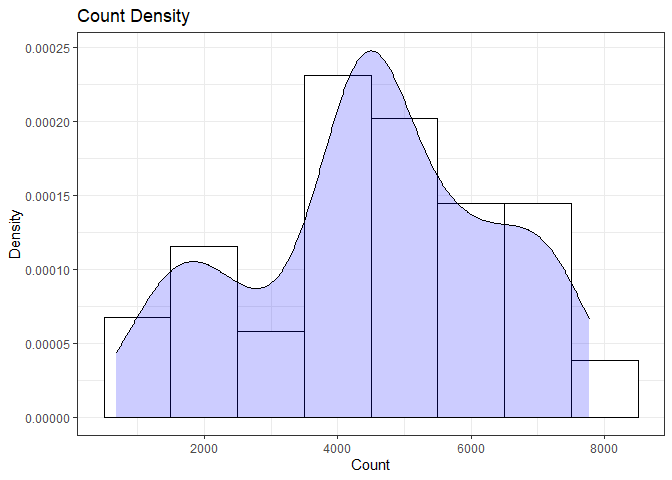
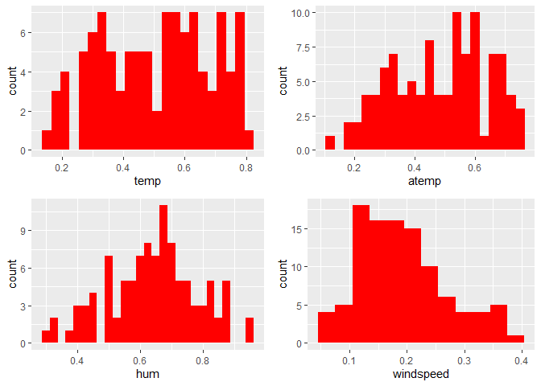
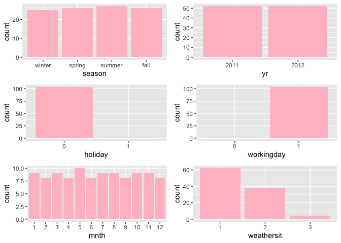
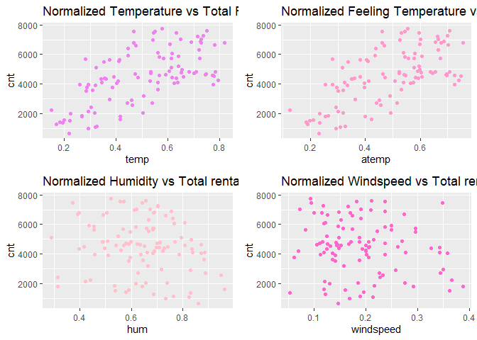
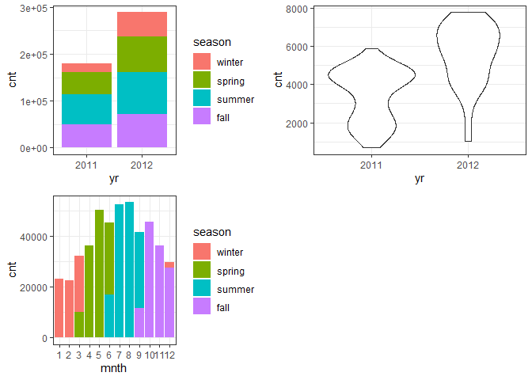
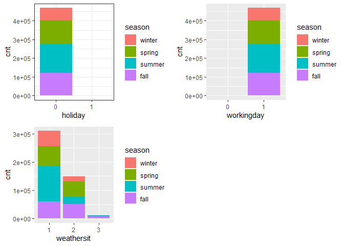

Project 2
================
Ifeoma Ojialor
10/16/2020

## Introduction

In this project, we will use a bike-sharing dataset to create machine
learning models. Before moving forward, I will briefly explain the
bike-sharing system and how it works. A bike-sharing system is a service
in which users can rent/use bicycles on a short term basis for a fee.
The goal of these programs is to provide affordable access to bicycles
for short distance trips as opposed to walking or taking public
transportation. Imagine how many people use these systems on a given
day, the numbers can vary greatly based on some elements. The goal of
this project is to build a predictive model to find out the number of
people that use these bikes in a given time period using available
information about that time/day. This in turn, can help businesses that
oversee this systems to manage them in a cost efficient manner.  
We will be using the bike-sharing dataset from the UCL Machine Learning
Repository. We will use the regression and boosted tree method to model
the response variable `cnt`.

## Exploratory Data Analysis

First we will read in the data using a relative path.

``` r
#read in data and filter to desired weekday
day1 <- read.csv("Bike-Sharing-Dataset/day.csv")
head(day1,5)
```

    ##   instant     dteday season yr mnth holiday
    ## 1       1 2011-01-01      1  0    1       0
    ## 2       2 2011-01-02      1  0    1       0
    ## 3       3 2011-01-03      1  0    1       0
    ## 4       4 2011-01-04      1  0    1       0
    ## 5       5 2011-01-05      1  0    1       0
    ##   weekday workingday weathersit     temp
    ## 1       6          0          2 0.344167
    ## 2       0          0          2 0.363478
    ## 3       1          1          1 0.196364
    ## 4       2          1          1 0.200000
    ## 5       3          1          1 0.226957
    ##      atemp      hum windspeed casual registered
    ## 1 0.363625 0.805833  0.160446    331        654
    ## 2 0.353739 0.696087  0.248539    131        670
    ## 3 0.189405 0.437273  0.248309    120       1229
    ## 4 0.212122 0.590435  0.160296    108       1454
    ## 5 0.229270 0.436957  0.186900     82       1518
    ##    cnt
    ## 1  985
    ## 2  801
    ## 3 1349
    ## 4 1562
    ## 5 1600

Next, we will remove the *casual* and *registered* variables since the
`cnt` variable is a combination of both.

``` r
day1 <- select(day1, -casual, -registered) 
day1$weekday <- as.factor(day1$weekday)
levels(day1$weekday) <- c("Sunday", "Monday", "Tuesday", "Wednesday", "Thursday", "Friday", "Saturday")
day <- filter(day1, weekday == params$days)

#Check for missing values
miss <- data.frame(apply(day,2,function(x){sum(is.na(x))}))
names(miss)[1] <- "missing"
miss
```

    ##            missing
    ## instant          0
    ## dteday           0
    ## season           0
    ## yr               0
    ## mnth             0
    ## holiday          0
    ## weekday          0
    ## workingday       0
    ## weathersit       0
    ## temp             0
    ## atemp            0
    ## hum              0
    ## windspeed        0
    ## cnt              0

There are no missing values in the dataset, so we can continue with our
analysis.

``` r
#Change the variables into their appropriate format.
day$season <- as.factor(day$season)
day$weathersit <- as.factor(day$weathersit)
day$holiday <- as.factor(day$holiday)
day$workingday <- as.factor(day$workingday)
day$yr <- as.factor(day$yr)
day$mnth <- as.factor(day$mnth)

levels(day$season) <- c("winter", "spring", "summer", "fall")
levels(day$yr) <- c("2011", "2012")
str(day)
```

    ## 'data.frame':    104 obs. of  14 variables:
    ##  $ instant   : int  4 11 18 25 32 39 46 53 60 67 ...
    ##  $ dteday    : chr  "2011-01-04" "2011-01-11" "2011-01-18" "2011-01-25" ...
    ##  $ season    : Factor w/ 4 levels "winter","spring",..: 1 1 1 1 1 1 1 1 1 1 ...
    ##  $ yr        : Factor w/ 2 levels "2011","2012": 1 1 1 1 1 1 1 1 1 1 ...
    ##  $ mnth      : Factor w/ 12 levels "1","2","3","4",..: 1 1 1 1 2 2 2 2 3 3 ...
    ##  $ holiday   : Factor w/ 2 levels "0","1": 1 1 1 1 1 1 1 1 1 1 ...
    ##  $ weekday   : Factor w/ 7 levels "Sunday","Monday",..: 3 3 3 3 3 3 3 3 3 3 ...
    ##  $ workingday: Factor w/ 2 levels "0","1": 2 2 2 2 2 2 2 2 2 2 ...
    ##  $ weathersit: Factor w/ 3 levels "1","2","3": 1 2 2 2 2 1 1 1 1 1 ...
    ##  $ temp      : num  0.2 0.169 0.217 0.223 0.192 ...
    ##  $ atemp     : num  0.212 0.191 0.232 0.235 0.235 ...
    ##  $ hum       : num  0.59 0.686 0.862 0.617 0.83 ...
    ##  $ windspeed : num  0.1603 0.1221 0.1468 0.1298 0.0532 ...
    ##  $ cnt       : int  1562 1263 683 1985 1360 1530 1815 1450 1851 2133 ...

### Univariate Analysis

The `cnt` is the response variable, so we’ll use a histogram to get a
visual understanding of the variable.

``` r
ggplot(day, aes(x = cnt)) + theme_bw() + geom_histogram(aes(y =..density..), color = "black", fill = "white", binwidth = 1000) + geom_density(alpha = 0.2, fill = "blue") + labs(title = "Count Density", x = "Count", y = "Density")
```

<!-- -->

``` r
summary(day$cnt)
```

    ##    Min. 1st Qu.  Median    Mean 3rd Qu.    Max. 
    ##     683    3579    4576    4511    5769    7767

From the histogram and summary statistics output, it is pretty evident
that the count of total rental bikes are in the sub 5000 range. We will
investigate if there is a relationship between the response variable and
other relevant predictor variables in the next section. Lets look at the
other variables individually.

``` r
#visualize numeric predictor variables using a histogram
p1 <- ggplot(day) + geom_histogram(aes(x = temp), fill = "red", binwidth = 0.03)
p2 <- ggplot(day) + geom_histogram(aes(x = atemp), fill = "red", binwidth = 0.03)
p3 <- ggplot(day) + geom_histogram(aes(x = hum), fill = "red", binwidth = 0.025)
p4 <- ggplot(day) + geom_histogram(aes(x = windspeed), fill = "red", binwidth = 0.03)
gridExtra::grid.arrange(p1,p2,p3,p4, nrow = 2)
```

<!-- -->

Observations:  
\* No clear cut pattern in `temp`and `atemp`.

  - `hum` appears to be skewed to the left when the dataset is not
    filtered to a specific weekday.

  - `windspeed` appears to be skewed(right). This variable should be
    transformed to curb its skewness.

  - The distribution of `temp` and `atemp` looks very similar. We should
    think about taking out one of the variables.

<!-- end list -->

``` r
#visualize categorical predictor variables
h1 <- ggplot(day) + geom_bar(aes(x = season),fill = "pink")
h2 <- ggplot(day) + geom_bar(aes(x = yr),fill = "pink")
h3 <- ggplot(day) + geom_bar(aes(x = holiday),fill = "pink")
h4 <- ggplot(day) + geom_bar(aes(x = workingday),fill = "pink")
h5 <- ggplot(day) + geom_bar(aes(x = mnth),fill = "pink")
h6 <- ggplot(day) + geom_bar(aes(x = weathersit),fill = "pink")
gridExtra::grid.arrange(h1,h2,h3,h4,h5,h6, nrow = 3)
```

<!-- -->

Observations:  
\* The variation between the four seasons is little to none.

  - About the same number of people rode bikes in 2011 and 2012.

  - Many people rode bikes on days that are not holidays.

  - Most people used the bike-sharing system on days that were neither
    weekends nor holidays.

  - Most people used the bike sharing system on days with clear weather.

### Bi-variate Analysis

In this section, we will explore the predictor variables with respect to
the response variable. The objective is to discover hidden relationships
between the independent and response variables and use those findings in
the model building process.

``` r
# First, we will explore the relationship between the target and numerical variables.
p1 <- ggplot(day) +geom_point(aes(x = temp, y = cnt), colour = "violet") + labs(title = "Normalized Temperature vs Total Rental Bikes")
p2 <- ggplot(day) +geom_point(aes(x = atemp, y = cnt), colour = "#FF99CC") +labs(title = "Normalized Feeling Temperature vs Total Rental Bikes")
p3 <- ggplot(day) +geom_point(aes(x = hum, y = cnt), colour = "pink") + labs(title = "Normalized Humidity vs Total rental Bikes")
p4 <- ggplot(day) +geom_point(aes(x = windspeed, y = cnt), colour = "#FF66CC") +labs(title= "Normalized Windspeed vs Total rental Bikes")
gridExtra::grid.arrange(p1, p2, p3, p4, nrow = 2)
```

<!-- -->

Observations:  
\* There appears to be a positive linear relationship between `cnt` ,
`temp`, and `atemp`.

  - There is also a weak relationship between `cnt`, `hum`, and
    `windspeed`.

<!-- end list -->

``` r
# Now we'll visualize the relationship between the target and categorical variables.
# Instead of using a boxplot, I will use a violin plot which is the blend of both a boxplot and density plot
g1 <- ggplot(day) + geom_col(aes(x = yr, y = cnt, fill = season))+theme_bw()
g2 <- ggplot(day) + geom_violin(aes(x = yr, y = cnt))+theme_bw()
g3 <- ggplot(day) + geom_col(aes(x = mnth, y = cnt, fill = season))+theme_bw() 
g4 <- ggplot(day) + geom_col(aes(x = holiday, y = cnt, fill = season)) + theme_bw() 
g6 <- ggplot(day) + geom_col(aes(x = workingday, y = cnt, fill = season))
g7 <- ggplot(day) + geom_col(aes(x = weathersit, y = cnt, fill = season))
gridExtra::grid.arrange(g1, g2, g3, nrow = 2)
```

<!-- -->

``` r
gridExtra::grid.arrange(g4, g6, g7, nrow = 2)
```

<!-- --> Observations:  
\* The total bike rental count is higher in 2012 than 2011.

  - During workingday, the bike rental counts quite the highest compared
    to during no working day for different seasons.

  - During clear,partly cloudy weather, the bike rental count is highest
    and the second highest is during mist cloudy weather and followed by
    third highest during light snow and light rain weather.

  - The highest bike rental count was during the summer and lowest in
    the winter.

## Correlation Matrix

Correlation matrix helps us to understand the linear relationship
between variables.

``` r
day_c <- day[ , c(10:14)]
round(cor(day_c), 2)
```

    ##            temp atemp   hum windspeed   cnt
    ## temp       1.00  1.00  0.11     -0.09  0.63
    ## atemp      1.00  1.00  0.12     -0.12  0.64
    ## hum        0.11  0.12  1.00     -0.10 -0.18
    ## windspeed -0.09 -0.12 -0.10      1.00 -0.15
    ## cnt        0.63  0.64 -0.18     -0.15  1.00

From the above matrix, we can see that `temp` and `atemp` are highly
correlated. So we only need to include one of these variables in the
model to prevent multicollinearity. We will also transform the humidity
and windspeed variable.

``` r
day <- mutate(day, log_hum = log(day$hum+1))
day <- mutate(day, log_ws = log(day$windspeed + 1))

#Remove irrelevant variables
day <- select(day, -weekday,-holiday,-workingday,-dteday,-temp, -instant)
```

## Model Building

First we split the data into train and test sets.

``` r
set.seed(23)
dayIndex<- createDataPartition(day$cnt, p = 0.7, list=FALSE)
dayTrain <- day[dayIndex, ]
dayTest <- day[-dayIndex, ]

# Build a tree-based model using loocv;
fitTree <- train(cnt~ ., data = dayTrain, method = "rpart", 
              preProcess = c("center", "scale"), 
              trControl = trainControl(method = "loocv", number = 10), tuneGrid = data.frame(cp = 0.01:0.10))
```

    ## Warning in nominalTrainWorkflow(x = x, y =
    ## y, wts = weights, info = trainInfo, : There
    ## were missing values in resampled performance
    ## measures.

``` r
# Display information from the tree fit
fitTree$results
```

    ##     cp     RMSE Rsquared      MAE   RMSESD
    ## 1 0.01 823.6188      NaN 823.6188 658.3374
    ##   RsquaredSD    MAESD
    ## 1         NA 658.3374

``` r
# Build a boosted tree model using cv
fitBoost <- train(cnt~., data = dayTrain, method = "gbm", 
              preProcess = c("center", "scale"), 
              trControl = trainControl(method = "cv", number = 10), 
              tuneGrid = expand.grid(n.trees=c(10,20),shrinkage=c(0.01,0.05),n.minobsinnode =c(3),interaction.depth=c(1,5)))
```

    ## Iter   TrainDeviance   ValidDeviance   StepSize   Improve
    ##      1  3304265.8303             nan     0.0100 19387.4227
    ##      2  3278143.9345             nan     0.0100 27850.1730
    ##      3  3248430.7901             nan     0.0100 29078.7230
    ##      4  3217484.8336             nan     0.0100 26234.2300
    ##      5  3189584.1628             nan     0.0100 23903.1347
    ##      6  3162038.3129             nan     0.0100 25538.6338
    ##      7  3140686.1155             nan     0.0100 21384.6700
    ##      8  3112380.0186             nan     0.0100 27494.3124
    ##      9  3081686.1395             nan     0.0100 28574.6915
    ##     10  3061339.6318             nan     0.0100 20579.3161
    ##     20  2843242.9747             nan     0.0100 14370.8034
    ## 
    ## Iter   TrainDeviance   ValidDeviance   StepSize   Improve
    ##      1  3272260.5545             nan     0.0100 56299.1584
    ##      2  3219603.2484             nan     0.0100 52569.0593
    ##      3  3169426.8310             nan     0.0100 52451.5816
    ##      4  3128733.8439             nan     0.0100 38704.2711
    ##      5  3080990.9450             nan     0.0100 32605.0665
    ##      6  3029971.8236             nan     0.0100 42350.1200
    ##      7  2978871.5804             nan     0.0100 46595.3618
    ##      8  2940545.6868             nan     0.0100 32432.0917
    ##      9  2895489.0800             nan     0.0100 39260.2624
    ##     10  2850591.2960             nan     0.0100 37277.5818
    ##     20  2453299.3183             nan     0.0100 43328.1360
    ## 
    ## Iter   TrainDeviance   ValidDeviance   StepSize   Improve
    ##      1  3190542.6597             nan     0.0500 114678.2781
    ##      2  3081681.8198             nan     0.0500 78049.7158
    ##      3  2944432.2671             nan     0.0500 102866.3056
    ##      4  2862196.7619             nan     0.0500 73000.1150
    ##      5  2738614.9624             nan     0.0500 98824.6807
    ##      6  2624191.3026             nan     0.0500 118611.5484
    ##      7  2547325.8837             nan     0.0500 74864.6684
    ##      8  2482206.2367             nan     0.0500 43021.0792
    ##      9  2411225.8316             nan     0.0500 39327.2526
    ##     10  2331987.7268             nan     0.0500 60470.2713
    ##     20  1710823.6691             nan     0.0500 49314.7647
    ## 
    ## Iter   TrainDeviance   ValidDeviance   StepSize   Improve
    ##      1  3092536.5078             nan     0.0500 173493.7911
    ##      2  2865355.1715             nan     0.0500 237984.5748
    ##      3  2640272.6575             nan     0.0500 195882.9658
    ##      4  2439274.3441             nan     0.0500 131626.2710
    ##      5  2234322.4167             nan     0.0500 129359.3254
    ##      6  2084960.6483             nan     0.0500 127348.2732
    ##      7  1943847.4910             nan     0.0500 117376.7892
    ##      8  1799511.3917             nan     0.0500 69895.3109
    ##      9  1669133.2138             nan     0.0500 83989.8483
    ##     10  1558204.0023             nan     0.0500 67188.2297
    ##     20   812691.9471             nan     0.0500 38332.2530
    ## 
    ## Iter   TrainDeviance   ValidDeviance   StepSize   Improve
    ##      1  3063868.3734             nan     0.0100 21254.1530
    ##      2  3040987.3295             nan     0.0100 22230.6150
    ##      3  3011170.6914             nan     0.0100 21185.4560
    ##      4  2983295.4357             nan     0.0100 21109.5533
    ##      5  2956284.3566             nan     0.0100 18438.9141
    ##      6  2939742.3929             nan     0.0100 16947.6946
    ##      7  2914400.9539             nan     0.0100 16591.8706
    ##      8  2889945.0163             nan     0.0100 13780.6443
    ##      9  2869802.5698             nan     0.0100 19813.3618
    ##     10  2845680.8006             nan     0.0100 14080.6593
    ##     20  2647468.8353             nan     0.0100 16341.6301
    ## 
    ## Iter   TrainDeviance   ValidDeviance   StepSize   Improve
    ##      1  3047158.9355             nan     0.0100 37671.9908
    ##      2  3001728.8579             nan     0.0100 40665.5030
    ##      3  2960945.4988             nan     0.0100 38750.3498
    ##      4  2913472.2888             nan     0.0100 27975.9809
    ##      5  2872208.4833             nan     0.0100 37060.3712
    ##      6  2828745.0541             nan     0.0100 26883.0139
    ##      7  2788643.3720             nan     0.0100 42336.8578
    ##      8  2753540.1591             nan     0.0100 23619.4113
    ##      9  2715978.1822             nan     0.0100 28816.6247
    ##     10  2673640.0428             nan     0.0100 38215.7236
    ##     20  2332686.8159             nan     0.0100 24137.6802
    ## 
    ## Iter   TrainDeviance   ValidDeviance   StepSize   Improve
    ##      1  2942369.4339             nan     0.0500 96678.7651
    ##      2  2833847.0892             nan     0.0500 83558.7925
    ##      3  2734049.6063             nan     0.0500 106416.0238
    ##      4  2653076.9764             nan     0.0500 56356.8033
    ##      5  2559529.8012             nan     0.0500 62676.8818
    ##      6  2472872.9686             nan     0.0500 85371.5322
    ##      7  2374067.7591             nan     0.0500 39130.8613
    ##      8  2273918.3798             nan     0.0500 56656.0101
    ##      9  2208798.5166             nan     0.0500 52827.4419
    ##     10  2123722.0495             nan     0.0500 46552.6945
    ##     20  1601352.1162             nan     0.0500 31087.1640
    ## 
    ## Iter   TrainDeviance   ValidDeviance   StepSize   Improve
    ##      1  2889040.7059             nan     0.0500 105040.9142
    ##      2  2672314.4820             nan     0.0500 191115.7760
    ##      3  2476281.8886             nan     0.0500 202798.3367
    ##      4  2313353.0003             nan     0.0500 146612.5384
    ##      5  2146363.2046             nan     0.0500 115174.9342
    ##      6  1987092.4355             nan     0.0500 144188.1937
    ##      7  1871707.7441             nan     0.0500 78997.5122
    ##      8  1767980.6292             nan     0.0500 57711.1880
    ##      9  1665983.1142             nan     0.0500 62262.0761
    ##     10  1550539.6099             nan     0.0500 90220.9472
    ##     20   856655.8457             nan     0.0500 23101.2521
    ## 
    ## Iter   TrainDeviance   ValidDeviance   StepSize   Improve
    ##      1  2902509.0459             nan     0.0100 22665.2423
    ##      2  2882495.4230             nan     0.0100 19641.9281
    ##      3  2859194.5670             nan     0.0100 15798.2665
    ##      4  2836332.9351             nan     0.0100 17848.0221
    ##      5  2822437.5929             nan     0.0100 11519.8528
    ##      6  2801097.0777             nan     0.0100 19436.6617
    ##      7  2781600.3864             nan     0.0100 10203.2248
    ##      8  2761393.0952             nan     0.0100 17164.9266
    ##      9  2742727.3956             nan     0.0100 18766.8143
    ##     10  2724526.4186             nan     0.0100 19022.3620
    ##     20  2530896.2769             nan     0.0100 16048.0789
    ## 
    ## Iter   TrainDeviance   ValidDeviance   StepSize   Improve
    ##      1  2882496.6351             nan     0.0100 38680.9166
    ##      2  2842149.1894             nan     0.0100 36261.5806
    ##      3  2796399.4552             nan     0.0100 41251.7703
    ##      4  2756534.5895             nan     0.0100 39504.1179
    ##      5  2712813.0820             nan     0.0100 31053.4661
    ##      6  2671092.5725             nan     0.0100 30246.0365
    ##      7  2635349.7250             nan     0.0100 33520.7810
    ##      8  2595564.4908             nan     0.0100 33351.7453
    ##      9  2560138.4692             nan     0.0100 32306.8139
    ##     10  2521262.2158             nan     0.0100 40342.7918
    ##     20  2189565.0207             nan     0.0100 24584.0521
    ## 
    ## Iter   TrainDeviance   ValidDeviance   StepSize   Improve
    ##      1  2812803.0333             nan     0.0500 92953.5860
    ##      2  2689257.5123             nan     0.0500 66295.8283
    ##      3  2626944.8839             nan     0.0500 32992.4036
    ##      4  2535856.9733             nan     0.0500 78958.0675
    ##      5  2432222.3255             nan     0.0500 77711.4327
    ##      6  2344318.8916             nan     0.0500 75169.1784
    ##      7  2239538.9043             nan     0.0500 60788.0137
    ##      8  2153688.5459             nan     0.0500 51727.3694
    ##      9  2072579.2698             nan     0.0500 49452.4904
    ##     10  1979830.6744             nan     0.0500 52918.7237
    ##     20  1437540.4157             nan     0.0500 37750.0821
    ## 
    ## Iter   TrainDeviance   ValidDeviance   StepSize   Improve
    ##      1  2713854.7187             nan     0.0500 201113.0396
    ##      2  2488755.5654             nan     0.0500 225918.5114
    ##      3  2290081.6722             nan     0.0500 141362.1329
    ##      4  2132345.3834             nan     0.0500 159129.8583
    ##      5  1962968.3611             nan     0.0500 142786.4579
    ##      6  1815744.3210             nan     0.0500 119246.6454
    ##      7  1711736.1421             nan     0.0500 68712.0718
    ##      8  1616412.6331             nan     0.0500 49041.2864
    ##      9  1510635.7373             nan     0.0500 66481.9913
    ##     10  1426620.8817             nan     0.0500 89563.8536
    ##     20   832814.0331             nan     0.0500 36839.1932
    ## 
    ## Iter   TrainDeviance   ValidDeviance   StepSize   Improve
    ##      1  3120596.0465             nan     0.0100 19258.7089
    ##      2  3094512.2396             nan     0.0100 17051.3585
    ##      3  3068806.3598             nan     0.0100 16200.2600
    ##      4  3042967.8557             nan     0.0100 15012.1127
    ##      5  3017605.5715             nan     0.0100 12933.4995
    ##      6  2998120.9706             nan     0.0100 15968.0448
    ##      7  2973331.0238             nan     0.0100 20843.5648
    ##      8  2946508.4066             nan     0.0100 17802.1050
    ##      9  2922238.0935             nan     0.0100 17689.5640
    ##     10  2902938.5895             nan     0.0100 19480.0962
    ##     20  2706250.2567             nan     0.0100 11251.2749
    ## 
    ## Iter   TrainDeviance   ValidDeviance   StepSize   Improve
    ##      1  3103110.7413             nan     0.0100 36308.4257
    ##      2  3070981.8074             nan     0.0100 29731.0555
    ##      3  3025862.7449             nan     0.0100 34633.5259
    ##      4  2979521.0366             nan     0.0100 36993.4127
    ##      5  2936380.4340             nan     0.0100 42653.5899
    ##      6  2889543.2056             nan     0.0100 31015.3983
    ##      7  2852367.6287             nan     0.0100 35506.5962
    ##      8  2815085.8284             nan     0.0100 33920.1597
    ##      9  2776194.6084             nan     0.0100 39318.1377
    ##     10  2740962.0056             nan     0.0100 33539.7994
    ##     20  2383292.8678             nan     0.0100 35418.3218
    ## 
    ## Iter   TrainDeviance   ValidDeviance   StepSize   Improve
    ##      1  3036407.9116             nan     0.0500 60602.7854
    ##      2  2930139.0180             nan     0.0500 88097.0378
    ##      3  2815692.8309             nan     0.0500 66600.7291
    ##      4  2695151.8542             nan     0.0500 62592.1353
    ##      5  2595413.4866             nan     0.0500 93793.9548
    ##      6  2522035.3266             nan     0.0500 45164.5465
    ##      7  2444937.4103             nan     0.0500 68398.9184
    ##      8  2355890.8348             nan     0.0500 45943.2262
    ##      9  2255337.4828             nan     0.0500 48652.4067
    ##     10  2200799.6955             nan     0.0500 59814.5203
    ##     20  1587755.9754             nan     0.0500 36709.6629
    ## 
    ## Iter   TrainDeviance   ValidDeviance   StepSize   Improve
    ##      1  2900769.3533             nan     0.0500 205955.7599
    ##      2  2690183.5583             nan     0.0500 215156.3907
    ##      3  2501173.5237             nan     0.0500 131013.8300
    ##      4  2367218.8082             nan     0.0500 90235.2011
    ##      5  2218788.8066             nan     0.0500 124684.9999
    ##      6  2069359.8513             nan     0.0500 131534.6741
    ##      7  1925124.3215             nan     0.0500 132246.6154
    ##      8  1768997.8165             nan     0.0500 122377.0470
    ##      9  1694402.0952             nan     0.0500 39213.9739
    ##     10  1602907.5736             nan     0.0500 77799.3298
    ##     20   869152.8003             nan     0.0500 37931.3573
    ## 
    ## Iter   TrainDeviance   ValidDeviance   StepSize   Improve
    ##      1  3210714.5562             nan     0.0100 26547.8618
    ##      2  3186454.8745             nan     0.0100 21391.1063
    ##      3  3166057.0282             nan     0.0100 19495.1393
    ##      4  3142278.5347             nan     0.0100 18839.4814
    ##      5  3114980.3877             nan     0.0100 22528.5899
    ##      6  3087298.7021             nan     0.0100 27081.5132
    ##      7  3061375.5592             nan     0.0100 19585.2282
    ##      8  3033353.3952             nan     0.0100 27144.9834
    ##      9  3007080.8855             nan     0.0100 17982.7505
    ##     10  2976901.9188             nan     0.0100 20979.7326
    ##     20  2734897.3453             nan     0.0100 12451.3856
    ## 
    ## Iter   TrainDeviance   ValidDeviance   StepSize   Improve
    ##      1  3192467.5713             nan     0.0100 52210.3632
    ##      2  3144019.6576             nan     0.0100 42735.9837
    ##      3  3096798.6238             nan     0.0100 42483.2753
    ##      4  3045301.4276             nan     0.0100 42597.7258
    ##      5  2994106.6461             nan     0.0100 45094.2896
    ##      6  2954821.4453             nan     0.0100 35249.3791
    ##      7  2912676.0679             nan     0.0100 35338.7647
    ##      8  2873916.7985             nan     0.0100 28616.6462
    ##      9  2831191.6355             nan     0.0100 40318.4653
    ##     10  2788476.5134             nan     0.0100 26242.4220
    ##     20  2392120.3678             nan     0.0100 33136.6788
    ## 
    ## Iter   TrainDeviance   ValidDeviance   StepSize   Improve
    ##      1  3090969.8264             nan     0.0500 118561.0667
    ##      2  2969605.0989             nan     0.0500 104456.0274
    ##      3  2854069.0852             nan     0.0500 64160.5476
    ##      4  2749861.2343             nan     0.0500 89073.7919
    ##      5  2638789.1536             nan     0.0500 79832.7948
    ##      6  2546993.0340             nan     0.0500 101586.4977
    ##      7  2459116.2008             nan     0.0500 75278.8769
    ##      8  2364703.8305             nan     0.0500 77539.8041
    ##      9  2259780.8547             nan     0.0500 69342.8314
    ##     10  2184369.3461             nan     0.0500 50053.4665
    ##     20  1536397.8739             nan     0.0500 39288.2513
    ## 
    ## Iter   TrainDeviance   ValidDeviance   StepSize   Improve
    ##      1  2999448.0991             nan     0.0500 215242.6499
    ##      2  2780112.3007             nan     0.0500 222058.0346
    ##      3  2552588.9089             nan     0.0500 186369.2266
    ##      4  2360075.4136             nan     0.0500 115691.4330
    ##      5  2198619.5157             nan     0.0500 150402.8617
    ##      6  2049895.6205             nan     0.0500 117704.2862
    ##      7  1897587.8551             nan     0.0500 106281.5936
    ##      8  1771988.0924             nan     0.0500 113061.1789
    ##      9  1656263.9973             nan     0.0500 88443.4979
    ##     10  1538266.7222             nan     0.0500 90746.0616
    ##     20   851825.2374             nan     0.0500 26224.5247
    ## 
    ## Iter   TrainDeviance   ValidDeviance   StepSize   Improve
    ##      1  3133449.3591             nan     0.0100 23149.0065
    ##      2  3105159.4925             nan     0.0100 23968.6143
    ##      3  3073782.1362             nan     0.0100 19502.4006
    ##      4  3049025.9684             nan     0.0100 21901.6087
    ##      5  3027422.3034             nan     0.0100 18384.8845
    ##      6  3004445.9714             nan     0.0100 19087.6593
    ##      7  2974483.3559             nan     0.0100 17724.0013
    ##      8  2947036.0326             nan     0.0100 18817.0091
    ##      9  2925716.8752             nan     0.0100 16238.7307
    ##     10  2903194.5029             nan     0.0100 17477.0355
    ##     20  2695422.0885             nan     0.0100 24634.9381
    ## 
    ## Iter   TrainDeviance   ValidDeviance   StepSize   Improve
    ##      1  3098928.6426             nan     0.0100 59772.6362
    ##      2  3049057.9529             nan     0.0100 49449.6461
    ##      3  3002304.7816             nan     0.0100 47207.2782
    ##      4  2956325.6655             nan     0.0100 44725.7863
    ##      5  2914946.4818             nan     0.0100 37073.5316
    ##      6  2869071.7956             nan     0.0100 39432.2774
    ##      7  2830774.2462             nan     0.0100 23834.6836
    ##      8  2788269.1956             nan     0.0100 41803.4621
    ##      9  2757348.4060             nan     0.0100 28956.4929
    ##     10  2719158.9387             nan     0.0100 27368.1850
    ##     20  2361909.2596             nan     0.0100 33361.9118
    ## 
    ## Iter   TrainDeviance   ValidDeviance   StepSize   Improve
    ##      1  2998312.0938             nan     0.0500 92283.0114
    ##      2  2876439.3711             nan     0.0500 109890.4136
    ##      3  2768401.9392             nan     0.0500 69200.3952
    ##      4  2636422.4679             nan     0.0500 52720.7429
    ##      5  2555257.9131             nan     0.0500 80044.0254
    ##      6  2478854.4720             nan     0.0500 75609.6202
    ##      7  2391459.6413             nan     0.0500 69840.9074
    ##      8  2307472.4378             nan     0.0500 54628.2210
    ##      9  2203273.9976             nan     0.0500 79917.1846
    ##     10  2127041.8500             nan     0.0500 47385.3504
    ##     20  1569874.5559             nan     0.0500 25133.8565
    ## 
    ## Iter   TrainDeviance   ValidDeviance   StepSize   Improve
    ##      1  2902135.0535             nan     0.0500 243161.4280
    ##      2  2673820.2311             nan     0.0500 205133.7713
    ##      3  2465878.4001             nan     0.0500 172866.8326
    ##      4  2289877.4695             nan     0.0500 146655.3784
    ##      5  2133682.1746             nan     0.0500 114255.6845
    ##      6  2002622.4674             nan     0.0500 125892.9254
    ##      7  1906787.0179             nan     0.0500 99591.0748
    ##      8  1770019.4950             nan     0.0500 99295.1466
    ##      9  1640732.7654             nan     0.0500 127678.2662
    ##     10  1524135.9392             nan     0.0500 111350.5577
    ##     20   805259.1034             nan     0.0500 23206.8731
    ## 
    ## Iter   TrainDeviance   ValidDeviance   StepSize   Improve
    ##      1  3065927.8353             nan     0.0100 25833.5780
    ##      2  3042086.5304             nan     0.0100 17089.9056
    ##      3  3020474.0652             nan     0.0100 18454.3261
    ##      4  2989637.1435             nan     0.0100 29036.8400
    ##      5  2957143.1859             nan     0.0100 13664.8632
    ##      6  2930604.9367             nan     0.0100 20148.8524
    ##      7  2901114.7485             nan     0.0100 16625.2912
    ##      8  2880732.9962             nan     0.0100 20922.1013
    ##      9  2854852.4714             nan     0.0100 12226.9691
    ##     10  2833857.5859             nan     0.0100 19445.3594
    ##     20  2613810.4518             nan     0.0100 14048.8969
    ## 
    ## Iter   TrainDeviance   ValidDeviance   StepSize   Improve
    ##      1  3045710.3079             nan     0.0100 31350.5564
    ##      2  3000325.8904             nan     0.0100 31673.6448
    ##      3  2953988.7670             nan     0.0100 40422.2592
    ##      4  2913734.9064             nan     0.0100 15394.2655
    ##      5  2873727.1339             nan     0.0100 40408.8611
    ##      6  2835706.0195             nan     0.0100 38304.8369
    ##      7  2792978.2415             nan     0.0100 35157.7011
    ##      8  2744987.3596             nan     0.0100 37971.6776
    ##      9  2704488.7320             nan     0.0100 30415.0471
    ##     10  2658438.0252             nan     0.0100 40421.6091
    ##     20  2280685.8616             nan     0.0100 35113.4512
    ## 
    ## Iter   TrainDeviance   ValidDeviance   StepSize   Improve
    ##      1  2949762.8564             nan     0.0500 103698.7353
    ##      2  2830735.7830             nan     0.0500 56321.6517
    ##      3  2738802.8903             nan     0.0500 78470.0448
    ##      4  2639912.8475             nan     0.0500 92282.5165
    ##      5  2530746.6505             nan     0.0500 75886.8766
    ##      6  2440787.6012             nan     0.0500 72732.2495
    ##      7  2361740.9738             nan     0.0500 78397.8218
    ##      8  2257944.8479             nan     0.0500 105841.9721
    ##      9  2172594.3506             nan     0.0500 71704.7038
    ##     10  2089574.7199             nan     0.0500 51144.6256
    ##     20  1544343.1757             nan     0.0500 28412.0331
    ## 
    ## Iter   TrainDeviance   ValidDeviance   StepSize   Improve
    ##      1  2832639.8187             nan     0.0500 190692.1400
    ##      2  2605168.4746             nan     0.0500 162811.9165
    ##      3  2410546.9800             nan     0.0500 141399.7567
    ##      4  2214211.7009             nan     0.0500 103674.9506
    ##      5  2069369.6715             nan     0.0500 104349.9922
    ##      6  1950443.0742             nan     0.0500 94395.4505
    ##      7  1791238.9691             nan     0.0500 96394.9457
    ##      8  1652676.0033             nan     0.0500 114668.4818
    ##      9  1535491.1797             nan     0.0500 128256.9990
    ##     10  1428708.4340             nan     0.0500 56468.4800
    ##     20   796408.5815             nan     0.0500 46912.2718
    ## 
    ## Iter   TrainDeviance   ValidDeviance   StepSize   Improve
    ##      1  3110090.6074             nan     0.0100 22207.8635
    ##      2  3082795.0458             nan     0.0100 24358.0535
    ##      3  3061355.9051             nan     0.0100 12506.3901
    ##      4  3036259.7911             nan     0.0100 25151.3863
    ##      5  3007439.7320             nan     0.0100 27410.6681
    ##      6  2980860.9877             nan     0.0100 27597.3467
    ##      7  2959370.8710             nan     0.0100 16448.9704
    ##      8  2932152.9353             nan     0.0100 25556.3653
    ##      9  2910577.1357             nan     0.0100 14762.3610
    ##     10  2888684.2909             nan     0.0100 19823.0167
    ##     20  2670115.9598             nan     0.0100 22287.9978
    ## 
    ## Iter   TrainDeviance   ValidDeviance   StepSize   Improve
    ##      1  3081231.8659             nan     0.0100 46088.3029
    ##      2  3034090.4158             nan     0.0100 35287.0931
    ##      3  2990409.5383             nan     0.0100 37623.9491
    ##      4  2950517.8916             nan     0.0100 16409.7090
    ##      5  2913556.4740             nan     0.0100 33169.1511
    ##      6  2878660.4614             nan     0.0100 30066.5161
    ##      7  2832553.0486             nan     0.0100 34479.2166
    ##      8  2785404.7649             nan     0.0100 36366.2011
    ##      9  2745730.0551             nan     0.0100 38210.7427
    ##     10  2717049.7628             nan     0.0100 20152.9786
    ##     20  2341750.9038             nan     0.0100 39054.9635
    ## 
    ## Iter   TrainDeviance   ValidDeviance   StepSize   Improve
    ##      1  2992340.9253             nan     0.0500 68403.8815
    ##      2  2868229.0059             nan     0.0500 70479.7767
    ##      3  2787302.2117             nan     0.0500 60302.5007
    ##      4  2686320.5653             nan     0.0500 83370.3167
    ##      5  2588181.5990             nan     0.0500 61253.2226
    ##      6  2510441.8276             nan     0.0500 61826.0200
    ##      7  2405433.9068             nan     0.0500 84485.2159
    ##      8  2324970.7007             nan     0.0500 60410.1558
    ##      9  2266725.0978             nan     0.0500 15941.9436
    ##     10  2178527.1280             nan     0.0500 61307.6625
    ##     20  1603149.0940             nan     0.0500 9464.7427
    ## 
    ## Iter   TrainDeviance   ValidDeviance   StepSize   Improve
    ##      1  2922943.9114             nan     0.0500 213267.4144
    ##      2  2695761.8311             nan     0.0500 180220.3188
    ##      3  2513907.7832             nan     0.0500 151869.6244
    ##      4  2317096.9970             nan     0.0500 163846.8215
    ##      5  2163640.9386             nan     0.0500 165453.2898
    ##      6  2009319.9139             nan     0.0500 122179.4006
    ##      7  1888200.0856             nan     0.0500 111759.9900
    ##      8  1779961.7168             nan     0.0500 82351.6512
    ##      9  1675409.7952             nan     0.0500 73027.4354
    ##     10  1577712.3553             nan     0.0500 70322.8201
    ##     20   855364.6324             nan     0.0500 33537.5338
    ## 
    ## Iter   TrainDeviance   ValidDeviance   StepSize   Improve
    ##      1  3043738.2245             nan     0.0100 22294.0082
    ##      2  3017042.5623             nan     0.0100 25966.6077
    ##      3  2990516.7965             nan     0.0100 17519.7773
    ##      4  2963746.3350             nan     0.0100 27938.2218
    ##      5  2942341.5102             nan     0.0100 21044.6302
    ##      6  2915954.8304             nan     0.0100 19058.3275
    ##      7  2893610.4445             nan     0.0100 19947.0656
    ##      8  2867548.4961             nan     0.0100 27022.3599
    ##      9  2844033.8304             nan     0.0100 18941.0470
    ##     10  2827843.0023             nan     0.0100 18834.2389
    ##     20  2616562.2976             nan     0.0100 19826.5017
    ## 
    ## Iter   TrainDeviance   ValidDeviance   StepSize   Improve
    ##      1  3023766.9295             nan     0.0100 40893.3476
    ##      2  2982838.2731             nan     0.0100 39659.3921
    ##      3  2945830.0104             nan     0.0100 32252.6001
    ##      4  2897099.0625             nan     0.0100 41647.2810
    ##      5  2852789.9816             nan     0.0100 43932.3694
    ##      6  2808024.3364             nan     0.0100 28239.2234
    ##      7  2767006.4712             nan     0.0100 32806.5167
    ##      8  2726843.2661             nan     0.0100 31005.0305
    ##      9  2684281.9119             nan     0.0100 34766.3291
    ##     10  2647214.4920             nan     0.0100 28487.1345
    ##     20  2301412.2906             nan     0.0100 31734.5255
    ## 
    ## Iter   TrainDeviance   ValidDeviance   StepSize   Improve
    ##      1  2962699.5650             nan     0.0500 120058.2999
    ##      2  2848428.6643             nan     0.0500 73460.7880
    ##      3  2753186.9642             nan     0.0500 63614.4683
    ##      4  2696017.7463             nan     0.0500 42824.0612
    ##      5  2599344.8558             nan     0.0500 82457.9148
    ##      6  2506227.5033             nan     0.0500 83358.2041
    ##      7  2401958.1734             nan     0.0500 96296.3780
    ##      8  2307904.9561             nan     0.0500 84488.1179
    ##      9  2204479.0390             nan     0.0500 89797.1894
    ##     10  2139661.6617             nan     0.0500 60298.6282
    ##     20  1545123.8898             nan     0.0500 45380.8128
    ## 
    ## Iter   TrainDeviance   ValidDeviance   StepSize   Improve
    ##      1  2822774.2576             nan     0.0500 269707.0285
    ##      2  2602426.8821             nan     0.0500 210892.7879
    ##      3  2392865.9473             nan     0.0500 147102.3999
    ##      4  2216493.8986             nan     0.0500 110941.3035
    ##      5  2109655.3654             nan     0.0500 85927.3016
    ##      6  1960827.7659             nan     0.0500 108953.8346
    ##      7  1826162.8235             nan     0.0500 111752.6244
    ##      8  1688767.0521             nan     0.0500 98658.0258
    ##      9  1597502.4227             nan     0.0500 35465.9956
    ##     10  1499421.1201             nan     0.0500 97231.6097
    ##     20   820995.2502             nan     0.0500 41411.7633
    ## 
    ## Iter   TrainDeviance   ValidDeviance   StepSize   Improve
    ##      1  3152763.6873             nan     0.0100 18543.7357
    ##      2  3122109.8192             nan     0.0100 24286.6116
    ##      3  3102178.6948             nan     0.0100 10909.1339
    ##      4  3070498.8700             nan     0.0100 24082.2999
    ##      5  3043800.1424             nan     0.0100 22586.7031
    ##      6  3020025.7654             nan     0.0100 20984.7058
    ##      7  2998014.1234             nan     0.0100 25558.4155
    ##      8  2973092.7404             nan     0.0100 23525.5186
    ##      9  2950847.8646             nan     0.0100 3794.2848
    ##     10  2929739.3602             nan     0.0100 16642.0601
    ##     20  2703025.7112             nan     0.0100 6041.2085
    ## 
    ## Iter   TrainDeviance   ValidDeviance   StepSize   Improve
    ##      1  3127394.1690             nan     0.0100 46239.6071
    ##      2  3090417.9105             nan     0.0100 21952.7559
    ##      3  3045820.3341             nan     0.0100 43116.1119
    ##      4  2990492.3491             nan     0.0100 56618.6227
    ##      5  2944882.5007             nan     0.0100 43825.0818
    ##      6  2899658.0017             nan     0.0100 29556.8148
    ##      7  2854512.4568             nan     0.0100 36414.3377
    ##      8  2809937.3628             nan     0.0100 41071.5327
    ##      9  2761800.2484             nan     0.0100 49167.6084
    ##     10  2723731.1986             nan     0.0100 39405.2538
    ##     20  2334616.4149             nan     0.0100 24379.8588
    ## 
    ## Iter   TrainDeviance   ValidDeviance   StepSize   Improve
    ##      1  3039907.3006             nan     0.0500 122373.2332
    ##      2  2924028.6285             nan     0.0500 107764.2911
    ##      3  2762296.9669             nan     0.0500 93004.8358
    ##      4  2663176.2387             nan     0.0500 83927.6406
    ##      5  2566292.0462             nan     0.0500 87055.0951
    ##      6  2437730.4699             nan     0.0500 75858.8545
    ##      7  2318869.5350             nan     0.0500 71496.8213
    ##      8  2218289.8566             nan     0.0500 72203.3777
    ##      9  2132685.1336             nan     0.0500 69063.6457
    ##     10  2067356.3203             nan     0.0500 60867.4872
    ##     20  1502337.0550             nan     0.0500 41735.1558
    ## 
    ## Iter   TrainDeviance   ValidDeviance   StepSize   Improve
    ##      1  2932887.0540             nan     0.0500 186574.6406
    ##      2  2662548.2367             nan     0.0500 256881.2919
    ##      3  2483860.5775             nan     0.0500 168272.5579
    ##      4  2342864.0524             nan     0.0500 165580.2144
    ##      5  2168307.8342             nan     0.0500 144285.2023
    ##      6  2000883.2377             nan     0.0500 140466.7731
    ##      7  1853560.9367             nan     0.0500 152230.0103
    ##      8  1707986.6256             nan     0.0500 125103.2723
    ##      9  1577395.2369             nan     0.0500 76483.5045
    ##     10  1468986.1721             nan     0.0500 73076.8131
    ##     20   773426.3513             nan     0.0500 28567.0580
    ## 
    ## Iter   TrainDeviance   ValidDeviance   StepSize   Improve
    ##      1  2919844.0925             nan     0.0500 216339.1408
    ##      2  2767252.4917             nan     0.0500 182198.0372
    ##      3  2577522.3218             nan     0.0500 142825.3590
    ##      4  2379173.9849             nan     0.0500 171758.0211
    ##      5  2220265.0078             nan     0.0500 129536.3068
    ##      6  2061951.5641             nan     0.0500 119947.4957
    ##      7  1911635.4817             nan     0.0500 89842.0593
    ##      8  1771883.2296             nan     0.0500 86172.3527
    ##      9  1655567.0875             nan     0.0500 74381.0707
    ##     10  1532924.4882             nan     0.0500 100136.9220
    ##     20   838176.0961             nan     0.0500 33925.5132

``` r
# Display information from the boost fit
fitBoost$results
```

    ##   shrinkage interaction.depth n.minobsinnode
    ## 1      0.01                 1              3
    ## 5      0.05                 1              3
    ## 3      0.01                 5              3
    ## 7      0.05                 5              3
    ## 2      0.01                 1              3
    ## 6      0.05                 1              3
    ## 4      0.01                 5              3
    ## 8      0.05                 5              3
    ##   n.trees     RMSE  Rsquared       MAE   RMSESD
    ## 1      10 1708.127 0.5641485 1360.2473 282.4173
    ## 5      10 1519.464 0.6120457 1217.7523 245.5638
    ## 3      10 1661.847 0.7397360 1325.4701 278.3910
    ## 7      10 1331.974 0.7501647 1068.3940 222.1483
    ## 2      20 1652.731 0.5859430 1316.3385 265.7838
    ## 6      20 1329.008 0.6697043 1054.9244 213.1845
    ## 4      20 1564.193 0.7319815 1251.8231 261.5018
    ## 8      20 1085.047 0.7719741  862.0699 202.1947
    ##   RsquaredSD    MAESD
    ## 1  0.2684851 241.9280
    ## 5  0.2856806 217.6636
    ## 3  0.1920716 238.8086
    ## 7  0.1820820 190.9576
    ## 2  0.2826797 232.6105
    ## 6  0.2042441 192.0111
    ## 4  0.2002234 231.1319
    ## 8  0.1659514 164.0972

Now, we make predictions on the test data sets using the best model
fits. Then we compare RMSE to determine the best model.

``` r
predTree <- predict(fitTree, newdata = select(dayTest, -cnt))
postResample(predTree, dayTest$cnt)
```

    ##         RMSE     Rsquared          MAE 
    ## 1021.7688382    0.7457244  783.3663881

``` r
boostPred <- predict(fitBoost, newdata = select(dayTest, -cnt))
postResample(boostPred, dayTest$cnt)
```

    ##         RMSE     Rsquared          MAE 
    ## 1186.9097488    0.8195292  911.6235391

When we compare the two models, the boosted tree model has lower RMSE
values when applied on the test dataset. Hence, the boosted tree model
is our final model and best model for interpreting the bike rental count
on a daily basis.
