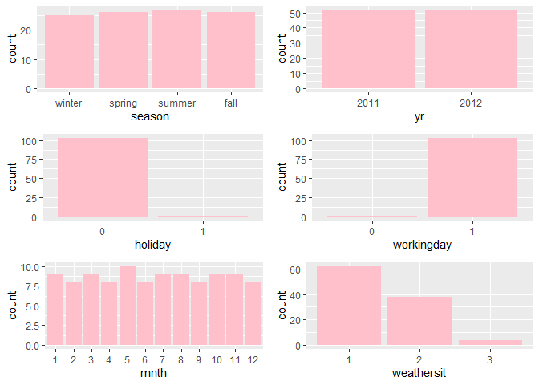

Project 2
================
Ifeoma Ojialor
10/16/2020

## Introduction

In this project, we will use a bike-sharing dataset to create machine
learning models. Before moving forward, I will briefly explain the
bike-sharing system and how it works. A bike-sharing system is a service
in which users can rent/use bicycles on a short term basis for a fee.
The goal of these programs is to provide affordable access to bicycles
for short distance trips as opposed to walking or taking public
transportation. Imagine how many people use these systems on a given
day, the numbers can vary greatly based on some elements. The goal of
this project is to build a predictive model to find out the number of
people that use these bikes in a given time period using available
information about that time/day. This in turn, can help businesses that
oversee this systems to manage them in a cost efficient manner.  
We will be using the bike-sharing dataset from the UCL Machine Learning
Repository. We will use the regression and boosted tree method to model
the response variable `cnt`.

## Exploratory Data Analysis

First we will read in the data using a relative path.

``` r
#read in data and filter to desired weekday
day1 <- read.csv("Bike-Sharing-Dataset/day.csv")
head(day1,5)
```

    ##   instant     dteday season yr mnth holiday
    ## 1       1 2011-01-01      1  0    1       0
    ## 2       2 2011-01-02      1  0    1       0
    ## 3       3 2011-01-03      1  0    1       0
    ## 4       4 2011-01-04      1  0    1       0
    ## 5       5 2011-01-05      1  0    1       0
    ##   weekday workingday weathersit     temp
    ## 1       6          0          2 0.344167
    ## 2       0          0          2 0.363478
    ## 3       1          1          1 0.196364
    ## 4       2          1          1 0.200000
    ## 5       3          1          1 0.226957
    ##      atemp      hum windspeed casual registered
    ## 1 0.363625 0.805833  0.160446    331        654
    ## 2 0.353739 0.696087  0.248539    131        670
    ## 3 0.189405 0.437273  0.248309    120       1229
    ## 4 0.212122 0.590435  0.160296    108       1454
    ## 5 0.229270 0.436957  0.186900     82       1518
    ##    cnt
    ## 1  985
    ## 2  801
    ## 3 1349
    ## 4 1562
    ## 5 1600

Next, we will remove the *casual* and *registered* variables since the
`cnt` variable is a combination of both.

``` r
day1 <- select(day1, -casual, -registered) 
day1$weekday <- as.factor(day1$weekday)
levels(day1$weekday) <- c("Sunday", "Monday", "Tuesday", "Wednesday", "Thursday", "Friday", "Saturday")
day <- filter(day1, weekday == params$days)

#Check for missing values
miss <- data.frame(apply(day,2,function(x){sum(is.na(x))}))
names(miss)[1] <- "missing"
miss
```

    ##            missing
    ## instant          0
    ## dteday           0
    ## season           0
    ## yr               0
    ## mnth             0
    ## holiday          0
    ## weekday          0
    ## workingday       0
    ## weathersit       0
    ## temp             0
    ## atemp            0
    ## hum              0
    ## windspeed        0
    ## cnt              0

There are no missing values in the dataset, so we can continue with our
analysis.

``` r
#Change the variables into their appropriate format.
day$season <- as.factor(day$season)
day$weathersit <- as.factor(day$weathersit)
day$holiday <- as.factor(day$holiday)
day$workingday <- as.factor(day$workingday)
day$yr <- as.factor(day$yr)
day$mnth <- as.factor(day$mnth)

levels(day$season) <- c("winter", "spring", "summer", "fall")
levels(day$yr) <- c("2011", "2012")
str(day)
```

    ## 'data.frame':    104 obs. of  14 variables:
    ##  $ instant   : int  4 11 18 25 32 39 46 53 60 67 ...
    ##  $ dteday    : chr  "2011-01-04" "2011-01-11" "2011-01-18" "2011-01-25" ...
    ##  $ season    : Factor w/ 4 levels "winter","spring",..: 1 1 1 1 1 1 1 1 1 1 ...
    ##  $ yr        : Factor w/ 2 levels "2011","2012": 1 1 1 1 1 1 1 1 1 1 ...
    ##  $ mnth      : Factor w/ 12 levels "1","2","3","4",..: 1 1 1 1 2 2 2 2 3 3 ...
    ##  $ holiday   : Factor w/ 2 levels "0","1": 1 1 1 1 1 1 1 1 1 1 ...
    ##  $ weekday   : Factor w/ 7 levels "Sunday","Monday",..: 3 3 3 3 3 3 3 3 3 3 ...
    ##  $ workingday: Factor w/ 2 levels "0","1": 2 2 2 2 2 2 2 2 2 2 ...
    ##  $ weathersit: Factor w/ 3 levels "1","2","3": 1 2 2 2 2 1 1 1 1 1 ...
    ##  $ temp      : num  0.2 0.169 0.217 0.223 0.192 ...
    ##  $ atemp     : num  0.212 0.191 0.232 0.235 0.235 ...
    ##  $ hum       : num  0.59 0.686 0.862 0.617 0.83 ...
    ##  $ windspeed : num  0.1603 0.1221 0.1468 0.1298 0.0532 ...
    ##  $ cnt       : int  1562 1263 683 1985 1360 1530 1815 1450 1851 2133 ...

### Univariate Analysis

The `cnt` is the response variable, so we’ll use a histogram to get a
visual understanding of the variable.

``` r
ggplot(day, aes(x = cnt)) + theme_bw() + geom_histogram(aes(y =..density..), color = "black", fill = "white", binwidth = 1000) + geom_density(alpha = 0.2, fill = "blue") + labs(title = "Count Density", x = "Count", y = "Density")
```

<!-- -->

``` r
summary(day$cnt)
```

    ##    Min. 1st Qu.  Median    Mean 3rd Qu.    Max. 
    ##     683    3579    4576    4511    5769    7767

From the histogram and summary statistics output, it is pretty evident
that the count of total rental bikes are in the sub 5000 range. We will
investigate if there is a relationship between the response variable and
other relevant predictor variables in the next section. Lets look at the
other variables individually.

``` r
#visualize numeric predictor variables using a histogram
p1 <- ggplot(day) + geom_histogram(aes(x = temp), fill = "red", binwidth = 0.03)
p2 <- ggplot(day) + geom_histogram(aes(x = atemp), fill = "red", binwidth = 0.03)
p3 <- ggplot(day) + geom_histogram(aes(x = hum), fill = "red", binwidth = 0.025)
p4 <- ggplot(day) + geom_histogram(aes(x = windspeed), fill = "red", binwidth = 0.03)
gridExtra::grid.arrange(p1,p2,p3,p4, nrow = 2)
```

<!-- -->

Observations:  
\* No clear cut pattern in `temp`and `atemp`.

  - `hum` appears to be skewed to the left when the dataset is not
    filtered to a specific weekday.

  - `windspeed` appears to be skewed(right). This variable should be
    transformed to curb its skewness.

  - The distribution of `temp` and `atemp` looks very similar. We should
    think about taking out one of the variables.

<!-- end list -->

``` r
#visualize categorical predictor variables
h1 <- ggplot(day) + geom_bar(aes(x = season),fill = "pink")
h2 <- ggplot(day) + geom_bar(aes(x = yr),fill = "pink")
h3 <- ggplot(day) + geom_bar(aes(x = holiday),fill = "pink")
h4 <- ggplot(day) + geom_bar(aes(x = workingday),fill = "pink")
h5 <- ggplot(day) + geom_bar(aes(x = mnth),fill = "pink")
h6 <- ggplot(day) + geom_bar(aes(x = weathersit),fill = "pink")
gridExtra::grid.arrange(h1,h2,h3,h4,h5,h6, nrow = 3)
```

<!-- -->

Observations:  
\* The variation between the four seasons is little to none.

  - About the same number of people rode bikes in 2011 and 2012.

  - Many people rode bikes on days that are not holidays.

  - Most people used the bike-sharing system on days that were neither
    weekends nor holidays.

  - Most people used the bike sharing system on days with clear weather.

### Bi-variate Analysis

In this section, we will explore the predictor variables with respect to
the response variable. The objective is to discover hidden relationships
between the independent and response variables and use those findings in
the model building process.

``` r
# First, we will explore the relationship between the target and numerical variables.
p1 <- ggplot(day) +geom_point(aes(x = temp, y = cnt), colour = "violet") + labs(title = "Normalized Temperature vs Total Rental Bikes")
p2 <- ggplot(day) +geom_point(aes(x = atemp, y = cnt), colour = "#FF99CC") +labs(title = "Normalized Feeling Temperature vs Total Rental Bikes")
p3 <- ggplot(day) +geom_point(aes(x = hum, y = cnt), colour = "pink") + labs(title = "Normalized Humidity vs Total rental Bikes")
p4 <- ggplot(day) +geom_point(aes(x = windspeed, y = cnt), colour = "#FF66CC") +labs(title= "Normalized Windspeed vs Total rental Bikes")
gridExtra::grid.arrange(p1, p2, p3, p4, nrow = 2)
```

<!-- -->

Observations:  
\* There appears to be a positive linear relationship between `cnt` ,
`temp`, and `atemp`.

  - There is also a weak relationship between `cnt`, `hum`, and
    `windspeed`.

<!-- end list -->

``` r
# Now we'll visualize the relationship between the target and categorical variables.
# Instead of using a boxplot, I will use a violin plot which is the blend of both a boxplot and density plot
g1 <- ggplot(day) + geom_col(aes(x = yr, y = cnt, fill = season))+theme_bw()
g2 <- ggplot(day) + geom_violin(aes(x = yr, y = cnt))+theme_bw()
g3 <- ggplot(day) + geom_col(aes(x = mnth, y = cnt, fill = season))+theme_bw() 
g4 <- ggplot(day) + geom_col(aes(x = holiday, y = cnt, fill = season)) + theme_bw() 
g6 <- ggplot(day) + geom_col(aes(x = workingday, y = cnt, fill = season))
g7 <- ggplot(day) + geom_col(aes(x = weathersit, y = cnt, fill = season))
gridExtra::grid.arrange(g1, g2, g3, nrow = 2)
```

<!-- -->

``` r
gridExtra::grid.arrange(g4, g6, g7, nrow = 2)
```

<!-- --> Observations:  
\* The total bike rental count is higher in 2012 than 2011.

  - During workingday, the bike rental counts quite the highest compared
    to during no working day for different seasons.

  - During clear,partly cloudy weather, the bike rental count is highest
    and the second highest is during mist cloudy weather and followed by
    third highest during light snow and light rain weather.

  - The highest bike rental count was during the summer and lowest in
    the winter.

## Correlation Matrix

Correlation matrix helps us to understand the linear relationship
between variables.

``` r
day_c <- day[ , c(10:14)]
round(cor(day_c), 2)
```

    ##            temp atemp   hum windspeed   cnt
    ## temp       1.00  1.00  0.11     -0.09  0.63
    ## atemp      1.00  1.00  0.12     -0.12  0.64
    ## hum        0.11  0.12  1.00     -0.10 -0.18
    ## windspeed -0.09 -0.12 -0.10      1.00 -0.15
    ## cnt        0.63  0.64 -0.18     -0.15  1.00

From the above matrix, we can see that `temp` and `atemp` are highly
correlated. So we only need to include one of these variables in the
model to prevent multicollinearity. We will also transform the humidity
and windspeed variable.

``` r
day <- mutate(day, log_hum = log(day$hum+1))
day <- mutate(day, log_ws = log(day$windspeed + 1))

#Remove irrelevant variables
day <- select(day, -weekday,-holiday,-workingday,-dteday,-temp, -instant)
```

## Model Building

First we split the data into train and test sets.

``` r
set.seed(23)
dayIndex<- createDataPartition(day$cnt, p = 0.7, list=FALSE)
dayTrain <- day[dayIndex, ]
dayTest <- day[-dayIndex, ]

# Build a tree-based model using loocv;
fitTree <- train(cnt~ ., data = dayTrain, method = "rpart", 
              preProcess = c("center", "scale"), 
              trControl = trainControl(method = "loocv", number = 10), tuneGrid = data.frame(cp = 0.01:0.10))
```

    ## Warning in nominalTrainWorkflow(x = x, y =
    ## y, wts = weights, info = trainInfo, : There
    ## were missing values in resampled performance
    ## measures.

``` r
# Build a boosted tree model using cv
fitBoost <- train(cnt~., data = dayTrain, method = "gbm", 
              preProcess = c("center", "scale"), 
              trControl = trainControl(method = "cv", number = 10), 
              tuneGrid = expand.grid(n.trees=c(10,20,50,100,500,1000),shrinkage=c(0.01,0.05,0.1,0.5),n.minobsinnode =c(3,5,10),interaction.depth=c(1,5,10)))
```

``` r
# Display information from the tree fit
fitTree$results
```

    ##     cp     RMSE Rsquared      MAE   RMSESD
    ## 1 0.01 823.6188      NaN 823.6188 658.3374
    ##   RsquaredSD    MAESD
    ## 1         NA 658.3374

``` r
# Display information from the boost fit
fitBoost$results
```

    ##     shrinkage interaction.depth n.minobsinnode
    ## 1        0.01                 1              3
    ## 7        0.01                 1              5
    ## 13       0.01                 1             10
    ## 55       0.05                 1              3
    ## 61       0.05                 1              5
    ## 67       0.05                 1             10
    ## 109      0.10                 1              3
    ## 115      0.10                 1              5
    ## 121      0.10                 1             10
    ## 163      0.50                 1              3
    ## 169      0.50                 1              5
    ## 175      0.50                 1             10
    ## 19       0.01                 5              3
    ## 25       0.01                 5              5
    ## 31       0.01                 5             10
    ## 73       0.05                 5              3
    ## 79       0.05                 5              5
    ## 85       0.05                 5             10
    ## 127      0.10                 5              3
    ## 133      0.10                 5              5
    ## 139      0.10                 5             10
    ## 181      0.50                 5              3
    ## 187      0.50                 5              5
    ## 193      0.50                 5             10
    ## 37       0.01                10              3
    ## 43       0.01                10              5
    ## 49       0.01                10             10
    ## 91       0.05                10              3
    ## 97       0.05                10              5
    ## 103      0.05                10             10
    ## 145      0.10                10              3
    ## 151      0.10                10              5
    ## 157      0.10                10             10
    ## 199      0.50                10              3
    ## 205      0.50                10              5
    ## 211      0.50                10             10
    ## 2        0.01                 1              3
    ## 8        0.01                 1              5
    ## 14       0.01                 1             10
    ## 56       0.05                 1              3
    ## 62       0.05                 1              5
    ## 68       0.05                 1             10
    ## 110      0.10                 1              3
    ## 116      0.10                 1              5
    ## 122      0.10                 1             10
    ## 164      0.50                 1              3
    ## 170      0.50                 1              5
    ## 176      0.50                 1             10
    ## 20       0.01                 5              3
    ## 26       0.01                 5              5
    ## 32       0.01                 5             10
    ## 74       0.05                 5              3
    ## 80       0.05                 5              5
    ## 86       0.05                 5             10
    ## 128      0.10                 5              3
    ## 134      0.10                 5              5
    ## 140      0.10                 5             10
    ## 182      0.50                 5              3
    ## 188      0.50                 5              5
    ## 194      0.50                 5             10
    ## 38       0.01                10              3
    ## 44       0.01                10              5
    ## 50       0.01                10             10
    ## 92       0.05                10              3
    ## 98       0.05                10              5
    ## 104      0.05                10             10
    ## 146      0.10                10              3
    ## 152      0.10                10              5
    ## 158      0.10                10             10
    ## 200      0.50                10              3
    ## 206      0.50                10              5
    ## 212      0.50                10             10
    ## 3        0.01                 1              3
    ## 9        0.01                 1              5
    ## 15       0.01                 1             10
    ## 57       0.05                 1              3
    ## 63       0.05                 1              5
    ## 69       0.05                 1             10
    ## 111      0.10                 1              3
    ## 117      0.10                 1              5
    ## 123      0.10                 1             10
    ## 165      0.50                 1              3
    ## 171      0.50                 1              5
    ## 177      0.50                 1             10
    ## 21       0.01                 5              3
    ## 27       0.01                 5              5
    ## 33       0.01                 5             10
    ## 75       0.05                 5              3
    ## 81       0.05                 5              5
    ## 87       0.05                 5             10
    ## 129      0.10                 5              3
    ## 135      0.10                 5              5
    ## 141      0.10                 5             10
    ## 183      0.50                 5              3
    ## 189      0.50                 5              5
    ## 195      0.50                 5             10
    ## 39       0.01                10              3
    ## 45       0.01                10              5
    ## 51       0.01                10             10
    ## 93       0.05                10              3
    ##     n.trees      RMSE  Rsquared       MAE
    ## 1        10 1716.5908 0.4995247 1368.2560
    ## 7        10 1717.0477 0.5034043 1366.1694
    ## 13       10 1716.3381 0.5470584 1367.0568
    ## 55       10 1530.0472 0.6166238 1220.3976
    ## 61       10 1511.4705 0.5992804 1209.8016
    ## 67       10 1512.9832 0.6267791 1208.1030
    ## 109      10 1307.5567 0.6361756 1038.1264
    ## 115      10 1340.6528 0.6458185 1072.0875
    ## 121      10 1307.6531 0.6904525 1059.0336
    ## 163      10  848.1331 0.7938250  675.1701
    ## 169      10  864.4649 0.8009097  692.2895
    ## 175      10  883.0600 0.7741463  692.5080
    ## 19       10 1655.3577 0.7425823 1321.0026
    ## 25       10 1660.7433 0.7225502 1323.1130
    ## 31       10 1694.9238 0.6793973 1348.2000
    ## 73       10 1310.6083 0.7362373 1052.7441
    ## 79       10 1338.8179 0.7300301 1064.4333
    ## 85       10 1452.5004 0.7013240 1159.0097
    ## 127      10 1093.6222 0.7521239  871.8920
    ## 133      10 1078.3550 0.7692609  857.5000
    ## 139      10 1251.7282 0.7134378 1005.4486
    ## 181      10  887.4160 0.7725663  704.6625
    ## 187      10  853.1468 0.7545219  666.0393
    ## 193      10  937.2025 0.7459773  739.6750
    ## 37       10 1655.3585 0.7709712 1317.7848
    ## 43       10 1666.9992 0.7343074 1329.8123
    ## 49       10 1693.4027 0.6667386 1346.4833
    ## 91       10 1323.5993 0.7149839 1054.5835
    ## 97       10 1355.0405 0.7212097 1086.9977
    ## 103      10 1453.2335 0.6784243 1166.3735
    ## 145      10 1071.1757 0.7298770  853.1199
    ## 151      10 1100.2979 0.7519276  895.2388
    ## 157      10 1231.7675 0.7230562  992.9730
    ## 199      10  940.4929 0.7287976  725.6525
    ## 205      10  736.3302 0.8251560  569.2180
    ## 211      10  985.8810 0.7464707  803.0327
    ## 2        20 1665.9342 0.5144040 1329.6452
    ## 8        20 1661.8524 0.5515374 1326.8092
    ## 14       20 1662.3235 0.5905884 1326.2697
    ## 56       20 1322.9027 0.6835973 1057.0767
    ## 62       20 1332.0855 0.6623531 1071.1566
    ## 68       20 1308.2128 0.7201917 1050.2668
    ## 110      20 1100.2823 0.7112104  859.7503
    ## 116      20 1095.9149 0.7420594  878.4130
    ## 122      20 1120.3766 0.7227394  885.3423
    ## 164      20  749.2292 0.8377712  590.3547
    ## 170      20  801.4227 0.8213271  626.7663
    ## 176      20  816.5135 0.7962767  662.5631
    ## 20       20 1562.4757 0.7387506 1251.5901
    ## 26       20 1564.3416 0.7354499 1246.1535
    ## 32       20 1629.9705 0.6697558 1298.7687
    ## 74       20 1075.5512 0.7694359  860.5797
    ## 80       20 1101.6318 0.7406642  880.5964
    ## 86       20 1249.3434 0.7129254  999.6647
    ## 128      20  861.0841 0.8046880  665.9934
    ## 134      20  859.0220 0.8171326  654.6261
    ## 140      20 1053.6645 0.7318833  834.4031
    ## 182      20  884.6596 0.7816048  689.7437
    ## 188      20  832.7330 0.7619017  679.2801
    ## 194      20  935.9977 0.7414056  732.0173
    ## 38       20 1554.6247 0.7611641 1240.0997
    ## 44       20 1573.5106 0.7411338 1257.4322
    ## 50       20 1628.6780 0.6730501 1298.0420
    ## 92       20 1077.9416 0.7596934  843.3668
    ## 98       20 1108.9181 0.7549935  897.3562
    ## 104      20 1249.3974 0.7188121 1003.5041
    ## 146      20  858.6573 0.7903858  667.0352
    ## 152      20  889.8509 0.7981431  692.0509
    ## 158      20 1017.0416 0.7532367  817.5209
    ## 200      20  928.5215 0.7447641  721.9185
    ## 206      20  767.4830 0.8174779  597.5451
    ## 212      20  924.7482 0.7807533  737.2905
    ## 3        50 1519.4490 0.6093349 1209.6385
    ## 9        50 1513.4075 0.6237480 1207.9983
    ## 15       50 1517.2969 0.6435731 1212.8435
    ## 57       50 1031.2226 0.7476101  801.7754
    ## 63       50 1046.4894 0.7408354  821.2109
    ## 69       50 1034.2262 0.7433222  808.0047
    ## 111      50  896.7500 0.7675169  664.1607
    ## 117      50  852.8522 0.8096277  667.2055
    ## 123      50  903.7798 0.7888526  692.6520
    ## 165      50  757.9963 0.8487365  597.9470
    ## 171      50  788.0966 0.8289969  612.0995
    ## 177      50  824.9130 0.7988055  681.7760
    ## 21       50 1331.9673 0.7485089 1069.3849
    ## 27       50 1339.9759 0.7524890 1072.5057
    ## 33       50 1460.8342 0.6959177 1170.3438
    ## 75       50  798.1827 0.8206071  616.8297
    ## 81       50  812.3188 0.8071795  610.4984
    ## 87       50  963.8011 0.7688499  763.1171
    ## 129      50  723.6393 0.8421719  556.5137
    ## 135      50  724.1141 0.8494594  561.3162
    ## 141      50  849.9416 0.8042901  654.4629
    ## 183      50  925.4825 0.7598067  708.3258
    ## 189      50  894.7305 0.7278948  696.8230
    ## 195      50  903.7591 0.7660891  685.3364
    ## 39       50 1305.8857 0.7749215 1045.4187
    ## 45       50 1341.0549 0.7647839 1079.3463
    ## 51       50 1452.3778 0.6955528 1159.2167
    ## 93       50  800.1248 0.8231709  604.4619
    ##       RMSESD RsquaredSD    MAESD
    ## 1   278.4846 0.29188269 236.2993
    ## 7   276.5985 0.34151759 234.3472
    ## 13  279.8480 0.34528524 238.3186
    ## 55  228.8579 0.21549712 215.7865
    ## 61  251.7771 0.28780666 221.8344
    ## 67  241.1058 0.22451341 219.1175
    ## 109 195.3830 0.23470612 188.4539
    ## 115 202.6734 0.28481117 163.6836
    ## 121 228.3313 0.24671766 182.9455
    ## 163 174.6852 0.08808613 109.4318
    ## 169 262.9275 0.11670843 230.9146
    ## 175 211.2900 0.15123919 142.9257
    ## 19  278.9219 0.21361378 237.3641
    ## 25  286.8718 0.19414590 243.3129
    ## 31  289.5358 0.27114180 246.2144
    ## 73  261.0868 0.19630044 227.4761
    ## 79  247.3542 0.21577047 219.4944
    ## 85  217.8897 0.25431391 193.4974
    ## 127 221.4919 0.18764654 180.5949
    ## 133 237.2030 0.16105545 207.2112
    ## 139 242.5242 0.22269217 219.2442
    ## 181 374.8409 0.14334905 299.9728
    ## 187 269.6432 0.24660022 162.3346
    ## 193 275.6533 0.18985839 224.2260
    ## 37  283.4699 0.19130424 242.1085
    ## 43  280.7197 0.20484303 237.4894
    ## 49  280.9182 0.24807336 240.2880
    ## 91  249.6020 0.20867830 225.5004
    ## 97  228.5808 0.17955438 209.6899
    ## 103 252.9842 0.22357194 220.3575
    ## 145 230.7811 0.24156721 184.2407
    ## 151 189.9199 0.17009430 174.0389
    ## 157 249.7142 0.18731228 209.7406
    ## 199 308.0989 0.19079608 208.4010
    ## 205 272.7229 0.14815968 199.6474
    ## 211 217.5783 0.15914438 192.7326
    ## 2   260.7201 0.29083374 220.9358
    ## 8   265.5388 0.30395359 229.3872
    ## 14  267.4346 0.31016651 234.5227
    ## 56  194.1938 0.18820118 209.4190
    ## 62  205.3567 0.23536442 202.3980
    ## 68  194.9380 0.22671296 174.7627
    ## 110 155.6109 0.17062018 129.1280
    ## 116 195.3607 0.19536596 167.4214
    ## 122 183.6312 0.17762823 164.2852
    ## 164 183.0580 0.07870399 118.7724
    ## 170 217.4401 0.09485754 194.5677
    ## 176 219.5165 0.14881362 166.2876
    ## 20  268.2870 0.21153241 234.9512
    ## 26  276.9063 0.16626374 238.1250
    ## 32  277.1584 0.24435081 237.4882
    ## 74  200.6024 0.16002615 175.3659
    ## 80  214.7738 0.20928639 183.1864
    ## 86  193.9955 0.22391792 171.8131
    ## 128 235.2078 0.15135911 172.7503
    ## 134 176.2806 0.13068185 120.5231
    ## 140 220.8784 0.19749617 190.2966
    ## 182 319.5899 0.14308295 221.5091
    ## 188 248.1547 0.22243894 151.4112
    ## 194 251.6836 0.18668582 186.9716
    ## 38  266.1051 0.20623334 228.9780
    ## 44  269.5754 0.18932820 230.7784
    ## 50  270.2845 0.23813045 235.9130
    ## 92  205.7324 0.16210039 175.2430
    ## 98  212.5258 0.15429599 198.9881
    ## 104 224.8050 0.19279223 194.4018
    ## 146 191.8491 0.16715315 139.1503
    ## 152 199.2165 0.14628422 154.1627
    ## 158 210.1581 0.18775919 181.4655
    ## 200 290.8893 0.18056998 208.2906
    ## 206 277.7737 0.16796263 188.9898
    ## 212 272.5805 0.13296872 208.6624
    ## 3   223.5396 0.26879744 203.6401
    ## 9   236.3507 0.24241346 216.2193
    ## 15  242.8390 0.25804638 220.2799
    ## 57  163.5269 0.16440046 129.3925
    ## 63  165.2304 0.17818732 138.1103
    ## 69  181.4002 0.18590576 156.2358
    ## 111 184.6435 0.16417663 105.0252
    ## 117 192.9701 0.13283204 136.8722
    ## 123 212.4543 0.13310100 180.5477
    ## 165 153.2532 0.10358372 107.6930
    ## 171 229.9321 0.10010066 179.5903
    ## 177 254.9745 0.14930621 194.3396
    ## 21  228.4671 0.21869937 202.7998
    ## 27  250.7276 0.18131553 214.3675
    ## 33  250.8293 0.23394611 221.3799
    ## 75  191.9819 0.12882282 127.8895
    ## 81  226.5508 0.15536400 145.3822
    ## 87  206.8758 0.18228194 164.8269
    ## 129 230.3419 0.13755253 128.2761
    ## 135 180.3276 0.10199378 118.9437
    ## 141 212.0457 0.13670224 158.6837
    ## 183 291.6380 0.15103441 161.3153
    ## 189 246.1292 0.22838821 151.9918
    ## 195 277.9059 0.19146498 218.5333
    ## 39  232.5509 0.17923736 195.1204
    ## 45  246.3002 0.17330809 215.2293
    ## 51  231.8086 0.22104986 213.9103
    ## 93  170.8831 0.11666692 111.0394
    ##  [ reached 'max' / getOption("max.print") -- omitted 116 rows ]

Now, we make predictions on the test data sets using the best model
fits. Then we compare RMSE to determine the best model.

``` r
predTree <- predict(fitTree, newdata = select(dayTest, -cnt))
postResample(predTree, dayTest$cnt)
```

    ##         RMSE     Rsquared          MAE 
    ## 1021.7688382    0.7457244  783.3663881

``` r
boostPred <- predict(fitBoost, newdata = select(dayTest, -cnt))
postResample(boostPred, dayTest$cnt)
```

    ##        RMSE    Rsquared         MAE 
    ## 742.9536892   0.8598832 568.6585069

When we compare the two models, the boosted tree model has lower RMSE
values when applied on the test dataset. Hence, the boosted tree model
is our final model and best model for interpreting the bike rental count
on a daily basis.
