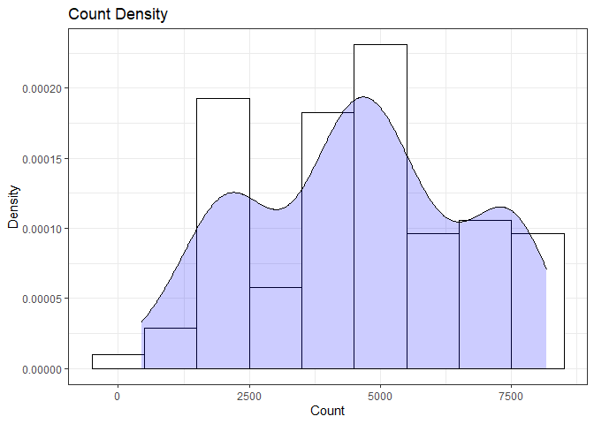
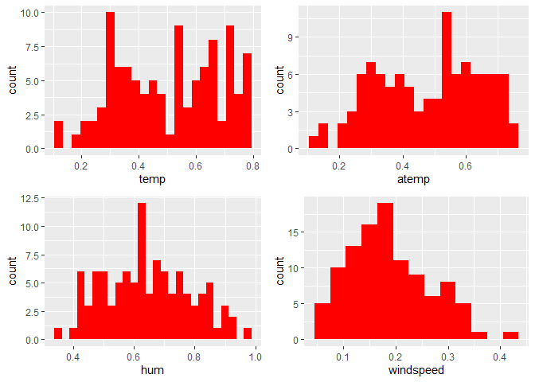
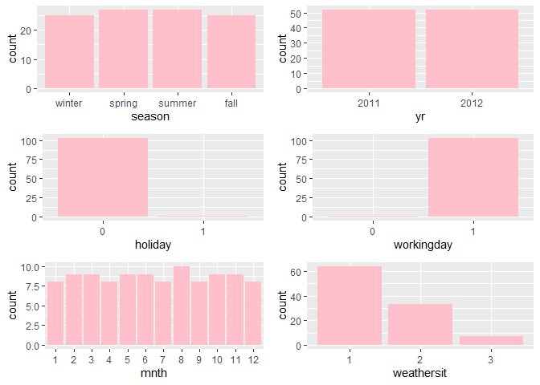
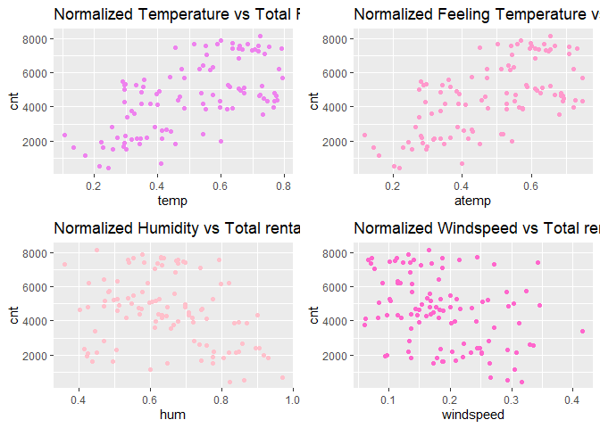
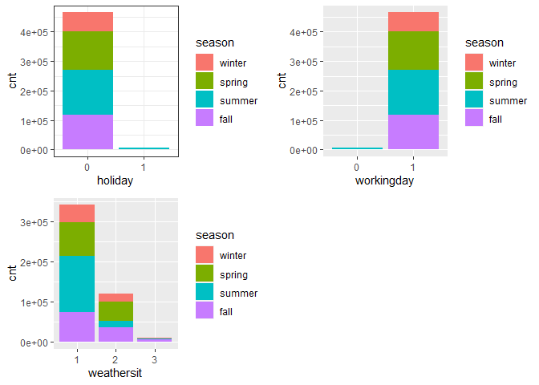

Project 2
================
Ifeoma Ojialor
10/16/2020

## Introduction

In this project, we will use a bike-sharing dataset to create machine
learning models. Before moving forward, I will briefly explain the
bike-sharing system and how it works. A bike-sharing system is a service
in which users can rent/use bicycles on a short term basis for a fee.
The goal of these programs is to provide affordable access to bicycles
for short distance trips as opposed to walking or taking public
transportation. Imagine how many people use these systems on a given
day, the numbers can vary greatly based on some elements. The goal of
this project is to build a predictive model to find out the number of
people that use these bikes in a given time period using available
information about that time/day. This in turn, can help businesses that
oversee this systems to manage them in a cost efficient manner.  
We will be using the bike-sharing dataset from the UCL Machine Learning
Repository. We will use the regression and boosted tree method to model
the response variable `cnt`.

## Exploratory Data Analysis

First we will read in the data using a relative path.

``` r
#read in data and filter to desired weekday
day1 <- read.csv("Bike-Sharing-Dataset/day.csv")
head(day1,5)
```

    ##   instant     dteday season yr mnth holiday
    ## 1       1 2011-01-01      1  0    1       0
    ## 2       2 2011-01-02      1  0    1       0
    ## 3       3 2011-01-03      1  0    1       0
    ## 4       4 2011-01-04      1  0    1       0
    ## 5       5 2011-01-05      1  0    1       0
    ##   weekday workingday weathersit     temp
    ## 1       6          0          2 0.344167
    ## 2       0          0          2 0.363478
    ## 3       1          1          1 0.196364
    ## 4       2          1          1 0.200000
    ## 5       3          1          1 0.226957
    ##      atemp      hum windspeed casual registered
    ## 1 0.363625 0.805833  0.160446    331        654
    ## 2 0.353739 0.696087  0.248539    131        670
    ## 3 0.189405 0.437273  0.248309    120       1229
    ## 4 0.212122 0.590435  0.160296    108       1454
    ## 5 0.229270 0.436957  0.186900     82       1518
    ##    cnt
    ## 1  985
    ## 2  801
    ## 3 1349
    ## 4 1562
    ## 5 1600

Next, we will remove the *casual* and *registered* variables since the
`cnt` variable is a combination of both.

``` r
day1 <- select(day1, -casual, -registered) 
day1$weekday <- as.factor(day1$weekday)
levels(day1$weekday) <- c("Sunday", "Monday", "Tuesday", "Wednesday", "Thursday", "Friday", "Saturday")
day <- filter(day1, weekday == params$days)

#Check for missing values
miss <- data.frame(apply(day,2,function(x){sum(is.na(x))}))
names(miss)[1] <- "missing"
miss
```

    ##            missing
    ## instant          0
    ## dteday           0
    ## season           0
    ## yr               0
    ## mnth             0
    ## holiday          0
    ## weekday          0
    ## workingday       0
    ## weathersit       0
    ## temp             0
    ## atemp            0
    ## hum              0
    ## windspeed        0
    ## cnt              0

There are no missing values in the dataset, so we can continue with our
analysis.

``` r
#Change the variables into their appropriate format.
day$season <- as.factor(day$season)
day$weathersit <- as.factor(day$weathersit)
day$holiday <- as.factor(day$holiday)
day$workingday <- as.factor(day$workingday)
day$yr <- as.factor(day$yr)
day$mnth <- as.factor(day$mnth)

levels(day$season) <- c("winter", "spring", "summer", "fall")
levels(day$yr) <- c("2011", "2012")
str(day)
```

    ## 'data.frame':    104 obs. of  14 variables:
    ##  $ instant   : int  5 12 19 26 33 40 47 54 61 68 ...
    ##  $ dteday    : chr  "2011-01-05" "2011-01-12" "2011-01-19" "2011-01-26" ...
    ##  $ season    : Factor w/ 4 levels "winter","spring",..: 1 1 1 1 1 1 1 1 1 1 ...
    ##  $ yr        : Factor w/ 2 levels "2011","2012": 1 1 1 1 1 1 1 1 1 1 ...
    ##  $ mnth      : Factor w/ 12 levels "1","2","3","4",..: 1 1 1 1 2 2 2 2 3 3 ...
    ##  $ holiday   : Factor w/ 2 levels "0","1": 1 1 1 1 1 1 1 1 1 1 ...
    ##  $ weekday   : Factor w/ 7 levels "Sunday","Monday",..: 4 4 4 4 4 4 4 4 4 4 ...
    ##  $ workingday: Factor w/ 2 levels "0","1": 2 2 2 2 2 2 2 2 2 2 ...
    ##  $ weathersit: Factor w/ 3 levels "1","2","3": 1 1 2 3 2 2 1 1 1 2 ...
    ##  $ temp      : num  0.227 0.173 0.292 0.217 0.26 ...
    ##  $ atemp     : num  0.229 0.16 0.298 0.204 0.254 ...
    ##  $ hum       : num  0.437 0.6 0.742 0.863 0.775 ...
    ##  $ windspeed : num  0.187 0.305 0.208 0.294 0.264 ...
    ##  $ cnt       : int  1600 1162 1650 506 1526 1605 2115 1917 2134 1891 ...

### Univariate Analysis

The `cnt` is the response variable, so we’ll use a histogram to get a
visual understanding of the variable.

``` r
ggplot(day, aes(x = cnt)) + theme_bw() + geom_histogram(aes(y =..density..), color = "black", fill = "white", binwidth = 1000) + geom_density(alpha = 0.2, fill = "blue") + labs(title = "Count Density", x = "Count", y = "Density")
```

<!-- -->

``` r
summary(day$cnt)
```

    ##    Min. 1st Qu.  Median    Mean 3rd Qu.    Max. 
    ##     441    2653    4642    4549    6176    8173

From the histogram and summary statistics output, it is pretty evident
that the count of total rental bikes are in the sub 5000 range. We will
investigate if there is a relationship between the response variable and
other relevant predictor variables in the next section. Lets look at the
other variables individually.

``` r
#visualize numeric predictor variables using a histogram
p1 <- ggplot(day) + geom_histogram(aes(x = temp), fill = "red", binwidth = 0.03)
p2 <- ggplot(day) + geom_histogram(aes(x = atemp), fill = "red", binwidth = 0.03)
p3 <- ggplot(day) + geom_histogram(aes(x = hum), fill = "red", binwidth = 0.025)
p4 <- ggplot(day) + geom_histogram(aes(x = windspeed), fill = "red", binwidth = 0.03)
gridExtra::grid.arrange(p1,p2,p3,p4, nrow = 2)
```

<!-- -->

Observations:  
\* No clear cut pattern in `temp`and `atemp`.

  - `hum` appears to be skewed to the left when the dataset is not
    filtered to a specific weekday.

  - `windspeed` appears to be skewed(right). This variable should be
    transformed to curb its skewness.

  - The distribution of `temp` and `atemp` looks very similar. We should
    think about taking out one of the variables.

<!-- end list -->

``` r
#visualize categorical predictor variables
h1 <- ggplot(day) + geom_bar(aes(x = season),fill = "pink")
h2 <- ggplot(day) + geom_bar(aes(x = yr),fill = "pink")
h3 <- ggplot(day) + geom_bar(aes(x = holiday),fill = "pink")
h4 <- ggplot(day) + geom_bar(aes(x = workingday),fill = "pink")
h5 <- ggplot(day) + geom_bar(aes(x = mnth),fill = "pink")
h6 <- ggplot(day) + geom_bar(aes(x = weathersit),fill = "pink")
gridExtra::grid.arrange(h1,h2,h3,h4,h5,h6, nrow = 3)
```

<!-- -->

Observations:  
\* The variation between the four seasons is little to none.

  - About the same number of people rode bikes in 2011 and 2012.

  - Many people rode bikes on days that are not holidays.

  - Most people used the bike-sharing system on days that were neither
    weekends nor holidays.

  - Most people used the bike sharing system on days with clear weather.

### Bi-variate Analysis

In this section, we will explore the predictor variables with respect to
the response variable. The objective is to discover hidden relationships
between the independent and response variables and use those findings in
the model building process.

``` r
# First, we will explore the relationship between the target and numerical variables.
p1 <- ggplot(day) +geom_point(aes(x = temp, y = cnt), colour = "violet") + labs(title = "Normalized Temperature vs Total Rental Bikes")
p2 <- ggplot(day) +geom_point(aes(x = atemp, y = cnt), colour = "#FF99CC") +labs(title = "Normalized Feeling Temperature vs Total Rental Bikes")
p3 <- ggplot(day) +geom_point(aes(x = hum, y = cnt), colour = "pink") + labs(title = "Normalized Humidity vs Total rental Bikes")
p4 <- ggplot(day) +geom_point(aes(x = windspeed, y = cnt), colour = "#FF66CC") +labs(title= "Normalized Windspeed vs Total rental Bikes")
gridExtra::grid.arrange(p1, p2, p3, p4, nrow = 2)
```

<!-- -->

Observations:  
\* There appears to be a positive linear relationship between `cnt` ,
`temp`, and `atemp`.

  - There is also a weak relationship between `cnt`, `hum`, and
    `windspeed`.

<!-- end list -->

``` r
# Now we'll visualize the relationship between the target and categorical variables.
# Instead of using a boxplot, I will use a violin plot which is the blend of both a boxplot and density plot
g1 <- ggplot(day) + geom_col(aes(x = yr, y = cnt, fill = season))+theme_bw()
g2 <- ggplot(day) + geom_violin(aes(x = yr, y = cnt))+theme_bw()
g3 <- ggplot(day) + geom_col(aes(x = mnth, y = cnt, fill = season))+theme_bw() 
g4 <- ggplot(day) + geom_col(aes(x = holiday, y = cnt, fill = season)) + theme_bw() 
g6 <- ggplot(day) + geom_col(aes(x = workingday, y = cnt, fill = season))
g7 <- ggplot(day) + geom_col(aes(x = weathersit, y = cnt, fill = season))
gridExtra::grid.arrange(g1, g2, g3, nrow = 2)
```

<!-- -->

``` r
gridExtra::grid.arrange(g4, g6, g7, nrow = 2)
```

<!-- --> Observations:  
\* The total bike rental count is higher in 2012 than 2011.

  - During workingday, the bike rental counts quite the highest compared
    to during no working day for different seasons.

  - During clear,partly cloudy weather, the bike rental count is highest
    and the second highest is during mist cloudy weather and followed by
    third highest during light snow and light rain weather.

  - The highest bike rental count was during the summer and lowest in
    the winter.

## Correlation Matrix

Correlation matrix helps us to understand the linear relationship
between variables.

``` r
day_c <- day[ , c(10:14)]
round(cor(day_c), 2)
```

    ##            temp atemp   hum windspeed   cnt
    ## temp       1.00  1.00  0.02     -0.32  0.62
    ## atemp      1.00  1.00  0.04     -0.35  0.63
    ## hum        0.02  0.04  1.00     -0.14 -0.31
    ## windspeed -0.32 -0.35 -0.14      1.00 -0.35
    ## cnt        0.62  0.63 -0.31     -0.35  1.00

From the above matrix, we can see that `temp` and `atemp` are highly
correlated. So we only need to include one of these variables in the
model to prevent multicollinearity. We will also transform the humidity
and windspeed variable.

``` r
day <- mutate(day, log_hum = log(day$hum+1))
day <- mutate(day, log_ws = log(day$windspeed + 1))

#Remove irrelevant variables
day <- select(day, -weekday,-holiday,-workingday,-dteday,-temp, -instant)
```

## Model Building

First we split the data into train and test sets.

``` r
set.seed(23)
dayIndex<- createDataPartition(day$cnt, p = 0.7, list=FALSE)
dayTrain <- day[dayIndex, ]
dayTest <- day[-dayIndex, ]

# Build a tree-based model using loocv;
fitTree <- train(cnt~ ., data = dayTrain, method = "rpart", 
              preProcess = c("center", "scale"), 
              trControl = trainControl(method = "loocv", number = 10), tuneGrid = data.frame(cp = 0.01:0.10))
```

    ## Warning in nominalTrainWorkflow(x = x, y =
    ## y, wts = weights, info = trainInfo, : There
    ## were missing values in resampled performance
    ## measures.

``` r
# Display information from the tree fit
fitTree$results
```

    ##     cp     RMSE Rsquared      MAE   RMSESD
    ## 1 0.01 1009.592      NaN 1009.592 841.3955
    ##   RsquaredSD    MAESD
    ## 1         NA 841.3955

``` r
# Build a boosted tree model using cv
fitBoost <- train(cnt~., data = dayTrain, method = "gbm", 
              preProcess = c("center", "scale"), 
              trControl = trainControl(method = "cv", number = 10), 
              tuneGrid = expand.grid(n.trees=c(10,20),shrinkage=c(0.01,0.05),n.minobsinnode =c(3),interaction.depth=c(1,5)))
```

    ## Iter   TrainDeviance   ValidDeviance   StepSize   Improve
    ##      1  4237102.8221             nan     0.0100 30474.4372
    ##      2  4199768.2561             nan     0.0100 28155.8706
    ##      3  4171572.9950             nan     0.0100 13042.5733
    ##      4  4137043.2595             nan     0.0100 28896.3782
    ##      5  4098445.4536             nan     0.0100 25261.3051
    ##      6  4065376.8094             nan     0.0100 31485.9179
    ##      7  4037917.3543             nan     0.0100 29277.9549
    ##      8  4024153.0495             nan     0.0100 7435.5006
    ##      9  3994469.6941             nan     0.0100 30554.1429
    ##     10  3959371.9766             nan     0.0100 30494.7921
    ##     20  3659055.1285             nan     0.0100 25681.2601
    ## 
    ## Iter   TrainDeviance   ValidDeviance   StepSize   Improve
    ##      1  4197752.8592             nan     0.0100 77194.3153
    ##      2  4130605.0154             nan     0.0100 65318.0785
    ##      3  4057297.9755             nan     0.0100 68676.3983
    ##      4  4004935.7817             nan     0.0100 43398.7658
    ##      5  3934542.5632             nan     0.0100 68741.3454
    ##      6  3867435.6130             nan     0.0100 59154.0271
    ##      7  3809621.5428             nan     0.0100 55924.0584
    ##      8  3749028.8081             nan     0.0100 57957.6093
    ##      9  3680860.9985             nan     0.0100 58830.7893
    ##     10  3627440.6958             nan     0.0100 43991.6889
    ##     20  3112674.6901             nan     0.0100 48597.5791
    ## 
    ## Iter   TrainDeviance   ValidDeviance   StepSize   Improve
    ##      1  4099893.7443             nan     0.0500 158058.2714
    ##      2  3941664.9323             nan     0.0500 140472.1905
    ##      3  3767140.3725             nan     0.0500 113548.2596
    ##      4  3618150.5429             nan     0.0500 112223.8468
    ##      5  3463041.7292             nan     0.0500 124561.2561
    ##      6  3334296.9166             nan     0.0500 123810.7835
    ##      7  3227063.4897             nan     0.0500 118372.6668
    ##      8  3105432.6576             nan     0.0500 102175.4172
    ##      9  2977559.0749             nan     0.0500 85849.8950
    ##     10  2885911.4014             nan     0.0500 93964.0998
    ##     20  2044502.2522             nan     0.0500 35751.6374
    ## 
    ## Iter   TrainDeviance   ValidDeviance   StepSize   Improve
    ##      1  3965341.4257             nan     0.0500 247089.1497
    ##      2  3676826.1469             nan     0.0500 268145.2204
    ##      3  3454984.4053             nan     0.0500 134515.8346
    ##      4  3157036.5287             nan     0.0500 253941.3405
    ##      5  2908396.5251             nan     0.0500 168138.5867
    ##      6  2663090.3563             nan     0.0500 167393.0312
    ##      7  2466060.5870             nan     0.0500 179921.1231
    ##      8  2313126.8555             nan     0.0500 101784.8971
    ##      9  2132648.2830             nan     0.0500 162427.0850
    ##     10  1985671.9374             nan     0.0500 80991.7099
    ##     20   979637.4035             nan     0.0500 50719.6805
    ## 
    ## Iter   TrainDeviance   ValidDeviance   StepSize   Improve
    ##      1  4278992.7461             nan     0.0100 13652.4052
    ##      2  4245855.1928             nan     0.0100 30704.0840
    ##      3  4207668.8678             nan     0.0100 31042.0103
    ##      4  4175932.3130             nan     0.0100 17680.8439
    ##      5  4134271.0545             nan     0.0100 27715.7760
    ##      6  4105910.6119             nan     0.0100 27954.0330
    ##      7  4080901.6988             nan     0.0100 18870.4482
    ##      8  4045066.2858             nan     0.0100 22449.8188
    ##      9  4018080.9097             nan     0.0100 25089.2914
    ##     10  3986122.1734             nan     0.0100 22336.5122
    ##     20  3686440.5578             nan     0.0100 20462.8159
    ## 
    ## Iter   TrainDeviance   ValidDeviance   StepSize   Improve
    ##      1  4243464.9852             nan     0.0100 68696.3493
    ##      2  4175729.8860             nan     0.0100 55063.2688
    ##      3  4110751.5854             nan     0.0100 61414.1402
    ##      4  4050821.9622             nan     0.0100 39785.0687
    ##      5  3986390.6369             nan     0.0100 69755.8323
    ##      6  3922382.6905             nan     0.0100 52834.1136
    ##      7  3859561.0893             nan     0.0100 48331.3330
    ##      8  3796497.7461             nan     0.0100 44707.9985
    ##      9  3736057.1616             nan     0.0100 54519.5584
    ##     10  3672982.0533             nan     0.0100 54492.5753
    ##     20  3161100.8535             nan     0.0100 37465.5520
    ## 
    ## Iter   TrainDeviance   ValidDeviance   StepSize   Improve
    ##      1  4101011.1608             nan     0.0500 116120.5864
    ##      2  3901691.1553             nan     0.0500 131079.6754
    ##      3  3767222.5695             nan     0.0500 131195.2028
    ##      4  3610814.7065             nan     0.0500 125322.2641
    ##      5  3490267.6639             nan     0.0500 105196.3471
    ##      6  3367952.6968             nan     0.0500 107310.3609
    ##      7  3238651.6318             nan     0.0500 92792.3262
    ##      8  3133128.7135             nan     0.0500 90197.4026
    ##      9  3022509.9788             nan     0.0500 65537.3081
    ##     10  2918179.9776             nan     0.0500 44196.9586
    ##     20  2039300.6752             nan     0.0500 50804.9046
    ## 
    ## Iter   TrainDeviance   ValidDeviance   StepSize   Improve
    ##      1  3986672.2993             nan     0.0500 280975.6265
    ##      2  3711768.4599             nan     0.0500 311721.5826
    ##      3  3416154.3410             nan     0.0500 246811.9185
    ##      4  3185294.5175             nan     0.0500 207269.3764
    ##      5  2984803.1917             nan     0.0500 142285.9116
    ##      6  2759078.3607             nan     0.0500 235174.2060
    ##      7  2558605.4456             nan     0.0500 196638.6039
    ##      8  2410224.3382             nan     0.0500 95203.8593
    ##      9  2228035.8437             nan     0.0500 155559.9898
    ##     10  2101792.7746             nan     0.0500 119663.6465
    ##     20  1078129.6262             nan     0.0500 67553.3852
    ## 
    ## Iter   TrainDeviance   ValidDeviance   StepSize   Improve
    ##      1  4182583.3125             nan     0.0100 25045.8096
    ##      2  4150049.3809             nan     0.0100 33279.3242
    ##      3  4119060.2502             nan     0.0100 27951.4551
    ##      4  4096182.2994             nan     0.0100 19536.2548
    ##      5  4060144.6642             nan     0.0100 30797.0560
    ##      6  4020466.2252             nan     0.0100 27223.9081
    ##      7  3984614.2613             nan     0.0100 30766.1349
    ##      8  3954824.7066             nan     0.0100 29657.9468
    ##      9  3929317.5592             nan     0.0100 19396.5891
    ##     10  3896085.4098             nan     0.0100 28102.9876
    ##     20  3601281.3748             nan     0.0100 31028.8200
    ## 
    ## Iter   TrainDeviance   ValidDeviance   StepSize   Improve
    ##      1  4150372.4316             nan     0.0100 52020.6512
    ##      2  4080702.8286             nan     0.0100 59253.7976
    ##      3  4021525.1313             nan     0.0100 62670.3380
    ##      4  3955053.2562             nan     0.0100 74697.6978
    ##      5  3891490.0718             nan     0.0100 50263.9030
    ##      6  3827472.2112             nan     0.0100 52306.1173
    ##      7  3770821.7304             nan     0.0100 59599.4919
    ##      8  3714014.3418             nan     0.0100 38200.2373
    ##      9  3651045.1068             nan     0.0100 63883.3412
    ##     10  3590249.7474             nan     0.0100 59107.8289
    ##     20  3097755.4006             nan     0.0100 41975.7129
    ## 
    ## Iter   TrainDeviance   ValidDeviance   StepSize   Improve
    ##      1  4050756.2207             nan     0.0500 161051.2652
    ##      2  3873209.3870             nan     0.0500 161683.5067
    ##      3  3727668.3896             nan     0.0500 148451.9764
    ##      4  3606081.8417             nan     0.0500 92614.1338
    ##      5  3453066.7867             nan     0.0500 112729.3254
    ##      6  3313840.2724             nan     0.0500 120074.3759
    ##      7  3156868.4439             nan     0.0500 76592.1137
    ##      8  3024638.1587             nan     0.0500 109708.0908
    ##      9  2914167.2244             nan     0.0500 90840.1331
    ##     10  2810741.3144             nan     0.0500 92664.0497
    ##     20  1979601.8946             nan     0.0500 47720.2433
    ## 
    ## Iter   TrainDeviance   ValidDeviance   StepSize   Improve
    ##      1  3983020.9888             nan     0.0500 175167.6238
    ##      2  3714311.3724             nan     0.0500 227077.7421
    ##      3  3404151.9181             nan     0.0500 265128.3702
    ##      4  3126411.6975             nan     0.0500 270706.0302
    ##      5  2894863.2321             nan     0.0500 191421.4187
    ##      6  2682482.2258             nan     0.0500 188070.6265
    ##      7  2500512.0982             nan     0.0500 160300.1077
    ##      8  2312937.3538             nan     0.0500 101820.3906
    ##      9  2156928.9653             nan     0.0500 139797.0085
    ##     10  2019052.2064             nan     0.0500 71574.2660
    ##     20  1075521.7018             nan     0.0500 48446.5132
    ## 
    ## Iter   TrainDeviance   ValidDeviance   StepSize   Improve
    ##      1  4401974.3070             nan     0.0100 5798.6082
    ##      2  4366610.1407             nan     0.0100 34232.5422
    ##      3  4340739.5922             nan     0.0100  -19.4896
    ##      4  4300457.5024             nan     0.0100 25256.7887
    ##      5  4271579.5177             nan     0.0100 19152.1257
    ##      6  4235632.2241             nan     0.0100 25895.0166
    ##      7  4200027.4280             nan     0.0100 30867.6681
    ##      8  4164909.1353             nan     0.0100 21302.3647
    ##      9  4131495.9659             nan     0.0100 27924.2094
    ##     10  4110204.0445             nan     0.0100 14172.9207
    ##     20  3803831.8853             nan     0.0100 16455.4895
    ## 
    ## Iter   TrainDeviance   ValidDeviance   StepSize   Improve
    ##      1  4363659.0175             nan     0.0100 49172.8888
    ##      2  4300839.3577             nan     0.0100 65289.6299
    ##      3  4243888.3563             nan     0.0100 51987.2015
    ##      4  4177874.0803             nan     0.0100 65945.6950
    ##      5  4142227.6969             nan     0.0100 26411.7647
    ##      6  4078201.8899             nan     0.0100 31004.7778
    ##      7  4019008.6927             nan     0.0100 52076.1489
    ##      8  3960219.8680             nan     0.0100 35357.0729
    ##      9  3904110.1740             nan     0.0100 55400.0977
    ##     10  3853888.1155             nan     0.0100 46737.5098
    ##     20  3310834.0118             nan     0.0100 44370.8450
    ## 
    ## Iter   TrainDeviance   ValidDeviance   StepSize   Improve
    ##      1  4253124.5102             nan     0.0500 158610.0646
    ##      2  4111763.8363             nan     0.0500 135847.7414
    ##      3  3954668.8548             nan     0.0500 142312.3640
    ##      4  3808910.1094             nan     0.0500 110068.0002
    ##      5  3699091.2468             nan     0.0500 116648.6561
    ##      6  3589025.2149             nan     0.0500 95679.2126
    ##      7  3438370.5590             nan     0.0500 118741.7219
    ##      8  3328645.9954             nan     0.0500 66853.8499
    ##      9  3210134.0541             nan     0.0500 59449.6719
    ##     10  3071852.0057             nan     0.0500 108551.4615
    ##     20  2181734.8845             nan     0.0500 59469.8446
    ## 
    ## Iter   TrainDeviance   ValidDeviance   StepSize   Improve
    ##      1  4079496.7750             nan     0.0500 316259.1191
    ##      2  3777154.9887             nan     0.0500 218045.3186
    ##      3  3489136.0884             nan     0.0500 206723.8776
    ##      4  3249475.1618             nan     0.0500 177294.9868
    ##      5  2990269.4040             nan     0.0500 217166.3196
    ##      6  2801752.1628             nan     0.0500 145547.9247
    ##      7  2590820.0080             nan     0.0500 120327.6801
    ##      8  2417670.2214             nan     0.0500 134537.1557
    ##      9  2250812.3830             nan     0.0500 138656.7350
    ##     10  2093549.7905             nan     0.0500 114014.6138
    ##     20  1090551.9245             nan     0.0500 39612.4078
    ## 
    ## Iter   TrainDeviance   ValidDeviance   StepSize   Improve
    ##      1  4280708.0257             nan     0.0100 28391.8721
    ##      2  4243268.9455             nan     0.0100 35500.4206
    ##      3  4214905.8762             nan     0.0100 31937.7723
    ##      4  4180599.3699             nan     0.0100 28563.5464
    ##      5  4143657.8493             nan     0.0100 29372.1677
    ##      6  4111663.9838             nan     0.0100 31747.1234
    ##      7  4084261.3649             nan     0.0100 17947.2622
    ##      8  4054250.5873             nan     0.0100 25079.3159
    ##      9  4021007.4751             nan     0.0100 29596.1571
    ##     10  4004157.3026             nan     0.0100 -13546.8287
    ##     20  3644300.2139             nan     0.0100 21643.1680
    ## 
    ## Iter   TrainDeviance   ValidDeviance   StepSize   Improve
    ##      1  4263171.3583             nan     0.0100 50832.1009
    ##      2  4198955.6325             nan     0.0100 55066.1839
    ##      3  4144081.4816             nan     0.0100 43888.3977
    ##      4  4067810.9945             nan     0.0100 68787.1274
    ##      5  4008978.9254             nan     0.0100 45537.3241
    ##      6  3943813.5319             nan     0.0100 59693.8734
    ##      7  3881266.5113             nan     0.0100 46134.2961
    ##      8  3817506.3196             nan     0.0100 56633.5041
    ##      9  3764627.9544             nan     0.0100 45790.3411
    ##     10  3708596.7883             nan     0.0100 48016.2670
    ##     20  3209110.5320             nan     0.0100 53427.4219
    ## 
    ## Iter   TrainDeviance   ValidDeviance   StepSize   Improve
    ##      1  4109820.5650             nan     0.0500 170339.1103
    ##      2  3997287.2052             nan     0.0500 21583.7615
    ##      3  3820823.3920             nan     0.0500 135715.0880
    ##      4  3660539.0871             nan     0.0500 145239.5300
    ##      5  3505654.6544             nan     0.0500 135845.2163
    ##      6  3391049.8460             nan     0.0500 125121.4353
    ##      7  3266456.9036             nan     0.0500 107556.3242
    ##      8  3153717.2733             nan     0.0500 88277.8807
    ##      9  3019760.8451             nan     0.0500 99199.3147
    ##     10  2939676.0901             nan     0.0500 43347.6485
    ##     20  2028038.1325             nan     0.0500 48959.1620
    ## 
    ## Iter   TrainDeviance   ValidDeviance   StepSize   Improve
    ##      1  3969440.7871             nan     0.0500 335104.7179
    ##      2  3683803.6106             nan     0.0500 250339.1583
    ##      3  3447677.8069             nan     0.0500 253995.5134
    ##      4  3154993.5013             nan     0.0500 188840.4011
    ##      5  2896601.5085             nan     0.0500 212506.0778
    ##      6  2714885.8752             nan     0.0500 155558.6492
    ##      7  2521418.2500             nan     0.0500 184333.7002
    ##      8  2338534.5369             nan     0.0500 145831.1523
    ##      9  2156632.7453             nan     0.0500 108504.3970
    ##     10  2016129.0142             nan     0.0500 136021.4060
    ##     20  1131866.1633             nan     0.0500 38512.3348
    ## 
    ## Iter   TrainDeviance   ValidDeviance   StepSize   Improve
    ##      1  4130205.1817             nan     0.0100 29393.0088
    ##      2  4095709.3058             nan     0.0100 19528.6475
    ##      3  4060480.9139             nan     0.0100 23497.7004
    ##      4  4019811.8982             nan     0.0100 24752.0450
    ##      5  3991962.6263             nan     0.0100 21767.6010
    ##      6  3962878.1601             nan     0.0100 21458.0247
    ##      7  3934447.9900             nan     0.0100 26007.3771
    ##      8  3904361.4491             nan     0.0100 26241.7945
    ##      9  3879997.8718             nan     0.0100 19722.7442
    ##     10  3848406.5314             nan     0.0100 28382.8512
    ##     20  3579208.5772             nan     0.0100 14716.0433
    ## 
    ## Iter   TrainDeviance   ValidDeviance   StepSize   Improve
    ##      1  4100754.0960             nan     0.0100 60195.3081
    ##      2  4041768.7470             nan     0.0100 51508.6290
    ##      3  3978580.3551             nan     0.0100 59367.1616
    ##      4  3930086.1779             nan     0.0100 41091.2412
    ##      5  3868795.6730             nan     0.0100 61513.4724
    ##      6  3810539.8628             nan     0.0100 56381.8897
    ##      7  3750140.5102             nan     0.0100 47968.3190
    ##      8  3701563.6386             nan     0.0100 41306.6136
    ##      9  3639640.8616             nan     0.0100 72242.4207
    ##     10  3591148.6483             nan     0.0100 43621.7211
    ##     20  3107255.5709             nan     0.0100 41745.5359
    ## 
    ## Iter   TrainDeviance   ValidDeviance   StepSize   Improve
    ##      1  3998398.2951             nan     0.0500 99732.7456
    ##      2  3848230.6356             nan     0.0500 113214.7146
    ##      3  3713577.7828             nan     0.0500 113907.1451
    ##      4  3573030.3365             nan     0.0500 87674.4074
    ##      5  3463504.4518             nan     0.0500 91246.3034
    ##      6  3362274.6422             nan     0.0500 88939.1939
    ##      7  3206709.7561             nan     0.0500 133993.4833
    ##      8  3033671.8225             nan     0.0500 71753.8933
    ##      9  2926332.1517             nan     0.0500 81262.0397
    ##     10  2825948.7260             nan     0.0500 94185.3580
    ##     20  2022809.4760             nan     0.0500 40599.1176
    ## 
    ## Iter   TrainDeviance   ValidDeviance   StepSize   Improve
    ##      1  3849547.9002             nan     0.0500 238059.0848
    ##      2  3528956.4238             nan     0.0500 256049.7624
    ##      3  3351974.1375             nan     0.0500 98259.1211
    ##      4  3125479.4739             nan     0.0500 229967.2924
    ##      5  2894537.1515             nan     0.0500 172321.9012
    ##      6  2709279.0837             nan     0.0500 184662.7983
    ##      7  2567032.1367             nan     0.0500 127976.6721
    ##      8  2388436.8121             nan     0.0500 83411.6318
    ##      9  2228175.5343             nan     0.0500 124922.9469
    ##     10  2074929.6464             nan     0.0500 103963.6958
    ##     20  1087586.6626             nan     0.0500 43670.6143
    ## 
    ## Iter   TrainDeviance   ValidDeviance   StepSize   Improve
    ##      1  4375856.7663             nan     0.0100 29318.3771
    ##      2  4340792.4460             nan     0.0100 29937.5488
    ##      3  4312575.6619             nan     0.0100 21067.0517
    ##      4  4279849.0815             nan     0.0100 28673.1427
    ##      5  4242182.9555             nan     0.0100 16754.2984
    ##      6  4202388.6639             nan     0.0100 26415.2879
    ##      7  4159092.3756             nan     0.0100 26376.4468
    ##      8  4128283.8230             nan     0.0100 24830.0884
    ##      9  4093470.2708             nan     0.0100 27933.7918
    ##     10  4059461.1898             nan     0.0100 27248.0442
    ##     20  3764478.1150             nan     0.0100 23504.1916
    ## 
    ## Iter   TrainDeviance   ValidDeviance   StepSize   Improve
    ##      1  4339506.1534             nan     0.0100 55419.8067
    ##      2  4266569.6110             nan     0.0100 64750.6783
    ##      3  4202689.8274             nan     0.0100 43788.3294
    ##      4  4139782.9474             nan     0.0100 46696.5253
    ##      5  4078298.0413             nan     0.0100 51262.4690
    ##      6  4016574.1679             nan     0.0100 59750.2046
    ##      7  3963214.1277             nan     0.0100 43096.8680
    ##      8  3909121.3140             nan     0.0100 25785.1017
    ##      9  3844899.7585             nan     0.0100 53062.1863
    ##     10  3789747.9648             nan     0.0100 43851.3964
    ##     20  3262902.6790             nan     0.0100 38276.8070
    ## 
    ## Iter   TrainDeviance   ValidDeviance   StepSize   Improve
    ##      1  4238876.4491             nan     0.0500 96745.0707
    ##      2  4057648.8216             nan     0.0500 56075.6617
    ##      3  3964753.2217             nan     0.0500 80102.7098
    ##      4  3779598.0239             nan     0.0500 140006.4187
    ##      5  3646925.8832             nan     0.0500 60850.2962
    ##      6  3505429.6207             nan     0.0500 113526.8645
    ##      7  3389945.6853             nan     0.0500 109299.3093
    ##      8  3286257.3967             nan     0.0500 79810.3132
    ##      9  3143900.8166             nan     0.0500 108410.9782
    ##     10  3012233.8695             nan     0.0500 87404.9047
    ##     20  2124355.7077             nan     0.0500 72934.9828
    ## 
    ## Iter   TrainDeviance   ValidDeviance   StepSize   Improve
    ##      1  4085866.6918             nan     0.0500 255046.0361
    ##      2  3750363.8217             nan     0.0500 251718.9147
    ##      3  3452216.7828             nan     0.0500 230172.5818
    ##      4  3194387.0872             nan     0.0500 170736.7403
    ##      5  2987305.8295             nan     0.0500 134942.1430
    ##      6  2799196.9232             nan     0.0500 175171.0012
    ##      7  2604453.0303             nan     0.0500 142754.7741
    ##      8  2423809.4009             nan     0.0500 176470.6561
    ##      9  2279945.9560             nan     0.0500 150144.3576
    ##     10  2117548.1367             nan     0.0500 164991.4226
    ##     20  1058111.1452             nan     0.0500 73461.5376
    ## 
    ## Iter   TrainDeviance   ValidDeviance   StepSize   Improve
    ##      1  4342365.7767             nan     0.0100 29042.7491
    ##      2  4301480.5378             nan     0.0100 19681.7453
    ##      3  4267017.9335             nan     0.0100 29697.3978
    ##      4  4235006.3241             nan     0.0100 22338.4700
    ##      5  4203430.2258             nan     0.0100 24523.8153
    ##      6  4170073.8798             nan     0.0100 27954.3101
    ##      7  4135463.0826             nan     0.0100 29505.2183
    ##      8  4105041.0932             nan     0.0100 22210.0901
    ##      9  4074822.5730             nan     0.0100 19528.8440
    ##     10  4046797.6115             nan     0.0100 28989.7917
    ##     20  3737405.6343             nan     0.0100 24995.6826
    ## 
    ## Iter   TrainDeviance   ValidDeviance   StepSize   Improve
    ##      1  4302330.2952             nan     0.0100 65810.2485
    ##      2  4249238.9672             nan     0.0100 53993.7858
    ##      3  4177387.4289             nan     0.0100 69085.9203
    ##      4  4110815.9193             nan     0.0100 44081.1318
    ##      5  4051828.3454             nan     0.0100 44786.2268
    ##      6  3987214.1554             nan     0.0100 58780.2308
    ##      7  3926411.4108             nan     0.0100 50704.9159
    ##      8  3865776.5696             nan     0.0100 57975.2486
    ##      9  3815733.7998             nan     0.0100 42505.4253
    ##     10  3764631.5440             nan     0.0100 41286.5532
    ##     20  3219833.5709             nan     0.0100 50692.2467
    ## 
    ## Iter   TrainDeviance   ValidDeviance   StepSize   Improve
    ##      1  4184313.2084             nan     0.0500 125315.8844
    ##      2  3982704.2584             nan     0.0500 138880.5385
    ##      3  3835963.8707             nan     0.0500 125686.2914
    ##      4  3650542.6024             nan     0.0500 70577.4346
    ##      5  3518775.7112             nan     0.0500 86810.0429
    ##      6  3366357.2560             nan     0.0500 131014.1102
    ##      7  3257348.9160             nan     0.0500 78875.6222
    ##      8  3145628.2106             nan     0.0500 81447.6433
    ##      9  3050067.1400             nan     0.0500 49193.1454
    ##     10  2952092.8624             nan     0.0500 64993.3699
    ##     20  2026768.9344             nan     0.0500 56213.9908
    ## 
    ## Iter   TrainDeviance   ValidDeviance   StepSize   Improve
    ##      1  4031722.2652             nan     0.0500 357520.0605
    ##      2  3680576.1897             nan     0.0500 286906.1159
    ##      3  3366622.1524             nan     0.0500 334629.7254
    ##      4  3153500.8758             nan     0.0500 129771.5611
    ##      5  2908023.1691             nan     0.0500 205734.5714
    ##      6  2737694.5633             nan     0.0500 131072.7331
    ##      7  2539930.8522             nan     0.0500 178461.6086
    ##      8  2327730.4676             nan     0.0500 204221.8386
    ##      9  2159588.5001             nan     0.0500 121485.7953
    ##     10  2002497.0025             nan     0.0500 113729.6345
    ##     20  1065970.3007             nan     0.0500 45494.2953
    ## 
    ## Iter   TrainDeviance   ValidDeviance   StepSize   Improve
    ##      1  4191659.6310             nan     0.0100 33434.6673
    ##      2  4148817.9851             nan     0.0100 26638.0599
    ##      3  4108636.0725             nan     0.0100 26808.5034
    ##      4  4071769.0546             nan     0.0100 34600.0820
    ##      5  4034911.4027             nan     0.0100 33099.0247
    ##      6  3993217.3303             nan     0.0100 23033.3305
    ##      7  3956782.2935             nan     0.0100 28332.0409
    ##      8  3927659.8559             nan     0.0100 15211.4878
    ##      9  3885572.0938             nan     0.0100 29097.0844
    ##     10  3863154.5628             nan     0.0100 11167.8659
    ##     20  3552198.9654             nan     0.0100 22583.1332
    ## 
    ## Iter   TrainDeviance   ValidDeviance   StepSize   Improve
    ##      1  4168593.4939             nan     0.0100 53285.8254
    ##      2  4103475.0990             nan     0.0100 67019.4749
    ##      3  4035224.7836             nan     0.0100 67476.2135
    ##      4  3974325.5542             nan     0.0100 57341.5265
    ##      5  3906134.6293             nan     0.0100 72064.1693
    ##      6  3841147.7298             nan     0.0100 56198.8811
    ##      7  3782383.4820             nan     0.0100 50964.2388
    ##      8  3733707.2067             nan     0.0100 39372.4915
    ##      9  3676334.1320             nan     0.0100 45121.7851
    ##     10  3616889.5541             nan     0.0100 39512.7761
    ##     20  3089916.1511             nan     0.0100 43235.1087
    ## 
    ## Iter   TrainDeviance   ValidDeviance   StepSize   Improve
    ##      1  4065386.3574             nan     0.0500 131348.0527
    ##      2  3907033.1244             nan     0.0500 136423.9249
    ##      3  3775000.9469             nan     0.0500 91959.4208
    ##      4  3664142.1043             nan     0.0500 64485.7617
    ##      5  3514874.4306             nan     0.0500 151625.4370
    ##      6  3353999.4849             nan     0.0500 167045.5706
    ##      7  3205645.1481             nan     0.0500 124276.6388
    ##      8  3103437.8014             nan     0.0500 114594.9174
    ##      9  2959866.2493             nan     0.0500 94936.4105
    ##     10  2824044.0124             nan     0.0500 117831.3250
    ##     20  1932362.8298             nan     0.0500 60290.8340
    ## 
    ## Iter   TrainDeviance   ValidDeviance   StepSize   Improve
    ##      1  3966648.5509             nan     0.0500 273364.1589
    ##      2  3664080.8695             nan     0.0500 271033.8784
    ##      3  3394794.8120             nan     0.0500 198203.2845
    ##      4  3168671.8505             nan     0.0500 156542.3438
    ##      5  2929070.0364             nan     0.0500 253282.3285
    ##      6  2719586.3304             nan     0.0500 189030.2733
    ##      7  2538329.2851             nan     0.0500 142188.6524
    ##      8  2330318.0440             nan     0.0500 137248.4880
    ##      9  2156488.7322             nan     0.0500 86676.2088
    ##     10  2014166.6693             nan     0.0500 111593.3576
    ##     20  1033174.3605             nan     0.0500 43927.8008
    ## 
    ## Iter   TrainDeviance   ValidDeviance   StepSize   Improve
    ##      1  4234049.3117             nan     0.0100 17095.9304
    ##      2  4184243.3435             nan     0.0100 32323.3466
    ##      3  4166934.9364             nan     0.0100 -1227.2656
    ##      4  4133122.2426             nan     0.0100 23268.6421
    ##      5  4091964.9708             nan     0.0100 35451.9368
    ##      6  4052724.4345             nan     0.0100 34886.6363
    ##      7  4021665.7692             nan     0.0100 28999.3266
    ##      8  3983823.7178             nan     0.0100 30661.6585
    ##      9  3944824.4813             nan     0.0100 32614.5745
    ##     10  3920909.2619             nan     0.0100 10545.7543
    ##     20  3597474.8152             nan     0.0100 27182.3315
    ## 
    ## Iter   TrainDeviance   ValidDeviance   StepSize   Improve
    ##      1  4200063.3277             nan     0.0100 59002.6591
    ##      2  4134540.3175             nan     0.0100 50963.7025
    ##      3  4060514.5427             nan     0.0100 81801.6556
    ##      4  3994340.0820             nan     0.0100 62209.3687
    ##      5  3931003.2819             nan     0.0100 65649.0021
    ##      6  3859947.1245             nan     0.0100 61784.5049
    ##      7  3796632.2366             nan     0.0100 44287.8620
    ##      8  3735130.4372             nan     0.0100 62385.2710
    ##      9  3677704.1578             nan     0.0100 56709.5431
    ##     10  3619392.4607             nan     0.0100 49144.9835
    ##     20  3072076.2080             nan     0.0100 47148.4657
    ## 
    ## Iter   TrainDeviance   ValidDeviance   StepSize   Improve
    ##      1  4093312.6834             nan     0.0500 127871.6326
    ##      2  3907197.6814             nan     0.0500 175982.6383
    ##      3  3716523.5913             nan     0.0500 97999.3733
    ##      4  3593101.6858             nan     0.0500 146110.9159
    ##      5  3436067.2387             nan     0.0500 127570.5505
    ##      6  3302255.1897             nan     0.0500 106049.2370
    ##      7  3140363.9187             nan     0.0500 133217.1355
    ##      8  3020180.8374             nan     0.0500 91339.3470
    ##      9  2926106.1635             nan     0.0500 65450.9909
    ##     10  2846805.9651             nan     0.0500 51877.2013
    ##     20  1990641.9958             nan     0.0500 26507.7229
    ## 
    ## Iter   TrainDeviance   ValidDeviance   StepSize   Improve
    ##      1  3955414.9102             nan     0.0500 220428.1900
    ##      2  3596334.6344             nan     0.0500 274660.1508
    ##      3  3321469.5675             nan     0.0500 264008.5748
    ##      4  3082276.4099             nan     0.0500 253637.8633
    ##      5  2813745.0055             nan     0.0500 228310.9735
    ##      6  2592281.5693             nan     0.0500 178620.3489
    ##      7  2432514.2220             nan     0.0500 187396.8989
    ##      8  2232513.7661             nan     0.0500 174219.6905
    ##      9  2060487.8395             nan     0.0500 128012.3980
    ##     10  1887573.0944             nan     0.0500 99282.3132
    ##     20   906212.2913             nan     0.0500 56507.2145
    ## 
    ## Iter   TrainDeviance   ValidDeviance   StepSize   Improve
    ##      1  3972517.1712             nan     0.0500 320315.4029
    ##      2  3672853.2008             nan     0.0500 238122.2534
    ##      3  3379293.1157             nan     0.0500 299418.7539
    ##      4  3177257.2084             nan     0.0500 133658.6477
    ##      5  2937783.8634             nan     0.0500 214285.1811
    ##      6  2698536.1599             nan     0.0500 199931.4460
    ##      7  2488280.7107             nan     0.0500 107893.3141
    ##      8  2292555.0976             nan     0.0500 135945.1238
    ##      9  2131088.7438             nan     0.0500 113047.4234
    ##     10  1984129.3345             nan     0.0500 140031.5213
    ##     20  1058467.4282             nan     0.0500 26495.1844

``` r
# Display information from the boost fit
fitBoost$results
```

    ##   shrinkage interaction.depth n.minobsinnode
    ## 1      0.01                 1              3
    ## 5      0.05                 1              3
    ## 3      0.01                 5              3
    ## 7      0.05                 5              3
    ## 2      0.01                 1              3
    ## 6      0.05                 1              3
    ## 4      0.01                 5              3
    ## 8      0.05                 5              3
    ##   n.trees     RMSE  Rsquared      MAE   RMSESD
    ## 1      10 2005.295 0.6679255 1640.234 196.9780
    ## 5      10 1720.174 0.8433736 1413.843 235.2086
    ## 3      10 1929.407 0.8668854 1576.744 195.2873
    ## 7      10 1519.905 0.8409106 1249.257 220.3559
    ## 2      20 1940.522 0.7498151 1589.934 198.9653
    ## 6      20 1486.627 0.8464800 1234.408 253.1177
    ## 4      20 1803.817 0.8712446 1476.705 204.2402
    ## 8      20 1214.636 0.8512789 1021.075 242.0325
    ##   RsquaredSD    MAESD
    ## 1 0.19362721 171.2590
    ## 5 0.10957679 215.1058
    ## 3 0.08423937 175.8632
    ## 7 0.10347164 211.4158
    ## 2 0.16119405 169.9088
    ## 6 0.11136348 232.4037
    ## 4 0.08657770 184.9924
    ## 8 0.10359755 181.0668

Now, we make predictions on the test data sets using the best model
fits. Then we compare RMSE to determine the best model.

``` r
predTree <- predict(fitTree, newdata = select(dayTest, -cnt))
postResample(predTree, dayTest$cnt)
```

    ##        RMSE    Rsquared         MAE 
    ## 1014.583865    0.772907  785.967780

``` r
boostPred <- predict(fitBoost, newdata = select(dayTest, -cnt))
postResample(boostPred, dayTest$cnt)
```

    ##         RMSE     Rsquared          MAE 
    ## 1089.4115789    0.7786231  955.1784453

When we compare the two models, the boosted tree model has lower RMSE
values when applied on the test dataset. Hence, the boosted tree model
is our final model and best model for interpreting the bike rental count
on a daily basis.
