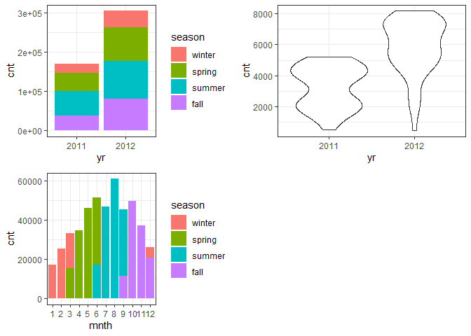

Project 2
================
Ifeoma Ojialor
10/16/2020

## Introduction

In this project, we will use a bike-sharing dataset to create machine
learning models. Before moving forward, I will briefly explain the
bike-sharing system and how it works. A bike-sharing system is a service
in which users can rent/use bicycles on a short term basis for a fee.
The goal of these programs is to provide affordable access to bicycles
for short distance trips as opposed to walking or taking public
transportation. Imagine how many people use these systems on a given
day, the numbers can vary greatly based on some elements. The goal of
this project is to build a predictive model to find out the number of
people that use these bikes in a given time period using available
information about that time/day. This in turn, can help businesses that
oversee this systems to manage them in a cost efficient manner.  
We will be using the bike-sharing dataset from the UCL Machine Learning
Repository. We will use the regression and boosted tree method to model
the response variable `cnt`.

## Exploratory Data Analysis

First we will read in the data using a relative path.

``` r
#read in data and filter to desired weekday
day1 <- read.csv("Bike-Sharing-Dataset/day.csv")
head(day1,5)
```

    ##   instant     dteday season yr mnth holiday
    ## 1       1 2011-01-01      1  0    1       0
    ## 2       2 2011-01-02      1  0    1       0
    ## 3       3 2011-01-03      1  0    1       0
    ## 4       4 2011-01-04      1  0    1       0
    ## 5       5 2011-01-05      1  0    1       0
    ##   weekday workingday weathersit     temp
    ## 1       6          0          2 0.344167
    ## 2       0          0          2 0.363478
    ## 3       1          1          1 0.196364
    ## 4       2          1          1 0.200000
    ## 5       3          1          1 0.226957
    ##      atemp      hum windspeed casual registered
    ## 1 0.363625 0.805833  0.160446    331        654
    ## 2 0.353739 0.696087  0.248539    131        670
    ## 3 0.189405 0.437273  0.248309    120       1229
    ## 4 0.212122 0.590435  0.160296    108       1454
    ## 5 0.229270 0.436957  0.186900     82       1518
    ##    cnt
    ## 1  985
    ## 2  801
    ## 3 1349
    ## 4 1562
    ## 5 1600

Next, we will remove the *casual* and *registered* variables since the
`cnt` variable is a combination of both.

``` r
day1 <- select(day1, -casual, -registered) 
day1$weekday <- as.factor(day1$weekday)
levels(day1$weekday) <- c("Sunday", "Monday", "Tuesday", "Wednesday", "Thursday", "Friday", "Saturday")
day <- filter(day1, weekday == params$days)

#Check for missing values
miss <- data.frame(apply(day,2,function(x){sum(is.na(x))}))
names(miss)[1] <- "missing"
miss
```

    ##            missing
    ## instant          0
    ## dteday           0
    ## season           0
    ## yr               0
    ## mnth             0
    ## holiday          0
    ## weekday          0
    ## workingday       0
    ## weathersit       0
    ## temp             0
    ## atemp            0
    ## hum              0
    ## windspeed        0
    ## cnt              0

There are no missing values in the dataset, so we can continue with our
analysis.

``` r
#Change the variables into their appropriate format.
day$season <- as.factor(day$season)
day$weathersit <- as.factor(day$weathersit)
day$holiday <- as.factor(day$holiday)
day$workingday <- as.factor(day$workingday)
day$yr <- as.factor(day$yr)
day$mnth <- as.factor(day$mnth)

levels(day$season) <- c("winter", "spring", "summer", "fall")
levels(day$yr) <- c("2011", "2012")
str(day)
```

    ## 'data.frame':    104 obs. of  14 variables:
    ##  $ instant   : int  5 12 19 26 33 40 47 54 61 68 ...
    ##  $ dteday    : chr  "2011-01-05" "2011-01-12" "2011-01-19" "2011-01-26" ...
    ##  $ season    : Factor w/ 4 levels "winter","spring",..: 1 1 1 1 1 1 1 1 1 1 ...
    ##  $ yr        : Factor w/ 2 levels "2011","2012": 1 1 1 1 1 1 1 1 1 1 ...
    ##  $ mnth      : Factor w/ 12 levels "1","2","3","4",..: 1 1 1 1 2 2 2 2 3 3 ...
    ##  $ holiday   : Factor w/ 2 levels "0","1": 1 1 1 1 1 1 1 1 1 1 ...
    ##  $ weekday   : Factor w/ 7 levels "Sunday","Monday",..: 4 4 4 4 4 4 4 4 4 4 ...
    ##  $ workingday: Factor w/ 2 levels "0","1": 2 2 2 2 2 2 2 2 2 2 ...
    ##  $ weathersit: Factor w/ 3 levels "1","2","3": 1 1 2 3 2 2 1 1 1 2 ...
    ##  $ temp      : num  0.227 0.173 0.292 0.217 0.26 ...
    ##  $ atemp     : num  0.229 0.16 0.298 0.204 0.254 ...
    ##  $ hum       : num  0.437 0.6 0.742 0.863 0.775 ...
    ##  $ windspeed : num  0.187 0.305 0.208 0.294 0.264 ...
    ##  $ cnt       : int  1600 1162 1650 506 1526 1605 2115 1917 2134 1891 ...

### Univariate Analysis

The `cnt` is the response variable, so we’ll use a histogram to get a
visual understanding of the variable.

``` r
ggplot(day, aes(x = cnt)) + theme_bw() + geom_histogram(aes(y =..density..), color = "black", fill = "white", binwidth = 1000) + geom_density(alpha = 0.2, fill = "blue") + labs(title = "Count Density", x = "Count", y = "Density")
```

<!-- -->

``` r
summary(day$cnt)
```

    ##    Min. 1st Qu.  Median    Mean 3rd Qu.    Max. 
    ##     441    2653    4642    4549    6176    8173

From the histogram and summary statistics output, it is pretty evident
that the count of total rental bikes are in the sub 5000 range. We will
investigate if there is a relationship between the response variable and
other relevant predictor variables in the next section. Lets look at the
other variables individually.

``` r
#visualize numeric predictor variables using a histogram
p1 <- ggplot(day) + geom_histogram(aes(x = temp), fill = "red", binwidth = 0.03)
p2 <- ggplot(day) + geom_histogram(aes(x = atemp), fill = "red", binwidth = 0.03)
p3 <- ggplot(day) + geom_histogram(aes(x = hum), fill = "red", binwidth = 0.025)
p4 <- ggplot(day) + geom_histogram(aes(x = windspeed), fill = "red", binwidth = 0.03)
gridExtra::grid.arrange(p1,p2,p3,p4, nrow = 2)
```

<!-- -->

Observations:  
\* No clear cut pattern in `temp`and `atemp`.

  - `hum` appears to be skewed to the left when the dataset is not
    filtered to a specific weekday.

  - `windspeed` appears to be skewed(right). This variable should be
    transformed to curb its skewness.

  - The distribution of `temp` and `atemp` looks very similar. We should
    think about taking out one of the variables.

<!-- end list -->

``` r
#visualize categorical predictor variables
h1 <- ggplot(day) + geom_bar(aes(x = season),fill = "pink")
h2 <- ggplot(day) + geom_bar(aes(x = yr),fill = "pink")
h3 <- ggplot(day) + geom_bar(aes(x = holiday),fill = "pink")
h4 <- ggplot(day) + geom_bar(aes(x = workingday),fill = "pink")
h5 <- ggplot(day) + geom_bar(aes(x = mnth),fill = "pink")
h6 <- ggplot(day) + geom_bar(aes(x = weathersit),fill = "pink")
gridExtra::grid.arrange(h1,h2,h3,h4,h5,h6, nrow = 3)
```

<!-- -->

Observations:  
\* The variation between the four seasons is little to none.

  - About the same number of people rode bikes in 2011 and 2012.

  - Many people rode bikes on days that are not holidays.

  - Most people used the bike-sharing system on days that were neither
    weekends nor holidays.

  - Most people used the bike sharing system on days with clear weather.

### Bi-variate Analysis

In this section, we will explore the predictor variables with respect to
the response variable. The objective is to discover hidden relationships
between the independent and response variables and use those findings in
the model building process.

``` r
# First, we will explore the relationship between the target and numerical variables.
p1 <- ggplot(day) +geom_point(aes(x = temp, y = cnt), colour = "violet") + labs(title = "Normalized Temperature vs Total Rental Bikes")
p2 <- ggplot(day) +geom_point(aes(x = atemp, y = cnt), colour = "#FF99CC") +labs(title = "Normalized Feeling Temperature vs Total Rental Bikes")
p3 <- ggplot(day) +geom_point(aes(x = hum, y = cnt), colour = "pink") + labs(title = "Normalized Humidity vs Total rental Bikes")
p4 <- ggplot(day) +geom_point(aes(x = windspeed, y = cnt), colour = "#FF66CC") +labs(title= "Normalized Windspeed vs Total rental Bikes")
gridExtra::grid.arrange(p1, p2, p3, p4, nrow = 2)
```

<!-- -->

Observations:  
\* There appears to be a positive linear relationship between `cnt` ,
`temp`, and `atemp`.

  - There is also a weak relationship between `cnt`, `hum`, and
    `windspeed`.

<!-- end list -->

``` r
# Now we'll visualize the relationship between the target and categorical variables.
# Instead of using a boxplot, I will use a violin plot which is the blend of both a boxplot and density plot
g1 <- ggplot(day) + geom_col(aes(x = yr, y = cnt, fill = season))+theme_bw()
g2 <- ggplot(day) + geom_violin(aes(x = yr, y = cnt))+theme_bw()
g3 <- ggplot(day) + geom_col(aes(x = mnth, y = cnt, fill = season))+theme_bw() 
g4 <- ggplot(day) + geom_col(aes(x = holiday, y = cnt, fill = season)) + theme_bw() 
g6 <- ggplot(day) + geom_col(aes(x = workingday, y = cnt, fill = season))
g7 <- ggplot(day) + geom_col(aes(x = weathersit, y = cnt, fill = season))
gridExtra::grid.arrange(g1, g2, g3, nrow = 2)
```

<!-- -->

``` r
gridExtra::grid.arrange(g4, g6, g7, nrow = 2)
```

<!-- --> Observations:  
\* The total bike rental count is higher in 2012 than 2011.

  - During workingday, the bike rental counts quite the highest compared
    to during no working day for different seasons.

  - During clear,partly cloudy weather, the bike rental count is highest
    and the second highest is during mist cloudy weather and followed by
    third highest during light snow and light rain weather.

  - The highest bike rental count was during the summer and lowest in
    the winter.

## Correlation Matrix

Correlation matrix helps us to understand the linear relationship
between variables.

``` r
day_c <- day[ , c(10:14)]
round(cor(day_c), 2)
```

    ##            temp atemp   hum windspeed   cnt
    ## temp       1.00  1.00  0.02     -0.32  0.62
    ## atemp      1.00  1.00  0.04     -0.35  0.63
    ## hum        0.02  0.04  1.00     -0.14 -0.31
    ## windspeed -0.32 -0.35 -0.14      1.00 -0.35
    ## cnt        0.62  0.63 -0.31     -0.35  1.00

From the above matrix, we can see that `temp` and `atemp` are highly
correlated. So we only need to include one of these variables in the
model to prevent multicollinearity. We will also transform the humidity
and windspeed variable.

``` r
day <- mutate(day, log_hum = log(day$hum+1))
day <- mutate(day, log_ws = log(day$windspeed + 1))

#Remove irrelevant variables
day <- select(day, -weekday,-holiday,-workingday,-dteday,-temp, -instant)
```

## Model Building

First we split the data into train and test sets.

``` r
set.seed(23)
dayIndex<- createDataPartition(day$cnt, p = 0.7, list=FALSE)
dayTrain <- day[dayIndex, ]
dayTest <- day[-dayIndex, ]

# Build a tree-based model using loocv;
fitTree <- train(cnt~ ., data = dayTrain, method = "rpart", 
              preProcess = c("center", "scale"), 
              trControl = trainControl(method = "loocv", number = 10), tuneGrid = data.frame(cp = 0.01:0.10))
```

    ## Warning in nominalTrainWorkflow(x = x, y =
    ## y, wts = weights, info = trainInfo, : There
    ## were missing values in resampled performance
    ## measures.

``` r
# Display information from the tree fit
fitTree$results
```

    ##     cp     RMSE Rsquared      MAE   RMSESD
    ## 1 0.01 1009.592      NaN 1009.592 841.3955
    ##   RsquaredSD    MAESD
    ## 1         NA 841.3955

``` r
# Build a boosted tree model using cv
fitBoost <- train(cnt~., data = dayTrain, method = "gbm", 
              preProcess = c("center", "scale"), 
              trControl = trainControl(method = "cv", number = 10), 
              tuneGrid = expand.grid(n.trees=c(10,20,50,100,500,1000),shrinkage=c(0.01,0.05,0.1,0.5),n.minobsinnode =c(3,5,10),interaction.depth=c(1,5,10)))
```

    ## Iter   TrainDeviance   ValidDeviance   StepSize   Improve
    ##      1  4237102.8221             nan     0.0100 30474.4372
    ##      2  4199768.2561             nan     0.0100 28155.8706
    ##      3  4171572.9950             nan     0.0100 13042.5733
    ##      4  4137043.2595             nan     0.0100 28896.3782
    ##      5  4098445.4536             nan     0.0100 25261.3051
    ##      6  4065376.8094             nan     0.0100 31485.9179
    ##      7  4037917.3543             nan     0.0100 29277.9549
    ##      8  4024153.0495             nan     0.0100 7435.5006
    ##      9  3994469.6941             nan     0.0100 30554.1429
    ##     10  3959371.9766             nan     0.0100 30494.7921
    ##     20  3659055.1285             nan     0.0100 25681.2601
    ##     40  3127331.0338             nan     0.0100 21411.6901
    ##     60  2694477.0142             nan     0.0100 8091.8533
    ##     80  2324789.6984             nan     0.0100 8271.4145
    ##    100  2027726.7160             nan     0.0100 12343.4279
    ##    120  1769739.2086             nan     0.0100 11044.0843
    ##    140  1558952.0038             nan     0.0100 7453.3164
    ##    160  1390085.6570             nan     0.0100 4540.0521
    ##    180  1240719.4479             nan     0.0100 6243.9753
    ##    200  1118940.7078             nan     0.0100 2719.9437
    ##    220  1009031.6780             nan     0.0100 3252.2319
    ##    240   907954.5869             nan     0.0100 2475.3882
    ##    260   824684.3979             nan     0.0100 2679.1774
    ##    280   754807.5302             nan     0.0100 1670.2535
    ##    300   695268.9172             nan     0.0100  732.4647
    ##    320   646322.8105             nan     0.0100  745.6126
    ##    340   607515.4980             nan     0.0100 1443.4890
    ##    360   569594.1166             nan     0.0100 1213.2888
    ##    380   535928.5823             nan     0.0100  666.2671
    ##    400   505685.7588             nan     0.0100  174.0337
    ##    420   479960.4917             nan     0.0100 -109.5380
    ##    440   455079.1983             nan     0.0100  324.0176
    ##    460   432959.2207             nan     0.0100  465.5260
    ##    480   414177.5412             nan     0.0100   73.6877
    ##    500   395267.7504             nan     0.0100  -89.5832
    ##    520   380855.8697             nan     0.0100 -375.0783
    ##    540   367957.2081             nan     0.0100 -1271.2500
    ##    560   356681.5475             nan     0.0100  -70.1635
    ##    580   346483.9164             nan     0.0100 -518.2338
    ##    600   336927.1069             nan     0.0100  267.8262
    ##    620   329608.0433             nan     0.0100 -100.0218
    ##    640   322091.1258             nan     0.0100 -302.3857
    ##    660   313797.3152             nan     0.0100  159.7892
    ##    680   306568.3047             nan     0.0100 -747.3543
    ##    700   300881.9539             nan     0.0100   49.2444
    ##    720   295235.6135             nan     0.0100 -317.8387
    ##    740   289850.6723             nan     0.0100 -143.1531
    ##    760   285873.9050             nan     0.0100 -228.9771
    ##    780   280060.2559             nan     0.0100 -213.7332
    ##    800   275829.4353             nan     0.0100 -903.8551
    ##    820   270939.0469             nan     0.0100    0.6448
    ##    840   266675.9469             nan     0.0100 -256.3367
    ##    860   263408.2695             nan     0.0100 -652.4248
    ##    880   260480.9765             nan     0.0100 -802.6169
    ##    900   257567.0869             nan     0.0100 -822.9083
    ##    920   254102.1442             nan     0.0100 -329.8204
    ##    940   250975.4754             nan     0.0100 -187.5972
    ##    960   248891.9269             nan     0.0100 -182.2809
    ##    980   246519.2611             nan     0.0100 -355.8286
    ##   1000   243623.3566             nan     0.0100 -426.2338
    ## 
    ## Iter   TrainDeviance   ValidDeviance   StepSize   Improve
    ##      1  4235978.2222             nan     0.0100 32654.9511
    ##      2  4204299.3746             nan     0.0100 29117.5041
    ##      3  4167515.4263             nan     0.0100 31048.1053
    ##      4  4134471.5449             nan     0.0100 30170.3125
    ##      5  4100362.0127             nan     0.0100 25404.6968
    ##      6  4064126.1401             nan     0.0100 28157.5003
    ##      7  4030847.6426             nan     0.0100 32196.1167
    ##      8  3998472.5385             nan     0.0100 26716.2497
    ##      9  3963207.0448             nan     0.0100 25947.9425
    ##     10  3930280.6009             nan     0.0100 25607.4983
    ##     20  3620235.5071             nan     0.0100 27276.1529
    ##     40  3108256.4396             nan     0.0100 22725.1022
    ##     60  2676544.6335             nan     0.0100 11185.1251
    ##     80  2319280.6813             nan     0.0100 13173.5028
    ##    100  2018059.9264             nan     0.0100 11327.8831
    ##    120  1781142.7939             nan     0.0100 11108.5470
    ##    140  1569288.5721             nan     0.0100 4868.7421
    ##    160  1384942.6736             nan     0.0100 7437.3539
    ##    180  1233303.7085             nan     0.0100 2415.4048
    ##    200  1097744.6839             nan     0.0100 3404.6030
    ##    220   994855.1011             nan     0.0100 2208.3392
    ##    240   902847.0817             nan     0.0100 3424.2558
    ##    260   830022.5724             nan     0.0100 2127.8195
    ##    280   763749.9346             nan     0.0100 2481.2000
    ##    300   708804.7271             nan     0.0100 1821.8860
    ##    320   663149.0517             nan     0.0100 1793.9536
    ##    340   620700.8275             nan     0.0100  570.9104
    ##    360   580219.0483             nan     0.0100 1267.9221
    ##    380   548312.5874             nan     0.0100  712.0059
    ##    400   519100.3793             nan     0.0100   -2.1005
    ##    420   493271.3271             nan     0.0100  663.7255
    ##    440   471891.8867             nan     0.0100 -944.4819
    ##    460   451608.0490             nan     0.0100  -67.7784
    ##    480   434392.2102             nan     0.0100 -240.3833
    ##    500   417236.8010             nan     0.0100 -775.1511
    ##    520   404637.4070             nan     0.0100   11.9321
    ##    540   392504.8607             nan     0.0100   55.9321
    ##    560   381673.1479             nan     0.0100 -326.5763
    ##    580   371961.6238             nan     0.0100  -94.5325
    ##    600   364109.9134             nan     0.0100   81.2905
    ##    620   355883.0440             nan     0.0100 -575.0008
    ##    640   348763.9433             nan     0.0100 -427.9912
    ##    660   341790.6644             nan     0.0100 -139.2218
    ##    680   336095.5043             nan     0.0100   15.6324
    ##    700   330664.4212             nan     0.0100 -174.2156
    ##    720   325714.9024             nan     0.0100 -721.7907
    ##    740   319544.3202             nan     0.0100 -382.1944
    ##    760   314974.2050             nan     0.0100   62.8750
    ##    780   309820.4384             nan     0.0100 -477.2372
    ##    800   306126.7012             nan     0.0100 -668.7635
    ##    820   300953.5343             nan     0.0100 -274.0884
    ##    840   297248.9680             nan     0.0100 -256.1123
    ##    860   293374.5765             nan     0.0100 -283.3051
    ##    880   289471.4743             nan     0.0100 -451.5315
    ##    900   285800.3301             nan     0.0100 -623.4384
    ##    920   282960.6976             nan     0.0100  -56.2449
    ##    940   279807.8523             nan     0.0100 -502.7809
    ##    960   276963.6882             nan     0.0100 -477.2235
    ##    980   273976.6395             nan     0.0100 -754.7614
    ##   1000   270989.9213             nan     0.0100 -200.4335
    ## 
    ## Iter   TrainDeviance   ValidDeviance   StepSize   Improve
    ##      1  4234359.3876             nan     0.0100 32340.0916
    ##      2  4202058.0189             nan     0.0100 28655.6313
    ##      3  4164055.6200             nan     0.0100 24852.9082
    ##      4  4128959.4087             nan     0.0100 26965.3022
    ##      5  4094131.9677             nan     0.0100 28309.7692
    ##      6  4063133.3460             nan     0.0100 34834.1268
    ##      7  4044400.8771             nan     0.0100 13390.2564
    ##      8  4011235.4174             nan     0.0100 31000.3957
    ##      9  3974740.4554             nan     0.0100 27333.9050
    ##     10  3947186.0690             nan     0.0100 28506.0251
    ##     20  3656980.6846             nan     0.0100 17778.2818
    ##     40  3141162.7056             nan     0.0100 22214.0184
    ##     60  2709968.3398             nan     0.0100 17013.5412
    ##     80  2350936.1763             nan     0.0100 13889.0000
    ##    100  2045669.1449             nan     0.0100 12387.8493
    ##    120  1797861.0125             nan     0.0100 12081.4129
    ##    140  1590634.8754             nan     0.0100 8383.1181
    ##    160  1416568.2472             nan     0.0100 6699.6001
    ##    180  1266825.6958             nan     0.0100 4378.2627
    ##    200  1148167.7752             nan     0.0100 3293.8962
    ##    220  1054031.6963             nan     0.0100 3429.2819
    ##    240   968056.9053             nan     0.0100 1607.9907
    ##    260   900340.7276             nan     0.0100 1678.2490
    ##    280   839908.5403             nan     0.0100 -112.4431
    ##    300   793387.6370             nan     0.0100 1626.3083
    ##    320   755096.5242             nan     0.0100  887.0941
    ##    340   718892.2088             nan     0.0100  825.9398
    ##    360   687870.3242             nan     0.0100  216.2358
    ##    380   661162.0798             nan     0.0100  716.3976
    ##    400   635321.6210             nan     0.0100  863.6592
    ##    420   616673.1263             nan     0.0100  -37.8371
    ##    440   598963.7219             nan     0.0100  528.7284
    ##    460   585792.7594             nan     0.0100 -475.8784
    ##    480   571320.8041             nan     0.0100 -245.7948
    ##    500   563185.7671             nan     0.0100 -1162.9407
    ##    520   554400.5583             nan     0.0100 -619.2115
    ##    540   544438.6088             nan     0.0100 -970.4751
    ##    560   537784.1961             nan     0.0100 -140.2699
    ##    580   531072.6794             nan     0.0100  134.1148
    ##    600   525620.2228             nan     0.0100 -1252.6979
    ##    620   518008.4204             nan     0.0100 -263.2999
    ##    640   509668.5663             nan     0.0100 -321.0544
    ##    660   504058.9261             nan     0.0100   26.4453
    ##    680   498850.3167             nan     0.0100 -638.1756
    ##    700   491587.5666             nan     0.0100 -804.6448
    ##    720   484694.7127             nan     0.0100 -873.5233
    ##    740   480090.6509             nan     0.0100 -594.0318
    ##    760   475448.2266             nan     0.0100 -332.6010
    ##    780   470418.0320             nan     0.0100 -652.1423
    ##    800   464799.6824             nan     0.0100 -252.5695
    ##    820   459900.6301             nan     0.0100 -436.9654
    ##    840   455466.4185             nan     0.0100 -1688.2677
    ##    860   450770.1834             nan     0.0100 -868.6373
    ##    880   445650.0206             nan     0.0100 -603.5834
    ##    900   441015.7081             nan     0.0100 -408.7229
    ##    920   436855.6740             nan     0.0100 -273.0520
    ##    940   432163.4416             nan     0.0100 -398.9553
    ##    960   427989.8499             nan     0.0100 -749.5457
    ##    980   424306.9638             nan     0.0100 -230.1641
    ##   1000   419951.8683             nan     0.0100 -709.7484
    ## 
    ## Iter   TrainDeviance   ValidDeviance   StepSize   Improve
    ##      1  4206989.4481             nan     0.0100 50326.4547
    ##      2  4143970.8172             nan     0.0100 58512.5161
    ##      3  4091245.7727             nan     0.0100 32968.1661
    ##      4  4018186.9169             nan     0.0100 62989.2154
    ##      5  3951194.7334             nan     0.0100 47075.8448
    ##      6  3884266.8429             nan     0.0100 45426.2883
    ##      7  3823056.3132             nan     0.0100 58134.4595
    ##      8  3767442.1414             nan     0.0100 43224.6515
    ##      9  3707309.3446             nan     0.0100 55359.5353
    ##     10  3651323.8305             nan     0.0100 37068.8899
    ##     20  3105923.6146             nan     0.0100 39792.5729
    ##     40  2289415.7920             nan     0.0100 30212.3129
    ##     60  1713598.2044             nan     0.0100 17818.9436
    ##     80  1313342.8733             nan     0.0100 15370.3527
    ##    100  1002220.2692             nan     0.0100 13967.9125
    ##    120   786409.6337             nan     0.0100 8558.5974
    ##    140   623438.4083             nan     0.0100 5427.9283
    ##    160   501830.6592             nan     0.0100 5560.6866
    ##    180   421448.3415             nan     0.0100 1367.6477
    ##    200   352716.0352             nan     0.0100  214.5432
    ##    220   296442.8227             nan     0.0100  820.8718
    ##    240   257003.8425             nan     0.0100 1330.7670
    ##    260   224375.9741             nan     0.0100 1129.2090
    ##    280   195966.7841             nan     0.0100  770.8767
    ##    300   174293.9682             nan     0.0100  578.9202
    ##    320   157019.7447             nan     0.0100 -598.3977
    ##    340   142402.0627             nan     0.0100  -27.9866
    ##    360   130182.3847             nan     0.0100  126.0411
    ##    380   119511.2776             nan     0.0100 -233.5623
    ##    400   111065.7467             nan     0.0100 -303.3837
    ##    420   103235.0276             nan     0.0100 -734.7972
    ##    440    95460.4490             nan     0.0100 -399.1713
    ##    460    89705.5579             nan     0.0100 -567.5386
    ##    480    83888.8058             nan     0.0100 -542.9207
    ##    500    79436.2322             nan     0.0100 -352.6623
    ##    520    74987.5751             nan     0.0100 -292.8315
    ##    540    71001.4173             nan     0.0100 -207.4968
    ##    560    67004.6638             nan     0.0100 -155.2939
    ##    580    63777.1917             nan     0.0100 -233.7504
    ##    600    60813.0781             nan     0.0100 -406.1600
    ##    620    57798.2227             nan     0.0100  -71.1739
    ##    640    55367.3571             nan     0.0100  -89.6776
    ##    660    52551.0807             nan     0.0100 -372.4166
    ##    680    50285.8731             nan     0.0100 -142.0952
    ##    700    47986.1564             nan     0.0100 -259.2433
    ##    720    45543.0215             nan     0.0100 -272.7140
    ##    740    43713.4518             nan     0.0100 -116.8808
    ##    760    41645.8876             nan     0.0100 -120.5456
    ##    780    39874.3856             nan     0.0100 -153.1270
    ##    800    37972.2740             nan     0.0100 -160.2449
    ##    820    36226.0631             nan     0.0100 -324.5027
    ##    840    34831.9867             nan     0.0100  -97.6827
    ##    860    33327.5136             nan     0.0100 -130.7953
    ##    880    31909.4165             nan     0.0100 -182.4562
    ##    900    30422.5187             nan     0.0100  -92.3121
    ##    920    29013.0454             nan     0.0100  -73.9442
    ##    940    27868.5715             nan     0.0100 -113.7887
    ##    960    26782.6787             nan     0.0100  -92.0650
    ##    980    25580.8303             nan     0.0100 -148.6671
    ##   1000    24540.8799             nan     0.0100 -171.5805
    ## 
    ## Iter   TrainDeviance   ValidDeviance   StepSize   Improve
    ##      1  4194116.8769             nan     0.0100 64242.5565
    ##      2  4133179.0289             nan     0.0100 63912.7925
    ##      3  4064832.4260             nan     0.0100 52613.8616
    ##      4  4001880.5241             nan     0.0100 42723.5727
    ##      5  3945670.1032             nan     0.0100 49764.0976
    ##      6  3895379.7246             nan     0.0100 51305.7832
    ##      7  3836877.8145             nan     0.0100 39005.2732
    ##      8  3776082.7513             nan     0.0100 37477.1693
    ##      9  3727020.7527             nan     0.0100 37613.6411
    ##     10  3666784.1232             nan     0.0100 47325.4707
    ##     20  3182104.1623             nan     0.0100 40443.7664
    ##     40  2388014.8732             nan     0.0100 21460.8461
    ##     60  1838243.7871             nan     0.0100 12591.3531
    ##     80  1423857.0086             nan     0.0100 13480.2708
    ##    100  1146543.4442             nan     0.0100 10317.4728
    ##    120   916980.0382             nan     0.0100 7360.5769
    ##    140   753133.3770             nan     0.0100 2713.9087
    ##    160   626723.4870             nan     0.0100 -531.8261
    ##    180   521267.8406             nan     0.0100 3560.9075
    ##    200   448508.8828             nan     0.0100 1836.6538
    ##    220   388660.6632             nan     0.0100 1365.7493
    ##    240   343894.0662             nan     0.0100 -150.5386
    ##    260   306266.4694             nan     0.0100  485.8005
    ##    280   277645.9150             nan     0.0100  774.9699
    ##    300   253858.9838             nan     0.0100 -507.9347
    ##    320   234465.3393             nan     0.0100 -172.6811
    ##    340   218304.2993             nan     0.0100 -851.0772
    ##    360   204391.6794             nan     0.0100 -255.4927
    ##    380   191719.1979             nan     0.0100 -103.4912
    ##    400   180412.8471             nan     0.0100 -537.4943
    ##    420   172204.3949             nan     0.0100 -625.4600
    ##    440   164765.2474             nan     0.0100 -646.9215
    ##    460   157592.6442             nan     0.0100 -286.6198
    ##    480   151359.1439             nan     0.0100 -331.9135
    ##    500   144190.6306             nan     0.0100 -424.5141
    ##    520   138324.9774             nan     0.0100 -389.9154
    ##    540   133927.9189             nan     0.0100 -282.3987
    ##    560   128972.0290             nan     0.0100 -272.5698
    ##    580   123542.2336             nan     0.0100  -97.7021
    ##    600   119799.2662             nan     0.0100 -430.9401
    ##    620   115519.5106             nan     0.0100 -353.1304
    ##    640   111647.2200             nan     0.0100 -328.8172
    ##    660   107572.8681             nan     0.0100 -301.9906
    ##    680   103449.5688             nan     0.0100 -539.2591
    ##    700   100051.7606             nan     0.0100 -408.3863
    ##    720    96877.4320             nan     0.0100  -36.5402
    ##    740    93618.4291             nan     0.0100 -494.6053
    ##    760    91009.1641             nan     0.0100 -172.8285
    ##    780    88345.9349             nan     0.0100 -177.3921
    ##    800    85640.6721             nan     0.0100 -438.3507
    ##    820    83575.3291             nan     0.0100 -257.9774
    ##    840    81761.9392             nan     0.0100 -307.7406
    ##    860    79459.1497             nan     0.0100 -229.4601
    ##    880    77109.1579             nan     0.0100 -403.5594
    ##    900    74922.2055             nan     0.0100 -389.1836
    ##    920    72975.6561             nan     0.0100 -230.4992
    ##    940    71248.4621             nan     0.0100 -227.0944
    ##    960    69346.6476             nan     0.0100 -194.2945
    ##    980    67551.5765             nan     0.0100  -63.0262
    ##   1000    65685.9264             nan     0.0100 -333.7308
    ## 
    ## Iter   TrainDeviance   ValidDeviance   StepSize   Improve
    ##      1  4229452.2545             nan     0.0100 32336.3659
    ##      2  4197730.1466             nan     0.0100 27709.4702
    ##      3  4155004.6628             nan     0.0100 48397.5907
    ##      4  4112889.9244             nan     0.0100 27417.8235
    ##      5  4076038.9170             nan     0.0100 39042.4420
    ##      6  4041515.4590             nan     0.0100 26874.3610
    ##      7  4006196.9075             nan     0.0100 24779.9354
    ##      8  3961562.1966             nan     0.0100 29407.2404
    ##      9  3914327.6084             nan     0.0100 47561.6421
    ##     10  3881065.4882             nan     0.0100 26408.8484
    ##     20  3554216.5718             nan     0.0100 20135.8750
    ##     40  2950668.0193             nan     0.0100 18531.3741
    ##     60  2474929.1116             nan     0.0100 15492.8521
    ##     80  2105169.2963             nan     0.0100 14261.9682
    ##    100  1808206.3293             nan     0.0100 10367.6069
    ##    120  1547829.6729             nan     0.0100 7275.4556
    ##    140  1336497.0416             nan     0.0100 11093.1704
    ##    160  1165041.8955             nan     0.0100 4421.3208
    ##    180  1035925.6269             nan     0.0100 2167.5130
    ##    200   934920.9968             nan     0.0100 2930.1523
    ##    220   853612.2863             nan     0.0100  589.4918
    ##    240   787354.9111             nan     0.0100  697.2998
    ##    260   734985.6873             nan     0.0100 -1441.1787
    ##    280   684205.7043             nan     0.0100  577.5000
    ##    300   643196.2363             nan     0.0100  809.4052
    ##    320   610735.3427             nan     0.0100 -439.9122
    ##    340   581526.5492             nan     0.0100   60.3454
    ##    360   562282.9766             nan     0.0100 -2104.0019
    ##    380   546580.7195             nan     0.0100 -104.5814
    ##    400   529219.7980             nan     0.0100  684.2035
    ##    420   518169.3691             nan     0.0100 -653.4633
    ##    440   507487.0173             nan     0.0100 -1434.5262
    ##    460   497253.5689             nan     0.0100 -328.8857
    ##    480   485176.3597             nan     0.0100 -172.6606
    ##    500   476647.4275             nan     0.0100 -1085.4611
    ##    520   465588.6769             nan     0.0100  184.6248
    ##    540   457191.6633             nan     0.0100 -1298.7794
    ##    560   448327.7408             nan     0.0100 -254.4505
    ##    580   440257.4878             nan     0.0100  310.2689
    ##    600   433743.0441             nan     0.0100 -461.7055
    ##    620   423702.0620             nan     0.0100 -324.9320
    ##    640   414525.3593             nan     0.0100 -438.6680
    ##    660   404485.9274             nan     0.0100 -882.6442
    ##    680   397868.4802             nan     0.0100 -272.4453
    ##    700   390716.4389             nan     0.0100 -284.9921
    ##    720   382364.7457             nan     0.0100  723.7861
    ##    740   375931.2100             nan     0.0100 -1015.6714
    ##    760   367883.9687             nan     0.0100 -428.7760
    ##    780   362472.9505             nan     0.0100 -535.8620
    ##    800   356484.1584             nan     0.0100 -164.5016
    ##    820   350497.8313             nan     0.0100 -218.7167
    ##    840   345814.8262             nan     0.0100 -278.6765
    ##    860   341650.8453             nan     0.0100 -1329.9601
    ##    880   337442.2790             nan     0.0100 -572.3490
    ##    900   333961.5281             nan     0.0100 -631.0955
    ##    920   329151.4954             nan     0.0100  -91.8031
    ##    940   322729.9242             nan     0.0100 -942.0387
    ##    960   317318.3593             nan     0.0100 -337.5261
    ##    980   311936.5520             nan     0.0100 -157.6898
    ##   1000   308771.8068             nan     0.0100 -906.8794
    ## 
    ## Iter   TrainDeviance   ValidDeviance   StepSize   Improve
    ##      1  4197673.0467             nan     0.0100 37582.2635
    ##      2  4130367.4886             nan     0.0100 61446.3415
    ##      3  4062256.3446             nan     0.0100 64140.4482
    ##      4  3990930.6526             nan     0.0100 77691.1726
    ##      5  3929563.6833             nan     0.0100 63931.0920
    ##      6  3863905.9999             nan     0.0100 72101.0937
    ##      7  3808822.5627             nan     0.0100 33701.8403
    ##      8  3746806.0773             nan     0.0100 50096.0527
    ##      9  3693572.5073             nan     0.0100 37574.8092
    ##     10  3632288.1742             nan     0.0100 50627.8083
    ##     20  3110477.1758             nan     0.0100 48146.2212
    ##     40  2288789.7869             nan     0.0100 22997.5488
    ##     60  1694947.4440             nan     0.0100 20082.3212
    ##     80  1277400.3678             nan     0.0100 16392.3794
    ##    100   970693.0052             nan     0.0100 12426.5302
    ##    120   747315.0580             nan     0.0100 8698.7088
    ##    140   578720.3548             nan     0.0100 7011.0751
    ##    160   461822.9402             nan     0.0100 3608.3193
    ##    180   374915.6447             nan     0.0100 1202.0897
    ##    200   303548.9680             nan     0.0100 2732.0858
    ##    220   250560.9371             nan     0.0100 1152.9244
    ##    240   214421.2181             nan     0.0100  482.9933
    ##    260   183075.6328             nan     0.0100   -4.6141
    ##    280   156245.6967             nan     0.0100   -1.6801
    ##    300   137668.0863             nan     0.0100   53.9638
    ##    320   123020.7166             nan     0.0100 -108.1599
    ##    340   109946.5925             nan     0.0100 -184.0910
    ##    360   100007.4308             nan     0.0100 -282.0807
    ##    380    91767.1230             nan     0.0100  -21.0393
    ##    400    83378.2812             nan     0.0100  -88.1638
    ##    420    76345.6522             nan     0.0100 -468.7989
    ##    440    70733.4183             nan     0.0100 -214.9157
    ##    460    66324.8043             nan     0.0100 -245.5622
    ##    480    61263.8531             nan     0.0100 -234.6799
    ##    500    57080.8932             nan     0.0100 -241.9814
    ##    520    52951.0051             nan     0.0100  -61.5884
    ##    540    49942.6488             nan     0.0100 -241.1635
    ##    560    47249.8701             nan     0.0100 -179.0708
    ##    580    44698.0967             nan     0.0100 -197.8025
    ##    600    41953.2308             nan     0.0100 -154.4784
    ##    620    39609.1536             nan     0.0100 -173.6101
    ##    640    37339.8972             nan     0.0100 -188.6017
    ##    660    35499.1010             nan     0.0100 -138.8807
    ##    680    33526.1608             nan     0.0100 -127.2492
    ##    700    32022.4213             nan     0.0100 -126.0812
    ##    720    30055.8738             nan     0.0100 -154.4348
    ##    740    28289.0992             nan     0.0100 -103.0958
    ##    760    26692.3557             nan     0.0100 -190.6065
    ##    780    25118.4855             nan     0.0100 -117.5193
    ##    800    23681.8061             nan     0.0100  -77.2599
    ##    820    22296.2906             nan     0.0100  -71.8109
    ##    840    21243.6977             nan     0.0100 -118.4696
    ##    860    20391.0608             nan     0.0100 -136.8901
    ##    880    19376.6628             nan     0.0100  -50.8039
    ##    900    18537.3942             nan     0.0100  -86.9320
    ##    920    17587.4631             nan     0.0100  -93.2264
    ##    940    16692.0318             nan     0.0100  -52.3963
    ##    960    15954.3948             nan     0.0100  -85.3177
    ##    980    15276.7394             nan     0.0100  -80.9324
    ##   1000    14543.0924             nan     0.0100  -41.1149
    ## 
    ## Iter   TrainDeviance   ValidDeviance   StepSize   Improve
    ##      1  4197014.8949             nan     0.0100 57512.1803
    ##      2  4144015.1073             nan     0.0100 53716.6017
    ##      3  4081029.5771             nan     0.0100 62424.3283
    ##      4  4018847.4064             nan     0.0100 57590.1751
    ##      5  3956321.4782             nan     0.0100 43179.5714
    ##      6  3901516.2849             nan     0.0100 46290.6794
    ##      7  3841181.6199             nan     0.0100 59614.6078
    ##      8  3790167.0629             nan     0.0100 36513.7117
    ##      9  3732432.8042             nan     0.0100 50551.1716
    ##     10  3680723.4001             nan     0.0100 44576.8542
    ##     20  3165373.2481             nan     0.0100 36747.3068
    ##     40  2373411.2167             nan     0.0100 31019.6962
    ##     60  1796159.1543             nan     0.0100 14483.9393
    ##     80  1400526.8805             nan     0.0100 18911.4997
    ##    100  1115549.8816             nan     0.0100 12692.6067
    ##    120   901274.7746             nan     0.0100 6594.4939
    ##    140   734070.6714             nan     0.0100 4134.5175
    ##    160   622453.5783             nan     0.0100 2684.4711
    ##    180   524028.7994             nan     0.0100  -91.7590
    ##    200   451495.2200             nan     0.0100 2892.5079
    ##    220   391761.3515             nan     0.0100 1354.2808
    ##    240   344176.6199             nan     0.0100 2044.8656
    ##    260   305537.1141             nan     0.0100 -286.9377
    ##    280   279248.8851             nan     0.0100  407.9895
    ##    300   251852.7837             nan     0.0100 -589.9280
    ##    320   230374.8559             nan     0.0100  346.6238
    ##    340   216807.1653             nan     0.0100  283.4391
    ##    360   201510.4173             nan     0.0100 -402.1502
    ##    380   189816.7652             nan     0.0100  -59.6940
    ##    400   179277.7346             nan     0.0100 -643.8656
    ##    420   170805.5443             nan     0.0100 -380.6973
    ##    440   162919.5116             nan     0.0100 -699.0967
    ##    460   155396.8572             nan     0.0100 -198.6638
    ##    480   150036.6763             nan     0.0100 -516.4678
    ##    500   144520.6111             nan     0.0100 -541.8596
    ##    520   139510.8827             nan     0.0100 -343.9658
    ##    540   134136.9103             nan     0.0100 -339.5103
    ##    560   129084.2102             nan     0.0100 -762.0324
    ##    580   124196.2971             nan     0.0100 -446.0669
    ##    600   118970.1461             nan     0.0100 -175.8102
    ##    620   114593.4703             nan     0.0100 -560.7029
    ##    640   110629.2460             nan     0.0100 -475.0802
    ##    660   107887.3698             nan     0.0100 -220.9357
    ##    680   104594.7645             nan     0.0100 -189.4851
    ##    700   101636.7611             nan     0.0100 -289.5352
    ##    720    98260.6601             nan     0.0100 -412.8259
    ##    740    95406.7596             nan     0.0100 -254.8671
    ##    760    92148.7442             nan     0.0100 -357.5611
    ##    780    89282.0506             nan     0.0100 -360.1811
    ##    800    86708.6687             nan     0.0100 -175.9777
    ##    820    84143.0709             nan     0.0100 -313.6405
    ##    840    82091.3319             nan     0.0100 -408.3346
    ##    860    79991.3514             nan     0.0100 -347.0032
    ##    880    78262.3345             nan     0.0100 -296.9902
    ##    900    76463.9044             nan     0.0100 -410.7571
    ##    920    74427.4595             nan     0.0100 -214.9510
    ##    940    72194.9679             nan     0.0100 -385.3917
    ##    960    70551.6308             nan     0.0100 -422.5074
    ##    980    68970.8984             nan     0.0100  -13.8539
    ##   1000    67453.1107             nan     0.0100 -222.3256
    ## 
    ## Iter   TrainDeviance   ValidDeviance   StepSize   Improve
    ##      1  4229524.1618             nan     0.0100 30049.2318
    ##      2  4199461.4852             nan     0.0100 29811.1104
    ##      3  4144517.2482             nan     0.0100 54637.2378
    ##      4  4108216.6472             nan     0.0100 32417.0034
    ##      5  4060073.7182             nan     0.0100 42009.0579
    ##      6  4032903.7884             nan     0.0100 27939.7142
    ##      7  3997757.0046             nan     0.0100 16981.5819
    ##      8  3965202.7248             nan     0.0100 29862.3570
    ##      9  3931345.6307             nan     0.0100 29249.8848
    ##     10  3896562.8048             nan     0.0100 31578.7083
    ##     20  3585917.9224             nan     0.0100 27161.7844
    ##     40  2955722.7188             nan     0.0100 20315.6828
    ##     60  2481051.0593             nan     0.0100 29718.1199
    ##     80  2100325.0482             nan     0.0100 8853.2670
    ##    100  1807405.7622             nan     0.0100 6711.9744
    ##    120  1572654.4838             nan     0.0100 7515.9660
    ##    140  1366322.0197             nan     0.0100 6223.1580
    ##    160  1194180.2293             nan     0.0100 8185.8057
    ##    180  1055364.0131             nan     0.0100 2860.0663
    ##    200   941025.4930             nan     0.0100 2269.0623
    ##    220   855788.2851             nan     0.0100 1316.2331
    ##    240   783596.6836             nan     0.0100 1152.1018
    ##    260   726143.4833             nan     0.0100 2747.1574
    ##    280   677224.9489             nan     0.0100  967.9254
    ##    300   644286.9149             nan     0.0100  535.0429
    ##    320   617882.8921             nan     0.0100  419.4800
    ##    340   588295.0497             nan     0.0100 -411.4385
    ##    360   559006.8840             nan     0.0100  840.4233
    ##    380   537394.6075             nan     0.0100 -1048.1087
    ##    400   522431.5770             nan     0.0100 -645.5935
    ##    420   506034.5614             nan     0.0100 -569.1883
    ##    440   494745.2404             nan     0.0100   54.8012
    ##    460   482829.0766             nan     0.0100 -596.8164
    ##    480   469479.3272             nan     0.0100 -815.7614
    ##    500   461549.2909             nan     0.0100   41.8752
    ##    520   450151.6902             nan     0.0100 -504.5463
    ##    540   440576.4116             nan     0.0100  654.3212
    ##    560   431505.2352             nan     0.0100 -1141.4948
    ##    580   425113.4290             nan     0.0100 -137.1320
    ##    600   417100.5431             nan     0.0100 -1311.3064
    ##    620   410035.1026             nan     0.0100 -456.0982
    ##    640   402933.3422             nan     0.0100 -373.3453
    ##    660   393194.3755             nan     0.0100  -40.0108
    ##    680   387331.4184             nan     0.0100 -672.5257
    ##    700   379430.8965             nan     0.0100 -286.3876
    ##    720   372682.9797             nan     0.0100 -231.5767
    ##    740   366366.4926             nan     0.0100  202.8366
    ##    760   360471.1352             nan     0.0100 -458.4102
    ##    780   354606.0951             nan     0.0100 -525.1287
    ##    800   349298.6282             nan     0.0100 -277.9636
    ##    820   345532.9332             nan     0.0100  -49.8041
    ##    840   341310.3255             nan     0.0100 -733.7430
    ##    860   334701.6555             nan     0.0100 -874.6994
    ##    880   331586.4816             nan     0.0100 -459.3923
    ##    900   326775.5159             nan     0.0100 -569.9625
    ##    920   321339.9909             nan     0.0100 -687.5291
    ##    940   317417.0419             nan     0.0100 -401.6435
    ##    960   313130.8974             nan     0.0100  -25.6921
    ##    980   309362.3875             nan     0.0100 -562.5585
    ##   1000   306775.8565             nan     0.0100 -356.7000
    ## 
    ## Iter   TrainDeviance   ValidDeviance   StepSize   Improve
    ##      1  4098081.6013             nan     0.0500 153777.5643
    ##      2  3932760.8310             nan     0.0500 122075.9314
    ##      3  3780925.1424             nan     0.0500 144550.9938
    ##      4  3646344.0067             nan     0.0500 138839.0121
    ##      5  3497847.4941             nan     0.0500 146089.3674
    ##      6  3388137.8224             nan     0.0500 97430.5275
    ##      7  3239915.1147             nan     0.0500 111578.5884
    ##      8  3134632.3473             nan     0.0500 95686.6138
    ##      9  2998202.2214             nan     0.0500 86479.5363
    ##     10  2869965.9907             nan     0.0500 114639.5868
    ##     20  2058171.1495             nan     0.0500 66306.1151
    ##     40  1102605.7017             nan     0.0500 8420.1805
    ##     60   703832.5095             nan     0.0500 10502.9744
    ##     80   497080.7722             nan     0.0500  807.6951
    ##    100   384329.1328             nan     0.0500 1566.0105
    ##    120   326106.3770             nan     0.0500 1034.5507
    ##    140   286928.7729             nan     0.0500  594.0547
    ##    160   262689.3417             nan     0.0500 -860.9691
    ##    180   243063.6179             nan     0.0500 -1909.0934
    ##    200   228817.7030             nan     0.0500 -919.6012
    ##    220   218789.6049             nan     0.0500 -1486.7232
    ##    240   210290.6635             nan     0.0500 -1922.4151
    ##    260   202098.6122             nan     0.0500 -1396.3789
    ##    280   195551.5767             nan     0.0500 -709.8289
    ##    300   186764.9409             nan     0.0500 -1455.3718
    ##    320   179990.7651             nan     0.0500 -803.0016
    ##    340   175180.1797             nan     0.0500 -624.9650
    ##    360   169204.0820             nan     0.0500 -885.8388
    ##    380   163934.6744             nan     0.0500 -1039.7244
    ##    400   157211.7974             nan     0.0500 -332.0700
    ##    420   152449.6156             nan     0.0500 -196.8237
    ##    440   148484.1096             nan     0.0500 -2230.2060
    ##    460   143963.3060             nan     0.0500 -1926.2189
    ##    480   139696.2842             nan     0.0500 -497.8087
    ##    500   136083.7662             nan     0.0500 -1103.4932
    ##    520   131066.5301             nan     0.0500 -918.2454
    ##    540   128552.8071             nan     0.0500 -313.4073
    ##    560   125274.8337             nan     0.0500 -1378.9074
    ##    580   122144.1820             nan     0.0500 -2175.4787
    ##    600   119361.9670             nan     0.0500 -697.9746
    ##    620   115569.7774             nan     0.0500 -1149.1596
    ##    640   113292.2478             nan     0.0500 -1314.0237
    ##    660   110472.9449             nan     0.0500 -1324.0825
    ##    680   108706.4420             nan     0.0500 -1760.2283
    ##    700   106382.5820             nan     0.0500 -1968.8541
    ##    720   103909.3524             nan     0.0500 -622.5075
    ##    740   102084.6418             nan     0.0500 -1299.0754
    ##    760   100119.0658             nan     0.0500 -954.7181
    ##    780    98321.3431             nan     0.0500 -1133.9955
    ##    800    96218.8317             nan     0.0500 -574.2921
    ##    820    94731.8218             nan     0.0500 -979.3855
    ##    840    92008.3006             nan     0.0500 -416.8201
    ##    860    90257.3681             nan     0.0500 -1379.3274
    ##    880    87960.1389             nan     0.0500 -1469.4856
    ##    900    85149.0629             nan     0.0500 -610.4604
    ##    920    83680.5023             nan     0.0500 -388.5924
    ##    940    81580.9893             nan     0.0500 -1300.9063
    ##    960    80128.3157             nan     0.0500 -538.4592
    ##    980    78689.4866             nan     0.0500 -206.9687
    ##   1000    77148.1107             nan     0.0500 -614.8375
    ## 
    ## Iter   TrainDeviance   ValidDeviance   StepSize   Improve
    ##      1  4092734.5094             nan     0.0500 160302.6194
    ##      2  3952132.6983             nan     0.0500 108945.3791
    ##      3  3810492.8807             nan     0.0500 157239.1712
    ##      4  3667805.9417             nan     0.0500 150462.7512
    ##      5  3512334.5613             nan     0.0500 105117.3512
    ##      6  3368132.1701             nan     0.0500 115264.8907
    ##      7  3219232.4836             nan     0.0500 135391.0865
    ##      8  3051309.6075             nan     0.0500 92450.4581
    ##      9  2953490.5622             nan     0.0500 95548.5888
    ##     10  2833984.8431             nan     0.0500 90495.0084
    ##     20  2018434.6334             nan     0.0500 35939.6243
    ##     40  1109414.0704             nan     0.0500 17263.3161
    ##     60   693048.5781             nan     0.0500 1647.9817
    ##     80   500120.5188             nan     0.0500 2226.1879
    ##    100   404263.4676             nan     0.0500 1196.0808
    ##    120   355893.5728             nan     0.0500 -378.0245
    ##    140   324065.7874             nan     0.0500 -1271.2516
    ##    160   306747.4765             nan     0.0500 -3996.8327
    ##    180   288517.0707             nan     0.0500 -560.3326
    ##    200   274835.7087             nan     0.0500 -310.0761
    ##    220   260647.0365             nan     0.0500 -1324.9193
    ##    240   251025.0910             nan     0.0500 -2336.7662
    ##    260   244405.4353             nan     0.0500 -2126.0619
    ##    280   238004.6088             nan     0.0500 -2631.5029
    ##    300   228314.5797             nan     0.0500 -3329.8735
    ##    320   220338.1942             nan     0.0500 -1791.8488
    ##    340   212611.1437             nan     0.0500   24.9163
    ##    360   205753.1710             nan     0.0500 -967.7452
    ##    380   199596.2374             nan     0.0500 -1754.0427
    ##    400   193782.3595             nan     0.0500 -1041.4469
    ##    420   187841.2605             nan     0.0500 -523.1985
    ##    440   182230.2235             nan     0.0500 -1155.4811
    ##    460   177862.9327             nan     0.0500 -1469.3762
    ##    480   173348.0881             nan     0.0500 -1150.5675
    ##    500   170462.6034             nan     0.0500 -965.7003
    ##    520   166748.2506             nan     0.0500 -1731.6320
    ##    540   163308.8333             nan     0.0500 -1329.3723
    ##    560   159460.6435             nan     0.0500 -1362.7303
    ##    580   154906.5662             nan     0.0500 -1726.3496
    ##    600   152646.6897             nan     0.0500 -2033.1855
    ##    620   148466.8588             nan     0.0500 -602.5237
    ##    640   145684.2542             nan     0.0500 -1363.8106
    ##    660   142502.5374             nan     0.0500 -1416.8007
    ##    680   139950.5148             nan     0.0500 -1524.1078
    ##    700   137911.2995             nan     0.0500 -1343.3907
    ##    720   133344.9752             nan     0.0500 -542.9614
    ##    740   132275.8015             nan     0.0500 -1066.7619
    ##    760   129894.1739             nan     0.0500 -106.3347
    ##    780   128223.2650             nan     0.0500 -1307.4730
    ##    800   125833.7854             nan     0.0500 -883.7456
    ##    820   124546.2005             nan     0.0500 -1016.5821
    ##    840   121986.7139             nan     0.0500 -2183.2554
    ##    860   120216.3788             nan     0.0500 -1675.3840
    ##    880   118371.6581             nan     0.0500 -548.0705
    ##    900   115907.4626             nan     0.0500 -645.3195
    ##    920   114408.4114             nan     0.0500 -1659.7221
    ##    940   113076.3188             nan     0.0500 -930.3795
    ##    960   111616.1368             nan     0.0500 -430.5609
    ##    980   108901.2024             nan     0.0500 -933.0629
    ##   1000   107937.6463             nan     0.0500 -832.0266
    ## 
    ## Iter   TrainDeviance   ValidDeviance   StepSize   Improve
    ##      1  4105107.7703             nan     0.0500 166684.8938
    ##      2  3935508.0628             nan     0.0500 131684.4633
    ##      3  3768431.0319             nan     0.0500 116209.0810
    ##      4  3602487.5487             nan     0.0500 126143.8521
    ##      5  3435140.7859             nan     0.0500 131852.0779
    ##      6  3311339.3997             nan     0.0500 105550.7006
    ##      7  3197929.2789             nan     0.0500 80177.9277
    ##      8  3095283.5711             nan     0.0500 100128.9948
    ##      9  2976982.5340             nan     0.0500 82772.1984
    ##     10  2867206.4302             nan     0.0500 103100.4912
    ##     20  2004682.3972             nan     0.0500 65188.4776
    ##     40  1181039.1341             nan     0.0500 6753.7242
    ##     60   807318.5582             nan     0.0500 7799.6430
    ##     80   650939.7741             nan     0.0500 -1132.9957
    ##    100   573689.3184             nan     0.0500 1436.0909
    ##    120   528843.3466             nan     0.0500 -3087.7151
    ##    140   500223.3275             nan     0.0500 -1551.6086
    ##    160   465412.8281             nan     0.0500 -741.9440
    ##    180   442970.1953             nan     0.0500 -548.2804
    ##    200   427177.5980             nan     0.0500 -2888.3758
    ##    220   409192.9991             nan     0.0500 -3676.7638
    ##    240   394908.3638             nan     0.0500 -1328.8421
    ##    260   379434.2881             nan     0.0500 -3095.6380
    ##    280   364853.0572             nan     0.0500 -1592.8356
    ##    300   350370.5958             nan     0.0500 -2187.1434
    ##    320   339254.2876             nan     0.0500 -2145.5670
    ##    340   324637.0671             nan     0.0500 -2379.9078
    ##    360   316675.7299             nan     0.0500 -2323.4027
    ##    380   303970.0115             nan     0.0500 -2635.3554
    ##    400   297871.5110             nan     0.0500 -2332.9310
    ##    420   287053.0511             nan     0.0500 -1677.5082
    ##    440   277915.4325             nan     0.0500 -1150.9231
    ##    460   271339.9453             nan     0.0500 -1895.7186
    ##    480   263886.1646             nan     0.0500 -515.4501
    ##    500   257063.3221             nan     0.0500 -840.9210
    ##    520   251592.5481             nan     0.0500 -1945.7587
    ##    540   247732.5003             nan     0.0500 -665.5073
    ##    560   242859.6935             nan     0.0500 -3307.9139
    ##    580   238376.6782             nan     0.0500 -1718.6811
    ##    600   235811.5348             nan     0.0500 -1680.9724
    ##    620   230242.3861             nan     0.0500 -2027.6668
    ##    640   225069.1268             nan     0.0500 -2074.2003
    ##    660   221910.2859             nan     0.0500 -635.6396
    ##    680   216694.5731             nan     0.0500 -1314.9248
    ##    700   211182.7993             nan     0.0500 -1596.3351
    ##    720   208199.1956             nan     0.0500 -3167.3676
    ##    740   203145.4347             nan     0.0500 -1719.6633
    ##    760   200722.2033             nan     0.0500 -2781.1735
    ##    780   196069.7057             nan     0.0500 -1149.2992
    ##    800   192867.0029             nan     0.0500 -719.9955
    ##    820   191491.8956             nan     0.0500 -611.2318
    ##    840   187834.8770             nan     0.0500 -2024.7054
    ##    860   184386.9524             nan     0.0500 -664.4074
    ##    880   182218.7289             nan     0.0500 -852.2288
    ##    900   179951.0614             nan     0.0500 -889.0062
    ##    920   176065.0803             nan     0.0500 -872.3585
    ##    940   172872.2867             nan     0.0500 -1402.8981
    ##    960   171113.2192             nan     0.0500 -423.5988
    ##    980   168222.5604             nan     0.0500 -1525.4990
    ##   1000   166807.3957             nan     0.0500 -1717.1508
    ## 
    ## Iter   TrainDeviance   ValidDeviance   StepSize   Improve
    ##      1  3947807.6621             nan     0.0500 293453.8675
    ##      2  3679618.2358             nan     0.0500 237459.1267
    ##      3  3414007.9157             nan     0.0500 212352.4932
    ##      4  3171354.5750             nan     0.0500 161235.7419
    ##      5  2908547.1894             nan     0.0500 236651.6741
    ##      6  2663498.6855             nan     0.0500 224734.4326
    ##      7  2492549.2551             nan     0.0500 112689.3826
    ##      8  2318106.9771             nan     0.0500 122216.7681
    ##      9  2163743.4627             nan     0.0500 132764.2964
    ##     10  2041606.1071             nan     0.0500 93690.5833
    ##     20  1029566.0862             nan     0.0500 29540.8359
    ##     40   381639.1478             nan     0.0500 4407.7990
    ##     60   197199.5064             nan     0.0500  441.7391
    ##     80   128988.1988             nan     0.0500 -1382.7157
    ##    100    90058.7442             nan     0.0500 -2503.3569
    ##    120    66916.7321             nan     0.0500 -1198.6667
    ##    140    52835.6501             nan     0.0500 -919.5387
    ##    160    43322.3589             nan     0.0500 -891.6762
    ##    180    34558.1176             nan     0.0500 -916.8936
    ##    200    27963.8223             nan     0.0500 -1055.7242
    ##    220    22646.1294             nan     0.0500 -474.8793
    ##    240    17757.8699             nan     0.0500 -670.3366
    ##    260    14522.1544             nan     0.0500 -257.1630
    ##    280    11731.9944             nan     0.0500 -308.3092
    ##    300     9756.5032             nan     0.0500 -146.0493
    ##    320     8312.9177             nan     0.0500  -70.1357
    ##    340     6721.1389             nan     0.0500 -137.3857
    ##    360     5704.1416             nan     0.0500 -158.6764
    ##    380     4851.6520             nan     0.0500  -69.3604
    ##    400     3959.4879             nan     0.0500  -52.2933
    ##    420     3469.0335             nan     0.0500 -106.6492
    ##    440     2866.3790             nan     0.0500  -57.8794
    ##    460     2472.6783             nan     0.0500  -76.7817
    ##    480     2141.7507             nan     0.0500  -39.2169
    ##    500     1819.3550             nan     0.0500  -45.2541
    ##    520     1553.3451             nan     0.0500  -50.6673
    ##    540     1314.4412             nan     0.0500   -9.6602
    ##    560     1097.7937             nan     0.0500  -24.5315
    ##    580      931.2692             nan     0.0500  -14.9402
    ##    600      781.3934             nan     0.0500  -10.4755
    ##    620      675.1128             nan     0.0500  -11.5432
    ##    640      597.1886             nan     0.0500   -6.3465
    ##    660      509.2981             nan     0.0500  -17.1523
    ##    680      424.1163             nan     0.0500  -18.3651
    ##    700      359.0667             nan     0.0500   -7.3589
    ##    720      289.4112             nan     0.0500  -11.6758
    ##    740      247.1662             nan     0.0500   -3.7207
    ##    760      216.4524             nan     0.0500   -2.4136
    ##    780      181.0773             nan     0.0500   -4.5923
    ##    800      157.6816             nan     0.0500   -3.5563
    ##    820      132.8229             nan     0.0500   -3.8418
    ##    840      116.6315             nan     0.0500   -3.5140
    ##    860       98.8824             nan     0.0500   -2.1698
    ##    880       88.1565             nan     0.0500   -1.4390
    ##    900       80.7694             nan     0.0500   -1.9432
    ##    920       68.3031             nan     0.0500   -0.5328
    ##    940       59.2214             nan     0.0500   -0.6565
    ##    960       52.9640             nan     0.0500   -0.7842
    ##    980       47.9862             nan     0.0500   -1.1808
    ##   1000       43.0949             nan     0.0500   -0.6936
    ## 
    ## Iter   TrainDeviance   ValidDeviance   StepSize   Improve
    ##      1  3926989.9659             nan     0.0500 378893.0130
    ##      2  3774135.9019             nan     0.0500 86522.6130
    ##      3  3482841.3797             nan     0.0500 301022.1391
    ##      4  3221491.1454             nan     0.0500 235514.9368
    ##      5  3079160.8381             nan     0.0500 129226.8066
    ##      6  2858832.7807             nan     0.0500 122556.0523
    ##      7  2648031.8588             nan     0.0500 216576.5470
    ##      8  2459094.6123             nan     0.0500 158566.4702
    ##      9  2305215.8978             nan     0.0500 174762.3033
    ##     10  2146572.5166             nan     0.0500 151264.3026
    ##     20  1132809.6580             nan     0.0500 66944.3404
    ##     40   456019.2088             nan     0.0500 -2711.4796
    ##     60   269802.0603             nan     0.0500  -59.7560
    ##     80   201704.0997             nan     0.0500 -108.5759
    ##    100   158284.0382             nan     0.0500 -1146.5628
    ##    120   123772.3806             nan     0.0500 -1313.5870
    ##    140   104195.1078             nan     0.0500 -1463.2508
    ##    160    88387.2938             nan     0.0500 -1336.3569
    ##    180    75155.2318             nan     0.0500 -955.0997
    ##    200    63949.2947             nan     0.0500 -860.7077
    ##    220    55461.0033             nan     0.0500 -1487.9522
    ##    240    49062.8595             nan     0.0500 -1405.0364
    ##    260    43818.7637             nan     0.0500 -561.2558
    ##    280    38607.0182             nan     0.0500 -198.7065
    ##    300    34725.5839             nan     0.0500 -584.5632
    ##    320    31534.5878             nan     0.0500 -345.5347
    ##    340    28230.1658             nan     0.0500 -360.2888
    ##    360    25598.2231             nan     0.0500 -279.7413
    ##    380    23413.8366             nan     0.0500 -647.6174
    ##    400    21086.1986             nan     0.0500  -33.3966
    ##    420    19222.4260             nan     0.0500 -224.6817
    ##    440    17434.1733             nan     0.0500 -134.1374
    ##    460    15594.5590             nan     0.0500 -208.4794
    ##    480    14474.4022             nan     0.0500 -348.8625
    ##    500    13509.9812             nan     0.0500 -144.6195
    ##    520    12356.1457             nan     0.0500 -278.2007
    ##    540    11152.7904             nan     0.0500 -198.5027
    ##    560    10096.6740             nan     0.0500 -208.5157
    ##    580     9081.2374             nan     0.0500 -140.6224
    ##    600     8206.3482             nan     0.0500  -66.9320
    ##    620     7349.9359             nan     0.0500 -106.1895
    ##    640     6728.3565             nan     0.0500 -115.3844
    ##    660     6176.7081             nan     0.0500 -103.4914
    ##    680     5782.1325             nan     0.0500 -101.2691
    ##    700     5249.9552             nan     0.0500 -109.3799
    ##    720     4746.4824             nan     0.0500  -60.4293
    ##    740     4350.4445             nan     0.0500  -88.3963
    ##    760     3991.9506             nan     0.0500  -86.5200
    ##    780     3660.3245             nan     0.0500  -25.6911
    ##    800     3304.3646             nan     0.0500  -50.8197
    ##    820     3003.0112             nan     0.0500  -37.4722
    ##    840     2787.4342             nan     0.0500  -72.1457
    ##    860     2638.2536             nan     0.0500  -46.6872
    ##    880     2422.3559             nan     0.0500  -26.6567
    ##    900     2251.7759             nan     0.0500  -39.1862
    ##    920     2079.6231             nan     0.0500  -33.0337
    ##    940     1873.7906             nan     0.0500  -53.9688
    ##    960     1731.1314             nan     0.0500  -38.4433
    ##    980     1626.0125             nan     0.0500  -27.6185
    ##   1000     1538.1639             nan     0.0500  -19.7311
    ## 
    ## Iter   TrainDeviance   ValidDeviance   StepSize   Improve
    ##      1  4097537.5388             nan     0.0500 141026.5349
    ##      2  3953495.5694             nan     0.0500 143293.0262
    ##      3  3791811.2884             nan     0.0500 124834.6339
    ##      4  3596815.0796             nan     0.0500 120859.6923
    ##      5  3416384.3633             nan     0.0500 200302.8605
    ##      6  3300395.9659             nan     0.0500 112613.2038
    ##      7  3182487.6050             nan     0.0500 109949.9285
    ##      8  3000836.0591             nan     0.0500 173558.7682
    ##      9  2803928.5173             nan     0.0500 154599.3749
    ##     10  2672018.9310             nan     0.0500 105758.3780
    ##     20  1751515.6151             nan     0.0500 51586.8897
    ##     40   910037.4726             nan     0.0500 6393.6572
    ##     60   644772.0454             nan     0.0500 3438.3439
    ##     80   518003.1090             nan     0.0500 -2909.7427
    ##    100   455053.5125             nan     0.0500 -1974.3655
    ##    120   423933.9450             nan     0.0500 -5648.3440
    ##    140   396096.3233             nan     0.0500 -2396.3688
    ##    160   361913.5305             nan     0.0500 -3012.1578
    ##    180   324772.2916             nan     0.0500 2272.1964
    ##    200   306649.5330             nan     0.0500 -2913.3543
    ##    220   287963.0103             nan     0.0500 -3010.8893
    ##    240   270616.1565             nan     0.0500 -121.9932
    ##    260   254942.6185             nan     0.0500 -744.1694
    ##    280   238484.6127             nan     0.0500 -1680.7525
    ##    300   225398.1812             nan     0.0500 -693.0608
    ##    320   215086.6535             nan     0.0500  217.2481
    ##    340   207941.3681             nan     0.0500 -279.5106
    ##    360   199345.0169             nan     0.0500 -1336.2908
    ##    380   192486.4406             nan     0.0500 -1841.9763
    ##    400   184891.0233             nan     0.0500 -2134.8811
    ##    420   178738.4539             nan     0.0500 -3979.9324
    ##    440   173971.7289             nan     0.0500 -1477.9901
    ##    460   166847.0547             nan     0.0500 -705.5076
    ##    480   161592.0974             nan     0.0500 -1092.0860
    ##    500   153571.1245             nan     0.0500  444.3828
    ##    520   145950.8264             nan     0.0500 -1825.9082
    ##    540   142096.3429             nan     0.0500 -1318.5200
    ##    560   134648.7729             nan     0.0500 -819.1146
    ##    580   131137.1854             nan     0.0500 -1294.8196
    ##    600   126285.4746             nan     0.0500 -1665.2661
    ##    620   121764.4384             nan     0.0500 -399.5934
    ##    640   118924.7142             nan     0.0500 -1360.2116
    ##    660   116331.1677             nan     0.0500 -493.5760
    ##    680   113967.5250             nan     0.0500 -1674.5071
    ##    700   111064.4844             nan     0.0500 -1814.7635
    ##    720   108418.7353             nan     0.0500 -1266.3657
    ##    740   106837.7630             nan     0.0500 -1967.5071
    ##    760   105603.8331             nan     0.0500 -945.7078
    ##    780   101214.1780             nan     0.0500 -821.4268
    ##    800    99474.7443             nan     0.0500 -542.0713
    ##    820    96404.9295             nan     0.0500 -1298.6220
    ##    840    94475.9091             nan     0.0500 -560.7010
    ##    860    91708.5614             nan     0.0500 -608.1131
    ##    880    89923.2939             nan     0.0500   11.3215
    ##    900    87579.4529             nan     0.0500 -1050.9689
    ##    920    85099.3722             nan     0.0500 -660.6517
    ##    940    82750.8155             nan     0.0500 -588.5413
    ##    960    80791.5249             nan     0.0500 -682.7124
    ##    980    79121.4680             nan     0.0500 -665.1234
    ##   1000    77456.5675             nan     0.0500 -309.7443
    ## 
    ## Iter   TrainDeviance   ValidDeviance   StepSize   Improve
    ##      1  3981693.5434             nan     0.0500 210593.6964
    ##      2  3668181.0265             nan     0.0500 238323.3375
    ##      3  3355655.5653             nan     0.0500 212937.0244
    ##      4  3132139.8377             nan     0.0500 143819.7157
    ##      5  2883212.7353             nan     0.0500 196004.9162
    ##      6  2662565.2000             nan     0.0500 223773.7783
    ##      7  2431620.1437             nan     0.0500 155311.6773
    ##      8  2239539.3061             nan     0.0500 137058.1169
    ##      9  2065264.1564             nan     0.0500 148137.9244
    ##     10  1892322.7915             nan     0.0500 131587.3041
    ##     20   903274.9148             nan     0.0500 29925.7834
    ##     40   312915.1901             nan     0.0500 2431.7729
    ##     60   162709.7063             nan     0.0500 -4734.4691
    ##     80   104048.9045             nan     0.0500 -1766.8141
    ##    100    72232.4240             nan     0.0500 -937.2431
    ##    120    54026.6405             nan     0.0500 -1645.6519
    ##    140    40752.9445             nan     0.0500 -771.9073
    ##    160    31159.3903             nan     0.0500 -870.9185
    ##    180    25059.9749             nan     0.0500 -508.3749
    ##    200    18972.8602             nan     0.0500 -731.7086
    ##    220    14484.3229             nan     0.0500 -261.3514
    ##    240    11931.0546             nan     0.0500  -92.7227
    ##    260     9271.6583             nan     0.0500 -249.5869
    ##    280     7252.2148             nan     0.0500 -189.2295
    ##    300     6081.8192             nan     0.0500 -112.2346
    ##    320     5138.6725             nan     0.0500  -57.8292
    ##    340     4354.4934             nan     0.0500  -23.2305
    ##    360     3810.2110             nan     0.0500  -49.3046
    ##    380     3206.8118             nan     0.0500  -10.5211
    ##    400     2925.4729             nan     0.0500 -111.2930
    ##    420     2552.1602             nan     0.0500  -49.0781
    ##    440     2366.0655             nan     0.0500  -93.9847
    ##    460     2083.4720             nan     0.0500  -10.0790
    ##    480     1791.8919             nan     0.0500   -5.7530
    ##    500     1636.8095             nan     0.0500   -5.9573
    ##    520     1508.1083             nan     0.0500  -33.8810
    ##    540     1438.3090             nan     0.0500  -11.0444
    ##    560     1289.8862             nan     0.0500  -41.6567
    ##    580     1182.3278             nan     0.0500  -33.0707
    ##    600      997.1665             nan     0.0500  -11.2374
    ##    620      931.6772             nan     0.0500   -7.1459
    ##    640      817.2355             nan     0.0500  -36.0482
    ##    660      706.4413             nan     0.0500  -12.0803
    ##    680      606.4853             nan     0.0500  -18.6593
    ##    700      550.9482             nan     0.0500  -16.1127
    ##    720      477.8128             nan     0.0500   -2.5642
    ##    740      416.4135             nan     0.0500   -3.6354
    ##    760      393.4825             nan     0.0500   -3.6379
    ##    780      379.6107             nan     0.0500   -0.2142
    ##    800      344.3699             nan     0.0500   -0.6769
    ##    820      283.1410             nan     0.0500   -1.8836
    ##    840      258.3470             nan     0.0500   -6.9734
    ##    860      221.4135             nan     0.0500   -8.1206
    ##    880      180.7326             nan     0.0500   -5.6390
    ##    900      159.0479             nan     0.0500   -3.6682
    ##    920      135.7871             nan     0.0500   -6.7471
    ##    940      113.9648             nan     0.0500   -3.5190
    ##    960      104.6484             nan     0.0500   -3.2907
    ##    980       93.2071             nan     0.0500   -0.6016
    ##   1000       81.0714             nan     0.0500   -2.4822
    ## 
    ## Iter   TrainDeviance   ValidDeviance   StepSize   Improve
    ##      1  3944772.0937             nan     0.0500 196551.5365
    ##      2  3658508.6869             nan     0.0500 304445.9579
    ##      3  3409346.8397             nan     0.0500 252395.4915
    ##      4  3158125.2923             nan     0.0500 226198.4028
    ##      5  2957197.4914             nan     0.0500 144446.4288
    ##      6  2758069.3551             nan     0.0500 191002.1973
    ##      7  2595146.3285             nan     0.0500 138646.4351
    ##      8  2401738.4240             nan     0.0500 195087.6242
    ##      9  2276136.0995             nan     0.0500 92064.3359
    ##     10  2129054.0175             nan     0.0500 110056.8396
    ##     20  1109590.7167             nan     0.0500 54242.8655
    ##     40   426067.3996             nan     0.0500 10931.5185
    ##     60   254681.9631             nan     0.0500  782.3152
    ##     80   189329.7333             nan     0.0500 -1370.3766
    ##    100   147303.7293             nan     0.0500 -1624.4416
    ##    120   123031.3915             nan     0.0500 -3123.8417
    ##    140   102386.6874             nan     0.0500 -988.8561
    ##    160    86772.4992             nan     0.0500 -570.1846
    ##    180    75803.3638             nan     0.0500 -540.9707
    ##    200    68134.6758             nan     0.0500 -748.9883
    ##    220    59705.2896             nan     0.0500 -567.5265
    ##    240    52904.3437             nan     0.0500 -703.2206
    ##    260    47240.9591             nan     0.0500 -1168.5224
    ##    280    41968.8669             nan     0.0500 -190.0411
    ##    300    37042.3379             nan     0.0500 -487.2535
    ##    320    33737.9703             nan     0.0500 -862.1080
    ##    340    29314.3370             nan     0.0500 -550.1238
    ##    360    26341.1670             nan     0.0500 -581.3761
    ##    380    23922.5828             nan     0.0500 -378.4545
    ##    400    21577.4613             nan     0.0500 -371.4954
    ##    420    19886.4809             nan     0.0500  -84.2281
    ##    440    17787.9923             nan     0.0500 -272.7674
    ##    460    16148.2671             nan     0.0500  -76.1790
    ##    480    14840.8036             nan     0.0500 -170.9749
    ##    500    13386.2304             nan     0.0500  -65.8744
    ##    520    11970.3352             nan     0.0500 -115.6149
    ##    540    10694.0401             nan     0.0500 -135.8615
    ##    560     9733.6450             nan     0.0500 -264.1427
    ##    580     8965.8418             nan     0.0500  -79.9396
    ##    600     8128.1374             nan     0.0500 -160.3460
    ##    620     7366.7326             nan     0.0500  -56.3921
    ##    640     6616.8662             nan     0.0500 -155.3734
    ##    660     6008.1731             nan     0.0500 -161.7910
    ##    680     5531.2086             nan     0.0500  -84.9114
    ##    700     4956.1071             nan     0.0500  -30.1205
    ##    720     4530.7139             nan     0.0500  -51.2737
    ##    740     4131.5506             nan     0.0500  -99.5841
    ##    760     3765.0826             nan     0.0500  -89.7843
    ##    780     3372.7356             nan     0.0500  -48.0496
    ##    800     3020.8676             nan     0.0500  -12.0933
    ##    820     2777.0615             nan     0.0500  -33.6159
    ##    840     2531.0894             nan     0.0500  -86.3050
    ##    860     2329.5425             nan     0.0500  -36.7365
    ##    880     2127.0443             nan     0.0500  -17.0116
    ##    900     1929.8542             nan     0.0500  -43.2620
    ##    920     1769.0476             nan     0.0500  -13.9111
    ##    940     1643.4287             nan     0.0500  -27.0139
    ##    960     1496.0394             nan     0.0500  -22.9804
    ##    980     1353.9869             nan     0.0500  -25.2366
    ##   1000     1226.8826             nan     0.0500  -11.0091
    ## 
    ## Iter   TrainDeviance   ValidDeviance   StepSize   Improve
    ##      1  4064738.8221             nan     0.0500 211378.0507
    ##      2  3856817.2941             nan     0.0500 233934.9504
    ##      3  3629359.7724             nan     0.0500 215019.9200
    ##      4  3425149.0201             nan     0.0500 167487.1456
    ##      5  3283858.8568             nan     0.0500 113096.4160
    ##      6  3105089.2254             nan     0.0500 175478.6617
    ##      7  2980171.6003             nan     0.0500 101007.3852
    ##      8  2873620.4402             nan     0.0500 87902.4980
    ##      9  2730029.6685             nan     0.0500 129221.4502
    ##     10  2571556.4625             nan     0.0500 149860.2335
    ##     20  1731741.6162             nan     0.0500 46153.7643
    ##     40   918760.6973             nan     0.0500 19657.9370
    ##     60   676461.8855             nan     0.0500 7890.7992
    ##     80   550268.1060             nan     0.0500 -4607.0178
    ##    100   487120.7210             nan     0.0500 -1332.8885
    ##    120   437985.2802             nan     0.0500 -2927.7911
    ##    140   386636.1961             nan     0.0500 -1283.2755
    ##    160   370319.7950             nan     0.0500 -2703.8156
    ##    180   347146.2529             nan     0.0500 -2709.8197
    ##    200   325086.5850             nan     0.0500 -2435.0692
    ##    220   308167.9007             nan     0.0500 -334.0449
    ##    240   286006.4179             nan     0.0500 -1933.9165
    ##    260   272512.0860             nan     0.0500 -1268.8814
    ##    280   263550.3981             nan     0.0500 -7522.6046
    ##    300   250924.5714             nan     0.0500 -1255.8444
    ##    320   237089.3433             nan     0.0500 -2123.2100
    ##    340   223328.1782             nan     0.0500 -2904.4240
    ##    360   214876.6679             nan     0.0500 -3233.2413
    ##    380   202811.9987             nan     0.0500 -1015.3375
    ##    400   195419.1051             nan     0.0500 -286.0221
    ##    420   186761.8708             nan     0.0500 -1306.2935
    ##    440   181248.5883             nan     0.0500 -566.5706
    ##    460   173886.8247             nan     0.0500 -2221.3441
    ##    480   167895.0389             nan     0.0500 -2979.6976
    ##    500   161400.4020             nan     0.0500 -484.4401
    ##    520   155390.8599             nan     0.0500 -1299.5672
    ##    540   150468.6061             nan     0.0500 -1361.7206
    ##    560   145308.9317             nan     0.0500 -971.5267
    ##    580   139726.5022             nan     0.0500 -1877.8949
    ##    600   135114.8225             nan     0.0500 -1078.6547
    ##    620   132154.5978             nan     0.0500 -2082.5113
    ##    640   128068.6676             nan     0.0500 -217.1329
    ##    660   123073.0157             nan     0.0500 -1157.0835
    ##    680   120073.8144             nan     0.0500 -994.7588
    ##    700   116263.5351             nan     0.0500 -611.8329
    ##    720   113959.4385             nan     0.0500 -908.9172
    ##    740   111354.8716             nan     0.0500 -1901.0920
    ##    760   109272.5288             nan     0.0500 -1226.3413
    ##    780   106217.4900             nan     0.0500 -695.5441
    ##    800   103602.2523             nan     0.0500 -1325.3124
    ##    820    99890.2810             nan     0.0500 -1090.8851
    ##    840    97721.2564             nan     0.0500 -1088.9948
    ##    860    94537.9322             nan     0.0500 -556.3200
    ##    880    91988.9479             nan     0.0500 -1451.5560
    ##    900    88639.8128             nan     0.0500 -572.7958
    ##    920    86454.9156             nan     0.0500 -1310.8841
    ##    940    84016.4066             nan     0.0500 -126.9955
    ##    960    82491.5305             nan     0.0500 -1428.6043
    ##    980    80997.1357             nan     0.0500 -1410.7661
    ##   1000    78963.1979             nan     0.0500 -512.6186
    ## 
    ## Iter   TrainDeviance   ValidDeviance   StepSize   Improve
    ##      1  4026277.7484             nan     0.1000 29310.7420
    ##      2  3700209.0276             nan     0.1000 274101.4173
    ##      3  3414307.4049             nan     0.1000 221384.9443
    ##      4  3138704.3146             nan     0.1000 263397.7798
    ##      5  2909906.4192             nan     0.1000 98975.7091
    ##      6  2691045.5827             nan     0.1000 152655.5116
    ##      7  2480915.1787             nan     0.1000 235638.7665
    ##      8  2342062.3082             nan     0.1000 113590.9880
    ##      9  2160682.0060             nan     0.1000 167265.3905
    ##     10  2072346.9163             nan     0.1000 29219.8104
    ##     20  1160642.7674             nan     0.1000 -3437.6800
    ##     40   519126.4087             nan     0.1000 -237.1314
    ##     60   356528.7306             nan     0.1000 -2199.4731
    ##     80   288086.4466             nan     0.1000 -4949.6230
    ##    100   254518.4932             nan     0.1000 -6981.6501
    ##    120   233808.1547             nan     0.1000 -2938.4463
    ##    140   213074.4496             nan     0.1000 -4407.2717
    ##    160   194239.4768             nan     0.1000 -667.3044
    ##    180   184588.4495             nan     0.1000 -3787.5663
    ##    200   175164.9967             nan     0.1000 -3839.9980
    ##    220   166490.7940             nan     0.1000 -976.8097
    ##    240   157719.4295             nan     0.1000 -3334.5463
    ##    260   149464.2989             nan     0.1000 -1265.9074
    ##    280   140923.0735             nan     0.1000 -4083.1822
    ##    300   133085.4880             nan     0.1000 -742.9985
    ##    320   125510.0658             nan     0.1000 -3325.5604
    ##    340   119226.5580             nan     0.1000 -2118.9284
    ##    360   114470.3697             nan     0.1000 -3045.6816
    ##    380   107664.5425             nan     0.1000 -1733.2997
    ##    400   104747.6797             nan     0.1000 -869.2916
    ##    420   100667.7908             nan     0.1000 -2991.3911
    ##    440    97528.0726             nan     0.1000 -5301.2105
    ##    460    92549.7808             nan     0.1000 -2699.1010
    ##    480    86795.4336             nan     0.1000 -2237.7672
    ##    500    81989.7626             nan     0.1000 -1329.5251
    ##    520    79624.5319             nan     0.1000 -1560.2554
    ##    540    75767.5357             nan     0.1000 -1491.7549
    ##    560    74008.9390             nan     0.1000 -2048.9362
    ##    580    69711.2338             nan     0.1000 -991.7750
    ##    600    66850.2677             nan     0.1000 -568.3041
    ##    620    63949.0108             nan     0.1000 -422.8359
    ##    640    61528.0484             nan     0.1000 -912.4517
    ##    660    59285.2714             nan     0.1000 -1145.9154
    ##    680    57113.7911             nan     0.1000 -1671.8737
    ##    700    55137.5662             nan     0.1000 -1512.3687
    ##    720    53677.0980             nan     0.1000 -1674.2177
    ##    740    51637.0103             nan     0.1000 -797.8542
    ##    760    49435.6552             nan     0.1000 -851.2794
    ##    780    46897.0438             nan     0.1000 -333.5416
    ##    800    45508.9180             nan     0.1000 -631.3841
    ##    820    43491.1053             nan     0.1000  -80.0087
    ##    840    42319.7008             nan     0.1000 -1685.1960
    ##    860    40923.2587             nan     0.1000 -649.0748
    ##    880    39439.1386             nan     0.1000 -604.7728
    ##    900    37612.7776             nan     0.1000 -1153.8721
    ##    920    36841.5099             nan     0.1000 -1325.6011
    ##    940    35396.2308             nan     0.1000 -486.5870
    ##    960    34037.2731             nan     0.1000 -571.9253
    ##    980    32107.5820             nan     0.1000 -120.7473
    ##   1000    31435.9211             nan     0.1000 -939.4534
    ## 
    ## Iter   TrainDeviance   ValidDeviance   StepSize   Improve
    ##      1  3959238.2269             nan     0.1000 285558.4094
    ##      2  3633647.8925             nan     0.1000 254323.9046
    ##      3  3365183.3100             nan     0.1000 128598.0631
    ##      4  3064221.3226             nan     0.1000 176968.5965
    ##      5  2809735.7871             nan     0.1000 244966.3437
    ##      6  2574919.6051             nan     0.1000 189826.0870
    ##      7  2410168.6115             nan     0.1000 150888.3843
    ##      8  2227327.1797             nan     0.1000 155619.7491
    ##      9  2080369.1423             nan     0.1000 109858.5066
    ##     10  1958109.2324             nan     0.1000 124448.0042
    ##     20  1069495.7939             nan     0.1000 56192.4784
    ##     40   520921.8184             nan     0.1000 -1720.5752
    ##     60   355596.6204             nan     0.1000 -5314.8874
    ##     80   301805.5576             nan     0.1000 -3730.6202
    ##    100   270740.2838             nan     0.1000 -7091.3478
    ##    120   248871.4487             nan     0.1000 -5459.1893
    ##    140   234819.5061             nan     0.1000 -3749.4739
    ##    160   220712.0686             nan     0.1000 -8189.2847
    ##    180   209986.6046             nan     0.1000 -3117.8975
    ##    200   197156.0492             nan     0.1000 -4698.0097
    ##    220   190641.5572             nan     0.1000 -5960.0523
    ##    240   179775.2168             nan     0.1000 -2218.1083
    ##    260   172189.2088             nan     0.1000 -2038.2191
    ##    280   162606.1126             nan     0.1000 -1845.2016
    ##    300   156222.9057             nan     0.1000 -2052.6388
    ##    320   150750.9386             nan     0.1000 -1317.5892
    ##    340   146153.9816             nan     0.1000 -3400.2452
    ##    360   136858.5324             nan     0.1000 -772.4085
    ##    380   134549.1066             nan     0.1000 -3534.9948
    ##    400   128362.5165             nan     0.1000 -1591.6172
    ##    420   123008.6123             nan     0.1000 -2178.2776
    ##    440   117954.5995             nan     0.1000 -698.5351
    ##    460   112917.3810             nan     0.1000 -1118.1018
    ##    480   109879.1124             nan     0.1000 -1264.6927
    ##    500   105414.3985             nan     0.1000 -4756.3204
    ##    520   102470.1845             nan     0.1000 -313.7864
    ##    540    97399.0345             nan     0.1000 -861.9537
    ##    560    95513.4245             nan     0.1000 -981.4872
    ##    580    92465.0610             nan     0.1000 -2177.3074
    ##    600    87561.9844             nan     0.1000 -363.1394
    ##    620    85962.5574             nan     0.1000 -790.2590
    ##    640    82873.0582             nan     0.1000 -597.4077
    ##    660    80926.3874             nan     0.1000 -715.0872
    ##    680    78365.1313             nan     0.1000 -473.8683
    ##    700    76979.1846             nan     0.1000 -1121.6370
    ##    720    74948.8701             nan     0.1000 -765.4279
    ##    740    73221.5387             nan     0.1000 -3280.7545
    ##    760    70957.1401             nan     0.1000 -1436.1501
    ##    780    69925.2129             nan     0.1000 -709.1936
    ##    800    67545.1775             nan     0.1000 -1622.9828
    ##    820    65087.0379             nan     0.1000 -979.5331
    ##    840    63137.7222             nan     0.1000 -1968.3947
    ##    860    61301.5117             nan     0.1000 -579.3498
    ##    880    59421.6321             nan     0.1000 -2073.0831
    ##    900    58851.8596             nan     0.1000 -1037.6806
    ##    920    56969.7759             nan     0.1000 -633.4800
    ##    940    56020.6133             nan     0.1000 -598.0870
    ##    960    54325.2124             nan     0.1000 -1225.8770
    ##    980    53150.9041             nan     0.1000 -464.1939
    ##   1000    52560.3462             nan     0.1000 -1549.2353
    ## 
    ## Iter   TrainDeviance   ValidDeviance   StepSize   Improve
    ##      1  3953713.5828             nan     0.1000 297736.3400
    ##      2  3622477.3433             nan     0.1000 331338.0939
    ##      3  3326236.7850             nan     0.1000 212682.6925
    ##      4  3046425.4762             nan     0.1000 198327.1213
    ##      5  2836197.0884             nan     0.1000 173866.7153
    ##      6  2647542.3877             nan     0.1000 168122.0289
    ##      7  2474793.9002             nan     0.1000 110441.5714
    ##      8  2307224.0311             nan     0.1000 65806.5354
    ##      9  2252998.1441             nan     0.1000 20957.5799
    ##     10  2075592.1283             nan     0.1000 159590.1378
    ##     20  1168752.7911             nan     0.1000 30386.1199
    ##     40   695712.5317             nan     0.1000 1460.0442
    ##     60   573464.4157             nan     0.1000 -8097.3313
    ##     80   505215.2420             nan     0.1000 -4329.7513
    ##    100   441872.2825             nan     0.1000 -17868.3003
    ##    120   404258.3571             nan     0.1000 -7912.9807
    ##    140   370201.5792             nan     0.1000 -4413.6789
    ##    160   343829.6471             nan     0.1000 -4907.0270
    ##    180   320432.0889             nan     0.1000 -9134.2889
    ##    200   299190.4308             nan     0.1000 -2448.0891
    ##    220   282686.8207             nan     0.1000 -1422.6761
    ##    240   270825.5389             nan     0.1000 -6964.8882
    ##    260   256894.4015             nan     0.1000 -3007.3988
    ##    280   250947.5071             nan     0.1000 -1316.6745
    ##    300   237911.7730             nan     0.1000 -1853.8137
    ##    320   228409.6870             nan     0.1000 -2047.3476
    ##    340   218025.7409             nan     0.1000 -1352.8220
    ##    360   212874.5890             nan     0.1000 -2596.3056
    ##    380   202895.1782             nan     0.1000 -828.9178
    ##    400   196409.5777             nan     0.1000 -909.9177
    ##    420   190051.0107             nan     0.1000 -3978.2832
    ##    440   183111.0197             nan     0.1000 -934.6508
    ##    460   178679.9140             nan     0.1000 -643.0289
    ##    480   171851.0537             nan     0.1000 -2139.3947
    ##    500   167347.3097             nan     0.1000 -2378.6851
    ##    520   164892.8933             nan     0.1000 -1544.1829
    ##    540   159250.8696             nan     0.1000 -1952.6062
    ##    560   155346.8798             nan     0.1000 -5279.1837
    ##    580   151120.4547             nan     0.1000 -920.8226
    ##    600   149106.6194             nan     0.1000 -6537.7591
    ##    620   146811.2412             nan     0.1000 -1302.0018
    ##    640   141697.2084             nan     0.1000 -369.2508
    ##    660   140488.2761             nan     0.1000 -2590.2019
    ##    680   136038.3824             nan     0.1000 -2069.9765
    ##    700   131973.9899             nan     0.1000 -992.7769
    ##    720   128507.5692             nan     0.1000 -681.8076
    ##    740   127616.9661             nan     0.1000 -1335.6233
    ##    760   123452.3353             nan     0.1000 -493.6809
    ##    780   120173.1182             nan     0.1000 -1489.9635
    ##    800   116667.5228             nan     0.1000 -1365.8468
    ##    820   115403.5007             nan     0.1000 -325.1145
    ##    840   113178.4448             nan     0.1000 -1260.8377
    ##    860   110886.5910             nan     0.1000 -2302.9358
    ##    880   109883.9778             nan     0.1000 -2281.5960
    ##    900   105975.6189             nan     0.1000 -1372.5301
    ##    920   104512.3447             nan     0.1000 -1192.2272
    ##    940   102701.9426             nan     0.1000 -677.0063
    ##    960   101614.9090             nan     0.1000 -1511.7904
    ##    980    98876.1081             nan     0.1000 -1479.4012
    ##   1000    97198.9097             nan     0.1000 -978.9564
    ## 
    ## Iter   TrainDeviance   ValidDeviance   StepSize   Improve
    ##      1  3715255.4373             nan     0.1000 406789.6236
    ##      2  3105028.6839             nan     0.1000 473540.2177
    ##      3  2629926.4373             nan     0.1000 459694.4158
    ##      4  2272487.7212             nan     0.1000 388332.4599
    ##      5  2013823.6218             nan     0.1000 202950.7841
    ##      6  1741278.8074             nan     0.1000 203222.4521
    ##      7  1512758.8030             nan     0.1000 182576.8436
    ##      8  1334700.1555             nan     0.1000 167715.6712
    ##      9  1158569.2586             nan     0.1000 197635.2122
    ##     10   993358.0536             nan     0.1000 145081.1640
    ##     20   331977.2468             nan     0.1000 3455.5933
    ##     40   110958.3599             nan     0.1000 -5636.5538
    ##     60    58964.2654             nan     0.1000 -2824.2433
    ##     80    39012.2122             nan     0.1000 -1659.6588
    ##    100    24238.3118             nan     0.1000 -457.0536
    ##    120    16953.8279             nan     0.1000 -332.8452
    ##    140    11333.4722             nan     0.1000 -443.1973
    ##    160     8709.5616             nan     0.1000 -628.9492
    ##    180     5790.6772             nan     0.1000 -169.2018
    ##    200     4183.6816             nan     0.1000 -180.7627
    ##    220     2897.3968             nan     0.1000 -188.7857
    ##    240     2178.6013             nan     0.1000 -116.0542
    ##    260     1726.3198             nan     0.1000  -80.6285
    ##    280     1340.5408             nan     0.1000 -126.1579
    ##    300      964.5599             nan     0.1000  -34.3127
    ##    320      826.1719             nan     0.1000  -37.4655
    ##    340      630.8459             nan     0.1000  -19.1864
    ##    360      507.4297             nan     0.1000  -25.4709
    ##    380      418.1803             nan     0.1000  -13.5288
    ##    400      344.5868             nan     0.1000   -4.0299
    ##    420      304.9642             nan     0.1000  -21.2655
    ##    440      257.3456             nan     0.1000   -9.9836
    ##    460      208.6119             nan     0.1000   -3.1652
    ##    480      160.4457             nan     0.1000   -8.2831
    ##    500      114.4154             nan     0.1000   -2.9692
    ##    520       84.6938             nan     0.1000   -6.8527
    ##    540       66.0111             nan     0.1000   -0.5232
    ##    560       54.9110             nan     0.1000   -2.0277
    ##    580       48.9913             nan     0.1000   -0.1426
    ##    600       38.1064             nan     0.1000   -0.1169
    ##    620       27.0365             nan     0.1000   -0.1501
    ##    640       17.9217             nan     0.1000   -0.8419
    ##    660       15.2513             nan     0.1000   -0.9271
    ##    680       10.7579             nan     0.1000   -0.5968
    ##    700        9.4960             nan     0.1000   -0.8330
    ##    720        8.5538             nan     0.1000   -0.1229
    ##    740        7.4961             nan     0.1000   -0.0826
    ##    760        6.6458             nan     0.1000   -0.3727
    ##    780        5.1134             nan     0.1000   -0.0748
    ##    800        4.6176             nan     0.1000   -0.3203
    ##    820        3.5508             nan     0.1000   -0.2059
    ##    840        2.9762             nan     0.1000   -0.1995
    ##    860        2.2624             nan     0.1000   -0.1931
    ##    880        1.6814             nan     0.1000   -0.0121
    ##    900        1.3279             nan     0.1000   -0.0690
    ##    920        1.1163             nan     0.1000   -0.0832
    ##    940        0.7332             nan     0.1000    0.0020
    ##    960        0.5251             nan     0.1000   -0.0062
    ##    980        0.3671             nan     0.1000   -0.0205
    ##   1000        0.2691             nan     0.1000   -0.0061
    ## 
    ## Iter   TrainDeviance   ValidDeviance   StepSize   Improve
    ##      1  3629293.8900             nan     0.1000 537017.8668
    ##      2  3113436.5631             nan     0.1000 517611.6617
    ##      3  2678501.2026             nan     0.1000 379182.8845
    ##      4  2311259.4124             nan     0.1000 256429.6684
    ##      5  2045737.3502             nan     0.1000 250432.6410
    ##      6  1802606.8762             nan     0.1000 261285.1073
    ##      7  1599701.3991             nan     0.1000 157069.8920
    ##      8  1388448.1587             nan     0.1000 153070.4721
    ##      9  1238974.6662             nan     0.1000 70993.1619
    ##     10  1102662.9600             nan     0.1000 133946.6381
    ##     20   443731.8913             nan     0.1000 28432.5864
    ##     40   197349.2407             nan     0.1000 -2997.8994
    ##     60   133133.7607             nan     0.1000 -1262.5031
    ##     80   103988.1413             nan     0.1000 -1098.3662
    ##    100    82977.0019             nan     0.1000 -1125.6536
    ##    120    72673.3025             nan     0.1000 -3391.4253
    ##    140    57763.2232             nan     0.1000 -1319.2500
    ##    160    46246.0443             nan     0.1000 -1273.0824
    ##    180    35581.5586             nan     0.1000 -2640.0031
    ##    200    28546.7972             nan     0.1000 -862.4873
    ##    220    23499.8425             nan     0.1000 -1295.6586
    ##    240    19285.3454             nan     0.1000 -1029.9640
    ##    260    14371.3430             nan     0.1000 -610.9407
    ##    280    12220.4391             nan     0.1000 -479.5351
    ##    300    10589.1985             nan     0.1000 -670.2981
    ##    320     8570.1947             nan     0.1000 -304.7510
    ##    340     7171.8534             nan     0.1000 -227.2838
    ##    360     5871.7750             nan     0.1000 -175.0867
    ##    380     5183.9649             nan     0.1000  -77.1476
    ##    400     4160.1711             nan     0.1000 -118.7486
    ##    420     3486.7369             nan     0.1000 -224.9486
    ##    440     2772.3704             nan     0.1000  -81.9599
    ##    460     2333.5735             nan     0.1000  -50.9098
    ##    480     1945.5237             nan     0.1000  -65.8192
    ##    500     1653.9699             nan     0.1000  -26.5339
    ##    520     1400.7372             nan     0.1000  -31.7342
    ##    540     1189.7959             nan     0.1000  -70.6294
    ##    560     1052.5614             nan     0.1000  -30.0530
    ##    580      901.1545             nan     0.1000  -24.5575
    ##    600      747.0316             nan     0.1000  -23.8911
    ##    620      611.9205             nan     0.1000  -17.5174
    ##    640      513.1946             nan     0.1000  -30.1214
    ##    660      447.8174             nan     0.1000  -27.7000
    ##    680      365.7106             nan     0.1000  -16.0577
    ##    700      305.5927             nan     0.1000   -7.6163
    ##    720      255.9224             nan     0.1000   -5.5431
    ##    740      225.7273             nan     0.1000  -11.7968
    ##    760      194.6081             nan     0.1000   -4.0691
    ##    780      169.2217             nan     0.1000   -7.8378
    ##    800      138.8721             nan     0.1000   -6.5198
    ##    820      115.3639             nan     0.1000   -3.5258
    ##    840       98.4729             nan     0.1000   -2.7104
    ##    860       87.5158             nan     0.1000   -1.8294
    ##    880       71.3391             nan     0.1000   -2.4639
    ##    900       62.5458             nan     0.1000   -3.1260
    ##    920       54.1134             nan     0.1000   -0.9592
    ##    940       47.2684             nan     0.1000   -1.4952
    ##    960       40.3843             nan     0.1000   -1.3430
    ##    980       34.2677             nan     0.1000   -1.9248
    ##   1000       29.5571             nan     0.1000   -1.1223
    ## 
    ## Iter   TrainDeviance   ValidDeviance   StepSize   Improve
    ##      1  3908326.7106             nan     0.1000 318794.0007
    ##      2  3514365.5876             nan     0.1000 204205.0448
    ##      3  3203408.6209             nan     0.1000 221878.5676
    ##      4  2854785.5296             nan     0.1000 288382.2420
    ##      5  2568661.0719             nan     0.1000 283824.6827
    ##      6  2421564.9621             nan     0.1000 160426.4804
    ##      7  2296172.3520             nan     0.1000 131290.2945
    ##      8  2062181.3192             nan     0.1000 131401.3927
    ##      9  1856681.9178             nan     0.1000 204433.9952
    ##     10  1688752.5707             nan     0.1000 158426.1097
    ##     20   859864.7222             nan     0.1000 28541.2091
    ##     40   529507.1285             nan     0.1000 -9353.7220
    ##     60   423589.2913             nan     0.1000 -5332.5147
    ##     80   340817.4457             nan     0.1000 -5432.8263
    ##    100   298345.5990             nan     0.1000 -10186.3744
    ##    120   275764.3002             nan     0.1000 -536.1479
    ##    140   243209.6028             nan     0.1000 -4249.0419
    ##    160   213554.0000             nan     0.1000 -5721.4004
    ##    180   188349.8580             nan     0.1000 -500.4553
    ##    200   173707.6823             nan     0.1000 -2278.6133
    ##    220   166493.1058             nan     0.1000 -2602.9987
    ##    240   157907.2518             nan     0.1000 -2477.1329
    ##    260   142953.6063             nan     0.1000 -2158.0955
    ##    280   132255.1732             nan     0.1000 -2988.4257
    ##    300   123462.2883             nan     0.1000 -4620.3817
    ##    320   115858.4312             nan     0.1000 -2122.6017
    ##    340   110742.2923             nan     0.1000 -2857.8134
    ##    360   103840.2781             nan     0.1000 -1385.6035
    ##    380    99101.8932             nan     0.1000 -5086.1923
    ##    400    94782.2066             nan     0.1000 -1096.8172
    ##    420    88447.5405             nan     0.1000 -1761.8942
    ##    440    84954.7396             nan     0.1000 -1106.8198
    ##    460    81443.1068             nan     0.1000 -1011.1571
    ##    480    77611.3706             nan     0.1000 -973.3762
    ##    500    72374.8308             nan     0.1000 -1189.9244
    ##    520    69323.7802             nan     0.1000 -1886.1223
    ##    540    66710.0511             nan     0.1000 -555.0781
    ##    560    63598.1439             nan     0.1000 -939.9902
    ##    580    60598.6032             nan     0.1000 -1950.6999
    ##    600    59347.5450             nan     0.1000 -772.0726
    ##    620    57048.6357             nan     0.1000 -1237.1872
    ##    640    54225.9981             nan     0.1000 -1052.8452
    ##    660    52481.8894             nan     0.1000 -675.2748
    ##    680    50855.0481             nan     0.1000 -1867.5648
    ##    700    49470.9057             nan     0.1000 -1308.0238
    ##    720    47690.5548             nan     0.1000 -1399.3285
    ##    740    46023.2609             nan     0.1000 -463.8489
    ##    760    44655.4695             nan     0.1000 -329.3917
    ##    780    43128.6841             nan     0.1000 -2271.7022
    ##    800    41053.2011             nan     0.1000 -595.1571
    ##    820    40094.4453             nan     0.1000 -439.2349
    ##    840    39024.8806             nan     0.1000 -1057.6884
    ##    860    38002.2128             nan     0.1000 -887.9806
    ##    880    36382.8762             nan     0.1000 -420.9763
    ##    900    34569.0809             nan     0.1000 -480.9176
    ##    920    33375.9713             nan     0.1000 -772.8927
    ##    940    31929.6922             nan     0.1000 -1133.2281
    ##    960    31354.3547             nan     0.1000 -946.4843
    ##    980    29717.4841             nan     0.1000 -333.4034
    ##   1000    28150.3708             nan     0.1000 -520.3623
    ## 
    ## Iter   TrainDeviance   ValidDeviance   StepSize   Improve
    ##      1  3639675.1161             nan     0.1000 546179.9509
    ##      2  3060980.1148             nan     0.1000 541090.4236
    ##      3  2583125.9015             nan     0.1000 411969.6403
    ##      4  2204130.6781             nan     0.1000 262448.6463
    ##      5  1906418.0451             nan     0.1000 153262.4133
    ##      6  1630836.3688             nan     0.1000 217983.2193
    ##      7  1411306.6942             nan     0.1000 155468.8520
    ##      8  1239848.1882             nan     0.1000 109612.0912
    ##      9  1073200.2688             nan     0.1000 141424.6797
    ##     10   934763.7750             nan     0.1000 65819.9283
    ##     20   312395.6167             nan     0.1000 27686.5156
    ##     40   111197.3040             nan     0.1000 -2800.3517
    ##     60    61617.5042             nan     0.1000 -225.8297
    ##     80    37051.5257             nan     0.1000 -923.4702
    ##    100    22809.4899             nan     0.1000 -1412.2461
    ##    120    13372.5797             nan     0.1000 -423.0690
    ##    140     9214.9806             nan     0.1000 -223.5177
    ##    160     5790.7928             nan     0.1000  -65.8733
    ##    180     3751.3112             nan     0.1000  -85.0120
    ##    200     2455.4963             nan     0.1000  -55.9298
    ##    220     1707.0140             nan     0.1000  -36.9833
    ##    240     1139.2743             nan     0.1000  -45.9482
    ##    260      756.3133             nan     0.1000  -18.3330
    ##    280      496.3028             nan     0.1000  -23.0998
    ##    300      377.1827             nan     0.1000  -12.8365
    ##    320      298.7429             nan     0.1000  -21.1625
    ##    340      190.8982             nan     0.1000  -14.5598
    ##    360      136.9448             nan     0.1000   -8.4355
    ##    380       97.6581             nan     0.1000   -4.4008
    ##    400       80.4264             nan     0.1000   -2.2172
    ##    420       63.7973             nan     0.1000   -2.3817
    ##    440       49.1932             nan     0.1000   -2.8980
    ##    460       36.7204             nan     0.1000   -1.9724
    ##    480       28.6358             nan     0.1000   -1.2381
    ##    500       22.7327             nan     0.1000   -0.8595
    ##    520       17.5569             nan     0.1000   -0.7972
    ##    540       13.5530             nan     0.1000   -0.1233
    ##    560       11.4717             nan     0.1000   -0.3571
    ##    580        7.6140             nan     0.1000   -0.4900
    ##    600        5.8812             nan     0.1000   -0.2866
    ##    620        4.8302             nan     0.1000   -0.0980
    ##    640        3.6462             nan     0.1000   -0.1764
    ##    660        2.7243             nan     0.1000   -0.1358
    ##    680        1.9074             nan     0.1000   -0.1346
    ##    700        1.4917             nan     0.1000   -0.0270
    ##    720        1.1107             nan     0.1000   -0.0065
    ##    740        0.8224             nan     0.1000   -0.0629
    ##    760        0.6071             nan     0.1000   -0.0156
    ##    780        0.4450             nan     0.1000   -0.0233
    ##    800        0.3238             nan     0.1000   -0.0286
    ##    820        0.2218             nan     0.1000   -0.0095
    ##    840        0.1809             nan     0.1000   -0.0069
    ##    860        0.1490             nan     0.1000   -0.0090
    ##    880        0.1012             nan     0.1000   -0.0082
    ##    900        0.0738             nan     0.1000   -0.0020
    ##    920        0.0554             nan     0.1000   -0.0010
    ##    940        0.0464             nan     0.1000   -0.0009
    ##    960        0.0287             nan     0.1000   -0.0013
    ##    980        0.0180             nan     0.1000   -0.0005
    ##   1000        0.0144             nan     0.1000   -0.0003
    ## 
    ## Iter   TrainDeviance   ValidDeviance   StepSize   Improve
    ##      1  3690009.0389             nan     0.1000 457809.3471
    ##      2  3251662.1880             nan     0.1000 338833.9927
    ##      3  2816982.3135             nan     0.1000 426382.7078
    ##      4  2446052.7437             nan     0.1000 277756.2107
    ##      5  2149410.2225             nan     0.1000 242368.0397
    ##      6  1895021.3668             nan     0.1000 267563.6675
    ##      7  1658341.5252             nan     0.1000 199335.9457
    ##      8  1442653.2375             nan     0.1000 130817.7408
    ##      9  1210601.7445             nan     0.1000 174493.9619
    ##     10  1030805.8113             nan     0.1000 140722.1262
    ##     20   430325.9811             nan     0.1000 21786.5544
    ##     40   197853.9508             nan     0.1000 2478.9999
    ##     60   136754.5932             nan     0.1000 -134.9256
    ##     80   103105.8870             nan     0.1000 -2567.7918
    ##    100    82592.1973             nan     0.1000 -3058.4088
    ##    120    65736.6350             nan     0.1000 -3578.4877
    ##    140    51076.7896             nan     0.1000 -2001.7104
    ##    160    39476.1131             nan     0.1000 -1253.1596
    ##    180    31492.2218             nan     0.1000 -2023.1308
    ##    200    25240.2997             nan     0.1000 -1010.6519
    ##    220    20779.5348             nan     0.1000 -737.2849
    ##    240    17416.9763             nan     0.1000 -283.6906
    ##    260    13563.4540             nan     0.1000  -58.2225
    ##    280    11067.1445             nan     0.1000 -274.8466
    ##    300     9135.3249             nan     0.1000  -59.3332
    ##    320     7926.6291             nan     0.1000 -280.1476
    ##    340     6475.2802             nan     0.1000 -304.5958
    ##    360     5381.7658             nan     0.1000 -188.6093
    ##    380     4376.2766             nan     0.1000  -66.0568
    ##    400     3688.6362             nan     0.1000  -56.9747
    ##    420     3104.0440             nan     0.1000  -25.9424
    ##    440     2614.9027             nan     0.1000 -111.4552
    ##    460     2269.1368             nan     0.1000 -120.6538
    ##    480     1959.2289             nan     0.1000  -20.2315
    ##    500     1605.7003             nan     0.1000  -92.3056
    ##    520     1396.1064             nan     0.1000  -40.5745
    ##    540     1256.5174             nan     0.1000  -60.5838
    ##    560     1099.0351             nan     0.1000  -61.6051
    ##    580      950.2234             nan     0.1000  -16.1870
    ##    600      805.8902             nan     0.1000   -9.2331
    ##    620      686.3654             nan     0.1000  -39.6755
    ##    640      604.5467             nan     0.1000  -14.2840
    ##    660      486.5838             nan     0.1000   -5.6040
    ##    680      400.7108             nan     0.1000  -18.8644
    ##    700      362.0769             nan     0.1000  -15.1117
    ##    720      308.3524             nan     0.1000   -6.3670
    ##    740      266.3894             nan     0.1000   -9.1096
    ##    760      217.5291             nan     0.1000   -7.3362
    ##    780      189.4874             nan     0.1000  -11.0710
    ##    800      156.0945             nan     0.1000   -4.6921
    ##    820      131.9990             nan     0.1000   -1.2830
    ##    840      106.8210             nan     0.1000   -3.8978
    ##    860       89.8828             nan     0.1000   -4.4234
    ##    880       76.2729             nan     0.1000   -4.1663
    ##    900       67.5510             nan     0.1000   -2.5577
    ##    920       57.2964             nan     0.1000   -1.8039
    ##    940       48.9996             nan     0.1000   -1.5203
    ##    960       42.9199             nan     0.1000   -0.9637
    ##    980       36.5864             nan     0.1000   -1.2432
    ##   1000       31.2947             nan     0.1000   -0.7771
    ## 
    ## Iter   TrainDeviance   ValidDeviance   StepSize   Improve
    ##      1  3881053.2288             nan     0.1000 270256.1020
    ##      2  3531567.1678             nan     0.1000 233670.5453
    ##      3  3247572.6673             nan     0.1000 237318.4375
    ##      4  2913748.6268             nan     0.1000 248211.6369
    ##      5  2662163.5793             nan     0.1000 229435.9882
    ##      6  2447430.2544             nan     0.1000 104146.6379
    ##      7  2229033.9829             nan     0.1000 164606.7890
    ##      8  2063746.4659             nan     0.1000 128370.5459
    ##      9  1929150.1959             nan     0.1000 115037.4598
    ##     10  1795984.9059             nan     0.1000 94293.3449
    ##     20   937407.2331             nan     0.1000 30342.1078
    ##     40   600310.4307             nan     0.1000 -11073.6535
    ##     60   473395.1715             nan     0.1000    9.8456
    ##     80   386958.4081             nan     0.1000 -2935.9476
    ##    100   332927.7996             nan     0.1000 -3130.1605
    ##    120   284143.3986             nan     0.1000 -6682.1895
    ##    140   253194.3211             nan     0.1000 -3814.7233
    ##    160   223504.7439             nan     0.1000 -8461.4679
    ##    180   202542.3425             nan     0.1000 -4433.3034
    ##    200   186438.4007             nan     0.1000 -1936.2175
    ##    220   171995.3435             nan     0.1000 -1679.1178
    ##    240   158306.6738             nan     0.1000   20.1762
    ##    260   145938.7990             nan     0.1000 -6540.7608
    ##    280   135533.3721             nan     0.1000 -2572.5076
    ##    300   128184.9589             nan     0.1000 -1499.2716
    ##    320   119618.9160             nan     0.1000 -4016.9631
    ##    340   114491.3320             nan     0.1000 -2566.3593
    ##    360   109085.7185             nan     0.1000 -2081.2613
    ##    380   103276.1757             nan     0.1000 -1942.6746
    ##    400    97637.6509             nan     0.1000 -856.0224
    ##    420    95310.2356             nan     0.1000 -1799.6298
    ##    440    91151.7226             nan     0.1000 -2453.3067
    ##    460    85857.2859             nan     0.1000 -1507.1371
    ##    480    82363.7411             nan     0.1000 -1022.9066
    ##    500    80316.7708             nan     0.1000 -1033.7024
    ##    520    76290.4255             nan     0.1000 -2209.2469
    ##    540    72292.8706             nan     0.1000 -2005.4474
    ##    560    70220.8575             nan     0.1000 -1545.0275
    ##    580    68055.1032             nan     0.1000 -861.8470
    ##    600    65047.1437             nan     0.1000 -1393.1747
    ##    620    61663.5776             nan     0.1000 -926.6800
    ##    640    59344.9235             nan     0.1000 -1152.4125
    ##    660    56665.3533             nan     0.1000 -996.8381
    ##    680    54144.9412             nan     0.1000 -1068.1266
    ##    700    51759.1652             nan     0.1000 -1037.6499
    ##    720    49909.8205             nan     0.1000 -853.0127
    ##    740    48069.4576             nan     0.1000 -495.7163
    ##    760    46913.6241             nan     0.1000 -1119.6767
    ##    780    45275.3321             nan     0.1000   10.5479
    ##    800    44030.2124             nan     0.1000 -359.7804
    ##    820    43067.1681             nan     0.1000 -503.1944
    ##    840    40176.0823             nan     0.1000 -394.6859
    ##    860    39106.5130             nan     0.1000 -400.3044
    ##    880    38213.8176             nan     0.1000 -514.9297
    ##    900    37191.7822             nan     0.1000 -1140.0556
    ##    920    35464.8739             nan     0.1000 -1008.4203
    ##    940    34206.3148             nan     0.1000 -577.0008
    ##    960    32967.3408             nan     0.1000 -1134.6732
    ##    980    32823.9307             nan     0.1000 -151.7181
    ##   1000    30950.3358             nan     0.1000 -690.2827
    ## 
    ## Iter   TrainDeviance   ValidDeviance   StepSize   Improve
    ##      1  3037137.0750             nan     0.5000 711310.7964
    ##      2  1932626.1044             nan     0.5000 1042976.3414
    ##      3  1273515.1364             nan     0.5000 614316.4675
    ##      4   963789.4020             nan     0.5000 -156788.2009
    ##      5   890725.3840             nan     0.5000 67297.0362
    ##      6   732654.4095             nan     0.5000 9044.9254
    ##      7   621307.7355             nan     0.5000 26848.1375
    ##      8   527404.8410             nan     0.5000 -12621.3124
    ##      9   469770.2145             nan     0.5000 20683.0021
    ##     10   429186.9436             nan     0.5000 6892.8538
    ##     20   317558.7028             nan     0.5000  849.4626
    ##     40   225997.2028             nan     0.5000 -18511.6916
    ##     60   168837.4680             nan     0.5000 -26165.5651
    ##     80   117649.5882             nan     0.5000 -12859.3903
    ##    100    95641.4340             nan     0.5000 -10068.3545
    ##    120    72846.7116             nan     0.5000 -3701.9246
    ##    140    60391.3979             nan     0.5000 -9361.1728
    ##    160    50002.9768             nan     0.5000 -7250.7290
    ##    180    36119.0100             nan     0.5000 -3102.4704
    ##    200    28168.8758             nan     0.5000 -391.6406
    ##    220    25701.0253             nan     0.5000 -4039.7449
    ##    240    23738.5158             nan     0.5000 -3306.0288
    ##    260    20099.1999             nan     0.5000 -2096.5911
    ##    280    18446.6718             nan     0.5000 -6863.3425
    ##    300    14877.1749             nan     0.5000 -129.5566
    ##    320    12548.1178             nan     0.5000 -1157.3674
    ##    340    10385.0018             nan     0.5000   85.4444
    ##    360     9178.4004             nan     0.5000 -833.3461
    ##    380     8787.5465             nan     0.5000 -682.1654
    ##    400     7928.1360             nan     0.5000 -1264.2634
    ##    420     6495.9484             nan     0.5000 -601.9501
    ##    440     5728.9182             nan     0.5000 -703.8057
    ##    460     5368.8469             nan     0.5000 -244.2560
    ##    480     5073.8422             nan     0.5000 -1567.4113
    ##    500     3985.7297             nan     0.5000 -287.1706
    ##    520     3456.6157             nan     0.5000    5.9102
    ##    540     3103.2158             nan     0.5000 -130.0705
    ##    560     2836.9906             nan     0.5000 -592.1833
    ##    580     2584.4228             nan     0.5000 -283.5755
    ##    600     2617.6318             nan     0.5000 -290.7644
    ##    620     2393.4821             nan     0.5000  -67.1036
    ##    640     2128.9207             nan     0.5000 -255.1047
    ##    660     2111.1325             nan     0.5000 -421.4591
    ##    680     2002.9412             nan     0.5000 -356.8168
    ##    700     1690.5999             nan     0.5000  -59.5618
    ##    720     1612.3100             nan     0.5000 -296.3728
    ##    740     1361.6788             nan     0.5000  -64.5198
    ##    760     1294.7598             nan     0.5000  -23.1731
    ##    780     1272.8448             nan     0.5000 -193.5712
    ##    800      981.8317             nan     0.5000 -114.8661
    ##    820      873.7186             nan     0.5000  -56.9334
    ##    840      775.0766             nan     0.5000  -49.6376
    ##    860      713.4170             nan     0.5000  -72.6792
    ##    880      673.6257             nan     0.5000 -127.5186
    ##    900      530.1441             nan     0.5000  -61.9960
    ##    920      444.8041             nan     0.5000  -49.6562
    ##    940      368.0957             nan     0.5000  -55.8014
    ##    960      335.4377             nan     0.5000  -14.5749
    ##    980      294.7629             nan     0.5000  -28.5698
    ##   1000      251.3262             nan     0.5000  -25.2374
    ## 
    ## Iter   TrainDeviance   ValidDeviance   StepSize   Improve
    ##      1  2950296.9836             nan     0.5000 895061.6363
    ##      2  2379588.2475             nan     0.5000 92842.2356
    ##      3  1196145.9714             nan     0.5000 858692.3297
    ##      4  1108461.8716             nan     0.5000 -118316.2366
    ##      5   764249.8971             nan     0.5000 253326.5286
    ##      6   640798.1729             nan     0.5000 113214.2901
    ##      7   552985.2192             nan     0.5000 86031.0438
    ##      8   516321.8304             nan     0.5000 4553.0740
    ##      9   504184.7127             nan     0.5000 -55977.8444
    ##     10   506463.8398             nan     0.5000 -78348.8758
    ##     20   351079.7012             nan     0.5000 14716.7354
    ##     40   267461.0462             nan     0.5000 10616.6749
    ##     60   190012.3162             nan     0.5000 -22905.3503
    ##     80   158844.2068             nan     0.5000 -14379.9991
    ##    100   131912.0495             nan     0.5000  600.4154
    ##    120   114918.8332             nan     0.5000 -12671.0720
    ##    140    93920.3957             nan     0.5000 -4439.5391
    ##    160    84725.1036             nan     0.5000 -14276.9000
    ##    180    73266.0613             nan     0.5000 -10525.8241
    ##    200    60246.8047             nan     0.5000 -5115.9371
    ##    220    54208.3624             nan     0.5000 -4146.7052
    ##    240    47103.8210             nan     0.5000 -8996.3814
    ##    260    43124.7316             nan     0.5000 -1655.6036
    ##    280    38144.9978             nan     0.5000 -4592.1934
    ##    300    36042.2425             nan     0.5000 -2514.0120
    ##    320    32057.9576             nan     0.5000 -5593.6000
    ##    340    26777.5047             nan     0.5000 -1105.7498
    ##    360    22936.2985             nan     0.5000 -1226.6445
    ##    380    20597.6801             nan     0.5000 -2933.2934
    ##    400    18486.8938             nan     0.5000 -988.7502
    ##    420    16142.5386             nan     0.5000 -1000.0952
    ##    440    15289.7396             nan     0.5000 -1518.4917
    ##    460    13561.1436             nan     0.5000 -1695.8617
    ##    480    11802.3341             nan     0.5000  179.8165
    ##    500    11245.0846             nan     0.5000 -1193.5692
    ##    520    10092.6840             nan     0.5000 -1031.4142
    ##    540     8928.7451             nan     0.5000 -378.7060
    ##    560     8005.9247             nan     0.5000 -537.4355
    ##    580     7406.1429             nan     0.5000  -53.2287
    ##    600     6723.9227             nan     0.5000 -1214.1147
    ##    620     5781.1223             nan     0.5000 -781.4580
    ##    640     4897.5592             nan     0.5000 -631.3098
    ##    660     4441.8837             nan     0.5000  -21.4461
    ##    680     4210.7881             nan     0.5000 -212.6805
    ##    700     3926.5756             nan     0.5000 -284.9289
    ##    720     3566.2706             nan     0.5000 -226.8189
    ##    740     3067.2011             nan     0.5000 -206.1819
    ##    760     2684.8044             nan     0.5000  -92.5810
    ##    780     2130.2067             nan     0.5000 -133.1513
    ##    800     1948.6872             nan     0.5000 -134.1229
    ##    820     1770.8503             nan     0.5000 -163.2156
    ##    840     1559.0227             nan     0.5000    3.8076
    ##    860     1387.2565             nan     0.5000  -34.8356
    ##    880     1280.9290             nan     0.5000 -273.9894
    ##    900     1150.7091             nan     0.5000 -119.6689
    ##    920      976.3105             nan     0.5000  -55.3548
    ##    940      899.5652             nan     0.5000  -90.9144
    ##    960      882.5181             nan     0.5000 -153.1537
    ##    980      787.7106             nan     0.5000 -141.5847
    ##   1000      708.0242             nan     0.5000   -0.3716
    ## 
    ## Iter   TrainDeviance   ValidDeviance   StepSize   Improve
    ##      1  2873478.4604             nan     0.5000 1096804.7490
    ##      2  1873921.7455             nan     0.5000 1174065.1749
    ##      3  1446509.1214             nan     0.5000 271270.7234
    ##      4  1391333.8108             nan     0.5000 -262475.7571
    ##      5   950071.9638             nan     0.5000 306281.2070
    ##      6   841108.4753             nan     0.5000 65707.2257
    ##      7   770798.0338             nan     0.5000 72765.6064
    ##      8   780462.9064             nan     0.5000 -158278.3311
    ##      9   756371.9310             nan     0.5000 -65246.3569
    ##     10   736572.8913             nan     0.5000 -19110.7102
    ##     20   584664.7315             nan     0.5000 -10046.2249
    ##     40   420863.7756             nan     0.5000 -25591.6917
    ##     60   275914.9928             nan     0.5000 3640.0769
    ##     80   236698.8213             nan     0.5000 -41394.2538
    ##    100   187482.5185             nan     0.5000 -15937.8853
    ##    120   174002.0266             nan     0.5000 -8217.7949
    ##    140   146492.9855             nan     0.5000 -11497.9969
    ##    160   137734.3945             nan     0.5000 -14371.5495
    ##    180   132482.7701             nan     0.5000 -26071.7602
    ##    200   122450.8308             nan     0.5000 -26091.9227
    ##    220   100899.6955             nan     0.5000 -7012.2289
    ##    240    91490.7128             nan     0.5000 -5038.5858
    ##    260    88294.8964             nan     0.5000 -1774.1151
    ##    280    81312.9639             nan     0.5000 -4453.5457
    ##    300    76410.5115             nan     0.5000 -11287.1468
    ##    320    72938.9135             nan     0.5000 -1635.4722
    ##    340    67278.8398             nan     0.5000 -7273.8892
    ##    360    61992.7585             nan     0.5000 -6007.7259
    ##    380    55028.8968             nan     0.5000 -3241.0028
    ##    400    53788.2494             nan     0.5000 -4107.3137
    ##    420    49865.2649             nan     0.5000 -7258.8695
    ##    440    51229.6234             nan     0.5000 -1678.7424
    ##    460    46277.6517             nan     0.5000 -823.3377
    ##    480    42818.4388             nan     0.5000 -4946.7319
    ##    500    40103.8133             nan     0.5000 -1398.1867
    ##    520    39775.0014             nan     0.5000 -3464.9063
    ##    540    36492.6892             nan     0.5000   63.0228
    ##    560    36932.2380             nan     0.5000 -8449.1677
    ##    580    35330.1598             nan     0.5000 -2103.6366
    ##    600    35183.6242             nan     0.5000 -1340.1685
    ##    620    32286.9559             nan     0.5000 -2361.2875
    ##    640    30525.6019             nan     0.5000  179.4534
    ##    660    30148.1720             nan     0.5000 -1675.5868
    ##    680    31958.4357             nan     0.5000 -2246.0762
    ##    700    28895.7205             nan     0.5000  -53.7717
    ##    720    28022.6534             nan     0.5000 -421.3627
    ##    740    28658.1860             nan     0.5000 -3589.2396
    ##    760    27968.0684             nan     0.5000 -2285.5332
    ##    780    27933.4160             nan     0.5000 -9082.2997
    ##    800    26469.7914             nan     0.5000 -4207.0659
    ##    820    25008.6028             nan     0.5000 -3381.4897
    ##    840    24457.6351             nan     0.5000 -1911.0791
    ##    860    24433.1001             nan     0.5000 -1690.0704
    ##    880    24725.3312             nan     0.5000  166.0077
    ##    900    24989.5695             nan     0.5000 -2012.3360
    ##    920    23739.2488             nan     0.5000   -6.5364
    ##    940    23818.8083             nan     0.5000 -2571.5509
    ##    960    23833.9972             nan     0.5000 -404.3409
    ##    980    23922.1212             nan     0.5000 -949.4735
    ##   1000    22447.6966             nan     0.5000 -422.5209
    ## 
    ## Iter   TrainDeviance   ValidDeviance   StepSize   Improve
    ##      1  1519226.5073             nan     0.5000 1907769.1866
    ##      2   800244.5287             nan     0.5000 268578.6251
    ##      3   647069.4880             nan     0.5000 -18149.6529
    ##      4   603321.0839             nan     0.5000 -123061.8003
    ##      5   312437.5991             nan     0.5000 200695.8876
    ##      6   264644.4151             nan     0.5000 -39049.9307
    ##      7   221572.6146             nan     0.5000 -14902.7323
    ##      8   192881.0251             nan     0.5000 -28861.4678
    ##      9   185455.0153             nan     0.5000 -39938.3788
    ##     10   158329.1152             nan     0.5000 6281.4952
    ##     20    80932.3797             nan     0.5000 9934.4061
    ##     40     9857.2196             nan     0.5000 -2771.7369
    ##     60     2051.7352             nan     0.5000 -586.3074
    ##     80      578.9812             nan     0.5000   -4.8304
    ##    100      258.2793             nan     0.5000 -132.8420
    ##    120       80.5359             nan     0.5000  -21.4541
    ##    140       21.8418             nan     0.5000  -14.2664
    ##    160        4.9170             nan     0.5000    0.2316
    ##    180        1.6997             nan     0.5000   -0.0055
    ##    200        0.7077             nan     0.5000   -0.1337
    ##    220        0.3379             nan     0.5000    0.0621
    ##    240        0.0764             nan     0.5000    0.0019
    ##    260        0.0247             nan     0.5000   -0.0095
    ##    280        0.0062             nan     0.5000   -0.0012
    ##    300        0.0015             nan     0.5000   -0.0003
    ##    320        0.0007             nan     0.5000   -0.0002
    ##    340        0.0004             nan     0.5000   -0.0002
    ##    360        0.0002             nan     0.5000   -0.0001
    ##    380        0.0000             nan     0.5000   -0.0000
    ##    400        0.0000             nan     0.5000   -0.0000
    ##    420        0.0000             nan     0.5000   -0.0000
    ##    440        0.0000             nan     0.5000   -0.0000
    ##    460        0.0000             nan     0.5000   -0.0000
    ##    480        0.0000             nan     0.5000   -0.0000
    ##    500        0.0000             nan     0.5000   -0.0000
    ##    520        0.0000             nan     0.5000   -0.0000
    ##    540        0.0000             nan     0.5000   -0.0000
    ##    560        0.0000             nan     0.5000   -0.0000
    ##    580        0.0000             nan     0.5000   -0.0000
    ##    600        0.0000             nan     0.5000    0.0000
    ##    620        0.0000             nan     0.5000   -0.0000
    ##    640        0.0000             nan     0.5000   -0.0000
    ##    660        0.0000             nan     0.5000   -0.0000
    ##    680        0.0000             nan     0.5000   -0.0000
    ##    700        0.0000             nan     0.5000   -0.0000
    ##    720        0.0000             nan     0.5000   -0.0000
    ##    740        0.0000             nan     0.5000   -0.0000
    ##    760        0.0000             nan     0.5000    0.0000
    ##    780        0.0000             nan     0.5000   -0.0000
    ##    800        0.0000             nan     0.5000   -0.0000
    ##    820        0.0000             nan     0.5000   -0.0000
    ##    840        0.0000             nan     0.5000   -0.0000
    ##    860        0.0000             nan     0.5000   -0.0000
    ##    880        0.0000             nan     0.5000    0.0000
    ##    900        0.0000             nan     0.5000   -0.0000
    ##    920        0.0000             nan     0.5000    0.0000
    ##    940        0.0000             nan     0.5000   -0.0000
    ##    960        0.0000             nan     0.5000   -0.0000
    ##    980        0.0000             nan     0.5000   -0.0000
    ##   1000        0.0000             nan     0.5000   -0.0000
    ## 
    ## Iter   TrainDeviance   ValidDeviance   StepSize   Improve
    ##      1  1653239.9146             nan     0.5000 2918477.7712
    ##      2   866583.1707             nan     0.5000 576670.5405
    ##      3   645518.5709             nan     0.5000 100508.5419
    ##      4   409720.9678             nan     0.5000 170410.0496
    ##      5   372410.4957             nan     0.5000 -97148.1099
    ##      6   325297.6180             nan     0.5000 -13621.3784
    ##      7   287914.9641             nan     0.5000 -1192.9983
    ##      8   273147.3340             nan     0.5000 -21131.1248
    ##      9   269177.1611             nan     0.5000 -60779.2268
    ##     10   254446.2718             nan     0.5000 -54979.8578
    ##     20   122088.9474             nan     0.5000 -34823.4961
    ##     40    47399.0285             nan     0.5000 -14027.9698
    ##     60    19697.4185             nan     0.5000 -2453.0104
    ##     80     5569.0619             nan     0.5000 -156.6145
    ##    100     2111.1230             nan     0.5000 -190.6990
    ##    120     1367.2886             nan     0.5000 -237.4842
    ##    140      770.3262             nan     0.5000 -238.2450
    ##    160      359.4545             nan     0.5000  -63.4012
    ##    180      170.0600             nan     0.5000  -27.2225
    ##    200       67.4453             nan     0.5000   -8.3898
    ##    220       26.9603             nan     0.5000   -8.3325
    ##    240       12.3720             nan     0.5000   -1.4440
    ##    260        6.0854             nan     0.5000   -1.6423
    ##    280        2.1971             nan     0.5000   -0.2141
    ##    300        1.2971             nan     0.5000   -0.1984
    ##    320        0.5484             nan     0.5000   -0.1353
    ##    340        0.2539             nan     0.5000   -0.0458
    ##    360        0.1078             nan     0.5000   -0.0143
    ##    380        0.0531             nan     0.5000   -0.0197
    ##    400        0.0252             nan     0.5000   -0.0048
    ##    420        0.0100             nan     0.5000   -0.0008
    ##    440        0.0045             nan     0.5000   -0.0002
    ##    460        0.0029             nan     0.5000   -0.0005
    ##    480        0.0016             nan     0.5000   -0.0003
    ##    500        0.0007             nan     0.5000   -0.0001
    ##    520        0.0003             nan     0.5000   -0.0001
    ##    540        0.0001             nan     0.5000   -0.0000
    ##    560        0.0001             nan     0.5000   -0.0000
    ##    580        0.0000             nan     0.5000   -0.0000
    ##    600        0.0000             nan     0.5000   -0.0000
    ##    620        0.0000             nan     0.5000   -0.0000
    ##    640        0.0000             nan     0.5000   -0.0000
    ##    660        0.0000             nan     0.5000    0.0000
    ##    680        0.0000             nan     0.5000   -0.0000
    ##    700        0.0000             nan     0.5000   -0.0000
    ##    720        0.0000             nan     0.5000   -0.0000
    ##    740        0.0000             nan     0.5000   -0.0000
    ##    760        0.0000             nan     0.5000   -0.0000
    ##    780        0.0000             nan     0.5000   -0.0000
    ##    800        0.0000             nan     0.5000   -0.0000
    ##    820        0.0000             nan     0.5000    0.0000
    ##    840        0.0000             nan     0.5000   -0.0000
    ##    860        0.0000             nan     0.5000   -0.0000
    ##    880        0.0000             nan     0.5000   -0.0000
    ##    900        0.0000             nan     0.5000   -0.0000
    ##    920        0.0000             nan     0.5000   -0.0000
    ##    940        0.0000             nan     0.5000   -0.0000
    ##    960        0.0000             nan     0.5000   -0.0000
    ##    980        0.0000             nan     0.5000   -0.0000
    ##   1000        0.0000             nan     0.5000   -0.0000
    ## 
    ## Iter   TrainDeviance   ValidDeviance   StepSize   Improve
    ##      1  2599716.8974             nan     0.5000 614046.5326
    ##      2  1689748.3087             nan     0.5000 1082149.0635
    ##      3  1277573.6229             nan     0.5000 194740.5635
    ##      4  1031290.2112             nan     0.5000 188763.0073
    ##      5  1081066.2179             nan     0.5000 -210342.9491
    ##      6   934614.0324             nan     0.5000 58605.4859
    ##      7   837014.3615             nan     0.5000 55630.3736
    ##      8   797060.0114             nan     0.5000 10671.6983
    ##      9   754182.7785             nan     0.5000 14684.1767
    ##     10   734799.4019             nan     0.5000 -31386.6427
    ##     20   499910.8815             nan     0.5000 9435.0530
    ##     40   297725.7233             nan     0.5000 -67002.3307
    ##     60   198713.7537             nan     0.5000 -25894.0856
    ##     80   147168.1972             nan     0.5000 -16595.5480
    ##    100   129541.4726             nan     0.5000 -17145.9415
    ##    120    89707.7916             nan     0.5000 -14471.0752
    ##    140    72494.8835             nan     0.5000 -9289.8885
    ##    160    62843.5132             nan     0.5000 -3152.5751
    ##    180    49360.7697             nan     0.5000 -11949.6642
    ##    200    43706.7841             nan     0.5000 -3699.0256
    ##    220    35345.8248             nan     0.5000 -2407.3652
    ##    240    31326.4619             nan     0.5000 -7533.8080
    ##    260    28120.8156             nan     0.5000 -2484.0856
    ##    280    23620.7865             nan     0.5000 -2446.4118
    ##    300    20663.6113             nan     0.5000 -3033.9354
    ##    320    18187.3793             nan     0.5000 -1247.0347
    ##    340    14833.7198             nan     0.5000 -1413.0707
    ##    360    11697.3827             nan     0.5000 -1293.3652
    ##    380     9315.0228             nan     0.5000 -393.9552
    ##    400     8631.4958             nan     0.5000 -256.4212
    ##    420     7810.0265             nan     0.5000 -312.1274
    ##    440     8113.6633             nan     0.5000 -1329.5469
    ##    460     6496.6761             nan     0.5000 -413.7062
    ##    480     6146.6206             nan     0.5000 -1299.9911
    ##    500     5334.8355             nan     0.5000 -389.1310
    ##    520     5158.5564             nan     0.5000 -1142.9096
    ##    540     4811.7391             nan     0.5000 -570.2536
    ##    560     4514.4938             nan     0.5000 -992.6539
    ##    580     4029.0454             nan     0.5000 -477.6796
    ##    600     3804.8428             nan     0.5000  -32.4587
    ##    620     3612.4250             nan     0.5000 -183.9345
    ##    640     3434.7211             nan     0.5000 -481.4587
    ##    660     3131.5220             nan     0.5000 -427.4450
    ##    680     3069.3386             nan     0.5000 -532.8573
    ##    700     2755.8061             nan     0.5000 -320.7783
    ##    720     2579.8445             nan     0.5000  -63.4161
    ##    740     2468.9127             nan     0.5000   -2.9417
    ##    760     2329.0762             nan     0.5000   -1.5744
    ##    780     2452.4690             nan     0.5000 -394.0268
    ##    800     2425.9827             nan     0.5000 -248.6702
    ##    820     2198.9507             nan     0.5000 -266.0033
    ##    840     2060.0683             nan     0.5000   -5.8568
    ##    860     1993.2394             nan     0.5000   -5.3976
    ##    880     2020.8440             nan     0.5000 -187.2604
    ##    900     1838.5113             nan     0.5000 -149.6248
    ##    920     1514.6463             nan     0.5000  -57.4291
    ##    940     1464.4945             nan     0.5000  -59.1371
    ##    960     1483.7703             nan     0.5000 -117.2510
    ##    980     1371.7484             nan     0.5000  -34.1315
    ##   1000     1287.8970             nan     0.5000 -164.2777
    ## 
    ## Iter   TrainDeviance   ValidDeviance   StepSize   Improve
    ##      1  1526910.4631             nan     0.5000 2650009.4271
    ##      2   682606.5409             nan     0.5000 658314.0493
    ##      3   502873.2297             nan     0.5000 105683.2525
    ##      4   404944.2263             nan     0.5000 32689.5247
    ##      5   331149.1673             nan     0.5000 45288.2940
    ##      6   288602.2956             nan     0.5000 -10779.1059
    ##      7   243273.9089             nan     0.5000 -29203.2532
    ##      8   241988.6102             nan     0.5000 -86305.2225
    ##      9   209704.7014             nan     0.5000 2386.7150
    ##     10   171495.7587             nan     0.5000 -27768.9699
    ##     20    55825.5765             nan     0.5000 -5058.2665
    ##     40     5833.4440             nan     0.5000 -1443.3000
    ##     60      770.9598             nan     0.5000  -73.4552
    ##     80      120.2281             nan     0.5000  -15.6744
    ##    100       22.8770             nan     0.5000   -2.1081
    ##    120        4.7243             nan     0.5000   -1.3188
    ##    140        0.8855             nan     0.5000   -0.0587
    ##    160        0.0655             nan     0.5000   -0.0165
    ##    180        0.0081             nan     0.5000   -0.0014
    ##    200        0.0009             nan     0.5000   -0.0002
    ##    220        0.0001             nan     0.5000   -0.0000
    ##    240        0.0000             nan     0.5000   -0.0000
    ##    260        0.0000             nan     0.5000   -0.0000
    ##    280        0.0000             nan     0.5000   -0.0000
    ##    300        0.0000             nan     0.5000   -0.0000
    ##    320        0.0000             nan     0.5000    0.0000
    ##    340        0.0000             nan     0.5000    0.0000
    ##    360        0.0000             nan     0.5000   -0.0000
    ##    380        0.0000             nan     0.5000   -0.0000
    ##    400        0.0000             nan     0.5000   -0.0000
    ##    420        0.0000             nan     0.5000   -0.0000
    ##    440        0.0000             nan     0.5000    0.0000
    ##    460        0.0000             nan     0.5000   -0.0000
    ##    480        0.0000             nan     0.5000   -0.0000
    ##    500        0.0000             nan     0.5000   -0.0000
    ##    520        0.0000             nan     0.5000   -0.0000
    ##    540        0.0000             nan     0.5000   -0.0000
    ##    560        0.0000             nan     0.5000    0.0000
    ##    580        0.0000             nan     0.5000   -0.0000
    ##    600        0.0000             nan     0.5000   -0.0000
    ##    620        0.0000             nan     0.5000   -0.0000
    ##    640        0.0000             nan     0.5000   -0.0000
    ##    660        0.0000             nan     0.5000   -0.0000
    ##    680        0.0000             nan     0.5000   -0.0000
    ##    700        0.0000             nan     0.5000   -0.0000
    ##    720        0.0000             nan     0.5000   -0.0000
    ##    740        0.0000             nan     0.5000   -0.0000
    ##    760        0.0000             nan     0.5000   -0.0000
    ##    780        0.0000             nan     0.5000   -0.0000
    ##    800        0.0000             nan     0.5000   -0.0000
    ##    820        0.0000             nan     0.5000   -0.0000
    ##    840        0.0000             nan     0.5000   -0.0000
    ##    860        0.0000             nan     0.5000   -0.0000
    ##    880        0.0000             nan     0.5000   -0.0000
    ##    900        0.0000             nan     0.5000   -0.0000
    ##    920        0.0000             nan     0.5000   -0.0000
    ##    940        0.0000             nan     0.5000   -0.0000
    ##    960        0.0000             nan     0.5000   -0.0000
    ##    980        0.0000             nan     0.5000   -0.0000
    ##   1000        0.0000             nan     0.5000   -0.0000
    ## 
    ## Iter   TrainDeviance   ValidDeviance   StepSize   Improve
    ##      1  1715195.1110             nan     0.5000 2428162.8544
    ##      2   905711.7989             nan     0.5000 436930.1138
    ##      3   633478.4242             nan     0.5000 189955.4208
    ##      4   409634.6776             nan     0.5000 137663.7572
    ##      5   363125.8645             nan     0.5000 -18691.5997
    ##      6   327557.1114             nan     0.5000 -32791.9406
    ##      7   316835.7771             nan     0.5000 -35088.9935
    ##      8   293649.6185             nan     0.5000 -18982.9468
    ##      9   250503.3676             nan     0.5000 7988.5553
    ##     10   212874.8640             nan     0.5000 -10533.0695
    ##     20    98817.4870             nan     0.5000 -10142.4935
    ##     40    46045.9063             nan     0.5000 -10383.2874
    ##     60    28064.1081             nan     0.5000 -1310.9792
    ##     80    12305.2571             nan     0.5000 -1753.2263
    ##    100     6499.8724             nan     0.5000 -1209.1332
    ##    120     4281.6202             nan     0.5000 -409.7154
    ##    140     1864.4538             nan     0.5000 -285.2021
    ##    160      508.6542             nan     0.5000 -168.7509
    ##    180      212.6309             nan     0.5000  -31.0176
    ##    200      101.3780             nan     0.5000  -19.9906
    ##    220       51.0706             nan     0.5000  -16.2772
    ##    240       23.5731             nan     0.5000   -3.1134
    ##    260       14.6623             nan     0.5000   -1.7867
    ##    280        8.4530             nan     0.5000   -0.3215
    ##    300        4.0789             nan     0.5000   -0.8118
    ##    320        1.4550             nan     0.5000   -0.1867
    ##    340        0.7604             nan     0.5000   -0.1425
    ##    360        0.3800             nan     0.5000   -0.0747
    ##    380        0.2131             nan     0.5000   -0.0413
    ##    400        0.1328             nan     0.5000   -0.0112
    ##    420        0.0671             nan     0.5000   -0.0175
    ##    440        0.0382             nan     0.5000   -0.0155
    ##    460        0.0191             nan     0.5000   -0.0074
    ##    480        0.0096             nan     0.5000   -0.0007
    ##    500        0.0034             nan     0.5000   -0.0001
    ##    520        0.0023             nan     0.5000   -0.0004
    ##    540        0.0013             nan     0.5000   -0.0004
    ##    560        0.0006             nan     0.5000   -0.0001
    ##    580        0.0004             nan     0.5000   -0.0001
    ##    600        0.0002             nan     0.5000   -0.0000
    ##    620        0.0001             nan     0.5000   -0.0000
    ##    640        0.0001             nan     0.5000   -0.0000
    ##    660        0.0000             nan     0.5000   -0.0000
    ##    680        0.0000             nan     0.5000   -0.0000
    ##    700        0.0000             nan     0.5000   -0.0000
    ##    720        0.0000             nan     0.5000   -0.0000
    ##    740        0.0000             nan     0.5000   -0.0000
    ##    760        0.0000             nan     0.5000   -0.0000
    ##    780        0.0000             nan     0.5000   -0.0000
    ##    800        0.0000             nan     0.5000   -0.0000
    ##    820        0.0000             nan     0.5000   -0.0000
    ##    840        0.0000             nan     0.5000   -0.0000
    ##    860        0.0000             nan     0.5000   -0.0000
    ##    880        0.0000             nan     0.5000   -0.0000
    ##    900        0.0000             nan     0.5000   -0.0000
    ##    920        0.0000             nan     0.5000   -0.0000
    ##    940        0.0000             nan     0.5000   -0.0000
    ##    960        0.0000             nan     0.5000   -0.0000
    ##    980        0.0000             nan     0.5000   -0.0000
    ##   1000        0.0000             nan     0.5000    0.0000
    ## 
    ## Iter   TrainDeviance   ValidDeviance   StepSize   Improve
    ##      1  3144369.4909             nan     0.5000 1180821.8108
    ##      2  1790929.4801             nan     0.5000 1071053.6068
    ##      3  1197510.1718             nan     0.5000 234012.7440
    ##      4   942985.1524             nan     0.5000 199245.8095
    ##      5   866050.8253             nan     0.5000 44069.4713
    ##      6   764997.4151             nan     0.5000 95605.4966
    ##      7   771758.1538             nan     0.5000 -216791.5932
    ##      8   693637.7111             nan     0.5000 24243.8922
    ##      9   686411.0004             nan     0.5000 -110310.1305
    ##     10   686545.2456             nan     0.5000 -81846.8381
    ##     20   496428.9019             nan     0.5000 4465.8720
    ##     40   280445.1617             nan     0.5000 -7786.8411
    ##     60   217913.7467             nan     0.5000 -24464.6701
    ##     80   167195.1520             nan     0.5000 -25699.5954
    ##    100   136697.2613             nan     0.5000 -3857.6658
    ##    120   103243.2058             nan     0.5000 -9389.9701
    ##    140    80573.9977             nan     0.5000 -22949.1722
    ##    160    66828.8181             nan     0.5000 -11261.7249
    ##    180    56522.6007             nan     0.5000 -4627.2302
    ##    200    49819.5576             nan     0.5000 -596.2165
    ##    220    40345.8374             nan     0.5000 -3236.7197
    ##    240    33925.2761             nan     0.5000 -2875.8716
    ##    260    30505.7198             nan     0.5000 -2945.7304
    ##    280    28458.4040             nan     0.5000 -1212.8721
    ##    300    25737.1142             nan     0.5000 -4328.5684
    ##    320    25801.1797             nan     0.5000 -1586.3032
    ##    340    23541.7920             nan     0.5000 -6643.6699
    ##    360    20755.8890             nan     0.5000 -1718.9852
    ##    380    18810.5037             nan     0.5000 -3440.2234
    ##    400    16954.5899             nan     0.5000 -167.8954
    ##    420    16738.5551             nan     0.5000 -2414.1825
    ##    440    14409.4131             nan     0.5000 -861.1823
    ##    460    13615.1374             nan     0.5000 -2279.9691
    ##    480    12356.0955             nan     0.5000 -653.3032
    ##    500    11758.8967             nan     0.5000 -758.2315
    ##    520    11435.0190             nan     0.5000 -1174.9552
    ##    540    10418.5709             nan     0.5000 -1386.3737
    ##    560     9966.6385             nan     0.5000 -1532.5632
    ##    580     8917.6896             nan     0.5000 -676.3009
    ##    600     8081.0434             nan     0.5000 -477.5010
    ##    620     7639.1909             nan     0.5000  -11.7153
    ##    640     7105.1487             nan     0.5000 -430.7814
    ##    660     7052.5244             nan     0.5000 -198.7185
    ##    680     6639.2339             nan     0.5000  -50.7206
    ##    700     6102.3783             nan     0.5000 -620.8287
    ##    720     6522.7453             nan     0.5000 -910.9141
    ##    740     5449.2901             nan     0.5000 -1116.4373
    ##    760     4888.8322             nan     0.5000 -230.2106
    ##    780     4716.2325             nan     0.5000 -759.8659
    ##    800     4692.5190             nan     0.5000 -139.4773
    ##    820     4260.9191             nan     0.5000 -257.2578
    ##    840     3940.5934             nan     0.5000 -287.5140
    ##    860     3893.0673             nan     0.5000 -232.6363
    ##    880     3795.9475             nan     0.5000   -5.1074
    ##    900     3581.1023             nan     0.5000 -331.6841
    ##    920     3378.5478             nan     0.5000    7.5207
    ##    940     3385.5646             nan     0.5000 -612.4949
    ##    960     3246.9735             nan     0.5000 -194.3356
    ##    980     2962.5877             nan     0.5000 -447.7445
    ##   1000     2893.4102             nan     0.5000 -526.9450
    ## 
    ## Iter   TrainDeviance   ValidDeviance   StepSize   Improve
    ##      1  4282264.3763             nan     0.0100 26432.1216
    ##      2  4242929.2435             nan     0.0100 19930.3378
    ##      3  4218233.5154             nan     0.0100 10638.0641
    ##      4  4185400.8092             nan     0.0100 16366.1512
    ##      5  4151437.4011             nan     0.0100 27965.7070
    ##      6  4116728.2991             nan     0.0100 28795.3763
    ##      7  4089425.0315             nan     0.0100 23894.5069
    ##      8  4060091.7941             nan     0.0100 23505.2208
    ##      9  4025223.5062             nan     0.0100 22232.8802
    ##     10  3992449.1219             nan     0.0100 20781.2203
    ##     20  3698492.1174             nan     0.0100 10468.1689
    ##     40  3197119.3982             nan     0.0100 14448.5340
    ##     60  2753233.1606             nan     0.0100 18254.8447
    ##     80  2396651.9412             nan     0.0100 15393.3946
    ##    100  2103154.5765             nan     0.0100 10128.0842
    ##    120  1847109.3096             nan     0.0100 8976.5574
    ##    140  1626778.9895             nan     0.0100 8025.0758
    ##    160  1442722.8633             nan     0.0100 6792.2413
    ##    180  1284733.0465             nan     0.0100 4992.1462
    ##    200  1153505.8436             nan     0.0100 3751.6994
    ##    220  1040346.6334             nan     0.0100 3008.0993
    ##    240   943216.0330             nan     0.0100 4177.8667
    ##    260   863143.8415             nan     0.0100  565.1773
    ##    280   791426.8844             nan     0.0100 1743.3943
    ##    300   730665.5701             nan     0.0100   27.6560
    ##    320   678882.7983             nan     0.0100 -326.2174
    ##    340   631654.8023             nan     0.0100 2077.4116
    ##    360   596735.9674             nan     0.0100  620.2156
    ##    380   563474.0416             nan     0.0100   31.1290
    ##    400   536575.4398             nan     0.0100 1009.2131
    ##    420   511253.9133             nan     0.0100 -130.6026
    ##    440   489907.5698             nan     0.0100  224.3289
    ##    460   472372.6577             nan     0.0100 -425.4349
    ##    480   455747.2617             nan     0.0100  395.7690
    ##    500   439073.3222             nan     0.0100 -608.6135
    ##    520   423959.6854             nan     0.0100   -5.2590
    ##    540   408843.7436             nan     0.0100   55.3752
    ##    560   396535.0715             nan     0.0100 -244.9839
    ##    580   385698.2295             nan     0.0100 -214.6663
    ##    600   375106.5649             nan     0.0100  269.9526
    ##    620   365889.0609             nan     0.0100 -378.8519
    ##    640   357565.7189             nan     0.0100 -139.9610
    ##    660   350394.7038             nan     0.0100 -465.8616
    ##    680   343921.2385             nan     0.0100 -868.8034
    ##    700   336935.7099             nan     0.0100   60.6251
    ##    720   330549.4983             nan     0.0100 -319.4190
    ##    740   324358.4476             nan     0.0100   27.7727
    ##    760   319137.3654             nan     0.0100   69.9876
    ##    780   314588.6741             nan     0.0100 -268.9910
    ##    800   309967.7326             nan     0.0100  -21.7293
    ##    820   305782.2796             nan     0.0100 -997.5866
    ##    840   301910.7183             nan     0.0100 -617.0516
    ##    860   298031.8458             nan     0.0100 -462.3459
    ##    880   295236.4021             nan     0.0100 -955.0798
    ##    900   291694.7631             nan     0.0100  -89.1870
    ##    920   289109.5323             nan     0.0100 -219.5078
    ##    940   286048.4805             nan     0.0100  -30.4134
    ##    960   282662.8019             nan     0.0100 -807.0634
    ##    980   279361.0339             nan     0.0100 -587.0785
    ##   1000   276797.7690             nan     0.0100 -283.8280
    ## 
    ## Iter   TrainDeviance   ValidDeviance   StepSize   Improve
    ##      1  4295825.6412             nan     0.0100 16289.6518
    ##      2  4262991.5565             nan     0.0100 20259.2477
    ##      3  4231287.5764             nan     0.0100 19299.0221
    ##      4  4193682.3560             nan     0.0100 27912.4946
    ##      5  4166006.8552             nan     0.0100 30417.9343
    ##      6  4134328.5469             nan     0.0100 21188.9307
    ##      7  4103023.4843             nan     0.0100 24099.6269
    ##      8  4071380.9895             nan     0.0100 29830.1936
    ##      9  4046437.8780             nan     0.0100 24826.2630
    ##     10  4013122.0191             nan     0.0100 29470.5127
    ##     20  3735907.5242             nan     0.0100 18558.4967
    ##     40  3211821.1525             nan     0.0100 14953.0517
    ##     60  2749469.9020             nan     0.0100 17443.7978
    ##     80  2367761.9434             nan     0.0100 15083.0536
    ##    100  2076305.7386             nan     0.0100 12761.5423
    ##    120  1832278.8071             nan     0.0100 2460.3253
    ##    140  1629809.7636             nan     0.0100 7093.7471
    ##    160  1451403.3612             nan     0.0100 4073.8815
    ##    180  1302352.5450             nan     0.0100 6693.3007
    ##    200  1170675.8597             nan     0.0100 5723.6166
    ##    220  1057424.3001             nan     0.0100 4339.6510
    ##    240   960446.4203             nan     0.0100  682.6480
    ##    260   880193.1631             nan     0.0100 2472.6143
    ##    280   807893.7617             nan     0.0100  729.6057
    ##    300   745945.7674             nan     0.0100 1274.7793
    ##    320   693252.4872             nan     0.0100  568.2893
    ##    340   645729.0894             nan     0.0100  670.4299
    ##    360   608579.5175             nan     0.0100 -115.9926
    ##    380   576621.9839             nan     0.0100 -202.1352
    ##    400   548154.0972             nan     0.0100 -496.2182
    ##    420   523784.6554             nan     0.0100 -247.6514
    ##    440   498943.7634             nan     0.0100  170.1791
    ##    460   479301.7273             nan     0.0100  125.6521
    ##    480   462180.8815             nan     0.0100  250.1591
    ##    500   446941.9820             nan     0.0100  107.4960
    ##    520   433763.3185             nan     0.0100 -117.5877
    ##    540   421417.8589             nan     0.0100  -37.2496
    ##    560   412307.2742             nan     0.0100 -176.1935
    ##    580   402949.0073             nan     0.0100 -641.5533
    ##    600   393150.6141             nan     0.0100 -392.8811
    ##    620   385514.6175             nan     0.0100 -279.7012
    ##    640   378325.3399             nan     0.0100 -996.3855
    ##    660   372092.4607             nan     0.0100 -554.6429
    ##    680   367075.6749             nan     0.0100  -53.6292
    ##    700   361798.4167             nan     0.0100  -80.9902
    ##    720   356151.2534             nan     0.0100 -178.4132
    ##    740   352156.0361             nan     0.0100 -681.5866
    ##    760   347154.7517             nan     0.0100  -30.0834
    ##    780   343903.6203             nan     0.0100 -859.5378
    ##    800   340651.2270             nan     0.0100 -780.5775
    ##    820   336493.5008             nan     0.0100 -117.1191
    ##    840   332860.1943             nan     0.0100 -712.2441
    ##    860   329877.9795             nan     0.0100 -450.6595
    ##    880   327702.5066             nan     0.0100 -713.2738
    ##    900   324290.7487             nan     0.0100 -961.5476
    ##    920   320720.6007             nan     0.0100 -328.5216
    ##    940   317941.2550             nan     0.0100 -601.5844
    ##    960   315069.9033             nan     0.0100 -227.2679
    ##    980   311240.6408             nan     0.0100 -341.7769
    ##   1000   308631.9126             nan     0.0100 -400.4436
    ## 
    ## Iter   TrainDeviance   ValidDeviance   StepSize   Improve
    ##      1  4281348.2253             nan     0.0100 26017.8183
    ##      2  4245798.6836             nan     0.0100 29762.5800
    ##      3  4204813.3979             nan     0.0100 28366.9537
    ##      4  4176397.0226             nan     0.0100 25596.1850
    ##      5  4142427.2108             nan     0.0100 26347.8926
    ##      6  4106830.0266             nan     0.0100 28290.9883
    ##      7  4066451.6399             nan     0.0100 25264.0220
    ##      8  4033266.8204             nan     0.0100 28448.2544
    ##      9  4004174.0299             nan     0.0100 21132.9920
    ##     10  3977838.9264             nan     0.0100 18204.0729
    ##     20  3692310.1312             nan     0.0100 17490.0647
    ##     40  3169115.4387             nan     0.0100 19718.7446
    ##     60  2729365.9140             nan     0.0100 18742.3301
    ##     80  2381270.4445             nan     0.0100 8439.9471
    ##    100  2091422.7272             nan     0.0100 11911.5450
    ##    120  1836843.4144             nan     0.0100 8450.9576
    ##    140  1643090.6626             nan     0.0100 4735.5772
    ##    160  1466243.7235             nan     0.0100 6473.5282
    ##    180  1308007.2604             nan     0.0100 3633.9030
    ##    200  1192179.0546             nan     0.0100 4276.5558
    ##    220  1091158.6097             nan     0.0100 3987.6567
    ##    240  1003294.0498             nan     0.0100 1611.8442
    ##    260   930784.8070             nan     0.0100 1959.2315
    ##    280   865683.2037             nan     0.0100 1695.4918
    ##    300   810177.9175             nan     0.0100 1632.1083
    ##    320   767227.3518             nan     0.0100  905.8635
    ##    340   729984.6446             nan     0.0100    9.5468
    ##    360   705563.0719             nan     0.0100   -7.8522
    ##    380   679759.9332             nan     0.0100   18.4729
    ##    400   659879.7403             nan     0.0100 -383.3176
    ##    420   646163.5221             nan     0.0100 -469.7035
    ##    440   631580.5995             nan     0.0100 -168.1222
    ##    460   620177.8193             nan     0.0100  402.0543
    ##    480   610656.7081             nan     0.0100  198.7329
    ##    500   601184.7254             nan     0.0100 -1437.8125
    ##    520   589758.5257             nan     0.0100 -1220.8338
    ##    540   581369.0288             nan     0.0100 -728.8836
    ##    560   570679.5302             nan     0.0100 -488.0139
    ##    580   564181.5816             nan     0.0100 -524.4391
    ##    600   559337.6822             nan     0.0100 -452.5382
    ##    620   555562.4928             nan     0.0100 -1683.9024
    ##    640   549372.2774             nan     0.0100 -1116.9916
    ##    660   544951.7553             nan     0.0100 -1095.0836
    ##    680   539214.6527             nan     0.0100 -514.3242
    ##    700   533060.2575             nan     0.0100 -927.2677
    ##    720   529209.8677             nan     0.0100  389.2231
    ##    740   524567.7144             nan     0.0100 -208.8786
    ##    760   519804.7651             nan     0.0100 -1810.1696
    ##    780   515593.2557             nan     0.0100 -499.7149
    ##    800   512339.9463             nan     0.0100 -768.6206
    ##    820   508510.9071             nan     0.0100 -857.7754
    ##    840   504512.5538             nan     0.0100 -960.6319
    ##    860   498717.6187             nan     0.0100   84.6160
    ##    880   494479.9370             nan     0.0100 -879.8582
    ##    900   490684.6086             nan     0.0100 -440.0691
    ##    920   486434.0197             nan     0.0100 -761.3955
    ##    940   481190.0171             nan     0.0100 -819.1916
    ##    960   478007.8415             nan     0.0100 -829.5827
    ##    980   475122.8298             nan     0.0100 -440.3509
    ##   1000   472801.0561             nan     0.0100 -502.7713
    ## 
    ## Iter   TrainDeviance   ValidDeviance   StepSize   Improve
    ##      1  4251855.6533             nan     0.0100 58871.7040
    ##      2  4181619.1660             nan     0.0100 52994.4901
    ##      3  4118241.5920             nan     0.0100 52010.0146
    ##      4  4053225.2111             nan     0.0100 62950.9321
    ##      5  3985567.3797             nan     0.0100 63115.6876
    ##      6  3916772.7866             nan     0.0100 59819.2628
    ##      7  3853153.5380             nan     0.0100 72794.8553
    ##      8  3800922.6257             nan     0.0100 37595.8675
    ##      9  3739299.1117             nan     0.0100 55059.2481
    ##     10  3683260.0965             nan     0.0100 30962.2386
    ##     20  3169599.5738             nan     0.0100 47919.3409
    ##     40  2385555.1967             nan     0.0100 27083.4023
    ##     60  1798138.5090             nan     0.0100 20556.9747
    ##     80  1387634.6458             nan     0.0100 18182.2018
    ##    100  1051991.7888             nan     0.0100 9987.2437
    ##    120   820686.5655             nan     0.0100 5881.5690
    ##    140   653759.4064             nan     0.0100 2017.9192
    ##    160   528758.6810             nan     0.0100 3521.3956
    ##    180   437582.9810             nan     0.0100 2928.2246
    ##    200   364301.1224             nan     0.0100  467.5125
    ##    220   306960.7227             nan     0.0100 1276.1180
    ##    240   269344.8268             nan     0.0100  -41.7222
    ##    260   233570.2894             nan     0.0100 1140.5671
    ##    280   208458.9813             nan     0.0100 -243.8343
    ##    300   185893.5097             nan     0.0100  434.8632
    ##    320   167268.4503             nan     0.0100 -381.3367
    ##    340   153109.6075             nan     0.0100 -758.7635
    ##    360   140918.1105             nan     0.0100  268.2224
    ##    380   130711.8134             nan     0.0100 -260.0431
    ##    400   120371.2192             nan     0.0100  -56.2810
    ##    420   112055.0267             nan     0.0100 -504.9188
    ##    440   104079.0087             nan     0.0100 -405.3657
    ##    460    97924.1804             nan     0.0100 -211.9853
    ##    480    91776.6748             nan     0.0100   11.9140
    ##    500    86763.5615             nan     0.0100 -260.8566
    ##    520    81782.2730             nan     0.0100 -360.6100
    ##    540    77560.1540             nan     0.0100 -311.3263
    ##    560    72553.3340             nan     0.0100 -144.9295
    ##    580    68285.6852             nan     0.0100 -401.8754
    ##    600    64774.6923             nan     0.0100 -575.7019
    ##    620    61391.4117             nan     0.0100 -370.7322
    ##    640    58332.0614             nan     0.0100  -97.3914
    ##    660    55108.9222             nan     0.0100 -303.9117
    ##    680    52487.6694             nan     0.0100 -188.0022
    ##    700    50180.9300             nan     0.0100 -347.7388
    ##    720    47783.6719             nan     0.0100 -122.0596
    ##    740    45394.3164             nan     0.0100 -129.6514
    ##    760    43367.8421             nan     0.0100 -216.0515
    ##    780    41243.1007             nan     0.0100 -129.3879
    ##    800    39457.8234             nan     0.0100  -82.2060
    ##    820    37415.0906             nan     0.0100 -165.0256
    ##    840    35442.9072             nan     0.0100 -114.0985
    ##    860    33848.1182             nan     0.0100 -118.5857
    ##    880    32269.5229             nan     0.0100 -187.9655
    ##    900    30658.1428             nan     0.0100 -214.3053
    ##    920    29377.8189             nan     0.0100  -73.0123
    ##    940    28000.5184             nan     0.0100  -87.5484
    ##    960    26713.6905             nan     0.0100 -117.9255
    ##    980    25618.0510             nan     0.0100  -86.6913
    ##   1000    24466.6693             nan     0.0100 -132.5370
    ## 
    ## Iter   TrainDeviance   ValidDeviance   StepSize   Improve
    ##      1  4245700.9047             nan     0.0100 49342.6633
    ##      2  4195442.7218             nan     0.0100 33468.9312
    ##      3  4140484.8855             nan     0.0100 59799.8035
    ##      4  4076399.0984             nan     0.0100 45630.8029
    ##      5  4018730.8208             nan     0.0100 57988.0949
    ##      6  3964516.4376             nan     0.0100 51839.1201
    ##      7  3918291.9633             nan     0.0100 35694.4109
    ##      8  3860960.1514             nan     0.0100 47003.2661
    ##      9  3799819.1555             nan     0.0100 62600.8110
    ##     10  3746096.1811             nan     0.0100 34156.9789
    ##     20  3278557.3287             nan     0.0100 28566.0629
    ##     40  2494866.4905             nan     0.0100 24292.9360
    ##     60  1948047.9553             nan     0.0100 14431.4691
    ##     80  1521718.4608             nan     0.0100 17355.1172
    ##    100  1207208.0937             nan     0.0100 7616.7759
    ##    120   980975.4863             nan     0.0100 3011.1804
    ##    140   798207.4847             nan     0.0100 6389.2643
    ##    160   676846.0416             nan     0.0100 2795.1958
    ##    180   575317.1278             nan     0.0100 1634.5993
    ##    200   491801.5214             nan     0.0100 2258.0529
    ##    220   431682.4104             nan     0.0100 -208.5322
    ##    240   381962.7912             nan     0.0100 1034.8785
    ##    260   339742.5925             nan     0.0100 -933.6877
    ##    280   309240.9954             nan     0.0100 -194.0345
    ##    300   287209.6100             nan     0.0100  483.9728
    ##    320   263722.6251             nan     0.0100  301.4567
    ##    340   247125.4872             nan     0.0100 -258.4599
    ##    360   231890.3369             nan     0.0100   69.1690
    ##    380   221124.6776             nan     0.0100 -417.1642
    ##    400   210207.6880             nan     0.0100  -70.1089
    ##    420   199548.6434             nan     0.0100  135.4475
    ##    440   189310.5786             nan     0.0100 -396.4008
    ##    460   180360.3870             nan     0.0100  102.8277
    ##    480   171404.3570             nan     0.0100 -139.5966
    ##    500   163967.7104             nan     0.0100 -525.7398
    ##    520   156765.5955             nan     0.0100 -626.5977
    ##    540   151062.9096             nan     0.0100 -204.8754
    ##    560   146472.2565             nan     0.0100 -516.8794
    ##    580   140419.8797             nan     0.0100  -29.7131
    ##    600   135134.7289             nan     0.0100 -481.6090
    ##    620   130741.0572             nan     0.0100 -145.3430
    ##    640   126151.0275             nan     0.0100 -594.1122
    ##    660   122368.2405             nan     0.0100   31.7392
    ##    680   118696.3772             nan     0.0100 -254.0868
    ##    700   114437.9831             nan     0.0100 -729.2082
    ##    720   111912.1602             nan     0.0100 -326.9212
    ##    740   108170.2098             nan     0.0100 -112.3639
    ##    760   104981.9403             nan     0.0100 -469.5015
    ##    780   101392.1638             nan     0.0100 -553.7004
    ##    800    98630.1968             nan     0.0100 -288.2447
    ##    820    95030.3170             nan     0.0100  -99.3176
    ##    840    92223.5377             nan     0.0100 -359.7280
    ##    860    89984.6169             nan     0.0100 -420.1120
    ##    880    87353.4760             nan     0.0100 -284.9534
    ##    900    84332.7154             nan     0.0100 -530.2635
    ##    920    81926.2671             nan     0.0100 -183.8049
    ##    940    79336.3885             nan     0.0100 -160.7543
    ##    960    77103.7982             nan     0.0100 -126.1750
    ##    980    75144.5962             nan     0.0100 -317.9122
    ##   1000    72874.0193             nan     0.0100 -174.9273
    ## 
    ## Iter   TrainDeviance   ValidDeviance   StepSize   Improve
    ##      1  4266047.4182             nan     0.0100 48002.2707
    ##      2  4230139.1662             nan     0.0100 29486.2053
    ##      3  4186589.4489             nan     0.0100 33784.9870
    ##      4  4138803.4344             nan     0.0100 42531.7921
    ##      5  4105790.5388             nan     0.0100 25801.5430
    ##      6  4058756.2862             nan     0.0100 45254.6137
    ##      7  4019485.4738             nan     0.0100 39840.4207
    ##      8  3993812.3089             nan     0.0100 27525.2514
    ##      9  3954432.3402             nan     0.0100 29015.9002
    ##     10  3908229.1634             nan     0.0100 34536.1111
    ##     20  3565938.4799             nan     0.0100 26378.0654
    ##     40  2970559.8419             nan     0.0100 13552.4609
    ##     60  2463952.6970             nan     0.0100 15593.8093
    ##     80  2097379.3546             nan     0.0100 9249.3558
    ##    100  1801491.3811             nan     0.0100 12984.2864
    ##    120  1562371.9571             nan     0.0100 7698.4096
    ##    140  1373370.0191             nan     0.0100 5581.6434
    ##    160  1199424.7276             nan     0.0100 6734.6987
    ##    180  1061438.0624             nan     0.0100 3743.3448
    ##    200   960705.0271             nan     0.0100 3312.8822
    ##    220   876563.4762             nan     0.0100 1337.6487
    ##    240   807706.8335             nan     0.0100  367.0340
    ##    260   750730.8684             nan     0.0100  688.8306
    ##    280   698953.8384             nan     0.0100 1410.9248
    ##    300   663268.6473             nan     0.0100 1084.2436
    ##    320   634695.1760             nan     0.0100  -71.1077
    ##    340   605624.1363             nan     0.0100    1.9216
    ##    360   586670.0211             nan     0.0100 -1432.1816
    ##    380   569636.8445             nan     0.0100 -460.8395
    ##    400   553946.7417             nan     0.0100  426.2040
    ##    420   540700.5805             nan     0.0100  107.2447
    ##    440   527617.7629             nan     0.0100  -84.0030
    ##    460   518173.4646             nan     0.0100 -414.8487
    ##    480   508206.7595             nan     0.0100 -749.1631
    ##    500   500641.8298             nan     0.0100 -629.8989
    ##    520   492185.1810             nan     0.0100 -356.9001
    ##    540   481538.4935             nan     0.0100  730.5738
    ##    560   473738.0077             nan     0.0100 -1266.3559
    ##    580   466968.2679             nan     0.0100 -985.2989
    ##    600   461834.1489             nan     0.0100 -402.4081
    ##    620   453667.5454             nan     0.0100 -889.2784
    ##    640   447268.2590             nan     0.0100 -571.4704
    ##    660   441169.8149             nan     0.0100 -303.5341
    ##    680   435731.6731             nan     0.0100 -625.5779
    ##    700   430687.5238             nan     0.0100 -790.7915
    ##    720   425334.5765             nan     0.0100 -656.5823
    ##    740   420163.3257             nan     0.0100 -1006.6471
    ##    760   413750.4182             nan     0.0100  118.1476
    ##    780   409467.0900             nan     0.0100 -119.5838
    ##    800   405154.5394             nan     0.0100 -881.8453
    ##    820   398791.9206             nan     0.0100   -0.0454
    ##    840   393061.4803             nan     0.0100 -397.5937
    ##    860   389221.2502             nan     0.0100 -530.8666
    ##    880   386291.0984             nan     0.0100 -292.9324
    ##    900   383167.7843             nan     0.0100 -518.3839
    ##    920   378558.4480             nan     0.0100 -268.6480
    ##    940   373948.9745             nan     0.0100 -372.8999
    ##    960   370079.0141             nan     0.0100 -885.6559
    ##    980   365720.8069             nan     0.0100 -960.4816
    ##   1000   361878.6291             nan     0.0100 -1267.6144
    ## 
    ## Iter   TrainDeviance   ValidDeviance   StepSize   Improve
    ##      1  4251574.3783             nan     0.0100 48190.8144
    ##      2  4190664.7514             nan     0.0100 38464.6282
    ##      3  4124634.3576             nan     0.0100 60274.8925
    ##      4  4069458.7163             nan     0.0100 41127.0423
    ##      5  4006303.1223             nan     0.0100 50494.2551
    ##      6  3940034.7146             nan     0.0100 52576.6716
    ##      7  3872122.6251             nan     0.0100 58956.9052
    ##      8  3805814.3460             nan     0.0100 74476.9445
    ##      9  3747321.8782             nan     0.0100 47243.5599
    ##     10  3685314.3941             nan     0.0100 54950.5350
    ##     20  3171414.6392             nan     0.0100 44018.6092
    ##     40  2316395.5350             nan     0.0100 27846.3964
    ##     60  1718613.7252             nan     0.0100 24559.2475
    ##     80  1316178.1067             nan     0.0100 11121.7479
    ##    100   993965.3086             nan     0.0100 9601.7554
    ##    120   781195.4345             nan     0.0100 5706.8201
    ##    140   609948.5643             nan     0.0100 3760.0675
    ##    160   487158.3942             nan     0.0100 1651.6276
    ##    180   397149.4675             nan     0.0100 5130.0716
    ##    200   327290.6567             nan     0.0100 1372.9346
    ##    220   272131.3257             nan     0.0100  787.6923
    ##    240   233706.4242             nan     0.0100  123.7990
    ##    260   203495.4297             nan     0.0100  679.7822
    ##    280   177158.4441             nan     0.0100   46.3059
    ##    300   157297.1729             nan     0.0100 -900.9061
    ##    320   140653.2713             nan     0.0100 -332.0395
    ##    340   125145.3987             nan     0.0100 -252.7186
    ##    360   111398.0709             nan     0.0100 -294.4348
    ##    380   101933.8724             nan     0.0100 -476.6984
    ##    400    93651.3811             nan     0.0100  -51.3921
    ##    420    85196.4660             nan     0.0100 -211.4703
    ##    440    78407.4734             nan     0.0100 -485.2324
    ##    460    73568.1682             nan     0.0100 -103.3788
    ##    480    68293.0923             nan     0.0100 -351.5281
    ##    500    63188.3659             nan     0.0100 -187.7020
    ##    520    59183.3603             nan     0.0100 -285.1901
    ##    540    54893.7883             nan     0.0100 -164.0405
    ##    560    51145.6860             nan     0.0100 -228.7419
    ##    580    48077.6984             nan     0.0100 -273.8505
    ##    600    45566.8720             nan     0.0100 -107.7790
    ##    620    42830.7357             nan     0.0100 -182.6764
    ##    640    40218.9737             nan     0.0100 -167.0085
    ##    660    37992.1275             nan     0.0100 -257.7834
    ##    680    35627.3951             nan     0.0100 -122.8211
    ##    700    33512.0158             nan     0.0100  -90.0766
    ##    720    31718.0762             nan     0.0100 -188.2359
    ##    740    30117.0577             nan     0.0100  -84.4721
    ##    760    28620.6813             nan     0.0100  -78.0754
    ##    780    26859.9239             nan     0.0100  -24.4450
    ##    800    25538.9678             nan     0.0100  -68.7132
    ##    820    24465.7690             nan     0.0100 -145.8022
    ##    840    23069.3378             nan     0.0100  -33.5368
    ##    860    21803.7683             nan     0.0100  -82.8678
    ##    880    20658.9018             nan     0.0100 -117.0137
    ##    900    19678.4496             nan     0.0100 -115.1191
    ##    920    18833.9760             nan     0.0100 -125.0634
    ##    940    17992.6492             nan     0.0100  -28.9150
    ##    960    17178.3559             nan     0.0100  -63.3505
    ##    980    16526.1996             nan     0.0100  -76.0309
    ##   1000    15837.8344             nan     0.0100  -24.6948
    ## 
    ## Iter   TrainDeviance   ValidDeviance   StepSize   Improve
    ##      1  4252781.9046             nan     0.0100 45397.3357
    ##      2  4202940.6051             nan     0.0100 35156.4106
    ##      3  4145762.8001             nan     0.0100 44786.5219
    ##      4  4081435.2628             nan     0.0100 57751.1263
    ##      5  4021945.3303             nan     0.0100 31974.9182
    ##      6  3963082.8241             nan     0.0100 50249.9114
    ##      7  3904734.3606             nan     0.0100 57585.4373
    ##      8  3851755.3866             nan     0.0100 55153.5180
    ##      9  3800668.5268             nan     0.0100 45435.4128
    ##     10  3742358.7655             nan     0.0100 49890.6965
    ##     20  3261150.1237             nan     0.0100 38844.0506
    ##     40  2480268.1687             nan     0.0100 39349.4338
    ##     60  1914538.2143             nan     0.0100 19947.3041
    ##     80  1491991.9762             nan     0.0100 11478.6291
    ##    100  1192181.6870             nan     0.0100 6561.9938
    ##    120   959028.3354             nan     0.0100 5369.5106
    ##    140   784877.2728             nan     0.0100 5761.6160
    ##    160   655236.5460             nan     0.0100  266.8739
    ##    180   554890.7397             nan     0.0100 2111.5493
    ##    200   482663.3236             nan     0.0100  994.9212
    ##    220   423801.5878             nan     0.0100 2527.5988
    ##    240   378055.6272             nan     0.0100 1007.6789
    ##    260   337881.2793             nan     0.0100 -102.3696
    ##    280   306629.1989             nan     0.0100 -532.1164
    ##    300   281695.6672             nan     0.0100 -659.3713
    ##    320   262446.2231             nan     0.0100   62.5105
    ##    340   243639.8333             nan     0.0100 -313.3587
    ##    360   228809.3395             nan     0.0100 -560.1979
    ##    380   215848.1691             nan     0.0100 -432.7957
    ##    400   205054.3712             nan     0.0100 -665.2235
    ##    420   193905.7467             nan     0.0100 -284.1923
    ##    440   185551.9513             nan     0.0100 -683.1855
    ##    460   178067.3031             nan     0.0100 -831.3036
    ##    480   170629.8736             nan     0.0100 -656.5621
    ##    500   162835.0328             nan     0.0100 -174.4047
    ##    520   156482.8454             nan     0.0100 -455.4060
    ##    540   150967.8489             nan     0.0100 -668.0555
    ##    560   144658.6610             nan     0.0100 -518.8480
    ##    580   139181.6318             nan     0.0100 -239.2100
    ##    600   133967.3500             nan     0.0100 -512.5326
    ##    620   128243.1135             nan     0.0100 -420.6065
    ##    640   123893.9679             nan     0.0100 -321.3175
    ##    660   120049.0484             nan     0.0100 -644.2361
    ##    680   116294.7211             nan     0.0100 -586.2556
    ##    700   112861.3844             nan     0.0100  -85.7528
    ##    720   109385.4995             nan     0.0100 -465.6612
    ##    740   106099.3999             nan     0.0100 -217.6130
    ##    760   102810.1724             nan     0.0100 -213.1532
    ##    780   100039.1106             nan     0.0100 -192.1777
    ##    800    96819.1468             nan     0.0100 -178.7242
    ##    820    93798.3605             nan     0.0100 -163.0693
    ##    840    90985.9197             nan     0.0100 -403.7380
    ##    860    88222.9024             nan     0.0100 -230.3238
    ##    880    85833.9171             nan     0.0100 -202.0466
    ##    900    83577.5902             nan     0.0100 -335.8566
    ##    920    81284.9146             nan     0.0100 -306.5707
    ##    940    78959.1367             nan     0.0100 -553.3961
    ##    960    76851.2720             nan     0.0100 -358.3878
    ##    980    74729.5655             nan     0.0100 -284.6372
    ##   1000    72705.8346             nan     0.0100 -348.4288
    ## 
    ## Iter   TrainDeviance   ValidDeviance   StepSize   Improve
    ##      1  4279321.4469             nan     0.0100 41836.0028
    ##      2  4235728.1487             nan     0.0100 24734.9637
    ##      3  4200926.2568             nan     0.0100 12789.8909
    ##      4  4152523.4782             nan     0.0100 36313.1108
    ##      5  4123373.9419             nan     0.0100 18673.0020
    ##      6  4080401.0011             nan     0.0100 50733.4007
    ##      7  4059184.1609             nan     0.0100 10795.1433
    ##      8  4009377.8760             nan     0.0100 40823.7412
    ##      9  3983816.5502             nan     0.0100 22724.9264
    ##     10  3936768.3294             nan     0.0100 40607.5393
    ##     20  3602882.5891             nan     0.0100 21707.8456
    ##     40  2994946.5110             nan     0.0100 32682.0498
    ##     60  2509700.1879             nan     0.0100 16175.3463
    ##     80  2114768.7289             nan     0.0100 15953.1452
    ##    100  1794677.2439             nan     0.0100 9998.9784
    ##    120  1552892.6086             nan     0.0100 7172.0617
    ##    140  1345323.1358             nan     0.0100 7405.7887
    ##    160  1190464.0191             nan     0.0100 2726.2298
    ##    180  1056362.6791             nan     0.0100 1129.0078
    ##    200   948067.4337             nan     0.0100 3233.4043
    ##    220   865385.5300             nan     0.0100  199.1619
    ##    240   785310.3269             nan     0.0100 1866.6425
    ##    260   739637.2884             nan     0.0100 -289.3902
    ##    280   696619.9339             nan     0.0100 1184.0528
    ##    300   658038.2207             nan     0.0100 -933.2751
    ##    320   629629.2101             nan     0.0100  339.1147
    ##    340   604930.3868             nan     0.0100  -51.5207
    ##    360   582394.7705             nan     0.0100 -185.7797
    ##    380   564950.8367             nan     0.0100  296.2199
    ##    400   549272.7174             nan     0.0100 -1695.9859
    ##    420   537890.1240             nan     0.0100 -595.2637
    ##    440   526592.8393             nan     0.0100  402.8269
    ##    460   515180.0622             nan     0.0100 -954.4043
    ##    480   504296.4895             nan     0.0100 -1356.5286
    ##    500   496653.3719             nan     0.0100 -262.5761
    ##    520   489071.9836             nan     0.0100 -208.5447
    ##    540   479741.2172             nan     0.0100  674.4708
    ##    560   472905.7310             nan     0.0100 -1086.0777
    ##    580   465118.5502             nan     0.0100 -373.0233
    ##    600   456799.2918             nan     0.0100 -405.7417
    ##    620   446308.8451             nan     0.0100 -892.0762
    ##    640   438649.4267             nan     0.0100 -748.2364
    ##    660   433243.5992             nan     0.0100 -259.9677
    ##    680   429490.5118             nan     0.0100 -673.2111
    ##    700   423327.9020             nan     0.0100 -704.1393
    ##    720   416092.3353             nan     0.0100 -469.4635
    ##    740   410363.3509             nan     0.0100 -914.7319
    ##    760   404732.0792             nan     0.0100 -512.6514
    ##    780   399743.0021             nan     0.0100 -1775.6955
    ##    800   395550.6809             nan     0.0100 -441.1516
    ##    820   392311.2894             nan     0.0100 -513.9457
    ##    840   387219.0734             nan     0.0100  -84.4117
    ##    860   381043.6442             nan     0.0100 -472.5435
    ##    880   377942.8917             nan     0.0100 -326.6310
    ##    900   372947.6985             nan     0.0100 -701.9841
    ##    920   368213.5322             nan     0.0100 -143.9519
    ##    940   363973.4064             nan     0.0100 -877.7209
    ##    960   359893.1313             nan     0.0100 -269.8858
    ##    980   356732.1093             nan     0.0100 -205.6564
    ##   1000   352615.0523             nan     0.0100 -307.0566
    ## 
    ## Iter   TrainDeviance   ValidDeviance   StepSize   Improve
    ##      1  4176660.9356             nan     0.0500 163739.8483
    ##      2  4016108.8843             nan     0.0500 150621.8120
    ##      3  3885407.5259             nan     0.0500 91742.3581
    ##      4  3703158.7803             nan     0.0500 130679.1427
    ##      5  3568319.4053             nan     0.0500 116278.3190
    ##      6  3442981.4866             nan     0.0500 107839.3596
    ##      7  3305797.0372             nan     0.0500 91109.1674
    ##      8  3161364.3946             nan     0.0500 117021.0451
    ##      9  3023285.2345             nan     0.0500 81149.9409
    ##     10  2925726.7676             nan     0.0500 64789.4113
    ##     20  2059953.5094             nan     0.0500 57627.3886
    ##     40  1126632.2010             nan     0.0500 16218.3782
    ##     60   717327.3399             nan     0.0500 3496.3733
    ##     80   521759.7002             nan     0.0500 5092.6834
    ##    100   427605.9997             nan     0.0500 -3912.2263
    ##    120   374510.9550             nan     0.0500 -2239.4631
    ##    140   333119.4551             nan     0.0500 -1834.1806
    ##    160   309715.0605             nan     0.0500 -2561.4905
    ##    180   290978.3369             nan     0.0500 -2299.3749
    ##    200   277847.7347             nan     0.0500 -2961.0083
    ##    220   265497.2864             nan     0.0500 -2561.4351
    ##    240   253799.1444             nan     0.0500 -2197.0567
    ##    260   243038.6610             nan     0.0500 -666.9953
    ##    280   234954.5225             nan     0.0500 -3245.0487
    ##    300   226658.0074             nan     0.0500 -1831.6712
    ##    320   216628.1960             nan     0.0500 -1011.3682
    ##    340   210032.6728             nan     0.0500 -958.0306
    ##    360   202960.6860             nan     0.0500 -1410.3481
    ##    380   199179.3168             nan     0.0500 -3817.0785
    ##    400   191621.8325             nan     0.0500 -1335.8109
    ##    420   184922.0098             nan     0.0500 -1619.3230
    ##    440   177775.7373             nan     0.0500 -1785.8933
    ##    460   174344.6756             nan     0.0500 -3518.1485
    ##    480   168704.6367             nan     0.0500 -1096.2611
    ##    500   162958.0051             nan     0.0500 -2163.1395
    ##    520   157127.3699             nan     0.0500 -2532.1494
    ##    540   152205.5527             nan     0.0500 -892.8240
    ##    560   147930.4801             nan     0.0500 -543.1376
    ##    580   145397.4339             nan     0.0500 -2664.9360
    ##    600   140308.5460             nan     0.0500 -493.4277
    ##    620   137706.9696             nan     0.0500 -944.4704
    ##    640   134137.2741             nan     0.0500 -1027.9229
    ##    660   131301.7969             nan     0.0500 -1161.6527
    ##    680   129498.8212             nan     0.0500 -2328.2886
    ##    700   125741.2163             nan     0.0500 -1150.6076
    ##    720   121871.3900             nan     0.0500 -904.3073
    ##    740   119562.3591             nan     0.0500 -506.0496
    ##    760   117303.3326             nan     0.0500 -1437.7987
    ##    780   114466.6747             nan     0.0500 -1339.2783
    ##    800   110972.6214             nan     0.0500 -992.7908
    ##    820   107173.0616             nan     0.0500 -1161.2649
    ##    840   103633.4468             nan     0.0500 -696.0219
    ##    860   100614.5293             nan     0.0500 -445.4723
    ##    880    98560.2422             nan     0.0500 -1208.1010
    ##    900    95729.2522             nan     0.0500   14.6733
    ##    920    93470.0673             nan     0.0500 -1044.6309
    ##    940    91383.5648             nan     0.0500 -766.6559
    ##    960    89132.2220             nan     0.0500 -503.2328
    ##    980    87046.2220             nan     0.0500 -719.5080
    ##   1000    84356.9036             nan     0.0500 -933.0446
    ## 
    ## Iter   TrainDeviance   ValidDeviance   StepSize   Improve
    ##      1  4172972.0655             nan     0.0500 152577.8445
    ##      2  4033971.1397             nan     0.0500 109179.5606
    ##      3  3889641.2037             nan     0.0500 101990.7610
    ##      4  3768826.9636             nan     0.0500 85784.6003
    ##      5  3653282.5958             nan     0.0500 79076.4145
    ##      6  3489700.5079             nan     0.0500 101305.5757
    ##      7  3328982.3499             nan     0.0500 131101.5104
    ##      8  3186959.9299             nan     0.0500 102427.6924
    ##      9  3067889.3281             nan     0.0500 90950.5326
    ##     10  2912586.3670             nan     0.0500 63873.4582
    ##     20  2028000.3006             nan     0.0500 61232.6723
    ##     40  1099934.7108             nan     0.0500 16802.7783
    ##     60   700211.8293             nan     0.0500 4108.3229
    ##     80   539278.3899             nan     0.0500 -1451.4856
    ##    100   466418.8313             nan     0.0500 2288.7469
    ##    120   410696.0630             nan     0.0500 -2721.7927
    ##    140   374489.8810             nan     0.0500 -2727.9232
    ##    160   349105.4089             nan     0.0500 -585.1040
    ##    180   335102.0944             nan     0.0500 -759.7246
    ##    200   320071.5427             nan     0.0500 -1901.3809
    ##    220   306039.7398             nan     0.0500 -2202.4797
    ##    240   300464.8362             nan     0.0500 -3370.5703
    ##    260   291689.7245             nan     0.0500 -2557.6877
    ##    280   280757.8068             nan     0.0500 -1338.8643
    ##    300   270869.1011             nan     0.0500 -3985.8415
    ##    320   262977.6697             nan     0.0500 -2148.8387
    ##    340   255401.2940             nan     0.0500 -2523.5635
    ##    360   245832.8768             nan     0.0500 -1395.6947
    ##    380   238553.6631             nan     0.0500 -2466.2742
    ##    400   232977.0356             nan     0.0500 -811.9801
    ##    420   229298.9802             nan     0.0500 -1351.6457
    ##    440   225250.2381             nan     0.0500 -180.7454
    ##    460   219028.3591             nan     0.0500 -1686.9973
    ##    480   210609.8693             nan     0.0500 -2263.2627
    ##    500   206757.2713             nan     0.0500 -1736.3210
    ##    520   201143.0765             nan     0.0500 -2262.3225
    ##    540   196322.4848             nan     0.0500 -2492.6957
    ##    560   191840.3599             nan     0.0500 -1170.7883
    ##    580   189032.8811             nan     0.0500 -596.5204
    ##    600   185521.1176             nan     0.0500 -1916.2522
    ##    620   180167.3184             nan     0.0500 -1952.2929
    ##    640   175486.1804             nan     0.0500 -1548.7830
    ##    660   171710.6110             nan     0.0500 -134.9972
    ##    680   168037.3969             nan     0.0500 -2694.5204
    ##    700   164759.0945             nan     0.0500 -3507.2027
    ##    720   161106.7702             nan     0.0500 -805.6272
    ##    740   158301.3796             nan     0.0500 -356.0048
    ##    760   154864.9171             nan     0.0500 -1360.8987
    ##    780   152364.7031             nan     0.0500 -2237.3110
    ##    800   150482.1361             nan     0.0500 -1277.0113
    ##    820   147293.5915             nan     0.0500 -1842.6300
    ##    840   143828.9743             nan     0.0500 -318.5003
    ##    860   140111.5476             nan     0.0500 -1005.0763
    ##    880   136761.5243             nan     0.0500 -909.7108
    ##    900   134305.1222             nan     0.0500 -2390.0213
    ##    920   131554.1679             nan     0.0500 -515.4640
    ##    940   129422.4004             nan     0.0500 -1367.3030
    ##    960   127908.7377             nan     0.0500 -2547.4113
    ##    980   123663.9800             nan     0.0500 -994.6304
    ##   1000   121185.0214             nan     0.0500 -877.5888
    ## 
    ## Iter   TrainDeviance   ValidDeviance   StepSize   Improve
    ##      1  4149715.1133             nan     0.0500 137350.2620
    ##      2  3985990.0838             nan     0.0500 62046.4877
    ##      3  3832147.6570             nan     0.0500 155458.8724
    ##      4  3725476.3213             nan     0.0500 60409.2832
    ##      5  3612470.8317             nan     0.0500 88919.8075
    ##      6  3451151.7674             nan     0.0500 97392.1159
    ##      7  3340803.8258             nan     0.0500 103163.3916
    ##      8  3229088.3985             nan     0.0500 66403.1829
    ##      9  3090431.6876             nan     0.0500 121477.2617
    ##     10  2993338.1476             nan     0.0500 69111.4781
    ##     20  2136093.9773             nan     0.0500 68884.1049
    ##     40  1184009.5126             nan     0.0500 25343.1053
    ##     60   829746.9712             nan     0.0500 8810.6176
    ##     80   677597.9666             nan     0.0500 -5062.5746
    ##    100   596966.0503             nan     0.0500 -1544.7675
    ##    120   569793.5928             nan     0.0500 -1564.0799
    ##    140   545108.9516             nan     0.0500 -1854.3038
    ##    160   524661.7613             nan     0.0500 -1861.2038
    ##    180   504119.1047             nan     0.0500  768.4864
    ##    200   492306.6864             nan     0.0500 -6426.8142
    ##    220   478006.9949             nan     0.0500  127.7469
    ##    240   458778.2179             nan     0.0500 -1286.1303
    ##    260   438954.3374             nan     0.0500 -8033.7470
    ##    280   425815.7996             nan     0.0500 -3238.1134
    ##    300   411850.7124             nan     0.0500 -3025.6700
    ##    320   403477.3126             nan     0.0500 -2638.7985
    ##    340   392379.5099             nan     0.0500 -3731.4869
    ##    360   383769.7573             nan     0.0500 -2191.1779
    ##    380   374411.6280             nan     0.0500 -4055.6426
    ##    400   367518.0933             nan     0.0500 -1936.7985
    ##    420   356881.6933             nan     0.0500 -1961.5665
    ##    440   349546.5148             nan     0.0500 -3137.5960
    ##    460   343019.4919             nan     0.0500 -677.2104
    ##    480   334793.5454             nan     0.0500 -351.0149
    ##    500   327521.2039             nan     0.0500 -1324.7916
    ##    520   321073.7629             nan     0.0500 -1288.4364
    ##    540   315408.4237             nan     0.0500 -2403.4571
    ##    560   308911.9187             nan     0.0500 -2165.7315
    ##    580   304969.6121             nan     0.0500 -5376.2558
    ##    600   297581.3806             nan     0.0500 -1135.6567
    ##    620   292769.9818             nan     0.0500 -3185.3613
    ##    640   289388.5337             nan     0.0500 -3135.6105
    ##    660   285014.4850             nan     0.0500 -1782.1095
    ##    680   282005.1907             nan     0.0500 -3027.5414
    ##    700   277794.8830             nan     0.0500 -2307.7143
    ##    720   272285.1493             nan     0.0500 -1748.4146
    ##    740   267331.6541             nan     0.0500 -2011.9527
    ##    760   262614.9457             nan     0.0500 -2646.3446
    ##    780   258684.0619             nan     0.0500 -1974.7458
    ##    800   254869.8879             nan     0.0500 -1234.5206
    ##    820   250443.3842             nan     0.0500 -2929.7173
    ##    840   247371.4980             nan     0.0500 -3331.4675
    ##    860   244506.9752             nan     0.0500 -1133.7178
    ##    880   241218.7378             nan     0.0500 -934.7863
    ##    900   237910.2897             nan     0.0500 -1571.2773
    ##    920   234349.0961             nan     0.0500 -1669.6742
    ##    940   232901.1081             nan     0.0500 -2287.1943
    ##    960   228879.6568             nan     0.0500 -230.0026
    ##    980   225765.2897             nan     0.0500 -2269.2926
    ##   1000   224197.1114             nan     0.0500 -833.3109
    ## 
    ## Iter   TrainDeviance   ValidDeviance   StepSize   Improve
    ##      1  3983499.8043             nan     0.0500 199589.4014
    ##      2  3714334.6536             nan     0.0500 228699.4042
    ##      3  3419288.4091             nan     0.0500 256081.3192
    ##      4  3123805.3218             nan     0.0500 240510.5244
    ##      5  2896326.6561             nan     0.0500 142119.2223
    ##      6  2757511.4599             nan     0.0500 118937.3508
    ##      7  2541849.3833             nan     0.0500 197336.2356
    ##      8  2383476.0477             nan     0.0500 110546.9802
    ##      9  2228341.9302             nan     0.0500 152396.5897
    ##     10  2104482.3494             nan     0.0500 79197.7128
    ##     20  1056236.9941             nan     0.0500 38424.6347
    ##     40   381606.4933             nan     0.0500 7452.4943
    ##     60   190561.7504             nan     0.0500 -740.9850
    ##     80   129518.3794             nan     0.0500 -2099.9240
    ##    100    96637.0614             nan     0.0500 -1458.1213
    ##    120    75125.4254             nan     0.0500 -977.9575
    ##    140    60566.1207             nan     0.0500 -776.5540
    ##    160    47877.0458             nan     0.0500 -1043.4423
    ##    180    39094.1541             nan     0.0500 -648.6111
    ##    200    31187.0030             nan     0.0500  -97.4517
    ##    220    24169.4722             nan     0.0500 -545.7084
    ##    240    20706.3825             nan     0.0500 -912.4152
    ##    260    16440.7865             nan     0.0500 -458.5624
    ##    280    13267.2406             nan     0.0500 -371.0209
    ##    300    11061.6720             nan     0.0500 -181.2899
    ##    320     9175.8688             nan     0.0500 -120.0319
    ##    340     7694.9079             nan     0.0500 -146.4780
    ##    360     6557.8629             nan     0.0500 -143.1293
    ##    380     5503.5462             nan     0.0500  -32.0102
    ##    400     4437.8043             nan     0.0500  -85.9211
    ##    420     3629.3706             nan     0.0500  -34.5134
    ##    440     2994.6740             nan     0.0500  -35.2489
    ##    460     2567.3833             nan     0.0500  -30.6128
    ##    480     2142.1123             nan     0.0500  -30.8406
    ##    500     1835.0557             nan     0.0500  -24.9654
    ##    520     1504.2427             nan     0.0500  -16.8188
    ##    540     1317.0732             nan     0.0500  -50.3204
    ##    560     1151.1416             nan     0.0500  -36.2677
    ##    580      983.6354             nan     0.0500  -13.5443
    ##    600      792.2837             nan     0.0500  -16.2527
    ##    620      678.7626             nan     0.0500  -20.6344
    ##    640      586.5655             nan     0.0500  -10.3517
    ##    660      501.8007             nan     0.0500  -10.6716
    ##    680      430.3670             nan     0.0500   -2.4950
    ##    700      394.1781             nan     0.0500   -3.1312
    ##    720      352.1795             nan     0.0500  -11.1190
    ##    740      306.7284             nan     0.0500   -1.9667
    ##    760      273.7260             nan     0.0500   -8.3801
    ##    780      242.4068             nan     0.0500   -2.8662
    ##    800      206.5963             nan     0.0500   -4.4284
    ##    820      179.9093             nan     0.0500   -5.2261
    ##    840      153.5211             nan     0.0500   -2.7098
    ##    860      137.4909             nan     0.0500   -3.9114
    ##    880      128.1584             nan     0.0500   -0.7668
    ##    900      111.3139             nan     0.0500   -2.7939
    ##    920      103.7365             nan     0.0500   -2.7755
    ##    940       98.0209             nan     0.0500   -2.5365
    ##    960       87.7072             nan     0.0500   -1.0442
    ##    980       75.4745             nan     0.0500   -2.8095
    ##   1000       63.3873             nan     0.0500   -0.4914
    ## 
    ## Iter   TrainDeviance   ValidDeviance   StepSize   Improve
    ##      1  3975614.4757             nan     0.0500 245005.9705
    ##      2  3732738.4116             nan     0.0500 148633.5681
    ##      3  3486642.2700             nan     0.0500 245339.1370
    ##      4  3218760.0548             nan     0.0500 206600.6346
    ##      5  3010717.3653             nan     0.0500 223083.4312
    ##      6  2801519.9801             nan     0.0500 156024.6708
    ##      7  2609609.8314             nan     0.0500 151244.3159
    ##      8  2445536.8590             nan     0.0500 140745.2847
    ##      9  2274855.1088             nan     0.0500 134270.6011
    ##     10  2132666.8571             nan     0.0500 115472.2613
    ##     20  1162431.1154             nan     0.0500 59305.7509
    ##     40   460225.3656             nan     0.0500 9416.4732
    ##     60   283117.1196             nan     0.0500 -1426.7332
    ##     80   207213.6288             nan     0.0500 -1238.9122
    ##    100   168057.5958             nan     0.0500 -3129.5208
    ##    120   140044.5369             nan     0.0500 -2761.5084
    ##    140   117109.4493             nan     0.0500 -2964.0300
    ##    160   100532.6481             nan     0.0500 -883.0740
    ##    180    85986.5098             nan     0.0500 -1500.2596
    ##    200    74254.2953             nan     0.0500 -946.3386
    ##    220    64308.0476             nan     0.0500  304.4841
    ##    240    56898.2444             nan     0.0500 -1122.5501
    ##    260    51108.4463             nan     0.0500 -1134.1307
    ##    280    43858.7166             nan     0.0500 -663.6051
    ##    300    38708.3619             nan     0.0500 -807.9799
    ##    320    34923.3428             nan     0.0500 -510.5670
    ##    340    31350.9267             nan     0.0500 -253.0969
    ##    360    27576.5073             nan     0.0500 -200.9712
    ##    380    24898.5842             nan     0.0500 -732.1381
    ##    400    22506.5846             nan     0.0500 -542.1688
    ##    420    20176.9131             nan     0.0500 -600.4027
    ##    440    17671.0824             nan     0.0500 -256.0054
    ##    460    16018.6791             nan     0.0500 -319.9734
    ##    480    14624.7919             nan     0.0500 -403.1071
    ##    500    13252.5656             nan     0.0500 -486.8293
    ##    520    11898.0931             nan     0.0500 -201.6420
    ##    540    10773.6081             nan     0.0500 -213.2293
    ##    560     9639.4525             nan     0.0500 -148.6812
    ##    580     8647.2470             nan     0.0500 -183.0382
    ##    600     7874.2151             nan     0.0500 -151.1338
    ##    620     7370.9015             nan     0.0500 -156.4064
    ##    640     6837.3674             nan     0.0500 -162.3151
    ##    660     6243.8653             nan     0.0500 -119.1476
    ##    680     5668.5587             nan     0.0500 -103.0355
    ##    700     4981.4812             nan     0.0500 -156.1741
    ##    720     4486.7554             nan     0.0500 -107.0564
    ##    740     4077.1245             nan     0.0500  -56.2862
    ##    760     3771.6589             nan     0.0500  -57.3703
    ##    780     3411.2478             nan     0.0500  -31.4331
    ##    800     3118.1376             nan     0.0500  -12.4035
    ##    820     2871.9636             nan     0.0500  -65.9110
    ##    840     2645.6381             nan     0.0500  -32.8964
    ##    860     2363.3134             nan     0.0500  -26.3008
    ##    880     2157.2824             nan     0.0500  -10.2978
    ##    900     2043.3470             nan     0.0500  -15.8408
    ##    920     1915.4855             nan     0.0500  -38.2619
    ##    940     1807.5703             nan     0.0500  -33.6032
    ##    960     1647.2943             nan     0.0500  -19.0804
    ##    980     1512.9507             nan     0.0500  -14.2019
    ##   1000     1397.6640             nan     0.0500  -21.9753
    ## 
    ## Iter   TrainDeviance   ValidDeviance   StepSize   Improve
    ##      1  4130258.6941             nan     0.0500 141206.9992
    ##      2  3960549.3574             nan     0.0500 139367.0022
    ##      3  3758816.1975             nan     0.0500 220107.9567
    ##      4  3578737.2463             nan     0.0500 113464.1344
    ##      5  3402436.6135             nan     0.0500 126498.7265
    ##      6  3218713.3003             nan     0.0500 197490.5319
    ##      7  3050962.1148             nan     0.0500 107219.6295
    ##      8  2916934.6882             nan     0.0500 134116.3244
    ##      9  2814573.1533             nan     0.0500 70343.6899
    ##     10  2645132.3917             nan     0.0500 161053.3461
    ##     20  1775894.4044             nan     0.0500 39934.1986
    ##     40   946217.7213             nan     0.0500 11024.8185
    ##     60   640795.5166             nan     0.0500 7535.1024
    ##     80   545649.9113             nan     0.0500 -8450.6059
    ##    100   501128.2637             nan     0.0500 -2241.8043
    ##    120   462459.9773             nan     0.0500 -1847.4202
    ##    140   424557.0251             nan     0.0500 -6174.6116
    ##    160   403345.3581             nan     0.0500 -4843.0764
    ##    180   386107.9735             nan     0.0500 -3342.3131
    ##    200   360217.0363             nan     0.0500 -1660.7183
    ##    220   336768.9980             nan     0.0500 -6165.4428
    ##    240   325871.1835             nan     0.0500 -3223.9169
    ##    260   311392.6933             nan     0.0500 -3414.3869
    ##    280   297595.0381             nan     0.0500 -2573.0341
    ##    300   285684.3678             nan     0.0500 -3200.5739
    ##    320   275198.2510             nan     0.0500 -1392.8839
    ##    340   265999.8713             nan     0.0500 -482.6366
    ##    360   256188.6262             nan     0.0500 -3082.1955
    ##    380   248498.3999             nan     0.0500 -3415.2702
    ##    400   240886.0065             nan     0.0500 -3866.8358
    ##    420   233100.8439             nan     0.0500 -969.5894
    ##    440   221359.4546             nan     0.0500 -2238.1859
    ##    460   215176.9885             nan     0.0500 -3187.2944
    ##    480   209321.0681             nan     0.0500 -4509.1879
    ##    500   204096.7460             nan     0.0500 -1402.3517
    ##    520   200552.3836             nan     0.0500 -2042.8126
    ##    540   195754.7702             nan     0.0500 -3659.9626
    ##    560   192218.1428             nan     0.0500 -3657.1280
    ##    580   186408.7181             nan     0.0500 -699.9242
    ##    600   179353.0856             nan     0.0500 -2699.4748
    ##    620   173991.8961             nan     0.0500 -1181.9794
    ##    640   169796.2247             nan     0.0500 -1153.8571
    ##    660   167083.9078             nan     0.0500 -3092.2469
    ##    680   161137.5744             nan     0.0500 -2094.2757
    ##    700   154816.9394             nan     0.0500 -1869.4244
    ##    720   150098.7969             nan     0.0500 -589.2897
    ##    740   147195.3415             nan     0.0500 -966.2964
    ##    760   142821.6095             nan     0.0500 -301.6761
    ##    780   140120.7802             nan     0.0500 -1591.1318
    ##    800   136906.7887             nan     0.0500 -1019.9130
    ##    820   133040.7301             nan     0.0500 -450.1039
    ##    840   130068.6626             nan     0.0500 -669.6256
    ##    860   127845.8981             nan     0.0500 -836.5360
    ##    880   124903.9229             nan     0.0500 -1062.1095
    ##    900   120985.7252             nan     0.0500  -59.3791
    ##    920   117298.0140             nan     0.0500 -809.4173
    ##    940   114896.4723             nan     0.0500 -1029.5075
    ##    960   112115.6308             nan     0.0500 -666.1614
    ##    980   108952.6428             nan     0.0500 -726.8012
    ##   1000   106560.2987             nan     0.0500 -1740.1401
    ## 
    ## Iter   TrainDeviance   ValidDeviance   StepSize   Improve
    ##      1  3954488.7127             nan     0.0500 338563.0460
    ##      2  3622122.0587             nan     0.0500 302701.8729
    ##      3  3320670.5310             nan     0.0500 167333.0989
    ##      4  3068775.2912             nan     0.0500 245571.2221
    ##      5  2827045.0640             nan     0.0500 167098.5914
    ##      6  2588182.5498             nan     0.0500 214047.3981
    ##      7  2407965.9613             nan     0.0500 162940.2895
    ##      8  2205686.7917             nan     0.0500 177394.7729
    ##      9  2076545.3038             nan     0.0500 142944.3682
    ##     10  1921007.3569             nan     0.0500 108519.5446
    ##     20   933767.6611             nan     0.0500 46229.4388
    ##     40   311501.8992             nan     0.0500 4886.9873
    ##     60   151009.9067             nan     0.0500 1602.4040
    ##     80    93380.6328             nan     0.0500 -559.6465
    ##    100    65592.2571             nan     0.0500 -940.8849
    ##    120    46971.8405             nan     0.0500 -546.4725
    ##    140    34599.3699             nan     0.0500 -348.5599
    ##    160    26758.8706             nan     0.0500 -1045.3351
    ##    180    21964.1870             nan     0.0500 -632.4125
    ##    200    17015.1581             nan     0.0500 -243.5414
    ##    220    13418.6103             nan     0.0500 -366.7862
    ##    240    10890.6827             nan     0.0500 -155.7474
    ##    260     8753.9369             nan     0.0500 -154.8222
    ##    280     6790.0369             nan     0.0500 -144.8772
    ##    300     5664.3115             nan     0.0500  -31.4844
    ##    320     4875.1547             nan     0.0500  -24.2850
    ##    340     3792.0788             nan     0.0500 -133.0267
    ##    360     3206.3233             nan     0.0500  -45.2259
    ##    380     2735.6477             nan     0.0500  -23.7414
    ##    400     2357.9126             nan     0.0500  -29.6652
    ##    420     1930.5208             nan     0.0500  -71.2454
    ##    440     1574.9550             nan     0.0500  -13.4970
    ##    460     1328.1375             nan     0.0500   -8.7218
    ##    480     1064.3753             nan     0.0500  -19.9793
    ##    500      908.7208             nan     0.0500  -19.2265
    ##    520      744.6254             nan     0.0500  -13.3053
    ##    540      633.4826             nan     0.0500  -13.4445
    ##    560      522.2873             nan     0.0500   -7.9698
    ##    580      457.9117             nan     0.0500   -7.5802
    ##    600      383.5032             nan     0.0500   -7.9470
    ##    620      337.1183             nan     0.0500   -2.9681
    ##    640      291.7611             nan     0.0500   -9.7741
    ##    660      259.6351             nan     0.0500   -1.4083
    ##    680      232.5344             nan     0.0500   -6.2405
    ##    700      206.0241             nan     0.0500   -2.9328
    ##    720      178.0343             nan     0.0500   -0.4023
    ##    740      143.1896             nan     0.0500   -1.8172
    ##    760      121.8885             nan     0.0500   -3.5164
    ##    780      103.0562             nan     0.0500   -1.2942
    ##    800       82.6824             nan     0.0500   -2.5952
    ##    820       70.6977             nan     0.0500   -1.1866
    ##    840       62.1077             nan     0.0500   -1.7651
    ##    860       54.3787             nan     0.0500   -2.1708
    ##    880       48.8442             nan     0.0500   -1.6720
    ##    900       42.1975             nan     0.0500   -0.5065
    ##    920       36.8062             nan     0.0500    0.0710
    ##    940       30.9172             nan     0.0500   -0.6745
    ##    960       26.9297             nan     0.0500   -0.0980
    ##    980       23.1334             nan     0.0500   -0.7236
    ##   1000       19.1002             nan     0.0500   -0.5836
    ## 
    ## Iter   TrainDeviance   ValidDeviance   StepSize   Improve
    ##      1  4003770.2266             nan     0.0500 278645.1915
    ##      2  3729694.8023             nan     0.0500 224821.1423
    ##      3  3472823.7236             nan     0.0500 231939.2877
    ##      4  3255053.3248             nan     0.0500 203097.4442
    ##      5  3026459.6411             nan     0.0500 173081.2307
    ##      6  2805981.0698             nan     0.0500 177761.1057
    ##      7  2639280.9534             nan     0.0500 151987.5699
    ##      8  2439916.1706             nan     0.0500 157294.4737
    ##      9  2301916.8323             nan     0.0500 101718.7061
    ##     10  2159798.0697             nan     0.0500 121176.9324
    ##     20  1184479.2825             nan     0.0500 53468.5755
    ##     40   450720.0718             nan     0.0500 1800.7407
    ##     60   268587.4372             nan     0.0500 -970.2589
    ##     80   196716.8685             nan     0.0500 -3085.2679
    ##    100   158751.8527             nan     0.0500  653.0860
    ##    120   133094.3396             nan     0.0500 -4424.9095
    ##    140   114187.8342             nan     0.0500 -1645.3116
    ##    160    99288.7233             nan     0.0500 -1915.1351
    ##    180    84177.1025             nan     0.0500 -1139.2189
    ##    200    73045.4833             nan     0.0500 -1370.9168
    ##    220    62857.4233             nan     0.0500 -614.2351
    ##    240    55124.2279             nan     0.0500 -791.8480
    ##    260    49153.6015             nan     0.0500 -862.7362
    ##    280    43740.9546             nan     0.0500 -706.3248
    ##    300    39508.4217             nan     0.0500 -885.9405
    ##    320    34642.1420             nan     0.0500 -380.0419
    ##    340    30616.0542             nan     0.0500 -731.2249
    ##    360    27122.0779             nan     0.0500 -473.2695
    ##    380    24355.3562             nan     0.0500 -666.2612
    ##    400    21792.9039             nan     0.0500 -427.6528
    ##    420    19337.6378             nan     0.0500 -392.6836
    ##    440    17556.9125             nan     0.0500 -172.8700
    ##    460    15916.8931             nan     0.0500 -193.3169
    ##    480    14354.8704             nan     0.0500 -392.7475
    ##    500    13067.7310             nan     0.0500 -344.8405
    ##    520    11851.5227             nan     0.0500 -215.7619
    ##    540    10867.5615             nan     0.0500 -166.0797
    ##    560     9813.8198             nan     0.0500 -179.1930
    ##    580     8853.5103             nan     0.0500 -142.2358
    ##    600     8069.0833             nan     0.0500 -168.9283
    ##    620     7520.4527             nan     0.0500  -97.9214
    ##    640     6831.8062             nan     0.0500 -177.6150
    ##    660     6098.2347             nan     0.0500 -108.8148
    ##    680     5672.7335             nan     0.0500  -10.7479
    ##    700     5174.9778             nan     0.0500  -92.7602
    ##    720     4758.3697             nan     0.0500  -64.9217
    ##    740     4348.4534             nan     0.0500  -94.2954
    ##    760     4078.5307             nan     0.0500  -90.5227
    ##    780     3812.7079             nan     0.0500  -56.8378
    ##    800     3471.0741             nan     0.0500  -35.2359
    ##    820     3208.7299             nan     0.0500  -39.1666
    ##    840     2940.0539             nan     0.0500   -3.8313
    ##    860     2730.1779             nan     0.0500 -103.4063
    ##    880     2524.4941             nan     0.0500  -39.7345
    ##    900     2324.4048             nan     0.0500  -24.4279
    ##    920     2117.7058             nan     0.0500  -50.8852
    ##    940     1961.9835             nan     0.0500  -34.9121
    ##    960     1786.6329             nan     0.0500  -21.7557
    ##    980     1606.4659             nan     0.0500  -18.9064
    ##   1000     1486.0210             nan     0.0500  -33.1136
    ## 
    ## Iter   TrainDeviance   ValidDeviance   StepSize   Improve
    ##      1  4167181.0403             nan     0.0500 105639.7919
    ##      2  3998438.3852             nan     0.0500 143100.9346
    ##      3  3836301.0822             nan     0.0500 100902.6729
    ##      4  3623690.8667             nan     0.0500 181374.8049
    ##      5  3441281.6728             nan     0.0500 149931.6035
    ##      6  3283443.9443             nan     0.0500 94587.2149
    ##      7  3133037.6979             nan     0.0500 134038.8836
    ##      8  3040412.0628             nan     0.0500 86257.7202
    ##      9  2862059.3176             nan     0.0500 130477.7146
    ##     10  2747101.2761             nan     0.0500 105302.5466
    ##     20  1777539.2420             nan     0.0500 36113.2435
    ##     40   945309.1643             nan     0.0500 8858.9667
    ##     60   705794.5215             nan     0.0500 -13115.4095
    ##     80   568086.0028             nan     0.0500 -1317.2734
    ##    100   526872.3757             nan     0.0500 -5782.6943
    ##    120   500562.5419             nan     0.0500 -8106.6491
    ##    140   457939.5174             nan     0.0500 -2309.5184
    ##    160   426030.8211             nan     0.0500 -3528.1699
    ##    180   401186.3229             nan     0.0500 -720.9764
    ##    200   382744.6685             nan     0.0500 -1521.8855
    ##    220   368113.0874             nan     0.0500 -2450.5326
    ##    240   344702.8512             nan     0.0500 -1965.2807
    ##    260   328760.5575             nan     0.0500 -388.5805
    ##    280   313630.5622             nan     0.0500 -525.2387
    ##    300   301483.9292             nan     0.0500 -5029.3241
    ##    320   288459.1581             nan     0.0500 -3182.8127
    ##    340   273304.1366             nan     0.0500 -4113.9062
    ##    360   262769.3178             nan     0.0500 -1891.9212
    ##    380   252941.3581             nan     0.0500 -2171.7045
    ##    400   242575.9533             nan     0.0500 -3397.0506
    ##    420   235609.6834             nan     0.0500 -1841.9213
    ##    440   228178.0009             nan     0.0500 -2086.2605
    ##    460   220544.0833             nan     0.0500 -1495.6655
    ##    480   213216.1594             nan     0.0500 -1279.4712
    ##    500   207644.7858             nan     0.0500 -2226.1500
    ##    520   202286.4552             nan     0.0500 -2473.4309
    ##    540   196903.6136             nan     0.0500 -2409.2894
    ##    560   190106.2346             nan     0.0500 -1363.8387
    ##    580   182289.3213             nan     0.0500 -3319.1586
    ##    600   177086.2017             nan     0.0500 -837.3405
    ##    620   173372.0439             nan     0.0500 -1759.8790
    ##    640   169282.4369             nan     0.0500 -2172.5729
    ##    660   166954.0308             nan     0.0500 -1871.4668
    ##    680   163415.2042             nan     0.0500 -1658.9932
    ##    700   158687.8617             nan     0.0500 -1434.1379
    ##    720   154879.2260             nan     0.0500 -1397.6957
    ##    740   150707.9588             nan     0.0500 -1864.3102
    ##    760   147870.0700             nan     0.0500 -2088.2137
    ##    780   143909.0091             nan     0.0500 -701.7282
    ##    800   140506.0286             nan     0.0500 -506.3585
    ##    820   138167.4518             nan     0.0500 -496.2038
    ##    840   135682.5645             nan     0.0500 -1695.6818
    ##    860   134000.4412             nan     0.0500 -834.9149
    ##    880   131432.9572             nan     0.0500 -559.3944
    ##    900   128708.6024             nan     0.0500 -1364.5959
    ##    920   126059.5645             nan     0.0500 -382.2191
    ##    940   123914.9389             nan     0.0500 -1571.0142
    ##    960   122284.2508             nan     0.0500 -4925.4220
    ##    980   117879.9017             nan     0.0500 -1691.9099
    ##   1000   115963.3213             nan     0.0500 -1684.5400
    ## 
    ## Iter   TrainDeviance   ValidDeviance   StepSize   Improve
    ##      1  4033283.6564             nan     0.1000 256315.3324
    ##      2  3726194.1023             nan     0.1000 234178.2107
    ##      3  3500133.9889             nan     0.1000 158418.6524
    ##      4  3256187.1779             nan     0.1000 212557.6744
    ##      5  3014256.2386             nan     0.1000 240487.0949
    ##      6  2791871.6519             nan     0.1000 186861.7016
    ##      7  2538054.6045             nan     0.1000 182138.1953
    ##      8  2338563.9061             nan     0.1000 133014.2969
    ##      9  2199254.9343             nan     0.1000 82437.7024
    ##     10  2055678.7853             nan     0.1000 86741.5456
    ##     20  1103170.4702             nan     0.1000 34578.2144
    ##     40   512301.3793             nan     0.1000 5941.4635
    ##     60   379097.0859             nan     0.1000 -4317.4933
    ##     80   314473.1251             nan     0.1000 -6106.1296
    ##    100   274115.5683             nan     0.1000 -4135.4593
    ##    120   248781.6927             nan     0.1000 -2617.1929
    ##    140   234409.5540             nan     0.1000 -6164.5458
    ##    160   217386.1628             nan     0.1000 -2674.9084
    ##    180   205306.9106             nan     0.1000 -3617.4000
    ##    200   189915.6053             nan     0.1000 -3202.0209
    ##    220   176874.8651             nan     0.1000 -4205.8088
    ##    240   168524.9557             nan     0.1000 -1560.2825
    ##    260   158606.4528             nan     0.1000 -1632.6066
    ##    280   151092.3554             nan     0.1000 -5571.1341
    ##    300   142153.5699             nan     0.1000 -3696.9192
    ##    320   135636.6726             nan     0.1000 -2274.4386
    ##    340   127148.0478             nan     0.1000 -2682.5466
    ##    360   120671.6038             nan     0.1000 -4969.7366
    ##    380   113278.3962             nan     0.1000 -1557.3998
    ##    400   108367.9641             nan     0.1000 -3556.7620
    ##    420   105186.6157             nan     0.1000 -4783.4939
    ##    440   100283.0633             nan     0.1000 -1162.1061
    ##    460    95157.9926             nan     0.1000 -2491.0951
    ##    480    92156.9072             nan     0.1000 -1158.0934
    ##    500    87733.2359             nan     0.1000 -4104.0902
    ##    520    81984.6930             nan     0.1000 -1430.4033
    ##    540    79029.4417             nan     0.1000 -1192.7266
    ##    560    75720.8109             nan     0.1000 -1869.1676
    ##    580    72914.7611             nan     0.1000 -2432.7988
    ##    600    71033.6134             nan     0.1000 -2587.8310
    ##    620    66638.8537             nan     0.1000 -1418.6383
    ##    640    63315.1434             nan     0.1000 -765.3057
    ##    660    61505.9383             nan     0.1000 -1472.1095
    ##    680    59403.0578             nan     0.1000 -1611.5005
    ##    700    56026.5637             nan     0.1000 -1215.0194
    ##    720    53993.2556             nan     0.1000 -646.0581
    ##    740    51780.5250             nan     0.1000 -1217.0943
    ##    760    50337.8843             nan     0.1000 -521.6639
    ##    780    49422.5552             nan     0.1000 -883.8128
    ##    800    47298.8196             nan     0.1000 -627.0788
    ##    820    45293.6711             nan     0.1000 -1694.1259
    ##    840    44876.3725             nan     0.1000 -758.4688
    ##    860    43787.4358             nan     0.1000 -1141.2018
    ##    880    41385.7188             nan     0.1000 -1030.0051
    ##    900    39966.1194             nan     0.1000 -380.0108
    ##    920    38446.8174             nan     0.1000 -659.1196
    ##    940    36486.8978             nan     0.1000 -274.4379
    ##    960    35022.3176             nan     0.1000 -915.2571
    ##    980    34018.1944             nan     0.1000 -123.9340
    ##   1000    32575.5245             nan     0.1000 -772.5336
    ## 
    ## Iter   TrainDeviance   ValidDeviance   StepSize   Improve
    ##      1  4065304.7740             nan     0.1000 299404.3176
    ##      2  3762543.3548             nan     0.1000 317906.6835
    ##      3  3540753.2738             nan     0.1000 245121.5530
    ##      4  3284323.2361             nan     0.1000 178413.1840
    ##      5  3093778.0884             nan     0.1000 110944.1963
    ##      6  2870304.8379             nan     0.1000 138686.5447
    ##      7  2657153.4243             nan     0.1000 146047.9515
    ##      8  2460322.3530             nan     0.1000 182841.5274
    ##      9  2319236.0448             nan     0.1000 121671.0569
    ##     10  2184003.5061             nan     0.1000 77194.7054
    ##     20  1199199.0898             nan     0.1000 51995.6253
    ##     40   539966.5974             nan     0.1000 7239.2134
    ##     60   404462.0862             nan     0.1000 -7361.3180
    ##     80   343385.9313             nan     0.1000 -8126.7325
    ##    100   311228.7626             nan     0.1000 -4042.3698
    ##    120   289858.6722             nan     0.1000  357.8356
    ##    140   273382.6119             nan     0.1000 -3259.0591
    ##    160   257549.8967             nan     0.1000 -123.6359
    ##    180   243970.2718             nan     0.1000 -3617.1931
    ##    200   228994.7612             nan     0.1000 -6502.8564
    ##    220   216067.1918             nan     0.1000 -1274.4096
    ##    240   205515.7940             nan     0.1000 -2379.4410
    ##    260   196275.5100             nan     0.1000 -5657.5650
    ##    280   188144.2888             nan     0.1000 -2807.3155
    ##    300   176064.7919             nan     0.1000 -732.5300
    ##    320   168377.8407             nan     0.1000 -3184.2706
    ##    340   159123.4958             nan     0.1000 -3982.5970
    ##    360   152652.4459             nan     0.1000 -2070.4077
    ##    380   147445.7606             nan     0.1000 -2809.7600
    ##    400   140580.6063             nan     0.1000 -4339.0698
    ##    420   134975.2003             nan     0.1000  165.7798
    ##    440   129707.3767             nan     0.1000 -466.1546
    ##    460   123833.5623             nan     0.1000 -2788.1646
    ##    480   118012.8126             nan     0.1000 -1948.1471
    ##    500   112517.4513             nan     0.1000 -514.1776
    ##    520   110929.9884             nan     0.1000 -2486.8602
    ##    540   105455.9971             nan     0.1000 -934.7254
    ##    560   102197.1081             nan     0.1000 -2086.0004
    ##    580    98798.6295             nan     0.1000 -699.5512
    ##    600    95960.1783             nan     0.1000 -2287.5771
    ##    620    92772.1980             nan     0.1000 -2244.5801
    ##    640    89232.0530             nan     0.1000 -3644.6940
    ##    660    87489.0535             nan     0.1000 -1732.3532
    ##    680    85117.4405             nan     0.1000 -1813.7722
    ##    700    81493.9686             nan     0.1000 -574.9266
    ##    720    78704.3699             nan     0.1000 -1473.4649
    ##    740    76066.0726             nan     0.1000 -1681.8735
    ##    760    72289.2346             nan     0.1000 -1218.8359
    ##    780    70376.5322             nan     0.1000 -611.9338
    ##    800    69056.0586             nan     0.1000 -684.0664
    ##    820    66916.5197             nan     0.1000 -858.2329
    ##    840    64577.8780             nan     0.1000 -452.2646
    ##    860    63262.1407             nan     0.1000 -1498.4766
    ##    880    61500.4830             nan     0.1000 -1047.5614
    ##    900    59963.6575             nan     0.1000 -1623.6088
    ##    920    57344.7814             nan     0.1000 -1602.2682
    ##    940    55203.5487             nan     0.1000 -1043.3568
    ##    960    53863.4855             nan     0.1000 -2094.3295
    ##    980    52294.8709             nan     0.1000 -1159.9059
    ##   1000    50970.7051             nan     0.1000 -1896.5535
    ## 
    ## Iter   TrainDeviance   ValidDeviance   StepSize   Improve
    ##      1  4007978.8684             nan     0.1000 287364.8219
    ##      2  3737146.2475             nan     0.1000 153473.6658
    ##      3  3480889.8231             nan     0.1000 118903.9371
    ##      4  3187232.2132             nan     0.1000 293244.4855
    ##      5  2901330.3715             nan     0.1000 219758.1361
    ##      6  2683318.6497             nan     0.1000 171010.7353
    ##      7  2486399.5704             nan     0.1000 115368.8534
    ##      8  2352516.3632             nan     0.1000 152679.1013
    ##      9  2221234.5549             nan     0.1000 125930.3248
    ##     10  2079350.4415             nan     0.1000 106846.4838
    ##     20  1202892.6368             nan     0.1000 36250.6937
    ##     40   689791.6771             nan     0.1000 -2987.0584
    ##     60   564648.3098             nan     0.1000 -9946.9050
    ##     80   526649.2846             nan     0.1000 -14272.0382
    ##    100   495719.0926             nan     0.1000 -13218.1005
    ##    120   460978.2847             nan     0.1000 -14467.0180
    ##    140   434161.5950             nan     0.1000 -3198.9043
    ##    160   414858.6329             nan     0.1000 -2736.1635
    ##    180   398537.9081             nan     0.1000 -8789.4146
    ##    200   374590.8191             nan     0.1000 -7278.2550
    ##    220   362139.2342             nan     0.1000 -9253.4743
    ##    240   344043.0542             nan     0.1000 -7126.6390
    ##    260   330454.1847             nan     0.1000 -11755.4417
    ##    280   316802.6927             nan     0.1000 -693.1273
    ##    300   303936.7689             nan     0.1000 -5102.4351
    ##    320   294272.3632             nan     0.1000 -5571.2006
    ##    340   287037.2720             nan     0.1000 -1918.4978
    ##    360   276886.4937             nan     0.1000 -2256.6818
    ##    380   271471.8912             nan     0.1000 -2820.4889
    ##    400   262297.3026             nan     0.1000 -4775.7466
    ##    420   253766.2375             nan     0.1000 -3795.8201
    ##    440   246414.1718             nan     0.1000 -1257.3833
    ##    460   246494.5721             nan     0.1000 -10209.1341
    ##    480   236854.9595             nan     0.1000 -656.8752
    ##    500   232785.9611             nan     0.1000 -3291.0277
    ##    520   221320.6008             nan     0.1000 -7484.4740
    ##    540   216475.6130             nan     0.1000 -3779.5597
    ##    560   213853.6280             nan     0.1000 -6022.6557
    ##    580   208723.0029             nan     0.1000 -4187.2601
    ##    600   202670.5518             nan     0.1000 -2438.4596
    ##    620   201957.8496             nan     0.1000 -1126.7202
    ##    640   196890.9670             nan     0.1000 -1834.6315
    ##    660   194524.9632             nan     0.1000 -7023.4947
    ##    680   188660.0836             nan     0.1000 -1017.2258
    ##    700   181307.4485             nan     0.1000 -5521.0978
    ##    720   176357.8799             nan     0.1000 -1008.2753
    ##    740   171580.8223             nan     0.1000 -1208.0562
    ##    760   167518.2687             nan     0.1000 -804.2083
    ##    780   165735.9088             nan     0.1000 -1114.6365
    ##    800   162725.2139             nan     0.1000 -1770.5890
    ##    820   159338.5447             nan     0.1000 -2280.7586
    ##    840   156357.6899             nan     0.1000 -238.4972
    ##    860   153540.9811             nan     0.1000 -634.1380
    ##    880   149404.2208             nan     0.1000 -929.9953
    ##    900   145747.1101             nan     0.1000 -1672.8744
    ##    920   144326.5487             nan     0.1000 -515.9413
    ##    940   142329.3056             nan     0.1000 -1249.2079
    ##    960   139714.6599             nan     0.1000 -1746.4403
    ##    980   136432.4711             nan     0.1000 -1102.9867
    ##   1000   131875.4266             nan     0.1000 -1490.4432
    ## 
    ## Iter   TrainDeviance   ValidDeviance   StepSize   Improve
    ##      1  3675745.7807             nan     0.1000 577229.0364
    ##      2  3125956.7345             nan     0.1000 384889.9128
    ##      3  2742250.1654             nan     0.1000 404975.5551
    ##      4  2308682.3319             nan     0.1000 326294.7361
    ##      5  2024154.3920             nan     0.1000 335115.4589
    ##      6  1821480.9629             nan     0.1000 102143.5642
    ##      7  1583833.7254             nan     0.1000 238980.6116
    ##      8  1376735.5375             nan     0.1000 140323.7861
    ##      9  1235916.0894             nan     0.1000 88151.6764
    ##     10  1105185.7381             nan     0.1000 100037.8642
    ##     20   384513.0460             nan     0.1000 -1053.8793
    ##     40   141104.2718             nan     0.1000 -1103.6846
    ##     60    73576.6985             nan     0.1000 -2019.5325
    ##     80    46973.0388             nan     0.1000 -1685.1162
    ##    100    29823.3628             nan     0.1000 -872.1612
    ##    120    20517.8010             nan     0.1000 -1137.2475
    ##    140    13070.9022             nan     0.1000 -553.2927
    ##    160     8522.1782             nan     0.1000  -43.4246
    ##    180     6102.9574             nan     0.1000 -446.0258
    ##    200     4410.6575             nan     0.1000 -197.4772
    ##    220     3497.2495             nan     0.1000 -128.2457
    ##    240     2753.0149             nan     0.1000  -84.5704
    ##    260     2187.8068             nan     0.1000  -70.4234
    ##    280     1677.8959             nan     0.1000   -4.7948
    ##    300     1310.5366             nan     0.1000  -19.6789
    ##    320      945.1513             nan     0.1000  -66.4645
    ##    340      757.0668             nan     0.1000   -7.2977
    ##    360      701.3414             nan     0.1000  -36.9922
    ##    380      651.4517             nan     0.1000  -25.8477
    ##    400      540.4776             nan     0.1000  -31.6471
    ##    420      430.5497             nan     0.1000  -25.1334
    ##    440      289.1781             nan     0.1000   -3.1004
    ##    460      224.1841             nan     0.1000   -3.0809
    ##    480      193.9649             nan     0.1000  -10.8796
    ##    500      173.3013             nan     0.1000  -10.6159
    ##    520      135.1893             nan     0.1000   -1.1563
    ##    540      100.5228             nan     0.1000   -1.5115
    ##    560       73.6712             nan     0.1000   -4.9390
    ##    580       63.0741             nan     0.1000   -0.4001
    ##    600       54.4096             nan     0.1000   -2.4991
    ##    620       39.1941             nan     0.1000   -2.4342
    ##    640       23.9286             nan     0.1000   -0.5909
    ##    660       19.2579             nan     0.1000   -0.1839
    ##    680       14.6942             nan     0.1000   -0.8651
    ##    700       11.3462             nan     0.1000    0.0063
    ##    720        8.3344             nan     0.1000   -0.4711
    ##    740        5.9383             nan     0.1000   -0.0127
    ##    760        4.7863             nan     0.1000   -0.2302
    ##    780        3.7327             nan     0.1000   -0.1927
    ##    800        2.5926             nan     0.1000   -0.1774
    ##    820        1.7383             nan     0.1000   -0.0271
    ##    840        1.2458             nan     0.1000   -0.0674
    ##    860        1.0305             nan     0.1000   -0.0817
    ##    880        0.7297             nan     0.1000   -0.0232
    ##    900        0.5557             nan     0.1000   -0.0335
    ##    920        0.5019             nan     0.1000   -0.0072
    ##    940        0.4024             nan     0.1000   -0.0038
    ##    960        0.3021             nan     0.1000    0.0020
    ##    980        0.2348             nan     0.1000   -0.0145
    ##   1000        0.2199             nan     0.1000   -0.0032
    ## 
    ## Iter   TrainDeviance   ValidDeviance   StepSize   Improve
    ##      1  3728690.2217             nan     0.1000 497435.4405
    ##      2  3316842.0145             nan     0.1000 324951.1723
    ##      3  2912254.7642             nan     0.1000 230985.0248
    ##      4  2521262.2700             nan     0.1000 434025.7261
    ##      5  2266516.5968             nan     0.1000 214561.9548
    ##      6  1975817.2569             nan     0.1000 228059.1807
    ##      7  1740911.7124             nan     0.1000 130905.2279
    ##      8  1557413.0591             nan     0.1000 119032.7180
    ##      9  1378047.2352             nan     0.1000 119236.5830
    ##     10  1232835.3122             nan     0.1000 135963.0026
    ##     20   481430.5270             nan     0.1000 10006.6857
    ##     40   211214.4348             nan     0.1000 -5720.6364
    ##     60   141737.9140             nan     0.1000 -1857.0574
    ##     80   104482.8691             nan     0.1000 -1185.4954
    ##    100    81138.5851             nan     0.1000 -1632.2953
    ##    120    61774.1559             nan     0.1000 -1628.9292
    ##    140    51070.0778             nan     0.1000 -2786.8571
    ##    160    39596.6153             nan     0.1000 -649.2791
    ##    180    29435.0565             nan     0.1000 -797.4804
    ##    200    24776.9547             nan     0.1000 -1348.0577
    ##    220    20320.2490             nan     0.1000 -270.7962
    ##    240    16940.0820             nan     0.1000 -799.2210
    ##    260    14154.8241             nan     0.1000 -711.1259
    ##    280    10872.3919             nan     0.1000 -320.8937
    ##    300     9221.2013             nan     0.1000 -329.5567
    ##    320     7403.2826             nan     0.1000 -485.9243
    ##    340     6030.7659             nan     0.1000 -366.9406
    ##    360     4873.1729             nan     0.1000 -190.2379
    ##    380     4175.6209             nan     0.1000 -124.8083
    ##    400     3629.2145             nan     0.1000  -52.9024
    ##    420     2988.5129             nan     0.1000  -84.0796
    ##    440     2381.0458             nan     0.1000  -81.2888
    ##    460     2060.0393             nan     0.1000  -15.4209
    ##    480     1787.1733             nan     0.1000  -85.7444
    ##    500     1539.9438             nan     0.1000  -42.3346
    ##    520     1378.8347             nan     0.1000  -27.0311
    ##    540     1234.1369             nan     0.1000  -11.5570
    ##    560     1097.6669             nan     0.1000  -26.7813
    ##    580      969.9290             nan     0.1000  -13.4699
    ##    600      861.5810             nan     0.1000  -25.7073
    ##    620      755.2760             nan     0.1000  -23.7799
    ##    640      632.5442             nan     0.1000  -16.1003
    ##    660      569.8717             nan     0.1000  -10.3868
    ##    680      505.2410             nan     0.1000  -17.4867
    ##    700      445.8763             nan     0.1000  -12.0045
    ##    720      381.2960             nan     0.1000  -13.0256
    ##    740      310.4229             nan     0.1000  -12.3586
    ##    760      255.0357             nan     0.1000  -11.2271
    ##    780      215.7892             nan     0.1000   -7.4180
    ##    800      196.8383             nan     0.1000   -5.8043
    ##    820      168.0917             nan     0.1000   -5.8690
    ##    840      144.5855             nan     0.1000   -0.6125
    ##    860      130.1056             nan     0.1000   -1.7063
    ##    880      117.9155             nan     0.1000   -1.5834
    ##    900      111.1110             nan     0.1000   -2.9627
    ##    920       94.7779             nan     0.1000   -1.7503
    ##    940       75.4965             nan     0.1000   -1.0401
    ##    960       68.7522             nan     0.1000   -1.5154
    ##    980       61.5118             nan     0.1000   -0.2592
    ##   1000       56.5871             nan     0.1000   -0.2975
    ## 
    ## Iter   TrainDeviance   ValidDeviance   StepSize   Improve
    ##      1  3966676.9180             nan     0.1000 287164.8777
    ##      2  3671352.8541             nan     0.1000 276499.6915
    ##      3  3253850.4407             nan     0.1000 325601.6803
    ##      4  3036146.4501             nan     0.1000 165680.3230
    ##      5  2855871.4250             nan     0.1000 197781.7806
    ##      6  2657739.0760             nan     0.1000 166997.1105
    ##      7  2460081.2818             nan     0.1000 148479.6384
    ##      8  2237593.3286             nan     0.1000 140850.8115
    ##      9  2021353.2940             nan     0.1000 221835.4295
    ##     10  1889847.4729             nan     0.1000 98714.3529
    ##     20   993472.6638             nan     0.1000 36672.6194
    ##     40   575390.0625             nan     0.1000 -8013.8327
    ##     60   479953.2562             nan     0.1000 -9762.7831
    ##     80   406367.5610             nan     0.1000 -6261.3950
    ##    100   354983.9706             nan     0.1000 -2469.4145
    ##    120   317908.2182             nan     0.1000 -4706.3627
    ##    140   291666.4822             nan     0.1000 -2595.4385
    ##    160   257624.2770             nan     0.1000 -8848.9011
    ##    180   233566.4998             nan     0.1000 -5028.0553
    ##    200   217764.8103             nan     0.1000 -3563.6330
    ##    220   204476.5996             nan     0.1000 -1645.9434
    ##    240   193399.9498             nan     0.1000 -3391.9479
    ##    260   182248.2610             nan     0.1000 -4349.1110
    ##    280   169913.8230             nan     0.1000 -7010.1615
    ##    300   163012.8446             nan     0.1000  190.6094
    ##    320   154955.5568             nan     0.1000 -3524.2764
    ##    340   149411.4126             nan     0.1000 -4916.1985
    ##    360   141106.8882             nan     0.1000 -2019.2490
    ##    380   133543.5497             nan     0.1000 -647.6508
    ##    400   128517.2324             nan     0.1000 -2619.2841
    ##    420   123850.9295             nan     0.1000 -1821.6436
    ##    440   116718.9407             nan     0.1000 -1255.5897
    ##    460   112705.1932             nan     0.1000 -2114.2273
    ##    480   107534.2604             nan     0.1000 -1875.0264
    ##    500   102659.0630             nan     0.1000 -1258.7448
    ##    520    98736.1904             nan     0.1000 -441.8827
    ##    540    94694.1930             nan     0.1000 -1398.4351
    ##    560    92207.0648             nan     0.1000 -1685.8022
    ##    580    87975.1468             nan     0.1000 -984.7150
    ##    600    83891.0604             nan     0.1000 -1873.5361
    ##    620    80245.9613             nan     0.1000 -1229.4193
    ##    640    76766.5125             nan     0.1000 -386.4875
    ##    660    73695.3859             nan     0.1000 -281.2362
    ##    680    70497.9304             nan     0.1000 -778.8613
    ##    700    67439.2056             nan     0.1000 -240.0968
    ##    720    64082.0887             nan     0.1000 -3130.0692
    ##    740    61682.8107             nan     0.1000 -1410.5937
    ##    760    59370.8249             nan     0.1000 -402.7009
    ##    780    57312.8689             nan     0.1000 -734.2314
    ##    800    54270.2151             nan     0.1000 -816.4802
    ##    820    51969.0397             nan     0.1000 -1490.4402
    ##    840    49735.1076             nan     0.1000 -1030.6802
    ##    860    48502.8422             nan     0.1000 -1103.7974
    ##    880    46569.5095             nan     0.1000 -681.8182
    ##    900    44818.1503             nan     0.1000 -623.4403
    ##    920    43475.3307             nan     0.1000 -682.3369
    ##    940    42164.4055             nan     0.1000 -1276.8858
    ##    960    40215.3555             nan     0.1000 -324.7610
    ##    980    38176.8823             nan     0.1000 -320.3002
    ##   1000    36843.3477             nan     0.1000 -1062.0095
    ## 
    ## Iter   TrainDeviance   ValidDeviance   StepSize   Improve
    ##      1  3593840.5729             nan     0.1000 621876.0378
    ##      2  3104228.3619             nan     0.1000 371504.2703
    ##      3  2597768.2636             nan     0.1000 327477.0273
    ##      4  2228784.5956             nan     0.1000 405875.7464
    ##      5  1863930.1727             nan     0.1000 256641.6105
    ##      6  1573951.8238             nan     0.1000 163571.0937
    ##      7  1350328.8066             nan     0.1000 195238.4114
    ##      8  1152721.6687             nan     0.1000 178505.9921
    ##      9  1004615.6579             nan     0.1000 126603.4097
    ##     10   861689.3210             nan     0.1000 126344.9702
    ##     20   297899.3261             nan     0.1000 6017.2197
    ##     40    95431.9639             nan     0.1000 -2546.9275
    ##     60    54020.8298             nan     0.1000 -3305.3985
    ##     80    32367.2658             nan     0.1000 -1931.9102
    ##    100    17249.1020             nan     0.1000 -646.2966
    ##    120    10504.7739             nan     0.1000 -299.9650
    ##    140     6479.0984             nan     0.1000 -175.5297
    ##    160     4219.7953             nan     0.1000  -73.8435
    ##    180     3316.4022             nan     0.1000 -143.6731
    ##    200     2509.8948             nan     0.1000 -117.9596
    ##    220     1893.8935             nan     0.1000  -63.1150
    ##    240     1463.6118             nan     0.1000  -24.6169
    ##    260     1063.1199             nan     0.1000  -16.7801
    ##    280      816.7047             nan     0.1000   -9.4257
    ##    300      582.6101             nan     0.1000  -12.3369
    ##    320      462.3882             nan     0.1000   -3.2245
    ##    340      313.4212             nan     0.1000  -23.3129
    ##    360      213.3597             nan     0.1000  -16.7630
    ##    380      157.3969             nan     0.1000   -6.1469
    ##    400      107.0926             nan     0.1000   -7.2838
    ##    420       86.7054             nan     0.1000   -5.0447
    ##    440       60.5401             nan     0.1000   -0.8300
    ##    460       35.3374             nan     0.1000   -0.5666
    ##    480       25.7498             nan     0.1000   -0.1151
    ##    500       16.9296             nan     0.1000   -0.2777
    ##    520       11.9246             nan     0.1000   -0.8870
    ##    540        9.2553             nan     0.1000   -0.1673
    ##    560        7.6755             nan     0.1000   -0.5796
    ##    580        6.4844             nan     0.1000   -0.0850
    ##    600        5.5441             nan     0.1000   -0.3458
    ##    620        3.6461             nan     0.1000    0.0047
    ##    640        2.6975             nan     0.1000   -0.0178
    ##    660        1.9091             nan     0.1000   -0.0988
    ##    680        1.3817             nan     0.1000   -0.0268
    ##    700        1.0869             nan     0.1000   -0.0268
    ##    720        0.9992             nan     0.1000   -0.0453
    ##    740        0.6632             nan     0.1000   -0.0570
    ##    760        0.4605             nan     0.1000   -0.0026
    ##    780        0.3619             nan     0.1000   -0.0052
    ##    800        0.2917             nan     0.1000   -0.0012
    ##    820        0.2253             nan     0.1000   -0.0248
    ##    840        0.1883             nan     0.1000   -0.0073
    ##    860        0.1485             nan     0.1000   -0.0093
    ##    880        0.1117             nan     0.1000   -0.0062
    ##    900        0.0903             nan     0.1000   -0.0044
    ##    920        0.0773             nan     0.1000   -0.0053
    ##    940        0.0609             nan     0.1000   -0.0026
    ##    960        0.0481             nan     0.1000   -0.0002
    ##    980        0.0329             nan     0.1000   -0.0005
    ##   1000        0.0271             nan     0.1000   -0.0023
    ## 
    ## Iter   TrainDeviance   ValidDeviance   StepSize   Improve
    ##      1  3678846.7505             nan     0.1000 656788.0099
    ##      2  3253669.8396             nan     0.1000 528633.8967
    ##      3  2795798.2749             nan     0.1000 453731.1465
    ##      4  2417571.5668             nan     0.1000 257350.6066
    ##      5  2133307.9415             nan     0.1000 290298.8673
    ##      6  1865881.1869             nan     0.1000 192134.8305
    ##      7  1639268.9858             nan     0.1000 178915.1265
    ##      8  1435776.2425             nan     0.1000 145129.1387
    ##      9  1304303.6087             nan     0.1000 96011.4349
    ##     10  1143866.6405             nan     0.1000 105230.3023
    ##     20   484366.9264             nan     0.1000 14961.9547
    ##     40   229499.7642             nan     0.1000  170.8105
    ##     60   159616.1392             nan     0.1000 -8448.2027
    ##     80   121167.5304             nan     0.1000 -6775.0369
    ##    100    89948.8313             nan     0.1000 -3895.8188
    ##    120    71257.5587             nan     0.1000 -890.8512
    ##    140    55242.7558             nan     0.1000 -1925.3234
    ##    160    43024.4048             nan     0.1000 -1063.6061
    ##    180    33183.2865             nan     0.1000 -2852.9801
    ##    200    27355.2830             nan     0.1000 -496.3759
    ##    220    21987.8053             nan     0.1000 -867.1840
    ##    240    18166.6242             nan     0.1000   56.8816
    ##    260    15725.9273             nan     0.1000 -329.4919
    ##    280    12988.1745             nan     0.1000 -352.9683
    ##    300    10902.8011             nan     0.1000 -524.9209
    ##    320     8981.0593             nan     0.1000 -113.1371
    ##    340     7398.0271             nan     0.1000  -31.6493
    ##    360     5727.7953             nan     0.1000 -215.0954
    ##    380     4696.2349             nan     0.1000 -118.8957
    ##    400     3908.3985             nan     0.1000 -127.3385
    ##    420     3419.1827             nan     0.1000  -52.7667
    ##    440     3112.1554             nan     0.1000  -70.3904
    ##    460     2515.6806             nan     0.1000  -33.3179
    ##    480     2105.2025             nan     0.1000  -32.1828
    ##    500     1872.2446             nan     0.1000  -58.8424
    ##    520     1486.7261             nan     0.1000  -24.0051
    ##    540     1210.0724             nan     0.1000  -76.0431
    ##    560     1043.5953             nan     0.1000  -37.9143
    ##    580      900.3752             nan     0.1000  -29.0458
    ##    600      801.2672             nan     0.1000  -12.3979
    ##    620      666.1165             nan     0.1000  -39.7531
    ##    640      565.2520             nan     0.1000   -3.7923
    ##    660      503.3997             nan     0.1000   -9.2808
    ##    680      449.4370             nan     0.1000   -9.3753
    ##    700      382.6081             nan     0.1000  -21.8215
    ##    720      341.5773             nan     0.1000  -14.2999
    ##    740      294.9412             nan     0.1000  -12.3025
    ##    760      269.6903             nan     0.1000   -8.2950
    ##    780      228.2782             nan     0.1000  -10.5876
    ##    800      174.2786             nan     0.1000   -4.5877
    ##    820      151.0891             nan     0.1000   -4.5837
    ##    840      123.5930             nan     0.1000   -3.0788
    ##    860      107.7681             nan     0.1000   -2.5849
    ##    880       89.8349             nan     0.1000   -2.6528
    ##    900       69.8702             nan     0.1000   -3.9495
    ##    920       60.4066             nan     0.1000   -1.6142
    ##    940       50.8189             nan     0.1000   -1.6312
    ##    960       45.0421             nan     0.1000   -1.1769
    ##    980       38.0688             nan     0.1000   -0.4995
    ##   1000       30.6998             nan     0.1000   -1.1242
    ## 
    ## Iter   TrainDeviance   ValidDeviance   StepSize   Improve
    ##      1  3948671.9917             nan     0.1000 301431.9910
    ##      2  3611551.5251             nan     0.1000 239064.4679
    ##      3  3357624.8989             nan     0.1000 269384.2436
    ##      4  2970419.8310             nan     0.1000 383899.7546
    ##      5  2770232.5937             nan     0.1000 129556.3941
    ##      6  2483978.3410             nan     0.1000 239513.1692
    ##      7  2295366.4083             nan     0.1000 165723.9017
    ##      8  2143196.4195             nan     0.1000 141398.4355
    ##      9  2018555.2758             nan     0.1000 98095.4322
    ##     10  1865862.9459             nan     0.1000 116817.2726
    ##     20   979721.5000             nan     0.1000 49190.4280
    ##     40   562492.4222             nan     0.1000 -13030.6932
    ##     60   454705.1116             nan     0.1000 -2710.2006
    ##     80   410705.8965             nan     0.1000 -8031.4538
    ##    100   375047.9155             nan     0.1000 -11212.2038
    ##    120   334919.3712             nan     0.1000 -14416.2928
    ##    140   309381.2104             nan     0.1000 -4672.2128
    ##    160   294320.4444             nan     0.1000 -13390.4729
    ##    180   270957.3700             nan     0.1000 -6847.9387
    ##    200   253812.5487             nan     0.1000 -4253.9842
    ##    220   240313.1911             nan     0.1000 -8509.5922
    ##    240   222963.7990             nan     0.1000 -2705.1692
    ##    260   213909.2576             nan     0.1000 -2811.1997
    ##    280   203874.6030             nan     0.1000 -3827.9157
    ##    300   191748.7062             nan     0.1000 -7480.3415
    ##    320   179117.5521             nan     0.1000 -2651.6675
    ##    340   167422.0851             nan     0.1000 -1672.6136
    ##    360   159246.8575             nan     0.1000 -1289.5766
    ##    380   150703.2933             nan     0.1000 -2950.7649
    ##    400   143354.2200             nan     0.1000 -2431.6389
    ##    420   137406.1107             nan     0.1000 -4159.6611
    ##    440   130398.5471             nan     0.1000 -2900.5785
    ##    460   125138.5078             nan     0.1000 -427.9235
    ##    480   118320.8920             nan     0.1000 -2473.9499
    ##    500   113065.1491             nan     0.1000 -1670.0175
    ##    520   106234.5035             nan     0.1000 -748.3463
    ##    540   103124.9787             nan     0.1000 -1797.6927
    ##    560    98330.9400             nan     0.1000 -1807.3710
    ##    580    93703.3808             nan     0.1000 -1573.9085
    ##    600    89801.1025             nan     0.1000 -2926.2504
    ##    620    87347.8493             nan     0.1000 -1623.5745
    ##    640    81574.5328             nan     0.1000 -2883.0422
    ##    660    78806.6066             nan     0.1000 -855.6673
    ##    680    75781.6712             nan     0.1000 -2435.7875
    ##    700    71564.9625             nan     0.1000 -490.8119
    ##    720    69331.4595             nan     0.1000 -624.1943
    ##    740    65198.1009             nan     0.1000 -980.1736
    ##    760    63781.1613             nan     0.1000 -2076.1021
    ##    780    62111.1161             nan     0.1000 -952.2120
    ##    800    60400.8503             nan     0.1000 -1001.9313
    ##    820    58251.6162             nan     0.1000 -178.2164
    ##    840    55875.8097             nan     0.1000 -1062.2271
    ##    860    55102.3245             nan     0.1000 -1237.7907
    ##    880    52139.7901             nan     0.1000 -574.1778
    ##    900    50728.3404             nan     0.1000 -362.7854
    ##    920    49056.8127             nan     0.1000 -776.8081
    ##    940    47977.2501             nan     0.1000 -326.8984
    ##    960    45878.7409             nan     0.1000 -806.9357
    ##    980    43971.0800             nan     0.1000 -746.8998
    ##   1000    42586.9329             nan     0.1000 -983.7672
    ## 
    ## Iter   TrainDeviance   ValidDeviance   StepSize   Improve
    ##      1  3005876.2459             nan     0.5000 992599.7658
    ##      2  1824453.4647             nan     0.5000 943134.3041
    ##      3  1370335.0758             nan     0.5000 375012.1896
    ##      4  1157580.2415             nan     0.5000 34542.9579
    ##      5   890154.1797             nan     0.5000 173432.8036
    ##      6   730429.7046             nan     0.5000 -45190.6461
    ##      7   690694.4264             nan     0.5000 -21705.6720
    ##      8   618226.9965             nan     0.5000 27784.4032
    ##      9   536801.0345             nan     0.5000 70942.4402
    ##     10   494368.0769             nan     0.5000 29572.5355
    ##     20   376407.1246             nan     0.5000 -27012.1305
    ##     40   243045.6234             nan     0.5000 -17699.7849
    ##     60   172860.5227             nan     0.5000 -15120.5745
    ##     80   134597.4489             nan     0.5000 -16504.7528
    ##    100   113589.6967             nan     0.5000 -24801.8732
    ##    120   103276.8062             nan     0.5000 -12158.1099
    ##    140    67699.8295             nan     0.5000 -9864.5626
    ##    160    54421.5675             nan     0.5000 -1968.3189
    ##    180    42466.7725             nan     0.5000 -6223.2367
    ##    200    42102.7386             nan     0.5000 -4510.7669
    ##    220    33315.0171             nan     0.5000 -186.4673
    ##    240    28317.6599             nan     0.5000 -1798.3536
    ##    260    25820.9939             nan     0.5000 -2508.3226
    ##    280    22168.8826             nan     0.5000 -565.2516
    ##    300    20479.1889             nan     0.5000 -5221.8105
    ##    320    17488.5994             nan     0.5000 -3993.2439
    ##    340    15591.9827             nan     0.5000 -2022.3605
    ##    360    11909.7918             nan     0.5000 -885.9730
    ##    380    11125.1994             nan     0.5000 -2187.9809
    ##    400     9586.2758             nan     0.5000 -308.3456
    ##    420     9067.3356             nan     0.5000 -825.5733
    ##    440     8684.5029             nan     0.5000 -2687.0779
    ##    460     7018.1472             nan     0.5000 -775.0773
    ##    480     6293.9745             nan     0.5000 -836.1213
    ##    500     5474.9075             nan     0.5000 -483.4484
    ##    520     4804.7177             nan     0.5000   28.5696
    ##    540     3687.9476             nan     0.5000 -121.6172
    ##    560     3129.7901             nan     0.5000  -61.2647
    ##    580     3317.5080             nan     0.5000 -758.6586
    ##    600     2766.6533             nan     0.5000 -218.6070
    ##    620     2542.6545             nan     0.5000  -75.0854
    ##    640     2432.7457             nan     0.5000 -243.5017
    ##    660     1999.3486             nan     0.5000  -72.1207
    ##    680     1646.0041             nan     0.5000  -82.5541
    ##    700     1577.9201             nan     0.5000 -353.7576
    ##    720     1255.7621             nan     0.5000  -94.0051
    ##    740     1131.2682             nan     0.5000   -6.8278
    ##    760     1012.1718             nan     0.5000 -122.4742
    ##    780      878.3519             nan     0.5000   10.6327
    ##    800      701.2602             nan     0.5000  -60.5676
    ##    820      617.0768             nan     0.5000  -35.9516
    ##    840      575.3198             nan     0.5000    6.0575
    ##    860      506.2857             nan     0.5000  -35.4421
    ##    880      463.7978             nan     0.5000 -129.2670
    ##    900      392.5316             nan     0.5000  -22.3592
    ##    920      356.6821             nan     0.5000  -30.5414
    ##    940      344.0285             nan     0.5000  -56.4651
    ##    960      274.3476             nan     0.5000  -24.6000
    ##    980      257.0763             nan     0.5000  -17.4329
    ##   1000      224.6361             nan     0.5000  -24.4747
    ## 
    ## Iter   TrainDeviance   ValidDeviance   StepSize   Improve
    ##      1  3194732.2188             nan     0.5000 344047.8680
    ##      2  1997457.0988             nan     0.5000 1046734.2528
    ##      3  1299045.8714             nan     0.5000 175302.2055
    ##      4   885484.3503             nan     0.5000 259038.8039
    ##      5   804892.8166             nan     0.5000 15051.3416
    ##      6   659401.4858             nan     0.5000 135249.4818
    ##      7   620183.7203             nan     0.5000 2499.3004
    ##      8   586706.4175             nan     0.5000 -84414.3848
    ##      9   596180.5669             nan     0.5000 -80445.8224
    ##     10   575615.5601             nan     0.5000 -86921.5093
    ##     20   412285.2187             nan     0.5000 4741.0486
    ##     40   287425.3352             nan     0.5000 -14616.3389
    ##     60   218004.6988             nan     0.5000 -25546.6480
    ##     80   182380.2940             nan     0.5000 -5766.7014
    ##    100   149844.8805             nan     0.5000 -3034.6422
    ##    120   139573.3776             nan     0.5000 -3735.6889
    ##    140   113812.6393             nan     0.5000 -13527.7060
    ##    160    99964.6314             nan     0.5000 -4242.1568
    ##    180    77675.0569             nan     0.5000 -2830.5347
    ##    200    68651.1084             nan     0.5000 -12166.5955
    ##    220    62372.5868             nan     0.5000 -5872.7749
    ##    240    53485.5694             nan     0.5000 -7773.1462
    ##    260    43955.1300             nan     0.5000 -1445.2256
    ##    280    36483.5652             nan     0.5000 -2619.7947
    ##    300    34361.0688             nan     0.5000 -3099.8025
    ##    320    30966.4999             nan     0.5000 -5815.7265
    ##    340    29096.8564             nan     0.5000 -4767.9549
    ##    360    24327.4152             nan     0.5000 -1511.8481
    ##    380    22412.5582             nan     0.5000 -2906.7553
    ##    400    18823.5513             nan     0.5000 -2928.8137
    ##    420    16205.3347             nan     0.5000  216.2903
    ##    440    14955.4083             nan     0.5000 -1102.4514
    ##    460    12339.7343             nan     0.5000 -1416.5312
    ##    480    11833.4683             nan     0.5000 -1039.1343
    ##    500     9401.9521             nan     0.5000 -550.5165
    ##    520     7471.3379             nan     0.5000 -447.3409
    ##    540     6849.1192             nan     0.5000 -381.3407
    ##    560     5822.2423             nan     0.5000 -1055.0044
    ##    580     4974.6793             nan     0.5000 -362.0124
    ##    600     4248.9497             nan     0.5000 -385.3131
    ##    620     3556.3898             nan     0.5000  -86.5982
    ##    640     3174.7097             nan     0.5000 -181.3373
    ##    660     2893.3950             nan     0.5000 -510.4546
    ##    680     2491.4614             nan     0.5000 -107.0818
    ##    700     2423.2562             nan     0.5000 -195.5476
    ##    720     2479.6875             nan     0.5000 -276.7698
    ##    740     2010.5379             nan     0.5000   -5.6439
    ##    760     1631.7065             nan     0.5000 -165.3285
    ##    780     1637.0345             nan     0.5000  -14.6466
    ##    800     1408.9826             nan     0.5000  -83.8098
    ##    820     1339.6489             nan     0.5000 -245.7615
    ##    840     1198.3496             nan     0.5000  -21.9953
    ##    860     1095.4171             nan     0.5000 -139.0683
    ##    880     1049.2087             nan     0.5000 -101.9107
    ##    900      898.2757             nan     0.5000  -65.1503
    ##    920      832.2278             nan     0.5000  -92.6151
    ##    940      644.3518             nan     0.5000  -20.6254
    ##    960      588.9455             nan     0.5000  -87.0205
    ##    980      539.1209             nan     0.5000  -35.7418
    ##   1000      463.2860             nan     0.5000  -41.7195
    ## 
    ## Iter   TrainDeviance   ValidDeviance   StepSize   Improve
    ##      1  3306736.3677             nan     0.5000 832246.0841
    ##      2  2429128.2090             nan     0.5000 819223.4754
    ##      3  1634720.0340             nan     0.5000 747537.0105
    ##      4  1466430.9127             nan     0.5000 63708.2592
    ##      5  1028073.6077             nan     0.5000 423206.5566
    ##      6   858356.7675             nan     0.5000 151318.1783
    ##      7   753974.9198             nan     0.5000 125460.5622
    ##      8   697185.3261             nan     0.5000 37498.4471
    ##      9   652045.9089             nan     0.5000 -20024.7759
    ##     10   630026.9749             nan     0.5000 -2658.4585
    ##     20   520967.3823             nan     0.5000 15443.1191
    ##     40   387741.9190             nan     0.5000 -3410.7766
    ##     60   306012.4180             nan     0.5000 -36328.6859
    ##     80   243980.3214             nan     0.5000 -10915.0005
    ##    100   240388.8265             nan     0.5000 -17273.6952
    ##    120   214519.6300             nan     0.5000 -27704.9840
    ##    140   182353.4542             nan     0.5000 -10793.4759
    ##    160   169435.6299             nan     0.5000 -9439.4471
    ##    180   160225.2991             nan     0.5000 -26668.8317
    ##    200   139515.1837             nan     0.5000  278.7639
    ##    220   119400.2469             nan     0.5000 -3808.9027
    ##    240   112372.8805             nan     0.5000 -6994.4846
    ##    260   100347.2879             nan     0.5000 -13001.2786
    ##    280    91654.2860             nan     0.5000 -13482.7639
    ##    300    90411.1635             nan     0.5000 -8077.4049
    ##    320    77669.3649             nan     0.5000 -4066.5950
    ##    340    72741.0412             nan     0.5000 -10446.6694
    ##    360    67202.5438             nan     0.5000 -809.7165
    ##    380    60887.0588             nan     0.5000 -7040.8286
    ##    400    53870.8014             nan     0.5000 -3862.3675
    ##    420    53587.9874             nan     0.5000 -2843.5636
    ##    440    57120.0324             nan     0.5000 -21304.5963
    ##    460    47491.8770             nan     0.5000 -2211.8518
    ##    480    45046.2766             nan     0.5000 -3629.0202
    ##    500    45559.4441             nan     0.5000 -2693.5319
    ##    520    40614.7287             nan     0.5000  -30.9701
    ##    540    40849.3352             nan     0.5000 -4336.7021
    ##    560    38176.7424             nan     0.5000 -6146.8295
    ##    580    35780.3616             nan     0.5000 -468.9739
    ##    600    34938.9049             nan     0.5000  716.5515
    ##    620    36726.7553             nan     0.5000 -421.9228
    ##    640    34056.4685             nan     0.5000  437.4666
    ##    660    33855.1704             nan     0.5000 -473.0682
    ##    680    32608.9691             nan     0.5000 -2050.7934
    ##    700    31540.2613             nan     0.5000 -3206.4271
    ##    720    31560.0494             nan     0.5000 -4725.2940
    ##    740    30517.8971             nan     0.5000 -3318.9501
    ##    760    30242.0595             nan     0.5000 -3071.1199
    ##    780    29095.4034             nan     0.5000 -2255.4681
    ##    800    28262.3052             nan     0.5000 -622.3042
    ##    820    30304.4021             nan     0.5000 -3200.7596
    ##    840    27292.9681             nan     0.5000 -2346.4109
    ##    860    27851.4361             nan     0.5000   47.9370
    ##    880    27975.4478             nan     0.5000 -677.4201
    ##    900    26481.5798             nan     0.5000 -476.2746
    ##    920    27152.8037             nan     0.5000 -3982.5451
    ##    940    25434.8211             nan     0.5000 -775.7049
    ##    960    24967.7855             nan     0.5000 -389.5332
    ##    980    24807.7720             nan     0.5000 -2814.3659
    ##   1000    26573.7415             nan     0.5000 -4008.0329
    ## 
    ## Iter   TrainDeviance   ValidDeviance   StepSize   Improve
    ##      1  1822201.1084             nan     0.5000 1443278.1885
    ##      2   937625.7784             nan     0.5000 595080.7531
    ##      3   491647.5323             nan     0.5000 137939.4010
    ##      4   431314.8362             nan     0.5000 -36078.5449
    ##      5   348961.3183             nan     0.5000 -45009.5603
    ##      6   322463.5996             nan     0.5000 -28840.9730
    ##      7   264916.8123             nan     0.5000 -50902.8514
    ##      8   237524.8923             nan     0.5000 -47665.9662
    ##      9   208650.2437             nan     0.5000 -37098.4088
    ##     10   185059.9845             nan     0.5000 -30917.6312
    ##     20    96378.6751             nan     0.5000  644.4204
    ##     40    17422.0769             nan     0.5000 -5603.8542
    ##     60     3836.7257             nan     0.5000 -795.8424
    ##     80      638.9381             nan     0.5000 -245.5466
    ##    100       97.0216             nan     0.5000  -21.0578
    ##    120       23.6320             nan     0.5000   -9.3924
    ##    140        5.2934             nan     0.5000   -1.7995
    ##    160        1.3067             nan     0.5000   -0.0853
    ##    180        0.2338             nan     0.5000   -0.0527
    ##    200        0.0715             nan     0.5000   -0.0168
    ##    220        0.0141             nan     0.5000   -0.0037
    ##    240        0.0032             nan     0.5000   -0.0002
    ##    260        0.0009             nan     0.5000   -0.0002
    ##    280        0.0002             nan     0.5000   -0.0000
    ##    300        0.0000             nan     0.5000   -0.0000
    ##    320        0.0000             nan     0.5000   -0.0000
    ##    340        0.0000             nan     0.5000   -0.0000
    ##    360        0.0000             nan     0.5000   -0.0000
    ##    380        0.0000             nan     0.5000   -0.0000
    ##    400        0.0000             nan     0.5000   -0.0000
    ##    420        0.0000             nan     0.5000   -0.0000
    ##    440        0.0000             nan     0.5000   -0.0000
    ##    460        0.0000             nan     0.5000   -0.0000
    ##    480        0.0000             nan     0.5000   -0.0000
    ##    500        0.0000             nan     0.5000   -0.0000
    ##    520        0.0000             nan     0.5000   -0.0000
    ##    540        0.0000             nan     0.5000   -0.0000
    ##    560        0.0000             nan     0.5000   -0.0000
    ##    580        0.0000             nan     0.5000   -0.0000
    ##    600        0.0000             nan     0.5000   -0.0000
    ##    620        0.0000             nan     0.5000   -0.0000
    ##    640        0.0000             nan     0.5000   -0.0000
    ##    660        0.0000             nan     0.5000   -0.0000
    ##    680        0.0000             nan     0.5000   -0.0000
    ##    700        0.0000             nan     0.5000   -0.0000
    ##    720        0.0000             nan     0.5000   -0.0000
    ##    740        0.0000             nan     0.5000   -0.0000
    ##    760        0.0000             nan     0.5000   -0.0000
    ##    780        0.0000             nan     0.5000   -0.0000
    ##    800        0.0000             nan     0.5000   -0.0000
    ##    820        0.0000             nan     0.5000   -0.0000
    ##    840        0.0000             nan     0.5000   -0.0000
    ##    860        0.0000             nan     0.5000   -0.0000
    ##    880        0.0000             nan     0.5000    0.0000
    ##    900        0.0000             nan     0.5000   -0.0000
    ##    920        0.0000             nan     0.5000   -0.0000
    ##    940        0.0000             nan     0.5000   -0.0000
    ##    960        0.0000             nan     0.5000   -0.0000
    ##    980        0.0000             nan     0.5000   -0.0000
    ##   1000        0.0000             nan     0.5000   -0.0000
    ## 
    ## Iter   TrainDeviance   ValidDeviance   StepSize   Improve
    ##      1  2565417.1638             nan     0.5000 1295299.7167
    ##      2  1126307.9123             nan     0.5000 1492780.4356
    ##      3   993728.9512             nan     0.5000 -284703.6406
    ##      4   916258.8617             nan     0.5000 -115803.2194
    ##      5   704142.8927             nan     0.5000 212840.9333
    ##      6   565705.7830             nan     0.5000 48849.4779
    ##      7   514717.3907             nan     0.5000 -45627.3018
    ##      8   399154.8812             nan     0.5000 -5241.0372
    ##      9   358071.7032             nan     0.5000 -23360.8164
    ##     10   350607.5003             nan     0.5000 -75094.2800
    ##     20   158410.3030             nan     0.5000 -27337.4311
    ##     40    43513.2009             nan     0.5000 -10592.0571
    ##     60    13460.2841             nan     0.5000 -1965.7515
    ##     80     6028.1821             nan     0.5000  269.3506
    ##    100     2567.5083             nan     0.5000   83.5055
    ##    120     1056.7397             nan     0.5000 -361.8560
    ##    140      408.7909             nan     0.5000  -97.5181
    ##    160      211.3020             nan     0.5000  -48.0320
    ##    180      139.0226             nan     0.5000  -25.4011
    ##    200       71.3597             nan     0.5000  -21.6869
    ##    220       35.7021             nan     0.5000  -11.0427
    ##    240       15.0129             nan     0.5000   -1.1954
    ##    260        8.9613             nan     0.5000   -1.9870
    ##    280        5.4816             nan     0.5000   -1.2890
    ##    300        3.3446             nan     0.5000   -0.8075
    ##    320        1.8704             nan     0.5000   -0.2820
    ##    340        1.0445             nan     0.5000    0.0068
    ##    360        0.5484             nan     0.5000   -0.1613
    ##    380        0.1508             nan     0.5000   -0.0303
    ##    400        0.0645             nan     0.5000   -0.0076
    ##    420        0.0396             nan     0.5000   -0.0058
    ##    440        0.0160             nan     0.5000   -0.0062
    ##    460        0.0066             nan     0.5000   -0.0009
    ##    480        0.0029             nan     0.5000   -0.0006
    ##    500        0.0015             nan     0.5000   -0.0002
    ##    520        0.0008             nan     0.5000   -0.0001
    ##    540        0.0005             nan     0.5000    0.0000
    ##    560        0.0003             nan     0.5000   -0.0000
    ##    580        0.0002             nan     0.5000   -0.0000
    ##    600        0.0001             nan     0.5000   -0.0000
    ##    620        0.0001             nan     0.5000   -0.0000
    ##    640        0.0000             nan     0.5000   -0.0000
    ##    660        0.0000             nan     0.5000   -0.0000
    ##    680        0.0000             nan     0.5000   -0.0000
    ##    700        0.0000             nan     0.5000   -0.0000
    ##    720        0.0000             nan     0.5000   -0.0000
    ##    740        0.0000             nan     0.5000   -0.0000
    ##    760        0.0000             nan     0.5000   -0.0000
    ##    780        0.0000             nan     0.5000   -0.0000
    ##    800        0.0000             nan     0.5000   -0.0000
    ##    820        0.0000             nan     0.5000   -0.0000
    ##    840        0.0000             nan     0.5000   -0.0000
    ##    860        0.0000             nan     0.5000    0.0000
    ##    880        0.0000             nan     0.5000   -0.0000
    ##    900        0.0000             nan     0.5000   -0.0000
    ##    920        0.0000             nan     0.5000   -0.0000
    ##    940        0.0000             nan     0.5000   -0.0000
    ##    960        0.0000             nan     0.5000   -0.0000
    ##    980        0.0000             nan     0.5000   -0.0000
    ##   1000        0.0000             nan     0.5000   -0.0000
    ## 
    ## Iter   TrainDeviance   ValidDeviance   StepSize   Improve
    ##      1  3060907.5065             nan     0.5000 1067270.4177
    ##      2  1834813.4250             nan     0.5000 901510.4231
    ##      3  1518758.5790             nan     0.5000 -96729.0311
    ##      4  1119757.0486             nan     0.5000 170001.4149
    ##      5  1017976.7034             nan     0.5000 14548.6374
    ##      6   821325.9349             nan     0.5000 79013.3314
    ##      7   716673.0637             nan     0.5000 5293.4145
    ##      8   709184.9589             nan     0.5000 -18439.5672
    ##      9   634420.9482             nan     0.5000 -129768.4162
    ##     10   595871.0599             nan     0.5000 -5020.2420
    ##     20   477209.2568             nan     0.5000 -92831.8680
    ##     40   325050.9270             nan     0.5000 -33188.8784
    ##     60   243656.9939             nan     0.5000 -49365.8017
    ##     80   196655.8146             nan     0.5000 -8217.3564
    ##    100   165509.3067             nan     0.5000 -18978.2103
    ##    120   140280.7932             nan     0.5000 -4091.6745
    ##    140    95886.9244             nan     0.5000  233.7183
    ##    160    86741.6401             nan     0.5000 -5104.8322
    ##    180    75823.8211             nan     0.5000 -16191.2716
    ##    200    59679.7341             nan     0.5000 -13477.7257
    ##    220    47424.2917             nan     0.5000 -2974.1742
    ##    240    42499.3593             nan     0.5000 -787.5997
    ##    260    40257.6083             nan     0.5000 -11793.1329
    ##    280    34329.3996             nan     0.5000 -3563.5105
    ##    300    33111.4380             nan     0.5000 -1076.5649
    ##    320    29839.1066             nan     0.5000 -2383.7600
    ##    340    25952.4236             nan     0.5000 -3727.8985
    ##    360    23420.7596             nan     0.5000 -2086.3344
    ##    380    22549.6025             nan     0.5000 -3523.8904
    ##    400    19881.1695             nan     0.5000 -1257.9081
    ##    420    16881.9200             nan     0.5000 -253.4576
    ##    440    15606.4854             nan     0.5000  -72.6689
    ##    460    14970.8519             nan     0.5000 -642.3545
    ##    480    14186.5785             nan     0.5000 -1805.9833
    ##    500    13969.9040             nan     0.5000 -1106.9583
    ##    520    12949.3754             nan     0.5000 -872.7057
    ##    540    11767.9737             nan     0.5000 -777.8204
    ##    560    12447.4805             nan     0.5000 -2121.7852
    ##    580    11683.4880             nan     0.5000 -1813.7478
    ##    600    10457.0136             nan     0.5000 -1861.7457
    ##    620    10237.5375             nan     0.5000 -2124.2753
    ##    640     9575.2193             nan     0.5000 -595.5634
    ##    660     9718.5847             nan     0.5000 -593.1436
    ##    680     9600.0542             nan     0.5000 -975.9339
    ##    700     8311.8149             nan     0.5000 -392.7245
    ##    720     8170.2120             nan     0.5000 -440.4432
    ##    740     7698.3383             nan     0.5000 -1018.6105
    ##    760     7225.9508             nan     0.5000 -562.1788
    ##    780     6592.0875             nan     0.5000 -730.1078
    ##    800     6397.2225             nan     0.5000 -129.8455
    ##    820     5856.8382             nan     0.5000 -559.5673
    ##    840     5659.2764             nan     0.5000 -273.9973
    ##    860     5266.1089             nan     0.5000 -259.6855
    ##    880     4980.4169             nan     0.5000 -169.9995
    ##    900     4727.4570             nan     0.5000 -688.4942
    ##    920     4476.5351             nan     0.5000 -336.8951
    ##    940     4194.6527             nan     0.5000 -267.9481
    ##    960     4159.0676             nan     0.5000 -161.2811
    ##    980     3962.7738             nan     0.5000 -380.7160
    ##   1000     3822.7139             nan     0.5000 -551.7784
    ## 
    ## Iter   TrainDeviance   ValidDeviance   StepSize   Improve
    ##      1  1916897.8256             nan     0.5000 2602712.5538
    ##      2   852967.4214             nan     0.5000 794851.1479
    ##      3   529057.9789             nan     0.5000 -25538.9387
    ##      4   318762.5380             nan     0.5000 116123.5885
    ##      5   294600.4385             nan     0.5000 -96829.7132
    ##      6   241906.6835             nan     0.5000 -27651.0229
    ##      7   190285.4426             nan     0.5000 -18417.2081
    ##      8   173742.1798             nan     0.5000 -26157.6489
    ##      9   150480.9616             nan     0.5000 -45222.3888
    ##     10   141193.0232             nan     0.5000 -44552.4020
    ##     20    45295.6648             nan     0.5000 -7896.2185
    ##     40     7004.0813             nan     0.5000 -599.7149
    ##     60     1852.7445             nan     0.5000   10.0042
    ##     80      316.2183             nan     0.5000 -165.2308
    ##    100       54.2508             nan     0.5000   -0.0682
    ##    120       29.8389             nan     0.5000   -5.8718
    ##    140       11.2946             nan     0.5000   -0.9890
    ##    160        4.6462             nan     0.5000   -0.7156
    ##    180        0.9244             nan     0.5000    0.1090
    ##    200        0.5828             nan     0.5000   -0.2821
    ##    220        0.3154             nan     0.5000   -0.1688
    ##    240        0.0752             nan     0.5000    0.0029
    ##    260        0.0144             nan     0.5000   -0.0029
    ##    280        0.0045             nan     0.5000   -0.0014
    ##    300        0.0005             nan     0.5000   -0.0001
    ##    320        0.0002             nan     0.5000    0.0000
    ##    340        0.0001             nan     0.5000   -0.0000
    ##    360        0.0000             nan     0.5000   -0.0000
    ##    380        0.0000             nan     0.5000   -0.0000
    ##    400        0.0000             nan     0.5000   -0.0000
    ##    420        0.0000             nan     0.5000    0.0000
    ##    440        0.0000             nan     0.5000   -0.0000
    ##    460        0.0000             nan     0.5000   -0.0000
    ##    480        0.0000             nan     0.5000    0.0000
    ##    500        0.0000             nan     0.5000   -0.0000
    ##    520        0.0000             nan     0.5000   -0.0000
    ##    540        0.0000             nan     0.5000   -0.0000
    ##    560        0.0000             nan     0.5000   -0.0000
    ##    580        0.0000             nan     0.5000   -0.0000
    ##    600        0.0000             nan     0.5000   -0.0000
    ##    620        0.0000             nan     0.5000   -0.0000
    ##    640        0.0000             nan     0.5000   -0.0000
    ##    660        0.0000             nan     0.5000   -0.0000
    ##    680        0.0000             nan     0.5000   -0.0000
    ##    700        0.0000             nan     0.5000   -0.0000
    ##    720        0.0000             nan     0.5000   -0.0000
    ##    740        0.0000             nan     0.5000   -0.0000
    ##    760        0.0000             nan     0.5000    0.0000
    ##    780        0.0000             nan     0.5000   -0.0000
    ##    800        0.0000             nan     0.5000   -0.0000
    ##    820        0.0000             nan     0.5000   -0.0000
    ##    840        0.0000             nan     0.5000   -0.0000
    ##    860        0.0000             nan     0.5000    0.0000
    ##    880        0.0000             nan     0.5000    0.0000
    ##    900        0.0000             nan     0.5000   -0.0000
    ##    920        0.0000             nan     0.5000   -0.0000
    ##    940        0.0000             nan     0.5000   -0.0000
    ##    960        0.0000             nan     0.5000   -0.0000
    ##    980        0.0000             nan     0.5000   -0.0000
    ##   1000        0.0000             nan     0.5000   -0.0000
    ## 
    ## Iter   TrainDeviance   ValidDeviance   StepSize   Improve
    ##      1  1869115.3213             nan     0.5000 2318135.6908
    ##      2  1043392.7884             nan     0.5000 438604.4151
    ##      3   607729.2479             nan     0.5000 334035.9175
    ##      4   465471.0690             nan     0.5000 97187.9484
    ##      5   396695.4042             nan     0.5000 -39858.0397
    ##      6   347142.7932             nan     0.5000 -76671.5194
    ##      7   349338.3464             nan     0.5000 -139040.7859
    ##      8   310121.9036             nan     0.5000 -44537.5381
    ##      9   281106.7674             nan     0.5000 -1990.7068
    ##     10   266222.6753             nan     0.5000 -19701.4172
    ##     20   136486.3601             nan     0.5000 -34404.0047
    ##     40    40309.6017             nan     0.5000 -920.5758
    ##     60    19665.0286             nan     0.5000 -7432.4388
    ##     80     7037.5254             nan     0.5000 -2083.8444
    ##    100     3295.3312             nan     0.5000 -201.4277
    ##    120     1674.2561             nan     0.5000 -293.1499
    ##    140      781.6486             nan     0.5000 -124.0442
    ##    160      351.0095             nan     0.5000  -53.1439
    ##    180      170.5636             nan     0.5000  -35.2723
    ##    200       70.8326             nan     0.5000  -10.2833
    ##    220       36.8402             nan     0.5000  -10.2776
    ##    240       15.2112             nan     0.5000   -0.8913
    ##    260        7.3239             nan     0.5000   -1.4155
    ##    280        4.1367             nan     0.5000   -0.9254
    ##    300        2.3357             nan     0.5000   -0.1809
    ##    320        1.2065             nan     0.5000   -0.2357
    ##    340        0.7566             nan     0.5000   -0.2639
    ##    360        0.3163             nan     0.5000   -0.1115
    ##    380        0.1996             nan     0.5000   -0.0734
    ##    400        0.1004             nan     0.5000   -0.0252
    ##    420        0.0639             nan     0.5000   -0.0039
    ##    440        0.0259             nan     0.5000   -0.0033
    ##    460        0.0162             nan     0.5000   -0.0036
    ##    480        0.0071             nan     0.5000   -0.0006
    ##    500        0.0036             nan     0.5000   -0.0011
    ##    520        0.0015             nan     0.5000   -0.0002
    ##    540        0.0010             nan     0.5000   -0.0004
    ##    560        0.0004             nan     0.5000   -0.0000
    ##    580        0.0002             nan     0.5000   -0.0000
    ##    600        0.0001             nan     0.5000   -0.0000
    ##    620        0.0001             nan     0.5000   -0.0000
    ##    640        0.0000             nan     0.5000   -0.0000
    ##    660        0.0000             nan     0.5000   -0.0000
    ##    680        0.0000             nan     0.5000   -0.0000
    ##    700        0.0000             nan     0.5000   -0.0000
    ##    720        0.0000             nan     0.5000   -0.0000
    ##    740        0.0000             nan     0.5000   -0.0000
    ##    760        0.0000             nan     0.5000   -0.0000
    ##    780        0.0000             nan     0.5000    0.0000
    ##    800        0.0000             nan     0.5000   -0.0000
    ##    820        0.0000             nan     0.5000   -0.0000
    ##    840        0.0000             nan     0.5000   -0.0000
    ##    860        0.0000             nan     0.5000   -0.0000
    ##    880        0.0000             nan     0.5000    0.0000
    ##    900        0.0000             nan     0.5000   -0.0000
    ##    920        0.0000             nan     0.5000   -0.0000
    ##    940        0.0000             nan     0.5000   -0.0000
    ##    960        0.0000             nan     0.5000   -0.0000
    ##    980        0.0000             nan     0.5000   -0.0000
    ##   1000        0.0000             nan     0.5000    0.0000
    ## 
    ## Iter   TrainDeviance   ValidDeviance   StepSize   Improve
    ##      1  2765858.6570             nan     0.5000 1586325.4596
    ##      2  1983049.7790             nan     0.5000 788374.7192
    ##      3  1384768.5942             nan     0.5000 568265.3302
    ##      4  1189689.0869             nan     0.5000 41705.5317
    ##      5   854381.4417             nan     0.5000 376824.8597
    ##      6   651311.8002             nan     0.5000 90958.0581
    ##      7   636672.2813             nan     0.5000 -120926.5066
    ##      8   643667.9116             nan     0.5000 -131154.6006
    ##      9   642048.3915             nan     0.5000 -140404.2049
    ##     10   606597.2319             nan     0.5000 18223.2407
    ##     20   466504.5547             nan     0.5000 -57544.7077
    ##     40   292843.6588             nan     0.5000 -15252.6250
    ##     60   241792.5441             nan     0.5000 -41070.0853
    ##     80   173724.4672             nan     0.5000 -17364.2054
    ##    100   130524.5012             nan     0.5000 -10259.5748
    ##    120   114248.7732             nan     0.5000 -14425.8215
    ##    140   100602.1570             nan     0.5000 -18359.4228
    ##    160    82527.3720             nan     0.5000 -103.1575
    ##    180    71634.5667             nan     0.5000  420.9147
    ##    200    54726.4306             nan     0.5000 -3828.3156
    ##    220    44488.3984             nan     0.5000 -4946.1292
    ##    240    34296.6055             nan     0.5000 -6001.9197
    ##    260    30628.6480             nan     0.5000 -5480.9785
    ##    280    26301.5306             nan     0.5000 -2322.9852
    ##    300    23076.2044             nan     0.5000 -1347.8239
    ##    320    20920.7532             nan     0.5000 -2649.6996
    ##    340    17833.2363             nan     0.5000 -1503.6702
    ##    360    16720.5427             nan     0.5000 -4625.1899
    ##    380    14231.4383             nan     0.5000 -2449.9232
    ##    400    12862.9674             nan     0.5000 -1767.8108
    ##    420    12496.2590             nan     0.5000 -624.8054
    ##    440    11191.9307             nan     0.5000 -1458.5163
    ##    460     9672.6550             nan     0.5000 -256.6051
    ##    480     9272.8875             nan     0.5000  368.2119
    ##    500     8805.0039             nan     0.5000 -371.3571
    ##    520     7910.2408             nan     0.5000  -74.7086
    ##    540     7889.8760             nan     0.5000 -955.3782
    ##    560     7433.1370             nan     0.5000 -1416.0437
    ##    580     7279.5829             nan     0.5000 -754.6084
    ##    600     6980.2772             nan     0.5000 -609.0007
    ##    620     6752.7998             nan     0.5000 -185.5244
    ##    640     5938.4744             nan     0.5000  -65.0738
    ##    660     6022.0520             nan     0.5000 -703.8514
    ##    680     6538.0688             nan     0.5000 -1090.3132
    ##    700     5535.1298             nan     0.5000 -171.3133
    ##    720     5160.7293             nan     0.5000  114.6905
    ##    740     4808.0905             nan     0.5000 -313.2550
    ##    760     4377.8570             nan     0.5000 -524.8239
    ##    780     4125.0978             nan     0.5000 -504.0512
    ##    800     3824.3169             nan     0.5000 -426.0173
    ##    820     3698.2004             nan     0.5000 -363.8184
    ##    840     3558.2137             nan     0.5000 -786.6760
    ##    860     3329.7540             nan     0.5000  -74.8356
    ##    880     3098.9936             nan     0.5000 -423.7154
    ##    900     2513.5700             nan     0.5000 -143.2391
    ##    920     2257.5090             nan     0.5000 -303.8712
    ##    940     2042.5722             nan     0.5000  -49.2613
    ##    960     2206.8368             nan     0.5000 -464.0517
    ##    980     1997.2329             nan     0.5000 -183.2104
    ##   1000     1879.2012             nan     0.5000 -133.3617
    ## 
    ## Iter   TrainDeviance   ValidDeviance   StepSize   Improve
    ##      1  4180477.6066             nan     0.0100 33055.3474
    ##      2  4155589.2715             nan     0.0100 3175.4714
    ##      3  4118302.1047             nan     0.0100 21283.0862
    ##      4  4081289.8109             nan     0.0100 14628.3213
    ##      5  4045917.5512             nan     0.0100 30759.4354
    ##      6  4012879.8951             nan     0.0100 30103.7833
    ##      7  3986115.1822             nan     0.0100 29196.2664
    ##      8  3949367.3531             nan     0.0100 30173.1763
    ##      9  3923293.5519             nan     0.0100 24378.1991
    ##     10  3884001.5047             nan     0.0100 23079.7747
    ##     20  3602249.0782             nan     0.0100 16497.5549
    ##     40  3104516.8825             nan     0.0100 16487.1901
    ##     60  2718269.8675             nan     0.0100 16234.3163
    ##     80  2368771.5688             nan     0.0100 3484.5526
    ##    100  2055645.7202             nan     0.0100 10685.3250
    ##    120  1819884.3191             nan     0.0100 6871.4861
    ##    140  1607520.6808             nan     0.0100 3200.3357
    ##    160  1423444.2575             nan     0.0100 7508.0826
    ##    180  1266453.0428             nan     0.0100 4141.3496
    ##    200  1141283.3995             nan     0.0100 4669.8516
    ##    220  1034032.2405             nan     0.0100 4383.5900
    ##    240   939375.5652             nan     0.0100 3617.9763
    ##    260   860955.0485             nan     0.0100 1721.7011
    ##    280   794406.3874             nan     0.0100  -26.1671
    ##    300   734651.9081             nan     0.0100 2015.6836
    ##    320   685811.8008             nan     0.0100 1125.1180
    ##    340   646450.5646             nan     0.0100 1341.3413
    ##    360   608693.6313             nan     0.0100 1224.7981
    ##    380   572334.2759             nan     0.0100 -230.6760
    ##    400   539111.3659             nan     0.0100  731.2798
    ##    420   513038.2317             nan     0.0100  -77.4523
    ##    440   491419.2694             nan     0.0100 -952.7786
    ##    460   468601.5996             nan     0.0100 -294.6258
    ##    480   449288.9174             nan     0.0100  -79.4819
    ##    500   434015.3299             nan     0.0100  278.6445
    ##    520   418419.9107             nan     0.0100  202.9872
    ##    540   402399.5514             nan     0.0100  -44.4905
    ##    560   389912.8735             nan     0.0100 -140.3488
    ##    580   377049.9705             nan     0.0100 -575.1174
    ##    600   366902.4486             nan     0.0100 -858.1547
    ##    620   357321.5052             nan     0.0100 -230.6596
    ##    640   349491.3917             nan     0.0100 -126.5798
    ##    660   341227.4078             nan     0.0100 -241.2462
    ##    680   333417.2675             nan     0.0100 -432.3594
    ##    700   326812.9323             nan     0.0100   26.1161
    ##    720   321043.5760             nan     0.0100 -318.5045
    ##    740   316048.1922             nan     0.0100 -527.9167
    ##    760   312224.4610             nan     0.0100 -228.4984
    ##    780   306839.0714             nan     0.0100 -423.7775
    ##    800   302229.6647             nan     0.0100 -373.7963
    ##    820   297785.2142             nan     0.0100 -394.1313
    ##    840   292779.7262             nan     0.0100 -968.4563
    ##    860   289593.8205             nan     0.0100 -1665.8326
    ##    880   285466.3143             nan     0.0100    8.4557
    ##    900   281890.2566             nan     0.0100 -257.4222
    ##    920   278508.5678             nan     0.0100 -445.7840
    ##    940   275595.2332             nan     0.0100 -297.0055
    ##    960   272841.0285             nan     0.0100 -275.8296
    ##    980   269596.8697             nan     0.0100 -364.4335
    ##   1000   266815.2449             nan     0.0100 -400.5652
    ## 
    ## Iter   TrainDeviance   ValidDeviance   StepSize   Improve
    ##      1  4192083.3275             nan     0.0100 18065.5027
    ##      2  4165157.2844             nan     0.0100 24519.7681
    ##      3  4141165.2237             nan     0.0100 20861.2607
    ##      4  4108534.4191             nan     0.0100 33032.8971
    ##      5  4075458.5995             nan     0.0100 25445.3935
    ##      6  4048837.8236             nan     0.0100 3825.9202
    ##      7  4028586.1615             nan     0.0100 17433.8198
    ##      8  4000583.8480             nan     0.0100 11985.6219
    ##      9  3968703.4202             nan     0.0100 21756.5533
    ##     10  3935554.0559             nan     0.0100 30955.0331
    ##     20  3653621.5124             nan     0.0100 28308.6985
    ##     40  3143792.9549             nan     0.0100 17410.4977
    ##     60  2724334.4369             nan     0.0100 19830.9584
    ##     80  2372786.1508             nan     0.0100 6061.5194
    ##    100  2074736.0389             nan     0.0100 10994.9778
    ##    120  1827723.2128             nan     0.0100 6319.3898
    ##    140  1610474.9694             nan     0.0100 3378.3235
    ##    160  1448865.3714             nan     0.0100 2730.3584
    ##    180  1293187.1175             nan     0.0100  794.8184
    ##    200  1167228.6783             nan     0.0100 2887.8157
    ##    220  1061805.1511             nan     0.0100 -1856.2638
    ##    240   967354.0645             nan     0.0100 4697.8192
    ##    260   881459.7391             nan     0.0100 1013.6045
    ##    280   810526.1636             nan     0.0100 1775.2874
    ##    300   750740.5226             nan     0.0100  676.7869
    ##    320   700132.8112             nan     0.0100  538.7511
    ##    340   652220.9088             nan     0.0100 1329.8642
    ##    360   611680.7929             nan     0.0100  378.9453
    ##    380   577290.0565             nan     0.0100 1219.8644
    ##    400   548954.5873             nan     0.0100  552.1104
    ##    420   522633.3137             nan     0.0100  200.7204
    ##    440   501374.5566             nan     0.0100 -168.9563
    ##    460   480801.3712             nan     0.0100 -180.9155
    ##    480   462768.9044             nan     0.0100 -353.9543
    ##    500   445828.6680             nan     0.0100   86.3143
    ##    520   431269.3867             nan     0.0100  480.8938
    ##    540   420094.2171             nan     0.0100 -709.3502
    ##    560   407360.8805             nan     0.0100   83.1853
    ##    580   399160.8103             nan     0.0100 -970.6575
    ##    600   389541.1232             nan     0.0100  375.4704
    ##    620   381859.7048             nan     0.0100 -395.5410
    ##    640   374019.1513             nan     0.0100   75.8001
    ##    660   367850.6161             nan     0.0100 -1457.9896
    ##    680   361363.7072             nan     0.0100 -780.8627
    ##    700   354739.9240             nan     0.0100   39.3313
    ##    720   349720.3893             nan     0.0100 -681.5060
    ##    740   343917.9470             nan     0.0100 -323.4236
    ##    760   338611.4655             nan     0.0100 -894.0325
    ##    780   333080.8626             nan     0.0100  -16.1303
    ##    800   328259.4672             nan     0.0100 -275.7730
    ##    820   323729.1239             nan     0.0100 -273.7306
    ##    840   320129.1882             nan     0.0100 -975.4228
    ##    860   316263.0634             nan     0.0100 -325.1067
    ##    880   312742.5562             nan     0.0100 -355.5290
    ##    900   308301.1411             nan     0.0100  -16.0264
    ##    920   304636.5149             nan     0.0100 -395.1820
    ##    940   301129.4862             nan     0.0100 -283.7592
    ##    960   298286.2759             nan     0.0100 -979.3890
    ##    980   295309.5725             nan     0.0100 -333.5158
    ##   1000   292991.4187             nan     0.0100 -329.9189
    ## 
    ## Iter   TrainDeviance   ValidDeviance   StepSize   Improve
    ##      1  4175868.1854             nan     0.0100 32214.7866
    ##      2  4151558.0306             nan     0.0100 17044.8267
    ##      3  4112976.2813             nan     0.0100 30917.1459
    ##      4  4085040.3467             nan     0.0100 30431.2745
    ##      5  4052467.8940             nan     0.0100 26507.3403
    ##      6  4017542.0638             nan     0.0100 30015.6681
    ##      7  3988478.8717             nan     0.0100 28430.6345
    ##      8  3955474.2680             nan     0.0100 27652.3523
    ##      9  3923737.6729             nan     0.0100 15215.4667
    ##     10  3896187.3440             nan     0.0100 28730.2549
    ##     20  3606387.7532             nan     0.0100 24175.4895
    ##     40  3119376.1997             nan     0.0100 18961.9700
    ##     60  2713924.3630             nan     0.0100 14847.1078
    ##     80  2384805.4291             nan     0.0100 13744.2419
    ##    100  2100945.4169             nan     0.0100 11415.6347
    ##    120  1877074.9017             nan     0.0100 8673.6160
    ##    140  1671210.0141             nan     0.0100 8648.5449
    ##    160  1498260.8376             nan     0.0100 6232.0804
    ##    180  1351258.1786             nan     0.0100 5047.8887
    ##    200  1230239.5630             nan     0.0100  257.9832
    ##    220  1125916.5543             nan     0.0100 2415.7305
    ##    240  1034033.9332             nan     0.0100 3333.6770
    ##    260   959787.5403             nan     0.0100 2503.9172
    ##    280   900101.7630             nan     0.0100  324.4554
    ##    300   844506.1788             nan     0.0100 1581.7272
    ##    320   798640.3469             nan     0.0100  229.6623
    ##    340   760516.5697             nan     0.0100  712.5475
    ##    360   726070.2664             nan     0.0100  330.1355
    ##    380   698347.7996             nan     0.0100 -106.8913
    ##    400   676888.9951             nan     0.0100 -658.7426
    ##    420   658329.8123             nan     0.0100  -12.6066
    ##    440   641595.0080             nan     0.0100 -1217.1302
    ##    460   624804.9313             nan     0.0100 -172.9048
    ##    480   612690.7279             nan     0.0100 -1189.9516
    ##    500   601510.9249             nan     0.0100   59.5201
    ##    520   592069.1762             nan     0.0100 -729.2596
    ##    540   582257.5199             nan     0.0100 -329.3752
    ##    560   573660.5355             nan     0.0100 -332.6789
    ##    580   563554.0704             nan     0.0100 -675.6966
    ##    600   556278.7950             nan     0.0100 -656.4971
    ##    620   549110.3554             nan     0.0100  207.0721
    ##    640   543227.6135             nan     0.0100 -586.7055
    ##    660   535788.3407             nan     0.0100 -241.8397
    ##    680   528925.0124             nan     0.0100 -853.3443
    ##    700   522809.2760             nan     0.0100   89.3552
    ##    720   516574.4016             nan     0.0100 -622.4826
    ##    740   511092.1634             nan     0.0100 -469.6186
    ##    760   505758.1146             nan     0.0100 -458.1759
    ##    780   500820.9248             nan     0.0100 -357.6319
    ##    800   496818.4930             nan     0.0100 -796.0831
    ##    820   492902.7311             nan     0.0100  463.0573
    ##    840   489910.1958             nan     0.0100 -473.3241
    ##    860   485694.0933             nan     0.0100 -459.3594
    ##    880   480959.0216             nan     0.0100 -240.4206
    ##    900   477802.6652             nan     0.0100 -803.6248
    ##    920   473993.5301             nan     0.0100 -512.3992
    ##    940   470216.8125             nan     0.0100 -1487.5529
    ##    960   467035.1047             nan     0.0100 -688.4174
    ##    980   463916.6291             nan     0.0100 -1500.8232
    ##   1000   459191.8460             nan     0.0100 -1849.9319
    ## 
    ## Iter   TrainDeviance   ValidDeviance   StepSize   Improve
    ##      1  4145525.1937             nan     0.0100 52670.1647
    ##      2  4084564.4806             nan     0.0100 44917.2844
    ##      3  4011945.1579             nan     0.0100 68623.9025
    ##      4  3949614.7059             nan     0.0100 68680.4368
    ##      5  3887861.2444             nan     0.0100 52483.1274
    ##      6  3830004.5147             nan     0.0100 49709.9829
    ##      7  3771523.0143             nan     0.0100 58054.5541
    ##      8  3710065.9926             nan     0.0100 61846.9027
    ##      9  3654739.4358             nan     0.0100 56875.7767
    ##     10  3595448.7285             nan     0.0100 36376.7063
    ##     20  3140911.0511             nan     0.0100 33055.4256
    ##     40  2360908.5274             nan     0.0100 26129.9591
    ##     60  1779311.1606             nan     0.0100 6151.5954
    ##     80  1370884.6835             nan     0.0100 17824.5496
    ##    100  1078761.1221             nan     0.0100 11874.6360
    ##    120   856762.3327             nan     0.0100 7381.5969
    ##    140   692484.8800             nan     0.0100 4214.7664
    ##    160   565686.6236             nan     0.0100 3554.4599
    ##    180   461447.2889             nan     0.0100 2154.7514
    ##    200   389721.5346             nan     0.0100 1407.5297
    ##    220   331686.6054             nan     0.0100  592.2791
    ##    240   284862.3549             nan     0.0100 1376.2966
    ##    260   250080.5481             nan     0.0100  699.8697
    ##    280   221814.3269             nan     0.0100  189.8290
    ##    300   197162.4241             nan     0.0100 -270.2209
    ##    320   176405.9728             nan     0.0100 -897.3019
    ##    340   160607.6266             nan     0.0100  226.2082
    ##    360   146647.9702             nan     0.0100  -33.8049
    ##    380   134211.9746             nan     0.0100 -511.4669
    ##    400   124367.2249             nan     0.0100  -66.0377
    ##    420   115723.5943             nan     0.0100 -820.5422
    ##    440   107693.1859             nan     0.0100 -187.6646
    ##    460   100837.2915             nan     0.0100 -264.9544
    ##    480    95134.3493             nan     0.0100 -128.1757
    ##    500    89581.9269             nan     0.0100 -264.5108
    ##    520    84291.6683             nan     0.0100 -204.6588
    ##    540    79511.9741             nan     0.0100 -454.3977
    ##    560    75628.7084             nan     0.0100 -345.0234
    ##    580    72294.5486             nan     0.0100 -313.8672
    ##    600    68222.0199             nan     0.0100 -277.2887
    ##    620    65118.3317             nan     0.0100 -333.8589
    ##    640    62203.8885             nan     0.0100 -207.7852
    ##    660    59607.1636             nan     0.0100 -175.4695
    ##    680    56647.5815             nan     0.0100 -473.4945
    ##    700    53965.4168             nan     0.0100 -356.1898
    ##    720    51758.1608             nan     0.0100 -228.6834
    ##    740    49237.7693             nan     0.0100 -222.3011
    ##    760    47064.8036             nan     0.0100 -119.0862
    ##    780    45005.3848             nan     0.0100 -256.4910
    ##    800    43204.1012             nan     0.0100 -300.3950
    ##    820    41234.7740             nan     0.0100 -202.8223
    ##    840    39454.3399             nan     0.0100 -375.9125
    ##    860    37596.0439             nan     0.0100 -227.8126
    ##    880    35835.2057             nan     0.0100 -198.3106
    ##    900    34100.0620             nan     0.0100 -157.1948
    ##    920    32733.3050             nan     0.0100 -323.9591
    ##    940    31354.0602             nan     0.0100 -182.2787
    ##    960    30003.1880             nan     0.0100 -213.0232
    ##    980    28613.8440             nan     0.0100 -219.4791
    ##   1000    27426.3565             nan     0.0100 -129.4258
    ## 
    ## Iter   TrainDeviance   ValidDeviance   StepSize   Improve
    ##      1  4148443.1130             nan     0.0100 67369.9051
    ##      2  4082177.1021             nan     0.0100 53029.1950
    ##      3  4016043.2109             nan     0.0100 45546.9115
    ##      4  3961700.9474             nan     0.0100 53896.9273
    ##      5  3901911.8393             nan     0.0100 66138.4194
    ##      6  3839092.2277             nan     0.0100 46767.3047
    ##      7  3783914.8560             nan     0.0100 49711.5203
    ##      8  3723454.4433             nan     0.0100 55874.9390
    ##      9  3670315.8889             nan     0.0100 35186.8638
    ##     10  3617226.1082             nan     0.0100 40092.4431
    ##     20  3130201.6802             nan     0.0100 42556.8604
    ##     40  2414510.2815             nan     0.0100 31631.5349
    ##     60  1874173.2998             nan     0.0100 18888.9783
    ##     80  1487544.8673             nan     0.0100 10418.8542
    ##    100  1185282.6234             nan     0.0100 7156.8044
    ##    120   959226.6870             nan     0.0100 9246.7001
    ##    140   799817.8228             nan     0.0100 1303.7747
    ##    160   673950.8620             nan     0.0100 2170.5301
    ##    180   572390.7302             nan     0.0100 2090.8390
    ##    200   492190.7693             nan     0.0100 3584.6394
    ##    220   434102.5517             nan     0.0100 2458.5047
    ##    240   383271.7059             nan     0.0100 2100.5313
    ##    260   340094.2513             nan     0.0100  289.4678
    ##    280   303461.5288             nan     0.0100  912.1186
    ##    300   275239.6036             nan     0.0100 -819.3004
    ##    320   254671.0423             nan     0.0100  -20.0857
    ##    340   239195.0280             nan     0.0100  -66.0953
    ##    360   222981.5032             nan     0.0100 -922.9683
    ##    380   206679.9066             nan     0.0100  102.0366
    ##    400   195505.5202             nan     0.0100 -546.3966
    ##    420   184961.7995             nan     0.0100 -728.9482
    ##    440   175257.0504             nan     0.0100 -175.8121
    ##    460   167552.1461             nan     0.0100 -414.1879
    ##    480   160131.1633             nan     0.0100 -506.6297
    ##    500   152848.3933             nan     0.0100  213.8857
    ##    520   145920.6403             nan     0.0100 -424.6305
    ##    540   140127.0514             nan     0.0100  -96.4325
    ##    560   134142.7734             nan     0.0100 -179.0283
    ##    580   129568.9553             nan     0.0100 -180.8864
    ##    600   123613.0472             nan     0.0100 -624.1326
    ##    620   118822.9454             nan     0.0100 -433.6862
    ##    640   114687.7897             nan     0.0100 -469.0692
    ##    660   111121.5808             nan     0.0100 -290.9193
    ##    680   107171.9978             nan     0.0100 -165.6667
    ##    700   104024.7301             nan     0.0100 -346.9865
    ##    720   100700.4251             nan     0.0100 -479.1231
    ##    740    97597.2420             nan     0.0100 -409.9721
    ##    760    94174.3231             nan     0.0100 -392.2264
    ##    780    91474.9822             nan     0.0100 -377.4763
    ##    800    88514.2770             nan     0.0100 -177.6203
    ##    820    85626.3803             nan     0.0100 -326.3690
    ##    840    83228.9825             nan     0.0100 -277.0663
    ##    860    80446.3630             nan     0.0100 -404.8275
    ##    880    77571.2116             nan     0.0100  -58.4468
    ##    900    75342.5979             nan     0.0100 -148.5690
    ##    920    73321.1205             nan     0.0100 -276.9546
    ##    940    71311.7548             nan     0.0100 -416.6316
    ##    960    69281.4008             nan     0.0100 -187.8366
    ##    980    67623.2095             nan     0.0100 -146.6441
    ##   1000    65468.2126             nan     0.0100   -5.5990
    ## 
    ## Iter   TrainDeviance   ValidDeviance   StepSize   Improve
    ##      1  4161671.8262             nan     0.0100 47555.0535
    ##      2  4112662.3569             nan     0.0100 46875.4449
    ##      3  4061293.1476             nan     0.0100 45772.8523
    ##      4  4041508.0886             nan     0.0100 26474.0487
    ##      5  4012734.2978             nan     0.0100 29971.1015
    ##      6  3970662.5510             nan     0.0100 41577.8782
    ##      7  3917568.6100             nan     0.0100 48952.3183
    ##      8  3876941.3283             nan     0.0100 25912.2289
    ##      9  3826236.6839             nan     0.0100 43199.8049
    ##     10  3788611.5776             nan     0.0100 27736.6222
    ##     20  3413774.0115             nan     0.0100 24132.6546
    ##     40  2855713.0177             nan     0.0100 26283.7415
    ##     60  2412047.1049             nan     0.0100 17745.0704
    ##     80  2072098.2299             nan     0.0100 10621.9978
    ##    100  1778090.1327             nan     0.0100 6520.3247
    ##    120  1559278.1743             nan     0.0100 7252.0431
    ##    140  1360244.8964             nan     0.0100 8956.7989
    ##    160  1211168.0766             nan     0.0100 5101.7954
    ##    180  1069853.4739             nan     0.0100 5032.8759
    ##    200   969539.1053             nan     0.0100 2691.6594
    ##    220   887991.4064             nan     0.0100 1689.3116
    ##    240   816756.2967             nan     0.0100  872.4545
    ##    260   762371.2996             nan     0.0100  904.3258
    ##    280   710276.4157             nan     0.0100  915.5487
    ##    300   670730.0210             nan     0.0100  984.9102
    ##    320   638356.9208             nan     0.0100   70.7587
    ##    340   611070.7962             nan     0.0100 1275.1557
    ##    360   587539.9713             nan     0.0100 -3267.6807
    ##    380   564319.2727             nan     0.0100 -521.9806
    ##    400   548368.9606             nan     0.0100 -910.6823
    ##    420   535579.4360             nan     0.0100 -408.4563
    ##    440   525112.2190             nan     0.0100 -385.7202
    ##    460   509771.3648             nan     0.0100 -911.7006
    ##    480   494902.2813             nan     0.0100 -750.0450
    ##    500   485454.6642             nan     0.0100 -1741.8180
    ##    520   477944.9799             nan     0.0100 -347.9461
    ##    540   469378.1092             nan     0.0100 -614.9725
    ##    560   460286.8782             nan     0.0100 -798.7789
    ##    580   452109.4391             nan     0.0100 -677.5114
    ##    600   443224.7809             nan     0.0100  -71.9447
    ##    620   436665.3715             nan     0.0100 -1263.0825
    ##    640   427858.5130             nan     0.0100 -648.9768
    ##    660   421171.2294             nan     0.0100 -593.1432
    ##    680   413969.3219             nan     0.0100 -1073.4992
    ##    700   405712.8206             nan     0.0100 -680.4450
    ##    720   399831.3884             nan     0.0100 -529.8876
    ##    740   395319.2663             nan     0.0100 -382.1174
    ##    760   389349.3600             nan     0.0100 -499.8639
    ##    780   384229.0581             nan     0.0100   19.7395
    ##    800   377538.0311             nan     0.0100   91.8507
    ##    820   372633.5726             nan     0.0100 -514.6329
    ##    840   366731.9318             nan     0.0100 -880.6738
    ##    860   361673.7268             nan     0.0100 -596.9560
    ##    880   354850.8298             nan     0.0100 -698.9740
    ##    900   351024.5429             nan     0.0100  -76.0781
    ##    920   345440.4229             nan     0.0100 -422.7855
    ##    940   338588.5213             nan     0.0100 -343.5769
    ##    960   334490.3137             nan     0.0100 -828.3483
    ##    980   329544.4591             nan     0.0100 -620.3137
    ##   1000   325023.4874             nan     0.0100 -380.1971
    ## 
    ## Iter   TrainDeviance   ValidDeviance   StepSize   Improve
    ##      1  4134786.5147             nan     0.0100 59996.5697
    ##      2  4088009.9706             nan     0.0100 34391.7872
    ##      3  4027793.9782             nan     0.0100 57286.8628
    ##      4  3962972.5166             nan     0.0100 64443.9467
    ##      5  3901133.6023             nan     0.0100 37252.8657
    ##      6  3841293.4045             nan     0.0100 51433.1978
    ##      7  3776027.3550             nan     0.0100 57360.3184
    ##      8  3718300.3015             nan     0.0100 52121.4544
    ##      9  3663690.8307             nan     0.0100 40859.4691
    ##     10  3600094.2760             nan     0.0100 56692.6622
    ##     20  3088535.7169             nan     0.0100 46040.2895
    ##     40  2296774.3427             nan     0.0100 32962.0280
    ##     60  1707405.2003             nan     0.0100 18747.8010
    ##     80  1294796.5540             nan     0.0100 8558.3858
    ##    100   991834.7561             nan     0.0100 9155.8708
    ##    120   764600.1528             nan     0.0100 8185.8449
    ##    140   604399.9543             nan     0.0100 1540.4234
    ##    160   482070.0000             nan     0.0100 2999.9638
    ##    180   390098.0557             nan     0.0100 1867.1444
    ##    200   321527.9583             nan     0.0100  892.6090
    ##    220   264682.7770             nan     0.0100  976.0396
    ##    240   222989.2530             nan     0.0100  572.0261
    ##    260   192603.6082             nan     0.0100  698.8156
    ##    280   167941.7885             nan     0.0100 -257.6465
    ##    300   149172.2061             nan     0.0100   31.9432
    ##    320   132159.9754             nan     0.0100  -16.5483
    ##    340   118209.9726             nan     0.0100 -641.6695
    ##    360   106729.7781             nan     0.0100  -35.5497
    ##    380    97556.3283             nan     0.0100 -553.6004
    ##    400    89727.4973             nan     0.0100 -538.4327
    ##    420    82535.5065             nan     0.0100 -390.8694
    ##    440    76257.4151             nan     0.0100  -41.7285
    ##    460    71283.9425             nan     0.0100 -329.5999
    ##    480    66515.9544             nan     0.0100  -25.4705
    ##    500    61062.3611             nan     0.0100 -254.9092
    ##    520    56906.7064             nan     0.0100 -451.7891
    ##    540    53343.9059             nan     0.0100 -300.2417
    ##    560    49863.4641             nan     0.0100 -206.9342
    ##    580    46514.6048             nan     0.0100 -108.0813
    ##    600    43606.1935             nan     0.0100 -227.2982
    ##    620    40539.2091             nan     0.0100 -176.2277
    ##    640    38164.8744             nan     0.0100  -98.1726
    ##    660    35981.1414             nan     0.0100 -150.7768
    ##    680    33768.1551             nan     0.0100  -86.2205
    ##    700    31634.7398             nan     0.0100 -157.3824
    ##    720    29722.9002             nan     0.0100  -77.9778
    ##    740    28068.7368             nan     0.0100  -85.2636
    ##    760    26437.1396             nan     0.0100 -129.0642
    ##    780    24789.7913             nan     0.0100  -95.7541
    ##    800    23532.8872             nan     0.0100 -186.5414
    ##    820    22314.5894             nan     0.0100 -100.2195
    ##    840    20997.6558             nan     0.0100  -60.8228
    ##    860    19662.0746             nan     0.0100 -186.8198
    ##    880    18568.9852             nan     0.0100  -74.1610
    ##    900    17666.9032             nan     0.0100  -35.5918
    ##    920    16791.5651             nan     0.0100  -58.1310
    ##    940    15839.9231             nan     0.0100  -70.3519
    ##    960    14910.0710             nan     0.0100  -51.1848
    ##    980    14069.6567             nan     0.0100  -86.7883
    ##   1000    13334.4376             nan     0.0100  -30.4987
    ## 
    ## Iter   TrainDeviance   ValidDeviance   StepSize   Improve
    ##      1  4146820.1232             nan     0.0100 48528.1521
    ##      2  4088119.3633             nan     0.0100 49028.0009
    ##      3  4016850.0304             nan     0.0100 59036.2395
    ##      4  3949484.6995             nan     0.0100 58190.7244
    ##      5  3892460.2725             nan     0.0100 20881.4422
    ##      6  3846532.8143             nan     0.0100 22416.5742
    ##      7  3792971.9465             nan     0.0100 41625.0969
    ##      8  3738451.5380             nan     0.0100 46283.3443
    ##      9  3688267.1447             nan     0.0100 42893.0920
    ##     10  3627696.8947             nan     0.0100 50211.6902
    ##     20  3155631.7253             nan     0.0100 31083.2661
    ##     40  2396844.2490             nan     0.0100 20266.3048
    ##     60  1863747.4620             nan     0.0100 23320.5070
    ##     80  1461566.6931             nan     0.0100 15440.8018
    ##    100  1167051.0762             nan     0.0100 5120.1863
    ##    120   956115.4499             nan     0.0100 5529.7670
    ##    140   786823.9792             nan     0.0100 5269.7245
    ##    160   661588.0923             nan     0.0100 2219.4191
    ##    180   570715.6648             nan     0.0100 1727.7227
    ##    200   489738.6114             nan     0.0100 1676.1561
    ##    220   427968.8389             nan     0.0100  307.0079
    ##    240   386448.7737             nan     0.0100 -326.5179
    ##    260   347936.4060             nan     0.0100  932.8126
    ##    280   311413.7163             nan     0.0100 -747.3476
    ##    300   286877.1746             nan     0.0100  642.4703
    ##    320   264707.6709             nan     0.0100 -164.7234
    ##    340   247971.6558             nan     0.0100 -923.3819
    ##    360   232003.6082             nan     0.0100  -33.0790
    ##    380   217233.3086             nan     0.0100 -172.7500
    ##    400   204921.7045             nan     0.0100 -796.1835
    ##    420   194591.3673             nan     0.0100 -459.4248
    ##    440   184195.6770             nan     0.0100 -371.3913
    ##    460   176917.4163             nan     0.0100 -714.7398
    ##    480   168328.6006             nan     0.0100 -199.7806
    ##    500   160307.5046             nan     0.0100 -357.2667
    ##    520   153763.3462             nan     0.0100 -440.3133
    ##    540   147607.1530             nan     0.0100 -292.6467
    ##    560   143103.1696             nan     0.0100 -353.0777
    ##    580   137419.6936             nan     0.0100 -584.0326
    ##    600   132576.7397             nan     0.0100 -266.2013
    ##    620   128292.4590             nan     0.0100 -251.0257
    ##    640   123631.2716             nan     0.0100 -279.6368
    ##    660   120614.3830             nan     0.0100 -429.5022
    ##    680   116730.2125             nan     0.0100 -280.1728
    ##    700   112146.9107             nan     0.0100 -393.9996
    ##    720   108719.7106             nan     0.0100 -527.5380
    ##    740   106105.6752             nan     0.0100 -512.1386
    ##    760   102637.6727             nan     0.0100 -281.7070
    ##    780    99640.4297             nan     0.0100 -473.7971
    ##    800    96331.6577             nan     0.0100 -271.6076
    ##    820    93111.6487             nan     0.0100 -367.6147
    ##    840    91015.0100             nan     0.0100 -176.9867
    ##    860    88499.9683             nan     0.0100 -387.3805
    ##    880    85720.3338             nan     0.0100 -320.6849
    ##    900    82717.3844             nan     0.0100 -385.2596
    ##    920    80164.4409             nan     0.0100 -121.0483
    ##    940    77962.4784             nan     0.0100 -297.7394
    ##    960    75411.1986             nan     0.0100 -193.1107
    ##    980    73085.7662             nan     0.0100    5.4383
    ##   1000    71123.1921             nan     0.0100 -288.8327
    ## 
    ## Iter   TrainDeviance   ValidDeviance   StepSize   Improve
    ##      1  4162363.4416             nan     0.0100 43883.6147
    ##      2  4119560.4450             nan     0.0100 28670.6900
    ##      3  4083930.4356             nan     0.0100 27418.6284
    ##      4  4050127.8092             nan     0.0100 26192.6459
    ##      5  3997526.4882             nan     0.0100 48562.8726
    ##      6  3946636.2065             nan     0.0100 44959.3189
    ##      7  3914506.5213             nan     0.0100 28947.4244
    ##      8  3872018.0010             nan     0.0100 17231.4219
    ##      9  3834707.6679             nan     0.0100 28501.1957
    ##     10  3798008.0457             nan     0.0100 31556.8019
    ##     20  3468394.9717             nan     0.0100 25200.5455
    ##     40  2909901.4340             nan     0.0100 20055.0087
    ##     60  2450061.3029             nan     0.0100 23715.2747
    ##     80  2089786.7440             nan     0.0100 10444.0143
    ##    100  1802333.1864             nan     0.0100 9461.1619
    ##    120  1568548.1790             nan     0.0100 8031.1834
    ##    140  1375146.9629             nan     0.0100 7459.9627
    ##    160  1222525.5669             nan     0.0100 8483.3230
    ##    180  1084506.5930             nan     0.0100 3201.6326
    ##    200   979064.8963             nan     0.0100 3714.7763
    ##    220   889447.6503             nan     0.0100  858.1601
    ##    240   820790.2398             nan     0.0100  -49.9221
    ##    260   755391.4326             nan     0.0100 -309.9787
    ##    280   709621.6692             nan     0.0100 1128.6955
    ##    300   671428.5089             nan     0.0100  -37.3531
    ##    320   634381.3699             nan     0.0100  594.5802
    ##    340   611544.3037             nan     0.0100 -344.2052
    ##    360   586309.6896             nan     0.0100  361.9557
    ##    380   569227.9452             nan     0.0100  333.9853
    ##    400   552397.8470             nan     0.0100 -125.2128
    ##    420   537401.3745             nan     0.0100 -1870.9163
    ##    440   523254.1113             nan     0.0100 -187.4298
    ##    460   510769.7477             nan     0.0100 -797.0506
    ##    480   495498.2374             nan     0.0100 -948.2188
    ##    500   486532.0452             nan     0.0100 -230.1552
    ##    520   475045.7264             nan     0.0100 -669.1309
    ##    540   462943.7367             nan     0.0100 -801.0878
    ##    560   452685.4935             nan     0.0100 -128.8012
    ##    580   444352.4761             nan     0.0100  -62.3269
    ##    600   437840.1992             nan     0.0100 -796.0490
    ##    620   428929.2780             nan     0.0100  650.1563
    ##    640   421997.5007             nan     0.0100 -567.2567
    ##    660   413131.2331             nan     0.0100 -687.3370
    ##    680   408893.5508             nan     0.0100  -14.0362
    ##    700   401704.9145             nan     0.0100 -133.3943
    ##    720   396409.2888             nan     0.0100 -1156.0685
    ##    740   391351.5929             nan     0.0100 -726.6504
    ##    760   385767.6050             nan     0.0100 -344.3545
    ##    780   380637.6154             nan     0.0100 -753.8338
    ##    800   376618.6730             nan     0.0100 -737.0243
    ##    820   371179.7992             nan     0.0100 -621.2163
    ##    840   367149.2953             nan     0.0100 -570.5433
    ##    860   360528.3038             nan     0.0100  537.4741
    ##    880   357122.8927             nan     0.0100 -192.9388
    ##    900   350986.9696             nan     0.0100 -721.3883
    ##    920   348174.5092             nan     0.0100 -1250.1674
    ##    940   342813.0840             nan     0.0100 -1070.4557
    ##    960   337313.4065             nan     0.0100 -827.0782
    ##    980   333409.9044             nan     0.0100 -384.5126
    ##   1000   327673.2162             nan     0.0100 -935.7956
    ## 
    ## Iter   TrainDeviance   ValidDeviance   StepSize   Improve
    ##      1  4075742.2360             nan     0.0500 107057.0036
    ##      2  3980570.5784             nan     0.0500 42292.8936
    ##      3  3825945.9592             nan     0.0500 155239.5771
    ##      4  3688712.0929             nan     0.0500 88680.3025
    ##      5  3503338.8621             nan     0.0500 122911.2726
    ##      6  3382306.4330             nan     0.0500 123634.2050
    ##      7  3260792.4518             nan     0.0500 90402.0642
    ##      8  3115776.1881             nan     0.0500 82607.0378
    ##      9  3008271.7544             nan     0.0500 64825.4037
    ##     10  2940695.7851             nan     0.0500 63083.3569
    ##     20  2156680.6780             nan     0.0500 27958.0092
    ##     40  1155907.7566             nan     0.0500 22372.5056
    ##     60   762257.8966             nan     0.0500 -385.1289
    ##     80   546256.1414             nan     0.0500 7892.6865
    ##    100   434255.8078             nan     0.0500 1853.9243
    ##    120   380781.5462             nan     0.0500 -7015.3295
    ##    140   342971.4294             nan     0.0500 -597.0467
    ##    160   309671.5400             nan     0.0500 -2235.1692
    ##    180   291525.7478             nan     0.0500 -2253.3820
    ##    200   274348.3983             nan     0.0500 -2395.1528
    ##    220   261830.7125             nan     0.0500 -1951.8522
    ##    240   249124.0850             nan     0.0500 -2439.5426
    ##    260   237951.6213             nan     0.0500 -1067.2158
    ##    280   229772.2905             nan     0.0500 -141.2156
    ##    300   221226.5569             nan     0.0500 -2684.9562
    ##    320   213391.9471             nan     0.0500 -2168.1227
    ##    340   206324.3101             nan     0.0500 -2322.0144
    ##    360   200836.8519             nan     0.0500 -1717.8184
    ##    380   194420.0119             nan     0.0500 -1223.0339
    ##    400   186697.0218             nan     0.0500 -2335.0344
    ##    420   180780.1556             nan     0.0500 -1673.1259
    ##    440   176170.5303             nan     0.0500 -1186.5730
    ##    460   172516.6197             nan     0.0500 -1061.4713
    ##    480   168359.1522             nan     0.0500 -1573.6645
    ##    500   163264.2612             nan     0.0500 -1633.4180
    ##    520   157544.7949             nan     0.0500 -269.2182
    ##    540   153385.6104             nan     0.0500 -874.8183
    ##    560   148781.2670             nan     0.0500 -1344.8388
    ##    580   144665.8629             nan     0.0500 -849.7443
    ##    600   140969.8894             nan     0.0500 -824.2719
    ##    620   137266.2169             nan     0.0500 -1333.7064
    ##    640   133912.1330             nan     0.0500 -1950.1613
    ##    660   132200.7043             nan     0.0500 -2124.2501
    ##    680   128090.4123             nan     0.0500 -851.0192
    ##    700   126097.3593             nan     0.0500 -1736.4630
    ##    720   123140.7078             nan     0.0500 -1625.4024
    ##    740   118989.8574             nan     0.0500 -853.8902
    ##    760   115935.1776             nan     0.0500 -926.5970
    ##    780   113214.8101             nan     0.0500 -938.5693
    ##    800   109709.8065             nan     0.0500 -682.7007
    ##    820   107073.2911             nan     0.0500 -1903.1129
    ##    840   104316.1002             nan     0.0500 -574.3722
    ##    860   100992.7777             nan     0.0500 -821.4637
    ##    880    98771.3940             nan     0.0500 -1724.8263
    ##    900    96939.2089             nan     0.0500 -598.5784
    ##    920    95627.7289             nan     0.0500 -608.4136
    ##    940    93447.6912             nan     0.0500 -1160.0555
    ##    960    91589.9861             nan     0.0500 -711.3508
    ##    980    89369.2274             nan     0.0500 -1605.5309
    ##   1000    87495.3083             nan     0.0500 -621.3753
    ## 
    ## Iter   TrainDeviance   ValidDeviance   StepSize   Improve
    ##      1  4053848.1978             nan     0.0500 83960.4402
    ##      2  3894170.9080             nan     0.0500 158901.8147
    ##      3  3727635.1262             nan     0.0500 135766.4817
    ##      4  3569668.3292             nan     0.0500 117052.1476
    ##      5  3454441.7111             nan     0.0500 126911.0683
    ##      6  3338907.0226             nan     0.0500 114966.5496
    ##      7  3194507.4737             nan     0.0500 96088.6204
    ##      8  3093821.6206             nan     0.0500 76341.8041
    ##      9  2975208.6000             nan     0.0500 77270.8484
    ##     10  2873978.0078             nan     0.0500 79602.2241
    ##     20  2059725.4500             nan     0.0500 66005.7585
    ##     40  1126750.8655             nan     0.0500 16829.3942
    ##     60   718919.6102             nan     0.0500 -3077.7565
    ##     80   524934.5775             nan     0.0500 4572.5982
    ##    100   434664.1855             nan     0.0500 -1861.9523
    ##    120   388666.9661             nan     0.0500 -1429.3399
    ##    140   354579.5561             nan     0.0500 -466.1313
    ##    160   324062.5996             nan     0.0500 -1789.8478
    ##    180   307253.5755             nan     0.0500 -4337.4647
    ##    200   296631.2123             nan     0.0500 -2885.3705
    ##    220   281476.7721             nan     0.0500  714.6803
    ##    240   266500.7345             nan     0.0500 -1857.3550
    ##    260   260854.5557             nan     0.0500 -1151.9946
    ##    280   252128.4059             nan     0.0500 -2295.7319
    ##    300   244568.3172             nan     0.0500 -1207.2457
    ##    320   234898.9951             nan     0.0500 -1154.9867
    ##    340   228216.6527             nan     0.0500 -1843.5890
    ##    360   222939.3026             nan     0.0500 -1776.4435
    ##    380   218761.7549             nan     0.0500 -941.0311
    ##    400   212282.5519             nan     0.0500 -998.1817
    ##    420   206805.8878             nan     0.0500 -1591.2430
    ##    440   199962.3876             nan     0.0500 -1373.0611
    ##    460   196178.3560             nan     0.0500 -774.1329
    ##    480   192012.5069             nan     0.0500 -1748.8253
    ##    500   187313.4860             nan     0.0500 -1216.3019
    ##    520   183637.0701             nan     0.0500 -1544.0043
    ##    540   179398.0130             nan     0.0500 -2306.6038
    ##    560   174706.2798             nan     0.0500 -1374.4549
    ##    580   171604.8477             nan     0.0500 -1555.5017
    ##    600   166141.0676             nan     0.0500 -1520.3107
    ##    620   163078.2373             nan     0.0500 -1187.6642
    ##    640   159309.8460             nan     0.0500 -920.0554
    ##    660   156190.4160             nan     0.0500 -2015.7836
    ##    680   152336.0777             nan     0.0500 -1867.7882
    ##    700   149670.9280             nan     0.0500 -2011.8520
    ##    720   147224.9228             nan     0.0500 -1951.8505
    ##    740   145505.7212             nan     0.0500 -1264.0931
    ##    760   143228.2128             nan     0.0500 -213.0697
    ##    780   140119.6307             nan     0.0500 -817.8862
    ##    800   138237.2940             nan     0.0500 -644.9293
    ##    820   136630.8210             nan     0.0500 -801.8618
    ##    840   134893.2499             nan     0.0500 -1745.1588
    ##    860   132399.1090             nan     0.0500 -508.9275
    ##    880   130059.5169             nan     0.0500 -166.0216
    ##    900   128594.7929             nan     0.0500 -683.0419
    ##    920   126191.0290             nan     0.0500 -410.7729
    ##    940   123711.0148             nan     0.0500 -1635.0074
    ##    960   121731.7216             nan     0.0500 -879.0590
    ##    980   119645.4015             nan     0.0500 -322.5210
    ##   1000   116956.5311             nan     0.0500 -316.5576
    ## 
    ## Iter   TrainDeviance   ValidDeviance   StepSize   Improve
    ##      1  4048801.2673             nan     0.0500 116728.8956
    ##      2  3896248.7193             nan     0.0500 150120.0574
    ##      3  3755072.7566             nan     0.0500 137420.4192
    ##      4  3603569.6519             nan     0.0500 105634.3872
    ##      5  3475245.7881             nan     0.0500 101850.1640
    ##      6  3377634.7616             nan     0.0500 79678.7978
    ##      7  3236617.1005             nan     0.0500 124459.3078
    ##      8  3101199.7600             nan     0.0500 108426.8945
    ##      9  2988327.1273             nan     0.0500 99702.6907
    ##     10  2891624.2612             nan     0.0500 51609.5761
    ##     20  2082207.9263             nan     0.0500 29272.5136
    ##     40  1207913.6790             nan     0.0500 22383.5802
    ##     60   849349.9508             nan     0.0500 3186.3418
    ##     80   675348.7228             nan     0.0500 4031.5283
    ##    100   590084.8687             nan     0.0500 -2084.2777
    ##    120   550779.9111             nan     0.0500 -2300.0938
    ##    140   520030.5245             nan     0.0500  934.3634
    ##    160   488674.3805             nan     0.0500 -407.4579
    ##    180   469147.6322             nan     0.0500 -3540.6209
    ##    200   450299.9515             nan     0.0500 -3575.0397
    ##    220   433956.6963             nan     0.0500 -3637.9576
    ##    240   415669.1339             nan     0.0500 -7039.3937
    ##    260   401140.6981             nan     0.0500 -1828.7886
    ##    280   393912.6449             nan     0.0500 -5204.3703
    ##    300   382057.7438             nan     0.0500 -2489.2913
    ##    320   373765.7741             nan     0.0500 -7768.4811
    ##    340   365175.0096             nan     0.0500 -2180.6026
    ##    360   356654.0865             nan     0.0500 -279.0412
    ##    380   348230.2958             nan     0.0500 -1581.6443
    ##    400   343027.3036             nan     0.0500 -3826.0715
    ##    420   332681.1442             nan     0.0500 -386.3178
    ##    440   324541.1060             nan     0.0500 -1500.1620
    ##    460   319372.0054             nan     0.0500 -3607.1887
    ##    480   310920.8926             nan     0.0500 -5666.7094
    ##    500   305122.4165             nan     0.0500 -1806.8312
    ##    520   300129.4429             nan     0.0500  111.2991
    ##    540   295239.4784             nan     0.0500 -1033.4954
    ##    560   289886.1278             nan     0.0500 -1764.6899
    ##    580   286439.4451             nan     0.0500 -4653.8664
    ##    600   281722.2606             nan     0.0500 -3660.9083
    ##    620   278069.5694             nan     0.0500 -8594.3050
    ##    640   271746.5694             nan     0.0500 -3230.5372
    ##    660   269415.2270             nan     0.0500 -4076.6918
    ##    680   264481.9400             nan     0.0500 -1704.8096
    ##    700   261471.8693             nan     0.0500 -1635.2281
    ##    720   258442.4840             nan     0.0500   48.5690
    ##    740   255585.7105             nan     0.0500 -1985.0129
    ##    760   250741.3194             nan     0.0500 -1715.9673
    ##    780   249938.0731             nan     0.0500 -1815.5788
    ##    800   244600.1611             nan     0.0500 -1597.1053
    ##    820   242453.1956             nan     0.0500 -4123.8224
    ##    840   238644.1465             nan     0.0500 -528.1099
    ##    860   237115.8146             nan     0.0500 -2956.2838
    ##    880   235263.1063             nan     0.0500 -1094.8942
    ##    900   231806.8258             nan     0.0500 -1272.5779
    ##    920   229576.0190             nan     0.0500 -670.0146
    ##    940   227905.9759             nan     0.0500 -1192.1463
    ##    960   224657.3400             nan     0.0500 -900.5778
    ##    980   222228.2075             nan     0.0500 -701.6884
    ##   1000   220756.1129             nan     0.0500 -1963.9232
    ## 
    ## Iter   TrainDeviance   ValidDeviance   StepSize   Improve
    ##      1  3866126.0307             nan     0.0500 329983.6200
    ##      2  3602928.0542             nan     0.0500 249617.0884
    ##      3  3348039.7110             nan     0.0500 219637.3662
    ##      4  3118578.9623             nan     0.0500 212532.6139
    ##      5  2879986.6607             nan     0.0500 173806.4538
    ##      6  2713433.9103             nan     0.0500 103700.9729
    ##      7  2510376.8944             nan     0.0500 170143.5646
    ##      8  2334418.6107             nan     0.0500 163640.6468
    ##      9  2200026.3671             nan     0.0500 145032.0816
    ##     10  2062747.9433             nan     0.0500 141045.4200
    ##     20  1061934.9452             nan     0.0500 59237.4112
    ##     40   369766.4091             nan     0.0500  824.4087
    ##     60   184159.2670             nan     0.0500  476.3367
    ##     80   118422.6205             nan     0.0500 -1110.6937
    ##    100    84802.2726             nan     0.0500 -2432.6246
    ##    120    62590.7221             nan     0.0500 -1176.7514
    ##    140    47188.5900             nan     0.0500 -593.4877
    ##    160    38344.4703             nan     0.0500 -1257.5800
    ##    180    30416.6331             nan     0.0500 -510.9361
    ##    200    24679.7174             nan     0.0500 -401.3749
    ##    220    19217.5230             nan     0.0500 -539.0452
    ##    240    15940.7120             nan     0.0500 -356.1302
    ##    260    12712.8445             nan     0.0500 -251.5138
    ##    280    10458.3058             nan     0.0500 -178.2620
    ##    300     8490.9077             nan     0.0500 -284.9625
    ##    320     6857.0097             nan     0.0500 -117.4343
    ##    340     5732.6174             nan     0.0500  -83.8934
    ##    360     4738.2711             nan     0.0500 -142.0506
    ##    380     3909.2252             nan     0.0500  -77.1055
    ##    400     3237.8154             nan     0.0500  -77.0537
    ##    420     2688.9805             nan     0.0500  -94.4547
    ##    440     2219.9771             nan     0.0500  -50.1992
    ##    460     1845.5616             nan     0.0500  -30.6932
    ##    480     1574.0291             nan     0.0500  -35.5374
    ##    500     1329.6419             nan     0.0500  -35.1999
    ##    520     1133.0428             nan     0.0500  -20.1142
    ##    540      975.7315             nan     0.0500  -19.9629
    ##    560      835.0001             nan     0.0500  -19.7440
    ##    580      709.9676             nan     0.0500  -21.2136
    ##    600      612.3205             nan     0.0500  -13.4616
    ##    620      508.7966             nan     0.0500  -13.2740
    ##    640      426.4870             nan     0.0500  -13.0297
    ##    660      367.9939             nan     0.0500  -11.8187
    ##    680      316.7933             nan     0.0500  -11.6704
    ##    700      272.5289             nan     0.0500   -6.2427
    ##    720      236.3453             nan     0.0500   -7.4707
    ##    740      202.3705             nan     0.0500   -3.2561
    ##    760      167.4519             nan     0.0500   -5.1803
    ##    780      141.3166             nan     0.0500   -3.9316
    ##    800      121.2075             nan     0.0500   -1.4111
    ##    820       99.8782             nan     0.0500   -1.1122
    ##    840       84.0940             nan     0.0500   -2.1581
    ##    860       71.5514             nan     0.0500   -1.1418
    ##    880       63.3211             nan     0.0500   -0.8880
    ##    900       55.8065             nan     0.0500   -1.0836
    ##    920       45.9460             nan     0.0500   -1.1327
    ##    940       36.9496             nan     0.0500   -0.4669
    ##    960       30.4266             nan     0.0500   -0.5425
    ##    980       25.7863             nan     0.0500   -0.4932
    ##   1000       21.2281             nan     0.0500   -0.5229
    ## 
    ## Iter   TrainDeviance   ValidDeviance   StepSize   Improve
    ##      1  3921671.3743             nan     0.0500 206317.6831
    ##      2  3631308.9775             nan     0.0500 294938.0037
    ##      3  3365816.7375             nan     0.0500 221958.4373
    ##      4  3137646.1151             nan     0.0500 254422.4901
    ##      5  2941170.5574             nan     0.0500 213720.4932
    ##      6  2745543.7992             nan     0.0500 191782.4629
    ##      7  2568121.3946             nan     0.0500 150160.4610
    ##      8  2381430.5218             nan     0.0500 158889.5467
    ##      9  2251445.9084             nan     0.0500 114941.6239
    ##     10  2116300.3660             nan     0.0500 113928.9436
    ##     20  1180708.1898             nan     0.0500 48332.9929
    ##     40   497952.4404             nan     0.0500 1994.9045
    ##     60   315872.1466             nan     0.0500 -3679.2805
    ##     80   229653.1041             nan     0.0500 -4121.3376
    ##    100   178484.7839             nan     0.0500 -1403.1102
    ##    120   149435.3723             nan     0.0500 -3000.0214
    ##    140   124152.8006             nan     0.0500 -967.1993
    ##    160   104526.1829             nan     0.0500 -1133.9843
    ##    180    87140.4057             nan     0.0500 -2475.6901
    ##    200    77065.9754             nan     0.0500 -1009.7732
    ##    220    67671.2122             nan     0.0500 -692.8564
    ##    240    60512.4483             nan     0.0500 -853.6815
    ##    260    53335.6862             nan     0.0500 -896.6540
    ##    280    46286.0796             nan     0.0500 -143.5797
    ##    300    42366.7622             nan     0.0500 -796.9564
    ##    320    37803.2666             nan     0.0500 -477.4318
    ##    340    33609.4255             nan     0.0500 -1408.7143
    ##    360    29390.1177             nan     0.0500 -1199.4456
    ##    380    25900.2912             nan     0.0500 -291.5578
    ##    400    23812.4773             nan     0.0500 -688.3654
    ##    420    21094.1642             nan     0.0500 -359.1521
    ##    440    18999.8378             nan     0.0500 -575.9493
    ##    460    16646.9734             nan     0.0500 -305.7704
    ##    480    15155.3151             nan     0.0500 -414.7253
    ##    500    13810.7784             nan     0.0500 -190.2824
    ##    520    12424.2335             nan     0.0500 -198.7559
    ##    540    11296.4217             nan     0.0500 -253.8939
    ##    560    10048.0353             nan     0.0500  -59.0020
    ##    580     9033.0203             nan     0.0500 -130.9808
    ##    600     8209.1123             nan     0.0500  -78.3785
    ##    620     7515.2336             nan     0.0500 -162.3405
    ##    640     6832.3713             nan     0.0500  -68.6453
    ##    660     6101.6965             nan     0.0500  -82.8621
    ##    680     5609.5178             nan     0.0500  -42.0990
    ##    700     5065.0280             nan     0.0500 -185.4980
    ##    720     4638.0791             nan     0.0500 -108.9923
    ##    740     4262.4903             nan     0.0500  -40.8815
    ##    760     3871.8783             nan     0.0500 -109.7092
    ##    780     3509.6621             nan     0.0500 -114.5741
    ##    800     3204.3675             nan     0.0500  -65.1073
    ##    820     2843.6527             nan     0.0500  -33.0015
    ##    840     2605.4210             nan     0.0500  -94.1524
    ##    860     2396.9870             nan     0.0500  -15.2261
    ##    880     2206.9471             nan     0.0500  -52.9427
    ##    900     2074.6449             nan     0.0500  -23.5490
    ##    920     1891.6996             nan     0.0500  -58.2500
    ##    940     1794.2106             nan     0.0500  -51.9774
    ##    960     1633.9803             nan     0.0500  -18.0551
    ##    980     1523.6302             nan     0.0500  -29.2572
    ##   1000     1392.3573             nan     0.0500   -8.8553
    ## 
    ## Iter   TrainDeviance   ValidDeviance   StepSize   Improve
    ##      1  4016719.8830             nan     0.0500 134043.9430
    ##      2  3843387.0380             nan     0.0500 46915.6714
    ##      3  3704069.7646             nan     0.0500 140129.1958
    ##      4  3559570.5041             nan     0.0500 144337.9425
    ##      5  3358524.2758             nan     0.0500 189719.4465
    ##      6  3225340.1211             nan     0.0500 76344.2139
    ##      7  3115433.1707             nan     0.0500 63916.9506
    ##      8  2943701.5010             nan     0.0500 162655.1763
    ##      9  2754615.5855             nan     0.0500 118336.1634
    ##     10  2645948.0814             nan     0.0500 99878.0068
    ##     20  1845444.4224             nan     0.0500 67627.3218
    ##     40   992539.4200             nan     0.0500 13438.7058
    ##     60   690236.2491             nan     0.0500  -51.0762
    ##     80   577234.2002             nan     0.0500 -1441.9726
    ##    100   494146.7323             nan     0.0500 -1042.3003
    ##    120   453518.5820             nan     0.0500 -1218.0800
    ##    140   425010.2909             nan     0.0500  -49.7638
    ##    160   388467.1788             nan     0.0500 -4055.7121
    ##    180   359380.0531             nan     0.0500 -2956.1751
    ##    200   343334.4878             nan     0.0500 -3512.5545
    ##    220   321568.5519             nan     0.0500 -5674.1128
    ##    240   303683.5572             nan     0.0500   24.9508
    ##    260   294208.2100             nan     0.0500 -3190.8172
    ##    280   281106.0516             nan     0.0500 -2462.6099
    ##    300   269201.6411             nan     0.0500  116.7967
    ##    320   258202.7896             nan     0.0500 -769.8800
    ##    340   245063.8995             nan     0.0500 -2007.1520
    ##    360   233996.7032             nan     0.0500 -2673.2953
    ##    380   224137.5264             nan     0.0500 -1657.8287
    ##    400   214149.9494             nan     0.0500 -1596.2838
    ##    420   207313.0221             nan     0.0500 -2660.6813
    ##    440   199717.0858             nan     0.0500 -1065.3829
    ##    460   194642.0355             nan     0.0500 -1192.4856
    ##    480   188942.0667             nan     0.0500 -1796.1972
    ##    500   184748.5510             nan     0.0500 -2617.1593
    ##    520   179652.2571             nan     0.0500 -2061.8150
    ##    540   172836.8440             nan     0.0500 -1137.9915
    ##    560   166233.3628             nan     0.0500 -1179.5278
    ##    580   162365.1091             nan     0.0500 -1652.0215
    ##    600   157418.9520             nan     0.0500 -1025.3261
    ##    620   152485.1662             nan     0.0500 -1883.7438
    ##    640   150082.4981             nan     0.0500 -1261.8435
    ##    660   144162.8066             nan     0.0500 -600.8262
    ##    680   140942.8847             nan     0.0500 -589.6875
    ##    700   137460.2101             nan     0.0500 -211.7052
    ##    720   134487.3079             nan     0.0500 -773.0283
    ##    740   131172.0080             nan     0.0500 -1653.2071
    ##    760   127432.9750             nan     0.0500 -924.9987
    ##    780   123970.0810             nan     0.0500 -2393.3609
    ##    800   120704.9635             nan     0.0500 -1284.0837
    ##    820   116735.7933             nan     0.0500 -2340.9451
    ##    840   115171.0194             nan     0.0500 -1052.1368
    ##    860   112069.8850             nan     0.0500 -617.9366
    ##    880   108605.6796             nan     0.0500 -401.5277
    ##    900   106167.1849             nan     0.0500 -949.0191
    ##    920   103704.8130             nan     0.0500 -1598.3610
    ##    940   101130.5921             nan     0.0500 -797.9204
    ##    960    99754.9467             nan     0.0500 -824.8406
    ##    980    97342.7826             nan     0.0500 -1296.8207
    ##   1000    95788.8324             nan     0.0500 -215.9399
    ## 
    ## Iter   TrainDeviance   ValidDeviance   StepSize   Improve
    ##      1  3865971.0149             nan     0.0500 318697.1155
    ##      2  3558181.8817             nan     0.0500 306662.4571
    ##      3  3283149.4002             nan     0.0500 198428.4296
    ##      4  3054769.4729             nan     0.0500 207898.8749
    ##      5  2836376.5743             nan     0.0500 209708.3647
    ##      6  2611827.2422             nan     0.0500 168584.0759
    ##      7  2406819.7506             nan     0.0500 175948.8729
    ##      8  2252156.1745             nan     0.0500 99707.4456
    ##      9  2093018.8736             nan     0.0500 118578.6420
    ##     10  1931892.4604             nan     0.0500 128694.3429
    ##     20   957617.3957             nan     0.0500 49338.6257
    ##     40   287355.9748             nan     0.0500 4041.2453
    ##     60   133645.4453             nan     0.0500 1619.5882
    ##     80    85019.6914             nan     0.0500  -43.5606
    ##    100    60546.2238             nan     0.0500 -1778.6762
    ##    120    44696.7374             nan     0.0500 -1171.3770
    ##    140    33820.7063             nan     0.0500 -968.6642
    ##    160    25524.0095             nan     0.0500 -553.7074
    ##    180    20015.2875             nan     0.0500 -239.2047
    ##    200    15404.2877             nan     0.0500 -441.5005
    ##    220    12271.7119             nan     0.0500 -231.8779
    ##    240     9368.8618             nan     0.0500 -226.8064
    ##    260     7681.3438             nan     0.0500 -186.2844
    ##    280     6147.5368             nan     0.0500 -133.7387
    ##    300     4965.1966             nan     0.0500 -100.2580
    ##    320     4227.7065             nan     0.0500  -88.7638
    ##    340     3424.2447             nan     0.0500  -82.8466
    ##    360     3006.2383             nan     0.0500  -50.2341
    ##    380     2601.5340             nan     0.0500  -65.6489
    ##    400     2248.4613             nan     0.0500  -36.5722
    ##    420     1877.6307             nan     0.0500  -49.7662
    ##    440     1605.8233             nan     0.0500  -68.4608
    ##    460     1308.3437             nan     0.0500  -49.0109
    ##    480     1090.4634             nan     0.0500  -44.5711
    ##    500      939.2486             nan     0.0500  -24.6248
    ##    520      856.3561             nan     0.0500  -17.4748
    ##    540      773.6065             nan     0.0500  -13.9183
    ##    560      634.6603             nan     0.0500   -8.9622
    ##    580      558.8452             nan     0.0500   -4.0727
    ##    600      476.3423             nan     0.0500   -1.2904
    ##    620      364.5989             nan     0.0500  -11.2730
    ##    640      315.9758             nan     0.0500   -9.6537
    ##    660      259.9630             nan     0.0500   -4.3234
    ##    680      232.5619             nan     0.0500   -3.6416
    ##    700      201.3606             nan     0.0500   -4.5163
    ##    720      187.6188             nan     0.0500   -5.3017
    ##    740      165.0791             nan     0.0500   -1.6737
    ##    760      153.0379             nan     0.0500   -2.3164
    ##    780      128.5064             nan     0.0500   -0.1503
    ##    800      104.8700             nan     0.0500   -3.5767
    ##    820       89.5427             nan     0.0500   -2.7317
    ##    840       77.6012             nan     0.0500   -0.6277
    ##    860       70.7653             nan     0.0500   -1.5383
    ##    880       61.2852             nan     0.0500   -0.3243
    ##    900       49.7490             nan     0.0500   -2.0756
    ##    920       41.2578             nan     0.0500   -0.3099
    ##    940       36.7559             nan     0.0500   -0.7771
    ##    960       30.3754             nan     0.0500   -0.5292
    ##    980       26.9721             nan     0.0500   -0.7917
    ##   1000       23.4197             nan     0.0500   -0.3173
    ## 
    ## Iter   TrainDeviance   ValidDeviance   StepSize   Improve
    ##      1  3915756.0139             nan     0.0500 256899.8171
    ##      2  3651979.3825             nan     0.0500 253687.3630
    ##      3  3416274.2641             nan     0.0500 167055.0286
    ##      4  3183523.5936             nan     0.0500 204228.6695
    ##      5  2950773.0407             nan     0.0500 197599.6790
    ##      6  2742047.9719             nan     0.0500 128339.3045
    ##      7  2584735.9119             nan     0.0500 160005.3774
    ##      8  2408577.0285             nan     0.0500 185726.9905
    ##      9  2256674.1435             nan     0.0500 106170.5943
    ##     10  2123804.0920             nan     0.0500 98644.2370
    ##     20  1198050.0239             nan     0.0500 65230.6522
    ##     40   493025.2044             nan     0.0500 4201.4068
    ##     60   311889.0260             nan     0.0500   68.6658
    ##     80   219360.6118             nan     0.0500 -1344.2054
    ##    100   168226.2618             nan     0.0500 -2405.5976
    ##    120   137028.0947             nan     0.0500 -1547.4900
    ##    140   112837.2445             nan     0.0500 -1358.0517
    ##    160    94581.5526             nan     0.0500 -1173.9914
    ##    180    80918.7123             nan     0.0500 -1887.7725
    ##    200    68979.9100             nan     0.0500 -924.8015
    ##    220    59352.8878             nan     0.0500 -1237.2833
    ##    240    51041.7810             nan     0.0500 -621.7432
    ##    260    46343.0437             nan     0.0500 -1027.8922
    ##    280    40946.2921             nan     0.0500 -526.3597
    ##    300    36240.3991             nan     0.0500 -926.0273
    ##    320    31922.9095             nan     0.0500 -636.8764
    ##    340    28259.5437             nan     0.0500 -974.9647
    ##    360    25731.4642             nan     0.0500 -370.2125
    ##    380    23100.4658             nan     0.0500 -181.7003
    ##    400    20833.2904             nan     0.0500 -229.2558
    ##    420    18716.1246             nan     0.0500 -302.9157
    ##    440    17285.9461             nan     0.0500 -357.3812
    ##    460    15014.8081             nan     0.0500 -374.4560
    ##    480    13529.8812             nan     0.0500 -189.3693
    ##    500    12021.0208             nan     0.0500 -174.0729
    ##    520    10680.7643             nan     0.0500 -294.8864
    ##    540     9918.0088             nan     0.0500 -111.9243
    ##    560     8890.0890             nan     0.0500 -188.2446
    ##    580     7888.4148             nan     0.0500 -107.4390
    ##    600     7033.5036             nan     0.0500  -82.6266
    ##    620     6391.3519             nan     0.0500 -180.4103
    ##    640     5795.3825             nan     0.0500 -106.4747
    ##    660     5380.2802             nan     0.0500  -39.2526
    ##    680     5015.5545             nan     0.0500  -67.9820
    ##    700     4710.7610             nan     0.0500  -87.5531
    ##    720     4282.3046             nan     0.0500  -78.8679
    ##    740     3863.7725             nan     0.0500  -57.2098
    ##    760     3515.2861             nan     0.0500  -47.3076
    ##    780     3163.3934             nan     0.0500  -77.1876
    ##    800     2919.8314             nan     0.0500  -64.7702
    ##    820     2639.1131             nan     0.0500  -76.9852
    ##    840     2346.5707             nan     0.0500  -28.5745
    ##    860     2128.9336             nan     0.0500  -41.5852
    ##    880     1966.4531             nan     0.0500  -43.5090
    ##    900     1787.3031             nan     0.0500  -40.1212
    ##    920     1645.8810             nan     0.0500  -36.4662
    ##    940     1561.3749             nan     0.0500  -34.7708
    ##    960     1391.7003             nan     0.0500  -25.4016
    ##    980     1260.9500             nan     0.0500  -14.1857
    ##   1000     1136.8189             nan     0.0500  -12.5886
    ## 
    ## Iter   TrainDeviance   ValidDeviance   StepSize   Improve
    ##      1  4054964.3080             nan     0.0500 161107.3365
    ##      2  3820280.1343             nan     0.0500 222522.9821
    ##      3  3664859.9077             nan     0.0500 143949.8264
    ##      4  3531176.1900             nan     0.0500 105309.7665
    ##      5  3409763.9804             nan     0.0500 104225.2150
    ##      6  3253207.2221             nan     0.0500 159814.8894
    ##      7  3129174.6037             nan     0.0500 116707.1893
    ##      8  3020093.3361             nan     0.0500 78726.2914
    ##      9  2906450.2933             nan     0.0500 78831.4114
    ##     10  2805377.0358             nan     0.0500 76489.0379
    ##     20  1830439.7074             nan     0.0500 49138.5836
    ##     40   982077.7423             nan     0.0500 13862.4011
    ##     60   687713.5434             nan     0.0500 -4374.6072
    ##     80   571400.6124             nan     0.0500 4918.3810
    ##    100   494188.0332             nan     0.0500 -4445.0775
    ##    120   439043.5769             nan     0.0500 -1018.5427
    ##    140   402604.8295             nan     0.0500 -694.1464
    ##    160   372050.3332             nan     0.0500 -1657.6572
    ##    180   342204.3981             nan     0.0500 -5081.3521
    ##    200   320427.2568             nan     0.0500 -805.6689
    ##    220   305834.0687             nan     0.0500 -2736.3625
    ##    240   291302.8286             nan     0.0500 -7963.7829
    ##    260   276021.1886             nan     0.0500 -2686.8438
    ##    280   263491.4183             nan     0.0500 -4030.6166
    ##    300   254296.8735             nan     0.0500 -1269.6815
    ##    320   246372.5501             nan     0.0500 -1454.3581
    ##    340   238511.4422             nan     0.0500 -1368.9931
    ##    360   229744.8184             nan     0.0500 -2413.0335
    ##    380   220579.8647             nan     0.0500 -2323.6583
    ##    400   212325.3875             nan     0.0500 -829.8636
    ##    420   207212.4261             nan     0.0500 -3898.2571
    ##    440   200038.9955             nan     0.0500 -4065.7538
    ##    460   193482.9459             nan     0.0500 -2519.5231
    ##    480   187871.7055             nan     0.0500 -880.2571
    ##    500   183077.3100             nan     0.0500 -2426.7190
    ##    520   179239.9639             nan     0.0500 -990.0813
    ##    540   172310.2337             nan     0.0500 -3050.5953
    ##    560   167469.7274             nan     0.0500 -1353.3765
    ##    580   164208.3314             nan     0.0500 -1686.0902
    ##    600   160420.7830             nan     0.0500 -1522.6535
    ##    620   156889.5646             nan     0.0500 -1843.5468
    ##    640   152343.5553             nan     0.0500 -1258.4734
    ##    660   147469.6438             nan     0.0500 -906.5659
    ##    680   143701.3375             nan     0.0500 -888.3558
    ##    700   140942.1583             nan     0.0500 -183.1056
    ##    720   137199.8226             nan     0.0500 -606.4305
    ##    740   132620.1649             nan     0.0500 -500.5546
    ##    760   129744.2200             nan     0.0500 -559.2200
    ##    780   124905.2689             nan     0.0500 -701.0236
    ##    800   121820.9861             nan     0.0500 -1258.8574
    ##    820   119021.3961             nan     0.0500 -704.7798
    ##    840   116319.4055             nan     0.0500 -299.9624
    ##    860   112755.7673             nan     0.0500 -2696.5971
    ##    880   110148.7946             nan     0.0500 -653.3125
    ##    900   107601.7968             nan     0.0500 -476.8812
    ##    920   104846.0641             nan     0.0500 -1287.5663
    ##    940   102873.2113             nan     0.0500 -638.5603
    ##    960   100453.2735             nan     0.0500 -1187.9931
    ##    980    97490.4677             nan     0.0500 -1184.2680
    ##   1000    94779.1966             nan     0.0500 -1005.5027
    ## 
    ## Iter   TrainDeviance   ValidDeviance   StepSize   Improve
    ##      1  3888967.8929             nan     0.1000 197660.1614
    ##      2  3642843.7422             nan     0.1000 258823.8782
    ##      3  3349998.1124             nan     0.1000 307677.2057
    ##      4  3127259.6260             nan     0.1000 54881.2045
    ##      5  2914167.6218             nan     0.1000 214734.5329
    ##      6  2721159.6743             nan     0.1000 184621.2288
    ##      7  2585067.8250             nan     0.1000 132652.1462
    ##      8  2407250.5264             nan     0.1000 178080.0517
    ##      9  2237860.8569             nan     0.1000 165236.6280
    ##     10  2109309.7799             nan     0.1000 90652.6247
    ##     20  1136549.7309             nan     0.1000 60174.2791
    ##     40   514768.8388             nan     0.1000 4893.8358
    ##     60   352421.3866             nan     0.1000 -4638.7244
    ##     80   292182.8074             nan     0.1000 -2219.3725
    ##    100   258403.6459             nan     0.1000 -3716.8103
    ##    120   234774.2680             nan     0.1000 -5954.6750
    ##    140   218903.3855             nan     0.1000 -6404.6311
    ##    160   204072.0502             nan     0.1000 -4456.6484
    ##    180   193951.6413             nan     0.1000 -5228.9543
    ##    200   178810.6291             nan     0.1000 -1342.7759
    ##    220   169456.8100             nan     0.1000 -5516.7116
    ##    240   161463.9310             nan     0.1000 -2348.0252
    ##    260   151602.7764             nan     0.1000 -2878.5972
    ##    280   147597.2691             nan     0.1000 -3196.5896
    ##    300   141504.3611             nan     0.1000 -1802.0972
    ##    320   133742.8671             nan     0.1000 -173.7224
    ##    340   125467.7093             nan     0.1000 -1272.5935
    ##    360   120611.8544             nan     0.1000 -1534.1826
    ##    380   114019.2892             nan     0.1000 -2380.8801
    ##    400   109889.7175             nan     0.1000 -2259.5193
    ##    420   104669.6992             nan     0.1000 -2124.5173
    ##    440    97597.7987             nan     0.1000 -1385.9680
    ##    460    91644.9540             nan     0.1000 -1080.2711
    ##    480    87513.6311             nan     0.1000 -1126.4659
    ##    500    84433.3998             nan     0.1000 -1957.4430
    ##    520    81239.9736             nan     0.1000 -1089.4124
    ##    540    78532.7611             nan     0.1000 -1054.8916
    ##    560    76387.6695             nan     0.1000 -1660.5225
    ##    580    73111.4004             nan     0.1000 -1455.2384
    ##    600    69176.7618             nan     0.1000 -1280.6154
    ##    620    66567.0218             nan     0.1000 -831.9330
    ##    640    63476.2239             nan     0.1000 -1141.9841
    ##    660    61503.1277             nan     0.1000 -2170.8103
    ##    680    58788.4365             nan     0.1000 -1521.5460
    ##    700    56266.3905             nan     0.1000 -1100.2863
    ##    720    53908.8836             nan     0.1000 -758.5327
    ##    740    51133.8857             nan     0.1000    2.1221
    ##    760    49881.8642             nan     0.1000 -1762.9856
    ##    780    47865.6376             nan     0.1000 -462.1245
    ##    800    45349.7413             nan     0.1000   30.1230
    ##    820    43591.5070             nan     0.1000 -1773.9764
    ##    840    42627.0839             nan     0.1000 -1150.9116
    ##    860    41228.8854             nan     0.1000 -913.5495
    ##    880    39464.4694             nan     0.1000 -622.8033
    ##    900    37887.5548             nan     0.1000 -779.2267
    ##    920    36371.6041             nan     0.1000 -1276.7623
    ##    940    35092.0518             nan     0.1000 -530.1825
    ##    960    33799.2039             nan     0.1000 -1106.1467
    ##    980    32402.6443             nan     0.1000 -184.8744
    ##   1000    31167.5100             nan     0.1000 -342.8835
    ## 
    ## Iter   TrainDeviance   ValidDeviance   StepSize   Improve
    ##      1  3892444.0900             nan     0.1000 247364.2217
    ##      2  3634854.0525             nan     0.1000 124893.3072
    ##      3  3310736.8188             nan     0.1000 267763.8117
    ##      4  3088560.5821             nan     0.1000 169856.1788
    ##      5  2820017.2949             nan     0.1000 192944.2050
    ##      6  2622836.8387             nan     0.1000 117491.4339
    ##      7  2443540.4252             nan     0.1000 156042.5042
    ##      8  2339338.5398             nan     0.1000 -7619.9183
    ##      9  2181348.5590             nan     0.1000 161113.0164
    ##     10  2026913.2351             nan     0.1000 125976.5539
    ##     20  1098820.0935             nan     0.1000 4424.6792
    ##     40   571150.6142             nan     0.1000 -9886.9248
    ##     60   419640.9649             nan     0.1000 -20345.5516
    ##     80   358065.1248             nan     0.1000 -4018.2701
    ##    100   323502.4222             nan     0.1000 -3918.9121
    ##    120   296465.3279             nan     0.1000 -2551.8378
    ##    140   275124.4246             nan     0.1000 -7354.0557
    ##    160   259407.1790             nan     0.1000 -8069.5797
    ##    180   246714.2529             nan     0.1000 -884.9435
    ##    200   232702.4724             nan     0.1000 -2417.4825
    ##    220   219034.0352             nan     0.1000 -1249.2561
    ##    240   206741.3257             nan     0.1000 -6159.2446
    ##    260   199168.3893             nan     0.1000 -5652.0800
    ##    280   192306.8538             nan     0.1000 -3882.7078
    ##    300   181967.7855             nan     0.1000 -128.3110
    ##    320   176989.8445             nan     0.1000 -2508.3244
    ##    340   168197.0281             nan     0.1000 -1814.3336
    ##    360   162145.8558             nan     0.1000 -3764.7289
    ##    380   157158.5235             nan     0.1000 -5915.5982
    ##    400   150648.5934             nan     0.1000 -2411.3009
    ##    420   144007.1746             nan     0.1000 -2068.5155
    ##    440   136535.7444             nan     0.1000 -922.5790
    ##    460   131220.3666             nan     0.1000 -2306.5225
    ##    480   125833.5115             nan     0.1000 -1991.6230
    ##    500   122564.3621             nan     0.1000 -2524.1955
    ##    520   118327.3614             nan     0.1000 -884.0833
    ##    540   116188.9514             nan     0.1000 -4194.5090
    ##    560   114145.3180             nan     0.1000 -5304.4093
    ##    580   111412.7573             nan     0.1000 -2827.0564
    ##    600   108152.9778             nan     0.1000 -2079.2166
    ##    620   105106.5773             nan     0.1000 -1906.2053
    ##    640   101810.3512             nan     0.1000 -1239.8730
    ##    660    99236.3897             nan     0.1000 -1418.1633
    ##    680    95870.8938             nan     0.1000 -1001.5939
    ##    700    93491.3556             nan     0.1000 -2443.2259
    ##    720    89721.9233             nan     0.1000 -2689.6689
    ##    740    85482.8741             nan     0.1000 -2377.1390
    ##    760    82403.2595             nan     0.1000 -1306.1256
    ##    780    79175.3470             nan     0.1000 -2368.0089
    ##    800    76962.3383             nan     0.1000 -1030.0218
    ##    820    74168.0475             nan     0.1000 -2739.0836
    ##    840    72670.7009             nan     0.1000 -423.2017
    ##    860    70637.6029             nan     0.1000 -2035.0187
    ##    880    68699.6792             nan     0.1000 -800.8477
    ##    900    65513.9715             nan     0.1000 -1688.1739
    ##    920    63756.3378             nan     0.1000 -1191.7499
    ##    940    62568.8321             nan     0.1000 -1936.3952
    ##    960    61358.5035             nan     0.1000 -2295.3755
    ##    980    59352.5043             nan     0.1000 -1735.2847
    ##   1000    58899.8061             nan     0.1000 -1402.3244
    ## 
    ## Iter   TrainDeviance   ValidDeviance   StepSize   Improve
    ##      1  3991664.6891             nan     0.1000 184463.5646
    ##      2  3678485.2855             nan     0.1000 303004.1945
    ##      3  3430887.2088             nan     0.1000 246263.8387
    ##      4  3167565.7206             nan     0.1000 239264.5637
    ##      5  3019540.1118             nan     0.1000 149427.1343
    ##      6  2786685.0952             nan     0.1000 186250.1553
    ##      7  2629615.3448             nan     0.1000 119306.4208
    ##      8  2464854.6103             nan     0.1000 95210.5910
    ##      9  2320762.5495             nan     0.1000 77553.1657
    ##     10  2163872.2615             nan     0.1000 170762.0645
    ##     20  1176450.5311             nan     0.1000 46417.7657
    ##     40   659260.3354             nan     0.1000 -8300.8078
    ##     60   559845.9104             nan     0.1000 -2987.9585
    ##     80   516615.0557             nan     0.1000 -9864.1667
    ##    100   472453.6862             nan     0.1000 -7812.2151
    ##    120   446114.6847             nan     0.1000 -6337.3046
    ##    140   413161.7923             nan     0.1000 -3405.5682
    ##    160   393030.5314             nan     0.1000 -12541.3493
    ##    180   369013.9754             nan     0.1000 -4653.4804
    ##    200   361480.9043             nan     0.1000 -4879.3858
    ##    220   346050.6682             nan     0.1000 -8804.6126
    ##    240   331125.4756             nan     0.1000 -3740.2453
    ##    260   317117.7677             nan     0.1000 -2011.7482
    ##    280   307291.4753             nan     0.1000 -2093.8695
    ##    300   298074.3254             nan     0.1000 -2647.7915
    ##    320   285854.8018             nan     0.1000 -3335.4884
    ##    340   274593.7939             nan     0.1000 -4876.8914
    ##    360   267077.1644             nan     0.1000 -4785.2278
    ##    380   262128.5319             nan     0.1000 -8010.2909
    ##    400   252100.0610             nan     0.1000 -2087.6951
    ##    420   245716.8936             nan     0.1000 -6216.1141
    ##    440   238426.6792             nan     0.1000 -4334.5793
    ##    460   232665.8675             nan     0.1000 -2954.3628
    ##    480   228129.5732             nan     0.1000 -1643.7620
    ##    500   222317.5476             nan     0.1000 -4153.0733
    ##    520   217941.5638             nan     0.1000 -805.8518
    ##    540   209422.4235             nan     0.1000 -5806.9342
    ##    560   207366.3998             nan     0.1000 -2424.5621
    ##    580   202013.0914             nan     0.1000 -1203.8330
    ##    600   197887.0192             nan     0.1000 -3227.0467
    ##    620   192045.3433             nan     0.1000 -3674.7381
    ##    640   188576.8194             nan     0.1000 -1169.3377
    ##    660   186193.0542             nan     0.1000 -2329.2792
    ##    680   181462.0715             nan     0.1000 -3222.1386
    ##    700   176924.6282             nan     0.1000 -729.8109
    ##    720   172387.8441             nan     0.1000 -2846.7583
    ##    740   168177.7725             nan     0.1000 -1300.4457
    ##    760   163575.6342             nan     0.1000 -2756.8830
    ##    780   158874.9517             nan     0.1000 -4664.0631
    ##    800   155722.1713             nan     0.1000 -2896.6773
    ##    820   153112.2189             nan     0.1000 -2701.4096
    ##    840   150606.7354             nan     0.1000 -1555.8693
    ##    860   145734.0451             nan     0.1000 -6008.2166
    ##    880   142058.7977             nan     0.1000 -2359.9766
    ##    900   140304.9953             nan     0.1000 -5271.7987
    ##    920   137723.2816             nan     0.1000 -2489.7392
    ##    940   135386.3570             nan     0.1000 -1812.6787
    ##    960   131783.8644             nan     0.1000 -2329.1540
    ##    980   130252.0437             nan     0.1000 -685.5881
    ##   1000   127360.4117             nan     0.1000 -1243.6015
    ## 
    ## Iter   TrainDeviance   ValidDeviance   StepSize   Improve
    ##      1  3632394.8031             nan     0.1000 534277.1491
    ##      2  3113288.7193             nan     0.1000 416074.2246
    ##      3  2670486.9078             nan     0.1000 370114.3598
    ##      4  2313486.6926             nan     0.1000 304297.7814
    ##      5  1980065.9630             nan     0.1000 256155.2179
    ##      6  1714873.3923             nan     0.1000 155868.9182
    ##      7  1517058.2118             nan     0.1000 127452.5778
    ##      8  1357236.6735             nan     0.1000 157893.6094
    ##      9  1205405.8203             nan     0.1000 94987.0380
    ##     10  1066426.9792             nan     0.1000 59519.2052
    ##     20   361753.4497             nan     0.1000 24009.7844
    ##     40   143422.1107             nan     0.1000 -1769.0727
    ##     60    87584.8281             nan     0.1000 -5463.6867
    ##     80    55906.7066             nan     0.1000 -2012.3180
    ##    100    36529.2911             nan     0.1000 -1550.8072
    ##    120    25009.9228             nan     0.1000 -1024.1705
    ##    140    16878.1158             nan     0.1000 -251.2161
    ##    160    11962.1135             nan     0.1000 -540.3463
    ##    180     8057.5300             nan     0.1000 -591.4595
    ##    200     5379.4223             nan     0.1000 -223.9033
    ##    220     3722.2954             nan     0.1000 -139.1384
    ##    240     2582.6443             nan     0.1000  -67.1564
    ##    260     1788.4946             nan     0.1000  -89.6293
    ##    280     1231.1488             nan     0.1000  -55.1323
    ##    300      787.2051             nan     0.1000   -4.3290
    ##    320      560.2972             nan     0.1000  -34.7439
    ##    340      380.0317             nan     0.1000  -29.7780
    ##    360      255.9906             nan     0.1000  -12.1802
    ##    380      174.9345             nan     0.1000   -9.2904
    ##    400      122.9934             nan     0.1000   -5.3949
    ##    420       94.2656             nan     0.1000   -6.1702
    ##    440       64.5159             nan     0.1000   -2.4695
    ##    460       46.4499             nan     0.1000   -1.7001
    ##    480       34.4669             nan     0.1000   -0.7143
    ##    500       25.4328             nan     0.1000   -0.4804
    ##    520       19.3035             nan     0.1000   -0.8663
    ##    540       14.0160             nan     0.1000   -0.6925
    ##    560        9.9219             nan     0.1000   -0.3103
    ##    580        7.3338             nan     0.1000   -0.1711
    ##    600        5.4365             nan     0.1000   -0.2569
    ##    620        4.1003             nan     0.1000   -0.1094
    ##    640        2.8842             nan     0.1000   -0.1137
    ##    660        2.2131             nan     0.1000   -0.0536
    ##    680        1.8034             nan     0.1000   -0.0073
    ##    700        1.3293             nan     0.1000   -0.0508
    ##    720        1.0454             nan     0.1000   -0.0665
    ##    740        0.8294             nan     0.1000   -0.0332
    ##    760        0.6139             nan     0.1000   -0.0174
    ##    780        0.4136             nan     0.1000   -0.0123
    ##    800        0.2987             nan     0.1000   -0.0038
    ##    820        0.2257             nan     0.1000   -0.0040
    ##    840        0.1694             nan     0.1000   -0.0030
    ##    860        0.1378             nan     0.1000   -0.0050
    ##    880        0.1059             nan     0.1000   -0.0012
    ##    900        0.0794             nan     0.1000   -0.0051
    ##    920        0.0571             nan     0.1000   -0.0031
    ##    940        0.0418             nan     0.1000   -0.0018
    ##    960        0.0313             nan     0.1000   -0.0013
    ##    980        0.0241             nan     0.1000   -0.0014
    ##   1000        0.0202             nan     0.1000   -0.0004
    ## 
    ## Iter   TrainDeviance   ValidDeviance   StepSize   Improve
    ##      1  3570962.4727             nan     0.1000 582584.6048
    ##      2  3071819.4427             nan     0.1000 369756.3371
    ##      3  2629247.4830             nan     0.1000 378800.8358
    ##      4  2321027.3695             nan     0.1000 167673.5724
    ##      5  2041675.6121             nan     0.1000 222808.8646
    ##      6  1841251.8269             nan     0.1000 172254.3422
    ##      7  1569070.7531             nan     0.1000 175279.2958
    ##      8  1362269.6316             nan     0.1000 68807.4285
    ##      9  1238039.7263             nan     0.1000 79258.1370
    ##     10  1127608.1555             nan     0.1000 43193.4204
    ##     20   462499.5205             nan     0.1000 24668.2046
    ##     40   200812.7302             nan     0.1000 -4565.4179
    ##     60   140043.1801             nan     0.1000 -6255.5347
    ##     80   105899.8489             nan     0.1000 -1636.2999
    ##    100    86123.9138             nan     0.1000 -4068.6699
    ##    120    62191.8799             nan     0.1000 -3404.2475
    ##    140    49883.8297             nan     0.1000 -3330.6924
    ##    160    39559.5909             nan     0.1000 -1350.8831
    ##    180    31511.5064             nan     0.1000 -1955.9334
    ##    200    26157.6666             nan     0.1000 -1062.9029
    ##    220    20874.8795             nan     0.1000 -159.8294
    ##    240    16528.3676             nan     0.1000 -290.3914
    ##    260    13164.7562             nan     0.1000 -524.7378
    ##    280    10622.5095             nan     0.1000 -421.7078
    ##    300     8984.4460             nan     0.1000 -134.5120
    ##    320     7293.2015             nan     0.1000 -585.9414
    ##    340     6054.8804             nan     0.1000 -257.3356
    ##    360     5046.5551             nan     0.1000 -260.7796
    ##    380     3960.5250             nan     0.1000 -264.6275
    ##    400     3147.6804             nan     0.1000 -155.7558
    ##    420     2610.8293             nan     0.1000  -36.0420
    ##    440     2250.0449             nan     0.1000  -80.9618
    ##    460     1873.7259             nan     0.1000  -55.2353
    ##    480     1535.9626             nan     0.1000  -53.0579
    ##    500     1274.6440             nan     0.1000  -66.5742
    ##    520     1041.9067             nan     0.1000  -54.7744
    ##    540      852.9815             nan     0.1000  -56.1029
    ##    560      730.6308             nan     0.1000  -21.7855
    ##    580      600.4622             nan     0.1000  -22.6128
    ##    600      508.1531             nan     0.1000  -23.8732
    ##    620      418.3520             nan     0.1000  -10.2026
    ##    640      340.4494             nan     0.1000  -15.4595
    ##    660      295.0416             nan     0.1000  -12.5950
    ##    680      236.3336             nan     0.1000   -4.8142
    ##    700      194.5853             nan     0.1000   -6.0353
    ##    720      164.9338             nan     0.1000   -5.0597
    ##    740      132.6890             nan     0.1000   -5.3534
    ##    760      113.9178             nan     0.1000   -5.8626
    ##    780       97.5751             nan     0.1000   -1.2745
    ##    800       84.2348             nan     0.1000   -0.7222
    ##    820       75.3667             nan     0.1000   -2.8908
    ##    840       67.9162             nan     0.1000   -1.3358
    ##    860       55.9745             nan     0.1000   -3.0573
    ##    880       48.3999             nan     0.1000   -1.2925
    ##    900       41.1025             nan     0.1000   -2.0331
    ##    920       35.5356             nan     0.1000   -1.4341
    ##    940       30.3969             nan     0.1000   -0.7049
    ##    960       25.8722             nan     0.1000   -0.8339
    ##    980       22.6818             nan     0.1000   -0.1576
    ##   1000       20.0705             nan     0.1000   -1.2696
    ## 
    ## Iter   TrainDeviance   ValidDeviance   StepSize   Improve
    ##      1  3797311.7588             nan     0.1000 434710.7688
    ##      2  3402885.0778             nan     0.1000 311592.7661
    ##      3  3178298.5536             nan     0.1000 199660.9131
    ##      4  2813206.3589             nan     0.1000 245476.6115
    ##      5  2574558.3080             nan     0.1000 129013.7835
    ##      6  2417727.5495             nan     0.1000 90164.2575
    ##      7  2158225.8577             nan     0.1000 179598.9277
    ##      8  1928901.0037             nan     0.1000 201703.2647
    ##      9  1808065.5397             nan     0.1000 15973.5878
    ##     10  1684698.6358             nan     0.1000 87974.5069
    ##     20   933653.2623             nan     0.1000 26240.8682
    ##     40   597565.9271             nan     0.1000 -33963.7888
    ##     60   475262.0633             nan     0.1000 -1391.0662
    ##     80   392527.2383             nan     0.1000 -1072.9446
    ##    100   345091.3292             nan     0.1000 -3394.7215
    ##    120   322861.8032             nan     0.1000 -9244.7331
    ##    140   297920.1505             nan     0.1000 -4234.6947
    ##    160   277001.2965             nan     0.1000 -2632.6914
    ##    180   253205.3259             nan     0.1000 -584.7335
    ##    200   234156.2046             nan     0.1000 -3764.4353
    ##    220   213560.8698             nan     0.1000 -4843.2648
    ##    240   197306.9747             nan     0.1000 -3863.6201
    ##    260   185898.3446             nan     0.1000 -902.6965
    ##    280   176915.6876             nan     0.1000 -5184.0283
    ##    300   167576.2381             nan     0.1000 -3868.9598
    ##    320   158041.7144             nan     0.1000 -1798.2171
    ##    340   147291.9263             nan     0.1000 -5503.3245
    ##    360   140011.7681             nan     0.1000 -1220.3996
    ##    380   132374.9480             nan     0.1000 -5849.7027
    ##    400   124179.2824             nan     0.1000 -2463.7699
    ##    420   117130.9159             nan     0.1000 -990.0281
    ##    440   111431.9491             nan     0.1000 -1058.2130
    ##    460   104974.7478             nan     0.1000 -2608.5915
    ##    480   102098.1968             nan     0.1000 -1507.7530
    ##    500    97155.1262             nan     0.1000 -2452.8605
    ##    520    93041.5520             nan     0.1000 -1028.7705
    ##    540    89619.9412             nan     0.1000 -385.6668
    ##    560    86705.5592             nan     0.1000 -843.0909
    ##    580    84346.7124             nan     0.1000 -390.5283
    ##    600    80726.7560             nan     0.1000 -3227.8424
    ##    620    76331.9050             nan     0.1000 -1478.0438
    ##    640    71993.5350             nan     0.1000 -1043.0308
    ##    660    68926.5783             nan     0.1000 -1493.2377
    ##    680    66205.7423             nan     0.1000 -1384.3443
    ##    700    61647.1996             nan     0.1000  -13.8888
    ##    720    59114.9968             nan     0.1000 -1033.2118
    ##    740    57108.0517             nan     0.1000 -1301.4874
    ##    760    55808.2949             nan     0.1000 -1038.7564
    ##    780    52189.3185             nan     0.1000 -1077.6588
    ##    800    49528.7035             nan     0.1000 -820.6030
    ##    820    48131.4932             nan     0.1000 -563.6395
    ##    840    46569.8960             nan     0.1000 -542.9937
    ##    860    44735.9409             nan     0.1000 -1404.1958
    ##    880    41762.3364             nan     0.1000 -280.1832
    ##    900    39922.8455             nan     0.1000 -334.0280
    ##    920    38561.1200             nan     0.1000 -738.3172
    ##    940    36983.3348             nan     0.1000 -646.3195
    ##    960    34792.5176             nan     0.1000 -480.9899
    ##    980    33708.6856             nan     0.1000 -830.0533
    ##   1000    32206.5601             nan     0.1000 -413.9959
    ## 
    ## Iter   TrainDeviance   ValidDeviance   StepSize   Improve
    ##      1  3508483.1452             nan     0.1000 702430.9826
    ##      2  3004128.9149             nan     0.1000 413470.3298
    ##      3  2538598.9128             nan     0.1000 436326.4842
    ##      4  2179372.8791             nan     0.1000 265882.4706
    ##      5  1877412.7150             nan     0.1000 253383.6206
    ##      6  1602520.3139             nan     0.1000 226469.1277
    ##      7  1377198.3149             nan     0.1000 147205.7833
    ##      8  1181512.9492             nan     0.1000 114966.3295
    ##      9  1025325.1829             nan     0.1000 106007.4735
    ##     10   896321.8531             nan     0.1000 130956.4421
    ##     20   300171.9897             nan     0.1000 1724.0392
    ##     40    97161.3647             nan     0.1000 -426.9144
    ##     60    53756.2813             nan     0.1000 -4364.5742
    ##     80    28946.7275             nan     0.1000 -1650.0298
    ##    100    17555.1641             nan     0.1000 -630.0358
    ##    120    10109.2866             nan     0.1000 -628.3223
    ##    140     6281.1051             nan     0.1000 -289.3580
    ##    160     4156.6216             nan     0.1000 -174.6663
    ##    180     2569.7402             nan     0.1000  -47.8611
    ##    200     1750.7019             nan     0.1000  -42.6640
    ##    220     1062.4343             nan     0.1000   -8.7845
    ##    240      752.6181             nan     0.1000  -32.8591
    ##    260      549.8456             nan     0.1000  -32.1519
    ##    280      387.9349             nan     0.1000  -20.3700
    ##    300      293.9045             nan     0.1000  -12.3453
    ##    320      209.8146             nan     0.1000  -10.4856
    ##    340      154.1921             nan     0.1000   -3.0582
    ##    360      119.9730             nan     0.1000   -4.7059
    ##    380       90.4654             nan     0.1000   -3.2508
    ##    400       72.0733             nan     0.1000   -4.0450
    ##    420       60.9141             nan     0.1000   -4.1480
    ##    440       45.3634             nan     0.1000   -0.9903
    ##    460       34.9566             nan     0.1000   -1.4870
    ##    480       23.0096             nan     0.1000   -2.4607
    ##    500       15.5170             nan     0.1000   -0.3979
    ##    520       11.8365             nan     0.1000   -0.7598
    ##    540        9.2066             nan     0.1000   -1.3594
    ##    560        6.6098             nan     0.1000   -0.8643
    ##    580        4.4593             nan     0.1000   -0.0826
    ##    600        3.5931             nan     0.1000   -0.1987
    ##    620        2.5319             nan     0.1000   -0.0816
    ##    640        2.2567             nan     0.1000   -0.1002
    ##    660        1.7883             nan     0.1000   -0.0564
    ##    680        1.4268             nan     0.1000   -0.0808
    ##    700        1.1220             nan     0.1000   -0.0206
    ##    720        0.8814             nan     0.1000   -0.0209
    ##    740        0.6854             nan     0.1000   -0.0356
    ##    760        0.5384             nan     0.1000   -0.0183
    ##    780        0.3907             nan     0.1000   -0.0100
    ##    800        0.3261             nan     0.1000   -0.0086
    ##    820        0.2905             nan     0.1000   -0.0480
    ##    840        0.2299             nan     0.1000   -0.0114
    ##    860        0.1830             nan     0.1000   -0.0109
    ##    880        0.1583             nan     0.1000   -0.0029
    ##    900        0.1228             nan     0.1000   -0.0033
    ##    920        0.0959             nan     0.1000   -0.0025
    ##    940        0.0790             nan     0.1000   -0.0031
    ##    960        0.0621             nan     0.1000   -0.0011
    ##    980        0.0452             nan     0.1000   -0.0022
    ##   1000        0.0402             nan     0.1000   -0.0001
    ## 
    ## Iter   TrainDeviance   ValidDeviance   StepSize   Improve
    ##      1  3620611.1586             nan     0.1000 479888.7422
    ##      2  3109093.6113             nan     0.1000 432574.7332
    ##      3  2650182.4856             nan     0.1000 379676.9806
    ##      4  2437812.6761             nan     0.1000 143568.9259
    ##      5  2118839.1111             nan     0.1000 212854.2820
    ##      6  1900609.5635             nan     0.1000 164928.9909
    ##      7  1676299.1699             nan     0.1000 114575.5023
    ##      8  1465506.6625             nan     0.1000 217010.2937
    ##      9  1269262.0806             nan     0.1000 169969.4435
    ##     10  1139563.2917             nan     0.1000 98589.5873
    ##     20   514440.3542             nan     0.1000 10555.5998
    ##     40   218266.6945             nan     0.1000 -5898.4397
    ##     60   139991.2898             nan     0.1000 -6303.3509
    ##     80    93329.0054             nan     0.1000 -3680.6650
    ##    100    69083.7624             nan     0.1000 -2549.5861
    ##    120    54892.2216             nan     0.1000 -1911.9486
    ##    140    44873.0656             nan     0.1000 -1276.7571
    ##    160    34466.3330             nan     0.1000 -746.0435
    ##    180    27230.4175             nan     0.1000 -392.7427
    ##    200    21586.5703             nan     0.1000 -792.7564
    ##    220    16419.1517             nan     0.1000 -652.0567
    ##    240    13367.6940             nan     0.1000 -583.3967
    ##    260    10811.0011             nan     0.1000 -679.9030
    ##    280     8506.7355             nan     0.1000 -468.6605
    ##    300     6906.8802             nan     0.1000 -156.7086
    ##    320     5544.1586             nan     0.1000 -249.8127
    ##    340     4437.2382             nan     0.1000 -188.6471
    ##    360     3524.5107             nan     0.1000 -142.9130
    ##    380     3033.3971             nan     0.1000  -61.7184
    ##    400     2408.6854             nan     0.1000  -94.0995
    ##    420     1893.8692             nan     0.1000  -54.4264
    ##    440     1516.6801             nan     0.1000  -70.3343
    ##    460     1244.2177             nan     0.1000  -52.1490
    ##    480     1072.5833             nan     0.1000  -46.9488
    ##    500      965.8158             nan     0.1000  -30.9262
    ##    520      838.0741             nan     0.1000  -37.6606
    ##    540      715.4557             nan     0.1000   -8.7244
    ##    560      610.4072             nan     0.1000  -17.4087
    ##    580      538.4990             nan     0.1000  -26.9868
    ##    600      436.3044             nan     0.1000  -14.1354
    ##    620      391.6677             nan     0.1000   -4.3926
    ##    640      367.7614             nan     0.1000   -7.4370
    ##    660      313.6507             nan     0.1000   -5.8474
    ##    680      280.0121             nan     0.1000  -10.4565
    ##    700      250.8315             nan     0.1000   -7.2257
    ##    720      211.5708             nan     0.1000    0.3257
    ##    740      189.0963             nan     0.1000   -4.1690
    ##    760      167.7289             nan     0.1000   -6.2369
    ##    780      140.7756             nan     0.1000   -0.3300
    ##    800      127.1625             nan     0.1000   -2.3550
    ##    820      118.7553             nan     0.1000   -4.0014
    ##    840       97.0106             nan     0.1000   -1.1492
    ##    860       83.5849             nan     0.1000   -2.2698
    ##    880       73.1727             nan     0.1000   -2.3127
    ##    900       64.7373             nan     0.1000   -2.4352
    ##    920       52.8322             nan     0.1000   -2.3518
    ##    940       49.0310             nan     0.1000   -1.7829
    ##    960       40.8197             nan     0.1000   -3.1788
    ##    980       36.5939             nan     0.1000   -0.4657
    ##   1000       32.8395             nan     0.1000   -2.6521
    ## 
    ## Iter   TrainDeviance   ValidDeviance   StepSize   Improve
    ##      1  3738639.7380             nan     0.1000 479459.1643
    ##      2  3480986.6498             nan     0.1000 227887.1669
    ##      3  3212828.5928             nan     0.1000 249899.4311
    ##      4  2825080.3217             nan     0.1000 296895.0327
    ##      5  2588185.4430             nan     0.1000 110075.7849
    ##      6  2414426.8948             nan     0.1000 134522.3646
    ##      7  2265579.2991             nan     0.1000 73239.3388
    ##      8  2075543.5681             nan     0.1000 86756.4865
    ##      9  1951449.1885             nan     0.1000 54793.3958
    ##     10  1835477.8564             nan     0.1000 98694.3490
    ##     20   963448.4482             nan     0.1000 32674.3708
    ##     40   565727.8957             nan     0.1000 -6152.1378
    ##     60   448226.1743             nan     0.1000 1169.0393
    ##     80   402696.2748             nan     0.1000 -1584.3895
    ##    100   351408.9210             nan     0.1000 -3927.5407
    ##    120   308576.0466             nan     0.1000 -4692.7493
    ##    140   281916.2064             nan     0.1000 -10084.6971
    ##    160   250589.4151             nan     0.1000 -3861.4656
    ##    180   233551.3903             nan     0.1000 -2748.8854
    ##    200   218545.8819             nan     0.1000 -2462.9213
    ##    220   202433.1968             nan     0.1000 -5358.5551
    ##    240   187056.8066             nan     0.1000 -3141.2648
    ##    260   180484.6598             nan     0.1000 -4768.7490
    ##    280   173634.9496             nan     0.1000 -1112.7973
    ##    300   165502.0054             nan     0.1000 -5712.9991
    ##    320   159032.8847             nan     0.1000 -457.7245
    ##    340   153657.8338             nan     0.1000 -3827.1164
    ##    360   144652.0602             nan     0.1000 -3523.2392
    ##    380   138100.5465             nan     0.1000 -2255.5129
    ##    400   132625.0128             nan     0.1000 -3802.4836
    ##    420   127077.0339             nan     0.1000 -3567.4146
    ##    440   121491.5235             nan     0.1000 -3323.5303
    ##    460   114885.3785             nan     0.1000 -4506.6391
    ##    480   105843.5313             nan     0.1000 -558.9459
    ##    500   101233.6202             nan     0.1000 -2542.7022
    ##    520    99168.7722             nan     0.1000 -3588.9879
    ##    540    93353.4452             nan     0.1000 -2584.5170
    ##    560    88301.3469             nan     0.1000 -466.5004
    ##    580    82019.8489             nan     0.1000 -402.7416
    ##    600    77483.0828             nan     0.1000 -924.0567
    ##    620    74174.6612             nan     0.1000 -834.6425
    ##    640    71502.3301             nan     0.1000 -637.8566
    ##    660    68770.6389             nan     0.1000 -966.0590
    ##    680    65729.4760             nan     0.1000 -1078.9435
    ##    700    62852.7552             nan     0.1000 -2197.9849
    ##    720    60464.8623             nan     0.1000 -903.7159
    ##    740    58866.6855             nan     0.1000 -703.1128
    ##    760    55979.7200             nan     0.1000 -901.2813
    ##    780    53200.8215             nan     0.1000 -746.9198
    ##    800    50286.5541             nan     0.1000 -1062.8545
    ##    820    48533.8884             nan     0.1000 -246.1432
    ##    840    46649.4717             nan     0.1000 -125.3379
    ##    860    44158.6833             nan     0.1000 -1415.6451
    ##    880    42395.4391             nan     0.1000 -596.2705
    ##    900    40721.5721             nan     0.1000 -286.9296
    ##    920    40053.5249             nan     0.1000 -916.5367
    ##    940    39181.0878             nan     0.1000 -236.7845
    ##    960    36908.0150             nan     0.1000 -494.1194
    ##    980    36131.9965             nan     0.1000 -493.3538
    ##   1000    34648.3196             nan     0.1000 -924.0762
    ## 
    ## Iter   TrainDeviance   ValidDeviance   StepSize   Improve
    ##      1  3274680.3957             nan     0.5000 916765.1509
    ##      2  2026113.2044             nan     0.5000 840954.2918
    ##      3  1309977.8954             nan     0.5000 421664.6706
    ##      4   934400.8351             nan     0.5000 177416.4170
    ##      5   851768.2078             nan     0.5000 -177.4896
    ##      6   732902.1643             nan     0.5000 39869.1587
    ##      7   721782.8050             nan     0.5000 -76464.9712
    ##      8   592023.6041             nan     0.5000 132756.9634
    ##      9   570812.5167             nan     0.5000 -40579.2087
    ##     10   530237.0883             nan     0.5000 -83718.4689
    ##     20   350174.3751             nan     0.5000 -33688.6033
    ##     40   295652.5453             nan     0.5000 -15003.1043
    ##     60   228295.7901             nan     0.5000 -20485.7843
    ##     80   176869.4274             nan     0.5000 -25554.7382
    ##    100   142024.8671             nan     0.5000 -10789.6980
    ##    120   122835.0138             nan     0.5000 -7314.4934
    ##    140    87969.7034             nan     0.5000 -532.4334
    ##    160    69921.3159             nan     0.5000 -10537.5775
    ##    180    49562.5600             nan     0.5000 -6873.8062
    ##    200    44500.9864             nan     0.5000 -15326.3107
    ##    220    35568.6261             nan     0.5000 -3383.0581
    ##    240    29092.7774             nan     0.5000 -5019.9895
    ##    260    27241.7197             nan     0.5000 -3797.8078
    ##    280    22396.1492             nan     0.5000 -208.1238
    ##    300    19386.1436             nan     0.5000 -2178.6967
    ##    320    16575.1411             nan     0.5000 -797.5027
    ##    340    14792.0020             nan     0.5000 -1065.1044
    ##    360    12106.8332             nan     0.5000 -1736.8754
    ##    380    10598.2917             nan     0.5000 -1229.4970
    ##    400     9202.0674             nan     0.5000 -1174.8218
    ##    420     7967.5872             nan     0.5000 -1090.3298
    ##    440     7425.8923             nan     0.5000 -413.1245
    ##    460     6559.0682             nan     0.5000 -1391.4752
    ##    480     4893.4482             nan     0.5000 -419.6249
    ##    500     3581.6943             nan     0.5000 -271.4588
    ##    520     3315.4085             nan     0.5000 -433.8393
    ##    540     2884.9263             nan     0.5000 -410.8381
    ##    560     2483.0834             nan     0.5000 -191.2238
    ##    580     2016.0163             nan     0.5000 -231.5642
    ##    600     1742.8445             nan     0.5000 -101.0999
    ##    620     1519.0225             nan     0.5000  -48.0939
    ##    640     1379.2123             nan     0.5000 -188.7816
    ##    660     1190.8880             nan     0.5000 -173.1370
    ##    680     1014.2687             nan     0.5000 -118.0797
    ##    700      989.3393             nan     0.5000 -262.6578
    ##    720      761.9306             nan     0.5000  -32.7591
    ##    740      639.3904             nan     0.5000  -93.8059
    ##    760      561.2976             nan     0.5000  -15.1278
    ##    780      498.3582             nan     0.5000  -36.2493
    ##    800      488.5243             nan     0.5000  -30.0190
    ##    820      350.6934             nan     0.5000  -18.5280
    ##    840      327.9685             nan     0.5000  -73.1763
    ##    860      278.5633             nan     0.5000  -25.7425
    ##    880      231.6274             nan     0.5000  -12.5140
    ##    900      207.9981             nan     0.5000  -21.1118
    ##    920      171.5562             nan     0.5000  -20.5030
    ##    940      162.0398             nan     0.5000   -4.4276
    ##    960      120.9057             nan     0.5000  -10.2426
    ##    980      111.2939             nan     0.5000  -13.1897
    ##   1000       99.3926             nan     0.5000   -8.1509
    ## 
    ## Iter   TrainDeviance   ValidDeviance   StepSize   Improve
    ##      1  2977386.7902             nan     0.5000 855571.6557
    ##      2  1846084.0417             nan     0.5000 1035894.4917
    ##      3  1365218.4169             nan     0.5000 292574.6233
    ##      4  1146401.5973             nan     0.5000 -45395.6685
    ##      5   989127.2186             nan     0.5000 182889.6460
    ##      6   785300.9667             nan     0.5000 32057.7243
    ##      7   685883.5099             nan     0.5000 84752.5767
    ##      8   611175.3339             nan     0.5000 47281.6364
    ##      9   594732.1548             nan     0.5000 -50331.1349
    ##     10   536153.1512             nan     0.5000 28585.3579
    ##     20   394405.6597             nan     0.5000 -15643.7972
    ##     40   275960.6290             nan     0.5000 -8898.2263
    ##     60   220398.0054             nan     0.5000 -22415.7256
    ##     80   173753.2534             nan     0.5000 -11942.1353
    ##    100   156580.2013             nan     0.5000 -18164.4793
    ##    120   116193.5229             nan     0.5000 -1058.1700
    ##    140    95883.8430             nan     0.5000 -10494.8430
    ##    160    85314.3679             nan     0.5000 -7833.5154
    ##    180    74214.4373             nan     0.5000 -14316.4148
    ##    200    58630.8275             nan     0.5000 -6696.6508
    ##    220    50072.8327             nan     0.5000 -5563.7778
    ##    240    47918.7645             nan     0.5000 -2912.8030
    ##    260    42275.7600             nan     0.5000 -3894.6168
    ##    280    33497.8510             nan     0.5000 -2097.9488
    ##    300    28513.4184             nan     0.5000 -2039.8465
    ##    320    28077.6146             nan     0.5000 -4331.3958
    ##    340    22504.4349             nan     0.5000 1076.8235
    ##    360    19648.6733             nan     0.5000 -2498.3073
    ##    380    16456.7589             nan     0.5000 -1551.8036
    ##    400    15469.4801             nan     0.5000 -1650.6649
    ##    420    12948.0073             nan     0.5000 -2002.2547
    ##    440    10190.7207             nan     0.5000 -642.2863
    ##    460     8383.2038             nan     0.5000 -146.7271
    ##    480     7617.4712             nan     0.5000 -722.5864
    ##    500     6842.1501             nan     0.5000 -371.2729
    ##    520     6817.2648             nan     0.5000 -857.1037
    ##    540     6175.3773             nan     0.5000 -478.5000
    ##    560     5452.7294             nan     0.5000 -1133.0765
    ##    580     4742.5896             nan     0.5000 -719.6899
    ##    600     4211.6757             nan     0.5000 -247.8601
    ##    620     3858.0919             nan     0.5000 -359.0551
    ##    640     3379.3665             nan     0.5000 -372.3806
    ##    660     3111.5983             nan     0.5000 -442.5804
    ##    680     2463.5646             nan     0.5000 -387.3378
    ##    700     2050.0783             nan     0.5000  -72.1782
    ##    720     2003.2544             nan     0.5000 -191.5234
    ##    740     1705.4430             nan     0.5000 -184.0390
    ##    760     1514.2699             nan     0.5000 -207.3554
    ##    780     1266.9423             nan     0.5000  -81.6468
    ##    800     1083.3062             nan     0.5000 -113.7790
    ##    820      997.3354             nan     0.5000 -122.0530
    ##    840      902.1333             nan     0.5000 -104.3535
    ##    860      793.5595             nan     0.5000 -124.2859
    ##    880      670.5869             nan     0.5000  -65.5395
    ##    900      575.8209             nan     0.5000  -19.7905
    ##    920      521.3318             nan     0.5000  -83.1654
    ##    940      444.6352             nan     0.5000  -44.0549
    ##    960      374.9887             nan     0.5000  -12.2931
    ##    980      344.9773             nan     0.5000  -40.9694
    ##   1000      297.6868             nan     0.5000  -16.8530
    ## 
    ## Iter   TrainDeviance   ValidDeviance   StepSize   Improve
    ##      1  2855418.7498             nan     0.5000 972593.4319
    ##      2  1805972.1508             nan     0.5000 1032245.7914
    ##      3  1373150.8725             nan     0.5000 435197.6869
    ##      4  1015428.0272             nan     0.5000 209706.6135
    ##      5   910800.4229             nan     0.5000 11361.5982
    ##      6   823154.8148             nan     0.5000 71479.9141
    ##      7   727533.2923             nan     0.5000 97090.8193
    ##      8   709229.5919             nan     0.5000 -15312.8306
    ##      9   688792.2834             nan     0.5000 -54946.9512
    ##     10   690397.7180             nan     0.5000 -21033.2575
    ##     20   457565.4720             nan     0.5000 -14644.4455
    ##     40   398829.7850             nan     0.5000 -24006.1992
    ##     60   333877.2250             nan     0.5000 -33301.8465
    ##     80   268447.5544             nan     0.5000 -13071.6785
    ##    100   258381.7084             nan     0.5000 -40180.5916
    ##    120   198560.4391             nan     0.5000 -7411.5870
    ##    140   195062.2942             nan     0.5000 -24665.7386
    ##    160   154001.9434             nan     0.5000 -30512.7999
    ##    180   142617.0077             nan     0.5000 -7895.2799
    ##    200   134537.7189             nan     0.5000 -15721.2764
    ##    220   129884.2651             nan     0.5000 -10025.9012
    ##    240   110388.9482             nan     0.5000 -7208.4729
    ##    260   103786.7943             nan     0.5000 1688.7010
    ##    280    91732.4633             nan     0.5000 -19623.6615
    ##    300    81603.5580             nan     0.5000 -4772.0800
    ##    320    77301.0161             nan     0.5000 -6451.0515
    ##    340    70272.9934             nan     0.5000 -5291.6646
    ##    360    64573.8777             nan     0.5000 -4577.8633
    ##    380    63655.2464             nan     0.5000 -4702.3452
    ##    400    59600.7718             nan     0.5000 -6980.5285
    ##    420    56886.7065             nan     0.5000 -3224.0249
    ##    440    51180.8785             nan     0.5000 -4613.3524
    ##    460    46837.4634             nan     0.5000 -1294.5649
    ##    480    45206.3235             nan     0.5000 -2039.9552
    ##    500    44637.1428             nan     0.5000 -844.6384
    ##    520    42130.5752             nan     0.5000 -6412.2476
    ##    540    39574.2698             nan     0.5000 -5621.2009
    ##    560    37905.2791             nan     0.5000 -732.0803
    ##    580    36608.3123             nan     0.5000 -1359.5346
    ##    600    36059.7514             nan     0.5000 -3905.8114
    ##    620    36220.3186             nan     0.5000 -3283.6136
    ##    640    35000.3237             nan     0.5000 -4120.0425
    ##    660    35032.3778             nan     0.5000  285.3021
    ##    680    33389.9857             nan     0.5000 -510.7448
    ##    700    32146.8204             nan     0.5000 -3783.0921
    ##    720    30950.2397             nan     0.5000 -234.4104
    ##    740    31239.9655             nan     0.5000 -976.2673
    ##    760    29631.2977             nan     0.5000 -2556.9638
    ##    780    28169.3004             nan     0.5000 -4301.8371
    ##    800    29919.8396             nan     0.5000 -2270.6632
    ##    820    27652.0032             nan     0.5000 -132.7582
    ##    840    27956.9803             nan     0.5000 -3672.8137
    ##    860    27755.2023             nan     0.5000 -1438.5546
    ##    880    27378.5214             nan     0.5000  240.7345
    ##    900    27063.8126             nan     0.5000 -1523.1531
    ##    920    27099.0704             nan     0.5000  236.9166
    ##    940    26761.5302             nan     0.5000 -2575.7936
    ##    960    26601.5308             nan     0.5000 -3529.7980
    ##    980    25604.5487             nan     0.5000 -3473.7934
    ##   1000    26179.5928             nan     0.5000 -2892.2536
    ## 
    ## Iter   TrainDeviance   ValidDeviance   StepSize   Improve
    ##      1  1833778.4438             nan     0.5000 2428073.4065
    ##      2   821298.2576             nan     0.5000 837355.0064
    ##      3   553763.9180             nan     0.5000 150412.3868
    ##      4   451770.6711             nan     0.5000 63808.4563
    ##      5   374435.8435             nan     0.5000 5322.8207
    ##      6   346189.4133             nan     0.5000 -43975.9062
    ##      7   267816.1508             nan     0.5000 2302.6166
    ##      8   252950.0076             nan     0.5000 -79862.9364
    ##      9   237295.5266             nan     0.5000 -41594.3505
    ##     10   194596.6343             nan     0.5000 24963.9925
    ##     20    90926.9058             nan     0.5000 -9448.9547
    ##     40    13454.7446             nan     0.5000 -3823.5321
    ##     60     3182.5778             nan     0.5000 -615.4503
    ##     80     1028.4324             nan     0.5000 -226.3895
    ##    100      338.8315             nan     0.5000  -91.6529
    ##    120      113.9477             nan     0.5000    3.9165
    ##    140       46.6322             nan     0.5000  -10.2759
    ##    160       13.7905             nan     0.5000   -1.5656
    ##    180        3.6963             nan     0.5000   -1.4004
    ##    200        0.9214             nan     0.5000   -0.2324
    ##    220        0.4101             nan     0.5000   -0.1322
    ##    240        0.1393             nan     0.5000   -0.0288
    ##    260        0.0389             nan     0.5000   -0.0051
    ##    280        0.0076             nan     0.5000   -0.0027
    ##    300        0.0015             nan     0.5000   -0.0004
    ##    320        0.0004             nan     0.5000   -0.0002
    ##    340        0.0001             nan     0.5000   -0.0000
    ##    360        0.0000             nan     0.5000   -0.0000
    ##    380        0.0000             nan     0.5000   -0.0000
    ##    400        0.0000             nan     0.5000   -0.0000
    ##    420        0.0000             nan     0.5000    0.0000
    ##    440        0.0000             nan     0.5000   -0.0000
    ##    460        0.0000             nan     0.5000   -0.0000
    ##    480        0.0000             nan     0.5000   -0.0000
    ##    500        0.0000             nan     0.5000   -0.0000
    ##    520        0.0000             nan     0.5000   -0.0000
    ##    540        0.0000             nan     0.5000   -0.0000
    ##    560        0.0000             nan     0.5000   -0.0000
    ##    580        0.0000             nan     0.5000   -0.0000
    ##    600        0.0000             nan     0.5000   -0.0000
    ##    620        0.0000             nan     0.5000   -0.0000
    ##    640        0.0000             nan     0.5000   -0.0000
    ##    660        0.0000             nan     0.5000   -0.0000
    ##    680        0.0000             nan     0.5000   -0.0000
    ##    700        0.0000             nan     0.5000   -0.0000
    ##    720        0.0000             nan     0.5000   -0.0000
    ##    740        0.0000             nan     0.5000   -0.0000
    ##    760        0.0000             nan     0.5000   -0.0000
    ##    780        0.0000             nan     0.5000   -0.0000
    ##    800        0.0000             nan     0.5000   -0.0000
    ##    820        0.0000             nan     0.5000   -0.0000
    ##    840        0.0000             nan     0.5000   -0.0000
    ##    860        0.0000             nan     0.5000   -0.0000
    ##    880        0.0000             nan     0.5000   -0.0000
    ##    900        0.0000             nan     0.5000   -0.0000
    ##    920        0.0000             nan     0.5000   -0.0000
    ##    940        0.0000             nan     0.5000   -0.0000
    ##    960        0.0000             nan     0.5000   -0.0000
    ##    980        0.0000             nan     0.5000   -0.0000
    ##   1000        0.0000             nan     0.5000   -0.0000
    ## 
    ## Iter   TrainDeviance   ValidDeviance   StepSize   Improve
    ##      1  2099770.8492             nan     0.5000 827484.1431
    ##      2  1217259.1429             nan     0.5000 940772.5007
    ##      3   899240.8552             nan     0.5000 283249.6359
    ##      4   618400.3270             nan     0.5000 168541.4899
    ##      5   529821.1391             nan     0.5000 2974.8086
    ##      6   422430.6995             nan     0.5000 -41437.1068
    ##      7   402882.1698             nan     0.5000 -108850.8542
    ##      8   358638.7616             nan     0.5000 13485.8463
    ##      9   327079.7329             nan     0.5000 -47856.2914
    ##     10   304263.7178             nan     0.5000 -116577.9769
    ##     20   123233.9143             nan     0.5000 -4079.5536
    ##     40    48962.8891             nan     0.5000 -10329.4221
    ##     60    19803.4431             nan     0.5000 -4164.2140
    ##     80     8590.0874             nan     0.5000 -1152.9410
    ##    100     4782.7839             nan     0.5000 -474.5339
    ##    120     1789.7264             nan     0.5000    6.6323
    ##    140     1157.3116             nan     0.5000 -318.7660
    ##    160      680.8139             nan     0.5000 -130.5485
    ##    180      278.1810             nan     0.5000   -8.9483
    ##    200      109.2742             nan     0.5000  -17.3756
    ##    220       54.3418             nan     0.5000   -7.6284
    ##    240       16.8799             nan     0.5000   -0.9040
    ##    260        8.2232             nan     0.5000   -0.7421
    ##    280        3.0314             nan     0.5000   -0.4726
    ##    300        1.7196             nan     0.5000   -0.4465
    ##    320        0.9390             nan     0.5000   -0.2816
    ##    340        0.4729             nan     0.5000   -0.1938
    ##    360        0.1507             nan     0.5000   -0.0340
    ##    380        0.0794             nan     0.5000    0.0017
    ##    400        0.0439             nan     0.5000   -0.0167
    ##    420        0.0228             nan     0.5000   -0.0017
    ##    440        0.0120             nan     0.5000   -0.0011
    ##    460        0.0057             nan     0.5000    0.0001
    ##    480        0.0035             nan     0.5000   -0.0001
    ##    500        0.0018             nan     0.5000   -0.0006
    ##    520        0.0008             nan     0.5000   -0.0001
    ##    540        0.0004             nan     0.5000   -0.0001
    ##    560        0.0002             nan     0.5000   -0.0000
    ##    580        0.0001             nan     0.5000   -0.0000
    ##    600        0.0000             nan     0.5000   -0.0000
    ##    620        0.0000             nan     0.5000   -0.0000
    ##    640        0.0000             nan     0.5000   -0.0000
    ##    660        0.0000             nan     0.5000   -0.0000
    ##    680        0.0000             nan     0.5000   -0.0000
    ##    700        0.0000             nan     0.5000   -0.0000
    ##    720        0.0000             nan     0.5000   -0.0000
    ##    740        0.0000             nan     0.5000   -0.0000
    ##    760        0.0000             nan     0.5000   -0.0000
    ##    780        0.0000             nan     0.5000   -0.0000
    ##    800        0.0000             nan     0.5000   -0.0000
    ##    820        0.0000             nan     0.5000   -0.0000
    ##    840        0.0000             nan     0.5000   -0.0000
    ##    860        0.0000             nan     0.5000   -0.0000
    ##    880        0.0000             nan     0.5000   -0.0000
    ##    900        0.0000             nan     0.5000   -0.0000
    ##    920        0.0000             nan     0.5000   -0.0000
    ##    940        0.0000             nan     0.5000   -0.0000
    ##    960        0.0000             nan     0.5000   -0.0000
    ##    980        0.0000             nan     0.5000   -0.0000
    ##   1000        0.0000             nan     0.5000   -0.0000
    ## 
    ## Iter   TrainDeviance   ValidDeviance   StepSize   Improve
    ##      1  2786905.8036             nan     0.5000 743491.2074
    ##      2  1682167.3589             nan     0.5000 939637.7773
    ##      3  1243585.2395             nan     0.5000 467267.5771
    ##      4   919325.3200             nan     0.5000 325415.0938
    ##      5   747543.0255             nan     0.5000 -18926.3808
    ##      6   714539.5292             nan     0.5000 16707.6120
    ##      7   672444.0618             nan     0.5000 -43692.1078
    ##      8   635456.3748             nan     0.5000 -54345.2041
    ##      9   634049.9275             nan     0.5000 -64754.7333
    ##     10   567198.1597             nan     0.5000 -48436.8934
    ##     20   438401.4461             nan     0.5000 -21563.1106
    ##     40   302575.7309             nan     0.5000 -19902.1807
    ##     60   210595.0282             nan     0.5000 -14013.7762
    ##     80   184454.7196             nan     0.5000 -11507.2789
    ##    100   143202.2970             nan     0.5000 -7810.7707
    ##    120   137282.2130             nan     0.5000 -12254.5912
    ##    140   106021.3643             nan     0.5000 -4222.2187
    ##    160    90557.0044             nan     0.5000 -17207.1333
    ##    180    67310.8188             nan     0.5000 -12343.6443
    ##    200    52184.6356             nan     0.5000 -4164.3883
    ##    220    43347.3548             nan     0.5000 -9140.1203
    ##    240    34918.8537             nan     0.5000 -3675.5380
    ##    260    28826.8017             nan     0.5000 -1566.6279
    ##    280    25707.4415             nan     0.5000 -5916.9546
    ##    300    22565.8276             nan     0.5000 -1629.6254
    ##    320    19989.9340             nan     0.5000 -1638.1833
    ##    340    17551.6121             nan     0.5000 -272.5659
    ##    360    15062.7087             nan     0.5000 -2574.9735
    ##    380    12985.8931             nan     0.5000 -712.5122
    ##    400    11502.3823             nan     0.5000 -807.7074
    ##    420     9813.4269             nan     0.5000 -945.9619
    ##    440     8470.0480             nan     0.5000 -1242.1943
    ##    460     7336.1180             nan     0.5000 -266.6053
    ##    480     6605.2157             nan     0.5000 -909.5147
    ##    500     6033.0972             nan     0.5000 -876.6669
    ##    520     5879.6979             nan     0.5000 -856.5216
    ##    540     5505.0190             nan     0.5000 -454.2259
    ##    560     5001.8191             nan     0.5000 -365.0809
    ##    580     4803.5647             nan     0.5000 -146.8506
    ##    600     4376.8654             nan     0.5000 -439.1343
    ##    620     4207.5246             nan     0.5000  -19.7846
    ##    640     3994.4330             nan     0.5000   24.5417
    ##    660     3249.8621             nan     0.5000 -188.7594
    ##    680     3013.5317             nan     0.5000 -214.8235
    ##    700     2818.6373             nan     0.5000  -44.7273
    ##    720     2725.6165             nan     0.5000 -126.9056
    ##    740     2517.3107             nan     0.5000 -126.2310
    ##    760     2324.3877             nan     0.5000 -362.8150
    ##    780     2049.4783             nan     0.5000  -14.7630
    ##    800     1933.6442             nan     0.5000  -28.1100
    ##    820     1748.7490             nan     0.5000  -59.7185
    ##    840     1662.6847             nan     0.5000 -222.1154
    ##    860     1595.7765             nan     0.5000 -202.8116
    ##    880     1542.1542             nan     0.5000 -170.9793
    ##    900     1378.9439             nan     0.5000 -174.9361
    ##    920     1277.3680             nan     0.5000  -58.8667
    ##    940     1245.6092             nan     0.5000 -150.5201
    ##    960     1146.9082             nan     0.5000  -23.7458
    ##    980     1120.7234             nan     0.5000    7.0649
    ##   1000     1047.4786             nan     0.5000  -65.5259
    ## 
    ## Iter   TrainDeviance   ValidDeviance   StepSize   Improve
    ##      1  1528197.6132             nan     0.5000 2287530.3967
    ##      2   735282.1048             nan     0.5000 628530.6901
    ##      3   529146.5294             nan     0.5000 28397.2579
    ##      4   371783.0241             nan     0.5000 -71721.6460
    ##      5   300477.0691             nan     0.5000 -22517.1775
    ##      6   217851.8739             nan     0.5000 -30716.3549
    ##      7   187711.5308             nan     0.5000 -1424.4228
    ##      8   160412.0693             nan     0.5000 -17675.3672
    ##      9   155174.5679             nan     0.5000 -87185.7115
    ##     10   124043.0506             nan     0.5000 -23123.5418
    ##     20    46299.9396             nan     0.5000 -3984.3567
    ##     40     4989.0732             nan     0.5000 -2247.9254
    ##     60      490.0888             nan     0.5000 -122.9337
    ##     80       80.4537             nan     0.5000  -38.2156
    ##    100       10.7389             nan     0.5000   -1.9788
    ##    120        1.7041             nan     0.5000   -0.4152
    ##    140        0.1103             nan     0.5000   -0.0159
    ##    160        0.0142             nan     0.5000   -0.0024
    ##    180        0.0034             nan     0.5000   -0.0012
    ##    200        0.0010             nan     0.5000   -0.0001
    ##    220        0.0005             nan     0.5000   -0.0001
    ##    240        0.0002             nan     0.5000   -0.0000
    ##    260        0.0001             nan     0.5000   -0.0000
    ##    280        0.0000             nan     0.5000   -0.0000
    ##    300        0.0000             nan     0.5000   -0.0000
    ##    320        0.0000             nan     0.5000   -0.0000
    ##    340        0.0000             nan     0.5000   -0.0000
    ##    360        0.0000             nan     0.5000    0.0000
    ##    380        0.0000             nan     0.5000   -0.0000
    ##    400        0.0000             nan     0.5000   -0.0000
    ##    420        0.0000             nan     0.5000   -0.0000
    ##    440        0.0000             nan     0.5000   -0.0000
    ##    460        0.0000             nan     0.5000   -0.0000
    ##    480        0.0000             nan     0.5000   -0.0000
    ##    500        0.0000             nan     0.5000   -0.0000
    ##    520        0.0000             nan     0.5000   -0.0000
    ##    540        0.0000             nan     0.5000   -0.0000
    ##    560        0.0000             nan     0.5000   -0.0000
    ##    580        0.0000             nan     0.5000   -0.0000
    ##    600        0.0000             nan     0.5000   -0.0000
    ##    620        0.0000             nan     0.5000   -0.0000
    ##    640        0.0000             nan     0.5000   -0.0000
    ##    660        0.0000             nan     0.5000   -0.0000
    ##    680        0.0000             nan     0.5000   -0.0000
    ##    700        0.0000             nan     0.5000    0.0000
    ##    720        0.0000             nan     0.5000   -0.0000
    ##    740        0.0000             nan     0.5000   -0.0000
    ##    760        0.0000             nan     0.5000   -0.0000
    ##    780        0.0000             nan     0.5000   -0.0000
    ##    800        0.0000             nan     0.5000   -0.0000
    ##    820        0.0000             nan     0.5000   -0.0000
    ##    840        0.0000             nan     0.5000   -0.0000
    ##    860        0.0000             nan     0.5000   -0.0000
    ##    880        0.0000             nan     0.5000   -0.0000
    ##    900        0.0000             nan     0.5000   -0.0000
    ##    920        0.0000             nan     0.5000   -0.0000
    ##    940        0.0000             nan     0.5000   -0.0000
    ##    960        0.0000             nan     0.5000   -0.0000
    ##    980        0.0000             nan     0.5000   -0.0000
    ##   1000        0.0000             nan     0.5000   -0.0000
    ## 
    ## Iter   TrainDeviance   ValidDeviance   StepSize   Improve
    ##      1  1759988.2531             nan     0.5000 1506315.6829
    ##      2  1081371.1809             nan     0.5000 574787.8983
    ##      3   722986.0960             nan     0.5000 91600.9951
    ##      4   586697.2281             nan     0.5000 -80830.3380
    ##      5   504649.6853             nan     0.5000 -38121.9587
    ##      6   454343.4622             nan     0.5000 -90545.7375
    ##      7   465765.9545             nan     0.5000 -155835.1377
    ##      8   399650.9268             nan     0.5000 -34614.4386
    ##      9   381251.4731             nan     0.5000 -27774.1710
    ##     10   390338.1961             nan     0.5000 -145519.4055
    ##     20   203314.6421             nan     0.5000 -17081.6169
    ##     40    48081.7556             nan     0.5000 -9981.9604
    ##     60    15517.4265             nan     0.5000 -4880.2361
    ##     80     5446.9589             nan     0.5000 -1266.3709
    ##    100     2511.4652             nan     0.5000 -258.4638
    ##    120      975.2313             nan     0.5000 -116.4901
    ##    140      404.8392             nan     0.5000  -47.0086
    ##    160      137.0582             nan     0.5000  -32.6673
    ##    180       49.9694             nan     0.5000   -8.9219
    ##    200       21.4974             nan     0.5000   -0.8512
    ##    220       11.3416             nan     0.5000   -3.1669
    ##    240        5.4500             nan     0.5000   -1.2620
    ##    260        2.9587             nan     0.5000   -0.4620
    ##    280        1.2586             nan     0.5000   -0.2206
    ##    300        0.5978             nan     0.5000   -0.0724
    ##    320        0.2567             nan     0.5000   -0.0245
    ##    340        0.1360             nan     0.5000   -0.0470
    ##    360        0.0665             nan     0.5000   -0.0125
    ##    380        0.0363             nan     0.5000   -0.0011
    ##    400        0.0162             nan     0.5000   -0.0014
    ##    420        0.0093             nan     0.5000   -0.0014
    ##    440        0.0034             nan     0.5000   -0.0003
    ##    460        0.0016             nan     0.5000   -0.0005
    ##    480        0.0006             nan     0.5000   -0.0000
    ##    500        0.0003             nan     0.5000   -0.0000
    ##    520        0.0001             nan     0.5000   -0.0000
    ##    540        0.0000             nan     0.5000   -0.0000
    ##    560        0.0000             nan     0.5000   -0.0000
    ##    580        0.0000             nan     0.5000   -0.0000
    ##    600        0.0000             nan     0.5000   -0.0000
    ##    620        0.0000             nan     0.5000   -0.0000
    ##    640        0.0000             nan     0.5000   -0.0000
    ##    660        0.0000             nan     0.5000   -0.0000
    ##    680        0.0000             nan     0.5000   -0.0000
    ##    700        0.0000             nan     0.5000   -0.0000
    ##    720        0.0000             nan     0.5000   -0.0000
    ##    740        0.0000             nan     0.5000   -0.0000
    ##    760        0.0000             nan     0.5000   -0.0000
    ##    780        0.0000             nan     0.5000   -0.0000
    ##    800        0.0000             nan     0.5000   -0.0000
    ##    820        0.0000             nan     0.5000   -0.0000
    ##    840        0.0000             nan     0.5000   -0.0000
    ##    860        0.0000             nan     0.5000   -0.0000
    ##    880        0.0000             nan     0.5000   -0.0000
    ##    900        0.0000             nan     0.5000   -0.0000
    ##    920        0.0000             nan     0.5000   -0.0000
    ##    940        0.0000             nan     0.5000   -0.0000
    ##    960        0.0000             nan     0.5000   -0.0000
    ##    980        0.0000             nan     0.5000   -0.0000
    ##   1000        0.0000             nan     0.5000   -0.0000
    ## 
    ## Iter   TrainDeviance   ValidDeviance   StepSize   Improve
    ##      1  3016871.3287             nan     0.5000 1261039.9555
    ##      2  1808361.3084             nan     0.5000 1257458.4294
    ##      3  1190928.6248             nan     0.5000 432089.8557
    ##      4  1067705.0433             nan     0.5000 -11628.0617
    ##      5   930846.9551             nan     0.5000 -100507.7263
    ##      6   771447.3507             nan     0.5000 8833.9637
    ##      7   694404.1799             nan     0.5000 50322.0058
    ##      8   705785.8601             nan     0.5000 -214401.5963
    ##      9   622289.3720             nan     0.5000 -39088.2977
    ##     10   590162.3684             nan     0.5000 -53868.2853
    ##     20   429558.8446             nan     0.5000 -49821.9624
    ##     40   267469.0844             nan     0.5000 -8022.5310
    ##     60   225836.5038             nan     0.5000 -34717.4704
    ##     80   155218.6053             nan     0.5000 -19847.9190
    ##    100   130102.3968             nan     0.5000 -15023.4762
    ##    120   107163.4061             nan     0.5000 -14307.5263
    ##    140    85025.7942             nan     0.5000 -11883.0757
    ##    160    67826.1789             nan     0.5000 -5304.6567
    ##    180    61207.2448             nan     0.5000 -4489.9387
    ##    200    47349.1640             nan     0.5000 -8228.6798
    ##    220    42404.0988             nan     0.5000 -3711.7007
    ##    240    37954.4571             nan     0.5000 -4316.5660
    ##    260    29938.0790             nan     0.5000 -3254.3201
    ##    280    24795.3839             nan     0.5000 -3892.0245
    ##    300    20117.1553             nan     0.5000 -1096.7983
    ##    320    17599.4104             nan     0.5000 -1644.6114
    ##    340    15336.3341             nan     0.5000 -1153.2009
    ##    360    14529.6711             nan     0.5000 -1098.6106
    ##    380    12356.5111             nan     0.5000  310.6244
    ##    400    11159.7294             nan     0.5000 -1227.6140
    ##    420     9950.4239             nan     0.5000 -960.3050
    ##    440     8405.9656             nan     0.5000 -464.7189
    ##    460     7296.8801             nan     0.5000 -609.1409
    ##    480     6379.2179             nan     0.5000 -389.4904
    ##    500     6041.4994             nan     0.5000 -917.0168
    ##    520     4938.3067             nan     0.5000 -148.3746
    ##    540     4549.0828             nan     0.5000 -161.4921
    ##    560     4196.2613             nan     0.5000 -581.2318
    ##    580     3643.9057             nan     0.5000 -368.8220
    ##    600     3140.2716             nan     0.5000 -195.0536
    ##    620     3024.9036             nan     0.5000 -554.2247
    ##    640     2509.8239             nan     0.5000   29.4494
    ##    660     2448.3142             nan     0.5000 -283.5014
    ##    680     2194.3803             nan     0.5000   39.8389
    ##    700     2049.7948             nan     0.5000 -106.8017
    ##    720     1858.1673             nan     0.5000 -112.8105
    ##    740     1731.5874             nan     0.5000 -365.4710
    ##    760     1576.6889             nan     0.5000 -128.3193
    ##    780     1594.8874             nan     0.5000 -141.0224
    ##    800     1467.7376             nan     0.5000  -81.9753
    ##    820     1449.0198             nan     0.5000  -66.8081
    ##    840     1364.5190             nan     0.5000  -46.6934
    ##    860     1347.3100             nan     0.5000  -83.7310
    ##    880     1244.2384             nan     0.5000  -28.1287
    ##    900     1172.2209             nan     0.5000  -64.9454
    ##    920     1234.6645             nan     0.5000 -220.3379
    ##    940     1074.1159             nan     0.5000  -28.9151
    ##    960      992.9502             nan     0.5000  -60.9887
    ##    980      925.8192             nan     0.5000    8.8706
    ##   1000      863.0883             nan     0.5000  -33.3756
    ## 
    ## Iter   TrainDeviance   ValidDeviance   StepSize   Improve
    ##      1  4389610.2519             nan     0.0100 31431.4475
    ##      2  4359394.5131             nan     0.0100 33042.9672
    ##      3  4323004.7455             nan     0.0100 27934.0701
    ##      4  4301234.1960             nan     0.0100 8257.0388
    ##      5  4266786.2545             nan     0.0100 18010.6147
    ##      6  4244111.2024             nan     0.0100 14487.9969
    ##      7  4211058.4172             nan     0.0100 29100.1149
    ##      8  4178084.4785             nan     0.0100 22143.8967
    ##      9  4151908.7236             nan     0.0100 18061.9636
    ##     10  4133488.7853             nan     0.0100 16360.8274
    ##     20  3845906.7699             nan     0.0100 30585.9580
    ##     40  3313439.0004             nan     0.0100 12505.2776
    ##     60  2867050.1500             nan     0.0100 14745.9259
    ##     80  2473786.1173             nan     0.0100 16220.4399
    ##    100  2159210.6863             nan     0.0100 5084.2717
    ##    120  1907117.0158             nan     0.0100 4821.0444
    ##    140  1679042.5987             nan     0.0100 5648.1625
    ##    160  1497931.8478             nan     0.0100 4844.1424
    ##    180  1333601.9871             nan     0.0100 1660.4520
    ##    200  1213780.6757             nan     0.0100 -1013.4235
    ##    220  1100578.3355             nan     0.0100 4161.4473
    ##    240   999077.2735             nan     0.0100 2068.9222
    ##    260   917514.1697             nan     0.0100 3024.4271
    ##    280   846131.1371             nan     0.0100  858.3981
    ##    300   781285.2699             nan     0.0100  123.1249
    ##    320   726398.7029             nan     0.0100 1769.9046
    ##    340   678213.8909             nan     0.0100   94.6131
    ##    360   635703.3411             nan     0.0100   73.3751
    ##    380   598663.0465             nan     0.0100  292.2557
    ##    400   565458.7714             nan     0.0100 1116.4132
    ##    420   540401.0409             nan     0.0100 -905.7757
    ##    440   513168.8162             nan     0.0100  150.5974
    ##    460   493131.4611             nan     0.0100   31.0539
    ##    480   473838.5825             nan     0.0100 -780.2696
    ##    500   455895.4804             nan     0.0100 -520.6664
    ##    520   438824.9277             nan     0.0100 -201.5129
    ##    540   424185.2704             nan     0.0100   90.8495
    ##    560   411120.1790             nan     0.0100 -413.1835
    ##    580   400358.5803             nan     0.0100 -816.7385
    ##    600   389087.6572             nan     0.0100 -103.7765
    ##    620   378691.9408             nan     0.0100 -636.5345
    ##    640   371169.5444             nan     0.0100 -511.0197
    ##    660   362764.3581             nan     0.0100 -611.4416
    ##    680   355402.4377             nan     0.0100 -394.9921
    ##    700   348756.9858             nan     0.0100 -332.3963
    ##    720   341491.2724             nan     0.0100 -390.8400
    ##    740   334782.8984             nan     0.0100 -250.7780
    ##    760   330512.8907             nan     0.0100 -456.2754
    ##    780   326049.3174             nan     0.0100 -278.8759
    ##    800   321934.0244             nan     0.0100 -410.0814
    ##    820   318300.9029             nan     0.0100 -174.9032
    ##    840   314915.4452             nan     0.0100 -793.7664
    ##    860   311744.9310             nan     0.0100 -174.5340
    ##    880   307514.2800             nan     0.0100 -545.2115
    ##    900   304393.1912             nan     0.0100 -457.2913
    ##    920   301113.4672             nan     0.0100 -418.8788
    ##    940   298152.0550             nan     0.0100    3.6347
    ##    960   294684.7466             nan     0.0100 -700.7763
    ##    980   291887.4041             nan     0.0100 -552.7296
    ##   1000   288667.2253             nan     0.0100 -354.0142
    ## 
    ## Iter   TrainDeviance   ValidDeviance   StepSize   Improve
    ##      1  4378202.9828             nan     0.0100 23079.5580
    ##      2  4344114.2815             nan     0.0100 24142.8740
    ##      3  4308820.7766             nan     0.0100 32511.7774
    ##      4  4280096.3685             nan     0.0100 31615.5753
    ##      5  4245752.9971             nan     0.0100 30263.1731
    ##      6  4220467.2583             nan     0.0100 5926.4049
    ##      7  4185267.2646             nan     0.0100 28512.6063
    ##      8  4147525.4834             nan     0.0100 29841.6358
    ##      9  4114437.8068             nan     0.0100 29769.8360
    ##     10  4094075.5993             nan     0.0100 20641.3981
    ##     20  3798218.0407             nan     0.0100 23880.4868
    ##     40  3286044.5939             nan     0.0100 16314.3171
    ##     60  2830995.2285             nan     0.0100 3624.0903
    ##     80  2478180.0461             nan     0.0100 14455.9170
    ##    100  2187184.4454             nan     0.0100 12275.8798
    ##    120  1936903.1751             nan     0.0100 10351.0431
    ##    140  1723239.3273             nan     0.0100 7280.4764
    ##    160  1537634.4348             nan     0.0100 7306.4599
    ##    180  1388408.4789             nan     0.0100 5222.2241
    ##    200  1257872.1894             nan     0.0100 1322.3208
    ##    220  1136044.5062             nan     0.0100 3038.5215
    ##    240  1035059.7743             nan     0.0100 2952.4498
    ##    260   952348.4872             nan     0.0100 3493.9265
    ##    280   874491.1690             nan     0.0100 2874.6489
    ##    300   809257.4851             nan     0.0100 1769.7142
    ##    320   757003.1575             nan     0.0100 2013.4105
    ##    340   709383.7766             nan     0.0100 -143.1348
    ##    360   664468.7223             nan     0.0100  160.5906
    ##    380   625742.3751             nan     0.0100  891.1057
    ##    400   592425.9425             nan     0.0100  945.9344
    ##    420   565369.6931             nan     0.0100  489.2247
    ##    440   540182.2652             nan     0.0100   17.9548
    ##    460   515243.5161             nan     0.0100 -1727.1813
    ##    480   495958.9526             nan     0.0100  692.4407
    ##    500   476733.4786             nan     0.0100 -421.2833
    ##    520   460394.9890             nan     0.0100 -143.6476
    ##    540   447072.2009             nan     0.0100    7.6291
    ##    560   435191.4191             nan     0.0100 -1298.3992
    ##    580   423042.7797             nan     0.0100   30.5536
    ##    600   412404.8915             nan     0.0100 -301.5559
    ##    620   402760.9860             nan     0.0100 -115.5750
    ##    640   394162.4781             nan     0.0100 -170.2554
    ##    660   386648.9694             nan     0.0100 -1371.3778
    ##    680   378943.5456             nan     0.0100 -291.4689
    ##    700   371423.8570             nan     0.0100 -437.4846
    ##    720   365455.8430             nan     0.0100 -567.8963
    ##    740   362558.0019             nan     0.0100 -1095.1540
    ##    760   357601.8141             nan     0.0100 -519.1698
    ##    780   353835.5198             nan     0.0100 -480.9947
    ##    800   349520.7285             nan     0.0100 -144.0736
    ##    820   344802.4910             nan     0.0100 -132.7325
    ##    840   341248.2943             nan     0.0100 -539.8675
    ##    860   337701.3359             nan     0.0100 -799.2623
    ##    880   334803.5705             nan     0.0100 -411.8808
    ##    900   331101.7952             nan     0.0100 -170.9088
    ##    920   327753.1238             nan     0.0100 -1079.0617
    ##    940   324976.8407             nan     0.0100 -361.4165
    ##    960   322254.4814             nan     0.0100 -670.0080
    ##    980   319428.8842             nan     0.0100 -761.9406
    ##   1000   316687.5951             nan     0.0100 -1221.0558
    ## 
    ## Iter   TrainDeviance   ValidDeviance   StepSize   Improve
    ##      1  4384782.9610             nan     0.0100 27106.3830
    ##      2  4356128.2862             nan     0.0100 29607.4517
    ##      3  4322676.4864             nan     0.0100 29683.5744
    ##      4  4289325.1057             nan     0.0100 24078.1204
    ##      5  4257824.4525             nan     0.0100 28427.1483
    ##      6  4221896.2301             nan     0.0100 30590.2504
    ##      7  4185153.4586             nan     0.0100 22071.9535
    ##      8  4153267.9188             nan     0.0100 30124.8059
    ##      9  4127120.3020             nan     0.0100 20182.2290
    ##     10  4095420.5468             nan     0.0100 14313.7034
    ##     20  3800396.8856             nan     0.0100 22083.1211
    ##     40  3269919.2181             nan     0.0100 12187.6325
    ##     60  2843480.8908             nan     0.0100 9985.6558
    ##     80  2497372.4612             nan     0.0100 7110.6492
    ##    100  2185587.8226             nan     0.0100 8330.9751
    ##    120  1919966.4644             nan     0.0100 10414.9951
    ##    140  1713644.1036             nan     0.0100 6836.3834
    ##    160  1538212.3318             nan     0.0100 5041.1478
    ##    180  1397950.6306             nan     0.0100 4414.9292
    ##    200  1276385.9909             nan     0.0100 3271.2063
    ##    220  1172099.1054             nan     0.0100 3879.8107
    ##    240  1083301.4001             nan     0.0100  814.2167
    ##    260  1004490.5378             nan     0.0100  866.4231
    ##    280   941372.4868             nan     0.0100 1842.1423
    ##    300   887606.4519             nan     0.0100 -496.7642
    ##    320   838315.9939             nan     0.0100 -253.8718
    ##    340   799759.5709             nan     0.0100 1987.9182
    ##    360   766939.8224             nan     0.0100  591.0297
    ##    380   738581.2119             nan     0.0100  306.8011
    ##    400   715660.8335             nan     0.0100 -388.5540
    ##    420   696441.7520             nan     0.0100 1033.0192
    ##    440   679062.6551             nan     0.0100   -2.6842
    ##    460   663470.8420             nan     0.0100 -864.8971
    ##    480   648729.0118             nan     0.0100 -251.4585
    ##    500   635285.5391             nan     0.0100 -549.5033
    ##    520   624259.4679             nan     0.0100 -1198.3077
    ##    540   615092.1771             nan     0.0100 -770.1002
    ##    560   607280.3029             nan     0.0100 -854.4977
    ##    580   597501.0557             nan     0.0100 -115.3197
    ##    600   591759.3226             nan     0.0100 -795.0025
    ##    620   584067.3457             nan     0.0100 -1194.3601
    ##    640   575451.7080             nan     0.0100 -857.7699
    ##    660   567567.3425             nan     0.0100  -73.1276
    ##    680   561703.7483             nan     0.0100 -796.0349
    ##    700   555600.9867             nan     0.0100 -634.0174
    ##    720   550216.6986             nan     0.0100 -558.4391
    ##    740   547780.1595             nan     0.0100 -364.0502
    ##    760   542046.3916             nan     0.0100 -603.5688
    ##    780   536300.6398             nan     0.0100 -491.5046
    ##    800   531272.9864             nan     0.0100 -1217.0106
    ##    820   528333.3449             nan     0.0100 -402.5957
    ##    840   524430.5096             nan     0.0100 -637.5123
    ##    860   520731.2671             nan     0.0100 -2517.9936
    ##    880   514745.2842             nan     0.0100 -264.7917
    ##    900   509597.1451             nan     0.0100 -822.2054
    ##    920   505598.0363             nan     0.0100 -373.8357
    ##    940   502035.2026             nan     0.0100 -1009.6371
    ##    960   496066.9104             nan     0.0100 -1291.1321
    ##    980   493174.0509             nan     0.0100 -1165.9947
    ##   1000   489429.8776             nan     0.0100 -1214.7232
    ## 
    ## Iter   TrainDeviance   ValidDeviance   StepSize   Improve
    ##      1  4358582.9938             nan     0.0100 50701.3123
    ##      2  4296606.7967             nan     0.0100 47117.1079
    ##      3  4235474.4155             nan     0.0100 48359.8087
    ##      4  4170045.1983             nan     0.0100 53994.2393
    ##      5  4107377.1553             nan     0.0100 63283.3378
    ##      6  4037206.6173             nan     0.0100 55542.6618
    ##      7  3970907.2665             nan     0.0100 54727.8858
    ##      8  3919378.4562             nan     0.0100 52462.2645
    ##      9  3858979.4307             nan     0.0100 45166.2695
    ##     10  3801867.3896             nan     0.0100 39671.9989
    ##     20  3301967.9503             nan     0.0100 30707.3471
    ##     40  2453918.1920             nan     0.0100 24256.1950
    ##     60  1856630.7720             nan     0.0100 19497.7035
    ##     80  1426988.5361             nan     0.0100 6655.7432
    ##    100  1112927.6768             nan     0.0100 14406.2922
    ##    120   864958.2969             nan     0.0100 3609.6150
    ##    140   699087.8754             nan     0.0100 3105.2586
    ##    160   563359.6541             nan     0.0100  431.4974
    ##    180   465013.3469             nan     0.0100 1064.0092
    ##    200   391740.6095             nan     0.0100  639.9718
    ##    220   329639.2455             nan     0.0100 1655.8782
    ##    240   285492.5931             nan     0.0100  -38.4585
    ##    260   248492.8612             nan     0.0100 -305.0771
    ##    280   220375.0331             nan     0.0100 -162.8905
    ##    300   197382.1703             nan     0.0100   71.2310
    ##    320   178520.5958             nan     0.0100  138.7048
    ##    340   161884.6540             nan     0.0100    7.2012
    ##    360   149847.2953             nan     0.0100 -365.2151
    ##    380   140083.3696             nan     0.0100 -440.8099
    ##    400   129795.0857             nan     0.0100 -326.2330
    ##    420   121684.1270             nan     0.0100 -532.8582
    ##    440   113073.2932             nan     0.0100 -528.8230
    ##    460   106732.3303             nan     0.0100 -255.9299
    ##    480   100317.7591             nan     0.0100 -167.9675
    ##    500    94589.9269             nan     0.0100 -596.1669
    ##    520    89509.9993             nan     0.0100 -448.8262
    ##    540    84929.0792             nan     0.0100 -296.6247
    ##    560    80489.9115             nan     0.0100 -375.7006
    ##    580    75979.5287             nan     0.0100 -404.1550
    ##    600    72479.4407             nan     0.0100 -240.1252
    ##    620    69129.0537             nan     0.0100 -200.3918
    ##    640    65652.2402             nan     0.0100 -144.2809
    ##    660    62128.0476             nan     0.0100 -330.7238
    ##    680    59355.0705             nan     0.0100 -260.3875
    ##    700    56766.2418             nan     0.0100 -238.3824
    ##    720    54277.2461             nan     0.0100 -191.3031
    ##    740    51869.2400             nan     0.0100 -182.2765
    ##    760    50029.5650             nan     0.0100 -134.6536
    ##    780    47806.4496             nan     0.0100 -238.6935
    ##    800    45562.4780             nan     0.0100 -250.1848
    ##    820    43654.6541             nan     0.0100 -164.7463
    ##    840    41538.2398             nan     0.0100 -143.3751
    ##    860    39870.8463             nan     0.0100 -210.0167
    ##    880    38234.0131             nan     0.0100 -101.2633
    ##    900    36589.5410             nan     0.0100 -101.0092
    ##    920    34945.8184             nan     0.0100 -183.9209
    ##    940    33609.6068             nan     0.0100 -107.5723
    ##    960    32311.1503             nan     0.0100 -171.1021
    ##    980    31077.0407             nan     0.0100  -82.9168
    ##   1000    29962.9547             nan     0.0100 -103.4235
    ## 
    ## Iter   TrainDeviance   ValidDeviance   StepSize   Improve
    ##      1  4353433.5685             nan     0.0100 59491.0003
    ##      2  4288497.4899             nan     0.0100 61127.2243
    ##      3  4230560.4395             nan     0.0100 37206.8781
    ##      4  4169962.0835             nan     0.0100 67671.7024
    ##      5  4113107.4342             nan     0.0100 53897.7731
    ##      6  4053508.1193             nan     0.0100 55575.3940
    ##      7  4004232.7061             nan     0.0100 18004.3023
    ##      8  3949373.9187             nan     0.0100 32606.3626
    ##      9  3903147.8217             nan     0.0100 16518.3913
    ##     10  3868776.4471             nan     0.0100 30887.0732
    ##     20  3352510.0053             nan     0.0100 49304.1262
    ##     40  2558164.3025             nan     0.0100 41621.3232
    ##     60  2008526.2725             nan     0.0100 16757.4875
    ##     80  1562054.8244             nan     0.0100 15045.5272
    ##    100  1261171.3204             nan     0.0100 10415.9808
    ##    120  1032973.0617             nan     0.0100 5786.9987
    ##    140   839088.6327             nan     0.0100 3648.9179
    ##    160   707093.3033             nan     0.0100  838.7060
    ##    180   602740.0255             nan     0.0100 2569.8664
    ##    200   516072.2212             nan     0.0100 1491.3174
    ##    220   446936.0186             nan     0.0100  978.2619
    ##    240   399982.2977             nan     0.0100  397.5585
    ##    260   357553.0395             nan     0.0100 -1260.5822
    ##    280   326669.9772             nan     0.0100 -880.0128
    ##    300   299414.6111             nan     0.0100  107.1044
    ##    320   276630.7195             nan     0.0100  258.5029
    ##    340   256629.3987             nan     0.0100  660.6369
    ##    360   240832.8850             nan     0.0100 -877.6153
    ##    380   226933.1829             nan     0.0100 -490.4428
    ##    400   215116.0017             nan     0.0100 -343.0214
    ##    420   203871.2193             nan     0.0100 -455.2362
    ##    440   193717.9002             nan     0.0100  108.0882
    ##    460   184946.4907             nan     0.0100 -608.8808
    ##    480   177413.2398             nan     0.0100  385.7273
    ##    500   169295.7669             nan     0.0100 -559.0287
    ##    520   162068.1346             nan     0.0100 -406.6459
    ##    540   156708.4518             nan     0.0100 -380.9702
    ##    560   150563.6254             nan     0.0100 -688.7038
    ##    580   145164.4858             nan     0.0100 -179.8786
    ##    600   139670.0172             nan     0.0100 -379.1426
    ##    620   135072.9772             nan     0.0100  -16.9313
    ##    640   131075.1059             nan     0.0100 -359.1405
    ##    660   126463.2158             nan     0.0100 -647.8650
    ##    680   122364.3200             nan     0.0100 -254.8984
    ##    700   117929.1339             nan     0.0100 -478.3354
    ##    720   114387.5180             nan     0.0100 -568.7321
    ##    740   110525.1872             nan     0.0100 -556.6107
    ##    760   106628.1440             nan     0.0100 -292.7169
    ##    780   103331.3336             nan     0.0100 -459.8850
    ##    800   100124.8853             nan     0.0100 -431.8415
    ##    820    97193.8413             nan     0.0100 -194.9201
    ##    840    94464.7630             nan     0.0100 -427.6111
    ##    860    91839.0766             nan     0.0100 -144.5483
    ##    880    89508.0205             nan     0.0100 -221.0040
    ##    900    86862.7695             nan     0.0100 -279.2519
    ##    920    84721.9843             nan     0.0100 -563.9537
    ##    940    82529.8105             nan     0.0100 -309.6765
    ##    960    80149.8529             nan     0.0100 -238.0981
    ##    980    78094.0687             nan     0.0100 -173.4309
    ##   1000    76097.8671             nan     0.0100 -363.6213
    ## 
    ## Iter   TrainDeviance   ValidDeviance   StepSize   Improve
    ##      1  4381479.5114             nan     0.0100 31102.6093
    ##      2  4345367.2053             nan     0.0100 32879.7652
    ##      3  4309023.1103             nan     0.0100 30355.8826
    ##      4  4276680.8181             nan     0.0100 32542.0503
    ##      5  4242661.6844             nan     0.0100 25480.7502
    ##      6  4206773.5541             nan     0.0100 22646.9425
    ##      7  4179091.8814             nan     0.0100 30410.9775
    ##      8  4150863.8628             nan     0.0100 20816.8900
    ##      9  4104707.7767             nan     0.0100 35424.0894
    ##     10  4067656.1821             nan     0.0100 22227.4745
    ##     20  3729919.8967             nan     0.0100 36322.3280
    ##     40  3091009.2964             nan     0.0100 33832.4106
    ##     60  2628736.1800             nan     0.0100 25294.3906
    ##     80  2275869.8369             nan     0.0100 10203.6798
    ##    100  1940006.7812             nan     0.0100 11938.7509
    ##    120  1680015.0595             nan     0.0100 13181.8154
    ##    140  1457791.7145             nan     0.0100 4734.9783
    ##    160  1297740.2670             nan     0.0100 2640.4459
    ##    180  1173403.3105             nan     0.0100 4019.6871
    ##    200  1059070.3763             nan     0.0100 3342.4462
    ##    220   969728.4392             nan     0.0100 1711.8082
    ##    240   892121.2757             nan     0.0100  703.3312
    ##    260   832047.9608             nan     0.0100 1084.1479
    ##    280   781649.9863             nan     0.0100 1268.7450
    ##    300   737188.5213             nan     0.0100 -1322.4195
    ##    320   705944.5134             nan     0.0100 1195.1181
    ##    340   677831.1491             nan     0.0100   27.0519
    ##    360   659161.7358             nan     0.0100  433.8659
    ##    380   636225.0526             nan     0.0100  273.3307
    ##    400   620355.2358             nan     0.0100  -80.0732
    ##    420   601597.3561             nan     0.0100 -228.8563
    ##    440   587975.2108             nan     0.0100 -285.0355
    ##    460   573464.9449             nan     0.0100  644.5166
    ##    480   561934.2355             nan     0.0100 -321.5189
    ##    500   551451.6144             nan     0.0100 -237.9393
    ##    520   536046.1537             nan     0.0100 -832.1389
    ##    540   524416.1003             nan     0.0100 -807.7277
    ##    560   515911.5331             nan     0.0100 -579.0800
    ##    580   508336.8485             nan     0.0100 -770.2805
    ##    600   499518.3660             nan     0.0100 -489.6084
    ##    620   489293.9500             nan     0.0100 -663.4240
    ##    640   480445.1045             nan     0.0100 -857.5382
    ##    660   470903.3891             nan     0.0100 -1517.2088
    ##    680   463332.7081             nan     0.0100 -640.2308
    ##    700   456799.3335             nan     0.0100 -865.5405
    ##    720   450961.8596             nan     0.0100 -679.1795
    ##    740   442481.5474             nan     0.0100 -257.3593
    ##    760   435951.2847             nan     0.0100 -775.6471
    ##    780   429389.3291             nan     0.0100 -754.9714
    ##    800   425080.2753             nan     0.0100 -559.3893
    ##    820   418661.4258             nan     0.0100  -95.0299
    ##    840   415165.6366             nan     0.0100 -803.5255
    ##    860   410056.7789             nan     0.0100 -1181.0037
    ##    880   404458.4191             nan     0.0100  420.6655
    ##    900   399387.0715             nan     0.0100 -351.8477
    ##    920   392991.3479             nan     0.0100 -223.4805
    ##    940   389487.4218             nan     0.0100 -464.6381
    ##    960   385567.9848             nan     0.0100 -770.2162
    ##    980   379921.8322             nan     0.0100 -796.0860
    ##   1000   374254.7197             nan     0.0100 -387.5963
    ## 
    ## Iter   TrainDeviance   ValidDeviance   StepSize   Improve
    ##      1  4360369.5873             nan     0.0100 65637.8524
    ##      2  4293674.0997             nan     0.0100 60575.0625
    ##      3  4226958.8614             nan     0.0100 35457.8854
    ##      4  4172491.8863             nan     0.0100 53463.8507
    ##      5  4104478.7493             nan     0.0100 58718.9229
    ##      6  4043138.7403             nan     0.0100 48427.1993
    ##      7  3986679.2746             nan     0.0100 26375.9905
    ##      8  3914467.9398             nan     0.0100 62483.5889
    ##      9  3849069.6902             nan     0.0100 45162.4757
    ##     10  3782272.4265             nan     0.0100 50240.2373
    ##     20  3218209.7868             nan     0.0100 44056.3206
    ##     40  2394486.9404             nan     0.0100 39362.9301
    ##     60  1778454.3319             nan     0.0100 21596.3454
    ##     80  1344002.0261             nan     0.0100 15488.2910
    ##    100  1032560.7185             nan     0.0100 15464.6838
    ##    120   803348.3395             nan     0.0100 4891.8265
    ##    140   628845.5326             nan     0.0100 4752.1150
    ##    160   507497.0765             nan     0.0100 3694.4593
    ##    180   414610.7176             nan     0.0100 1835.1084
    ##    200   344665.2039             nan     0.0100 1673.5259
    ##    220   287085.3760             nan     0.0100 1225.4710
    ##    240   244816.9996             nan     0.0100 1793.8801
    ##    260   210854.9809             nan     0.0100  189.1442
    ##    280   183633.5055             nan     0.0100   12.2213
    ##    300   165015.5485             nan     0.0100 -652.4967
    ##    320   145733.1767             nan     0.0100 -672.7034
    ##    340   130845.9666             nan     0.0100 -172.6027
    ##    360   116292.3663             nan     0.0100 -577.2128
    ##    380   106818.5049             nan     0.0100 -122.7096
    ##    400    98836.9248             nan     0.0100 -134.9993
    ##    420    90737.2533             nan     0.0100 -189.2109
    ##    440    84988.4598             nan     0.0100 -281.3694
    ##    460    78484.5731             nan     0.0100  -10.8780
    ##    480    73097.7067             nan     0.0100 -302.6960
    ##    500    68179.7745             nan     0.0100 -289.1548
    ##    520    63351.8779             nan     0.0100 -298.6845
    ##    540    59432.2650             nan     0.0100  -83.8667
    ##    560    55491.0107             nan     0.0100 -183.2176
    ##    580    52051.3376             nan     0.0100 -287.2886
    ##    600    48564.5332             nan     0.0100 -136.9065
    ##    620    45552.4092             nan     0.0100 -194.5823
    ##    640    42992.9661             nan     0.0100  -91.9072
    ##    660    40518.1578             nan     0.0100 -192.0113
    ##    680    37912.6345             nan     0.0100  -58.5751
    ##    700    35700.5700             nan     0.0100  -74.4883
    ##    720    33473.9615             nan     0.0100 -125.7510
    ##    740    31905.9716             nan     0.0100 -118.8968
    ##    760    30187.8027             nan     0.0100 -173.9763
    ##    780    28647.8282             nan     0.0100 -145.7803
    ##    800    26927.1693             nan     0.0100  -67.9184
    ##    820    25651.1524             nan     0.0100 -121.4247
    ##    840    24433.7345             nan     0.0100 -144.0930
    ##    860    23268.7385             nan     0.0100  -73.9695
    ##    880    21903.4856             nan     0.0100  -56.4119
    ##    900    20850.2305             nan     0.0100  -82.1500
    ##    920    19876.6269             nan     0.0100  -96.0997
    ##    940    19000.3025             nan     0.0100 -133.5232
    ##    960    18025.9878             nan     0.0100  -60.1688
    ##    980    17045.1806             nan     0.0100  -70.2872
    ##   1000    16294.4593             nan     0.0100  -80.3492
    ## 
    ## Iter   TrainDeviance   ValidDeviance   StepSize   Improve
    ##      1  4359189.1558             nan     0.0100 63278.4120
    ##      2  4302114.3361             nan     0.0100 67888.6962
    ##      3  4231743.2759             nan     0.0100 43345.1150
    ##      4  4169674.8683             nan     0.0100 56848.1189
    ##      5  4112355.8686             nan     0.0100 48774.9861
    ##      6  4058198.8320             nan     0.0100 30685.3898
    ##      7  3996622.3304             nan     0.0100 44978.4657
    ##      8  3930302.1662             nan     0.0100 64079.3108
    ##      9  3875496.4927             nan     0.0100 34690.8474
    ##     10  3818451.9792             nan     0.0100 41712.5866
    ##     20  3334662.2462             nan     0.0100 30566.8951
    ##     40  2521400.1124             nan     0.0100 25194.9437
    ##     60  1958426.1428             nan     0.0100 22036.5259
    ##     80  1554603.5850             nan     0.0100 15121.7320
    ##    100  1240059.0206             nan     0.0100 10222.6331
    ##    120  1019306.8358             nan     0.0100 8583.3701
    ##    140   842781.4178             nan     0.0100 3176.5495
    ##    160   712461.3472             nan     0.0100 2512.8665
    ##    180   601159.1725             nan     0.0100 3090.9264
    ##    200   517794.7794             nan     0.0100 2252.7077
    ##    220   451710.5408             nan     0.0100 1246.0173
    ##    240   398490.6601             nan     0.0100  207.5511
    ##    260   355450.9928             nan     0.0100 1588.0739
    ##    280   323770.0307             nan     0.0100 -746.4440
    ##    300   295572.1878             nan     0.0100 -577.5144
    ##    320   267221.4464             nan     0.0100 -455.4836
    ##    340   248366.4057             nan     0.0100 -108.0207
    ##    360   232139.4189             nan     0.0100 -744.5840
    ##    380   217958.3890             nan     0.0100 -727.8883
    ##    400   207919.2282             nan     0.0100 -1029.4824
    ##    420   198514.3005             nan     0.0100 -539.4164
    ##    440   190255.4086             nan     0.0100 -106.3650
    ##    460   181434.9421             nan     0.0100 -277.4985
    ##    480   173796.0804             nan     0.0100 -352.7658
    ##    500   166944.3621             nan     0.0100 -729.1077
    ##    520   159452.9232             nan     0.0100 -109.0029
    ##    540   153957.0621             nan     0.0100   78.2360
    ##    560   147476.2749             nan     0.0100 -611.5432
    ##    580   142489.8636             nan     0.0100 -690.2596
    ##    600   136758.5242             nan     0.0100 -232.1222
    ##    620   131732.2934             nan     0.0100 -123.8049
    ##    640   126496.0699             nan     0.0100 -187.1378
    ##    660   121881.9981             nan     0.0100 -144.0397
    ##    680   118072.5297             nan     0.0100 -400.0846
    ##    700   114059.0966             nan     0.0100 -297.5032
    ##    720   110955.9117             nan     0.0100 -352.1228
    ##    740   108291.3651             nan     0.0100 -312.8858
    ##    760   104646.7756             nan     0.0100 -361.6068
    ##    780   101628.1149             nan     0.0100 -253.4956
    ##    800    98506.8973             nan     0.0100 -118.8513
    ##    820    96049.7205             nan     0.0100 -397.8335
    ##    840    92802.6140             nan     0.0100 -449.0409
    ##    860    90682.6882             nan     0.0100 -392.8045
    ##    880    88191.1363             nan     0.0100 -357.2012
    ##    900    85690.8476             nan     0.0100 -184.3857
    ##    920    82911.2864             nan     0.0100 -223.0601
    ##    940    80107.9391             nan     0.0100 -380.3532
    ##    960    77783.9052             nan     0.0100 -371.7623
    ##    980    75901.6288             nan     0.0100 -244.6082
    ##   1000    74151.3672             nan     0.0100 -331.3646
    ## 
    ## Iter   TrainDeviance   ValidDeviance   StepSize   Improve
    ##      1  4384756.5978             nan     0.0100 22803.2248
    ##      2  4354222.9855             nan     0.0100 30838.1256
    ##      3  4309570.5040             nan     0.0100 26103.1323
    ##      4  4272167.9029             nan     0.0100 33527.1593
    ##      5  4242702.6060             nan     0.0100 29661.8317
    ##      6  4203836.1128             nan     0.0100 30632.1750
    ##      7  4172641.1379             nan     0.0100 28901.4161
    ##      8  4113474.2796             nan     0.0100 53296.1912
    ##      9  4083287.3682             nan     0.0100 31303.9087
    ##     10  4058845.8125             nan     0.0100 27765.7732
    ##     20  3738017.8113             nan     0.0100 32849.1541
    ##     40  3162139.5568             nan     0.0100 20522.8756
    ##     60  2648651.9944             nan     0.0100 15039.8316
    ##     80  2284688.7766             nan     0.0100 3299.0364
    ##    100  1980926.5199             nan     0.0100 8250.4576
    ##    120  1729512.3858             nan     0.0100 16108.8105
    ##    140  1525257.2676             nan     0.0100 8057.2956
    ##    160  1345674.6701             nan     0.0100 4445.4599
    ##    180  1197077.8952             nan     0.0100 2972.6073
    ##    200  1074636.1727             nan     0.0100 3330.3873
    ##    220   979305.4562             nan     0.0100 1967.4136
    ##    240   901228.8350             nan     0.0100 2964.8296
    ##    260   839649.1374             nan     0.0100 2354.7188
    ##    280   788160.7045             nan     0.0100 1042.3882
    ##    300   744916.2960             nan     0.0100 -1229.3137
    ##    320   713395.4456             nan     0.0100 1093.2125
    ##    340   687299.6038             nan     0.0100  283.5376
    ##    360   659561.7424             nan     0.0100 1557.2936
    ##    380   633760.0153             nan     0.0100  212.6369
    ##    400   610450.8515             nan     0.0100  186.3769
    ##    420   596800.4685             nan     0.0100  682.9433
    ##    440   581974.1003             nan     0.0100 -633.7158
    ##    460   567970.0505             nan     0.0100 -2070.6904
    ##    480   558133.1436             nan     0.0100 -220.5319
    ##    500   544668.4531             nan     0.0100 -186.1287
    ##    520   532414.4851             nan     0.0100 -779.4539
    ##    540   523003.0030             nan     0.0100 -1131.2798
    ##    560   515102.1621             nan     0.0100 -660.4293
    ##    580   507617.3869             nan     0.0100 -668.7707
    ##    600   502086.6261             nan     0.0100 -1945.5418
    ##    620   492110.0528             nan     0.0100 -383.3744
    ##    640   484944.2718             nan     0.0100 -299.9606
    ##    660   477886.7887             nan     0.0100 -568.1770
    ##    680   470645.8729             nan     0.0100   16.4329
    ##    700   466177.3092             nan     0.0100 -2091.5968
    ##    720   459257.4422             nan     0.0100 -1486.9364
    ##    740   449873.0232             nan     0.0100 -321.5109
    ##    760   444210.6015             nan     0.0100 -657.5367
    ##    780   435024.8190             nan     0.0100 -237.9393
    ##    800   427812.5818             nan     0.0100 -168.6974
    ##    820   420990.7639             nan     0.0100 -601.2742
    ##    840   415173.4126             nan     0.0100 -504.8510
    ##    860   408485.9923             nan     0.0100 -802.7700
    ##    880   402970.9926             nan     0.0100 -399.2951
    ##    900   397277.0161             nan     0.0100 -931.8969
    ##    920   391879.0504             nan     0.0100 -1084.7217
    ##    940   387033.6566             nan     0.0100 -107.3771
    ##    960   382348.1316             nan     0.0100 -625.3745
    ##    980   376449.7596             nan     0.0100 -183.9128
    ##   1000   372526.2530             nan     0.0100 -1059.0725
    ## 
    ## Iter   TrainDeviance   ValidDeviance   StepSize   Improve
    ##      1  4319907.7691             nan     0.0500 61415.8574
    ##      2  4137462.8643             nan     0.0500 154485.8540
    ##      3  3999778.2550             nan     0.0500 125553.0239
    ##      4  3844006.6072             nan     0.0500 118629.3547
    ##      5  3681291.2955             nan     0.0500 128073.3384
    ##      6  3538605.6043             nan     0.0500 130233.2407
    ##      7  3447457.4712             nan     0.0500 30034.8666
    ##      8  3330129.1083             nan     0.0500 124328.5650
    ##      9  3231061.8129             nan     0.0500 97291.0720
    ##     10  3089869.2155             nan     0.0500 102825.8646
    ##     20  2194362.7196             nan     0.0500 20995.6880
    ##     40  1199613.4950             nan     0.0500 25114.7915
    ##     60   773725.6637             nan     0.0500 -3111.2222
    ##     80   581188.4139             nan     0.0500 2066.0572
    ##    100   483632.0972             nan     0.0500 2094.4522
    ##    120   409130.3115             nan     0.0500 -5543.3079
    ##    140   364549.1948             nan     0.0500 -628.1496
    ##    160   339511.7055             nan     0.0500 -2659.4291
    ##    180   323345.7925             nan     0.0500 -614.3913
    ##    200   308026.9183             nan     0.0500 -5693.3432
    ##    220   293339.8105             nan     0.0500 -4494.2660
    ##    240   278979.2619             nan     0.0500 -3512.7721
    ##    260   271336.9100             nan     0.0500 -727.6051
    ##    280   260716.2984             nan     0.0500 -2781.3645
    ##    300   251264.5766             nan     0.0500 -963.3366
    ##    320   243678.6862             nan     0.0500 -2170.7826
    ##    340   237849.3579             nan     0.0500 -1782.8052
    ##    360   231673.8163             nan     0.0500 -5303.6662
    ##    380   222843.0102             nan     0.0500 -2547.2493
    ##    400   216922.3404             nan     0.0500 -2416.4664
    ##    420   211581.4335             nan     0.0500 -2356.9292
    ##    440   206799.0472             nan     0.0500 -1520.4322
    ##    460   198028.0833             nan     0.0500 -2316.4795
    ##    480   193329.2819             nan     0.0500 -1130.6642
    ##    500   187200.9382             nan     0.0500 -3334.0148
    ##    520   182476.4369             nan     0.0500 -1046.7836
    ##    540   178235.4534             nan     0.0500 -1214.6768
    ##    560   174325.2039             nan     0.0500 -968.3936
    ##    580   170524.1719             nan     0.0500 -898.1551
    ##    600   164630.4416             nan     0.0500 -1950.5010
    ##    620   159494.7568             nan     0.0500 -1365.9219
    ##    640   155131.9825             nan     0.0500 -1191.6614
    ##    660   150090.5746             nan     0.0500 -1484.7527
    ##    680   147219.0422             nan     0.0500 -1495.4197
    ##    700   143573.7346             nan     0.0500 -709.7961
    ##    720   140168.7149             nan     0.0500 -2207.7099
    ##    740   136174.1074             nan     0.0500 -1158.2743
    ##    760   133592.0486             nan     0.0500 -2379.3840
    ##    780   132276.7958             nan     0.0500 -1296.4386
    ##    800   129077.2500             nan     0.0500 -902.7040
    ##    820   124467.2122             nan     0.0500 -1682.1578
    ##    840   121466.9014             nan     0.0500 -1528.9713
    ##    860   118762.9431             nan     0.0500 -1318.2613
    ##    880   116146.6477             nan     0.0500 -1167.1651
    ##    900   112816.2388             nan     0.0500 -1114.1793
    ##    920   109262.2002             nan     0.0500 -660.4098
    ##    940   107280.9418             nan     0.0500 -761.1458
    ##    960   105217.2921             nan     0.0500 -717.8209
    ##    980   103342.1782             nan     0.0500 -1216.9864
    ##   1000   100706.3230             nan     0.0500 -1389.1415
    ## 
    ## Iter   TrainDeviance   ValidDeviance   StepSize   Improve
    ##      1  4258051.8018             nan     0.0500 100316.3031
    ##      2  4138619.5408             nan     0.0500 98635.4382
    ##      3  3990944.8196             nan     0.0500 160344.0397
    ##      4  3802328.1189             nan     0.0500 130040.0020
    ##      5  3635233.0884             nan     0.0500 114391.9565
    ##      6  3496330.3270             nan     0.0500 119631.1273
    ##      7  3363642.5291             nan     0.0500 105277.5251
    ##      8  3225535.3630             nan     0.0500 121238.1837
    ##      9  3117000.7994             nan     0.0500 96202.0730
    ##     10  2989385.6122             nan     0.0500 109193.4904
    ##     20  2215354.7994             nan     0.0500 58331.2108
    ##     40  1256512.8310             nan     0.0500 25686.9692
    ##     60   802425.0414             nan     0.0500 9003.0643
    ##     80   601127.0546             nan     0.0500 -2486.3855
    ##    100   495884.2912             nan     0.0500 -2930.0393
    ##    120   420582.7071             nan     0.0500 -1949.4782
    ##    140   382486.5651             nan     0.0500 -1854.1365
    ##    160   346669.0099             nan     0.0500 -4653.6895
    ##    180   330006.3199             nan     0.0500 -4238.5392
    ##    200   311710.4331             nan     0.0500 -1587.3666
    ##    220   299390.9646             nan     0.0500 -432.0120
    ##    240   286290.0421             nan     0.0500 -141.3289
    ##    260   279152.0205             nan     0.0500 -3134.5369
    ##    280   269470.5776             nan     0.0500 -2542.1797
    ##    300   259894.8370             nan     0.0500 -3462.8953
    ##    320   251138.1461             nan     0.0500 -1099.4695
    ##    340   244444.3085             nan     0.0500 -1757.0504
    ##    360   237135.1561             nan     0.0500 -779.9605
    ##    380   230282.2635             nan     0.0500 -1740.1950
    ##    400   225894.2728             nan     0.0500 -1533.7471
    ##    420   220247.3433             nan     0.0500 -3309.3833
    ##    440   214176.8813             nan     0.0500 -416.5266
    ##    460   210375.0183             nan     0.0500 -1799.5058
    ##    480   204868.7723             nan     0.0500 -1591.3447
    ##    500   198832.8189             nan     0.0500 -1966.6127
    ##    520   193978.1003             nan     0.0500 -2880.9142
    ##    540   189697.9388             nan     0.0500 -1077.6090
    ##    560   186115.9927             nan     0.0500 -2532.4748
    ##    580   181827.5027             nan     0.0500 -1613.6010
    ##    600   177347.2249             nan     0.0500 -1596.7710
    ##    620   173679.6960             nan     0.0500 -1252.5446
    ##    640   169888.1698             nan     0.0500 -2106.3559
    ##    660   167196.4078             nan     0.0500 -1774.7377
    ##    680   163225.5544             nan     0.0500 -2351.4033
    ##    700   161617.6744             nan     0.0500 -1186.7241
    ##    720   157639.6360             nan     0.0500 -1894.1183
    ##    740   154265.9211             nan     0.0500 -189.0759
    ##    760   151576.0834             nan     0.0500 -844.0158
    ##    780   148389.4381             nan     0.0500 -871.4709
    ##    800   146558.7182             nan     0.0500 -1665.3686
    ##    820   142725.9082             nan     0.0500 -1101.4169
    ##    840   140647.9255             nan     0.0500 -1324.4460
    ##    860   138318.2881             nan     0.0500 -1071.3101
    ##    880   135978.8627             nan     0.0500 -1349.5448
    ##    900   132643.6214             nan     0.0500 -2453.1223
    ##    920   130002.5049             nan     0.0500 -1647.4380
    ##    940   127683.4792             nan     0.0500 -1230.3736
    ##    960   125846.8148             nan     0.0500 -477.9286
    ##    980   123242.7235             nan     0.0500 -801.8112
    ##   1000   121944.0953             nan     0.0500 -1536.9866
    ## 
    ## Iter   TrainDeviance   ValidDeviance   StepSize   Improve
    ##      1  4212986.5626             nan     0.0500 131817.5199
    ##      2  4080242.0732             nan     0.0500 136052.5065
    ##      3  3914395.5129             nan     0.0500 135632.9759
    ##      4  3843493.2715             nan     0.0500 10865.5462
    ##      5  3719779.3365             nan     0.0500 117638.9979
    ##      6  3553041.7095             nan     0.0500 125933.1744
    ##      7  3403790.0863             nan     0.0500 113614.5807
    ##      8  3288818.4082             nan     0.0500 87772.0096
    ##      9  3153217.6108             nan     0.0500 96686.6567
    ##     10  3047381.4294             nan     0.0500 63871.2178
    ##     20  2216530.2435             nan     0.0500 68465.5556
    ##     40  1301420.4312             nan     0.0500 15929.5253
    ##     60   896168.8289             nan     0.0500 5748.1850
    ##     80   723150.5019             nan     0.0500  152.1377
    ##    100   636448.4376             nan     0.0500 -7894.1730
    ##    120   596296.3048             nan     0.0500 -8678.5500
    ##    140   574484.3117             nan     0.0500 -3578.6583
    ##    160   551716.5960             nan     0.0500 -1113.0881
    ##    180   525801.3101             nan     0.0500 1731.4726
    ##    200   505608.9822             nan     0.0500 -4149.0534
    ##    220   480200.2097             nan     0.0500 -4223.8802
    ##    240   467285.0969             nan     0.0500 -5642.7625
    ##    260   455585.6247             nan     0.0500 -5415.5611
    ##    280   449102.8346             nan     0.0500 -2936.7392
    ##    300   431365.0345             nan     0.0500 -5795.5951
    ##    320   417291.4221             nan     0.0500 -2107.9293
    ##    340   407136.8032             nan     0.0500 -11373.6860
    ##    360   395347.6625             nan     0.0500 -4918.9072
    ##    380   386206.6385             nan     0.0500 -3544.6968
    ##    400   377853.2465             nan     0.0500 -2399.3345
    ##    420   368705.5997             nan     0.0500 -2506.3079
    ##    440   359085.7575             nan     0.0500  212.7180
    ##    460   350844.0100             nan     0.0500 -5014.6855
    ##    480   343815.2950             nan     0.0500 -1656.8316
    ##    500   334806.7744             nan     0.0500 -1609.9192
    ##    520   329851.3587             nan     0.0500 -1315.9731
    ##    540   323674.3407             nan     0.0500 -2967.1927
    ##    560   317645.1628             nan     0.0500 -571.5003
    ##    580   313015.1239             nan     0.0500 -1764.1165
    ##    600   310483.1421             nan     0.0500 -2100.0575
    ##    620   304439.9630             nan     0.0500 -3770.9676
    ##    640   298911.4079             nan     0.0500 -1871.4550
    ##    660   293298.3950             nan     0.0500 -2048.5541
    ##    680   288957.0521             nan     0.0500 -421.7419
    ##    700   284416.6947             nan     0.0500 -1697.3938
    ##    720   280122.1466             nan     0.0500 -2704.0471
    ##    740   276997.7983             nan     0.0500 -1287.1513
    ##    760   271091.4739             nan     0.0500 -2746.4299
    ##    780   266938.8536             nan     0.0500 -2337.4169
    ##    800   264128.5788             nan     0.0500 -1593.6950
    ##    820   261235.9553             nan     0.0500 -669.2081
    ##    840   258529.3704             nan     0.0500 -2002.9796
    ##    860   255365.0198             nan     0.0500 -1282.9367
    ##    880   251735.4811             nan     0.0500 -4159.3989
    ##    900   251953.8361             nan     0.0500 -2347.6469
    ##    920   248958.7362             nan     0.0500 -2205.4377
    ##    940   245070.6765             nan     0.0500 -4110.3819
    ##    960   240843.2027             nan     0.0500 -656.5522
    ##    980   238483.6317             nan     0.0500 -1519.0067
    ##   1000   237484.4599             nan     0.0500 -3752.9074
    ## 
    ## Iter   TrainDeviance   ValidDeviance   StepSize   Improve
    ##      1  4118555.0839             nan     0.0500 238976.2462
    ##      2  3826629.7810             nan     0.0500 246043.7426
    ##      3  3605051.9463             nan     0.0500 219780.0273
    ##      4  3319655.2769             nan     0.0500 252926.7589
    ##      5  3113644.2367             nan     0.0500 161403.5633
    ##      6  2910068.7684             nan     0.0500 193130.3510
    ##      7  2717167.2891             nan     0.0500 200838.7337
    ##      8  2504250.3304             nan     0.0500 159522.4740
    ##      9  2337814.0424             nan     0.0500 133887.2880
    ##     10  2209140.1870             nan     0.0500 92600.7397
    ##     20  1148296.9114             nan     0.0500 47681.7653
    ##     40   402848.7822             nan     0.0500 -4677.9277
    ##     60   214738.4602             nan     0.0500  716.6927
    ##     80   145589.7937             nan     0.0500 -2429.8352
    ##    100   108630.9106             nan     0.0500 -2503.7829
    ##    120    89558.8389             nan     0.0500 -2987.7106
    ##    140    67669.5802             nan     0.0500 -1071.1883
    ##    160    54208.2329             nan     0.0500 -749.1635
    ##    180    43435.1509             nan     0.0500 -1017.9845
    ##    200    37383.5071             nan     0.0500 -668.8683
    ##    220    30904.1234             nan     0.0500 -1116.4120
    ##    240    25774.4109             nan     0.0500 -790.6548
    ##    260    20332.5979             nan     0.0500 -143.6578
    ##    280    16443.1772             nan     0.0500  -94.6601
    ##    300    13608.5801             nan     0.0500 -296.5565
    ##    320    11939.1647             nan     0.0500 -319.9967
    ##    340    10173.4444             nan     0.0500 -318.8050
    ##    360     8432.0348             nan     0.0500 -118.2714
    ##    380     6834.2153             nan     0.0500 -188.5003
    ##    400     5375.4169             nan     0.0500 -157.8532
    ##    420     4599.1445             nan     0.0500  -62.1818
    ##    440     3815.7167             nan     0.0500  -83.1785
    ##    460     3311.5530             nan     0.0500  -97.2026
    ##    480     2813.7820             nan     0.0500  -66.8641
    ##    500     2443.0657             nan     0.0500  -43.5487
    ##    520     2067.5529             nan     0.0500  -21.8056
    ##    540     1753.7931             nan     0.0500  -31.3677
    ##    560     1429.9160             nan     0.0500  -40.6487
    ##    580     1181.3843             nan     0.0500  -45.5087
    ##    600      995.0733             nan     0.0500  -23.6295
    ##    620      837.4172             nan     0.0500  -26.1310
    ##    640      703.7456             nan     0.0500   -6.8568
    ##    660      596.6078             nan     0.0500  -14.4540
    ##    680      524.5504             nan     0.0500  -14.4467
    ##    700      443.0210             nan     0.0500   -7.0265
    ##    720      363.6174             nan     0.0500   -3.3409
    ##    740      309.6743             nan     0.0500   -7.6685
    ##    760      270.2370             nan     0.0500   -9.1455
    ##    780      238.7114             nan     0.0500   -4.3299
    ##    800      208.8459             nan     0.0500   -3.6311
    ##    820      182.3611             nan     0.0500   -2.4667
    ##    840      160.5607             nan     0.0500   -3.1184
    ##    860      142.8734             nan     0.0500   -4.8906
    ##    880      124.9330             nan     0.0500   -2.3125
    ##    900      109.3054             nan     0.0500   -4.3455
    ##    920       96.2436             nan     0.0500   -2.0832
    ##    940       84.8096             nan     0.0500   -2.0757
    ##    960       74.0053             nan     0.0500   -2.4962
    ##    980       66.5564             nan     0.0500   -1.9536
    ##   1000       55.1329             nan     0.0500   -1.2541
    ## 
    ## Iter   TrainDeviance   ValidDeviance   StepSize   Improve
    ##      1  4144671.2078             nan     0.0500 316312.3709
    ##      2  3872497.6425             nan     0.0500 227135.9923
    ##      3  3608391.0729             nan     0.0500 220624.0787
    ##      4  3345779.3478             nan     0.0500 204409.2594
    ##      5  3140350.9788             nan     0.0500 135594.7948
    ##      6  2923460.1600             nan     0.0500 191860.7342
    ##      7  2726478.8466             nan     0.0500 190324.7948
    ##      8  2542659.9809             nan     0.0500 190646.8112
    ##      9  2370066.5456             nan     0.0500 131094.8642
    ##     10  2234619.5240             nan     0.0500 151272.7718
    ##     20  1227244.0663             nan     0.0500 69588.6716
    ##     40   487203.7809             nan     0.0500 10782.8793
    ##     60   271116.5968             nan     0.0500  144.3988
    ##     80   195513.5049             nan     0.0500   80.6886
    ##    100   159921.0242             nan     0.0500 -1476.5781
    ##    120   131061.8789             nan     0.0500 -1623.8927
    ##    140   111950.7050             nan     0.0500 -1726.2405
    ##    160    97517.7129             nan     0.0500 -1294.9116
    ##    180    83503.8556             nan     0.0500 -2244.7263
    ##    200    70857.5728             nan     0.0500 -744.2800
    ##    220    62199.1176             nan     0.0500 -1160.4468
    ##    240    56283.7284             nan     0.0500 -1715.6334
    ##    260    50647.1778             nan     0.0500 -443.1551
    ##    280    44488.1327             nan     0.0500 -580.3286
    ##    300    40091.6083             nan     0.0500 -605.5615
    ##    320    35669.0344             nan     0.0500 -912.5710
    ##    340    32094.8484             nan     0.0500 -358.4841
    ##    360    28976.6213             nan     0.0500 -271.4136
    ##    380    25731.7240             nan     0.0500 -349.6647
    ##    400    23022.9580             nan     0.0500 -510.0343
    ##    420    20676.8076             nan     0.0500 -471.9304
    ##    440    18869.6481             nan     0.0500 -271.0789
    ##    460    16896.1494             nan     0.0500 -276.0242
    ##    480    15190.8170             nan     0.0500 -217.9284
    ##    500    13925.8103             nan     0.0500 -133.0508
    ##    520    12667.0821             nan     0.0500 -286.0549
    ##    540    11653.8183             nan     0.0500 -325.4675
    ##    560    10738.1431             nan     0.0500 -112.5669
    ##    580     9578.1126             nan     0.0500 -109.0627
    ##    600     8729.9763             nan     0.0500 -129.3276
    ##    620     8006.2056             nan     0.0500 -128.0733
    ##    640     7295.5854             nan     0.0500  -55.7480
    ##    660     6484.2349             nan     0.0500  -38.8851
    ##    680     5980.7443             nan     0.0500  -36.7003
    ##    700     5416.9903             nan     0.0500 -148.3937
    ##    720     5049.4223             nan     0.0500  -96.6645
    ##    740     4666.1634             nan     0.0500  -89.1086
    ##    760     4179.7443             nan     0.0500  -12.0079
    ##    780     3900.1774             nan     0.0500  -60.8366
    ##    800     3652.9336             nan     0.0500  -56.0066
    ##    820     3495.7667             nan     0.0500 -104.7868
    ##    840     3193.0387             nan     0.0500  -43.3727
    ##    860     2904.8094             nan     0.0500  -50.9203
    ##    880     2669.5798             nan     0.0500  -32.2174
    ##    900     2559.3894             nan     0.0500  -26.3190
    ##    920     2351.2878             nan     0.0500  -30.1205
    ##    940     2178.5412             nan     0.0500  -42.1229
    ##    960     2008.0244             nan     0.0500  -15.9270
    ##    980     1842.1802             nan     0.0500  -56.8008
    ##   1000     1713.7844             nan     0.0500  -24.9696
    ## 
    ## Iter   TrainDeviance   ValidDeviance   StepSize   Improve
    ##      1  4228958.0357             nan     0.0500 150769.4310
    ##      2  4031164.0337             nan     0.0500 142480.7215
    ##      3  3887647.4478             nan     0.0500 139630.5756
    ##      4  3738505.0509             nan     0.0500 108676.2864
    ##      5  3602433.0656             nan     0.0500 27296.7482
    ##      6  3465649.9764             nan     0.0500 91400.9269
    ##      7  3242220.1590             nan     0.0500 239637.0182
    ##      8  3075704.1192             nan     0.0500 162741.9904
    ##      9  2951565.5482             nan     0.0500 117466.2390
    ##     10  2845446.0268             nan     0.0500 101434.5860
    ##     20  1916722.2599             nan     0.0500 64630.7854
    ##     40  1055136.2468             nan     0.0500 -5467.3572
    ##     60   733943.9458             nan     0.0500 3884.3091
    ##     80   619927.6695             nan     0.0500 -1772.5159
    ##    100   553760.6309             nan     0.0500 1481.1578
    ##    120   518694.4367             nan     0.0500 -3591.9180
    ##    140   478781.4237             nan     0.0500 -10435.4676
    ##    160   437947.0547             nan     0.0500 -1796.6820
    ##    180   416944.2090             nan     0.0500 -2175.3350
    ##    200   406732.7941             nan     0.0500 -4456.1357
    ##    220   381943.8015             nan     0.0500 -2945.8450
    ##    240   355471.6996             nan     0.0500 -2438.9561
    ##    260   338764.4287             nan     0.0500 -2648.6078
    ##    280   324771.7818             nan     0.0500 -4166.6090
    ##    300   315539.5378             nan     0.0500 -849.5796
    ##    320   305068.8584             nan     0.0500 -1815.3157
    ##    340   292303.4380             nan     0.0500 -2921.5187
    ##    360   280135.9359             nan     0.0500 -2414.2537
    ##    380   269697.1141             nan     0.0500 -3472.5516
    ##    400   259600.8402             nan     0.0500 -1918.0938
    ##    420   249503.2719             nan     0.0500 -3762.6551
    ##    440   239799.7590             nan     0.0500 -1667.1813
    ##    460   228295.6623             nan     0.0500 -3322.2646
    ##    480   222077.8226             nan     0.0500 -7017.0048
    ##    500   214076.5598             nan     0.0500 -1983.7927
    ##    520   207020.5846             nan     0.0500 -2588.9531
    ##    540   202559.9771             nan     0.0500 -3542.2102
    ##    560   196440.7447             nan     0.0500 -1244.3830
    ##    580   188908.9792             nan     0.0500 -3435.2415
    ##    600   184212.0326             nan     0.0500 -1392.2690
    ##    620   177712.3744             nan     0.0500 -1356.2356
    ##    640   174551.0403             nan     0.0500 -1930.7045
    ##    660   169974.9210             nan     0.0500 -2944.3591
    ##    680   165010.0053             nan     0.0500 -2163.0812
    ##    700   162152.4729             nan     0.0500 -1121.5857
    ##    720   157772.3918             nan     0.0500 -872.4500
    ##    740   152387.6570             nan     0.0500 -1670.2044
    ##    760   148944.6374             nan     0.0500 -925.7779
    ##    780   144141.2599             nan     0.0500 -1250.4198
    ##    800   140506.7504             nan     0.0500 -1734.6810
    ##    820   136822.6633             nan     0.0500 -1294.8373
    ##    840   134363.3625             nan     0.0500 -715.3322
    ##    860   129773.9317             nan     0.0500 -727.8988
    ##    880   127459.8755             nan     0.0500 -2017.2045
    ##    900   123609.8870             nan     0.0500 -1216.9557
    ##    920   121730.8889             nan     0.0500 -333.1547
    ##    940   119331.7453             nan     0.0500 -1356.6543
    ##    960   117692.6247             nan     0.0500 -1315.6280
    ##    980   115663.7018             nan     0.0500 -1884.9067
    ##   1000   113857.7461             nan     0.0500 -669.8540
    ## 
    ## Iter   TrainDeviance   ValidDeviance   StepSize   Improve
    ##      1  4060175.8368             nan     0.0500 321803.7292
    ##      2  3722461.7411             nan     0.0500 293965.6380
    ##      3  3450076.2376             nan     0.0500 226291.4603
    ##      4  3188147.9092             nan     0.0500 221811.0395
    ##      5  2961582.9427             nan     0.0500 171657.3576
    ##      6  2765684.1637             nan     0.0500 149825.0982
    ##      7  2593121.4490             nan     0.0500 160286.2009
    ##      8  2450736.6399             nan     0.0500 97613.8086
    ##      9  2286783.6045             nan     0.0500 159452.5539
    ##     10  2128886.9139             nan     0.0500 142821.5279
    ##     20  1089154.1840             nan     0.0500 53401.4092
    ##     40   377021.9917             nan     0.0500 7267.1633
    ##     60   175138.0263             nan     0.0500 -430.1547
    ##     80   108392.5877             nan     0.0500 -1449.7179
    ##    100    70400.5690             nan     0.0500 -1055.8275
    ##    120    52541.6515             nan     0.0500 -2197.4124
    ##    140    38278.2971             nan     0.0500 -1219.4649
    ##    160    28941.1536             nan     0.0500 -986.9500
    ##    180    21327.7013             nan     0.0500 -526.7437
    ##    200    15998.2857             nan     0.0500 -316.2832
    ##    220    12386.4972             nan     0.0500 -284.2520
    ##    240     9763.2806             nan     0.0500 -457.2316
    ##    260     7592.0254             nan     0.0500 -418.6364
    ##    280     6333.1987             nan     0.0500 -139.2797
    ##    300     5182.0986             nan     0.0500  -76.0747
    ##    320     4234.9312             nan     0.0500 -105.8847
    ##    340     3644.4938             nan     0.0500  -89.5353
    ##    360     3083.5747             nan     0.0500  -41.7048
    ##    380     2625.4119             nan     0.0500  -66.8555
    ##    400     2191.9403             nan     0.0500  -87.8279
    ##    420     1823.6916             nan     0.0500  -24.5563
    ##    440     1506.9416             nan     0.0500  -54.2263
    ##    460     1256.9166             nan     0.0500  -18.6030
    ##    480      991.6414             nan     0.0500  -22.8970
    ##    500      793.2950             nan     0.0500  -12.8874
    ##    520      691.1768             nan     0.0500  -21.2891
    ##    540      561.8634             nan     0.0500  -12.7868
    ##    560      506.0513             nan     0.0500  -13.9841
    ##    580      433.2019             nan     0.0500   -3.6975
    ##    600      381.5176             nan     0.0500   -2.0201
    ##    620      311.3323             nan     0.0500  -12.8358
    ##    640      245.0827             nan     0.0500   -6.2280
    ##    660      206.9170             nan     0.0500   -7.1722
    ##    680      174.1607             nan     0.0500   -3.3376
    ##    700      147.2910             nan     0.0500   -3.3169
    ##    720      125.3034             nan     0.0500   -3.8955
    ##    740      113.6749             nan     0.0500   -3.7678
    ##    760      100.9635             nan     0.0500   -3.6085
    ##    780       87.6056             nan     0.0500   -3.1864
    ##    800       77.2835             nan     0.0500   -0.6361
    ##    820       66.9650             nan     0.0500   -0.4720
    ##    840       60.0943             nan     0.0500   -1.7815
    ##    860       54.2706             nan     0.0500   -1.0140
    ##    880       46.0928             nan     0.0500   -1.5578
    ##    900       40.5728             nan     0.0500   -0.1400
    ##    920       38.8972             nan     0.0500   -0.1303
    ##    940       34.3656             nan     0.0500   -0.5605
    ##    960       31.0931             nan     0.0500   -0.7642
    ##    980       25.9801             nan     0.0500   -0.5211
    ##   1000       21.5551             nan     0.0500   -0.8120
    ## 
    ## Iter   TrainDeviance   ValidDeviance   StepSize   Improve
    ##      1  4123472.5689             nan     0.0500 273012.2239
    ##      2  3792309.1844             nan     0.0500 231148.7313
    ##      3  3534725.5985             nan     0.0500 191723.8759
    ##      4  3271535.0748             nan     0.0500 249511.8429
    ##      5  3064364.0520             nan     0.0500 127891.7010
    ##      6  2839418.7743             nan     0.0500 150049.2291
    ##      7  2652112.8806             nan     0.0500 153380.1207
    ##      8  2460984.5209             nan     0.0500 164023.4874
    ##      9  2285718.7366             nan     0.0500 175916.0955
    ##     10  2131577.0986             nan     0.0500 126104.9533
    ##     20  1178966.3336             nan     0.0500 23741.6231
    ##     40   489058.3285             nan     0.0500 4552.5563
    ##     60   287340.7269             nan     0.0500 -2766.3011
    ##     80   225880.3007             nan     0.0500 -2322.0758
    ##    100   180182.8293             nan     0.0500 -2949.5190
    ##    120   149315.9393             nan     0.0500 -2016.1437
    ##    140   124471.9119             nan     0.0500 -1903.6780
    ##    160   106251.0155             nan     0.0500 -1012.4441
    ##    180    94529.0916             nan     0.0500 -1345.3440
    ##    200    81240.6473             nan     0.0500 -775.3037
    ##    220    71233.5567             nan     0.0500 -124.6030
    ##    240    62067.8281             nan     0.0500 -1754.6704
    ##    260    55079.8334             nan     0.0500 -1539.8254
    ##    280    48660.0218             nan     0.0500 -1008.8857
    ##    300    43297.4339             nan     0.0500 -607.6098
    ##    320    37999.5752             nan     0.0500 -469.5244
    ##    340    33961.1268             nan     0.0500 -1306.5682
    ##    360    30279.2078             nan     0.0500 -988.5881
    ##    380    27197.2397             nan     0.0500 -796.5833
    ##    400    24498.7661             nan     0.0500 -625.0681
    ##    420    22082.6611             nan     0.0500 -367.7132
    ##    440    19951.4456             nan     0.0500 -314.9209
    ##    460    18251.5631             nan     0.0500 -263.4075
    ##    480    16597.8450             nan     0.0500 -286.6975
    ##    500    15082.4360             nan     0.0500 -216.3986
    ##    520    13548.8578             nan     0.0500 -176.3474
    ##    540    12326.5218             nan     0.0500 -349.9041
    ##    560    11187.9099             nan     0.0500 -360.7080
    ##    580    10508.0393             nan     0.0500 -373.9221
    ##    600     9390.8545             nan     0.0500 -328.2429
    ##    620     8598.5832             nan     0.0500 -111.7241
    ##    640     7956.7850             nan     0.0500  -67.3304
    ##    660     7272.3576             nan     0.0500  -31.1035
    ##    680     6475.4298             nan     0.0500 -112.5433
    ##    700     5974.1192             nan     0.0500  -97.3301
    ##    720     5419.5278             nan     0.0500  -40.9337
    ##    740     4899.4143             nan     0.0500 -106.1884
    ##    760     4589.9649             nan     0.0500 -121.3594
    ##    780     4171.6580             nan     0.0500 -127.6086
    ##    800     3926.7198             nan     0.0500  -75.9392
    ##    820     3677.4307             nan     0.0500 -112.7217
    ##    840     3423.4140             nan     0.0500  -56.2594
    ##    860     3132.1987             nan     0.0500  -36.9036
    ##    880     2854.4944             nan     0.0500  -29.3389
    ##    900     2633.8058             nan     0.0500  -35.0719
    ##    920     2360.7506             nan     0.0500  -29.3654
    ##    940     2143.5891             nan     0.0500  -14.5946
    ##    960     1972.6270             nan     0.0500  -41.1793
    ##    980     1821.9662             nan     0.0500  -32.3112
    ##   1000     1689.7670             nan     0.0500  -22.1314
    ## 
    ## Iter   TrainDeviance   ValidDeviance   StepSize   Improve
    ##      1  4190228.0895             nan     0.0500 199098.4507
    ##      2  4073911.5951             nan     0.0500 89876.6122
    ##      3  3935701.8845             nan     0.0500 139739.0799
    ##      4  3758600.0008             nan     0.0500 125116.2845
    ##      5  3588666.9621             nan     0.0500 124518.7160
    ##      6  3445635.0503             nan     0.0500 125500.4636
    ##      7  3274921.7604             nan     0.0500 90964.5232
    ##      8  3129141.8528             nan     0.0500 116914.2593
    ##      9  2994646.8791             nan     0.0500 98339.0030
    ##     10  2877734.8469             nan     0.0500 81025.7639
    ##     20  1864567.9979             nan     0.0500 32010.5141
    ##     40  1035829.3891             nan     0.0500 6857.8583
    ##     60   731798.4547             nan     0.0500 4668.9710
    ##     80   619875.7906             nan     0.0500 2973.5262
    ##    100   555755.2685             nan     0.0500 -4777.4171
    ##    120   500489.9745             nan     0.0500 -3846.2573
    ##    140   466269.6400             nan     0.0500 -4323.3686
    ##    160   432499.9893             nan     0.0500 -2532.8708
    ##    180   399172.2230             nan     0.0500 -440.1885
    ##    200   373540.4143             nan     0.0500 -3789.3053
    ##    220   348263.6947             nan     0.0500 -3339.5965
    ##    240   337285.0079             nan     0.0500 -3793.2225
    ##    260   319105.5150             nan     0.0500 2003.4431
    ##    280   306161.7407             nan     0.0500 -3669.0611
    ##    300   290008.6493             nan     0.0500 -2086.0009
    ##    320   281099.0087             nan     0.0500 -920.3364
    ##    340   270452.0654             nan     0.0500 -2837.7121
    ##    360   261087.6686             nan     0.0500 -2930.0424
    ##    380   251704.7847             nan     0.0500 -638.2988
    ##    400   244625.1179             nan     0.0500 -2233.1010
    ##    420   238070.0209             nan     0.0500 -1420.3297
    ##    440   228576.4980             nan     0.0500 -3158.5332
    ##    460   221740.7187             nan     0.0500 -1371.0402
    ##    480   215709.5880             nan     0.0500 -586.4518
    ##    500   205616.8028             nan     0.0500 -1470.7467
    ##    520   199713.5758             nan     0.0500 -1840.4673
    ##    540   191952.4780             nan     0.0500 -916.0595
    ##    560   186812.8855             nan     0.0500 -1394.5363
    ##    580   181190.2809             nan     0.0500 -814.3051
    ##    600   176646.1586             nan     0.0500 -675.9173
    ##    620   171945.2605             nan     0.0500 -382.0825
    ##    640   164363.7059             nan     0.0500  -33.4973
    ##    660   160100.8978             nan     0.0500 -1629.0323
    ##    680   156797.4294             nan     0.0500 -3404.6810
    ##    700   152005.2835             nan     0.0500 -2095.1336
    ##    720   148023.1066             nan     0.0500 -1115.3102
    ##    740   144107.6446             nan     0.0500 -570.3986
    ##    760   140512.2992             nan     0.0500 -3501.4592
    ##    780   136868.4003             nan     0.0500 -1581.7632
    ##    800   133044.3528             nan     0.0500 -541.5143
    ##    820   130314.6552             nan     0.0500 -775.2820
    ##    840   127043.0238             nan     0.0500 -2683.0490
    ##    860   124165.9768             nan     0.0500 -1552.4305
    ##    880   121526.9672             nan     0.0500 -2342.8704
    ##    900   118529.8185             nan     0.0500 -1483.7808
    ##    920   116240.1080             nan     0.0500 -1048.0743
    ##    940   114335.0648             nan     0.0500 -520.2470
    ##    960   110793.8426             nan     0.0500 -2597.4973
    ##    980   108262.0580             nan     0.0500 -882.5761
    ##   1000   104782.3688             nan     0.0500 -727.5747
    ## 
    ## Iter   TrainDeviance   ValidDeviance   StepSize   Improve
    ##      1  4064644.4721             nan     0.1000 121009.2431
    ##      2  3678785.1441             nan     0.1000 268359.9317
    ##      3  3433564.6109             nan     0.1000 163783.7553
    ##      4  3163240.1608             nan     0.1000 225657.3793
    ##      5  2960724.5234             nan     0.1000 179943.1644
    ##      6  2790402.5619             nan     0.1000 165169.4590
    ##      7  2640039.4209             nan     0.1000 150067.2401
    ##      8  2448076.5473             nan     0.1000 130284.6630
    ##      9  2313310.8285             nan     0.1000 68321.8719
    ##     10  2129159.1107             nan     0.1000 109135.7238
    ##     20  1180315.3901             nan     0.1000 59036.6988
    ##     40   556614.2689             nan     0.1000 11523.8616
    ##     60   379122.8754             nan     0.1000 -2440.9705
    ##     80   309978.1778             nan     0.1000 -5210.4927
    ##    100   274524.6944             nan     0.1000 -371.3047
    ##    120   257372.4112             nan     0.1000 -5819.8889
    ##    140   241453.6013             nan     0.1000 -3848.5080
    ##    160   224722.6073             nan     0.1000 -2320.0359
    ##    180   214277.4040             nan     0.1000 -3834.9155
    ##    200   205388.6944             nan     0.1000 -3719.1861
    ##    220   191127.3991             nan     0.1000 -3823.5058
    ##    240   182149.7976             nan     0.1000 -1889.4899
    ##    260   176047.5117             nan     0.1000 -1827.0669
    ##    280   166966.9250             nan     0.1000 -5166.1651
    ##    300   155443.4981             nan     0.1000 -1987.7154
    ##    320   146685.1491             nan     0.1000 -3574.3516
    ##    340   139772.2271             nan     0.1000 -4121.0289
    ##    360   132672.9962             nan     0.1000 -4281.1802
    ##    380   129242.7364             nan     0.1000 -782.6051
    ##    400   124154.7086             nan     0.1000 -1172.4016
    ##    420   116789.7866             nan     0.1000 -2604.5890
    ##    440   110811.6850             nan     0.1000 -1967.7790
    ##    460   107665.5510             nan     0.1000 -3182.0117
    ##    480   103427.8617             nan     0.1000 -2185.6727
    ##    500    98707.0924             nan     0.1000 -2597.5703
    ##    520    94572.4995             nan     0.1000 -2779.1916
    ##    540    88788.2514             nan     0.1000 -1722.5579
    ##    560    87367.1035             nan     0.1000 -1533.1859
    ##    580    82855.5728             nan     0.1000 -1331.6313
    ##    600    79615.4218             nan     0.1000 -2355.7712
    ##    620    76355.3274             nan     0.1000 -1546.9914
    ##    640    74357.9851             nan     0.1000 -1810.3842
    ##    660    71935.3278             nan     0.1000 -1335.0234
    ##    680    68695.9966             nan     0.1000 -1161.6708
    ##    700    66450.3290             nan     0.1000  -51.6218
    ##    720    65070.3236             nan     0.1000 -1197.9931
    ##    740    62343.4515             nan     0.1000 -209.5924
    ##    760    59695.7088             nan     0.1000 -977.3584
    ##    780    56298.9091             nan     0.1000 -1588.6983
    ##    800    54216.9274             nan     0.1000 -593.3494
    ##    820    53140.1030             nan     0.1000 -1177.7204
    ##    840    51075.3610             nan     0.1000 -929.7853
    ##    860    49624.5749             nan     0.1000 -1683.8238
    ##    880    48187.4572             nan     0.1000 -1398.9621
    ##    900    46903.8394             nan     0.1000 -766.6205
    ##    920    45496.8145             nan     0.1000 -312.7637
    ##    940    43782.3398             nan     0.1000 -1142.0363
    ##    960    42490.7671             nan     0.1000 -425.5381
    ##    980    41123.0913             nan     0.1000 -395.6945
    ##   1000    40065.2483             nan     0.1000 -1084.3596
    ## 
    ## Iter   TrainDeviance   ValidDeviance   StepSize   Improve
    ##      1  4066317.8852             nan     0.1000 289090.8369
    ##      2  3717860.1435             nan     0.1000 279763.0611
    ##      3  3504010.7201             nan     0.1000 112851.5955
    ##      4  3334839.8334             nan     0.1000 95245.2053
    ##      5  3112361.7189             nan     0.1000 221440.8805
    ##      6  2913824.8424             nan     0.1000 192381.5016
    ##      7  2746805.2334             nan     0.1000 136996.6547
    ##      8  2523553.4715             nan     0.1000 125790.4917
    ##      9  2380991.8765             nan     0.1000 133332.2887
    ##     10  2198861.0607             nan     0.1000 175920.1604
    ##     20  1226425.1396             nan     0.1000 35193.8008
    ##     40   591440.0960             nan     0.1000 -1209.8956
    ##     60   406024.9582             nan     0.1000 -4019.4021
    ##     80   336478.6208             nan     0.1000 1049.0076
    ##    100   307444.8677             nan     0.1000 -4800.1707
    ##    120   291761.9620             nan     0.1000 -3240.5557
    ##    140   276994.0046             nan     0.1000 -9534.2554
    ##    160   257724.5767             nan     0.1000 -2303.3601
    ##    180   243741.2619             nan     0.1000 -2417.1558
    ##    200   228895.1604             nan     0.1000 -9025.6442
    ##    220   219537.4619             nan     0.1000 -5668.2753
    ##    240   211488.6966             nan     0.1000 -425.5258
    ##    260   202450.9892             nan     0.1000 -4614.4153
    ##    280   192958.9851             nan     0.1000 -3338.0373
    ##    300   183843.1875             nan     0.1000 -2667.6961
    ##    320   177458.3110             nan     0.1000 -2207.3215
    ##    340   167661.3913             nan     0.1000 -2585.4234
    ##    360   161085.3833             nan     0.1000 -4120.9732
    ##    380   154616.0289             nan     0.1000 -2185.1507
    ##    400   147917.3422             nan     0.1000 -983.2546
    ##    420   142143.8677             nan     0.1000 -3843.6290
    ##    440   137696.1569             nan     0.1000 -5113.4725
    ##    460   132757.3457             nan     0.1000 -2596.9807
    ##    480   126752.4226             nan     0.1000 -201.7467
    ##    500   121292.6919             nan     0.1000 -3403.7760
    ##    520   118929.9663             nan     0.1000 -1903.7450
    ##    540   116066.8088             nan     0.1000 -1392.8020
    ##    560   113358.3517             nan     0.1000 -1036.3521
    ##    580   109222.1774             nan     0.1000 -1384.7305
    ##    600   105167.0159             nan     0.1000 -1015.1171
    ##    620   102161.4290             nan     0.1000 -1249.8553
    ##    640    98183.9077             nan     0.1000 -2031.4270
    ##    660    95414.7538             nan     0.1000 -3485.8060
    ##    680    91654.0682             nan     0.1000 -1934.0718
    ##    700    88968.2517             nan     0.1000 -2604.4384
    ##    720    85522.1855             nan     0.1000 -2663.6003
    ##    740    82394.2366             nan     0.1000 -2028.4880
    ##    760    80124.0372             nan     0.1000 -1705.1145
    ##    780    77285.2980             nan     0.1000 -600.3563
    ##    800    74737.7531             nan     0.1000 -950.7948
    ##    820    72097.0164             nan     0.1000 -2032.0808
    ##    840    69718.4653             nan     0.1000 -2135.0326
    ##    860    67303.2888             nan     0.1000 -1933.8911
    ##    880    65329.6426             nan     0.1000 -1056.9143
    ##    900    64433.7435             nan     0.1000 -1605.2572
    ##    920    62465.8477             nan     0.1000 -431.2865
    ##    940    60571.3180             nan     0.1000 -1176.8743
    ##    960    58309.8434             nan     0.1000 -1575.4338
    ##    980    56975.6382             nan     0.1000 -724.3595
    ##   1000    55322.8238             nan     0.1000 -1039.7011
    ## 
    ## Iter   TrainDeviance   ValidDeviance   StepSize   Improve
    ##      1  4063940.8972             nan     0.1000 252318.3386
    ##      2  3827881.4303             nan     0.1000 101790.3895
    ##      3  3621679.3138             nan     0.1000 165738.0056
    ##      4  3267120.9646             nan     0.1000 273888.4138
    ##      5  3080392.3433             nan     0.1000 194719.4665
    ##      6  2902966.0243             nan     0.1000 54399.9518
    ##      7  2753984.5000             nan     0.1000 90477.7127
    ##      8  2539278.9836             nan     0.1000 212655.9298
    ##      9  2336117.8805             nan     0.1000 171695.9783
    ##     10  2170706.0167             nan     0.1000 137027.2884
    ##     20  1242175.5237             nan     0.1000 40881.3327
    ##     40   707473.7279             nan     0.1000 -750.0302
    ##     60   592722.8567             nan     0.1000 2545.9677
    ##     80   518067.7747             nan     0.1000 -10456.1237
    ##    100   479427.6072             nan     0.1000 -3892.6830
    ##    120   449710.3710             nan     0.1000 -2058.1114
    ##    140   432980.5700             nan     0.1000 -1567.7262
    ##    160   419554.8701             nan     0.1000 -11349.8590
    ##    180   397414.0194             nan     0.1000 -4855.8349
    ##    200   383696.6369             nan     0.1000 -1167.2413
    ##    220   365400.1788             nan     0.1000 -2768.3353
    ##    240   352789.0158             nan     0.1000 -5792.3284
    ##    260   330879.5187             nan     0.1000 -4593.4286
    ##    280   315803.0721             nan     0.1000 -10341.8694
    ##    300   302449.0855             nan     0.1000 -11914.7503
    ##    320   297871.7324             nan     0.1000 -1635.7192
    ##    340   287355.4204             nan     0.1000 -3890.7755
    ##    360   282036.3118             nan     0.1000 -2654.3211
    ##    380   275368.0951             nan     0.1000 -5559.5929
    ##    400   267543.3338             nan     0.1000 -6299.2482
    ##    420   259890.9458             nan     0.1000 -4205.1231
    ##    440   253431.4949             nan     0.1000 -3460.0519
    ##    460   249408.4221             nan     0.1000 -4599.2755
    ##    480   243869.9954             nan     0.1000 -3307.3062
    ##    500   238206.8264             nan     0.1000 -3644.2698
    ##    520   233762.0765             nan     0.1000 -2752.1505
    ##    540   228197.3844             nan     0.1000 -3154.6565
    ##    560   222420.8590             nan     0.1000 -2381.1220
    ##    580   216094.6202             nan     0.1000 -2801.2859
    ##    600   211550.8010             nan     0.1000 -4598.2622
    ##    620   207216.8835             nan     0.1000 -3695.9669
    ##    640   204072.3702             nan     0.1000 -6262.5421
    ##    660   199907.6015             nan     0.1000 -2785.5981
    ##    680   196612.2475             nan     0.1000 -1105.8713
    ##    700   191834.1568             nan     0.1000 -2027.9224
    ##    720   188578.7672             nan     0.1000 -3489.0688
    ##    740   184797.1019             nan     0.1000 -1936.0222
    ##    760   181687.3914             nan     0.1000 -918.7506
    ##    780   179480.2581             nan     0.1000 -7246.0599
    ##    800   174663.9719             nan     0.1000 -2894.9749
    ##    820   172029.7080             nan     0.1000 -2932.1357
    ##    840   169881.5316             nan     0.1000 -1121.8085
    ##    860   168379.1989             nan     0.1000 -2518.1687
    ##    880   164033.0605             nan     0.1000 -3258.9882
    ##    900   161694.7728             nan     0.1000 -3246.1834
    ##    920   159796.4454             nan     0.1000 -2290.0301
    ##    940   156840.6801             nan     0.1000 -2640.2332
    ##    960   153666.4233             nan     0.1000 -2151.1711
    ##    980   151238.3108             nan     0.1000 -2615.7939
    ##   1000   150640.7785             nan     0.1000 -2171.1883
    ## 
    ## Iter   TrainDeviance   ValidDeviance   StepSize   Improve
    ##      1  3772774.4595             nan     0.1000 474696.4193
    ##      2  3208796.2991             nan     0.1000 539472.3579
    ##      3  2728000.5921             nan     0.1000 421227.7655
    ##      4  2275047.9433             nan     0.1000 283996.3528
    ##      5  1982178.2219             nan     0.1000 172548.7561
    ##      6  1751386.6533             nan     0.1000 89927.1948
    ##      7  1550562.8126             nan     0.1000 167946.1931
    ##      8  1387873.6662             nan     0.1000 115507.3696
    ##      9  1230776.4555             nan     0.1000 134480.8353
    ##     10  1084621.4938             nan     0.1000 137803.2290
    ##     20   416919.6377             nan     0.1000 7786.0583
    ##     40   144215.2703             nan     0.1000 -9014.5751
    ##     60    78653.7514             nan     0.1000 -2117.5551
    ##     80    49665.8381             nan     0.1000 -1474.9753
    ##    100    30820.8726             nan     0.1000 -1124.7064
    ##    120    22101.2738             nan     0.1000 -941.2103
    ##    140    14414.0416             nan     0.1000 -767.9441
    ##    160    10382.6064             nan     0.1000 -574.2991
    ##    180     7314.8502             nan     0.1000 -210.2396
    ##    200     4846.5364             nan     0.1000 -318.9932
    ##    220     3751.4733             nan     0.1000 -195.1725
    ##    240     2852.6106             nan     0.1000 -350.6244
    ##    260     1935.2149             nan     0.1000  -30.8248
    ##    280     1268.9511             nan     0.1000 -101.3460
    ##    300      956.0232             nan     0.1000  -41.2852
    ##    320      779.1337             nan     0.1000  -41.3327
    ##    340      522.4874             nan     0.1000  -12.6536
    ##    360      374.6448             nan     0.1000  -10.9155
    ##    380      262.2093             nan     0.1000  -21.3977
    ##    400      189.3861             nan     0.1000   -7.6543
    ##    420      154.4060             nan     0.1000   -6.3145
    ##    440      107.8843             nan     0.1000   -1.5814
    ##    460       76.9329             nan     0.1000   -4.7133
    ##    480       57.7033             nan     0.1000   -2.5205
    ##    500       45.1073             nan     0.1000   -2.2847
    ##    520       33.9107             nan     0.1000   -2.2180
    ##    540       26.7578             nan     0.1000   -0.9460
    ##    560       19.6018             nan     0.1000   -1.0824
    ##    580       14.0948             nan     0.1000   -0.7193
    ##    600       12.2127             nan     0.1000   -0.3007
    ##    620       10.4060             nan     0.1000   -0.2164
    ##    640        8.3821             nan     0.1000   -0.1680
    ##    660        7.3178             nan     0.1000   -0.2149
    ##    680        6.1495             nan     0.1000   -0.3383
    ##    700        4.7368             nan     0.1000   -0.1267
    ##    720        3.9712             nan     0.1000   -0.3004
    ##    740        2.5788             nan     0.1000   -0.1062
    ##    760        1.8693             nan     0.1000   -0.1001
    ##    780        1.4715             nan     0.1000   -0.0768
    ##    800        1.1231             nan     0.1000   -0.0676
    ##    820        0.8544             nan     0.1000   -0.0317
    ##    840        0.5915             nan     0.1000   -0.0436
    ##    860        0.4580             nan     0.1000   -0.0056
    ##    880        0.3190             nan     0.1000   -0.0151
    ##    900        0.2462             nan     0.1000   -0.0173
    ##    920        0.1696             nan     0.1000   -0.0119
    ##    940        0.1288             nan     0.1000   -0.0046
    ##    960        0.0930             nan     0.1000   -0.0098
    ##    980        0.0734             nan     0.1000   -0.0076
    ##   1000        0.0534             nan     0.1000   -0.0011
    ## 
    ## Iter   TrainDeviance   ValidDeviance   StepSize   Improve
    ##      1  3769323.3870             nan     0.1000 539490.4335
    ##      2  3247203.5323             nan     0.1000 454004.0702
    ##      3  2847029.2266             nan     0.1000 407944.8850
    ##      4  2506299.8757             nan     0.1000 209762.7245
    ##      5  2217431.7694             nan     0.1000 329502.2915
    ##      6  1955834.7408             nan     0.1000 132847.7479
    ##      7  1730336.6988             nan     0.1000 181898.9258
    ##      8  1559977.1091             nan     0.1000 168732.8577
    ##      9  1423834.9243             nan     0.1000 70541.6823
    ##     10  1291341.0537             nan     0.1000 92852.4314
    ##     20   578804.8822             nan     0.1000 13499.2839
    ##     40   266451.9814             nan     0.1000 -9832.4588
    ##     60   169691.1951             nan     0.1000 -9588.4092
    ##     80   127322.5646             nan     0.1000 -5735.0465
    ##    100    99482.2181             nan     0.1000 -3345.0450
    ##    120    77511.9632             nan     0.1000 -1252.6141
    ##    140    57848.9961             nan     0.1000 -2706.7245
    ##    160    45533.9950             nan     0.1000 -1126.7957
    ##    180    35581.5871             nan     0.1000 -451.2700
    ##    200    27483.6604             nan     0.1000 -2092.4211
    ##    220    22416.3153             nan     0.1000 -622.8991
    ##    240    17994.4732             nan     0.1000 -652.0417
    ##    260    15017.7294             nan     0.1000 -944.4329
    ##    280    11722.8153             nan     0.1000 -434.6790
    ##    300     9649.9917             nan     0.1000 -396.0178
    ##    320     7933.8615             nan     0.1000 -299.8257
    ##    340     6451.9186             nan     0.1000 -168.0350
    ##    360     5505.9782             nan     0.1000 -221.6960
    ##    380     4497.6786             nan     0.1000 -164.6163
    ##    400     3655.8243             nan     0.1000 -155.3042
    ##    420     3113.4930             nan     0.1000 -124.0422
    ##    440     2576.7553             nan     0.1000 -125.0320
    ##    460     2275.4233             nan     0.1000  -68.8680
    ##    480     1961.4358             nan     0.1000  -95.7337
    ##    500     1674.6008             nan     0.1000  -51.2722
    ##    520     1481.7453             nan     0.1000  -21.7295
    ##    540     1259.2491             nan     0.1000  -43.8635
    ##    560     1028.3843             nan     0.1000  -30.9806
    ##    580      898.6887             nan     0.1000  -29.0247
    ##    600      758.6020             nan     0.1000  -31.1882
    ##    620      688.4802             nan     0.1000  -11.8460
    ##    640      643.5498             nan     0.1000  -25.6008
    ##    660      543.6579             nan     0.1000  -33.0239
    ##    680      476.0794             nan     0.1000  -14.0410
    ##    700      421.3872             nan     0.1000  -12.4601
    ##    720      358.0696             nan     0.1000  -10.5251
    ##    740      316.5880             nan     0.1000   -5.6681
    ##    760      271.0519             nan     0.1000   -1.6435
    ##    780      227.3905             nan     0.1000   -3.4137
    ##    800      196.4704             nan     0.1000  -12.1539
    ##    820      166.6850             nan     0.1000   -3.7365
    ##    840      140.9125             nan     0.1000   -5.6425
    ##    860      121.2189             nan     0.1000   -2.7555
    ##    880      104.4453             nan     0.1000   -3.2166
    ##    900       86.0416             nan     0.1000   -3.1258
    ##    920       73.0534             nan     0.1000   -3.6521
    ##    940       63.7275             nan     0.1000   -2.4146
    ##    960       52.4561             nan     0.1000   -2.2699
    ##    980       45.1788             nan     0.1000   -1.3508
    ##   1000       38.9894             nan     0.1000   -1.6242
    ## 
    ## Iter   TrainDeviance   ValidDeviance   StepSize   Improve
    ##      1  3899869.2182             nan     0.1000 534665.8087
    ##      2  3567309.7644             nan     0.1000 323805.9234
    ##      3  3235614.6420             nan     0.1000 252310.6287
    ##      4  2969070.7270             nan     0.1000 208046.6502
    ##      5  2725148.2631             nan     0.1000 195677.2612
    ##      6  2528437.6185             nan     0.1000 134356.5872
    ##      7  2374843.5375             nan     0.1000 117568.5597
    ##      8  2210191.3510             nan     0.1000 140685.0057
    ##      9  2057376.6955             nan     0.1000 136755.5715
    ##     10  1861555.4998             nan     0.1000 167153.2439
    ##     20  1097461.6742             nan     0.1000 34853.7507
    ##     40   615838.4585             nan     0.1000 -16100.8713
    ##     60   536990.0963             nan     0.1000 -7699.2541
    ##     80   468539.3224             nan     0.1000 -11749.6065
    ##    100   428638.4096             nan     0.1000 -5605.9266
    ##    120   393099.8942             nan     0.1000 -3062.7293
    ##    140   350849.3499             nan     0.1000 -2445.3294
    ##    160   323406.5902             nan     0.1000 -9011.6993
    ##    180   299804.8404             nan     0.1000 -4151.9190
    ##    200   266551.8179             nan     0.1000 -2064.1766
    ##    220   250163.7387             nan     0.1000 -4990.6293
    ##    240   235644.3910             nan     0.1000 -6075.1051
    ##    260   215361.7349             nan     0.1000 -453.8262
    ##    280   203676.7939             nan     0.1000 -4341.9737
    ##    300   188316.7891             nan     0.1000 -2469.6992
    ##    320   178620.5262             nan     0.1000 -1975.4518
    ##    340   168033.7353             nan     0.1000 -3163.4486
    ##    360   157752.6074             nan     0.1000 -1575.0330
    ##    380   151637.2501             nan     0.1000 -2521.3236
    ##    400   143144.2587             nan     0.1000 -1320.2137
    ##    420   135510.3366             nan     0.1000 -3126.8303
    ##    440   130083.9105             nan     0.1000 -2075.0364
    ##    460   130115.2134             nan     0.1000 -3836.8940
    ##    480   121847.6627             nan     0.1000 -3223.8385
    ##    500   114758.7554             nan     0.1000 -1478.8865
    ##    520   109122.3489             nan     0.1000 -2009.9453
    ##    540   105890.4238             nan     0.1000 -2437.7997
    ##    560   103164.4789             nan     0.1000 -2370.1043
    ##    580    98861.0380             nan     0.1000 -3395.3506
    ##    600    95324.9883             nan     0.1000 -2707.1550
    ##    620    91146.2476             nan     0.1000 -1674.8844
    ##    640    88139.1727             nan     0.1000 -411.2828
    ##    660    83348.7160             nan     0.1000 -2396.0833
    ##    680    79911.9736             nan     0.1000 -1117.1034
    ##    700    77131.2240             nan     0.1000 -2760.1918
    ##    720    75028.4417             nan     0.1000 -1042.5654
    ##    740    72617.5917             nan     0.1000 -964.1685
    ##    760    70212.6401             nan     0.1000 -349.8514
    ##    780    67334.6244             nan     0.1000 -647.6128
    ##    800    64415.0438             nan     0.1000 -800.2859
    ##    820    61711.5756             nan     0.1000 -882.6317
    ##    840    60490.2669             nan     0.1000 -2010.4548
    ##    860    57394.9297             nan     0.1000 -1934.5207
    ##    880    55204.0167             nan     0.1000 -1665.2690
    ##    900    53907.1947             nan     0.1000 -1640.1531
    ##    920    52016.2229             nan     0.1000 -2880.2973
    ##    940    50419.8371             nan     0.1000 -762.1400
    ##    960    48610.3340             nan     0.1000 -941.3517
    ##    980    47308.4444             nan     0.1000 -1209.7534
    ##   1000    45749.3647             nan     0.1000 -982.3810
    ## 
    ## Iter   TrainDeviance   ValidDeviance   StepSize   Improve
    ##      1  3761664.3628             nan     0.1000 409327.0750
    ##      2  3259355.4590             nan     0.1000 498507.2540
    ##      3  2794961.3761             nan     0.1000 315670.8964
    ##      4  2356467.0413             nan     0.1000 252793.8085
    ##      5  1962634.5461             nan     0.1000 231103.1686
    ##      6  1699031.0206             nan     0.1000 207026.0457
    ##      7  1477458.4802             nan     0.1000 190860.2023
    ##      8  1278236.5087             nan     0.1000 127632.3551
    ##      9  1095250.3010             nan     0.1000 118016.3314
    ##     10  1005362.9914             nan     0.1000 40682.1216
    ##     20   342800.0730             nan     0.1000 7340.9802
    ##     40   117666.5285             nan     0.1000 -4839.0941
    ##     60    65134.0614             nan     0.1000 -2109.8243
    ##     80    36403.5473             nan     0.1000 -626.4575
    ##    100    21707.4350             nan     0.1000 -1108.0873
    ##    120    14249.7414             nan     0.1000 -511.7319
    ##    140     9061.8699             nan     0.1000 -527.6777
    ##    160     6568.2772             nan     0.1000 -260.4464
    ##    180     4811.5866             nan     0.1000 -139.8872
    ##    200     3133.0230             nan     0.1000 -159.4780
    ##    220     2422.9645             nan     0.1000  -37.6684
    ##    240     1554.8029             nan     0.1000  -32.9173
    ##    260     1232.3276             nan     0.1000  -20.4129
    ##    280     1029.6324             nan     0.1000  -22.4802
    ##    300      788.4174             nan     0.1000  -26.4747
    ##    320      576.5241             nan     0.1000  -42.7517
    ##    340      407.8581             nan     0.1000   -3.4900
    ##    360      337.5932             nan     0.1000   -6.0109
    ##    380      284.8173             nan     0.1000   -4.3883
    ##    400      230.5427             nan     0.1000  -17.1669
    ##    420      160.5115             nan     0.1000   -8.6120
    ##    440      120.6523             nan     0.1000   -7.8471
    ##    460      101.7454             nan     0.1000   -5.1105
    ##    480       92.7589             nan     0.1000   -1.4872
    ##    500       88.1117             nan     0.1000   -4.3386
    ##    520       70.2406             nan     0.1000   -3.3940
    ##    540       52.5740             nan     0.1000   -3.3323
    ##    560       42.6673             nan     0.1000   -0.6288
    ##    580       27.5749             nan     0.1000   -1.4299
    ##    600       22.5416             nan     0.1000   -1.8211
    ##    620       16.2832             nan     0.1000   -1.1768
    ##    640       13.0502             nan     0.1000   -0.5117
    ##    660       10.9401             nan     0.1000   -1.0983
    ##    680        7.3416             nan     0.1000   -0.3771
    ##    700        5.6048             nan     0.1000   -0.2504
    ##    720        4.1151             nan     0.1000   -0.1998
    ##    740        2.8282             nan     0.1000   -0.3236
    ##    760        2.3518             nan     0.1000   -0.1501
    ##    780        1.5158             nan     0.1000   -0.0082
    ##    800        1.1236             nan     0.1000   -0.0291
    ##    820        0.8453             nan     0.1000   -0.0411
    ##    840        0.7084             nan     0.1000   -0.0283
    ##    860        0.5212             nan     0.1000   -0.0068
    ##    880        0.3966             nan     0.1000   -0.0045
    ##    900        0.3223             nan     0.1000   -0.0068
    ##    920        0.2363             nan     0.1000   -0.0013
    ##    940        0.2003             nan     0.1000   -0.0004
    ##    960        0.1498             nan     0.1000   -0.0000
    ##    980        0.1306             nan     0.1000   -0.0023
    ##   1000        0.1040             nan     0.1000   -0.0039
    ## 
    ## Iter   TrainDeviance   ValidDeviance   StepSize   Improve
    ##      1  3773527.8888             nan     0.1000 592539.4658
    ##      2  3250961.7680             nan     0.1000 358514.3042
    ##      3  2862230.0289             nan     0.1000 229932.9148
    ##      4  2462441.8569             nan     0.1000 297206.2601
    ##      5  2162947.9895             nan     0.1000 223354.6226
    ##      6  1945025.3294             nan     0.1000 156815.5825
    ##      7  1782061.9701             nan     0.1000 137058.3025
    ##      8  1599799.0908             nan     0.1000 89208.2872
    ##      9  1423323.5406             nan     0.1000 97788.0687
    ##     10  1294118.2017             nan     0.1000 121313.5503
    ##     20   506690.7699             nan     0.1000 29011.9038
    ##     40   226676.5005             nan     0.1000 -4565.4121
    ##     60   153009.0851             nan     0.1000 -4073.8694
    ##     80   111961.7197             nan     0.1000 -2981.4889
    ##    100    88740.4922             nan     0.1000 -4523.8674
    ##    120    66169.6810             nan     0.1000 -4404.2917
    ##    140    53959.8002             nan     0.1000 -2725.9551
    ##    160    40247.1117             nan     0.1000 -589.3505
    ##    180    32540.3238             nan     0.1000 -1816.7681
    ##    200    27087.8272             nan     0.1000 -1374.2809
    ##    220    21646.5501             nan     0.1000 -887.4444
    ##    240    16499.1888             nan     0.1000 -736.9066
    ##    260    13273.8086             nan     0.1000 -356.6346
    ##    280    11488.8271             nan     0.1000 -352.8382
    ##    300     9410.9188             nan     0.1000 -452.7750
    ##    320     8135.9028             nan     0.1000 -138.0316
    ##    340     6821.7132             nan     0.1000 -336.7299
    ##    360     5723.3358             nan     0.1000  -70.7439
    ##    380     4740.3735             nan     0.1000 -154.6171
    ##    400     3876.4865             nan     0.1000 -180.7048
    ##    420     3369.3103             nan     0.1000 -170.1429
    ##    440     2911.0381             nan     0.1000  -73.6441
    ##    460     2307.9877             nan     0.1000 -142.7036
    ##    480     2019.4413             nan     0.1000  -53.5229
    ##    500     1795.5438             nan     0.1000  -69.8403
    ##    520     1463.1889             nan     0.1000  -27.4044
    ##    540     1216.2209             nan     0.1000  -93.5758
    ##    560     1017.5832             nan     0.1000  -45.4895
    ##    580      884.2305             nan     0.1000  -21.8866
    ##    600      754.9527             nan     0.1000  -21.0265
    ##    620      661.2432             nan     0.1000  -18.0880
    ##    640      562.5049             nan     0.1000   -5.6889
    ##    660      477.2563             nan     0.1000  -19.7873
    ##    680      424.5644             nan     0.1000  -23.1189
    ##    700      358.1552             nan     0.1000  -11.6008
    ##    720      294.8058             nan     0.1000   -8.3084
    ##    740      243.0626             nan     0.1000   -5.0569
    ##    760      205.9940             nan     0.1000   -6.1270
    ##    780      173.9975             nan     0.1000   -1.0982
    ##    800      153.3640             nan     0.1000   -4.9186
    ##    820      134.0194             nan     0.1000   -6.2398
    ##    840      118.8225             nan     0.1000   -4.4062
    ##    860      105.4832             nan     0.1000   -5.1741
    ##    880       87.4630             nan     0.1000   -3.5423
    ##    900       73.5856             nan     0.1000   -4.3578
    ##    920       61.8302             nan     0.1000   -2.3744
    ##    940       54.4245             nan     0.1000   -1.9741
    ##    960       46.9709             nan     0.1000   -1.3090
    ##    980       40.4471             nan     0.1000   -2.0161
    ##   1000       33.6159             nan     0.1000   -1.7805
    ## 
    ## Iter   TrainDeviance   ValidDeviance   StepSize   Improve
    ##      1  3926042.6889             nan     0.1000 530060.4167
    ##      2  3660957.0906             nan     0.1000 262209.8926
    ##      3  3344197.9861             nan     0.1000 290492.9107
    ##      4  3052631.4295             nan     0.1000 244891.2677
    ##      5  2831516.5889             nan     0.1000 211405.8680
    ##      6  2583905.5213             nan     0.1000 256869.2163
    ##      7  2411956.3295             nan     0.1000 128278.1257
    ##      8  2219850.5041             nan     0.1000 166165.3127
    ##      9  2061908.4786             nan     0.1000 125977.8679
    ##     10  1944157.0173             nan     0.1000 127669.8625
    ##     20  1080542.2366             nan     0.1000 31589.7878
    ##     40   620137.2636             nan     0.1000 3916.7250
    ##     60   546691.8574             nan     0.1000 -5729.8142
    ##     80   466508.4878             nan     0.1000 -3660.7395
    ##    100   408899.9178             nan     0.1000 -5663.8256
    ##    120   345165.9980             nan     0.1000 -7602.8018
    ##    140   321828.6342             nan     0.1000 -3209.1101
    ##    160   298770.3303             nan     0.1000 -5788.5064
    ##    180   276574.6044             nan     0.1000 -4441.6561
    ##    200   258191.3828             nan     0.1000 -5003.2159
    ##    220   241009.8582             nan     0.1000 -1912.7874
    ##    240   226194.4851             nan     0.1000 -4717.6415
    ##    260   206154.4765             nan     0.1000 -6995.9585
    ##    280   193154.5270             nan     0.1000 -3014.6063
    ##    300   183733.7933             nan     0.1000 -2358.0133
    ##    320   176107.0136             nan     0.1000 -2181.9416
    ##    340   165463.3239             nan     0.1000 -2531.5353
    ##    360   159119.0742             nan     0.1000 -5074.9192
    ##    380   154485.2207             nan     0.1000 -4564.1646
    ##    400   146926.1999             nan     0.1000 -222.8629
    ##    420   142659.6340             nan     0.1000 -2670.0860
    ##    440   137143.9564             nan     0.1000 -1142.9462
    ##    460   132522.3058             nan     0.1000 -4351.7351
    ##    480   125586.8702             nan     0.1000 -1012.7925
    ##    500   119257.4125             nan     0.1000 -2399.7760
    ##    520   113570.6666             nan     0.1000 -2765.5621
    ##    540   107843.3193             nan     0.1000 -1524.8846
    ##    560   103951.6382             nan     0.1000 -4995.8986
    ##    580    97710.4576             nan     0.1000 -472.2320
    ##    600    94460.1631             nan     0.1000 -3804.9126
    ##    620    91363.9190             nan     0.1000 -1901.6685
    ##    640    88616.7861             nan     0.1000 -2515.9260
    ##    660    87220.1247             nan     0.1000 -2253.9596
    ##    680    83041.8753             nan     0.1000 -591.5461
    ##    700    78662.4451             nan     0.1000 -1413.6837
    ##    720    74548.1286             nan     0.1000 -1011.2870
    ##    740    71704.3477             nan     0.1000 -1131.9529
    ##    760    70057.0970             nan     0.1000 -1116.8229
    ##    780    67362.7158             nan     0.1000 -629.0614
    ##    800    65173.5009             nan     0.1000 -1166.6408
    ##    820    62583.7069             nan     0.1000 -1289.5254
    ##    840    61149.9532             nan     0.1000 -1859.3515
    ##    860    58850.1636             nan     0.1000 -1576.9179
    ##    880    57027.3111             nan     0.1000 -880.0638
    ##    900    56254.0848             nan     0.1000 -1125.5739
    ##    920    54184.6584             nan     0.1000 -2430.5816
    ##    940    52548.4458             nan     0.1000 -1856.5273
    ##    960    51027.1432             nan     0.1000 -625.2745
    ##    980    50114.7552             nan     0.1000 -1005.3432
    ##   1000    48703.7751             nan     0.1000 -1089.1781
    ## 
    ## Iter   TrainDeviance   ValidDeviance   StepSize   Improve
    ##      1  3265871.9009             nan     0.5000 1298006.8329
    ##      2  2168565.4824             nan     0.5000 909482.5122
    ##      3  1640577.9937             nan     0.5000 475975.6132
    ##      4  1323243.7974             nan     0.5000 401988.1999
    ##      5  1236386.1015             nan     0.5000 -253464.0163
    ##      6   985597.5630             nan     0.5000 150163.5738
    ##      7   774372.5370             nan     0.5000 185629.3312
    ##      8   663242.0527             nan     0.5000 16966.4493
    ##      9   614723.7471             nan     0.5000 -9940.0020
    ##     10   578454.4250             nan     0.5000 -40078.9246
    ##     20   436205.9146             nan     0.5000 -30185.5552
    ##     40   296927.1382             nan     0.5000 -19886.6286
    ##     60   209604.9939             nan     0.5000 -12232.9427
    ##     80   152139.5194             nan     0.5000 -6834.0793
    ##    100   118525.2774             nan     0.5000 -15452.9372
    ##    120   101903.0538             nan     0.5000 -15249.3623
    ##    140    73807.8112             nan     0.5000 -1439.4373
    ##    160    58657.6999             nan     0.5000 -6494.8297
    ##    180    48348.7366             nan     0.5000  318.7993
    ##    200    42627.3707             nan     0.5000 -935.2379
    ##    220    34081.5368             nan     0.5000 -6279.5824
    ##    240    30260.9373             nan     0.5000 -7895.6668
    ##    260    25449.2949             nan     0.5000 -4732.1251
    ##    280    21621.0497             nan     0.5000 -2277.3695
    ##    300    18951.9549             nan     0.5000 -824.2937
    ##    320    15030.6631             nan     0.5000 -2710.7293
    ##    340    15408.7430             nan     0.5000 -789.2474
    ##    360    14173.8241             nan     0.5000 -2267.8421
    ##    380    11317.1298             nan     0.5000 -1388.3527
    ##    400     9947.5460             nan     0.5000 -951.3705
    ##    420     8791.5849             nan     0.5000 -1714.9250
    ##    440     6726.3628             nan     0.5000 -363.9930
    ##    460     5396.8934             nan     0.5000 -130.2431
    ##    480     4708.4152             nan     0.5000 -624.9513
    ##    500     4107.5690             nan     0.5000 -114.7902
    ##    520     4140.5534             nan     0.5000 -206.7060
    ##    540     3193.2300             nan     0.5000 -300.1269
    ##    560     2903.3684             nan     0.5000 -238.6127
    ##    580     2447.8774             nan     0.5000  -11.6460
    ##    600     2190.6680             nan     0.5000 -125.3566
    ##    620     2112.9126             nan     0.5000 -302.2341
    ##    640     1833.9819             nan     0.5000 -186.5581
    ##    660     1631.6855             nan     0.5000 -240.9079
    ##    680     1451.3632             nan     0.5000 -259.2444
    ##    700     1248.4373             nan     0.5000 -193.8019
    ##    720     1175.1810             nan     0.5000 -178.7108
    ##    740     1074.0569             nan     0.5000  -53.1728
    ##    760     1004.3134             nan     0.5000  -82.6048
    ##    780      744.7108             nan     0.5000  -28.2484
    ##    800      650.0538             nan     0.5000  -56.3181
    ##    820      568.6135             nan     0.5000  -44.1669
    ##    840      478.1386             nan     0.5000  -54.2057
    ##    860      390.0549             nan     0.5000    5.9354
    ##    880      360.9639             nan     0.5000   11.3821
    ##    900      339.7079             nan     0.5000   -7.7491
    ##    920      303.9037             nan     0.5000  -63.6964
    ##    940      292.7638             nan     0.5000  -34.0301
    ##    960      290.1708             nan     0.5000  -47.2350
    ##    980      270.7225             nan     0.5000  -10.5354
    ##   1000      206.6876             nan     0.5000   -3.4013
    ## 
    ## Iter   TrainDeviance   ValidDeviance   StepSize   Improve
    ##      1  3252015.2196             nan     0.5000 1284382.9658
    ##      2  2100426.4892             nan     0.5000 876228.5013
    ##      3  1912615.9221             nan     0.5000 -175186.5875
    ##      4  1484262.5654             nan     0.5000 351877.3574
    ##      5  1151297.0336             nan     0.5000 199715.8887
    ##      6  1090045.4283             nan     0.5000 -47062.2986
    ##      7  1071679.6553             nan     0.5000 -198736.6614
    ##      8   826191.9414             nan     0.5000 55502.2420
    ##      9   713720.1289             nan     0.5000 27976.4387
    ##     10   673159.9051             nan     0.5000 -30521.8301
    ##     20   461156.8022             nan     0.5000 -55907.4536
    ##     40   288116.4291             nan     0.5000 10140.3044
    ##     60   262968.5441             nan     0.5000 -30303.8326
    ##     80   224039.9514             nan     0.5000 -3405.1165
    ##    100   184089.0244             nan     0.5000 -18034.4503
    ##    120   157643.9996             nan     0.5000 -5614.0995
    ##    140   146131.8022             nan     0.5000 -8648.6117
    ##    160   117346.9614             nan     0.5000 -6100.0090
    ##    180   101585.5436             nan     0.5000 -7658.0521
    ##    200    85747.4111             nan     0.5000 -16310.1314
    ##    220    71032.7174             nan     0.5000 -6651.1230
    ##    240    65792.7839             nan     0.5000 -5613.9458
    ##    260    55723.0234             nan     0.5000 -5386.5365
    ##    280    50683.6928             nan     0.5000 -5218.6872
    ##    300    45785.6860             nan     0.5000 -4064.5445
    ##    320    36759.9310             nan     0.5000 -5750.8819
    ##    340    32781.5264             nan     0.5000 -2615.9642
    ##    360    30982.5082             nan     0.5000 -3123.7308
    ##    380    24925.5786             nan     0.5000 -1613.9064
    ##    400    22155.8895             nan     0.5000 -2446.8277
    ##    420    19614.1975             nan     0.5000 -1582.1334
    ##    440    17846.9150             nan     0.5000 -2007.1580
    ##    460    15939.6548             nan     0.5000 -667.9692
    ##    480    14034.6936             nan     0.5000 -475.6832
    ##    500    11982.3196             nan     0.5000 -638.5429
    ##    520    11140.4146             nan     0.5000 -273.0400
    ##    540    10246.5854             nan     0.5000 -1662.1281
    ##    560     8656.5175             nan     0.5000 -1690.1672
    ##    580     7412.7115             nan     0.5000 -309.7222
    ##    600     7226.4465             nan     0.5000 -1130.7174
    ##    620     6529.8246             nan     0.5000 -1193.0534
    ##    640     5440.3248             nan     0.5000 -174.1161
    ##    660     4711.5760             nan     0.5000 -254.1300
    ##    680     4102.8233             nan     0.5000  -32.4034
    ##    700     3650.0992             nan     0.5000  -38.7415
    ##    720     3352.8408             nan     0.5000 -207.4493
    ##    740     3324.3851             nan     0.5000 -138.7368
    ##    760     3071.2168             nan     0.5000 -447.4556
    ##    780     2529.2665             nan     0.5000 -102.3111
    ##    800     2160.2751             nan     0.5000 -106.0548
    ##    820     1947.1069             nan     0.5000  -44.2851
    ##    840     1638.2833             nan     0.5000 -157.4083
    ##    860     1428.4942             nan     0.5000  -89.3814
    ##    880     1300.1291             nan     0.5000 -167.0944
    ##    900     1190.3816             nan     0.5000 -108.0364
    ##    920     1135.3406             nan     0.5000 -118.9775
    ##    940     1059.8885             nan     0.5000 -194.8930
    ##    960     1069.7471             nan     0.5000 -250.8311
    ##    980      876.2993             nan     0.5000  -93.3245
    ##   1000      812.2869             nan     0.5000  -97.5074
    ## 
    ## Iter   TrainDeviance   ValidDeviance   StepSize   Improve
    ##      1  3319341.4346             nan     0.5000 614593.1175
    ##      2  2112610.7927             nan     0.5000 1155391.3685
    ##      3  1706819.2852             nan     0.5000 -36960.0359
    ##      4  1235061.0900             nan     0.5000 428324.9154
    ##      5  1044246.0702             nan     0.5000 59254.7616
    ##      6   919275.5356             nan     0.5000 101580.0090
    ##      7   838711.2379             nan     0.5000 32733.4553
    ##      8   804815.1085             nan     0.5000 -41472.7002
    ##      9   774740.2533             nan     0.5000 -68883.6187
    ##     10   755986.4713             nan     0.5000 -61099.4765
    ##     20   634526.3298             nan     0.5000 -36682.8996
    ##     40   467191.3847             nan     0.5000 -69990.1002
    ##     60   401546.9143             nan     0.5000 -17658.1258
    ##     80   323728.3744             nan     0.5000 -12176.6941
    ##    100   290113.9266             nan     0.5000 -13508.8130
    ##    120   265038.4400             nan     0.5000 -30296.8551
    ##    140   247200.4257             nan     0.5000 -8060.2888
    ##    160   207815.8225             nan     0.5000 -21844.8493
    ##    180   197144.0854             nan     0.5000 -12892.1537
    ##    200   175233.5877             nan     0.5000 -18295.3135
    ##    220   163343.1111             nan     0.5000 -20071.5964
    ##    240   148972.1596             nan     0.5000 -6288.5474
    ##    260   136152.7842             nan     0.5000 -5801.8016
    ##    280   120621.2212             nan     0.5000 -4553.1933
    ##    300   105953.7804             nan     0.5000 -7358.9160
    ##    320    96988.2440             nan     0.5000 -5083.2996
    ##    340    95648.7072             nan     0.5000 -3896.1780
    ##    360    90567.4340             nan     0.5000 -14394.9843
    ##    380    83809.5717             nan     0.5000 -6734.2772
    ##    400    76946.3246             nan     0.5000 -2170.7169
    ##    420    74597.2132             nan     0.5000 -1933.4238
    ##    440    76661.1500             nan     0.5000 -7858.7593
    ##    460    67708.5801             nan     0.5000 -3806.8665
    ##    480    69680.3566             nan     0.5000 -14420.4244
    ##    500    63149.2812             nan     0.5000 -3579.7186
    ##    520    59724.0402             nan     0.5000 -357.4642
    ##    540    60304.2662             nan     0.5000 -9265.3465
    ##    560    55354.2269             nan     0.5000 -1096.6299
    ##    580    52980.5166             nan     0.5000 -1419.1909
    ##    600    51119.1773             nan     0.5000 -12507.9015
    ##    620    48998.0263             nan     0.5000 -10612.1242
    ##    640    46355.6347             nan     0.5000 -2676.4446
    ##    660    45279.6611             nan     0.5000 -10470.1059
    ##    680    45039.4373             nan     0.5000 -5030.9817
    ##    700    42854.4688             nan     0.5000 -2209.5203
    ##    720    40251.1905             nan     0.5000 -414.0744
    ##    740    41369.7730             nan     0.5000 -7059.7350
    ##    760    39896.0948             nan     0.5000 -568.1570
    ##    780    41490.8515             nan     0.5000 -4136.7238
    ##    800    40797.8334             nan     0.5000 -4635.6613
    ##    820    38483.9972             nan     0.5000 -141.1012
    ##    840    37046.7378             nan     0.5000 -316.7711
    ##    860    36164.4320             nan     0.5000 -961.3599
    ##    880    35963.9188             nan     0.5000 -1877.8563
    ##    900    35314.8082             nan     0.5000 -1571.2248
    ##    920    33601.3511             nan     0.5000  160.0630
    ##    940    34738.0723             nan     0.5000 -5082.0551
    ##    960    35768.5682             nan     0.5000 -2759.9474
    ##    980    35270.2667             nan     0.5000 -3303.9100
    ##   1000    33879.9507             nan     0.5000 -3443.3245
    ## 
    ## Iter   TrainDeviance   ValidDeviance   StepSize   Improve
    ##      1  1809303.8500             nan     0.5000 1881695.7118
    ##      2   803547.1544             nan     0.5000 569836.5268
    ##      3   555040.8125             nan     0.5000 -49434.9170
    ##      4   430457.3481             nan     0.5000 -25708.9014
    ##      5   286365.3262             nan     0.5000 24248.5219
    ##      6   257927.6080             nan     0.5000 -43630.8069
    ##      7   235400.6136             nan     0.5000 -52331.5815
    ##      8   232147.7054             nan     0.5000 -79530.7246
    ##      9   225806.8093             nan     0.5000 -66271.3378
    ##     10   193228.3162             nan     0.5000 -30906.3108
    ##     20    91028.3241             nan     0.5000 -15266.5047
    ##     40    17670.7424             nan     0.5000 -6032.7265
    ##     60     3566.0853             nan     0.5000 -307.2503
    ##     80      652.0726             nan     0.5000 -152.3740
    ##    100      201.2722             nan     0.5000   -2.4451
    ##    120       44.3119             nan     0.5000  -20.9120
    ##    140        4.8808             nan     0.5000   -1.7231
    ##    160        0.6722             nan     0.5000   -0.0368
    ##    180        0.2196             nan     0.5000   -0.0289
    ##    200        0.0372             nan     0.5000   -0.0125
    ##    220        0.0088             nan     0.5000   -0.0033
    ##    240        0.0016             nan     0.5000   -0.0006
    ##    260        0.0004             nan     0.5000   -0.0001
    ##    280        0.0001             nan     0.5000   -0.0000
    ##    300        0.0000             nan     0.5000   -0.0000
    ##    320        0.0000             nan     0.5000   -0.0000
    ##    340        0.0000             nan     0.5000   -0.0000
    ##    360        0.0000             nan     0.5000   -0.0000
    ##    380        0.0000             nan     0.5000   -0.0000
    ##    400        0.0000             nan     0.5000   -0.0000
    ##    420        0.0000             nan     0.5000   -0.0000
    ##    440        0.0000             nan     0.5000   -0.0000
    ##    460        0.0000             nan     0.5000   -0.0000
    ##    480        0.0000             nan     0.5000   -0.0000
    ##    500        0.0000             nan     0.5000   -0.0000
    ##    520        0.0000             nan     0.5000   -0.0000
    ##    540        0.0000             nan     0.5000   -0.0000
    ##    560        0.0000             nan     0.5000   -0.0000
    ##    580        0.0000             nan     0.5000   -0.0000
    ##    600        0.0000             nan     0.5000   -0.0000
    ##    620        0.0000             nan     0.5000   -0.0000
    ##    640        0.0000             nan     0.5000   -0.0000
    ##    660        0.0000             nan     0.5000   -0.0000
    ##    680        0.0000             nan     0.5000   -0.0000
    ##    700        0.0000             nan     0.5000   -0.0000
    ##    720        0.0000             nan     0.5000    0.0000
    ##    740        0.0000             nan     0.5000   -0.0000
    ##    760        0.0000             nan     0.5000   -0.0000
    ##    780        0.0000             nan     0.5000   -0.0000
    ##    800        0.0000             nan     0.5000   -0.0000
    ##    820        0.0000             nan     0.5000   -0.0000
    ##    840        0.0000             nan     0.5000   -0.0000
    ##    860        0.0000             nan     0.5000   -0.0000
    ##    880        0.0000             nan     0.5000   -0.0000
    ##    900        0.0000             nan     0.5000   -0.0000
    ##    920        0.0000             nan     0.5000   -0.0000
    ##    940        0.0000             nan     0.5000   -0.0000
    ##    960        0.0000             nan     0.5000   -0.0000
    ##    980        0.0000             nan     0.5000   -0.0000
    ##   1000        0.0000             nan     0.5000   -0.0000
    ## 
    ## Iter   TrainDeviance   ValidDeviance   StepSize   Improve
    ##      1  2124005.5446             nan     0.5000 1687273.1199
    ##      2  1224417.0406             nan     0.5000 654276.3353
    ##      3   826560.8447             nan     0.5000 -55956.5342
    ##      4   704635.0196             nan     0.5000 7425.2077
    ##      5   626348.9653             nan     0.5000 -15359.8579
    ##      6   596918.4060             nan     0.5000 -40757.3062
    ##      7   459191.0475             nan     0.5000 73577.5291
    ##      8   398652.6106             nan     0.5000 34087.0863
    ##      9   349856.5060             nan     0.5000 26034.0974
    ##     10   318384.6298             nan     0.5000 -32856.1337
    ##     20   138488.9847             nan     0.5000 -28837.5971
    ##     40    37937.9095             nan     0.5000 -4919.3080
    ##     60    14180.6643             nan     0.5000 -1258.5557
    ##     80     5746.9017             nan     0.5000 -1562.0239
    ##    100     3499.8120             nan     0.5000  615.7659
    ##    120     1777.5046             nan     0.5000 -423.9537
    ##    140      794.3430             nan     0.5000 -166.1914
    ##    160      499.1844             nan     0.5000 -177.7014
    ##    180      169.7929             nan     0.5000   -2.1422
    ##    200       66.8758             nan     0.5000   -4.4484
    ##    220       41.6118             nan     0.5000  -12.7262
    ##    240       21.9428             nan     0.5000   -4.9276
    ##    260        7.5081             nan     0.5000   -0.5473
    ##    280        4.4659             nan     0.5000   -0.1990
    ##    300        3.1924             nan     0.5000   -1.1168
    ##    320        1.5789             nan     0.5000   -0.2158
    ##    340        0.8267             nan     0.5000   -0.1189
    ##    360        0.3767             nan     0.5000   -0.0247
    ##    380        0.1463             nan     0.5000   -0.0165
    ##    400        0.0828             nan     0.5000   -0.0114
    ##    420        0.0377             nan     0.5000   -0.0107
    ##    440        0.0185             nan     0.5000   -0.0049
    ##    460        0.0107             nan     0.5000   -0.0016
    ##    480        0.0060             nan     0.5000   -0.0012
    ##    500        0.0022             nan     0.5000   -0.0004
    ##    520        0.0009             nan     0.5000   -0.0001
    ##    540        0.0004             nan     0.5000   -0.0001
    ##    560        0.0002             nan     0.5000   -0.0000
    ##    580        0.0001             nan     0.5000   -0.0000
    ##    600        0.0001             nan     0.5000   -0.0000
    ##    620        0.0000             nan     0.5000   -0.0000
    ##    640        0.0000             nan     0.5000   -0.0000
    ##    660        0.0000             nan     0.5000   -0.0000
    ##    680        0.0000             nan     0.5000   -0.0000
    ##    700        0.0000             nan     0.5000   -0.0000
    ##    720        0.0000             nan     0.5000   -0.0000
    ##    740        0.0000             nan     0.5000   -0.0000
    ##    760        0.0000             nan     0.5000   -0.0000
    ##    780        0.0000             nan     0.5000   -0.0000
    ##    800        0.0000             nan     0.5000   -0.0000
    ##    820        0.0000             nan     0.5000   -0.0000
    ##    840        0.0000             nan     0.5000   -0.0000
    ##    860        0.0000             nan     0.5000   -0.0000
    ##    880        0.0000             nan     0.5000   -0.0000
    ##    900        0.0000             nan     0.5000   -0.0000
    ##    920        0.0000             nan     0.5000   -0.0000
    ##    940        0.0000             nan     0.5000   -0.0000
    ##    960        0.0000             nan     0.5000   -0.0000
    ##    980        0.0000             nan     0.5000   -0.0000
    ##   1000        0.0000             nan     0.5000   -0.0000
    ## 
    ## Iter   TrainDeviance   ValidDeviance   StepSize   Improve
    ##      1  3052725.6643             nan     0.5000 879806.6203
    ##      2  1747501.8614             nan     0.5000 747182.8527
    ##      3  1517817.4648             nan     0.5000 108728.3104
    ##      4  1109525.2902             nan     0.5000 435352.4165
    ##      5   987577.8866             nan     0.5000 79049.4906
    ##      6   918513.6383             nan     0.5000 -22073.0792
    ##      7   877726.5855             nan     0.5000 -7437.1975
    ##      8   856312.6878             nan     0.5000 -151603.7551
    ##      9   803621.6764             nan     0.5000 10964.1819
    ##     10   772979.9395             nan     0.5000 -48852.3507
    ##     20   560423.4128             nan     0.5000 -34450.6133
    ##     40   336289.3423             nan     0.5000 -4644.0502
    ##     60   241528.1292             nan     0.5000  519.4985
    ##     80   172603.9722             nan     0.5000 -2193.9313
    ##    100   148098.5471             nan     0.5000 -7758.2989
    ##    120   118149.1165             nan     0.5000 -2087.4737
    ##    140    98509.4585             nan     0.5000 -10324.2118
    ##    160    84670.9720             nan     0.5000 -9502.7244
    ##    180    64210.1719             nan     0.5000 -6389.6839
    ##    200    53894.5153             nan     0.5000 -4510.9673
    ##    220    49844.7082             nan     0.5000 -2152.1468
    ##    240    45612.6823             nan     0.5000 -10263.0008
    ##    260    39458.6058             nan     0.5000 -4970.3411
    ##    280    34341.7044             nan     0.5000 -1617.3364
    ##    300    30792.6028             nan     0.5000 -1901.1777
    ##    320    27261.3108             nan     0.5000 -2950.5126
    ##    340    25006.2844             nan     0.5000 -2431.8845
    ##    360    22298.8847             nan     0.5000 -2197.5425
    ##    380    20742.1848             nan     0.5000    1.7611
    ##    400    19638.0324             nan     0.5000 -2594.4438
    ##    420    18670.0948             nan     0.5000 -1924.5060
    ##    440    17609.1263             nan     0.5000 -568.0983
    ##    460    16266.9406             nan     0.5000 -423.3523
    ##    480    17044.6029             nan     0.5000 -2162.2159
    ##    500    13397.2769             nan     0.5000 -1450.0277
    ##    520    12915.8659             nan     0.5000 -704.2408
    ##    540    12531.5136             nan     0.5000 -1711.9207
    ##    560    11870.2029             nan     0.5000 -298.9221
    ##    580    11662.1082             nan     0.5000 -894.3832
    ##    600    10618.2619             nan     0.5000 -282.3561
    ##    620    10585.6940             nan     0.5000 -1975.5906
    ##    640    10245.0980             nan     0.5000 -637.4153
    ##    660     9655.3579             nan     0.5000 -525.8709
    ##    680     8907.7186             nan     0.5000 -178.8227
    ##    700     7845.6563             nan     0.5000 -1015.8827
    ##    720     7473.9220             nan     0.5000 -1020.7634
    ##    740     7095.5709             nan     0.5000 -419.7093
    ##    760     6602.4178             nan     0.5000 -797.4082
    ##    780     5663.8491             nan     0.5000  -22.6573
    ##    800     5184.5598             nan     0.5000 -385.9030
    ##    820     4949.8349             nan     0.5000  -11.5718
    ##    840     4801.3468             nan     0.5000 -555.6823
    ##    860     4547.2673             nan     0.5000 -176.4648
    ##    880     4266.4563             nan     0.5000 -186.3679
    ##    900     4009.2695             nan     0.5000 -418.1805
    ##    920     3714.0564             nan     0.5000 -235.3225
    ##    940     3948.6817             nan     0.5000 -606.5977
    ##    960     3226.1138             nan     0.5000 -217.8628
    ##    980     3198.0571             nan     0.5000 -312.0495
    ##   1000     2986.3019             nan     0.5000 -286.3486
    ## 
    ## Iter   TrainDeviance   ValidDeviance   StepSize   Improve
    ##      1  1812803.8755             nan     0.5000 2441637.5261
    ##      2   838595.2202             nan     0.5000 963463.3592
    ##      3   525331.9661             nan     0.5000 106202.9285
    ##      4   353231.8377             nan     0.5000 -13582.3832
    ##      5   275232.1468             nan     0.5000 -16478.7368
    ##      6   219543.2420             nan     0.5000 -7359.8643
    ##      7   189487.7007             nan     0.5000 -29722.3155
    ##      8   184141.5904             nan     0.5000 -60242.9404
    ##      9   149039.9803             nan     0.5000 -15619.9399
    ##     10   131266.8574             nan     0.5000 -21540.5193
    ##     20    45101.6523             nan     0.5000 -7308.2990
    ##     40     7766.4774             nan     0.5000 -2100.6953
    ##     60      819.7395             nan     0.5000 -172.9468
    ##     80      253.7433             nan     0.5000  -93.6867
    ##    100       83.3644             nan     0.5000  -25.5637
    ##    120       14.2066             nan     0.5000   -5.8716
    ##    140        2.1008             nan     0.5000   -0.6185
    ##    160        0.3147             nan     0.5000    0.0104
    ##    180        0.0610             nan     0.5000    0.0075
    ##    200        0.0292             nan     0.5000   -0.0132
    ##    220        0.0122             nan     0.5000    0.0009
    ##    240        0.0041             nan     0.5000   -0.0007
    ##    260        0.0027             nan     0.5000   -0.0005
    ##    280        0.0005             nan     0.5000    0.0000
    ##    300        0.0002             nan     0.5000   -0.0001
    ##    320        0.0002             nan     0.5000   -0.0000
    ##    340        0.0001             nan     0.5000   -0.0000
    ##    360        0.0000             nan     0.5000   -0.0000
    ##    380        0.0000             nan     0.5000   -0.0000
    ##    400        0.0000             nan     0.5000   -0.0000
    ##    420        0.0000             nan     0.5000    0.0000
    ##    440        0.0000             nan     0.5000   -0.0000
    ##    460        0.0000             nan     0.5000   -0.0000
    ##    480        0.0000             nan     0.5000   -0.0000
    ##    500        0.0000             nan     0.5000   -0.0000
    ##    520        0.0000             nan     0.5000   -0.0000
    ##    540        0.0000             nan     0.5000   -0.0000
    ##    560        0.0000             nan     0.5000   -0.0000
    ##    580        0.0000             nan     0.5000   -0.0000
    ##    600        0.0000             nan     0.5000   -0.0000
    ##    620        0.0000             nan     0.5000   -0.0000
    ##    640        0.0000             nan     0.5000   -0.0000
    ##    660        0.0000             nan     0.5000   -0.0000
    ##    680        0.0000             nan     0.5000   -0.0000
    ##    700        0.0000             nan     0.5000   -0.0000
    ##    720        0.0000             nan     0.5000   -0.0000
    ##    740        0.0000             nan     0.5000    0.0000
    ##    760        0.0000             nan     0.5000   -0.0000
    ##    780        0.0000             nan     0.5000   -0.0000
    ##    800        0.0000             nan     0.5000   -0.0000
    ##    820        0.0000             nan     0.5000   -0.0000
    ##    840        0.0000             nan     0.5000   -0.0000
    ##    860        0.0000             nan     0.5000   -0.0000
    ##    880        0.0000             nan     0.5000   -0.0000
    ##    900        0.0000             nan     0.5000   -0.0000
    ##    920        0.0000             nan     0.5000   -0.0000
    ##    940        0.0000             nan     0.5000   -0.0000
    ##    960        0.0000             nan     0.5000   -0.0000
    ##    980        0.0000             nan     0.5000   -0.0000
    ##   1000        0.0000             nan     0.5000   -0.0000
    ## 
    ## Iter   TrainDeviance   ValidDeviance   StepSize   Improve
    ##      1  1892614.5982             nan     0.5000 2227531.4228
    ##      2  1103628.0137             nan     0.5000 620407.0514
    ##      3   675246.2878             nan     0.5000 274107.1280
    ##      4   459675.8250             nan     0.5000 155996.3647
    ##      5   438385.1305             nan     0.5000 -73034.7291
    ##      6   403250.5680             nan     0.5000 -86364.6725
    ##      7   357389.1965             nan     0.5000 18950.1727
    ##      8   334742.7716             nan     0.5000 -26882.4573
    ##      9   280483.2799             nan     0.5000 -7013.5392
    ##     10   286622.7185             nan     0.5000 -54783.5306
    ##     20   170399.5607             nan     0.5000 -44266.8642
    ##     40    51076.0430             nan     0.5000 -4828.9754
    ##     60    22050.5969             nan     0.5000 -6682.0977
    ##     80     8810.2211             nan     0.5000 -1462.4394
    ##    100     3720.0766             nan     0.5000 -894.6676
    ##    120     1322.3235             nan     0.5000  -40.7711
    ##    140      577.8569             nan     0.5000 -128.7775
    ##    160      265.0551             nan     0.5000  -20.0034
    ##    180      123.8189             nan     0.5000  -29.3397
    ##    200       66.8554             nan     0.5000  -17.8827
    ##    220       32.0562             nan     0.5000   -5.2346
    ##    240       10.5199             nan     0.5000   -3.5849
    ##    260        6.3780             nan     0.5000   -1.8216
    ##    280        2.5553             nan     0.5000   -0.5238
    ##    300        1.3230             nan     0.5000   -0.2840
    ##    320        0.4426             nan     0.5000   -0.1676
    ##    340        0.1812             nan     0.5000   -0.0225
    ##    360        0.0975             nan     0.5000   -0.0156
    ##    380        0.0527             nan     0.5000   -0.0046
    ##    400        0.0289             nan     0.5000    0.0007
    ##    420        0.0162             nan     0.5000   -0.0008
    ##    440        0.0075             nan     0.5000   -0.0018
    ##    460        0.0034             nan     0.5000   -0.0006
    ##    480        0.0014             nan     0.5000   -0.0002
    ##    500        0.0007             nan     0.5000   -0.0001
    ##    520        0.0003             nan     0.5000   -0.0001
    ##    540        0.0001             nan     0.5000   -0.0000
    ##    560        0.0001             nan     0.5000   -0.0000
    ##    580        0.0000             nan     0.5000   -0.0000
    ##    600        0.0000             nan     0.5000   -0.0000
    ##    620        0.0000             nan     0.5000   -0.0000
    ##    640        0.0000             nan     0.5000   -0.0000
    ##    660        0.0000             nan     0.5000   -0.0000
    ##    680        0.0000             nan     0.5000   -0.0000
    ##    700        0.0000             nan     0.5000   -0.0000
    ##    720        0.0000             nan     0.5000   -0.0000
    ##    740        0.0000             nan     0.5000   -0.0000
    ##    760        0.0000             nan     0.5000    0.0000
    ##    780        0.0000             nan     0.5000   -0.0000
    ##    800        0.0000             nan     0.5000   -0.0000
    ##    820        0.0000             nan     0.5000   -0.0000
    ##    840        0.0000             nan     0.5000   -0.0000
    ##    860        0.0000             nan     0.5000   -0.0000
    ##    880        0.0000             nan     0.5000   -0.0000
    ##    900        0.0000             nan     0.5000   -0.0000
    ##    920        0.0000             nan     0.5000   -0.0000
    ##    940        0.0000             nan     0.5000   -0.0000
    ##    960        0.0000             nan     0.5000   -0.0000
    ##    980        0.0000             nan     0.5000   -0.0000
    ##   1000        0.0000             nan     0.5000    0.0000
    ## 
    ## Iter   TrainDeviance   ValidDeviance   StepSize   Improve
    ##      1  2146196.5088             nan     0.5000 2144881.0623
    ##      2  1640997.7532             nan     0.5000 427563.7046
    ##      3  1242381.6989             nan     0.5000 305046.4888
    ##      4   879369.1002             nan     0.5000 175470.1355
    ##      5   797501.3693             nan     0.5000 -18331.4939
    ##      6   770957.1957             nan     0.5000 -104790.5441
    ##      7   748186.8868             nan     0.5000 -50164.5057
    ##      8   744328.1187             nan     0.5000 -43911.5803
    ##      9   765232.8461             nan     0.5000 -195750.9876
    ##     10   785137.5685             nan     0.5000 -105479.7467
    ##     20   403585.1432             nan     0.5000 -12853.8724
    ##     40   265633.6510             nan     0.5000 -36774.1853
    ##     60   179700.8185             nan     0.5000 -25032.2930
    ##     80   143850.4351             nan     0.5000 -34349.9588
    ##    100   107076.7073             nan     0.5000 -6592.1961
    ##    120    89314.7957             nan     0.5000 -15625.3791
    ##    140    74741.5029             nan     0.5000 -1382.2553
    ##    160    60960.4290             nan     0.5000 -16395.9018
    ##    180    49497.0980             nan     0.5000 -3389.9286
    ##    200    45812.9083             nan     0.5000 1158.4190
    ##    220    39505.8445             nan     0.5000 -4039.5847
    ##    240    33688.1370             nan     0.5000 -4071.5563
    ##    260    32962.2366             nan     0.5000 -5411.8103
    ##    280    27857.0283             nan     0.5000 -843.6979
    ##    300    25597.9269             nan     0.5000 -6340.5934
    ##    320    20921.6695             nan     0.5000 -286.9906
    ##    340    18117.7064             nan     0.5000 -250.0752
    ##    360    17100.0940             nan     0.5000 -1491.9056
    ##    380    15312.4656             nan     0.5000 -274.0074
    ##    400    14712.8959             nan     0.5000 -2046.6601
    ##    420    14158.2100             nan     0.5000 -1750.6896
    ##    440    12407.6874             nan     0.5000  625.3575
    ##    460    11494.7875             nan     0.5000 -1141.4380
    ##    480    10641.0491             nan     0.5000 -3311.1930
    ##    500    10023.7625             nan     0.5000 -1747.1832
    ##    520     8524.7595             nan     0.5000 -250.6715
    ##    540     8182.4796             nan     0.5000 -236.0904
    ##    560     8001.5035             nan     0.5000 -136.5241
    ##    580     7025.6116             nan     0.5000  -44.5689
    ##    600     6511.6049             nan     0.5000 -461.9731
    ##    620     6508.6390             nan     0.5000 -1780.4206
    ##    640     6138.4878             nan     0.5000 -399.8978
    ##    660     5848.7465             nan     0.5000 -405.0870
    ##    680     5675.7725             nan     0.5000 -548.2408
    ##    700     4956.0536             nan     0.5000 -595.3379
    ##    720     4647.3543             nan     0.5000 -474.6732
    ##    740     4624.9062             nan     0.5000 -243.5213
    ##    760     4254.9051             nan     0.5000 -307.1370
    ##    780     4106.0949             nan     0.5000 -296.2225
    ##    800     4011.6155             nan     0.5000 -210.0284
    ##    820     3841.7155             nan     0.5000   23.2359
    ##    840     3444.4271             nan     0.5000 -176.9532
    ##    860     3230.5845             nan     0.5000 -315.0077
    ##    880     2952.1880             nan     0.5000 -131.1409
    ##    900     2724.3263             nan     0.5000 -254.3451
    ##    920     2495.7526             nan     0.5000  -26.7230
    ##    940     2401.8944             nan     0.5000 -208.2295
    ##    960     2305.6369             nan     0.5000  -66.7454
    ##    980     2212.4003             nan     0.5000  -75.9619
    ##   1000     2260.3586             nan     0.5000 -325.5608
    ## 
    ## Iter   TrainDeviance   ValidDeviance   StepSize   Improve
    ##      1  4284318.6464             nan     0.0100 34345.6237
    ##      2  4251594.8213             nan     0.0100 33547.2621
    ##      3  4225138.1366             nan     0.0100 8608.3842
    ##      4  4202091.9665             nan     0.0100 8046.6522
    ##      5  4170343.5229             nan     0.0100 33059.6690
    ##      6  4135060.5951             nan     0.0100 31921.3434
    ##      7  4104854.8916             nan     0.0100 23462.1506
    ##      8  4068221.2924             nan     0.0100 29537.0979
    ##      9  4031574.6371             nan     0.0100 26200.2625
    ##     10  3998184.4868             nan     0.0100 33037.0991
    ##     20  3699630.4040             nan     0.0100 21024.8887
    ##     40  3183953.6128             nan     0.0100 20463.9186
    ##     60  2746820.5002             nan     0.0100 15515.9192
    ##     80  2358270.5786             nan     0.0100 15323.5756
    ##    100  2052854.9296             nan     0.0100 9828.3737
    ##    120  1806963.2819             nan     0.0100 9452.0273
    ##    140  1605933.8003             nan     0.0100 6351.0772
    ##    160  1414161.7434             nan     0.0100 7103.1879
    ##    180  1263736.3996             nan     0.0100 6172.4770
    ##    200  1134818.1528             nan     0.0100 2696.2003
    ##    220  1026124.1990             nan     0.0100 4289.4152
    ##    240   936535.4982             nan     0.0100 1678.4510
    ##    260   854549.0059             nan     0.0100 3064.7514
    ##    280   782616.5893             nan     0.0100  790.4423
    ##    300   725633.5866             nan     0.0100 -1138.6029
    ##    320   675992.9349             nan     0.0100  361.1218
    ##    340   630284.8460             nan     0.0100  590.0981
    ##    360   591579.5372             nan     0.0100   23.2020
    ##    380   558585.3799             nan     0.0100  215.0442
    ##    400   532001.8098             nan     0.0100  980.9529
    ##    420   508485.3892             nan     0.0100 -969.3392
    ##    440   486476.1055             nan     0.0100  176.0875
    ##    460   465960.0881             nan     0.0100 -490.0629
    ##    480   446915.6365             nan     0.0100 -1454.3962
    ##    500   428600.3088             nan     0.0100  176.6333
    ##    520   413096.4879             nan     0.0100  280.7627
    ##    540   398858.6943             nan     0.0100  110.8035
    ##    560   386308.1367             nan     0.0100 -165.9350
    ##    580   373153.0795             nan     0.0100 -796.0992
    ##    600   363145.6628             nan     0.0100 -734.8772
    ##    620   353327.4644             nan     0.0100  191.2711
    ##    640   344742.7529             nan     0.0100 -276.6643
    ##    660   338137.4432             nan     0.0100 -545.9367
    ##    680   331538.1169             nan     0.0100 -782.5042
    ##    700   325315.5038             nan     0.0100 -186.7762
    ##    720   320372.4815             nan     0.0100 -136.1456
    ##    740   314413.3768             nan     0.0100 -617.5460
    ##    760   310175.5801             nan     0.0100 -458.3793
    ##    780   304805.9382             nan     0.0100 -445.3609
    ##    800   300185.9229             nan     0.0100   25.5974
    ##    820   296256.1839             nan     0.0100 -336.6288
    ##    840   292484.0794             nan     0.0100 -419.7852
    ##    860   288533.3843             nan     0.0100 -550.7681
    ##    880   285145.5782             nan     0.0100 -498.3893
    ##    900   280981.1761             nan     0.0100 -212.1245
    ##    920   277885.7153             nan     0.0100 -329.4488
    ##    940   274826.0292             nan     0.0100 -286.1002
    ##    960   271731.4826             nan     0.0100 -845.9527
    ##    980   268883.6157             nan     0.0100 -230.7081
    ##   1000   265941.1395             nan     0.0100 -280.0780
    ## 
    ## Iter   TrainDeviance   ValidDeviance   StepSize   Improve
    ##      1  4278002.0209             nan     0.0100 32460.7103
    ##      2  4243718.2816             nan     0.0100 31770.6259
    ##      3  4213524.1585             nan     0.0100 32526.8131
    ##      4  4181985.8457             nan     0.0100 16771.7602
    ##      5  4150707.1277             nan     0.0100 24905.1643
    ##      6  4114058.1012             nan     0.0100 21875.4956
    ##      7  4095999.0556             nan     0.0100 11683.8068
    ##      8  4057596.6136             nan     0.0100 28057.6369
    ##      9  4023314.4788             nan     0.0100 27466.1471
    ##     10  3991595.3767             nan     0.0100 30585.0189
    ##     20  3670068.3140             nan     0.0100 25345.6562
    ##     40  3135359.1391             nan     0.0100 15878.2049
    ##     60  2690226.3119             nan     0.0100 15324.0644
    ##     80  2329573.6166             nan     0.0100 13733.1493
    ##    100  2049669.3232             nan     0.0100 8488.9881
    ##    120  1814260.8750             nan     0.0100 9137.1404
    ##    140  1603090.7258             nan     0.0100 3427.5261
    ##    160  1427117.1601             nan     0.0100 7706.0283
    ##    180  1275082.6436             nan     0.0100 2634.0453
    ##    200  1151856.9942             nan     0.0100 2942.0307
    ##    220  1045823.1994             nan     0.0100 3493.5649
    ##    240   959899.9477             nan     0.0100 2263.4537
    ##    260   885181.8497             nan     0.0100 1964.8502
    ##    280   817224.4169             nan     0.0100  508.7292
    ##    300   758958.9437             nan     0.0100 2025.6407
    ##    320   705643.1782             nan     0.0100  578.3616
    ##    340   660236.8302             nan     0.0100 -445.9626
    ##    360   621382.5706             nan     0.0100 -720.2271
    ##    380   585894.4794             nan     0.0100  984.6191
    ##    400   558928.3518             nan     0.0100  495.2913
    ##    420   534150.6365             nan     0.0100  149.4091
    ##    440   510977.1818             nan     0.0100 -427.5796
    ##    460   494291.0732             nan     0.0100 -212.9572
    ##    480   476212.1115             nan     0.0100 -389.3780
    ##    500   456635.2216             nan     0.0100 -266.3238
    ##    520   440192.1551             nan     0.0100 -151.4576
    ##    540   428647.0559             nan     0.0100 -678.9874
    ##    560   416734.2261             nan     0.0100 -189.6087
    ##    580   406199.2336             nan     0.0100    2.0075
    ##    600   396489.5837             nan     0.0100 -406.1054
    ##    620   388914.8716             nan     0.0100 -647.4022
    ##    640   379217.3303             nan     0.0100  -60.6207
    ##    660   373930.7688             nan     0.0100 -173.9739
    ##    680   366798.0148             nan     0.0100 -388.7655
    ##    700   362000.4293             nan     0.0100 -353.5923
    ##    720   356827.5049             nan     0.0100 -551.9153
    ##    740   351705.5497             nan     0.0100 -695.4749
    ##    760   346199.6536             nan     0.0100 -816.2623
    ##    780   340252.6270             nan     0.0100 -470.0019
    ##    800   335800.0391             nan     0.0100 -498.7117
    ##    820   331201.0963             nan     0.0100 -479.4925
    ##    840   327237.7500             nan     0.0100 -148.3558
    ##    860   323558.9935             nan     0.0100 -120.6992
    ##    880   319879.1982             nan     0.0100 -292.3884
    ##    900   316168.1520             nan     0.0100 -669.5610
    ##    920   312808.5328             nan     0.0100 -564.0359
    ##    940   310726.2746             nan     0.0100 -523.8913
    ##    960   308131.2391             nan     0.0100 -1078.5195
    ##    980   306103.1937             nan     0.0100 -857.8560
    ##   1000   303239.9006             nan     0.0100 -266.7649
    ## 
    ## Iter   TrainDeviance   ValidDeviance   StepSize   Improve
    ##      1  4277786.4092             nan     0.0100 29242.9912
    ##      2  4246268.0563             nan     0.0100 33565.7159
    ##      3  4209796.7850             nan     0.0100 32372.8008
    ##      4  4180819.1631             nan     0.0100 25929.4140
    ##      5  4140933.2103             nan     0.0100 32436.5301
    ##      6  4103562.9312             nan     0.0100 31658.0981
    ##      7  4066947.6761             nan     0.0100 27990.2240
    ##      8  4038727.3622             nan     0.0100 24014.8145
    ##      9  4003711.7067             nan     0.0100 29832.6439
    ##     10  3978055.8828             nan     0.0100 29711.2298
    ##     20  3682141.6515             nan     0.0100 16272.8833
    ##     40  3154000.4819             nan     0.0100 23163.5998
    ##     60  2712372.4421             nan     0.0100 11994.0607
    ##     80  2378992.6988             nan     0.0100 15322.2100
    ##    100  2091407.0208             nan     0.0100 9081.6326
    ##    120  1852862.5948             nan     0.0100 9384.2267
    ##    140  1655142.4914             nan     0.0100 6352.9480
    ##    160  1485714.7908             nan     0.0100 1556.7326
    ##    180  1344180.3312             nan     0.0100 4800.9909
    ##    200  1220140.7008             nan     0.0100 2535.9800
    ##    220  1120308.7615             nan     0.0100 3058.2032
    ##    240  1037629.1476             nan     0.0100 2946.7064
    ##    260   969384.4037             nan     0.0100 2260.7521
    ##    280   913847.9760             nan     0.0100 1930.1546
    ##    300   859193.2973             nan     0.0100  641.4906
    ##    320   815138.2977             nan     0.0100 1234.3290
    ##    340   776402.8592             nan     0.0100 -218.9470
    ##    360   745998.4229             nan     0.0100  916.4799
    ##    380   717757.6577             nan     0.0100 -240.3176
    ##    400   695505.5049             nan     0.0100  169.1186
    ##    420   676289.9890             nan     0.0100   66.5607
    ##    440   661308.0187             nan     0.0100   41.0127
    ##    460   645601.8829             nan     0.0100 -526.0432
    ##    480   632102.7855             nan     0.0100 -448.9936
    ##    500   623691.5028             nan     0.0100 -139.1297
    ##    520   612773.3185             nan     0.0100 -1455.6386
    ##    540   603543.9721             nan     0.0100 -334.9299
    ##    560   597037.6121             nan     0.0100  247.0138
    ##    580   590954.3587             nan     0.0100  122.8835
    ##    600   584987.6636             nan     0.0100 -467.5307
    ##    620   577233.9865             nan     0.0100 -600.6643
    ##    640   571590.5639             nan     0.0100 -157.7554
    ##    660   567361.6096             nan     0.0100 -510.0280
    ##    680   561163.0507             nan     0.0100 -977.3769
    ##    700   553089.2162             nan     0.0100 -635.6074
    ##    720   548650.6863             nan     0.0100 -837.5175
    ##    740   543064.8427             nan     0.0100 -1425.8863
    ##    760   540089.0378             nan     0.0100 -279.2906
    ##    780   537772.1706             nan     0.0100 -303.4099
    ##    800   533728.2012             nan     0.0100 -1408.9062
    ##    820   529274.5951             nan     0.0100 -380.6859
    ##    840   527104.9328             nan     0.0100 -866.2357
    ##    860   521816.7877             nan     0.0100  723.1073
    ##    880   515777.9941             nan     0.0100 -153.3625
    ##    900   512162.2319             nan     0.0100 -357.2950
    ##    920   508855.8477             nan     0.0100 -589.6459
    ##    940   504836.2664             nan     0.0100 -1147.0736
    ##    960   501647.7264             nan     0.0100 -313.5594
    ##    980   497583.6205             nan     0.0100 -688.8714
    ##   1000   493784.6620             nan     0.0100 -618.4356
    ## 
    ## Iter   TrainDeviance   ValidDeviance   StepSize   Improve
    ##      1  4247520.4049             nan     0.0100 52882.1208
    ##      2  4181013.4497             nan     0.0100 49721.9577
    ##      3  4112024.9783             nan     0.0100 62544.4127
    ##      4  4042789.3439             nan     0.0100 51272.5588
    ##      5  3981134.0560             nan     0.0100 64066.1754
    ##      6  3917907.0756             nan     0.0100 59945.2557
    ##      7  3864830.0722             nan     0.0100 36450.4574
    ##      8  3815594.0325             nan     0.0100 55270.4026
    ##      9  3751498.3598             nan     0.0100 59708.5067
    ##     10  3687748.6980             nan     0.0100 61931.4830
    ##     20  3173612.0076             nan     0.0100 45008.7543
    ##     40  2353079.6138             nan     0.0100 31110.6627
    ##     60  1782593.8153             nan     0.0100 11455.5016
    ##     80  1384527.4095             nan     0.0100 17805.7063
    ##    100  1074607.4194             nan     0.0100 12341.7704
    ##    120   853235.4876             nan     0.0100 6991.7932
    ##    140   682016.7230             nan     0.0100 2064.5772
    ##    160   550663.9885             nan     0.0100  838.3644
    ##    180   452731.2961             nan     0.0100  989.4916
    ##    200   376452.1332             nan     0.0100  533.6695
    ##    220   319753.4540             nan     0.0100   47.1663
    ##    240   274196.0647             nan     0.0100   45.9936
    ##    260   240612.8617             nan     0.0100  152.1485
    ##    280   213575.2168             nan     0.0100   82.7111
    ##    300   190917.3272             nan     0.0100  -88.7307
    ##    320   173850.4121             nan     0.0100  267.8409
    ##    340   159504.8738             nan     0.0100   43.6101
    ##    360   145828.9859             nan     0.0100 -276.8936
    ##    380   133999.7001             nan     0.0100 -264.0056
    ##    400   124011.6068             nan     0.0100   84.5242
    ##    420   115348.5619             nan     0.0100 -167.6064
    ##    440   107639.2524             nan     0.0100 -366.8096
    ##    460   100754.2567             nan     0.0100 -125.1557
    ##    480    94371.8730             nan     0.0100 -620.8878
    ##    500    89536.1127             nan     0.0100 -711.7353
    ##    520    84552.0231             nan     0.0100 -417.5276
    ##    540    79924.8249             nan     0.0100 -392.4182
    ##    560    76196.0844             nan     0.0100 -238.6599
    ##    580    72053.0561             nan     0.0100 -462.7268
    ##    600    68695.4345             nan     0.0100 -391.5617
    ##    620    65245.1539             nan     0.0100 -134.5857
    ##    640    62141.3455             nan     0.0100  -56.1675
    ##    660    59477.4276             nan     0.0100 -202.2515
    ##    680    56587.2297             nan     0.0100 -125.4630
    ##    700    53709.4917             nan     0.0100 -244.4310
    ##    720    50842.3683             nan     0.0100 -139.3644
    ##    740    48415.2406             nan     0.0100 -243.8404
    ##    760    46275.6290             nan     0.0100 -328.5681
    ##    780    43909.5497             nan     0.0100  -81.6888
    ##    800    42161.2138             nan     0.0100 -230.6682
    ##    820    40354.8416             nan     0.0100 -269.3866
    ##    840    38444.1359             nan     0.0100  -49.4496
    ##    860    36377.7746             nan     0.0100 -119.9983
    ##    880    34645.9728             nan     0.0100 -145.9150
    ##    900    33193.7710             nan     0.0100 -151.2159
    ##    920    31611.9841             nan     0.0100 -149.5296
    ##    940    30362.7139             nan     0.0100  -52.0931
    ##    960    29134.0105             nan     0.0100  -70.1022
    ##    980    27781.6207             nan     0.0100  -54.4747
    ##   1000    26707.8563             nan     0.0100  -91.0809
    ## 
    ## Iter   TrainDeviance   ValidDeviance   StepSize   Improve
    ##      1  4254322.5689             nan     0.0100 59757.6706
    ##      2  4203937.7487             nan     0.0100 42200.1192
    ##      3  4133691.9326             nan     0.0100 76037.7985
    ##      4  4078727.7185             nan     0.0100 45611.5049
    ##      5  4030711.6962             nan     0.0100 26690.2128
    ##      6  3981998.9580             nan     0.0100 39143.1151
    ##      7  3926785.2668             nan     0.0100 45509.1112
    ##      8  3870344.0030             nan     0.0100 44898.1844
    ##      9  3810129.4400             nan     0.0100 55143.2355
    ##     10  3767173.6903             nan     0.0100 30257.5600
    ##     20  3267100.2756             nan     0.0100 28634.6670
    ##     40  2497222.9360             nan     0.0100 31906.4584
    ##     60  1918914.0892             nan     0.0100 17967.6550
    ##     80  1528304.2562             nan     0.0100 17346.9919
    ##    100  1229800.0462             nan     0.0100 9150.2201
    ##    120  1001425.8931             nan     0.0100 6324.1722
    ##    140   824411.3716             nan     0.0100 6598.8364
    ##    160   687172.8845             nan     0.0100 5953.8983
    ##    180   588319.4522             nan     0.0100  569.6231
    ##    200   505803.1462             nan     0.0100 2151.3520
    ##    220   437201.7873             nan     0.0100 1320.2740
    ##    240   388174.5917             nan     0.0100  862.5332
    ##    260   347011.1949             nan     0.0100 -525.0402
    ##    280   313056.2965             nan     0.0100  168.6011
    ##    300   291085.4739             nan     0.0100  -24.1074
    ##    320   267707.7247             nan     0.0100 -227.1333
    ##    340   252774.5195             nan     0.0100 -421.1339
    ##    360   237570.0620             nan     0.0100 -635.0097
    ##    380   224632.4018             nan     0.0100 -783.8728
    ##    400   211192.0947             nan     0.0100 -434.8110
    ##    420   201401.6118             nan     0.0100 -655.3899
    ##    440   193534.5886             nan     0.0100 -994.5483
    ##    460   185437.5158             nan     0.0100 -827.8309
    ##    480   177242.3793             nan     0.0100 -1088.6238
    ##    500   169269.0714             nan     0.0100 -359.4668
    ##    520   162222.2117             nan     0.0100 -409.2148
    ##    540   155976.3500             nan     0.0100 -569.9924
    ##    560   150169.4725             nan     0.0100 -253.5558
    ##    580   143986.6143             nan     0.0100 -181.3995
    ##    600   137780.9865             nan     0.0100 -537.5602
    ##    620   133100.8031             nan     0.0100 -304.8497
    ##    640   128638.8289             nan     0.0100 -253.3943
    ##    660   125137.9924             nan     0.0100 -505.8381
    ##    680   121428.3860             nan     0.0100 -377.3875
    ##    700   117770.0159             nan     0.0100 -371.0868
    ##    720   114585.9932             nan     0.0100 -541.6820
    ##    740   111144.5663             nan     0.0100 -377.9510
    ##    760   107434.2216             nan     0.0100 -175.5680
    ##    780   104101.3349             nan     0.0100 -728.3437
    ##    800   101213.3007             nan     0.0100 -278.3011
    ##    820    98393.4075             nan     0.0100 -192.7784
    ##    840    95415.5215             nan     0.0100 -302.0587
    ##    860    92581.0097             nan     0.0100 -293.4978
    ##    880    90323.3317             nan     0.0100 -142.6093
    ##    900    88191.5526             nan     0.0100 -312.6643
    ##    920    86083.0144             nan     0.0100  -73.4744
    ##    940    83886.2024             nan     0.0100 -383.5836
    ##    960    81381.4711             nan     0.0100 -243.8673
    ##    980    79352.1108             nan     0.0100 -410.8722
    ##   1000    77246.5631             nan     0.0100 -173.9827
    ## 
    ## Iter   TrainDeviance   ValidDeviance   StepSize   Improve
    ##      1  4263666.5196             nan     0.0100 43967.9896
    ##      2  4227076.1913             nan     0.0100 29034.8548
    ##      3  4192378.3607             nan     0.0100 23799.1002
    ##      4  4160032.4165             nan     0.0100 28594.0599
    ##      5  4116039.7321             nan     0.0100 31629.0829
    ##      6  4087039.8729             nan     0.0100 31938.3491
    ##      7  4052127.7949             nan     0.0100 30470.9803
    ##      8  4003115.6427             nan     0.0100 38574.8751
    ##      9  3964759.0045             nan     0.0100 28982.1432
    ##     10  3923530.0324             nan     0.0100 28504.7847
    ##     20  3564733.8386             nan     0.0100 23934.6355
    ##     40  3012066.3784             nan     0.0100 21244.9843
    ##     60  2540664.9994             nan     0.0100 16709.0012
    ##     80  2151353.6408             nan     0.0100 11651.4133
    ##    100  1855855.4890             nan     0.0100 11344.7367
    ##    120  1614699.3694             nan     0.0100 10096.7470
    ##    140  1413455.4915             nan     0.0100 5524.5427
    ##    160  1248645.0065             nan     0.0100 6179.6860
    ##    180  1121435.7545             nan     0.0100 3121.5668
    ##    200  1022442.3007             nan     0.0100 3210.1043
    ##    220   931089.0550             nan     0.0100 1838.7724
    ##    240   857672.4907             nan     0.0100 2130.5068
    ##    260   807207.6184             nan     0.0100  873.1941
    ##    280   751262.7775             nan     0.0100  387.1005
    ##    300   711829.7316             nan     0.0100 -1047.7636
    ##    320   681097.4227             nan     0.0100  262.0762
    ##    340   655513.5810             nan     0.0100   20.9958
    ##    360   634393.6617             nan     0.0100  945.4171
    ##    380   617961.4531             nan     0.0100 -257.2857
    ##    400   601921.1011             nan     0.0100 -267.3047
    ##    420   584392.9562             nan     0.0100 -229.1645
    ##    440   572744.8887             nan     0.0100 -600.8152
    ##    460   560095.9952             nan     0.0100 -546.9934
    ##    480   549223.1586             nan     0.0100 -425.1195
    ##    500   537471.4192             nan     0.0100 -1333.2932
    ##    520   527745.5264             nan     0.0100 -703.3091
    ##    540   516172.0818             nan     0.0100 -215.5441
    ##    560   509321.5705             nan     0.0100 -1167.2814
    ##    580   503794.9496             nan     0.0100 -261.3306
    ##    600   494960.3279             nan     0.0100 -291.7153
    ##    620   488820.4617             nan     0.0100 -1255.7130
    ##    640   483059.6999             nan     0.0100 -3036.0777
    ##    660   473701.9951             nan     0.0100 -273.6681
    ##    680   468211.4043             nan     0.0100 -518.9957
    ##    700   461225.9071             nan     0.0100 -236.0419
    ##    720   453487.2194             nan     0.0100  -95.2401
    ##    740   447400.1202             nan     0.0100 -1146.2639
    ##    760   439080.5109             nan     0.0100   69.7442
    ##    780   433361.9668             nan     0.0100 -957.4214
    ##    800   427562.5760             nan     0.0100 -247.3844
    ##    820   420043.6348             nan     0.0100 -458.7828
    ##    840   414710.2790             nan     0.0100 -171.6771
    ##    860   410555.7024             nan     0.0100 -291.2735
    ##    880   403755.4895             nan     0.0100 -507.6688
    ##    900   399762.3866             nan     0.0100 -226.2538
    ##    920   395915.3357             nan     0.0100 -940.6221
    ##    940   389532.7757             nan     0.0100 -1031.8005
    ##    960   384139.2826             nan     0.0100 -429.8017
    ##    980   378974.6107             nan     0.0100 -650.3288
    ##   1000   375560.7247             nan     0.0100 -613.3263
    ## 
    ## Iter   TrainDeviance   ValidDeviance   StepSize   Improve
    ##      1  4246527.9560             nan     0.0100 52382.0102
    ##      2  4185984.5160             nan     0.0100 39790.5944
    ##      3  4124945.6163             nan     0.0100 57953.1283
    ##      4  4053884.1571             nan     0.0100 50911.0075
    ##      5  3988824.2431             nan     0.0100 63768.8090
    ##      6  3924591.8803             nan     0.0100 72704.9959
    ##      7  3864116.5040             nan     0.0100 47274.1398
    ##      8  3803352.2059             nan     0.0100 57318.8756
    ##      9  3757025.7315             nan     0.0100 34255.3102
    ##     10  3695164.0875             nan     0.0100 54531.1749
    ##     20  3164766.9377             nan     0.0100 49578.7652
    ##     40  2352942.3906             nan     0.0100 29174.0823
    ##     60  1766377.2381             nan     0.0100 20692.3687
    ##     80  1347606.7466             nan     0.0100 12130.1282
    ##    100  1038186.2965             nan     0.0100 10237.5271
    ##    120   817013.3019             nan     0.0100 5783.4234
    ##    140   643644.1656             nan     0.0100 5982.7893
    ##    160   511438.0386             nan     0.0100 2155.5312
    ##    180   416546.3592             nan     0.0100 1424.3702
    ##    200   340785.9446             nan     0.0100 2279.0454
    ##    220   283366.6412             nan     0.0100  690.6406
    ##    240   242262.7260             nan     0.0100  152.1869
    ##    260   211856.5231             nan     0.0100 -216.9937
    ##    280   183553.8092             nan     0.0100  -97.8305
    ##    300   161159.3753             nan     0.0100   99.8470
    ##    320   143345.8719             nan     0.0100  -67.7435
    ##    340   129907.4528             nan     0.0100 -199.0121
    ##    360   117461.0233             nan     0.0100 -200.0984
    ##    380   106861.8265             nan     0.0100 -127.4290
    ##    400    98646.8026             nan     0.0100 -241.1875
    ##    420    90550.7925             nan     0.0100  -49.1176
    ##    440    83948.9343             nan     0.0100 -437.2467
    ##    460    78927.8824             nan     0.0100 -359.6231
    ##    480    72606.2275             nan     0.0100 -260.0283
    ##    500    67241.7539             nan     0.0100 -156.8952
    ##    520    62299.0813             nan     0.0100 -113.7455
    ##    540    59496.2502             nan     0.0100 -340.4035
    ##    560    55726.4533             nan     0.0100 -342.4625
    ##    580    52479.5949             nan     0.0100 -229.4712
    ##    600    49603.3844             nan     0.0100 -407.3905
    ##    620    46523.8091             nan     0.0100 -292.2700
    ##    640    43746.1411             nan     0.0100 -282.3866
    ##    660    40794.3607             nan     0.0100 -119.2131
    ##    680    38103.3246             nan     0.0100 -106.7654
    ##    700    36078.6412             nan     0.0100 -101.3370
    ##    720    33990.0003             nan     0.0100 -188.9273
    ##    740    32180.7953             nan     0.0100 -139.5141
    ##    760    30375.6396             nan     0.0100 -235.7946
    ##    780    28678.6506             nan     0.0100  -70.5715
    ##    800    27016.3493             nan     0.0100 -223.8466
    ##    820    25623.4735             nan     0.0100 -116.2964
    ##    840    24369.9079             nan     0.0100 -119.8191
    ##    860    23137.5527             nan     0.0100  -30.1721
    ##    880    22037.8038             nan     0.0100 -116.1814
    ##    900    20977.3197             nan     0.0100  -76.5642
    ##    920    19736.1013             nan     0.0100 -167.5465
    ##    940    18846.0176             nan     0.0100 -122.0490
    ##    960    18007.2462             nan     0.0100  -92.3732
    ##    980    16930.6042             nan     0.0100  -45.3455
    ##   1000    16237.4889             nan     0.0100  -70.1736
    ## 
    ## Iter   TrainDeviance   ValidDeviance   StepSize   Improve
    ##      1  4263355.4862             nan     0.0100 54258.0621
    ##      2  4203662.6086             nan     0.0100 60887.2000
    ##      3  4148317.8608             nan     0.0100 40577.4292
    ##      4  4082837.0770             nan     0.0100 49881.8943
    ##      5  4018091.0342             nan     0.0100 62176.1069
    ##      6  3967902.4015             nan     0.0100 35596.3573
    ##      7  3907738.4190             nan     0.0100 49723.7457
    ##      8  3839907.9796             nan     0.0100 54984.5401
    ##      9  3794247.2223             nan     0.0100 43499.3137
    ##     10  3735916.7052             nan     0.0100 47278.5038
    ##     20  3237062.8692             nan     0.0100 53020.7073
    ##     40  2483101.7232             nan     0.0100 20929.5568
    ##     60  1934366.5875             nan     0.0100 11258.9699
    ##     80  1510790.3871             nan     0.0100 17553.2725
    ##    100  1207507.9196             nan     0.0100 9384.1461
    ##    120   998031.9348             nan     0.0100 6788.6819
    ##    140   832397.4803             nan     0.0100 3413.7044
    ##    160   708259.7014             nan     0.0100 2158.6880
    ##    180   611987.8203             nan     0.0100 4184.7211
    ##    200   531669.4178             nan     0.0100 2943.7417
    ##    220   472477.3297             nan     0.0100  614.7848
    ##    240   420228.2739             nan     0.0100 1346.7113
    ##    260   377011.5710             nan     0.0100 -235.1330
    ##    280   342531.6824             nan     0.0100 1054.5278
    ##    300   314602.6911             nan     0.0100  350.2026
    ##    320   288201.0447             nan     0.0100   -0.3190
    ##    340   267160.0927             nan     0.0100 -363.4562
    ##    360   251815.6185             nan     0.0100  140.4920
    ##    380   236488.9259             nan     0.0100  -85.7706
    ##    400   223737.4368             nan     0.0100 -632.8057
    ##    420   213223.0647             nan     0.0100 -446.3048
    ##    440   202789.0573             nan     0.0100  262.8899
    ##    460   193005.5536             nan     0.0100 -160.1185
    ##    480   184768.9622             nan     0.0100 -344.7741
    ##    500   177218.0878             nan     0.0100 -556.4779
    ##    520   171116.6696             nan     0.0100 -487.9806
    ##    540   164557.6484             nan     0.0100 -355.2520
    ##    560   158280.1182             nan     0.0100 -436.8609
    ##    580   153403.2768             nan     0.0100 -619.9150
    ##    600   149651.3313             nan     0.0100 -222.0519
    ##    620   143566.2999             nan     0.0100 -337.7745
    ##    640   137582.8028             nan     0.0100 -731.9633
    ##    660   132802.3250             nan     0.0100 -359.8077
    ##    680   128496.0242             nan     0.0100 -664.4600
    ##    700   123886.9596             nan     0.0100 -362.9282
    ##    720   119356.8836             nan     0.0100 -345.7651
    ##    740   115637.7087             nan     0.0100 -440.0432
    ##    760   112807.3286             nan     0.0100 -478.3259
    ##    780   109423.1353             nan     0.0100 -254.2366
    ##    800   105302.4943             nan     0.0100 -484.2877
    ##    820   101620.1680             nan     0.0100 -300.3787
    ##    840    99079.7919             nan     0.0100 -391.3107
    ##    860    96124.5281             nan     0.0100 -289.9291
    ##    880    93029.0800             nan     0.0100 -316.7190
    ##    900    90776.3938             nan     0.0100 -453.2943
    ##    920    88564.2507             nan     0.0100 -482.2773
    ##    940    85950.1654             nan     0.0100 -325.1782
    ##    960    84242.4622             nan     0.0100 -293.8462
    ##    980    82287.2267             nan     0.0100  -27.7098
    ##   1000    80124.1636             nan     0.0100 -197.9647
    ## 
    ## Iter   TrainDeviance   ValidDeviance   StepSize   Improve
    ##      1  4264317.5575             nan     0.0100 44638.2213
    ##      2  4230260.0112             nan     0.0100 32361.6880
    ##      3  4196886.3658             nan     0.0100 31240.0823
    ##      4  4164314.1991             nan     0.0100 22239.8471
    ##      5  4112552.3187             nan     0.0100 48485.9729
    ##      6  4075984.2510             nan     0.0100 30358.4775
    ##      7  4040214.6185             nan     0.0100 27928.2168
    ##      8  4009774.5322             nan     0.0100 32244.1483
    ##      9  3966274.7752             nan     0.0100 29466.4506
    ##     10  3922086.4453             nan     0.0100 47463.3732
    ##     20  3596607.6381             nan     0.0100 24848.3835
    ##     40  2992096.6556             nan     0.0100 17635.3566
    ##     60  2518951.3349             nan     0.0100 2244.0255
    ##     80  2163669.5811             nan     0.0100 15279.0074
    ##    100  1867077.5515             nan     0.0100 10304.0958
    ##    120  1632275.6955             nan     0.0100 12057.1918
    ##    140  1429107.7603             nan     0.0100 2114.5670
    ##    160  1257202.7613             nan     0.0100 4992.0028
    ##    180  1111308.7590             nan     0.0100 3136.6614
    ##    200  1006323.6658             nan     0.0100 3822.3483
    ##    220   928258.4434             nan     0.0100 2361.8921
    ##    240   858604.4037             nan     0.0100 2602.7212
    ##    260   804109.2176             nan     0.0100 3203.8875
    ##    280   754138.0144             nan     0.0100 1730.3731
    ##    300   717298.7128             nan     0.0100  355.0139
    ##    320   687023.8477             nan     0.0100  534.7139
    ##    340   659289.6145             nan     0.0100 -1519.7332
    ##    360   637551.8192             nan     0.0100  753.6665
    ##    380   617955.2564             nan     0.0100  159.4242
    ##    400   602237.1085             nan     0.0100 -458.4526
    ##    420   588825.2152             nan     0.0100 -516.3985
    ##    440   575199.9829             nan     0.0100 -527.9298
    ##    460   564291.1210             nan     0.0100 -400.5629
    ##    480   554219.5294             nan     0.0100 -552.6532
    ##    500   545091.0203             nan     0.0100  -12.2360
    ##    520   534250.9028             nan     0.0100 -395.5424
    ##    540   520780.6641             nan     0.0100  -34.6880
    ##    560   512007.1358             nan     0.0100 -722.5117
    ##    580   500876.7970             nan     0.0100 -649.1501
    ##    600   492811.2428             nan     0.0100 -259.6819
    ##    620   485410.7851             nan     0.0100 -229.5572
    ##    640   478094.2316             nan     0.0100 -575.9341
    ##    660   473869.1420             nan     0.0100 -966.7028
    ##    680   468361.5305             nan     0.0100    4.2216
    ##    700   463025.8483             nan     0.0100 -752.1378
    ##    720   454984.9744             nan     0.0100 -1228.1744
    ##    740   448864.4470             nan     0.0100 -151.6151
    ##    760   441575.9964             nan     0.0100 -198.8669
    ##    780   436347.9214             nan     0.0100 -394.2567
    ##    800   431233.3879             nan     0.0100 -177.3382
    ##    820   423896.7466             nan     0.0100 -584.0527
    ##    840   417387.6642             nan     0.0100 -269.3980
    ##    860   412568.0509             nan     0.0100 -490.7760
    ##    880   408225.8801             nan     0.0100 -1183.4297
    ##    900   402253.2513             nan     0.0100 -575.5610
    ##    920   397858.5726             nan     0.0100 -917.8801
    ##    940   392686.0999             nan     0.0100 -2845.5932
    ##    960   390074.7478             nan     0.0100   20.7083
    ##    980   383927.7198             nan     0.0100 -170.7786
    ##   1000   378652.3174             nan     0.0100 -500.8126
    ## 
    ## Iter   TrainDeviance   ValidDeviance   StepSize   Improve
    ##      1  4186895.9054             nan     0.0500 119730.6986
    ##      2  4033995.7555             nan     0.0500 152145.8656
    ##      3  3846815.2867             nan     0.0500 137902.6839
    ##      4  3682827.8302             nan     0.0500 172557.0341
    ##      5  3539759.2194             nan     0.0500 137923.5305
    ##      6  3420074.9639             nan     0.0500 125980.7832
    ##      7  3281849.9044             nan     0.0500 113717.9840
    ##      8  3141022.1895             nan     0.0500 125422.2992
    ##      9  3000012.5784             nan     0.0500 84292.9691
    ##     10  2857971.5047             nan     0.0500 102986.6279
    ##     20  1977750.0857             nan     0.0500 60010.9757
    ##     40  1124441.3285             nan     0.0500 16819.6846
    ##     60   749365.8916             nan     0.0500 3173.8178
    ##     80   555333.1690             nan     0.0500 -1307.8841
    ##    100   434274.8871             nan     0.0500 2895.1187
    ##    120   359342.5469             nan     0.0500 -210.5160
    ##    140   325424.6119             nan     0.0500 -1848.3780
    ##    160   302892.6614             nan     0.0500 -5553.3485
    ##    180   286175.9065             nan     0.0500 -1000.4281
    ##    200   273750.8349             nan     0.0500 -1301.0911
    ##    220   259404.9085             nan     0.0500 -557.0548
    ##    240   250712.3712             nan     0.0500 -3000.0573
    ##    260   237221.2789             nan     0.0500 -2838.2742
    ##    280   229644.9058             nan     0.0500 -4191.2127
    ##    300   220668.1663             nan     0.0500 -2290.0263
    ##    320   211600.1053             nan     0.0500 -2192.8662
    ##    340   203451.5452             nan     0.0500 -1658.0230
    ##    360   196295.9996             nan     0.0500 -2174.3125
    ##    380   189148.7975             nan     0.0500 -1980.6912
    ##    400   182390.0621             nan     0.0500 -1541.6856
    ##    420   176027.9742             nan     0.0500 -2198.1169
    ##    440   170719.4856             nan     0.0500 -2383.1689
    ##    460   163751.8287             nan     0.0500 -1878.0410
    ##    480   157870.1383             nan     0.0500 -579.4660
    ##    500   154153.4848             nan     0.0500 -1975.7836
    ##    520   150776.1067             nan     0.0500 -965.7839
    ##    540   146279.3228             nan     0.0500 -3146.3170
    ##    560   142864.4323             nan     0.0500 -1509.5836
    ##    580   138764.8417             nan     0.0500 -897.1367
    ##    600   134487.5175             nan     0.0500 -956.2500
    ##    620   131949.5377             nan     0.0500 -557.9826
    ##    640   128816.8132             nan     0.0500 -1374.4656
    ##    660   124867.3759             nan     0.0500 -1557.8693
    ##    680   121264.8993             nan     0.0500 -2259.3467
    ##    700   118062.0231             nan     0.0500 -1630.0025
    ##    720   114892.0486             nan     0.0500 -468.1067
    ##    740   112600.8754             nan     0.0500 -958.7541
    ##    760   108917.5999             nan     0.0500 -2193.9360
    ##    780   106180.4640             nan     0.0500 -457.8347
    ##    800   103413.1862             nan     0.0500 -564.3629
    ##    820   100953.7943             nan     0.0500 -1403.3145
    ##    840    99344.7598             nan     0.0500 -1319.1347
    ##    860    97269.1481             nan     0.0500 -186.6456
    ##    880    95266.1155             nan     0.0500 -672.1167
    ##    900    93051.7580             nan     0.0500 -573.4644
    ##    920    90714.1314             nan     0.0500 -447.3971
    ##    940    89205.1277             nan     0.0500 -746.7173
    ##    960    87238.2530             nan     0.0500 -587.5287
    ##    980    86486.1356             nan     0.0500 -880.9788
    ##   1000    84372.6174             nan     0.0500 -579.1369
    ## 
    ## Iter   TrainDeviance   ValidDeviance   StepSize   Improve
    ##      1  4133970.4492             nan     0.0500 163821.6831
    ##      2  4011169.9590             nan     0.0500 133828.3961
    ##      3  3836369.8263             nan     0.0500 107810.4862
    ##      4  3667383.6132             nan     0.0500 138629.5677
    ##      5  3538025.9525             nan     0.0500 112808.0975
    ##      6  3394608.6038             nan     0.0500 125969.4201
    ##      7  3244165.4222             nan     0.0500 117952.8435
    ##      8  3170529.9360             nan     0.0500 86501.4106
    ##      9  3057166.6737             nan     0.0500 107426.4168
    ##     10  2958812.9554             nan     0.0500 87818.9763
    ##     20  2050536.3917             nan     0.0500 29778.7165
    ##     40  1129103.6506             nan     0.0500 -4973.3812
    ##     60   749794.0017             nan     0.0500 5744.4424
    ##     80   560836.2358             nan     0.0500 -1528.8288
    ##    100   464609.7571             nan     0.0500 1097.8025
    ##    120   412295.0022             nan     0.0500 -2402.2236
    ##    140   368144.1269             nan     0.0500 -2784.7242
    ##    160   345466.0238             nan     0.0500 -1093.3568
    ##    180   325703.9341             nan     0.0500 -2958.2157
    ##    200   311705.6591             nan     0.0500 -5464.9250
    ##    220   300819.4118             nan     0.0500 -2739.5042
    ##    240   289167.7101             nan     0.0500 -2217.7762
    ##    260   282379.3325             nan     0.0500 -3274.8521
    ##    280   272006.8474             nan     0.0500 -1402.4537
    ##    300   264123.6141             nan     0.0500 -2779.0490
    ##    320   256969.5564             nan     0.0500 -1794.9311
    ##    340   250629.9041             nan     0.0500 -577.4028
    ##    360   243255.6004             nan     0.0500 -5167.6164
    ##    380   237893.4217             nan     0.0500 -1225.7996
    ##    400   233634.2208             nan     0.0500 -1732.0698
    ##    420   229558.4626             nan     0.0500 -2853.0215
    ##    440   222347.6726             nan     0.0500 -2663.2091
    ##    460   215760.5462             nan     0.0500  -26.6746
    ##    480   210607.4857             nan     0.0500 -1218.8059
    ##    500   204524.6496             nan     0.0500 -886.2313
    ##    520   200004.3247             nan     0.0500 -2494.0911
    ##    540   195747.2402             nan     0.0500 -1624.8653
    ##    560   193745.7533             nan     0.0500 -2239.0728
    ##    580   190423.7373             nan     0.0500 -1240.3007
    ##    600   186269.5899             nan     0.0500 -1428.8924
    ##    620   182680.2458             nan     0.0500 -874.6926
    ##    640   179058.4453             nan     0.0500 -2093.2355
    ##    660   176205.0801             nan     0.0500 -1860.7286
    ##    680   170291.7252             nan     0.0500 -1420.2791
    ##    700   167418.2716             nan     0.0500 -1597.7694
    ##    720   165543.5914             nan     0.0500 -2054.8871
    ##    740   160532.3813             nan     0.0500 -656.8979
    ##    760   158773.1121             nan     0.0500 -2641.5042
    ##    780   154743.4877             nan     0.0500 -826.6238
    ##    800   151725.1431             nan     0.0500 -2106.5444
    ##    820   146180.6366             nan     0.0500 -1618.6509
    ##    840   144540.7954             nan     0.0500 -1585.9396
    ##    860   141050.8980             nan     0.0500 -2004.1940
    ##    880   138278.5729             nan     0.0500 -602.9956
    ##    900   135365.8077             nan     0.0500 -637.8114
    ##    920   132370.4206             nan     0.0500 -944.1603
    ##    940   129681.9872             nan     0.0500 -924.8134
    ##    960   128388.1589             nan     0.0500 -799.7543
    ##    980   126591.9572             nan     0.0500 -1063.9738
    ##   1000   124844.8399             nan     0.0500 -1337.8130
    ## 
    ## Iter   TrainDeviance   ValidDeviance   StepSize   Improve
    ##      1  4127399.9176             nan     0.0500 157391.2297
    ##      2  3918942.1136             nan     0.0500 125267.7145
    ##      3  3783301.3759             nan     0.0500 150013.6755
    ##      4  3658081.6526             nan     0.0500 116807.9525
    ##      5  3541658.9357             nan     0.0500 25051.5076
    ##      6  3386604.9488             nan     0.0500 87649.9976
    ##      7  3240921.3097             nan     0.0500 139724.0862
    ##      8  3109349.6795             nan     0.0500 121432.7550
    ##      9  3005538.2379             nan     0.0500 66475.1245
    ##     10  2864716.7248             nan     0.0500 89690.9142
    ##     20  2058309.9391             nan     0.0500 39622.2777
    ##     40  1203920.1455             nan     0.0500 5402.9196
    ##     60   842970.1872             nan     0.0500 3341.7172
    ##     80   709516.9993             nan     0.0500 5270.5480
    ##    100   655055.0220             nan     0.0500 -2431.9549
    ##    120   601597.3980             nan     0.0500 -1698.1033
    ##    140   571057.8477             nan     0.0500 -5419.9823
    ##    160   543940.4011             nan     0.0500 -4788.7455
    ##    180   522324.3460             nan     0.0500 -2888.3448
    ##    200   502744.4097             nan     0.0500 -6084.1652
    ##    220   487589.9737             nan     0.0500 -2726.9648
    ##    240   470416.6650             nan     0.0500 -1968.3877
    ##    260   457945.9251             nan     0.0500 -2186.0569
    ##    280   439715.4017             nan     0.0500 -2932.6040
    ##    300   428482.0152             nan     0.0500 -8218.8182
    ##    320   418514.2949             nan     0.0500 -2039.5075
    ##    340   405234.0256             nan     0.0500 -2386.5248
    ##    360   386572.5081             nan     0.0500 -3522.8176
    ##    380   376781.0327             nan     0.0500 -6066.2607
    ##    400   369248.9773             nan     0.0500 -3664.5736
    ##    420   365352.9906             nan     0.0500 -1231.7821
    ##    440   359145.3807             nan     0.0500 -1944.7492
    ##    460   352301.7067             nan     0.0500 -2247.2666
    ##    480   344380.4474             nan     0.0500 -882.0119
    ##    500   340564.7158             nan     0.0500 -129.7681
    ##    520   334668.8045             nan     0.0500 -1177.3979
    ##    540   330618.8908             nan     0.0500 -694.0642
    ##    560   324541.1227             nan     0.0500 -6638.3186
    ##    580   321686.4714             nan     0.0500 -2344.3151
    ##    600   317163.2923             nan     0.0500 -1075.4633
    ##    620   311908.3842             nan     0.0500 -1339.4224
    ##    640   307997.5391             nan     0.0500 -1617.2165
    ##    660   303090.4535             nan     0.0500 -3947.4848
    ##    680   298076.5832             nan     0.0500 -762.4572
    ##    700   293802.2575             nan     0.0500 -3503.7039
    ##    720   288583.2645             nan     0.0500 -466.9226
    ##    740   284998.4163             nan     0.0500 -455.2060
    ##    760   282006.9403             nan     0.0500 -625.8250
    ##    780   279146.6566             nan     0.0500 -4902.1462
    ##    800   274275.6787             nan     0.0500 -2267.0416
    ##    820   272142.3701             nan     0.0500 -4485.5442
    ##    840   268693.4048             nan     0.0500 -1332.6367
    ##    860   264610.2648             nan     0.0500 -1368.8334
    ##    880   262232.0696             nan     0.0500 -2178.1189
    ##    900   258707.4060             nan     0.0500 -2338.2214
    ##    920   255855.5051             nan     0.0500 -1132.7698
    ##    940   251196.7645             nan     0.0500 -1933.0959
    ##    960   248021.6835             nan     0.0500 -6318.3834
    ##    980   246241.8881             nan     0.0500 -1725.0569
    ##   1000   243617.9669             nan     0.0500 -573.7860
    ## 
    ## Iter   TrainDeviance   ValidDeviance   StepSize   Improve
    ##      1  3981575.4504             nan     0.0500 251505.7661
    ##      2  3678328.3310             nan     0.0500 218560.0120
    ##      3  3384683.4581             nan     0.0500 218565.8666
    ##      4  3138685.6938             nan     0.0500 188911.8793
    ##      5  2903168.4262             nan     0.0500 254864.9986
    ##      6  2722801.5369             nan     0.0500 152974.0744
    ##      7  2535371.1194             nan     0.0500 168137.4624
    ##      8  2348718.5138             nan     0.0500 198173.7774
    ##      9  2201273.3312             nan     0.0500 89555.0221
    ##     10  2062510.7736             nan     0.0500 137795.4825
    ##     20  1093036.0629             nan     0.0500 77722.2188
    ##     40   372865.1098             nan     0.0500 4510.2214
    ##     60   206404.1525             nan     0.0500  686.8581
    ##     80   145603.5146             nan     0.0500 -763.4985
    ##    100   107376.3335             nan     0.0500 -3169.2937
    ##    120    84138.3978             nan     0.0500 -2460.4145
    ##    140    64847.6510             nan     0.0500 -2435.8079
    ##    160    52048.2943             nan     0.0500 -1974.2509
    ##    180    41181.6942             nan     0.0500 -539.5972
    ##    200    33152.8431             nan     0.0500 -248.7810
    ##    220    26840.7675             nan     0.0500 -184.9962
    ##    240    21312.2664             nan     0.0500 -400.1330
    ##    260    17566.9876             nan     0.0500 -101.3318
    ##    280    14513.4623             nan     0.0500 -185.2217
    ##    300    12108.2385             nan     0.0500 -177.0542
    ##    320    10090.1767             nan     0.0500 -217.0312
    ##    340     8418.2327             nan     0.0500 -340.8019
    ##    360     6851.7051             nan     0.0500 -182.1454
    ##    380     5633.9585             nan     0.0500 -172.5757
    ##    400     4853.8256             nan     0.0500  -82.8327
    ##    420     4124.5563             nan     0.0500  -89.5683
    ##    440     3595.0030             nan     0.0500  -73.2047
    ##    460     3117.1743             nan     0.0500  -52.0712
    ##    480     2741.8764             nan     0.0500  -59.6652
    ##    500     2366.2791             nan     0.0500  -16.0709
    ##    520     2039.7910             nan     0.0500  -49.0988
    ##    540     1772.5442             nan     0.0500  -56.4659
    ##    560     1500.9954             nan     0.0500   -9.7475
    ##    580     1266.1722             nan     0.0500  -20.2014
    ##    600     1089.0325             nan     0.0500  -34.7496
    ##    620      945.2093             nan     0.0500  -21.8489
    ##    640      801.4639             nan     0.0500  -14.5831
    ##    660      718.2940             nan     0.0500  -10.3162
    ##    680      661.3706             nan     0.0500  -18.6033
    ##    700      572.4133             nan     0.0500  -16.8635
    ##    720      484.0546             nan     0.0500  -12.5871
    ##    740      430.5281             nan     0.0500  -12.5127
    ##    760      369.8828             nan     0.0500   -7.7997
    ##    780      333.3174             nan     0.0500   -5.5612
    ##    800      282.5232             nan     0.0500  -10.0784
    ##    820      249.5205             nan     0.0500   -5.2223
    ##    840      216.4070             nan     0.0500   -4.0680
    ##    860      187.6804             nan     0.0500  -10.9514
    ##    880      160.0414             nan     0.0500   -4.6585
    ##    900      138.3338             nan     0.0500   -6.9893
    ##    920      119.8151             nan     0.0500   -1.7727
    ##    940      109.1371             nan     0.0500   -3.0868
    ##    960       95.4503             nan     0.0500   -1.6236
    ##    980       85.3582             nan     0.0500   -1.9932
    ##   1000       75.0657             nan     0.0500   -1.1839
    ## 
    ## Iter   TrainDeviance   ValidDeviance   StepSize   Improve
    ##      1  4011378.6038             nan     0.0500 216196.6632
    ##      2  3721080.6605             nan     0.0500 192346.2204
    ##      3  3445612.4178             nan     0.0500 200686.8459
    ##      4  3198093.7332             nan     0.0500 204734.0502
    ##      5  2962332.9959             nan     0.0500 165267.7654
    ##      6  2753995.7742             nan     0.0500 182261.3618
    ##      7  2556187.0960             nan     0.0500 175916.0926
    ##      8  2377257.2644             nan     0.0500 148591.8094
    ##      9  2222508.5594             nan     0.0500 153833.6484
    ##     10  2073432.2969             nan     0.0500 116341.1240
    ##     20  1171442.7405             nan     0.0500 58394.6662
    ##     40   496111.7339             nan     0.0500 -808.5058
    ##     60   303765.9197             nan     0.0500 1551.6662
    ##     80   223773.4788             nan     0.0500  211.1277
    ##    100   182203.9116             nan     0.0500 -977.5506
    ##    120   156157.8625             nan     0.0500 -2043.1011
    ##    140   129049.4422             nan     0.0500 -1070.4279
    ##    160   110388.7530             nan     0.0500 -2167.2246
    ##    180    93913.4081             nan     0.0500 -1603.6303
    ##    200    80827.2367             nan     0.0500 -1166.9110
    ##    220    71156.1904             nan     0.0500 -986.7741
    ##    240    63619.0838             nan     0.0500 -645.2788
    ##    260    55899.9418             nan     0.0500 -404.3893
    ##    280    49215.4742             nan     0.0500 -1238.6218
    ##    300    45010.9491             nan     0.0500 -594.7422
    ##    320    39850.3553             nan     0.0500 -913.0972
    ##    340    35554.7766             nan     0.0500 -185.3961
    ##    360    32395.3803             nan     0.0500 -941.4780
    ##    380    29604.0178             nan     0.0500 -420.6989
    ##    400    26826.9050             nan     0.0500 -170.6217
    ##    420    24331.9300             nan     0.0500 -158.9270
    ##    440    22165.2705             nan     0.0500 -197.0168
    ##    460    19967.1905             nan     0.0500 -151.8759
    ##    480    18129.2562             nan     0.0500 -163.5082
    ##    500    16594.4955             nan     0.0500 -430.0379
    ##    520    15543.2301             nan     0.0500 -175.5361
    ##    540    14010.9595             nan     0.0500 -229.5918
    ##    560    12567.7891             nan     0.0500 -239.6911
    ##    580    11454.5388             nan     0.0500 -191.4089
    ##    600    10454.6154             nan     0.0500 -313.7525
    ##    620     9682.5410             nan     0.0500 -201.3896
    ##    640     8888.0480             nan     0.0500 -179.3446
    ##    660     8211.5145             nan     0.0500 -115.4469
    ##    680     7713.1156             nan     0.0500 -146.2424
    ##    700     7205.4461             nan     0.0500  -78.2830
    ##    720     6793.7096             nan     0.0500 -137.4453
    ##    740     6298.6881             nan     0.0500  -71.3816
    ##    760     5759.8103             nan     0.0500  -60.8309
    ##    780     5361.7537             nan     0.0500  -33.2612
    ##    800     4937.3039             nan     0.0500  -77.5035
    ##    820     4571.2536             nan     0.0500 -113.9178
    ##    840     4194.9100             nan     0.0500  -34.9224
    ##    860     3833.9161             nan     0.0500 -122.6078
    ##    880     3439.5105             nan     0.0500  -36.2896
    ##    900     3128.4472             nan     0.0500  -66.5490
    ##    920     2860.0173             nan     0.0500  -34.2886
    ##    940     2633.9356             nan     0.0500 -102.8063
    ##    960     2533.3179             nan     0.0500  -32.8234
    ##    980     2349.9480             nan     0.0500   -9.9565
    ##   1000     2211.8069             nan     0.0500  -28.2356
    ## 
    ## Iter   TrainDeviance   ValidDeviance   StepSize   Improve
    ##      1  4150916.4049             nan     0.0500 163848.3850
    ##      2  3951109.1059             nan     0.0500 149087.7405
    ##      3  3760138.4631             nan     0.0500 169996.0595
    ##      4  3618304.2237             nan     0.0500 122047.5735
    ##      5  3378725.2624             nan     0.0500 210840.1602
    ##      6  3253431.8727             nan     0.0500 91713.8480
    ##      7  3127444.5336             nan     0.0500 83957.5772
    ##      8  2986675.3270             nan     0.0500 125492.2050
    ##      9  2893648.6162             nan     0.0500 74902.2491
    ##     10  2795624.5841             nan     0.0500 86979.8704
    ##     20  1901665.2958             nan     0.0500 91628.7605
    ##     40  1021568.6794             nan     0.0500 30141.4977
    ##     60   725832.3564             nan     0.0500 -3599.0411
    ##     80   591388.9366             nan     0.0500 1571.8039
    ##    100   542492.9975             nan     0.0500 -1658.9924
    ##    120   498285.5289             nan     0.0500   82.8449
    ##    140   469067.3725             nan     0.0500 -987.0627
    ##    160   443143.3623             nan     0.0500 -4660.7641
    ##    180   419670.1681             nan     0.0500 -889.7531
    ##    200   394092.0578             nan     0.0500 -838.2997
    ##    220   366422.6401             nan     0.0500 -1681.5970
    ##    240   351490.8753             nan     0.0500 -2647.5053
    ##    260   341281.3595             nan     0.0500 -3372.6318
    ##    280   324875.7531             nan     0.0500 -3199.6391
    ##    300   313665.1105             nan     0.0500 -3235.3985
    ##    320   297217.6918             nan     0.0500 -3558.4777
    ##    340   287768.7713             nan     0.0500 -2163.3146
    ##    360   278671.5402             nan     0.0500 -2382.5098
    ##    380   267244.4121             nan     0.0500 -2400.7816
    ##    400   256247.8363             nan     0.0500 -1841.7232
    ##    420   248301.7825             nan     0.0500 -1946.3735
    ##    440   240001.3198             nan     0.0500 -3056.3001
    ##    460   230589.6697             nan     0.0500  187.7511
    ##    480   223643.6716             nan     0.0500 -1765.3752
    ##    500   218250.7080             nan     0.0500 -581.2548
    ##    520   212758.6109             nan     0.0500 -1424.3384
    ##    540   202204.6596             nan     0.0500  585.4066
    ##    560   196566.0875             nan     0.0500 -1045.4432
    ##    580   188947.0110             nan     0.0500 -2983.8499
    ##    600   186538.0253             nan     0.0500 -840.9382
    ##    620   181417.3986             nan     0.0500 -2282.3626
    ##    640   178484.1969             nan     0.0500 -1594.7242
    ##    660   172871.5732             nan     0.0500 -803.0892
    ##    680   169334.9276             nan     0.0500 -697.4403
    ##    700   166484.3025             nan     0.0500 -682.3039
    ##    720   163748.2882             nan     0.0500 -1931.1473
    ##    740   159012.2283             nan     0.0500 -618.4371
    ##    760   153471.0584             nan     0.0500 -665.3751
    ##    780   151232.8696             nan     0.0500 -1568.0724
    ##    800   146470.1062             nan     0.0500 -205.8461
    ##    820   143086.4200             nan     0.0500 -2135.6014
    ##    840   140066.2523             nan     0.0500 -2138.9640
    ##    860   135032.3671             nan     0.0500 -1819.4932
    ##    880   131635.4771             nan     0.0500 -1820.1464
    ##    900   129071.5562             nan     0.0500 -2356.6521
    ##    920   125724.6946             nan     0.0500 -802.2489
    ##    940   123043.3038             nan     0.0500 -1563.2951
    ##    960   120183.3235             nan     0.0500 -1760.0066
    ##    980   118463.8289             nan     0.0500 -300.6969
    ##   1000   115380.8321             nan     0.0500 -918.9331
    ## 
    ## Iter   TrainDeviance   ValidDeviance   StepSize   Improve
    ##      1  4005407.9432             nan     0.0500 273965.7988
    ##      2  3694605.6825             nan     0.0500 128668.4746
    ##      3  3386395.5050             nan     0.0500 327651.5275
    ##      4  3122945.8716             nan     0.0500 271969.6440
    ##      5  2901120.6366             nan     0.0500 203606.2038
    ##      6  2724965.4617             nan     0.0500 134722.6543
    ##      7  2530446.5422             nan     0.0500 158256.7086
    ##      8  2361557.8704             nan     0.0500 124006.4596
    ##      9  2258080.3001             nan     0.0500 77601.3316
    ##     10  2112755.6680             nan     0.0500 86542.4473
    ##     20  1030024.0684             nan     0.0500 52059.1704
    ##     40   337690.7660             nan     0.0500 -1456.8515
    ##     60   165580.1689             nan     0.0500 3015.5935
    ##     80    94452.1845             nan     0.0500 -1649.9643
    ##    100    67830.4618             nan     0.0500 -876.8447
    ##    120    48768.0656             nan     0.0500 -1297.3075
    ##    140    35708.9400             nan     0.0500 -637.4630
    ##    160    28631.0241             nan     0.0500 -620.6749
    ##    180    23181.0445             nan     0.0500 -312.8085
    ##    200    18763.4439             nan     0.0500 -759.4437
    ##    220    15611.5811             nan     0.0500 -125.3454
    ##    240    13110.9941             nan     0.0500 -449.5093
    ##    260    10330.1846             nan     0.0500 -355.7410
    ##    280     8859.3369             nan     0.0500 -161.4263
    ##    300     7379.6164             nan     0.0500 -141.0568
    ##    320     6053.4132             nan     0.0500 -100.2383
    ##    340     5007.5373             nan     0.0500 -100.3003
    ##    360     4065.8488             nan     0.0500  -99.7486
    ##    380     3527.0340             nan     0.0500 -117.6550
    ##    400     3065.6945             nan     0.0500  -83.6968
    ##    420     2674.2453             nan     0.0500  -59.8140
    ##    440     2307.9199             nan     0.0500  -11.5327
    ##    460     1947.0620             nan     0.0500  -11.6032
    ##    480     1668.6790             nan     0.0500  -29.1354
    ##    500     1431.2852             nan     0.0500  -28.9030
    ##    520     1255.5455             nan     0.0500   -9.6453
    ##    540     1146.0433             nan     0.0500  -10.7213
    ##    560      989.6431             nan     0.0500  -29.3479
    ##    580      908.4125             nan     0.0500  -19.3604
    ##    600      869.6637             nan     0.0500   -6.8837
    ##    620      843.9518             nan     0.0500   -0.2165
    ##    640      773.4471             nan     0.0500  -10.8497
    ##    660      707.8701             nan     0.0500  -22.0489
    ##    680      613.7917             nan     0.0500   -3.0927
    ##    700      553.6501             nan     0.0500   -3.5746
    ##    720      478.9071             nan     0.0500   -5.0282
    ##    740      394.4472             nan     0.0500   -9.1644
    ##    760      352.1933             nan     0.0500   -1.7698
    ##    780      305.0624             nan     0.0500   -8.4259
    ##    800      275.1500             nan     0.0500   -9.4624
    ##    820      249.3598             nan     0.0500   -6.8638
    ##    840      220.2066             nan     0.0500   -1.3225
    ##    860      188.5274             nan     0.0500   -1.1257
    ##    880      172.5579             nan     0.0500   -5.3893
    ##    900      164.2456             nan     0.0500   -4.1306
    ##    920      149.7355             nan     0.0500   -3.9438
    ##    940      132.7389             nan     0.0500   -3.2829
    ##    960      116.5930             nan     0.0500   -2.0313
    ##    980      107.6622             nan     0.0500   -1.7046
    ##   1000       97.4958             nan     0.0500   -0.3093
    ## 
    ## Iter   TrainDeviance   ValidDeviance   StepSize   Improve
    ##      1  3963073.3961             nan     0.0500 311440.6785
    ##      2  3796834.4108             nan     0.0500 31776.9076
    ##      3  3475989.4021             nan     0.0500 291279.1436
    ##      4  3199285.4806             nan     0.0500 268850.6328
    ##      5  3001707.8865             nan     0.0500 161295.3642
    ##      6  2837229.7198             nan     0.0500 85225.2829
    ##      7  2618181.5999             nan     0.0500 179082.8161
    ##      8  2440885.3985             nan     0.0500 151409.2728
    ##      9  2293965.0224             nan     0.0500 100949.3932
    ##     10  2135161.7412             nan     0.0500 136845.1299
    ##     20  1224492.3809             nan     0.0500 44774.7442
    ##     40   509810.0659             nan     0.0500 9537.7483
    ##     60   307884.9433             nan     0.0500 -585.1105
    ##     80   228211.3957             nan     0.0500 -3423.4086
    ##    100   184393.8674             nan     0.0500 -2701.9652
    ##    120   156407.4387             nan     0.0500 -2364.2106
    ##    140   134527.5811             nan     0.0500 -3049.4396
    ##    160   119381.2559             nan     0.0500 -505.0391
    ##    180   100525.7972             nan     0.0500 -1923.1871
    ##    200    90341.9377             nan     0.0500 -1335.8945
    ##    220    78426.3064             nan     0.0500 -1407.9835
    ##    240    69423.1142             nan     0.0500 -1524.2117
    ##    260    63109.5192             nan     0.0500 -1230.6703
    ##    280    55610.4069             nan     0.0500 -1070.2598
    ##    300    50325.0884             nan     0.0500 -1202.1991
    ##    320    44232.6385             nan     0.0500 -599.1813
    ##    340    39262.0591             nan     0.0500 -260.8412
    ##    360    35985.2886             nan     0.0500 -714.0786
    ##    380    32291.1093             nan     0.0500 -591.1065
    ##    400    29647.1961             nan     0.0500 -253.3887
    ##    420    27252.2288             nan     0.0500 -365.4224
    ##    440    24793.0336             nan     0.0500 -265.8692
    ##    460    22882.7091             nan     0.0500 -399.0316
    ##    480    21442.7133             nan     0.0500 -239.9413
    ##    500    19815.7767             nan     0.0500 -294.0726
    ##    520    18246.1150             nan     0.0500 -247.4316
    ##    540    16784.1166             nan     0.0500 -166.5845
    ##    560    15244.4750             nan     0.0500 -240.8476
    ##    580    14084.7330             nan     0.0500 -320.6007
    ##    600    12926.6473             nan     0.0500 -169.0584
    ##    620    11968.1498             nan     0.0500  -73.4473
    ##    640    10996.2511             nan     0.0500 -248.1271
    ##    660    10283.0596             nan     0.0500 -186.8978
    ##    680     9619.6282             nan     0.0500 -169.7025
    ##    700     9066.3046             nan     0.0500 -273.7169
    ##    720     8623.2341             nan     0.0500  -57.6468
    ##    740     7783.3982             nan     0.0500 -135.6486
    ##    760     7211.6481             nan     0.0500 -177.1503
    ##    780     6618.1682             nan     0.0500  -85.4487
    ##    800     6125.3241             nan     0.0500  -66.5723
    ##    820     5696.2964             nan     0.0500 -187.4960
    ##    840     5328.0140             nan     0.0500  -69.4699
    ##    860     4950.7142             nan     0.0500  -46.1492
    ##    880     4632.1844             nan     0.0500  -30.5560
    ##    900     4343.6056             nan     0.0500  -54.9448
    ##    920     4069.7867             nan     0.0500  -60.6241
    ##    940     3680.9901             nan     0.0500 -100.6646
    ##    960     3401.9227             nan     0.0500  -37.0793
    ##    980     3213.3223             nan     0.0500  -95.5503
    ##   1000     2922.1030             nan     0.0500  -61.0276
    ## 
    ## Iter   TrainDeviance   ValidDeviance   StepSize   Improve
    ##      1  4166721.5502             nan     0.0500 108737.1184
    ##      2  4001484.0689             nan     0.0500 160770.5746
    ##      3  3745796.9104             nan     0.0500 240200.3282
    ##      4  3606227.6057             nan     0.0500 138725.4259
    ##      5  3445321.6783             nan     0.0500 113747.2418
    ##      6  3268899.2691             nan     0.0500 156871.2406
    ##      7  3142557.1033             nan     0.0500 120201.8138
    ##      8  3010170.7185             nan     0.0500 90078.1699
    ##      9  2849204.7181             nan     0.0500 155379.9882
    ##     10  2761035.0738             nan     0.0500 70298.4872
    ##     20  1829430.0393             nan     0.0500 43810.1678
    ##     40  1033040.2393             nan     0.0500 11012.5128
    ##     60   780044.0860             nan     0.0500 -3156.3973
    ##     80   633078.4300             nan     0.0500 -5067.4284
    ##    100   566102.0208             nan     0.0500 6574.6761
    ##    120   520958.4153             nan     0.0500 -9569.1255
    ##    140   488161.8090             nan     0.0500 -6123.2535
    ##    160   446600.1145             nan     0.0500 -746.9737
    ##    180   404228.5215             nan     0.0500 -2306.9321
    ##    200   382307.7338             nan     0.0500 -1567.6041
    ##    220   356313.7118             nan     0.0500 -2458.2732
    ##    240   340203.9946             nan     0.0500 -982.2298
    ##    260   315504.0000             nan     0.0500 -5062.9271
    ##    280   300338.5142             nan     0.0500 -4202.3207
    ##    300   288517.6562             nan     0.0500 -1965.8897
    ##    320   281828.3028             nan     0.0500 -1181.6826
    ##    340   274153.5611             nan     0.0500 -2643.8035
    ##    360   262914.0888             nan     0.0500 -3024.8450
    ##    380   252300.0338             nan     0.0500 -3225.2465
    ##    400   243614.4840             nan     0.0500 -1825.2143
    ##    420   235940.4773             nan     0.0500 -1411.8058
    ##    440   228092.9946             nan     0.0500 -1332.0465
    ##    460   223950.6376             nan     0.0500 -2604.8462
    ##    480   215550.6452             nan     0.0500 -945.5323
    ##    500   210364.9977             nan     0.0500 -1788.8981
    ##    520   206875.2593             nan     0.0500 -4740.1057
    ##    540   203010.4008             nan     0.0500 -2439.3005
    ##    560   197801.2167             nan     0.0500 -1397.4601
    ##    580   192350.6682             nan     0.0500 -1633.7801
    ##    600   184368.5220             nan     0.0500 -797.0304
    ##    620   180030.9166             nan     0.0500 -2266.4161
    ##    640   175609.7884             nan     0.0500 -1317.2510
    ##    660   172018.7218             nan     0.0500 -1532.6058
    ##    680   168532.8195             nan     0.0500 -2432.1467
    ##    700   164981.5560             nan     0.0500 -2560.1265
    ##    720   161721.6474             nan     0.0500 -1365.8402
    ##    740   157700.9725             nan     0.0500 -1226.7341
    ##    760   153986.4410             nan     0.0500 -1006.3412
    ##    780   150513.8385             nan     0.0500 -1843.9775
    ##    800   147209.2168             nan     0.0500 -1184.0584
    ##    820   142893.2081             nan     0.0500 -414.4708
    ##    840   138994.6406             nan     0.0500 -1298.7008
    ##    860   135828.1456             nan     0.0500 -1361.7225
    ##    880   132996.4001             nan     0.0500 -1076.9994
    ##    900   130833.1130             nan     0.0500 -823.7708
    ##    920   128508.9499             nan     0.0500 -2465.2373
    ##    940   126285.9121             nan     0.0500 -1962.0090
    ##    960   123770.6913             nan     0.0500 -1713.1978
    ##    980   120942.9142             nan     0.0500 -371.6360
    ##   1000   119131.4637             nan     0.0500 -1438.7716
    ## 
    ## Iter   TrainDeviance   ValidDeviance   StepSize   Improve
    ##      1  4035374.8417             nan     0.1000 323596.3396
    ##      2  3640197.7585             nan     0.1000 293571.5066
    ##      3  3354745.1060             nan     0.1000 287041.3187
    ##      4  3098611.7657             nan     0.1000 168057.0832
    ##      5  2836753.5251             nan     0.1000 205053.3179
    ##      6  2688259.2801             nan     0.1000 91121.6472
    ##      7  2490821.7627             nan     0.1000 170654.1602
    ##      8  2327557.3822             nan     0.1000 142617.8599
    ##      9  2168167.2072             nan     0.1000 118030.5426
    ##     10  1999988.9206             nan     0.1000 80370.9277
    ##     20  1098828.4394             nan     0.1000 40258.2086
    ##     40   506981.1903             nan     0.1000 2063.5243
    ##     60   363541.2690             nan     0.1000  251.0596
    ##     80   318110.1033             nan     0.1000 -7516.6913
    ##    100   282539.3689             nan     0.1000 -1704.5268
    ##    120   256746.1709             nan     0.1000 -3960.9662
    ##    140   234667.1345             nan     0.1000 -4026.9911
    ##    160   219892.8706             nan     0.1000 -7861.9219
    ##    180   205369.7021             nan     0.1000 -358.1741
    ##    200   195557.5313             nan     0.1000 -722.0395
    ##    220   181237.8770             nan     0.1000 -1898.2090
    ##    240   167555.3536             nan     0.1000 -3062.5991
    ##    260   156785.6077             nan     0.1000 -1416.4038
    ##    280   153268.8454             nan     0.1000 -2226.5279
    ##    300   146219.4015             nan     0.1000 -5780.4821
    ##    320   140395.0134             nan     0.1000 -3094.9130
    ##    340   131730.1082             nan     0.1000 -2678.2209
    ##    360   126891.4661             nan     0.1000 -2152.4117
    ##    380   122622.8800             nan     0.1000 -846.5477
    ##    400   115052.4273             nan     0.1000 -1159.7607
    ##    420   109829.6152             nan     0.1000 -1321.3149
    ##    440   104989.3229             nan     0.1000 -1413.5812
    ##    460   101522.4017             nan     0.1000 -1115.9421
    ##    480    97016.2736             nan     0.1000 -2256.0029
    ##    500    93395.5922             nan     0.1000 -1291.5215
    ##    520    89762.0395             nan     0.1000 -1006.2337
    ##    540    84810.1033             nan     0.1000 -720.3050
    ##    560    81966.6905             nan     0.1000 -794.4405
    ##    580    78635.6866             nan     0.1000 -2959.5270
    ##    600    74837.0369             nan     0.1000 -872.0951
    ##    620    72378.4945             nan     0.1000 -462.8355
    ##    640    70479.3825             nan     0.1000 -2085.2802
    ##    660    67717.8779             nan     0.1000 -680.8673
    ##    680    65963.6315             nan     0.1000 -1543.5829
    ##    700    63764.7210             nan     0.1000 -972.6163
    ##    720    61145.1314             nan     0.1000 -931.8125
    ##    740    59088.4944             nan     0.1000 -1215.8658
    ##    760    57201.0638             nan     0.1000 -660.6730
    ##    780    55280.4516             nan     0.1000 -1056.7381
    ##    800    53816.2815             nan     0.1000 -521.0862
    ##    820    52657.7730             nan     0.1000 -1505.2691
    ##    840    51531.0302             nan     0.1000 -1466.7251
    ##    860    49915.0389             nan     0.1000 -1801.6785
    ##    880    47621.1048             nan     0.1000 -999.2309
    ##    900    45883.1795             nan     0.1000 -1168.8689
    ##    920    44828.9004             nan     0.1000 -1051.8087
    ##    940    43786.0079             nan     0.1000 -346.9304
    ##    960    43011.1568             nan     0.1000 -1156.7440
    ##    980    40976.7799             nan     0.1000 -981.4101
    ##   1000    39365.9526             nan     0.1000 -1908.5807
    ## 
    ## Iter   TrainDeviance   ValidDeviance   StepSize   Improve
    ##      1  3974616.8656             nan     0.1000 333139.4989
    ##      2  3583650.8012             nan     0.1000 267723.7443
    ##      3  3326917.0298             nan     0.1000 237884.1646
    ##      4  3103878.8411             nan     0.1000 245387.7887
    ##      5  2863408.3622             nan     0.1000 195990.0171
    ##      6  2614345.8188             nan     0.1000 176145.9225
    ##      7  2445334.3164             nan     0.1000 166964.4323
    ##      8  2346544.5891             nan     0.1000 118245.7351
    ##      9  2228663.5868             nan     0.1000 89261.2923
    ##     10  2119561.8088             nan     0.1000 55937.3506
    ##     20  1199646.5252             nan     0.1000 29728.8258
    ##     40   545516.9679             nan     0.1000 6587.1826
    ##     60   370610.1689             nan     0.1000 -1313.4658
    ##     80   320200.0659             nan     0.1000 -3317.0841
    ##    100   287047.5675             nan     0.1000 -4012.2926
    ##    120   273554.4384             nan     0.1000 -3927.2852
    ##    140   258262.9065             nan     0.1000 -4999.8380
    ##    160   234431.5662             nan     0.1000 -930.0595
    ##    180   220505.8597             nan     0.1000 -2034.2085
    ##    200   212481.8209             nan     0.1000 -2546.5369
    ##    220   203103.6674             nan     0.1000 -2183.2190
    ##    240   194179.7428             nan     0.1000 -4565.6903
    ##    260   187694.6985             nan     0.1000 -1756.5212
    ##    280   180468.5539             nan     0.1000 -2189.8751
    ##    300   174073.9663             nan     0.1000 -3528.7332
    ##    320   166679.2740             nan     0.1000 -3028.9269
    ##    340   158878.3859             nan     0.1000 -1941.9936
    ##    360   151215.2159             nan     0.1000 -5040.5377
    ##    380   143584.0530             nan     0.1000 -2489.6689
    ##    400   137510.0179             nan     0.1000 -4217.9387
    ##    420   133514.4605             nan     0.1000 -928.2583
    ##    440   131084.8800             nan     0.1000 -3773.4590
    ##    460   126093.1717             nan     0.1000 -1253.6057
    ##    480   121227.3711             nan     0.1000 -2344.3056
    ##    500   116819.8751             nan     0.1000 -1496.6301
    ##    520   112127.3383             nan     0.1000 -3300.2011
    ##    540   108232.9434             nan     0.1000 -2340.7573
    ##    560   105768.3985             nan     0.1000 -1279.8611
    ##    580   103296.8219             nan     0.1000 -1416.8204
    ##    600    98973.6205             nan     0.1000 -3095.1485
    ##    620    96457.3637             nan     0.1000 -809.9373
    ##    640    93928.2801             nan     0.1000 -576.4928
    ##    660    91536.0666             nan     0.1000 -1180.1688
    ##    680    89212.2450             nan     0.1000 -1558.2741
    ##    700    87633.1065             nan     0.1000 -2497.4081
    ##    720    84664.9051             nan     0.1000 -3318.2751
    ##    740    82210.0195             nan     0.1000 -3185.5608
    ##    760    78411.4957             nan     0.1000 -1233.4963
    ##    780    75533.3350             nan     0.1000 -909.2652
    ##    800    73694.1026             nan     0.1000 -1784.1462
    ##    820    71095.0008             nan     0.1000 -1600.3630
    ##    840    70193.1687             nan     0.1000 -3531.9152
    ##    860    68095.7645             nan     0.1000 -1040.9085
    ##    880    66286.6388             nan     0.1000 -1218.8650
    ##    900    63969.1538             nan     0.1000 -1568.4564
    ##    920    62311.6832             nan     0.1000 -1015.6346
    ##    940    61130.2448             nan     0.1000 -523.8501
    ##    960    59851.4501             nan     0.1000 -1240.1721
    ##    980    57776.9595             nan     0.1000 -970.8678
    ##   1000    56522.2939             nan     0.1000 -2145.5733
    ## 
    ## Iter   TrainDeviance   ValidDeviance   StepSize   Improve
    ##      1  4125991.1570             nan     0.1000 61474.2515
    ##      2  3806524.2907             nan     0.1000 334300.3488
    ##      3  3501095.5174             nan     0.1000 250019.8236
    ##      4  3233720.7106             nan     0.1000 254350.3011
    ##      5  2988614.9670             nan     0.1000 166197.7732
    ##      6  2852761.4112             nan     0.1000 84050.9308
    ##      7  2616799.6179             nan     0.1000 214800.3035
    ##      8  2421684.2151             nan     0.1000 106188.5522
    ##      9  2215553.1349             nan     0.1000 161628.6545
    ##     10  2056982.8093             nan     0.1000 84198.6085
    ##     20  1199286.7284             nan     0.1000 16957.8404
    ##     40   653294.8045             nan     0.1000 -7078.8236
    ##     60   538614.7170             nan     0.1000 -8044.2833
    ##     80   504775.5285             nan     0.1000 -4390.9431
    ##    100   488113.4520             nan     0.1000 -8108.3825
    ##    120   459021.5831             nan     0.1000 -3319.3961
    ##    140   439275.7625             nan     0.1000 -4801.9956
    ##    160   412148.2618             nan     0.1000 -1521.0520
    ##    180   391342.7016             nan     0.1000 -1665.9352
    ##    200   379645.1969             nan     0.1000 -9716.5703
    ##    220   370077.3708             nan     0.1000 -11564.5942
    ##    240   357843.0046             nan     0.1000 -7562.5547
    ##    260   337423.0868             nan     0.1000 -7029.2593
    ##    280   323662.8335             nan     0.1000 -5657.0309
    ##    300   309402.6897             nan     0.1000 -1679.1914
    ##    320   305900.7173             nan     0.1000 -7733.0007
    ##    340   294275.6630             nan     0.1000 -3990.3178
    ##    360   285452.9864             nan     0.1000 -851.3695
    ##    380   274830.1449             nan     0.1000 -6434.5171
    ##    400   268160.0937             nan     0.1000 -2079.4193
    ##    420   261785.2279             nan     0.1000 -2263.4936
    ##    440   254194.1428             nan     0.1000 -7021.8449
    ##    460   245953.3155             nan     0.1000 -8094.9626
    ##    480   240909.2765             nan     0.1000 -3306.9521
    ##    500   238688.2329             nan     0.1000 -4809.4358
    ##    520   232048.2309             nan     0.1000 -2777.8819
    ##    540   228686.4619             nan     0.1000 -2995.8560
    ##    560   224468.6848             nan     0.1000 -4412.1232
    ##    580   219180.6973             nan     0.1000 -3871.7066
    ##    600   214297.2497             nan     0.1000 -4558.9899
    ##    620   213732.0122             nan     0.1000 -510.3211
    ##    640   208659.1800             nan     0.1000 -2195.5122
    ##    660   207014.6401             nan     0.1000 -2046.0232
    ##    680   203265.9601             nan     0.1000 -778.2990
    ##    700   198417.2989             nan     0.1000 -1661.4579
    ##    720   196212.1398             nan     0.1000 -9508.7628
    ##    740   192942.7044             nan     0.1000 -3273.3180
    ##    760   188703.5541             nan     0.1000 -3520.0938
    ##    780   184540.6579             nan     0.1000 -2121.0350
    ##    800   182878.7096             nan     0.1000 -2518.1700
    ##    820   180733.3269             nan     0.1000 -747.6268
    ##    840   176902.3022             nan     0.1000 -1200.6474
    ##    860   175537.9892             nan     0.1000 -932.8476
    ##    880   171246.2107             nan     0.1000 -1818.6867
    ##    900   169684.8812             nan     0.1000 -1779.6320
    ##    920   165445.7943             nan     0.1000 -1625.3315
    ##    940   162646.5547             nan     0.1000 -2202.8606
    ##    960   160516.8447             nan     0.1000 -1849.3212
    ##    980   157783.6981             nan     0.1000 -1124.5228
    ##   1000   156567.2158             nan     0.1000 -3466.1216
    ## 
    ## Iter   TrainDeviance   ValidDeviance   StepSize   Improve
    ##      1  3772028.1941             nan     0.1000 500425.9633
    ##      2  3217969.1685             nan     0.1000 543056.2025
    ##      3  2777370.9599             nan     0.1000 405190.2491
    ##      4  2396113.0732             nan     0.1000 334677.0616
    ##      5  2034158.7039             nan     0.1000 246382.8075
    ##      6  1809166.5463             nan     0.1000 116420.4054
    ##      7  1551021.7551             nan     0.1000 192986.0403
    ##      8  1324227.0808             nan     0.1000 200090.7561
    ##      9  1170534.8961             nan     0.1000 114437.7560
    ##     10  1057267.4668             nan     0.1000 86604.4308
    ##     20   379425.8847             nan     0.1000 14459.7599
    ##     40   134134.0367             nan     0.1000 -8835.2014
    ##     60    79036.1489             nan     0.1000  124.4999
    ##     80    47698.3850             nan     0.1000 -2682.5740
    ##    100    31666.0202             nan     0.1000 -1570.1759
    ##    120    21556.3824             nan     0.1000 -767.5897
    ##    140    14560.7811             nan     0.1000 -386.2062
    ##    160    10310.8944             nan     0.1000 -291.0032
    ##    180     6781.0196             nan     0.1000 -122.6586
    ##    200     4777.7643             nan     0.1000 -259.8151
    ##    220     3480.7957             nan     0.1000 -242.5562
    ##    240     2529.1614             nan     0.1000 -168.4355
    ##    260     1800.2050             nan     0.1000 -126.0076
    ##    280     1294.2193             nan     0.1000  -60.5636
    ##    300      901.5773             nan     0.1000  -67.8428
    ##    320      629.0246             nan     0.1000  -32.4309
    ##    340      473.4206             nan     0.1000  -37.3136
    ##    360      355.1763             nan     0.1000  -10.6536
    ##    380      260.0281             nan     0.1000  -12.6583
    ##    400      186.1569             nan     0.1000   -8.5345
    ##    420      142.9013             nan     0.1000   -7.4928
    ##    440      106.8159             nan     0.1000   -6.9239
    ##    460       80.0738             nan     0.1000   -3.2115
    ##    480       64.0027             nan     0.1000   -2.8307
    ##    500       48.2114             nan     0.1000   -2.5211
    ##    520       36.9167             nan     0.1000   -2.0283
    ##    540       27.6804             nan     0.1000   -1.5991
    ##    560       20.2166             nan     0.1000   -1.3004
    ##    580       15.7453             nan     0.1000   -0.6862
    ##    600       12.8080             nan     0.1000   -0.6548
    ##    620        9.1231             nan     0.1000   -0.4116
    ##    640        6.9524             nan     0.1000   -0.2061
    ##    660        5.4987             nan     0.1000   -0.1085
    ##    680        4.0307             nan     0.1000   -0.2502
    ##    700        3.1292             nan     0.1000   -0.2072
    ##    720        2.3707             nan     0.1000   -0.1277
    ##    740        1.6507             nan     0.1000   -0.0338
    ##    760        1.2756             nan     0.1000   -0.0480
    ##    780        0.9099             nan     0.1000   -0.0148
    ##    800        0.6560             nan     0.1000   -0.0310
    ##    820        0.4806             nan     0.1000   -0.0312
    ##    840        0.3694             nan     0.1000   -0.0154
    ##    860        0.2624             nan     0.1000   -0.0108
    ##    880        0.2008             nan     0.1000   -0.0105
    ##    900        0.1647             nan     0.1000   -0.0062
    ##    920        0.1380             nan     0.1000   -0.0027
    ##    940        0.1141             nan     0.1000   -0.0053
    ##    960        0.0902             nan     0.1000   -0.0074
    ##    980        0.0751             nan     0.1000   -0.0014
    ##   1000        0.0571             nan     0.1000   -0.0028
    ## 
    ## Iter   TrainDeviance   ValidDeviance   StepSize   Improve
    ##      1  3650892.4844             nan     0.1000 496442.0205
    ##      2  3139092.2549             nan     0.1000 320579.0745
    ##      3  2710583.1909             nan     0.1000 333411.9346
    ##      4  2371728.3511             nan     0.1000 251244.1265
    ##      5  1989805.2622             nan     0.1000 226625.6139
    ##      6  1729431.2623             nan     0.1000 155930.9213
    ##      7  1496784.6477             nan     0.1000 195226.1006
    ##      8  1327684.4941             nan     0.1000 115860.8286
    ##      9  1182045.6133             nan     0.1000 70447.3138
    ##     10  1046355.1442             nan     0.1000 113903.0954
    ##     20   479621.1084             nan     0.1000 28183.7425
    ##     40   215918.0149             nan     0.1000 -4227.3907
    ##     60   152102.9680             nan     0.1000 -4991.7346
    ##     80   109240.7177             nan     0.1000 -1514.8634
    ##    100    86520.8598             nan     0.1000 -3124.4994
    ##    120    71469.1660             nan     0.1000 -2650.3844
    ##    140    59889.6535             nan     0.1000 -2818.0480
    ##    160    46806.8739             nan     0.1000 -2914.6400
    ##    180    36300.3659             nan     0.1000 -954.4555
    ##    200    29601.8037             nan     0.1000 -1532.8802
    ##    220    24204.3259             nan     0.1000 -1017.9368
    ##    240    19830.1698             nan     0.1000 -478.9106
    ##    260    16949.2330             nan     0.1000 -775.3339
    ##    280    14553.9851             nan     0.1000 -593.2213
    ##    300    12007.2313             nan     0.1000 -455.9300
    ##    320     9637.3725             nan     0.1000 -562.9476
    ##    340     7834.9503             nan     0.1000  -88.2055
    ##    360     6721.3370             nan     0.1000 -173.3171
    ##    380     5640.8691             nan     0.1000  -93.0826
    ##    400     4870.0152             nan     0.1000  -84.2241
    ##    420     4223.0317             nan     0.1000 -203.2417
    ##    440     3604.6932             nan     0.1000 -168.6864
    ##    460     3111.2113             nan     0.1000  -66.2481
    ##    480     2677.5801             nan     0.1000 -136.4299
    ##    500     2198.0495             nan     0.1000  -74.3560
    ##    520     1902.0669             nan     0.1000  -47.6162
    ##    540     1628.0799             nan     0.1000  -38.1040
    ##    560     1314.1590             nan     0.1000  -18.9783
    ##    580     1118.2262             nan     0.1000  -40.8064
    ##    600      974.3540             nan     0.1000  -28.0053
    ##    620      804.0086             nan     0.1000  -22.9043
    ##    640      667.5147             nan     0.1000   -7.7609
    ##    660      554.8737             nan     0.1000  -13.7950
    ##    680      489.9843             nan     0.1000  -21.0542
    ##    700      407.6139             nan     0.1000  -20.8107
    ##    720      356.8244             nan     0.1000   -9.0281
    ##    740      317.2751             nan     0.1000  -16.8143
    ##    760      269.0548             nan     0.1000   -6.5146
    ##    780      226.5396             nan     0.1000  -10.5689
    ##    800      205.8163             nan     0.1000   -7.8684
    ##    820      170.7018             nan     0.1000   -7.0519
    ##    840      157.2566             nan     0.1000  -10.5656
    ##    860      134.2394             nan     0.1000   -5.2507
    ##    880      115.2324             nan     0.1000   -1.7936
    ##    900      102.5294             nan     0.1000   -4.5677
    ##    920       87.1501             nan     0.1000   -1.7795
    ##    940       76.8277             nan     0.1000   -2.4999
    ##    960       67.2309             nan     0.1000   -1.9986
    ##    980       56.7042             nan     0.1000   -1.0161
    ##   1000       49.8561             nan     0.1000   -1.2545
    ## 
    ## Iter   TrainDeviance   ValidDeviance   StepSize   Improve
    ##      1  3736626.3465             nan     0.1000 542528.9333
    ##      2  3445646.7465             nan     0.1000 282899.0300
    ##      3  3087366.1939             nan     0.1000 284889.0905
    ##      4  2857706.6863             nan     0.1000 148918.5744
    ##      5  2604444.9981             nan     0.1000 193724.3158
    ##      6  2429312.0152             nan     0.1000 180112.6117
    ##      7  2234033.7303             nan     0.1000 130565.3069
    ##      8  2069819.0158             nan     0.1000 93086.9548
    ##      9  1920645.4887             nan     0.1000 109162.0016
    ##     10  1799282.8149             nan     0.1000 125263.7845
    ##     20  1033639.7524             nan     0.1000 35478.7538
    ##     40   601884.5330             nan     0.1000 -1609.6005
    ##     60   475979.2737             nan     0.1000 1731.0016
    ##     80   422511.4934             nan     0.1000 -10714.5065
    ##    100   361600.6154             nan     0.1000 -2279.3050
    ##    120   326476.3850             nan     0.1000 -1038.3809
    ##    140   313404.8986             nan     0.1000 -3410.5575
    ##    160   285152.2830             nan     0.1000 -3753.3780
    ##    180   260015.1669             nan     0.1000 -3850.3840
    ##    200   248423.4899             nan     0.1000 -1107.2928
    ##    220   235821.1587             nan     0.1000 -3091.9897
    ##    240   225266.7859             nan     0.1000 -1899.4640
    ##    260   215479.1937             nan     0.1000 -4126.0783
    ##    280   208025.2493             nan     0.1000 -3765.5262
    ##    300   194766.0004             nan     0.1000 -3765.0078
    ##    320   185167.8040             nan     0.1000 -7489.3305
    ##    340   178301.1486             nan     0.1000 -3168.5464
    ##    360   169365.8219             nan     0.1000 -4808.1914
    ##    380   161282.6128             nan     0.1000 -1838.6882
    ##    400   157207.5920             nan     0.1000 -6927.3605
    ##    420   148894.9372             nan     0.1000 -1791.7088
    ##    440   142163.5562             nan     0.1000 -2501.3925
    ##    460   137616.7234             nan     0.1000 -2217.2723
    ##    480   133270.3304             nan     0.1000 -1189.9350
    ##    500   127607.5579             nan     0.1000 -3651.8222
    ##    520   121918.8688             nan     0.1000 -1005.1416
    ##    540   116290.6652             nan     0.1000 -4238.3564
    ##    560   113007.3964             nan     0.1000 -2417.3912
    ##    580   108682.5084             nan     0.1000 -335.0724
    ##    600   106043.0582             nan     0.1000 -1828.2581
    ##    620   100866.0192             nan     0.1000 -1159.5651
    ##    640    97995.1371             nan     0.1000 -3563.0250
    ##    660    93850.5261             nan     0.1000 -1101.2017
    ##    680    89327.6895             nan     0.1000 -953.7553
    ##    700    85328.3106             nan     0.1000 -1103.1770
    ##    720    82051.6541             nan     0.1000 -673.8029
    ##    740    79796.2640             nan     0.1000 -770.2722
    ##    760    77370.5734             nan     0.1000 -687.1501
    ##    780    73216.3604             nan     0.1000 -756.8738
    ##    800    71130.0212             nan     0.1000 -1185.8570
    ##    820    70113.5063             nan     0.1000 -1021.8114
    ##    840    67305.1678             nan     0.1000 -2805.3599
    ##    860    63847.4467             nan     0.1000 -1389.0636
    ##    880    61989.0935             nan     0.1000 -460.5164
    ##    900    60342.0459             nan     0.1000 -1510.1413
    ##    920    57878.3759             nan     0.1000 -936.5678
    ##    940    56577.3885             nan     0.1000 -1111.7547
    ##    960    55018.8405             nan     0.1000 -285.2705
    ##    980    53516.2435             nan     0.1000 -613.0397
    ##   1000    52000.1898             nan     0.1000 -682.8749
    ## 
    ## Iter   TrainDeviance   ValidDeviance   StepSize   Improve
    ##      1  3651743.4496             nan     0.1000 587035.1647
    ##      2  3079574.9075             nan     0.1000 423670.3136
    ##      3  2670203.0371             nan     0.1000 371257.8252
    ##      4  2299747.3209             nan     0.1000 397420.8104
    ##      5  2011778.7051             nan     0.1000 250317.7746
    ##      6  1776612.2476             nan     0.1000 159559.9339
    ##      7  1600452.6761             nan     0.1000 108335.5666
    ##      8  1430099.3398             nan     0.1000 4201.8582
    ##      9  1243610.4809             nan     0.1000 212295.5427
    ##     10  1076576.2545             nan     0.1000 128059.0766
    ##     20   446344.0740             nan     0.1000 21252.4848
    ##     40   157808.3802             nan     0.1000 -4914.4769
    ##     60    86169.2123             nan     0.1000 -1843.7788
    ##     80    45453.5583             nan     0.1000 -1982.0345
    ##    100    29477.2300             nan     0.1000 -529.6337
    ##    120    18081.0671             nan     0.1000 -125.3077
    ##    140    11572.6569             nan     0.1000 -698.6835
    ##    160     9508.3965             nan     0.1000 -261.5831
    ##    180     6435.3304             nan     0.1000 -110.1699
    ##    200     4573.9012             nan     0.1000 -157.6541
    ##    220     2796.8843             nan     0.1000 -177.8431
    ##    240     2063.6755             nan     0.1000  -92.9684
    ##    260     1790.4884             nan     0.1000 -147.3390
    ##    280     1168.8809             nan     0.1000  -40.5561
    ##    300      885.1631             nan     0.1000  -70.4942
    ##    320      606.4817             nan     0.1000  -28.3331
    ##    340      403.8980             nan     0.1000  -28.5534
    ##    360      303.2980             nan     0.1000   -6.0658
    ##    380      226.7699             nan     0.1000  -12.7442
    ##    400      176.3139             nan     0.1000  -10.2915
    ##    420      138.7232             nan     0.1000   -1.9746
    ##    440       97.7878             nan     0.1000   -4.5768
    ##    460       71.8922             nan     0.1000   -0.5810
    ##    480       53.3858             nan     0.1000   -0.5917
    ##    500       45.0961             nan     0.1000   -2.7655
    ##    520       34.7622             nan     0.1000   -1.5966
    ##    540       29.7428             nan     0.1000   -1.6940
    ##    560       23.9055             nan     0.1000   -0.8111
    ##    580       18.4447             nan     0.1000   -0.1383
    ##    600       12.9697             nan     0.1000   -0.8195
    ##    620        8.8417             nan     0.1000   -0.5757
    ##    640        6.2052             nan     0.1000   -0.3330
    ##    660        4.3031             nan     0.1000   -0.0841
    ##    680        2.8602             nan     0.1000   -0.0698
    ##    700        2.4351             nan     0.1000   -0.0653
    ##    720        1.7651             nan     0.1000   -0.0082
    ##    740        1.3577             nan     0.1000   -0.0169
    ##    760        0.8869             nan     0.1000   -0.0365
    ##    780        0.6984             nan     0.1000   -0.0467
    ##    800        0.5673             nan     0.1000   -0.0053
    ##    820        0.4511             nan     0.1000   -0.0316
    ##    840        0.4053             nan     0.1000   -0.0182
    ##    860        0.3236             nan     0.1000   -0.0035
    ##    880        0.2492             nan     0.1000   -0.0067
    ##    900        0.1886             nan     0.1000   -0.0156
    ##    920        0.1304             nan     0.1000   -0.0028
    ##    940        0.0982             nan     0.1000   -0.0054
    ##    960        0.0784             nan     0.1000    0.0001
    ##    980        0.0702             nan     0.1000   -0.0026
    ##   1000        0.0451             nan     0.1000    0.0000
    ## 
    ## Iter   TrainDeviance   ValidDeviance   StepSize   Improve
    ##      1  3676211.3963             nan     0.1000 593226.4986
    ##      2  3123166.1269             nan     0.1000 400092.7618
    ##      3  2688428.1711             nan     0.1000 460774.6323
    ##      4  2326675.2096             nan     0.1000 283451.7387
    ##      5  2014798.9790             nan     0.1000 286340.9423
    ##      6  1769856.3634             nan     0.1000 111518.6107
    ##      7  1603033.4692             nan     0.1000 132191.0020
    ##      8  1431240.9773             nan     0.1000 136296.7178
    ##      9  1261357.9863             nan     0.1000 111165.7828
    ##     10  1150556.8492             nan     0.1000 88114.3031
    ##     20   442007.2291             nan     0.1000 18526.2967
    ##     40   192734.5795             nan     0.1000 -11052.1741
    ##     60   131118.9478             nan     0.1000 -2571.0260
    ##     80    98870.3215             nan     0.1000 -4166.1797
    ##    100    77477.2903             nan     0.1000 -3065.1445
    ##    120    63932.3948             nan     0.1000 -2056.6232
    ##    140    48699.8466             nan     0.1000 -2210.8515
    ##    160    40912.1190             nan     0.1000 -1060.9523
    ##    180    32523.5113             nan     0.1000 -978.8617
    ##    200    25349.7551             nan     0.1000 -1213.9408
    ##    220    20232.5878             nan     0.1000 -349.9893
    ##    240    17181.2124             nan     0.1000 -1596.2674
    ##    260    15078.5599             nan     0.1000 -474.0248
    ##    280    12575.3679             nan     0.1000 -496.0907
    ##    300    10210.7603             nan     0.1000 -364.6493
    ##    320     8840.2044             nan     0.1000  -29.7651
    ##    340     7041.4612             nan     0.1000 -269.8299
    ##    360     6152.6936             nan     0.1000 -330.7108
    ##    380     5342.6103             nan     0.1000 -177.3564
    ##    400     4575.4766             nan     0.1000 -200.7934
    ##    420     3809.8720             nan     0.1000  -42.8907
    ##    440     3353.3114             nan     0.1000 -150.4128
    ##    460     2824.5258             nan     0.1000  -81.9137
    ##    480     2397.8814             nan     0.1000  -57.1882
    ##    500     2124.1348             nan     0.1000 -101.4725
    ##    520     1811.9856             nan     0.1000  -54.8639
    ##    540     1542.8831             nan     0.1000  -42.8871
    ##    560     1319.2110             nan     0.1000  -84.4385
    ##    580     1138.3166             nan     0.1000  -31.4429
    ##    600      981.2028             nan     0.1000   -9.9322
    ##    620      830.8668             nan     0.1000  -47.4471
    ##    640      727.6752             nan     0.1000  -11.5267
    ##    660      628.6407             nan     0.1000  -22.7310
    ##    680      521.5265             nan     0.1000  -22.0247
    ##    700      444.2651             nan     0.1000  -26.4046
    ##    720      389.5243             nan     0.1000  -10.7963
    ##    740      340.4333             nan     0.1000  -11.4988
    ##    760      297.2978             nan     0.1000   -6.0087
    ##    780      252.9914             nan     0.1000   -9.8595
    ##    800      223.6044             nan     0.1000  -10.6396
    ##    820      196.2041             nan     0.1000   -8.8017
    ##    840      166.7147             nan     0.1000   -8.7362
    ##    860      145.7188             nan     0.1000   -4.9008
    ##    880      120.0012             nan     0.1000   -2.6780
    ##    900      110.2033             nan     0.1000   -3.9837
    ##    920       91.8401             nan     0.1000   -2.7344
    ##    940       78.2431             nan     0.1000   -1.2617
    ##    960       67.7485             nan     0.1000   -1.6420
    ##    980       62.4489             nan     0.1000   -3.3720
    ##   1000       55.3370             nan     0.1000   -3.3220
    ## 
    ## Iter   TrainDeviance   ValidDeviance   StepSize   Improve
    ##      1  3843460.4423             nan     0.1000 360387.4409
    ##      2  3509865.4292             nan     0.1000 215684.2256
    ##      3  3282436.7183             nan     0.1000 192037.3831
    ##      4  3057207.9316             nan     0.1000 267244.9988
    ##      5  2741224.5924             nan     0.1000 334661.9371
    ##      6  2525889.6886             nan     0.1000 108402.8936
    ##      7  2251830.3718             nan     0.1000 215604.6611
    ##      8  2069611.2835             nan     0.1000 74542.8241
    ##      9  1986016.5622             nan     0.1000 83241.6932
    ##     10  1854992.7573             nan     0.1000 146447.0504
    ##     20  1060737.1164             nan     0.1000 20366.3576
    ##     40   603412.9917             nan     0.1000 1988.6571
    ##     60   510338.9859             nan     0.1000 -8624.3028
    ##     80   450810.5299             nan     0.1000 -6123.7208
    ##    100   384950.3812             nan     0.1000 -744.0689
    ##    120   337733.7017             nan     0.1000 -5801.7620
    ##    140   301064.5037             nan     0.1000 -7308.7785
    ##    160   275390.6306             nan     0.1000 -5742.0189
    ##    180   265223.5117             nan     0.1000 -7659.5162
    ##    200   239340.5185             nan     0.1000 -6203.2175
    ##    220   228363.2860             nan     0.1000 -5157.4229
    ##    240   214841.4511             nan     0.1000 -2805.9992
    ##    260   203129.1468             nan     0.1000 -6523.8551
    ##    280   194361.0699             nan     0.1000 -2455.8205
    ##    300   182092.0503             nan     0.1000 -7004.4360
    ##    320   171926.8406             nan     0.1000 -5117.5995
    ##    340   163675.0025             nan     0.1000 -1958.8783
    ##    360   154568.4644             nan     0.1000 -2057.0201
    ##    380   148460.6821             nan     0.1000 -3524.0380
    ##    400   143068.0955             nan     0.1000 -4017.4244
    ##    420   138967.1068             nan     0.1000 -840.3138
    ##    440   133984.9738             nan     0.1000 -6215.0986
    ##    460   126107.8684             nan     0.1000 -2667.7586
    ##    480   121911.2894             nan     0.1000 -732.6135
    ##    500   116709.5695             nan     0.1000 -4230.6861
    ##    520   112030.4563             nan     0.1000 -2853.1916
    ##    540   108346.6766             nan     0.1000 -2321.6498
    ##    560   104467.3068             nan     0.1000 -2022.6505
    ##    580   100660.7869             nan     0.1000 -1421.9099
    ##    600    96076.2941             nan     0.1000 -1291.7857
    ##    620    90938.3359             nan     0.1000 -446.2475
    ##    640    87962.4049             nan     0.1000 -4272.6165
    ##    660    84937.8564             nan     0.1000 -834.9889
    ##    680    82491.6518             nan     0.1000 -948.7406
    ##    700    79113.8469             nan     0.1000 -1903.9723
    ##    720    77976.8959             nan     0.1000 -2305.1432
    ##    740    74010.6358             nan     0.1000 -734.9866
    ##    760    70669.5913             nan     0.1000 -922.9949
    ##    780    68382.9649             nan     0.1000 -2148.9258
    ##    800    65928.2917             nan     0.1000 -639.0638
    ##    820    63486.7809             nan     0.1000 -1184.2123
    ##    840    61516.0375             nan     0.1000 -747.6951
    ##    860    59782.7418             nan     0.1000 -749.1485
    ##    880    56657.2826             nan     0.1000 -1097.5969
    ##    900    54801.2621             nan     0.1000 -273.6043
    ##    920    53833.5914             nan     0.1000 -1298.4852
    ##    940    52030.5888             nan     0.1000 -1411.6086
    ##    960    50772.6324             nan     0.1000 -1054.3011
    ##    980    49842.1263             nan     0.1000 -554.3758
    ##   1000    47908.5119             nan     0.1000 -472.5374
    ## 
    ## Iter   TrainDeviance   ValidDeviance   StepSize   Improve
    ##      1  3126831.8413             nan     0.5000 918961.5429
    ##      2  1919130.6241             nan     0.5000 1167370.7291
    ##      3  1490586.4655             nan     0.5000 341066.2774
    ##      4  1069943.5906             nan     0.5000 186255.5968
    ##      5   893084.6866             nan     0.5000 180164.8365
    ##      6   801110.7016             nan     0.5000 -13002.6048
    ##      7   723240.3715             nan     0.5000  734.1820
    ##      8   712754.3643             nan     0.5000 -130894.6188
    ##      9   609905.2437             nan     0.5000 -42254.7952
    ##     10   542449.2237             nan     0.5000 38884.5659
    ##     20   370734.5969             nan     0.5000 -20353.8740
    ##     40   287640.0348             nan     0.5000 -46451.1800
    ##     60   206018.9318             nan     0.5000 -14762.6348
    ##     80   157914.0490             nan     0.5000 -31422.3374
    ##    100   109804.8844             nan     0.5000 -9249.3883
    ##    120    94876.1328             nan     0.5000 -12154.5290
    ##    140    80015.6385             nan     0.5000 -11953.0651
    ##    160    66727.9936             nan     0.5000 -9240.1941
    ##    180    52119.0013             nan     0.5000 -6277.8989
    ##    200    41928.7705             nan     0.5000 -3427.4773
    ##    220    37177.9201             nan     0.5000 -516.4882
    ##    240    31726.7682             nan     0.5000 -3855.0977
    ##    260    28109.9775             nan     0.5000 -1751.7308
    ##    280    23620.7633             nan     0.5000 -2121.9182
    ##    300    19204.3215             nan     0.5000 -3279.5364
    ##    320    18121.1028             nan     0.5000 -2133.6625
    ##    340    15358.4919             nan     0.5000 -691.9513
    ##    360    13106.7395             nan     0.5000 -1765.2232
    ##    380    11107.7082             nan     0.5000  325.1659
    ##    400    10076.7791             nan     0.5000 -1146.2412
    ##    420     9172.5463             nan     0.5000 -456.3967
    ##    440     8729.1321             nan     0.5000 -1200.1880
    ##    460     7313.1986             nan     0.5000 -579.5914
    ##    480     8498.6878             nan     0.5000 -612.3133
    ##    500     6300.2144             nan     0.5000 -325.4240
    ##    520     5718.4474             nan     0.5000 -723.0306
    ##    540     5166.1500             nan     0.5000 -1175.0387
    ##    560     5069.9626             nan     0.5000 -429.0830
    ##    580     3925.4339             nan     0.5000 -490.3331
    ##    600     3555.1288             nan     0.5000 -256.3299
    ##    620     2874.9280             nan     0.5000 -551.5891
    ##    640     2344.5871             nan     0.5000 -165.7971
    ##    660     2247.6835             nan     0.5000  -76.8994
    ##    680     2114.8926             nan     0.5000 -145.1714
    ##    700     1815.1895             nan     0.5000 -330.3310
    ##    720     1414.6351             nan     0.5000  -67.5875
    ##    740     1253.4694             nan     0.5000 -104.7954
    ##    760     1119.3993             nan     0.5000  -92.5378
    ##    780     1006.1739             nan     0.5000 -112.0990
    ##    800      917.2021             nan     0.5000  -77.8857
    ##    820      808.0939             nan     0.5000  -53.8740
    ##    840      714.7095             nan     0.5000  -66.4297
    ##    860      623.5456             nan     0.5000  -34.2684
    ##    880      584.1568             nan     0.5000  -51.2546
    ##    900      497.9604             nan     0.5000  -13.4416
    ##    920      415.4575             nan     0.5000  -29.3509
    ##    940      385.4665             nan     0.5000  -18.0239
    ##    960      379.1114             nan     0.5000  -61.8731
    ##    980      302.5389             nan     0.5000  -51.2345
    ##   1000      268.2543             nan     0.5000  -24.1160
    ## 
    ## Iter   TrainDeviance   ValidDeviance   StepSize   Improve
    ##      1  2922840.6067             nan     0.5000 1086482.3740
    ##      2  1828902.0106             nan     0.5000 1090906.6025
    ##      3  1548516.2363             nan     0.5000 52114.8640
    ##      4  1284625.9278             nan     0.5000 184924.8693
    ##      5  1123919.3201             nan     0.5000 89605.8411
    ##      6   891026.1309             nan     0.5000 193399.1596
    ##      7   765980.4241             nan     0.5000 150299.0519
    ##      8   726652.8814             nan     0.5000 -855.2131
    ##      9   675782.6357             nan     0.5000 -4784.3124
    ##     10   556038.7723             nan     0.5000 25638.3580
    ##     20   456293.6773             nan     0.5000 -62464.0115
    ##     40   285431.0684             nan     0.5000 -15923.5098
    ##     60   220315.9421             nan     0.5000  789.2690
    ##     80   193489.6196             nan     0.5000 -29747.9054
    ##    100   167780.8384             nan     0.5000 -14768.9625
    ##    120   137930.1132             nan     0.5000 -2347.3209
    ##    140   116964.8889             nan     0.5000 -9349.6023
    ##    160    88285.2385             nan     0.5000 -8694.6075
    ##    180    74888.3576             nan     0.5000 -5776.9817
    ##    200    69493.5865             nan     0.5000 -3977.4537
    ##    220    62110.9709             nan     0.5000  247.3520
    ##    240    56031.2419             nan     0.5000 -8936.2181
    ##    260    50620.6160             nan     0.5000 -3619.4213
    ##    280    46405.7486             nan     0.5000 -151.1399
    ##    300    40073.7514             nan     0.5000  -73.4646
    ##    320    38788.5795             nan     0.5000 -2522.2179
    ##    340    35141.0763             nan     0.5000 -4778.7904
    ##    360    30396.2113             nan     0.5000 -2797.1624
    ##    380    27645.9870             nan     0.5000 -1471.1851
    ##    400    23587.2148             nan     0.5000 -3500.2964
    ##    420    21054.9628             nan     0.5000 -1473.0475
    ##    440    18887.0921             nan     0.5000 -2424.8643
    ##    460    18563.9445             nan     0.5000 -1687.4709
    ##    480    15821.4758             nan     0.5000 -141.4544
    ##    500    14596.2529             nan     0.5000  109.3802
    ##    520    13895.4789             nan     0.5000 -570.3938
    ##    540    12639.6347             nan     0.5000 -1134.6604
    ##    560    11768.3713             nan     0.5000 -913.4737
    ##    580    10635.2487             nan     0.5000 -1996.8881
    ##    600    10128.1446             nan     0.5000 -170.4517
    ##    620     8785.2359             nan     0.5000 -749.1793
    ##    640     7509.2523             nan     0.5000 -870.9984
    ##    660     6849.2100             nan     0.5000 -510.6337
    ##    680     6100.6418             nan     0.5000 -755.3949
    ##    700     5679.1753             nan     0.5000 -982.8793
    ##    720     5505.6477             nan     0.5000 -260.9340
    ##    740     4341.9151             nan     0.5000 -275.0532
    ##    760     4403.8977             nan     0.5000  -26.6853
    ##    780     4033.5095             nan     0.5000 -505.8046
    ##    800     3555.8448             nan     0.5000 -133.8199
    ##    820     3528.9532             nan     0.5000 -224.4106
    ##    840     3176.6609             nan     0.5000 -305.2666
    ##    860     3023.5144             nan     0.5000 -343.9215
    ##    880     2856.9336             nan     0.5000 -161.7156
    ##    900     2544.6935             nan     0.5000 -211.2425
    ##    920     2346.1187             nan     0.5000 -130.6623
    ##    940     2300.3025             nan     0.5000 -329.8619
    ##    960     2140.3873             nan     0.5000  -56.7718
    ##    980     2121.4758             nan     0.5000 -536.3386
    ##   1000     2070.4668             nan     0.5000 -264.3507
    ## 
    ## Iter   TrainDeviance   ValidDeviance   StepSize   Improve
    ##      1  3013188.7693             nan     0.5000 1177388.7523
    ##      2  1810078.4346             nan     0.5000 1173039.2157
    ##      3  1402405.1962             nan     0.5000 225406.4036
    ##      4  1026579.4042             nan     0.5000 260847.0661
    ##      5   859808.6095             nan     0.5000 152527.1345
    ##      6   800828.5378             nan     0.5000 -3491.6888
    ##      7   758264.3195             nan     0.5000 -34092.7448
    ##      8   730764.6414             nan     0.5000 16431.6626
    ##      9   707087.7079             nan     0.5000 -43103.6011
    ##     10   713063.7651             nan     0.5000 -106024.7319
    ##     20   544545.1524             nan     0.5000 -7613.2122
    ##     40   441939.6154             nan     0.5000 4176.5271
    ##     60   377483.2884             nan     0.5000 -23456.0580
    ##     80   311680.8836             nan     0.5000 -30356.8546
    ##    100   251061.4138             nan     0.5000 -20373.0744
    ##    120   230511.3742             nan     0.5000 -30530.5985
    ##    140   212747.3772             nan     0.5000 -13968.6046
    ##    160   188197.9208             nan     0.5000 -6679.0569
    ##    180   175258.4486             nan     0.5000 -11664.0873
    ##    200   160378.2405             nan     0.5000 -16028.4904
    ##    220   152960.9653             nan     0.5000 -12990.0327
    ##    240   136357.3715             nan     0.5000 -5503.3851
    ##    260   129344.5795             nan     0.5000 -5458.0284
    ##    280   120402.6530             nan     0.5000 -10725.5468
    ##    300   116336.5099             nan     0.5000 -12673.2350
    ##    320   112128.9852             nan     0.5000 -8381.7552
    ##    340   101257.7445             nan     0.5000 -1571.3556
    ##    360    93670.9006             nan     0.5000 -2961.4002
    ##    380    87617.2179             nan     0.5000 -3118.6285
    ##    400    82427.6009             nan     0.5000  300.5362
    ##    420    77715.9161             nan     0.5000 -8604.1416
    ##    440    70934.8443             nan     0.5000  879.8492
    ##    460    70034.7655             nan     0.5000 -8257.4701
    ##    480    65976.0010             nan     0.5000 -4707.2709
    ##    500    58148.2769             nan     0.5000 -2593.1646
    ##    520    59973.9250             nan     0.5000 -10103.1654
    ##    540    56347.4429             nan     0.5000 -5073.4743
    ##    560    53039.4732             nan     0.5000 -3243.8036
    ##    580    52065.1298             nan     0.5000 -2610.2333
    ##    600    48216.0725             nan     0.5000 -3640.0675
    ##    620    48614.6853             nan     0.5000 -2116.9670
    ##    640    46157.1389             nan     0.5000 -4249.5487
    ##    660    46772.3214             nan     0.5000 -5246.1763
    ##    680    45152.6468             nan     0.5000 -827.1555
    ##    700    43182.4357             nan     0.5000 -1361.5840
    ##    720    40848.6764             nan     0.5000 -1753.8159
    ##    740    41337.5488             nan     0.5000 -1225.1154
    ##    760    41307.7699             nan     0.5000 -3077.5178
    ##    780    39543.9650             nan     0.5000  612.8464
    ##    800    37807.5917             nan     0.5000 -1103.8700
    ##    820    36363.2760             nan     0.5000 -1218.3431
    ##    840    37652.5158             nan     0.5000 -1454.4406
    ##    860    35206.8613             nan     0.5000 -2756.9674
    ##    880    33912.4502             nan     0.5000 -3638.7180
    ##    900    33287.9249             nan     0.5000 -545.4936
    ##    920    30994.0912             nan     0.5000  -24.8433
    ##    940    32263.0856             nan     0.5000 -9278.2879
    ##    960    32482.8116             nan     0.5000  823.6269
    ##    980    30600.1026             nan     0.5000 -2128.1319
    ##   1000    30654.0781             nan     0.5000 -4279.5443
    ## 
    ## Iter   TrainDeviance   ValidDeviance   StepSize   Improve
    ##      1  1890956.6901             nan     0.5000 2412001.4494
    ##      2   864676.7437             nan     0.5000 512771.2416
    ##      3   579274.4521             nan     0.5000 -89863.8504
    ##      4   500333.1894             nan     0.5000 -95438.2237
    ##      5   438296.9318             nan     0.5000 -109594.4393
    ##      6   414072.5837             nan     0.5000 -96753.1133
    ##      7   411285.2952             nan     0.5000 -101087.4004
    ##      8   304464.2349             nan     0.5000 21904.7516
    ##      9   294173.1014             nan     0.5000 -86730.4889
    ##     10   302284.1238             nan     0.5000 -119863.9878
    ##     20   133136.8612             nan     0.5000 -30375.3057
    ##     40    44256.3908             nan     0.5000 -9611.2646
    ##     60    18734.5078             nan     0.5000 -10004.5786
    ##     80     8192.4819             nan     0.5000 -2789.7912
    ##    100     2499.5958             nan     0.5000 -950.3493
    ##    120      997.6375             nan     0.5000 -343.9503
    ##    140      427.1586             nan     0.5000   32.3588
    ##    160       99.7549             nan     0.5000  -38.8894
    ##    180       14.1865             nan     0.5000   -6.7288
    ##    200        4.4667             nan     0.5000   -0.8616
    ##    220        1.1836             nan     0.5000    0.0911
    ##    240        0.2094             nan     0.5000   -0.0243
    ##    260        0.0559             nan     0.5000   -0.0118
    ##    280        0.0118             nan     0.5000   -0.0022
    ##    300        0.0048             nan     0.5000    0.0002
    ##    320        0.0020             nan     0.5000   -0.0008
    ##    340        0.0004             nan     0.5000   -0.0001
    ##    360        0.0001             nan     0.5000   -0.0000
    ##    380        0.0001             nan     0.5000   -0.0000
    ##    400        0.0000             nan     0.5000   -0.0000
    ##    420        0.0000             nan     0.5000    0.0000
    ##    440        0.0000             nan     0.5000   -0.0000
    ##    460        0.0000             nan     0.5000   -0.0000
    ##    480        0.0000             nan     0.5000   -0.0000
    ##    500        0.0000             nan     0.5000   -0.0000
    ##    520        0.0000             nan     0.5000   -0.0000
    ##    540        0.0000             nan     0.5000   -0.0000
    ##    560        0.0000             nan     0.5000   -0.0000
    ##    580        0.0000             nan     0.5000   -0.0000
    ##    600        0.0000             nan     0.5000   -0.0000
    ##    620        0.0000             nan     0.5000   -0.0000
    ##    640        0.0000             nan     0.5000   -0.0000
    ##    660        0.0000             nan     0.5000   -0.0000
    ##    680        0.0000             nan     0.5000   -0.0000
    ##    700        0.0000             nan     0.5000   -0.0000
    ##    720        0.0000             nan     0.5000   -0.0000
    ##    740        0.0000             nan     0.5000   -0.0000
    ##    760        0.0000             nan     0.5000   -0.0000
    ##    780        0.0000             nan     0.5000   -0.0000
    ##    800        0.0000             nan     0.5000   -0.0000
    ##    820        0.0000             nan     0.5000   -0.0000
    ##    840        0.0000             nan     0.5000   -0.0000
    ##    860        0.0000             nan     0.5000   -0.0000
    ##    880        0.0000             nan     0.5000   -0.0000
    ##    900        0.0000             nan     0.5000   -0.0000
    ##    920        0.0000             nan     0.5000   -0.0000
    ##    940        0.0000             nan     0.5000   -0.0000
    ##    960        0.0000             nan     0.5000   -0.0000
    ##    980        0.0000             nan     0.5000   -0.0000
    ##   1000        0.0000             nan     0.5000   -0.0000
    ## 
    ## Iter   TrainDeviance   ValidDeviance   StepSize   Improve
    ##      1  2045716.0412             nan     0.5000 1880924.6313
    ##      2  1218186.6894             nan     0.5000 432622.9984
    ##      3   815748.4696             nan     0.5000 44582.1101
    ##      4   633990.9603             nan     0.5000 -7967.8128
    ##      5   574362.3724             nan     0.5000 -13928.3064
    ##      6   540427.9857             nan     0.5000 -113660.3680
    ##      7   576418.6818             nan     0.5000 -197955.7899
    ##      8   507608.1179             nan     0.5000 -64493.4158
    ##      9   456747.8710             nan     0.5000 -2045.7013
    ##     10   431519.3768             nan     0.5000 -65141.9999
    ##     20   264836.5892             nan     0.5000 -69158.7877
    ##     40   126307.3677             nan     0.5000 -35151.7753
    ##     60    51810.5394             nan     0.5000 -8172.0176
    ##     80    22671.4863             nan     0.5000 -7172.6328
    ##    100    12950.0759             nan     0.5000 -2540.5042
    ##    120     5790.4046             nan     0.5000 -1679.6354
    ##    140     3023.0427             nan     0.5000 -799.8812
    ##    160     1802.0869             nan     0.5000 -334.6083
    ##    180      846.5348             nan     0.5000  -75.8748
    ##    200      378.6837             nan     0.5000  -66.7441
    ##    220      174.8348             nan     0.5000  -39.3597
    ##    240       81.7912             nan     0.5000  -11.1706
    ##    260       52.3199             nan     0.5000  -15.2193
    ##    280       27.4791             nan     0.5000   -5.3682
    ##    300       10.6232             nan     0.5000   -1.1508
    ##    320        5.4249             nan     0.5000   -1.1435
    ##    340        3.0274             nan     0.5000   -0.5961
    ##    360        1.1824             nan     0.5000   -0.2442
    ##    380        0.5514             nan     0.5000   -0.1708
    ##    400        0.2245             nan     0.5000   -0.0116
    ##    420        0.1099             nan     0.5000   -0.0306
    ##    440        0.0593             nan     0.5000   -0.0152
    ##    460        0.0308             nan     0.5000   -0.0028
    ##    480        0.0154             nan     0.5000   -0.0015
    ##    500        0.0066             nan     0.5000   -0.0011
    ##    520        0.0031             nan     0.5000   -0.0008
    ##    540        0.0019             nan     0.5000   -0.0005
    ##    560        0.0011             nan     0.5000   -0.0001
    ##    580        0.0007             nan     0.5000   -0.0001
    ##    600        0.0003             nan     0.5000   -0.0000
    ##    620        0.0002             nan     0.5000   -0.0001
    ##    640        0.0001             nan     0.5000   -0.0000
    ##    660        0.0000             nan     0.5000   -0.0000
    ##    680        0.0000             nan     0.5000   -0.0000
    ##    700        0.0000             nan     0.5000   -0.0000
    ##    720        0.0000             nan     0.5000   -0.0000
    ##    740        0.0000             nan     0.5000   -0.0000
    ##    760        0.0000             nan     0.5000   -0.0000
    ##    780        0.0000             nan     0.5000   -0.0000
    ##    800        0.0000             nan     0.5000   -0.0000
    ##    820        0.0000             nan     0.5000   -0.0000
    ##    840        0.0000             nan     0.5000   -0.0000
    ##    860        0.0000             nan     0.5000   -0.0000
    ##    880        0.0000             nan     0.5000   -0.0000
    ##    900        0.0000             nan     0.5000   -0.0000
    ##    920        0.0000             nan     0.5000   -0.0000
    ##    940        0.0000             nan     0.5000   -0.0000
    ##    960        0.0000             nan     0.5000   -0.0000
    ##    980        0.0000             nan     0.5000   -0.0000
    ##   1000        0.0000             nan     0.5000   -0.0000
    ## 
    ## Iter   TrainDeviance   ValidDeviance   StepSize   Improve
    ##      1  2975444.4891             nan     0.5000 947463.9477
    ##      2  1832149.7787             nan     0.5000 1319827.3455
    ##      3  1385614.7219             nan     0.5000 276781.0911
    ##      4  1112293.8027             nan     0.5000 256101.8302
    ##      5   999346.7495             nan     0.5000 -88142.9321
    ##      6   902699.7015             nan     0.5000 41051.1367
    ##      7   807239.5191             nan     0.5000 -24311.0177
    ##      8   793085.7035             nan     0.5000 -71795.8214
    ##      9   743124.9746             nan     0.5000 -116132.0468
    ##     10   715336.9032             nan     0.5000 -1627.5836
    ##     20   482900.7845             nan     0.5000 80216.9694
    ##     40   271482.9274             nan     0.5000 -26819.5144
    ##     60   233201.4362             nan     0.5000 -19840.0491
    ##     80   182447.7943             nan     0.5000 -5139.6453
    ##    100   150638.3877             nan     0.5000 -13973.9516
    ##    120   130727.0661             nan     0.5000 -28170.2106
    ##    140   102560.8354             nan     0.5000 -16327.0120
    ##    160    92487.6683             nan     0.5000 1259.1542
    ##    180    83299.3960             nan     0.5000 -18753.9128
    ##    200    68865.9623             nan     0.5000 -4664.0464
    ##    220    65553.7020             nan     0.5000 -9180.9795
    ##    240    54113.9988             nan     0.5000 -4433.1328
    ##    260    49731.5734             nan     0.5000 -1665.1003
    ##    280    47079.9357             nan     0.5000 -11963.2155
    ##    300    39188.7994             nan     0.5000 -2039.3438
    ##    320    38386.8729             nan     0.5000 -6231.9778
    ##    340    32576.0780             nan     0.5000 -1484.2976
    ##    360    31318.9022             nan     0.5000 -2411.0444
    ##    380    31979.3304             nan     0.5000 -6114.4246
    ##    400    28038.4404             nan     0.5000  386.8875
    ##    420    26405.3963             nan     0.5000 -2622.2627
    ##    440    24638.4115             nan     0.5000 -5300.0865
    ##    460    22046.1118             nan     0.5000 -2337.6824
    ##    480    20562.0468             nan     0.5000 -2684.5809
    ##    500    20185.8027             nan     0.5000 -4313.0032
    ##    520    16605.0308             nan     0.5000 -688.3174
    ##    540    16905.3484             nan     0.5000 -1483.4672
    ##    560    15223.5574             nan     0.5000 -1667.2018
    ##    580    14785.3320             nan     0.5000 -1290.0670
    ##    600    13934.7087             nan     0.5000 -2201.0518
    ##    620    13495.2514             nan     0.5000 -882.1340
    ##    640    12635.3781             nan     0.5000 -600.6062
    ##    660    12075.1174             nan     0.5000 -891.2650
    ##    680    11521.2142             nan     0.5000 -966.3196
    ##    700    10562.8848             nan     0.5000 -3895.8887
    ##    720     9435.6184             nan     0.5000 -1721.1968
    ##    740     8390.9585             nan     0.5000 -885.5945
    ##    760     8548.9275             nan     0.5000 -2392.0200
    ##    780     7632.7434             nan     0.5000 -196.0607
    ##    800     7552.2641             nan     0.5000 -1169.7123
    ##    820     7100.7088             nan     0.5000  -94.9026
    ##    840     6772.8642             nan     0.5000 -140.3446
    ##    860     6831.5007             nan     0.5000 -1056.3689
    ##    880     6474.0048             nan     0.5000 -360.7866
    ##    900     6037.6112             nan     0.5000   74.5005
    ##    920     5919.4876             nan     0.5000 -261.6909
    ##    940     5716.3605             nan     0.5000 -658.0540
    ##    960     5535.2102             nan     0.5000   -0.9646
    ##    980     5125.5596             nan     0.5000 -527.3415
    ##   1000     5160.9622             nan     0.5000 -339.9787
    ## 
    ## Iter   TrainDeviance   ValidDeviance   StepSize   Improve
    ##      1  1647706.3203             nan     0.5000 2128403.9084
    ##      2   801528.8161             nan     0.5000 610866.0131
    ##      3   544047.2231             nan     0.5000 94292.3633
    ##      4   349497.8509             nan     0.5000 70130.9024
    ##      5   246438.2111             nan     0.5000 10642.6499
    ##      6   212360.6088             nan     0.5000 -31157.3591
    ##      7   186053.6218             nan     0.5000 -44729.4859
    ##      8   175534.0030             nan     0.5000 -50070.2058
    ##      9   168885.4485             nan     0.5000 -65371.0434
    ##     10   132210.0030             nan     0.5000 1309.4915
    ##     20    43406.7427             nan     0.5000 -14172.1310
    ##     40     6964.7286             nan     0.5000 -1868.2153
    ##     60      494.7247             nan     0.5000 -156.2666
    ##     80      249.7349             nan     0.5000  -39.2803
    ##    100       59.5677             nan     0.5000   -8.6388
    ##    120       34.5422             nan     0.5000  -13.1562
    ##    140       14.7938             nan     0.5000   -6.9873
    ##    160        6.9675             nan     0.5000   -2.4753
    ##    180        1.8037             nan     0.5000    0.0967
    ##    200        0.6282             nan     0.5000   -0.2037
    ##    220        0.1292             nan     0.5000    0.0076
    ##    240        0.0846             nan     0.5000   -0.0255
    ##    260        0.0216             nan     0.5000   -0.0120
    ##    280        0.0059             nan     0.5000   -0.0023
    ##    300        0.0032             nan     0.5000   -0.0008
    ##    320        0.0004             nan     0.5000   -0.0000
    ##    340        0.0001             nan     0.5000   -0.0000
    ##    360        0.0000             nan     0.5000   -0.0000
    ##    380        0.0000             nan     0.5000   -0.0000
    ##    400        0.0000             nan     0.5000   -0.0000
    ##    420        0.0000             nan     0.5000    0.0000
    ##    440        0.0000             nan     0.5000   -0.0000
    ##    460        0.0000             nan     0.5000   -0.0000
    ##    480        0.0000             nan     0.5000   -0.0000
    ##    500        0.0000             nan     0.5000   -0.0000
    ##    520        0.0000             nan     0.5000   -0.0000
    ##    540        0.0000             nan     0.5000   -0.0000
    ##    560        0.0000             nan     0.5000   -0.0000
    ##    580        0.0000             nan     0.5000   -0.0000
    ##    600        0.0000             nan     0.5000   -0.0000
    ##    620        0.0000             nan     0.5000   -0.0000
    ##    640        0.0000             nan     0.5000   -0.0000
    ##    660        0.0000             nan     0.5000   -0.0000
    ##    680        0.0000             nan     0.5000   -0.0000
    ##    700        0.0000             nan     0.5000   -0.0000
    ##    720        0.0000             nan     0.5000   -0.0000
    ##    740        0.0000             nan     0.5000   -0.0000
    ##    760        0.0000             nan     0.5000   -0.0000
    ##    780        0.0000             nan     0.5000   -0.0000
    ##    800        0.0000             nan     0.5000   -0.0000
    ##    820        0.0000             nan     0.5000   -0.0000
    ##    840        0.0000             nan     0.5000   -0.0000
    ##    860        0.0000             nan     0.5000   -0.0000
    ##    880        0.0000             nan     0.5000    0.0000
    ##    900        0.0000             nan     0.5000   -0.0000
    ##    920        0.0000             nan     0.5000   -0.0000
    ##    940        0.0000             nan     0.5000   -0.0000
    ##    960        0.0000             nan     0.5000   -0.0000
    ##    980        0.0000             nan     0.5000   -0.0000
    ##   1000        0.0000             nan     0.5000   -0.0000
    ## 
    ## Iter   TrainDeviance   ValidDeviance   StepSize   Improve
    ##      1  1983579.1454             nan     0.5000 2018012.5728
    ##      2  1199107.0902             nan     0.5000 425620.3761
    ##      3   731993.1848             nan     0.5000 170343.9760
    ##      4   634984.6144             nan     0.5000 -40823.3518
    ##      5   480907.9800             nan     0.5000 28512.5469
    ##      6   450904.2916             nan     0.5000 -46720.0650
    ##      7   404166.1853             nan     0.5000 -55780.3927
    ##      8   407657.1046             nan     0.5000 -83552.5861
    ##      9   407317.4915             nan     0.5000 -149033.7716
    ##     10   372046.4263             nan     0.5000 -9027.8538
    ##     20   175500.6040             nan     0.5000 -15535.7713
    ##     40    94842.3242             nan     0.5000 -7968.3817
    ##     60    53952.6057             nan     0.5000 -3467.7731
    ##     80    19763.2446             nan     0.5000 -8425.2561
    ##    100    10619.1945             nan     0.5000 -2392.7314
    ##    120     5302.4803             nan     0.5000 -712.8228
    ##    140     2923.9450             nan     0.5000 -758.6164
    ##    160     1223.2051             nan     0.5000 -312.2672
    ##    180      678.9822             nan     0.5000 -199.0413
    ##    200      306.8790             nan     0.5000 -101.4684
    ##    220      122.0265             nan     0.5000  -15.8643
    ##    240       60.0067             nan     0.5000  -10.8084
    ##    260       21.4092             nan     0.5000   -2.4700
    ##    280        7.7801             nan     0.5000   -1.0359
    ##    300        3.9675             nan     0.5000   -0.2090
    ##    320        2.2616             nan     0.5000   -0.2931
    ##    340        1.1791             nan     0.5000   -0.3698
    ##    360        0.5923             nan     0.5000   -0.1841
    ##    380        0.2533             nan     0.5000   -0.0527
    ##    400        0.1342             nan     0.5000   -0.0547
    ##    420        0.0597             nan     0.5000   -0.0086
    ##    440        0.0305             nan     0.5000   -0.0018
    ##    460        0.0124             nan     0.5000   -0.0021
    ##    480        0.0061             nan     0.5000   -0.0005
    ##    500        0.0028             nan     0.5000   -0.0005
    ##    520        0.0015             nan     0.5000   -0.0003
    ##    540        0.0010             nan     0.5000   -0.0001
    ##    560        0.0005             nan     0.5000   -0.0001
    ##    580        0.0002             nan     0.5000   -0.0000
    ##    600        0.0001             nan     0.5000    0.0000
    ##    620        0.0001             nan     0.5000   -0.0000
    ##    640        0.0001             nan     0.5000   -0.0000
    ##    660        0.0000             nan     0.5000    0.0000
    ##    680        0.0000             nan     0.5000   -0.0000
    ##    700        0.0000             nan     0.5000   -0.0000
    ##    720        0.0000             nan     0.5000   -0.0000
    ##    740        0.0000             nan     0.5000   -0.0000
    ##    760        0.0000             nan     0.5000   -0.0000
    ##    780        0.0000             nan     0.5000   -0.0000
    ##    800        0.0000             nan     0.5000   -0.0000
    ##    820        0.0000             nan     0.5000   -0.0000
    ##    840        0.0000             nan     0.5000    0.0000
    ##    860        0.0000             nan     0.5000   -0.0000
    ##    880        0.0000             nan     0.5000   -0.0000
    ##    900        0.0000             nan     0.5000   -0.0000
    ##    920        0.0000             nan     0.5000   -0.0000
    ##    940        0.0000             nan     0.5000   -0.0000
    ##    960        0.0000             nan     0.5000    0.0000
    ##    980        0.0000             nan     0.5000   -0.0000
    ##   1000        0.0000             nan     0.5000   -0.0000
    ## 
    ## Iter   TrainDeviance   ValidDeviance   StepSize   Improve
    ##      1  3000524.5141             nan     0.5000 1220026.7943
    ##      2  1809340.3199             nan     0.5000 998913.1070
    ##      3  1504807.4648             nan     0.5000 61387.5371
    ##      4  1096498.3032             nan     0.5000 419732.5026
    ##      5   977075.0550             nan     0.5000 70703.4774
    ##      6   826239.5410             nan     0.5000 -58713.4622
    ##      7   684560.8441             nan     0.5000 22386.4581
    ##      8   692055.2550             nan     0.5000 -101229.2592
    ##      9   683280.1161             nan     0.5000 -45426.9382
    ##     10   652673.9801             nan     0.5000 -17900.1980
    ##     20   452444.8456             nan     0.5000 -66800.4889
    ##     40   303942.1137             nan     0.5000 -8202.0414
    ##     60   244792.1272             nan     0.5000 -17997.9414
    ##     80   182998.9742             nan     0.5000 -19237.1883
    ##    100   152372.5662             nan     0.5000 -15051.7077
    ##    120   133903.9663             nan     0.5000 -15487.2452
    ##    140   109452.7531             nan     0.5000 -11541.8391
    ##    160    93250.9511             nan     0.5000 -5647.8505
    ##    180    70750.0609             nan     0.5000 -656.4337
    ##    200    65125.4248             nan     0.5000 -412.5703
    ##    220    57475.5512             nan     0.5000 -8036.0250
    ##    240    49097.3058             nan     0.5000 -5500.0824
    ##    260    43478.6139             nan     0.5000 -1101.5165
    ##    280    37175.8584             nan     0.5000 -5378.5817
    ##    300    33149.3283             nan     0.5000 -6281.7088
    ##    320    28642.9505             nan     0.5000 -1384.3505
    ##    340    24802.8544             nan     0.5000 -2434.1207
    ##    360    21150.2946             nan     0.5000 -1951.1706
    ##    380    20465.7077             nan     0.5000 -1348.8310
    ##    400    19273.8009             nan     0.5000 -2696.4601
    ##    420    17788.7540             nan     0.5000 -3760.1859
    ##    440    17381.3180             nan     0.5000 -825.0466
    ##    460    15202.0898             nan     0.5000 -1532.8036
    ##    480    13110.1328             nan     0.5000 -1033.4218
    ##    500    11809.7178             nan     0.5000 -100.0929
    ##    520    10925.0457             nan     0.5000   78.9799
    ##    540     9830.9375             nan     0.5000 -640.7624
    ##    560     9028.9471             nan     0.5000   78.2616
    ##    580     8685.5992             nan     0.5000 -1243.9377
    ##    600     8016.9959             nan     0.5000 -505.4633
    ##    620     7977.5539             nan     0.5000 -1871.2670
    ##    640     6509.2334             nan     0.5000 -564.1553
    ##    660     6314.7072             nan     0.5000 -333.9245
    ##    680     5493.8155             nan     0.5000 -616.1115
    ##    700     5438.3513             nan     0.5000 -801.4704
    ##    720     4792.3218             nan     0.5000 -130.8652
    ##    740     4514.0394             nan     0.5000   39.9509
    ##    760     4296.9253             nan     0.5000   -8.2715
    ##    780     4219.8652             nan     0.5000 -171.6169
    ##    800     3896.8889             nan     0.5000 -601.3520
    ##    820     3863.6306             nan     0.5000   30.0839
    ##    840     3568.3074             nan     0.5000 -150.5082
    ##    860     3537.2207             nan     0.5000 -150.1706
    ##    880     3496.9828             nan     0.5000 -141.5086
    ##    900     2954.9539             nan     0.5000 -125.9334
    ##    920     2830.0534             nan     0.5000 -200.3194
    ##    940     2587.2897             nan     0.5000 -300.7238
    ##    960     2411.8883             nan     0.5000  -76.2027
    ##    980     2266.3771             nan     0.5000 -127.1890
    ##   1000     2169.8000             nan     0.5000 -167.7968
    ## 
    ## Iter   TrainDeviance   ValidDeviance   StepSize   Improve
    ##      1  4130101.0056             nan     0.0100 25582.8870
    ##      2  4112890.6174             nan     0.0100 3997.1061
    ##      3  4083271.0332             nan     0.0100 19864.1960
    ##      4  4046708.0634             nan     0.0100 27139.2138
    ##      5  4013478.6743             nan     0.0100 19504.0653
    ##      6  3985447.5474             nan     0.0100 26089.3520
    ##      7  3960296.6256             nan     0.0100 29010.5214
    ##      8  3929390.9333             nan     0.0100 26775.2873
    ##      9  3900766.7001             nan     0.0100 18468.8921
    ##     10  3869267.1363             nan     0.0100 26273.3266
    ##     20  3574957.7042             nan     0.0100 20738.7308
    ##     40  3094263.2327             nan     0.0100 10279.1146
    ##     60  2703417.3945             nan     0.0100 13565.3205
    ##     80  2380166.4402             nan     0.0100 7156.9288
    ##    100  2091997.5471             nan     0.0100 7849.8269
    ##    120  1873007.2183             nan     0.0100 7368.6152
    ##    140  1651084.4120             nan     0.0100 5472.9568
    ##    160  1470303.0578             nan     0.0100 2862.7645
    ##    180  1319088.3816             nan     0.0100 3384.0307
    ##    200  1190195.3450             nan     0.0100 3782.2377
    ##    220  1077238.8802             nan     0.0100  800.3559
    ##    240   983385.0420             nan     0.0100 1113.1310
    ##    260   906244.8389             nan     0.0100  -35.0774
    ##    280   835592.6376             nan     0.0100 -287.3536
    ##    300   779239.9309             nan     0.0100 1260.7918
    ##    320   724268.9539             nan     0.0100 1989.4875
    ##    340   675983.4203             nan     0.0100 1250.5457
    ##    360   638053.9915             nan     0.0100 1493.9148
    ##    380   604800.7468             nan     0.0100  262.2151
    ##    400   571277.0981             nan     0.0100 1182.7862
    ##    420   540388.2023             nan     0.0100 -536.1581
    ##    440   512745.5705             nan     0.0100  265.2982
    ##    460   490704.9772             nan     0.0100 -383.0783
    ##    480   468688.3492             nan     0.0100  259.7422
    ##    500   448674.0333             nan     0.0100  -31.5648
    ##    520   429255.9139             nan     0.0100 -128.4644
    ##    540   413258.5410             nan     0.0100   93.6255
    ##    560   398747.2136             nan     0.0100 -428.3130
    ##    580   384078.6095             nan     0.0100 -726.2915
    ##    600   372166.3304             nan     0.0100 -143.7136
    ##    620   359910.3451             nan     0.0100  603.8569
    ##    640   350046.4359             nan     0.0100  408.1261
    ##    660   339685.2960             nan     0.0100 -223.4926
    ##    680   329343.0731             nan     0.0100  150.6922
    ##    700   322845.0566             nan     0.0100 -1425.4719
    ##    720   316937.1718             nan     0.0100  -87.8646
    ##    740   309727.1535             nan     0.0100   -1.5356
    ##    760   302644.2453             nan     0.0100 -112.8026
    ##    780   296364.3402             nan     0.0100 -353.1766
    ##    800   291067.3121             nan     0.0100 -578.8125
    ##    820   286028.3849             nan     0.0100 -631.5922
    ##    840   280644.4115             nan     0.0100 -430.3051
    ##    860   274210.0581             nan     0.0100  -76.5071
    ##    880   269644.8166             nan     0.0100  108.6318
    ##    900   264961.0654             nan     0.0100 -433.5572
    ##    920   260891.0723             nan     0.0100 -290.5642
    ##    940   257299.0439             nan     0.0100 -660.0875
    ##    960   253803.3129             nan     0.0100 -410.7813
    ##    980   250240.0944             nan     0.0100 -155.2542
    ##   1000   247559.1515             nan     0.0100 -368.8343
    ## 
    ## Iter   TrainDeviance   ValidDeviance   StepSize   Improve
    ##      1  4129936.5336             nan     0.0100 28776.6404
    ##      2  4088475.8059             nan     0.0100 27331.5593
    ##      3  4057529.8792             nan     0.0100 15550.5689
    ##      4  4026041.2622             nan     0.0100 28138.5966
    ##      5  3997339.6930             nan     0.0100 25487.9207
    ##      6  3956442.4151             nan     0.0100 20698.7630
    ##      7  3925327.1759             nan     0.0100 18461.4306
    ##      8  3897913.1873             nan     0.0100 26125.2426
    ##      9  3869586.9791             nan     0.0100 21985.9490
    ##     10  3836770.4480             nan     0.0100 27962.5393
    ##     20  3558806.2756             nan     0.0100 24721.9605
    ##     40  3056700.6214             nan     0.0100 15755.3682
    ##     60  2664001.8768             nan     0.0100 14445.5252
    ##     80  2338877.1419             nan     0.0100 11261.9682
    ##    100  2053105.6679             nan     0.0100 11707.3814
    ##    120  1817723.7383             nan     0.0100 3519.7362
    ##    140  1612749.4852             nan     0.0100 4467.0719
    ##    160  1439715.6766             nan     0.0100 3333.6982
    ##    180  1303155.9836             nan     0.0100 3505.3872
    ##    200  1188694.3281             nan     0.0100 2285.8521
    ##    220  1083572.4470             nan     0.0100 4767.2816
    ##    240  1001082.7048             nan     0.0100 3514.8513
    ##    260   930131.5678             nan     0.0100 1713.0177
    ##    280   865378.0167             nan     0.0100  227.5846
    ##    300   808699.4852             nan     0.0100  699.6076
    ##    320   757567.2655             nan     0.0100  493.0978
    ##    340   713974.7442             nan     0.0100 1006.6056
    ##    360   678133.1463             nan     0.0100  569.7857
    ##    380   642307.9156             nan     0.0100 -252.9765
    ##    400   611168.9696             nan     0.0100  281.7419
    ##    420   583489.2369             nan     0.0100 -152.9894
    ##    440   560507.4555             nan     0.0100 -629.2633
    ##    460   540319.0232             nan     0.0100 -1097.4920
    ##    480   519938.7420             nan     0.0100 -231.8995
    ##    500   501112.5231             nan     0.0100 -1141.6878
    ##    520   488706.9617             nan     0.0100 -385.1108
    ##    540   476918.8454             nan     0.0100 -1654.1467
    ##    560   465775.3428             nan     0.0100 -975.0735
    ##    580   453781.0377             nan     0.0100  117.6267
    ##    600   442166.8142             nan     0.0100 -747.1137
    ##    620   433067.9091             nan     0.0100 -392.0916
    ##    640   423282.2032             nan     0.0100 -258.3054
    ##    660   415074.0969             nan     0.0100 -355.4652
    ##    680   408119.2725             nan     0.0100 -233.7660
    ##    700   402653.2091             nan     0.0100 -666.1565
    ##    720   395589.0873             nan     0.0100 -1478.0438
    ##    740   389299.8237             nan     0.0100 -305.7656
    ##    760   384314.4346             nan     0.0100  101.8455
    ##    780   377212.5792             nan     0.0100 -1567.8237
    ##    800   371372.4939             nan     0.0100 -237.8614
    ##    820   367235.5157             nan     0.0100 -309.5414
    ##    840   363298.6218             nan     0.0100 -457.6830
    ##    860   359981.3261             nan     0.0100 -284.4210
    ##    880   354903.5815             nan     0.0100 -140.3889
    ##    900   351948.6582             nan     0.0100 -289.0318
    ##    920   347490.9516             nan     0.0100 -434.1457
    ##    940   343275.5741             nan     0.0100 -1184.7499
    ##    960   339483.9449             nan     0.0100 -773.8347
    ##    980   335252.1307             nan     0.0100 -358.3031
    ##   1000   332363.7510             nan     0.0100 -338.7427
    ## 
    ## Iter   TrainDeviance   ValidDeviance   StepSize   Improve
    ##      1  4128475.5874             nan     0.0100 28104.4280
    ##      2  4086913.5900             nan     0.0100 24899.4125
    ##      3  4057640.9388             nan     0.0100 26274.5192
    ##      4  4028192.0765             nan     0.0100 24390.0226
    ##      5  3998115.3532             nan     0.0100 28007.9620
    ##      6  3964114.2737             nan     0.0100 29483.6446
    ##      7  3933053.0248             nan     0.0100 28390.8737
    ##      8  3909030.8763             nan     0.0100 23472.3500
    ##      9  3883691.4141             nan     0.0100 21034.6401
    ##     10  3854123.5616             nan     0.0100 23763.6221
    ##     20  3598408.4345             nan     0.0100 7691.9935
    ##     40  3114544.1760             nan     0.0100 15734.3694
    ##     60  2728341.8117             nan     0.0100 15283.1898
    ##     80  2389396.0070             nan     0.0100 12258.8303
    ##    100  2104522.6221             nan     0.0100 5180.7303
    ##    120  1874003.7723             nan     0.0100 6559.7942
    ##    140  1678733.8432             nan     0.0100 -1633.4709
    ##    160  1506561.9444             nan     0.0100 3843.0481
    ##    180  1369229.4287             nan     0.0100 4436.5996
    ##    200  1254993.1497             nan     0.0100 3420.4969
    ##    220  1153351.1756             nan     0.0100 2830.2710
    ##    240  1066367.7510             nan     0.0100 1056.6052
    ##    260   999629.4599             nan     0.0100 2460.7278
    ##    280   937114.8317             nan     0.0100  453.3518
    ##    300   887415.6508             nan     0.0100  785.4468
    ##    320   841141.1415             nan     0.0100  666.3100
    ##    340   805991.7502             nan     0.0100  834.9571
    ##    360   774540.9508             nan     0.0100 -673.9502
    ##    380   748198.1635             nan     0.0100  747.2254
    ##    400   725107.9154             nan     0.0100 -1244.4145
    ##    420   705636.4555             nan     0.0100  110.1364
    ##    440   686041.2755             nan     0.0100 -169.2533
    ##    460   671873.4153             nan     0.0100 -1164.6520
    ##    480   659189.7592             nan     0.0100 -716.1576
    ##    500   649508.8864             nan     0.0100 -2879.2262
    ##    520   639895.8396             nan     0.0100 -2463.2863
    ##    540   633509.1781             nan     0.0100 -201.4532
    ##    560   625543.9864             nan     0.0100 -1369.8724
    ##    580   619592.4525             nan     0.0100 -141.4411
    ##    600   614965.3847             nan     0.0100 -489.1743
    ##    620   608722.8523             nan     0.0100  -10.7741
    ##    640   603971.0070             nan     0.0100 -418.3391
    ##    660   598934.5490             nan     0.0100 -694.6044
    ##    680   594084.6127             nan     0.0100 -594.0300
    ##    700   591397.8312             nan     0.0100 -664.6213
    ##    720   586392.0468             nan     0.0100 -1355.2507
    ##    740   580889.4870             nan     0.0100 -1181.1532
    ##    760   575894.9438             nan     0.0100 -219.3032
    ##    780   571415.8890             nan     0.0100 -157.6799
    ##    800   567120.0713             nan     0.0100 -189.9190
    ##    820   564062.5730             nan     0.0100 -265.9623
    ##    840   560271.0425             nan     0.0100 -1014.8418
    ##    860   555951.8816             nan     0.0100 -106.1510
    ##    880   551984.8226             nan     0.0100 -232.2230
    ##    900   547796.7627             nan     0.0100 -128.4306
    ##    920   543100.8058             nan     0.0100 -706.0134
    ##    940   539234.7269             nan     0.0100 -300.7637
    ##    960   536230.8857             nan     0.0100 -278.4696
    ##    980   531544.5675             nan     0.0100 -290.2578
    ##   1000   526815.8769             nan     0.0100 -547.0654
    ## 
    ## Iter   TrainDeviance   ValidDeviance   StepSize   Improve
    ##      1  4089589.7495             nan     0.0100 70638.2536
    ##      2  4018363.2566             nan     0.0100 65336.5547
    ##      3  3957201.6393             nan     0.0100 50736.8927
    ##      4  3895957.9266             nan     0.0100 32664.0773
    ##      5  3844011.0759             nan     0.0100 51721.1583
    ##      6  3794395.6760             nan     0.0100 52650.5050
    ##      7  3734633.9337             nan     0.0100 43158.2959
    ##      8  3681171.2122             nan     0.0100 60255.8071
    ##      9  3626707.1042             nan     0.0100 56607.6603
    ##     10  3571407.6016             nan     0.0100 40000.5472
    ##     20  3065042.4218             nan     0.0100 46097.5726
    ##     40  2315324.2238             nan     0.0100 33079.6455
    ##     60  1753957.9546             nan     0.0100 18890.2551
    ##     80  1334112.4034             nan     0.0100 12526.9479
    ##    100  1064533.5787             nan     0.0100 6849.6761
    ##    120   844531.8882             nan     0.0100 7115.4747
    ##    140   689085.5345             nan     0.0100 1965.1996
    ##    160   566120.7624             nan     0.0100 3158.8358
    ##    180   473311.9161             nan     0.0100 2363.9322
    ##    200   398709.9541             nan     0.0100 2561.0483
    ##    220   338895.0582             nan     0.0100 1052.7629
    ##    240   290274.7000             nan     0.0100  290.1843
    ##    260   255592.8277             nan     0.0100 -597.7992
    ##    280   227136.9388             nan     0.0100 -379.2998
    ##    300   200975.8042             nan     0.0100 -158.1223
    ##    320   179929.6325             nan     0.0100 -346.2903
    ##    340   164433.9287             nan     0.0100  -58.3397
    ##    360   150316.3994             nan     0.0100 -634.9674
    ##    380   139833.0250             nan     0.0100 -402.8605
    ##    400   129302.3256             nan     0.0100  289.3959
    ##    420   119911.6575             nan     0.0100 -338.1914
    ##    440   111382.1808             nan     0.0100 -352.0896
    ##    460   103634.1925             nan     0.0100 -384.5502
    ##    480    96881.6000             nan     0.0100 -725.0232
    ##    500    90415.4786             nan     0.0100 -174.3518
    ##    520    85052.9480             nan     0.0100 -182.1579
    ##    540    80486.3923             nan     0.0100 -389.9881
    ##    560    76020.5225             nan     0.0100 -306.5142
    ##    580    71803.8144             nan     0.0100 -119.6630
    ##    600    67901.8069             nan     0.0100 -195.8084
    ##    620    64211.8836             nan     0.0100 -359.3668
    ##    640    61135.8906             nan     0.0100 -180.8776
    ##    660    58230.7149             nan     0.0100 -282.6961
    ##    680    55334.3066             nan     0.0100 -163.3444
    ##    700    52527.2818             nan     0.0100  -60.6851
    ##    720    49927.0428             nan     0.0100 -174.2639
    ##    740    47661.3436             nan     0.0100 -105.9539
    ##    760    45336.1063             nan     0.0100 -169.9209
    ##    780    43441.5153             nan     0.0100 -176.0920
    ##    800    41080.0564             nan     0.0100 -139.3973
    ##    820    39113.0031             nan     0.0100 -157.9962
    ##    840    37312.5536             nan     0.0100 -181.6990
    ##    860    35543.0085             nan     0.0100 -212.7725
    ##    880    34009.0894             nan     0.0100 -124.6346
    ##    900    32370.9534             nan     0.0100 -330.5043
    ##    920    30780.7612             nan     0.0100 -102.3281
    ##    940    29325.3490             nan     0.0100 -182.6863
    ##    960    28178.1241             nan     0.0100  -98.6215
    ##    980    26816.9187             nan     0.0100  -68.5374
    ##   1000    25608.5874             nan     0.0100  -88.3457
    ## 
    ## Iter   TrainDeviance   ValidDeviance   StepSize   Improve
    ##      1  4105036.1528             nan     0.0100 54903.1512
    ##      2  4052990.7441             nan     0.0100 39863.7064
    ##      3  3993031.2966             nan     0.0100 45586.3061
    ##      4  3941311.5888             nan     0.0100 48304.5262
    ##      5  3886148.8123             nan     0.0100 49638.2905
    ##      6  3826613.9870             nan     0.0100 57868.7501
    ##      7  3773578.1559             nan     0.0100 43646.0971
    ##      8  3719839.5428             nan     0.0100 29707.3535
    ##      9  3669019.7044             nan     0.0100 40115.8110
    ##     10  3611457.3595             nan     0.0100 47148.6905
    ##     20  3170871.8974             nan     0.0100 36866.8338
    ##     40  2462748.0676             nan     0.0100 26627.3754
    ##     60  1950191.2527             nan     0.0100 -430.0396
    ##     80  1552705.0438             nan     0.0100 6307.9556
    ##    100  1243334.2460             nan     0.0100 9341.1695
    ##    120  1012362.1763             nan     0.0100 8183.4414
    ##    140   847578.1917             nan     0.0100  469.2396
    ##    160   718444.1888             nan     0.0100 4093.4054
    ##    180   611381.6061             nan     0.0100 4384.3843
    ##    200   534674.0509             nan     0.0100  224.5407
    ##    220   471687.0155             nan     0.0100 -584.3201
    ##    240   424196.9054             nan     0.0100 1191.0728
    ##    260   383024.4980             nan     0.0100 -359.7970
    ##    280   352539.7721             nan     0.0100  -19.5429
    ##    300   325683.9442             nan     0.0100 -140.4008
    ##    320   302898.7725             nan     0.0100 -342.0435
    ##    340   285030.3044             nan     0.0100 -595.6456
    ##    360   268844.9656             nan     0.0100 -545.0548
    ##    380   253809.1509             nan     0.0100 -524.9786
    ##    400   240623.7094             nan     0.0100 -614.8128
    ##    420   230344.2406             nan     0.0100 -399.0884
    ##    440   221503.1037             nan     0.0100 -304.6577
    ##    460   211774.3143             nan     0.0100 -591.3710
    ##    480   202467.6609             nan     0.0100 -305.5580
    ##    500   194435.1261             nan     0.0100 -414.6978
    ##    520   186294.0373             nan     0.0100 -445.2291
    ##    540   180321.2401             nan     0.0100 -643.9550
    ##    560   174077.3212             nan     0.0100 -586.1077
    ##    580   167668.2327             nan     0.0100 -849.6639
    ##    600   160051.7834             nan     0.0100 -731.2320
    ##    620   155567.7686             nan     0.0100 -790.0672
    ##    640   150560.8901             nan     0.0100 -357.9194
    ##    660   145125.7936             nan     0.0100 -385.2510
    ##    680   139773.2446             nan     0.0100 -435.8925
    ##    700   133565.3025             nan     0.0100 -229.0685
    ##    720   129735.2123             nan     0.0100 -239.6825
    ##    740   125529.6842             nan     0.0100 -409.8579
    ##    760   121108.4840             nan     0.0100 -546.4148
    ##    780   118057.4086             nan     0.0100 -664.0358
    ##    800   114625.7585             nan     0.0100 -659.4416
    ##    820   110482.8875             nan     0.0100 -301.3910
    ##    840   107322.6748             nan     0.0100  -44.9946
    ##    860   104202.6872             nan     0.0100 -612.9110
    ##    880   101100.5986             nan     0.0100 -487.7827
    ##    900    98488.2614             nan     0.0100 -344.0518
    ##    920    95902.0526             nan     0.0100 -170.4007
    ##    940    92418.0498             nan     0.0100 -351.0750
    ##    960    89892.6574             nan     0.0100 -369.3669
    ##    980    87293.9561             nan     0.0100 -245.7080
    ##   1000    84075.5089             nan     0.0100 -106.3272
    ## 
    ## Iter   TrainDeviance   ValidDeviance   StepSize   Improve
    ##      1  4115545.6048             nan     0.0100 51970.6245
    ##      2  4072800.3063             nan     0.0100 35089.3326
    ##      3  4038614.5096             nan     0.0100 26328.7473
    ##      4  4008856.1123             nan     0.0100 28753.9849
    ##      5  3961228.1579             nan     0.0100 47083.9989
    ##      6  3919088.8743             nan     0.0100 40474.7247
    ##      7  3888303.8122             nan     0.0100 25152.2378
    ##      8  3857094.6796             nan     0.0100 21658.2920
    ##      9  3819641.2936             nan     0.0100 23186.5183
    ##     10  3770060.0353             nan     0.0100 50567.8424
    ##     20  3435690.0352             nan     0.0100 21392.9158
    ##     40  2929060.2482             nan     0.0100 21661.8320
    ##     60  2509145.0707             nan     0.0100 14825.5508
    ##     80  2140992.7362             nan     0.0100 9719.4651
    ##    100  1859734.9138             nan     0.0100 10031.4112
    ##    120  1615301.0461             nan     0.0100 6112.8538
    ##    140  1417533.4992             nan     0.0100 3457.2373
    ##    160  1264149.5771             nan     0.0100 3228.1163
    ##    180  1138041.1449             nan     0.0100 3234.7601
    ##    200  1034062.2812             nan     0.0100 5443.2996
    ##    220   947016.2496             nan     0.0100 1676.0826
    ##    240   879098.9236             nan     0.0100 3318.1480
    ##    260   822963.4968             nan     0.0100 -1467.3134
    ##    280   779846.3407             nan     0.0100  544.7279
    ##    300   749191.5381             nan     0.0100 1184.2035
    ##    320   714746.8950             nan     0.0100  715.2934
    ##    340   685054.4706             nan     0.0100 -252.0900
    ##    360   663142.1381             nan     0.0100 -985.1834
    ##    380   647689.5921             nan     0.0100 -786.7094
    ##    400   631880.9984             nan     0.0100    4.7681
    ##    420   617118.3558             nan     0.0100 -1201.5092
    ##    440   603712.2725             nan     0.0100 -1639.7422
    ##    460   589792.2597             nan     0.0100 -753.8247
    ##    480   578554.3552             nan     0.0100 -941.6082
    ##    500   568308.2656             nan     0.0100 -1618.3073
    ##    520   559927.1117             nan     0.0100 -257.0444
    ##    540   551465.2647             nan     0.0100 -911.4482
    ##    560   542378.9939             nan     0.0100 -1112.8501
    ##    580   534434.6630             nan     0.0100 -1062.8988
    ##    600   528321.1391             nan     0.0100 -1166.7173
    ##    620   520234.4490             nan     0.0100 -724.7409
    ##    640   513093.8351             nan     0.0100 -1000.3599
    ##    660   505707.4994             nan     0.0100 -286.7807
    ##    680   499230.4736             nan     0.0100 -731.4925
    ##    700   493605.5901             nan     0.0100 -305.5698
    ##    720   488256.5886             nan     0.0100 -219.0651
    ##    740   483904.5529             nan     0.0100 -739.6942
    ##    760   478134.3026             nan     0.0100 -430.8290
    ##    780   474991.4466             nan     0.0100 -1000.0397
    ##    800   469262.6255             nan     0.0100 -257.3033
    ##    820   462799.6410             nan     0.0100 -874.2728
    ##    840   456157.4943             nan     0.0100 -775.6123
    ##    860   451725.7436             nan     0.0100 -538.0216
    ##    880   447669.1919             nan     0.0100 -222.6575
    ##    900   443699.4585             nan     0.0100 -389.9473
    ##    920   439475.6403             nan     0.0100 -567.8793
    ##    940   432542.4269             nan     0.0100 -1359.4889
    ##    960   426703.6147             nan     0.0100 -209.8988
    ##    980   420465.5600             nan     0.0100 -1110.4834
    ##   1000   415856.2473             nan     0.0100 -872.3361
    ## 
    ## Iter   TrainDeviance   ValidDeviance   StepSize   Improve
    ##      1  4092011.3729             nan     0.0100 61417.1056
    ##      2  4030701.1582             nan     0.0100 42141.0620
    ##      3  3963726.0213             nan     0.0100 68831.5108
    ##      4  3901435.5424             nan     0.0100 50231.4334
    ##      5  3836026.8705             nan     0.0100 70058.8687
    ##      6  3774855.0971             nan     0.0100 50276.5579
    ##      7  3718157.4209             nan     0.0100 62267.5645
    ##      8  3662647.0298             nan     0.0100 51543.4136
    ##      9  3604111.4938             nan     0.0100 55885.6182
    ##     10  3546725.8465             nan     0.0100 50950.9058
    ##     20  3024116.6060             nan     0.0100 47435.0586
    ##     40  2247678.2691             nan     0.0100 23326.3169
    ##     60  1670595.6097             nan     0.0100 14671.7759
    ##     80  1269820.1157             nan     0.0100 14402.8394
    ##    100   981212.2650             nan     0.0100 8230.3895
    ##    120   782366.4970             nan     0.0100 4412.6329
    ##    140   611641.2723             nan     0.0100 2042.2158
    ##    160   495074.4792             nan     0.0100 1227.5138
    ##    180   411242.1307             nan     0.0100 2209.1538
    ##    200   339756.8507             nan     0.0100 1931.7503
    ##    220   286800.3121             nan     0.0100  831.3858
    ##    240   242593.3878             nan     0.0100 -337.1229
    ##    260   207741.6877             nan     0.0100  296.0762
    ##    280   181228.6786             nan     0.0100  150.2759
    ##    300   159241.8990             nan     0.0100  -97.6257
    ##    320   141038.8601             nan     0.0100  121.7287
    ##    340   126250.3475             nan     0.0100 -219.5326
    ##    360   111901.7253             nan     0.0100 -116.9702
    ##    380   101819.0858             nan     0.0100 -258.7949
    ##    400    92750.6583             nan     0.0100 -723.2452
    ##    420    83993.3317             nan     0.0100 -329.7411
    ##    440    77236.5169             nan     0.0100  -53.6411
    ##    460    71590.7471             nan     0.0100 -501.7395
    ##    480    66377.5231             nan     0.0100 -301.7013
    ##    500    61549.5914             nan     0.0100  -98.3645
    ##    520    57225.1010             nan     0.0100 -108.8079
    ##    540    52576.3358             nan     0.0100 -331.3112
    ##    560    48718.2001             nan     0.0100 -193.0425
    ##    580    44861.9783             nan     0.0100 -118.5620
    ##    600    41941.5060             nan     0.0100 -285.4787
    ##    620    39336.6322             nan     0.0100  -79.5460
    ##    640    37171.7563             nan     0.0100 -116.3248
    ##    660    34909.2274             nan     0.0100 -175.0714
    ##    680    32665.8774             nan     0.0100 -146.6052
    ##    700    30584.7935             nan     0.0100 -162.8259
    ##    720    28477.5495             nan     0.0100 -140.7726
    ##    740    26642.1896             nan     0.0100  -33.6309
    ##    760    25051.5892             nan     0.0100  -38.0986
    ##    780    23652.5469             nan     0.0100 -130.8623
    ##    800    22716.3764             nan     0.0100 -117.0909
    ##    820    21546.4538             nan     0.0100  -92.5760
    ##    840    20455.7227             nan     0.0100  -67.7998
    ##    860    19552.3072             nan     0.0100 -128.8028
    ##    880    18409.1661             nan     0.0100  -85.7145
    ##    900    17375.9313             nan     0.0100  -30.3332
    ##    920    16570.4832             nan     0.0100 -110.6819
    ##    940    15772.0642             nan     0.0100  -87.3319
    ##    960    15075.9228             nan     0.0100  -94.4116
    ##    980    14425.8745             nan     0.0100  -72.8407
    ##   1000    13726.1002             nan     0.0100  -65.3089
    ## 
    ## Iter   TrainDeviance   ValidDeviance   StepSize   Improve
    ##      1  4099052.7006             nan     0.0100 52712.5954
    ##      2  4041626.8569             nan     0.0100 56416.1306
    ##      3  3986171.1445             nan     0.0100 53827.9880
    ##      4  3925182.5501             nan     0.0100 61430.8054
    ##      5  3867429.0386             nan     0.0100 43981.3602
    ##      6  3816036.7568             nan     0.0100 49440.8248
    ##      7  3756740.9499             nan     0.0100 53370.6837
    ##      8  3704273.3914             nan     0.0100 52112.9881
    ##      9  3652343.4624             nan     0.0100 49522.8318
    ##     10  3606948.7852             nan     0.0100 35504.2148
    ##     20  3141041.0492             nan     0.0100 41561.1031
    ##     40  2403695.0988             nan     0.0100 12831.4061
    ##     60  1895933.8246             nan     0.0100 19768.6937
    ##     80  1524492.8693             nan     0.0100 7114.5345
    ##    100  1225612.7725             nan     0.0100 14013.8532
    ##    120   999422.4177             nan     0.0100 3785.1187
    ##    140   833657.1557             nan     0.0100 3407.2845
    ##    160   706830.3797             nan     0.0100 4870.6893
    ##    180   608231.0782             nan     0.0100 2344.8413
    ##    200   533905.5064             nan     0.0100  963.3534
    ##    220   475899.8851             nan     0.0100  865.5166
    ##    240   428299.0474             nan     0.0100 -593.3561
    ##    260   390243.3977             nan     0.0100 -190.2135
    ##    280   357784.1472             nan     0.0100 -322.6054
    ##    300   333728.2648             nan     0.0100 -765.8014
    ##    320   312911.8758             nan     0.0100  119.4358
    ##    340   292490.3330             nan     0.0100 -409.1928
    ##    360   277756.4421             nan     0.0100 -934.1883
    ##    380   261957.0074             nan     0.0100 -282.1532
    ##    400   248431.0804             nan     0.0100 -504.8543
    ##    420   239770.7690             nan     0.0100 -109.0401
    ##    440   228134.4618             nan     0.0100   -2.9693
    ##    460   218112.2516             nan     0.0100 -527.0489
    ##    480   208315.5422             nan     0.0100 -371.9362
    ##    500   201087.6267             nan     0.0100 -531.7487
    ##    520   193312.6836             nan     0.0100 -335.8601
    ##    540   186227.0633             nan     0.0100 -366.2685
    ##    560   177278.4658             nan     0.0100 -658.5453
    ##    580   171086.9768             nan     0.0100 -502.4457
    ##    600   164461.0541             nan     0.0100 -675.3408
    ##    620   157784.9510             nan     0.0100 -313.7063
    ##    640   152314.6304             nan     0.0100 -423.9913
    ##    660   146884.3567             nan     0.0100 -776.6903
    ##    680   141434.0557             nan     0.0100 -683.8650
    ##    700   136832.1987             nan     0.0100 -309.9496
    ##    720   132778.0118             nan     0.0100  -65.0176
    ##    740   127699.1949             nan     0.0100 -386.7053
    ##    760   123398.6523             nan     0.0100    1.0326
    ##    780   120292.4215             nan     0.0100 -236.1368
    ##    800   116050.3250             nan     0.0100 -237.5740
    ##    820   112484.4459             nan     0.0100 -443.6190
    ##    840   108592.4887             nan     0.0100 -364.7248
    ##    860   105140.4585             nan     0.0100 -236.5610
    ##    880   101906.6537             nan     0.0100  -39.9172
    ##    900    98594.5477             nan     0.0100 -122.6572
    ##    920    95238.7378             nan     0.0100 -283.2673
    ##    940    92776.2044             nan     0.0100 -251.6631
    ##    960    90194.6455             nan     0.0100 -332.6875
    ##    980    87546.3182             nan     0.0100 -165.5409
    ##   1000    84832.1955             nan     0.0100 -214.9976
    ## 
    ## Iter   TrainDeviance   ValidDeviance   StepSize   Improve
    ##      1  4138927.7538             nan     0.0100 17618.7181
    ##      2  4112693.1367             nan     0.0100 30031.1059
    ##      3  4080126.6850             nan     0.0100 29069.7143
    ##      4  4029269.0007             nan     0.0100 47726.5328
    ##      5  3997006.8917             nan     0.0100 21738.9765
    ##      6  3943940.0164             nan     0.0100 45301.3569
    ##      7  3917832.7003             nan     0.0100 27205.6719
    ##      8  3880982.4796             nan     0.0100 25647.9250
    ##      9  3849299.8356             nan     0.0100 26179.2815
    ##     10  3809468.3006             nan     0.0100 22858.3598
    ##     20  3479699.7982             nan     0.0100 27467.1756
    ##     40  2943410.5385             nan     0.0100 14037.8260
    ##     60  2489382.3165             nan     0.0100 25285.0580
    ##     80  2151831.6633             nan     0.0100 10919.7649
    ##    100  1857350.2808             nan     0.0100  416.2536
    ##    120  1634842.3941             nan     0.0100 4784.1831
    ##    140  1451520.6483             nan     0.0100 10406.3180
    ##    160  1290814.0188             nan     0.0100 3072.6656
    ##    180  1155517.3289             nan     0.0100 3994.5061
    ##    200  1048631.5438             nan     0.0100 3354.6743
    ##    220   967461.1268             nan     0.0100 2484.7057
    ##    240   891868.5351             nan     0.0100 1828.8972
    ##    260   836625.2050             nan     0.0100 1625.8480
    ##    280   783427.6393             nan     0.0100  819.9046
    ##    300   746547.8920             nan     0.0100  831.9259
    ##    320   717919.7711             nan     0.0100 1528.0545
    ##    340   692740.0827             nan     0.0100  642.5835
    ##    360   670716.9502             nan     0.0100 -684.3342
    ##    380   652931.6018             nan     0.0100   81.9567
    ##    400   636711.8261             nan     0.0100   99.5134
    ##    420   620501.6686             nan     0.0100 -950.0911
    ##    440   605229.4502             nan     0.0100 -451.6265
    ##    460   594216.1416             nan     0.0100 -2351.5182
    ##    480   583161.9985             nan     0.0100 -1895.1203
    ##    500   571356.3374             nan     0.0100  732.5684
    ##    520   560690.0343             nan     0.0100 -721.4187
    ##    540   550174.9315             nan     0.0100 -987.9313
    ##    560   540652.4907             nan     0.0100 -275.7814
    ##    580   533486.1893             nan     0.0100 -2657.2540
    ##    600   525801.7500             nan     0.0100 -1627.3710
    ##    620   516815.3956             nan     0.0100 -1310.2961
    ##    640   509264.5374             nan     0.0100 -873.7752
    ##    660   502992.8505             nan     0.0100 -313.1588
    ##    680   496904.3287             nan     0.0100  -59.2403
    ##    700   489702.6692             nan     0.0100 -767.6219
    ##    720   483447.9744             nan     0.0100 -846.8010
    ##    740   475831.0163             nan     0.0100 -940.5161
    ##    760   469562.4526             nan     0.0100 -771.5270
    ##    780   462719.6393             nan     0.0100 -679.5898
    ##    800   457005.9644             nan     0.0100 -690.2713
    ##    820   450769.8326             nan     0.0100 -519.8302
    ##    840   444162.7401             nan     0.0100 -515.0392
    ##    860   439537.7902             nan     0.0100  -74.2582
    ##    880   432143.9341             nan     0.0100 -522.3317
    ##    900   427543.3232             nan     0.0100 -372.1102
    ##    920   422458.5288             nan     0.0100 -743.1030
    ##    940   417467.0936             nan     0.0100 -1145.3617
    ##    960   411078.4491             nan     0.0100 -715.0918
    ##    980   406017.8926             nan     0.0100 -260.2205
    ##   1000   403434.5240             nan     0.0100 -1062.2337
    ## 
    ## Iter   TrainDeviance   ValidDeviance   StepSize   Improve
    ##      1  3986744.6064             nan     0.0500 118020.5766
    ##      2  3812635.5593             nan     0.0500 85821.2755
    ##      3  3656240.9822             nan     0.0500 143704.7997
    ##      4  3557305.8690             nan     0.0500 100345.2350
    ##      5  3449905.0781             nan     0.0500 80753.0930
    ##      6  3341760.1466             nan     0.0500 83105.6471
    ##      7  3231352.9444             nan     0.0500 42061.7862
    ##      8  3127011.1846             nan     0.0500 70293.8925
    ##      9  3040280.7177             nan     0.0500 41958.6702
    ##     10  2955971.8379             nan     0.0500 32708.2571
    ##     20  1998158.7257             nan     0.0500 43892.0863
    ##     40  1158793.6095             nan     0.0500 10873.2858
    ##     60   773814.2384             nan     0.0500 2848.5545
    ##     80   551242.4488             nan     0.0500 -1130.0278
    ##    100   431279.3581             nan     0.0500 -453.0359
    ##    120   361873.2620             nan     0.0500 -1503.2954
    ##    140   315324.8643             nan     0.0500 -356.3784
    ##    160   278046.0258             nan     0.0500 -2805.4745
    ##    180   259765.1386             nan     0.0500 -1364.4855
    ##    200   241090.6252             nan     0.0500 -608.6631
    ##    220   228703.7881             nan     0.0500 -1072.3796
    ##    240   219627.1660             nan     0.0500 -335.8875
    ##    260   209693.2135             nan     0.0500 -2504.9418
    ##    280   202840.3684             nan     0.0500 -2138.5242
    ##    300   196250.8532             nan     0.0500 -3703.3416
    ##    320   190399.7993             nan     0.0500 -639.6476
    ##    340   186559.9959             nan     0.0500 -1211.2122
    ##    360   180685.2375             nan     0.0500 -1455.3254
    ##    380   175192.6027             nan     0.0500 -3202.0963
    ##    400   167731.2517             nan     0.0500 -864.3292
    ##    420   162990.4874             nan     0.0500 -839.4845
    ##    440   158853.8406             nan     0.0500 -1274.2269
    ##    460   154870.5904             nan     0.0500 -592.8769
    ##    480   151437.6504             nan     0.0500 -762.2648
    ##    500   145965.4110             nan     0.0500 -419.8745
    ##    520   143253.8678             nan     0.0500 -1215.5916
    ##    540   139752.8436             nan     0.0500 -785.7221
    ##    560   136391.6692             nan     0.0500 -564.7369
    ##    580   133529.2740             nan     0.0500 -1135.0854
    ##    600   130108.8278             nan     0.0500 -975.1267
    ##    620   127122.8732             nan     0.0500 -2432.7217
    ##    640   123786.4790             nan     0.0500 -1663.1484
    ##    660   121543.6467             nan     0.0500 -1230.2012
    ##    680   117650.5740             nan     0.0500 -1213.8864
    ##    700   114806.4948             nan     0.0500 -677.2252
    ##    720   112984.9221             nan     0.0500 -645.6988
    ##    740   110163.6894             nan     0.0500 -1931.9388
    ##    760   108236.3641             nan     0.0500 -998.2432
    ##    780   105451.0321             nan     0.0500 -1013.4242
    ##    800   103974.7352             nan     0.0500 -1031.2015
    ##    820   101194.7777             nan     0.0500 -765.7945
    ##    840    99893.7114             nan     0.0500 -422.9606
    ##    860    97854.8857             nan     0.0500 -1505.5379
    ##    880    95060.0281             nan     0.0500 -701.6073
    ##    900    93506.6457             nan     0.0500 -844.3832
    ##    920    91915.1606             nan     0.0500 -109.4938
    ##    940    89401.7016             nan     0.0500 -1397.3999
    ##    960    87808.3798             nan     0.0500 -1245.5309
    ##    980    86194.8080             nan     0.0500 -765.1328
    ##   1000    84402.0936             nan     0.0500 -1050.2915
    ## 
    ## Iter   TrainDeviance   ValidDeviance   StepSize   Improve
    ##      1  4009894.5991             nan     0.0500 122517.6926
    ##      2  3846990.0357             nan     0.0500 120827.9432
    ##      3  3686901.5991             nan     0.0500 146175.2560
    ##      4  3598733.7653             nan     0.0500 102096.2570
    ##      5  3462003.7988             nan     0.0500 89531.9998
    ##      6  3356951.8482             nan     0.0500 91154.7068
    ##      7  3256681.7400             nan     0.0500 52321.9448
    ##      8  3102619.3333             nan     0.0500 117092.2246
    ##      9  3006698.8695             nan     0.0500 109799.1366
    ##     10  2904253.4088             nan     0.0500 101076.4039
    ##     20  2077788.5745             nan     0.0500 24553.5347
    ##     40  1170309.2621             nan     0.0500 11238.6650
    ##     60   780079.2625             nan     0.0500  851.3324
    ##     80   574400.0720             nan     0.0500  409.2687
    ##    100   481654.8664             nan     0.0500 2615.0649
    ##    120   429179.4560             nan     0.0500 -1399.0819
    ##    140   395534.1023             nan     0.0500  420.4591
    ##    160   362797.5739             nan     0.0500 -2531.5083
    ##    180   346444.7406             nan     0.0500 -4978.1808
    ##    200   324711.5991             nan     0.0500 -2295.7593
    ##    220   310774.2856             nan     0.0500 -1582.5803
    ##    240   298291.2393             nan     0.0500 -1601.8626
    ##    260   287928.5308             nan     0.0500 -4078.4459
    ##    280   282122.4637             nan     0.0500 -2811.7799
    ##    300   274725.3495             nan     0.0500 -2753.1297
    ##    320   260188.6691             nan     0.0500  171.5546
    ##    340   252302.2529             nan     0.0500 -235.1119
    ##    360   241512.8257             nan     0.0500 -2809.4708
    ##    380   236012.0783             nan     0.0500 -2572.3251
    ##    400   227318.9445             nan     0.0500 -1059.7985
    ##    420   222048.8173             nan     0.0500 -2864.5362
    ##    440   216336.9621             nan     0.0500 -3609.5435
    ##    460   209577.8460             nan     0.0500 -2727.8254
    ##    480   205314.6432             nan     0.0500 -2024.2980
    ##    500   200544.5729             nan     0.0500 -1596.4305
    ##    520   195125.8448             nan     0.0500 -918.1112
    ##    540   192143.0441             nan     0.0500 -1057.9751
    ##    560   187165.1920             nan     0.0500 -1299.1625
    ##    580   182028.3837             nan     0.0500 -588.3947
    ##    600   178018.2274             nan     0.0500 -2333.2789
    ##    620   173096.2235             nan     0.0500 -1462.2898
    ##    640   168758.9810             nan     0.0500 -1971.7336
    ##    660   164130.2387             nan     0.0500 -1273.3980
    ##    680   161623.5559             nan     0.0500 -2333.1147
    ##    700   155307.4087             nan     0.0500 -387.2927
    ##    720   150835.2710             nan     0.0500 -1232.4184
    ##    740   148600.7095             nan     0.0500 -1320.4396
    ##    760   144092.3090             nan     0.0500 -244.9954
    ##    780   141447.5902             nan     0.0500 -1944.5329
    ##    800   138592.1829             nan     0.0500 -1527.5150
    ##    820   134687.2561             nan     0.0500 -1154.3015
    ##    840   131783.6041             nan     0.0500 -841.5340
    ##    860   129996.1635             nan     0.0500 -1584.8095
    ##    880   127327.5307             nan     0.0500 -1481.0374
    ##    900   125114.7608             nan     0.0500 -1468.3488
    ##    920   123954.3643             nan     0.0500 -2545.1900
    ##    940   121067.8379             nan     0.0500 -931.5270
    ##    960   119027.0129             nan     0.0500 -558.4350
    ##    980   116828.2614             nan     0.0500 -770.5414
    ##   1000   114088.2276             nan     0.0500 -606.3890
    ## 
    ## Iter   TrainDeviance   ValidDeviance   StepSize   Improve
    ##      1  4008511.8100             nan     0.0500 128999.2283
    ##      2  3877196.9571             nan     0.0500 88339.8708
    ##      3  3746597.7751             nan     0.0500 112010.7097
    ##      4  3639957.7588             nan     0.0500 96887.3383
    ##      5  3520559.9188             nan     0.0500 43977.1838
    ##      6  3415906.3396             nan     0.0500 57126.4545
    ##      7  3272263.4147             nan     0.0500 133849.0902
    ##      8  3145802.1253             nan     0.0500 130660.5895
    ##      9  3029826.7574             nan     0.0500 52567.7740
    ##     10  2945162.2879             nan     0.0500 54705.6614
    ##     20  2108971.3440             nan     0.0500 59364.5738
    ##     40  1244017.8859             nan     0.0500 14999.9780
    ##     60   912988.1976             nan     0.0500 3221.3088
    ##     80   741595.6012             nan     0.0500 -5881.7361
    ##    100   665144.3768             nan     0.0500 -10052.0422
    ##    120   618440.2299             nan     0.0500 -2270.3155
    ##    140   591989.4204             nan     0.0500 -3985.7172
    ##    160   576329.0541             nan     0.0500 -649.7087
    ##    180   553963.0245             nan     0.0500 -1428.4061
    ##    200   533211.3546             nan     0.0500 -600.0498
    ##    220   515082.4826             nan     0.0500 -1565.7352
    ##    240   499438.3659             nan     0.0500 -3990.0254
    ##    260   481652.1048             nan     0.0500 -3279.6481
    ##    280   468772.7531             nan     0.0500 -7369.3959
    ##    300   453477.1945             nan     0.0500 -592.2142
    ##    320   441804.8778             nan     0.0500 -1500.0682
    ##    340   431267.9204             nan     0.0500 -2719.5264
    ##    360   421156.2089             nan     0.0500 -1541.0086
    ##    380   411659.2427             nan     0.0500 -5499.6070
    ##    400   400780.4482             nan     0.0500 -3780.2307
    ##    420   393145.7069             nan     0.0500 -3943.4225
    ##    440   388396.8044             nan     0.0500 -3895.8260
    ##    460   378665.3696             nan     0.0500 -2349.0701
    ##    480   370633.5718             nan     0.0500 -2254.2902
    ##    500   361535.0997             nan     0.0500 -3374.7899
    ##    520   355928.9044             nan     0.0500 -2876.5137
    ##    540   348747.9127             nan     0.0500 -1235.6109
    ##    560   342445.2025             nan     0.0500 -8374.3701
    ##    580   336112.9387             nan     0.0500 -3055.2385
    ##    600   331847.5473             nan     0.0500 -1942.7248
    ##    620   327645.3269             nan     0.0500 -3300.0929
    ##    640   320664.5756             nan     0.0500 -119.0689
    ##    660   317900.4087             nan     0.0500 -1343.8202
    ##    680   311413.5254             nan     0.0500 -7123.2465
    ##    700   306929.1492             nan     0.0500 -2472.3086
    ##    720   301197.9711             nan     0.0500 -1806.1679
    ##    740   296306.5315             nan     0.0500 -2729.7637
    ##    760   292682.5273             nan     0.0500 -2175.8774
    ##    780   287539.8556             nan     0.0500 -1457.1630
    ##    800   284297.6022             nan     0.0500 -1654.8187
    ##    820   278176.7004             nan     0.0500  237.9565
    ##    840   274172.4438             nan     0.0500 -1496.6690
    ##    860   269357.4479             nan     0.0500 -902.9494
    ##    880   265457.7436             nan     0.0500 -853.4968
    ##    900   262235.3719             nan     0.0500 -1413.9605
    ##    920   258087.2079             nan     0.0500 -957.0342
    ##    940   255448.0026             nan     0.0500 -1045.2627
    ##    960   251070.3554             nan     0.0500 -607.8326
    ##    980   248674.4554             nan     0.0500 -1238.2503
    ##   1000   246351.6432             nan     0.0500 -1065.1509
    ## 
    ## Iter   TrainDeviance   ValidDeviance   StepSize   Improve
    ##      1  3912103.7730             nan     0.0500 158955.2127
    ##      2  3596217.7564             nan     0.0500 314893.6576
    ##      3  3369553.4121             nan     0.0500 205268.7941
    ##      4  3085708.0036             nan     0.0500 203953.7997
    ##      5  2879794.4246             nan     0.0500 207329.1373
    ##      6  2677617.4541             nan     0.0500 190613.6152
    ##      7  2472640.6463             nan     0.0500 192317.9455
    ##      8  2289693.3409             nan     0.0500 98024.0339
    ##      9  2129530.6760             nan     0.0500 129609.0780
    ##     10  1997215.5405             nan     0.0500 151642.9354
    ##     20  1113365.1945             nan     0.0500 39313.5155
    ##     40   414397.7687             nan     0.0500 1364.0251
    ##     60   227384.4962             nan     0.0500 1504.7723
    ##     80   142684.1352             nan     0.0500 -1434.4497
    ##    100   100096.7289             nan     0.0500 -740.8928
    ##    120    74253.0364             nan     0.0500  299.2183
    ##    140    57050.8329             nan     0.0500 -909.3972
    ##    160    43928.3403             nan     0.0500 -508.5162
    ##    180    35361.4782             nan     0.0500 -766.5701
    ##    200    27979.2748             nan     0.0500 -714.1245
    ##    220    23425.6267             nan     0.0500 -640.1584
    ##    240    19967.0916             nan     0.0500 -520.5556
    ##    260    16387.7085             nan     0.0500 -428.0901
    ##    280    13903.7637             nan     0.0500 -237.1627
    ##    300    10811.0507             nan     0.0500 -186.0591
    ##    320     8970.1233             nan     0.0500 -135.5676
    ##    340     7393.0380             nan     0.0500 -267.9645
    ##    360     5797.6147             nan     0.0500 -140.3957
    ##    380     4963.7606             nan     0.0500  -33.0273
    ##    400     3930.9746             nan     0.0500  -57.6271
    ##    420     3255.3197             nan     0.0500  -35.4427
    ##    440     2873.0685             nan     0.0500  -41.6056
    ##    460     2486.7997             nan     0.0500  -28.8745
    ##    480     2119.9240             nan     0.0500  -45.6533
    ##    500     1856.9078             nan     0.0500  -22.6588
    ##    520     1494.1420             nan     0.0500  -21.5075
    ##    540     1262.0746             nan     0.0500  -13.5540
    ##    560     1041.9417             nan     0.0500  -32.3494
    ##    580      844.6783             nan     0.0500  -25.9920
    ##    600      706.4073             nan     0.0500  -25.1064
    ##    620      588.9685             nan     0.0500  -11.0421
    ##    640      494.4438             nan     0.0500   -9.1654
    ##    660      418.7929             nan     0.0500  -15.1304
    ##    680      350.7998             nan     0.0500   -5.3863
    ##    700      287.7485             nan     0.0500   -6.4960
    ##    720      250.3110             nan     0.0500   -6.6918
    ##    740      205.2138             nan     0.0500   -2.9006
    ##    760      172.9940             nan     0.0500   -2.0934
    ##    780      144.2776             nan     0.0500   -1.8763
    ##    800      124.6462             nan     0.0500   -4.0173
    ##    820      102.6352             nan     0.0500   -0.4361
    ##    840       93.2520             nan     0.0500   -0.5273
    ##    860       81.1654             nan     0.0500   -2.2888
    ##    880       67.8369             nan     0.0500   -1.4459
    ##    900       59.6809             nan     0.0500   -2.2482
    ##    920       50.1826             nan     0.0500   -1.2180
    ##    940       42.2439             nan     0.0500   -0.5406
    ##    960       37.0739             nan     0.0500   -0.4198
    ##    980       32.0256             nan     0.0500   -0.7501
    ##   1000       27.4678             nan     0.0500   -0.1837
    ## 
    ## Iter   TrainDeviance   ValidDeviance   StepSize   Improve
    ##      1  3905112.8541             nan     0.0500 277014.8743
    ##      2  3602106.4020             nan     0.0500 229542.8603
    ##      3  3356634.2772             nan     0.0500 239686.7428
    ##      4  3117864.1621             nan     0.0500 150469.2377
    ##      5  2970478.7148             nan     0.0500 118128.8646
    ##      6  2756942.0982             nan     0.0500 174779.4518
    ##      7  2585028.5266             nan     0.0500 153783.0544
    ##      8  2421756.9917             nan     0.0500 107005.7723
    ##      9  2248312.1253             nan     0.0500 163408.7708
    ##     10  2101887.8922             nan     0.0500 120204.8363
    ##     20  1257883.6678             nan     0.0500 15080.7847
    ##     40   567586.6320             nan     0.0500 -6094.1735
    ##     60   356991.1930             nan     0.0500 -3240.3522
    ##     80   260826.8434             nan     0.0500 -1357.2045
    ##    100   214515.4753             nan     0.0500 -2795.1432
    ##    120   174219.8937             nan     0.0500 -3970.7712
    ##    140   147203.9575             nan     0.0500 -2683.3826
    ##    160   125884.8585             nan     0.0500 -1843.2298
    ##    180   103625.8647             nan     0.0500 -1977.9295
    ##    200    85927.7653             nan     0.0500 -2081.1147
    ##    220    74210.4846             nan     0.0500 -608.9898
    ##    240    63751.9917             nan     0.0500 -641.8717
    ##    260    56590.3079             nan     0.0500 -1188.8062
    ##    280    51382.3584             nan     0.0500 -768.7847
    ##    300    45686.8724             nan     0.0500 -645.3705
    ##    320    39033.2645             nan     0.0500 -962.2087
    ##    340    35754.0183             nan     0.0500 -1285.4579
    ##    360    32076.9061             nan     0.0500 -814.1202
    ##    380    28228.8860             nan     0.0500 -450.0982
    ##    400    25182.7973             nan     0.0500 -583.7761
    ##    420    22449.7547             nan     0.0500 -835.0912
    ##    440    20455.2336             nan     0.0500 -501.8400
    ##    460    18628.7963             nan     0.0500 -327.5893
    ##    480    17268.2750             nan     0.0500 -372.8534
    ##    500    15595.1113             nan     0.0500  -82.9492
    ##    520    13990.0920             nan     0.0500 -243.0437
    ##    540    12309.3357             nan     0.0500 -258.6157
    ##    560    11597.7659             nan     0.0500 -305.2223
    ##    580    10341.6853             nan     0.0500 -102.7124
    ##    600     9332.4207             nan     0.0500 -134.9287
    ##    620     8466.6610             nan     0.0500  -66.0867
    ##    640     7717.1385             nan     0.0500  -74.7770
    ##    660     7053.8372             nan     0.0500  -65.2398
    ##    680     6367.5371             nan     0.0500  -80.4783
    ##    700     5753.8784             nan     0.0500 -153.8747
    ##    720     5366.2286             nan     0.0500  -63.8645
    ##    740     4850.9689             nan     0.0500  -29.6128
    ##    760     4507.0047             nan     0.0500  -61.4240
    ##    780     3987.8169             nan     0.0500  -69.7115
    ##    800     3691.7798             nan     0.0500  -48.5609
    ##    820     3417.4598             nan     0.0500  -30.9888
    ##    840     3092.8989             nan     0.0500  -49.1611
    ##    860     2833.5500             nan     0.0500  -69.2667
    ##    880     2570.8445             nan     0.0500  -18.5036
    ##    900     2419.6628             nan     0.0500  -41.2108
    ##    920     2240.7698             nan     0.0500 -139.5607
    ##    940     2069.6124             nan     0.0500  -59.0276
    ##    960     1889.7111             nan     0.0500  -18.3064
    ##    980     1727.4666             nan     0.0500  -25.6618
    ##   1000     1558.2170             nan     0.0500  -16.8136
    ## 
    ## Iter   TrainDeviance   ValidDeviance   StepSize   Improve
    ##      1  4011639.1025             nan     0.0500 144438.4027
    ##      2  3854819.3678             nan     0.0500 137287.4761
    ##      3  3650148.3902             nan     0.0500 236803.8761
    ##      4  3507318.7808             nan     0.0500 90048.0690
    ##      5  3275608.6417             nan     0.0500 199862.8521
    ##      6  3059485.2885             nan     0.0500 163699.7712
    ##      7  2916130.2440             nan     0.0500 84004.2732
    ##      8  2827205.7931             nan     0.0500 90376.9571
    ##      9  2694024.9049             nan     0.0500 123946.2042
    ##     10  2564962.9555             nan     0.0500 115750.8181
    ##     20  1766672.3415             nan     0.0500 15951.8437
    ##     40  1011777.8608             nan     0.0500 16376.2030
    ##     60   712319.4549             nan     0.0500 -1317.2870
    ##     80   606517.3611             nan     0.0500 -3320.4928
    ##    100   558210.1792             nan     0.0500 -4684.4021
    ##    120   514551.2825             nan     0.0500 -1772.5084
    ##    140   480577.8465             nan     0.0500 -3189.6277
    ##    160   455722.6427             nan     0.0500 -1683.4110
    ##    180   432742.7896             nan     0.0500 -3811.0330
    ##    200   409719.7987             nan     0.0500 -835.1213
    ##    220   386611.3629             nan     0.0500 -452.3121
    ##    240   364196.4594             nan     0.0500 -2246.7135
    ##    260   352411.5062             nan     0.0500 -5694.9564
    ##    280   334404.3513             nan     0.0500 -5704.9060
    ##    300   320577.5654             nan     0.0500 -1344.6368
    ##    320   305324.1177             nan     0.0500 -3527.8624
    ##    340   297960.3726             nan     0.0500 -3385.5140
    ##    360   287224.2146             nan     0.0500 -3451.5695
    ##    380   278135.9003             nan     0.0500 -1094.7115
    ##    400   263539.7215             nan     0.0500 -973.4478
    ##    420   254257.2229             nan     0.0500 -995.2907
    ##    440   244613.2397             nan     0.0500 -1222.6416
    ##    460   237875.2194             nan     0.0500 -2694.3364
    ##    480   227793.1973             nan     0.0500 -2758.9306
    ##    500   221790.4987             nan     0.0500 -982.9561
    ##    520   215715.9524             nan     0.0500 -1123.9098
    ##    540   206840.7082             nan     0.0500 -1406.3337
    ##    560   201786.4565             nan     0.0500 -587.0399
    ##    580   195243.8018             nan     0.0500 -2690.6546
    ##    600   189176.6089             nan     0.0500 -1671.5913
    ##    620   184741.6318             nan     0.0500 -1752.5459
    ##    640   180046.8688             nan     0.0500 -1603.2151
    ##    660   174513.9411             nan     0.0500 -585.1182
    ##    680   169388.5400             nan     0.0500 -1477.5885
    ##    700   164196.5234             nan     0.0500 -2803.1795
    ##    720   160517.5255             nan     0.0500 -2598.0352
    ##    740   157664.6896             nan     0.0500 -2377.8242
    ##    760   155647.5327             nan     0.0500 -835.4181
    ##    780   151946.8570             nan     0.0500 -1559.3835
    ##    800   147286.8989             nan     0.0500 -676.9831
    ##    820   143473.9904             nan     0.0500 -3651.5619
    ##    840   139868.8902             nan     0.0500 -1825.1347
    ##    860   135902.8781             nan     0.0500 -954.4214
    ##    880   132889.4264             nan     0.0500 -1689.6175
    ##    900   130119.9735             nan     0.0500 -384.1701
    ##    920   126020.8044             nan     0.0500 -367.0272
    ##    940   123043.4430             nan     0.0500 -1072.1581
    ##    960   119151.2974             nan     0.0500 -671.4862
    ##    980   114700.2171             nan     0.0500 -1130.4127
    ##   1000   112381.6960             nan     0.0500 -1077.1595
    ## 
    ## Iter   TrainDeviance   ValidDeviance   StepSize   Improve
    ##      1  3853697.8514             nan     0.0500 276896.3758
    ##      2  3562492.8775             nan     0.0500 195351.1361
    ##      3  3286941.4294             nan     0.0500 297407.7580
    ##      4  3097904.5341             nan     0.0500 64524.0827
    ##      5  2837659.1179             nan     0.0500 204328.7491
    ##      6  2624697.0058             nan     0.0500 233009.6531
    ##      7  2416834.7027             nan     0.0500 185977.9743
    ##      8  2245166.0428             nan     0.0500 143091.6104
    ##      9  2085226.3943             nan     0.0500 165263.9116
    ##     10  1959307.8767             nan     0.0500 104920.3583
    ##     20   967830.8848             nan     0.0500 37553.3551
    ##     40   331312.9527             nan     0.0500 18020.3256
    ##     60   160686.0757             nan     0.0500  450.5067
    ##     80    98290.3360             nan     0.0500 -599.5978
    ##    100    65903.1083             nan     0.0500 -507.2713
    ##    120    49461.7020             nan     0.0500 -684.6481
    ##    140    37245.4807             nan     0.0500 -848.4643
    ##    160    26773.7142             nan     0.0500 -750.7935
    ##    180    21643.5795             nan     0.0500 -386.2021
    ##    200    15776.0627             nan     0.0500 -343.1082
    ##    220    12323.7604             nan     0.0500 -149.0762
    ##    240    10208.5032             nan     0.0500 -196.5923
    ##    260     8179.6143             nan     0.0500 -184.1130
    ##    280     7020.3998             nan     0.0500 -137.8213
    ##    300     6360.2764             nan     0.0500 -235.1807
    ##    320     5360.6416             nan     0.0500 -115.4289
    ##    340     4940.9097             nan     0.0500 -198.2543
    ##    360     4241.8023             nan     0.0500 -124.6513
    ##    380     3752.4891             nan     0.0500  -94.9720
    ##    400     3221.9066             nan     0.0500  -73.9585
    ##    420     2839.0359             nan     0.0500  -34.3357
    ##    440     2550.7749             nan     0.0500  -22.4434
    ##    460     2126.8007             nan     0.0500  -16.5526
    ##    480     1814.9726             nan     0.0500  -16.2523
    ##    500     1726.1638             nan     0.0500   -5.9785
    ##    520     1531.4568             nan     0.0500  -16.7877
    ##    540     1498.2822             nan     0.0500   -6.0288
    ##    560     1302.9992             nan     0.0500   -0.4470
    ##    580     1215.6304             nan     0.0500  -32.3718
    ##    600     1035.7432             nan     0.0500  -38.2008
    ##    620      930.1130             nan     0.0500  -31.5257
    ##    640      794.4508             nan     0.0500   -9.0028
    ##    660      719.6187             nan     0.0500   -5.9520
    ##    680      647.2471             nan     0.0500   -5.2287
    ##    700      597.4805             nan     0.0500   -2.8600
    ##    720      556.0206             nan     0.0500   -2.6666
    ##    740      487.9514             nan     0.0500   -8.1454
    ##    760      436.7271             nan     0.0500   -0.3476
    ##    780      386.9082             nan     0.0500   -7.5789
    ##    800      347.6005             nan     0.0500   -9.7016
    ##    820      300.3525             nan     0.0500   -6.9300
    ##    840      268.7392             nan     0.0500   -1.4721
    ##    860      243.3009             nan     0.0500   -4.4109
    ##    880      218.7634             nan     0.0500   -7.8915
    ##    900      197.4698             nan     0.0500  -10.3355
    ##    920      172.8391             nan     0.0500   -0.8872
    ##    940      164.4990             nan     0.0500   -4.1503
    ##    960      154.0481             nan     0.0500   -0.3285
    ##    980      128.4651             nan     0.0500   -3.8338
    ##   1000      111.1165             nan     0.0500   -1.1948
    ## 
    ## Iter   TrainDeviance   ValidDeviance   StepSize   Improve
    ##      1  3841814.9551             nan     0.0500 305530.7903
    ##      2  3568724.7934             nan     0.0500 208701.1267
    ##      3  3320198.8736             nan     0.0500 238984.7940
    ##      4  3099263.9269             nan     0.0500 194181.6468
    ##      5  2891244.1845             nan     0.0500 182630.4845
    ##      6  2680935.2466             nan     0.0500 187618.5877
    ##      7  2517827.3140             nan     0.0500 158058.0300
    ##      8  2344389.7159             nan     0.0500 146852.2437
    ##      9  2219363.7871             nan     0.0500 101457.6048
    ##     10  2118257.9512             nan     0.0500 64012.2865
    ##     20  1203415.1197             nan     0.0500 43302.0284
    ##     40   547134.1511             nan     0.0500 9707.6425
    ##     60   355273.1645             nan     0.0500 -3292.2141
    ##     80   254112.6053             nan     0.0500 -4711.0040
    ##    100   198519.2080             nan     0.0500 -2677.6419
    ##    120   167129.4024             nan     0.0500 -483.6986
    ##    140   143540.1847             nan     0.0500 -1844.8384
    ##    160   124334.9094             nan     0.0500 -1917.9989
    ##    180   110605.5798             nan     0.0500 -1810.3392
    ##    200    95033.5927             nan     0.0500 -1534.2138
    ##    220    83745.2844             nan     0.0500 -2092.8858
    ##    240    75750.2689             nan     0.0500 -1826.2755
    ##    260    65710.4798             nan     0.0500 -985.8316
    ##    280    55660.0908             nan     0.0500 -1920.1480
    ##    300    47392.3199             nan     0.0500 -908.0156
    ##    320    42186.8882             nan     0.0500 -459.6513
    ##    340    38236.1916             nan     0.0500 -859.6624
    ##    360    35324.7929             nan     0.0500 -729.8446
    ##    380    31867.6134             nan     0.0500 -653.9548
    ##    400    28773.5855             nan     0.0500 -534.8074
    ##    420    26015.8171             nan     0.0500 -342.8624
    ##    440    23633.1749             nan     0.0500 -281.5087
    ##    460    21308.1637             nan     0.0500 -578.2574
    ##    480    19481.7611             nan     0.0500 -131.8251
    ##    500    17740.3745             nan     0.0500  -43.4867
    ##    520    16087.1345             nan     0.0500 -353.4961
    ##    540    14435.4232             nan     0.0500 -310.6441
    ##    560    12919.2655             nan     0.0500 -385.8660
    ##    580    11886.0838             nan     0.0500 -219.9727
    ##    600    10707.8611             nan     0.0500 -137.2360
    ##    620    10076.5639             nan     0.0500  -81.9448
    ##    640     9224.6341             nan     0.0500 -169.7596
    ##    660     8451.6114             nan     0.0500 -300.7943
    ##    680     7626.4303             nan     0.0500 -229.4895
    ##    700     6922.3625             nan     0.0500   -8.8329
    ##    720     6357.1157             nan     0.0500 -138.5383
    ##    740     5813.0728             nan     0.0500  -90.9395
    ##    760     5321.5098             nan     0.0500 -129.4587
    ##    780     4972.9683             nan     0.0500 -128.3368
    ##    800     4589.9792             nan     0.0500 -103.2182
    ##    820     4268.2467             nan     0.0500  -43.0727
    ##    840     3976.1245             nan     0.0500  -29.2058
    ##    860     3546.4736             nan     0.0500  -65.0648
    ##    880     3305.5984             nan     0.0500  -83.1828
    ##    900     2979.0964             nan     0.0500  -72.0962
    ##    920     2794.4016             nan     0.0500 -104.4953
    ##    940     2569.3153             nan     0.0500  -22.1373
    ##    960     2464.2885             nan     0.0500   -6.6797
    ##    980     2309.0003             nan     0.0500  -21.2988
    ##   1000     2166.8775             nan     0.0500  -36.2761
    ## 
    ## Iter   TrainDeviance   ValidDeviance   StepSize   Improve
    ##      1  3909284.6413             nan     0.0500 262723.6390
    ##      2  3708949.4890             nan     0.0500 144779.5407
    ##      3  3485614.7358             nan     0.0500 187688.8512
    ##      4  3337383.2756             nan     0.0500 69948.1703
    ##      5  3185288.4697             nan     0.0500 139407.4063
    ##      6  3065057.8876             nan     0.0500 94376.6379
    ##      7  2967945.3907             nan     0.0500 105238.7025
    ##      8  2868323.0656             nan     0.0500 98956.7982
    ##      9  2777620.2781             nan     0.0500 61660.7362
    ##     10  2678785.2687             nan     0.0500 65208.0496
    ##     20  1849376.6849             nan     0.0500 62293.8118
    ##     40  1059005.6100             nan     0.0500 15153.9941
    ##     60   770669.7589             nan     0.0500 -1146.3225
    ##     80   661471.2530             nan     0.0500 -1322.9930
    ##    100   609482.3538             nan     0.0500 -2422.9132
    ##    120   557173.4783             nan     0.0500 -3827.2386
    ##    140   515898.0267             nan     0.0500 -2145.7500
    ##    160   482292.4229             nan     0.0500 -808.2196
    ##    180   455943.0902             nan     0.0500 -1184.2061
    ##    200   430114.6390             nan     0.0500 -4599.5089
    ##    220   413673.9671             nan     0.0500 -2120.3983
    ##    240   396204.7806             nan     0.0500 -11536.9993
    ##    260   372639.2037             nan     0.0500 -3667.0520
    ##    280   356667.9579             nan     0.0500 -686.4754
    ##    300   338680.8297             nan     0.0500 -3458.8681
    ##    320   326790.7852             nan     0.0500 -3033.8308
    ##    340   310327.3158             nan     0.0500 -2635.8215
    ##    360   294068.4046             nan     0.0500 -1388.7510
    ##    380   281912.9695             nan     0.0500 -1213.3485
    ##    400   266413.7695             nan     0.0500 -367.6971
    ##    420   259950.6220             nan     0.0500 -803.0986
    ##    440   250994.1621             nan     0.0500 -6228.5232
    ##    460   238807.3906             nan     0.0500 -4194.8496
    ##    480   232143.8945             nan     0.0500 -2054.4314
    ##    500   224925.1943             nan     0.0500 -3774.1425
    ##    520   216776.5230             nan     0.0500 -1365.0565
    ##    540   209658.1597             nan     0.0500 -1479.1235
    ##    560   203453.7145             nan     0.0500 -2803.0877
    ##    580   196788.3834             nan     0.0500 -1355.6818
    ##    600   190627.4134             nan     0.0500 -2163.2465
    ##    620   183462.1332             nan     0.0500 -3155.6355
    ##    640   178283.4649             nan     0.0500 -4044.4908
    ##    660   174900.2344             nan     0.0500 -1622.1964
    ##    680   169711.8066             nan     0.0500 -793.8281
    ##    700   163950.4498             nan     0.0500 -1559.0127
    ##    720   159721.4676             nan     0.0500 -811.5610
    ##    740   156440.8686             nan     0.0500 -1326.9162
    ##    760   153188.5224             nan     0.0500 -994.5965
    ##    780   148635.1600             nan     0.0500 -1526.9380
    ##    800   145812.9594             nan     0.0500 -604.8812
    ##    820   141251.5547             nan     0.0500 -1779.8533
    ##    840   137050.7957             nan     0.0500 -884.4982
    ##    860   133076.6232             nan     0.0500 -843.3621
    ##    880   130064.1277             nan     0.0500 -1755.7453
    ##    900   127584.9575             nan     0.0500 -717.2566
    ##    920   124449.4469             nan     0.0500 -900.5396
    ##    940   122429.2159             nan     0.0500 -1166.9502
    ##    960   118653.8491             nan     0.0500 -2178.7774
    ##    980   115263.6461             nan     0.0500 -808.9044
    ##   1000   112042.9476             nan     0.0500 -661.3749
    ## 
    ## Iter   TrainDeviance   ValidDeviance   StepSize   Improve
    ##      1  3834134.5963             nan     0.1000 251932.1436
    ##      2  3491139.7292             nan     0.1000 258676.5456
    ##      3  3220673.8075             nan     0.1000 189585.1119
    ##      4  3001853.7357             nan     0.1000 213483.2503
    ##      5  2839748.8788             nan     0.1000 90750.6034
    ##      6  2690453.7537             nan     0.1000 52647.7549
    ##      7  2521776.1913             nan     0.1000 160358.3616
    ##      8  2343109.4492             nan     0.1000 163722.8928
    ##      9  2174397.5379             nan     0.1000 110293.2217
    ##     10  2015148.1612             nan     0.1000 120216.2825
    ##     20  1165243.2758             nan     0.1000 25586.7640
    ##     40   564722.3507             nan     0.1000 -3009.6780
    ##     60   362910.0551             nan     0.1000 -2421.5222
    ##     80   300977.9288             nan     0.1000 -2045.4268
    ##    100   258873.8325             nan     0.1000  261.3613
    ##    120   237590.9883             nan     0.1000 -5937.7089
    ##    140   216995.8639             nan     0.1000 -743.8762
    ##    160   200260.9310             nan     0.1000 -5790.7780
    ##    180   188905.5697             nan     0.1000 -2146.1359
    ##    200   177420.8426             nan     0.1000 -697.6252
    ##    220   165373.1224             nan     0.1000 -2595.2972
    ##    240   155610.5844             nan     0.1000 -2826.6716
    ##    260   147725.3038             nan     0.1000 -3147.1503
    ##    280   141953.6423             nan     0.1000 -615.6640
    ##    300   135920.9221             nan     0.1000 -2123.1288
    ##    320   129894.4198             nan     0.1000 -1910.7147
    ##    340   121859.6083             nan     0.1000 -3135.2260
    ##    360   116080.2042             nan     0.1000 -2518.1130
    ##    380   111448.7707             nan     0.1000 -2527.5549
    ##    400   106459.0278             nan     0.1000 -2793.5600
    ##    420   101235.8384             nan     0.1000 -2240.9726
    ##    440    95612.4678             nan     0.1000 -1429.7339
    ##    460    92848.3182             nan     0.1000 -1015.5175
    ##    480    89448.4310             nan     0.1000 -1192.1256
    ##    500    85810.2985             nan     0.1000 -1532.9557
    ##    520    83124.9734             nan     0.1000 -1883.8201
    ##    540    78743.3243             nan     0.1000 -828.0377
    ##    560    76461.2444             nan     0.1000 -2020.0194
    ##    580    72611.0299             nan     0.1000 -2440.1080
    ##    600    70153.2845             nan     0.1000 -1404.5050
    ##    620    68361.0822             nan     0.1000 -280.8878
    ##    640    65146.5004             nan     0.1000 -948.2475
    ##    660    62215.1531             nan     0.1000 -660.3054
    ##    680    61489.7394             nan     0.1000 -1355.4929
    ##    700    57972.4769             nan     0.1000 -1168.2792
    ##    720    55956.5370             nan     0.1000 -1105.8016
    ##    740    53514.2755             nan     0.1000 -2186.0934
    ##    760    50827.4658             nan     0.1000 -223.2728
    ##    780    49301.3626             nan     0.1000 -1167.5102
    ##    800    47551.2222             nan     0.1000 -165.8212
    ##    820    45693.8296             nan     0.1000 -835.7373
    ##    840    44142.1471             nan     0.1000 -945.8384
    ##    860    42694.6973             nan     0.1000 -364.8360
    ##    880    41722.3581             nan     0.1000 -1951.7468
    ##    900    40358.0592             nan     0.1000 -367.3509
    ##    920    38468.1926             nan     0.1000 -893.7313
    ##    940    37111.7215             nan     0.1000 -224.9158
    ##    960    36464.5156             nan     0.1000 -462.5813
    ##    980    35196.7504             nan     0.1000 -471.0652
    ##   1000    33962.9948             nan     0.1000 -1087.8183
    ## 
    ## Iter   TrainDeviance   ValidDeviance   StepSize   Improve
    ##      1  3871939.9070             nan     0.1000 280128.9455
    ##      2  3526370.4754             nan     0.1000 279713.2100
    ##      3  3348027.8359             nan     0.1000 160675.9246
    ##      4  3119373.5963             nan     0.1000 210516.6920
    ##      5  2952050.0651             nan     0.1000 174234.0993
    ##      6  2734558.7817             nan     0.1000 118572.8357
    ##      7  2544634.5034             nan     0.1000 126390.9713
    ##      8  2392273.2378             nan     0.1000 106444.9311
    ##      9  2227003.5877             nan     0.1000 147924.1425
    ##     10  2113993.0489             nan     0.1000 112612.4680
    ##     20  1212180.1686             nan     0.1000 44074.6019
    ##     40   615820.7984             nan     0.1000 -8377.9863
    ##     60   459888.2095             nan     0.1000 -5969.9732
    ##     80   404793.7647             nan     0.1000 -583.3069
    ##    100   339657.2159             nan     0.1000 -1114.9057
    ##    120   309235.4997             nan     0.1000 -8392.0391
    ##    140   275596.5902             nan     0.1000 -3954.7180
    ##    160   257282.6721             nan     0.1000 -2396.5735
    ##    180   241525.1485             nan     0.1000 -6737.2842
    ##    200   226908.5645             nan     0.1000 -3597.1944
    ##    220   213313.2737             nan     0.1000 -5538.3401
    ##    240   201716.5896             nan     0.1000 -3785.9635
    ##    260   194064.5282             nan     0.1000 -2109.4129
    ##    280   182721.0723             nan     0.1000 -4239.9774
    ##    300   178422.7932             nan     0.1000 -4085.9263
    ##    320   172834.2692             nan     0.1000 -2517.5373
    ##    340   167292.5614             nan     0.1000 -3570.8908
    ##    360   158967.9080             nan     0.1000 -2257.1159
    ##    380   153387.8091             nan     0.1000 -4174.0650
    ##    400   148928.7088             nan     0.1000 -3461.3214
    ##    420   140360.7290             nan     0.1000 -702.8912
    ##    440   135380.6947             nan     0.1000 -3819.6025
    ##    460   130234.2665             nan     0.1000 -1891.7362
    ##    480   125225.4292             nan     0.1000 -1311.6097
    ##    500   120518.0345             nan     0.1000 -2935.2162
    ##    520   115297.7539             nan     0.1000 -1729.9734
    ##    540   111246.5361             nan     0.1000 -1202.1660
    ##    560   108424.2125             nan     0.1000 -1365.8979
    ##    580   106110.1693             nan     0.1000 -1315.1243
    ##    600   101587.7403             nan     0.1000 -1456.5059
    ##    620    98664.2589             nan     0.1000 -710.6607
    ##    640    95690.0062             nan     0.1000 -1778.2067
    ##    660    92417.1025             nan     0.1000 -290.0255
    ##    680    87470.0547             nan     0.1000 -1305.7857
    ##    700    85176.6250             nan     0.1000 -396.8772
    ##    720    81834.6284             nan     0.1000 -1872.2751
    ##    740    80568.8677             nan     0.1000 -840.4098
    ##    760    77995.0389             nan     0.1000 -1948.8189
    ##    780    75645.5180             nan     0.1000 -440.1038
    ##    800    72429.0297             nan     0.1000 -1190.8333
    ##    820    71009.4686             nan     0.1000 -1879.4930
    ##    840    69914.7875             nan     0.1000 -1243.1823
    ##    860    67069.8132             nan     0.1000 -1435.7279
    ##    880    66252.8151             nan     0.1000 -2047.3621
    ##    900    62762.2858             nan     0.1000 -751.3017
    ##    920    61739.2686             nan     0.1000 -1643.5024
    ##    940    60245.3586             nan     0.1000 -936.8459
    ##    960    58027.0483             nan     0.1000 -682.5302
    ##    980    56303.3710             nan     0.1000 -1083.0719
    ##   1000    53683.2999             nan     0.1000 -302.6946
    ## 
    ## Iter   TrainDeviance   ValidDeviance   StepSize   Improve
    ##      1  3848323.4764             nan     0.1000 271962.9000
    ##      2  3567574.7215             nan     0.1000 203597.5219
    ##      3  3342103.8534             nan     0.1000 208052.5663
    ##      4  3118820.3063             nan     0.1000 228272.1530
    ##      5  2830652.2584             nan     0.1000 162855.6407
    ##      6  2690868.5580             nan     0.1000 146638.0172
    ##      7  2496543.8035             nan     0.1000 182730.4596
    ##      8  2323366.2116             nan     0.1000 127178.1394
    ##      9  2232956.8850             nan     0.1000 110232.5549
    ##     10  2117446.6739             nan     0.1000 88031.2302
    ##     20  1239615.2954             nan     0.1000 29424.5796
    ##     40   769088.4683             nan     0.1000 -35468.1070
    ##     60   662869.9504             nan     0.1000 -2898.3994
    ##     80   583817.1588             nan     0.1000 -5991.6431
    ##    100   541714.2851             nan     0.1000 -2248.8153
    ##    120   513155.2494             nan     0.1000 -8603.9475
    ##    140   489638.8780             nan     0.1000 -14816.3239
    ##    160   470752.2684             nan     0.1000 -5919.3272
    ##    180   448525.2452             nan     0.1000 -8689.2133
    ##    200   425853.5267             nan     0.1000 -11140.7553
    ##    220   408516.4873             nan     0.1000 -4792.4697
    ##    240   400217.1332             nan     0.1000 -5401.9255
    ##    260   393057.0561             nan     0.1000 -3349.6144
    ##    280   378084.7753             nan     0.1000 1021.1600
    ##    300   359817.7281             nan     0.1000 -5124.0358
    ##    320   350498.9801             nan     0.1000 -4709.3305
    ##    340   343396.2636             nan     0.1000 -6860.3209
    ##    360   334510.4087             nan     0.1000 -2168.6964
    ##    380   329313.2709             nan     0.1000 -4165.7421
    ##    400   323208.0689             nan     0.1000 -3636.0466
    ##    420   311042.5351             nan     0.1000 -4144.1859
    ##    440   303421.3869             nan     0.1000 -1477.0998
    ##    460   297030.7103             nan     0.1000 -3060.4048
    ##    480   289962.0484             nan     0.1000 -1765.0046
    ##    500   283415.7004             nan     0.1000 -1912.5833
    ##    520   271094.3266             nan     0.1000 -248.9480
    ##    540   262033.4567             nan     0.1000 -4048.2145
    ##    560   256925.4228             nan     0.1000 -7383.2906
    ##    580   250382.0909             nan     0.1000 -1086.8854
    ##    600   246607.0569             nan     0.1000 -1512.2842
    ##    620   237266.1019             nan     0.1000 -5215.4606
    ##    640   230092.7111             nan     0.1000 -3487.0467
    ##    660   225021.1843             nan     0.1000 -3422.9865
    ##    680   221790.0453             nan     0.1000 -3872.0099
    ##    700   218721.6997             nan     0.1000 -1369.1425
    ##    720   213567.2492             nan     0.1000 -2615.9517
    ##    740   206980.3230             nan     0.1000 -1715.8896
    ##    760   204115.0856             nan     0.1000 -2919.1147
    ##    780   197285.4455             nan     0.1000 -4989.7761
    ##    800   191239.8371             nan     0.1000 -1602.1044
    ##    820   188259.0002             nan     0.1000 -770.6668
    ##    840   184433.3277             nan     0.1000 -1289.7975
    ##    860   180249.6619             nan     0.1000 -1000.8356
    ##    880   177054.6555             nan     0.1000 -5858.2265
    ##    900   171500.4565             nan     0.1000 -162.2968
    ##    920   164616.8533             nan     0.1000 -4997.7945
    ##    940   161468.5995             nan     0.1000 -1345.3334
    ##    960   156503.8042             nan     0.1000 -3942.4293
    ##    980   152573.5611             nan     0.1000 -1360.2865
    ##   1000   150114.3374             nan     0.1000 -294.6978
    ## 
    ## Iter   TrainDeviance   ValidDeviance   StepSize   Improve
    ##      1  3471873.3628             nan     0.1000 591808.7311
    ##      2  2954416.4879             nan     0.1000 360286.6069
    ##      3  2524039.6590             nan     0.1000 296543.6569
    ##      4  2232292.8263             nan     0.1000 321520.5479
    ##      5  2028281.7231             nan     0.1000 81416.7299
    ##      6  1766963.1808             nan     0.1000 193826.3917
    ##      7  1590222.0596             nan     0.1000 95408.9814
    ##      8  1449891.4674             nan     0.1000 105870.1000
    ##      9  1294688.5359             nan     0.1000 58163.2239
    ##     10  1157983.7083             nan     0.1000 83337.3447
    ##     20   425833.5460             nan     0.1000 11057.0753
    ##     40   149556.5462             nan     0.1000 -7117.3107
    ##     60    83134.0789             nan     0.1000 -3722.0883
    ##     80    48610.1265             nan     0.1000 -2391.5912
    ##    100    32183.2362             nan     0.1000 -625.6777
    ##    120    20598.0134             nan     0.1000 -830.3686
    ##    140    12291.8987             nan     0.1000 -910.2970
    ##    160     8064.9711             nan     0.1000 -179.6036
    ##    180     5807.3714             nan     0.1000 -156.8720
    ##    200     4008.9680             nan     0.1000 -178.6694
    ##    220     2901.0200             nan     0.1000 -152.4795
    ##    240     2005.3071             nan     0.1000 -114.7560
    ##    260     1442.5427             nan     0.1000 -105.1473
    ##    280      970.6748             nan     0.1000  -55.5777
    ##    300      691.8317             nan     0.1000  -29.7136
    ##    320      539.6178             nan     0.1000  -17.1616
    ##    340      396.6536             nan     0.1000  -23.1475
    ##    360      311.2200             nan     0.1000   -9.4394
    ##    380      225.9170             nan     0.1000  -10.2690
    ##    400      161.4335             nan     0.1000   -5.5631
    ##    420      103.0548             nan     0.1000   -1.5546
    ##    440       78.2318             nan     0.1000   -3.1517
    ##    460       58.1783             nan     0.1000   -3.2347
    ##    480       38.9033             nan     0.1000   -2.6403
    ##    500       26.9583             nan     0.1000   -1.2623
    ##    520       20.1579             nan     0.1000   -0.5512
    ##    540       14.5995             nan     0.1000   -0.5246
    ##    560       10.5327             nan     0.1000   -0.5420
    ##    580        8.0416             nan     0.1000   -0.2480
    ##    600        6.5282             nan     0.1000   -0.3264
    ##    620        5.3951             nan     0.1000   -0.1216
    ##    640        4.2941             nan     0.1000   -0.2363
    ##    660        3.5890             nan     0.1000   -0.1978
    ##    680        3.2527             nan     0.1000   -0.1700
    ##    700        2.8246             nan     0.1000   -0.1230
    ##    720        2.5058             nan     0.1000   -0.1690
    ##    740        2.0338             nan     0.1000   -0.1245
    ##    760        1.9302             nan     0.1000   -0.1182
    ##    780        1.7398             nan     0.1000   -0.0409
    ##    800        1.3829             nan     0.1000   -0.0514
    ##    820        1.0282             nan     0.1000   -0.0622
    ##    840        0.8119             nan     0.1000   -0.0537
    ##    860        0.7561             nan     0.1000   -0.0502
    ##    880        0.6078             nan     0.1000   -0.0176
    ##    900        0.5093             nan     0.1000   -0.0148
    ##    920        0.4815             nan     0.1000   -0.0076
    ##    940        0.3925             nan     0.1000   -0.0379
    ##    960        0.2800             nan     0.1000   -0.0181
    ##    980        0.2010             nan     0.1000   -0.0010
    ##   1000        0.1365             nan     0.1000   -0.0012
    ## 
    ## Iter   TrainDeviance   ValidDeviance   StepSize   Improve
    ##      1  3682555.5103             nan     0.1000 396418.6232
    ##      2  3156460.3116             nan     0.1000 387517.1914
    ##      3  2804272.9911             nan     0.1000 325943.1134
    ##      4  2443015.0141             nan     0.1000 262266.8581
    ##      5  2167383.8618             nan     0.1000 225253.7618
    ##      6  1938124.2731             nan     0.1000 207753.5970
    ##      7  1701126.5218             nan     0.1000 164685.9451
    ##      8  1535025.9050             nan     0.1000 123941.5801
    ##      9  1381508.2966             nan     0.1000 112016.9069
    ##     10  1267896.6340             nan     0.1000 113668.0186
    ##     20   568389.6165             nan     0.1000 16955.3025
    ##     40   271575.0102             nan     0.1000 -10859.8735
    ##     60   189235.1354             nan     0.1000 -6523.5647
    ##     80   142025.3559             nan     0.1000 -8051.5456
    ##    100   111611.8545             nan     0.1000 -2393.4896
    ##    120    87479.1122             nan     0.1000 -6104.5141
    ##    140    65213.2352             nan     0.1000 -1250.1089
    ##    160    53637.1095             nan     0.1000 -2015.3020
    ##    180    41769.2967             nan     0.1000 -1480.3604
    ##    200    34905.2289             nan     0.1000 -2136.2529
    ##    220    28784.8930             nan     0.1000 -1657.5264
    ##    240    21708.5766             nan     0.1000 -179.0546
    ##    260    17228.8410             nan     0.1000 -976.1253
    ##    280    14013.4201             nan     0.1000 -499.6569
    ##    300    11818.1369             nan     0.1000 -748.1599
    ##    320    10286.0757             nan     0.1000 -311.5706
    ##    340     8578.0876             nan     0.1000 -109.1813
    ##    360     7142.9472             nan     0.1000 -109.2722
    ##    380     6013.6713             nan     0.1000  -79.8457
    ##    400     4839.3040             nan     0.1000  -89.4608
    ##    420     3824.2048             nan     0.1000  -99.3506
    ##    440     3298.1957             nan     0.1000 -139.1087
    ##    460     2678.0856             nan     0.1000 -124.9977
    ##    480     2272.6283             nan     0.1000  -18.9415
    ##    500     1983.7612             nan     0.1000  -51.0229
    ##    520     1709.2100             nan     0.1000  -75.1891
    ##    540     1440.9164             nan     0.1000  -10.9057
    ##    560     1187.2043             nan     0.1000  -33.4307
    ##    580     1008.1411             nan     0.1000  -35.0565
    ##    600      854.2667             nan     0.1000  -34.0636
    ##    620      759.3175             nan     0.1000  -38.7084
    ##    640      619.7033             nan     0.1000   -8.1527
    ##    660      542.3515             nan     0.1000  -14.9240
    ##    680      458.1255             nan     0.1000  -20.6363
    ##    700      380.8825             nan     0.1000  -15.5886
    ##    720      314.0108             nan     0.1000   -9.1004
    ##    740      260.5223             nan     0.1000   -6.3867
    ##    760      230.1146             nan     0.1000   -3.8999
    ##    780      206.2416             nan     0.1000  -11.2205
    ##    800      178.4415             nan     0.1000   -6.9214
    ##    820      142.6852             nan     0.1000   -2.5317
    ##    840      118.1948             nan     0.1000   -1.8687
    ##    860      102.4468             nan     0.1000   -1.7868
    ##    880       87.0585             nan     0.1000   -3.9868
    ##    900       75.7297             nan     0.1000   -0.5724
    ##    920       62.9114             nan     0.1000   -0.7257
    ##    940       52.8706             nan     0.1000   -1.2627
    ##    960       48.1211             nan     0.1000   -2.1439
    ##    980       41.4048             nan     0.1000    0.5342
    ##   1000       34.7448             nan     0.1000   -2.0584
    ## 
    ## Iter   TrainDeviance   ValidDeviance   StepSize   Improve
    ##      1  3778558.3122             nan     0.1000 260251.7345
    ##      2  3483476.9231             nan     0.1000 278534.5703
    ##      3  3168084.9989             nan     0.1000 169486.8701
    ##      4  2747729.1277             nan     0.1000 316705.1718
    ##      5  2419004.5947             nan     0.1000 271308.0092
    ##      6  2244872.4526             nan     0.1000 183095.1124
    ##      7  2110321.0640             nan     0.1000 104279.8821
    ##      8  1996691.4223             nan     0.1000 111592.8148
    ##      9  1873111.2035             nan     0.1000 100032.6032
    ##     10  1762547.9917             nan     0.1000 81762.1281
    ##     20  1067324.5188             nan     0.1000 45163.9727
    ##     40   687145.4943             nan     0.1000 -264.7658
    ##     60   598017.5854             nan     0.1000 -6284.9935
    ##     80   524670.9281             nan     0.1000 -19949.8280
    ##    100   461826.7590             nan     0.1000 -20584.3999
    ##    120   422533.8762             nan     0.1000 -6997.3693
    ##    140   381632.3944             nan     0.1000 -11647.6697
    ##    160   348923.0128             nan     0.1000 -6359.0231
    ##    180   330664.5350             nan     0.1000 -4757.9987
    ##    200   303276.7790             nan     0.1000 -2591.5113
    ##    220   284656.1399             nan     0.1000 -3678.0816
    ##    240   263074.1946             nan     0.1000 -3250.2551
    ##    260   246127.5214             nan     0.1000 -4796.1470
    ##    280   231319.6465             nan     0.1000 -1654.0551
    ##    300   212924.3475             nan     0.1000 -5540.2586
    ##    320   199768.6466             nan     0.1000 -3511.4567
    ##    340   183706.4757             nan     0.1000 -4356.0530
    ##    360   177211.5239             nan     0.1000 -5595.7180
    ##    380   164354.0576             nan     0.1000 -839.0923
    ##    400   152756.7041             nan     0.1000 -2151.1008
    ##    420   149359.4639             nan     0.1000 -1879.5197
    ##    440   141680.7899             nan     0.1000 -5226.9805
    ##    460   132660.0871             nan     0.1000 -3721.9172
    ##    480   127533.1857             nan     0.1000   -1.0312
    ##    500   120576.4767             nan     0.1000 -1361.1502
    ##    520   114536.9043             nan     0.1000 -1785.4794
    ##    540   107245.8480             nan     0.1000 -4401.0150
    ##    560   102872.3865             nan     0.1000 -1397.9612
    ##    580    99887.4047             nan     0.1000 -1675.7784
    ##    600    95437.5760             nan     0.1000 -901.5070
    ##    620    91070.7616             nan     0.1000 -2856.3278
    ##    640    87622.4671             nan     0.1000 -3120.8035
    ##    660    82823.6750             nan     0.1000 -1565.3981
    ##    680    78299.3982             nan     0.1000 -1204.3741
    ##    700    76026.6347             nan     0.1000 -645.7493
    ##    720    71776.0187             nan     0.1000 -2352.5356
    ##    740    70074.2787             nan     0.1000 -761.0766
    ##    760    66776.3387             nan     0.1000 -828.6886
    ##    780    65208.2279             nan     0.1000 -793.6002
    ##    800    61871.9825             nan     0.1000 -1401.1429
    ##    820    58693.7283             nan     0.1000 -536.2775
    ##    840    57408.9175             nan     0.1000 -604.5854
    ##    860    54940.5452             nan     0.1000 -196.3866
    ##    880    53410.7956             nan     0.1000 -587.3743
    ##    900    51292.0937             nan     0.1000 -1172.4107
    ##    920    49715.5007             nan     0.1000 -187.6045
    ##    940    46301.5688             nan     0.1000 -406.4868
    ##    960    44613.9465             nan     0.1000 -670.7369
    ##    980    43114.2981             nan     0.1000 -1053.5622
    ##   1000    41434.7720             nan     0.1000 -1418.7759
    ## 
    ## Iter   TrainDeviance   ValidDeviance   StepSize   Improve
    ##      1  3464709.4346             nan     0.1000 539670.7564
    ##      2  2978092.6772             nan     0.1000 347183.6918
    ##      3  2579790.1535             nan     0.1000 266196.7361
    ##      4  2218960.6809             nan     0.1000 291181.6818
    ##      5  1892043.4737             nan     0.1000 294129.1867
    ##      6  1605330.6215             nan     0.1000 256521.4897
    ##      7  1378281.2360             nan     0.1000 180027.7327
    ##      8  1210962.4291             nan     0.1000 145717.3303
    ##      9  1071042.2229             nan     0.1000 97810.2853
    ##     10   970837.6895             nan     0.1000 73313.2589
    ##     20   319095.9436             nan     0.1000 29267.2286
    ##     40    94622.0309             nan     0.1000  270.5406
    ##     60    46900.0787             nan     0.1000 -1175.3783
    ##     80    24883.1370             nan     0.1000 -1479.2131
    ##    100    14207.8125             nan     0.1000 -546.6646
    ##    120     8798.7938             nan     0.1000 -330.6822
    ##    140     5054.5502             nan     0.1000 -150.2288
    ##    160     2986.5153             nan     0.1000 -149.1971
    ##    180     1694.5823             nan     0.1000  -21.2968
    ##    200      966.2149             nan     0.1000  -71.9551
    ##    220      610.9175             nan     0.1000  -38.0069
    ##    240      435.1744             nan     0.1000  -20.9564
    ##    260      282.1217             nan     0.1000  -10.1177
    ##    280      200.6269             nan     0.1000  -12.9738
    ##    300      133.8856             nan     0.1000   -6.9988
    ##    320       83.6812             nan     0.1000   -2.5475
    ##    340       55.0024             nan     0.1000   -1.8514
    ##    360       35.2141             nan     0.1000   -2.8343
    ##    380       23.9689             nan     0.1000   -1.5869
    ##    400       15.6671             nan     0.1000   -0.3721
    ##    420       10.7975             nan     0.1000   -0.3261
    ##    440        8.2587             nan     0.1000   -0.1185
    ##    460        5.5504             nan     0.1000   -0.0591
    ##    480        3.9571             nan     0.1000   -0.2184
    ##    500        2.5977             nan     0.1000   -0.1146
    ##    520        1.9265             nan     0.1000   -0.0553
    ##    540        1.2367             nan     0.1000   -0.0358
    ##    560        0.8607             nan     0.1000   -0.0254
    ##    580        0.5789             nan     0.1000   -0.0525
    ##    600        0.3567             nan     0.1000   -0.0082
    ##    620        0.2565             nan     0.1000   -0.0143
    ##    640        0.1741             nan     0.1000   -0.0088
    ##    660        0.1334             nan     0.1000   -0.0027
    ##    680        0.0882             nan     0.1000   -0.0025
    ##    700        0.0615             nan     0.1000   -0.0011
    ##    720        0.0455             nan     0.1000   -0.0050
    ##    740        0.0314             nan     0.1000   -0.0001
    ##    760        0.0247             nan     0.1000   -0.0010
    ##    780        0.0213             nan     0.1000   -0.0000
    ##    800        0.0166             nan     0.1000   -0.0012
    ##    820        0.0128             nan     0.1000   -0.0009
    ##    840        0.0105             nan     0.1000   -0.0000
    ##    860        0.0084             nan     0.1000   -0.0006
    ##    880        0.0062             nan     0.1000   -0.0000
    ##    900        0.0042             nan     0.1000   -0.0003
    ##    920        0.0035             nan     0.1000   -0.0003
    ##    940        0.0024             nan     0.1000    0.0000
    ##    960        0.0016             nan     0.1000   -0.0000
    ##    980        0.0012             nan     0.1000   -0.0001
    ##   1000        0.0009             nan     0.1000   -0.0000
    ## 
    ## Iter   TrainDeviance   ValidDeviance   StepSize   Improve
    ##      1  3718414.9465             nan     0.1000 344057.4239
    ##      2  3098417.0644             nan     0.1000 666615.6541
    ##      3  2655735.9993             nan     0.1000 326274.8898
    ##      4  2371847.6906             nan     0.1000 212196.0983
    ##      5  2103536.5794             nan     0.1000 207885.6497
    ##      6  1813500.2347             nan     0.1000 187298.2673
    ##      7  1568997.3193             nan     0.1000 211646.8154
    ##      8  1382436.2567             nan     0.1000 154349.9174
    ##      9  1250458.9617             nan     0.1000 97047.6205
    ##     10  1137348.9768             nan     0.1000 103552.1818
    ##     20   572795.0559             nan     0.1000 -15273.1238
    ##     40   264430.5292             nan     0.1000 -7309.3392
    ##     60   164770.6783             nan     0.1000 -5389.3014
    ##     80   119351.1922             nan     0.1000 -1899.0133
    ##    100    94986.6997             nan     0.1000 -3122.6468
    ##    120    71182.6996             nan     0.1000 -2542.1842
    ##    140    54144.7804             nan     0.1000 -1513.3175
    ##    160    40495.2268             nan     0.1000 -2941.9426
    ##    180    32778.0607             nan     0.1000 -1237.6529
    ##    200    25636.4818             nan     0.1000 -310.7764
    ##    220    21613.5378             nan     0.1000 -596.7936
    ##    240    17849.8954             nan     0.1000 -511.4051
    ##    260    14954.8334             nan     0.1000 -788.5940
    ##    280    11805.3374             nan     0.1000 -228.2144
    ##    300     9567.0211             nan     0.1000 -224.0928
    ##    320     7781.7209             nan     0.1000 -306.4169
    ##    340     6553.6083             nan     0.1000 -262.2747
    ##    360     5143.8183             nan     0.1000 -124.2708
    ##    380     4198.6935             nan     0.1000 -111.6355
    ##    400     3546.7792             nan     0.1000  -13.4293
    ##    420     3008.4693             nan     0.1000 -113.3009
    ##    440     2448.3652             nan     0.1000 -121.5095
    ##    460     1988.8819             nan     0.1000  -81.9074
    ##    480     1619.5406             nan     0.1000 -102.1590
    ##    500     1411.5500             nan     0.1000  -40.8446
    ##    520     1208.1035             nan     0.1000  -29.2136
    ##    540     1040.1299             nan     0.1000   -7.0303
    ##    560      882.6604             nan     0.1000  -17.0624
    ##    580      718.5097             nan     0.1000  -24.1296
    ##    600      611.9103             nan     0.1000  -26.5545
    ##    620      518.5412             nan     0.1000  -14.5221
    ##    640      445.8070             nan     0.1000   -6.1644
    ##    660      384.7390             nan     0.1000  -10.0615
    ##    680      322.5342             nan     0.1000   -9.9956
    ##    700      264.6682             nan     0.1000  -12.9901
    ##    720      233.4798             nan     0.1000   -9.2437
    ##    740      196.0745             nan     0.1000   -8.7485
    ##    760      154.8183             nan     0.1000   -2.9430
    ##    780      126.2768             nan     0.1000   -4.1371
    ##    800      102.1614             nan     0.1000   -1.6264
    ##    820       87.8120             nan     0.1000   -4.9953
    ##    840       74.9710             nan     0.1000   -1.9771
    ##    860       64.5294             nan     0.1000   -2.2409
    ##    880       58.9092             nan     0.1000   -1.0013
    ##    900       47.7795             nan     0.1000   -1.4220
    ##    920       41.4439             nan     0.1000   -1.2195
    ##    940       36.6041             nan     0.1000   -1.1978
    ##    960       33.3198             nan     0.1000   -1.7024
    ##    980       27.4827             nan     0.1000   -1.3121
    ##   1000       22.2333             nan     0.1000   -1.0610
    ## 
    ## Iter   TrainDeviance   ValidDeviance   StepSize   Improve
    ##      1  3786216.5271             nan     0.1000 342617.5555
    ##      2  3450717.7882             nan     0.1000 284123.9279
    ##      3  3187507.1243             nan     0.1000 240744.4392
    ##      4  2903265.1903             nan     0.1000 268923.0689
    ##      5  2649502.3549             nan     0.1000 145749.6624
    ##      6  2474727.5300             nan     0.1000 96624.5092
    ##      7  2365182.5966             nan     0.1000 -17142.2431
    ##      8  2131368.7725             nan     0.1000 232167.4713
    ##      9  2017178.7026             nan     0.1000 61819.6301
    ##     10  1916651.9069             nan     0.1000 68475.5808
    ##     20  1056481.0466             nan     0.1000 47696.6416
    ##     40   703677.7976             nan     0.1000  255.0560
    ##     60   601874.6719             nan     0.1000 -7733.9385
    ##     80   501216.8181             nan     0.1000 -10658.9747
    ##    100   441820.4501             nan     0.1000 -5868.6785
    ##    120   387624.1329             nan     0.1000 -888.3698
    ##    140   361527.3907             nan     0.1000 -9832.0259
    ##    160   332811.3457             nan     0.1000 -3478.5702
    ##    180   306728.7832             nan     0.1000 -9633.5193
    ##    200   281829.0534             nan     0.1000 -2442.8055
    ##    220   272052.3305             nan     0.1000 -2369.5756
    ##    240   257141.5546             nan     0.1000 -7255.1561
    ##    260   240356.4837             nan     0.1000 -4503.2295
    ##    280   229396.9093             nan     0.1000 -1168.4344
    ##    300   217483.1354             nan     0.1000 -2780.7605
    ##    320   203109.3034             nan     0.1000 -9103.5717
    ##    340   190885.5039             nan     0.1000 -5820.4200
    ##    360   180546.6579             nan     0.1000 -2954.3450
    ##    380   170378.6231             nan     0.1000 -2950.0140
    ##    400   158578.0019             nan     0.1000 -2992.0972
    ##    420   151164.8338             nan     0.1000 -2846.7246
    ##    440   143965.7566             nan     0.1000 -2341.9862
    ##    460   133135.2445             nan     0.1000 -4546.9268
    ##    480   125970.1042             nan     0.1000 -2125.3897
    ##    500   122170.2804             nan     0.1000 -3623.7946
    ##    520   116075.4538             nan     0.1000 -4743.5798
    ##    540   112373.3471             nan     0.1000 -2551.9193
    ##    560   105396.3781             nan     0.1000 -2313.1088
    ##    580   101017.7711             nan     0.1000 -1051.7721
    ##    600    96165.6945             nan     0.1000 -176.2062
    ##    620    93250.0113             nan     0.1000 -2718.8380
    ##    640    90475.5111             nan     0.1000 -514.1786
    ##    660    86876.9292             nan     0.1000 -1670.9522
    ##    680    82865.3404             nan     0.1000 -1582.1773
    ##    700    80359.0648             nan     0.1000 -3175.4450
    ##    720    77360.8458             nan     0.1000 -1666.1269
    ##    740    73520.4249             nan     0.1000 -201.3440
    ##    760    69298.4664             nan     0.1000 -2105.6582
    ##    780    67802.5967             nan     0.1000 -139.7694
    ##    800    64768.1483             nan     0.1000 -107.5968
    ##    820    62467.6644             nan     0.1000 -2391.7020
    ##    840    59513.0825             nan     0.1000 -1951.1729
    ##    860    57056.7879             nan     0.1000 -939.3904
    ##    880    54427.8396             nan     0.1000 -1152.5350
    ##    900    52221.6428             nan     0.1000 -1776.4900
    ##    920    49746.7928             nan     0.1000 -725.7213
    ##    940    47831.1502             nan     0.1000 -963.7039
    ##    960    45677.5537             nan     0.1000 -432.3505
    ##    980    44022.9454             nan     0.1000 -368.9350
    ##   1000    42119.4713             nan     0.1000 -142.7476
    ## 
    ## Iter   TrainDeviance   ValidDeviance   StepSize   Improve
    ##      1  2976535.4318             nan     0.5000 589724.6511
    ##      2  1881390.3762             nan     0.5000 932543.2653
    ##      3  1427275.7401             nan     0.5000 182752.1964
    ##      4  1202447.7817             nan     0.5000 168296.3261
    ##      5  1125762.9900             nan     0.5000 -165242.3654
    ##      6   927251.1812             nan     0.5000 82981.3577
    ##      7   752636.1852             nan     0.5000 58758.6204
    ##      8   698483.2177             nan     0.5000 8417.0715
    ##      9   644250.1132             nan     0.5000 -35531.7995
    ##     10   560262.1225             nan     0.5000 58500.0668
    ##     20   376468.3135             nan     0.5000 -22823.9636
    ##     40   263433.5177             nan     0.5000 -48354.3542
    ##     60   161939.7131             nan     0.5000  838.0623
    ##     80   117649.4385             nan     0.5000 -10629.7862
    ##    100    93202.9990             nan     0.5000 -12679.5281
    ##    120    79533.0860             nan     0.5000 -16765.3406
    ##    140    57201.9180             nan     0.5000 -6311.7906
    ##    160    45048.6755             nan     0.5000 -3459.8647
    ##    180    41603.0859             nan     0.5000 -3582.9292
    ##    200    37880.0222             nan     0.5000 -3266.7781
    ##    220    28535.8706             nan     0.5000 -5836.9405
    ##    240    22419.2952             nan     0.5000 -5062.5644
    ##    260    19255.1910             nan     0.5000  729.4228
    ##    280    15830.0485             nan     0.5000 -2438.7702
    ##    300    16055.2224             nan     0.5000 -741.7057
    ##    320    12135.1369             nan     0.5000 -594.2608
    ##    340    10945.2017             nan     0.5000  -24.2153
    ##    360     9093.7826             nan     0.5000 -583.9285
    ##    380     8376.2294             nan     0.5000 -1265.5192
    ##    400     7093.7208             nan     0.5000 -847.5632
    ##    420     5684.1903             nan     0.5000 -197.6192
    ##    440     5565.6935             nan     0.5000 -731.8829
    ##    460     4962.2943             nan     0.5000 -377.2151
    ##    480     4318.8269             nan     0.5000   57.9593
    ##    500     3661.8065             nan     0.5000 -466.3871
    ##    520     3387.4769             nan     0.5000 -407.2889
    ##    540     2587.5081             nan     0.5000 -437.7278
    ##    560     2428.6776             nan     0.5000 -289.8761
    ##    580     2103.2663             nan     0.5000  -89.9164
    ##    600     1961.9379             nan     0.5000 -204.8198
    ##    620     1650.1099             nan     0.5000 -219.2476
    ##    640     1427.8326             nan     0.5000  -75.6618
    ##    660     1401.1671             nan     0.5000 -200.6062
    ##    680     1157.7218             nan     0.5000  -47.2599
    ##    700     1075.1015             nan     0.5000 -155.8455
    ##    720      942.8165             nan     0.5000 -154.7394
    ##    740      823.1789             nan     0.5000  -75.1293
    ##    760      698.5533             nan     0.5000  -67.9433
    ##    780      553.5461             nan     0.5000  -48.9629
    ##    800      513.6427             nan     0.5000  -54.8810
    ##    820      507.8766             nan     0.5000  -37.8044
    ##    840      386.0918             nan     0.5000  -57.0685
    ##    860      349.4953             nan     0.5000  -19.5347
    ##    880      297.7095             nan     0.5000  -19.0047
    ##    900      268.4183             nan     0.5000    9.4917
    ##    920      245.3204             nan     0.5000  -10.3590
    ##    940      203.1046             nan     0.5000    2.7035
    ##    960      175.6526             nan     0.5000  -13.8908
    ##    980      139.3902             nan     0.5000   -4.6995
    ##   1000      129.9356             nan     0.5000   -7.0362
    ## 
    ## Iter   TrainDeviance   ValidDeviance   StepSize   Improve
    ##      1  3573165.2820             nan     0.5000 323536.2179
    ##      2  2641271.6298             nan     0.5000 1181188.5737
    ##      3  2026464.1885             nan     0.5000 265711.2506
    ##      4  1265398.0296             nan     0.5000 758864.3876
    ##      5  1162232.4213             nan     0.5000 -58868.2401
    ##      6   900185.2493             nan     0.5000 203259.0717
    ##      7   821181.8730             nan     0.5000 36391.1636
    ##      8   794127.2720             nan     0.5000 -15315.4195
    ##      9   786484.4401             nan     0.5000 -45899.2953
    ##     10   791776.6675             nan     0.5000 -84513.4181
    ##     20   479670.7975             nan     0.5000 -20180.7009
    ##     40   342317.3608             nan     0.5000 -31069.8498
    ##     60   244798.8893             nan     0.5000 -23700.3878
    ##     80   191983.6020             nan     0.5000 -16791.1761
    ##    100   142234.6499             nan     0.5000 3552.8120
    ##    120   112848.2794             nan     0.5000 -15036.4577
    ##    140    96654.1591             nan     0.5000 -10906.9234
    ##    160    92392.4779             nan     0.5000 -6096.6132
    ##    180    77156.7269             nan     0.5000 -2591.3556
    ##    200    65776.2930             nan     0.5000 -1704.4742
    ##    220    56197.1706             nan     0.5000 -2425.8695
    ##    240    49031.3997             nan     0.5000 -2948.0248
    ##    260    45749.0390             nan     0.5000 -3698.6213
    ##    280    40180.4915             nan     0.5000 -3370.7143
    ##    300    38906.2247             nan     0.5000 -5629.9402
    ##    320    34030.4573             nan     0.5000 -3946.0614
    ##    340    28888.2511             nan     0.5000 -1424.3033
    ##    360    24583.8042             nan     0.5000 -2213.7872
    ##    380    25325.8352             nan     0.5000 -2666.7762
    ##    400    19895.5448             nan     0.5000 -3045.6154
    ##    420    18617.7169             nan     0.5000 -1760.9652
    ##    440    16461.1068             nan     0.5000 -974.1728
    ##    460    13773.6691             nan     0.5000 -356.3034
    ##    480    12969.9371             nan     0.5000 -593.3556
    ##    500    11446.6102             nan     0.5000 -1580.2951
    ##    520     9877.3771             nan     0.5000 -1259.6115
    ##    540     8774.6932             nan     0.5000  -21.0010
    ##    560     8041.6950             nan     0.5000 -529.9277
    ##    580     7778.7916             nan     0.5000 -773.7562
    ##    600     6726.8887             nan     0.5000 -296.1761
    ##    620     6627.8926             nan     0.5000 -1231.8053
    ##    640     6064.0026             nan     0.5000   69.6276
    ##    660     5191.5970             nan     0.5000 -247.0060
    ##    680     4341.0927             nan     0.5000 -200.4596
    ##    700     4093.0303             nan     0.5000 -314.3744
    ##    720     3595.8905             nan     0.5000 -260.4569
    ##    740     3377.0572             nan     0.5000 -231.9492
    ##    760     2948.2038             nan     0.5000 -355.0971
    ##    780     2804.3912             nan     0.5000 -172.4416
    ##    800     2320.1376             nan     0.5000 -496.2936
    ##    820     2067.6383             nan     0.5000 -156.1581
    ##    840     2012.9764             nan     0.5000 -245.6537
    ##    860     1886.0156             nan     0.5000 -369.5950
    ##    880     1698.0582             nan     0.5000 -186.6040
    ##    900     1426.7453             nan     0.5000  -68.0033
    ##    920     1394.0448             nan     0.5000 -209.4821
    ##    940     1165.0756             nan     0.5000  -64.1132
    ##    960     1074.6431             nan     0.5000  -55.9451
    ##    980      955.1290             nan     0.5000  -72.0767
    ##   1000      803.5205             nan     0.5000   -9.2316
    ## 
    ## Iter   TrainDeviance   ValidDeviance   StepSize   Improve
    ##      1  2977884.3624             nan     0.5000 627358.6737
    ##      2  1787852.6901             nan     0.5000 1231670.4016
    ##      3  1497249.2372             nan     0.5000 307140.5699
    ##      4  1223066.5519             nan     0.5000 184159.2503
    ##      5   988885.6107             nan     0.5000 235303.8032
    ##      6   861862.9375             nan     0.5000 8985.0647
    ##      7   774853.6681             nan     0.5000 -24418.7323
    ##      8   810356.6059             nan     0.5000 -121033.2273
    ##      9   782021.6470             nan     0.5000 -17095.4642
    ##     10   741460.0586             nan     0.5000 32590.9355
    ##     20   620936.2885             nan     0.5000 -18614.4993
    ##     40   470277.6941             nan     0.5000 -19333.2480
    ##     60   378280.6589             nan     0.5000 -7402.8223
    ##     80   296968.5016             nan     0.5000   27.7308
    ##    100   261315.5937             nan     0.5000 -10594.4298
    ##    120   243418.6614             nan     0.5000 -18718.1354
    ##    140   218877.4568             nan     0.5000 -21320.3892
    ##    160   179948.8627             nan     0.5000 -15360.5644
    ##    180   166749.6703             nan     0.5000 -28743.9527
    ##    200   159796.0919             nan     0.5000 -13109.7499
    ##    220   160335.9061             nan     0.5000 -22834.4507
    ##    240   141316.9259             nan     0.5000 -8891.7836
    ##    260   122947.1861             nan     0.5000 -1576.5222
    ##    280   114185.9099             nan     0.5000 -7851.0696
    ##    300   109379.1026             nan     0.5000 -22925.3537
    ##    320   108850.3869             nan     0.5000 -7173.2284
    ##    340    96282.7001             nan     0.5000 -1901.7981
    ##    360    90908.7583             nan     0.5000 -6188.9520
    ##    380    78636.6166             nan     0.5000 -2906.4626
    ##    400    81152.2972             nan     0.5000 -7267.0151
    ##    420    75213.9965             nan     0.5000 -7599.9642
    ##    440    73871.7464             nan     0.5000 -4100.7086
    ##    460    70240.1308             nan     0.5000 -8261.5221
    ##    480    62871.9824             nan     0.5000 1581.5352
    ##    500    66872.9644             nan     0.5000 -21438.1670
    ##    520    55479.9503             nan     0.5000 -4656.6890
    ##    540    55750.5739             nan     0.5000 -5485.4088
    ##    560    52313.7865             nan     0.5000 -2964.1891
    ##    580    49024.3508             nan     0.5000 -780.7243
    ##    600    45919.8701             nan     0.5000  234.0039
    ##    620    39787.0558             nan     0.5000 -2319.2551
    ##    640    35426.4193             nan     0.5000 -2168.6240
    ##    660    34339.9775             nan     0.5000 -652.9702
    ##    680    30846.0869             nan     0.5000 -2917.2381
    ##    700    29740.2369             nan     0.5000 -1357.4459
    ##    720    27559.5315             nan     0.5000 -2879.1686
    ##    740    25814.4297             nan     0.5000 -3186.8723
    ##    760    23764.4683             nan     0.5000 -1448.3324
    ##    780    21545.7458             nan     0.5000 -805.7989
    ##    800    21934.4847             nan     0.5000 -670.3949
    ##    820    20388.9477             nan     0.5000 -550.1866
    ##    840    18543.9249             nan     0.5000 -1261.8871
    ##    860    18709.1122             nan     0.5000 -1438.9841
    ##    880    16826.2767             nan     0.5000  594.8709
    ##    900    17174.6352             nan     0.5000 -2714.4927
    ##    920    16185.9110             nan     0.5000 -3300.2431
    ##    940    15116.7546             nan     0.5000  -82.1550
    ##    960    14585.4959             nan     0.5000 -568.8093
    ##    980    14337.5733             nan     0.5000 -417.3646
    ##   1000    14129.8955             nan     0.5000 -1102.7975
    ## 
    ## Iter   TrainDeviance   ValidDeviance   StepSize   Improve
    ##      1  1997539.0176             nan     0.5000 1454738.0664
    ##      2  1148793.1064             nan     0.5000 894492.0815
    ##      3   711490.6496             nan     0.5000 114962.4213
    ##      4   634848.8066             nan     0.5000 -120055.8007
    ##      5   563335.3584             nan     0.5000 -228418.4171
    ##      6   380819.7862             nan     0.5000 42288.2261
    ##      7   303108.5772             nan     0.5000 -99480.5955
    ##      8   297551.3588             nan     0.5000 -126599.7577
    ##      9   249781.1735             nan     0.5000 -44250.2300
    ##     10   243102.2245             nan     0.5000 -72060.3111
    ##     20   109414.5757             nan     0.5000 -22516.8035
    ##     40    21878.1590             nan     0.5000 -5408.4332
    ##     60     3298.3106             nan     0.5000 -218.2652
    ##     80      515.1435             nan     0.5000  -33.2527
    ##    100      113.3033             nan     0.5000  -33.1706
    ##    120       23.4244             nan     0.5000  -10.7206
    ##    140        4.2485             nan     0.5000   -0.7332
    ##    160        1.2443             nan     0.5000   -0.4452
    ##    180        0.2474             nan     0.5000   -0.0750
    ##    200        0.0767             nan     0.5000   -0.0118
    ##    220        0.0321             nan     0.5000   -0.0054
    ##    240        0.0060             nan     0.5000   -0.0016
    ##    260        0.0013             nan     0.5000   -0.0003
    ##    280        0.0004             nan     0.5000   -0.0001
    ##    300        0.0001             nan     0.5000   -0.0000
    ##    320        0.0000             nan     0.5000   -0.0000
    ##    340        0.0000             nan     0.5000   -0.0000
    ##    360        0.0000             nan     0.5000   -0.0000
    ##    380        0.0000             nan     0.5000   -0.0000
    ##    400        0.0000             nan     0.5000   -0.0000
    ##    420        0.0000             nan     0.5000   -0.0000
    ##    440        0.0000             nan     0.5000   -0.0000
    ##    460        0.0000             nan     0.5000   -0.0000
    ##    480        0.0000             nan     0.5000   -0.0000
    ##    500        0.0000             nan     0.5000   -0.0000
    ##    520        0.0000             nan     0.5000   -0.0000
    ##    540        0.0000             nan     0.5000   -0.0000
    ##    560        0.0000             nan     0.5000   -0.0000
    ##    580        0.0000             nan     0.5000   -0.0000
    ##    600        0.0000             nan     0.5000   -0.0000
    ##    620        0.0000             nan     0.5000   -0.0000
    ##    640        0.0000             nan     0.5000   -0.0000
    ##    660        0.0000             nan     0.5000   -0.0000
    ##    680        0.0000             nan     0.5000   -0.0000
    ##    700        0.0000             nan     0.5000   -0.0000
    ##    720        0.0000             nan     0.5000   -0.0000
    ##    740        0.0000             nan     0.5000   -0.0000
    ##    760        0.0000             nan     0.5000   -0.0000
    ##    780        0.0000             nan     0.5000   -0.0000
    ##    800        0.0000             nan     0.5000   -0.0000
    ##    820        0.0000             nan     0.5000   -0.0000
    ##    840        0.0000             nan     0.5000   -0.0000
    ##    860        0.0000             nan     0.5000   -0.0000
    ##    880        0.0000             nan     0.5000   -0.0000
    ##    900        0.0000             nan     0.5000   -0.0000
    ##    920        0.0000             nan     0.5000   -0.0000
    ##    940        0.0000             nan     0.5000    0.0000
    ##    960        0.0000             nan     0.5000    0.0000
    ##    980        0.0000             nan     0.5000   -0.0000
    ##   1000        0.0000             nan     0.5000   -0.0000
    ## 
    ## Iter   TrainDeviance   ValidDeviance   StepSize   Improve
    ##      1  1960818.9943             nan     0.5000 2061890.8873
    ##      2  1098612.2841             nan     0.5000 994348.9105
    ##      3   743778.8045             nan     0.5000 184792.0586
    ##      4   497875.4824             nan     0.5000 58550.7894
    ##      5   453436.5969             nan     0.5000 -114623.6270
    ##      6   415148.5212             nan     0.5000 -102723.9381
    ##      7   347148.4293             nan     0.5000 -39148.7112
    ##      8   318830.1672             nan     0.5000 -28404.4789
    ##      9   307739.0842             nan     0.5000 -78904.0947
    ##     10   299758.1849             nan     0.5000 -41838.4031
    ##     20   148746.1866             nan     0.5000 -51292.0236
    ##     40    51608.4810             nan     0.5000 -17150.8516
    ##     60    12842.5084             nan     0.5000 -879.6181
    ##     80     3601.0680             nan     0.5000 -534.7553
    ##    100     1695.0471             nan     0.5000 -603.1583
    ##    120      657.1209             nan     0.5000  -38.8510
    ##    140      244.8186             nan     0.5000  -80.9560
    ##    160      103.5405             nan     0.5000  -22.7538
    ##    180       48.7562             nan     0.5000   -4.8419
    ##    200       33.4089             nan     0.5000   -8.4027
    ##    220       14.7819             nan     0.5000   -3.6430
    ##    240        8.2388             nan     0.5000   -0.7455
    ##    260        3.3258             nan     0.5000   -1.2763
    ##    280        1.4059             nan     0.5000   -0.3108
    ##    300        0.7571             nan     0.5000   -0.0404
    ##    320        0.3429             nan     0.5000   -0.0780
    ##    340        0.1834             nan     0.5000   -0.0268
    ##    360        0.0783             nan     0.5000   -0.0110
    ##    380        0.0444             nan     0.5000   -0.0070
    ##    400        0.0173             nan     0.5000   -0.0031
    ##    420        0.0081             nan     0.5000   -0.0008
    ##    440        0.0039             nan     0.5000   -0.0014
    ##    460        0.0016             nan     0.5000   -0.0003
    ##    480        0.0008             nan     0.5000   -0.0001
    ##    500        0.0003             nan     0.5000   -0.0000
    ##    520        0.0001             nan     0.5000   -0.0000
    ##    540        0.0000             nan     0.5000   -0.0000
    ##    560        0.0000             nan     0.5000   -0.0000
    ##    580        0.0000             nan     0.5000   -0.0000
    ##    600        0.0000             nan     0.5000   -0.0000
    ##    620        0.0000             nan     0.5000   -0.0000
    ##    640        0.0000             nan     0.5000   -0.0000
    ##    660        0.0000             nan     0.5000   -0.0000
    ##    680        0.0000             nan     0.5000    0.0000
    ##    700        0.0000             nan     0.5000   -0.0000
    ##    720        0.0000             nan     0.5000   -0.0000
    ##    740        0.0000             nan     0.5000   -0.0000
    ##    760        0.0000             nan     0.5000   -0.0000
    ##    780        0.0000             nan     0.5000   -0.0000
    ##    800        0.0000             nan     0.5000   -0.0000
    ##    820        0.0000             nan     0.5000   -0.0000
    ##    840        0.0000             nan     0.5000   -0.0000
    ##    860        0.0000             nan     0.5000   -0.0000
    ##    880        0.0000             nan     0.5000   -0.0000
    ##    900        0.0000             nan     0.5000   -0.0000
    ##    920        0.0000             nan     0.5000   -0.0000
    ##    940        0.0000             nan     0.5000   -0.0000
    ##    960        0.0000             nan     0.5000   -0.0000
    ##    980        0.0000             nan     0.5000   -0.0000
    ##   1000        0.0000             nan     0.5000   -0.0000
    ## 
    ## Iter   TrainDeviance   ValidDeviance   StepSize   Improve
    ##      1  3020810.4148             nan     0.5000 638922.8931
    ##      2  1929628.4015             nan     0.5000 1233816.2392
    ##      3  1617503.6366             nan     0.5000 63334.5092
    ##      4  1252347.4671             nan     0.5000 329323.2911
    ##      5  1122127.3418             nan     0.5000 3616.4761
    ##      6   914289.3053             nan     0.5000 104422.5948
    ##      7   771836.5703             nan     0.5000 64915.8494
    ##      8   742552.0427             nan     0.5000 -99355.6625
    ##      9   724333.1403             nan     0.5000 -102554.5156
    ##     10   703941.8111             nan     0.5000 -21735.3742
    ##     20   555265.0117             nan     0.5000 -42353.4502
    ##     40   381542.6113             nan     0.5000 -7800.4894
    ##     60   240617.9132             nan     0.5000 -21753.6453
    ##     80   185035.2020             nan     0.5000 -16296.9732
    ##    100   147925.4372             nan     0.5000 -36349.0779
    ##    120   115393.3928             nan     0.5000 -26753.5078
    ##    140    80400.7536             nan     0.5000 -6317.1292
    ##    160    76209.7867             nan     0.5000 -5789.6763
    ##    180    64447.9522             nan     0.5000 -2978.6930
    ##    200    51454.1924             nan     0.5000 -6258.3019
    ##    220    38735.3939             nan     0.5000  464.4432
    ##    240    36382.0548             nan     0.5000 -4418.1798
    ##    260    27582.0495             nan     0.5000 -2655.6451
    ##    280    22182.0825             nan     0.5000 -1103.2182
    ##    300    20782.6827             nan     0.5000 -6314.2287
    ##    320    17623.5021             nan     0.5000 -2411.1850
    ##    340    16055.5771             nan     0.5000 -2227.1982
    ##    360    13768.0084             nan     0.5000 -2157.2813
    ##    380    11747.9946             nan     0.5000 -535.1973
    ##    400    11193.6241             nan     0.5000 -118.4426
    ##    420     9706.9966             nan     0.5000 -444.3690
    ##    440     8244.3886             nan     0.5000 -1876.2559
    ##    460     6535.9368             nan     0.5000 -1435.8750
    ##    480     5429.0882             nan     0.5000 -202.9200
    ##    500     4893.4632             nan     0.5000 -232.8829
    ##    520     4890.7170             nan     0.5000 -253.6549
    ##    540     3995.5592             nan     0.5000 -742.3825
    ##    560     3574.9061             nan     0.5000 -430.3402
    ##    580     2787.7225             nan     0.5000 -118.3204
    ##    600     2431.5676             nan     0.5000 -154.6768
    ##    620     2137.5814             nan     0.5000 -728.2136
    ##    640     1616.1071             nan     0.5000  -67.7300
    ##    660     1428.7904             nan     0.5000 -140.8521
    ##    680     1153.0331             nan     0.5000 -175.5282
    ##    700     1003.7467             nan     0.5000 -128.9628
    ##    720      896.7851             nan     0.5000  -71.2302
    ##    740      789.6683             nan     0.5000  -61.8643
    ##    760      663.9902             nan     0.5000  -36.0739
    ##    780      539.5649             nan     0.5000  -60.6338
    ##    800      455.9733             nan     0.5000  -54.6855
    ##    820      361.7858             nan     0.5000  -48.4799
    ##    840      319.3899             nan     0.5000  -18.3047
    ##    860      276.6019             nan     0.5000  -36.7379
    ##    880      229.9742             nan     0.5000   -7.8005
    ##    900      197.1182             nan     0.5000  -20.3423
    ##    920      172.4912             nan     0.5000    1.3241
    ##    940      166.0023             nan     0.5000  -22.5089
    ##    960      126.9706             nan     0.5000  -10.2062
    ##    980      110.3182             nan     0.5000  -13.0204
    ##   1000       97.6144             nan     0.5000  -11.2794
    ## 
    ## Iter   TrainDeviance   ValidDeviance   StepSize   Improve
    ##      1  2275297.6292             nan     0.5000 624077.7065
    ##      2  1289855.6219             nan     0.5000 261703.6079
    ##      3   777988.9871             nan     0.5000 324683.0097
    ##      4   633074.6525             nan     0.5000 -29471.2059
    ##      5   523844.8646             nan     0.5000 -80389.3118
    ##      6   498335.3014             nan     0.5000 -68043.9292
    ##      7   350738.9490             nan     0.5000 -108717.8336
    ##      8   292975.3155             nan     0.5000 20930.3694
    ##      9   274668.1802             nan     0.5000 -86790.4102
    ##     10   213180.5799             nan     0.5000 -55706.2731
    ##     20    42453.1290             nan     0.5000  671.4709
    ##     40     6400.3434             nan     0.5000 -1162.2305
    ##     60      946.4742             nan     0.5000   19.5273
    ##     80      105.0280             nan     0.5000  -26.2399
    ##    100       18.7509             nan     0.5000   -4.0160
    ##    120        3.1436             nan     0.5000   -1.5016
    ##    140        0.6667             nan     0.5000   -0.2679
    ##    160        0.1353             nan     0.5000   -0.0238
    ##    180        0.0505             nan     0.5000   -0.0202
    ##    200        0.0265             nan     0.5000   -0.0098
    ##    220        0.0037             nan     0.5000   -0.0001
    ##    240        0.0016             nan     0.5000    0.0001
    ##    260        0.0004             nan     0.5000   -0.0002
    ##    280        0.0002             nan     0.5000   -0.0000
    ##    300        0.0000             nan     0.5000   -0.0000
    ##    320        0.0000             nan     0.5000   -0.0000
    ##    340        0.0000             nan     0.5000   -0.0000
    ##    360        0.0000             nan     0.5000   -0.0000
    ##    380        0.0000             nan     0.5000   -0.0000
    ##    400        0.0000             nan     0.5000   -0.0000
    ##    420        0.0000             nan     0.5000   -0.0000
    ##    440        0.0000             nan     0.5000   -0.0000
    ##    460        0.0000             nan     0.5000   -0.0000
    ##    480        0.0000             nan     0.5000   -0.0000
    ##    500        0.0000             nan     0.5000   -0.0000
    ##    520        0.0000             nan     0.5000   -0.0000
    ##    540        0.0000             nan     0.5000   -0.0000
    ##    560        0.0000             nan     0.5000   -0.0000
    ##    580        0.0000             nan     0.5000   -0.0000
    ##    600        0.0000             nan     0.5000   -0.0000
    ##    620        0.0000             nan     0.5000   -0.0000
    ##    640        0.0000             nan     0.5000   -0.0000
    ##    660        0.0000             nan     0.5000   -0.0000
    ##    680        0.0000             nan     0.5000   -0.0000
    ##    700        0.0000             nan     0.5000   -0.0000
    ##    720        0.0000             nan     0.5000   -0.0000
    ##    740        0.0000             nan     0.5000   -0.0000
    ##    760        0.0000             nan     0.5000   -0.0000
    ##    780        0.0000             nan     0.5000   -0.0000
    ##    800        0.0000             nan     0.5000   -0.0000
    ##    820        0.0000             nan     0.5000   -0.0000
    ##    840        0.0000             nan     0.5000   -0.0000
    ##    860        0.0000             nan     0.5000   -0.0000
    ##    880        0.0000             nan     0.5000   -0.0000
    ##    900        0.0000             nan     0.5000   -0.0000
    ##    920        0.0000             nan     0.5000   -0.0000
    ##    940        0.0000             nan     0.5000   -0.0000
    ##    960        0.0000             nan     0.5000   -0.0000
    ##    980        0.0000             nan     0.5000   -0.0000
    ##   1000        0.0000             nan     0.5000   -0.0000
    ## 
    ## Iter   TrainDeviance   ValidDeviance   StepSize   Improve
    ##      1  1744319.7120             nan     0.5000 2213675.1046
    ##      2  1143176.0571             nan     0.5000 533730.6603
    ##      3   840437.8565             nan     0.5000 130543.6349
    ##      4   608426.6489             nan     0.5000 129836.6843
    ##      5   472622.2944             nan     0.5000 84832.9140
    ##      6   478158.1783             nan     0.5000 -126794.4744
    ##      7   458826.3862             nan     0.5000 -120881.0703
    ##      8   444219.0572             nan     0.5000 -127835.8596
    ##      9   432676.6869             nan     0.5000 -83520.6897
    ##     10   427991.8736             nan     0.5000 -41437.4606
    ##     20   177840.0082             nan     0.5000 -13250.4938
    ##     40    65886.4721             nan     0.5000 -28702.5839
    ##     60    17443.2778             nan     0.5000 -285.2394
    ##     80     6790.6780             nan     0.5000 -932.8655
    ##    100     3523.2551             nan     0.5000 -909.2283
    ##    120     1005.3760             nan     0.5000 -143.6776
    ##    140      472.9335             nan     0.5000 -141.9213
    ##    160      248.2460             nan     0.5000  -40.7936
    ##    180      117.6215             nan     0.5000  -43.3994
    ##    200       50.8415             nan     0.5000   -3.2243
    ##    220       16.0909             nan     0.5000   -2.4576
    ##    240        6.8256             nan     0.5000   -1.8820
    ##    260        3.6760             nan     0.5000   -0.6739
    ##    280        1.8270             nan     0.5000   -0.4134
    ##    300        0.7561             nan     0.5000   -0.3284
    ##    320        0.3515             nan     0.5000   -0.0671
    ##    340        0.2151             nan     0.5000    0.0061
    ##    360        0.0853             nan     0.5000   -0.0098
    ##    380        0.0373             nan     0.5000   -0.0039
    ##    400        0.0175             nan     0.5000   -0.0014
    ##    420        0.0092             nan     0.5000   -0.0008
    ##    440        0.0055             nan     0.5000   -0.0003
    ##    460        0.0025             nan     0.5000   -0.0003
    ##    480        0.0010             nan     0.5000   -0.0002
    ##    500        0.0004             nan     0.5000   -0.0000
    ##    520        0.0002             nan     0.5000   -0.0000
    ##    540        0.0001             nan     0.5000   -0.0000
    ##    560        0.0001             nan     0.5000   -0.0000
    ##    580        0.0000             nan     0.5000   -0.0000
    ##    600        0.0000             nan     0.5000   -0.0000
    ##    620        0.0000             nan     0.5000   -0.0000
    ##    640        0.0000             nan     0.5000   -0.0000
    ##    660        0.0000             nan     0.5000   -0.0000
    ##    680        0.0000             nan     0.5000   -0.0000
    ##    700        0.0000             nan     0.5000   -0.0000
    ##    720        0.0000             nan     0.5000   -0.0000
    ##    740        0.0000             nan     0.5000   -0.0000
    ##    760        0.0000             nan     0.5000   -0.0000
    ##    780        0.0000             nan     0.5000   -0.0000
    ##    800        0.0000             nan     0.5000   -0.0000
    ##    820        0.0000             nan     0.5000   -0.0000
    ##    840        0.0000             nan     0.5000   -0.0000
    ##    860        0.0000             nan     0.5000   -0.0000
    ##    880        0.0000             nan     0.5000   -0.0000
    ##    900        0.0000             nan     0.5000   -0.0000
    ##    920        0.0000             nan     0.5000   -0.0000
    ##    940        0.0000             nan     0.5000   -0.0000
    ##    960        0.0000             nan     0.5000   -0.0000
    ##    980        0.0000             nan     0.5000   -0.0000
    ##   1000        0.0000             nan     0.5000   -0.0000
    ## 
    ## Iter   TrainDeviance   ValidDeviance   StepSize   Improve
    ##      1  2876228.1967             nan     0.5000 795215.0267
    ##      2  1942465.1446             nan     0.5000 652015.6939
    ##      3  1308444.3460             nan     0.5000 742879.6060
    ##      4  1065077.0843             nan     0.5000 234878.8930
    ##      5   850844.4338             nan     0.5000 156436.5427
    ##      6   736089.3301             nan     0.5000 47520.3022
    ##      7   710929.1875             nan     0.5000 -56306.9737
    ##      8   669730.8933             nan     0.5000 -18548.9401
    ##      9   654405.8332             nan     0.5000 -61188.3480
    ##     10   648221.4683             nan     0.5000 -59211.1060
    ##     20   404102.5460             nan     0.5000 -26366.9726
    ##     40   283640.3469             nan     0.5000 -19839.6600
    ##     60   262753.4998             nan     0.5000 -47803.7034
    ##     80   185473.7801             nan     0.5000 -15600.1473
    ##    100   132775.5037             nan     0.5000 -7506.6679
    ##    120   118677.8294             nan     0.5000 -21763.9276
    ##    140    94259.0172             nan     0.5000 -11954.3327
    ##    160    77726.3954             nan     0.5000 -13777.8720
    ##    180    64260.0063             nan     0.5000 -9134.0100
    ##    200    50514.3917             nan     0.5000 -3143.5692
    ##    220    47186.5162             nan     0.5000 -2180.1738
    ##    240    39395.6018             nan     0.5000 -1184.9036
    ##    260    33316.4442             nan     0.5000 -4930.9122
    ##    280    26544.3105             nan     0.5000 -3052.7485
    ##    300    20517.7093             nan     0.5000 -1869.6044
    ##    320    14574.2179             nan     0.5000 -1454.8618
    ##    340    11606.4667             nan     0.5000 -927.3515
    ##    360     9903.4543             nan     0.5000 -1444.6389
    ##    380     8031.7135             nan     0.5000 -1004.5581
    ##    400     7375.3653             nan     0.5000 -1814.1377
    ##    420     5370.8714             nan     0.5000 -722.0235
    ##    440     4314.1992             nan     0.5000 -824.4974
    ##    460     3730.6247             nan     0.5000 -246.2721
    ##    480     2893.8162             nan     0.5000 -243.3483
    ##    500     2520.6351             nan     0.5000 -124.6274
    ##    520     2148.4025             nan     0.5000 -311.0109
    ##    540     1794.6582             nan     0.5000 -176.7808
    ##    560     1623.9830             nan     0.5000 -298.7295
    ##    580     1254.9172             nan     0.5000  -36.0955
    ##    600     1009.2761             nan     0.5000  -50.6161
    ##    620      867.5224             nan     0.5000 -178.0692
    ##    640      712.9887             nan     0.5000  -94.3974
    ##    660      624.0505             nan     0.5000  -29.5700
    ##    680      549.9752             nan     0.5000   -2.1391
    ##    700      486.3946             nan     0.5000  -29.9968
    ##    720      423.8608             nan     0.5000  -44.1063
    ##    740      397.6577             nan     0.5000  -45.8398
    ##    760      370.0763             nan     0.5000  -32.0165
    ##    780      340.1608             nan     0.5000  -10.4132
    ##    800      284.0303             nan     0.5000  -35.3631
    ##    820      243.6230             nan     0.5000  -25.7611
    ##    840      227.7190             nan     0.5000  -11.1763
    ##    860      181.7483             nan     0.5000    5.4429
    ##    880      149.4432             nan     0.5000  -39.2748
    ##    900      125.3528             nan     0.5000   -9.0027
    ##    920      108.0500             nan     0.5000   -2.4589
    ##    940       98.8143             nan     0.5000   -6.1469
    ##    960       88.3974             nan     0.5000  -11.8738
    ##    980       81.8437             nan     0.5000  -26.1934
    ##   1000       68.5334             nan     0.5000   -8.6651
    ## 
    ## Iter   TrainDeviance   ValidDeviance   StepSize   Improve
    ##      1  4377302.9614             nan     0.0100 28651.9680
    ##      2  4340777.7431             nan     0.0100 30177.4717
    ##      3  4301718.8228             nan     0.0100 24882.6445
    ##      4  4263853.6941             nan     0.0100 29201.0359
    ##      5  4232108.5091             nan     0.0100 28586.2207
    ##      6  4201607.0329             nan     0.0100 27203.9791
    ##      7  4174083.9647             nan     0.0100 29762.7417
    ##      8  4143504.7829             nan     0.0100 25575.7220
    ##      9  4106426.6230             nan     0.0100 22666.4801
    ##     10  4082822.3543             nan     0.0100 21287.5608
    ##     20  3787359.9097             nan     0.0100 29440.9244
    ##     40  3219665.2373             nan     0.0100 14452.7767
    ##     60  2811824.1034             nan     0.0100 11115.4809
    ##     80  2452102.3558             nan     0.0100 16303.8293
    ##    100  2153257.3247             nan     0.0100 10262.9853
    ##    120  1886191.9206             nan     0.0100 2582.3532
    ##    140  1663620.8783             nan     0.0100 8501.1485
    ##    160  1475300.2913             nan     0.0100 3996.3795
    ##    180  1334035.1126             nan     0.0100 5091.8532
    ##    200  1203671.2726             nan     0.0100  147.2676
    ##    220  1091379.9141             nan     0.0100 1666.8756
    ##    240   993926.5249             nan     0.0100 4497.3304
    ##    260   905427.9362             nan     0.0100 3540.1826
    ##    280   826805.6224             nan     0.0100 2948.1000
    ##    300   765711.2532             nan     0.0100  497.8988
    ##    320   705520.7038             nan     0.0100 1637.7711
    ##    340   657965.2045             nan     0.0100 -1491.6763
    ##    360   615863.1895             nan     0.0100  777.2110
    ##    380   577188.9535             nan     0.0100  495.0017
    ##    400   541613.6893             nan     0.0100 -347.3295
    ##    420   511782.1853             nan     0.0100  530.5708
    ##    440   485315.4765             nan     0.0100  -96.5466
    ##    460   463673.5429             nan     0.0100 -1112.3754
    ##    480   442984.5189             nan     0.0100 -363.6257
    ##    500   423521.0880             nan     0.0100  575.7155
    ##    520   405181.4504             nan     0.0100  278.0487
    ##    540   390500.8568             nan     0.0100  232.1256
    ##    560   378422.3114             nan     0.0100 -437.1964
    ##    580   366867.5674             nan     0.0100 -1098.4307
    ##    600   356385.6305             nan     0.0100 -731.1486
    ##    620   345771.0570             nan     0.0100 -582.7508
    ##    640   337298.1896             nan     0.0100 -407.6345
    ##    660   329063.6930             nan     0.0100  -18.2448
    ##    680   322171.5192             nan     0.0100 -308.4922
    ##    700   314834.8637             nan     0.0100 -1033.5770
    ##    720   308462.0650             nan     0.0100 -536.2646
    ##    740   304265.3867             nan     0.0100 -691.7411
    ##    760   299933.4357             nan     0.0100 -311.0982
    ##    780   295798.2154             nan     0.0100   52.2930
    ##    800   290979.8423             nan     0.0100 -158.9698
    ##    820   286681.2731             nan     0.0100 -657.0819
    ##    840   282954.6496             nan     0.0100 -493.9231
    ##    860   280111.6476             nan     0.0100 -582.4138
    ##    880   276636.5314             nan     0.0100 -229.2222
    ##    900   273019.8744             nan     0.0100 -203.4200
    ##    920   269716.9015             nan     0.0100 -539.0451
    ##    940   267272.1600             nan     0.0100 -563.9501
    ##    960   264444.9518             nan     0.0100 -522.2044
    ##    980   262584.5978             nan     0.0100 -637.2249
    ##   1000   260357.0109             nan     0.0100  -95.1364
    ## 
    ## Iter   TrainDeviance   ValidDeviance   StepSize   Improve
    ##      1  4380812.5617             nan     0.0100 28727.4275
    ##      2  4341365.9877             nan     0.0100 27047.5032
    ##      3  4310902.6221             nan     0.0100 27728.9594
    ##      4  4277372.8980             nan     0.0100 33315.6195
    ##      5  4252179.1526             nan     0.0100 3899.0214
    ##      6  4206441.3550             nan     0.0100 32476.9130
    ##      7  4186981.3542             nan     0.0100 17553.9959
    ##      8  4156676.9213             nan     0.0100 22034.9591
    ##      9  4112092.1780             nan     0.0100 23909.9341
    ##     10  4079779.7853             nan     0.0100 27723.4315
    ##     20  3789997.3587             nan     0.0100 28560.1520
    ##     40  3289014.3052             nan     0.0100 19488.7057
    ##     60  2819932.4907             nan     0.0100 13968.6192
    ##     80  2433253.4682             nan     0.0100 17825.0857
    ##    100  2120830.5916             nan     0.0100 7702.0106
    ##    120  1867722.3390             nan     0.0100 9905.3770
    ##    140  1650801.6910             nan     0.0100 5056.2772
    ##    160  1468886.4826             nan     0.0100 4548.9570
    ##    180  1315698.9818             nan     0.0100 2749.1521
    ##    200  1178696.4148             nan     0.0100 1914.2094
    ##    220  1066853.4001             nan     0.0100 3694.4420
    ##    240   974857.5098             nan     0.0100 3159.5783
    ##    260   888910.1153             nan     0.0100 1486.3084
    ##    280   820153.1031             nan     0.0100 2815.8595
    ##    300   756919.8140             nan     0.0100 -885.9050
    ##    320   704216.6606             nan     0.0100 1791.4529
    ##    340   656366.0713             nan     0.0100 1270.9797
    ##    360   615836.1475             nan     0.0100 1168.8350
    ##    380   581276.9270             nan     0.0100  704.4441
    ##    400   550541.5950             nan     0.0100  490.5909
    ##    420   520569.4798             nan     0.0100  722.7601
    ##    440   498383.0043             nan     0.0100  285.4943
    ##    460   477635.4107             nan     0.0100  442.7099
    ##    480   458167.8481             nan     0.0100 -212.1153
    ##    500   441355.1502             nan     0.0100  427.2068
    ##    520   427246.9239             nan     0.0100 -737.1820
    ##    540   414872.0736             nan     0.0100 -774.0182
    ##    560   403404.9024             nan     0.0100 -225.3329
    ##    580   392359.9877             nan     0.0100 -891.8889
    ##    600   382870.4576             nan     0.0100  -58.5035
    ##    620   373777.2429             nan     0.0100 -1153.5593
    ##    640   365712.8450             nan     0.0100 -561.6862
    ##    660   357009.5922             nan     0.0100 -597.9576
    ##    680   350893.3238             nan     0.0100 -627.5369
    ##    700   344854.9893             nan     0.0100 -379.6603
    ##    720   339796.5434             nan     0.0100 -296.8845
    ##    740   334620.6429             nan     0.0100 -420.9581
    ##    760   331451.6526             nan     0.0100 -290.3394
    ##    780   326520.0226             nan     0.0100 -295.2368
    ##    800   322436.4943             nan     0.0100 -335.9449
    ##    820   318420.3854             nan     0.0100 -590.8911
    ##    840   314982.3638             nan     0.0100 -452.9745
    ##    860   311970.0729             nan     0.0100 -744.8321
    ##    880   308467.9118             nan     0.0100 -556.2000
    ##    900   305039.3127             nan     0.0100 -340.1719
    ##    920   301948.2523             nan     0.0100 -116.9162
    ##    940   298245.6826             nan     0.0100 -102.2678
    ##    960   295566.4328             nan     0.0100 -689.1976
    ##    980   292918.2071             nan     0.0100 -673.0080
    ##   1000   290062.5148             nan     0.0100 -310.2688
    ## 
    ## Iter   TrainDeviance   ValidDeviance   StepSize   Improve
    ##      1  4379315.9034             nan     0.0100 30294.1002
    ##      2  4345241.3120             nan     0.0100 34132.2310
    ##      3  4311512.0640             nan     0.0100 23081.7091
    ##      4  4280848.6399             nan     0.0100 18220.1632
    ##      5  4249568.0210             nan     0.0100 32276.1312
    ##      6  4216757.5244             nan     0.0100 30638.0303
    ##      7  4189805.7011             nan     0.0100 21902.1508
    ##      8  4153169.4502             nan     0.0100 28263.4200
    ##      9  4121130.4777             nan     0.0100 24635.2989
    ##     10  4093512.7079             nan     0.0100 29892.2872
    ##     20  3785552.8054             nan     0.0100 26645.1082
    ##     40  3260990.0105             nan     0.0100 19522.1126
    ##     60  2829941.0136             nan     0.0100 18245.8688
    ##     80  2473358.6515             nan     0.0100 14887.0355
    ##    100  2168463.7321             nan     0.0100 10338.4484
    ##    120  1922676.7563             nan     0.0100 10768.3458
    ##    140  1712561.2925             nan     0.0100 7649.7786
    ##    160  1539219.1179             nan     0.0100 4414.4517
    ##    180  1386632.2314             nan     0.0100 5240.5178
    ##    200  1257080.5744             nan     0.0100 -1396.4680
    ##    220  1149928.8617             nan     0.0100 3564.4456
    ##    240  1056224.1208             nan     0.0100 3329.4717
    ##    260   975969.3926             nan     0.0100 2319.8646
    ##    280   907426.5809             nan     0.0100 2339.9143
    ##    300   856578.9407             nan     0.0100  304.1854
    ##    320   810998.7619             nan     0.0100  420.8653
    ##    340   766668.4315             nan     0.0100  803.6055
    ##    360   734518.3355             nan     0.0100 -410.6437
    ##    380   707066.2625             nan     0.0100  -15.9467
    ##    400   682955.0977             nan     0.0100    6.0565
    ##    420   658624.7150             nan     0.0100 -1231.2730
    ##    440   640003.8253             nan     0.0100 -172.0410
    ##    460   624820.5207             nan     0.0100  202.0887
    ##    480   610886.8060             nan     0.0100  -70.8216
    ##    500   602278.0643             nan     0.0100 -2707.6591
    ##    520   591217.7398             nan     0.0100  164.4203
    ##    540   584820.2123             nan     0.0100 -657.4311
    ##    560   577926.4218             nan     0.0100 -2334.8058
    ##    580   571579.8965             nan     0.0100 -809.0560
    ##    600   564499.7918             nan     0.0100 -685.5874
    ##    620   559514.1011             nan     0.0100 -851.7622
    ##    640   554012.7450             nan     0.0100 -332.9800
    ##    660   549090.7491             nan     0.0100 -1804.6863
    ##    680   544416.0655             nan     0.0100  287.1686
    ##    700   540099.9933             nan     0.0100 -2404.4117
    ##    720   535592.2709             nan     0.0100 -377.2642
    ##    740   531780.2662             nan     0.0100 -1204.0369
    ##    760   527348.7454             nan     0.0100 -537.6461
    ##    780   524438.0651             nan     0.0100 -713.9764
    ##    800   520717.0317             nan     0.0100 -1172.2856
    ##    820   517153.3267             nan     0.0100  -67.9411
    ##    840   514264.0009             nan     0.0100   -3.7450
    ##    860   511515.0534             nan     0.0100 -333.8038
    ##    880   508335.7966             nan     0.0100 -537.8848
    ##    900   502795.7946             nan     0.0100 -358.8960
    ##    920   500049.0306             nan     0.0100 -591.2070
    ##    940   497947.2192             nan     0.0100 -1081.8363
    ##    960   495379.0329             nan     0.0100 -603.4256
    ##    980   490938.1785             nan     0.0100 -444.8287
    ##   1000   487549.0335             nan     0.0100  -42.9352
    ## 
    ## Iter   TrainDeviance   ValidDeviance   StepSize   Improve
    ##      1  4343699.8100             nan     0.0100 66601.3220
    ##      2  4273367.4647             nan     0.0100 50425.0369
    ##      3  4214543.1407             nan     0.0100 38647.7398
    ##      4  4145342.4696             nan     0.0100 43813.1451
    ##      5  4090218.6994             nan     0.0100 43817.0019
    ##      6  4015977.1368             nan     0.0100 43832.3250
    ##      7  3947160.9511             nan     0.0100 62434.8576
    ##      8  3880492.3156             nan     0.0100 47981.9771
    ##      9  3813645.9848             nan     0.0100 64385.2068
    ##     10  3758031.1268             nan     0.0100 50542.9726
    ##     20  3215051.7938             nan     0.0100 40496.0866
    ##     40  2406949.8097             nan     0.0100 32307.8358
    ##     60  1814071.7730             nan     0.0100 21402.3582
    ##     80  1390565.0885             nan     0.0100 12513.5659
    ##    100  1073169.8601             nan     0.0100 7818.8914
    ##    120   838636.4137             nan     0.0100 8717.3266
    ##    140   658147.3198             nan     0.0100 6618.3426
    ##    160   522013.3797             nan     0.0100 3010.8899
    ##    180   422009.8241             nan     0.0100 2769.2640
    ##    200   347169.5538             nan     0.0100 3068.3903
    ##    220   288389.5690             nan     0.0100  918.2902
    ##    240   241334.6227             nan     0.0100  842.9433
    ##    260   207387.8720             nan     0.0100  524.1743
    ##    280   183021.8506             nan     0.0100  289.3521
    ##    300   159979.4490             nan     0.0100  424.4947
    ##    320   142899.9180             nan     0.0100   59.6888
    ##    340   129158.4573             nan     0.0100 -284.3901
    ##    360   117807.7133             nan     0.0100   65.6024
    ##    380   108180.6852             nan     0.0100  -24.2140
    ##    400    99836.2754             nan     0.0100  240.3919
    ##    420    92277.9967             nan     0.0100 -144.3052
    ##    440    85020.2057             nan     0.0100   46.8133
    ##    460    79561.1032             nan     0.0100   21.9502
    ##    480    74696.6528             nan     0.0100 -368.4980
    ##    500    69857.8316             nan     0.0100 -168.0168
    ##    520    66195.8771             nan     0.0100 -397.8869
    ##    540    62328.2604             nan     0.0100 -202.8997
    ##    560    58375.0825             nan     0.0100 -229.3485
    ##    580    54601.4247             nan     0.0100 -206.8910
    ##    600    51317.6478             nan     0.0100 -186.5046
    ##    620    48466.0719             nan     0.0100  -36.3176
    ##    640    45630.8683             nan     0.0100 -128.4691
    ##    660    43319.9254             nan     0.0100 -480.0829
    ##    680    40904.8625             nan     0.0100 -155.7302
    ##    700    38926.7798             nan     0.0100 -211.3035
    ##    720    37108.4266             nan     0.0100 -140.3947
    ##    740    35157.8330             nan     0.0100 -156.9175
    ##    760    33261.0538             nan     0.0100  -40.0269
    ##    780    31710.9509             nan     0.0100 -191.9986
    ##    800    30251.2241             nan     0.0100 -164.0493
    ##    820    28630.4888             nan     0.0100  -50.1703
    ##    840    27243.7549             nan     0.0100  -98.2337
    ##    860    26094.0430             nan     0.0100 -113.6156
    ##    880    25062.6659             nan     0.0100  -60.3156
    ##    900    23751.6339             nan     0.0100  -68.2393
    ##    920    22534.4216             nan     0.0100 -127.8429
    ##    940    21584.6852             nan     0.0100 -155.6967
    ##    960    20544.3021             nan     0.0100  -79.5625
    ##    980    19519.4474             nan     0.0100  -43.7996
    ##   1000    18614.3804             nan     0.0100 -115.0869
    ## 
    ## Iter   TrainDeviance   ValidDeviance   StepSize   Improve
    ##      1  4344104.2902             nan     0.0100 46587.6065
    ##      2  4279600.1732             nan     0.0100 58901.7901
    ##      3  4216448.2009             nan     0.0100 49252.3667
    ##      4  4143939.7212             nan     0.0100 71858.6712
    ##      5  4083765.8350             nan     0.0100 42335.2319
    ##      6  4031327.4636             nan     0.0100 46745.6578
    ##      7  3969045.0079             nan     0.0100 46229.1810
    ##      8  3908409.2412             nan     0.0100 49972.2208
    ##      9  3847967.2659             nan     0.0100 61051.0151
    ##     10  3787696.9553             nan     0.0100 40721.8518
    ##     20  3277364.9688             nan     0.0100 40659.9248
    ##     40  2495934.5366             nan     0.0100 24403.7643
    ##     60  1917482.4004             nan     0.0100 21138.5277
    ##     80  1504706.8085             nan     0.0100 14007.9697
    ##    100  1195221.6581             nan     0.0100 7560.1119
    ##    120   958611.6291             nan     0.0100 5541.1706
    ##    140   778616.2391             nan     0.0100 6325.5441
    ##    160   647965.9109             nan     0.0100  419.5149
    ##    180   550731.6091             nan     0.0100 3600.2044
    ##    200   466630.2920             nan     0.0100 2991.4207
    ##    220   403161.5650             nan     0.0100   43.8645
    ##    240   353717.6132             nan     0.0100   63.2925
    ##    260   316717.3222             nan     0.0100 -184.8995
    ##    280   287909.3067             nan     0.0100  807.6629
    ##    300   265744.8636             nan     0.0100 -246.6986
    ##    320   245163.6277             nan     0.0100 -781.3329
    ##    340   225961.7733             nan     0.0100   99.7236
    ##    360   211255.1256             nan     0.0100 -391.6518
    ##    380   197681.7902             nan     0.0100 -396.2246
    ##    400   186622.2946             nan     0.0100  467.5823
    ##    420   177060.5826             nan     0.0100 -207.4720
    ##    440   166654.6561             nan     0.0100 -265.2949
    ##    460   159185.8933             nan     0.0100 -348.4965
    ##    480   150467.6783             nan     0.0100 -263.5285
    ##    500   144831.9223             nan     0.0100 -328.9919
    ##    520   138237.4373             nan     0.0100 -200.5892
    ##    540   131127.0387             nan     0.0100 -269.9100
    ##    560   124902.0355             nan     0.0100 -259.6007
    ##    580   119639.7432             nan     0.0100 -336.5359
    ##    600   115150.9922             nan     0.0100 -393.2208
    ##    620   110056.8142             nan     0.0100 -341.7872
    ##    640   105124.4017             nan     0.0100 -357.7121
    ##    660   101165.3152             nan     0.0100 -781.9879
    ##    680    97997.9589             nan     0.0100 -191.2593
    ##    700    94011.9745             nan     0.0100 -416.1205
    ##    720    90634.3091             nan     0.0100 -107.5377
    ##    740    88050.5085             nan     0.0100 -175.8497
    ##    760    84260.4647             nan     0.0100  -54.4622
    ##    780    82175.6298             nan     0.0100 -419.5956
    ##    800    79544.4873             nan     0.0100 -149.0709
    ##    820    77100.5254             nan     0.0100 -307.9907
    ##    840    75421.4730             nan     0.0100 -319.9387
    ##    860    72949.9653             nan     0.0100 -181.6628
    ##    880    71016.4686             nan     0.0100  -32.1170
    ##    900    68861.6160             nan     0.0100 -243.0772
    ##    920    66474.3986             nan     0.0100 -552.6511
    ##    940    64502.8474             nan     0.0100  -47.5535
    ##    960    62689.7267             nan     0.0100 -230.5080
    ##    980    60655.5909             nan     0.0100 -272.0740
    ##   1000    59057.4956             nan     0.0100 -147.8014
    ## 
    ## Iter   TrainDeviance   ValidDeviance   StepSize   Improve
    ##      1  4365785.9560             nan     0.0100 24523.2813
    ##      2  4330997.6932             nan     0.0100 21647.2034
    ##      3  4290091.8853             nan     0.0100 29770.6501
    ##      4  4247450.0654             nan     0.0100 48641.4835
    ##      5  4207486.9273             nan     0.0100 26880.5022
    ##      6  4157482.7410             nan     0.0100 51865.4496
    ##      7  4100498.5266             nan     0.0100 47823.1982
    ##      8  4058675.6495             nan     0.0100 42250.8923
    ##      9  4025680.3497             nan     0.0100 27041.5123
    ##     10  3974511.5916             nan     0.0100 54659.6083
    ##     20  3623112.0817             nan     0.0100 23716.8722
    ##     40  3035233.4748             nan     0.0100 11676.7132
    ##     60  2591115.9734             nan     0.0100 11635.3597
    ##     80  2162028.1708             nan     0.0100 21404.6549
    ##    100  1855239.1574             nan     0.0100 9669.9380
    ##    120  1613211.5324             nan     0.0100 13458.6835
    ##    140  1404944.2927             nan     0.0100 6084.2923
    ##    160  1246383.4869             nan     0.0100 4559.0570
    ##    180  1112066.3729             nan     0.0100 6260.3366
    ##    200  1004843.7787             nan     0.0100 3630.1254
    ##    220   912340.8109             nan     0.0100  666.5992
    ##    240   833446.6451             nan     0.0100 3656.5921
    ##    260   770340.8631             nan     0.0100 -323.5294
    ##    280   713522.0553             nan     0.0100  779.7883
    ##    300   671811.5444             nan     0.0100 1004.6005
    ##    320   633610.7512             nan     0.0100 -147.6441
    ##    340   602972.1166             nan     0.0100 -812.8824
    ##    360   581285.9021             nan     0.0100  150.4755
    ##    380   559630.0230             nan     0.0100  221.8270
    ##    400   542666.6300             nan     0.0100  106.3091
    ##    420   527850.9745             nan     0.0100  -54.3645
    ##    440   513964.7061             nan     0.0100 -335.3390
    ##    460   502636.6866             nan     0.0100 -491.3483
    ##    480   492445.8627             nan     0.0100 -647.7169
    ##    500   484020.5827             nan     0.0100  270.7460
    ##    520   475695.8792             nan     0.0100 -1070.2113
    ##    540   468454.2023             nan     0.0100 -298.9716
    ##    560   461174.1490             nan     0.0100 -257.0682
    ##    580   456526.3903             nan     0.0100 -934.8680
    ##    600   448696.4545             nan     0.0100 -685.6837
    ##    620   442967.3882             nan     0.0100 -279.6372
    ##    640   433354.1373             nan     0.0100 -1502.6316
    ##    660   428378.8337             nan     0.0100 -1499.4358
    ##    680   422389.9519             nan     0.0100 -670.4819
    ##    700   417171.4119             nan     0.0100 -1046.4572
    ##    720   413491.5267             nan     0.0100 -468.6052
    ##    740   409120.7488             nan     0.0100 -1079.1685
    ##    760   405803.5115             nan     0.0100 -289.1998
    ##    780   402223.9612             nan     0.0100 -780.7092
    ##    800   398327.5124             nan     0.0100 -337.2995
    ##    820   393541.2959             nan     0.0100 -1011.0667
    ##    840   388733.9764             nan     0.0100 -1079.2830
    ##    860   383928.1173             nan     0.0100 -202.3489
    ##    880   379892.2773             nan     0.0100 -1363.3649
    ##    900   376448.8339             nan     0.0100 -723.8949
    ##    920   374442.1974             nan     0.0100 -1133.8950
    ##    940   369707.1595             nan     0.0100 -326.7719
    ##    960   366098.0115             nan     0.0100 -842.0883
    ##    980   362059.6984             nan     0.0100 -571.9986
    ##   1000   357681.0759             nan     0.0100 -269.3109
    ## 
    ## Iter   TrainDeviance   ValidDeviance   StepSize   Improve
    ##      1  4342281.5682             nan     0.0100 58575.5900
    ##      2  4274587.7536             nan     0.0100 65440.7516
    ##      3  4200168.1111             nan     0.0100 65124.2306
    ##      4  4128481.4729             nan     0.0100 66433.4604
    ##      5  4064092.8939             nan     0.0100 66260.0208
    ##      6  4008397.3730             nan     0.0100 59566.5793
    ##      7  3946375.0210             nan     0.0100 50047.5065
    ##      8  3889042.5847             nan     0.0100 36661.7439
    ##      9  3830830.9195             nan     0.0100 47808.8354
    ##     10  3768585.5354             nan     0.0100 43076.7320
    ##     20  3216040.2488             nan     0.0100 36749.0302
    ##     40  2371202.9984             nan     0.0100 27503.8052
    ##     60  1762033.9659             nan     0.0100 19000.8639
    ##     80  1305405.5893             nan     0.0100 13750.0376
    ##    100   981950.1535             nan     0.0100 6992.6206
    ##    120   755846.7947             nan     0.0100 8775.4494
    ##    140   581109.3824             nan     0.0100 5967.8359
    ##    160   455930.1581             nan     0.0100 5047.6176
    ##    180   361639.3715             nan     0.0100 1945.9452
    ##    200   291025.7400             nan     0.0100 2742.1634
    ##    220   240816.6468             nan     0.0100  539.6205
    ##    240   201886.5336             nan     0.0100  871.6497
    ##    260   171426.0925             nan     0.0100  343.2887
    ##    280   146151.1661             nan     0.0100 -523.5288
    ##    300   126142.1328             nan     0.0100  279.5988
    ##    320   109813.1160             nan     0.0100 -240.6310
    ##    340    97418.4895             nan     0.0100 -293.8232
    ##    360    88621.3492             nan     0.0100 -402.9518
    ##    380    80700.3979             nan     0.0100 -472.9715
    ##    400    72792.6234             nan     0.0100 -109.4685
    ##    420    67405.0781             nan     0.0100 -177.1472
    ##    440    61816.3274             nan     0.0100 -203.9719
    ##    460    56076.4436             nan     0.0100  -89.8814
    ##    480    52061.5096             nan     0.0100 -205.1707
    ##    500    48074.3793             nan     0.0100 -295.2162
    ##    520    44190.2884             nan     0.0100 -144.1841
    ##    540    41286.9896             nan     0.0100 -309.0239
    ##    560    38428.5309             nan     0.0100  -76.7030
    ##    580    35464.4462             nan     0.0100 -324.3599
    ##    600    32678.1138             nan     0.0100    9.1999
    ##    620    30512.7506             nan     0.0100 -217.4881
    ##    640    28469.0414             nan     0.0100 -139.3346
    ##    660    26534.4943             nan     0.0100 -147.5623
    ##    680    24753.6730             nan     0.0100 -107.1351
    ##    700    23193.6805             nan     0.0100 -157.9476
    ##    720    21707.5972             nan     0.0100 -241.5029
    ##    740    20235.0358             nan     0.0100  -78.2095
    ##    760    18927.8119             nan     0.0100  -86.5671
    ##    780    17626.2467             nan     0.0100  -88.9228
    ##    800    16666.8073             nan     0.0100  -73.5499
    ##    820    15736.6939             nan     0.0100 -120.9689
    ##    840    14682.4759             nan     0.0100  -40.4794
    ##    860    13823.1087             nan     0.0100  -62.5148
    ##    880    12870.4535             nan     0.0100 -111.7940
    ##    900    12171.0447             nan     0.0100  -72.2090
    ##    920    11461.1776             nan     0.0100   -0.8053
    ##    940    10803.2387             nan     0.0100  -37.6231
    ##    960    10159.1585             nan     0.0100  -60.4610
    ##    980     9553.9242             nan     0.0100  -79.7891
    ##   1000     9193.1197             nan     0.0100  -29.9435
    ## 
    ## Iter   TrainDeviance   ValidDeviance   StepSize   Improve
    ##      1  4346976.8877             nan     0.0100 45618.1257
    ##      2  4290948.1604             nan     0.0100 56938.0195
    ##      3  4226820.0393             nan     0.0100 54635.6525
    ##      4  4162010.9598             nan     0.0100 48831.7104
    ##      5  4097741.2913             nan     0.0100 59669.5919
    ##      6  4048262.7053             nan     0.0100 43858.4129
    ##      7  3989993.2378             nan     0.0100 42394.7117
    ##      8  3930190.0990             nan     0.0100 44770.1369
    ##      9  3876112.3321             nan     0.0100 38319.2866
    ##     10  3815587.6235             nan     0.0100 64822.5794
    ##     20  3313898.2426             nan     0.0100 34685.5782
    ##     40  2527582.8034             nan     0.0100 27483.0925
    ##     60  1938316.3398             nan     0.0100 19425.6701
    ##     80  1520441.4724             nan     0.0100 17815.8843
    ##    100  1196582.5016             nan     0.0100 9230.7976
    ##    120   957786.2789             nan     0.0100 5197.0949
    ##    140   788834.6511             nan     0.0100 5703.0241
    ##    160   662098.3034             nan     0.0100 1055.7937
    ##    180   557546.0642             nan     0.0100 3440.3427
    ##    200   474778.9421             nan     0.0100 1767.4027
    ##    220   405445.1851             nan     0.0100 2045.1597
    ##    240   354464.8033             nan     0.0100 -279.3980
    ##    260   318377.8161             nan     0.0100 -1793.2188
    ##    280   288608.6758             nan     0.0100   45.9402
    ##    300   262240.1167             nan     0.0100  281.2045
    ##    320   238155.7374             nan     0.0100   64.9023
    ##    340   219726.4229             nan     0.0100  869.7171
    ##    360   206989.3898             nan     0.0100 -485.4292
    ##    380   189270.1507             nan     0.0100 -234.7703
    ##    400   178622.8555             nan     0.0100 -435.5756
    ##    420   169287.0976             nan     0.0100 -823.1876
    ##    440   159037.8844             nan     0.0100 -294.9407
    ##    460   150155.4115             nan     0.0100 -172.8567
    ##    480   142929.4950             nan     0.0100 -977.8110
    ##    500   136265.6909             nan     0.0100  -69.4390
    ##    520   130217.9748             nan     0.0100 -290.7181
    ##    540   124478.3848             nan     0.0100 -500.5618
    ##    560   119562.6636             nan     0.0100 -250.6645
    ##    580   114328.7536             nan     0.0100 -178.1208
    ##    600   110699.4657             nan     0.0100 -446.3015
    ##    620   106614.0907             nan     0.0100   39.3825
    ##    640   102266.6241             nan     0.0100 -165.6872
    ##    660    97979.6901             nan     0.0100 -102.9560
    ##    680    94494.5235             nan     0.0100 -471.2117
    ##    700    91777.6773             nan     0.0100 -349.2493
    ##    720    88744.3918             nan     0.0100 -163.2269
    ##    740    86270.3648             nan     0.0100 -310.8794
    ##    760    83323.5562             nan     0.0100 -214.2693
    ##    780    80453.3454             nan     0.0100 -250.8300
    ##    800    77231.7244             nan     0.0100 -147.2348
    ##    820    75137.1060             nan     0.0100 -355.8658
    ##    840    73106.7702             nan     0.0100 -238.2569
    ##    860    70955.7147             nan     0.0100 -341.1220
    ##    880    68954.7671             nan     0.0100   41.8765
    ##    900    67404.2510             nan     0.0100 -364.7701
    ##    920    65326.0438             nan     0.0100 -118.0633
    ##    940    63770.4351             nan     0.0100 -120.5433
    ##    960    62305.5395             nan     0.0100 -176.7548
    ##    980    60214.1572             nan     0.0100 -153.7541
    ##   1000    58273.7427             nan     0.0100 -115.7055
    ## 
    ## Iter   TrainDeviance   ValidDeviance   StepSize   Improve
    ##      1  4371889.5256             nan     0.0100 27831.8814
    ##      2  4333201.2000             nan     0.0100 46993.1928
    ##      3  4294645.5032             nan     0.0100 22097.3056
    ##      4  4261473.7377             nan     0.0100 26654.2667
    ##      5  4211977.3762             nan     0.0100 47512.4802
    ##      6  4172018.1093             nan     0.0100 30454.5698
    ##      7  4134914.6418             nan     0.0100 24848.9968
    ##      8  4086286.8968             nan     0.0100 41065.7650
    ##      9  4057114.9056             nan     0.0100 27245.5152
    ##     10  4027755.6819             nan     0.0100 25815.1263
    ##     20  3605201.1624             nan     0.0100 23407.4019
    ##     40  3002971.4156             nan     0.0100 22355.7906
    ##     60  2533690.6002             nan     0.0100 11724.8204
    ##     80  2157863.6385             nan     0.0100 11560.2301
    ##    100  1830109.6578             nan     0.0100 8777.9806
    ##    120  1584770.3471             nan     0.0100 7604.0239
    ##    140  1381116.8455             nan     0.0100 8951.0865
    ##    160  1214171.9681             nan     0.0100 1275.4079
    ##    180  1083961.0197             nan     0.0100 5553.4506
    ##    200   978888.3441             nan     0.0100 -456.8251
    ##    220   888663.9590             nan     0.0100 1668.3816
    ##    240   813612.9469             nan     0.0100 -428.8943
    ##    260   752232.0817             nan     0.0100 2412.7811
    ##    280   704872.0339             nan     0.0100  909.7761
    ##    300   661858.1353             nan     0.0100  391.1565
    ##    320   632128.5587             nan     0.0100 -354.2032
    ##    340   603103.9425             nan     0.0100 -443.8617
    ##    360   581131.8596             nan     0.0100  -51.9532
    ##    380   562678.3098             nan     0.0100  225.1041
    ##    400   549706.8776             nan     0.0100  352.1183
    ##    420   536905.3186             nan     0.0100 -192.4160
    ##    440   527146.6625             nan     0.0100 -1150.4607
    ##    460   518298.6568             nan     0.0100  117.1564
    ##    480   508826.4632             nan     0.0100 -695.6282
    ##    500   502411.2787             nan     0.0100 -944.9229
    ##    520   494349.9923             nan     0.0100 -1078.2606
    ##    540   487169.6656             nan     0.0100 -668.5894
    ##    560   480220.1504             nan     0.0100 -403.9927
    ##    580   472696.7112             nan     0.0100 -486.9707
    ##    600   464721.5839             nan     0.0100 -976.1323
    ##    620   460671.0041             nan     0.0100 -642.4679
    ##    640   455818.4445             nan     0.0100 -188.2584
    ##    660   449484.4255             nan     0.0100 -607.8352
    ##    680   444372.2530             nan     0.0100 -903.7598
    ##    700   439417.7308             nan     0.0100 -223.5845
    ##    720   435440.8931             nan     0.0100 -485.7009
    ##    740   430846.5144             nan     0.0100 -210.7103
    ##    760   426199.7374             nan     0.0100 -837.4184
    ##    780   423060.8362             nan     0.0100 -130.1118
    ##    800   418464.7234             nan     0.0100 -227.0224
    ##    820   412887.5700             nan     0.0100  157.3880
    ##    840   408474.3095             nan     0.0100 -612.7913
    ##    860   404695.5572             nan     0.0100 -1225.3792
    ##    880   399616.3970             nan     0.0100 -118.9356
    ##    900   395370.2034             nan     0.0100 -332.1548
    ##    920   390370.4570             nan     0.0100 -637.8267
    ##    940   384739.2646             nan     0.0100 -485.4640
    ##    960   379910.4432             nan     0.0100 -136.3469
    ##    980   376775.1787             nan     0.0100 -862.0640
    ##   1000   373307.3208             nan     0.0100 -777.1874
    ## 
    ## Iter   TrainDeviance   ValidDeviance   StepSize   Improve
    ##      1  4259446.4450             nan     0.0500 88253.9931
    ##      2  4093166.0678             nan     0.0500 154185.5934
    ##      3  3899004.6203             nan     0.0500 111584.6874
    ##      4  3727071.6959             nan     0.0500 155507.1782
    ##      5  3566726.2281             nan     0.0500 137922.7792
    ##      6  3442908.3690             nan     0.0500 117380.5941
    ##      7  3340507.5231             nan     0.0500 35133.8175
    ##      8  3210471.7054             nan     0.0500 96209.3070
    ##      9  3076997.1991             nan     0.0500 78499.3806
    ##     10  2996190.5227             nan     0.0500 -29826.1380
    ##     20  2127134.3962             nan     0.0500 56057.5243
    ##     40  1202102.4928             nan     0.0500 17452.4130
    ##     60   768514.7585             nan     0.0500 3276.5795
    ##     80   552694.6825             nan     0.0500 -894.8718
    ##    100   432260.7322             nan     0.0500 2767.1513
    ##    120   359485.6775             nan     0.0500 -1260.7151
    ##    140   322583.0051             nan     0.0500 -3245.3682
    ##    160   296634.2181             nan     0.0500 -2275.9785
    ##    180   283950.6199             nan     0.0500 -1363.6493
    ##    200   269449.6102             nan     0.0500 -1772.3745
    ##    220   259065.8149             nan     0.0500 -4862.7437
    ##    240   247901.1382             nan     0.0500 -2121.4105
    ##    260   236628.2611             nan     0.0500 -1832.4557
    ##    280   229280.0130             nan     0.0500 -2402.2103
    ##    300   220049.3145             nan     0.0500 -2005.0583
    ##    320   213576.4033             nan     0.0500 -2326.7599
    ##    340   204636.7028             nan     0.0500 -2983.8576
    ##    360   199196.1386             nan     0.0500 -614.0802
    ##    380   192414.5963             nan     0.0500 -1177.9975
    ##    400   186214.4713             nan     0.0500 -2323.7154
    ##    420   180057.7379             nan     0.0500 -1143.5346
    ##    440   175573.0847             nan     0.0500 -1678.8722
    ##    460   171471.2382             nan     0.0500 -536.3928
    ##    480   167352.2922             nan     0.0500 -1725.9739
    ##    500   162052.2637             nan     0.0500 -2030.9071
    ##    520   158385.4066             nan     0.0500 -953.8023
    ##    540   154043.0560             nan     0.0500 -462.3660
    ##    560   150540.2614             nan     0.0500 -1865.1965
    ##    580   146396.0998             nan     0.0500 -808.2969
    ##    600   141250.6679             nan     0.0500 -740.0979
    ##    620   137473.9816             nan     0.0500 -1879.6548
    ##    640   134241.7811             nan     0.0500 -1148.4578
    ##    660   130563.6765             nan     0.0500 -1488.4185
    ##    680   127532.8754             nan     0.0500 -268.7280
    ##    700   124967.5570             nan     0.0500 -207.8741
    ##    720   121470.6603             nan     0.0500 -563.1351
    ##    740   119396.8922             nan     0.0500 -1425.3269
    ##    760   117966.9786             nan     0.0500 -772.5772
    ##    780   114371.0269             nan     0.0500 -540.1912
    ##    800   111639.8365             nan     0.0500 -983.3634
    ##    820   109118.1264             nan     0.0500 -1285.9385
    ##    840   107666.6394             nan     0.0500 -1266.6615
    ##    860   105978.3995             nan     0.0500 -506.3838
    ##    880   103446.6998             nan     0.0500 -1327.9481
    ##    900   101573.5173             nan     0.0500 -545.3018
    ##    920    99939.6548             nan     0.0500 -732.7970
    ##    940    99336.8182             nan     0.0500 -1933.4787
    ##    960    97194.1141             nan     0.0500 -548.9346
    ##    980    94902.5526             nan     0.0500 -223.7823
    ##   1000    92979.6709             nan     0.0500 -867.3451
    ## 
    ## Iter   TrainDeviance   ValidDeviance   StepSize   Improve
    ##      1  4231828.9130             nan     0.0500 132587.2015
    ##      2  4037956.3408             nan     0.0500 145370.5521
    ##      3  3910582.1000             nan     0.0500 108443.8934
    ##      4  3742148.0209             nan     0.0500 106167.5719
    ##      5  3582886.4187             nan     0.0500 129755.8412
    ##      6  3480084.8475             nan     0.0500 97375.8462
    ##      7  3382065.8131             nan     0.0500 109722.9744
    ##      8  3276349.6082             nan     0.0500 47958.6068
    ##      9  3186667.4012             nan     0.0500 88323.5283
    ##     10  3070223.2428             nan     0.0500 108304.0885
    ##     20  2132313.7089             nan     0.0500 47313.3651
    ##     40  1210691.3033             nan     0.0500 28214.2018
    ##     60   780842.2481             nan     0.0500 5877.1461
    ##     80   567628.2314             nan     0.0500  814.9022
    ##    100   449362.8127             nan     0.0500 -2971.6079
    ##    120   384334.3049             nan     0.0500 -2954.7826
    ##    140   354953.1546             nan     0.0500 -212.7752
    ##    160   321574.3331             nan     0.0500 -1116.5881
    ##    180   299887.3661             nan     0.0500 -2932.4975
    ##    200   288437.7276             nan     0.0500 -644.4417
    ##    220   274937.9278             nan     0.0500 -1905.9201
    ##    240   264722.0844             nan     0.0500 -1689.7419
    ##    260   255365.7177             nan     0.0500 -1341.2357
    ##    280   246671.5078             nan     0.0500 -2016.6781
    ##    300   239922.0472             nan     0.0500 -4665.1130
    ##    320   232978.3671             nan     0.0500 -781.0433
    ##    340   225890.3066             nan     0.0500 -4484.4470
    ##    360   219230.6792             nan     0.0500 -1985.1570
    ##    380   212094.0329             nan     0.0500 -1693.5130
    ##    400   206822.8324             nan     0.0500 -939.0789
    ##    420   202102.9184             nan     0.0500 -3114.2059
    ##    440   196975.6732             nan     0.0500 -1308.1112
    ##    460   191400.4346             nan     0.0500 -927.1382
    ##    480   187351.4221             nan     0.0500 -1860.3759
    ##    500   182943.0477             nan     0.0500 -2144.7895
    ##    520   179610.7490             nan     0.0500 -999.6934
    ##    540   176264.6445             nan     0.0500 -1018.7897
    ##    560   173109.8601             nan     0.0500 -1675.6293
    ##    580   168403.3958             nan     0.0500 -2457.5324
    ##    600   165192.5275             nan     0.0500 -1464.9960
    ##    620   160577.7337             nan     0.0500 -2486.9680
    ##    640   158096.9579             nan     0.0500 -2125.0532
    ##    660   154975.3760             nan     0.0500 -1324.2278
    ##    680   150177.0034             nan     0.0500 -1503.1197
    ##    700   146350.3952             nan     0.0500 -2139.3374
    ##    720   141995.0263             nan     0.0500 -1201.9809
    ##    740   140650.6486             nan     0.0500 -1375.6596
    ##    760   137359.7859             nan     0.0500 -1224.7441
    ##    780   135666.0091             nan     0.0500 -1097.6261
    ##    800   133760.9903             nan     0.0500 -798.4292
    ##    820   131797.7709             nan     0.0500 -1607.4251
    ##    840   129649.5624             nan     0.0500 -474.3619
    ##    860   128227.3567             nan     0.0500 -411.4405
    ##    880   125348.4872             nan     0.0500 -1756.3585
    ##    900   122813.0333             nan     0.0500 -794.6154
    ##    920   121473.9634             nan     0.0500 -797.7381
    ##    940   119893.2653             nan     0.0500 -793.7719
    ##    960   117748.6509             nan     0.0500 -940.7569
    ##    980   116531.7961             nan     0.0500 -1377.2815
    ##   1000   115905.6780             nan     0.0500 -1633.9474
    ## 
    ## Iter   TrainDeviance   ValidDeviance   StepSize   Improve
    ##      1  4318001.3014             nan     0.0500 62067.3467
    ##      2  4167765.2790             nan     0.0500 140854.5184
    ##      3  4007357.2793             nan     0.0500 126475.5106
    ##      4  3833202.5791             nan     0.0500 146427.5730
    ##      5  3692852.0741             nan     0.0500 137939.4380
    ##      6  3579910.6370             nan     0.0500 110642.8703
    ##      7  3467071.9283             nan     0.0500 103811.6196
    ##      8  3338553.2497             nan     0.0500 130142.0698
    ##      9  3215880.1105             nan     0.0500 121164.9772
    ##     10  3115777.4353             nan     0.0500 85919.4177
    ##     20  2205347.6594             nan     0.0500 63482.4961
    ##     40  1269040.8230             nan     0.0500 19614.5425
    ##     60   863816.7478             nan     0.0500 2785.3686
    ##     80   694491.2172             nan     0.0500 4670.6798
    ##    100   609798.3730             nan     0.0500 -1089.6676
    ##    120   579742.9645             nan     0.0500 -5055.6987
    ##    140   561045.7180             nan     0.0500 -5328.3183
    ##    160   538121.0858             nan     0.0500 -668.9351
    ##    180   519643.4258             nan     0.0500 -4552.8400
    ##    200   502985.7686             nan     0.0500 -5474.7536
    ##    220   488566.9536             nan     0.0500 -2675.7576
    ##    240   471723.2835             nan     0.0500 -954.9194
    ##    260   462041.9141             nan     0.0500 -3484.7326
    ##    280   446315.3438             nan     0.0500 -701.0470
    ##    300   435277.5519             nan     0.0500 -4897.7304
    ##    320   423823.4222             nan     0.0500 -10300.1026
    ##    340   414788.6968             nan     0.0500 -3663.3957
    ##    360   403494.5969             nan     0.0500 -1869.3765
    ##    380   400662.1023             nan     0.0500 -3396.7170
    ##    400   392570.7156             nan     0.0500 -1728.8721
    ##    420   386061.3547             nan     0.0500 -2296.6262
    ##    440   378755.5678             nan     0.0500 -1977.0901
    ##    460   373061.9442             nan     0.0500 -3184.9566
    ##    480   362854.3186             nan     0.0500 -4633.5069
    ##    500   356951.2416             nan     0.0500 -1007.9256
    ##    520   350977.7287             nan     0.0500 -1512.6161
    ##    540   344807.1492             nan     0.0500 -2261.2655
    ##    560   336308.5212             nan     0.0500 -1475.7882
    ##    580   331727.2687             nan     0.0500 -3863.1566
    ##    600   326563.3489             nan     0.0500 -3423.9954
    ##    620   321362.6635             nan     0.0500 -2021.4939
    ##    640   318043.1871             nan     0.0500 -6193.5558
    ##    660   312136.6111             nan     0.0500 -2867.3463
    ##    680   308353.5698             nan     0.0500 -2428.2075
    ##    700   303014.6381             nan     0.0500 -2975.5381
    ##    720   295681.8005             nan     0.0500  889.9509
    ##    740   289705.2384             nan     0.0500 -2247.9800
    ##    760   285925.5650             nan     0.0500 -3642.2781
    ##    780   282674.8669             nan     0.0500 -898.0133
    ##    800   278974.4358             nan     0.0500 -3066.3883
    ##    820   276432.5794             nan     0.0500 -2383.0298
    ##    840   273631.0159             nan     0.0500 -1416.8546
    ##    860   270834.0720             nan     0.0500 -325.6822
    ##    880   268508.5151             nan     0.0500 -3560.0441
    ##    900   263514.6472             nan     0.0500 -1388.3411
    ##    920   259321.9145             nan     0.0500 -3956.3261
    ##    940   256839.4152             nan     0.0500 -1702.7414
    ##    960   251897.8018             nan     0.0500  157.1734
    ##    980   248983.3872             nan     0.0500 -2086.6069
    ##   1000   245452.3176             nan     0.0500 -1101.4616
    ## 
    ## Iter   TrainDeviance   ValidDeviance   StepSize   Improve
    ##      1  4089841.4060             nan     0.0500 258324.2773
    ##      2  3725899.5127             nan     0.0500 328065.8609
    ##      3  3486125.3329             nan     0.0500 291442.2376
    ##      4  3212325.5926             nan     0.0500 246152.6802
    ##      5  2963713.4298             nan     0.0500 214495.6688
    ##      6  2727551.6814             nan     0.0500 167980.4989
    ##      7  2558454.2488             nan     0.0500 180992.5391
    ##      8  2380672.6599             nan     0.0500 146956.1526
    ##      9  2222245.2801             nan     0.0500 133652.1031
    ##     10  2041670.3797             nan     0.0500 139238.4210
    ##     20  1070838.7969             nan     0.0500 44109.9893
    ##     40   358715.5440             nan     0.0500 -2576.4967
    ##     60   169111.3647             nan     0.0500 3649.1260
    ##     80   104359.9805             nan     0.0500 -1488.8182
    ##    100    73240.0391             nan     0.0500 -1217.0657
    ##    120    55484.5081             nan     0.0500 -813.4903
    ##    140    42290.0380             nan     0.0500 -1210.0208
    ##    160    33006.3448             nan     0.0500 -562.5759
    ##    180    26499.9988             nan     0.0500 -684.9279
    ##    200    21374.6676             nan     0.0500 -479.7833
    ##    220    16888.9012             nan     0.0500 -397.3732
    ##    240    13624.0165             nan     0.0500 -303.9490
    ##    260    10925.5567             nan     0.0500 -314.0407
    ##    280     8862.7103             nan     0.0500 -219.8007
    ##    300     7240.0448             nan     0.0500 -308.6008
    ##    320     6130.1283             nan     0.0500 -174.1088
    ##    340     4844.0301             nan     0.0500  -37.6942
    ##    360     4118.7144             nan     0.0500 -115.6183
    ##    380     3394.7974             nan     0.0500  -51.7733
    ##    400     2796.7546             nan     0.0500  -21.5889
    ##    420     2239.2849             nan     0.0500  -70.2431
    ##    440     1815.4580             nan     0.0500  -31.2054
    ##    460     1516.7106             nan     0.0500  -68.9466
    ##    480     1277.3017             nan     0.0500  -21.4224
    ##    500     1066.3587             nan     0.0500  -41.8335
    ##    520      889.9511             nan     0.0500  -23.8109
    ##    540      761.0444             nan     0.0500  -10.1694
    ##    560      614.3333             nan     0.0500  -11.1325
    ##    580      510.0396             nan     0.0500  -16.6501
    ##    600      438.8045             nan     0.0500  -16.3825
    ##    620      350.2627             nan     0.0500   -5.3708
    ##    640      302.1866             nan     0.0500   -4.4877
    ##    660      253.6594             nan     0.0500   -9.1033
    ##    680      217.1149             nan     0.0500   -2.9984
    ##    700      188.5608             nan     0.0500   -4.9429
    ##    720      155.6115             nan     0.0500   -5.6026
    ##    740      134.5223             nan     0.0500   -4.2944
    ##    760      108.1424             nan     0.0500   -1.8059
    ##    780       89.8860             nan     0.0500   -1.9464
    ##    800       76.7138             nan     0.0500   -1.7440
    ##    820       63.8511             nan     0.0500   -2.1710
    ##    840       55.4280             nan     0.0500   -1.9340
    ##    860       47.7076             nan     0.0500   -1.2324
    ##    880       40.1509             nan     0.0500   -0.8253
    ##    900       33.7699             nan     0.0500   -0.8889
    ##    920       28.2243             nan     0.0500   -0.8142
    ##    940       23.9277             nan     0.0500   -0.5767
    ##    960       20.0159             nan     0.0500   -0.4393
    ##    980       16.8369             nan     0.0500   -0.4848
    ##   1000       14.2260             nan     0.0500   -0.5002
    ## 
    ## Iter   TrainDeviance   ValidDeviance   StepSize   Improve
    ##      1  4037965.9142             nan     0.0500 339593.0952
    ##      2  3762984.2622             nan     0.0500 181305.0702
    ##      3  3526714.0632             nan     0.0500 166847.6621
    ##      4  3307428.9088             nan     0.0500 191539.1828
    ##      5  3088500.1214             nan     0.0500 189171.1880
    ##      6  2891199.1833             nan     0.0500 157622.7361
    ##      7  2707296.8501             nan     0.0500 184524.5900
    ##      8  2511344.2942             nan     0.0500 146175.5739
    ##      9  2336387.3518             nan     0.0500 144336.8125
    ##     10  2176050.5339             nan     0.0500 130810.0308
    ##     20  1252217.3345             nan     0.0500 58698.1531
    ##     40   496223.1619             nan     0.0500 12513.8046
    ##     60   296501.4499             nan     0.0500 -2139.2589
    ##     80   210823.5636             nan     0.0500 -1297.4031
    ##    100   168333.3029             nan     0.0500 -1559.9259
    ##    120   139525.6869             nan     0.0500 -2381.1354
    ##    140   114843.7527             nan     0.0500 -925.9522
    ##    160    97920.7086             nan     0.0500 -2640.0990
    ##    180    82294.0415             nan     0.0500 -2005.1685
    ##    200    70850.8316             nan     0.0500 -2056.1869
    ##    220    62367.1969             nan     0.0500 -870.2896
    ##    240    55686.9276             nan     0.0500 -1503.7675
    ##    260    49231.9727             nan     0.0500 -813.7256
    ##    280    44375.0047             nan     0.0500 -399.4953
    ##    300    39875.5491             nan     0.0500 -339.6735
    ##    320    36150.4497             nan     0.0500 -450.4003
    ##    340    33341.3550             nan     0.0500 -701.1527
    ##    360    30435.2685             nan     0.0500 -1074.6037
    ##    380    27404.4335             nan     0.0500 -604.6065
    ##    400    25721.3943             nan     0.0500 -674.8828
    ##    420    22640.2974             nan     0.0500 -171.5155
    ##    440    21269.5165             nan     0.0500 -352.6437
    ##    460    19529.5297             nan     0.0500 -706.6709
    ##    480    17906.8508             nan     0.0500 -465.5269
    ##    500    16278.5463             nan     0.0500 -419.1024
    ##    520    15114.0217             nan     0.0500 -182.3938
    ##    540    13774.3880             nan     0.0500 -559.6093
    ##    560    12492.3150             nan     0.0500 -423.2806
    ##    580    11432.8727             nan     0.0500 -264.4973
    ##    600    10516.9564             nan     0.0500  -76.6419
    ##    620     9903.6508             nan     0.0500 -146.9147
    ##    640     9229.6873             nan     0.0500  -46.4433
    ##    660     8598.4112             nan     0.0500  -43.8653
    ##    680     7889.3316             nan     0.0500 -131.3584
    ##    700     7439.1297             nan     0.0500 -296.3863
    ##    720     6933.4785             nan     0.0500 -205.0174
    ##    740     6336.4891             nan     0.0500 -108.5822
    ##    760     6000.2682             nan     0.0500 -105.8084
    ##    780     5411.5819             nan     0.0500  -65.5577
    ##    800     5108.7778             nan     0.0500  -61.7738
    ##    820     4860.3683             nan     0.0500  -23.7829
    ##    840     4437.1894             nan     0.0500  -73.2218
    ##    860     4050.4511             nan     0.0500  -79.9321
    ##    880     3831.2946             nan     0.0500  -76.7998
    ##    900     3609.4356             nan     0.0500  -50.3993
    ##    920     3403.9488             nan     0.0500  -47.9866
    ##    940     3206.3868             nan     0.0500  -16.8067
    ##    960     2974.8585             nan     0.0500  -72.4192
    ##    980     2904.5591             nan     0.0500  -72.9549
    ##   1000     2758.5211             nan     0.0500  -23.8442
    ## 
    ## Iter   TrainDeviance   ValidDeviance   StepSize   Improve
    ##      1  4201357.5639             nan     0.0500 232720.4384
    ##      2  4034501.0699             nan     0.0500 132866.8746
    ##      3  3855581.8697             nan     0.0500 142341.4923
    ##      4  3675216.6418             nan     0.0500 109458.7700
    ##      5  3515722.0737             nan     0.0500 144529.2485
    ##      6  3406973.8104             nan     0.0500 102554.6829
    ##      7  3244846.6509             nan     0.0500 174096.2364
    ##      8  3073074.1658             nan     0.0500 172567.2079
    ##      9  2891781.7220             nan     0.0500 121056.0309
    ##     10  2793891.3728             nan     0.0500 100396.5620
    ##     20  1870190.9589             nan     0.0500 86301.8386
    ##     40   982715.4723             nan     0.0500  943.8360
    ##     60   683929.6291             nan     0.0500 3619.4945
    ##     80   562690.6491             nan     0.0500 -6034.0539
    ##    100   501687.0203             nan     0.0500 -1958.6713
    ##    120   460265.2828             nan     0.0500 -1672.8519
    ##    140   426143.4247             nan     0.0500 -9350.1996
    ##    160   402327.5497             nan     0.0500 -2792.5761
    ##    180   383979.9984             nan     0.0500 -5787.5387
    ##    200   367313.1986             nan     0.0500 -104.5630
    ##    220   351867.2140             nan     0.0500 -3083.3232
    ##    240   337091.6650             nan     0.0500 -2904.1461
    ##    260   317346.0468             nan     0.0500 -2044.6331
    ##    280   305891.7909             nan     0.0500 -1814.8247
    ##    300   297063.2713             nan     0.0500 -2760.6923
    ##    320   286178.0429             nan     0.0500 -4288.9956
    ##    340   276619.0780             nan     0.0500 -1462.0208
    ##    360   265315.5640             nan     0.0500 -1077.7952
    ##    380   251965.0081             nan     0.0500 -722.2377
    ##    400   243571.9430             nan     0.0500 -2837.9293
    ##    420   235410.8439             nan     0.0500 -1326.6133
    ##    440   229107.5129             nan     0.0500 -957.1609
    ##    460   221284.4993             nan     0.0500 -896.0793
    ##    480   216029.0734             nan     0.0500 -5564.0141
    ##    500   207595.2835             nan     0.0500 -1864.8936
    ##    520   203257.7536             nan     0.0500 -1546.2154
    ##    540   194739.6714             nan     0.0500 -986.8227
    ##    560   187434.0758             nan     0.0500 -724.2452
    ##    580   183836.7035             nan     0.0500 -607.1491
    ##    600   177697.6248             nan     0.0500 -874.8856
    ##    620   172071.5071             nan     0.0500 -854.8003
    ##    640   169227.0581             nan     0.0500 -1751.9501
    ##    660   163466.1168             nan     0.0500 -2190.8932
    ##    680   159250.6438             nan     0.0500 -2311.1404
    ##    700   155216.4408             nan     0.0500 -1700.1681
    ##    720   151949.1657             nan     0.0500 -2158.9481
    ##    740   147718.3556             nan     0.0500 -1435.1267
    ##    760   143662.8319             nan     0.0500 -792.5154
    ##    780   138818.2211             nan     0.0500 -789.2908
    ##    800   132945.4179             nan     0.0500 -834.9334
    ##    820   129306.3955             nan     0.0500 -3584.8399
    ##    840   125827.5800             nan     0.0500 -629.6043
    ##    860   123655.1315             nan     0.0500 -754.7801
    ##    880   121460.6689             nan     0.0500 -2000.6903
    ##    900   118570.8960             nan     0.0500 -779.7973
    ##    920   115632.3077             nan     0.0500 -1910.6832
    ##    940   113068.7296             nan     0.0500 -855.6124
    ##    960   111285.5938             nan     0.0500 -401.7448
    ##    980   108958.0746             nan     0.0500 -1592.7402
    ##   1000   106916.1900             nan     0.0500 -644.2528
    ## 
    ## Iter   TrainDeviance   ValidDeviance   StepSize   Improve
    ##      1  4038637.9270             nan     0.0500 319315.7290
    ##      2  3738908.5361             nan     0.0500 248322.7924
    ##      3  3432820.6348             nan     0.0500 276160.7561
    ##      4  3151865.9806             nan     0.0500 224466.1527
    ##      5  2918069.7318             nan     0.0500 228637.4405
    ##      6  2703875.0254             nan     0.0500 191518.2143
    ##      7  2509915.1157             nan     0.0500 154119.3478
    ##      8  2322671.7847             nan     0.0500 136449.5381
    ##      9  2162831.4714             nan     0.0500 126573.5915
    ##     10  2041350.2253             nan     0.0500 144740.5221
    ##     20   944551.9041             nan     0.0500 57343.8002
    ##     40   308892.8917             nan     0.0500 4052.4593
    ##     60   135750.2250             nan     0.0500 -502.2311
    ##     80    76410.6329             nan     0.0500  206.3261
    ##    100    51853.4295             nan     0.0500 -1728.5008
    ##    120    34766.6253             nan     0.0500 -667.0862
    ##    140    25480.7343             nan     0.0500 -495.8796
    ##    160    18247.8037             nan     0.0500 -845.0424
    ##    180    14093.1483             nan     0.0500 -302.4771
    ##    200    10361.0444             nan     0.0500 -205.2990
    ##    220     8178.0580             nan     0.0500 -383.9733
    ##    240     6426.8018             nan     0.0500 -106.8431
    ##    260     4977.4081             nan     0.0500 -132.1806
    ##    280     4040.8775             nan     0.0500  -50.9522
    ##    300     3472.9926             nan     0.0500  -46.7258
    ##    320     2808.7757             nan     0.0500  -93.4709
    ##    340     2374.8629             nan     0.0500  -37.7077
    ##    360     2028.0819             nan     0.0500  -88.3445
    ##    380     1701.1936             nan     0.0500  -82.1167
    ##    400     1397.1639             nan     0.0500   -0.6824
    ##    420     1093.4315             nan     0.0500  -56.4630
    ##    440      929.7106             nan     0.0500  -22.9851
    ##    460      836.2607             nan     0.0500   -9.3255
    ##    480      686.4321             nan     0.0500   -4.0271
    ##    500      555.2669             nan     0.0500  -17.6198
    ##    520      524.5063             nan     0.0500  -25.8784
    ##    540      461.4557             nan     0.0500   -2.1685
    ##    560      396.2308             nan     0.0500   -8.8530
    ##    580      355.5856             nan     0.0500   -9.1751
    ##    600      297.8472             nan     0.0500   -4.7159
    ##    620      250.5024             nan     0.0500  -11.4419
    ##    640      207.1632             nan     0.0500   -6.6967
    ##    660      166.3925             nan     0.0500   -1.5660
    ##    680      137.0623             nan     0.0500   -1.8642
    ##    700      120.4518             nan     0.0500   -4.9983
    ##    720      105.9434             nan     0.0500   -2.1105
    ##    740       89.9241             nan     0.0500   -2.9680
    ##    760       80.7754             nan     0.0500   -1.4799
    ##    780       70.2540             nan     0.0500   -1.5653
    ##    800       63.3945             nan     0.0500   -1.7392
    ##    820       56.1905             nan     0.0500   -2.5089
    ##    840       49.4679             nan     0.0500   -2.8389
    ##    860       42.5657             nan     0.0500   -1.5608
    ##    880       39.5387             nan     0.0500   -1.6457
    ##    900       36.8265             nan     0.0500   -0.4629
    ##    920       33.0069             nan     0.0500   -1.8819
    ##    940       29.7252             nan     0.0500   -0.5962
    ##    960       27.2125             nan     0.0500    0.0172
    ##    980       24.1198             nan     0.0500   -0.0458
    ##   1000       20.1543             nan     0.0500   -0.8443
    ## 
    ## Iter   TrainDeviance   ValidDeviance   StepSize   Improve
    ##      1  4132059.2625             nan     0.0500 248686.7618
    ##      2  3828006.6304             nan     0.0500 215405.2670
    ##      3  3528070.1254             nan     0.0500 235984.7670
    ##      4  3251775.8325             nan     0.0500 208416.0595
    ##      5  3063603.4148             nan     0.0500 144194.6776
    ##      6  2846108.3004             nan     0.0500 197542.9653
    ##      7  2654432.2430             nan     0.0500 164166.9881
    ##      8  2488066.7897             nan     0.0500 173447.8635
    ##      9  2322732.2336             nan     0.0500 147804.6837
    ##     10  2177432.7244             nan     0.0500 121602.5217
    ##     20  1247126.1337             nan     0.0500 66469.9153
    ##     40   457842.9439             nan     0.0500 2970.1758
    ##     60   261186.6036             nan     0.0500 -102.3829
    ##     80   194851.9320             nan     0.0500 -3024.5999
    ##    100   146263.8884             nan     0.0500 -3784.8076
    ##    120   116303.2643             nan     0.0500 -1982.7054
    ##    140    94819.5157             nan     0.0500 -1338.8969
    ##    160    78656.0136             nan     0.0500 -2150.1960
    ##    180    64638.1457             nan     0.0500  -43.6009
    ##    200    55612.2294             nan     0.0500 -607.0047
    ##    220    49266.1617             nan     0.0500 -793.9322
    ##    240    43105.4927             nan     0.0500 -718.4959
    ##    260    38568.0431             nan     0.0500 -911.8217
    ##    280    33983.7871             nan     0.0500 -854.8867
    ##    300    29411.2980             nan     0.0500 -559.8152
    ##    320    26437.9315             nan     0.0500 -261.8621
    ##    340    23782.3115             nan     0.0500 -358.0693
    ##    360    21215.7281             nan     0.0500 -226.4699
    ##    380    19514.3296             nan     0.0500 -148.7396
    ##    400    17874.3096             nan     0.0500 -224.4597
    ##    420    16594.5225             nan     0.0500 -207.3821
    ##    440    15455.3486             nan     0.0500 -175.9450
    ##    460    14177.8234             nan     0.0500 -183.7614
    ##    480    12883.1881             nan     0.0500 -352.5346
    ##    500    12033.3331             nan     0.0500 -253.4854
    ##    520    11479.4062             nan     0.0500  -80.4167
    ##    540    10679.2002             nan     0.0500 -309.8578
    ##    560     9985.9157             nan     0.0500 -160.0844
    ##    580     9293.2723             nan     0.0500  -89.0174
    ##    600     8302.5045             nan     0.0500  -18.8706
    ##    620     7658.5143             nan     0.0500 -132.1288
    ##    640     7229.8421             nan     0.0500 -128.5423
    ##    660     6705.5017             nan     0.0500  -50.7590
    ##    680     6357.7030             nan     0.0500 -116.8467
    ##    700     5845.8219             nan     0.0500 -140.9144
    ##    720     5492.3214             nan     0.0500 -142.3895
    ##    740     5160.4317             nan     0.0500  -96.2798
    ##    760     4744.8230             nan     0.0500  -55.4332
    ##    780     4491.8365             nan     0.0500 -127.1946
    ##    800     4167.4609             nan     0.0500  -24.1411
    ##    820     3868.0203             nan     0.0500  -87.1666
    ##    840     3510.0424             nan     0.0500  -94.5704
    ##    860     3193.1753             nan     0.0500  -45.1649
    ##    880     3034.1332             nan     0.0500  -18.5257
    ##    900     2871.6422             nan     0.0500  -24.2543
    ##    920     2683.9194             nan     0.0500  -39.7786
    ##    940     2531.7845             nan     0.0500  -61.4339
    ##    960     2336.3460             nan     0.0500  -12.7249
    ##    980     2177.9105             nan     0.0500  -41.9235
    ##   1000     2082.0294             nan     0.0500  -67.1598
    ## 
    ## Iter   TrainDeviance   ValidDeviance   StepSize   Improve
    ##      1  4237621.2058             nan     0.0500 142531.0737
    ##      2  4071489.5569             nan     0.0500 179941.1321
    ##      3  3894406.6115             nan     0.0500 95728.1273
    ##      4  3656960.6773             nan     0.0500 203111.8865
    ##      5  3514772.7328             nan     0.0500 133002.5613
    ##      6  3394159.0539             nan     0.0500 118362.2884
    ##      7  3252416.1076             nan     0.0500 120214.9587
    ##      8  3140813.0249             nan     0.0500 94263.2486
    ##      9  3015693.7739             nan     0.0500 105924.1828
    ##     10  2861638.6873             nan     0.0500 95755.0279
    ##     20  1798031.3121             nan     0.0500 41777.2195
    ##     40  1022554.7746             nan     0.0500 10944.2712
    ##     60   694971.4508             nan     0.0500 1322.7713
    ##     80   562022.1693             nan     0.0500 -6906.3581
    ##    100   519937.7788             nan     0.0500 -426.4401
    ##    120   480896.3499             nan     0.0500 -3343.0701
    ##    140   442096.0501             nan     0.0500 -1240.0736
    ##    160   417672.6409             nan     0.0500 -3310.0156
    ##    180   402792.1089             nan     0.0500 -3099.8984
    ##    200   383323.4839             nan     0.0500 -2585.3184
    ##    220   363666.3302             nan     0.0500  696.3302
    ##    240   351183.8025             nan     0.0500 -708.1294
    ##    260   332817.5294             nan     0.0500 -2940.7290
    ##    280   314433.7797             nan     0.0500 -2000.6482
    ##    300   308721.9892             nan     0.0500 -691.6111
    ##    320   293157.1227             nan     0.0500 -1516.0586
    ##    340   284293.8749             nan     0.0500 -5218.5129
    ##    360   267897.4837             nan     0.0500 -1239.7776
    ##    380   259324.2475             nan     0.0500 -1265.0659
    ##    400   254206.8951             nan     0.0500 -3881.9404
    ##    420   243215.9711             nan     0.0500 -2509.1406
    ##    440   235655.2930             nan     0.0500 -1752.9453
    ##    460   229785.3082             nan     0.0500 -3709.6594
    ##    480   219733.2451             nan     0.0500 -2357.3737
    ##    500   213681.7983             nan     0.0500 -3149.7268
    ##    520   206922.8779             nan     0.0500 -1822.6540
    ##    540   199653.8318             nan     0.0500 -1659.2151
    ##    560   194121.3003             nan     0.0500 -2288.8856
    ##    580   189507.8360             nan     0.0500 -639.3364
    ##    600   184559.1460             nan     0.0500 -3044.5584
    ##    620   179792.5542             nan     0.0500 -2854.0527
    ##    640   176869.8607             nan     0.0500 -1199.8998
    ##    660   171269.3420             nan     0.0500 -2466.2176
    ##    680   165303.5535             nan     0.0500 -1665.3967
    ##    700   160352.5931             nan     0.0500 -1007.8467
    ##    720   155971.8480             nan     0.0500 -1259.1438
    ##    740   153010.0750             nan     0.0500 -994.4523
    ##    760   150032.2433             nan     0.0500 -1773.2095
    ##    780   146611.6176             nan     0.0500 -1619.8957
    ##    800   141661.0131             nan     0.0500 -1568.9129
    ##    820   136078.7812             nan     0.0500 -454.4954
    ##    840   132879.9372             nan     0.0500 -344.9576
    ##    860   130011.7089             nan     0.0500 -2432.6067
    ##    880   127216.9068             nan     0.0500 -1196.2794
    ##    900   124583.5769             nan     0.0500 -1987.9761
    ##    920   121856.0869             nan     0.0500 -1094.5266
    ##    940   119084.0874             nan     0.0500 -392.0277
    ##    960   115830.5957             nan     0.0500 -629.6889
    ##    980   113211.7153             nan     0.0500 -812.4123
    ##   1000   110563.8895             nan     0.0500 -753.0531
    ## 
    ## Iter   TrainDeviance   ValidDeviance   StepSize   Improve
    ##      1  4083674.9653             nan     0.1000 287280.7045
    ##      2  3804446.3844             nan     0.1000 324958.4433
    ##      3  3506013.9058             nan     0.1000 249630.9550
    ##      4  3266471.9871             nan     0.1000 182501.9707
    ##      5  3066943.6663             nan     0.1000 113101.7689
    ##      6  2877551.4263             nan     0.1000 176288.4983
    ##      7  2631506.0345             nan     0.1000 198539.8496
    ##      8  2483445.7399             nan     0.1000 67962.7806
    ##      9  2307731.4375             nan     0.1000 101963.8792
    ##     10  2160458.5602             nan     0.1000 162256.3090
    ##     20  1203447.6573             nan     0.1000 67279.5429
    ##     40   556071.5385             nan     0.1000 13361.9112
    ##     60   378749.5506             nan     0.1000 -6472.9159
    ##     80   307839.8090             nan     0.1000 -135.3886
    ##    100   270298.2833             nan     0.1000 -2011.2471
    ##    120   248502.4911             nan     0.1000 -5303.3180
    ##    140   224934.1364             nan     0.1000 -2591.6237
    ##    160   211836.9477             nan     0.1000 -7819.4650
    ##    180   196631.2667             nan     0.1000 -2166.5491
    ##    200   186204.0899             nan     0.1000 -4902.0973
    ##    220   175032.6047             nan     0.1000 -306.1006
    ##    240   164024.0456             nan     0.1000 -3922.1299
    ##    260   156352.6773             nan     0.1000 -1613.0742
    ##    280   150586.0301             nan     0.1000 -993.6386
    ##    300   141333.0559             nan     0.1000 -2029.5772
    ##    320   136675.7955             nan     0.1000 -3183.7180
    ##    340   130246.3312             nan     0.1000 -226.5057
    ##    360   126305.5742             nan     0.1000 -2929.8802
    ##    380   119349.3178             nan     0.1000 -1241.0031
    ##    400   114767.1585             nan     0.1000 -1514.0325
    ##    420   109204.3635             nan     0.1000 -1668.0438
    ##    440   105143.5729             nan     0.1000 -2302.9003
    ##    460   101924.4557             nan     0.1000 -1331.9684
    ##    480    99052.8274             nan     0.1000 -1904.1013
    ##    500    94547.8580             nan     0.1000 -1917.4103
    ##    520    91908.6851             nan     0.1000 -1645.1636
    ##    540    87805.0863             nan     0.1000 -1396.9753
    ##    560    83785.3291             nan     0.1000 -2383.6830
    ##    580    80475.2581             nan     0.1000 -1523.4780
    ##    600    78086.4464             nan     0.1000 -1422.6232
    ##    620    75068.0526             nan     0.1000 -2782.3470
    ##    640    72187.3984             nan     0.1000 -1223.4613
    ##    660    68791.2706             nan     0.1000 -2980.5342
    ##    680    67037.8249             nan     0.1000 -1940.5305
    ##    700    63635.3664             nan     0.1000 -760.2340
    ##    720    62832.1128             nan     0.1000 -1150.4776
    ##    740    60450.7961             nan     0.1000 -1385.3344
    ##    760    57099.4072             nan     0.1000 -744.3092
    ##    780    55353.5593             nan     0.1000 -1543.1816
    ##    800    53927.7437             nan     0.1000 -1562.2918
    ##    820    51228.6381             nan     0.1000 -470.5163
    ##    840    50437.4369             nan     0.1000 -381.9159
    ##    860    47925.3907             nan     0.1000 -1561.1429
    ##    880    46650.6304             nan     0.1000 -754.1880
    ##    900    45776.2126             nan     0.1000 -625.0687
    ##    920    44063.8662             nan     0.1000 -1170.4374
    ##    940    42277.6226             nan     0.1000 -735.0088
    ##    960    41059.1022             nan     0.1000 -855.5283
    ##    980    39956.1397             nan     0.1000 -597.7118
    ##   1000    39107.2531             nan     0.1000 -1230.6086
    ## 
    ## Iter   TrainDeviance   ValidDeviance   StepSize   Improve
    ##      1  4135034.6783             nan     0.1000 283614.2334
    ##      2  3913638.9470             nan     0.1000 83720.9809
    ##      3  3467345.7454             nan     0.1000 385116.3354
    ##      4  3199618.6054             nan     0.1000 214726.5803
    ##      5  2968405.4889             nan     0.1000 206510.7233
    ##      6  2784656.3673             nan     0.1000 135796.8209
    ##      7  2620738.0661             nan     0.1000 140825.9872
    ##      8  2481053.6719             nan     0.1000 88798.5334
    ##      9  2345085.9738             nan     0.1000 116181.3197
    ##     10  2147753.9988             nan     0.1000 164592.1172
    ##     20  1219294.9513             nan     0.1000 53818.1494
    ##     40   551291.0157             nan     0.1000 5667.2111
    ##     60   371138.4759             nan     0.1000 -7543.9721
    ##     80   323396.3493             nan     0.1000 -5265.6153
    ##    100   290326.8599             nan     0.1000 -4418.3632
    ##    120   269498.7741             nan     0.1000 -3622.7064
    ##    140   251352.2433             nan     0.1000 -4183.6646
    ##    160   234235.7174             nan     0.1000 -2315.4146
    ##    180   218305.2939             nan     0.1000 -3423.1017
    ##    200   206842.5414             nan     0.1000 -1655.5952
    ##    220   197492.4877             nan     0.1000 -5636.7333
    ##    240   191828.4731             nan     0.1000 -4814.4998
    ##    260   183136.4920             nan     0.1000 -6218.5099
    ##    280   176533.8751             nan     0.1000 -782.6899
    ##    300   167852.0977             nan     0.1000 -2855.9077
    ##    320   160947.2736             nan     0.1000 -599.4740
    ##    340   154521.5491             nan     0.1000 -3289.7451
    ##    360   148134.1545             nan     0.1000 -1083.7359
    ##    380   143942.3243             nan     0.1000 -3768.5039
    ##    400   139160.0162             nan     0.1000 -2973.8661
    ##    420   136054.0421             nan     0.1000 -2556.7364
    ##    440   130313.6443             nan     0.1000 -3151.4662
    ##    460   126124.5155             nan     0.1000 -1578.3651
    ##    480   122565.5484             nan     0.1000 -3716.1533
    ##    500   119943.4967             nan     0.1000 -2968.0647
    ##    520   114336.1330             nan     0.1000 -2495.2092
    ##    540   110535.7619             nan     0.1000 -1195.5943
    ##    560   108039.8092             nan     0.1000 -2394.8701
    ##    580   105131.1137             nan     0.1000 -1495.6495
    ##    600   102837.4766             nan     0.1000 -1155.1304
    ##    620   101486.6794             nan     0.1000 -4252.9491
    ##    640    98004.1827             nan     0.1000 -2644.1427
    ##    660    94746.6080             nan     0.1000 -3018.8740
    ##    680    93948.6924             nan     0.1000 -2492.6798
    ##    700    91357.1078             nan     0.1000 -756.4574
    ##    720    88195.0996             nan     0.1000 -2288.7424
    ##    740    85921.3659             nan     0.1000 -613.3302
    ##    760    83130.8116             nan     0.1000 -2058.7602
    ##    780    81581.0364             nan     0.1000 -2748.8251
    ##    800    78793.3648             nan     0.1000 -856.1091
    ##    820    77248.7331             nan     0.1000 -2066.4384
    ##    840    75285.0836             nan     0.1000 -2901.5998
    ##    860    74171.8283             nan     0.1000 -1188.3119
    ##    880    72480.8715             nan     0.1000 -1996.5790
    ##    900    69726.7987             nan     0.1000 -864.8750
    ##    920    67353.4444             nan     0.1000 -964.0937
    ##    940    65886.4408             nan     0.1000 -252.2597
    ##    960    64618.4850             nan     0.1000 -859.8532
    ##    980    63665.9438             nan     0.1000 -3246.8863
    ##   1000    60771.4504             nan     0.1000 -1059.0644
    ## 
    ## Iter   TrainDeviance   ValidDeviance   StepSize   Improve
    ##      1  4112362.5552             nan     0.1000 294883.3736
    ##      2  3899409.5823             nan     0.1000 218351.6894
    ##      3  3573053.1731             nan     0.1000 328757.4532
    ##      4  3255828.9401             nan     0.1000 250650.0264
    ##      5  3000103.8393             nan     0.1000 182426.2963
    ##      6  2776726.1326             nan     0.1000 190151.8630
    ##      7  2627326.5733             nan     0.1000 35784.5400
    ##      8  2462761.4321             nan     0.1000 77808.8952
    ##      9  2290434.2984             nan     0.1000 125567.4308
    ##     10  2110506.5876             nan     0.1000 129318.2066
    ##     20  1210000.4726             nan     0.1000 -2958.5957
    ##     40   661422.8811             nan     0.1000 -206.8485
    ##     60   575068.4519             nan     0.1000 -690.2534
    ##     80   523625.8845             nan     0.1000 -14584.1110
    ##    100   491762.5925             nan     0.1000 -3790.9679
    ##    120   471215.5425             nan     0.1000 -6186.3484
    ##    140   444116.2482             nan     0.1000 -3660.6766
    ##    160   420151.8269             nan     0.1000 -5176.7055
    ##    180   402210.4577             nan     0.1000 -5139.2439
    ##    200   389671.9445             nan     0.1000 -2581.3937
    ##    220   380149.1993             nan     0.1000 -5961.0742
    ##    240   360209.9813             nan     0.1000 -2522.9887
    ##    260   338159.4956             nan     0.1000 -2692.7527
    ##    280   323716.1045             nan     0.1000 -7097.3011
    ##    300   309278.8105             nan     0.1000 -2301.9170
    ##    320   298310.2876             nan     0.1000 -3847.7832
    ##    340   288313.0181             nan     0.1000 -818.0334
    ##    360   283650.9010             nan     0.1000 -3318.6044
    ##    380   279098.8009             nan     0.1000 -4356.0780
    ##    400   272379.9446             nan     0.1000 -4684.0627
    ##    420   264254.6839             nan     0.1000 -11125.7880
    ##    440   258023.1839             nan     0.1000 -2744.0590
    ##    460   247536.5346             nan     0.1000 -3158.7508
    ##    480   240562.9392             nan     0.1000 -4199.1960
    ##    500   233655.8728             nan     0.1000 -6088.1056
    ##    520   227634.6022             nan     0.1000 -7188.8513
    ##    540   225480.3251             nan     0.1000 -6480.9729
    ##    560   219398.2352             nan     0.1000 -3277.4018
    ##    580   219130.6723             nan     0.1000 -2921.3076
    ##    600   211130.7998             nan     0.1000 -3944.2118
    ##    620   207384.7527             nan     0.1000 -4286.9668
    ##    640   204384.5439             nan     0.1000 -7089.5758
    ##    660   201070.1241             nan     0.1000 -1455.2533
    ##    680   195352.6505             nan     0.1000 -5926.0922
    ##    700   191660.3641             nan     0.1000 -4067.1920
    ##    720   188719.5436             nan     0.1000 -1948.8372
    ##    740   186366.1289             nan     0.1000 -5532.6044
    ##    760   182398.9522             nan     0.1000 -3655.6360
    ##    780   177099.6194             nan     0.1000 -3756.0284
    ##    800   175121.7744             nan     0.1000 -3437.7705
    ##    820   170954.5581             nan     0.1000 -3204.5278
    ##    840   168128.1129             nan     0.1000 -2597.3945
    ##    860   164634.0200             nan     0.1000 -2829.6567
    ##    880   162412.5696             nan     0.1000 -2243.6525
    ##    900   159488.6389             nan     0.1000 -4086.8681
    ##    920   155935.1751             nan     0.1000 -2071.4051
    ##    940   151977.0529             nan     0.1000 -927.0574
    ##    960   149413.0347             nan     0.1000 -461.4159
    ##    980   146678.6236             nan     0.1000 -932.0772
    ##   1000   144519.3405             nan     0.1000 -422.2907
    ## 
    ## Iter   TrainDeviance   ValidDeviance   StepSize   Improve
    ##      1  3797503.8415             nan     0.1000 619186.7970
    ##      2  3270612.2814             nan     0.1000 551380.9740
    ##      3  2854997.8913             nan     0.1000 393727.4981
    ##      4  2451885.5754             nan     0.1000 402714.5151
    ##      5  2100767.5582             nan     0.1000 393727.1022
    ##      6  1818493.4002             nan     0.1000 212497.9673
    ##      7  1569093.1909             nan     0.1000 170121.6806
    ##      8  1384977.7889             nan     0.1000 127473.9548
    ##      9  1243409.7559             nan     0.1000 56448.8035
    ##     10  1150612.9399             nan     0.1000 -11506.4204
    ##     20   386557.1168             nan     0.1000 10329.3820
    ##     40   119979.1167             nan     0.1000 -7672.0530
    ##     60    65925.5605             nan     0.1000 -1387.8914
    ##     80    39204.4769             nan     0.1000 -798.7397
    ##    100    25929.5962             nan     0.1000 -1260.7735
    ##    120    17346.0360             nan     0.1000 -831.2769
    ##    140    12120.2092             nan     0.1000 -808.9439
    ##    160     7897.1007             nan     0.1000 -577.3498
    ##    180     5398.9449             nan     0.1000 -146.2460
    ##    200     3723.8508             nan     0.1000 -147.3307
    ##    220     2634.7938             nan     0.1000  -84.6116
    ##    240     1906.0413             nan     0.1000 -158.8813
    ##    260     1353.8498             nan     0.1000  -86.6691
    ##    280      965.0397             nan     0.1000  -89.6709
    ##    300      710.0858             nan     0.1000  -33.6997
    ##    320      515.4046             nan     0.1000  -28.3837
    ##    340      409.0827             nan     0.1000  -19.0997
    ##    360      305.9976             nan     0.1000  -28.0484
    ##    380      223.8254             nan     0.1000  -21.2401
    ##    400      173.3954             nan     0.1000   -3.3883
    ##    420      119.9951             nan     0.1000   -6.1550
    ##    440       84.5014             nan     0.1000   -2.3000
    ##    460       60.1600             nan     0.1000   -4.0721
    ##    480       49.5040             nan     0.1000   -2.5975
    ##    500       34.4443             nan     0.1000   -1.7660
    ##    520       26.4671             nan     0.1000   -1.2578
    ##    540       18.2846             nan     0.1000   -0.8286
    ##    560       14.6377             nan     0.1000   -1.2872
    ##    580       11.4104             nan     0.1000   -1.3700
    ##    600        8.1524             nan     0.1000   -0.1557
    ##    620        6.5353             nan     0.1000   -0.1470
    ##    640        4.9641             nan     0.1000   -0.1835
    ##    660        3.6682             nan     0.1000   -0.1477
    ##    680        2.8684             nan     0.1000   -0.1340
    ##    700        2.2973             nan     0.1000   -0.0632
    ##    720        1.7679             nan     0.1000   -0.1557
    ##    740        1.3044             nan     0.1000   -0.0562
    ##    760        1.0013             nan     0.1000   -0.0339
    ##    780        0.7531             nan     0.1000   -0.0106
    ##    800        0.5574             nan     0.1000   -0.0138
    ##    820        0.4311             nan     0.1000   -0.0205
    ##    840        0.3192             nan     0.1000   -0.0070
    ##    860        0.2192             nan     0.1000   -0.0084
    ##    880        0.1640             nan     0.1000   -0.0084
    ##    900        0.1330             nan     0.1000   -0.0003
    ##    920        0.1028             nan     0.1000   -0.0058
    ##    940        0.0858             nan     0.1000   -0.0065
    ##    960        0.0691             nan     0.1000   -0.0008
    ##    980        0.0540             nan     0.1000   -0.0030
    ##   1000        0.0455             nan     0.1000   -0.0009
    ## 
    ## Iter   TrainDeviance   ValidDeviance   StepSize   Improve
    ##      1  3814790.5835             nan     0.1000 487776.9133
    ##      2  3413180.9193             nan     0.1000 144930.4283
    ##      3  3020298.5154             nan     0.1000 342867.9995
    ##      4  2626386.9285             nan     0.1000 415799.4564
    ##      5  2262027.6571             nan     0.1000 339582.7458
    ##      6  1939497.7526             nan     0.1000 337408.4185
    ##      7  1693710.7163             nan     0.1000 197683.3044
    ##      8  1462862.8979             nan     0.1000 165842.5293
    ##      9  1260695.8898             nan     0.1000 115198.7250
    ##     10  1113497.2012             nan     0.1000 93768.0285
    ##     20   437559.3375             nan     0.1000 31078.4625
    ##     40   174913.8359             nan     0.1000 -2173.8026
    ##     60   112928.4152             nan     0.1000 -9643.7616
    ##     80    78035.2545             nan     0.1000 -938.5938
    ##    100    56494.1195             nan     0.1000 -3031.9465
    ##    120    39630.9314             nan     0.1000 -3038.6464
    ##    140    28902.8472             nan     0.1000 -714.7543
    ##    160    23306.0041             nan     0.1000 -717.6470
    ##    180    17653.4067             nan     0.1000 -893.6637
    ##    200    13670.3505             nan     0.1000 -792.0361
    ##    220    11384.6659             nan     0.1000 -510.5630
    ##    240     9647.9278             nan     0.1000 -260.9815
    ##    260     7498.3155             nan     0.1000 -134.5548
    ##    280     6250.2367             nan     0.1000 -216.8941
    ##    300     4925.6570             nan     0.1000 -228.7464
    ##    320     4160.5032             nan     0.1000 -104.2328
    ##    340     3453.3562             nan     0.1000 -149.0552
    ##    360     2850.7364             nan     0.1000  -46.5967
    ##    380     2344.1334             nan     0.1000  -78.3797
    ##    400     1991.6717             nan     0.1000  -96.1830
    ##    420     1660.7635             nan     0.1000  -55.3822
    ##    440     1488.4164             nan     0.1000 -116.0760
    ##    460     1287.9729             nan     0.1000  -47.7572
    ##    480     1172.5756             nan     0.1000  -42.3284
    ##    500     1010.2326             nan     0.1000  -41.0753
    ##    520      875.6386             nan     0.1000  -11.7804
    ##    540      765.7229             nan     0.1000  -29.3145
    ##    560      674.1460             nan     0.1000  -21.1937
    ##    580      569.9244             nan     0.1000  -17.3830
    ##    600      479.0889             nan     0.1000  -14.5942
    ##    620      447.8495             nan     0.1000  -10.1795
    ##    640      405.6928             nan     0.1000   -9.7352
    ##    660      327.2312             nan     0.1000   -8.6930
    ##    680      277.8930             nan     0.1000   -1.2563
    ##    700      239.3991             nan     0.1000   -2.4968
    ##    720      211.6822             nan     0.1000  -11.2733
    ##    740      192.9737             nan     0.1000    0.5635
    ##    760      175.2090             nan     0.1000   -1.4743
    ##    780      161.7529             nan     0.1000   -4.4680
    ##    800      136.1938             nan     0.1000   -0.6915
    ##    820      120.1694             nan     0.1000   -2.7783
    ##    840      100.7340             nan     0.1000   -8.2002
    ##    860       90.1152             nan     0.1000   -1.3857
    ##    880       83.3239             nan     0.1000   -2.6664
    ##    900       76.2024             nan     0.1000   -2.1186
    ##    920       69.8023             nan     0.1000   -1.9450
    ##    940       62.4194             nan     0.1000   -4.0943
    ##    960       54.7352             nan     0.1000   -0.3232
    ##    980       48.5668             nan     0.1000   -4.5444
    ##   1000       42.4058             nan     0.1000   -1.5363
    ## 
    ## Iter   TrainDeviance   ValidDeviance   StepSize   Improve
    ##      1  4035257.3532             nan     0.1000 254451.0146
    ##      2  3572500.0521             nan     0.1000 510033.7899
    ##      3  3351045.9829             nan     0.1000 211574.3310
    ##      4  3130744.0291             nan     0.1000 169695.5097
    ##      5  2873517.1085             nan     0.1000 150381.7938
    ##      6  2758537.6076             nan     0.1000 136957.6349
    ##      7  2425534.8498             nan     0.1000 245329.7862
    ##      8  2249059.9654             nan     0.1000 169341.2246
    ##      9  2134458.5612             nan     0.1000 106132.3518
    ##     10  2021858.6783             nan     0.1000 117284.8838
    ##     20  1107254.3219             nan     0.1000 29710.3745
    ##     40   571943.1263             nan     0.1000 -1501.6750
    ##     60   475309.0965             nan     0.1000 -15207.0452
    ##     80   419706.1273             nan     0.1000 -4429.0569
    ##    100   387318.0808             nan     0.1000 -6026.5333
    ##    120   358793.7759             nan     0.1000  487.0115
    ##    140   322390.3003             nan     0.1000 -5242.7285
    ##    160   285692.8805             nan     0.1000 -6966.0261
    ##    180   260149.3435             nan     0.1000 -4325.5806
    ##    200   246651.4868             nan     0.1000 -7155.3987
    ##    220   229989.9132             nan     0.1000 -4483.8966
    ##    240   214751.0266             nan     0.1000 -2300.0556
    ##    260   204869.0249             nan     0.1000 -3521.1954
    ##    280   190818.2604             nan     0.1000 -3988.3728
    ##    300   180650.9737             nan     0.1000 -2655.8841
    ##    320   173197.3329             nan     0.1000 -1201.3004
    ##    340   166812.7736             nan     0.1000 -4404.4794
    ##    360   156141.8915             nan     0.1000 -3122.3771
    ##    380   147373.7528             nan     0.1000 -3106.0738
    ##    400   134230.7981             nan     0.1000 -3614.9570
    ##    420   127458.1893             nan     0.1000  887.1158
    ##    440   120989.5673             nan     0.1000 -1782.9734
    ##    460   116664.7602             nan     0.1000 -2636.8021
    ##    480   109818.9158             nan     0.1000 -678.5217
    ##    500   105246.7902             nan     0.1000 -3092.4778
    ##    520    99584.4556             nan     0.1000 -1761.1728
    ##    540    95037.6243             nan     0.1000 -2758.9477
    ##    560    91485.9574             nan     0.1000 -1797.5856
    ##    580    88996.2933             nan     0.1000 -189.3251
    ##    600    87106.8650             nan     0.1000 -2064.6771
    ##    620    84401.9278             nan     0.1000 -1255.3024
    ##    640    79992.8876             nan     0.1000 -993.9850
    ##    660    77532.2791             nan     0.1000 -2709.9223
    ##    680    75780.6238             nan     0.1000 -133.5765
    ##    700    70998.0981             nan     0.1000 -754.2177
    ##    720    68843.4752             nan     0.1000 -1072.8888
    ##    740    66432.6977             nan     0.1000 -1634.5209
    ##    760    63728.3497             nan     0.1000 -2125.5675
    ##    780    62068.3691             nan     0.1000 -1223.1916
    ##    800    60649.3316             nan     0.1000 -880.6974
    ##    820    58101.5931             nan     0.1000 -1010.6939
    ##    840    56675.0475             nan     0.1000 -886.0551
    ##    860    52911.8489             nan     0.1000 -1288.1054
    ##    880    50833.8078             nan     0.1000 -489.4694
    ##    900    50084.5427             nan     0.1000 -1139.3701
    ##    920    48125.1445             nan     0.1000 -912.0802
    ##    940    46339.3664             nan     0.1000 -723.7736
    ##    960    44744.7181             nan     0.1000 -755.2432
    ##    980    43507.8131             nan     0.1000 -1185.2443
    ##   1000    42302.5701             nan     0.1000 -1416.6540
    ## 
    ## Iter   TrainDeviance   ValidDeviance   StepSize   Improve
    ##      1  3700828.9662             nan     0.1000 644823.5994
    ##      2  3124328.2337             nan     0.1000 535106.6359
    ##      3  2642505.0030             nan     0.1000 406652.5146
    ##      4  2282959.1407             nan     0.1000 210193.5220
    ##      5  1918436.2845             nan     0.1000 271857.8331
    ##      6  1639987.7162             nan     0.1000 276246.6328
    ##      7  1387921.2510             nan     0.1000 174754.4987
    ##      8  1183780.4253             nan     0.1000 173987.6068
    ##      9  1023942.2623             nan     0.1000 113928.5193
    ##     10   895072.6025             nan     0.1000 119577.2201
    ##     20   283564.6750             nan     0.1000 20623.7835
    ##     40    83389.4798             nan     0.1000 -1522.9100
    ##     60    42629.0112             nan     0.1000 -2529.0401
    ##     80    22811.4723             nan     0.1000 -628.2677
    ##    100    14983.1326             nan     0.1000 -869.0202
    ##    120    10706.9476             nan     0.1000 -314.3433
    ##    140     7137.3619             nan     0.1000 -170.1535
    ##    160     4912.8402             nan     0.1000 -194.2826
    ##    180     3632.0865             nan     0.1000  -78.0612
    ##    200     2981.6543             nan     0.1000 -177.2994
    ##    220     2205.8508             nan     0.1000  -83.5283
    ##    240     1774.1157             nan     0.1000  -30.6888
    ##    260     1177.9558             nan     0.1000   -7.9872
    ##    280      857.3025             nan     0.1000  -35.6891
    ##    300      577.4955             nan     0.1000    9.7245
    ##    320      387.5611             nan     0.1000   -6.9242
    ##    340      301.9971             nan     0.1000  -20.7813
    ##    360      268.2359             nan     0.1000  -18.8512
    ##    380      195.9221             nan     0.1000   -7.5444
    ##    400      158.8185             nan     0.1000   -6.8783
    ##    420      122.4200             nan     0.1000   -5.8171
    ##    440       96.8610             nan     0.1000   -4.1596
    ##    460       72.2123             nan     0.1000   -1.2967
    ##    480       63.6045             nan     0.1000    0.5397
    ##    500       49.9308             nan     0.1000   -6.0298
    ##    520       37.6673             nan     0.1000   -0.9652
    ##    540       27.5148             nan     0.1000   -1.3541
    ##    560       22.2464             nan     0.1000   -1.2733
    ##    580       16.4090             nan     0.1000   -0.9363
    ##    600       13.6375             nan     0.1000   -1.0271
    ##    620       10.8316             nan     0.1000   -0.1149
    ##    640        8.9713             nan     0.1000    0.0979
    ##    660        6.4970             nan     0.1000   -0.4113
    ##    680        5.4703             nan     0.1000   -0.2889
    ##    700        4.0239             nan     0.1000   -0.2723
    ##    720        3.1505             nan     0.1000   -0.1567
    ##    740        2.5196             nan     0.1000   -0.1097
    ##    760        2.0604             nan     0.1000   -0.1606
    ##    780        1.5239             nan     0.1000   -0.0577
    ##    800        1.2075             nan     0.1000   -0.0193
    ##    820        0.9246             nan     0.1000   -0.0783
    ##    840        0.6957             nan     0.1000   -0.0371
    ##    860        0.5404             nan     0.1000   -0.0387
    ##    880        0.4191             nan     0.1000   -0.0180
    ##    900        0.3144             nan     0.1000   -0.0129
    ##    920        0.2725             nan     0.1000   -0.0316
    ##    940        0.2530             nan     0.1000   -0.0177
    ##    960        0.2202             nan     0.1000   -0.0084
    ##    980        0.1720             nan     0.1000   -0.0100
    ##   1000        0.1460             nan     0.1000   -0.0014
    ## 
    ## Iter   TrainDeviance   ValidDeviance   StepSize   Improve
    ##      1  3896021.8407             nan     0.1000 396873.1995
    ##      2  3325117.1178             nan     0.1000 467303.1035
    ##      3  2838360.9587             nan     0.1000 307648.8519
    ##      4  2411499.5886             nan     0.1000 293838.8937
    ##      5  2114456.6161             nan     0.1000 253423.4800
    ##      6  1871263.2630             nan     0.1000 218276.9209
    ##      7  1700974.4587             nan     0.1000 192249.6745
    ##      8  1521823.4074             nan     0.1000 175572.0065
    ##      9  1341638.9173             nan     0.1000 99686.6806
    ##     10  1171158.6820             nan     0.1000 113412.9672
    ##     20   408356.6645             nan     0.1000 31819.9287
    ##     40   146270.9985             nan     0.1000 -9193.3886
    ##     60    94273.1403             nan     0.1000 -2363.7677
    ##     80    77485.0488             nan     0.1000 -2771.5275
    ##    100    59633.2878             nan     0.1000 -2662.2990
    ##    120    44979.1678             nan     0.1000 -875.8409
    ##    140    35438.8577             nan     0.1000 -1908.4243
    ##    160    28006.9739             nan     0.1000 -981.9674
    ##    180    21858.3670             nan     0.1000 -792.8505
    ##    200    18124.6494             nan     0.1000 -640.1539
    ##    220    14592.9849             nan     0.1000 -241.2590
    ##    240    11988.1860             nan     0.1000 -172.5892
    ##    260    10084.2442             nan     0.1000 -692.3193
    ##    280     8555.5784             nan     0.1000 -408.4282
    ##    300     7241.2252             nan     0.1000 -119.8467
    ##    320     6178.8389             nan     0.1000 -117.9467
    ##    340     5582.0409             nan     0.1000  -83.2372
    ##    360     4595.1538             nan     0.1000 -235.2212
    ##    380     4091.4635             nan     0.1000 -170.2883
    ##    400     3433.0082             nan     0.1000 -128.1100
    ##    420     2917.7509             nan     0.1000 -181.0313
    ##    440     2464.2080             nan     0.1000 -100.8129
    ##    460     2084.5572             nan     0.1000  -58.1321
    ##    480     1802.1459             nan     0.1000  -92.5667
    ##    500     1573.8018             nan     0.1000  -97.6237
    ##    520     1375.8930             nan     0.1000  -18.9087
    ##    540     1191.5005             nan     0.1000  -37.1896
    ##    560     1048.1774             nan     0.1000  -39.2277
    ##    580      913.7949             nan     0.1000  -17.4125
    ##    600      821.7457             nan     0.1000  -25.4765
    ##    620      695.7953             nan     0.1000  -23.8832
    ##    640      623.0007             nan     0.1000  -44.3467
    ##    660      541.5015             nan     0.1000   -8.0949
    ##    680      485.0935             nan     0.1000  -20.0991
    ##    700      416.1637             nan     0.1000  -16.8954
    ##    720      373.2781             nan     0.1000  -27.4219
    ##    740      329.1281             nan     0.1000   -1.5095
    ##    760      304.7433             nan     0.1000   -3.8661
    ##    780      263.3891             nan     0.1000   -4.4908
    ##    800      223.5068             nan     0.1000    0.2375
    ##    820      185.9324             nan     0.1000   -1.9789
    ##    840      180.1816             nan     0.1000  -14.0791
    ##    860      152.3060             nan     0.1000   -1.8936
    ##    880      137.5075             nan     0.1000   -4.4531
    ##    900      121.0135             nan     0.1000   -5.7917
    ##    920      102.0746             nan     0.1000   -2.1622
    ##    940       86.9525             nan     0.1000   -4.7752
    ##    960       79.2677             nan     0.1000   -2.7692
    ##    980       72.9703             nan     0.1000   -0.6149
    ##   1000       64.4930             nan     0.1000   -1.0356
    ## 
    ## Iter   TrainDeviance   ValidDeviance   StepSize   Improve
    ##      1  3962815.4737             nan     0.1000 393010.7502
    ##      2  3543785.9205             nan     0.1000 434815.7954
    ##      3  3224161.7139             nan     0.1000 247651.8427
    ##      4  2952530.5670             nan     0.1000 183630.0646
    ##      5  2662632.4615             nan     0.1000 105334.9853
    ##      6  2443678.5801             nan     0.1000 196008.8178
    ##      7  2231145.6208             nan     0.1000 235989.7185
    ##      8  2096690.4142             nan     0.1000 95710.9959
    ##      9  1950827.7299             nan     0.1000 135320.4736
    ##     10  1801166.6722             nan     0.1000 94623.9154
    ##     20   925788.4386             nan     0.1000 23539.5303
    ##     40   549685.0898             nan     0.1000 -3923.4761
    ##     60   495236.2653             nan     0.1000 -6128.7171
    ##     80   434628.1476             nan     0.1000 -11226.2753
    ##    100   394591.2000             nan     0.1000 -6270.0659
    ##    120   368446.0500             nan     0.1000 -5677.2737
    ##    140   346969.8665             nan     0.1000 -2401.7569
    ##    160   325567.1087             nan     0.1000 -6452.0259
    ##    180   296321.3352             nan     0.1000 -17437.3591
    ##    200   269234.7020             nan     0.1000 -2761.4319
    ##    220   261670.0072             nan     0.1000 -7889.3808
    ##    240   242559.1177             nan     0.1000 -4493.1776
    ##    260   227974.9558             nan     0.1000 -5786.9353
    ##    280   214750.1783             nan     0.1000 -4959.0581
    ##    300   201338.5580             nan     0.1000 -2080.1602
    ##    320   190948.9739             nan     0.1000 -7330.9952
    ##    340   186257.6639             nan     0.1000 -4439.5696
    ##    360   174638.0300             nan     0.1000 -3404.5899
    ##    380   166606.4407             nan     0.1000 -3648.6106
    ##    400   156457.9466             nan     0.1000 -2536.2108
    ##    420   143853.5709             nan     0.1000 -2749.4910
    ##    440   136959.1299             nan     0.1000 -1189.9077
    ##    460   130535.6923             nan     0.1000 -324.2178
    ##    480   125092.1946             nan     0.1000 -2036.7445
    ##    500   118582.9182             nan     0.1000 -1092.9857
    ##    520   111970.0702             nan     0.1000 -2927.9208
    ##    540   108162.3379             nan     0.1000 -790.7886
    ##    560   103686.7549             nan     0.1000 -1948.8405
    ##    580    98394.5640             nan     0.1000 -389.2358
    ##    600    93682.1372             nan     0.1000 -833.5557
    ##    620    87392.3780             nan     0.1000 -828.3262
    ##    640    84990.9650             nan     0.1000 -3596.2369
    ##    660    82386.5999             nan     0.1000 -2906.7964
    ##    680    79161.0388             nan     0.1000 -2158.2418
    ##    700    75512.7960             nan     0.1000 -365.5693
    ##    720    72096.5086             nan     0.1000 -421.3401
    ##    740    70613.3303             nan     0.1000 -1047.9514
    ##    760    66558.0739             nan     0.1000 -753.2667
    ##    780    64642.8383             nan     0.1000 -3316.2262
    ##    800    61435.3936             nan     0.1000 -1383.7344
    ##    820    60344.7020             nan     0.1000 -338.0449
    ##    840    58951.4849             nan     0.1000 -848.2827
    ##    860    56688.9978             nan     0.1000 -737.0586
    ##    880    55747.8402             nan     0.1000 -263.0403
    ##    900    52987.0167             nan     0.1000 -661.5985
    ##    920    51328.6004             nan     0.1000 -1244.1575
    ##    940    49756.1395             nan     0.1000 -1072.0419
    ##    960    48001.1574             nan     0.1000 -1812.2995
    ##    980    45908.7803             nan     0.1000 -1241.3786
    ##   1000    44347.1168             nan     0.1000 -446.7605
    ## 
    ## Iter   TrainDeviance   ValidDeviance   StepSize   Improve
    ##      1  3059439.1205             nan     0.5000 1243687.0834
    ##      2  1912238.6319             nan     0.5000 948366.1194
    ##      3  1510897.1116             nan     0.5000 305738.4288
    ##      4  1162817.2717             nan     0.5000 222284.2753
    ##      5   923307.0965             nan     0.5000 224290.4934
    ##      6   736774.5273             nan     0.5000 63923.0299
    ##      7   602195.2085             nan     0.5000 119876.0073
    ##      8   516677.5426             nan     0.5000 61398.1435
    ##      9   482914.7721             nan     0.5000 -41099.8759
    ##     10   449802.9103             nan     0.5000 -5580.5279
    ##     20   359054.3243             nan     0.5000 -48770.4716
    ##     40   264212.5743             nan     0.5000 -40676.3542
    ##     60   186491.3565             nan     0.5000 -11814.1834
    ##     80   162963.4609             nan     0.5000 -18157.4193
    ##    100   126091.5315             nan     0.5000 -22154.5177
    ##    120   102412.1366             nan     0.5000 -2829.2653
    ##    140    88858.0918             nan     0.5000 -21145.8714
    ##    160    71091.2477             nan     0.5000 -15339.7487
    ##    180    65716.5881             nan     0.5000 -5568.0312
    ##    200    54485.2732             nan     0.5000 -8328.1154
    ##    220    62414.8115             nan     0.5000 -15005.9738
    ##    240    44800.1411             nan     0.5000 -1014.2580
    ##    260    43439.6131             nan     0.5000 -2359.9420
    ##    280    38109.9435             nan     0.5000 -8906.7778
    ##    300    28766.3514             nan     0.5000 -172.8175
    ##    320    26618.2407             nan     0.5000 -3536.9132
    ##    340    21457.8608             nan     0.5000 -3251.5940
    ##    360    20013.7833             nan     0.5000 -5787.2033
    ##    380    17658.9186             nan     0.5000 -325.9018
    ##    400    15488.3453             nan     0.5000 -1814.2522
    ##    420    15054.1850             nan     0.5000 -1768.4156
    ##    440    12838.0304             nan     0.5000 -1467.0852
    ##    460    11562.7054             nan     0.5000 -1776.4758
    ##    480    10802.9295             nan     0.5000 -1768.3854
    ##    500     9868.3512             nan     0.5000 -1875.2621
    ##    520     8121.2801             nan     0.5000 -1002.3081
    ##    540     8208.0832             nan     0.5000 -1343.4618
    ##    560     7842.3588             nan     0.5000 -1583.4439
    ##    580     7144.4795             nan     0.5000 -781.1137
    ##    600     6033.4067             nan     0.5000    7.9126
    ##    620     5929.3649             nan     0.5000  327.7148
    ##    640     5321.3810             nan     0.5000   29.0730
    ##    660     4423.7229             nan     0.5000  -85.4074
    ##    680     4756.2988             nan     0.5000 -901.4833
    ##    700     4240.2451             nan     0.5000 -994.6054
    ##    720     3790.4362             nan     0.5000 -194.0082
    ##    740     3561.5127             nan     0.5000 -395.4771
    ##    760     3491.3759             nan     0.5000 -565.6279
    ##    780     3527.8548             nan     0.5000 -411.3235
    ##    800     3187.9654             nan     0.5000 -563.7790
    ##    820     2807.8971             nan     0.5000 -112.0090
    ##    840     2359.7987             nan     0.5000  -88.4846
    ##    860     2357.7552             nan     0.5000 -232.4489
    ##    880     2074.9750             nan     0.5000 -348.6083
    ##    900     2034.9629             nan     0.5000 -166.6925
    ##    920     1834.3774             nan     0.5000 -333.3197
    ##    940     1711.3692             nan     0.5000 -235.0203
    ##    960     1530.5840             nan     0.5000  -79.0995
    ##    980     1489.1494             nan     0.5000 -236.2775
    ##   1000     1248.4618             nan     0.5000 -161.2211
    ## 
    ## Iter   TrainDeviance   ValidDeviance   StepSize   Improve
    ##      1  3527234.2007             nan     0.5000 242637.2893
    ##      2  2397989.7105             nan     0.5000 692730.9246
    ##      3  1471978.6832             nan     0.5000 560305.8803
    ##      4  1169987.6512             nan     0.5000 323889.1324
    ##      5  1046977.7968             nan     0.5000 -13202.8095
    ##      6   899652.3495             nan     0.5000 17964.5100
    ##      7   749046.4551             nan     0.5000 6569.3539
    ##      8   746966.5816             nan     0.5000 -70980.8326
    ##      9   678153.0827             nan     0.5000 14669.2341
    ##     10   643675.6601             nan     0.5000 -43932.0337
    ##     20   470096.0951             nan     0.5000 -20394.3046
    ##     40   351789.9040             nan     0.5000 -57142.3930
    ##     60   228208.8205             nan     0.5000 -117.0300
    ##     80   191257.8085             nan     0.5000 -33651.1974
    ##    100   174001.4502             nan     0.5000 -28830.7219
    ##    120   148511.4361             nan     0.5000  987.4354
    ##    140   149403.5128             nan     0.5000 -16240.3680
    ##    160   126535.3074             nan     0.5000 -18836.9744
    ##    180   102252.5197             nan     0.5000 -6529.0243
    ##    200    88933.7749             nan     0.5000 -7263.0809
    ##    220    75373.0481             nan     0.5000 -2690.9853
    ##    240    74820.5335             nan     0.5000 -10635.2236
    ##    260    64817.6333             nan     0.5000 -7239.4709
    ##    280    62105.5275             nan     0.5000 -10900.5483
    ##    300    56995.3642             nan     0.5000 -4506.8821
    ##    320    46716.5773             nan     0.5000 -5472.6009
    ##    340    42503.3140             nan     0.5000 -3387.5222
    ##    360    39389.6847             nan     0.5000 -4412.6970
    ##    380    37700.8462             nan     0.5000 -4139.9836
    ##    400    35464.1092             nan     0.5000 -1313.3585
    ##    420    35039.8335             nan     0.5000 -4274.4231
    ##    440    31829.6979             nan     0.5000 -4708.9696
    ##    460    27772.9253             nan     0.5000 -2303.9826
    ##    480    26253.2148             nan     0.5000 -7274.7194
    ##    500    23178.2243             nan     0.5000 -2731.3102
    ##    520    22683.1025             nan     0.5000 -2388.7332
    ##    540    20323.5421             nan     0.5000 -493.8692
    ##    560    20476.0872             nan     0.5000 -2844.4143
    ##    580    17883.3903             nan     0.5000 -3204.2742
    ##    600    15758.3839             nan     0.5000 -1681.6516
    ##    620    16552.3925             nan     0.5000 -3405.2771
    ##    640    13925.6554             nan     0.5000 -352.9582
    ##    660    12790.2421             nan     0.5000 -1531.5877
    ##    680    12162.0374             nan     0.5000 -2648.1139
    ##    700    11484.1510             nan     0.5000 -553.3024
    ##    720     9732.0699             nan     0.5000 -700.6273
    ##    740     8665.6642             nan     0.5000  -89.8428
    ##    760     7590.2177             nan     0.5000 -403.3585
    ##    780     6907.2718             nan     0.5000 -175.6138
    ##    800     6165.5110             nan     0.5000 -177.7150
    ##    820     5656.7256             nan     0.5000 -666.2720
    ##    840     5103.2959             nan     0.5000 -924.4894
    ##    860     4998.7392             nan     0.5000 -546.8035
    ##    880     4573.5551             nan     0.5000 -199.2699
    ##    900     4328.3317             nan     0.5000 -829.2840
    ##    920     3762.8339             nan     0.5000  -79.9870
    ##    940     3335.8293             nan     0.5000 -550.1611
    ##    960     2886.1170             nan     0.5000 -162.4060
    ##    980     2771.2070             nan     0.5000 -300.6200
    ##   1000     2695.1668             nan     0.5000 -394.3695
    ## 
    ## Iter   TrainDeviance   ValidDeviance   StepSize   Improve
    ##      1  3227571.0796             nan     0.5000 804925.5046
    ##      2  1926299.2592             nan     0.5000 1132925.6187
    ##      3  1651038.3690             nan     0.5000 168511.7668
    ##      4  1163486.5009             nan     0.5000 260475.6045
    ##      5   941856.6073             nan     0.5000 223717.5189
    ##      6   736137.2016             nan     0.5000 50150.4081
    ##      7   692415.9480             nan     0.5000 -64910.9723
    ##      8   606597.0010             nan     0.5000 16686.5301
    ##      9   594709.8419             nan     0.5000 -39301.9929
    ##     10   622912.6090             nan     0.5000 -103570.2199
    ##     20   502874.6290             nan     0.5000 -89000.2027
    ##     40   376346.5186             nan     0.5000 -29418.5452
    ##     60   313911.6723             nan     0.5000 -7656.0489
    ##     80   293971.0862             nan     0.5000 -34313.7532
    ##    100   279821.4263             nan     0.5000 -21463.2629
    ##    120   250810.8379             nan     0.5000 -19914.8415
    ##    140   219768.3780             nan     0.5000 -7245.9418
    ##    160   213539.3277             nan     0.5000 -17920.6756
    ##    180   198874.3803             nan     0.5000 -33711.3912
    ##    200   196782.2641             nan     0.5000 -28360.7620
    ##    220   179753.8991             nan     0.5000 -39417.8424
    ##    240   165519.3711             nan     0.5000 -23099.4536
    ##    260   148031.1632             nan     0.5000 -14927.6113
    ##    280   151203.8598             nan     0.5000 -19870.1661
    ##    300   129977.7488             nan     0.5000  194.2135
    ##    320   113301.5743             nan     0.5000 -1611.0386
    ##    340   109056.7568             nan     0.5000 -10082.4345
    ##    360    96514.1809             nan     0.5000 -14550.2927
    ##    380    94918.3980             nan     0.5000 -17481.0059
    ##    400    87619.5950             nan     0.5000 -5770.1166
    ##    420    82380.3981             nan     0.5000 -6973.2748
    ##    440    75574.5048             nan     0.5000 -1272.2501
    ##    460    70016.9605             nan     0.5000 -8534.3602
    ##    480    66851.3549             nan     0.5000 -8584.5402
    ##    500    70370.2499             nan     0.5000 -11723.8558
    ##    520    67826.0396             nan     0.5000 -5786.3936
    ##    540    67517.5686             nan     0.5000 -11436.6145
    ##    560    62648.1916             nan     0.5000 -3393.5111
    ##    580    61225.2142             nan     0.5000 -1544.9636
    ##    600    60285.4907             nan     0.5000 -7347.7666
    ##    620    55813.4429             nan     0.5000 -4991.2763
    ##    640    56556.3330             nan     0.5000 -4969.4920
    ##    660    54707.6076             nan     0.5000 -1649.4334
    ##    680    51240.8254             nan     0.5000 -2832.7184
    ##    700    49733.2028             nan     0.5000 -6589.1859
    ##    720    48139.2315             nan     0.5000 -1848.2775
    ##    740    46991.7294             nan     0.5000   80.0055
    ##    760    45625.5554             nan     0.5000  437.3670
    ##    780    44847.9130             nan     0.5000 -3338.6712
    ##    800    46902.5360             nan     0.5000 -5551.4331
    ##    820    43761.7901             nan     0.5000 -551.1340
    ##    840    47349.7097             nan     0.5000  270.1173
    ##    860    42593.8879             nan     0.5000 -455.4729
    ##    880    40751.0433             nan     0.5000  472.2461
    ##    900    39829.1196             nan     0.5000 -2814.9383
    ##    920    40473.7220             nan     0.5000 -5330.2914
    ##    940    38923.5045             nan     0.5000 -3616.0715
    ##    960    39321.5665             nan     0.5000 -1368.3390
    ##    980    39715.4358             nan     0.5000 -6715.5420
    ##   1000    38495.2166             nan     0.5000 -6617.5151
    ## 
    ## Iter   TrainDeviance   ValidDeviance   StepSize   Improve
    ##      1  2052512.9620             nan     0.5000 1776289.1627
    ##      2  1141691.4218             nan     0.5000 730177.8538
    ##      3   644880.8302             nan     0.5000 231386.1216
    ##      4   446751.0644             nan     0.5000 79033.5963
    ##      5   294453.1627             nan     0.5000 -45584.3081
    ##      6   205400.1333             nan     0.5000 52333.0141
    ##      7   185271.7790             nan     0.5000 -47973.4397
    ##      8   169296.9794             nan     0.5000 -14716.6274
    ##      9   157169.7212             nan     0.5000 -28594.2945
    ##     10   139340.3653             nan     0.5000 -22440.8255
    ##     20    69545.2683             nan     0.5000 -16344.8635
    ##     40    17748.0997             nan     0.5000 -5354.3903
    ##     60     5214.6164             nan     0.5000 -513.4687
    ##     80     1053.9441             nan     0.5000 -266.1853
    ##    100      247.1802             nan     0.5000  -50.9744
    ##    120       52.3408             nan     0.5000  -20.9828
    ##    140       11.1634             nan     0.5000   -2.7057
    ##    160        1.9521             nan     0.5000   -0.5897
    ##    180        0.4422             nan     0.5000   -0.0194
    ##    200        0.1326             nan     0.5000   -0.0141
    ##    220        0.0325             nan     0.5000   -0.0065
    ##    240        0.0053             nan     0.5000   -0.0013
    ##    260        0.0008             nan     0.5000   -0.0003
    ##    280        0.0002             nan     0.5000   -0.0001
    ##    300        0.0000             nan     0.5000   -0.0000
    ##    320        0.0000             nan     0.5000   -0.0000
    ##    340        0.0000             nan     0.5000   -0.0000
    ##    360        0.0000             nan     0.5000   -0.0000
    ##    380        0.0000             nan     0.5000   -0.0000
    ##    400        0.0000             nan     0.5000   -0.0000
    ##    420        0.0000             nan     0.5000   -0.0000
    ##    440        0.0000             nan     0.5000   -0.0000
    ##    460        0.0000             nan     0.5000   -0.0000
    ##    480        0.0000             nan     0.5000   -0.0000
    ##    500        0.0000             nan     0.5000   -0.0000
    ##    520        0.0000             nan     0.5000   -0.0000
    ##    540        0.0000             nan     0.5000   -0.0000
    ##    560        0.0000             nan     0.5000   -0.0000
    ##    580        0.0000             nan     0.5000   -0.0000
    ##    600        0.0000             nan     0.5000   -0.0000
    ##    620        0.0000             nan     0.5000   -0.0000
    ##    640        0.0000             nan     0.5000   -0.0000
    ##    660        0.0000             nan     0.5000   -0.0000
    ##    680        0.0000             nan     0.5000   -0.0000
    ##    700        0.0000             nan     0.5000   -0.0000
    ##    720        0.0000             nan     0.5000   -0.0000
    ##    740        0.0000             nan     0.5000   -0.0000
    ##    760        0.0000             nan     0.5000   -0.0000
    ##    780        0.0000             nan     0.5000   -0.0000
    ##    800        0.0000             nan     0.5000   -0.0000
    ##    820        0.0000             nan     0.5000   -0.0000
    ##    840        0.0000             nan     0.5000   -0.0000
    ##    860        0.0000             nan     0.5000   -0.0000
    ##    880        0.0000             nan     0.5000   -0.0000
    ##    900        0.0000             nan     0.5000   -0.0000
    ##    920        0.0000             nan     0.5000   -0.0000
    ##    940        0.0000             nan     0.5000   -0.0000
    ##    960        0.0000             nan     0.5000   -0.0000
    ##    980        0.0000             nan     0.5000   -0.0000
    ##   1000        0.0000             nan     0.5000   -0.0000
    ## 
    ## Iter   TrainDeviance   ValidDeviance   StepSize   Improve
    ##      1  2431207.0417             nan     0.5000 2243980.4131
    ##      2  1351191.7401             nan     0.5000 851291.5937
    ##      3   866409.0003             nan     0.5000 308049.3871
    ##      4   636730.6779             nan     0.5000 118312.8345
    ##      5   568278.8699             nan     0.5000 -70597.2116
    ##      6   433378.7756             nan     0.5000 60197.3262
    ##      7   375883.9463             nan     0.5000 -33340.2642
    ##      8   377613.8594             nan     0.5000 -111356.6653
    ##      9   300128.1693             nan     0.5000 31402.2355
    ##     10   226779.1565             nan     0.5000 4008.5582
    ##     20   141019.1170             nan     0.5000 -19619.2247
    ##     40    57984.7468             nan     0.5000 -12433.8348
    ##     60    25643.6256             nan     0.5000 -8672.0404
    ##     80    19310.0276             nan     0.5000 -4109.9131
    ##    100     8182.2728             nan     0.5000 -2118.6082
    ##    120     5130.2848             nan     0.5000 -1199.8052
    ##    140     2430.2643             nan     0.5000  101.0966
    ##    160     1365.9043             nan     0.5000 -326.5880
    ##    180      805.1599             nan     0.5000 -183.9982
    ##    200      393.1101             nan     0.5000  -23.1014
    ##    220      204.9259             nan     0.5000  -64.1936
    ##    240      111.4083             nan     0.5000   -2.9848
    ##    260       53.0531             nan     0.5000   -3.9830
    ##    280       40.9556             nan     0.5000   -6.2705
    ##    300       19.5889             nan     0.5000   -1.9425
    ##    320        9.8500             nan     0.5000   -1.1659
    ##    340        5.0887             nan     0.5000   -0.7972
    ##    360        2.7838             nan     0.5000   -0.8040
    ##    380        1.3046             nan     0.5000   -0.5464
    ##    400        0.5909             nan     0.5000    0.0151
    ##    420        0.2583             nan     0.5000   -0.0586
    ##    440        0.1241             nan     0.5000   -0.0203
    ##    460        0.0650             nan     0.5000   -0.0037
    ##    480        0.0269             nan     0.5000   -0.0057
    ##    500        0.0137             nan     0.5000   -0.0007
    ##    520        0.0090             nan     0.5000   -0.0003
    ##    540        0.0051             nan     0.5000   -0.0015
    ##    560        0.0030             nan     0.5000   -0.0003
    ##    580        0.0019             nan     0.5000   -0.0004
    ##    600        0.0014             nan     0.5000   -0.0005
    ##    620        0.0007             nan     0.5000   -0.0000
    ##    640        0.0004             nan     0.5000   -0.0001
    ##    660        0.0002             nan     0.5000   -0.0000
    ##    680        0.0001             nan     0.5000   -0.0000
    ##    700        0.0001             nan     0.5000   -0.0000
    ##    720        0.0000             nan     0.5000   -0.0000
    ##    740        0.0000             nan     0.5000   -0.0000
    ##    760        0.0000             nan     0.5000   -0.0000
    ##    780        0.0000             nan     0.5000   -0.0000
    ##    800        0.0000             nan     0.5000   -0.0000
    ##    820        0.0000             nan     0.5000   -0.0000
    ##    840        0.0000             nan     0.5000   -0.0000
    ##    860        0.0000             nan     0.5000    0.0000
    ##    880        0.0000             nan     0.5000   -0.0000
    ##    900        0.0000             nan     0.5000   -0.0000
    ##    920        0.0000             nan     0.5000   -0.0000
    ##    940        0.0000             nan     0.5000   -0.0000
    ##    960        0.0000             nan     0.5000   -0.0000
    ##    980        0.0000             nan     0.5000   -0.0000
    ##   1000        0.0000             nan     0.5000   -0.0000
    ## 
    ## Iter   TrainDeviance   ValidDeviance   StepSize   Improve
    ##      1  2411186.1894             nan     0.5000 1915550.7969
    ##      2  1596803.5943             nan     0.5000 300839.7361
    ##      3  1062097.2029             nan     0.5000 396582.3010
    ##      4   904413.4291             nan     0.5000 88384.7491
    ##      5   820158.0726             nan     0.5000 24029.2833
    ##      6   740305.2449             nan     0.5000 -12692.6069
    ##      7   697560.9073             nan     0.5000 -53015.9725
    ##      8   655053.9273             nan     0.5000 -2937.7725
    ##      9   648265.9570             nan     0.5000 -46914.8909
    ##     10   630108.5364             nan     0.5000 -3650.4031
    ##     20   556766.7491             nan     0.5000 -40858.5123
    ##     40   431277.4290             nan     0.5000 -49292.3305
    ##     60   349010.0696             nan     0.5000 -29193.6815
    ##     80   269622.0304             nan     0.5000 -18700.2001
    ##    100   206459.0843             nan     0.5000 -30124.6406
    ##    120   163065.7734             nan     0.5000 -13806.4057
    ##    140   134122.2459             nan     0.5000  -53.0468
    ##    160   118988.0075             nan     0.5000 -22438.0744
    ##    180   102759.7600             nan     0.5000 -21468.2896
    ##    200    84704.2317             nan     0.5000 2591.5612
    ##    220    80692.9835             nan     0.5000 -2901.4686
    ##    240    66538.8944             nan     0.5000 -5292.3684
    ##    260    62501.5969             nan     0.5000 -5614.5301
    ##    280    51624.2945             nan     0.5000 -5301.0906
    ##    300    43320.2840             nan     0.5000 -4395.7199
    ##    320    37610.4439             nan     0.5000 -2821.7893
    ##    340    35666.0204             nan     0.5000 -2903.9775
    ##    360    30397.0884             nan     0.5000 -3272.2251
    ##    380    26705.2455             nan     0.5000 -497.6471
    ##    400    23268.6497             nan     0.5000 -600.1910
    ##    420    22541.6770             nan     0.5000 -4196.1785
    ##    440    17685.0967             nan     0.5000 -380.5319
    ##    460    15789.7911             nan     0.5000 -390.5650
    ##    480    15288.7790             nan     0.5000 -1488.9532
    ##    500    13538.3440             nan     0.5000 -1016.2707
    ##    520    12150.2648             nan     0.5000 -1076.9777
    ##    540    11008.0047             nan     0.5000   -4.9597
    ##    560    10452.7247             nan     0.5000   34.3986
    ##    580    10277.6841             nan     0.5000 -1589.0397
    ##    600     8496.6294             nan     0.5000 -200.3033
    ##    620     8283.0285             nan     0.5000 -1693.3717
    ##    640     7108.3853             nan     0.5000 -651.1379
    ##    660     6937.4652             nan     0.5000 -180.3250
    ##    680     6159.3682             nan     0.5000 -110.3934
    ##    700     6058.9462             nan     0.5000 -224.4166
    ##    720     5627.3349             nan     0.5000 -902.6541
    ##    740     5523.1012             nan     0.5000 -596.7616
    ##    760     4897.1783             nan     0.5000  -19.9422
    ##    780     4795.5245             nan     0.5000 -1132.0092
    ##    800     4636.9894             nan     0.5000 -256.9848
    ##    820     4117.7833             nan     0.5000 -309.1472
    ##    840     4044.5100             nan     0.5000 -458.6265
    ##    860     3717.5636             nan     0.5000 -330.4410
    ##    880     3610.1271             nan     0.5000  -49.9587
    ##    900     3260.9580             nan     0.5000 -148.8421
    ##    920     3055.4515             nan     0.5000 -146.9982
    ##    940     3032.6231             nan     0.5000 -314.4179
    ##    960     2951.0688             nan     0.5000   54.3976
    ##    980     2763.7303             nan     0.5000 -233.8902
    ##   1000     2549.3220             nan     0.5000 -449.3667
    ## 
    ## Iter   TrainDeviance   ValidDeviance   StepSize   Improve
    ##      1  1528143.5900             nan     0.5000 2614295.6616
    ##      2   813604.0364             nan     0.5000 523738.1595
    ##      3   476670.2386             nan     0.5000 159125.5683
    ##      4   330943.4673             nan     0.5000 91324.2717
    ##      5   282815.8888             nan     0.5000 -15972.1087
    ##      6   255898.2316             nan     0.5000 -47163.4612
    ##      7   239888.4260             nan     0.5000 -74086.0190
    ##      8   216460.6831             nan     0.5000 -85455.8797
    ##      9   190725.0739             nan     0.5000 -73002.2363
    ##     10   159524.3665             nan     0.5000 -36382.6944
    ##     20    38146.1465             nan     0.5000 -16342.3666
    ##     40     4598.2714             nan     0.5000 -423.7062
    ##     60      717.5115             nan     0.5000 -286.7942
    ##     80      253.5914             nan     0.5000  -77.6503
    ##    100       75.6821             nan     0.5000  -26.5182
    ##    120        8.0012             nan     0.5000   -1.4752
    ##    140        2.5564             nan     0.5000   -0.4101
    ##    160        0.5471             nan     0.5000    0.0010
    ##    180        0.0605             nan     0.5000   -0.0285
    ##    200        0.0069             nan     0.5000   -0.0009
    ##    220        0.0013             nan     0.5000   -0.0002
    ##    240        0.0006             nan     0.5000   -0.0001
    ##    260        0.0002             nan     0.5000    0.0000
    ##    280        0.0000             nan     0.5000   -0.0000
    ##    300        0.0000             nan     0.5000   -0.0000
    ##    320        0.0000             nan     0.5000   -0.0000
    ##    340        0.0000             nan     0.5000   -0.0000
    ##    360        0.0000             nan     0.5000   -0.0000
    ##    380        0.0000             nan     0.5000    0.0000
    ##    400        0.0000             nan     0.5000   -0.0000
    ##    420        0.0000             nan     0.5000   -0.0000
    ##    440        0.0000             nan     0.5000   -0.0000
    ##    460        0.0000             nan     0.5000   -0.0000
    ##    480        0.0000             nan     0.5000   -0.0000
    ##    500        0.0000             nan     0.5000   -0.0000
    ##    520        0.0000             nan     0.5000   -0.0000
    ##    540        0.0000             nan     0.5000   -0.0000
    ##    560        0.0000             nan     0.5000   -0.0000
    ##    580        0.0000             nan     0.5000   -0.0000
    ##    600        0.0000             nan     0.5000   -0.0000
    ##    620        0.0000             nan     0.5000   -0.0000
    ##    640        0.0000             nan     0.5000   -0.0000
    ##    660        0.0000             nan     0.5000   -0.0000
    ##    680        0.0000             nan     0.5000   -0.0000
    ##    700        0.0000             nan     0.5000   -0.0000
    ##    720        0.0000             nan     0.5000   -0.0000
    ##    740        0.0000             nan     0.5000   -0.0000
    ##    760        0.0000             nan     0.5000   -0.0000
    ##    780        0.0000             nan     0.5000   -0.0000
    ##    800        0.0000             nan     0.5000   -0.0000
    ##    820        0.0000             nan     0.5000   -0.0000
    ##    840        0.0000             nan     0.5000   -0.0000
    ##    860        0.0000             nan     0.5000   -0.0000
    ##    880        0.0000             nan     0.5000   -0.0000
    ##    900        0.0000             nan     0.5000   -0.0000
    ##    920        0.0000             nan     0.5000   -0.0000
    ##    940        0.0000             nan     0.5000   -0.0000
    ##    960        0.0000             nan     0.5000   -0.0000
    ##    980        0.0000             nan     0.5000   -0.0000
    ##   1000        0.0000             nan     0.5000   -0.0000
    ## 
    ## Iter   TrainDeviance   ValidDeviance   StepSize   Improve
    ##      1  2223201.1265             nan     0.5000 2043838.1833
    ##      2  1088756.7143             nan     0.5000 827361.9094
    ##      3   770322.3950             nan     0.5000 74568.5172
    ##      4   660411.8814             nan     0.5000 -106042.6974
    ##      5   516147.1108             nan     0.5000 -16461.0117
    ##      6   460002.9996             nan     0.5000 -25896.7346
    ##      7   350120.4495             nan     0.5000 34100.6267
    ##      8   325402.9445             nan     0.5000 -11271.5963
    ##      9   298924.5301             nan     0.5000 -53400.7105
    ##     10   268764.4968             nan     0.5000 -13625.2280
    ##     20   127778.6349             nan     0.5000 -14497.2779
    ##     40    45008.6927             nan     0.5000 -7158.3205
    ##     60    19310.7641             nan     0.5000 -162.4253
    ##     80     9246.2860             nan     0.5000 -139.4778
    ##    100     4964.7574             nan     0.5000 -941.9553
    ##    120     1698.1860             nan     0.5000 -440.9321
    ##    140      853.1245             nan     0.5000 -172.2151
    ##    160      333.4802             nan     0.5000  -14.4061
    ##    180      129.0393             nan     0.5000  -21.7252
    ##    200       84.5993             nan     0.5000  -15.7941
    ##    220       38.7710             nan     0.5000   -0.7774
    ##    240       26.3213             nan     0.5000  -10.6852
    ##    260       11.3378             nan     0.5000   -0.7797
    ##    280        7.5587             nan     0.5000   -2.3018
    ##    300        3.1845             nan     0.5000   -0.7982
    ##    320        1.5267             nan     0.5000   -0.0212
    ##    340        0.8693             nan     0.5000   -0.0891
    ##    360        0.5538             nan     0.5000   -0.1282
    ##    380        0.2794             nan     0.5000   -0.0827
    ##    400        0.1513             nan     0.5000   -0.0101
    ##    420        0.0649             nan     0.5000   -0.0030
    ##    440        0.0353             nan     0.5000   -0.0022
    ##    460        0.0170             nan     0.5000   -0.0022
    ##    480        0.0124             nan     0.5000   -0.0028
    ##    500        0.0079             nan     0.5000   -0.0008
    ##    520        0.0051             nan     0.5000    0.0001
    ##    540        0.0031             nan     0.5000   -0.0006
    ##    560        0.0018             nan     0.5000   -0.0001
    ##    580        0.0010             nan     0.5000   -0.0000
    ##    600        0.0007             nan     0.5000   -0.0001
    ##    620        0.0004             nan     0.5000   -0.0001
    ##    640        0.0002             nan     0.5000   -0.0000
    ##    660        0.0001             nan     0.5000   -0.0000
    ##    680        0.0001             nan     0.5000   -0.0000
    ##    700        0.0000             nan     0.5000   -0.0000
    ##    720        0.0000             nan     0.5000   -0.0000
    ##    740        0.0000             nan     0.5000   -0.0000
    ##    760        0.0000             nan     0.5000   -0.0000
    ##    780        0.0000             nan     0.5000    0.0000
    ##    800        0.0000             nan     0.5000   -0.0000
    ##    820        0.0000             nan     0.5000   -0.0000
    ##    840        0.0000             nan     0.5000   -0.0000
    ##    860        0.0000             nan     0.5000   -0.0000
    ##    880        0.0000             nan     0.5000   -0.0000
    ##    900        0.0000             nan     0.5000   -0.0000
    ##    920        0.0000             nan     0.5000   -0.0000
    ##    940        0.0000             nan     0.5000   -0.0000
    ##    960        0.0000             nan     0.5000   -0.0000
    ##    980        0.0000             nan     0.5000   -0.0000
    ##   1000        0.0000             nan     0.5000   -0.0000
    ## 
    ## Iter   TrainDeviance   ValidDeviance   StepSize   Improve
    ##      1  3244875.3442             nan     0.5000 1050208.4729
    ##      2  2135700.2013             nan     0.5000 1204416.4259
    ##      3  1658038.4639             nan     0.5000 329748.3713
    ##      4  1236849.4707             nan     0.5000 328439.6052
    ##      5   952505.3524             nan     0.5000 259788.4274
    ##      6   818567.7628             nan     0.5000 -12366.6174
    ##      7   807909.2751             nan     0.5000 -107727.7871
    ##      8   706240.0619             nan     0.5000 21455.3225
    ##      9   730358.7483             nan     0.5000 -230601.3305
    ##     10   639102.5604             nan     0.5000 17150.0853
    ##     20   498080.0790             nan     0.5000 -44938.1114
    ##     40   342304.0933             nan     0.5000 -22664.6296
    ##     60   248936.1577             nan     0.5000 -61067.0066
    ##     80   188293.7885             nan     0.5000 -41282.6141
    ##    100   150856.8158             nan     0.5000 -6407.3883
    ##    120   120370.7080             nan     0.5000 -15475.6765
    ##    140   102796.2052             nan     0.5000 -7363.6185
    ##    160    89739.6798             nan     0.5000 -4647.7891
    ##    180    71710.4839             nan     0.5000 3403.3107
    ##    200    64010.2634             nan     0.5000 -8265.3700
    ##    220    56054.8214             nan     0.5000 -7773.1679
    ##    240    52052.5328             nan     0.5000 -10844.4479
    ##    260    42492.3399             nan     0.5000 -3806.0685
    ##    280    39220.7660             nan     0.5000  -95.4869
    ##    300    36426.2389             nan     0.5000 -2603.3000
    ##    320    35294.5599             nan     0.5000 -2777.2748
    ##    340    28449.3105             nan     0.5000 -1242.0689
    ##    360    28220.6879             nan     0.5000 -1567.6177
    ##    380    24367.1801             nan     0.5000 -2261.6759
    ##    400    23384.2049             nan     0.5000 -4494.2447
    ##    420    20018.5051             nan     0.5000 -6714.2659
    ##    440    16598.6503             nan     0.5000 -1285.1868
    ##    460    14899.3250             nan     0.5000 -3862.9599
    ##    480    12431.7014             nan     0.5000 -462.3586
    ##    500    10614.9248             nan     0.5000 -649.9605
    ##    520     9799.1166             nan     0.5000 -760.4355
    ##    540     9698.7346             nan     0.5000 -1131.5930
    ##    560     8029.3666             nan     0.5000  122.8708
    ##    580     7906.3606             nan     0.5000 -530.4210
    ##    600     6880.2778             nan     0.5000   -7.8924
    ##    620     6457.1210             nan     0.5000 -1017.4346
    ##    640     5930.7032             nan     0.5000 -416.7014
    ##    660     5459.9635             nan     0.5000 -302.0159
    ##    680     4763.6443             nan     0.5000 -490.3385
    ##    700     4495.3831             nan     0.5000   31.2226
    ##    720     4823.4103             nan     0.5000 -1603.9373
    ##    740     4026.4991             nan     0.5000 -145.6578
    ##    760     3832.4831             nan     0.5000  -13.7815
    ##    780     3574.0660             nan     0.5000 -295.2808
    ##    800     3408.8319             nan     0.5000 -336.9291
    ##    820     3193.5678             nan     0.5000  -83.7612
    ##    840     3072.1115             nan     0.5000 -465.4573
    ##    860     2860.2192             nan     0.5000 -143.3039
    ##    880     2716.4067             nan     0.5000 -256.7141
    ##    900     2539.8477             nan     0.5000 -111.0828
    ##    920     2385.6414             nan     0.5000 -263.1404
    ##    940     2161.0701             nan     0.5000 -219.5148
    ##    960     2007.9362             nan     0.5000 -194.2332
    ##    980     1953.8696             nan     0.5000  -89.2100
    ##   1000     1847.6330             nan     0.5000 -398.1128
    ## 
    ## Iter   TrainDeviance   ValidDeviance   StepSize   Improve
    ##      1  4345123.0535             nan     0.0100 23860.2545
    ##      2  4317130.3012             nan     0.0100 20071.3328
    ##      3  4284827.9787             nan     0.0100 24580.5282
    ##      4  4252960.6257             nan     0.0100 31060.8490
    ##      5  4221355.8535             nan     0.0100 22147.3413
    ##      6  4188116.3141             nan     0.0100 23139.6700
    ##      7  4159333.1729             nan     0.0100 16650.5278
    ##      8  4124253.0410             nan     0.0100 30618.7958
    ##      9  4089738.9224             nan     0.0100 23237.6557
    ##     10  4064162.7059             nan     0.0100 29818.5998
    ##     20  3757304.8053             nan     0.0100 26658.1033
    ##     40  3236230.2530             nan     0.0100 19365.8420
    ##     60  2795561.9865             nan     0.0100 9560.3656
    ##     80  2437408.0420             nan     0.0100 14521.2831
    ##    100  2143256.8057             nan     0.0100 12934.3548
    ##    120  1887106.0119             nan     0.0100 8217.6538
    ##    140  1664304.4868             nan     0.0100 4058.8816
    ##    160  1479446.6150             nan     0.0100 4351.3299
    ##    180  1317979.3013             nan     0.0100 2608.5920
    ##    200  1182663.9876             nan     0.0100 5035.3452
    ##    220  1068223.2671             nan     0.0100 3748.3604
    ##    240   966299.9262             nan     0.0100 3080.2014
    ##    260   883335.0518             nan     0.0100 -1053.1354
    ##    280   811216.6423             nan     0.0100  889.7985
    ##    300   747874.2538             nan     0.0100 2065.1339
    ##    320   689133.8766             nan     0.0100 1943.4036
    ##    340   641798.8685             nan     0.0100  682.3236
    ##    360   597101.4863             nan     0.0100  608.5290
    ##    380   563481.8760             nan     0.0100 -985.2164
    ##    400   529480.8468             nan     0.0100 -250.6378
    ##    420   499879.9456             nan     0.0100  339.7040
    ##    440   474955.8883             nan     0.0100 -651.7022
    ##    460   453339.9021             nan     0.0100  673.9240
    ##    480   433447.9068             nan     0.0100  -30.8857
    ##    500   416567.2905             nan     0.0100  614.2075
    ##    520   401586.5456             nan     0.0100 -237.1314
    ##    540   388869.4010             nan     0.0100 -145.6317
    ##    560   376445.2453             nan     0.0100 -133.1530
    ##    580   364448.8194             nan     0.0100  -35.7326
    ##    600   353324.9991             nan     0.0100 -169.2965
    ##    620   343211.8891             nan     0.0100  132.8864
    ##    640   335743.7619             nan     0.0100 -522.8262
    ##    660   326714.3037             nan     0.0100 -284.5667
    ##    680   319460.3776             nan     0.0100 -349.1753
    ##    700   312805.4946             nan     0.0100 -610.3803
    ##    720   306883.0999             nan     0.0100 -227.5891
    ##    740   301698.5969             nan     0.0100 -303.6464
    ##    760   296558.3012             nan     0.0100  101.8577
    ##    780   292391.1942             nan     0.0100  -53.8699
    ##    800   288359.0056             nan     0.0100   29.5337
    ##    820   284049.8769             nan     0.0100 -171.0771
    ##    840   280442.7273             nan     0.0100 -695.4910
    ##    860   276607.8878             nan     0.0100 -590.9215
    ##    880   272781.8373             nan     0.0100  -78.1714
    ##    900   268932.4746             nan     0.0100 -667.4246
    ##    920   265142.6035             nan     0.0100  -67.8613
    ##    940   261985.0130             nan     0.0100 -465.0338
    ##    960   259087.1546             nan     0.0100 -561.9725
    ##    980   256193.6301             nan     0.0100 -443.2892
    ##   1000   253083.0026             nan     0.0100 -424.1530
    ## 
    ## Iter   TrainDeviance   ValidDeviance   StepSize   Improve
    ##      1  4341731.1276             nan     0.0100 34822.7440
    ##      2  4317777.2659             nan     0.0100 20765.3460
    ##      3  4298300.9145             nan     0.0100 11137.3018
    ##      4  4265111.9035             nan     0.0100 28761.2965
    ##      5  4235723.8114             nan     0.0100 31510.7775
    ##      6  4212894.4916             nan     0.0100 10442.8752
    ##      7  4180730.2148             nan     0.0100 20999.5107
    ##      8  4148187.4156             nan     0.0100 25686.0587
    ##      9  4115028.9935             nan     0.0100 27717.5463
    ##     10  4087494.6755             nan     0.0100 21297.5339
    ##     20  3765545.4668             nan     0.0100 22781.6547
    ##     40  3269669.5116             nan     0.0100 9694.7510
    ##     60  2826921.8803             nan     0.0100 12911.4477
    ##     80  2454534.2183             nan     0.0100 12696.4706
    ##    100  2154779.3449             nan     0.0100 5632.7272
    ##    120  1904279.1100             nan     0.0100 8018.9599
    ##    140  1686089.2995             nan     0.0100 1449.7981
    ##    160  1503196.0252             nan     0.0100 3889.1125
    ##    180  1337259.2127             nan     0.0100 5815.1968
    ##    200  1197855.0778             nan     0.0100 4799.0291
    ##    220  1085386.7522             nan     0.0100  668.3696
    ##    240   985459.5153             nan     0.0100 2167.8095
    ##    260   902863.9756             nan     0.0100 1104.9979
    ##    280   831977.3675             nan     0.0100 2790.1806
    ##    300   765261.4460             nan     0.0100  376.0278
    ##    320   713167.4918             nan     0.0100  553.9803
    ##    340   663159.2900             nan     0.0100 -732.5154
    ##    360   622644.5201             nan     0.0100 1406.2527
    ##    380   583758.3553             nan     0.0100  607.5007
    ##    400   552104.9888             nan     0.0100   77.6007
    ##    420   523987.8220             nan     0.0100  521.2595
    ##    440   497606.5247             nan     0.0100 -313.9449
    ##    460   477478.0951             nan     0.0100  274.8074
    ##    480   455862.4184             nan     0.0100   73.9057
    ##    500   437636.0115             nan     0.0100 -236.2920
    ##    520   422231.6086             nan     0.0100 -375.7623
    ##    540   408310.9448             nan     0.0100  370.9388
    ##    560   394230.4149             nan     0.0100 -302.9723
    ##    580   382189.2045             nan     0.0100 -1575.5290
    ##    600   371038.8715             nan     0.0100  -37.0825
    ##    620   361146.1431             nan     0.0100 -864.1553
    ##    640   353762.7301             nan     0.0100 -727.1184
    ##    660   346738.5688             nan     0.0100 -247.7413
    ##    680   339850.4860             nan     0.0100   94.6088
    ##    700   334948.0044             nan     0.0100 -243.6055
    ##    720   329196.5067             nan     0.0100 -426.8023
    ##    740   324653.3614             nan     0.0100 -554.1637
    ##    760   320242.7996             nan     0.0100 -266.8414
    ##    780   315893.3814             nan     0.0100 -357.6473
    ##    800   311286.9267             nan     0.0100   83.7042
    ##    820   308031.7659             nan     0.0100 -1521.5571
    ##    840   303964.4341             nan     0.0100 -249.5009
    ##    860   300918.9549             nan     0.0100 -449.6837
    ##    880   297422.0469             nan     0.0100 -157.8622
    ##    900   294973.2696             nan     0.0100 -371.6642
    ##    920   291931.6156             nan     0.0100 -340.0527
    ##    940   289391.5244             nan     0.0100 -361.6066
    ##    960   286972.6424             nan     0.0100 -754.7695
    ##    980   283632.3190             nan     0.0100 -440.8273
    ##   1000   280977.8258             nan     0.0100 -188.0148
    ## 
    ## Iter   TrainDeviance   ValidDeviance   StepSize   Improve
    ##      1  4348480.9952             nan     0.0100 29588.9214
    ##      2  4315279.6978             nan     0.0100 26832.8058
    ##      3  4285485.2579             nan     0.0100 25993.9835
    ##      4  4246431.3416             nan     0.0100 22779.5614
    ##      5  4209596.0680             nan     0.0100 31115.6696
    ##      6  4171052.5676             nan     0.0100 24789.5816
    ##      7  4137129.6069             nan     0.0100 20457.8567
    ##      8  4105365.0229             nan     0.0100 21788.3197
    ##      9  4071107.2702             nan     0.0100 18465.8514
    ##     10  4042889.9768             nan     0.0100 29366.1872
    ##     20  3769687.4926             nan     0.0100 27222.8002
    ##     40  3266939.1994             nan     0.0100 15630.1430
    ##     60  2838713.3305             nan     0.0100 14798.4698
    ##     80  2480250.3546             nan     0.0100 12374.5289
    ##    100  2185220.5001             nan     0.0100 8999.8024
    ##    120  1941669.1552             nan     0.0100 7503.3626
    ##    140  1735363.8484             nan     0.0100 9143.0854
    ##    160  1554144.5500             nan     0.0100 3840.8118
    ##    180  1404972.5399             nan     0.0100 5235.1253
    ##    200  1276313.5215             nan     0.0100 4383.8750
    ##    220  1161279.2203             nan     0.0100 2122.3589
    ##    240  1067354.1073             nan     0.0100 2283.0301
    ##    260   989767.8223             nan     0.0100 2588.9920
    ##    280   918801.6213             nan     0.0100 1452.2065
    ##    300   859569.1759             nan     0.0100 -1339.1467
    ##    320   812239.2331             nan     0.0100 1610.6559
    ##    340   771183.6458             nan     0.0100  749.3256
    ##    360   735797.7033             nan     0.0100  858.2852
    ##    380   706012.0547             nan     0.0100  371.6125
    ##    400   679187.7889             nan     0.0100  238.2643
    ##    420   655057.5173             nan     0.0100 -353.0396
    ##    440   636899.7769             nan     0.0100  198.2108
    ##    460   618966.3467             nan     0.0100  -38.6015
    ##    480   605431.9558             nan     0.0100 -1467.7333
    ##    500   595058.5769             nan     0.0100  226.9323
    ##    520   582428.1359             nan     0.0100    6.8453
    ##    540   572229.1840             nan     0.0100  320.4489
    ##    560   564082.7157             nan     0.0100 -1365.3436
    ##    580   556069.4475             nan     0.0100 -321.8777
    ##    600   549876.9478             nan     0.0100 -1476.4454
    ##    620   541647.1795             nan     0.0100 -686.6718
    ##    640   536779.0218             nan     0.0100 -545.2606
    ##    660   531858.8376             nan     0.0100 -421.4438
    ##    680   525129.8300             nan     0.0100 -590.3877
    ##    700   518982.1115             nan     0.0100 -602.5725
    ##    720   514844.9921             nan     0.0100 -495.9402
    ##    740   510661.3515             nan     0.0100 -335.9097
    ##    760   504756.7950             nan     0.0100 -694.6243
    ##    780   499299.7468             nan     0.0100 -2087.7155
    ##    800   493923.4320             nan     0.0100 -1234.0987
    ##    820   489099.9763             nan     0.0100 -2433.4193
    ##    840   484361.5336             nan     0.0100  -51.8382
    ##    860   479143.7230             nan     0.0100 -275.1267
    ##    880   475735.7907             nan     0.0100 -743.7408
    ##    900   470629.7568             nan     0.0100 -722.9199
    ##    920   467681.0165             nan     0.0100 -777.0760
    ##    940   463915.0541             nan     0.0100 -423.0404
    ##    960   459936.7063             nan     0.0100 -2026.3767
    ##    980   455617.8054             nan     0.0100 -337.8943
    ##   1000   452351.6086             nan     0.0100 -226.9404
    ## 
    ## Iter   TrainDeviance   ValidDeviance   StepSize   Improve
    ##      1  4303458.5650             nan     0.0100 54855.8637
    ##      2  4222068.1654             nan     0.0100 81391.8550
    ##      3  4168739.3495             nan     0.0100 51601.4659
    ##      4  4108689.0844             nan     0.0100 50530.2698
    ##      5  4060897.2978             nan     0.0100 40556.7834
    ##      6  3997984.3911             nan     0.0100 65957.7236
    ##      7  3941996.6024             nan     0.0100 37285.8057
    ##      8  3877173.3646             nan     0.0100 56733.3367
    ##      9  3818697.0655             nan     0.0100 56714.1840
    ##     10  3756984.7130             nan     0.0100 61516.9151
    ##     20  3221399.8101             nan     0.0100 45520.6743
    ##     40  2364735.4597             nan     0.0100 33143.6054
    ##     60  1789621.8955             nan     0.0100 24036.0727
    ##     80  1367283.6106             nan     0.0100 16476.7656
    ##    100  1044749.9051             nan     0.0100 17689.4736
    ##    120   815289.0342             nan     0.0100 6877.6515
    ##    140   648663.7454             nan     0.0100 5599.2130
    ##    160   524327.3102             nan     0.0100 3927.1066
    ##    180   429285.2196             nan     0.0100 1222.7182
    ##    200   358405.8950             nan     0.0100 1545.5254
    ##    220   303106.3530             nan     0.0100 1873.5054
    ##    240   259722.9874             nan     0.0100  222.8080
    ##    260   227047.2633             nan     0.0100 -341.8800
    ##    280   202165.8413             nan     0.0100   95.4776
    ##    300   182115.2059             nan     0.0100 -144.6679
    ##    320   164845.0656             nan     0.0100  227.7945
    ##    340   152485.0626             nan     0.0100 -174.6720
    ##    360   140554.8438             nan     0.0100 -507.0160
    ##    380   130388.7381             nan     0.0100   52.7850
    ##    400   121772.2447             nan     0.0100 -923.3306
    ##    420   113661.5505             nan     0.0100 -470.3255
    ##    440   107306.9772             nan     0.0100 -364.4082
    ##    460   101416.3622             nan     0.0100 -111.5694
    ##    480    95978.4404             nan     0.0100  -61.9600
    ##    500    91432.4615             nan     0.0100 -408.1618
    ##    520    86647.7367             nan     0.0100 -284.7511
    ##    540    82721.5066             nan     0.0100  -92.9221
    ##    560    79071.0863             nan     0.0100 -749.0909
    ##    580    75426.7844             nan     0.0100 -455.1758
    ##    600    71395.2681             nan     0.0100 -105.1369
    ##    620    68177.0338             nan     0.0100 -311.6805
    ##    640    64965.9061             nan     0.0100  -83.9262
    ##    660    61847.9360             nan     0.0100 -213.7893
    ##    680    59362.5627             nan     0.0100 -478.0115
    ##    700    56709.9770             nan     0.0100 -342.2281
    ##    720    54243.8091             nan     0.0100 -166.6009
    ##    740    51603.1524             nan     0.0100 -224.4128
    ##    760    49025.7026             nan     0.0100 -310.4411
    ##    780    47064.3978             nan     0.0100 -150.7330
    ##    800    45299.2765             nan     0.0100 -184.6208
    ##    820    43304.2112             nan     0.0100 -202.8867
    ##    840    41583.2720             nan     0.0100  -78.9067
    ##    860    39706.6030             nan     0.0100 -171.7728
    ##    880    38068.5315             nan     0.0100 -308.2768
    ##    900    36338.0980             nan     0.0100 -100.6295
    ##    920    34689.1141             nan     0.0100 -147.5766
    ##    940    33196.5943             nan     0.0100 -189.4789
    ##    960    31850.2168             nan     0.0100 -161.1116
    ##    980    30411.4485             nan     0.0100 -158.0535
    ##   1000    29153.6919             nan     0.0100 -173.3355
    ## 
    ## Iter   TrainDeviance   ValidDeviance   StepSize   Improve
    ##      1  4312830.8273             nan     0.0100 58768.2471
    ##      2  4242122.1258             nan     0.0100 60021.5570
    ##      3  4176830.1601             nan     0.0100 63542.7177
    ##      4  4107647.4860             nan     0.0100 57781.8887
    ##      5  4043770.5210             nan     0.0100 63711.6021
    ##      6  3986119.1732             nan     0.0100 39645.4470
    ##      7  3932859.2277             nan     0.0100 48833.2942
    ##      8  3876894.2800             nan     0.0100 40293.4562
    ##      9  3819964.9256             nan     0.0100 59671.6710
    ##     10  3762239.9752             nan     0.0100 43959.8193
    ##     20  3268614.6896             nan     0.0100 45206.7790
    ##     40  2491456.3227             nan     0.0100 27402.1026
    ##     60  1911865.0838             nan     0.0100 17122.3247
    ##     80  1505559.0355             nan     0.0100 7981.5793
    ##    100  1196747.6544             nan     0.0100 11767.7612
    ##    120   960577.9493             nan     0.0100 8306.5261
    ##    140   782419.9353             nan     0.0100 5549.8524
    ##    160   644147.2686             nan     0.0100 2383.1422
    ##    180   547564.6542             nan     0.0100 2509.4547
    ##    200   468489.8922             nan     0.0100  797.4508
    ##    220   405795.4169             nan     0.0100 2836.3612
    ##    240   358869.3495             nan     0.0100 1481.0061
    ##    260   327280.1077             nan     0.0100  329.4378
    ##    280   297011.3150             nan     0.0100 -293.6905
    ##    300   272246.7648             nan     0.0100 -324.8325
    ##    320   253503.8830             nan     0.0100  236.7641
    ##    340   236073.0650             nan     0.0100 -236.4255
    ##    360   218764.5851             nan     0.0100 -643.9300
    ##    380   205981.3565             nan     0.0100  112.1683
    ##    400   195721.1578             nan     0.0100 -767.1841
    ##    420   185779.9269             nan     0.0100  235.6593
    ##    440   178246.5399             nan     0.0100 -340.9500
    ##    460   171172.9329             nan     0.0100 -207.8053
    ##    480   165275.0593             nan     0.0100 -199.4757
    ##    500   158696.4991             nan     0.0100 -464.0314
    ##    520   153425.5349             nan     0.0100 -424.9187
    ##    540   148258.0311             nan     0.0100 -501.2980
    ##    560   143332.5880             nan     0.0100 -352.2260
    ##    580   138882.1189             nan     0.0100 -522.1800
    ##    600   134073.3143             nan     0.0100 -132.5043
    ##    620   129757.0889             nan     0.0100 -593.6191
    ##    640   125500.4475             nan     0.0100 -373.4800
    ##    660   122059.9509             nan     0.0100 -463.1087
    ##    680   117606.4469             nan     0.0100 -537.6271
    ##    700   114804.9347             nan     0.0100 -285.0948
    ##    720   111573.1131             nan     0.0100 -430.3826
    ##    740   108503.6354             nan     0.0100 -283.4141
    ##    760   104999.1946             nan     0.0100 -283.1774
    ##    780   102471.9615             nan     0.0100 -293.6384
    ##    800    99606.2760             nan     0.0100   14.9919
    ##    820    97091.1336             nan     0.0100 -351.5274
    ##    840    94377.6269             nan     0.0100 -407.0398
    ##    860    91835.7777             nan     0.0100 -493.0574
    ##    880    89459.3467             nan     0.0100 -386.8323
    ##    900    87257.6210             nan     0.0100 -278.4402
    ##    920    85071.3547             nan     0.0100 -260.1482
    ##    940    83344.8180             nan     0.0100 -489.8404
    ##    960    81026.5894             nan     0.0100 -410.8554
    ##    980    78763.6459             nan     0.0100 -305.6672
    ##   1000    76882.8945             nan     0.0100 -282.7443
    ## 
    ## Iter   TrainDeviance   ValidDeviance   StepSize   Improve
    ##      1  4346725.0090             nan     0.0100 31670.4860
    ##      2  4312647.2763             nan     0.0100 29263.8904
    ##      3  4280862.2882             nan     0.0100 25616.0888
    ##      4  4251461.6433             nan     0.0100 27347.3221
    ##      5  4217312.7347             nan     0.0100 29587.5452
    ##      6  4178424.1842             nan     0.0100 29004.8720
    ##      7  4141694.6809             nan     0.0100 28415.0448
    ##      8  4110500.6390             nan     0.0100 29648.2248
    ##      9  4073753.7735             nan     0.0100 24284.6497
    ##     10  4030826.1229             nan     0.0100 23581.5676
    ##     20  3693879.6570             nan     0.0100 25898.0145
    ##     40  3111686.4830             nan     0.0100 17998.5778
    ##     60  2638752.1160             nan     0.0100 27312.1507
    ##     80  2258578.4627             nan     0.0100 11292.3836
    ##    100  1952558.2679             nan     0.0100 6616.4118
    ##    120  1690495.9288             nan     0.0100 6565.6992
    ##    140  1469929.2870             nan     0.0100 4394.7820
    ##    160  1295361.1376             nan     0.0100 5343.1986
    ##    180  1152228.3992             nan     0.0100 6595.9466
    ##    200  1039598.8595             nan     0.0100 2528.9783
    ##    220   941762.6889             nan     0.0100 1127.1723
    ##    240   864458.1530             nan     0.0100 -1781.8417
    ##    260   797487.0427             nan     0.0100 2757.2183
    ##    280   746324.5797             nan     0.0100 -132.7390
    ##    300   700665.8816             nan     0.0100 1662.2998
    ##    320   667933.6695             nan     0.0100 -239.0611
    ##    340   641600.4223             nan     0.0100 -220.2908
    ##    360   618151.4822             nan     0.0100  210.9024
    ##    380   596644.6000             nan     0.0100 1095.5747
    ##    400   577609.9191             nan     0.0100 1367.0535
    ##    420   560070.2714             nan     0.0100  330.5949
    ##    440   544900.8255             nan     0.0100  274.7067
    ##    460   533384.3365             nan     0.0100  -69.5114
    ##    480   522630.7378             nan     0.0100 -959.9197
    ##    500   511483.0405             nan     0.0100 -1643.3869
    ##    520   498920.7958             nan     0.0100 -579.9852
    ##    540   491322.6070             nan     0.0100 -715.3300
    ##    560   484046.9649             nan     0.0100 -886.7207
    ##    580   476497.2342             nan     0.0100 -957.9322
    ##    600   467243.0385             nan     0.0100 -393.4150
    ##    620   459918.2032             nan     0.0100 -452.7045
    ##    640   449211.6700             nan     0.0100 -844.8131
    ##    660   440261.2810             nan     0.0100 -446.7807
    ##    680   433963.2267             nan     0.0100 -193.3914
    ##    700   426305.0063             nan     0.0100 -1045.5585
    ##    720   418343.5830             nan     0.0100 -339.9883
    ##    740   411605.4834             nan     0.0100 -557.8088
    ##    760   407292.1816             nan     0.0100 -363.5149
    ##    780   400016.4848             nan     0.0100 -611.9854
    ##    800   393989.8783             nan     0.0100 -171.4204
    ##    820   387342.2811             nan     0.0100 -410.9614
    ##    840   383828.5004             nan     0.0100 -816.1528
    ##    860   378983.5335             nan     0.0100 -500.0185
    ##    880   374518.7455             nan     0.0100 -701.8911
    ##    900   366967.3484             nan     0.0100 -515.7883
    ##    920   363042.4674             nan     0.0100 -795.7298
    ##    940   358033.3089             nan     0.0100 -197.0369
    ##    960   353429.9949             nan     0.0100   14.4704
    ##    980   350351.5373             nan     0.0100 -789.7272
    ##   1000   346763.7757             nan     0.0100 -299.5654
    ## 
    ## Iter   TrainDeviance   ValidDeviance   StepSize   Improve
    ##      1  4300866.0776             nan     0.0100 41535.3734
    ##      2  4230855.6185             nan     0.0100 64272.4857
    ##      3  4157477.8784             nan     0.0100 68311.7693
    ##      4  4087469.2163             nan     0.0100 43167.8890
    ##      5  4015469.5703             nan     0.0100 57369.5839
    ##      6  3952039.2613             nan     0.0100 59128.4639
    ##      7  3887972.1768             nan     0.0100 57246.3472
    ##      8  3833164.7775             nan     0.0100 42452.4703
    ##      9  3787579.2490             nan     0.0100 32675.4049
    ##     10  3723262.0137             nan     0.0100 48914.0268
    ##     20  3156580.7621             nan     0.0100 48913.9338
    ##     40  2349533.7835             nan     0.0100 24316.9883
    ##     60  1727628.2249             nan     0.0100 24545.5252
    ##     80  1283391.9086             nan     0.0100 17128.3789
    ##    100   972205.7744             nan     0.0100 10702.2292
    ##    120   751597.1238             nan     0.0100 6744.1158
    ##    140   581831.0156             nan     0.0100 4344.0683
    ##    160   464591.9565             nan     0.0100 3111.4994
    ##    180   380512.0106             nan     0.0100 2109.1490
    ##    200   311823.8536             nan     0.0100 1831.1524
    ##    220   263071.9432             nan     0.0100 -289.7832
    ##    240   223876.1247             nan     0.0100 -411.2052
    ##    260   193717.4272             nan     0.0100 -608.9090
    ##    280   170011.3195             nan     0.0100  498.1208
    ##    300   150805.7368             nan     0.0100 -326.3190
    ##    320   135667.0886             nan     0.0100 -658.5914
    ##    340   121646.4453             nan     0.0100 -537.4434
    ##    360   111396.7519             nan     0.0100 -240.5072
    ##    380   102660.1523             nan     0.0100 -737.4515
    ##    400    94138.5975             nan     0.0100 -699.9435
    ##    420    86666.0017             nan     0.0100 -503.3039
    ##    440    79709.6651             nan     0.0100 -151.5249
    ##    460    74350.8505             nan     0.0100 -423.3798
    ##    480    68427.2179             nan     0.0100 -199.1386
    ##    500    63777.4718             nan     0.0100 -234.3750
    ##    520    59892.5973             nan     0.0100 -266.9821
    ##    540    56193.9306             nan     0.0100 -180.8107
    ##    560    52475.3369             nan     0.0100 -394.9451
    ##    580    49112.1036             nan     0.0100 -395.0271
    ##    600    46417.6909             nan     0.0100 -267.8808
    ##    620    43971.0594             nan     0.0100 -302.6803
    ##    640    41391.2796             nan     0.0100 -201.1403
    ##    660    38806.7965             nan     0.0100 -103.8449
    ##    680    36826.1966             nan     0.0100 -117.3953
    ##    700    34771.8591             nan     0.0100 -135.9335
    ##    720    32833.5872             nan     0.0100 -108.4149
    ##    740    31054.7461             nan     0.0100 -183.6636
    ##    760    29621.8840             nan     0.0100 -145.3166
    ##    780    28190.6455             nan     0.0100 -131.6643
    ##    800    26753.3760             nan     0.0100 -171.9001
    ##    820    25456.7071             nan     0.0100 -249.2303
    ##    840    24409.3072             nan     0.0100 -206.5846
    ##    860    23255.0248             nan     0.0100  -98.2614
    ##    880    22240.8543             nan     0.0100  -84.5614
    ##    900    21016.2359             nan     0.0100 -157.2628
    ##    920    20039.8926             nan     0.0100 -114.5245
    ##    940    19129.4844             nan     0.0100 -170.3019
    ##    960    18188.8667             nan     0.0100  -75.7999
    ##    980    17296.5997             nan     0.0100  -84.0977
    ##   1000    16486.5781             nan     0.0100  -43.8168
    ## 
    ## Iter   TrainDeviance   ValidDeviance   StepSize   Improve
    ##      1  4310926.5342             nan     0.0100 48855.4686
    ##      2  4248474.1390             nan     0.0100 67052.6695
    ##      3  4180593.1637             nan     0.0100 34393.1436
    ##      4  4115993.4148             nan     0.0100 66488.9356
    ##      5  4060235.4192             nan     0.0100 63172.2096
    ##      6  3994837.8778             nan     0.0100 60137.5382
    ##      7  3931507.9448             nan     0.0100 59602.9964
    ##      8  3875976.1441             nan     0.0100 55083.1686
    ##      9  3819833.6198             nan     0.0100 47091.0524
    ##     10  3759203.2151             nan     0.0100 57935.0261
    ##     20  3250918.7934             nan     0.0100 51360.8807
    ##     40  2481070.6362             nan     0.0100 21805.7154
    ##     60  1889066.4612             nan     0.0100 21304.2397
    ##     80  1494274.6705             nan     0.0100 14868.9331
    ##    100  1185807.8753             nan     0.0100 9897.2493
    ##    120   947661.8973             nan     0.0100 7693.2729
    ##    140   780640.2174             nan     0.0100 3827.3726
    ##    160   656413.3957             nan     0.0100 3384.0409
    ##    180   558937.7979             nan     0.0100 1445.2356
    ##    200   477035.4686             nan     0.0100 3520.8519
    ##    220   408086.3859             nan     0.0100 1862.6435
    ##    240   359599.1690             nan     0.0100  -41.5440
    ##    260   321315.8116             nan     0.0100  896.5081
    ##    280   289829.9490             nan     0.0100 1026.2099
    ##    300   265021.7192             nan     0.0100 -330.7988
    ##    320   244774.5194             nan     0.0100  131.6707
    ##    340   225980.8549             nan     0.0100  275.7403
    ##    360   211422.8418             nan     0.0100 -461.5420
    ##    380   199735.2801             nan     0.0100 -548.4543
    ##    400   190471.3638             nan     0.0100 -655.8416
    ##    420   181092.2531             nan     0.0100  151.7808
    ##    440   172003.2913             nan     0.0100 -211.7326
    ##    460   163972.6649             nan     0.0100 -307.8353
    ##    480   157450.0694             nan     0.0100 -246.8597
    ##    500   151431.8147             nan     0.0100 -305.6184
    ##    520   145525.4953             nan     0.0100 -758.9478
    ##    540   140323.5259             nan     0.0100 -513.5630
    ##    560   134947.1462             nan     0.0100 -435.0859
    ##    580   130337.1583             nan     0.0100 -696.6676
    ##    600   125820.4023             nan     0.0100 -155.8192
    ##    620   121682.2660             nan     0.0100 -537.7849
    ##    640   118524.7023             nan     0.0100 -229.1118
    ##    660   114811.0933             nan     0.0100 -396.7495
    ##    680   111492.3064             nan     0.0100 -448.5544
    ##    700   108213.5854             nan     0.0100 -560.7525
    ##    720   105165.6599             nan     0.0100 -373.9600
    ##    740   102155.9943             nan     0.0100 -361.3996
    ##    760    99669.8797             nan     0.0100 -176.5379
    ##    780    97285.6907             nan     0.0100 -227.3942
    ##    800    94532.6005             nan     0.0100 -476.1035
    ##    820    91666.5097             nan     0.0100 -110.1886
    ##    840    89150.3260             nan     0.0100 -284.0790
    ##    860    86888.2673             nan     0.0100 -368.0682
    ##    880    84555.7716             nan     0.0100  -66.2335
    ##    900    82240.2819             nan     0.0100 -228.3231
    ##    920    80239.0093             nan     0.0100 -614.1838
    ##    940    78554.8036             nan     0.0100 -131.3203
    ##    960    76390.3000             nan     0.0100 -232.0555
    ##    980    74241.1661             nan     0.0100 -508.0863
    ##   1000    72453.4026             nan     0.0100 -147.0072
    ## 
    ## Iter   TrainDeviance   ValidDeviance   StepSize   Improve
    ##      1  4334099.1525             nan     0.0100 22831.3462
    ##      2  4291297.2756             nan     0.0100 33372.6867
    ##      3  4270257.1706             nan     0.0100 1943.5271
    ##      4  4230616.8274             nan     0.0100 27306.9254
    ##      5  4199091.5415             nan     0.0100 31853.2517
    ##      6  4167728.2548             nan     0.0100 30931.4031
    ##      7  4123908.4789             nan     0.0100 44937.2967
    ##      8  4085497.9473             nan     0.0100 19908.2257
    ##      9  4054466.6575             nan     0.0100 25821.7484
    ##     10  4026211.3190             nan     0.0100 27032.2724
    ##     20  3710746.5876             nan     0.0100 19989.0403
    ##     40  3100239.1255             nan     0.0100 22144.1060
    ##     60  2577012.3671             nan     0.0100 16206.5437
    ##     80  2194826.4828             nan     0.0100 8997.3932
    ##    100  1903246.7042             nan     0.0100 8372.2951
    ##    120  1659150.1519             nan     0.0100 11253.5186
    ##    140  1441990.9023             nan     0.0100 5337.6608
    ##    160  1271480.5140             nan     0.0100 3855.4448
    ##    180  1127403.5306             nan     0.0100 7039.4870
    ##    200  1019067.6030             nan     0.0100 2323.8116
    ##    220   924590.5125             nan     0.0100 1761.5401
    ##    240   851403.9933             nan     0.0100 2172.2233
    ##    260   791053.1247             nan     0.0100 1734.0080
    ##    280   735247.3713             nan     0.0100 1129.3487
    ##    300   691392.1037             nan     0.0100  998.9937
    ##    320   653169.3160             nan     0.0100 -857.5064
    ##    340   626702.8750             nan     0.0100 -713.3857
    ##    360   602270.9089             nan     0.0100 -480.2517
    ##    380   583892.0588             nan     0.0100 -1585.5415
    ##    400   563212.1540             nan     0.0100  -59.7256
    ##    420   546010.5827             nan     0.0100 -362.0541
    ##    440   532141.2622             nan     0.0100 -357.6584
    ##    460   518957.9871             nan     0.0100  122.2162
    ##    480   506200.1975             nan     0.0100 -953.1174
    ##    500   493587.8303             nan     0.0100 -509.0657
    ##    520   481506.5761             nan     0.0100 -104.6047
    ##    540   469990.2331             nan     0.0100 -586.2474
    ##    560   464765.5504             nan     0.0100 -1149.3064
    ##    580   455730.5219             nan     0.0100 -599.4995
    ##    600   449776.5428             nan     0.0100 -214.3840
    ##    620   443702.3051             nan     0.0100 -788.7453
    ##    640   436176.4616             nan     0.0100 -533.4810
    ##    660   430049.9507             nan     0.0100 -1085.3736
    ##    680   422815.9517             nan     0.0100 -1317.2149
    ##    700   415763.7121             nan     0.0100 -202.4694
    ##    720   412437.0613             nan     0.0100 -1228.4288
    ##    740   406435.6710             nan     0.0100 -337.0885
    ##    760   402009.1058             nan     0.0100 -664.2138
    ##    780   394911.7897             nan     0.0100 -502.7821
    ##    800   391189.0726             nan     0.0100 -991.1145
    ##    820   386247.0531             nan     0.0100 -444.6218
    ##    840   381298.5108             nan     0.0100 -645.6008
    ##    860   376458.2286             nan     0.0100 -530.3531
    ##    880   372801.9871             nan     0.0100 -1552.1968
    ##    900   368913.8033             nan     0.0100 -357.6215
    ##    920   366590.6924             nan     0.0100 -180.2607
    ##    940   362530.1490             nan     0.0100 -879.0065
    ##    960   358085.4303             nan     0.0100 -205.6109
    ##    980   353490.7313             nan     0.0100 -316.9686
    ##   1000   347032.4956             nan     0.0100 -715.7891
    ## 
    ## Iter   TrainDeviance   ValidDeviance   StepSize   Improve
    ##      1  4214575.4985             nan     0.0500 115607.5771
    ##      2  4053140.4052             nan     0.0500 154666.1465
    ##      3  3899888.1236             nan     0.0500 133465.0657
    ##      4  3740269.7054             nan     0.0500 119372.5141
    ##      5  3638652.6111             nan     0.0500 115769.3366
    ##      6  3542281.4311             nan     0.0500 -8055.1716
    ##      7  3412339.9857             nan     0.0500 98061.9061
    ##      8  3242925.5532             nan     0.0500 86372.2492
    ##      9  3128680.5092             nan     0.0500 106180.9138
    ##     10  3017221.9402             nan     0.0500 94951.1051
    ##     20  2147725.2614             nan     0.0500 19052.7953
    ##     40  1186007.3912             nan     0.0500 28315.8141
    ##     60   748651.8704             nan     0.0500 7993.3403
    ##     80   554387.1161             nan     0.0500  -29.9068
    ##    100   428618.5869             nan     0.0500  211.2809
    ##    120   361481.5703             nan     0.0500 -538.8821
    ##    140   325039.0077             nan     0.0500 -7943.4685
    ##    160   299998.4499             nan     0.0500 -2738.9477
    ##    180   284996.2439             nan     0.0500 -1209.7626
    ##    200   266871.1135             nan     0.0500 -2756.8241
    ##    220   254121.1010             nan     0.0500 -4718.6181
    ##    240   242680.2541             nan     0.0500 -2464.1835
    ##    260   231660.3404             nan     0.0500 -1514.5556
    ##    280   219883.8497             nan     0.0500 -5552.3842
    ##    300   212673.1861             nan     0.0500 -1684.0708
    ##    320   206218.4914             nan     0.0500  -24.3852
    ##    340   199646.6189             nan     0.0500 -1582.5295
    ##    360   192383.2204             nan     0.0500 -2305.9963
    ##    380   185128.0920             nan     0.0500 -912.2346
    ##    400   178965.3874             nan     0.0500 -1337.9708
    ##    420   172589.7854             nan     0.0500 -1870.4366
    ##    440   167320.4804             nan     0.0500 -1126.5333
    ##    460   164437.2636             nan     0.0500 -1693.6075
    ##    480   159485.8298             nan     0.0500 -1858.6837
    ##    500   154882.0674             nan     0.0500 -2058.5640
    ##    520   149525.1821             nan     0.0500 -2161.4083
    ##    540   146868.4608             nan     0.0500 -215.0276
    ##    560   143437.1107             nan     0.0500 -575.8143
    ##    580   139557.5010             nan     0.0500 -1599.7734
    ##    600   135034.8639             nan     0.0500 -1268.6590
    ##    620   132335.6942             nan     0.0500 -464.7813
    ##    640   128626.9420             nan     0.0500 -1612.4257
    ##    660   125626.2224             nan     0.0500 -1766.0385
    ##    680   122606.9310             nan     0.0500 -777.6972
    ##    700   121192.1217             nan     0.0500 -1208.0141
    ##    720   117759.9967             nan     0.0500 -485.5347
    ##    740   115254.2173             nan     0.0500 -1141.6329
    ##    760   112225.5638             nan     0.0500 -838.9371
    ##    780   110465.0111             nan     0.0500 -198.5927
    ##    800   107688.3168             nan     0.0500 -1200.0854
    ##    820   105684.2062             nan     0.0500 -568.5725
    ##    840   103211.0734             nan     0.0500 -654.2826
    ##    860   100145.0051             nan     0.0500 -907.3707
    ##    880    97417.3522             nan     0.0500 -903.7120
    ##    900    95213.8897             nan     0.0500 -385.9192
    ##    920    93080.3532             nan     0.0500 -1411.4348
    ##    940    91707.9705             nan     0.0500 -611.0815
    ##    960    90085.7780             nan     0.0500 -625.6362
    ##    980    87729.1127             nan     0.0500 -239.0922
    ##   1000    85704.1030             nan     0.0500 -660.6744
    ## 
    ## Iter   TrainDeviance   ValidDeviance   StepSize   Improve
    ##      1  4188561.6838             nan     0.0500 145864.1149
    ##      2  4038788.8255             nan     0.0500 118531.0801
    ##      3  3901090.5433             nan     0.0500 120579.5587
    ##      4  3765051.6344             nan     0.0500 67588.0281
    ##      5  3610113.1707             nan     0.0500 135368.1025
    ##      6  3486801.4210             nan     0.0500 121435.8933
    ##      7  3378860.4333             nan     0.0500 96641.9006
    ##      8  3245820.1734             nan     0.0500 70141.5472
    ##      9  3106637.7798             nan     0.0500 100688.7531
    ##     10  2987512.0788             nan     0.0500 73989.4090
    ##     20  2113720.2607             nan     0.0500 52532.8958
    ##     40  1168155.3173             nan     0.0500 17331.7392
    ##     60   724481.1916             nan     0.0500 9420.3336
    ##     80   519270.5444             nan     0.0500 -1609.4639
    ##    100   425403.2783             nan     0.0500  652.8328
    ##    120   369583.9572             nan     0.0500 1270.5669
    ##    140   330426.6811             nan     0.0500 -3330.3400
    ##    160   308259.7628             nan     0.0500 -4929.5033
    ##    180   294082.0661             nan     0.0500 -6152.9177
    ##    200   279609.9308             nan     0.0500 -2761.2355
    ##    220   270638.3178             nan     0.0500 -1963.3156
    ##    240   259753.2554             nan     0.0500 -2597.3513
    ##    260   252016.1413             nan     0.0500 -2213.1136
    ##    280   243820.2180             nan     0.0500 -870.9110
    ##    300   239229.9516             nan     0.0500 -1078.2128
    ##    320   231959.5228             nan     0.0500 -1678.9979
    ##    340   226878.0724             nan     0.0500 -1791.2736
    ##    360   221013.5250             nan     0.0500 -1226.0047
    ##    380   216666.0001             nan     0.0500 -2827.0316
    ##    400   212706.7790             nan     0.0500 -1935.5673
    ##    420   207717.6593             nan     0.0500 -1099.7116
    ##    440   202472.5880             nan     0.0500 -2127.8655
    ##    460   199896.2090             nan     0.0500 -1574.7787
    ##    480   195970.0122             nan     0.0500 -1098.6380
    ##    500   190420.7410             nan     0.0500 -1952.5643
    ##    520   186966.2405             nan     0.0500 -992.1175
    ##    540   180848.1110             nan     0.0500 -1127.4060
    ##    560   178226.1765             nan     0.0500 -1957.1495
    ##    580   174877.1138             nan     0.0500 -1591.7188
    ##    600   171338.7885             nan     0.0500 -128.1077
    ##    620   169426.5921             nan     0.0500 -1909.1510
    ##    640   166863.3845             nan     0.0500 -1391.4711
    ##    660   161806.8127             nan     0.0500 -1423.5968
    ##    680   158038.1495             nan     0.0500 -1824.6486
    ##    700   155027.5530             nan     0.0500 -1375.5356
    ##    720   152775.4041             nan     0.0500 -2830.4549
    ##    740   148856.0840             nan     0.0500 -1236.5504
    ##    760   146497.4192             nan     0.0500 -1481.8911
    ##    780   143166.6901             nan     0.0500 -987.2365
    ##    800   139291.4524             nan     0.0500 -846.5060
    ##    820   136679.9150             nan     0.0500 -637.9843
    ##    840   134072.3342             nan     0.0500 -817.7506
    ##    860   133136.6168             nan     0.0500 -1516.2278
    ##    880   131240.0902             nan     0.0500 -1032.3213
    ##    900   128964.4482             nan     0.0500 -780.6311
    ##    920   126341.1955             nan     0.0500 -892.1541
    ##    940   123971.4748             nan     0.0500 -1503.0047
    ##    960   121118.9448             nan     0.0500 -1106.6239
    ##    980   119076.7163             nan     0.0500 -802.7652
    ##   1000   116880.0689             nan     0.0500 -2147.5390
    ## 
    ## Iter   TrainDeviance   ValidDeviance   StepSize   Improve
    ##      1  4211520.7868             nan     0.0500 95193.9408
    ##      2  4010259.4462             nan     0.0500 127588.4735
    ##      3  3830996.4714             nan     0.0500 88403.1542
    ##      4  3746078.2037             nan     0.0500 100563.4651
    ##      5  3590511.7109             nan     0.0500 129719.5972
    ##      6  3481573.9577             nan     0.0500 104359.3595
    ##      7  3343001.7128             nan     0.0500 102808.4784
    ##      8  3244494.1478             nan     0.0500 84948.0753
    ##      9  3102270.7992             nan     0.0500 104374.1424
    ##     10  2990112.3258             nan     0.0500 90294.3713
    ##     20  2189758.9883             nan     0.0500 65794.7618
    ##     40  1302825.2813             nan     0.0500 26495.4926
    ##     60   890322.2013             nan     0.0500 7621.1956
    ##     80   707127.6891             nan     0.0500 -2234.8589
    ##    100   619792.6295             nan     0.0500 -166.8579
    ##    120   571422.0266             nan     0.0500 -2442.4499
    ##    140   532322.8851             nan     0.0500 -10768.6793
    ##    160   508006.6894             nan     0.0500 -2116.1623
    ##    180   489414.9719             nan     0.0500 -4832.0550
    ##    200   476066.6925             nan     0.0500 -2238.7539
    ##    220   461489.3556             nan     0.0500 -4466.7925
    ##    240   441226.3157             nan     0.0500 -255.0090
    ##    260   424429.5167             nan     0.0500  143.1932
    ##    280   413014.1441             nan     0.0500 -609.9002
    ##    300   397158.5262             nan     0.0500 -1330.2496
    ##    320   384691.2231             nan     0.0500 -2622.7379
    ##    340   381754.6039             nan     0.0500  445.9578
    ##    360   370287.0310             nan     0.0500 -3164.3592
    ##    380   361750.0774             nan     0.0500 -3066.9452
    ##    400   353967.9374             nan     0.0500 -1600.9933
    ##    420   346039.5301             nan     0.0500 -2525.4796
    ##    440   340213.0554             nan     0.0500 -4308.5563
    ##    460   334962.3964             nan     0.0500 -3333.4735
    ##    480   331449.1708             nan     0.0500 -1464.6200
    ##    500   324672.3667             nan     0.0500 -1041.6303
    ##    520   317733.1472             nan     0.0500 -812.9812
    ##    540   312742.3992             nan     0.0500 -1859.1277
    ##    560   307188.3861             nan     0.0500 -346.0832
    ##    580   300089.0888             nan     0.0500 -425.2828
    ##    600   295499.4966             nan     0.0500 -2092.8987
    ##    620   291188.4038             nan     0.0500 -3766.4559
    ##    640   287662.4295             nan     0.0500 -1686.0412
    ##    660   283754.7947             nan     0.0500 -2363.8927
    ##    680   281469.7122             nan     0.0500 -1387.7877
    ##    700   277974.8003             nan     0.0500 -2524.9729
    ##    720   273610.3241             nan     0.0500 -1824.6332
    ##    740   269961.4947             nan     0.0500 -2008.7775
    ##    760   266018.0669             nan     0.0500 -2499.4596
    ##    780   261365.4695             nan     0.0500 -1232.9399
    ##    800   258157.9924             nan     0.0500 -870.4070
    ##    820   254461.7134             nan     0.0500 -1434.8009
    ##    840   252449.0492             nan     0.0500 -1436.4329
    ##    860   248734.8759             nan     0.0500 -2042.8474
    ##    880   246019.1859             nan     0.0500 -1388.9859
    ##    900   242030.8183             nan     0.0500 -2765.3600
    ##    920   240170.5600             nan     0.0500 -2043.0708
    ##    940   236656.9247             nan     0.0500 -1180.2078
    ##    960   232889.8966             nan     0.0500 -1593.0569
    ##    980   230040.0622             nan     0.0500 -1233.9861
    ##   1000   228359.0060             nan     0.0500 -794.0898
    ## 
    ## Iter   TrainDeviance   ValidDeviance   StepSize   Improve
    ##      1  4023829.0214             nan     0.0500 309516.7264
    ##      2  3718534.8208             nan     0.0500 296755.5720
    ##      3  3418693.5595             nan     0.0500 237235.5682
    ##      4  3131039.6562             nan     0.0500 239465.7797
    ##      5  2891285.5226             nan     0.0500 133674.3095
    ##      6  2725027.5470             nan     0.0500 159296.1689
    ##      7  2530780.3250             nan     0.0500 156171.7553
    ##      8  2360085.9489             nan     0.0500 166373.0276
    ##      9  2229906.3528             nan     0.0500 133242.7067
    ##     10  2093622.2066             nan     0.0500 125821.6052
    ##     20  1039267.6815             nan     0.0500 55688.3937
    ##     40   380500.6468             nan     0.0500 6652.5043
    ##     60   214396.9918             nan     0.0500 1408.3722
    ##     80   140181.4831             nan     0.0500 -1827.6225
    ##    100   105208.3228             nan     0.0500 -1015.5158
    ##    120    85311.8644             nan     0.0500 -3113.0989
    ##    140    69089.3406             nan     0.0500 -3208.8726
    ##    160    53323.1297             nan     0.0500 -1005.4212
    ##    180    43007.4792             nan     0.0500 -511.1789
    ##    200    34975.2409             nan     0.0500 -624.6651
    ##    220    28685.0679             nan     0.0500 -1041.9494
    ##    240    23495.7543             nan     0.0500 -598.9288
    ##    260    19090.1668             nan     0.0500 -456.1126
    ##    280    16491.2329             nan     0.0500 -246.3833
    ##    300    13791.9644             nan     0.0500 -362.3193
    ##    320    11391.9019             nan     0.0500 -317.3139
    ##    340     9399.9114             nan     0.0500 -298.0600
    ##    360     7925.8026             nan     0.0500 -295.5002
    ##    380     6409.3552             nan     0.0500 -145.6509
    ##    400     5557.5688             nan     0.0500 -140.8353
    ##    420     4629.4658             nan     0.0500 -120.3436
    ##    440     3859.7775             nan     0.0500 -135.1918
    ##    460     3292.4194             nan     0.0500  -40.8379
    ##    480     2814.6671             nan     0.0500  -53.7799
    ##    500     2219.6476             nan     0.0500  -36.7899
    ##    520     1869.6017             nan     0.0500  -58.6549
    ##    540     1647.9956             nan     0.0500  -40.5704
    ##    560     1398.0201             nan     0.0500  -30.8401
    ##    580     1152.7613             nan     0.0500  -39.1740
    ##    600      966.4976             nan     0.0500  -32.3055
    ##    620      804.9331             nan     0.0500   -4.3024
    ##    640      661.8475             nan     0.0500   -8.4696
    ##    660      562.7510             nan     0.0500  -10.0243
    ##    680      473.6471             nan     0.0500  -11.2143
    ##    700      395.1954             nan     0.0500   -8.7481
    ##    720      336.5050             nan     0.0500   -6.0317
    ##    740      286.3347             nan     0.0500   -6.7432
    ##    760      246.4397             nan     0.0500  -10.4204
    ##    780      215.3779             nan     0.0500   -3.9216
    ##    800      185.5182             nan     0.0500   -2.6780
    ##    820      153.6170             nan     0.0500   -2.6878
    ##    840      133.2824             nan     0.0500   -1.3159
    ##    860      118.1434             nan     0.0500   -2.2899
    ##    880      102.7656             nan     0.0500   -2.1482
    ##    900       88.7826             nan     0.0500   -2.1824
    ##    920       80.5197             nan     0.0500   -1.9654
    ##    940       72.7826             nan     0.0500   -2.1487
    ##    960       63.9308             nan     0.0500   -0.9803
    ##    980       56.0819             nan     0.0500   -0.5023
    ##   1000       47.7660             nan     0.0500   -1.3097
    ## 
    ## Iter   TrainDeviance   ValidDeviance   StepSize   Improve
    ##      1  4075444.7109             nan     0.0500 272857.6057
    ##      2  3817972.9892             nan     0.0500 286135.5636
    ##      3  3566775.1781             nan     0.0500 124463.5617
    ##      4  3302678.7889             nan     0.0500 212006.5922
    ##      5  3079861.2100             nan     0.0500 217788.0423
    ##      6  2908867.7658             nan     0.0500 98229.2657
    ##      7  2709014.1341             nan     0.0500 153058.3641
    ##      8  2550232.6528             nan     0.0500 149781.0738
    ##      9  2357570.5039             nan     0.0500 182782.7089
    ##     10  2220381.9123             nan     0.0500 44656.3678
    ##     20  1222491.4372             nan     0.0500 43910.3163
    ##     40   478083.5892             nan     0.0500 14356.0430
    ##     60   268626.0288             nan     0.0500 -2035.1769
    ##     80   199364.9981             nan     0.0500  -12.9167
    ##    100   163471.7409             nan     0.0500   41.1754
    ##    120   135296.8333             nan     0.0500 -2254.8619
    ##    140   112682.6876             nan     0.0500 -402.1044
    ##    160    94799.0146             nan     0.0500 -1151.8434
    ##    180    81252.1189             nan     0.0500 -1538.8902
    ##    200    71407.7404             nan     0.0500 -734.9285
    ##    220    64615.7626             nan     0.0500 -1452.8754
    ##    240    56241.6057             nan     0.0500 -884.1728
    ##    260    50808.0081             nan     0.0500 -402.8965
    ##    280    46369.4464             nan     0.0500 -437.5868
    ##    300    40996.2537             nan     0.0500 -786.1120
    ##    320    37270.5906             nan     0.0500 -744.1261
    ##    340    33419.4680             nan     0.0500 -929.1938
    ##    360    29944.9459             nan     0.0500 -440.8323
    ##    380    27003.0542             nan     0.0500 -292.3873
    ##    400    23867.1439             nan     0.0500 -380.7945
    ##    420    21582.3684             nan     0.0500 -236.4553
    ##    440    19329.2308             nan     0.0500 -572.2724
    ##    460    16957.6890             nan     0.0500 -213.3836
    ##    480    15465.2823             nan     0.0500 -334.1098
    ##    500    14284.5797             nan     0.0500 -216.4756
    ##    520    12957.1418             nan     0.0500 -162.9627
    ##    540    11597.4182             nan     0.0500 -153.2762
    ##    560    10689.7718             nan     0.0500 -210.7705
    ##    580     9825.7415             nan     0.0500 -237.6470
    ##    600     9018.9505             nan     0.0500  -73.1482
    ##    620     8137.4471             nan     0.0500 -163.7321
    ##    640     7463.7136             nan     0.0500  -84.7441
    ##    660     6779.8232             nan     0.0500 -169.4779
    ##    680     6327.1484             nan     0.0500 -144.5898
    ##    700     5604.0443             nan     0.0500  -96.8734
    ##    720     5088.1929             nan     0.0500  -56.5868
    ##    740     4700.6774             nan     0.0500 -105.6554
    ##    760     4280.9916             nan     0.0500  -57.9588
    ##    780     4036.4844             nan     0.0500  -70.1696
    ##    800     3651.2484             nan     0.0500  -70.8348
    ##    820     3364.9115             nan     0.0500  -39.8294
    ##    840     3125.4010             nan     0.0500  -32.6885
    ##    860     2879.8069             nan     0.0500  -43.2202
    ##    880     2673.5057             nan     0.0500  -42.9541
    ##    900     2498.3149             nan     0.0500  -30.0267
    ##    920     2305.1315             nan     0.0500  -34.2054
    ##    940     2121.0653             nan     0.0500  -21.1935
    ##    960     2005.0220             nan     0.0500  -38.2893
    ##    980     1809.8979             nan     0.0500  -12.6967
    ##   1000     1711.3124             nan     0.0500  -27.2345
    ## 
    ## Iter   TrainDeviance   ValidDeviance   StepSize   Improve
    ##      1  4185041.0115             nan     0.0500 214612.9838
    ##      2  3936851.7008             nan     0.0500 246212.7728
    ##      3  3760517.0666             nan     0.0500 134017.6633
    ##      4  3541578.9824             nan     0.0500 167139.3344
    ##      5  3328555.2276             nan     0.0500 181440.6299
    ##      6  3227934.2222             nan     0.0500 87165.7076
    ##      7  3099665.4996             nan     0.0500 108353.7669
    ##      8  2928001.6062             nan     0.0500 135213.4007
    ##      9  2817236.9952             nan     0.0500 93036.0233
    ##     10  2729967.7174             nan     0.0500 62909.5947
    ##     20  1880844.6799             nan     0.0500 47287.7524
    ##     40  1027189.3241             nan     0.0500 11395.2471
    ##     60   702109.0251             nan     0.0500 -9324.7542
    ##     80   579417.0763             nan     0.0500 -1578.1524
    ##    100   519898.0345             nan     0.0500 -5068.0667
    ##    120   483212.4159             nan     0.0500 -3019.8852
    ##    140   446680.6246             nan     0.0500 -4598.4528
    ##    160   415399.5608             nan     0.0500 -3349.1075
    ##    180   395786.5540             nan     0.0500 -11027.1574
    ##    200   369218.2183             nan     0.0500 -1175.3174
    ##    220   350451.9043             nan     0.0500 -4242.9836
    ##    240   329843.7279             nan     0.0500 -2188.7718
    ##    260   313176.1223             nan     0.0500 -2270.7131
    ##    280   300189.8651             nan     0.0500 -3001.3498
    ##    300   288215.3796             nan     0.0500 -2717.3791
    ##    320   274873.4272             nan     0.0500 -1791.1920
    ##    340   264646.3398             nan     0.0500 -2053.2689
    ##    360   258251.1011             nan     0.0500 -3243.6161
    ##    380   244881.9668             nan     0.0500 -1507.2968
    ##    400   236140.0907             nan     0.0500 -1419.0919
    ##    420   226088.3078             nan     0.0500 -1801.1888
    ##    440   219576.7273             nan     0.0500 -1057.1339
    ##    460   213454.8151             nan     0.0500 -2311.7222
    ##    480   207876.8828             nan     0.0500 -1294.6563
    ##    500   200656.9528             nan     0.0500 -2274.1060
    ##    520   195765.0591             nan     0.0500 -1644.4915
    ##    540   189975.7832             nan     0.0500 -652.8059
    ##    560   184443.4253             nan     0.0500 -1606.2847
    ##    580   179881.1952             nan     0.0500 -731.6040
    ##    600   173766.2885             nan     0.0500 -2757.5013
    ##    620   167603.0840             nan     0.0500 -815.5844
    ##    640   162417.2579             nan     0.0500 -2215.1152
    ##    660   155557.3871             nan     0.0500 -778.3839
    ##    680   152105.8717             nan     0.0500 -960.5219
    ##    700   147310.8987             nan     0.0500 -4100.5688
    ##    720   141996.5190             nan     0.0500 -732.4220
    ##    740   137731.5048             nan     0.0500 -1848.2180
    ##    760   134722.4128             nan     0.0500 -799.7475
    ##    780   132051.6997             nan     0.0500 -995.4702
    ##    800   129038.6839             nan     0.0500 -1197.7960
    ##    820   126499.3899             nan     0.0500 -349.0887
    ##    840   124071.0489             nan     0.0500 -647.2446
    ##    860   121966.7128             nan     0.0500 -2113.8148
    ##    880   118594.8291             nan     0.0500 -736.9584
    ##    900   116040.4759             nan     0.0500 -1303.8416
    ##    920   113583.4224             nan     0.0500 -1306.7719
    ##    940   111602.4904             nan     0.0500 -1118.4397
    ##    960   109913.2787             nan     0.0500 -746.6962
    ##    980   107050.8370             nan     0.0500 -1983.3128
    ##   1000   104330.1718             nan     0.0500 -1693.2481
    ## 
    ## Iter   TrainDeviance   ValidDeviance   StepSize   Improve
    ##      1  4067482.8911             nan     0.0500 261292.1816
    ##      2  3743091.2193             nan     0.0500 319734.2038
    ##      3  3459386.5184             nan     0.0500 177735.7436
    ##      4  3152801.8603             nan     0.0500 226588.9741
    ##      5  2891899.4987             nan     0.0500 225905.0000
    ##      6  2677046.0097             nan     0.0500 178063.5236
    ##      7  2502098.7990             nan     0.0500 202643.8380
    ##      8  2314149.5419             nan     0.0500 125273.3155
    ##      9  2148199.5029             nan     0.0500 198923.3173
    ##     10  1993780.8220             nan     0.0500 138525.1456
    ##     20  1015947.6666             nan     0.0500 53960.1866
    ##     40   332043.6978             nan     0.0500 6886.5398
    ##     60   157646.7858             nan     0.0500 -1053.4395
    ##     80   102712.2850             nan     0.0500 -469.8801
    ##    100    72354.8489             nan     0.0500 -1436.6161
    ##    120    52242.6244             nan     0.0500 -1989.2865
    ##    140    40124.0470             nan     0.0500 -1310.5579
    ##    160    29530.1344             nan     0.0500 -528.0538
    ##    180    22513.6348             nan     0.0500 -720.0897
    ##    200    17230.2650             nan     0.0500 -433.6805
    ##    220    13380.8317             nan     0.0500 -494.3424
    ##    240    11255.4549             nan     0.0500 -221.9805
    ##    260     8847.4819             nan     0.0500 -168.1697
    ##    280     7013.8011             nan     0.0500 -167.8053
    ##    300     5672.0077             nan     0.0500 -221.8230
    ##    320     4400.1225             nan     0.0500  -92.3858
    ##    340     3700.2990             nan     0.0500  -90.0790
    ##    360     3115.4329             nan     0.0500  -35.7997
    ##    380     2588.8979             nan     0.0500  -33.4960
    ##    400     2027.5804             nan     0.0500  -60.7305
    ##    420     1656.4349             nan     0.0500  -40.8874
    ##    440     1529.3332             nan     0.0500  -19.9990
    ##    460     1336.6187             nan     0.0500  -42.3779
    ##    480     1226.9158             nan     0.0500  -32.6697
    ##    500     1078.3435             nan     0.0500  -39.1294
    ##    520      984.8487             nan     0.0500  -35.1970
    ##    540      920.9087             nan     0.0500   -7.2615
    ##    560      868.2217             nan     0.0500   -7.3942
    ##    580      721.1531             nan     0.0500  -11.0866
    ##    600      613.5150             nan     0.0500  -16.7807
    ##    620      566.8561             nan     0.0500   -2.3930
    ##    640      509.5962             nan     0.0500   -9.3261
    ##    660      477.9688             nan     0.0500  -12.7848
    ##    680      441.8894             nan     0.0500  -14.0710
    ##    700      401.9045             nan     0.0500   -8.4248
    ##    720      351.3938             nan     0.0500   -3.4326
    ##    740      302.1959             nan     0.0500   -9.7847
    ##    760      264.9904             nan     0.0500   -2.9568
    ##    780      246.6590             nan     0.0500   -4.7978
    ##    800      237.0595             nan     0.0500   -0.4242
    ##    820      226.6720             nan     0.0500   -6.2612
    ##    840      206.9391             nan     0.0500   -5.9483
    ##    860      192.1829             nan     0.0500   -2.4633
    ##    880      188.5020             nan     0.0500   -6.8844
    ##    900      182.6752             nan     0.0500   -6.6288
    ##    920      149.4021             nan     0.0500   -2.0715
    ##    940      135.5034             nan     0.0500   -3.3747
    ##    960      131.8476             nan     0.0500   -2.9220
    ##    980      111.7066             nan     0.0500   -0.6270
    ##   1000      101.6488             nan     0.0500   -3.3998
    ## 
    ## Iter   TrainDeviance   ValidDeviance   StepSize   Improve
    ##      1  4063301.9104             nan     0.0500 259280.9263
    ##      2  3801210.2780             nan     0.0500 216148.4952
    ##      3  3554057.1203             nan     0.0500 181930.0200
    ##      4  3312513.4579             nan     0.0500 236680.7899
    ##      5  3075001.4780             nan     0.0500 249311.5459
    ##      6  2849477.8865             nan     0.0500 168469.9000
    ##      7  2693449.8878             nan     0.0500 155895.6685
    ##      8  2486351.8197             nan     0.0500 175021.6096
    ##      9  2320744.9863             nan     0.0500 159096.9970
    ##     10  2172347.0634             nan     0.0500 109975.4525
    ##     20  1141023.7900             nan     0.0500 68308.2684
    ##     40   483867.5355             nan     0.0500 16830.2616
    ##     60   282828.5190             nan     0.0500 1299.5689
    ##     80   197954.3292             nan     0.0500 -3901.1421
    ##    100   159410.6329             nan     0.0500 -2123.2961
    ##    120   138028.0496             nan     0.0500 -4079.1877
    ##    140   112127.3683             nan     0.0500 -3468.1125
    ##    160    97085.5029             nan     0.0500 -2417.8063
    ##    180    82449.6387             nan     0.0500 -658.4098
    ##    200    72939.1226             nan     0.0500 -977.8147
    ##    220    64498.4322             nan     0.0500 -1434.7268
    ##    240    56405.0612             nan     0.0500 -905.3033
    ##    260    49506.3318             nan     0.0500 -754.2876
    ##    280    44467.8019             nan     0.0500 -600.0555
    ##    300    40041.4050             nan     0.0500 -626.6353
    ##    320    34818.6071             nan     0.0500 -480.4590
    ##    340    30880.7475             nan     0.0500 -300.1329
    ##    360    27507.3365             nan     0.0500 -465.2695
    ##    380    24687.7414             nan     0.0500 -233.6114
    ##    400    22142.7487             nan     0.0500 -459.2805
    ##    420    19952.3246             nan     0.0500 -407.4454
    ##    440    18206.3295             nan     0.0500 -373.2025
    ##    460    16692.5092             nan     0.0500 -215.9092
    ##    480    15187.3858             nan     0.0500 -287.8083
    ##    500    13639.7982             nan     0.0500 -423.6301
    ##    520    12286.2110             nan     0.0500  -99.6324
    ##    540    11107.3738             nan     0.0500 -266.1453
    ##    560     9913.9081             nan     0.0500 -129.3901
    ##    580     9039.2905             nan     0.0500 -127.5100
    ##    600     8295.6625             nan     0.0500 -167.7533
    ##    620     7603.5442             nan     0.0500 -159.3820
    ##    640     6964.2362             nan     0.0500  -55.2074
    ##    660     6443.3507             nan     0.0500 -122.5065
    ##    680     5953.6244             nan     0.0500  -26.7389
    ##    700     5278.9693             nan     0.0500  -95.2353
    ##    720     4834.0129             nan     0.0500 -110.0511
    ##    740     4455.3719             nan     0.0500  -68.8032
    ##    760     4162.0314             nan     0.0500  -85.0005
    ##    780     3873.0163             nan     0.0500  -90.2279
    ##    800     3491.7279             nan     0.0500  -54.2591
    ##    820     3109.2757             nan     0.0500  -15.5300
    ##    840     2811.4018             nan     0.0500  -44.3301
    ##    860     2606.9431             nan     0.0500  -36.3999
    ##    880     2443.2289             nan     0.0500 -104.2854
    ##    900     2235.3319             nan     0.0500  -13.1945
    ##    920     2046.4167             nan     0.0500  -52.7280
    ##    940     1911.9411             nan     0.0500  -58.9034
    ##    960     1786.6967             nan     0.0500  -23.4248
    ##    980     1600.3600             nan     0.0500  -13.1413
    ##   1000     1474.6310             nan     0.0500  -26.6316
    ## 
    ## Iter   TrainDeviance   ValidDeviance   StepSize   Improve
    ##      1  4183469.3346             nan     0.0500 145629.6313
    ##      2  4033511.4306             nan     0.0500 124696.2310
    ##      3  3875241.3393             nan     0.0500 125164.2989
    ##      4  3753778.3810             nan     0.0500 112524.8952
    ##      5  3626320.4309             nan     0.0500 113671.0864
    ##      6  3483729.6550             nan     0.0500 122787.6665
    ##      7  3350224.6652             nan     0.0500 56674.7328
    ##      8  3205072.9351             nan     0.0500 98546.8078
    ##      9  3100676.5420             nan     0.0500 62374.1091
    ##     10  3014777.1116             nan     0.0500 15144.7117
    ##     20  2007227.1833             nan     0.0500 58837.6964
    ##     40  1072796.1192             nan     0.0500 16304.8875
    ##     60   734621.3760             nan     0.0500 3069.9009
    ##     80   582788.6956             nan     0.0500 5684.6191
    ##    100   518814.0407             nan     0.0500 -7232.9401
    ##    120   489352.5438             nan     0.0500 -4294.6215
    ##    140   443795.8039             nan     0.0500 -742.0578
    ##    160   414286.3066             nan     0.0500 -1112.3539
    ##    180   395173.0964             nan     0.0500 -3862.7546
    ##    200   371393.0297             nan     0.0500 -2869.2525
    ##    220   353698.7234             nan     0.0500 -4049.5878
    ##    240   331016.9664             nan     0.0500 -1577.8920
    ##    260   311941.8170             nan     0.0500 -1365.0856
    ##    280   299935.7427             nan     0.0500 -2893.4606
    ##    300   290831.2364             nan     0.0500 -1401.8389
    ##    320   281484.5177             nan     0.0500 -3495.0577
    ##    340   269260.7639             nan     0.0500 -3201.9574
    ##    360   255538.9311             nan     0.0500 -2251.4335
    ##    380   248729.1906             nan     0.0500 -1772.5581
    ##    400   241054.9414             nan     0.0500 -499.1548
    ##    420   232003.8516             nan     0.0500 -1289.8884
    ##    440   226438.9556             nan     0.0500 -2985.6697
    ##    460   219599.4826             nan     0.0500 -340.7749
    ##    480   213089.4095             nan     0.0500 -682.1873
    ##    500   206705.3542             nan     0.0500 -712.9526
    ##    520   198017.7842             nan     0.0500 -1479.5662
    ##    540   192627.4911             nan     0.0500 -1246.2981
    ##    560   186053.9422             nan     0.0500 -1281.0945
    ##    580   180030.8288             nan     0.0500 -2134.4561
    ##    600   175854.6644             nan     0.0500 -1791.0191
    ##    620   173141.7900             nan     0.0500 -1138.3362
    ##    640   169440.4906             nan     0.0500 -1818.1023
    ##    660   166352.3288             nan     0.0500 -1456.2078
    ##    680   162165.4057             nan     0.0500 -265.0254
    ##    700   157632.4619             nan     0.0500 -3165.4252
    ##    720   155021.1338             nan     0.0500 -924.0779
    ##    740   152491.5575             nan     0.0500 -3271.8214
    ##    760   148887.1033             nan     0.0500 -852.3791
    ##    780   145933.6935             nan     0.0500 -1269.3813
    ##    800   140838.3672             nan     0.0500 -2611.3120
    ##    820   138122.5974             nan     0.0500 -370.9418
    ##    840   135211.8755             nan     0.0500 -153.5642
    ##    860   131496.9290             nan     0.0500 -601.6590
    ##    880   126856.7757             nan     0.0500 -1261.5489
    ##    900   123260.0311             nan     0.0500 -1143.3632
    ##    920   121060.2624             nan     0.0500 -924.4295
    ##    940   118654.6093             nan     0.0500 -2921.2780
    ##    960   117282.3810             nan     0.0500 -562.3931
    ##    980   114838.8411             nan     0.0500 -1495.3945
    ##   1000   112736.7344             nan     0.0500 -2166.1067
    ## 
    ## Iter   TrainDeviance   ValidDeviance   StepSize   Improve
    ##      1  4032500.8518             nan     0.1000 288320.4907
    ##      2  3707494.3301             nan     0.1000 257952.2057
    ##      3  3437784.2642             nan     0.1000 221067.0641
    ##      4  3102442.4801             nan     0.1000 159376.6839
    ##      5  2854598.2932             nan     0.1000 135689.1028
    ##      6  2656364.4917             nan     0.1000 145357.9706
    ##      7  2482181.2273             nan     0.1000 140823.5882
    ##      8  2318589.9777             nan     0.1000 168832.7429
    ##      9  2157248.3386             nan     0.1000 104007.6463
    ##     10  2023728.3062             nan     0.1000 126956.7602
    ##     20  1078211.1572             nan     0.1000 36855.0277
    ##     40   527166.7694             nan     0.1000 9286.3260
    ##     60   357901.8067             nan     0.1000 -5442.1039
    ##     80   296925.8213             nan     0.1000 -9107.2667
    ##    100   262275.0014             nan     0.1000 -5197.1729
    ##    120   242808.9123             nan     0.1000 -6182.4168
    ##    140   227065.8742             nan     0.1000 -13348.4955
    ##    160   209095.6149             nan     0.1000 -4352.1535
    ##    180   194860.6607             nan     0.1000 -7673.9058
    ##    200   178532.2109             nan     0.1000 -4491.5847
    ##    220   170426.1817             nan     0.1000 -1811.6361
    ##    240   161681.9207             nan     0.1000 -3584.8350
    ##    260   155615.1433             nan     0.1000 -3376.6414
    ##    280   143643.7531             nan     0.1000 -2799.2532
    ##    300   135377.6117             nan     0.1000 -2567.3578
    ##    320   130748.3302             nan     0.1000 -3348.8144
    ##    340   124921.0739             nan     0.1000 -1360.5474
    ##    360   120675.9689             nan     0.1000 -1138.0477
    ##    380   117117.8169             nan     0.1000 -2508.6597
    ##    400   110453.7005             nan     0.1000 -3589.6408
    ##    420   106076.6574             nan     0.1000 -1354.8175
    ##    440   101865.1517             nan     0.1000 -1873.6498
    ##    460    96969.3576             nan     0.1000 -911.2583
    ##    480    93267.4115             nan     0.1000 -2031.2899
    ##    500    90225.2921             nan     0.1000 -998.7502
    ##    520    85022.0883             nan     0.1000 -211.8975
    ##    540    81384.0043             nan     0.1000 -1970.3451
    ##    560    75744.1285             nan     0.1000 -995.3683
    ##    580    72708.6926             nan     0.1000 -1109.5654
    ##    600    71052.6918             nan     0.1000 -1406.6840
    ##    620    68828.5159             nan     0.1000 -943.3285
    ##    640    67250.0771             nan     0.1000 -1693.4841
    ##    660    63692.0952             nan     0.1000 -736.0562
    ##    680    61034.0572             nan     0.1000 -454.0440
    ##    700    59150.7083             nan     0.1000 -353.6418
    ##    720    58018.0176             nan     0.1000 -1046.9948
    ##    740    55532.2723             nan     0.1000 -1041.0210
    ##    760    54337.5527             nan     0.1000 -1357.6320
    ##    780    52111.3775             nan     0.1000 -504.2346
    ##    800    50307.5050             nan     0.1000 -861.1721
    ##    820    48849.4062             nan     0.1000 -972.5101
    ##    840    48532.7055             nan     0.1000 -916.9285
    ##    860    47176.7341             nan     0.1000 -488.3843
    ##    880    45776.6918             nan     0.1000 -1905.9889
    ##    900    44777.0660             nan     0.1000 -879.6805
    ##    920    42486.8160             nan     0.1000 -177.0836
    ##    940    41417.7472             nan     0.1000 -629.4302
    ##    960    40872.6647             nan     0.1000 -1140.7288
    ##    980    39431.4678             nan     0.1000 -573.1565
    ##   1000    38498.1342             nan     0.1000 -679.5821
    ## 
    ## Iter   TrainDeviance   ValidDeviance   StepSize   Improve
    ##      1  4001294.6331             nan     0.1000 281614.7819
    ##      2  3638820.5923             nan     0.1000 278540.7181
    ##      3  3375784.8670             nan     0.1000 205127.0047
    ##      4  3187523.3390             nan     0.1000 49747.2664
    ##      5  2853166.7932             nan     0.1000 156067.3072
    ##      6  2630023.6238             nan     0.1000 154867.9083
    ##      7  2459528.8895             nan     0.1000 100500.9412
    ##      8  2338694.3168             nan     0.1000 62218.5329
    ##      9  2191736.2293             nan     0.1000 58526.8862
    ##     10  2114867.3791             nan     0.1000 22986.1821
    ##     20  1192847.7504             nan     0.1000 8470.8975
    ##     40   545481.4370             nan     0.1000  -60.1954
    ##     60   388339.5595             nan     0.1000 -4375.4074
    ##     80   333264.8346             nan     0.1000 -1721.7589
    ##    100   297598.2407             nan     0.1000 -5738.0817
    ##    120   275418.1326             nan     0.1000 -8077.4274
    ##    140   258784.8379             nan     0.1000 -6499.3527
    ##    160   243589.2866             nan     0.1000 -1279.1768
    ##    180   224939.6372             nan     0.1000 -1155.3874
    ##    200   216434.0423             nan     0.1000 -3928.3396
    ##    220   205323.0851             nan     0.1000 -5507.2772
    ##    240   192361.9112             nan     0.1000 -1730.8483
    ##    260   179923.4877             nan     0.1000 -1405.0579
    ##    280   172085.9817             nan     0.1000 -1921.3084
    ##    300   165541.3399             nan     0.1000 -1558.3896
    ##    320   157527.7211             nan     0.1000 -2849.7756
    ##    340   155098.2775             nan     0.1000 -2667.2040
    ##    360   146120.2566             nan     0.1000 -3720.9882
    ##    380   141167.2645             nan     0.1000 -1919.8164
    ##    400   137591.9426             nan     0.1000 -3360.1882
    ##    420   131800.8204             nan     0.1000 -2229.2739
    ##    440   128164.5237             nan     0.1000 -854.9145
    ##    460   124855.0411             nan     0.1000 -1398.0302
    ##    480   120264.5206             nan     0.1000 -1486.8078
    ##    500   115112.3123             nan     0.1000 -1667.8841
    ##    520   111782.9815             nan     0.1000 -2687.8435
    ##    540   106558.1513             nan     0.1000 -3135.3961
    ##    560   104887.2668             nan     0.1000 -5035.6461
    ##    580   100456.3187             nan     0.1000 -3231.9600
    ##    600    96106.9750             nan     0.1000 -1820.7396
    ##    620    93073.2137             nan     0.1000 -735.9920
    ##    640    90764.0359             nan     0.1000 -934.6288
    ##    660    88148.2594             nan     0.1000 -4923.1192
    ##    680    84788.3116             nan     0.1000 -2679.9962
    ##    700    80859.3143             nan     0.1000 -2235.5647
    ##    720    79016.5204             nan     0.1000 -1837.8528
    ##    740    77310.9800             nan     0.1000 -1312.7864
    ##    760    74214.7613             nan     0.1000 -707.6766
    ##    780    71452.6204             nan     0.1000 -1493.0363
    ##    800    68527.9337             nan     0.1000 -1396.5771
    ##    820    66972.1909             nan     0.1000 -778.4922
    ##    840    65042.2519             nan     0.1000 -254.0335
    ##    860    64621.1440             nan     0.1000 -1379.9183
    ##    880    61993.0443             nan     0.1000 -669.2299
    ##    900    59879.7883             nan     0.1000 -783.6848
    ##    920    58442.9237             nan     0.1000 -526.0140
    ##    940    57522.4003             nan     0.1000 -1214.0057
    ##    960    55609.5014             nan     0.1000 -1487.3075
    ##    980    54268.5278             nan     0.1000 -656.7753
    ##   1000    52993.1809             nan     0.1000 -1871.5992
    ## 
    ## Iter   TrainDeviance   ValidDeviance   StepSize   Improve
    ##      1  4054744.8975             nan     0.1000 257664.0401
    ##      2  3737960.6677             nan     0.1000 331498.5688
    ##      3  3513447.0643             nan     0.1000 226840.5347
    ##      4  3302547.7850             nan     0.1000 97564.0529
    ##      5  3046277.3214             nan     0.1000 158651.5645
    ##      6  2865079.5773             nan     0.1000 139007.5461
    ##      7  2549850.8863             nan     0.1000 160693.9948
    ##      8  2434434.4153             nan     0.1000 70561.8901
    ##      9  2260455.7310             nan     0.1000 149210.5948
    ##     10  2105322.6032             nan     0.1000 105672.9326
    ##     20  1246352.2980             nan     0.1000 43818.5013
    ##     40   718715.1195             nan     0.1000 2797.4321
    ##     60   588027.5464             nan     0.1000 -8400.5447
    ##     80   519513.6288             nan     0.1000 -2562.7065
    ##    100   481551.4624             nan     0.1000 -10371.6396
    ##    120   444719.2717             nan     0.1000 -7591.6708
    ##    140   416517.6023             nan     0.1000 -7758.2242
    ##    160   394126.3327             nan     0.1000 -3168.9804
    ##    180   383076.9397             nan     0.1000 -2351.8413
    ##    200   365013.6665             nan     0.1000 -5713.5914
    ##    220   351066.7964             nan     0.1000 -7074.0848
    ##    240   333827.7249             nan     0.1000 -5006.6914
    ##    260   315537.0011             nan     0.1000 -5568.5616
    ##    280   302779.6800             nan     0.1000 -5005.6563
    ##    300   294760.4715             nan     0.1000 -2786.5859
    ##    320   286484.1971             nan     0.1000 -952.9091
    ##    340   276148.6228             nan     0.1000 -5909.9729
    ##    360   268139.4228             nan     0.1000 -2501.2345
    ##    380   256525.9402             nan     0.1000 -2680.5358
    ##    400   249219.4169             nan     0.1000 -4395.2530
    ##    420   242777.3824             nan     0.1000 -3286.4995
    ##    440   237764.2944             nan     0.1000 -6240.9028
    ##    460   230296.5942             nan     0.1000 -6545.6511
    ##    480   225934.2736             nan     0.1000 -4565.3075
    ##    500   219684.2495             nan     0.1000 -2180.4944
    ##    520   214178.6217             nan     0.1000 -230.7357
    ##    540   209961.5875             nan     0.1000 -3914.5386
    ##    560   202389.8819             nan     0.1000 -1093.9724
    ##    580   196966.8035             nan     0.1000 -2605.8326
    ##    600   192885.0341             nan     0.1000 -3461.5262
    ##    620   188672.5201             nan     0.1000 -2198.1598
    ##    640   186491.7953             nan     0.1000 -2536.6657
    ##    660   182772.4746             nan     0.1000 -2209.5029
    ##    680   179839.3237             nan     0.1000 -2433.7332
    ##    700   177117.4996             nan     0.1000 -1157.2158
    ##    720   175016.2619             nan     0.1000 -546.3142
    ##    740   171037.7961             nan     0.1000 -4591.0486
    ##    760   166603.1639             nan     0.1000   45.9865
    ##    780   163991.5591             nan     0.1000 -226.7530
    ##    800   159827.7108             nan     0.1000 -1912.5843
    ##    820   155791.7952             nan     0.1000 -501.2604
    ##    840   154242.5697             nan     0.1000 -3255.2583
    ##    860   152518.8766             nan     0.1000 -2001.2773
    ##    880   149209.1173             nan     0.1000 -4317.1353
    ##    900   147386.5382             nan     0.1000 -2212.0419
    ##    920   144945.2681             nan     0.1000 -1638.9178
    ##    940   143443.1247             nan     0.1000 -1841.5033
    ##    960   140782.8104             nan     0.1000 -2971.3752
    ##    980   138725.0316             nan     0.1000 -1448.3432
    ##   1000   137498.4877             nan     0.1000 -3606.0355
    ## 
    ## Iter   TrainDeviance   ValidDeviance   StepSize   Improve
    ##      1  3707259.8512             nan     0.1000 447264.1263
    ##      2  3224836.7400             nan     0.1000 466708.2332
    ##      3  2702050.5738             nan     0.1000 491123.0981
    ##      4  2279467.9724             nan     0.1000 394893.2232
    ##      5  1961717.4748             nan     0.1000 154093.7769
    ##      6  1652635.5760             nan     0.1000 315001.3548
    ##      7  1424484.4115             nan     0.1000 164691.1297
    ##      8  1265884.4108             nan     0.1000 63366.8584
    ##      9  1115287.6901             nan     0.1000 95930.0328
    ##     10   971836.4131             nan     0.1000 67837.3685
    ##     20   348716.4939             nan     0.1000 23137.1381
    ##     40   130822.9970             nan     0.1000 -3534.0091
    ##     60    69716.5221             nan     0.1000 -772.5985
    ##     80    42283.3659             nan     0.1000 -2117.3407
    ##    100    27805.0608             nan     0.1000 -971.3578
    ##    120    19593.7188             nan     0.1000 -399.9053
    ##    140    12922.1352             nan     0.1000 -479.1474
    ##    160     9419.9021             nan     0.1000 -255.6504
    ##    180     6374.7892             nan     0.1000  -76.2227
    ##    200     4579.4966             nan     0.1000 -274.1850
    ##    220     3179.0809             nan     0.1000  -82.0355
    ##    240     2142.6596             nan     0.1000  -60.2969
    ##    260     1574.3100             nan     0.1000  -98.3238
    ##    280     1186.7196             nan     0.1000  -80.5972
    ##    300      909.1282             nan     0.1000  -28.7538
    ##    320      649.2499             nan     0.1000  -44.9362
    ##    340      455.6324             nan     0.1000  -25.2207
    ##    360      342.4588             nan     0.1000   -9.1654
    ##    380      269.4430             nan     0.1000  -18.3174
    ##    400      196.2012             nan     0.1000  -13.6807
    ##    420      150.9320             nan     0.1000  -10.0928
    ##    440      107.2686             nan     0.1000   -3.5528
    ##    460       86.9703             nan     0.1000   -3.8221
    ##    480       58.2838             nan     0.1000   -2.2380
    ##    500       41.3352             nan     0.1000   -4.0221
    ##    520       29.0633             nan     0.1000   -1.3546
    ##    540       22.6658             nan     0.1000   -1.7183
    ##    560       18.2462             nan     0.1000   -1.2166
    ##    580       12.7444             nan     0.1000   -0.3497
    ##    600        9.3982             nan     0.1000   -0.4675
    ##    620        6.8988             nan     0.1000   -0.4896
    ##    640        4.6490             nan     0.1000   -0.1489
    ##    660        3.4212             nan     0.1000   -0.2031
    ##    680        2.5073             nan     0.1000   -0.0906
    ##    700        1.9016             nan     0.1000   -0.1085
    ##    720        1.4481             nan     0.1000   -0.0626
    ##    740        1.0286             nan     0.1000   -0.0443
    ##    760        0.7944             nan     0.1000   -0.0493
    ##    780        0.5642             nan     0.1000   -0.0223
    ##    800        0.4223             nan     0.1000   -0.0289
    ##    820        0.2884             nan     0.1000   -0.0024
    ##    840        0.2121             nan     0.1000   -0.0085
    ##    860        0.1481             nan     0.1000   -0.0080
    ##    880        0.1020             nan     0.1000   -0.0046
    ##    900        0.0762             nan     0.1000   -0.0061
    ##    920        0.0551             nan     0.1000   -0.0021
    ##    940        0.0424             nan     0.1000   -0.0008
    ##    960        0.0303             nan     0.1000   -0.0012
    ##    980        0.0208             nan     0.1000   -0.0011
    ##   1000        0.0163             nan     0.1000   -0.0010
    ## 
    ## Iter   TrainDeviance   ValidDeviance   StepSize   Improve
    ##      1  3773427.4023             nan     0.1000 372718.7862
    ##      2  3237938.5956             nan     0.1000 504923.3858
    ##      3  2811882.8094             nan     0.1000 247799.2249
    ##      4  2578811.3041             nan     0.1000 37801.5238
    ##      5  2214390.8188             nan     0.1000 357907.3821
    ##      6  1950695.7335             nan     0.1000 241739.1320
    ##      7  1755072.5763             nan     0.1000 113134.9983
    ##      8  1526564.6897             nan     0.1000 239888.2788
    ##      9  1361110.4376             nan     0.1000 163388.4802
    ##     10  1180266.8017             nan     0.1000 143643.8327
    ##     20   526337.4531             nan     0.1000 5720.9453
    ##     40   243808.2018             nan     0.1000 -5097.8046
    ##     60   167362.2598             nan     0.1000 -4253.1499
    ##     80   117887.8714             nan     0.1000 -6889.5999
    ##    100    90325.0635             nan     0.1000 -2962.6862
    ##    120    68802.3731             nan     0.1000 -4917.9751
    ##    140    56639.3131             nan     0.1000 -784.8887
    ##    160    43856.6003             nan     0.1000 -2217.9537
    ##    180    33936.6915             nan     0.1000 -1060.0261
    ##    200    26968.9247             nan     0.1000 -1223.9379
    ##    220    23320.5801             nan     0.1000 -656.9290
    ##    240    18996.4010             nan     0.1000 -1259.5905
    ##    260    14708.7532             nan     0.1000 -424.4626
    ##    280    11761.3219             nan     0.1000 -131.3616
    ##    300     9343.0782             nan     0.1000 -306.3218
    ##    320     8240.4785             nan     0.1000 -399.5536
    ##    340     6824.1928             nan     0.1000 -221.2800
    ##    360     5366.6736             nan     0.1000  -64.3075
    ##    380     4386.0241             nan     0.1000  -93.4915
    ##    400     3516.5332             nan     0.1000 -101.0654
    ##    420     2929.9040             nan     0.1000 -119.0135
    ##    440     2425.1024             nan     0.1000  -77.5897
    ##    460     1978.9222             nan     0.1000  -71.9282
    ##    480     1671.6365             nan     0.1000  -36.5600
    ##    500     1409.7123             nan     0.1000  -73.6496
    ##    520     1188.8196             nan     0.1000  -33.2267
    ##    540     1023.8109             nan     0.1000  -49.4538
    ##    560      896.8639             nan     0.1000  -34.1045
    ##    580      795.3319             nan     0.1000  -47.6075
    ##    600      662.1393             nan     0.1000  -29.5786
    ##    620      564.9878             nan     0.1000  -20.0916
    ##    640      497.7552             nan     0.1000  -11.5875
    ##    660      430.8658             nan     0.1000  -19.3054
    ##    680      362.7914             nan     0.1000   -7.3562
    ##    700      296.5309             nan     0.1000   -7.0870
    ##    720      266.3689             nan     0.1000  -12.5540
    ##    740      224.4952             nan     0.1000   -9.8372
    ##    760      194.0111             nan     0.1000   -5.0198
    ##    780      170.1013             nan     0.1000   -7.1351
    ##    800      142.5399             nan     0.1000   -3.1389
    ##    820      121.3582             nan     0.1000   -4.2589
    ##    840      104.4796             nan     0.1000   -2.5544
    ##    860       90.3142             nan     0.1000   -3.1077
    ##    880       75.0683             nan     0.1000   -1.9409
    ##    900       67.7672             nan     0.1000   -1.9596
    ##    920       56.9531             nan     0.1000   -1.6814
    ##    940       47.1524             nan     0.1000   -1.0627
    ##    960       41.0685             nan     0.1000   -1.6372
    ##    980       34.6283             nan     0.1000   -1.3709
    ##   1000       27.9645             nan     0.1000   -1.6593
    ## 
    ## Iter   TrainDeviance   ValidDeviance   StepSize   Improve
    ##      1  3919556.5558             nan     0.1000 473341.3669
    ##      2  3623739.7125             nan     0.1000 277476.8491
    ##      3  3275514.5248             nan     0.1000 188854.4788
    ##      4  3029611.4159             nan     0.1000 143546.1702
    ##      5  2810675.0096             nan     0.1000 203612.3536
    ##      6  2607329.6342             nan     0.1000 197402.3822
    ##      7  2417560.7039             nan     0.1000 145684.1791
    ##      8  2198857.3586             nan     0.1000 157351.1725
    ##      9  2084511.7716             nan     0.1000 107767.4327
    ##     10  1916430.5450             nan     0.1000 150906.5392
    ##     20  1022588.7620             nan     0.1000 21374.4876
    ##     40   606685.7689             nan     0.1000 -13373.4571
    ##     60   485806.1053             nan     0.1000 -1025.4162
    ##     80   419197.0430             nan     0.1000 -4316.5628
    ##    100   371102.5595             nan     0.1000 -2614.3277
    ##    120   328607.4938             nan     0.1000 -12021.9706
    ##    140   299322.1222             nan     0.1000 -6670.1354
    ##    160   269405.8150             nan     0.1000 -4080.9045
    ##    180   244908.8102             nan     0.1000 -5399.1024
    ##    200   230954.4313             nan     0.1000 -4701.9758
    ##    220   215655.5856             nan     0.1000 -7274.4460
    ##    240   205021.1337             nan     0.1000 -4114.4110
    ##    260   193058.3015             nan     0.1000 -2804.6879
    ##    280   180532.7102             nan     0.1000 -4300.1709
    ##    300   169654.6208             nan     0.1000 -4339.2705
    ##    320   158336.6150             nan     0.1000 -4220.5143
    ##    340   148642.1292             nan     0.1000 -2895.7701
    ##    360   141012.7913             nan     0.1000 -8260.1846
    ##    380   137554.7749             nan     0.1000 -2709.9320
    ##    400   132140.5880             nan     0.1000 -1159.5811
    ##    420   127416.2596             nan     0.1000 -4888.6572
    ##    440   122197.2977             nan     0.1000 -2756.3758
    ##    460   116733.7625             nan     0.1000 -1756.1356
    ##    480   113010.2646             nan     0.1000 -2337.7647
    ##    500   107993.2626             nan     0.1000 -3828.2552
    ##    520   105338.5612             nan     0.1000 -1669.1323
    ##    540   100899.3813             nan     0.1000 -1094.0048
    ##    560    97250.2015             nan     0.1000 -3292.7761
    ##    580    94114.1667             nan     0.1000 -2551.4059
    ##    600    88720.8975             nan     0.1000 -1279.9302
    ##    620    86575.0355             nan     0.1000 -2231.3294
    ##    640    83753.6274             nan     0.1000 -666.5975
    ##    660    80564.8497             nan     0.1000 -896.4243
    ##    680    77921.5000             nan     0.1000 -1351.2368
    ##    700    75722.8637             nan     0.1000 -1291.9572
    ##    720    72906.5855             nan     0.1000 -3127.5696
    ##    740    69878.2907             nan     0.1000 -1997.4575
    ##    760    67122.1052             nan     0.1000 -1293.2555
    ##    780    65205.2053             nan     0.1000 -858.2187
    ##    800    62950.4271             nan     0.1000 -754.5209
    ##    820    60770.7908             nan     0.1000 -287.9772
    ##    840    58061.6482             nan     0.1000 -990.1032
    ##    860    56193.9269             nan     0.1000 -1020.0232
    ##    880    54608.9344             nan     0.1000 -301.6854
    ##    900    52849.9376             nan     0.1000  -57.5927
    ##    920    51432.2642             nan     0.1000 -390.5241
    ##    940    50170.5274             nan     0.1000 -1195.2640
    ##    960    48366.3863             nan     0.1000 -1223.2712
    ##    980    46686.3211             nan     0.1000 -620.8081
    ##   1000    45006.5110             nan     0.1000 -603.8413
    ## 
    ## Iter   TrainDeviance   ValidDeviance   StepSize   Improve
    ##      1  3697165.7138             nan     0.1000 564086.7571
    ##      2  3091454.2903             nan     0.1000 606441.2656
    ##      3  2663741.3892             nan     0.1000 299465.6966
    ##      4  2341725.3806             nan     0.1000 107566.1284
    ##      5  2054803.0456             nan     0.1000 271100.1781
    ##      6  1774966.6548             nan     0.1000 255858.1200
    ##      7  1502524.8256             nan     0.1000 284117.0469
    ##      8  1268014.2147             nan     0.1000 170107.8206
    ##      9  1105246.8992             nan     0.1000 129221.3166
    ##     10   996142.3715             nan     0.1000 31326.7097
    ##     20   337175.6183             nan     0.1000 4812.9196
    ##     40   100705.0622             nan     0.1000 -4476.3515
    ##     60    48261.5987             nan     0.1000 -252.5557
    ##     80    25476.0856             nan     0.1000 -1668.3657
    ##    100    16081.2740             nan     0.1000 -511.0164
    ##    120    11172.4218             nan     0.1000 -766.0511
    ##    140     8310.5270             nan     0.1000 -458.2971
    ##    160     6380.6250             nan     0.1000  -73.0067
    ##    180     4898.5038             nan     0.1000 -385.5057
    ##    200     3812.6764             nan     0.1000  -66.0012
    ##    220     2421.0900             nan     0.1000 -121.2208
    ##    240     1940.8739             nan     0.1000  -52.4829
    ##    260     1788.9621             nan     0.1000 -125.7187
    ##    280     1517.3819             nan     0.1000  -67.2819
    ##    300      939.0317             nan     0.1000  -57.7427
    ##    320      636.5573             nan     0.1000  -39.1892
    ##    340      407.8009             nan     0.1000   -1.9430
    ##    360      314.7017             nan     0.1000   -3.7510
    ##    380      167.7309             nan     0.1000   -8.1343
    ##    400      117.6216             nan     0.1000   -7.0381
    ##    420       93.9989             nan     0.1000   -6.1560
    ##    440       87.3119             nan     0.1000   -5.7734
    ##    460       82.2137             nan     0.1000   -4.3707
    ##    480       74.1613             nan     0.1000   -2.9151
    ##    500       59.7951             nan     0.1000   -2.5712
    ##    520       51.9228             nan     0.1000   -0.3614
    ##    540       35.6478             nan     0.1000   -2.1284
    ##    560       22.5615             nan     0.1000   -1.7240
    ##    580       16.2943             nan     0.1000   -1.2075
    ##    600       13.7134             nan     0.1000   -0.1893
    ##    620       11.3193             nan     0.1000   -1.2429
    ##    640        9.3169             nan     0.1000   -0.1267
    ##    660        6.8640             nan     0.1000   -0.0265
    ##    680        5.6598             nan     0.1000    0.0184
    ##    700        5.0324             nan     0.1000   -0.0110
    ##    720        4.5707             nan     0.1000   -0.0419
    ##    740        4.0117             nan     0.1000   -0.0620
    ##    760        3.2014             nan     0.1000   -0.0621
    ##    780        2.4358             nan     0.1000   -0.0995
    ##    800        1.9813             nan     0.1000   -0.0824
    ##    820        1.3855             nan     0.1000   -0.1167
    ##    840        1.0340             nan     0.1000   -0.0487
    ##    860        0.8411             nan     0.1000   -0.0539
    ##    880        0.5728             nan     0.1000   -0.0324
    ##    900        0.4610             nan     0.1000   -0.0169
    ##    920        0.3537             nan     0.1000   -0.0294
    ##    940        0.2943             nan     0.1000   -0.0051
    ##    960        0.2188             nan     0.1000    0.0032
    ##    980        0.1581             nan     0.1000   -0.0097
    ##   1000        0.1349             nan     0.1000   -0.0001
    ## 
    ## Iter   TrainDeviance   ValidDeviance   StepSize   Improve
    ##      1  3795178.2194             nan     0.1000 366859.7118
    ##      2  3270234.2511             nan     0.1000 448986.4600
    ##      3  2806935.1905             nan     0.1000 466617.1878
    ##      4  2501755.3458             nan     0.1000 292086.0646
    ##      5  2163026.4199             nan     0.1000 222068.6233
    ##      6  1883270.1678             nan     0.1000 166263.2748
    ##      7  1668458.7295             nan     0.1000 132175.5389
    ##      8  1462941.4057             nan     0.1000 178984.1663
    ##      9  1307072.3367             nan     0.1000 87509.2067
    ##     10  1176719.4490             nan     0.1000 93791.0391
    ##     20   491348.3693             nan     0.1000 13246.2666
    ##     40   208894.5713             nan     0.1000 -1849.2499
    ##     60   143859.4473             nan     0.1000 -5864.7848
    ##     80   104300.9438             nan     0.1000 -5192.8586
    ##    100    80604.5931             nan     0.1000 -1668.7160
    ##    120    62226.7565             nan     0.1000 -1124.6223
    ##    140    49703.2543             nan     0.1000 -1927.6376
    ##    160    39949.9209             nan     0.1000 -1776.6619
    ##    180    31455.7565             nan     0.1000 -1532.9474
    ##    200    24531.5052             nan     0.1000 -1347.5412
    ##    220    20552.5859             nan     0.1000 -1096.1123
    ##    240    16367.5011             nan     0.1000 -659.7846
    ##    260    13700.7673             nan     0.1000 -1018.3939
    ##    280    11073.6445             nan     0.1000 -302.5941
    ##    300     8800.3945             nan     0.1000 -357.1102
    ##    320     6802.4101             nan     0.1000 -150.2550
    ##    340     5449.9372             nan     0.1000  -44.6891
    ##    360     4570.7107             nan     0.1000 -175.2844
    ##    380     3956.9194             nan     0.1000 -219.5694
    ##    400     3414.8752             nan     0.1000  -65.1883
    ##    420     2962.8415             nan     0.1000 -116.1221
    ##    440     2531.2116             nan     0.1000  -73.7991
    ##    460     2034.0281             nan     0.1000  -78.2143
    ##    480     1704.7918             nan     0.1000  -30.5120
    ##    500     1469.3083             nan     0.1000  -30.1863
    ##    520     1274.8635             nan     0.1000  -71.2787
    ##    540     1100.6161             nan     0.1000  -12.0658
    ##    560      900.7945             nan     0.1000  -53.6502
    ##    580      772.6933             nan     0.1000  -10.3874
    ##    600      668.3690             nan     0.1000  -28.2016
    ##    620      569.6978             nan     0.1000  -27.4730
    ##    640      500.6031             nan     0.1000  -19.7386
    ##    660      433.9487             nan     0.1000  -25.1286
    ##    680      371.7133             nan     0.1000  -11.3189
    ##    700      324.3264             nan     0.1000   -6.5532
    ##    720      278.3506             nan     0.1000   -2.2559
    ##    740      225.8485             nan     0.1000   -7.6985
    ##    760      186.9208             nan     0.1000   -9.4885
    ##    780      150.5674             nan     0.1000   -3.5107
    ##    800      119.2951             nan     0.1000   -4.4794
    ##    820      102.0010             nan     0.1000   -2.5310
    ##    840       85.0203             nan     0.1000   -4.3859
    ##    860       69.7402             nan     0.1000   -2.4875
    ##    880       59.6055             nan     0.1000   -2.5448
    ##    900       50.7182             nan     0.1000   -0.7215
    ##    920       42.6207             nan     0.1000   -1.5024
    ##    940       36.3584             nan     0.1000   -2.6514
    ##    960       30.2960             nan     0.1000   -0.8504
    ##    980       26.2926             nan     0.1000   -0.7226
    ##   1000       23.4899             nan     0.1000   -0.9833
    ## 
    ## Iter   TrainDeviance   ValidDeviance   StepSize   Improve
    ##      1  3864819.9929             nan     0.1000 499367.3997
    ##      2  3624445.3983             nan     0.1000 259172.8057
    ##      3  3331371.9138             nan     0.1000 250813.8717
    ##      4  3076619.1377             nan     0.1000 196855.3761
    ##      5  2846837.5066             nan     0.1000 172442.2869
    ##      6  2683367.5620             nan     0.1000 65298.4459
    ##      7  2478106.7705             nan     0.1000 132328.9878
    ##      8  2300384.4765             nan     0.1000 201685.6429
    ##      9  2143809.3113             nan     0.1000 142000.2509
    ##     10  2023725.7802             nan     0.1000 120957.1111
    ##     20  1124144.0583             nan     0.1000 40246.9571
    ##     40   598944.6903             nan     0.1000 -21774.2813
    ##     60   457302.1902             nan     0.1000 -7866.5311
    ##     80   392468.1648             nan     0.1000 -4125.3778
    ##    100   354579.7578             nan     0.1000 -11071.9918
    ##    120   324262.0164             nan     0.1000 -4590.5572
    ##    140   304832.4635             nan     0.1000 -5981.9844
    ##    160   279646.3417             nan     0.1000 -2685.5490
    ##    180   266885.6489             nan     0.1000 -6157.6077
    ##    200   252301.8342             nan     0.1000 -6652.3734
    ##    220   243028.5185             nan     0.1000 -5780.2722
    ##    240   224330.4768             nan     0.1000 -3733.8466
    ##    260   212219.8609             nan     0.1000 -5865.2784
    ##    280   200369.5496             nan     0.1000 -4941.9503
    ##    300   190495.2637             nan     0.1000 -1914.9069
    ##    320   182459.7514             nan     0.1000 -1391.1888
    ##    340   173417.7350             nan     0.1000 -1000.4401
    ##    360   165693.5410             nan     0.1000 -3213.8000
    ##    380   159988.6420             nan     0.1000 -3918.7677
    ##    400   151997.4709             nan     0.1000 -2186.9370
    ##    420   148395.9515             nan     0.1000 -3043.1193
    ##    440   140825.1446             nan     0.1000 -1384.4344
    ##    460   136016.4625             nan     0.1000 -3411.0662
    ##    480   132227.9352             nan     0.1000 -1138.1597
    ##    500   125645.8053             nan     0.1000 -4915.1703
    ##    520   120507.1968             nan     0.1000 -4760.3000
    ##    540   115581.6056             nan     0.1000 -3073.6189
    ##    560   111315.2240             nan     0.1000 -1254.9670
    ##    580   107563.2710             nan     0.1000 -1420.5229
    ##    600   103827.4743             nan     0.1000 -1045.7596
    ##    620    99899.0824             nan     0.1000 -2027.7315
    ##    640    96738.1327             nan     0.1000 -120.9522
    ##    660    92993.7309             nan     0.1000 -3618.9141
    ##    680    89405.6333             nan     0.1000 -1155.3276
    ##    700    87310.3941             nan     0.1000 -1661.9499
    ##    720    84419.8198             nan     0.1000 -3766.1102
    ##    740    82494.8789             nan     0.1000 -2770.2534
    ##    760    79411.9674             nan     0.1000 -1780.0275
    ##    780    77364.3447             nan     0.1000 -1685.1080
    ##    800    73990.1012             nan     0.1000 -647.7045
    ##    820    72173.0862             nan     0.1000 -2194.8880
    ##    840    68897.9421             nan     0.1000 -640.9299
    ##    860    66181.6643             nan     0.1000 -796.5450
    ##    880    65010.7014             nan     0.1000 -961.9953
    ##    900    61901.7495             nan     0.1000 -967.5585
    ##    920    60276.8668             nan     0.1000 -2188.9991
    ##    940    58160.1182             nan     0.1000 -772.6116
    ##    960    56037.8778             nan     0.1000 -545.0343
    ##    980    54264.9357             nan     0.1000 -984.6473
    ##   1000    52445.4463             nan     0.1000 -845.7149
    ## 
    ## Iter   TrainDeviance   ValidDeviance   StepSize   Improve
    ##      1  3038276.7041             nan     0.5000 1040976.5597
    ##      2  1861089.9670             nan     0.5000 766194.9687
    ##      3  1341088.3251             nan     0.5000 390219.6777
    ##      4  1012673.6401             nan     0.5000 291921.4780
    ##      5   843955.7166             nan     0.5000 161607.7389
    ##      6   715360.4211             nan     0.5000 103694.1620
    ##      7   614780.4506             nan     0.5000 72094.8324
    ##      8   552895.7190             nan     0.5000 11859.5435
    ##      9   461441.6257             nan     0.5000 29488.9275
    ##     10   424723.4047             nan     0.5000 9313.6747
    ##     20   323346.1996             nan     0.5000 -69208.8395
    ##     40   196579.0206             nan     0.5000 -2183.8649
    ##     60   160957.1453             nan     0.5000 -35163.2947
    ##     80   118026.5900             nan     0.5000 -1935.2961
    ##    100   102816.5661             nan     0.5000 -2510.1415
    ##    120    89243.7651             nan     0.5000 -8168.4875
    ##    140    80434.3574             nan     0.5000 -8448.6324
    ##    160    64345.3860             nan     0.5000 -3341.8731
    ##    180    55015.2729             nan     0.5000 -8417.0379
    ##    200    47529.6059             nan     0.5000 -5133.0319
    ##    220    38609.2612             nan     0.5000 1126.5229
    ##    240    36819.7963             nan     0.5000 -5449.1961
    ##    260    31033.9906             nan     0.5000 -5954.6327
    ##    280    25670.7955             nan     0.5000 -1350.4429
    ##    300    21931.0091             nan     0.5000 -4100.0587
    ##    320    20303.2412             nan     0.5000 -3549.6396
    ##    340    18333.1807             nan     0.5000 -1632.4180
    ##    360    16653.6651             nan     0.5000 -1437.7770
    ##    380    13979.4744             nan     0.5000 -539.9531
    ##    400    10914.5438             nan     0.5000 -1052.2765
    ##    420     9747.6595             nan     0.5000 -192.6091
    ##    440     8780.6260             nan     0.5000 -774.9787
    ##    460     9954.0093             nan     0.5000 -2443.3524
    ##    480     7025.5356             nan     0.5000 -536.3230
    ##    500     6008.5611             nan     0.5000 -251.8664
    ##    520     5650.5411             nan     0.5000 -313.1767
    ##    540     4350.7022             nan     0.5000  -81.9240
    ##    560     4227.6980             nan     0.5000 -521.2838
    ##    580     3584.9336             nan     0.5000 -330.0010
    ##    600     3153.5165             nan     0.5000 -399.0373
    ##    620     2950.4699             nan     0.5000 -133.0512
    ##    640     2376.0192             nan     0.5000 -162.2715
    ##    660     2166.6225             nan     0.5000 -293.7753
    ##    680     2233.6127             nan     0.5000 -312.1773
    ##    700     1679.4671             nan     0.5000 -379.6177
    ##    720     1511.4312             nan     0.5000 -202.1360
    ##    740     1226.9086             nan     0.5000 -119.9312
    ##    760     1156.2872             nan     0.5000  -51.1272
    ##    780     1073.4415             nan     0.5000 -142.1136
    ##    800      788.4368             nan     0.5000  -56.4421
    ##    820      723.0661             nan     0.5000 -165.8984
    ##    840      673.6150             nan     0.5000  -13.4359
    ##    860      639.7994             nan     0.5000  -67.5210
    ##    880      589.1245             nan     0.5000  -72.2111
    ##    900      496.7698             nan     0.5000  -47.2596
    ##    920      418.1879             nan     0.5000  -24.4134
    ##    940      383.8816             nan     0.5000  -23.8119
    ##    960      304.0205             nan     0.5000  -25.5388
    ##    980      286.5391             nan     0.5000  -46.5540
    ##   1000      252.8148             nan     0.5000  -23.9676
    ## 
    ## Iter   TrainDeviance   ValidDeviance   StepSize   Improve
    ##      1  3029316.0854             nan     0.5000 401480.9064
    ##      2  1967286.5280             nan     0.5000 1276001.7908
    ##      3  1559756.6846             nan     0.5000 415489.4894
    ##      4  1224696.2192             nan     0.5000 279323.2538
    ##      5   952796.9808             nan     0.5000 377528.7866
    ##      6   866987.7402             nan     0.5000 -29619.7216
    ##      7   658502.6998             nan     0.5000 1724.1070
    ##      8   599362.6425             nan     0.5000 52118.8027
    ##      9   539279.9610             nan     0.5000 40275.7372
    ##     10   535885.3384             nan     0.5000 -68030.1045
    ##     20   362457.8970             nan     0.5000 -17802.5070
    ##     40   247149.0107             nan     0.5000 -27799.5609
    ##     60   200105.6334             nan     0.5000 -8566.3903
    ##     80   160592.3933             nan     0.5000 -16675.1288
    ##    100   142540.1498             nan     0.5000 -13953.1095
    ##    120   117527.1761             nan     0.5000 -2795.6469
    ##    140    98761.6980             nan     0.5000 -9389.0083
    ##    160    80990.1316             nan     0.5000 -2908.4916
    ##    180    69460.7076             nan     0.5000 -8127.7218
    ##    200    63630.2388             nan     0.5000  437.4957
    ##    220    55101.0795             nan     0.5000 -6040.2297
    ##    240    47891.4385             nan     0.5000 -134.5922
    ##    260    50442.7587             nan     0.5000 -14737.5563
    ##    280    41083.4578             nan     0.5000 -5289.1493
    ##    300    33115.7130             nan     0.5000 -1936.1001
    ##    320    30463.8902             nan     0.5000 -947.8350
    ##    340    27844.0122             nan     0.5000 -2130.3733
    ##    360    24195.1654             nan     0.5000 -112.1668
    ##    380    22554.7553             nan     0.5000 -1137.2826
    ##    400    21362.1700             nan     0.5000 -7289.2635
    ##    420    17934.5753             nan     0.5000 -4583.8636
    ##    440    16706.2419             nan     0.5000 -243.1712
    ##    460    15525.5549             nan     0.5000 -1580.7589
    ##    480    13662.9356             nan     0.5000 -1814.6281
    ##    500    11874.2368             nan     0.5000 -928.2764
    ##    520    10813.6454             nan     0.5000 -451.3683
    ##    540     9588.0184             nan     0.5000 -445.7240
    ##    560     8563.3045             nan     0.5000 -1165.2005
    ##    580     8073.0533             nan     0.5000 -487.4810
    ##    600     7673.6982             nan     0.5000 -1329.3579
    ##    620     6482.7407             nan     0.5000 -496.1232
    ##    640     5665.1836             nan     0.5000   47.7173
    ##    660     5396.6557             nan     0.5000 -405.5238
    ##    680     4403.3101             nan     0.5000 -618.2461
    ##    700     4478.7893             nan     0.5000 -323.4390
    ##    720     3472.4569             nan     0.5000 -421.5442
    ##    740     3420.2119             nan     0.5000 -202.5126
    ##    760     3154.2035             nan     0.5000 -423.7586
    ##    780     2815.1396             nan     0.5000  -88.6891
    ##    800     2459.3115             nan     0.5000 -239.2733
    ##    820     2257.8164             nan     0.5000  -38.5747
    ##    840     2026.1620             nan     0.5000 -138.1269
    ##    860     1918.8168             nan     0.5000 -248.8449
    ##    880     1795.7720             nan     0.5000  -59.0400
    ##    900     1580.8996             nan     0.5000  -56.5883
    ##    920     1430.7842             nan     0.5000 -113.5089
    ##    940     1256.7321             nan     0.5000 -124.6162
    ##    960     1294.6983             nan     0.5000 -378.9758
    ##    980     1054.4878             nan     0.5000   15.4819
    ##   1000      866.3336             nan     0.5000  -47.0587
    ## 
    ## Iter   TrainDeviance   ValidDeviance   StepSize   Improve
    ##      1  3226560.3675             nan     0.5000 847662.6276
    ##      2  2045165.6991             nan     0.5000 1267633.5624
    ##      3  1610064.4976             nan     0.5000 110024.6642
    ##      4  1171681.3076             nan     0.5000 419030.6996
    ##      5   946803.1485             nan     0.5000 170323.4967
    ##      6   817634.2029             nan     0.5000 115904.4830
    ##      7   788628.3234             nan     0.5000 -53260.6942
    ##      8   728872.1981             nan     0.5000 -58575.9747
    ##      9   718667.0393             nan     0.5000 -105680.4188
    ##     10   742786.4682             nan     0.5000 -127433.6072
    ##     20   604214.9671             nan     0.5000 6096.6010
    ##     40   472799.2304             nan     0.5000 -91115.1742
    ##     60   387756.4089             nan     0.5000 4029.1255
    ##     80   326754.7428             nan     0.5000 -25826.2891
    ##    100   289575.1898             nan     0.5000 -12460.6779
    ##    120   252870.9971             nan     0.5000 -3735.4466
    ##    140   230653.1795             nan     0.5000 -11767.3561
    ##    160   216919.9104             nan     0.5000 -32038.3883
    ##    180   196969.4849             nan     0.5000 -6338.8005
    ##    200   187264.6936             nan     0.5000 -31809.0647
    ##    220   169305.3566             nan     0.5000 -6142.8208
    ##    240   157759.2051             nan     0.5000 -25594.2840
    ##    260   148684.1576             nan     0.5000 -7774.5815
    ##    280   140636.7590             nan     0.5000 -19013.3644
    ##    300   127913.8157             nan     0.5000 -6578.8980
    ##    320   115839.7215             nan     0.5000 -782.0832
    ##    340   106023.3190             nan     0.5000 -3247.3871
    ##    360    98339.2201             nan     0.5000 -7468.5738
    ##    380    93514.8545             nan     0.5000 -6331.3433
    ##    400    90415.1990             nan     0.5000 -4867.5347
    ##    420    85907.5995             nan     0.5000 -14181.1158
    ##    440    76878.0126             nan     0.5000 -6016.9401
    ##    460    75227.2280             nan     0.5000 -5474.3802
    ##    480    71879.1850             nan     0.5000 -3921.7224
    ##    500    71194.0368             nan     0.5000 -7165.4760
    ##    520    66080.0761             nan     0.5000 -3402.1370
    ##    540    61730.8375             nan     0.5000 -2004.3255
    ##    560    61383.7665             nan     0.5000 -1629.5691
    ##    580    57971.2800             nan     0.5000 -1374.2084
    ##    600    54395.3090             nan     0.5000 1292.3680
    ##    620    51513.6137             nan     0.5000 -1727.1154
    ##    640    50052.8218             nan     0.5000 -4012.1180
    ##    660    48340.1885             nan     0.5000 -6208.5406
    ##    680    46864.2342             nan     0.5000 -4032.6012
    ##    700    43608.3280             nan     0.5000 -2779.2670
    ##    720    40953.8328             nan     0.5000 -307.1909
    ##    740    42299.6437             nan     0.5000 1869.6753
    ##    760    42896.3287             nan     0.5000  428.1630
    ##    780    41395.6527             nan     0.5000 -3629.2909
    ##    800    39642.3886             nan     0.5000 -3887.2772
    ##    820    38568.7143             nan     0.5000 -1621.6073
    ##    840    38378.1279             nan     0.5000 -997.0543
    ##    860    39664.3041             nan     0.5000 -7247.0631
    ##    880    38836.9378             nan     0.5000 -12074.9506
    ##    900    38618.0336             nan     0.5000 -609.8573
    ##    920    37263.8412             nan     0.5000 -633.8755
    ##    940    38498.9742             nan     0.5000 -1627.7688
    ##    960    35804.8156             nan     0.5000  247.0290
    ##    980    37396.1859             nan     0.5000 -4705.7767
    ##   1000    34635.2520             nan     0.5000 -219.7656
    ## 
    ## Iter   TrainDeviance   ValidDeviance   StepSize   Improve
    ##      1  1772723.8980             nan     0.5000 2262552.4817
    ##      2   922521.6085             nan     0.5000 721688.6680
    ##      3   616890.8867             nan     0.5000 265983.0573
    ##      4   426470.8919             nan     0.5000 111262.2644
    ##      5   325423.7643             nan     0.5000 27517.0820
    ##      6   268351.8899             nan     0.5000 -3345.9218
    ##      7   265722.2056             nan     0.5000 -93553.9848
    ##      8   243566.7517             nan     0.5000 -48687.8801
    ##      9   244055.5766             nan     0.5000 -103903.6085
    ##     10   229823.1035             nan     0.5000 -54043.9718
    ##     20   101360.8048             nan     0.5000 4831.3862
    ##     40    13511.2544             nan     0.5000  242.7205
    ##     60     2317.7084             nan     0.5000 -449.5237
    ##     80      576.2274             nan     0.5000 -304.6901
    ##    100      146.0591             nan     0.5000  -19.3097
    ##    120       34.9232             nan     0.5000   -6.6460
    ##    140        8.4624             nan     0.5000   -1.9090
    ##    160        1.3447             nan     0.5000   -0.2551
    ##    180        0.3213             nan     0.5000   -0.1253
    ##    200        0.1017             nan     0.5000   -0.0442
    ##    220        0.0384             nan     0.5000   -0.0061
    ##    240        0.0141             nan     0.5000   -0.0069
    ##    260        0.0028             nan     0.5000   -0.0007
    ##    280        0.0005             nan     0.5000   -0.0002
    ##    300        0.0002             nan     0.5000   -0.0000
    ##    320        0.0001             nan     0.5000   -0.0000
    ##    340        0.0000             nan     0.5000   -0.0000
    ##    360        0.0000             nan     0.5000   -0.0000
    ##    380        0.0000             nan     0.5000   -0.0000
    ##    400        0.0000             nan     0.5000   -0.0000
    ##    420        0.0000             nan     0.5000   -0.0000
    ##    440        0.0000             nan     0.5000   -0.0000
    ##    460        0.0000             nan     0.5000   -0.0000
    ##    480        0.0000             nan     0.5000   -0.0000
    ##    500        0.0000             nan     0.5000   -0.0000
    ##    520        0.0000             nan     0.5000   -0.0000
    ##    540        0.0000             nan     0.5000   -0.0000
    ##    560        0.0000             nan     0.5000   -0.0000
    ##    580        0.0000             nan     0.5000   -0.0000
    ##    600        0.0000             nan     0.5000   -0.0000
    ##    620        0.0000             nan     0.5000   -0.0000
    ##    640        0.0000             nan     0.5000   -0.0000
    ##    660        0.0000             nan     0.5000   -0.0000
    ##    680        0.0000             nan     0.5000   -0.0000
    ##    700        0.0000             nan     0.5000   -0.0000
    ##    720        0.0000             nan     0.5000   -0.0000
    ##    740        0.0000             nan     0.5000   -0.0000
    ##    760        0.0000             nan     0.5000   -0.0000
    ##    780        0.0000             nan     0.5000   -0.0000
    ##    800        0.0000             nan     0.5000   -0.0000
    ##    820        0.0000             nan     0.5000   -0.0000
    ##    840        0.0000             nan     0.5000   -0.0000
    ##    860        0.0000             nan     0.5000   -0.0000
    ##    880        0.0000             nan     0.5000   -0.0000
    ##    900        0.0000             nan     0.5000   -0.0000
    ##    920        0.0000             nan     0.5000   -0.0000
    ##    940        0.0000             nan     0.5000   -0.0000
    ##    960        0.0000             nan     0.5000   -0.0000
    ##    980        0.0000             nan     0.5000   -0.0000
    ##   1000        0.0000             nan     0.5000   -0.0000
    ## 
    ## Iter   TrainDeviance   ValidDeviance   StepSize   Improve
    ##      1  2233683.9391             nan     0.5000 1879333.5721
    ##      2  1120694.4694             nan     0.5000 779374.6308
    ##      3   814905.2673             nan     0.5000 127814.8719
    ##      4   444050.4808             nan     0.5000 189464.5731
    ##      5   358456.4877             nan     0.5000 -19735.2967
    ##      6   327046.6934             nan     0.5000 -18085.5704
    ##      7   301677.3940             nan     0.5000 -10234.7200
    ##      8   280665.9690             nan     0.5000 -46538.5490
    ##      9   264348.2027             nan     0.5000 -44569.2481
    ##     10   275434.0506             nan     0.5000 -58720.1164
    ##     20   132927.4091             nan     0.5000 -16315.4052
    ##     40    38697.5051             nan     0.5000 -6038.2942
    ##     60    16804.9632             nan     0.5000 -3249.2130
    ##     80     7456.8256             nan     0.5000 -996.1125
    ##    100     3141.8502             nan     0.5000 -976.4261
    ##    120      999.1497             nan     0.5000  -68.7721
    ##    140      624.1377             nan     0.5000 -158.5558
    ##    160      235.5371             nan     0.5000   -0.6575
    ##    180      117.0475             nan     0.5000  -36.9522
    ##    200       51.6193             nan     0.5000  -17.4937
    ##    220       23.4302             nan     0.5000   -0.5558
    ##    240       16.9510             nan     0.5000   -2.7541
    ##    260        6.5261             nan     0.5000   -0.4140
    ##    280        3.5112             nan     0.5000   -0.1911
    ##    300        1.3531             nan     0.5000   -0.0909
    ##    320        0.6064             nan     0.5000   -0.0639
    ##    340        0.3470             nan     0.5000   -0.0405
    ##    360        0.1554             nan     0.5000   -0.0196
    ##    380        0.0793             nan     0.5000   -0.0127
    ##    400        0.0438             nan     0.5000   -0.0195
    ##    420        0.0165             nan     0.5000   -0.0014
    ##    440        0.0082             nan     0.5000   -0.0013
    ##    460        0.0031             nan     0.5000   -0.0004
    ##    480        0.0012             nan     0.5000   -0.0000
    ##    500        0.0006             nan     0.5000   -0.0000
    ##    520        0.0003             nan     0.5000   -0.0001
    ##    540        0.0001             nan     0.5000   -0.0000
    ##    560        0.0001             nan     0.5000   -0.0000
    ##    580        0.0000             nan     0.5000   -0.0000
    ##    600        0.0000             nan     0.5000   -0.0000
    ##    620        0.0000             nan     0.5000   -0.0000
    ##    640        0.0000             nan     0.5000   -0.0000
    ##    660        0.0000             nan     0.5000   -0.0000
    ##    680        0.0000             nan     0.5000   -0.0000
    ##    700        0.0000             nan     0.5000   -0.0000
    ##    720        0.0000             nan     0.5000   -0.0000
    ##    740        0.0000             nan     0.5000   -0.0000
    ##    760        0.0000             nan     0.5000   -0.0000
    ##    780        0.0000             nan     0.5000   -0.0000
    ##    800        0.0000             nan     0.5000   -0.0000
    ##    820        0.0000             nan     0.5000   -0.0000
    ##    840        0.0000             nan     0.5000   -0.0000
    ##    860        0.0000             nan     0.5000   -0.0000
    ##    880        0.0000             nan     0.5000   -0.0000
    ##    900        0.0000             nan     0.5000   -0.0000
    ##    920        0.0000             nan     0.5000    0.0000
    ##    940        0.0000             nan     0.5000   -0.0000
    ##    960        0.0000             nan     0.5000   -0.0000
    ##    980        0.0000             nan     0.5000   -0.0000
    ##   1000        0.0000             nan     0.5000   -0.0000
    ## 
    ## Iter   TrainDeviance   ValidDeviance   StepSize   Improve
    ##      1  3237383.2207             nan     0.5000 1026891.4643
    ##      2  1761675.9287             nan     0.5000 1436146.9835
    ##      3  1251493.6741             nan     0.5000 299714.7580
    ##      4  1061468.1881             nan     0.5000 210708.0987
    ##      5   944344.1540             nan     0.5000 -30040.4056
    ##      6   839436.1175             nan     0.5000 14590.4467
    ##      7   836785.4409             nan     0.5000 -193536.6179
    ##      8   762568.6723             nan     0.5000 58571.2193
    ##      9   738410.1457             nan     0.5000 -123660.9631
    ##     10   694086.4040             nan     0.5000 -14966.0976
    ##     20   427750.5539             nan     0.5000 -33277.5866
    ##     40   286968.0175             nan     0.5000 -34439.0528
    ##     60   215032.4825             nan     0.5000 -50339.4906
    ##     80   165697.0482             nan     0.5000 -13345.8168
    ##    100   136701.5037             nan     0.5000 -19653.2545
    ##    120   113465.1875             nan     0.5000 -9598.5096
    ##    140    93338.9249             nan     0.5000 -16863.4578
    ##    160    72503.0548             nan     0.5000  526.8950
    ##    180    60219.9796             nan     0.5000  180.1928
    ##    200    51883.6048             nan     0.5000 -6917.2976
    ##    220    46207.2933             nan     0.5000 -3304.9281
    ##    240    40198.7111             nan     0.5000 -9845.0795
    ##    260    33158.9619             nan     0.5000 -764.1968
    ##    280    28710.9535             nan     0.5000 -3056.7254
    ##    300    25097.9360             nan     0.5000 -2493.6130
    ##    320    19915.4791             nan     0.5000 -5890.6278
    ##    340    17880.8898             nan     0.5000 -938.4864
    ##    360    16833.1248             nan     0.5000 -620.9003
    ##    380    14173.7461             nan     0.5000 -1414.9759
    ##    400    12325.4874             nan     0.5000 -1020.7481
    ##    420    12034.4924             nan     0.5000 -2163.8390
    ##    440    11033.2265             nan     0.5000 -1583.3402
    ##    460     9168.5587             nan     0.5000 -422.1484
    ##    480     9014.7810             nan     0.5000  -62.5010
    ##    500     7493.8091             nan     0.5000  -37.7520
    ##    520     6695.7596             nan     0.5000 -422.0493
    ##    540     6421.4470             nan     0.5000   52.8733
    ##    560     5671.9773             nan     0.5000    9.0849
    ##    580     5441.8706             nan     0.5000 -132.6463
    ##    600     5189.9710             nan     0.5000  -97.3322
    ##    620     5067.7510             nan     0.5000 -151.5218
    ##    640     4465.6550             nan     0.5000 -362.8150
    ##    660     3946.6353             nan     0.5000 -163.1126
    ##    680     3758.5992             nan     0.5000   67.7423
    ##    700     3434.6860             nan     0.5000 -123.3315
    ##    720     3462.8544             nan     0.5000 -270.3016
    ##    740     3142.7951             nan     0.5000 -503.6348
    ##    760     2888.9575             nan     0.5000 -362.8814
    ##    780     2736.8707             nan     0.5000 -387.4117
    ##    800     2624.3097             nan     0.5000 -267.6497
    ##    820     2587.4432             nan     0.5000 -462.7798
    ##    840     2353.5637             nan     0.5000 -138.9662
    ##    860     2320.3356             nan     0.5000 -392.5603
    ##    880     2097.2485             nan     0.5000 -209.7677
    ##    900     2023.5115             nan     0.5000 -450.3573
    ##    920     1852.9573             nan     0.5000 -336.0768
    ##    940     1646.8172             nan     0.5000 -183.9829
    ##    960     1451.4373             nan     0.5000  -68.3173
    ##    980     1467.4819             nan     0.5000 -248.7989
    ##   1000     1456.0816             nan     0.5000  -76.1637
    ## 
    ## Iter   TrainDeviance   ValidDeviance   StepSize   Improve
    ##      1  1849835.6136             nan     0.5000 1736073.7662
    ##      2   809357.2299             nan     0.5000 769269.4421
    ##      3   567614.9351             nan     0.5000 107929.6909
    ##      4   474434.6961             nan     0.5000 7250.2273
    ##      5   362258.3613             nan     0.5000 39469.8617
    ##      6   270092.8871             nan     0.5000 33521.5382
    ##      7   207334.4767             nan     0.5000 -80768.5418
    ##      8   157718.0270             nan     0.5000 -17122.4757
    ##      9   159262.5687             nan     0.5000 -79224.4158
    ##     10   142552.4540             nan     0.5000 -36401.6386
    ##     20    44930.2780             nan     0.5000 -14370.0514
    ##     40     7842.0652             nan     0.5000 -1151.4215
    ##     60     1803.3569             nan     0.5000 -354.5716
    ##     80      438.0336             nan     0.5000   -0.7953
    ##    100      248.7537             nan     0.5000  -86.8162
    ##    120       85.2646             nan     0.5000  -21.4285
    ##    140       42.2230             nan     0.5000   -9.3338
    ##    160        7.9362             nan     0.5000   -0.7575
    ##    180        3.9396             nan     0.5000   -1.3185
    ##    200        1.4211             nan     0.5000   -0.7586
    ##    220        0.4299             nan     0.5000   -0.0540
    ##    240        0.0760             nan     0.5000   -0.0367
    ##    260        0.0089             nan     0.5000   -0.0024
    ##    280        0.0010             nan     0.5000   -0.0002
    ##    300        0.0001             nan     0.5000   -0.0000
    ##    320        0.0001             nan     0.5000   -0.0000
    ##    340        0.0000             nan     0.5000   -0.0000
    ##    360        0.0000             nan     0.5000   -0.0000
    ##    380        0.0000             nan     0.5000   -0.0000
    ##    400        0.0000             nan     0.5000   -0.0000
    ##    420        0.0000             nan     0.5000   -0.0000
    ##    440        0.0000             nan     0.5000   -0.0000
    ##    460        0.0000             nan     0.5000   -0.0000
    ##    480        0.0000             nan     0.5000   -0.0000
    ##    500        0.0000             nan     0.5000   -0.0000
    ##    520        0.0000             nan     0.5000   -0.0000
    ##    540        0.0000             nan     0.5000   -0.0000
    ##    560        0.0000             nan     0.5000   -0.0000
    ##    580        0.0000             nan     0.5000   -0.0000
    ##    600        0.0000             nan     0.5000   -0.0000
    ##    620        0.0000             nan     0.5000   -0.0000
    ##    640        0.0000             nan     0.5000   -0.0000
    ##    660        0.0000             nan     0.5000   -0.0000
    ##    680        0.0000             nan     0.5000   -0.0000
    ##    700        0.0000             nan     0.5000   -0.0000
    ##    720        0.0000             nan     0.5000   -0.0000
    ##    740        0.0000             nan     0.5000   -0.0000
    ##    760        0.0000             nan     0.5000   -0.0000
    ##    780        0.0000             nan     0.5000   -0.0000
    ##    800        0.0000             nan     0.5000   -0.0000
    ##    820        0.0000             nan     0.5000   -0.0000
    ##    840        0.0000             nan     0.5000   -0.0000
    ##    860        0.0000             nan     0.5000   -0.0000
    ##    880        0.0000             nan     0.5000   -0.0000
    ##    900        0.0000             nan     0.5000   -0.0000
    ##    920        0.0000             nan     0.5000   -0.0000
    ##    940        0.0000             nan     0.5000   -0.0000
    ##    960        0.0000             nan     0.5000   -0.0000
    ##    980        0.0000             nan     0.5000   -0.0000
    ##   1000        0.0000             nan     0.5000   -0.0000
    ## 
    ## Iter   TrainDeviance   ValidDeviance   StepSize   Improve
    ##      1  2048191.8676             nan     0.5000 2265013.0427
    ##      2  1008998.3330             nan     0.5000 1083463.1241
    ##      3   650553.8009             nan     0.5000 279805.0877
    ##      4   438662.7870             nan     0.5000 209511.6842
    ##      5   335874.2051             nan     0.5000   65.1743
    ##      6   312912.7148             nan     0.5000 -43772.3482
    ##      7   237282.5242             nan     0.5000 -7620.1419
    ##      8   219177.1947             nan     0.5000 -37827.0388
    ##      9   195434.0979             nan     0.5000 -1502.5928
    ##     10   177547.1938             nan     0.5000 -44766.0689
    ##     20   137003.7224             nan     0.5000 -27159.4105
    ##     40    50770.4291             nan     0.5000 -5743.0615
    ##     60    26852.0001             nan     0.5000 -6169.4103
    ##     80     9828.5994             nan     0.5000 -2206.4087
    ##    100     5569.2101             nan     0.5000 -1542.0515
    ##    120     2382.8613             nan     0.5000 -610.1941
    ##    140     1130.4049             nan     0.5000 -308.6684
    ##    160      552.2807             nan     0.5000  -43.1121
    ##    180      274.9165             nan     0.5000    2.1200
    ##    200      141.6660             nan     0.5000    0.3461
    ##    220       62.7118             nan     0.5000  -17.6105
    ##    240       38.2815             nan     0.5000    2.0902
    ##    260       14.2725             nan     0.5000   -0.2716
    ##    280        5.1131             nan     0.5000   -1.1409
    ##    300        2.8004             nan     0.5000   -0.5343
    ##    320        1.5197             nan     0.5000   -0.4067
    ##    340        0.9566             nan     0.5000   -0.3672
    ##    360        0.3337             nan     0.5000   -0.0074
    ##    380        0.1684             nan     0.5000   -0.0256
    ##    400        0.0762             nan     0.5000   -0.0185
    ##    420        0.0308             nan     0.5000   -0.0044
    ##    440        0.0143             nan     0.5000   -0.0029
    ##    460        0.0050             nan     0.5000   -0.0004
    ##    480        0.0033             nan     0.5000   -0.0012
    ##    500        0.0011             nan     0.5000   -0.0002
    ##    520        0.0005             nan     0.5000    0.0000
    ##    540        0.0002             nan     0.5000   -0.0000
    ##    560        0.0001             nan     0.5000   -0.0000
    ##    580        0.0000             nan     0.5000   -0.0000
    ##    600        0.0000             nan     0.5000   -0.0000
    ##    620        0.0000             nan     0.5000   -0.0000
    ##    640        0.0000             nan     0.5000   -0.0000
    ##    660        0.0000             nan     0.5000   -0.0000
    ##    680        0.0000             nan     0.5000   -0.0000
    ##    700        0.0000             nan     0.5000   -0.0000
    ##    720        0.0000             nan     0.5000   -0.0000
    ##    740        0.0000             nan     0.5000   -0.0000
    ##    760        0.0000             nan     0.5000   -0.0000
    ##    780        0.0000             nan     0.5000   -0.0000
    ##    800        0.0000             nan     0.5000   -0.0000
    ##    820        0.0000             nan     0.5000   -0.0000
    ##    840        0.0000             nan     0.5000   -0.0000
    ##    860        0.0000             nan     0.5000   -0.0000
    ##    880        0.0000             nan     0.5000    0.0000
    ##    900        0.0000             nan     0.5000   -0.0000
    ##    920        0.0000             nan     0.5000   -0.0000
    ##    940        0.0000             nan     0.5000   -0.0000
    ##    960        0.0000             nan     0.5000   -0.0000
    ##    980        0.0000             nan     0.5000   -0.0000
    ##   1000        0.0000             nan     0.5000   -0.0000
    ## 
    ## Iter   TrainDeviance   ValidDeviance   StepSize   Improve
    ##      1  3172046.0482             nan     0.5000 982786.3340
    ##      2  1824918.8999             nan     0.5000 1036303.9926
    ##      3  1435748.3191             nan     0.5000 215814.1475
    ##      4  1085561.5112             nan     0.5000 185060.2011
    ##      5   915465.9198             nan     0.5000 120884.7279
    ##      6   896856.4401             nan     0.5000 -75746.7501
    ##      7   779717.9798             nan     0.5000 75136.8582
    ##      8   696210.1624             nan     0.5000 -40718.2515
    ##      9   697615.4463             nan     0.5000 -91418.2151
    ##     10   687960.4697             nan     0.5000 -12737.0996
    ##     20   452064.4075             nan     0.5000 -41639.2255
    ##     40   290200.8309             nan     0.5000 -15025.5809
    ##     60   196298.8455             nan     0.5000 -14104.6004
    ##     80   168927.6849             nan     0.5000 -11963.9623
    ##    100   141387.9117             nan     0.5000 -11354.4425
    ##    120   122444.4115             nan     0.5000 -16850.7452
    ##    140    92184.6311             nan     0.5000 -11782.7892
    ##    160    75402.3105             nan     0.5000 -12934.4070
    ##    180    62808.4920             nan     0.5000  406.9578
    ##    200    50781.5488             nan     0.5000 -2453.0512
    ##    220    47088.5221             nan     0.5000 -11499.3739
    ##    240    43351.5758             nan     0.5000 -6576.4574
    ##    260    35423.0363             nan     0.5000 -6646.0963
    ##    280    31798.3728             nan     0.5000 -4740.2440
    ##    300    29286.0499             nan     0.5000 -1780.7079
    ##    320    24543.0219             nan     0.5000 -1903.9435
    ##    340    22708.2981             nan     0.5000 -1702.2870
    ##    360    20783.5716             nan     0.5000 -2180.4964
    ##    380    18076.7242             nan     0.5000 -1011.3225
    ##    400    17210.7557             nan     0.5000 -1568.7659
    ##    420    14896.4527             nan     0.5000 -806.6423
    ##    440    13212.1677             nan     0.5000 -1064.2821
    ##    460    13133.2284             nan     0.5000 -818.8912
    ##    480    11597.7801             nan     0.5000    4.0372
    ##    500    11256.4919             nan     0.5000 -1429.3903
    ##    520    10805.0526             nan     0.5000 -1868.9854
    ##    540     9842.1052             nan     0.5000 -317.5821
    ##    560     8878.4675             nan     0.5000 -576.9692
    ##    580     8198.1658             nan     0.5000 -1652.5496
    ##    600     8019.8549             nan     0.5000 -245.9356
    ##    620     7708.2414             nan     0.5000 -1580.0502
    ##    640     6965.9363             nan     0.5000 -173.8568
    ##    660     6699.7554             nan     0.5000 -666.5779
    ##    680     6058.4486             nan     0.5000 -483.6499
    ##    700     5296.1051             nan     0.5000 -122.4359
    ##    720     5319.8183             nan     0.5000  163.3617
    ##    740     4929.6083             nan     0.5000 -1214.9768
    ##    760     4534.9721             nan     0.5000 -477.3001
    ##    780     4498.6338             nan     0.5000 -669.7212
    ##    800     4108.0166             nan     0.5000 -416.3989
    ##    820     3904.0431             nan     0.5000 -605.0193
    ##    840     3496.5685             nan     0.5000 -495.7246
    ##    860     3288.1399             nan     0.5000 -418.2961
    ##    880     3195.3272             nan     0.5000 -167.3094
    ##    900     3058.2003             nan     0.5000  -69.3093
    ##    920     3075.2108             nan     0.5000 -190.0177
    ##    940     2973.4223             nan     0.5000 -232.0375
    ##    960     2820.7369             nan     0.5000 -377.1266
    ##    980     2641.4794             nan     0.5000 -152.8940
    ##   1000     2736.8413             nan     0.5000  -91.7786
    ## 
    ## Iter   TrainDeviance   ValidDeviance   StepSize   Improve
    ##      1  4196732.8648             nan     0.0100 35063.8647
    ##      2  4152106.4018             nan     0.0100 34227.6703
    ##      3  4121809.8565             nan     0.0100 24458.4668
    ##      4  4087875.6701             nan     0.0100 34214.0306
    ##      5  4061053.7542             nan     0.0100 20687.0828
    ##      6  4025295.2143             nan     0.0100 33446.5615
    ##      7  3997988.3329             nan     0.0100 11328.2746
    ##      8  3972412.9258             nan     0.0100 23886.2614
    ##      9  3931520.3656             nan     0.0100 30108.2497
    ##     10  3901112.1018             nan     0.0100 27429.0491
    ##     20  3571907.8868             nan     0.0100 22616.2725
    ##     40  3016089.4639             nan     0.0100 7124.8821
    ##     60  2605767.7799             nan     0.0100 14995.2210
    ##     80  2241511.3259             nan     0.0100 13312.7456
    ##    100  1946169.4811             nan     0.0100 9580.2363
    ##    120  1690991.7136             nan     0.0100 10152.6194
    ##    140  1476834.6104             nan     0.0100 9869.4379
    ##    160  1302715.5852             nan     0.0100 5027.2095
    ##    180  1156894.6070             nan     0.0100 2787.4185
    ##    200  1028369.9199             nan     0.0100 5785.9200
    ##    220   924701.9747             nan     0.0100 3818.3896
    ##    240   837713.9460             nan     0.0100 1557.4506
    ##    260   765447.8216             nan     0.0100 1662.7498
    ##    280   702457.3436             nan     0.0100 1457.8789
    ##    300   644876.6542             nan     0.0100 1145.4872
    ##    320   597983.0904             nan     0.0100 1606.4032
    ##    340   556422.1834             nan     0.0100 1006.9827
    ##    360   521292.2058             nan     0.0100 -116.2230
    ##    380   490058.9756             nan     0.0100 -299.3160
    ##    400   461096.8940             nan     0.0100  884.1804
    ##    420   437902.3008             nan     0.0100 -1339.8172
    ##    440   417626.1577             nan     0.0100  151.8519
    ##    460   399343.5080             nan     0.0100  253.5533
    ##    480   382301.3116             nan     0.0100 -619.8950
    ##    500   367820.7767             nan     0.0100  280.3235
    ##    520   355271.9687             nan     0.0100 -681.6111
    ##    540   345153.0245             nan     0.0100 -205.2406
    ##    560   334649.9277             nan     0.0100 -351.2830
    ##    580   325596.3054             nan     0.0100 -1145.5984
    ##    600   317012.0264             nan     0.0100  246.9475
    ##    620   310139.8709             nan     0.0100 -841.8477
    ##    640   303522.6706             nan     0.0100   -6.1331
    ##    660   297955.5351             nan     0.0100 -295.7498
    ##    680   291931.8129             nan     0.0100 -557.5642
    ##    700   287030.0356             nan     0.0100 -323.8574
    ##    720   282577.7527             nan     0.0100 -569.2069
    ##    740   277625.3786             nan     0.0100 -191.7530
    ##    760   272649.5624             nan     0.0100 -378.3328
    ##    780   268395.4914             nan     0.0100 -479.2313
    ##    800   265222.5940             nan     0.0100 -1216.5879
    ##    820   261403.4660             nan     0.0100 -168.7751
    ##    840   258340.2796             nan     0.0100 -128.1643
    ##    860   255167.8839             nan     0.0100   39.8447
    ##    880   251197.3494             nan     0.0100 -715.5580
    ##    900   248311.2514             nan     0.0100 -333.8017
    ##    920   245644.0950             nan     0.0100 -350.6171
    ##    940   243175.6477             nan     0.0100 -357.6297
    ##    960   240760.9077             nan     0.0100 -217.3016
    ##    980   238256.6976             nan     0.0100 -331.3318
    ##   1000   235457.9169             nan     0.0100 -805.8663
    ## 
    ## Iter   TrainDeviance   ValidDeviance   StepSize   Improve
    ##      1  4205040.5749             nan     0.0100 19740.3281
    ##      2  4170359.0305             nan     0.0100 14214.6981
    ##      3  4143685.9132             nan     0.0100 5021.2173
    ##      4  4106629.2483             nan     0.0100 34541.3403
    ##      5  4075842.5808             nan     0.0100 22209.1737
    ##      6  4039009.3288             nan     0.0100 29117.5999
    ##      7  4007038.2600             nan     0.0100 26917.1795
    ##      8  3972625.9726             nan     0.0100 17425.1103
    ##      9  3940109.3794             nan     0.0100 30317.0058
    ##     10  3903472.6567             nan     0.0100 35761.2028
    ##     20  3591476.8866             nan     0.0100 11941.0884
    ##     40  3024453.1662             nan     0.0100 14272.1463
    ##     60  2609378.2957             nan     0.0100 19584.2639
    ##     80  2254156.7834             nan     0.0100 16381.5882
    ##    100  1951607.4707             nan     0.0100 8585.4381
    ##    120  1707237.3942             nan     0.0100 4676.8867
    ##    140  1506890.6637             nan     0.0100 6653.9345
    ##    160  1337266.1822             nan     0.0100 4048.2974
    ##    180  1190422.6492             nan     0.0100 6258.6692
    ##    200  1062270.8162             nan     0.0100 4265.9712
    ##    220   951093.1187             nan     0.0100 3030.6287
    ##    240   856058.9825             nan     0.0100  324.4801
    ##    260   781936.6326             nan     0.0100 1305.2109
    ##    280   713573.7807             nan     0.0100 1776.8148
    ##    300   656371.3323             nan     0.0100  672.6825
    ##    320   614143.4459             nan     0.0100    1.6525
    ##    340   575266.8087             nan     0.0100 1014.5357
    ##    360   540684.5301             nan     0.0100 1211.9074
    ##    380   511412.2877             nan     0.0100  -99.0842
    ##    400   485159.9622             nan     0.0100  396.9362
    ##    420   466087.3791             nan     0.0100 -273.4112
    ##    440   447313.1637             nan     0.0100  203.2369
    ##    460   430969.1130             nan     0.0100 -588.5962
    ##    480   417857.0961             nan     0.0100 -305.7049
    ##    500   403332.7920             nan     0.0100  304.9872
    ##    520   391142.0335             nan     0.0100 -846.7963
    ##    540   379979.5264             nan     0.0100 -299.2989
    ##    560   370218.7724             nan     0.0100 -489.8613
    ##    580   361673.2838             nan     0.0100  145.7544
    ##    600   354620.4618             nan     0.0100 -315.5460
    ##    620   347211.1901             nan     0.0100 -136.0325
    ##    640   339197.5440             nan     0.0100 -385.0492
    ##    660   332322.1632             nan     0.0100  -19.9112
    ##    680   327736.2630             nan     0.0100  -87.5363
    ##    700   322538.1950             nan     0.0100   28.8559
    ##    720   317988.2901             nan     0.0100 -214.4429
    ##    740   313594.0508             nan     0.0100  144.8707
    ##    760   310152.6858             nan     0.0100 -411.2498
    ##    780   305654.7225             nan     0.0100 -416.3592
    ##    800   301986.7508             nan     0.0100  -70.4422
    ##    820   297889.6965             nan     0.0100 -513.1349
    ##    840   293558.9560             nan     0.0100 -382.5717
    ##    860   290307.1422             nan     0.0100 -109.4320
    ##    880   287518.0781             nan     0.0100 -407.6998
    ##    900   285805.5100             nan     0.0100 -211.0761
    ##    920   282557.9488             nan     0.0100 -753.3992
    ##    940   280179.0010             nan     0.0100 -579.9822
    ##    960   277943.0483             nan     0.0100 -242.1481
    ##    980   275484.5175             nan     0.0100 -550.4123
    ##   1000   273131.9688             nan     0.0100 -179.7733
    ## 
    ## Iter   TrainDeviance   ValidDeviance   StepSize   Improve
    ##      1  4201437.0509             nan     0.0100 35290.2774
    ##      2  4162251.7508             nan     0.0100 34177.7166
    ##      3  4120752.3056             nan     0.0100 32766.0398
    ##      4  4086453.3354             nan     0.0100 31055.0253
    ##      5  4056240.2259             nan     0.0100 33537.7938
    ##      6  4015167.4055             nan     0.0100 31791.0655
    ##      7  3992911.4293             nan     0.0100 14595.0994
    ##      8  3953301.9415             nan     0.0100 31027.0451
    ##      9  3921129.8589             nan     0.0100 29890.3956
    ##     10  3890206.5682             nan     0.0100 27866.9892
    ##     20  3584122.7126             nan     0.0100 26229.6260
    ##     40  3056346.0289             nan     0.0100 16788.0181
    ##     60  2623543.4889             nan     0.0100 16104.1303
    ##     80  2286303.4589             nan     0.0100 13526.8102
    ##    100  1991349.6113             nan     0.0100 8829.1181
    ##    120  1749908.4078             nan     0.0100 7949.0978
    ##    140  1546781.7788             nan     0.0100 6759.8345
    ##    160  1381373.5519             nan     0.0100 5447.6285
    ##    180  1234880.5927             nan     0.0100 4222.9714
    ##    200  1113293.1190             nan     0.0100 3667.6660
    ##    220  1018628.4594             nan     0.0100 2330.6236
    ##    240   932814.9550             nan     0.0100 2635.1216
    ##    260   863161.6945             nan     0.0100  495.6203
    ##    280   806168.0425             nan     0.0100 2135.7846
    ##    300   761118.6736             nan     0.0100  845.7850
    ##    320   724017.3294             nan     0.0100  -70.6669
    ##    340   692861.3136             nan     0.0100  919.6533
    ##    360   665974.9342             nan     0.0100 -193.8617
    ##    380   643427.3681             nan     0.0100 -145.4927
    ##    400   623763.1563             nan     0.0100 -133.7053
    ##    420   608721.0278             nan     0.0100  426.5849
    ##    440   595705.4136             nan     0.0100  117.1364
    ##    460   584093.9651             nan     0.0100 -1368.4811
    ##    480   576287.2561             nan     0.0100 -100.7929
    ##    500   567947.7327             nan     0.0100 -997.8775
    ##    520   561794.7534             nan     0.0100 -618.5190
    ##    540   555185.1984             nan     0.0100 -1027.4881
    ##    560   548239.5567             nan     0.0100 -121.2095
    ##    580   543190.7578             nan     0.0100 -193.5266
    ##    600   537868.2439             nan     0.0100 -782.1570
    ##    620   532957.5170             nan     0.0100 -396.2103
    ##    640   526150.1530             nan     0.0100 -1538.7632
    ##    660   522012.2243             nan     0.0100 -1031.5825
    ##    680   515822.6562             nan     0.0100  616.2702
    ##    700   510710.5747             nan     0.0100 -1164.1738
    ##    720   502993.7115             nan     0.0100 -1024.7494
    ##    740   497710.6564             nan     0.0100 -331.3217
    ##    760   494702.8437             nan     0.0100 -400.8102
    ##    780   491539.4399             nan     0.0100 -332.8620
    ##    800   488617.7515             nan     0.0100 -216.0912
    ##    820   485748.5222             nan     0.0100 -668.8750
    ##    840   481953.8295             nan     0.0100 -634.4533
    ##    860   478342.7211             nan     0.0100 -419.5271
    ##    880   474850.8068             nan     0.0100 -684.6047
    ##    900   472875.7002             nan     0.0100 -333.7812
    ##    920   470210.2366             nan     0.0100 -2163.9292
    ##    940   466933.1177             nan     0.0100 -437.6358
    ##    960   464557.0289             nan     0.0100  -21.8513
    ##    980   462572.0952             nan     0.0100 -183.1964
    ##   1000   459335.9905             nan     0.0100 -174.7421
    ## 
    ## Iter   TrainDeviance   ValidDeviance   StepSize   Improve
    ##      1  4177745.8351             nan     0.0100 49829.4771
    ##      2  4106178.1641             nan     0.0100 58500.6029
    ##      3  4045055.2304             nan     0.0100 60606.1834
    ##      4  3972902.0759             nan     0.0100 65709.4977
    ##      5  3903384.7586             nan     0.0100 63687.4925
    ##      6  3841319.4459             nan     0.0100 49846.4823
    ##      7  3777300.7629             nan     0.0100 70858.9303
    ##      8  3721330.5699             nan     0.0100 51481.9160
    ##      9  3655136.9956             nan     0.0100 43808.5400
    ##     10  3597060.0627             nan     0.0100 66717.4101
    ##     20  3079577.2670             nan     0.0100 36775.6813
    ##     40  2289838.2507             nan     0.0100 28092.8825
    ##     60  1730766.5932             nan     0.0100 15652.6330
    ##     80  1308630.8114             nan     0.0100 10153.7113
    ##    100  1018202.6174             nan     0.0100 9346.2158
    ##    120   793333.5700             nan     0.0100 5788.7250
    ##    140   635507.5738             nan     0.0100 1314.3654
    ##    160   516314.2387             nan     0.0100 5743.9065
    ##    180   422364.6687             nan     0.0100 3062.5470
    ##    200   354499.3860             nan     0.0100 1438.8481
    ##    220   302753.3473             nan     0.0100 1032.4418
    ##    240   262550.8625             nan     0.0100 1067.1646
    ##    260   229850.6456             nan     0.0100 1168.9660
    ##    280   203748.2384             nan     0.0100  354.8954
    ##    300   180850.1211             nan     0.0100  225.4919
    ##    320   163126.7362             nan     0.0100  473.6183
    ##    340   146643.4033             nan     0.0100  138.9984
    ##    360   135917.8472             nan     0.0100 -399.6824
    ##    380   124810.3624             nan     0.0100  188.5072
    ##    400   116120.5941             nan     0.0100 -296.2738
    ##    420   109013.6325             nan     0.0100 -311.2678
    ##    440   102106.4585             nan     0.0100 -170.0082
    ##    460    96757.6784             nan     0.0100 -212.2344
    ##    480    90972.5500             nan     0.0100 -190.2405
    ##    500    85595.5465             nan     0.0100 -249.0618
    ##    520    81002.9378             nan     0.0100 -724.4914
    ##    540    76421.2071             nan     0.0100  -70.9204
    ##    560    71800.2866             nan     0.0100 -114.2809
    ##    580    67979.0107             nan     0.0100 -120.8118
    ##    600    64806.2801             nan     0.0100 -322.0717
    ##    620    61860.7290             nan     0.0100 -191.4298
    ##    640    58826.9073             nan     0.0100 -271.6745
    ##    660    56057.1053             nan     0.0100  -65.1297
    ##    680    53539.3919             nan     0.0100 -131.5140
    ##    700    51043.3579             nan     0.0100 -219.6127
    ##    720    48527.2633             nan     0.0100 -154.7757
    ##    740    46356.3766             nan     0.0100 -325.9317
    ##    760    44121.1550             nan     0.0100 -212.8280
    ##    780    42061.9810             nan     0.0100 -111.3042
    ##    800    40363.6200             nan     0.0100  -82.1174
    ##    820    38578.2520             nan     0.0100 -154.8577
    ##    840    36854.3951             nan     0.0100  -71.0155
    ##    860    35452.3853             nan     0.0100  -69.7323
    ##    880    33824.4742             nan     0.0100  -21.4700
    ##    900    32257.2239             nan     0.0100 -165.0776
    ##    920    30905.0837             nan     0.0100  -84.3944
    ##    940    29366.4035             nan     0.0100 -138.6803
    ##    960    28063.1768             nan     0.0100  -69.8751
    ##    980    26743.4987             nan     0.0100  -98.2479
    ##   1000    25651.2468             nan     0.0100  -43.3046
    ## 
    ## Iter   TrainDeviance   ValidDeviance   StepSize   Improve
    ##      1  4177749.3837             nan     0.0100 32228.9880
    ##      2  4113727.7348             nan     0.0100 44811.6991
    ##      3  4049477.3513             nan     0.0100 48413.8650
    ##      4  3987793.3421             nan     0.0100 42557.1208
    ##      5  3926800.6019             nan     0.0100 43235.9246
    ##      6  3860805.3237             nan     0.0100 60343.4678
    ##      7  3808824.6135             nan     0.0100 43632.0177
    ##      8  3759231.6581             nan     0.0100 60712.3596
    ##      9  3695836.7066             nan     0.0100 47828.4991
    ##     10  3639608.9811             nan     0.0100 59951.1527
    ##     20  3141697.6226             nan     0.0100 36722.2877
    ##     40  2401042.8111             nan     0.0100 33368.0548
    ##     60  1851121.3286             nan     0.0100 25433.0274
    ##     80  1431839.8461             nan     0.0100 14823.9176
    ##    100  1132806.0549             nan     0.0100 10188.6168
    ##    120   908354.9644             nan     0.0100 6843.6378
    ##    140   742680.0502             nan     0.0100 4509.4091
    ##    160   619615.9019             nan     0.0100 4172.6498
    ##    180   530636.6728             nan     0.0100 3988.9724
    ##    200   461135.6036             nan     0.0100 1276.2201
    ##    220   409317.1073             nan     0.0100  190.9237
    ##    240   362128.2729             nan     0.0100  878.6634
    ##    260   325099.6280             nan     0.0100  340.0550
    ##    280   295626.1835             nan     0.0100 -800.3945
    ##    300   274204.5109             nan     0.0100 -138.7464
    ##    320   253003.8931             nan     0.0100 -513.3558
    ##    340   236273.7625             nan     0.0100  101.3154
    ##    360   224336.9330             nan     0.0100 -169.1958
    ##    380   210290.6950             nan     0.0100 -542.4773
    ##    400   197708.2782             nan     0.0100  139.7541
    ##    420   185750.5739             nan     0.0100 -108.2883
    ##    440   177080.4414             nan     0.0100 -830.2473
    ##    460   169354.4975             nan     0.0100  -77.0110
    ##    480   160858.3550             nan     0.0100 -342.2957
    ##    500   152659.0959             nan     0.0100  -44.4502
    ##    520   145553.0500             nan     0.0100 -336.0371
    ##    540   139622.8563             nan     0.0100 -373.0944
    ##    560   134271.9174             nan     0.0100 -289.9591
    ##    580   130240.4318             nan     0.0100 -618.4859
    ##    600   125678.8271             nan     0.0100 -157.6473
    ##    620   120675.8241             nan     0.0100 -621.9652
    ##    640   115759.1512             nan     0.0100 -412.0634
    ##    660   111850.9182             nan     0.0100 -258.8974
    ##    680   107994.5146             nan     0.0100 -219.9685
    ##    700   104108.7278             nan     0.0100 -376.3754
    ##    720   101115.3373             nan     0.0100 -488.1353
    ##    740    97897.5797             nan     0.0100 -200.3841
    ##    760    94884.3162             nan     0.0100 -494.0765
    ##    780    92559.7449             nan     0.0100 -388.8471
    ##    800    89259.2760             nan     0.0100  -92.4045
    ##    820    86630.5225             nan     0.0100 -281.7063
    ##    840    83999.7483             nan     0.0100 -269.7780
    ##    860    81534.0705             nan     0.0100 -157.4688
    ##    880    78990.1227             nan     0.0100 -373.3526
    ##    900    76526.6344             nan     0.0100 -209.3127
    ##    920    74540.4449             nan     0.0100 -413.6152
    ##    940    72083.8879             nan     0.0100 -178.7853
    ##    960    69718.0850             nan     0.0100 -221.6305
    ##    980    67742.4800             nan     0.0100 -191.1233
    ##   1000    65348.8004             nan     0.0100 -322.0269
    ## 
    ## Iter   TrainDeviance   ValidDeviance   StepSize   Improve
    ##      1  4182770.9107             nan     0.0100 53618.7184
    ##      2  4140013.9176             nan     0.0100 32955.0292
    ##      3  4111422.1439             nan     0.0100 32094.7229
    ##      4  4073802.5517             nan     0.0100 30031.5752
    ##      5  4037588.2338             nan     0.0100 31931.8371
    ##      6  4004446.0961             nan     0.0100 32777.0340
    ##      7  3956340.2666             nan     0.0100 52471.4382
    ##      8  3921465.5348             nan     0.0100 30989.7035
    ##      9  3889405.9650             nan     0.0100 29123.0660
    ##     10  3832755.7724             nan     0.0100 41034.5446
    ##     20  3474463.0633             nan     0.0100 26014.6871
    ##     40  2890680.8085             nan     0.0100 20468.2967
    ##     60  2421398.1270             nan     0.0100 15158.8561
    ##     80  2025835.0961             nan     0.0100 11378.7794
    ##    100  1705601.3162             nan     0.0100 15525.8836
    ##    120  1475327.1446             nan     0.0100 11401.6026
    ##    140  1290311.8115             nan     0.0100 7892.7785
    ##    160  1140720.0483             nan     0.0100 3945.7910
    ##    180  1011688.6228             nan     0.0100 4383.3317
    ##    200   911354.4294             nan     0.0100 4338.4151
    ##    220   835125.0072             nan     0.0100 -844.5058
    ##    240   768625.9127             nan     0.0100 2530.9500
    ##    260   712480.4051             nan     0.0100 1898.3982
    ##    280   676438.4799             nan     0.0100  769.7232
    ##    300   642449.4532             nan     0.0100  782.0869
    ##    320   611789.2111             nan     0.0100  346.1274
    ##    340   585993.8011             nan     0.0100  145.4558
    ##    360   568194.1995             nan     0.0100  297.8931
    ##    380   551096.3106             nan     0.0100   90.6957
    ##    400   534999.2329             nan     0.0100 -945.1885
    ##    420   523469.9078             nan     0.0100 -490.1632
    ##    440   513020.2041             nan     0.0100 -460.2133
    ##    460   506119.1136             nan     0.0100 -147.2359
    ##    480   497715.3479             nan     0.0100 -593.0259
    ##    500   489391.1429             nan     0.0100 -1743.9551
    ##    520   481210.8004             nan     0.0100 -743.2204
    ##    540   471793.5664             nan     0.0100 -647.8177
    ##    560   462959.4735             nan     0.0100 -296.6199
    ##    580   454145.3888             nan     0.0100 -840.1318
    ##    600   446008.4822             nan     0.0100 -1462.7970
    ##    620   441233.0547             nan     0.0100 -376.4484
    ##    640   435578.5907             nan     0.0100  -49.5055
    ##    660   429086.6706             nan     0.0100 -605.5725
    ##    680   421576.4775             nan     0.0100 -248.4263
    ##    700   415217.7968             nan     0.0100 -460.2841
    ##    720   410635.9193             nan     0.0100 -1126.2053
    ##    740   404239.9426             nan     0.0100 -1064.4649
    ##    760   401936.6207             nan     0.0100 -633.7594
    ##    780   395188.6596             nan     0.0100 -797.8605
    ##    800   389562.6518             nan     0.0100 -301.8558
    ##    820   386268.1503             nan     0.0100 -318.2185
    ##    840   381299.6869             nan     0.0100 -1054.6100
    ##    860   375414.4193             nan     0.0100 -681.0338
    ##    880   371405.4564             nan     0.0100 -986.9093
    ##    900   367985.0940             nan     0.0100 -255.5007
    ##    920   362948.0216             nan     0.0100 -761.0085
    ##    940   359229.8406             nan     0.0100 -320.9410
    ##    960   356651.4915             nan     0.0100 -927.5128
    ##    980   350825.7137             nan     0.0100 -1271.0734
    ##   1000   347117.7790             nan     0.0100 -619.2791
    ## 
    ## Iter   TrainDeviance   ValidDeviance   StepSize   Improve
    ##      1  4167888.3786             nan     0.0100 71863.5852
    ##      2  4109781.0817             nan     0.0100 67725.6290
    ##      3  4043799.9315             nan     0.0100 37128.8999
    ##      4  3978855.5002             nan     0.0100 46784.5456
    ##      5  3915833.2017             nan     0.0100 54352.6666
    ##      6  3848456.3270             nan     0.0100 56635.8860
    ##      7  3787649.3280             nan     0.0100 58678.6157
    ##      8  3725092.8783             nan     0.0100 54920.2640
    ##      9  3656399.7825             nan     0.0100 55189.2605
    ##     10  3595413.7130             nan     0.0100 66381.6945
    ##     20  3080038.3169             nan     0.0100 38617.8095
    ##     40  2253540.9258             nan     0.0100 41749.0191
    ##     60  1667085.3351             nan     0.0100 17380.3169
    ##     80  1261956.6880             nan     0.0100 18018.4652
    ##    100   962383.7451             nan     0.0100 6902.7991
    ##    120   741863.1865             nan     0.0100 6344.4894
    ##    140   585464.0910             nan     0.0100 5017.8379
    ##    160   467147.7511             nan     0.0100 1315.6194
    ##    180   382311.6539             nan     0.0100 3385.9835
    ##    200   315915.4530             nan     0.0100 1362.7874
    ##    220   265543.5831             nan     0.0100  431.9835
    ##    240   224684.5295             nan     0.0100  138.2593
    ##    260   191820.3595             nan     0.0100 -274.6679
    ##    280   167096.6368             nan     0.0100 -112.9170
    ##    300   148973.4105             nan     0.0100  -61.1408
    ##    320   133175.4149             nan     0.0100 -520.0527
    ##    340   120594.9520             nan     0.0100 -161.4647
    ##    360   109661.7911             nan     0.0100 -606.6789
    ##    380   100231.2413             nan     0.0100 -177.4405
    ##    400    92248.3134             nan     0.0100 -390.4530
    ##    420    85487.1087             nan     0.0100 -255.4039
    ##    440    79431.2388             nan     0.0100 -108.3823
    ##    460    74581.1079             nan     0.0100 -419.6031
    ##    480    70092.0560             nan     0.0100 -243.2988
    ##    500    65911.0917             nan     0.0100 -270.5349
    ##    520    61516.3290             nan     0.0100 -275.5632
    ##    540    57168.0551             nan     0.0100  -19.0976
    ##    560    53796.3480             nan     0.0100 -117.7676
    ##    580    50501.5782             nan     0.0100 -203.1742
    ##    600    47554.4110             nan     0.0100 -119.4700
    ##    620    44607.4948             nan     0.0100 -139.1081
    ##    640    42042.8969             nan     0.0100 -291.5967
    ##    660    39476.3320             nan     0.0100 -181.1475
    ##    680    37259.3470             nan     0.0100 -201.5720
    ##    700    35443.0211             nan     0.0100  -89.2761
    ##    720    33281.0389             nan     0.0100 -134.6285
    ##    740    31591.6101             nan     0.0100 -109.9334
    ##    760    30025.5715             nan     0.0100 -238.2536
    ##    780    28269.8171             nan     0.0100 -125.6233
    ##    800    26855.0194             nan     0.0100 -137.5011
    ##    820    25323.5835             nan     0.0100  -89.1213
    ##    840    23938.1853             nan     0.0100 -135.5665
    ##    860    22638.8973             nan     0.0100  -60.1406
    ##    880    21656.6587             nan     0.0100 -162.3008
    ##    900    20707.2868             nan     0.0100  -48.3795
    ##    920    19563.4686             nan     0.0100  -53.3948
    ##    940    18559.5545             nan     0.0100  -79.0141
    ##    960    17712.2746             nan     0.0100  -73.9307
    ##    980    16911.0959             nan     0.0100  -35.5944
    ##   1000    15986.8957             nan     0.0100 -104.8006
    ## 
    ## Iter   TrainDeviance   ValidDeviance   StepSize   Improve
    ##      1  4168082.2858             nan     0.0100 65311.4449
    ##      2  4099336.2050             nan     0.0100 50269.1223
    ##      3  4036106.1178             nan     0.0100 46464.2214
    ##      4  3974954.8528             nan     0.0100 52862.0953
    ##      5  3924543.8651             nan     0.0100 51693.8068
    ##      6  3863961.3904             nan     0.0100 60152.0469
    ##      7  3793612.6035             nan     0.0100 43962.4854
    ##      8  3735608.2844             nan     0.0100 31764.0776
    ##      9  3696442.4638             nan     0.0100 29388.0579
    ##     10  3645136.6963             nan     0.0100 52922.9856
    ##     20  3137646.9995             nan     0.0100 53462.3134
    ##     40  2366608.0928             nan     0.0100 28087.0729
    ##     60  1809537.4846             nan     0.0100 20430.8998
    ##     80  1422947.2312             nan     0.0100 17077.3866
    ##    100  1132114.5412             nan     0.0100 9776.6202
    ##    120   916003.0805             nan     0.0100 6425.1695
    ##    140   760540.4333             nan     0.0100 6869.7275
    ##    160   635011.7139             nan     0.0100 1750.0570
    ##    180   549882.5661             nan     0.0100 2034.8963
    ##    200   478841.2385             nan     0.0100 -497.0325
    ##    220   422416.2278             nan     0.0100  362.8947
    ##    240   382548.6814             nan     0.0100  343.8946
    ##    260   343394.8254             nan     0.0100  700.9652
    ##    280   309705.9678             nan     0.0100  235.2165
    ##    300   287351.4712             nan     0.0100 -199.4035
    ##    320   266010.4233             nan     0.0100  -69.9032
    ##    340   245730.2901             nan     0.0100  328.3760
    ##    360   228022.2480             nan     0.0100 -397.7959
    ##    380   215157.7283             nan     0.0100 -177.1512
    ##    400   202557.7164             nan     0.0100 -925.0472
    ##    420   192559.5535             nan     0.0100 -935.7894
    ##    440   182277.5508             nan     0.0100   15.2988
    ##    460   172679.9513             nan     0.0100 -593.8269
    ##    480   164116.7653             nan     0.0100 -333.6532
    ##    500   157852.7632             nan     0.0100 -412.9035
    ##    520   151089.4674             nan     0.0100 -203.7866
    ##    540   145640.0778             nan     0.0100 -427.5048
    ##    560   139732.9161             nan     0.0100 -387.2028
    ##    580   134078.1919             nan     0.0100 -550.2356
    ##    600   129865.4745             nan     0.0100 -222.3316
    ##    620   124442.0686             nan     0.0100   17.3066
    ##    640   119497.6648             nan     0.0100 -504.2262
    ##    660   115038.0262             nan     0.0100 -209.1408
    ##    680   111761.1314             nan     0.0100  -85.3979
    ##    700   108242.2022             nan     0.0100 -1108.9229
    ##    720   105002.0971             nan     0.0100 -334.3411
    ##    740   101737.0259             nan     0.0100 -446.1427
    ##    760    98391.2244             nan     0.0100 -122.8735
    ##    780    94906.6853             nan     0.0100 -207.7454
    ##    800    91387.9891             nan     0.0100 -144.8201
    ##    820    88936.1051             nan     0.0100 -469.0976
    ##    840    86606.5679             nan     0.0100 -327.8800
    ##    860    84130.1919             nan     0.0100 -369.5278
    ##    880    81591.2683             nan     0.0100 -274.8710
    ##    900    79169.4077             nan     0.0100  -95.8315
    ##    920    77149.1740             nan     0.0100 -448.5507
    ##    940    74581.1220             nan     0.0100 -260.8253
    ##    960    72484.0441             nan     0.0100 -312.9188
    ##    980    70599.2994             nan     0.0100  -61.1310
    ##   1000    68982.6035             nan     0.0100 -140.7983
    ## 
    ## Iter   TrainDeviance   ValidDeviance   StepSize   Improve
    ##      1  4204147.5923             nan     0.0100 22608.1144
    ##      2  4169576.8926             nan     0.0100 25583.5610
    ##      3  4132746.2902             nan     0.0100 34684.8843
    ##      4  4102001.4736             nan     0.0100 34012.0246
    ##      5  4065563.8383             nan     0.0100 33783.3699
    ##      6  4022420.1658             nan     0.0100 42982.6882
    ##      7  3985394.2714             nan     0.0100 32020.4698
    ##      8  3940305.1808             nan     0.0100 44244.0239
    ##      9  3902459.3073             nan     0.0100 29332.9619
    ##     10  3854380.3102             nan     0.0100 46676.8307
    ##     20  3513863.1864             nan     0.0100 23116.0836
    ##     40  2906717.8128             nan     0.0100 16604.9336
    ##     60  2453980.9581             nan     0.0100 11386.2525
    ##     80  2072983.7415             nan     0.0100 9201.2966
    ##    100  1769965.6925             nan     0.0100 5856.4731
    ##    120  1520670.3261             nan     0.0100 8715.3710
    ##    140  1314139.1506             nan     0.0100 2222.4450
    ##    160  1159403.6659             nan     0.0100 3912.9696
    ##    180  1042023.3486             nan     0.0100 1213.1008
    ##    200   941593.6494             nan     0.0100 1762.6436
    ##    220   857788.7591             nan     0.0100 2234.5884
    ##    240   789125.6514             nan     0.0100 1266.4724
    ##    260   742435.5498             nan     0.0100 1659.6954
    ##    280   698084.2551             nan     0.0100 -704.3825
    ##    300   661659.5259             nan     0.0100 -1649.7693
    ##    320   625575.8315             nan     0.0100  -55.4979
    ##    340   603509.1701             nan     0.0100 -397.5731
    ##    360   582274.1596             nan     0.0100  269.0146
    ##    380   565519.7937             nan     0.0100 -253.8019
    ##    400   551730.7916             nan     0.0100 -462.2757
    ##    420   535845.0845             nan     0.0100 -391.8191
    ##    440   522904.0563             nan     0.0100  312.2341
    ##    460   514267.0348             nan     0.0100 -864.1095
    ##    480   506226.7140             nan     0.0100  533.2398
    ##    500   498058.6216             nan     0.0100  -72.9077
    ##    520   489608.1342             nan     0.0100 -221.1813
    ##    540   480337.6812             nan     0.0100 -312.1303
    ##    560   473247.0403             nan     0.0100   85.6678
    ##    580   465708.0188             nan     0.0100 -460.2900
    ##    600   456061.9354             nan     0.0100 -970.4381
    ##    620   448729.5875             nan     0.0100 -1143.2966
    ##    640   441039.2983             nan     0.0100  -87.8150
    ##    660   434723.5604             nan     0.0100 -133.8184
    ##    680   429034.7826             nan     0.0100  -89.6551
    ##    700   424538.6919             nan     0.0100 -486.3012
    ##    720   416602.3046             nan     0.0100 -684.1758
    ##    740   408634.5115             nan     0.0100 -974.6234
    ##    760   402648.2674             nan     0.0100 -1973.8057
    ##    780   396964.9228             nan     0.0100 -279.9349
    ##    800   391166.6243             nan     0.0100 -819.1980
    ##    820   387412.9018             nan     0.0100   25.9800
    ##    840   384227.0867             nan     0.0100 -702.1254
    ##    860   379492.3364             nan     0.0100 -146.7133
    ##    880   373360.0011             nan     0.0100 -1008.5566
    ##    900   369388.8348             nan     0.0100 -364.3807
    ##    920   363737.1391             nan     0.0100 -462.5851
    ##    940   359572.5004             nan     0.0100 -658.1796
    ##    960   356759.9964             nan     0.0100 -1211.0880
    ##    980   353599.7946             nan     0.0100 -621.0074
    ##   1000   350096.8009             nan     0.0100 -363.3574
    ## 
    ## Iter   TrainDeviance   ValidDeviance   StepSize   Improve
    ##      1  4034963.8406             nan     0.0500 167707.6289
    ##      2  3839966.2972             nan     0.0500 146645.6545
    ##      3  3653304.5449             nan     0.0500 127389.8999
    ##      4  3485559.5255             nan     0.0500 128044.3386
    ##      5  3342677.8261             nan     0.0500 123856.3623
    ##      6  3178483.5518             nan     0.0500 114826.5914
    ##      7  3020942.2408             nan     0.0500 93750.1797
    ##      8  2912979.6194             nan     0.0500 87253.7541
    ##      9  2788228.6635             nan     0.0500 105093.6723
    ##     10  2688706.0650             nan     0.0500 85244.3269
    ##     20  1907681.0890             nan     0.0500 49473.2784
    ##     40  1006162.9112             nan     0.0500 15487.4902
    ##     60   616471.6307             nan     0.0500 7728.8065
    ##     80   459721.4902             nan     0.0500 2011.1470
    ##    100   367390.0013             nan     0.0500  425.7448
    ##    120   321303.1128             nan     0.0500 -1645.4500
    ##    140   286526.4734             nan     0.0500 -3100.9050
    ##    160   264100.4913             nan     0.0500 -1375.6230
    ##    180   247318.4323             nan     0.0500 -1717.8535
    ##    200   232116.4034             nan     0.0500 -1922.8941
    ##    220   223934.2574             nan     0.0500 -1715.3457
    ##    240   215592.4013             nan     0.0500 -1904.1714
    ##    260   205914.2012             nan     0.0500 -1619.5847
    ##    280   199534.2247             nan     0.0500 -1265.8885
    ##    300   191817.9438             nan     0.0500 -1502.0015
    ##    320   185753.3255             nan     0.0500 -1652.1398
    ##    340   181966.7219             nan     0.0500 -3937.8380
    ##    360   176360.9928             nan     0.0500 -520.2396
    ##    380   170865.7018             nan     0.0500 -2271.9193
    ##    400   164259.2159             nan     0.0500 -860.6526
    ##    420   158619.6533             nan     0.0500 -657.2724
    ##    440   153664.7338             nan     0.0500 -1094.3441
    ##    460   148528.9188             nan     0.0500 -854.9697
    ##    480   144130.1229             nan     0.0500 -1580.3428
    ##    500   140497.8671             nan     0.0500 -620.3871
    ##    520   136287.6593             nan     0.0500 -1400.8494
    ##    540   131908.7595             nan     0.0500 -967.7953
    ##    560   128092.8194             nan     0.0500 -1562.5293
    ##    580   125670.0275             nan     0.0500 -1867.4281
    ##    600   121481.7649             nan     0.0500 -1436.4458
    ##    620   118229.0973             nan     0.0500 -1946.1156
    ##    640   115527.1746             nan     0.0500 -2017.0448
    ##    660   111858.6362             nan     0.0500 -561.1557
    ##    680   109986.0157             nan     0.0500 -1145.9451
    ##    700   107500.0787             nan     0.0500 -957.8461
    ##    720   106729.9176             nan     0.0500 -515.1447
    ##    740   103334.0509             nan     0.0500 -502.4951
    ##    760   101901.8091             nan     0.0500 -1031.0950
    ##    780    99610.2377             nan     0.0500 -710.0598
    ##    800    97331.9715             nan     0.0500 -2335.0835
    ##    820    95214.9377             nan     0.0500 -538.5875
    ##    840    93353.7521             nan     0.0500 -1372.0892
    ##    860    91202.5507             nan     0.0500 -706.6805
    ##    880    89895.3723             nan     0.0500 -1318.7687
    ##    900    87548.0486             nan     0.0500 -459.4793
    ##    920    85896.2598             nan     0.0500 -1573.1144
    ##    940    84036.9409             nan     0.0500 -927.1042
    ##    960    82465.6998             nan     0.0500 -587.1288
    ##    980    81167.1695             nan     0.0500 -1820.8484
    ##   1000    79726.2020             nan     0.0500 -1753.9347
    ## 
    ## Iter   TrainDeviance   ValidDeviance   StepSize   Improve
    ##      1  4083839.2913             nan     0.0500 113106.0515
    ##      2  3949000.6737             nan     0.0500 100868.6836
    ##      3  3779848.7902             nan     0.0500 156598.3420
    ##      4  3615323.6950             nan     0.0500 154289.1798
    ##      5  3464977.4066             nan     0.0500 144761.7134
    ##      6  3349046.3215             nan     0.0500 59417.9720
    ##      7  3208160.5354             nan     0.0500 133786.1015
    ##      8  3073291.4837             nan     0.0500 114075.8361
    ##      9  2986054.2330             nan     0.0500 55638.2297
    ##     10  2901207.0058             nan     0.0500 80563.7279
    ##     20  1940922.6042             nan     0.0500 49113.9473
    ##     40  1035708.9645             nan     0.0500 17360.6171
    ##     60   658936.7963             nan     0.0500 8276.6758
    ##     80   509490.6996             nan     0.0500 4008.5769
    ##    100   419871.0490             nan     0.0500 -1033.7214
    ##    120   371972.3847             nan     0.0500  571.8450
    ##    140   333137.8493             nan     0.0500 -1335.7440
    ##    160   306324.1728             nan     0.0500 -2742.6084
    ##    180   289226.0322             nan     0.0500 -2104.5708
    ##    200   275718.1762             nan     0.0500 -2616.5606
    ##    220   263586.6233             nan     0.0500 -6924.1848
    ##    240   252152.5578             nan     0.0500 -1225.1672
    ##    260   241918.1889             nan     0.0500 -1754.9687
    ##    280   234883.9457             nan     0.0500 -1511.6250
    ##    300   225147.3024             nan     0.0500 -1719.5595
    ##    320   218466.5330             nan     0.0500 -448.5049
    ##    340   209874.1111             nan     0.0500 -2202.7733
    ##    360   203335.9538             nan     0.0500 -671.9158
    ##    380   197616.1998             nan     0.0500 -680.8399
    ##    400   191460.7755             nan     0.0500 -1130.0784
    ##    420   186287.0876             nan     0.0500 -3958.3897
    ##    440   180631.3375             nan     0.0500 -1254.1558
    ##    460   175576.4435             nan     0.0500 -2103.0335
    ##    480   172554.3916             nan     0.0500 -2871.6853
    ##    500   168135.2640             nan     0.0500 -1031.0774
    ##    520   164741.6712             nan     0.0500 -738.1120
    ##    540   159205.8628             nan     0.0500 -868.9205
    ##    560   155125.1032             nan     0.0500 -3133.9116
    ##    580   150522.7000             nan     0.0500 -642.6544
    ##    600   147558.6411             nan     0.0500 -1101.6165
    ##    620   143228.2304             nan     0.0500 -1454.8540
    ##    640   141550.7406             nan     0.0500 -1374.9813
    ##    660   138576.4196             nan     0.0500 -1558.4436
    ##    680   135330.1689             nan     0.0500 -1522.3068
    ##    700   132237.7592             nan     0.0500 -1209.6772
    ##    720   130846.2992             nan     0.0500 -957.0949
    ##    740   129136.6161             nan     0.0500 -512.3132
    ##    760   125667.4620             nan     0.0500 -482.5251
    ##    780   122015.6925             nan     0.0500 -419.5661
    ##    800   119964.2546             nan     0.0500 -1244.2944
    ##    820   117385.6335             nan     0.0500 -761.7507
    ##    840   114948.1650             nan     0.0500 -1732.6287
    ##    860   112516.8593             nan     0.0500 -725.4313
    ##    880   110956.3924             nan     0.0500 -1834.9779
    ##    900   108325.4685             nan     0.0500 -1677.6831
    ##    920   106031.5804             nan     0.0500 -770.3228
    ##    940   104011.2649             nan     0.0500 -680.6758
    ##    960   102243.2208             nan     0.0500 -703.0248
    ##    980   100547.6810             nan     0.0500 -1662.1555
    ##   1000    98603.3768             nan     0.0500 -1528.7960
    ## 
    ## Iter   TrainDeviance   ValidDeviance   StepSize   Improve
    ##      1  4066287.7721             nan     0.0500 102485.9352
    ##      2  3886367.9704             nan     0.0500 180913.9069
    ##      3  3682460.3100             nan     0.0500 107946.5231
    ##      4  3525851.0435             nan     0.0500 161288.5474
    ##      5  3400740.6678             nan     0.0500 44910.7204
    ##      6  3278473.7186             nan     0.0500 101580.2359
    ##      7  3142419.6323             nan     0.0500 98475.9979
    ##      8  3016796.8835             nan     0.0500 129605.4272
    ##      9  2907743.5314             nan     0.0500 85597.4430
    ##     10  2776561.2660             nan     0.0500 108804.9364
    ##     20  1945237.8337             nan     0.0500 72088.5409
    ##     40  1114015.9324             nan     0.0500 2551.6488
    ##     60   763928.0035             nan     0.0500 4062.8426
    ##     80   634745.3999             nan     0.0500 -5582.7402
    ##    100   575115.0616             nan     0.0500 -838.1275
    ##    120   545825.4620             nan     0.0500 3802.1368
    ##    140   518484.2102             nan     0.0500 -1067.8331
    ##    160   504022.4173             nan     0.0500 -3433.0501
    ##    180   483330.2586             nan     0.0500 -4867.2664
    ##    200   448828.2576             nan     0.0500 -2775.3251
    ##    220   439697.9047             nan     0.0500 -3076.8260
    ##    240   419602.9073             nan     0.0500 -3593.3657
    ##    260   408080.8350             nan     0.0500 -3014.5101
    ##    280   398697.0643             nan     0.0500  705.6243
    ##    300   393610.3470             nan     0.0500 -3182.0163
    ##    320   382456.7201             nan     0.0500 -1544.2157
    ##    340   370305.0668             nan     0.0500 -3303.9245
    ##    360   363308.0083             nan     0.0500 -1388.0062
    ##    380   356895.0617             nan     0.0500 -3828.7266
    ##    400   349073.8832             nan     0.0500 -1877.4783
    ##    420   343394.3221             nan     0.0500 -2351.0806
    ##    440   340049.5952             nan     0.0500 -2297.4198
    ##    460   335261.3681             nan     0.0500 -3765.5000
    ##    480   328993.8740             nan     0.0500 -1808.5359
    ##    500   321648.3649             nan     0.0500 -2061.1562
    ##    520   317046.6969             nan     0.0500 -2155.8296
    ##    540   310374.7363             nan     0.0500 -1220.3373
    ##    560   303333.0378             nan     0.0500 -2009.1210
    ##    580   298395.2130             nan     0.0500 -1352.4615
    ##    600   292299.8586             nan     0.0500 -1590.8650
    ##    620   284485.5730             nan     0.0500 -1093.5633
    ##    640   281597.8438             nan     0.0500 -2122.4408
    ##    660   276922.3703             nan     0.0500 -458.8478
    ##    680   275246.0749             nan     0.0500 -709.3683
    ##    700   271679.5884             nan     0.0500 -311.6009
    ##    720   269043.5631             nan     0.0500 -2421.6084
    ##    740   264953.2540             nan     0.0500 -4764.4176
    ##    760   260355.2629             nan     0.0500 -2047.9641
    ##    780   256380.5397             nan     0.0500 -2304.7136
    ##    800   253358.7093             nan     0.0500 -2144.8618
    ##    820   248420.6733             nan     0.0500   38.5989
    ##    840   245974.0935             nan     0.0500 -2756.9024
    ##    860   243127.2500             nan     0.0500 -1936.9202
    ##    880   239809.0066             nan     0.0500 -905.7986
    ##    900   237091.3632             nan     0.0500 -1574.4299
    ##    920   234692.6355             nan     0.0500 -1046.6312
    ##    940   231842.9224             nan     0.0500 -1539.1169
    ##    960   230001.7189             nan     0.0500 -3229.8169
    ##    980   227377.1947             nan     0.0500 -1712.7720
    ##   1000   224808.4801             nan     0.0500 -1923.8840
    ## 
    ## Iter   TrainDeviance   ValidDeviance   StepSize   Improve
    ##      1  3927315.2131             nan     0.0500 317794.0110
    ##      2  3648057.8360             nan     0.0500 227794.5298
    ##      3  3405376.9988             nan     0.0500 200341.7256
    ##      4  3177986.2853             nan     0.0500 98357.0259
    ##      5  2932468.6708             nan     0.0500 212071.9784
    ##      6  2717895.5490             nan     0.0500 167400.0502
    ##      7  2502558.1251             nan     0.0500 176441.6854
    ##      8  2326914.2780             nan     0.0500 168416.3689
    ##      9  2154904.0328             nan     0.0500 175986.1555
    ##     10  1993305.0878             nan     0.0500 122379.8972
    ##     20  1017276.6217             nan     0.0500 34321.2538
    ##     40   366999.3861             nan     0.0500 8831.4301
    ##     60   198506.0781             nan     0.0500 -4176.0371
    ##     80   130699.2342             nan     0.0500  -57.2171
    ##    100    96205.7186             nan     0.0500 -2449.1737
    ##    120    73844.0477             nan     0.0500 -976.0705
    ##    140    54763.6746             nan     0.0500 -1189.7810
    ##    160    42381.7830             nan     0.0500 -949.2954
    ##    180    34407.2580             nan     0.0500 -814.8555
    ##    200    27104.3334             nan     0.0500 -278.9570
    ##    220    21413.0452             nan     0.0500 -417.5408
    ##    240    16996.0750             nan     0.0500 -259.5978
    ##    260    13402.8302             nan     0.0500 -294.4754
    ##    280    11077.1684             nan     0.0500 -240.6133
    ##    300     9065.7734             nan     0.0500 -216.6095
    ##    320     7481.1566             nan     0.0500  -96.1176
    ##    340     6187.3311             nan     0.0500 -158.6277
    ##    360     5204.3035             nan     0.0500 -129.9666
    ##    380     4213.8297             nan     0.0500  -96.5689
    ##    400     3410.4362             nan     0.0500 -126.1871
    ##    420     2862.4733             nan     0.0500  -86.7682
    ##    440     2444.0179             nan     0.0500  -57.5081
    ##    460     2096.2570             nan     0.0500  -44.6593
    ##    480     1738.7509             nan     0.0500  -57.9367
    ##    500     1410.1888             nan     0.0500  -27.5595
    ##    520     1163.9790             nan     0.0500  -22.0934
    ##    540      992.2344             nan     0.0500  -41.7748
    ##    560      846.7972             nan     0.0500  -14.8572
    ##    580      722.0530             nan     0.0500  -11.8594
    ##    600      612.0273             nan     0.0500  -10.3401
    ##    620      516.5663             nan     0.0500  -18.0620
    ##    640      440.9080             nan     0.0500   -7.9725
    ##    660      372.1591             nan     0.0500   -9.5473
    ##    680      320.8563             nan     0.0500   -8.6291
    ##    700      283.5415             nan     0.0500   -6.1387
    ##    720      231.6662             nan     0.0500   -4.1321
    ##    740      204.3867             nan     0.0500   -4.6005
    ##    760      172.7688             nan     0.0500   -6.2223
    ##    780      146.0878             nan     0.0500   -7.0369
    ##    800      128.1249             nan     0.0500   -3.2977
    ##    820      106.9342             nan     0.0500   -1.9851
    ##    840       90.8907             nan     0.0500   -1.5323
    ##    860       78.8634             nan     0.0500   -1.6502
    ##    880       68.5242             nan     0.0500   -1.7360
    ##    900       58.5536             nan     0.0500   -1.0747
    ##    920       50.2853             nan     0.0500   -0.8811
    ##    940       44.2557             nan     0.0500   -1.2463
    ##    960       37.4473             nan     0.0500   -0.8093
    ##    980       32.2632             nan     0.0500   -0.6293
    ##   1000       27.2061             nan     0.0500   -0.9866
    ## 
    ## Iter   TrainDeviance   ValidDeviance   StepSize   Improve
    ##      1  3897168.8323             nan     0.0500 250252.1761
    ##      2  3599175.7014             nan     0.0500 268806.6902
    ##      3  3356103.2522             nan     0.0500 295428.1065
    ##      4  3133995.8967             nan     0.0500 157693.1857
    ##      5  2890218.2438             nan     0.0500 232540.3401
    ##      6  2692287.9856             nan     0.0500 122731.0475
    ##      7  2506402.4150             nan     0.0500 179704.8756
    ##      8  2330811.1926             nan     0.0500 164913.3607
    ##      9  2152254.4304             nan     0.0500 172816.0181
    ##     10  2007844.2622             nan     0.0500 124915.1248
    ##     20  1120015.7281             nan     0.0500 26614.5429
    ##     40   457504.7153             nan     0.0500 18986.5648
    ##     60   275855.5367             nan     0.0500 -1876.5723
    ##     80   200466.3154             nan     0.0500 -2521.9568
    ##    100   156807.3848             nan     0.0500 -1475.5537
    ##    120   127498.4252             nan     0.0500 -3521.1856
    ##    140   110344.3462             nan     0.0500 -757.5288
    ##    160    96324.0415             nan     0.0500 -1851.7350
    ##    180    82948.3224             nan     0.0500 -1748.8007
    ##    200    71852.5777             nan     0.0500 -775.5688
    ##    220    62352.3153             nan     0.0500 -2384.4804
    ##    240    54530.9370             nan     0.0500 -357.8681
    ##    260    46695.5842             nan     0.0500 -465.4250
    ##    280    40974.5106             nan     0.0500 -401.8737
    ##    300    36986.7651             nan     0.0500 -324.4253
    ##    320    32796.5068             nan     0.0500 -850.3624
    ##    340    28463.0737             nan     0.0500 -556.2062
    ##    360    25118.7149             nan     0.0500 -557.6595
    ##    380    22499.9321             nan     0.0500 -504.6633
    ##    400    19786.5751             nan     0.0500 -233.4761
    ##    420    18043.0662             nan     0.0500 -335.2815
    ##    440    16229.1672             nan     0.0500 -387.1127
    ##    460    14547.1101             nan     0.0500 -386.1089
    ##    480    13093.0200             nan     0.0500 -117.1407
    ##    500    12145.5576             nan     0.0500 -146.9045
    ##    520    10867.8824             nan     0.0500 -276.4074
    ##    540     9765.9979             nan     0.0500 -269.6548
    ##    560     8736.5139             nan     0.0500  -71.1051
    ##    580     7841.4990             nan     0.0500 -112.1046
    ##    600     7025.2454             nan     0.0500 -140.3270
    ##    620     6315.1568             nan     0.0500 -102.6981
    ##    640     5674.6799             nan     0.0500  -47.1158
    ##    660     5143.5920             nan     0.0500 -203.7408
    ##    680     4606.8172             nan     0.0500  -18.5256
    ##    700     4218.7141             nan     0.0500  -68.9612
    ##    720     3836.1308             nan     0.0500 -112.6824
    ##    740     3524.3698             nan     0.0500  -65.7421
    ##    760     3297.6176             nan     0.0500  -69.4879
    ##    780     3039.0555             nan     0.0500  -37.3428
    ##    800     2771.6902             nan     0.0500  -30.0788
    ##    820     2500.2050             nan     0.0500  -32.0407
    ##    840     2274.3356             nan     0.0500  -30.0247
    ##    860     2073.3566             nan     0.0500  -29.4537
    ##    880     1920.0033             nan     0.0500  -21.0773
    ##    900     1766.7054             nan     0.0500  -45.8426
    ##    920     1628.4770             nan     0.0500  -28.5515
    ##    940     1493.5333             nan     0.0500  -25.6447
    ##    960     1379.2773             nan     0.0500  -12.2549
    ##    980     1236.5317             nan     0.0500  -25.5728
    ##   1000     1105.6578             nan     0.0500  -13.4037
    ## 
    ## Iter   TrainDeviance   ValidDeviance   StepSize   Improve
    ##      1  4006903.1501             nan     0.0500 146497.7173
    ##      2  3821488.5505             nan     0.0500 155939.8143
    ##      3  3570114.1596             nan     0.0500 239743.7477
    ##      4  3430996.0361             nan     0.0500 132617.2120
    ##      5  3269581.2543             nan     0.0500 120637.7029
    ##      6  3083209.6130             nan     0.0500 94180.4784
    ##      7  2967481.5962             nan     0.0500 110469.2361
    ##      8  2840892.0317             nan     0.0500 113185.2471
    ##      9  2753351.9658             nan     0.0500 92905.2181
    ##     10  2610033.6591             nan     0.0500 123007.1374
    ##     20  1717398.2277             nan     0.0500 54523.3090
    ##     40   877849.3212             nan     0.0500 11256.0389
    ##     60   646588.4497             nan     0.0500 -1726.5656
    ##     80   548962.6551             nan     0.0500 -4335.0050
    ##    100   498846.2308             nan     0.0500 -6315.7152
    ##    120   462625.9688             nan     0.0500 -3599.8265
    ##    140   414464.5169             nan     0.0500 -5038.6456
    ##    160   397973.6348             nan     0.0500 -3630.8229
    ##    180   380387.7062             nan     0.0500 -3125.7740
    ##    200   350501.7573             nan     0.0500 -3912.2548
    ##    220   323709.4496             nan     0.0500 -2952.1835
    ##    240   304208.8036             nan     0.0500 -2000.3017
    ##    260   290353.9910             nan     0.0500 -3362.8904
    ##    280   274110.6343             nan     0.0500 -5001.4116
    ##    300   261530.3316             nan     0.0500 -2346.6841
    ##    320   252360.0532             nan     0.0500 -1991.3560
    ##    340   245984.6706             nan     0.0500 -2479.7693
    ##    360   234212.7156             nan     0.0500 -942.7977
    ##    380   225317.3930             nan     0.0500 -244.4298
    ##    400   219481.1420             nan     0.0500 -1961.9432
    ##    420   211908.7863             nan     0.0500 -1669.2194
    ##    440   204641.5725             nan     0.0500 -2428.9440
    ##    460   196550.7306             nan     0.0500 -3735.3052
    ##    480   190551.3468             nan     0.0500 -1004.9597
    ##    500   184006.3591             nan     0.0500 -798.8060
    ##    520   179851.4860             nan     0.0500 -530.8362
    ##    540   174819.5781             nan     0.0500 -899.8268
    ##    560   168426.4476             nan     0.0500 -2536.2095
    ##    580   164658.9494             nan     0.0500 -2261.1533
    ##    600   158934.8869             nan     0.0500 -1298.8231
    ##    620   153195.4030             nan     0.0500 -1066.6796
    ##    640   148960.8306             nan     0.0500 -2206.5342
    ##    660   144518.7644             nan     0.0500 -1396.6967
    ##    680   140336.5402             nan     0.0500 -936.8657
    ##    700   135280.6562             nan     0.0500 -1507.8628
    ##    720   130493.7628             nan     0.0500 -1376.4465
    ##    740   127767.0070             nan     0.0500 -1477.8420
    ##    760   125409.2325             nan     0.0500 -1174.5071
    ##    780   121588.5176             nan     0.0500 -728.4367
    ##    800   117673.3343             nan     0.0500 -1659.8590
    ##    820   115262.0868             nan     0.0500 -477.7601
    ##    840   110499.9995             nan     0.0500 -1842.3393
    ##    860   108001.1889             nan     0.0500 -1277.9783
    ##    880   105943.7007             nan     0.0500 -1702.8397
    ##    900   102828.3249             nan     0.0500 -875.0606
    ##    920    99675.1009             nan     0.0500 -2258.6531
    ##    940    97928.2002             nan     0.0500 -1116.0499
    ##    960    96097.4993             nan     0.0500 -1001.6020
    ##    980    93425.9743             nan     0.0500 -1011.1996
    ##   1000    90993.7690             nan     0.0500 -535.9351
    ## 
    ## Iter   TrainDeviance   ValidDeviance   StepSize   Improve
    ##      1  3899345.0721             nan     0.0500 311417.1059
    ##      2  3570739.0304             nan     0.0500 296431.7236
    ##      3  3294960.3040             nan     0.0500 216594.3819
    ##      4  3014861.5960             nan     0.0500 240246.3354
    ##      5  2810798.2925             nan     0.0500 203661.5634
    ##      6  2587994.2685             nan     0.0500 196668.3193
    ##      7  2390241.0132             nan     0.0500 156802.7516
    ##      8  2183651.8008             nan     0.0500 186646.1750
    ##      9  2019502.8265             nan     0.0500 107626.0748
    ##     10  1853420.2832             nan     0.0500 156053.3890
    ##     20   897763.1270             nan     0.0500 53211.8663
    ##     40   321697.2841             nan     0.0500 -3581.1461
    ##     60   146415.2848             nan     0.0500 -1860.6555
    ##     80    85651.5013             nan     0.0500 -930.9968
    ##    100    59681.3480             nan     0.0500 -1940.8704
    ##    120    45610.0048             nan     0.0500 -1061.0585
    ##    140    31735.4202             nan     0.0500 -577.7969
    ##    160    23678.7620             nan     0.0500 -558.6601
    ##    180    17732.6939             nan     0.0500 -403.8439
    ##    200    14561.2969             nan     0.0500 -511.1059
    ##    220    12363.8391             nan     0.0500 -281.2329
    ##    240     9632.7918             nan     0.0500 -253.0026
    ##    260     7853.1121             nan     0.0500  -99.7670
    ##    280     6344.1929             nan     0.0500 -217.7532
    ##    300     4779.5554             nan     0.0500 -117.9553
    ##    320     3664.9849             nan     0.0500  -83.8310
    ##    340     3137.8992             nan     0.0500  -34.7323
    ##    360     2691.3243             nan     0.0500  -89.9607
    ##    380     2289.5472             nan     0.0500  -34.3606
    ##    400     1880.1353             nan     0.0500  -36.5117
    ##    420     1543.0509             nan     0.0500  -31.4176
    ##    440     1403.0820             nan     0.0500  -34.5435
    ##    460     1267.4716             nan     0.0500  -32.5649
    ##    480     1105.5594             nan     0.0500  -17.9761
    ##    500      996.5142             nan     0.0500  -19.7942
    ##    520      919.6980             nan     0.0500   -9.7740
    ##    540      800.6881             nan     0.0500  -22.5175
    ##    560      689.1656             nan     0.0500   -1.4653
    ##    580      584.8233             nan     0.0500   -1.9489
    ##    600      510.9646             nan     0.0500  -13.1301
    ##    620      427.3864             nan     0.0500  -12.1912
    ##    640      355.8615             nan     0.0500   -5.3188
    ##    660      304.3696             nan     0.0500   -3.2199
    ##    680      281.2412             nan     0.0500   -6.2845
    ##    700      257.8116             nan     0.0500   -1.2645
    ##    720      236.2080             nan     0.0500   -3.9816
    ##    740      201.6699             nan     0.0500   -6.4444
    ##    760      179.4022             nan     0.0500   -6.0056
    ##    780      144.2365             nan     0.0500   -2.8182
    ##    800      119.4409             nan     0.0500   -0.7244
    ##    820      100.8036             nan     0.0500   -1.6316
    ##    840       85.1594             nan     0.0500   -0.4979
    ##    860       73.7861             nan     0.0500   -1.7398
    ##    880       63.6884             nan     0.0500   -1.2740
    ##    900       57.6634             nan     0.0500   -1.1342
    ##    920       50.4961             nan     0.0500   -1.7191
    ##    940       47.2001             nan     0.0500   -0.8129
    ##    960       41.2186             nan     0.0500   -1.9934
    ##    980       34.7146             nan     0.0500   -0.9046
    ##   1000       31.5900             nan     0.0500   -0.4490
    ## 
    ## Iter   TrainDeviance   ValidDeviance   StepSize   Improve
    ##      1  3950018.8844             nan     0.0500 241911.6637
    ##      2  3671814.1105             nan     0.0500 273168.2788
    ##      3  3405822.9668             nan     0.0500 218979.4371
    ##      4  3149079.6345             nan     0.0500 240232.1965
    ##      5  2972286.7242             nan     0.0500 168844.0780
    ##      6  2752241.4808             nan     0.0500 161318.1776
    ##      7  2564809.6293             nan     0.0500 148543.3760
    ##      8  2353766.7187             nan     0.0500 224747.5824
    ##      9  2163249.4454             nan     0.0500 144578.4323
    ##     10  2032210.4746             nan     0.0500 102509.0942
    ##     20  1088655.4777             nan     0.0500 61299.9632
    ##     40   479515.1619             nan     0.0500  764.9446
    ##     60   282956.2375             nan     0.0500 -3091.6977
    ##     80   210215.0636             nan     0.0500 -2890.4379
    ##    100   164522.3352             nan     0.0500 -1422.9827
    ##    120   139134.7511             nan     0.0500 -3084.9393
    ##    140   112337.0907             nan     0.0500 -2223.4888
    ##    160    96741.5717             nan     0.0500 -807.9636
    ##    180    83187.4543             nan     0.0500 -601.7206
    ##    200    72311.4041             nan     0.0500 -770.5961
    ##    220    61643.0717             nan     0.0500 -1655.1582
    ##    240    54409.9834             nan     0.0500 -1194.9096
    ##    260    47319.4182             nan     0.0500 -707.5429
    ##    280    42549.0144             nan     0.0500 -534.7725
    ##    300    37189.6820             nan     0.0500 -1031.8434
    ##    320    32362.3503             nan     0.0500 -833.4598
    ##    340    28553.3063             nan     0.0500 -157.5721
    ##    360    24606.6298             nan     0.0500 -274.4594
    ##    380    22112.9763             nan     0.0500 -154.5941
    ##    400    19852.8407             nan     0.0500 -507.0087
    ##    420    18270.5173             nan     0.0500 -579.7945
    ##    440    16123.0023             nan     0.0500 -325.1560
    ##    460    14204.4632             nan     0.0500 -163.9493
    ##    480    12718.3839             nan     0.0500 -327.2582
    ##    500    11346.0019             nan     0.0500 -302.0259
    ##    520    10108.3024             nan     0.0500 -270.2151
    ##    540     8890.9583             nan     0.0500 -123.4908
    ##    560     8145.1668             nan     0.0500  -85.8569
    ##    580     7453.8080             nan     0.0500  -75.0521
    ##    600     6734.5785             nan     0.0500  -41.9949
    ##    620     6099.5839             nan     0.0500  -58.5061
    ##    640     5413.7572             nan     0.0500  -88.8911
    ##    660     4895.0406             nan     0.0500  -86.9771
    ##    680     4508.5172             nan     0.0500  -93.2040
    ##    700     4081.3567             nan     0.0500 -141.1701
    ##    720     3650.5967             nan     0.0500  -98.6996
    ##    740     3287.3834             nan     0.0500  -49.0491
    ##    760     3058.6777             nan     0.0500  -15.2055
    ##    780     2748.0331             nan     0.0500  -40.8526
    ##    800     2592.7398             nan     0.0500  -53.1337
    ##    820     2374.6669             nan     0.0500  -50.8180
    ##    840     2192.4098             nan     0.0500  -23.7165
    ##    860     2043.7364             nan     0.0500  -28.5031
    ##    880     1894.2411             nan     0.0500  -60.4939
    ##    900     1768.8069             nan     0.0500  -29.6756
    ##    920     1632.1144             nan     0.0500  -21.9987
    ##    940     1523.0321             nan     0.0500   -9.4571
    ##    960     1415.7121             nan     0.0500  -16.8789
    ##    980     1289.1811             nan     0.0500  -15.9998
    ##   1000     1212.7089             nan     0.0500  -24.8781
    ## 
    ## Iter   TrainDeviance   ValidDeviance   StepSize   Improve
    ##      1  4072879.6934             nan     0.0500 172993.8853
    ##      2  3823235.5392             nan     0.0500 224937.0153
    ##      3  3664310.4795             nan     0.0500 125979.6496
    ##      4  3516815.1824             nan     0.0500 103460.6646
    ##      5  3390338.0805             nan     0.0500 113932.7428
    ##      6  3242224.1059             nan     0.0500 94376.6711
    ##      7  3135771.4041             nan     0.0500 120728.3443
    ##      8  2939213.2635             nan     0.0500 145225.2847
    ##      9  2829240.2457             nan     0.0500 92869.0484
    ##     10  2674652.4046             nan     0.0500 151052.8503
    ##     20  1711860.7062             nan     0.0500 71953.7855
    ##     40   902746.5966             nan     0.0500 18836.1609
    ##     60   646302.8852             nan     0.0500 -2606.2160
    ##     80   545712.1586             nan     0.0500 -1917.1567
    ##    100   492990.5560             nan     0.0500 2058.6192
    ##    120   458803.7613             nan     0.0500 -4902.9752
    ##    140   429260.0303             nan     0.0500 -7674.7353
    ##    160   402255.6329             nan     0.0500 -1778.9395
    ##    180   384338.5807             nan     0.0500 -4087.7834
    ##    200   358998.3759             nan     0.0500 -282.9305
    ##    220   335035.0766             nan     0.0500 -1770.3797
    ##    240   323956.6007             nan     0.0500 -6354.1261
    ##    260   294315.4337             nan     0.0500 -171.5800
    ##    280   285277.2079             nan     0.0500 -827.3296
    ##    300   273679.2295             nan     0.0500 -4205.8654
    ##    320   263239.2528             nan     0.0500 -3307.1108
    ##    340   255135.1734             nan     0.0500 -1620.9615
    ##    360   250073.4441             nan     0.0500 -1012.3085
    ##    380   241172.5895             nan     0.0500 -1597.0679
    ##    400   233040.5532             nan     0.0500 -1281.8634
    ##    420   223688.5445             nan     0.0500 -2195.6580
    ##    440   215977.1823             nan     0.0500 -3925.2202
    ##    460   210356.8274             nan     0.0500 -941.2598
    ##    480   206573.6172             nan     0.0500 -1255.3981
    ##    500   198985.2028             nan     0.0500 -1145.1972
    ##    520   192774.2353             nan     0.0500 -1762.2089
    ##    540   186660.6016             nan     0.0500 -2170.6641
    ##    560   181586.1879             nan     0.0500 -2398.6319
    ##    580   175681.3057             nan     0.0500 -944.0391
    ##    600   170802.6199             nan     0.0500 -2952.7423
    ##    620   166389.7671             nan     0.0500 -2333.5418
    ##    640   164279.1156             nan     0.0500 -2027.6035
    ##    660   159196.0479             nan     0.0500 -832.5236
    ##    680   155011.9952             nan     0.0500 -367.8921
    ##    700   150623.6332             nan     0.0500 -1834.0151
    ##    720   146518.0421             nan     0.0500 -1115.7327
    ##    740   143686.8519             nan     0.0500 -1183.4244
    ##    760   140366.9440             nan     0.0500 -1672.9830
    ##    780   137161.0441             nan     0.0500 -880.1413
    ##    800   134299.3268             nan     0.0500 -1445.8326
    ##    820   130611.1329             nan     0.0500 -2026.6582
    ##    840   127524.0885             nan     0.0500  -61.3743
    ##    860   124781.3632             nan     0.0500 -931.7436
    ##    880   121345.9915             nan     0.0500 -1401.5058
    ##    900   117240.8928             nan     0.0500 -1259.8037
    ##    920   114830.3125             nan     0.0500 -1027.5420
    ##    940   111567.2907             nan     0.0500 -924.9709
    ##    960   109364.6324             nan     0.0500 -660.1083
    ##    980   106703.9134             nan     0.0500 -510.5930
    ##   1000   103376.9378             nan     0.0500 -866.1101
    ## 
    ## Iter   TrainDeviance   ValidDeviance   StepSize   Improve
    ##      1  3818723.7744             nan     0.1000 308867.8904
    ##      2  3603082.8199             nan     0.1000 228733.8843
    ##      3  3294674.7561             nan     0.1000 221284.3069
    ##      4  2993037.7307             nan     0.1000 197642.2860
    ##      5  2772254.9115             nan     0.1000 170298.3021
    ##      6  2583286.4437             nan     0.1000 100145.6268
    ##      7  2371854.4585             nan     0.1000 175952.5526
    ##      8  2188739.6011             nan     0.1000 145820.7113
    ##      9  2065447.8700             nan     0.1000 70365.0455
    ##     10  1919452.0640             nan     0.1000 128450.9607
    ##     20  1031782.5188             nan     0.1000 40438.1078
    ##     40   465383.6143             nan     0.1000 -5474.4132
    ##     60   333641.8831             nan     0.1000 -1864.6089
    ##     80   269335.4673             nan     0.1000 -2386.9498
    ##    100   235488.5569             nan     0.1000 -8608.0283
    ##    120   215304.8065             nan     0.1000 -4801.9667
    ##    140   192609.2949             nan     0.1000 -2234.5386
    ##    160   179986.3604             nan     0.1000 -3240.2179
    ##    180   169853.1873             nan     0.1000 -3968.5114
    ##    200   157504.2749             nan     0.1000 -836.1919
    ##    220   147232.8473             nan     0.1000 -1525.8105
    ##    240   139186.7634             nan     0.1000 -1737.7907
    ##    260   129244.3018             nan     0.1000 -4180.5901
    ##    280   121621.4675             nan     0.1000 -787.5700
    ##    300   117617.4419             nan     0.1000 -2547.1644
    ##    320   111069.4613             nan     0.1000 -1592.7320
    ##    340   106378.0229             nan     0.1000 -3248.8001
    ##    360   102574.4259             nan     0.1000 -2997.9684
    ##    380    98174.9063             nan     0.1000 -3210.0440
    ##    400    93763.9651             nan     0.1000 -2807.6546
    ##    420    89596.0288             nan     0.1000 -3446.7288
    ##    440    85648.5833             nan     0.1000 -2710.5860
    ##    460    82875.2144             nan     0.1000 -1644.9259
    ##    480    78180.3996             nan     0.1000 -1667.5597
    ##    500    75098.1752             nan     0.1000 -755.3532
    ##    520    72296.6313             nan     0.1000 -1955.9709
    ##    540    68943.5500             nan     0.1000 -2854.1696
    ##    560    66465.7652             nan     0.1000 -912.5981
    ##    580    65125.7768             nan     0.1000 -1046.0242
    ##    600    64017.2045             nan     0.1000 -2121.6369
    ##    620    61691.8800             nan     0.1000 -1079.9113
    ##    640    58452.7561             nan     0.1000 -682.2682
    ##    660    56548.0987             nan     0.1000 -1556.1376
    ##    680    54629.4552             nan     0.1000 -2852.1783
    ##    700    52592.4465             nan     0.1000 -725.0897
    ##    720    50294.0687             nan     0.1000 -776.5016
    ##    740    48689.7214             nan     0.1000 -429.9405
    ##    760    46756.8784             nan     0.1000 -425.2215
    ##    780    44831.6000             nan     0.1000 -520.4648
    ##    800    42883.5741             nan     0.1000 -593.9973
    ##    820    41519.3777             nan     0.1000 -1229.3764
    ##    840    40451.9216             nan     0.1000 -583.1468
    ##    860    38942.8697             nan     0.1000 -711.3198
    ##    880    38022.1295             nan     0.1000 -1275.8567
    ##    900    37302.3432             nan     0.1000 -534.1041
    ##    920    35975.6204             nan     0.1000 -849.0164
    ##    940    34162.7465             nan     0.1000 -654.2644
    ##    960    33456.2385             nan     0.1000 -1098.9202
    ##    980    31981.7356             nan     0.1000 -483.8011
    ##   1000    31435.8612             nan     0.1000 -189.2645
    ## 
    ## Iter   TrainDeviance   ValidDeviance   StepSize   Improve
    ##      1  3832305.7026             nan     0.1000 305792.7776
    ##      2  3528934.8028             nan     0.1000 288774.1435
    ##      3  3289393.6743             nan     0.1000 262694.9572
    ##      4  2969280.0844             nan     0.1000 270926.4350
    ##      5  2737852.8567             nan     0.1000 177169.5818
    ##      6  2613124.1340             nan     0.1000 91827.4317
    ##      7  2385458.5006             nan     0.1000 164930.9094
    ##      8  2215552.0773             nan     0.1000 80196.8397
    ##      9  2063600.3481             nan     0.1000 127824.4962
    ##     10  1912368.4798             nan     0.1000 99180.5806
    ##     20   991414.3871             nan     0.1000 51254.7155
    ##     40   479662.8244             nan     0.1000 -1050.3195
    ##     60   353567.8952             nan     0.1000 -7391.4488
    ##     80   306847.6460             nan     0.1000 -3641.7581
    ##    100   285129.7417             nan     0.1000 -1380.7647
    ##    120   254200.0225             nan     0.1000 -2127.8005
    ##    140   232157.0334             nan     0.1000 -1626.0950
    ##    160   218584.3143             nan     0.1000 -4059.1345
    ##    180   202966.8586             nan     0.1000 -643.5681
    ##    200   190234.3292             nan     0.1000 -2168.5654
    ##    220   182250.6006             nan     0.1000 -3565.7491
    ##    240   171630.3659             nan     0.1000 -3629.6627
    ##    260   161814.1799             nan     0.1000 -2567.5911
    ##    280   157527.7382             nan     0.1000 -1946.8681
    ##    300   148907.8142             nan     0.1000 -1710.2500
    ##    320   140826.4037             nan     0.1000 -2117.8281
    ##    340   136612.4095             nan     0.1000 -1664.6121
    ##    360   127664.5791             nan     0.1000 -1909.4663
    ##    380   122312.8616             nan     0.1000 -1349.0534
    ##    400   118382.1658             nan     0.1000 -1081.3659
    ##    420   111391.3346             nan     0.1000 -1010.5703
    ##    440   109034.4243             nan     0.1000 -878.8974
    ##    460   106482.0290             nan     0.1000 -2686.3201
    ##    480   102333.8048             nan     0.1000 -1367.2417
    ##    500    98941.1439             nan     0.1000 -2297.4037
    ##    520    96193.3582             nan     0.1000 -1907.1756
    ##    540    93325.3073             nan     0.1000 -1674.3802
    ##    560    90715.5020             nan     0.1000 -2210.8953
    ##    580    85561.8217             nan     0.1000 -3494.6041
    ##    600    81969.3905             nan     0.1000 -961.8537
    ##    620    80646.8205             nan     0.1000 -1639.7629
    ##    640    79497.2335             nan     0.1000 -528.9613
    ##    660    75963.1111             nan     0.1000 -879.1740
    ##    680    73296.5109             nan     0.1000 -884.3616
    ##    700    70510.1665             nan     0.1000 -1302.5161
    ##    720    68928.7246             nan     0.1000 -639.6109
    ##    740    66905.3539             nan     0.1000 -634.7014
    ##    760    65406.0322             nan     0.1000 -2629.4778
    ##    780    62723.7565             nan     0.1000 -823.9082
    ##    800    61043.9916             nan     0.1000 -2498.7952
    ##    820    59155.4818             nan     0.1000 -1005.7627
    ##    840    58250.8072             nan     0.1000 -942.7215
    ##    860    56056.7642             nan     0.1000 -1506.1694
    ##    880    55125.2647             nan     0.1000 -653.0606
    ##    900    52798.7121             nan     0.1000 -143.0460
    ##    920    52780.9248             nan     0.1000 -494.6961
    ##    940    51404.2338             nan     0.1000 -794.8820
    ##    960    50558.4443             nan     0.1000 -597.8969
    ##    980    48704.7792             nan     0.1000 -773.7499
    ##   1000    47938.6352             nan     0.1000 -515.5230
    ## 
    ## Iter   TrainDeviance   ValidDeviance   StepSize   Improve
    ##      1  3948402.0954             nan     0.1000 217601.1661
    ##      2  3595071.3368             nan     0.1000 333667.1138
    ##      3  3276607.3475             nan     0.1000 247666.5571
    ##      4  3010196.5092             nan     0.1000 278229.6369
    ##      5  2753992.1552             nan     0.1000 194443.0068
    ##      6  2563431.5244             nan     0.1000 185642.6461
    ##      7  2379345.7584             nan     0.1000 137810.5633
    ##      8  2215609.6590             nan     0.1000 159634.0098
    ##      9  2096536.0368             nan     0.1000 75204.4819
    ##     10  1971881.2451             nan     0.1000 79901.4181
    ##     20  1142255.8296             nan     0.1000 25393.9635
    ##     40   677375.8276             nan     0.1000 -228.9155
    ##     60   583165.5221             nan     0.1000 -947.6139
    ##     80   533735.4752             nan     0.1000 -7763.0122
    ##    100   487084.6534             nan     0.1000 -5073.8253
    ##    120   464878.7473             nan     0.1000  771.4292
    ##    140   445601.7338             nan     0.1000 -4643.9199
    ##    160   428001.9804             nan     0.1000 -6558.0310
    ##    180   408289.1948             nan     0.1000 -12938.3688
    ##    200   389700.9434             nan     0.1000 -9500.0239
    ##    220   373423.3720             nan     0.1000 -10855.6504
    ##    240   360075.3578             nan     0.1000 -2858.2852
    ##    260   347741.7487             nan     0.1000 -3318.6198
    ##    280   332710.7827             nan     0.1000 -2685.1772
    ##    300   325724.6024             nan     0.1000 -1200.9011
    ##    320   314915.4592             nan     0.1000 -2365.2208
    ##    340   309426.1505             nan     0.1000 -5552.9246
    ##    360   305210.9930             nan     0.1000 -6587.4264
    ##    380   300078.5170             nan     0.1000 -2837.5099
    ##    400   291885.5649             nan     0.1000 -5113.9298
    ##    420   289026.9063             nan     0.1000 -4409.6188
    ##    440   281749.2308             nan     0.1000 -2094.2760
    ##    460   274876.3413             nan     0.1000 -4347.7008
    ##    480   268326.2101             nan     0.1000 -5746.8476
    ##    500   263020.5329             nan     0.1000 -1799.2178
    ##    520   258739.6612             nan     0.1000 -9935.0204
    ##    540   249989.3584             nan     0.1000 -6858.6183
    ##    560   242909.0067             nan     0.1000 -1258.4520
    ##    580   236906.2636             nan     0.1000 -2619.8483
    ##    600   232865.3727             nan     0.1000 -3406.2844
    ##    620   226247.2085             nan     0.1000 -3143.5913
    ##    640   222367.1139             nan     0.1000 -2064.8445
    ##    660   216327.9125             nan     0.1000 -1696.8737
    ##    680   213242.2885             nan     0.1000 -1460.9803
    ##    700   210451.9615             nan     0.1000 -5751.4983
    ##    720   205561.6662             nan     0.1000 -3085.2981
    ##    740   198222.2590             nan     0.1000 -5322.1788
    ##    760   193513.8971             nan     0.1000 -1732.3939
    ##    780   187532.2465             nan     0.1000 -160.6863
    ##    800   182827.2309             nan     0.1000 -2677.7802
    ##    820   178815.8754             nan     0.1000 -2920.4720
    ##    840   177186.1253             nan     0.1000 -2050.6628
    ##    860   175239.0597             nan     0.1000 -605.2641
    ##    880   170438.3366             nan     0.1000 -3778.3680
    ##    900   166929.3439             nan     0.1000 -2249.6254
    ##    920   163966.4601             nan     0.1000 -4235.3891
    ##    940   160255.0113             nan     0.1000 -4718.4319
    ##    960   156900.8255             nan     0.1000 -2017.6715
    ##    980   154449.7149             nan     0.1000 -3695.0861
    ##   1000   154378.9414             nan     0.1000 -2546.7861
    ## 
    ## Iter   TrainDeviance   ValidDeviance   StepSize   Improve
    ##      1  3632144.2533             nan     0.1000 318771.2128
    ##      2  3082239.4935             nan     0.1000 433338.1643
    ##      3  2718991.0312             nan     0.1000 273114.7835
    ##      4  2283066.9140             nan     0.1000 463093.1230
    ##      5  1972733.5526             nan     0.1000 242177.4475
    ##      6  1690965.4350             nan     0.1000 185110.7994
    ##      7  1453821.7400             nan     0.1000 219490.6508
    ##      8  1256209.6339             nan     0.1000 163187.8832
    ##      9  1111257.0144             nan     0.1000 90541.9677
    ##     10   994483.6806             nan     0.1000 73439.4899
    ##     20   377462.0639             nan     0.1000 14687.4263
    ##     40   124811.7441             nan     0.1000 -5714.7922
    ##     60    70463.1302             nan     0.1000 -5363.8224
    ##     80    44287.4214             nan     0.1000 -1705.8150
    ##    100    27516.9031             nan     0.1000 -407.2368
    ##    120    18103.7571             nan     0.1000 -1102.3138
    ##    140    11577.7669             nan     0.1000 -111.6251
    ##    160     7346.0869             nan     0.1000 -324.3698
    ##    180     5230.0196             nan     0.1000  -27.5695
    ##    200     3660.2585             nan     0.1000 -144.3115
    ##    220     2629.7085             nan     0.1000  -71.9050
    ##    240     1823.9709             nan     0.1000  -33.2042
    ##    260     1256.3326             nan     0.1000  -33.2566
    ##    280     1002.6623             nan     0.1000  -73.7224
    ##    300      708.7541             nan     0.1000   -2.9828
    ##    320      484.0986             nan     0.1000  -18.6208
    ##    340      315.8359             nan     0.1000  -19.1246
    ##    360      225.2563             nan     0.1000  -21.2782
    ##    380      155.3545             nan     0.1000   -7.4022
    ##    400      118.5891             nan     0.1000   -5.9589
    ##    420       85.8631             nan     0.1000   -2.1583
    ##    440       67.2538             nan     0.1000   -3.4527
    ##    460       49.2428             nan     0.1000   -3.1007
    ##    480       36.8432             nan     0.1000   -1.1523
    ##    500       27.1188             nan     0.1000   -0.9280
    ##    520       19.9939             nan     0.1000   -0.8098
    ##    540       15.5898             nan     0.1000   -0.5641
    ##    560       11.8850             nan     0.1000   -0.5018
    ##    580        9.0320             nan     0.1000   -0.4752
    ##    600        6.1562             nan     0.1000   -0.2500
    ##    620        4.6862             nan     0.1000   -0.0904
    ##    640        3.5146             nan     0.1000   -0.0206
    ##    660        2.5665             nan     0.1000   -0.0118
    ##    680        1.8487             nan     0.1000   -0.1032
    ##    700        1.2605             nan     0.1000   -0.0328
    ##    720        0.8922             nan     0.1000   -0.0400
    ##    740        0.6788             nan     0.1000   -0.0229
    ##    760        0.5184             nan     0.1000   -0.0407
    ##    780        0.3923             nan     0.1000   -0.0314
    ##    800        0.2934             nan     0.1000   -0.0083
    ##    820        0.2319             nan     0.1000   -0.0061
    ##    840        0.1632             nan     0.1000   -0.0097
    ##    860        0.1147             nan     0.1000   -0.0059
    ##    880        0.0830             nan     0.1000   -0.0052
    ##    900        0.0583             nan     0.1000   -0.0027
    ##    920        0.0447             nan     0.1000   -0.0031
    ##    940        0.0322             nan     0.1000   -0.0023
    ##    960        0.0227             nan     0.1000   -0.0012
    ##    980        0.0175             nan     0.1000   -0.0009
    ##   1000        0.0132             nan     0.1000   -0.0008
    ## 
    ## Iter   TrainDeviance   ValidDeviance   StepSize   Improve
    ##      1  3687659.3677             nan     0.1000 351590.9894
    ##      2  3140705.4152             nan     0.1000 500513.8849
    ##      3  2697653.5745             nan     0.1000 388672.0622
    ##      4  2364872.3135             nan     0.1000 238646.2575
    ##      5  2048190.6512             nan     0.1000 252322.1889
    ##      6  1801798.3988             nan     0.1000 246649.1509
    ##      7  1594651.7294             nan     0.1000 143748.1134
    ##      8  1393983.6310             nan     0.1000 162534.9548
    ##      9  1275929.4437             nan     0.1000 108237.6289
    ##     10  1154195.2733             nan     0.1000 72109.1777
    ##     20   495515.4460             nan     0.1000 22027.0481
    ##     40   216828.2482             nan     0.1000 -1746.2604
    ##     60   148901.5241             nan     0.1000 -3549.3481
    ##     80   108967.7090             nan     0.1000 -5245.9959
    ##    100    83919.2228             nan     0.1000 -2096.3405
    ##    120    59109.4095             nan     0.1000 -2299.5986
    ##    140    47488.2485             nan     0.1000 -2512.2182
    ##    160    38484.1358             nan     0.1000 -1717.7693
    ##    180    30099.3672             nan     0.1000 -855.5975
    ##    200    23919.6990             nan     0.1000 -695.3102
    ##    220    19002.7227             nan     0.1000 -304.9166
    ##    240    15450.4782             nan     0.1000 -640.4115
    ##    260    13159.6394             nan     0.1000 -768.2711
    ##    280    10623.0581             nan     0.1000 -374.5845
    ##    300     8750.5235             nan     0.1000 -331.5873
    ##    320     6883.2927             nan     0.1000 -292.6770
    ##    340     5613.7564             nan     0.1000 -212.9879
    ##    360     4906.9617             nan     0.1000 -174.8329
    ##    380     4156.3612             nan     0.1000  -78.4541
    ##    400     3625.0173             nan     0.1000 -295.6329
    ##    420     3124.9366             nan     0.1000 -127.2028
    ##    440     2599.6351             nan     0.1000  -84.4648
    ##    460     2139.7079             nan     0.1000 -100.8672
    ##    480     1844.8039             nan     0.1000  -60.8780
    ##    500     1610.3677             nan     0.1000  -20.1114
    ##    520     1260.9515             nan     0.1000  -43.1978
    ##    540     1078.3937             nan     0.1000  -27.3174
    ##    560      886.8443             nan     0.1000  -32.4631
    ##    580      764.1270             nan     0.1000  -29.8794
    ##    600      644.9607             nan     0.1000  -17.1011
    ##    620      531.2435             nan     0.1000  -17.9096
    ##    640      440.3806             nan     0.1000  -10.7307
    ##    660      376.8730             nan     0.1000  -17.9141
    ##    680      335.6430             nan     0.1000    0.4160
    ##    700      281.8299             nan     0.1000   -5.8964
    ##    720      240.4484             nan     0.1000  -12.2884
    ##    740      209.1812             nan     0.1000   -8.2543
    ##    760      183.8962             nan     0.1000   -9.0025
    ##    780      149.9377             nan     0.1000   -4.4929
    ##    800      130.7847             nan     0.1000   -3.7505
    ##    820      112.2360             nan     0.1000   -3.3703
    ##    840       96.8567             nan     0.1000   -9.4322
    ##    860       84.3434             nan     0.1000   -2.7433
    ##    880       73.7552             nan     0.1000   -0.8595
    ##    900       63.0340             nan     0.1000   -2.4182
    ##    920       54.3365             nan     0.1000   -1.7736
    ##    940       47.6240             nan     0.1000   -1.7579
    ##    960       39.5668             nan     0.1000   -1.1343
    ##    980       34.8796             nan     0.1000   -1.5054
    ##   1000       28.0657             nan     0.1000   -1.3531
    ## 
    ## Iter   TrainDeviance   ValidDeviance   StepSize   Improve
    ##      1  3821603.8802             nan     0.1000 313295.4894
    ##      2  3496159.1316             nan     0.1000 180923.2600
    ##      3  3204442.8613             nan     0.1000 340298.1450
    ##      4  2907238.9410             nan     0.1000 234067.3604
    ##      5  2665984.1063             nan     0.1000 182355.1207
    ##      6  2460331.2071             nan     0.1000 207998.2817
    ##      7  2272688.1677             nan     0.1000 181899.6817
    ##      8  2099008.2261             nan     0.1000 141369.6451
    ##      9  1947672.3592             nan     0.1000 77691.2793
    ##     10  1832085.5268             nan     0.1000 103382.0105
    ##     20   964652.6587             nan     0.1000 71808.6744
    ##     40   584017.1431             nan     0.1000 -6040.3196
    ##     60   448942.3515             nan     0.1000 -2096.0213
    ##     80   398100.3109             nan     0.1000 -11109.9337
    ##    100   353303.6792             nan     0.1000 -16235.5105
    ##    120   332865.0286             nan     0.1000 -7660.5031
    ##    140   296761.1738             nan     0.1000 -5285.6257
    ##    160   273572.7019             nan     0.1000 -4861.8315
    ##    180   251527.1151             nan     0.1000 -4542.3100
    ##    200   229202.9373             nan     0.1000 -2829.0564
    ##    220   218642.0395             nan     0.1000 -5089.5502
    ##    240   206735.5262             nan     0.1000 -2031.3080
    ##    260   193440.5484             nan     0.1000 -7470.5953
    ##    280   184965.8777             nan     0.1000 -3382.7043
    ##    300   177026.6330             nan     0.1000 -3285.6887
    ##    320   168844.8114             nan     0.1000 -11378.5013
    ##    340   152672.1080             nan     0.1000 -3161.1939
    ##    360   147391.8923             nan     0.1000 -3636.2833
    ##    380   138559.9590             nan     0.1000 -4427.1862
    ##    400   129964.2198             nan     0.1000 -1230.6499
    ##    420   121557.7568             nan     0.1000 -905.1753
    ##    440   114162.7205             nan     0.1000 -1743.0521
    ##    460   110020.4582             nan     0.1000 -2314.0454
    ##    480   106373.6603             nan     0.1000 -1267.4498
    ##    500   101291.9492             nan     0.1000 -3516.4303
    ##    520    95853.0706             nan     0.1000 -4255.4969
    ##    540    91661.4940             nan     0.1000 -668.2831
    ##    560    87994.2141             nan     0.1000 -723.5263
    ##    580    82685.2905             nan     0.1000 -4100.1401
    ##    600    78102.3769             nan     0.1000 -1805.6096
    ##    620    74953.8839             nan     0.1000 -668.8666
    ##    640    72202.1188             nan     0.1000 -966.5276
    ##    660    68570.8424             nan     0.1000 -610.2243
    ##    680    66724.2108             nan     0.1000 -1267.8097
    ##    700    63684.0284             nan     0.1000 -1711.5020
    ##    720    60645.1751             nan     0.1000 -640.9611
    ##    740    57533.3959             nan     0.1000 -403.7912
    ##    760    55055.2847             nan     0.1000 -641.8490
    ##    780    53365.7213             nan     0.1000 -721.5883
    ##    800    50730.3674             nan     0.1000 -629.7391
    ##    820    47980.4966             nan     0.1000 -1008.9759
    ##    840    47009.3569             nan     0.1000 -435.0849
    ##    860    45579.8937             nan     0.1000 -1361.0611
    ##    880    43738.1318             nan     0.1000 -580.0152
    ##    900    42280.7976             nan     0.1000   32.8511
    ##    920    40973.0602             nan     0.1000 -2088.1692
    ##    940    40314.3778             nan     0.1000 -640.2869
    ##    960    38202.0225             nan     0.1000 -282.6603
    ##    980    36350.7911             nan     0.1000 -179.8414
    ##   1000    35252.0256             nan     0.1000 -592.0071
    ## 
    ## Iter   TrainDeviance   ValidDeviance   StepSize   Improve
    ##      1  3542044.5510             nan     0.1000 509173.9769
    ##      2  2979919.1391             nan     0.1000 518569.8083
    ##      3  2525481.3194             nan     0.1000 381971.8375
    ##      4  2202603.1959             nan     0.1000 356010.0704
    ##      5  1872254.0812             nan     0.1000 235040.3422
    ##      6  1607001.2600             nan     0.1000 259569.2980
    ##      7  1431913.3578             nan     0.1000 114218.6654
    ##      8  1262504.5493             nan     0.1000 37678.0966
    ##      9  1122360.4168             nan     0.1000 131731.6298
    ##     10  1027262.8412             nan     0.1000 40991.6681
    ##     20   329143.8683             nan     0.1000 10403.2633
    ##     40   121823.0375             nan     0.1000 -3230.6448
    ##     60    58933.3587             nan     0.1000 -2012.6491
    ##     80    35237.0115             nan     0.1000 -537.9597
    ##    100    18409.6863             nan     0.1000 -399.5255
    ##    120    12725.2305             nan     0.1000 -844.9330
    ##    140     8321.2761             nan     0.1000 -435.2627
    ##    160     6736.7505             nan     0.1000 -497.1793
    ##    180     4644.7615             nan     0.1000 -150.7457
    ##    200     3223.7675             nan     0.1000 -211.5174
    ##    220     2760.3300             nan     0.1000 -110.7474
    ##    240     2129.8661             nan     0.1000  -39.5765
    ##    260     1598.0198             nan     0.1000  -67.9279
    ##    280     1223.0350             nan     0.1000  -73.1189
    ##    300      960.7955             nan     0.1000  -54.2670
    ##    320      702.5035             nan     0.1000   -6.5804
    ##    340      568.0338             nan     0.1000  -22.2040
    ##    360      456.1664             nan     0.1000  -18.2475
    ##    380      332.0086             nan     0.1000  -11.8040
    ##    400      270.9725             nan     0.1000   -8.1849
    ##    420      195.5018             nan     0.1000  -10.3478
    ##    440      162.5898             nan     0.1000   -4.7612
    ##    460      123.5316             nan     0.1000  -10.7701
    ##    480       83.2594             nan     0.1000   -3.5048
    ##    500       59.7717             nan     0.1000   -0.5561
    ##    520       45.5754             nan     0.1000   -2.5130
    ##    540       36.1803             nan     0.1000   -2.2481
    ##    560       26.0263             nan     0.1000   -1.1314
    ##    580       18.9767             nan     0.1000   -0.6251
    ##    600       15.2190             nan     0.1000   -0.7342
    ##    620        9.7899             nan     0.1000   -0.3269
    ##    640        7.2523             nan     0.1000   -0.2743
    ##    660        5.6522             nan     0.1000   -0.3517
    ##    680        4.5292             nan     0.1000   -0.4116
    ##    700        3.4316             nan     0.1000   -0.0767
    ##    720        2.6689             nan     0.1000   -0.0303
    ##    740        2.0293             nan     0.1000   -0.0024
    ##    760        1.5160             nan     0.1000   -0.0517
    ##    780        1.3065             nan     0.1000   -0.1060
    ##    800        0.8975             nan     0.1000   -0.0323
    ##    820        0.7573             nan     0.1000   -0.0316
    ##    840        0.5756             nan     0.1000   -0.0326
    ##    860        0.3854             nan     0.1000   -0.0047
    ##    880        0.3470             nan     0.1000   -0.0044
    ##    900        0.2596             nan     0.1000   -0.0186
    ##    920        0.1705             nan     0.1000   -0.0064
    ##    940        0.1243             nan     0.1000   -0.0023
    ##    960        0.1059             nan     0.1000   -0.0048
    ##    980        0.0720             nan     0.1000   -0.0060
    ##   1000        0.0525             nan     0.1000   -0.0006
    ## 
    ## Iter   TrainDeviance   ValidDeviance   StepSize   Improve
    ##      1  3817649.4913             nan     0.1000 167353.7927
    ##      2  3380283.1395             nan     0.1000 472812.4432
    ##      3  2960925.5644             nan     0.1000 422976.0617
    ##      4  2517705.5262             nan     0.1000 398440.2010
    ##      5  2170307.5658             nan     0.1000 298055.2816
    ##      6  1884351.5934             nan     0.1000 254542.6337
    ##      7  1635117.7746             nan     0.1000 200321.4727
    ##      8  1401260.5456             nan     0.1000 194107.3346
    ##      9  1270550.7102             nan     0.1000 144095.2453
    ##     10  1111787.1961             nan     0.1000 126632.5413
    ##     20   462314.4755             nan     0.1000 8214.1030
    ##     40   206589.0200             nan     0.1000 -1484.7132
    ##     60   133507.9767             nan     0.1000 -4047.2992
    ##     80    94601.0363             nan     0.1000 -1185.2081
    ##    100    65980.3230             nan     0.1000 -1622.6362
    ##    120    53382.2627             nan     0.1000 -2181.5138
    ##    140    41706.4118             nan     0.1000 -1046.1284
    ##    160    33199.6912             nan     0.1000 -1720.6710
    ##    180    27207.1686             nan     0.1000 -887.2343
    ##    200    22485.6589             nan     0.1000 -429.2455
    ##    220    19154.6774             nan     0.1000 -1119.3554
    ##    240    14958.1141             nan     0.1000 -741.9595
    ##    260    11808.4321             nan     0.1000 -505.4618
    ##    280     9785.9536             nan     0.1000 -107.2547
    ##    300     7996.4396             nan     0.1000 -365.2389
    ##    320     6593.7846             nan     0.1000 -333.3551
    ##    340     5252.2731             nan     0.1000 -372.0617
    ##    360     4416.0516             nan     0.1000 -118.6003
    ##    380     3696.0922             nan     0.1000 -239.4532
    ##    400     3056.3374             nan     0.1000 -113.6796
    ##    420     2800.6386             nan     0.1000 -171.1941
    ##    440     2281.9250             nan     0.1000  -77.1314
    ##    460     1935.9616             nan     0.1000  -13.2162
    ##    480     1631.0570             nan     0.1000  -76.6929
    ##    500     1460.1624             nan     0.1000  -52.3442
    ##    520     1202.3589             nan     0.1000  -62.4569
    ##    540     1002.6726             nan     0.1000  -34.4798
    ##    560      900.7711             nan     0.1000  -19.3216
    ##    580      795.5685             nan     0.1000   -7.5821
    ##    600      668.8305             nan     0.1000  -31.6269
    ##    620      574.6638             nan     0.1000  -10.4599
    ##    640      469.4974             nan     0.1000  -14.5183
    ##    660      392.5479             nan     0.1000  -12.7338
    ##    680      336.0180             nan     0.1000   -8.0507
    ##    700      292.8556             nan     0.1000  -10.4392
    ##    720      245.6416             nan     0.1000   -6.1681
    ##    740      205.7744             nan     0.1000   -7.5263
    ##    760      186.4836             nan     0.1000   -6.1313
    ##    780      159.9746             nan     0.1000   -9.1019
    ##    800      138.0544             nan     0.1000   -4.1107
    ##    820      122.9665             nan     0.1000   -2.2505
    ##    840      103.8814             nan     0.1000   -0.8177
    ##    860       89.0510             nan     0.1000   -3.0765
    ##    880       76.3311             nan     0.1000   -4.5357
    ##    900       64.0825             nan     0.1000   -1.2048
    ##    920       55.4149             nan     0.1000   -1.8809
    ##    940       49.7317             nan     0.1000   -2.7927
    ##    960       41.9149             nan     0.1000   -1.2540
    ##    980       36.5000             nan     0.1000   -1.0945
    ##   1000       31.3677             nan     0.1000   -1.0493
    ## 
    ## Iter   TrainDeviance   ValidDeviance   StepSize   Improve
    ##      1  3843896.6654             nan     0.1000 326062.6183
    ##      2  3513449.5057             nan     0.1000 201234.0779
    ##      3  3281037.1399             nan     0.1000 190034.6192
    ##      4  2980225.1871             nan     0.1000 323136.7600
    ##      5  2691569.5333             nan     0.1000 211613.6366
    ##      6  2489227.2483             nan     0.1000 96678.8398
    ##      7  2234416.7866             nan     0.1000 293430.0472
    ##      8  2054071.3270             nan     0.1000 136669.1296
    ##      9  1857237.6676             nan     0.1000 183564.9025
    ##     10  1738921.7477             nan     0.1000 46308.6468
    ##     20   900194.7941             nan     0.1000 36426.9317
    ##     40   551054.2869             nan     0.1000 -1117.5300
    ##     60   462994.7478             nan     0.1000 -4302.4294
    ##     80   428006.0423             nan     0.1000 -1711.3862
    ##    100   396401.4137             nan     0.1000 -2845.4041
    ##    120   354634.3756             nan     0.1000 -2140.6858
    ##    140   328547.7096             nan     0.1000 -5976.5139
    ##    160   286029.5713             nan     0.1000 -1199.0048
    ##    180   258044.7056             nan     0.1000 -3039.1996
    ##    200   244705.2313             nan     0.1000 -3374.9516
    ##    220   232603.6865             nan     0.1000 -3978.6705
    ##    240   213552.4724             nan     0.1000 -1622.4844
    ##    260   197499.6624             nan     0.1000 -1556.1856
    ##    280   183911.7821             nan     0.1000 -1969.3858
    ##    300   173089.7446             nan     0.1000 -6196.4578
    ##    320   164444.4950             nan     0.1000 -2198.5557
    ##    340   154513.8576             nan     0.1000 -1710.4398
    ##    360   141749.1708             nan     0.1000 -3678.2221
    ##    380   135269.6824             nan     0.1000 -2656.3392
    ##    400   125773.1824             nan     0.1000 -1377.8423
    ##    420   122060.1779             nan     0.1000 -2303.2524
    ##    440   112895.5117             nan     0.1000 -2124.4572
    ##    460   106819.8075             nan     0.1000 -748.2005
    ##    480   101753.4824             nan     0.1000 -2245.1518
    ##    500    97893.9806             nan     0.1000 -1496.5962
    ##    520    94186.5501             nan     0.1000 -2275.6946
    ##    540    89976.3733             nan     0.1000 -661.5717
    ##    560    84408.5624             nan     0.1000 -786.6880
    ##    580    80062.8348             nan     0.1000 -1209.2147
    ##    600    78149.9316             nan     0.1000 -626.4961
    ##    620    75397.1611             nan     0.1000 -2235.6293
    ##    640    73080.6886             nan     0.1000 -595.4901
    ##    660    71417.5390             nan     0.1000 -1746.2678
    ##    680    67394.2215             nan     0.1000 -2423.6798
    ##    700    64555.8788             nan     0.1000 -411.9281
    ##    720    61880.9632             nan     0.1000 -735.5721
    ##    740    60182.8535             nan     0.1000 -509.5575
    ##    760    57064.7006             nan     0.1000 -587.8977
    ##    780    54851.7804             nan     0.1000 -849.6027
    ##    800    52271.8626             nan     0.1000 -440.9433
    ##    820    49880.8456             nan     0.1000 -233.9548
    ##    840    48682.0512             nan     0.1000 -2884.9747
    ##    860    46494.2581             nan     0.1000 -430.1207
    ##    880    44669.2574             nan     0.1000 -792.5903
    ##    900    43249.0715             nan     0.1000 -1337.0389
    ##    920    41158.2882             nan     0.1000 -591.0504
    ##    940    39397.1863             nan     0.1000 -850.8362
    ##    960    38387.7707             nan     0.1000 -697.4659
    ##    980    36995.1125             nan     0.1000 -109.2077
    ##   1000    35439.4544             nan     0.1000 -135.4484
    ## 
    ## Iter   TrainDeviance   ValidDeviance   StepSize   Improve
    ##      1  2970018.8668             nan     0.5000 987038.2957
    ##      2  1864728.8315             nan     0.5000 1252072.6613
    ##      3  1524309.7219             nan     0.5000 317737.8140
    ##      4  1178507.1097             nan     0.5000 247854.5458
    ##      5  1039561.2582             nan     0.5000 -79781.6264
    ##      6   901342.1244             nan     0.5000 -211.4797
    ##      7   740165.1406             nan     0.5000 180395.6922
    ##      8   705955.7663             nan     0.5000 -94115.6119
    ##      9   621161.0961             nan     0.5000 79634.8860
    ##     10   583549.7148             nan     0.5000 -4494.9107
    ##     20   432518.9830             nan     0.5000 7278.0940
    ##     40   249551.3839             nan     0.5000 -17596.1561
    ##     60   215438.0586             nan     0.5000 -8276.0140
    ##     80   144396.8720             nan     0.5000 -16111.4475
    ##    100   124575.6390             nan     0.5000 -2622.3923
    ##    120    91391.1905             nan     0.5000 -4950.6186
    ##    140    86117.9656             nan     0.5000 -21805.0895
    ##    160    59073.9142             nan     0.5000 -9411.7531
    ##    180    48316.0732             nan     0.5000 -1312.4939
    ##    200    35028.7325             nan     0.5000 -2120.0295
    ##    220    28225.7630             nan     0.5000 -1097.8836
    ##    240    23548.3279             nan     0.5000 -886.2987
    ##    260    19780.0833             nan     0.5000 -3128.0990
    ##    280    17246.7906             nan     0.5000 -502.7940
    ##    300    14301.0793             nan     0.5000 -1570.4446
    ##    320    12115.9387             nan     0.5000 -547.0794
    ##    340    11122.7030             nan     0.5000 -838.5587
    ##    360     8872.5859             nan     0.5000 -1167.7878
    ##    380     7716.7992             nan     0.5000  319.0661
    ##    400     6154.8629             nan     0.5000  -77.5785
    ##    420     5304.4648             nan     0.5000   34.1822
    ##    440     4485.8842             nan     0.5000 -148.6482
    ##    460     3707.5519             nan     0.5000 -572.0787
    ##    480     3163.6353             nan     0.5000 -226.4801
    ##    500     2573.7576             nan     0.5000 -430.5519
    ##    520     2085.7324             nan     0.5000 -207.9287
    ##    540     1846.4530             nan     0.5000  -94.9699
    ##    560     1514.0026             nan     0.5000 -147.2442
    ##    580     1503.0085             nan     0.5000 -158.3760
    ##    600     1347.5991             nan     0.5000 -144.1938
    ##    620     1106.5162             nan     0.5000  -34.9030
    ##    640      987.2457             nan     0.5000  -85.7150
    ##    660      795.4473             nan     0.5000  -63.7017
    ##    680      773.3796             nan     0.5000  -84.9116
    ##    700      673.9773             nan     0.5000  -53.1110
    ##    720      653.5741             nan     0.5000  -62.3823
    ##    740      565.0337             nan     0.5000 -126.6144
    ##    760      468.8738             nan     0.5000  -92.1070
    ##    780      383.2456             nan     0.5000  -23.1739
    ##    800      348.7842             nan     0.5000  -65.7837
    ##    820      325.9176             nan     0.5000  -31.5898
    ##    840      273.2585             nan     0.5000  -25.1595
    ##    860      254.1955             nan     0.5000  -24.9296
    ##    880      226.7720             nan     0.5000  -19.1160
    ##    900      198.4771             nan     0.5000  -39.6308
    ##    920      183.6275             nan     0.5000  -12.3483
    ##    940      158.9960             nan     0.5000   -8.0898
    ##    960      147.0985             nan     0.5000  -13.2206
    ##    980      133.0922             nan     0.5000   -1.1050
    ##   1000      111.1417             nan     0.5000   -2.7473
    ## 
    ## Iter   TrainDeviance   ValidDeviance   StepSize   Improve
    ##      1  2962377.9762             nan     0.5000 1173342.3442
    ##      2  1819269.6573             nan     0.5000 1326795.7249
    ##      3  1385331.0313             nan     0.5000 -7321.9344
    ##      4  1285322.1734             nan     0.5000 -55103.9077
    ##      5   967995.4436             nan     0.5000 278145.2729
    ##      6   854508.2255             nan     0.5000 67122.2603
    ##      7   646366.9957             nan     0.5000 171934.4664
    ##      8   578532.4325             nan     0.5000 7738.5187
    ##      9   558102.8279             nan     0.5000 -44978.1753
    ##     10   481040.1960             nan     0.5000 47377.7371
    ##     20   332265.8211             nan     0.5000 -16195.7321
    ##     40   230252.4607             nan     0.5000 -31442.1001
    ##     60   207620.7553             nan     0.5000 -30740.0103
    ##     80   143672.1192             nan     0.5000 -544.2127
    ##    100   127621.1938             nan     0.5000 -32968.2482
    ##    120   101104.3418             nan     0.5000 -10887.3824
    ##    140    86263.2557             nan     0.5000 -1911.8983
    ##    160    73996.8823             nan     0.5000 -11236.8588
    ##    180    65609.4797             nan     0.5000 -7786.7815
    ##    200    59111.6297             nan     0.5000 -6506.4780
    ##    220    53443.7009             nan     0.5000 -6576.7392
    ##    240    43871.9027             nan     0.5000 -1889.4441
    ##    260    39180.2765             nan     0.5000 -1466.5910
    ##    280    33317.1752             nan     0.5000 -1713.6178
    ##    300    31393.5274             nan     0.5000 -919.5401
    ##    320    29248.7682             nan     0.5000 -2906.9063
    ##    340    25464.5706             nan     0.5000 -595.3818
    ##    360    22591.8190             nan     0.5000 -2332.1186
    ##    380    20284.4593             nan     0.5000   17.7787
    ##    400    18680.5707             nan     0.5000 -2119.5536
    ##    420    15607.7083             nan     0.5000 -1586.9951
    ##    440    13220.4600             nan     0.5000 -851.3644
    ##    460    11228.2726             nan     0.5000 -104.4287
    ##    480     9909.9657             nan     0.5000 -353.0234
    ##    500     8427.5959             nan     0.5000 -507.8833
    ##    520     7771.3402             nan     0.5000 -735.0290
    ##    540     6281.3849             nan     0.5000 -708.3967
    ##    560     5771.6100             nan     0.5000 -490.1105
    ##    580     6051.7756             nan     0.5000 -764.8708
    ##    600     4474.4188             nan     0.5000 -128.8437
    ##    620     4237.2503             nan     0.5000 -609.8586
    ##    640     3847.1368             nan     0.5000  -10.7160
    ##    660     3111.0225             nan     0.5000 -335.0502
    ##    680     2554.5060             nan     0.5000 -215.1833
    ##    700     2070.4047             nan     0.5000  -17.8805
    ##    720     1858.2049             nan     0.5000 -308.4365
    ##    740     1725.2697             nan     0.5000  -17.5226
    ##    760     1493.5090             nan     0.5000  -71.0594
    ##    780     1222.5075             nan     0.5000  -31.2596
    ##    800     1089.1186             nan     0.5000 -165.4811
    ##    820      957.2818             nan     0.5000  -10.2733
    ##    840      847.8650             nan     0.5000  -89.1682
    ##    860      810.1995             nan     0.5000  -45.9647
    ##    880      714.7821             nan     0.5000  -81.8052
    ##    900      700.9543             nan     0.5000  -27.7375
    ##    920      632.1182             nan     0.5000 -148.6812
    ##    940      538.7135             nan     0.5000  -32.5797
    ##    960      468.0970             nan     0.5000  -82.4028
    ##    980      415.3689             nan     0.5000  -20.1703
    ##   1000      371.4557             nan     0.5000  -14.1737
    ## 
    ## Iter   TrainDeviance   ValidDeviance   StepSize   Improve
    ##      1  3029049.1009             nan     0.5000 910050.4849
    ##      2  1694846.4025             nan     0.5000 1202782.2563
    ##      3  1351878.7070             nan     0.5000 273615.1428
    ##      4  1027890.3495             nan     0.5000 297442.8681
    ##      5   842632.9086             nan     0.5000 185747.1190
    ##      6   778711.4026             nan     0.5000 44422.4304
    ##      7   735110.1393             nan     0.5000 -30811.3338
    ##      8   622690.6940             nan     0.5000 43826.2464
    ##      9   599223.2857             nan     0.5000 26268.9847
    ##     10   596674.5588             nan     0.5000 -18519.9163
    ##     20   511987.7173             nan     0.5000 -41472.8247
    ##     40   386603.7345             nan     0.5000 -64120.6248
    ##     60   326197.2948             nan     0.5000 -38338.0554
    ##     80   285630.4902             nan     0.5000 -27024.3394
    ##    100   250528.2624             nan     0.5000 -11392.6095
    ##    120   220290.5644             nan     0.5000 -5942.3110
    ##    140   211990.1498             nan     0.5000 -29068.4656
    ##    160   187521.5498             nan     0.5000 -15589.8505
    ##    180   179967.9430             nan     0.5000 -22864.2479
    ##    200   162666.1730             nan     0.5000 -16598.7591
    ##    220   153046.3345             nan     0.5000 -10912.5358
    ##    240   139599.1484             nan     0.5000 -7427.9791
    ##    260   140677.7340             nan     0.5000 -37934.5857
    ##    280   118350.3836             nan     0.5000 -4061.8054
    ##    300   114885.3925             nan     0.5000 -11139.9862
    ##    320   111302.6983             nan     0.5000 -21804.9346
    ##    340   103290.0925             nan     0.5000 -18909.6425
    ##    360    91254.4206             nan     0.5000 -717.8153
    ##    380    95166.4678             nan     0.5000 -4794.6846
    ##    400    86149.8283             nan     0.5000 -16562.8214
    ##    420    79244.8024             nan     0.5000 -1253.5275
    ##    440    77710.4261             nan     0.5000 -5974.0195
    ##    460    72117.8995             nan     0.5000 -518.0029
    ##    480    70285.9666             nan     0.5000 -1271.0654
    ##    500    67711.7781             nan     0.5000 -974.7090
    ##    520    62927.8361             nan     0.5000 -3489.9234
    ##    540    61282.5658             nan     0.5000 -10048.7099
    ##    560    58427.4732             nan     0.5000 -7618.4509
    ##    580    54922.6317             nan     0.5000 -2173.7985
    ##    600    53699.2189             nan     0.5000 -7846.8276
    ##    620    52246.0204             nan     0.5000 -6616.3511
    ##    640    50734.7936             nan     0.5000 -7735.9663
    ##    660    47310.8452             nan     0.5000  -13.6924
    ##    680    45628.4040             nan     0.5000 -3993.0321
    ##    700    46252.2734             nan     0.5000 -7861.1344
    ##    720    43201.5774             nan     0.5000 -2604.0183
    ##    740    41319.6081             nan     0.5000 -3364.6822
    ##    760    40435.4760             nan     0.5000 -420.5152
    ##    780    39932.1153             nan     0.5000 -4421.2357
    ##    800    37356.8599             nan     0.5000 -562.5003
    ##    820    38144.1934             nan     0.5000 -3488.8061
    ##    840    36986.8472             nan     0.5000 -3429.8707
    ##    860    37197.1332             nan     0.5000 -5903.7859
    ##    880    35568.9014             nan     0.5000 -1807.2644
    ##    900    34684.2499             nan     0.5000 -3872.3158
    ##    920    34625.7831             nan     0.5000 -2006.8643
    ##    940    34918.9793             nan     0.5000 -1489.7946
    ##    960    33942.7162             nan     0.5000 -5520.4764
    ##    980    34524.2617             nan     0.5000 -5618.5523
    ##   1000    33157.6566             nan     0.5000 -3549.8664
    ## 
    ## Iter   TrainDeviance   ValidDeviance   StepSize   Improve
    ##      1  1884022.3590             nan     0.5000 2405107.1239
    ##      2   950766.6862             nan     0.5000 426624.9190
    ##      3   674529.4594             nan     0.5000 228054.3852
    ##      4   462479.1653             nan     0.5000 20109.4135
    ##      5   361703.9110             nan     0.5000 -28486.4686
    ##      6   338063.2000             nan     0.5000 -59821.0264
    ##      7   275401.9616             nan     0.5000 -60557.1876
    ##      8   232116.3994             nan     0.5000 -33882.8248
    ##      9   232739.4785             nan     0.5000 -70676.9126
    ##     10   190528.5190             nan     0.5000 -30736.0065
    ##     20    77849.1111             nan     0.5000 -3537.0815
    ##     40    17683.2795             nan     0.5000 -1853.2545
    ##     60     3304.6875             nan     0.5000 -516.6633
    ##     80      727.7892             nan     0.5000  -41.9291
    ##    100      196.6611             nan     0.5000  -35.5411
    ##    120       33.8527             nan     0.5000   -4.9643
    ##    140        9.5478             nan     0.5000   -1.2139
    ##    160        1.8107             nan     0.5000   -0.2347
    ##    180        0.8560             nan     0.5000   -0.0748
    ##    200        0.2947             nan     0.5000   -0.0881
    ##    220        0.1065             nan     0.5000   -0.0547
    ##    240        0.0281             nan     0.5000   -0.0010
    ##    260        0.0056             nan     0.5000   -0.0022
    ##    280        0.0016             nan     0.5000   -0.0004
    ##    300        0.0006             nan     0.5000   -0.0004
    ##    320        0.0001             nan     0.5000   -0.0000
    ##    340        0.0000             nan     0.5000   -0.0000
    ##    360        0.0000             nan     0.5000   -0.0000
    ##    380        0.0000             nan     0.5000   -0.0000
    ##    400        0.0000             nan     0.5000   -0.0000
    ##    420        0.0000             nan     0.5000   -0.0000
    ##    440        0.0000             nan     0.5000   -0.0000
    ##    460        0.0000             nan     0.5000   -0.0000
    ##    480        0.0000             nan     0.5000   -0.0000
    ##    500        0.0000             nan     0.5000   -0.0000
    ##    520        0.0000             nan     0.5000   -0.0000
    ##    540        0.0000             nan     0.5000   -0.0000
    ##    560        0.0000             nan     0.5000   -0.0000
    ##    580        0.0000             nan     0.5000   -0.0000
    ##    600        0.0000             nan     0.5000   -0.0000
    ##    620        0.0000             nan     0.5000   -0.0000
    ##    640        0.0000             nan     0.5000   -0.0000
    ##    660        0.0000             nan     0.5000   -0.0000
    ##    680        0.0000             nan     0.5000   -0.0000
    ##    700        0.0000             nan     0.5000   -0.0000
    ##    720        0.0000             nan     0.5000   -0.0000
    ##    740        0.0000             nan     0.5000    0.0000
    ##    760        0.0000             nan     0.5000   -0.0000
    ##    780        0.0000             nan     0.5000   -0.0000
    ##    800        0.0000             nan     0.5000   -0.0000
    ##    820        0.0000             nan     0.5000   -0.0000
    ##    840        0.0000             nan     0.5000   -0.0000
    ##    860        0.0000             nan     0.5000   -0.0000
    ##    880        0.0000             nan     0.5000   -0.0000
    ##    900        0.0000             nan     0.5000   -0.0000
    ##    920        0.0000             nan     0.5000   -0.0000
    ##    940        0.0000             nan     0.5000   -0.0000
    ##    960        0.0000             nan     0.5000   -0.0000
    ##    980        0.0000             nan     0.5000   -0.0000
    ##   1000        0.0000             nan     0.5000   -0.0000
    ## 
    ## Iter   TrainDeviance   ValidDeviance   StepSize   Improve
    ##      1  1732646.7430             nan     0.5000 2203089.5543
    ##      2   977398.7909             nan     0.5000 725271.4544
    ##      3   568159.4652             nan     0.5000 262864.2812
    ##      4   461976.4362             nan     0.5000 -49773.4963
    ##      5   423284.7779             nan     0.5000 -64710.3485
    ##      6   408974.9948             nan     0.5000 -73461.3487
    ##      7   399240.5483             nan     0.5000 -144322.0229
    ##      8   373200.1304             nan     0.5000 -18086.3218
    ##      9   351176.6025             nan     0.5000 -85590.8949
    ##     10   305029.0824             nan     0.5000 -42762.6752
    ##     20   147649.8607             nan     0.5000 -5375.9281
    ##     40    46904.8344             nan     0.5000 -7301.4369
    ##     60    20093.0596             nan     0.5000 -4220.4463
    ##     80     6965.2199             nan     0.5000   63.5764
    ##    100     2854.6410             nan     0.5000 -668.6178
    ##    120     1177.2384             nan     0.5000 -100.4304
    ##    140      489.3078             nan     0.5000  -81.3779
    ##    160      167.4788             nan     0.5000  -43.8214
    ##    180       77.1727             nan     0.5000   -8.8275
    ##    200       37.2211             nan     0.5000   -6.8145
    ##    220       16.4492             nan     0.5000   -4.7884
    ##    240        6.7919             nan     0.5000   -1.6425
    ##    260        3.1611             nan     0.5000   -1.0083
    ##    280        1.0303             nan     0.5000   -0.1449
    ##    300        0.4835             nan     0.5000   -0.0913
    ##    320        0.2367             nan     0.5000   -0.0284
    ##    340        0.1036             nan     0.5000   -0.0336
    ##    360        0.0493             nan     0.5000   -0.0112
    ##    380        0.0241             nan     0.5000   -0.0040
    ##    400        0.0100             nan     0.5000   -0.0025
    ##    420        0.0045             nan     0.5000   -0.0016
    ##    440        0.0020             nan     0.5000    0.0001
    ##    460        0.0009             nan     0.5000   -0.0001
    ##    480        0.0005             nan     0.5000   -0.0001
    ##    500        0.0002             nan     0.5000   -0.0001
    ##    520        0.0001             nan     0.5000   -0.0000
    ##    540        0.0000             nan     0.5000   -0.0000
    ##    560        0.0000             nan     0.5000   -0.0000
    ##    580        0.0000             nan     0.5000   -0.0000
    ##    600        0.0000             nan     0.5000   -0.0000
    ##    620        0.0000             nan     0.5000   -0.0000
    ##    640        0.0000             nan     0.5000   -0.0000
    ##    660        0.0000             nan     0.5000   -0.0000
    ##    680        0.0000             nan     0.5000   -0.0000
    ##    700        0.0000             nan     0.5000    0.0000
    ##    720        0.0000             nan     0.5000   -0.0000
    ##    740        0.0000             nan     0.5000   -0.0000
    ##    760        0.0000             nan     0.5000   -0.0000
    ##    780        0.0000             nan     0.5000   -0.0000
    ##    800        0.0000             nan     0.5000   -0.0000
    ##    820        0.0000             nan     0.5000   -0.0000
    ##    840        0.0000             nan     0.5000   -0.0000
    ##    860        0.0000             nan     0.5000   -0.0000
    ##    880        0.0000             nan     0.5000   -0.0000
    ##    900        0.0000             nan     0.5000   -0.0000
    ##    920        0.0000             nan     0.5000   -0.0000
    ##    940        0.0000             nan     0.5000   -0.0000
    ##    960        0.0000             nan     0.5000   -0.0000
    ##    980        0.0000             nan     0.5000   -0.0000
    ##   1000        0.0000             nan     0.5000    0.0000
    ## 
    ## Iter   TrainDeviance   ValidDeviance   StepSize   Improve
    ##      1  2947381.5905             nan     0.5000 1245112.0758
    ##      2  2342038.4627             nan     0.5000 54009.3065
    ##      3  1342279.2800             nan     0.5000 1053276.7236
    ##      4   975078.9924             nan     0.5000 253290.3587
    ##      5   824273.0412             nan     0.5000 -65419.8197
    ##      6   771128.7677             nan     0.5000 -49213.1224
    ##      7   691148.8417             nan     0.5000 89096.4007
    ##      8   649846.7823             nan     0.5000 -18656.3048
    ##      9   622760.1484             nan     0.5000 -29924.2420
    ##     10   605555.9259             nan     0.5000 -8355.2420
    ##     20   472438.3016             nan     0.5000 -21929.1177
    ##     40   344268.9634             nan     0.5000 -24758.3653
    ##     60   266816.6617             nan     0.5000  491.5616
    ##     80   208452.7359             nan     0.5000 -8205.8248
    ##    100   151802.3102             nan     0.5000 -16439.3165
    ##    120   136244.7042             nan     0.5000 -1166.3340
    ##    140   109835.4991             nan     0.5000 -14453.1936
    ##    160    81329.0576             nan     0.5000 -1858.4514
    ##    180    68777.3131             nan     0.5000 -2485.7021
    ##    200    59038.2087             nan     0.5000 -8736.9754
    ##    220    48325.1471             nan     0.5000 -4491.1556
    ##    240    40177.3356             nan     0.5000 -339.9620
    ##    260    35203.1350             nan     0.5000 -4631.4484
    ##    280    29266.7087             nan     0.5000 -4198.2261
    ##    300    28048.9547             nan     0.5000  408.0004
    ##    320    23453.1209             nan     0.5000 -753.9762
    ##    340    19979.4530             nan     0.5000 -511.1887
    ##    360    19118.3858             nan     0.5000 -1303.5059
    ##    380    16503.1399             nan     0.5000 -1261.4397
    ##    400    14613.1165             nan     0.5000 -791.9601
    ##    420    14088.5491             nan     0.5000 -1081.5599
    ##    440    12813.4857             nan     0.5000 -713.3581
    ##    460    11494.4531             nan     0.5000 -863.2553
    ##    480    10295.7763             nan     0.5000 -189.7829
    ##    500     9565.3952             nan     0.5000 -673.1590
    ##    520     8406.4692             nan     0.5000 -1050.6971
    ##    540     7804.0657             nan     0.5000 -491.3912
    ##    560     7373.2828             nan     0.5000 -1372.3258
    ##    580     6437.2519             nan     0.5000 -1602.1613
    ##    600     6262.2014             nan     0.5000 -746.8762
    ##    620     5620.6537             nan     0.5000 -613.2434
    ##    640     5532.5532             nan     0.5000  123.3827
    ##    660     5102.2099             nan     0.5000 -197.7112
    ##    680     4812.0384             nan     0.5000 -737.6536
    ##    700     4467.5438             nan     0.5000 -427.1359
    ##    720     4245.3255             nan     0.5000  170.9724
    ##    740     4428.2146             nan     0.5000 -1215.7509
    ##    760     3413.3329             nan     0.5000 -387.0050
    ##    780     3056.2463             nan     0.5000  -84.9729
    ##    800     2927.2633             nan     0.5000  -85.4276
    ##    820     2818.1360             nan     0.5000   40.9600
    ##    840     2595.0956             nan     0.5000  -51.6436
    ##    860     2539.7981             nan     0.5000 -202.9191
    ##    880     2312.9302             nan     0.5000  -48.2931
    ##    900     2244.4012             nan     0.5000 -355.4514
    ##    920     2133.4552             nan     0.5000 -414.5318
    ##    940     1847.8981             nan     0.5000   33.0751
    ##    960     1790.3381             nan     0.5000 -344.7087
    ##    980     1770.6151             nan     0.5000 -147.0998
    ##   1000     1538.9281             nan     0.5000  -48.8810
    ## 
    ## Iter   TrainDeviance   ValidDeviance   StepSize   Improve
    ##      1  1861508.3971             nan     0.5000 2119557.9115
    ##      2   779718.6447             nan     0.5000 836634.9071
    ##      3   639294.6823             nan     0.5000 -14748.9981
    ##      4   519705.7501             nan     0.5000 18008.1142
    ##      5   429567.5296             nan     0.5000 -29878.4253
    ##      6   371767.1652             nan     0.5000 15857.0398
    ##      7   374699.6658             nan     0.5000 -135381.3114
    ##      8   359513.5138             nan     0.5000 -112887.0266
    ##      9   265027.1311             nan     0.5000 4839.5705
    ##     10   235550.1702             nan     0.5000 7563.1370
    ##     20    66091.5547             nan     0.5000 -24859.8668
    ##     40     9657.7522             nan     0.5000 -2154.9178
    ##     60     2415.7835             nan     0.5000 -254.9021
    ##     80      411.9194             nan     0.5000  -94.2811
    ##    100      102.2365             nan     0.5000  -44.0493
    ##    120       44.7468             nan     0.5000   -7.6425
    ##    140       11.3150             nan     0.5000   -0.9491
    ##    160        4.0699             nan     0.5000   -0.3724
    ##    180        0.9406             nan     0.5000   -0.1181
    ##    200        0.1439             nan     0.5000    0.0072
    ##    220        0.0250             nan     0.5000   -0.0052
    ##    240        0.0047             nan     0.5000   -0.0006
    ##    260        0.0005             nan     0.5000    0.0001
    ##    280        0.0001             nan     0.5000   -0.0000
    ##    300        0.0000             nan     0.5000   -0.0000
    ##    320        0.0000             nan     0.5000   -0.0000
    ##    340        0.0000             nan     0.5000   -0.0000
    ##    360        0.0000             nan     0.5000   -0.0000
    ##    380        0.0000             nan     0.5000   -0.0000
    ##    400        0.0000             nan     0.5000   -0.0000
    ##    420        0.0000             nan     0.5000   -0.0000
    ##    440        0.0000             nan     0.5000   -0.0000
    ##    460        0.0000             nan     0.5000    0.0000
    ##    480        0.0000             nan     0.5000   -0.0000
    ##    500        0.0000             nan     0.5000   -0.0000
    ##    520        0.0000             nan     0.5000   -0.0000
    ##    540        0.0000             nan     0.5000   -0.0000
    ##    560        0.0000             nan     0.5000   -0.0000
    ##    580        0.0000             nan     0.5000   -0.0000
    ##    600        0.0000             nan     0.5000   -0.0000
    ##    620        0.0000             nan     0.5000   -0.0000
    ##    640        0.0000             nan     0.5000   -0.0000
    ##    660        0.0000             nan     0.5000    0.0000
    ##    680        0.0000             nan     0.5000   -0.0000
    ##    700        0.0000             nan     0.5000   -0.0000
    ##    720        0.0000             nan     0.5000   -0.0000
    ##    740        0.0000             nan     0.5000   -0.0000
    ##    760        0.0000             nan     0.5000   -0.0000
    ##    780        0.0000             nan     0.5000   -0.0000
    ##    800        0.0000             nan     0.5000   -0.0000
    ##    820        0.0000             nan     0.5000   -0.0000
    ##    840        0.0000             nan     0.5000   -0.0000
    ##    860        0.0000             nan     0.5000   -0.0000
    ##    880        0.0000             nan     0.5000   -0.0000
    ##    900        0.0000             nan     0.5000   -0.0000
    ##    920        0.0000             nan     0.5000   -0.0000
    ##    940        0.0000             nan     0.5000   -0.0000
    ##    960        0.0000             nan     0.5000    0.0000
    ##    980        0.0000             nan     0.5000   -0.0000
    ##   1000        0.0000             nan     0.5000   -0.0000
    ## 
    ## Iter   TrainDeviance   ValidDeviance   StepSize   Improve
    ##      1  1678576.5011             nan     0.5000 1837292.0568
    ##      2   840671.2358             nan     0.5000 584757.4441
    ##      3   661717.4028             nan     0.5000 70035.9334
    ##      4   430573.3819             nan     0.5000 139667.0596
    ##      5   344964.0185             nan     0.5000 11927.1018
    ##      6   328055.4224             nan     0.5000 -57586.9995
    ##      7   291535.0155             nan     0.5000 -33132.9790
    ##      8   269383.4359             nan     0.5000 -11255.0762
    ##      9   238801.9253             nan     0.5000 -14682.7187
    ##     10   205368.5092             nan     0.5000 -32954.3045
    ##     20    94820.5669             nan     0.5000 -22985.2049
    ##     40    36207.1905             nan     0.5000 -7945.4345
    ##     60    19572.4231             nan     0.5000 -2105.5139
    ##     80     9905.6883             nan     0.5000 -2438.9817
    ##    100     4792.3458             nan     0.5000 -475.3830
    ##    120     2153.3533             nan     0.5000 -521.5779
    ##    140      780.2358             nan     0.5000  -67.9039
    ##    160      352.5742             nan     0.5000  -83.6510
    ##    180      154.5192             nan     0.5000  -25.8724
    ##    200       78.1969             nan     0.5000  -14.1089
    ##    220       31.0335             nan     0.5000   -4.0305
    ##    240       19.5778             nan     0.5000   -6.8231
    ##    260       11.7744             nan     0.5000   -1.7152
    ##    280        8.0763             nan     0.5000   -1.7596
    ##    300        3.1312             nan     0.5000   -0.0653
    ##    320        1.3242             nan     0.5000   -0.2777
    ##    340        0.7305             nan     0.5000   -0.2591
    ##    360        0.3227             nan     0.5000   -0.0767
    ##    380        0.1499             nan     0.5000   -0.0551
    ##    400        0.0813             nan     0.5000   -0.0145
    ##    420        0.0360             nan     0.5000   -0.0055
    ##    440        0.0147             nan     0.5000   -0.0033
    ##    460        0.0076             nan     0.5000   -0.0018
    ##    480        0.0024             nan     0.5000   -0.0009
    ##    500        0.0014             nan     0.5000   -0.0001
    ##    520        0.0010             nan     0.5000    0.0001
    ##    540        0.0005             nan     0.5000   -0.0001
    ##    560        0.0002             nan     0.5000   -0.0000
    ##    580        0.0001             nan     0.5000   -0.0001
    ##    600        0.0001             nan     0.5000   -0.0000
    ##    620        0.0000             nan     0.5000   -0.0000
    ##    640        0.0000             nan     0.5000   -0.0000
    ##    660        0.0000             nan     0.5000   -0.0000
    ##    680        0.0000             nan     0.5000   -0.0000
    ##    700        0.0000             nan     0.5000   -0.0000
    ##    720        0.0000             nan     0.5000   -0.0000
    ##    740        0.0000             nan     0.5000   -0.0000
    ##    760        0.0000             nan     0.5000   -0.0000
    ##    780        0.0000             nan     0.5000   -0.0000
    ##    800        0.0000             nan     0.5000   -0.0000
    ##    820        0.0000             nan     0.5000   -0.0000
    ##    840        0.0000             nan     0.5000   -0.0000
    ##    860        0.0000             nan     0.5000   -0.0000
    ##    880        0.0000             nan     0.5000   -0.0000
    ##    900        0.0000             nan     0.5000   -0.0000
    ##    920        0.0000             nan     0.5000   -0.0000
    ##    940        0.0000             nan     0.5000   -0.0000
    ##    960        0.0000             nan     0.5000   -0.0000
    ##    980        0.0000             nan     0.5000   -0.0000
    ##   1000        0.0000             nan     0.5000    0.0000
    ## 
    ## Iter   TrainDeviance   ValidDeviance   StepSize   Improve
    ##      1  2908391.6926             nan     0.5000 428787.1357
    ##      2  1711022.9114             nan     0.5000 1207913.7447
    ##      3  1366110.1407             nan     0.5000 195187.1524
    ##      4  1071802.4126             nan     0.5000 279485.3191
    ##      5  1030558.8641             nan     0.5000 -15582.8592
    ##      6   828207.9416             nan     0.5000 245676.1230
    ##      7   743587.0408             nan     0.5000 -48196.7909
    ##      8   719242.3461             nan     0.5000 -49072.4718
    ##      9   683650.8831             nan     0.5000 -12867.0549
    ##     10   657843.5378             nan     0.5000 -15192.6598
    ##     20   522817.7999             nan     0.5000 -158860.8238
    ##     40   294249.5523             nan     0.5000 -34690.1986
    ##     60   195756.9560             nan     0.5000 2372.4817
    ##     80   158128.0265             nan     0.5000 -21931.8630
    ##    100   119414.0902             nan     0.5000 -11070.8233
    ##    120    92740.5026             nan     0.5000 -2613.7332
    ##    140    90654.4195             nan     0.5000 -5597.4699
    ##    160    76837.4963             nan     0.5000 -6092.2008
    ##    180    70739.2795             nan     0.5000 -9931.8357
    ##    200    60076.2903             nan     0.5000 -6219.8331
    ##    220    48303.2183             nan     0.5000 -4219.9776
    ##    240    42141.7258             nan     0.5000 -1293.5216
    ##    260    40472.1281             nan     0.5000 -3416.0727
    ##    280    35255.9627             nan     0.5000  -50.0059
    ##    300    31114.1996             nan     0.5000 -1525.0857
    ##    320    25973.0398             nan     0.5000 -463.2578
    ##    340    22740.6747             nan     0.5000 -1018.2072
    ##    360    21810.1001             nan     0.5000 -2347.0866
    ##    380    19273.2739             nan     0.5000 -2462.3894
    ##    400    17405.3593             nan     0.5000 -2602.6092
    ##    420    16545.1559             nan     0.5000 -3824.5737
    ##    440    13963.2698             nan     0.5000 -524.2635
    ##    460    12757.1095             nan     0.5000 -574.2548
    ##    480    12516.7437             nan     0.5000 -2274.9613
    ##    500    10730.4204             nan     0.5000 -1300.5848
    ##    520     9060.7492             nan     0.5000 -2057.8550
    ##    540     8378.9893             nan     0.5000 -980.7547
    ##    560     6821.2770             nan     0.5000 -764.7974
    ##    580     6156.1271             nan     0.5000 -541.3633
    ##    600     5632.8712             nan     0.5000 -808.9930
    ##    620     5458.0973             nan     0.5000 -930.5271
    ##    640     5059.5358             nan     0.5000 -573.6695
    ##    660     4519.4334             nan     0.5000 -809.7058
    ##    680     4204.0166             nan     0.5000 -353.7473
    ##    700     3987.8730             nan     0.5000 -477.3008
    ##    720     3654.5456             nan     0.5000  -78.5949
    ##    740     3456.2254             nan     0.5000 -525.0373
    ##    760     3171.9506             nan     0.5000 -453.5384
    ##    780     2818.5710             nan     0.5000 -443.3198
    ##    800     2953.3065             nan     0.5000 -969.4742
    ##    820     2663.1265             nan     0.5000 -466.4195
    ##    840     2325.1883             nan     0.5000 -403.7564
    ##    860     2164.6634             nan     0.5000 -491.7723
    ##    880     2048.2016             nan     0.5000  -76.2037
    ##    900     1919.3822             nan     0.5000 -338.2877
    ##    920     1802.5775             nan     0.5000    2.7680
    ##    940     1682.0438             nan     0.5000 -179.1720
    ##    960     1530.4413             nan     0.5000  -77.3890
    ##    980     1458.7565             nan     0.5000  -89.1699
    ##   1000     1427.1102             nan     0.5000 -134.1202
    ## 
    ## Iter   TrainDeviance   ValidDeviance   StepSize   Improve
    ##      1  4226218.4101             nan     0.0100 37402.0403
    ##      2  4191053.7052             nan     0.0100 25866.1346
    ##      3  4158770.7392             nan     0.0100 36262.0038
    ##      4  4127854.0768             nan     0.0100 22638.2681
    ##      5  4093345.6805             nan     0.0100 34125.3409
    ##      6  4055774.4607             nan     0.0100 35014.5181
    ##      7  4023617.0365             nan     0.0100 27358.5182
    ##      8  3982578.0983             nan     0.0100 33566.2806
    ##      9  3946784.0455             nan     0.0100 20718.3143
    ##     10  3907669.4017             nan     0.0100 26206.8994
    ##     20  3574856.1560             nan     0.0100 16281.0179
    ##     40  3073340.1797             nan     0.0100 19511.8592
    ##     60  2618569.3714             nan     0.0100 17402.5615
    ##     80  2270630.7238             nan     0.0100 12073.6365
    ##    100  1971897.8085             nan     0.0100 13542.0333
    ##    120  1717531.5229             nan     0.0100 1976.7271
    ##    140  1519127.3004             nan     0.0100 9010.0246
    ##    160  1353619.7119             nan     0.0100 -241.2779
    ##    180  1215370.4782             nan     0.0100 6909.5555
    ##    200  1088021.3259             nan     0.0100 4410.9377
    ##    220   977492.8815             nan     0.0100 3514.6373
    ##    240   889792.2438             nan     0.0100 4449.1529
    ##    260   809306.4530             nan     0.0100 2153.4958
    ##    280   742156.1933             nan     0.0100 1908.0271
    ##    300   688706.0147             nan     0.0100 1992.2747
    ##    320   632503.1332             nan     0.0100  611.7008
    ##    340   586984.1815             nan     0.0100   81.6699
    ##    360   550428.4416             nan     0.0100  576.0728
    ##    380   516669.8557             nan     0.0100 1111.4014
    ##    400   488460.9285             nan     0.0100   33.3429
    ##    420   461988.6889             nan     0.0100  995.2848
    ##    440   440497.9478             nan     0.0100  -92.0490
    ##    460   419929.7386             nan     0.0100  183.3171
    ##    480   402998.0797             nan     0.0100  243.7983
    ##    500   384219.7451             nan     0.0100   80.0298
    ##    520   371321.1971             nan     0.0100  252.5888
    ##    540   358318.1753             nan     0.0100 -261.0304
    ##    560   344820.1110             nan     0.0100  -33.2950
    ##    580   332468.2068             nan     0.0100  -27.2883
    ##    600   322032.5593             nan     0.0100 -262.2588
    ##    620   312507.6466             nan     0.0100 -202.6483
    ##    640   304061.6954             nan     0.0100   47.0317
    ##    660   295841.2940             nan     0.0100 -727.1673
    ##    680   288098.1409             nan     0.0100 -802.5883
    ##    700   281743.5796             nan     0.0100 -437.0469
    ##    720   274893.9290             nan     0.0100 -699.4887
    ##    740   268453.4580             nan     0.0100 -254.1757
    ##    760   262074.9963             nan     0.0100 -371.2389
    ##    780   256785.9630             nan     0.0100  -40.5676
    ##    800   251457.2689             nan     0.0100 -200.8876
    ##    820   246895.2573             nan     0.0100 -588.6916
    ##    840   243542.8463             nan     0.0100 -514.4450
    ##    860   240122.2632             nan     0.0100 -118.8769
    ##    880   236279.2518             nan     0.0100 -454.0575
    ##    900   232933.4492             nan     0.0100 -331.2031
    ##    920   229056.0159             nan     0.0100  -75.2310
    ##    940   226579.1683             nan     0.0100 -156.8230
    ##    960   224568.6698             nan     0.0100   45.7918
    ##    980   222690.8789             nan     0.0100 -122.6469
    ##   1000   220110.4368             nan     0.0100 -295.3794
    ## 
    ## Iter   TrainDeviance   ValidDeviance   StepSize   Improve
    ##      1  4227896.6770             nan     0.0100 35999.1155
    ##      2  4201142.6515             nan     0.0100 18318.9265
    ##      3  4160206.4644             nan     0.0100 35900.6480
    ##      4  4127431.6535             nan     0.0100 18813.4795
    ##      5  4092023.8574             nan     0.0100 25835.7761
    ##      6  4068677.6597             nan     0.0100 16411.1761
    ##      7  4037148.3461             nan     0.0100 28793.7831
    ##      8  4005761.8583             nan     0.0100 35226.7548
    ##      9  3971766.4082             nan     0.0100 34246.0434
    ##     10  3941896.5572             nan     0.0100 25026.3745
    ##     20  3629846.8782             nan     0.0100 30568.2966
    ##     40  3109747.2170             nan     0.0100 7846.6203
    ##     60  2656040.9527             nan     0.0100 14141.9958
    ##     80  2288219.4433             nan     0.0100 13789.2812
    ##    100  1996249.6955             nan     0.0100 13766.0837
    ##    120  1749180.6069             nan     0.0100 6259.7999
    ##    140  1541808.3208             nan     0.0100 5001.8392
    ##    160  1370243.8744             nan     0.0100 7851.8105
    ##    180  1205310.0609             nan     0.0100 5669.8726
    ##    200  1081158.5614             nan     0.0100  666.8794
    ##    220   979507.2758             nan     0.0100 4016.6497
    ##    240   885103.8536             nan     0.0100 1361.4106
    ##    260   806776.4690             nan     0.0100 3253.8797
    ##    280   739920.2766             nan     0.0100 2387.9719
    ##    300   688037.7084             nan     0.0100 1054.8324
    ##    320   637217.3445             nan     0.0100  448.1842
    ##    340   597590.8300             nan     0.0100  911.2441
    ##    360   562766.3387             nan     0.0100 -843.1041
    ##    380   527643.2018             nan     0.0100  689.1187
    ##    400   500554.6972             nan     0.0100 -546.7512
    ##    420   476659.5392             nan     0.0100   18.1770
    ##    440   456054.9792             nan     0.0100  109.5662
    ##    460   436637.9886             nan     0.0100  454.0182
    ##    480   420499.5304             nan     0.0100 -435.1595
    ##    500   403916.8186             nan     0.0100   29.8326
    ##    520   392141.0604             nan     0.0100 -548.4160
    ##    540   380693.4750             nan     0.0100  272.9851
    ##    560   370417.3941             nan     0.0100 -285.7264
    ##    580   361486.7543             nan     0.0100 -751.0718
    ##    600   352689.1575             nan     0.0100 -215.4466
    ##    620   345285.4157             nan     0.0100 -563.0641
    ##    640   337730.3037             nan     0.0100 -106.7118
    ##    660   332334.8697             nan     0.0100 -304.1586
    ##    680   325776.2559             nan     0.0100   29.6297
    ##    700   319733.9681             nan     0.0100 -139.9329
    ##    720   313724.3534             nan     0.0100 -1195.6052
    ##    740   309665.4174             nan     0.0100 -218.1545
    ##    760   304992.2872             nan     0.0100 -435.9411
    ##    780   301480.3873             nan     0.0100 -254.0807
    ##    800   296747.6922             nan     0.0100 -506.5946
    ##    820   293533.5195             nan     0.0100  -93.2282
    ##    840   289864.3454             nan     0.0100 -173.9425
    ##    860   286279.0449             nan     0.0100 -611.0840
    ##    880   282803.7042             nan     0.0100 -442.9040
    ##    900   280385.1298             nan     0.0100 -598.8169
    ##    920   277130.0692             nan     0.0100 -327.0403
    ##    940   274210.7239             nan     0.0100 -866.6412
    ##    960   271620.3714             nan     0.0100 -309.2051
    ##    980   268553.3899             nan     0.0100 -353.8086
    ##   1000   265892.8923             nan     0.0100 -563.1713
    ## 
    ## Iter   TrainDeviance   ValidDeviance   StepSize   Improve
    ##      1  4237527.2886             nan     0.0100 30137.9564
    ##      2  4204144.4022             nan     0.0100 20427.7550
    ##      3  4162913.1612             nan     0.0100 36155.0187
    ##      4  4125521.8124             nan     0.0100 34189.6895
    ##      5  4102554.9455             nan     0.0100 12287.1496
    ##      6  4062559.9199             nan     0.0100 36201.4784
    ##      7  4032772.1004             nan     0.0100 34128.4126
    ##      8  4003233.6353             nan     0.0100 31343.4259
    ##      9  3971499.2796             nan     0.0100 33415.4645
    ##     10  3941477.2628             nan     0.0100 22491.8709
    ##     20  3614096.2564             nan     0.0100 18157.0772
    ##     40  3088874.4480             nan     0.0100 15321.8173
    ##     60  2667351.9017             nan     0.0100 13235.5169
    ##     80  2298671.6748             nan     0.0100 10640.4159
    ##    100  2001308.4743             nan     0.0100 9277.7845
    ##    120  1762855.4702             nan     0.0100 5660.4405
    ##    140  1564147.7144             nan     0.0100 5288.1222
    ##    160  1396229.9873             nan     0.0100 7097.1904
    ##    180  1252228.7333             nan     0.0100 4615.5700
    ##    200  1136563.4538             nan     0.0100 4924.2947
    ##    220  1031094.3322             nan     0.0100 2776.2926
    ##    240   940723.1746             nan     0.0100 3375.4768
    ##    260   875614.0483             nan     0.0100 1080.7258
    ##    280   815565.9864             nan     0.0100 2472.0410
    ##    300   764352.5403             nan     0.0100 1107.3068
    ##    320   725215.5802             nan     0.0100 1804.6711
    ##    340   690005.9749             nan     0.0100 -531.3424
    ##    360   655345.4582             nan     0.0100   53.8880
    ##    380   627590.0711             nan     0.0100 -725.7803
    ##    400   605910.4569             nan     0.0100  617.7163
    ##    420   582464.0584             nan     0.0100 -762.5082
    ##    440   567553.5988             nan     0.0100   81.6908
    ##    460   551364.6950             nan     0.0100  546.0961
    ##    480   540389.3861             nan     0.0100 -907.8952
    ##    500   529620.6206             nan     0.0100   -0.9499
    ##    520   521300.6295             nan     0.0100  352.9827
    ##    540   510497.9590             nan     0.0100 -324.0694
    ##    560   502598.2899             nan     0.0100 -583.8162
    ##    580   495276.7745             nan     0.0100 -1012.7886
    ##    600   489281.3663             nan     0.0100 -289.4201
    ##    620   483598.4445             nan     0.0100 -1219.7718
    ##    640   478714.3299             nan     0.0100 -491.2212
    ##    660   472824.2075             nan     0.0100  -49.6276
    ##    680   469146.5784             nan     0.0100 -574.3587
    ##    700   463239.2662             nan     0.0100  334.5708
    ##    720   459104.9815             nan     0.0100 -832.7621
    ##    740   455800.7079             nan     0.0100 -983.2859
    ##    760   452126.4842             nan     0.0100 -733.5445
    ##    780   447626.5794             nan     0.0100 -549.9742
    ##    800   442737.3348             nan     0.0100 -813.8634
    ##    820   438637.7507             nan     0.0100  288.3811
    ##    840   434025.8262             nan     0.0100 -551.0881
    ##    860   429893.4783             nan     0.0100 -1022.6242
    ##    880   426428.8890             nan     0.0100 -328.2582
    ##    900   422956.5910             nan     0.0100 -184.5565
    ##    920   418415.3762             nan     0.0100 -314.8654
    ##    940   414736.9554             nan     0.0100 -867.3709
    ##    960   410401.3819             nan     0.0100 -1502.1148
    ##    980   406894.8908             nan     0.0100 -1199.2748
    ##   1000   404388.0961             nan     0.0100 -1312.7380
    ## 
    ## Iter   TrainDeviance   ValidDeviance   StepSize   Improve
    ##      1  4195754.3536             nan     0.0100 77367.9153
    ##      2  4128983.3155             nan     0.0100 58443.6318
    ##      3  4056323.2297             nan     0.0100 71600.7432
    ##      4  3992338.5877             nan     0.0100 59299.6169
    ##      5  3937163.5566             nan     0.0100 50695.8309
    ##      6  3869518.1749             nan     0.0100 62167.9526
    ##      7  3808933.7407             nan     0.0100 58643.4180
    ##      8  3757969.9172             nan     0.0100 36992.4870
    ##      9  3693592.4034             nan     0.0100 64304.1845
    ##     10  3630039.2562             nan     0.0100 51989.1778
    ##     20  3115934.1193             nan     0.0100 38537.2556
    ##     40  2336126.1785             nan     0.0100 31024.7813
    ##     60  1752021.5549             nan     0.0100 21631.1536
    ##     80  1329153.6592             nan     0.0100 17105.9842
    ##    100  1021153.3148             nan     0.0100 9750.6723
    ##    120   795028.4506             nan     0.0100 4522.0523
    ##    140   628123.8117             nan     0.0100 4845.1919
    ##    160   508319.0872             nan     0.0100 1800.5022
    ##    180   417931.7159             nan     0.0100 1238.5338
    ##    200   347231.0938             nan     0.0100  852.2840
    ##    220   292442.0648             nan     0.0100  963.8416
    ##    240   247992.1328             nan     0.0100 1169.7003
    ##    260   215200.2983             nan     0.0100  400.2834
    ##    280   188869.9838             nan     0.0100 -381.9091
    ##    300   167401.0875             nan     0.0100  151.4244
    ##    320   150688.2697             nan     0.0100 -450.4446
    ##    340   137399.1307             nan     0.0100  -45.0628
    ##    360   125723.9471             nan     0.0100 -302.0182
    ##    380   115986.9562             nan     0.0100  245.1507
    ##    400   106990.2055             nan     0.0100  107.8535
    ##    420    99796.8387             nan     0.0100 -111.6454
    ##    440    92390.3733             nan     0.0100 -359.1181
    ##    460    86788.0644             nan     0.0100 -179.8433
    ##    480    81522.8103             nan     0.0100 -232.4584
    ##    500    76102.3043             nan     0.0100 -230.0047
    ##    520    71574.5967             nan     0.0100 -157.3575
    ##    540    67296.0575             nan     0.0100 -222.9975
    ##    560    63320.8858             nan     0.0100 -239.3300
    ##    580    59399.2859             nan     0.0100 -104.1314
    ##    600    56075.6900             nan     0.0100 -193.6397
    ##    620    53599.5710             nan     0.0100 -269.5646
    ##    640    51101.2268             nan     0.0100 -301.1160
    ##    660    48835.7837             nan     0.0100  -79.3112
    ##    680    46451.1873             nan     0.0100 -104.2028
    ##    700    44169.2428             nan     0.0100  -87.3509
    ##    720    42079.9628             nan     0.0100  -39.4110
    ##    740    40032.9459             nan     0.0100  -74.2485
    ##    760    38321.1382             nan     0.0100 -137.7410
    ##    780    36698.1495             nan     0.0100 -235.7295
    ##    800    35182.5947             nan     0.0100 -197.3930
    ##    820    33799.7144             nan     0.0100 -168.3030
    ##    840    32324.7717             nan     0.0100 -185.5800
    ##    860    30940.5271             nan     0.0100 -155.2442
    ##    880    29601.4651             nan     0.0100  -84.2430
    ##    900    28426.0812             nan     0.0100 -136.2730
    ##    920    27256.9679             nan     0.0100 -158.2862
    ##    940    26180.3911             nan     0.0100 -124.9534
    ##    960    25295.6777             nan     0.0100 -100.5493
    ##    980    24223.4769             nan     0.0100  -43.7256
    ##   1000    23227.6601             nan     0.0100  -82.2880
    ## 
    ## Iter   TrainDeviance   ValidDeviance   StepSize   Improve
    ##      1  4203735.2929             nan     0.0100 58860.7058
    ##      2  4142087.4445             nan     0.0100 45584.2356
    ##      3  4094045.3828             nan     0.0100 41665.1467
    ##      4  4023134.7600             nan     0.0100 65735.6114
    ##      5  3958496.6799             nan     0.0100 61843.1791
    ##      6  3895519.7422             nan     0.0100 65691.2513
    ##      7  3840488.2837             nan     0.0100 43114.2707
    ##      8  3780215.2625             nan     0.0100 55177.7244
    ##      9  3723634.5028             nan     0.0100 64225.1717
    ##     10  3664453.3690             nan     0.0100 58236.1022
    ##     20  3145982.1652             nan     0.0100 45889.6121
    ##     40  2356871.0658             nan     0.0100 30608.1044
    ##     60  1799823.8877             nan     0.0100 21730.4570
    ##     80  1395065.8745             nan     0.0100 14983.4538
    ##    100  1090167.5949             nan     0.0100 7902.5848
    ##    120   863059.5076             nan     0.0100 9399.7780
    ##    140   707322.0717             nan     0.0100 7038.8273
    ##    160   585659.2770             nan     0.0100 2806.9899
    ##    180   498376.5247             nan     0.0100 1873.5949
    ##    200   438459.8494             nan     0.0100 -889.3493
    ##    220   379998.1887             nan     0.0100 2345.7260
    ##    240   334846.4016             nan     0.0100  690.0592
    ##    260   298558.3552             nan     0.0100  610.4391
    ##    280   270078.9804             nan     0.0100 -443.8933
    ##    300   244752.5715             nan     0.0100  241.4623
    ##    320   226644.1815             nan     0.0100 -572.0055
    ##    340   211352.9331             nan     0.0100 -546.0293
    ##    360   199162.4572             nan     0.0100 -375.4356
    ##    380   188388.9566             nan     0.0100   98.9383
    ##    400   178288.0805             nan     0.0100 -221.3436
    ##    420   170261.5423             nan     0.0100 -367.5312
    ##    440   162755.9980             nan     0.0100 -205.3385
    ##    460   155684.0498             nan     0.0100 -329.0788
    ##    480   149754.2318             nan     0.0100 -101.5642
    ##    500   143431.0494             nan     0.0100 -536.4595
    ##    520   137314.8594             nan     0.0100 -282.7180
    ##    540   132151.4302             nan     0.0100 -401.0311
    ##    560   128428.3349             nan     0.0100 -216.8462
    ##    580   123957.3502             nan     0.0100 -363.2233
    ##    600   119779.0506             nan     0.0100 -427.8783
    ##    620   116807.9016             nan     0.0100 -450.1557
    ##    640   113053.3340             nan     0.0100 -258.9973
    ##    660   109094.4336             nan     0.0100 -497.4007
    ##    680   105560.9033             nan     0.0100 -497.1761
    ##    700   102144.8985             nan     0.0100  -37.4704
    ##    720    98588.3028             nan     0.0100 -481.1926
    ##    740    95265.6838             nan     0.0100 -419.9013
    ##    760    92072.3787             nan     0.0100 -418.9688
    ##    780    88944.9152             nan     0.0100 -452.9337
    ##    800    86420.4371             nan     0.0100 -214.6991
    ##    820    84271.6376             nan     0.0100 -362.9938
    ##    840    82191.9954             nan     0.0100 -267.6433
    ##    860    80049.6113             nan     0.0100 -194.1621
    ##    880    77979.3250             nan     0.0100 -105.8326
    ##    900    75860.1323             nan     0.0100 -101.8548
    ##    920    73844.6952             nan     0.0100 -231.8270
    ##    940    71917.6444             nan     0.0100 -364.2700
    ##    960    69688.3048             nan     0.0100 -263.0119
    ##    980    67416.2483             nan     0.0100 -184.3332
    ##   1000    66038.1107             nan     0.0100 -219.7101
    ## 
    ## Iter   TrainDeviance   ValidDeviance   StepSize   Improve
    ##      1  4224877.4613             nan     0.0100 34347.9660
    ##      2  4192785.0195             nan     0.0100 31134.3131
    ##      3  4152105.2406             nan     0.0100 18055.3169
    ##      4  4094998.8682             nan     0.0100 47788.7222
    ##      5  4051028.8295             nan     0.0100 36764.0651
    ##      6  4017391.3647             nan     0.0100 17832.3805
    ##      7  3984438.2098             nan     0.0100 34791.3034
    ##      8  3951051.4932             nan     0.0100 34103.2944
    ##      9  3918693.1056             nan     0.0100 26102.0941
    ##     10  3884178.4607             nan     0.0100 33829.0826
    ##     20  3560002.2962             nan     0.0100 25979.8056
    ##     40  2962614.8839             nan     0.0100 21110.5359
    ##     60  2483627.4154             nan     0.0100 16016.1689
    ##     80  2078655.7875             nan     0.0100 22199.2494
    ##    100  1752133.8999             nan     0.0100 16464.4960
    ##    120  1492769.9061             nan     0.0100 12764.3643
    ##    140  1305267.9749             nan     0.0100 4104.9884
    ##    160  1150920.4184             nan     0.0100  987.4055
    ##    180  1018820.3607             nan     0.0100 4456.6449
    ##    200   916908.5739             nan     0.0100 1581.8534
    ##    220   824885.3396             nan     0.0100 4460.6793
    ##    240   751396.0194             nan     0.0100 1641.8489
    ##    260   694369.3596             nan     0.0100 2730.3051
    ##    280   645929.0714             nan     0.0100 1456.6218
    ##    300   605810.6128             nan     0.0100 -295.9753
    ##    320   572958.4032             nan     0.0100  447.2594
    ##    340   545482.9460             nan     0.0100  384.6176
    ##    360   526524.6399             nan     0.0100  222.5215
    ##    380   508946.0940             nan     0.0100  -72.4771
    ##    400   490978.3652             nan     0.0100 -194.1237
    ##    420   477074.8066             nan     0.0100 -1147.2704
    ##    440   466163.9395             nan     0.0100 -367.1073
    ##    460   455716.2470             nan     0.0100 -1230.2641
    ##    480   443042.1587             nan     0.0100 -190.2727
    ##    500   432876.9598             nan     0.0100 -935.7690
    ##    520   422916.9796             nan     0.0100 -129.9408
    ##    540   415255.3560             nan     0.0100 -599.0347
    ##    560   407172.7247             nan     0.0100 -816.7151
    ##    580   401290.7708             nan     0.0100 -1117.1100
    ##    600   395892.2268             nan     0.0100 -522.4990
    ##    620   389712.9868             nan     0.0100 -123.5718
    ##    640   382929.7213             nan     0.0100 -611.2489
    ##    660   375225.5126             nan     0.0100 -1220.5384
    ##    680   369902.8089             nan     0.0100    9.1276
    ##    700   363650.4457             nan     0.0100 -948.9218
    ##    720   359413.4689             nan     0.0100 -445.7300
    ##    740   353471.4739             nan     0.0100 -467.5552
    ##    760   348788.6101             nan     0.0100 -317.2691
    ##    780   345578.8504             nan     0.0100 -491.5985
    ##    800   343069.0539             nan     0.0100 -130.0004
    ##    820   337801.0788             nan     0.0100 -1136.8193
    ##    840   331269.3850             nan     0.0100 -392.1780
    ##    860   327428.4580             nan     0.0100 -726.0915
    ##    880   321887.5590             nan     0.0100 -1050.8569
    ##    900   319805.2297             nan     0.0100 -257.0258
    ##    920   317312.0266             nan     0.0100 -488.3697
    ##    940   312680.3092             nan     0.0100 -445.8849
    ##    960   309422.1820             nan     0.0100 -1146.9178
    ##    980   305322.5535             nan     0.0100 -919.0171
    ##   1000   301056.5453             nan     0.0100 -526.7023
    ## 
    ## Iter   TrainDeviance   ValidDeviance   StepSize   Improve
    ##      1  4190765.5436             nan     0.0100 63478.2085
    ##      2  4130623.5765             nan     0.0100 64592.6995
    ##      3  4060320.1746             nan     0.0100 63438.0905
    ##      4  3994947.9842             nan     0.0100 55816.0876
    ##      5  3937918.2804             nan     0.0100 48578.9147
    ##      6  3876431.4299             nan     0.0100 56444.5714
    ##      7  3807307.0904             nan     0.0100 53310.7225
    ##      8  3743446.8652             nan     0.0100 57105.1670
    ##      9  3681442.3415             nan     0.0100 57416.5202
    ##     10  3624401.8728             nan     0.0100 45706.1653
    ##     20  3093631.6749             nan     0.0100 38604.8165
    ##     40  2235951.7187             nan     0.0100 33044.3489
    ##     60  1645796.1394             nan     0.0100 12761.8698
    ##     80  1225025.8175             nan     0.0100 13352.4137
    ##    100   929551.9295             nan     0.0100 8909.3522
    ##    120   719713.5933             nan     0.0100 8187.1676
    ##    140   555057.7942             nan     0.0100 3218.6624
    ##    160   437728.5709             nan     0.0100 4478.7628
    ##    180   356792.4659             nan     0.0100  555.3279
    ##    200   290972.0259             nan     0.0100  950.0444
    ##    220   241744.1789             nan     0.0100 -459.1725
    ##    240   204114.8759             nan     0.0100  364.9110
    ##    260   174903.2275             nan     0.0100  252.4144
    ##    280   150431.5948             nan     0.0100  -96.2313
    ##    300   131717.0183             nan     0.0100 -356.4528
    ##    320   116800.3615             nan     0.0100  -52.1745
    ##    340   104883.8041             nan     0.0100   55.5347
    ##    360    94960.0677             nan     0.0100 -319.3891
    ##    380    85448.7626             nan     0.0100   50.3303
    ##    400    78532.8558             nan     0.0100 -365.2753
    ##    420    72538.1687             nan     0.0100 -232.3646
    ##    440    66478.5915             nan     0.0100   84.9510
    ##    460    61755.7374             nan     0.0100 -398.4010
    ##    480    58417.7382             nan     0.0100 -328.1377
    ##    500    54367.7473             nan     0.0100 -195.2434
    ##    520    50719.6312             nan     0.0100  -60.7520
    ##    540    47863.9154             nan     0.0100 -284.5521
    ##    560    45505.5311             nan     0.0100  -34.0215
    ##    580    42721.6801             nan     0.0100 -209.3454
    ##    600    40154.9624             nan     0.0100 -344.2376
    ##    620    37996.8506             nan     0.0100  -48.5646
    ##    640    35582.8279             nan     0.0100  -87.1915
    ##    660    34100.1244             nan     0.0100 -137.9013
    ##    680    32390.0089             nan     0.0100 -206.8240
    ##    700    30839.4754             nan     0.0100  -69.6039
    ##    720    29277.0393             nan     0.0100 -122.1112
    ##    740    27654.7030             nan     0.0100  -97.0991
    ##    760    26322.9852             nan     0.0100 -150.5916
    ##    780    24866.3127             nan     0.0100  -52.2736
    ##    800    23934.1020             nan     0.0100 -114.4794
    ##    820    22593.6868             nan     0.0100 -119.8178
    ##    840    21706.1308             nan     0.0100 -178.7862
    ##    860    20707.9600             nan     0.0100  -35.0297
    ##    880    19920.2657             nan     0.0100 -168.8700
    ##    900    19210.2007             nan     0.0100 -104.1492
    ##    920    18418.1405             nan     0.0100  -53.1481
    ##    940    17564.1031             nan     0.0100    1.5062
    ##    960    16690.4565             nan     0.0100  -63.1672
    ##    980    15902.7763             nan     0.0100  -97.1718
    ##   1000    15178.8682             nan     0.0100  -42.4211
    ## 
    ## Iter   TrainDeviance   ValidDeviance   StepSize   Improve
    ##      1  4203531.1790             nan     0.0100 51069.0401
    ##      2  4137133.7566             nan     0.0100 64441.6606
    ##      3  4065541.2709             nan     0.0100 73639.5596
    ##      4  4014292.1254             nan     0.0100 48871.6371
    ##      5  3959394.5787             nan     0.0100 38670.0323
    ##      6  3895091.7889             nan     0.0100 64251.1986
    ##      7  3837343.7733             nan     0.0100 65366.1308
    ##      8  3771886.3804             nan     0.0100 56577.5553
    ##      9  3714364.7712             nan     0.0100 59684.6386
    ##     10  3669706.5995             nan     0.0100 53922.5767
    ##     20  3162654.2234             nan     0.0100 35320.8473
    ##     40  2376484.3709             nan     0.0100 32252.9540
    ##     60  1796930.5806             nan     0.0100 14993.4244
    ##     80  1385111.2159             nan     0.0100 16709.5308
    ##    100  1096442.6195             nan     0.0100 8054.8745
    ##    120   877814.7895             nan     0.0100 7880.7058
    ##    140   717345.5403             nan     0.0100 3641.1556
    ##    160   596133.8783             nan     0.0100 3814.2358
    ##    180   503588.4505             nan     0.0100 4675.6540
    ##    200   433935.9676             nan     0.0100 1963.3755
    ##    220   380703.3953             nan     0.0100  806.0719
    ##    240   336400.5166             nan     0.0100 1208.5934
    ##    260   302372.7475             nan     0.0100 -825.1176
    ##    280   273845.9854             nan     0.0100  -37.5118
    ##    300   250921.0420             nan     0.0100 -415.9543
    ##    320   232543.5044             nan     0.0100  -36.5708
    ##    340   216678.6925             nan     0.0100 -176.8132
    ##    360   203126.3916             nan     0.0100 -372.0829
    ##    380   191839.8643             nan     0.0100 -646.1375
    ##    400   182670.0124             nan     0.0100 -408.4674
    ##    420   175471.0766             nan     0.0100 -435.4033
    ##    440   167435.4023             nan     0.0100 -442.9968
    ##    460   161193.7527             nan     0.0100 -346.0259
    ##    480   154661.3761             nan     0.0100 -293.4732
    ##    500   147737.6235             nan     0.0100 -586.3003
    ##    520   141741.0813             nan     0.0100 -673.8521
    ##    540   136452.4329             nan     0.0100 -528.3066
    ##    560   132718.6204             nan     0.0100 -652.1015
    ##    580   128344.3166             nan     0.0100 -803.1324
    ##    600   124593.6537             nan     0.0100 -256.1493
    ##    620   120022.3708             nan     0.0100 -498.4748
    ##    640   115763.6646             nan     0.0100 -371.0989
    ##    660   111909.7568             nan     0.0100 -619.9429
    ##    680   108995.5370             nan     0.0100 -347.3728
    ##    700   105439.1785             nan     0.0100 -267.0199
    ##    720   102210.9845             nan     0.0100 -428.6848
    ##    740    99191.2859             nan     0.0100 -545.2624
    ##    760    96354.4664             nan     0.0100 -582.9592
    ##    780    93637.9450             nan     0.0100 -152.6107
    ##    800    90825.9291             nan     0.0100  -85.4801
    ##    820    87565.3791             nan     0.0100 -126.8781
    ##    840    85060.7157             nan     0.0100 -328.0064
    ##    860    82899.1760             nan     0.0100 -236.9274
    ##    880    80195.9264             nan     0.0100 -183.9698
    ##    900    77780.9986             nan     0.0100 -333.3762
    ##    920    75454.1271             nan     0.0100 -216.9899
    ##    940    73540.3647             nan     0.0100 -539.2113
    ##    960    71059.4218             nan     0.0100 -246.0368
    ##    980    69250.0507             nan     0.0100 -286.7016
    ##   1000    67321.4264             nan     0.0100 -459.8375
    ## 
    ## Iter   TrainDeviance   ValidDeviance   StepSize   Improve
    ##      1  4231874.0007             nan     0.0100 29036.4647
    ##      2  4191939.0691             nan     0.0100 21137.9461
    ##      3  4157294.0205             nan     0.0100 21392.1355
    ##      4  4114800.1904             nan     0.0100 35465.7380
    ##      5  4072056.4050             nan     0.0100 34434.4300
    ##      6  4040230.0547             nan     0.0100 15153.0924
    ##      7  3987481.3137             nan     0.0100 47874.8961
    ##      8  3950285.1865             nan     0.0100 34369.6207
    ##      9  3907756.9232             nan     0.0100 31700.4606
    ##     10  3861571.2028             nan     0.0100 45555.9454
    ##     20  3500077.6317             nan     0.0100 24670.7990
    ##     40  2896425.6627             nan     0.0100 18076.3098
    ##     60  2414525.8447             nan     0.0100 22167.7178
    ##     80  2055018.3527             nan     0.0100 13009.9769
    ##    100  1759674.8605             nan     0.0100 8328.5850
    ##    120  1505057.3217             nan     0.0100 8036.8517
    ##    140  1309804.0703             nan     0.0100 4716.2735
    ##    160  1163458.8727             nan     0.0100 4237.3567
    ##    180  1031663.3103             nan     0.0100 6350.9440
    ##    200   916093.2604             nan     0.0100 3199.8268
    ##    220   826453.8488             nan     0.0100 2478.0726
    ##    240   751004.4059             nan     0.0100  532.1083
    ##    260   690655.6826             nan     0.0100 3167.3096
    ##    280   640330.0706             nan     0.0100 -1743.7612
    ##    300   598066.3239             nan     0.0100 1868.5270
    ##    320   571617.0414             nan     0.0100  690.6485
    ##    340   545394.7739             nan     0.0100  -99.9968
    ##    360   520373.5655             nan     0.0100 -409.6503
    ##    380   501414.0936             nan     0.0100  750.5267
    ##    400   484037.2144             nan     0.0100  -10.3568
    ##    420   473692.7416             nan     0.0100 -418.9418
    ##    440   461203.5611             nan     0.0100 -1543.3135
    ##    460   451596.7150             nan     0.0100 -1193.6160
    ##    480   441142.2572             nan     0.0100 -160.3294
    ##    500   429702.5878             nan     0.0100 -112.1556
    ##    520   420178.6891             nan     0.0100 -256.0346
    ##    540   410584.8629             nan     0.0100 -873.1347
    ##    560   402828.7522             nan     0.0100 -266.8252
    ##    580   395530.4256             nan     0.0100 -268.3371
    ##    600   387086.9626             nan     0.0100 -211.3631
    ##    620   380854.2778             nan     0.0100 -114.4416
    ##    640   375713.3485             nan     0.0100 -511.9088
    ##    660   370132.9995             nan     0.0100 -475.0879
    ##    680   363324.9362             nan     0.0100  -29.9514
    ##    700   360055.2884             nan     0.0100 -547.4193
    ##    720   354690.7624             nan     0.0100 -672.0926
    ##    740   349714.1169             nan     0.0100 -1606.2395
    ##    760   343166.0228             nan     0.0100 -495.9632
    ##    780   337496.1464             nan     0.0100 -563.9244
    ##    800   333482.2087             nan     0.0100 -565.0548
    ##    820   327865.4198             nan     0.0100 -141.6664
    ##    840   324214.5669             nan     0.0100 -391.5647
    ##    860   319964.2923             nan     0.0100 -713.5039
    ##    880   316968.3881             nan     0.0100 -667.3523
    ##    900   314528.7116             nan     0.0100 -1077.2531
    ##    920   312003.5187             nan     0.0100 -455.3551
    ##    940   308003.2901             nan     0.0100 -683.9986
    ##    960   305522.3464             nan     0.0100 -978.3896
    ##    980   301226.1801             nan     0.0100 -438.9815
    ##   1000   297798.9580             nan     0.0100 -319.9458
    ## 
    ## Iter   TrainDeviance   ValidDeviance   StepSize   Improve
    ##      1  4047044.9442             nan     0.0500 178671.2948
    ##      2  3908125.1414             nan     0.0500 134476.1695
    ##      3  3707205.6643             nan     0.0500 150293.9865
    ##      4  3583992.8869             nan     0.0500 137594.6829
    ##      5  3435705.8888             nan     0.0500 127853.4252
    ##      6  3260395.5886             nan     0.0500 82882.4173
    ##      7  3100004.7835             nan     0.0500 83756.9225
    ##      8  2990988.0980             nan     0.0500 93095.3708
    ##      9  2872151.4946             nan     0.0500 113666.2284
    ##     10  2755045.8293             nan     0.0500 97869.1638
    ##     20  1974339.1472             nan     0.0500 66938.9247
    ##     40  1085044.1989             nan     0.0500 25170.6836
    ##     60   678228.7213             nan     0.0500 -5399.0594
    ##     80   489730.9016             nan     0.0500 4938.0034
    ##    100   398450.3664             nan     0.0500 -4674.0221
    ##    120   332070.4820             nan     0.0500  267.0477
    ##    140   293921.8702             nan     0.0500  212.5465
    ##    160   260849.8472             nan     0.0500 -280.8979
    ##    180   241658.6637             nan     0.0500 -2893.2803
    ##    200   227671.3485             nan     0.0500 -848.7002
    ##    220   219614.6257             nan     0.0500 -2180.6462
    ##    240   210027.9468             nan     0.0500  -81.6188
    ##    260   201238.1309             nan     0.0500 -2075.3905
    ##    280   191545.0344             nan     0.0500 -857.1544
    ##    300   185774.1146             nan     0.0500 -798.7797
    ##    320   180282.1550             nan     0.0500 -671.5682
    ##    340   174678.1365             nan     0.0500 -1642.9190
    ##    360   169302.6915             nan     0.0500 -2048.9227
    ##    380   163184.9236             nan     0.0500 -714.8182
    ##    400   157769.4207             nan     0.0500 -625.8295
    ##    420   152952.5212             nan     0.0500 -1441.9219
    ##    440   148971.3591             nan     0.0500 -929.4366
    ##    460   143662.9755             nan     0.0500 -1577.9247
    ##    480   140050.6173             nan     0.0500 -721.8827
    ##    500   135744.8903             nan     0.0500 -1175.3960
    ##    520   132687.5675             nan     0.0500 -624.1005
    ##    540   128406.5454             nan     0.0500 -514.1709
    ##    560   125605.6188             nan     0.0500 -985.3146
    ##    580   122798.8548             nan     0.0500 -1044.5105
    ##    600   120859.2657             nan     0.0500 -1088.6869
    ##    620   116366.3042             nan     0.0500 -1117.0424
    ##    640   112646.9859             nan     0.0500 -356.7138
    ##    660   110460.7939             nan     0.0500 -1031.8177
    ##    680   108343.9023             nan     0.0500 -750.2820
    ##    700   106231.1078             nan     0.0500 -1288.3504
    ##    720   103748.7302             nan     0.0500 -1117.7925
    ##    740   101240.6335             nan     0.0500 -675.8879
    ##    760    98269.9913             nan     0.0500 -344.1017
    ##    780    96261.1279             nan     0.0500 -1354.4357
    ##    800    93355.7722             nan     0.0500 -825.0760
    ##    820    91387.1869             nan     0.0500 -1141.7350
    ##    840    89530.6922             nan     0.0500 -2368.5849
    ##    860    88017.3480             nan     0.0500 -639.7707
    ##    880    85872.6311             nan     0.0500 -449.3208
    ##    900    83529.2819             nan     0.0500 -1000.9979
    ##    920    82793.2809             nan     0.0500 -829.6109
    ##    940    81182.6037             nan     0.0500 -1551.7695
    ##    960    79889.6150             nan     0.0500 -863.1538
    ##    980    77555.3815             nan     0.0500 -1141.2101
    ##   1000    75665.4879             nan     0.0500 -660.6790
    ## 
    ## Iter   TrainDeviance   ValidDeviance   StepSize   Improve
    ##      1  4103507.2350             nan     0.0500 130800.9518
    ##      2  3944637.0667             nan     0.0500 129917.0696
    ##      3  3755468.9889             nan     0.0500 181170.4106
    ##      4  3604896.0679             nan     0.0500 153734.1118
    ##      5  3464219.1481             nan     0.0500 111068.5861
    ##      6  3349155.1897             nan     0.0500 136289.8372
    ##      7  3252352.7823             nan     0.0500 23243.8334
    ##      8  3111290.5789             nan     0.0500 120408.7068
    ##      9  2987720.3420             nan     0.0500 117044.2762
    ##     10  2861166.5721             nan     0.0500 106562.0861
    ##     20  1989345.4848             nan     0.0500 57517.6346
    ##     40  1091157.9124             nan     0.0500 18240.4228
    ##     60   707760.8767             nan     0.0500 5616.8310
    ##     80   526941.4324             nan     0.0500 1894.4388
    ##    100   431210.2948             nan     0.0500  855.6121
    ##    120   380098.5898             nan     0.0500 -5061.8087
    ##    140   342933.0299             nan     0.0500 -997.7893
    ##    160   316048.3002             nan     0.0500 -4317.8287
    ##    180   302980.7927             nan     0.0500  132.2223
    ##    200   286575.7494             nan     0.0500 -1448.1578
    ##    220   277616.2153             nan     0.0500 -2819.8876
    ##    240   267909.0337             nan     0.0500 -3817.8766
    ##    260   260743.2024             nan     0.0500 -1735.8190
    ##    280   250009.4936             nan     0.0500 -3654.9000
    ##    300   238152.2501             nan     0.0500 -895.1678
    ##    320   229487.8804             nan     0.0500 -2867.7347
    ##    340   221058.5808             nan     0.0500 -643.3112
    ##    360   215925.0086             nan     0.0500 -1135.3622
    ##    380   210131.2740             nan     0.0500 -1450.3379
    ##    400   203333.6726             nan     0.0500 -1978.8017
    ##    420   197810.9035             nan     0.0500 -3750.2950
    ##    440   193623.0232             nan     0.0500 -600.5990
    ##    460   188851.3560             nan     0.0500 -1182.8856
    ##    480   185318.8807             nan     0.0500 -1743.3515
    ##    500   180953.9950             nan     0.0500 -1944.4912
    ##    520   176032.9521             nan     0.0500 -639.1206
    ##    540   173093.1554             nan     0.0500 -876.9086
    ##    560   169811.5757             nan     0.0500 -807.0029
    ##    580   164800.6107             nan     0.0500 -2197.1540
    ##    600   160837.6034             nan     0.0500 -1281.7216
    ##    620   156279.0873             nan     0.0500 -793.1555
    ##    640   153619.0044             nan     0.0500 -1162.2529
    ##    660   151631.3360             nan     0.0500 -3042.5957
    ##    680   147757.3764             nan     0.0500 -547.6956
    ##    700   144033.5606             nan     0.0500 -1315.8775
    ##    720   140653.8263             nan     0.0500 -840.6041
    ##    740   138515.9331             nan     0.0500 -3194.5264
    ##    760   136198.1306             nan     0.0500 -1064.1773
    ##    780   132779.8160             nan     0.0500 -780.8113
    ##    800   131652.4894             nan     0.0500 -1925.4117
    ##    820   128053.7552             nan     0.0500   12.6111
    ##    840   125117.7397             nan     0.0500 -1970.1751
    ##    860   122442.3453             nan     0.0500 -1627.2254
    ##    880   119510.7943             nan     0.0500 -1179.5529
    ##    900   115966.4264             nan     0.0500 -1931.6867
    ##    920   113362.9169             nan     0.0500    4.7198
    ##    940   110842.3434             nan     0.0500 -506.3162
    ##    960   108537.8003             nan     0.0500 -633.6887
    ##    980   106657.1468             nan     0.0500 -2474.6665
    ##   1000   105162.1662             nan     0.0500 -479.0131
    ## 
    ## Iter   TrainDeviance   ValidDeviance   StepSize   Improve
    ##      1  4051736.3826             nan     0.0500 177701.1900
    ##      2  3918883.1083             nan     0.0500 93699.0506
    ##      3  3817492.9481             nan     0.0500 39983.8148
    ##      4  3642566.6550             nan     0.0500 153646.5656
    ##      5  3524065.0245             nan     0.0500 112774.6735
    ##      6  3392102.6488             nan     0.0500 135977.6833
    ##      7  3296468.9650             nan     0.0500 99059.4036
    ##      8  3172084.8117             nan     0.0500 109306.1464
    ##      9  3036854.2991             nan     0.0500 127831.4351
    ##     10  2924516.0549             nan     0.0500 114985.6992
    ##     20  2047685.3905             nan     0.0500 25834.8075
    ##     40  1148484.6840             nan     0.0500 16385.9422
    ##     60   749534.9776             nan     0.0500 6307.7341
    ##     80   584453.2132             nan     0.0500  180.7494
    ##    100   525025.7586             nan     0.0500  374.0098
    ##    120   490613.9982             nan     0.0500 -2411.9321
    ##    140   473339.7509             nan     0.0500 -2707.1161
    ##    160   449469.3377             nan     0.0500 1509.7969
    ##    180   428920.9489             nan     0.0500 -820.5276
    ##    200   414753.2649             nan     0.0500 -2963.5828
    ##    220   399868.2650             nan     0.0500 -7180.3912
    ##    240   387025.1923             nan     0.0500 -1363.4972
    ##    260   375362.8869             nan     0.0500 -2241.6969
    ##    280   361280.1893             nan     0.0500  -39.7819
    ##    300   352049.7513             nan     0.0500 -2780.2299
    ##    320   342996.8388             nan     0.0500 -2590.6571
    ##    340   333427.3872             nan     0.0500 -3743.2593
    ##    360   326215.5173             nan     0.0500 -2058.2964
    ##    380   319039.1747             nan     0.0500 -3585.0097
    ##    400   314008.4738             nan     0.0500 -1197.5526
    ##    420   309321.7526             nan     0.0500 -2826.3825
    ##    440   302624.4425             nan     0.0500 -1638.3227
    ##    460   297048.4150             nan     0.0500 -2856.8765
    ##    480   290234.5240             nan     0.0500 -1712.8927
    ##    500   284336.1350             nan     0.0500 -722.2826
    ##    520   281162.8236             nan     0.0500 -2257.1867
    ##    540   278282.3995             nan     0.0500 -3819.4789
    ##    560   273285.9622             nan     0.0500 -2431.0540
    ##    580   269405.5849             nan     0.0500 -2107.3153
    ##    600   265801.3884             nan     0.0500 -1022.0274
    ##    620   263198.5989             nan     0.0500 -3074.4891
    ##    640   259017.6014             nan     0.0500 -1353.3776
    ##    660   254137.4007             nan     0.0500 -379.2475
    ##    680   252161.6427             nan     0.0500 -952.8226
    ##    700   249442.9669             nan     0.0500 -1216.8129
    ##    720   246115.8149             nan     0.0500 -2988.5827
    ##    740   242926.2890             nan     0.0500 -942.1051
    ##    760   238322.1842             nan     0.0500 -1075.8246
    ##    780   234186.5111             nan     0.0500 -674.7287
    ##    800   230243.9594             nan     0.0500 -1956.0411
    ##    820   227249.9768             nan     0.0500 -3755.9190
    ##    840   225768.4878             nan     0.0500 -1499.1454
    ##    860   222030.2623             nan     0.0500 -2269.0377
    ##    880   219147.8910             nan     0.0500 -7498.1874
    ##    900   216375.4508             nan     0.0500 -1216.8009
    ##    920   213582.8284             nan     0.0500 -1035.3215
    ##    940   211455.9700             nan     0.0500 -760.4833
    ##    960   208847.8347             nan     0.0500 -1004.8084
    ##    980   206589.8033             nan     0.0500 -2087.7991
    ##   1000   205468.5161             nan     0.0500 -1017.0333
    ## 
    ## Iter   TrainDeviance   ValidDeviance   StepSize   Improve
    ##      1  3890800.9864             nan     0.0500 331442.0388
    ##      2  3591585.7052             nan     0.0500 262288.6948
    ##      3  3398633.1807             nan     0.0500 92681.5164
    ##      4  3187492.1588             nan     0.0500 96447.8409
    ##      5  2929642.6401             nan     0.0500 223696.5145
    ##      6  2703443.2140             nan     0.0500 161499.7656
    ##      7  2485021.6983             nan     0.0500 199613.8291
    ##      8  2311988.2111             nan     0.0500 154755.6661
    ##      9  2107377.6044             nan     0.0500 188330.7960
    ##     10  1946344.0086             nan     0.0500 171642.9505
    ##     20   998429.3095             nan     0.0500 24540.8399
    ##     40   339257.4566             nan     0.0500 12941.2386
    ##     60   174395.6831             nan     0.0500 -3071.1462
    ##     80   114204.7896             nan     0.0500 -643.7121
    ##    100    83344.0926             nan     0.0500 -2598.0889
    ##    120    63540.8073             nan     0.0500 -652.3662
    ##    140    49715.2100             nan     0.0500 -940.4442
    ##    160    38639.5081             nan     0.0500 -1447.0273
    ##    180    31354.1658             nan     0.0500 -743.0317
    ##    200    25908.0684             nan     0.0500 -870.1884
    ##    220    20467.3756             nan     0.0500 -430.1970
    ##    240    16857.9658             nan     0.0500 -559.1665
    ##    260    14050.7052             nan     0.0500 -162.1103
    ##    280    11625.2696             nan     0.0500  -77.9920
    ##    300     9219.9509             nan     0.0500 -188.3691
    ##    320     7710.3037             nan     0.0500 -139.1925
    ##    340     6156.6935             nan     0.0500 -155.1811
    ##    360     5144.1867             nan     0.0500 -112.4711
    ##    380     4374.5201             nan     0.0500 -111.0042
    ##    400     3714.4135             nan     0.0500  -23.9650
    ##    420     3165.5811             nan     0.0500  -63.5801
    ##    440     2762.7645             nan     0.0500  -94.6295
    ##    460     2281.4897             nan     0.0500  -31.8460
    ##    480     1960.7818             nan     0.0500  -10.8628
    ##    500     1600.9365             nan     0.0500  -38.5800
    ##    520     1348.9117             nan     0.0500  -32.2709
    ##    540     1134.4155             nan     0.0500  -25.8949
    ##    560      970.5290             nan     0.0500  -14.4555
    ##    580      852.6186             nan     0.0500   -1.7964
    ##    600      739.5002             nan     0.0500   -6.4377
    ##    620      644.6371             nan     0.0500  -19.6584
    ##    640      556.6841             nan     0.0500   -5.3425
    ##    660      472.1554             nan     0.0500   -6.0852
    ##    680      413.8427             nan     0.0500  -11.6467
    ##    700      346.7185             nan     0.0500   -9.5480
    ##    720      291.0712             nan     0.0500  -11.5460
    ##    740      249.5593             nan     0.0500   -5.6589
    ##    760      214.3499             nan     0.0500   -2.5909
    ##    780      179.1351             nan     0.0500   -2.1567
    ##    800      158.9981             nan     0.0500   -3.0295
    ##    820      142.1143             nan     0.0500   -1.9887
    ##    840      117.7508             nan     0.0500   -2.3606
    ##    860      100.0936             nan     0.0500   -4.0783
    ##    880       84.7665             nan     0.0500   -2.4989
    ##    900       75.2759             nan     0.0500   -1.7631
    ##    920       68.4277             nan     0.0500   -1.6261
    ##    940       59.5269             nan     0.0500   -0.5904
    ##    960       52.3259             nan     0.0500   -0.6173
    ##    980       46.7343             nan     0.0500   -1.2574
    ##   1000       41.2274             nan     0.0500   -0.7957
    ## 
    ## Iter   TrainDeviance   ValidDeviance   StepSize   Improve
    ##      1  3923566.5883             nan     0.0500 331929.1455
    ##      2  3619492.3616             nan     0.0500 260867.6361
    ##      3  3329664.5714             nan     0.0500 227924.3059
    ##      4  3171787.1456             nan     0.0500 150022.1360
    ##      5  2971623.5576             nan     0.0500 161625.7671
    ##      6  2758370.2258             nan     0.0500 213632.9192
    ##      7  2551214.9122             nan     0.0500 181275.3952
    ##      8  2379579.5242             nan     0.0500 154201.5514
    ##      9  2227834.4998             nan     0.0500 94220.0153
    ##     10  2070170.8705             nan     0.0500 142110.7416
    ##     20  1050187.8955             nan     0.0500 43325.8169
    ##     40   457078.6553             nan     0.0500 -2157.6879
    ##     60   257602.9820             nan     0.0500 2930.5691
    ##     80   184925.5583             nan     0.0500 -1834.1215
    ##    100   143925.8722             nan     0.0500 -886.3538
    ##    120   123527.1371             nan     0.0500 -2200.0045
    ##    140   105614.8132             nan     0.0500 -1128.7760
    ##    160    89762.0435             nan     0.0500 -1790.9447
    ##    180    75842.6599             nan     0.0500 -751.9385
    ##    200    67593.6339             nan     0.0500 -685.6016
    ##    220    58464.0963             nan     0.0500 -1722.1728
    ##    240    51139.7800             nan     0.0500 -1163.7458
    ##    260    46713.5186             nan     0.0500 -954.8592
    ##    280    40780.4410             nan     0.0500 -415.3043
    ##    300    35645.5397             nan     0.0500 -427.0105
    ##    320    30956.8806             nan     0.0500 -774.5637
    ##    340    27789.9912             nan     0.0500 -211.3470
    ##    360    24778.4057             nan     0.0500 -443.8861
    ##    380    22448.3000             nan     0.0500 -341.7710
    ##    400    19508.0951             nan     0.0500 -410.8562
    ##    420    18078.9976             nan     0.0500 -322.5824
    ##    440    16197.0986             nan     0.0500  -96.2888
    ##    460    14565.1886             nan     0.0500 -311.1357
    ##    480    12983.9577             nan     0.0500 -184.9588
    ##    500    11877.6774             nan     0.0500 -327.8448
    ##    520    10962.0946             nan     0.0500  -99.8159
    ##    540    10047.4037             nan     0.0500 -227.4007
    ##    560     8985.8872             nan     0.0500  -63.3919
    ##    580     8321.8139             nan     0.0500 -143.4707
    ##    600     7666.9076             nan     0.0500 -210.8588
    ##    620     7029.9083             nan     0.0500 -280.2249
    ##    640     6515.6950             nan     0.0500 -183.1961
    ##    660     5975.1025             nan     0.0500  -99.1565
    ##    680     5511.5697             nan     0.0500  -83.6976
    ##    700     5146.7899             nan     0.0500  -97.8553
    ##    720     4722.1353             nan     0.0500  -94.0316
    ##    740     4329.4044             nan     0.0500  -20.8551
    ##    760     3880.4836             nan     0.0500  -83.2699
    ##    780     3570.5532             nan     0.0500  -45.6596
    ##    800     3152.5618             nan     0.0500  -29.0301
    ##    820     2902.4826             nan     0.0500   -2.1698
    ##    840     2788.3875             nan     0.0500  -41.4913
    ##    860     2579.2804             nan     0.0500  -49.9907
    ##    880     2365.5130             nan     0.0500  -46.8677
    ##    900     2224.5901             nan     0.0500  -31.8403
    ##    920     2042.6969             nan     0.0500  -31.1001
    ##    940     1889.7206             nan     0.0500  -17.9080
    ##    960     1742.2665             nan     0.0500  -24.3781
    ##    980     1597.2605             nan     0.0500  -37.3785
    ##   1000     1457.5405             nan     0.0500  -17.9645
    ## 
    ## Iter   TrainDeviance   ValidDeviance   StepSize   Improve
    ##      1  4001918.5779             nan     0.0500 284877.0378
    ##      2  3850261.6815             nan     0.0500 121615.9533
    ##      3  3716379.1395             nan     0.0500 153204.3707
    ##      4  3565859.5618             nan     0.0500 159044.0801
    ##      5  3386065.1528             nan     0.0500 150749.3944
    ##      6  3197609.3056             nan     0.0500 188208.4069
    ##      7  3051809.2013             nan     0.0500 128830.6926
    ##      8  2918917.9620             nan     0.0500 117449.9500
    ##      9  2757644.3530             nan     0.0500 114117.2265
    ##     10  2612009.6251             nan     0.0500 127037.5201
    ##     20  1725691.0694             nan     0.0500 94937.0155
    ##     40   910666.4596             nan     0.0500 27039.0591
    ##     60   605423.9881             nan     0.0500 1186.6664
    ##     80   500579.6139             nan     0.0500 -513.7210
    ##    100   438309.8173             nan     0.0500 2404.0271
    ##    120   398944.8984             nan     0.0500 -1667.8823
    ##    140   356429.5464             nan     0.0500 -2511.3293
    ##    160   338938.6960             nan     0.0500 -877.2058
    ##    180   318213.4248             nan     0.0500 -1782.0338
    ##    200   302079.7062             nan     0.0500 -2106.5943
    ##    220   282214.3447             nan     0.0500   54.5390
    ##    240   274136.2062             nan     0.0500 -881.2749
    ##    260   262523.8212             nan     0.0500 -1768.1760
    ##    280   254989.6048             nan     0.0500 -4454.5598
    ##    300   246072.3067             nan     0.0500 -2814.8084
    ##    320   237328.5536             nan     0.0500 -1115.4481
    ##    340   228997.2239             nan     0.0500 -739.0467
    ##    360   222802.0518             nan     0.0500 -2761.3627
    ##    380   217643.3729             nan     0.0500 -480.2886
    ##    400   210356.8665             nan     0.0500 -1034.4417
    ##    420   201901.2992             nan     0.0500 -2060.3585
    ##    440   194818.0701             nan     0.0500 -1487.1466
    ##    460   189098.2310             nan     0.0500 -2699.4598
    ##    480   182306.5911             nan     0.0500 -1816.8805
    ##    500   175858.9607             nan     0.0500 -749.2100
    ##    520   171253.0537             nan     0.0500 -949.6819
    ##    540   167485.4327             nan     0.0500 -1600.0694
    ##    560   162636.4646             nan     0.0500 -2238.6822
    ##    580   158843.4457             nan     0.0500 -928.0748
    ##    600   154359.3506             nan     0.0500 -349.9334
    ##    620   150683.0918             nan     0.0500 -1241.8285
    ##    640   146741.7255             nan     0.0500 -838.0817
    ##    660   142185.3989             nan     0.0500 -873.4239
    ##    680   136736.6368             nan     0.0500 -545.0416
    ##    700   134450.4850             nan     0.0500 -1396.8030
    ##    720   131472.8166             nan     0.0500 -312.0951
    ##    740   126992.9782             nan     0.0500 -231.2536
    ##    760   124757.7255             nan     0.0500 -1717.3888
    ##    780   121370.5344             nan     0.0500 -789.8511
    ##    800   118971.7253             nan     0.0500 -1599.9653
    ##    820   114680.5033             nan     0.0500 -1434.2564
    ##    840   112193.6938             nan     0.0500 -561.7825
    ##    860   109492.5687             nan     0.0500 -312.9411
    ##    880   107461.0516             nan     0.0500 -392.1994
    ##    900   104950.3873             nan     0.0500 -611.5453
    ##    920   103508.4987             nan     0.0500 -1102.3730
    ##    940   101185.0975             nan     0.0500 -1315.2056
    ##    960    99749.2595             nan     0.0500 -1111.8324
    ##    980    97559.8549             nan     0.0500 -340.2129
    ##   1000    95410.3241             nan     0.0500 -1036.6909
    ## 
    ## Iter   TrainDeviance   ValidDeviance   StepSize   Improve
    ##      1  3897897.3219             nan     0.0500 297080.9919
    ##      2  3598233.4590             nan     0.0500 289000.9642
    ##      3  3328468.4598             nan     0.0500 230046.8555
    ##      4  3038983.6454             nan     0.0500 249814.5350
    ##      5  2786432.6050             nan     0.0500 251138.2943
    ##      6  2573221.0530             nan     0.0500 210789.5539
    ##      7  2352730.8784             nan     0.0500 165021.3539
    ##      8  2172494.4847             nan     0.0500 177833.4460
    ##      9  2003300.6915             nan     0.0500 161026.3794
    ##     10  1864444.2169             nan     0.0500 120318.1958
    ##     20   897506.9151             nan     0.0500 41594.9466
    ##     40   279829.0542             nan     0.0500 6864.4358
    ##     60   127909.4390             nan     0.0500 1354.5414
    ##     80    73651.1306             nan     0.0500 -3044.5333
    ##    100    52769.8128             nan     0.0500 -850.7621
    ##    120    39091.5235             nan     0.0500 -759.8649
    ##    140    29326.4920             nan     0.0500 -411.0534
    ##    160    22765.8770             nan     0.0500 -217.7350
    ##    180    17043.7901             nan     0.0500 -131.3846
    ##    200    13748.2757             nan     0.0500 -287.2433
    ##    220    11285.5482             nan     0.0500 -288.2533
    ##    240     8920.9663             nan     0.0500   -8.8787
    ##    260     6993.6990             nan     0.0500 -260.6759
    ##    280     5840.5561             nan     0.0500 -145.7693
    ##    300     4628.9262             nan     0.0500  -72.3898
    ##    320     3999.1621             nan     0.0500 -116.2177
    ##    340     3388.0953             nan     0.0500  -95.9763
    ##    360     2874.7531             nan     0.0500  -69.7965
    ##    380     2406.0962             nan     0.0500 -106.6509
    ##    400     1946.4971             nan     0.0500  -35.1113
    ##    420     1578.4366             nan     0.0500  -18.0673
    ##    440     1317.2602             nan     0.0500  -36.5081
    ##    460     1097.8938             nan     0.0500  -30.6656
    ##    480      919.9275             nan     0.0500  -16.3901
    ##    500      779.4266             nan     0.0500  -22.9308
    ##    520      671.9786             nan     0.0500   -9.2607
    ##    540      526.1936             nan     0.0500  -16.7664
    ##    560      463.0820             nan     0.0500   -6.6636
    ##    580      386.6104             nan     0.0500   -3.1283
    ##    600      332.9961             nan     0.0500   -0.7659
    ##    620      291.3204             nan     0.0500  -12.2161
    ##    640      257.1332             nan     0.0500   -1.7746
    ##    660      227.0061             nan     0.0500   -9.5830
    ##    680      192.8296             nan     0.0500   -2.0103
    ##    700      163.4530             nan     0.0500   -3.2566
    ##    720      153.0293             nan     0.0500   -6.5979
    ##    740      139.6080             nan     0.0500   -5.7831
    ##    760      117.2086             nan     0.0500   -1.3898
    ##    780      106.5466             nan     0.0500   -0.1944
    ##    800       94.5596             nan     0.0500   -1.7531
    ##    820       82.6622             nan     0.0500   -3.0562
    ##    840       72.8051             nan     0.0500   -3.5822
    ##    860       64.9904             nan     0.0500   -1.8111
    ##    880       56.0914             nan     0.0500   -2.0278
    ##    900       48.7289             nan     0.0500   -0.9305
    ##    920       45.4423             nan     0.0500   -1.9718
    ##    940       41.0749             nan     0.0500    0.1031
    ##    960       36.0492             nan     0.0500   -1.7585
    ##    980       31.3457             nan     0.0500   -0.8324
    ##   1000       28.4801             nan     0.0500   -0.1963
    ## 
    ## Iter   TrainDeviance   ValidDeviance   StepSize   Improve
    ##      1  3921653.0301             nan     0.0500 322894.5946
    ##      2  3622952.7916             nan     0.0500 297798.0700
    ##      3  3371962.4682             nan     0.0500 182166.5135
    ##      4  3105998.4465             nan     0.0500 187632.1160
    ##      5  2871153.2222             nan     0.0500 218700.2924
    ##      6  2664529.5182             nan     0.0500 125265.9061
    ##      7  2490094.8626             nan     0.0500 170507.3918
    ##      8  2330892.3499             nan     0.0500 163061.8600
    ##      9  2187796.2751             nan     0.0500 123282.4860
    ##     10  2060102.3367             nan     0.0500 87628.4904
    ##     20  1117677.3267             nan     0.0500 42947.6141
    ##     40   449706.7575             nan     0.0500 8387.3870
    ##     60   269381.9857             nan     0.0500 -1952.3930
    ##     80   193791.8847             nan     0.0500 -2114.9079
    ##    100   152343.6383             nan     0.0500 -1196.3172
    ##    120   124888.3981             nan     0.0500 -2854.2222
    ##    140   107599.9392             nan     0.0500 -2454.2564
    ##    160    91084.9779             nan     0.0500 -776.5718
    ##    180    75175.8293             nan     0.0500 -1182.4780
    ##    200    62350.1679             nan     0.0500 -300.7995
    ##    220    55610.7341             nan     0.0500 -1516.4719
    ##    240    49564.1074             nan     0.0500 -107.2235
    ##    260    43254.1928             nan     0.0500 -434.9182
    ##    280    37699.8766             nan     0.0500 -839.3587
    ##    300    33085.7959             nan     0.0500 -479.1232
    ##    320    29426.3542             nan     0.0500 -962.5851
    ##    340    26553.7342             nan     0.0500 -383.3199
    ##    360    23490.1118             nan     0.0500 -196.6072
    ##    380    21338.4577             nan     0.0500 -215.8679
    ##    400    19109.0725             nan     0.0500 -372.3998
    ##    420    17495.3450             nan     0.0500 -397.7647
    ##    440    15711.8800             nan     0.0500 -261.6583
    ##    460    14231.7510             nan     0.0500  -63.6823
    ##    480    12905.9437             nan     0.0500 -139.3588
    ##    500    11442.4751             nan     0.0500 -133.3835
    ##    520    10155.7069             nan     0.0500 -152.4812
    ##    540     9274.1479             nan     0.0500 -126.7261
    ##    560     8279.3614             nan     0.0500  -77.9141
    ##    580     7517.2644             nan     0.0500  -71.7559
    ##    600     6654.5136             nan     0.0500 -157.6582
    ##    620     6043.6540             nan     0.0500  -67.6686
    ##    640     5442.4573             nan     0.0500  -59.6041
    ##    660     4849.3005             nan     0.0500  -68.0201
    ##    680     4467.2445             nan     0.0500  -78.0597
    ##    700     4201.1605             nan     0.0500  -77.1156
    ##    720     3880.4770             nan     0.0500  -43.5078
    ##    740     3514.7673             nan     0.0500  -63.7001
    ##    760     3187.3301             nan     0.0500  -30.3102
    ##    780     2956.6506             nan     0.0500  -68.7856
    ##    800     2759.4705             nan     0.0500  -44.2741
    ##    820     2477.0955             nan     0.0500  -49.8687
    ##    840     2248.5096             nan     0.0500  -42.2179
    ##    860     2081.0483             nan     0.0500  -44.6611
    ##    880     1865.6443             nan     0.0500  -43.6189
    ##    900     1709.5416             nan     0.0500  -27.9169
    ##    920     1593.4457             nan     0.0500  -28.0076
    ##    940     1397.6431             nan     0.0500  -33.0294
    ##    960     1260.4879             nan     0.0500  -14.5733
    ##    980     1116.4078             nan     0.0500   -9.0620
    ##   1000     1025.3366             nan     0.0500  -28.0978
    ## 
    ## Iter   TrainDeviance   ValidDeviance   StepSize   Improve
    ##      1  4062766.7777             nan     0.0500 174307.2595
    ##      2  3803942.6897             nan     0.0500 173853.7921
    ##      3  3623171.2375             nan     0.0500 163305.0861
    ##      4  3469710.0976             nan     0.0500 146110.1350
    ##      5  3338660.6963             nan     0.0500 125531.3733
    ##      6  3191525.7215             nan     0.0500 121043.8182
    ##      7  3048432.5499             nan     0.0500 96115.8418
    ##      8  2934001.4434             nan     0.0500 101942.1517
    ##      9  2766520.6831             nan     0.0500 169453.0719
    ##     10  2660753.5797             nan     0.0500 90906.5898
    ##     20  1757112.9174             nan     0.0500 38696.9292
    ##     40   887292.2793             nan     0.0500 29149.5923
    ##     60   614574.7285             nan     0.0500 9152.8044
    ##     80   502357.4462             nan     0.0500 2614.3882
    ##    100   446125.9551             nan     0.0500 -5970.7266
    ##    120   407236.6421             nan     0.0500 -6343.4538
    ##    140   368783.3344             nan     0.0500 -4806.4529
    ##    160   345757.7842             nan     0.0500 -5731.3600
    ##    180   324300.9649             nan     0.0500 -1541.0862
    ##    200   306475.8720             nan     0.0500 -2497.6440
    ##    220   292735.2979             nan     0.0500 -3813.1647
    ##    240   276757.9418             nan     0.0500 -2520.1511
    ##    260   261887.0615             nan     0.0500 -3764.7807
    ##    280   252709.1220             nan     0.0500 -2759.5689
    ##    300   244191.2268             nan     0.0500 -3478.4258
    ##    320   234290.7382             nan     0.0500 -2296.9824
    ##    340   226541.5428             nan     0.0500 -1070.4798
    ##    360   217260.3662             nan     0.0500 -2389.2639
    ##    380   212876.9957             nan     0.0500 -2213.0861
    ##    400   206590.9762             nan     0.0500 -2166.2753
    ##    420   199719.1302             nan     0.0500 -1476.1574
    ##    440   194105.2404             nan     0.0500 -3107.9156
    ##    460   188050.5940             nan     0.0500 -431.0232
    ##    480   183401.9844             nan     0.0500 -2846.6789
    ##    500   177870.3509             nan     0.0500 -1087.5564
    ##    520   172374.6504             nan     0.0500 -1867.4239
    ##    540   167654.1088             nan     0.0500 -1009.3191
    ##    560   162398.9268             nan     0.0500 -1053.8612
    ##    580   156834.7945             nan     0.0500 -1785.1715
    ##    600   152269.1637             nan     0.0500 -2384.4190
    ##    620   147982.7989             nan     0.0500 -963.7420
    ##    640   143142.2155             nan     0.0500 -3790.9865
    ##    660   138629.3415             nan     0.0500 -2113.4613
    ##    680   136100.0696             nan     0.0500 -360.5263
    ##    700   132167.0851             nan     0.0500 -2427.3727
    ##    720   127394.5994             nan     0.0500 -1029.5545
    ##    740   123592.9091             nan     0.0500 -1667.3077
    ##    760   120469.1671             nan     0.0500 -811.6640
    ##    780   118795.8128             nan     0.0500 -539.0015
    ##    800   115247.1606             nan     0.0500 -1626.9044
    ##    820   112026.6119             nan     0.0500 -1122.1039
    ##    840   109100.5613             nan     0.0500 -445.7961
    ##    860   105694.9731             nan     0.0500 -1402.9667
    ##    880   103967.6109             nan     0.0500 -2424.6733
    ##    900   101417.0885             nan     0.0500 -738.4854
    ##    920    98811.3658             nan     0.0500 -2143.7909
    ##    940    96702.0239             nan     0.0500 -482.4838
    ##    960    94641.8938             nan     0.0500 -1205.3302
    ##    980    92182.2071             nan     0.0500 -624.2695
    ##   1000    89612.4100             nan     0.0500 -1223.7282
    ## 
    ## Iter   TrainDeviance   ValidDeviance   StepSize   Improve
    ##      1  3945574.0308             nan     0.1000 245933.4669
    ##      2  3516865.2362             nan     0.1000 327398.4148
    ##      3  3304480.1550             nan     0.1000 202111.4307
    ##      4  3092782.4326             nan     0.1000 121342.0759
    ##      5  2784760.0077             nan     0.1000 266234.4447
    ##      6  2634560.7875             nan     0.1000 73482.2263
    ##      7  2416669.0529             nan     0.1000 199142.1468
    ##      8  2240460.9103             nan     0.1000 124122.9455
    ##      9  2081701.1903             nan     0.1000 153439.1613
    ##     10  1969941.7682             nan     0.1000 67458.8459
    ##     20  1124001.5273             nan     0.1000 45185.0525
    ##     40   513817.8524             nan     0.1000  509.7179
    ##     60   338533.7060             nan     0.1000 -10268.1216
    ##     80   260189.6911             nan     0.1000 -3148.8338
    ##    100   228649.4294             nan     0.1000 -10378.3462
    ##    120   205801.9644             nan     0.1000 -1022.8833
    ##    140   193427.6547             nan     0.1000 -4251.7567
    ##    160   182519.5044             nan     0.1000 -4884.9913
    ##    180   168124.2796             nan     0.1000 -3868.2755
    ##    200   155166.8098             nan     0.1000 -4417.5657
    ##    220   148532.1926             nan     0.1000 -3431.9587
    ##    240   139596.1300             nan     0.1000 -3001.9035
    ##    260   129868.9985             nan     0.1000 -2975.9344
    ##    280   124379.9701             nan     0.1000 -2246.8459
    ##    300   115703.4881             nan     0.1000 -1765.1254
    ##    320   109820.2624             nan     0.1000 -718.4273
    ##    340   104581.3662             nan     0.1000 -3080.0453
    ##    360    98722.0283             nan     0.1000 -1758.9287
    ##    380    94706.4340             nan     0.1000 -1382.6755
    ##    400    89724.4073             nan     0.1000  -42.3116
    ##    420    85648.8863             nan     0.1000 -994.6970
    ##    440    82507.4689             nan     0.1000 -1039.2201
    ##    460    78019.8069             nan     0.1000 -1945.9860
    ##    480    75996.6394             nan     0.1000 -1187.0283
    ##    500    74098.4433             nan     0.1000 -2622.3281
    ##    520    70975.9870             nan     0.1000 -920.6583
    ##    540    68786.2971             nan     0.1000 -891.2512
    ##    560    67118.1254             nan     0.1000 -1430.0305
    ##    580    63147.8094             nan     0.1000 -1998.9302
    ##    600    61256.1427             nan     0.1000 -1900.0553
    ##    620    58749.0778             nan     0.1000 -2729.4289
    ##    640    55546.2396             nan     0.1000 -1384.6518
    ##    660    54226.2985             nan     0.1000 -958.0330
    ##    680    51665.9048             nan     0.1000 -1434.8523
    ##    700    49518.7686             nan     0.1000 -383.5543
    ##    720    48134.7984             nan     0.1000 -494.5001
    ##    740    46377.8671             nan     0.1000 -308.5743
    ##    760    45055.5047             nan     0.1000 -1177.2589
    ##    780    43884.0754             nan     0.1000 -1299.1204
    ##    800    42181.2689             nan     0.1000 -752.4003
    ##    820    41425.9450             nan     0.1000 -1229.6555
    ##    840    39016.1734             nan     0.1000 -722.8487
    ##    860    37209.3267             nan     0.1000 -1385.9760
    ##    880    35731.1963             nan     0.1000 -785.8912
    ##    900    34595.3585             nan     0.1000   46.3856
    ##    920    33361.5304             nan     0.1000 -539.1666
    ##    940    32521.1375             nan     0.1000 -737.5928
    ##    960    31266.6034             nan     0.1000 -756.3707
    ##    980    29728.2545             nan     0.1000 -556.5066
    ##   1000    29479.6513             nan     0.1000 -420.0999
    ## 
    ## Iter   TrainDeviance   ValidDeviance   StepSize   Improve
    ##      1  3889635.8252             nan     0.1000 342737.4657
    ##      2  3576244.3818             nan     0.1000 270540.4682
    ##      3  3345458.8505             nan     0.1000 211918.8574
    ##      4  3108662.9321             nan     0.1000 172281.4301
    ##      5  2785508.1392             nan     0.1000 251924.0133
    ##      6  2614808.7332             nan     0.1000 124579.9334
    ##      7  2381738.0474             nan     0.1000 189396.4119
    ##      8  2243735.7525             nan     0.1000 66984.8929
    ##      9  2116364.9789             nan     0.1000 64103.5466
    ##     10  1937259.9193             nan     0.1000 145500.2388
    ##     20  1051447.7645             nan     0.1000 -3117.9446
    ##     40   526199.1195             nan     0.1000 1762.4228
    ##     60   381905.0861             nan     0.1000 -4662.3145
    ##     80   328382.5877             nan     0.1000 -5301.7317
    ##    100   300375.3576             nan     0.1000 -325.7388
    ##    120   279593.5292             nan     0.1000 -5279.9779
    ##    140   263448.9927             nan     0.1000 -3082.8386
    ##    160   250844.0940             nan     0.1000  851.2387
    ##    180   232706.5005             nan     0.1000  127.2035
    ##    200   220412.0983             nan     0.1000 -8870.1155
    ##    220   208761.4443             nan     0.1000 -4422.5530
    ##    240   197207.3078             nan     0.1000 -4567.1058
    ##    260   192117.9990             nan     0.1000 -1325.5194
    ##    280   181717.2252             nan     0.1000 -4988.0595
    ##    300   176023.8722             nan     0.1000 -2146.5785
    ##    320   162316.7075             nan     0.1000 -1785.3173
    ##    340   155463.5987             nan     0.1000 -2842.7148
    ##    360   146284.1239             nan     0.1000 -2252.7276
    ##    380   138624.2193             nan     0.1000 -1982.5758
    ##    400   133560.7780             nan     0.1000 -2658.0639
    ##    420   129665.7332             nan     0.1000 -10207.0969
    ##    440   124013.0735             nan     0.1000 -1427.1501
    ##    460   118683.1330             nan     0.1000 -2539.3419
    ##    480   114184.4482             nan     0.1000 -2340.1973
    ##    500   109399.2599             nan     0.1000 -798.3920
    ##    520   106840.3315             nan     0.1000 -2875.3997
    ##    540   104285.5938             nan     0.1000 -2713.7709
    ##    560   102321.9701             nan     0.1000 -2295.2651
    ##    580    99958.3079             nan     0.1000 -4048.8272
    ##    600    97044.9154             nan     0.1000 -861.2830
    ##    620    93198.9969             nan     0.1000 -2263.6865
    ##    640    90537.2435             nan     0.1000 -1610.4597
    ##    660    85877.6808             nan     0.1000 -1842.4645
    ##    680    82280.6200             nan     0.1000 -709.2218
    ##    700    80312.7059             nan     0.1000 -1545.5864
    ##    720    79407.0932             nan     0.1000 -1918.9514
    ##    740    76457.3336             nan     0.1000 -734.8744
    ##    760    73354.1047             nan     0.1000 -1621.7023
    ##    780    70077.3670             nan     0.1000 -826.5661
    ##    800    68502.2189             nan     0.1000 -3007.3363
    ##    820    65697.8369             nan     0.1000 -1501.9181
    ##    840    63826.4465             nan     0.1000 -151.4435
    ##    860    62646.6133             nan     0.1000 -2064.4743
    ##    880    60173.1128             nan     0.1000 -1888.6141
    ##    900    59258.3518             nan     0.1000 -636.4241
    ##    920    56290.4321             nan     0.1000 -2198.1463
    ##    940    54508.3967             nan     0.1000 -1538.2869
    ##    960    52142.2307             nan     0.1000 -1898.3447
    ##    980    51767.0867             nan     0.1000 -1972.0810
    ##   1000    49350.5291             nan     0.1000 -584.4165
    ## 
    ## Iter   TrainDeviance   ValidDeviance   StepSize   Improve
    ##      1  3875975.2251             nan     0.1000 227884.4387
    ##      2  3634932.8765             nan     0.1000 161226.9293
    ##      3  3414778.6594             nan     0.1000 95231.9080
    ##      4  3103946.3542             nan     0.1000 334944.6404
    ##      5  2804867.5686             nan     0.1000 270858.9637
    ##      6  2614137.4040             nan     0.1000 168738.3307
    ##      7  2376973.0878             nan     0.1000 206408.2438
    ##      8  2173872.7060             nan     0.1000 165871.2029
    ##      9  2063776.4767             nan     0.1000 118846.4877
    ##     10  1903373.9770             nan     0.1000 117352.8370
    ##     20  1071588.1294             nan     0.1000 43945.3972
    ##     40   567418.7522             nan     0.1000 3161.2093
    ##     60   448145.4741             nan     0.1000 -5336.8282
    ##     80   403980.6550             nan     0.1000 -2106.8982
    ##    100   372536.7848             nan     0.1000 -1900.9587
    ##    120   354462.0632             nan     0.1000 -5222.8266
    ##    140   342479.8708             nan     0.1000 -5439.4144
    ##    160   323511.7913             nan     0.1000 -3758.0878
    ##    180   306826.1352             nan     0.1000 -3944.7578
    ##    200   296877.9211             nan     0.1000 -2685.1271
    ##    220   285352.5184             nan     0.1000 -867.2072
    ##    240   274459.1943             nan     0.1000 -4980.3582
    ##    260   267060.8676             nan     0.1000 -4290.7805
    ##    280   261139.6257             nan     0.1000 -2167.7208
    ##    300   250819.0440             nan     0.1000 -621.6293
    ##    320   243112.6267             nan     0.1000 -2417.4744
    ##    340   237061.9431             nan     0.1000 -7062.8014
    ##    360   230072.3395             nan     0.1000 -1570.4611
    ##    380   227479.6128             nan     0.1000 -2170.4515
    ##    400   221824.1519             nan     0.1000 -8423.9938
    ##    420   215070.8489             nan     0.1000 -4353.4304
    ##    440   209745.7682             nan     0.1000 -3770.4324
    ##    460   206710.7795             nan     0.1000 -1297.1564
    ##    480   203733.7302             nan     0.1000 -12725.5150
    ##    500   201905.8049             nan     0.1000 -7657.3444
    ##    520   197890.2894             nan     0.1000 -1243.2845
    ##    540   191540.7619             nan     0.1000 -3590.6303
    ##    560   186988.8477             nan     0.1000 -2575.5739
    ##    580   184389.6998             nan     0.1000 -3697.8901
    ##    600   180273.3931             nan     0.1000 -2382.6394
    ##    620   177240.3357             nan     0.1000 -6826.2964
    ##    640   174286.0577             nan     0.1000 -2638.6201
    ##    660   170038.7371             nan     0.1000 -2331.7219
    ##    680   166501.8830             nan     0.1000 -2142.9977
    ##    700   164238.0076             nan     0.1000 -3496.2782
    ##    720   163039.9884             nan     0.1000 -847.2824
    ##    740   156075.9751             nan     0.1000 -2576.1386
    ##    760   151024.2195             nan     0.1000 -2224.9453
    ##    780   147350.3057             nan     0.1000 -1440.7367
    ##    800   144249.1180             nan     0.1000 -3424.6977
    ##    820   140562.6960             nan     0.1000 -1073.1677
    ##    840   138364.8960             nan     0.1000 -1418.8163
    ##    860   133996.4909             nan     0.1000 -2479.9189
    ##    880   130837.5134             nan     0.1000 -3953.2855
    ##    900   128946.5980             nan     0.1000 -4877.4301
    ##    920   126587.4902             nan     0.1000 -1797.2735
    ##    940   123406.7905             nan     0.1000 -1695.9026
    ##    960   121533.7961             nan     0.1000 -1490.7573
    ##    980   118917.6179             nan     0.1000 -348.1018
    ##   1000   117541.5581             nan     0.1000 -3680.8315
    ## 
    ## Iter   TrainDeviance   ValidDeviance   StepSize   Improve
    ##      1  3489840.9684             nan     0.1000 731314.2440
    ##      2  2923265.7290             nan     0.1000 542281.8003
    ##      3  2426177.7101             nan     0.1000 465125.0744
    ##      4  2011417.4176             nan     0.1000 283831.5718
    ##      5  1684309.5915             nan     0.1000 242872.6309
    ##      6  1439545.2209             nan     0.1000 266888.6667
    ##      7  1263694.5183             nan     0.1000 166542.6301
    ##      8  1112695.8842             nan     0.1000 122101.6228
    ##      9   992310.4495             nan     0.1000 90422.1089
    ##     10   883187.1496             nan     0.1000 105482.2834
    ##     20   321043.7942             nan     0.1000 13092.0915
    ##     40   114930.8342             nan     0.1000 -630.6535
    ##     60    67791.4470             nan     0.1000 -2067.7798
    ##     80    42597.8141             nan     0.1000 -1646.5104
    ##    100    28441.0379             nan     0.1000 -686.0252
    ##    120    18683.9343             nan     0.1000 -981.9179
    ##    140    11991.4524             nan     0.1000 -467.2324
    ##    160     7939.6502             nan     0.1000 -269.0634
    ##    180     5278.6245             nan     0.1000 -338.7240
    ##    200     3507.0270             nan     0.1000  -88.7375
    ##    220     2417.5716             nan     0.1000 -140.2116
    ##    240     1663.6848             nan     0.1000  -74.2992
    ##    260     1185.1559             nan     0.1000  -46.7174
    ##    280      850.0777             nan     0.1000  -54.9019
    ##    300      650.2174             nan     0.1000  -16.2834
    ##    320      473.7279             nan     0.1000  -10.4727
    ##    340      333.7730             nan     0.1000  -19.7892
    ##    360      250.4748             nan     0.1000  -10.6055
    ##    380      186.8160             nan     0.1000  -12.1206
    ##    400      126.6340             nan     0.1000   -5.4449
    ##    420       91.7755             nan     0.1000   -3.6622
    ##    440       62.2967             nan     0.1000   -2.4451
    ##    460       45.7762             nan     0.1000   -3.0237
    ##    480       30.9456             nan     0.1000   -1.0315
    ##    500       23.4177             nan     0.1000   -0.4607
    ##    520       16.3850             nan     0.1000   -1.0046
    ##    540       11.4252             nan     0.1000   -0.2804
    ##    560        8.5358             nan     0.1000   -0.6062
    ##    580        6.4726             nan     0.1000   -0.4275
    ##    600        4.6837             nan     0.1000   -0.2085
    ##    620        3.4062             nan     0.1000   -0.1430
    ##    640        2.3593             nan     0.1000   -0.1126
    ##    660        1.6132             nan     0.1000   -0.0833
    ##    680        1.1839             nan     0.1000   -0.0069
    ##    700        0.7990             nan     0.1000   -0.0374
    ##    720        0.5948             nan     0.1000   -0.0268
    ##    740        0.4159             nan     0.1000   -0.0112
    ##    760        0.3332             nan     0.1000   -0.0138
    ##    780        0.2595             nan     0.1000   -0.0178
    ##    800        0.1964             nan     0.1000   -0.0172
    ##    820        0.1531             nan     0.1000   -0.0071
    ##    840        0.1156             nan     0.1000   -0.0025
    ##    860        0.0887             nan     0.1000   -0.0069
    ##    880        0.0670             nan     0.1000   -0.0043
    ##    900        0.0494             nan     0.1000   -0.0036
    ##    920        0.0387             nan     0.1000   -0.0020
    ##    940        0.0286             nan     0.1000   -0.0013
    ##    960        0.0210             nan     0.1000   -0.0016
    ##    980        0.0161             nan     0.1000   -0.0013
    ##   1000        0.0126             nan     0.1000   -0.0005
    ## 
    ## Iter   TrainDeviance   ValidDeviance   StepSize   Improve
    ##      1  3556935.0685             nan     0.1000 649967.4997
    ##      2  3100040.6290             nan     0.1000 369920.0376
    ##      3  2698175.5239             nan     0.1000 295954.3671
    ##      4  2299201.0097             nan     0.1000 384559.9266
    ##      5  2030800.7183             nan     0.1000 203272.6213
    ##      6  1737235.1948             nan     0.1000 233239.9522
    ##      7  1493392.3418             nan     0.1000 222364.3133
    ##      8  1333511.0349             nan     0.1000 139494.5440
    ##      9  1199925.0092             nan     0.1000 97744.4614
    ##     10  1044469.3617             nan     0.1000 111346.8971
    ##     20   434374.4696             nan     0.1000 13866.5234
    ##     40   194419.1256             nan     0.1000 -3098.8257
    ##     60   132881.9075             nan     0.1000 -6218.4651
    ##     80   106205.5318             nan     0.1000 -6538.7937
    ##    100    84239.9136             nan     0.1000 -3246.0003
    ##    120    63910.7759             nan     0.1000 -1945.3119
    ##    140    48895.9803             nan     0.1000 -2096.2566
    ##    160    38837.6366             nan     0.1000 -968.0253
    ##    180    30261.3313             nan     0.1000 -573.7032
    ##    200    25505.9985             nan     0.1000 -605.5310
    ##    220    20474.0436             nan     0.1000 -548.5383
    ##    240    16966.2217             nan     0.1000 -684.9727
    ##    260    14485.3141             nan     0.1000 -599.2262
    ##    280    11803.8639             nan     0.1000 -155.8054
    ##    300     9857.7636             nan     0.1000 -310.2440
    ##    320     8276.0402             nan     0.1000 -132.3890
    ##    340     7008.3961             nan     0.1000 -216.3511
    ##    360     5801.8809             nan     0.1000 -184.8608
    ##    380     4870.6099             nan     0.1000  -57.3193
    ##    400     4031.7784             nan     0.1000  -85.2376
    ##    420     3418.5330             nan     0.1000 -127.6120
    ##    440     2760.7289             nan     0.1000  -22.2634
    ##    460     2301.1601             nan     0.1000 -103.4198
    ##    480     1935.5073             nan     0.1000  -41.8669
    ##    500     1667.5985             nan     0.1000  -75.7687
    ##    520     1412.2825             nan     0.1000  -37.4560
    ##    540     1183.4543             nan     0.1000  -30.7562
    ##    560     1006.8041             nan     0.1000  -15.0055
    ##    580      864.3406             nan     0.1000  -41.8861
    ##    600      678.0832             nan     0.1000   -6.4122
    ##    620      563.5006             nan     0.1000  -20.6847
    ##    640      450.3844             nan     0.1000  -18.7057
    ##    660      359.6048             nan     0.1000  -12.9694
    ##    680      301.7302             nan     0.1000  -18.3609
    ##    700      247.7547             nan     0.1000  -17.1864
    ##    720      208.8483             nan     0.1000   -4.7981
    ##    740      168.8711             nan     0.1000   -3.4378
    ##    760      133.4422             nan     0.1000   -6.6619
    ##    780      114.7820             nan     0.1000   -7.7020
    ##    800       97.5474             nan     0.1000   -2.4450
    ##    820       80.8175             nan     0.1000   -2.9430
    ##    840       67.3603             nan     0.1000   -3.9146
    ##    860       56.1738             nan     0.1000   -1.6440
    ##    880       50.1838             nan     0.1000   -1.0630
    ##    900       44.1539             nan     0.1000   -1.4440
    ##    920       38.1823             nan     0.1000   -1.5428
    ##    940       33.2598             nan     0.1000   -0.5705
    ##    960       28.3078             nan     0.1000   -1.8697
    ##    980       23.7485             nan     0.1000   -0.4180
    ##   1000       20.2104             nan     0.1000   -0.4944
    ## 
    ## Iter   TrainDeviance   ValidDeviance   StepSize   Improve
    ##      1  3967269.3148             nan     0.1000 153532.9365
    ##      2  3653364.9624             nan     0.1000 196708.3828
    ##      3  3303037.7151             nan     0.1000 340515.4090
    ##      4  3046508.0484             nan     0.1000 276142.2967
    ##      5  2827473.9692             nan     0.1000 227996.3262
    ##      6  2609484.6002             nan     0.1000 151269.4367
    ##      7  2428470.8845             nan     0.1000 183151.6236
    ##      8  2151777.5123             nan     0.1000 223969.1725
    ##      9  1949245.1982             nan     0.1000 180349.9347
    ##     10  1737506.0359             nan     0.1000 187194.7230
    ##     20   890288.2660             nan     0.1000 32825.9576
    ##     40   516399.7486             nan     0.1000 -1117.3736
    ##     60   443077.7438             nan     0.1000 -7447.9497
    ##     80   381472.3453             nan     0.1000 -3483.8980
    ##    100   344598.9434             nan     0.1000 -13289.4431
    ##    120   307384.2120             nan     0.1000 -8919.2789
    ##    140   281135.2638             nan     0.1000 -4650.8301
    ##    160   256349.2534             nan     0.1000  437.2258
    ##    180   236065.0901             nan     0.1000 -2125.2916
    ##    200   218074.8087             nan     0.1000 -6598.4493
    ##    220   203597.5506             nan     0.1000 -2546.0508
    ##    240   193339.3773             nan     0.1000 -3504.2432
    ##    260   181598.3970             nan     0.1000 -4088.4367
    ##    280   172859.6299             nan     0.1000 -6047.1418
    ##    300   165975.9492             nan     0.1000 -3521.7466
    ##    320   157641.7223             nan     0.1000 -4323.8546
    ##    340   148913.5784             nan     0.1000 -3395.3580
    ##    360   141602.9042             nan     0.1000 -2945.9205
    ##    380   133945.0271             nan     0.1000 -1453.6205
    ##    400   127112.2715             nan     0.1000 -1957.1282
    ##    420   119287.4475             nan     0.1000 -968.2364
    ##    440   114383.4100             nan     0.1000 -5411.9383
    ##    460   110100.6235             nan     0.1000 -2015.8869
    ##    480   101940.7269             nan     0.1000 -1540.8244
    ##    500    96825.7170             nan     0.1000 -5511.4565
    ##    520    92606.0332             nan     0.1000 -2380.4238
    ##    540    90285.7297             nan     0.1000 -1385.0074
    ##    560    86613.7982             nan     0.1000 -2866.8368
    ##    580    83080.5133             nan     0.1000 -1690.7134
    ##    600    79857.7064             nan     0.1000 -1354.5417
    ##    620    77320.8444             nan     0.1000 -768.9555
    ##    640    73006.4619             nan     0.1000 -837.6312
    ##    660    68761.3146             nan     0.1000 -694.7683
    ##    680    65264.5492             nan     0.1000 -832.8624
    ##    700    62779.4730             nan     0.1000 -394.5093
    ##    720    60940.2063             nan     0.1000 -1213.3569
    ##    740    58379.0003             nan     0.1000 -1779.7579
    ##    760    55186.7020             nan     0.1000   33.3586
    ##    780    53857.1487             nan     0.1000 -403.2836
    ##    800    52300.4669             nan     0.1000 -938.1129
    ##    820    49046.0283             nan     0.1000 -211.7930
    ##    840    47539.2961             nan     0.1000 -1341.6001
    ##    860    46166.2673             nan     0.1000 -858.2912
    ##    880    43499.4290             nan     0.1000 -959.8134
    ##    900    42193.2900             nan     0.1000 -328.6848
    ##    920    40855.7363             nan     0.1000 -1168.6420
    ##    940    39600.7655             nan     0.1000 -748.7091
    ##    960    38340.8224             nan     0.1000 -411.2896
    ##    980    36281.7907             nan     0.1000 -529.7555
    ##   1000    35949.1366             nan     0.1000 -1008.1444
    ## 
    ## Iter   TrainDeviance   ValidDeviance   StepSize   Improve
    ##      1  3606328.1271             nan     0.1000 672012.9926
    ##      2  3090506.3503             nan     0.1000 387406.7173
    ##      3  2608196.8496             nan     0.1000 435941.5714
    ##      4  2210598.0879             nan     0.1000 363930.5936
    ##      5  1905228.6026             nan     0.1000 205966.6001
    ##      6  1625517.0341             nan     0.1000 193264.6802
    ##      7  1400762.4697             nan     0.1000 125743.4303
    ##      8  1209870.5732             nan     0.1000 185662.7761
    ##      9  1089401.2087             nan     0.1000 66529.2698
    ##     10   980764.6893             nan     0.1000 44126.7195
    ##     20   327386.0209             nan     0.1000 6766.9360
    ##     40   107477.9146             nan     0.1000 -1739.9787
    ##     60    53199.2614             nan     0.1000 -1818.8639
    ##     80    31233.0519             nan     0.1000 -2495.5576
    ##    100    18810.8872             nan     0.1000 -1182.0240
    ##    120    11519.1175             nan     0.1000 -619.0472
    ##    140     8622.6895             nan     0.1000 -643.4601
    ##    160     6898.1364             nan     0.1000 -236.9248
    ##    180     6275.4153             nan     0.1000  -78.7929
    ##    200     4833.1441             nan     0.1000 -211.9396
    ##    220     3296.1315             nan     0.1000  -64.9845
    ##    240     2467.2077             nan     0.1000 -178.3278
    ##    260     1785.6614             nan     0.1000    5.5965
    ##    280     1485.9739             nan     0.1000 -132.5141
    ##    300     1101.0698             nan     0.1000  -24.6020
    ##    320      831.5373             nan     0.1000  -24.8630
    ##    340      640.3682             nan     0.1000   -3.9800
    ##    360      530.0595             nan     0.1000  -36.0749
    ##    380      367.5884             nan     0.1000    2.7462
    ##    400      235.7480             nan     0.1000  -13.9677
    ##    420      161.6598             nan     0.1000   -5.4975
    ##    440      111.3752             nan     0.1000   -1.6375
    ##    460      100.3837             nan     0.1000   -5.5702
    ##    480       78.2836             nan     0.1000   -0.3618
    ##    500       63.6909             nan     0.1000   -4.1284
    ##    520       60.4169             nan     0.1000    0.1698
    ##    540       46.2402             nan     0.1000    0.0168
    ##    560       33.5571             nan     0.1000   -2.8439
    ##    580       29.4237             nan     0.1000   -0.2030
    ##    600       21.5709             nan     0.1000   -1.2093
    ##    620       16.7528             nan     0.1000   -1.0089
    ##    640        9.9769             nan     0.1000   -1.2286
    ##    660        8.2785             nan     0.1000   -0.5257
    ##    680        4.8339             nan     0.1000   -0.4822
    ##    700        3.6614             nan     0.1000   -0.0634
    ##    720        3.0617             nan     0.1000   -0.0750
    ##    740        2.6108             nan     0.1000    0.0136
    ##    760        2.0932             nan     0.1000   -0.0702
    ##    780        1.7542             nan     0.1000   -0.0922
    ##    800        1.4769             nan     0.1000   -0.1065
    ##    820        1.2618             nan     0.1000   -0.0386
    ##    840        1.0359             nan     0.1000   -0.0142
    ##    860        0.9111             nan     0.1000   -0.0231
    ##    880        0.7750             nan     0.1000   -0.0094
    ##    900        0.6703             nan     0.1000   -0.0484
    ##    920        0.5804             nan     0.1000   -0.0282
    ##    940        0.5380             nan     0.1000   -0.0540
    ##    960        0.4955             nan     0.1000   -0.0229
    ##    980        0.4359             nan     0.1000   -0.0301
    ##   1000        0.3353             nan     0.1000   -0.0038
    ## 
    ## Iter   TrainDeviance   ValidDeviance   StepSize   Improve
    ##      1  3538249.7549             nan     0.1000 709331.8063
    ##      2  3038536.6153             nan     0.1000 398751.3421
    ##      3  2574887.3985             nan     0.1000 444375.8287
    ##      4  2240845.5240             nan     0.1000 310110.4801
    ##      5  1908249.6767             nan     0.1000 277892.1229
    ##      6  1707140.5315             nan     0.1000 24120.6477
    ##      7  1474184.8673             nan     0.1000 240688.4401
    ##      8  1303941.2789             nan     0.1000 106659.1831
    ##      9  1213060.1479             nan     0.1000 54718.8083
    ##     10  1052592.7757             nan     0.1000 124647.1051
    ##     20   435599.9602             nan     0.1000 5479.5723
    ##     40   212966.6204             nan     0.1000 1061.9108
    ##     60   148567.4792             nan     0.1000 -4380.8367
    ##     80   114849.2862             nan     0.1000 -3132.7905
    ##    100    92291.2817             nan     0.1000 -1521.4114
    ##    120    72666.6951             nan     0.1000 -3719.0073
    ##    140    54841.4027             nan     0.1000 -2175.6229
    ##    160    41988.4510             nan     0.1000 -1109.5968
    ##    180    34925.8199             nan     0.1000 -1866.8734
    ##    200    28167.7057             nan     0.1000 -676.1209
    ##    220    21953.4926             nan     0.1000 -1253.8347
    ##    240    18197.3711             nan     0.1000 -662.2373
    ##    260    14828.9428             nan     0.1000 -657.1693
    ##    280    12412.0800             nan     0.1000 -378.4138
    ##    300    10143.5599             nan     0.1000 -724.5262
    ##    320     7927.5870             nan     0.1000 -362.9226
    ##    340     6643.9524             nan     0.1000 -329.9130
    ##    360     5547.8695             nan     0.1000  -65.5707
    ##    380     4448.7934             nan     0.1000 -110.5911
    ##    400     3760.4542             nan     0.1000  -87.7091
    ##    420     3045.4499             nan     0.1000  -52.9707
    ##    440     2521.7662             nan     0.1000  -93.3767
    ##    460     2164.6067             nan     0.1000  -37.0635
    ##    480     1867.7339             nan     0.1000  -77.3740
    ##    500     1803.0909             nan     0.1000  -60.7879
    ##    520     1542.0637             nan     0.1000  -61.5463
    ##    540     1289.7096             nan     0.1000  -24.2294
    ##    560     1187.1330             nan     0.1000  -42.2673
    ##    580      955.4812             nan     0.1000  -37.9536
    ##    600      805.4800             nan     0.1000  -36.9928
    ##    620      693.5438             nan     0.1000  -29.0961
    ##    640      578.3991             nan     0.1000  -19.4176
    ##    660      468.8016             nan     0.1000   -5.8483
    ##    680      406.4732             nan     0.1000  -10.0906
    ##    700      328.9513             nan     0.1000  -19.9079
    ##    720      271.8525             nan     0.1000  -11.6949
    ##    740      234.2786             nan     0.1000  -15.1389
    ##    760      194.9527             nan     0.1000   -4.5631
    ##    780      164.0244             nan     0.1000   -6.6664
    ##    800      135.5936             nan     0.1000   -3.9659
    ##    820      109.9184             nan     0.1000   -4.9743
    ##    840       91.2792             nan     0.1000   -3.6601
    ##    860       78.5795             nan     0.1000   -4.2145
    ##    880       69.9177             nan     0.1000   -2.1378
    ##    900       60.6210             nan     0.1000   -2.1155
    ##    920       49.0359             nan     0.1000   -0.9611
    ##    940       42.0513             nan     0.1000   -0.3379
    ##    960       35.5570             nan     0.1000    0.0309
    ##    980       29.9195             nan     0.1000   -1.2818
    ##   1000       24.2775             nan     0.1000   -0.3042
    ## 
    ## Iter   TrainDeviance   ValidDeviance   StepSize   Improve
    ##      1  3931902.6034             nan     0.1000 361535.8616
    ##      2  3573754.6189             nan     0.1000 256918.7670
    ##      3  3320955.3979             nan     0.1000 235685.4601
    ##      4  3010997.7239             nan     0.1000 213875.0799
    ##      5  2666481.2931             nan     0.1000 193164.0789
    ##      6  2328163.1917             nan     0.1000 284422.6881
    ##      7  2148600.5297             nan     0.1000 173158.7153
    ##      8  1994120.2059             nan     0.1000 100181.4284
    ##      9  1801467.6317             nan     0.1000 193147.9911
    ##     10  1656196.7541             nan     0.1000 103926.8646
    ##     20   900202.3263             nan     0.1000 10309.2834
    ##     40   485450.7347             nan     0.1000 -276.4498
    ##     60   391147.7555             nan     0.1000 -7687.5106
    ##     80   332487.1789             nan     0.1000 -2918.6795
    ##    100   300728.0160             nan     0.1000 -7368.6512
    ##    120   266871.3012             nan     0.1000 -2491.2471
    ##    140   243998.6940             nan     0.1000 -4059.0604
    ##    160   223421.4407             nan     0.1000 -880.8606
    ##    180   211084.7714             nan     0.1000 -7151.0403
    ##    200   195330.9476             nan     0.1000 -2298.4975
    ##    220   184416.7566             nan     0.1000 -3090.3575
    ##    240   173577.4970             nan     0.1000 -2202.9100
    ##    260   163391.2724             nan     0.1000 -2735.8878
    ##    280   150856.1592             nan     0.1000 -2627.5271
    ##    300   145907.3711             nan     0.1000 -2244.2799
    ##    320   136134.9519             nan     0.1000 -480.7586
    ##    340   128912.7103             nan     0.1000 -1663.9845
    ##    360   119872.9551             nan     0.1000 -3065.2053
    ##    380   112632.5848             nan     0.1000 -2286.5221
    ##    400   107898.8544             nan     0.1000 -1975.7737
    ##    420   102071.8789             nan     0.1000 -2732.6338
    ##    440    97630.7379             nan     0.1000 -868.2061
    ##    460    91366.1780             nan     0.1000 -1592.8192
    ##    480    87095.7454             nan     0.1000 -320.6165
    ##    500    82672.9981             nan     0.1000 -2178.7495
    ##    520    78906.4425             nan     0.1000 -681.3494
    ##    540    74909.7968             nan     0.1000 -929.9608
    ##    560    71219.1046             nan     0.1000 -911.1181
    ##    580    68565.1755             nan     0.1000 -1150.5401
    ##    600    65003.5380             nan     0.1000 -1514.8682
    ##    620    62038.1672             nan     0.1000 -975.4253
    ##    640    59552.0958             nan     0.1000 -811.0643
    ##    660    56101.0032             nan     0.1000 -2269.0933
    ##    680    54775.4855             nan     0.1000 -586.7218
    ##    700    52444.3690             nan     0.1000 -1294.9428
    ##    720    50714.2082             nan     0.1000 -840.4830
    ##    740    48408.6452             nan     0.1000 -1225.4859
    ##    760    46323.0648             nan     0.1000 -813.1925
    ##    780    44804.2453             nan     0.1000 -961.5765
    ##    800    42932.6918             nan     0.1000 -1224.7431
    ##    820    40891.6305             nan     0.1000 -517.2295
    ##    840    38874.6975             nan     0.1000 -788.5765
    ##    860    37662.1943             nan     0.1000 -779.1450
    ##    880    35842.5810             nan     0.1000 -616.8749
    ##    900    34334.4833             nan     0.1000 -847.6022
    ##    920    33317.1322             nan     0.1000 -1047.8712
    ##    940    32483.0210             nan     0.1000 -489.2812
    ##    960    31076.1897             nan     0.1000 -1090.8756
    ##    980    29711.2440             nan     0.1000 -397.2095
    ##   1000    28020.7085             nan     0.1000 -270.6963
    ## 
    ## Iter   TrainDeviance   ValidDeviance   StepSize   Improve
    ##      1  2869145.0328             nan     0.5000 1387397.9563
    ##      2  1745940.0264             nan     0.5000 781197.9104
    ##      3  1339023.6876             nan     0.5000 97335.8649
    ##      4  1002778.0968             nan     0.5000 348819.5345
    ##      5   806310.2246             nan     0.5000 251322.4346
    ##      6   643937.2843             nan     0.5000 120206.6453
    ##      7   604529.5873             nan     0.5000 -8528.9859
    ##      8   483310.5482             nan     0.5000 123807.8962
    ##      9   456305.6822             nan     0.5000 16122.7090
    ##     10   397700.7002             nan     0.5000 43915.6371
    ##     20   296582.4655             nan     0.5000 6276.5980
    ##     40   196830.7090             nan     0.5000  228.7798
    ##     60   155600.1053             nan     0.5000 -11436.6770
    ##     80   107789.0920             nan     0.5000 2591.3701
    ##    100   102152.3384             nan     0.5000 -16434.0014
    ##    120    72708.8427             nan     0.5000 -1521.2990
    ##    140    62853.6210             nan     0.5000 -5461.0848
    ##    160    56844.2872             nan     0.5000 -4818.2729
    ##    180    44792.7108             nan     0.5000 -4469.1026
    ##    200    38133.6410             nan     0.5000 -5735.8003
    ##    220    31471.8098             nan     0.5000 -1403.8328
    ##    240    26506.1531             nan     0.5000 -1064.4494
    ##    260    24886.9323             nan     0.5000 -2666.2118
    ##    280    18539.4333             nan     0.5000 -1157.2644
    ##    300    16442.0322             nan     0.5000 -1325.7209
    ##    320    15732.0677             nan     0.5000 -1950.2626
    ##    340    13390.8979             nan     0.5000 -2934.4559
    ##    360    12714.6227             nan     0.5000 -1457.7218
    ##    380    10640.9272             nan     0.5000 -540.5453
    ##    400     9663.7767             nan     0.5000 -694.8197
    ##    420     8871.0337             nan     0.5000 -628.5496
    ##    440     7182.3633             nan     0.5000 -1240.5072
    ##    460     6196.2610             nan     0.5000 -1100.8981
    ##    480     5467.4717             nan     0.5000 -744.3232
    ##    500     4671.1250             nan     0.5000 -686.4312
    ##    520     4218.5316             nan     0.5000 -183.1763
    ##    540     3481.6272             nan     0.5000 -231.4708
    ##    560     3246.3309             nan     0.5000 -464.8547
    ##    580     2697.4352             nan     0.5000 -117.1863
    ##    600     2339.1955             nan     0.5000 -284.7058
    ##    620     2133.4258             nan     0.5000 -361.2292
    ##    640     1744.1990             nan     0.5000 -130.5528
    ##    660     1694.4069             nan     0.5000 -191.0456
    ##    680     1490.8417             nan     0.5000 -150.0228
    ##    700     1395.7116             nan     0.5000 -326.4749
    ##    720     1159.9797             nan     0.5000 -133.8421
    ##    740     1058.9388             nan     0.5000 -157.4003
    ##    760     1031.5933             nan     0.5000  -27.0711
    ##    780      880.4363             nan     0.5000  -35.7676
    ##    800      779.7720             nan     0.5000 -129.7818
    ##    820      721.6699             nan     0.5000  -47.9692
    ##    840      627.5472             nan     0.5000  -26.1943
    ##    860      561.0034             nan     0.5000  -50.6377
    ##    880      494.0427             nan     0.5000  -29.9748
    ##    900      464.8349             nan     0.5000  -75.0695
    ##    920      434.9030             nan     0.5000  -49.4980
    ##    940      392.3734             nan     0.5000  -23.0726
    ##    960      358.4553             nan     0.5000  -28.8804
    ##    980      283.2826             nan     0.5000   -9.0184
    ##   1000      242.7254             nan     0.5000  -22.4421
    ## 
    ## Iter   TrainDeviance   ValidDeviance   StepSize   Improve
    ##      1  2968235.3584             nan     0.5000 1446365.4370
    ##      2  1829699.7654             nan     0.5000 832835.3536
    ##      3  1350231.6134             nan     0.5000 343990.8396
    ##      4  1054708.0807             nan     0.5000 107140.4424
    ##      5   760882.3105             nan     0.5000 267760.9373
    ##      6   708979.2673             nan     0.5000 -81517.7048
    ##      7   633622.4521             nan     0.5000 -17903.7097
    ##      8   500615.7883             nan     0.5000 153820.8706
    ##      9   465788.3194             nan     0.5000 1181.9823
    ##     10   395633.5253             nan     0.5000 38867.2812
    ##     20   311487.7657             nan     0.5000 -47089.9336
    ##     40   220107.4235             nan     0.5000 -27682.2730
    ##     60   176717.7604             nan     0.5000 -36876.4075
    ##     80   163242.0772             nan     0.5000 -37619.5364
    ##    100   141180.8967             nan     0.5000 -12776.9576
    ##    120   116625.9367             nan     0.5000 -8818.3185
    ##    140    90658.9935             nan     0.5000 -11172.8143
    ##    160    78352.8679             nan     0.5000 -5958.2291
    ##    180    79620.5417             nan     0.5000 -6831.2859
    ##    200    67908.9433             nan     0.5000 -18066.6206
    ##    220    54533.4632             nan     0.5000 -2061.6623
    ##    240    47880.3731             nan     0.5000 -441.8604
    ##    260    39123.2671             nan     0.5000 -2306.7661
    ##    280    36597.7661             nan     0.5000 -3300.0054
    ##    300    33813.6420             nan     0.5000 -3184.7147
    ##    320    29514.1105             nan     0.5000 -6183.6963
    ##    340    24543.3425             nan     0.5000 -4938.7500
    ##    360    21216.8041             nan     0.5000 -2323.6457
    ##    380    18481.6434             nan     0.5000 -3939.5787
    ##    400    18347.3927             nan     0.5000 -3627.7830
    ##    420    14468.4311             nan     0.5000 -1050.4958
    ##    440    12798.0762             nan     0.5000 -1757.2159
    ##    460    12178.0218             nan     0.5000 -2690.0089
    ##    480    10860.9508             nan     0.5000 -1313.8011
    ##    500     9588.5129             nan     0.5000 -1317.3576
    ##    520     7992.8560             nan     0.5000 -270.3756
    ##    540     6923.6282             nan     0.5000 -1184.6758
    ##    560     6158.7050             nan     0.5000 -125.3487
    ##    580     5799.5116             nan     0.5000  -81.6919
    ##    600     5133.8269             nan     0.5000 -620.6609
    ##    620     4633.2385             nan     0.5000 -518.9859
    ##    640     4195.6815             nan     0.5000 -263.3839
    ##    660     4163.5959             nan     0.5000 -1200.6604
    ##    680     3665.1824             nan     0.5000 -418.6307
    ##    700     3412.7499             nan     0.5000  -32.5230
    ##    720     2861.7181             nan     0.5000 -117.1733
    ##    740     2246.7185             nan     0.5000 -179.9115
    ##    760     2132.1552             nan     0.5000 -225.4188
    ##    780     2049.4997             nan     0.5000 -299.4914
    ##    800     1703.8771             nan     0.5000  -59.9075
    ##    820     1551.9623             nan     0.5000 -155.7322
    ##    840     1447.6326             nan     0.5000  -70.4977
    ##    860     1344.7540             nan     0.5000 -175.0616
    ##    880     1201.1579             nan     0.5000 -164.2829
    ##    900     1016.4780             nan     0.5000  -71.5397
    ##    920      979.2683             nan     0.5000  -45.4761
    ##    940      939.5744             nan     0.5000  -40.0383
    ##    960      850.4705             nan     0.5000 -157.4267
    ##    980      758.8676             nan     0.5000  -43.9025
    ##   1000      655.8652             nan     0.5000  -86.3304
    ## 
    ## Iter   TrainDeviance   ValidDeviance   StepSize   Improve
    ##      1  2782004.9687             nan     0.5000 1341176.9269
    ##      2  1788515.6145             nan     0.5000 811850.6346
    ##      3  1378220.5986             nan     0.5000 333554.1597
    ##      4  1096114.3944             nan     0.5000 90217.9577
    ##      5   884613.8112             nan     0.5000 80685.9803
    ##      6   677048.2513             nan     0.5000 217954.7828
    ##      7   644220.0215             nan     0.5000 10020.3202
    ##      8   601100.9083             nan     0.5000 -19382.9773
    ##      9   557732.0018             nan     0.5000 46665.5287
    ##     10   521805.1027             nan     0.5000 17981.6977
    ##     20   415767.2183             nan     0.5000 -19100.9841
    ##     40   330095.1186             nan     0.5000 -55320.6071
    ##     60   291968.1473             nan     0.5000 -49490.4758
    ##     80   247519.6181             nan     0.5000 -29594.4958
    ##    100   221928.2895             nan     0.5000 -4484.4979
    ##    120   182826.7620             nan     0.5000 -3184.4347
    ##    140   177556.3815             nan     0.5000 -15791.3797
    ##    160   145974.6922             nan     0.5000 -20966.7263
    ##    180   141348.8107             nan     0.5000 -24811.9227
    ##    200   116999.3646             nan     0.5000 -8473.8904
    ##    220   115577.3298             nan     0.5000 -6956.4713
    ##    240   109798.3562             nan     0.5000 -6355.6059
    ##    260    96925.1847             nan     0.5000 -4695.1772
    ##    280    87804.2866             nan     0.5000 -6506.7141
    ##    300    87672.3049             nan     0.5000 -16846.6320
    ##    320    74346.7403             nan     0.5000 -7197.7431
    ##    340    69593.8820             nan     0.5000 -7196.5223
    ##    360    62727.0477             nan     0.5000 -3569.8332
    ##    380    56140.1418             nan     0.5000 -4085.4185
    ##    400    51981.0355             nan     0.5000 2399.5554
    ##    420    48182.9958             nan     0.5000 -7043.8248
    ##    440    42039.2546             nan     0.5000 -6129.1700
    ##    460    39858.4993             nan     0.5000 -6433.8503
    ##    480    34137.0193             nan     0.5000 -383.6443
    ##    500    32231.8184             nan     0.5000 -3997.6995
    ##    520    29718.5570             nan     0.5000 -1714.3497
    ##    540    27027.9091             nan     0.5000  337.8218
    ##    560    24160.9810             nan     0.5000  -61.5801
    ##    580    23357.1326             nan     0.5000  727.7638
    ##    600    21037.2172             nan     0.5000 -1647.6959
    ##    620    21403.4152             nan     0.5000 -4348.3432
    ##    640    18279.3528             nan     0.5000 -2264.3737
    ##    660    17299.4490             nan     0.5000 -902.4722
    ##    680    15836.6411             nan     0.5000 -256.0229
    ##    700    14588.4388             nan     0.5000 -108.7009
    ##    720    13690.6434             nan     0.5000 -450.1245
    ##    740    12695.2105             nan     0.5000 -1066.1150
    ##    760    12268.2696             nan     0.5000 -686.5562
    ##    780    11552.9278             nan     0.5000 -1430.2540
    ##    800    10654.5439             nan     0.5000 -937.9283
    ##    820     9826.1785             nan     0.5000 -606.8260
    ##    840     9756.5308             nan     0.5000  -38.3188
    ##    860     9371.3881             nan     0.5000 -463.4191
    ##    880     8763.6504             nan     0.5000 -296.5777
    ##    900     8467.4483             nan     0.5000 -368.1386
    ##    920     7874.9704             nan     0.5000 -605.0892
    ##    940     7408.1763             nan     0.5000 -163.1239
    ##    960     7539.5039             nan     0.5000 -689.7602
    ##    980     6705.6205             nan     0.5000 -383.1559
    ##   1000     6546.0539             nan     0.5000 -226.0877
    ## 
    ## Iter   TrainDeviance   ValidDeviance   StepSize   Improve
    ##      1  1746449.4282             nan     0.5000 2774399.6606
    ##      2   979169.9277             nan     0.5000 513305.6584
    ##      3   654099.2854             nan     0.5000 250236.9722
    ##      4   433334.1509             nan     0.5000 103628.7851
    ##      5   307841.6736             nan     0.5000 6041.3817
    ##      6   238293.8984             nan     0.5000 -64446.7549
    ##      7   183983.4771             nan     0.5000 -10816.1467
    ##      8   168649.2543             nan     0.5000 -20672.7138
    ##      9   146739.8193             nan     0.5000 -44630.8091
    ##     10   138376.4641             nan     0.5000 -31931.7223
    ##     20    64686.0298             nan     0.5000 -17577.1295
    ##     40    17272.4951             nan     0.5000 -4253.8835
    ##     60     4145.2923             nan     0.5000 -1137.9326
    ##     80      916.5806             nan     0.5000 -483.6394
    ##    100      250.1027             nan     0.5000 -107.3008
    ##    120       93.6429             nan     0.5000    0.9019
    ##    140       22.3844             nan     0.5000   -5.5585
    ##    160        4.0041             nan     0.5000   -0.9889
    ##    180        0.7171             nan     0.5000    0.0553
    ##    200        0.2706             nan     0.5000   -0.1245
    ##    220        0.0392             nan     0.5000   -0.0054
    ##    240        0.0113             nan     0.5000   -0.0019
    ##    260        0.0036             nan     0.5000   -0.0008
    ##    280        0.0011             nan     0.5000   -0.0004
    ##    300        0.0002             nan     0.5000   -0.0000
    ##    320        0.0001             nan     0.5000   -0.0000
    ##    340        0.0000             nan     0.5000   -0.0000
    ##    360        0.0000             nan     0.5000   -0.0000
    ##    380        0.0000             nan     0.5000   -0.0000
    ##    400        0.0000             nan     0.5000   -0.0000
    ##    420        0.0000             nan     0.5000   -0.0000
    ##    440        0.0000             nan     0.5000   -0.0000
    ##    460        0.0000             nan     0.5000   -0.0000
    ##    480        0.0000             nan     0.5000   -0.0000
    ##    500        0.0000             nan     0.5000   -0.0000
    ##    520        0.0000             nan     0.5000   -0.0000
    ##    540        0.0000             nan     0.5000   -0.0000
    ##    560        0.0000             nan     0.5000   -0.0000
    ##    580        0.0000             nan     0.5000   -0.0000
    ##    600        0.0000             nan     0.5000   -0.0000
    ##    620        0.0000             nan     0.5000   -0.0000
    ##    640        0.0000             nan     0.5000   -0.0000
    ##    660        0.0000             nan     0.5000   -0.0000
    ##    680        0.0000             nan     0.5000   -0.0000
    ##    700        0.0000             nan     0.5000   -0.0000
    ##    720        0.0000             nan     0.5000   -0.0000
    ##    740        0.0000             nan     0.5000   -0.0000
    ##    760        0.0000             nan     0.5000   -0.0000
    ##    780        0.0000             nan     0.5000   -0.0000
    ##    800        0.0000             nan     0.5000   -0.0000
    ##    820        0.0000             nan     0.5000   -0.0000
    ##    840        0.0000             nan     0.5000   -0.0000
    ##    860        0.0000             nan     0.5000   -0.0000
    ##    880        0.0000             nan     0.5000   -0.0000
    ##    900        0.0000             nan     0.5000   -0.0000
    ##    920        0.0000             nan     0.5000   -0.0000
    ##    940        0.0000             nan     0.5000   -0.0000
    ##    960        0.0000             nan     0.5000   -0.0000
    ##    980        0.0000             nan     0.5000   -0.0000
    ##   1000        0.0000             nan     0.5000   -0.0000
    ## 
    ## Iter   TrainDeviance   ValidDeviance   StepSize   Improve
    ##      1  1992352.4844             nan     0.5000 1991013.1091
    ##      2  1013219.5325             nan     0.5000 1017024.8172
    ##      3   674381.4180             nan     0.5000 197977.3575
    ##      4   454645.5784             nan     0.5000 142233.2376
    ##      5   366253.7195             nan     0.5000 9435.5606
    ##      6   344672.5787             nan     0.5000 -85451.0262
    ##      7   337650.4588             nan     0.5000 -66144.1850
    ##      8   278221.9047             nan     0.5000 -26279.1907
    ##      9   292946.5265             nan     0.5000 -90380.5236
    ##     10   272024.7207             nan     0.5000 -37447.4094
    ##     20   132290.0901             nan     0.5000 -27190.5439
    ##     40    53150.8811             nan     0.5000 -12173.5011
    ##     60    27698.1508             nan     0.5000 -2667.8250
    ##     80    12622.0657             nan     0.5000 -3038.2547
    ##    100     4342.3370             nan     0.5000 -930.7122
    ##    120     1893.0371             nan     0.5000 -346.7510
    ##    140      945.3391             nan     0.5000 -134.7939
    ##    160      485.8539             nan     0.5000  -17.8139
    ##    180      241.8379             nan     0.5000 -102.8041
    ##    200      107.6868             nan     0.5000  -36.3343
    ##    220       51.5024             nan     0.5000  -14.8325
    ##    240       28.9874             nan     0.5000   -4.2952
    ##    260       15.4471             nan     0.5000   -2.0996
    ##    280       10.9339             nan     0.5000   -2.2312
    ##    300        4.7653             nan     0.5000   -1.5007
    ##    320        1.9191             nan     0.5000   -0.2091
    ##    340        0.7712             nan     0.5000   -0.2238
    ##    360        0.2979             nan     0.5000   -0.0495
    ##    380        0.1355             nan     0.5000   -0.0172
    ##    400        0.0962             nan     0.5000   -0.0143
    ##    420        0.0526             nan     0.5000   -0.0185
    ##    440        0.0237             nan     0.5000   -0.0058
    ##    460        0.0120             nan     0.5000   -0.0007
    ##    480        0.0062             nan     0.5000    0.0001
    ##    500        0.0031             nan     0.5000   -0.0004
    ##    520        0.0017             nan     0.5000   -0.0003
    ##    540        0.0013             nan     0.5000   -0.0004
    ##    560        0.0008             nan     0.5000   -0.0005
    ##    580        0.0004             nan     0.5000   -0.0000
    ##    600        0.0002             nan     0.5000   -0.0000
    ##    620        0.0001             nan     0.5000   -0.0000
    ##    640        0.0001             nan     0.5000   -0.0000
    ##    660        0.0000             nan     0.5000   -0.0000
    ##    680        0.0000             nan     0.5000   -0.0000
    ##    700        0.0000             nan     0.5000   -0.0000
    ##    720        0.0000             nan     0.5000   -0.0000
    ##    740        0.0000             nan     0.5000   -0.0000
    ##    760        0.0000             nan     0.5000   -0.0000
    ##    780        0.0000             nan     0.5000   -0.0000
    ##    800        0.0000             nan     0.5000   -0.0000
    ##    820        0.0000             nan     0.5000   -0.0000
    ##    840        0.0000             nan     0.5000   -0.0000
    ##    860        0.0000             nan     0.5000   -0.0000
    ##    880        0.0000             nan     0.5000   -0.0000
    ##    900        0.0000             nan     0.5000   -0.0000
    ##    920        0.0000             nan     0.5000   -0.0000
    ##    940        0.0000             nan     0.5000   -0.0000
    ##    960        0.0000             nan     0.5000   -0.0000
    ##    980        0.0000             nan     0.5000   -0.0000
    ##   1000        0.0000             nan     0.5000   -0.0000
    ## 
    ## Iter   TrainDeviance   ValidDeviance   StepSize   Improve
    ##      1  2803830.3036             nan     0.5000 1299488.8796
    ##      2  1800637.5357             nan     0.5000 965110.4518
    ##      3  1148631.1068             nan     0.5000 384424.9575
    ##      4   726932.4583             nan     0.5000 233824.6134
    ##      5   667918.4796             nan     0.5000 -19593.7651
    ##      6   596759.7217             nan     0.5000 34062.0388
    ##      7   558566.4535             nan     0.5000 -41180.8967
    ##      8   480258.9679             nan     0.5000 54184.9670
    ##      9   414287.0547             nan     0.5000 16541.0943
    ##     10   403204.7918             nan     0.5000 -27081.4143
    ##     20   312712.2288             nan     0.5000 14175.5578
    ##     40   238399.3919             nan     0.5000 -43742.0294
    ##     60   172587.5357             nan     0.5000 -4611.9606
    ##     80   141947.9044             nan     0.5000 -16027.6165
    ##    100   128221.4374             nan     0.5000 -15283.9100
    ##    120   103369.1422             nan     0.5000 -12351.9199
    ##    140    79485.4998             nan     0.5000 -2220.5736
    ##    160    69074.8845             nan     0.5000 -7968.4050
    ##    180    45303.1179             nan     0.5000 1081.7430
    ##    200    36542.3193             nan     0.5000 -2770.8613
    ##    220    29836.2210             nan     0.5000 -3771.7776
    ##    240    24596.4272             nan     0.5000 -3653.1426
    ##    260    22360.2060             nan     0.5000 -2625.7724
    ##    280    18837.9097             nan     0.5000 -2237.9824
    ##    300    15943.8193             nan     0.5000 -1802.2714
    ##    320    12605.2836             nan     0.5000 -2266.5561
    ##    340    10041.4762             nan     0.5000 -390.6307
    ##    360     8736.9592             nan     0.5000 -1107.0730
    ##    380     8041.5853             nan     0.5000  205.2450
    ##    400     7247.5758             nan     0.5000 -780.9533
    ##    420     5662.1910             nan     0.5000 -671.8903
    ##    440     5118.5346             nan     0.5000 -763.8928
    ##    460     4103.8362             nan     0.5000 -562.9531
    ##    480     4227.2528             nan     0.5000 -518.0139
    ##    500     3889.9183             nan     0.5000 -395.0909
    ##    520     3044.1845             nan     0.5000 -478.0716
    ##    540     2778.8089             nan     0.5000 -423.6535
    ##    560     2339.0655             nan     0.5000 -370.8841
    ##    580     1902.3208             nan     0.5000 -157.5369
    ##    600     1817.2378             nan     0.5000 -245.0465
    ##    620     1616.3703             nan     0.5000 -294.1750
    ##    640     1432.6061             nan     0.5000 -117.9531
    ##    660     1271.3761             nan     0.5000 -197.1238
    ##    680     1195.1313             nan     0.5000 -153.5289
    ##    700      993.0381             nan     0.5000  -93.8842
    ##    720      937.1949             nan     0.5000  -91.2055
    ##    740      799.5578             nan     0.5000  -36.4182
    ##    760      731.8487             nan     0.5000 -104.3222
    ##    780      623.0911             nan     0.5000  -55.4152
    ##    800      594.4663             nan     0.5000 -102.9405
    ##    820      584.9017             nan     0.5000  -72.5862
    ##    840      531.3674             nan     0.5000  -18.5800
    ##    860      495.3573             nan     0.5000  -24.1421
    ##    880      461.8009             nan     0.5000  -55.1456
    ##    900      413.9784             nan     0.5000  -38.2884
    ##    920      367.6767             nan     0.5000  -69.1692
    ##    940      349.7594             nan     0.5000  -18.2314
    ##    960      319.5839             nan     0.5000  -40.1908
    ##    980      279.9231             nan     0.5000  -25.7238
    ##   1000      270.4713             nan     0.5000  -28.8807
    ## 
    ## Iter   TrainDeviance   ValidDeviance   StepSize   Improve
    ##      1  1440460.1762             nan     0.5000 1823666.2615
    ##      2   704421.0946             nan     0.5000 412640.9195
    ##      3   376466.3014             nan     0.5000 191772.6558
    ##      4   273702.2705             nan     0.5000 -37131.6998
    ##      5   222701.4325             nan     0.5000 -26238.1360
    ##      6   166026.2974             nan     0.5000 15023.6586
    ##      7   140871.3306             nan     0.5000 -30583.9471
    ##      8   150679.4691             nan     0.5000 -87558.6682
    ##      9   132940.0860             nan     0.5000 -41080.6544
    ##     10   122997.4960             nan     0.5000 -33454.4965
    ##     20    34078.5860             nan     0.5000 -4410.2550
    ##     40     5656.0799             nan     0.5000  -84.7729
    ##     60     1106.6137             nan     0.5000 -406.7133
    ##     80      355.9282             nan     0.5000 -195.1553
    ##    100       90.3637             nan     0.5000  -11.7921
    ##    120       57.4367             nan     0.5000  -20.1957
    ##    140        9.1290             nan     0.5000   -0.3596
    ##    160        3.8647             nan     0.5000   -0.9289
    ##    180        0.8794             nan     0.5000   -0.0815
    ##    200        0.1056             nan     0.5000   -0.0522
    ##    220        0.0306             nan     0.5000   -0.0129
    ##    240        0.0066             nan     0.5000   -0.0028
    ##    260        0.0022             nan     0.5000   -0.0014
    ##    280        0.0005             nan     0.5000   -0.0000
    ##    300        0.0002             nan     0.5000   -0.0001
    ##    320        0.0001             nan     0.5000   -0.0000
    ##    340        0.0000             nan     0.5000   -0.0000
    ##    360        0.0000             nan     0.5000    0.0000
    ##    380        0.0000             nan     0.5000   -0.0000
    ##    400        0.0000             nan     0.5000   -0.0000
    ##    420        0.0000             nan     0.5000   -0.0000
    ##    440        0.0000             nan     0.5000    0.0000
    ##    460        0.0000             nan     0.5000   -0.0000
    ##    480        0.0000             nan     0.5000   -0.0000
    ##    500        0.0000             nan     0.5000    0.0000
    ##    520        0.0000             nan     0.5000    0.0000
    ##    540        0.0000             nan     0.5000   -0.0000
    ##    560        0.0000             nan     0.5000    0.0000
    ##    580        0.0000             nan     0.5000   -0.0000
    ##    600        0.0000             nan     0.5000   -0.0000
    ##    620        0.0000             nan     0.5000   -0.0000
    ##    640        0.0000             nan     0.5000   -0.0000
    ##    660        0.0000             nan     0.5000   -0.0000
    ##    680        0.0000             nan     0.5000   -0.0000
    ##    700        0.0000             nan     0.5000   -0.0000
    ##    720        0.0000             nan     0.5000   -0.0000
    ##    740        0.0000             nan     0.5000   -0.0000
    ##    760        0.0000             nan     0.5000   -0.0000
    ##    780        0.0000             nan     0.5000   -0.0000
    ##    800        0.0000             nan     0.5000   -0.0000
    ##    820        0.0000             nan     0.5000   -0.0000
    ##    840        0.0000             nan     0.5000   -0.0000
    ##    860        0.0000             nan     0.5000   -0.0000
    ##    880        0.0000             nan     0.5000   -0.0000
    ##    900        0.0000             nan     0.5000   -0.0000
    ##    920        0.0000             nan     0.5000   -0.0000
    ##    940        0.0000             nan     0.5000   -0.0000
    ##    960        0.0000             nan     0.5000   -0.0000
    ##    980        0.0000             nan     0.5000   -0.0000
    ##   1000        0.0000             nan     0.5000   -0.0000
    ## 
    ## Iter   TrainDeviance   ValidDeviance   StepSize   Improve
    ##      1  1848286.8735             nan     0.5000 1472226.2768
    ##      2  1200542.4915             nan     0.5000 226647.9400
    ##      3   767634.9954             nan     0.5000 330122.0390
    ##      4   618558.7397             nan     0.5000 95921.9709
    ##      5   546114.0588             nan     0.5000 11597.8735
    ##      6   501652.5939             nan     0.5000 -124059.3723
    ##      7   480302.9099             nan     0.5000 -131163.5843
    ##      8   419405.4338             nan     0.5000 19937.0426
    ##      9   410983.9873             nan     0.5000 -103493.4160
    ##     10   368580.8592             nan     0.5000 -75412.8502
    ##     20   198683.6582             nan     0.5000 -16988.7896
    ##     40    66268.7371             nan     0.5000 -12373.0432
    ##     60    20099.2748             nan     0.5000 -4425.4042
    ##     80     9142.8947             nan     0.5000 -1470.6844
    ##    100     4400.7747             nan     0.5000 -292.4894
    ##    120     2097.4321             nan     0.5000 -574.7427
    ##    140      816.0555             nan     0.5000 -159.6935
    ##    160      332.6164             nan     0.5000 -110.2582
    ##    180      152.2405             nan     0.5000  -28.1151
    ##    200       83.1287             nan     0.5000   -2.2014
    ##    220       52.1474             nan     0.5000  -18.2139
    ##    240       25.7227             nan     0.5000   -3.2389
    ##    260       15.0639             nan     0.5000   -3.0968
    ##    280        9.4899             nan     0.5000    0.1647
    ##    300        5.3235             nan     0.5000   -1.2199
    ##    320        2.6287             nan     0.5000   -0.5968
    ##    340        1.1431             nan     0.5000   -0.1188
    ##    360        0.5362             nan     0.5000   -0.1786
    ##    380        0.2926             nan     0.5000   -0.0415
    ##    400        0.1395             nan     0.5000   -0.0428
    ##    420        0.0688             nan     0.5000   -0.0095
    ##    440        0.0401             nan     0.5000   -0.0084
    ##    460        0.0189             nan     0.5000   -0.0046
    ##    480        0.0104             nan     0.5000   -0.0027
    ##    500        0.0039             nan     0.5000   -0.0004
    ##    520        0.0020             nan     0.5000   -0.0006
    ##    540        0.0010             nan     0.5000   -0.0001
    ##    560        0.0006             nan     0.5000   -0.0001
    ##    580        0.0004             nan     0.5000   -0.0001
    ##    600        0.0002             nan     0.5000   -0.0000
    ##    620        0.0001             nan     0.5000   -0.0000
    ##    640        0.0000             nan     0.5000   -0.0000
    ##    660        0.0000             nan     0.5000   -0.0000
    ##    680        0.0000             nan     0.5000   -0.0000
    ##    700        0.0000             nan     0.5000   -0.0000
    ##    720        0.0000             nan     0.5000   -0.0000
    ##    740        0.0000             nan     0.5000   -0.0000
    ##    760        0.0000             nan     0.5000   -0.0000
    ##    780        0.0000             nan     0.5000    0.0000
    ##    800        0.0000             nan     0.5000   -0.0000
    ##    820        0.0000             nan     0.5000   -0.0000
    ##    840        0.0000             nan     0.5000   -0.0000
    ##    860        0.0000             nan     0.5000    0.0000
    ##    880        0.0000             nan     0.5000   -0.0000
    ##    900        0.0000             nan     0.5000   -0.0000
    ##    920        0.0000             nan     0.5000   -0.0000
    ##    940        0.0000             nan     0.5000   -0.0000
    ##    960        0.0000             nan     0.5000    0.0000
    ##    980        0.0000             nan     0.5000   -0.0000
    ##   1000        0.0000             nan     0.5000   -0.0000
    ## 
    ## Iter   TrainDeviance   ValidDeviance   StepSize   Improve
    ##      1  2247532.2562             nan     0.5000 1832723.7764
    ##      2  1502205.4101             nan     0.5000 908477.9461
    ##      3  1289640.9609             nan     0.5000 239783.1413
    ##      4   972927.5243             nan     0.5000 146151.5645
    ##      5   751652.6592             nan     0.5000 159304.0685
    ##      6   718523.7484             nan     0.5000 -70808.9231
    ##      7   660477.0444             nan     0.5000 33554.4635
    ##      8   635857.5841             nan     0.5000 -188911.6878
    ##      9   607039.9940             nan     0.5000 -40689.3318
    ##     10   580710.5741             nan     0.5000 -30364.4377
    ##     20   436889.2713             nan     0.5000 -25401.7682
    ##     40   305894.3722             nan     0.5000 -24851.6055
    ##     60   217504.1989             nan     0.5000 -42731.3850
    ##     80   183789.4204             nan     0.5000 -23628.3081
    ##    100   140459.8667             nan     0.5000 -17241.3525
    ##    120   123659.9929             nan     0.5000 -14803.8717
    ##    140    88383.5127             nan     0.5000 -5666.2208
    ##    160    68935.9390             nan     0.5000 -7005.2374
    ##    180    58275.7784             nan     0.5000 -376.2880
    ##    200    48136.9109             nan     0.5000 -4949.1182
    ##    220    37943.5646             nan     0.5000   89.2628
    ##    240    33523.5064             nan     0.5000 -2252.1302
    ##    260    30263.2450             nan     0.5000 -3769.8514
    ##    280    23600.1780             nan     0.5000 -1088.0855
    ##    300    21731.4310             nan     0.5000 -2827.9405
    ##    320    18578.3960             nan     0.5000 -1669.3454
    ##    340    16413.9933             nan     0.5000 -497.3868
    ##    360    15132.4614             nan     0.5000 -1312.2038
    ##    380    12172.7202             nan     0.5000 -1951.9034
    ##    400    11408.5704             nan     0.5000 -1099.4014
    ##    420     9998.5404             nan     0.5000 -351.4417
    ##    440     8955.6466             nan     0.5000 -425.3703
    ##    460     8488.9152             nan     0.5000  566.9887
    ##    480     7718.4603             nan     0.5000  103.4813
    ##    500     7065.1300             nan     0.5000 -1015.8363
    ##    520     6251.2107             nan     0.5000 -224.0987
    ##    540     5651.0504             nan     0.5000 -504.5563
    ##    560     5682.1440             nan     0.5000  -23.5068
    ##    580     5245.0472             nan     0.5000 -126.1011
    ##    600     4681.4411             nan     0.5000 -194.5793
    ##    620     4560.1573             nan     0.5000 -407.5520
    ##    640     4269.2807             nan     0.5000 -909.9619
    ##    660     3735.0853             nan     0.5000 -540.0348
    ##    680     3487.6837             nan     0.5000   38.4941
    ##    700     3331.4308             nan     0.5000 -468.9134
    ##    720     2989.9424             nan     0.5000 -239.4293
    ##    740     2840.0441             nan     0.5000 -184.7517
    ##    760     2788.4733             nan     0.5000 -556.8755
    ##    780     2536.9340             nan     0.5000 -124.5719
    ##    800     2426.2204             nan     0.5000 -459.3574
    ##    820     2225.1167             nan     0.5000 -228.2050
    ##    840     2056.1410             nan     0.5000 -422.0097
    ##    860     1801.4014             nan     0.5000   17.8199
    ##    880     1654.5524             nan     0.5000  -37.5262
    ##    900     1580.3343             nan     0.5000 -421.3690
    ##    920     1416.3973             nan     0.5000  -39.3585
    ##    940     1384.8910             nan     0.5000 -104.9399
    ##    960     1308.6708             nan     0.5000  -75.1119
    ##    980     1258.9048             nan     0.5000  -35.8388
    ##   1000     1198.3719             nan     0.5000  -84.1389
    ## 
    ## Iter   TrainDeviance   ValidDeviance   StepSize   Improve
    ##      1  4232702.5312             nan     0.0100 61492.5955
    ##      2  4170146.2807             nan     0.0100 52245.1954
    ##      3  4103011.5661             nan     0.0100 69775.7396
    ##      4  4033715.1583             nan     0.0100 68037.2459
    ##      5  3961530.0446             nan     0.0100 63419.1248
    ##      6  3899660.4331             nan     0.0100 60032.9637
    ##      7  3841464.7955             nan     0.0100 41877.9112
    ##      8  3778789.4128             nan     0.0100 46783.5204
    ##      9  3715991.9565             nan     0.0100 49166.3289
    ##     10  3657467.3099             nan     0.0100 48928.9609
    ##     20  3130174.1754             nan     0.0100 56953.0362
    ##     40  2287302.7436             nan     0.0100 28810.8573
    ##     60  1699464.0017             nan     0.0100 23932.2983
    ##     80  1269953.2245             nan     0.0100 13037.7709
    ##    100   958857.8460             nan     0.0100 6155.4041
    ##    120   731480.2739             nan     0.0100 6283.7926
    ##    140   560551.3448             nan     0.0100 5971.4333
    ##    160   441679.4793             nan     0.0100 2799.7798
    ##    180   358542.7791             nan     0.0100 2763.5900
    ##    200   295434.3611             nan     0.0100  639.9405
    ##    220   245864.6118             nan     0.0100  839.1835
    ##    240   207997.7685             nan     0.0100 1465.7289
    ##    260   177186.9883             nan     0.0100  526.3631
    ##    280   153865.2654             nan     0.0100 -188.3629
    ##    300   136583.1339             nan     0.0100 -223.2751
    ##    320   122132.6731             nan     0.0100  -48.6190
    ##    340   109055.1980             nan     0.0100   12.6448
    ##    360    98449.1450             nan     0.0100 -229.7121
    ##    380    89999.1245             nan     0.0100  -71.1726
    ##    400    82391.5886             nan     0.0100 -259.7047
    ##    420    75257.2282             nan     0.0100 -106.5814
    ##    440    69546.2919             nan     0.0100 -232.7989
    ##    460    64745.0419             nan     0.0100 -209.8366
    ##    480    60263.8976             nan     0.0100 -226.3254
    ##    500    56179.5833             nan     0.0100 -253.8650
    ##    520    52324.0484             nan     0.0100 -242.6314
    ##    540    49225.2634             nan     0.0100 -252.9865
    ##    560    45971.7083             nan     0.0100 -199.5290
    ##    580    42962.8402             nan     0.0100 -415.7689
    ##    600    40746.8690             nan     0.0100 -124.9173
    ##    620    38220.8503             nan     0.0100 -180.5228
    ##    640    35635.5092             nan     0.0100 -313.3664
    ##    660    33708.2162             nan     0.0100 -184.8251
    ##    680    31683.4631             nan     0.0100 -128.8729
    ##    700    29950.3115             nan     0.0100 -205.3013
    ##    720    28049.8722             nan     0.0100 -124.2126
    ##    740    26697.1262             nan     0.0100  -78.2936
    ##    760    24989.1277             nan     0.0100 -179.7019
    ##    780    23809.9596             nan     0.0100 -139.5031
    ##    800    22621.9031             nan     0.0100  -71.6049
    ##    820    21695.2645             nan     0.0100  -74.2441
    ##    840    20713.6643             nan     0.0100  -38.2433
    ##    860    19791.8723             nan     0.0100  -50.3363
    ##    880    18957.8556             nan     0.0100  -56.5047
    ##    900    18251.2826             nan     0.0100 -135.0002
    ##    920    17461.9054             nan     0.0100  -76.2554
    ##    940    16725.6082             nan     0.0100  -82.9360
    ##    960    16239.7544             nan     0.0100  -68.2711
    ##    980    15664.9236             nan     0.0100  -52.2184
    ##   1000    15005.4256             nan     0.0100  -38.5344

``` r
# Display information from the boost fit
fitBoost$results
```

    ##     shrinkage interaction.depth n.minobsinnode
    ## 1        0.01                 1              3
    ## 7        0.01                 1              5
    ## 13       0.01                 1             10
    ## 55       0.05                 1              3
    ## 61       0.05                 1              5
    ## 67       0.05                 1             10
    ## 109      0.10                 1              3
    ## 115      0.10                 1              5
    ## 121      0.10                 1             10
    ## 163      0.50                 1              3
    ## 169      0.50                 1              5
    ## 175      0.50                 1             10
    ## 19       0.01                 5              3
    ## 25       0.01                 5              5
    ## 31       0.01                 5             10
    ## 73       0.05                 5              3
    ## 79       0.05                 5              5
    ## 85       0.05                 5             10
    ## 127      0.10                 5              3
    ## 133      0.10                 5              5
    ## 139      0.10                 5             10
    ## 181      0.50                 5              3
    ## 187      0.50                 5              5
    ## 193      0.50                 5             10
    ## 37       0.01                10              3
    ## 43       0.01                10              5
    ## 49       0.01                10             10
    ## 91       0.05                10              3
    ## 97       0.05                10              5
    ## 103      0.05                10             10
    ## 145      0.10                10              3
    ## 151      0.10                10              5
    ## 157      0.10                10             10
    ## 199      0.50                10              3
    ## 205      0.50                10              5
    ## 211      0.50                10             10
    ## 2        0.01                 1              3
    ## 8        0.01                 1              5
    ## 14       0.01                 1             10
    ## 56       0.05                 1              3
    ## 62       0.05                 1              5
    ## 68       0.05                 1             10
    ## 110      0.10                 1              3
    ## 116      0.10                 1              5
    ## 122      0.10                 1             10
    ## 164      0.50                 1              3
    ## 170      0.50                 1              5
    ## 176      0.50                 1             10
    ## 20       0.01                 5              3
    ## 26       0.01                 5              5
    ## 32       0.01                 5             10
    ## 74       0.05                 5              3
    ## 80       0.05                 5              5
    ## 86       0.05                 5             10
    ## 128      0.10                 5              3
    ## 134      0.10                 5              5
    ## 140      0.10                 5             10
    ## 182      0.50                 5              3
    ## 188      0.50                 5              5
    ## 194      0.50                 5             10
    ## 38       0.01                10              3
    ## 44       0.01                10              5
    ## 50       0.01                10             10
    ## 92       0.05                10              3
    ## 98       0.05                10              5
    ## 104      0.05                10             10
    ## 146      0.10                10              3
    ## 152      0.10                10              5
    ## 158      0.10                10             10
    ## 200      0.50                10              3
    ## 206      0.50                10              5
    ## 212      0.50                10             10
    ## 3        0.01                 1              3
    ## 9        0.01                 1              5
    ## 15       0.01                 1             10
    ## 57       0.05                 1              3
    ## 63       0.05                 1              5
    ## 69       0.05                 1             10
    ## 111      0.10                 1              3
    ## 117      0.10                 1              5
    ## 123      0.10                 1             10
    ## 165      0.50                 1              3
    ## 171      0.50                 1              5
    ## 177      0.50                 1             10
    ## 21       0.01                 5              3
    ## 27       0.01                 5              5
    ## 33       0.01                 5             10
    ## 75       0.05                 5              3
    ## 81       0.05                 5              5
    ## 87       0.05                 5             10
    ## 129      0.10                 5              3
    ## 135      0.10                 5              5
    ## 141      0.10                 5             10
    ## 183      0.50                 5              3
    ## 189      0.50                 5              5
    ## 195      0.50                 5             10
    ## 39       0.01                10              3
    ## 45       0.01                10              5
    ## 51       0.01                10             10
    ## 93       0.05                10              3
    ##     n.trees      RMSE  Rsquared       MAE
    ## 1        10 2003.5110 0.6768312 1640.3976
    ## 7        10 2005.0402 0.7568004 1641.2535
    ## 13       10 2002.9053 0.6896555 1638.9103
    ## 55       10 1761.4426 0.7145130 1461.0394
    ## 61       10 1731.6272 0.8061605 1418.6178
    ## 67       10 1762.6538 0.7428956 1463.3998
    ## 109      10 1529.3440 0.7931334 1270.3528
    ## 115      10 1535.8142 0.8143601 1265.4821
    ## 121      10 1503.9509 0.8182785 1248.6813
    ## 163      10  840.3357 0.8979910  699.5439
    ## 169      10  971.6787 0.8320873  822.2528
    ## 175      10  961.2686 0.8370860  736.4121
    ## 19       10 1930.2847 0.8228225 1578.0487
    ## 25       10 1937.1986 0.8071988 1588.6924
    ## 31       10 1981.2736 0.7759350 1617.6537
    ## 73       10 1509.4906 0.8552803 1244.1635
    ## 79       10 1523.1294 0.8478814 1249.4145
    ## 85       10 1668.4364 0.8267608 1381.0214
    ## 127      10 1149.7461 0.8843493  965.3577
    ## 133      10 1198.5117 0.8504153 1014.3959
    ## 139      10 1411.2833 0.7998828 1179.8901
    ## 181      10  950.6159 0.8376855  803.2571
    ## 187      10  872.6785 0.8542920  693.9442
    ## 193      10  979.4999 0.8308985  800.6531
    ## 37       10 1926.1261 0.8469114 1572.9844
    ## 43       10 1937.3569 0.7954160 1585.0434
    ## 49       10 1982.5054 0.7382241 1625.2817
    ## 91       10 1481.9732 0.8480249 1211.0767
    ## 97       10 1520.8688 0.8178433 1250.7015
    ## 103      10 1693.0784 0.7559111 1393.3797
    ## 145      10 1128.3697 0.8795814  939.1580
    ## 151      10 1174.7133 0.8536481  995.6709
    ## 157      10 1437.0837 0.8257081 1205.0283
    ## 199      10  930.5235 0.8527535  737.7498
    ## 205      10  891.1722 0.8677516  750.5687
    ## 211      10 1015.8159 0.8121407  831.5702
    ## 2        20 1939.9855 0.7024270 1591.8703
    ## 8        20 1937.5667 0.8142700 1586.5348
    ## 14       20 1935.8531 0.7300955 1587.0580
    ## 56       20 1522.5367 0.8138074 1257.9261
    ## 62       20 1504.9166 0.8299665 1244.4751
    ## 68       20 1502.4161 0.8056603 1265.2350
    ## 110      20 1166.6471 0.8617492  981.9384
    ## 116      20 1163.3336 0.8845213  971.4092
    ## 122      20 1160.8975 0.8600711  955.5374
    ## 164      20  844.3312 0.8893411  690.1620
    ## 170      20  910.0425 0.8592425  779.4757
    ## 176      20  895.7659 0.8561145  711.6794
    ## 20       20 1810.2379 0.8454855 1480.2967
    ## 26       20 1817.4687 0.8268481 1495.2653
    ## 32       20 1902.2482 0.7970830 1556.6928
    ## 74       20 1166.1182 0.8963237  983.0424
    ## 80       20 1214.7805 0.8595657 1013.0649
    ## 86       20 1399.2135 0.8441118 1168.3494
    ## 128      20  869.7473 0.9005912  714.2848
    ## 134      20  920.9463 0.8794067  759.2921
    ## 140      20 1082.7860 0.8503541  904.4939
    ## 182      20 1011.1812 0.8217559  851.4916
    ## 188      20  844.0630 0.8736124  670.4354
    ## 194      20 1015.8730 0.8205671  814.7426
    ## 38       20 1796.8704 0.8650567 1466.8147
    ## 44       20 1817.1011 0.8148047 1491.1152
    ## 50       20 1901.7880 0.7876522 1559.5416
    ## 92       20 1161.4540 0.8717934  965.7937
    ## 98       20 1213.8890 0.8447348 1028.4998
    ## 104      20 1427.2983 0.8108340 1184.6895
    ## 146      20  861.1810 0.9079926  702.5789
    ## 152      20  877.4350 0.8880401  733.3538
    ## 158      20 1104.1391 0.8518390  931.6540
    ## 200      20  956.4472 0.8511996  763.0262
    ## 206      20  865.4356 0.8733187  719.9630
    ## 212      20  999.4744 0.8419374  809.3398
    ## 3        50 1757.7308 0.8173478 1443.3626
    ## 9        50 1758.3215 0.8177642 1445.2356
    ## 15       50 1753.0252 0.7968873 1441.2541
    ## 57       50 1067.8686 0.8780072  903.3225
    ## 63       50 1048.8467 0.8755931  879.0805
    ## 69       50 1094.3583 0.8538346  916.9428
    ## 111      50  832.4108 0.8907918  679.9504
    ## 117      50  814.7430 0.9004314  671.3753
    ## 123      50  916.3512 0.8751056  744.5392
    ## 165      50  866.5046 0.8874578  719.8713
    ## 171      50  909.5119 0.8730721  747.8428
    ## 177      50  889.0260 0.8697784  729.0075
    ## 21       50 1511.9527 0.8797787 1239.5450
    ## 27       50 1536.1063 0.8535605 1259.0808
    ## 33       50 1692.9896 0.8220612 1388.9204
    ## 75       50  800.2739 0.9095261  650.0294
    ## 81       50  855.7534 0.8950032  689.4073
    ## 87       50  993.2033 0.8684406  829.0928
    ## 129      50  731.1433 0.9184942  592.5636
    ## 135      50  751.2279 0.9079020  614.5137
    ## 141      50  898.0954 0.8634789  734.3107
    ## 183      50  979.5400 0.8288907  843.0503
    ## 189      50  881.2239 0.8525163  719.2765
    ## 195      50  955.9519 0.8304633  777.6060
    ## 39       50 1480.9279 0.8844109 1210.8669
    ## 45       50 1526.6101 0.8535966 1253.8497
    ## 51       50 1684.9244 0.8280065 1379.9484
    ## 93       50  832.8529 0.8968213  677.1692
    ##       RMSESD RsquaredSD    MAESD
    ## 1   190.6386 0.17491152 169.9711
    ## 7   193.2893 0.18366014 171.1636
    ## 13  199.1170 0.17916020 172.8409
    ## 55  220.4091 0.16832275 199.0373
    ## 61  239.5044 0.15618442 213.5705
    ## 67  223.7200 0.10988157 197.1943
    ## 109 254.9077 0.14225827 218.5391
    ## 115 203.6620 0.11460952 173.3305
    ## 121 273.7063 0.11783854 236.0999
    ## 163 191.2471 0.03207193 175.3628
    ## 169 307.8882 0.10630992 242.5387
    ## 175 231.5725 0.08189839 155.7015
    ## 19  194.2706 0.10499200 173.8053
    ## 25  197.6712 0.10663229 176.3829
    ## 31  193.6548 0.10938831 172.5538
    ## 73  214.0635 0.07958459 218.3713
    ## 79  223.9619 0.09643196 203.0674
    ## 85  213.1043 0.11637264 196.0549
    ## 127 259.4657 0.06507090 193.9855
    ## 133 250.0548 0.09730283 186.5340
    ## 139 262.1009 0.11052028 213.3328
    ## 181 392.6288 0.12931366 310.7862
    ## 187 260.4394 0.09474814 232.1330
    ## 193 202.9320 0.07836322 210.6601
    ## 37  194.5142 0.08403401 172.3453
    ## 43  199.5492 0.07572268 182.5217
    ## 49  194.9107 0.18894989 171.6316
    ## 91  240.4557 0.11675885 225.2132
    ## 97  236.2567 0.10072230 219.4936
    ## 103 214.6034 0.15022333 205.5787
    ## 145 220.9623 0.07719079 167.4315
    ## 151 235.4187 0.07771007 182.5564
    ## 157 251.6858 0.07017814 216.7241
    ## 199 348.4425 0.11744550 313.1386
    ## 205 297.4610 0.07768680 241.7777
    ## 211 275.5315 0.09988316 213.2782
    ## 2   195.3415 0.18603207 170.5504
    ## 8   198.2240 0.16474637 171.8997
    ## 14  205.8460 0.15255345 177.7830
    ## 56  236.5598 0.12240405 214.4159
    ## 62  230.0424 0.10761126 198.6976
    ## 68  227.9769 0.08496789 207.2635
    ## 110 249.0905 0.07736403 201.5355
    ## 116 233.6265 0.06056838 200.4127
    ## 122 302.6252 0.08573966 262.1850
    ## 164 127.9824 0.02824014 118.5144
    ## 170 288.8131 0.08808383 246.9755
    ## 176 244.8984 0.07084019 166.3895
    ## 20  196.4207 0.09336042 179.6772
    ## 26  203.9529 0.10451680 179.7013
    ## 32  198.6538 0.10867321 174.5170
    ## 74  231.0656 0.07103000 191.5959
    ## 80  250.1154 0.10002728 182.4885
    ## 86  235.9731 0.07977645 196.4387
    ## 128 285.9100 0.07091487 222.6245
    ## 134 222.8855 0.08284108 173.8122
    ## 140 243.9210 0.08224399 176.3867
    ## 182 349.7952 0.11403941 273.4058
    ## 188 278.6924 0.08533908 223.0973
    ## 194 244.2476 0.08558901 231.2785
    ## 38  202.2002 0.08747740 179.1584
    ## 44  202.4300 0.08903062 187.7594
    ## 50  202.0606 0.15243225 177.7333
    ## 92  261.0813 0.08812103 186.6116
    ## 98  236.4171 0.09477882 182.9314
    ## 104 248.8937 0.11479312 205.1195
    ## 146 239.7628 0.05782067 189.3858
    ## 152 246.9468 0.07573568 210.1960
    ## 158 284.7119 0.08219733 205.6038
    ## 200 296.4789 0.10703528 248.0589
    ## 206 316.1076 0.09349143 276.0815
    ## 212 228.4034 0.08244704 185.9003
    ## 3   205.4431 0.13294971 183.6042
    ## 9   208.9971 0.12579882 184.6085
    ## 15  218.6593 0.14672920 191.3141
    ## 57  283.5515 0.08921183 239.0104
    ## 63  280.4916 0.07600625 223.6982
    ## 69  260.4017 0.07740422 213.8083
    ## 111 232.7498 0.05993877 188.9045
    ## 117 257.8127 0.05373681 219.2017
    ## 123 274.9282 0.06889871 213.3865
    ## 165 174.0566 0.05039699 159.9228
    ## 171 277.2274 0.08070312 233.6273
    ## 177 290.3578 0.09713687 255.3234
    ## 21  209.2677 0.07684662 195.8877
    ## 27  236.4155 0.08976171 231.0629
    ## 33  222.5593 0.11840459 193.8980
    ## 75  258.8369 0.06587914 213.1944
    ## 81  273.5048 0.07429349 206.6245
    ## 87  242.8930 0.06685082 188.5989
    ## 129 290.9533 0.05546817 229.8863
    ## 135 267.3046 0.06108018 212.3541
    ## 141 257.1552 0.07433480 192.4943
    ## 183 366.9173 0.12231758 314.6615
    ## 189 268.2056 0.09458521 227.4911
    ## 195 253.1319 0.10928750 207.9205
    ## 39  220.6354 0.08425407 212.1545
    ## 45  226.0283 0.08632102 221.1928
    ## 51  222.6424 0.10198675 207.5980
    ## 93  284.8553 0.06448944 225.8926
    ##  [ reached 'max' / getOption("max.print") -- omitted 116 rows ]

Now, we make predictions on the test data sets using the best model
fits. Then we compare RMSE to determine the best model.

``` r
predTree <- predict(fitTree, newdata = select(dayTest, -cnt))
postResample(predTree, dayTest$cnt)
```

    ##        RMSE    Rsquared         MAE 
    ## 1014.583865    0.772907  785.967780

``` r
boostPred <- predict(fitBoost, newdata = select(dayTest, -cnt))
postResample(boostPred, dayTest$cnt)
```

    ##        RMSE    Rsquared         MAE 
    ## 687.3093774   0.8859169 549.7823124

When we compare the two models, the boosted tree model has lower RMSE
values when applied on the test dataset. Hence, the boosted tree model
is our final model and best model for interpreting the bike rental count
on a daily basis.
